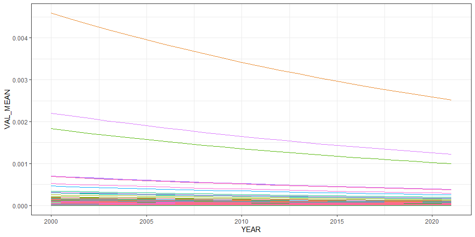
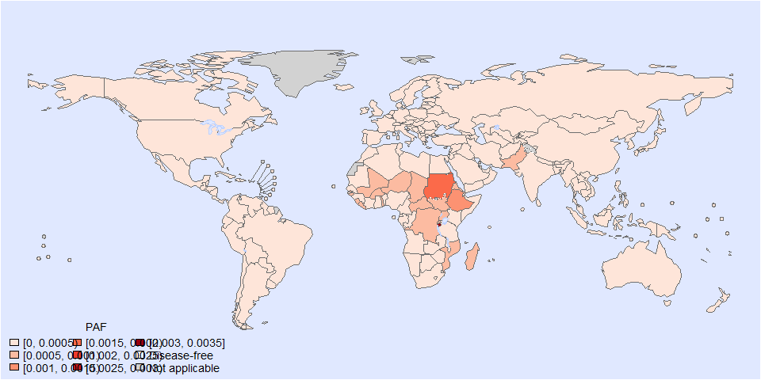
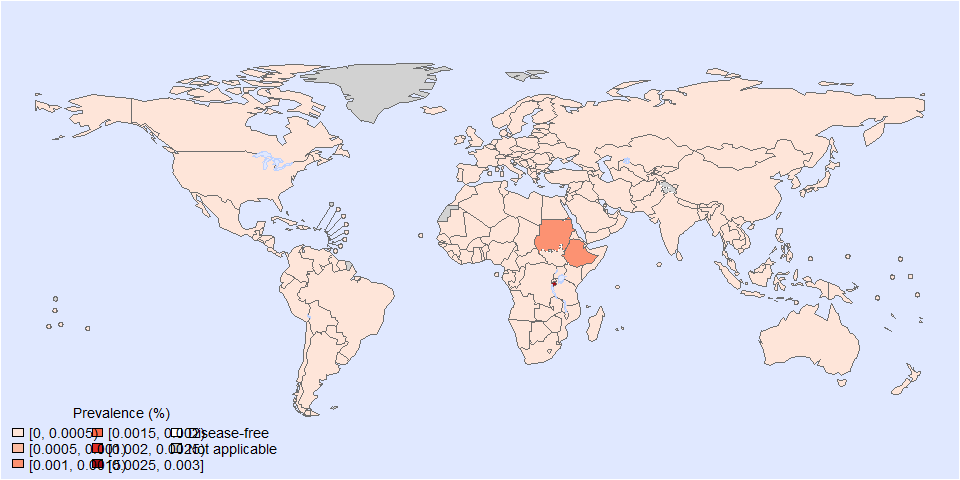

Global PAF of aflatoxin M1 - Estimated PAF with the 6th model
================
LoVa3397
2025-10-05

- [Settings](#settings)
- [Parameters](#parameters)
- [Model fit](#model-fit)
- [Predict all](#predict-all)
- [Summarize predictions](#summarize-predictions)
  - [Global](#global)
  - [Regions](#regions)
  - [Subregions](#subregions)
  - [Countries](#countries)
- [Session info](#session-info)

# Settings

``` r
## required packages ----
library(bd)
library(brms)
```

    ## Loading required package: Rcpp

    ## Loading 'brms' package (version 2.22.0). Useful instructions
    ## can be found by typing help('brms'). A more detailed introduction
    ## to the package is available through vignette('brms_overview').

    ## 
    ## Attaching package: 'brms'

    ## The following object is masked from 'package:stats':
    ## 
    ##     ar

``` r
library(FERG2)
```

    ## 
    ## Attaching package: 'FERG2'

    ## The following object is masked from 'package:bd':
    ## 
    ##     mean_ci

``` r
library(ggplot2)
library(knitr)
library(rmarkdown)
library(sf)
```

    ## Linking to GEOS 3.13.1, GDAL 3.11.0, PROJ 9.6.0; sf_use_s2() is TRUE

``` r
library(tidyr)
library(dplyr)
```

    ## 
    ## Attaching package: 'dplyr'

    ## The following object is masked from 'package:bd':
    ## 
    ##     collapse

    ## The following objects are masked from 'package:stats':
    ## 
    ##     filter, lag

    ## The following objects are masked from 'package:base':
    ## 
    ##     intersect, setdiff, setequal, union

``` r
library(DescTools)
library(readxl)
library(kableExtra)
```

    ## 
    ## Attaching package: 'kableExtra'

    ## The following object is masked from 'package:dplyr':
    ## 
    ##     group_rows

``` r
## global options ----
knitr::opts_chunk$set(fig.width = 10)
Date <- format(Sys.Date(), "%Y%m%d")
```

# Parameters

| Parameters | Values |
|:---|:---|
| Number of iteration | 5000 |
| Warmup | 3000 |
| Delta value | 0.85 |
| Maximum tree-depth | 15 |
| Levels | Year, countries, Studies |
| Random effect on each data point | No |
| Stronger priors specified | Normal(0,1) |

Parameters of the model tested

# Model fit

``` r
fit_brms_reg_s <- readRDS("fit_brms_reg_s6.rds")
zero_cases<- read_xlsx("Endemic_countries.xlsx")%>%
             select(REG2, SUB2, ISO3, Country, cttf_afla) %>% 
             rename(COUNTRY=ISO3, COUNTRY_LABEL = Country, DISEASEFREE = cttf_afla)

kable(
  caption = "Countries assumed to be non-endemic",
  row.names = FALSE,
  subset(zero_cases, DISEASEFREE==0)[, 4])
```

| COUNTRY_LABEL |
|:--------------|

Countries assumed to be non-endemic

``` r
es_files <- list.files(pattern="^es_\\d{8}\\.rds$", full.names=TRUE, ignore.case = TRUE)
es_dates <- as.Date(sub("^es_(\\d{8})\\.rds$", "\\1", basename(es_files), ignore.case = TRUE), format = "%Y%m%d")
es_latest <- es_files[which.max(es_dates)]
es <- readRDS(es_latest)
es <- subset(es, as.integer(FLAG) == 1)
country_with_data <- es %>% select(ISO3) %>% distinct() %>% mutate(DATA=1, COUNTRY = ISO3)
Sub2_with_data <- es %>% select(SUB2) %>% distinct() %>% mutate(DATASUB2=1)
Reg2_with_data <- es %>% select(REG2) %>% distinct() %>% mutate(DATAREG2=1)
zero_cases <- left_join(zero_cases, country_with_data)
```

    ## Joining with `by = join_by(COUNTRY)`

``` r
zero_cases <- left_join(zero_cases, Sub2_with_data)
```

    ## Joining with `by = join_by(SUB2)`

``` r
zero_cases <- left_join(zero_cases, Reg2_with_data) %>%
  select(-c(ISO3)) %>%
  mutate(ESTIMATES = case_when(
    DATA == 1 ~ 1,
    DISEASEFREE == 0 ~ 2,
    is.na(DATA) & DISEASEFREE == 1 & DATASUB2 == 1 ~ 3,
    is.na(DATA) & DISEASEFREE == 1 & is.na(DATASUB2) & DATAREG2 == 1 ~ 4, 
    is.na(DATA) & DISEASEFREE == 1  & is.na(DATASUB2) & is.na(DATAREG2) ~5))
```

    ## Joining with `by = join_by(REG2)`

``` r
zero_cases$ESTIMATES <- factor(zero_cases$ESTIMATES, 
                               level = c(1,2,3,4,5),
                               labels = c("Data present", "Disease free", "Data in subregion", "Data in region", "Data in world"))
Country_Check <- zero_cases %>% filter(as.integer(ESTIMATES) == 2)
```

# Predict all

``` r
## set up dataframe
sim_all <-
  data.frame(
    sei = 0,
    REG2 = FERG2:::countries$REG2,
    SUB2 = FERG2:::countries$SUB2,
    COUNTRY = FERG2:::countries$ISO3,
    YEAR = rep(2000:2021, each = nrow(FERG2:::countries)))
sim_all <- sim_all %>% left_join(zero_cases) %>% select(sei, REG2, SUB2, COUNTRY, YEAR, ESTIMATES)
```

    ## Joining with `by = join_by(REG2, SUB2, COUNTRY)`

``` r
## draw from expected value of posterior predictive dist
set.seed(10)
# fit_all <- 
#   posterior_epred(
#     object = fit_brms_reg_s,
#     newdata = sim_all,
#     allow_new_levels = TRUE,
#     sample_new_levels = "old_levels",
#     re_formula = ~ 1 + YEAR +
#       (1 | REG2) +
#       (1 | REG2:SUB2) +
#       (1 | REG2:SUB2:COUNTRY)
#   )

draws_fit <- as_draws_df(fit_brms_reg_s)
fit_all <- data.frame(1:10000)
for (x in 1:nrow(sim_all)){
  if (as.integer(sim_all[x, "ESTIMATES"]) == 1){
    # Data present for country
    fit_all[[paste0("V",x)]] <- draws_fit$b_Intercept +                                                                               # Global intercept
      sim_all[x, "YEAR"] * draws_fit$b_YEAR +                                                                                         # Year component
      draws_fit[[paste0("r_REG2[",sim_all[x,"REG2"],",Intercept]")]] +                                                                # Regional component
      draws_fit[[paste0("r_REG2:SUB2[",sim_all[x,"REG2"],"_",sim_all[x,"SUB2"],",Intercept]")]] +                                     # Sub regional component
      draws_fit[[paste0("r_REG2:SUB2:COUNTRY[",sim_all[x,"REG2"],"_",sim_all[x,"SUB2"],"_",sim_all[x,"COUNTRY"],",Intercept]")]]      # Country component
  } else if (as.integer(sim_all[x, "ESTIMATES"]) == 2) {
    # Disease-free country
    fit_all[[paste0("V",x)]] <- 0
  } else if (as.integer(sim_all[x, "ESTIMATES"]) == 3){
    # Data not present for country, but present in subregion
    fit_all[[paste0("V",x)]] <- draws_fit$b_Intercept +                                                                               # Global intercept
      sim_all[x, "YEAR"] * draws_fit$b_YEAR +                                                                                         # Year component
      draws_fit[[paste0("r_REG2[",sim_all[x,"REG2"],",Intercept]")]] +                                                                # Regional component
      draws_fit[[paste0("r_REG2:SUB2[",sim_all[x,"REG2"],"_",sim_all[x,"SUB2"],",Intercept]")]]                                       # Sub regional component
  } else if (as.integer(sim_all[x, "ESTIMATES"]) == 4){
    # Data not present for country, but present in region
    fit_all[[paste0("V",x)]] <- draws_fit$b_Intercept +                                                                               # Global intercept
      sim_all[x, "YEAR"] * draws_fit$b_YEAR +                                                                                         # Year component
      draws_fit[[paste0("r_REG2[",sim_all[x,"REG2"],",Intercept]")]]                                                                  # Regional component
  } else if (as.integer(sim_all[x, "ESTIMATES"]) == 5){
    # Data not present for country
    fit_all[[paste0("V",x)]] <- draws_fit$b_Intercept + 
      sim_all[x, "YEAR"] * draws_fit$b_YEAR
  } 
}

fit_all <- fit_all %>% select(-c(X1.10000))


## calculate PAF
sim_all$SIM <- t(fit_all)
# pop_all <- aggregate(POP ~ ISO3 + YEAR, FERG2:::pop, sum)
# sim_all <- merge(sim_all, pop_all,
#                  by.x = c("COUNTRY", "YEAR"), by.y = c("ISO3", "YEAR"))
sim_all <- sim_all %>% left_join(zero_cases)
```

    ## Joining with `by = join_by(REG2, SUB2, COUNTRY, ESTIMATES)`

``` r
sim_all$PROP <- expit(sim_all$SIM)
sim_all$PROP <- sim_all$PROP*sim_all$DISEASEFREE
sim_all$SIM<-sim_all$SIM*sim_all$DISEASEFREE
sim_all$sei<-sim_all$sei*sim_all$DISEASEFREE

# ## aggregate global
# sim_all_glb <- with(sim_all, aggregate(CASES ~ YEAR, FUN = sum))
# all_glb_id <- sim_all_glb[1]
# all_glb_nr <-
#   t(apply(sim_all_glb[, grepl("V", names(sim_all_glb))], 1, mean_ci))
# all_glb_nr <- data.frame(all_glb_nr)
# names(all_glb_nr) <- c("VAL_MEAN", "VAL_LWR", "VAL_UPR")
# all_glb_nr <- cbind(all_glb_id, all_glb_nr)
# all_glb_nr$LOCATION <- "Global"
# all_glb_nr$LOCATION_NAME <- "Global"
# all_glb_nr$METRIC <- "Number"
# str(all_glb_nr)
# 
# all_glb_rt <- all_glb_nr
# all_glb_rt$POP <- with(sim_all, tapply(POP, YEAR, sum))
# all_glb_rt$VAL_MEAN <- 100*all_glb_rt$VAL_MEAN / all_glb_rt$POP
# all_glb_rt$VAL_LWR <-  100*all_glb_rt$VAL_LWR / all_glb_rt$POP
# all_glb_rt$VAL_UPR <-  100*all_glb_rt$VAL_UPR / all_glb_rt$POP
# all_glb_rt$METRIC <- "Rate"
# all_glb_rt$POP <- NULL
# str(all_glb_rt)
# 
# ## aggregate over regions
# sim_all_reg <- with(sim_all, aggregate(CASES ~ REG2+YEAR, FUN = sum))
# all_reg_id <- sim_all_reg[1:2]
# all_reg_nr <-
#   t(apply(sim_all_reg[, grepl("V", names(sim_all_reg))], 1, mean_ci))
# all_reg_nr <- data.frame(all_reg_nr)
# names(all_reg_nr) <- c("VAL_MEAN", "VAL_LWR", "VAL_UPR")
# all_reg_nr <- cbind(all_reg_id, all_reg_nr)
# all_reg_nr$LOCATION <- "Region"
# all_reg_nr$LOCATION_NAME <- all_reg_nr$REG2
# all_reg_nr$REG2 <- NULL
# all_reg_nr$METRIC <- "Number"
# str(all_reg_nr)
# 
# all_reg_rt <- all_reg_nr
# all_reg_rt$POP <-
#   with(sim_all, aggregate(POP ~ REG2 + YEAR, FUN = sum))$POP
# all_reg_rt$VAL_MEAN <- 100*all_reg_rt$VAL_MEAN / all_reg_rt$POP
# all_reg_rt$VAL_LWR <-  100*all_reg_rt$VAL_LWR / all_reg_rt$POP
# all_reg_rt$VAL_UPR <- 100*all_reg_rt$VAL_UPR / all_reg_rt$POP
# all_reg_rt$METRIC <- "Rate"
# all_reg_rt$POP <- NULL
# str(all_reg_rt)
# 
# ## aggregate over subregions
# sim_all_sub <- with(sim_all, aggregate(CASES ~ SUB2+YEAR, FUN = sum))
# all_sub_id <- sim_all_sub[1:2]
# all_sub_nr <-
#   t(apply(sim_all_sub[, grepl("V", names(sim_all_sub))], 1, mean_ci))
# all_sub_nr <- data.frame(all_sub_nr)
# names(all_sub_nr) <- c("VAL_MEAN", "VAL_LWR", "VAL_UPR")
# all_sub_nr <- cbind(all_sub_id, all_sub_nr)
# all_sub_nr$LOCATION <- "Subregion"
# all_sub_nr$LOCATION_NAME <- all_sub_nr$SUB2
# all_sub_nr$SUB2 <- NULL
# all_sub_nr$METRIC <- "Number"
# str(all_sub_nr)
# 
# all_sub_rt <- all_sub_nr
# all_sub_rt$POP <-
#   with(sim_all, aggregate(POP ~ SUB2 + YEAR, FUN = sum))$POP
# all_sub_rt$VAL_MEAN <- 100*all_sub_rt$VAL_MEAN / all_sub_rt$POP
# all_sub_rt$VAL_LWR <- 100*all_sub_rt$VAL_LWR / all_sub_rt$POP
# all_sub_rt$VAL_UPR <- 100*all_sub_rt$VAL_UPR / all_sub_rt$POP
# all_sub_rt$METRIC <- "Rate"
# all_sub_rt$POP <- NULL
# str(all_sub_rt)

## aggregate over countries
all_cnt_prop <- t(apply(sim_all$PROP, 1, mean_ci))
all_cnt_prop <- data.frame(all_cnt_prop)
names(all_cnt_prop) <- c("VAL_MEAN", "VAL_LWR", "VAL_UPR")
all_cnt_prop <- cbind(sim_all[4:5], all_cnt_prop)
all_cnt_prop$LOCATION <- "Country"
all_cnt_prop$LOCATION_NAME <- all_cnt_prop$COUNTRY
all_cnt_prop$COUNTRY <- NULL
all_cnt_prop$METRIC <- "Number"
str(all_cnt_prop)
```

    ## 'data.frame':    4268 obs. of  7 variables:
    ##  $ YEAR         : int  2000 2000 2000 2000 2000 2000 2000 2000 2000 2000 ...
    ##  $ VAL_MEAN     : num  3.13e-04 7.17e-05 2.12e-04 1.34e-06 1.35e-04 ...
    ##  $ VAL_LWR      : num  3.14e-05 5.65e-06 3.72e-05 4.75e-07 2.13e-05 ...
    ##  $ VAL_UPR      : num  1.25e-03 3.08e-04 6.99e-04 3.05e-06 4.62e-04 ...
    ##  $ LOCATION     : chr  "Country" "Country" "Country" "Country" ...
    ##  $ LOCATION_NAME: chr  "AFG" "ALB" "DZA" "AND" ...
    ##  $ METRIC       : chr  "Number" "Number" "Number" "Number" ...

``` r
#all_cnt_rt <- t(apply(exp(sim_all$SIM), 1, mean_ci))
#all_cnt_rt <- data.frame(all_cnt_rt)
#names(all_cnt_rt) <- c("VAL_MEAN", "VAL_LWR", "VAL_UPR")
#all_cnt_rt <- cbind(sim_all[1:2], all_cnt_rt)
#all_cnt_rt$LOCATION <- "Country"
#all_cnt_rt$LOCATION_NAME <- all_cnt_rt$COUNTRY
#all_cnt_rt$COUNTRY <- NULL
#all_cnt_rt$METRIC <- "Rate"
#str(all_cnt_rt)

# all_cnt_rt <- all_cnt_nr%>%left_join(pop_all, by=c("LOCATION_NAME"="ISO3","YEAR"="YEAR"))
# all_cnt_rt$VAL_MEAN <-  100*all_cnt_rt$VAL_MEAN / all_cnt_rt$POP
# all_cnt_rt$VAL_LWR <- 100*all_cnt_rt$VAL_LWR / all_cnt_rt$POP
# all_cnt_rt$VAL_UPR <-  100*all_cnt_rt$VAL_UPR / all_cnt_rt$POP
# all_cnt_rt$LOCATION <- "Country"
# all_cnt_rt$METRIC <- "Rate"
# all_cnt_rt$POP <- NULL
# str(all_cnt_rt)

## compile all
all_est <-
  rbind(all_cnt_prop)
str(all_est)
```

    ## 'data.frame':    4268 obs. of  7 variables:
    ##  $ YEAR         : int  2000 2000 2000 2000 2000 2000 2000 2000 2000 2000 ...
    ##  $ VAL_MEAN     : num  3.13e-04 7.17e-05 2.12e-04 1.34e-06 1.35e-04 ...
    ##  $ VAL_LWR      : num  3.14e-05 5.65e-06 3.72e-05 4.75e-07 2.13e-05 ...
    ##  $ VAL_UPR      : num  1.25e-03 3.08e-04 6.99e-04 3.05e-06 4.62e-04 ...
    ##  $ LOCATION     : chr  "Country" "Country" "Country" "Country" ...
    ##  $ LOCATION_NAME: chr  "AFG" "ALB" "DZA" "AND" ...
    ##  $ METRIC       : chr  "Number" "Number" "Number" "Number" ...

``` r
saveRDS(all_est, file = "all_estimates.rds")

## plot nested trends
ggplot(all_cnt_prop, aes(x = YEAR, y = VAL_MEAN, group = LOCATION_NAME)) +
  # geom_line(data = all_glb_rt, linewidth = 2) +
  geom_line(aes(col = LOCATION_NAME), linewidth = 0.5) +
  theme_bw() + 
  theme(legend.position="none")
```

<!-- -->

# Summarize predictions

## Global

``` r
# kable(
#   caption = "Global number of peanuts cases, 2010 vs 2020",
#   row.names = FALSE,
#   subset(all_glb_nr, YEAR %in% c(2010, 2020))[, 1:4])
```

## Regions

``` r
# kbl(subset(all_reg_rt, YEAR == 2020)[,c(6,2:4)],
#     align = c("l", "c", "c", "c"), row.names = FALSE,
#     col.names = c("Region", "Mean", "Lower", "Upper"),
#     caption="Prevalence of peanuts in 2020 by WHO region (%)") %>%
#   kable_styling("striped", "hover")
# 
# kbl(subset(all_reg_nr, YEAR == 2020)[,c(6,2:4)],
#     align = c("l", "c", "c", "c"), row.names = FALSE,
#     col.names = c("Region", "Mean", "Lower", "Upper"),
#     caption="Number of peanuts cases in 2020 by WHO region") %>%
#   kable_styling("striped", "hover")
# 
# #+ fig.height=4
# ggplot(subset(all_reg_rt, YEAR == 2010),
#        aes(y = VAL_MEAN, x = LOCATION_NAME)) +
#   geom_pointrange(aes(ymin = VAL_LWR, ymax = VAL_UPR), size = 0.2) +
#   coord_flip() +
#   theme_bw() +
#   scale_x_discrete(NULL, limits = rev(unique(all_reg_nr$LOCATION_NAME))) +
#   scale_y_continuous(NULL) +
#   ggtitle("Prevalence of peanuts by WHO Region (%), 2010")
# 
# #+ fig.height=4
# ggplot(subset(all_reg_rt, YEAR == 2020),
#        aes(y = VAL_MEAN, x = LOCATION_NAME)) +
#   geom_pointrange(aes(ymin = VAL_LWR, ymax = VAL_UPR), size = 0.2) +
#   coord_flip() +
#   theme_bw() +
#   scale_x_discrete(NULL, limits = rev(unique(all_reg_nr$LOCATION_NAME))) +
#   scale_y_continuous(NULL) +
#   ggtitle("Prevalence of peanuts by WHO Region (%), 2020")
# 
# #+ fig.height=4
# ggplot(subset(all_reg_nr, YEAR == 2010),
#        aes(y = VAL_MEAN, x = LOCATION_NAME)) +
#   geom_pointrange(aes(ymin = VAL_LWR, ymax = VAL_UPR), size = 0.2) +
#   coord_flip() +
#   theme_bw() +
#   scale_x_discrete(NULL, limits = rev(unique(all_reg_nr$LOCATION_NAME))) +
#   scale_y_continuous(NULL) +
#   ggtitle("Number of peanuts cases by WHO Region, 2010")
# 
# #+ fig.height=4
# ggplot(subset(all_reg_nr, YEAR == 2020),
#        aes(y = VAL_MEAN, x = LOCATION_NAME)) +
#   geom_pointrange(aes(ymin = VAL_LWR, ymax = VAL_UPR), size = 0.2) +
#   coord_flip() +
#   theme_bw() +
#   scale_x_discrete(NULL, limits = rev(unique(all_reg_nr$LOCATION_NAME))) +
#   scale_y_continuous(NULL) +
#   ggtitle("Number of peanuts cases by WHO Region, 2020")

# # sim_all_reg2 <-
# #   merge(sim_all_reg,
# #         with(sim_all, aggregate(POP ~ REG2 + YEAR, FUN = sum)))
# sim_all_reg_long <-
#   pivot_longer(sim_all_reg, cols = starts_with("V"))
# # sim_all_reg_long$CASES <-
# #   sim_all_reg_long$POP * sim_all_reg_long$value / 100
#
# ggplot(subset(sim_all_reg_long, YEAR == 2010), aes(x = value)) +
#   geom_density() +
#   facet_wrap(~REG2) +
#   theme_bw() +
#   scale_x_log10() +
#   ggtitle("Prevalence of peanuts by WHO Region, 2010")
#
# ggplot(subset(sim_all_reg_long, YEAR == 2020), aes(x = CASES)) +
#   geom_density() +
#   facet_wrap(~REG2) +
#   theme_bw() +
#   scale_x_log10() +
#   ggtitle("Number of peanuts cases by WHO Region, 2020")
```

## Subregions

``` r
# ggplot(subset(all_sub_rt, YEAR == 2010),
#        aes(y = VAL_MEAN, x = LOCATION_NAME)) +
#   geom_pointrange(aes(ymin = VAL_LWR, ymax = VAL_UPR), size = 0.2) +
#   coord_flip() +
#   theme_bw() +
#   scale_x_discrete(NULL, limits = rev(unique(all_sub_nr$LOCATION_NAME))) +
#   scale_y_continuous(NULL) +
#   ggtitle("Prevalence of peanuts by WHO Subregion (%), 2010")
# 
# ggplot(subset(all_sub_rt, YEAR == 2020),
#        aes(y = VAL_MEAN, x = LOCATION_NAME)) +
#   geom_pointrange(aes(ymin = VAL_LWR, ymax = VAL_UPR), size = 0.2) +
#   coord_flip() +
#   theme_bw() +
#   scale_x_discrete(NULL, limits = rev(unique(all_sub_nr$LOCATION_NAME))) +
#   scale_y_continuous(NULL) +
#   ggtitle("Prevalence of peanuts by WHO Subregion (%), 2020")
# 
# ggplot(subset(all_sub_nr, YEAR == 2010),
#        aes(y = VAL_MEAN, x = LOCATION_NAME)) +
#   geom_pointrange(aes(ymin = VAL_LWR, ymax = VAL_UPR), size = 0.2) +
#   coord_flip() +
#   theme_bw() +
#   scale_x_discrete(NULL, limits = rev(unique(all_sub_nr$LOCATION_NAME))) +
#   scale_y_continuous(NULL) +
#   ggtitle("Number of peanuts cases by WHO Subregion, 2010")
# 
# ggplot(subset(all_sub_nr, YEAR == 2020),
#        aes(y = VAL_MEAN, x = LOCATION_NAME)) +
#   geom_pointrange(aes(ymin = VAL_LWR, ymax = VAL_UPR), size = 0.2) +
#   coord_flip() +
#   theme_bw() +
#   scale_x_discrete(NULL, limits = rev(unique(all_sub_nr$LOCATION_NAME))) +
#   scale_y_continuous(NULL) +
#   ggtitle("Number of peanuts cases by WHO Subregion, 2020")

# sim_all_sub <-
#   merge(sim_all_sub,
#         with(sim_all, aggregate(POP ~ SUB2 + YEAR, FUN = sum)))
# sim_all_sub_long <-
#   pivot_longer(sim_all_sub, cols = starts_with("V"))
# sim_all_sub_long$CASES <-
#   sim_all_sub_long$POP * sim_all_sub_long$value / 100
#
# ggplot(subset(sim_all_sub_long, YEAR == 2010), aes(x = CASES)) +
#   geom_density() +
#   facet_wrap(~SUB2) +
#   theme_bw() +
#   scale_x_log10() +
#   ggtitle("Number of peanuts cases by WHO Subregion, 2010")
#
# ggplot(subset(sim_all_sub_long, YEAR == 2020), aes(x = CASES)) +
#   geom_density() +
#   facet_wrap(~SUB2) +
#   theme_bw() +
#   scale_x_log10() +
#   ggtitle("Number of peanuts cases by WHO Subregion, 2020")
```

## Countries

``` r
plot_world(subset(all_cnt_prop, YEAR == 2010),
           "LOCATION_NAME", "VAL_MEAN", legend.title = "PAF", diseasefree = zero_cases)
```

    ## [1] 0.0000 0.0005 0.0010 0.0015 0.0020 0.0025 0.0030 0.0035

``` r
title("Aflatoxin M1 PAF, 2010", line = 1)
```

<!-- -->

``` r
plot_world(subset(all_cnt_prop, YEAR == 2020),
           "LOCATION_NAME", "VAL_MEAN", legend.title = "Prevalence (%)", diseasefree = zero_cases)
```

    ## [1] 0.0000 0.0005 0.0010 0.0015 0.0020 0.0025 0.0030

``` r
title("Aflatoxin M1 PAF, 2020", line = 1)
```

<!-- -->

``` r
tab <-
  data.frame(subset(all_cnt_prop, YEAR == 2010)[,
                                              c("LOCATION_NAME", "VAL_MEAN", "VAL_LWR", "VAL_UPR")],
             subset(all_cnt_prop, YEAR == 2020)[,
                                              c("VAL_MEAN", "VAL_LWR", "VAL_UPR")])
tab$LOCATION_NAME <-
  FERG2:::countries$COUNTRY[match(tab$LOCATION_NAME, FERG2:::countries$ISO3)]
tab$LOCATION_NAME <- gsub(" \\(.*", "", tab$LOCATION_NAME)
names(tab) <-
  c("Country",
    "2010.mean", "2010.lwr", "2010.upr",
    "2020.mean", "2020.lwr", "2020.upr")

kable(tab, digits = 8, row.names = FALSE,
      caption = "Estimated peanuts prevalence by country (%), 2010 vs 2020")
```

| Country | 2010.mean | 2010.lwr | 2010.upr | 2020.mean | 2020.lwr | 2020.upr |
|:---|---:|---:|---:|---:|---:|---:|
| Afghanistan | 0.00023320 | 0.00002527 | 0.00092460 | 0.00017667 | 0.00001929 | 0.00068855 |
| Albania | 0.00005303 | 0.00000450 | 0.00022490 | 0.00004000 | 0.00000346 | 0.00016961 |
| Algeria | 0.00015793 | 0.00002942 | 0.00049513 | 0.00011967 | 0.00002307 | 0.00037173 |
| Andorra | 0.00000103 | 0.00000035 | 0.00000243 | 0.00000081 | 0.00000024 | 0.00000205 |
| Angola | 0.00010120 | 0.00001717 | 0.00033535 | 0.00007711 | 0.00001293 | 0.00025739 |
| Antigua and Barbuda | 0.00001814 | 0.00000188 | 0.00007069 | 0.00001424 | 0.00000136 | 0.00005793 |
| Argentina | 0.00008274 | 0.00002088 | 0.00022696 | 0.00006373 | 0.00001545 | 0.00017754 |
| Armenia | 0.00004242 | 0.00000584 | 0.00014617 | 0.00003229 | 0.00000439 | 0.00011151 |
| Australia | 0.00000343 | 0.00000031 | 0.00001439 | 0.00000263 | 0.00000023 | 0.00001127 |
| Austria | 0.00000089 | 0.00000007 | 0.00000390 | 0.00000070 | 0.00000005 | 0.00000321 |
| Azerbaijan | 0.00004242 | 0.00000584 | 0.00014617 | 0.00003229 | 0.00000439 | 0.00011151 |
| Bahamas | 0.00001814 | 0.00000188 | 0.00007069 | 0.00001424 | 0.00000136 | 0.00005793 |
| Bahrain | 0.00003050 | 0.00000313 | 0.00012236 | 0.00002335 | 0.00000235 | 0.00009234 |
| Bangladesh | 0.00009237 | 0.00001447 | 0.00031338 | 0.00006991 | 0.00001113 | 0.00023780 |
| Barbados | 0.00001814 | 0.00000188 | 0.00007069 | 0.00001424 | 0.00000136 | 0.00005793 |
| Belarus | 0.00004242 | 0.00000584 | 0.00014617 | 0.00003229 | 0.00000439 | 0.00011151 |
| Belgium | 0.00000020 | 0.00000001 | 0.00000090 | 0.00000016 | 0.00000001 | 0.00000074 |
| Belize | 0.00004266 | 0.00001054 | 0.00011869 | 0.00003255 | 0.00000788 | 0.00009146 |
| Benin | 0.00010120 | 0.00001717 | 0.00033535 | 0.00007711 | 0.00001293 | 0.00025739 |
| Bhutan | 0.00007689 | 0.00001134 | 0.00026335 | 0.00005860 | 0.00000853 | 0.00020080 |
| Bolivia | 0.00002899 | 0.00000408 | 0.00010449 | 0.00002223 | 0.00000309 | 0.00007991 |
| Bosnia and Herzegovina | 0.00002071 | 0.00000142 | 0.00009266 | 0.00001569 | 0.00000110 | 0.00007090 |
| Botswana | 0.00010806 | 0.00000383 | 0.00056569 | 0.00008203 | 0.00000296 | 0.00042764 |
| Brazil | 0.00000136 | 0.00000046 | 0.00000320 | 0.00000105 | 0.00000033 | 0.00000263 |
| Brunei Darussalam | 0.00000343 | 0.00000031 | 0.00001439 | 0.00000263 | 0.00000023 | 0.00001127 |
| Bulgaria | 0.00004242 | 0.00000584 | 0.00014617 | 0.00003229 | 0.00000439 | 0.00011151 |
| Burkina Faso | 0.00050757 | 0.00006082 | 0.00190678 | 0.00038311 | 0.00004784 | 0.00139521 |
| Burundi | 0.00341807 | 0.00017593 | 0.01728076 | 0.00258433 | 0.00013691 | 0.01304276 |
| Cabo Verde | 0.00010120 | 0.00001717 | 0.00033535 | 0.00007711 | 0.00001293 | 0.00025739 |
| Cambodia | 0.00001057 | 0.00000034 | 0.00006264 | 0.00000818 | 0.00000024 | 0.00004855 |
| Cameroon | 0.00010120 | 0.00001717 | 0.00033535 | 0.00007711 | 0.00001293 | 0.00025739 |
| Canada | 0.00000767 | 0.00000064 | 0.00003343 | 0.00000608 | 0.00000046 | 0.00002789 |
| Central African Republic | 0.00050757 | 0.00006082 | 0.00190678 | 0.00038311 | 0.00004784 | 0.00139521 |
| Chad | 0.00050757 | 0.00006082 | 0.00190678 | 0.00038311 | 0.00004784 | 0.00139521 |
| Chile | 0.00001814 | 0.00000188 | 0.00007069 | 0.00001424 | 0.00000136 | 0.00005793 |
| China | 0.00000558 | 0.00000151 | 0.00001473 | 0.00000424 | 0.00000115 | 0.00001101 |
| Colombia | 0.00012526 | 0.00000821 | 0.00059694 | 0.00009523 | 0.00000618 | 0.00045563 |
| Comoros | 0.00010120 | 0.00001717 | 0.00033535 | 0.00007711 | 0.00001293 | 0.00025739 |
| Congo | 0.00010120 | 0.00001717 | 0.00033535 | 0.00007711 | 0.00001293 | 0.00025739 |
| Cook Islands | 0.00000343 | 0.00000031 | 0.00001439 | 0.00000263 | 0.00000023 | 0.00001127 |
| Costa Rica | 0.00019053 | 0.00001241 | 0.00088279 | 0.00014498 | 0.00000937 | 0.00067687 |
| Côte d’Ivoire | 0.00010120 | 0.00001717 | 0.00033535 | 0.00007711 | 0.00001293 | 0.00025739 |
| Croatia | 0.00000720 | 0.00000200 | 0.00001875 | 0.00000551 | 0.00000153 | 0.00001427 |
| Cuba | 0.00004266 | 0.00001054 | 0.00011869 | 0.00003255 | 0.00000788 | 0.00009146 |
| Cyprus | 0.00000053 | 0.00000009 | 0.00000181 | 0.00000042 | 0.00000006 | 0.00000151 |
| Czechia | 0.00000103 | 0.00000035 | 0.00000243 | 0.00000081 | 0.00000024 | 0.00000205 |
| Korea | 0.00007689 | 0.00001134 | 0.00026335 | 0.00005860 | 0.00000853 | 0.00020080 |
| Congo | 0.00050757 | 0.00006082 | 0.00190678 | 0.00038311 | 0.00004784 | 0.00139521 |
| Denmark | 0.00000440 | 0.00000034 | 0.00001956 | 0.00000347 | 0.00000025 | 0.00001560 |
| Djibouti | 0.00006276 | 0.00001675 | 0.00016985 | 0.00004791 | 0.00001281 | 0.00012965 |
| Dominica | 0.00004266 | 0.00001054 | 0.00011869 | 0.00003255 | 0.00000788 | 0.00009146 |
| Dominican Republic | 0.00004266 | 0.00001054 | 0.00011869 | 0.00003255 | 0.00000788 | 0.00009146 |
| Ecuador | 0.00014368 | 0.00001201 | 0.00063813 | 0.00010911 | 0.00000908 | 0.00048451 |
| Egypt | 0.00001056 | 0.00000346 | 0.00002549 | 0.00000811 | 0.00000252 | 0.00002004 |
| El Salvador | 0.00004266 | 0.00001054 | 0.00011869 | 0.00003255 | 0.00000788 | 0.00009146 |
| Equatorial Guinea | 0.00010806 | 0.00000383 | 0.00056569 | 0.00008203 | 0.00000296 | 0.00042764 |
| Eritrea | 0.00050757 | 0.00006082 | 0.00190678 | 0.00038311 | 0.00004784 | 0.00139521 |
| Estonia | 0.00000103 | 0.00000035 | 0.00000243 | 0.00000081 | 0.00000024 | 0.00000205 |
| Eswatini | 0.00010120 | 0.00001717 | 0.00033535 | 0.00007711 | 0.00001293 | 0.00025739 |
| Ethiopia | 0.00135471 | 0.00025053 | 0.00436255 | 0.00102131 | 0.00019210 | 0.00326444 |
| Fiji | 0.00000736 | 0.00000056 | 0.00003342 | 0.00000560 | 0.00000043 | 0.00002455 |
| Finland | 0.00000117 | 0.00000011 | 0.00000495 | 0.00000092 | 0.00000008 | 0.00000401 |
| France | 0.00000172 | 0.00000032 | 0.00000554 | 0.00000134 | 0.00000023 | 0.00000441 |
| Gabon | 0.00010806 | 0.00000383 | 0.00056569 | 0.00008203 | 0.00000296 | 0.00042764 |
| Gambia | 0.00050757 | 0.00006082 | 0.00190678 | 0.00038311 | 0.00004784 | 0.00139521 |
| Georgia | 0.00004242 | 0.00000584 | 0.00014617 | 0.00003229 | 0.00000439 | 0.00011151 |
| Germany | 0.00000271 | 0.00000023 | 0.00001162 | 0.00000214 | 0.00000016 | 0.00000954 |
| Ghana | 0.00006036 | 0.00000524 | 0.00025280 | 0.00004582 | 0.00000413 | 0.00018971 |
| Greece | 0.00000006 | 0.00000002 | 0.00000018 | 0.00000005 | 0.00000001 | 0.00000014 |
| Grenada | 0.00004266 | 0.00001054 | 0.00011869 | 0.00003255 | 0.00000788 | 0.00009146 |
| Guatemala | 0.00004266 | 0.00001054 | 0.00011869 | 0.00003255 | 0.00000788 | 0.00009146 |
| Guinea | 0.00010120 | 0.00001717 | 0.00033535 | 0.00007711 | 0.00001293 | 0.00025739 |
| Guinea-Bissau | 0.00050757 | 0.00006082 | 0.00190678 | 0.00038311 | 0.00004784 | 0.00139521 |
| Guyana | 0.00001814 | 0.00000188 | 0.00007069 | 0.00001424 | 0.00000136 | 0.00005793 |
| Haiti | 0.00002899 | 0.00000408 | 0.00010449 | 0.00002223 | 0.00000309 | 0.00007991 |
| Honduras | 0.00002899 | 0.00000408 | 0.00010449 | 0.00002223 | 0.00000309 | 0.00007991 |
| Hungary | 0.00000103 | 0.00000035 | 0.00000243 | 0.00000081 | 0.00000024 | 0.00000205 |
| Iceland | 0.00000103 | 0.00000035 | 0.00000243 | 0.00000081 | 0.00000024 | 0.00000205 |
| India | 0.00025704 | 0.00009472 | 0.00055559 | 0.00019740 | 0.00006993 | 0.00044615 |
| Indonesia | 0.00003537 | 0.00000848 | 0.00010270 | 0.00002723 | 0.00000620 | 0.00007966 |
| Iran | 0.00003347 | 0.00001525 | 0.00006456 | 0.00002569 | 0.00001111 | 0.00005113 |
| Iraq | 0.00002769 | 0.00000336 | 0.00010339 | 0.00002116 | 0.00000259 | 0.00007971 |
| Ireland | 0.00000103 | 0.00000035 | 0.00000243 | 0.00000081 | 0.00000024 | 0.00000205 |
| Israel | 0.00000103 | 0.00000035 | 0.00000243 | 0.00000081 | 0.00000024 | 0.00000205 |
| Italy | 0.00000148 | 0.00000048 | 0.00000349 | 0.00000115 | 0.00000034 | 0.00000289 |
| Jamaica | 0.00004266 | 0.00001054 | 0.00011869 | 0.00003255 | 0.00000788 | 0.00009146 |
| Japan | 0.00000121 | 0.00000023 | 0.00000397 | 0.00000093 | 0.00000017 | 0.00000307 |
| Jordan | 0.00021869 | 0.00001989 | 0.00094200 | 0.00016499 | 0.00001557 | 0.00069022 |
| Kazakhstan | 0.00004242 | 0.00000584 | 0.00014617 | 0.00003229 | 0.00000439 | 0.00011151 |
| Kenya | 0.00022536 | 0.00005926 | 0.00059851 | 0.00017185 | 0.00004536 | 0.00046345 |
| Kiribati | 0.00001057 | 0.00000034 | 0.00006264 | 0.00000818 | 0.00000024 | 0.00004855 |
| Kuwait | 0.00003681 | 0.00000787 | 0.00011029 | 0.00002837 | 0.00000577 | 0.00008620 |
| Kyrgyzstan | 0.00001628 | 0.00000170 | 0.00005899 | 0.00001243 | 0.00000125 | 0.00004438 |
| Lao People’s Dem. Republic | 0.00001057 | 0.00000034 | 0.00006264 | 0.00000818 | 0.00000024 | 0.00004855 |
| Latvia | 0.00000103 | 0.00000035 | 0.00000243 | 0.00000081 | 0.00000024 | 0.00000205 |
| Lebanon | 0.00008669 | 0.00000894 | 0.00035293 | 0.00006580 | 0.00000689 | 0.00026129 |
| Lesotho | 0.00010120 | 0.00001717 | 0.00033535 | 0.00007711 | 0.00001293 | 0.00025739 |
| Liberia | 0.00050757 | 0.00006082 | 0.00190678 | 0.00038311 | 0.00004784 | 0.00139521 |
| Libya | 0.00006276 | 0.00001675 | 0.00016985 | 0.00004791 | 0.00001281 | 0.00012965 |
| Lithuania | 0.00000103 | 0.00000035 | 0.00000243 | 0.00000081 | 0.00000024 | 0.00000205 |
| Luxembourg | 0.00000103 | 0.00000035 | 0.00000243 | 0.00000081 | 0.00000024 | 0.00000205 |
| Madagascar | 0.00050757 | 0.00006082 | 0.00190678 | 0.00038311 | 0.00004784 | 0.00139521 |
| Malawi | 0.00034272 | 0.00001748 | 0.00172115 | 0.00025895 | 0.00001332 | 0.00128301 |
| Malaysia | 0.00000401 | 0.00000028 | 0.00001793 | 0.00000306 | 0.00000021 | 0.00001388 |
| Maldives | 0.00002301 | 0.00000243 | 0.00009203 | 0.00001773 | 0.00000182 | 0.00007056 |
| Mali | 0.00050757 | 0.00006082 | 0.00190678 | 0.00038311 | 0.00004784 | 0.00139521 |
| Malta | 0.00000103 | 0.00000035 | 0.00000243 | 0.00000081 | 0.00000024 | 0.00000205 |
| Marshall Islands | 0.00000736 | 0.00000056 | 0.00003342 | 0.00000560 | 0.00000043 | 0.00002455 |
| Mauritania | 0.00010120 | 0.00001717 | 0.00033535 | 0.00007711 | 0.00001293 | 0.00025739 |
| Mauritius | 0.00010806 | 0.00000383 | 0.00056569 | 0.00008203 | 0.00000296 | 0.00042764 |
| Mexico | 0.00010028 | 0.00001170 | 0.00038686 | 0.00007596 | 0.00000913 | 0.00029082 |
| Micronesia | 0.00001057 | 0.00000034 | 0.00006264 | 0.00000818 | 0.00000024 | 0.00004855 |
| Monaco | 0.00000103 | 0.00000035 | 0.00000243 | 0.00000081 | 0.00000024 | 0.00000205 |
| Mongolia | 0.00001057 | 0.00000034 | 0.00006264 | 0.00000818 | 0.00000024 | 0.00004855 |
| Montenegro | 0.00004242 | 0.00000584 | 0.00014617 | 0.00003229 | 0.00000439 | 0.00011151 |
| Morocco | 0.00011673 | 0.00002059 | 0.00038054 | 0.00008864 | 0.00001589 | 0.00028707 |
| Mozambique | 0.00050757 | 0.00006082 | 0.00190678 | 0.00038311 | 0.00004784 | 0.00139521 |
| Myanmar | 0.00007689 | 0.00001134 | 0.00026335 | 0.00005860 | 0.00000853 | 0.00020080 |
| Namibia | 0.00010806 | 0.00000383 | 0.00056569 | 0.00008203 | 0.00000296 | 0.00042764 |
| Nauru | 0.00000343 | 0.00000031 | 0.00001439 | 0.00000263 | 0.00000023 | 0.00001127 |
| Nepal | 0.00006585 | 0.00000499 | 0.00028460 | 0.00005040 | 0.00000372 | 0.00022090 |
| Netherlands | 0.00000034 | 0.00000002 | 0.00000151 | 0.00000027 | 0.00000002 | 0.00000121 |
| New Zealand | 0.00000343 | 0.00000031 | 0.00001439 | 0.00000263 | 0.00000023 | 0.00001127 |
| Nicaragua | 0.00002899 | 0.00000408 | 0.00010449 | 0.00002223 | 0.00000309 | 0.00007991 |
| Niger | 0.00050757 | 0.00006082 | 0.00190678 | 0.00038311 | 0.00004784 | 0.00139521 |
| Nigeria | 0.00006782 | 0.00001026 | 0.00023566 | 0.00005188 | 0.00000783 | 0.00018308 |
| Niue | 0.00000343 | 0.00000031 | 0.00001439 | 0.00000263 | 0.00000023 | 0.00001127 |
| North Macedonia | 0.00004242 | 0.00000584 | 0.00014617 | 0.00003229 | 0.00000439 | 0.00011151 |
| Norway | 0.00000162 | 0.00000011 | 0.00000743 | 0.00000127 | 0.00000008 | 0.00000595 |
| Oman | 0.00003050 | 0.00000313 | 0.00012236 | 0.00002335 | 0.00000235 | 0.00009234 |
| Pakistan | 0.00051834 | 0.00019873 | 0.00109120 | 0.00039647 | 0.00014873 | 0.00085241 |
| Palau | 0.00000736 | 0.00000056 | 0.00003342 | 0.00000560 | 0.00000043 | 0.00002455 |
| Panama | 0.00001814 | 0.00000188 | 0.00007069 | 0.00001424 | 0.00000136 | 0.00005793 |
| Papua New Guinea | 0.00001057 | 0.00000034 | 0.00006264 | 0.00000818 | 0.00000024 | 0.00004855 |
| Paraguay | 0.00010469 | 0.00000811 | 0.00044826 | 0.00007923 | 0.00000626 | 0.00033997 |
| Peru | 0.00003297 | 0.00000343 | 0.00012996 | 0.00002509 | 0.00000267 | 0.00009826 |
| Philippines | 0.00000504 | 0.00000028 | 0.00002398 | 0.00000393 | 0.00000020 | 0.00001901 |
| Poland | 0.00000103 | 0.00000035 | 0.00000243 | 0.00000081 | 0.00000024 | 0.00000205 |
| Portugal | 0.00000078 | 0.00000010 | 0.00000295 | 0.00000060 | 0.00000007 | 0.00000235 |
| Qatar | 0.00001370 | 0.00000072 | 0.00006965 | 0.00001047 | 0.00000056 | 0.00005234 |
| Korea | 0.00000160 | 0.00000044 | 0.00000419 | 0.00000123 | 0.00000032 | 0.00000331 |
| Republic of Moldova | 0.00004242 | 0.00000584 | 0.00014617 | 0.00003229 | 0.00000439 | 0.00011151 |
| Romania | 0.00000103 | 0.00000035 | 0.00000243 | 0.00000081 | 0.00000024 | 0.00000205 |
| Russian Federation | 0.00004242 | 0.00000584 | 0.00014617 | 0.00003229 | 0.00000439 | 0.00011151 |
| Rwanda | 0.00052270 | 0.00005740 | 0.00204603 | 0.00039532 | 0.00004451 | 0.00153577 |
| Saint Kitts and Nevis | 0.00001814 | 0.00000188 | 0.00007069 | 0.00001424 | 0.00000136 | 0.00005793 |
| Saint Lucia | 0.00004266 | 0.00001054 | 0.00011869 | 0.00003255 | 0.00000788 | 0.00009146 |
| Saint Vincent and the Grenadines | 0.00004266 | 0.00001054 | 0.00011869 | 0.00003255 | 0.00000788 | 0.00009146 |
| Samoa | 0.00001057 | 0.00000034 | 0.00006264 | 0.00000818 | 0.00000024 | 0.00004855 |
| San Marino | 0.00000103 | 0.00000035 | 0.00000243 | 0.00000081 | 0.00000024 | 0.00000205 |
| Sao Tome and Principe | 0.00010120 | 0.00001717 | 0.00033535 | 0.00007711 | 0.00001293 | 0.00025739 |
| Saudi Arabia | 0.00003670 | 0.00000205 | 0.00017747 | 0.00002785 | 0.00000156 | 0.00013638 |
| Senegal | 0.00010120 | 0.00001717 | 0.00033535 | 0.00007711 | 0.00001293 | 0.00025739 |
| Serbia | 0.00007116 | 0.00001955 | 0.00018447 | 0.00005421 | 0.00001494 | 0.00014013 |
| Seychelles | 0.00010806 | 0.00000383 | 0.00056569 | 0.00008203 | 0.00000296 | 0.00042764 |
| Sierra Leone | 0.00050757 | 0.00006082 | 0.00190678 | 0.00038311 | 0.00004784 | 0.00139521 |
| Singapore | 0.00000343 | 0.00000031 | 0.00001439 | 0.00000263 | 0.00000023 | 0.00001127 |
| Slovakia | 0.00000103 | 0.00000035 | 0.00000243 | 0.00000081 | 0.00000024 | 0.00000205 |
| Slovenia | 0.00000103 | 0.00000035 | 0.00000243 | 0.00000081 | 0.00000024 | 0.00000205 |
| Solomon Islands | 0.00001057 | 0.00000034 | 0.00006264 | 0.00000818 | 0.00000024 | 0.00004855 |
| Somalia | 0.00023320 | 0.00002527 | 0.00092460 | 0.00017667 | 0.00001929 | 0.00068855 |
| South Africa | 0.00007381 | 0.00000688 | 0.00030631 | 0.00005631 | 0.00000524 | 0.00022942 |
| South Sudan | 0.00050757 | 0.00006082 | 0.00190678 | 0.00038311 | 0.00004784 | 0.00139521 |
| Spain | 0.00000536 | 0.00000098 | 0.00001706 | 0.00000420 | 0.00000069 | 0.00001420 |
| Sri Lanka | 0.00007501 | 0.00000417 | 0.00035759 | 0.00005752 | 0.00000315 | 0.00026719 |
| Sudan | 0.00164774 | 0.00019359 | 0.00628405 | 0.00125343 | 0.00014892 | 0.00480184 |
| Suriname | 0.00004266 | 0.00001054 | 0.00011869 | 0.00003255 | 0.00000788 | 0.00009146 |
| Sweden | 0.00000103 | 0.00000035 | 0.00000243 | 0.00000081 | 0.00000024 | 0.00000205 |
| Switzerland | 0.00000103 | 0.00000035 | 0.00000243 | 0.00000081 | 0.00000024 | 0.00000205 |
| Syrian Arab Republic | 0.00038975 | 0.00005124 | 0.00139007 | 0.00029684 | 0.00003997 | 0.00106799 |
| Tajikistan | 0.00001628 | 0.00000170 | 0.00005899 | 0.00001243 | 0.00000125 | 0.00004438 |
| Thailand | 0.00000507 | 0.00000163 | 0.00001229 | 0.00000393 | 0.00000118 | 0.00000996 |
| Timor-Leste | 0.00007689 | 0.00001134 | 0.00026335 | 0.00005860 | 0.00000853 | 0.00020080 |
| Togo | 0.00050757 | 0.00006082 | 0.00190678 | 0.00038311 | 0.00004784 | 0.00139521 |
| Tonga | 0.00000736 | 0.00000056 | 0.00003342 | 0.00000560 | 0.00000043 | 0.00002455 |
| Trinidad and Tobago | 0.00001814 | 0.00000188 | 0.00007069 | 0.00001424 | 0.00000136 | 0.00005793 |
| Tunisia | 0.00006276 | 0.00001675 | 0.00016985 | 0.00004791 | 0.00001281 | 0.00012965 |
| Turkiye | 0.00014119 | 0.00006529 | 0.00026440 | 0.00010842 | 0.00004760 | 0.00020963 |
| Turkmenistan | 0.00004242 | 0.00000584 | 0.00014617 | 0.00003229 | 0.00000439 | 0.00011151 |
| Tuvalu | 0.00000736 | 0.00000056 | 0.00003342 | 0.00000560 | 0.00000043 | 0.00002455 |
| Uganda | 0.00050757 | 0.00006082 | 0.00190678 | 0.00038311 | 0.00004784 | 0.00139521 |
| Ukraine | 0.00001628 | 0.00000170 | 0.00005899 | 0.00001243 | 0.00000125 | 0.00004438 |
| United Arab Emirates | 0.00003050 | 0.00000313 | 0.00012236 | 0.00002335 | 0.00000235 | 0.00009234 |
| United Kingdom | 0.00000129 | 0.00000009 | 0.00000606 | 0.00000102 | 0.00000006 | 0.00000489 |
| United Republic of Tanzania | 0.00010120 | 0.00001717 | 0.00033535 | 0.00007711 | 0.00001293 | 0.00025739 |
| United States of America | 0.00002916 | 0.00000430 | 0.00010622 | 0.00002297 | 0.00000301 | 0.00008605 |
| Uruguay | 0.00001831 | 0.00000096 | 0.00009044 | 0.00001442 | 0.00000069 | 0.00007353 |
| Uzbekistan | 0.00001628 | 0.00000170 | 0.00005899 | 0.00001243 | 0.00000125 | 0.00004438 |
| Vanuatu | 0.00001057 | 0.00000034 | 0.00006264 | 0.00000818 | 0.00000024 | 0.00004855 |
| Venezuela | 0.00002899 | 0.00000408 | 0.00010449 | 0.00002223 | 0.00000309 | 0.00007991 |
| Viet Nam | 0.00001057 | 0.00000034 | 0.00006264 | 0.00000818 | 0.00000024 | 0.00004855 |
| Yemen | 0.00010646 | 0.00000535 | 0.00053160 | 0.00008067 | 0.00000406 | 0.00039893 |
| Zambia | 0.00010120 | 0.00001717 | 0.00033535 | 0.00007711 | 0.00001293 | 0.00025739 |
| Zimbabwe | 0.00010120 | 0.00001717 | 0.00033535 | 0.00007711 | 0.00001293 | 0.00025739 |

Estimated peanuts prevalence by country (%), 2010 vs 2020

# Session info

``` r
saveRDS(sim_all, paste0("sim_all_", Date, ".RDS"))
saveRDS(all_est, paste0("all_est_", Date, ".RDS"))
sessioninfo::session_info()
```

    ## Warning in system2("quarto", "-V", stdout = TRUE, env = paste0("TMPDIR=", : running command
    ## '"quarto" TMPDIR=C:/Users/LoVa3397/AppData/Local/Temp/Rtmpgj8v6z/file2afc6e763e11 -V' had
    ## status 1

    ## ─ Session info ──────────────────────────────────────────────────────────────────────────────
    ##  setting  value
    ##  version  R version 4.5.1 (2025-06-13 ucrt)
    ##  os       Windows 10 x64 (build 19045)
    ##  system   x86_64, mingw32
    ##  ui       RStudio
    ##  language (EN)
    ##  collate  English_United States.utf8
    ##  ctype    English_United States.utf8
    ##  tz       Europe/Brussels
    ##  date     2025-10-05
    ##  rstudio  2025.09.0+387 Cucumberleaf Sunflower (desktop)
    ##  pandoc   3.6.3 @ C:/Program Files/RStudio/resources/app/bin/quarto/bin/tools/ (via rmarkdown)
    ##  quarto   ERROR: Unknown command "TMPDIR=C:/Users/LoVa3397/AppData/Local/Temp/Rtmpgj8v6z/file2afc6e763e11". Did you mean command "preview"? @ C:\\PROGRA~1\\RStudio\\RESOUR~1\\app\\bin\\quarto\\bin\\quarto.exe
    ## 
    ## ─ Packages ──────────────────────────────────────────────────────────────────────────────────
    ##  ! package        * version  date (UTC) lib source
    ##    abind            1.4-8    2024-09-12 [1] CRAN (R 4.5.0)
    ##    backports        1.5.0    2024-05-23 [1] CRAN (R 4.5.0)
    ##    bayesplot        1.13.0   2025-06-18 [1] CRAN (R 4.5.1)
    ##    bd             * 0.0.14   2025-07-14 [1] Github (brechtdv/bd@652191c)
    ##    boot             1.3-31   2024-08-28 [1] CRAN (R 4.5.1)
    ##    bridgesampling   1.1-2    2021-04-16 [1] CRAN (R 4.5.1)
    ##    brms           * 2.22.0   2024-09-23 [1] CRAN (R 4.5.1)
    ##    Brobdingnag      1.2-9    2022-10-19 [1] CRAN (R 4.5.1)
    ##    cellranger       1.1.0    2016-07-27 [1] CRAN (R 4.5.1)
    ##    checkmate        2.3.2    2024-07-29 [1] CRAN (R 4.5.1)
    ##    class            7.3-23   2025-01-01 [1] CRAN (R 4.5.1)
    ##    classInt         0.4-11   2025-01-08 [1] CRAN (R 4.5.1)
    ##    cli              3.6.5    2025-04-23 [1] CRAN (R 4.5.1)
    ##    coda             0.19-4.1 2024-01-31 [1] CRAN (R 4.5.1)
    ##    codetools        0.2-20   2024-03-31 [1] CRAN (R 4.5.1)
    ##    curl             6.4.0    2025-06-22 [1] CRAN (R 4.5.1)
    ##    data.table       1.17.8   2025-07-10 [1] CRAN (R 4.5.1)
    ##    DBI              1.2.3    2024-06-02 [1] CRAN (R 4.5.1)
    ##    DescTools      * 0.99.60  2025-03-28 [1] CRAN (R 4.5.1)
    ##    digest           0.6.37   2024-08-19 [1] CRAN (R 4.5.1)
    ##    distributional   0.5.0    2024-09-17 [1] CRAN (R 4.5.1)
    ##    dplyr          * 1.1.4    2023-11-17 [1] CRAN (R 4.5.1)
    ##    e1071            1.7-16   2024-09-16 [1] CRAN (R 4.5.1)
    ##    evaluate         1.0.4    2025-06-18 [1] CRAN (R 4.5.1)
    ##    Exact            3.3      2024-07-21 [1] CRAN (R 4.5.0)
    ##    expm             1.0-0    2024-08-19 [1] CRAN (R 4.5.1)
    ##    farver           2.1.2    2024-05-13 [1] CRAN (R 4.5.1)
    ##    fastmap          1.2.0    2024-05-15 [1] CRAN (R 4.5.1)
    ##    FERG2          * 0.0.5    2025-07-15 [1] Github (brechtdv/FERG2@c2d4ac1)
    ##    forcats          1.0.0    2023-01-29 [1] CRAN (R 4.5.1)
    ##    foreign          0.8-90   2025-03-31 [1] CRAN (R 4.5.1)
    ##    fs               1.6.6    2025-04-12 [1] CRAN (R 4.5.1)
    ##    generics         0.1.4    2025-05-09 [1] CRAN (R 4.5.1)
    ##    ggplot2        * 3.5.2    2025-04-09 [1] CRAN (R 4.5.1)
    ##    gld              2.6.7    2025-01-17 [1] CRAN (R 4.5.1)
    ##    glue             1.8.0    2024-09-30 [1] CRAN (R 4.5.1)
    ##    gridExtra        2.3      2017-09-09 [1] CRAN (R 4.5.1)
    ##    gtable           0.3.6    2024-10-25 [1] CRAN (R 4.5.1)
    ##    haven            2.5.5    2025-05-30 [1] CRAN (R 4.5.1)
    ##    hms              1.1.3    2023-03-21 [1] CRAN (R 4.5.1)
    ##    htmltools        0.5.8.1  2024-04-04 [1] CRAN (R 4.5.1)
    ##    httr             1.4.7    2023-08-15 [1] CRAN (R 4.5.1)
    ##    inline           0.3.21   2025-01-09 [1] CRAN (R 4.5.1)
    ##    jsonlite         2.0.0    2025-03-27 [1] CRAN (R 4.5.1)
    ##    kableExtra     * 1.4.0    2024-01-24 [1] CRAN (R 4.5.1)
    ##    KernSmooth       2.23-26  2025-01-01 [1] CRAN (R 4.5.1)
    ##    knitr          * 1.50     2025-03-16 [1] CRAN (R 4.5.1)
    ##    labeling         0.4.3    2023-08-29 [1] CRAN (R 4.5.0)
    ##    lattice          0.22-7   2025-04-02 [1] CRAN (R 4.5.1)
    ##    lifecycle        1.0.4    2023-11-07 [1] CRAN (R 4.5.1)
    ##    lmom             3.2      2024-09-30 [1] CRAN (R 4.5.0)
    ##    loo              2.8.0    2024-07-03 [1] CRAN (R 4.5.1)
    ##    lubridate        1.9.4    2024-12-08 [1] CRAN (R 4.5.1)
    ##    magrittr         2.0.3    2022-03-30 [1] CRAN (R 4.5.1)
    ##    MASS             7.3-65   2025-02-28 [1] CRAN (R 4.5.1)
    ##    Matrix           1.7-3    2025-03-11 [1] CRAN (R 4.5.1)
    ##    matrixStats      1.5.0    2025-01-07 [1] CRAN (R 4.5.1)
    ##    mvtnorm          1.3-3    2025-01-10 [1] CRAN (R 4.5.1)
    ##    nlme             3.1-168  2025-03-31 [1] CRAN (R 4.5.1)
    ##    pillar           1.11.0   2025-07-04 [1] CRAN (R 4.5.1)
    ##    pkgbuild         1.4.8    2025-05-26 [1] CRAN (R 4.5.1)
    ##    pkgconfig        2.0.3    2019-09-22 [1] CRAN (R 4.5.1)
    ##    posterior        1.6.1    2025-02-27 [1] CRAN (R 4.5.1)
    ##    proxy            0.4-27   2022-06-09 [1] CRAN (R 4.5.1)
    ##    purrr            1.1.0    2025-07-10 [1] CRAN (R 4.5.1)
    ##    QuickJSR         1.8.0    2025-06-09 [1] CRAN (R 4.5.1)
    ##    R6               2.6.1    2025-02-15 [1] CRAN (R 4.5.1)
    ##    RColorBrewer     1.1-3    2022-04-03 [1] CRAN (R 4.5.0)
    ##    Rcpp           * 1.1.0    2025-07-02 [1] CRAN (R 4.5.1)
    ##  D RcppParallel     5.1.10   2025-01-24 [1] CRAN (R 4.5.1)
    ##    readr            2.1.5    2024-01-10 [1] CRAN (R 4.5.1)
    ##    readxl         * 1.4.5    2025-03-07 [1] CRAN (R 4.5.1)
    ##    rlang            1.1.6    2025-04-11 [1] CRAN (R 4.5.1)
    ##    rmarkdown      * 2.29     2024-11-04 [1] CRAN (R 4.5.1)
    ##    rootSolve        1.8.2.4  2023-09-21 [1] CRAN (R 4.5.0)
    ##    rstan            2.32.7   2025-03-10 [1] CRAN (R 4.5.1)
    ##    rstantools       2.4.0    2024-01-31 [1] CRAN (R 4.5.1)
    ##    rstudioapi       0.17.1   2024-10-22 [1] CRAN (R 4.5.1)
    ##    scales           1.4.0    2025-04-24 [1] CRAN (R 4.5.1)
    ##    sessioninfo      1.2.3    2025-02-05 [1] CRAN (R 4.5.1)
    ##    sf             * 1.0-21   2025-05-15 [1] CRAN (R 4.5.1)
    ##    SparseM          1.84-2   2024-07-17 [1] CRAN (R 4.5.1)
    ##    StanHeaders      2.32.10  2024-07-15 [1] CRAN (R 4.5.1)
    ##    stringi          1.8.7    2025-03-27 [1] CRAN (R 4.5.0)
    ##    stringr          1.5.1    2023-11-14 [1] CRAN (R 4.5.1)
    ##    svglite          2.2.1    2025-05-12 [1] CRAN (R 4.5.1)
    ##    systemfonts      1.2.3    2025-04-30 [1] CRAN (R 4.5.1)
    ##    tensorA          0.36.2.1 2023-12-13 [1] CRAN (R 4.5.0)
    ##    textshaping      1.0.1    2025-05-01 [1] CRAN (R 4.5.1)
    ##    tibble           3.3.0    2025-06-08 [1] CRAN (R 4.5.1)
    ##    tidyr          * 1.3.1    2024-01-24 [1] CRAN (R 4.5.1)
    ##    tidyselect       1.2.1    2024-03-11 [1] CRAN (R 4.5.1)
    ##    timechange       0.3.0    2024-01-18 [1] CRAN (R 4.5.1)
    ##    tzdb             0.5.0    2025-03-15 [1] CRAN (R 4.5.1)
    ##    units            0.8-7    2025-03-11 [1] CRAN (R 4.5.1)
    ##    V8               6.0.4    2025-06-04 [1] CRAN (R 4.5.1)
    ##    vctrs            0.6.5    2023-12-01 [1] CRAN (R 4.5.1)
    ##    viridisLite      0.4.2    2023-05-02 [1] CRAN (R 4.5.1)
    ##    withr            3.0.2    2024-10-28 [1] CRAN (R 4.5.1)
    ##    xfun             0.52     2025-04-02 [1] CRAN (R 4.5.1)
    ##    xml2             1.3.8    2025-03-14 [1] CRAN (R 4.5.1)
    ##    yaml             2.3.10   2024-07-26 [1] CRAN (R 4.5.0)
    ## 
    ##  [1] C:/Program Files/R/R-4.5.1/library
    ## 
    ##  * ── Packages attached to the search path.
    ##  D ── DLL MD5 mismatch, broken installation.
    ## 
    ## ─────────────────────────────────────────────────────────────────────────────────────────────

``` r
##rmarkdown::render("03-estimate.R")

# Save dataset for report created for expert to receive feedback
# save(all_cnt_rt, file="./00-Report_FB/all_cnt_rt.Rdata")
# save(all_glb_nr, file="./00-Report_FB/all_glb_nr.Rdata")
# save(all_reg_nr, file="./00-Report_FB/all_reg_nr.Rdata")
# save(all_reg_rt, file="./00-Report_FB/all_reg_rt.Rdata")
# save(all_sub_nr, file="./00-Report_FB/all_sub_nr.Rdata")
# save(all_sub_rt, file="./00-Report_FB/all_sub_rt.Rdata")
```
