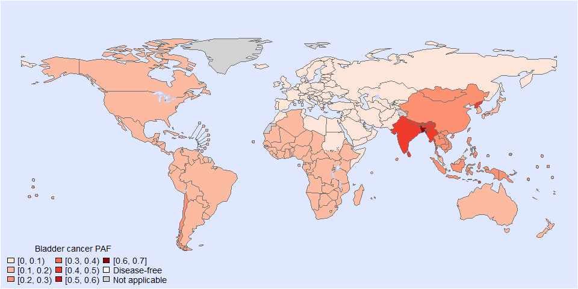
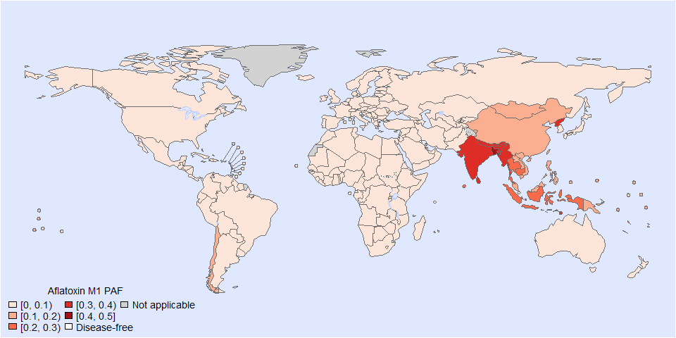

Global PAF of arsenic - bladder cancer - Estimated PAF with the 2nd
model
================
fbbu6966
2025-10-10

- [Settings](#settings)
- [Parameters](#parameters)
- [Model fit](#model-fit)
- [Predict all](#predict-all)
- [Summarize predictions](#summarize-predictions)
  - [Global](#global)
  - [Regions](#regions)
  - [Subregions](#subregions)
  - [Countries](#countries)
- [Session info](#session-info)

# Settings

``` r
## required packages ----
library(bd)
library(brms)
library(FERG2)
library(ggplot2)
library(knitr)
library(rmarkdown)
library(sf)
library(tidyr)
library(dplyr)
library(DescTools)
library(readxl)
library(kableExtra)


## global options ----
knitr::opts_chunk$set(fig.width = 10)
Date <- format(Sys.Date(), "%Y%m%d")
```

# Parameters

| Parameters | Values |
|:---|:---|
| Number of iteration | 5000 |
| Warmup | 3000 |
| Delta value | 0.85 |
| Maximum tree-depth | NA |
| Levels | Year, countries, Studies |
| Random effect on each data point | Yes |
| Stronger priors specified | Normal(0,1) |


Parameters of the model tested

# Model fit

``` r
fit_brms_reg_s <- readRDS("fit_brms_reg_s2.rds")
zero_cases<- read_xlsx("Endemic_countries.xlsx")%>%
             select(REG2, SUB2, ISO3, Country, cttf_arsenic) %>% 
             rename(COUNTRY=ISO3, COUNTRY_LABEL = Country, DISEASEFREE = cttf_arsenic)

kable(
  caption = "Countries assumed to be non-endemic",
  row.names = FALSE,
  subset(zero_cases, DISEASEFREE==0)[, 4])
```

| COUNTRY_LABEL |
|:--------------|

Countries assumed to be non-endemic

``` r
es_files <- list.files(pattern="^es_\\d{8}\\.rds$", full.names=TRUE, ignore.case = TRUE)
es_dates <- as.Date(sub("^es_(\\d{8})\\.rds$", "\\1", basename(es_files), ignore.case = TRUE), format = "%Y%m%d")
es_latest <- es_files[which.max(es_dates)]
es <- readRDS(es_latest)
es <- subset(es, as.integer(FLAG) == 1)
country_with_data <- es %>% select(ISO3) %>% distinct() %>% mutate(DATA=1, COUNTRY = ISO3)
Sub2_with_data <- es %>% select(SUB2) %>% distinct() %>% mutate(DATASUB2=1)
Reg2_with_data <- es %>% select(REG2) %>% distinct() %>% mutate(DATAREG2=1)
zero_cases <- left_join(zero_cases, country_with_data)
```

    ## Joining with `by = join_by(COUNTRY)`

``` r
zero_cases <- left_join(zero_cases, Sub2_with_data)
```

    ## Joining with `by = join_by(SUB2)`

``` r
zero_cases <- left_join(zero_cases, Reg2_with_data) %>%
  select(-c(ISO3)) %>%
  mutate(ESTIMATES = case_when(
    DATA == 1 ~ 1,
    DISEASEFREE == 0 ~ 2,
    is.na(DATA) & DISEASEFREE == 1 & DATASUB2 == 1 ~ 3,
    is.na(DATA) & DISEASEFREE == 1 & is.na(DATASUB2) & DATAREG2 == 1 ~ 4, 
    is.na(DATA) & DISEASEFREE == 1  & is.na(DATASUB2) & is.na(DATAREG2) ~5))
```

    ## Joining with `by = join_by(REG2)`

``` r
zero_cases$ESTIMATES <- factor(zero_cases$ESTIMATES, 
                               level = c(1,2,3,4,5),
                               labels = c("Data present", "Disease free", "Data in subregion", "Data in region", "Data in world"))
Country_Check <- zero_cases %>% filter(as.integer(ESTIMATES) == 2)
```

# Predict all

``` r
## set up dataframe
sim_all <-
  data.frame(
    sei = 0,
    REG2 = FERG2:::countries$REG2,
    SUB2 = FERG2:::countries$SUB2,
    COUNTRY = FERG2:::countries$ISO3,
    YEAR = rep(2000:2021, each = nrow(FERG2:::countries)))
sim_all <- sim_all %>% left_join(zero_cases) %>% select(sei, REG2, SUB2, COUNTRY, YEAR, ESTIMATES)
```

    ## Joining with `by = join_by(REG2, SUB2, COUNTRY)`

``` r
## draw from expected value of posterior predictive dist
set.seed(10)
# fit_all <- 
#   posterior_epred(
#     object = fit_brms_reg_s,
#     newdata = sim_all,
#     allow_new_levels = TRUE,
#     sample_new_levels = "old_levels",
#     re_formula = ~ 1 + YEAR +
#       (1 | REG2) +
#       (1 | REG2:SUB2) +
#       (1 | REG2:SUB2:COUNTRY)
#   )

draws_fit <- as_draws_df(fit_brms_reg_s)
fit_all <- data.frame(1:10000)
for (x in 1:nrow(sim_all)){
  if (as.integer(sim_all[x, "ESTIMATES"]) == 1){
    # Data present for country
    fit_all[[paste0("V",x)]] <- draws_fit$b_Intercept +                                                                               # Global intercept
      sim_all[x, "YEAR"] * draws_fit$b_YEAR +                                                                                         # Year component
      draws_fit[[paste0("r_REG2[",sim_all[x,"REG2"],",Intercept]")]] +                                                                # Regional component
      draws_fit[[paste0("r_REG2:SUB2[",sim_all[x,"REG2"],"_",sim_all[x,"SUB2"],",Intercept]")]] +                                     # Sub regional component
      draws_fit[[paste0("r_REG2:SUB2:COUNTRY[",sim_all[x,"REG2"],"_",sim_all[x,"SUB2"],"_",sim_all[x,"COUNTRY"],",Intercept]")]]      # Country component
  } else if (as.integer(sim_all[x, "ESTIMATES"]) == 2) {
    # Disease-free country
    fit_all[[paste0("V",x)]] <- 0
  } else if (as.integer(sim_all[x, "ESTIMATES"]) == 3){
    # Data not present for country, but present in subregion
    fit_all[[paste0("V",x)]] <- draws_fit$b_Intercept +                                                                               # Global intercept
      sim_all[x, "YEAR"] * draws_fit$b_YEAR +                                                                                         # Year component
      draws_fit[[paste0("r_REG2[",sim_all[x,"REG2"],",Intercept]")]] +                                                                # Regional component
      draws_fit[[paste0("r_REG2:SUB2[",sim_all[x,"REG2"],"_",sim_all[x,"SUB2"],",Intercept]")]]                                       # Sub regional component
  } else if (as.integer(sim_all[x, "ESTIMATES"]) == 4){
    # Data not present for country, but present in region
    fit_all[[paste0("V",x)]] <- draws_fit$b_Intercept +                                                                               # Global intercept
      sim_all[x, "YEAR"] * draws_fit$b_YEAR +                                                                                         # Year component
      draws_fit[[paste0("r_REG2[",sim_all[x,"REG2"],",Intercept]")]]                                                                  # Regional component
  } else if (as.integer(sim_all[x, "ESTIMATES"]) == 5){
    # Data not present for country
    fit_all[[paste0("V",x)]] <- draws_fit$b_Intercept  + 
      sim_all[x, "YEAR"] * draws_fit$b_YEAR
  } 
}

fit_all <- fit_all %>% select(-c(X1.10000))


## calculate PAF
sim_all$SIM <- t(fit_all)
# pop_all <- aggregate(POP ~ ISO3 + YEAR, FERG2:::pop, sum)
# sim_all <- merge(sim_all, pop_all,
#                  by.x = c("COUNTRY", "YEAR"), by.y = c("ISO3", "YEAR"))
sim_all <- sim_all %>% left_join(zero_cases)
```

    ## Joining with `by = join_by(REG2, SUB2, COUNTRY, ESTIMATES)`

``` r
sim_all$PROP <- expit(sim_all$SIM)
sim_all$PROP <- sim_all$PROP*sim_all$DISEASEFREE
sim_all$SIM<-sim_all$SIM*sim_all$DISEASEFREE
sim_all$sei<-sim_all$sei*sim_all$DISEASEFREE

# ## aggregate global
# sim_all_glb <- with(sim_all, aggregate(CASES ~ YEAR, FUN = sum))
# all_glb_id <- sim_all_glb[1]
# all_glb_nr <-
#   t(apply(sim_all_glb[, grepl("V", names(sim_all_glb))], 1, mean_ci))
# all_glb_nr <- data.frame(all_glb_nr)
# names(all_glb_nr) <- c("VAL_MEAN", "VAL_LWR", "VAL_UPR")
# all_glb_nr <- cbind(all_glb_id, all_glb_nr)
# all_glb_nr$LOCATION <- "Global"
# all_glb_nr$LOCATION_NAME <- "Global"
# all_glb_nr$METRIC <- "Number"
# str(all_glb_nr)
# 
# all_glb_rt <- all_glb_nr
# all_glb_rt$POP <- with(sim_all, tapply(POP, YEAR, sum))
# all_glb_rt$VAL_MEAN <- 100*all_glb_rt$VAL_MEAN / all_glb_rt$POP
# all_glb_rt$VAL_LWR <-  100*all_glb_rt$VAL_LWR / all_glb_rt$POP
# all_glb_rt$VAL_UPR <-  100*all_glb_rt$VAL_UPR / all_glb_rt$POP
# all_glb_rt$METRIC <- "Rate"
# all_glb_rt$POP <- NULL
# str(all_glb_rt)

# ## aggregate over regions
# sim_all_reg <- with(sim_all, aggregate(CASES ~ REG2+YEAR, FUN = sum))
# all_reg_id <- sim_all_reg[1:2]
# all_reg_nr <-
#   t(apply(sim_all_reg[, grepl("V", names(sim_all_reg))], 1, mean_ci))
# all_reg_nr <- data.frame(all_reg_nr)
# names(all_reg_nr) <- c("VAL_MEAN", "VAL_LWR", "VAL_UPR")
# all_reg_nr <- cbind(all_reg_id, all_reg_nr)
# all_reg_nr$LOCATION <- "Region"
# all_reg_nr$LOCATION_NAME <- all_reg_nr$REG2
# all_reg_nr$REG2 <- NULL
# all_reg_nr$METRIC <- "Number"
# str(all_reg_nr)
# 
# all_reg_rt <- all_reg_nr
# all_reg_rt$POP <-
#   with(sim_all, aggregate(POP ~ REG2 + YEAR, FUN = sum))$POP
# all_reg_rt$VAL_MEAN <- 100*all_reg_rt$VAL_MEAN / all_reg_rt$POP
# all_reg_rt$VAL_LWR <-  100*all_reg_rt$VAL_LWR / all_reg_rt$POP
# all_reg_rt$VAL_UPR <- 100*all_reg_rt$VAL_UPR / all_reg_rt$POP
# all_reg_rt$METRIC <- "Rate"
# all_reg_rt$POP <- NULL
# str(all_reg_rt)

# ## aggregate over subregions
# sim_all_sub <- with(sim_all, aggregate(CASES ~ SUB2+YEAR, FUN = sum))
# all_sub_id <- sim_all_sub[1:2]
# all_sub_nr <-
#   t(apply(sim_all_sub[, grepl("V", names(sim_all_sub))], 1, mean_ci))
# all_sub_nr <- data.frame(all_sub_nr)
# names(all_sub_nr) <- c("VAL_MEAN", "VAL_LWR", "VAL_UPR")
# all_sub_nr <- cbind(all_sub_id, all_sub_nr)
# all_sub_nr$LOCATION <- "Subregion"
# all_sub_nr$LOCATION_NAME <- all_sub_nr$SUB2
# all_sub_nr$SUB2 <- NULL
# all_sub_nr$METRIC <- "Number"
# str(all_sub_nr)
# 
# all_sub_rt <- all_sub_nr
# all_sub_rt$POP <-
#   with(sim_all, aggregate(POP ~ SUB2 + YEAR, FUN = sum))$POP
# all_sub_rt$VAL_MEAN <- 100*all_sub_rt$VAL_MEAN / all_sub_rt$POP
# all_sub_rt$VAL_LWR <- 100*all_sub_rt$VAL_LWR / all_sub_rt$POP
# all_sub_rt$VAL_UPR <- 100*all_sub_rt$VAL_UPR / all_sub_rt$POP
# all_sub_rt$METRIC <- "Rate"
# all_sub_rt$POP <- NULL
# str(all_sub_rt)

## aggregate over countries
all_cnt_prop <- t(apply(sim_all$PROP, 1, mean_ci))
all_cnt_prop <- data.frame(all_cnt_prop)
names(all_cnt_prop) <- c("VAL_MEAN", "VAL_LWR", "VAL_UPR")
all_cnt_prop <- cbind(sim_all[4:5], all_cnt_prop)
all_cnt_prop$LOCATION <- "Country"
all_cnt_prop$LOCATION_NAME <- all_cnt_prop$COUNTRY
all_cnt_prop$COUNTRY <- NULL
all_cnt_prop$METRIC <- "Number"
str(all_cnt_prop)
```

    ## 'data.frame':    4268 obs. of  7 variables:
    ##  $ YEAR         : int  2000 2000 2000 2000 2000 2000 2000 2000 2000 2000 ...
    ##  $ VAL_MEAN     : num  0.1606 0.1333 0.2011 0.0627 0.2011 ...
    ##  $ VAL_LWR      : num  0.0106 0.0164 0.0201 0.0163 0.0201 ...
    ##  $ VAL_UPR      : num  0.526 0.45 0.625 0.169 0.625 ...
    ##  $ LOCATION     : chr  "Country" "Country" "Country" "Country" ...
    ##  $ LOCATION_NAME: chr  "AFG" "ALB" "DZA" "AND" ...
    ##  $ METRIC       : chr  "Number" "Number" "Number" "Number" ...

``` r
#all_cnt_rt <- t(apply(exp(sim_all$SIM), 1, mean_ci))
#all_cnt_rt <- data.frame(all_cnt_rt)
#names(all_cnt_rt) <- c("VAL_MEAN", "VAL_LWR", "VAL_UPR")
#all_cnt_rt <- cbind(sim_all[1:2], all_cnt_rt)
#all_cnt_rt$LOCATION <- "Country"
#all_cnt_rt$LOCATION_NAME <- all_cnt_rt$COUNTRY
#all_cnt_rt$COUNTRY <- NULL
#all_cnt_rt$METRIC <- "Rate"
#str(all_cnt_rt)

# all_cnt_rt <- all_cnt_nr%>%left_join(pop_all, by=c("LOCATION_NAME"="ISO3","YEAR"="YEAR"))
# all_cnt_rt$VAL_MEAN <-  100*all_cnt_rt$VAL_MEAN / all_cnt_rt$POP
# all_cnt_rt$VAL_LWR <- 100*all_cnt_rt$VAL_LWR / all_cnt_rt$POP
# all_cnt_rt$VAL_UPR <-  100*all_cnt_rt$VAL_UPR / all_cnt_rt$POP
# all_cnt_rt$LOCATION <- "Country"
# all_cnt_rt$METRIC <- "Rate"
# all_cnt_rt$POP <- NULL
# str(all_cnt_rt)

## compile all
all_est <-
  rbind(all_cnt_prop)
str(all_est)
```

    ## 'data.frame':    4268 obs. of  7 variables:
    ##  $ YEAR         : int  2000 2000 2000 2000 2000 2000 2000 2000 2000 2000 ...
    ##  $ VAL_MEAN     : num  0.1606 0.1333 0.2011 0.0627 0.2011 ...
    ##  $ VAL_LWR      : num  0.0106 0.0164 0.0201 0.0163 0.0201 ...
    ##  $ VAL_UPR      : num  0.526 0.45 0.625 0.169 0.625 ...
    ##  $ LOCATION     : chr  "Country" "Country" "Country" "Country" ...
    ##  $ LOCATION_NAME: chr  "AFG" "ALB" "DZA" "AND" ...
    ##  $ METRIC       : chr  "Number" "Number" "Number" "Number" ...

``` r
saveRDS(all_est, file = "all_estimates.rds")

## plot nested trends
# all_sub_rt$REG2 <- gsub("(R).*", "\\1", all_sub_rt$LOCATION_NAME)
# ggplot(all_reg_rt, aes(x = YEAR, y = VAL_MEAN, group = LOCATION_NAME)) +
#   geom_line(data = all_glb_rt, linewidth = 2) +
#   geom_line(aes(col = LOCATION_NAME), linewidth = 1.5) +
#   theme_bw()
# ggplot(all_reg_rt, aes(x = YEAR, y = VAL_MEAN, group = LOCATION_NAME)) +
#   geom_line(data = all_glb_rt, linewidth = 2) +
#   geom_line(aes(col = LOCATION_NAME), linewidth = 1.5) +
#   geom_line(data = all_sub_rt, aes(col = REG2)) +
#   theme_bw()
```

# Summarize predictions

## Global

``` r
# kable(
#   caption = "Global number of aflatoxin M1 cases, 2010 vs 2020",
#   row.names = FALSE,
  # subset(all_glb_nr, YEAR %in% c(2010, 2020))[, 1:4])
```

## Regions

``` r
# kbl(subset(all_reg_rt, YEAR == 2020)[,c(6,2:4)],
#     align = c("l", "c", "c", "c"), row.names = FALSE,
#     col.names = c("Region", "Mean", "Lower", "Upper"),
#     caption="Prevalence of aflatoxin M1 in 2020 by WHO region (%)") %>%
#   kable_styling("striped", "hover")
# 
# kbl(subset(all_reg_nr, YEAR == 2020)[,c(6,2:4)],
#     align = c("l", "c", "c", "c"), row.names = FALSE,
#     col.names = c("Region", "Mean", "Lower", "Upper"),
#     caption="Number of peanuts cases in 2020 by WHO region") %>%
#   kable_styling("striped", "hover")

# #+ fig.height=4
# ggplot(subset(all_reg_rt, YEAR == 2010),
#        aes(y = VAL_MEAN, x = LOCATION_NAME)) +
#   geom_pointrange(aes(ymin = VAL_LWR, ymax = VAL_UPR), size = 0.2) +
#   coord_flip() +
#   theme_bw() +
#   scale_x_discrete(NULL, limits = rev(unique(all_reg_nr$LOCATION_NAME))) +
#   scale_y_continuous(NULL) +
#   ggtitle("Prevalence of peanuts by WHO Region (%), 2010")
# 
# #+ fig.height=4
# ggplot(subset(all_reg_rt, YEAR == 2020),
#        aes(y = VAL_MEAN, x = LOCATION_NAME)) +
#   geom_pointrange(aes(ymin = VAL_LWR, ymax = VAL_UPR), size = 0.2) +
#   coord_flip() +
#   theme_bw() +
#   scale_x_discrete(NULL, limits = rev(unique(all_reg_nr$LOCATION_NAME))) +
#   scale_y_continuous(NULL) +
#   ggtitle("Prevalence of peanuts by WHO Region (%), 2020")
# 
# #+ fig.height=4
# ggplot(subset(all_reg_nr, YEAR == 2010),
#        aes(y = VAL_MEAN, x = LOCATION_NAME)) +
#   geom_pointrange(aes(ymin = VAL_LWR, ymax = VAL_UPR), size = 0.2) +
#   coord_flip() +
#   theme_bw() +
#   scale_x_discrete(NULL, limits = rev(unique(all_reg_nr$LOCATION_NAME))) +
#   scale_y_continuous(NULL) +
#   ggtitle("Number of peanuts cases by WHO Region, 2010")
# 
# #+ fig.height=4
# ggplot(subset(all_reg_nr, YEAR == 2020),
#        aes(y = VAL_MEAN, x = LOCATION_NAME)) +
#   geom_pointrange(aes(ymin = VAL_LWR, ymax = VAL_UPR), size = 0.2) +
#   coord_flip() +
#   theme_bw() +
#   scale_x_discrete(NULL, limits = rev(unique(all_reg_nr$LOCATION_NAME))) +
#   scale_y_continuous(NULL) +
#   ggtitle("Number of peanuts cases by WHO Region, 2020")
# 
# # # sim_all_reg2 <-
# # #   merge(sim_all_reg,
# # #         with(sim_all, aggregate(POP ~ REG2 + YEAR, FUN = sum)))
# # sim_all_reg_long <-
# #   pivot_longer(sim_all_reg, cols = starts_with("V"))
# # # sim_all_reg_long$CASES <-
# # #   sim_all_reg_long$POP * sim_all_reg_long$value / 100
# # 
# # ggplot(subset(sim_all_reg_long, YEAR == 2010), aes(x = value)) +
# #   geom_density() +
# #   facet_wrap(~REG2) +
# #   theme_bw() +
# #   scale_x_log10() +
# #   ggtitle("Prevalence of peanuts by WHO Region, 2010")
# # 
# # ggplot(subset(sim_all_reg_long, YEAR == 2020), aes(x = CASES)) +
# #   geom_density() +
# #   facet_wrap(~REG2) +
# #   theme_bw() +
# #   scale_x_log10() +
# #   ggtitle("Number of peanuts cases by WHO Region, 2020")
```

## Subregions

``` r
# 
# ggplot(subset(all_sub_rt, YEAR == 2010),
#        aes(y = VAL_MEAN, x = LOCATION_NAME)) +
#   geom_pointrange(aes(ymin = VAL_LWR, ymax = VAL_UPR), size = 0.2) +
#   coord_flip() +
#   theme_bw() +
#   scale_x_discrete(NULL, limits = rev(unique(all_sub_nr$LOCATION_NAME))) +
#   scale_y_continuous(NULL) +
#   ggtitle("Prevalence of peanuts by WHO Subregion (%), 2010")
# 
# ggplot(subset(all_sub_rt, YEAR == 2020),
#        aes(y = VAL_MEAN, x = LOCATION_NAME)) +
#   geom_pointrange(aes(ymin = VAL_LWR, ymax = VAL_UPR), size = 0.2) +
#   coord_flip() +
#   theme_bw() +
#   scale_x_discrete(NULL, limits = rev(unique(all_sub_nr$LOCATION_NAME))) +
#   scale_y_continuous(NULL) +
#   ggtitle("Prevalence of peanuts by WHO Subregion (%), 2020")
# 
# ggplot(subset(all_sub_nr, YEAR == 2010),
#        aes(y = VAL_MEAN, x = LOCATION_NAME)) +
#   geom_pointrange(aes(ymin = VAL_LWR, ymax = VAL_UPR), size = 0.2) +
#   coord_flip() +
#   theme_bw() +
#   scale_x_discrete(NULL, limits = rev(unique(all_sub_nr$LOCATION_NAME))) +
#   scale_y_continuous(NULL) +
#   ggtitle("Number of peanuts cases by WHO Subregion, 2010")
# 
# ggplot(subset(all_sub_nr, YEAR == 2020),
#        aes(y = VAL_MEAN, x = LOCATION_NAME)) +
#   geom_pointrange(aes(ymin = VAL_LWR, ymax = VAL_UPR), size = 0.2) +
#   coord_flip() +
#   theme_bw() +
#   scale_x_discrete(NULL, limits = rev(unique(all_sub_nr$LOCATION_NAME))) +
#   scale_y_continuous(NULL) +
#   ggtitle("Number of peanuts cases by WHO Subregion, 2020")
# 
# # sim_all_sub <-
# #   merge(sim_all_sub,
# #         with(sim_all, aggregate(POP ~ SUB2 + YEAR, FUN = sum)))
# # sim_all_sub_long <-
# #   pivot_longer(sim_all_sub, cols = starts_with("V"))
# # sim_all_sub_long$CASES <-
# #   sim_all_sub_long$POP * sim_all_sub_long$value / 100
# # 
# # ggplot(subset(sim_all_sub_long, YEAR == 2010), aes(x = CASES)) +
# #   geom_density() +
# #   facet_wrap(~SUB2) +
# #   theme_bw() +
# #   scale_x_log10() +
# #   ggtitle("Number of peanuts cases by WHO Subregion, 2010")
# # 
# # ggplot(subset(sim_all_sub_long, YEAR == 2020), aes(x = CASES)) +
# #   geom_density() +
# #   facet_wrap(~SUB2) +
# #   theme_bw() +
# #   scale_x_log10() +
# #   ggtitle("Number of peanuts cases by WHO Subregion, 2020")
```

## Countries

``` r
plot_world(subset(all_cnt_prop, YEAR == 2010),
           "LOCATION_NAME", "VAL_MEAN", legend.title = "Bladder cancer PAF", diseasefree = zero_cases)
```

    ## [1] 0.0 0.1 0.2 0.3 0.4 0.5 0.6 0.7

``` r
title("Bladder cancer PAF, 2010", line = 1)
```

<!-- -->

``` r
plot_world(subset(all_cnt_prop, YEAR == 2020),
           "LOCATION_NAME", "VAL_MEAN", legend.title = "Aflatoxin M1 PAF", diseasefree = zero_cases)
```

    ## [1] 0.0 0.1 0.2 0.3 0.4 0.5

``` r
title("Bladder cancer PAF, 2010", line = 1)
```

<!-- -->

``` r
tab <-
  data.frame(subset(all_cnt_prop, YEAR == 2010)[,
                                              c("LOCATION_NAME", "VAL_MEAN", "VAL_LWR", "VAL_UPR")],
             subset(all_cnt_prop, YEAR == 2020)[,
                                              c("VAL_MEAN", "VAL_LWR", "VAL_UPR")])
tab$LOCATION_NAME <-
  FERG2:::countries$COUNTRY[match(tab$LOCATION_NAME, FERG2:::countries$ISO3)]
tab$LOCATION_NAME <- gsub(" \\(.*", "", tab$LOCATION_NAME)
names(tab) <-
  c("Country",
    "2010.mean", "2010.lwr", "2010.upr",
    "2020.mean", "2020.lwr", "2020.upr")

kable(tab, digits = 3, row.names = FALSE,
      caption = "Estimated PAF for bladder cancer by country, 2010 vs 2020")
```

| Country | 2010.mean | 2010.lwr | 2010.upr | 2020.mean | 2020.lwr | 2020.upr |
|:---|---:|---:|---:|---:|---:|---:|
| Afghanistan | 0.094 | 0.008 | 0.309 | 0.059 | 0.004 | 0.216 |
| Albania | 0.077 | 0.013 | 0.254 | 0.048 | 0.006 | 0.181 |
| Algeria | 0.124 | 0.014 | 0.420 | 0.081 | 0.007 | 0.316 |
| Andorra | 0.033 | 0.016 | 0.063 | 0.020 | 0.006 | 0.052 |
| Angola | 0.124 | 0.014 | 0.420 | 0.081 | 0.007 | 0.316 |
| Antigua and Barbuda | 0.154 | 0.040 | 0.375 | 0.099 | 0.018 | 0.285 |
| Argentina | 0.148 | 0.030 | 0.402 | 0.096 | 0.015 | 0.306 |
| Armenia | 0.077 | 0.013 | 0.254 | 0.048 | 0.006 | 0.181 |
| Australia | 0.114 | 0.034 | 0.261 | 0.070 | 0.017 | 0.183 |
| Austria | 0.032 | 0.010 | 0.076 | 0.020 | 0.004 | 0.061 |
| Azerbaijan | 0.077 | 0.013 | 0.254 | 0.048 | 0.006 | 0.181 |
| Bahamas | 0.154 | 0.040 | 0.375 | 0.099 | 0.018 | 0.285 |
| Bahrain | 0.060 | 0.006 | 0.219 | 0.037 | 0.003 | 0.140 |
| Bangladesh | 0.610 | 0.188 | 0.908 | 0.491 | 0.114 | 0.853 |
| Barbados | 0.154 | 0.040 | 0.375 | 0.099 | 0.018 | 0.285 |
| Belarus | 0.077 | 0.013 | 0.254 | 0.048 | 0.006 | 0.181 |
| Belgium | 0.028 | 0.005 | 0.078 | 0.019 | 0.002 | 0.068 |
| Belize | 0.148 | 0.030 | 0.402 | 0.096 | 0.015 | 0.306 |
| Benin | 0.124 | 0.014 | 0.420 | 0.081 | 0.007 | 0.316 |
| Bhutan | 0.460 | 0.099 | 0.876 | 0.351 | 0.050 | 0.810 |
| Bolivia | 0.148 | 0.030 | 0.402 | 0.096 | 0.015 | 0.306 |
| Bosnia and Herzegovina | 0.077 | 0.013 | 0.254 | 0.048 | 0.006 | 0.181 |
| Botswana | 0.131 | 0.016 | 0.407 | 0.085 | 0.008 | 0.307 |
| Brazil | 0.148 | 0.030 | 0.402 | 0.096 | 0.015 | 0.306 |
| Brunei Darussalam | 0.114 | 0.034 | 0.261 | 0.070 | 0.017 | 0.183 |
| Bulgaria | 0.077 | 0.013 | 0.254 | 0.048 | 0.006 | 0.181 |
| Burkina Faso | 0.131 | 0.016 | 0.407 | 0.085 | 0.008 | 0.307 |
| Burundi | 0.131 | 0.016 | 0.407 | 0.085 | 0.008 | 0.307 |
| Cabo Verde | 0.124 | 0.014 | 0.420 | 0.081 | 0.007 | 0.316 |
| Cambodia | 0.298 | 0.071 | 0.624 | 0.203 | 0.041 | 0.510 |
| Cameroon | 0.115 | 0.016 | 0.363 | 0.074 | 0.008 | 0.280 |
| Canada | 0.154 | 0.040 | 0.375 | 0.099 | 0.018 | 0.285 |
| Central African Republic | 0.131 | 0.016 | 0.407 | 0.085 | 0.008 | 0.307 |
| Chad | 0.131 | 0.016 | 0.407 | 0.085 | 0.008 | 0.307 |
| Chile | 0.228 | 0.056 | 0.499 | 0.152 | 0.029 | 0.425 |
| China | 0.215 | 0.061 | 0.467 | 0.139 | 0.034 | 0.356 |
| Colombia | 0.148 | 0.030 | 0.402 | 0.096 | 0.015 | 0.306 |
| Comoros | 0.124 | 0.014 | 0.420 | 0.081 | 0.007 | 0.316 |
| Congo | 0.124 | 0.014 | 0.420 | 0.081 | 0.007 | 0.316 |
| Cook Islands | 0.114 | 0.034 | 0.261 | 0.070 | 0.017 | 0.183 |
| Costa Rica | 0.148 | 0.030 | 0.402 | 0.096 | 0.015 | 0.306 |
| Côte d’Ivoire | 0.124 | 0.014 | 0.420 | 0.081 | 0.007 | 0.316 |
| Croatia | 0.033 | 0.016 | 0.063 | 0.020 | 0.006 | 0.052 |
| Cuba | 0.148 | 0.030 | 0.402 | 0.096 | 0.015 | 0.306 |
| Cyprus | 0.033 | 0.016 | 0.063 | 0.020 | 0.006 | 0.052 |
| Czechia | 0.033 | 0.016 | 0.063 | 0.020 | 0.006 | 0.052 |
| Korea | 0.460 | 0.099 | 0.876 | 0.351 | 0.050 | 0.810 |
| Congo | 0.131 | 0.016 | 0.407 | 0.085 | 0.008 | 0.307 |
| Denmark | 0.028 | 0.008 | 0.069 | 0.018 | 0.003 | 0.052 |
| Djibouti | 0.094 | 0.008 | 0.309 | 0.059 | 0.004 | 0.216 |
| Dominica | 0.148 | 0.030 | 0.402 | 0.096 | 0.015 | 0.306 |
| Dominican Republic | 0.148 | 0.030 | 0.402 | 0.096 | 0.015 | 0.306 |
| Ecuador | 0.148 | 0.030 | 0.402 | 0.096 | 0.015 | 0.306 |
| Egypt | 0.094 | 0.008 | 0.309 | 0.059 | 0.004 | 0.216 |
| El Salvador | 0.148 | 0.030 | 0.402 | 0.096 | 0.015 | 0.306 |
| Equatorial Guinea | 0.131 | 0.016 | 0.407 | 0.085 | 0.008 | 0.307 |
| Eritrea | 0.131 | 0.016 | 0.407 | 0.085 | 0.008 | 0.307 |
| Estonia | 0.033 | 0.016 | 0.063 | 0.020 | 0.006 | 0.052 |
| Eswatini | 0.124 | 0.014 | 0.420 | 0.081 | 0.007 | 0.316 |
| Ethiopia | 0.131 | 0.016 | 0.407 | 0.085 | 0.008 | 0.307 |
| Fiji | 0.190 | 0.044 | 0.487 | 0.124 | 0.023 | 0.371 |
| Finland | 0.046 | 0.012 | 0.141 | 0.028 | 0.005 | 0.095 |
| France | 0.054 | 0.017 | 0.133 | 0.033 | 0.008 | 0.091 |
| Gabon | 0.131 | 0.016 | 0.407 | 0.085 | 0.008 | 0.307 |
| Gambia | 0.131 | 0.016 | 0.407 | 0.085 | 0.008 | 0.307 |
| Georgia | 0.077 | 0.013 | 0.254 | 0.048 | 0.006 | 0.181 |
| Germany | 0.033 | 0.016 | 0.063 | 0.020 | 0.006 | 0.052 |
| Ghana | 0.124 | 0.014 | 0.420 | 0.081 | 0.007 | 0.316 |
| Greece | 0.033 | 0.016 | 0.063 | 0.020 | 0.006 | 0.052 |
| Grenada | 0.148 | 0.030 | 0.402 | 0.096 | 0.015 | 0.306 |
| Guatemala | 0.148 | 0.030 | 0.402 | 0.096 | 0.015 | 0.306 |
| Guinea | 0.124 | 0.014 | 0.420 | 0.081 | 0.007 | 0.316 |
| Guinea-Bissau | 0.131 | 0.016 | 0.407 | 0.085 | 0.008 | 0.307 |
| Guyana | 0.154 | 0.040 | 0.375 | 0.099 | 0.018 | 0.285 |
| Haiti | 0.148 | 0.030 | 0.402 | 0.096 | 0.015 | 0.306 |
| Honduras | 0.148 | 0.030 | 0.402 | 0.096 | 0.015 | 0.306 |
| Hungary | 0.033 | 0.016 | 0.063 | 0.020 | 0.006 | 0.052 |
| Iceland | 0.033 | 0.016 | 0.063 | 0.020 | 0.006 | 0.052 |
| India | 0.460 | 0.099 | 0.876 | 0.351 | 0.050 | 0.810 |
| Indonesia | 0.298 | 0.072 | 0.634 | 0.208 | 0.032 | 0.550 |
| Iran | 0.094 | 0.008 | 0.309 | 0.059 | 0.004 | 0.216 |
| Iraq | 0.094 | 0.008 | 0.309 | 0.059 | 0.004 | 0.216 |
| Ireland | 0.017 | 0.003 | 0.050 | 0.011 | 0.001 | 0.039 |
| Israel | 0.033 | 0.016 | 0.063 | 0.020 | 0.006 | 0.052 |
| Italy | 0.029 | 0.009 | 0.069 | 0.018 | 0.004 | 0.052 |
| Jamaica | 0.148 | 0.030 | 0.402 | 0.096 | 0.015 | 0.306 |
| Japan | 0.108 | 0.039 | 0.231 | 0.068 | 0.018 | 0.178 |
| Jordan | 0.094 | 0.008 | 0.309 | 0.059 | 0.004 | 0.216 |
| Kazakhstan | 0.077 | 0.013 | 0.254 | 0.048 | 0.006 | 0.181 |
| Kenya | 0.124 | 0.014 | 0.420 | 0.081 | 0.007 | 0.316 |
| Kiribati | 0.236 | 0.050 | 0.608 | 0.159 | 0.025 | 0.479 |
| Kuwait | 0.041 | 0.006 | 0.142 | 0.025 | 0.004 | 0.098 |
| Kyrgyzstan | 0.077 | 0.013 | 0.254 | 0.048 | 0.006 | 0.181 |
| Lao People’s Dem. Republic | 0.236 | 0.050 | 0.608 | 0.159 | 0.025 | 0.479 |
| Latvia | 0.033 | 0.016 | 0.063 | 0.020 | 0.006 | 0.052 |
| Lebanon | 0.094 | 0.008 | 0.309 | 0.059 | 0.004 | 0.216 |
| Lesotho | 0.124 | 0.014 | 0.420 | 0.081 | 0.007 | 0.316 |
| Liberia | 0.131 | 0.016 | 0.407 | 0.085 | 0.008 | 0.307 |
| Libya | 0.094 | 0.008 | 0.309 | 0.059 | 0.004 | 0.216 |
| Lithuania | 0.033 | 0.016 | 0.063 | 0.020 | 0.006 | 0.052 |
| Luxembourg | 0.033 | 0.016 | 0.063 | 0.020 | 0.006 | 0.052 |
| Madagascar | 0.131 | 0.016 | 0.407 | 0.085 | 0.008 | 0.307 |
| Malawi | 0.131 | 0.016 | 0.407 | 0.085 | 0.008 | 0.307 |
| Malaysia | 0.190 | 0.044 | 0.487 | 0.124 | 0.023 | 0.371 |
| Maldives | 0.298 | 0.072 | 0.634 | 0.208 | 0.032 | 0.550 |
| Mali | 0.131 | 0.016 | 0.407 | 0.085 | 0.008 | 0.307 |
| Malta | 0.033 | 0.016 | 0.063 | 0.020 | 0.006 | 0.052 |
| Marshall Islands | 0.190 | 0.044 | 0.487 | 0.124 | 0.023 | 0.371 |
| Mauritania | 0.124 | 0.014 | 0.420 | 0.081 | 0.007 | 0.316 |
| Mauritius | 0.131 | 0.016 | 0.407 | 0.085 | 0.008 | 0.307 |
| Mexico | 0.148 | 0.030 | 0.402 | 0.096 | 0.015 | 0.306 |
| Micronesia | 0.236 | 0.050 | 0.608 | 0.159 | 0.025 | 0.479 |
| Monaco | 0.033 | 0.016 | 0.063 | 0.020 | 0.006 | 0.052 |
| Mongolia | 0.236 | 0.050 | 0.608 | 0.159 | 0.025 | 0.479 |
| Montenegro | 0.077 | 0.013 | 0.254 | 0.048 | 0.006 | 0.181 |
| Morocco | 0.094 | 0.008 | 0.309 | 0.059 | 0.004 | 0.216 |
| Mozambique | 0.131 | 0.016 | 0.407 | 0.085 | 0.008 | 0.307 |
| Myanmar | 0.460 | 0.099 | 0.876 | 0.351 | 0.050 | 0.810 |
| Namibia | 0.131 | 0.016 | 0.407 | 0.085 | 0.008 | 0.307 |
| Nauru | 0.114 | 0.034 | 0.261 | 0.070 | 0.017 | 0.183 |
| Nepal | 0.460 | 0.099 | 0.876 | 0.351 | 0.050 | 0.810 |
| Netherlands | 0.062 | 0.014 | 0.215 | 0.036 | 0.007 | 0.121 |
| New Zealand | 0.101 | 0.021 | 0.271 | 0.062 | 0.011 | 0.187 |
| Nicaragua | 0.148 | 0.030 | 0.402 | 0.096 | 0.015 | 0.306 |
| Niger | 0.131 | 0.016 | 0.407 | 0.085 | 0.008 | 0.307 |
| Nigeria | 0.124 | 0.014 | 0.420 | 0.081 | 0.007 | 0.316 |
| Niue | 0.114 | 0.034 | 0.261 | 0.070 | 0.017 | 0.183 |
| North Macedonia | 0.077 | 0.013 | 0.254 | 0.048 | 0.006 | 0.181 |
| Norway | 0.040 | 0.010 | 0.113 | 0.026 | 0.004 | 0.090 |
| Oman | 0.060 | 0.006 | 0.219 | 0.037 | 0.003 | 0.140 |
| Pakistan | 0.094 | 0.008 | 0.309 | 0.059 | 0.004 | 0.216 |
| Palau | 0.190 | 0.044 | 0.487 | 0.124 | 0.023 | 0.371 |
| Panama | 0.154 | 0.040 | 0.375 | 0.099 | 0.018 | 0.285 |
| Papua New Guinea | 0.236 | 0.050 | 0.608 | 0.159 | 0.025 | 0.479 |
| Paraguay | 0.148 | 0.030 | 0.402 | 0.096 | 0.015 | 0.306 |
| Peru | 0.148 | 0.030 | 0.402 | 0.096 | 0.015 | 0.306 |
| Philippines | 0.236 | 0.050 | 0.608 | 0.159 | 0.025 | 0.479 |
| Poland | 0.033 | 0.016 | 0.063 | 0.020 | 0.006 | 0.052 |
| Portugal | 0.063 | 0.014 | 0.213 | 0.036 | 0.008 | 0.122 |
| Qatar | 0.060 | 0.006 | 0.219 | 0.037 | 0.003 | 0.140 |
| Korea | 0.105 | 0.025 | 0.266 | 0.065 | 0.013 | 0.186 |
| Republic of Moldova | 0.077 | 0.013 | 0.254 | 0.048 | 0.006 | 0.181 |
| Romania | 0.033 | 0.016 | 0.063 | 0.020 | 0.006 | 0.052 |
| Russian Federation | 0.077 | 0.013 | 0.254 | 0.048 | 0.006 | 0.181 |
| Rwanda | 0.131 | 0.016 | 0.407 | 0.085 | 0.008 | 0.307 |
| Saint Kitts and Nevis | 0.154 | 0.040 | 0.375 | 0.099 | 0.018 | 0.285 |
| Saint Lucia | 0.148 | 0.030 | 0.402 | 0.096 | 0.015 | 0.306 |
| Saint Vincent and the Grenadines | 0.148 | 0.030 | 0.402 | 0.096 | 0.015 | 0.306 |
| Samoa | 0.236 | 0.050 | 0.608 | 0.159 | 0.025 | 0.479 |
| San Marino | 0.033 | 0.016 | 0.063 | 0.020 | 0.006 | 0.052 |
| Sao Tome and Principe | 0.124 | 0.014 | 0.420 | 0.081 | 0.007 | 0.316 |
| Saudi Arabia | 0.060 | 0.006 | 0.219 | 0.037 | 0.003 | 0.140 |
| Senegal | 0.124 | 0.014 | 0.420 | 0.081 | 0.007 | 0.316 |
| Serbia | 0.077 | 0.013 | 0.254 | 0.048 | 0.006 | 0.181 |
| Seychelles | 0.131 | 0.016 | 0.407 | 0.085 | 0.008 | 0.307 |
| Sierra Leone | 0.131 | 0.016 | 0.407 | 0.085 | 0.008 | 0.307 |
| Singapore | 0.114 | 0.034 | 0.261 | 0.070 | 0.017 | 0.183 |
| Slovakia | 0.033 | 0.016 | 0.063 | 0.020 | 0.006 | 0.052 |
| Slovenia | 0.033 | 0.016 | 0.063 | 0.020 | 0.006 | 0.052 |
| Solomon Islands | 0.236 | 0.050 | 0.608 | 0.159 | 0.025 | 0.479 |
| Somalia | 0.094 | 0.008 | 0.309 | 0.059 | 0.004 | 0.216 |
| South Africa | 0.131 | 0.016 | 0.407 | 0.085 | 0.008 | 0.307 |
| South Sudan | 0.131 | 0.016 | 0.407 | 0.085 | 0.008 | 0.307 |
| Spain | 0.033 | 0.016 | 0.063 | 0.020 | 0.006 | 0.052 |
| Sri Lanka | 0.460 | 0.099 | 0.876 | 0.351 | 0.050 | 0.810 |
| Sudan | 0.094 | 0.008 | 0.309 | 0.059 | 0.004 | 0.216 |
| Suriname | 0.148 | 0.030 | 0.402 | 0.096 | 0.015 | 0.306 |
| Sweden | 0.028 | 0.009 | 0.066 | 0.017 | 0.004 | 0.050 |
| Switzerland | 0.033 | 0.016 | 0.063 | 0.020 | 0.006 | 0.052 |
| Syrian Arab Republic | 0.094 | 0.008 | 0.309 | 0.059 | 0.004 | 0.216 |
| Tajikistan | 0.077 | 0.013 | 0.254 | 0.048 | 0.006 | 0.181 |
| Thailand | 0.293 | 0.116 | 0.529 | 0.202 | 0.054 | 0.482 |
| Timor-Leste | 0.460 | 0.099 | 0.876 | 0.351 | 0.050 | 0.810 |
| Togo | 0.131 | 0.016 | 0.407 | 0.085 | 0.008 | 0.307 |
| Tonga | 0.190 | 0.044 | 0.487 | 0.124 | 0.023 | 0.371 |
| Trinidad and Tobago | 0.154 | 0.040 | 0.375 | 0.099 | 0.018 | 0.285 |
| Tunisia | 0.094 | 0.008 | 0.309 | 0.059 | 0.004 | 0.216 |
| Turkiye | 0.077 | 0.013 | 0.254 | 0.048 | 0.006 | 0.181 |
| Turkmenistan | 0.077 | 0.013 | 0.254 | 0.048 | 0.006 | 0.181 |
| Tuvalu | 0.190 | 0.044 | 0.487 | 0.124 | 0.023 | 0.371 |
| Uganda | 0.131 | 0.016 | 0.407 | 0.085 | 0.008 | 0.307 |
| Ukraine | 0.077 | 0.013 | 0.254 | 0.048 | 0.006 | 0.181 |
| United Arab Emirates | 0.060 | 0.006 | 0.219 | 0.037 | 0.003 | 0.140 |
| United Kingdom | 0.025 | 0.004 | 0.068 | 0.017 | 0.002 | 0.059 |
| United Republic of Tanzania | 0.124 | 0.014 | 0.420 | 0.081 | 0.007 | 0.316 |
| United States of America | 0.109 | 0.032 | 0.264 | 0.067 | 0.018 | 0.194 |
| Uruguay | 0.154 | 0.040 | 0.375 | 0.099 | 0.018 | 0.285 |
| Uzbekistan | 0.077 | 0.013 | 0.254 | 0.048 | 0.006 | 0.181 |
| Vanuatu | 0.236 | 0.050 | 0.608 | 0.159 | 0.025 | 0.479 |
| Venezuela | 0.148 | 0.030 | 0.402 | 0.096 | 0.015 | 0.306 |
| Viet Nam | 0.236 | 0.050 | 0.608 | 0.159 | 0.025 | 0.479 |
| Yemen | 0.094 | 0.008 | 0.309 | 0.059 | 0.004 | 0.216 |
| Zambia | 0.124 | 0.014 | 0.420 | 0.081 | 0.007 | 0.316 |
| Zimbabwe | 0.124 | 0.014 | 0.420 | 0.081 | 0.007 | 0.316 |

Estimated PAF for bladder cancer by country, 2010 vs 2020

# Session info

``` r
saveRDS(sim_all, paste0("sim_all_", Date, ".RDS"))
saveRDS(all_est, paste0("all_est_", Date, ".RDS"))
sessioninfo::session_info()
```

    ## Warning in system2("quarto", "-V", stdout = TRUE, env = paste0("TMPDIR=", : running command '"quarto"
    ## TMPDIR=C:/Users/fbbu6966/AppData/Local/Temp/Rtmp0MMjq5/file3e586df4656 -V' had status 1

    ## ─ Session info ──────────────────────────────────────────────────────────────────────────────────────────────────────────────────────────
    ##  setting  value
    ##  version  R version 4.5.0 (2025-04-11 ucrt)
    ##  os       Windows 10 x64 (build 19045)
    ##  system   x86_64, mingw32
    ##  ui       RStudio
    ##  language (EN)
    ##  collate  English_United States.utf8
    ##  ctype    English_United States.utf8
    ##  tz       Europe/Brussels
    ##  date     2025-10-10
    ##  rstudio  2025.05.0+496 Mariposa Orchid (desktop)
    ##  pandoc   3.4 @ C:/Users/fbbu6966/AppData/Local/Programs/RStudio/resources/app/bin/quarto/bin/tools/ (via rmarkdown)
    ##  quarto   ERROR: Unknown command "TMPDIR=C:/Users/fbbu6966/AppData/Local/Temp/Rtmp0MMjq5/file3e586df4656". Did you mean command "update"? @ C:\\Users\\fbbu6966\\AppData\\Local\\Programs\\RStudio\\RESOUR~1\\app\\bin\\quarto\\bin\\quarto.exe
    ## 
    ## ─ Packages ──────────────────────────────────────────────────────────────────────────────────────────────────────────────────────────────
    ##  ! package        * version    date (UTC) lib source
    ##    abind            1.4-8      2024-09-12 [1] CRAN (R 4.5.0)
    ##    backports        1.5.0      2024-05-23 [1] CRAN (R 4.5.0)
    ##    base64enc        0.1-3      2015-07-28 [1] CRAN (R 4.5.0)
    ##    bayesplot        1.12.0     2025-04-10 [1] CRAN (R 4.5.0)
    ##    bd             * 0.0.14     2025-04-14 [1] Github (brechtdv/bd@652191c)
    ##    boot             1.3-31     2024-08-28 [1] CRAN (R 4.5.0)
    ##    bridgesampling   1.1-2      2021-04-16 [1] CRAN (R 4.5.0)
    ##    brms           * 2.22.0     2024-09-23 [1] CRAN (R 4.5.0)
    ##    Brobdingnag      1.2-9      2022-10-19 [1] CRAN (R 4.5.0)
    ##    broom            1.0.8      2025-03-28 [1] CRAN (R 4.5.0)
    ##    cachem           1.1.0      2024-05-16 [1] CRAN (R 4.5.0)
    ##    callr            3.7.6      2024-03-25 [1] CRAN (R 4.5.0)
    ##    car              3.1-3      2024-09-27 [1] CRAN (R 4.5.1)
    ##    carData          3.0-5      2022-01-06 [1] CRAN (R 4.5.1)
    ##    cellranger       1.1.0      2016-07-27 [1] CRAN (R 4.5.0)
    ##    checkmate        2.3.2      2024-07-29 [1] CRAN (R 4.5.0)
    ##    class            7.3-23     2025-01-01 [1] CRAN (R 4.5.0)
    ##    classInt         0.4-11     2025-01-08 [1] CRAN (R 4.5.0)
    ##    cli              3.6.4      2025-02-13 [1] CRAN (R 4.5.0)
    ##    cluster          2.1.8.1    2025-03-12 [1] CRAN (R 4.5.0)
    ##    coda             0.19-4.1   2024-01-31 [1] CRAN (R 4.5.0)
    ##    codetools        0.2-20     2024-03-31 [1] CRAN (R 4.5.0)
    ##    colorspace       2.1-1      2024-07-26 [1] CRAN (R 4.5.0)
    ##    curl             6.2.2      2025-03-24 [1] CRAN (R 4.5.0)
    ##    data.table     * 1.17.0     2025-02-22 [1] CRAN (R 4.5.0)
    ##    DBI              1.2.3      2024-06-02 [1] CRAN (R 4.5.0)
    ##    DescTools      * 0.99.60    2025-03-28 [1] CRAN (R 4.5.0)
    ##    devtools       * 2.4.5      2022-10-11 [1] CRAN (R 4.5.0)
    ##    digest           0.6.37     2024-08-19 [1] CRAN (R 4.5.0)
    ##    distributional   0.5.0      2024-09-17 [1] CRAN (R 4.5.0)
    ##    dplyr          * 1.1.4      2023-11-17 [1] CRAN (R 4.5.0)
    ##    e1071            1.7-16     2024-09-16 [1] CRAN (R 4.5.0)
    ##    ellipsis         0.3.2      2021-04-29 [1] CRAN (R 4.5.0)
    ##    evaluate         1.0.3      2025-01-10 [1] CRAN (R 4.5.0)
    ##    Exact            3.3        2024-07-21 [1] CRAN (R 4.5.0)
    ##    expm             1.0-0      2024-08-19 [1] CRAN (R 4.5.0)
    ##    farver           2.1.2      2024-05-13 [1] CRAN (R 4.5.0)
    ##    fastmap          1.2.0      2024-05-15 [1] CRAN (R 4.5.0)
    ##    FERG2          * 0.0.5      2025-08-07 [1] Github (brechtdv/FERG2@c2d4ac1)
    ##    forcats        * 1.0.0      2023-01-29 [1] CRAN (R 4.5.0)
    ##    foreign          0.8-90     2025-03-31 [1] CRAN (R 4.5.0)
    ##    Formula          1.2-5      2023-02-24 [1] CRAN (R 4.5.0)
    ##    fs               1.6.6      2025-04-12 [1] CRAN (R 4.5.0)
    ##    generics         0.1.3      2022-07-05 [1] CRAN (R 4.5.0)
    ##    ggplot2        * 3.5.2      2025-04-09 [1] CRAN (R 4.5.0)
    ##    ggpubr           0.6.1      2025-06-27 [1] CRAN (R 4.5.1)
    ##    ggsignif         0.6.4      2022-10-13 [1] CRAN (R 4.5.1)
    ##    gld              2.6.7      2025-01-17 [1] CRAN (R 4.5.0)
    ##    glue             1.8.0      2024-09-30 [1] CRAN (R 4.5.0)
    ##    gridExtra        2.3        2017-09-09 [1] CRAN (R 4.5.0)
    ##    gtable           0.3.6      2024-10-25 [1] CRAN (R 4.5.0)
    ##    haven            2.5.4      2023-11-30 [1] CRAN (R 4.5.0)
    ##    Hmisc          * 5.2-3      2025-03-16 [1] CRAN (R 4.5.0)
    ##    hms              1.1.3      2023-03-21 [1] CRAN (R 4.5.0)
    ##    htmlTable        2.4.3      2024-07-21 [1] CRAN (R 4.5.0)
    ##    htmltools        0.5.8.1    2024-04-04 [1] CRAN (R 4.5.0)
    ##    htmlwidgets      1.6.4      2023-12-06 [1] CRAN (R 4.5.0)
    ##    httpuv           1.6.15     2024-03-26 [1] CRAN (R 4.5.0)
    ##    httr             1.4.7      2023-08-15 [1] CRAN (R 4.5.0)
    ##    inline           0.3.21     2025-01-09 [1] CRAN (R 4.5.0)
    ##    jsonlite         2.0.0      2025-03-27 [1] CRAN (R 4.5.0)
    ##    kableExtra     * 1.4.0      2024-01-24 [1] CRAN (R 4.5.0)
    ##    KernSmooth       2.23-26    2025-01-01 [1] CRAN (R 4.5.0)
    ##    knitr          * 1.50       2025-03-16 [1] CRAN (R 4.5.0)
    ##    labeling         0.4.3      2023-08-29 [1] CRAN (R 4.5.0)
    ##    later            1.4.2      2025-04-08 [1] CRAN (R 4.5.0)
    ##    lattice          0.22-6     2024-03-20 [1] CRAN (R 4.5.0)
    ##    lifecycle        1.0.4      2023-11-07 [1] CRAN (R 4.5.0)
    ##    lmom             3.2        2024-09-30 [1] CRAN (R 4.5.0)
    ##    loo              2.8.0      2024-07-03 [1] CRAN (R 4.5.0)
    ##    lubridate      * 1.9.4      2024-12-08 [1] CRAN (R 4.5.0)
    ##    magrittr         2.0.3      2022-03-30 [1] CRAN (R 4.5.0)
    ##    MASS             7.3-65     2025-02-28 [1] CRAN (R 4.5.0)
    ##    mathjaxr         1.6-0      2022-02-28 [1] CRAN (R 4.5.0)
    ##    Matrix         * 1.7-3      2025-03-11 [1] CRAN (R 4.5.0)
    ##    MatrixModels     0.5-4      2025-03-26 [1] CRAN (R 4.5.0)
    ##    matrixStats      1.5.0      2025-01-07 [1] CRAN (R 4.5.0)
    ##    mc2d           * 0.2.1      2024-06-05 [1] CRAN (R 4.5.1)
    ##    memoise          2.0.1      2021-11-26 [1] CRAN (R 4.5.0)
    ##    metadat        * 1.4-0      2025-02-04 [1] CRAN (R 4.5.0)
    ##    metafor        * 4.8-0      2025-01-28 [1] CRAN (R 4.5.0)
    ##    mgcv             1.9-1      2023-12-21 [1] CRAN (R 4.5.0)
    ##    mime             0.13       2025-03-17 [1] CRAN (R 4.5.0)
    ##    miniUI           0.1.1.1    2018-05-18 [1] CRAN (R 4.5.0)
    ##    multcomp         1.4-28     2025-01-29 [1] CRAN (R 4.5.0)
    ##    munsell          0.5.1      2024-04-01 [1] CRAN (R 4.5.0)
    ##    mvtnorm        * 1.3-3      2025-01-10 [1] CRAN (R 4.5.0)
    ##    nlme             3.1-168    2025-03-31 [1] CRAN (R 4.5.0)
    ##    nnet             7.3-20     2025-01-01 [1] CRAN (R 4.5.0)
    ##    numDeriv       * 2016.8-1.1 2019-06-06 [1] CRAN (R 4.5.0)
    ##    pillar           1.11.0     2025-07-04 [1] CRAN (R 4.5.1)
    ##    pkgbuild         1.4.7      2025-03-24 [1] CRAN (R 4.5.0)
    ##    pkgconfig        2.0.3      2019-09-22 [1] CRAN (R 4.5.0)
    ##    pkgload          1.4.0      2024-06-28 [1] CRAN (R 4.5.0)
    ##    plyr             1.8.9      2023-10-02 [1] CRAN (R 4.5.0)
    ##    polspline        1.1.25     2024-05-10 [1] CRAN (R 4.5.0)
    ##    posterior        1.6.1      2025-02-27 [1] CRAN (R 4.5.0)
    ##    processx         3.8.6      2025-02-21 [1] CRAN (R 4.5.0)
    ##    profvis          0.4.0      2024-09-20 [1] CRAN (R 4.5.0)
    ##    promises         1.3.2      2024-11-28 [1] CRAN (R 4.5.0)
    ##    proxy            0.4-27     2022-06-09 [1] CRAN (R 4.5.0)
    ##    ps               1.9.1      2025-04-12 [1] CRAN (R 4.5.0)
    ##    purrr          * 1.0.4      2025-02-05 [1] CRAN (R 4.5.0)
    ##    quantreg         6.1        2025-03-10 [1] CRAN (R 4.5.0)
    ##    QuickJSR         1.7.0      2025-03-31 [1] CRAN (R 4.5.0)
    ##    R6               2.6.1      2025-02-15 [1] CRAN (R 4.5.0)
    ##    RColorBrewer     1.1-3      2022-04-03 [1] CRAN (R 4.5.0)
    ##    Rcpp           * 1.0.14     2025-01-12 [1] CRAN (R 4.5.0)
    ##  D RcppParallel     5.1.10     2025-01-24 [1] CRAN (R 4.5.0)
    ##    readr          * 2.1.5      2024-01-10 [1] CRAN (R 4.5.0)
    ##    readxl         * 1.4.5      2025-03-07 [1] CRAN (R 4.5.0)
    ##    remotes          2.5.0      2024-03-17 [1] CRAN (R 4.5.0)
    ##    reshape2         1.4.4      2020-04-09 [1] CRAN (R 4.5.0)
    ##  D rJava            1.0-11     2024-01-26 [1] CRAN (R 4.5.0)
    ##    rlang            1.1.6      2025-04-11 [1] CRAN (R 4.5.0)
    ##    rmarkdown      * 2.29       2024-11-04 [1] CRAN (R 4.5.0)
    ##    rms            * 8.0-0      2025-04-04 [1] CRAN (R 4.5.0)
    ##    rootSolve        1.8.2.4    2023-09-21 [1] CRAN (R 4.5.0)
    ##    rpart            4.1.24     2025-01-07 [1] CRAN (R 4.5.0)
    ##    rstan            2.32.7     2025-03-10 [1] CRAN (R 4.5.0)
    ##    rstantools       2.4.0      2024-01-31 [1] CRAN (R 4.5.0)
    ##    rstatix          0.7.2      2023-02-01 [1] CRAN (R 4.5.1)
    ##    rstudioapi       0.17.1     2024-10-22 [1] CRAN (R 4.5.0)
    ##    sandwich         3.1-1      2024-09-15 [1] CRAN (R 4.5.0)
    ##    scales         * 1.3.0      2023-11-28 [1] CRAN (R 4.5.0)
    ##    sessioninfo      1.2.3      2025-02-05 [1] CRAN (R 4.5.0)
    ##    sf             * 1.0-20     2025-03-24 [1] CRAN (R 4.5.0)
    ##    shiny            1.10.0     2024-12-14 [1] CRAN (R 4.5.0)
    ##    SparseM          1.84-2     2024-07-17 [1] CRAN (R 4.5.0)
    ##    StanHeaders      2.32.10    2024-07-15 [1] CRAN (R 4.5.0)
    ##    stringi          1.8.7      2025-03-27 [1] CRAN (R 4.5.0)
    ##    stringr        * 1.5.1      2023-11-14 [1] CRAN (R 4.5.0)
    ##    survival         3.8-3      2024-12-17 [1] CRAN (R 4.5.0)
    ##    svglite          2.1.3      2023-12-08 [1] CRAN (R 4.5.0)
    ##    systemfonts      1.2.2      2025-04-04 [1] CRAN (R 4.5.0)
    ##    tensorA          0.36.2.1   2023-12-13 [1] CRAN (R 4.5.0)
    ##    TH.data          1.1-3      2025-01-17 [1] CRAN (R 4.5.0)
    ##    tibble         * 3.3.0      2025-06-08 [1] CRAN (R 4.5.1)
    ##    tidyr          * 1.3.1      2024-01-24 [1] CRAN (R 4.5.0)
    ##    tidyselect       1.2.1      2024-03-11 [1] CRAN (R 4.5.0)
    ##    tidyverse      * 2.0.0      2023-02-22 [1] CRAN (R 4.5.0)
    ##    timechange       0.3.0      2024-01-18 [1] CRAN (R 4.5.0)
    ##    tzdb             0.5.0      2025-03-15 [1] CRAN (R 4.5.0)
    ##    units            0.8-7      2025-03-11 [1] CRAN (R 4.5.0)
    ##    urlchecker       1.0.1      2021-11-30 [1] CRAN (R 4.5.0)
    ##    usethis        * 3.1.0      2024-11-26 [1] CRAN (R 4.5.0)
    ##    V8               6.0.3      2025-03-26 [1] CRAN (R 4.5.0)
    ##    vctrs            0.6.5      2023-12-01 [1] CRAN (R 4.5.0)
    ##    viridisLite      0.4.2      2023-05-02 [1] CRAN (R 4.5.0)
    ##    withr            3.0.2      2024-10-28 [1] CRAN (R 4.5.0)
    ##    xfun             0.52       2025-04-02 [1] CRAN (R 4.5.0)
    ##    xlsx           * 0.6.5      2020-11-10 [1] CRAN (R 4.5.0)
    ##    xlsxjars         0.9.0      2025-07-02 [1] CRAN (R 4.5.1)
    ##    xml2             1.3.8      2025-03-14 [1] CRAN (R 4.5.0)
    ##    xtable           1.8-4      2019-04-21 [1] CRAN (R 4.5.0)
    ##    yaml             2.3.10     2024-07-26 [1] CRAN (R 4.5.0)
    ##    zoo              1.8-14     2025-04-10 [1] CRAN (R 4.5.0)
    ## 
    ##  [1] C:/Users/fbbu6966/AppData/Local/Programs/R/R-4.5.0/library
    ## 
    ##  * ── Packages attached to the search path.
    ##  D ── DLL MD5 mismatch, broken installation.
    ## 
    ## ─────────────────────────────────────────────────────────────────────────────────────────────────────────────────────────────────────────

``` r
##rmarkdown::render("03-estimate.R")

# Save dataset for report created for expert to receive feedback
# save(all_cnt_rt, file="./00-Report_FB/all_cnt_rt.Rdata")
# save(all_glb_nr, file="./00-Report_FB/all_glb_nr.Rdata")
# save(all_reg_nr, file="./00-Report_FB/all_reg_nr.Rdata")
# save(all_reg_rt, file="./00-Report_FB/all_reg_rt.Rdata")
# save(all_sub_nr, file="./00-Report_FB/all_sub_nr.Rdata")
# save(all_sub_rt, file="./00-Report_FB/all_sub_rt.Rdata")
```
