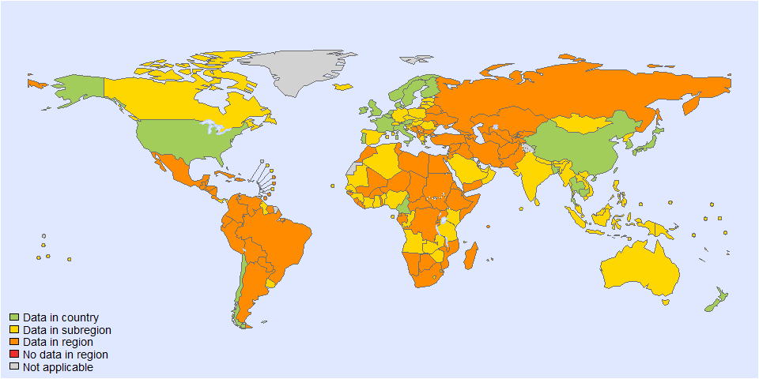
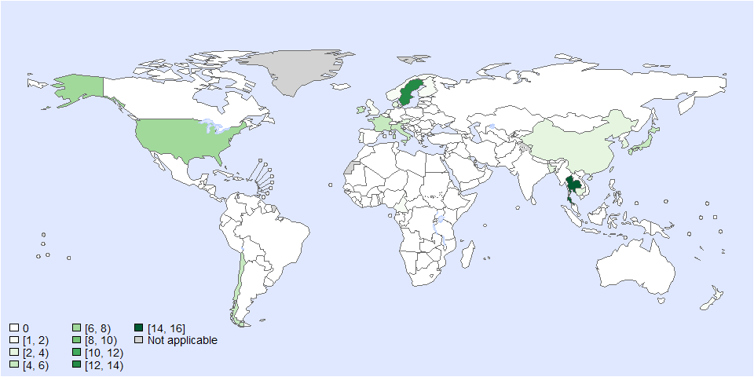
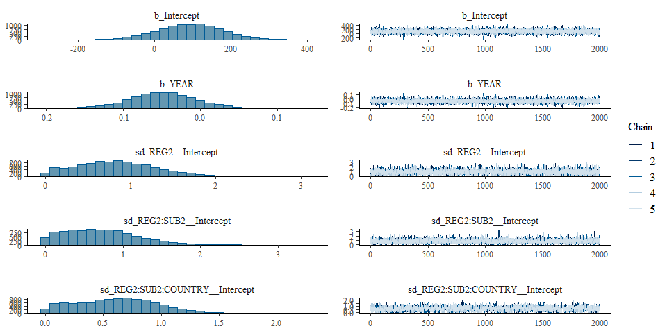
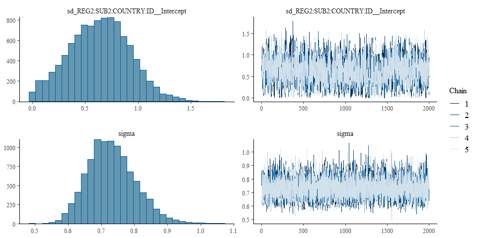
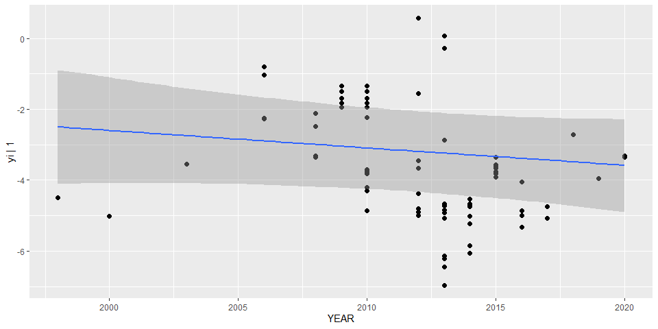

Global PAF of arsenic - IHD - incidence PAF - Fit model - Version 2
================
LoVa3397
2025-10-10

- [Settings](#settings)
- [Data](#data)
- [BRMS](#brms)
- [Session info](#session-info)

# Settings

``` r
## required packages ----
library(bd)
library(brms)
```

    ## Loading required package: Rcpp

    ## Loading 'brms' package (version 2.22.0). Useful instructions
    ## can be found by typing help('brms'). A more detailed introduction
    ## to the package is available through vignette('brms_overview').

    ## 
    ## Attaching package: 'brms'

    ## The following object is masked from 'package:stats':
    ## 
    ##     ar

``` r
library(ggplot2)
library(metafor)
```

    ## Loading required package: Matrix

    ## Loading required package: metadat

    ## Loading required package: numDeriv

    ## 
    ## Loading the 'metafor' package (version 4.8-0). For an
    ## introduction to the package please type: help(metafor)

``` r
library(readxl)
library(rmarkdown)
library(rms)
```

    ## Loading required package: Hmisc

    ## 
    ## Attaching package: 'Hmisc'

    ## The following objects are masked from 'package:base':
    ## 
    ##     format.pval, units

    ## 
    ## Attaching package: 'rms'

    ## The following object is masked from 'package:metafor':
    ## 
    ##     vif

``` r
library(tidyr)
```

    ## 
    ## Attaching package: 'tidyr'

    ## The following objects are masked from 'package:Matrix':
    ## 
    ##     expand, pack, unpack

``` r
library(knitr)


## global options ----
knitr::opts_chunk$set(fig.width = 10)
Date <- format(Sys.Date(), "%Y%m%d")
```

# Data

``` r
## import data
wd <- getwd()
setwd("..")
source("01-data.R")
```

    ## 
    ## Attaching package: 'FERG2'

    ## The following object is masked from 'package:bd':
    ## 
    ##     mean_ci

    ## Linking to GEOS 3.13.1, GDAL 3.11.0, PROJ 9.6.0; sf_use_s2() is TRUE

    ## 
    ## Attaching package: 'dplyr'

    ## The following objects are masked from 'package:Hmisc':
    ## 
    ##     src, summarize

    ## The following object is masked from 'package:bd':
    ## 
    ##     collapse

    ## The following objects are masked from 'package:stats':
    ## 
    ##     filter, lag

    ## The following objects are masked from 'package:base':
    ## 
    ##     intersect, setdiff, setequal, union

    ## 
    ## Attaching package: 'DescTools'

    ## The following objects are masked from 'package:Hmisc':
    ## 
    ##     %nin%, Label, Mean, Quantile

    ## 
    ## Attaching package: 'kableExtra'

    ## The following object is masked from 'package:dplyr':
    ## 
    ##     group_rows

    ## New names:
    ## • `` -> `...1`

    ## 'data.frame':    2341 obs. of  86 variables:
    ##  $ ...1                  : chr  "1" "2" "3" "4" ...
    ##  $ ISO3                  : chr  "0" "0" "0" "0" ...
    ##  $ year                  : num  1999 1999 1999 1999 1999 ...
    ##  $ SOURCE_ID             : chr  "124" "124" "124" "124" ...
    ##  $ SOURCE_AUTHOR         : chr  "H. N. Lynch, G. I. Greenberg, M. C. Pollock and A. S. Lewis" "H. N. Lynch, G. I. Greenberg, M. C. Pollock and A. S. Lewis" "H. N. Lynch, G. I. Greenberg, M. C. Pollock and A. S. Lewis" "H. N. Lynch, G. I. Greenberg, M. C. Pollock and A. S. Lewis" ...
    ##  $ SOURCE_YEAR           : num  2014 2014 2014 2014 2014 ...
    ##  $ SOURCE_TITLE          : chr  "A comprehensive evaluation of inorganic arsenic in food and considerations for dietary intake analyses" "A comprehensive evaluation of inorganic arsenic in food and considerations for dietary intake analyses" "A comprehensive evaluation of inorganic arsenic in food and considerations for dietary intake analyses" "A comprehensive evaluation of inorganic arsenic in food and considerations for dietary intake analyses" ...
    ##  $ SOURCE_DOI            : chr  "10.1016/j.scitotenv.2014.07.032" "10.1016/j.scitotenv.2014.07.032" "10.1016/j.scitotenv.2014.07.032" "10.1016/j.scitotenv.2014.07.032" ...
    ##  $ SOURCE_URL            : chr  NA NA NA NA ...
    ##  $ OPT_ACCESS_DATE       : chr  "45365" "45365" "45365" "45365" ...
    ##  $ OPT_STUDY_TYPE        : chr  "Other" "Other" "Other" "Other" ...
    ##  $ OPT_OTHER_STUDY_TYPE  : chr  "Comprehensive review" "Comprehensive review" "Comprehensive review" "Comprehensive review" ...
    ##  $ REF_NOTES             : chr  NA NA NA NA ...
    ##  $ REF_YEAR_START        : num  1985 1985 1985 1985 1985 ...
    ##  $ REF_YEAR_END          : num  2013 2013 2013 2013 2013 ...
    ##  $ REF_LOC_LEVEL         : chr  NA NA NA NA ...
    ##  $ REF_LOCATION          : chr  NA NA NA NA ...
    ##  $ REF_LOCATION_ISO3     : chr  "0" "0" "0" "0" ...
    ##  $ REF_SEX               : chr  NA NA NA NA ...
    ##  $ REF_AGE_START         : num  NA NA NA NA NA NA NA NA NA NA ...
    ##  $ REF_AGE_END           : num  NA NA NA NA NA NA NA NA NA NA ...
    ##  $ OPT_MEAN_AGE          : num  NA NA NA NA NA NA NA NA NA NA ...
    ##  $ OPT_MEDIAN_AGE        : logi  NA NA NA NA NA NA ...
    ##  $ OPT_SUBPOP            : logi  NA NA NA NA NA NA ...
    ##  $ OPT_CASES             : logi  NA NA NA NA NA NA ...
    ##  $ OPT_DISEASE           : logi  NA NA NA NA NA NA ...
    ##  $ REF_SAMPLE_SIZE       : num  267 3 3 65 6 16 10 17 29 16 ...
    ##  $ TDS                   : chr  "no" "no" "no" "no" ...
    ##  $ TDS_NUMBER_DAYS       : logi  NA NA NA NA NA NA ...
    ##  $ TDS_RAW_COOKED        : chr  NA NA NA NA ...
    ##  $ TDS_WATER_INTAKE      : chr  NA NA NA NA ...
    ##  $ BROAD_FOOD_CATEGORIES : chr  "Fish and seafood" "Snacks and confectioneries" "Other food products" "Other food products" ...
    ##  $ TYPE_FOOD             : chr  "Fish" "Chocolate/sweets" "Condiments/seasonings/other" "Condiments/seasonings/other (µg/L)" ...
    ##  $ SPECIES._VARIETY      : chr  NA NA NA NA ...
    ##  $ iAs_SPECIES           : chr  "iAs" "iAs" "iAs" "iAs" ...
    ##  $ LIMIT_OF_DETECTION    : num  NA NA NA NA NA NA NA NA NA NA ...
    ##  $ NUM_SAMP_DETECT       : num  NA NA NA NA NA NA NA NA NA NA ...
    ##  $ PER_SAMP_DETECT       : num  NA NA NA NA NA NA NA NA NA NA ...
    ##  $ UNITS_MEASUREMENTS    : chr  "µg/kg" "µg/kg" "µg/kg" "µg/L" ...
    ##  $ VALUE_X               : num  NA NA NA NA NA NA NA NA NA NA ...
    ##  $ VALUE_MEAN            : num  86 46 71 5.1 5.4 1.8 0.45 20 5 1 ...
    ##  $ X95._CI_MEAN_LB       : num  NA NA NA NA NA NA NA NA NA NA ...
    ##  $ X95._CI_MEAN_UB       : num  NA NA NA NA NA NA NA NA NA NA ...
    ##  $ VALUE_MEDIAN          : num  NA NA NA NA NA NA NA NA NA NA ...
    ##  $ VALUE_DENOM           : logi  NA NA NA NA NA NA ...
    ##  $ VALUE_SE              : chr  NA NA NA NA ...
    ##  $ VALUE_P000            : chr  "0.0021" "4.6" "1.3" "1.3" ...
    ##  $ VALUE_P2_5            : num  NA NA NA NA NA NA NA NA NA NA ...
    ##  $ VALUE_P5              : logi  NA NA NA NA NA NA ...
    ##  $ VALUE_P10             : logi  NA NA NA NA NA NA ...
    ##  $ VALUE_P25             : num  NA NA NA NA NA NA NA NA NA NA ...
    ##  $ VALUE_P75             : num  NA NA NA NA NA NA NA NA NA NA ...
    ##  $ VALUE_P90             : num  NA NA NA NA NA NA NA NA NA NA ...
    ##  $ VALUE_P95             : num  NA NA NA NA NA NA NA NA NA NA ...
    ##  $ VALUE_P97_5           : logi  NA NA NA NA NA NA ...
    ##  $ VALUE_P100            : chr  "1000" "140" "71" "3.7" ...
    ##  $ FLAG                  : num  5 5 5 5 5 5 5 5 5 5 ...
    ##  $ REG2                  : chr  "EUR" "EUR" "EUR" "EUR" ...
    ##  $ SUB2                  : chr  NA NA NA NA ...
    ##  $ BW                    : num  69.4 69.4 69.4 69.4 69.4 ...
    ##  $ VALUE                 : num  86 46 71 5.1 5.4 1.8 0.45 20 5 1 ...
    ##  $ converted_value       : num  NA NA NA NA NA NA NA NA NA NA ...
    ##  $ FLAG_REF_LOCATION     : num  0 0 0 0 0 0 0 0 0 0 ...
    ##  $ FLAG_REF_NOTES        : num  0 0 0 0 0 0 0 0 0 0 ...
    ##  $ FLAG_SOURCE_TITLE     : num  0 0 0 0 0 0 0 0 0 0 ...
    ##  $ FLAG_TERRITORY        : num  0 0 0 0 0 0 0 0 0 0 ...
    ##  $ ratio_ages            : num  NA NA NA NA NA NA NA NA NA NA ...
    ##  $ age_corrected.        : num  NA NA NA NA NA NA NA NA NA NA ...
    ##  $ observations          : chr  NA NA NA NA ...
    ##  $ converted_value_before: num  86 46 71 5.1 5.4 1.8 0.45 20 5 1 ...
    ##  $ ER_bladder            : num  NA NA NA NA NA NA NA NA NA NA ...
    ##  $ RR_bladder            : num  NA NA NA NA NA NA NA NA NA NA ...
    ##  $ PAF_bladder           : num  NA NA NA NA NA NA NA NA NA NA ...
    ##  $ ER_lung               : num  NA NA NA NA NA NA NA NA NA NA ...
    ##  $ RR_lung               : num  NA NA NA NA NA NA NA NA NA NA ...
    ##  $ PAF_lung              : num  NA NA NA NA NA NA NA NA NA NA ...
    ##  $ ER_heartinc           : num  NA NA NA NA NA NA NA NA NA NA ...
    ##  $ RR_heartinc           : num  NA NA NA NA NA NA NA NA NA NA ...
    ##  $ PAF_heartinc          : num  NA NA NA NA NA NA NA NA NA NA ...
    ##  $ ER_heartmrt           : num  NA NA NA NA NA NA NA NA NA NA ...
    ##  $ RR_heartmrt           : num  NA NA NA NA NA NA NA NA NA NA ...
    ##  $ PAF_heartmrt          : num  NA NA NA NA NA NA NA NA NA NA ...
    ##  $ location_name         : chr  NA NA NA NA ...
    ##  $ INC_skin              : num  NA NA NA NA NA NA NA NA NA NA ...
    ##  $ ER_skin               : num  NA NA NA NA NA NA NA NA NA NA ...
    ##  $ PAF_skin              : num  NA NA NA NA NA NA NA NA NA NA ...
    ## [1] "LC"
    ## [1] "BC"
    ## [1] "SC"
    ## [1] "IHD_inc"
    ## [1] "IHD_mrt"

<!-- --><!-- -->

    ## Warning: REML comparisons not meaningful for models with different fixed effects
    ## (use 'refit=TRUE' to refit both models based on ML estimation).

<!-- --><!-- -->

    ## Warning: REML comparisons not meaningful for models with different fixed effects
    ## (use 'refit=TRUE' to refit both models based on ML estimation).

<!-- --><!-- -->

    ## Warning: REML comparisons not meaningful for models with different fixed effects
    ## (use 'refit=TRUE' to refit both models based on ML estimation).

<!-- --><!-- -->

    ## Warning: REML comparisons not meaningful for models with different fixed effects
    ## (use 'refit=TRUE' to refit both models based on ML estimation).

<!-- --><!-- -->

    ## Warning: REML comparisons not meaningful for models with different fixed effects
    ## (use 'refit=TRUE' to refit both models based on ML estimation).

    ## Warning in system2("quarto", "-V", stdout = TRUE, env = paste0("TMPDIR=", : running command '"quarto"
    ## TMPDIR=C:/Users/LoVa3397/AppData/Local/Temp/RtmpIXNVU2/file11c4541252eb -V' had status 1

``` r
setwd(wd)
es <- es$IHD_inc
es$DTP_ID<-as.character(seq(1:length(es$SOURCE_ID)))
es$FLAG<-factor(es$FLAG, 
                levels=c(0,1,2,3,4,5,6, 7),
                labels=c("Keep data", "Data part of non WHO member states", "No WHO REG2 given",
                         "Year before 1990", "yi can't be calcualted", "TF choice to remove", 
                         "Excluded by preliminary checks", "Excluded in data cleaning"))
saveRDS(es, paste0("es_", Date, ".RDS"))
```

# BRMS

``` r
Parameters<- c("Number of iteration", "Warmup", "Delta value", "Maximum tree-depth","Levels","Random effect on each data point", "Stronger priors specified")
Values <- c("5000","3000",NA,NA,"Year, countries, Studies, no standard error and DTP_ID","Yes", "Normal(0,1)")
version_spe <- data.frame(Parameters,Values)

kable(caption = "Parameters of the model tested",row.names = FALSE, version_spe)
```

| Parameters | Values |
|:---|:---|
| Number of iteration | 5000 |
| Warmup | 3000 |
| Delta value | 0.95 |
| Maximum tree-depth | 15 |
| Levels | Year, countries, Studies |
| Random effect on each data point | No |
| Stronger priors specified | Normal(0,1) |

Parameters of the model tested

``` r
## fit model
fit_brms_reg_s2 <-
  brm(yi | 1 ~
        1 + YEAR +
        (1 | REG2) +
        (1 | REG2:SUB2) +
        (1 | REG2:SUB2:COUNTRY) +
        (1 | REG2:SUB2:COUNTRY:ID),
        # (1 | REG2:SUB2:COUNTRY:ID:DTP_ID),
      chains = 5, iter = 5000, warmup = 3000,
      cores = 5,
      prior = prior(normal(0,1), class = sd),
      data = subset(es, as.integer(FLAG) == 1),
      open_progress = FALSE,
      # control = list(adapt_delta=0.95, max_treedepth = 15),
      seed = 7)
```

    ## Compiling Stan program...

    ## Start sampling

    ## Warning: There were 2 divergent transitions after warmup. See
    ## https://mc-stan.org/misc/warnings.html#divergent-transitions-after-warmup
    ## to find out why this is a problem and how to eliminate them.

    ## Warning: Examine the pairs() plot to diagnose sampling problems

``` r
## model summary
summary(fit_brms_reg_s2)
```

    ## Warning: There were 2 divergent transitions after warmup. Increasing adapt_delta above 0.8 may help. See
    ## http://mc-stan.org/misc/warnings.html#divergent-transitions-after-warmup

    ##  Family: gaussian 
    ##   Links: mu = identity; sigma = identity 
    ## Formula: yi | 1 ~ 1 + YEAR + (1 | REG2) + (1 | REG2:SUB2) + (1 | REG2:SUB2:COUNTRY) + (1 | REG2:SUB2:COUNTRY:ID) 
    ##    Data: subset(es, as.integer(FLAG) == 1) (Number of observations: 82) 
    ##   Draws: 5 chains, each with iter = 5000; warmup = 3000; thin = 1;
    ##          total post-warmup draws = 10000
    ## 
    ## Multilevel Hyperparameters:
    ## ~REG2 (Number of levels: 6) 
    ##               Estimate Est.Error l-95% CI u-95% CI Rhat Bulk_ESS Tail_ESS
    ## sd(Intercept)     0.85      0.48     0.06     1.89 1.00     4299     4320
    ## 
    ## ~REG2:SUB2 (Number of levels: 9) 
    ##               Estimate Est.Error l-95% CI u-95% CI Rhat Bulk_ESS Tail_ESS
    ## sd(Intercept)     0.72      0.46     0.03     1.71 1.00     3463     4259
    ## 
    ## ~REG2:SUB2:COUNTRY (Number of levels: 23) 
    ##               Estimate Est.Error l-95% CI u-95% CI Rhat Bulk_ESS Tail_ESS
    ## sd(Intercept)     0.62      0.34     0.04     1.29 1.01     1808     3447
    ## 
    ## ~REG2:SUB2:COUNTRY:ID (Number of levels: 29) 
    ##               Estimate Est.Error l-95% CI u-95% CI Rhat Bulk_ESS Tail_ESS
    ## sd(Intercept)     0.64      0.29     0.08     1.19 1.00     1785     2381
    ## 
    ## Regression Coefficients:
    ##           Estimate Est.Error l-95% CI u-95% CI Rhat Bulk_ESS Tail_ESS
    ## Intercept    94.67     85.32   -72.20   263.88 1.00     6355     7236
    ## YEAR         -0.05      0.04    -0.13     0.03 1.00     6358     7259
    ## 
    ## Further Distributional Parameters:
    ##       Estimate Est.Error l-95% CI u-95% CI Rhat Bulk_ESS Tail_ESS
    ## sigma     0.73      0.07     0.60     0.89 1.00     6221     6391
    ## 
    ## Draws were sampled using sampling(NUTS). For each parameter, Bulk_ESS
    ## and Tail_ESS are effective sample size measures, and Rhat is the potential
    ## scale reduction factor on split chains (at convergence, Rhat = 1).

``` r
plot(fit_brms_reg_s2, ask = FALSE)
```

<!-- --><!-- -->

``` r
plot(conditional_effects(fit_brms_reg_s2), points = TRUE, ask=FALSE)
```

<!-- -->

``` r
## show model code
stancode(fit_brms_reg_s2)
```

    ## // generated with brms 2.22.0
    ## functions {
    ## }
    ## data {
    ##   int<lower=1> N;  // total number of observations
    ##   vector[N] Y;  // response variable
    ##   int<lower=1> K;  // number of population-level effects
    ##   matrix[N, K] X;  // population-level design matrix
    ##   int<lower=1> Kc;  // number of population-level effects after centering
    ##   // data for group-level effects of ID 1
    ##   int<lower=1> N_1;  // number of grouping levels
    ##   int<lower=1> M_1;  // number of coefficients per level
    ##   array[N] int<lower=1> J_1;  // grouping indicator per observation
    ##   // group-level predictor values
    ##   vector[N] Z_1_1;
    ##   // data for group-level effects of ID 2
    ##   int<lower=1> N_2;  // number of grouping levels
    ##   int<lower=1> M_2;  // number of coefficients per level
    ##   array[N] int<lower=1> J_2;  // grouping indicator per observation
    ##   // group-level predictor values
    ##   vector[N] Z_2_1;
    ##   // data for group-level effects of ID 3
    ##   int<lower=1> N_3;  // number of grouping levels
    ##   int<lower=1> M_3;  // number of coefficients per level
    ##   array[N] int<lower=1> J_3;  // grouping indicator per observation
    ##   // group-level predictor values
    ##   vector[N] Z_3_1;
    ##   // data for group-level effects of ID 4
    ##   int<lower=1> N_4;  // number of grouping levels
    ##   int<lower=1> M_4;  // number of coefficients per level
    ##   array[N] int<lower=1> J_4;  // grouping indicator per observation
    ##   // group-level predictor values
    ##   vector[N] Z_4_1;
    ##   int prior_only;  // should the likelihood be ignored?
    ## }
    ## transformed data {
    ##   matrix[N, Kc] Xc;  // centered version of X without an intercept
    ##   vector[Kc] means_X;  // column means of X before centering
    ##   for (i in 2:K) {
    ##     means_X[i - 1] = mean(X[, i]);
    ##     Xc[, i - 1] = X[, i] - means_X[i - 1];
    ##   }
    ## }
    ## parameters {
    ##   vector[Kc] b;  // regression coefficients
    ##   real Intercept;  // temporary intercept for centered predictors
    ##   real<lower=0> sigma;  // dispersion parameter
    ##   vector<lower=0>[M_1] sd_1;  // group-level standard deviations
    ##   array[M_1] vector[N_1] z_1;  // standardized group-level effects
    ##   vector<lower=0>[M_2] sd_2;  // group-level standard deviations
    ##   array[M_2] vector[N_2] z_2;  // standardized group-level effects
    ##   vector<lower=0>[M_3] sd_3;  // group-level standard deviations
    ##   array[M_3] vector[N_3] z_3;  // standardized group-level effects
    ##   vector<lower=0>[M_4] sd_4;  // group-level standard deviations
    ##   array[M_4] vector[N_4] z_4;  // standardized group-level effects
    ## }
    ## transformed parameters {
    ##   vector[N_1] r_1_1;  // actual group-level effects
    ##   vector[N_2] r_2_1;  // actual group-level effects
    ##   vector[N_3] r_3_1;  // actual group-level effects
    ##   vector[N_4] r_4_1;  // actual group-level effects
    ##   real lprior = 0;  // prior contributions to the log posterior
    ##   r_1_1 = (sd_1[1] * (z_1[1]));
    ##   r_2_1 = (sd_2[1] * (z_2[1]));
    ##   r_3_1 = (sd_3[1] * (z_3[1]));
    ##   r_4_1 = (sd_4[1] * (z_4[1]));
    ##   lprior += student_t_lpdf(Intercept | 3, -3.8, 2.5);
    ##   lprior += student_t_lpdf(sigma | 3, 0, 2.5)
    ##     - 1 * student_t_lccdf(0 | 3, 0, 2.5);
    ##   lprior += normal_lpdf(sd_1 | 0, 1)
    ##     - 1 * normal_lccdf(0 | 0, 1);
    ##   lprior += normal_lpdf(sd_2 | 0, 1)
    ##     - 1 * normal_lccdf(0 | 0, 1);
    ##   lprior += normal_lpdf(sd_3 | 0, 1)
    ##     - 1 * normal_lccdf(0 | 0, 1);
    ##   lprior += normal_lpdf(sd_4 | 0, 1)
    ##     - 1 * normal_lccdf(0 | 0, 1);
    ## }
    ## model {
    ##   // likelihood including constants
    ##   if (!prior_only) {
    ##     // initialize linear predictor term
    ##     vector[N] mu = rep_vector(0.0, N);
    ##     mu += Intercept;
    ##     for (n in 1:N) {
    ##       // add more terms to the linear predictor
    ##       mu[n] += r_1_1[J_1[n]] * Z_1_1[n] + r_2_1[J_2[n]] * Z_2_1[n] + r_3_1[J_3[n]] * Z_3_1[n] + r_4_1[J_4[n]] * Z_4_1[n];
    ##     }
    ##     target += normal_id_glm_lpdf(Y | Xc, mu, b, sigma);
    ##   }
    ##   // priors including constants
    ##   target += lprior;
    ##   target += std_normal_lpdf(z_1[1]);
    ##   target += std_normal_lpdf(z_2[1]);
    ##   target += std_normal_lpdf(z_3[1]);
    ##   target += std_normal_lpdf(z_4[1]);
    ## }
    ## generated quantities {
    ##   // actual population-level intercept
    ##   real b_Intercept = Intercept - dot_product(means_X, b);
    ## }

``` r
## save model fit
saveRDS(fit_brms_reg_s2, file = "fit_brms_reg_s2.rds")
```

# Session info

``` r
sessioninfo::session_info()
```

    ## Warning in system2("quarto", "-V", stdout = TRUE, env = paste0("TMPDIR=", : running command '"quarto"
    ## TMPDIR=C:/Users/LoVa3397/AppData/Local/Temp/RtmpIXNVU2/file11c43d016d31 -V' had status 1

    ## ─ Session info ────────────────────────────────────────────────────────────────────────────────────────────────────────
    ##  setting  value
    ##  version  R version 4.5.1 (2025-06-13 ucrt)
    ##  os       Windows 10 x64 (build 19045)
    ##  system   x86_64, mingw32
    ##  ui       RStudio
    ##  language (EN)
    ##  collate  English_United States.utf8
    ##  ctype    English_United States.utf8
    ##  tz       Europe/Brussels
    ##  date     2025-10-10
    ##  rstudio  2025.09.0+387 Cucumberleaf Sunflower (desktop)
    ##  pandoc   3.6.3 @ C:/Program Files/RStudio/resources/app/bin/quarto/bin/tools/ (via rmarkdown)
    ##  quarto   ERROR: Unknown command "TMPDIR=C:/Users/LoVa3397/AppData/Local/Temp/RtmpIXNVU2/file11c43d016d31". Did you mean command "install"? @ C:\\PROGRA~1\\RStudio\\RESOUR~1\\app\\bin\\quarto\\bin\\quarto.exe
    ## 
    ## ─ Packages ────────────────────────────────────────────────────────────────────────────────────────────────────────────
    ##  ! package        * version    date (UTC) lib source
    ##    abind            1.4-8      2024-09-12 [1] CRAN (R 4.5.0)
    ##    backports        1.5.0      2024-05-23 [1] CRAN (R 4.5.0)
    ##    base64enc        0.1-3      2015-07-28 [1] CRAN (R 4.5.0)
    ##    bayesplot        1.13.0     2025-06-18 [1] CRAN (R 4.5.1)
    ##    bd             * 0.0.14     2025-07-14 [1] Github (brechtdv/bd@652191c)
    ##    boot             1.3-31     2024-08-28 [1] CRAN (R 4.5.1)
    ##    bridgesampling   1.1-2      2021-04-16 [1] CRAN (R 4.5.1)
    ##    brms           * 2.22.0     2024-09-23 [1] CRAN (R 4.5.1)
    ##    Brobdingnag      1.2-9      2022-10-19 [1] CRAN (R 4.5.1)
    ##    callr            3.7.6      2024-03-25 [1] CRAN (R 4.5.1)
    ##    cellranger       1.1.0      2016-07-27 [1] CRAN (R 4.5.1)
    ##    checkmate        2.3.2      2024-07-29 [1] CRAN (R 4.5.1)
    ##    class            7.3-23     2025-01-01 [1] CRAN (R 4.5.1)
    ##    classInt         0.4-11     2025-01-08 [1] CRAN (R 4.5.1)
    ##    cli              3.6.5      2025-04-23 [1] CRAN (R 4.5.1)
    ##    cluster          2.1.8.1    2025-03-12 [1] CRAN (R 4.5.1)
    ##    coda             0.19-4.1   2024-01-31 [1] CRAN (R 4.5.1)
    ##    codetools        0.2-20     2024-03-31 [1] CRAN (R 4.5.1)
    ##    colorspace       2.1-1      2024-07-26 [1] CRAN (R 4.5.1)
    ##    curl             6.4.0      2025-06-22 [1] CRAN (R 4.5.1)
    ##    data.table       1.17.8     2025-07-10 [1] CRAN (R 4.5.1)
    ##    DBI              1.2.3      2024-06-02 [1] CRAN (R 4.5.1)
    ##    DescTools      * 0.99.60    2025-03-28 [1] CRAN (R 4.5.1)
    ##    digest           0.6.37     2024-08-19 [1] CRAN (R 4.5.1)
    ##    distributional   0.5.0      2024-09-17 [1] CRAN (R 4.5.1)
    ##    dplyr          * 1.1.4      2023-11-17 [1] CRAN (R 4.5.1)
    ##    e1071            1.7-16     2024-09-16 [1] CRAN (R 4.5.1)
    ##    evaluate         1.0.4      2025-06-18 [1] CRAN (R 4.5.1)
    ##    Exact            3.3        2024-07-21 [1] CRAN (R 4.5.0)
    ##    expm             1.0-0      2024-08-19 [1] CRAN (R 4.5.1)
    ##    farver           2.1.2      2024-05-13 [1] CRAN (R 4.5.1)
    ##    fastmap          1.2.0      2024-05-15 [1] CRAN (R 4.5.1)
    ##    FERG2          * 0.0.5      2025-07-15 [1] Github (brechtdv/FERG2@c2d4ac1)
    ##    forcats          1.0.0      2023-01-29 [1] CRAN (R 4.5.1)
    ##    foreign          0.8-90     2025-03-31 [1] CRAN (R 4.5.1)
    ##    Formula          1.2-5      2023-02-24 [1] CRAN (R 4.5.0)
    ##    fs               1.6.6      2025-04-12 [1] CRAN (R 4.5.1)
    ##    generics         0.1.4      2025-05-09 [1] CRAN (R 4.5.1)
    ##    ggplot2        * 3.5.2      2025-04-09 [1] CRAN (R 4.5.1)
    ##    gld              2.6.7      2025-01-17 [1] CRAN (R 4.5.1)
    ##    glue             1.8.0      2024-09-30 [1] CRAN (R 4.5.1)
    ##    gridExtra        2.3        2017-09-09 [1] CRAN (R 4.5.1)
    ##    gtable           0.3.6      2024-10-25 [1] CRAN (R 4.5.1)
    ##    haven            2.5.5      2025-05-30 [1] CRAN (R 4.5.1)
    ##    Hmisc          * 5.2-3      2025-03-16 [1] CRAN (R 4.5.1)
    ##    hms              1.1.3      2023-03-21 [1] CRAN (R 4.5.1)
    ##    htmlTable        2.4.3      2024-07-21 [1] CRAN (R 4.5.1)
    ##    htmltools        0.5.8.1    2024-04-04 [1] CRAN (R 4.5.1)
    ##    htmlwidgets      1.6.4      2023-12-06 [1] CRAN (R 4.5.1)
    ##    httr             1.4.7      2023-08-15 [1] CRAN (R 4.5.1)
    ##    inline           0.3.21     2025-01-09 [1] CRAN (R 4.5.1)
    ##    jsonlite         2.0.0      2025-03-27 [1] CRAN (R 4.5.1)
    ##    kableExtra     * 1.4.0      2024-01-24 [1] CRAN (R 4.5.1)
    ##    KernSmooth       2.23-26    2025-01-01 [1] CRAN (R 4.5.1)
    ##    knitr          * 1.50       2025-03-16 [1] CRAN (R 4.5.1)
    ##    labeling         0.4.3      2023-08-29 [1] CRAN (R 4.5.0)
    ##    lattice          0.22-7     2025-04-02 [1] CRAN (R 4.5.1)
    ##    lifecycle        1.0.4      2023-11-07 [1] CRAN (R 4.5.1)
    ##    lmom             3.2        2024-09-30 [1] CRAN (R 4.5.0)
    ##    loo              2.8.0      2024-07-03 [1] CRAN (R 4.5.1)
    ##    magrittr         2.0.3      2022-03-30 [1] CRAN (R 4.5.1)
    ##    MASS             7.3-65     2025-02-28 [1] CRAN (R 4.5.1)
    ##    mathjaxr         1.8-0      2025-04-30 [1] CRAN (R 4.5.1)
    ##    Matrix         * 1.7-3      2025-03-11 [1] CRAN (R 4.5.1)
    ##    MatrixModels     0.5-4      2025-03-26 [1] CRAN (R 4.5.1)
    ##    matrixStats      1.5.0      2025-01-07 [1] CRAN (R 4.5.1)
    ##    metadat        * 1.4-0      2025-02-04 [1] CRAN (R 4.5.1)
    ##    metafor        * 4.8-0      2025-01-28 [1] CRAN (R 4.5.1)
    ##    multcomp         1.4-28     2025-01-29 [1] CRAN (R 4.5.1)
    ##    mvtnorm          1.3-3      2025-01-10 [1] CRAN (R 4.5.1)
    ##    nlme             3.1-168    2025-03-31 [1] CRAN (R 4.5.1)
    ##    nnet             7.3-20     2025-01-01 [1] CRAN (R 4.5.1)
    ##    numDeriv       * 2016.8-1.1 2019-06-06 [1] CRAN (R 4.5.0)
    ##    pillar           1.11.0     2025-07-04 [1] CRAN (R 4.5.1)
    ##    pkgbuild         1.4.8      2025-05-26 [1] CRAN (R 4.5.1)
    ##    pkgconfig        2.0.3      2019-09-22 [1] CRAN (R 4.5.1)
    ##    plyr             1.8.9      2023-10-02 [1] CRAN (R 4.5.1)
    ##    polspline        1.1.25     2024-05-10 [1] CRAN (R 4.5.0)
    ##    posterior        1.6.1      2025-02-27 [1] CRAN (R 4.5.1)
    ##    processx         3.8.6      2025-02-21 [1] CRAN (R 4.5.1)
    ##    proxy            0.4-27     2022-06-09 [1] CRAN (R 4.5.1)
    ##    ps               1.9.1      2025-04-12 [1] CRAN (R 4.5.1)
    ##    purrr            1.1.0      2025-07-10 [1] CRAN (R 4.5.1)
    ##    quantreg         6.1        2025-03-10 [1] CRAN (R 4.5.1)
    ##    QuickJSR         1.8.0      2025-06-09 [1] CRAN (R 4.5.1)
    ##    R6               2.6.1      2025-02-15 [1] CRAN (R 4.5.1)
    ##    RColorBrewer     1.1-3      2022-04-03 [1] CRAN (R 4.5.0)
    ##    Rcpp           * 1.1.0      2025-07-02 [1] CRAN (R 4.5.1)
    ##  D RcppParallel     5.1.10     2025-01-24 [1] CRAN (R 4.5.1)
    ##    readr            2.1.5      2024-01-10 [1] CRAN (R 4.5.1)
    ##    readxl         * 1.4.5      2025-03-07 [1] CRAN (R 4.5.1)
    ##    reshape2         1.4.4      2020-04-09 [1] CRAN (R 4.5.1)
    ##    rlang            1.1.6      2025-04-11 [1] CRAN (R 4.5.1)
    ##    rmarkdown      * 2.29       2024-11-04 [1] CRAN (R 4.5.1)
    ##    rms            * 8.0-0      2025-04-04 [1] CRAN (R 4.5.1)
    ##    rootSolve        1.8.2.4    2023-09-21 [1] CRAN (R 4.5.0)
    ##    rpart            4.1.24     2025-01-07 [1] CRAN (R 4.5.1)
    ##    rstan            2.32.7     2025-03-10 [1] CRAN (R 4.5.1)
    ##    rstantools       2.4.0      2024-01-31 [1] CRAN (R 4.5.1)
    ##    rstudioapi       0.17.1     2024-10-22 [1] CRAN (R 4.5.1)
    ##    sandwich         3.1-1      2024-09-15 [1] CRAN (R 4.5.1)
    ##    scales         * 1.4.0      2025-04-24 [1] CRAN (R 4.5.1)
    ##    sessioninfo      1.2.3      2025-02-05 [1] CRAN (R 4.5.1)
    ##    sf             * 1.0-21     2025-05-15 [1] CRAN (R 4.5.1)
    ##    SparseM          1.84-2     2024-07-17 [1] CRAN (R 4.5.1)
    ##    StanHeaders      2.32.10    2024-07-15 [1] CRAN (R 4.5.1)
    ##    stringi          1.8.7      2025-03-27 [1] CRAN (R 4.5.0)
    ##    stringr          1.5.1      2023-11-14 [1] CRAN (R 4.5.1)
    ##    survival         3.8-3      2024-12-17 [1] CRAN (R 4.5.1)
    ##    svglite          2.2.1      2025-05-12 [1] CRAN (R 4.5.1)
    ##    systemfonts      1.2.3      2025-04-30 [1] CRAN (R 4.5.1)
    ##    tensorA          0.36.2.1   2023-12-13 [1] CRAN (R 4.5.0)
    ##    textshaping      1.0.1      2025-05-01 [1] CRAN (R 4.5.1)
    ##    TH.data          1.1-3      2025-01-17 [1] CRAN (R 4.5.1)
    ##    tibble           3.3.0      2025-06-08 [1] CRAN (R 4.5.1)
    ##    tidyr          * 1.3.1      2024-01-24 [1] CRAN (R 4.5.1)
    ##    tidyselect       1.2.1      2024-03-11 [1] CRAN (R 4.5.1)
    ##    tzdb             0.5.0      2025-03-15 [1] CRAN (R 4.5.1)
    ##    units            0.8-7      2025-03-11 [1] CRAN (R 4.5.1)
    ##    V8               6.0.4      2025-06-04 [1] CRAN (R 4.5.1)
    ##    vctrs            0.6.5      2023-12-01 [1] CRAN (R 4.5.1)
    ##    viridisLite      0.4.2      2023-05-02 [1] CRAN (R 4.5.1)
    ##    withr            3.0.2      2024-10-28 [1] CRAN (R 4.5.1)
    ##    xfun             0.52       2025-04-02 [1] CRAN (R 4.5.1)
    ##    xml2             1.3.8      2025-03-14 [1] CRAN (R 4.5.1)
    ##    yaml             2.3.10     2024-07-26 [1] CRAN (R 4.5.0)
    ##    zoo              1.8-14     2025-04-10 [1] CRAN (R 4.5.1)
    ## 
    ##  [1] C:/Program Files/R/R-4.5.1/library
    ## 
    ##  * ── Packages attached to the search path.
    ##  D ── DLL MD5 mismatch, broken installation.
    ## 
    ## ───────────────────────────────────────────────────────────────────────────────────────────────────────────────────────

``` r
##rmarkdown::render("02-fit.R")
```
