Global incidence of CKD4 Age 75-84 • Estimate incidence
================
LoVa3397
2025-10-16

- [Settings](#settings)
- [Model fit](#model-fit)
- [Predict all](#predict-all)
- [Summarize predictions:](#summarize-predictions)
  - [Global](#global)
  - [Regions](#regions)
  - [Subregions](#subregions)
  - [Countries](#countries)
- [Session info](#session-info)

# Settings

``` r
## required packages ----
library(bd)
library(brms)
library(FERG2)
library(ggplot2)
library(knitr)
library(rmarkdown)
library(sf)
library(tidyr)
library(dplyr)
library(DescTools)
```

    ## 
    ## Attaching package: 'DescTools'

    ## The following objects are masked from 'package:Hmisc':
    ## 
    ##     %nin%, Label, Mean, Quantile

``` r
library(readxl)
library(kableExtra)

## global options ----
knitr::opts_chunk$set(fig.width = 10)
do.call(file.remove, list(list.files(params$PlotDir, full.names = TRUE)))
```

    ##  [1] TRUE TRUE TRUE TRUE TRUE TRUE TRUE TRUE TRUE TRUE TRUE TRUE TRUE TRUE

# Model fit

``` r
es <- readRDS(paste0(params$Dir, "/", params$es))
es <- subset(es, as.integer(FLAG) == 1)
fit_brms_reg_s <- readRDS(paste0(params$Dir, "/", params$fit))
summary(fit_brms_reg_s)
```

    ## Warning: There were 12 divergent transitions after warmup. Increasing adapt_delta above 0.93 may help. See
    ## http://mc-stan.org/misc/warnings.html#divergent-transitions-after-warmup

    ##  Family: gaussian 
    ##   Links: mu = identity; sigma = identity 
    ## Formula: yi | se(sei) ~ 1 + YEAR + (1 | REG2) + (1 | REG2:SUB2) + (1 | REG2:SUB2:COUNTRY) + (1 | REG2:SUB2:COUNTRY:ID) + (1 | REG2:SUB2:COUNTRY:ID:DTP_ID) 
    ##    Data: subset(es, as.integer(FLAG) == 1) (Number of observations: 200) 
    ##   Draws: 5 chains, each with iter = 5000; warmup = 3000; thin = 1;
    ##          total post-warmup draws = 10000
    ## 
    ## Multilevel Hyperparameters:
    ## ~REG2 (Number of levels: 4) 
    ##               Estimate Est.Error l-95% CI u-95% CI Rhat Bulk_ESS Tail_ESS
    ## sd(Intercept)     1.69      0.82     0.12     3.22 1.00     4769     4256
    ## 
    ## ~REG2:SUB2 (Number of levels: 7) 
    ##               Estimate Est.Error l-95% CI u-95% CI Rhat Bulk_ESS Tail_ESS
    ## sd(Intercept)     1.02      0.73     0.04     2.65 1.00     6316     6353
    ## 
    ## ~REG2:SUB2:COUNTRY (Number of levels: 17) 
    ##               Estimate Est.Error l-95% CI u-95% CI Rhat Bulk_ESS Tail_ESS
    ## sd(Intercept)     1.85      0.79     0.22     3.36 1.00     2501     2832
    ## 
    ## ~REG2:SUB2:COUNTRY:ID (Number of levels: 110) 
    ##               Estimate Est.Error l-95% CI u-95% CI Rhat Bulk_ESS Tail_ESS
    ## sd(Intercept)     3.79      0.35     3.15     4.54 1.00     5677     7240
    ## 
    ## ~REG2:SUB2:COUNTRY:ID:DTP_ID (Number of levels: 200) 
    ##               Estimate Est.Error l-95% CI u-95% CI Rhat Bulk_ESS Tail_ESS
    ## sd(Intercept)     1.21      0.16     0.94     1.57 1.00     4413     6188
    ## 
    ## Regression Coefficients:
    ##           Estimate Est.Error l-95% CI u-95% CI Rhat Bulk_ESS Tail_ESS
    ## Intercept   130.99    108.24   -80.54   348.65 1.00     5896     6919
    ## YEAR         -0.07      0.05    -0.18     0.04 1.00     5888     6928
    ## 
    ## Further Distributional Parameters:
    ##       Estimate Est.Error l-95% CI u-95% CI Rhat Bulk_ESS Tail_ESS
    ## sigma     0.00      0.00     0.00     0.00   NA       NA       NA
    ## 
    ## Draws were sampled using sampling(NUTS). For each parameter, Bulk_ESS
    ## and Tail_ESS are effective sample size measures, and Rhat is the potential
    ## scale reduction factor on split chains (at convergence, Rhat = 1).

``` r
zero_cases<- read_xlsx("endemic_countries.xlsx")%>%
  select(REG2, SUB2, ISO3, Country, cttf_cadmium) %>% 
  rename(COUNTRY=ISO3, COUNTRY_LABEL = Country) %>%
  mutate(DISEASEFREE = cttf_cadmium)

kable(
  caption = "Disease-free countries",
  row.names = FALSE,
  subset(zero_cases, cttf_cadmium==0)[, 4])
```

| COUNTRY_LABEL |
|:--------------|

Disease-free countries

``` r
country_with_data <- es %>% select(ISO3) %>% distinct() %>% mutate(DATA=1, COUNTRY = ISO3)
Sub2_with_data <- es %>% select(SUB2) %>% distinct() %>% mutate(DATASUB2=1)
Reg2_with_data <- es %>% select(REG2) %>% distinct() %>% mutate(DATAREG2=1)
zero_cases <- left_join(zero_cases, country_with_data)
```

    ## Joining with `by = join_by(COUNTRY)`

``` r
zero_cases <- left_join(zero_cases, Sub2_with_data)
```

    ## Joining with `by = join_by(SUB2)`

``` r
zero_cases <- left_join(zero_cases, Reg2_with_data) %>%
  select(-c(ISO3)) %>%
  mutate(ESTIMATES = case_when(
    DATA == 1 ~ 1,
    DISEASEFREE == 0 ~ 2,
    is.na(DATA) & DISEASEFREE == 1 & DATASUB2 == 1 ~ 3,
    is.na(DATA) & DISEASEFREE == 1 & is.na(DATASUB2) & DATAREG2 == 1 ~ 4, 
    is.na(DATA) & DISEASEFREE == 1  & is.na(DATASUB2) & is.na(DATAREG2) ~5))
```

    ## Joining with `by = join_by(REG2)`

``` r
zero_cases$ESTIMATES <- factor(zero_cases$ESTIMATES, 
                               level = c(1,2,3,4,5),
                               labels = c("Data present", "Disease free", "Data in subregion", "Data in region", "Data in world"))
```

# Predict all

``` r
## set up dataframe
sim_all <-
  data.frame(
    sei = 0,
    REG2 = FERG2:::countries$REG2,
    SUB2 = FERG2:::countries$SUB2,
    COUNTRY = FERG2:::countries$ISO3,
    YEAR = rep(2000:2021, each = nrow(FERG2:::countries)))
sim_all <- sim_all %>% left_join(zero_cases) %>% select(sei, REG2, SUB2, COUNTRY, YEAR, ESTIMATES)
```

    ## Joining with `by = join_by(REG2, SUB2, COUNTRY)`

``` r
## draw from expected value of posterior predictive dist
set.seed(10)
# fit_all <- 
#   posterior_epred(
#     object = fit_brms_reg_s,
#     newdata = sim_all,
#     allow_new_levels = TRUE,
#     sample_new_levels = "uncertainty",
#     re_formula = ~ 1 + YEAR +
#       (1 | REG2) +
#       (1 | REG2:SUB2) +
#       (1 | REG2:SUB2:COUNTRY)
#   )

draws_fit <- as_draws_df(fit_brms_reg_s)
fit_all <- data.frame(1:10000)
for (x in 1:nrow(sim_all)){
  if (as.integer(sim_all[x, "ESTIMATES"]) == 1){
    # Data present for country
    fit_all[[paste0("V",x)]] <- draws_fit$b_Intercept +                                                                               # Global intercept
      sim_all[x, "YEAR"] * draws_fit$b_YEAR +                                                                                         # Year component
      draws_fit[[paste0("r_REG2[",sim_all[x,"REG2"],",Intercept]")]] +                                                                # Regional component
      draws_fit[[paste0("r_REG2:SUB2[",sim_all[x,"REG2"],"_",sim_all[x,"SUB2"],",Intercept]")]] +                                     # Sub regional component
      draws_fit[[paste0("r_REG2:SUB2:COUNTRY[",sim_all[x,"REG2"],"_",sim_all[x,"SUB2"],"_",sim_all[x,"COUNTRY"],",Intercept]")]]      # Country component
  } else if (as.integer(sim_all[x, "ESTIMATES"]) == 2) {
    # Disease-free country
    fit_all[[paste0("V",x)]] <- 0
  } else if (as.integer(sim_all[x, "ESTIMATES"]) == 3){
    # Data not present for country, but present in subregion
    fit_all[[paste0("V",x)]] <- draws_fit$b_Intercept +                                                                               # Global intercept
      sim_all[x, "YEAR"] * draws_fit$b_YEAR +                                                                                         # Year component
      draws_fit[[paste0("r_REG2[",sim_all[x,"REG2"],",Intercept]")]] +                                                                # Regional component
      draws_fit[[paste0("r_REG2:SUB2[",sim_all[x,"REG2"],"_",sim_all[x,"SUB2"],",Intercept]")]]                                       # Sub regional component
  } else if (as.integer(sim_all[x, "ESTIMATES"]) == 4){
    # Data not present for country, but present in region
    fit_all[[paste0("V",x)]] <- draws_fit$b_Intercept +                                                                               # Global intercept
      sim_all[x, "YEAR"] * draws_fit$b_YEAR +                                                                                         # Year component
      draws_fit[[paste0("r_REG2[",sim_all[x,"REG2"],",Intercept]")]]                                                                  # Regional component
  } else if (as.integer(sim_all[x, "ESTIMATES"]) == 5){
    # Data not present for country
    fit_all[[paste0("V",x)]] <- draws_fit$b_Intercept + 
      sim_all[x, "YEAR"] * draws_fit$b_YEAR
  } 
}

fit_all <- fit_all %>% select(-c(X1.10000))


## calculate cases
age_start <- as.numeric(gsub("-.*", "", params$Age))
age_end <- as.numeric(gsub(".*-", "", params$Age))
pop <- subset(FERG2:::pop, AGE >= age_start & AGE <= age_end)
sim_all$SIM <- t(fit_all)
pop_all <- aggregate(POP ~ ISO3 + YEAR, pop, sum)
sim_all <- merge(sim_all, pop_all,
                 by.x = c("COUNTRY", "YEAR"), by.y = c("ISO3", "YEAR"))
sim_all <- sim_all %>% left_join(zero_cases)
```

    ## Joining with `by = join_by(COUNTRY, REG2, SUB2, ESTIMATES)`

``` r
sim_all$CASES <- exp(sim_all$SIM) * sim_all$POP / 1e5
sim_all$CASES <- sim_all$CASES*sim_all$DISEASEFREE
sim_all$SIM<-sim_all$SIM*sim_all$DISEASEFREE
sim_all$sei<-sim_all$sei*sim_all$DISEASEFREE
saveRDS(sim_all, paste0(params$Dir, "/", params$sim_all))

## aggregate global
sim_all_glb <- with(sim_all, aggregate(CASES ~ YEAR, FUN = sum))
all_glb_id <- sim_all_glb[1]
all_glb_nr <-
  t(apply(sim_all_glb[, grepl("V", names(sim_all_glb))], 1, mean_median_ci))
all_glb_nr <- data.frame(all_glb_nr)
names(all_glb_nr) <- c("VAL_MEAN", "VAL_MEDIAN", "VAL_LWR", "VAL_UPR")
all_glb_nr <- cbind(all_glb_id, all_glb_nr)
all_glb_nr$LOCATION <- "Global"
all_glb_nr$LOCATION_NAME <- "Global"
all_glb_nr$METRIC <- "Number"
str(all_glb_nr)
```

    ## 'data.frame':    22 obs. of  8 variables:
    ##  $ YEAR         : int  2000 2001 2002 2003 2004 2005 2006 2007 2008 2009 ...
    ##  $ VAL_MEAN     : num  35.7 34 32.6 31.3 30.3 ...
    ##  $ VAL_MEDIAN   : num  14 13.7 13.4 13.1 12.9 ...
    ##  $ VAL_LWR      : num  3.46 3.45 3.42 3.36 3.28 ...
    ##  $ VAL_UPR      : num  114 108 105 103 100 ...
    ##  $ LOCATION     : chr  "Global" "Global" "Global" "Global" ...
    ##  $ LOCATION_NAME: chr  "Global" "Global" "Global" "Global" ...
    ##  $ METRIC       : chr  "Number" "Number" "Number" "Number" ...

``` r
all_glb_rt <- all_glb_nr
all_glb_rt$POP <- with(sim_all, tapply(POP, YEAR, sum))
all_glb_rt$VAL_MEAN <- 1e5 * all_glb_rt$VAL_MEAN / all_glb_rt$POP
all_glb_rt$VAL_MEDIAN <- 1e5 * all_glb_rt$VAL_MEDIAN / all_glb_rt$POP
all_glb_rt$VAL_LWR <- 1e5 * all_glb_rt$VAL_LWR / all_glb_rt$POP
all_glb_rt$VAL_UPR <- 1e5 * all_glb_rt$VAL_UPR / all_glb_rt$POP
all_glb_rt$METRIC <- "Rate"
all_glb_rt$POP <- NULL
str(all_glb_rt)
```

    ## 'data.frame':    22 obs. of  8 variables:
    ##  $ YEAR         : int  2000 2001 2002 2003 2004 2005 2006 2007 2008 2009 ...
    ##  $ VAL_MEAN     : num [1:22(1d)] 0.03 0.0276 0.0254 0.0235 0.0218 ...
    ##  $ VAL_MEDIAN   : num [1:22(1d)] 0.01182 0.01111 0.01044 0.00981 0.00927 ...
    ##  $ VAL_LWR      : num [1:22(1d)] 0.00291 0.0028 0.00267 0.00251 0.00236 ...
    ##  $ VAL_UPR      : num [1:22(1d)] 0.0963 0.0873 0.0817 0.0768 0.0721 ...
    ##  $ LOCATION     : chr  "Global" "Global" "Global" "Global" ...
    ##  $ LOCATION_NAME: chr  "Global" "Global" "Global" "Global" ...
    ##  $ METRIC       : chr  "Rate" "Rate" "Rate" "Rate" ...

``` r
## aggregate over regions
sim_all_reg <- with(sim_all, aggregate(CASES ~ REG2+YEAR, FUN = sum))
all_reg_id <- sim_all_reg[1:2]
all_reg_nr <-
  t(apply(sim_all_reg[, grepl("V", names(sim_all_reg))], 1, mean_median_ci))
all_reg_nr <- data.frame(all_reg_nr)
names(all_reg_nr) <- c("VAL_MEAN", "VAL_MEDIAN", "VAL_LWR", "VAL_UPR")
all_reg_nr <- cbind(all_reg_id, all_reg_nr)
all_reg_nr$LOCATION <- "Region"
all_reg_nr$LOCATION_NAME <- all_reg_nr$REG2
all_reg_nr$REG2 <- NULL
all_reg_nr$METRIC <- "Number"
str(all_reg_nr)
```

    ## 'data.frame':    132 obs. of  8 variables:
    ##  $ YEAR         : int  2000 2000 2000 2000 2000 2000 2001 2001 2001 2001 ...
    ##  $ VAL_MEAN     : num  0.0649 0.0955 0.0548 0.2946 20.8787 ...
    ##  $ VAL_MEDIAN   : num  0.02253 0.00943 0.01901 0.07161 0.80381 ...
    ##  $ VAL_LWR      : num  0.001431 0.000153 0.001208 0.005832 0.015462 ...
    ##  $ VAL_UPR      : num  0.362 0.46 0.306 1.615 89.206 ...
    ##  $ LOCATION     : chr  "Region" "Region" "Region" "Region" ...
    ##  $ LOCATION_NAME: chr  "AFR" "AMR" "EMR" "EUR" ...
    ##  $ METRIC       : chr  "Number" "Number" "Number" "Number" ...

``` r
all_reg_rt <- all_reg_nr
all_reg_rt$POP <-
  with(sim_all, aggregate(POP ~ REG2 + YEAR, FUN = sum))$POP
all_reg_rt$VAL_MEAN <- 1e5 * all_reg_rt$VAL_MEAN / all_reg_rt$POP
all_reg_rt$VAL_MEDIAN <- 1e5 * all_reg_rt$VAL_MEDIAN / all_reg_rt$POP
all_reg_rt$VAL_LWR <- 1e5 * all_reg_rt$VAL_LWR / all_reg_rt$POP
all_reg_rt$VAL_UPR <- 1e5 * all_reg_rt$VAL_UPR / all_reg_rt$POP
all_reg_rt$METRIC <- "Rate"
all_reg_rt$POP <- NULL
str(all_reg_rt)
```

    ## 'data.frame':    132 obs. of  8 variables:
    ##  $ YEAR         : int  2000 2000 2000 2000 2000 2000 2001 2001 2001 2001 ...
    ##  $ VAL_MEAN     : num  0.001265 0.000452 0.001265 0.000863 0.115642 ...
    ##  $ VAL_MEDIAN   : num  4.39e-04 4.47e-05 4.39e-04 2.10e-04 4.45e-03 ...
    ##  $ VAL_LWR      : num  2.79e-05 7.23e-07 2.79e-05 1.71e-05 8.56e-05 ...
    ##  $ VAL_UPR      : num  0.00706 0.00218 0.00706 0.00473 0.49409 ...
    ##  $ LOCATION     : chr  "Region" "Region" "Region" "Region" ...
    ##  $ LOCATION_NAME: chr  "AFR" "AMR" "EMR" "EUR" ...
    ##  $ METRIC       : chr  "Rate" "Rate" "Rate" "Rate" ...

``` r
## aggregate over subregions
sim_all_sub <- with(sim_all, aggregate(CASES ~ SUB2+YEAR, FUN = sum))
all_sub_id <- sim_all_sub[1:2]
all_sub_nr <-
  t(apply(sim_all_sub[, grepl("V", names(sim_all_sub))], 1, mean_median_ci))
all_sub_nr <- data.frame(all_sub_nr)
names(all_sub_nr) <- c("VAL_MEAN", "VAL_MEDIAN", "VAL_LWR", "VAL_UPR")
all_sub_nr <- cbind(all_sub_id, all_sub_nr)
all_sub_nr$LOCATION <- "Subregion"
all_sub_nr$LOCATION_NAME <- all_sub_nr$SUB2
all_sub_nr$SUB2 <- NULL
all_sub_nr$METRIC <- "Number"
str(all_sub_nr)
```

    ## 'data.frame':    374 obs. of  8 variables:
    ##  $ YEAR         : int  2000 2000 2000 2000 2000 2000 2000 2000 2000 2000 ...
    ##  $ VAL_MEAN     : num  0.00837 0.03322 0.0233 0.02228 0.0706 ...
    ##  $ VAL_MEDIAN   : num  0.0029 0.01153 0.00809 0.00303 0.00301 ...
    ##  $ VAL_LWR      : num  1.85e-04 7.33e-04 5.14e-04 4.22e-05 3.46e-05 ...
    ##  $ VAL_UPR      : num  0.0467 0.1855 0.1301 0.1294 0.2691 ...
    ##  $ LOCATION     : chr  "Subregion" "Subregion" "Subregion" "Subregion" ...
    ##  $ LOCATION_NAME: chr  "AFRAB" "AFRC" "AFRD" "AMRA" ...
    ##  $ METRIC       : chr  "Number" "Number" "Number" "Number" ...

``` r
all_sub_rt <- all_sub_nr
all_sub_rt$POP <-
  with(sim_all, aggregate(POP ~ SUB2 + YEAR, FUN = sum))$POP
all_sub_rt$VAL_MEAN <- 1e5 * all_sub_rt$VAL_MEAN / all_sub_rt$POP
all_sub_rt$VAL_MEDIAN <- 1e5 * all_sub_rt$VAL_MEDIAN / all_sub_rt$POP
all_sub_rt$VAL_LWR <- 1e5 * all_sub_rt$VAL_LWR / all_sub_rt$POP
all_sub_rt$VAL_UPR <- 1e5 * all_sub_rt$VAL_UPR / all_sub_rt$POP
all_sub_rt$METRIC <- "Rate"
all_sub_rt$POP <- NULL
str(all_sub_rt)
```

    ## 'data.frame':    374 obs. of  8 variables:
    ##  $ YEAR         : int  2000 2000 2000 2000 2000 2000 2000 2000 2000 2000 ...
    ##  $ VAL_MEAN     : num  0.00126 0.00126 0.00126 0.00016 0.00107 ...
    ##  $ VAL_MEDIAN   : num  4.39e-04 4.39e-04 4.39e-04 2.18e-05 4.57e-05 ...
    ##  $ VAL_LWR      : num  2.79e-05 2.79e-05 2.79e-05 3.03e-07 5.25e-07 ...
    ##  $ VAL_UPR      : num  0.00706 0.00706 0.00706 0.000931 0.004086 ...
    ##  $ LOCATION     : chr  "Subregion" "Subregion" "Subregion" "Subregion" ...
    ##  $ LOCATION_NAME: chr  "AFRAB" "AFRC" "AFRD" "AMRA" ...
    ##  $ METRIC       : chr  "Rate" "Rate" "Rate" "Rate" ...

``` r
## aggregate over countries
all_cnt_nr <- t(apply(sim_all$CASES, 1, mean_median_ci))
all_cnt_nr <- data.frame(all_cnt_nr)
names(all_cnt_nr) <- c("VAL_MEAN", "VAL_MEDIAN", "VAL_LWR", "VAL_UPR")
all_cnt_nr <- cbind(sim_all[1:2], all_cnt_nr)
all_cnt_nr$LOCATION <- "Country"
all_cnt_nr$LOCATION_NAME <- all_cnt_nr$COUNTRY
all_cnt_nr$COUNTRY <- NULL
all_cnt_nr$METRIC <- "Number"
str(all_cnt_nr)
```

    ## 'data.frame':    4268 obs. of  8 variables:
    ##  $ YEAR         : int  2000 2001 2002 2003 2004 2005 2006 2007 2008 2009 ...
    ##  $ VAL_MEAN     : num  0.00129 0.00118 0.00112 0.00113 0.0011 ...
    ##  $ VAL_MEDIAN   : num  0.000447 0.000418 0.000407 0.000414 0.000406 ...
    ##  $ VAL_LWR      : num  2.84e-05 2.72e-05 2.66e-05 2.72e-05 2.72e-05 ...
    ##  $ VAL_UPR      : num  0.00719 0.00646 0.00611 0.00616 0.00583 ...
    ##  $ LOCATION     : chr  "Country" "Country" "Country" "Country" ...
    ##  $ LOCATION_NAME: chr  "AFG" "AFG" "AFG" "AFG" ...
    ##  $ METRIC       : chr  "Number" "Number" "Number" "Number" ...

``` r
all_cnt_rt <- all_cnt_nr%>%left_join(pop_all, by=c("LOCATION_NAME"="ISO3","YEAR"="YEAR"))
all_cnt_rt$VAL_MEAN <- 1e5 * all_cnt_rt$VAL_MEAN / all_cnt_rt$POP
all_cnt_rt$VAL_MEDIAN <- 1e5 * all_cnt_rt$VAL_MEDIAN / all_cnt_rt$POP
all_cnt_rt$VAL_LWR <- 1e5 * all_cnt_rt$VAL_LWR / all_cnt_rt$POP
all_cnt_rt$VAL_UPR <- 1e5 * all_cnt_rt$VAL_UPR / all_cnt_rt$POP
all_cnt_rt$LOCATION <- "Country"
all_cnt_rt$METRIC <- "Rate"
all_cnt_rt$POP <- NULL
str(all_cnt_rt)
```

    ## 'data.frame':    4268 obs. of  8 variables:
    ##  $ YEAR         : int  2000 2001 2002 2003 2004 2005 2006 2007 2008 2009 ...
    ##  $ VAL_MEAN     : num  0.001265 0.001158 0.001063 0.000979 0.000904 ...
    ##  $ VAL_MEDIAN   : num  0.000439 0.000411 0.000386 0.00036 0.000334 ...
    ##  $ VAL_LWR      : num  2.79e-05 2.68e-05 2.52e-05 2.37e-05 2.23e-05 ...
    ##  $ VAL_UPR      : num  0.00706 0.00636 0.00579 0.00536 0.00479 ...
    ##  $ LOCATION     : chr  "Country" "Country" "Country" "Country" ...
    ##  $ LOCATION_NAME: chr  "AFG" "AFG" "AFG" "AFG" ...
    ##  $ METRIC       : chr  "Rate" "Rate" "Rate" "Rate" ...

``` r
## compile all
all_est <-
  rbind(all_glb_rt, all_glb_nr,
        all_reg_rt, all_reg_nr,
        all_sub_rt, all_sub_nr,
        all_cnt_rt, all_cnt_nr)
str(all_est)
```

    ## 'data.frame':    9592 obs. of  8 variables:
    ##  $ YEAR         : int  2000 2001 2002 2003 2004 2005 2006 2007 2008 2009 ...
    ##  $ VAL_MEAN     : num  0.03 0.0276 0.0254 0.0235 0.0218 ...
    ##  $ VAL_MEDIAN   : num  0.01182 0.01111 0.01044 0.00981 0.00927 ...
    ##  $ VAL_LWR      : num  0.00291 0.0028 0.00267 0.00251 0.00236 ...
    ##  $ VAL_UPR      : num  0.0963 0.0873 0.0817 0.0768 0.0721 ...
    ##  $ LOCATION     : chr  "Global" "Global" "Global" "Global" ...
    ##  $ LOCATION_NAME: chr  "Global" "Global" "Global" "Global" ...
    ##  $ METRIC       : chr  "Rate" "Rate" "Rate" "Rate" ...

``` r
saveRDS(all_est, file = paste0(params$Dir, "/", params$all_est))
```

# Summarize predictions:

## Global

``` r
kable(
  caption = paste0("Global number of ",params$Pathogen," cases, 2010 vs 2020"),
  row.names = FALSE,
  subset(all_glb_nr, YEAR %in% c(2010, 2020))[, 1:5])
```

| YEAR | VAL_MEAN | VAL_MEDIAN |   VAL_LWR |   VAL_UPR |
|-----:|---------:|-----------:|----------:|----------:|
| 2010 | 24.93334 |  10.786688 | 2.2606314 |  97.42176 |
| 2020 | 20.87918 |   7.119144 | 0.7274623 | 112.45024 |

Global number of CKD4 Age 75-84 cases, 2010 vs 2020

## Regions

``` r
kbl(subset(all_reg_rt, YEAR == 2020)[,c(7,2:5)],
    align = c("l", "c", "c", "c"), row.names = FALSE,
    col.names = c("Region", "Mean", "Median", "Lower", "Upper"),
    caption=paste0("Incidence per 100.000 of ",params$Pathogen," by WHO region in 2020")) %>%
  kable_styling("striped", "hover")
```

<table class="table table-striped" style="margin-left: auto; margin-right: auto;">

<caption>

Incidence per 100.000 of CKD4 Age 75-84 by WHO region in 2020
</caption>

<thead>

<tr>

<th style="text-align:left;">

Region
</th>

<th style="text-align:center;">

Mean
</th>

<th style="text-align:center;">

Median
</th>

<th style="text-align:center;">

Lower
</th>

<th style="text-align:left;">

Upper
</th>

</tr>

</thead>

<tbody>

<tr>

<td style="text-align:left;">

AFR
</td>

<td style="text-align:center;">

0.0003693
</td>

<td style="text-align:center;">

0.0001118
</td>

<td style="text-align:center;">

0.0000049
</td>

<td style="text-align:left;">

0.0023109
</td>

</tr>

<tr>

<td style="text-align:left;">

AMR
</td>

<td style="text-align:center;">

0.0001587
</td>

<td style="text-align:center;">

0.0000119
</td>

<td style="text-align:center;">

0.0000002
</td>

<td style="text-align:left;">

0.0007964
</td>

</tr>

<tr>

<td style="text-align:left;">

EMR
</td>

<td style="text-align:center;">

0.0003693
</td>

<td style="text-align:center;">

0.0001118
</td>

<td style="text-align:center;">

0.0000049
</td>

<td style="text-align:left;">

0.0023109
</td>

</tr>

<tr>

<td style="text-align:left;">

EUR
</td>

<td style="text-align:center;">

0.0006338
</td>

<td style="text-align:center;">

0.0000559
</td>

<td style="text-align:center;">

0.0000018
</td>

<td style="text-align:left;">

0.0026996
</td>

</tr>

<tr>

<td style="text-align:left;">

SEAR
</td>

<td style="text-align:center;">

0.0247373
</td>

<td style="text-align:center;">

0.0012683
</td>

<td style="text-align:center;">

0.0000206
</td>

<td style="text-align:left;">

0.1347077
</td>

</tr>

<tr>

<td style="text-align:left;">

WPR
</td>

<td style="text-align:center;">

0.0166601
</td>

<td style="text-align:center;">

0.0075126
</td>

<td style="text-align:center;">

0.0007458
</td>

<td style="text-align:left;">

0.0869718
</td>

</tr>

</tbody>

</table>

``` r
kbl(subset(all_reg_nr, YEAR == 2020)[,c(7,2:5)],
    align = c("l", "c", "c", "c"), row.names = FALSE,
    col.names = c("Region", "Mean", "Median", "Lower", "Upper"),
    caption=paste0("Cases of ",params$Pathogen," by WHO region in 2020")) %>%
  kable_styling("striped", "hover")
```

<table class="table table-striped" style="margin-left: auto; margin-right: auto;">

<caption>

Cases of CKD4 Age 75-84 by WHO region in 2020
</caption>

<thead>

<tr>

<th style="text-align:left;">

Region
</th>

<th style="text-align:center;">

Mean
</th>

<th style="text-align:center;">

Median
</th>

<th style="text-align:center;">

Lower
</th>

<th style="text-align:left;">

Upper
</th>

</tr>

</thead>

<tbody>

<tr>

<td style="text-align:left;">

AFR
</td>

<td style="text-align:center;">

0.0344908
</td>

<td style="text-align:center;">

0.0104445
</td>

<td style="text-align:center;">

0.0004601
</td>

<td style="text-align:left;">

0.2158461
</td>

</tr>

<tr>

<td style="text-align:left;">

AMR
</td>

<td style="text-align:center;">

0.0538738
</td>

<td style="text-align:center;">

0.0040448
</td>

<td style="text-align:center;">

0.0000533
</td>

<td style="text-align:left;">

0.2702997
</td>

</tr>

<tr>

<td style="text-align:left;">

EMR
</td>

<td style="text-align:center;">

0.0312229
</td>

<td style="text-align:center;">

0.0094549
</td>

<td style="text-align:center;">

0.0004165
</td>

<td style="text-align:left;">

0.1953951
</td>

</tr>

<tr>

<td style="text-align:left;">

EUR
</td>

<td style="text-align:center;">

0.3196231
</td>

<td style="text-align:center;">

0.0281775
</td>

<td style="text-align:center;">

0.0009099
</td>

<td style="text-align:left;">

1.3613075
</td>

</tr>

<tr>

<td style="text-align:left;">

SEAR
</td>

<td style="text-align:center;">

9.0522739
</td>

<td style="text-align:center;">

0.4641213
</td>

<td style="text-align:center;">

0.0075406
</td>

<td style="text-align:left;">

49.2944182
</td>

</tr>

<tr>

<td style="text-align:left;">

WPR
</td>

<td style="text-align:center;">

11.3876908
</td>

<td style="text-align:center;">

5.1351226
</td>

<td style="text-align:center;">

0.5097976
</td>

<td style="text-align:left;">

59.4480114
</td>

</tr>

</tbody>

</table>

``` r
png(paste0(params$PlotDir, "/r_CI_2010.png"), width=480, height=480)
ggplot(subset(all_reg_rt, YEAR==2010),
       aes(y = VAL_MEAN, x = LOCATION_NAME)) +
  geom_pointrange(aes(ymin = VAL_LWR, ymax = VAL_UPR), size = 0.2) +
  coord_flip() +
  theme_bw() +
  scale_x_discrete(NULL, limits = rev(unique(all_reg_rt$LOCATION_NAME))) +
  scale_y_continuous(NULL) +
  ggtitle(paste0("Incidence per 100.000 of ", params$Pathogen, " by WHO region, 2010"))
dev.off()
```

    ## png 
    ##   2

``` r
setwd(params$Dir)
image <- paste0("03-estimate-CKD_v2_files/figure-gfm/r_CI_2010.png")
cat("")
```

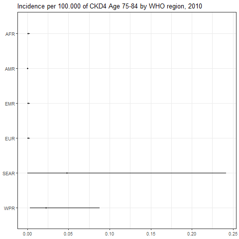

``` r
png(paste0(params$PlotDir, "/r_CI_2020.png"), width=480, height=480)
ggplot(subset(all_reg_rt, YEAR==2020),
       aes(y = VAL_MEAN, x = LOCATION_NAME)) +
  geom_pointrange(aes(ymin = VAL_LWR, ymax = VAL_UPR), size = 0.2) +
  coord_flip() +
  theme_bw() +
  scale_x_discrete(NULL, limits = rev(unique(all_reg_rt$LOCATION_NAME))) +
  scale_y_continuous(NULL) +
  ggtitle(paste0("Incidence per 100.000 of ", params$Pathogen, " by WHO region, 2020"))
dev.off()
```

    ## png 
    ##   2

``` r
setwd(params$Dir)
image <- paste0("03-estimate-CKD_v2_files/figure-gfm/r_CI_2020.png")
cat("")
```

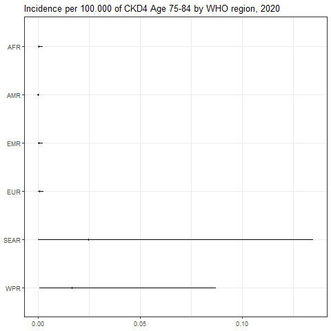

``` r
png(paste0(params$PlotDir, "/r_CASES_2010.png"), width=480, height=480)
ggplot(subset(all_reg_nr, YEAR==2010),
       aes(y = VAL_MEAN, x = LOCATION_NAME)) +
  geom_pointrange(aes(ymin = VAL_LWR, ymax = VAL_UPR), size = 0.2) +
  coord_flip() +
  theme_bw() +
  scale_x_discrete(NULL, limits = rev(unique(all_reg_nr$LOCATION_NAME))) +
  scale_y_continuous(NULL) +
  ggtitle(paste0("Cases of ", params$Pathogen, " by WHO region, 2010"))
dev.off()
```

    ## png 
    ##   2

``` r
setwd(params$Dir)
image <- paste0("03-estimate-CKD_v2_files/figure-gfm/r_CASES_2010.png")
cat("")
```

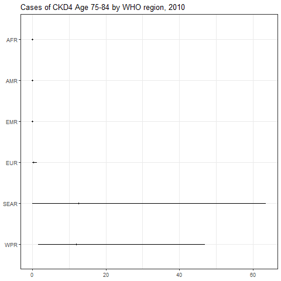

``` r
png(paste0(params$PlotDir, "/r_CASES_2020.png"), width=480, height=480)
ggplot(subset(all_reg_nr, YEAR==2020),
       aes(y = VAL_MEAN, x = LOCATION_NAME)) +
  geom_pointrange(aes(ymin = VAL_LWR, ymax = VAL_UPR), size = 0.2) +
  coord_flip() +
  theme_bw() +
  scale_x_discrete(NULL, limits = rev(unique(all_reg_nr$LOCATION_NAME))) +
  scale_y_continuous(NULL) +
  ggtitle(paste0("Cases of ", params$Pathogen, " by WHO region, 2020"))
dev.off()
```

    ## png 
    ##   2

``` r
setwd(params$Dir)
image <- paste0("03-estimate-CKD_v2_files/figure-gfm/r_CASES_2020.png")
cat("")
```

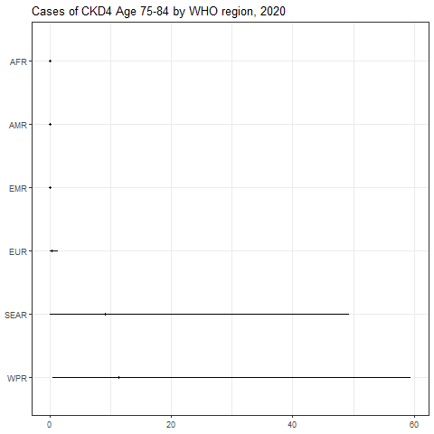

``` r
sim_all_reg <-
  merge(sim_all_reg,
        with(sim_all, aggregate(POP ~ REG2 + YEAR, FUN = sum)))
sim_all_reg_long <-
  pivot_longer(sim_all_reg, cols = starts_with("V"))
sim_all_reg_long$CASES <- sim_all_reg_long$value
```

``` r
png(paste0(params$PlotDir, "/r_hist_2010.png"), width=480, height=480)
ggplot(subset(sim_all_reg_long, YEAR==2010), aes(x = CASES)) +
  geom_density() +
  facet_wrap(~REG2) +
  theme_bw() +
  scale_x_log10() +
  ggtitle(paste0("Incidence per 100.000 of ", params$Pathogen, " by WHO region, 2010"))
dev.off()
```

    ## png 
    ##   2

``` r
setwd(params$Dir)
image <- paste0("03-estimate-CKD_v2_files/figure-gfm/r_hist_2010.png")
cat("")
```

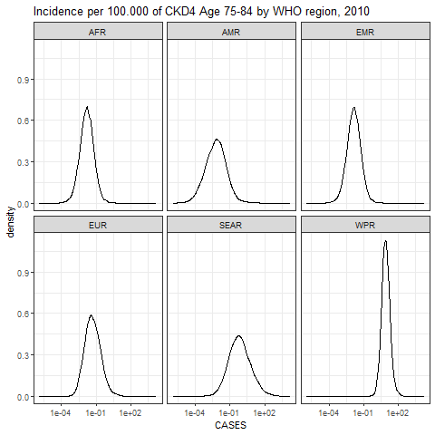

``` r
png(paste0(params$PlotDir, "/r_hist_2020_2010.png"), width=480, height=480)
ggplot(subset(sim_all_reg_long, YEAR==2010), aes(x = CASES)) +
  geom_density() +
  facet_wrap(~REG2) +
  theme_bw() +
  scale_x_log10() +
  ggtitle(paste0("Incidence per 100.000 of ", params$Pathogen, " by WHO region, 2010"))
dev.off()
```

    ## png 
    ##   2

``` r
setwd(params$Dir)
image <- paste0("03-estimate-CKD_v2_files/figure-gfm/r_hist_2020_2010.png")
cat("")
```


## Subregions

``` r
kbl(subset(all_sub_rt, YEAR == 2020)[,c(7,2:5)],
    align = c("l", "c", "c", "c"), row.names = FALSE,
    col.names = c("Region", "Mean", "Median", "Lower", "Upper"),
    caption=paste0("Incidence per 100.000 of ",params$Pathogen," by WHO subregion in 2020")) %>%
  kable_styling("striped", "hover")
```

<table class="table table-striped" style="margin-left: auto; margin-right: auto;">

<caption>

Incidence per 100.000 of CKD4 Age 75-84 by WHO subregion in 2020
</caption>

<thead>

<tr>

<th style="text-align:left;">

Region
</th>

<th style="text-align:center;">

Mean
</th>

<th style="text-align:center;">

Median
</th>

<th style="text-align:center;">

Lower
</th>

<th style="text-align:left;">

Upper
</th>

</tr>

</thead>

<tbody>

<tr>

<td style="text-align:left;">

AFRAB
</td>

<td style="text-align:center;">

0.0003693
</td>

<td style="text-align:center;">

0.0001118
</td>

<td style="text-align:center;">

0.0000049
</td>

<td style="text-align:left;">

0.0023109
</td>

</tr>

<tr>

<td style="text-align:left;">

AFRC
</td>

<td style="text-align:center;">

0.0003693
</td>

<td style="text-align:center;">

0.0001118
</td>

<td style="text-align:center;">

0.0000049
</td>

<td style="text-align:left;">

0.0023109
</td>

</tr>

<tr>

<td style="text-align:left;">

AFRD
</td>

<td style="text-align:center;">

0.0003693
</td>

<td style="text-align:center;">

0.0001118
</td>

<td style="text-align:center;">

0.0000049
</td>

<td style="text-align:left;">

0.0023109
</td>

</tr>

<tr>

<td style="text-align:left;">

AMRA
</td>

<td style="text-align:center;">

0.0000411
</td>

<td style="text-align:center;">

0.0000056
</td>

<td style="text-align:center;">

0.0000001
</td>

<td style="text-align:left;">

0.0002891
</td>

</tr>

<tr>

<td style="text-align:left;">

AMRB
</td>

<td style="text-align:center;">

0.0003212
</td>

<td style="text-align:center;">

0.0000105
</td>

<td style="text-align:center;">

0.0000001
</td>

<td style="text-align:left;">

0.0013642
</td>

</tr>

<tr>

<td style="text-align:left;">

AMRC
</td>

<td style="text-align:center;">

0.0001291
</td>

<td style="text-align:center;">

0.0000176
</td>

<td style="text-align:center;">

0.0000001
</td>

<td style="text-align:left;">

0.0009404
</td>

</tr>

<tr>

<td style="text-align:left;">

EMRA
</td>

<td style="text-align:center;">

0.0003693
</td>

<td style="text-align:center;">

0.0001118
</td>

<td style="text-align:center;">

0.0000049
</td>

<td style="text-align:left;">

0.0023109
</td>

</tr>

<tr>

<td style="text-align:left;">

EMRBC
</td>

<td style="text-align:center;">

0.0003693
</td>

<td style="text-align:center;">

0.0001118
</td>

<td style="text-align:center;">

0.0000049
</td>

<td style="text-align:left;">

0.0023109
</td>

</tr>

<tr>

<td style="text-align:left;">

EMRD
</td>

<td style="text-align:center;">

0.0003693
</td>

<td style="text-align:center;">

0.0001118
</td>

<td style="text-align:center;">

0.0000049
</td>

<td style="text-align:left;">

0.0023109
</td>

</tr>

<tr>

<td style="text-align:left;">

EURA
</td>

<td style="text-align:center;">

0.0008281
</td>

<td style="text-align:center;">

0.0000488
</td>

<td style="text-align:center;">

0.0000015
</td>

<td style="text-align:left;">

0.0035387
</td>

</tr>

<tr>

<td style="text-align:left;">

EURB
</td>

<td style="text-align:center;">

0.0001662
</td>

<td style="text-align:center;">

0.0000333
</td>

<td style="text-align:center;">

0.0000012
</td>

<td style="text-align:left;">

0.0010903
</td>

</tr>

<tr>

<td style="text-align:left;">

EURC
</td>

<td style="text-align:center;">

0.0001662
</td>

<td style="text-align:center;">

0.0000333
</td>

<td style="text-align:center;">

0.0000012
</td>

<td style="text-align:left;">

0.0010903
</td>

</tr>

<tr>

<td style="text-align:left;">

SEARB
</td>

<td style="text-align:center;">

0.0589821
</td>

<td style="text-align:center;">

0.0019344
</td>

<td style="text-align:center;">

0.0000219
</td>

<td style="text-align:left;">

0.3214880
</td>

</tr>

<tr>

<td style="text-align:left;">

SEARCD
</td>

<td style="text-align:center;">

0.0154091
</td>

<td style="text-align:center;">

0.0004619
</td>

<td style="text-align:center;">

0.0000048
</td>

<td style="text-align:left;">

0.0744591
</td>

</tr>

<tr>

<td style="text-align:left;">

WPRA
</td>

<td style="text-align:center;">

0.0453549
</td>

<td style="text-align:center;">

0.0132389
</td>

<td style="text-align:center;">

0.0006578
</td>

<td style="text-align:left;">

0.2849714
</td>

</tr>

<tr>

<td style="text-align:left;">

WPRB
</td>

<td style="text-align:center;">

0.0073623
</td>

<td style="text-align:center;">

0.0043256
</td>

<td style="text-align:center;">

0.0005100
</td>

<td style="text-align:left;">

0.0326794
</td>

</tr>

<tr>

<td style="text-align:left;">

WPRC
</td>

<td style="text-align:center;">

0.0044363
</td>

<td style="text-align:center;">

0.0009836
</td>

<td style="text-align:center;">

0.0000290
</td>

<td style="text-align:left;">

0.0270473
</td>

</tr>

</tbody>

</table>

``` r
kbl(subset(all_sub_nr, YEAR == 2020)[,c(7,2:5)],
    align = c("l", "c", "c", "c"), row.names = FALSE,
    col.names = c("Region", "Mean", "Median", "Lower", "Upper"),
    caption=paste0("Cases of ",params$Pathogen," by WHO sub region in 2020")) %>%
  kable_styling("striped", "hover")
```

<table class="table table-striped" style="margin-left: auto; margin-right: auto;">

<caption>

Cases of CKD4 Age 75-84 by WHO sub region in 2020
</caption>

<thead>

<tr>

<th style="text-align:left;">

Region
</th>

<th style="text-align:center;">

Mean
</th>

<th style="text-align:center;">

Median
</th>

<th style="text-align:center;">

Lower
</th>

<th style="text-align:left;">

Upper
</th>

</tr>

</thead>

<tbody>

<tr>

<td style="text-align:left;">

AFRAB
</td>

<td style="text-align:center;">

0.0040814
</td>

<td style="text-align:center;">

0.0012359
</td>

<td style="text-align:center;">

0.0000544
</td>

<td style="text-align:left;">

0.0255416
</td>

</tr>

<tr>

<td style="text-align:left;">

AFRC
</td>

<td style="text-align:center;">

0.0175399
</td>

<td style="text-align:center;">

0.0053115
</td>

<td style="text-align:center;">

0.0002340
</td>

<td style="text-align:left;">

0.1097661
</td>

</tr>

<tr>

<td style="text-align:left;">

AFRD
</td>

<td style="text-align:center;">

0.0128695
</td>

<td style="text-align:center;">

0.0038972
</td>

<td style="text-align:center;">

0.0001717
</td>

<td style="text-align:left;">

0.0805383
</td>

</tr>

<tr>

<td style="text-align:left;">

AMRA
</td>

<td style="text-align:center;">

0.0077568
</td>

<td style="text-align:center;">

0.0010610
</td>

<td style="text-align:center;">

0.0000138
</td>

<td style="text-align:left;">

0.0545518
</td>

</tr>

<tr>

<td style="text-align:left;">

AMRB
</td>

<td style="text-align:center;">

0.0445769
</td>

<td style="text-align:center;">

0.0014634
</td>

<td style="text-align:center;">

0.0000140
</td>

<td style="text-align:left;">

0.1892941
</td>

</tr>

<tr>

<td style="text-align:left;">

AMRC
</td>

<td style="text-align:center;">

0.0015401
</td>

<td style="text-align:center;">

0.0002101
</td>

<td style="text-align:center;">

0.0000015
</td>

<td style="text-align:left;">

0.0112208
</td>

</tr>

<tr>

<td style="text-align:left;">

EMRA
</td>

<td style="text-align:center;">

0.0011752
</td>

<td style="text-align:center;">

0.0003559
</td>

<td style="text-align:center;">

0.0000157
</td>

<td style="text-align:left;">

0.0073542
</td>

</tr>

<tr>

<td style="text-align:left;">

EMRBC
</td>

<td style="text-align:center;">

0.0258276
</td>

<td style="text-align:center;">

0.0078211
</td>

<td style="text-align:center;">

0.0003445
</td>

<td style="text-align:left;">

0.1616311
</td>

</tr>

<tr>

<td style="text-align:left;">

EMRD
</td>

<td style="text-align:center;">

0.0042201
</td>

<td style="text-align:center;">

0.0012779
</td>

<td style="text-align:center;">

0.0000563
</td>

<td style="text-align:left;">

0.0264098
</td>

</tr>

<tr>

<td style="text-align:left;">

EURA
</td>

<td style="text-align:center;">

0.2950326
</td>

<td style="text-align:center;">

0.0173957
</td>

<td style="text-align:center;">

0.0005418
</td>

<td style="text-align:left;">

1.2607054
</td>

</tr>

<tr>

<td style="text-align:left;">

EURB
</td>

<td style="text-align:center;">

0.0192431
</td>

<td style="text-align:center;">

0.0038619
</td>

<td style="text-align:center;">

0.0001353
</td>

<td style="text-align:left;">

0.1262670
</td>

</tr>

<tr>

<td style="text-align:left;">

EURC
</td>

<td style="text-align:center;">

0.0053473
</td>

<td style="text-align:center;">

0.0010732
</td>

<td style="text-align:center;">

0.0000376
</td>

<td style="text-align:left;">

0.0350876
</td>

</tr>

<tr>

<td style="text-align:left;">

SEARB
</td>

<td style="text-align:center;">

4.6206686
</td>

<td style="text-align:center;">

0.1515434
</td>

<td style="text-align:center;">

0.0017179
</td>

<td style="text-align:left;">

25.1854273
</td>

</tr>

<tr>

<td style="text-align:left;">

SEARCD
</td>

<td style="text-align:center;">

4.4316053
</td>

<td style="text-align:center;">

0.1328389
</td>

<td style="text-align:center;">

0.0013933
</td>

<td style="text-align:left;">

21.4141463
</td>

</tr>

<tr>

<td style="text-align:left;">

WPRA
</td>

<td style="text-align:center;">

7.7091526
</td>

<td style="text-align:center;">

2.2502646
</td>

<td style="text-align:center;">

0.1118099
</td>

<td style="text-align:left;">

48.4377000
</td>

</tr>

<tr>

<td style="text-align:left;">

WPRB
</td>

<td style="text-align:center;">

3.5232175
</td>

<td style="text-align:center;">

2.0700200
</td>

<td style="text-align:center;">

0.2440363
</td>

<td style="text-align:left;">

15.6386209
</td>

</tr>

<tr>

<td style="text-align:left;">

WPRC
</td>

<td style="text-align:center;">

0.1553208
</td>

<td style="text-align:center;">

0.0344381
</td>

<td style="text-align:center;">

0.0010142
</td>

<td style="text-align:left;">

0.9469619
</td>

</tr>

</tbody>

</table>

``` r
png(paste0(params$PlotDir, "/r_CI_SUB2_2010.png"), width=480, height=480)
ggplot(subset(all_sub_rt, YEAR==2010),
       aes(y = VAL_MEAN, x = LOCATION_NAME)) +
  geom_pointrange(aes(ymin = VAL_LWR, ymax = VAL_UPR), size = 0.2) +
  coord_flip() +
  theme_bw() +
  scale_x_discrete(NULL, limits = rev(unique(all_sub_rt$LOCATION_NAME))) +
  scale_y_continuous(NULL) +
  ggtitle(paste0("Incidence per 100.000 of ", params$Pathogen, " by WHO sub region, 2010"))
dev.off()
```

    ## png 
    ##   2

``` r
setwd(params$Dir)
image <- paste0("03-estimate-CKD_v2_files/figure-gfm/r_CI_SUB2_2010.png")
cat("")
```

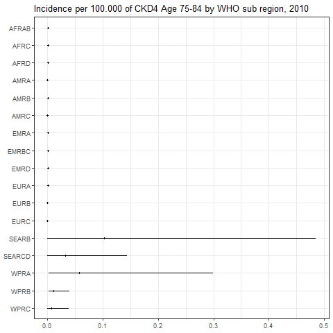

``` r
png(paste0(params$PlotDir, "/r_CI_SUB2_2020.png"), width=480, height=480)
ggplot(subset(all_sub_rt, YEAR==2020),
       aes(y = VAL_MEAN, x = LOCATION_NAME)) +
  geom_pointrange(aes(ymin = VAL_LWR, ymax = VAL_UPR), size = 0.2) +
  coord_flip() +
  theme_bw() +
  scale_x_discrete(NULL, limits = rev(unique(all_sub_rt$LOCATION_NAME))) +
  scale_y_continuous(NULL) +
  ggtitle(paste0("Incidence per 100.000 of ", params$Pathogen, " by WHO sub region, 2020"))
dev.off()
```

    ## png 
    ##   2

``` r
setwd(params$Dir)
image <- paste0("03-estimate-CKD_v2_files/figure-gfm/r_CI_SUB2_2020.png")
cat("")
```

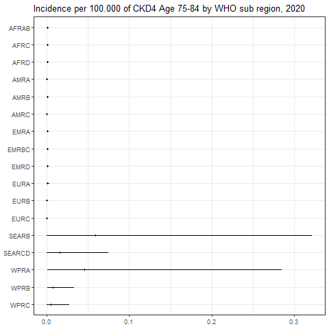

``` r
png(paste0(params$PlotDir, "/r_CASES_SUB2_2010.png"), width=480, height=480)
ggplot(subset(all_sub_nr, YEAR==2010),
       aes(y = VAL_MEAN, x = LOCATION_NAME)) +
  geom_pointrange(aes(ymin = VAL_LWR, ymax = VAL_UPR), size = 0.2) +
  coord_flip() +
  theme_bw() +
  scale_x_discrete(NULL, limits = rev(unique(all_sub_nr$LOCATION_NAME))) +
  scale_y_continuous(NULL) +
  ggtitle(paste0("Cases of ", params$Pathogen, " by WHO sub region, 2010"))
dev.off()
```

    ## png 
    ##   2

``` r
setwd(params$Dir)
image <- paste0("03-estimate-CKD_v2_files/figure-gfm/r_CASES_SUB2_2010.png")
cat("")
```

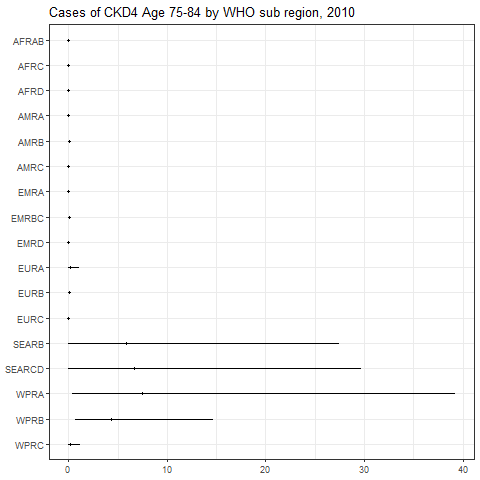

``` r
png(paste0(params$PlotDir, "/r_CASES_SUB2_2020.png"), width=480, height=480)
ggplot(subset(all_sub_nr, YEAR==2020),
       aes(y = VAL_MEAN, x = LOCATION_NAME)) +
  geom_pointrange(aes(ymin = VAL_LWR, ymax = VAL_UPR), size = 0.2) +
  coord_flip() +
  theme_bw() +
  scale_x_discrete(NULL, limits = rev(unique(all_sub_nr$LOCATION_NAME))) +
  scale_y_continuous(NULL) +
  ggtitle(paste0("Cases of ", params$Pathogen, " by WHO sub region, 2020"))
dev.off()
```

    ## png 
    ##   2

``` r
setwd(params$Dir)
image <- paste0("03-estimate-CKD_v2_files/figure-gfm/r_CASES_SUB2_2020.png")
cat("")
```

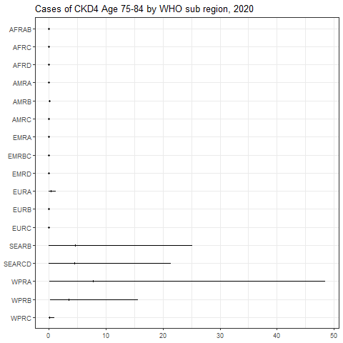

``` r
sim_all_sub <-
  merge(sim_all_sub,
        with(sim_all, aggregate(POP ~ SUB2 + YEAR, FUN = sum)))
sim_all_sub_long <-
  pivot_longer(sim_all_sub, cols = starts_with("V"))
sim_all_sub_long$CASES <- sim_all_sub_long$value
```

``` r
png(paste0(params$PlotDir, "/r_hist_SUB2_2010.png"), width=480, height=480)
ggplot(subset(sim_all_sub_long, YEAR==2010), aes(x = CASES)) +
  geom_density() +
  facet_wrap(~SUB2) +
  theme_bw() +
  scale_x_log10() +
  ggtitle(paste0("Incidence per 100.000 of ", params$Pathogen, "by WHO sub region, 2010"))
dev.off()
```

    ## png 
    ##   2

``` r
setwd(params$Dir)
image <- paste0("03-estimate-CKD_v2_files/figure-gfm/r_hist_SUB2_2010.png")
cat("")
```

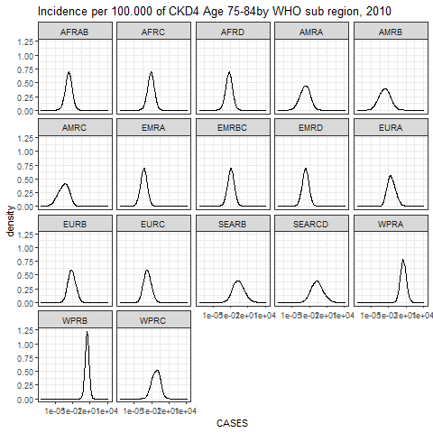

``` r
png(paste0(params$PlotDir, "/r_hist_SUB2_2020_2010.png"), width=480, height=480)
ggplot(subset(sim_all_sub_long, YEAR==2010), aes(x = CASES)) +
  geom_density() +
  facet_wrap(~SUB2) +
  theme_bw() +
  scale_x_log10() +
  ggtitle(paste0("Incidence per 100.000 of ", params$Pathogen, "by WHO sub region, 2010"))
dev.off()
```

    ## png 
    ##   2

``` r
setwd(params$Dir)
image <- paste0("03-estimate-CKD_v2_files/figure-gfm/r_hist_SUB2_2020_2010.png")
cat("")
```


## Countries

``` r
png(paste0(params$PlotDir, "/r_cnt_2010.png"), width=800, height=300)
plot_world(subset(all_cnt_rt, YEAR == 2010),
           "LOCATION_NAME", "VAL_MEAN", legend.title = "Incidence per 100k", diseasefree = zero_cases)
```

    ## [1] 0.00 0.05 0.10 0.15 0.20 0.25

``` r
dev.off()
```

    ## png 
    ##   2

``` r
setwd(params$Dir)
image <- paste0("03-estimate-CKD_v2_files/figure-gfm/r_cnt_2010.png")
cat("")
```

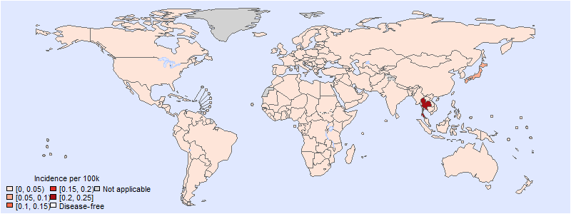

``` r
png(paste0(params$PlotDir, "/r_cnt_2020.png"), width=800, height=300)
plot_world(subset(all_cnt_rt, YEAR == 2020),
           "LOCATION_NAME", "VAL_MEAN", legend.title = "Incidence per 100k", diseasefree = zero_cases)
```

    ## [1] 0.00 0.02 0.04 0.06 0.08 0.10 0.12 0.14

``` r
dev.off()
```

    ## png 
    ##   2

``` r
setwd(params$Dir)
image <- paste0("03-estimate-CKD_v2_files/figure-gfm/r_cnt_2020.png")
cat("")
```

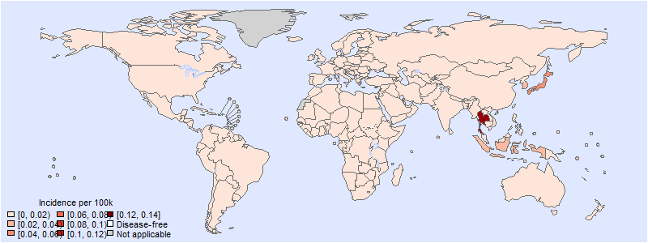

``` r
tab <-
  data.frame(subset(all_cnt_rt, YEAR == 2010)[,
                                              c("LOCATION_NAME", "VAL_MEAN", "VAL_MEDIAN", "VAL_LWR", "VAL_UPR")],
             subset(all_cnt_rt, YEAR == 2020)[,
                                              c("VAL_MEAN", "VAL_MEDIAN", "VAL_LWR", "VAL_UPR")])
tab$LOCATION_NAME <-
  FERG2:::countries$COUNTRY[match(tab$LOCATION_NAME, FERG2:::countries$ISO3)]
tab$LOCATION_NAME <- gsub(" \\(.*", "", tab$LOCATION_NAME)
names(tab) <-
  c("Country",
    "2010.mean", "2010.median", "2010.lwr", "2010.upr",
    "2020.mean", "2020.median", "2020.lwr", "2020.upr")

kable(tab, digits = 3, row.names = FALSE,
      caption = paste0("Estimated ", params$Pathogen, " incidence by country, 2010 vs 2020"))
```

| Country | 2010.mean | 2010.median | 2010.lwr | 2010.upr | 2020.mean | 2020.median | 2020.lwr | 2020.upr |
|:---|---:|---:|---:|---:|---:|---:|---:|---:|
| Afghanistan | 0.001 | 0.000 | 0.000 | 0.003 | 0.000 | 0.000 | 0.000 | 0.002 |
| Angola | 0.001 | 0.000 | 0.000 | 0.003 | 0.000 | 0.000 | 0.000 | 0.002 |
| Albania | 0.000 | 0.000 | 0.000 | 0.002 | 0.000 | 0.000 | 0.000 | 0.001 |
| Andorra | 0.000 | 0.000 | 0.000 | 0.000 | 0.000 | 0.000 | 0.000 | 0.000 |
| United Arab Emirates | 0.001 | 0.000 | 0.000 | 0.003 | 0.000 | 0.000 | 0.000 | 0.002 |
| Argentina | 0.000 | 0.000 | 0.000 | 0.001 | 0.000 | 0.000 | 0.000 | 0.001 |
| Armenia | 0.000 | 0.000 | 0.000 | 0.002 | 0.000 | 0.000 | 0.000 | 0.001 |
| Antigua and Barbuda | 0.000 | 0.000 | 0.000 | 0.001 | 0.000 | 0.000 | 0.000 | 0.001 |
| Australia | 0.011 | 0.002 | 0.000 | 0.070 | 0.007 | 0.001 | 0.000 | 0.046 |
| Austria | 0.000 | 0.000 | 0.000 | 0.000 | 0.000 | 0.000 | 0.000 | 0.000 |
| Azerbaijan | 0.000 | 0.000 | 0.000 | 0.002 | 0.000 | 0.000 | 0.000 | 0.001 |
| Burundi | 0.001 | 0.000 | 0.000 | 0.003 | 0.000 | 0.000 | 0.000 | 0.002 |
| Belgium | 0.003 | 0.000 | 0.000 | 0.014 | 0.002 | 0.000 | 0.000 | 0.010 |
| Benin | 0.001 | 0.000 | 0.000 | 0.003 | 0.000 | 0.000 | 0.000 | 0.002 |
| Burkina Faso | 0.001 | 0.000 | 0.000 | 0.003 | 0.000 | 0.000 | 0.000 | 0.002 |
| Bangladesh | 0.018 | 0.001 | 0.000 | 0.092 | 0.009 | 0.000 | 0.000 | 0.046 |
| Bulgaria | 0.000 | 0.000 | 0.000 | 0.002 | 0.000 | 0.000 | 0.000 | 0.001 |
| Bahrain | 0.001 | 0.000 | 0.000 | 0.003 | 0.000 | 0.000 | 0.000 | 0.002 |
| Bahamas | 0.000 | 0.000 | 0.000 | 0.001 | 0.000 | 0.000 | 0.000 | 0.001 |
| Bosnia and Herzegovina | 0.000 | 0.000 | 0.000 | 0.002 | 0.000 | 0.000 | 0.000 | 0.001 |
| Belarus | 0.000 | 0.000 | 0.000 | 0.002 | 0.000 | 0.000 | 0.000 | 0.001 |
| Belize | 0.000 | 0.000 | 0.000 | 0.001 | 0.000 | 0.000 | 0.000 | 0.001 |
| Bolivia | 0.000 | 0.000 | 0.000 | 0.001 | 0.000 | 0.000 | 0.000 | 0.001 |
| Brazil | 0.000 | 0.000 | 0.000 | 0.000 | 0.000 | 0.000 | 0.000 | 0.000 |
| Barbados | 0.000 | 0.000 | 0.000 | 0.001 | 0.000 | 0.000 | 0.000 | 0.001 |
| Brunei Darussalam | 0.011 | 0.004 | 0.000 | 0.062 | 0.008 | 0.002 | 0.000 | 0.046 |
| Bhutan | 0.018 | 0.001 | 0.000 | 0.092 | 0.009 | 0.000 | 0.000 | 0.046 |
| Botswana | 0.001 | 0.000 | 0.000 | 0.003 | 0.000 | 0.000 | 0.000 | 0.002 |
| Central African Republic | 0.001 | 0.000 | 0.000 | 0.003 | 0.000 | 0.000 | 0.000 | 0.002 |
| Canada | 0.000 | 0.000 | 0.000 | 0.001 | 0.000 | 0.000 | 0.000 | 0.001 |
| Switzerland | 0.000 | 0.000 | 0.000 | 0.000 | 0.000 | 0.000 | 0.000 | 0.000 |
| Chile | 0.000 | 0.000 | 0.000 | 0.001 | 0.000 | 0.000 | 0.000 | 0.001 |
| China | 0.012 | 0.009 | 0.002 | 0.040 | 0.007 | 0.004 | 0.001 | 0.033 |
| Côte d’Ivoire | 0.001 | 0.000 | 0.000 | 0.003 | 0.000 | 0.000 | 0.000 | 0.002 |
| Cameroon | 0.001 | 0.000 | 0.000 | 0.003 | 0.000 | 0.000 | 0.000 | 0.002 |
| Congo | 0.001 | 0.000 | 0.000 | 0.003 | 0.000 | 0.000 | 0.000 | 0.002 |
| Congo | 0.001 | 0.000 | 0.000 | 0.003 | 0.000 | 0.000 | 0.000 | 0.002 |
| Cook Islands | 0.011 | 0.004 | 0.000 | 0.062 | 0.008 | 0.002 | 0.000 | 0.046 |
| Colombia | 0.000 | 0.000 | 0.000 | 0.001 | 0.000 | 0.000 | 0.000 | 0.001 |
| Comoros | 0.001 | 0.000 | 0.000 | 0.003 | 0.000 | 0.000 | 0.000 | 0.002 |
| Cabo Verde | 0.001 | 0.000 | 0.000 | 0.003 | 0.000 | 0.000 | 0.000 | 0.002 |
| Costa Rica | 0.000 | 0.000 | 0.000 | 0.001 | 0.000 | 0.000 | 0.000 | 0.001 |
| Cuba | 0.000 | 0.000 | 0.000 | 0.001 | 0.000 | 0.000 | 0.000 | 0.001 |
| Cyprus | 0.000 | 0.000 | 0.000 | 0.000 | 0.000 | 0.000 | 0.000 | 0.000 |
| Czechia | 0.000 | 0.000 | 0.000 | 0.000 | 0.000 | 0.000 | 0.000 | 0.000 |
| Germany | 0.003 | 0.000 | 0.000 | 0.017 | 0.004 | 0.000 | 0.000 | 0.013 |
| Djibouti | 0.001 | 0.000 | 0.000 | 0.003 | 0.000 | 0.000 | 0.000 | 0.002 |
| Dominica | 0.000 | 0.000 | 0.000 | 0.001 | 0.000 | 0.000 | 0.000 | 0.001 |
| Denmark | 0.000 | 0.000 | 0.000 | 0.000 | 0.000 | 0.000 | 0.000 | 0.000 |
| Dominican Republic | 0.000 | 0.000 | 0.000 | 0.001 | 0.000 | 0.000 | 0.000 | 0.001 |
| Algeria | 0.001 | 0.000 | 0.000 | 0.003 | 0.000 | 0.000 | 0.000 | 0.002 |
| Ecuador | 0.000 | 0.000 | 0.000 | 0.001 | 0.000 | 0.000 | 0.000 | 0.001 |
| Egypt | 0.001 | 0.000 | 0.000 | 0.003 | 0.000 | 0.000 | 0.000 | 0.002 |
| Eritrea | 0.001 | 0.000 | 0.000 | 0.003 | 0.000 | 0.000 | 0.000 | 0.002 |
| Spain | 0.000 | 0.000 | 0.000 | 0.000 | 0.000 | 0.000 | 0.000 | 0.000 |
| Estonia | 0.000 | 0.000 | 0.000 | 0.000 | 0.000 | 0.000 | 0.000 | 0.000 |
| Ethiopia | 0.001 | 0.000 | 0.000 | 0.003 | 0.000 | 0.000 | 0.000 | 0.002 |
| Finland | 0.000 | 0.000 | 0.000 | 0.000 | 0.000 | 0.000 | 0.000 | 0.000 |
| Fiji | 0.010 | 0.003 | 0.000 | 0.053 | 0.006 | 0.002 | 0.000 | 0.037 |
| France | 0.000 | 0.000 | 0.000 | 0.001 | 0.000 | 0.000 | 0.000 | 0.000 |
| Micronesia | 0.007 | 0.002 | 0.000 | 0.039 | 0.004 | 0.001 | 0.000 | 0.027 |
| Gabon | 0.001 | 0.000 | 0.000 | 0.003 | 0.000 | 0.000 | 0.000 | 0.002 |
| United Kingdom | 0.000 | 0.000 | 0.000 | 0.000 | 0.000 | 0.000 | 0.000 | 0.000 |
| Georgia | 0.000 | 0.000 | 0.000 | 0.002 | 0.000 | 0.000 | 0.000 | 0.001 |
| Ghana | 0.001 | 0.000 | 0.000 | 0.003 | 0.000 | 0.000 | 0.000 | 0.002 |
| Guinea | 0.001 | 0.000 | 0.000 | 0.003 | 0.000 | 0.000 | 0.000 | 0.002 |
| Gambia | 0.001 | 0.000 | 0.000 | 0.003 | 0.000 | 0.000 | 0.000 | 0.002 |
| Guinea-Bissau | 0.001 | 0.000 | 0.000 | 0.003 | 0.000 | 0.000 | 0.000 | 0.002 |
| Equatorial Guinea | 0.001 | 0.000 | 0.000 | 0.003 | 0.000 | 0.000 | 0.000 | 0.002 |
| Greece | 0.000 | 0.000 | 0.000 | 0.000 | 0.000 | 0.000 | 0.000 | 0.000 |
| Grenada | 0.000 | 0.000 | 0.000 | 0.001 | 0.000 | 0.000 | 0.000 | 0.001 |
| Guatemala | 0.000 | 0.000 | 0.000 | 0.001 | 0.000 | 0.000 | 0.000 | 0.001 |
| Guyana | 0.000 | 0.000 | 0.000 | 0.001 | 0.000 | 0.000 | 0.000 | 0.001 |
| Honduras | 0.000 | 0.000 | 0.000 | 0.001 | 0.000 | 0.000 | 0.000 | 0.001 |
| Croatia | 0.000 | 0.000 | 0.000 | 0.000 | 0.000 | 0.000 | 0.000 | 0.000 |
| Haiti | 0.000 | 0.000 | 0.000 | 0.001 | 0.000 | 0.000 | 0.000 | 0.001 |
| Hungary | 0.000 | 0.000 | 0.000 | 0.000 | 0.000 | 0.000 | 0.000 | 0.000 |
| Indonesia | 0.043 | 0.001 | 0.000 | 0.174 | 0.021 | 0.001 | 0.000 | 0.088 |
| India | 0.036 | 0.001 | 0.000 | 0.150 | 0.017 | 0.000 | 0.000 | 0.077 |
| Ireland | 0.000 | 0.000 | 0.000 | 0.000 | 0.000 | 0.000 | 0.000 | 0.000 |
| Iran | 0.001 | 0.000 | 0.000 | 0.003 | 0.000 | 0.000 | 0.000 | 0.002 |
| Iraq | 0.001 | 0.000 | 0.000 | 0.003 | 0.000 | 0.000 | 0.000 | 0.002 |
| Iceland | 0.000 | 0.000 | 0.000 | 0.000 | 0.000 | 0.000 | 0.000 | 0.000 |
| Israel | 0.000 | 0.000 | 0.000 | 0.000 | 0.000 | 0.000 | 0.000 | 0.000 |
| Italy | 0.000 | 0.000 | 0.000 | 0.001 | 0.000 | 0.000 | 0.000 | 0.001 |
| Jamaica | 0.000 | 0.000 | 0.000 | 0.001 | 0.000 | 0.000 | 0.000 | 0.001 |
| Jordan | 0.001 | 0.000 | 0.000 | 0.003 | 0.000 | 0.000 | 0.000 | 0.002 |
| Japan | 0.065 | 0.028 | 0.002 | 0.362 | 0.054 | 0.014 | 0.001 | 0.348 |
| Kazakhstan | 0.000 | 0.000 | 0.000 | 0.002 | 0.000 | 0.000 | 0.000 | 0.001 |
| Kenya | 0.001 | 0.000 | 0.000 | 0.003 | 0.000 | 0.000 | 0.000 | 0.002 |
| Kyrgyzstan | 0.000 | 0.000 | 0.000 | 0.002 | 0.000 | 0.000 | 0.000 | 0.001 |
| Cambodia | 0.007 | 0.002 | 0.000 | 0.039 | 0.004 | 0.001 | 0.000 | 0.027 |
| Kiribati | 0.007 | 0.002 | 0.000 | 0.039 | 0.004 | 0.001 | 0.000 | 0.027 |
| Saint Kitts and Nevis | 0.000 | 0.000 | 0.000 | 0.001 | 0.000 | 0.000 | 0.000 | 0.001 |
| Korea | 0.040 | 0.009 | 0.000 | 0.262 | 0.028 | 0.004 | 0.000 | 0.199 |
| Kuwait | 0.001 | 0.000 | 0.000 | 0.003 | 0.000 | 0.000 | 0.000 | 0.002 |
| Lao People’s Dem. Republic | 0.007 | 0.002 | 0.000 | 0.039 | 0.004 | 0.001 | 0.000 | 0.027 |
| Lebanon | 0.001 | 0.000 | 0.000 | 0.003 | 0.000 | 0.000 | 0.000 | 0.002 |
| Liberia | 0.001 | 0.000 | 0.000 | 0.003 | 0.000 | 0.000 | 0.000 | 0.002 |
| Libya | 0.001 | 0.000 | 0.000 | 0.003 | 0.000 | 0.000 | 0.000 | 0.002 |
| Saint Lucia | 0.000 | 0.000 | 0.000 | 0.001 | 0.000 | 0.000 | 0.000 | 0.001 |
| Sri Lanka | 0.018 | 0.001 | 0.000 | 0.092 | 0.009 | 0.000 | 0.000 | 0.046 |
| Lesotho | 0.001 | 0.000 | 0.000 | 0.003 | 0.000 | 0.000 | 0.000 | 0.002 |
| Lithuania | 0.000 | 0.000 | 0.000 | 0.000 | 0.000 | 0.000 | 0.000 | 0.000 |
| Luxembourg | 0.000 | 0.000 | 0.000 | 0.000 | 0.000 | 0.000 | 0.000 | 0.000 |
| Latvia | 0.000 | 0.000 | 0.000 | 0.000 | 0.000 | 0.000 | 0.000 | 0.000 |
| Morocco | 0.001 | 0.000 | 0.000 | 0.003 | 0.000 | 0.000 | 0.000 | 0.002 |
| Monaco | 0.000 | 0.000 | 0.000 | 0.000 | 0.000 | 0.000 | 0.000 | 0.000 |
| Republic of Moldova | 0.000 | 0.000 | 0.000 | 0.002 | 0.000 | 0.000 | 0.000 | 0.001 |
| Madagascar | 0.001 | 0.000 | 0.000 | 0.003 | 0.000 | 0.000 | 0.000 | 0.002 |
| Maldives | 0.043 | 0.001 | 0.000 | 0.174 | 0.021 | 0.001 | 0.000 | 0.088 |
| Mexico | 0.002 | 0.000 | 0.000 | 0.007 | 0.001 | 0.000 | 0.000 | 0.004 |
| Marshall Islands | 0.010 | 0.003 | 0.000 | 0.053 | 0.006 | 0.002 | 0.000 | 0.037 |
| North Macedonia | 0.000 | 0.000 | 0.000 | 0.002 | 0.000 | 0.000 | 0.000 | 0.001 |
| Mali | 0.001 | 0.000 | 0.000 | 0.003 | 0.000 | 0.000 | 0.000 | 0.002 |
| Malta | 0.000 | 0.000 | 0.000 | 0.000 | 0.000 | 0.000 | 0.000 | 0.000 |
| Myanmar | 0.018 | 0.001 | 0.000 | 0.092 | 0.009 | 0.000 | 0.000 | 0.046 |
| Montenegro | 0.000 | 0.000 | 0.000 | 0.002 | 0.000 | 0.000 | 0.000 | 0.001 |
| Mongolia | 0.007 | 0.002 | 0.000 | 0.039 | 0.004 | 0.001 | 0.000 | 0.027 |
| Mozambique | 0.001 | 0.000 | 0.000 | 0.003 | 0.000 | 0.000 | 0.000 | 0.002 |
| Mauritania | 0.001 | 0.000 | 0.000 | 0.003 | 0.000 | 0.000 | 0.000 | 0.002 |
| Mauritius | 0.001 | 0.000 | 0.000 | 0.003 | 0.000 | 0.000 | 0.000 | 0.002 |
| Malawi | 0.001 | 0.000 | 0.000 | 0.003 | 0.000 | 0.000 | 0.000 | 0.002 |
| Malaysia | 0.010 | 0.003 | 0.000 | 0.053 | 0.006 | 0.002 | 0.000 | 0.037 |
| Namibia | 0.001 | 0.000 | 0.000 | 0.003 | 0.000 | 0.000 | 0.000 | 0.002 |
| Niger | 0.001 | 0.000 | 0.000 | 0.003 | 0.000 | 0.000 | 0.000 | 0.002 |
| Nigeria | 0.001 | 0.000 | 0.000 | 0.003 | 0.000 | 0.000 | 0.000 | 0.002 |
| Nicaragua | 0.000 | 0.000 | 0.000 | 0.001 | 0.000 | 0.000 | 0.000 | 0.001 |
| Niue | 0.011 | 0.004 | 0.000 | 0.062 | 0.008 | 0.002 | 0.000 | 0.046 |
| Netherlands | 0.000 | 0.000 | 0.000 | 0.001 | 0.000 | 0.000 | 0.000 | 0.001 |
| Norway | 0.000 | 0.000 | 0.000 | 0.000 | 0.000 | 0.000 | 0.000 | 0.000 |
| Nepal | 0.018 | 0.001 | 0.000 | 0.092 | 0.009 | 0.000 | 0.000 | 0.046 |
| Nauru | 0.011 | 0.004 | 0.000 | 0.062 | 0.008 | 0.002 | 0.000 | 0.046 |
| New Zealand | 0.011 | 0.004 | 0.000 | 0.062 | 0.008 | 0.002 | 0.000 | 0.046 |
| Oman | 0.001 | 0.000 | 0.000 | 0.003 | 0.000 | 0.000 | 0.000 | 0.002 |
| Pakistan | 0.001 | 0.000 | 0.000 | 0.003 | 0.000 | 0.000 | 0.000 | 0.002 |
| Panama | 0.000 | 0.000 | 0.000 | 0.001 | 0.000 | 0.000 | 0.000 | 0.001 |
| Peru | 0.000 | 0.000 | 0.000 | 0.001 | 0.000 | 0.000 | 0.000 | 0.001 |
| Philippines | 0.007 | 0.002 | 0.000 | 0.039 | 0.004 | 0.001 | 0.000 | 0.027 |
| Palau | 0.010 | 0.003 | 0.000 | 0.053 | 0.006 | 0.002 | 0.000 | 0.037 |
| Papua New Guinea | 0.007 | 0.002 | 0.000 | 0.039 | 0.004 | 0.001 | 0.000 | 0.027 |
| Poland | 0.000 | 0.000 | 0.000 | 0.000 | 0.000 | 0.000 | 0.000 | 0.000 |
| Korea | 0.018 | 0.001 | 0.000 | 0.092 | 0.009 | 0.000 | 0.000 | 0.046 |
| Portugal | 0.000 | 0.000 | 0.000 | 0.000 | 0.000 | 0.000 | 0.000 | 0.000 |
| Paraguay | 0.000 | 0.000 | 0.000 | 0.001 | 0.000 | 0.000 | 0.000 | 0.001 |
| Qatar | 0.001 | 0.000 | 0.000 | 0.003 | 0.000 | 0.000 | 0.000 | 0.002 |
| Romania | 0.000 | 0.000 | 0.000 | 0.000 | 0.000 | 0.000 | 0.000 | 0.000 |
| Russian Federation | 0.000 | 0.000 | 0.000 | 0.002 | 0.000 | 0.000 | 0.000 | 0.001 |
| Rwanda | 0.001 | 0.000 | 0.000 | 0.003 | 0.000 | 0.000 | 0.000 | 0.002 |
| Saudi Arabia | 0.001 | 0.000 | 0.000 | 0.003 | 0.000 | 0.000 | 0.000 | 0.002 |
| Sudan | 0.001 | 0.000 | 0.000 | 0.003 | 0.000 | 0.000 | 0.000 | 0.002 |
| Senegal | 0.001 | 0.000 | 0.000 | 0.003 | 0.000 | 0.000 | 0.000 | 0.002 |
| Singapore | 0.011 | 0.004 | 0.000 | 0.062 | 0.008 | 0.002 | 0.000 | 0.046 |
| Solomon Islands | 0.007 | 0.002 | 0.000 | 0.039 | 0.004 | 0.001 | 0.000 | 0.027 |
| Sierra Leone | 0.001 | 0.000 | 0.000 | 0.003 | 0.000 | 0.000 | 0.000 | 0.002 |
| El Salvador | 0.000 | 0.000 | 0.000 | 0.001 | 0.000 | 0.000 | 0.000 | 0.001 |
| San Marino | 0.000 | 0.000 | 0.000 | 0.000 | 0.000 | 0.000 | 0.000 | 0.000 |
| Somalia | 0.001 | 0.000 | 0.000 | 0.003 | 0.000 | 0.000 | 0.000 | 0.002 |
| Serbia | 0.000 | 0.000 | 0.000 | 0.002 | 0.000 | 0.000 | 0.000 | 0.001 |
| South Sudan | 0.001 | 0.000 | 0.000 | 0.003 | 0.000 | 0.000 | 0.000 | 0.002 |
| Sao Tome and Principe | 0.001 | 0.000 | 0.000 | 0.003 | 0.000 | 0.000 | 0.000 | 0.002 |
| Suriname | 0.000 | 0.000 | 0.000 | 0.001 | 0.000 | 0.000 | 0.000 | 0.001 |
| Slovakia | 0.000 | 0.000 | 0.000 | 0.000 | 0.000 | 0.000 | 0.000 | 0.000 |
| Slovenia | 0.000 | 0.000 | 0.000 | 0.000 | 0.000 | 0.000 | 0.000 | 0.000 |
| Sweden | 0.002 | 0.000 | 0.000 | 0.009 | 0.001 | 0.000 | 0.000 | 0.007 |
| Eswatini | 0.001 | 0.000 | 0.000 | 0.003 | 0.000 | 0.000 | 0.000 | 0.002 |
| Seychelles | 0.001 | 0.000 | 0.000 | 0.003 | 0.000 | 0.000 | 0.000 | 0.002 |
| Syrian Arab Republic | 0.001 | 0.000 | 0.000 | 0.003 | 0.000 | 0.000 | 0.000 | 0.002 |
| Chad | 0.001 | 0.000 | 0.000 | 0.003 | 0.000 | 0.000 | 0.000 | 0.002 |
| Togo | 0.001 | 0.000 | 0.000 | 0.003 | 0.000 | 0.000 | 0.000 | 0.002 |
| Thailand | 0.236 | 0.006 | 0.000 | 1.138 | 0.134 | 0.003 | 0.000 | 0.694 |
| Tajikistan | 0.000 | 0.000 | 0.000 | 0.002 | 0.000 | 0.000 | 0.000 | 0.001 |
| Turkmenistan | 0.000 | 0.000 | 0.000 | 0.002 | 0.000 | 0.000 | 0.000 | 0.001 |
| Timor-Leste | 0.018 | 0.001 | 0.000 | 0.092 | 0.009 | 0.000 | 0.000 | 0.046 |
| Tonga | 0.010 | 0.003 | 0.000 | 0.053 | 0.006 | 0.002 | 0.000 | 0.037 |
| Trinidad and Tobago | 0.000 | 0.000 | 0.000 | 0.001 | 0.000 | 0.000 | 0.000 | 0.001 |
| Tunisia | 0.001 | 0.000 | 0.000 | 0.003 | 0.000 | 0.000 | 0.000 | 0.002 |
| Turkiye | 0.000 | 0.000 | 0.000 | 0.002 | 0.000 | 0.000 | 0.000 | 0.001 |
| Tuvalu | 0.010 | 0.003 | 0.000 | 0.053 | 0.006 | 0.002 | 0.000 | 0.037 |
| United Republic of Tanzania | 0.001 | 0.000 | 0.000 | 0.003 | 0.000 | 0.000 | 0.000 | 0.002 |
| Uganda | 0.001 | 0.000 | 0.000 | 0.003 | 0.000 | 0.000 | 0.000 | 0.002 |
| Ukraine | 0.000 | 0.000 | 0.000 | 0.002 | 0.000 | 0.000 | 0.000 | 0.001 |
| Uruguay | 0.000 | 0.000 | 0.000 | 0.001 | 0.000 | 0.000 | 0.000 | 0.001 |
| United States of America | 0.000 | 0.000 | 0.000 | 0.000 | 0.000 | 0.000 | 0.000 | 0.000 |
| Uzbekistan | 0.000 | 0.000 | 0.000 | 0.002 | 0.000 | 0.000 | 0.000 | 0.001 |
| Saint Vincent and the Grenadines | 0.000 | 0.000 | 0.000 | 0.001 | 0.000 | 0.000 | 0.000 | 0.001 |
| Venezuela | 0.000 | 0.000 | 0.000 | 0.001 | 0.000 | 0.000 | 0.000 | 0.001 |
| Viet Nam | 0.007 | 0.002 | 0.000 | 0.039 | 0.004 | 0.001 | 0.000 | 0.027 |
| Vanuatu | 0.007 | 0.002 | 0.000 | 0.039 | 0.004 | 0.001 | 0.000 | 0.027 |
| Samoa | 0.007 | 0.002 | 0.000 | 0.039 | 0.004 | 0.001 | 0.000 | 0.027 |
| Yemen | 0.001 | 0.000 | 0.000 | 0.003 | 0.000 | 0.000 | 0.000 | 0.002 |
| South Africa | 0.001 | 0.000 | 0.000 | 0.003 | 0.000 | 0.000 | 0.000 | 0.002 |
| Zambia | 0.001 | 0.000 | 0.000 | 0.003 | 0.000 | 0.000 | 0.000 | 0.002 |
| Zimbabwe | 0.001 | 0.000 | 0.000 | 0.003 | 0.000 | 0.000 | 0.000 | 0.002 |

Estimated CKD4 Age 75-84 incidence by country, 2010 vs 2020

``` r
tab2 <-
  data.frame(subset(all_cnt_nr, YEAR == 2010)[,
                                              c("LOCATION_NAME", "VAL_MEAN", "VAL_MEDIAN", "VAL_LWR", "VAL_UPR")],
             subset(all_cnt_nr, YEAR == 2020)[,
                                              c("VAL_MEAN", "VAL_MEDIAN", "VAL_LWR", "VAL_UPR")])
tab2$LOCATION_NAME <-
  FERG2:::countries$COUNTRY[match(tab2$LOCATION_NAME, FERG2:::countries$ISO3)]
tab2$LOCATION_NAME <- gsub(" \\(.*", "", tab2$LOCATION_NAME)
names(tab2) <-
  c("Country",
    "2010.mean", "2010.median", "2010.lwr", "2010.upr",
    "2020.mean", "2020.median", "2020.lwr", "2020.upr")

kable(tab2, digits = 1, row.names = FALSE,
      caption = paste0("Estimated ", params$Pathogen, " cases by country, 2010 vs 2020"))
```

| Country | 2010.mean | 2010.median | 2010.lwr | 2010.upr | 2020.mean | 2020.median | 2020.lwr | 2020.upr |
|:---|---:|---:|---:|---:|---:|---:|---:|---:|
| Afghanistan | 0.0 | 0.0 | 0.0 | 0.0 | 0.0 | 0.0 | 0.0 | 0.0 |
| Angola | 0.0 | 0.0 | 0.0 | 0.0 | 0.0 | 0.0 | 0.0 | 0.0 |
| Albania | 0.0 | 0.0 | 0.0 | 0.0 | 0.0 | 0.0 | 0.0 | 0.0 |
| Andorra | 0.0 | 0.0 | 0.0 | 0.0 | 0.0 | 0.0 | 0.0 | 0.0 |
| United Arab Emirates | 0.0 | 0.0 | 0.0 | 0.0 | 0.0 | 0.0 | 0.0 | 0.0 |
| Argentina | 0.0 | 0.0 | 0.0 | 0.0 | 0.0 | 0.0 | 0.0 | 0.0 |
| Armenia | 0.0 | 0.0 | 0.0 | 0.0 | 0.0 | 0.0 | 0.0 | 0.0 |
| Antigua and Barbuda | 0.0 | 0.0 | 0.0 | 0.0 | 0.0 | 0.0 | 0.0 | 0.0 |
| Australia | 0.1 | 0.0 | 0.0 | 0.7 | 0.1 | 0.0 | 0.0 | 0.6 |
| Austria | 0.0 | 0.0 | 0.0 | 0.0 | 0.0 | 0.0 | 0.0 | 0.0 |
| Azerbaijan | 0.0 | 0.0 | 0.0 | 0.0 | 0.0 | 0.0 | 0.0 | 0.0 |
| Burundi | 0.0 | 0.0 | 0.0 | 0.0 | 0.0 | 0.0 | 0.0 | 0.0 |
| Belgium | 0.0 | 0.0 | 0.0 | 0.1 | 0.0 | 0.0 | 0.0 | 0.1 |
| Benin | 0.0 | 0.0 | 0.0 | 0.0 | 0.0 | 0.0 | 0.0 | 0.0 |
| Burkina Faso | 0.0 | 0.0 | 0.0 | 0.0 | 0.0 | 0.0 | 0.0 | 0.0 |
| Bangladesh | 0.3 | 0.0 | 0.0 | 1.5 | 0.2 | 0.0 | 0.0 | 1.2 |
| Bulgaria | 0.0 | 0.0 | 0.0 | 0.0 | 0.0 | 0.0 | 0.0 | 0.0 |
| Bahrain | 0.0 | 0.0 | 0.0 | 0.0 | 0.0 | 0.0 | 0.0 | 0.0 |
| Bahamas | 0.0 | 0.0 | 0.0 | 0.0 | 0.0 | 0.0 | 0.0 | 0.0 |
| Bosnia and Herzegovina | 0.0 | 0.0 | 0.0 | 0.0 | 0.0 | 0.0 | 0.0 | 0.0 |
| Belarus | 0.0 | 0.0 | 0.0 | 0.0 | 0.0 | 0.0 | 0.0 | 0.0 |
| Belize | 0.0 | 0.0 | 0.0 | 0.0 | 0.0 | 0.0 | 0.0 | 0.0 |
| Bolivia | 0.0 | 0.0 | 0.0 | 0.0 | 0.0 | 0.0 | 0.0 | 0.0 |
| Brazil | 0.0 | 0.0 | 0.0 | 0.0 | 0.0 | 0.0 | 0.0 | 0.0 |
| Barbados | 0.0 | 0.0 | 0.0 | 0.0 | 0.0 | 0.0 | 0.0 | 0.0 |
| Brunei Darussalam | 0.0 | 0.0 | 0.0 | 0.0 | 0.0 | 0.0 | 0.0 | 0.0 |
| Bhutan | 0.0 | 0.0 | 0.0 | 0.0 | 0.0 | 0.0 | 0.0 | 0.0 |
| Botswana | 0.0 | 0.0 | 0.0 | 0.0 | 0.0 | 0.0 | 0.0 | 0.0 |
| Central African Republic | 0.0 | 0.0 | 0.0 | 0.0 | 0.0 | 0.0 | 0.0 | 0.0 |
| Canada | 0.0 | 0.0 | 0.0 | 0.0 | 0.0 | 0.0 | 0.0 | 0.0 |
| Switzerland | 0.0 | 0.0 | 0.0 | 0.0 | 0.0 | 0.0 | 0.0 | 0.0 |
| Chile | 0.0 | 0.0 | 0.0 | 0.0 | 0.0 | 0.0 | 0.0 | 0.0 |
| China | 4.3 | 3.1 | 0.7 | 14.6 | 3.5 | 2.1 | 0.2 | 15.5 |
| Côte d’Ivoire | 0.0 | 0.0 | 0.0 | 0.0 | 0.0 | 0.0 | 0.0 | 0.0 |
| Cameroon | 0.0 | 0.0 | 0.0 | 0.0 | 0.0 | 0.0 | 0.0 | 0.0 |
| Congo | 0.0 | 0.0 | 0.0 | 0.0 | 0.0 | 0.0 | 0.0 | 0.0 |
| Congo | 0.0 | 0.0 | 0.0 | 0.0 | 0.0 | 0.0 | 0.0 | 0.0 |
| Cook Islands | 0.0 | 0.0 | 0.0 | 0.0 | 0.0 | 0.0 | 0.0 | 0.0 |
| Colombia | 0.0 | 0.0 | 0.0 | 0.0 | 0.0 | 0.0 | 0.0 | 0.0 |
| Comoros | 0.0 | 0.0 | 0.0 | 0.0 | 0.0 | 0.0 | 0.0 | 0.0 |
| Cabo Verde | 0.0 | 0.0 | 0.0 | 0.0 | 0.0 | 0.0 | 0.0 | 0.0 |
| Costa Rica | 0.0 | 0.0 | 0.0 | 0.0 | 0.0 | 0.0 | 0.0 | 0.0 |
| Cuba | 0.0 | 0.0 | 0.0 | 0.0 | 0.0 | 0.0 | 0.0 | 0.0 |
| Cyprus | 0.0 | 0.0 | 0.0 | 0.0 | 0.0 | 0.0 | 0.0 | 0.0 |
| Czechia | 0.0 | 0.0 | 0.0 | 0.0 | 0.0 | 0.0 | 0.0 | 0.0 |
| Germany | 0.2 | 0.0 | 0.0 | 0.9 | 0.3 | 0.0 | 0.0 | 0.9 |
| Djibouti | 0.0 | 0.0 | 0.0 | 0.0 | 0.0 | 0.0 | 0.0 | 0.0 |
| Dominica | 0.0 | 0.0 | 0.0 | 0.0 | 0.0 | 0.0 | 0.0 | 0.0 |
| Denmark | 0.0 | 0.0 | 0.0 | 0.0 | 0.0 | 0.0 | 0.0 | 0.0 |
| Dominican Republic | 0.0 | 0.0 | 0.0 | 0.0 | 0.0 | 0.0 | 0.0 | 0.0 |
| Algeria | 0.0 | 0.0 | 0.0 | 0.0 | 0.0 | 0.0 | 0.0 | 0.0 |
| Ecuador | 0.0 | 0.0 | 0.0 | 0.0 | 0.0 | 0.0 | 0.0 | 0.0 |
| Egypt | 0.0 | 0.0 | 0.0 | 0.0 | 0.0 | 0.0 | 0.0 | 0.0 |
| Eritrea | 0.0 | 0.0 | 0.0 | 0.0 | 0.0 | 0.0 | 0.0 | 0.0 |
| Spain | 0.0 | 0.0 | 0.0 | 0.0 | 0.0 | 0.0 | 0.0 | 0.0 |
| Estonia | 0.0 | 0.0 | 0.0 | 0.0 | 0.0 | 0.0 | 0.0 | 0.0 |
| Ethiopia | 0.0 | 0.0 | 0.0 | 0.0 | 0.0 | 0.0 | 0.0 | 0.0 |
| Finland | 0.0 | 0.0 | 0.0 | 0.0 | 0.0 | 0.0 | 0.0 | 0.0 |
| Fiji | 0.0 | 0.0 | 0.0 | 0.0 | 0.0 | 0.0 | 0.0 | 0.0 |
| France | 0.0 | 0.0 | 0.0 | 0.0 | 0.0 | 0.0 | 0.0 | 0.0 |
| Micronesia | 0.0 | 0.0 | 0.0 | 0.0 | 0.0 | 0.0 | 0.0 | 0.0 |
| Gabon | 0.0 | 0.0 | 0.0 | 0.0 | 0.0 | 0.0 | 0.0 | 0.0 |
| United Kingdom | 0.0 | 0.0 | 0.0 | 0.0 | 0.0 | 0.0 | 0.0 | 0.0 |
| Georgia | 0.0 | 0.0 | 0.0 | 0.0 | 0.0 | 0.0 | 0.0 | 0.0 |
| Ghana | 0.0 | 0.0 | 0.0 | 0.0 | 0.0 | 0.0 | 0.0 | 0.0 |
| Guinea | 0.0 | 0.0 | 0.0 | 0.0 | 0.0 | 0.0 | 0.0 | 0.0 |
| Gambia | 0.0 | 0.0 | 0.0 | 0.0 | 0.0 | 0.0 | 0.0 | 0.0 |
| Guinea-Bissau | 0.0 | 0.0 | 0.0 | 0.0 | 0.0 | 0.0 | 0.0 | 0.0 |
| Equatorial Guinea | 0.0 | 0.0 | 0.0 | 0.0 | 0.0 | 0.0 | 0.0 | 0.0 |
| Greece | 0.0 | 0.0 | 0.0 | 0.0 | 0.0 | 0.0 | 0.0 | 0.0 |
| Grenada | 0.0 | 0.0 | 0.0 | 0.0 | 0.0 | 0.0 | 0.0 | 0.0 |
| Guatemala | 0.0 | 0.0 | 0.0 | 0.0 | 0.0 | 0.0 | 0.0 | 0.0 |
| Guyana | 0.0 | 0.0 | 0.0 | 0.0 | 0.0 | 0.0 | 0.0 | 0.0 |
| Honduras | 0.0 | 0.0 | 0.0 | 0.0 | 0.0 | 0.0 | 0.0 | 0.0 |
| Croatia | 0.0 | 0.0 | 0.0 | 0.0 | 0.0 | 0.0 | 0.0 | 0.0 |
| Haiti | 0.0 | 0.0 | 0.0 | 0.0 | 0.0 | 0.0 | 0.0 | 0.0 |
| Hungary | 0.0 | 0.0 | 0.0 | 0.0 | 0.0 | 0.0 | 0.0 | 0.0 |
| Indonesia | 1.7 | 0.0 | 0.0 | 6.8 | 1.1 | 0.0 | 0.0 | 4.6 |
| India | 6.0 | 0.1 | 0.0 | 25.3 | 3.9 | 0.1 | 0.0 | 17.8 |
| Ireland | 0.0 | 0.0 | 0.0 | 0.0 | 0.0 | 0.0 | 0.0 | 0.0 |
| Iran | 0.0 | 0.0 | 0.0 | 0.0 | 0.0 | 0.0 | 0.0 | 0.0 |
| Iraq | 0.0 | 0.0 | 0.0 | 0.0 | 0.0 | 0.0 | 0.0 | 0.0 |
| Iceland | 0.0 | 0.0 | 0.0 | 0.0 | 0.0 | 0.0 | 0.0 | 0.0 |
| Israel | 0.0 | 0.0 | 0.0 | 0.0 | 0.0 | 0.0 | 0.0 | 0.0 |
| Italy | 0.0 | 0.0 | 0.0 | 0.1 | 0.0 | 0.0 | 0.0 | 0.0 |
| Jamaica | 0.0 | 0.0 | 0.0 | 0.0 | 0.0 | 0.0 | 0.0 | 0.0 |
| Jordan | 0.0 | 0.0 | 0.0 | 0.0 | 0.0 | 0.0 | 0.0 | 0.0 |
| Japan | 6.7 | 2.9 | 0.3 | 37.0 | 6.8 | 1.8 | 0.1 | 44.0 |
| Kazakhstan | 0.0 | 0.0 | 0.0 | 0.0 | 0.0 | 0.0 | 0.0 | 0.0 |
| Kenya | 0.0 | 0.0 | 0.0 | 0.0 | 0.0 | 0.0 | 0.0 | 0.0 |
| Kyrgyzstan | 0.0 | 0.0 | 0.0 | 0.0 | 0.0 | 0.0 | 0.0 | 0.0 |
| Cambodia | 0.0 | 0.0 | 0.0 | 0.1 | 0.0 | 0.0 | 0.0 | 0.1 |
| Kiribati | 0.0 | 0.0 | 0.0 | 0.0 | 0.0 | 0.0 | 0.0 | 0.0 |
| Saint Kitts and Nevis | 0.0 | 0.0 | 0.0 | 0.0 | 0.0 | 0.0 | 0.0 | 0.0 |
| Korea | 0.6 | 0.1 | 0.0 | 4.1 | 0.7 | 0.1 | 0.0 | 5.3 |
| Kuwait | 0.0 | 0.0 | 0.0 | 0.0 | 0.0 | 0.0 | 0.0 | 0.0 |
| Lao People’s Dem. Republic | 0.0 | 0.0 | 0.0 | 0.0 | 0.0 | 0.0 | 0.0 | 0.0 |
| Lebanon | 0.0 | 0.0 | 0.0 | 0.0 | 0.0 | 0.0 | 0.0 | 0.0 |
| Liberia | 0.0 | 0.0 | 0.0 | 0.0 | 0.0 | 0.0 | 0.0 | 0.0 |
| Libya | 0.0 | 0.0 | 0.0 | 0.0 | 0.0 | 0.0 | 0.0 | 0.0 |
| Saint Lucia | 0.0 | 0.0 | 0.0 | 0.0 | 0.0 | 0.0 | 0.0 | 0.0 |
| Sri Lanka | 0.1 | 0.0 | 0.0 | 0.4 | 0.1 | 0.0 | 0.0 | 0.3 |
| Lesotho | 0.0 | 0.0 | 0.0 | 0.0 | 0.0 | 0.0 | 0.0 | 0.0 |
| Lithuania | 0.0 | 0.0 | 0.0 | 0.0 | 0.0 | 0.0 | 0.0 | 0.0 |
| Luxembourg | 0.0 | 0.0 | 0.0 | 0.0 | 0.0 | 0.0 | 0.0 | 0.0 |
| Latvia | 0.0 | 0.0 | 0.0 | 0.0 | 0.0 | 0.0 | 0.0 | 0.0 |
| Morocco | 0.0 | 0.0 | 0.0 | 0.0 | 0.0 | 0.0 | 0.0 | 0.0 |
| Monaco | 0.0 | 0.0 | 0.0 | 0.0 | 0.0 | 0.0 | 0.0 | 0.0 |
| Republic of Moldova | 0.0 | 0.0 | 0.0 | 0.0 | 0.0 | 0.0 | 0.0 | 0.0 |
| Madagascar | 0.0 | 0.0 | 0.0 | 0.0 | 0.0 | 0.0 | 0.0 | 0.0 |
| Maldives | 0.0 | 0.0 | 0.0 | 0.0 | 0.0 | 0.0 | 0.0 | 0.0 |
| Mexico | 0.0 | 0.0 | 0.0 | 0.1 | 0.0 | 0.0 | 0.0 | 0.1 |
| Marshall Islands | 0.0 | 0.0 | 0.0 | 0.0 | 0.0 | 0.0 | 0.0 | 0.0 |
| North Macedonia | 0.0 | 0.0 | 0.0 | 0.0 | 0.0 | 0.0 | 0.0 | 0.0 |
| Mali | 0.0 | 0.0 | 0.0 | 0.0 | 0.0 | 0.0 | 0.0 | 0.0 |
| Malta | 0.0 | 0.0 | 0.0 | 0.0 | 0.0 | 0.0 | 0.0 | 0.0 |
| Myanmar | 0.1 | 0.0 | 0.0 | 0.7 | 0.1 | 0.0 | 0.0 | 0.4 |
| Montenegro | 0.0 | 0.0 | 0.0 | 0.0 | 0.0 | 0.0 | 0.0 | 0.0 |
| Mongolia | 0.0 | 0.0 | 0.0 | 0.0 | 0.0 | 0.0 | 0.0 | 0.0 |
| Mozambique | 0.0 | 0.0 | 0.0 | 0.0 | 0.0 | 0.0 | 0.0 | 0.0 |
| Mauritania | 0.0 | 0.0 | 0.0 | 0.0 | 0.0 | 0.0 | 0.0 | 0.0 |
| Mauritius | 0.0 | 0.0 | 0.0 | 0.0 | 0.0 | 0.0 | 0.0 | 0.0 |
| Malawi | 0.0 | 0.0 | 0.0 | 0.0 | 0.0 | 0.0 | 0.0 | 0.0 |
| Malaysia | 0.0 | 0.0 | 0.0 | 0.2 | 0.0 | 0.0 | 0.0 | 0.2 |
| Namibia | 0.0 | 0.0 | 0.0 | 0.0 | 0.0 | 0.0 | 0.0 | 0.0 |
| Niger | 0.0 | 0.0 | 0.0 | 0.0 | 0.0 | 0.0 | 0.0 | 0.0 |
| Nigeria | 0.0 | 0.0 | 0.0 | 0.0 | 0.0 | 0.0 | 0.0 | 0.0 |
| Nicaragua | 0.0 | 0.0 | 0.0 | 0.0 | 0.0 | 0.0 | 0.0 | 0.0 |
| Niue | 0.0 | 0.0 | 0.0 | 0.0 | 0.0 | 0.0 | 0.0 | 0.0 |
| Netherlands | 0.0 | 0.0 | 0.0 | 0.0 | 0.0 | 0.0 | 0.0 | 0.0 |
| Norway | 0.0 | 0.0 | 0.0 | 0.0 | 0.0 | 0.0 | 0.0 | 0.0 |
| Nepal | 0.1 | 0.0 | 0.0 | 0.3 | 0.0 | 0.0 | 0.0 | 0.2 |
| Nauru | 0.0 | 0.0 | 0.0 | 0.0 | 0.0 | 0.0 | 0.0 | 0.0 |
| New Zealand | 0.0 | 0.0 | 0.0 | 0.1 | 0.0 | 0.0 | 0.0 | 0.1 |
| Oman | 0.0 | 0.0 | 0.0 | 0.0 | 0.0 | 0.0 | 0.0 | 0.0 |
| Pakistan | 0.0 | 0.0 | 0.0 | 0.1 | 0.0 | 0.0 | 0.0 | 0.1 |
| Panama | 0.0 | 0.0 | 0.0 | 0.0 | 0.0 | 0.0 | 0.0 | 0.0 |
| Peru | 0.0 | 0.0 | 0.0 | 0.0 | 0.0 | 0.0 | 0.0 | 0.0 |
| Philippines | 0.1 | 0.0 | 0.0 | 0.3 | 0.1 | 0.0 | 0.0 | 0.3 |
| Palau | 0.0 | 0.0 | 0.0 | 0.0 | 0.0 | 0.0 | 0.0 | 0.0 |
| Papua New Guinea | 0.0 | 0.0 | 0.0 | 0.0 | 0.0 | 0.0 | 0.0 | 0.0 |
| Poland | 0.0 | 0.0 | 0.0 | 0.0 | 0.0 | 0.0 | 0.0 | 0.0 |
| Korea | 0.1 | 0.0 | 0.0 | 0.5 | 0.1 | 0.0 | 0.0 | 0.5 |
| Portugal | 0.0 | 0.0 | 0.0 | 0.0 | 0.0 | 0.0 | 0.0 | 0.0 |
| Paraguay | 0.0 | 0.0 | 0.0 | 0.0 | 0.0 | 0.0 | 0.0 | 0.0 |
| Qatar | 0.0 | 0.0 | 0.0 | 0.0 | 0.0 | 0.0 | 0.0 | 0.0 |
| Romania | 0.0 | 0.0 | 0.0 | 0.0 | 0.0 | 0.0 | 0.0 | 0.0 |
| Russian Federation | 0.0 | 0.0 | 0.0 | 0.1 | 0.0 | 0.0 | 0.0 | 0.1 |
| Rwanda | 0.0 | 0.0 | 0.0 | 0.0 | 0.0 | 0.0 | 0.0 | 0.0 |
| Saudi Arabia | 0.0 | 0.0 | 0.0 | 0.0 | 0.0 | 0.0 | 0.0 | 0.0 |
| Sudan | 0.0 | 0.0 | 0.0 | 0.0 | 0.0 | 0.0 | 0.0 | 0.0 |
| Senegal | 0.0 | 0.0 | 0.0 | 0.0 | 0.0 | 0.0 | 0.0 | 0.0 |
| Singapore | 0.0 | 0.0 | 0.0 | 0.1 | 0.0 | 0.0 | 0.0 | 0.1 |
| Solomon Islands | 0.0 | 0.0 | 0.0 | 0.0 | 0.0 | 0.0 | 0.0 | 0.0 |
| Sierra Leone | 0.0 | 0.0 | 0.0 | 0.0 | 0.0 | 0.0 | 0.0 | 0.0 |
| El Salvador | 0.0 | 0.0 | 0.0 | 0.0 | 0.0 | 0.0 | 0.0 | 0.0 |
| San Marino | 0.0 | 0.0 | 0.0 | 0.0 | 0.0 | 0.0 | 0.0 | 0.0 |
| Somalia | 0.0 | 0.0 | 0.0 | 0.0 | 0.0 | 0.0 | 0.0 | 0.0 |
| Serbia | 0.0 | 0.0 | 0.0 | 0.0 | 0.0 | 0.0 | 0.0 | 0.0 |
| South Sudan | 0.0 | 0.0 | 0.0 | 0.0 | 0.0 | 0.0 | 0.0 | 0.0 |
| Sao Tome and Principe | 0.0 | 0.0 | 0.0 | 0.0 | 0.0 | 0.0 | 0.0 | 0.0 |
| Suriname | 0.0 | 0.0 | 0.0 | 0.0 | 0.0 | 0.0 | 0.0 | 0.0 |
| Slovakia | 0.0 | 0.0 | 0.0 | 0.0 | 0.0 | 0.0 | 0.0 | 0.0 |
| Slovenia | 0.0 | 0.0 | 0.0 | 0.0 | 0.0 | 0.0 | 0.0 | 0.0 |
| Sweden | 0.0 | 0.0 | 0.0 | 0.0 | 0.0 | 0.0 | 0.0 | 0.0 |
| Eswatini | 0.0 | 0.0 | 0.0 | 0.0 | 0.0 | 0.0 | 0.0 | 0.0 |
| Seychelles | 0.0 | 0.0 | 0.0 | 0.0 | 0.0 | 0.0 | 0.0 | 0.0 |
| Syrian Arab Republic | 0.0 | 0.0 | 0.0 | 0.0 | 0.0 | 0.0 | 0.0 | 0.0 |
| Chad | 0.0 | 0.0 | 0.0 | 0.0 | 0.0 | 0.0 | 0.0 | 0.0 |
| Togo | 0.0 | 0.0 | 0.0 | 0.0 | 0.0 | 0.0 | 0.0 | 0.0 |
| Thailand | 4.2 | 0.1 | 0.0 | 20.1 | 3.5 | 0.1 | 0.0 | 18.2 |
| Tajikistan | 0.0 | 0.0 | 0.0 | 0.0 | 0.0 | 0.0 | 0.0 | 0.0 |
| Turkmenistan | 0.0 | 0.0 | 0.0 | 0.0 | 0.0 | 0.0 | 0.0 | 0.0 |
| Timor-Leste | 0.0 | 0.0 | 0.0 | 0.0 | 0.0 | 0.0 | 0.0 | 0.0 |
| Tonga | 0.0 | 0.0 | 0.0 | 0.0 | 0.0 | 0.0 | 0.0 | 0.0 |
| Trinidad and Tobago | 0.0 | 0.0 | 0.0 | 0.0 | 0.0 | 0.0 | 0.0 | 0.0 |
| Tunisia | 0.0 | 0.0 | 0.0 | 0.0 | 0.0 | 0.0 | 0.0 | 0.0 |
| Turkiye | 0.0 | 0.0 | 0.0 | 0.0 | 0.0 | 0.0 | 0.0 | 0.0 |
| Tuvalu | 0.0 | 0.0 | 0.0 | 0.0 | 0.0 | 0.0 | 0.0 | 0.0 |
| United Republic of Tanzania | 0.0 | 0.0 | 0.0 | 0.0 | 0.0 | 0.0 | 0.0 | 0.0 |
| Uganda | 0.0 | 0.0 | 0.0 | 0.0 | 0.0 | 0.0 | 0.0 | 0.0 |
| Ukraine | 0.0 | 0.0 | 0.0 | 0.0 | 0.0 | 0.0 | 0.0 | 0.0 |
| Uruguay | 0.0 | 0.0 | 0.0 | 0.0 | 0.0 | 0.0 | 0.0 | 0.0 |
| United States of America | 0.0 | 0.0 | 0.0 | 0.0 | 0.0 | 0.0 | 0.0 | 0.0 |
| Uzbekistan | 0.0 | 0.0 | 0.0 | 0.0 | 0.0 | 0.0 | 0.0 | 0.0 |
| Saint Vincent and the Grenadines | 0.0 | 0.0 | 0.0 | 0.0 | 0.0 | 0.0 | 0.0 | 0.0 |
| Venezuela | 0.0 | 0.0 | 0.0 | 0.0 | 0.0 | 0.0 | 0.0 | 0.0 |
| Viet Nam | 0.1 | 0.0 | 0.0 | 0.7 | 0.1 | 0.0 | 0.0 | 0.5 |
| Vanuatu | 0.0 | 0.0 | 0.0 | 0.0 | 0.0 | 0.0 | 0.0 | 0.0 |
| Samoa | 0.0 | 0.0 | 0.0 | 0.0 | 0.0 | 0.0 | 0.0 | 0.0 |
| Yemen | 0.0 | 0.0 | 0.0 | 0.0 | 0.0 | 0.0 | 0.0 | 0.0 |
| South Africa | 0.0 | 0.0 | 0.0 | 0.0 | 0.0 | 0.0 | 0.0 | 0.0 |
| Zambia | 0.0 | 0.0 | 0.0 | 0.0 | 0.0 | 0.0 | 0.0 | 0.0 |
| Zimbabwe | 0.0 | 0.0 | 0.0 | 0.0 | 0.0 | 0.0 | 0.0 | 0.0 |

Estimated CKD4 Age 75-84 cases by country, 2010 vs 2020

# Session info

``` r
sessioninfo::session_info()
```

    ## Warning in system2("quarto", "-V", stdout = TRUE, env = paste0("TMPDIR=", : running command '"quarto"
    ## TMPDIR=C:/Users/LoVa3397/AppData/Local/Temp/RtmpeQPqVK/file2ec4684b79bc -V' had status 1

    ## ─ Session info ────────────────────────────────────────────────────────────────────────────────────────────────────────
    ##  setting  value
    ##  version  R version 4.5.1 (2025-06-13 ucrt)
    ##  os       Windows 10 x64 (build 19045)
    ##  system   x86_64, mingw32
    ##  ui       RStudio
    ##  language (EN)
    ##  collate  English_United States.utf8
    ##  ctype    English_United States.utf8
    ##  tz       Europe/Brussels
    ##  date     2025-10-16
    ##  rstudio  2025.09.0+387 Cucumberleaf Sunflower (desktop)
    ##  pandoc   3.6.3 @ C:/Program Files/RStudio/resources/app/bin/quarto/bin/tools/ (via rmarkdown)
    ##  quarto   ERROR: Unknown command "TMPDIR=C:/Users/LoVa3397/AppData/Local/Temp/RtmpeQPqVK/file2ec4684b79bc". Did you mean command "install"? @ C:\\PROGRA~1\\RStudio\\RESOUR~1\\app\\bin\\quarto\\bin\\quarto.exe
    ## 
    ## ─ Packages ────────────────────────────────────────────────────────────────────────────────────────────────────────────
    ##  ! package        * version    date (UTC) lib source
    ##    abind            1.4-8      2024-09-12 [1] CRAN (R 4.5.0)
    ##    backports        1.5.0      2024-05-23 [1] CRAN (R 4.5.0)
    ##    base64enc        0.1-3      2015-07-28 [1] CRAN (R 4.5.0)
    ##    bayesplot        1.13.0     2025-06-18 [1] CRAN (R 4.5.1)
    ##    bd             * 0.0.14     2025-07-14 [1] Github (brechtdv/bd@652191c)
    ##    boot             1.3-31     2024-08-28 [1] CRAN (R 4.5.1)
    ##    bridgesampling   1.1-2      2021-04-16 [1] CRAN (R 4.5.1)
    ##    brms           * 2.22.0     2024-09-23 [1] CRAN (R 4.5.1)
    ##    Brobdingnag      1.2-9      2022-10-19 [1] CRAN (R 4.5.1)
    ##    callr            3.7.6      2024-03-25 [1] CRAN (R 4.5.1)
    ##    cellranger       1.1.0      2016-07-27 [1] CRAN (R 4.5.1)
    ##    checkmate        2.3.2      2024-07-29 [1] CRAN (R 4.5.1)
    ##    class            7.3-23     2025-01-01 [1] CRAN (R 4.5.1)
    ##    classInt         0.4-11     2025-01-08 [1] CRAN (R 4.5.1)
    ##    cli              3.6.5      2025-04-23 [1] CRAN (R 4.5.1)
    ##    cluster          2.1.8.1    2025-03-12 [1] CRAN (R 4.5.1)
    ##    coda             0.19-4.1   2024-01-31 [1] CRAN (R 4.5.1)
    ##    codetools        0.2-20     2024-03-31 [1] CRAN (R 4.5.1)
    ##    colorspace       2.1-1      2024-07-26 [1] CRAN (R 4.5.1)
    ##    cowplot        * 1.2.0      2025-07-07 [1] CRAN (R 4.5.1)
    ##    curl             6.4.0      2025-06-22 [1] CRAN (R 4.5.1)
    ##    data.table       1.17.8     2025-07-10 [1] CRAN (R 4.5.1)
    ##    DBI              1.2.3      2024-06-02 [1] CRAN (R 4.5.1)
    ##    DescTools      * 0.99.60    2025-03-28 [1] CRAN (R 4.5.1)
    ##    digest           0.6.37     2024-08-19 [1] CRAN (R 4.5.1)
    ##    distributional   0.5.0      2024-09-17 [1] CRAN (R 4.5.1)
    ##    dplyr          * 1.1.4      2023-11-17 [1] CRAN (R 4.5.1)
    ##    e1071            1.7-16     2024-09-16 [1] CRAN (R 4.5.1)
    ##    evaluate         1.0.4      2025-06-18 [1] CRAN (R 4.5.1)
    ##    Exact            3.3        2024-07-21 [1] CRAN (R 4.5.0)
    ##    expm             1.0-0      2024-08-19 [1] CRAN (R 4.5.1)
    ##    farver           2.1.2      2024-05-13 [1] CRAN (R 4.5.1)
    ##    fastmap          1.2.0      2024-05-15 [1] CRAN (R 4.5.1)
    ##    FERG2          * 0.0.5      2025-07-15 [1] Github (brechtdv/FERG2@c2d4ac1)
    ##    forcats          1.0.0      2023-01-29 [1] CRAN (R 4.5.1)
    ##    foreign          0.8-90     2025-03-31 [1] CRAN (R 4.5.1)
    ##    Formula          1.2-5      2023-02-24 [1] CRAN (R 4.5.0)
    ##    fs               1.6.6      2025-04-12 [1] CRAN (R 4.5.1)
    ##    generics         0.1.4      2025-05-09 [1] CRAN (R 4.5.1)
    ##    ggplot2        * 3.5.2      2025-04-09 [1] CRAN (R 4.5.1)
    ##    gld              2.6.7      2025-01-17 [1] CRAN (R 4.5.1)
    ##    glue             1.8.0      2024-09-30 [1] CRAN (R 4.5.1)
    ##    gridExtra        2.3        2017-09-09 [1] CRAN (R 4.5.1)
    ##    gtable           0.3.6      2024-10-25 [1] CRAN (R 4.5.1)
    ##    haven            2.5.5      2025-05-30 [1] CRAN (R 4.5.1)
    ##    Hmisc          * 5.2-3      2025-03-16 [1] CRAN (R 4.5.1)
    ##    hms              1.1.3      2023-03-21 [1] CRAN (R 4.5.1)
    ##    htmlTable        2.4.3      2024-07-21 [1] CRAN (R 4.5.1)
    ##    htmltools        0.5.8.1    2024-04-04 [1] CRAN (R 4.5.1)
    ##    htmlwidgets      1.6.4      2023-12-06 [1] CRAN (R 4.5.1)
    ##    httr             1.4.7      2023-08-15 [1] CRAN (R 4.5.1)
    ##    inline           0.3.21     2025-01-09 [1] CRAN (R 4.5.1)
    ##    jsonlite         2.0.0      2025-03-27 [1] CRAN (R 4.5.1)
    ##    kableExtra     * 1.4.0      2024-01-24 [1] CRAN (R 4.5.1)
    ##    KernSmooth       2.23-26    2025-01-01 [1] CRAN (R 4.5.1)
    ##    knitr          * 1.50       2025-03-16 [1] CRAN (R 4.5.1)
    ##    labeling         0.4.3      2023-08-29 [1] CRAN (R 4.5.0)
    ##    lattice          0.22-7     2025-04-02 [1] CRAN (R 4.5.1)
    ##    lifecycle        1.0.4      2023-11-07 [1] CRAN (R 4.5.1)
    ##    lmom             3.2        2024-09-30 [1] CRAN (R 4.5.0)
    ##    loo              2.8.0      2024-07-03 [1] CRAN (R 4.5.1)
    ##    magrittr         2.0.3      2022-03-30 [1] CRAN (R 4.5.1)
    ##    MASS             7.3-65     2025-02-28 [1] CRAN (R 4.5.1)
    ##    mathjaxr         1.8-0      2025-04-30 [1] CRAN (R 4.5.1)
    ##    Matrix         * 1.7-3      2025-03-11 [1] CRAN (R 4.5.1)
    ##    MatrixModels     0.5-4      2025-03-26 [1] CRAN (R 4.5.1)
    ##    matrixStats      1.5.0      2025-01-07 [1] CRAN (R 4.5.1)
    ##    metadat        * 1.4-0      2025-02-04 [1] CRAN (R 4.5.1)
    ##    metafor        * 4.8-0      2025-01-28 [1] CRAN (R 4.5.1)
    ##    mgcv             1.9-3      2025-04-04 [1] CRAN (R 4.5.1)
    ##    multcomp         1.4-28     2025-01-29 [1] CRAN (R 4.5.1)
    ##    mvtnorm          1.3-3      2025-01-10 [1] CRAN (R 4.5.1)
    ##    nlme             3.1-168    2025-03-31 [1] CRAN (R 4.5.1)
    ##    nnet             7.3-20     2025-01-01 [1] CRAN (R 4.5.1)
    ##    numDeriv       * 2016.8-1.1 2019-06-06 [1] CRAN (R 4.5.0)
    ##    pillar           1.11.0     2025-07-04 [1] CRAN (R 4.5.1)
    ##    pkgbuild         1.4.8      2025-05-26 [1] CRAN (R 4.5.1)
    ##    pkgconfig        2.0.3      2019-09-22 [1] CRAN (R 4.5.1)
    ##    plyr             1.8.9      2023-10-02 [1] CRAN (R 4.5.1)
    ##    polspline        1.1.25     2024-05-10 [1] CRAN (R 4.5.0)
    ##    posterior        1.6.1      2025-02-27 [1] CRAN (R 4.5.1)
    ##    processx         3.8.6      2025-02-21 [1] CRAN (R 4.5.1)
    ##    proxy            0.4-27     2022-06-09 [1] CRAN (R 4.5.1)
    ##    ps               1.9.1      2025-04-12 [1] CRAN (R 4.5.1)
    ##    purrr            1.1.0      2025-07-10 [1] CRAN (R 4.5.1)
    ##    quantreg         6.1        2025-03-10 [1] CRAN (R 4.5.1)
    ##    QuickJSR         1.8.0      2025-06-09 [1] CRAN (R 4.5.1)
    ##    R6               2.6.1      2025-02-15 [1] CRAN (R 4.5.1)
    ##    RColorBrewer     1.1-3      2022-04-03 [1] CRAN (R 4.5.0)
    ##    Rcpp           * 1.1.0      2025-07-02 [1] CRAN (R 4.5.1)
    ##  D RcppParallel     5.1.10     2025-01-24 [1] CRAN (R 4.5.1)
    ##    readr            2.1.5      2024-01-10 [1] CRAN (R 4.5.1)
    ##    readxl         * 1.4.5      2025-03-07 [1] CRAN (R 4.5.1)
    ##    reshape2         1.4.4      2020-04-09 [1] CRAN (R 4.5.1)
    ##    rlang            1.1.6      2025-04-11 [1] CRAN (R 4.5.1)
    ##    rmarkdown      * 2.29       2024-11-04 [1] CRAN (R 4.5.1)
    ##    rms            * 8.0-0      2025-04-04 [1] CRAN (R 4.5.1)
    ##    rootSolve        1.8.2.4    2023-09-21 [1] CRAN (R 4.5.0)
    ##    rpart            4.1.24     2025-01-07 [1] CRAN (R 4.5.1)
    ##    rstan            2.32.7     2025-03-10 [1] CRAN (R 4.5.1)
    ##    rstantools       2.4.0      2024-01-31 [1] CRAN (R 4.5.1)
    ##    rstudioapi       0.17.1     2024-10-22 [1] CRAN (R 4.5.1)
    ##    sandwich         3.1-1      2024-09-15 [1] CRAN (R 4.5.1)
    ##    scales           1.4.0      2025-04-24 [1] CRAN (R 4.5.1)
    ##    sessioninfo      1.2.3      2025-02-05 [1] CRAN (R 4.5.1)
    ##    sf             * 1.0-21     2025-05-15 [1] CRAN (R 4.5.1)
    ##    SparseM          1.84-2     2024-07-17 [1] CRAN (R 4.5.1)
    ##    StanHeaders      2.32.10    2024-07-15 [1] CRAN (R 4.5.1)
    ##    stringi          1.8.7      2025-03-27 [1] CRAN (R 4.5.0)
    ##    stringr          1.5.1      2023-11-14 [1] CRAN (R 4.5.1)
    ##    survival         3.8-3      2024-12-17 [1] CRAN (R 4.5.1)
    ##    svglite          2.2.1      2025-05-12 [1] CRAN (R 4.5.1)
    ##    systemfonts      1.2.3      2025-04-30 [1] CRAN (R 4.5.1)
    ##    tensorA          0.36.2.1   2023-12-13 [1] CRAN (R 4.5.0)
    ##    textshaping      1.0.1      2025-05-01 [1] CRAN (R 4.5.1)
    ##    TH.data          1.1-3      2025-01-17 [1] CRAN (R 4.5.1)
    ##    tibble           3.3.0      2025-06-08 [1] CRAN (R 4.5.1)
    ##    tidyr          * 1.3.1      2024-01-24 [1] CRAN (R 4.5.1)
    ##    tidyselect       1.2.1      2024-03-11 [1] CRAN (R 4.5.1)
    ##    tzdb             0.5.0      2025-03-15 [1] CRAN (R 4.5.1)
    ##    units            0.8-7      2025-03-11 [1] CRAN (R 4.5.1)
    ##    V8               6.0.4      2025-06-04 [1] CRAN (R 4.5.1)
    ##    vctrs            0.6.5      2023-12-01 [1] CRAN (R 4.5.1)
    ##    viridisLite      0.4.2      2023-05-02 [1] CRAN (R 4.5.1)
    ##    withr            3.0.2      2024-10-28 [1] CRAN (R 4.5.1)
    ##    xfun             0.52       2025-04-02 [1] CRAN (R 4.5.1)
    ##    xml2             1.3.8      2025-03-14 [1] CRAN (R 4.5.1)
    ##    yaml             2.3.10     2024-07-26 [1] CRAN (R 4.5.0)
    ##    zoo              1.8-14     2025-04-10 [1] CRAN (R 4.5.1)
    ## 
    ##  [1] C:/Program Files/R/R-4.5.1/library
    ## 
    ##  * ── Packages attached to the search path.
    ##  D ── DLL MD5 mismatch, broken installation.
    ## 
    ## ───────────────────────────────────────────────────────────────────────────────────────────────────────────────────────

``` r
##rmarkdown::render("03-estimate_v1.R")

# Save dataset for report created for expert to receive feedback
# save(all_cnt_rt, file="./00-Report_FB/all_cnt_rt.Rdata")
# save(all_glb_prop, file="./00-Report_FB/all_glb_prop.Rdata")
# save(all_reg_prop, file="./00-Report_FB/all_reg_prop.Rdata")
# save(all_reg_rt, file="./00-Report_FB/all_reg_rt.Rdata")
# save(all_sub_nr, file="./00-Report_FB/all_sub_nr.Rdata")
# save(all_sub_rt, file="./00-Report_FB/all_sub_rt.Rdata")
```
