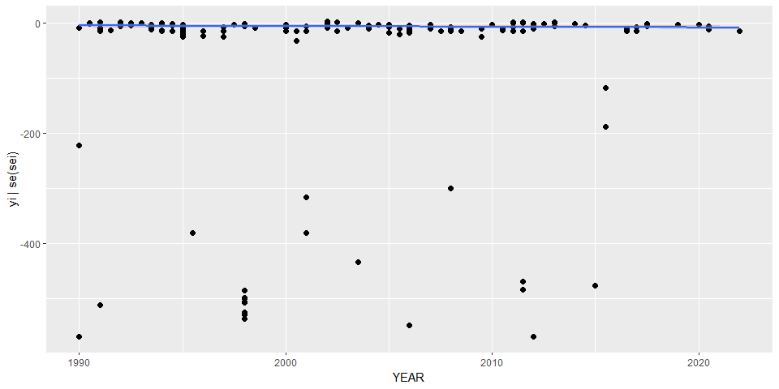

Cadmium CKD4 Age 85-125 • Models fit
================
LoVa3397
2025-10-16

- [Settings](#settings)
- [Parameters](#parameters)
- [Data](#data)
  - [Linear time trend](#linear-time-trend)
- [BRMS](#brms)
  - [Reduced model fit](#reduced-model-fit)
  - [Model summary](#model-summary)
- [Session info](#session-info)

# Settings

``` r
## required packages ----
library(bd)
library(brms)
```

    ## Loading required package: Rcpp

    ## Loading 'brms' package (version 2.22.0). Useful instructions
    ## can be found by typing help('brms'). A more detailed introduction
    ## to the package is available through vignette('brms_overview').

    ## 
    ## Attaching package: 'brms'

    ## The following object is masked from 'package:stats':
    ## 
    ##     ar

``` r
library(ggplot2)
library(metafor)
```

    ## Loading required package: Matrix

    ## Loading required package: metadat

    ## Loading required package: numDeriv

    ## 
    ## Loading the 'metafor' package (version 4.8-0). For an
    ## introduction to the package please type: help(metafor)

``` r
library(readxl)
library(rmarkdown)
library(rms)
```

    ## Loading required package: Hmisc

    ## 
    ## Attaching package: 'Hmisc'

    ## The following objects are masked from 'package:base':
    ## 
    ##     format.pval, units

    ## 
    ## Attaching package: 'rms'

    ## The following object is masked from 'package:metafor':
    ## 
    ##     vif

``` r
library(tidyr)
```

    ## 
    ## Attaching package: 'tidyr'

    ## The following objects are masked from 'package:Matrix':
    ## 
    ##     expand, pack, unpack

``` r
library(kableExtra)

## global options ----
knitr::opts_chunk$set(fig.width = 10)
do.call(file.remove, list(list.files(params$PlotDir, full.names = TRUE)))
```

    ##  [1] TRUE TRUE TRUE TRUE TRUE TRUE TRUE TRUE TRUE TRUE TRUE

# Parameters

| Parameters                       | Values          |
|:---------------------------------|:----------------|
| Pathogen                         | CKD4 Age 85-125 |
| Number of iteration              | 5000            |
| Warmup                           | 3000            |
| Delta value                      | 0.99            |
| Maximum tree-depth               | 15              |
| Levels                           | COUNTRY         |
| Random effect on each data point | Yes             |
| Stronger priors specified        | Normal(0,1)     |

Parameters of the model tested

# Data

``` r
## import data
```

``` r
source("01-data-update.R")
```

    ## Warning in add_pop(dta[[h]]): Warning: 648 rows have missing data for the population variable. Please check if ISO3 code
    ## is correctly specified and if the dates are included in the study field.

    ## Warning: Some 'yi' and/or 'vi' values equal to +-Inf. Recoded to NAs.

    ## Warning: Expecting numeric in Z1165 / R1165C26: got '485
    ## '

    ## Warning: Expecting numeric in Z1169 / R1169C26: got '635
    ## '

    ## Warning: Expecting numeric in Z1186 / R1186C26: got '5555
    ## '

    ## Warning: Expecting logical in AR1246 / R1246C44: got 'BEFORE PE'

    ## Warning: Expecting logical in AR1247 / R1247C44: got 'AFTER PE'

    ## Warning: Expecting logical in AR1248 / R1248C44: got 'Homocysteine tertile 1 [5.1 to 10 lmol/l]'

    ## Warning: Expecting logical in AR1249 / R1249C44: got 'Homocysteine tertile 2 [>10 to 12 lmol/l]'

    ## Warning: Expecting logical in AR1250 / R1250C44: got 'Homocysteine tertile 3 [>12 to 28.7 lmol/l]'

    ## Warning: Expecting logical in AR1251 / R1251C44: got 'Homocysteine 15 lmol/l'

    ## Warning: Expecting logical in AR1252 / R1252C44: got 'Homocysteine >15 lmol/l'

    ## Warning: Expecting logical in AR1253 / R1253C44: got 'CKD-EPI'

    ## Warning: Expecting logical in AR1254 / R1254C44: got 'CKD-EPI'

    ## Warning: Expecting logical in AR1255 / R1255C44: got 'CKD-EPI'

    ## Warning: Expecting logical in AR1256 / R1256C44: got 'unit:(ml/m2/min)'

    ## Warning: Expecting logical in AR1257 / R1257C44: got 'unit:(ml/m2/min)'

    ## Warning: Expecting logical in AR1258 / R1258C44: got 'unit:(ml/m2/min)'

    ## Warning: Expecting logical in AR1260 / R1260C44: got 'Rule(10): GFR-R = 224 Scr -1.190 age -0.236( 0.796 in female) (
    ## 1.26 in healthy)'

    ## Warning: Expecting logical in AR1261 / R1261C44: got 'same with 152'

    ## Warning: Expecting logical in AR1263 / R1263C44: got 'unit：ml/min/BSA'

    ## Warning: Expecting logical in AR1264 / R1264C44: got 'IQR 21.2'

    ## Warning: Expecting logical in AR1265 / R1265C44: got 'Unit: ml/min per m2'

    ## Warning: Expecting logical in AR1266 / R1266C44: got 'Unit: ml/min per m2'

    ## Warning: Expecting logical in AR1267 / R1267C44: got 'IQR:15'

    ## Warning: Expecting logical in AR1268 / R1268C44: got 'IQR:13'

    ## Warning: Expecting logical in AR1269 / R1269C44: got 'IQR:12'

    ## Warning: Expecting logical in AR1270 / R1270C44: got 'IQR:11'

    ## Warning: Expecting logical in AR1271 / R1271C44: got 'IQR:13'

    ## Warning: Expecting logical in AR1272 / R1272C44: got 'First trimester'

    ## Warning: Expecting logical in AR1273 / R1273C44: got 'Second trimester'

    ## Warning: Expecting logical in AR1274 / R1274C44: got 'Third trimester'

    ## Warning: Expecting logical in AR1275 / R1275C44: got 'postpartum day 2–6'

    ## Warning: Expecting logical in AR1276 / R1276C44: got 'postpartum day 24–39'

    ## Warning: Expecting logical in AR1282 / R1282C44: got 'GFR using I25I-iothalamate infusion'

    ## Warning: Expecting logical in AR1283 / R1283C44: got 'Unit: ml/min/m2'

    ## Warning: Expecting logical in AR1284 / R1284C44: got 'Unit: ml/min/m2'

    ## Warning: Expecting logical in AR1285 / R1285C44: got 'The age is quartile.'

    ## Warning: Expecting logical in AR1287 / R1287C44: got 'age:Mean±2SD'

    ## Warning: Expecting logical in AR1288 / R1288C44: got 'age:Mean±2SD'

    ## Warning: Expecting logical in AR1289 / R1289C44: got 'no all text'

    ## Warning: Expecting logical in AR1290 / R1290C44: got 'age start and end:total mean age ± 2SD'

    ## Warning: Expecting logical in AR1291 / R1291C44: got 'age start and end:inter?? quartile deviation'

    ## Warning: Expecting logical in AR1292 / R1292C44: got 'age start and end:inter?? quartile deviation'

    ## Warning: Expecting logical in AR1293 / R1293C44: got 'age start and end:inter?? quartile deviation'

    ## Warning: Expecting logical in AR1294 / R1294C44: got 'formula：GFR＝Dln（P1 ／P2 ）／（T2 － T1）exp
    ## ［（T1lnP2）－（T2lnP1）］／（T2 －T1）'

    ## Warning: Expecting logical in AR1296 / R1296C44: got 'There is no specific number of people in the groups'

    ## Warning in system2("quarto", "-V", stdout = TRUE, env = paste0("TMPDIR=", : running command '"quarto"
    ## TMPDIR=C:/Users/LoVa3397/AppData/Local/Temp/RtmpOKNeDj/file24cc273a7931 -V' had status 1

``` r
es<-es[[params$i]]
es$DTP_ID<-as.character(seq(1:length(es$SOURCE_ID)))
es$yi <- if_else(es$VALUE_X == 0,
                 -15,
                 es$yi)
es$FLAG <- factor(es$FLAG,
                  levels = c(0,1,2,3,4,5,6, 7),
                  labels = c("Keep data", "Data part of non WHO member states", "No WHO REG2 given",
                             "Year before 1990", "yi can't be calcualted", "TF choice to remove",
                             "Excluded by preliminary checks", "Excluded in data cleaning"))
saveRDS(es, paste0(params$Dir,"/es_yi.RDS"))
```

\#’ \# Time trend \## No time trend fit_rma \<- rma.mv(yi = yi , V = vi,
data = subset(es, as.integer(FLAG) == 1), random = ~ 1 \| REG2 / SUB2 /
COUNTRY / ID, test = “t”, method = “REML”, control=list(iter.max=1000,
rel.tol=1e-4))

summary(fit_rma)

## Linear time trend

if(nrow(es) \> 2){ fit_rma_glb \<- rma.mv(yi = yi ~ 1 + YEAR, V = vi,
data = subset(es, as.integer(FLAG) == 1), random = ~ 1 \| REG2 / SUB2 /
COUNTRY / ID, test = “t”, method = “REML”, control = list(iter.max=1000,
rel.tol = 1e-4))

summary(fit_rma_glb) }

if (nrow(subset(es, as.integer(FLAG) == 1)) \> 2){ anova(fit_rma_glb,
fit_rma) }

``` r
png(paste0(params$PlotDir, "/r_lineartimetrend.png"))
ggplot(subset(es, as.integer(FLAG) == 1), aes(x = YEAR, y = yi)) +
  geom_point() +
  geom_smooth(method = "lm") +
  theme_bw()
```

    ## `geom_smooth()` using formula = 'y ~ x'

``` r
dev.off()
```

png 2

``` r
setwd(params$Dir)
image <- paste0("02-fit-CKD_v2_files/figure-gfm/r_lineartimetrend.png")
cat("")
```


``` r
## Non-linear global time trend
```

``` r
png(paste0(params$PlotDir, "/r_nonlineartimetrend.png"))
ggplot(subset(es, as.integer(FLAG) == 1), aes(x = YEAR, y = yi)) +
  geom_point() +
  geom_smooth(method = "loess") +
  theme_bw()
```

    ## `geom_smooth()` using formula = 'y ~ x'

``` r
dev.off()
```

png 2

``` r
setwd(params$Dir)
image <- paste0("02-fit-CKD_v2_files/figure-gfm/r_nonlineartimetrend.png")
cat("")
```


# BRMS

## Reduced model fit

``` r
if (params$Level == "COUNTRY"){
  fit_brms_reg_s <-
    brm(yi | se(sei) ~
          1 + YEAR +
          (1 | REG2) +
          (1 | REG2:SUB2) +
          (1 | REG2:SUB2:COUNTRY) +
          (1 | REG2:SUB2:COUNTRY:ID) +
          (1 | REG2:SUB2:COUNTRY:ID:DTP_ID),
        chains = 5, iter = params$Iterations, warmup = params$Warmup,
        prior = prior(normal(0,1), class = sd),
        control = controls,
        cores = 5,
        data = subset(es, as.integer(FLAG) == 1),
        open_progress = FALSE,
        seed =7)
  saveRDS(fit_brms_reg_s, file = paste0(params$Dir, "/fit_brms_country_s2.rds"))
}
```

    ## Compiling Stan program...

    ## Start sampling

``` r
# if (params$Level == "GLOB"){
#   fit_brms_reg_s <-
#     brm(yi | se(sei) ~
#           1 + YEAR +
#           (1 | ID) +
#           (1 | ID:DTP_ID),
#         chains = 5, iter = params$Iterations, warmup = params$Warmup,
#         prior = prior(normal(0,1), class = sd),
#         control = controls,
#         cores = 5,
#         data = es,
#         open_progress = FALSE,
#         seed =7)
#   saveRDS(fit_brms_reg_s, file = paste0(params$Dir, "/fit_brms_glob_s.rds"))
# } else if (params$Level == "REG2"){
#   fit_brms_reg_s <-
#     brm(yi | se(sei) ~
#           1 + YEAR +
#           (1 | REG2) +
#           (1 | REG2:ID) +
#           (1 | REG2:ID:DTP_ID),
#         chains = 5, iter = params$Iterations, warmup = params$Warmup,
#         prior = prior(normal(0,1), class = sd),
#         control = controls,
#         cores = 5,
#         data = es,
#         open_progress = FALSE,
#         seed =7)
#   saveRDS(fit_brms_reg_s, file = paste0(params$Dir, "/fit_brms_reg_s.rds"))
# } else if (params$Level == "GLOB_NOY"){
#   fit_brms_reg_s <-
#     brm(yi | se(sei) ~
#           1 +
#           (1 | ID) +
#           (1 | ID:DTP_ID),
#         chains = 5, iter = params$Iterations, warmup = params$Warmup,
#         prior = prior(normal(0,1), class = sd),
#         control = controls,
#         cores = 5,
#         data = es,
#         open_progress = FALSE,
#         seed =7)
#   saveRDS(fit_brms_reg_s, file = paste0(params$Dir, "/fit_brms_glob_noy_s.rds"))
# }
```

## Model summary

``` r
summary(fit_brms_reg_s)
```

    ##  Family: gaussian 
    ##   Links: mu = identity; sigma = identity 
    ## Formula: yi | se(sei) ~ 1 + YEAR + (1 | REG2) + (1 | REG2:SUB2) + (1 | REG2:SUB2:COUNTRY) + (1 | REG2:SUB2:COUNTRY:ID) + (1 | REG2:SUB2:COUNTRY:ID:DTP_ID) 
    ##    Data: subset(es, as.integer(FLAG) == 1) (Number of observations: 200) 
    ##   Draws: 5 chains, each with iter = 5000; warmup = 3000; thin = 1;
    ##          total post-warmup draws = 10000
    ## 
    ## Multilevel Hyperparameters:
    ## ~REG2 (Number of levels: 4) 
    ##               Estimate Est.Error l-95% CI u-95% CI Rhat Bulk_ESS Tail_ESS
    ## sd(Intercept)     1.53      0.81     0.12     3.13 1.00     5342     5709
    ## 
    ## ~REG2:SUB2 (Number of levels: 7) 
    ##               Estimate Est.Error l-95% CI u-95% CI Rhat Bulk_ESS Tail_ESS
    ## sd(Intercept)     0.93      0.68     0.04     2.50 1.00     7990     6207
    ## 
    ## ~REG2:SUB2:COUNTRY (Number of levels: 17) 
    ##               Estimate Est.Error l-95% CI u-95% CI Rhat Bulk_ESS Tail_ESS
    ## sd(Intercept)     1.99      0.76     0.34     3.41 1.00     2751     2406
    ## 
    ## ~REG2:SUB2:COUNTRY:ID (Number of levels: 110) 
    ##               Estimate Est.Error l-95% CI u-95% CI Rhat Bulk_ESS Tail_ESS
    ## sd(Intercept)     3.81      0.37     3.12     4.58 1.00     5259     7413
    ## 
    ## ~REG2:SUB2:COUNTRY:ID:DTP_ID (Number of levels: 200) 
    ##               Estimate Est.Error l-95% CI u-95% CI Rhat Bulk_ESS Tail_ESS
    ## sd(Intercept)     1.19      0.19     0.87     1.62 1.00     3454     5068
    ## 
    ## Regression Coefficients:
    ##           Estimate Est.Error l-95% CI u-95% CI Rhat Bulk_ESS Tail_ESS
    ## Intercept   219.30    111.25     0.39   438.06 1.00     5452     6701
    ## YEAR         -0.11      0.06    -0.22    -0.00 1.00     5455     6817
    ## 
    ## Further Distributional Parameters:
    ##       Estimate Est.Error l-95% CI u-95% CI Rhat Bulk_ESS Tail_ESS
    ## sigma     0.00      0.00     0.00     0.00   NA       NA       NA
    ## 
    ## Draws were sampled using sampling(NUTS). For each parameter, Bulk_ESS
    ## and Tail_ESS are effective sample size measures, and Rhat is the potential
    ## scale reduction factor on split chains (at convergence, Rhat = 1).

``` r
est <- colnames(as_draws_df(fit_brms_reg_s))
selected_est <- est[grepl("^(sd_|b_|sigma)", est)]
length <- length(selected_est)
for (i in 1:length){
  png(paste0(params$PlotDir, "/r_summary-", i, ".png"))
  plot(fit_brms_reg_s, variable = selected_est[i])
  dev.off()
}
```

``` r
setwd(params$Dir)
for (i in 1:length){
  image <- paste0("02-fit-CKD_v2_files/figure-gfm/r_summary-",i,".png")
  cat("")
}
```


``` r
if (params$Level != "GLOB_NOY"){
  P <- plot(conditional_effects(fit_brms_reg_s), points = TRUE, ask=FALSE)
  length <- length(P)
  for (i in 1:length){
    png(paste0(params$PlotDir, "/r_conditional_effects-", i, ".png"))
    plot(P[[i]])
    dev.off()
  }
}
```

<!-- -->

``` r
# setwd(params$Dir)
if (params$Level != "GLOB_NOY"){
  for (i in 1:length){
    image <- paste0("02-fit-CKD_v2_files/figure-gfm/r_conditional_effects-",i,".png")
    cat("")
  }
}
```



``` r
## show model code
stancode(fit_brms_reg_s)
```

// generated with brms 2.22.0 functions { } data { int\<lower=1\> N; //
total number of observations vector\[N\] Y; // response variable
vector\<lower=0\>\[N\] se; // known sampling error int\<lower=1\> K; //
number of population-level effects matrix\[N, K\] X; // population-level
design matrix int\<lower=1\> Kc; // number of population-level effects
after centering // data for group-level effects of ID 1 int\<lower=1\>
N_1; // number of grouping levels int\<lower=1\> M_1; // number of
coefficients per level array\[N\] int\<lower=1\> J_1; // grouping
indicator per observation // group-level predictor values vector\[N\]
Z_1_1; // data for group-level effects of ID 2 int\<lower=1\> N_2; //
number of grouping levels int\<lower=1\> M_2; // number of coefficients
per level array\[N\] int\<lower=1\> J_2; // grouping indicator per
observation // group-level predictor values vector\[N\] Z_2_1; // data
for group-level effects of ID 3 int\<lower=1\> N_3; // number of
grouping levels int\<lower=1\> M_3; // number of coefficients per level
array\[N\] int\<lower=1\> J_3; // grouping indicator per observation //
group-level predictor values vector\[N\] Z_3_1; // data for group-level
effects of ID 4 int\<lower=1\> N_4; // number of grouping levels
int\<lower=1\> M_4; // number of coefficients per level array\[N\]
int\<lower=1\> J_4; // grouping indicator per observation // group-level
predictor values vector\[N\] Z_4_1; // data for group-level effects of
ID 5 int\<lower=1\> N_5; // number of grouping levels int\<lower=1\>
M_5; // number of coefficients per level array\[N\] int\<lower=1\> J_5;
// grouping indicator per observation // group-level predictor values
vector\[N\] Z_5_1; int prior_only; // should the likelihood be ignored?
} transformed data { vector\<lower=0\>\[N\] se2 = square(se); matrix\[N,
Kc\] Xc; // centered version of X without an intercept vector\[Kc\]
means_X; // column means of X before centering for (i in 2:K) {
means_X\[i - 1\] = mean(X\[, i\]); Xc\[, i - 1\] = X\[, i\] -
means_X\[i - 1\]; } } parameters { vector\[Kc\] b; // regression
coefficients real Intercept; // temporary intercept for centered
predictors vector\<lower=0\>\[M_1\] sd_1; // group-level standard
deviations array\[M_1\] vector\[N_1\] z_1; // standardized group-level
effects vector\<lower=0\>\[M_2\] sd_2; // group-level standard
deviations array\[M_2\] vector\[N_2\] z_2; // standardized group-level
effects vector\<lower=0\>\[M_3\] sd_3; // group-level standard
deviations array\[M_3\] vector\[N_3\] z_3; // standardized group-level
effects vector\<lower=0\>\[M_4\] sd_4; // group-level standard
deviations array\[M_4\] vector\[N_4\] z_4; // standardized group-level
effects vector\<lower=0\>\[M_5\] sd_5; // group-level standard
deviations array\[M_5\] vector\[N_5\] z_5; // standardized group-level
effects } transformed parameters { real sigma = 0; // dispersion
parameter vector\[N_1\] r_1_1; // actual group-level effects
vector\[N_2\] r_2_1; // actual group-level effects vector\[N_3\] r_3_1;
// actual group-level effects vector\[N_4\] r_4_1; // actual group-level
effects vector\[N_5\] r_5_1; // actual group-level effects real lprior =
0; // prior contributions to the log posterior r_1_1 = (sd_1\[1\] \*
(z_1\[1\])); r_2_1 = (sd_2\[1\] \* (z_2\[1\])); r_3_1 = (sd_3\[1\] \*
(z_3\[1\])); r_4_1 = (sd_4\[1\] \* (z_4\[1\])); r_5_1 = (sd_5\[1\] \*
(z_5\[1\])); lprior += student_t_lpdf(Intercept \| 3, -8.4, 9.8); lprior
+= normal_lpdf(sd_1 \| 0, 1) - 1 \* normal_lccdf(0 \| 0, 1); lprior +=
normal_lpdf(sd_2 \| 0, 1) - 1 \* normal_lccdf(0 \| 0, 1); lprior +=
normal_lpdf(sd_3 \| 0, 1) - 1 \* normal_lccdf(0 \| 0, 1); lprior +=
normal_lpdf(sd_4 \| 0, 1) - 1 \* normal_lccdf(0 \| 0, 1); lprior +=
normal_lpdf(sd_5 \| 0, 1) - 1 \* normal_lccdf(0 \| 0, 1); } model { //
likelihood including constants if (!prior_only) { // initialize linear
predictor term vector\[N\] mu = rep_vector(0.0, N); mu += Intercept + Xc
\* b; for (n in 1:N) { // add more terms to the linear predictor mu\[n\]
+= r_1_1\[J_1\[n\]\] \* Z_1_1\[n\] + r_2_1\[J_2\[n\]\] \* Z_2_1\[n\] +
r_3_1\[J_3\[n\]\] \* Z_3_1\[n\] + r_4_1\[J_4\[n\]\] \* Z_4_1\[n\] +
r_5_1\[J_5\[n\]\] \* Z_5_1\[n\]; } target += normal_lpdf(Y \| mu, se); }
// priors including constants target += lprior; target +=
std_normal_lpdf(z_1\[1\]); target += std_normal_lpdf(z_2\[1\]); target
+= std_normal_lpdf(z_3\[1\]); target += std_normal_lpdf(z_4\[1\]);
target += std_normal_lpdf(z_5\[1\]); } generated quantities { // actual
population-level intercept real b_Intercept = Intercept -
dot_product(means_X, b); }

# Session info

``` r
sessioninfo::session_info()
```

    ## Warning in system2("quarto", "-V", stdout = TRUE, env = paste0("TMPDIR=", : running command '"quarto"
    ## TMPDIR=C:/Users/LoVa3397/AppData/Local/Temp/RtmpOKNeDj/file24cc1c5c47ea -V' had status 1

    ## ─ Session info ────────────────────────────────────────────────────────────────────────────────────────────────────────
    ##  setting  value
    ##  version  R version 4.5.1 (2025-06-13 ucrt)
    ##  os       Windows 10 x64 (build 19045)
    ##  system   x86_64, mingw32
    ##  ui       RStudio
    ##  language (EN)
    ##  collate  English_United States.utf8
    ##  ctype    English_United States.utf8
    ##  tz       Europe/Brussels
    ##  date     2025-10-16
    ##  rstudio  2025.09.0+387 Cucumberleaf Sunflower (desktop)
    ##  pandoc   3.6.3 @ C:/Program Files/RStudio/resources/app/bin/quarto/bin/tools/ (via rmarkdown)
    ##  quarto   ERROR: Unknown command "TMPDIR=C:/Users/LoVa3397/AppData/Local/Temp/RtmpOKNeDj/file24cc1c5c47ea". Did you mean command "install"? @ C:\\PROGRA~1\\RStudio\\RESOUR~1\\app\\bin\\quarto\\bin\\quarto.exe
    ## 
    ## ─ Packages ────────────────────────────────────────────────────────────────────────────────────────────────────────────
    ##  ! package        * version    date (UTC) lib source
    ##    abind            1.4-8      2024-09-12 [1] CRAN (R 4.5.0)
    ##    backports        1.5.0      2024-05-23 [1] CRAN (R 4.5.0)
    ##    base64enc        0.1-3      2015-07-28 [1] CRAN (R 4.5.0)
    ##    bayesplot        1.13.0     2025-06-18 [1] CRAN (R 4.5.1)
    ##    bd             * 0.0.14     2025-07-14 [1] Github (brechtdv/bd@652191c)
    ##    bridgesampling   1.1-2      2021-04-16 [1] CRAN (R 4.5.1)
    ##    brms           * 2.22.0     2024-09-23 [1] CRAN (R 4.5.1)
    ##    Brobdingnag      1.2-9      2022-10-19 [1] CRAN (R 4.5.1)
    ##    callr            3.7.6      2024-03-25 [1] CRAN (R 4.5.1)
    ##    cellranger       1.1.0      2016-07-27 [1] CRAN (R 4.5.1)
    ##    checkmate        2.3.2      2024-07-29 [1] CRAN (R 4.5.1)
    ##    class            7.3-23     2025-01-01 [1] CRAN (R 4.5.1)
    ##    classInt         0.4-11     2025-01-08 [1] CRAN (R 4.5.1)
    ##    cli              3.6.5      2025-04-23 [1] CRAN (R 4.5.1)
    ##    cluster          2.1.8.1    2025-03-12 [1] CRAN (R 4.5.1)
    ##    coda             0.19-4.1   2024-01-31 [1] CRAN (R 4.5.1)
    ##    codetools        0.2-20     2024-03-31 [1] CRAN (R 4.5.1)
    ##    colorspace       2.1-1      2024-07-26 [1] CRAN (R 4.5.1)
    ##    cowplot        * 1.2.0      2025-07-07 [1] CRAN (R 4.5.1)
    ##    curl             6.4.0      2025-06-22 [1] CRAN (R 4.5.1)
    ##    data.table       1.17.8     2025-07-10 [1] CRAN (R 4.5.1)
    ##    DBI              1.2.3      2024-06-02 [1] CRAN (R 4.5.1)
    ##    digest           0.6.37     2024-08-19 [1] CRAN (R 4.5.1)
    ##    distributional   0.5.0      2024-09-17 [1] CRAN (R 4.5.1)
    ##    dplyr          * 1.1.4      2023-11-17 [1] CRAN (R 4.5.1)
    ##    e1071            1.7-16     2024-09-16 [1] CRAN (R 4.5.1)
    ##    evaluate         1.0.4      2025-06-18 [1] CRAN (R 4.5.1)
    ##    farver           2.1.2      2024-05-13 [1] CRAN (R 4.5.1)
    ##    fastmap          1.2.0      2024-05-15 [1] CRAN (R 4.5.1)
    ##    FERG2          * 0.0.5      2025-07-15 [1] Github (brechtdv/FERG2@c2d4ac1)
    ##    foreign          0.8-90     2025-03-31 [1] CRAN (R 4.5.1)
    ##    Formula          1.2-5      2023-02-24 [1] CRAN (R 4.5.0)
    ##    generics         0.1.4      2025-05-09 [1] CRAN (R 4.5.1)
    ##    ggplot2        * 3.5.2      2025-04-09 [1] CRAN (R 4.5.1)
    ##    glue             1.8.0      2024-09-30 [1] CRAN (R 4.5.1)
    ##    gridExtra        2.3        2017-09-09 [1] CRAN (R 4.5.1)
    ##    gtable           0.3.6      2024-10-25 [1] CRAN (R 4.5.1)
    ##    Hmisc          * 5.2-3      2025-03-16 [1] CRAN (R 4.5.1)
    ##    htmlTable        2.4.3      2024-07-21 [1] CRAN (R 4.5.1)
    ##    htmltools        0.5.8.1    2024-04-04 [1] CRAN (R 4.5.1)
    ##    htmlwidgets      1.6.4      2023-12-06 [1] CRAN (R 4.5.1)
    ##    inline           0.3.21     2025-01-09 [1] CRAN (R 4.5.1)
    ##    jsonlite         2.0.0      2025-03-27 [1] CRAN (R 4.5.1)
    ##    kableExtra     * 1.4.0      2024-01-24 [1] CRAN (R 4.5.1)
    ##    KernSmooth       2.23-26    2025-01-01 [1] CRAN (R 4.5.1)
    ##    knitr            1.50       2025-03-16 [1] CRAN (R 4.5.1)
    ##    labeling         0.4.3      2023-08-29 [1] CRAN (R 4.5.0)
    ##    lattice          0.22-7     2025-04-02 [1] CRAN (R 4.5.1)
    ##    lifecycle        1.0.4      2023-11-07 [1] CRAN (R 4.5.1)
    ##    loo              2.8.0      2024-07-03 [1] CRAN (R 4.5.1)
    ##    magrittr         2.0.3      2022-03-30 [1] CRAN (R 4.5.1)
    ##    MASS             7.3-65     2025-02-28 [1] CRAN (R 4.5.1)
    ##    mathjaxr         1.8-0      2025-04-30 [1] CRAN (R 4.5.1)
    ##    Matrix         * 1.7-3      2025-03-11 [1] CRAN (R 4.5.1)
    ##    MatrixModels     0.5-4      2025-03-26 [1] CRAN (R 4.5.1)
    ##    matrixStats      1.5.0      2025-01-07 [1] CRAN (R 4.5.1)
    ##    metadat        * 1.4-0      2025-02-04 [1] CRAN (R 4.5.1)
    ##    metafor        * 4.8-0      2025-01-28 [1] CRAN (R 4.5.1)
    ##    mgcv             1.9-3      2025-04-04 [1] CRAN (R 4.5.1)
    ##    multcomp         1.4-28     2025-01-29 [1] CRAN (R 4.5.1)
    ##    mvtnorm          1.3-3      2025-01-10 [1] CRAN (R 4.5.1)
    ##    nlme             3.1-168    2025-03-31 [1] CRAN (R 4.5.1)
    ##    nnet             7.3-20     2025-01-01 [1] CRAN (R 4.5.1)
    ##    numDeriv       * 2016.8-1.1 2019-06-06 [1] CRAN (R 4.5.0)
    ##    pillar           1.11.0     2025-07-04 [1] CRAN (R 4.5.1)
    ##    pkgbuild         1.4.8      2025-05-26 [1] CRAN (R 4.5.1)
    ##    pkgconfig        2.0.3      2019-09-22 [1] CRAN (R 4.5.1)
    ##    plyr             1.8.9      2023-10-02 [1] CRAN (R 4.5.1)
    ##    polspline        1.1.25     2024-05-10 [1] CRAN (R 4.5.0)
    ##    posterior        1.6.1      2025-02-27 [1] CRAN (R 4.5.1)
    ##    processx         3.8.6      2025-02-21 [1] CRAN (R 4.5.1)
    ##    proxy            0.4-27     2022-06-09 [1] CRAN (R 4.5.1)
    ##    ps               1.9.1      2025-04-12 [1] CRAN (R 4.5.1)
    ##    purrr            1.1.0      2025-07-10 [1] CRAN (R 4.5.1)
    ##    quantreg         6.1        2025-03-10 [1] CRAN (R 4.5.1)
    ##    QuickJSR         1.8.0      2025-06-09 [1] CRAN (R 4.5.1)
    ##    R6               2.6.1      2025-02-15 [1] CRAN (R 4.5.1)
    ##    RColorBrewer     1.1-3      2022-04-03 [1] CRAN (R 4.5.0)
    ##    Rcpp           * 1.1.0      2025-07-02 [1] CRAN (R 4.5.1)
    ##  D RcppParallel     5.1.10     2025-01-24 [1] CRAN (R 4.5.1)
    ##    readxl         * 1.4.5      2025-03-07 [1] CRAN (R 4.5.1)
    ##    reshape2         1.4.4      2020-04-09 [1] CRAN (R 4.5.1)
    ##    rlang            1.1.6      2025-04-11 [1] CRAN (R 4.5.1)
    ##    rmarkdown      * 2.29       2024-11-04 [1] CRAN (R 4.5.1)
    ##    rms            * 8.0-0      2025-04-04 [1] CRAN (R 4.5.1)
    ##    rpart            4.1.24     2025-01-07 [1] CRAN (R 4.5.1)
    ##    rstan            2.32.7     2025-03-10 [1] CRAN (R 4.5.1)
    ##    rstantools       2.4.0      2024-01-31 [1] CRAN (R 4.5.1)
    ##    rstudioapi       0.17.1     2024-10-22 [1] CRAN (R 4.5.1)
    ##    sandwich         3.1-1      2024-09-15 [1] CRAN (R 4.5.1)
    ##    scales           1.4.0      2025-04-24 [1] CRAN (R 4.5.1)
    ##    sessioninfo      1.2.3      2025-02-05 [1] CRAN (R 4.5.1)
    ##    sf             * 1.0-21     2025-05-15 [1] CRAN (R 4.5.1)
    ##    SparseM          1.84-2     2024-07-17 [1] CRAN (R 4.5.1)
    ##    StanHeaders      2.32.10    2024-07-15 [1] CRAN (R 4.5.1)
    ##    stringi          1.8.7      2025-03-27 [1] CRAN (R 4.5.0)
    ##    stringr          1.5.1      2023-11-14 [1] CRAN (R 4.5.1)
    ##    survival         3.8-3      2024-12-17 [1] CRAN (R 4.5.1)
    ##    svglite          2.2.1      2025-05-12 [1] CRAN (R 4.5.1)
    ##    systemfonts      1.2.3      2025-04-30 [1] CRAN (R 4.5.1)
    ##    tensorA          0.36.2.1   2023-12-13 [1] CRAN (R 4.5.0)
    ##    textshaping      1.0.1      2025-05-01 [1] CRAN (R 4.5.1)
    ##    TH.data          1.1-3      2025-01-17 [1] CRAN (R 4.5.1)
    ##    tibble           3.3.0      2025-06-08 [1] CRAN (R 4.5.1)
    ##    tidyr          * 1.3.1      2024-01-24 [1] CRAN (R 4.5.1)
    ##    tidyselect       1.2.1      2024-03-11 [1] CRAN (R 4.5.1)
    ##    units            0.8-7      2025-03-11 [1] CRAN (R 4.5.1)
    ##    V8               6.0.4      2025-06-04 [1] CRAN (R 4.5.1)
    ##    vctrs            0.6.5      2023-12-01 [1] CRAN (R 4.5.1)
    ##    viridisLite      0.4.2      2023-05-02 [1] CRAN (R 4.5.1)
    ##    withr            3.0.2      2024-10-28 [1] CRAN (R 4.5.1)
    ##    xfun             0.52       2025-04-02 [1] CRAN (R 4.5.1)
    ##    xml2             1.3.8      2025-03-14 [1] CRAN (R 4.5.1)
    ##    yaml             2.3.10     2024-07-26 [1] CRAN (R 4.5.0)
    ##    zoo              1.8-14     2025-04-10 [1] CRAN (R 4.5.1)
    ## 
    ##  [1] C:/Program Files/R/R-4.5.1/library
    ## 
    ##  * ── Packages attached to the search path.
    ##  D ── DLL MD5 mismatch, broken installation.
    ## 
    ## ───────────────────────────────────────────────────────────────────────────────────────────────────────────────────────

``` r
##rmarkdown::render("02-fit-HIC.R")
```
