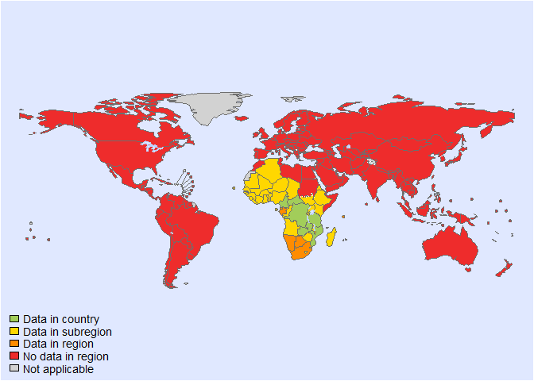
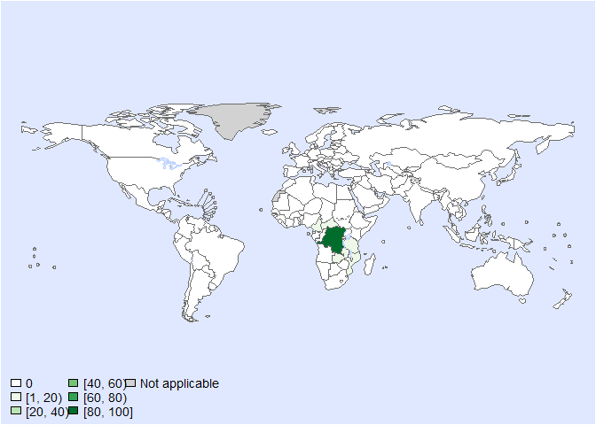
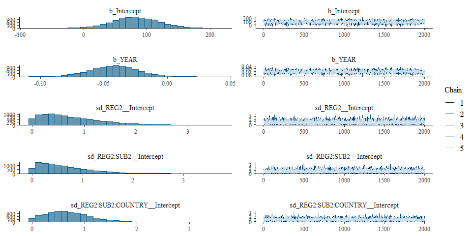
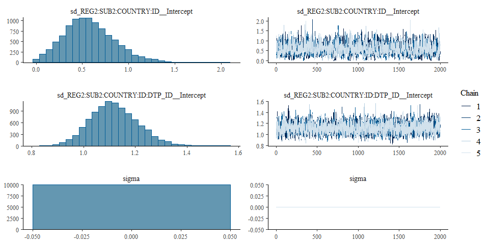

Global incidence of cassava • fit model - Version 4
================
LoVa3397
2025-03-17

- [Settings](#settings)
  - [BRMS model: Version 4](#brms-model-version-4)
- [Session info](#session-info)

# Settings

``` r
## required packages ----
library(bd)
library(brms)
```

    ## Loading required package: Rcpp

    ## Loading 'brms' package (version 2.22.0). Useful instructions
    ## can be found by typing help('brms'). A more detailed introduction
    ## to the package is available through vignette('brms_overview').

    ## 
    ## Attaching package: 'brms'

    ## The following object is masked from 'package:stats':
    ## 
    ##     ar

``` r
library(ggplot2)
```

    ## Need help? Try Stackoverflow: https://stackoverflow.com/tags/ggplot2

``` r
library(metafor)
```

    ## Loading required package: Matrix

    ## Loading required package: metadat

    ## Loading required package: numDeriv

    ## 
    ## Loading the 'metafor' package (version 4.8-0). For an
    ## introduction to the package please type: help(metafor)

``` r
library(readxl)
library(rmarkdown)
library(rms)
```

    ## Loading required package: Hmisc

    ## 
    ## Attaching package: 'Hmisc'

    ## The following objects are masked from 'package:base':
    ## 
    ##     format.pval, units

    ## 
    ## Attaching package: 'rms'

    ## The following object is masked from 'package:metafor':
    ## 
    ##     vif

``` r
library(tidyr)
```

    ## 
    ## Attaching package: 'tidyr'

    ## The following objects are masked from 'package:Matrix':
    ## 
    ##     expand, pack, unpack

``` r
library(knitr)

## global options ----
knitr::opts_chunk$set(fig.width = 10)
Date <- format(Sys.Date(), "%Y%m%d")

source("01-data.R")
```

    ## 
    ## Attaching package: 'FERG2'

    ## The following object is masked from 'package:bd':
    ## 
    ##     mean_ci

    ## Linking to GEOS 3.13.0, GDAL 3.10.1, PROJ 9.5.1; sf_use_s2() is TRUE

    ## 
    ## Attaching package: 'dplyr'

    ## The following objects are masked from 'package:Hmisc':
    ## 
    ##     src, summarize

    ## The following object is masked from 'package:bd':
    ## 
    ##     collapse

    ## The following objects are masked from 'package:stats':
    ## 
    ##     filter, lag

    ## The following objects are masked from 'package:base':
    ## 
    ##     intersect, setdiff, setequal, union

    ## 
    ## Attaching package: 'DescTools'

    ## The following objects are masked from 'package:Hmisc':
    ## 
    ##     %nin%, Label, Mean, Quantile

    ## Warning: Expecting numeric in C209 / R209C3: got a date

    ## 'data.frame':    193 obs. of  17 variables:
    ##  $ ISO3                : chr  "CAF" "CAF" "CAF" "CAF" ...
    ##  $ Period: start       : num  1984 NA NA NA NA ...
    ##  $ end                 : num  1992 NA NA NA NA ...
    ##  $ YEAR                : num  NA 1984 1985 1986 1987 ...
    ##  $ Country             : chr  NA "Central African Republic" "Central African Republic" "Central African Republic" ...
    ##  $ REG2                : chr  NA "AFR" "AFR" "AFR" ...
    ##  $ SUB2                : chr  NA "AFRD" "AFRD" "AFRD" ...
    ##  $ Population          : num  NA 2568610 2600932 2634258 2669155 ...
    ##  $ Incident cases      : num  NA 2 0 2 2 3 1 1 3 2 ...
    ##  $ Person-years        : num  NA 2568610 2600932 2634258 2669155 ...
    ##  $ Incidence (per 10-5): num  NA 0.0779 0 0.0759 0.0749 ...
    ##  $ SOURCE_ID           : chr  "26b" "26b" "26b" "26b" ...
    ##  $ SOURCE_AUTHOR       : chr  "Tylleskar, T." "Tylleskar, T." "Tylleskar, T." "Tylleskar, T." ...
    ##  $ SOURCE_YEAR         : num  1994 1994 1994 1994 1994 ...
    ##  $ Include             : num  0 1 1 1 1 1 1 1 1 1 ...
    ##  $ SOURCE_TITLE        : chr  NA NA NA NA ...
    ##  $ FLAG                : num  5 0 0 0 0 0 0 0 0 0 ...

    ## Joining with `by = join_by(ISO3, REF_YEAR_START, REF_YEAR_END, REF_AGE_START, REF_AGE_END, REF_SEX, ID_ROW)`

    ## Warning in add_pop(dta): Warning: 64 rows have missing data for the population variable. Please check if ISO3 code is
    ## correctly specified and if the dates are included in the study field.

<!-- --><!-- -->

    ## Warning: Single-level factor(s) found in 'random' argument. Corresponding 'sigma2' value(s) fixed to 0.

    ## Warning: Single-level factor(s) found in 'random' argument. Corresponding 'sigma2' value(s) fixed to 0.

    ## Warning: REML comparisons not meaningful for models with different fixed effects
    ## (use 'refit=TRUE' to refit both models based on ML estimation).

    ## Warning in system2("quarto", "-V", stdout = TRUE, env = paste0("TMPDIR=", : running command '"quarto"
    ## TMPDIR=C:/Users/LoVa3397/AppData/Local/Temp/RtmpSQjpfg/file2e143ad24436 -V' had status 1

``` r
es$DTP_ID<-as.character(seq(1:length(es$SOURCE_ID)))
es$FLAG<-factor(es$FLAG, 
                levels=c(0,1,2,3,4,5,6, 7),
                labels=c("Keep data", "Data part of non WHO member states", "No WHO REG2 given",
                         "Year before 1990", "yi can't be calcualted", "TF choice to remove", 
                         "Excluded by preliminary checks", "Excluded in data cleaning"))

saveRDS(es, paste0("es_", Date, ".RDS"))
```

## BRMS model: Version 4

``` r
Parameters<- c("Number of iterations", "Warmup", "Delta value", "Maximum tree-depth","Random effect on each data point", "Stronger priors specified")
Values <- c("5000","3000","0.99","15","Yes", "Normal(0,1)")
version_spe <- data.frame(Parameters,Values)

kable(caption = "Parameters of the model tested",row.names = FALSE, version_spe)
```

| Parameters                       | Values      |
|:---------------------------------|:------------|
| Number of iterations             | 5000        |
| Warmup                           | 3000        |
| Delta value                      | 0.99        |
| Maximum tree-depth               | 15          |
| Random effect on each data point | Yes         |
| Stronger priors specified        | Normal(0,1) |

Parameters of the model tested

``` r
fit_brms_reg_s4 <-
  brm(yi | se(sei) ~
        1 + YEAR +
        (1  | REG2) +
        (1  | REG2:SUB2) +
        (1  | REG2:SUB2:COUNTRY) +
        (1  | REG2:SUB2:COUNTRY:ID) +
        (1  | REG2:SUB2:COUNTRY:ID:DTP_ID),
      chains = 5, iter = 5000, warmup = 3000,
      prior = prior(normal(0,1), class = sd),
      cores = 5,
      data = es, 
      open_progress = FALSE,
      control = list(adapt_delta=0.99, max_treedepth = 15),
      seed =7 )
```

    ## Warning: Rows containing NAs were excluded from the model.

    ## Compiling Stan program...

    ## Start sampling

    ## Warning: There were 4 divergent transitions after warmup. See
    ## https://mc-stan.org/misc/warnings.html#divergent-transitions-after-warmup
    ## to find out why this is a problem and how to eliminate them.

    ## Warning: Examine the pairs() plot to diagnose sampling problems

``` r
saveRDS(fit_brms_reg_s4, file = "fit_brms_reg_s4.rds")
summary(fit_brms_reg_s4)
```

    ## Warning: There were 4 divergent transitions after warmup. Increasing adapt_delta above 0.99 may help. See
    ## http://mc-stan.org/misc/warnings.html#divergent-transitions-after-warmup

    ##  Family: gaussian 
    ##   Links: mu = identity; sigma = identity 
    ## Formula: yi | se(sei) ~ 1 + YEAR + (1 | REG2) + (1 | REG2:SUB2) + (1 | REG2:SUB2:COUNTRY) + (1 | REG2:SUB2:COUNTRY:ID) + (1 | REG2:SUB2:COUNTRY:ID:DTP_ID) 
    ##    Data: es (Number of observations: 111) 
    ##   Draws: 5 chains, each with iter = 5000; warmup = 3000; thin = 1;
    ##          total post-warmup draws = 10000
    ## 
    ## Multilevel Hyperparameters:
    ## ~REG2 (Number of levels: 1) 
    ##               Estimate Est.Error l-95% CI u-95% CI Rhat Bulk_ESS Tail_ESS
    ## sd(Intercept)     0.76      0.58     0.03     2.15 1.00     7983     4866
    ## 
    ## ~REG2:SUB2 (Number of levels: 2) 
    ##               Estimate Est.Error l-95% CI u-95% CI Rhat Bulk_ESS Tail_ESS
    ## sd(Intercept)     0.64      0.51     0.02     1.88 1.00     7128     4458
    ## 
    ## ~REG2:SUB2:COUNTRY (Number of levels: 6) 
    ##               Estimate Est.Error l-95% CI u-95% CI Rhat Bulk_ESS Tail_ESS
    ## sd(Intercept)     0.70      0.43     0.04     1.66 1.00     2964     3258
    ## 
    ## ~REG2:SUB2:COUNTRY:ID (Number of levels: 18) 
    ##               Estimate Est.Error l-95% CI u-95% CI Rhat Bulk_ESS Tail_ESS
    ## sd(Intercept)     0.58      0.27     0.10     1.18 1.01     1104     1364
    ## 
    ## ~REG2:SUB2:COUNTRY:ID:DTP_ID (Number of levels: 111) 
    ##               Estimate Est.Error l-95% CI u-95% CI Rhat Bulk_ESS Tail_ESS
    ## sd(Intercept)     1.12      0.09     0.95     1.31 1.00     2476     4396
    ## 
    ## Regression Coefficients:
    ##           Estimate Est.Error l-95% CI u-95% CI Rhat Bulk_ESS Tail_ESS
    ## Intercept    81.93     37.02     7.56   153.86 1.00     2304     3984
    ## YEAR         -0.04      0.02    -0.08    -0.01 1.00     2303     4018
    ## 
    ## Further Distributional Parameters:
    ##       Estimate Est.Error l-95% CI u-95% CI Rhat Bulk_ESS Tail_ESS
    ## sigma     0.00      0.00     0.00     0.00   NA       NA       NA
    ## 
    ## Draws were sampled using sampling(NUTS). For each parameter, Bulk_ESS
    ## and Tail_ESS are effective sample size measures, and Rhat is the potential
    ## scale reduction factor on split chains (at convergence, Rhat = 1).

``` r
plot(fit_brms_reg_s4, ask = FALSE)
```

<!-- --><!-- -->

``` r
# plot(conditional_effects(fit_brms_reg_s4), points = TRUE)

stancode(fit_brms_reg_s4)
```

    ## // generated with brms 2.22.0
    ## functions {
    ## }
    ## data {
    ##   int<lower=1> N;  // total number of observations
    ##   vector[N] Y;  // response variable
    ##   vector<lower=0>[N] se;  // known sampling error
    ##   int<lower=1> K;  // number of population-level effects
    ##   matrix[N, K] X;  // population-level design matrix
    ##   int<lower=1> Kc;  // number of population-level effects after centering
    ##   // data for group-level effects of ID 1
    ##   int<lower=1> N_1;  // number of grouping levels
    ##   int<lower=1> M_1;  // number of coefficients per level
    ##   array[N] int<lower=1> J_1;  // grouping indicator per observation
    ##   // group-level predictor values
    ##   vector[N] Z_1_1;
    ##   // data for group-level effects of ID 2
    ##   int<lower=1> N_2;  // number of grouping levels
    ##   int<lower=1> M_2;  // number of coefficients per level
    ##   array[N] int<lower=1> J_2;  // grouping indicator per observation
    ##   // group-level predictor values
    ##   vector[N] Z_2_1;
    ##   // data for group-level effects of ID 3
    ##   int<lower=1> N_3;  // number of grouping levels
    ##   int<lower=1> M_3;  // number of coefficients per level
    ##   array[N] int<lower=1> J_3;  // grouping indicator per observation
    ##   // group-level predictor values
    ##   vector[N] Z_3_1;
    ##   // data for group-level effects of ID 4
    ##   int<lower=1> N_4;  // number of grouping levels
    ##   int<lower=1> M_4;  // number of coefficients per level
    ##   array[N] int<lower=1> J_4;  // grouping indicator per observation
    ##   // group-level predictor values
    ##   vector[N] Z_4_1;
    ##   // data for group-level effects of ID 5
    ##   int<lower=1> N_5;  // number of grouping levels
    ##   int<lower=1> M_5;  // number of coefficients per level
    ##   array[N] int<lower=1> J_5;  // grouping indicator per observation
    ##   // group-level predictor values
    ##   vector[N] Z_5_1;
    ##   int prior_only;  // should the likelihood be ignored?
    ## }
    ## transformed data {
    ##   vector<lower=0>[N] se2 = square(se);
    ##   matrix[N, Kc] Xc;  // centered version of X without an intercept
    ##   vector[Kc] means_X;  // column means of X before centering
    ##   for (i in 2:K) {
    ##     means_X[i - 1] = mean(X[, i]);
    ##     Xc[, i - 1] = X[, i] - means_X[i - 1];
    ##   }
    ## }
    ## parameters {
    ##   vector[Kc] b;  // regression coefficients
    ##   real Intercept;  // temporary intercept for centered predictors
    ##   vector<lower=0>[M_1] sd_1;  // group-level standard deviations
    ##   array[M_1] vector[N_1] z_1;  // standardized group-level effects
    ##   vector<lower=0>[M_2] sd_2;  // group-level standard deviations
    ##   array[M_2] vector[N_2] z_2;  // standardized group-level effects
    ##   vector<lower=0>[M_3] sd_3;  // group-level standard deviations
    ##   array[M_3] vector[N_3] z_3;  // standardized group-level effects
    ##   vector<lower=0>[M_4] sd_4;  // group-level standard deviations
    ##   array[M_4] vector[N_4] z_4;  // standardized group-level effects
    ##   vector<lower=0>[M_5] sd_5;  // group-level standard deviations
    ##   array[M_5] vector[N_5] z_5;  // standardized group-level effects
    ## }
    ## transformed parameters {
    ##   real sigma = 0;  // dispersion parameter
    ##   vector[N_1] r_1_1;  // actual group-level effects
    ##   vector[N_2] r_2_1;  // actual group-level effects
    ##   vector[N_3] r_3_1;  // actual group-level effects
    ##   vector[N_4] r_4_1;  // actual group-level effects
    ##   vector[N_5] r_5_1;  // actual group-level effects
    ##   real lprior = 0;  // prior contributions to the log posterior
    ##   r_1_1 = (sd_1[1] * (z_1[1]));
    ##   r_2_1 = (sd_2[1] * (z_2[1]));
    ##   r_3_1 = (sd_3[1] * (z_3[1]));
    ##   r_4_1 = (sd_4[1] * (z_4[1]));
    ##   r_5_1 = (sd_5[1] * (z_5[1]));
    ##   lprior += student_t_lpdf(Intercept | 3, -3, 2.5);
    ##   lprior += normal_lpdf(sd_1 | 0, 1)
    ##     - 1 * normal_lccdf(0 | 0, 1);
    ##   lprior += normal_lpdf(sd_2 | 0, 1)
    ##     - 1 * normal_lccdf(0 | 0, 1);
    ##   lprior += normal_lpdf(sd_3 | 0, 1)
    ##     - 1 * normal_lccdf(0 | 0, 1);
    ##   lprior += normal_lpdf(sd_4 | 0, 1)
    ##     - 1 * normal_lccdf(0 | 0, 1);
    ##   lprior += normal_lpdf(sd_5 | 0, 1)
    ##     - 1 * normal_lccdf(0 | 0, 1);
    ## }
    ## model {
    ##   // likelihood including constants
    ##   if (!prior_only) {
    ##     // initialize linear predictor term
    ##     vector[N] mu = rep_vector(0.0, N);
    ##     mu += Intercept + Xc * b;
    ##     for (n in 1:N) {
    ##       // add more terms to the linear predictor
    ##       mu[n] += r_1_1[J_1[n]] * Z_1_1[n] + r_2_1[J_2[n]] * Z_2_1[n] + r_3_1[J_3[n]] * Z_3_1[n] + r_4_1[J_4[n]] * Z_4_1[n] + r_5_1[J_5[n]] * Z_5_1[n];
    ##     }
    ##     target += normal_lpdf(Y | mu, se);
    ##   }
    ##   // priors including constants
    ##   target += lprior;
    ##   target += std_normal_lpdf(z_1[1]);
    ##   target += std_normal_lpdf(z_2[1]);
    ##   target += std_normal_lpdf(z_3[1]);
    ##   target += std_normal_lpdf(z_4[1]);
    ##   target += std_normal_lpdf(z_5[1]);
    ## }
    ## generated quantities {
    ##   // actual population-level intercept
    ##   real b_Intercept = Intercept - dot_product(means_X, b);
    ## }

# Session info

``` r
sessioninfo::session_info()
```

    ## Warning in system2("quarto", "-V", stdout = TRUE, env = paste0("TMPDIR=", : running command '"quarto"
    ## TMPDIR=C:/Users/LoVa3397/AppData/Local/Temp/RtmpSQjpfg/file2e14488b3fcc -V' had status 1

    ## ─ Session info ────────────────────────────────────────────────────────────────────────────────────────────────────────
    ##  setting  value
    ##  version  R version 4.4.2 (2024-10-31 ucrt)
    ##  os       Windows 10 x64 (build 19045)
    ##  system   x86_64, mingw32
    ##  ui       RStudio
    ##  language (EN)
    ##  collate  English_United States.utf8
    ##  ctype    English_United States.utf8
    ##  tz       Europe/Brussels
    ##  date     2025-03-17
    ##  rstudio  2024.12.0+467 Kousa Dogwood (desktop)
    ##  pandoc   3.2 @ C:/Program Files/RStudio/resources/app/bin/quarto/bin/tools/ (via rmarkdown)
    ##  quarto   ERROR: Unknown command "TMPDIR=C:/Users/LoVa3397/AppData/Local/Temp/RtmpSQjpfg/file2e14488b3fcc". Did you mean command "install"? @ C:\\PROGRA~1\\RStudio\\RESOUR~1\\app\\bin\\quarto\\bin\\quarto.exe
    ## 
    ## ─ Packages ────────────────────────────────────────────────────────────────────────────────────────────────────────────
    ##  ! package        * version    date (UTC) lib source
    ##    abind            1.4-8      2024-09-12 [1] CRAN (R 4.4.1)
    ##    backports        1.5.0      2024-05-23 [1] CRAN (R 4.4.0)
    ##    base64enc        0.1-3      2015-07-28 [1] CRAN (R 4.4.0)
    ##    bayesplot        1.11.1     2024-02-15 [1] CRAN (R 4.4.2)
    ##    bd             * 0.0.14     2025-02-24 [1] Github (brechtdv/bd@652191c)
    ##    boot             1.3-31     2024-08-28 [1] CRAN (R 4.4.2)
    ##    bridgesampling   1.1-2      2021-04-16 [1] CRAN (R 4.4.2)
    ##    brms           * 2.22.0     2024-09-23 [1] CRAN (R 4.4.2)
    ##    Brobdingnag      1.2-9      2022-10-19 [1] CRAN (R 4.4.2)
    ##    cellranger       1.1.0      2016-07-27 [1] CRAN (R 4.4.2)
    ##    checkmate        2.3.2      2024-07-29 [1] CRAN (R 4.4.2)
    ##    class            7.3-22     2023-05-03 [1] CRAN (R 4.4.2)
    ##    classInt         0.4-11     2025-01-08 [1] CRAN (R 4.4.2)
    ##    cli              3.6.4      2025-02-13 [1] CRAN (R 4.4.2)
    ##    cluster          2.1.6      2023-12-01 [1] CRAN (R 4.4.2)
    ##    coda             0.19-4.1   2024-01-31 [1] CRAN (R 4.4.2)
    ##    codetools        0.2-20     2024-03-31 [1] CRAN (R 4.4.2)
    ##    colorspace       2.1-1      2024-07-26 [1] CRAN (R 4.4.2)
    ##    curl             6.2.1      2025-02-19 [1] CRAN (R 4.4.2)
    ##    data.table       1.17.0     2025-02-22 [1] CRAN (R 4.4.2)
    ##    DBI              1.2.3      2024-06-02 [1] CRAN (R 4.4.2)
    ##    DescTools      * 0.99.59    2025-01-26 [1] CRAN (R 4.4.2)
    ##    digest           0.6.37     2024-08-19 [1] CRAN (R 4.4.2)
    ##    distributional   0.5.0      2024-09-17 [1] CRAN (R 4.4.2)
    ##    dplyr          * 1.1.4      2023-11-17 [1] CRAN (R 4.4.2)
    ##    e1071            1.7-16     2024-09-16 [1] CRAN (R 4.4.2)
    ##    evaluate         1.0.3      2025-01-10 [1] CRAN (R 4.4.2)
    ##    Exact            3.3        2024-07-21 [1] CRAN (R 4.4.1)
    ##    expm             1.0-0      2024-08-19 [1] CRAN (R 4.4.2)
    ##    farver           2.1.2      2024-05-13 [1] CRAN (R 4.4.2)
    ##    fastmap          1.2.0      2024-05-15 [1] CRAN (R 4.4.2)
    ##    FERG2          * 0.0.2      2025-02-24 [1] Github (brechtdv/FERG2@3d51b14)
    ##    forcats          1.0.0      2023-01-29 [1] CRAN (R 4.4.2)
    ##    foreign          0.8-87     2024-06-26 [1] CRAN (R 4.4.2)
    ##    Formula          1.2-5      2023-02-24 [1] CRAN (R 4.4.0)
    ##    generics         0.1.3      2022-07-05 [1] CRAN (R 4.4.2)
    ##    ggplot2        * 3.5.1      2024-04-23 [1] CRAN (R 4.4.2)
    ##    gld              2.6.7      2025-01-17 [1] CRAN (R 4.4.2)
    ##    glue             1.8.0      2024-09-30 [1] CRAN (R 4.4.2)
    ##    gridExtra        2.3        2017-09-09 [1] CRAN (R 4.4.2)
    ##    gtable           0.3.6      2024-10-25 [1] CRAN (R 4.4.2)
    ##    haven            2.5.4      2023-11-30 [1] CRAN (R 4.4.2)
    ##    Hmisc          * 5.2-2      2025-01-10 [1] CRAN (R 4.4.2)
    ##    hms              1.1.3      2023-03-21 [1] CRAN (R 4.4.2)
    ##    htmlTable        2.4.3      2024-07-21 [1] CRAN (R 4.4.2)
    ##    htmltools        0.5.8.1    2024-04-04 [1] CRAN (R 4.4.2)
    ##    htmlwidgets      1.6.4      2023-12-06 [1] CRAN (R 4.4.2)
    ##    httr             1.4.7      2023-08-15 [1] CRAN (R 4.4.2)
    ##    inline           0.3.21     2025-01-09 [1] CRAN (R 4.4.2)
    ##    jsonlite         1.9.0      2025-02-19 [1] CRAN (R 4.4.2)
    ##    KernSmooth       2.23-24    2024-05-17 [1] CRAN (R 4.4.2)
    ##    knitr          * 1.49       2024-11-08 [1] CRAN (R 4.4.2)
    ##    labeling         0.4.3      2023-08-29 [1] CRAN (R 4.4.0)
    ##    lattice          0.22-6     2024-03-20 [1] CRAN (R 4.4.2)
    ##    lifecycle        1.0.4      2023-11-07 [1] CRAN (R 4.4.2)
    ##    lmom             3.2        2024-09-30 [1] CRAN (R 4.4.1)
    ##    loo              2.8.0      2024-07-03 [1] CRAN (R 4.4.2)
    ##    magrittr         2.0.3      2022-03-30 [1] CRAN (R 4.4.2)
    ##    MASS             7.3-61     2024-06-13 [1] CRAN (R 4.4.2)
    ##    mathjaxr         1.6-0      2022-02-28 [1] CRAN (R 4.4.2)
    ##    Matrix         * 1.7-1      2024-10-18 [1] CRAN (R 4.4.2)
    ##    MatrixModels     0.5-3      2023-11-06 [1] CRAN (R 4.4.2)
    ##    matrixStats      1.5.0      2025-01-07 [1] CRAN (R 4.4.2)
    ##    metadat        * 1.4-0      2025-02-04 [1] CRAN (R 4.4.2)
    ##    metafor        * 4.8-0      2025-01-28 [1] CRAN (R 4.4.2)
    ##    multcomp         1.4-28     2025-01-29 [1] CRAN (R 4.4.2)
    ##    munsell          0.5.1      2024-04-01 [1] CRAN (R 4.4.2)
    ##    mvtnorm          1.3-3      2025-01-10 [1] CRAN (R 4.4.2)
    ##    nlme             3.1-166    2024-08-14 [1] CRAN (R 4.4.2)
    ##    nnet             7.3-19     2023-05-03 [1] CRAN (R 4.4.2)
    ##    numDeriv       * 2016.8-1.1 2019-06-06 [1] CRAN (R 4.4.0)
    ##    pillar           1.10.1     2025-01-07 [1] CRAN (R 4.4.2)
    ##    pkgbuild         1.4.6      2025-01-16 [1] CRAN (R 4.4.2)
    ##    pkgconfig        2.0.3      2019-09-22 [1] CRAN (R 4.4.2)
    ##    plyr             1.8.9      2023-10-02 [1] CRAN (R 4.4.2)
    ##    polspline        1.1.25     2024-05-10 [1] CRAN (R 4.4.0)
    ##    posterior        1.6.0      2024-07-03 [1] CRAN (R 4.4.2)
    ##    proxy            0.4-27     2022-06-09 [1] CRAN (R 4.4.2)
    ##    purrr            1.0.4      2025-02-05 [1] CRAN (R 4.4.2)
    ##    quantreg         6.00       2025-01-29 [1] CRAN (R 4.4.2)
    ##    QuickJSR         1.5.2      2025-02-22 [1] CRAN (R 4.4.2)
    ##    R6               2.6.1      2025-02-15 [1] CRAN (R 4.4.2)
    ##    RColorBrewer     1.1-3      2022-04-03 [1] CRAN (R 4.4.0)
    ##    Rcpp           * 1.0.14     2025-01-12 [1] CRAN (R 4.4.2)
    ##  D RcppParallel     5.1.10     2025-01-24 [1] CRAN (R 4.4.2)
    ##    readxl         * 1.4.3      2023-07-06 [1] CRAN (R 4.4.2)
    ##    reshape2         1.4.4      2020-04-09 [1] CRAN (R 4.4.2)
    ##    rlang            1.1.5      2025-01-17 [1] CRAN (R 4.4.2)
    ##    rmarkdown      * 2.29       2024-11-04 [1] CRAN (R 4.4.2)
    ##    rms            * 7.0-0      2025-01-17 [1] CRAN (R 4.4.2)
    ##    rootSolve        1.8.2.4    2023-09-21 [1] CRAN (R 4.4.0)
    ##    rpart            4.1.23     2023-12-05 [1] CRAN (R 4.4.2)
    ##    rstan            2.32.6     2024-03-05 [1] CRAN (R 4.4.2)
    ##    rstantools       2.4.0      2024-01-31 [1] CRAN (R 4.4.2)
    ##    rstudioapi       0.17.1     2024-10-22 [1] CRAN (R 4.4.2)
    ##    sandwich         3.1-1      2024-09-15 [1] CRAN (R 4.4.2)
    ##    scales         * 1.3.0      2023-11-28 [1] CRAN (R 4.4.2)
    ##    sessioninfo      1.2.3      2025-02-05 [1] CRAN (R 4.4.2)
    ##    sf             * 1.0-19     2024-11-05 [1] CRAN (R 4.4.2)
    ##    SparseM          1.84-2     2024-07-17 [1] CRAN (R 4.4.2)
    ##    StanHeaders      2.32.10    2024-07-15 [1] CRAN (R 4.4.2)
    ##    stringi          1.8.4      2024-05-06 [1] CRAN (R 4.4.0)
    ##    stringr          1.5.1      2023-11-14 [1] CRAN (R 4.4.2)
    ##    survival         3.7-0      2024-06-05 [1] CRAN (R 4.4.2)
    ##    tensorA          0.36.2.1   2023-12-13 [1] CRAN (R 4.4.0)
    ##    TH.data          1.1-3      2025-01-17 [1] CRAN (R 4.4.2)
    ##    tibble           3.2.1      2023-03-20 [1] CRAN (R 4.4.2)
    ##    tidyr          * 1.3.1      2024-01-24 [1] CRAN (R 4.4.2)
    ##    tidyselect       1.2.1      2024-03-11 [1] CRAN (R 4.4.2)
    ##    units            0.8-5      2023-11-28 [1] CRAN (R 4.4.2)
    ##    V8               6.0.1      2025-02-02 [1] CRAN (R 4.4.2)
    ##    vctrs            0.6.5      2023-12-01 [1] CRAN (R 4.4.2)
    ##    withr            3.0.2      2024-10-28 [1] CRAN (R 4.4.2)
    ##    xfun             0.51       2025-02-19 [1] CRAN (R 4.4.2)
    ##    yaml             2.3.10     2024-07-26 [1] CRAN (R 4.4.2)
    ##    zoo              1.8-13     2025-02-22 [1] CRAN (R 4.4.2)
    ## 
    ##  [1] C:/Program Files/R/R-4.4.2/library
    ## 
    ##  * ── Packages attached to the search path.
    ##  D ── DLL MD5 mismatch, broken installation.
    ## 
    ## ───────────────────────────────────────────────────────────────────────────────────────────────────────────────────────

``` r
##rmarkdown::render("02-fit_v11.R")
```
