Global incidence of cassava • Estimate incidence with the 4th model
================
LoVa3397
2025-03-17

- [Settings](#settings)
- [Parameters of the 2nd model](#parameters-of-the-2nd-model)
- [Import and adapt data](#import-and-adapt-data)
- [Predict all](#predict-all)
- [Summarize predictions](#summarize-predictions)
  - [Global](#global)
  - [Regions](#regions)
  - [Subregions](#subregions)
  - [Countries](#countries)
- [Session info](#session-info)

# Settings

``` r
## required packages ----
library(bd)
library(brms)
library(FERG2)
library(ggplot2)
library(knitr)
library(rmarkdown)
library(sf)
library(tidyr)
library(dplyr)
library(DescTools)
library(readxl)
library(kableExtra)
```

    ## 
    ## Attaching package: 'kableExtra'

    ## The following object is masked from 'package:dplyr':
    ## 
    ##     group_rows

``` r
#Standard model 
## global options ----
knitr::opts_chunk$set(fig.width = 10)
Date <- format(Sys.Date(), "%Y%m%d")
```

# Parameters of the 4th model

| Parameters                       | Values      |
|:---------------------------------|:------------|
| Number of iteration              | 5000        |
| Warmup                           | 3000        |
| Delta value                      | 0.95        |
| Maximum tree-depth               | 15          |
| Levels                           | Country     |
| Random effect on each data point | Yes         |
| Stronger priors specified        | Normal(0,1) |

Parameters of the model tested

# Import and adapt data

``` r
fit_brms_reg_s <- readRDS("fit_brms_reg_s4.rds")
zero_cases<- read_xlsx("Endemic_countries.xlsx")%>%
  select(REG2, SUB2, ISO3, Country, cttf_cassava) %>%
  rename(COUNTRY=ISO3, COUNTRY_LABEL = Country, DISEASEFREE = cttf_cassava)
```

    ## New names:
    ## • `` -> `...29`

``` r
kable(
  caption = "Countries assumed to be non-endemic",
  row.names = FALSE,
  subset(zero_cases, DISEASEFREE==0)[, 4]) 
```

| COUNTRY_LABEL                  |
|:-------------------------------|
| Afghanistan                    |
| Albania                        |
| Algeria                        |
| Andorra                        |
| Antigua and Barbuda            |
| Argentina                      |
| Armenia                        |
| Australia                      |
| Austria                        |
| Azerbaijan                     |
| Bahamas, The                   |
| Bahrain                        |
| Bangladesh                     |
| Barbados                       |
| Belarus                        |
| Belgium                        |
| Belize                         |
| Benin                          |
| Bhutan                         |
| Bolivia                        |
| Bosnia and Herzegovina         |
| Botswana                       |
| Brazil                         |
| Brunei Darussalam              |
| Bulgaria                       |
| Burkina Faso                   |
| Cabo Verde                     |
| Cambodia                       |
| Canada                         |
| Chad                           |
| Chile                          |
| China                          |
| Colombia                       |
| Comoros                        |
| Congo, Rep.                    |
| Cook Islands                   |
| Costa Rica                     |
| Côte d’Ivoire                  |
| Croatia                        |
| Cuba                           |
| Cyprus                         |
| Czech Republic                 |
| Denmark                        |
| Djibouti                       |
| Dominica                       |
| Dominican Republic             |
| Ecuador                        |
| Egypt, Arab Rep.               |
| El Salvador                    |
| Equatorial Guinea              |
| Eritrea                        |
| Estonia                        |
| Eswatini                       |
| Ethiopia                       |
| Fiji                           |
| Finland                        |
| France                         |
| Gabon                          |
| Gambia, The                    |
| Georgia                        |
| Germany                        |
| Ghana                          |
| Greece                         |
| Grenada                        |
| Guatemala                      |
| Guinea                         |
| Guinea-Bissau                  |
| Guyana                         |
| Haiti                          |
| Honduras                       |
| Hungary                        |
| Iceland                        |
| India                          |
| Indonesia                      |
| Iran, Islamic Rep.             |
| Iraq                           |
| Ireland                        |
| Israel                         |
| Italy                          |
| Jamaica                        |
| Japan                          |
| Jordan                         |
| Kazakhstan                     |
| Kenya                          |
| Kiribati                       |
| Korea, Dem. People’s Rep.      |
| Korea, Rep.                    |
| Kuwait                         |
| Kyrgyz Republic                |
| Lao PDR                        |
| Latvia                         |
| Lebanon                        |
| Lesotho                        |
| Liberia                        |
| Libya                          |
| Lithuania                      |
| Luxembourg                     |
| Madagascar                     |
| Malawi                         |
| Malaysia                       |
| Maldives                       |
| Mali                           |
| Malta                          |
| Marshall Islands               |
| Mauritania                     |
| Mauritius                      |
| Mexico                         |
| Micronesia, Fed. Sts.          |
| Moldova                        |
| Monaco                         |
| Mongolia                       |
| Montenegro                     |
| Morocco                        |
| Myanmar                        |
| Namibia                        |
| Nauru                          |
| Nepal                          |
| Netherlands                    |
| New Zealand                    |
| Nicaragua                      |
| Niger                          |
| Nigeria                        |
| Niue                           |
| North Macedonia                |
| Norway                         |
| Oman                           |
| Pakistan                       |
| Palau                          |
| Panama                         |
| Papua New Guinea               |
| Paraguay                       |
| Peru                           |
| Philippines                    |
| Poland                         |
| Portugal                       |
| Qatar                          |
| Romania                        |
| Russian Federation             |
| Samoa                          |
| San Marino                     |
| São Tomé and Principe          |
| Saudi Arabia                   |
| Senegal                        |
| Serbia                         |
| Seychelles                     |
| Sierra Leone                   |
| Singapore                      |
| Slovak Republic                |
| Slovenia                       |
| Solomon Islands                |
| Somalia                        |
| South Africa                   |
| South Sudan                    |
| Spain                          |
| Sri Lanka                      |
| St. Kitts and Nevis            |
| St. Lucia                      |
| St. Vincent and the Grenadines |
| Sudan                          |
| Suriname                       |
| Sweden                         |
| Switzerland                    |
| Syrian Arab Republic           |
| Tajikistan                     |
| Thailand                       |
| Timor-Leste                    |
| Togo                           |
| Tonga                          |
| Trinidad and Tobago            |
| Tunisia                        |
| Türkiye                        |
| Turkmenistan                   |
| Tuvalu                         |
| Uganda                         |
| Ukraine                        |
| United Arab Emirates           |
| United Kingdom                 |
| United States                  |
| Uruguay                        |
| Uzbekistan                     |
| Vanuatu                        |
| Venezuela                      |
| Vietnam                        |
| Yemen, Rep.                    |
| Zimbabwe                       |

Countries assumed to be non-endemic

``` r
es <- readRDS("es.rds")
es <- subset(es, as.integer(FLAG) == 1)
country_with_data <- es %>% select(ISO3) %>% distinct() %>% mutate(DATA=1, COUNTRY = ISO3)
Sub2_with_data <- es %>% select(SUB2) %>% distinct() %>% mutate(DATASUB2=1)
Reg2_with_data <- es %>% select(REG2) %>% distinct() %>% mutate(DATAREG2=1)
zero_cases <- left_join(zero_cases, country_with_data)
```

    ## Joining with `by = join_by(COUNTRY)`

``` r
zero_cases <- left_join(zero_cases, Sub2_with_data)
```

    ## Joining with `by = join_by(SUB2)`

``` r
zero_cases <- left_join(zero_cases, Reg2_with_data) %>%
  select(-c(ISO3)) %>%
  mutate(ESTIMATES = case_when(
    DATA == 1 ~ 1,
    DISEASEFREE == 0 ~ 2,
    is.na(DATA) & DISEASEFREE == 1 & DATASUB2 == 1 ~ 3,
    is.na(DATA) & DISEASEFREE == 1 & is.na(DATASUB2) & DATAREG2 == 1 ~ 4, 
    is.na(DATA) & DISEASEFREE == 1  & is.na(DATASUB2) & is.na(DATAREG2) ~5))
```

    ## Joining with `by = join_by(REG2)`

``` r
zero_cases$ESTIMATES <- factor(zero_cases$ESTIMATES, 
                               level = c(1,2,3,4,5),
                               labels = c("Data present", "Disease free", "Data in subregion", "Data in region", "Data in world"))
Country_Check <- zero_cases %>% filter(as.integer(ESTIMATES) == 2)
```

# Predict all

``` r
## set up dataframe
sim_all <-
  data.frame(
    sei = 0,
    REG2 = FERG2:::countries$REG2,
    SUB2 = FERG2:::countries$SUB2,
    COUNTRY = FERG2:::countries$ISO3,
    YEAR = rep(2000:2021, each = nrow(FERG2:::countries)))
sim_all <- sim_all %>% left_join(zero_cases) %>% select(sei, REG2, SUB2, COUNTRY, YEAR, ESTIMATES)
```

    ## Joining with `by = join_by(REG2, SUB2, COUNTRY)`

``` r
## draw from expected value of posterior predictive dist
set.seed(10)
#fit_all <- 
#posterior_epred(
#  object = fit_brms_reg_s,
#  newdata = sim_all,
#  allow_new_levels = TRUE,
#  sample_new_levels = "uncertainty",
#  re_formula = ~ 1 + 
#            (1  | REG2) +
#            (1  | REG2:SUB2) +
#            (1  | REG2:SUB2:COUNTRY)
#  )

draws_fit <- as_draws_df(fit_brms_reg_s)
fit_all <- data.frame(1:10000)
for (x in 1:nrow(sim_all)){
  if (as.integer(sim_all[x, "ESTIMATES"]) == 1){
    # Data present for country
    fit_all[[paste0("V",x)]] <- draws_fit$b_Intercept +                                                                               # Global intercept
      sim_all[x, "YEAR"] * draws_fit$b_YEAR +                                                                                         # Year component
      draws_fit[[paste0("r_REG2[",sim_all[x,"REG2"],",Intercept]")]] +                                                                # Regional component
      draws_fit[[paste0("r_REG2:SUB2[",sim_all[x,"REG2"],"_",sim_all[x,"SUB2"],",Intercept]")]] +                                     # Sub regional component
      draws_fit[[paste0("r_REG2:SUB2:COUNTRY[",sim_all[x,"REG2"],"_",sim_all[x,"SUB2"],"_",sim_all[x,"COUNTRY"],",Intercept]")]]      # Country component
  } else if (as.integer(sim_all[x, "ESTIMATES"]) == 2) {
    # Disease-free country
    fit_all[[paste0("V",x)]] <- 0
  } else if (as.integer(sim_all[x, "ESTIMATES"]) == 3){
    # Data not present for country, but present in subregion
    fit_all[[paste0("V",x)]] <- draws_fit$b_Intercept +                                                                               # Global intercept
      sim_all[x, "YEAR"] * draws_fit$b_YEAR +                                                                                         # Year component
      draws_fit[[paste0("r_REG2[",sim_all[x,"REG2"],",Intercept]")]] +                                                                # Regional component
      draws_fit[[paste0("r_REG2:SUB2[",sim_all[x,"REG2"],"_",sim_all[x,"SUB2"],",Intercept]")]]                                       # Sub regional component
  } else if (as.integer(sim_all[x, "ESTIMATES"]) == 4){
    # Data not present for country, but present in region
    fit_all[[paste0("V",x)]] <- draws_fit$b_Intercept +                                                                               # Global intercept
      sim_all[x, "YEAR"] * draws_fit$b_YEAR +                                                                                         # Year component
      draws_fit[[paste0("r_REG2[",sim_all[x,"REG2"],",Intercept]")]]                                                                  # Regional component
  } else if (as.integer(sim_all[x, "ESTIMATES"]) == 5){
    # Data not present for country
    fit_all[[paste0("V",x)]] <- draws_fit$b_Intercept + 
      sim_all[x, "YEAR"] * draws_fit$b_YEAR
  } 
}

fit_all <- fit_all %>% select(-c(X1.10000))

sim_all$SIM <- t(fit_all)
pop_all <- aggregate(POP ~ ISO3 + YEAR, FERG2:::pop, sum)
sim_all <- merge(sim_all, pop_all,
                 by.x = c("COUNTRY", "YEAR"), by.y = c("ISO3", "YEAR"))
sim_all <- sim_all %>% left_join(zero_cases)
```

    ## Joining with `by = join_by(COUNTRY, REG2, SUB2, ESTIMATES)`

``` r
sim_all$CASES <- exp(sim_all$SIM) * sim_all$POP / 1e5
sim_all$CASES <- sim_all$CASES*sim_all$DISEASEFREE
sim_all$SIM<-sim_all$SIM*sim_all$DISEASEFREE
sim_all$sei<-sim_all$sei*sim_all$DISEASEFREE

## aggregate global
sim_all_glb <- with(sim_all, aggregate(CASES ~ YEAR, FUN = sum))
all_glb_id <- sim_all_glb[1]
all_glb_nr <-
  t(apply(sim_all_glb[, grepl("V", names(sim_all_glb))], 1, mean_ci))
all_glb_nr <- data.frame(all_glb_nr) 
names(all_glb_nr) <- c("VAL_MEAN", "VAL_LWR", "VAL_UPR")
all_glb_nr <- cbind(all_glb_id, all_glb_nr) 
all_glb_nr$LOCATION <- "Global"
all_glb_nr$LOCATION_NAME <- "Global"
all_glb_nr$METRIC <- "Number"
str(all_glb_nr)
```

    ## 'data.frame':    22 obs. of  7 variables:
    ##  $ YEAR         : int  2000 2001 2002 2003 2004 2005 2006 2007 2008 2009 ...
    ##  $ VAL_MEAN     : num  178 176 173 170 168 ...
    ##  $ VAL_LWR      : num  85.6 84.8 83.6 82.3 81.2 ...
    ##  $ VAL_UPR      : num  374 368 363 354 348 ...
    ##  $ LOCATION     : chr  "Global" "Global" "Global" "Global" ...
    ##  $ LOCATION_NAME: chr  "Global" "Global" "Global" "Global" ...
    ##  $ METRIC       : chr  "Number" "Number" "Number" "Number" ...

``` r
all_glb_rt <- all_glb_nr
all_glb_rt$POP <- with(sim_all, tapply(POP, YEAR, sum))
all_glb_rt$VAL_MEAN <- 1e5 * all_glb_rt$VAL_MEAN / all_glb_rt$POP
all_glb_rt$VAL_LWR <- 1e5 * all_glb_rt$VAL_LWR / all_glb_rt$POP
all_glb_rt$VAL_UPR <- 1e5 * all_glb_rt$VAL_UPR / all_glb_rt$POP
all_glb_rt$METRIC <- "Rate"
all_glb_rt$POP <- NULL
all_glb_rt$glb <- NULL
str(all_glb_rt)
```

    ## 'data.frame':    22 obs. of  7 variables:
    ##  $ YEAR         : int  2000 2001 2002 2003 2004 2005 2006 2007 2008 2009 ...
    ##  $ VAL_MEAN     : num [1:22(1d)] 0.00293 0.00285 0.00276 0.00268 0.00261 ...
    ##  $ VAL_LWR      : num [1:22(1d)] 0.00141 0.00137 0.00134 0.0013 0.00127 ...
    ##  $ VAL_UPR      : num [1:22(1d)] 0.00615 0.00596 0.00581 0.00558 0.00543 ...
    ##  $ LOCATION     : chr  "Global" "Global" "Global" "Global" ...
    ##  $ LOCATION_NAME: chr  "Global" "Global" "Global" "Global" ...
    ##  $ METRIC       : chr  "Rate" "Rate" "Rate" "Rate" ...

``` r
## aggregate over regions
sim_all_reg <- with(sim_all, aggregate(CASES ~ REG2+YEAR, FUN = sum))
all_reg_id <- sim_all_reg[1:2]
all_reg_nr <-
  t(apply(sim_all_reg[, grepl("V", names(sim_all_reg))], 1, mean_ci))
all_reg_nr <- data.frame(all_reg_nr)
names(all_reg_nr) <- c("VAL_MEAN", "VAL_LWR", "VAL_UPR")
all_reg_nr <- cbind(all_reg_id, all_reg_nr)
all_reg_nr$LOCATION <- "Region"
all_reg_nr$LOCATION_NAME <- all_reg_nr$REG2
all_reg_nr$REG2 <- NULL
all_reg_nr$METRIC <- "Number"
str(all_reg_nr)
```

    ## 'data.frame':    132 obs. of  7 variables:
    ##  $ YEAR         : int  2000 2000 2000 2000 2000 2000 2001 2001 2001 2001 ...
    ##  $ VAL_MEAN     : num  178 0 0 0 0 ...
    ##  $ VAL_LWR      : num  85.6 0 0 0 0 ...
    ##  $ VAL_UPR      : num  374 0 0 0 0 ...
    ##  $ LOCATION     : chr  "Region" "Region" "Region" "Region" ...
    ##  $ LOCATION_NAME: chr  "AFR" "AMR" "EMR" "EUR" ...
    ##  $ METRIC       : chr  "Number" "Number" "Number" "Number" ...

``` r
all_reg_rt <- all_reg_nr
all_reg_rt$POP <-
  with(sim_all, aggregate(POP ~ REG2+YEAR , FUN = sum))$POP
all_reg_rt$VAL_MEAN <- 1e5 * all_reg_rt$VAL_MEAN / all_reg_rt$POP
all_reg_rt$VAL_LWR <- 1e5 * all_reg_rt$VAL_LWR / all_reg_rt$POP
all_reg_rt$VAL_UPR <- 1e5 * all_reg_rt$VAL_UPR / all_reg_rt$POP
all_reg_rt$METRIC <- "Rate"
all_reg_rt$POP <- NULL
str(all_reg_rt)
```

    ## 'data.frame':    132 obs. of  7 variables:
    ##  $ YEAR         : int  2000 2000 2000 2000 2000 2000 2001 2001 2001 2001 ...
    ##  $ VAL_MEAN     : num  0.0268 0 0 0 0 ...
    ##  $ VAL_LWR      : num  0.0128 0 0 0 0 ...
    ##  $ VAL_UPR      : num  0.0561 0 0 0 0 ...
    ##  $ LOCATION     : chr  "Region" "Region" "Region" "Region" ...
    ##  $ LOCATION_NAME: chr  "AFR" "AMR" "EMR" "EUR" ...
    ##  $ METRIC       : chr  "Rate" "Rate" "Rate" "Rate" ...

``` r
## aggregate over subregions
sim_all_sub <- with(sim_all, aggregate(CASES ~ SUB2+YEAR, FUN = sum))
all_sub_id <- sim_all_sub[1:2]
all_sub_nr <-
  t(apply(sim_all_sub[, grepl("V", names(sim_all_sub))], 1, mean_ci))
all_sub_nr <- data.frame(all_sub_nr)
names(all_sub_nr) <- c("VAL_MEAN", "VAL_LWR", "VAL_UPR")
all_sub_nr <- cbind(all_sub_id, all_sub_nr)
all_sub_nr$LOCATION <- "Subregion"
all_sub_nr$LOCATION_NAME <- all_sub_nr$SUB2
all_sub_nr$SUB2 <- NULL
all_sub_nr$METRIC <- "Number"
str(all_sub_nr)
```

    ## 'data.frame':    374 obs. of  7 variables:
    ##  $ YEAR         : int  2000 2000 2000 2000 2000 2000 2000 2000 2000 2000 ...
    ##  $ VAL_MEAN     : num  0 118 60.4 0 0 ...
    ##  $ VAL_LWR      : num  0 37.6 36.2 0 0 ...
    ##  $ VAL_UPR      : num  0 303 102 0 0 ...
    ##  $ LOCATION     : chr  "Subregion" "Subregion" "Subregion" "Subregion" ...
    ##  $ LOCATION_NAME: chr  "AFRAB" "AFRC" "AFRD" "AMRA" ...
    ##  $ METRIC       : chr  "Number" "Number" "Number" "Number" ...

``` r
all_sub_rt <- all_sub_nr
all_sub_rt$POP <-
  with(sim_all, aggregate(POP ~ SUB2+YEAR, FUN = sum))$POP
all_sub_rt$VAL_MEAN <- 1e5 * all_sub_rt$VAL_MEAN / all_sub_rt$POP
all_sub_rt$VAL_LWR <- 1e5 * all_sub_rt$VAL_LWR / all_sub_rt$POP
all_sub_rt$VAL_UPR <- 1e5 * all_sub_rt$VAL_UPR / all_sub_rt$POP
all_sub_rt$METRIC <- "Rate"
all_sub_rt$POP <- NULL
str(all_sub_rt)
```

    ## 'data.frame':    374 obs. of  7 variables:
    ##  $ YEAR         : int  2000 2000 2000 2000 2000 2000 2000 2000 2000 2000 ...
    ##  $ VAL_MEAN     : num  0 0.0343 0.0224 0 0 ...
    ##  $ VAL_LWR      : num  0 0.0109 0.0135 0 0 ...
    ##  $ VAL_UPR      : num  0 0.0881 0.0379 0 0 ...
    ##  $ LOCATION     : chr  "Subregion" "Subregion" "Subregion" "Subregion" ...
    ##  $ LOCATION_NAME: chr  "AFRAB" "AFRC" "AFRD" "AMRA" ...
    ##  $ METRIC       : chr  "Rate" "Rate" "Rate" "Rate" ...

``` r
## aggregate over countries
all_cnt_nr <- t(apply(sim_all$CASES, 1, mean_ci))
all_cnt_nr <- data.frame(all_cnt_nr)
names(all_cnt_nr) <- c("VAL_MEAN", "VAL_LWR", "VAL_UPR")
all_cnt_nr <- cbind(sim_all[1:2], all_cnt_nr)
all_cnt_nr$LOCATION <- "Country"
all_cnt_nr$LOCATION_NAME <- all_cnt_nr$COUNTRY
all_cnt_nr$COUNTRY <- NULL
all_cnt_nr$METRIC <- "Number"
all_cnt_nr$ISO3 <- NULL
all_cnt_nr$POP <- NULL
str(all_cnt_nr)
```

    ## 'data.frame':    4268 obs. of  7 variables:
    ##  $ YEAR         : int  2000 2001 2002 2003 2004 2005 2006 2007 2008 2009 ...
    ##  $ VAL_MEAN     : num  0 0 0 0 0 0 0 0 0 0 ...
    ##  $ VAL_LWR      : num  0 0 0 0 0 0 0 0 0 0 ...
    ##  $ VAL_UPR      : num  0 0 0 0 0 0 0 0 0 0 ...
    ##  $ LOCATION     : chr  "Country" "Country" "Country" "Country" ...
    ##  $ LOCATION_NAME: chr  "AFG" "AFG" "AFG" "AFG" ...
    ##  $ METRIC       : chr  "Number" "Number" "Number" "Number" ...

``` r
#all_cnt_rt <- t(apply(exp(sim_all$SIM), 1, mean_ci))
#all_cnt_rt <- data.frame(all_cnt_rt)
#names(all_cnt_rt) <- c("VAL_MEAN", "VAL_LWR", "VAL_UPR")
#all_cnt_rt <- cbind(sim_all[1:2], all_cnt_rt)
#all_cnt_rt$LOCATION <- "Country"
#all_cnt_rt$LOCATION_NAME <- all_cnt_rt$COUNTRY
#all_cnt_rt$COUNTRY <- NULL
#all_cnt_rt$METRIC <- "Rate"
#str(all_cnt_rt)

all_cnt_rt <- all_cnt_nr%>%left_join(pop_all, by=c("LOCATION_NAME"="ISO3","YEAR"="YEAR"))
all_cnt_rt$VAL_MEAN <- 1e5 * all_cnt_rt$VAL_MEAN / all_cnt_rt$POP
all_cnt_rt$VAL_LWR <- 1e5 * all_cnt_rt$VAL_LWR / all_cnt_rt$POP
all_cnt_rt$VAL_UPR <- 1e5 * all_cnt_rt$VAL_UPR / all_cnt_rt$POP
all_cnt_rt$LOCATION <- "Country"
all_cnt_rt$METRIC <- "Rate"
all_cnt_rt$POP <- NULL
str(all_cnt_rt)
```

    ## 'data.frame':    4268 obs. of  7 variables:
    ##  $ YEAR         : int  2000 2001 2002 2003 2004 2005 2006 2007 2008 2009 ...
    ##  $ VAL_MEAN     : num  0 0 0 0 0 0 0 0 0 0 ...
    ##  $ VAL_LWR      : num  0 0 0 0 0 0 0 0 0 0 ...
    ##  $ VAL_UPR      : num  0 0 0 0 0 0 0 0 0 0 ...
    ##  $ LOCATION     : chr  "Country" "Country" "Country" "Country" ...
    ##  $ LOCATION_NAME: chr  "AFG" "AFG" "AFG" "AFG" ...
    ##  $ METRIC       : chr  "Rate" "Rate" "Rate" "Rate" ...

``` r
## compile all
all_est <-
  rbind(all_glb_rt, all_glb_nr,
        all_reg_rt, all_reg_nr,
        all_sub_rt, all_sub_nr,
        all_cnt_rt, all_cnt_nr)
str(all_est)
```

    ## 'data.frame':    9592 obs. of  7 variables:
    ##  $ YEAR         : int  2000 2001 2002 2003 2004 2005 2006 2007 2008 2009 ...
    ##  $ VAL_MEAN     : num  0.00293 0.00285 0.00276 0.00268 0.00261 ...
    ##  $ VAL_LWR      : num  0.00141 0.00137 0.00134 0.0013 0.00127 ...
    ##  $ VAL_UPR      : num  0.00615 0.00596 0.00581 0.00558 0.00543 ...
    ##  $ LOCATION     : chr  "Global" "Global" "Global" "Global" ...
    ##  $ LOCATION_NAME: chr  "Global" "Global" "Global" "Global" ...
    ##  $ METRIC       : chr  "Rate" "Rate" "Rate" "Rate" ...

``` r
saveRDS(all_est, file = "all_estimates.rds")
```

# Summarize predictions

## Global

``` r
kable(
  caption = "Global number of cassava cases in 2010 and 2020",
  row.names = FALSE,
  subset(all_glb_nr, YEAR %in% c(2010,2020))[, 1:4])
```

| YEAR | VAL_MEAN |  VAL_LWR |  VAL_UPR |
|-----:|---------:|---------:|---------:|
| 2010 | 155.8117 | 71.35606 | 325.4819 |
| 2020 | 144.0257 | 53.20851 | 335.6277 |

Global number of cassava cases in 2010 and 2020

## Regions

``` r
kbl(subset(all_reg_rt, YEAR == 2010)[,c(6,2:4)],
    align = c("l", "c", "c", "c"), row.names = FALSE,
    col.names = c("Region", "Mean", "Lower", "Upper"),
    caption="  Incidence of cassava per 100k in 2010 by WHO region") %>%
  kable_styling("striped", "hover")
```

<table class="table table-striped" style="margin-left: auto; margin-right: auto;">
<caption>
Incidence of cassava per 100k in 2010 by WHO region
</caption>
<thead>
<tr>
<th style="text-align:left;">
Region
</th>
<th style="text-align:center;">
Mean
</th>
<th style="text-align:center;">
Lower
</th>
<th style="text-align:center;">
Upper
</th>
</tr>
</thead>
<tbody>
<tr>
<td style="text-align:left;">
AFR
</td>
<td style="text-align:center;">
0.017889
</td>
<td style="text-align:center;">
0.0081925
</td>
<td style="text-align:center;">
0.0373692
</td>
</tr>
<tr>
<td style="text-align:left;">
AMR
</td>
<td style="text-align:center;">
0.000000
</td>
<td style="text-align:center;">
0.0000000
</td>
<td style="text-align:center;">
0.0000000
</td>
</tr>
<tr>
<td style="text-align:left;">
EMR
</td>
<td style="text-align:center;">
0.000000
</td>
<td style="text-align:center;">
0.0000000
</td>
<td style="text-align:center;">
0.0000000
</td>
</tr>
<tr>
<td style="text-align:left;">
EUR
</td>
<td style="text-align:center;">
0.000000
</td>
<td style="text-align:center;">
0.0000000
</td>
<td style="text-align:center;">
0.0000000
</td>
</tr>
<tr>
<td style="text-align:left;">
SEAR
</td>
<td style="text-align:center;">
0.000000
</td>
<td style="text-align:center;">
0.0000000
</td>
<td style="text-align:center;">
0.0000000
</td>
</tr>
<tr>
<td style="text-align:left;">
WPR
</td>
<td style="text-align:center;">
0.000000
</td>
<td style="text-align:center;">
0.0000000
</td>
<td style="text-align:center;">
0.0000000
</td>
</tr>
</tbody>
</table>

``` r
kbl(subset(all_reg_rt, YEAR == 2020)[,c(6,2:4)],
    align = c("l", "c", "c", "c"), row.names = FALSE,
    col.names = c("Region", "Mean", "Lower", "Upper"),
    caption="  Incidence of cassava per 100k in 2020 by WHO region") %>%
  kable_styling("striped", "hover")
```

<table class="table table-striped" style="margin-left: auto; margin-right: auto;">
<caption>
Incidence of cassava per 100k in 2020 by WHO region
</caption>
<thead>
<tr>
<th style="text-align:left;">
Region
</th>
<th style="text-align:center;">
Mean
</th>
<th style="text-align:center;">
Lower
</th>
<th style="text-align:center;">
Upper
</th>
</tr>
</thead>
<tbody>
<tr>
<td style="text-align:left;">
AFR
</td>
<td style="text-align:center;">
0.0126872
</td>
<td style="text-align:center;">
0.0046871
</td>
<td style="text-align:center;">
0.0295654
</td>
</tr>
<tr>
<td style="text-align:left;">
AMR
</td>
<td style="text-align:center;">
0.0000000
</td>
<td style="text-align:center;">
0.0000000
</td>
<td style="text-align:center;">
0.0000000
</td>
</tr>
<tr>
<td style="text-align:left;">
EMR
</td>
<td style="text-align:center;">
0.0000000
</td>
<td style="text-align:center;">
0.0000000
</td>
<td style="text-align:center;">
0.0000000
</td>
</tr>
<tr>
<td style="text-align:left;">
EUR
</td>
<td style="text-align:center;">
0.0000000
</td>
<td style="text-align:center;">
0.0000000
</td>
<td style="text-align:center;">
0.0000000
</td>
</tr>
<tr>
<td style="text-align:left;">
SEAR
</td>
<td style="text-align:center;">
0.0000000
</td>
<td style="text-align:center;">
0.0000000
</td>
<td style="text-align:center;">
0.0000000
</td>
</tr>
<tr>
<td style="text-align:left;">
WPR
</td>
<td style="text-align:center;">
0.0000000
</td>
<td style="text-align:center;">
0.0000000
</td>
<td style="text-align:center;">
0.0000000
</td>
</tr>
</tbody>
</table>

``` r
ggplot(subset(all_reg_rt, YEAR == 2010),
       aes(y = VAL_MEAN, x = LOCATION_NAME)) +
  geom_pointrange(aes(ymin = VAL_LWR, ymax = VAL_UPR), size = 0.2) +
  coord_flip() +
  theme_bw() +
  scale_x_discrete(NULL, limits = rev(unique(all_reg_nr$LOCATION_NAME))) +
  scale_y_continuous(NULL) +
  ggtitle("Incidence of cassava per 100k by WHO Region, 2010")
```

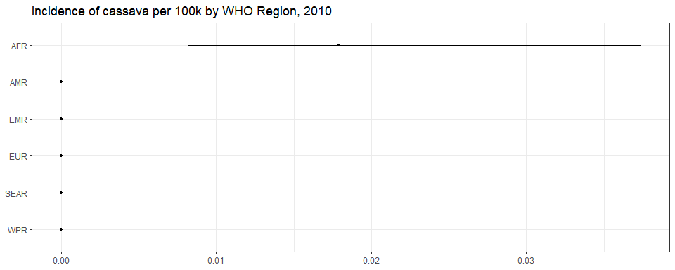<!-- -->

``` r
ggplot(subset(all_reg_rt, YEAR == 2020),
       aes(y = VAL_MEAN, x = LOCATION_NAME)) +
  geom_pointrange(aes(ymin = VAL_LWR, ymax = VAL_UPR), size = 0.2) +
  coord_flip() +
  theme_bw() +
  scale_x_discrete(NULL, limits = rev(unique(all_reg_nr$LOCATION_NAME))) +
  scale_y_continuous(NULL) +
  ggtitle("Incidence of cassava per 100k by WHO Region, 2020")
```

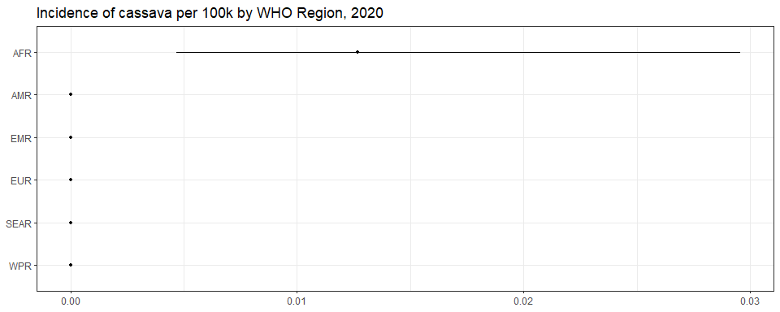<!-- -->

``` r
ggplot(subset(all_reg_nr, YEAR == 2010),
       aes(y = VAL_MEAN, x = LOCATION_NAME)) +
  geom_pointrange(aes(ymin = VAL_LWR, ymax = VAL_UPR), size = 0.2) +
  coord_flip() +
  theme_bw() +
  scale_x_discrete(NULL, limits = rev(unique(all_reg_nr$LOCATION_NAME))) +
  scale_y_continuous(NULL) +
  ggtitle("Number of cassava cases by WHO Region, 2010")
```

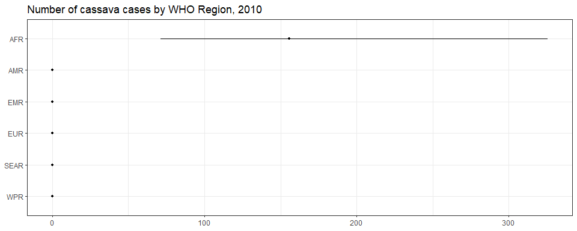<!-- -->

``` r
ggplot(subset(all_reg_nr, YEAR == 2020),
       aes(y = VAL_MEAN, x = LOCATION_NAME)) +
  geom_pointrange(aes(ymin = VAL_LWR, ymax = VAL_UPR), size = 0.2) +
  coord_flip() +
  theme_bw() +
  scale_x_discrete(NULL, limits = rev(unique(all_reg_nr$LOCATION_NAME))) +
  scale_y_continuous(NULL) +
  ggtitle("Number of cassava cases by WHO Region, 2020")
```

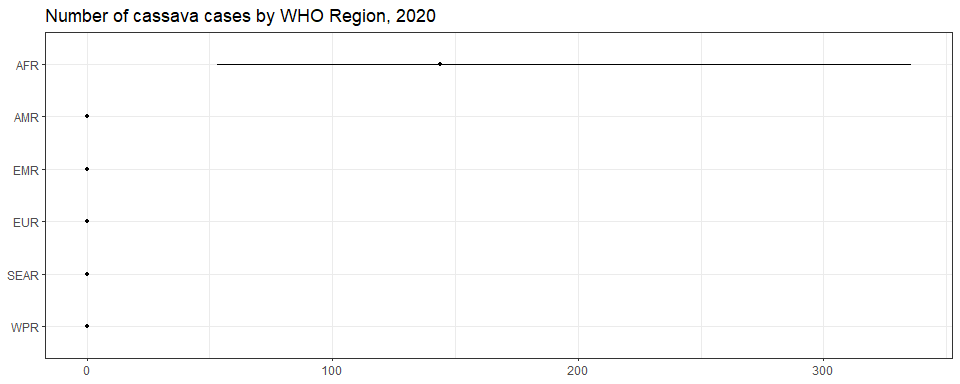<!-- -->

``` r
sim_all_reg <-
  merge(sim_all_reg,
        with(sim_all, aggregate(POP ~ REG2+YEAR, FUN = sum)))
sim_all_reg_long <-
  pivot_longer(sim_all_reg, cols = starts_with("V"))
sim_all_reg_long$CASES <- sim_all_reg_long$value
```

``` r
ggplot(subset(sim_all_reg_long, YEAR==2010), aes(x = CASES)) +
  geom_density() +
  facet_wrap(~REG2) +
  theme_bw() +
  scale_x_log10() +
  ggtitle("Number of cassava cases by WHO Region, 2010")
```

    ## Warning in scale_x_log10(): log-10 transformation introduced infinite values.

    ## Warning: Removed 50000 rows containing non-finite outside the scale range (`stat_density()`).

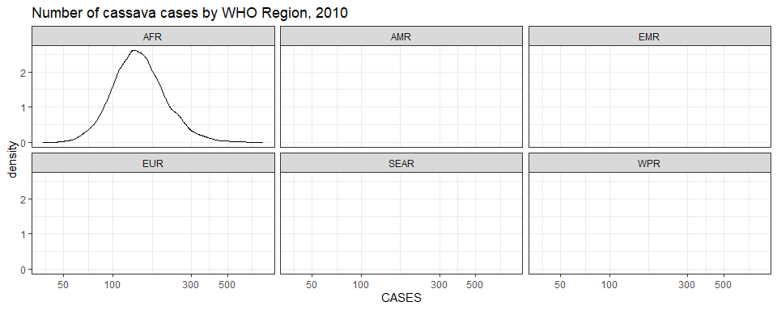<!-- -->

``` r
ggplot(subset(sim_all_reg_long, YEAR==2020), aes(x = CASES)) +
  geom_density() +
  facet_wrap(~REG2) +
  theme_bw() +
  scale_x_log10() +
  ggtitle("Number of cassava cases by WHO Region, 2020")
```

    ## Warning in scale_x_log10(): log-10 transformation introduced infinite values.

    ## Warning: Removed 50000 rows containing non-finite outside the scale range (`stat_density()`).

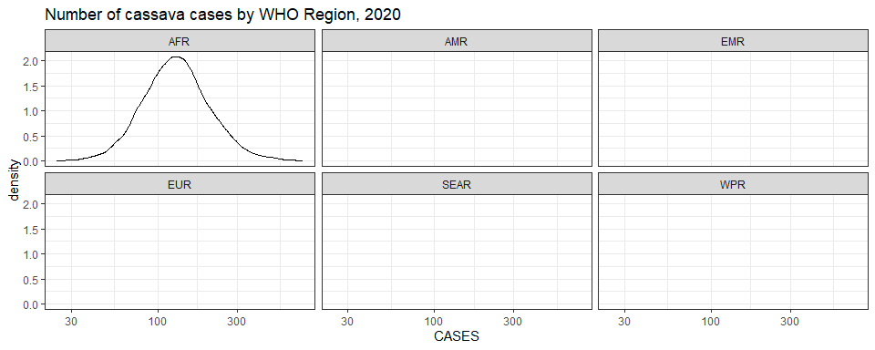<!-- -->

## Subregions

``` r
ggplot(subset(all_sub_rt, YEAR == 2010),
       aes(y = VAL_MEAN, x = LOCATION_NAME)) +
  geom_pointrange(aes(ymin = VAL_LWR, ymax = VAL_UPR), size = 0.2) +
  coord_flip() +
  theme_bw() +
  scale_x_discrete(NULL, limits = rev(unique(all_sub_nr$LOCATION_NAME))) +
  scale_y_continuous(NULL) +
  ggtitle("Incidence of cassava per 100k by WHO Subregion, 2010")
```

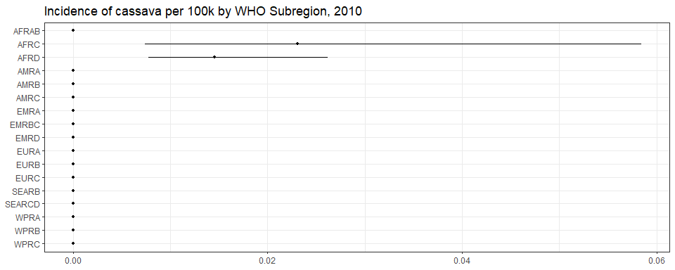<!-- -->

``` r
ggplot(subset(all_sub_rt, YEAR == 2020),
       aes(y = VAL_MEAN, x = LOCATION_NAME)) +
  geom_pointrange(aes(ymin = VAL_LWR, ymax = VAL_UPR), size = 0.2) +
  coord_flip() +
  theme_bw() +
  scale_x_discrete(NULL, limits = rev(unique(all_sub_nr$LOCATION_NAME))) +
  scale_y_continuous(NULL) +
  ggtitle("Incidence of cassava per 100k by WHO Subregion, 2020")
```

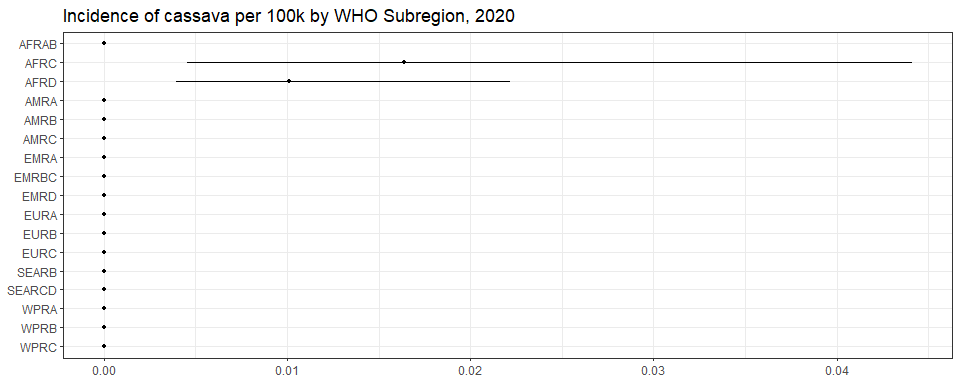<!-- -->

``` r
ggplot(subset(all_sub_nr, YEAR == 2010),
       aes(y = VAL_MEAN, x = LOCATION_NAME)) +
  geom_pointrange(aes(ymin = VAL_LWR, ymax = VAL_UPR), size = 0.2) +
  coord_flip() +
  theme_bw() +
  scale_x_discrete(NULL, limits = rev(unique(all_sub_nr$LOCATION_NAME))) +
  scale_y_continuous(NULL) +
  ggtitle("Incidence of cassava per 100k by WHO Subregion, 2010")
```

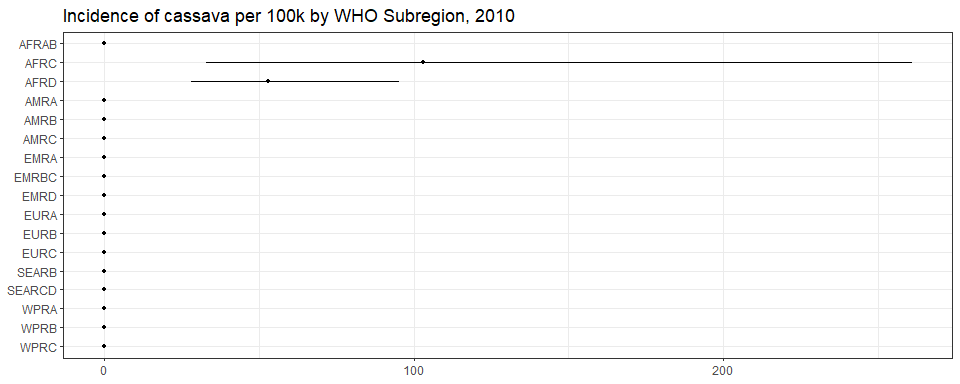<!-- -->

``` r
ggplot(subset(all_sub_nr, YEAR == 2020),
       aes(y = VAL_MEAN, x = LOCATION_NAME)) +
  geom_pointrange(aes(ymin = VAL_LWR, ymax = VAL_UPR), size = 0.2) +
  coord_flip() +
  theme_bw() +
  scale_x_discrete(NULL, limits = rev(unique(all_sub_nr$LOCATION_NAME))) +
  scale_y_continuous(NULL) +
  ggtitle("Incidence of cassava per 100k by WHO Subregion, 2020")
```

<!-- -->

``` r
sim_all_sub <-
  merge(sim_all_sub,
        with(sim_all, aggregate(POP ~ SUB2+YEAR , FUN = sum)))
sim_all_sub_long <-
  pivot_longer(sim_all_sub, cols = starts_with("V"))
sim_all_sub_long$CASES <- sim_all_sub_long$value
```

``` r
ggplot(subset(sim_all_sub_long, YEAR==2010), aes(x = CASES)) +
  geom_density() +
  facet_wrap(~SUB2) +
  theme_bw() +
  scale_x_log10() +
  ggtitle("Number of cassava cases by WHO Subregion, 2010")
```

    ## Warning in scale_x_log10(): log-10 transformation introduced infinite values.

    ## Warning: Removed 150000 rows containing non-finite outside the scale range (`stat_density()`).

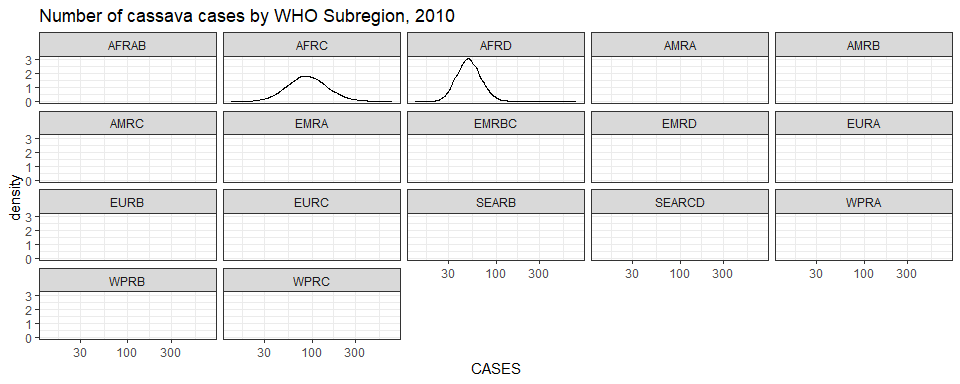<!-- -->

``` r
ggplot(subset(sim_all_sub_long, YEAR==2020), aes(x = CASES)) +
  geom_density() +
  facet_wrap(~SUB2) +
  theme_bw() +
  scale_x_log10() +
  ggtitle("Number of cassava cases by WHO Subregion, 2020")
```

    ## Warning in scale_x_log10(): log-10 transformation introduced infinite values.

    ## Warning: Removed 150000 rows containing non-finite outside the scale range (`stat_density()`).

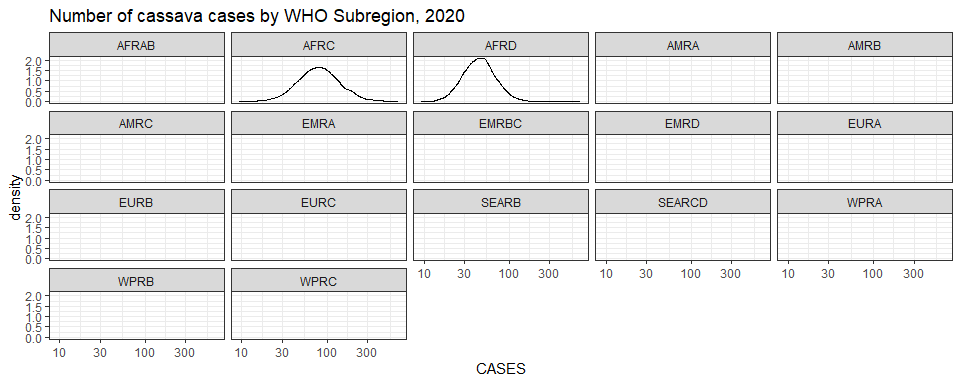<!-- -->

## Countries

``` r
all_cnt_rt_sub <- subset(all_cnt_rt, VAL_MEAN != 0)
```

``` r
ggplot(subset(all_cnt_rt_sub,YEAR==2010),
       aes(y = VAL_MEAN, x = LOCATION_NAME)) +
  geom_pointrange(aes(ymin = VAL_LWR, ymax = VAL_UPR), size = 0.2) +
  coord_flip() +
  theme_bw() +
  scale_x_discrete(NULL, limits = rev(unique(all_cnt_rt_sub$LOCATION_NAME))) +
  scale_y_continuous(NULL) +
  ggtitle("Incidence per 100k of cassava by Country, 2010")
```

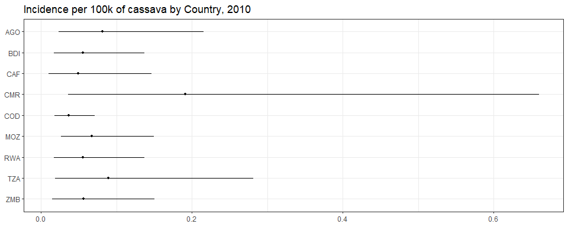<!-- -->

``` r
ggplot(subset(all_cnt_rt_sub,YEAR==2020),
       aes(y = VAL_MEAN, x = LOCATION_NAME)) +
  geom_pointrange(aes(ymin = VAL_LWR, ymax = VAL_UPR), size = 0.2) +
  coord_flip() +
  theme_bw() +
  scale_x_discrete(NULL, limits = rev(unique(all_cnt_rt_sub$LOCATION_NAME))) +
  scale_y_continuous(NULL) +
  ggtitle("Incidence per 100k of cassava by Country, 2020")
```

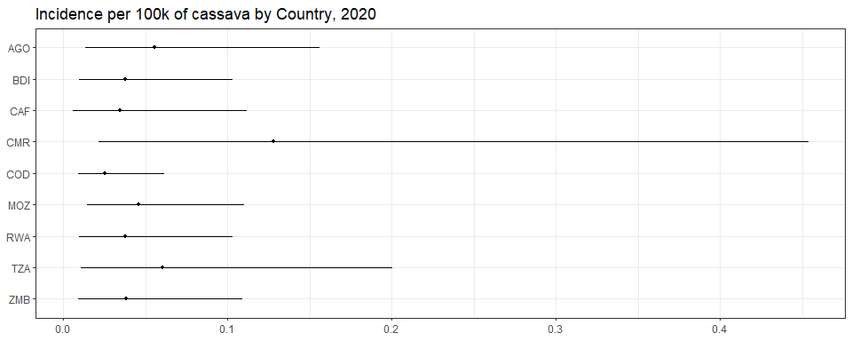<!-- -->

``` r
all_cnt_nr_sub <- subset(all_cnt_nr, VAL_MEAN != 0)
```

``` r
ggplot(subset(all_cnt_nr_sub,YEAR==2010),
       aes(y = VAL_MEAN, x = LOCATION_NAME)) +
  geom_pointrange(aes(ymin = VAL_LWR, ymax = VAL_UPR), size = 0.2) +
  coord_flip() +
  theme_bw() +
  scale_x_discrete(NULL, limits = rev(unique(all_cnt_nr_sub$LOCATION_NAME))) +
  scale_y_continuous(NULL) +
  ggtitle("Number of cassava cases by country, 2010")
```

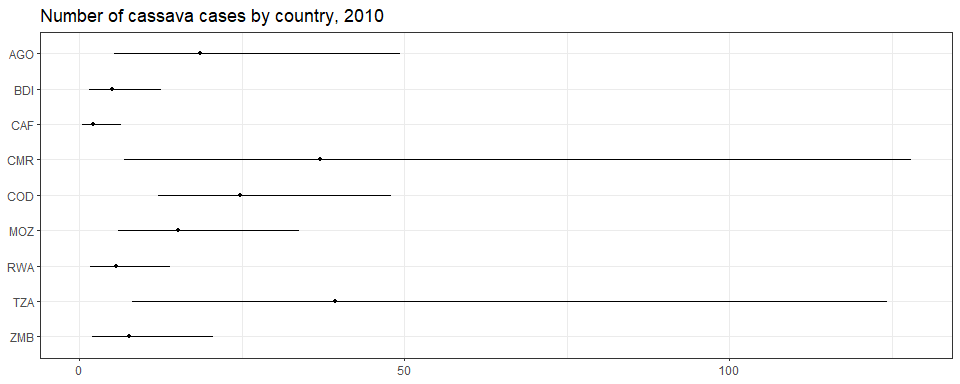<!-- -->

``` r
ggplot(subset(all_cnt_nr_sub,YEAR==2020),
       aes(y = VAL_MEAN, x = LOCATION_NAME)) +
  geom_pointrange(aes(ymin = VAL_LWR, ymax = VAL_UPR), size = 0.2) +
  coord_flip() +
  theme_bw() +
  scale_x_discrete(NULL, limits = rev(unique(all_cnt_nr_sub$LOCATION_NAME))) +
  scale_y_continuous(NULL) +
  ggtitle("Number of cassava cases by country, 2020")
```

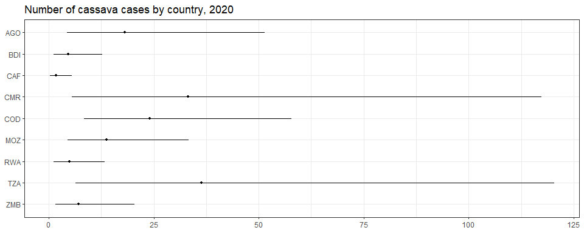<!-- -->

``` r
plot_world(subset(all_cnt_rt, YEAR == 2010),
           "LOCATION_NAME", "VAL_MEAN", legend.title = "Incidence per 100k", diseasefree = zero_cases)
```

    ## [1] 0.00 0.05 0.10 0.15 0.20

``` r
title("Cassava incidence  per 100k, 2010", line = 1)
```

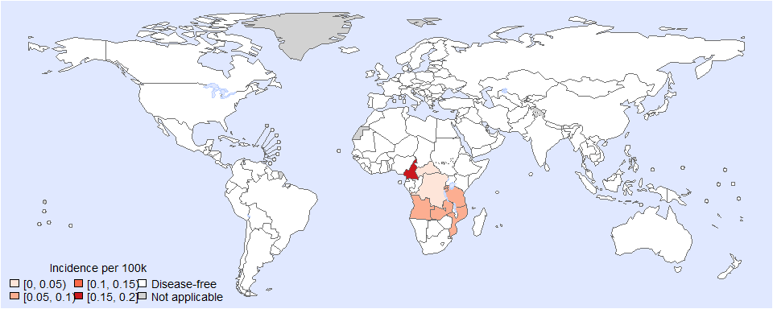<!-- -->

``` r
plot_world(subset(all_cnt_rt, YEAR == 2020),
           "LOCATION_NAME", "VAL_MEAN", legend.title = "Incidence per 100k", diseasefree = zero_cases)
```

    ## [1] 0.00 0.02 0.04 0.06 0.08 0.10 0.12 0.14

``` r
title("Cassava incidence  per 100k, 2020", line = 1)
```

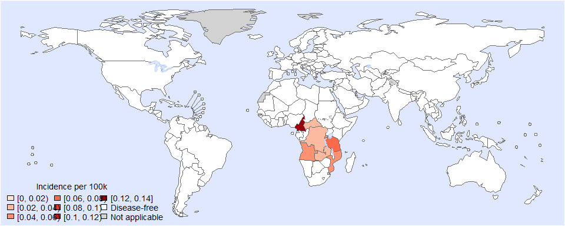<!-- -->

``` r
tab <-data.frame(subset(all_cnt_rt, YEAR == 2010 & VAL_MEAN != 0)[,
                                                                  c("LOCATION_NAME", "VAL_MEAN", "VAL_LWR", "VAL_UPR")],
                 subset(all_cnt_rt, YEAR == 2020 & VAL_MEAN != 0)[,
                                                                  c("VAL_MEAN", "VAL_LWR", "VAL_UPR")])
tab$LOCATION_NAME <-
  FERG2:::countries$COUNTRY[match(tab$LOCATION_NAME, FERG2:::countries$ISO3)]
tab$LOCATION_NAME <- gsub(" \\(.*", "", tab$LOCATION_NAME)
names(tab) <-
  c("Country",
    "2010.mean", "2010.lwr", "2010.upr",
    "2020.mean", "2020.lwr", "2020.upr")

kable(tab, digits = 3, row.names = FALSE,
      caption = "Estimated cassava incidence per 100k by country, 2010 vs 2020")
```

| Country | 2010.mean | 2010.lwr | 2010.upr | 2020.mean | 2020.lwr | 2020.upr |
|:---|---:|---:|---:|---:|---:|---:|
| Angola | 0.082 | 0.023 | 0.216 | 0.055 | 0.013 | 0.156 |
| Burundi | 0.055 | 0.017 | 0.137 | 0.038 | 0.009 | 0.103 |
| Central African Republic | 0.050 | 0.010 | 0.146 | 0.034 | 0.006 | 0.112 |
| Cameroon | 0.191 | 0.036 | 0.660 | 0.128 | 0.021 | 0.454 |
| Congo | 0.037 | 0.018 | 0.071 | 0.025 | 0.009 | 0.061 |
| Mozambique | 0.067 | 0.027 | 0.149 | 0.046 | 0.015 | 0.110 |
| Rwanda | 0.055 | 0.017 | 0.137 | 0.038 | 0.009 | 0.103 |
| United Republic of Tanzania | 0.089 | 0.019 | 0.282 | 0.061 | 0.011 | 0.200 |
| Zambia | 0.057 | 0.014 | 0.151 | 0.038 | 0.009 | 0.109 |

Estimated cassava incidence per 100k by country, 2010 vs 2020

``` r
tab2 <-
  data.frame(subset(all_cnt_nr, YEAR == 2010 & VAL_MEAN != 0)[,
                                                              c("LOCATION_NAME", "VAL_MEAN", "VAL_LWR", "VAL_UPR")],
             subset(all_cnt_nr, YEAR == 2020 & VAL_MEAN != 0)[,
                                                              c("VAL_MEAN", "VAL_LWR", "VAL_UPR")])
tab2$LOCATION_NAME <-
  FERG2:::countries$COUNTRY[match(tab2$LOCATION_NAME, FERG2:::countries$ISO3)]
tab2$LOCATION_NAME <- gsub(" \\(.*", "", tab2$LOCATION_NAME)
names(tab2) <-
  c("Country",
    "2010.mean", "2010.lwr", "2010.upr",
    "2020.mean", "2020.lwr", "2020.upr")

kable(tab2, digits = 1, row.names = FALSE,
      caption = "Estimated cassava cases by country, 2010 vs 2020")
```

| Country | 2010.mean | 2010.lwr | 2010.upr | 2020.mean | 2020.lwr | 2020.upr |
|:---|---:|---:|---:|---:|---:|---:|
| Angola | 18.7 | 5.3 | 49.3 | 18.2 | 4.4 | 51.4 |
| Burundi | 5.1 | 1.6 | 12.6 | 4.7 | 1.2 | 12.8 |
| Central African Republic | 2.2 | 0.4 | 6.5 | 1.7 | 0.3 | 5.6 |
| Cameroon | 37.1 | 6.9 | 127.9 | 33.1 | 5.5 | 117.3 |
| Congo | 24.7 | 12.1 | 47.9 | 24.0 | 8.4 | 57.9 |
| Mozambique | 15.3 | 6.0 | 33.9 | 13.8 | 4.5 | 33.4 |
| Rwanda | 5.6 | 1.7 | 14.0 | 4.9 | 1.2 | 13.3 |
| United Republic of Tanzania | 39.4 | 8.2 | 124.3 | 36.3 | 6.4 | 120.3 |
| Zambia | 7.8 | 2.0 | 20.7 | 7.2 | 1.7 | 20.4 |

Estimated cassava cases by country, 2010 vs 2020

# Session info

``` r
saveRDS(sim_all, paste0("sim_all_", Date, ".RDS"))
saveRDS(all_est, paste0("all_est_", Date, ".RDS"))
sessioninfo::session_info()
```

    ## Warning in system2("quarto", "-V", stdout = TRUE, env = paste0("TMPDIR=", : running command '"quarto"
    ## TMPDIR=C:/Users/LoVa3397/AppData/Local/Temp/RtmpSQjpfg/file2e1424fd2097 -V' had status 1

    ## ─ Session info ────────────────────────────────────────────────────────────────────────────────────────────────────────
    ##  setting  value
    ##  version  R version 4.4.2 (2024-10-31 ucrt)
    ##  os       Windows 10 x64 (build 19045)
    ##  system   x86_64, mingw32
    ##  ui       RStudio
    ##  language (EN)
    ##  collate  English_United States.utf8
    ##  ctype    English_United States.utf8
    ##  tz       Europe/Brussels
    ##  date     2025-03-17
    ##  rstudio  2024.12.0+467 Kousa Dogwood (desktop)
    ##  pandoc   3.2 @ C:/Program Files/RStudio/resources/app/bin/quarto/bin/tools/ (via rmarkdown)
    ##  quarto   ERROR: Unknown command "TMPDIR=C:/Users/LoVa3397/AppData/Local/Temp/RtmpSQjpfg/file2e1424fd2097". Did you mean command "install"? @ C:\\PROGRA~1\\RStudio\\RESOUR~1\\app\\bin\\quarto\\bin\\quarto.exe
    ## 
    ## ─ Packages ────────────────────────────────────────────────────────────────────────────────────────────────────────────
    ##  ! package        * version    date (UTC) lib source
    ##    abind            1.4-8      2024-09-12 [1] CRAN (R 4.4.1)
    ##    backports        1.5.0      2024-05-23 [1] CRAN (R 4.4.0)
    ##    base64enc        0.1-3      2015-07-28 [1] CRAN (R 4.4.0)
    ##    bayesplot        1.11.1     2024-02-15 [1] CRAN (R 4.4.2)
    ##    bd             * 0.0.14     2025-02-24 [1] Github (brechtdv/bd@652191c)
    ##    boot             1.3-31     2024-08-28 [1] CRAN (R 4.4.2)
    ##    bridgesampling   1.1-2      2021-04-16 [1] CRAN (R 4.4.2)
    ##    brms           * 2.22.0     2024-09-23 [1] CRAN (R 4.4.2)
    ##    Brobdingnag      1.2-9      2022-10-19 [1] CRAN (R 4.4.2)
    ##    cellranger       1.1.0      2016-07-27 [1] CRAN (R 4.4.2)
    ##    checkmate        2.3.2      2024-07-29 [1] CRAN (R 4.4.2)
    ##    class            7.3-22     2023-05-03 [1] CRAN (R 4.4.2)
    ##    classInt         0.4-11     2025-01-08 [1] CRAN (R 4.4.2)
    ##    cli              3.6.4      2025-02-13 [1] CRAN (R 4.4.2)
    ##    cluster          2.1.6      2023-12-01 [1] CRAN (R 4.4.2)
    ##    coda             0.19-4.1   2024-01-31 [1] CRAN (R 4.4.2)
    ##    codetools        0.2-20     2024-03-31 [1] CRAN (R 4.4.2)
    ##    colorspace       2.1-1      2024-07-26 [1] CRAN (R 4.4.2)
    ##    curl             6.2.1      2025-02-19 [1] CRAN (R 4.4.2)
    ##    data.table       1.17.0     2025-02-22 [1] CRAN (R 4.4.2)
    ##    DBI              1.2.3      2024-06-02 [1] CRAN (R 4.4.2)
    ##    DescTools      * 0.99.59    2025-01-26 [1] CRAN (R 4.4.2)
    ##    digest           0.6.37     2024-08-19 [1] CRAN (R 4.4.2)
    ##    distributional   0.5.0      2024-09-17 [1] CRAN (R 4.4.2)
    ##    dplyr          * 1.1.4      2023-11-17 [1] CRAN (R 4.4.2)
    ##    e1071            1.7-16     2024-09-16 [1] CRAN (R 4.4.2)
    ##    evaluate         1.0.3      2025-01-10 [1] CRAN (R 4.4.2)
    ##    Exact            3.3        2024-07-21 [1] CRAN (R 4.4.1)
    ##    expm             1.0-0      2024-08-19 [1] CRAN (R 4.4.2)
    ##    farver           2.1.2      2024-05-13 [1] CRAN (R 4.4.2)
    ##    fastmap          1.2.0      2024-05-15 [1] CRAN (R 4.4.2)
    ##    FERG2          * 0.0.2      2025-02-24 [1] Github (brechtdv/FERG2@3d51b14)
    ##    forcats          1.0.0      2023-01-29 [1] CRAN (R 4.4.2)
    ##    foreign          0.8-87     2024-06-26 [1] CRAN (R 4.4.2)
    ##    Formula          1.2-5      2023-02-24 [1] CRAN (R 4.4.0)
    ##    generics         0.1.3      2022-07-05 [1] CRAN (R 4.4.2)
    ##    ggplot2        * 3.5.1      2024-04-23 [1] CRAN (R 4.4.2)
    ##    gld              2.6.7      2025-01-17 [1] CRAN (R 4.4.2)
    ##    glue             1.8.0      2024-09-30 [1] CRAN (R 4.4.2)
    ##    gridExtra        2.3        2017-09-09 [1] CRAN (R 4.4.2)
    ##    gtable           0.3.6      2024-10-25 [1] CRAN (R 4.4.2)
    ##    haven            2.5.4      2023-11-30 [1] CRAN (R 4.4.2)
    ##    Hmisc          * 5.2-2      2025-01-10 [1] CRAN (R 4.4.2)
    ##    hms              1.1.3      2023-03-21 [1] CRAN (R 4.4.2)
    ##    htmlTable        2.4.3      2024-07-21 [1] CRAN (R 4.4.2)
    ##    htmltools        0.5.8.1    2024-04-04 [1] CRAN (R 4.4.2)
    ##    htmlwidgets      1.6.4      2023-12-06 [1] CRAN (R 4.4.2)
    ##    httr             1.4.7      2023-08-15 [1] CRAN (R 4.4.2)
    ##    inline           0.3.21     2025-01-09 [1] CRAN (R 4.4.2)
    ##    jsonlite         1.9.0      2025-02-19 [1] CRAN (R 4.4.2)
    ##    kableExtra     * 1.4.0      2024-01-24 [1] CRAN (R 4.4.2)
    ##    KernSmooth       2.23-24    2024-05-17 [1] CRAN (R 4.4.2)
    ##    knitr          * 1.49       2024-11-08 [1] CRAN (R 4.4.2)
    ##    labeling         0.4.3      2023-08-29 [1] CRAN (R 4.4.0)
    ##    lattice          0.22-6     2024-03-20 [1] CRAN (R 4.4.2)
    ##    lifecycle        1.0.4      2023-11-07 [1] CRAN (R 4.4.2)
    ##    lmom             3.2        2024-09-30 [1] CRAN (R 4.4.1)
    ##    loo              2.8.0      2024-07-03 [1] CRAN (R 4.4.2)
    ##    magrittr         2.0.3      2022-03-30 [1] CRAN (R 4.4.2)
    ##    MASS             7.3-61     2024-06-13 [1] CRAN (R 4.4.2)
    ##    mathjaxr         1.6-0      2022-02-28 [1] CRAN (R 4.4.2)
    ##    Matrix         * 1.7-1      2024-10-18 [1] CRAN (R 4.4.2)
    ##    MatrixModels     0.5-3      2023-11-06 [1] CRAN (R 4.4.2)
    ##    matrixStats      1.5.0      2025-01-07 [1] CRAN (R 4.4.2)
    ##    metadat        * 1.4-0      2025-02-04 [1] CRAN (R 4.4.2)
    ##    metafor        * 4.8-0      2025-01-28 [1] CRAN (R 4.4.2)
    ##    multcomp         1.4-28     2025-01-29 [1] CRAN (R 4.4.2)
    ##    munsell          0.5.1      2024-04-01 [1] CRAN (R 4.4.2)
    ##    mvtnorm          1.3-3      2025-01-10 [1] CRAN (R 4.4.2)
    ##    nlme             3.1-166    2024-08-14 [1] CRAN (R 4.4.2)
    ##    nnet             7.3-19     2023-05-03 [1] CRAN (R 4.4.2)
    ##    numDeriv       * 2016.8-1.1 2019-06-06 [1] CRAN (R 4.4.0)
    ##    pillar           1.10.1     2025-01-07 [1] CRAN (R 4.4.2)
    ##    pkgbuild         1.4.6      2025-01-16 [1] CRAN (R 4.4.2)
    ##    pkgconfig        2.0.3      2019-09-22 [1] CRAN (R 4.4.2)
    ##    plyr             1.8.9      2023-10-02 [1] CRAN (R 4.4.2)
    ##    polspline        1.1.25     2024-05-10 [1] CRAN (R 4.4.0)
    ##    posterior        1.6.0      2024-07-03 [1] CRAN (R 4.4.2)
    ##    proxy            0.4-27     2022-06-09 [1] CRAN (R 4.4.2)
    ##    purrr            1.0.4      2025-02-05 [1] CRAN (R 4.4.2)
    ##    quantreg         6.00       2025-01-29 [1] CRAN (R 4.4.2)
    ##    QuickJSR         1.5.2      2025-02-22 [1] CRAN (R 4.4.2)
    ##    R6               2.6.1      2025-02-15 [1] CRAN (R 4.4.2)
    ##    RColorBrewer     1.1-3      2022-04-03 [1] CRAN (R 4.4.0)
    ##    Rcpp           * 1.0.14     2025-01-12 [1] CRAN (R 4.4.2)
    ##  D RcppParallel     5.1.10     2025-01-24 [1] CRAN (R 4.4.2)
    ##    readxl         * 1.4.3      2023-07-06 [1] CRAN (R 4.4.2)
    ##    reshape2         1.4.4      2020-04-09 [1] CRAN (R 4.4.2)
    ##    rlang            1.1.5      2025-01-17 [1] CRAN (R 4.4.2)
    ##    rmarkdown      * 2.29       2024-11-04 [1] CRAN (R 4.4.2)
    ##    rms            * 7.0-0      2025-01-17 [1] CRAN (R 4.4.2)
    ##    rootSolve        1.8.2.4    2023-09-21 [1] CRAN (R 4.4.0)
    ##    rpart            4.1.23     2023-12-05 [1] CRAN (R 4.4.2)
    ##    rstan            2.32.6     2024-03-05 [1] CRAN (R 4.4.2)
    ##    rstantools       2.4.0      2024-01-31 [1] CRAN (R 4.4.2)
    ##    rstudioapi       0.17.1     2024-10-22 [1] CRAN (R 4.4.2)
    ##    sandwich         3.1-1      2024-09-15 [1] CRAN (R 4.4.2)
    ##    scales         * 1.3.0      2023-11-28 [1] CRAN (R 4.4.2)
    ##    sessioninfo      1.2.3      2025-02-05 [1] CRAN (R 4.4.2)
    ##    sf             * 1.0-19     2024-11-05 [1] CRAN (R 4.4.2)
    ##    SparseM          1.84-2     2024-07-17 [1] CRAN (R 4.4.2)
    ##    StanHeaders      2.32.10    2024-07-15 [1] CRAN (R 4.4.2)
    ##    stringi          1.8.4      2024-05-06 [1] CRAN (R 4.4.0)
    ##    stringr          1.5.1      2023-11-14 [1] CRAN (R 4.4.2)
    ##    survival         3.7-0      2024-06-05 [1] CRAN (R 4.4.2)
    ##    svglite          2.1.3      2023-12-08 [1] CRAN (R 4.4.2)
    ##    systemfonts      1.2.1      2025-01-20 [1] CRAN (R 4.4.2)
    ##    tensorA          0.36.2.1   2023-12-13 [1] CRAN (R 4.4.0)
    ##    TH.data          1.1-3      2025-01-17 [1] CRAN (R 4.4.2)
    ##    tibble           3.2.1      2023-03-20 [1] CRAN (R 4.4.2)
    ##    tidyr          * 1.3.1      2024-01-24 [1] CRAN (R 4.4.2)
    ##    tidyselect       1.2.1      2024-03-11 [1] CRAN (R 4.4.2)
    ##    units            0.8-5      2023-11-28 [1] CRAN (R 4.4.2)
    ##    V8               6.0.1      2025-02-02 [1] CRAN (R 4.4.2)
    ##    vctrs            0.6.5      2023-12-01 [1] CRAN (R 4.4.2)
    ##    viridisLite      0.4.2      2023-05-02 [1] CRAN (R 4.4.2)
    ##    withr            3.0.2      2024-10-28 [1] CRAN (R 4.4.2)
    ##    xfun             0.51       2025-02-19 [1] CRAN (R 4.4.2)
    ##    xml2             1.3.6      2023-12-04 [1] CRAN (R 4.4.2)
    ##    yaml             2.3.10     2024-07-26 [1] CRAN (R 4.4.2)
    ##    zoo              1.8-13     2025-02-22 [1] CRAN (R 4.4.2)
    ## 
    ##  [1] C:/Program Files/R/R-4.4.2/library
    ## 
    ##  * ── Packages attached to the search path.
    ##  D ── DLL MD5 mismatch, broken installation.
    ## 
    ## ───────────────────────────────────────────────────────────────────────────────────────────────────────────────────────

``` r
##rmarkdown::render("03-estimate.R")
```
