Global incidence of dioxin • Estimate incidence with the 2nd model
================
LoVa3397
2025-04-26

- [Settings](#settings)
- [Parameters of the 2nd model](#parameters-of-the-2nd-model)
- [Import and adapt data](#import-and-adapt-data)
- [Predict all](#predict-all)
- [Summarize predictions](#summarize-predictions)
  - [Global](#global)
  - [Regions](#regions)
  - [Subregions](#subregions)
  - [Countries](#countries)
- [Session info](#session-info)

# Settings

``` r
## required packages ----
library(bd)
library(brms)
```

    ## Loading required package: Rcpp

    ## Loading 'brms' package (version 2.22.0). Useful instructions
    ## can be found by typing help('brms'). A more detailed introduction
    ## to the package is available through vignette('brms_overview').

    ## 
    ## Attaching package: 'brms'

    ## The following object is masked from 'package:stats':
    ## 
    ##     ar

``` r
library(FERG2)
```

    ## 
    ## Attaching package: 'FERG2'

    ## The following object is masked from 'package:bd':
    ## 
    ##     mean_ci

``` r
library(ggplot2)
library(knitr)
library(rmarkdown)
library(sf)
```

    ## Linking to GEOS 3.13.1, GDAL 3.10.2, PROJ 9.5.1; sf_use_s2() is TRUE

``` r
library(tidyr)
library(dplyr)
```

    ## 
    ## Attaching package: 'dplyr'

    ## The following object is masked from 'package:bd':
    ## 
    ##     collapse

    ## The following objects are masked from 'package:stats':
    ## 
    ##     filter, lag

    ## The following objects are masked from 'package:base':
    ## 
    ##     intersect, setdiff, setequal, union

``` r
library(DescTools)
library(readxl)
library(kableExtra)
```

    ## 
    ## Attaching package: 'kableExtra'

    ## The following object is masked from 'package:dplyr':
    ## 
    ##     group_rows

``` r
#Standard model 
## global options ----
knitr::opts_chunk$set(fig.width = 10)
Date <- format(Sys.Date(), "%Y%m%d")
```

# Parameters of the 2nd model

| Parameters                       | Values        |
|:---------------------------------|:--------------|
| Number of iteration              | 5000          |
| Warmup                           | 3000          |
| Delta value                      | NA            |
| Maximum tree-depth               | NA            |
| Levels                           | Year, Country |
| Random effect on each data point | No            |
| Stronger priors specified        | Normal(0,1)   |

Parameters of the model tested

# Import and adapt data

``` r
fit_brms_reg_s <- readRDS("fit_brms_reg_s2.rds")
zero_cases<- read_xlsx("//sciensano.be/fs/11401_LifeChron_FERG_DWH/Estimates/00_ADMIN/Endemic_countries.xlsx")%>%
  select(REG2, SUB2, ISO3, Country, cttf_dioxin) %>%
  rename(COUNTRY=ISO3, COUNTRY_LABEL = Country, DISEASEFREE = cttf_dioxin)
```

    ## New names:
    ## • `` -> `...29`

``` r
kable(
  caption = "Countries assumed to be non-endemic",
  row.names = FALSE,
  subset(zero_cases, DISEASEFREE==0)[, 2]) 
```

| SUB2 |
|:-----|

Countries assumed to be non-endemic

``` r
# es_files <- list.files(pattern="^es_\\d{8}\\.rds$", full.names=TRUE, ignore.case = TRUE)
# es_dates <- as.Date(sub("^es_(\\d{8})\\.rds$", "\\1", basename(es_files), ignore.case = TRUE), format = "%Y%m%d")
# es_latest <- es_files[which.max(es_dates)]
# es<- readRDS(es_latest)
es <- readRDS("es_20250426.rds")
es <- subset(es, as.integer(FLAG) == 1)

country_with_data <- es %>% select(ISO3) %>% distinct() %>% mutate(DATA=1, COUNTRY = ISO3)
Sub2_with_data <- es %>% select(SUB2) %>% distinct() %>% mutate(DATASUB2=1)
Reg2_with_data <- es %>% select(REG2) %>% distinct() %>% mutate(DATAREG2=1)
zero_cases <- left_join(zero_cases, country_with_data)
```

    ## Joining with `by = join_by(COUNTRY)`

``` r
zero_cases <- left_join(zero_cases, Sub2_with_data)
```

    ## Joining with `by = join_by(SUB2)`

``` r
zero_cases <- left_join(zero_cases, Reg2_with_data) %>%
  select(-c(ISO3)) %>%
  mutate(ESTIMATES = case_when(
    DATA == 1 ~ 1,
    DISEASEFREE == 0 ~ 2,
    is.na(DATA) & DISEASEFREE == 1 & DATASUB2 == 1 ~ 3,
    is.na(DATA) & DISEASEFREE == 1 & is.na(DATASUB2) & DATAREG2 == 1 ~ 4, 
    is.na(DATA) & DISEASEFREE == 1  & is.na(DATASUB2) & is.na(DATAREG2) ~5))
```

    ## Joining with `by = join_by(REG2)`

``` r
zero_cases$ESTIMATES <- factor(zero_cases$ESTIMATES, 
                               level = c(1,2,3,4,5),
                               labels = c("Data present", "Disease free", "Data in subregion", "Data in region", "Data in world"))
Country_Check <- zero_cases %>% filter(as.integer(ESTIMATES) == 2)
```

# Predict all

``` r
## set up dataframe
sim_all <-
  data.frame(
    sei = 0,
    REG2 = FERG2:::countries$REG2,
    SUB2 = FERG2:::countries$SUB2,
    COUNTRY = FERG2:::countries$ISO3,
    YEAR = rep(2000:2021, each = nrow(FERG2:::countries)))
sim_all <- sim_all %>% left_join(zero_cases) %>% select(sei, REG2, SUB2, COUNTRY, YEAR, ESTIMATES)
```

    ## Joining with `by = join_by(REG2, SUB2, COUNTRY)`

``` r
## draw from expected value of posterior predictive dist
set.seed(10)
#fit_all <- 
#posterior_epred(
#  object = fit_brms_reg_s,
#  newdata = sim_all,
#  allow_new_levels = TRUE,
#  sample_new_levels = "uncertainty",
#  re_formula = ~ 1 + 
#            (1  | REG2) +
#            (1  | REG2:SUB2) +
#            (1  | REG2:SUB2:COUNTRY)
#  )

draws_fit <- as_draws_df(fit_brms_reg_s)
fit_all <- data.frame(1:10000)
for (x in 1:nrow(sim_all)){
  if (as.integer(sim_all[x, "ESTIMATES"]) == 1){
    # Data present for country
    fit_all[[paste0("V",x)]] <- draws_fit$b_Intercept +                                                                               # Global intercept
      sim_all[x, "YEAR"] * draws_fit$b_YEAR +                                                                                         # Year component
      draws_fit[[paste0("r_REG2[",sim_all[x,"REG2"],",Intercept]")]] +                                                                # Regional component
      draws_fit[[paste0("r_REG2:SUB2[",sim_all[x,"REG2"],"_",sim_all[x,"SUB2"],",Intercept]")]] +                                     # Sub regional component
      draws_fit[[paste0("r_REG2:SUB2:COUNTRY[",sim_all[x,"REG2"],"_",sim_all[x,"SUB2"],"_",sim_all[x,"COUNTRY"],",Intercept]")]]      # Country component
  } else if (as.integer(sim_all[x, "ESTIMATES"]) == 2) {
    # Disease-free country
    fit_all[[paste0("V",x)]] <- 0
  } else if (as.integer(sim_all[x, "ESTIMATES"]) == 3){
    # Data not present for country, but present in subregion
    fit_all[[paste0("V",x)]] <- draws_fit$b_Intercept +                                                                               # Global intercept
      sim_all[x, "YEAR"] * draws_fit$b_YEAR +                                                                                         # Year component
      draws_fit[[paste0("r_REG2[",sim_all[x,"REG2"],",Intercept]")]] +                                                                # Regional component
      draws_fit[[paste0("r_REG2:SUB2[",sim_all[x,"REG2"],"_",sim_all[x,"SUB2"],",Intercept]")]]                                       # Sub regional component
  } else if (as.integer(sim_all[x, "ESTIMATES"]) == 4){
    # Data not present for country, but present in region
    fit_all[[paste0("V",x)]] <- draws_fit$b_Intercept +                                                                               # Global intercept
      sim_all[x, "YEAR"] * draws_fit$b_YEAR +                                                                                         # Year component
      draws_fit[[paste0("r_REG2[",sim_all[x,"REG2"],",Intercept]")]]                                                                  # Regional component
  } else if (as.integer(sim_all[x, "ESTIMATES"]) == 5){
    # Data not present for country
    fit_all[[paste0("V",x)]] <- draws_fit$b_Intercept + 
      sim_all[x, "YEAR"] * draws_fit$b_YEAR
  } 
}

fit_all <- fit_all %>% select(-c(X1.10000))

## Calculate conversion factor between 18y old males and total population
pop_18y <- FERG2:::pop
pop_18y <- subset(pop_18y, AGE == 18 & SEX == "Male")
pop_18y <- aggregate(POP ~ ISO3 + YEAR, pop_18y, sum)
pop_18y$POP18 <- pop_18y$POP
pop_18y$POP <- NULL
pop_all <- FERG2:::pop
pop_all <- aggregate(POP ~ ISO3 + YEAR, pop_all, sum)
CR_pop <- merge(pop_18y, pop_all, by = c("ISO3", "YEAR"))
CR_pop$CR <- CR_pop$POP18/CR_pop$POP
str(CR_pop)
```

    ## 'data.frame':    6596 obs. of  5 variables:
    ##  $ ISO3 : chr  "AFG" "AFG" "AFG" "AFG" ...
    ##  $ YEAR : int  1990 1991 1992 1993 1994 1995 1996 1997 1998 1999 ...
    ##  $ POP18: num  126535 126020 130953 148091 164947 ...
    ##  $ POP  : num  12073812 12017508 12460250 14097697 15788647 ...
    ##  $ CR   : num  0.0105 0.0105 0.0105 0.0105 0.0104 ...

``` r
# openxlsx::write.xlsx(CR_pop[,c("ISO3", "YEAR", "CR")], "Population_conversion20250305.xlsx")

## calculate cases
sim_all$SIM <- t(fit_all)
pop <- FERG2:::pop
pop <- subset(pop, AGE == 18 & SEX == "Male")
pop_all <- aggregate(POP ~ ISO3 + YEAR, pop, sum)
sim_all <- merge(sim_all, pop_all,
                 by.x = c("COUNTRY", "YEAR"), by.y = c("ISO3", "YEAR"))
sim_all <- sim_all %>% left_join(zero_cases)
```

    ## Joining with `by = join_by(COUNTRY, REG2, SUB2, ESTIMATES)`

``` r
sim_all$CASES <- exp(sim_all$SIM) * sim_all$POP / 1e5
sim_all$CASES <- sim_all$CASES*sim_all$DISEASEFREE
sim_all$SIM<-sim_all$SIM*sim_all$DISEASEFREE
sim_all$sei<-sim_all$sei*sim_all$DISEASEFREE

## aggregate global
sim_all_glb <- with(sim_all, aggregate(CASES ~ YEAR, FUN = sum))
all_glb_id <- sim_all_glb[1]
all_glb_nr <-
  t(apply(sim_all_glb[, grepl("V", names(sim_all_glb))], 1, mean_ci))
all_glb_nr <- data.frame(all_glb_nr)
names(all_glb_nr) <- c("VAL_MEAN", "VAL_LWR", "VAL_UPR")
all_glb_nr <- cbind(all_glb_id, all_glb_nr)
all_glb_nr$LOCATION <- "Global"
all_glb_nr$LOCATION_NAME <- "Global"
all_glb_nr$METRIC <- "Number"
str(all_glb_nr)
```

    ## 'data.frame':    22 obs. of  7 variables:
    ##  $ YEAR         : int  2000 2001 2002 2003 2004 2005 2006 2007 2008 2009 ...
    ##  $ VAL_MEAN     : num  4250028 3564905 2910428 2334757 1868785 ...
    ##  $ VAL_LWR      : num  1479020 1266524 1049154 863974 709138 ...
    ##  $ VAL_UPR      : num  10186462 8425150 6807191 5390020 4274244 ...
    ##  $ LOCATION     : chr  "Global" "Global" "Global" "Global" ...
    ##  $ LOCATION_NAME: chr  "Global" "Global" "Global" "Global" ...
    ##  $ METRIC       : chr  "Number" "Number" "Number" "Number" ...

``` r
all_glb_rt <- all_glb_nr
all_glb_rt$POP <- with(sim_all, tapply(POP, YEAR, sum))
all_glb_rt$VAL_MEAN <- 1e5 * all_glb_rt$VAL_MEAN / all_glb_rt$POP
all_glb_rt$VAL_LWR <- 1e5 * all_glb_rt$VAL_LWR / all_glb_rt$POP
all_glb_rt$VAL_UPR <- 1e5 * all_glb_rt$VAL_UPR / all_glb_rt$POP
all_glb_rt$METRIC <- "Rate"
all_glb_rt$POP <- NULL
str(all_glb_rt)
```

    ## 'data.frame':    22 obs. of  7 variables:
    ##  $ YEAR         : int  2000 2001 2002 2003 2004 2005 2006 2007 2008 2009 ...
    ##  $ VAL_MEAN     : num [1:22(1d)] 7448 6036 4962 3893 3057 ...
    ##  $ VAL_LWR      : num [1:22(1d)] 2592 2144 1789 1440 1160 ...
    ##  $ VAL_UPR      : num [1:22(1d)] 17851 14265 11606 8987 6992 ...
    ##  $ LOCATION     : chr  "Global" "Global" "Global" "Global" ...
    ##  $ LOCATION_NAME: chr  "Global" "Global" "Global" "Global" ...
    ##  $ METRIC       : chr  "Rate" "Rate" "Rate" "Rate" ...

``` r
## aggregate over regions
sim_all_reg <- with(sim_all, aggregate(CASES ~ REG2+YEAR, FUN = sum))
all_reg_id <- sim_all_reg[1:2]
all_reg_nr <-
  t(apply(sim_all_reg[, grepl("V", names(sim_all_reg))], 1, mean_ci))
all_reg_nr <- data.frame(all_reg_nr)
names(all_reg_nr) <- c("VAL_MEAN", "VAL_LWR", "VAL_UPR")
all_reg_nr <- cbind(all_reg_id, all_reg_nr)
all_reg_nr$LOCATION <- "Region"
all_reg_nr$LOCATION_NAME <- all_reg_nr$REG2
all_reg_nr$REG2 <- NULL
all_reg_nr$METRIC <- "Number"
str(all_reg_nr)
```

    ## 'data.frame':    132 obs. of  7 variables:
    ##  $ YEAR         : int  2000 2000 2000 2000 2000 2000 2001 2001 2001 2001 ...
    ##  $ VAL_MEAN     : num  250637 274659 767270 1794025 772284 ...
    ##  $ VAL_LWR      : num  34098 69256 68884 565698 109022 ...
    ##  $ VAL_UPR      : num  926105 819476 3435439 4834858 2914501 ...
    ##  $ LOCATION     : chr  "Region" "Region" "Region" "Region" ...
    ##  $ LOCATION_NAME: chr  "AFR" "AMR" "EMR" "EUR" ...
    ##  $ METRIC       : chr  "Number" "Number" "Number" "Number" ...

``` r
all_reg_rt <- all_reg_nr
all_reg_rt$POP <-
  with(sim_all, aggregate(POP ~ REG2 + YEAR, FUN = sum))$POP
all_reg_rt$VAL_MEAN <- 1e5 * all_reg_rt$VAL_MEAN / all_reg_rt$POP
all_reg_rt$VAL_LWR <- 1e5 * all_reg_rt$VAL_LWR / all_reg_rt$POP
all_reg_rt$VAL_UPR <- 1e5 * all_reg_rt$VAL_UPR / all_reg_rt$POP
all_reg_rt$METRIC <- "Rate"
all_reg_rt$POP <- NULL
str(all_reg_rt)
```

    ## 'data.frame':    132 obs. of  7 variables:
    ##  $ YEAR         : int  2000 2000 2000 2000 2000 2000 2001 2001 2001 2001 ...
    ##  $ VAL_MEAN     : num  3543 3684 14419 27901 4697 ...
    ##  $ VAL_LWR      : num  482 929 1294 8798 663 ...
    ##  $ VAL_UPR      : num  13093 10993 64559 75193 17724 ...
    ##  $ LOCATION     : chr  "Region" "Region" "Region" "Region" ...
    ##  $ LOCATION_NAME: chr  "AFR" "AMR" "EMR" "EUR" ...
    ##  $ METRIC       : chr  "Rate" "Rate" "Rate" "Rate" ...

``` r
## aggregate over subregions
sim_all_sub <- with(sim_all, aggregate(CASES ~ SUB2+YEAR, FUN = sum))
all_sub_id <- sim_all_sub[1:2]
all_sub_nr <-
  t(apply(sim_all_sub[, grepl("V", names(sim_all_sub))], 1, mean_ci))
all_sub_nr <- data.frame(all_sub_nr)
names(all_sub_nr) <- c("VAL_MEAN", "VAL_LWR", "VAL_UPR")
all_sub_nr <- cbind(all_sub_id, all_sub_nr)
all_sub_nr$LOCATION <- "Subregion"
all_sub_nr$LOCATION_NAME <- all_sub_nr$SUB2
all_sub_nr$SUB2 <- NULL
all_sub_nr$METRIC <- "Number"
str(all_sub_nr)
```

    ## 'data.frame':    374 obs. of  7 variables:
    ##  $ YEAR         : int  2000 2000 2000 2000 2000 2000 2000 2000 2000 2000 ...
    ##  $ VAL_MEAN     : num  4616 63541 182480 176499 88694 ...
    ##  $ VAL_LWR      : num  515 9990 15684 31188 17033 ...
    ##  $ VAL_UPR      : num  17777 230994 786874 627758 295634 ...
    ##  $ LOCATION     : chr  "Subregion" "Subregion" "Subregion" "Subregion" ...
    ##  $ LOCATION_NAME: chr  "AFRAB" "AFRC" "AFRD" "AMRA" ...
    ##  $ METRIC       : chr  "Number" "Number" "Number" "Number" ...

``` r
all_sub_rt <- all_sub_nr
all_sub_rt$POP <-
  with(sim_all, aggregate(POP ~ SUB2 + YEAR, FUN = sum))$POP
all_sub_rt$VAL_MEAN <- 1e5 * all_sub_rt$VAL_MEAN / all_sub_rt$POP
all_sub_rt$VAL_LWR <- 1e5 * all_sub_rt$VAL_LWR / all_sub_rt$POP
all_sub_rt$VAL_UPR <- 1e5 * all_sub_rt$VAL_UPR / all_sub_rt$POP
all_sub_rt$METRIC <- "Rate"
all_sub_rt$POP <- NULL
str(all_sub_rt)
```

    ## 'data.frame':    374 obs. of  7 variables:
    ##  $ YEAR         : int  2000 2000 2000 2000 2000 2000 2000 2000 2000 2000 ...
    ##  $ VAL_MEAN     : num  802 1686 6688 7003 2025 ...
    ##  $ VAL_LWR      : num  89.5 265.1 574.9 1237.4 388.8 ...
    ##  $ VAL_UPR      : num  3087 6129 28841 24906 6748 ...
    ##  $ LOCATION     : chr  "Subregion" "Subregion" "Subregion" "Subregion" ...
    ##  $ LOCATION_NAME: chr  "AFRAB" "AFRC" "AFRD" "AMRA" ...
    ##  $ METRIC       : chr  "Rate" "Rate" "Rate" "Rate" ...

``` r
## aggregate over countries
all_cnt_nr <- t(apply(sim_all$CASES, 1, mean_ci))
all_cnt_nr <- data.frame(all_cnt_nr)
names(all_cnt_nr) <- c("VAL_MEAN", "VAL_LWR", "VAL_UPR")
all_cnt_nr <- cbind(sim_all[1:2], all_cnt_nr)
all_cnt_nr$LOCATION <- "Country"
all_cnt_nr$LOCATION_NAME <- all_cnt_nr$COUNTRY
all_cnt_nr$COUNTRY <- NULL
all_cnt_nr$METRIC <- "Number"
str(all_cnt_nr)
```

    ## 'data.frame':    4268 obs. of  7 variables:
    ##  $ YEAR         : int  2000 2001 2002 2003 2004 2005 2006 2007 2008 2009 ...
    ##  $ VAL_MEAN     : num  2507 1938 1570 1346 1138 ...
    ##  $ VAL_LWR      : num  250 198 164 143 124 ...
    ##  $ VAL_UPR      : num  9401 7154 5767 4927 4128 ...
    ##  $ LOCATION     : chr  "Country" "Country" "Country" "Country" ...
    ##  $ LOCATION_NAME: chr  "AFG" "AFG" "AFG" "AFG" ...
    ##  $ METRIC       : chr  "Number" "Number" "Number" "Number" ...

``` r
#all_cnt_rt <- t(apply(exp(sim_all$SIM), 1, mean_ci))
#all_cnt_rt <- data.frame(all_cnt_rt)
#names(all_cnt_rt) <- c("VAL_MEAN", "VAL_LWR", "VAL_UPR")
#all_cnt_rt <- cbind(sim_all[1:2], all_cnt_rt)
#all_cnt_rt$LOCATION <- "Country"
#all_cnt_rt$LOCATION_NAME <- all_cnt_rt$COUNTRY
#all_cnt_rt$COUNTRY <- NULL
#all_cnt_rt$METRIC <- "Rate"
#str(all_cnt_rt)

all_cnt_rt <- all_cnt_nr%>%left_join(pop_all, by=c("LOCATION_NAME"="ISO3","YEAR"="YEAR"))
all_cnt_rt$VAL_MEAN <- 1e5 * all_cnt_rt$VAL_MEAN / all_cnt_rt$POP
all_cnt_rt$VAL_LWR <- 1e5 * all_cnt_rt$VAL_LWR / all_cnt_rt$POP
all_cnt_rt$VAL_UPR <- 1e5 * all_cnt_rt$VAL_UPR / all_cnt_rt$POP
all_cnt_rt$LOCATION <- "Country"
all_cnt_rt$METRIC <- "Rate"
all_cnt_rt$POP <- NULL
str(all_cnt_rt)
```

    ## 'data.frame':    4268 obs. of  7 variables:
    ##  $ YEAR         : int  2000 2001 2002 2003 2004 2005 2006 2007 2008 2009 ...
    ##  $ VAL_MEAN     : num  1248 990 785 623 495 ...
    ##  $ VAL_LWR      : num  124.5 101.4 82 66.3 53.8 ...
    ##  $ VAL_UPR      : num  4679 3653 2885 2281 1794 ...
    ##  $ LOCATION     : chr  "Country" "Country" "Country" "Country" ...
    ##  $ LOCATION_NAME: chr  "AFG" "AFG" "AFG" "AFG" ...
    ##  $ METRIC       : chr  "Rate" "Rate" "Rate" "Rate" ...

``` r
## compile all
all_est <-
  rbind(all_glb_rt, all_glb_nr,
        all_reg_rt, all_reg_nr,
        all_sub_rt, all_sub_nr,
        all_cnt_rt, all_cnt_nr)
str(all_est)
```

    ## 'data.frame':    9592 obs. of  7 variables:
    ##  $ YEAR         : int  2000 2001 2002 2003 2004 2005 2006 2007 2008 2009 ...
    ##  $ VAL_MEAN     : num  7448 6036 4962 3893 3057 ...
    ##  $ VAL_LWR      : num  2592 2144 1789 1440 1160 ...
    ##  $ VAL_UPR      : num  17851 14265 11606 8987 6992 ...
    ##  $ LOCATION     : chr  "Global" "Global" "Global" "Global" ...
    ##  $ LOCATION_NAME: chr  "Global" "Global" "Global" "Global" ...
    ##  $ METRIC       : chr  "Rate" "Rate" "Rate" "Rate" ...

``` r
saveRDS(all_est, file = "all_estimates.rds")

## plot nested trends
all_sub_rt$REG2 <- gsub("(R).*", "\\1", all_sub_rt$LOCATION_NAME)
ggplot(all_reg_rt, aes(x = YEAR, y = VAL_MEAN, group = LOCATION_NAME)) +
  geom_line(data = all_glb_rt, linewidth = 2) +
  geom_line(aes(col = LOCATION_NAME), linewidth = 1.5) +
  theme_bw()
```

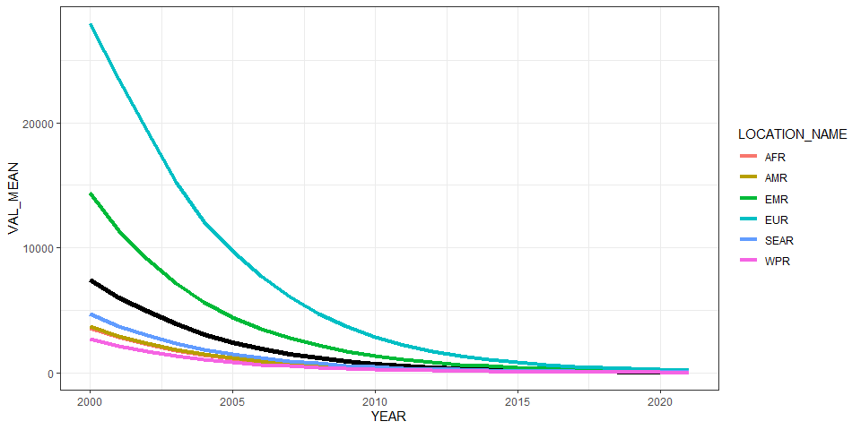<!-- -->

``` r
ggplot(all_reg_rt, aes(x = YEAR, y = VAL_MEAN, group = LOCATION_NAME)) +
  geom_line(data = all_glb_rt, linewidth = 2) +
  geom_line(aes(col = LOCATION_NAME), linewidth = 1.5) +
  geom_line(data = all_sub_rt, aes(col = REG2)) +
  theme_bw()
```

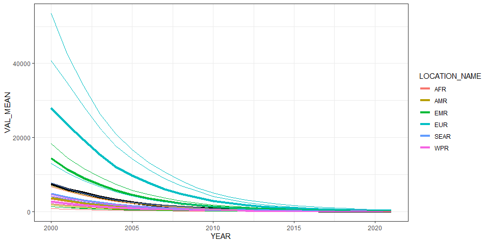<!-- -->

# Summarize predictions

## Global

``` r
kable(
  caption = "Global number of dioxin cases in 18year old males, 2010 vs 2020",
  row.names = FALSE,
  subset(all_glb_nr, YEAR %in% c(2010, 2020))[, 1:4])
```

| YEAR |  VAL_MEAN |   VAL_LWR |   VAL_UPR |
|-----:|----------:|----------:|----------:|
| 2010 | 457575.44 | 196129.87 | 978704.72 |
| 2020 |  45197.88 |  21308.92 |  94000.13 |

Global number of dioxin cases in 18year old males, 2010 vs 2020

## Regions

``` r
kbl(subset(all_reg_rt, YEAR == 2020)[,c(6,2:4)],
    align = c("l", "c", "c", "c"), row.names = FALSE,
    col.names = c("Region", "Mean", "Lower", "Upper"),
    caption="  Incidence of dioxin per 100.00 18year old males in 2020 by WHO region: v11.5") %>%
  kable_styling("striped", "hover")
```

<table class="table table-striped" style="margin-left: auto; margin-right: auto;">
<caption>
Incidence of dioxin per 100.00 18year old males in 2020 by WHO region:
v11.5
</caption>
<thead>
<tr>
<th style="text-align:left;">
Region
</th>
<th style="text-align:center;">
Mean
</th>
<th style="text-align:center;">
Lower
</th>
<th style="text-align:center;">
Upper
</th>
</tr>
</thead>
<tbody>
<tr>
<td style="text-align:left;">
AFR
</td>
<td style="text-align:center;">
40.45774
</td>
<td style="text-align:center;">
7.512447
</td>
<td style="text-align:center;">
137.67284
</td>
</tr>
<tr>
<td style="text-align:left;">
AMR
</td>
<td style="text-align:center;">
40.08866
</td>
<td style="text-align:center;">
13.540213
</td>
<td style="text-align:center;">
108.28503
</td>
</tr>
<tr>
<td style="text-align:left;">
EMR
</td>
<td style="text-align:center;">
139.31512
</td>
<td style="text-align:center;">
15.885167
</td>
<td style="text-align:center;">
552.40518
</td>
</tr>
<tr>
<td style="text-align:left;">
EUR
</td>
<td style="text-align:center;">
268.79432
</td>
<td style="text-align:center;">
105.137267
</td>
<td style="text-align:center;">
632.99246
</td>
</tr>
<tr>
<td style="text-align:left;">
SEAR
</td>
<td style="text-align:center;">
49.34479
</td>
<td style="text-align:center;">
8.515613
</td>
<td style="text-align:center;">
170.02917
</td>
</tr>
<tr>
<td style="text-align:left;">
WPR
</td>
<td style="text-align:center;">
28.17926
</td>
<td style="text-align:center;">
10.686603
</td>
<td style="text-align:center;">
62.21089
</td>
</tr>
</tbody>
</table>

``` r
kbl(subset(all_reg_nr, YEAR == 2020)[,c(6,2:4)],
    align = c("l", "c", "c", "c"), row.names = FALSE,
    col.names = c("Region", "Mean", "Lower", "Upper"),
    caption="  Cases of dioxin per 100.00 18year old males in 2020 by WHO region : v11.5") %>%
  kable_styling("striped", "hover")
```

<table class="table table-striped" style="margin-left: auto; margin-right: auto;">
<caption>
Cases of dioxin per 100.00 18year old males in 2020 by WHO region :
v11.5
</caption>
<thead>
<tr>
<th style="text-align:left;">
Region
</th>
<th style="text-align:center;">
Mean
</th>
<th style="text-align:center;">
Lower
</th>
<th style="text-align:center;">
Upper
</th>
</tr>
</thead>
<tbody>
<tr>
<td style="text-align:left;">
AFR
</td>
<td style="text-align:center;">
4723.633
</td>
<td style="text-align:center;">
877.1139
</td>
<td style="text-align:center;">
16073.959
</td>
</tr>
<tr>
<td style="text-align:left;">
AMR
</td>
<td style="text-align:center;">
3192.295
</td>
<td style="text-align:center;">
1078.2188
</td>
<td style="text-align:center;">
8622.830
</td>
</tr>
<tr>
<td style="text-align:left;">
EMR
</td>
<td style="text-align:center;">
10067.259
</td>
<td style="text-align:center;">
1147.9019
</td>
<td style="text-align:center;">
39918.179
</td>
</tr>
<tr>
<td style="text-align:left;">
EUR
</td>
<td style="text-align:center;">
14230.495
</td>
<td style="text-align:center;">
5566.1719
</td>
<td style="text-align:center;">
33511.855
</td>
</tr>
<tr>
<td style="text-align:left;">
SEAR
</td>
<td style="text-align:center;">
9567.763
</td>
<td style="text-align:center;">
1651.1444
</td>
<td style="text-align:center;">
32967.996
</td>
</tr>
<tr>
<td style="text-align:left;">
WPR
</td>
<td style="text-align:center;">
3416.439
</td>
<td style="text-align:center;">
1295.6382
</td>
<td style="text-align:center;">
7542.416
</td>
</tr>
</tbody>
</table>

``` r
ggplot(subset(all_reg_rt, YEAR == 2010),
       aes(y = VAL_MEAN, x = LOCATION_NAME)) +
  geom_pointrange(aes(ymin = VAL_LWR, ymax = VAL_UPR), size = 0.2) +
  coord_flip() +
  theme_bw() +
  scale_x_discrete(NULL, limits = rev(unique(all_reg_nr$LOCATION_NAME))) +
  scale_y_continuous(NULL) +
  ggtitle("Incidence of dioxin per 100.00 18year old males by WHO Region, 2010")
```

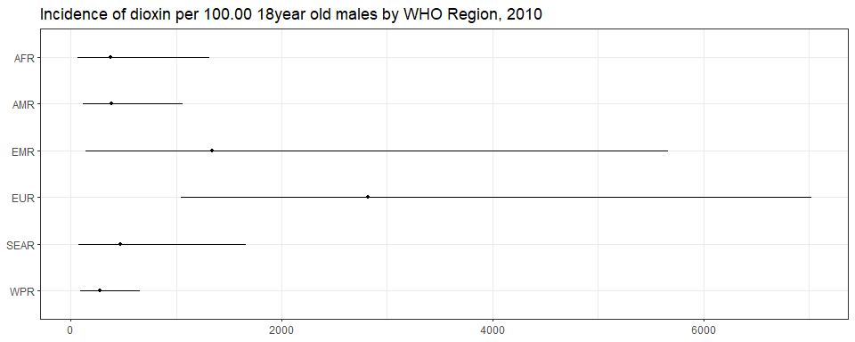<!-- -->

``` r
ggplot(subset(all_reg_rt, YEAR == 2020),
       aes(y = VAL_MEAN, x = LOCATION_NAME)) +
  geom_pointrange(aes(ymin = VAL_LWR, ymax = VAL_UPR), size = 0.2) +
  coord_flip() +
  theme_bw() +
  scale_x_discrete(NULL, limits = rev(unique(all_reg_nr$LOCATION_NAME))) +
  scale_y_continuous(NULL) +
  ggtitle("Incidence of dioxin per 100.00 18year old males by WHO Region, 2020")
```

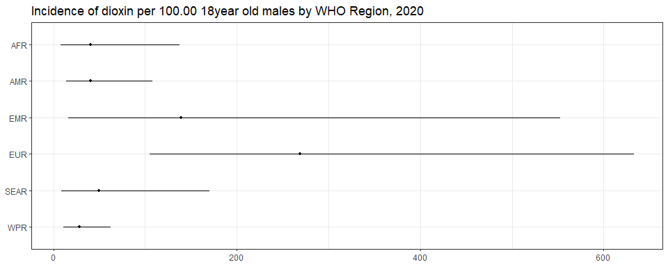<!-- -->

``` r
ggplot(subset(all_reg_nr, YEAR == 2010),
       aes(y = VAL_MEAN, x = LOCATION_NAME)) +
  geom_pointrange(aes(ymin = VAL_LWR, ymax = VAL_UPR), size = 0.2) +
  coord_flip() +
  theme_bw() +
  scale_x_discrete(NULL, limits = rev(unique(all_reg_nr$LOCATION_NAME))) +
  scale_y_continuous(NULL) +
  ggtitle("Number of dioxin cases in 18 year old males by WHO Region, 2010")
```

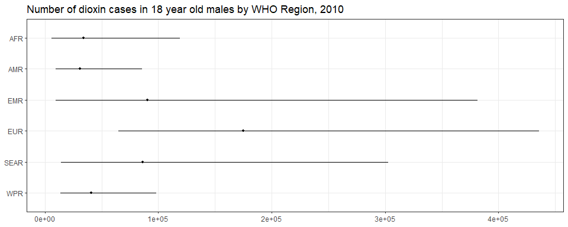<!-- -->

``` r
ggplot(subset(all_reg_nr, YEAR == 2020),
       aes(y = VAL_MEAN, x = LOCATION_NAME)) +
  geom_pointrange(aes(ymin = VAL_LWR, ymax = VAL_UPR), size = 0.2) +
  coord_flip() +
  theme_bw() +
  scale_x_discrete(NULL, limits = rev(unique(all_reg_nr$LOCATION_NAME))) +
  scale_y_continuous(NULL) +
  ggtitle("Number of dioxin cases in 18 year old males by WHO Region, 2020")
```

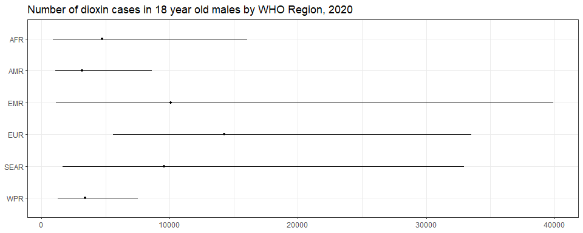<!-- -->

``` r
sim_all_reg <-
  merge(sim_all_reg,
        with(sim_all, aggregate(POP ~ REG2 + YEAR, FUN = sum)))
sim_all_reg_long <-
  pivot_longer(sim_all_reg, cols = starts_with("V"))
sim_all_reg_long$CASES <- sim_all_reg_long$value

ggplot(subset(sim_all_reg_long, YEAR == 2010), aes(x = CASES)) +
  geom_density() +
  facet_wrap(~REG2) +
  theme_bw() +
  scale_x_log10() +
  ggtitle("Number of dioxin cases in 18 year old males by WHO Region, 2010")
```

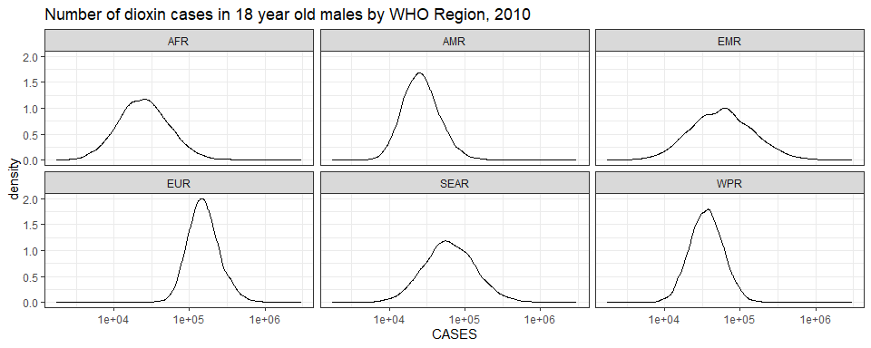<!-- -->

``` r
ggplot(subset(sim_all_reg_long, YEAR == 2020), aes(x = CASES)) +
  geom_density() +
  facet_wrap(~REG2) +
  theme_bw() +
  scale_x_log10() +
  ggtitle("Number of dioxin cases in 18 year old males by WHO Region, 2020")
```

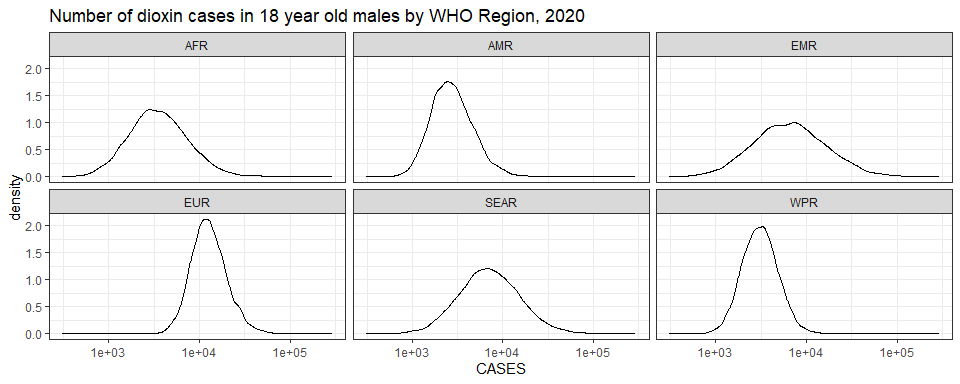<!-- -->

## Subregions

``` r
ggplot(subset(all_sub_rt, YEAR == 2010),
       aes(y = VAL_MEAN, x = LOCATION_NAME)) +
  geom_pointrange(aes(ymin = VAL_LWR, ymax = VAL_UPR), size = 0.2) +
  coord_flip() +
  theme_bw() +
  scale_x_discrete(NULL, limits = rev(unique(all_sub_nr$LOCATION_NAME))) +
  scale_y_continuous(NULL) +
  ggtitle("Incidence of dioxin per 100.00 18year old males  by WHO Subregion, 2010")
```

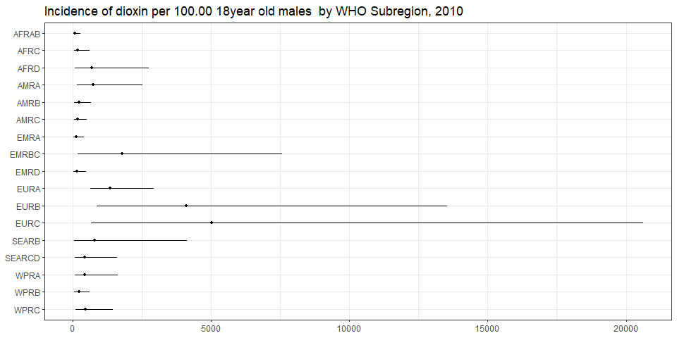<!-- -->

``` r
ggplot(subset(all_sub_rt, YEAR == 2020),
       aes(y = VAL_MEAN, x = LOCATION_NAME)) +
  geom_pointrange(aes(ymin = VAL_LWR, ymax = VAL_UPR), size = 0.2) +
  coord_flip() +
  theme_bw() +
  scale_x_discrete(NULL, limits = rev(unique(all_sub_nr$LOCATION_NAME))) +
  scale_y_continuous(NULL) +
  ggtitle("Incidence of dioxin per 100.00 18year old males  by WHO Subregion, 2020: v11.5")
```

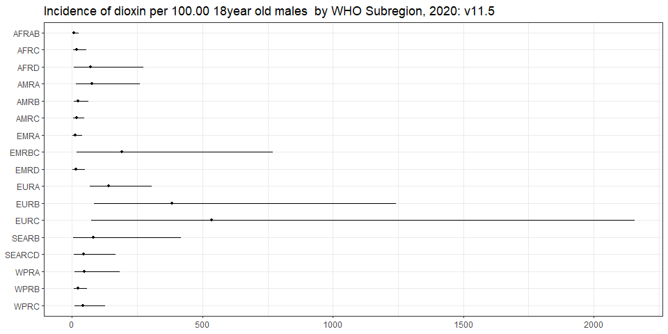<!-- -->

``` r
ggplot(subset(all_sub_nr, YEAR == 2010),
       aes(y = VAL_MEAN, x = LOCATION_NAME)) +
  geom_pointrange(aes(ymin = VAL_LWR, ymax = VAL_UPR), size = 0.2) +
  coord_flip() +
  theme_bw() +
  scale_x_discrete(NULL, limits = rev(unique(all_sub_nr$LOCATION_NAME))) +
  scale_y_continuous(NULL) +
  ggtitle("Number of dioxin cases in 18 year old males by WHO Subregion, 2010")
```

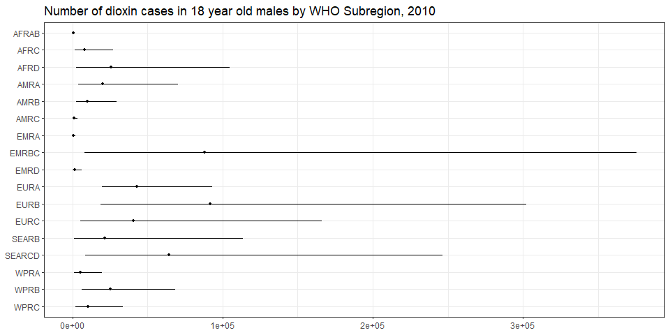<!-- -->

``` r
ggplot(subset(all_sub_nr, YEAR == 2020),
       aes(y = VAL_MEAN, x = LOCATION_NAME)) +
  geom_pointrange(aes(ymin = VAL_LWR, ymax = VAL_UPR), size = 0.2) +
  coord_flip() +
  theme_bw() +
  scale_x_discrete(NULL, limits = rev(unique(all_sub_nr$LOCATION_NAME))) +
  scale_y_continuous(NULL) +
  ggtitle("Number of dioxin cases in 18 year old males by WHO Subregion, 2020: v11.5")
```

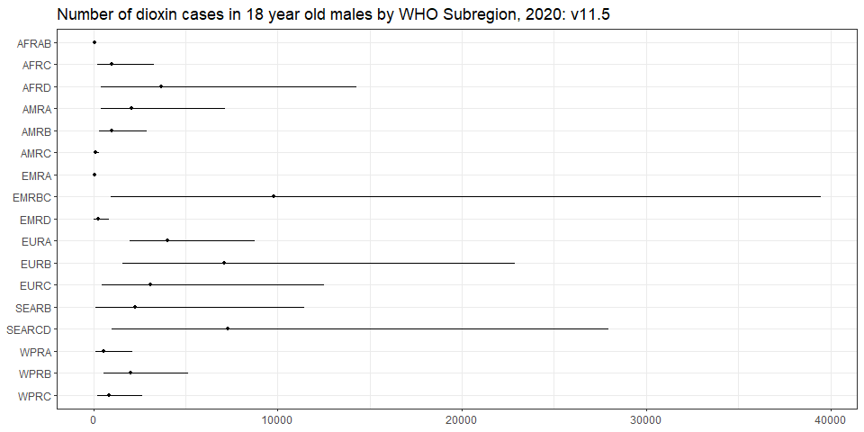<!-- -->

``` r
sim_all_sub <-
  merge(sim_all_sub,
        with(sim_all, aggregate(POP ~ SUB2 + YEAR, FUN = sum)))
sim_all_sub_long <-
  pivot_longer(sim_all_sub, cols = starts_with("V"))
sim_all_sub_long$CASES <- sim_all_sub_long$value

ggplot(subset(sim_all_sub_long, YEAR == 2010), aes(x = CASES)) +
  geom_density() +
  facet_wrap(~SUB2) +
  theme_bw() +
  scale_x_log10() +
  ggtitle("Number of dioxin cases in 18 year old males by WHO Subregion, 2010")
```

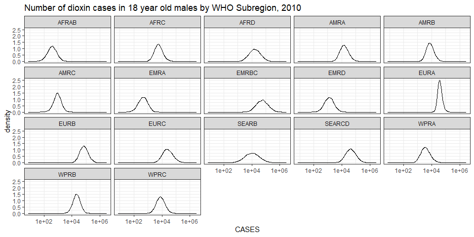<!-- -->

``` r
ggplot(subset(sim_all_sub_long, YEAR == 2020), aes(x = CASES)) +
  geom_density() +
  facet_wrap(~SUB2) +
  theme_bw() +
  scale_x_log10() +
  ggtitle("Number of dioxin cases in 18 year old males by WHO Subregion, 2020")
```

<!-- -->

## Countries

``` r
plot_world(subset(all_cnt_rt, YEAR == 2010), 
           "LOCATION_NAME", "VAL_MEAN", legend.title = "Incidence per 100k 18 year old males", diseasefree = zero_cases)
```

    ## [1]     0  2000  4000  6000  8000 10000 12000 14000

``` r
title("Dioxin incidence, 2010", line = 1)
```

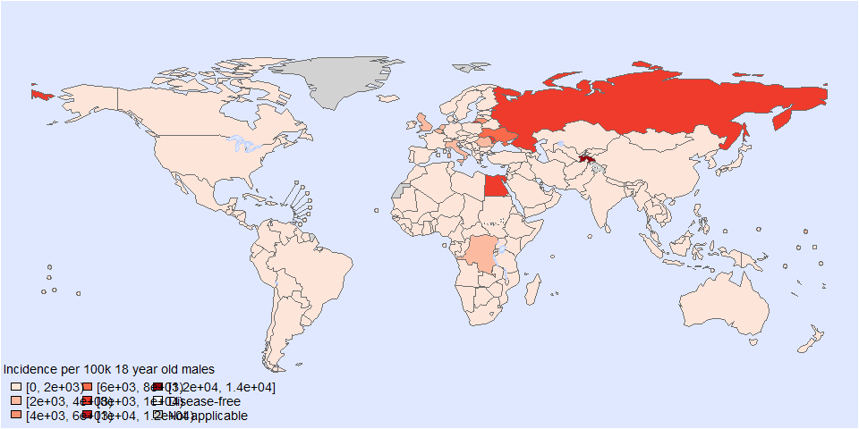<!-- -->

``` r
plot_world(subset(all_cnt_rt, YEAR == 2020), 
           "LOCATION_NAME", "VAL_MEAN", legend.title = "Incidence per 100k 18 year old males", diseasefree = zero_cases)
```

    ## [1]    0  500 1000 1500

``` r
title("Dioxin incidence, 2020", line = 1)
```

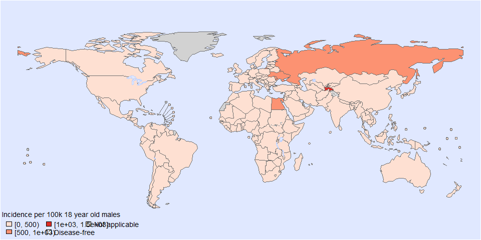<!-- -->

``` r
tab <-
  data.frame(subset(all_cnt_rt, YEAR == 2010)[,
                                              c("LOCATION_NAME", "VAL_MEAN", "VAL_LWR", "VAL_UPR")],
             subset(all_cnt_rt, YEAR == 2020)[,
                                              c("VAL_MEAN", "VAL_LWR", "VAL_UPR")])
tab$LOCATION_NAME <-
  FERG2:::countries$COUNTRY[match(tab$LOCATION_NAME, FERG2:::countries$ISO3)]
tab$LOCATION_NAME <- gsub(" \\(.*", "", tab$LOCATION_NAME)
names(tab) <-
  c("Country",
    "2010.mean", "2010.lwr", "2010.upr",
    "2020.mean", "2020.lwr", "2020.upr")

kable(tab, digits = 3, row.names = FALSE,
      caption = "Estimated dioxin incidence per 100.00 18 year old males by country, 2010 vs 2020")
```

| Country                          | 2010.mean | 2010.lwr |  2010.upr | 2020.mean | 2020.lwr | 2020.upr |
|:---------------------------------|----------:|---------:|----------:|----------:|---------:|---------:|
| Afghanistan                      |   124.273 |   15.011 |   426.445 |    12.677 |    1.700 |   41.741 |
| Angola                           |    76.401 |   15.694 |   226.774 |     7.763 |    1.867 |   21.268 |
| Albania                          |    62.459 |    2.573 |   340.712 |     6.595 |    0.264 |   35.265 |
| Andorra                          |   621.840 |  251.971 |  1256.511 |    65.275 |   27.707 |  128.030 |
| United Arab Emirates             |   129.773 |   19.172 |   408.962 |    13.249 |    2.215 |   39.435 |
| Argentina                        |   237.585 |   11.034 |  1214.730 |    24.062 |    1.247 |  121.218 |
| Armenia                          |   700.501 |  183.408 |  1906.510 |    73.522 |   20.063 |  197.546 |
| Antigua and Barbuda              |   165.759 |   16.094 |   694.663 |    16.857 |    1.844 |   68.275 |
| Australia                        |   553.637 |   59.385 |  2311.568 |    57.344 |    6.398 |  237.072 |
| Austria                          |  1059.558 |  169.153 |  3542.379 |   111.464 |   17.776 |  379.017 |
| Azerbaijan                       |   700.501 |  183.408 |  1906.510 |    73.522 |   20.063 |  197.546 |
| Burundi                          |    71.579 |   14.057 |   216.487 |     7.270 |    1.661 |   20.050 |
| Belgium                          |  2406.192 |  547.690 |  6877.993 |   252.567 |   59.226 |  701.977 |
| Benin                            |    76.401 |   15.694 |   226.774 |     7.763 |    1.867 |   21.268 |
| Burkina Faso                     |    71.579 |   14.057 |   216.487 |     7.270 |    1.661 |   20.050 |
| Bangladesh                       |   232.635 |   22.800 |   952.320 |    24.106 |    2.493 |   98.653 |
| Bulgaria                         |   522.723 |   54.665 |  2147.733 |    54.089 |    6.105 |  215.782 |
| Bahrain                          |   129.773 |   19.172 |   408.962 |    13.249 |    2.215 |   39.435 |
| Bahamas                          |   239.860 |   59.183 |   720.963 |    24.699 |    6.822 |   70.014 |
| Bosnia and Herzegovina           |   700.501 |  183.408 |  1906.510 |    73.522 |   20.063 |  197.546 |
| Belarus                          |   700.501 |  183.408 |  1906.510 |    73.522 |   20.063 |  197.546 |
| Belize                           |   167.244 |   41.997 |   445.550 |    17.114 |    4.896 |   42.305 |
| Bolivia                          |   188.615 |   31.654 |   572.043 |    19.370 |    3.565 |   54.738 |
| Brazil                           |    57.839 |    5.486 |   238.096 |     5.966 |    0.612 |   24.009 |
| Barbados                         |   286.794 |   27.460 |  1216.750 |    29.256 |    3.093 |  119.236 |
| Brunei Darussalam                |   227.244 |   56.713 |   606.100 |    23.370 |    6.483 |   58.617 |
| Bhutan                           |   232.635 |   22.800 |   952.320 |    24.106 |    2.493 |   98.653 |
| Botswana                         |    80.556 |   10.660 |   275.634 |     8.181 |    1.244 |   26.325 |
| Central African Republic         |    71.579 |   14.057 |   216.487 |     7.270 |    1.661 |   20.050 |
| Canada                           |  1024.484 |  110.914 |  4227.250 |   109.416 |   11.537 |  450.714 |
| Switzerland                      |   598.373 |   59.697 |  2506.064 |    61.464 |    6.659 |  246.207 |
| Chile                            |   512.078 |   50.025 |  2094.658 |    52.574 |    5.683 |  206.781 |
| China                            |   219.586 |   52.771 |   598.284 |    22.522 |    6.131 |   57.756 |
| Côte d’Ivoire                    |  1751.986 |   67.584 |  8988.912 |   180.823 |    7.724 |  906.630 |
| Cameroon                         |    76.401 |   15.694 |   226.774 |     7.763 |    1.867 |   21.268 |
| Congo                            |  3608.210 |  264.701 | 15273.840 |   366.148 |   30.007 | 1478.471 |
| Congo                            |    76.401 |   15.694 |   226.774 |     7.763 |    1.867 |   21.268 |
| Cook Islands                     |   227.244 |   56.713 |   606.100 |    23.370 |    6.483 |   58.617 |
| Colombia                         |   155.638 |    7.364 |   770.854 |    15.723 |    0.829 |   75.958 |
| Comoros                          |    76.401 |   15.694 |   226.774 |     7.763 |    1.867 |   21.268 |
| Cabo Verde                       |    76.401 |   15.694 |   226.774 |     7.763 |    1.867 |   21.268 |
| Costa Rica                       |   167.244 |   41.997 |   445.550 |    17.114 |    4.896 |   42.305 |
| Cuba                             |   384.387 |   20.001 |  1937.563 |    39.413 |    2.214 |  195.141 |
| Cyprus                           |   180.955 |    8.555 |   918.246 |    18.851 |    0.927 |   96.246 |
| Czechia                          |   170.058 |   31.709 |   564.655 |    17.646 |    3.496 |   55.884 |
| Germany                          |   679.066 |  132.741 |  2124.303 |    70.439 |   14.690 |  209.925 |
| Djibouti                         |    87.983 |    4.241 |   455.479 |     9.068 |    0.474 |   44.888 |
| Dominica                         |   167.244 |   41.997 |   445.550 |    17.114 |    4.896 |   42.305 |
| Denmark                          |   967.867 |   54.897 |  4712.398 |   103.130 |    5.730 |  500.591 |
| Dominican Republic               |   167.244 |   41.997 |   445.550 |    17.114 |    4.896 |   42.305 |
| Algeria                          |    76.401 |   15.694 |   226.774 |     7.763 |    1.867 |   21.268 |
| Ecuador                          |   127.692 |    6.253 |   672.904 |    12.945 |    0.686 |   65.117 |
| Egypt                            |  9340.125 |  694.939 | 40501.070 |   960.644 |   76.205 | 3973.191 |
| Eritrea                          |    71.579 |   14.057 |   216.487 |     7.270 |    1.661 |   20.050 |
| Spain                            |  1404.168 |  221.739 |  4790.445 |   147.961 |   23.632 |  500.892 |
| Estonia                          |   621.840 |  251.971 |  1256.511 |    65.275 |   27.707 |  128.030 |
| Ethiopia                         |    12.566 |    1.045 |    55.186 |     1.274 |    0.121 |    5.361 |
| Finland                          |   336.166 |   66.736 |  1068.941 |    35.534 |    7.109 |  110.534 |
| Fiji                             |   230.081 |   42.103 |   755.075 |    23.605 |    4.898 |   73.530 |
| France                           |   621.840 |  251.971 |  1256.511 |    65.275 |   27.707 |  128.030 |
| Micronesia                       |   233.619 |   60.998 |   628.714 |    23.946 |    7.121 |   59.801 |
| Gabon                            |    80.556 |   10.660 |   275.634 |     8.181 |    1.244 |   26.325 |
| United Kingdom                   |  2293.634 |  266.781 |  8879.687 |   245.743 |   27.710 |  954.961 |
| Georgia                          |  1390.141 |   74.028 |  6957.758 |   144.009 |    8.007 |  712.531 |
| Ghana                            |   127.692 |   11.692 |   529.987 |    12.999 |    1.339 |   53.337 |
| Guinea                           |    76.401 |   15.694 |   226.774 |     7.763 |    1.867 |   21.268 |
| Gambia                           |    71.579 |   14.057 |   216.487 |     7.270 |    1.661 |   20.050 |
| Guinea-Bissau                    |    71.579 |   14.057 |   216.487 |     7.270 |    1.661 |   20.050 |
| Equatorial Guinea                |    80.556 |   10.660 |   275.634 |     8.181 |    1.244 |   26.325 |
| Greece                           |   621.840 |  251.971 |  1256.511 |    65.275 |   27.707 |  128.030 |
| Grenada                          |   167.244 |   41.997 |   445.550 |    17.114 |    4.896 |   42.305 |
| Guatemala                        |   167.244 |   41.997 |   445.550 |    17.114 |    4.896 |   42.305 |
| Guyana                           |   239.860 |   59.183 |   720.963 |    24.699 |    6.822 |   70.014 |
| Honduras                         |   188.615 |   31.654 |   572.043 |    19.370 |    3.565 |   54.738 |
| Croatia                          |   642.427 |   72.112 |  2599.247 |    68.868 |    7.354 |  280.618 |
| Haiti                            |    79.647 |    7.732 |   344.910 |     8.198 |    0.859 |   34.534 |
| Hungary                          |   540.117 |  109.714 |  1640.181 |    57.090 |   11.634 |  174.633 |
| Indonesia                        |   971.086 |   42.252 |  5099.711 |    99.519 |    4.717 |  505.404 |
| India                            |   457.595 |   47.528 |  1832.405 |    47.890 |    5.057 |  190.798 |
| Ireland                          |   481.295 |   91.954 |  1558.413 |    49.708 |   10.459 |  152.453 |
| Iran                             |   127.057 |   18.862 |   423.524 |    12.958 |    2.177 |   40.011 |
| Iraq                             |   127.057 |   18.862 |   423.524 |    12.958 |    2.177 |   40.011 |
| Iceland                          |   621.840 |  251.971 |  1256.511 |    65.275 |   27.707 |  128.030 |
| Israel                           |   542.518 |   28.175 |  2720.089 |    56.143 |    3.061 |  279.699 |
| Italy                            |  2296.055 |  117.924 | 11336.244 |   240.723 |   12.579 | 1190.959 |
| Jamaica                          |   320.962 |   30.732 |  1296.063 |    32.659 |    3.469 |  130.487 |
| Jordan                           |   127.057 |   18.862 |   423.524 |    12.958 |    2.177 |   40.011 |
| Japan                            |   601.643 |   33.229 |  2909.987 |    63.238 |    3.552 |  311.428 |
| Kazakhstan                       |   700.501 |  183.408 |  1906.510 |    73.522 |   20.063 |  197.546 |
| Kenya                            |    30.960 |    2.857 |   128.539 |     3.142 |    0.329 |   12.548 |
| Kyrgyzstan                       |   982.620 |  212.656 |  3724.564 |   103.511 |   23.219 |  391.802 |
| Cambodia                         |   704.810 |   33.843 |  3731.952 |    71.491 |    3.836 |  367.165 |
| Kiribati                         |   181.033 |   25.698 |   637.653 |    18.530 |    2.890 |   62.733 |
| Saint Kitts and Nevis            |   239.860 |   59.183 |   720.963 |    24.699 |    6.822 |   70.014 |
| Korea                            |   135.404 |    7.062 |   662.570 |    13.866 |    0.790 |   67.107 |
| Kuwait                           |   129.773 |   19.172 |   408.962 |    13.249 |    2.215 |   39.435 |
| Lao People’s Dem. Republic       |   233.619 |   60.998 |   628.714 |    23.946 |    7.121 |   59.801 |
| Lebanon                          |   127.057 |   18.862 |   423.524 |    12.958 |    2.177 |   40.011 |
| Liberia                          |    71.579 |   14.057 |   216.487 |     7.270 |    1.661 |   20.050 |
| Libya                            |   127.057 |   18.862 |   423.524 |    12.958 |    2.177 |   40.011 |
| Saint Lucia                      |   167.244 |   41.997 |   445.550 |    17.114 |    4.896 |   42.305 |
| Sri Lanka                        |   232.635 |   22.800 |   952.320 |    24.106 |    2.493 |   98.653 |
| Lesotho                          |    76.401 |   15.694 |   226.774 |     7.763 |    1.867 |   21.268 |
| Lithuania                        |  4596.514 |  486.122 | 18175.220 |   483.690 |   52.251 | 1907.128 |
| Luxembourg                       |  2590.864 |  261.195 | 10372.129 |   269.661 |   28.519 | 1069.444 |
| Latvia                           |   621.840 |  251.971 |  1256.511 |    65.275 |   27.707 |  128.030 |
| Morocco                          |   366.565 |   16.274 |  1865.862 |    36.881 |    1.866 |  181.529 |
| Monaco                           |   621.840 |  251.971 |  1256.511 |    65.275 |   27.707 |  128.030 |
| Republic of Moldova              |  8604.044 |  428.026 | 43981.396 |   894.076 |   48.564 | 4644.656 |
| Madagascar                       |    71.579 |   14.057 |   216.487 |     7.270 |    1.661 |   20.050 |
| Maldives                         |   194.180 |   20.738 |   743.763 |    20.085 |    2.278 |   75.153 |
| Mexico                           |   502.103 |   47.393 |  2089.164 |    51.028 |    5.454 |  205.647 |
| Marshall Islands                 |  2558.434 |  223.178 | 11112.418 |   260.678 |   25.237 | 1061.132 |
| North Macedonia                  |   700.501 |  183.408 |  1906.510 |    73.522 |   20.063 |  197.546 |
| Mali                             |   134.548 |   12.276 |   562.845 |    13.716 |    1.431 |   55.887 |
| Malta                            |   621.840 |  251.971 |  1256.511 |    65.275 |   27.707 |  128.030 |
| Myanmar                          |   232.635 |   22.800 |   952.320 |    24.106 |    2.493 |   98.653 |
| Montenegro                       |   700.501 |  183.408 |  1906.510 |    73.522 |   20.063 |  197.546 |
| Mongolia                         |   465.904 |   22.626 |  2402.191 |    47.068 |    2.490 |  237.455 |
| Mozambique                       |    71.579 |   14.057 |   216.487 |     7.270 |    1.661 |   20.050 |
| Mauritania                       |    76.401 |   15.694 |   226.774 |     7.763 |    1.867 |   21.268 |
| Mauritius                        |    26.041 |    2.475 |   108.700 |     2.645 |    0.287 |   10.574 |
| Malawi                           |    71.579 |   14.057 |   216.487 |     7.270 |    1.661 |   20.050 |
| Malaysia                         |   219.586 |   52.771 |   598.284 |    22.522 |    6.131 |   57.756 |
| Namibia                          |    80.556 |   10.660 |   275.634 |     8.181 |    1.244 |   26.325 |
| Niger                            |    27.288 |    1.260 |   139.578 |     2.771 |    0.140 |   13.670 |
| Nigeria                          |    48.553 |    4.527 |   208.274 |     4.920 |    0.521 |   20.040 |
| Nicaragua                        |   188.615 |   31.654 |   572.043 |    19.370 |    3.565 |   54.738 |
| Niue                             |   219.338 |   19.795 |   905.128 |    22.327 |    2.311 |   88.641 |
| Netherlands                      |  2473.703 |  376.710 |  8452.972 |   258.936 |   40.733 |  865.029 |
| Norway                           |   835.323 |  168.509 |  2559.317 |    88.370 |   17.805 |  268.917 |
| Nepal                            |   232.635 |   22.800 |   952.320 |    24.106 |    2.493 |   98.653 |
| Nauru                            |   227.244 |   56.713 |   606.100 |    23.370 |    6.483 |   58.617 |
| New Zealand                      |   361.997 |   56.043 |  1273.754 |    37.942 |    6.130 |  131.401 |
| Oman                             |   129.773 |   19.172 |   408.962 |    13.249 |    2.215 |   39.435 |
| Pakistan                         |     3.275 |    0.096 |    18.516 |     0.340 |    0.010 |    1.930 |
| Panama                           |   239.860 |   59.183 |   720.963 |    24.699 |    6.822 |   70.014 |
| Peru                             |   112.831 |   10.411 |   471.493 |    11.448 |    1.197 |   45.914 |
| Philippines                      |   199.523 |   10.298 |  1022.234 |    20.711 |    1.099 |  103.990 |
| Palau                            |   145.254 |   13.163 |   599.019 |    14.753 |    1.511 |   57.644 |
| Papua New Guinea                 |   233.619 |   60.998 |   628.714 |    23.946 |    7.121 |   59.801 |
| Poland                           |  1708.527 |  101.489 |  8166.479 |   181.735 |   10.615 |  888.929 |
| Korea                            |   232.635 |   22.800 |   952.320 |    24.106 |    2.493 |   98.653 |
| Portugal                         |   621.840 |  251.971 |  1256.511 |    65.275 |   27.707 |  128.030 |
| Paraguay                         |   167.244 |   41.997 |   445.550 |    17.114 |    4.896 |   42.305 |
| Qatar                            |   129.773 |   19.172 |   408.962 |    13.249 |    2.215 |   39.435 |
| Romania                          |  2068.047 |  221.192 |  8195.634 |   214.449 |   23.912 |  823.165 |
| Russian Federation               |  8324.468 | 1177.386 | 29435.363 |   879.259 |  124.878 | 3110.647 |
| Rwanda                           |    71.579 |   14.057 |   216.487 |     7.270 |    1.661 |   20.050 |
| Saudi Arabia                     |   129.773 |   19.172 |   408.962 |    13.249 |    2.215 |   39.435 |
| Sudan                            |   211.269 |    9.020 |  1121.724 |    21.773 |    1.037 |  112.332 |
| Senegal                          |   989.024 |   82.129 |  4166.208 |   100.746 |    9.352 |  405.705 |
| Singapore                        |   227.244 |   56.713 |   606.100 |    23.370 |    6.483 |   58.617 |
| Solomon Islands                  |   497.865 |   49.450 |  2027.267 |    50.825 |    5.633 |  200.593 |
| Sierra Leone                     |    71.579 |   14.057 |   216.487 |     7.270 |    1.661 |   20.050 |
| El Salvador                      |   167.244 |   41.997 |   445.550 |    17.114 |    4.896 |   42.305 |
| San Marino                       |   621.840 |  251.971 |  1256.511 |    65.275 |   27.707 |  128.030 |
| Somalia                          |   124.273 |   15.011 |   426.445 |    12.677 |    1.700 |   41.741 |
| Serbia                           |   700.501 |  183.408 |  1906.510 |    73.522 |   20.063 |  197.546 |
| South Sudan                      |    71.579 |   14.057 |   216.487 |     7.270 |    1.661 |   20.050 |
| Sao Tome and Principe            |    76.401 |   15.694 |   226.774 |     7.763 |    1.867 |   21.268 |
| Suriname                         |   194.727 |    9.338 |   988.330 |    19.767 |    1.069 |   97.154 |
| Slovakia                         |   100.435 |   18.837 |   326.682 |    10.441 |    2.063 |   32.464 |
| Slovenia                         |   621.840 |  251.971 |  1256.511 |    65.275 |   27.707 |  128.030 |
| Sweden                           |   514.143 |   99.988 |  1631.387 |    53.615 |   10.937 |  163.810 |
| Eswatini                         |    76.401 |   15.694 |   226.774 |     7.763 |    1.867 |   21.268 |
| Seychelles                       |    80.556 |   10.660 |   275.634 |     8.181 |    1.244 |   26.325 |
| Syrian Arab Republic             |    47.453 |    1.995 |   256.135 |     4.859 |    0.219 |   26.634 |
| Chad                             |    71.579 |   14.057 |   216.487 |     7.270 |    1.661 |   20.050 |
| Togo                             |    89.459 |    7.845 |   377.979 |     9.087 |    0.892 |   36.258 |
| Thailand                         |    20.565 |    1.941 |    88.530 |     2.131 |    0.206 |    9.045 |
| Tajikistan                       | 13758.275 |  581.463 | 70434.943 |  1424.729 |   63.416 | 7256.762 |
| Turkmenistan                     |   700.501 |  183.408 |  1906.510 |    73.522 |   20.063 |  197.546 |
| Timor-Leste                      |   232.635 |   22.800 |   952.320 |    24.106 |    2.493 |   98.653 |
| Tonga                            |   169.085 |    8.112 |   837.037 |    17.318 |    0.888 |   81.892 |
| Trinidad and Tobago              |   239.860 |   59.183 |   720.963 |    24.699 |    6.822 |   70.014 |
| Tunisia                          |   186.424 |    8.103 |   985.205 |    18.835 |    0.921 |   96.123 |
| Turkiye                          |   700.501 |  183.408 |  1906.510 |    73.522 |   20.063 |  197.546 |
| Tuvalu                           |   120.641 |    6.040 |   611.022 |    12.337 |    0.671 |   62.263 |
| United Republic of Tanzania      |    26.783 |    1.142 |   146.497 |     2.698 |    0.127 |   14.351 |
| Uganda                           |     8.675 |    0.803 |    37.830 |     0.882 |    0.091 |    3.721 |
| Ukraine                          |  7657.737 |  361.042 | 37666.724 |   803.908 |   38.286 | 3982.135 |
| Uruguay                          |  1345.255 |  120.288 |  5708.311 |   137.325 |   13.882 |  569.056 |
| United States of America         |   708.650 |   77.433 |  2815.408 |    74.735 |    8.303 |  292.294 |
| Uzbekistan                       |   982.620 |  212.656 |  3724.564 |   103.511 |   23.219 |  391.802 |
| Saint Vincent and the Grenadines |   167.244 |   41.997 |   445.550 |    17.114 |    4.896 |   42.305 |
| Venezuela                        |   188.615 |   31.654 |   572.043 |    19.370 |    3.565 |   54.738 |
| Viet Nam                         |   724.478 |   73.745 |  2794.920 |    75.416 |    8.156 |  293.952 |
| Vanuatu                          |   275.374 |   12.082 |  1468.228 |    27.975 |    1.389 |  143.757 |
| Samoa                            |   396.582 |   37.160 |  1657.484 |    40.206 |    4.107 |  157.302 |
| Yemen                            |   124.273 |   15.011 |   426.445 |    12.677 |    1.700 |   41.741 |
| South Africa                     |    80.556 |   10.660 |   275.634 |     8.181 |    1.244 |   26.325 |
| Zambia                           |    12.732 |    0.468 |    66.980 |     1.281 |    0.053 |    6.406 |
| Zimbabwe                         |    76.401 |   15.694 |   226.774 |     7.763 |    1.867 |   21.268 |

Estimated dioxin incidence per 100.00 18 year old males by country, 2010
vs 2020

``` r
tab2 <-
  data.frame(subset(all_cnt_nr, YEAR == 2010)[,
                                              c("LOCATION_NAME", "VAL_MEAN", "VAL_LWR", "VAL_UPR")],
             subset(all_cnt_nr, YEAR == 2020)[,
                                              c("VAL_MEAN", "VAL_LWR", "VAL_UPR")])
tab2$LOCATION_NAME <-
  FERG2:::countries$COUNTRY[match(tab2$LOCATION_NAME, FERG2:::countries$ISO3)]
tab2$LOCATION_NAME <- gsub(" \\(.*", "", tab2$LOCATION_NAME)
names(tab2) <-
  c("Country",
    "2010.mean", "2010.lwr", "2010.upr",
    "2020.mean", "2020.lwr", "2020.upr")

kable(tab2, digits = 1, row.names = FALSE,
      caption = "Estimated dioxin cases in 18 year old males by country, 2010 vs 2020")
```

| Country                          | 2010.mean | 2010.lwr | 2010.upr | 2020.mean | 2020.lwr | 2020.upr |
|:---------------------------------|----------:|---------:|---------:|----------:|---------:|---------:|
| Afghanistan                      |     375.5 |     45.4 |   1288.7 |      57.0 |      7.6 |    187.6 |
| Angola                           |     172.9 |     35.5 |    513.3 |      24.6 |      5.9 |     67.3 |
| Albania                          |      18.0 |      0.7 |     98.0 |       1.4 |      0.1 |      7.6 |
| Andorra                          |       2.4 |      1.0 |      4.8 |       0.3 |      0.1 |      0.5 |
| United Arab Emirates             |      56.5 |      8.4 |    178.2 |       7.2 |      1.2 |     21.5 |
| Argentina                        |     851.9 |     39.6 |   4355.6 |      85.4 |      4.4 |    430.4 |
| Armenia                          |     198.8 |     52.1 |    541.2 |      12.3 |      3.3 |     33.0 |
| Antigua and Barbuda              |       1.1 |      0.1 |      4.6 |       0.1 |      0.0 |      0.5 |
| Australia                        |     844.0 |     90.5 |   3524.0 |      89.1 |      9.9 |    368.2 |
| Austria                          |     556.3 |     88.8 |   1860.0 |      49.6 |      7.9 |    168.8 |
| Azerbaijan                       |     639.2 |    167.4 |   1739.6 |      46.9 |     12.8 |    126.0 |
| Burundi                          |      72.6 |     14.3 |    219.7 |       8.5 |      1.9 |     23.4 |
| Belgium                          |    1662.4 |    378.4 |   4752.0 |     165.0 |     38.7 |    458.5 |
| Benin                            |      76.9 |     15.8 |    228.3 |      10.3 |      2.5 |     28.1 |
| Burkina Faso                     |     120.4 |     23.6 |    364.1 |      16.2 |      3.7 |     44.8 |
| Bangladesh                       |    3668.5 |    359.5 |  15017.3 |     389.7 |     40.3 |   1594.6 |
| Bulgaria                         |     234.3 |     24.5 |    962.9 |      17.0 |      1.9 |     67.8 |
| Bahrain                          |       9.8 |      1.5 |     31.0 |       1.1 |      0.2 |      3.3 |
| Bahamas                          |       7.5 |      1.9 |     22.6 |       0.7 |      0.2 |      2.0 |
| Bosnia and Herzegovina           |     190.5 |     49.9 |    518.6 |      13.3 |      3.6 |     35.8 |
| Belarus                          |     484.4 |    126.8 |   1318.4 |      33.5 |      9.1 |     90.1 |
| Belize                           |       5.5 |      1.4 |     14.8 |       0.7 |      0.2 |      1.7 |
| Bolivia                          |     203.2 |     34.1 |    616.2 |      22.1 |      4.1 |     62.6 |
| Brazil                           |     992.5 |     94.1 |   4085.5 |      97.9 |     10.0 |    394.0 |
| Barbados                         |       5.8 |      0.6 |     24.4 |       0.6 |      0.1 |      2.3 |
| Brunei Darussalam                |       8.5 |      2.1 |     22.7 |       0.9 |      0.2 |      2.2 |
| Bhutan                           |      20.5 |      2.0 |     83.9 |       1.8 |      0.2 |      7.4 |
| Botswana                         |      17.3 |      2.3 |     59.2 |       2.0 |      0.3 |      6.5 |
| Central African Republic         |      35.0 |      6.9 |    106.0 |       4.3 |      1.0 |     11.9 |
| Canada                           |    2414.2 |    261.4 |   9961.4 |     242.4 |     25.6 |    998.5 |
| Switzerland                      |     286.7 |     28.6 |   1200.9 |      26.7 |      2.9 |    107.1 |
| Chile                            |     768.3 |     75.1 |   3142.7 |      70.5 |      7.6 |    277.2 |
| China                            |   24521.1 |   5892.9 |  66810.1 |    1925.5 |    524.2 |   4938.0 |
| Côte d’Ivoire                    |    4186.1 |    161.5 |  21477.7 |     517.9 |     22.1 |   2596.5 |
| Cameroon                         |     158.7 |     32.6 |    471.2 |      20.2 |      4.9 |     55.4 |
| Congo                            |   24323.2 |   1784.4 | 102962.0 |    3474.6 |    284.8 |  14030.0 |
| Congo                            |      33.5 |      6.9 |     99.3 |       4.2 |      1.0 |     11.5 |
| Cook Islands                     |       0.3 |      0.1 |      0.9 |       0.0 |      0.0 |      0.1 |
| Colombia                         |     664.3 |     31.4 |   3290.1 |      68.0 |      3.6 |    328.7 |
| Comoros                          |       5.7 |      1.2 |     16.9 |       0.7 |      0.2 |      1.8 |
| Cabo Verde                       |       4.9 |      1.0 |     14.5 |       0.4 |      0.1 |      1.0 |
| Costa Rica                       |      70.6 |     17.7 |    188.0 |       6.8 |      1.9 |     16.7 |
| Cuba                             |     330.9 |     17.2 |   1668.1 |      27.7 |      1.6 |    137.0 |
| Cyprus                           |      18.5 |      0.9 |     93.8 |       1.3 |      0.1 |      6.7 |
| Czechia                          |     113.5 |     21.2 |    377.0 |       8.6 |      1.7 |     27.2 |
| Germany                          |    3046.1 |    595.4 |   9528.9 |     294.2 |     61.4 |    876.8 |
| Djibouti                         |       8.3 |      0.4 |     43.0 |       1.0 |      0.1 |      5.2 |
| Dominica                         |       1.1 |      0.3 |      2.8 |       0.1 |      0.0 |      0.2 |
| Denmark                          |     337.9 |     19.2 |   1645.3 |      36.1 |      2.0 |    175.3 |
| Dominican Republic               |     169.3 |     42.5 |    451.1 |      17.5 |      5.0 |     43.3 |
| Algeria                          |     286.7 |     58.9 |    851.0 |      22.8 |      5.5 |     62.5 |
| Ecuador                          |     191.5 |      9.4 |   1008.9 |      20.9 |      1.1 |    104.9 |
| Egypt                            |   84699.7 |   6302.0 | 367278.7 |    9475.7 |    751.7 |  39191.3 |
| Eritrea                          |      21.7 |      4.3 |     65.5 |       2.6 |      0.6 |      7.3 |
| Spain                            |    3401.4 |    537.1 |  11604.3 |     360.5 |     57.6 |   1220.4 |
| Estonia                          |      54.0 |     21.9 |    109.2 |       4.1 |      1.7 |      8.0 |
| Ethiopia                         |     121.9 |     10.1 |    535.3 |      16.9 |      1.6 |     71.1 |
| Finland                          |     114.6 |     22.7 |    364.3 |      10.7 |      2.1 |     33.3 |
| Fiji                             |      20.3 |      3.7 |     66.7 |       1.8 |      0.4 |      5.5 |
| France                           |    2529.0 |   1024.8 |   5110.3 |     270.9 |    115.0 |    531.4 |
| Micronesia                       |       2.9 |      0.8 |      7.8 |       0.3 |      0.1 |      0.7 |
| Gabon                            |      14.1 |      1.9 |     48.2 |       1.7 |      0.3 |      5.3 |
| United Kingdom                   |    9714.0 |   1129.9 |  37607.1 |     929.1 |    104.8 |   3610.6 |
| Georgia                          |     432.8 |     23.0 |   2166.0 |      30.8 |      1.7 |    152.3 |
| Ghana                            |     341.4 |     31.3 |   1416.9 |      41.3 |      4.2 |    169.3 |
| Guinea                           |      87.3 |     17.9 |    259.1 |      11.0 |      2.7 |     30.2 |
| Gambia                           |      15.1 |      3.0 |     45.6 |       1.9 |      0.4 |      5.2 |
| Guinea-Bissau                    |      11.5 |      2.3 |     34.8 |       1.5 |      0.3 |      4.2 |
| Equatorial Guinea                |       9.2 |      1.2 |     31.6 |       1.2 |      0.2 |      3.8 |
| Greece                           |     396.1 |    160.5 |    800.3 |      37.7 |     16.0 |     73.9 |
| Grenada                          |       1.9 |      0.5 |      5.1 |       0.1 |      0.0 |      0.3 |
| Guatemala                        |     275.0 |     69.0 |    732.5 |      32.6 |      9.3 |     80.5 |
| Guyana                           |      18.7 |      4.6 |     56.1 |       1.9 |      0.5 |      5.4 |
| Honduras                         |     173.6 |     29.1 |    526.6 |      21.2 |      3.9 |     60.0 |
| Croatia                          |     168.7 |     18.9 |    682.5 |      13.7 |      1.5 |     55.8 |
| Haiti                            |      86.0 |      8.4 |    372.6 |       9.3 |      1.0 |     39.1 |
| Hungary                          |     349.1 |     70.9 |   1060.1 |      29.1 |      5.9 |     88.9 |
| Indonesia                        |   21628.6 |    941.1 | 113583.9 |    2247.3 |    106.5 |  11412.8 |
| India                            |   58100.9 |   6034.6 | 232660.8 |    6638.5 |    701.0 |  26448.2 |
| Ireland                          |     145.7 |     27.8 |    471.9 |      16.2 |      3.4 |     49.6 |
| Iran                             |    1080.3 |    160.4 |   3601.2 |      75.1 |     12.6 |    231.8 |
| Iraq                             |     423.7 |     62.9 |   1412.5 |      56.0 |      9.4 |    172.9 |
| Iceland                          |      14.9 |      6.0 |     30.2 |       1.5 |      0.6 |      2.9 |
| Israel                           |     316.1 |     16.4 |   1585.1 |      38.7 |      2.1 |    192.8 |
| Italy                            |    7236.9 |    371.7 |  35730.5 |     720.5 |     37.7 |   3564.8 |
| Jamaica                          |      94.7 |      9.1 |    382.6 |       7.9 |      0.8 |     31.7 |
| Jordan                           |      98.8 |     14.7 |    329.3 |      12.8 |      2.2 |     39.7 |
| Japan                            |    3694.1 |    204.0 |  17867.3 |     392.5 |     22.0 |   1933.1 |
| Kazakhstan                       |    1064.7 |    278.8 |   2897.9 |      89.3 |     24.4 |    239.9 |
| Kenya                            |     136.7 |     12.6 |    567.4 |      17.3 |      1.8 |     69.2 |
| Kyrgyzstan                       |     598.7 |    129.6 |   2269.4 |      51.9 |     11.6 |    196.3 |
| Cambodia                         |    1225.9 |     58.9 |   6491.4 |     103.2 |      5.5 |    529.8 |
| Kiribati                         |       2.1 |      0.3 |      7.5 |       0.2 |      0.0 |      0.7 |
| Saint Kitts and Nevis            |       1.0 |      0.2 |      3.0 |       0.1 |      0.0 |      0.2 |
| Korea                            |     494.4 |     25.8 |   2419.2 |      40.6 |      2.3 |    196.5 |
| Kuwait                           |      22.9 |      3.4 |     72.0 |       3.5 |      0.6 |     10.5 |
| Lao People’s Dem. Republic       |     172.5 |     45.0 |    464.2 |      17.7 |      5.3 |     44.1 |
| Lebanon                          |      62.2 |      9.2 |    207.4 |       6.8 |      1.1 |     20.9 |
| Liberia                          |      27.9 |      5.5 |     84.4 |       3.9 |      0.9 |     10.8 |
| Libya                            |      81.2 |     12.1 |    270.7 |       8.0 |      1.3 |     24.6 |
| Saint Lucia                      |       2.8 |      0.7 |      7.5 |       0.2 |      0.1 |      0.6 |
| Sri Lanka                        |     384.7 |     37.7 |   1574.8 |      41.7 |      4.3 |    170.7 |
| Lesotho                          |      18.3 |      3.8 |     54.3 |       1.7 |      0.4 |      4.8 |
| Lithuania                        |    1155.6 |    122.2 |   4569.4 |      65.4 |      7.1 |    257.7 |
| Luxembourg                       |      77.8 |      7.8 |    311.3 |       9.1 |      1.0 |     36.1 |
| Latvia                           |      95.2 |     38.6 |    192.4 |       5.7 |      2.4 |     11.2 |
| Morocco                          |    1226.4 |     54.4 |   6242.4 |     113.9 |      5.8 |    560.5 |
| Monaco                           |       1.0 |      0.4 |      2.0 |       0.1 |      0.0 |      0.2 |
| Republic of Moldova              |    2553.4 |    127.0 |  13052.4 |     140.2 |      7.6 |    728.3 |
| Madagascar                       |     162.3 |     31.9 |    490.8 |      22.4 |      5.1 |     61.8 |
| Maldives                         |      10.6 |      1.1 |     40.4 |       0.7 |      0.1 |      2.8 |
| Mexico                           |    5533.9 |    522.3 |  23025.8 |     582.0 |     62.2 |   2345.7 |
| Marshall Islands                 |      12.7 |      1.1 |     55.0 |       1.2 |      0.1 |      5.0 |
| North Macedonia                  |     111.7 |     29.2 |    303.9 |       8.4 |      2.3 |     22.6 |
| Mali                             |     218.5 |     19.9 |    914.0 |      30.8 |      3.2 |    125.4 |
| Malta                            |      18.8 |      7.6 |     38.0 |       1.5 |      0.6 |      2.9 |
| Myanmar                          |    1091.5 |    107.0 |   4468.3 |     113.4 |     11.7 |    463.9 |
| Montenegro                       |      31.3 |      8.2 |     85.2 |       2.9 |      0.8 |      7.8 |
| Mongolia                         |     133.9 |      6.5 |    690.3 |      10.2 |      0.5 |     51.7 |
| Mozambique                       |     172.6 |     33.9 |    522.0 |      23.5 |      5.4 |     64.7 |
| Mauritania                       |      26.1 |      5.4 |     77.3 |       3.4 |      0.8 |      9.4 |
| Mauritius                        |       2.8 |      0.3 |     11.8 |       0.3 |      0.0 |      1.0 |
| Malawi                           |     105.6 |     20.7 |    319.4 |      15.0 |      3.4 |     41.5 |
| Malaysia                         |     651.7 |    156.6 |   1775.5 |      70.8 |     19.3 |    181.6 |
| Namibia                          |      20.7 |      2.7 |     71.0 |       2.1 |      0.3 |      6.7 |
| Niger                            |      43.1 |      2.0 |    220.7 |       6.9 |      0.3 |     34.1 |
| Nigeria                          |     793.2 |     73.9 |   3402.4 |     110.1 |     11.7 |    448.5 |
| Nicaragua                        |     120.3 |     20.2 |    364.8 |      12.3 |      2.3 |     34.7 |
| Niue                             |       0.0 |      0.0 |      0.2 |       0.0 |      0.0 |      0.0 |
| Netherlands                      |    2649.5 |    403.5 |   9053.8 |     286.5 |     45.1 |    957.2 |
| Norway                           |     280.9 |     56.7 |    860.6 |      28.9 |      5.8 |     87.9 |
| Nepal                            |     669.0 |     65.6 |   2738.8 |      75.4 |      7.8 |    308.6 |
| Nauru                            |       0.2 |      0.1 |      0.6 |       0.0 |      0.0 |      0.1 |
| New Zealand                      |     117.5 |     18.2 |    413.3 |      12.5 |      2.0 |     43.3 |
| Oman                             |      38.5 |      5.7 |    121.4 |       3.2 |      0.5 |      9.5 |
| Pakistan                         |      73.1 |      2.1 |    413.5 |       8.5 |      0.2 |     48.5 |
| Panama                           |      78.1 |     19.3 |    234.8 |       8.9 |      2.5 |     25.2 |
| Peru                             |     311.9 |     28.8 |   1303.3 |      31.6 |      3.3 |    126.6 |
| Philippines                      |    2077.6 |    107.2 |  10644.2 |     228.3 |     12.1 |   1146.4 |
| Palau                            |       0.2 |      0.0 |      0.9 |       0.0 |      0.0 |      0.1 |
| Papua New Guinea                 |     192.2 |     50.2 |    517.2 |      24.4 |      7.3 |     60.9 |
| Poland                           |    4613.8 |    274.1 |  22053.4 |     332.6 |     19.4 |   1627.0 |
| Korea                            |     484.8 |     47.5 |   1984.7 |      45.4 |      4.7 |    185.6 |
| Portugal                         |     372.6 |    151.0 |    752.8 |      36.0 |     15.3 |     70.6 |
| Paraguay                         |     105.7 |     26.5 |    281.6 |      10.3 |      3.0 |     25.5 |
| Qatar                            |      12.2 |      1.8 |     38.4 |       1.2 |      0.2 |      3.5 |
| Romania                          |    2523.2 |    269.9 |   9999.4 |     213.9 |     23.8 |    820.9 |
| Russian Federation               |   80647.1 |  11406.5 | 285168.6 |    6117.1 |    868.8 |  21641.2 |
| Rwanda                           |      75.4 |     14.8 |    228.1 |       9.6 |      2.2 |     26.4 |
| Saudi Arabia                     |     447.0 |     66.0 |   1408.7 |      28.5 |      4.8 |     84.8 |
| Sudan                            |     768.5 |     32.8 |   4080.2 |     109.9 |      5.2 |    567.2 |
| Senegal                          |    1280.0 |    106.3 |   5391.8 |     177.8 |     16.5 |    716.0 |
| Singapore                        |     108.4 |     27.1 |    289.2 |      11.6 |      3.2 |     29.1 |
| Solomon Islands                  |      25.0 |      2.5 |    101.9 |       3.8 |      0.4 |     15.2 |
| Sierra Leone                     |      45.0 |      8.8 |    136.2 |       6.2 |      1.4 |     17.1 |
| El Salvador                      |     110.8 |     27.8 |    295.1 |      11.3 |      3.2 |     27.8 |
| San Marino                       |       0.9 |      0.4 |      1.8 |       0.1 |      0.1 |      0.2 |
| Somalia                          |     127.2 |     15.4 |    436.3 |      22.3 |      3.0 |     73.3 |
| Serbia                           |     306.1 |     80.1 |    833.1 |      26.5 |      7.2 |     71.2 |
| South Sudan                      |      64.2 |     12.6 |    194.3 |       8.6 |      2.0 |     23.8 |
| Sao Tome and Principe            |       1.4 |      0.3 |      4.3 |       0.2 |      0.0 |      0.5 |
| Suriname                         |       9.4 |      0.5 |     47.8 |       1.1 |      0.1 |      5.6 |
| Slovakia                         |      39.4 |      7.4 |    128.1 |       2.8 |      0.5 |      8.6 |
| Slovenia                         |      70.8 |     28.7 |    143.1 |       6.3 |      2.7 |     12.4 |
| Sweden                           |     352.3 |     68.5 |   1117.7 |      31.0 |      6.3 |     94.6 |
| Eswatini                         |      10.0 |      2.0 |     29.6 |       1.0 |      0.2 |      2.7 |
| Seychelles                       |       0.7 |      0.1 |      2.3 |       0.1 |      0.0 |      0.2 |
| Syrian Arab Republic             |     111.6 |      4.7 |    602.4 |      12.5 |      0.6 |     68.2 |
| Chad                             |      86.1 |     16.9 |    260.4 |      12.8 |      2.9 |     35.2 |
| Togo                             |      61.2 |      5.4 |    258.6 |       7.8 |      0.8 |     31.2 |
| Thailand                         |     107.0 |     10.1 |    460.7 |      10.3 |      1.0 |     43.6 |
| Tajikistan                       |   11656.6 |    492.6 |  59675.3 |    1270.1 |     56.5 |   6469.4 |
| Turkmenistan                     |     441.9 |    115.7 |   1202.7 |      39.4 |     10.7 |    105.8 |
| Timor-Leste                      |      26.5 |      2.6 |    108.5 |       3.7 |      0.4 |     15.0 |
| Tonga                            |       1.8 |      0.1 |      9.0 |       0.2 |      0.0 |      0.9 |
| Trinidad and Tobago              |      27.3 |      6.7 |     82.2 |       2.3 |      0.6 |      6.7 |
| Tunisia                          |     190.7 |      8.3 |   1007.9 |      15.7 |      0.8 |     79.9 |
| Turkiye                          |    4455.9 |   1166.7 |  12127.2 |     504.4 |    137.6 |   1355.3 |
| Tuvalu                           |       0.1 |      0.0 |      0.7 |       0.0 |      0.0 |      0.1 |
| United Republic of Tanzania      |     121.1 |      5.2 |    662.6 |      17.1 |      0.8 |     91.1 |
| Uganda                           |      30.7 |      2.8 |    133.7 |       4.4 |      0.5 |     18.7 |
| Ukraine                          |   24891.6 |   1173.6 | 122436.1 |    1529.9 |     72.9 |   7578.4 |
| Uruguay                          |     356.2 |     31.8 |   1511.4 |      34.3 |      3.5 |    142.1 |
| United States of America         |   16510.4 |   1804.1 |  65594.6 |    1713.3 |    190.3 |   6700.9 |
| Uzbekistan                       |    3284.1 |    710.7 |  12448.1 |     260.8 |     58.5 |    987.3 |
| Saint Vincent and the Grenadines |       1.7 |      0.4 |      4.6 |       0.1 |      0.0 |      0.3 |
| Venezuela                        |     530.7 |     89.1 |   1609.7 |      49.9 |      9.2 |    141.0 |
| Viet Nam                         |    6566.6 |    668.4 |  25333.0 |     480.0 |     51.9 |   1870.9 |
| Vanuatu                          |       7.0 |      0.3 |     37.2 |       0.7 |      0.0 |      3.7 |
| Samoa                            |       7.6 |      0.7 |     31.7 |       0.8 |      0.1 |      3.0 |
| Yemen                            |     398.4 |     48.1 |   1367.0 |      47.4 |      6.4 |    156.1 |
| South Africa                     |     454.8 |     60.2 |   1556.1 |      40.5 |      6.2 |    130.4 |
| Zambia                           |      18.6 |      0.7 |     97.9 |       2.5 |      0.1 |     12.6 |
| Zimbabwe                         |     103.2 |     21.2 |    306.2 |      12.9 |      3.1 |     35.4 |

Estimated dioxin cases in 18 year old males by country, 2010 vs 2020

# Session info

``` r
saveRDS(sim_all, paste0("sim_all_", Date, ".RDS"))
saveRDS(all_est, paste0("all_est_", Date, ".RDS"))
sessioninfo::session_info()
```

    ## Warning in system2("quarto", "-V", stdout = TRUE, env = paste0("TMPDIR=", : running command '"quarto"
    ## TMPDIR=C:/Users/LoVa3397/AppData/Local/Temp/RtmpEhMEO8/file243841452ffb -V' had status 1

    ## ─ Session info ──────────────────────────────────────────────────────────────────────────────────────────────────
    ##  setting  value
    ##  version  R version 4.5.0 (2025-04-11 ucrt)
    ##  os       Windows 10 x64 (build 19045)
    ##  system   x86_64, mingw32
    ##  ui       RStudio
    ##  language (EN)
    ##  collate  English_Belgium.utf8
    ##  ctype    English_Belgium.utf8
    ##  tz       Europe/Brussels
    ##  date     2025-04-26
    ##  rstudio  2024.04.2+764 Chocolate Cosmos (desktop)
    ##  pandoc   3.1.11 @ C:/Program Files/RStudio/resources/app/bin/quarto/bin/tools/ (via rmarkdown)
    ##  quarto   ERROR: Unknown command "TMPDIR=C:/Users/LoVa3397/AppData/Local/Temp/RtmpEhMEO8/file243841452ffb". Did you mean command "install"? @ C:\\PROGRA~1\\RStudio\\RESOUR~1\\app\\bin\\quarto\\bin\\quarto.exe
    ## 
    ## ─ Packages ──────────────────────────────────────────────────────────────────────────────────────────────────────
    ##  ! package        * version  date (UTC) lib source
    ##    abind            1.4-8    2024-09-12 [1] CRAN (R 4.5.0)
    ##    backports        1.5.0    2024-05-23 [1] CRAN (R 4.5.0)
    ##    bayesplot        1.12.0   2025-04-10 [1] CRAN (R 4.5.0)
    ##    bd             * 0.0.14   2025-04-26 [1] Github (brechtdv/bd@652191c)
    ##    boot             1.3-31   2024-08-28 [1] CRAN (R 4.5.0)
    ##    bridgesampling   1.1-2    2021-04-16 [1] CRAN (R 4.5.0)
    ##    brms           * 2.22.0   2024-09-23 [1] CRAN (R 4.5.0)
    ##    Brobdingnag      1.2-9    2022-10-19 [1] CRAN (R 4.5.0)
    ##    cellranger       1.1.0    2016-07-27 [1] CRAN (R 4.5.0)
    ##    checkmate        2.3.2    2024-07-29 [1] CRAN (R 4.5.0)
    ##    class            7.3-23   2025-01-01 [1] CRAN (R 4.5.0)
    ##    classInt         0.4-11   2025-01-08 [1] CRAN (R 4.5.0)
    ##    cli              3.6.4    2025-02-13 [1] CRAN (R 4.5.0)
    ##    coda             0.19-4.1 2024-01-31 [1] CRAN (R 4.5.0)
    ##    codetools        0.2-20   2024-03-31 [1] CRAN (R 4.5.0)
    ##    colorspace       2.1-1    2024-07-26 [1] CRAN (R 4.5.0)
    ##    data.table       1.17.0   2025-02-22 [1] CRAN (R 4.5.0)
    ##    DBI              1.2.3    2024-06-02 [1] CRAN (R 4.5.0)
    ##    DescTools      * 0.99.60  2025-03-28 [1] CRAN (R 4.5.0)
    ##    digest           0.6.37   2024-08-19 [1] CRAN (R 4.5.0)
    ##    distributional   0.5.0    2024-09-17 [1] CRAN (R 4.5.0)
    ##    dplyr          * 1.1.4    2023-11-17 [1] CRAN (R 4.5.0)
    ##    e1071            1.7-16   2024-09-16 [1] CRAN (R 4.5.0)
    ##    evaluate         1.0.3    2025-01-10 [1] CRAN (R 4.5.0)
    ##    Exact            3.3      2024-07-21 [1] CRAN (R 4.5.0)
    ##    expm             1.0-0    2024-08-19 [1] CRAN (R 4.5.0)
    ##    farver           2.1.2    2024-05-13 [1] CRAN (R 4.5.0)
    ##    fastmap          1.2.0    2024-05-15 [1] CRAN (R 4.5.0)
    ##    FERG2          * 0.0.4    2025-04-22 [1] Github (brechtdv/FERG2@be891dc)
    ##    forcats          1.0.0    2023-01-29 [1] CRAN (R 4.5.0)
    ##    foreign          0.8-90   2025-03-31 [1] CRAN (R 4.5.0)
    ##    fs               1.6.6    2025-04-12 [1] CRAN (R 4.5.0)
    ##    generics         0.1.3    2022-07-05 [1] CRAN (R 4.5.0)
    ##    ggplot2        * 3.5.2    2025-04-09 [1] CRAN (R 4.5.0)
    ##    gld              2.6.7    2025-01-17 [1] CRAN (R 4.5.0)
    ##    glue             1.8.0    2024-09-30 [1] CRAN (R 4.5.0)
    ##    gridExtra        2.3      2017-09-09 [1] CRAN (R 4.5.0)
    ##    gtable           0.3.6    2024-10-25 [1] CRAN (R 4.5.0)
    ##    haven            2.5.4    2023-11-30 [1] CRAN (R 4.5.0)
    ##    hms              1.1.3    2023-03-21 [1] CRAN (R 4.5.0)
    ##    htmltools        0.5.8.1  2024-04-04 [1] CRAN (R 4.5.0)
    ##    httr             1.4.7    2023-08-15 [1] CRAN (R 4.5.0)
    ##    inline           0.3.21   2025-01-09 [1] CRAN (R 4.5.0)
    ##    kableExtra     * 1.4.0    2024-01-24 [1] CRAN (R 4.5.0)
    ##    KernSmooth       2.23-26  2025-01-01 [1] CRAN (R 4.5.0)
    ##    knitr          * 1.50     2025-03-16 [1] CRAN (R 4.5.0)
    ##    labeling         0.4.3    2023-08-29 [1] CRAN (R 4.5.0)
    ##    lattice          0.22-6   2024-03-20 [1] CRAN (R 4.5.0)
    ##    lifecycle        1.0.4    2023-11-07 [1] CRAN (R 4.5.0)
    ##    lmom             3.2      2024-09-30 [1] CRAN (R 4.5.0)
    ##    loo              2.8.0    2024-07-03 [1] CRAN (R 4.5.0)
    ##    magrittr         2.0.3    2022-03-30 [1] CRAN (R 4.5.0)
    ##    MASS             7.3-65   2025-02-28 [1] CRAN (R 4.5.0)
    ##    Matrix           1.7-3    2025-03-11 [1] CRAN (R 4.5.0)
    ##    matrixStats      1.5.0    2025-01-07 [1] CRAN (R 4.5.0)
    ##    munsell          0.5.1    2024-04-01 [1] CRAN (R 4.5.0)
    ##    mvtnorm          1.3-3    2025-01-10 [1] CRAN (R 4.5.0)
    ##    nlme             3.1-168  2025-03-31 [1] CRAN (R 4.5.0)
    ##    pillar           1.10.2   2025-04-05 [1] CRAN (R 4.5.0)
    ##    pkgbuild         1.4.7    2025-03-24 [1] CRAN (R 4.5.0)
    ##    pkgconfig        2.0.3    2019-09-22 [1] CRAN (R 4.5.0)
    ##    posterior        1.6.1    2025-02-27 [1] CRAN (R 4.5.0)
    ##    proxy            0.4-27   2022-06-09 [1] CRAN (R 4.5.0)
    ##    purrr            1.0.4    2025-02-05 [1] CRAN (R 4.5.0)
    ##    QuickJSR         1.7.0    2025-03-31 [1] CRAN (R 4.5.0)
    ##    R6               2.6.1    2025-02-15 [1] CRAN (R 4.5.0)
    ##    RColorBrewer     1.1-3    2022-04-03 [1] CRAN (R 4.5.0)
    ##    Rcpp           * 1.0.14   2025-01-12 [1] CRAN (R 4.5.0)
    ##  D RcppParallel     5.1.10   2025-01-24 [1] CRAN (R 4.5.0)
    ##    readr            2.1.5    2024-01-10 [1] CRAN (R 4.5.0)
    ##    readxl         * 1.4.5    2025-03-07 [1] CRAN (R 4.5.0)
    ##    rlang            1.1.6    2025-04-11 [1] CRAN (R 4.5.0)
    ##    rmarkdown      * 2.29     2024-11-04 [1] CRAN (R 4.5.0)
    ##    rootSolve        1.8.2.4  2023-09-21 [1] CRAN (R 4.5.0)
    ##    rstan            2.32.7   2025-03-10 [1] CRAN (R 4.5.0)
    ##    rstantools       2.4.0    2024-01-31 [1] CRAN (R 4.5.0)
    ##    rstudioapi       0.17.1   2024-10-22 [1] CRAN (R 4.5.0)
    ##    scales           1.3.0    2023-11-28 [1] CRAN (R 4.5.0)
    ##    sessioninfo      1.2.3    2025-02-05 [1] CRAN (R 4.5.0)
    ##    sf             * 1.0-20   2025-03-24 [1] CRAN (R 4.5.0)
    ##    SparseM          1.84-2   2024-07-17 [1] CRAN (R 4.5.0)
    ##    StanHeaders      2.32.10  2024-07-15 [1] CRAN (R 4.5.0)
    ##    stringi          1.8.7    2025-03-27 [1] CRAN (R 4.5.0)
    ##    stringr          1.5.1    2023-11-14 [1] CRAN (R 4.5.0)
    ##    svglite          2.1.3    2023-12-08 [1] CRAN (R 4.5.0)
    ##    systemfonts      1.2.2    2025-04-04 [1] CRAN (R 4.5.0)
    ##    tensorA          0.36.2.1 2023-12-13 [1] CRAN (R 4.5.0)
    ##    tibble           3.2.1    2023-03-20 [1] CRAN (R 4.5.0)
    ##    tidyr          * 1.3.1    2024-01-24 [1] CRAN (R 4.5.0)
    ##    tidyselect       1.2.1    2024-03-11 [1] CRAN (R 4.5.0)
    ##    tzdb             0.5.0    2025-03-15 [1] CRAN (R 4.5.0)
    ##    units            0.8-7    2025-03-11 [1] CRAN (R 4.5.0)
    ##    vctrs            0.6.5    2023-12-01 [1] CRAN (R 4.5.0)
    ##    viridisLite      0.4.2    2023-05-02 [1] CRAN (R 4.5.0)
    ##    withr            3.0.2    2024-10-28 [1] CRAN (R 4.5.0)
    ##    xfun             0.52     2025-04-02 [1] CRAN (R 4.5.0)
    ##    xml2             1.3.8    2025-03-14 [1] CRAN (R 4.5.0)
    ##    yaml             2.3.10   2024-07-26 [1] CRAN (R 4.5.0)
    ## 
    ##  [1] C:/Users/LoVa3397/AppData/Local/Programs/R/R-4.5.0/library
    ## 
    ##  * ── Packages attached to the search path.
    ##  D ── DLL MD5 mismatch, broken installation.
    ## 
    ## ─────────────────────────────────────────────────────────────────────────────────────────────────────────────────

``` r
##rmarkdown::render("03-estimate.R")
```
