Global incidence of Methyl mercury Borderline • Estimate incidence
================
LoVa3397
2025-09-18

- [Settings](#settings)
- [Model fit](#model-fit)
- [Predict all](#predict-all)
- [Summarize predictions:](#summarize-predictions)
  - [Global](#global)
  - [Regions](#regions)
  - [Subregions](#subregions)
  - [Countries](#countries)
- [Session info](#session-info)

# Settings

``` r
## required packages ----
library(bd)
library(brms)
library(FERG2)
library(ggplot2)
library(knitr)
library(rmarkdown)
library(sf)
library(tidyr)
library(dplyr)
library(DescTools)
library(readxl)
library(kableExtra)

## global options ----
knitr::opts_chunk$set(fig.width = 10)
do.call(file.remove, list(list.files(params$PlotDir, full.names = TRUE)))
```

    ##  [1] TRUE TRUE TRUE TRUE TRUE TRUE TRUE TRUE TRUE TRUE TRUE TRUE TRUE TRUE

# Model fit

``` r
es <- readRDS(paste0(params$Dir, "/", params$es))
es <- subset(es, as.integer(FLAG) == 1)
fit_brms_reg_s <- readRDS(paste0(params$Dir, "/", params$fit))
summary(fit_brms_reg_s)
```

    ## Warning: There were 63 divergent transitions after warmup. Increasing adapt_delta above 0.95 may help. See
    ## http://mc-stan.org/misc/warnings.html#divergent-transitions-after-warmup

    ##  Family: gaussian 
    ##   Links: mu = identity; sigma = identity 
    ## Formula: yi | se(sei) ~ 1 + YEAR + REF_LOC_LEVEL + (1 | REG2) + (1 | REG2:SUB2) + (1 | REG2:SUB2:COUNTRY) + (1 | REG2:SUB2:COUNTRY:ID) + (1 | REG2:SUB2:COUNTRY:ID:DTP_ID) 
    ##    Data: es (Number of observations: 1450) 
    ##   Draws: 5 chains, each with iter = 5000; warmup = 3000; thin = 1;
    ##          total post-warmup draws = 10000
    ## 
    ## Multilevel Hyperparameters:
    ## ~REG2 (Number of levels: 6) 
    ##               Estimate Est.Error l-95% CI u-95% CI Rhat Bulk_ESS Tail_ESS
    ## sd(Intercept)     0.30      0.26     0.01     0.98 1.00     6591     6772
    ## 
    ## ~REG2:SUB2 (Number of levels: 17) 
    ##               Estimate Est.Error l-95% CI u-95% CI Rhat Bulk_ESS Tail_ESS
    ## sd(Intercept)     0.35      0.28     0.01     1.05 1.00     3079     4937
    ## 
    ## ~REG2:SUB2:COUNTRY (Number of levels: 90) 
    ##               Estimate Est.Error l-95% CI u-95% CI Rhat Bulk_ESS Tail_ESS
    ## sd(Intercept)     1.45      0.16     1.14     1.78 1.00     3712     5558
    ## 
    ## ~REG2:SUB2:COUNTRY:ID (Number of levels: 1034) 
    ##               Estimate Est.Error l-95% CI u-95% CI Rhat Bulk_ESS Tail_ESS
    ## sd(Intercept)     1.98      0.05     1.89     2.09 1.00     3023     5267
    ## 
    ## ~REG2:SUB2:COUNTRY:ID:DTP_ID (Number of levels: 1450) 
    ##               Estimate Est.Error l-95% CI u-95% CI Rhat Bulk_ESS Tail_ESS
    ## sd(Intercept)     0.48      0.02     0.44     0.52 1.00     3440     6050
    ## 
    ## Regression Coefficients:
    ##                           Estimate Est.Error l-95% CI u-95% CI Rhat Bulk_ESS Tail_ESS
    ## Intercept                    56.62     15.31    26.70    87.10 1.00     2056     3390
    ## YEAR                         -0.03      0.01    -0.04    -0.01 1.00     2057     3345
    ## REF_LOC_LEVELRegional         1.11      0.37     0.38     1.84 1.00     2045     4312
    ## REF_LOC_LEVELSubMnational     1.11      0.23     0.66     1.55 1.00     1359     2548
    ## 
    ## Further Distributional Parameters:
    ##       Estimate Est.Error l-95% CI u-95% CI Rhat Bulk_ESS Tail_ESS
    ## sigma     0.00      0.00     0.00     0.00   NA       NA       NA
    ## 
    ## Draws were sampled using sampling(NUTS). For each parameter, Bulk_ESS
    ## and Tail_ESS are effective sample size measures, and Rhat is the potential
    ## scale reduction factor on split chains (at convergence, Rhat = 1).

``` r
zero_cases<- read_xlsx("endemic_countries.xlsx")%>%
  select(REG2, SUB2, ISO3, Country, cttf_mercury) %>% 
  rename(COUNTRY=ISO3, COUNTRY_LABEL = Country) %>%
  mutate(DISEASEFREE = cttf_mercury)

kable(
  caption = "Disease-free countries",
  row.names = FALSE,
  subset(zero_cases, cttf_mercury==0)[, 4])
```

| COUNTRY_LABEL |
|:--------------|

Disease-free countries

``` r
country_with_data <- es %>% select(ISO3) %>% distinct() %>% mutate(DATA=1, COUNTRY = ISO3)
Sub2_with_data <- es %>% select(SUB2) %>% distinct() %>% mutate(DATASUB2=1)
Reg2_with_data <- es %>% select(REG2) %>% distinct() %>% mutate(DATAREG2=1)
zero_cases <- left_join(zero_cases, country_with_data)
```

    ## Joining with `by = join_by(COUNTRY)`

``` r
zero_cases <- left_join(zero_cases, Sub2_with_data)
```

    ## Joining with `by = join_by(SUB2)`

``` r
zero_cases <- left_join(zero_cases, Reg2_with_data) %>%
  select(-c(ISO3)) %>%
  mutate(ESTIMATES = case_when(
    DATA == 1 ~ 1,
    DISEASEFREE == 0 ~ 2,
    is.na(DATA) & DISEASEFREE == 1 & DATASUB2 == 1 ~ 3,
    is.na(DATA) & DISEASEFREE == 1 & is.na(DATASUB2) & DATAREG2 == 1 ~ 4, 
    is.na(DATA) & DISEASEFREE == 1  & is.na(DATASUB2) & is.na(DATAREG2) ~5))
```

    ## Joining with `by = join_by(REG2)`

``` r
zero_cases$ESTIMATES <- factor(zero_cases$ESTIMATES, 
                               level = c(1,2,3,4,5),
                               labels = c("Data present", "Disease free", "Data in subregion", "Data in region", "Data in world"))
```

# Predict all

``` r
## set up dataframe
sim_all <-
  data.frame(
    sei = 0,
    REG2 = FERG2:::countries$REG2,
    SUB2 = FERG2:::countries$SUB2,
    COUNTRY = FERG2:::countries$ISO3,
    YEAR = rep(2000:2021, each = nrow(FERG2:::countries)))
sim_all <- sim_all %>% left_join(zero_cases) %>% select(sei, REG2, SUB2, COUNTRY, YEAR, ESTIMATES)
```

    ## Joining with `by = join_by(REG2, SUB2, COUNTRY)`

``` r
## draw from expected value of posterior predictive dist
set.seed(10)
# fit_all <- 
#   posterior_epred(
#     object = fit_brms_reg_s,
#     newdata = sim_all,
#     allow_new_levels = TRUE,
#     sample_new_levels = "uncertainty",
#     re_formula = ~ 1 + YEAR +
#       (1 | REG2) +
#       (1 | REG2:SUB2) +
#       (1 | REG2:SUB2:COUNTRY)
#   )

draws_fit <- as_draws_df(fit_brms_reg_s)
fit_all <- data.frame(1:10000)
for (x in 1:nrow(sim_all)){
  if (as.integer(sim_all[x, "ESTIMATES"]) == 1){
    # Data present for country
    fit_all[[paste0("V",x)]] <- draws_fit$b_Intercept +                                                                               # Global intercept
      sim_all[x, "YEAR"] * draws_fit$b_YEAR +                                                                                         # Year component
      draws_fit[[paste0("r_REG2[",sim_all[x,"REG2"],",Intercept]")]] +                                                                # Regional component
      draws_fit[[paste0("r_REG2:SUB2[",sim_all[x,"REG2"],"_",sim_all[x,"SUB2"],",Intercept]")]] +                                     # Sub regional component
      draws_fit[[paste0("r_REG2:SUB2:COUNTRY[",sim_all[x,"REG2"],"_",sim_all[x,"SUB2"],"_",sim_all[x,"COUNTRY"],",Intercept]")]]      # Country component
  } else if (as.integer(sim_all[x, "ESTIMATES"]) == 2) {
    # Disease-free country
    fit_all[[paste0("V",x)]] <- 0
  } else if (as.integer(sim_all[x, "ESTIMATES"]) == 3){
    # Data not present for country, but present in subregion
    fit_all[[paste0("V",x)]] <- draws_fit$b_Intercept +                                                                               # Global intercept
      sim_all[x, "YEAR"] * draws_fit$b_YEAR +                                                                                         # Year component
      draws_fit[[paste0("r_REG2[",sim_all[x,"REG2"],",Intercept]")]] +                                                                # Regional component
      draws_fit[[paste0("r_REG2:SUB2[",sim_all[x,"REG2"],"_",sim_all[x,"SUB2"],",Intercept]")]]                                       # Sub regional component
  } else if (as.integer(sim_all[x, "ESTIMATES"]) == 4){
    # Data not present for country, but present in region
    fit_all[[paste0("V",x)]] <- draws_fit$b_Intercept +                                                                               # Global intercept
      sim_all[x, "YEAR"] * draws_fit$b_YEAR +                                                                                         # Year component
      draws_fit[[paste0("r_REG2[",sim_all[x,"REG2"],",Intercept]")]]                                                                  # Regional component
  } else if (as.integer(sim_all[x, "ESTIMATES"]) == 5){
    # Data not present for country
    fit_all[[paste0("V",x)]] <- draws_fit$b_Intercept + 
      sim_all[x, "YEAR"] * draws_fit$b_YEAR
  } 
}

fit_all <- fit_all %>% select(-c(X1.10000))


## calculate cases
sim_all$SIM <- t(fit_all)
pop <- FERG2:::life_birth
pop$POP <- pop$LB
pop$YEAR <- as.integer(pop$YEAR)
pop_all <- aggregate(POP ~ ISO3 + YEAR, pop, sum)
sim_all <- merge(sim_all, pop_all,
                 by.x = c("COUNTRY", "YEAR"), by.y = c("ISO3", "YEAR"))
sim_all <- sim_all %>% left_join(zero_cases)
```

    ## Joining with `by = join_by(COUNTRY, REG2, SUB2, ESTIMATES)`

``` r
sim_all$CASES <- exp(sim_all$SIM) * sim_all$POP / 1e3
sim_all$CASES <- sim_all$CASES*sim_all$DISEASEFREE
sim_all$SIM<-sim_all$SIM*sim_all$DISEASEFREE
sim_all$sei<-sim_all$sei*sim_all$DISEASEFREE
saveRDS(sim_all, paste0(params$Dir, "/", params$sim_all))

## aggregate global
sim_all_glb <- with(sim_all, aggregate(CASES ~ YEAR, FUN = sum))
all_glb_id <- sim_all_glb[1]
all_glb_nr <-
  t(apply(sim_all_glb[, grepl("V", names(sim_all_glb))], 1, mean_median_ci))
all_glb_nr <- data.frame(all_glb_nr)
names(all_glb_nr) <- c("VAL_MEAN", "VAL_MEDIAN", "VAL_LWR", "VAL_UPR")
all_glb_nr <- cbind(all_glb_id, all_glb_nr)
all_glb_nr$LOCATION <- "Global"
all_glb_nr$LOCATION_NAME <- "Global"
all_glb_nr$METRIC <- "Number"
str(all_glb_nr)
```

    ## 'data.frame':    22 obs. of  8 variables:
    ##  $ YEAR         : int  2000 2001 2002 2003 2004 2005 2006 2007 2008 2009 ...
    ##  $ VAL_MEAN     : num  3039358 2953931 2867311 2786595 2716750 ...
    ##  $ VAL_MEDIAN   : num  2854077 2777155 2696958 2621236 2557467 ...
    ##  $ VAL_LWR      : num  1611439 1575409 1534981 1499157 1466935 ...
    ##  $ VAL_UPR      : num  5449132 5311261 5136903 4983277 4846308 ...
    ##  $ LOCATION     : chr  "Global" "Global" "Global" "Global" ...
    ##  $ LOCATION_NAME: chr  "Global" "Global" "Global" "Global" ...
    ##  $ METRIC       : chr  "Number" "Number" "Number" "Number" ...

``` r
all_glb_rt <- all_glb_nr
all_glb_rt$POP <- with(sim_all, tapply(POP, YEAR, sum))
all_glb_rt$VAL_MEAN <- 1e3 * all_glb_rt$VAL_MEAN / all_glb_rt$POP
all_glb_rt$VAL_MEDIAN <- 1e3 * all_glb_rt$VAL_MEDIAN / all_glb_rt$POP
all_glb_rt$VAL_LWR <- 1e3 * all_glb_rt$VAL_LWR / all_glb_rt$POP
all_glb_rt$VAL_UPR <- 1e3 * all_glb_rt$VAL_UPR / all_glb_rt$POP
all_glb_rt$METRIC <- "Rate"
all_glb_rt$POP <- NULL
str(all_glb_rt)
```

    ## 'data.frame':    22 obs. of  8 variables:
    ##  $ YEAR         : int  2000 2001 2002 2003 2004 2005 2006 2007 2008 2009 ...
    ##  $ VAL_MEAN     : num [1:22(1d)] 22.7 22.1 21.4 20.8 20.1 ...
    ##  $ VAL_MEDIAN   : num [1:22(1d)] 21.3 20.8 20.2 19.5 18.9 ...
    ##  $ VAL_LWR      : num [1:22(1d)] 12 11.8 11.5 11.2 10.9 ...
    ##  $ VAL_UPR      : num [1:22(1d)] 40.7 39.7 38.4 37.1 35.9 ...
    ##  $ LOCATION     : chr  "Global" "Global" "Global" "Global" ...
    ##  $ LOCATION_NAME: chr  "Global" "Global" "Global" "Global" ...
    ##  $ METRIC       : chr  "Rate" "Rate" "Rate" "Rate" ...

``` r
## aggregate over regions
sim_all_reg <- with(sim_all, aggregate(CASES ~ REG2+YEAR, FUN = sum))
all_reg_id <- sim_all_reg[1:2]
all_reg_nr <-
  t(apply(sim_all_reg[, grepl("V", names(sim_all_reg))], 1, mean_median_ci))
all_reg_nr <- data.frame(all_reg_nr)
names(all_reg_nr) <- c("VAL_MEAN", "VAL_MEDIAN", "VAL_LWR", "VAL_UPR")
all_reg_nr <- cbind(all_reg_id, all_reg_nr)
all_reg_nr$LOCATION <- "Region"
all_reg_nr$LOCATION_NAME <- all_reg_nr$REG2
all_reg_nr$REG2 <- NULL
all_reg_nr$METRIC <- "Number"
str(all_reg_nr)
```

    ## 'data.frame':    132 obs. of  8 variables:
    ##  $ YEAR         : int  2000 2000 2000 2000 2000 2000 2001 2001 2001 2001 ...
    ##  $ VAL_MEAN     : num  265379 669643 326071 218160 1043158 ...
    ##  $ VAL_MEDIAN   : num  239849 627173 289062 199746 899659 ...
    ##  $ VAL_LWR      : num  95083 346628 130347 108911 347762 ...
    ##  $ VAL_UPR      : num  595898 1218114 723633 430054 2508499 ...
    ##  $ LOCATION     : chr  "Region" "Region" "Region" "Region" ...
    ##  $ LOCATION_NAME: chr  "AFR" "AMR" "EMR" "EUR" ...
    ##  $ METRIC       : chr  "Number" "Number" "Number" "Number" ...

``` r
all_reg_rt <- all_reg_nr
all_reg_rt$POP <-
  with(sim_all, aggregate(POP ~ REG2 + YEAR, FUN = sum))$POP
all_reg_rt$VAL_MEAN <- 1e3 * all_reg_rt$VAL_MEAN / all_reg_rt$POP
all_reg_rt$VAL_MEDIAN <- 1e3 * all_reg_rt$VAL_MEDIAN / all_reg_rt$POP
all_reg_rt$VAL_LWR <- 1e3 * all_reg_rt$VAL_LWR / all_reg_rt$POP
all_reg_rt$VAL_UPR <- 1e3 * all_reg_rt$VAL_UPR / all_reg_rt$POP
all_reg_rt$METRIC <- "Rate"
all_reg_rt$POP <- NULL
str(all_reg_rt)
```

    ## 'data.frame':    132 obs. of  8 variables:
    ##  $ YEAR         : int  2000 2000 2000 2000 2000 2000 2001 2001 2001 2001 ...
    ##  $ VAL_MEAN     : num  9.76 42.64 21.35 21.37 25.52 ...
    ##  $ VAL_MEDIAN   : num  8.82 39.93 18.92 19.56 22.01 ...
    ##  $ VAL_LWR      : num  3.5 22.07 8.53 10.67 8.51 ...
    ##  $ VAL_UPR      : num  21.9 77.6 47.4 42.1 61.4 ...
    ##  $ LOCATION     : chr  "Region" "Region" "Region" "Region" ...
    ##  $ LOCATION_NAME: chr  "AFR" "AMR" "EMR" "EUR" ...
    ##  $ METRIC       : chr  "Rate" "Rate" "Rate" "Rate" ...

``` r
## aggregate over subregions
sim_all_sub <- with(sim_all, aggregate(CASES ~ SUB2+YEAR, FUN = sum))
all_sub_id <- sim_all_sub[1:2]
all_sub_nr <-
  t(apply(sim_all_sub[, grepl("V", names(sim_all_sub))], 1, mean_median_ci))
all_sub_nr <- data.frame(all_sub_nr)
names(all_sub_nr) <- c("VAL_MEAN", "VAL_MEDIAN", "VAL_LWR", "VAL_UPR")
all_sub_nr <- cbind(all_sub_id, all_sub_nr)
all_sub_nr$LOCATION <- "Subregion"
all_sub_nr$LOCATION_NAME <- all_sub_nr$SUB2
all_sub_nr$SUB2 <- NULL
all_sub_nr$METRIC <- "Number"
str(all_sub_nr)
```

    ## 'data.frame':    374 obs. of  8 variables:
    ##  $ YEAR         : int  2000 2000 2000 2000 2000 2000 2000 2000 2000 2000 ...
    ##  $ VAL_MEAN     : num  8828 130464 126087 13569 532495 ...
    ##  $ VAL_MEDIAN   : num  6630 111763 108688 12998 507500 ...
    ##  $ VAL_LWR      : num  2259 40858 31315 7689 285970 ...
    ##  $ VAL_UPR      : num  28757 326289 337756 22726 919082 ...
    ##  $ LOCATION     : chr  "Subregion" "Subregion" "Subregion" "Subregion" ...
    ##  $ LOCATION_NAME: chr  "AFRAB" "AFRC" "AFRD" "AMRA" ...
    ##  $ METRIC       : chr  "Number" "Number" "Number" "Number" ...

``` r
all_sub_rt <- all_sub_nr
all_sub_rt$POP <-
  with(sim_all, aggregate(POP ~ SUB2 + YEAR, FUN = sum))$POP
all_sub_rt$VAL_MEAN <- 1e3 * all_sub_rt$VAL_MEAN / all_sub_rt$POP
all_sub_rt$VAL_MEDIAN <- 1e3 * all_sub_rt$VAL_MEDIAN / all_sub_rt$POP
all_sub_rt$VAL_LWR <- 1e3 * all_sub_rt$VAL_LWR / all_sub_rt$POP
all_sub_rt$VAL_UPR <- 1e3 * all_sub_rt$VAL_UPR / all_sub_rt$POP
all_sub_rt$METRIC <- "Rate"
all_sub_rt$POP <- NULL
str(all_sub_rt)
```

    ## 'data.frame':    374 obs. of  8 variables:
    ##  $ YEAR         : int  2000 2000 2000 2000 2000 2000 2000 2000 2000 2000 ...
    ##  $ VAL_MEAN     : num  7.31 9.5 10.29 2.89 55.76 ...
    ##  $ VAL_MEDIAN   : num  5.49 8.14 8.87 2.77 53.15 ...
    ##  $ VAL_LWR      : num  1.87 2.97 2.56 1.64 29.95 ...
    ##  $ VAL_UPR      : num  23.8 23.75 27.56 4.83 96.25 ...
    ##  $ LOCATION     : chr  "Subregion" "Subregion" "Subregion" "Subregion" ...
    ##  $ LOCATION_NAME: chr  "AFRAB" "AFRC" "AFRD" "AMRA" ...
    ##  $ METRIC       : chr  "Rate" "Rate" "Rate" "Rate" ...

``` r
## aggregate over countries
all_cnt_nr <- t(apply(sim_all$CASES, 1, mean_median_ci))
all_cnt_nr <- data.frame(all_cnt_nr)
names(all_cnt_nr) <- c("VAL_MEAN", "VAL_MEDIAN", "VAL_LWR", "VAL_UPR")
all_cnt_nr <- cbind(sim_all[1:2], all_cnt_nr)
all_cnt_nr$LOCATION <- "Country"
all_cnt_nr$LOCATION_NAME <- all_cnt_nr$COUNTRY
all_cnt_nr$COUNTRY <- NULL
all_cnt_nr$METRIC <- "Number"
str(all_cnt_nr)
```

    ## 'data.frame':    4268 obs. of  8 variables:
    ##  $ YEAR         : int  2000 2001 2002 2003 2004 2005 2006 2007 2008 2009 ...
    ##  $ VAL_MEAN     : num  14791 13977 13719 14075 14036 ...
    ##  $ VAL_MEDIAN   : num  12275 11597 11389 11695 11680 ...
    ##  $ VAL_LWR      : num  3517 3325 3264 3347 3336 ...
    ##  $ VAL_UPR      : num  41899 39565 38585 39419 39187 ...
    ##  $ LOCATION     : chr  "Country" "Country" "Country" "Country" ...
    ##  $ LOCATION_NAME: chr  "AFG" "AFG" "AFG" "AFG" ...
    ##  $ METRIC       : chr  "Number" "Number" "Number" "Number" ...

``` r
all_cnt_rt <- all_cnt_nr%>%left_join(pop_all, by=c("LOCATION_NAME"="ISO3","YEAR"="YEAR"))
all_cnt_rt$VAL_MEAN <- 1e3 * all_cnt_rt$VAL_MEAN / all_cnt_rt$POP
all_cnt_rt$VAL_MEDIAN <- 1e3 * all_cnt_rt$VAL_MEDIAN / all_cnt_rt$POP
all_cnt_rt$VAL_LWR <- 1e3 * all_cnt_rt$VAL_LWR / all_cnt_rt$POP
all_cnt_rt$VAL_UPR <- 1e3 * all_cnt_rt$VAL_UPR / all_cnt_rt$POP
all_cnt_rt$LOCATION <- "Country"
all_cnt_rt$METRIC <- "Rate"
all_cnt_rt$POP <- NULL
str(all_cnt_rt)
```

    ## 'data.frame':    4268 obs. of  8 variables:
    ##  $ YEAR         : int  2000 2001 2002 2003 2004 2005 2006 2007 2008 2009 ...
    ##  $ VAL_MEAN     : num  14.5 14.1 13.7 13.3 13 ...
    ##  $ VAL_MEDIAN   : num  12 11.7 11.4 11.1 10.8 ...
    ##  $ VAL_LWR      : num  3.44 3.35 3.26 3.17 3.08 ...
    ##  $ VAL_UPR      : num  41 39.9 38.5 37.3 36.2 ...
    ##  $ LOCATION     : chr  "Country" "Country" "Country" "Country" ...
    ##  $ LOCATION_NAME: chr  "AFG" "AFG" "AFG" "AFG" ...
    ##  $ METRIC       : chr  "Rate" "Rate" "Rate" "Rate" ...

``` r
## compile all
all_est <-
  rbind(all_glb_rt, all_glb_nr,
        all_reg_rt, all_reg_nr,
        all_sub_rt, all_sub_nr,
        all_cnt_rt, all_cnt_nr)
str(all_est)
```

    ## 'data.frame':    9592 obs. of  8 variables:
    ##  $ YEAR         : int  2000 2001 2002 2003 2004 2005 2006 2007 2008 2009 ...
    ##  $ VAL_MEAN     : num  22.7 22.1 21.4 20.8 20.1 ...
    ##  $ VAL_MEDIAN   : num  21.3 20.8 20.2 19.5 18.9 ...
    ##  $ VAL_LWR      : num  12 11.8 11.5 11.2 10.9 ...
    ##  $ VAL_UPR      : num  40.7 39.7 38.4 37.1 35.9 ...
    ##  $ LOCATION     : chr  "Global" "Global" "Global" "Global" ...
    ##  $ LOCATION_NAME: chr  "Global" "Global" "Global" "Global" ...
    ##  $ METRIC       : chr  "Rate" "Rate" "Rate" "Rate" ...

``` r
saveRDS(all_est, file = paste0(params$Dir, "/", params$all_est))
```

# Summarize predictions:

## Global

``` r
kable(
  caption = paste0("Global number of ",params$Pathogen," cases, 2010 vs 2020"),
  row.names = FALSE,
  subset(all_glb_nr, YEAR %in% c(2010, 2020))[, 1:5])
```

| YEAR | VAL_MEAN | VAL_MEDIAN |   VAL_LWR | VAL_UPR |
|-----:|---------:|-----------:|----------:|--------:|
| 2010 |  2365975 |    2228070 | 1281781.4 | 4210026 |
| 2020 |  1667028 |    1570872 |  876985.5 | 3010271 |

Global number of Borderline cases, 2010 vs 2020

## Regions

``` r
kbl(subset(all_reg_rt, YEAR == 2020)[,c(7,2:5)],
    align = c("l", "c", "c", "c"), row.names = FALSE,
    col.names = c("Region", "Mean", "Median", "Lower", "Upper"),
    caption=paste0("Incidence per 1000 life births of ",params$Pathogen," by WHO region in 2020")) %>%
  kable_styling("striped", "hover")
```

<table class="table table-striped" style="margin-left: auto; margin-right: auto;">

<caption>

Incidence per 1000 life births of Borderline by WHO region in 2020
</caption>

<thead>

<tr>

<th style="text-align:left;">

Region
</th>

<th style="text-align:center;">

Mean
</th>

<th style="text-align:center;">

Median
</th>

<th style="text-align:center;">

Lower
</th>

<th style="text-align:left;">

Upper
</th>

</tr>

</thead>

<tbody>

<tr>

<td style="text-align:left;">

AFR
</td>

<td style="text-align:center;">

5.601778
</td>

<td style="text-align:center;">

5.085372
</td>

<td style="text-align:center;">

1.997124
</td>

<td style="text-align:left;">

12.36148
</td>

</tr>

<tr>

<td style="text-align:left;">

AMR
</td>

<td style="text-align:center;">

23.446028
</td>

<td style="text-align:center;">

21.861665
</td>

<td style="text-align:center;">

11.964127
</td>

<td style="text-align:left;">

43.60740
</td>

</tr>

<tr>

<td style="text-align:left;">

EMR
</td>

<td style="text-align:center;">

12.346883
</td>

<td style="text-align:center;">

11.036282
</td>

<td style="text-align:center;">

4.895435
</td>

<td style="text-align:left;">

27.61841
</td>

</tr>

<tr>

<td style="text-align:left;">

EUR
</td>

<td style="text-align:center;">

12.333149
</td>

<td style="text-align:center;">

11.355510
</td>

<td style="text-align:center;">

6.237865
</td>

<td style="text-align:left;">

24.15163
</td>

</tr>

<tr>

<td style="text-align:left;">

SEAR
</td>

<td style="text-align:center;">

15.356500
</td>

<td style="text-align:center;">

13.250241
</td>

<td style="text-align:center;">

5.187866
</td>

<td style="text-align:left;">

37.35929
</td>

</tr>

<tr>

<td style="text-align:left;">

WPR
</td>

<td style="text-align:center;">

13.432631
</td>

<td style="text-align:center;">

10.943211
</td>

<td style="text-align:center;">

5.109574
</td>

<td style="text-align:left;">

36.62886
</td>

</tr>

</tbody>

</table>

``` r
kbl(subset(all_reg_nr, YEAR == 2020)[,c(7,2:5)],
    align = c("l", "c", "c", "c"), row.names = FALSE,
    col.names = c("Region", "Mean", "Median", "Lower", "Upper"),
    caption=paste0("Cases of ",params$Pathogen," by WHO region in 2020")) %>%
  kable_styling("striped", "hover")
```

<table class="table table-striped" style="margin-left: auto; margin-right: auto;">

<caption>

Cases of Borderline by WHO region in 2020
</caption>

<thead>

<tr>

<th style="text-align:left;">

Region
</th>

<th style="text-align:center;">

Mean
</th>

<th style="text-align:center;">

Median
</th>

<th style="text-align:center;">

Lower
</th>

<th style="text-align:left;">

Upper
</th>

</tr>

</thead>

<tbody>

<tr>

<td style="text-align:left;">

AFR
</td>

<td style="text-align:center;">

214764.4
</td>

<td style="text-align:center;">

194966.2
</td>

<td style="text-align:center;">

76566.97
</td>

<td style="text-align:left;">

473922.2
</td>

</tr>

<tr>

<td style="text-align:left;">

AMR
</td>

<td style="text-align:center;">

318110.8
</td>

<td style="text-align:center;">

296614.5
</td>

<td style="text-align:center;">

162326.77
</td>

<td style="text-align:left;">

591656.1
</td>

</tr>

<tr>

<td style="text-align:left;">

EMR
</td>

<td style="text-align:center;">

235815.6
</td>

<td style="text-align:center;">

210784.2
</td>

<td style="text-align:center;">

93498.89
</td>

<td style="text-align:left;">

527489.6
</td>

</tr>

<tr>

<td style="text-align:left;">

EUR
</td>

<td style="text-align:center;">

128655.1
</td>

<td style="text-align:center;">

118456.7
</td>

<td style="text-align:center;">

65071.23
</td>

<td style="text-align:left;">

251941.4
</td>

</tr>

<tr>

<td style="text-align:left;">

SEAR
</td>

<td style="text-align:center;">

526154.3
</td>

<td style="text-align:center;">

453988.3
</td>

<td style="text-align:center;">

177750.00
</td>

<td style="text-align:left;">

1280028.1
</td>

</tr>

<tr>

<td style="text-align:left;">

WPR
</td>

<td style="text-align:center;">

243527.9
</td>

<td style="text-align:center;">

198395.8
</td>

<td style="text-align:center;">

92634.43
</td>

<td style="text-align:left;">

664065.7
</td>

</tr>

</tbody>

</table>

``` r
png(paste0(params$PlotDir, "/r_CI_2010.png"), width=480, height=480)
ggplot(subset(all_reg_rt, YEAR==2010),
       aes(y = VAL_MEAN, x = LOCATION_NAME)) +
  geom_pointrange(aes(ymin = VAL_LWR, ymax = VAL_UPR), size = 0.2) +
  coord_flip() +
  theme_bw() +
  scale_x_discrete(NULL, limits = rev(unique(all_reg_rt$LOCATION_NAME))) +
  scale_y_continuous(NULL) +
  ggtitle(paste0("Incidence per 1000 life births of ", params$Pathogen, " by WHO region, 2010"))
dev.off()
```

    ## png 
    ##   2

``` r
setwd(params$Dir)
image <- paste0("03-estimate_v6_files/figure-gfm/r_CI_2010.png")
cat("")
```

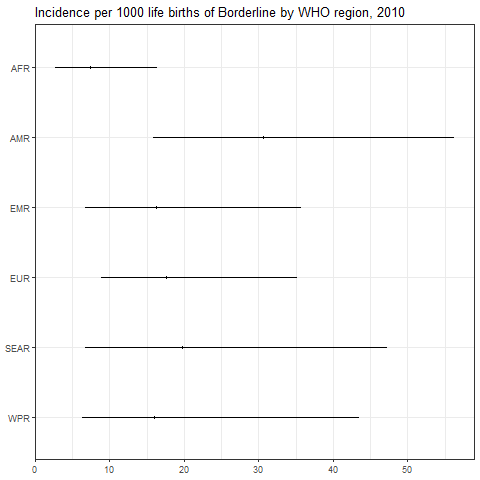

``` r
png(paste0(params$PlotDir, "/r_CI_2020.png"), width=480, height=480)
ggplot(subset(all_reg_rt, YEAR==2020),
       aes(y = VAL_MEAN, x = LOCATION_NAME)) +
  geom_pointrange(aes(ymin = VAL_LWR, ymax = VAL_UPR), size = 0.2) +
  coord_flip() +
  theme_bw() +
  scale_x_discrete(NULL, limits = rev(unique(all_reg_rt$LOCATION_NAME))) +
  scale_y_continuous(NULL) +
  ggtitle(paste0("Incidence per 1000 life births of ", params$Pathogen, " by WHO region, 2020"))
dev.off()
```

    ## png 
    ##   2

``` r
setwd(params$Dir)
image <- paste0("03-estimate_v6_files/figure-gfm/r_CI_2020.png")
cat("")
```

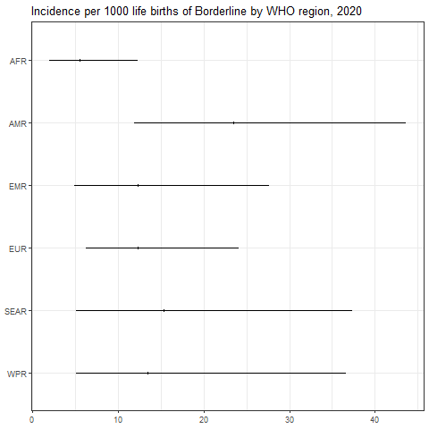

``` r
png(paste0(params$PlotDir, "/r_CASES_2010.png"), width=480, height=480)
ggplot(subset(all_reg_nr, YEAR==2010),
       aes(y = VAL_MEAN, x = LOCATION_NAME)) +
  geom_pointrange(aes(ymin = VAL_LWR, ymax = VAL_UPR), size = 0.2) +
  coord_flip() +
  theme_bw() +
  scale_x_discrete(NULL, limits = rev(unique(all_reg_nr$LOCATION_NAME))) +
  scale_y_continuous(NULL) +
  ggtitle(paste0("Cases of ", params$Pathogen, " by WHO region, 2010"))
dev.off()
```

    ## png 
    ##   2

``` r
setwd(params$Dir)
image <- paste0("03-estimate_v6_files/figure-gfm/r_CASES_2010.png")
cat("")
```

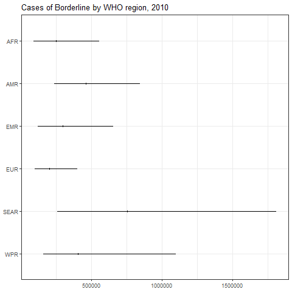

``` r
png(paste0(params$PlotDir, "/r_CASES_2020.png"), width=480, height=480)
ggplot(subset(all_reg_nr, YEAR==2020),
       aes(y = VAL_MEAN, x = LOCATION_NAME)) +
  geom_pointrange(aes(ymin = VAL_LWR, ymax = VAL_UPR), size = 0.2) +
  coord_flip() +
  theme_bw() +
  scale_x_discrete(NULL, limits = rev(unique(all_reg_nr$LOCATION_NAME))) +
  scale_y_continuous(NULL) +
  ggtitle(paste0("Cases of ", params$Pathogen, " by WHO region, 2020"))
dev.off()
```

    ## png 
    ##   2

``` r
setwd(params$Dir)
image <- paste0("03-estimate_v6_files/figure-gfm/r_CASES_2020.png")
cat("")
```

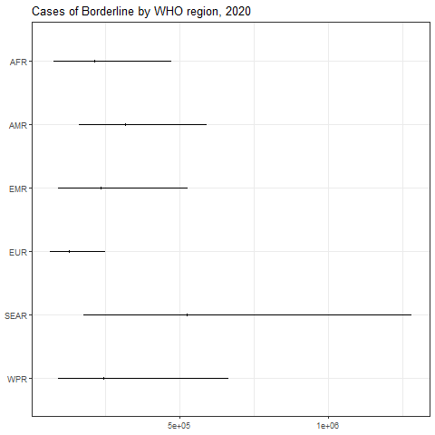

``` r
sim_all_reg <-
  merge(sim_all_reg,
        with(sim_all, aggregate(POP ~ REG2 + YEAR, FUN = sum)))
sim_all_reg_long <-
  pivot_longer(sim_all_reg, cols = starts_with("V"))
sim_all_reg_long$CASES <- sim_all_reg_long$value
```

``` r
png(paste0(params$PlotDir, "/r_hist_2010.png"), width=480, height=480)
ggplot(subset(sim_all_reg_long, YEAR==2010), aes(x = CASES)) +
  geom_density() +
  facet_wrap(~REG2) +
  theme_bw() +
  scale_x_log10() +
  ggtitle(paste0("Incidence per 1000 life births of ", params$Pathogen, " by WHO region, 2010"))
dev.off()
```

    ## png 
    ##   2

``` r
setwd(params$Dir)
image <- paste0("03-estimate_v6_files/figure-gfm/r_hist_2010.png")
cat("")
```


``` r
png(paste0(params$PlotDir, "/r_hist_2020_2010.png"), width=480, height=480)
ggplot(subset(sim_all_reg_long, YEAR==2010), aes(x = CASES)) +
  geom_density() +
  facet_wrap(~REG2) +
  theme_bw() +
  scale_x_log10() +
  ggtitle(paste0("Incidence per 1000 life births of ", params$Pathogen, " by WHO region, 2010"))
dev.off()
```

    ## png 
    ##   2

``` r
setwd(params$Dir)
image <- paste0("03-estimate_v6_files/figure-gfm/r_hist_2020_2010.png")
cat("")
```

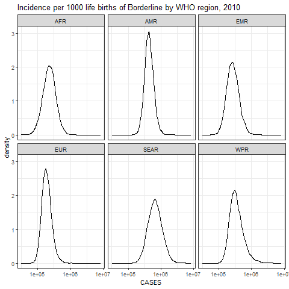

## Subregions

``` r
kbl(subset(all_sub_rt, YEAR == 2020)[,c(7,2:5)],
    align = c("l", "c", "c", "c"), row.names = FALSE,
    col.names = c("Region", "Mean", "Median", "Lower", "Upper"),
    caption=paste0("Incidence per 1000 life births of ",params$Pathogen," by WHO subregion in 2020")) %>%
  kable_styling("striped", "hover")
```

<table class="table table-striped" style="margin-left: auto; margin-right: auto;">

<caption>

Incidence per 1000 life births of Borderline by WHO subregion in 2020
</caption>

<thead>

<tr>

<th style="text-align:left;">

Region
</th>

<th style="text-align:center;">

Mean
</th>

<th style="text-align:center;">

Median
</th>

<th style="text-align:center;">

Lower
</th>

<th style="text-align:left;">

Upper
</th>

</tr>

</thead>

<tbody>

<tr>

<td style="text-align:left;">

AFRAB
</td>

<td style="text-align:center;">

4.402542
</td>

<td style="text-align:center;">

3.349863
</td>

<td style="text-align:center;">

1.1815704
</td>

<td style="text-align:left;">

13.860144
</td>

</tr>

<tr>

<td style="text-align:left;">

AFRC
</td>

<td style="text-align:center;">

5.519517
</td>

<td style="text-align:center;">

4.768733
</td>

<td style="text-align:center;">

1.7480562
</td>

<td style="text-align:left;">

13.479392
</td>

</tr>

<tr>

<td style="text-align:left;">

AFRD
</td>

<td style="text-align:center;">

5.784833
</td>

<td style="text-align:center;">

4.985674
</td>

<td style="text-align:center;">

1.4539415
</td>

<td style="text-align:left;">

15.349108
</td>

</tr>

<tr>

<td style="text-align:left;">

AMRA
</td>

<td style="text-align:center;">

1.662147
</td>

<td style="text-align:center;">

1.596238
</td>

<td style="text-align:center;">

0.9285858
</td>

<td style="text-align:left;">

2.774218
</td>

</tr>

<tr>

<td style="text-align:left;">

AMRB
</td>

<td style="text-align:center;">

31.520035
</td>

<td style="text-align:center;">

29.971689
</td>

<td style="text-align:center;">

16.7904247
</td>

<td style="text-align:left;">

54.147267
</td>

</tr>

<tr>

<td style="text-align:left;">

AMRC
</td>

<td style="text-align:center;">

46.851986
</td>

<td style="text-align:center;">

31.899755
</td>

<td style="text-align:center;">

7.8835604
</td>

<td style="text-align:left;">

176.128115
</td>

</tr>

<tr>

<td style="text-align:left;">

EMRA
</td>

<td style="text-align:center;">

6.483233
</td>

<td style="text-align:center;">

5.257222
</td>

<td style="text-align:center;">

1.9692826
</td>

<td style="text-align:left;">

18.309777
</td>

</tr>

<tr>

<td style="text-align:left;">

EMRBC
</td>

<td style="text-align:center;">

14.119836
</td>

<td style="text-align:center;">

12.354921
</td>

<td style="text-align:center;">

5.2008715
</td>

<td style="text-align:left;">

33.239077
</td>

</tr>

<tr>

<td style="text-align:left;">

EMRD
</td>

<td style="text-align:center;">

9.070231
</td>

<td style="text-align:center;">

6.906004
</td>

<td style="text-align:center;">

1.9501400
</td>

<td style="text-align:left;">

30.267469
</td>

</tr>

<tr>

<td style="text-align:left;">

EURA
</td>

<td style="text-align:center;">

9.481141
</td>

<td style="text-align:center;">

8.910629
</td>

<td style="text-align:center;">

4.7733162
</td>

<td style="text-align:left;">

17.394443
</td>

</tr>

<tr>

<td style="text-align:left;">

EURB
</td>

<td style="text-align:center;">

13.037891
</td>

<td style="text-align:center;">

11.965810
</td>

<td style="text-align:center;">

5.7560491
</td>

<td style="text-align:left;">

26.177067
</td>

</tr>

<tr>

<td style="text-align:left;">

EURC
</td>

<td style="text-align:center;">

19.384614
</td>

<td style="text-align:center;">

13.227104
</td>

<td style="text-align:center;">

4.2537934
</td>

<td style="text-align:left;">

73.075428
</td>

</tr>

<tr>

<td style="text-align:left;">

SEARB
</td>

<td style="text-align:center;">

31.972606
</td>

<td style="text-align:center;">

25.537776
</td>

<td style="text-align:center;">

7.5563812
</td>

<td style="text-align:left;">

96.619192
</td>

</tr>

<tr>

<td style="text-align:left;">

SEARCD
</td>

<td style="text-align:center;">

12.375425
</td>

<td style="text-align:center;">

10.014171
</td>

<td style="text-align:center;">

3.2402162
</td>

<td style="text-align:left;">

34.292785
</td>

</tr>

<tr>

<td style="text-align:left;">

WPRA
</td>

<td style="text-align:center;">

23.881509
</td>

<td style="text-align:center;">

22.183756
</td>

<td style="text-align:center;">

10.5394689
</td>

<td style="text-align:left;">

47.488748
</td>

</tr>

<tr>

<td style="text-align:left;">

WPRB
</td>

<td style="text-align:center;">

5.634252
</td>

<td style="text-align:center;">

5.278256
</td>

<td style="text-align:center;">

2.7478032
</td>

<td style="text-align:left;">

10.584921
</td>

</tr>

<tr>

<td style="text-align:left;">

WPRC
</td>

<td style="text-align:center;">

32.032400
</td>

<td style="text-align:center;">

20.849143
</td>

<td style="text-align:center;">

4.9160840
</td>

<td style="text-align:left;">

126.005264
</td>

</tr>

</tbody>

</table>

``` r
kbl(subset(all_sub_nr, YEAR == 2020)[,c(7,2:5)],
    align = c("l", "c", "c", "c"), row.names = FALSE,
    col.names = c("Region", "Mean", "Median", "Lower", "Upper"),
    caption=paste0("Cases of ",params$Pathogen," by WHO sub region in 2020")) %>%
  kable_styling("striped", "hover")
```

<table class="table table-striped" style="margin-left: auto; margin-right: auto;">

<caption>

Cases of Borderline by WHO sub region in 2020
</caption>

<thead>

<tr>

<th style="text-align:left;">

Region
</th>

<th style="text-align:center;">

Mean
</th>

<th style="text-align:center;">

Median
</th>

<th style="text-align:center;">

Lower
</th>

<th style="text-align:left;">

Upper
</th>

</tr>

</thead>

<tbody>

<tr>

<td style="text-align:left;">

AFRAB
</td>

<td style="text-align:center;">

6386.450
</td>

<td style="text-align:center;">

4859.405
</td>

<td style="text-align:center;">

1714.019
</td>

<td style="text-align:left;">

20105.91
</td>

</tr>

<tr>

<td style="text-align:left;">

AFRC
</td>

<td style="text-align:center;">

104286.100
</td>

<td style="text-align:center;">

90100.731
</td>

<td style="text-align:center;">

33027.882
</td>

<td style="text-align:left;">

254680.48
</td>

</tr>

<tr>

<td style="text-align:left;">

AFRD
</td>

<td style="text-align:center;">

104091.892
</td>

<td style="text-align:center;">

89711.884
</td>

<td style="text-align:center;">

26162.126
</td>

<td style="text-align:left;">

276190.82
</td>

</tr>

<tr>

<td style="text-align:left;">

AMRA
</td>

<td style="text-align:center;">

7225.546
</td>

<td style="text-align:center;">

6939.036
</td>

<td style="text-align:center;">

4036.671
</td>

<td style="text-align:left;">

12059.85
</td>

</tr>

<tr>

<td style="text-align:left;">

AMRB
</td>

<td style="text-align:center;">

249006.607
</td>

<td style="text-align:center;">

236774.751
</td>

<td style="text-align:center;">

132643.465
</td>

<td style="text-align:left;">

427760.54
</td>

</tr>

<tr>

<td style="text-align:left;">

AMRC
</td>

<td style="text-align:center;">

61878.637
</td>

<td style="text-align:center;">

42130.836
</td>

<td style="text-align:center;">

10412.023
</td>

<td style="text-align:left;">

232616.98
</td>

</tr>

<tr>

<td style="text-align:left;">

EMRA
</td>

<td style="text-align:center;">

5178.580
</td>

<td style="text-align:center;">

4199.285
</td>

<td style="text-align:center;">

1572.994
</td>

<td style="text-align:left;">

14625.21
</td>

</tr>

<tr>

<td style="text-align:left;">

EMRBC
</td>

<td style="text-align:center;">

180769.987
</td>

<td style="text-align:center;">

158174.570
</td>

<td style="text-align:center;">

66584.449
</td>

<td style="text-align:left;">

425545.14
</td>

</tr>

<tr>

<td style="text-align:left;">

EMRD
</td>

<td style="text-align:center;">

49867.040
</td>

<td style="text-align:center;">

37968.381
</td>

<td style="text-align:center;">

10721.636
</td>

<td style="text-align:left;">

166406.91
</td>

</tr>

<tr>

<td style="text-align:left;">

EURA
</td>

<td style="text-align:center;">

47253.966
</td>

<td style="text-align:center;">

44410.537
</td>

<td style="text-align:center;">

23790.189
</td>

<td style="text-align:left;">

86693.83
</td>

</tr>

<tr>

<td style="text-align:left;">

EURB
</td>

<td style="text-align:center;">

49712.450
</td>

<td style="text-align:center;">

45624.689
</td>

<td style="text-align:center;">

21947.360
</td>

<td style="text-align:left;">

99811.09
</td>

</tr>

<tr>

<td style="text-align:left;">

EURC
</td>

<td style="text-align:center;">

31688.687
</td>

<td style="text-align:center;">

21622.796
</td>

<td style="text-align:center;">

6953.821
</td>

<td style="text-align:left;">

119458.89
</td>

</tr>

<tr>

<td style="text-align:left;">

SEARB
</td>

<td style="text-align:center;">

166639.623
</td>

<td style="text-align:center;">

133101.614
</td>

<td style="text-align:center;">

39383.481
</td>

<td style="text-align:left;">

503574.40
</td>

</tr>

<tr>

<td style="text-align:left;">

SEARCD
</td>

<td style="text-align:center;">

359514.689
</td>

<td style="text-align:center;">

290918.623
</td>

<td style="text-align:center;">

94130.534
</td>

<td style="text-align:left;">

996229.23
</td>

</tr>

<tr>

<td style="text-align:left;">

WPRA
</td>

<td style="text-align:center;">

36233.503
</td>

<td style="text-align:center;">

33657.638
</td>

<td style="text-align:center;">

15990.693
</td>

<td style="text-align:left;">

72050.88
</td>

</tr>

<tr>

<td style="text-align:left;">

WPRB
</td>

<td style="text-align:center;">

69331.621
</td>

<td style="text-align:center;">

64950.956
</td>

<td style="text-align:center;">

33812.769
</td>

<td style="text-align:left;">

130251.49
</td>

</tr>

<tr>

<td style="text-align:left;">

WPRC
</td>

<td style="text-align:center;">

137962.811
</td>

<td style="text-align:center;">

89796.780
</td>

<td style="text-align:center;">

21173.461
</td>

<td style="text-align:left;">

542701.78
</td>

</tr>

</tbody>

</table>

``` r
png(paste0(params$PlotDir, "/r_CI_SUB2_2010.png"), width=480, height=480)
ggplot(subset(all_sub_rt, YEAR==2010),
       aes(y = VAL_MEAN, x = LOCATION_NAME)) +
  geom_pointrange(aes(ymin = VAL_LWR, ymax = VAL_UPR), size = 0.2) +
  coord_flip() +
  theme_bw() +
  scale_x_discrete(NULL, limits = rev(unique(all_sub_rt$LOCATION_NAME))) +
  scale_y_continuous(NULL) +
  ggtitle(paste0("Incidence per 1000 life births of ", params$Pathogen, " by WHO sub region, 2010"))
dev.off()
```

    ## png 
    ##   2

``` r
setwd(params$Dir)
image <- paste0("03-estimate_v6_files/figure-gfm/r_CI_SUB2_2010.png")
cat("")
```

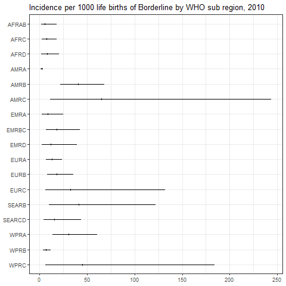

``` r
png(paste0(params$PlotDir, "/r_CI_SUB2_2020.png"), width=480, height=480)
ggplot(subset(all_sub_rt, YEAR==2020),
       aes(y = VAL_MEAN, x = LOCATION_NAME)) +
  geom_pointrange(aes(ymin = VAL_LWR, ymax = VAL_UPR), size = 0.2) +
  coord_flip() +
  theme_bw() +
  scale_x_discrete(NULL, limits = rev(unique(all_sub_rt$LOCATION_NAME))) +
  scale_y_continuous(NULL) +
  ggtitle(paste0("Incidence per 1000 life births of ", params$Pathogen, " by WHO sub region, 2020"))
dev.off()
```

    ## png 
    ##   2

``` r
setwd(params$Dir)
image <- paste0("03-estimate_v6_files/figure-gfm/r_CI_SUB2_2020.png")
cat("")
```

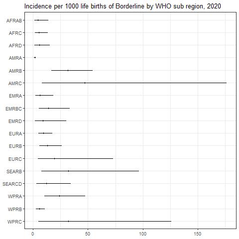

``` r
png(paste0(params$PlotDir, "/r_CASES_SUB2_2010.png"), width=480, height=480)
ggplot(subset(all_sub_nr, YEAR==2010),
       aes(y = VAL_MEAN, x = LOCATION_NAME)) +
  geom_pointrange(aes(ymin = VAL_LWR, ymax = VAL_UPR), size = 0.2) +
  coord_flip() +
  theme_bw() +
  scale_x_discrete(NULL, limits = rev(unique(all_sub_nr$LOCATION_NAME))) +
  scale_y_continuous(NULL) +
  ggtitle(paste0("Cases of ", params$Pathogen, " by WHO sub region, 2010"))
dev.off()
```

    ## png 
    ##   2

``` r
setwd(params$Dir)
image <- paste0("03-estimate_v6_files/figure-gfm/r_CASES_SUB2_2010.png")
cat("")
```

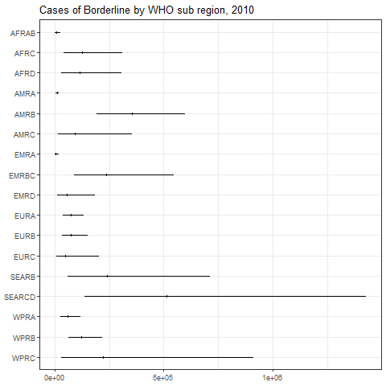

``` r
png(paste0(params$PlotDir, "/r_CASES_SUB2_2020.png"), width=480, height=480)
ggplot(subset(all_sub_nr, YEAR==2020),
       aes(y = VAL_MEAN, x = LOCATION_NAME)) +
  geom_pointrange(aes(ymin = VAL_LWR, ymax = VAL_UPR), size = 0.2) +
  coord_flip() +
  theme_bw() +
  scale_x_discrete(NULL, limits = rev(unique(all_sub_nr$LOCATION_NAME))) +
  scale_y_continuous(NULL) +
  ggtitle(paste0("Cases of ", params$Pathogen, " by WHO sub region, 2020"))
dev.off()
```

    ## png 
    ##   2

``` r
setwd(params$Dir)
image <- paste0("03-estimate_v6_files/figure-gfm/r_CASES_SUB2_2020.png")
cat("")
```

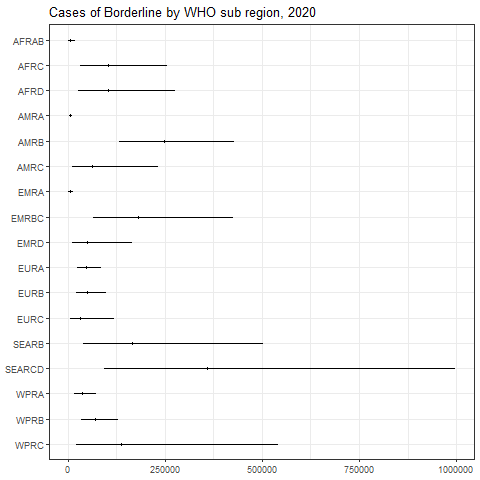

``` r
sim_all_sub <-
  merge(sim_all_sub,
        with(sim_all, aggregate(POP ~ SUB2 + YEAR, FUN = sum)))
sim_all_sub_long <-
  pivot_longer(sim_all_sub, cols = starts_with("V"))
sim_all_sub_long$CASES <- sim_all_sub_long$value
```

``` r
png(paste0(params$PlotDir, "/r_hist_SUB2_2010.png"), width=480, height=480)
ggplot(subset(sim_all_sub_long, YEAR==2010), aes(x = CASES)) +
  geom_density() +
  facet_wrap(~SUB2) +
  theme_bw() +
  scale_x_log10() +
  ggtitle(paste0("Incidence per 1000 life births of ", params$Pathogen, "by WHO sub region, 2010"))
dev.off()
```

    ## png 
    ##   2

``` r
setwd(params$Dir)
image <- paste0("03-estimate_v6_files/figure-gfm/r_hist_SUB2_2010.png")
cat("")
```

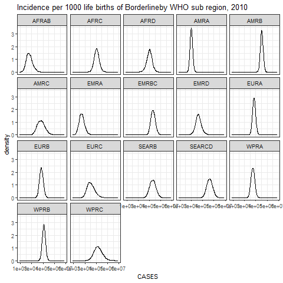

``` r
png(paste0(params$PlotDir, "/r_hist_SUB2_2020_2010.png"), width=480, height=480)
ggplot(subset(sim_all_sub_long, YEAR==2010), aes(x = CASES)) +
  geom_density() +
  facet_wrap(~SUB2) +
  theme_bw() +
  scale_x_log10() +
  ggtitle(paste0("Incidence per 1000 life births of ", params$Pathogen, "by WHO sub region, 2010"))
dev.off()
```

    ## png 
    ##   2

``` r
setwd(params$Dir)
image <- paste0("03-estimate_v6_files/figure-gfm/r_hist_SUB2_2020_2010.png")
cat("")
```


## Countries

``` r
png(paste0(params$PlotDir, "/r_cnt_2010.png"), width=800, height=300)
plot_world(subset(all_cnt_rt, YEAR == 2010),
           "LOCATION_NAME", "VAL_MEAN", legend.title = "Incidence per 1000", diseasefree = zero_cases)
```

    ## [1]   0  50 100 150 200 250 300 350

``` r
dev.off()
```

    ## png 
    ##   2

``` r
setwd(params$Dir)
image <- paste0("03-estimate_v6_files/figure-gfm/r_cnt_2010.png")
cat("")
```

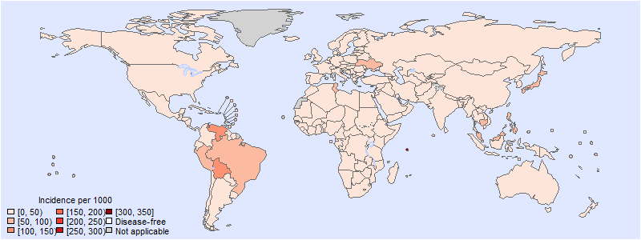

``` r
png(paste0(params$PlotDir, "/r_cnt_2020.png"), width=800, height=300)
plot_world(subset(all_cnt_rt, YEAR == 2020),
           "LOCATION_NAME", "VAL_MEAN", legend.title = "Incidence per 1000", diseasefree = zero_cases)
```

    ## [1]   0  50 100 150 200 250

``` r
dev.off()
```

    ## png 
    ##   2

``` r
setwd(params$Dir)
image <- paste0("03-estimate_v6_files/figure-gfm/r_cnt_2020.png")
cat("")
```

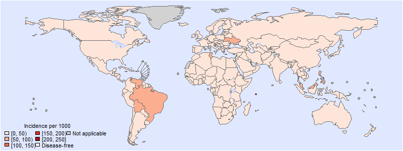

``` r
tab <-
  data.frame(subset(all_cnt_rt, YEAR == 2010)[,
                                              c("LOCATION_NAME", "VAL_MEAN", "VAL_MEDIAN", "VAL_LWR", "VAL_UPR")],
             subset(all_cnt_rt, YEAR == 2020)[,
                                              c("VAL_MEAN", "VAL_MEDIAN", "VAL_LWR", "VAL_UPR")])
tab$LOCATION_NAME <-
  FERG2:::countries$COUNTRY[match(tab$LOCATION_NAME, FERG2:::countries$ISO3)]
tab$LOCATION_NAME <- gsub(" \\(.*", "", tab$LOCATION_NAME)
names(tab) <-
  c("Country",
    "2010.mean", "2010.median", "2010.lwr", "2010.upr",
    "2020.mean", "2020.median", "2020.lwr", "2020.upr")

kable(tab, digits = 3, row.names = FALSE,
      caption = paste0("Estimated ", params$Pathogen, " incidence by country, 2010 vs 2020"))
```

| Country | 2010.mean | 2010.median | 2010.lwr | 2010.upr | 2020.mean | 2020.median | 2020.lwr | 2020.upr |
|:---|---:|---:|---:|---:|---:|---:|---:|---:|
| Afghanistan | 11.024 | 9.171 | 2.616 | 30.873 | 8.446 | 6.998 | 1.980 | 23.738 |
| Angola | 7.987 | 7.340 | 2.234 | 17.719 | 6.113 | 5.584 | 1.711 | 13.764 |
| Albania | 29.031 | 13.328 | 1.185 | 154.252 | 22.297 | 10.169 | 0.888 | 120.369 |
| Andorra | 9.117 | 8.584 | 4.182 | 17.233 | 6.983 | 6.563 | 3.121 | 13.412 |
| United Arab Emirates | 7.807 | 3.546 | 0.293 | 39.504 | 5.963 | 2.726 | 0.224 | 30.947 |
| Argentina | 4.999 | 2.360 | 0.211 | 24.434 | 3.825 | 1.800 | 0.158 | 18.472 |
| Armenia | 10.434 | 9.280 | 3.757 | 23.865 | 7.985 | 7.071 | 2.870 | 18.468 |
| Antigua and Barbuda | 9.272 | 8.348 | 2.486 | 21.904 | 7.100 | 6.372 | 1.876 | 16.749 |
| Australia | 5.695 | 4.220 | 0.944 | 18.819 | 4.353 | 3.207 | 0.715 | 14.333 |
| Austria | 9.515 | 6.742 | 1.246 | 34.698 | 7.291 | 5.127 | 0.949 | 26.730 |
| Azerbaijan | 10.434 | 9.280 | 3.757 | 23.865 | 7.985 | 7.071 | 2.870 | 18.468 |
| Burundi | 8.459 | 7.674 | 2.042 | 19.791 | 6.474 | 5.833 | 1.585 | 15.598 |
| Belgium | 9.345 | 6.939 | 1.539 | 30.369 | 7.149 | 5.271 | 1.181 | 23.444 |
| Benin | 9.095 | 4.222 | 0.358 | 46.725 | 6.945 | 3.199 | 0.272 | 35.026 |
| Burkina Faso | 8.459 | 7.674 | 2.042 | 19.791 | 6.474 | 5.833 | 1.585 | 15.598 |
| Bangladesh | 38.256 | 20.517 | 2.486 | 176.249 | 29.389 | 15.693 | 1.897 | 137.241 |
| Bulgaria | 10.434 | 9.280 | 3.757 | 23.865 | 7.985 | 7.071 | 2.870 | 18.468 |
| Bahrain | 10.125 | 9.083 | 2.970 | 23.618 | 7.755 | 6.940 | 2.257 | 18.124 |
| Bahamas | 9.272 | 8.348 | 2.486 | 21.904 | 7.100 | 6.372 | 1.876 | 16.749 |
| Bosnia and Herzegovina | 10.434 | 9.280 | 3.757 | 23.865 | 7.985 | 7.071 | 2.870 | 18.468 |
| Belarus | 10.434 | 9.280 | 3.757 | 23.865 | 7.985 | 7.071 | 2.870 | 18.468 |
| Belize | 10.588 | 9.510 | 3.970 | 24.012 | 8.109 | 7.281 | 2.987 | 18.401 |
| Bolivia | 100.580 | 42.449 | 3.762 | 543.915 | 77.202 | 32.303 | 2.825 | 421.383 |
| Brazil | 89.973 | 85.440 | 47.065 | 157.390 | 68.976 | 65.244 | 34.995 | 122.742 |
| Barbados | 9.272 | 8.348 | 2.486 | 21.904 | 7.100 | 6.372 | 1.876 | 16.749 |
| Brunei Darussalam | 10.842 | 9.625 | 3.597 | 25.759 | 8.304 | 7.341 | 2.708 | 20.089 |
| Bhutan | 12.214 | 10.187 | 3.496 | 34.414 | 9.357 | 7.766 | 2.636 | 26.476 |
| Botswana | 12.027 | 9.626 | 3.205 | 37.300 | 9.207 | 7.352 | 2.438 | 28.774 |
| Central African Republic | 8.459 | 7.674 | 2.042 | 19.791 | 6.474 | 5.833 | 1.585 | 15.598 |
| Canada | 5.486 | 5.120 | 2.539 | 10.595 | 4.209 | 3.899 | 1.879 | 8.277 |
| Switzerland | 20.704 | 9.386 | 0.832 | 104.699 | 15.849 | 7.171 | 0.640 | 81.194 |
| Chile | 9.272 | 8.348 | 2.486 | 21.904 | 7.100 | 6.372 | 1.876 | 16.749 |
| China | 4.916 | 4.662 | 2.489 | 8.717 | 3.758 | 3.552 | 1.874 | 6.760 |
| Côte d’Ivoire | 7.987 | 7.340 | 2.234 | 17.719 | 6.113 | 5.584 | 1.711 | 13.764 |
| Cameroon | 7.987 | 7.340 | 2.234 | 17.719 | 6.113 | 5.584 | 1.711 | 13.764 |
| Congo | 3.955 | 1.839 | 0.145 | 21.122 | 3.024 | 1.420 | 0.112 | 16.264 |
| Congo | 11.105 | 6.351 | 0.749 | 50.474 | 8.480 | 4.818 | 0.567 | 38.371 |
| Cook Islands | 10.842 | 9.625 | 3.597 | 25.759 | 8.304 | 7.341 | 2.708 | 20.089 |
| Colombia | 33.329 | 28.763 | 10.538 | 83.118 | 25.464 | 21.985 | 7.995 | 63.626 |
| Comoros | 7.987 | 7.340 | 2.234 | 17.719 | 6.113 | 5.584 | 1.711 | 13.764 |
| Cabo Verde | 23.944 | 6.907 | 0.297 | 154.437 | 18.266 | 5.273 | 0.227 | 118.882 |
| Costa Rica | 10.588 | 9.510 | 3.970 | 24.012 | 8.109 | 7.281 | 2.987 | 18.401 |
| Cuba | 10.588 | 9.510 | 3.970 | 24.012 | 8.109 | 7.281 | 2.987 | 18.401 |
| Cyprus | 31.208 | 14.289 | 1.395 | 159.207 | 23.873 | 10.791 | 1.059 | 122.341 |
| Czechia | 5.962 | 4.740 | 1.285 | 17.817 | 4.569 | 3.610 | 0.966 | 13.853 |
| Germany | 1.999 | 1.647 | 0.495 | 5.662 | 1.534 | 1.258 | 0.375 | 4.384 |
| Djibouti | 11.072 | 9.825 | 4.079 | 25.490 | 8.482 | 7.505 | 3.077 | 19.647 |
| Dominica | 10.588 | 9.510 | 3.970 | 24.012 | 8.109 | 7.281 | 2.987 | 18.401 |
| Denmark | 41.630 | 31.053 | 7.269 | 140.398 | 31.959 | 23.656 | 5.503 | 107.519 |
| Dominican Republic | 10.588 | 9.510 | 3.970 | 24.012 | 8.109 | 7.281 | 2.987 | 18.401 |
| Algeria | 7.987 | 7.340 | 2.234 | 17.719 | 6.113 | 5.584 | 1.711 | 13.764 |
| Ecuador | 2.407 | 1.805 | 0.396 | 8.174 | 1.847 | 1.373 | 0.299 | 6.390 |
| Egypt | 9.614 | 8.062 | 2.614 | 25.664 | 7.365 | 6.147 | 1.956 | 20.002 |
| Eritrea | 45.477 | 20.407 | 1.843 | 237.882 | 34.844 | 15.572 | 1.390 | 187.229 |
| Spain | 24.869 | 22.671 | 10.036 | 51.768 | 19.037 | 17.303 | 7.462 | 40.336 |
| Estonia | 9.117 | 8.584 | 4.182 | 17.233 | 6.983 | 6.563 | 3.121 | 13.412 |
| Ethiopia | 9.033 | 5.087 | 0.601 | 41.412 | 6.901 | 3.884 | 0.475 | 31.823 |
| Finland | 19.408 | 13.900 | 2.827 | 69.288 | 14.938 | 10.633 | 2.124 | 53.558 |
| Fiji | 12.617 | 10.644 | 3.945 | 34.137 | 9.660 | 8.110 | 2.989 | 26.307 |
| France | 19.794 | 15.809 | 4.493 | 57.731 | 15.139 | 12.033 | 3.395 | 44.536 |
| Micronesia | 13.608 | 10.942 | 4.151 | 38.352 | 10.428 | 8.360 | 3.129 | 29.605 |
| Gabon | 12.027 | 9.626 | 3.205 | 37.300 | 9.207 | 7.352 | 2.438 | 28.774 |
| United Kingdom | 4.124 | 3.431 | 1.013 | 11.153 | 3.172 | 2.620 | 0.761 | 8.942 |
| Georgia | 34.990 | 19.643 | 2.362 | 162.395 | 26.771 | 15.002 | 1.803 | 124.237 |
| Ghana | 13.061 | 9.324 | 1.966 | 46.114 | 9.988 | 7.109 | 1.483 | 35.497 |
| Guinea | 7.987 | 7.340 | 2.234 | 17.719 | 6.113 | 5.584 | 1.711 | 13.764 |
| Gambia | 8.459 | 7.674 | 2.042 | 19.791 | 6.474 | 5.833 | 1.585 | 15.598 |
| Guinea-Bissau | 8.459 | 7.674 | 2.042 | 19.791 | 6.474 | 5.833 | 1.585 | 15.598 |
| Equatorial Guinea | 12.027 | 9.626 | 3.205 | 37.300 | 9.207 | 7.352 | 2.438 | 28.774 |
| Greece | 31.889 | 24.177 | 5.746 | 103.888 | 24.454 | 18.468 | 4.295 | 80.707 |
| Grenada | 10.588 | 9.510 | 3.970 | 24.012 | 8.109 | 7.281 | 2.987 | 18.401 |
| Guatemala | 10.588 | 9.510 | 3.970 | 24.012 | 8.109 | 7.281 | 2.987 | 18.401 |
| Guyana | 9.272 | 8.348 | 2.486 | 21.904 | 7.100 | 6.372 | 1.876 | 16.749 |
| Honduras | 16.628 | 11.226 | 4.414 | 61.351 | 12.724 | 8.586 | 3.312 | 47.224 |
| Croatia | 35.233 | 27.394 | 6.604 | 110.516 | 27.007 | 20.871 | 4.934 | 86.597 |
| Haiti | 16.628 | 11.226 | 4.414 | 61.351 | 12.724 | 8.586 | 3.312 | 47.224 |
| Hungary | 12.691 | 6.117 | 0.546 | 63.228 | 9.743 | 4.617 | 0.409 | 49.533 |
| Indonesia | 44.368 | 34.843 | 9.370 | 137.809 | 33.965 | 26.604 | 7.043 | 106.404 |
| India | 13.457 | 10.582 | 2.782 | 41.761 | 10.277 | 8.107 | 2.107 | 31.896 |
| Ireland | 31.894 | 20.556 | 3.254 | 133.003 | 24.434 | 15.699 | 2.434 | 103.614 |
| Iran | 7.997 | 7.098 | 2.623 | 18.471 | 6.116 | 5.407 | 1.980 | 14.271 |
| Iraq | 17.609 | 5.868 | 0.302 | 107.128 | 13.500 | 4.470 | 0.231 | 81.838 |
| Iceland | 40.508 | 18.082 | 1.606 | 214.830 | 31.070 | 13.875 | 1.226 | 166.074 |
| Israel | 9.117 | 8.584 | 4.182 | 17.233 | 6.983 | 6.563 | 3.121 | 13.412 |
| Italy | 23.362 | 20.415 | 7.380 | 57.040 | 17.881 | 15.592 | 5.587 | 44.382 |
| Jamaica | 1.858 | 1.324 | 0.254 | 6.749 | 1.422 | 1.003 | 0.190 | 5.230 |
| Jordan | 30.262 | 14.495 | 1.453 | 153.082 | 23.197 | 11.067 | 1.089 | 117.195 |
| Japan | 50.407 | 46.448 | 21.474 | 102.831 | 38.626 | 35.672 | 15.952 | 79.183 |
| Kazakhstan | 21.730 | 14.820 | 2.629 | 82.575 | 16.608 | 11.356 | 1.981 | 62.910 |
| Kenya | 3.730 | 1.673 | 0.137 | 19.812 | 2.844 | 1.272 | 0.105 | 15.170 |
| Kyrgyzstan | 13.280 | 9.975 | 3.801 | 43.646 | 10.172 | 7.621 | 2.843 | 33.361 |
| Cambodia | 62.111 | 34.089 | 4.311 | 289.060 | 47.714 | 25.781 | 3.259 | 223.416 |
| Kiribati | 13.608 | 10.942 | 4.151 | 38.352 | 10.428 | 8.360 | 3.129 | 29.605 |
| Saint Kitts and Nevis | 9.272 | 8.348 | 2.486 | 21.904 | 7.100 | 6.372 | 1.876 | 16.749 |
| Korea | 3.344 | 3.249 | 2.100 | 5.050 | 2.561 | 2.490 | 1.557 | 3.977 |
| Kuwait | 62.081 | 38.417 | 5.857 | 257.428 | 47.608 | 29.382 | 4.368 | 197.625 |
| Lao People’s Dem. Republic | 13.608 | 10.942 | 4.151 | 38.352 | 10.428 | 8.360 | 3.129 | 29.605 |
| Lebanon | 29.420 | 16.820 | 2.191 | 130.667 | 22.535 | 12.799 | 1.640 | 99.407 |
| Liberia | 8.459 | 7.674 | 2.042 | 19.791 | 6.474 | 5.833 | 1.585 | 15.598 |
| Libya | 38.181 | 22.107 | 2.833 | 175.011 | 29.234 | 16.874 | 2.147 | 133.098 |
| Saint Lucia | 10.588 | 9.510 | 3.970 | 24.012 | 8.109 | 7.281 | 2.987 | 18.401 |
| Sri Lanka | 7.747 | 3.580 | 0.267 | 41.012 | 5.925 | 2.747 | 0.198 | 31.469 |
| Lesotho | 7.987 | 7.340 | 2.234 | 17.719 | 6.113 | 5.584 | 1.711 | 13.764 |
| Lithuania | 11.185 | 4.641 | 0.316 | 63.049 | 8.567 | 3.553 | 0.240 | 48.876 |
| Luxembourg | 27.798 | 12.618 | 1.197 | 142.119 | 21.310 | 9.634 | 0.914 | 108.667 |
| Latvia | 9.117 | 8.584 | 4.182 | 17.233 | 6.983 | 6.563 | 3.121 | 13.412 |
| Morocco | 2.244 | 1.583 | 0.284 | 8.207 | 1.718 | 1.207 | 0.212 | 6.384 |
| Monaco | 9.117 | 8.584 | 4.182 | 17.233 | 6.983 | 6.563 | 3.121 | 13.412 |
| Republic of Moldova | 10.434 | 9.280 | 3.757 | 23.865 | 7.985 | 7.071 | 2.870 | 18.468 |
| Madagascar | 8.459 | 7.674 | 2.042 | 19.791 | 6.474 | 5.833 | 1.585 | 15.598 |
| Maldives | 90.707 | 38.327 | 3.352 | 482.455 | 69.574 | 29.556 | 2.506 | 375.861 |
| Mexico | 6.497 | 5.261 | 1.469 | 18.987 | 4.984 | 4.030 | 1.096 | 14.857 |
| Marshall Islands | 12.617 | 10.644 | 3.945 | 34.137 | 9.660 | 8.110 | 2.989 | 26.307 |
| North Macedonia | 10.434 | 9.280 | 3.757 | 23.865 | 7.985 | 7.071 | 2.870 | 18.468 |
| Mali | 8.459 | 7.674 | 2.042 | 19.791 | 6.474 | 5.833 | 1.585 | 15.598 |
| Malta | 9.117 | 8.584 | 4.182 | 17.233 | 6.983 | 6.563 | 3.121 | 13.412 |
| Myanmar | 12.214 | 10.187 | 3.496 | 34.414 | 9.357 | 7.766 | 2.636 | 26.476 |
| Montenegro | 10.434 | 9.280 | 3.757 | 23.865 | 7.985 | 7.071 | 2.870 | 18.468 |
| Mongolia | 23.122 | 10.553 | 0.946 | 122.962 | 17.714 | 8.041 | 0.715 | 93.837 |
| Mozambique | 5.213 | 2.496 | 0.210 | 26.569 | 4.000 | 1.917 | 0.162 | 20.534 |
| Mauritania | 7.987 | 7.340 | 2.234 | 17.719 | 6.113 | 5.584 | 1.711 | 13.764 |
| Mauritius | 12.027 | 9.626 | 3.205 | 37.300 | 9.207 | 7.352 | 2.438 | 28.774 |
| Malawi | 8.459 | 7.674 | 2.042 | 19.791 | 6.474 | 5.833 | 1.585 | 15.598 |
| Malaysia | 71.033 | 58.174 | 16.563 | 201.981 | 54.379 | 44.395 | 12.541 | 154.071 |
| Namibia | 12.027 | 9.626 | 3.205 | 37.300 | 9.207 | 7.352 | 2.438 | 28.774 |
| Niger | 8.459 | 7.674 | 2.042 | 19.791 | 6.474 | 5.833 | 1.585 | 15.598 |
| Nigeria | 6.105 | 3.474 | 0.437 | 27.174 | 4.659 | 2.644 | 0.333 | 20.847 |
| Nicaragua | 16.628 | 11.226 | 4.414 | 61.351 | 12.724 | 8.586 | 3.312 | 47.224 |
| Niue | 10.842 | 9.625 | 3.597 | 25.759 | 8.304 | 7.341 | 2.708 | 20.089 |
| Netherlands | 7.637 | 3.745 | 0.322 | 37.745 | 5.861 | 2.856 | 0.244 | 29.037 |
| Norway | 2.427 | 2.064 | 0.685 | 6.255 | 1.860 | 1.574 | 0.515 | 4.860 |
| Nepal | 12.214 | 10.187 | 3.496 | 34.414 | 9.357 | 7.766 | 2.636 | 26.476 |
| Nauru | 10.842 | 9.625 | 3.597 | 25.759 | 8.304 | 7.341 | 2.708 | 20.089 |
| New Zealand | 32.222 | 14.735 | 1.276 | 175.917 | 24.739 | 11.215 | 0.972 | 135.618 |
| Oman | 10.125 | 9.083 | 2.970 | 23.618 | 7.755 | 6.940 | 2.257 | 18.124 |
| Pakistan | 22.738 | 18.811 | 5.762 | 62.776 | 17.383 | 14.368 | 4.381 | 48.291 |
| Panama | 9.272 | 8.348 | 2.486 | 21.904 | 7.100 | 6.372 | 1.876 | 16.749 |
| Peru | 57.323 | 41.124 | 8.357 | 205.808 | 43.815 | 31.405 | 6.455 | 158.784 |
| Philippines | 68.150 | 36.713 | 4.596 | 320.995 | 52.381 | 28.078 | 3.479 | 248.563 |
| Palau | 12.617 | 10.644 | 3.945 | 34.137 | 9.660 | 8.110 | 2.989 | 26.307 |
| Papua New Guinea | 13.608 | 10.942 | 4.151 | 38.352 | 10.428 | 8.360 | 3.129 | 29.605 |
| Poland | 2.257 | 1.933 | 0.669 | 5.755 | 1.727 | 1.477 | 0.503 | 4.422 |
| Korea | 12.214 | 10.187 | 3.496 | 34.414 | 9.357 | 7.766 | 2.636 | 26.476 |
| Portugal | 43.704 | 33.152 | 8.300 | 143.020 | 33.499 | 25.336 | 6.220 | 109.186 |
| Paraguay | 10.588 | 9.510 | 3.970 | 24.012 | 8.109 | 7.281 | 2.987 | 18.401 |
| Qatar | 10.125 | 9.083 | 2.970 | 23.618 | 7.755 | 6.940 | 2.257 | 18.124 |
| Romania | 7.235 | 4.171 | 0.520 | 32.112 | 5.535 | 3.184 | 0.397 | 24.559 |
| Russian Federation | 29.939 | 26.897 | 11.242 | 66.319 | 22.854 | 20.515 | 8.609 | 50.432 |
| Rwanda | 8.459 | 7.674 | 2.042 | 19.791 | 6.474 | 5.833 | 1.585 | 15.598 |
| Saudi Arabia | 2.714 | 2.345 | 0.833 | 6.708 | 2.079 | 1.797 | 0.619 | 5.106 |
| Sudan | 13.857 | 6.110 | 0.497 | 77.062 | 10.584 | 4.647 | 0.376 | 58.798 |
| Senegal | 7.987 | 7.340 | 2.234 | 17.719 | 6.113 | 5.584 | 1.711 | 13.764 |
| Singapore | 8.567 | 3.656 | 0.268 | 46.854 | 6.572 | 2.777 | 0.202 | 35.926 |
| Solomon Islands | 13.608 | 10.942 | 4.151 | 38.352 | 10.428 | 8.360 | 3.129 | 29.605 |
| Sierra Leone | 8.459 | 7.674 | 2.042 | 19.791 | 6.474 | 5.833 | 1.585 | 15.598 |
| El Salvador | 10.588 | 9.510 | 3.970 | 24.012 | 8.109 | 7.281 | 2.987 | 18.401 |
| San Marino | 9.117 | 8.584 | 4.182 | 17.233 | 6.983 | 6.563 | 3.121 | 13.412 |
| Somalia | 11.024 | 9.171 | 2.616 | 30.873 | 8.446 | 6.998 | 1.980 | 23.738 |
| Serbia | 4.203 | 2.751 | 0.466 | 16.580 | 3.209 | 2.095 | 0.356 | 12.866 |
| South Sudan | 8.459 | 7.674 | 2.042 | 19.791 | 6.474 | 5.833 | 1.585 | 15.598 |
| Sao Tome and Principe | 7.987 | 7.340 | 2.234 | 17.719 | 6.113 | 5.584 | 1.711 | 13.764 |
| Suriname | 30.305 | 21.221 | 3.937 | 114.042 | 23.146 | 16.217 | 2.958 | 86.087 |
| Slovakia | 2.566 | 1.848 | 0.381 | 9.030 | 1.964 | 1.409 | 0.288 | 6.974 |
| Slovenia | 16.795 | 13.237 | 3.452 | 51.514 | 12.848 | 10.091 | 2.607 | 39.649 |
| Sweden | 1.354 | 1.176 | 0.410 | 3.400 | 1.040 | 0.894 | 0.311 | 2.642 |
| Eswatini | 7.987 | 7.340 | 2.234 | 17.719 | 6.113 | 5.584 | 1.711 | 13.764 |
| Seychelles | 311.923 | 273.175 | 104.001 | 732.808 | 239.414 | 208.448 | 77.656 | 573.276 |
| Syrian Arab Republic | 11.024 | 9.171 | 2.616 | 30.873 | 8.446 | 6.998 | 1.980 | 23.738 |
| Chad | 8.459 | 7.674 | 2.042 | 19.791 | 6.474 | 5.833 | 1.585 | 15.598 |
| Togo | 8.459 | 7.674 | 2.042 | 19.791 | 6.474 | 5.833 | 1.585 | 15.598 |
| Thailand | 22.342 | 14.028 | 2.071 | 94.931 | 17.082 | 10.726 | 1.581 | 72.464 |
| Tajikistan | 13.280 | 9.975 | 3.801 | 43.646 | 10.172 | 7.621 | 2.843 | 33.361 |
| Turkmenistan | 10.434 | 9.280 | 3.757 | 23.865 | 7.985 | 7.071 | 2.870 | 18.468 |
| Timor-Leste | 12.214 | 10.187 | 3.496 | 34.414 | 9.357 | 7.766 | 2.636 | 26.476 |
| Tonga | 12.617 | 10.644 | 3.945 | 34.137 | 9.660 | 8.110 | 2.989 | 26.307 |
| Trinidad and Tobago | 9.272 | 8.348 | 2.486 | 21.904 | 7.100 | 6.372 | 1.876 | 16.749 |
| Tunisia | 74.490 | 41.955 | 5.386 | 336.249 | 56.956 | 32.008 | 4.112 | 261.875 |
| Turkiye | 2.494 | 2.185 | 0.791 | 6.012 | 1.906 | 1.668 | 0.602 | 4.648 |
| Tuvalu | 12.617 | 10.644 | 3.945 | 34.137 | 9.660 | 8.110 | 2.989 | 26.307 |
| United Republic of Tanzania | 6.506 | 4.463 | 0.809 | 24.179 | 4.970 | 3.400 | 0.613 | 18.566 |
| Uganda | 8.459 | 7.674 | 2.042 | 19.791 | 6.474 | 5.833 | 1.585 | 15.598 |
| Ukraine | 71.723 | 38.609 | 4.876 | 342.646 | 54.817 | 29.458 | 3.673 | 258.433 |
| Uruguay | 9.272 | 8.348 | 2.486 | 21.904 | 7.100 | 6.372 | 1.876 | 16.749 |
| United States of America | 1.163 | 1.139 | 0.741 | 1.731 | 0.892 | 0.868 | 0.542 | 1.375 |
| Uzbekistan | 13.280 | 9.975 | 3.801 | 43.646 | 10.172 | 7.621 | 2.843 | 33.361 |
| Saint Vincent and the Grenadines | 10.588 | 9.510 | 3.970 | 24.012 | 8.109 | 7.281 | 2.987 | 18.401 |
| Venezuela | 100.978 | 60.589 | 9.308 | 420.730 | 77.411 | 46.369 | 6.993 | 326.373 |
| Viet Nam | 12.409 | 5.541 | 0.468 | 63.141 | 9.522 | 4.266 | 0.361 | 48.082 |
| Vanuatu | 13.608 | 10.942 | 4.151 | 38.352 | 10.428 | 8.360 | 3.129 | 29.605 |
| Samoa | 13.608 | 10.942 | 4.151 | 38.352 | 10.428 | 8.360 | 3.129 | 29.605 |
| Yemen | 11.024 | 9.171 | 2.616 | 30.873 | 8.446 | 6.998 | 1.980 | 23.738 |
| South Africa | 3.870 | 2.410 | 0.343 | 16.197 | 2.952 | 1.830 | 0.265 | 12.364 |
| Zambia | 7.987 | 7.340 | 2.234 | 17.719 | 6.113 | 5.584 | 1.711 | 13.764 |
| Zimbabwe | 13.944 | 8.786 | 1.305 | 57.441 | 10.708 | 6.701 | 0.996 | 44.113 |

Estimated Borderline incidence by country, 2010 vs 2020

``` r
tab2 <-
  data.frame(subset(all_cnt_nr, YEAR == 2010)[,
                                              c("LOCATION_NAME", "VAL_MEAN", "VAL_MEDIAN", "VAL_LWR", "VAL_UPR")],
             subset(all_cnt_nr, YEAR == 2020)[,
                                              c("VAL_MEAN", "VAL_MEDIAN", "VAL_LWR", "VAL_UPR")])
tab2$LOCATION_NAME <-
  FERG2:::countries$COUNTRY[match(tab2$LOCATION_NAME, FERG2:::countries$ISO3)]
tab2$LOCATION_NAME <- gsub(" \\(.*", "", tab2$LOCATION_NAME)
names(tab2) <-
  c("Country",
    "2010.mean", "2010.median", "2010.lwr", "2010.upr",
    "2020.mean", "2020.median", "2020.lwr", "2020.upr")

kable(tab2, digits = 1, row.names = FALSE,
      caption = paste0("Estimated ", params$Pathogen, " cases by country, 2010 vs 2020"))
```

| Country | 2010.mean | 2010.median | 2010.lwr | 2010.upr | 2020.mean | 2020.median | 2020.lwr | 2020.upr |
|:---|---:|---:|---:|---:|---:|---:|---:|---:|
| Afghanistan | 12950.6 | 10773.5 | 3072.9 | 36269.7 | 12046.9 | 9981.3 | 2824.9 | 33858.2 |
| Angola | 8189.7 | 7527.0 | 2290.8 | 18169.4 | 7859.2 | 7179.6 | 2199.8 | 17695.7 |
| Albania | 1051.4 | 482.7 | 42.9 | 5586.5 | 674.2 | 307.5 | 26.8 | 3639.7 |
| Andorra | 7.9 | 7.4 | 3.6 | 14.9 | 3.7 | 3.5 | 1.7 | 7.1 |
| United Arab Emirates | 609.2 | 276.7 | 22.8 | 3082.6 | 589.6 | 269.5 | 22.1 | 3059.7 |
| Argentina | 3763.3 | 1776.8 | 158.5 | 18395.7 | 2033.5 | 956.8 | 84.1 | 9820.6 |
| Armenia | 459.9 | 409.0 | 165.6 | 1051.9 | 278.8 | 246.9 | 100.2 | 644.9 |
| Antigua and Barbuda | 11.5 | 10.4 | 3.1 | 27.3 | 7.9 | 7.1 | 2.1 | 18.7 |
| Australia | 1716.5 | 1272.1 | 284.5 | 5672.7 | 1284.6 | 946.4 | 210.9 | 4229.7 |
| Austria | 745.0 | 527.9 | 97.6 | 2716.8 | 608.5 | 427.9 | 79.2 | 2231.0 |
| Azerbaijan | 1761.3 | 1566.5 | 634.2 | 4028.5 | 1141.3 | 1010.8 | 410.3 | 2639.9 |
| Burundi | 3716.9 | 3372.1 | 897.3 | 8696.3 | 2924.7 | 2634.7 | 716.0 | 7046.2 |
| Belgium | 1201.7 | 892.3 | 197.9 | 3905.3 | 826.0 | 609.1 | 136.5 | 2708.9 |
| Benin | 3516.9 | 1632.6 | 138.3 | 18068.6 | 3195.1 | 1471.6 | 125.1 | 16113.6 |
| Burkina Faso | 5865.6 | 5321.5 | 1416.0 | 13723.7 | 4533.8 | 4084.4 | 1109.9 | 10922.9 |
| Bangladesh | 124752.1 | 66906.4 | 8107.3 | 574751.9 | 98659.1 | 52682.9 | 6367.8 | 460724.9 |
| Bulgaria | 788.6 | 701.3 | 283.9 | 1803.6 | 467.4 | 414.0 | 168.0 | 1081.2 |
| Bahrain | 190.1 | 170.6 | 55.8 | 443.5 | 147.3 | 131.8 | 42.9 | 344.3 |
| Bahamas | 49.6 | 44.6 | 13.3 | 117.1 | 31.2 | 28.0 | 8.3 | 73.7 |
| Bosnia and Herzegovina | 376.3 | 334.7 | 135.5 | 860.7 | 220.0 | 194.9 | 79.1 | 508.9 |
| Belarus | 1114.0 | 990.7 | 401.1 | 2547.9 | 663.2 | 587.4 | 238.4 | 1534.0 |
| Belize | 74.3 | 66.7 | 27.8 | 168.4 | 58.0 | 52.1 | 21.4 | 131.6 |
| Bolivia | 26113.1 | 11020.8 | 976.7 | 141214.0 | 20000.4 | 8368.5 | 731.8 | 109166.0 |
| Brazil | 264695.4 | 251358.5 | 138463.2 | 463030.7 | 185807.8 | 175754.8 | 94268.9 | 330641.9 |
| Barbados | 32.6 | 29.3 | 8.7 | 76.9 | 22.6 | 20.3 | 6.0 | 53.4 |
| Brunei Darussalam | 70.5 | 62.6 | 23.4 | 167.4 | 53.0 | 46.9 | 17.3 | 128.3 |
| Bhutan | 161.7 | 134.9 | 46.3 | 455.7 | 93.3 | 77.4 | 26.3 | 263.9 |
| Botswana | 692.8 | 554.5 | 184.6 | 2148.7 | 555.6 | 443.7 | 147.1 | 1736.4 |
| Central African Republic | 1679.9 | 1524.1 | 405.5 | 3930.5 | 1424.1 | 1282.9 | 348.6 | 3430.9 |
| Canada | 2071.9 | 1933.6 | 958.9 | 4001.6 | 1524.5 | 1412.0 | 680.5 | 2997.7 |
| Switzerland | 1639.1 | 743.1 | 65.8 | 8288.9 | 1350.5 | 611.1 | 54.5 | 6918.6 |
| Chile | 2257.5 | 2032.5 | 605.2 | 5333.2 | 1387.5 | 1245.1 | 366.6 | 3272.9 |
| China | 88019.3 | 83467.4 | 44554.9 | 156071.6 | 44453.4 | 42020.1 | 22172.5 | 79979.2 |
| Côte d’Ivoire | 7260.4 | 6672.9 | 2030.8 | 16107.7 | 5911.8 | 5400.6 | 1654.7 | 13311.0 |
| Cameroon | 6177.2 | 5677.4 | 1727.8 | 13704.5 | 5633.4 | 5146.2 | 1576.8 | 12684.1 |
| Congo | 11791.4 | 5480.9 | 433.5 | 62966.0 | 12158.6 | 5710.2 | 449.9 | 65392.9 |
| Congo | 1911.4 | 1093.1 | 128.9 | 8687.5 | 1533.2 | 871.1 | 102.5 | 6937.7 |
| Cook Islands | 3.3 | 2.9 | 1.1 | 7.8 | 1.9 | 1.7 | 0.6 | 4.6 |
| Colombia | 24941.5 | 21525.2 | 7885.8 | 62201.3 | 18025.6 | 15563.3 | 5659.3 | 45040.1 |
| Comoros | 179.1 | 164.6 | 50.1 | 397.2 | 146.6 | 133.9 | 41.0 | 330.0 |
| Cabo Verde | 248.6 | 71.7 | 3.1 | 1603.2 | 123.3 | 35.6 | 1.5 | 802.5 |
| Costa Rica | 737.7 | 662.6 | 276.6 | 1673.0 | 462.1 | 414.9 | 170.2 | 1048.6 |
| Cuba | 1363.0 | 1224.3 | 511.1 | 3091.2 | 835.9 | 750.5 | 308.0 | 1896.9 |
| Cyprus | 416.7 | 190.8 | 18.6 | 2125.7 | 346.3 | 156.5 | 15.4 | 1774.7 |
| Czechia | 693.4 | 551.2 | 149.5 | 2072.1 | 503.6 | 398.0 | 106.5 | 1526.9 |
| Germany | 1352.7 | 1114.5 | 334.6 | 3830.9 | 1188.7 | 975.4 | 290.4 | 3397.6 |
| Djibouti | 270.4 | 239.9 | 99.6 | 622.5 | 202.1 | 178.8 | 73.3 | 468.2 |
| Dominica | 10.2 | 9.1 | 3.8 | 23.0 | 6.2 | 5.6 | 2.3 | 14.1 |
| Denmark | 2612.7 | 1948.9 | 456.2 | 8811.4 | 1949.1 | 1442.7 | 335.6 | 6557.5 |
| Dominican Republic | 2277.0 | 2045.3 | 853.8 | 5164.1 | 1687.4 | 1515.1 | 621.6 | 3829.1 |
| Algeria | 7097.0 | 6522.7 | 1985.1 | 15745.1 | 6036.9 | 5514.9 | 1689.7 | 13592.7 |
| Ecuador | 785.2 | 589.0 | 129.2 | 2666.6 | 526.6 | 391.4 | 85.1 | 1821.8 |
| Egypt | 23541.6 | 19742.4 | 6401.0 | 62845.7 | 17683.8 | 14759.0 | 4695.2 | 48023.8 |
| Eritrea | 4463.4 | 2002.9 | 180.9 | 23347.0 | 3300.2 | 1474.9 | 131.7 | 17733.1 |
| Spain | 11968.1 | 10910.3 | 4829.9 | 24913.5 | 6534.3 | 5939.1 | 2561.3 | 13844.8 |
| Estonia | 144.2 | 135.8 | 66.2 | 272.7 | 92.4 | 86.8 | 41.3 | 177.4 |
| Ethiopia | 29628.0 | 16685.6 | 1971.2 | 135832.5 | 27285.4 | 15355.1 | 1877.2 | 125816.1 |
| Finland | 1176.1 | 842.3 | 171.3 | 4199.0 | 693.7 | 493.8 | 98.6 | 2487.1 |
| Fiji | 256.4 | 216.3 | 80.2 | 693.7 | 166.4 | 139.7 | 51.5 | 453.1 |
| France | 15928.2 | 12721.3 | 3615.1 | 46455.6 | 10532.9 | 8372.3 | 2361.8 | 30986.3 |
| Micronesia | 36.8 | 29.6 | 11.2 | 103.6 | 26.2 | 21.0 | 7.9 | 74.4 |
| Gabon | 676.9 | 541.8 | 180.4 | 2099.3 | 627.7 | 501.3 | 166.2 | 1961.9 |
| United Kingdom | 3347.9 | 2785.3 | 822.7 | 9054.1 | 2179.3 | 1800.7 | 522.8 | 6144.4 |
| Georgia | 2130.7 | 1196.2 | 143.8 | 9888.9 | 1326.1 | 743.1 | 89.3 | 6154.0 |
| Ghana | 10815.7 | 7720.8 | 1628.1 | 38186.2 | 8701.9 | 6193.8 | 1292.0 | 30927.9 |
| Guinea | 3219.9 | 2959.3 | 900.6 | 7143.4 | 2873.4 | 2624.9 | 804.3 | 6469.7 |
| Gambia | 629.0 | 570.7 | 151.8 | 1471.7 | 512.0 | 461.2 | 125.3 | 1233.4 |
| Guinea-Bissau | 501.5 | 454.9 | 121.1 | 1173.3 | 407.0 | 366.6 | 99.6 | 980.5 |
| Equatorial Guinea | 528.7 | 423.2 | 140.9 | 1639.7 | 481.1 | 384.2 | 127.4 | 1503.6 |
| Greece | 3661.7 | 2776.2 | 659.8 | 11929.0 | 2069.5 | 1562.9 | 363.5 | 6830.0 |
| Grenada | 19.2 | 17.2 | 7.2 | 43.5 | 11.6 | 10.4 | 4.3 | 26.3 |
| Guatemala | 4225.7 | 3795.7 | 1584.5 | 9583.5 | 3077.1 | 2762.8 | 1133.6 | 6982.5 |
| Guyana | 152.6 | 137.4 | 40.9 | 360.5 | 121.6 | 109.1 | 32.1 | 286.9 |
| Honduras | 3629.7 | 2450.6 | 963.6 | 13392.1 | 2923.7 | 1972.8 | 761.0 | 10851.3 |
| Croatia | 1530.0 | 1189.6 | 286.8 | 4799.1 | 903.4 | 698.1 | 165.1 | 2896.7 |
| Haiti | 4487.4 | 3029.7 | 1191.3 | 16556.8 | 3319.4 | 2239.8 | 864.0 | 12319.6 |
| Hungary | 1149.8 | 554.2 | 49.5 | 5728.4 | 906.0 | 429.3 | 38.1 | 4606.1 |
| Indonesia | 222204.1 | 174499.9 | 46927.9 | 690169.9 | 155489.0 | 121791.3 | 32242.0 | 487103.0 |
| India | 360851.6 | 283745.6 | 74595.5 | 1119823.9 | 241131.9 | 190226.5 | 49430.2 | 748406.7 |
| Ireland | 2413.1 | 1555.3 | 246.2 | 10062.9 | 1380.3 | 886.8 | 137.5 | 5853.0 |
| Iran | 10684.3 | 9482.2 | 3504.0 | 24677.5 | 7506.1 | 6635.6 | 2429.9 | 17514.3 |
| Iraq | 18843.9 | 6278.8 | 322.8 | 114637.3 | 15204.6 | 5034.3 | 260.4 | 92173.6 |
| Iceland | 199.3 | 88.9 | 7.9 | 1056.8 | 139.5 | 62.3 | 5.5 | 745.5 |
| Israel | 1458.1 | 1372.9 | 668.9 | 2756.2 | 1194.1 | 1122.3 | 533.8 | 2293.5 |
| Italy | 13138.5 | 11481.1 | 4150.2 | 32078.2 | 7295.4 | 6361.4 | 2279.4 | 18108.0 |
| Jamaica | 79.1 | 56.4 | 10.8 | 287.4 | 48.3 | 34.1 | 6.5 | 177.6 |
| Jordan | 6197.0 | 2968.2 | 297.6 | 31347.6 | 5474.5 | 2611.9 | 257.0 | 27658.3 |
| Japan | 53962.1 | 49723.9 | 22988.4 | 110083.6 | 32470.4 | 29987.4 | 13409.7 | 66564.0 |
| Kazakhstan | 8273.5 | 5642.7 | 1000.8 | 31440.0 | 7301.8 | 4992.7 | 871.0 | 27659.3 |
| Kenya | 5591.4 | 2508.2 | 205.7 | 29696.2 | 4115.3 | 1840.6 | 151.4 | 21954.2 |
| Kyrgyzstan | 1993.4 | 1497.2 | 570.5 | 6551.2 | 1627.2 | 1219.2 | 454.8 | 5336.9 |
| Cambodia | 22521.1 | 12360.6 | 1563.0 | 104812.1 | 17869.0 | 9655.2 | 1220.5 | 83669.9 |
| Kiribati | 46.1 | 37.1 | 14.1 | 129.9 | 35.9 | 28.8 | 10.8 | 101.9 |
| Saint Kitts and Nevis | 6.5 | 5.8 | 1.7 | 15.3 | 4.2 | 3.8 | 1.1 | 9.9 |
| Korea | 1503.2 | 1460.3 | 943.9 | 2269.7 | 691.5 | 672.3 | 420.4 | 1074.0 |
| Kuwait | 3448.7 | 2134.1 | 325.4 | 14300.6 | 2491.4 | 1537.6 | 228.6 | 10341.9 |
| Lao People’s Dem. Republic | 2325.0 | 1869.5 | 709.2 | 6552.5 | 1721.8 | 1380.2 | 516.5 | 4887.9 |
| Lebanon | 2758.8 | 1577.3 | 205.5 | 12253.3 | 2172.8 | 1234.1 | 158.1 | 9584.7 |
| Liberia | 1289.6 | 1170.0 | 311.3 | 3017.3 | 1054.1 | 949.6 | 258.1 | 2539.6 |
| Libya | 5840.2 | 3381.5 | 433.4 | 26769.7 | 3857.4 | 2226.6 | 283.3 | 17562.6 |
| Saint Lucia | 24.8 | 22.3 | 9.3 | 56.4 | 16.9 | 15.2 | 6.2 | 38.3 |
| Sri Lanka | 2772.6 | 1281.2 | 95.5 | 14678.2 | 1961.9 | 909.4 | 65.5 | 10419.6 |
| Lesotho | 464.0 | 426.5 | 129.8 | 1029.4 | 349.6 | 319.4 | 97.9 | 787.2 |
| Lithuania | 355.3 | 147.4 | 10.0 | 2002.9 | 215.8 | 89.5 | 6.0 | 1231.2 |
| Luxembourg | 160.0 | 72.6 | 6.9 | 818.0 | 136.2 | 61.6 | 5.8 | 694.5 |
| Latvia | 184.6 | 173.8 | 84.7 | 349.0 | 123.1 | 115.7 | 55.0 | 236.4 |
| Morocco | 1592.2 | 1123.3 | 201.7 | 5824.6 | 1121.3 | 787.5 | 138.5 | 4166.2 |
| Monaco | 3.4 | 3.2 | 1.6 | 6.4 | 2.6 | 2.4 | 1.1 | 4.9 |
| Republic of Moldova | 560.3 | 498.3 | 201.7 | 1281.5 | 295.9 | 262.1 | 106.4 | 684.5 |
| Madagascar | 6715.8 | 6092.9 | 1621.2 | 15712.8 | 6139.6 | 5531.0 | 1503.1 | 14791.7 |
| Maldives | 683.7 | 288.9 | 25.3 | 3636.3 | 423.2 | 179.8 | 15.2 | 2286.0 |
| Mexico | 14947.9 | 12103.3 | 3379.8 | 43684.2 | 10439.7 | 8442.2 | 2296.3 | 31120.6 |
| Marshall Islands | 20.3 | 17.1 | 6.3 | 54.9 | 9.7 | 8.1 | 3.0 | 26.3 |
| North Macedonia | 271.6 | 241.5 | 97.8 | 621.2 | 159.9 | 141.6 | 57.5 | 369.9 |
| Mali | 6207.7 | 5632.0 | 1498.6 | 14524.2 | 5689.3 | 5125.3 | 1392.8 | 13706.8 |
| Malta | 36.8 | 34.7 | 16.9 | 69.6 | 30.7 | 28.8 | 13.7 | 58.9 |
| Myanmar | 11570.1 | 9649.8 | 3311.5 | 32598.7 | 8645.9 | 7176.2 | 2436.1 | 24464.4 |
| Montenegro | 84.1 | 74.8 | 30.3 | 192.3 | 56.8 | 50.3 | 20.4 | 131.3 |
| Mongolia | 1483.4 | 677.0 | 60.7 | 7888.7 | 1302.1 | 591.0 | 52.5 | 6897.7 |
| Mozambique | 5070.1 | 2427.8 | 203.9 | 25839.2 | 4705.1 | 2255.2 | 190.8 | 24151.9 |
| Mauritania | 1031.2 | 947.8 | 288.4 | 2287.8 | 980.8 | 895.9 | 274.5 | 2208.3 |
| Mauritius | 179.3 | 143.5 | 47.8 | 556.1 | 122.4 | 97.8 | 32.4 | 382.7 |
| Malawi | 5068.9 | 4598.8 | 1223.6 | 11859.7 | 4096.3 | 3690.2 | 1002.8 | 9868.8 |
| Malaysia | 34392.8 | 28166.6 | 8019.7 | 97795.4 | 24673.6 | 20143.6 | 5690.3 | 69907.3 |
| Namibia | 783.2 | 626.9 | 208.7 | 2429.1 | 692.3 | 552.8 | 183.3 | 2163.5 |
| Niger | 6820.1 | 6187.6 | 1646.4 | 15957.0 | 6493.4 | 5849.7 | 1589.7 | 15644.1 |
| Nigeria | 42402.2 | 24128.9 | 3034.7 | 188746.1 | 33411.5 | 18957.9 | 2390.2 | 149490.9 |
| Nicaragua | 2288.4 | 1545.1 | 607.5 | 8443.4 | 1685.1 | 1137.0 | 438.6 | 6254.0 |
| Niue | 0.3 | 0.3 | 0.1 | 0.8 | 0.2 | 0.2 | 0.1 | 0.5 |
| Netherlands | 1414.1 | 693.4 | 59.5 | 6988.7 | 1002.9 | 488.7 | 41.8 | 4968.4 |
| Norway | 147.2 | 125.2 | 41.5 | 379.4 | 98.6 | 83.5 | 27.3 | 257.7 |
| Nepal | 7586.2 | 6327.1 | 2171.2 | 21373.9 | 5459.2 | 4531.2 | 1538.2 | 15447.1 |
| Nauru | 3.9 | 3.5 | 1.3 | 9.3 | 2.8 | 2.5 | 0.9 | 6.7 |
| New Zealand | 2041.1 | 933.4 | 80.8 | 11143.5 | 1419.5 | 643.5 | 55.8 | 7781.6 |
| Oman | 651.7 | 584.7 | 191.2 | 1520.3 | 661.1 | 591.7 | 192.4 | 1545.2 |
| Pakistan | 151566.9 | 125391.6 | 38410.1 | 418456.3 | 116781.0 | 96525.7 | 29431.7 | 324425.1 |
| Panama | 700.1 | 630.4 | 187.7 | 1654.0 | 506.6 | 454.6 | 133.9 | 1195.0 |
| Peru | 32929.7 | 23624.0 | 4800.6 | 118228.1 | 23769.5 | 17037.2 | 3501.6 | 86140.0 |
| Philippines | 174228.8 | 93858.8 | 11748.7 | 820635.9 | 99764.2 | 53476.6 | 6625.4 | 473413.4 |
| Palau | 3.2 | 2.7 | 1.0 | 8.6 | 2.0 | 1.7 | 0.6 | 5.4 |
| Papua New Guinea | 3163.4 | 2543.6 | 964.9 | 8915.2 | 2659.8 | 2132.1 | 797.9 | 7550.6 |
| Poland | 952.3 | 815.9 | 282.1 | 2428.6 | 620.8 | 530.9 | 180.8 | 1589.9 |
| Korea | 4056.7 | 3383.4 | 1161.1 | 11429.8 | 3274.0 | 2717.4 | 922.5 | 9263.9 |
| Portugal | 4399.5 | 3337.3 | 835.6 | 14397.2 | 2791.8 | 2111.5 | 518.3 | 9099.5 |
| Paraguay | 1361.9 | 1223.3 | 510.7 | 3088.7 | 1120.3 | 1005.9 | 412.7 | 2542.3 |
| Qatar | 194.2 | 174.2 | 57.0 | 452.9 | 218.4 | 195.4 | 63.6 | 510.4 |
| Romania | 1626.0 | 937.5 | 116.8 | 7217.0 | 1065.0 | 612.7 | 76.3 | 4725.9 |
| Russian Federation | 54327.7 | 48807.4 | 20399.5 | 120341.4 | 33310.6 | 29900.9 | 12547.8 | 73505.6 |
| Rwanda | 3065.3 | 2781.0 | 740.0 | 7171.8 | 2537.7 | 2286.1 | 621.3 | 6113.8 |
| Saudi Arabia | 1373.7 | 1186.5 | 421.4 | 3394.6 | 1070.8 | 925.9 | 318.9 | 2630.5 |
| Sudan | 18468.0 | 8144.0 | 662.7 | 102706.6 | 16990.6 | 7460.4 | 604.4 | 94389.1 |
| Senegal | 3738.2 | 3435.7 | 1045.6 | 8293.4 | 3061.3 | 2796.5 | 856.8 | 6892.7 |
| Singapore | 365.2 | 155.9 | 11.4 | 1997.4 | 309.6 | 130.8 | 9.5 | 1692.3 |
| Solomon Islands | 240.1 | 193.1 | 73.2 | 676.8 | 216.6 | 173.6 | 65.0 | 614.8 |
| Sierra Leone | 2022.1 | 1834.6 | 488.1 | 4731.1 | 1636.2 | 1474.0 | 400.6 | 3941.9 |
| El Salvador | 1253.5 | 1126.0 | 470.0 | 2842.9 | 819.9 | 736.1 | 302.0 | 1860.4 |
| San Marino | 2.9 | 2.7 | 1.3 | 5.4 | 1.5 | 1.4 | 0.7 | 2.9 |
| Somalia | 6450.6 | 5366.2 | 1530.6 | 18065.6 | 6228.5 | 5160.5 | 1460.5 | 17505.4 |
| Serbia | 293.9 | 192.3 | 32.6 | 1159.2 | 200.5 | 130.9 | 22.2 | 803.6 |
| South Sudan | 3221.8 | 2922.9 | 777.7 | 7537.9 | 1985.5 | 1788.7 | 486.1 | 4783.5 |
| Sao Tome and Principe | 54.0 | 49.6 | 15.1 | 119.8 | 38.0 | 34.7 | 10.6 | 85.6 |
| Suriname | 343.1 | 240.2 | 44.6 | 1291.1 | 249.4 | 174.8 | 31.9 | 927.7 |
| Slovakia | 155.2 | 111.8 | 23.0 | 546.1 | 111.2 | 79.8 | 16.3 | 394.8 |
| Slovenia | 375.7 | 296.1 | 77.2 | 1152.3 | 239.6 | 188.2 | 48.6 | 739.6 |
| Sweden | 154.7 | 134.3 | 46.9 | 388.5 | 117.1 | 100.8 | 35.0 | 297.7 |
| Eswatini | 273.0 | 250.9 | 76.4 | 605.7 | 184.7 | 168.7 | 51.7 | 415.9 |
| Seychelles | 491.9 | 430.8 | 164.0 | 1155.6 | 425.4 | 370.4 | 138.0 | 1018.7 |
| Syrian Arab Republic | 7098.1 | 5904.9 | 1684.2 | 19879.0 | 3664.9 | 3036.5 | 859.4 | 10300.4 |
| Chad | 4992.4 | 4529.4 | 1205.2 | 11680.7 | 4839.5 | 4359.8 | 1184.8 | 11659.5 |
| Togo | 2144.2 | 1945.3 | 517.6 | 5016.8 | 1812.5 | 1632.8 | 443.7 | 4366.6 |
| Thailand | 18346.0 | 11518.8 | 1700.8 | 77952.7 | 10727.5 | 6735.9 | 992.9 | 45506.7 |
| Tajikistan | 3250.1 | 2441.1 | 930.1 | 10681.4 | 2812.3 | 2107.2 | 786.0 | 9224.0 |
| Turkmenistan | 1492.9 | 1327.7 | 537.5 | 3414.5 | 1338.3 | 1185.3 | 481.1 | 3095.6 |
| Timor-Leste | 416.3 | 347.2 | 119.1 | 1172.9 | 289.4 | 240.2 | 81.5 | 818.9 |
| Tonga | 37.9 | 32.0 | 11.9 | 102.6 | 24.1 | 20.2 | 7.5 | 65.7 |
| Trinidad and Tobago | 180.9 | 162.9 | 48.5 | 427.3 | 122.3 | 109.8 | 32.3 | 288.5 |
| Tunisia | 14386.7 | 8103.0 | 1040.3 | 64941.7 | 10766.3 | 6050.5 | 777.3 | 49502.3 |
| Turkiye | 3144.3 | 2754.3 | 997.4 | 7578.6 | 2277.5 | 1992.6 | 719.5 | 5552.7 |
| Tuvalu | 2.9 | 2.5 | 0.9 | 7.9 | 2.5 | 2.1 | 0.8 | 6.7 |
| United Republic of Tanzania | 11240.1 | 7710.7 | 1397.1 | 41772.3 | 11007.6 | 7530.1 | 1357.0 | 41117.5 |
| Uganda | 11671.0 | 10588.5 | 2817.4 | 27306.5 | 10557.1 | 9510.6 | 2584.5 | 25434.5 |
| Ukraine | 36350.8 | 19567.7 | 2471.1 | 173660.5 | 18492.1 | 9937.3 | 1239.1 | 87179.9 |
| Uruguay | 436.6 | 393.1 | 117.1 | 1031.5 | 250.8 | 225.1 | 66.3 | 591.6 |
| United States of America | 4621.3 | 4527.5 | 2945.0 | 6879.5 | 3246.2 | 3157.6 | 1971.8 | 5003.5 |
| Uzbekistan | 8461.3 | 6355.3 | 2421.5 | 27808.3 | 8757.1 | 6561.3 | 2447.6 | 28721.9 |
| Saint Vincent and the Grenadines | 19.4 | 17.5 | 7.3 | 44.1 | 10.7 | 9.6 | 3.9 | 24.3 |
| Venezuela | 58227.3 | 34937.5 | 5367.6 | 242607.6 | 33950.0 | 20336.0 | 3066.9 | 143136.5 |
| Viet Nam | 18882.1 | 8431.2 | 712.5 | 96080.9 | 14213.7 | 6367.9 | 538.7 | 71775.7 |
| Vanuatu | 106.4 | 85.6 | 32.5 | 300.0 | 93.0 | 74.5 | 27.9 | 264.0 |
| Samoa | 80.1 | 64.4 | 24.4 | 225.8 | 60.6 | 48.6 | 18.2 | 172.0 |
| Yemen | 10455.1 | 8697.6 | 2480.8 | 29280.9 | 10936.1 | 9060.9 | 2564.4 | 30736.4 |
| South Africa | 4486.2 | 2794.4 | 397.6 | 18777.0 | 3481.8 | 2159.1 | 312.9 | 14584.1 |
| Zambia | 4585.3 | 4214.2 | 1282.5 | 10172.7 | 3986.3 | 3641.6 | 1115.8 | 8975.5 |
| Zimbabwe | 7033.3 | 4431.5 | 658.5 | 28973.9 | 5136.2 | 3214.0 | 477.8 | 21159.3 |

Estimated Borderline cases by country, 2010 vs 2020

# Session info

``` r
sessioninfo::session_info()
```

    ## Warning in system2("quarto", "-V", stdout = TRUE, env = paste0("TMPDIR=", : running command '"quarto"
    ## TMPDIR=C:/Users/LoVa3397/AppData/Local/Temp/Rtmpo9v1h0/file41b05fdc1243 -V' had status 1

    ## ─ Session info ───────────────────────────────────────────────────────────────────────────────────────────────────
    ##  setting  value
    ##  version  R version 4.5.1 (2025-06-13 ucrt)
    ##  os       Windows 10 x64 (build 19045)
    ##  system   x86_64, mingw32
    ##  ui       RStudio
    ##  language (EN)
    ##  collate  English_United States.utf8
    ##  ctype    English_United States.utf8
    ##  tz       Europe/Brussels
    ##  date     2025-09-18
    ##  rstudio  2025.05.1+513 Mariposa Orchid (desktop)
    ##  pandoc   3.4 @ C:/Program Files/RStudio/resources/app/bin/quarto/bin/tools/ (via rmarkdown)
    ##  quarto   ERROR: Unknown command "TMPDIR=C:/Users/LoVa3397/AppData/Local/Temp/Rtmpo9v1h0/file41b05fdc1243". Did you mean command "remove"? @ C:\\PROGRA~1\\RStudio\\RESOUR~1\\app\\bin\\quarto\\bin\\quarto.exe
    ## 
    ## ─ Packages ───────────────────────────────────────────────────────────────────────────────────────────────────────
    ##  ! package        * version    date (UTC) lib source
    ##    abind            1.4-8      2024-09-12 [1] CRAN (R 4.5.0)
    ##    backports        1.5.0      2024-05-23 [1] CRAN (R 4.5.0)
    ##    base64enc        0.1-3      2015-07-28 [1] CRAN (R 4.5.0)
    ##    bayesplot        1.13.0     2025-06-18 [1] CRAN (R 4.5.1)
    ##    bd             * 0.0.14     2025-07-14 [1] Github (brechtdv/bd@652191c)
    ##    boot             1.3-31     2024-08-28 [1] CRAN (R 4.5.1)
    ##    bridgesampling   1.1-2      2021-04-16 [1] CRAN (R 4.5.1)
    ##    brms           * 2.22.0     2024-09-23 [1] CRAN (R 4.5.1)
    ##    Brobdingnag      1.2-9      2022-10-19 [1] CRAN (R 4.5.1)
    ##    callr            3.7.6      2024-03-25 [1] CRAN (R 4.5.1)
    ##    cellranger       1.1.0      2016-07-27 [1] CRAN (R 4.5.1)
    ##    checkmate        2.3.2      2024-07-29 [1] CRAN (R 4.5.1)
    ##    class            7.3-23     2025-01-01 [1] CRAN (R 4.5.1)
    ##    classInt         0.4-11     2025-01-08 [1] CRAN (R 4.5.1)
    ##    cli              3.6.5      2025-04-23 [1] CRAN (R 4.5.1)
    ##    cluster          2.1.8.1    2025-03-12 [1] CRAN (R 4.5.1)
    ##    coda             0.19-4.1   2024-01-31 [1] CRAN (R 4.5.1)
    ##    codetools        0.2-20     2024-03-31 [1] CRAN (R 4.5.1)
    ##    colorspace       2.1-1      2024-07-26 [1] CRAN (R 4.5.1)
    ##    curl             6.4.0      2025-06-22 [1] CRAN (R 4.5.1)
    ##    data.table       1.17.8     2025-07-10 [1] CRAN (R 4.5.1)
    ##    DBI              1.2.3      2024-06-02 [1] CRAN (R 4.5.1)
    ##    DescTools      * 0.99.60    2025-03-28 [1] CRAN (R 4.5.1)
    ##    digest           0.6.37     2024-08-19 [1] CRAN (R 4.5.1)
    ##    distributional   0.5.0      2024-09-17 [1] CRAN (R 4.5.1)
    ##    dplyr          * 1.1.4      2023-11-17 [1] CRAN (R 4.5.1)
    ##    e1071            1.7-16     2024-09-16 [1] CRAN (R 4.5.1)
    ##    evaluate         1.0.4      2025-06-18 [1] CRAN (R 4.5.1)
    ##    Exact            3.3        2024-07-21 [1] CRAN (R 4.5.0)
    ##    expm             1.0-0      2024-08-19 [1] CRAN (R 4.5.1)
    ##    farver           2.1.2      2024-05-13 [1] CRAN (R 4.5.1)
    ##    fastmap          1.2.0      2024-05-15 [1] CRAN (R 4.5.1)
    ##    FERG2          * 0.0.5      2025-07-15 [1] Github (brechtdv/FERG2@c2d4ac1)
    ##    forcats          1.0.0      2023-01-29 [1] CRAN (R 4.5.1)
    ##    foreign          0.8-90     2025-03-31 [1] CRAN (R 4.5.1)
    ##    Formula          1.2-5      2023-02-24 [1] CRAN (R 4.5.0)
    ##    fs               1.6.6      2025-04-12 [1] CRAN (R 4.5.1)
    ##    generics         0.1.4      2025-05-09 [1] CRAN (R 4.5.1)
    ##    ggplot2        * 3.5.2      2025-04-09 [1] CRAN (R 4.5.1)
    ##    gld              2.6.7      2025-01-17 [1] CRAN (R 4.5.1)
    ##    glue             1.8.0      2024-09-30 [1] CRAN (R 4.5.1)
    ##    gridExtra        2.3        2017-09-09 [1] CRAN (R 4.5.1)
    ##    gtable           0.3.6      2024-10-25 [1] CRAN (R 4.5.1)
    ##    haven            2.5.5      2025-05-30 [1] CRAN (R 4.5.1)
    ##    Hmisc          * 5.2-3      2025-03-16 [1] CRAN (R 4.5.1)
    ##    hms              1.1.3      2023-03-21 [1] CRAN (R 4.5.1)
    ##    htmlTable        2.4.3      2024-07-21 [1] CRAN (R 4.5.1)
    ##    htmltools        0.5.8.1    2024-04-04 [1] CRAN (R 4.5.1)
    ##    htmlwidgets      1.6.4      2023-12-06 [1] CRAN (R 4.5.1)
    ##    httr             1.4.7      2023-08-15 [1] CRAN (R 4.5.1)
    ##    inline           0.3.21     2025-01-09 [1] CRAN (R 4.5.1)
    ##    jsonlite         2.0.0      2025-03-27 [1] CRAN (R 4.5.1)
    ##    kableExtra     * 1.4.0      2024-01-24 [1] CRAN (R 4.5.1)
    ##    KernSmooth       2.23-26    2025-01-01 [1] CRAN (R 4.5.1)
    ##    knitr          * 1.50       2025-03-16 [1] CRAN (R 4.5.1)
    ##    labeling         0.4.3      2023-08-29 [1] CRAN (R 4.5.0)
    ##    lattice          0.22-7     2025-04-02 [1] CRAN (R 4.5.1)
    ##    lifecycle        1.0.4      2023-11-07 [1] CRAN (R 4.5.1)
    ##    lmom             3.2        2024-09-30 [1] CRAN (R 4.5.0)
    ##    loo              2.8.0      2024-07-03 [1] CRAN (R 4.5.1)
    ##    magrittr         2.0.3      2022-03-30 [1] CRAN (R 4.5.1)
    ##    MASS             7.3-65     2025-02-28 [1] CRAN (R 4.5.1)
    ##    mathjaxr         1.8-0      2025-04-30 [1] CRAN (R 4.5.1)
    ##    Matrix         * 1.7-3      2025-03-11 [1] CRAN (R 4.5.1)
    ##    MatrixModels     0.5-4      2025-03-26 [1] CRAN (R 4.5.1)
    ##    matrixStats      1.5.0      2025-01-07 [1] CRAN (R 4.5.1)
    ##    metadat        * 1.4-0      2025-02-04 [1] CRAN (R 4.5.1)
    ##    metafor        * 4.8-0      2025-01-28 [1] CRAN (R 4.5.1)
    ##    mgcv             1.9-3      2025-04-04 [1] CRAN (R 4.5.1)
    ##    multcomp         1.4-28     2025-01-29 [1] CRAN (R 4.5.1)
    ##    mvtnorm          1.3-3      2025-01-10 [1] CRAN (R 4.5.1)
    ##    nlme             3.1-168    2025-03-31 [1] CRAN (R 4.5.1)
    ##    nnet             7.3-20     2025-01-01 [1] CRAN (R 4.5.1)
    ##    numDeriv       * 2016.8-1.1 2019-06-06 [1] CRAN (R 4.5.0)
    ##    pillar           1.11.0     2025-07-04 [1] CRAN (R 4.5.1)
    ##    pkgbuild         1.4.8      2025-05-26 [1] CRAN (R 4.5.1)
    ##    pkgconfig        2.0.3      2019-09-22 [1] CRAN (R 4.5.1)
    ##    plyr             1.8.9      2023-10-02 [1] CRAN (R 4.5.1)
    ##    polspline        1.1.25     2024-05-10 [1] CRAN (R 4.5.0)
    ##    posterior        1.6.1      2025-02-27 [1] CRAN (R 4.5.1)
    ##    processx         3.8.6      2025-02-21 [1] CRAN (R 4.5.1)
    ##    proxy            0.4-27     2022-06-09 [1] CRAN (R 4.5.1)
    ##    ps               1.9.1      2025-04-12 [1] CRAN (R 4.5.1)
    ##    purrr            1.1.0      2025-07-10 [1] CRAN (R 4.5.1)
    ##    quantreg         6.1        2025-03-10 [1] CRAN (R 4.5.1)
    ##    QuickJSR         1.8.0      2025-06-09 [1] CRAN (R 4.5.1)
    ##    R6               2.6.1      2025-02-15 [1] CRAN (R 4.5.1)
    ##    RColorBrewer     1.1-3      2022-04-03 [1] CRAN (R 4.5.0)
    ##    Rcpp           * 1.1.0      2025-07-02 [1] CRAN (R 4.5.1)
    ##  D RcppParallel     5.1.10     2025-01-24 [1] CRAN (R 4.5.1)
    ##    readr            2.1.5      2024-01-10 [1] CRAN (R 4.5.1)
    ##    readxl         * 1.4.5      2025-03-07 [1] CRAN (R 4.5.1)
    ##    reshape2         1.4.4      2020-04-09 [1] CRAN (R 4.5.1)
    ##    rlang            1.1.6      2025-04-11 [1] CRAN (R 4.5.1)
    ##    rmarkdown      * 2.29       2024-11-04 [1] CRAN (R 4.5.1)
    ##    rms            * 8.0-0      2025-04-04 [1] CRAN (R 4.5.1)
    ##    rootSolve        1.8.2.4    2023-09-21 [1] CRAN (R 4.5.0)
    ##    rpart            4.1.24     2025-01-07 [1] CRAN (R 4.5.1)
    ##    rstan            2.32.7     2025-03-10 [1] CRAN (R 4.5.1)
    ##    rstantools       2.4.0      2024-01-31 [1] CRAN (R 4.5.1)
    ##    rstudioapi       0.17.1     2024-10-22 [1] CRAN (R 4.5.1)
    ##    sandwich         3.1-1      2024-09-15 [1] CRAN (R 4.5.1)
    ##    scales         * 1.4.0      2025-04-24 [1] CRAN (R 4.5.1)
    ##    sessioninfo      1.2.3      2025-02-05 [1] CRAN (R 4.5.1)
    ##    sf             * 1.0-21     2025-05-15 [1] CRAN (R 4.5.1)
    ##    SparseM          1.84-2     2024-07-17 [1] CRAN (R 4.5.1)
    ##    StanHeaders      2.32.10    2024-07-15 [1] CRAN (R 4.5.1)
    ##    stringi          1.8.7      2025-03-27 [1] CRAN (R 4.5.0)
    ##    stringr          1.5.1      2023-11-14 [1] CRAN (R 4.5.1)
    ##    survival         3.8-3      2024-12-17 [1] CRAN (R 4.5.1)
    ##    svglite          2.2.1      2025-05-12 [1] CRAN (R 4.5.1)
    ##    systemfonts      1.2.3      2025-04-30 [1] CRAN (R 4.5.1)
    ##    tensorA          0.36.2.1   2023-12-13 [1] CRAN (R 4.5.0)
    ##    textshaping      1.0.1      2025-05-01 [1] CRAN (R 4.5.1)
    ##    TH.data          1.1-3      2025-01-17 [1] CRAN (R 4.5.1)
    ##    tibble           3.3.0      2025-06-08 [1] CRAN (R 4.5.1)
    ##    tidyr          * 1.3.1      2024-01-24 [1] CRAN (R 4.5.1)
    ##    tidyselect       1.2.1      2024-03-11 [1] CRAN (R 4.5.1)
    ##    tzdb             0.5.0      2025-03-15 [1] CRAN (R 4.5.1)
    ##    units            0.8-7      2025-03-11 [1] CRAN (R 4.5.1)
    ##    V8               6.0.4      2025-06-04 [1] CRAN (R 4.5.1)
    ##    vctrs            0.6.5      2023-12-01 [1] CRAN (R 4.5.1)
    ##    viridisLite      0.4.2      2023-05-02 [1] CRAN (R 4.5.1)
    ##    withr            3.0.2      2024-10-28 [1] CRAN (R 4.5.1)
    ##    xfun             0.52       2025-04-02 [1] CRAN (R 4.5.1)
    ##    xml2             1.3.8      2025-03-14 [1] CRAN (R 4.5.1)
    ##    yaml             2.3.10     2024-07-26 [1] CRAN (R 4.5.0)
    ##    zoo              1.8-14     2025-04-10 [1] CRAN (R 4.5.1)
    ## 
    ##  [1] C:/Program Files/R/R-4.5.1/library
    ## 
    ##  * ── Packages attached to the search path.
    ##  D ── DLL MD5 mismatch, broken installation.
    ## 
    ## ──────────────────────────────────────────────────────────────────────────────────────────────────────────────────

``` r
##rmarkdown::render("03-estimate_v1.R")

# Save dataset for report created for expert to receive feedback
# save(all_cnt_rt, file="./00-Report_FB/all_cnt_rt.Rdata")
# save(all_glb_prop, file="./00-Report_FB/all_glb_prop.Rdata")
# save(all_reg_prop, file="./00-Report_FB/all_reg_prop.Rdata")
# save(all_reg_rt, file="./00-Report_FB/all_reg_rt.Rdata")
# save(all_sub_nr, file="./00-Report_FB/all_sub_nr.Rdata")
# save(all_sub_rt, file="./00-Report_FB/all_sub_rt.Rdata")
```
