Global incidence of Methyl mercury Mild • Estimate incidence
================
fbbu6966
2025-09-16

- [Settings](#settings)
- [Model fit](#model-fit)
- [Predict all](#predict-all)
- [Summarize predictions:](#summarize-predictions)
  - [Global](#global)
  - [Regions](#regions)
  - [Subregions](#subregions)
  - [Countries](#countries)
- [Session info](#session-info)

# Settings

``` r
## required packages ----
library(bd)
library(brms)
library(FERG2)
library(ggplot2)
library(knitr)
library(rmarkdown)
library(sf)
library(tidyr)
library(dplyr)
library(DescTools)
library(readxl)
library(kableExtra)

## global options ----
knitr::opts_chunk$set(fig.width = 10)
do.call(file.remove, list(list.files(params$PlotDir, full.names = TRUE)))
```

    ## logical(0)

# Model fit

``` r
es <- readRDS(paste0(params$Dir, "/", params$es))
es <- subset(es, as.integer(FLAG) == 1)
fit_brms_reg_s <- readRDS(paste0(params$Dir, "/", params$fit))
summary(fit_brms_reg_s)
```

    ## Warning: There were 26 divergent transitions after warmup. Increasing adapt_delta above 0.95 may help. See
    ## http://mc-stan.org/misc/warnings.html#divergent-transitions-after-warmup

    ##  Family: gaussian 
    ##   Links: mu = identity; sigma = identity 
    ## Formula: yi | se(sei) ~ 1 + YEAR + REF_LOC_LEVEL + (1 | REG2) + (1 | REG2:SUB2) + (1 | REG2:SUB2:COUNTRY) + (1 | REG2:SUB2:COUNTRY:ID) + (1 | REG2:SUB2:COUNTRY:ID:DTP_ID) 
    ##    Data: es (Number of observations: 1450) 
    ##   Draws: 5 chains, each with iter = 5000; warmup = 3000; thin = 1;
    ##          total post-warmup draws = 10000
    ## 
    ## Multilevel Hyperparameters:
    ## ~REG2 (Number of levels: 6) 
    ##               Estimate Est.Error l-95% CI u-95% CI Rhat Bulk_ESS Tail_ESS
    ## sd(Intercept)     0.30      0.26     0.01     0.97 1.00     6602     7097
    ## 
    ## ~REG2:SUB2 (Number of levels: 17) 
    ##               Estimate Est.Error l-95% CI u-95% CI Rhat Bulk_ESS Tail_ESS
    ## sd(Intercept)     0.35      0.27     0.01     1.01 1.00     3461     5166
    ## 
    ## ~REG2:SUB2:COUNTRY (Number of levels: 90) 
    ##               Estimate Est.Error l-95% CI u-95% CI Rhat Bulk_ESS Tail_ESS
    ## sd(Intercept)     1.40      0.16     1.11     1.74 1.00     3983     5637
    ## 
    ## ~REG2:SUB2:COUNTRY:ID (Number of levels: 1034) 
    ##               Estimate Est.Error l-95% CI u-95% CI Rhat Bulk_ESS Tail_ESS
    ## sd(Intercept)     1.88      0.05     1.78     1.98 1.00     2960     5313
    ## 
    ## ~REG2:SUB2:COUNTRY:ID:DTP_ID (Number of levels: 1450) 
    ##               Estimate Est.Error l-95% CI u-95% CI Rhat Bulk_ESS Tail_ESS
    ## sd(Intercept)     0.46      0.02     0.43     0.51 1.00     2973     5329
    ## 
    ## Regression Coefficients:
    ##                           Estimate Est.Error l-95% CI u-95% CI Rhat Bulk_ESS Tail_ESS
    ## Intercept                    59.28     15.38    29.53    89.34 1.00     3140     4867
    ## YEAR                         -0.03      0.01    -0.04    -0.01 1.00     3150     4938
    ## REF_LOC_LEVELRegional         1.26      0.37     0.54     1.98 1.00     2877     4984
    ## REF_LOC_LEVELSubMnational     1.13      0.22     0.71     1.57 1.00     1844     3849
    ## 
    ## Further Distributional Parameters:
    ##       Estimate Est.Error l-95% CI u-95% CI Rhat Bulk_ESS Tail_ESS
    ## sigma     0.00      0.00     0.00     0.00   NA       NA       NA
    ## 
    ## Draws were sampled using sampling(NUTS). For each parameter, Bulk_ESS
    ## and Tail_ESS are effective sample size measures, and Rhat is the potential
    ## scale reduction factor on split chains (at convergence, Rhat = 1).

``` r
zero_cases<- read_xlsx("endemic_countries.xlsx")%>%
  select(REG2, SUB2, ISO3, Country, cttf_mercury) %>% 
  rename(COUNTRY=ISO3, COUNTRY_LABEL = Country) %>%
  mutate(DISEASEFREE = cttf_mercury)

kable(
  caption = "Disease-free countries",
  row.names = FALSE,
  subset(zero_cases, cttf_mercury==0)[, 4])
```

| COUNTRY_LABEL |
|:--------------|

Disease-free countries

``` r
country_with_data <- es %>% select(ISO3) %>% distinct() %>% mutate(DATA=1, COUNTRY = ISO3)
Sub2_with_data <- es %>% select(SUB2) %>% distinct() %>% mutate(DATASUB2=1)
Reg2_with_data <- es %>% select(REG2) %>% distinct() %>% mutate(DATAREG2=1)
zero_cases <- left_join(zero_cases, country_with_data)
```

    ## Joining with `by = join_by(COUNTRY)`

``` r
zero_cases <- left_join(zero_cases, Sub2_with_data)
```

    ## Joining with `by = join_by(SUB2)`

``` r
zero_cases <- left_join(zero_cases, Reg2_with_data) %>%
  select(-c(ISO3)) %>%
  mutate(ESTIMATES = case_when(
    DATA == 1 ~ 1,
    DISEASEFREE == 0 ~ 2,
    is.na(DATA) & DISEASEFREE == 1 & DATASUB2 == 1 ~ 3,
    is.na(DATA) & DISEASEFREE == 1 & is.na(DATASUB2) & DATAREG2 == 1 ~ 4, 
    is.na(DATA) & DISEASEFREE == 1  & is.na(DATASUB2) & is.na(DATAREG2) ~5))
```

    ## Joining with `by = join_by(REG2)`

``` r
zero_cases$ESTIMATES <- factor(zero_cases$ESTIMATES, 
                               level = c(1,2,3,4,5),
                               labels = c("Data present", "Disease free", "Data in subregion", "Data in region", "Data in world"))
```

# Predict all

``` r
## set up dataframe
sim_all <-
  data.frame(
    sei = 0,
    REG2 = FERG2:::countries$REG2,
    SUB2 = FERG2:::countries$SUB2,
    COUNTRY = FERG2:::countries$ISO3,
    YEAR = rep(2000:2021, each = nrow(FERG2:::countries)))
sim_all <- sim_all %>% left_join(zero_cases) %>% select(sei, REG2, SUB2, COUNTRY, YEAR, ESTIMATES)
```

    ## Joining with `by = join_by(REG2, SUB2, COUNTRY)`

``` r
## draw from expected value of posterior predictive dist
set.seed(10)
# fit_all <- 
#   posterior_epred(
#     object = fit_brms_reg_s,
#     newdata = sim_all,
#     allow_new_levels = TRUE,
#     sample_new_levels = "uncertainty",
#     re_formula = ~ 1 + YEAR +
#       (1 | REG2) +
#       (1 | REG2:SUB2) +
#       (1 | REG2:SUB2:COUNTRY)
#   )

draws_fit <- as_draws_df(fit_brms_reg_s)
fit_all <- data.frame(1:10000)
for (x in 1:nrow(sim_all)){
  if (as.integer(sim_all[x, "ESTIMATES"]) == 1){
    # Data present for country
    fit_all[[paste0("V",x)]] <- draws_fit$b_Intercept +                                                                               # Global intercept
      sim_all[x, "YEAR"] * draws_fit$b_YEAR +                                                                                         # Year component
      draws_fit[[paste0("r_REG2[",sim_all[x,"REG2"],",Intercept]")]] +                                                                # Regional component
      draws_fit[[paste0("r_REG2:SUB2[",sim_all[x,"REG2"],"_",sim_all[x,"SUB2"],",Intercept]")]] +                                     # Sub regional component
      draws_fit[[paste0("r_REG2:SUB2:COUNTRY[",sim_all[x,"REG2"],"_",sim_all[x,"SUB2"],"_",sim_all[x,"COUNTRY"],",Intercept]")]]      # Country component
  } else if (as.integer(sim_all[x, "ESTIMATES"]) == 2) {
    # Disease-free country
    fit_all[[paste0("V",x)]] <- 0
  } else if (as.integer(sim_all[x, "ESTIMATES"]) == 3){
    # Data not present for country, but present in subregion
    fit_all[[paste0("V",x)]] <- draws_fit$b_Intercept +                                                                               # Global intercept
      sim_all[x, "YEAR"] * draws_fit$b_YEAR +                                                                                         # Year component
      draws_fit[[paste0("r_REG2[",sim_all[x,"REG2"],",Intercept]")]] +                                                                # Regional component
      draws_fit[[paste0("r_REG2:SUB2[",sim_all[x,"REG2"],"_",sim_all[x,"SUB2"],",Intercept]")]]                                       # Sub regional component
  } else if (as.integer(sim_all[x, "ESTIMATES"]) == 4){
    # Data not present for country, but present in region
    fit_all[[paste0("V",x)]] <- draws_fit$b_Intercept +                                                                               # Global intercept
      sim_all[x, "YEAR"] * draws_fit$b_YEAR +                                                                                         # Year component
      draws_fit[[paste0("r_REG2[",sim_all[x,"REG2"],",Intercept]")]]                                                                  # Regional component
  } else if (as.integer(sim_all[x, "ESTIMATES"]) == 5){
    # Data not present for country
    fit_all[[paste0("V",x)]] <- draws_fit$b_Intercept + 
      sim_all[x, "YEAR"] * draws_fit$b_YEAR
  } 
}

fit_all <- fit_all %>% select(-c(X1.10000))


## calculate cases
sim_all$SIM <- t(fit_all)
pop <- FERG2:::life_birth
pop$POP <- pop$LB
pop$YEAR <- as.integer(pop$YEAR)
pop_all <- aggregate(POP ~ ISO3 + YEAR, pop, sum)
sim_all <- merge(sim_all, pop_all,
                 by.x = c("COUNTRY", "YEAR"), by.y = c("ISO3", "YEAR"))
sim_all <- sim_all %>% left_join(zero_cases)
```

    ## Joining with `by = join_by(COUNTRY, REG2, SUB2, ESTIMATES)`

``` r
sim_all$CASES <- exp(sim_all$SIM) * sim_all$POP / 1e3
sim_all$CASES <- sim_all$CASES*sim_all$DISEASEFREE
sim_all$SIM<-sim_all$SIM*sim_all$DISEASEFREE
sim_all$sei<-sim_all$sei*sim_all$DISEASEFREE
saveRDS(sim_all, paste0(params$Dir, "/", params$sim_all))

## aggregate global
sim_all_glb <- with(sim_all, aggregate(CASES ~ YEAR, FUN = sum))
all_glb_id <- sim_all_glb[1]
all_glb_nr <-
  t(apply(sim_all_glb[, grepl("V", names(sim_all_glb))], 1, mean_median_ci))
all_glb_nr <- data.frame(all_glb_nr)
names(all_glb_nr) <- c("VAL_MEAN", "VAL_MEDIAN", "VAL_LWR", "VAL_UPR")
all_glb_nr <- cbind(all_glb_id, all_glb_nr)
all_glb_nr$LOCATION <- "Global"
all_glb_nr$LOCATION_NAME <- "Global"
all_glb_nr$METRIC <- "Number"
str(all_glb_nr)
```

    ## 'data.frame':    22 obs. of  8 variables:
    ##  $ YEAR         : int  2000 2001 2002 2003 2004 2005 2006 2007 2008 2009 ...
    ##  $ VAL_MEAN     : num  723129 701246 679388 659081 641445 ...
    ##  $ VAL_MEDIAN   : num  686689 665475 645231 626287 609542 ...
    ##  $ VAL_LWR      : num  399600 388041 377345 366730 358073 ...
    ##  $ VAL_UPR      : num  1266342 1230413 1190393 1148482 1115236 ...
    ##  $ LOCATION     : chr  "Global" "Global" "Global" "Global" ...
    ##  $ LOCATION_NAME: chr  "Global" "Global" "Global" "Global" ...
    ##  $ METRIC       : chr  "Number" "Number" "Number" "Number" ...

``` r
all_glb_rt <- all_glb_nr
all_glb_rt$POP <- with(sim_all, tapply(POP, YEAR, sum))
all_glb_rt$VAL_MEAN <- 1e3 * all_glb_rt$VAL_MEAN / all_glb_rt$POP
all_glb_rt$VAL_MEDIAN <- 1e3 * all_glb_rt$VAL_MEDIAN / all_glb_rt$POP
all_glb_rt$VAL_LWR <- 1e3 * all_glb_rt$VAL_LWR / all_glb_rt$POP
all_glb_rt$VAL_UPR <- 1e3 * all_glb_rt$VAL_UPR / all_glb_rt$POP
all_glb_rt$METRIC <- "Rate"
all_glb_rt$POP <- NULL
str(all_glb_rt)
```

    ## 'data.frame':    22 obs. of  8 variables:
    ##  $ YEAR         : int  2000 2001 2002 2003 2004 2005 2006 2007 2008 2009 ...
    ##  $ VAL_MEAN     : num [1:22(1d)] 5.4 5.24 5.08 4.91 4.75 ...
    ##  $ VAL_MEDIAN   : num [1:22(1d)] 5.12 4.98 4.82 4.67 4.51 ...
    ##  $ VAL_LWR      : num [1:22(1d)] 2.98 2.9 2.82 2.73 2.65 ...
    ##  $ VAL_UPR      : num [1:22(1d)] 9.45 9.2 8.9 8.56 8.25 ...
    ##  $ LOCATION     : chr  "Global" "Global" "Global" "Global" ...
    ##  $ LOCATION_NAME: chr  "Global" "Global" "Global" "Global" ...
    ##  $ METRIC       : chr  "Rate" "Rate" "Rate" "Rate" ...

``` r
## aggregate over regions
sim_all_reg <- with(sim_all, aggregate(CASES ~ REG2+YEAR, FUN = sum))
all_reg_id <- sim_all_reg[1:2]
all_reg_nr <-
  t(apply(sim_all_reg[, grepl("V", names(sim_all_reg))], 1, mean_median_ci))
all_reg_nr <- data.frame(all_reg_nr)
names(all_reg_nr) <- c("VAL_MEAN", "VAL_MEDIAN", "VAL_LWR", "VAL_UPR")
all_reg_nr <- cbind(all_reg_id, all_reg_nr)
all_reg_nr$LOCATION <- "Region"
all_reg_nr$LOCATION_NAME <- all_reg_nr$REG2
all_reg_nr$REG2 <- NULL
all_reg_nr$METRIC <- "Number"
str(all_reg_nr)
```

    ## 'data.frame':    132 obs. of  8 variables:
    ##  $ YEAR         : int  2000 2000 2000 2000 2000 2000 2001 2001 2001 2001 ...
    ##  $ VAL_MEAN     : num  63817 162235 79728 53056 240432 ...
    ##  $ VAL_MEDIAN   : num  57875 152544 70918 49756 211619 ...
    ##  $ VAL_LWR      : num  23791 87287 32627 27516 86554 ...
    ##  $ VAL_UPR      : num  137200 293855 176416 98332 563891 ...
    ##  $ LOCATION     : chr  "Region" "Region" "Region" "Region" ...
    ##  $ LOCATION_NAME: chr  "AFR" "AMR" "EMR" "EUR" ...
    ##  $ METRIC       : chr  "Number" "Number" "Number" "Number" ...

``` r
all_reg_rt <- all_reg_nr
all_reg_rt$POP <-
  with(sim_all, aggregate(POP ~ REG2 + YEAR, FUN = sum))$POP
all_reg_rt$VAL_MEAN <- 1e3 * all_reg_rt$VAL_MEAN / all_reg_rt$POP
all_reg_rt$VAL_MEDIAN <- 1e3 * all_reg_rt$VAL_MEDIAN / all_reg_rt$POP
all_reg_rt$VAL_LWR <- 1e3 * all_reg_rt$VAL_LWR / all_reg_rt$POP
all_reg_rt$VAL_UPR <- 1e3 * all_reg_rt$VAL_UPR / all_reg_rt$POP
all_reg_rt$METRIC <- "Rate"
all_reg_rt$POP <- NULL
str(all_reg_rt)
```

    ## 'data.frame':    132 obs. of  8 variables:
    ##  $ YEAR         : int  2000 2000 2000 2000 2000 2000 2001 2001 2001 2001 ...
    ##  $ VAL_MEAN     : num  2.35 10.33 5.22 5.2 5.88 ...
    ##  $ VAL_MEDIAN   : num  2.13 9.71 4.64 4.87 5.18 ...
    ##  $ VAL_LWR      : num  0.875 5.558 2.136 2.695 2.118 ...
    ##  $ VAL_UPR      : num  5.04 18.71 11.55 9.63 13.8 ...
    ##  $ LOCATION     : chr  "Region" "Region" "Region" "Region" ...
    ##  $ LOCATION_NAME: chr  "AFR" "AMR" "EMR" "EUR" ...
    ##  $ METRIC       : chr  "Rate" "Rate" "Rate" "Rate" ...

``` r
## aggregate over subregions
sim_all_sub <- with(sim_all, aggregate(CASES ~ SUB2+YEAR, FUN = sum))
all_sub_id <- sim_all_sub[1:2]
all_sub_nr <-
  t(apply(sim_all_sub[, grepl("V", names(sim_all_sub))], 1, mean_median_ci))
all_sub_nr <- data.frame(all_sub_nr)
names(all_sub_nr) <- c("VAL_MEAN", "VAL_MEDIAN", "VAL_LWR", "VAL_UPR")
all_sub_nr <- cbind(all_sub_id, all_sub_nr)
all_sub_nr$LOCATION <- "Subregion"
all_sub_nr$LOCATION_NAME <- all_sub_nr$SUB2
all_sub_nr$SUB2 <- NULL
all_sub_nr$METRIC <- "Number"
str(all_sub_nr)
```

    ## 'data.frame':    374 obs. of  8 variables:
    ##  $ YEAR         : int  2000 2000 2000 2000 2000 2000 2000 2000 2000 2000 ...
    ##  $ VAL_MEAN     : num  2162 31018 30637 3471 128797 ...
    ##  $ VAL_MEDIAN   : num  1675 27228 26455 3319 123263 ...
    ##  $ VAL_LWR      : num  563 9979 7729 1982 71511 ...
    ##  $ VAL_UPR      : num  6752 74315 76970 5803 216884 ...
    ##  $ LOCATION     : chr  "Subregion" "Subregion" "Subregion" "Subregion" ...
    ##  $ LOCATION_NAME: chr  "AFRAB" "AFRC" "AFRD" "AMRA" ...
    ##  $ METRIC       : chr  "Number" "Number" "Number" "Number" ...

``` r
all_sub_rt <- all_sub_nr
all_sub_rt$POP <-
  with(sim_all, aggregate(POP ~ SUB2 + YEAR, FUN = sum))$POP
all_sub_rt$VAL_MEAN <- 1e3 * all_sub_rt$VAL_MEAN / all_sub_rt$POP
all_sub_rt$VAL_MEDIAN <- 1e3 * all_sub_rt$VAL_MEDIAN / all_sub_rt$POP
all_sub_rt$VAL_LWR <- 1e3 * all_sub_rt$VAL_LWR / all_sub_rt$POP
all_sub_rt$VAL_UPR <- 1e3 * all_sub_rt$VAL_UPR / all_sub_rt$POP
all_sub_rt$METRIC <- "Rate"
all_sub_rt$POP <- NULL
str(all_sub_rt)
```

    ## 'data.frame':    374 obs. of  8 variables:
    ##  $ YEAR         : int  2000 2000 2000 2000 2000 2000 2000 2000 2000 2000 ...
    ##  $ VAL_MEAN     : num  1.789 2.258 2.5 0.738 13.488 ...
    ##  $ VAL_MEDIAN   : num  1.387 1.982 2.159 0.706 12.908 ...
    ##  $ VAL_LWR      : num  0.466 0.726 0.631 0.422 7.489 ...
    ##  $ VAL_UPR      : num  5.59 5.41 6.28 1.23 22.71 ...
    ##  $ LOCATION     : chr  "Subregion" "Subregion" "Subregion" "Subregion" ...
    ##  $ LOCATION_NAME: chr  "AFRAB" "AFRC" "AFRD" "AMRA" ...
    ##  $ METRIC       : chr  "Rate" "Rate" "Rate" "Rate" ...

``` r
## aggregate over countries
all_cnt_nr <- t(apply(sim_all$CASES, 1, mean_median_ci))
all_cnt_nr <- data.frame(all_cnt_nr)
names(all_cnt_nr) <- c("VAL_MEAN", "VAL_MEDIAN", "VAL_LWR", "VAL_UPR")
all_cnt_nr <- cbind(sim_all[1:2], all_cnt_nr)
all_cnt_nr$LOCATION <- "Country"
all_cnt_nr$LOCATION_NAME <- all_cnt_nr$COUNTRY
all_cnt_nr$COUNTRY <- NULL
all_cnt_nr$METRIC <- "Number"
str(all_cnt_nr)
```

    ## 'data.frame':    4268 obs. of  8 variables:
    ##  $ YEAR         : int  2000 2001 2002 2003 2004 2005 2006 2007 2008 2009 ...
    ##  $ VAL_MEAN     : num  3810 3593 3520 3604 3587 ...
    ##  $ VAL_MEDIAN   : num  3226 3048 2990 3064 3053 ...
    ##  $ VAL_LWR      : num  974 917 903 924 919 ...
    ##  $ VAL_UPR      : num  9902 9306 9079 9275 9211 ...
    ##  $ LOCATION     : chr  "Country" "Country" "Country" "Country" ...
    ##  $ LOCATION_NAME: chr  "AFG" "AFG" "AFG" "AFG" ...
    ##  $ METRIC       : chr  "Number" "Number" "Number" "Number" ...

``` r
all_cnt_rt <- all_cnt_nr%>%left_join(pop_all, by=c("LOCATION_NAME"="ISO3","YEAR"="YEAR"))
all_cnt_rt$VAL_MEAN <- 1e3 * all_cnt_rt$VAL_MEAN / all_cnt_rt$POP
all_cnt_rt$VAL_MEDIAN <- 1e3 * all_cnt_rt$VAL_MEDIAN / all_cnt_rt$POP
all_cnt_rt$VAL_LWR <- 1e3 * all_cnt_rt$VAL_LWR / all_cnt_rt$POP
all_cnt_rt$VAL_UPR <- 1e3 * all_cnt_rt$VAL_UPR / all_cnt_rt$POP
all_cnt_rt$LOCATION <- "Country"
all_cnt_rt$METRIC <- "Rate"
all_cnt_rt$POP <- NULL
str(all_cnt_rt)
```

    ## 'data.frame':    4268 obs. of  8 variables:
    ##  $ YEAR         : int  2000 2001 2002 2003 2004 2005 2006 2007 2008 2009 ...
    ##  $ VAL_MEAN     : num  3.73 3.62 3.51 3.41 3.31 ...
    ##  $ VAL_MEDIAN   : num  3.16 3.07 2.99 2.9 2.82 ...
    ##  $ VAL_LWR      : num  0.953 0.924 0.902 0.875 0.849 ...
    ##  $ VAL_UPR      : num  9.69 9.37 9.07 8.78 8.51 ...
    ##  $ LOCATION     : chr  "Country" "Country" "Country" "Country" ...
    ##  $ LOCATION_NAME: chr  "AFG" "AFG" "AFG" "AFG" ...
    ##  $ METRIC       : chr  "Rate" "Rate" "Rate" "Rate" ...

``` r
## compile all
all_est <-
  rbind(all_glb_rt, all_glb_nr,
        all_reg_rt, all_reg_nr,
        all_sub_rt, all_sub_nr,
        all_cnt_rt, all_cnt_nr)
str(all_est)
```

    ## 'data.frame':    9592 obs. of  8 variables:
    ##  $ YEAR         : int  2000 2001 2002 2003 2004 2005 2006 2007 2008 2009 ...
    ##  $ VAL_MEAN     : num  5.4 5.24 5.08 4.91 4.75 ...
    ##  $ VAL_MEDIAN   : num  5.12 4.98 4.82 4.67 4.51 ...
    ##  $ VAL_LWR      : num  2.98 2.9 2.82 2.73 2.65 ...
    ##  $ VAL_UPR      : num  9.45 9.2 8.9 8.56 8.25 ...
    ##  $ LOCATION     : chr  "Global" "Global" "Global" "Global" ...
    ##  $ LOCATION_NAME: chr  "Global" "Global" "Global" "Global" ...
    ##  $ METRIC       : chr  "Rate" "Rate" "Rate" "Rate" ...

``` r
saveRDS(all_est, file = paste0(params$Dir, "/", params$all_est))
```

# Summarize predictions:

## Global

``` r
kable(
  caption = paste0("Global number of ",params$Pathogen," cases, 2010 vs 2020"),
  row.names = FALSE,
  subset(all_glb_nr, YEAR %in% c(2010, 2020))[, 1:5])
```

| YEAR | VAL_MEAN | VAL_MEDIAN |  VAL_LWR |  VAL_UPR |
|-----:|---------:|-----------:|---------:|---------:|
| 2010 | 552587.8 |   526312.7 | 311366.7 | 950300.9 |
| 2020 | 382488.2 |   362408.7 | 209709.6 | 672054.4 |

Global number of Mild cases, 2010 vs 2020

## Regions

``` r
kbl(subset(all_reg_rt, YEAR == 2020)[,c(7,2:5)],
    align = c("l", "c", "c", "c"), row.names = FALSE,
    col.names = c("Region", "Mean", "Median", "Lower", "Upper"),
    caption=paste0("Incidence per 1000 life births of ",params$Pathogen," by WHO region in 2020")) %>%
  kable_styling("striped", "hover")
```

<table class="table table-striped" style="margin-left: auto; margin-right: auto;">

<caption>

Incidence per 1000 life births of Mild by WHO region in 2020
</caption>

<thead>

<tr>

<th style="text-align:left;">

Region
</th>

<th style="text-align:center;">

Mean
</th>

<th style="text-align:center;">

Median
</th>

<th style="text-align:center;">

Lower
</th>

<th style="text-align:left;">

Upper
</th>

</tr>

</thead>

<tbody>

<tr>

<td style="text-align:left;">

AFR
</td>

<td style="text-align:center;">

1.300535
</td>

<td style="text-align:center;">

1.178190
</td>

<td style="text-align:center;">

0.4829397
</td>

<td style="text-align:left;">

2.811498
</td>

</tr>

<tr>

<td style="text-align:left;">

AMR
</td>

<td style="text-align:center;">

5.479182
</td>

<td style="text-align:center;">

5.118145
</td>

<td style="text-align:center;">

2.8523941
</td>

<td style="text-align:left;">

10.142728
</td>

</tr>

<tr>

<td style="text-align:left;">

EMR
</td>

<td style="text-align:center;">

2.914208
</td>

<td style="text-align:center;">

2.581859
</td>

<td style="text-align:center;">

1.1905095
</td>

<td style="text-align:left;">

6.429798
</td>

</tr>

<tr>

<td style="text-align:left;">

EUR
</td>

<td style="text-align:center;">

2.890316
</td>

<td style="text-align:center;">

2.691001
</td>

<td style="text-align:center;">

1.5014296
</td>

<td style="text-align:left;">

5.385669
</td>

</tr>

<tr>

<td style="text-align:left;">

SEAR
</td>

<td style="text-align:center;">

3.407447
</td>

<td style="text-align:center;">

2.991145
</td>

<td style="text-align:center;">

1.2375293
</td>

<td style="text-align:left;">

8.052031
</td>

</tr>

<tr>

<td style="text-align:left;">

WPR
</td>

<td style="text-align:center;">

3.073935
</td>

<td style="text-align:center;">

2.606620
</td>

<td style="text-align:center;">

1.2823071
</td>

<td style="text-align:left;">

7.764589
</td>

</tr>

</tbody>

</table>

``` r
kbl(subset(all_reg_nr, YEAR == 2020)[,c(7,2:5)],
    align = c("l", "c", "c", "c"), row.names = FALSE,
    col.names = c("Region", "Mean", "Median", "Lower", "Upper"),
    caption=paste0("Cases of ",params$Pathogen," by WHO region in 2020")) %>%
  kable_styling("striped", "hover")
```

<table class="table table-striped" style="margin-left: auto; margin-right: auto;">

<caption>

Cases of Mild by WHO region in 2020
</caption>

<thead>

<tr>

<th style="text-align:left;">

Region
</th>

<th style="text-align:center;">

Mean
</th>

<th style="text-align:center;">

Median
</th>

<th style="text-align:center;">

Lower
</th>

<th style="text-align:left;">

Upper
</th>

</tr>

</thead>

<tbody>

<tr>

<td style="text-align:left;">

AFR
</td>

<td style="text-align:center;">

49860.71
</td>

<td style="text-align:center;">

45170.18
</td>

<td style="text-align:center;">

18515.24
</td>

<td style="text-align:left;">

107788.94
</td>

</tr>

<tr>

<td style="text-align:left;">

AMR
</td>

<td style="text-align:center;">

74340.40
</td>

<td style="text-align:center;">

69441.92
</td>

<td style="text-align:center;">

38700.68
</td>

<td style="text-align:left;">

137614.40
</td>

</tr>

<tr>

<td style="text-align:left;">

EMR
</td>

<td style="text-align:center;">

55659.05
</td>

<td style="text-align:center;">

49311.45
</td>

<td style="text-align:center;">

22737.78
</td>

<td style="text-align:left;">

122804.00
</td>

</tr>

<tr>

<td style="text-align:left;">

EUR
</td>

<td style="text-align:center;">

30150.77
</td>

<td style="text-align:center;">

28071.59
</td>

<td style="text-align:center;">

15662.39
</td>

<td style="text-align:left;">

56181.42
</td>

</tr>

<tr>

<td style="text-align:left;">

SEAR
</td>

<td style="text-align:center;">

116748.15
</td>

<td style="text-align:center;">

102484.54
</td>

<td style="text-align:center;">

42401.03
</td>

<td style="text-align:left;">

275883.88
</td>

</tr>

<tr>

<td style="text-align:left;">

WPR
</td>

<td style="text-align:center;">

55729.14
</td>

<td style="text-align:center;">

47256.93
</td>

<td style="text-align:center;">

23247.69
</td>

<td style="text-align:left;">

140768.72
</td>

</tr>

</tbody>

</table>

``` r
png(paste0(params$PlotDir, "/r_CI_2010.png"), width=480, height=480)
ggplot(subset(all_reg_rt, YEAR==2010),
       aes(y = VAL_MEAN, x = LOCATION_NAME)) +
  geom_pointrange(aes(ymin = VAL_LWR, ymax = VAL_UPR), size = 0.2) +
  coord_flip() +
  theme_bw() +
  scale_x_discrete(NULL, limits = rev(unique(all_reg_rt$LOCATION_NAME))) +
  scale_y_continuous(NULL) +
  ggtitle(paste0("Incidence per 1000 life births of ", params$Pathogen, " by WHO region, 2010"))
dev.off()
```

    ## png 
    ##   2

``` r
setwd(params$Dir)
image <- paste0("03-estimate_v6_files/figure-gfm/r_CI_2010.png")
cat("")
```

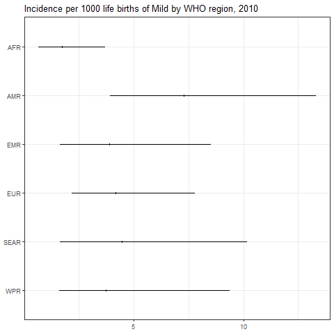

``` r
png(paste0(params$PlotDir, "/r_CI_2020.png"), width=480, height=480)
ggplot(subset(all_reg_rt, YEAR==2020),
       aes(y = VAL_MEAN, x = LOCATION_NAME)) +
  geom_pointrange(aes(ymin = VAL_LWR, ymax = VAL_UPR), size = 0.2) +
  coord_flip() +
  theme_bw() +
  scale_x_discrete(NULL, limits = rev(unique(all_reg_rt$LOCATION_NAME))) +
  scale_y_continuous(NULL) +
  ggtitle(paste0("Incidence per 1000 life births of ", params$Pathogen, " by WHO region, 2020"))
dev.off()
```

    ## png 
    ##   2

``` r
setwd(params$Dir)
image <- paste0("03-estimate_v6_files/figure-gfm/r_CI_2020.png")
cat("")
```

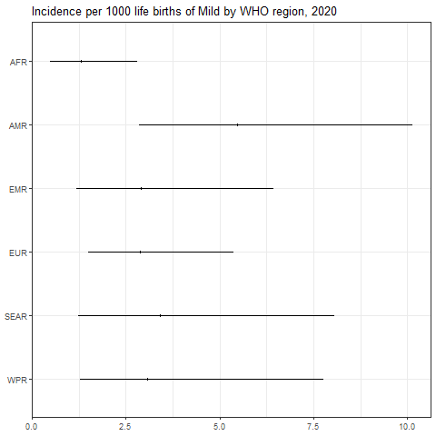

``` r
png(paste0(params$PlotDir, "/r_CASES_2010.png"), width=480, height=480)
ggplot(subset(all_reg_nr, YEAR==2010),
       aes(y = VAL_MEAN, x = LOCATION_NAME)) +
  geom_pointrange(aes(ymin = VAL_LWR, ymax = VAL_UPR), size = 0.2) +
  coord_flip() +
  theme_bw() +
  scale_x_discrete(NULL, limits = rev(unique(all_reg_nr$LOCATION_NAME))) +
  scale_y_continuous(NULL) +
  ggtitle(paste0("Cases of ", params$Pathogen, " by WHO region, 2010"))
dev.off()
```

    ## png 
    ##   2

``` r
setwd(params$Dir)
image <- paste0("03-estimate_v6_files/figure-gfm/r_CASES_2010.png")
cat("")
```

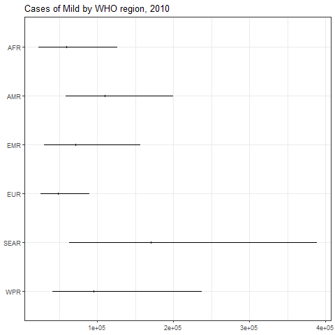

``` r
png(paste0(params$PlotDir, "/r_CASES_2020.png"), width=480, height=480)
ggplot(subset(all_reg_nr, YEAR==2020),
       aes(y = VAL_MEAN, x = LOCATION_NAME)) +
  geom_pointrange(aes(ymin = VAL_LWR, ymax = VAL_UPR), size = 0.2) +
  coord_flip() +
  theme_bw() +
  scale_x_discrete(NULL, limits = rev(unique(all_reg_nr$LOCATION_NAME))) +
  scale_y_continuous(NULL) +
  ggtitle(paste0("Cases of ", params$Pathogen, " by WHO region, 2020"))
dev.off()
```

    ## png 
    ##   2

``` r
setwd(params$Dir)
image <- paste0("03-estimate_v6_files/figure-gfm/r_CASES_2020.png")
cat("")
```

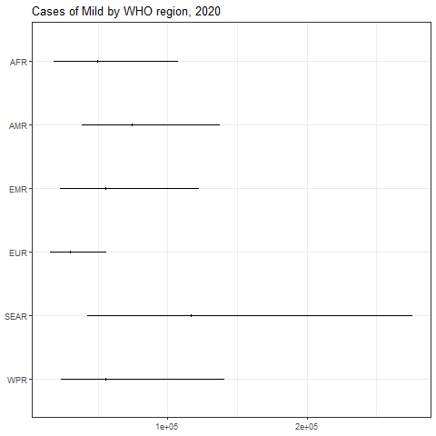

``` r
sim_all_reg <-
  merge(sim_all_reg,
        with(sim_all, aggregate(POP ~ REG2 + YEAR, FUN = sum)))
sim_all_reg_long <-
  pivot_longer(sim_all_reg, cols = starts_with("V"))
sim_all_reg_long$CASES <- sim_all_reg_long$value
```

``` r
png(paste0(params$PlotDir, "/r_hist_2010.png"), width=480, height=480)
ggplot(subset(sim_all_reg_long, YEAR==2010), aes(x = CASES)) +
  geom_density() +
  facet_wrap(~REG2) +
  theme_bw() +
  scale_x_log10() +
  ggtitle(paste0("Incidence per 1000 life births of ", params$Pathogen, " by WHO region, 2010"))
dev.off()
```

    ## png 
    ##   2

``` r
setwd(params$Dir)
image <- paste0("03-estimate_v6_files/figure-gfm/r_hist_2010.png")
cat("")
```


``` r
png(paste0(params$PlotDir, "/r_hist_2020_2010.png"), width=480, height=480)
ggplot(subset(sim_all_reg_long, YEAR==2010), aes(x = CASES)) +
  geom_density() +
  facet_wrap(~REG2) +
  theme_bw() +
  scale_x_log10() +
  ggtitle(paste0("Incidence per 1000 life births of ", params$Pathogen, " by WHO region, 2010"))
dev.off()
```

    ## png 
    ##   2

``` r
setwd(params$Dir)
image <- paste0("03-estimate_v6_files/figure-gfm/r_hist_2020_2010.png")
cat("")
```

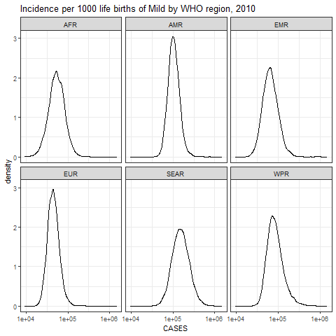

## Subregions

``` r
kbl(subset(all_sub_rt, YEAR == 2020)[,c(7,2:5)],
    align = c("l", "c", "c", "c"), row.names = FALSE,
    col.names = c("Region", "Mean", "Median", "Lower", "Upper"),
    caption=paste0("Incidence per 1000 life births of ",params$Pathogen," by WHO subregion in 2020")) %>%
  kable_styling("striped", "hover")
```

<table class="table table-striped" style="margin-left: auto; margin-right: auto;">

<caption>

Incidence per 1000 life births of Mild by WHO subregion in 2020
</caption>

<thead>

<tr>

<th style="text-align:left;">

Region
</th>

<th style="text-align:center;">

Mean
</th>

<th style="text-align:center;">

Median
</th>

<th style="text-align:center;">

Lower
</th>

<th style="text-align:left;">

Upper
</th>

</tr>

</thead>

<tbody>

<tr>

<td style="text-align:left;">

AFRAB
</td>

<td style="text-align:center;">

1.0405458
</td>

<td style="text-align:center;">

0.8148350
</td>

<td style="text-align:center;">

0.2824723
</td>

<td style="text-align:left;">

3.245925
</td>

</tr>

<tr>

<td style="text-align:left;">

AFRC
</td>

<td style="text-align:center;">

1.2670509
</td>

<td style="text-align:center;">

1.1177131
</td>

<td style="text-align:center;">

0.4089798
</td>

<td style="text-align:left;">

3.054175
</td>

</tr>

<tr>

<td style="text-align:left;">

AFRD
</td>

<td style="text-align:center;">

1.3566531
</td>

<td style="text-align:center;">

1.1790826
</td>

<td style="text-align:center;">

0.3467633
</td>

<td style="text-align:left;">

3.404403
</td>

</tr>

<tr>

<td style="text-align:left;">

AMRA
</td>

<td style="text-align:center;">

0.4094998
</td>

<td style="text-align:center;">

0.3907953
</td>

<td style="text-align:center;">

0.2275413
</td>

<td style="text-align:left;">

0.689515
</td>

</tr>

<tr>

<td style="text-align:left;">

AMRB
</td>

<td style="text-align:center;">

7.3511345
</td>

<td style="text-align:center;">

7.0004102
</td>

<td style="text-align:center;">

3.9880642
</td>

<td style="text-align:left;">

12.542917
</td>

</tr>

<tr>

<td style="text-align:left;">

AMRC
</td>

<td style="text-align:center;">

10.9687240
</td>

<td style="text-align:center;">

7.6672426
</td>

<td style="text-align:center;">

2.0118190
</td>

<td style="text-align:left;">

41.150131
</td>

</tr>

<tr>

<td style="text-align:left;">

EMRA
</td>

<td style="text-align:center;">

1.6304550
</td>

<td style="text-align:center;">

1.3528074
</td>

<td style="text-align:center;">

0.5362776
</td>

<td style="text-align:left;">

4.358116
</td>

</tr>

<tr>

<td style="text-align:left;">

EMRBC
</td>

<td style="text-align:center;">

3.3322244
</td>

<td style="text-align:center;">

2.8872483
</td>

<td style="text-align:center;">

1.2101250
</td>

<td style="text-align:left;">

7.755285
</td>

</tr>

<tr>

<td style="text-align:left;">

EMRD
</td>

<td style="text-align:center;">

2.1273127
</td>

<td style="text-align:center;">

1.7118264
</td>

<td style="text-align:center;">

0.5087558
</td>

<td style="text-align:left;">

6.172953
</td>

</tr>

<tr>

<td style="text-align:left;">

EURA
</td>

<td style="text-align:center;">

2.2899376
</td>

<td style="text-align:center;">

2.1809667
</td>

<td style="text-align:center;">

1.2156965
</td>

<td style="text-align:left;">

3.989509
</td>

</tr>

<tr>

<td style="text-align:left;">

EURB
</td>

<td style="text-align:center;">

2.9311761
</td>

<td style="text-align:center;">

2.7317643
</td>

<td style="text-align:center;">

1.3563545
</td>

<td style="text-align:left;">

5.734770
</td>

</tr>

<tr>

<td style="text-align:left;">

EURC
</td>

<td style="text-align:center;">

4.6254515
</td>

<td style="text-align:center;">

3.3501373
</td>

<td style="text-align:center;">

1.1199799
</td>

<td style="text-align:left;">

15.689315
</td>

</tr>

<tr>

<td style="text-align:left;">

SEARB
</td>

<td style="text-align:center;">

7.1205463
</td>

<td style="text-align:center;">

5.8106804
</td>

<td style="text-align:center;">

1.7500364
</td>

<td style="text-align:left;">

20.313185
</td>

</tr>

<tr>

<td style="text-align:left;">

SEARCD
</td>

<td style="text-align:center;">

2.7412844
</td>

<td style="text-align:center;">

2.2996243
</td>

<td style="text-align:center;">

0.7607500
</td>

<td style="text-align:left;">

7.361392
</td>

</tr>

<tr>

<td style="text-align:left;">

WPRA
</td>

<td style="text-align:center;">

6.3460777
</td>

<td style="text-align:center;">

5.8747356
</td>

<td style="text-align:center;">

2.9028366
</td>

<td style="text-align:left;">

12.194485
</td>

</tr>

<tr>

<td style="text-align:left;">

WPRB
</td>

<td style="text-align:center;">

1.3398778
</td>

<td style="text-align:center;">

1.2581411
</td>

<td style="text-align:center;">

0.6580494
</td>

<td style="text-align:left;">

2.495693
</td>

</tr>

<tr>

<td style="text-align:left;">

WPRC
</td>

<td style="text-align:center;">

6.8755967
</td>

<td style="text-align:center;">

4.7842645
</td>

<td style="text-align:center;">

1.1986010
</td>

<td style="text-align:left;">

25.377703
</td>

</tr>

</tbody>

</table>

``` r
kbl(subset(all_sub_nr, YEAR == 2020)[,c(7,2:5)],
    align = c("l", "c", "c", "c"), row.names = FALSE,
    col.names = c("Region", "Mean", "Median", "Lower", "Upper"),
    caption=paste0("Cases of ",params$Pathogen," by WHO sub region in 2020")) %>%
  kable_styling("striped", "hover")
```

<table class="table table-striped" style="margin-left: auto; margin-right: auto;">

<caption>

Cases of Mild by WHO sub region in 2020
</caption>

<thead>

<tr>

<th style="text-align:left;">

Region
</th>

<th style="text-align:center;">

Mean
</th>

<th style="text-align:center;">

Median
</th>

<th style="text-align:center;">

Lower
</th>

<th style="text-align:left;">

Upper
</th>

</tr>

</thead>

<tbody>

<tr>

<td style="text-align:left;">

AFRAB
</td>

<td style="text-align:center;">

1509.445
</td>

<td style="text-align:center;">

1182.022
</td>

<td style="text-align:center;">

409.7623
</td>

<td style="text-align:left;">

4708.630
</td>

</tr>

<tr>

<td style="text-align:left;">

AFRC
</td>

<td style="text-align:center;">

23939.739
</td>

<td style="text-align:center;">

21118.141
</td>

<td style="text-align:center;">

7727.2892
</td>

<td style="text-align:left;">

57705.768
</td>

</tr>

<tr>

<td style="text-align:left;">

AFRD
</td>

<td style="text-align:center;">

24411.525
</td>

<td style="text-align:center;">

21216.334
</td>

<td style="text-align:center;">

6239.6352
</td>

<td style="text-align:left;">

61258.607
</td>

</tr>

<tr>

<td style="text-align:left;">

AMRA
</td>

<td style="text-align:center;">

1780.143
</td>

<td style="text-align:center;">

1698.833
</td>

<td style="text-align:center;">

989.1487
</td>

<td style="text-align:left;">

2997.402
</td>

</tr>

<tr>

<td style="text-align:left;">

AMRB
</td>

<td style="text-align:center;">

58073.573
</td>

<td style="text-align:center;">

55302.870
</td>

<td style="text-align:center;">

31505.4959
</td>

<td style="text-align:left;">

99088.378
</td>

</tr>

<tr>

<td style="text-align:left;">

AMRC
</td>

<td style="text-align:center;">

14486.679
</td>

<td style="text-align:center;">

10126.327
</td>

<td style="text-align:center;">

2657.0617
</td>

<td style="text-align:left;">

54348.048
</td>

</tr>

<tr>

<td style="text-align:left;">

EMRA
</td>

<td style="text-align:center;">

1302.350
</td>

<td style="text-align:center;">

1080.575
</td>

<td style="text-align:center;">

428.3598
</td>

<td style="text-align:left;">

3481.110
</td>

</tr>

<tr>

<td style="text-align:left;">

EMRBC
</td>

<td style="text-align:center;">

42660.989
</td>

<td style="text-align:center;">

36964.158
</td>

<td style="text-align:center;">

15492.6935
</td>

<td style="text-align:left;">

99287.467
</td>

</tr>

<tr>

<td style="text-align:left;">

EMRD
</td>

<td style="text-align:center;">

11695.710
</td>

<td style="text-align:center;">

9411.416
</td>

<td style="text-align:center;">

2797.0782
</td>

<td style="text-align:left;">

33938.156
</td>

</tr>

<tr>

<td style="text-align:left;">

EURA
</td>

<td style="text-align:center;">

11413.040
</td>

<td style="text-align:center;">

10869.929
</td>

<td style="text-align:center;">

6059.0266
</td>

<td style="text-align:left;">

19883.695
</td>

</tr>

<tr>

<td style="text-align:left;">

EURB
</td>

<td style="text-align:center;">

11176.343
</td>

<td style="text-align:center;">

10416.001
</td>

<td style="text-align:center;">

5171.6727
</td>

<td style="text-align:left;">

21866.226
</td>

</tr>

<tr>

<td style="text-align:left;">

EURC
</td>

<td style="text-align:center;">

7561.383
</td>

<td style="text-align:center;">

5476.583
</td>

<td style="text-align:center;">

1830.8693
</td>

<td style="text-align:left;">

25647.857
</td>

</tr>

<tr>

<td style="text-align:left;">

SEARB
</td>

<td style="text-align:center;">

37111.931
</td>

<td style="text-align:center;">

30284.976
</td>

<td style="text-align:center;">

9121.1025
</td>

<td style="text-align:left;">

105871.304
</td>

</tr>

<tr>

<td style="text-align:left;">

SEARCD
</td>

<td style="text-align:center;">

79636.216
</td>

<td style="text-align:center;">

66805.684
</td>

<td style="text-align:center;">

22100.3169
</td>

<td style="text-align:left;">

213853.548
</td>

</tr>

<tr>

<td style="text-align:left;">

WPRA
</td>

<td style="text-align:center;">

9628.396
</td>

<td style="text-align:center;">

8913.266
</td>

<td style="text-align:center;">

4404.2418
</td>

<td style="text-align:left;">

18501.716
</td>

</tr>

<tr>

<td style="text-align:left;">

WPRB
</td>

<td style="text-align:center;">

16487.708
</td>

<td style="text-align:center;">

15481.907
</td>

<td style="text-align:center;">

8097.5493
</td>

<td style="text-align:left;">

30710.459
</td>

</tr>

<tr>

<td style="text-align:left;">

WPRC
</td>

<td style="text-align:center;">

29613.037
</td>

<td style="text-align:center;">

20605.717
</td>

<td style="text-align:center;">

5162.3470
</td>

<td style="text-align:left;">

109301.184
</td>

</tr>

</tbody>

</table>

``` r
png(paste0(params$PlotDir, "/r_CI_SUB2_2010.png"), width=480, height=480)
ggplot(subset(all_sub_rt, YEAR==2010),
       aes(y = VAL_MEAN, x = LOCATION_NAME)) +
  geom_pointrange(aes(ymin = VAL_LWR, ymax = VAL_UPR), size = 0.2) +
  coord_flip() +
  theme_bw() +
  scale_x_discrete(NULL, limits = rev(unique(all_sub_rt$LOCATION_NAME))) +
  scale_y_continuous(NULL) +
  ggtitle(paste0("Incidence per 1000 life births of ", params$Pathogen, " by WHO sub region, 2010"))
dev.off()
```

    ## png 
    ##   2

``` r
setwd(params$Dir)
image <- paste0("03-estimate_v6_files/figure-gfm/r_CI_SUB2_2010.png")
cat("")
```

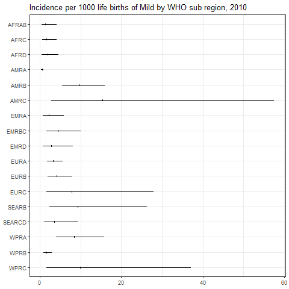

``` r
png(paste0(params$PlotDir, "/r_CI_SUB2_2020.png"), width=480, height=480)
ggplot(subset(all_sub_rt, YEAR==2020),
       aes(y = VAL_MEAN, x = LOCATION_NAME)) +
  geom_pointrange(aes(ymin = VAL_LWR, ymax = VAL_UPR), size = 0.2) +
  coord_flip() +
  theme_bw() +
  scale_x_discrete(NULL, limits = rev(unique(all_sub_rt$LOCATION_NAME))) +
  scale_y_continuous(NULL) +
  ggtitle(paste0("Incidence per 1000 life births of ", params$Pathogen, " by WHO sub region, 2020"))
dev.off()
```

    ## png 
    ##   2

``` r
setwd(params$Dir)
image <- paste0("03-estimate_v6_files/figure-gfm/r_CI_SUB2_2020.png")
cat("")
```

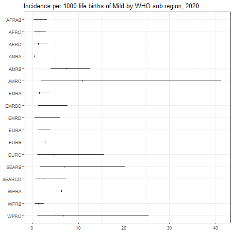

``` r
png(paste0(params$PlotDir, "/r_CASES_SUB2_2010.png"), width=480, height=480)
ggplot(subset(all_sub_nr, YEAR==2010),
       aes(y = VAL_MEAN, x = LOCATION_NAME)) +
  geom_pointrange(aes(ymin = VAL_LWR, ymax = VAL_UPR), size = 0.2) +
  coord_flip() +
  theme_bw() +
  scale_x_discrete(NULL, limits = rev(unique(all_sub_nr$LOCATION_NAME))) +
  scale_y_continuous(NULL) +
  ggtitle(paste0("Cases of ", params$Pathogen, " by WHO sub region, 2010"))
dev.off()
```

    ## png 
    ##   2

``` r
setwd(params$Dir)
image <- paste0("03-estimate_v6_files/figure-gfm/r_CASES_SUB2_2010.png")
cat("")
```

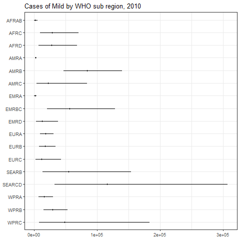

``` r
png(paste0(params$PlotDir, "/r_CASES_SUB2_2020.png"), width=480, height=480)
ggplot(subset(all_sub_nr, YEAR==2020),
       aes(y = VAL_MEAN, x = LOCATION_NAME)) +
  geom_pointrange(aes(ymin = VAL_LWR, ymax = VAL_UPR), size = 0.2) +
  coord_flip() +
  theme_bw() +
  scale_x_discrete(NULL, limits = rev(unique(all_sub_nr$LOCATION_NAME))) +
  scale_y_continuous(NULL) +
  ggtitle(paste0("Cases of ", params$Pathogen, " by WHO sub region, 2020"))
dev.off()
```

    ## png 
    ##   2

``` r
setwd(params$Dir)
image <- paste0("03-estimate_v6_files/figure-gfm/r_CASES_SUB2_2020.png")
cat("")
```

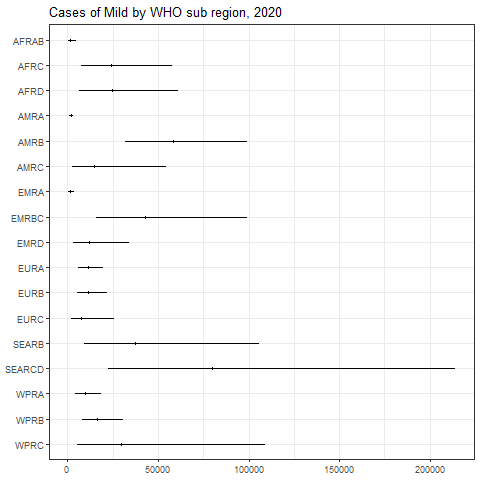

``` r
sim_all_sub <-
  merge(sim_all_sub,
        with(sim_all, aggregate(POP ~ SUB2 + YEAR, FUN = sum)))
sim_all_sub_long <-
  pivot_longer(sim_all_sub, cols = starts_with("V"))
sim_all_sub_long$CASES <- sim_all_sub_long$value
```

``` r
png(paste0(params$PlotDir, "/r_hist_SUB2_2010.png"), width=480, height=480)
ggplot(subset(sim_all_sub_long, YEAR==2010), aes(x = CASES)) +
  geom_density() +
  facet_wrap(~SUB2) +
  theme_bw() +
  scale_x_log10() +
  ggtitle(paste0("Incidence per 1000 life births of ", params$Pathogen, "by WHO sub region, 2010"))
dev.off()
```

    ## png 
    ##   2

``` r
setwd(params$Dir)
image <- paste0("03-estimate_v6_files/figure-gfm/r_hist_SUB2_2010.png")
cat("")
```

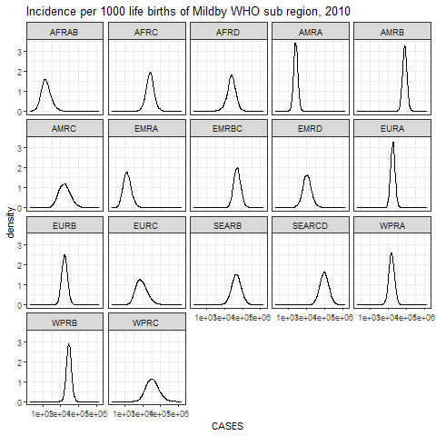

``` r
png(paste0(params$PlotDir, "/r_hist_SUB2_2020_2010.png"), width=480, height=480)
ggplot(subset(sim_all_sub_long, YEAR==2010), aes(x = CASES)) +
  geom_density() +
  facet_wrap(~SUB2) +
  theme_bw() +
  scale_x_log10() +
  ggtitle(paste0("Incidence per 1000 life births of ", params$Pathogen, "by WHO sub region, 2010"))
dev.off()
```

    ## png 
    ##   2

``` r
setwd(params$Dir)
image <- paste0("03-estimate_v6_files/figure-gfm/r_hist_SUB2_2020_2010.png")
cat("")
```


## Countries

``` r
png(paste0(params$PlotDir, "/r_cnt_2010.png"), width=800, height=300)
plot_world(subset(all_cnt_rt, YEAR == 2010),
           "LOCATION_NAME", "VAL_MEAN", legend.title = "Incidence per 1000", diseasefree = zero_cases)
```

    ## [1]  0 20 40 60 80

``` r
dev.off()
```

    ## png 
    ##   2

``` r
setwd(params$Dir)
image <- paste0("03-estimate_v6_files/figure-gfm/r_cnt_2010.png")
cat("")
```

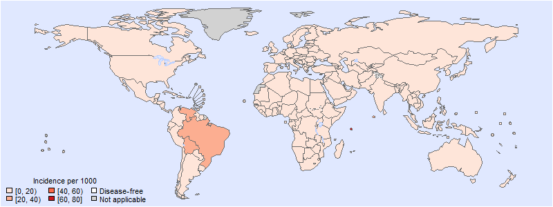

``` r
png(paste0(params$PlotDir, "/r_cnt_2020.png"), width=800, height=300)
plot_world(subset(all_cnt_rt, YEAR == 2020),
           "LOCATION_NAME", "VAL_MEAN", legend.title = "Incidence per 1000", diseasefree = zero_cases)
```

    ## [1]  0 10 20 30 40 50 60

``` r
dev.off()
```

    ## png 
    ##   2

``` r
setwd(params$Dir)
image <- paste0("03-estimate_v6_files/figure-gfm/r_cnt_2020.png")
cat("")
```

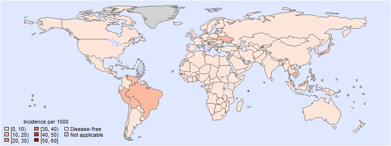

``` r
tab <-
  data.frame(subset(all_cnt_rt, YEAR == 2010)[,
                                              c("LOCATION_NAME", "VAL_MEAN", "VAL_MEDIAN", "VAL_LWR", "VAL_UPR")],
             subset(all_cnt_rt, YEAR == 2020)[,
                                              c("VAL_MEAN", "VAL_MEDIAN", "VAL_LWR", "VAL_UPR")])
tab$LOCATION_NAME <-
  FERG2:::countries$COUNTRY[match(tab$LOCATION_NAME, FERG2:::countries$ISO3)]
tab$LOCATION_NAME <- gsub(" \\(.*", "", tab$LOCATION_NAME)
names(tab) <-
  c("Country",
    "2010.mean", "2010.median", "2010.lwr", "2010.upr",
    "2020.mean", "2020.median", "2020.lwr", "2020.upr")

kable(tab, digits = 3, row.names = FALSE,
      caption = paste0("Estimated ", params$Pathogen, " incidence by country, 2010 vs 2020"))
```

| Country | 2010.mean | 2010.median | 2010.lwr | 2010.upr | 2020.mean | 2020.median | 2020.lwr | 2020.upr |
|:---|---:|---:|---:|---:|---:|---:|---:|---:|
| Afghanistan | 2.785 | 2.371 | 0.709 | 7.110 | 2.093 | 1.777 | 0.527 | 5.344 |
| Angola | 1.997 | 1.833 | 0.557 | 4.468 | 1.499 | 1.366 | 0.410 | 3.424 |
| Albania | 6.797 | 3.267 | 0.317 | 35.646 | 5.114 | 2.440 | 0.234 | 26.844 |
| Andorra | 2.492 | 2.348 | 1.195 | 4.614 | 1.872 | 1.752 | 0.876 | 3.551 |
| United Arab Emirates | 2.407 | 1.082 | 0.088 | 13.304 | 1.809 | 0.804 | 0.067 | 9.926 |
| Argentina | 1.398 | 0.696 | 0.065 | 7.019 | 1.050 | 0.522 | 0.049 | 5.262 |
| Armenia | 2.683 | 2.414 | 0.998 | 6.004 | 2.014 | 1.804 | 0.741 | 4.555 |
| Antigua and Barbuda | 2.415 | 2.172 | 0.636 | 5.521 | 1.815 | 1.626 | 0.465 | 4.206 |
| Australia | 1.492 | 1.112 | 0.253 | 4.908 | 1.119 | 0.834 | 0.188 | 3.657 |
| Austria | 3.657 | 2.473 | 0.471 | 14.290 | 2.748 | 1.847 | 0.347 | 10.855 |
| Azerbaijan | 2.683 | 2.414 | 0.998 | 6.004 | 2.014 | 1.804 | 0.741 | 4.555 |
| Burundi | 2.105 | 1.928 | 0.504 | 4.940 | 1.581 | 1.431 | 0.376 | 3.761 |
| Belgium | 2.625 | 1.975 | 0.454 | 8.703 | 1.971 | 1.475 | 0.339 | 6.557 |
| Benin | 2.026 | 0.967 | 0.087 | 10.408 | 1.518 | 0.722 | 0.063 | 7.908 |
| Burkina Faso | 2.105 | 1.928 | 0.504 | 4.940 | 1.581 | 1.431 | 0.376 | 3.761 |
| Bangladesh | 8.475 | 4.901 | 0.663 | 38.840 | 6.382 | 3.668 | 0.491 | 29.184 |
| Bulgaria | 2.683 | 2.414 | 0.998 | 6.004 | 2.014 | 1.804 | 0.741 | 4.555 |
| Bahrain | 2.658 | 2.319 | 0.808 | 6.391 | 1.998 | 1.738 | 0.598 | 4.831 |
| Bahamas | 2.415 | 2.172 | 0.636 | 5.521 | 1.815 | 1.626 | 0.465 | 4.206 |
| Bosnia and Herzegovina | 2.683 | 2.414 | 0.998 | 6.004 | 2.014 | 1.804 | 0.741 | 4.555 |
| Belarus | 2.683 | 2.414 | 0.998 | 6.004 | 2.014 | 1.804 | 0.741 | 4.555 |
| Belize | 2.840 | 2.556 | 1.096 | 6.285 | 2.134 | 1.912 | 0.806 | 4.766 |
| Bolivia | 24.437 | 11.125 | 1.021 | 129.792 | 18.369 | 8.291 | 0.753 | 97.641 |
| Brazil | 20.137 | 19.259 | 10.927 | 33.772 | 15.131 | 14.403 | 7.854 | 26.027 |
| Barbados | 2.415 | 2.172 | 0.636 | 5.521 | 1.815 | 1.626 | 0.465 | 4.206 |
| Brunei Darussalam | 2.827 | 2.511 | 0.983 | 6.470 | 2.123 | 1.871 | 0.725 | 4.911 |
| Bhutan | 3.086 | 2.606 | 0.880 | 8.324 | 2.316 | 1.939 | 0.646 | 6.277 |
| Botswana | 2.999 | 2.416 | 0.830 | 8.970 | 2.250 | 1.815 | 0.608 | 6.617 |
| Central African Republic | 2.105 | 1.928 | 0.504 | 4.940 | 1.581 | 1.431 | 0.376 | 3.761 |
| Canada | 1.490 | 1.402 | 0.680 | 2.820 | 1.122 | 1.045 | 0.488 | 2.165 |
| Switzerland | 4.564 | 2.254 | 0.234 | 23.741 | 3.436 | 1.681 | 0.173 | 18.084 |
| Chile | 2.415 | 2.172 | 0.636 | 5.521 | 1.815 | 1.626 | 0.465 | 4.206 |
| China | 1.184 | 1.134 | 0.600 | 2.056 | 0.888 | 0.850 | 0.440 | 1.564 |
| Côte d’Ivoire | 1.997 | 1.833 | 0.557 | 4.468 | 1.499 | 1.366 | 0.410 | 3.424 |
| Cameroon | 1.997 | 1.833 | 0.557 | 4.468 | 1.499 | 1.366 | 0.410 | 3.424 |
| Congo | 0.971 | 0.468 | 0.037 | 4.820 | 0.727 | 0.351 | 0.028 | 3.593 |
| Congo | 2.773 | 1.580 | 0.198 | 12.584 | 2.078 | 1.186 | 0.147 | 9.515 |
| Cook Islands | 2.827 | 2.511 | 0.983 | 6.470 | 2.123 | 1.871 | 0.725 | 4.911 |
| Colombia | 9.519 | 8.360 | 3.041 | 23.045 | 7.138 | 6.234 | 2.249 | 17.258 |
| Comoros | 1.997 | 1.833 | 0.557 | 4.468 | 1.499 | 1.366 | 0.410 | 3.424 |
| Cabo Verde | 5.471 | 1.736 | 0.088 | 32.401 | 4.098 | 1.293 | 0.065 | 23.934 |
| Costa Rica | 2.840 | 2.556 | 1.096 | 6.285 | 2.134 | 1.912 | 0.806 | 4.766 |
| Cuba | 2.840 | 2.556 | 1.096 | 6.285 | 2.134 | 1.912 | 0.806 | 4.766 |
| Cyprus | 7.106 | 3.429 | 0.348 | 36.277 | 5.348 | 2.570 | 0.261 | 27.677 |
| Czechia | 2.295 | 1.832 | 0.479 | 6.844 | 1.726 | 1.371 | 0.361 | 5.198 |
| Germany | 0.521 | 0.437 | 0.129 | 1.437 | 0.392 | 0.326 | 0.094 | 1.089 |
| Djibouti | 2.851 | 2.536 | 1.071 | 6.310 | 2.141 | 1.903 | 0.792 | 4.766 |
| Dominica | 2.840 | 2.556 | 1.096 | 6.285 | 2.134 | 1.912 | 0.806 | 4.766 |
| Denmark | 10.934 | 8.306 | 2.000 | 34.678 | 8.241 | 6.207 | 1.474 | 26.133 |
| Dominican Republic | 2.840 | 2.556 | 1.096 | 6.285 | 2.134 | 1.912 | 0.806 | 4.766 |
| Algeria | 1.997 | 1.833 | 0.557 | 4.468 | 1.499 | 1.366 | 0.410 | 3.424 |
| Ecuador | 0.556 | 0.422 | 0.093 | 1.849 | 0.419 | 0.315 | 0.068 | 1.394 |
| Egypt | 2.168 | 1.823 | 0.596 | 5.669 | 1.627 | 1.368 | 0.440 | 4.303 |
| Eritrea | 10.422 | 4.887 | 0.486 | 53.445 | 7.827 | 3.660 | 0.365 | 39.703 |
| Spain | 6.229 | 5.775 | 2.602 | 12.458 | 4.679 | 4.300 | 1.914 | 9.507 |
| Estonia | 2.492 | 2.348 | 1.195 | 4.614 | 1.872 | 1.752 | 0.876 | 3.551 |
| Ethiopia | 1.973 | 1.162 | 0.159 | 8.782 | 1.478 | 0.873 | 0.119 | 6.583 |
| Finland | 5.807 | 4.126 | 0.872 | 20.453 | 4.379 | 3.087 | 0.636 | 15.468 |
| Fiji | 3.247 | 2.726 | 1.070 | 8.462 | 2.435 | 2.040 | 0.788 | 6.365 |
| France | 4.365 | 3.627 | 1.076 | 11.874 | 3.272 | 2.711 | 0.800 | 9.002 |
| Micronesia | 3.395 | 2.792 | 1.092 | 9.338 | 2.549 | 2.096 | 0.799 | 6.958 |
| Gabon | 2.999 | 2.416 | 0.830 | 8.970 | 2.250 | 1.815 | 0.608 | 6.617 |
| United Kingdom | 0.935 | 0.794 | 0.259 | 2.428 | 0.706 | 0.594 | 0.187 | 1.884 |
| Georgia | 8.242 | 4.817 | 0.634 | 37.687 | 6.182 | 3.587 | 0.482 | 28.538 |
| Ghana | 3.091 | 2.248 | 0.490 | 10.771 | 2.316 | 1.686 | 0.365 | 8.016 |
| Guinea | 1.997 | 1.833 | 0.557 | 4.468 | 1.499 | 1.366 | 0.410 | 3.424 |
| Gambia | 2.105 | 1.928 | 0.504 | 4.940 | 1.581 | 1.431 | 0.376 | 3.761 |
| Guinea-Bissau | 2.105 | 1.928 | 0.504 | 4.940 | 1.581 | 1.431 | 0.376 | 3.761 |
| Equatorial Guinea | 2.999 | 2.416 | 0.830 | 8.970 | 2.250 | 1.815 | 0.608 | 6.617 |
| Greece | 7.693 | 5.944 | 1.468 | 24.809 | 5.771 | 4.455 | 1.076 | 18.461 |
| Grenada | 2.840 | 2.556 | 1.096 | 6.285 | 2.134 | 1.912 | 0.806 | 4.766 |
| Guatemala | 2.840 | 2.556 | 1.096 | 6.285 | 2.134 | 1.912 | 0.806 | 4.766 |
| Guyana | 2.415 | 2.172 | 0.636 | 5.521 | 1.815 | 1.626 | 0.465 | 4.206 |
| Honduras | 4.268 | 2.974 | 1.165 | 14.875 | 3.201 | 2.230 | 0.863 | 11.309 |
| Croatia | 11.131 | 8.555 | 2.219 | 35.481 | 8.351 | 6.420 | 1.655 | 26.435 |
| Haiti | 4.268 | 2.974 | 1.165 | 14.875 | 3.201 | 2.230 | 0.863 | 11.309 |
| Hungary | 3.072 | 1.503 | 0.149 | 15.834 | 2.307 | 1.128 | 0.111 | 11.894 |
| Indonesia | 10.063 | 8.128 | 2.249 | 29.646 | 7.562 | 6.068 | 1.661 | 22.300 |
| India | 3.029 | 2.462 | 0.674 | 8.825 | 2.270 | 1.837 | 0.500 | 6.606 |
| Ireland | 7.377 | 4.951 | 0.876 | 27.755 | 5.532 | 3.711 | 0.644 | 21.018 |
| Iran | 1.946 | 1.731 | 0.702 | 4.410 | 1.459 | 1.295 | 0.520 | 3.326 |
| Iraq | 7.059 | 2.336 | 0.132 | 40.105 | 5.321 | 1.739 | 0.099 | 30.999 |
| Iceland | 8.785 | 4.220 | 0.438 | 46.051 | 6.633 | 3.164 | 0.328 | 35.458 |
| Israel | 2.492 | 2.348 | 1.195 | 4.614 | 1.872 | 1.752 | 0.876 | 3.551 |
| Italy | 5.402 | 4.784 | 1.782 | 12.409 | 4.055 | 3.586 | 1.320 | 9.450 |
| Jamaica | 0.733 | 0.480 | 0.077 | 2.966 | 0.549 | 0.358 | 0.057 | 2.252 |
| Jordan | 6.918 | 3.512 | 0.354 | 34.977 | 5.202 | 2.622 | 0.259 | 26.042 |
| Japan | 13.786 | 12.805 | 6.142 | 26.772 | 10.369 | 9.551 | 4.498 | 20.385 |
| Kazakhstan | 4.978 | 3.536 | 0.664 | 18.045 | 3.729 | 2.647 | 0.491 | 13.496 |
| Kenya | 1.122 | 0.518 | 0.041 | 5.830 | 0.841 | 0.387 | 0.031 | 4.375 |
| Kyrgyzstan | 3.397 | 2.639 | 1.036 | 10.388 | 2.551 | 1.985 | 0.766 | 7.804 |
| Cambodia | 13.945 | 8.097 | 1.109 | 63.420 | 10.501 | 6.014 | 0.823 | 47.984 |
| Kiribati | 3.395 | 2.792 | 1.092 | 9.338 | 2.549 | 2.096 | 0.799 | 6.958 |
| Saint Kitts and Nevis | 2.415 | 2.172 | 0.636 | 5.521 | 1.815 | 1.626 | 0.465 | 4.206 |
| Korea | 0.768 | 0.753 | 0.488 | 1.151 | 0.577 | 0.562 | 0.355 | 0.890 |
| Kuwait | 14.071 | 9.236 | 1.544 | 56.975 | 10.615 | 6.887 | 1.146 | 43.415 |
| Lao People’s Dem. Republic | 3.395 | 2.792 | 1.092 | 9.338 | 2.549 | 2.096 | 0.799 | 6.958 |
| Lebanon | 6.926 | 4.045 | 0.546 | 29.959 | 5.175 | 3.028 | 0.401 | 22.094 |
| Liberia | 2.105 | 1.928 | 0.504 | 4.940 | 1.581 | 1.431 | 0.376 | 3.761 |
| Libya | 9.122 | 5.534 | 0.773 | 39.422 | 6.839 | 4.114 | 0.570 | 29.530 |
| Saint Lucia | 2.840 | 2.556 | 1.096 | 6.285 | 2.134 | 1.912 | 0.806 | 4.766 |
| Sri Lanka | 2.234 | 0.989 | 0.085 | 11.669 | 1.676 | 0.738 | 0.063 | 8.665 |
| Lesotho | 1.997 | 1.833 | 0.557 | 4.468 | 1.499 | 1.366 | 0.410 | 3.424 |
| Lithuania | 4.833 | 1.845 | 0.116 | 28.779 | 3.626 | 1.392 | 0.087 | 21.466 |
| Luxembourg | 6.465 | 3.135 | 0.323 | 32.568 | 4.855 | 2.351 | 0.240 | 24.009 |
| Latvia | 2.492 | 2.348 | 1.195 | 4.614 | 1.872 | 1.752 | 0.876 | 3.551 |
| Morocco | 0.639 | 0.453 | 0.084 | 2.395 | 0.481 | 0.340 | 0.062 | 1.784 |
| Monaco | 2.492 | 2.348 | 1.195 | 4.614 | 1.872 | 1.752 | 0.876 | 3.551 |
| Republic of Moldova | 2.683 | 2.414 | 0.998 | 6.004 | 2.014 | 1.804 | 0.741 | 4.555 |
| Madagascar | 2.105 | 1.928 | 0.504 | 4.940 | 1.581 | 1.431 | 0.376 | 3.761 |
| Maldives | 20.302 | 9.432 | 0.860 | 105.886 | 15.328 | 7.030 | 0.626 | 81.521 |
| Mexico | 1.947 | 1.602 | 0.463 | 5.604 | 1.463 | 1.205 | 0.337 | 4.249 |
| Marshall Islands | 3.247 | 2.726 | 1.070 | 8.462 | 2.435 | 2.040 | 0.788 | 6.365 |
| North Macedonia | 2.683 | 2.414 | 0.998 | 6.004 | 2.014 | 1.804 | 0.741 | 4.555 |
| Mali | 2.105 | 1.928 | 0.504 | 4.940 | 1.581 | 1.431 | 0.376 | 3.761 |
| Malta | 2.492 | 2.348 | 1.195 | 4.614 | 1.872 | 1.752 | 0.876 | 3.551 |
| Myanmar | 3.086 | 2.606 | 0.880 | 8.324 | 2.316 | 1.939 | 0.646 | 6.277 |
| Montenegro | 2.683 | 2.414 | 0.998 | 6.004 | 2.014 | 1.804 | 0.741 | 4.555 |
| Mongolia | 5.119 | 2.464 | 0.221 | 26.948 | 3.839 | 1.844 | 0.167 | 20.595 |
| Mozambique | 1.216 | 0.575 | 0.049 | 6.246 | 0.913 | 0.428 | 0.036 | 4.663 |
| Mauritania | 1.997 | 1.833 | 0.557 | 4.468 | 1.499 | 1.366 | 0.410 | 3.424 |
| Mauritius | 2.999 | 2.416 | 0.830 | 8.970 | 2.250 | 1.815 | 0.608 | 6.617 |
| Malawi | 2.105 | 1.928 | 0.504 | 4.940 | 1.581 | 1.431 | 0.376 | 3.761 |
| Malaysia | 17.434 | 14.189 | 4.274 | 48.692 | 13.074 | 10.647 | 3.171 | 37.234 |
| Namibia | 2.999 | 2.416 | 0.830 | 8.970 | 2.250 | 1.815 | 0.608 | 6.617 |
| Niger | 2.105 | 1.928 | 0.504 | 4.940 | 1.581 | 1.431 | 0.376 | 3.761 |
| Nigeria | 1.311 | 0.792 | 0.104 | 5.699 | 0.985 | 0.594 | 0.078 | 4.377 |
| Nicaragua | 4.268 | 2.974 | 1.165 | 14.875 | 3.201 | 2.230 | 0.863 | 11.309 |
| Niue | 2.827 | 2.511 | 0.983 | 6.470 | 2.123 | 1.871 | 0.725 | 4.911 |
| Netherlands | 1.859 | 0.913 | 0.082 | 9.338 | 1.401 | 0.682 | 0.060 | 7.174 |
| Norway | 0.851 | 0.694 | 0.207 | 2.402 | 0.640 | 0.518 | 0.154 | 1.837 |
| Nepal | 3.086 | 2.606 | 0.880 | 8.324 | 2.316 | 1.939 | 0.646 | 6.277 |
| Nauru | 2.827 | 2.511 | 0.983 | 6.470 | 2.123 | 1.871 | 0.725 | 4.911 |
| New Zealand | 7.153 | 3.659 | 0.369 | 34.730 | 5.376 | 2.751 | 0.277 | 26.140 |
| Oman | 2.658 | 2.319 | 0.808 | 6.391 | 1.998 | 1.738 | 0.598 | 4.831 |
| Pakistan | 5.054 | 4.272 | 1.364 | 13.075 | 3.791 | 3.196 | 1.020 | 9.840 |
| Panama | 2.415 | 2.172 | 0.636 | 5.521 | 1.815 | 1.626 | 0.465 | 4.206 |
| Peru | 15.432 | 11.405 | 2.479 | 52.578 | 11.578 | 8.530 | 1.853 | 39.245 |
| Philippines | 14.803 | 8.670 | 1.120 | 66.420 | 11.146 | 6.514 | 0.827 | 50.389 |
| Palau | 3.247 | 2.726 | 1.070 | 8.462 | 2.435 | 2.040 | 0.788 | 6.365 |
| Papua New Guinea | 3.395 | 2.792 | 1.092 | 9.338 | 2.549 | 2.096 | 0.799 | 6.958 |
| Poland | 0.727 | 0.629 | 0.221 | 1.795 | 0.545 | 0.471 | 0.160 | 1.343 |
| Korea | 3.086 | 2.606 | 0.880 | 8.324 | 2.316 | 1.939 | 0.646 | 6.277 |
| Portugal | 9.703 | 7.674 | 2.030 | 29.146 | 7.289 | 5.763 | 1.494 | 21.922 |
| Paraguay | 2.840 | 2.556 | 1.096 | 6.285 | 2.134 | 1.912 | 0.806 | 4.766 |
| Qatar | 2.658 | 2.319 | 0.808 | 6.391 | 1.998 | 1.738 | 0.598 | 4.831 |
| Romania | 1.931 | 1.120 | 0.139 | 8.744 | 1.450 | 0.836 | 0.103 | 6.646 |
| Russian Federation | 6.666 | 6.078 | 2.532 | 14.352 | 4.991 | 4.524 | 1.886 | 10.749 |
| Rwanda | 2.105 | 1.928 | 0.504 | 4.940 | 1.581 | 1.431 | 0.376 | 3.761 |
| Saudi Arabia | 0.785 | 0.687 | 0.243 | 1.918 | 0.589 | 0.511 | 0.183 | 1.461 |
| Sudan | 2.957 | 1.468 | 0.149 | 14.581 | 2.211 | 1.098 | 0.111 | 10.921 |
| Senegal | 1.997 | 1.833 | 0.557 | 4.468 | 1.499 | 1.366 | 0.410 | 3.424 |
| Singapore | 2.886 | 1.314 | 0.107 | 16.049 | 2.175 | 0.983 | 0.078 | 11.967 |
| Solomon Islands | 3.395 | 2.792 | 1.092 | 9.338 | 2.549 | 2.096 | 0.799 | 6.958 |
| Sierra Leone | 2.105 | 1.928 | 0.504 | 4.940 | 1.581 | 1.431 | 0.376 | 3.761 |
| El Salvador | 2.840 | 2.556 | 1.096 | 6.285 | 2.134 | 1.912 | 0.806 | 4.766 |
| San Marino | 2.492 | 2.348 | 1.195 | 4.614 | 1.872 | 1.752 | 0.876 | 3.551 |
| Somalia | 2.785 | 2.371 | 0.709 | 7.110 | 2.093 | 1.777 | 0.527 | 5.344 |
| Serbia | 1.239 | 0.782 | 0.118 | 5.198 | 0.929 | 0.588 | 0.089 | 3.884 |
| South Sudan | 2.105 | 1.928 | 0.504 | 4.940 | 1.581 | 1.431 | 0.376 | 3.761 |
| Sao Tome and Principe | 1.997 | 1.833 | 0.557 | 4.468 | 1.499 | 1.366 | 0.410 | 3.424 |
| Suriname | 10.769 | 7.310 | 1.358 | 41.170 | 8.079 | 5.483 | 1.008 | 31.292 |
| Slovakia | 1.441 | 0.977 | 0.165 | 5.600 | 1.081 | 0.735 | 0.120 | 4.153 |
| Slovenia | 5.189 | 4.041 | 1.064 | 15.837 | 3.899 | 3.016 | 0.800 | 12.079 |
| Sweden | 0.448 | 0.380 | 0.122 | 1.170 | 0.337 | 0.284 | 0.090 | 0.903 |
| Eswatini | 1.997 | 1.833 | 0.557 | 4.468 | 1.499 | 1.366 | 0.410 | 3.424 |
| Seychelles | 76.975 | 67.774 | 25.909 | 179.230 | 57.923 | 50.887 | 19.034 | 138.211 |
| Syrian Arab Republic | 2.785 | 2.371 | 0.709 | 7.110 | 2.093 | 1.777 | 0.527 | 5.344 |
| Chad | 2.105 | 1.928 | 0.504 | 4.940 | 1.581 | 1.431 | 0.376 | 3.761 |
| Togo | 2.105 | 1.928 | 0.504 | 4.940 | 1.581 | 1.431 | 0.376 | 3.761 |
| Thailand | 5.086 | 3.354 | 0.542 | 19.616 | 3.823 | 2.489 | 0.403 | 14.784 |
| Tajikistan | 3.397 | 2.639 | 1.036 | 10.388 | 2.551 | 1.985 | 0.766 | 7.804 |
| Turkmenistan | 2.683 | 2.414 | 0.998 | 6.004 | 2.014 | 1.804 | 0.741 | 4.555 |
| Timor-Leste | 3.086 | 2.606 | 0.880 | 8.324 | 2.316 | 1.939 | 0.646 | 6.277 |
| Tonga | 3.247 | 2.726 | 1.070 | 8.462 | 2.435 | 2.040 | 0.788 | 6.365 |
| Trinidad and Tobago | 2.415 | 2.172 | 0.636 | 5.521 | 1.815 | 1.626 | 0.465 | 4.206 |
| Tunisia | 17.677 | 10.098 | 1.482 | 79.325 | 13.266 | 7.545 | 1.093 | 59.679 |
| Turkiye | 0.645 | 0.572 | 0.215 | 1.500 | 0.484 | 0.429 | 0.159 | 1.126 |
| Tuvalu | 3.247 | 2.726 | 1.070 | 8.462 | 2.435 | 2.040 | 0.788 | 6.365 |
| United Republic of Tanzania | 1.439 | 0.998 | 0.194 | 5.359 | 1.080 | 0.746 | 0.145 | 4.078 |
| Uganda | 2.105 | 1.928 | 0.504 | 4.940 | 1.581 | 1.431 | 0.376 | 3.761 |
| Ukraine | 16.733 | 9.767 | 1.377 | 72.980 | 12.602 | 7.295 | 1.030 | 56.206 |
| Uruguay | 2.415 | 2.172 | 0.636 | 5.521 | 1.815 | 1.626 | 0.465 | 4.206 |
| United States of America | 0.273 | 0.268 | 0.177 | 0.398 | 0.205 | 0.200 | 0.127 | 0.314 |
| Uzbekistan | 3.397 | 2.639 | 1.036 | 10.388 | 2.551 | 1.985 | 0.766 | 7.804 |
| Saint Vincent and the Grenadines | 2.840 | 2.556 | 1.096 | 6.285 | 2.134 | 1.912 | 0.806 | 4.766 |
| Venezuela | 23.442 | 14.726 | 2.371 | 96.248 | 17.633 | 10.991 | 1.765 | 72.598 |
| Viet Nam | 2.673 | 1.341 | 0.126 | 13.800 | 2.005 | 1.002 | 0.095 | 10.225 |
| Vanuatu | 3.395 | 2.792 | 1.092 | 9.338 | 2.549 | 2.096 | 0.799 | 6.958 |
| Samoa | 3.395 | 2.792 | 1.092 | 9.338 | 2.549 | 2.096 | 0.799 | 6.958 |
| Yemen | 2.785 | 2.371 | 0.709 | 7.110 | 2.093 | 1.777 | 0.527 | 5.344 |
| South Africa | 0.906 | 0.587 | 0.086 | 3.703 | 0.679 | 0.441 | 0.064 | 2.848 |
| Zambia | 1.997 | 1.833 | 0.557 | 4.468 | 1.499 | 1.366 | 0.410 | 3.424 |
| Zimbabwe | 2.936 | 1.900 | 0.315 | 11.404 | 2.208 | 1.423 | 0.237 | 8.564 |

Estimated Mild incidence by country, 2010 vs 2020

``` r
tab2 <-
  data.frame(subset(all_cnt_nr, YEAR == 2010)[,
                                              c("LOCATION_NAME", "VAL_MEAN", "VAL_MEDIAN", "VAL_LWR", "VAL_UPR")],
             subset(all_cnt_nr, YEAR == 2020)[,
                                              c("VAL_MEAN", "VAL_MEDIAN", "VAL_LWR", "VAL_UPR")])
tab2$LOCATION_NAME <-
  FERG2:::countries$COUNTRY[match(tab2$LOCATION_NAME, FERG2:::countries$ISO3)]
tab2$LOCATION_NAME <- gsub(" \\(.*", "", tab2$LOCATION_NAME)
names(tab2) <-
  c("Country",
    "2010.mean", "2010.median", "2010.lwr", "2010.upr",
    "2020.mean", "2020.median", "2020.lwr", "2020.upr")

kable(tab2, digits = 1, row.names = FALSE,
      caption = paste0("Estimated ", params$Pathogen, " cases by country, 2010 vs 2020"))
```

| Country | 2010.mean | 2010.median | 2010.lwr | 2010.upr | 2020.mean | 2020.median | 2020.lwr | 2020.upr |
|:---|---:|---:|---:|---:|---:|---:|---:|---:|
| Afghanistan | 3271.6 | 2785.2 | 832.7 | 8352.4 | 2984.8 | 2534.6 | 752.3 | 7622.9 |
| Angola | 2047.4 | 1879.3 | 571.0 | 4581.8 | 1927.7 | 1755.6 | 527.6 | 4401.9 |
| Albania | 246.2 | 118.3 | 11.5 | 1291.0 | 154.6 | 73.8 | 7.1 | 811.7 |
| Andorra | 2.2 | 2.0 | 1.0 | 4.0 | 1.0 | 0.9 | 0.5 | 1.9 |
| United Arab Emirates | 187.9 | 84.4 | 6.9 | 1038.2 | 178.9 | 79.4 | 6.6 | 981.4 |
| Argentina | 1052.3 | 524.1 | 49.2 | 5284.4 | 558.3 | 277.8 | 26.1 | 2797.5 |
| Armenia | 118.3 | 106.4 | 44.0 | 264.6 | 70.3 | 63.0 | 25.9 | 159.1 |
| Antigua and Barbuda | 3.0 | 2.7 | 0.8 | 6.9 | 2.0 | 1.8 | 0.5 | 4.7 |
| Australia | 449.6 | 335.1 | 76.3 | 1479.5 | 330.2 | 246.2 | 55.4 | 1079.2 |
| Austria | 286.3 | 193.6 | 36.9 | 1118.9 | 229.3 | 154.2 | 29.0 | 906.0 |
| Azerbaijan | 452.9 | 407.4 | 168.5 | 1013.5 | 287.9 | 257.9 | 105.9 | 651.1 |
| Burundi | 924.7 | 847.1 | 221.5 | 2170.6 | 714.0 | 646.5 | 169.7 | 1698.8 |
| Belgium | 337.6 | 254.0 | 58.4 | 1119.1 | 227.7 | 170.4 | 39.1 | 757.6 |
| Benin | 783.7 | 373.9 | 33.5 | 4024.8 | 698.3 | 332.1 | 29.0 | 3637.9 |
| Burkina Faso | 1459.3 | 1336.8 | 349.6 | 3425.4 | 1106.8 | 1002.3 | 263.0 | 2633.4 |
| Bangladesh | 27638.1 | 15982.6 | 2163.2 | 126658.5 | 21425.6 | 12314.6 | 1649.6 | 97973.5 |
| Bulgaria | 202.8 | 182.4 | 75.5 | 453.8 | 117.9 | 105.6 | 43.4 | 266.7 |
| Bahrain | 49.9 | 43.5 | 15.2 | 120.0 | 37.9 | 33.0 | 11.4 | 91.8 |
| Bahamas | 12.9 | 11.6 | 3.4 | 29.5 | 8.0 | 7.1 | 2.0 | 18.5 |
| Bosnia and Herzegovina | 96.8 | 87.1 | 36.0 | 216.6 | 55.5 | 49.7 | 20.4 | 125.5 |
| Belarus | 286.4 | 257.7 | 106.6 | 641.0 | 167.3 | 149.9 | 61.6 | 378.3 |
| Belize | 19.9 | 17.9 | 7.7 | 44.1 | 15.3 | 13.7 | 5.8 | 34.1 |
| Bolivia | 6344.4 | 2888.2 | 265.2 | 33697.2 | 4758.7 | 2147.8 | 195.2 | 25295.4 |
| Brazil | 59242.4 | 56659.1 | 32146.7 | 99353.5 | 40759.8 | 38799.1 | 21156.8 | 70111.5 |
| Barbados | 8.5 | 7.6 | 2.2 | 19.4 | 5.8 | 5.2 | 1.5 | 13.4 |
| Brunei Darussalam | 18.4 | 16.3 | 6.4 | 42.0 | 13.6 | 11.9 | 4.6 | 31.4 |
| Bhutan | 40.9 | 34.5 | 11.7 | 110.2 | 23.1 | 19.3 | 6.4 | 62.6 |
| Botswana | 172.8 | 139.2 | 47.8 | 516.7 | 135.8 | 109.5 | 36.7 | 399.3 |
| Central African Republic | 418.0 | 382.9 | 100.1 | 981.1 | 347.7 | 314.8 | 82.6 | 827.2 |
| Canada | 562.7 | 529.6 | 256.7 | 1065.0 | 406.2 | 378.4 | 176.6 | 784.2 |
| Switzerland | 361.3 | 178.4 | 18.6 | 1879.6 | 292.7 | 143.2 | 14.8 | 1540.9 |
| Chile | 588.0 | 528.8 | 154.9 | 1344.2 | 354.7 | 317.7 | 90.9 | 821.9 |
| China | 21198.9 | 20302.5 | 10744.7 | 36815.9 | 10503.9 | 10058.2 | 5204.9 | 18498.2 |
| Côte d’Ivoire | 1815.1 | 1666.0 | 506.2 | 4061.9 | 1450.1 | 1320.6 | 396.9 | 3311.2 |
| Cameroon | 1544.3 | 1417.5 | 430.7 | 3455.9 | 1381.8 | 1258.4 | 378.2 | 3155.3 |
| Congo | 2893.3 | 1393.9 | 109.7 | 14369.6 | 2922.6 | 1412.3 | 111.2 | 14445.4 |
| Congo | 477.3 | 271.9 | 34.0 | 2166.0 | 375.7 | 214.4 | 26.5 | 1720.3 |
| Cook Islands | 0.9 | 0.8 | 0.3 | 1.9 | 0.5 | 0.4 | 0.2 | 1.1 |
| Colombia | 7123.2 | 6256.2 | 2275.9 | 17245.7 | 5052.9 | 4412.7 | 1592.1 | 12216.8 |
| Comoros | 44.8 | 41.1 | 12.5 | 100.2 | 35.9 | 32.7 | 9.8 | 82.1 |
| Cabo Verde | 56.8 | 18.0 | 0.9 | 336.4 | 27.7 | 8.7 | 0.4 | 161.6 |
| Costa Rica | 197.9 | 178.1 | 76.4 | 437.9 | 121.6 | 109.0 | 45.9 | 271.6 |
| Cuba | 365.6 | 329.1 | 141.1 | 809.1 | 219.9 | 197.1 | 83.1 | 491.3 |
| Cyprus | 94.9 | 45.8 | 4.7 | 484.4 | 77.6 | 37.3 | 3.8 | 401.5 |
| Czechia | 266.9 | 213.1 | 55.7 | 795.9 | 190.3 | 151.1 | 39.8 | 572.9 |
| Germany | 352.4 | 295.4 | 87.1 | 972.3 | 303.6 | 252.6 | 73.1 | 844.2 |
| Djibouti | 69.6 | 61.9 | 26.2 | 154.1 | 51.0 | 45.4 | 18.9 | 113.6 |
| Dominica | 2.7 | 2.5 | 1.1 | 6.0 | 1.6 | 1.5 | 0.6 | 3.7 |
| Denmark | 686.2 | 521.3 | 125.5 | 2176.4 | 502.6 | 378.5 | 89.9 | 1593.8 |
| Dominican Republic | 610.8 | 549.7 | 235.7 | 1351.6 | 444.0 | 397.9 | 167.7 | 991.8 |
| Algeria | 1774.2 | 1628.5 | 494.8 | 3970.5 | 1480.7 | 1348.6 | 405.3 | 3381.3 |
| Ecuador | 181.5 | 137.7 | 30.4 | 603.3 | 119.4 | 89.8 | 19.4 | 397.4 |
| Egypt | 5308.4 | 4463.5 | 1459.5 | 13883.4 | 3906.8 | 3284.5 | 1055.3 | 10330.8 |
| Eritrea | 1022.9 | 479.7 | 47.7 | 5245.4 | 741.3 | 346.6 | 34.5 | 3760.4 |
| Spain | 2997.7 | 2779.1 | 1252.1 | 5995.2 | 1606.1 | 1475.8 | 656.9 | 3263.0 |
| Estonia | 39.4 | 37.2 | 18.9 | 73.0 | 24.8 | 23.2 | 11.6 | 47.0 |
| Ethiopia | 6470.9 | 3812.8 | 521.2 | 28806.0 | 5845.0 | 3449.9 | 471.0 | 26027.7 |
| Finland | 351.9 | 250.1 | 52.8 | 1239.5 | 203.4 | 143.3 | 29.5 | 718.3 |
| Fiji | 66.0 | 55.4 | 21.7 | 171.9 | 41.9 | 35.1 | 13.6 | 109.6 |
| France | 3512.6 | 2918.5 | 866.0 | 9554.5 | 2276.8 | 1886.4 | 556.8 | 6263.5 |
| Micronesia | 9.2 | 7.5 | 3.0 | 25.2 | 6.4 | 5.3 | 2.0 | 17.5 |
| Gabon | 168.8 | 136.0 | 46.7 | 504.8 | 153.4 | 123.7 | 41.5 | 451.2 |
| United Kingdom | 759.4 | 644.2 | 210.2 | 1971.1 | 484.9 | 408.5 | 128.2 | 1294.5 |
| Georgia | 501.9 | 293.3 | 38.6 | 2294.9 | 306.2 | 177.7 | 23.9 | 1413.6 |
| Ghana | 2559.4 | 1861.6 | 405.6 | 8919.3 | 2018.3 | 1468.7 | 318.2 | 6984.1 |
| Guinea | 804.9 | 738.8 | 224.5 | 1801.4 | 704.8 | 641.9 | 192.9 | 1609.4 |
| Gambia | 156.5 | 143.4 | 37.5 | 367.3 | 125.0 | 113.2 | 29.7 | 297.4 |
| Guinea-Bissau | 124.8 | 114.3 | 29.9 | 292.8 | 99.4 | 90.0 | 23.6 | 236.4 |
| Equatorial Guinea | 131.8 | 106.2 | 36.5 | 394.3 | 117.6 | 94.8 | 31.8 | 345.8 |
| Greece | 883.3 | 682.5 | 168.5 | 2848.7 | 488.4 | 377.0 | 91.1 | 1562.3 |
| Grenada | 5.1 | 4.6 | 2.0 | 11.4 | 3.1 | 2.7 | 1.2 | 6.8 |
| Guatemala | 1133.6 | 1020.2 | 437.4 | 2508.3 | 809.6 | 725.7 | 305.8 | 1808.6 |
| Guyana | 39.7 | 35.7 | 10.5 | 90.9 | 31.1 | 27.8 | 8.0 | 72.0 |
| Honduras | 931.6 | 649.1 | 254.3 | 3247.1 | 735.5 | 512.4 | 198.3 | 2598.7 |
| Croatia | 483.4 | 371.5 | 96.3 | 1540.8 | 279.4 | 214.8 | 55.4 | 884.3 |
| Haiti | 1151.7 | 802.5 | 314.4 | 4014.5 | 835.1 | 581.8 | 225.1 | 2950.3 |
| Hungary | 278.3 | 136.1 | 13.5 | 1434.5 | 214.5 | 104.9 | 10.3 | 1106.1 |
| Indonesia | 50395.8 | 40708.1 | 11264.4 | 148473.1 | 34617.9 | 27780.5 | 7606.0 | 102084.6 |
| India | 81228.4 | 66010.0 | 18067.6 | 236641.2 | 53258.3 | 43103.4 | 11724.1 | 155009.4 |
| Ireland | 558.2 | 374.6 | 66.3 | 2099.9 | 312.5 | 209.6 | 36.4 | 1187.3 |
| Iran | 2599.4 | 2312.0 | 938.4 | 5892.1 | 1790.3 | 1589.7 | 637.9 | 4081.5 |
| Iraq | 7553.7 | 2500.1 | 141.7 | 42916.7 | 5993.3 | 1958.4 | 111.2 | 34914.4 |
| Iceland | 43.2 | 20.8 | 2.2 | 226.5 | 29.8 | 14.2 | 1.5 | 159.2 |
| Israel | 398.6 | 375.6 | 191.1 | 738.0 | 320.2 | 299.7 | 149.7 | 607.2 |
| Italy | 3038.1 | 2690.6 | 1002.3 | 6978.8 | 1654.4 | 1463.1 | 538.7 | 3855.7 |
| Jamaica | 31.2 | 20.5 | 3.3 | 126.3 | 18.6 | 12.2 | 1.9 | 76.5 |
| Jordan | 1416.6 | 719.2 | 72.4 | 7162.4 | 1227.7 | 618.7 | 61.2 | 6145.9 |
| Japan | 14758.0 | 13708.4 | 6575.7 | 28659.9 | 8716.7 | 8029.0 | 3781.1 | 17136.6 |
| Kazakhstan | 1895.3 | 1346.2 | 253.0 | 6870.6 | 1639.5 | 1163.6 | 215.9 | 5933.8 |
| Kenya | 1682.3 | 776.3 | 60.9 | 8738.6 | 1216.4 | 560.3 | 44.2 | 6331.9 |
| Kyrgyzstan | 509.8 | 396.2 | 155.5 | 1559.2 | 408.1 | 317.6 | 122.6 | 1248.4 |
| Cambodia | 5056.5 | 2935.8 | 402.3 | 22995.9 | 3932.6 | 2252.1 | 308.0 | 17970.1 |
| Kiribati | 11.5 | 9.5 | 3.7 | 31.6 | 8.8 | 7.2 | 2.7 | 23.9 |
| Saint Kitts and Nevis | 1.7 | 1.5 | 0.4 | 3.9 | 1.1 | 1.0 | 0.3 | 2.5 |
| Korea | 345.4 | 338.5 | 219.2 | 517.5 | 155.8 | 151.7 | 95.9 | 240.3 |
| Kuwait | 781.7 | 513.1 | 85.8 | 3165.1 | 555.5 | 360.4 | 60.0 | 2272.0 |
| Lao People’s Dem. Republic | 580.1 | 477.1 | 186.6 | 1595.5 | 420.9 | 346.0 | 131.9 | 1148.8 |
| Lebanon | 649.5 | 379.3 | 51.2 | 2809.4 | 498.9 | 291.9 | 38.7 | 2130.3 |
| Liberia | 320.8 | 293.9 | 76.9 | 753.1 | 257.3 | 233.0 | 61.2 | 612.3 |
| Libya | 1395.3 | 846.4 | 118.2 | 6030.0 | 902.4 | 542.8 | 75.2 | 3896.6 |
| Saint Lucia | 6.7 | 6.0 | 2.6 | 14.8 | 4.4 | 4.0 | 1.7 | 9.9 |
| Sri Lanka | 799.4 | 353.9 | 30.4 | 4176.5 | 555.1 | 244.4 | 20.9 | 2869.1 |
| Lesotho | 116.0 | 106.5 | 32.4 | 259.6 | 85.8 | 78.1 | 23.5 | 195.8 |
| Lithuania | 153.5 | 58.6 | 3.7 | 914.2 | 91.3 | 35.1 | 2.2 | 540.8 |
| Luxembourg | 37.2 | 18.0 | 1.9 | 187.5 | 31.0 | 15.0 | 1.5 | 153.4 |
| Latvia | 50.5 | 47.6 | 24.2 | 93.4 | 33.0 | 30.9 | 15.4 | 62.6 |
| Morocco | 453.8 | 321.2 | 59.3 | 1699.5 | 313.8 | 221.6 | 40.5 | 1164.5 |
| Monaco | 0.9 | 0.9 | 0.4 | 1.7 | 0.7 | 0.6 | 0.3 | 1.3 |
| Republic of Moldova | 144.1 | 129.6 | 53.6 | 322.4 | 74.7 | 66.9 | 27.5 | 168.8 |
| Madagascar | 1670.8 | 1530.6 | 400.3 | 3921.9 | 1498.9 | 1357.3 | 356.2 | 3566.1 |
| Maldives | 153.0 | 71.1 | 6.5 | 798.1 | 93.2 | 42.8 | 3.8 | 495.8 |
| Mexico | 4479.1 | 3685.3 | 1064.2 | 12892.7 | 3063.6 | 2524.8 | 706.3 | 8901.2 |
| Marshall Islands | 5.2 | 4.4 | 1.7 | 13.6 | 2.4 | 2.0 | 0.8 | 6.4 |
| North Macedonia | 69.8 | 62.8 | 26.0 | 156.3 | 40.3 | 36.1 | 14.8 | 91.2 |
| Mali | 1544.5 | 1414.8 | 370.0 | 3625.2 | 1388.9 | 1257.7 | 330.1 | 3304.6 |
| Malta | 10.1 | 9.5 | 4.8 | 18.6 | 8.2 | 7.7 | 3.8 | 15.6 |
| Myanmar | 2923.2 | 2468.2 | 833.8 | 7885.0 | 2140.5 | 1792.1 | 597.3 | 5800.0 |
| Montenegro | 21.6 | 19.4 | 8.0 | 48.4 | 14.3 | 12.8 | 5.3 | 32.4 |
| Mongolia | 328.4 | 158.1 | 14.2 | 1728.9 | 282.2 | 135.5 | 12.3 | 1513.9 |
| Mozambique | 1182.3 | 558.8 | 48.0 | 6074.7 | 1074.4 | 503.9 | 42.8 | 5484.7 |
| Mauritania | 257.8 | 236.6 | 71.9 | 576.9 | 240.6 | 219.1 | 65.8 | 549.3 |
| Mauritius | 44.7 | 36.0 | 12.4 | 133.7 | 29.9 | 24.1 | 8.1 | 88.0 |
| Malawi | 1261.1 | 1155.2 | 302.1 | 2960.2 | 1000.0 | 905.6 | 237.6 | 2379.3 |
| Malaysia | 8441.2 | 6869.8 | 2069.5 | 23575.5 | 5932.2 | 4831.1 | 1438.8 | 16894.2 |
| Namibia | 195.3 | 157.4 | 54.0 | 584.1 | 169.2 | 136.4 | 45.7 | 497.5 |
| Niger | 1696.8 | 1554.4 | 406.5 | 3982.9 | 1585.2 | 1435.5 | 376.7 | 3771.6 |
| Nigeria | 9109.0 | 5499.5 | 723.4 | 39586.7 | 7061.4 | 4256.9 | 561.7 | 31384.6 |
| Nicaragua | 587.3 | 409.3 | 160.3 | 2047.2 | 423.9 | 295.3 | 114.3 | 1497.7 |
| Niue | 0.1 | 0.1 | 0.0 | 0.2 | 0.0 | 0.0 | 0.0 | 0.1 |
| Netherlands | 344.1 | 169.1 | 15.2 | 1729.0 | 239.8 | 116.8 | 10.3 | 1227.4 |
| Norway | 51.6 | 42.1 | 12.6 | 145.7 | 33.9 | 27.5 | 8.2 | 97.4 |
| Nepal | 1916.7 | 1618.3 | 546.7 | 5169.9 | 1351.5 | 1131.5 | 377.1 | 3662.2 |
| Nauru | 1.0 | 0.9 | 0.4 | 2.3 | 0.7 | 0.6 | 0.2 | 1.6 |
| New Zealand | 453.1 | 231.8 | 23.4 | 2200.0 | 308.5 | 157.9 | 15.9 | 1499.9 |
| Oman | 171.1 | 149.3 | 52.0 | 411.4 | 170.3 | 148.2 | 50.9 | 411.9 |
| Pakistan | 33688.6 | 28474.6 | 9090.8 | 87155.2 | 25469.1 | 21473.3 | 6854.9 | 66106.3 |
| Panama | 182.4 | 164.0 | 48.0 | 416.9 | 129.5 | 116.0 | 33.2 | 300.1 |
| Peru | 8865.2 | 6551.9 | 1424.3 | 30203.8 | 6281.2 | 4627.2 | 1005.4 | 21290.2 |
| Philippines | 37844.3 | 22166.1 | 2863.8 | 169805.8 | 21228.5 | 12405.9 | 1575.3 | 95970.9 |
| Palau | 0.8 | 0.7 | 0.3 | 2.1 | 0.5 | 0.4 | 0.2 | 1.3 |
| Papua New Guinea | 789.3 | 649.1 | 253.9 | 2170.7 | 650.1 | 534.5 | 203.7 | 1774.7 |
| Poland | 306.7 | 265.2 | 93.4 | 757.4 | 196.1 | 169.2 | 57.5 | 482.8 |
| Korea | 1024.9 | 865.4 | 292.3 | 2764.6 | 810.5 | 678.6 | 226.2 | 2196.3 |
| Portugal | 976.8 | 772.5 | 204.3 | 2934.0 | 607.5 | 480.3 | 124.5 | 1827.0 |
| Paraguay | 365.3 | 328.8 | 141.0 | 808.4 | 294.8 | 264.2 | 111.3 | 658.5 |
| Qatar | 51.0 | 44.5 | 15.5 | 122.6 | 56.2 | 48.9 | 16.8 | 136.0 |
| Romania | 433.9 | 251.7 | 31.2 | 1965.1 | 279.1 | 160.9 | 19.9 | 1278.9 |
| Russian Federation | 12095.3 | 11029.4 | 4593.7 | 26043.0 | 7274.0 | 6593.6 | 2748.9 | 15666.8 |
| Rwanda | 762.6 | 698.6 | 182.7 | 1790.1 | 619.5 | 561.0 | 147.2 | 1474.0 |
| Saudi Arabia | 397.5 | 347.5 | 123.0 | 970.7 | 303.5 | 263.3 | 94.4 | 752.8 |
| Sudan | 3940.5 | 1956.7 | 198.7 | 19433.1 | 3550.1 | 1762.0 | 177.9 | 17531.5 |
| Senegal | 934.5 | 857.8 | 260.6 | 2091.4 | 750.9 | 683.8 | 205.5 | 1714.6 |
| Singapore | 123.0 | 56.0 | 4.6 | 684.2 | 102.4 | 46.3 | 3.7 | 563.7 |
| Solomon Islands | 59.9 | 49.3 | 19.3 | 164.8 | 52.9 | 43.5 | 16.6 | 144.5 |
| Sierra Leone | 503.1 | 460.9 | 120.5 | 1180.9 | 399.4 | 361.7 | 94.9 | 950.4 |
| El Salvador | 336.3 | 302.6 | 129.7 | 744.1 | 215.7 | 193.3 | 81.5 | 481.9 |
| San Marino | 0.8 | 0.7 | 0.4 | 1.5 | 0.4 | 0.4 | 0.2 | 0.8 |
| Somalia | 1629.6 | 1387.3 | 414.7 | 4160.3 | 1543.2 | 1310.4 | 388.9 | 3941.2 |
| Serbia | 86.6 | 54.7 | 8.3 | 363.4 | 58.0 | 36.7 | 5.6 | 242.6 |
| South Sudan | 801.6 | 734.3 | 192.0 | 1881.5 | 484.7 | 438.9 | 115.2 | 1153.3 |
| Sao Tome and Principe | 13.5 | 12.4 | 3.8 | 30.2 | 9.3 | 8.5 | 2.6 | 21.3 |
| Suriname | 121.9 | 82.8 | 15.4 | 466.1 | 87.1 | 59.1 | 10.9 | 337.2 |
| Slovakia | 87.1 | 59.1 | 10.0 | 338.7 | 61.2 | 41.6 | 6.8 | 235.1 |
| Slovenia | 116.1 | 90.4 | 23.8 | 354.2 | 72.7 | 56.3 | 14.9 | 225.3 |
| Sweden | 51.2 | 43.4 | 13.9 | 133.6 | 38.0 | 32.0 | 10.2 | 101.8 |
| Eswatini | 68.3 | 62.7 | 19.0 | 152.8 | 45.3 | 41.3 | 12.4 | 103.5 |
| Seychelles | 121.4 | 106.9 | 40.9 | 282.6 | 102.9 | 90.4 | 33.8 | 245.6 |
| Syrian Arab Republic | 1793.1 | 1526.5 | 456.4 | 4577.9 | 908.0 | 771.1 | 228.9 | 2319.0 |
| Chad | 1242.1 | 1137.8 | 297.6 | 2915.5 | 1181.5 | 1069.9 | 280.8 | 2811.0 |
| Togo | 533.5 | 488.7 | 127.8 | 1252.2 | 442.5 | 400.7 | 105.1 | 1052.7 |
| Thailand | 4176.7 | 2753.9 | 444.7 | 16107.4 | 2400.8 | 1563.3 | 252.8 | 9284.0 |
| Tajikistan | 831.2 | 645.9 | 253.6 | 2542.2 | 705.4 | 549.0 | 211.9 | 2157.6 |
| Turkmenistan | 383.9 | 345.3 | 142.8 | 859.1 | 337.6 | 302.4 | 124.2 | 763.5 |
| Timor-Leste | 105.2 | 88.8 | 30.0 | 283.7 | 71.6 | 60.0 | 20.0 | 194.1 |
| Tonga | 9.8 | 8.2 | 3.2 | 25.4 | 6.1 | 5.1 | 2.0 | 15.9 |
| Trinidad and Tobago | 47.1 | 42.4 | 12.4 | 107.7 | 31.3 | 28.0 | 8.0 | 72.4 |
| Tunisia | 3414.1 | 1950.3 | 286.2 | 15320.6 | 2507.7 | 1426.2 | 206.5 | 11281.2 |
| Turkiye | 813.4 | 720.5 | 270.5 | 1891.0 | 578.0 | 512.6 | 189.4 | 1345.7 |
| Tuvalu | 0.8 | 0.6 | 0.2 | 2.0 | 0.6 | 0.5 | 0.2 | 1.6 |
| United Republic of Tanzania | 2485.5 | 1724.1 | 334.7 | 9257.7 | 2392.3 | 1651.1 | 321.5 | 9031.4 |
| Uganda | 2903.7 | 2659.9 | 695.6 | 6815.7 | 2577.3 | 2333.8 | 612.4 | 6132.0 |
| Ukraine | 8480.8 | 4950.0 | 697.7 | 36987.8 | 4251.3 | 2461.0 | 347.5 | 18960.7 |
| Uruguay | 113.7 | 102.3 | 30.0 | 260.0 | 64.1 | 57.4 | 16.4 | 148.6 |
| United States of America | 1084.0 | 1064.1 | 701.4 | 1582.9 | 746.4 | 728.1 | 460.4 | 1144.4 |
| Uzbekistan | 2164.0 | 1681.6 | 660.1 | 6618.5 | 2196.5 | 1709.3 | 659.8 | 6718.5 |
| Saint Vincent and the Grenadines | 5.2 | 4.7 | 2.0 | 11.5 | 2.8 | 2.5 | 1.1 | 6.3 |
| Venezuela | 13517.7 | 8491.8 | 1367.3 | 55499.7 | 7733.5 | 4820.3 | 774.0 | 31839.0 |
| Viet Nam | 4067.7 | 2040.4 | 192.4 | 20999.4 | 2993.1 | 1496.0 | 141.8 | 15264.1 |
| Vanuatu | 26.6 | 21.8 | 8.5 | 73.0 | 22.7 | 18.7 | 7.1 | 62.0 |
| Samoa | 20.0 | 16.4 | 6.4 | 55.0 | 14.8 | 12.2 | 4.6 | 40.4 |
| Yemen | 2641.2 | 2248.5 | 672.2 | 6743.0 | 2709.6 | 2300.9 | 682.9 | 6920.0 |
| South Africa | 1050.4 | 680.2 | 99.3 | 4292.5 | 800.6 | 519.7 | 75.7 | 3359.8 |
| Zambia | 1146.3 | 1052.2 | 319.7 | 2565.3 | 977.8 | 890.5 | 267.6 | 2232.7 |
| Zimbabwe | 1481.0 | 958.3 | 159.0 | 5752.6 | 1059.1 | 682.5 | 113.8 | 4107.7 |

Estimated Mild cases by country, 2010 vs 2020

# Session info

``` r
sessioninfo::session_info()
```

    ## Warning in system2("quarto", "-V", stdout = TRUE, env = paste0("TMPDIR=", : running command '"quarto"
    ## TMPDIR=C:/Users/fbbu6966/AppData/Local/Temp/RtmpYLvvJc/file32041a1ae9e -V' had status 1

    ## ─ Session info ─────────────────────────────────────────────────────────────────────────────────────────────────
    ##  setting  value
    ##  version  R version 4.5.0 (2025-04-11 ucrt)
    ##  os       Windows 10 x64 (build 19045)
    ##  system   x86_64, mingw32
    ##  ui       RStudio
    ##  language (EN)
    ##  collate  English_United States.utf8
    ##  ctype    English_United States.utf8
    ##  tz       Europe/Brussels
    ##  date     2025-09-16
    ##  rstudio  2025.05.0+496 Mariposa Orchid (desktop)
    ##  pandoc   3.4 @ C:/Users/fbbu6966/AppData/Local/Programs/RStudio/resources/app/bin/quarto/bin/tools/ (via rmarkdown)
    ##  quarto   ERROR: Unknown command "TMPDIR=C:/Users/fbbu6966/AppData/Local/Temp/RtmpYLvvJc/file32041a1ae9e". Did you mean command "preview"? @ C:\\Users\\fbbu6966\\AppData\\Local\\Programs\\RStudio\\RESOUR~1\\app\\bin\\quarto\\bin\\quarto.exe
    ## 
    ## ─ Packages ─────────────────────────────────────────────────────────────────────────────────────────────────────
    ##  ! package        * version  date (UTC) lib source
    ##    abind            1.4-8    2024-09-12 [1] CRAN (R 4.5.0)
    ##    backports        1.5.0    2024-05-23 [1] CRAN (R 4.5.0)
    ##    bayesplot        1.12.0   2025-04-10 [1] CRAN (R 4.5.0)
    ##    bd             * 0.0.14   2025-04-14 [1] Github (brechtdv/bd@652191c)
    ##    boot             1.3-31   2024-08-28 [1] CRAN (R 4.5.0)
    ##    bridgesampling   1.1-2    2021-04-16 [1] CRAN (R 4.5.0)
    ##    brms           * 2.22.0   2024-09-23 [1] CRAN (R 4.5.0)
    ##    Brobdingnag      1.2-9    2022-10-19 [1] CRAN (R 4.5.0)
    ##    cellranger       1.1.0    2016-07-27 [1] CRAN (R 4.5.0)
    ##    checkmate        2.3.2    2024-07-29 [1] CRAN (R 4.5.0)
    ##    class            7.3-23   2025-01-01 [1] CRAN (R 4.5.0)
    ##    classInt         0.4-11   2025-01-08 [1] CRAN (R 4.5.0)
    ##    cli              3.6.4    2025-02-13 [1] CRAN (R 4.5.0)
    ##    coda             0.19-4.1 2024-01-31 [1] CRAN (R 4.5.0)
    ##    codetools        0.2-20   2024-03-31 [1] CRAN (R 4.5.0)
    ##    colorspace       2.1-1    2024-07-26 [1] CRAN (R 4.5.0)
    ##    curl             6.2.2    2025-03-24 [1] CRAN (R 4.5.0)
    ##    data.table       1.17.0   2025-02-22 [1] CRAN (R 4.5.0)
    ##    DBI              1.2.3    2024-06-02 [1] CRAN (R 4.5.0)
    ##    DescTools      * 0.99.60  2025-03-28 [1] CRAN (R 4.5.0)
    ##    digest           0.6.37   2024-08-19 [1] CRAN (R 4.5.0)
    ##    distributional   0.5.0    2024-09-17 [1] CRAN (R 4.5.0)
    ##    dplyr          * 1.1.4    2023-11-17 [1] CRAN (R 4.5.0)
    ##    e1071            1.7-16   2024-09-16 [1] CRAN (R 4.5.0)
    ##    evaluate         1.0.3    2025-01-10 [1] CRAN (R 4.5.0)
    ##    Exact            3.3      2024-07-21 [1] CRAN (R 4.5.0)
    ##    expm             1.0-0    2024-08-19 [1] CRAN (R 4.5.0)
    ##    farver           2.1.2    2024-05-13 [1] CRAN (R 4.5.0)
    ##    fastmap          1.2.0    2024-05-15 [1] CRAN (R 4.5.0)
    ##    FERG2          * 0.0.5    2025-08-07 [1] Github (brechtdv/FERG2@c2d4ac1)
    ##    forcats          1.0.0    2023-01-29 [1] CRAN (R 4.5.0)
    ##    foreign          0.8-90   2025-03-31 [1] CRAN (R 4.5.0)
    ##    fs               1.6.6    2025-04-12 [1] CRAN (R 4.5.0)
    ##    generics         0.1.3    2022-07-05 [1] CRAN (R 4.5.0)
    ##    ggplot2        * 3.5.2    2025-04-09 [1] CRAN (R 4.5.0)
    ##    gld              2.6.7    2025-01-17 [1] CRAN (R 4.5.0)
    ##    glue             1.8.0    2024-09-30 [1] CRAN (R 4.5.0)
    ##    gridExtra        2.3      2017-09-09 [1] CRAN (R 4.5.0)
    ##    gtable           0.3.6    2024-10-25 [1] CRAN (R 4.5.0)
    ##    haven            2.5.4    2023-11-30 [1] CRAN (R 4.5.0)
    ##    hms              1.1.3    2023-03-21 [1] CRAN (R 4.5.0)
    ##    htmltools        0.5.8.1  2024-04-04 [1] CRAN (R 4.5.0)
    ##    httr             1.4.7    2023-08-15 [1] CRAN (R 4.5.0)
    ##    inline           0.3.21   2025-01-09 [1] CRAN (R 4.5.0)
    ##    jsonlite         2.0.0    2025-03-27 [1] CRAN (R 4.5.0)
    ##    kableExtra     * 1.4.0    2024-01-24 [1] CRAN (R 4.5.0)
    ##    KernSmooth       2.23-26  2025-01-01 [1] CRAN (R 4.5.0)
    ##    knitr          * 1.50     2025-03-16 [1] CRAN (R 4.5.0)
    ##    labeling         0.4.3    2023-08-29 [1] CRAN (R 4.5.0)
    ##    lattice          0.22-6   2024-03-20 [1] CRAN (R 4.5.0)
    ##    lifecycle        1.0.4    2023-11-07 [1] CRAN (R 4.5.0)
    ##    lmom             3.2      2024-09-30 [1] CRAN (R 4.5.0)
    ##    loo              2.8.0    2024-07-03 [1] CRAN (R 4.5.0)
    ##    magrittr         2.0.3    2022-03-30 [1] CRAN (R 4.5.0)
    ##    MASS             7.3-65   2025-02-28 [1] CRAN (R 4.5.0)
    ##    Matrix           1.7-3    2025-03-11 [1] CRAN (R 4.5.0)
    ##    matrixStats      1.5.0    2025-01-07 [1] CRAN (R 4.5.0)
    ##    munsell          0.5.1    2024-04-01 [1] CRAN (R 4.5.0)
    ##    mvtnorm          1.3-3    2025-01-10 [1] CRAN (R 4.5.0)
    ##    nlme             3.1-168  2025-03-31 [1] CRAN (R 4.5.0)
    ##    pillar           1.11.0   2025-07-04 [1] CRAN (R 4.5.1)
    ##    pkgbuild         1.4.7    2025-03-24 [1] CRAN (R 4.5.0)
    ##    pkgconfig        2.0.3    2019-09-22 [1] CRAN (R 4.5.0)
    ##    plyr             1.8.9    2023-10-02 [1] CRAN (R 4.5.0)
    ##    posterior        1.6.1    2025-02-27 [1] CRAN (R 4.5.0)
    ##    proxy            0.4-27   2022-06-09 [1] CRAN (R 4.5.0)
    ##    purrr            1.0.4    2025-02-05 [1] CRAN (R 4.5.0)
    ##    QuickJSR         1.7.0    2025-03-31 [1] CRAN (R 4.5.0)
    ##    R6               2.6.1    2025-02-15 [1] CRAN (R 4.5.0)
    ##    RColorBrewer     1.1-3    2022-04-03 [1] CRAN (R 4.5.0)
    ##    Rcpp           * 1.0.14   2025-01-12 [1] CRAN (R 4.5.0)
    ##  D RcppParallel     5.1.10   2025-01-24 [1] CRAN (R 4.5.0)
    ##    readr            2.1.5    2024-01-10 [1] CRAN (R 4.5.0)
    ##    readxl         * 1.4.5    2025-03-07 [1] CRAN (R 4.5.0)
    ##    reshape2         1.4.4    2020-04-09 [1] CRAN (R 4.5.0)
    ##    rlang            1.1.6    2025-04-11 [1] CRAN (R 4.5.0)
    ##    rmarkdown      * 2.29     2024-11-04 [1] CRAN (R 4.5.0)
    ##    rootSolve        1.8.2.4  2023-09-21 [1] CRAN (R 4.5.0)
    ##    rstan            2.32.7   2025-03-10 [1] CRAN (R 4.5.0)
    ##    rstantools       2.4.0    2024-01-31 [1] CRAN (R 4.5.0)
    ##    rstudioapi       0.17.1   2024-10-22 [1] CRAN (R 4.5.0)
    ##    scales           1.3.0    2023-11-28 [1] CRAN (R 4.5.0)
    ##    sessioninfo      1.2.3    2025-02-05 [1] CRAN (R 4.5.0)
    ##    sf             * 1.0-20   2025-03-24 [1] CRAN (R 4.5.0)
    ##    SparseM          1.84-2   2024-07-17 [1] CRAN (R 4.5.0)
    ##    StanHeaders      2.32.10  2024-07-15 [1] CRAN (R 4.5.0)
    ##    stringi          1.8.7    2025-03-27 [1] CRAN (R 4.5.0)
    ##    stringr          1.5.1    2023-11-14 [1] CRAN (R 4.5.0)
    ##    svglite          2.1.3    2023-12-08 [1] CRAN (R 4.5.0)
    ##    systemfonts      1.2.2    2025-04-04 [1] CRAN (R 4.5.0)
    ##    tensorA          0.36.2.1 2023-12-13 [1] CRAN (R 4.5.0)
    ##    tibble           3.3.0    2025-06-08 [1] CRAN (R 4.5.1)
    ##    tidyr          * 1.3.1    2024-01-24 [1] CRAN (R 4.5.0)
    ##    tidyselect       1.2.1    2024-03-11 [1] CRAN (R 4.5.0)
    ##    tzdb             0.5.0    2025-03-15 [1] CRAN (R 4.5.0)
    ##    units            0.8-7    2025-03-11 [1] CRAN (R 4.5.0)
    ##    V8               6.0.3    2025-03-26 [1] CRAN (R 4.5.0)
    ##    vctrs            0.6.5    2023-12-01 [1] CRAN (R 4.5.0)
    ##    viridisLite      0.4.2    2023-05-02 [1] CRAN (R 4.5.0)
    ##    withr            3.0.2    2024-10-28 [1] CRAN (R 4.5.0)
    ##    xfun             0.52     2025-04-02 [1] CRAN (R 4.5.0)
    ##    xml2             1.3.8    2025-03-14 [1] CRAN (R 4.5.0)
    ##    yaml             2.3.10   2024-07-26 [1] CRAN (R 4.5.0)
    ## 
    ##  [1] C:/Users/fbbu6966/AppData/Local/Programs/R/R-4.5.0/library
    ## 
    ##  * ── Packages attached to the search path.
    ##  D ── DLL MD5 mismatch, broken installation.
    ## 
    ## ────────────────────────────────────────────────────────────────────────────────────────────────────────────────

``` r
##rmarkdown::render("03-estimate_v1.R")

# Save dataset for report created for expert to receive feedback
# save(all_cnt_rt, file="./00-Report_FB/all_cnt_rt.Rdata")
# save(all_glb_prop, file="./00-Report_FB/all_glb_prop.Rdata")
# save(all_reg_prop, file="./00-Report_FB/all_reg_prop.Rdata")
# save(all_reg_rt, file="./00-Report_FB/all_reg_rt.Rdata")
# save(all_sub_nr, file="./00-Report_FB/all_sub_nr.Rdata")
# save(all_sub_rt, file="./00-Report_FB/all_sub_rt.Rdata")
```
