Global incidence of Methyl mercury Moderate • Estimate incidence
================
LoVa3397
2025-09-16

- [Settings](#settings)
- [Model fit](#model-fit)
- [Predict all](#predict-all)
- [Summarize predictions:](#summarize-predictions)
  - [Global](#global)
  - [Regions](#regions)
  - [Subregions](#subregions)
  - [Countries](#countries)
- [Session info](#session-info)

# Settings

``` r
## required packages ----
library(bd)
library(brms)
library(FERG2)
library(ggplot2)
library(knitr)
library(rmarkdown)
library(sf)
library(tidyr)
library(dplyr)
library(DescTools)
library(readxl)
library(kableExtra)

## global options ----
knitr::opts_chunk$set(fig.width = 10)
do.call(file.remove, list(list.files(params$PlotDir, full.names = TRUE)))
```

    ##  [1] TRUE TRUE TRUE TRUE TRUE TRUE TRUE TRUE TRUE TRUE TRUE TRUE TRUE TRUE

# Model fit

``` r
es <- readRDS(paste0(params$Dir, "/", params$es))
es <- subset(es, as.integer(FLAG) == 1)
fit_brms_reg_s <- readRDS(paste0(params$Dir, "/", params$fit))
summary(fit_brms_reg_s)
```

    ## Warning: There were 21 divergent transitions after warmup. Increasing
    ## adapt_delta above 0.97 may help. See
    ## http://mc-stan.org/misc/warnings.html#divergent-transitions-after-warmup

    ##  Family: gaussian 
    ##   Links: mu = identity; sigma = identity 
    ## Formula: yi | se(sei) ~ 1 + YEAR + REF_LOC_LEVEL + (1 | REG2) + (1 | REG2:SUB2) + (1 | REG2:SUB2:COUNTRY) + (1 | REG2:SUB2:COUNTRY:ID) + (1 | REG2:SUB2:COUNTRY:ID:DTP_ID) 
    ##    Data: es (Number of observations: 1450) 
    ##   Draws: 5 chains, each with iter = 5000; warmup = 3000; thin = 1;
    ##          total post-warmup draws = 10000
    ## 
    ## Multilevel Hyperparameters:
    ## ~REG2 (Number of levels: 6) 
    ##               Estimate Est.Error l-95% CI u-95% CI Rhat Bulk_ESS Tail_ESS
    ## sd(Intercept)     0.28      0.25     0.01     0.94 1.00     4697     5567
    ## 
    ## ~REG2:SUB2 (Number of levels: 17) 
    ##               Estimate Est.Error l-95% CI u-95% CI Rhat Bulk_ESS Tail_ESS
    ## sd(Intercept)     0.37      0.26     0.02     0.97 1.00     1970     3773
    ## 
    ## ~REG2:SUB2:COUNTRY (Number of levels: 90) 
    ##               Estimate Est.Error l-95% CI u-95% CI Rhat Bulk_ESS Tail_ESS
    ## sd(Intercept)     1.04      0.14     0.79     1.34 1.00     2703     4013
    ## 
    ## ~REG2:SUB2:COUNTRY:ID (Number of levels: 1034) 
    ##               Estimate Est.Error l-95% CI u-95% CI Rhat Bulk_ESS Tail_ESS
    ## sd(Intercept)     1.44      0.05     1.34     1.55 1.00     2928     4919
    ## 
    ## ~REG2:SUB2:COUNTRY:ID:DTP_ID (Number of levels: 1450) 
    ##               Estimate Est.Error l-95% CI u-95% CI Rhat Bulk_ESS Tail_ESS
    ## sd(Intercept)     0.44      0.03     0.39     0.50 1.00     2365     4441
    ## 
    ## Regression Coefficients:
    ##                           Estimate Est.Error l-95% CI u-95% CI Rhat Bulk_ESS
    ## Intercept                    76.36     17.56    41.94   111.48 1.00     2392
    ## YEAR                         -0.04      0.01    -0.06    -0.02 1.00     2398
    ## REF_LOC_LEVELRegional         1.67      0.39     0.91     2.44 1.00     3673
    ## REF_LOC_LEVELSubMnational     1.68      0.26     1.18     2.19 1.00     4017
    ##                           Tail_ESS
    ## Intercept                     3731
    ## YEAR                          3760
    ## REF_LOC_LEVELRegional         5301
    ## REF_LOC_LEVELSubMnational     5714
    ## 
    ## Further Distributional Parameters:
    ##       Estimate Est.Error l-95% CI u-95% CI Rhat Bulk_ESS Tail_ESS
    ## sigma     0.00      0.00     0.00     0.00   NA       NA       NA
    ## 
    ## Draws were sampled using sampling(NUTS). For each parameter, Bulk_ESS
    ## and Tail_ESS are effective sample size measures, and Rhat is the potential
    ## scale reduction factor on split chains (at convergence, Rhat = 1).

``` r
zero_cases<- read_xlsx("endemic_countries.xlsx")%>%
  select(REG2, SUB2, ISO3, Country, cttf_mercury) %>% 
  rename(COUNTRY=ISO3, COUNTRY_LABEL = Country) %>%
  mutate(DISEASEFREE = cttf_mercury)

kable(
  caption = "Disease-free countries",
  row.names = FALSE,
  subset(zero_cases, cttf_mercury==0)[, 4])
```

| COUNTRY_LABEL |
|:--------------|

Disease-free countries

``` r
country_with_data <- es %>% select(ISO3) %>% distinct() %>% mutate(DATA=1, COUNTRY = ISO3)
Sub2_with_data <- es %>% select(SUB2) %>% distinct() %>% mutate(DATASUB2=1)
Reg2_with_data <- es %>% select(REG2) %>% distinct() %>% mutate(DATAREG2=1)
zero_cases <- left_join(zero_cases, country_with_data)
```

    ## Joining with `by = join_by(COUNTRY)`

``` r
zero_cases <- left_join(zero_cases, Sub2_with_data)
```

    ## Joining with `by = join_by(SUB2)`

``` r
zero_cases <- left_join(zero_cases, Reg2_with_data) %>%
  select(-c(ISO3)) %>%
  mutate(ESTIMATES = case_when(
    DATA == 1 ~ 1,
    DISEASEFREE == 0 ~ 2,
    is.na(DATA) & DISEASEFREE == 1 & DATASUB2 == 1 ~ 3,
    is.na(DATA) & DISEASEFREE == 1 & is.na(DATASUB2) & DATAREG2 == 1 ~ 4, 
    is.na(DATA) & DISEASEFREE == 1  & is.na(DATASUB2) & is.na(DATAREG2) ~5))
```

    ## Joining with `by = join_by(REG2)`

``` r
zero_cases$ESTIMATES <- factor(zero_cases$ESTIMATES, 
                               level = c(1,2,3,4,5),
                               labels = c("Data present", "Disease free", "Data in subregion", "Data in region", "Data in world"))
```

# Predict all

``` r
## set up dataframe
sim_all <-
  data.frame(
    sei = 0,
    REG2 = FERG2:::countries$REG2,
    SUB2 = FERG2:::countries$SUB2,
    COUNTRY = FERG2:::countries$ISO3,
    YEAR = rep(2000:2021, each = nrow(FERG2:::countries)))
sim_all <- sim_all %>% left_join(zero_cases) %>% select(sei, REG2, SUB2, COUNTRY, YEAR, ESTIMATES)
```

    ## Joining with `by = join_by(REG2, SUB2, COUNTRY)`

``` r
## draw from expected value of posterior predictive dist
set.seed(10)
# fit_all <- 
#   posterior_epred(
#     object = fit_brms_reg_s,
#     newdata = sim_all,
#     allow_new_levels = TRUE,
#     sample_new_levels = "uncertainty",
#     re_formula = ~ 1 + YEAR +
#       (1 | REG2) +
#       (1 | REG2:SUB2) +
#       (1 | REG2:SUB2:COUNTRY)
#   )

draws_fit <- as_draws_df(fit_brms_reg_s)
fit_all <- data.frame(1:10000)
for (x in 1:nrow(sim_all)){
  if (as.integer(sim_all[x, "ESTIMATES"]) == 1){
    # Data present for country
    fit_all[[paste0("V",x)]] <- draws_fit$b_Intercept +                                                                               # Global intercept
      sim_all[x, "YEAR"] * draws_fit$b_YEAR +                                                                                         # Year component
      draws_fit[[paste0("r_REG2[",sim_all[x,"REG2"],",Intercept]")]] +                                                                # Regional component
      draws_fit[[paste0("r_REG2:SUB2[",sim_all[x,"REG2"],"_",sim_all[x,"SUB2"],",Intercept]")]] +                                     # Sub regional component
      draws_fit[[paste0("r_REG2:SUB2:COUNTRY[",sim_all[x,"REG2"],"_",sim_all[x,"SUB2"],"_",sim_all[x,"COUNTRY"],",Intercept]")]]      # Country component
  } else if (as.integer(sim_all[x, "ESTIMATES"]) == 2) {
    # Disease-free country
    fit_all[[paste0("V",x)]] <- 0
  } else if (as.integer(sim_all[x, "ESTIMATES"]) == 3){
    # Data not present for country, but present in subregion
    fit_all[[paste0("V",x)]] <- draws_fit$b_Intercept +                                                                               # Global intercept
      sim_all[x, "YEAR"] * draws_fit$b_YEAR +                                                                                         # Year component
      draws_fit[[paste0("r_REG2[",sim_all[x,"REG2"],",Intercept]")]] +                                                                # Regional component
      draws_fit[[paste0("r_REG2:SUB2[",sim_all[x,"REG2"],"_",sim_all[x,"SUB2"],",Intercept]")]]                                       # Sub regional component
  } else if (as.integer(sim_all[x, "ESTIMATES"]) == 4){
    # Data not present for country, but present in region
    fit_all[[paste0("V",x)]] <- draws_fit$b_Intercept +                                                                               # Global intercept
      sim_all[x, "YEAR"] * draws_fit$b_YEAR +                                                                                         # Year component
      draws_fit[[paste0("r_REG2[",sim_all[x,"REG2"],",Intercept]")]]                                                                  # Regional component
  } else if (as.integer(sim_all[x, "ESTIMATES"]) == 5){
    # Data not present for country
    fit_all[[paste0("V",x)]] <- draws_fit$b_Intercept + 
      sim_all[x, "YEAR"] * draws_fit$b_YEAR
  } 
}

fit_all <- fit_all %>% select(-c(X1.10000))


## calculate cases
sim_all$SIM <- t(fit_all)
pop <- FERG2:::life_birth
pop$POP <- pop$LB
pop$YEAR <- as.integer(pop$YEAR)
pop_all <- aggregate(POP ~ ISO3 + YEAR, pop, sum)
sim_all <- merge(sim_all, pop_all,
                 by.x = c("COUNTRY", "YEAR"), by.y = c("ISO3", "YEAR"))
sim_all <- sim_all %>% left_join(zero_cases)
```

    ## Joining with `by = join_by(COUNTRY, REG2, SUB2, ESTIMATES)`

``` r
sim_all$CASES <- exp(sim_all$SIM) * sim_all$POP / 1e3
sim_all$CASES <- sim_all$CASES*sim_all$DISEASEFREE
sim_all$SIM<-sim_all$SIM*sim_all$DISEASEFREE
sim_all$sei<-sim_all$sei*sim_all$DISEASEFREE
saveRDS(sim_all, paste0(params$Dir, "/", params$sim_all))

## aggregate global
sim_all_glb <- with(sim_all, aggregate(CASES ~ YEAR, FUN = sum))
all_glb_id <- sim_all_glb[1]
all_glb_nr <-
  t(apply(sim_all_glb[, grepl("V", names(sim_all_glb))], 1, mean_median_ci))
all_glb_nr <- data.frame(all_glb_nr)
names(all_glb_nr) <- c("VAL_MEAN", "VAL_MEDIAN", "VAL_LWR", "VAL_UPR")
all_glb_nr <- cbind(all_glb_id, all_glb_nr)
all_glb_nr$LOCATION <- "Global"
all_glb_nr$LOCATION_NAME <- "Global"
all_glb_nr$METRIC <- "Number"
str(all_glb_nr)
```

    ## 'data.frame':    22 obs. of  8 variables:
    ##  $ YEAR         : int  2000 2001 2002 2003 2004 2005 2006 2007 2008 2009 ...
    ##  $ VAL_MEAN     : num  25408 24404 23435 22542 21758 ...
    ##  $ VAL_MEDIAN   : num  24189 23230 22313 21454 20715 ...
    ##  $ VAL_LWR      : num  13644 13114 12614 12143 11736 ...
    ##  $ VAL_UPR      : num  44372 42357 40568 38961 37518 ...
    ##  $ LOCATION     : chr  "Global" "Global" "Global" "Global" ...
    ##  $ LOCATION_NAME: chr  "Global" "Global" "Global" "Global" ...
    ##  $ METRIC       : chr  "Number" "Number" "Number" "Number" ...

``` r
all_glb_rt <- all_glb_nr
all_glb_rt$POP <- with(sim_all, tapply(POP, YEAR, sum))
all_glb_rt$VAL_MEAN <- 1e3 * all_glb_rt$VAL_MEAN / all_glb_rt$POP
all_glb_rt$VAL_MEDIAN <- 1e3 * all_glb_rt$VAL_MEDIAN / all_glb_rt$POP
all_glb_rt$VAL_LWR <- 1e3 * all_glb_rt$VAL_LWR / all_glb_rt$POP
all_glb_rt$VAL_UPR <- 1e3 * all_glb_rt$VAL_UPR / all_glb_rt$POP
all_glb_rt$METRIC <- "Rate"
all_glb_rt$POP <- NULL
str(all_glb_rt)
```

    ## 'data.frame':    22 obs. of  8 variables:
    ##  $ YEAR         : int  2000 2001 2002 2003 2004 2005 2006 2007 2008 2009 ...
    ##  $ VAL_MEAN     : num [1:22(1d)] 0.19 0.183 0.175 0.168 0.161 ...
    ##  $ VAL_MEDIAN   : num [1:22(1d)] 0.18 0.174 0.167 0.16 0.153 ...
    ##  $ VAL_LWR      : num [1:22(1d)] 0.1018 0.0981 0.0943 0.0905 0.0869 ...
    ##  $ VAL_UPR      : num [1:22(1d)] 0.331 0.317 0.303 0.29 0.278 ...
    ##  $ LOCATION     : chr  "Global" "Global" "Global" "Global" ...
    ##  $ LOCATION_NAME: chr  "Global" "Global" "Global" "Global" ...
    ##  $ METRIC       : chr  "Rate" "Rate" "Rate" "Rate" ...

``` r
## aggregate over regions
sim_all_reg <- with(sim_all, aggregate(CASES ~ REG2+YEAR, FUN = sum))
all_reg_id <- sim_all_reg[1:2]
all_reg_nr <-
  t(apply(sim_all_reg[, grepl("V", names(sim_all_reg))], 1, mean_median_ci))
all_reg_nr <- data.frame(all_reg_nr)
names(all_reg_nr) <- c("VAL_MEAN", "VAL_MEDIAN", "VAL_LWR", "VAL_UPR")
all_reg_nr <- cbind(all_reg_id, all_reg_nr)
all_reg_nr$LOCATION <- "Region"
all_reg_nr$LOCATION_NAME <- all_reg_nr$REG2
all_reg_nr$REG2 <- NULL
all_reg_nr$METRIC <- "Number"
str(all_reg_nr)
```

    ## 'data.frame':    132 obs. of  8 variables:
    ##  $ YEAR         : int  2000 2000 2000 2000 2000 2000 2001 2001 2001 2001 ...
    ##  $ VAL_MEAN     : num  3453 5550 2832 2096 7855 ...
    ##  $ VAL_MEDIAN   : num  3133 5243 2589 1976 7120 ...
    ##  $ VAL_LWR      : num  1208 2808 1219 1077 3184 ...
    ##  $ VAL_UPR      : num  7699 9990 5784 3855 16538 ...
    ##  $ LOCATION     : chr  "Region" "Region" "Region" "Region" ...
    ##  $ LOCATION_NAME: chr  "AFR" "AMR" "EMR" "EUR" ...
    ##  $ METRIC       : chr  "Number" "Number" "Number" "Number" ...

``` r
all_reg_rt <- all_reg_nr
all_reg_rt$POP <-
  with(sim_all, aggregate(POP ~ REG2 + YEAR, FUN = sum))$POP
all_reg_rt$VAL_MEAN <- 1e3 * all_reg_rt$VAL_MEAN / all_reg_rt$POP
all_reg_rt$VAL_MEDIAN <- 1e3 * all_reg_rt$VAL_MEDIAN / all_reg_rt$POP
all_reg_rt$VAL_LWR <- 1e3 * all_reg_rt$VAL_LWR / all_reg_rt$POP
all_reg_rt$VAL_UPR <- 1e3 * all_reg_rt$VAL_UPR / all_reg_rt$POP
all_reg_rt$METRIC <- "Rate"
all_reg_rt$POP <- NULL
str(all_reg_rt)
```

    ## 'data.frame':    132 obs. of  8 variables:
    ##  $ YEAR         : int  2000 2000 2000 2000 2000 2000 2001 2001 2001 2001 ...
    ##  $ VAL_MEAN     : num  0.127 0.353 0.185 0.205 0.192 ...
    ##  $ VAL_MEDIAN   : num  0.115 0.334 0.169 0.193 0.174 ...
    ##  $ VAL_LWR      : num  0.0444 0.1788 0.0798 0.1055 0.0779 ...
    ##  $ VAL_UPR      : num  0.283 0.636 0.379 0.378 0.405 ...
    ##  $ LOCATION     : chr  "Region" "Region" "Region" "Region" ...
    ##  $ LOCATION_NAME: chr  "AFR" "AMR" "EMR" "EUR" ...
    ##  $ METRIC       : chr  "Rate" "Rate" "Rate" "Rate" ...

``` r
## aggregate over subregions
sim_all_sub <- with(sim_all, aggregate(CASES ~ SUB2+YEAR, FUN = sum))
all_sub_id <- sim_all_sub[1:2]
all_sub_nr <-
  t(apply(sim_all_sub[, grepl("V", names(sim_all_sub))], 1, mean_median_ci))
all_sub_nr <- data.frame(all_sub_nr)
names(all_sub_nr) <- c("VAL_MEAN", "VAL_MEDIAN", "VAL_LWR", "VAL_UPR")
all_sub_nr <- cbind(all_sub_id, all_sub_nr)
all_sub_nr$LOCATION <- "Subregion"
all_sub_nr$LOCATION_NAME <- all_sub_nr$SUB2
all_sub_nr$SUB2 <- NULL
all_sub_nr$METRIC <- "Number"
str(all_sub_nr)
```

    ## 'data.frame':    374 obs. of  8 variables:
    ##  $ YEAR         : int  2000 2000 2000 2000 2000 2000 2000 2000 2000 2000 ...
    ##  $ VAL_MEAN     : num  164 1540 1748 194 4539 ...
    ##  $ VAL_MEDIAN   : num  115 1357 1497 184 4284 ...
    ##  $ VAL_LWR      : num  31.8 493.8 430.5 98.6 2290.4 ...
    ##  $ VAL_UPR      : num  614 3637 4561 346 8137 ...
    ##  $ LOCATION     : chr  "Subregion" "Subregion" "Subregion" "Subregion" ...
    ##  $ LOCATION_NAME: chr  "AFRAB" "AFRC" "AFRD" "AMRA" ...
    ##  $ METRIC       : chr  "Number" "Number" "Number" "Number" ...

``` r
all_sub_rt <- all_sub_nr
all_sub_rt$POP <-
  with(sim_all, aggregate(POP ~ SUB2 + YEAR, FUN = sum))$POP
all_sub_rt$VAL_MEAN <- 1e3 * all_sub_rt$VAL_MEAN / all_sub_rt$POP
all_sub_rt$VAL_MEDIAN <- 1e3 * all_sub_rt$VAL_MEDIAN / all_sub_rt$POP
all_sub_rt$VAL_LWR <- 1e3 * all_sub_rt$VAL_LWR / all_sub_rt$POP
all_sub_rt$VAL_UPR <- 1e3 * all_sub_rt$VAL_UPR / all_sub_rt$POP
all_sub_rt$METRIC <- "Rate"
all_sub_rt$POP <- NULL
str(all_sub_rt)
```

    ## 'data.frame':    374 obs. of  8 variables:
    ##  $ YEAR         : int  2000 2000 2000 2000 2000 2000 2000 2000 2000 2000 ...
    ##  $ VAL_MEAN     : num  0.1361 0.1121 0.1426 0.0412 0.4753 ...
    ##  $ VAL_MEDIAN   : num  0.095 0.0988 0.1221 0.0391 0.4487 ...
    ##  $ VAL_LWR      : num  0.0263 0.0359 0.0351 0.021 0.2399 ...
    ##  $ VAL_UPR      : num  0.508 0.2648 0.3721 0.0735 0.8521 ...
    ##  $ LOCATION     : chr  "Subregion" "Subregion" "Subregion" "Subregion" ...
    ##  $ LOCATION_NAME: chr  "AFRAB" "AFRC" "AFRD" "AMRA" ...
    ##  $ METRIC       : chr  "Rate" "Rate" "Rate" "Rate" ...

``` r
## aggregate over countries
all_cnt_nr <- t(apply(sim_all$CASES, 1, mean_median_ci))
all_cnt_nr <- data.frame(all_cnt_nr)
names(all_cnt_nr) <- c("VAL_MEAN", "VAL_MEDIAN", "VAL_LWR", "VAL_UPR")
all_cnt_nr <- cbind(sim_all[1:2], all_cnt_nr)
all_cnt_nr$LOCATION <- "Country"
all_cnt_nr$LOCATION_NAME <- all_cnt_nr$COUNTRY
all_cnt_nr$COUNTRY <- NULL
all_cnt_nr$METRIC <- "Number"
str(all_cnt_nr)
```

    ## 'data.frame':    4268 obs. of  8 variables:
    ##  $ YEAR         : int  2000 2001 2002 2003 2004 2005 2006 2007 2008 2009 ...
    ##  $ VAL_MEAN     : num  175 164 159 161 158 ...
    ##  $ VAL_MEDIAN   : num  155 145 141 143 140 ...
    ##  $ VAL_LWR      : num  38.4 35.9 34.7 35.2 34.9 ...
    ##  $ VAL_UPR      : num  445 416 402 407 401 ...
    ##  $ LOCATION     : chr  "Country" "Country" "Country" "Country" ...
    ##  $ LOCATION_NAME: chr  "AFG" "AFG" "AFG" "AFG" ...
    ##  $ METRIC       : chr  "Number" "Number" "Number" "Number" ...

``` r
all_cnt_rt <- all_cnt_nr%>%left_join(pop_all, by=c("LOCATION_NAME"="ISO3","YEAR"="YEAR"))
all_cnt_rt$VAL_MEAN <- 1e3 * all_cnt_rt$VAL_MEAN / all_cnt_rt$POP
all_cnt_rt$VAL_MEDIAN <- 1e3 * all_cnt_rt$VAL_MEDIAN / all_cnt_rt$POP
all_cnt_rt$VAL_LWR <- 1e3 * all_cnt_rt$VAL_LWR / all_cnt_rt$POP
all_cnt_rt$VAL_UPR <- 1e3 * all_cnt_rt$VAL_UPR / all_cnt_rt$POP
all_cnt_rt$LOCATION <- "Country"
all_cnt_rt$METRIC <- "Rate"
all_cnt_rt$POP <- NULL
str(all_cnt_rt)
```

    ## 'data.frame':    4268 obs. of  8 variables:
    ##  $ YEAR         : int  2000 2001 2002 2003 2004 2005 2006 2007 2008 2009 ...
    ##  $ VAL_MEAN     : num  0.172 0.165 0.158 0.152 0.146 ...
    ##  $ VAL_MEDIAN   : num  0.152 0.146 0.14 0.135 0.13 ...
    ##  $ VAL_LWR      : num  0.0375 0.0362 0.0347 0.0334 0.0322 ...
    ##  $ VAL_UPR      : num  0.435 0.419 0.401 0.385 0.37 ...
    ##  $ LOCATION     : chr  "Country" "Country" "Country" "Country" ...
    ##  $ LOCATION_NAME: chr  "AFG" "AFG" "AFG" "AFG" ...
    ##  $ METRIC       : chr  "Rate" "Rate" "Rate" "Rate" ...

``` r
## compile all
all_est <-
  rbind(all_glb_rt, all_glb_nr,
        all_reg_rt, all_reg_nr,
        all_sub_rt, all_sub_nr,
        all_cnt_rt, all_cnt_nr)
str(all_est)
```

    ## 'data.frame':    9592 obs. of  8 variables:
    ##  $ YEAR         : int  2000 2001 2002 2003 2004 2005 2006 2007 2008 2009 ...
    ##  $ VAL_MEAN     : num  0.19 0.183 0.175 0.168 0.161 ...
    ##  $ VAL_MEDIAN   : num  0.18 0.174 0.167 0.16 0.153 ...
    ##  $ VAL_LWR      : num  0.1018 0.0981 0.0943 0.0905 0.0869 ...
    ##  $ VAL_UPR      : num  0.331 0.317 0.303 0.29 0.278 ...
    ##  $ LOCATION     : chr  "Global" "Global" "Global" "Global" ...
    ##  $ LOCATION_NAME: chr  "Global" "Global" "Global" "Global" ...
    ##  $ METRIC       : chr  "Rate" "Rate" "Rate" "Rate" ...

``` r
saveRDS(all_est, file = paste0(params$Dir, "/", params$all_est))
```

# Summarize predictions:

## Global

``` r
kable(
  caption = paste0("Global number of ",params$Pathogen," cases, 2010 vs 2020"),
  row.names = FALSE,
  subset(all_glb_nr, YEAR %in% c(2010, 2020))[, 1:5])
```

| YEAR | VAL_MEAN | VAL_MEDIAN |  VAL_LWR |  VAL_UPR |
|-----:|---------:|-----------:|---------:|---------:|
| 2010 | 17819.23 |   16998.62 | 9658.237 | 30787.00 |
| 2020 | 11441.41 |   10900.39 | 5895.734 | 20278.01 |

Global number of Moderate cases, 2010 vs 2020

## Regions

``` r
kbl(subset(all_reg_rt, YEAR == 2020)[,c(7,2:5)],
    align = c("l", "c", "c", "c"), row.names = FALSE,
    col.names = c("Region", "Mean", "Median", "Lower", "Upper"),
    caption=paste0("Incidence per 1000 life births of ",params$Pathogen," by WHO region in 2020")) %>%
  kable_styling("striped", "hover")
```

<table class="table table-striped" style="margin-left: auto; margin-right: auto;">
<caption>
Incidence per 1000 life births of Moderate by WHO region in 2020
</caption>
<thead>
<tr>
<th style="text-align:left;">
Region
</th>
<th style="text-align:center;">
Mean
</th>
<th style="text-align:center;">
Median
</th>
<th style="text-align:center;">
Lower
</th>
<th style="text-align:left;">
Upper
</th>
</tr>
</thead>
<tbody>
<tr>
<td style="text-align:left;">
AFR
</td>
<td style="text-align:center;">
0.0591698
</td>
<td style="text-align:center;">
0.0531862
</td>
<td style="text-align:center;">
0.0203366
</td>
<td style="text-align:left;">
0.1340776
</td>
</tr>
<tr>
<td style="text-align:left;">
AMR
</td>
<td style="text-align:center;">
0.1558385
</td>
<td style="text-align:center;">
0.1472977
</td>
<td style="text-align:center;">
0.0765352
</td>
<td style="text-align:left;">
0.2805920
</td>
</tr>
<tr>
<td style="text-align:left;">
EMR
</td>
<td style="text-align:center;">
0.0849331
</td>
<td style="text-align:center;">
0.0775596
</td>
<td style="text-align:center;">
0.0361664
</td>
<td style="text-align:left;">
0.1751827
</td>
</tr>
<tr>
<td style="text-align:left;">
EUR
</td>
<td style="text-align:center;">
0.0925381
</td>
<td style="text-align:center;">
0.0869387
</td>
<td style="text-align:center;">
0.0462260
</td>
<td style="text-align:left;">
0.1714658
</td>
</tr>
<tr>
<td style="text-align:left;">
SEAR
</td>
<td style="text-align:center;">
0.0913814
</td>
<td style="text-align:center;">
0.0828233
</td>
<td style="text-align:center;">
0.0365339
</td>
<td style="text-align:left;">
0.1967204
</td>
</tr>
<tr>
<td style="text-align:left;">
WPR
</td>
<td style="text-align:center;">
0.0739173
</td>
<td style="text-align:center;">
0.0670293
</td>
<td style="text-align:center;">
0.0332437
</td>
<td style="text-align:left;">
0.1539999
</td>
</tr>
</tbody>
</table>

``` r
kbl(subset(all_reg_nr, YEAR == 2020)[,c(7,2:5)],
    align = c("l", "c", "c", "c"), row.names = FALSE,
    col.names = c("Region", "Mean", "Median", "Lower", "Upper"),
    caption=paste0("Cases of ",params$Pathogen," by WHO region in 2020")) %>%
  kable_styling("striped", "hover")
```

<table class="table table-striped" style="margin-left: auto; margin-right: auto;">
<caption>
Cases of Moderate by WHO region in 2020
</caption>
<thead>
<tr>
<th style="text-align:left;">
Region
</th>
<th style="text-align:center;">
Mean
</th>
<th style="text-align:center;">
Median
</th>
<th style="text-align:center;">
Lower
</th>
<th style="text-align:left;">
Upper
</th>
</tr>
</thead>
<tbody>
<tr>
<td style="text-align:left;">
AFR
</td>
<td style="text-align:center;">
2268.4879
</td>
<td style="text-align:center;">
2039.0858
</td>
<td style="text-align:center;">
779.6755
</td>
<td style="text-align:left;">
5140.350
</td>
</tr>
<tr>
<td style="text-align:left;">
AMR
</td>
<td style="text-align:center;">
2114.3844
</td>
<td style="text-align:center;">
1998.5041
</td>
<td style="text-align:center;">
1038.4136
</td>
<td style="text-align:left;">
3807.013
</td>
</tr>
<tr>
<td style="text-align:left;">
EMR
</td>
<td style="text-align:center;">
1622.1545
</td>
<td style="text-align:center;">
1481.3271
</td>
<td style="text-align:center;">
690.7502
</td>
<td style="text-align:left;">
3345.849
</td>
</tr>
<tr>
<td style="text-align:left;">
EUR
</td>
<td style="text-align:center;">
965.3249
</td>
<td style="text-align:center;">
906.9146
</td>
<td style="text-align:center;">
482.2135
</td>
<td style="text-align:left;">
1788.671
</td>
</tr>
<tr>
<td style="text-align:left;">
SEAR
</td>
<td style="text-align:center;">
3130.9684
</td>
<td style="text-align:center;">
2837.7449
</td>
<td style="text-align:center;">
1251.7470
</td>
<td style="text-align:left;">
6740.161
</td>
</tr>
<tr>
<td style="text-align:left;">
WPR
</td>
<td style="text-align:center;">
1340.0891
</td>
<td style="text-align:center;">
1215.2131
</td>
<td style="text-align:center;">
602.6939
</td>
<td style="text-align:left;">
2791.953
</td>
</tr>
</tbody>
</table>

``` r
png(paste0(params$PlotDir, "/r_CI_2010.png"), width=480, height=480)
ggplot(subset(all_reg_rt, YEAR==2010),
       aes(y = VAL_MEAN, x = LOCATION_NAME)) +
  geom_pointrange(aes(ymin = VAL_LWR, ymax = VAL_UPR), size = 0.2) +
  coord_flip() +
  theme_bw() +
  scale_x_discrete(NULL, limits = rev(unique(all_reg_rt$LOCATION_NAME))) +
  scale_y_continuous(NULL) +
  ggtitle(paste0("Incidence per 1000 life births of ", params$Pathogen, " by WHO region, 2010"))
dev.off()
```

    ## png 
    ##   2

``` r
setwd(params$Dir)
image <- paste0("03-estimate_v6_files/figure-gfm/r_CI_2010.png")
cat("")
```

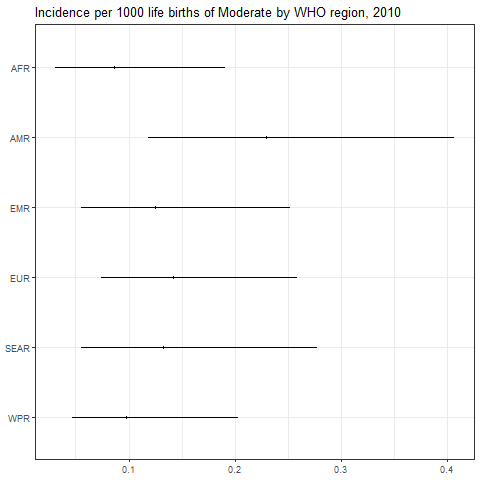

``` r
png(paste0(params$PlotDir, "/r_CI_2020.png"), width=480, height=480)
ggplot(subset(all_reg_rt, YEAR==2020),
       aes(y = VAL_MEAN, x = LOCATION_NAME)) +
  geom_pointrange(aes(ymin = VAL_LWR, ymax = VAL_UPR), size = 0.2) +
  coord_flip() +
  theme_bw() +
  scale_x_discrete(NULL, limits = rev(unique(all_reg_rt$LOCATION_NAME))) +
  scale_y_continuous(NULL) +
  ggtitle(paste0("Incidence per 1000 life births of ", params$Pathogen, " by WHO region, 2020"))
dev.off()
```

    ## png 
    ##   2

``` r
setwd(params$Dir)
image <- paste0("03-estimate_v6_files/figure-gfm/r_CI_2020.png")
cat("")
```

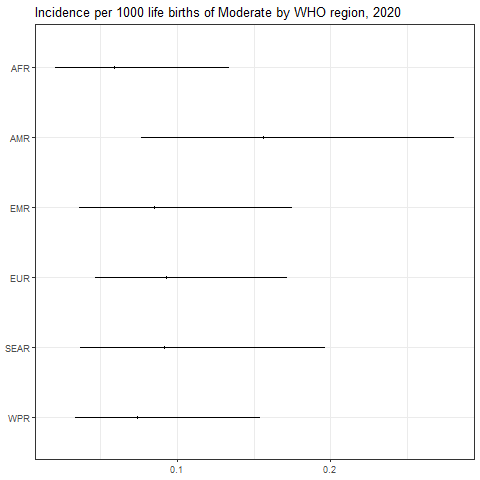

``` r
png(paste0(params$PlotDir, "/r_CASES_2010.png"), width=480, height=480)
ggplot(subset(all_reg_nr, YEAR==2010),
       aes(y = VAL_MEAN, x = LOCATION_NAME)) +
  geom_pointrange(aes(ymin = VAL_LWR, ymax = VAL_UPR), size = 0.2) +
  coord_flip() +
  theme_bw() +
  scale_x_discrete(NULL, limits = rev(unique(all_reg_nr$LOCATION_NAME))) +
  scale_y_continuous(NULL) +
  ggtitle(paste0("Cases of ", params$Pathogen, " by WHO region, 2010"))
dev.off()
```

    ## png 
    ##   2

``` r
setwd(params$Dir)
image <- paste0("03-estimate_v6_files/figure-gfm/r_CASES_2010.png")
cat("")
```

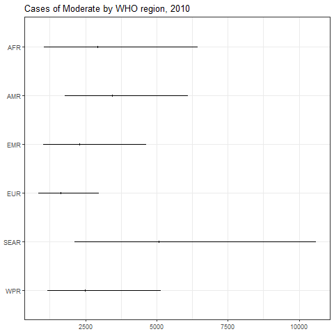

``` r
png(paste0(params$PlotDir, "/r_CASES_2020.png"), width=480, height=480)
ggplot(subset(all_reg_nr, YEAR==2020),
       aes(y = VAL_MEAN, x = LOCATION_NAME)) +
  geom_pointrange(aes(ymin = VAL_LWR, ymax = VAL_UPR), size = 0.2) +
  coord_flip() +
  theme_bw() +
  scale_x_discrete(NULL, limits = rev(unique(all_reg_nr$LOCATION_NAME))) +
  scale_y_continuous(NULL) +
  ggtitle(paste0("Cases of ", params$Pathogen, " by WHO region, 2020"))
dev.off()
```

    ## png 
    ##   2

``` r
setwd(params$Dir)
image <- paste0("03-estimate_v6_files/figure-gfm/r_CASES_2020.png")
cat("")
```

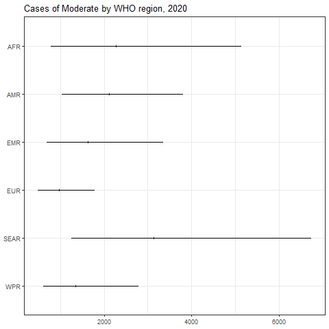

``` r
sim_all_reg <-
  merge(sim_all_reg,
        with(sim_all, aggregate(POP ~ REG2 + YEAR, FUN = sum)))
sim_all_reg_long <-
  pivot_longer(sim_all_reg, cols = starts_with("V"))
sim_all_reg_long$CASES <- sim_all_reg_long$value
```

``` r
png(paste0(params$PlotDir, "/r_hist_2010.png"), width=480, height=480)
ggplot(subset(sim_all_reg_long, YEAR==2010), aes(x = CASES)) +
  geom_density() +
  facet_wrap(~REG2) +
  theme_bw() +
  scale_x_log10() +
  ggtitle(paste0("Incidence per 1000 life births of ", params$Pathogen, " by WHO region, 2010"))
dev.off()
```

    ## png 
    ##   2

``` r
setwd(params$Dir)
image <- paste0("03-estimate_v6_files/figure-gfm/r_hist_2010.png")
cat("")
```

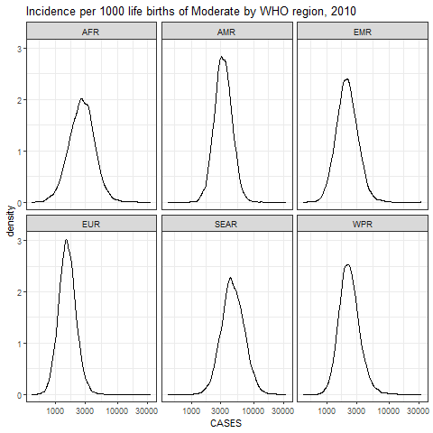

``` r
png(paste0(params$PlotDir, "/r_hist_2020_2010.png"), width=480, height=480)
ggplot(subset(sim_all_reg_long, YEAR==2010), aes(x = CASES)) +
  geom_density() +
  facet_wrap(~REG2) +
  theme_bw() +
  scale_x_log10() +
  ggtitle(paste0("Incidence per 1000 life births of ", params$Pathogen, " by WHO region, 2010"))
dev.off()
```

    ## png 
    ##   2

``` r
setwd(params$Dir)
image <- paste0("03-estimate_v6_files/figure-gfm/r_hist_2020_2010.png")
cat("")
```


## Subregions

``` r
kbl(subset(all_sub_rt, YEAR == 2020)[,c(7,2:5)],
    align = c("l", "c", "c", "c"), row.names = FALSE,
    col.names = c("Region", "Mean", "Median", "Lower", "Upper"),
    caption=paste0("Incidence per 1000 life births of ",params$Pathogen," by WHO subregion in 2020")) %>%
  kable_styling("striped", "hover")
```

<table class="table table-striped" style="margin-left: auto; margin-right: auto;">
<caption>
Incidence per 1000 life births of Moderate by WHO subregion in 2020
</caption>
<thead>
<tr>
<th style="text-align:left;">
Region
</th>
<th style="text-align:center;">
Mean
</th>
<th style="text-align:center;">
Median
</th>
<th style="text-align:center;">
Lower
</th>
<th style="text-align:left;">
Upper
</th>
</tr>
</thead>
<tbody>
<tr>
<td style="text-align:left;">
AFRAB
</td>
<td style="text-align:center;">
0.0634477
</td>
<td style="text-align:center;">
0.0449444
</td>
<td style="text-align:center;">
0.0128142
</td>
<td style="text-align:left;">
0.2265121
</td>
</tr>
<tr>
<td style="text-align:left;">
AFRC
</td>
<td style="text-align:center;">
0.0516335
</td>
<td style="text-align:center;">
0.0455803
</td>
<td style="text-align:center;">
0.0159351
</td>
<td style="text-align:left;">
0.1218676
</td>
</tr>
<tr>
<td style="text-align:left;">
AFRD
</td>
<td style="text-align:center;">
0.0667382
</td>
<td style="text-align:center;">
0.0564821
</td>
<td style="text-align:center;">
0.0158543
</td>
<td style="text-align:left;">
0.1780256
</td>
</tr>
<tr>
<td style="text-align:left;">
AMRA
</td>
<td style="text-align:center;">
0.0192879
</td>
<td style="text-align:center;">
0.0182188
</td>
<td style="text-align:center;">
0.0095055
</td>
<td style="text-align:left;">
0.0345649
</td>
</tr>
<tr>
<td style="text-align:left;">
AMRB
</td>
<td style="text-align:center;">
0.2150545
</td>
<td style="text-align:center;">
0.2037183
</td>
<td style="text-align:center;">
0.1055846
</td>
<td style="text-align:left;">
0.3868550
</td>
</tr>
<tr>
<td style="text-align:left;">
AMRC
</td>
<td style="text-align:center;">
0.2510880
</td>
<td style="text-align:center;">
0.1999653
</td>
<td style="text-align:center;">
0.0682271
</td>
<td style="text-align:left;">
0.7505437
</td>
</tr>
<tr>
<td style="text-align:left;">
EMRA
</td>
<td style="text-align:center;">
0.0697282
</td>
<td style="text-align:center;">
0.0598211
</td>
<td style="text-align:center;">
0.0223249
</td>
<td style="text-align:left;">
0.1737665
</td>
</tr>
<tr>
<td style="text-align:left;">
EMRBC
</td>
<td style="text-align:center;">
0.0908383
</td>
<td style="text-align:center;">
0.0811337
</td>
<td style="text-align:center;">
0.0362483
</td>
<td style="text-align:left;">
0.1984184
</td>
</tr>
<tr>
<td style="text-align:left;">
EMRD
</td>
<td style="text-align:center;">
0.0733911
</td>
<td style="text-align:center;">
0.0632411
</td>
<td style="text-align:center;">
0.0162017
</td>
<td style="text-align:left;">
0.1909288
</td>
</tr>
<tr>
<td style="text-align:left;">
EURA
</td>
<td style="text-align:center;">
0.0980237
</td>
<td style="text-align:center;">
0.0922008
</td>
<td style="text-align:center;">
0.0482604
</td>
<td style="text-align:left;">
0.1797680
</td>
</tr>
<tr>
<td style="text-align:left;">
EURB
</td>
<td style="text-align:center;">
0.0654208
</td>
<td style="text-align:center;">
0.0612026
</td>
<td style="text-align:center;">
0.0302135
</td>
<td style="text-align:left;">
0.1241524
</td>
</tr>
<tr>
<td style="text-align:left;">
EURC
</td>
<td style="text-align:center;">
0.1390628
</td>
<td style="text-align:center;">
0.1131705
</td>
<td style="text-align:center;">
0.0404653
</td>
<td style="text-align:left;">
0.3979958
</td>
</tr>
<tr>
<td style="text-align:left;">
SEARB
</td>
<td style="text-align:center;">
0.2107457
</td>
<td style="text-align:center;">
0.1796515
</td>
<td style="text-align:center;">
0.0615987
</td>
<td style="text-align:left;">
0.5474124
</td>
</tr>
<tr>
<td style="text-align:left;">
SEARCD
</td>
<td style="text-align:center;">
0.0699664
</td>
<td style="text-align:center;">
0.0618456
</td>
<td style="text-align:center;">
0.0239131
</td>
<td style="text-align:left;">
0.1655415
</td>
</tr>
<tr>
<td style="text-align:left;">
WPRA
</td>
<td style="text-align:center;">
0.2000288
</td>
<td style="text-align:center;">
0.1878442
</td>
<td style="text-align:center;">
0.0937222
</td>
<td style="text-align:left;">
0.3744383
</td>
</tr>
<tr>
<td style="text-align:left;">
WPRB
</td>
<td style="text-align:center;">
0.0334685
</td>
<td style="text-align:center;">
0.0315316
</td>
<td style="text-align:center;">
0.0162484
</td>
<td style="text-align:left;">
0.0620929
</td>
</tr>
<tr>
<td style="text-align:left;">
WPRC
</td>
<td style="text-align:center;">
0.1450572
</td>
<td style="text-align:center;">
0.1149512
</td>
<td style="text-align:center;">
0.0352774
</td>
<td style="text-align:left;">
0.4327990
</td>
</tr>
</tbody>
</table>

``` r
kbl(subset(all_sub_nr, YEAR == 2020)[,c(7,2:5)],
    align = c("l", "c", "c", "c"), row.names = FALSE,
    col.names = c("Region", "Mean", "Median", "Lower", "Upper"),
    caption=paste0("Cases of ",params$Pathogen," by WHO sub region in 2020")) %>%
  kable_styling("striped", "hover")
```

<table class="table table-striped" style="margin-left: auto; margin-right: auto;">
<caption>
Cases of Moderate by WHO sub region in 2020
</caption>
<thead>
<tr>
<th style="text-align:left;">
Region
</th>
<th style="text-align:center;">
Mean
</th>
<th style="text-align:center;">
Median
</th>
<th style="text-align:center;">
Lower
</th>
<th style="text-align:left;">
Upper
</th>
</tr>
</thead>
<tbody>
<tr>
<td style="text-align:left;">
AFRAB
</td>
<td style="text-align:center;">
92.03903
</td>
<td style="text-align:center;">
65.19760
</td>
<td style="text-align:center;">
18.58860
</td>
<td style="text-align:left;">
328.5848
</td>
</tr>
<tr>
<td style="text-align:left;">
AFRC
</td>
<td style="text-align:center;">
975.56627
</td>
<td style="text-align:center;">
861.19793
</td>
<td style="text-align:center;">
301.07905
</td>
<td style="text-align:left;">
2302.5746
</td>
</tr>
<tr>
<td style="text-align:left;">
AFRD
</td>
<td style="text-align:center;">
1200.88263
</td>
<td style="text-align:center;">
1016.33534
</td>
<td style="text-align:center;">
285.28073
</td>
<td style="text-align:left;">
3203.3808
</td>
</tr>
<tr>
<td style="text-align:left;">
AMRA
</td>
<td style="text-align:center;">
83.84686
</td>
<td style="text-align:center;">
79.19922
</td>
<td style="text-align:center;">
41.32140
</td>
<td style="text-align:left;">
150.2575
</td>
</tr>
<tr>
<td style="text-align:left;">
AMRB
</td>
<td style="text-align:center;">
1698.91905
</td>
<td style="text-align:center;">
1609.36395
</td>
<td style="text-align:center;">
834.11240
</td>
<td style="text-align:left;">
3056.1342
</td>
</tr>
<tr>
<td style="text-align:left;">
AMRC
</td>
<td style="text-align:center;">
331.61849
</td>
<td style="text-align:center;">
264.09943
</td>
<td style="text-align:center;">
90.10931
</td>
<td style="text-align:left;">
991.2626
</td>
</tr>
<tr>
<td style="text-align:left;">
EMRA
</td>
<td style="text-align:center;">
55.69648
</td>
<td style="text-align:center;">
47.78297
</td>
<td style="text-align:center;">
17.83238
</td>
<td style="text-align:left;">
138.7986
</td>
</tr>
<tr>
<td style="text-align:left;">
EMRBC
</td>
<td style="text-align:center;">
1162.96228
</td>
<td style="text-align:center;">
1038.71821
</td>
<td style="text-align:center;">
464.07095
</td>
<td style="text-align:left;">
2540.2632
</td>
</tr>
<tr>
<td style="text-align:left;">
EMRD
</td>
<td style="text-align:center;">
403.49570
</td>
<td style="text-align:center;">
347.69223
</td>
<td style="text-align:center;">
89.07475
</td>
<td style="text-align:left;">
1049.7038
</td>
</tr>
<tr>
<td style="text-align:left;">
EURA
</td>
<td style="text-align:center;">
488.54988
</td>
<td style="text-align:center;">
459.52830
</td>
<td style="text-align:center;">
240.52962
</td>
<td style="text-align:left;">
895.9630
</td>
</tr>
<tr>
<td style="text-align:left;">
EURB
</td>
<td style="text-align:center;">
249.44437
</td>
<td style="text-align:center;">
233.36063
</td>
<td style="text-align:center;">
115.20151
</td>
<td style="text-align:left;">
473.3834
</td>
</tr>
<tr>
<td style="text-align:left;">
EURC
</td>
<td style="text-align:center;">
227.33068
</td>
<td style="text-align:center;">
185.00367
</td>
<td style="text-align:center;">
66.15008
</td>
<td style="text-align:left;">
650.6172
</td>
</tr>
<tr>
<td style="text-align:left;">
SEARB
</td>
<td style="text-align:center;">
1098.39588
</td>
<td style="text-align:center;">
936.33454
</td>
<td style="text-align:center;">
321.04926
</td>
<td style="text-align:left;">
2853.0861
</td>
</tr>
<tr>
<td style="text-align:left;">
SEARCD
</td>
<td style="text-align:center;">
2032.57252
</td>
<td style="text-align:center;">
1796.65852
</td>
<td style="text-align:center;">
694.69148
</td>
<td style="text-align:left;">
4809.0968
</td>
</tr>
<tr>
<td style="text-align:left;">
WPRA
</td>
<td style="text-align:center;">
303.48777
</td>
<td style="text-align:center;">
285.00104
</td>
<td style="text-align:center;">
142.19723
</td>
<td style="text-align:left;">
568.1053
</td>
</tr>
<tr>
<td style="text-align:left;">
WPRB
</td>
<td style="text-align:center;">
411.84316
</td>
<td style="text-align:center;">
388.00840
</td>
<td style="text-align:center;">
199.94301
</td>
<td style="text-align:left;">
764.0770
</td>
</tr>
<tr>
<td style="text-align:left;">
WPRC
</td>
<td style="text-align:center;">
624.75813
</td>
<td style="text-align:center;">
495.09224
</td>
<td style="text-align:center;">
151.93891
</td>
<td style="text-align:left;">
1864.0554
</td>
</tr>
</tbody>
</table>

``` r
png(paste0(params$PlotDir, "/r_CI_SUB2_2010.png"), width=480, height=480)
ggplot(subset(all_sub_rt, YEAR==2010),
       aes(y = VAL_MEAN, x = LOCATION_NAME)) +
  geom_pointrange(aes(ymin = VAL_LWR, ymax = VAL_UPR), size = 0.2) +
  coord_flip() +
  theme_bw() +
  scale_x_discrete(NULL, limits = rev(unique(all_sub_rt$LOCATION_NAME))) +
  scale_y_continuous(NULL) +
  ggtitle(paste0("Incidence per 1000 life births of ", params$Pathogen, " by WHO sub region, 2010"))
dev.off()
```

    ## png 
    ##   2

``` r
setwd(params$Dir)
image <- paste0("03-estimate_v6_files/figure-gfm/r_CI_SUB2_2010.png")
cat("")
```

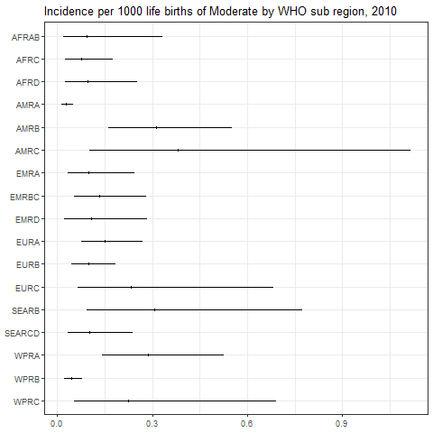

``` r
png(paste0(params$PlotDir, "/r_CI_SUB2_2020.png"), width=480, height=480)
ggplot(subset(all_sub_rt, YEAR==2020),
       aes(y = VAL_MEAN, x = LOCATION_NAME)) +
  geom_pointrange(aes(ymin = VAL_LWR, ymax = VAL_UPR), size = 0.2) +
  coord_flip() +
  theme_bw() +
  scale_x_discrete(NULL, limits = rev(unique(all_sub_rt$LOCATION_NAME))) +
  scale_y_continuous(NULL) +
  ggtitle(paste0("Incidence per 1000 life births of ", params$Pathogen, " by WHO sub region, 2020"))
dev.off()
```

    ## png 
    ##   2

``` r
setwd(params$Dir)
image <- paste0("03-estimate_v6_files/figure-gfm/r_CI_SUB2_2020.png")
cat("")
```

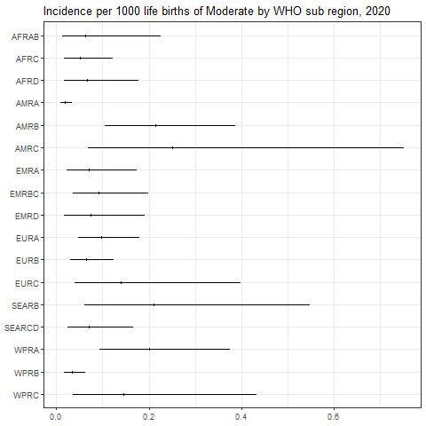

``` r
png(paste0(params$PlotDir, "/r_CASES_SUB2_2010.png"), width=480, height=480)
ggplot(subset(all_sub_nr, YEAR==2010),
       aes(y = VAL_MEAN, x = LOCATION_NAME)) +
  geom_pointrange(aes(ymin = VAL_LWR, ymax = VAL_UPR), size = 0.2) +
  coord_flip() +
  theme_bw() +
  scale_x_discrete(NULL, limits = rev(unique(all_sub_nr$LOCATION_NAME))) +
  scale_y_continuous(NULL) +
  ggtitle(paste0("Cases of ", params$Pathogen, " by WHO sub region, 2010"))
dev.off()
```

    ## png 
    ##   2

``` r
setwd(params$Dir)
image <- paste0("03-estimate_v6_files/figure-gfm/r_CASES_SUB2_2010.png")
cat("")
```

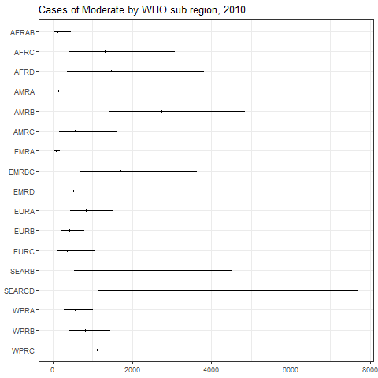

``` r
png(paste0(params$PlotDir, "/r_CASES_SUB2_2020.png"), width=480, height=480)
ggplot(subset(all_sub_nr, YEAR==2020),
       aes(y = VAL_MEAN, x = LOCATION_NAME)) +
  geom_pointrange(aes(ymin = VAL_LWR, ymax = VAL_UPR), size = 0.2) +
  coord_flip() +
  theme_bw() +
  scale_x_discrete(NULL, limits = rev(unique(all_sub_nr$LOCATION_NAME))) +
  scale_y_continuous(NULL) +
  ggtitle(paste0("Cases of ", params$Pathogen, " by WHO sub region, 2020"))
dev.off()
```

    ## png 
    ##   2

``` r
setwd(params$Dir)
image <- paste0("03-estimate_v6_files/figure-gfm/r_CASES_SUB2_2020.png")
cat("")
```

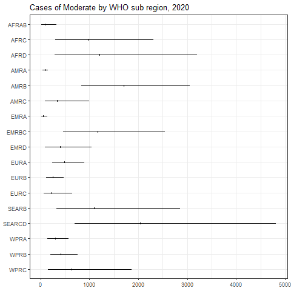

``` r
sim_all_sub <-
  merge(sim_all_sub,
        with(sim_all, aggregate(POP ~ SUB2 + YEAR, FUN = sum)))
sim_all_sub_long <-
  pivot_longer(sim_all_sub, cols = starts_with("V"))
sim_all_sub_long$CASES <- sim_all_sub_long$value
```

``` r
png(paste0(params$PlotDir, "/r_hist_SUB2_2010.png"), width=480, height=480)
ggplot(subset(sim_all_sub_long, YEAR==2010), aes(x = CASES)) +
  geom_density() +
  facet_wrap(~SUB2) +
  theme_bw() +
  scale_x_log10() +
  ggtitle(paste0("Incidence per 1000 life births of ", params$Pathogen, "by WHO sub region, 2010"))
dev.off()
```

    ## png 
    ##   2

``` r
setwd(params$Dir)
image <- paste0("03-estimate_v6_files/figure-gfm/r_hist_SUB2_2010.png")
cat("")
```

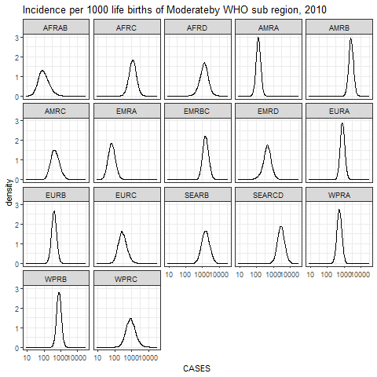

``` r
png(paste0(params$PlotDir, "/r_hist_SUB2_2020_2010.png"), width=480, height=480)
ggplot(subset(sim_all_sub_long, YEAR==2010), aes(x = CASES)) +
  geom_density() +
  facet_wrap(~SUB2) +
  theme_bw() +
  scale_x_log10() +
  ggtitle(paste0("Incidence per 1000 life births of ", params$Pathogen, "by WHO sub region, 2010"))
dev.off()
```

    ## png 
    ##   2

``` r
setwd(params$Dir)
image <- paste0("03-estimate_v6_files/figure-gfm/r_hist_SUB2_2020_2010.png")
cat("")
```


## Countries

``` r
png(paste0(params$PlotDir, "/r_cnt_2010.png"), width=800, height=300)
plot_world(subset(all_cnt_rt, YEAR == 2010),
           "LOCATION_NAME", "VAL_MEAN", legend.title = "Incidence per 1000", diseasefree = zero_cases)
```

    ## [1] 0.0 0.2 0.4 0.6 0.8 1.0 1.2

``` r
dev.off()
```

    ## png 
    ##   2

``` r
setwd(params$Dir)
image <- paste0("03-estimate_v6_files/figure-gfm/r_cnt_2010.png")
cat("")
```

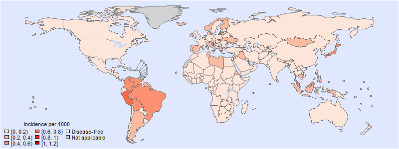

``` r
png(paste0(params$PlotDir, "/r_cnt_2020.png"), width=800, height=300)
plot_world(subset(all_cnt_rt, YEAR == 2020),
           "LOCATION_NAME", "VAL_MEAN", legend.title = "Incidence per 1000", diseasefree = zero_cases)
```

    ## [1] 0.0 0.2 0.4 0.6 0.8

``` r
dev.off()
```

    ## png 
    ##   2

``` r
setwd(params$Dir)
image <- paste0("03-estimate_v6_files/figure-gfm/r_cnt_2020.png")
cat("")
```

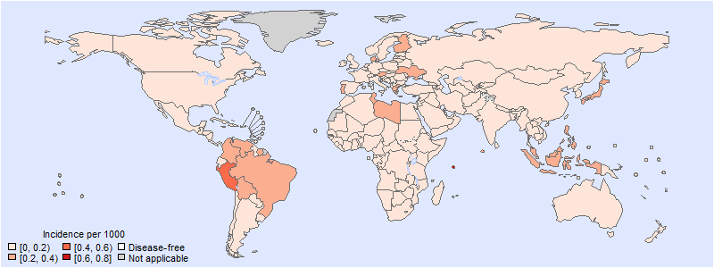

``` r
tab <-
  data.frame(subset(all_cnt_rt, YEAR == 2010)[,
                                              c("LOCATION_NAME", "VAL_MEAN", "VAL_MEDIAN", "VAL_LWR", "VAL_UPR")],
             subset(all_cnt_rt, YEAR == 2020)[,
                                              c("VAL_MEAN", "VAL_MEDIAN", "VAL_LWR", "VAL_UPR")])
tab$LOCATION_NAME <-
  FERG2:::countries$COUNTRY[match(tab$LOCATION_NAME, FERG2:::countries$ISO3)]
tab$LOCATION_NAME <- gsub(" \\(.*", "", tab$LOCATION_NAME)
names(tab) <-
  c("Country",
    "2010.mean", "2010.median", "2010.lwr", "2010.upr",
    "2020.mean", "2020.median", "2020.lwr", "2020.upr")

kable(tab, digits = 3, row.names = FALSE,
      caption = paste0("Estimated ", params$Pathogen, " incidence by country, 2010 vs 2020"))
```

| Country                          | 2010.mean | 2010.median | 2010.lwr | 2010.upr | 2020.mean | 2020.median | 2020.lwr | 2020.upr |
|:---------------------------------|----------:|------------:|---------:|---------:|----------:|------------:|---------:|---------:|
| Afghanistan                      |     0.116 |       0.103 |    0.025 |    0.289 |     0.079 |       0.069 |    0.017 |    0.197 |
| Angola                           |     0.091 |       0.083 |    0.026 |    0.206 |     0.062 |       0.056 |    0.017 |    0.141 |
| Albania                          |     0.171 |       0.099 |    0.013 |    0.772 |     0.116 |       0.067 |    0.009 |    0.530 |
| Andorra                          |     0.134 |       0.125 |    0.062 |    0.256 |     0.091 |       0.085 |    0.041 |    0.177 |
| United Arab Emirates             |     0.194 |       0.101 |    0.012 |    0.928 |     0.132 |       0.069 |    0.008 |    0.636 |
| Argentina                        |     0.214 |       0.119 |    0.014 |    1.005 |     0.146 |       0.081 |    0.009 |    0.689 |
| Armenia                          |     0.112 |       0.104 |    0.036 |    0.239 |     0.076 |       0.071 |    0.024 |    0.164 |
| Antigua and Barbuda              |     0.109 |       0.099 |    0.027 |    0.257 |     0.074 |       0.067 |    0.018 |    0.176 |
| Australia                        |     0.144 |       0.104 |    0.022 |    0.508 |     0.098 |       0.071 |    0.014 |    0.344 |
| Austria                          |     0.334 |       0.233 |    0.047 |    1.244 |     0.228 |       0.157 |    0.031 |    0.869 |
| Azerbaijan                       |     0.112 |       0.104 |    0.036 |    0.239 |     0.076 |       0.071 |    0.024 |    0.164 |
| Burundi                          |     0.102 |       0.092 |    0.025 |    0.237 |     0.069 |       0.062 |    0.017 |    0.163 |
| Belgium                          |     0.129 |       0.098 |    0.022 |    0.424 |     0.088 |       0.066 |    0.015 |    0.290 |
| Benin                            |     0.118 |       0.065 |    0.007 |    0.539 |     0.080 |       0.044 |    0.005 |    0.373 |
| Burkina Faso                     |     0.102 |       0.092 |    0.025 |    0.237 |     0.069 |       0.062 |    0.017 |    0.163 |
| Bangladesh                       |     0.174 |       0.123 |    0.025 |    0.631 |     0.118 |       0.084 |    0.016 |    0.428 |
| Bulgaria                         |     0.112 |       0.104 |    0.036 |    0.239 |     0.076 |       0.071 |    0.024 |    0.164 |
| Bahrain                          |     0.122 |       0.108 |    0.037 |    0.297 |     0.083 |       0.073 |    0.025 |    0.204 |
| Bahamas                          |     0.109 |       0.099 |    0.027 |    0.257 |     0.074 |       0.067 |    0.018 |    0.176 |
| Bosnia and Herzegovina           |     0.112 |       0.104 |    0.036 |    0.239 |     0.076 |       0.071 |    0.024 |    0.164 |
| Belarus                          |     0.112 |       0.104 |    0.036 |    0.239 |     0.076 |       0.071 |    0.024 |    0.164 |
| Belize                           |     0.176 |       0.154 |    0.067 |    0.409 |     0.119 |       0.104 |    0.044 |    0.281 |
| Bolivia                          |     0.586 |       0.354 |    0.057 |    2.520 |     0.398 |       0.240 |    0.038 |    1.687 |
| Brazil                           |     0.445 |       0.427 |    0.235 |    0.758 |     0.303 |       0.289 |    0.152 |    0.529 |
| Barbados                         |     0.109 |       0.099 |    0.027 |    0.257 |     0.074 |       0.067 |    0.018 |    0.176 |
| Brunei Darussalam                |     0.126 |       0.114 |    0.046 |    0.274 |     0.086 |       0.077 |    0.031 |    0.190 |
| Bhutan                           |     0.132 |       0.115 |    0.039 |    0.330 |     0.090 |       0.078 |    0.026 |    0.224 |
| Botswana                         |     0.145 |       0.120 |    0.042 |    0.417 |     0.099 |       0.081 |    0.028 |    0.286 |
| Central African Republic         |     0.102 |       0.092 |    0.025 |    0.237 |     0.069 |       0.062 |    0.017 |    0.163 |
| Canada                           |     0.129 |       0.119 |    0.056 |    0.254 |     0.088 |       0.081 |    0.036 |    0.179 |
| Switzerland                      |     0.172 |       0.103 |    0.015 |    0.736 |     0.117 |       0.070 |    0.010 |    0.502 |
| Chile                            |     0.109 |       0.099 |    0.027 |    0.257 |     0.074 |       0.067 |    0.018 |    0.176 |
| China                            |     0.032 |       0.030 |    0.016 |    0.055 |     0.021 |       0.020 |    0.011 |    0.038 |
| Côte d’Ivoire                    |     0.091 |       0.083 |    0.026 |    0.206 |     0.062 |       0.056 |    0.017 |    0.141 |
| Cameroon                         |     0.091 |       0.083 |    0.026 |    0.206 |     0.062 |       0.056 |    0.017 |    0.141 |
| Congo                            |     0.126 |       0.066 |    0.007 |    0.612 |     0.086 |       0.045 |    0.004 |    0.417 |
| Congo                            |     0.131 |       0.081 |    0.012 |    0.563 |     0.089 |       0.055 |    0.008 |    0.384 |
| Cook Islands                     |     0.126 |       0.114 |    0.046 |    0.274 |     0.086 |       0.077 |    0.031 |    0.190 |
| Colombia                         |     0.412 |       0.367 |    0.143 |    0.933 |     0.279 |       0.249 |    0.096 |    0.637 |
| Comoros                          |     0.091 |       0.083 |    0.026 |    0.206 |     0.062 |       0.056 |    0.017 |    0.141 |
| Cabo Verde                       |     0.160 |       0.081 |    0.008 |    0.772 |     0.109 |       0.055 |    0.006 |    0.527 |
| Costa Rica                       |     0.176 |       0.154 |    0.067 |    0.409 |     0.119 |       0.104 |    0.044 |    0.281 |
| Cuba                             |     0.176 |       0.154 |    0.067 |    0.409 |     0.119 |       0.104 |    0.044 |    0.281 |
| Cyprus                           |     0.218 |       0.128 |    0.017 |    0.932 |     0.148 |       0.087 |    0.012 |    0.627 |
| Czechia                          |     0.095 |       0.076 |    0.019 |    0.282 |     0.065 |       0.051 |    0.013 |    0.193 |
| Germany                          |     0.061 |       0.050 |    0.013 |    0.174 |     0.042 |       0.034 |    0.009 |    0.119 |
| Djibouti                         |     0.121 |       0.111 |    0.046 |    0.261 |     0.082 |       0.075 |    0.031 |    0.179 |
| Dominica                         |     0.176 |       0.154 |    0.067 |    0.409 |     0.119 |       0.104 |    0.044 |    0.281 |
| Denmark                          |     0.314 |       0.253 |    0.074 |    0.929 |     0.215 |       0.171 |    0.048 |    0.639 |
| Dominican Republic               |     0.176 |       0.154 |    0.067 |    0.409 |     0.119 |       0.104 |    0.044 |    0.281 |
| Algeria                          |     0.091 |       0.083 |    0.026 |    0.206 |     0.062 |       0.056 |    0.017 |    0.141 |
| Ecuador                          |     0.085 |       0.054 |    0.008 |    0.351 |     0.058 |       0.037 |    0.005 |    0.238 |
| Egypt                            |     0.048 |       0.043 |    0.016 |    0.113 |     0.033 |       0.029 |    0.011 |    0.079 |
| Eritrea                          |     0.250 |       0.153 |    0.022 |    1.080 |     0.170 |       0.103 |    0.015 |    0.744 |
| Spain                            |     0.235 |       0.217 |    0.100 |    0.473 |     0.160 |       0.148 |    0.065 |    0.326 |
| Estonia                          |     0.134 |       0.125 |    0.062 |    0.256 |     0.091 |       0.085 |    0.041 |    0.177 |
| Ethiopia                         |     0.054 |       0.039 |    0.007 |    0.200 |     0.037 |       0.026 |    0.005 |    0.135 |
| Finland                          |     0.313 |       0.235 |    0.053 |    1.034 |     0.214 |       0.159 |    0.035 |    0.717 |
| Fiji                             |     0.130 |       0.116 |    0.044 |    0.298 |     0.088 |       0.078 |    0.029 |    0.201 |
| France                           |     0.154 |       0.130 |    0.042 |    0.400 |     0.105 |       0.087 |    0.028 |    0.276 |
| Micronesia                       |     0.139 |       0.120 |    0.044 |    0.351 |     0.095 |       0.082 |    0.029 |    0.244 |
| Gabon                            |     0.145 |       0.120 |    0.042 |    0.417 |     0.099 |       0.081 |    0.028 |    0.286 |
| United Kingdom                   |     0.069 |       0.057 |    0.017 |    0.194 |     0.047 |       0.038 |    0.011 |    0.132 |
| Georgia                          |     0.195 |       0.125 |    0.020 |    0.802 |     0.132 |       0.085 |    0.014 |    0.539 |
| Ghana                            |     0.138 |       0.107 |    0.027 |    0.435 |     0.094 |       0.072 |    0.018 |    0.296 |
| Guinea                           |     0.091 |       0.083 |    0.026 |    0.206 |     0.062 |       0.056 |    0.017 |    0.141 |
| Gambia                           |     0.102 |       0.092 |    0.025 |    0.237 |     0.069 |       0.062 |    0.017 |    0.163 |
| Guinea-Bissau                    |     0.102 |       0.092 |    0.025 |    0.237 |     0.069 |       0.062 |    0.017 |    0.163 |
| Equatorial Guinea                |     0.145 |       0.120 |    0.042 |    0.417 |     0.099 |       0.081 |    0.028 |    0.286 |
| Greece                           |     0.307 |       0.243 |    0.066 |    0.910 |     0.208 |       0.164 |    0.044 |    0.640 |
| Grenada                          |     0.176 |       0.154 |    0.067 |    0.409 |     0.119 |       0.104 |    0.044 |    0.281 |
| Guatemala                        |     0.176 |       0.154 |    0.067 |    0.409 |     0.119 |       0.104 |    0.044 |    0.281 |
| Guyana                           |     0.109 |       0.099 |    0.027 |    0.257 |     0.074 |       0.067 |    0.018 |    0.176 |
| Honduras                         |     0.198 |       0.153 |    0.060 |    0.636 |     0.135 |       0.104 |    0.040 |    0.426 |
| Croatia                          |     0.277 |       0.222 |    0.062 |    0.807 |     0.188 |       0.150 |    0.042 |    0.563 |
| Haiti                            |     0.198 |       0.153 |    0.060 |    0.636 |     0.135 |       0.104 |    0.040 |    0.426 |
| Hungary                          |     0.181 |       0.105 |    0.012 |    0.813 |     0.123 |       0.071 |    0.008 |    0.555 |
| Indonesia                        |     0.328 |       0.277 |    0.090 |    0.861 |     0.223 |       0.187 |    0.060 |    0.600 |
| India                            |     0.089 |       0.075 |    0.026 |    0.230 |     0.060 |       0.051 |    0.017 |    0.156 |
| Ireland                          |     0.220 |       0.160 |    0.034 |    0.773 |     0.150 |       0.108 |    0.023 |    0.527 |
| Iran                             |     0.102 |       0.091 |    0.037 |    0.226 |     0.069 |       0.062 |    0.025 |    0.153 |
| Iraq                             |     0.217 |       0.111 |    0.012 |    1.070 |     0.148 |       0.075 |    0.008 |    0.737 |
| Iceland                          |     0.233 |       0.133 |    0.016 |    1.083 |     0.159 |       0.090 |    0.011 |    0.752 |
| Israel                           |     0.134 |       0.125 |    0.062 |    0.256 |     0.091 |       0.085 |    0.041 |    0.177 |
| Italy                            |     0.216 |       0.192 |    0.076 |    0.503 |     0.147 |       0.130 |    0.050 |    0.344 |
| Jamaica                          |     0.232 |       0.124 |    0.013 |    1.089 |     0.159 |       0.084 |    0.009 |    0.755 |
| Jordan                           |     0.202 |       0.120 |    0.017 |    0.912 |     0.138 |       0.081 |    0.011 |    0.629 |
| Japan                            |     0.445 |       0.418 |    0.214 |    0.829 |     0.303 |       0.283 |    0.138 |    0.574 |
| Kazakhstan                       |     0.119 |       0.090 |    0.022 |    0.381 |     0.080 |       0.061 |    0.015 |    0.261 |
| Kenya                            |     0.140 |       0.072 |    0.007 |    0.676 |     0.095 |       0.049 |    0.005 |    0.454 |
| Kyrgyzstan                       |     0.158 |       0.128 |    0.048 |    0.467 |     0.107 |       0.087 |    0.032 |    0.318 |
| Cambodia                         |     0.278 |       0.198 |    0.040 |    1.030 |     0.189 |       0.133 |    0.027 |    0.704 |
| Kiribati                         |     0.139 |       0.120 |    0.044 |    0.351 |     0.095 |       0.082 |    0.029 |    0.244 |
| Saint Kitts and Nevis            |     0.109 |       0.099 |    0.027 |    0.257 |     0.074 |       0.067 |    0.018 |    0.176 |
| Korea                            |     0.032 |       0.030 |    0.017 |    0.053 |     0.022 |       0.021 |    0.011 |    0.037 |
| Kuwait                           |     0.311 |       0.219 |    0.044 |    1.124 |     0.212 |       0.148 |    0.029 |    0.782 |
| Lao People’s Dem. Republic       |     0.139 |       0.120 |    0.044 |    0.351 |     0.095 |       0.082 |    0.029 |    0.244 |
| Lebanon                          |     0.170 |       0.111 |    0.019 |    0.675 |     0.116 |       0.075 |    0.013 |    0.461 |
| Liberia                          |     0.102 |       0.092 |    0.025 |    0.237 |     0.069 |       0.062 |    0.017 |    0.163 |
| Libya                            |     0.299 |       0.196 |    0.034 |    1.208 |     0.203 |       0.133 |    0.023 |    0.828 |
| Saint Lucia                      |     0.176 |       0.154 |    0.067 |    0.409 |     0.119 |       0.104 |    0.044 |    0.281 |
| Sri Lanka                        |     0.205 |       0.106 |    0.010 |    1.000 |     0.140 |       0.072 |    0.007 |    0.681 |
| Lesotho                          |     0.091 |       0.083 |    0.026 |    0.206 |     0.062 |       0.056 |    0.017 |    0.141 |
| Lithuania                        |     0.234 |       0.127 |    0.013 |    1.098 |     0.159 |       0.086 |    0.009 |    0.744 |
| Luxembourg                       |     0.228 |       0.124 |    0.015 |    1.019 |     0.155 |       0.084 |    0.010 |    0.700 |
| Latvia                           |     0.134 |       0.125 |    0.062 |    0.256 |     0.091 |       0.085 |    0.041 |    0.177 |
| Morocco                          |     0.092 |       0.064 |    0.011 |    0.342 |     0.062 |       0.043 |    0.007 |    0.231 |
| Monaco                           |     0.134 |       0.125 |    0.062 |    0.256 |     0.091 |       0.085 |    0.041 |    0.177 |
| Republic of Moldova              |     0.112 |       0.104 |    0.036 |    0.239 |     0.076 |       0.071 |    0.024 |    0.164 |
| Madagascar                       |     0.102 |       0.092 |    0.025 |    0.237 |     0.069 |       0.062 |    0.017 |    0.163 |
| Maldives                         |     0.443 |       0.266 |    0.038 |    1.858 |     0.302 |       0.180 |    0.026 |    1.303 |
| Mexico                           |     0.146 |       0.123 |    0.039 |    0.394 |     0.099 |       0.084 |    0.026 |    0.266 |
| Marshall Islands                 |     0.130 |       0.116 |    0.044 |    0.298 |     0.088 |       0.078 |    0.029 |    0.201 |
| North Macedonia                  |     0.112 |       0.104 |    0.036 |    0.239 |     0.076 |       0.071 |    0.024 |    0.164 |
| Mali                             |     0.102 |       0.092 |    0.025 |    0.237 |     0.069 |       0.062 |    0.017 |    0.163 |
| Malta                            |     0.134 |       0.125 |    0.062 |    0.256 |     0.091 |       0.085 |    0.041 |    0.177 |
| Myanmar                          |     0.132 |       0.115 |    0.039 |    0.330 |     0.090 |       0.078 |    0.026 |    0.224 |
| Montenegro                       |     0.112 |       0.104 |    0.036 |    0.239 |     0.076 |       0.071 |    0.024 |    0.164 |
| Mongolia                         |     0.204 |       0.109 |    0.012 |    1.003 |     0.139 |       0.074 |    0.008 |    0.686 |
| Mozambique                       |     0.113 |       0.061 |    0.006 |    0.527 |     0.077 |       0.041 |    0.004 |    0.361 |
| Mauritania                       |     0.091 |       0.083 |    0.026 |    0.206 |     0.062 |       0.056 |    0.017 |    0.141 |
| Mauritius                        |     0.145 |       0.120 |    0.042 |    0.417 |     0.099 |       0.081 |    0.028 |    0.286 |
| Malawi                           |     0.102 |       0.092 |    0.025 |    0.237 |     0.069 |       0.062 |    0.017 |    0.163 |
| Malaysia                         |     0.506 |       0.437 |    0.152 |    1.290 |     0.344 |       0.296 |    0.101 |    0.886 |
| Namibia                          |     0.145 |       0.120 |    0.042 |    0.417 |     0.099 |       0.081 |    0.028 |    0.286 |
| Niger                            |     0.102 |       0.092 |    0.025 |    0.237 |     0.069 |       0.062 |    0.017 |    0.163 |
| Nigeria                          |     0.036 |       0.025 |    0.005 |    0.132 |     0.024 |       0.017 |    0.003 |    0.092 |
| Nicaragua                        |     0.198 |       0.153 |    0.060 |    0.636 |     0.135 |       0.104 |    0.040 |    0.426 |
| Niue                             |     0.126 |       0.114 |    0.046 |    0.274 |     0.086 |       0.077 |    0.031 |    0.190 |
| Netherlands                      |     0.165 |       0.095 |    0.011 |    0.749 |     0.112 |       0.064 |    0.008 |    0.513 |
| Norway                           |     0.257 |       0.182 |    0.037 |    0.932 |     0.175 |       0.124 |    0.024 |    0.637 |
| Nepal                            |     0.132 |       0.115 |    0.039 |    0.330 |     0.090 |       0.078 |    0.026 |    0.224 |
| Nauru                            |     0.126 |       0.114 |    0.046 |    0.274 |     0.086 |       0.077 |    0.031 |    0.190 |
| New Zealand                      |     0.191 |       0.115 |    0.017 |    0.825 |     0.130 |       0.077 |    0.011 |    0.560 |
| Oman                             |     0.122 |       0.108 |    0.037 |    0.297 |     0.083 |       0.073 |    0.025 |    0.204 |
| Pakistan                         |     0.147 |       0.128 |    0.048 |    0.352 |     0.100 |       0.087 |    0.032 |    0.242 |
| Panama                           |     0.109 |       0.099 |    0.027 |    0.257 |     0.074 |       0.067 |    0.018 |    0.176 |
| Peru                             |     0.696 |       0.550 |    0.146 |    2.082 |     0.472 |       0.374 |    0.097 |    1.412 |
| Philippines                      |     0.307 |       0.217 |    0.046 |    1.107 |     0.210 |       0.147 |    0.030 |    0.767 |
| Palau                            |     0.130 |       0.116 |    0.044 |    0.298 |     0.088 |       0.078 |    0.029 |    0.201 |
| Papua New Guinea                 |     0.139 |       0.120 |    0.044 |    0.351 |     0.095 |       0.082 |    0.029 |    0.244 |
| Poland                           |     0.061 |       0.051 |    0.016 |    0.166 |     0.042 |       0.035 |    0.011 |    0.114 |
| Korea                            |     0.132 |       0.115 |    0.039 |    0.330 |     0.090 |       0.078 |    0.026 |    0.224 |
| Portugal                         |     0.322 |       0.260 |    0.074 |    0.964 |     0.219 |       0.175 |    0.049 |    0.660 |
| Paraguay                         |     0.176 |       0.154 |    0.067 |    0.409 |     0.119 |       0.104 |    0.044 |    0.281 |
| Qatar                            |     0.122 |       0.108 |    0.037 |    0.297 |     0.083 |       0.073 |    0.025 |    0.204 |
| Romania                          |     0.139 |       0.087 |    0.013 |    0.585 |     0.095 |       0.059 |    0.009 |    0.396 |
| Russian Federation               |     0.123 |       0.114 |    0.053 |    0.252 |     0.083 |       0.076 |    0.036 |    0.170 |
| Rwanda                           |     0.102 |       0.092 |    0.025 |    0.237 |     0.069 |       0.062 |    0.017 |    0.163 |
| Saudi Arabia                     |     0.059 |       0.050 |    0.016 |    0.155 |     0.040 |       0.034 |    0.011 |    0.106 |
| Sudan                            |     0.090 |       0.055 |    0.007 |    0.378 |     0.061 |       0.037 |    0.005 |    0.256 |
| Senegal                          |     0.091 |       0.083 |    0.026 |    0.206 |     0.062 |       0.056 |    0.017 |    0.141 |
| Singapore                        |     0.181 |       0.110 |    0.015 |    0.773 |     0.123 |       0.074 |    0.010 |    0.529 |
| Solomon Islands                  |     0.139 |       0.120 |    0.044 |    0.351 |     0.095 |       0.082 |    0.029 |    0.244 |
| Sierra Leone                     |     0.102 |       0.092 |    0.025 |    0.237 |     0.069 |       0.062 |    0.017 |    0.163 |
| El Salvador                      |     0.176 |       0.154 |    0.067 |    0.409 |     0.119 |       0.104 |    0.044 |    0.281 |
| San Marino                       |     0.134 |       0.125 |    0.062 |    0.256 |     0.091 |       0.085 |    0.041 |    0.177 |
| Somalia                          |     0.116 |       0.103 |    0.025 |    0.289 |     0.079 |       0.069 |    0.017 |    0.197 |
| Serbia                           |     0.163 |       0.087 |    0.009 |    0.803 |     0.111 |       0.059 |    0.006 |    0.550 |
| South Sudan                      |     0.102 |       0.092 |    0.025 |    0.237 |     0.069 |       0.062 |    0.017 |    0.163 |
| Sao Tome and Principe            |     0.091 |       0.083 |    0.026 |    0.206 |     0.062 |       0.056 |    0.017 |    0.141 |
| Suriname                         |     0.385 |       0.269 |    0.052 |    1.377 |     0.262 |       0.182 |    0.035 |    0.958 |
| Slovakia                         |     0.157 |       0.101 |    0.017 |    0.626 |     0.107 |       0.068 |    0.011 |    0.430 |
| Slovenia                         |     0.184 |       0.132 |    0.027 |    0.651 |     0.125 |       0.089 |    0.018 |    0.444 |
| Sweden                           |     0.108 |       0.082 |    0.020 |    0.339 |     0.073 |       0.056 |    0.013 |    0.234 |
| Eswatini                         |     0.091 |       0.083 |    0.026 |    0.206 |     0.062 |       0.056 |    0.017 |    0.141 |
| Seychelles                       |     1.116 |       0.917 |    0.280 |    3.103 |     0.761 |       0.622 |    0.184 |    2.151 |
| Syrian Arab Republic             |     0.116 |       0.103 |    0.025 |    0.289 |     0.079 |       0.069 |    0.017 |    0.197 |
| Chad                             |     0.102 |       0.092 |    0.025 |    0.237 |     0.069 |       0.062 |    0.017 |    0.163 |
| Togo                             |     0.102 |       0.092 |    0.025 |    0.237 |     0.069 |       0.062 |    0.017 |    0.163 |
| Thailand                         |     0.179 |       0.132 |    0.027 |    0.617 |     0.122 |       0.089 |    0.018 |    0.422 |
| Tajikistan                       |     0.158 |       0.128 |    0.048 |    0.467 |     0.107 |       0.087 |    0.032 |    0.318 |
| Turkmenistan                     |     0.112 |       0.104 |    0.036 |    0.239 |     0.076 |       0.071 |    0.024 |    0.164 |
| Timor-Leste                      |     0.132 |       0.115 |    0.039 |    0.330 |     0.090 |       0.078 |    0.026 |    0.224 |
| Tonga                            |     0.130 |       0.116 |    0.044 |    0.298 |     0.088 |       0.078 |    0.029 |    0.201 |
| Trinidad and Tobago              |     0.109 |       0.099 |    0.027 |    0.257 |     0.074 |       0.067 |    0.018 |    0.176 |
| Tunisia                          |     0.390 |       0.268 |    0.053 |    1.411 |     0.265 |       0.181 |    0.036 |    0.975 |
| Turkiye                          |     0.039 |       0.034 |    0.012 |    0.094 |     0.026 |       0.023 |    0.008 |    0.065 |
| Tuvalu                           |     0.130 |       0.116 |    0.044 |    0.298 |     0.088 |       0.078 |    0.029 |    0.201 |
| United Republic of Tanzania      |     0.085 |       0.063 |    0.013 |    0.298 |     0.058 |       0.042 |    0.008 |    0.202 |
| Uganda                           |     0.102 |       0.092 |    0.025 |    0.237 |     0.069 |       0.062 |    0.017 |    0.163 |
| Ukraine                          |     0.383 |       0.268 |    0.052 |    1.377 |     0.261 |       0.182 |    0.035 |    0.952 |
| Uruguay                          |     0.109 |       0.099 |    0.027 |    0.257 |     0.074 |       0.067 |    0.018 |    0.176 |
| United States of America         |     0.011 |       0.010 |    0.006 |    0.017 |     0.007 |       0.007 |    0.004 |    0.012 |
| Uzbekistan                       |     0.158 |       0.128 |    0.048 |    0.467 |     0.107 |       0.087 |    0.032 |    0.318 |
| Saint Vincent and the Grenadines |     0.176 |       0.154 |    0.067 |    0.409 |     0.119 |       0.104 |    0.044 |    0.281 |
| Venezuela                        |     0.483 |       0.359 |    0.085 |    1.598 |     0.329 |       0.242 |    0.056 |    1.097 |
| Viet Nam                         |     0.099 |       0.060 |    0.008 |    0.428 |     0.067 |       0.041 |    0.005 |    0.291 |
| Vanuatu                          |     0.139 |       0.120 |    0.044 |    0.351 |     0.095 |       0.082 |    0.029 |    0.244 |
| Samoa                            |     0.139 |       0.120 |    0.044 |    0.351 |     0.095 |       0.082 |    0.029 |    0.244 |
| Yemen                            |     0.116 |       0.103 |    0.025 |    0.289 |     0.079 |       0.069 |    0.017 |    0.197 |
| South Africa                     |     0.080 |       0.049 |    0.007 |    0.345 |     0.054 |       0.033 |    0.005 |    0.232 |
| Zambia                           |     0.091 |       0.083 |    0.026 |    0.206 |     0.062 |       0.056 |    0.017 |    0.141 |
| Zimbabwe                         |     0.073 |       0.053 |    0.012 |    0.257 |     0.050 |       0.036 |    0.008 |    0.179 |

Estimated Moderate incidence by country, 2010 vs 2020

``` r
tab2 <-
  data.frame(subset(all_cnt_nr, YEAR == 2010)[,
                                              c("LOCATION_NAME", "VAL_MEAN", "VAL_MEDIAN", "VAL_LWR", "VAL_UPR")],
             subset(all_cnt_nr, YEAR == 2020)[,
                                              c("VAL_MEAN", "VAL_MEDIAN", "VAL_LWR", "VAL_UPR")])
tab2$LOCATION_NAME <-
  FERG2:::countries$COUNTRY[match(tab2$LOCATION_NAME, FERG2:::countries$ISO3)]
tab2$LOCATION_NAME <- gsub(" \\(.*", "", tab2$LOCATION_NAME)
names(tab2) <-
  c("Country",
    "2010.mean", "2010.median", "2010.lwr", "2010.upr",
    "2020.mean", "2020.median", "2020.lwr", "2020.upr")

kable(tab2, digits = 1, row.names = FALSE,
      caption = paste0("Estimated ", params$Pathogen, " cases by country, 2010 vs 2020"))
```

| Country                          | 2010.mean | 2010.median | 2010.lwr | 2010.upr | 2020.mean | 2020.median | 2020.lwr | 2020.upr |
|:---------------------------------|----------:|------------:|---------:|---------:|----------:|------------:|---------:|---------:|
| Afghanistan                      |     135.9 |       120.5 |     29.5 |    339.0 |     112.1 |        98.9 |     24.1 |    280.8 |
| Angola                           |      93.8 |        85.2 |     26.7 |    211.1 |      79.9 |        72.1 |     22.2 |    181.0 |
| Albania                          |       6.2 |         3.6 |      0.5 |     28.0 |       3.5 |         2.0 |      0.3 |     16.0 |
| Andorra                          |       0.1 |         0.1 |      0.1 |      0.2 |       0.0 |         0.0 |      0.0 |      0.1 |
| United Arab Emirates             |      15.1 |         7.9 |      0.9 |     72.4 |      13.0 |         6.8 |      0.8 |     62.9 |
| Argentina                        |     161.1 |        90.0 |     10.3 |    757.0 |      77.5 |        42.9 |      4.8 |    366.2 |
| Armenia                          |       5.0 |         4.6 |      1.6 |     10.5 |       2.7 |         2.5 |      0.9 |      5.7 |
| Antigua and Barbuda              |       0.1 |         0.1 |      0.0 |      0.3 |       0.1 |         0.1 |      0.0 |      0.2 |
| Australia                        |      43.5 |        31.4 |      6.5 |    153.2 |      28.9 |        20.9 |      4.3 |    101.6 |
| Austria                          |      26.2 |        18.2 |      3.7 |     97.4 |      19.1 |        13.1 |      2.6 |     72.6 |
| Azerbaijan                       |      19.0 |        17.6 |      6.2 |     40.3 |      10.9 |        10.1 |      3.5 |     23.4 |
| Burundi                          |      44.8 |        40.3 |     11.0 |    104.0 |      31.3 |        28.1 |      7.5 |     73.9 |
| Belgium                          |      16.6 |        12.6 |      2.9 |     54.6 |      10.2 |         7.7 |      1.7 |     33.5 |
| Benin                            |      45.5 |        25.1 |      2.8 |    208.3 |      36.8 |        20.3 |      2.2 |    171.5 |
| Burkina Faso                     |      70.6 |        63.6 |     17.4 |    164.2 |      48.5 |        43.6 |     11.6 |    114.5 |
| Bangladesh                       |     566.5 |       402.4 |     80.2 |   2057.8 |     397.5 |       281.9 |     55.3 |   1435.4 |
| Bulgaria                         |       8.5 |         7.9 |      2.8 |     18.0 |       4.5 |         4.1 |      1.4 |      9.6 |
| Bahrain                          |       2.3 |         2.0 |      0.7 |      5.6 |       1.6 |         1.4 |      0.5 |      3.9 |
| Bahamas                          |       0.6 |         0.5 |      0.1 |      1.4 |       0.3 |         0.3 |      0.1 |      0.8 |
| Bosnia and Herzegovina           |       4.1 |         3.8 |      1.3 |      8.6 |       2.1 |         1.9 |      0.7 |      4.5 |
| Belarus                          |      12.0 |        11.2 |      3.9 |     25.5 |       6.3 |         5.9 |      2.0 |     13.6 |
| Belize                           |       1.2 |         1.1 |      0.5 |      2.9 |       0.9 |         0.7 |      0.3 |      2.0 |
| Bolivia                          |     152.2 |        91.9 |     14.9 |    654.3 |     103.2 |        62.2 |      9.9 |    437.0 |
| Brazil                           |    1308.1 |      1255.0 |    691.0 |   2231.2 |     815.5 |       778.1 |    408.3 |   1425.2 |
| Barbados                         |       0.4 |         0.3 |      0.1 |      0.9 |       0.2 |         0.2 |      0.1 |      0.6 |
| Brunei Darussalam                |       0.8 |         0.7 |      0.3 |      1.8 |       0.5 |         0.5 |      0.2 |      1.2 |
| Bhutan                           |       1.7 |         1.5 |      0.5 |      4.4 |       0.9 |         0.8 |      0.3 |      2.2 |
| Botswana                         |       8.4 |         6.9 |      2.4 |     24.0 |       6.0 |         4.9 |      1.7 |     17.3 |
| Central African Republic         |      20.2 |        18.2 |      5.0 |     47.0 |      15.2 |        13.7 |      3.7 |     36.0 |
| Canada                           |      48.7 |        45.1 |     21.0 |     95.8 |      31.9 |        29.3 |     13.2 |     64.8 |
| Switzerland                      |      13.6 |         8.1 |      1.2 |     58.3 |      10.0 |         5.9 |      0.8 |     42.8 |
| Chile                            |      26.6 |        24.1 |      6.6 |     62.6 |      14.5 |        13.0 |      3.6 |     34.4 |
| China                            |     565.8 |       539.5 |    291.5 |    993.4 |     253.8 |       241.3 |    127.6 |    452.2 |
| Côte d’Ivoire                    |      83.1 |        75.5 |     23.6 |    187.1 |      60.1 |        54.2 |     16.7 |    136.1 |
| Cameroon                         |      70.7 |        64.3 |     20.1 |    159.2 |      57.3 |        51.7 |     15.9 |    129.7 |
| Congo                            |     375.6 |       198.0 |     19.7 |   1825.9 |     344.5 |       180.5 |     17.8 |   1675.5 |
| Congo                            |      22.6 |        14.0 |      2.0 |     96.9 |      16.1 |        10.0 |      1.4 |     69.3 |
| Cook Islands                     |       0.0 |         0.0 |      0.0 |      0.1 |       0.0 |         0.0 |      0.0 |      0.0 |
| Colombia                         |     308.2 |       274.7 |    107.2 |    697.9 |     197.7 |       176.3 |     67.6 |    451.0 |
| Comoros                          |       2.0 |         1.9 |      0.6 |      4.6 |       1.5 |         1.3 |      0.4 |      3.4 |
| Cabo Verde                       |       1.7 |         0.8 |      0.1 |      8.0 |       0.7 |         0.4 |      0.0 |      3.6 |
| Costa Rica                       |      12.2 |        10.7 |      4.6 |     28.5 |       6.8 |         5.9 |      2.5 |     16.0 |
| Cuba                             |      22.6 |        19.9 |      8.6 |     52.7 |      12.3 |        10.7 |      4.5 |     29.0 |
| Cyprus                           |       2.9 |         1.7 |      0.2 |     12.4 |       2.1 |         1.3 |      0.2 |      9.1 |
| Czechia                          |      11.1 |         8.8 |      2.2 |     32.8 |       7.1 |         5.7 |      1.4 |     21.3 |
| Germany                          |      41.6 |        33.8 |      9.1 |    118.1 |      32.4 |        26.4 |      7.0 |     92.3 |
| Djibouti                         |       3.0 |         2.7 |      1.1 |      6.4 |       2.0 |         1.8 |      0.7 |      4.3 |
| Dominica                         |       0.2 |         0.1 |      0.1 |      0.4 |       0.1 |         0.1 |      0.0 |      0.2 |
| Denmark                          |      19.7 |        15.9 |      4.7 |     58.3 |      13.1 |        10.4 |      2.9 |     39.0 |
| Dominican Republic               |      37.8 |        33.2 |     14.3 |     88.0 |      24.8 |        21.7 |      9.2 |     58.5 |
| Algeria                          |      81.3 |        73.8 |     23.1 |    182.9 |      61.4 |        55.4 |     17.1 |    139.0 |
| Ecuador                          |      27.7 |        17.7 |      2.5 |    114.4 |      16.5 |        10.4 |      1.5 |     67.8 |
| Egypt                            |     118.5 |       104.8 |     39.2 |    277.8 |      79.1 |        69.6 |     25.4 |    188.6 |
| Eritrea                          |      24.5 |        15.0 |      2.1 |    106.0 |      16.1 |         9.8 |      1.4 |     70.5 |
| Spain                            |     113.2 |       104.3 |     48.0 |    227.8 |      54.9 |        50.6 |     22.4 |    112.0 |
| Estonia                          |       2.1 |         2.0 |      1.0 |      4.0 |       1.2 |         1.1 |      0.5 |      2.3 |
| Ethiopia                         |     177.5 |       126.3 |     23.0 |    657.4 |     144.8 |       102.5 |     18.6 |    533.8 |
| Finland                          |      19.0 |        14.2 |      3.2 |     62.7 |       9.9 |         7.4 |      1.6 |     33.3 |
| Fiji                             |       2.6 |         2.4 |      0.9 |      6.1 |       1.5 |         1.3 |      0.5 |      3.5 |
| France                           |     123.9 |       104.2 |     33.9 |    322.0 |      72.7 |        60.9 |     19.6 |    191.7 |
| Micronesia                       |       0.4 |         0.3 |      0.1 |      0.9 |       0.2 |         0.2 |      0.1 |      0.6 |
| Gabon                            |       8.2 |         6.7 |      2.4 |     23.5 |       6.7 |         5.5 |      1.9 |     19.5 |
| United Kingdom                   |      55.7 |        46.2 |     13.9 |    157.1 |      32.1 |        26.4 |      7.8 |     90.6 |
| Georgia                          |      11.8 |         7.6 |      1.2 |     48.9 |       6.5 |         4.2 |      0.7 |     26.7 |
| Ghana                            |     114.0 |        88.3 |     22.7 |    360.3 |      81.6 |        62.8 |     15.9 |    257.6 |
| Guinea                           |      36.9 |        33.5 |     10.5 |     83.0 |      29.2 |        26.3 |      8.1 |     66.2 |
| Gambia                           |       7.6 |         6.8 |      1.9 |     17.6 |       5.5 |         4.9 |      1.3 |     12.9 |
| Guinea-Bissau                    |       6.0 |         5.4 |      1.5 |     14.0 |       4.4 |         3.9 |      1.0 |     10.3 |
| Equatorial Guinea                |       6.4 |         5.3 |      1.9 |     18.3 |       5.2 |         4.2 |      1.5 |     14.9 |
| Greece                           |      35.2 |        27.9 |      7.6 |    104.5 |      17.6 |        13.9 |      3.8 |     54.2 |
| Grenada                          |       0.3 |         0.3 |      0.1 |      0.7 |       0.2 |         0.1 |      0.1 |      0.4 |
| Guatemala                        |      70.1 |        61.6 |     26.6 |    163.4 |      45.3 |        39.5 |     16.7 |    106.8 |
| Guyana                           |       1.8 |         1.6 |      0.4 |      4.2 |       1.3 |         1.1 |      0.3 |      3.0 |
| Honduras                         |      43.3 |        33.3 |     13.1 |    138.9 |      31.0 |        23.8 |      9.1 |     97.8 |
| Croatia                          |      12.0 |         9.7 |      2.7 |     35.0 |       6.3 |         5.0 |      1.4 |     18.8 |
| Haiti                            |      53.6 |        41.2 |     16.2 |    171.7 |      35.2 |        27.0 |     10.3 |    111.0 |
| Hungary                          |      16.4 |         9.5 |      1.0 |     73.7 |      11.5 |         6.6 |      0.7 |     51.6 |
| Indonesia                        |    1640.9 |      1385.2 |    453.0 |   4311.9 |    1020.0 |       858.0 |    276.1 |   2744.6 |
| India                            |    2385.9 |      2023.1 |    683.9 |   6162.2 |    1418.9 |      1203.9 |    397.9 |   3672.0 |
| Ireland                          |      16.7 |        12.1 |      2.6 |     58.5 |       8.5 |         6.1 |      1.3 |     29.8 |
| Iran                             |     136.0 |       121.5 |     49.9 |    301.9 |      84.9 |        75.6 |     30.2 |    188.2 |
| Iraq                             |     232.4 |       118.9 |     12.9 |   1145.3 |     166.7 |        84.1 |      9.3 |    829.9 |
| Iceland                          |       1.1 |         0.7 |      0.1 |      5.3 |       0.7 |         0.4 |      0.0 |      3.4 |
| Israel                           |      21.4 |        19.9 |      9.9 |     40.9 |      15.5 |        14.5 |      6.9 |     30.3 |
| Italy                            |     121.7 |       108.0 |     42.6 |    283.1 |      60.0 |        53.0 |     20.6 |    140.5 |
| Jamaica                          |       9.9 |         5.3 |      0.5 |     46.4 |       5.4 |         2.8 |      0.3 |     25.6 |
| Jordan                           |      41.4 |        24.6 |      3.5 |    186.7 |      32.5 |        19.1 |      2.7 |    148.5 |
| Japan                            |     476.6 |       447.2 |    229.1 |    887.1 |     255.0 |       238.3 |    115.7 |    482.1 |
| Kazakhstan                       |      45.1 |        34.4 |      8.3 |    145.2 |      35.3 |        26.9 |      6.4 |    114.6 |
| Kenya                            |     209.2 |       107.7 |     11.2 |   1012.9 |     137.3 |        70.6 |      7.2 |    657.2 |
| Kyrgyzstan                       |      23.7 |        19.3 |      7.2 |     70.0 |      17.2 |        13.9 |      5.1 |     50.9 |
| Cambodia                         |     100.7 |        71.9 |     14.5 |    373.5 |      70.9 |        50.0 |     10.2 |    263.7 |
| Kiribati                         |       0.5 |         0.4 |      0.1 |      1.2 |       0.3 |         0.3 |      0.1 |      0.8 |
| Saint Kitts and Nevis            |       0.1 |         0.1 |      0.0 |      0.2 |       0.0 |         0.0 |      0.0 |      0.1 |
| Korea                            |      14.2 |        13.6 |      7.7 |     23.8 |       5.8 |         5.5 |      3.1 |     10.1 |
| Kuwait                           |      17.3 |        12.2 |      2.5 |     62.5 |      11.1 |         7.8 |      1.5 |     40.9 |
| Lao People’s Dem. Republic       |      23.8 |        20.5 |      7.6 |     60.0 |      15.6 |        13.5 |      4.8 |     40.2 |
| Lebanon                          |      15.9 |        10.4 |      1.8 |     63.3 |      11.1 |         7.3 |      1.2 |     44.5 |
| Liberia                          |      15.5 |        14.0 |      3.8 |     36.1 |      11.3 |        10.1 |      2.7 |     26.6 |
| Libya                            |      45.8 |        29.9 |      5.2 |    184.7 |      26.8 |        17.5 |      3.0 |    109.2 |
| Saint Lucia                      |       0.4 |         0.4 |      0.2 |      1.0 |       0.2 |         0.2 |      0.1 |      0.6 |
| Sri Lanka                        |      73.5 |        37.9 |      3.7 |    357.8 |      46.2 |        23.8 |      2.3 |    225.5 |
| Lesotho                          |       5.3 |         4.8 |      1.5 |     12.0 |       3.6 |         3.2 |      1.0 |      8.1 |
| Lithuania                        |       7.4 |         4.0 |      0.4 |     34.9 |       4.0 |         2.2 |      0.2 |     18.8 |
| Luxembourg                       |       1.3 |         0.7 |      0.1 |      5.9 |       1.0 |         0.5 |      0.1 |      4.5 |
| Latvia                           |       2.7 |         2.5 |      1.3 |      5.2 |       1.6 |         1.5 |      0.7 |      3.1 |
| Morocco                          |      65.3 |        45.2 |      7.9 |    242.7 |      40.7 |        28.3 |      4.9 |    150.9 |
| Monaco                           |       0.0 |         0.0 |      0.0 |      0.1 |       0.0 |         0.0 |      0.0 |      0.1 |
| Republic of Moldova              |       6.0 |         5.6 |      2.0 |     12.8 |       2.8 |         2.6 |      0.9 |      6.1 |
| Madagascar                       |      80.9 |        72.8 |     19.9 |    188.0 |      65.6 |        59.0 |     15.7 |    155.0 |
| Maldives                         |       3.3 |         2.0 |      0.3 |     14.0 |       1.8 |         1.1 |      0.2 |      7.9 |
| Mexico                           |     336.4 |       283.4 |     89.3 |    907.2 |     208.2 |       175.1 |     54.0 |    556.7 |
| Marshall Islands                 |       0.2 |         0.2 |      0.1 |      0.5 |       0.1 |         0.1 |      0.0 |      0.2 |
| North Macedonia                  |       2.9 |         2.7 |      0.9 |      6.2 |       1.5 |         1.4 |      0.5 |      3.3 |
| Mali                             |      74.8 |        67.3 |     18.4 |    173.8 |      60.8 |        54.7 |     14.6 |    143.7 |
| Malta                            |       0.5 |         0.5 |      0.3 |      1.0 |       0.4 |         0.4 |      0.2 |      0.8 |
| Myanmar                          |     124.7 |       108.8 |     36.9 |    312.4 |      82.7 |        71.9 |     24.2 |    207.4 |
| Montenegro                       |       0.9 |         0.8 |      0.3 |      1.9 |       0.5 |         0.5 |      0.2 |      1.2 |
| Mongolia                         |      13.1 |         7.0 |      0.8 |     64.4 |      10.2 |         5.4 |      0.6 |     50.4 |
| Mozambique                       |     109.4 |        58.9 |      6.0 |    512.7 |      90.0 |        48.0 |      4.9 |    425.0 |
| Mauritania                       |      11.8 |        10.7 |      3.4 |     26.6 |      10.0 |         9.0 |      2.8 |     22.6 |
| Mauritius                        |       2.2 |         1.8 |      0.6 |      6.2 |       1.3 |         1.1 |      0.4 |      3.8 |
| Malawi                           |      61.0 |        55.0 |     15.0 |    141.9 |      43.8 |        39.4 |     10.5 |    103.4 |
| Malaysia                         |     245.2 |       211.8 |     73.6 |    624.6 |     156.2 |       134.3 |     45.9 |    401.8 |
| Namibia                          |       9.5 |         7.8 |      2.7 |     27.2 |       7.4 |         6.1 |      2.1 |     21.5 |
| Niger                            |      82.1 |        74.0 |     20.2 |    190.9 |      69.4 |        62.4 |     16.7 |    164.0 |
| Nigeria                          |     247.0 |       172.3 |     33.1 |    920.1 |     173.5 |       121.0 |     22.7 |    656.4 |
| Nicaragua                        |      27.3 |        21.0 |      8.3 |     87.6 |      17.9 |        13.7 |      5.2 |     56.4 |
| Niue                             |       0.0 |         0.0 |      0.0 |      0.0 |       0.0 |         0.0 |      0.0 |      0.0 |
| Netherlands                      |      30.6 |        17.6 |      2.1 |    138.7 |      19.2 |        11.0 |      1.3 |     87.8 |
| Norway                           |      15.6 |        11.0 |      2.3 |     56.5 |       9.3 |         6.6 |      1.3 |     33.8 |
| Nepal                            |      81.8 |        71.3 |     24.2 |    204.8 |      52.2 |        45.4 |     15.3 |    130.9 |
| Nauru                            |       0.0 |         0.0 |      0.0 |      0.1 |       0.0 |         0.0 |      0.0 |      0.1 |
| New Zealand                      |      12.1 |         7.3 |      1.0 |     52.3 |       7.4 |         4.4 |      0.6 |     32.1 |
| Oman                             |       7.9 |         7.0 |      2.4 |     19.1 |       7.1 |         6.2 |      2.1 |     17.4 |
| Pakistan                         |     978.0 |       853.4 |    320.8 |   2344.0 |     669.1 |       582.7 |    212.8 |   1628.4 |
| Panama                           |       8.3 |         7.5 |      2.1 |     19.4 |       5.3 |         4.8 |      1.3 |     12.6 |
| Peru                             |     399.6 |       316.2 |     83.7 |   1196.1 |     256.0 |       203.0 |     52.5 |    765.9 |
| Philippines                      |     785.6 |       555.5 |    117.6 |   2830.5 |     399.6 |       279.9 |     57.0 |   1460.2 |
| Palau                            |       0.0 |         0.0 |      0.0 |      0.1 |       0.0 |         0.0 |      0.0 |      0.0 |
| Papua New Guinea                 |      32.4 |        28.0 |     10.3 |     81.6 |      24.2 |        20.8 |      7.4 |     62.2 |
| Poland                           |      25.8 |        21.5 |      6.6 |     70.0 |      14.9 |        12.4 |      3.8 |     40.9 |
| Korea                            |      43.7 |        38.1 |     13.0 |    109.5 |      31.3 |        27.2 |      9.2 |     78.5 |
| Portugal                         |      32.4 |        26.2 |      7.4 |     97.0 |      18.3 |        14.6 |      4.1 |     55.0 |
| Paraguay                         |      22.6 |        19.8 |      8.6 |     52.6 |      16.5 |        14.4 |      6.1 |     38.9 |
| Qatar                            |       2.3 |         2.1 |      0.7 |      5.7 |       2.3 |         2.1 |      0.7 |      5.8 |
| Romania                          |      31.3 |        19.6 |      2.9 |    131.4 |      18.3 |        11.4 |      1.7 |     76.2 |
| Russian Federation               |     223.5 |       206.0 |     96.7 |    457.7 |     121.5 |       111.1 |     52.5 |    248.1 |
| Rwanda                           |      36.9 |        33.2 |      9.1 |     85.8 |      27.1 |        24.4 |      6.5 |     64.1 |
| Saudi Arabia                     |      29.7 |        25.1 |      8.3 |     78.5 |      20.5 |        17.3 |      5.5 |     54.8 |
| Sudan                            |     119.4 |        73.5 |      9.6 |    504.0 |      97.6 |        60.0 |      7.7 |    411.3 |
| Senegal                          |      42.8 |        38.9 |     12.2 |     96.3 |      31.1 |        28.1 |      8.7 |     70.5 |
| Singapore                        |       7.7 |         4.7 |      0.6 |     33.0 |       5.8 |         3.5 |      0.5 |     24.9 |
| Solomon Islands                  |       2.5 |         2.1 |      0.8 |      6.2 |       2.0 |         1.7 |      0.6 |      5.1 |
| Sierra Leone                     |      24.3 |        21.9 |      6.0 |     56.6 |      17.5 |        15.7 |      4.2 |     41.3 |
| El Salvador                      |      20.8 |        18.3 |      7.9 |     48.5 |      12.1 |        10.5 |      4.4 |     28.4 |
| San Marino                       |       0.0 |         0.0 |      0.0 |      0.1 |       0.0 |         0.0 |      0.0 |      0.0 |
| Somalia                          |      67.7 |        60.0 |     14.7 |    168.9 |      57.9 |        51.1 |     12.5 |    145.2 |
| Serbia                           |      11.4 |         6.1 |      0.7 |     56.1 |       6.9 |         3.7 |      0.4 |     34.4 |
| South Sudan                      |      38.8 |        34.9 |      9.5 |     90.2 |      21.2 |        19.1 |      5.1 |     50.1 |
| Sao Tome and Principe            |       0.6 |         0.6 |      0.2 |      1.4 |       0.4 |         0.3 |      0.1 |      0.9 |
| Suriname                         |       4.4 |         3.0 |      0.6 |     15.6 |       2.8 |         2.0 |      0.4 |     10.3 |
| Slovakia                         |       9.5 |         6.1 |      1.0 |     37.8 |       6.0 |         3.9 |      0.7 |     24.4 |
| Slovenia                         |       4.1 |         2.9 |      0.6 |     14.6 |       2.3 |         1.7 |      0.3 |      8.3 |
| Sweden                           |      12.3 |         9.4 |      2.2 |     38.8 |       8.2 |         6.3 |      1.5 |     26.4 |
| Eswatini                         |       3.1 |         2.8 |      0.9 |      7.0 |       1.9 |         1.7 |      0.5 |      4.3 |
| Seychelles                       |       1.8 |         1.4 |      0.4 |      4.9 |       1.4 |         1.1 |      0.3 |      3.8 |
| Syrian Arab Republic             |      74.5 |        66.1 |     16.2 |    185.8 |      34.1 |        30.1 |      7.3 |     85.4 |
| Chad                             |      60.1 |        54.1 |     14.8 |    139.8 |      51.7 |        46.5 |     12.4 |    122.2 |
| Togo                             |      25.8 |        23.3 |      6.3 |     60.0 |      19.4 |        17.4 |      4.6 |     45.8 |
| Thailand                         |     147.4 |       108.2 |     21.9 |    506.7 |      76.5 |        56.1 |     11.2 |    264.8 |
| Tajikistan                       |      38.6 |        31.4 |     11.7 |    114.2 |      29.7 |        24.1 |      8.9 |     88.0 |
| Turkmenistan                     |      16.1 |        14.9 |      5.2 |     34.1 |      12.8 |        11.8 |      4.1 |     27.5 |
| Timor-Leste                      |       4.5 |         3.9 |      1.3 |     11.2 |       2.8 |         2.4 |      0.8 |      6.9 |
| Tonga                            |       0.4 |         0.3 |      0.1 |      0.9 |       0.2 |         0.2 |      0.1 |      0.5 |
| Trinidad and Tobago              |       2.1 |         1.9 |      0.5 |      5.0 |       1.3 |         1.1 |      0.3 |      3.0 |
| Tunisia                          |      75.4 |        51.8 |     10.3 |    272.6 |      50.1 |        34.2 |      6.8 |    184.2 |
| Turkiye                          |      49.0 |        42.9 |     15.4 |    118.5 |      31.5 |        27.5 |      9.8 |     77.2 |
| Tuvalu                           |       0.0 |         0.0 |      0.0 |      0.1 |       0.0 |         0.0 |      0.0 |      0.1 |
| United Republic of Tanzania      |     147.5 |       108.0 |     21.9 |    514.2 |     128.7 |        93.7 |     18.7 |    448.2 |
| Uganda                           |     140.5 |       126.6 |     34.5 |    326.7 |     112.9 |       101.5 |     27.1 |    266.6 |
| Ukraine                          |     193.9 |       135.9 |     26.6 |    697.9 |      88.0 |        61.3 |     12.0 |    321.2 |
| Uruguay                          |       5.1 |         4.7 |      1.3 |     12.1 |       2.6 |         2.4 |      0.6 |      6.2 |
| United States of America         |      42.1 |        40.8 |     25.1 |     65.7 |      26.3 |        25.3 |     14.7 |     43.3 |
| Uzbekistan                       |     100.5 |        81.8 |     30.5 |    297.2 |      92.5 |        75.0 |     27.6 |    274.1 |
| Saint Vincent and the Grenadines |       0.3 |         0.3 |      0.1 |      0.8 |       0.2 |         0.1 |      0.1 |      0.4 |
| Venezuela                        |     278.7 |       207.3 |     48.8 |    921.3 |     144.3 |       106.2 |     24.8 |    481.3 |
| Viet Nam                         |     150.3 |        91.7 |     12.1 |    651.4 |     100.3 |        60.9 |      8.0 |    434.6 |
| Vanuatu                          |       1.1 |         0.9 |      0.3 |      2.7 |       0.8 |         0.7 |      0.3 |      2.2 |
| Samoa                            |       0.8 |         0.7 |      0.3 |      2.1 |       0.6 |         0.5 |      0.2 |      1.4 |
| Yemen                            |     109.7 |        97.3 |     23.8 |    273.7 |     101.7 |        89.8 |     21.9 |    254.9 |
| South Africa                     |      92.8 |        56.8 |      7.9 |    400.2 |      64.1 |        39.2 |      5.5 |    273.8 |
| Zambia                           |      52.5 |        47.7 |     14.9 |    118.2 |      40.5 |        36.6 |     11.3 |     91.8 |
| Zimbabwe                         |      36.8 |        26.8 |      5.9 |    129.8 |      23.9 |        17.3 |      3.7 |     85.7 |

Estimated Moderate cases by country, 2010 vs 2020

# Session info

``` r
sessioninfo::session_info()
```

    ## Warning in system2("quarto", "-V", stdout = TRUE, env = paste0("TMPDIR=", :
    ## running command '"quarto"
    ## TMPDIR=C:/Users/LoVa3397/AppData/Local/Temp/RtmpCGcPbm/file266c47e53daf -V' had
    ## status 1

    ## ─ Session info ───────────────────────────────────────────────────────────────
    ##  setting  value
    ##  version  R version 4.5.0 (2025-04-11 ucrt)
    ##  os       Windows 10 x64 (build 19045)
    ##  system   x86_64, mingw32
    ##  ui       RStudio
    ##  language (EN)
    ##  collate  English_Belgium.utf8
    ##  ctype    English_Belgium.utf8
    ##  tz       Europe/Brussels
    ##  date     2025-09-16
    ##  rstudio  2024.04.2+764 Chocolate Cosmos (desktop)
    ##  pandoc   3.1.11 @ C:/Program Files/RStudio/resources/app/bin/quarto/bin/tools/ (via rmarkdown)
    ##  quarto   ERROR: Unknown command "TMPDIR=C:/Users/LoVa3397/AppData/Local/Temp/RtmpCGcPbm/file266c47e53daf". Did you mean command "install"? @ C:\\PROGRA~1\\RStudio\\RESOUR~1\\app\\bin\\quarto\\bin\\quarto.exe
    ## 
    ## ─ Packages ───────────────────────────────────────────────────────────────────
    ##  ! package        * version    date (UTC) lib source
    ##    abind            1.4-8      2024-09-12 [1] CRAN (R 4.5.0)
    ##    backports        1.5.0      2024-05-23 [1] CRAN (R 4.5.0)
    ##    base64enc        0.1-3      2015-07-28 [1] CRAN (R 4.5.0)
    ##    bayesplot        1.12.0     2025-04-10 [1] CRAN (R 4.5.0)
    ##    bd             * 0.0.14     2025-05-06 [1] Github (brechtdv/bd@652191c)
    ##    boot             1.3-31     2024-08-28 [1] CRAN (R 4.5.0)
    ##    bridgesampling   1.1-2      2021-04-16 [1] CRAN (R 4.5.0)
    ##    brms           * 2.22.0     2024-09-23 [1] CRAN (R 4.5.0)
    ##    Brobdingnag      1.2-9      2022-10-19 [1] CRAN (R 4.5.0)
    ##    callr            3.7.6      2024-03-25 [1] CRAN (R 4.5.0)
    ##    cellranger       1.1.0      2016-07-27 [1] CRAN (R 4.5.0)
    ##    checkmate        2.3.2      2024-07-29 [1] CRAN (R 4.5.0)
    ##    class            7.3-23     2025-01-01 [1] CRAN (R 4.5.0)
    ##    classInt         0.4-11     2025-01-08 [1] CRAN (R 4.5.0)
    ##    cli              3.6.5      2025-04-23 [1] CRAN (R 4.5.0)
    ##    cluster          2.1.8.1    2025-03-12 [1] CRAN (R 4.5.0)
    ##    coda             0.19-4.1   2024-01-31 [1] CRAN (R 4.5.0)
    ##    codetools        0.2-20     2024-03-31 [1] CRAN (R 4.5.0)
    ##    colorspace       2.1-1      2024-07-26 [1] CRAN (R 4.5.0)
    ##    curl             6.2.2      2025-03-24 [1] CRAN (R 4.5.0)
    ##    data.table       1.17.0     2025-02-22 [1] CRAN (R 4.5.0)
    ##    DBI              1.2.3      2024-06-02 [1] CRAN (R 4.5.0)
    ##    DescTools      * 0.99.60    2025-03-28 [1] CRAN (R 4.5.0)
    ##    digest           0.6.37     2024-08-19 [1] CRAN (R 4.5.0)
    ##    distributional   0.5.0      2024-09-17 [1] CRAN (R 4.5.0)
    ##    dplyr          * 1.1.4      2023-11-17 [1] CRAN (R 4.5.0)
    ##    e1071            1.7-16     2024-09-16 [1] CRAN (R 4.5.0)
    ##    evaluate         1.0.3      2025-01-10 [1] CRAN (R 4.5.0)
    ##    Exact            3.3        2024-07-21 [1] CRAN (R 4.5.0)
    ##    expm             1.0-0      2024-08-19 [1] CRAN (R 4.5.0)
    ##    farver           2.1.2      2024-05-13 [1] CRAN (R 4.5.0)
    ##    fastmap          1.2.0      2024-05-15 [1] CRAN (R 4.5.0)
    ##    FERG2          * 0.0.5      2025-08-06 [1] Github (brechtdv/FERG2@c2d4ac1)
    ##    forcats          1.0.0      2023-01-29 [1] CRAN (R 4.5.0)
    ##    foreign          0.8-90     2025-03-31 [1] CRAN (R 4.5.0)
    ##    Formula          1.2-5      2023-02-24 [1] CRAN (R 4.5.0)
    ##    fs               1.6.6      2025-04-12 [1] CRAN (R 4.5.0)
    ##    generics         0.1.3      2022-07-05 [1] CRAN (R 4.5.0)
    ##    ggplot2        * 3.5.2      2025-04-09 [1] CRAN (R 4.5.0)
    ##    gld              2.6.7      2025-01-17 [1] CRAN (R 4.5.0)
    ##    glue             1.8.0      2024-09-30 [1] CRAN (R 4.5.0)
    ##    gridExtra        2.3        2017-09-09 [1] CRAN (R 4.5.0)
    ##    gtable           0.3.6      2024-10-25 [1] CRAN (R 4.5.0)
    ##    haven            2.5.4      2023-11-30 [1] CRAN (R 4.5.0)
    ##    Hmisc          * 5.2-3      2025-03-16 [1] CRAN (R 4.5.0)
    ##    hms              1.1.3      2023-03-21 [1] CRAN (R 4.5.0)
    ##    htmlTable        2.4.3      2024-07-21 [1] CRAN (R 4.5.0)
    ##    htmltools        0.5.8.1    2024-04-04 [1] CRAN (R 4.5.0)
    ##    htmlwidgets      1.6.4      2023-12-06 [1] CRAN (R 4.5.0)
    ##    httr             1.4.7      2023-08-15 [1] CRAN (R 4.5.0)
    ##    inline           0.3.21     2025-01-09 [1] CRAN (R 4.5.0)
    ##    jsonlite         2.0.0      2025-03-27 [1] CRAN (R 4.5.0)
    ##    kableExtra     * 1.4.0      2024-01-24 [1] CRAN (R 4.5.0)
    ##    KernSmooth       2.23-26    2025-01-01 [1] CRAN (R 4.5.0)
    ##    knitr          * 1.50       2025-03-16 [1] CRAN (R 4.5.0)
    ##    labeling         0.4.3      2023-08-29 [1] CRAN (R 4.5.0)
    ##    lattice          0.22-6     2024-03-20 [1] CRAN (R 4.5.0)
    ##    lifecycle        1.0.4      2023-11-07 [1] CRAN (R 4.5.0)
    ##    lmom             3.2        2024-09-30 [1] CRAN (R 4.5.0)
    ##    loo              2.8.0      2024-07-03 [1] CRAN (R 4.5.0)
    ##    magrittr         2.0.3      2022-03-30 [1] CRAN (R 4.5.0)
    ##    MASS             7.3-65     2025-02-28 [1] CRAN (R 4.5.0)
    ##    mathjaxr         1.8-0      2025-04-30 [1] CRAN (R 4.5.0)
    ##    Matrix         * 1.7-3      2025-03-11 [1] CRAN (R 4.5.0)
    ##    MatrixModels     0.5-4      2025-03-26 [1] CRAN (R 4.5.0)
    ##    matrixStats      1.5.0      2025-01-07 [1] CRAN (R 4.5.0)
    ##    metadat        * 1.4-0      2025-02-04 [1] CRAN (R 4.5.0)
    ##    metafor        * 4.8-0      2025-01-28 [1] CRAN (R 4.5.0)
    ##    mgcv             1.9-1      2023-12-21 [1] CRAN (R 4.5.0)
    ##    multcomp         1.4-28     2025-01-29 [1] CRAN (R 4.5.0)
    ##    mvtnorm          1.3-3      2025-01-10 [1] CRAN (R 4.5.0)
    ##    nlme             3.1-168    2025-03-31 [1] CRAN (R 4.5.0)
    ##    nnet             7.3-20     2025-01-01 [1] CRAN (R 4.5.0)
    ##    numDeriv       * 2016.8-1.1 2019-06-06 [1] CRAN (R 4.5.0)
    ##    pillar           1.10.2     2025-04-05 [1] CRAN (R 4.5.0)
    ##    pkgbuild         1.4.7      2025-03-24 [1] CRAN (R 4.5.0)
    ##    pkgconfig        2.0.3      2019-09-22 [1] CRAN (R 4.5.0)
    ##    plyr             1.8.9      2023-10-02 [1] CRAN (R 4.5.0)
    ##    polspline        1.1.25     2024-05-10 [1] CRAN (R 4.5.0)
    ##    posterior        1.6.1      2025-02-27 [1] CRAN (R 4.5.0)
    ##    processx         3.8.6      2025-02-21 [1] CRAN (R 4.5.0)
    ##    proxy            0.4-27     2022-06-09 [1] CRAN (R 4.5.0)
    ##    ps               1.9.1      2025-04-12 [1] CRAN (R 4.5.0)
    ##    purrr            1.0.4      2025-02-05 [1] CRAN (R 4.5.0)
    ##    quantreg         6.1        2025-03-10 [1] CRAN (R 4.5.0)
    ##    QuickJSR         1.7.0      2025-03-31 [1] CRAN (R 4.5.0)
    ##    R6               2.6.1      2025-02-15 [1] CRAN (R 4.5.0)
    ##    RColorBrewer     1.1-3      2022-04-03 [1] CRAN (R 4.5.0)
    ##    Rcpp           * 1.0.14     2025-01-12 [1] CRAN (R 4.5.0)
    ##  D RcppParallel     5.1.10     2025-01-24 [1] CRAN (R 4.5.0)
    ##    readr            2.1.5      2024-01-10 [1] CRAN (R 4.5.0)
    ##    readxl         * 1.4.5      2025-03-07 [1] CRAN (R 4.5.0)
    ##    reshape2         1.4.4      2020-04-09 [1] CRAN (R 4.5.0)
    ##    rlang            1.1.6      2025-04-11 [1] CRAN (R 4.5.0)
    ##    rmarkdown      * 2.29       2024-11-04 [1] CRAN (R 4.5.0)
    ##    rms            * 8.0-0      2025-04-04 [1] CRAN (R 4.5.0)
    ##    rootSolve        1.8.2.4    2023-09-21 [1] CRAN (R 4.5.0)
    ##    rpart            4.1.24     2025-01-07 [1] CRAN (R 4.5.0)
    ##    rstan            2.32.7     2025-03-10 [1] CRAN (R 4.5.0)
    ##    rstantools       2.4.0      2024-01-31 [1] CRAN (R 4.5.0)
    ##    rstudioapi       0.17.1     2024-10-22 [1] CRAN (R 4.5.0)
    ##    sandwich         3.1-1      2024-09-15 [1] CRAN (R 4.5.0)
    ##    scales         * 1.4.0      2025-04-24 [1] CRAN (R 4.5.0)
    ##    sessioninfo      1.2.3      2025-02-05 [1] CRAN (R 4.5.0)
    ##    sf             * 1.0-20     2025-03-24 [1] CRAN (R 4.5.0)
    ##    SparseM          1.84-2     2024-07-17 [1] CRAN (R 4.5.0)
    ##    StanHeaders      2.32.10    2024-07-15 [1] CRAN (R 4.5.0)
    ##    stringi          1.8.7      2025-03-27 [1] CRAN (R 4.5.0)
    ##    stringr          1.5.1      2023-11-14 [1] CRAN (R 4.5.0)
    ##    survival         3.8-3      2024-12-17 [1] CRAN (R 4.5.0)
    ##    svglite          2.1.3      2023-12-08 [1] CRAN (R 4.5.0)
    ##    systemfonts      1.2.3      2025-04-30 [1] CRAN (R 4.5.0)
    ##    tensorA          0.36.2.1   2023-12-13 [1] CRAN (R 4.5.0)
    ##    TH.data          1.1-3      2025-01-17 [1] CRAN (R 4.5.0)
    ##    tibble           3.2.1      2023-03-20 [1] CRAN (R 4.5.0)
    ##    tidyr          * 1.3.1      2024-01-24 [1] CRAN (R 4.5.0)
    ##    tidyselect       1.2.1      2024-03-11 [1] CRAN (R 4.5.0)
    ##    tzdb             0.5.0      2025-03-15 [1] CRAN (R 4.5.0)
    ##    units            0.8-7      2025-03-11 [1] CRAN (R 4.5.0)
    ##    V8               6.0.3      2025-03-26 [1] CRAN (R 4.5.0)
    ##    vctrs            0.6.5      2023-12-01 [1] CRAN (R 4.5.0)
    ##    viridisLite      0.4.2      2023-05-02 [1] CRAN (R 4.5.0)
    ##    withr            3.0.2      2024-10-28 [1] CRAN (R 4.5.0)
    ##    xfun             0.52       2025-04-02 [1] CRAN (R 4.5.0)
    ##    xml2             1.3.8      2025-03-14 [1] CRAN (R 4.5.0)
    ##    yaml             2.3.10     2024-07-26 [1] CRAN (R 4.5.0)
    ##    zoo              1.8-14     2025-04-10 [1] CRAN (R 4.5.0)
    ## 
    ##  [1] C:/Users/LoVa3397/AppData/Local/Programs/R/R-4.5.0/library
    ## 
    ##  * ── Packages attached to the search path.
    ##  D ── DLL MD5 mismatch, broken installation.
    ## 
    ## ──────────────────────────────────────────────────────────────────────────────

``` r
##rmarkdown::render("03-estimate_v1.R")

# Save dataset for report created for expert to receive feedback
# save(all_cnt_rt, file="./00-Report_FB/all_cnt_rt.Rdata")
# save(all_glb_prop, file="./00-Report_FB/all_glb_prop.Rdata")
# save(all_reg_prop, file="./00-Report_FB/all_reg_prop.Rdata")
# save(all_reg_rt, file="./00-Report_FB/all_reg_rt.Rdata")
# save(all_sub_nr, file="./00-Report_FB/all_sub_nr.Rdata")
# save(all_sub_rt, file="./00-Report_FB/all_sub_rt.Rdata")
```
