Global incidence of Methyl mercury Severe • Estimate incidence
================
LoVa3397
2025-09-16

- [Settings](#settings)
- [Model fit](#model-fit)
- [Predict all](#predict-all)
- [Summarize predictions:](#summarize-predictions)
  - [Global](#global)
  - [Regions](#regions)
  - [Subregions](#subregions)
  - [Countries](#countries)
- [Session info](#session-info)

# Settings

``` r
## required packages ----
library(bd)
library(brms)
library(FERG2)
library(ggplot2)
library(knitr)
library(rmarkdown)
library(sf)
library(tidyr)
library(dplyr)
library(DescTools)
library(readxl)
library(kableExtra)

## global options ----
knitr::opts_chunk$set(fig.width = 10)
do.call(file.remove, list(list.files(params$PlotDir, full.names = TRUE)))
```

    ##  [1] TRUE TRUE TRUE TRUE TRUE TRUE TRUE TRUE TRUE TRUE TRUE TRUE TRUE TRUE

# Model fit

``` r
es <- readRDS(paste0(params$Dir, "/", params$es))
es <- subset(es, as.integer(FLAG) == 1)
fit_brms_reg_s <- readRDS(paste0(params$Dir, "/", params$fit))
summary(fit_brms_reg_s)
```

    ## Warning: There were 3 divergent transitions after warmup. Increasing adapt_delta above 0.95 may help. See
    ## http://mc-stan.org/misc/warnings.html#divergent-transitions-after-warmup

    ##  Family: gaussian 
    ##   Links: mu = identity; sigma = identity 
    ## Formula: yi | se(sei) ~ 1 + YEAR + REF_LOC_LEVEL + (1 | REG2) + (1 | REG2:SUB2) + (1 | REG2:SUB2:COUNTRY) + (1 | REG2:SUB2:COUNTRY:ID) + (1 | REG2:SUB2:COUNTRY:ID:DTP_ID) 
    ##    Data: es (Number of observations: 1450) 
    ##   Draws: 5 chains, each with iter = 5000; warmup = 3000; thin = 1;
    ##          total post-warmup draws = 10000
    ## 
    ## Multilevel Hyperparameters:
    ## ~REG2 (Number of levels: 6) 
    ##               Estimate Est.Error l-95% CI u-95% CI Rhat Bulk_ESS Tail_ESS
    ## sd(Intercept)     0.44      0.32     0.02     1.25 1.00     4412     5216
    ## 
    ## ~REG2:SUB2 (Number of levels: 17) 
    ##               Estimate Est.Error l-95% CI u-95% CI Rhat Bulk_ESS Tail_ESS
    ## sd(Intercept)     0.35      0.24     0.02     0.89 1.00     3601     5839
    ## 
    ## ~REG2:SUB2:COUNTRY (Number of levels: 90) 
    ##               Estimate Est.Error l-95% CI u-95% CI Rhat Bulk_ESS Tail_ESS
    ## sd(Intercept)     0.64      0.15     0.38     0.96 1.00     4756     5002
    ## 
    ## ~REG2:SUB2:COUNTRY:ID (Number of levels: 1034) 
    ##               Estimate Est.Error l-95% CI u-95% CI Rhat Bulk_ESS Tail_ESS
    ## sd(Intercept)     0.57      0.05     0.48     0.67 1.00     4688     6822
    ## 
    ## ~REG2:SUB2:COUNTRY:ID:DTP_ID (Number of levels: 1450) 
    ##               Estimate Est.Error l-95% CI u-95% CI Rhat Bulk_ESS Tail_ESS
    ## sd(Intercept)     0.04      0.03     0.00     0.13 1.00     3752     3795
    ## 
    ## Regression Coefficients:
    ##                           Estimate Est.Error l-95% CI u-95% CI Rhat Bulk_ESS Tail_ESS
    ## Intercept                    22.99     14.88    -7.03    52.01 1.00     6106     6843
    ## YEAR                         -0.01      0.01    -0.03     0.00 1.00     6096     6890
    ## REF_LOC_LEVELRegional         1.73      0.68     0.41     3.04 1.00     9701     7330
    ## REF_LOC_LEVELSubMnational     1.76      0.58     0.62     2.90 1.00    10104     7517
    ## 
    ## Further Distributional Parameters:
    ##       Estimate Est.Error l-95% CI u-95% CI Rhat Bulk_ESS Tail_ESS
    ## sigma     0.00      0.00     0.00     0.00   NA       NA       NA
    ## 
    ## Draws were sampled using sampling(NUTS). For each parameter, Bulk_ESS
    ## and Tail_ESS are effective sample size measures, and Rhat is the potential
    ## scale reduction factor on split chains (at convergence, Rhat = 1).

``` r
zero_cases<- read_xlsx("endemic_countries.xlsx")%>%
  select(REG2, SUB2, ISO3, Country, cttf_mercury) %>% 
  rename(COUNTRY=ISO3, COUNTRY_LABEL = Country) %>%
  mutate(DISEASEFREE = cttf_mercury)

kable(
  caption = "Disease-free countries",
  row.names = FALSE,
  subset(zero_cases, cttf_mercury==0)[, 4])
```

| COUNTRY_LABEL |
|:--------------|

Disease-free countries

``` r
country_with_data <- es %>% select(ISO3) %>% distinct() %>% mutate(DATA=1, COUNTRY = ISO3)
Sub2_with_data <- es %>% select(SUB2) %>% distinct() %>% mutate(DATASUB2=1)
Reg2_with_data <- es %>% select(REG2) %>% distinct() %>% mutate(DATAREG2=1)
zero_cases <- left_join(zero_cases, country_with_data)
```

    ## Joining with `by = join_by(COUNTRY)`

``` r
zero_cases <- left_join(zero_cases, Sub2_with_data)
```

    ## Joining with `by = join_by(SUB2)`

``` r
zero_cases <- left_join(zero_cases, Reg2_with_data) %>%
  select(-c(ISO3)) %>%
  mutate(ESTIMATES = case_when(
    DATA == 1 ~ 1,
    DISEASEFREE == 0 ~ 2,
    is.na(DATA) & DISEASEFREE == 1 & DATASUB2 == 1 ~ 3,
    is.na(DATA) & DISEASEFREE == 1 & is.na(DATASUB2) & DATAREG2 == 1 ~ 4, 
    is.na(DATA) & DISEASEFREE == 1  & is.na(DATASUB2) & is.na(DATAREG2) ~5))
```

    ## Joining with `by = join_by(REG2)`

``` r
zero_cases$ESTIMATES <- factor(zero_cases$ESTIMATES, 
                               level = c(1,2,3,4,5),
                               labels = c("Data present", "Disease free", "Data in subregion", "Data in region", "Data in world"))
```

# Predict all

``` r
## set up dataframe
sim_all <-
  data.frame(
    sei = 0,
    REG2 = FERG2:::countries$REG2,
    SUB2 = FERG2:::countries$SUB2,
    COUNTRY = FERG2:::countries$ISO3,
    YEAR = rep(2000:2021, each = nrow(FERG2:::countries)))
sim_all <- sim_all %>% left_join(zero_cases) %>% select(sei, REG2, SUB2, COUNTRY, YEAR, ESTIMATES)
```

    ## Joining with `by = join_by(REG2, SUB2, COUNTRY)`

``` r
## draw from expected value of posterior predictive dist
set.seed(10)
# fit_all <- 
#   posterior_epred(
#     object = fit_brms_reg_s,
#     newdata = sim_all,
#     allow_new_levels = TRUE,
#     sample_new_levels = "uncertainty",
#     re_formula = ~ 1 + YEAR +
#       (1 | REG2) +
#       (1 | REG2:SUB2) +
#       (1 | REG2:SUB2:COUNTRY)
#   )

draws_fit <- as_draws_df(fit_brms_reg_s)
fit_all <- data.frame(1:10000)
for (x in 1:nrow(sim_all)){
  if (as.integer(sim_all[x, "ESTIMATES"]) == 1){
    # Data present for country
    fit_all[[paste0("V",x)]] <- draws_fit$b_Intercept +                                                                               # Global intercept
      sim_all[x, "YEAR"] * draws_fit$b_YEAR +                                                                                         # Year component
      draws_fit[[paste0("r_REG2[",sim_all[x,"REG2"],",Intercept]")]] +                                                                # Regional component
      draws_fit[[paste0("r_REG2:SUB2[",sim_all[x,"REG2"],"_",sim_all[x,"SUB2"],",Intercept]")]] +                                     # Sub regional component
      draws_fit[[paste0("r_REG2:SUB2:COUNTRY[",sim_all[x,"REG2"],"_",sim_all[x,"SUB2"],"_",sim_all[x,"COUNTRY"],",Intercept]")]]      # Country component
  } else if (as.integer(sim_all[x, "ESTIMATES"]) == 2) {
    # Disease-free country
    fit_all[[paste0("V",x)]] <- 0
  } else if (as.integer(sim_all[x, "ESTIMATES"]) == 3){
    # Data not present for country, but present in subregion
    fit_all[[paste0("V",x)]] <- draws_fit$b_Intercept +                                                                               # Global intercept
      sim_all[x, "YEAR"] * draws_fit$b_YEAR +                                                                                         # Year component
      draws_fit[[paste0("r_REG2[",sim_all[x,"REG2"],",Intercept]")]] +                                                                # Regional component
      draws_fit[[paste0("r_REG2:SUB2[",sim_all[x,"REG2"],"_",sim_all[x,"SUB2"],",Intercept]")]]                                       # Sub regional component
  } else if (as.integer(sim_all[x, "ESTIMATES"]) == 4){
    # Data not present for country, but present in region
    fit_all[[paste0("V",x)]] <- draws_fit$b_Intercept +                                                                               # Global intercept
      sim_all[x, "YEAR"] * draws_fit$b_YEAR +                                                                                         # Year component
      draws_fit[[paste0("r_REG2[",sim_all[x,"REG2"],",Intercept]")]]                                                                  # Regional component
  } else if (as.integer(sim_all[x, "ESTIMATES"]) == 5){
    # Data not present for country
    fit_all[[paste0("V",x)]] <- draws_fit$b_Intercept + 
      sim_all[x, "YEAR"] * draws_fit$b_YEAR
  } 
}

fit_all <- fit_all %>% select(-c(X1.10000))


## calculate cases
sim_all$SIM <- t(fit_all)
pop <- FERG2:::life_birth
pop$POP <- pop$LB
pop$YEAR <- as.integer(pop$YEAR)
pop_all <- aggregate(POP ~ ISO3 + YEAR, pop, sum)
sim_all <- merge(sim_all, pop_all,
                 by.x = c("COUNTRY", "YEAR"), by.y = c("ISO3", "YEAR"))
sim_all <- sim_all %>% left_join(zero_cases)
```

    ## Joining with `by = join_by(COUNTRY, REG2, SUB2, ESTIMATES)`

``` r
sim_all$CASES <- exp(sim_all$SIM) * sim_all$POP / 1e3
sim_all$CASES <- sim_all$CASES*sim_all$DISEASEFREE
sim_all$SIM<-sim_all$SIM*sim_all$DISEASEFREE
sim_all$sei<-sim_all$sei*sim_all$DISEASEFREE
saveRDS(sim_all, paste0(params$Dir, "/", params$sim_all))

## aggregate global
sim_all_glb <- with(sim_all, aggregate(CASES ~ YEAR, FUN = sum))
all_glb_id <- sim_all_glb[1]
all_glb_nr <-
  t(apply(sim_all_glb[, grepl("V", names(sim_all_glb))], 1, mean_median_ci))
all_glb_nr <- data.frame(all_glb_nr)
names(all_glb_nr) <- c("VAL_MEAN", "VAL_MEDIAN", "VAL_LWR", "VAL_UPR")
all_glb_nr <- cbind(all_glb_id, all_glb_nr)
all_glb_nr$LOCATION <- "Global"
all_glb_nr$LOCATION_NAME <- "Global"
all_glb_nr$METRIC <- "Number"
str(all_glb_nr)
```

    ## 'data.frame':    22 obs. of  8 variables:
    ##  $ YEAR         : int  2000 2001 2002 2003 2004 2005 2006 2007 2008 2009 ...
    ##  $ VAL_MEAN     : num  1448 1425 1405 1388 1377 ...
    ##  $ VAL_MEDIAN   : num  1220 1198 1180 1166 1157 ...
    ##  $ VAL_LWR      : num  385 380 375 372 369 ...
    ##  $ VAL_UPR      : num  3873 3809 3764 3729 3698 ...
    ##  $ LOCATION     : chr  "Global" "Global" "Global" "Global" ...
    ##  $ LOCATION_NAME: chr  "Global" "Global" "Global" "Global" ...
    ##  $ METRIC       : chr  "Number" "Number" "Number" "Number" ...

``` r
all_glb_rt <- all_glb_nr
all_glb_rt$POP <- with(sim_all, tapply(POP, YEAR, sum))
all_glb_rt$VAL_MEAN <- 1e3 * all_glb_rt$VAL_MEAN / all_glb_rt$POP
all_glb_rt$VAL_MEDIAN <- 1e3 * all_glb_rt$VAL_MEDIAN / all_glb_rt$POP
all_glb_rt$VAL_LWR <- 1e3 * all_glb_rt$VAL_LWR / all_glb_rt$POP
all_glb_rt$VAL_UPR <- 1e3 * all_glb_rt$VAL_UPR / all_glb_rt$POP
all_glb_rt$METRIC <- "Rate"
all_glb_rt$POP <- NULL
str(all_glb_rt)
```

    ## 'data.frame':    22 obs. of  8 variables:
    ##  $ YEAR         : int  2000 2001 2002 2003 2004 2005 2006 2007 2008 2009 ...
    ##  $ VAL_MEAN     : num [1:22(1d)] 0.0108 0.0107 0.0105 0.0103 0.0102 ...
    ##  $ VAL_MEDIAN   : num [1:22(1d)] 0.0091 0.00896 0.00882 0.00869 0.00856 ...
    ##  $ VAL_LWR      : num [1:22(1d)] 0.00287 0.00284 0.0028 0.00277 0.00273 ...
    ##  $ VAL_UPR      : num [1:22(1d)] 0.0289 0.0285 0.0281 0.0278 0.0274 ...
    ##  $ LOCATION     : chr  "Global" "Global" "Global" "Global" ...
    ##  $ LOCATION_NAME: chr  "Global" "Global" "Global" "Global" ...
    ##  $ METRIC       : chr  "Rate" "Rate" "Rate" "Rate" ...

``` r
## aggregate over regions
sim_all_reg <- with(sim_all, aggregate(CASES ~ REG2+YEAR, FUN = sum))
all_reg_id <- sim_all_reg[1:2]
all_reg_nr <-
  t(apply(sim_all_reg[, grepl("V", names(sim_all_reg))], 1, mean_median_ci))
all_reg_nr <- data.frame(all_reg_nr)
names(all_reg_nr) <- c("VAL_MEAN", "VAL_MEDIAN", "VAL_LWR", "VAL_UPR")
all_reg_nr <- cbind(all_reg_id, all_reg_nr)
all_reg_nr$LOCATION <- "Region"
all_reg_nr$LOCATION_NAME <- all_reg_nr$REG2
all_reg_nr$REG2 <- NULL
all_reg_nr$METRIC <- "Number"
str(all_reg_nr)
```

    ## 'data.frame':    132 obs. of  8 variables:
    ##  $ YEAR         : int  2000 2000 2000 2000 2000 2000 2001 2001 2001 2001 ...
    ##  $ VAL_MEAN     : num  258 364 191 114 288 ...
    ##  $ VAL_MEDIAN   : num  192 306 156 94 239 ...
    ##  $ VAL_LWR      : num  34.6 96.7 45.8 28.3 72 ...
    ##  $ VAL_UPR      : num  871 973 535 319 791 ...
    ##  $ LOCATION     : chr  "Region" "Region" "Region" "Region" ...
    ##  $ LOCATION_NAME: chr  "AFR" "AMR" "EMR" "EUR" ...
    ##  $ METRIC       : chr  "Number" "Number" "Number" "Number" ...

``` r
all_reg_rt <- all_reg_nr
all_reg_rt$POP <-
  with(sim_all, aggregate(POP ~ REG2 + YEAR, FUN = sum))$POP
all_reg_rt$VAL_MEAN <- 1e3 * all_reg_rt$VAL_MEAN / all_reg_rt$POP
all_reg_rt$VAL_MEDIAN <- 1e3 * all_reg_rt$VAL_MEDIAN / all_reg_rt$POP
all_reg_rt$VAL_LWR <- 1e3 * all_reg_rt$VAL_LWR / all_reg_rt$POP
all_reg_rt$VAL_UPR <- 1e3 * all_reg_rt$VAL_UPR / all_reg_rt$POP
all_reg_rt$METRIC <- "Rate"
all_reg_rt$POP <- NULL
str(all_reg_rt)
```

    ## 'data.frame':    132 obs. of  8 variables:
    ##  $ YEAR         : int  2000 2000 2000 2000 2000 2000 2001 2001 2001 2001 ...
    ##  $ VAL_MEAN     : num  0.00949 0.02315 0.01253 0.01114 0.00706 ...
    ##  $ VAL_MEDIAN   : num  0.00704 0.01949 0.01021 0.00921 0.00586 ...
    ##  $ VAL_LWR      : num  0.00127 0.00616 0.003 0.00278 0.00176 ...
    ##  $ VAL_UPR      : num  0.032 0.062 0.035 0.0312 0.0194 ...
    ##  $ LOCATION     : chr  "Region" "Region" "Region" "Region" ...
    ##  $ LOCATION_NAME: chr  "AFR" "AMR" "EMR" "EUR" ...
    ##  $ METRIC       : chr  "Rate" "Rate" "Rate" "Rate" ...

``` r
## aggregate over subregions
sim_all_sub <- with(sim_all, aggregate(CASES ~ SUB2+YEAR, FUN = sum))
all_sub_id <- sim_all_sub[1:2]
all_sub_nr <-
  t(apply(sim_all_sub[, grepl("V", names(sim_all_sub))], 1, mean_median_ci))
all_sub_nr <- data.frame(all_sub_nr)
names(all_sub_nr) <- c("VAL_MEAN", "VAL_MEDIAN", "VAL_LWR", "VAL_UPR")
all_sub_nr <- cbind(all_sub_id, all_sub_nr)
all_sub_nr$LOCATION <- "Subregion"
all_sub_nr$LOCATION_NAME <- all_sub_nr$SUB2
all_sub_nr$SUB2 <- NULL
all_sub_nr$METRIC <- "Number"
str(all_sub_nr)
```

    ## 'data.frame':    374 obs. of  8 variables:
    ##  $ YEAR         : int  2000 2000 2000 2000 2000 2000 2000 2000 2000 2000 ...
    ##  $ VAL_MEAN     : num  15 117.1 125.8 48.5 279.6 ...
    ##  $ VAL_MEDIAN   : num  8.92 83.69 88.5 41.12 233.67 ...
    ##  $ VAL_LWR      : num  1.06 14.45 13.08 12.73 73.06 ...
    ##  $ VAL_UPR      : num  65.9 428.5 464.3 127.3 748.3 ...
    ##  $ LOCATION     : chr  "Subregion" "Subregion" "Subregion" "Subregion" ...
    ##  $ LOCATION_NAME: chr  "AFRAB" "AFRC" "AFRD" "AMRA" ...
    ##  $ METRIC       : chr  "Number" "Number" "Number" "Number" ...

``` r
all_sub_rt <- all_sub_nr
all_sub_rt$POP <-
  with(sim_all, aggregate(POP ~ SUB2 + YEAR, FUN = sum))$POP
all_sub_rt$VAL_MEAN <- 1e3 * all_sub_rt$VAL_MEAN / all_sub_rt$POP
all_sub_rt$VAL_MEDIAN <- 1e3 * all_sub_rt$VAL_MEDIAN / all_sub_rt$POP
all_sub_rt$VAL_LWR <- 1e3 * all_sub_rt$VAL_LWR / all_sub_rt$POP
all_sub_rt$VAL_UPR <- 1e3 * all_sub_rt$VAL_UPR / all_sub_rt$POP
all_sub_rt$METRIC <- "Rate"
all_sub_rt$POP <- NULL
str(all_sub_rt)
```

    ## 'data.frame':    374 obs. of  8 variables:
    ##  $ YEAR         : int  2000 2000 2000 2000 2000 2000 2000 2000 2000 2000 ...
    ##  $ VAL_MEAN     : num  0.01245 0.00853 0.01027 0.01032 0.02928 ...
    ##  $ VAL_MEDIAN   : num  0.00739 0.00609 0.00722 0.00875 0.02447 ...
    ##  $ VAL_LWR      : num  0.000874 0.001052 0.001067 0.002708 0.007651 ...
    ##  $ VAL_UPR      : num  0.0545 0.0312 0.0379 0.0271 0.0784 ...
    ##  $ LOCATION     : chr  "Subregion" "Subregion" "Subregion" "Subregion" ...
    ##  $ LOCATION_NAME: chr  "AFRAB" "AFRC" "AFRD" "AMRA" ...
    ##  $ METRIC       : chr  "Rate" "Rate" "Rate" "Rate" ...

``` r
## aggregate over countries
all_cnt_nr <- t(apply(sim_all$CASES, 1, mean_median_ci))
all_cnt_nr <- data.frame(all_cnt_nr)
names(all_cnt_nr) <- c("VAL_MEAN", "VAL_MEDIAN", "VAL_LWR", "VAL_UPR")
all_cnt_nr <- cbind(sim_all[1:2], all_cnt_nr)
all_cnt_nr$LOCATION <- "Country"
all_cnt_nr$LOCATION_NAME <- all_cnt_nr$COUNTRY
all_cnt_nr$COUNTRY <- NULL
all_cnt_nr$METRIC <- "Number"
str(all_cnt_nr)
```

    ## 'data.frame':    4268 obs. of  8 variables:
    ##  $ YEAR         : int  2000 2001 2002 2003 2004 2005 2006 2007 2008 2009 ...
    ##  $ VAL_MEAN     : num  13.3 12.7 12.6 13.2 13.3 ...
    ##  $ VAL_MEDIAN   : num  9.66 9.26 9.21 9.56 9.66 ...
    ##  $ VAL_LWR      : num  2.01 1.92 1.92 1.99 2.01 ...
    ##  $ VAL_UPR      : num  45.3 43.3 43 44.7 45 ...
    ##  $ LOCATION     : chr  "Country" "Country" "Country" "Country" ...
    ##  $ LOCATION_NAME: chr  "AFG" "AFG" "AFG" "AFG" ...
    ##  $ METRIC       : chr  "Number" "Number" "Number" "Number" ...

``` r
all_cnt_rt <- all_cnt_nr%>%left_join(pop_all, by=c("LOCATION_NAME"="ISO3","YEAR"="YEAR"))
all_cnt_rt$VAL_MEAN <- 1e3 * all_cnt_rt$VAL_MEAN / all_cnt_rt$POP
all_cnt_rt$VAL_MEDIAN <- 1e3 * all_cnt_rt$VAL_MEDIAN / all_cnt_rt$POP
all_cnt_rt$VAL_LWR <- 1e3 * all_cnt_rt$VAL_LWR / all_cnt_rt$POP
all_cnt_rt$VAL_UPR <- 1e3 * all_cnt_rt$VAL_UPR / all_cnt_rt$POP
all_cnt_rt$LOCATION <- "Country"
all_cnt_rt$METRIC <- "Rate"
all_cnt_rt$POP <- NULL
str(all_cnt_rt)
```

    ## 'data.frame':    4268 obs. of  8 variables:
    ##  $ YEAR         : int  2000 2001 2002 2003 2004 2005 2006 2007 2008 2009 ...
    ##  $ VAL_MEAN     : num  0.013 0.0128 0.0126 0.0125 0.0123 ...
    ##  $ VAL_MEDIAN   : num  0.00945 0.00933 0.00919 0.00905 0.00893 ...
    ##  $ VAL_LWR      : num  0.00196 0.00194 0.00191 0.00188 0.00186 ...
    ##  $ VAL_UPR      : num  0.0443 0.0436 0.0429 0.0423 0.0416 ...
    ##  $ LOCATION     : chr  "Country" "Country" "Country" "Country" ...
    ##  $ LOCATION_NAME: chr  "AFG" "AFG" "AFG" "AFG" ...
    ##  $ METRIC       : chr  "Rate" "Rate" "Rate" "Rate" ...

``` r
## compile all
all_est <-
  rbind(all_glb_rt, all_glb_nr,
        all_reg_rt, all_reg_nr,
        all_sub_rt, all_sub_nr,
        all_cnt_rt, all_cnt_nr)
str(all_est)
```

    ## 'data.frame':    9592 obs. of  8 variables:
    ##  $ YEAR         : int  2000 2001 2002 2003 2004 2005 2006 2007 2008 2009 ...
    ##  $ VAL_MEAN     : num  0.0108 0.0107 0.0105 0.0103 0.0102 ...
    ##  $ VAL_MEDIAN   : num  0.0091 0.00896 0.00882 0.00869 0.00856 ...
    ##  $ VAL_LWR      : num  0.00287 0.00284 0.0028 0.00277 0.00273 ...
    ##  $ VAL_UPR      : num  0.0289 0.0285 0.0281 0.0278 0.0274 ...
    ##  $ LOCATION     : chr  "Global" "Global" "Global" "Global" ...
    ##  $ LOCATION_NAME: chr  "Global" "Global" "Global" "Global" ...
    ##  $ METRIC       : chr  "Rate" "Rate" "Rate" "Rate" ...

``` r
saveRDS(all_est, file = paste0(params$Dir, "/", params$all_est))
```

# Summarize predictions:

## Global

``` r
kable(
  caption = paste0("Global number of ",params$Pathogen," cases, 2010 vs 2020"),
  row.names = FALSE,
  subset(all_glb_nr, YEAR %in% c(2010, 2020))[, 1:5])
```

| YEAR | VAL_MEAN | VAL_MEDIAN |  VAL_LWR |  VAL_UPR |
|-----:|---------:|-----------:|---------:|---------:|
| 2010 | 1330.999 |  1113.6608 | 353.4012 | 3604.525 |
| 2020 | 1113.800 |   920.0643 | 284.9312 | 3025.383 |

Global number of Severe cases, 2010 vs 2020

## Regions

``` r
kbl(subset(all_reg_rt, YEAR == 2020)[,c(7,2:5)],
    align = c("l", "c", "c", "c"), row.names = FALSE,
    col.names = c("Region", "Mean", "Median", "Lower", "Upper"),
    caption=paste0("Incidence per 1000 life births of ",params$Pathogen," by WHO region in 2020")) %>%
  kable_styling("striped", "hover")
```

<table class="table table-striped" style="margin-left: auto; margin-right: auto;">
<caption>
Incidence per 1000 life births of Severe by WHO region in 2020
</caption>
<thead>
<tr>
<th style="text-align:left;">
Region
</th>
<th style="text-align:center;">
Mean
</th>
<th style="text-align:center;">
Median
</th>
<th style="text-align:center;">
Lower
</th>
<th style="text-align:left;">
Upper
</th>
</tr>
</thead>
<tbody>
<tr>
<td style="text-align:left;">
AFR
</td>
<td style="text-align:center;">
0.0072703
</td>
<td style="text-align:center;">
0.0053111
</td>
<td style="text-align:center;">
0.0009515
</td>
<td style="text-align:left;">
0.0241798
</td>
</tr>
<tr>
<td style="text-align:left;">
AMR
</td>
<td style="text-align:center;">
0.0172098
</td>
<td style="text-align:center;">
0.0142720
</td>
<td style="text-align:center;">
0.0044467
</td>
<td style="text-align:left;">
0.0471881
</td>
</tr>
<tr>
<td style="text-align:left;">
EMR
</td>
<td style="text-align:center;">
0.0096110
</td>
<td style="text-align:center;">
0.0077269
</td>
<td style="text-align:center;">
0.0021982
</td>
<td style="text-align:left;">
0.0276873
</td>
</tr>
<tr>
<td style="text-align:left;">
EUR
</td>
<td style="text-align:center;">
0.0084579
</td>
<td style="text-align:center;">
0.0069794
</td>
<td style="text-align:center;">
0.0020617
</td>
<td style="text-align:left;">
0.0243190
</td>
</tr>
<tr>
<td style="text-align:left;">
SEAR
</td>
<td style="text-align:center;">
0.0054733
</td>
<td style="text-align:center;">
0.0044898
</td>
<td style="text-align:center;">
0.0013293
</td>
<td style="text-align:left;">
0.0152446
</td>
</tr>
<tr>
<td style="text-align:left;">
WPR
</td>
<td style="text-align:center;">
0.0078460
</td>
<td style="text-align:center;">
0.0064205
</td>
<td style="text-align:center;">
0.0019245
</td>
<td style="text-align:left;">
0.0220193
</td>
</tr>
</tbody>
</table>

``` r
kbl(subset(all_reg_nr, YEAR == 2020)[,c(7,2:5)],
    align = c("l", "c", "c", "c"), row.names = FALSE,
    col.names = c("Region", "Mean", "Median", "Lower", "Upper"),
    caption=paste0("Cases of ",params$Pathogen," by WHO region in 2020")) %>%
  kable_styling("striped", "hover")
```

<table class="table table-striped" style="margin-left: auto; margin-right: auto;">
<caption>
Cases of Severe by WHO region in 2020
</caption>
<thead>
<tr>
<th style="text-align:left;">
Region
</th>
<th style="text-align:center;">
Mean
</th>
<th style="text-align:center;">
Median
</th>
<th style="text-align:center;">
Lower
</th>
<th style="text-align:left;">
Upper
</th>
</tr>
</thead>
<tbody>
<tr>
<td style="text-align:left;">
AFR
</td>
<td style="text-align:center;">
278.73412
</td>
<td style="text-align:center;">
203.61908
</td>
<td style="text-align:center;">
36.48094
</td>
<td style="text-align:left;">
927.0201
</td>
</tr>
<tr>
<td style="text-align:left;">
AMR
</td>
<td style="text-align:center;">
233.49852
</td>
<td style="text-align:center;">
193.63974
</td>
<td style="text-align:center;">
60.33130
</td>
<td style="text-align:left;">
640.2384
</td>
</tr>
<tr>
<td style="text-align:left;">
EMR
</td>
<td style="text-align:center;">
183.56267
</td>
<td style="text-align:center;">
147.57693
</td>
<td style="text-align:center;">
41.98319
</td>
<td style="text-align:left;">
528.8052
</td>
</tr>
<tr>
<td style="text-align:left;">
EUR
</td>
<td style="text-align:center;">
88.22962
</td>
<td style="text-align:center;">
72.80651
</td>
<td style="text-align:center;">
21.50723
</td>
<td style="text-align:left;">
253.6873
</td>
</tr>
<tr>
<td style="text-align:left;">
SEAR
</td>
<td style="text-align:center;">
187.52989
</td>
<td style="text-align:center;">
153.83376
</td>
<td style="text-align:center;">
45.54469
</td>
<td style="text-align:left;">
522.3218
</td>
</tr>
<tr>
<td style="text-align:left;">
WPR
</td>
<td style="text-align:center;">
142.24481
</td>
<td style="text-align:center;">
116.40109
</td>
<td style="text-align:center;">
34.89038
</td>
<td style="text-align:left;">
399.2003
</td>
</tr>
</tbody>
</table>

``` r
png(paste0(params$PlotDir, "/r_CI_2010.png"), width=480, height=480)
ggplot(subset(all_reg_rt, YEAR==2010),
       aes(y = VAL_MEAN, x = LOCATION_NAME)) +
  geom_pointrange(aes(ymin = VAL_LWR, ymax = VAL_UPR), size = 0.2) +
  coord_flip() +
  theme_bw() +
  scale_x_discrete(NULL, limits = rev(unique(all_reg_rt$LOCATION_NAME))) +
  scale_y_continuous(NULL) +
  ggtitle(paste0("Incidence per 1000 life births of ", params$Pathogen, " by WHO region, 2010"))
dev.off()
```

    ## png 
    ##   2

``` r
setwd(params$Dir)
image <- paste0("03-estimate_v6_files/figure-gfm/r_CI_2010.png")
cat("")
```

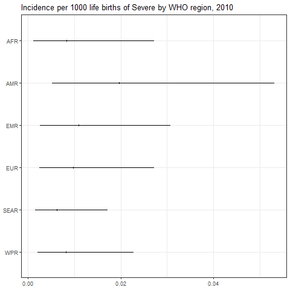

``` r
png(paste0(params$PlotDir, "/r_CI_2020.png"), width=480, height=480)
ggplot(subset(all_reg_rt, YEAR==2020),
       aes(y = VAL_MEAN, x = LOCATION_NAME)) +
  geom_pointrange(aes(ymin = VAL_LWR, ymax = VAL_UPR), size = 0.2) +
  coord_flip() +
  theme_bw() +
  scale_x_discrete(NULL, limits = rev(unique(all_reg_rt$LOCATION_NAME))) +
  scale_y_continuous(NULL) +
  ggtitle(paste0("Incidence per 1000 life births of ", params$Pathogen, " by WHO region, 2020"))
dev.off()
```

    ## png 
    ##   2

``` r
setwd(params$Dir)
image <- paste0("03-estimate_v6_files/figure-gfm/r_CI_2020.png")
cat("")
```

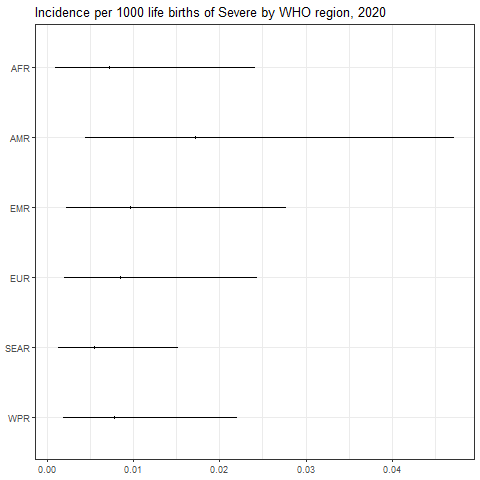

``` r
png(paste0(params$PlotDir, "/r_CASES_2010.png"), width=480, height=480)
ggplot(subset(all_reg_nr, YEAR==2010),
       aes(y = VAL_MEAN, x = LOCATION_NAME)) +
  geom_pointrange(aes(ymin = VAL_LWR, ymax = VAL_UPR), size = 0.2) +
  coord_flip() +
  theme_bw() +
  scale_x_discrete(NULL, limits = rev(unique(all_reg_nr$LOCATION_NAME))) +
  scale_y_continuous(NULL) +
  ggtitle(paste0("Cases of ", params$Pathogen, " by WHO region, 2010"))
dev.off()
```

    ## png 
    ##   2

``` r
setwd(params$Dir)
image <- paste0("03-estimate_v6_files/figure-gfm/r_CASES_2010.png")
cat("")
```

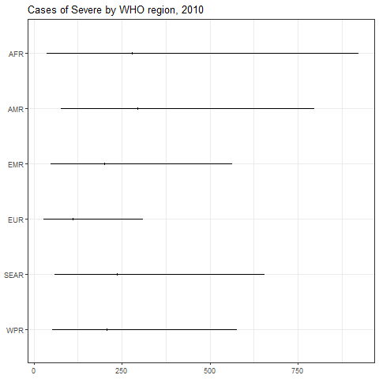

``` r
png(paste0(params$PlotDir, "/r_CASES_2020.png"), width=480, height=480)
ggplot(subset(all_reg_nr, YEAR==2020),
       aes(y = VAL_MEAN, x = LOCATION_NAME)) +
  geom_pointrange(aes(ymin = VAL_LWR, ymax = VAL_UPR), size = 0.2) +
  coord_flip() +
  theme_bw() +
  scale_x_discrete(NULL, limits = rev(unique(all_reg_nr$LOCATION_NAME))) +
  scale_y_continuous(NULL) +
  ggtitle(paste0("Cases of ", params$Pathogen, " by WHO region, 2020"))
dev.off()
```

    ## png 
    ##   2

``` r
setwd(params$Dir)
image <- paste0("03-estimate_v6_files/figure-gfm/r_CASES_2020.png")
cat("")
```

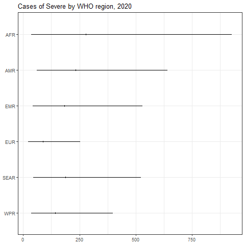

``` r
sim_all_reg <-
  merge(sim_all_reg,
        with(sim_all, aggregate(POP ~ REG2 + YEAR, FUN = sum)))
sim_all_reg_long <-
  pivot_longer(sim_all_reg, cols = starts_with("V"))
sim_all_reg_long$CASES <- sim_all_reg_long$value
```

``` r
png(paste0(params$PlotDir, "/r_hist_2010.png"), width=480, height=480)
ggplot(subset(sim_all_reg_long, YEAR==2010), aes(x = CASES)) +
  geom_density() +
  facet_wrap(~REG2) +
  theme_bw() +
  scale_x_log10() +
  ggtitle(paste0("Incidence per 1000 life births of ", params$Pathogen, " by WHO region, 2010"))
dev.off()
```

    ## png 
    ##   2

``` r
setwd(params$Dir)
image <- paste0("03-estimate_v6_files/figure-gfm/r_hist_2010.png")
cat("")
```

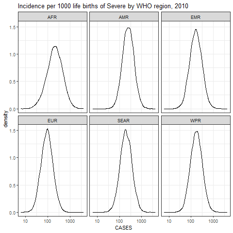

``` r
png(paste0(params$PlotDir, "/r_hist_2020_2010.png"), width=480, height=480)
ggplot(subset(sim_all_reg_long, YEAR==2010), aes(x = CASES)) +
  geom_density() +
  facet_wrap(~REG2) +
  theme_bw() +
  scale_x_log10() +
  ggtitle(paste0("Incidence per 1000 life births of ", params$Pathogen, " by WHO region, 2010"))
dev.off()
```

    ## png 
    ##   2

``` r
setwd(params$Dir)
image <- paste0("03-estimate_v6_files/figure-gfm/r_hist_2020_2010.png")
cat("")
```


## Subregions

``` r
kbl(subset(all_sub_rt, YEAR == 2020)[,c(7,2:5)],
    align = c("l", "c", "c", "c"), row.names = FALSE,
    col.names = c("Region", "Mean", "Median", "Lower", "Upper"),
    caption=paste0("Incidence per 1000 life births of ",params$Pathogen," by WHO subregion in 2020")) %>%
  kable_styling("striped", "hover")
```

<table class="table table-striped" style="margin-left: auto; margin-right: auto;">
<caption>
Incidence per 1000 life births of Severe by WHO subregion in 2020
</caption>
<thead>
<tr>
<th style="text-align:left;">
Region
</th>
<th style="text-align:center;">
Mean
</th>
<th style="text-align:center;">
Median
</th>
<th style="text-align:center;">
Lower
</th>
<th style="text-align:left;">
Upper
</th>
</tr>
</thead>
<tbody>
<tr>
<td style="text-align:left;">
AFRAB
</td>
<td style="text-align:center;">
0.0094724
</td>
<td style="text-align:center;">
0.0055756
</td>
<td style="text-align:center;">
0.0006695
</td>
<td style="text-align:left;">
0.0420503
</td>
</tr>
<tr>
<td style="text-align:left;">
AFRC
</td>
<td style="text-align:center;">
0.0064903
</td>
<td style="text-align:center;">
0.0046158
</td>
<td style="text-align:center;">
0.0008177
</td>
<td style="text-align:left;">
0.0236470
</td>
</tr>
<tr>
<td style="text-align:left;">
AFRD
</td>
<td style="text-align:center;">
0.0079119
</td>
<td style="text-align:center;">
0.0054512
</td>
<td style="text-align:center;">
0.0008053
</td>
<td style="text-align:left;">
0.0296761
</td>
</tr>
<tr>
<td style="text-align:left;">
AMRA
</td>
<td style="text-align:center;">
0.0079976
</td>
<td style="text-align:center;">
0.0066655
</td>
<td style="text-align:center;">
0.0020599
</td>
<td style="text-align:left;">
0.0215860
</td>
</tr>
<tr>
<td style="text-align:left;">
AMRB
</td>
<td style="text-align:center;">
0.0220541
</td>
<td style="text-align:center;">
0.0182853
</td>
<td style="text-align:center;">
0.0056071
</td>
<td style="text-align:left;">
0.0609313
</td>
</tr>
<tr>
<td style="text-align:left;">
AMRC
</td>
<td style="text-align:center;">
0.0185548
</td>
<td style="text-align:center;">
0.0139889
</td>
<td style="text-align:center;">
0.0034029
</td>
<td style="text-align:left;">
0.0599926
</td>
</tr>
<tr>
<td style="text-align:left;">
EMRA
</td>
<td style="text-align:center;">
0.0105145
</td>
<td style="text-align:center;">
0.0075871
</td>
<td style="text-align:center;">
0.0016656
</td>
<td style="text-align:left;">
0.0371627
</td>
</tr>
<tr>
<td style="text-align:left;">
EMRBC
</td>
<td style="text-align:center;">
0.0091700
</td>
<td style="text-align:center;">
0.0075173
</td>
<td style="text-align:center;">
0.0021662
</td>
<td style="text-align:left;">
0.0257165
</td>
</tr>
<tr>
<td style="text-align:left;">
EMRD
</td>
<td style="text-align:center;">
0.0105067
</td>
<td style="text-align:center;">
0.0073711
</td>
<td style="text-align:center;">
0.0013819
</td>
<td style="text-align:left;">
0.0374762
</td>
</tr>
<tr>
<td style="text-align:left;">
EURA
</td>
<td style="text-align:center;">
0.0094330
</td>
<td style="text-align:center;">
0.0076556
</td>
<td style="text-align:center;">
0.0021718
</td>
<td style="text-align:left;">
0.0272813
</td>
</tr>
<tr>
<td style="text-align:left;">
EURB
</td>
<td style="text-align:center;">
0.0054484
</td>
<td style="text-align:center;">
0.0042982
</td>
<td style="text-align:center;">
0.0011102
</td>
<td style="text-align:left;">
0.0165638
</td>
</tr>
<tr>
<td style="text-align:left;">
EURC
</td>
<td style="text-align:center;">
0.0125042
</td>
<td style="text-align:center;">
0.0093117
</td>
<td style="text-align:center;">
0.0023600
</td>
<td style="text-align:left;">
0.0428217
</td>
</tr>
<tr>
<td style="text-align:left;">
SEARB
</td>
<td style="text-align:center;">
0.0097103
</td>
<td style="text-align:center;">
0.0078245
</td>
<td style="text-align:center;">
0.0021247
</td>
<td style="text-align:left;">
0.0280345
</td>
</tr>
<tr>
<td style="text-align:left;">
SEARCD
</td>
<td style="text-align:center;">
0.0047131
</td>
<td style="text-align:center;">
0.0038265
</td>
<td style="text-align:center;">
0.0010989
</td>
<td style="text-align:left;">
0.0133733
</td>
</tr>
<tr>
<td style="text-align:left;">
WPRA
</td>
<td style="text-align:center;">
0.0163963
</td>
<td style="text-align:center;">
0.0136587
</td>
<td style="text-align:center;">
0.0041276
</td>
<td style="text-align:left;">
0.0448337
</td>
</tr>
<tr>
<td style="text-align:left;">
WPRB
</td>
<td style="text-align:center;">
0.0042291
</td>
<td style="text-align:center;">
0.0035451
</td>
<td style="text-align:center;">
0.0010949
</td>
<td style="text-align:left;">
0.0113435
</td>
</tr>
<tr>
<td style="text-align:left;">
WPRC
</td>
<td style="text-align:center;">
0.0151678
</td>
<td style="text-align:center;">
0.0112600
</td>
<td style="text-align:center;">
0.0026262
</td>
<td style="text-align:left;">
0.0511576
</td>
</tr>
</tbody>
</table>

``` r
kbl(subset(all_sub_nr, YEAR == 2020)[,c(7,2:5)],
    align = c("l", "c", "c", "c"), row.names = FALSE,
    col.names = c("Region", "Mean", "Median", "Lower", "Upper"),
    caption=paste0("Cases of ",params$Pathogen," by WHO sub region in 2020")) %>%
  kable_styling("striped", "hover")
```

<table class="table table-striped" style="margin-left: auto; margin-right: auto;">
<caption>
Cases of Severe by WHO sub region in 2020
</caption>
<thead>
<tr>
<th style="text-align:left;">
Region
</th>
<th style="text-align:center;">
Mean
</th>
<th style="text-align:center;">
Median
</th>
<th style="text-align:center;">
Lower
</th>
<th style="text-align:left;">
Upper
</th>
</tr>
</thead>
<tbody>
<tr>
<td style="text-align:left;">
AFRAB
</td>
<td style="text-align:center;">
13.740896
</td>
<td style="text-align:center;">
8.088092
</td>
<td style="text-align:center;">
0.9711905
</td>
<td style="text-align:left;">
60.99935
</td>
</tr>
<tr>
<td style="text-align:left;">
AFRC
</td>
<td style="text-align:center;">
122.627868
</td>
<td style="text-align:center;">
87.211255
</td>
<td style="text-align:center;">
15.4490231
</td>
<td style="text-align:left;">
446.78827
</td>
</tr>
<tr>
<td style="text-align:left;">
AFRD
</td>
<td style="text-align:center;">
142.365359
</td>
<td style="text-align:center;">
98.088826
</td>
<td style="text-align:center;">
14.4913552
</td>
<td style="text-align:left;">
533.99051
</td>
</tr>
<tr>
<td style="text-align:left;">
AMRA
</td>
<td style="text-align:center;">
34.766571
</td>
<td style="text-align:center;">
28.975543
</td>
<td style="text-align:center;">
8.9546724
</td>
<td style="text-align:left;">
93.83692
</td>
</tr>
<tr>
<td style="text-align:left;">
AMRB
</td>
<td style="text-align:center;">
174.226098
</td>
<td style="text-align:center;">
144.453251
</td>
<td style="text-align:center;">
44.2961111
</td>
<td style="text-align:left;">
481.35368
</td>
</tr>
<tr>
<td style="text-align:left;">
AMRC
</td>
<td style="text-align:center;">
24.505847
</td>
<td style="text-align:center;">
18.475554
</td>
<td style="text-align:center;">
4.4943537
</td>
<td style="text-align:left;">
79.23381
</td>
</tr>
<tr>
<td style="text-align:left;">
EMRA
</td>
<td style="text-align:center;">
8.398616
</td>
<td style="text-align:center;">
6.060276
</td>
<td style="text-align:center;">
1.3304300
</td>
<td style="text-align:left;">
29.68423
</td>
</tr>
<tr>
<td style="text-align:left;">
EMRBC
</td>
<td style="text-align:center;">
117.399548
</td>
<td style="text-align:center;">
96.240967
</td>
<td style="text-align:center;">
27.7324959
</td>
<td style="text-align:left;">
329.23664
</td>
</tr>
<tr>
<td style="text-align:left;">
EMRD
</td>
<td style="text-align:center;">
57.764507
</td>
<td style="text-align:center;">
40.525200
</td>
<td style="text-align:center;">
7.5977815
</td>
<td style="text-align:left;">
206.03949
</td>
</tr>
<tr>
<td style="text-align:left;">
EURA
</td>
<td style="text-align:center;">
47.014030
</td>
<td style="text-align:center;">
38.155666
</td>
<td style="text-align:center;">
10.8244254
</td>
<td style="text-align:left;">
135.96978
</td>
</tr>
<tr>
<td style="text-align:left;">
EURB
</td>
<td style="text-align:center;">
20.774488
</td>
<td style="text-align:center;">
16.388542
</td>
<td style="text-align:center;">
4.2330556
</td>
<td style="text-align:left;">
63.15665
</td>
</tr>
<tr>
<td style="text-align:left;">
EURC
</td>
<td style="text-align:center;">
20.441098
</td>
<td style="text-align:center;">
15.222137
</td>
<td style="text-align:center;">
3.8579599
</td>
<td style="text-align:left;">
70.00201
</td>
</tr>
<tr>
<td style="text-align:left;">
SEARB
</td>
<td style="text-align:center;">
50.609747
</td>
<td style="text-align:center;">
40.780793
</td>
<td style="text-align:center;">
11.0739633
</td>
<td style="text-align:left;">
146.11426
</td>
</tr>
<tr>
<td style="text-align:left;">
SEARCD
</td>
<td style="text-align:center;">
136.920141
</td>
<td style="text-align:center;">
111.163870
</td>
<td style="text-align:center;">
31.9245297
</td>
<td style="text-align:left;">
388.50488
</td>
</tr>
<tr>
<td style="text-align:left;">
WPRA
</td>
<td style="text-align:center;">
24.876818
</td>
<td style="text-align:center;">
20.723220
</td>
<td style="text-align:center;">
6.2624695
</td>
<td style="text-align:left;">
68.02255
</td>
</tr>
<tr>
<td style="text-align:left;">
WPRB
</td>
<td style="text-align:center;">
52.040678
</td>
<td style="text-align:center;">
43.624156
</td>
<td style="text-align:center;">
13.4737654
</td>
<td style="text-align:left;">
139.58627
</td>
</tr>
<tr>
<td style="text-align:left;">
WPRC
</td>
<td style="text-align:center;">
65.327319
</td>
<td style="text-align:center;">
48.496474
</td>
<td style="text-align:center;">
11.3110585
</td>
<td style="text-align:left;">
220.33452
</td>
</tr>
</tbody>
</table>

``` r
png(paste0(params$PlotDir, "/r_CI_SUB2_2010.png"), width=480, height=480)
ggplot(subset(all_sub_rt, YEAR==2010),
       aes(y = VAL_MEAN, x = LOCATION_NAME)) +
  geom_pointrange(aes(ymin = VAL_LWR, ymax = VAL_UPR), size = 0.2) +
  coord_flip() +
  theme_bw() +
  scale_x_discrete(NULL, limits = rev(unique(all_sub_rt$LOCATION_NAME))) +
  scale_y_continuous(NULL) +
  ggtitle(paste0("Incidence per 1000 life births of ", params$Pathogen, " by WHO sub region, 2010"))
dev.off()
```

    ## png 
    ##   2

``` r
setwd(params$Dir)
image <- paste0("03-estimate_v6_files/figure-gfm/r_CI_SUB2_2010.png")
cat("")
```

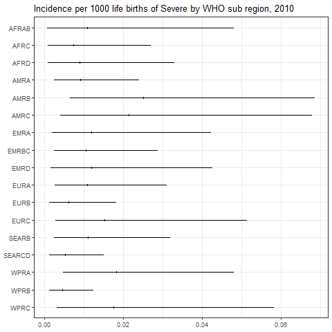

``` r
png(paste0(params$PlotDir, "/r_CI_SUB2_2020.png"), width=480, height=480)
ggplot(subset(all_sub_rt, YEAR==2020),
       aes(y = VAL_MEAN, x = LOCATION_NAME)) +
  geom_pointrange(aes(ymin = VAL_LWR, ymax = VAL_UPR), size = 0.2) +
  coord_flip() +
  theme_bw() +
  scale_x_discrete(NULL, limits = rev(unique(all_sub_rt$LOCATION_NAME))) +
  scale_y_continuous(NULL) +
  ggtitle(paste0("Incidence per 1000 life births of ", params$Pathogen, " by WHO sub region, 2020"))
dev.off()
```

    ## png 
    ##   2

``` r
setwd(params$Dir)
image <- paste0("03-estimate_v6_files/figure-gfm/r_CI_SUB2_2020.png")
cat("")
```

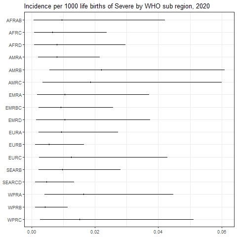

``` r
png(paste0(params$PlotDir, "/r_CASES_SUB2_2010.png"), width=480, height=480)
ggplot(subset(all_sub_nr, YEAR==2010),
       aes(y = VAL_MEAN, x = LOCATION_NAME)) +
  geom_pointrange(aes(ymin = VAL_LWR, ymax = VAL_UPR), size = 0.2) +
  coord_flip() +
  theme_bw() +
  scale_x_discrete(NULL, limits = rev(unique(all_sub_nr$LOCATION_NAME))) +
  scale_y_continuous(NULL) +
  ggtitle(paste0("Cases of ", params$Pathogen, " by WHO sub region, 2010"))
dev.off()
```

    ## png 
    ##   2

``` r
setwd(params$Dir)
image <- paste0("03-estimate_v6_files/figure-gfm/r_CASES_SUB2_2010.png")
cat("")
```

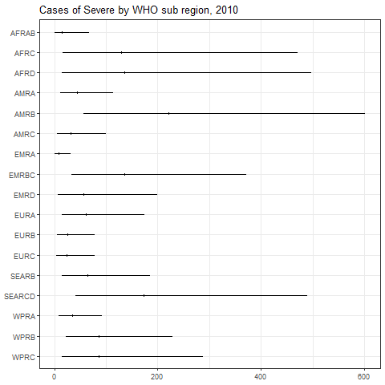

``` r
png(paste0(params$PlotDir, "/r_CASES_SUB2_2020.png"), width=480, height=480)
ggplot(subset(all_sub_nr, YEAR==2020),
       aes(y = VAL_MEAN, x = LOCATION_NAME)) +
  geom_pointrange(aes(ymin = VAL_LWR, ymax = VAL_UPR), size = 0.2) +
  coord_flip() +
  theme_bw() +
  scale_x_discrete(NULL, limits = rev(unique(all_sub_nr$LOCATION_NAME))) +
  scale_y_continuous(NULL) +
  ggtitle(paste0("Cases of ", params$Pathogen, " by WHO sub region, 2020"))
dev.off()
```

    ## png 
    ##   2

``` r
setwd(params$Dir)
image <- paste0("03-estimate_v6_files/figure-gfm/r_CASES_SUB2_2020.png")
cat("")
```

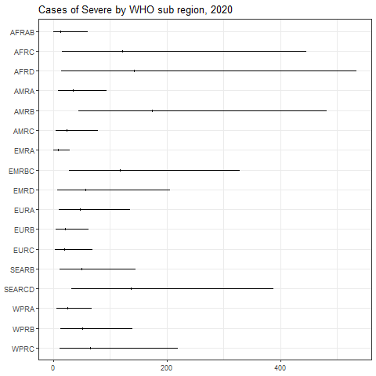

``` r
sim_all_sub <-
  merge(sim_all_sub,
        with(sim_all, aggregate(POP ~ SUB2 + YEAR, FUN = sum)))
sim_all_sub_long <-
  pivot_longer(sim_all_sub, cols = starts_with("V"))
sim_all_sub_long$CASES <- sim_all_sub_long$value
```

``` r
png(paste0(params$PlotDir, "/r_hist_SUB2_2010.png"), width=480, height=480)
ggplot(subset(sim_all_sub_long, YEAR==2010), aes(x = CASES)) +
  geom_density() +
  facet_wrap(~SUB2) +
  theme_bw() +
  scale_x_log10() +
  ggtitle(paste0("Incidence per 1000 life births of ", params$Pathogen, "by WHO sub region, 2010"))
dev.off()
```

    ## png 
    ##   2

``` r
setwd(params$Dir)
image <- paste0("03-estimate_v6_files/figure-gfm/r_hist_SUB2_2010.png")
cat("")
```


``` r
png(paste0(params$PlotDir, "/r_hist_SUB2_2020_2010.png"), width=480, height=480)
ggplot(subset(sim_all_sub_long, YEAR==2010), aes(x = CASES)) +
  geom_density() +
  facet_wrap(~SUB2) +
  theme_bw() +
  scale_x_log10() +
  ggtitle(paste0("Incidence per 1000 life births of ", params$Pathogen, "by WHO sub region, 2010"))
dev.off()
```

    ## png 
    ##   2

``` r
setwd(params$Dir)
image <- paste0("03-estimate_v6_files/figure-gfm/r_hist_SUB2_2020_2010.png")
cat("")
```

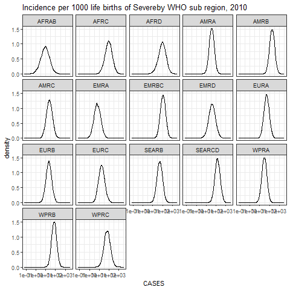

## Countries

``` r
png(paste0(params$PlotDir, "/r_cnt_2010.png"), width=800, height=300)
plot_world(subset(all_cnt_rt, YEAR == 2010),
           "LOCATION_NAME", "VAL_MEAN", legend.title = "Incidence per 1000", diseasefree = zero_cases)
```

    ## [1] 0.000 0.005 0.010 0.015 0.020 0.025 0.030 0.035

``` r
dev.off()
```

    ## png 
    ##   2

``` r
setwd(params$Dir)
image <- paste0("03-estimate_v6_files/figure-gfm/r_cnt_2010.png")
cat("")
```

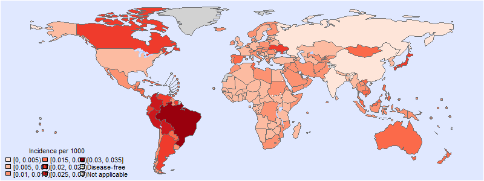

``` r
png(paste0(params$PlotDir, "/r_cnt_2020.png"), width=800, height=300)
plot_world(subset(all_cnt_rt, YEAR == 2020),
           "LOCATION_NAME", "VAL_MEAN", legend.title = "Incidence per 1000", diseasefree = zero_cases)
```

    ## [1] 0.000 0.005 0.010 0.015 0.020 0.025 0.030 0.035

``` r
dev.off()
```

    ## png 
    ##   2

``` r
setwd(params$Dir)
image <- paste0("03-estimate_v6_files/figure-gfm/r_cnt_2020.png")
cat("")
```

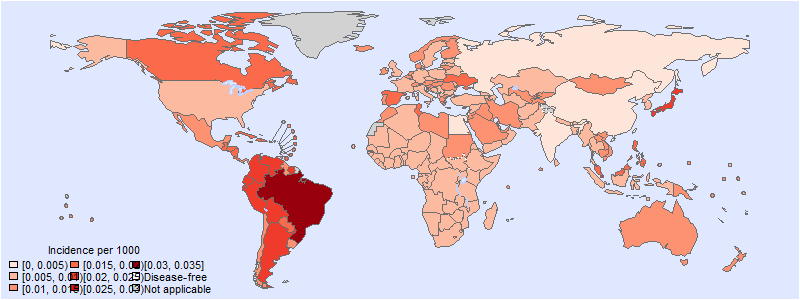

``` r
tab <-
  data.frame(subset(all_cnt_rt, YEAR == 2010)[,
                                              c("LOCATION_NAME", "VAL_MEAN", "VAL_MEDIAN", "VAL_LWR", "VAL_UPR")],
             subset(all_cnt_rt, YEAR == 2020)[,
                                              c("VAL_MEAN", "VAL_MEDIAN", "VAL_LWR", "VAL_UPR")])
tab$LOCATION_NAME <-
  FERG2:::countries$COUNTRY[match(tab$LOCATION_NAME, FERG2:::countries$ISO3)]
tab$LOCATION_NAME <- gsub(" \\(.*", "", tab$LOCATION_NAME)
names(tab) <-
  c("Country",
    "2010.mean", "2010.median", "2010.lwr", "2010.upr",
    "2020.mean", "2020.median", "2020.lwr", "2020.upr")

kable(tab, digits = 3, row.names = FALSE,
      caption = paste0("Estimated ", params$Pathogen, " incidence by country, 2010 vs 2020"))
```

| Country                          | 2010.mean | 2010.median | 2010.lwr | 2010.upr | 2020.mean | 2020.median | 2020.lwr | 2020.upr |
|:---------------------------------|----------:|------------:|---------:|---------:|----------:|------------:|---------:|---------:|
| Afghanistan                      |     0.011 |       0.008 |    0.002 |    0.038 |     0.010 |       0.007 |    0.001 |    0.034 |
| Angola                           |     0.007 |       0.005 |    0.001 |    0.025 |     0.006 |       0.005 |    0.001 |    0.022 |
| Albania                          |     0.009 |       0.006 |    0.001 |    0.041 |     0.008 |       0.005 |    0.001 |    0.036 |
| Andorra                          |     0.010 |       0.008 |    0.002 |    0.028 |     0.008 |       0.007 |    0.002 |    0.025 |
| United Arab Emirates             |     0.014 |       0.008 |    0.001 |    0.061 |     0.012 |       0.007 |    0.001 |    0.053 |
| Argentina                        |     0.024 |       0.016 |    0.002 |    0.097 |     0.021 |       0.014 |    0.002 |    0.086 |
| Armenia                          |     0.008 |       0.006 |    0.001 |    0.024 |     0.007 |       0.005 |    0.001 |    0.021 |
| Antigua and Barbuda              |     0.015 |       0.012 |    0.003 |    0.043 |     0.013 |       0.010 |    0.003 |    0.038 |
| Australia                        |     0.015 |       0.010 |    0.002 |    0.061 |     0.013 |       0.009 |    0.002 |    0.054 |
| Austria                          |     0.013 |       0.009 |    0.002 |    0.052 |     0.012 |       0.008 |    0.001 |    0.046 |
| Azerbaijan                       |     0.008 |       0.006 |    0.001 |    0.024 |     0.007 |       0.005 |    0.001 |    0.021 |
| Burundi                          |     0.008 |       0.006 |    0.001 |    0.030 |     0.007 |       0.005 |    0.001 |    0.026 |
| Belgium                          |     0.011 |       0.008 |    0.001 |    0.045 |     0.010 |       0.007 |    0.001 |    0.040 |
| Benin                            |     0.009 |       0.005 |    0.001 |    0.041 |     0.008 |       0.005 |    0.001 |    0.037 |
| Burkina Faso                     |     0.008 |       0.006 |    0.001 |    0.030 |     0.007 |       0.005 |    0.001 |    0.026 |
| Bangladesh                       |     0.007 |       0.005 |    0.001 |    0.025 |     0.006 |       0.004 |    0.001 |    0.022 |
| Bulgaria                         |     0.008 |       0.006 |    0.001 |    0.024 |     0.007 |       0.005 |    0.001 |    0.021 |
| Bahrain                          |     0.011 |       0.008 |    0.002 |    0.037 |     0.010 |       0.007 |    0.002 |    0.032 |
| Bahamas                          |     0.015 |       0.012 |    0.003 |    0.043 |     0.013 |       0.010 |    0.003 |    0.038 |
| Bosnia and Herzegovina           |     0.008 |       0.006 |    0.001 |    0.024 |     0.007 |       0.005 |    0.001 |    0.021 |
| Belarus                          |     0.008 |       0.006 |    0.001 |    0.024 |     0.007 |       0.005 |    0.001 |    0.021 |
| Belize                           |     0.020 |       0.016 |    0.004 |    0.058 |     0.017 |       0.014 |    0.004 |    0.052 |
| Bolivia                          |     0.026 |       0.017 |    0.003 |    0.098 |     0.022 |       0.015 |    0.003 |    0.087 |
| Brazil                           |     0.034 |       0.029 |    0.009 |    0.092 |     0.030 |       0.025 |    0.008 |    0.083 |
| Barbados                         |     0.015 |       0.012 |    0.003 |    0.043 |     0.013 |       0.010 |    0.003 |    0.038 |
| Brunei Darussalam                |     0.013 |       0.011 |    0.003 |    0.041 |     0.012 |       0.009 |    0.002 |    0.036 |
| Bhutan                           |     0.008 |       0.006 |    0.001 |    0.023 |     0.007 |       0.005 |    0.001 |    0.021 |
| Botswana                         |     0.009 |       0.007 |    0.001 |    0.034 |     0.008 |       0.006 |    0.001 |    0.030 |
| Central African Republic         |     0.008 |       0.006 |    0.001 |    0.030 |     0.007 |       0.005 |    0.001 |    0.026 |
| Canada                           |     0.023 |       0.018 |    0.005 |    0.066 |     0.020 |       0.016 |    0.004 |    0.060 |
| Switzerland                      |     0.012 |       0.008 |    0.001 |    0.047 |     0.010 |       0.007 |    0.001 |    0.041 |
| Chile                            |     0.015 |       0.012 |    0.003 |    0.043 |     0.013 |       0.010 |    0.003 |    0.038 |
| China                            |     0.004 |       0.004 |    0.001 |    0.012 |     0.004 |       0.003 |    0.001 |    0.010 |
| Côte d’Ivoire                    |     0.007 |       0.005 |    0.001 |    0.025 |     0.006 |       0.005 |    0.001 |    0.022 |
| Cameroon                         |     0.007 |       0.005 |    0.001 |    0.025 |     0.006 |       0.005 |    0.001 |    0.022 |
| Congo                            |     0.010 |       0.006 |    0.001 |    0.048 |     0.009 |       0.005 |    0.001 |    0.042 |
| Congo                            |     0.009 |       0.005 |    0.001 |    0.039 |     0.008 |       0.005 |    0.001 |    0.034 |
| Cook Islands                     |     0.013 |       0.011 |    0.003 |    0.041 |     0.012 |       0.009 |    0.002 |    0.036 |
| Colombia                         |     0.028 |       0.022 |    0.006 |    0.083 |     0.025 |       0.020 |    0.005 |    0.073 |
| Comoros                          |     0.007 |       0.005 |    0.001 |    0.025 |     0.006 |       0.005 |    0.001 |    0.022 |
| Cabo Verde                       |     0.009 |       0.005 |    0.001 |    0.038 |     0.008 |       0.005 |    0.001 |    0.033 |
| Costa Rica                       |     0.020 |       0.016 |    0.004 |    0.058 |     0.017 |       0.014 |    0.004 |    0.052 |
| Cuba                             |     0.020 |       0.016 |    0.004 |    0.058 |     0.017 |       0.014 |    0.004 |    0.052 |
| Cyprus                           |     0.012 |       0.008 |    0.001 |    0.046 |     0.010 |       0.007 |    0.001 |    0.041 |
| Czechia                          |     0.011 |       0.007 |    0.001 |    0.041 |     0.009 |       0.006 |    0.001 |    0.036 |
| Germany                          |     0.010 |       0.007 |    0.001 |    0.036 |     0.009 |       0.006 |    0.001 |    0.032 |
| Djibouti                         |     0.010 |       0.008 |    0.002 |    0.031 |     0.009 |       0.007 |    0.002 |    0.028 |
| Dominica                         |     0.020 |       0.016 |    0.004 |    0.058 |     0.017 |       0.014 |    0.004 |    0.052 |
| Denmark                          |     0.013 |       0.009 |    0.002 |    0.050 |     0.011 |       0.008 |    0.001 |    0.044 |
| Dominican Republic               |     0.020 |       0.016 |    0.004 |    0.058 |     0.017 |       0.014 |    0.004 |    0.052 |
| Algeria                          |     0.007 |       0.005 |    0.001 |    0.025 |     0.006 |       0.005 |    0.001 |    0.022 |
| Ecuador                          |     0.024 |       0.016 |    0.002 |    0.094 |     0.021 |       0.013 |    0.002 |    0.083 |
| Egypt                            |     0.005 |       0.004 |    0.001 |    0.019 |     0.005 |       0.003 |    0.001 |    0.016 |
| Eritrea                          |     0.010 |       0.006 |    0.001 |    0.046 |     0.009 |       0.005 |    0.001 |    0.041 |
| Spain                            |     0.017 |       0.014 |    0.004 |    0.051 |     0.015 |       0.012 |    0.003 |    0.045 |
| Estonia                          |     0.010 |       0.008 |    0.002 |    0.028 |     0.008 |       0.007 |    0.002 |    0.025 |
| Ethiopia                         |     0.009 |       0.005 |    0.001 |    0.036 |     0.007 |       0.004 |    0.000 |    0.032 |
| Finland                          |     0.012 |       0.008 |    0.001 |    0.048 |     0.011 |       0.007 |    0.001 |    0.042 |
| Fiji                             |     0.011 |       0.009 |    0.002 |    0.031 |     0.009 |       0.007 |    0.002 |    0.028 |
| France                           |     0.009 |       0.007 |    0.001 |    0.032 |     0.008 |       0.006 |    0.001 |    0.028 |
| Micronesia                       |     0.014 |       0.010 |    0.003 |    0.043 |     0.012 |       0.009 |    0.002 |    0.039 |
| Gabon                            |     0.009 |       0.007 |    0.001 |    0.034 |     0.008 |       0.006 |    0.001 |    0.030 |
| United Kingdom                   |     0.009 |       0.006 |    0.001 |    0.033 |     0.008 |       0.006 |    0.001 |    0.029 |
| Georgia                          |     0.009 |       0.006 |    0.001 |    0.037 |     0.008 |       0.005 |    0.001 |    0.032 |
| Ghana                            |     0.008 |       0.005 |    0.001 |    0.030 |     0.007 |       0.004 |    0.001 |    0.026 |
| Guinea                           |     0.007 |       0.005 |    0.001 |    0.025 |     0.006 |       0.005 |    0.001 |    0.022 |
| Gambia                           |     0.008 |       0.006 |    0.001 |    0.030 |     0.007 |       0.005 |    0.001 |    0.026 |
| Guinea-Bissau                    |     0.008 |       0.006 |    0.001 |    0.030 |     0.007 |       0.005 |    0.001 |    0.026 |
| Equatorial Guinea                |     0.009 |       0.007 |    0.001 |    0.034 |     0.008 |       0.006 |    0.001 |    0.030 |
| Greece                           |     0.012 |       0.008 |    0.001 |    0.043 |     0.010 |       0.007 |    0.001 |    0.038 |
| Grenada                          |     0.020 |       0.016 |    0.004 |    0.058 |     0.017 |       0.014 |    0.004 |    0.052 |
| Guatemala                        |     0.020 |       0.016 |    0.004 |    0.058 |     0.017 |       0.014 |    0.004 |    0.052 |
| Guyana                           |     0.015 |       0.012 |    0.003 |    0.043 |     0.013 |       0.010 |    0.003 |    0.038 |
| Honduras                         |     0.018 |       0.014 |    0.003 |    0.058 |     0.016 |       0.012 |    0.003 |    0.052 |
| Croatia                          |     0.012 |       0.008 |    0.001 |    0.046 |     0.010 |       0.007 |    0.001 |    0.041 |
| Haiti                            |     0.018 |       0.014 |    0.003 |    0.058 |     0.016 |       0.012 |    0.003 |    0.052 |
| Hungary                          |     0.012 |       0.008 |    0.001 |    0.048 |     0.011 |       0.007 |    0.001 |    0.042 |
| Indonesia                        |     0.011 |       0.009 |    0.002 |    0.032 |     0.010 |       0.008 |    0.002 |    0.028 |
| India                            |     0.005 |       0.004 |    0.001 |    0.014 |     0.004 |       0.003 |    0.001 |    0.012 |
| Ireland                          |     0.012 |       0.008 |    0.001 |    0.045 |     0.010 |       0.007 |    0.001 |    0.040 |
| Iran                             |     0.014 |       0.011 |    0.003 |    0.043 |     0.013 |       0.010 |    0.003 |    0.038 |
| Iraq                             |     0.013 |       0.008 |    0.001 |    0.052 |     0.011 |       0.007 |    0.001 |    0.046 |
| Iceland                          |     0.012 |       0.008 |    0.001 |    0.049 |     0.011 |       0.007 |    0.001 |    0.043 |
| Israel                           |     0.010 |       0.008 |    0.002 |    0.028 |     0.008 |       0.007 |    0.002 |    0.025 |
| Italy                            |     0.010 |       0.008 |    0.002 |    0.033 |     0.009 |       0.007 |    0.002 |    0.029 |
| Jamaica                          |     0.024 |       0.016 |    0.002 |    0.098 |     0.021 |       0.014 |    0.002 |    0.086 |
| Jordan                           |     0.013 |       0.008 |    0.001 |    0.052 |     0.011 |       0.007 |    0.001 |    0.045 |
| Japan                            |     0.023 |       0.020 |    0.006 |    0.062 |     0.020 |       0.017 |    0.005 |    0.056 |
| Kazakhstan                       |     0.009 |       0.006 |    0.001 |    0.035 |     0.008 |       0.005 |    0.001 |    0.031 |
| Kenya                            |     0.009 |       0.005 |    0.001 |    0.041 |     0.008 |       0.005 |    0.001 |    0.036 |
| Kyrgyzstan                       |     0.013 |       0.009 |    0.002 |    0.044 |     0.011 |       0.008 |    0.002 |    0.039 |
| Cambodia                         |     0.016 |       0.011 |    0.002 |    0.063 |     0.014 |       0.009 |    0.002 |    0.056 |
| Kiribati                         |     0.014 |       0.010 |    0.003 |    0.043 |     0.012 |       0.009 |    0.002 |    0.039 |
| Saint Kitts and Nevis            |     0.015 |       0.012 |    0.003 |    0.043 |     0.013 |       0.010 |    0.003 |    0.038 |
| Korea                            |     0.008 |       0.006 |    0.001 |    0.028 |     0.007 |       0.006 |    0.001 |    0.025 |
| Kuwait                           |     0.014 |       0.009 |    0.001 |    0.059 |     0.012 |       0.008 |    0.001 |    0.052 |
| Lao People’s Dem. Republic       |     0.014 |       0.010 |    0.003 |    0.043 |     0.012 |       0.009 |    0.002 |    0.039 |
| Lebanon                          |     0.013 |       0.008 |    0.001 |    0.051 |     0.011 |       0.007 |    0.001 |    0.046 |
| Liberia                          |     0.008 |       0.006 |    0.001 |    0.030 |     0.007 |       0.005 |    0.001 |    0.026 |
| Libya                            |     0.013 |       0.009 |    0.001 |    0.051 |     0.012 |       0.008 |    0.001 |    0.045 |
| Saint Lucia                      |     0.020 |       0.016 |    0.004 |    0.058 |     0.017 |       0.014 |    0.004 |    0.052 |
| Sri Lanka                        |     0.009 |       0.006 |    0.001 |    0.039 |     0.008 |       0.005 |    0.001 |    0.035 |
| Lesotho                          |     0.007 |       0.005 |    0.001 |    0.025 |     0.006 |       0.005 |    0.001 |    0.022 |
| Lithuania                        |     0.012 |       0.008 |    0.001 |    0.049 |     0.011 |       0.007 |    0.001 |    0.044 |
| Luxembourg                       |     0.012 |       0.008 |    0.001 |    0.049 |     0.011 |       0.007 |    0.001 |    0.043 |
| Latvia                           |     0.010 |       0.008 |    0.002 |    0.028 |     0.008 |       0.007 |    0.002 |    0.025 |
| Morocco                          |     0.012 |       0.008 |    0.001 |    0.047 |     0.011 |       0.007 |    0.001 |    0.043 |
| Monaco                           |     0.010 |       0.008 |    0.002 |    0.028 |     0.008 |       0.007 |    0.002 |    0.025 |
| Republic of Moldova              |     0.008 |       0.006 |    0.001 |    0.024 |     0.007 |       0.005 |    0.001 |    0.021 |
| Madagascar                       |     0.008 |       0.006 |    0.001 |    0.030 |     0.007 |       0.005 |    0.001 |    0.026 |
| Maldives                         |     0.013 |       0.008 |    0.001 |    0.052 |     0.011 |       0.007 |    0.001 |    0.047 |
| Mexico                           |     0.015 |       0.011 |    0.003 |    0.044 |     0.013 |       0.010 |    0.003 |    0.039 |
| Marshall Islands                 |     0.011 |       0.009 |    0.002 |    0.031 |     0.009 |       0.007 |    0.002 |    0.028 |
| North Macedonia                  |     0.008 |       0.006 |    0.001 |    0.024 |     0.007 |       0.005 |    0.001 |    0.021 |
| Mali                             |     0.008 |       0.006 |    0.001 |    0.030 |     0.007 |       0.005 |    0.001 |    0.026 |
| Malta                            |     0.010 |       0.008 |    0.002 |    0.028 |     0.008 |       0.007 |    0.002 |    0.025 |
| Myanmar                          |     0.008 |       0.006 |    0.001 |    0.023 |     0.007 |       0.005 |    0.001 |    0.021 |
| Montenegro                       |     0.008 |       0.006 |    0.001 |    0.024 |     0.007 |       0.005 |    0.001 |    0.021 |
| Mongolia                         |     0.017 |       0.010 |    0.002 |    0.069 |     0.015 |       0.009 |    0.001 |    0.061 |
| Mozambique                       |     0.010 |       0.006 |    0.001 |    0.048 |     0.009 |       0.005 |    0.001 |    0.043 |
| Mauritania                       |     0.007 |       0.005 |    0.001 |    0.025 |     0.006 |       0.005 |    0.001 |    0.022 |
| Mauritius                        |     0.009 |       0.007 |    0.001 |    0.034 |     0.008 |       0.006 |    0.001 |    0.030 |
| Malawi                           |     0.008 |       0.006 |    0.001 |    0.030 |     0.007 |       0.005 |    0.001 |    0.026 |
| Malaysia                         |     0.019 |       0.015 |    0.004 |    0.061 |     0.017 |       0.013 |    0.003 |    0.055 |
| Namibia                          |     0.009 |       0.007 |    0.001 |    0.034 |     0.008 |       0.006 |    0.001 |    0.030 |
| Niger                            |     0.008 |       0.006 |    0.001 |    0.030 |     0.007 |       0.005 |    0.001 |    0.026 |
| Nigeria                          |     0.007 |       0.004 |    0.001 |    0.031 |     0.006 |       0.004 |    0.000 |    0.027 |
| Nicaragua                        |     0.018 |       0.014 |    0.003 |    0.058 |     0.016 |       0.012 |    0.003 |    0.052 |
| Niue                             |     0.013 |       0.011 |    0.003 |    0.041 |     0.012 |       0.009 |    0.002 |    0.036 |
| Netherlands                      |     0.012 |       0.008 |    0.001 |    0.048 |     0.011 |       0.007 |    0.001 |    0.043 |
| Norway                           |     0.013 |       0.009 |    0.002 |    0.050 |     0.011 |       0.008 |    0.001 |    0.045 |
| Nepal                            |     0.008 |       0.006 |    0.001 |    0.023 |     0.007 |       0.005 |    0.001 |    0.021 |
| Nauru                            |     0.013 |       0.011 |    0.003 |    0.041 |     0.012 |       0.009 |    0.002 |    0.036 |
| New Zealand                      |     0.016 |       0.011 |    0.002 |    0.066 |     0.014 |       0.009 |    0.001 |    0.058 |
| Oman                             |     0.011 |       0.008 |    0.002 |    0.037 |     0.010 |       0.007 |    0.002 |    0.032 |
| Pakistan                         |     0.011 |       0.009 |    0.002 |    0.030 |     0.009 |       0.008 |    0.002 |    0.026 |
| Panama                           |     0.015 |       0.012 |    0.003 |    0.043 |     0.013 |       0.010 |    0.003 |    0.038 |
| Peru                             |     0.028 |       0.021 |    0.005 |    0.094 |     0.025 |       0.019 |    0.004 |    0.083 |
| Philippines                      |     0.019 |       0.014 |    0.003 |    0.067 |     0.017 |       0.012 |    0.002 |    0.059 |
| Palau                            |     0.011 |       0.009 |    0.002 |    0.031 |     0.009 |       0.007 |    0.002 |    0.028 |
| Papua New Guinea                 |     0.014 |       0.010 |    0.003 |    0.043 |     0.012 |       0.009 |    0.002 |    0.039 |
| Poland                           |     0.010 |       0.007 |    0.001 |    0.039 |     0.009 |       0.006 |    0.001 |    0.034 |
| Korea                            |     0.008 |       0.006 |    0.001 |    0.023 |     0.007 |       0.005 |    0.001 |    0.021 |
| Portugal                         |     0.013 |       0.009 |    0.002 |    0.049 |     0.012 |       0.008 |    0.002 |    0.043 |
| Paraguay                         |     0.020 |       0.016 |    0.004 |    0.058 |     0.017 |       0.014 |    0.004 |    0.052 |
| Qatar                            |     0.011 |       0.008 |    0.002 |    0.037 |     0.010 |       0.007 |    0.002 |    0.032 |
| Romania                          |     0.012 |       0.008 |    0.001 |    0.046 |     0.010 |       0.007 |    0.001 |    0.040 |
| Russian Federation               |     0.005 |       0.004 |    0.001 |    0.014 |     0.004 |       0.003 |    0.001 |    0.012 |
| Rwanda                           |     0.008 |       0.006 |    0.001 |    0.030 |     0.007 |       0.005 |    0.001 |    0.026 |
| Saudi Arabia                     |     0.012 |       0.008 |    0.001 |    0.044 |     0.010 |       0.007 |    0.001 |    0.039 |
| Sudan                            |     0.014 |       0.008 |    0.001 |    0.061 |     0.012 |       0.007 |    0.001 |    0.053 |
| Senegal                          |     0.007 |       0.005 |    0.001 |    0.025 |     0.006 |       0.005 |    0.001 |    0.022 |
| Singapore                        |     0.024 |       0.016 |    0.003 |    0.092 |     0.021 |       0.014 |    0.002 |    0.082 |
| Solomon Islands                  |     0.014 |       0.010 |    0.003 |    0.043 |     0.012 |       0.009 |    0.002 |    0.039 |
| Sierra Leone                     |     0.008 |       0.006 |    0.001 |    0.030 |     0.007 |       0.005 |    0.001 |    0.026 |
| El Salvador                      |     0.020 |       0.016 |    0.004 |    0.058 |     0.017 |       0.014 |    0.004 |    0.052 |
| San Marino                       |     0.010 |       0.008 |    0.002 |    0.028 |     0.008 |       0.007 |    0.002 |    0.025 |
| Somalia                          |     0.011 |       0.008 |    0.002 |    0.038 |     0.010 |       0.007 |    0.001 |    0.034 |
| Serbia                           |     0.010 |       0.006 |    0.001 |    0.042 |     0.008 |       0.005 |    0.001 |    0.036 |
| South Sudan                      |     0.008 |       0.006 |    0.001 |    0.030 |     0.007 |       0.005 |    0.001 |    0.026 |
| Sao Tome and Principe            |     0.007 |       0.005 |    0.001 |    0.025 |     0.006 |       0.005 |    0.001 |    0.022 |
| Suriname                         |     0.024 |       0.016 |    0.002 |    0.096 |     0.021 |       0.014 |    0.002 |    0.084 |
| Slovakia                         |     0.012 |       0.008 |    0.001 |    0.049 |     0.011 |       0.007 |    0.001 |    0.044 |
| Slovenia                         |     0.012 |       0.008 |    0.001 |    0.048 |     0.010 |       0.007 |    0.001 |    0.042 |
| Sweden                           |     0.010 |       0.007 |    0.001 |    0.038 |     0.009 |       0.006 |    0.001 |    0.033 |
| Eswatini                         |     0.007 |       0.005 |    0.001 |    0.025 |     0.006 |       0.005 |    0.001 |    0.022 |
| Seychelles                       |     0.012 |       0.007 |    0.001 |    0.058 |     0.011 |       0.006 |    0.001 |    0.052 |
| Syrian Arab Republic             |     0.011 |       0.008 |    0.002 |    0.038 |     0.010 |       0.007 |    0.001 |    0.034 |
| Chad                             |     0.008 |       0.006 |    0.001 |    0.030 |     0.007 |       0.005 |    0.001 |    0.026 |
| Togo                             |     0.008 |       0.006 |    0.001 |    0.030 |     0.007 |       0.005 |    0.001 |    0.026 |
| Thailand                         |     0.010 |       0.007 |    0.001 |    0.040 |     0.009 |       0.006 |    0.001 |    0.035 |
| Tajikistan                       |     0.013 |       0.009 |    0.002 |    0.044 |     0.011 |       0.008 |    0.002 |    0.039 |
| Turkmenistan                     |     0.008 |       0.006 |    0.001 |    0.024 |     0.007 |       0.005 |    0.001 |    0.021 |
| Timor-Leste                      |     0.008 |       0.006 |    0.001 |    0.023 |     0.007 |       0.005 |    0.001 |    0.021 |
| Tonga                            |     0.011 |       0.009 |    0.002 |    0.031 |     0.009 |       0.007 |    0.002 |    0.028 |
| Trinidad and Tobago              |     0.015 |       0.012 |    0.003 |    0.043 |     0.013 |       0.010 |    0.003 |    0.038 |
| Tunisia                          |     0.018 |       0.013 |    0.002 |    0.070 |     0.016 |       0.011 |    0.002 |    0.061 |
| Turkiye                          |     0.006 |       0.004 |    0.001 |    0.022 |     0.005 |       0.004 |    0.001 |    0.020 |
| Tuvalu                           |     0.011 |       0.009 |    0.002 |    0.031 |     0.009 |       0.007 |    0.002 |    0.028 |
| United Republic of Tanzania      |     0.007 |       0.005 |    0.001 |    0.029 |     0.006 |       0.004 |    0.001 |    0.026 |
| Uganda                           |     0.008 |       0.006 |    0.001 |    0.030 |     0.007 |       0.005 |    0.001 |    0.026 |
| Ukraine                          |     0.021 |       0.015 |    0.003 |    0.078 |     0.018 |       0.013 |    0.003 |    0.068 |
| Uruguay                          |     0.015 |       0.012 |    0.003 |    0.043 |     0.013 |       0.010 |    0.003 |    0.038 |
| United States of America         |     0.007 |       0.006 |    0.002 |    0.019 |     0.006 |       0.005 |    0.002 |    0.017 |
| Uzbekistan                       |     0.013 |       0.009 |    0.002 |    0.044 |     0.011 |       0.008 |    0.002 |    0.039 |
| Saint Vincent and the Grenadines |     0.020 |       0.016 |    0.004 |    0.058 |     0.017 |       0.014 |    0.004 |    0.052 |
| Venezuela                        |     0.023 |       0.016 |    0.003 |    0.080 |     0.020 |       0.014 |    0.003 |    0.072 |
| Viet Nam                         |     0.016 |       0.010 |    0.002 |    0.068 |     0.014 |       0.009 |    0.001 |    0.061 |
| Vanuatu                          |     0.014 |       0.010 |    0.003 |    0.043 |     0.012 |       0.009 |    0.002 |    0.039 |
| Samoa                            |     0.014 |       0.010 |    0.003 |    0.043 |     0.012 |       0.009 |    0.002 |    0.039 |
| Yemen                            |     0.011 |       0.008 |    0.002 |    0.038 |     0.010 |       0.007 |    0.001 |    0.034 |
| South Africa                     |     0.011 |       0.006 |    0.001 |    0.052 |     0.010 |       0.005 |    0.001 |    0.045 |
| Zambia                           |     0.007 |       0.005 |    0.001 |    0.025 |     0.006 |       0.005 |    0.001 |    0.022 |
| Zimbabwe                         |     0.008 |       0.005 |    0.001 |    0.035 |     0.007 |       0.004 |    0.001 |    0.031 |

Estimated Severe incidence by country, 2010 vs 2020

``` r
tab2 <-
  data.frame(subset(all_cnt_nr, YEAR == 2010)[,
                                              c("LOCATION_NAME", "VAL_MEAN", "VAL_MEDIAN", "VAL_LWR", "VAL_UPR")],
             subset(all_cnt_nr, YEAR == 2020)[,
                                              c("VAL_MEAN", "VAL_MEDIAN", "VAL_LWR", "VAL_UPR")])
tab2$LOCATION_NAME <-
  FERG2:::countries$COUNTRY[match(tab2$LOCATION_NAME, FERG2:::countries$ISO3)]
tab2$LOCATION_NAME <- gsub(" \\(.*", "", tab2$LOCATION_NAME)
names(tab2) <-
  c("Country",
    "2010.mean", "2010.median", "2010.lwr", "2010.upr",
    "2020.mean", "2020.median", "2020.lwr", "2020.upr")

kable(tab2, digits = 1, row.names = FALSE,
      caption = paste0("Estimated ", params$Pathogen, " cases by country, 2010 vs 2020"))
```

| Country                          | 2010.mean | 2010.median | 2010.lwr | 2010.upr | 2020.mean | 2020.median | 2020.lwr | 2020.upr |
|:---------------------------------|----------:|------------:|---------:|---------:|----------:|------------:|---------:|---------:|
| Afghanistan                      |      13.3 |         9.7 |      2.0 |     45.1 |      14.2 |        10.2 |      2.1 |     48.4 |
| Angola                           |       7.4 |         5.5 |      1.0 |     25.3 |       8.2 |         6.0 |      1.0 |     28.0 |
| Albania                          |       0.3 |         0.2 |      0.0 |      1.5 |       0.3 |         0.2 |      0.0 |      1.1 |
| Andorra                          |       0.0 |         0.0 |      0.0 |      0.0 |       0.0 |         0.0 |      0.0 |      0.0 |
| United Arab Emirates             |       1.1 |         0.7 |      0.1 |      4.7 |       1.2 |         0.7 |      0.1 |      5.3 |
| Argentina                        |      18.4 |        11.9 |      1.8 |     72.8 |      11.4 |         7.3 |      1.1 |     45.7 |
| Armenia                          |       0.3 |         0.3 |      0.1 |      1.0 |       0.2 |         0.2 |      0.0 |      0.7 |
| Antigua and Barbuda              |       0.0 |         0.0 |      0.0 |      0.1 |       0.0 |         0.0 |      0.0 |      0.0 |
| Australia                        |       4.6 |         3.1 |      0.5 |     18.3 |       4.0 |         2.7 |      0.4 |     15.8 |
| Austria                          |       1.1 |         0.7 |      0.1 |      4.1 |       1.0 |         0.7 |      0.1 |      3.8 |
| Azerbaijan                       |       1.3 |         1.0 |      0.2 |      4.0 |       1.0 |         0.7 |      0.2 |      3.0 |
| Burundi                          |       3.7 |         2.7 |      0.4 |     13.0 |       3.3 |         2.4 |      0.4 |     11.7 |
| Belgium                          |       1.5 |         1.0 |      0.2 |      5.7 |       1.2 |         0.8 |      0.1 |      4.6 |
| Benin                            |       3.5 |         2.1 |      0.2 |     16.0 |       3.7 |         2.1 |      0.2 |     16.9 |
| Burkina Faso                     |       5.8 |         4.2 |      0.6 |     20.5 |       5.2 |         3.7 |      0.6 |     18.2 |
| Bangladesh                       |      22.7 |        16.5 |      3.1 |     81.0 |      20.5 |        14.8 |      2.8 |     74.1 |
| Bulgaria                         |       0.6 |         0.5 |      0.1 |      1.8 |       0.4 |         0.3 |      0.1 |      1.2 |
| Bahrain                          |       0.2 |         0.2 |      0.0 |      0.7 |       0.2 |         0.1 |      0.0 |      0.6 |
| Bahamas                          |       0.1 |         0.1 |      0.0 |      0.2 |       0.1 |         0.0 |      0.0 |      0.2 |
| Bosnia and Herzegovina           |       0.3 |         0.2 |      0.1 |      0.8 |       0.2 |         0.1 |      0.0 |      0.6 |
| Belarus                          |       0.8 |         0.6 |      0.1 |      2.5 |       0.6 |         0.4 |      0.1 |      1.7 |
| Belize                           |       0.1 |         0.1 |      0.0 |      0.4 |       0.1 |         0.1 |      0.0 |      0.4 |
| Bolivia                          |       6.6 |         4.4 |      0.8 |     25.4 |       5.8 |         3.8 |      0.7 |     22.7 |
| Brazil                           |     101.2 |        85.2 |     27.1 |    270.9 |      81.3 |        67.8 |     21.0 |    222.6 |
| Barbados                         |       0.1 |         0.0 |      0.0 |      0.2 |       0.0 |         0.0 |      0.0 |      0.1 |
| Brunei Darussalam                |       0.1 |         0.1 |      0.0 |      0.3 |       0.1 |         0.1 |      0.0 |      0.2 |
| Bhutan                           |       0.1 |         0.1 |      0.0 |      0.3 |       0.1 |         0.1 |      0.0 |      0.2 |
| Botswana                         |       0.5 |         0.4 |      0.1 |      2.0 |       0.5 |         0.3 |      0.1 |      1.8 |
| Central African Republic         |       1.7 |         1.2 |      0.2 |      5.9 |       1.6 |         1.2 |      0.2 |      5.7 |
| Canada                           |       8.5 |         6.8 |      1.8 |     25.1 |       7.2 |         5.7 |      1.5 |     21.7 |
| Switzerland                      |       0.9 |         0.6 |      0.1 |      3.7 |       0.9 |         0.6 |      0.1 |      3.5 |
| Chile                            |       3.5 |         2.8 |      0.7 |     10.4 |       2.5 |         2.0 |      0.5 |      7.5 |
| China                            |      76.3 |        64.2 |     20.0 |    206.1 |      44.1 |        36.9 |     11.3 |    119.8 |
| Côte d’Ivoire                    |       6.6 |         4.8 |      0.8 |     22.4 |       6.1 |         4.5 |      0.8 |     21.1 |
| Cameroon                         |       5.6 |         4.1 |      0.7 |     19.1 |       5.8 |         4.3 |      0.7 |     20.1 |
| Congo                            |      31.2 |        17.7 |      1.9 |    142.3 |      36.8 |        20.8 |      2.2 |    169.3 |
| Congo                            |       1.5 |         0.9 |      0.1 |      6.6 |       1.4 |         0.8 |      0.1 |      6.1 |
| Cook Islands                     |       0.0 |         0.0 |      0.0 |      0.0 |       0.0 |         0.0 |      0.0 |      0.0 |
| Colombia                         |      21.1 |        16.8 |      4.5 |     62.4 |      17.5 |        13.8 |      3.7 |     51.8 |
| Comoros                          |       0.2 |         0.1 |      0.0 |      0.6 |       0.2 |         0.1 |      0.0 |      0.5 |
| Cabo Verde                       |       0.1 |         0.1 |      0.0 |      0.4 |       0.1 |         0.0 |      0.0 |      0.2 |
| Costa Rica                       |       1.4 |         1.1 |      0.3 |      4.0 |       1.0 |         0.8 |      0.2 |      3.0 |
| Cuba                             |       2.5 |         2.0 |      0.5 |      7.4 |       1.8 |         1.4 |      0.4 |      5.4 |
| Cyprus                           |       0.2 |         0.1 |      0.0 |      0.6 |       0.1 |         0.1 |      0.0 |      0.6 |
| Czechia                          |       1.2 |         0.8 |      0.1 |      4.7 |       1.0 |         0.7 |      0.1 |      4.0 |
| Germany                          |       6.6 |         4.5 |      0.8 |     24.4 |       6.6 |         4.5 |      0.8 |     24.7 |
| Djibouti                         |       0.3 |         0.2 |      0.1 |      0.8 |       0.2 |         0.2 |      0.0 |      0.7 |
| Dominica                         |       0.0 |         0.0 |      0.0 |      0.1 |       0.0 |         0.0 |      0.0 |      0.0 |
| Denmark                          |       0.8 |         0.6 |      0.1 |      3.1 |       0.7 |         0.5 |      0.1 |      2.7 |
| Dominican Republic               |       4.2 |         3.4 |      0.9 |     12.4 |       3.6 |         2.8 |      0.8 |     10.8 |
| Algeria                          |       6.4 |         4.7 |      0.8 |     21.9 |       6.3 |         4.6 |      0.8 |     21.5 |
| Ecuador                          |       7.8 |         5.1 |      0.8 |     30.6 |       5.9 |         3.8 |      0.6 |     23.7 |
| Egypt                            |      13.5 |         9.8 |      1.9 |     46.3 |      11.6 |         8.3 |      1.6 |     39.5 |
| Eritrea                          |       1.0 |         0.6 |      0.1 |      4.5 |       0.9 |         0.5 |      0.1 |      3.9 |
| Spain                            |       8.3 |         6.6 |      1.8 |     24.5 |       5.2 |         4.1 |      1.1 |     15.5 |
| Estonia                          |       0.2 |         0.1 |      0.0 |      0.4 |       0.1 |         0.1 |      0.0 |      0.3 |
| Ethiopia                         |      28.0 |        16.8 |      1.9 |    119.0 |      29.6 |        17.5 |      2.0 |    126.7 |
| Finland                          |       0.7 |         0.5 |      0.1 |      2.9 |       0.5 |         0.3 |      0.1 |      1.9 |
| Fiji                             |       0.2 |         0.2 |      0.0 |      0.6 |       0.2 |         0.1 |      0.0 |      0.5 |
| France                           |       7.2 |         5.3 |      1.1 |     25.4 |       5.5 |         4.0 |      0.8 |     19.5 |
| Micronesia                       |       0.0 |         0.0 |      0.0 |      0.1 |       0.0 |         0.0 |      0.0 |      0.1 |
| Gabon                            |       0.5 |         0.4 |      0.1 |      1.9 |       0.6 |         0.4 |      0.1 |      2.1 |
| United Kingdom                   |       7.3 |         5.2 |      1.0 |     26.6 |       5.4 |         3.8 |      0.7 |     19.7 |
| Georgia                          |       0.6 |         0.4 |      0.1 |      2.2 |       0.4 |         0.3 |      0.0 |      1.6 |
| Ghana                            |       6.3 |         4.1 |      0.7 |     24.6 |       5.8 |         3.8 |      0.6 |     22.6 |
| Guinea                           |       2.9 |         2.2 |      0.4 |      9.9 |       3.0 |         2.2 |      0.4 |     10.2 |
| Gambia                           |       0.6 |         0.4 |      0.1 |      2.2 |       0.6 |         0.4 |      0.1 |      2.1 |
| Guinea-Bissau                    |       0.5 |         0.4 |      0.1 |      1.7 |       0.5 |         0.3 |      0.1 |      1.6 |
| Equatorial Guinea                |       0.4 |         0.3 |      0.0 |      1.5 |       0.4 |         0.3 |      0.0 |      1.6 |
| Greece                           |       1.3 |         0.9 |      0.2 |      4.9 |       0.9 |         0.6 |      0.1 |      3.3 |
| Grenada                          |       0.0 |         0.0 |      0.0 |      0.1 |       0.0 |         0.0 |      0.0 |      0.1 |
| Guatemala                        |       7.8 |         6.3 |      1.7 |     23.1 |       6.5 |         5.2 |      1.4 |     19.7 |
| Guyana                           |       0.2 |         0.2 |      0.1 |      0.7 |       0.2 |         0.2 |      0.0 |      0.7 |
| Honduras                         |       4.0 |         3.0 |      0.7 |     12.8 |       3.7 |         2.7 |      0.7 |     11.8 |
| Croatia                          |       0.5 |         0.3 |      0.1 |      2.0 |       0.3 |         0.2 |      0.0 |      1.4 |
| Haiti                            |       4.9 |         3.7 |      0.9 |     15.8 |       4.2 |         3.1 |      0.7 |     13.4 |
| Hungary                          |       1.1 |         0.7 |      0.1 |      4.3 |       1.0 |         0.6 |      0.1 |      3.9 |
| Indonesia                        |      56.0 |        45.0 |     12.5 |    161.5 |      44.8 |        35.8 |      9.8 |    129.9 |
| India                            |     131.8 |       107.1 |     31.1 |    376.1 |     100.9 |        81.9 |     23.4 |    289.4 |
| Ireland                          |       0.9 |         0.6 |      0.1 |      3.4 |       0.6 |         0.4 |      0.1 |      2.3 |
| Iran                             |      19.1 |        15.1 |      3.9 |     57.3 |      15.4 |        12.1 |      3.1 |     46.2 |
| Iraq                             |      13.8 |         8.9 |      1.4 |     55.5 |      12.7 |         8.2 |      1.3 |     51.3 |
| Iceland                          |       0.1 |         0.0 |      0.0 |      0.2 |       0.0 |         0.0 |      0.0 |      0.2 |
| Israel                           |       1.5 |         1.3 |      0.4 |      4.5 |       1.4 |         1.2 |      0.3 |      4.2 |
| Italy                            |       5.8 |         4.5 |      1.0 |     18.6 |       3.7 |         2.8 |      0.7 |     11.9 |
| Jamaica                          |       1.0 |         0.7 |      0.1 |      4.2 |       0.7 |         0.5 |      0.1 |      2.9 |
| Jordan                           |       2.7 |         1.7 |      0.3 |     10.6 |       2.7 |         1.7 |      0.3 |     10.7 |
| Japan                            |      24.7 |        20.9 |      6.5 |     66.5 |      17.0 |        14.3 |      4.4 |     46.9 |
| Kazakhstan                       |       3.3 |         2.1 |      0.3 |     13.3 |       3.4 |         2.1 |      0.3 |     13.8 |
| Kenya                            |      13.6 |         7.9 |      0.9 |     61.5 |      11.6 |         6.7 |      0.8 |     52.5 |
| Kyrgyzstan                       |       1.9 |         1.4 |      0.3 |      6.5 |       1.8 |         1.3 |      0.3 |      6.2 |
| Cambodia                         |       5.9 |         3.8 |      0.7 |     22.8 |       5.3 |         3.5 |      0.6 |     21.1 |
| Kiribati                         |       0.0 |         0.0 |      0.0 |      0.1 |       0.0 |         0.0 |      0.0 |      0.1 |
| Saint Kitts and Nevis            |       0.0 |         0.0 |      0.0 |      0.0 |       0.0 |         0.0 |      0.0 |      0.0 |
| Korea                            |       3.8 |         2.8 |      0.6 |     12.7 |       2.0 |         1.5 |      0.3 |      6.8 |
| Kuwait                           |       0.8 |         0.5 |      0.1 |      3.3 |       0.6 |         0.4 |      0.1 |      2.7 |
| Lao People’s Dem. Republic       |       2.3 |         1.8 |      0.4 |      7.4 |       2.0 |         1.5 |      0.4 |      6.4 |
| Lebanon                          |       1.2 |         0.8 |      0.1 |      4.8 |       1.1 |         0.7 |      0.1 |      4.4 |
| Liberia                          |       1.3 |         0.9 |      0.1 |      4.5 |       1.2 |         0.9 |      0.1 |      4.2 |
| Libya                            |       2.0 |         1.3 |      0.2 |      7.8 |       1.5 |         1.0 |      0.2 |      5.9 |
| Saint Lucia                      |       0.0 |         0.0 |      0.0 |      0.1 |       0.0 |         0.0 |      0.0 |      0.1 |
| Sri Lanka                        |       3.4 |         2.1 |      0.3 |     14.1 |       2.8 |         1.7 |      0.3 |     11.5 |
| Lesotho                          |       0.4 |         0.3 |      0.1 |      1.4 |       0.4 |         0.3 |      0.0 |      1.2 |
| Lithuania                        |       0.4 |         0.2 |      0.0 |      1.6 |       0.3 |         0.2 |      0.0 |      1.1 |
| Luxembourg                       |       0.1 |         0.0 |      0.0 |      0.3 |       0.1 |         0.0 |      0.0 |      0.3 |
| Latvia                           |       0.2 |         0.2 |      0.0 |      0.6 |       0.1 |         0.1 |      0.0 |      0.4 |
| Morocco                          |       8.6 |         5.7 |      0.9 |     33.6 |       6.9 |         4.5 |      0.7 |     27.9 |
| Monaco                           |       0.0 |         0.0 |      0.0 |      0.0 |       0.0 |         0.0 |      0.0 |      0.0 |
| Republic of Moldova              |       0.4 |         0.3 |      0.1 |      1.3 |       0.2 |         0.2 |      0.0 |      0.8 |
| Madagascar                       |       6.7 |         4.8 |      0.7 |     23.4 |       7.0 |         5.0 |      0.8 |     24.7 |
| Maldives                         |       0.1 |         0.1 |      0.0 |      0.4 |       0.1 |         0.0 |      0.0 |      0.3 |
| Mexico                           |      33.4 |        26.3 |      6.8 |    101.1 |      26.6 |        20.8 |      5.3 |     81.6 |
| Marshall Islands                 |       0.0 |         0.0 |      0.0 |      0.1 |       0.0 |         0.0 |      0.0 |      0.0 |
| North Macedonia                  |       0.2 |         0.2 |      0.0 |      0.6 |       0.1 |         0.1 |      0.0 |      0.4 |
| Mali                             |       6.2 |         4.4 |      0.7 |     21.7 |       6.5 |         4.6 |      0.7 |     22.9 |
| Malta                            |       0.0 |         0.0 |      0.0 |      0.1 |       0.0 |         0.0 |      0.0 |      0.1 |
| Myanmar                          |       7.3 |         5.7 |      1.4 |     22.3 |       6.2 |         4.8 |      1.2 |     19.2 |
| Montenegro                       |       0.1 |         0.0 |      0.0 |      0.2 |       0.0 |         0.0 |      0.0 |      0.1 |
| Mongolia                         |       1.1 |         0.7 |      0.1 |      4.5 |       1.1 |         0.7 |      0.1 |      4.5 |
| Mozambique                       |      10.0 |         5.7 |      0.6 |     46.4 |      10.6 |         6.0 |      0.6 |     50.2 |
| Mauritania                       |       0.9 |         0.7 |      0.1 |      3.2 |       1.0 |         0.7 |      0.1 |      3.5 |
| Mauritius                        |       0.1 |         0.1 |      0.0 |      0.5 |       0.1 |         0.1 |      0.0 |      0.4 |
| Malawi                           |       5.0 |         3.6 |      0.6 |     17.7 |       4.7 |         3.3 |      0.5 |     16.5 |
| Malaysia                         |       9.4 |         7.1 |      1.7 |     29.6 |       7.7 |         5.9 |      1.4 |     24.8 |
| Namibia                          |       0.6 |         0.4 |      0.1 |      2.2 |       0.6 |         0.4 |      0.1 |      2.3 |
| Niger                            |       6.8 |         4.9 |      0.7 |     23.8 |       7.4 |         5.3 |      0.8 |     26.1 |
| Nigeria                          |      48.8 |        29.7 |      3.8 |    213.0 |      44.1 |        26.8 |      3.3 |    192.5 |
| Nicaragua                        |       2.5 |         1.9 |      0.5 |      8.0 |       2.1 |         1.6 |      0.4 |      6.8 |
| Niue                             |       0.0 |         0.0 |      0.0 |      0.0 |       0.0 |         0.0 |      0.0 |      0.0 |
| Netherlands                      |       2.2 |         1.5 |      0.2 |      8.9 |       1.8 |         1.2 |      0.2 |      7.3 |
| Norway                           |       0.8 |         0.5 |      0.1 |      3.0 |       0.6 |         0.4 |      0.1 |      2.4 |
| Nepal                            |       4.8 |         3.7 |      0.9 |     14.6 |       3.9 |         3.0 |      0.7 |     12.1 |
| Nauru                            |       0.0 |         0.0 |      0.0 |      0.0 |       0.0 |         0.0 |      0.0 |      0.0 |
| New Zealand                      |       1.0 |         0.7 |      0.1 |      4.2 |       0.8 |         0.5 |      0.1 |      3.3 |
| Oman                             |       0.7 |         0.5 |      0.1 |      2.4 |       0.8 |         0.6 |      0.1 |      2.7 |
| Pakistan                         |      70.4 |        57.8 |     16.2 |    198.6 |      62.2 |        50.7 |     13.9 |    178.0 |
| Panama                           |       1.1 |         0.9 |      0.2 |      3.2 |       0.9 |         0.7 |      0.2 |      2.7 |
| Peru                             |      16.2 |        12.3 |      2.9 |     53.8 |      13.4 |        10.1 |      2.3 |     44.9 |
| Philippines                      |      48.7 |        35.2 |      7.4 |    172.0 |      31.9 |        22.8 |      4.8 |    112.0 |
| Palau                            |       0.0 |         0.0 |      0.0 |      0.0 |       0.0 |         0.0 |      0.0 |      0.0 |
| Papua New Guinea                 |       3.2 |         2.4 |      0.6 |     10.1 |       3.1 |         2.3 |      0.6 |      9.9 |
| Poland                           |       4.2 |         2.9 |      0.5 |     16.4 |       3.2 |         2.1 |      0.4 |     12.4 |
| Korea                            |       2.5 |         2.0 |      0.5 |      7.8 |       2.4 |         1.8 |      0.4 |      7.3 |
| Portugal                         |       1.3 |         0.9 |      0.2 |      4.9 |       1.0 |         0.7 |      0.1 |      3.6 |
| Paraguay                         |       2.5 |         2.0 |      0.5 |      7.4 |       2.4 |         1.9 |      0.5 |      7.2 |
| Qatar                            |       0.2 |         0.2 |      0.0 |      0.7 |       0.3 |         0.2 |      0.0 |      0.9 |
| Romania                          |       2.7 |         1.7 |      0.3 |     10.3 |       2.0 |         1.3 |      0.2 |      7.8 |
| Russian Federation               |       8.4 |         6.7 |      1.7 |     25.2 |       5.9 |         4.7 |      1.2 |     18.0 |
| Rwanda                           |       3.0 |         2.2 |      0.3 |     10.7 |       2.9 |         2.1 |      0.3 |     10.2 |
| Saudi Arabia                     |       5.9 |         4.1 |      0.7 |     22.1 |       5.3 |         3.6 |      0.6 |     20.0 |
| Sudan                            |      18.1 |        10.6 |      1.3 |     81.6 |      19.1 |        11.2 |      1.4 |     85.8 |
| Senegal                          |       3.4 |         2.5 |      0.4 |     11.5 |       3.2 |         2.3 |      0.4 |     10.9 |
| Singapore                        |       1.0 |         0.7 |      0.1 |      3.9 |       1.0 |         0.6 |      0.1 |      3.8 |
| Solomon Islands                  |       0.2 |         0.2 |      0.0 |      0.8 |       0.2 |         0.2 |      0.0 |      0.8 |
| Sierra Leone                     |       2.0 |         1.4 |      0.2 |      7.1 |       1.9 |         1.3 |      0.2 |      6.6 |
| El Salvador                      |       2.3 |         1.9 |      0.5 |      6.8 |       1.7 |         1.4 |      0.4 |      5.3 |
| San Marino                       |       0.0 |         0.0 |      0.0 |      0.0 |       0.0 |         0.0 |      0.0 |      0.0 |
| Somalia                          |       6.6 |         4.8 |      1.0 |     22.5 |       7.3 |         5.3 |      1.1 |     25.0 |
| Serbia                           |       0.7 |         0.4 |      0.1 |      2.9 |       0.5 |         0.3 |      0.0 |      2.3 |
| South Sudan                      |       3.2 |         2.3 |      0.4 |     11.2 |       2.3 |         1.6 |      0.2 |      8.0 |
| Sao Tome and Principe            |       0.0 |         0.0 |      0.0 |      0.2 |       0.0 |         0.0 |      0.0 |      0.1 |
| Suriname                         |       0.3 |         0.2 |      0.0 |      1.1 |       0.2 |         0.1 |      0.0 |      0.9 |
| Slovakia                         |       0.7 |         0.5 |      0.1 |      3.0 |       0.6 |         0.4 |      0.1 |      2.5 |
| Slovenia                         |       0.3 |         0.2 |      0.0 |      1.1 |       0.2 |         0.1 |      0.0 |      0.8 |
| Sweden                           |       1.1 |         0.8 |      0.1 |      4.3 |       1.0 |         0.7 |      0.1 |      3.7 |
| Eswatini                         |       0.2 |         0.2 |      0.0 |      0.8 |       0.2 |         0.1 |      0.0 |      0.7 |
| Seychelles                       |       0.0 |         0.0 |      0.0 |      0.1 |       0.0 |         0.0 |      0.0 |      0.1 |
| Syrian Arab Republic             |       7.3 |         5.3 |      1.1 |     24.7 |       4.3 |         3.1 |      0.6 |     14.7 |
| Chad                             |       5.0 |         3.6 |      0.5 |     17.4 |       5.5 |         3.9 |      0.6 |     19.4 |
| Togo                             |       2.1 |         1.5 |      0.2 |      7.5 |       2.1 |         1.5 |      0.2 |      7.3 |
| Thailand                         |       8.5 |         5.8 |      1.0 |     32.9 |       5.7 |         3.9 |      0.7 |     22.1 |
| Tajikistan                       |       3.1 |         2.3 |      0.6 |     10.7 |       3.0 |         2.2 |      0.5 |     10.8 |
| Turkmenistan                     |       1.1 |         0.9 |      0.2 |      3.4 |       1.1 |         0.9 |      0.2 |      3.5 |
| Timor-Leste                      |       0.3 |         0.2 |      0.0 |      0.8 |       0.2 |         0.2 |      0.0 |      0.6 |
| Tonga                            |       0.0 |         0.0 |      0.0 |      0.1 |       0.0 |         0.0 |      0.0 |      0.1 |
| Trinidad and Tobago              |       0.3 |         0.2 |      0.1 |      0.8 |       0.2 |         0.2 |      0.0 |      0.7 |
| Tunisia                          |       3.6 |         2.5 |      0.5 |     13.6 |       3.1 |         2.1 |      0.4 |     11.5 |
| Turkiye                          |       7.8 |         5.5 |      1.1 |     27.9 |       6.4 |         4.5 |      0.9 |     23.5 |
| Tuvalu                           |       0.0 |         0.0 |      0.0 |      0.0 |       0.0 |         0.0 |      0.0 |      0.0 |
| United Republic of Tanzania      |      12.6 |         8.1 |      1.1 |     50.6 |      14.2 |         9.0 |      1.3 |     58.0 |
| Uganda                           |      11.6 |         8.3 |      1.3 |     40.7 |      12.0 |         8.5 |      1.3 |     42.4 |
| Ukraine                          |      10.7 |         7.5 |      1.6 |     39.4 |       6.2 |         4.4 |      0.9 |     22.9 |
| Uruguay                          |       0.7 |         0.5 |      0.1 |      2.0 |       0.4 |         0.4 |      0.1 |      1.3 |
| United States of America         |      28.9 |        24.3 |      7.5 |     77.1 |      23.2 |        19.3 |      5.9 |     63.0 |
| Uzbekistan                       |       8.0 |         5.9 |      1.4 |     27.8 |       9.4 |         6.9 |      1.7 |     33.6 |
| Saint Vincent and the Grenadines |       0.0 |         0.0 |      0.0 |      0.1 |       0.0 |         0.0 |      0.0 |      0.1 |
| Venezuela                        |      13.2 |         9.4 |      1.9 |     46.4 |       8.8 |         6.2 |      1.3 |     31.5 |
| Viet Nam                         |      25.0 |        15.4 |      2.3 |    103.9 |      21.5 |        13.1 |      1.9 |     90.7 |
| Vanuatu                          |       0.1 |         0.1 |      0.0 |      0.3 |       0.1 |         0.1 |      0.0 |      0.3 |
| Samoa                            |       0.1 |         0.1 |      0.0 |      0.3 |       0.1 |         0.1 |      0.0 |      0.2 |
| Yemen                            |      10.7 |         7.8 |      1.6 |     36.4 |      12.9 |         9.2 |      1.9 |     43.9 |
| South Africa                     |      12.9 |         7.2 |      0.8 |     59.7 |      11.5 |         6.3 |      0.7 |     53.7 |
| Zambia                           |       4.2 |         3.1 |      0.5 |     14.2 |       4.1 |         3.0 |      0.5 |     14.2 |
| Zimbabwe                         |       4.1 |         2.5 |      0.3 |     17.5 |       3.4 |         2.0 |      0.3 |     14.7 |

Estimated Severe cases by country, 2010 vs 2020

# Session info

``` r
sessioninfo::session_info()
```

    ## Warning in system2("quarto", "-V", stdout = TRUE, env = paste0("TMPDIR=", : running command '"quarto" TMPDIR=C:/Users/LoVa3397/AppData/Local/Temp/RtmpgPXlwa/file3804d52333c
    ## -V' had status 1

    ## ─ Session info ──────────────────────────────────────────────────────────────────────────────────────────────────────────────────────────────────────────────────────────────
    ##  setting  value
    ##  version  R version 4.5.0 (2025-04-11 ucrt)
    ##  os       Windows 10 x64 (build 19045)
    ##  system   x86_64, mingw32
    ##  ui       RStudio
    ##  language (EN)
    ##  collate  English_Belgium.utf8
    ##  ctype    English_Belgium.utf8
    ##  tz       Europe/Brussels
    ##  date     2025-09-16
    ##  rstudio  2024.04.2+764 Chocolate Cosmos (desktop)
    ##  pandoc   3.1.11 @ C:/Program Files/RStudio/resources/app/bin/quarto/bin/tools/ (via rmarkdown)
    ##  quarto   ERROR: Unknown command "TMPDIR=C:/Users/LoVa3397/AppData/Local/Temp/RtmpgPXlwa/file3804d52333c". Did you mean command "install"? @ C:\\PROGRA~1\\RStudio\\RESOUR~1\\app\\bin\\quarto\\bin\\quarto.exe
    ## 
    ## ─ Packages ──────────────────────────────────────────────────────────────────────────────────────────────────────────────────────────────────────────────────────────────────
    ##  ! package        * version    date (UTC) lib source
    ##    abind            1.4-8      2024-09-12 [1] CRAN (R 4.5.0)
    ##    backports        1.5.0      2024-05-23 [1] CRAN (R 4.5.0)
    ##    base64enc        0.1-3      2015-07-28 [1] CRAN (R 4.5.0)
    ##    bayesplot        1.12.0     2025-04-10 [1] CRAN (R 4.5.0)
    ##    bd             * 0.0.14     2025-04-26 [1] Github (brechtdv/bd@652191c)
    ##    boot             1.3-31     2024-08-28 [1] CRAN (R 4.5.0)
    ##    bridgesampling   1.1-2      2021-04-16 [1] CRAN (R 4.5.0)
    ##    brms           * 2.22.0     2024-09-23 [1] CRAN (R 4.5.0)
    ##    Brobdingnag      1.2-9      2022-10-19 [1] CRAN (R 4.5.0)
    ##    callr            3.7.6      2024-03-25 [1] CRAN (R 4.5.0)
    ##    cellranger       1.1.0      2016-07-27 [1] CRAN (R 4.5.0)
    ##    checkmate        2.3.2      2024-07-29 [1] CRAN (R 4.5.0)
    ##    class            7.3-23     2025-01-01 [1] CRAN (R 4.5.0)
    ##    classInt         0.4-11     2025-01-08 [1] CRAN (R 4.5.0)
    ##    cli              3.6.4      2025-02-13 [1] CRAN (R 4.5.0)
    ##    cluster          2.1.8.1    2025-03-12 [1] CRAN (R 4.5.0)
    ##    coda             0.19-4.1   2024-01-31 [1] CRAN (R 4.5.0)
    ##    codetools        0.2-20     2024-03-31 [1] CRAN (R 4.5.0)
    ##    colorspace       2.1-1      2024-07-26 [1] CRAN (R 4.5.0)
    ##    curl             6.2.2      2025-03-24 [1] CRAN (R 4.5.0)
    ##    data.table       1.17.0     2025-02-22 [1] CRAN (R 4.5.0)
    ##    DBI              1.2.3      2024-06-02 [1] CRAN (R 4.5.0)
    ##    DescTools      * 0.99.60    2025-03-28 [1] CRAN (R 4.5.0)
    ##    digest           0.6.37     2024-08-19 [1] CRAN (R 4.5.0)
    ##    distributional   0.5.0      2024-09-17 [1] CRAN (R 4.5.0)
    ##    dplyr          * 1.1.4      2023-11-17 [1] CRAN (R 4.5.0)
    ##    e1071            1.7-16     2024-09-16 [1] CRAN (R 4.5.0)
    ##    evaluate         1.0.3      2025-01-10 [1] CRAN (R 4.5.0)
    ##    Exact            3.3        2024-07-21 [1] CRAN (R 4.5.0)
    ##    expm             1.0-0      2024-08-19 [1] CRAN (R 4.5.0)
    ##    farver           2.1.2      2024-05-13 [1] CRAN (R 4.5.0)
    ##    fastmap          1.2.0      2024-05-15 [1] CRAN (R 4.5.0)
    ##    FERG2          * 0.0.5      2025-07-28 [1] Github (brechtdv/FERG2@c2d4ac1)
    ##    forcats          1.0.0      2023-01-29 [1] CRAN (R 4.5.0)
    ##    foreign          0.8-90     2025-03-31 [1] CRAN (R 4.5.0)
    ##    Formula          1.2-5      2023-02-24 [1] CRAN (R 4.5.0)
    ##    fs               1.6.6      2025-04-12 [1] CRAN (R 4.5.0)
    ##    generics         0.1.3      2022-07-05 [1] CRAN (R 4.5.0)
    ##    ggplot2        * 3.5.2      2025-04-09 [1] CRAN (R 4.5.0)
    ##    gld              2.6.7      2025-01-17 [1] CRAN (R 4.5.0)
    ##    glue             1.8.0      2024-09-30 [1] CRAN (R 4.5.0)
    ##    gridExtra        2.3        2017-09-09 [1] CRAN (R 4.5.0)
    ##    gtable           0.3.6      2024-10-25 [1] CRAN (R 4.5.0)
    ##    haven            2.5.4      2023-11-30 [1] CRAN (R 4.5.0)
    ##    Hmisc          * 5.2-3      2025-03-16 [1] CRAN (R 4.5.0)
    ##    hms              1.1.3      2023-03-21 [1] CRAN (R 4.5.0)
    ##    htmlTable        2.4.3      2024-07-21 [1] CRAN (R 4.5.0)
    ##    htmltools        0.5.8.1    2024-04-04 [1] CRAN (R 4.5.0)
    ##    htmlwidgets      1.6.4      2023-12-06 [1] CRAN (R 4.5.0)
    ##    httr             1.4.7      2023-08-15 [1] CRAN (R 4.5.0)
    ##    inline           0.3.21     2025-01-09 [1] CRAN (R 4.5.0)
    ##    jsonlite         2.0.0      2025-03-27 [1] CRAN (R 4.5.0)
    ##    kableExtra     * 1.4.0      2024-01-24 [1] CRAN (R 4.5.0)
    ##    KernSmooth       2.23-26    2025-01-01 [1] CRAN (R 4.5.0)
    ##    knitr          * 1.50       2025-03-16 [1] CRAN (R 4.5.0)
    ##    labeling         0.4.3      2023-08-29 [1] CRAN (R 4.5.0)
    ##    lattice          0.22-6     2024-03-20 [1] CRAN (R 4.5.0)
    ##    lifecycle        1.0.4      2023-11-07 [1] CRAN (R 4.5.0)
    ##    lmom             3.2        2024-09-30 [1] CRAN (R 4.5.0)
    ##    loo              2.8.0      2024-07-03 [1] CRAN (R 4.5.0)
    ##    magrittr         2.0.3      2022-03-30 [1] CRAN (R 4.5.0)
    ##    MASS             7.3-65     2025-02-28 [1] CRAN (R 4.5.0)
    ##    mathjaxr         1.6-0      2022-02-28 [1] CRAN (R 4.5.0)
    ##    Matrix         * 1.7-3      2025-03-11 [1] CRAN (R 4.5.0)
    ##    MatrixModels     0.5-4      2025-03-26 [1] CRAN (R 4.5.0)
    ##    matrixStats      1.5.0      2025-01-07 [1] CRAN (R 4.5.0)
    ##    metadat        * 1.4-0      2025-02-04 [1] CRAN (R 4.5.0)
    ##    metafor        * 4.8-0      2025-01-28 [1] CRAN (R 4.5.0)
    ##    mgcv             1.9-1      2023-12-21 [1] CRAN (R 4.5.0)
    ##    multcomp         1.4-28     2025-01-29 [1] CRAN (R 4.5.0)
    ##    munsell          0.5.1      2024-04-01 [1] CRAN (R 4.5.0)
    ##    mvtnorm          1.3-3      2025-01-10 [1] CRAN (R 4.5.0)
    ##    nlme             3.1-168    2025-03-31 [1] CRAN (R 4.5.0)
    ##    nnet             7.3-20     2025-01-01 [1] CRAN (R 4.5.0)
    ##    numDeriv       * 2016.8-1.1 2019-06-06 [1] CRAN (R 4.5.0)
    ##    pillar           1.10.2     2025-04-05 [1] CRAN (R 4.5.0)
    ##    pkgbuild         1.4.7      2025-03-24 [1] CRAN (R 4.5.0)
    ##    pkgconfig        2.0.3      2019-09-22 [1] CRAN (R 4.5.0)
    ##    plyr             1.8.9      2023-10-02 [1] CRAN (R 4.5.0)
    ##    polspline        1.1.25     2024-05-10 [1] CRAN (R 4.5.0)
    ##    posterior        1.6.1      2025-02-27 [1] CRAN (R 4.5.0)
    ##    processx         3.8.6      2025-02-21 [1] CRAN (R 4.5.0)
    ##    proxy            0.4-27     2022-06-09 [1] CRAN (R 4.5.0)
    ##    ps               1.9.1      2025-04-12 [1] CRAN (R 4.5.0)
    ##    purrr            1.1.0      2025-07-10 [1] CRAN (R 4.5.1)
    ##    quantreg         6.1        2025-03-10 [1] CRAN (R 4.5.0)
    ##    QuickJSR         1.7.0      2025-03-31 [1] CRAN (R 4.5.0)
    ##    R6               2.6.1      2025-02-15 [1] CRAN (R 4.5.0)
    ##    RColorBrewer     1.1-3      2022-04-03 [1] CRAN (R 4.5.0)
    ##    Rcpp           * 1.0.14     2025-01-12 [1] CRAN (R 4.5.0)
    ##  D RcppParallel     5.1.10     2025-01-24 [1] CRAN (R 4.5.0)
    ##    readr            2.1.5      2024-01-10 [1] CRAN (R 4.5.0)
    ##    readxl         * 1.4.5      2025-03-07 [1] CRAN (R 4.5.0)
    ##    reshape2         1.4.4      2020-04-09 [1] CRAN (R 4.5.0)
    ##    rlang            1.1.6      2025-04-11 [1] CRAN (R 4.5.0)
    ##    rmarkdown      * 2.29       2024-11-04 [1] CRAN (R 4.5.0)
    ##    rms            * 8.0-0      2025-04-04 [1] CRAN (R 4.5.0)
    ##    rootSolve        1.8.2.4    2023-09-21 [1] CRAN (R 4.5.0)
    ##    rpart            4.1.24     2025-01-07 [1] CRAN (R 4.5.0)
    ##    rstan            2.32.7     2025-03-10 [1] CRAN (R 4.5.0)
    ##    rstantools       2.4.0      2024-01-31 [1] CRAN (R 4.5.0)
    ##    rstudioapi       0.17.1     2024-10-22 [1] CRAN (R 4.5.0)
    ##    sandwich         3.1-1      2024-09-15 [1] CRAN (R 4.5.0)
    ##    scales         * 1.3.0      2023-11-28 [1] CRAN (R 4.5.0)
    ##    sessioninfo      1.2.3      2025-02-05 [1] CRAN (R 4.5.0)
    ##    sf             * 1.0-20     2025-03-24 [1] CRAN (R 4.5.0)
    ##    SparseM          1.84-2     2024-07-17 [1] CRAN (R 4.5.0)
    ##    StanHeaders      2.32.10    2024-07-15 [1] CRAN (R 4.5.0)
    ##    stringi          1.8.7      2025-03-27 [1] CRAN (R 4.5.0)
    ##    stringr          1.5.1      2023-11-14 [1] CRAN (R 4.5.0)
    ##    survival         3.8-3      2024-12-17 [1] CRAN (R 4.5.0)
    ##    svglite          2.1.3      2023-12-08 [1] CRAN (R 4.5.0)
    ##    systemfonts      1.2.2      2025-04-04 [1] CRAN (R 4.5.0)
    ##    tensorA          0.36.2.1   2023-12-13 [1] CRAN (R 4.5.0)
    ##    TH.data          1.1-3      2025-01-17 [1] CRAN (R 4.5.0)
    ##    tibble           3.2.1      2023-03-20 [1] CRAN (R 4.5.0)
    ##    tidyr          * 1.3.1      2024-01-24 [1] CRAN (R 4.5.0)
    ##    tidyselect       1.2.1      2024-03-11 [1] CRAN (R 4.5.0)
    ##    tzdb             0.5.0      2025-03-15 [1] CRAN (R 4.5.0)
    ##    units            0.8-7      2025-03-11 [1] CRAN (R 4.5.0)
    ##    V8               6.0.3      2025-03-26 [1] CRAN (R 4.5.0)
    ##    vctrs            0.6.5      2023-12-01 [1] CRAN (R 4.5.0)
    ##    viridisLite      0.4.2      2023-05-02 [1] CRAN (R 4.5.0)
    ##    withr            3.0.2      2024-10-28 [1] CRAN (R 4.5.0)
    ##    xfun             0.52       2025-04-02 [1] CRAN (R 4.5.0)
    ##    xml2             1.3.8      2025-03-14 [1] CRAN (R 4.5.0)
    ##    yaml             2.3.10     2024-07-26 [1] CRAN (R 4.5.0)
    ##    zoo              1.8-14     2025-04-10 [1] CRAN (R 4.5.0)
    ## 
    ##  [1] C:/Users/LoVa3397/AppData/Local/Programs/R/R-4.5.0/library
    ## 
    ##  * ── Packages attached to the search path.
    ##  D ── DLL MD5 mismatch, broken installation.
    ## 
    ## ─────────────────────────────────────────────────────────────────────────────────────────────────────────────────────────────────────────────────────────────────────────────

``` r
##rmarkdown::render("03-estimate_v1.R")

# Save dataset for report created for expert to receive feedback
# save(all_cnt_rt, file="./00-Report_FB/all_cnt_rt.Rdata")
# save(all_glb_prop, file="./00-Report_FB/all_glb_prop.Rdata")
# save(all_reg_prop, file="./00-Report_FB/all_reg_prop.Rdata")
# save(all_reg_rt, file="./00-Report_FB/all_reg_rt.Rdata")
# save(all_sub_nr, file="./00-Report_FB/all_sub_nr.Rdata")
# save(all_sub_rt, file="./00-Report_FB/all_sub_rt.Rdata")
```
