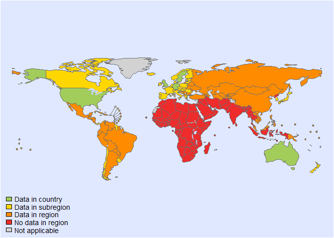
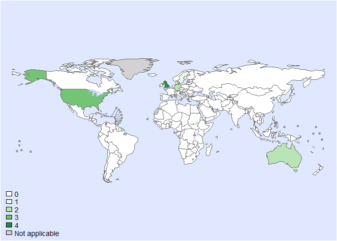
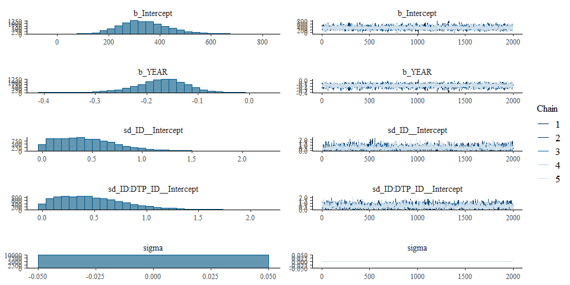

Global mortality of peanuts • fit model - Version 1
================
fbbu6966
2025-02-21

- [Settings](#settings)
  - [BRMS model: Version 1](#brms-model-version-1)
- [Session info](#session-info)

# Settings

``` r
## required packages ----
library(bd)
library(brms)
library(ggplot2)
library(metafor)
library(readxl)
library(rmarkdown)
library(rms)
library(tidyr)
library(knitr)

## global options ----
knitr::opts_chunk$set(fig.width = 10)
Date <- format(Sys.Date(), "%Y%m%d")

source("01-data-mortality.R")
```

    ## 'data.frame':    35 obs. of  43 variables:
    ##  $ SOURCE_ID           : num  184 185 186 187 188 189 191 192 193 194 ...
    ##  $ SOURCE_AUTHOR       : chr  "Bohlke" "Liew" "Macdougall" "Pumphrey" ...
    ##  $ SOURCE_YEAR         : num  2004 2009 2002 2004 2007 ...
    ##  $ SOURCE_TITLE        : chr  "Epidemiology of anaphylaxis among children and adolescents enrolled in a health maintenance organization" "Anaphylaxis fatalities and admissions in Australia. J" "How dangerous is food allergy in childhood? The incidence of severe and fatal allergic reactions across the UK and Ireland" "Fatal anaphylaxis in the UK, 1992-2001." ...
    ##  $ SOURCE_DOI          : chr  "10.1016/j.jaci.2003.11.033" "https://doi.org/10.1016/j.jaci.2008.10.049" "https://doi.org/10.1136%2Fadc.86.4.236" "https://doi.org/10.1002/0470861193.ch10" ...
    ##  $ SOURCE_URL          : chr  "https://pubmed.ncbi.nlm.nih.gov/15007358/" "Anaphylaxis fatalities and admissions in Australia - ScienceDirect" "How dangerous is food allergy in childhood? The incidence of severe and fatal allergic reactions across the UK "| __truncated__ "Fatal Anaphylaxis in the UK, 1992–2001 - Pumphrey - 2004 - Novartis Foundation Symposia - Wiley Online Library" ...
    ##  $ OPT_ACCESS_DATE     : chr  NA "31.01.2024" "31.01.2024" "01.02.2025" ...
    ##  $ OPT_STUDY_TYPE      : chr  "Cross-sectional study" "Passive surveillance" "Passive surveillance" "Passive surveillance" ...
    ##  $ OPT_OTHER_STUDY_TYPE: chr  NA "National mortality database" "Retrospective study" "Retrospective study" ...
    ##  $ REF_NOTES           : chr  "Study population consisted of individuals enrolled at Group Health Maintenance, western Washington State" "Registration of fatal anaphylaxis cases" "National mortality database" "Book chapter, Register of the Office for National statistics" ...
    ##  $ REF_YEAR_START      : num  1991 1997 1990 1992 1999 ...
    ##  $ REF_YEAR_END        : num  1997 2005 2000 2001 2006 ...
    ##  $ REF_LOC_LEVEL       : chr  "Sub-national" "National" "National" "National" ...
    ##  $ REF_LOCATION        : chr  "United States of America" "Australia" "United Kingdom" "United Kingdom" ...
    ##  $ REF_LOCATION_ISO3   : chr  "USA" "AUS" "GBR" "GBR" ...
    ##  $ REF_SEX             : chr  "All sexes" "All sexes" "All sexes" "All sexes" ...
    ##  $ REF_AGE_START       : num  0 0 0 0 0 0 0 0 0 0 ...
    ##  $ REF_AGE_END         : num  18 125 15 125 125 125 125 125 20 17 ...
    ##  $ OPT_MEAN_AGE        : logi  NA NA NA NA NA NA ...
    ##  $ OPT_MEDIAN_AGE      : logi  NA NA NA NA NA NA ...
    ##  $ OPT_SUBPOP          : chr  NA NA "Children below age 16" NA ...
    ##  $ OPT_CASES           : logi  NA NA NA NA NA NA ...
    ##  $ OPT_DISEASE         : chr  "Fatal peanut  induced anaphylaxis" NA "Fatal peanut induced anaphylaxis" "Fatal peanut induced anaphylaxis" ...
    ##  $ OPT_SEROTYPE        : logi  NA NA NA NA NA NA ...
    ##  $ REF_SAMPLE_SIZE     : chr  "229422" "Australian population" "UK under 16 population" "UK population" ...
    ##  $ VALUE_NOTES         : logi  NA NA NA NA NA NA ...
    ##  $ VALUE_X             : num  0 3 2 10 3 4 1 16 1 1 ...
    ##  $ VALUE_X_NOTES       : logi  NA NA NA NA NA NA ...
    ##  $ VALUE_MEAN          : logi  NA NA NA NA NA NA ...
    ##  $ VALUE_MEAN_NOTES    : logi  NA NA NA NA NA NA ...
    ##  $ VALUE_MEDIAN        : logi  NA NA NA NA NA NA ...
    ##  $ VALUE_DENOM         : logi  NA NA NA NA NA NA ...
    ##  $ VALUE_SE            : logi  NA NA NA NA NA NA ...
    ##  $ VALUE_P000          : logi  NA NA NA NA NA NA ...
    ##  $ VALUE_P2_5          : logi  NA NA NA NA NA NA ...
    ##  $ VALUE_P5            : logi  NA NA NA NA NA NA ...
    ##  $ VALUE_P10           : logi  NA NA NA NA NA NA ...
    ##  $ VALUE_P25           : logi  NA NA NA NA NA NA ...
    ##  $ VALUE_P75           : logi  NA NA NA NA NA NA ...
    ##  $ VALUE_P90           : logi  NA NA NA NA NA NA ...
    ##  $ VALUE_P95           : logi  NA NA NA NA NA NA ...
    ##  $ VALUE_P97_5         : logi  NA NA NA NA NA NA ...
    ##  $ VALUE_P100          : logi  NA NA NA NA NA NA ...

    ## Warning in eval(ei, envir): NAs introduced by coercion

    ## Joining with `by = join_by(REF_YEAR_START, REF_YEAR_END, REF_SEX, REF_AGE_START, REF_AGE_END, ISO3, ID_ROW)`

<!-- -->

    ## Warning: REML comparisons not meaningful for models with different fixed effects
    ## (use 'refit=TRUE' to refit both models based on ML estimation).

<!-- -->

``` r
# saveRDS(es, file = "es.rds")
es$DTP_ID<-as.character(seq(1:length(es$SOURCE_ID)))
es$FLAG<-factor(es$FLAG, 
                levels=c(0,1,2,3,4,5,6, 7),
                labels=c("Keep data", "Data part of non WHO member states", "No WHO REG2 given",
                         "Year before 1990", "yi can't be calcualted", "TF choice to remove", 
                         "Excluded by preliminary checks", "Excluded in data cleaning"))
saveRDS(es, paste0("es_MRT_", Date, ".RDS"))
```

## BRMS model: Version 1

``` r
Parameters<- c("Number of iterations", "Warmup","Level included", "Delta value", "Maximum tree-depth","Random effect on each data point", "Stronger priors specified")
Values <- c("5000","3000","Global and year","0.95","15","Yes", "Normal(0,1)")
version_spe <- data.frame(Parameters,Values)

kable(caption = "Parameters of the model tested",row.names = FALSE, version_spe)
```

| Parameters                       | Values          |
|:---------------------------------|:----------------|
| Number of iterations             | 5000            |
| Warmup                           | 3000            |
| Level included                   | Global and year |
| Delta value                      | 0.95            |
| Maximum tree-depth               | 15              |
| Random effect on each data point | Yes             |
| Stronger priors specified        | Normal(0,1)     |

Parameters of the model tested

``` r
fit_brms_reg_mort_s1 <-
  brm(yi | se(sei) ~
        1 + YEAR + 
        (1 | ID) +
        (1 | ID:DTP_ID),
      chains = 5, iter = 5000, warmup = 3000,
      prior = prior(normal(0,1), class = sd),
      cores = 5,
      data = subset(es, as.integer(FLAG)==1), 
      open_progress = FALSE,
      # control = list(adapt_delta=0.95, max_treedepth = 15),
      seed =7 )
```

    ## Compiling Stan program...

    ## Start sampling

    ## Warning: There were 6 divergent transitions after warmup. See
    ## https://mc-stan.org/misc/warnings.html#divergent-transitions-after-warmup
    ## to find out why this is a problem and how to eliminate them.

    ## Warning: Examine the pairs() plot to diagnose sampling problems

``` r
saveRDS(fit_brms_reg_mort_s1, file = "fit_brms_reg_mort_s1.rds")
summary(fit_brms_reg_mort_s1)
```

    ## Warning: There were 6 divergent transitions after warmup. Increasing adapt_delta above 0.8 may help. See
    ## http://mc-stan.org/misc/warnings.html#divergent-transitions-after-warmup

    ##  Family: gaussian 
    ##   Links: mu = identity; sigma = identity 
    ## Formula: yi | se(sei) ~ 1 + YEAR + (1 | ID) + (1 | ID:DTP_ID) 
    ##    Data: subset(es, as.integer(FLAG) == 1) (Number of observations: 14) 
    ##   Draws: 5 chains, each with iter = 5000; warmup = 3000; thin = 1;
    ##          total post-warmup draws = 10000
    ## 
    ## Multilevel Hyperparameters:
    ## ~ID (Number of levels: 13) 
    ##               Estimate Est.Error l-95% CI u-95% CI Rhat Bulk_ESS Tail_ESS
    ## sd(Intercept)     0.46      0.32     0.02     1.21 1.00     2349     4232
    ## 
    ## ~ID:DTP_ID (Number of levels: 14) 
    ##               Estimate Est.Error l-95% CI u-95% CI Rhat Bulk_ESS Tail_ESS
    ## sd(Intercept)     0.48      0.32     0.02     1.21 1.00     2498     4218
    ## 
    ## Regression Coefficients:
    ##           Estimate Est.Error l-95% CI u-95% CI Rhat Bulk_ESS Tail_ESS
    ## Intercept   338.97    100.27   162.27   555.93 1.00     5380     4717
    ## YEAR         -0.17      0.05    -0.28    -0.08 1.00     5388     4716
    ## 
    ## Further Distributional Parameters:
    ##       Estimate Est.Error l-95% CI u-95% CI Rhat Bulk_ESS Tail_ESS
    ## sigma     0.00      0.00     0.00     0.00   NA       NA       NA
    ## 
    ## Draws were sampled using sampling(NUTS). For each parameter, Bulk_ESS
    ## and Tail_ESS are effective sample size measures, and Rhat is the potential
    ## scale reduction factor on split chains (at convergence, Rhat = 1).

``` r
plot(fit_brms_reg_mort_s1, ask = FALSE)
```

<!-- -->

``` r
# plot(conditional_effects(fit_brms_reg_mort_s1), points = TRUE)

stancode(fit_brms_reg_mort_s1)
```

    ## // generated with brms 2.21.0
    ## functions {
    ## }
    ## data {
    ##   int<lower=1> N;  // total number of observations
    ##   vector[N] Y;  // response variable
    ##   vector<lower=0>[N] se;  // known sampling error
    ##   int<lower=1> K;  // number of population-level effects
    ##   matrix[N, K] X;  // population-level design matrix
    ##   int<lower=1> Kc;  // number of population-level effects after centering
    ##   // data for group-level effects of ID 1
    ##   int<lower=1> N_1;  // number of grouping levels
    ##   int<lower=1> M_1;  // number of coefficients per level
    ##   array[N] int<lower=1> J_1;  // grouping indicator per observation
    ##   // group-level predictor values
    ##   vector[N] Z_1_1;
    ##   // data for group-level effects of ID 2
    ##   int<lower=1> N_2;  // number of grouping levels
    ##   int<lower=1> M_2;  // number of coefficients per level
    ##   array[N] int<lower=1> J_2;  // grouping indicator per observation
    ##   // group-level predictor values
    ##   vector[N] Z_2_1;
    ##   int prior_only;  // should the likelihood be ignored?
    ## }
    ## transformed data {
    ##   vector<lower=0>[N] se2 = square(se);
    ##   matrix[N, Kc] Xc;  // centered version of X without an intercept
    ##   vector[Kc] means_X;  // column means of X before centering
    ##   for (i in 2:K) {
    ##     means_X[i - 1] = mean(X[, i]);
    ##     Xc[, i - 1] = X[, i] - means_X[i - 1];
    ##   }
    ## }
    ## parameters {
    ##   vector[Kc] b;  // regression coefficients
    ##   real Intercept;  // temporary intercept for centered predictors
    ##   vector<lower=0>[M_1] sd_1;  // group-level standard deviations
    ##   array[M_1] vector[N_1] z_1;  // standardized group-level effects
    ##   vector<lower=0>[M_2] sd_2;  // group-level standard deviations
    ##   array[M_2] vector[N_2] z_2;  // standardized group-level effects
    ## }
    ## transformed parameters {
    ##   real sigma = 0;  // dispersion parameter
    ##   vector[N_1] r_1_1;  // actual group-level effects
    ##   vector[N_2] r_2_1;  // actual group-level effects
    ##   real lprior = 0;  // prior contributions to the log posterior
    ##   r_1_1 = (sd_1[1] * (z_1[1]));
    ##   r_2_1 = (sd_2[1] * (z_2[1]));
    ##   lprior += student_t_lpdf(Intercept | 3, -6.6, 2.5);
    ##   lprior += normal_lpdf(sd_1 | 0, 1)
    ##     - 1 * normal_lccdf(0 | 0, 1);
    ##   lprior += normal_lpdf(sd_2 | 0, 1)
    ##     - 1 * normal_lccdf(0 | 0, 1);
    ## }
    ## model {
    ##   // likelihood including constants
    ##   if (!prior_only) {
    ##     // initialize linear predictor term
    ##     vector[N] mu = rep_vector(0.0, N);
    ##     mu += Intercept + Xc * b;
    ##     for (n in 1:N) {
    ##       // add more terms to the linear predictor
    ##       mu[n] += r_1_1[J_1[n]] * Z_1_1[n] + r_2_1[J_2[n]] * Z_2_1[n];
    ##     }
    ##     target += normal_lpdf(Y | mu, se);
    ##   }
    ##   // priors including constants
    ##   target += lprior;
    ##   target += std_normal_lpdf(z_1[1]);
    ##   target += std_normal_lpdf(z_2[1]);
    ## }
    ## generated quantities {
    ##   // actual population-level intercept
    ##   real b_Intercept = Intercept - dot_product(means_X, b);
    ## }

# Session info

``` r
sessioninfo::session_info()
```

    ## ─ Session info ──────────────────────────────────────────────────────────────────────────────────────────────────────
    ##  setting  value
    ##  version  R version 4.4.1 (2024-06-14 ucrt)
    ##  os       Windows 10 x64 (build 19045)
    ##  system   x86_64, mingw32
    ##  ui       RStudio
    ##  language (EN)
    ##  collate  English_United States.utf8
    ##  ctype    English_United States.utf8
    ##  tz       Europe/Brussels
    ##  date     2025-02-21
    ##  rstudio  2024.04.2+764 Chocolate Cosmos (desktop)
    ##  pandoc   3.1.11 @ C:/Users/fbbu6966/AppData/Local/Programs/RStudio/resources/app/bin/quarto/bin/tools/ (via rmarkdown)
    ## 
    ## ─ Packages ──────────────────────────────────────────────────────────────────────────────────────────────────────────
    ##  ! package        * version    date (UTC) lib source
    ##    abind            1.4-5      2016-07-21 [1] CRAN (R 4.4.0)
    ##    backports        1.5.0      2024-05-23 [1] CRAN (R 4.4.0)
    ##    base64enc        0.1-3      2015-07-28 [1] CRAN (R 4.4.0)
    ##    bayesplot        1.11.1     2024-02-15 [1] CRAN (R 4.4.1)
    ##    bd             * 0.0.13     2024-08-03 [1] Github (brechtdv/bd@b63c017)
    ##    boot             1.3-30     2024-02-26 [1] CRAN (R 4.4.1)
    ##    bridgesampling   1.1-2      2021-04-16 [1] CRAN (R 4.4.1)
    ##    brms           * 2.21.0     2024-03-20 [1] CRAN (R 4.4.1)
    ##    Brobdingnag      1.2-9      2022-10-19 [1] CRAN (R 4.4.1)
    ##    cachem           1.1.0      2024-05-16 [1] CRAN (R 4.4.1)
    ##    cellranger       1.1.0      2016-07-27 [1] CRAN (R 4.4.1)
    ##    checkmate        2.3.1      2023-12-04 [1] CRAN (R 4.4.1)
    ##    class            7.3-22     2023-05-03 [1] CRAN (R 4.4.1)
    ##    classInt         0.4-10     2023-09-05 [1] CRAN (R 4.4.1)
    ##    cli              3.6.3      2024-06-21 [1] CRAN (R 4.4.1)
    ##    cluster          2.1.6      2023-12-01 [1] CRAN (R 4.4.1)
    ##    coda             0.19-4.1   2024-01-31 [1] CRAN (R 4.4.1)
    ##    codetools        0.2-20     2024-03-31 [1] CRAN (R 4.4.1)
    ##    colorspace       2.1-0      2023-01-23 [1] CRAN (R 4.4.1)
    ##    curl             5.2.1      2024-03-01 [1] CRAN (R 4.4.1)
    ##    data.table       1.15.4     2024-03-30 [1] CRAN (R 4.4.1)
    ##    DBI              1.2.3      2024-06-02 [1] CRAN (R 4.4.1)
    ##    DescTools      * 0.99.55    2024-07-29 [1] CRAN (R 4.4.1)
    ##    devtools         2.4.5      2022-10-11 [1] CRAN (R 4.4.1)
    ##    digest           0.6.36     2024-06-23 [1] CRAN (R 4.4.1)
    ##    distributional   0.4.0      2024-02-07 [1] CRAN (R 4.4.1)
    ##    dplyr          * 1.1.4      2023-11-17 [1] CRAN (R 4.4.1)
    ##    e1071            1.7-14     2023-12-06 [1] CRAN (R 4.4.1)
    ##    ellipsis         0.3.2      2021-04-29 [1] CRAN (R 4.4.1)
    ##    evaluate         0.24.0     2024-06-10 [1] CRAN (R 4.4.1)
    ##    Exact            3.3        2024-07-21 [1] CRAN (R 4.4.1)
    ##    expm             0.999-9    2024-01-11 [1] CRAN (R 4.4.1)
    ##    fansi            1.0.6      2023-12-08 [1] CRAN (R 4.4.1)
    ##    farver           2.1.2      2024-05-13 [1] CRAN (R 4.4.1)
    ##    fastmap          1.2.0      2024-05-15 [1] CRAN (R 4.4.1)
    ##    FERG2          * 0.0.2      2025-02-21 [1] Github (brechtdv/FERG2@3d51b14)
    ##    foreign          0.8-86     2023-11-28 [1] CRAN (R 4.4.1)
    ##    Formula          1.2-5      2023-02-24 [1] CRAN (R 4.4.0)
    ##    fs               1.6.4      2024-04-25 [1] CRAN (R 4.4.1)
    ##    generics         0.1.3      2022-07-05 [1] CRAN (R 4.4.1)
    ##    ggplot2        * 3.5.1      2024-04-23 [1] CRAN (R 4.4.1)
    ##    gld              2.6.6      2022-10-23 [1] CRAN (R 4.4.1)
    ##    glue             1.8.0      2024-09-30 [1] CRAN (R 4.4.2)
    ##    gridExtra        2.3        2017-09-09 [1] CRAN (R 4.4.1)
    ##    gtable           0.3.5      2024-04-22 [1] CRAN (R 4.4.1)
    ##    highr            0.11       2024-05-26 [1] CRAN (R 4.4.1)
    ##    Hmisc          * 5.1-3      2024-05-28 [1] CRAN (R 4.4.1)
    ##    htmlTable        2.4.3      2024-07-21 [1] CRAN (R 4.4.1)
    ##    htmltools        0.5.8.1    2024-04-04 [1] CRAN (R 4.4.1)
    ##    htmlwidgets      1.6.4      2023-12-06 [1] CRAN (R 4.4.1)
    ##    httpuv           1.6.15     2024-03-26 [1] CRAN (R 4.4.1)
    ##    httr             1.4.7      2023-08-15 [1] CRAN (R 4.4.1)
    ##    inline           0.3.19     2021-05-31 [1] CRAN (R 4.4.1)
    ##    jsonlite         1.8.8      2023-12-04 [1] CRAN (R 4.4.1)
    ##    kableExtra     * 1.4.0      2024-01-24 [1] CRAN (R 4.4.1)
    ##    KernSmooth       2.23-24    2024-05-17 [1] CRAN (R 4.4.1)
    ##    knitr          * 1.48       2024-07-07 [1] CRAN (R 4.4.1)
    ##    labeling         0.4.3      2023-08-29 [1] CRAN (R 4.4.0)
    ##    later            1.3.2      2023-12-06 [1] CRAN (R 4.4.1)
    ##    lattice          0.22-6     2024-03-20 [1] CRAN (R 4.4.1)
    ##    lifecycle        1.0.4      2023-11-07 [1] CRAN (R 4.4.1)
    ##    lmom             3.0        2023-08-29 [1] CRAN (R 4.4.0)
    ##    loo              2.8.0      2024-07-03 [1] CRAN (R 4.4.1)
    ##    magrittr         2.0.3      2022-03-30 [1] CRAN (R 4.4.1)
    ##    MASS             7.3-60.2   2024-04-26 [1] CRAN (R 4.4.1)
    ##    mathjaxr         1.6-0      2022-02-28 [1] CRAN (R 4.4.1)
    ##    Matrix         * 1.7-0      2024-04-26 [1] CRAN (R 4.4.1)
    ##    MatrixModels     0.5-3      2023-11-06 [1] CRAN (R 4.4.1)
    ##    matrixStats      1.3.0      2024-04-11 [1] CRAN (R 4.4.1)
    ##    memoise          2.0.1      2021-11-26 [1] CRAN (R 4.4.1)
    ##    metadat        * 1.2-0      2022-04-06 [1] CRAN (R 4.4.1)
    ##    metafor        * 4.6-0      2024-03-28 [1] CRAN (R 4.4.1)
    ##    mgcv             1.9-1      2023-12-21 [1] CRAN (R 4.4.1)
    ##    mime             0.12       2021-09-28 [1] CRAN (R 4.4.0)
    ##    miniUI           0.1.1.1    2018-05-18 [1] CRAN (R 4.4.1)
    ##    multcomp         1.4-26     2024-07-18 [1] CRAN (R 4.4.1)
    ##    munsell          0.5.1      2024-04-01 [1] CRAN (R 4.4.1)
    ##    mvtnorm          1.2-5      2024-05-21 [1] CRAN (R 4.4.1)
    ##    nlme             3.1-164    2023-11-27 [1] CRAN (R 4.4.1)
    ##    nnet             7.3-19     2023-05-03 [1] CRAN (R 4.4.1)
    ##    numDeriv       * 2016.8-1.1 2019-06-06 [1] CRAN (R 4.4.0)
    ##    openxlsx       * 4.2.7.1    2024-09-20 [1] CRAN (R 4.4.2)
    ##    pillar           1.9.0      2023-03-22 [1] CRAN (R 4.4.1)
    ##    pkgbuild         1.4.4      2024-03-17 [1] CRAN (R 4.4.1)
    ##    pkgconfig        2.0.3      2019-09-22 [1] CRAN (R 4.4.1)
    ##    pkgload          1.4.0      2024-06-28 [1] CRAN (R 4.4.1)
    ##    plyr             1.8.9      2023-10-02 [1] CRAN (R 4.4.1)
    ##    polspline        1.1.25     2024-05-10 [1] CRAN (R 4.4.0)
    ##    posterior        1.6.0      2024-07-03 [1] CRAN (R 4.4.1)
    ##    profvis          0.3.8      2023-05-02 [1] CRAN (R 4.4.1)
    ##    promises         1.3.0      2024-04-05 [1] CRAN (R 4.4.1)
    ##    proxy            0.4-27     2022-06-09 [1] CRAN (R 4.4.1)
    ##    purrr            1.0.2      2023-08-10 [1] CRAN (R 4.4.1)
    ##    quantreg         5.98       2024-05-26 [1] CRAN (R 4.4.1)
    ##    QuickJSR         1.3.1      2024-07-14 [1] CRAN (R 4.4.1)
    ##    R6               2.5.1      2021-08-19 [1] CRAN (R 4.4.1)
    ##    RColorBrewer     1.1-3      2022-04-03 [1] CRAN (R 4.4.0)
    ##    Rcpp           * 1.0.12     2024-01-09 [1] CRAN (R 4.4.1)
    ##  D RcppParallel     5.1.8      2024-07-06 [1] CRAN (R 4.4.1)
    ##    readxl         * 1.4.3      2023-07-06 [1] CRAN (R 4.4.1)
    ##    remotes          2.5.0      2024-03-17 [1] CRAN (R 4.4.1)
    ##    reshape2         1.4.4      2020-04-09 [1] CRAN (R 4.4.1)
    ##    rlang            1.1.4      2024-06-04 [1] CRAN (R 4.4.1)
    ##    rmarkdown      * 2.27       2024-05-17 [1] CRAN (R 4.4.1)
    ##    rms            * 6.8-1      2024-05-27 [1] CRAN (R 4.4.1)
    ##    rootSolve        1.8.2.4    2023-09-21 [1] CRAN (R 4.4.0)
    ##    rpart            4.1.23     2023-12-05 [1] CRAN (R 4.4.1)
    ##    rstan            2.32.6     2024-03-05 [1] CRAN (R 4.4.1)
    ##    rstantools       2.4.0      2024-01-31 [1] CRAN (R 4.4.1)
    ##    rstudioapi       0.16.0     2024-03-24 [1] CRAN (R 4.4.1)
    ##    sandwich         3.1-0      2023-12-11 [1] CRAN (R 4.4.1)
    ##    scales         * 1.3.0      2023-11-28 [1] CRAN (R 4.4.1)
    ##    sessioninfo      1.2.2      2021-12-06 [1] CRAN (R 4.4.1)
    ##    sf             * 1.0-16     2024-03-24 [1] CRAN (R 4.4.1)
    ##    shiny            1.9.1      2024-08-01 [1] CRAN (R 4.4.1)
    ##    SparseM          1.84-2     2024-07-17 [1] CRAN (R 4.4.1)
    ##    StanHeaders      2.32.10    2024-07-15 [1] CRAN (R 4.4.1)
    ##    stringi          1.8.4      2024-05-06 [1] CRAN (R 4.4.0)
    ##    stringr          1.5.1      2023-11-14 [1] CRAN (R 4.4.1)
    ##    survival         3.6-4      2024-04-24 [1] CRAN (R 4.4.1)
    ##    svglite          2.1.3      2023-12-08 [1] CRAN (R 4.4.1)
    ##    systemfonts      1.1.0      2024-05-15 [1] CRAN (R 4.4.1)
    ##    tensorA          0.36.2.1   2023-12-13 [1] CRAN (R 4.4.0)
    ##    TH.data          1.1-2      2023-04-17 [1] CRAN (R 4.4.1)
    ##    tibble           3.2.1      2023-03-20 [1] CRAN (R 4.4.1)
    ##    tidyr          * 1.3.1      2024-01-24 [1] CRAN (R 4.4.1)
    ##    tidyselect       1.2.1      2024-03-11 [1] CRAN (R 4.4.1)
    ##    units            0.8-5      2023-11-28 [1] CRAN (R 4.4.1)
    ##    urlchecker       1.0.1      2021-11-30 [1] CRAN (R 4.4.1)
    ##    usethis          3.0.0      2024-07-29 [1] CRAN (R 4.4.1)
    ##    utf8             1.2.4      2023-10-22 [1] CRAN (R 4.4.1)
    ##    V8               6.0.0      2024-10-12 [1] CRAN (R 4.4.2)
    ##    vctrs            0.6.5      2023-12-01 [1] CRAN (R 4.4.1)
    ##    viridisLite      0.4.2      2023-05-02 [1] CRAN (R 4.4.1)
    ##    withr            3.0.0      2024-01-16 [1] CRAN (R 4.4.1)
    ##    xfun             0.45       2024-06-16 [1] CRAN (R 4.4.1)
    ##    xml2             1.3.6      2023-12-04 [1] CRAN (R 4.4.1)
    ##    xtable           1.8-4      2019-04-21 [1] CRAN (R 4.4.1)
    ##    yaml             2.3.9      2024-07-05 [1] CRAN (R 4.4.1)
    ##    zip              2.3.1      2024-01-27 [1] CRAN (R 4.4.1)
    ##    zoo              1.8-12     2023-04-13 [1] CRAN (R 4.4.1)
    ## 
    ##  [1] C:/Users/fbbu6966/AppData/Local/Programs/R/R-4.4.1/library
    ## 
    ##  D ── DLL MD5 mismatch, broken installation.
    ## 
    ## ─────────────────────────────────────────────────────────────────────────────────────────────────────────────────────

``` r
##rmarkdown::render("02-fit_v11.R")
```
