Global prevalence of peanuts • Fit model -Version 1
================
fbbu6966
2025-10-05

- [Settings](#settings)
- [Data](#data)
- [BRMS](#brms)
- [Session info](#session-info)

# Settings

``` r
## required packages ----
library(bd)
library(brms)
```

    ## Loading required package: Rcpp

    ## Loading 'brms' package (version 2.22.0). Useful instructions
    ## can be found by typing help('brms'). A more detailed introduction
    ## to the package is available through vignette('brms_overview').

    ## 
    ## Attaching package: 'brms'

    ## The following object is masked from 'package:stats':
    ## 
    ##     ar

``` r
library(ggplot2)
library(metafor)
```

    ## Loading required package: Matrix

    ## Loading required package: metadat

    ## Loading required package: numDeriv

    ## 
    ## Loading the 'metafor' package (version 4.8-0). For an
    ## introduction to the package please type: help(metafor)

``` r
library(readxl)
library(rmarkdown)
library(rms)
```

    ## Loading required package: Hmisc

    ## 
    ## Attaching package: 'Hmisc'

    ## The following objects are masked from 'package:base':
    ## 
    ##     format.pval, units

    ## 
    ## Attaching package: 'rms'

    ## The following object is masked from 'package:metafor':
    ## 
    ##     vif

``` r
library(tidyr)
```

    ## 
    ## Attaching package: 'tidyr'

    ## The following objects are masked from 'package:Matrix':
    ## 
    ##     expand, pack, unpack

``` r
library(knitr)


## global options ----
knitr::opts_chunk$set(fig.width = 10)
Date <- format(Sys.Date(), "%Y%m%d")
```

# Data

``` r
## import data
source("01-data.R")
```

    ## 
    ## Attaching package: 'FERG2'

    ## The following object is masked from 'package:bd':
    ## 
    ##     mean_ci

    ## Linking to GEOS 3.13.1, GDAL 3.10.2, PROJ 9.5.1; sf_use_s2() is TRUE

    ## 
    ## Attaching package: 'dplyr'

    ## The following objects are masked from 'package:Hmisc':
    ## 
    ##     src, summarize

    ## The following object is masked from 'package:bd':
    ## 
    ##     collapse

    ## The following objects are masked from 'package:stats':
    ## 
    ##     filter, lag

    ## The following objects are masked from 'package:base':
    ## 
    ##     intersect, setdiff, setequal, union

    ## 
    ## Attaching package: 'DescTools'

    ## The following objects are masked from 'package:Hmisc':
    ## 
    ##     %nin%, Label, Mean, Quantile

    ## 
    ## Attaching package: 'kableExtra'

    ## The following object is masked from 'package:dplyr':
    ## 
    ##     group_rows

    ## Warning: There was 1 warning in `mutate()`.
    ## ℹ In argument: `VALUE_DENOM = case_when(...)`.
    ## Caused by warning:
    ## ! NAs introduced by coercion

    ## Warning: There were 2 warnings in `mutate()`.
    ## The first warning was:
    ## ℹ In argument: `REF_AGE_START = as.numeric(REF_AGE_START)`.
    ## Caused by warning:
    ## ! NAs introduced by coercion
    ## ℹ Run `dplyr::last_dplyr_warnings()` to see the 1 remaining warning.

    ## [1] "Incidence"
    ## 'data.frame':    19 obs. of  46 variables:
    ##  $ SOURCE_ID              : chr  "2" "2" "2" "2" ...
    ##  $ SOURCE_AUTHOR          : chr  "Kotz" "Kotz" "Kotz" "Kotz" ...
    ##  $ SOURCE_YEAR            : num  2011 2011 2011 2011 2011 ...
    ##  $ SOURCE_TITLE           : chr  "Incidence, prevalence, and trends of general practitioner–recorded diagnosis of peanut allergy in England, 2001 to 2005" "Incidence, prevalence, and trends of general practitioner–recorded diagnosis of peanut allergy in England, 2001 to 2005" "Incidence, prevalence, and trends of general practitioner–recorded diagnosis of peanut allergy in England, 2001 to 2005" "Incidence, prevalence, and trends of general practitioner–recorded diagnosis of peanut allergy in England, 2001 to 2005" ...
    ##  $ SOURCE_DOI             : chr  "https://doi.org/10.1016/j.jaci.2010.11.021" "https://doi.org/10.1016/j.jaci.2010.11.021" "https://doi.org/10.1016/j.jaci.2010.11.021" "https://doi.org/10.1016/j.jaci.2010.11.021" ...
    ##  $ SOURCE_URL             : chr  "Incidence, prevalence, and trends of general practitioner–recorded diagnosis of peanut allergy in England, 2001"| __truncated__ "Incidence, prevalence, and trends of general practitioner–recorded diagnosis of peanut allergy in England, 2001"| __truncated__ "Incidence, prevalence, and trends of general practitioner–recorded diagnosis of peanut allergy in England, 2001"| __truncated__ "Incidence, prevalence, and trends of general practitioner–recorded diagnosis of peanut allergy in England, 2001"| __truncated__ ...
    ##  $ OPT_ACCESS_DATE        : chr  "24.01.2024" "24.01.2024" "24.01.2024" "24.01.2024" ...
    ##  $ OPT_STUDY_TYPE         : chr  "Passive surveillance" "Passive surveillance" "Passive surveillance" "Passive surveillance" ...
    ##  $ OPT_OTHER_STUDY_TYPE   : chr  "QRESEARCH database" "QRESEARCH database" "QRESEARCH database" "QRESEARCH database" ...
    ##  $ REF_NOTES              : chr  "England" "England" "England" "England" ...
    ##  $ REF_YEAR_START         : num  2005 2005 2005 2005 2005 ...
    ##  $ REF_YEAR_END           : num  2005 2005 2005 2005 2005 ...
    ##  $ REF_LOC_LEVEL          : chr  "National" "National" "National" "National" ...
    ##  $ REF_LOCATION           : chr  "United Kingdom" "United Kingdom" "United Kingdom" "United Kingdom" ...
    ##  $ REF_LOCATION_ISO3      : chr  "GBR" "GBR" "GBR" "GBR" ...
    ##  $ REF_SEX                : chr  "All sexes" "All sexes" "All sexes" "All sexes" ...
    ##  $ REF_AGE_START          : num  0 5 10 15 20 25 30 0 0 0 ...
    ##  $ REF_AGE_END            : num  4 9 14 19 24 29 125 125 125 125 ...
    ##  $ OPT_MEAN_AGE           : num  NA NA NA NA NA NA NA NA NA NA ...
    ##  $ OPT_MEDIAN_AGE         : logi  NA NA NA NA NA NA ...
    ##  $ OPT_SUBPOP             : chr  "Children and infants" "Children" "Children" "Children and adults" ...
    ##  $ OPT_CASES              : chr  "Probable" "Probable" "Probable" "Probable" ...
    ##  $ OPT_DISEASE            : logi  NA NA NA NA NA NA ...
    ##  $ OPT_DIAGNOSTIC_CRITERIA: chr  "Physician-confirmed" "Physician-confirmed" "Physician-confirmed" "Physician-confirmed" ...
    ##  $ OPT_DOSE_CHALLENGE     : chr  NA NA NA NA ...
    ##  $ OPT_SEROTYPE           : logi  NA NA NA NA NA NA ...
    ##  $ REF_SAMPLE_SIZE        : num  125020 173923 187861 181864 167994 ...
    ##  $ VALUE_NOTE             : chr  "Age and sex standardized rate per 1000 patient-years" "Age and sex standardized rate per 1000 patient-years" "Age and sex standardized rate per 1000 patient-years" "Age and sex standardized rate per 1000 patient-years" ...
    ##  $ VALUE_X                : num  64 55 37 19 8 12 17 98 114 NA ...
    ##  $ VALUE_MEAN             : num  0.51 0.32 0.2 0.1 0.05 0.07 0.01 0.07 0.09 8.6 ...
    ##  $ VALUE_MEDIAN           : logi  NA NA NA NA NA NA ...
    ##  $ VALUE_DENOM            : num  1e+03 1e+03 1e+03 1e+03 1e+03 1e+03 1e+03 1e+03 1e+03 1e+05 ...
    ##  $ VALUE_SE               : logi  NA NA NA NA NA NA ...
    ##  $ VALUE_P000             : logi  NA NA NA NA NA NA ...
    ##  $ VALUE_P2_5             : num  0.39 0.23 0.13 0.06 0.01 0.03 0 0.06 0.07 7.6 ...
    ##  $ VALUE_P5               : logi  NA NA NA NA NA NA ...
    ##  $ VALUE_P10              : logi  NA NA NA NA NA NA ...
    ##  $ VALUE_P25              : logi  NA NA NA NA NA NA ...
    ##  $ VALUE_P75              : logi  NA NA NA NA NA NA ...
    ##  $ VALUE_P90              : logi  NA NA NA NA NA NA ...
    ##  $ VALUE_P95              : logi  NA NA NA NA NA NA ...
    ##  $ VALUE_P97_5            : num  0.64 0.4 0.26 0.15 0.08 0.1 0.01 0.09 0.11 9.6 ...
    ##  $ VALUE_P100             : logi  NA NA NA NA NA NA ...
    ##  $ VALUE_MEAN_2           : logi  NA NA NA NA NA NA ...
    ##  $ VALUE_DENOM_2          : logi  NA NA NA NA NA NA ...
    ##  $ FLAG                   : num  0 0 0 0 0 0 0 0 0 0 ...

    ## Joining with `by = join_by(SOURCE_ID, SOURCE_AUTHOR, SOURCE_YEAR, SOURCE_TITLE, SOURCE_DOI, SOURCE_URL,
    ## OPT_ACCESS_DATE, OPT_STUDY_TYPE, OPT_OTHER_STUDY_TYPE, REF_NOTES, REF_YEAR_START, REF_YEAR_END,
    ## REF_LOC_LEVEL, REF_LOCATION, REF_LOCATION_ISO3, REF_SEX, REF_AGE_START, REF_AGE_END, OPT_MEAN_AGE,
    ## OPT_MEDIAN_AGE, OPT_SUBPOP, OPT_CASES, OPT_DISEASE, OPT_DIAGNOSTIC_CRITERIA, OPT_DOSE_CHALLENGE,
    ## OPT_SEROTYPE, REF_SAMPLE_SIZE, VALUE_NOTE, VALUE_X, VALUE_MEAN, VALUE_MEDIAN, VALUE_DENOM, VALUE_SE,
    ## VALUE_P000, VALUE_P2_5, VALUE_P5, VALUE_P10, VALUE_P25, VALUE_P75, VALUE_P90, VALUE_P95, VALUE_P97_5,
    ## VALUE_P100, VALUE_MEAN_2, VALUE_DENOM_2)`

    ## Joining with `by = join_by(REF_YEAR_START, REF_YEAR_END, REF_SEX, REF_AGE_START, REF_AGE_END, ISO3, ID_ROW)`

    ## [1] "Prevalence"
    ## 'data.frame':    465 obs. of  46 variables:
    ##  $ SOURCE_ID            : chr  "1" "1" "1" "1" ...
    ##  $ SOURCE_AUTHOR        : chr  "Bunyavanich" "Bunyavanich" "Bunyavanich" "Bunyavanich" ...
    ##  $ SOURCE_YEAR          : chr  "2014" "2014" "2014" "2014" ...
    ##  $ SOURCE_TITLE         : chr  "Peanut allergy prevalence among school-age children in a US cohort not selected for any disease" "Peanut allergy prevalence among school-age children in a US cohort not selected for any disease" "Peanut allergy prevalence among school-age children in a US cohort not selected for any disease" "Peanut allergy prevalence among school-age children in a US cohort not selected for any disease" ...
    ##  $ SOURCE_DOI           : chr  "https://doi.org/10.1016/j.jaci.2014.05.050" "https://doi.org/10.1016/j.jaci.2014.05.050" "https://doi.org/10.1016/j.jaci.2014.05.050" "https://doi.org/10.1016/j.jaci.2014.05.050" ...
    ##  $ SOURCE_URL           : chr  "Peanut allergy prevalence among school-age children in a US cohort not selected for any disease - Journal of Al"| __truncated__ "Peanut allergy prevalence among school-age children in a US cohort not selected for any disease - Journal of Al"| __truncated__ "Peanut allergy prevalence among school-age children in a US cohort not selected for any disease - Journal of Al"| __truncated__ "Peanut allergy prevalence among school-age children in a US cohort not selected for any disease - Journal of Al"| __truncated__ ...
    ##  $ OPT_ACCESS_DATE      : chr  "24.01.2024" "24.01.2024" "24.01.2024" "24.01.2024" ...
    ##  $ OPT_STUDY_TYPE       : chr  "Cohort study" "Cohort study" "Cohort study" "Cohort study" ...
    ##  $ OPT_OTHER_STUDY_TYPE : chr  "Project Viva, interview and questionnaires" "Project Viva, interview and questionnaires" "Project Viva, interview and questionnaires" "Project Viva, interview and questionnaires" ...
    ##  $ REF_NOTES            : chr  "Eastern Massachusetts" "Eastern Massachusetts" "Eastern Massachusetts" "Eastern Massachusetts" ...
    ##  $ REF_YEAR_START       : num  1999 1999 1999 1999 1999 ...
    ##  $ REF_YEAR_END         : num  2014 2014 2014 2014 2014 ...
    ##  $ REF_LOC_LEVEL        : chr  "Sub-national" "Sub-national" "Sub-national" "Sub-national" ...
    ##  $ REF_LOCATION         : chr  "United States of America" "United States of America" "United States of America" "United States of America" ...
    ##  $ REF_LOCATION_ISO3    : chr  "USA" "USA" "USA" "USA" ...
    ##  $ REF_SEX              : chr  "All sexes" "All sexes" "All sexes" "All sexes" ...
    ##  $ REF_AGE_START        : num  0 0 0 0 0 0 5 10 15 20 ...
    ##  $ REF_AGE_END          : num  10 10 10 10 10 4 9 14 19 24 ...
    ##  $ OPT_MEAN_AGE         : num  7.9 7.9 7.9 7.9 7.9 NA NA NA NA NA ...
    ##  $ OPT_MEDIAN_AGE       : num  NA NA NA NA NA NA NA NA NA NA ...
    ##  $ OPT_SUBPOP           : chr  "Children" "Children" "Children" "Children" ...
    ##  $ OPT_CASES            : chr  "Suspected" "Probable" "Probable" "Probable" ...
    ##  $ OPT_DISEASE          : chr  NA NA NA NA ...
    ##  $ OPT_DIAGNOSTIC_METHOD: chr  "Self-reported" "IgE>=0,35 kU/L" "IgE>=14 kU/L" "IgE>=14 kU/L or epinephrine prescribed" ...
    ##  $ OPT_DOSE_CHALLENGE   : chr  NA NA NA NA ...
    ##  $ OPT_SEROTYPE         : logi  NA NA NA NA NA NA ...
    ##  $ REF_SAMPLE_SIZE      : chr  "616" "616" "616" "616" ...
    ##  $ VALUE_X              : num  NA NA NA NA NA 151 399 377 134 67 ...
    ##  $ VALUE_MEAN           : num  4.6 4.9 2.9 2 5 1.21 2.29 2.01 0.74 0.4 ...
    ##  $ VALUE_MEAN_NOTES     : chr  NA NA NA NA ...
    ##  $ VALUE_MEDIAN         : logi  NA NA NA NA NA NA ...
    ##  $ VALUE_DENOM          : num  100 100 100 100 100 1000 1000 1000 1000 1000 ...
    ##  $ VALUE_SE             : num  NA NA NA NA NA NA NA NA NA NA ...
    ##  $ VALUE_P000           : num  NA NA NA NA NA NA NA NA NA NA ...
    ##  $ VALUE_P2_5           : num  2.9 3.2 2.9 0.9 3.5 1.02 2.07 1.8 1.61 0.3 ...
    ##  $ VALUE_P5             : logi  NA NA NA NA NA NA ...
    ##  $ VALUE_P10            : logi  NA NA NA NA NA NA ...
    ##  $ VALUE_P25            : logi  NA NA NA NA NA NA ...
    ##  $ VALUE_P75            : logi  NA NA NA NA NA NA ...
    ##  $ VALUE_P90            : logi  NA NA NA NA NA NA ...
    ##  $ VALUE_P95            : num  NA NA NA NA NA NA NA NA NA NA ...
    ##  $ VALUE_P97_5          : num  6.3 6.7 4.3 3.2 7.1 1.4 2.52 2.21 0.86 0.49 ...
    ##  $ VALUE_P100           : logi  NA NA NA NA NA NA ...
    ##  $ VALUE_MEAN_2         : logi  NA NA NA NA NA NA ...
    ##  $ VALUE_DENOM_2        : logi  NA NA NA NA NA NA ...
    ##  $ FLAG                 : num  0 0 0 0 0 0 0 0 0 0 ...

    ## Warning: There was 1 warning in `mutate()`.
    ## ℹ In argument: `SOURCE_YEAR = case_when(SOURCE_YEAR == "2007a" ~ 2007, TRUE ~ as.numeric(SOURCE_YEAR))`.
    ## Caused by warning:
    ## ! NAs introduced by coercion

    ## Warning: There was 1 warning in `mutate()`.
    ## ℹ In argument: `REF_SAMPLE_SIZE = as.numeric(REF_SAMPLE_SIZE)`.
    ## Caused by warning:
    ## ! NAs introduced by coercion

    ## Joining with `by = join_by(SOURCE_ID, SOURCE_AUTHOR, SOURCE_YEAR, SOURCE_TITLE, SOURCE_DOI, SOURCE_URL,
    ## OPT_ACCESS_DATE, OPT_STUDY_TYPE, OPT_OTHER_STUDY_TYPE, REF_NOTES, REF_YEAR_START, REF_YEAR_END,
    ## REF_LOC_LEVEL, REF_LOCATION, REF_LOCATION_ISO3, REF_SEX, REF_AGE_START, REF_AGE_END, OPT_MEAN_AGE,
    ## OPT_MEDIAN_AGE, OPT_SUBPOP, OPT_CASES, OPT_DISEASE, OPT_DIAGNOSTIC_METHOD, OPT_DOSE_CHALLENGE, OPT_SEROTYPE,
    ## REF_SAMPLE_SIZE, VALUE_X, VALUE_MEAN, VALUE_MEAN_NOTES, VALUE_MEDIAN, VALUE_DENOM, VALUE_SE, VALUE_P000,
    ## VALUE_P2_5, VALUE_P5, VALUE_P10, VALUE_P25, VALUE_P75, VALUE_P90, VALUE_P95, VALUE_P97_5, VALUE_P100)`
    ## Joining with `by = join_by(REF_YEAR_START, REF_YEAR_END, REF_SEX, REF_AGE_START, REF_AGE_END, ISO3, ID_ROW)`

    ## Warning in add_pop(data): Warning: 17 rows have missing data for the population variable. Please check if
    ## ISO3 code is correctly specified and if the dates are included in the study field.

    ## [1] "Mortality"
    ## 'data.frame':    35 obs. of  44 variables:
    ##  $ SOURCE_ID           : num  184 185 186 187 188 189 191 192 193 194 ...
    ##  $ SOURCE_AUTHOR       : chr  "Bohlke" "Liew" "Macdougall" "Pumphrey" ...
    ##  $ SOURCE_YEAR         : num  2004 2009 2002 2004 2007 ...
    ##  $ SOURCE_TITLE        : chr  "Epidemiology of anaphylaxis among children and adolescents enrolled in a health maintenance organization" "Anaphylaxis fatalities and admissions in Australia. J" "How dangerous is food allergy in childhood? The incidence of severe and fatal allergic reactions across the UK and Ireland" "Fatal anaphylaxis in the UK, 1992-2001." ...
    ##  $ SOURCE_DOI          : chr  "10.1016/j.jaci.2003.11.033" "https://doi.org/10.1016/j.jaci.2008.10.049" "https://doi.org/10.1136%2Fadc.86.4.236" "https://doi.org/10.1002/0470861193.ch10" ...
    ##  $ SOURCE_URL          : chr  "https://pubmed.ncbi.nlm.nih.gov/15007358/" "Anaphylaxis fatalities and admissions in Australia - ScienceDirect" "How dangerous is food allergy in childhood? The incidence of severe and fatal allergic reactions across the UK "| __truncated__ "Fatal Anaphylaxis in the UK, 1992–2001 - Pumphrey - 2004 - Novartis Foundation Symposia - Wiley Online Library" ...
    ##  $ OPT_ACCESS_DATE     : chr  NA "31.01.2024" "31.01.2024" "01.02.2025" ...
    ##  $ OPT_STUDY_TYPE      : chr  "Cross-sectional study" "Passive surveillance" "Passive surveillance" "Passive surveillance" ...
    ##  $ OPT_OTHER_STUDY_TYPE: chr  NA "National mortality database" "Retrospective study" "Retrospective study" ...
    ##  $ REF_NOTES           : chr  "Study population consisted of individuals enrolled at Group Health Maintenance, western Washington State" "Registration of fatal anaphylaxis cases" "National mortality database" "Book chapter, Register of the Office for National statistics" ...
    ##  $ REF_YEAR_START      : num  1991 1997 1990 1992 1999 ...
    ##  $ REF_YEAR_END        : num  1997 2005 2000 2001 2006 ...
    ##  $ REF_LOC_LEVEL       : chr  "Sub-national" "National" "National" "National" ...
    ##  $ REF_LOCATION        : chr  "United States of America" "Australia" "United Kingdom" "United Kingdom" ...
    ##  $ REF_LOCATION_ISO3   : chr  "USA" "AUS" "GBR" "GBR" ...
    ##  $ REF_SEX             : chr  "All sexes" "All sexes" "All sexes" "All sexes" ...
    ##  $ REF_AGE_START       : num  0 0 0 0 0 0 0 0 0 0 ...
    ##  $ REF_AGE_END         : num  18 125 15 125 125 125 125 125 20 17 ...
    ##  $ OPT_MEAN_AGE        : logi  NA NA NA NA NA NA ...
    ##  $ OPT_MEDIAN_AGE      : logi  NA NA NA NA NA NA ...
    ##  $ OPT_SUBPOP          : chr  NA NA "Children below age 16" NA ...
    ##  $ OPT_CASES           : logi  NA NA NA NA NA NA ...
    ##  $ OPT_DISEASE         : chr  "Fatal peanut  induced anaphylaxis" NA "Fatal peanut induced anaphylaxis" "Fatal peanut induced anaphylaxis" ...
    ##  $ OPT_SEROTYPE        : logi  NA NA NA NA NA NA ...
    ##  $ REF_SAMPLE_SIZE     : chr  "229422" "Australian population" "UK under 16 population" "UK population" ...
    ##  $ VALUE_NOTES         : logi  NA NA NA NA NA NA ...
    ##  $ VALUE_X             : num  0 3 2 10 3 4 1 16 1 1 ...
    ##  $ VALUE_X_NOTES       : logi  NA NA NA NA NA NA ...
    ##  $ VALUE_MEAN          : logi  NA NA NA NA NA NA ...
    ##  $ VALUE_MEAN_NOTES    : logi  NA NA NA NA NA NA ...
    ##  $ VALUE_MEDIAN        : logi  NA NA NA NA NA NA ...
    ##  $ VALUE_DENOM         : num  NA NA NA NA NA NA NA NA NA NA ...
    ##  $ VALUE_SE            : logi  NA NA NA NA NA NA ...
    ##  $ VALUE_P000          : logi  NA NA NA NA NA NA ...
    ##  $ VALUE_P2_5          : logi  NA NA NA NA NA NA ...
    ##  $ VALUE_P5            : logi  NA NA NA NA NA NA ...
    ##  $ VALUE_P10           : logi  NA NA NA NA NA NA ...
    ##  $ VALUE_P25           : logi  NA NA NA NA NA NA ...
    ##  $ VALUE_P75           : logi  NA NA NA NA NA NA ...
    ##  $ VALUE_P90           : logi  NA NA NA NA NA NA ...
    ##  $ VALUE_P95           : logi  NA NA NA NA NA NA ...
    ##  $ VALUE_P97_5         : logi  NA NA NA NA NA NA ...
    ##  $ VALUE_P100          : logi  NA NA NA NA NA NA ...
    ##  $ FLAG                : num  0 0 0 0 0 0 0 0 0 0 ...

    ## Warning: There was 1 warning in `mutate()`.
    ## ℹ In argument: `REF_SAMPLE_SIZE = as.numeric(REF_SAMPLE_SIZE)`.
    ## Caused by warning:
    ## ! NAs introduced by coercion

    ## Joining with `by = join_by(SOURCE_ID)`
    ## Joining with `by = join_by(REF_YEAR_START, REF_YEAR_END, REF_SEX, REF_AGE_START, REF_AGE_END, ISO3, ID_ROW)`

    ## [1] "Inc_prev"
    ## 'data.frame':    134 obs. of  46 variables:
    ##  $ SOURCE_ID              : chr  "2" "3" "7" "8" ...
    ##  $ SOURCE_AUTHOR          : chr  "Kotz" "Lee" "Dean" "Dean" ...
    ##  $ SOURCE_YEAR            : chr  "2011" "2022" "2007" "2007a" ...
    ##  $ SOURCE_TITLE           : chr  "Incidence, prevalence, and trends of general practitioner–recorded diagnosis of peanut allergy in England, 2001 to 2005" "Prevalence of IgE-mediated cow milk, egg, and peanut allergy in young Singapore children" "Government advice on peanut avoidance during pregnancy – is it followed correctly and what is the impact on sensitization?" "Patterns of sensitization to food and aeroallergens in the first 3 years of life" ...
    ##  $ SOURCE_DOI             : chr  "https://doi.org/10.1016/j.jaci.2010.11.021" "https://doi.org/10.5415%2Fapallergy.2022.12.e31" "https://doi.org/10.1111/j.1365-277X.2007.00751.x" "https://doi.org/10.1016/j.jaci.2007.06.042" ...
    ##  $ SOURCE_URL             : chr  "Incidence, prevalence, and trends of general practitioner–recorded diagnosis of peanut allergy in England, 2001"| __truncated__ "Prevalence of IgE-mediated cow milk, egg, and peanut allergy in young Singapore children - PMC (nih.gov)" "Government advice on peanut avoidance during pregnancy – is it followed correctly and what is the impact on sen"| __truncated__ "Patterns of sensitization to food and aeroallergens in the first 3 years of life - ScienceDirect" ...
    ##  $ OPT_ACCESS_DATE        : chr  "24.01.2024" "25.01.2024" "26.01.2014" "26.01.2024" ...
    ##  $ OPT_STUDY_TYPE         : chr  "Passive surveillance" "Cohort study" "Cohort study" "Cohort study" ...
    ##  $ OPT_OTHER_STUDY_TYPE   : chr  "QRESEARCH database" "Population-based questionnaire and SPT" "Prospective birth cohort" "Nested cohort from population-based cohort" ...
    ##  $ REF_NOTES              : chr  "England" "Five vaccination centres" "Isle of Wigh.The majority of mothers in this cohort avoided peanut consumption during pregnancy." "Isle of Wigh" ...
    ##  $ REF_YEAR_START         : num  2005 2011 2001 2001 2001 ...
    ##  $ REF_YEAR_END           : num  2005 2015 2004 2004 2004 ...
    ##  $ REF_LOC_LEVEL          : chr  "National" "National" "Sub-national" "Sub-national" ...
    ##  $ REF_LOCATION           : chr  "United Kingdom" "Singapore" "United Kingdom" "United Kingdom" ...
    ##  $ REF_LOCATION_ISO3      : chr  "GBR" "SGP" "GBR" "GBR" ...
    ##  $ REF_SEX                : chr  "All sexes" "All sexes" "All sexes" "All sexes" ...
    ##  $ REF_AGE_START          : num  0 1 2 1 2 3 0 0 3 0.5 ...
    ##  $ REF_AGE_END            : num  4 1.83 2 1 2 3 4 4 4 1 ...
    ##  $ OPT_MEAN_AGE           : num  NA NA NA NA NA NA NA NA NA NA ...
    ##  $ OPT_MEDIAN_AGE         : num  NA 1.42 NA NA NA NA NA NA NA NA ...
    ##  $ OPT_SUBPOP             : chr  "Children and infants" "Children" "Children" "Children" ...
    ##  $ OPT_CASES              : chr  "Probable" "Probable" "Probable" "Probable" ...
    ##  $ OPT_DISEASE            : chr  NA NA NA NA ...
    ##  $ OPT_DIAGNOSTIC_CRITERIA: chr  "Physician-confirmed" "Convincing medical history" "SPT" "SPT" ...
    ##  $ OPT_DOSE_CHALLENGE     : chr  NA NA NA NA ...
    ##  $ OPT_SEROTYPE           : logi  NA NA NA NA NA NA ...
    ##  $ REF_SAMPLE_SIZE        : chr  "125020" "4115" "658" "543" ...
    ##  $ VALUE_X                : num  151 NA NA 3 11 7 NA NA NA NA ...
    ##  $ VALUE_MEAN             : num  1.21 0.27 2 0.55 2 1.29 2.6 5.6 3.3 6.6 ...
    ##  $ VALUE_NOTE             : chr  "Standardized rate per 1000 patients" NA NA "Recalculated from number of cases (n=3) reported in paper" ...
    ##  $ VALUE_MEDIAN           : logi  NA NA NA NA NA NA ...
    ##  $ VALUE_DENOM            : num  1000 100 100 100 100 100 100 100 100 100 ...
    ##  $ VALUE_SE               : num  NA NA NA NA NA NA NA NA NA NA ...
    ##  $ VALUE_P000             : num  NA NA NA NA NA NA NA NA NA NA ...
    ##  $ VALUE_P2_5             : num  1.02 0.12 1.2 NA NA NA NA NA NA NA ...
    ##  $ VALUE_P5               : logi  NA NA NA NA NA NA ...
    ##  $ VALUE_P10              : logi  NA NA NA NA NA NA ...
    ##  $ VALUE_P25              : logi  NA NA NA NA NA NA ...
    ##  $ VALUE_P75              : logi  NA NA NA NA NA NA ...
    ##  $ VALUE_P90              : logi  NA NA NA NA NA NA ...
    ##  $ VALUE_P95              : num  NA NA NA NA NA NA NA NA NA NA ...
    ##  $ VALUE_P97_5            : num  1.4 0.42 3.4 NA NA NA NA NA NA NA ...
    ##  $ VALUE_P100             : logi  NA NA NA NA NA NA ...
    ##  $ VALUE_MEAN_2           : logi  NA NA NA NA NA NA ...
    ##  $ VALUE_DENOM_2          : logi  NA NA NA NA NA NA ...
    ##  $ FLAG                   : num  0 0 0 0 0 0 0 0 0 0 ...

    ## Warning: There was 1 warning in `mutate()`.
    ## ℹ In argument: `SOURCE_YEAR = case_when(SOURCE_YEAR == "2007a" ~ 2007, TRUE ~ as.numeric(SOURCE_YEAR))`.
    ## Caused by warning:
    ## ! NAs introduced by coercion

    ## Joining with `by = join_by(SOURCE_ID, VALUE_MEAN_2, VALUE_DENOM_2)`
    ## Joining with `by = join_by(REF_YEAR_START, REF_YEAR_END, REF_SEX, REF_AGE_START, REF_AGE_END, ISO3, ID_ROW)`

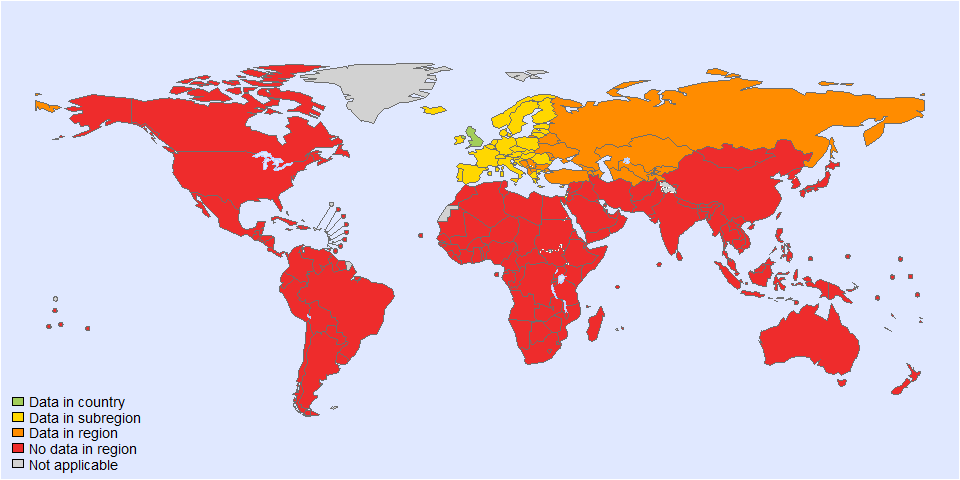<!-- -->

    ## Warning in RColorBrewer::brewer.pal(length(breaks) - 2, "Greens"): minimal value for n is 3, returning requested palette with 3 different levels

<!-- --><!-- -->

    ## Warning in RColorBrewer::brewer.pal(length(breaks) - 2, "Greens"): minimal value for n is 3, returning requested palette with 3 different levels

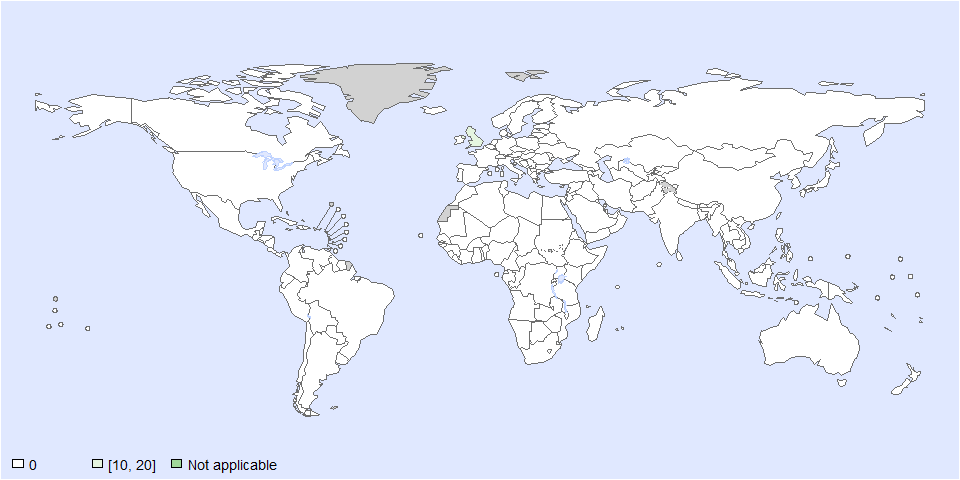<!-- -->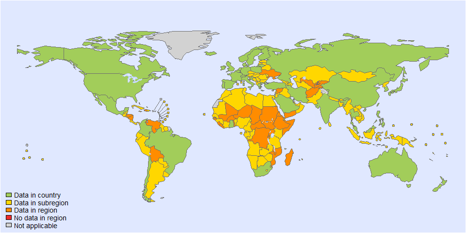<!-- -->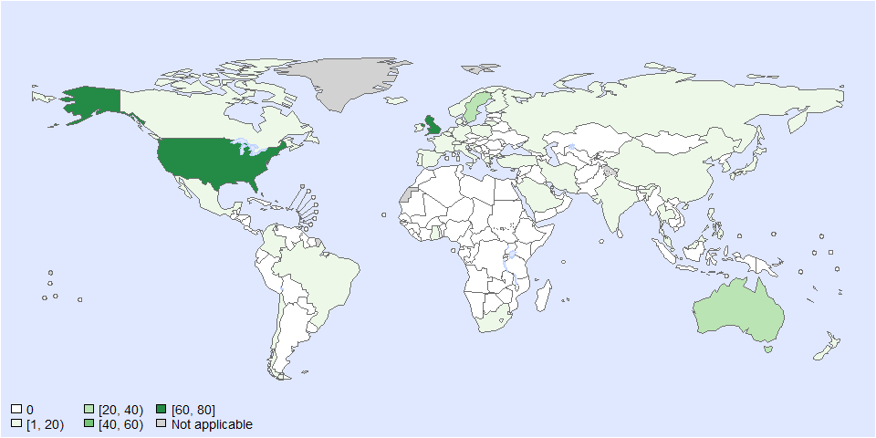<!-- -->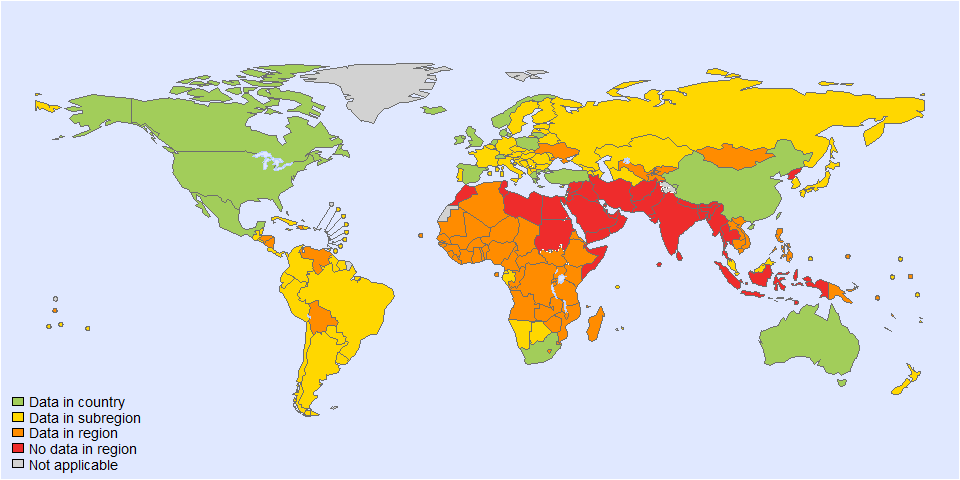<!-- -->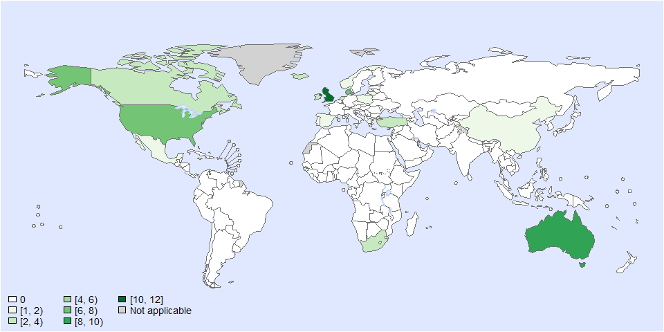<!-- -->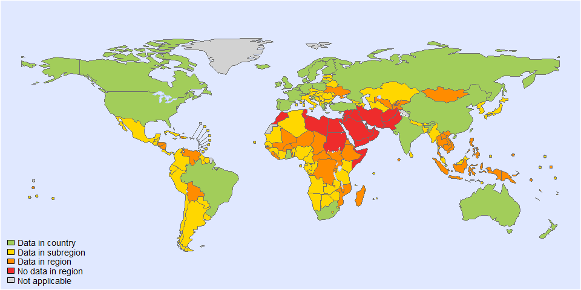<!-- -->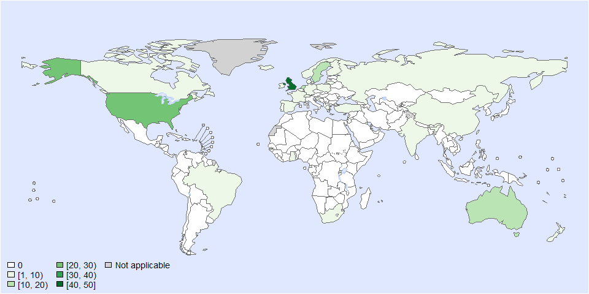<!-- -->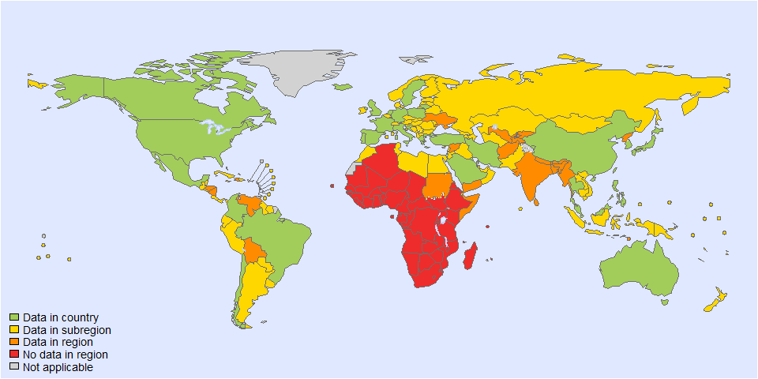<!-- -->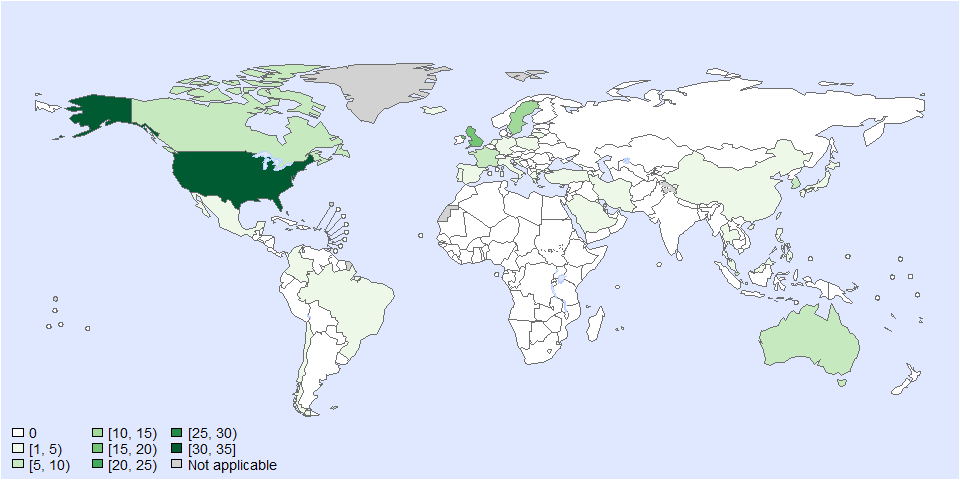<!-- -->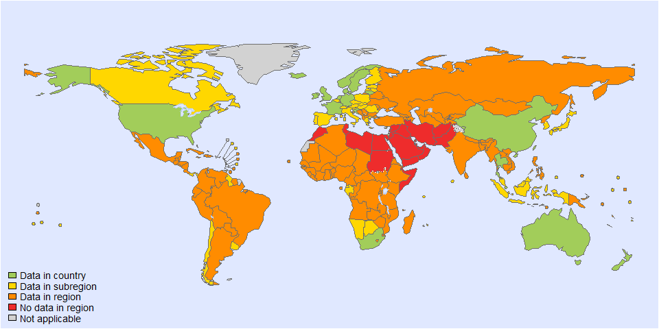<!-- -->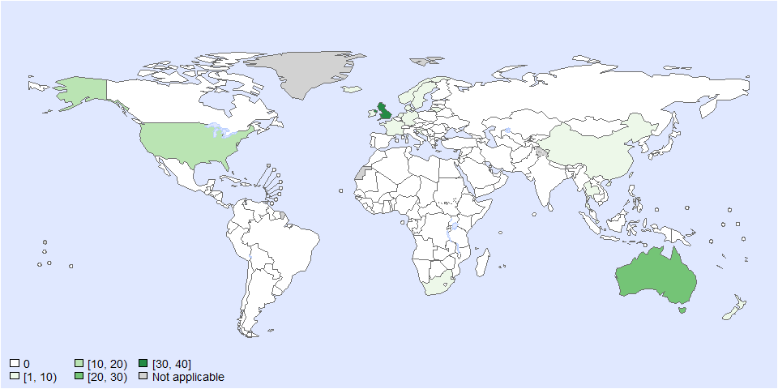<!-- -->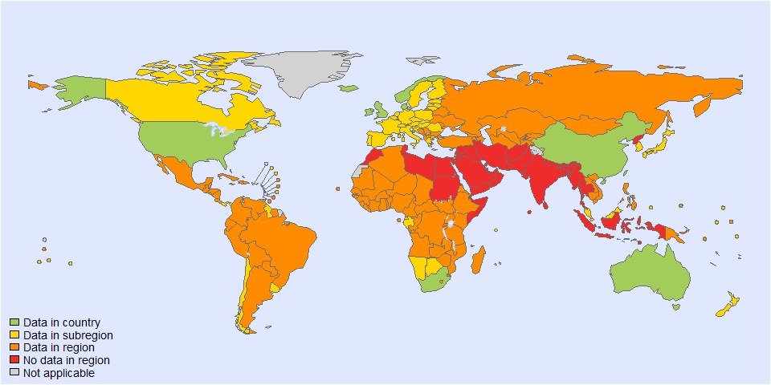<!-- -->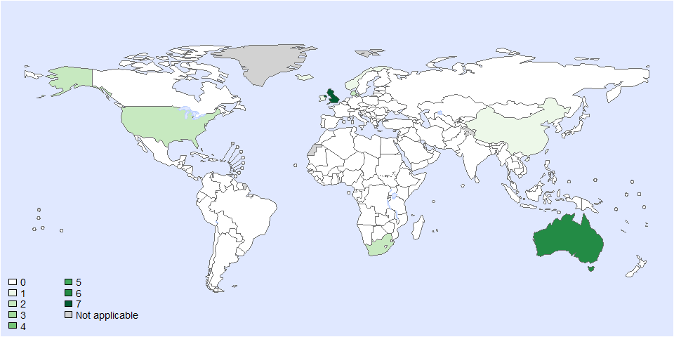<!-- -->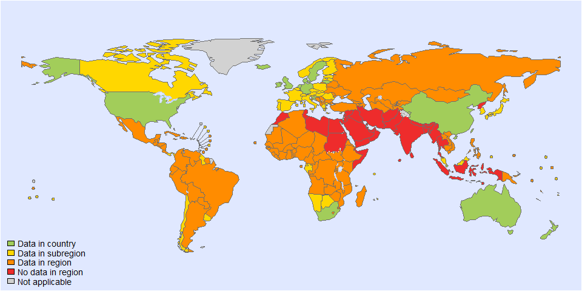<!-- -->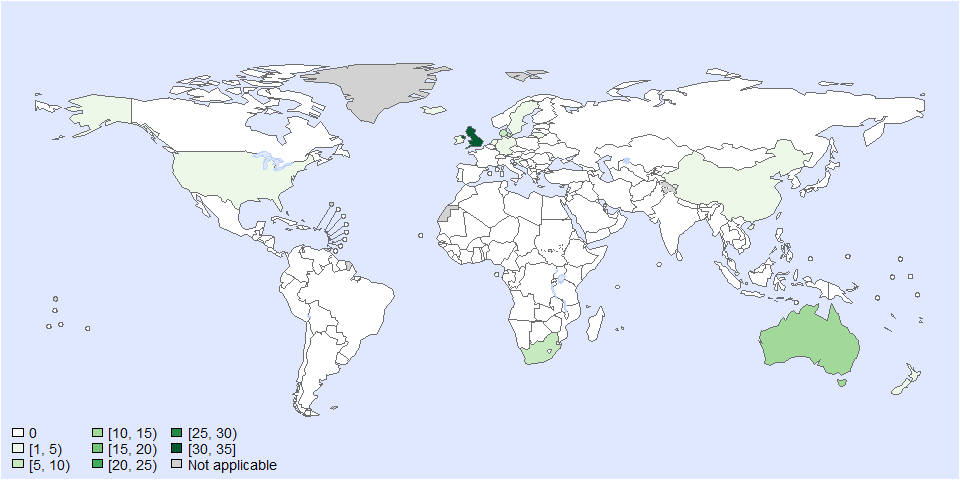<!-- -->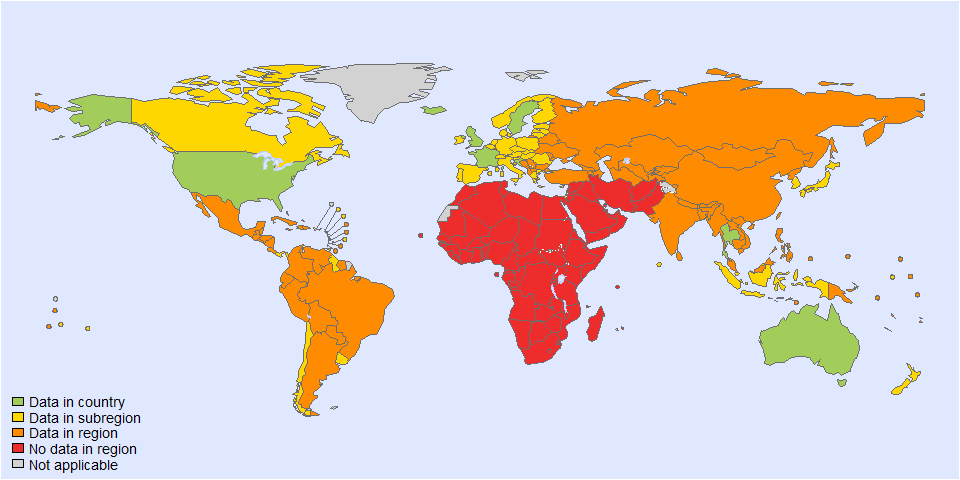<!-- -->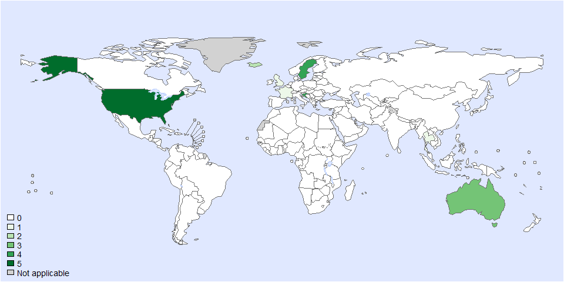<!-- -->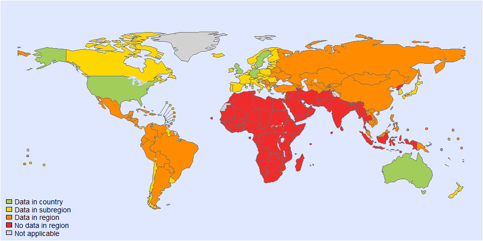<!-- -->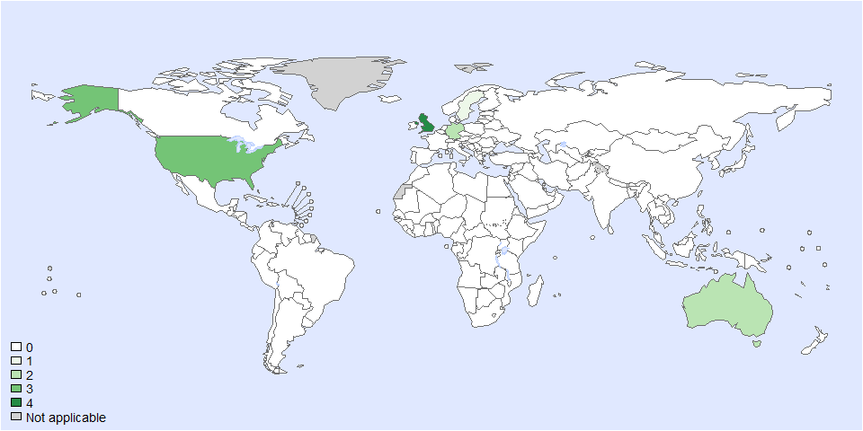<!-- -->

    ## Warning: REML comparisons not meaningful for models with different fixed effects
    ## (use 'refit=TRUE' to refit both models based on ML estimation).

    ## Warning in system2("quarto", "-V", stdout = TRUE, env = paste0("TMPDIR=", : running command '"quarto"
    ## TMPDIR=C:/Users/fbbu6966/AppData/Local/Temp/RtmpsN3q9D/file2b1037a2394e -V' had status 1

``` r
es <- es$Prevalence
es$DTP_ID<-as.character(seq(1:length(es$SOURCE_ID)))
es$OPT_CASES <- factor(es$OPT_CASES, 
                       levels = c("Confirmed", "Probable", "Suspected", "Other"))
es$FLAG<-factor(es$FLAG, 
                levels=c(0,1,2,3,4,5,6, 7),
                labels=c("Keep data", "Data part of non WHO member states", "No WHO REG2 given",
                         "Year before 1990", "yi can't be calcualted", "TF choice to remove", 
                         "Excluded by preliminary checks", "Excluded in data cleaning"))
saveRDS(es, paste0("es_", Date, ".RDS"))
```

# BRMS

``` r
Parameters<- c("Number of iteration", "Warmup", "Delta value", "Maximum tree-depth","Levels","Random effect on each data point", "Stronger priors specified")
Values <- c("5000","3000","0.9","15","Year, opt_Cases, countries, Studies","Yes", "Normal(0,1)")
version_spe <- data.frame(Parameters,Values)

kable(caption = "Parameters of the model tested",row.names = FALSE, version_spe)
```

| Parameters                       | Values                              |
|:---------------------------------|:------------------------------------|
| Number of iteration              | 5000                                |
| Warmup                           | 3000                                |
| Delta value                      | 0.9                                 |
| Maximum tree-depth               | 15                                  |
| Levels                           | Year, opt_Cases, countries, Studies |
| Random effect on each data point | Yes                                 |
| Stronger priors specified        | Normal(0,1)                         |

Parameters of the model tested

``` r
## fit model
fit_brms_reg_s <-
  brm(yi | se(sei) ~
        1 + YEAR + OPT_CASES +
        (1 | REG2) +
        (1 | REG2:SUB2) +
        (1 | REG2:SUB2:COUNTRY) +
        (1 | REG2:SUB2:COUNTRY:ID) +
        (1 | REG2:SUB2:COUNTRY:ID:DTP_ID),
      chains = 5, iter = 5000, warmup = 3000,
      cores = 5,
      prior = prior(normal(0,1), class = sd),
      data = subset(es, as.integer(FLAG) == 1),
      open_progress = FALSE,
      control = list(adapt_delta=0.9, max_treedepth = 15),
      seed = 7)
```

    ## Compiling Stan program...

    ## Start sampling

    ## Warning: There were 43 divergent transitions after warmup. See
    ## https://mc-stan.org/misc/warnings.html#divergent-transitions-after-warmup
    ## to find out why this is a problem and how to eliminate them.

    ## Warning: Examine the pairs() plot to diagnose sampling problems

``` r
## model summary
summary(fit_brms_reg_s)
```

    ## Warning: There were 43 divergent transitions after warmup. Increasing adapt_delta above 0.9 may help. See
    ## http://mc-stan.org/misc/warnings.html#divergent-transitions-after-warmup

    ##  Family: gaussian 
    ##   Links: mu = identity; sigma = identity 
    ## Formula: yi | se(sei) ~ 1 + YEAR + OPT_CASES + (1 | REG2) + (1 | REG2:SUB2) + (1 | REG2:SUB2:COUNTRY) + (1 | REG2:SUB2:COUNTRY:ID) + (1 | REG2:SUB2:COUNTRY:ID:DTP_ID) 
    ##    Data: subset(es, as.integer(FLAG) == 1) (Number of observations: 429) 
    ##   Draws: 5 chains, each with iter = 5000; warmup = 3000; thin = 1;
    ##          total post-warmup draws = 10000
    ## 
    ## Multilevel Hyperparameters:
    ## ~REG2 (Number of levels: 6) 
    ##               Estimate Est.Error l-95% CI u-95% CI Rhat Bulk_ESS Tail_ESS
    ## sd(Intercept)     0.33      0.29     0.01     1.11 1.00     8909     6057
    ## 
    ## ~REG2:SUB2 (Number of levels: 13) 
    ##               Estimate Est.Error l-95% CI u-95% CI Rhat Bulk_ESS Tail_ESS
    ## sd(Intercept)     0.26      0.21     0.01     0.77 1.00     8621     6080
    ## 
    ## ~REG2:SUB2:COUNTRY (Number of levels: 44) 
    ##               Estimate Est.Error l-95% CI u-95% CI Rhat Bulk_ESS Tail_ESS
    ## sd(Intercept)     0.69      0.16     0.41     1.03 1.00     5623     5587
    ## 
    ## ~REG2:SUB2:COUNTRY:ID (Number of levels: 187) 
    ##               Estimate Est.Error l-95% CI u-95% CI Rhat Bulk_ESS Tail_ESS
    ## sd(Intercept)     0.96      0.08     0.81     1.13 1.00     5050     7025
    ## 
    ## ~REG2:SUB2:COUNTRY:ID:DTP_ID (Number of levels: 429) 
    ##               Estimate Est.Error l-95% CI u-95% CI Rhat Bulk_ESS Tail_ESS
    ## sd(Intercept)     0.95      0.05     0.85     1.06 1.00     3877     5659
    ## 
    ## Regression Coefficients:
    ##                    Estimate Est.Error l-95% CI u-95% CI Rhat Bulk_ESS Tail_ESS
    ## Intercept            -12.56     26.77   -65.60    39.68 1.00     8798     6254
    ## YEAR                   0.00      0.01    -0.02     0.03 1.00     8821     6183
    ## OPT_CASESProbable      1.85      0.20     1.46     2.24 1.00     8318     8266
    ## OPT_CASESSuspected     1.71      0.23     1.26     2.16 1.00     8182     6989
    ## OPT_CASESOther         0.90      0.70    -0.47     2.29 1.00    10225     6000
    ## 
    ## Further Distributional Parameters:
    ##       Estimate Est.Error l-95% CI u-95% CI Rhat Bulk_ESS Tail_ESS
    ## sigma     0.00      0.00     0.00     0.00   NA       NA       NA
    ## 
    ## Draws were sampled using sampling(NUTS). For each parameter, Bulk_ESS
    ## and Tail_ESS are effective sample size measures, and Rhat is the potential
    ## scale reduction factor on split chains (at convergence, Rhat = 1).

``` r
plot(fit_brms_reg_s, ask = FALSE)
```

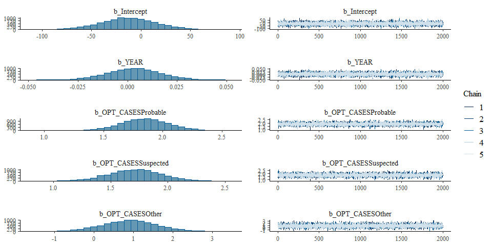<!-- -->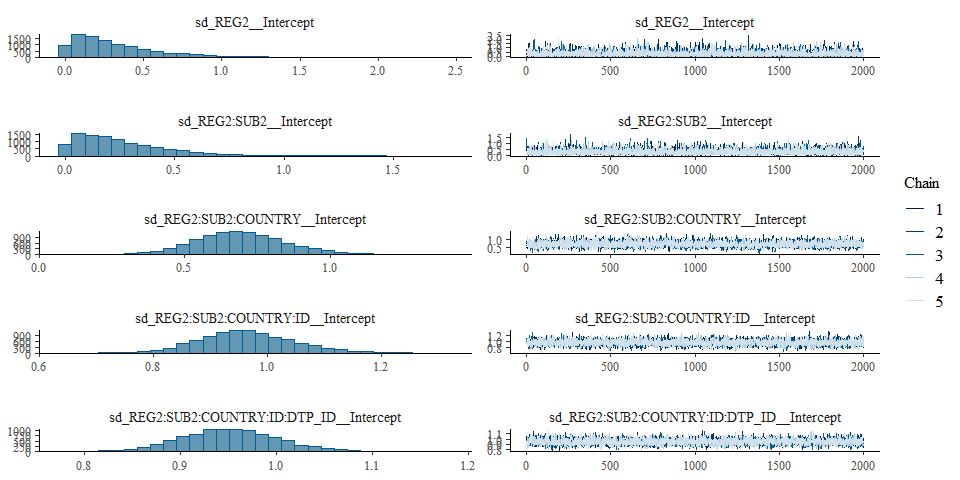<!-- --><!-- -->

``` r
plot(conditional_effects(fit_brms_reg_s), points = TRUE, ask=FALSE)
```

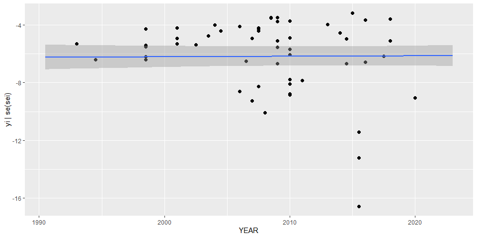<!-- -->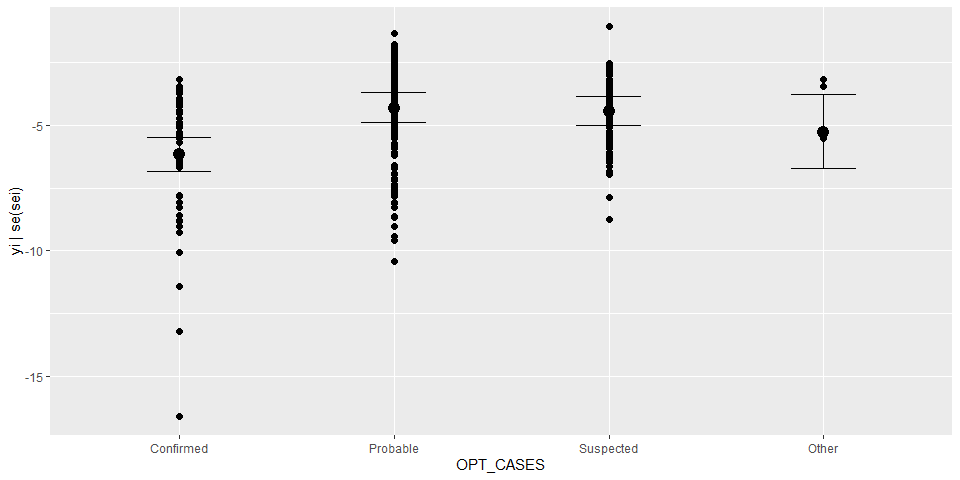<!-- -->

``` r
## show model code
stancode(fit_brms_reg_s)
```

    ## // generated with brms 2.22.0
    ## functions {
    ## }
    ## data {
    ##   int<lower=1> N;  // total number of observations
    ##   vector[N] Y;  // response variable
    ##   vector<lower=0>[N] se;  // known sampling error
    ##   int<lower=1> K;  // number of population-level effects
    ##   matrix[N, K] X;  // population-level design matrix
    ##   int<lower=1> Kc;  // number of population-level effects after centering
    ##   // data for group-level effects of ID 1
    ##   int<lower=1> N_1;  // number of grouping levels
    ##   int<lower=1> M_1;  // number of coefficients per level
    ##   array[N] int<lower=1> J_1;  // grouping indicator per observation
    ##   // group-level predictor values
    ##   vector[N] Z_1_1;
    ##   // data for group-level effects of ID 2
    ##   int<lower=1> N_2;  // number of grouping levels
    ##   int<lower=1> M_2;  // number of coefficients per level
    ##   array[N] int<lower=1> J_2;  // grouping indicator per observation
    ##   // group-level predictor values
    ##   vector[N] Z_2_1;
    ##   // data for group-level effects of ID 3
    ##   int<lower=1> N_3;  // number of grouping levels
    ##   int<lower=1> M_3;  // number of coefficients per level
    ##   array[N] int<lower=1> J_3;  // grouping indicator per observation
    ##   // group-level predictor values
    ##   vector[N] Z_3_1;
    ##   // data for group-level effects of ID 4
    ##   int<lower=1> N_4;  // number of grouping levels
    ##   int<lower=1> M_4;  // number of coefficients per level
    ##   array[N] int<lower=1> J_4;  // grouping indicator per observation
    ##   // group-level predictor values
    ##   vector[N] Z_4_1;
    ##   // data for group-level effects of ID 5
    ##   int<lower=1> N_5;  // number of grouping levels
    ##   int<lower=1> M_5;  // number of coefficients per level
    ##   array[N] int<lower=1> J_5;  // grouping indicator per observation
    ##   // group-level predictor values
    ##   vector[N] Z_5_1;
    ##   int prior_only;  // should the likelihood be ignored?
    ## }
    ## transformed data {
    ##   vector<lower=0>[N] se2 = square(se);
    ##   matrix[N, Kc] Xc;  // centered version of X without an intercept
    ##   vector[Kc] means_X;  // column means of X before centering
    ##   for (i in 2:K) {
    ##     means_X[i - 1] = mean(X[, i]);
    ##     Xc[, i - 1] = X[, i] - means_X[i - 1];
    ##   }
    ## }
    ## parameters {
    ##   vector[Kc] b;  // regression coefficients
    ##   real Intercept;  // temporary intercept for centered predictors
    ##   vector<lower=0>[M_1] sd_1;  // group-level standard deviations
    ##   array[M_1] vector[N_1] z_1;  // standardized group-level effects
    ##   vector<lower=0>[M_2] sd_2;  // group-level standard deviations
    ##   array[M_2] vector[N_2] z_2;  // standardized group-level effects
    ##   vector<lower=0>[M_3] sd_3;  // group-level standard deviations
    ##   array[M_3] vector[N_3] z_3;  // standardized group-level effects
    ##   vector<lower=0>[M_4] sd_4;  // group-level standard deviations
    ##   array[M_4] vector[N_4] z_4;  // standardized group-level effects
    ##   vector<lower=0>[M_5] sd_5;  // group-level standard deviations
    ##   array[M_5] vector[N_5] z_5;  // standardized group-level effects
    ## }
    ## transformed parameters {
    ##   real sigma = 0;  // dispersion parameter
    ##   vector[N_1] r_1_1;  // actual group-level effects
    ##   vector[N_2] r_2_1;  // actual group-level effects
    ##   vector[N_3] r_3_1;  // actual group-level effects
    ##   vector[N_4] r_4_1;  // actual group-level effects
    ##   vector[N_5] r_5_1;  // actual group-level effects
    ##   real lprior = 0;  // prior contributions to the log posterior
    ##   r_1_1 = (sd_1[1] * (z_1[1]));
    ##   r_2_1 = (sd_2[1] * (z_2[1]));
    ##   r_3_1 = (sd_3[1] * (z_3[1]));
    ##   r_4_1 = (sd_4[1] * (z_4[1]));
    ##   r_5_1 = (sd_5[1] * (z_5[1]));
    ##   lprior += student_t_lpdf(Intercept | 3, -4.4, 2.5);
    ##   lprior += normal_lpdf(sd_1 | 0, 1)
    ##     - 1 * normal_lccdf(0 | 0, 1);
    ##   lprior += normal_lpdf(sd_2 | 0, 1)
    ##     - 1 * normal_lccdf(0 | 0, 1);
    ##   lprior += normal_lpdf(sd_3 | 0, 1)
    ##     - 1 * normal_lccdf(0 | 0, 1);
    ##   lprior += normal_lpdf(sd_4 | 0, 1)
    ##     - 1 * normal_lccdf(0 | 0, 1);
    ##   lprior += normal_lpdf(sd_5 | 0, 1)
    ##     - 1 * normal_lccdf(0 | 0, 1);
    ## }
    ## model {
    ##   // likelihood including constants
    ##   if (!prior_only) {
    ##     // initialize linear predictor term
    ##     vector[N] mu = rep_vector(0.0, N);
    ##     mu += Intercept + Xc * b;
    ##     for (n in 1:N) {
    ##       // add more terms to the linear predictor
    ##       mu[n] += r_1_1[J_1[n]] * Z_1_1[n] + r_2_1[J_2[n]] * Z_2_1[n] + r_3_1[J_3[n]] * Z_3_1[n] + r_4_1[J_4[n]] * Z_4_1[n] + r_5_1[J_5[n]] * Z_5_1[n];
    ##     }
    ##     target += normal_lpdf(Y | mu, se);
    ##   }
    ##   // priors including constants
    ##   target += lprior;
    ##   target += std_normal_lpdf(z_1[1]);
    ##   target += std_normal_lpdf(z_2[1]);
    ##   target += std_normal_lpdf(z_3[1]);
    ##   target += std_normal_lpdf(z_4[1]);
    ##   target += std_normal_lpdf(z_5[1]);
    ## }
    ## generated quantities {
    ##   // actual population-level intercept
    ##   real b_Intercept = Intercept - dot_product(means_X, b);
    ## }

``` r
## save model fit
saveRDS(fit_brms_reg_s, file = "fit_brms_reg_s.rds")
```

# Session info

``` r
sessioninfo::session_info()
```

    ## Warning in system2("quarto", "-V", stdout = TRUE, env = paste0("TMPDIR=", : running command '"quarto"
    ## TMPDIR=C:/Users/fbbu6966/AppData/Local/Temp/RtmpsN3q9D/file2b1035234aa4 -V' had status 1

    ## ─ Session info ─────────────────────────────────────────────────────────────────────────────────────────────
    ##  setting  value
    ##  version  R version 4.5.0 (2025-04-11 ucrt)
    ##  os       Windows 10 x64 (build 19045)
    ##  system   x86_64, mingw32
    ##  ui       RStudio
    ##  language (EN)
    ##  collate  English_United States.utf8
    ##  ctype    English_United States.utf8
    ##  tz       Europe/Brussels
    ##  date     2025-10-06
    ##  rstudio  2025.05.0+496 Mariposa Orchid (desktop)
    ##  pandoc   3.4 @ C:/Users/fbbu6966/AppData/Local/Programs/RStudio/resources/app/bin/quarto/bin/tools/ (via rmarkdown)
    ##  quarto   ERROR: Unknown command "TMPDIR=C:/Users/fbbu6966/AppData/Local/Temp/RtmpsN3q9D/file2b1035234aa4". Did you mean command "update"? @ C:\\Users\\fbbu6966\\AppData\\Local\\Programs\\RStudio\\RESOUR~1\\app\\bin\\quarto\\bin\\quarto.exe
    ## 
    ## ─ Packages ─────────────────────────────────────────────────────────────────────────────────────────────────
    ##  ! package        * version    date (UTC) lib source
    ##    abind            1.4-8      2024-09-12 [1] CRAN (R 4.5.0)
    ##    backports        1.5.0      2024-05-23 [1] CRAN (R 4.5.0)
    ##    base64enc        0.1-3      2015-07-28 [1] CRAN (R 4.5.0)
    ##    bayesplot        1.12.0     2025-04-10 [1] CRAN (R 4.5.0)
    ##    bd             * 0.0.14     2025-04-14 [1] Github (brechtdv/bd@652191c)
    ##    boot             1.3-31     2024-08-28 [1] CRAN (R 4.5.0)
    ##    bridgesampling   1.1-2      2021-04-16 [1] CRAN (R 4.5.0)
    ##    brms           * 2.22.0     2024-09-23 [1] CRAN (R 4.5.0)
    ##    Brobdingnag      1.2-9      2022-10-19 [1] CRAN (R 4.5.0)
    ##    callr            3.7.6      2024-03-25 [1] CRAN (R 4.5.0)
    ##    cellranger       1.1.0      2016-07-27 [1] CRAN (R 4.5.0)
    ##    checkmate        2.3.2      2024-07-29 [1] CRAN (R 4.5.0)
    ##    class            7.3-23     2025-01-01 [1] CRAN (R 4.5.0)
    ##    classInt         0.4-11     2025-01-08 [1] CRAN (R 4.5.0)
    ##    cli              3.6.4      2025-02-13 [1] CRAN (R 4.5.0)
    ##    cluster          2.1.8.1    2025-03-12 [1] CRAN (R 4.5.0)
    ##    coda             0.19-4.1   2024-01-31 [1] CRAN (R 4.5.0)
    ##    codetools        0.2-20     2024-03-31 [1] CRAN (R 4.5.0)
    ##    colorspace       2.1-1      2024-07-26 [1] CRAN (R 4.5.0)
    ##    curl             6.2.2      2025-03-24 [1] CRAN (R 4.5.0)
    ##    data.table       1.17.0     2025-02-22 [1] CRAN (R 4.5.0)
    ##    DBI              1.2.3      2024-06-02 [1] CRAN (R 4.5.0)
    ##    DescTools      * 0.99.60    2025-03-28 [1] CRAN (R 4.5.0)
    ##    digest           0.6.37     2024-08-19 [1] CRAN (R 4.5.0)
    ##    distributional   0.5.0      2024-09-17 [1] CRAN (R 4.5.0)
    ##    dplyr          * 1.1.4      2023-11-17 [1] CRAN (R 4.5.0)
    ##    e1071            1.7-16     2024-09-16 [1] CRAN (R 4.5.0)
    ##    evaluate         1.0.3      2025-01-10 [1] CRAN (R 4.5.0)
    ##    Exact            3.3        2024-07-21 [1] CRAN (R 4.5.0)
    ##    expm             1.0-0      2024-08-19 [1] CRAN (R 4.5.0)
    ##    farver           2.1.2      2024-05-13 [1] CRAN (R 4.5.0)
    ##    fastmap          1.2.0      2024-05-15 [1] CRAN (R 4.5.0)
    ##    FERG2          * 0.0.5      2025-08-07 [1] Github (brechtdv/FERG2@c2d4ac1)
    ##    forcats          1.0.0      2023-01-29 [1] CRAN (R 4.5.0)
    ##    foreign          0.8-90     2025-03-31 [1] CRAN (R 4.5.0)
    ##    Formula          1.2-5      2023-02-24 [1] CRAN (R 4.5.0)
    ##    fs               1.6.6      2025-04-12 [1] CRAN (R 4.5.0)
    ##    generics         0.1.3      2022-07-05 [1] CRAN (R 4.5.0)
    ##    ggplot2        * 3.5.2      2025-04-09 [1] CRAN (R 4.5.0)
    ##    gld              2.6.7      2025-01-17 [1] CRAN (R 4.5.0)
    ##    glue             1.8.0      2024-09-30 [1] CRAN (R 4.5.0)
    ##    gridExtra        2.3        2017-09-09 [1] CRAN (R 4.5.0)
    ##    gtable           0.3.6      2024-10-25 [1] CRAN (R 4.5.0)
    ##    haven            2.5.4      2023-11-30 [1] CRAN (R 4.5.0)
    ##    Hmisc          * 5.2-3      2025-03-16 [1] CRAN (R 4.5.0)
    ##    hms              1.1.3      2023-03-21 [1] CRAN (R 4.5.0)
    ##    htmlTable        2.4.3      2024-07-21 [1] CRAN (R 4.5.0)
    ##    htmltools        0.5.8.1    2024-04-04 [1] CRAN (R 4.5.0)
    ##    htmlwidgets      1.6.4      2023-12-06 [1] CRAN (R 4.5.0)
    ##    httr             1.4.7      2023-08-15 [1] CRAN (R 4.5.0)
    ##    inline           0.3.21     2025-01-09 [1] CRAN (R 4.5.0)
    ##    jsonlite         2.0.0      2025-03-27 [1] CRAN (R 4.5.0)
    ##    kableExtra     * 1.4.0      2024-01-24 [1] CRAN (R 4.5.0)
    ##    KernSmooth       2.23-26    2025-01-01 [1] CRAN (R 4.5.0)
    ##    knitr          * 1.50       2025-03-16 [1] CRAN (R 4.5.0)
    ##    labeling         0.4.3      2023-08-29 [1] CRAN (R 4.5.0)
    ##    lattice          0.22-6     2024-03-20 [1] CRAN (R 4.5.0)
    ##    lifecycle        1.0.4      2023-11-07 [1] CRAN (R 4.5.0)
    ##    lmom             3.2        2024-09-30 [1] CRAN (R 4.5.0)
    ##    loo              2.8.0      2024-07-03 [1] CRAN (R 4.5.0)
    ##    magrittr         2.0.3      2022-03-30 [1] CRAN (R 4.5.0)
    ##    MASS             7.3-65     2025-02-28 [1] CRAN (R 4.5.0)
    ##    mathjaxr         1.6-0      2022-02-28 [1] CRAN (R 4.5.0)
    ##    Matrix         * 1.7-3      2025-03-11 [1] CRAN (R 4.5.0)
    ##    MatrixModels     0.5-4      2025-03-26 [1] CRAN (R 4.5.0)
    ##    matrixStats      1.5.0      2025-01-07 [1] CRAN (R 4.5.0)
    ##    metadat        * 1.4-0      2025-02-04 [1] CRAN (R 4.5.0)
    ##    metafor        * 4.8-0      2025-01-28 [1] CRAN (R 4.5.0)
    ##    multcomp         1.4-28     2025-01-29 [1] CRAN (R 4.5.0)
    ##    munsell          0.5.1      2024-04-01 [1] CRAN (R 4.5.0)
    ##    mvtnorm          1.3-3      2025-01-10 [1] CRAN (R 4.5.0)
    ##    nlme             3.1-168    2025-03-31 [1] CRAN (R 4.5.0)
    ##    nnet             7.3-20     2025-01-01 [1] CRAN (R 4.5.0)
    ##    numDeriv       * 2016.8-1.1 2019-06-06 [1] CRAN (R 4.5.0)
    ##    pillar           1.11.0     2025-07-04 [1] CRAN (R 4.5.1)
    ##    pkgbuild         1.4.7      2025-03-24 [1] CRAN (R 4.5.0)
    ##    pkgconfig        2.0.3      2019-09-22 [1] CRAN (R 4.5.0)
    ##    plyr             1.8.9      2023-10-02 [1] CRAN (R 4.5.0)
    ##    polspline        1.1.25     2024-05-10 [1] CRAN (R 4.5.0)
    ##    posterior        1.6.1      2025-02-27 [1] CRAN (R 4.5.0)
    ##    processx         3.8.6      2025-02-21 [1] CRAN (R 4.5.0)
    ##    proxy            0.4-27     2022-06-09 [1] CRAN (R 4.5.0)
    ##    ps               1.9.1      2025-04-12 [1] CRAN (R 4.5.0)
    ##    purrr            1.0.4      2025-02-05 [1] CRAN (R 4.5.0)
    ##    quantreg         6.1        2025-03-10 [1] CRAN (R 4.5.0)
    ##    QuickJSR         1.7.0      2025-03-31 [1] CRAN (R 4.5.0)
    ##    R6               2.6.1      2025-02-15 [1] CRAN (R 4.5.0)
    ##    RColorBrewer     1.1-3      2022-04-03 [1] CRAN (R 4.5.0)
    ##    Rcpp           * 1.0.14     2025-01-12 [1] CRAN (R 4.5.0)
    ##  D RcppParallel     5.1.10     2025-01-24 [1] CRAN (R 4.5.0)
    ##    readr            2.1.5      2024-01-10 [1] CRAN (R 4.5.0)
    ##    readxl         * 1.4.5      2025-03-07 [1] CRAN (R 4.5.0)
    ##    reshape2         1.4.4      2020-04-09 [1] CRAN (R 4.5.0)
    ##    rlang            1.1.6      2025-04-11 [1] CRAN (R 4.5.0)
    ##    rmarkdown      * 2.29       2024-11-04 [1] CRAN (R 4.5.0)
    ##    rms            * 8.0-0      2025-04-04 [1] CRAN (R 4.5.0)
    ##    rootSolve        1.8.2.4    2023-09-21 [1] CRAN (R 4.5.0)
    ##    rpart            4.1.24     2025-01-07 [1] CRAN (R 4.5.0)
    ##    rstan            2.32.7     2025-03-10 [1] CRAN (R 4.5.0)
    ##    rstantools       2.4.0      2024-01-31 [1] CRAN (R 4.5.0)
    ##    rstudioapi       0.17.1     2024-10-22 [1] CRAN (R 4.5.0)
    ##    sandwich         3.1-1      2024-09-15 [1] CRAN (R 4.5.0)
    ##    scales         * 1.3.0      2023-11-28 [1] CRAN (R 4.5.0)
    ##    sessioninfo      1.2.3      2025-02-05 [1] CRAN (R 4.5.0)
    ##    sf             * 1.0-20     2025-03-24 [1] CRAN (R 4.5.0)
    ##    SparseM          1.84-2     2024-07-17 [1] CRAN (R 4.5.0)
    ##    StanHeaders      2.32.10    2024-07-15 [1] CRAN (R 4.5.0)
    ##    stringi          1.8.7      2025-03-27 [1] CRAN (R 4.5.0)
    ##    stringr          1.5.1      2023-11-14 [1] CRAN (R 4.5.0)
    ##    survival         3.8-3      2024-12-17 [1] CRAN (R 4.5.0)
    ##    svglite          2.1.3      2023-12-08 [1] CRAN (R 4.5.0)
    ##    systemfonts      1.2.2      2025-04-04 [1] CRAN (R 4.5.0)
    ##    tensorA          0.36.2.1   2023-12-13 [1] CRAN (R 4.5.0)
    ##    TH.data          1.1-3      2025-01-17 [1] CRAN (R 4.5.0)
    ##    tibble           3.3.0      2025-06-08 [1] CRAN (R 4.5.1)
    ##    tidyr          * 1.3.1      2024-01-24 [1] CRAN (R 4.5.0)
    ##    tidyselect       1.2.1      2024-03-11 [1] CRAN (R 4.5.0)
    ##    tzdb             0.5.0      2025-03-15 [1] CRAN (R 4.5.0)
    ##    units            0.8-7      2025-03-11 [1] CRAN (R 4.5.0)
    ##    V8               6.0.3      2025-03-26 [1] CRAN (R 4.5.0)
    ##    vctrs            0.6.5      2023-12-01 [1] CRAN (R 4.5.0)
    ##    viridisLite      0.4.2      2023-05-02 [1] CRAN (R 4.5.0)
    ##    withr            3.0.2      2024-10-28 [1] CRAN (R 4.5.0)
    ##    xfun             0.52       2025-04-02 [1] CRAN (R 4.5.0)
    ##    xml2             1.3.8      2025-03-14 [1] CRAN (R 4.5.0)
    ##    yaml             2.3.10     2024-07-26 [1] CRAN (R 4.5.0)
    ##    zoo              1.8-14     2025-04-10 [1] CRAN (R 4.5.0)
    ## 
    ##  [1] C:/Users/fbbu6966/AppData/Local/Programs/R/R-4.5.0/library
    ## 
    ##  * ── Packages attached to the search path.
    ##  D ── DLL MD5 mismatch, broken installation.
    ## 
    ## ────────────────────────────────────────────────────────────────────────────────────────────────────────────

``` r
##rmarkdown::render("02-fit.R")
```
