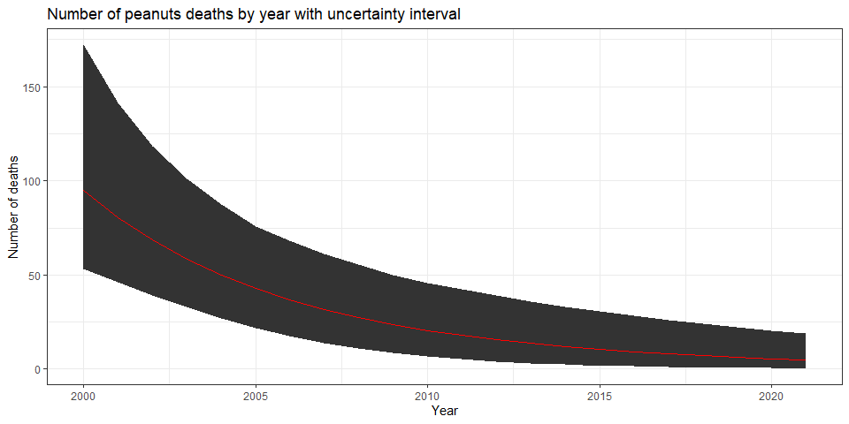
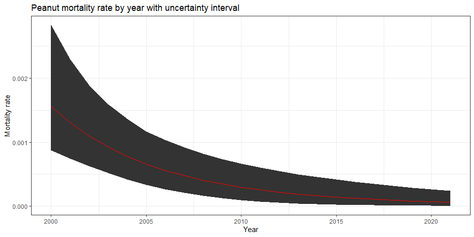

Global mortality of peanuts • Estimate mortality with the 1st model
================
fbbu6966
2025-02-21

- [Settings](#settings)
- [Parameters of the 1st model](#parameters-of-the-1st-model)
- [Import and adapt data](#import-and-adapt-data)
- [Predict all](#predict-all)
- [Summarize predictions](#summarize-predictions)
  - [Global](#global)
- [Session info](#session-info)

# Settings

``` r
## required packages ----
library(bd)
library(brms)
library(FERG2)
library(ggplot2)
library(knitr)
library(rmarkdown)
library(sf)
library(tidyr)
library(dplyr)
library(DescTools)
library(readxl)
library(kableExtra)

#Standard model 
## global options ----
knitr::opts_chunk$set(fig.width = 10)
Date <- format(Sys.Date(), "%Y%m%d")
```

# Parameters of the 1st model

| Parameters                       | Values          |
|:---------------------------------|:----------------|
| Number of iterations             | 5000            |
| Warmup                           | 3000            |
| Level included                   | Global and year |
| Delta value                      | 0.95            |
| Maximum tree-depth               | 15              |
| Random effect on each data point | Yes             |
| Stronger priors specified        | Normal(0,1)     |

Parameters of the model tested

# Import and adapt data

``` r
fit_brms_reg_s <- readRDS("fit_brms_reg_mort_s1.rds")
zero_cases<- read_xlsx("Endemic_countries.xlsx")%>%
  select(REG2, SUB2, ISO3, Country, cttf_peanuts) %>%
  rename(COUNTRY=ISO3, COUNTRY_LABEL = Country, DISEASEFREE = cttf_peanuts)
```

    ## New names:
    ## • `` -> `...28`

``` r
kable(
  caption = "Countries assumed to be non-endemic",
  row.names = FALSE,
  subset(zero_cases, DISEASEFREE==0)[, 4]) 
```

| COUNTRY_LABEL |
|:--------------|

Countries assumed to be non-endemic

``` r
# Global so no check necessary on disease free countries
# es <- readRDS("es.rds")
# country_with_data <- es %>% select(ISO3) %>% distinct() %>% mutate(DATA=1, COUNTRY = ISO3)
# Sub2_with_data <- es %>% select(SUB2) %>% distinct() %>% mutate(DATASUB2=1)
# Reg2_with_data <- es %>% select(REG2) %>% distinct() %>% mutate(DATAREG2=1)
# zero_cases <- left_join(zero_cases, country_with_data)
# zero_cases <- left_join(zero_cases, Sub2_with_data)
# zero_cases <- left_join(zero_cases, Reg2_with_data) %>%
#   select(-c(ISO3)) %>%
#   mutate(ESTIMATES = case_when(
#     DATA == 1 ~ 1,
#     DISEASEFREE == 0 ~ 2,
#     is.na(DATA) & DISEASEFREE == 1 & DATASUB2 == 1 ~ 3,
#     is.na(DATA) & DISEASEFREE == 1 & is.na(DATASUB2) & DATAREG2 == 1 ~ 4, 
#     is.na(DATA) & DISEASEFREE == 1  & is.na(DATASUB2) & is.na(DATAREG2) ~5))
# zero_cases$ESTIMATES <- factor(zero_cases$ESTIMATES, 
#                                level = c(1,2,3,4,5),
#                                labels = c("Data present", "Disease free", "Data in subregion", "Data in region", "Data in world"))
# Country_Check <- zero_cases %>% filter(as.integer(ESTIMATES) == 2)
```

# Predict all

``` r
## set up dataframe
sim_all <-
  data.frame(
    sei = 0, 
    YEAR = c(2000:2021))
sim_all$ESTIMATES <- 5
sim_all$ESTIMATES <- factor(sim_all$ESTIMATES,
                            level = c(1,2,3,4,5),
                            labels = c("Data present", "Disease free", "Data in subregion", "Data in region", "Data in world"))


## draw from expected value of posterior predictive dist
set.seed(10)
#fit_all <- 
#posterior_epred(
#  object = fit_brms_reg_s,
#  newdata = sim_all,
#  allow_new_levels = TRUE,
#  sample_new_levels = "uncertainty",
#  re_formula = ~ 1 + 
#            (1  | REG2) +
#            (1  | REG2:SUB2) +
#            (1  | REG2:SUB2:COUNTRY)
#  )

draws_fit <- as_draws_df(fit_brms_reg_s)
fit_all <- data.frame(1:10000)
for (x in 1:nrow(sim_all)){
  if (as.integer(sim_all[x, "ESTIMATES"]) == 5){
    # Data not present for country
    fit_all[[paste0("V",x)]] <- draws_fit$b_Intercept +
      sim_all[x, "YEAR"] * draws_fit$b_YEAR
  } 
}

fit_all <- fit_all %>% select(-c(X1.10000))

## calculate cases
sim_all$SIM <- t(fit_all)
pop_all <- aggregate(POP ~ YEAR, FERG2:::pop, sum)
sim_all <- merge(pop_all, sim_all,
                 by.x = c("YEAR"), by.y = c("YEAR"))
sim_all$CASES <- exp(sim_all$SIM) * sim_all$POP / 1e5


## aggregate global
sim_all_glb <- with(sim_all, aggregate(CASES ~ YEAR, FUN = sum))
all_glb_id <- sim_all_glb[1]
all_glb_nr <-
  t(apply(sim_all_glb[, grepl("V", names(sim_all_glb))], 1, mean_ci))
all_glb_nr <- data.frame(all_glb_nr) 
names(all_glb_nr) <- c("VAL_MEAN", "VAL_LWR", "VAL_UPR")
all_glb_nr <- cbind(all_glb_id, all_glb_nr) 
all_glb_nr$LOCATION <- "Global"
all_glb_nr$LOCATION_NAME <- "Global"
all_glb_nr$METRIC <- "Number"
str(all_glb_nr)
```

    ## 'data.frame':    22 obs. of  7 variables:
    ##  $ YEAR         : int  2000 2001 2002 2003 2004 2005 2006 2007 2008 2009 ...
    ##  $ VAL_MEAN     : num  94.9 80.6 68.6 58.5 50 ...
    ##  $ VAL_LWR      : num  53.2 45.9 39.3 32.8 26.9 ...
    ##  $ VAL_UPR      : num  172.2 141.6 118.4 100.9 87.5 ...
    ##  $ LOCATION     : chr  "Global" "Global" "Global" "Global" ...
    ##  $ LOCATION_NAME: chr  "Global" "Global" "Global" "Global" ...
    ##  $ METRIC       : chr  "Number" "Number" "Number" "Number" ...

``` r
all_glb_rt <- all_glb_nr
all_glb_rt$POP <- with(sim_all, tapply(POP, YEAR, sum))
all_glb_rt$VAL_MEAN <- 1e5 * all_glb_rt$VAL_MEAN / all_glb_rt$POP
all_glb_rt$VAL_LWR <- 1e5 * all_glb_rt$VAL_LWR / all_glb_rt$POP
all_glb_rt$VAL_UPR <- 1e5 * all_glb_rt$VAL_UPR / all_glb_rt$POP
all_glb_rt$METRIC <- "Rate"
all_glb_rt$POP <- NULL
all_glb_rt$glb <- NULL
str(all_glb_rt)
```

    ## 'data.frame':    22 obs. of  7 variables:
    ##  $ YEAR         : int  2000 2001 2002 2003 2004 2005 2006 2007 2008 2009 ...
    ##  $ VAL_MEAN     : num [1:22(1d)] 0.001559 0.001306 0.001097 0.000924 0.00078 ...
    ##  $ VAL_LWR      : num [1:22(1d)] 0.000874 0.000744 0.000628 0.000518 0.000418 ...
    ##  $ VAL_UPR      : num [1:22(1d)] 0.00283 0.00229 0.00189 0.00159 0.00136 ...
    ##  $ LOCATION     : chr  "Global" "Global" "Global" "Global" ...
    ##  $ LOCATION_NAME: chr  "Global" "Global" "Global" "Global" ...
    ##  $ METRIC       : chr  "Rate" "Rate" "Rate" "Rate" ...

``` r
## compile all
all_est <-
  rbind(all_glb_rt, all_glb_nr)
str(all_est)
```

    ## 'data.frame':    44 obs. of  7 variables:
    ##  $ YEAR         : int  2000 2001 2002 2003 2004 2005 2006 2007 2008 2009 ...
    ##  $ VAL_MEAN     : num  0.001559 0.001306 0.001097 0.000924 0.00078 ...
    ##  $ VAL_LWR      : num  0.000874 0.000744 0.000628 0.000518 0.000418 ...
    ##  $ VAL_UPR      : num  0.00283 0.00229 0.00189 0.00159 0.00136 ...
    ##  $ LOCATION     : chr  "Global" "Global" "Global" "Global" ...
    ##  $ LOCATION_NAME: chr  "Global" "Global" "Global" "Global" ...
    ##  $ METRIC       : chr  "Rate" "Rate" "Rate" "Rate" ...

``` r
saveRDS(all_est, file = "all_estimates.rds")
```

# Summarize predictions

## Global

``` r
kable(
  caption = "Global number of peanuts deaths in 2010 and 2020",
  row.names = FALSE,
  subset(all_glb_nr, YEAR %in% c(2010,2020))[, 1:4])
```

| YEAR |  VAL_MEAN |   VAL_LWR |  VAL_UPR |
|-----:|----------:|----------:|---------:|
| 2010 | 20.591416 | 6.5990040 | 45.84953 |
| 2020 |  5.557934 | 0.4660714 | 20.47853 |

Global number of peanuts deaths in 2010 and 2020

``` r
kable(
  caption = "Global peanut mortality rate in 2010 and 2020",
  row.names = FALSE,
  subset(all_glb_rt, YEAR %in% c(2010,2020))[, 1:4])
```

| YEAR |     VAL_MEAN |      VAL_LWR |      VAL_UPR |
|-----:|-------------:|-------------:|-------------:|
| 2010 | 2.970288e-04 | 9.518986e-05 | 0.0006613741 |
| 2020 | 7.121193e-05 | 5.971615e-06 | 0.0002623845 |

Global peanut mortality rate in 2010 and 2020

``` r
ggplot(all_glb_nr, aes(x=YEAR, y=VAL_MEAN)) + 
  geom_ribbon(aes(ymin = VAL_LWR, ymax = VAL_UPR)) +
  geom_line(col="red") +
  ggtitle("Number of peanuts deaths by year with uncertainty interval") +
  labs(x= "Year", y="Number of deaths") +
  theme_bw()
```

<!-- -->

``` r
ggplot(all_glb_rt, aes(x=YEAR, y=VAL_MEAN)) + 
  geom_ribbon(aes(ymin = VAL_LWR, ymax = VAL_UPR)) +
  geom_line(col="red") +
  ggtitle("Peanut mortality rate by year with uncertainty interval") +
  labs(x= "Year", y="Mortality rate") +
  theme_bw()
```

<!-- -->

# Session info

``` r
saveRDS(sim_all, paste0("sim_all_MRT_", Date, ".RDS"))
saveRDS(all_est, paste0("all_est_MRT_", Date, ".RDS"))
sessioninfo::session_info()
```

    ## ─ Session info ──────────────────────────────────────────────────────────────────────────────────────────────────────
    ##  setting  value
    ##  version  R version 4.4.1 (2024-06-14 ucrt)
    ##  os       Windows 10 x64 (build 19045)
    ##  system   x86_64, mingw32
    ##  ui       RStudio
    ##  language (EN)
    ##  collate  English_United States.utf8
    ##  ctype    English_United States.utf8
    ##  tz       Europe/Brussels
    ##  date     2025-02-21
    ##  rstudio  2024.04.2+764 Chocolate Cosmos (desktop)
    ##  pandoc   3.1.11 @ C:/Users/fbbu6966/AppData/Local/Programs/RStudio/resources/app/bin/quarto/bin/tools/ (via rmarkdown)
    ## 
    ## ─ Packages ──────────────────────────────────────────────────────────────────────────────────────────────────────────
    ##  ! package        * version    date (UTC) lib source
    ##    abind            1.4-5      2016-07-21 [1] CRAN (R 4.4.0)
    ##    backports        1.5.0      2024-05-23 [1] CRAN (R 4.4.0)
    ##    base64enc        0.1-3      2015-07-28 [1] CRAN (R 4.4.0)
    ##    bayesplot        1.11.1     2024-02-15 [1] CRAN (R 4.4.1)
    ##    bd             * 0.0.13     2024-08-03 [1] Github (brechtdv/bd@b63c017)
    ##    boot             1.3-30     2024-02-26 [1] CRAN (R 4.4.1)
    ##    bridgesampling   1.1-2      2021-04-16 [1] CRAN (R 4.4.1)
    ##    brms           * 2.21.0     2024-03-20 [1] CRAN (R 4.4.1)
    ##    Brobdingnag      1.2-9      2022-10-19 [1] CRAN (R 4.4.1)
    ##    cachem           1.1.0      2024-05-16 [1] CRAN (R 4.4.1)
    ##    cellranger       1.1.0      2016-07-27 [1] CRAN (R 4.4.1)
    ##    checkmate        2.3.1      2023-12-04 [1] CRAN (R 4.4.1)
    ##    class            7.3-22     2023-05-03 [1] CRAN (R 4.4.1)
    ##    classInt         0.4-10     2023-09-05 [1] CRAN (R 4.4.1)
    ##    cli              3.6.3      2024-06-21 [1] CRAN (R 4.4.1)
    ##    cluster          2.1.6      2023-12-01 [1] CRAN (R 4.4.1)
    ##    coda             0.19-4.1   2024-01-31 [1] CRAN (R 4.4.1)
    ##    codetools        0.2-20     2024-03-31 [1] CRAN (R 4.4.1)
    ##    colorspace       2.1-0      2023-01-23 [1] CRAN (R 4.4.1)
    ##    curl             5.2.1      2024-03-01 [1] CRAN (R 4.4.1)
    ##    data.table       1.15.4     2024-03-30 [1] CRAN (R 4.4.1)
    ##    DBI              1.2.3      2024-06-02 [1] CRAN (R 4.4.1)
    ##    DescTools      * 0.99.55    2024-07-29 [1] CRAN (R 4.4.1)
    ##    devtools         2.4.5      2022-10-11 [1] CRAN (R 4.4.1)
    ##    digest           0.6.36     2024-06-23 [1] CRAN (R 4.4.1)
    ##    distributional   0.4.0      2024-02-07 [1] CRAN (R 4.4.1)
    ##    dplyr          * 1.1.4      2023-11-17 [1] CRAN (R 4.4.1)
    ##    e1071            1.7-14     2023-12-06 [1] CRAN (R 4.4.1)
    ##    ellipsis         0.3.2      2021-04-29 [1] CRAN (R 4.4.1)
    ##    evaluate         0.24.0     2024-06-10 [1] CRAN (R 4.4.1)
    ##    Exact            3.3        2024-07-21 [1] CRAN (R 4.4.1)
    ##    expm             0.999-9    2024-01-11 [1] CRAN (R 4.4.1)
    ##    fansi            1.0.6      2023-12-08 [1] CRAN (R 4.4.1)
    ##    farver           2.1.2      2024-05-13 [1] CRAN (R 4.4.1)
    ##    fastmap          1.2.0      2024-05-15 [1] CRAN (R 4.4.1)
    ##    FERG2          * 0.0.2      2025-02-21 [1] Github (brechtdv/FERG2@3d51b14)
    ##    foreign          0.8-86     2023-11-28 [1] CRAN (R 4.4.1)
    ##    Formula          1.2-5      2023-02-24 [1] CRAN (R 4.4.0)
    ##    fs               1.6.4      2024-04-25 [1] CRAN (R 4.4.1)
    ##    generics         0.1.3      2022-07-05 [1] CRAN (R 4.4.1)
    ##    ggplot2        * 3.5.1      2024-04-23 [1] CRAN (R 4.4.1)
    ##    gld              2.6.6      2022-10-23 [1] CRAN (R 4.4.1)
    ##    glue             1.8.0      2024-09-30 [1] CRAN (R 4.4.2)
    ##    gridExtra        2.3        2017-09-09 [1] CRAN (R 4.4.1)
    ##    gtable           0.3.5      2024-04-22 [1] CRAN (R 4.4.1)
    ##    highr            0.11       2024-05-26 [1] CRAN (R 4.4.1)
    ##    Hmisc          * 5.1-3      2024-05-28 [1] CRAN (R 4.4.1)
    ##    htmlTable        2.4.3      2024-07-21 [1] CRAN (R 4.4.1)
    ##    htmltools        0.5.8.1    2024-04-04 [1] CRAN (R 4.4.1)
    ##    htmlwidgets      1.6.4      2023-12-06 [1] CRAN (R 4.4.1)
    ##    httpuv           1.6.15     2024-03-26 [1] CRAN (R 4.4.1)
    ##    httr             1.4.7      2023-08-15 [1] CRAN (R 4.4.1)
    ##    inline           0.3.19     2021-05-31 [1] CRAN (R 4.4.1)
    ##    jsonlite         1.8.8      2023-12-04 [1] CRAN (R 4.4.1)
    ##    kableExtra     * 1.4.0      2024-01-24 [1] CRAN (R 4.4.1)
    ##    KernSmooth       2.23-24    2024-05-17 [1] CRAN (R 4.4.1)
    ##    knitr          * 1.48       2024-07-07 [1] CRAN (R 4.4.1)
    ##    labeling         0.4.3      2023-08-29 [1] CRAN (R 4.4.0)
    ##    later            1.3.2      2023-12-06 [1] CRAN (R 4.4.1)
    ##    lattice          0.22-6     2024-03-20 [1] CRAN (R 4.4.1)
    ##    lifecycle        1.0.4      2023-11-07 [1] CRAN (R 4.4.1)
    ##    lmom             3.0        2023-08-29 [1] CRAN (R 4.4.0)
    ##    loo              2.8.0      2024-07-03 [1] CRAN (R 4.4.1)
    ##    magrittr         2.0.3      2022-03-30 [1] CRAN (R 4.4.1)
    ##    MASS             7.3-60.2   2024-04-26 [1] CRAN (R 4.4.1)
    ##    mathjaxr         1.6-0      2022-02-28 [1] CRAN (R 4.4.1)
    ##    Matrix         * 1.7-0      2024-04-26 [1] CRAN (R 4.4.1)
    ##    MatrixModels     0.5-3      2023-11-06 [1] CRAN (R 4.4.1)
    ##    matrixStats      1.3.0      2024-04-11 [1] CRAN (R 4.4.1)
    ##    memoise          2.0.1      2021-11-26 [1] CRAN (R 4.4.1)
    ##    metadat        * 1.2-0      2022-04-06 [1] CRAN (R 4.4.1)
    ##    metafor        * 4.6-0      2024-03-28 [1] CRAN (R 4.4.1)
    ##    mgcv             1.9-1      2023-12-21 [1] CRAN (R 4.4.1)
    ##    mime             0.12       2021-09-28 [1] CRAN (R 4.4.0)
    ##    miniUI           0.1.1.1    2018-05-18 [1] CRAN (R 4.4.1)
    ##    multcomp         1.4-26     2024-07-18 [1] CRAN (R 4.4.1)
    ##    munsell          0.5.1      2024-04-01 [1] CRAN (R 4.4.1)
    ##    mvtnorm          1.2-5      2024-05-21 [1] CRAN (R 4.4.1)
    ##    nlme             3.1-164    2023-11-27 [1] CRAN (R 4.4.1)
    ##    nnet             7.3-19     2023-05-03 [1] CRAN (R 4.4.1)
    ##    numDeriv       * 2016.8-1.1 2019-06-06 [1] CRAN (R 4.4.0)
    ##    openxlsx       * 4.2.7.1    2024-09-20 [1] CRAN (R 4.4.2)
    ##    pillar           1.9.0      2023-03-22 [1] CRAN (R 4.4.1)
    ##    pkgbuild         1.4.4      2024-03-17 [1] CRAN (R 4.4.1)
    ##    pkgconfig        2.0.3      2019-09-22 [1] CRAN (R 4.4.1)
    ##    pkgload          1.4.0      2024-06-28 [1] CRAN (R 4.4.1)
    ##    plyr             1.8.9      2023-10-02 [1] CRAN (R 4.4.1)
    ##    polspline        1.1.25     2024-05-10 [1] CRAN (R 4.4.0)
    ##    posterior        1.6.0      2024-07-03 [1] CRAN (R 4.4.1)
    ##    profvis          0.3.8      2023-05-02 [1] CRAN (R 4.4.1)
    ##    promises         1.3.0      2024-04-05 [1] CRAN (R 4.4.1)
    ##    proxy            0.4-27     2022-06-09 [1] CRAN (R 4.4.1)
    ##    purrr            1.0.2      2023-08-10 [1] CRAN (R 4.4.1)
    ##    quantreg         5.98       2024-05-26 [1] CRAN (R 4.4.1)
    ##    QuickJSR         1.3.1      2024-07-14 [1] CRAN (R 4.4.1)
    ##    R6               2.5.1      2021-08-19 [1] CRAN (R 4.4.1)
    ##    RColorBrewer     1.1-3      2022-04-03 [1] CRAN (R 4.4.0)
    ##    Rcpp           * 1.0.12     2024-01-09 [1] CRAN (R 4.4.1)
    ##  D RcppParallel     5.1.8      2024-07-06 [1] CRAN (R 4.4.1)
    ##    readxl         * 1.4.3      2023-07-06 [1] CRAN (R 4.4.1)
    ##    remotes          2.5.0      2024-03-17 [1] CRAN (R 4.4.1)
    ##    reshape2         1.4.4      2020-04-09 [1] CRAN (R 4.4.1)
    ##    rlang            1.1.4      2024-06-04 [1] CRAN (R 4.4.1)
    ##    rmarkdown      * 2.27       2024-05-17 [1] CRAN (R 4.4.1)
    ##    rms            * 6.8-1      2024-05-27 [1] CRAN (R 4.4.1)
    ##    rootSolve        1.8.2.4    2023-09-21 [1] CRAN (R 4.4.0)
    ##    rpart            4.1.23     2023-12-05 [1] CRAN (R 4.4.1)
    ##    rstan            2.32.6     2024-03-05 [1] CRAN (R 4.4.1)
    ##    rstantools       2.4.0      2024-01-31 [1] CRAN (R 4.4.1)
    ##    rstudioapi       0.16.0     2024-03-24 [1] CRAN (R 4.4.1)
    ##    sandwich         3.1-0      2023-12-11 [1] CRAN (R 4.4.1)
    ##    scales         * 1.3.0      2023-11-28 [1] CRAN (R 4.4.1)
    ##    sessioninfo      1.2.2      2021-12-06 [1] CRAN (R 4.4.1)
    ##    sf             * 1.0-16     2024-03-24 [1] CRAN (R 4.4.1)
    ##    shiny            1.9.1      2024-08-01 [1] CRAN (R 4.4.1)
    ##    SparseM          1.84-2     2024-07-17 [1] CRAN (R 4.4.1)
    ##    StanHeaders      2.32.10    2024-07-15 [1] CRAN (R 4.4.1)
    ##    stringi          1.8.4      2024-05-06 [1] CRAN (R 4.4.0)
    ##    stringr          1.5.1      2023-11-14 [1] CRAN (R 4.4.1)
    ##    survival         3.6-4      2024-04-24 [1] CRAN (R 4.4.1)
    ##    svglite          2.1.3      2023-12-08 [1] CRAN (R 4.4.1)
    ##    systemfonts      1.1.0      2024-05-15 [1] CRAN (R 4.4.1)
    ##    tensorA          0.36.2.1   2023-12-13 [1] CRAN (R 4.4.0)
    ##    TH.data          1.1-2      2023-04-17 [1] CRAN (R 4.4.1)
    ##    tibble           3.2.1      2023-03-20 [1] CRAN (R 4.4.1)
    ##    tidyr          * 1.3.1      2024-01-24 [1] CRAN (R 4.4.1)
    ##    tidyselect       1.2.1      2024-03-11 [1] CRAN (R 4.4.1)
    ##    units            0.8-5      2023-11-28 [1] CRAN (R 4.4.1)
    ##    urlchecker       1.0.1      2021-11-30 [1] CRAN (R 4.4.1)
    ##    usethis          3.0.0      2024-07-29 [1] CRAN (R 4.4.1)
    ##    utf8             1.2.4      2023-10-22 [1] CRAN (R 4.4.1)
    ##    V8               6.0.0      2024-10-12 [1] CRAN (R 4.4.2)
    ##    vctrs            0.6.5      2023-12-01 [1] CRAN (R 4.4.1)
    ##    viridisLite      0.4.2      2023-05-02 [1] CRAN (R 4.4.1)
    ##    withr            3.0.0      2024-01-16 [1] CRAN (R 4.4.1)
    ##    xfun             0.45       2024-06-16 [1] CRAN (R 4.4.1)
    ##    xml2             1.3.6      2023-12-04 [1] CRAN (R 4.4.1)
    ##    xtable           1.8-4      2019-04-21 [1] CRAN (R 4.4.1)
    ##    yaml             2.3.9      2024-07-05 [1] CRAN (R 4.4.1)
    ##    zip              2.3.1      2024-01-27 [1] CRAN (R 4.4.1)
    ##    zoo              1.8-12     2023-04-13 [1] CRAN (R 4.4.1)
    ## 
    ##  [1] C:/Users/fbbu6966/AppData/Local/Programs/R/R-4.4.1/library
    ## 
    ##  D ── DLL MD5 mismatch, broken installation.
    ## 
    ## ─────────────────────────────────────────────────────────────────────────────────────────────────────────────────────

``` r
##rmarkdown::render("03-estimate.R")
```
