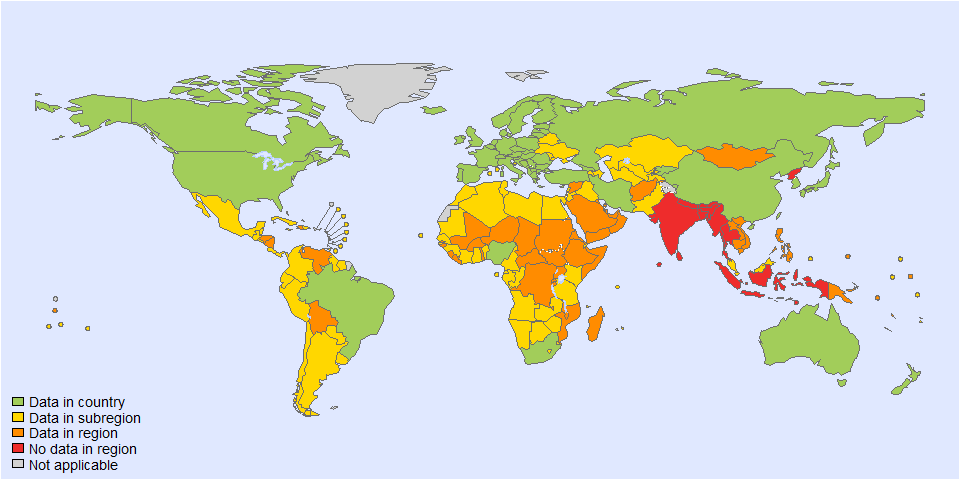
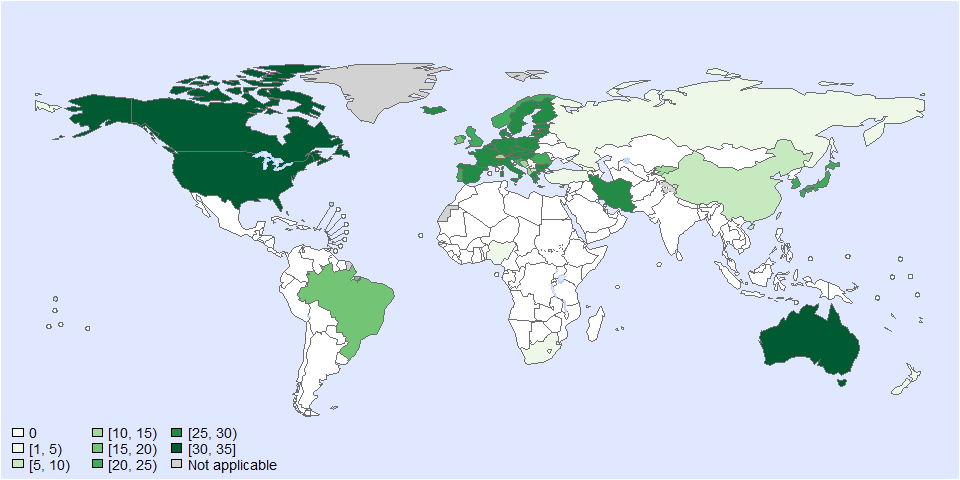
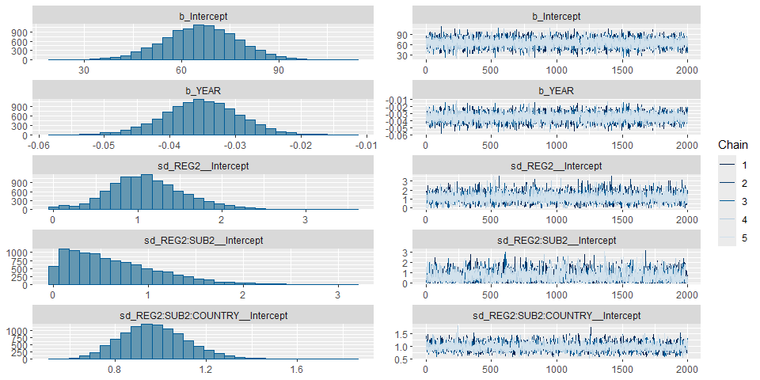
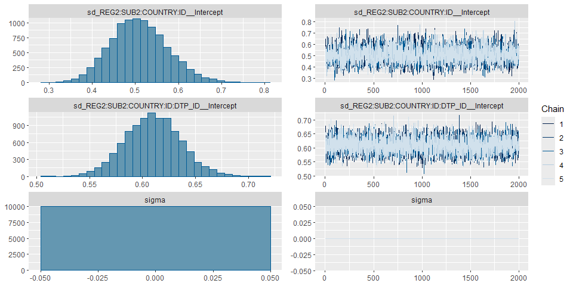
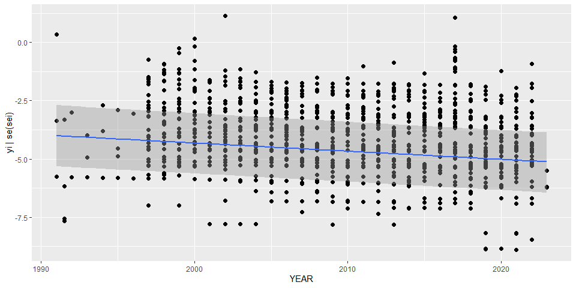

Global incidence of botulism - model fit Version 4_cc
================
fbbu6966
2025-11-30

- [Settings](#settings)
- [Parameters](#parameters)
- [Data](#data)
- [BRMS :Version 2](#brms-version-2)

# Settings

``` r
## required packages ----
library(bd)
library(brms)
library(ggplot2)
library(metafor)
library(readxl)
library(rmarkdown)
library(rms)
library(tidyr)
library(scales)
library(knitr)
library(kableExtra)

## global options ----
knitr::opts_chunk$set(fig.width = 10)
Date <- format(Sys.Date(), "%Y%m%d")
```

# Parameters

| Parameters                       | Values      |
|:---------------------------------|:------------|
| Number of iteration              | 5000        |
| Warmup                           | 3000        |
| Delta value                      | 0.99        |
| Maximum tree-depth               | 20          |
| Levels                           | All         |
| Random effect on each data point | Yes         |
| Stronger priors specified        | Normal(0,1) |

Parameters of the model tested

# Data

``` r
source("01-data_CC.R")
```

    ## Warning: Expecting numeric in Q1150 / R1150C17: got '<5'

    ## Warning: Expecting numeric in Q1151 / R1151C17: got '≥5'

    ## Warning: Expecting numeric in Q1152 / R1152C17: got '<5'

    ## Warning: Expecting numeric in Q1153 / R1153C17: got '≥5'

    ## Warning: Expecting numeric in Q1154 / R1154C17: got '<5'

    ## Warning: Expecting numeric in Q1155 / R1155C17: got '≥5'

    ## Warning: Expecting numeric in Q1156 / R1156C17: got '<5'

    ## Warning: Expecting numeric in Q1157 / R1157C17: got '≥5'

    ## Warning: Expecting numeric in Q1158 / R1158C17: got '<5'

    ## Warning: Expecting numeric in Q1159 / R1159C17: got '≥5'

    ## Warning: Expecting numeric in Q1160 / R1160C17: got '<5'

    ## Warning: Expecting numeric in Q1161 / R1161C17: got '≥5'

    ## Warning: Expecting numeric in Q1162 / R1162C17: got '<5'

    ## Warning: Expecting numeric in Q1163 / R1163C17: got '≥5'

    ## Warning: Expecting numeric in Q1164 / R1164C17: got '<5'

    ## Warning: Expecting numeric in Q1165 / R1165C17: got '≥5'

    ## Warning: Expecting numeric in Q1166 / R1166C17: got '<5'

    ## Warning: Expecting numeric in Q1167 / R1167C17: got '≥5'

    ## Warning: Expecting numeric in Q1168 / R1168C17: got '<5'

    ## Warning: Expecting numeric in Q1169 / R1169C17: got '≥5'

    ## Warning: Expecting numeric in Q1170 / R1170C17: got '<5'

    ## Warning: Expecting numeric in Q1171 / R1171C17: got '≥5'

    ## Warning: Expecting numeric in Q1172 / R1172C17: got '<5'

    ## Warning: Expecting numeric in Q1173 / R1173C17: got '≥5'

    ## Warning: Expecting numeric in Q1174 / R1174C17: got '<5'

    ## Warning: Expecting numeric in Q1175 / R1175C17: got '≥5'

    ## Warning: Expecting numeric in Q1176 / R1176C17: got '<5'

    ## Warning: Expecting numeric in Q1177 / R1177C17: got '≥5'

    ## Warning: Expecting numeric in Q1178 / R1178C17: got '<5'

    ## Warning: Expecting numeric in Q1179 / R1179C17: got '≥5'

    ## Warning: Expecting numeric in Q1180 / R1180C17: got '<5'

    ## Warning: Expecting numeric in Q1181 / R1181C17: got '≥5'

    ## Warning: Expecting numeric in Q1182 / R1182C17: got '<5'

    ## Warning: Expecting numeric in Q1183 / R1183C17: got '≥5'

    ## Warning: Expecting numeric in Q1184 / R1184C17: got '<5'

    ## Warning: Expecting numeric in Q1185 / R1185C17: got '≥5'

    ## Warning: Expecting numeric in Q1186 / R1186C17: got '<5'

    ## Warning: Expecting numeric in Q1187 / R1187C17: got '≥5'

    ## Warning: Expecting numeric in Q1188 / R1188C17: got '<5'

    ## Warning: Expecting numeric in Q1189 / R1189C17: got '≥5'

    ## Warning: Expecting numeric in Q1190 / R1190C17: got '<5'

    ## Warning: Expecting numeric in Q1191 / R1191C17: got '≥5'

    ## Warning: Expecting numeric in Q1192 / R1192C17: got '<5'

    ## Warning: Expecting numeric in Q1193 / R1193C17: got '≥5'

    ## Warning: Expecting numeric in Z1294 / R1294C26: got '-'

    ## 'data.frame':    1823 obs. of  41 variables:
    ##  $ SOURCE_ID           : chr  "2001" "2001" "2001" "2001" ...
    ##  $ SOURCE_AUTHOR       : chr  "European Comission Health and Consumers Directorate General" "European Comission Health and Consumers Directorate General" "European Comission Health and Consumers Directorate General" "European Comission Health and Consumers Directorate General" ...
    ##  $ SOURCE_YEAR         : num  2009 2009 2009 2009 2009 ...
    ##  $ SOURCE_TITLE        : chr  "Joint Questionnaire DG SANCO / Eurostat (for the European countries) until 2005 and ECDC (the European Centre f"| __truncated__ "Joint Questionnaire DG SANCO / Eurostat (for the European countries) until 2005 and ECDC (the European Centre f"| __truncated__ "Joint Questionnaire DG SANCO / Eurostat (for the European countries) until 2005 and ECDC (the European Centre f"| __truncated__ "Joint Questionnaire DG SANCO / Eurostat (for the European countries) until 2005 and ECDC (the European Centre f"| __truncated__ ...
    ##  $ SOURCE_DOI          : chr  NA NA NA NA ...
    ##  $ SOURCE_URL          : chr  "https://ec.europa.eu/health/ph_information/dissemination/echi/docs/botulism_en.pdf" "https://ec.europa.eu/health/ph_information/dissemination/echi/docs/botulism_en.pdf" "https://ec.europa.eu/health/ph_information/dissemination/echi/docs/botulism_en.pdf" "https://ec.europa.eu/health/ph_information/dissemination/echi/docs/botulism_en.pdf" ...
    ##  $ OPT_ACCESS_DATE     : POSIXct, format: "2023-11-27" "2023-11-27" "2023-11-27" ...
    ##  $ OPT_STUDY_TYPE      : chr  "Passive surveillance" "Passive surveillance" "Passive surveillance" "Passive surveillance" ...
    ##  $ OPT_OTHER_STUDY_TYPE: chr  NA NA NA NA ...
    ##  $ REF_NOTES           : chr  NA NA NA NA ...
    ##  $ REF_YEAR_START      : chr  "1997" "1998" "1999" "2000" ...
    ##  $ REF_YEAR_END        : num  NA NA NA NA NA NA NA NA NA NA ...
    ##  $ REF_LOC_LEVEL       : chr  "National" "National" "National" "National" ...
    ##  $ REF_LOCATION        : chr  "Albania" "Albania" "Albania" "Albania" ...
    ##  $ REF_LOCATION_ISO3   : chr  "ALB" "ALB" "ALB" "ALB" ...
    ##  $ REF_SEX             : chr  NA NA NA NA ...
    ##  $ REF_AGE_START       : num  NA NA NA NA NA NA NA NA NA NA ...
    ##  $ REF_AGE_END         : num  NA NA NA NA NA NA NA NA NA NA ...
    ##  $ OPT_MEAN_AGE        : logi  NA NA NA NA NA NA ...
    ##  $ OPT_MEDIAN_AGE      : logi  NA NA NA NA NA NA ...
    ##  $ OPT_SUBPOP          : logi  NA NA NA NA NA NA ...
    ##  $ OPT_CASES           : chr  "Confirmed" "Confirmed" "Confirmed" "Confirmed" ...
    ##  $ OPT_DISEASE         : chr  "Non-specified" "Non-specified" "Non-specified" "Non-specified" ...
    ##  $ OPT_SEROTYPE        : chr  NA NA NA NA ...
    ##  $ REF_SAMPLE_SIZE     : num  NA NA NA NA NA NA NA NA NA NA ...
    ##  $ VALUE_X             : num  0 0 0 0 0 0 0 0 0 0 ...
    ##  $ VALUE_MEAN          : num  NA NA NA NA NA NA NA NA NA NA ...
    ##  $ VALUE_MEDIAN        : logi  NA NA NA NA NA NA ...
    ##  $ VALUE_DENOM         : num  NA NA NA NA NA NA NA NA NA NA ...
    ##  $ VALUE_SE            : logi  NA NA NA NA NA NA ...
    ##  $ VALUE_P000          : logi  NA NA NA NA NA NA ...
    ##  $ VALUE_P2_5          : logi  NA NA NA NA NA NA ...
    ##  $ VALUE_P5            : logi  NA NA NA NA NA NA ...
    ##  $ VALUE_P10           : logi  NA NA NA NA NA NA ...
    ##  $ VALUE_P25           : logi  NA NA NA NA NA NA ...
    ##  $ VALUE_P75           : logi  NA NA NA NA NA NA ...
    ##  $ VALUE_P90           : logi  NA NA NA NA NA NA ...
    ##  $ VALUE_P95           : logi  NA NA NA NA NA NA ...
    ##  $ VALUE_P97_5         : logi  NA NA NA NA NA NA ...
    ##  $ VALUE_P100          : logi  NA NA NA NA NA NA ...
    ##  $ INCLUDE             : chr  NA NA NA NA ...

    ## Joining with `by = join_by(SOURCE_ID, SOURCE_AUTHOR, SOURCE_YEAR, REF_YEAR_START, REF_YEAR_END,
    ## REF_LOC_LEVEL, REF_LOCATION, REF_LOCATION_ISO3, REF_SEX, REF_AGE_START, REF_AGE_END)`

    ## Warning in eval(ei, envir): NAs introduced by coercion

    ## Joining with `by = join_by(REF_YEAR_START, REF_YEAR_END, REF_SEX, REF_AGE_START, REF_AGE_END,
    ## ISO3, ID_ROW)`

    ## Warning in add_pop(dta): Warning: 21 rows have missing data for the population variable. Please
    ## check if ISO3 code is correctly specified and if the dates are included in the study field.

<!-- --><!-- -->

``` r
es$DTP_ID<-as.factor(seq(1:length(es$SOURCE_ID)))
es$FLAG<-factor(es$FLAG, 
                levels=c(0,1,2,3,4,5,6, 7),
                labels=c("Keep data", "Data part of non WHO member states", "No WHO REG2 given",
                         "Year before 1990", "yi can't be calcualted", "TF choice to remove", 
                         "Excluded by preliminary checks", "Excluded in data cleaning"))
table(es$FLAG) # 979 data points
```

    ## 
    ##                          Keep data Data part of non WHO member states 
    ##                                979                                 43 
    ##                  No WHO REG2 given                   Year before 1990 
    ##                                  0                                 16 
    ##             yi can't be calcualted                TF choice to remove 
    ##                                 36                                  0 
    ##     Excluded by preliminary checks          Excluded in data cleaning 
    ##                                 54                                 40

``` r
saveRDS(es, paste0("es_cc_", Date, ".RDS"))
```

# BRMS :Version 2

``` r
fit_brms_reg_s4 <-
  brm(yi | se(sei) ~
        1 + YEAR +
          (1  | REG2) +
          (1  | REG2:SUB2) +
          (1  | REG2:SUB2:COUNTRY) +
          (1  | REG2:SUB2:COUNTRY:ID) +
          (1  | REG2:SUB2:COUNTRY:ID:DTP_ID),
      chains = 5, iter = 5000, warmup = 3000,
      prior = prior(normal(0,1), class = sd),
      control = list(adapt_delta=0.99, max_treedepth = 20),
      cores = 5,
      data = subset(es, as.integer(FLAG) == 1),
     open_progress = FALSE,
      seed =6 )
```

    ## Compiling Stan program...

    ## Start sampling

``` r
## model summary
saveRDS(fit_brms_reg_s4, file = "fit_brms_reg_s4_cc.rds")
fit_brms_reg_s4 <- readRDS("fit_brms_reg_s4_cc.rds")
summary(fit_brms_reg_s4)
```

    ##  Family: gaussian 
    ##   Links: mu = identity 
    ## Formula: yi | se(sei) ~ 1 + YEAR + (1 | REG2) + (1 | REG2:SUB2) + (1 | REG2:SUB2:COUNTRY) + (1 | REG2:SUB2:COUNTRY:ID) + (1 | REG2:SUB2:COUNTRY:ID:DTP_ID) 
    ##    Data: subset(es, as.integer(FLAG) == 1) (Number of observations: 979) 
    ##   Draws: 5 chains, each with iter = 5000; warmup = 3000; thin = 1;
    ##          total post-warmup draws = 10000
    ## 
    ## Multilevel Hyperparameters:
    ## ~REG2 (Number of levels: 5) 
    ##               Estimate Est.Error l-95% CI u-95% CI Rhat Bulk_ESS Tail_ESS
    ## sd(Intercept)     1.12      0.48     0.21     2.17 1.00     3975     1920
    ## 
    ## ~REG2:SUB2 (Number of levels: 10) 
    ##               Estimate Est.Error l-95% CI u-95% CI Rhat Bulk_ESS Tail_ESS
    ## sd(Intercept)     0.63      0.48     0.03     1.74 1.00     2797     5059
    ## 
    ## ~REG2:SUB2:COUNTRY (Number of levels: 51) 
    ##               Estimate Est.Error l-95% CI u-95% CI Rhat Bulk_ESS Tail_ESS
    ## sd(Intercept)     0.97      0.15     0.71     1.29 1.00     3678     5190
    ## 
    ## ~REG2:SUB2:COUNTRY:ID (Number of levels: 188) 
    ##               Estimate Est.Error l-95% CI u-95% CI Rhat Bulk_ESS Tail_ESS
    ## sd(Intercept)     0.51      0.07     0.39     0.65 1.00     3379     5451
    ## 
    ## ~REG2:SUB2:COUNTRY:ID:DTP_ID (Number of levels: 979) 
    ##               Estimate Est.Error l-95% CI u-95% CI Rhat Bulk_ESS Tail_ESS
    ## sd(Intercept)     0.61      0.03     0.56     0.66 1.00     4531     6660
    ## 
    ## Regression Coefficients:
    ##           Estimate Est.Error l-95% CI u-95% CI Rhat Bulk_ESS Tail_ESS
    ## Intercept    66.04     11.62    43.54    88.98 1.00     6554     7460
    ## YEAR         -0.04      0.01    -0.05    -0.02 1.00     6559     7277
    ## 
    ## Further Distributional Parameters:
    ##       Estimate Est.Error l-95% CI u-95% CI Rhat Bulk_ESS Tail_ESS
    ## sigma     0.00      0.00     0.00     0.00   NA       NA       NA
    ## 
    ## Draws were sampled using sampling(NUTS). For each parameter, Bulk_ESS
    ## and Tail_ESS are effective sample size measures, and Rhat is the potential
    ## scale reduction factor on split chains (at convergence, Rhat = 1).

``` r
plot(fit_brms_reg_s4, ask = FALSE)
```

<!-- --><!-- -->

``` r
plot(conditional_effects(fit_brms_reg_s4), points = TRUE)
```

    ## Ignoring unknown labels:
    ## • fill : "NA"
    ## • colour : "NA"

    ## Ignoring unknown labels:
    ## • fill : "NA"
    ## • colour : "NA"

<!-- -->

``` r
##rmarkdown::render("02-fit.R")
## save model fit
```
