Global incidence of botulism- Estimate incidence with the 4th model
================
fbbu6966
2025-11-30

- [Settings](#settings)
- [Parametersf](#parametersf)
- [Model fit](#model-fit)
- [Predict all](#predict-all)
- [Summarize predictions](#summarize-predictions)
  - [Global](#global)
  - [Regions](#regions)
  - [Subregions](#subregions)
  - [Countries](#countries)
- [Session info](#session-info)

# Settings

``` r
## required packages ----
library(bd)
library(brms)
library(FERG2)
library(ggplot2)
library(knitr)
library(rmarkdown)
library(sf)
library(tidyr)
library(dplyr)
library(DescTools)
library(readxl)
library(kableExtra)
#Model with random effect on each data point and stronger priors (normal(0,1))

## global options ----
knitr::opts_chunk$set(fig.width = 10)
Date <- format(Sys.Date(), "%Y%m%d")
```

# Parametersf

# Model fit

``` r
fit_brms_reg_s <- readRDS("fit_brms_reg_s4_cc.rds")
zero_cases<- read_xlsx("Endemic_countries.xlsx")%>%
  select(REG2, SUB2, ISO3, Country, edtf_botu) %>%
  rename(COUNTRY=ISO3, COUNTRY_LABEL = Country, DISEASEFREE = edtf_botu)

kable(
  caption = "Countries assumed to be non-endemic",
  row.names = FALSE,
  subset(zero_cases, DISEASEFREE==0)[, 4])
```

| COUNTRY_LABEL |
|:--------------|

Countries assumed to be non-endemic

``` r
# es_files <- list.files(pattern="^es_\\d{8}\\.rds$", full.names=TRUE, ignore.case = TRUE)
# es_dates <- as.Date(sub("^es_(\\d{8})\\.rds$", "\\1", basename(es_files), ignore.case = TRUE), format = "%Y%m%d")
# es_latest <- es_files[which.max(es_dates)]
es<- readRDS("es_cc_20251130.rds")
table(es$FLAG)
```

    ## 
    ##                          Keep data Data part of non WHO member states 
    ##                                979                                 43 
    ##                  No WHO REG2 given                   Year before 1990 
    ##                                  0                                 16 
    ##             yi can't be calcualted                TF choice to remove 
    ##                                 36                                  0 
    ##     Excluded by preliminary checks          Excluded in data cleaning 
    ##                                 54                                 40

``` r
es <- subset(es, as.integer(FLAG) == 1)

country_with_data <- es %>% select(ISO3) %>% distinct() %>% mutate(DATA=1, COUNTRY = ISO3)
Sub2_with_data <- es %>% select(SUB2) %>% distinct() %>% mutate(DATASUB2=1)
Reg2_with_data <- es %>% select(REG2) %>% distinct() %>% mutate(DATAREG2=1)
zero_cases <- left_join(zero_cases, country_with_data)
```

    ## Joining with `by = join_by(COUNTRY)`

``` r
zero_cases <- left_join(zero_cases, Sub2_with_data)
```

    ## Joining with `by = join_by(SUB2)`

``` r
zero_cases <- left_join(zero_cases, Reg2_with_data) %>%
  select(-c(ISO3)) %>%
  mutate(ESTIMATES = case_when(
    DATA == 1 ~ 1,
    DISEASEFREE == 0 ~ 2,
    is.na(DATA) & DISEASEFREE == 1 & DATASUB2 == 1 ~ 3,
    is.na(DATA) & DISEASEFREE == 1 & is.na(DATASUB2) & DATAREG2 == 1 ~ 4, 
    is.na(DATA) & DISEASEFREE == 1  & is.na(DATASUB2) & is.na(DATAREG2) ~5))
```

    ## Joining with `by = join_by(REG2)`

``` r
zero_cases$ESTIMATES <- factor(zero_cases$ESTIMATES, 
                               level = c(1,2,3,4,5),
                               labels = c("Data present", "Disease free", "Data in subregion", "Data in region", "Data in world"))
Country_Check <- zero_cases %>% filter(as.integer(ESTIMATES) == 2)
```

# Predict all

``` r
## set up dataframe
sim_all <-
  data.frame(
    sei = 0,
    REG2 = FERG2:::countries$REG2,
    SUB2 = FERG2:::countries$SUB2,
    COUNTRY = FERG2:::countries$ISO3,
    YEAR = rep(2000:2021, each = nrow(FERG2:::countries)))
sim_all <- sim_all %>% left_join(zero_cases) %>% select(sei, REG2, SUB2, COUNTRY, YEAR, ESTIMATES)
```

    ## Joining with `by = join_by(REG2, SUB2, COUNTRY)`

``` r
## draw from expected value of posterior predictive dist
set.seed(10)
# fit_all <- 
#   posterior_epred(
#     object = fit_brms_reg_s,
#     newdata = sim_all,
#     allow_new_levels = TRUE,
#     sample_new_levels = "old_levels",
#     re_formula = ~ 1 + YEAR +
#       (1 | REG2) +
#       (1 | REG2:SUB2) +
#       (1 | REG2:SUB2:COUNTRY)
#   )

draws_fit <- as_draws_df(fit_brms_reg_s)
fit_all <- data.frame(1:10000)
for (x in 1:nrow(sim_all)){
  if (as.integer(sim_all[x, "ESTIMATES"]) == 1){
    # Data present for country
    fit_all[[paste0("V",x)]] <- draws_fit$b_Intercept +                                                                               # Global intercept
      sim_all[x, "YEAR"] * draws_fit$b_YEAR +                                                                                         # Year component
      draws_fit[[paste0("r_REG2[",sim_all[x,"REG2"],",Intercept]")]] +                                                                # Regional component
      draws_fit[[paste0("r_REG2:SUB2[",sim_all[x,"REG2"],"_",sim_all[x,"SUB2"],",Intercept]")]] +                                     # Sub regional component
      draws_fit[[paste0("r_REG2:SUB2:COUNTRY[",sim_all[x,"REG2"],"_",sim_all[x,"SUB2"],"_",sim_all[x,"COUNTRY"],",Intercept]")]]      # Country component
  } else if (as.integer(sim_all[x, "ESTIMATES"]) == 2) {
    # Disease-free country
    fit_all[[paste0("V",x)]] <- 0
  } else if (as.integer(sim_all[x, "ESTIMATES"]) == 3){
    # Data not present for country, but present in subregion
    fit_all[[paste0("V",x)]] <- draws_fit$b_Intercept +                                                                               # Global intercept
      sim_all[x, "YEAR"] * draws_fit$b_YEAR +                                                                                         # Year component
      draws_fit[[paste0("r_REG2[",sim_all[x,"REG2"],",Intercept]")]] +                                                                # Regional component
      draws_fit[[paste0("r_REG2:SUB2[",sim_all[x,"REG2"],"_",sim_all[x,"SUB2"],",Intercept]")]]                                       # Sub regional component
  } else if (as.integer(sim_all[x, "ESTIMATES"]) == 4){
    # Data not present for country, but present in region
    fit_all[[paste0("V",x)]] <- draws_fit$b_Intercept +                                                                               # Global intercept
      sim_all[x, "YEAR"] * draws_fit$b_YEAR +                                                                                         # Year component
      draws_fit[[paste0("r_REG2[",sim_all[x,"REG2"],",Intercept]")]]                                                                  # Regional component
  } else if (as.integer(sim_all[x, "ESTIMATES"]) == 5){
    # Data not present for country
    fit_all[[paste0("V",x)]] <- draws_fit$b_Intercept + 
      sim_all[x, "YEAR"] * draws_fit$b_YEAR
  } 
}

fit_all <- fit_all %>% select(-c(X1.10000))

## calculate cases
sim_all$SIM <- t(fit_all)
pop_all <- aggregate(POP ~ ISO3 + YEAR, FERG2:::pop, sum)
sim_all <- merge(sim_all, pop_all,
                 by.x = c("COUNTRY", "YEAR"), by.y = c("ISO3", "YEAR"))
sim_all <- sim_all %>% left_join(zero_cases)
```

    ## Joining with `by = join_by(COUNTRY, REG2, SUB2, ESTIMATES)`

``` r
sim_all$CASES <- exp(sim_all$SIM) * sim_all$POP / 1e5
sim_all$CASES <- sim_all$CASES*sim_all$DISEASEFREE
sim_all$SIM<-sim_all$SIM*sim_all$DISEASEFREE
sim_all$sei<-sim_all$sei*sim_all$DISEASEFREE

## aggregate global
sim_all_glb <- with(sim_all, aggregate(CASES ~ YEAR, FUN = sum))
all_glb_id <- sim_all_glb[1]
all_glb_nr <-
  t(apply(sim_all_glb[, grepl("V", names(sim_all_glb))], 1, mean_ci))
all_glb_nr <- data.frame(all_glb_nr)
names(all_glb_nr) <- c("VAL_MEAN", "VAL_LWR", "VAL_UPR")
all_glb_nr <- cbind(all_glb_id, all_glb_nr)
all_glb_nr$LOCATION <- "Global"
all_glb_nr$LOCATION_NAME <- "Global"
all_glb_nr$METRIC <- "Number"
str(all_glb_nr)
```

    ## 'data.frame':    22 obs. of  7 variables:
    ##  $ YEAR         : int  2000 2001 2002 2003 2004 2005 2006 2007 2008 2009 ...
    ##  $ VAL_MEAN     : num  1112 1085 1058 1033 1008 ...
    ##  $ VAL_LWR      : num  654 638 622 608 593 ...
    ##  $ VAL_UPR      : num  2173 2124 2073 2018 1975 ...
    ##  $ LOCATION     : chr  "Global" "Global" "Global" "Global" ...
    ##  $ LOCATION_NAME: chr  "Global" "Global" "Global" "Global" ...
    ##  $ METRIC       : chr  "Number" "Number" "Number" "Number" ...

``` r
all_glb_rt <- all_glb_nr
all_glb_rt$POP <- with(sim_all, tapply(POP, YEAR, sum))
all_glb_rt$VAL_MEAN <- 1e5 * all_glb_rt$VAL_MEAN / all_glb_rt$POP
all_glb_rt$VAL_LWR <- 1e5 * all_glb_rt$VAL_LWR / all_glb_rt$POP
all_glb_rt$VAL_UPR <- 1e5 * all_glb_rt$VAL_UPR / all_glb_rt$POP
all_glb_rt$METRIC <- "Rate"
all_glb_rt$POP <- NULL
str(all_glb_rt)
```

    ## 'data.frame':    22 obs. of  7 variables:
    ##  $ YEAR         : int  2000 2001 2002 2003 2004 2005 2006 2007 2008 2009 ...
    ##  $ VAL_MEAN     : num [1:22(1d)] 0.0183 0.0176 0.0169 0.0163 0.0157 ...
    ##  $ VAL_LWR      : num [1:22(1d)] 0.01075 0.01034 0.00995 0.0096 0.00924 ...
    ##  $ VAL_UPR      : num [1:22(1d)] 0.0357 0.0344 0.0331 0.0318 0.0308 ...
    ##  $ LOCATION     : chr  "Global" "Global" "Global" "Global" ...
    ##  $ LOCATION_NAME: chr  "Global" "Global" "Global" "Global" ...
    ##  $ METRIC       : chr  "Rate" "Rate" "Rate" "Rate" ...

``` r
## aggregate over regions
sim_all_reg <- with(sim_all, aggregate(CASES ~ REG2+YEAR, FUN = sum))
all_reg_id <- sim_all_reg[1:2]
all_reg_nr <-
  t(apply(sim_all_reg[, grepl("V", names(sim_all_reg))], 1, mean_ci))
all_reg_nr <- data.frame(all_reg_nr)
names(all_reg_nr) <- c("VAL_MEAN", "VAL_LWR", "VAL_UPR")
all_reg_nr <- cbind(all_reg_id, all_reg_nr)
all_reg_nr$LOCATION <- "Region"
all_reg_nr$LOCATION_NAME <- all_reg_nr$REG2
all_reg_nr$REG2 <- NULL
all_reg_nr$METRIC <- "Number"
str(all_reg_nr)
```

    ## 'data.frame':    132 obs. of  7 variables:
    ##  $ YEAR         : int  2000 2000 2000 2000 2000 2000 2001 2001 2001 2001 ...
    ##  $ VAL_MEAN     : num  60.7 81.2 175.2 501.9 257.4 ...
    ##  $ VAL_LWR      : num  10.1 46.1 38.3 322.4 56.9 ...
    ##  $ VAL_UPR      : num  197 156 585 1038 753 ...
    ##  $ LOCATION     : chr  "Region" "Region" "Region" "Region" ...
    ##  $ LOCATION_NAME: chr  "AFR" "AMR" "EMR" "EUR" ...
    ##  $ METRIC       : chr  "Number" "Number" "Number" "Number" ...

``` r
all_reg_rt <- all_reg_nr
all_reg_rt$POP <-
  with(sim_all, aggregate(POP ~ REG2 + YEAR, FUN = sum))$POP
all_reg_rt$VAL_MEAN <- 1e5 * all_reg_rt$VAL_MEAN / all_reg_rt$POP
all_reg_rt$VAL_LWR <- 1e5 * all_reg_rt$VAL_LWR / all_reg_rt$POP
all_reg_rt$VAL_UPR <- 1e5 * all_reg_rt$VAL_UPR / all_reg_rt$POP
all_reg_rt$METRIC <- "Rate"
all_reg_rt$POP <- NULL
str(all_reg_rt)
```

    ## 'data.frame':    132 obs. of  7 variables:
    ##  $ YEAR         : int  2000 2000 2000 2000 2000 2000 2001 2001 2001 2001 ...
    ##  $ VAL_MEAN     : num  0.00911 0.00986 0.03611 0.05772 0.01637 ...
    ##  $ VAL_LWR      : num  0.00152 0.0056 0.0079 0.03708 0.00362 ...
    ##  $ VAL_UPR      : num  0.0296 0.019 0.1205 0.1194 0.0479 ...
    ##  $ LOCATION     : chr  "Region" "Region" "Region" "Region" ...
    ##  $ LOCATION_NAME: chr  "AFR" "AMR" "EMR" "EUR" ...
    ##  $ METRIC       : chr  "Rate" "Rate" "Rate" "Rate" ...

``` r
## aggregate over subregions
sim_all_sub <- with(sim_all, aggregate(CASES ~ SUB2+YEAR, FUN = sum))
all_sub_id <- sim_all_sub[1:2]
all_sub_nr <-
  t(apply(sim_all_sub[, grepl("V", names(sim_all_sub))], 1, mean_ci))
all_sub_nr <- data.frame(all_sub_nr)
names(all_sub_nr) <- c("VAL_MEAN", "VAL_LWR", "VAL_UPR")
all_sub_nr <- cbind(all_sub_id, all_sub_nr)
all_sub_nr$LOCATION <- "Subregion"
all_sub_nr$LOCATION_NAME <- all_sub_nr$SUB2
all_sub_nr$SUB2 <- NULL
all_sub_nr$METRIC <- "Number"
str(all_sub_nr)
```

    ## 'data.frame':    374 obs. of  7 variables:
    ##  $ YEAR         : int  2000 2000 2000 2000 2000 2000 2000 2000 2000 2000 ...
    ##  $ VAL_MEAN     : num  4.57 27.57 28.57 35.85 38.25 ...
    ##  $ VAL_LWR      : num  0.621 3.661 3.206 24.944 12.992 ...
    ##  $ VAL_UPR      : num  17.2 98 102.1 51.3 97 ...
    ##  $ LOCATION     : chr  "Subregion" "Subregion" "Subregion" "Subregion" ...
    ##  $ LOCATION_NAME: chr  "AFRAB" "AFRC" "AFRD" "AMRA" ...
    ##  $ METRIC       : chr  "Number" "Number" "Number" "Number" ...

``` r
all_sub_rt <- all_sub_nr
all_sub_rt$POP <-
  with(sim_all, aggregate(POP ~ SUB2 + YEAR, FUN = sum))$POP
all_sub_rt$VAL_MEAN <- 1e5 * all_sub_rt$VAL_MEAN / all_sub_rt$POP
all_sub_rt$VAL_LWR <- 1e5 * all_sub_rt$VAL_LWR / all_sub_rt$POP
all_sub_rt$VAL_UPR <- 1e5 * all_sub_rt$VAL_UPR / all_sub_rt$POP
all_sub_rt$METRIC <- "Rate"
all_sub_rt$POP <- NULL
str(all_sub_rt)
```

    ## 'data.frame':    374 obs. of  7 variables:
    ##  $ YEAR         : int  2000 2000 2000 2000 2000 2000 2000 2000 2000 2000 ...
    ##  $ VAL_MEAN     : num  0.00852 0.00802 0.01061 0.01069 0.00879 ...
    ##  $ VAL_LWR      : num  0.00116 0.00107 0.00119 0.00744 0.00298 ...
    ##  $ VAL_UPR      : num  0.0321 0.0285 0.0379 0.0153 0.0223 ...
    ##  $ LOCATION     : chr  "Subregion" "Subregion" "Subregion" "Subregion" ...
    ##  $ LOCATION_NAME: chr  "AFRAB" "AFRC" "AFRD" "AMRA" ...
    ##  $ METRIC       : chr  "Rate" "Rate" "Rate" "Rate" ...

``` r
## aggregate over countries
all_cnt_nr <- t(apply(sim_all$CASES, 1, mean_ci))
all_cnt_nr <- data.frame(all_cnt_nr)
names(all_cnt_nr) <- c("VAL_MEAN", "VAL_LWR", "VAL_UPR")
all_cnt_nr <- cbind(sim_all[1:2], all_cnt_nr)
all_cnt_nr$LOCATION <- "Country"
all_cnt_nr$LOCATION_NAME <- all_cnt_nr$COUNTRY
all_cnt_nr$COUNTRY <- NULL
all_cnt_nr$METRIC <- "Number"
str(all_cnt_nr)
```

    ## 'data.frame':    4268 obs. of  7 variables:
    ##  $ YEAR         : int  2000 2001 2002 2003 2004 2005 2006 2007 2008 2009 ...
    ##  $ VAL_MEAN     : num  6.52 6.22 6.17 6.43 6.5 ...
    ##  $ VAL_LWR      : num  0.77 0.734 0.727 0.755 0.765 ...
    ##  $ VAL_UPR      : num  26.2 25 24.9 26 26.2 ...
    ##  $ LOCATION     : chr  "Country" "Country" "Country" "Country" ...
    ##  $ LOCATION_NAME: chr  "AFG" "AFG" "AFG" "AFG" ...
    ##  $ METRIC       : chr  "Number" "Number" "Number" "Number" ...

``` r
#all_cnt_rt <- t(apply(exp(sim_all$SIM), 1, mean_ci))
#all_cnt_rt <- data.frame(all_cnt_rt)
#names(all_cnt_rt) <- c("VAL_MEAN", "VAL_LWR", "VAL_UPR")
#all_cnt_rt <- cbind(sim_all[1:2], all_cnt_rt)
#all_cnt_rt$LOCATION <- "Country"
#all_cnt_rt$LOCATION_NAME <- all_cnt_rt$COUNTRY
#all_cnt_rt$COUNTRY <- NULL
#all_cnt_rt$METRIC <- "Rate"
#str(all_cnt_rt)

all_cnt_rt <- all_cnt_nr%>%left_join(pop_all, by=c("LOCATION_NAME"="ISO3","YEAR"="YEAR"))
all_cnt_rt$VAL_MEAN <- 1e5 * all_cnt_rt$VAL_MEAN / all_cnt_rt$POP
all_cnt_rt$VAL_LWR <- 1e5 * all_cnt_rt$VAL_LWR / all_cnt_rt$POP
all_cnt_rt$VAL_UPR <- 1e5 * all_cnt_rt$VAL_UPR / all_cnt_rt$POP
all_cnt_rt$LOCATION <- "Country"
all_cnt_rt$METRIC <- "Rate"
all_cnt_rt$POP <- NULL

str(all_cnt_rt)
```

    ## 'data.frame':    4268 obs. of  7 variables:
    ##  $ YEAR         : int  2000 2001 2002 2003 2004 2005 2006 2007 2008 2009 ...
    ##  $ VAL_MEAN     : num  0.0322 0.0311 0.03 0.029 0.0279 ...
    ##  $ VAL_LWR      : num  0.0038 0.00367 0.00354 0.0034 0.00329 ...
    ##  $ VAL_UPR      : num  0.13 0.125 0.121 0.117 0.113 ...
    ##  $ LOCATION     : chr  "Country" "Country" "Country" "Country" ...
    ##  $ LOCATION_NAME: chr  "AFG" "AFG" "AFG" "AFG" ...
    ##  $ METRIC       : chr  "Rate" "Rate" "Rate" "Rate" ...

``` r
## compile all
all_est <-
  rbind(all_glb_rt, all_glb_nr,
        all_reg_rt, all_reg_nr,
        all_sub_rt, all_sub_nr,
        all_cnt_rt, all_cnt_nr)
str(all_est)
```

    ## 'data.frame':    9592 obs. of  7 variables:
    ##  $ YEAR         : int  2000 2001 2002 2003 2004 2005 2006 2007 2008 2009 ...
    ##  $ VAL_MEAN     : num  0.0183 0.0176 0.0169 0.0163 0.0157 ...
    ##  $ VAL_LWR      : num  0.01075 0.01034 0.00995 0.0096 0.00924 ...
    ##  $ VAL_UPR      : num  0.0357 0.0344 0.0331 0.0318 0.0308 ...
    ##  $ LOCATION     : chr  "Global" "Global" "Global" "Global" ...
    ##  $ LOCATION_NAME: chr  "Global" "Global" "Global" "Global" ...
    ##  $ METRIC       : chr  "Rate" "Rate" "Rate" "Rate" ...

``` r
# saveRDS(all_est, file = "all_estimates.rds")

## plot nested trends
all_sub_rt$REG2 <- gsub("(R).*", "\\1", all_sub_rt$LOCATION_NAME)
ggplot(all_reg_rt, aes(x = YEAR, y = VAL_MEAN, group = LOCATION_NAME)) +
  geom_line(data = all_glb_rt, linewidth = 2) +
  geom_line(aes(col = LOCATION_NAME), linewidth = 1.5) +
  theme_bw()
```

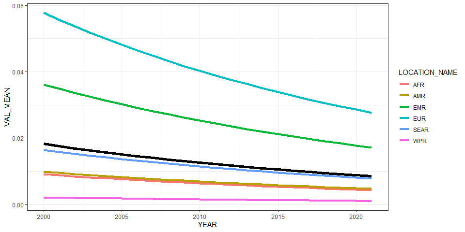<!-- -->

``` r
ggplot(all_reg_rt, aes(x = YEAR, y = VAL_MEAN, group = LOCATION_NAME)) +
  geom_line(data = all_glb_rt, linewidth = 2) +
  geom_line(aes(col = LOCATION_NAME), linewidth = 1.5) +
  geom_line(data = all_sub_rt, aes(col = REG2)) +
  theme_bw()
```

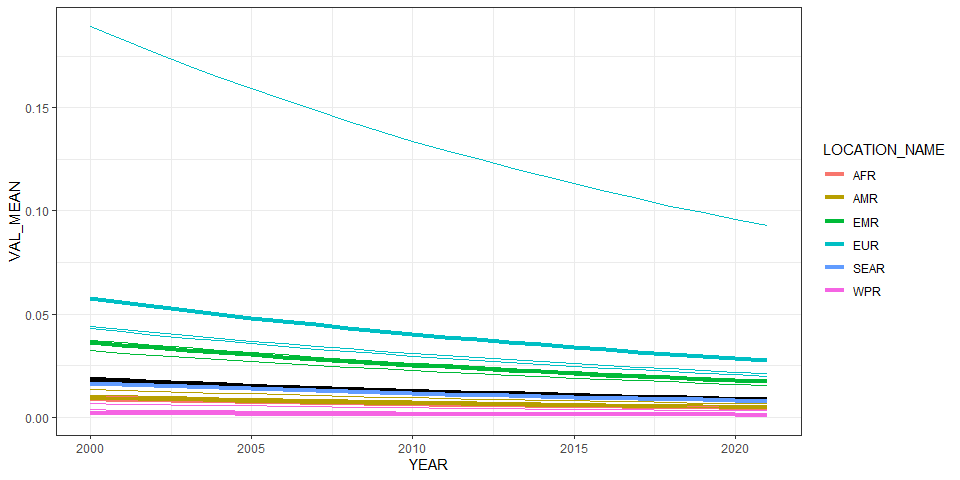<!-- -->

# Summarize predictions

## Global

``` r
kable(
  caption = "Global number of botulism cases, 2010 vs 2020",
  row.names = FALSE,
  subset(all_glb_nr, YEAR %in% c(2010, 2020))[, 1:4])
```

| YEAR | VAL_MEAN |  VAL_LWR |  VAL_UPR |
|-----:|---------:|---------:|---------:|
| 2010 | 873.9636 | 508.4259 | 1721.049 |
| 2020 | 689.3227 | 382.5843 | 1386.705 |

Global number of botulism cases, 2010 vs 2020

## Regions

``` r
kbl(subset(all_reg_rt, YEAR == 2020)[,c(6,2:4)],
    align = c("l", "c", "c", "c"), row.names = FALSE,
    col.names = c("Region", "Mean", "Lower", "Upper"),
    caption="  Incidence of botulism in 2020 by WHO region") %>%
  kable_styling("striped", "hover")
```

<table class="table table-striped" style="margin-left: auto; margin-right: auto;">

<caption>

Incidence of botulism in 2020 by WHO region
</caption>

<thead>

<tr>

<th style="text-align:left;">

Region
</th>

<th style="text-align:center;">

Mean
</th>

<th style="text-align:center;">

Lower
</th>

<th style="text-align:center;">

Upper
</th>

</tr>

</thead>

<tbody>

<tr>

<td style="text-align:left;">

AFR
</td>

<td style="text-align:center;">

0.0045250
</td>

<td style="text-align:center;">

0.0007388
</td>

<td style="text-align:center;">

0.0150223
</td>

</tr>

<tr>

<td style="text-align:left;">

AMR
</td>

<td style="text-align:center;">

0.0049050
</td>

<td style="text-align:center;">

0.0027422
</td>

<td style="text-align:center;">

0.0096080
</td>

</tr>

<tr>

<td style="text-align:left;">

EMR
</td>

<td style="text-align:center;">

0.0177892
</td>

<td style="text-align:center;">

0.0036967
</td>

<td style="text-align:center;">

0.0604324
</td>

</tr>

<tr>

<td style="text-align:left;">

EUR
</td>

<td style="text-align:center;">

0.0285867
</td>

<td style="text-align:center;">

0.0178120
</td>

<td style="text-align:center;">

0.0589057
</td>

</tr>

<tr>

<td style="text-align:left;">

SEAR
</td>

<td style="text-align:center;">

0.0080979
</td>

<td style="text-align:center;">

0.0017771
</td>

<td style="text-align:center;">

0.0232442
</td>

</tr>

<tr>

<td style="text-align:left;">

WPR
</td>

<td style="text-align:center;">

0.0011002
</td>

<td style="text-align:center;">

0.0005144
</td>

<td style="text-align:center;">

0.0023821
</td>

</tr>

</tbody>

</table>

``` r
kbl(subset(all_reg_nr, YEAR == 2020)[,c(6,2:4)],
    align = c("l", "c", "c", "c"), row.names = FALSE,
    col.names = c("Region", "Mean", "Lower", "Upper"),
    caption="  Cases of botulism in 2020 by WHO region ") %>%
  kable_styling("striped", "hover")
```

<table class="table table-striped" style="margin-left: auto; margin-right: auto;">

<caption>

Cases of botulism in 2020 by WHO region
</caption>

<thead>

<tr>

<th style="text-align:left;">

Region
</th>

<th style="text-align:center;">

Mean
</th>

<th style="text-align:center;">

Lower
</th>

<th style="text-align:center;">

Upper
</th>

</tr>

</thead>

<tbody>

<tr>

<td style="text-align:left;">

AFR
</td>

<td style="text-align:center;">

51.36851
</td>

<td style="text-align:center;">

8.386719
</td>

<td style="text-align:center;">

170.53435
</td>

</tr>

<tr>

<td style="text-align:left;">

AMR
</td>

<td style="text-align:center;">

49.87644
</td>

<td style="text-align:center;">

27.883988
</td>

<td style="text-align:center;">

97.69873
</td>

</tr>

<tr>

<td style="text-align:left;">

EMR
</td>

<td style="text-align:center;">

134.14180
</td>

<td style="text-align:center;">

27.875721
</td>

<td style="text-align:center;">

455.69733
</td>

</tr>

<tr>

<td style="text-align:left;">

EUR
</td>

<td style="text-align:center;">

267.61621
</td>

<td style="text-align:center;">

166.747829
</td>

<td style="text-align:center;">

551.44912
</td>

</tr>

<tr>

<td style="text-align:left;">

SEAR
</td>

<td style="text-align:center;">

165.16406
</td>

<td style="text-align:center;">

36.245399
</td>

<td style="text-align:center;">

474.08954
</td>

</tr>

<tr>

<td style="text-align:left;">

WPR
</td>

<td style="text-align:center;">

21.15571
</td>

<td style="text-align:center;">

9.891803
</td>

<td style="text-align:center;">

45.80656
</td>

</tr>

</tbody>

</table>

``` r
ggplot(subset(all_reg_rt, YEAR == 2010),
       aes(y = VAL_MEAN, x = LOCATION_NAME)) +
  geom_pointrange(aes(ymin = VAL_LWR, ymax = VAL_UPR), size = 0.2) +
  coord_flip() +
  theme_bw() +
  scale_x_discrete(NULL, limits = rev(unique(all_reg_nr$LOCATION_NAME))) +
  scale_y_continuous(NULL) +
  ggtitle("Incidence of botulism by WHO Region, 2010 ")
```

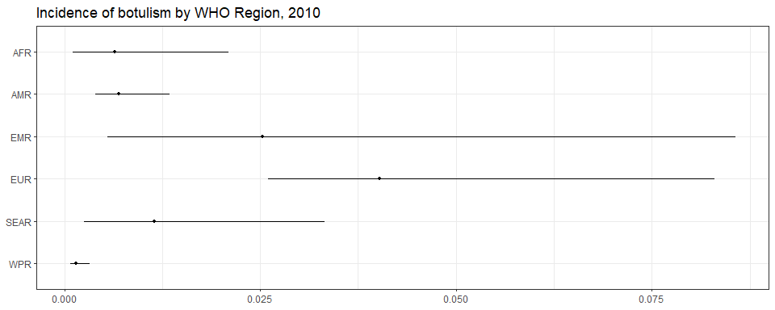<!-- -->

``` r
ggplot(subset(all_reg_rt, YEAR == 2020),
       aes(y = VAL_MEAN, x = LOCATION_NAME)) +
  geom_pointrange(aes(ymin = VAL_LWR, ymax = VAL_UPR), size = 0.2) +
  coord_flip() +
  theme_bw() +
  scale_x_discrete(NULL, limits = rev(unique(all_reg_nr$LOCATION_NAME))) +
  scale_y_continuous(NULL) +
  ggtitle("Incidence of botulism by WHO Region, 2020 ")
```

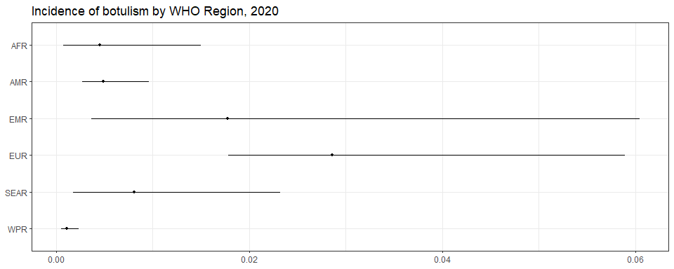<!-- -->

``` r
ggplot(subset(all_reg_nr, YEAR == 2010),
       aes(y = VAL_MEAN, x = LOCATION_NAME)) +
  geom_pointrange(aes(ymin = VAL_LWR, ymax = VAL_UPR), size = 0.2) +
  coord_flip() +
  theme_bw() +
  scale_x_discrete(NULL, limits = rev(unique(all_reg_nr$LOCATION_NAME))) +
  scale_y_continuous(NULL) +
  ggtitle("Number of botulism cases by WHO Region, 2010 ")
```

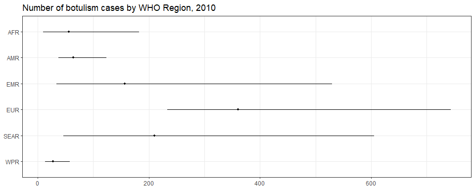<!-- -->

``` r
ggplot(subset(all_reg_nr, YEAR == 2020),
       aes(y = VAL_MEAN, x = LOCATION_NAME)) +
  geom_pointrange(aes(ymin = VAL_LWR, ymax = VAL_UPR), size = 0.2) +
  coord_flip() +
  theme_bw() +
  scale_x_discrete(NULL, limits = rev(unique(all_reg_nr$LOCATION_NAME))) +
  scale_y_continuous(NULL) +
  ggtitle("Number of botulism cases by WHO Region, 2020")
```

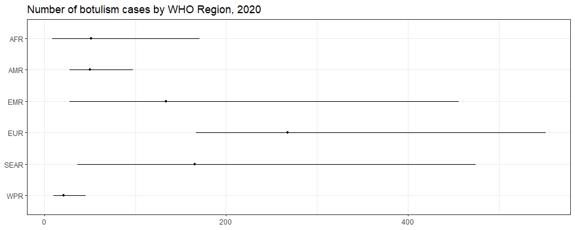<!-- -->

``` r
sim_all_reg <-
  merge(sim_all_reg,
        with(sim_all, aggregate(POP ~ REG2 + YEAR, FUN = sum)))
sim_all_reg_long <-
  pivot_longer(sim_all_reg, cols = starts_with("V"))
sim_all_reg_long$CASES <- sim_all_reg_long$value

ggplot(subset(sim_all_reg_long, YEAR == 2010), aes(x = CASES)) +
  geom_density() +
  facet_wrap(~REG2) +
  theme_bw() +
  scale_x_log10() +
  ggtitle("Number of botulism cases by WHO Region, 2010")
```

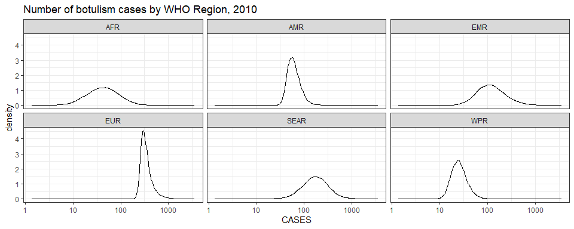<!-- -->

``` r
ggplot(subset(sim_all_reg_long, YEAR == 2020), aes(x = CASES)) +
  geom_density() +
  facet_wrap(~REG2) +
  theme_bw() +
  scale_x_log10() +
  ggtitle("Number of botulism cases by WHO Region, 2020")
```

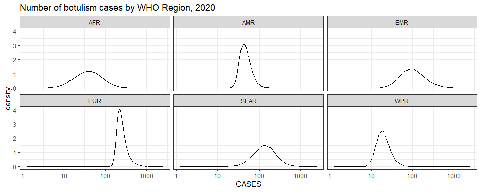<!-- -->

## Subregions

``` r
ggplot(subset(all_sub_rt, YEAR == 2010),
       aes(y = VAL_MEAN, x = LOCATION_NAME)) +
  geom_pointrange(aes(ymin = VAL_LWR, ymax = VAL_UPR), size = 0.2) +
  coord_flip() +
  theme_bw() +
  scale_x_discrete(NULL, limits = rev(unique(all_sub_nr$LOCATION_NAME))) +
  scale_y_continuous(NULL) +
  ggtitle("Incidence of botulism by WHO Subregion, 2010")
```

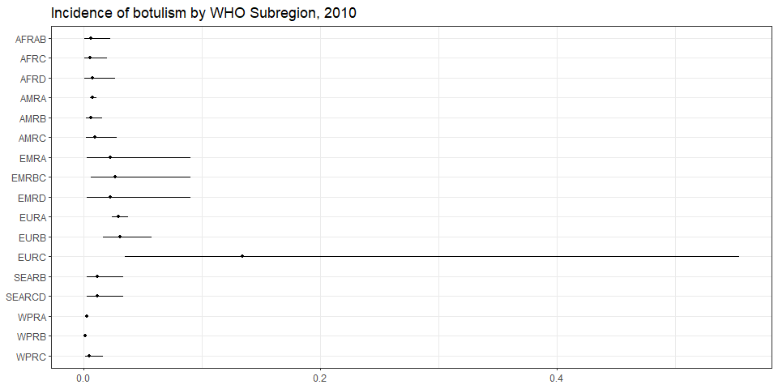<!-- -->

``` r
ggplot(subset(all_sub_rt, YEAR == 2020),
       aes(y = VAL_MEAN, x = LOCATION_NAME)) +
  geom_pointrange(aes(ymin = VAL_LWR, ymax = VAL_UPR), size = 0.2) +
  coord_flip() +
  theme_bw() +
  scale_x_discrete(NULL, limits = rev(unique(all_sub_nr$LOCATION_NAME))) +
  scale_y_continuous(NULL) +
  ggtitle("Incidence of botulism by WHO Subregion, 2020")
```

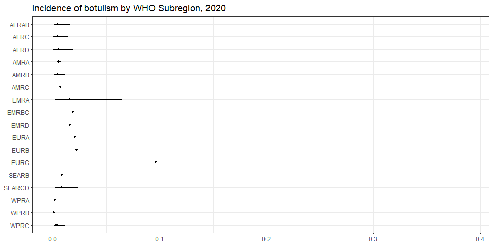<!-- -->

``` r
ggplot(subset(all_sub_nr, YEAR == 2010),
       aes(y = VAL_MEAN, x = LOCATION_NAME)) +
  geom_pointrange(aes(ymin = VAL_LWR, ymax = VAL_UPR), size = 0.2) +
  coord_flip() +
  theme_bw() +
  scale_x_discrete(NULL, limits = rev(unique(all_sub_nr$LOCATION_NAME))) +
  scale_y_continuous(NULL) +
  ggtitle("Number of botulism cases by WHO Subregion, 2010")
```

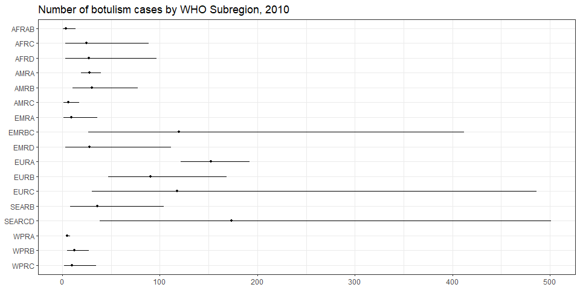<!-- -->

``` r
ggplot(subset(all_sub_nr, YEAR == 2020),
       aes(y = VAL_MEAN, x = LOCATION_NAME)) +
  geom_pointrange(aes(ymin = VAL_LWR, ymax = VAL_UPR), size = 0.2) +
  coord_flip() +
  theme_bw() +
  scale_x_discrete(NULL, limits = rev(unique(all_sub_nr$LOCATION_NAME))) +
  scale_y_continuous(NULL) +
  ggtitle("Number of botulism cases by WHO Subregion, 2020")
```

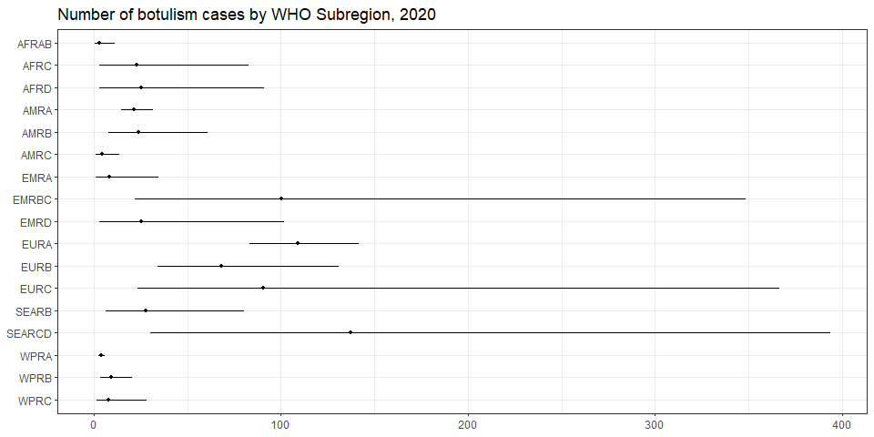<!-- -->

``` r
sim_all_sub <-
  merge(sim_all_sub,
        with(sim_all, aggregate(POP ~ SUB2 + YEAR, FUN = sum)))
sim_all_sub_long <-
  pivot_longer(sim_all_sub, cols = starts_with("V"))
sim_all_sub_long$CASES <- sim_all_sub_long$value

ggplot(subset(sim_all_sub_long, YEAR == 2010), aes(x = CASES)) +
  geom_density() +
  facet_wrap(~SUB2) +
  theme_bw() +
  scale_x_log10() +
  ggtitle("Number of botulism cases by WHO Subregion, 2010")
```

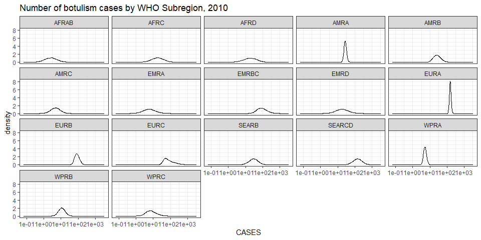<!-- -->

``` r
ggplot(subset(sim_all_sub_long, YEAR == 2020), aes(x = CASES)) +
  geom_density() +
  facet_wrap(~SUB2) +
  theme_bw() +
  scale_x_log10() +
  ggtitle("Number of botulism cases by WHO Subregion, 2020")
```

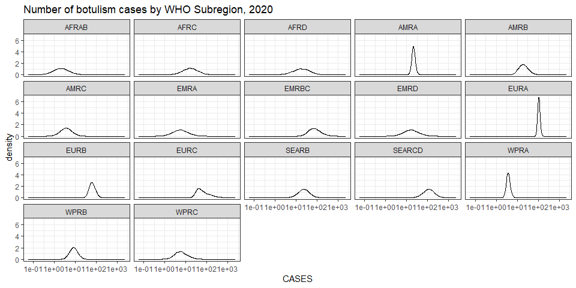<!-- -->

## Countries

``` r
plot_world(subset(all_cnt_rt, YEAR == 2010),
           "LOCATION_NAME", "VAL_MEAN", legend.title = "Incidence per 100k", diseasefree = zero_cases)
```

    ## [1] 0.0 0.1 0.2 0.3 0.4 0.5

``` r
title("Botulism incidence, 2010", line = 1)
```

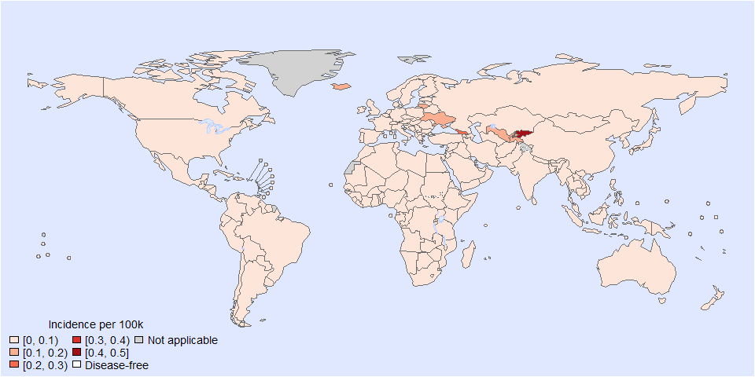<!-- -->

``` r
plot_world(subset(all_cnt_rt, YEAR == 2020),
           "LOCATION_NAME", "VAL_MEAN", legend.title = "Incidence per 100k", diseasefree = zero_cases)
```

    ## [1] 0.00 0.05 0.10 0.15 0.20 0.25 0.30 0.35

``` r
title("Botulism incidence, 2020", line = 1)
```

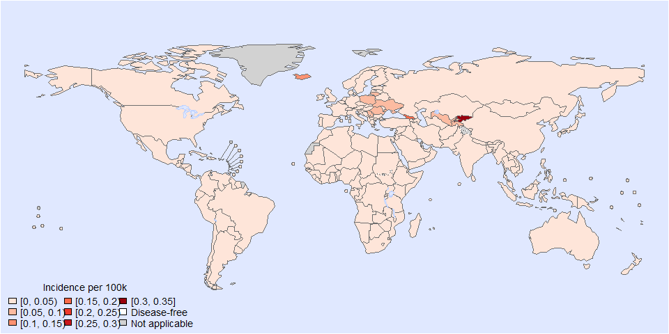<!-- -->

``` r
tab <-
  data.frame(subset(all_cnt_rt, YEAR == 2010)[,
                                              c("LOCATION_NAME", "VAL_MEAN", "VAL_LWR", "VAL_UPR")],
             subset(all_cnt_rt, YEAR == 2020)[,
                                              c("VAL_MEAN", "VAL_LWR", "VAL_UPR")])
tab$LOCATION_NAME <-
  FERG2:::countries$COUNTRY[match(tab$LOCATION_NAME, FERG2:::countries$ISO3)]
tab$LOCATION_NAME <- gsub(" \\(.*", "", tab$LOCATION_NAME)
names(tab) <-
  c("Country",
    "2010.mean", "2010.lwr", "2010.upr",
    "2020.mean", "2020.lwr", "2020.upr")

kable(tab, digits = 3, row.names = FALSE,
      caption = "Estimated botulism incidence by country, 2010 vs 2020")
```

| Country | 2010.mean | 2010.lwr | 2010.upr | 2020.mean | 2020.lwr | 2020.upr |
|:---|---:|---:|---:|---:|---:|---:|
| Afghanistan | 0.023 | 0.003 | 0.090 | 0.016 | 0.002 | 0.065 |
| Angola | 0.006 | 0.001 | 0.025 | 0.005 | 0.000 | 0.017 |
| Albania | 0.022 | 0.006 | 0.057 | 0.015 | 0.004 | 0.041 |
| Andorra | 0.032 | 0.022 | 0.046 | 0.023 | 0.015 | 0.033 |
| United Arab Emirates | 0.023 | 0.003 | 0.090 | 0.016 | 0.002 | 0.065 |
| Argentina | 0.008 | 0.001 | 0.024 | 0.005 | 0.001 | 0.017 |
| Armenia | 0.036 | 0.017 | 0.069 | 0.026 | 0.012 | 0.049 |
| Antigua and Barbuda | 0.010 | 0.002 | 0.028 | 0.007 | 0.002 | 0.020 |
| Australia | 0.003 | 0.001 | 0.007 | 0.002 | 0.001 | 0.005 |
| Austria | 0.021 | 0.009 | 0.042 | 0.015 | 0.006 | 0.030 |
| Azerbaijan | 0.036 | 0.017 | 0.069 | 0.026 | 0.012 | 0.049 |
| Burundi | 0.007 | 0.001 | 0.026 | 0.005 | 0.001 | 0.019 |
| Belgium | 0.011 | 0.005 | 0.024 | 0.008 | 0.003 | 0.017 |
| Benin | 0.006 | 0.001 | 0.025 | 0.005 | 0.000 | 0.017 |
| Burkina Faso | 0.007 | 0.001 | 0.026 | 0.005 | 0.001 | 0.019 |
| Bangladesh | 0.011 | 0.003 | 0.033 | 0.008 | 0.002 | 0.023 |
| Bulgaria | 0.042 | 0.019 | 0.083 | 0.030 | 0.013 | 0.059 |
| Bahrain | 0.023 | 0.003 | 0.090 | 0.016 | 0.002 | 0.065 |
| Bahamas | 0.010 | 0.002 | 0.028 | 0.007 | 0.002 | 0.020 |
| Bosnia and Herzegovina | 0.019 | 0.005 | 0.050 | 0.013 | 0.003 | 0.036 |
| Belarus | 0.036 | 0.017 | 0.069 | 0.026 | 0.012 | 0.049 |
| Belize | 0.008 | 0.001 | 0.024 | 0.005 | 0.001 | 0.017 |
| Bolivia | 0.009 | 0.002 | 0.028 | 0.007 | 0.001 | 0.020 |
| Brazil | 0.004 | 0.002 | 0.005 | 0.003 | 0.002 | 0.004 |
| Barbados | 0.010 | 0.002 | 0.028 | 0.007 | 0.002 | 0.020 |
| Brunei Darussalam | 0.004 | 0.001 | 0.009 | 0.003 | 0.001 | 0.007 |
| Bhutan | 0.011 | 0.003 | 0.033 | 0.008 | 0.002 | 0.023 |
| Botswana | 0.007 | 0.001 | 0.027 | 0.005 | 0.000 | 0.019 |
| Central African Republic | 0.007 | 0.001 | 0.026 | 0.005 | 0.001 | 0.019 |
| Canada | 0.016 | 0.005 | 0.036 | 0.011 | 0.004 | 0.025 |
| Switzerland | 0.038 | 0.014 | 0.086 | 0.027 | 0.010 | 0.062 |
| Chile | 0.010 | 0.002 | 0.028 | 0.007 | 0.002 | 0.020 |
| China | 0.001 | 0.000 | 0.002 | 0.001 | 0.000 | 0.001 |
| Côte d’Ivoire | 0.006 | 0.001 | 0.025 | 0.005 | 0.000 | 0.017 |
| Cameroon | 0.006 | 0.001 | 0.025 | 0.005 | 0.000 | 0.017 |
| Congo | 0.007 | 0.001 | 0.026 | 0.005 | 0.001 | 0.019 |
| Congo | 0.006 | 0.001 | 0.025 | 0.005 | 0.000 | 0.017 |
| Cook Islands | 0.004 | 0.001 | 0.009 | 0.003 | 0.001 | 0.007 |
| Colombia | 0.008 | 0.001 | 0.024 | 0.005 | 0.001 | 0.017 |
| Comoros | 0.006 | 0.001 | 0.025 | 0.005 | 0.000 | 0.017 |
| Cabo Verde | 0.006 | 0.001 | 0.025 | 0.005 | 0.000 | 0.017 |
| Costa Rica | 0.008 | 0.001 | 0.024 | 0.005 | 0.001 | 0.017 |
| Cuba | 0.008 | 0.001 | 0.024 | 0.005 | 0.001 | 0.017 |
| Cyprus | 0.050 | 0.017 | 0.113 | 0.035 | 0.012 | 0.081 |
| Czechia | 0.019 | 0.008 | 0.039 | 0.014 | 0.006 | 0.028 |
| Germany | 0.013 | 0.006 | 0.025 | 0.009 | 0.004 | 0.018 |
| Djibouti | 0.026 | 0.003 | 0.102 | 0.018 | 0.002 | 0.072 |
| Dominica | 0.008 | 0.001 | 0.024 | 0.005 | 0.001 | 0.017 |
| Denmark | 0.023 | 0.010 | 0.047 | 0.016 | 0.007 | 0.034 |
| Dominican Republic | 0.008 | 0.001 | 0.024 | 0.005 | 0.001 | 0.017 |
| Algeria | 0.006 | 0.001 | 0.025 | 0.005 | 0.000 | 0.017 |
| Ecuador | 0.008 | 0.001 | 0.024 | 0.005 | 0.001 | 0.017 |
| Egypt | 0.026 | 0.003 | 0.102 | 0.018 | 0.002 | 0.072 |
| Eritrea | 0.007 | 0.001 | 0.026 | 0.005 | 0.001 | 0.019 |
| Spain | 0.014 | 0.006 | 0.027 | 0.010 | 0.004 | 0.019 |
| Estonia | 0.058 | 0.024 | 0.120 | 0.041 | 0.017 | 0.085 |
| Ethiopia | 0.007 | 0.001 | 0.026 | 0.005 | 0.001 | 0.019 |
| Finland | 0.015 | 0.006 | 0.033 | 0.011 | 0.004 | 0.023 |
| Fiji | 0.003 | 0.000 | 0.009 | 0.002 | 0.000 | 0.006 |
| France | 0.026 | 0.012 | 0.050 | 0.019 | 0.008 | 0.036 |
| Micronesia | 0.005 | 0.001 | 0.016 | 0.003 | 0.001 | 0.011 |
| Gabon | 0.007 | 0.001 | 0.027 | 0.005 | 0.000 | 0.019 |
| United Kingdom | 0.013 | 0.007 | 0.022 | 0.009 | 0.005 | 0.016 |
| Georgia | 0.263 | 0.056 | 0.810 | 0.186 | 0.039 | 0.584 |
| Ghana | 0.006 | 0.001 | 0.025 | 0.005 | 0.000 | 0.017 |
| Guinea | 0.006 | 0.001 | 0.025 | 0.005 | 0.000 | 0.017 |
| Gambia | 0.007 | 0.001 | 0.026 | 0.005 | 0.001 | 0.019 |
| Guinea-Bissau | 0.007 | 0.001 | 0.026 | 0.005 | 0.001 | 0.019 |
| Equatorial Guinea | 0.007 | 0.001 | 0.027 | 0.005 | 0.000 | 0.019 |
| Greece | 0.010 | 0.004 | 0.022 | 0.007 | 0.003 | 0.016 |
| Grenada | 0.008 | 0.001 | 0.024 | 0.005 | 0.001 | 0.017 |
| Guatemala | 0.008 | 0.001 | 0.024 | 0.005 | 0.001 | 0.017 |
| Guyana | 0.010 | 0.002 | 0.028 | 0.007 | 0.002 | 0.020 |
| Honduras | 0.009 | 0.002 | 0.028 | 0.007 | 0.001 | 0.020 |
| Croatia | 0.059 | 0.025 | 0.118 | 0.042 | 0.017 | 0.084 |
| Haiti | 0.009 | 0.002 | 0.028 | 0.007 | 0.001 | 0.020 |
| Hungary | 0.057 | 0.027 | 0.110 | 0.040 | 0.019 | 0.079 |
| Indonesia | 0.011 | 0.003 | 0.033 | 0.008 | 0.002 | 0.023 |
| India | 0.011 | 0.003 | 0.033 | 0.008 | 0.002 | 0.023 |
| Ireland | 0.024 | 0.009 | 0.053 | 0.017 | 0.006 | 0.037 |
| Iran | 0.027 | 0.012 | 0.054 | 0.019 | 0.008 | 0.038 |
| Iraq | 0.026 | 0.003 | 0.102 | 0.018 | 0.002 | 0.072 |
| Iceland | 0.180 | 0.070 | 0.380 | 0.127 | 0.049 | 0.271 |
| Israel | 0.032 | 0.022 | 0.046 | 0.023 | 0.015 | 0.033 |
| Italy | 0.040 | 0.020 | 0.072 | 0.028 | 0.014 | 0.052 |
| Jamaica | 0.008 | 0.001 | 0.024 | 0.005 | 0.001 | 0.017 |
| Jordan | 0.026 | 0.003 | 0.102 | 0.018 | 0.002 | 0.072 |
| Japan | 0.002 | 0.001 | 0.003 | 0.002 | 0.001 | 0.002 |
| Kazakhstan | 0.036 | 0.017 | 0.069 | 0.026 | 0.012 | 0.049 |
| Kenya | 0.006 | 0.001 | 0.025 | 0.005 | 0.000 | 0.017 |
| Kyrgyzstan | 0.436 | 0.124 | 1.077 | 0.307 | 0.087 | 0.755 |
| Cambodia | 0.005 | 0.001 | 0.016 | 0.003 | 0.001 | 0.011 |
| Kiribati | 0.005 | 0.001 | 0.016 | 0.003 | 0.001 | 0.011 |
| Saint Kitts and Nevis | 0.010 | 0.002 | 0.028 | 0.007 | 0.002 | 0.020 |
| Korea | 0.002 | 0.001 | 0.004 | 0.002 | 0.001 | 0.003 |
| Kuwait | 0.023 | 0.003 | 0.090 | 0.016 | 0.002 | 0.065 |
| Lao People’s Dem. Republic | 0.005 | 0.001 | 0.016 | 0.003 | 0.001 | 0.011 |
| Lebanon | 0.026 | 0.003 | 0.102 | 0.018 | 0.002 | 0.072 |
| Liberia | 0.007 | 0.001 | 0.026 | 0.005 | 0.001 | 0.019 |
| Libya | 0.026 | 0.003 | 0.102 | 0.018 | 0.002 | 0.072 |
| Saint Lucia | 0.008 | 0.001 | 0.024 | 0.005 | 0.001 | 0.017 |
| Sri Lanka | 0.011 | 0.003 | 0.033 | 0.008 | 0.002 | 0.023 |
| Lesotho | 0.006 | 0.001 | 0.025 | 0.005 | 0.000 | 0.017 |
| Lithuania | 0.124 | 0.054 | 0.243 | 0.087 | 0.038 | 0.173 |
| Luxembourg | 0.093 | 0.031 | 0.219 | 0.066 | 0.022 | 0.155 |
| Latvia | 0.042 | 0.017 | 0.085 | 0.030 | 0.012 | 0.061 |
| Morocco | 0.026 | 0.003 | 0.102 | 0.018 | 0.002 | 0.072 |
| Monaco | 0.032 | 0.022 | 0.046 | 0.023 | 0.015 | 0.033 |
| Republic of Moldova | 0.036 | 0.017 | 0.069 | 0.026 | 0.012 | 0.049 |
| Madagascar | 0.007 | 0.001 | 0.026 | 0.005 | 0.001 | 0.019 |
| Maldives | 0.011 | 0.003 | 0.033 | 0.008 | 0.002 | 0.023 |
| Mexico | 0.008 | 0.001 | 0.024 | 0.005 | 0.001 | 0.017 |
| Marshall Islands | 0.003 | 0.000 | 0.009 | 0.002 | 0.000 | 0.006 |
| North Macedonia | 0.032 | 0.007 | 0.094 | 0.023 | 0.005 | 0.067 |
| Mali | 0.007 | 0.001 | 0.026 | 0.005 | 0.001 | 0.019 |
| Malta | 0.113 | 0.039 | 0.262 | 0.080 | 0.028 | 0.186 |
| Myanmar | 0.011 | 0.003 | 0.033 | 0.008 | 0.002 | 0.023 |
| Montenegro | 0.060 | 0.008 | 0.231 | 0.043 | 0.005 | 0.165 |
| Mongolia | 0.005 | 0.001 | 0.016 | 0.003 | 0.001 | 0.011 |
| Mozambique | 0.007 | 0.001 | 0.026 | 0.005 | 0.001 | 0.019 |
| Mauritania | 0.006 | 0.001 | 0.025 | 0.005 | 0.000 | 0.017 |
| Mauritius | 0.007 | 0.001 | 0.027 | 0.005 | 0.000 | 0.019 |
| Malawi | 0.007 | 0.001 | 0.026 | 0.005 | 0.001 | 0.019 |
| Malaysia | 0.003 | 0.000 | 0.009 | 0.002 | 0.000 | 0.006 |
| Namibia | 0.007 | 0.001 | 0.027 | 0.005 | 0.000 | 0.019 |
| Niger | 0.007 | 0.001 | 0.026 | 0.005 | 0.001 | 0.019 |
| Nigeria | 0.004 | 0.001 | 0.016 | 0.003 | 0.000 | 0.011 |
| Nicaragua | 0.009 | 0.002 | 0.028 | 0.007 | 0.001 | 0.020 |
| Niue | 0.004 | 0.001 | 0.009 | 0.003 | 0.001 | 0.007 |
| Netherlands | 0.008 | 0.003 | 0.017 | 0.006 | 0.002 | 0.012 |
| Norway | 0.049 | 0.029 | 0.077 | 0.034 | 0.020 | 0.055 |
| Nepal | 0.011 | 0.003 | 0.033 | 0.008 | 0.002 | 0.023 |
| Nauru | 0.004 | 0.001 | 0.009 | 0.003 | 0.001 | 0.007 |
| New Zealand | 0.013 | 0.002 | 0.048 | 0.009 | 0.001 | 0.034 |
| Oman | 0.023 | 0.003 | 0.090 | 0.016 | 0.002 | 0.065 |
| Pakistan | 0.026 | 0.003 | 0.102 | 0.018 | 0.002 | 0.072 |
| Panama | 0.010 | 0.002 | 0.028 | 0.007 | 0.002 | 0.020 |
| Peru | 0.008 | 0.001 | 0.024 | 0.005 | 0.001 | 0.017 |
| Philippines | 0.005 | 0.001 | 0.016 | 0.003 | 0.001 | 0.011 |
| Palau | 0.003 | 0.000 | 0.009 | 0.002 | 0.000 | 0.006 |
| Papua New Guinea | 0.005 | 0.001 | 0.016 | 0.003 | 0.001 | 0.011 |
| Poland | 0.072 | 0.033 | 0.136 | 0.051 | 0.023 | 0.097 |
| Korea | 0.011 | 0.003 | 0.033 | 0.008 | 0.002 | 0.023 |
| Portugal | 0.043 | 0.019 | 0.084 | 0.030 | 0.013 | 0.060 |
| Paraguay | 0.008 | 0.001 | 0.024 | 0.005 | 0.001 | 0.017 |
| Qatar | 0.023 | 0.003 | 0.090 | 0.016 | 0.002 | 0.065 |
| Romania | 0.083 | 0.037 | 0.163 | 0.059 | 0.026 | 0.116 |
| Russian Federation | 0.017 | 0.002 | 0.060 | 0.012 | 0.002 | 0.043 |
| Rwanda | 0.007 | 0.001 | 0.026 | 0.005 | 0.001 | 0.019 |
| Saudi Arabia | 0.023 | 0.003 | 0.090 | 0.016 | 0.002 | 0.065 |
| Sudan | 0.023 | 0.003 | 0.090 | 0.016 | 0.002 | 0.065 |
| Senegal | 0.006 | 0.001 | 0.025 | 0.005 | 0.000 | 0.017 |
| Singapore | 0.004 | 0.001 | 0.009 | 0.003 | 0.001 | 0.007 |
| Solomon Islands | 0.005 | 0.001 | 0.016 | 0.003 | 0.001 | 0.011 |
| Sierra Leone | 0.007 | 0.001 | 0.026 | 0.005 | 0.001 | 0.019 |
| El Salvador | 0.008 | 0.001 | 0.024 | 0.005 | 0.001 | 0.017 |
| San Marino | 0.032 | 0.022 | 0.046 | 0.023 | 0.015 | 0.033 |
| Somalia | 0.023 | 0.003 | 0.090 | 0.016 | 0.002 | 0.065 |
| Serbia | 0.078 | 0.022 | 0.199 | 0.055 | 0.015 | 0.142 |
| South Sudan | 0.007 | 0.001 | 0.026 | 0.005 | 0.001 | 0.019 |
| Sao Tome and Principe | 0.006 | 0.001 | 0.025 | 0.005 | 0.000 | 0.017 |
| Suriname | 0.008 | 0.001 | 0.024 | 0.005 | 0.001 | 0.017 |
| Slovakia | 0.030 | 0.012 | 0.061 | 0.021 | 0.009 | 0.043 |
| Slovenia | 0.050 | 0.021 | 0.102 | 0.036 | 0.015 | 0.072 |
| Sweden | 0.013 | 0.005 | 0.027 | 0.009 | 0.004 | 0.019 |
| Eswatini | 0.006 | 0.001 | 0.025 | 0.005 | 0.000 | 0.017 |
| Seychelles | 0.007 | 0.001 | 0.027 | 0.005 | 0.000 | 0.019 |
| Syrian Arab Republic | 0.023 | 0.003 | 0.090 | 0.016 | 0.002 | 0.065 |
| Chad | 0.007 | 0.001 | 0.026 | 0.005 | 0.001 | 0.019 |
| Togo | 0.007 | 0.001 | 0.026 | 0.005 | 0.001 | 0.019 |
| Thailand | 0.011 | 0.003 | 0.033 | 0.008 | 0.002 | 0.023 |
| Tajikistan | 0.114 | 0.021 | 0.552 | 0.080 | 0.015 | 0.385 |
| Turkmenistan | 0.036 | 0.017 | 0.069 | 0.026 | 0.012 | 0.049 |
| Timor-Leste | 0.011 | 0.003 | 0.033 | 0.008 | 0.002 | 0.023 |
| Tonga | 0.003 | 0.000 | 0.009 | 0.002 | 0.000 | 0.006 |
| Trinidad and Tobago | 0.010 | 0.002 | 0.028 | 0.007 | 0.002 | 0.020 |
| Tunisia | 0.026 | 0.003 | 0.102 | 0.018 | 0.002 | 0.072 |
| Turkiye | 0.038 | 0.011 | 0.094 | 0.027 | 0.008 | 0.067 |
| Tuvalu | 0.003 | 0.000 | 0.009 | 0.002 | 0.000 | 0.006 |
| United Republic of Tanzania | 0.006 | 0.001 | 0.025 | 0.005 | 0.000 | 0.017 |
| Uganda | 0.007 | 0.001 | 0.026 | 0.005 | 0.001 | 0.019 |
| Ukraine | 0.114 | 0.021 | 0.552 | 0.080 | 0.015 | 0.385 |
| Uruguay | 0.010 | 0.002 | 0.028 | 0.007 | 0.002 | 0.020 |
| United States of America | 0.006 | 0.005 | 0.009 | 0.005 | 0.003 | 0.006 |
| Uzbekistan | 0.114 | 0.021 | 0.552 | 0.080 | 0.015 | 0.385 |
| Saint Vincent and the Grenadines | 0.008 | 0.001 | 0.024 | 0.005 | 0.001 | 0.017 |
| Venezuela | 0.009 | 0.002 | 0.028 | 0.007 | 0.001 | 0.020 |
| Viet Nam | 0.005 | 0.001 | 0.016 | 0.003 | 0.001 | 0.011 |
| Vanuatu | 0.005 | 0.001 | 0.016 | 0.003 | 0.001 | 0.011 |
| Samoa | 0.005 | 0.001 | 0.016 | 0.003 | 0.001 | 0.011 |
| Yemen | 0.023 | 0.003 | 0.090 | 0.016 | 0.002 | 0.065 |
| South Africa | 0.006 | 0.001 | 0.023 | 0.004 | 0.000 | 0.016 |
| Zambia | 0.006 | 0.001 | 0.025 | 0.005 | 0.000 | 0.017 |
| Zimbabwe | 0.006 | 0.001 | 0.025 | 0.005 | 0.000 | 0.017 |

Estimated botulism incidence by country, 2010 vs 2020

``` r
tab2 <-
  data.frame(subset(all_cnt_nr, YEAR == 2010)[,
                                              c("LOCATION_NAME", "VAL_MEAN", "VAL_LWR", "VAL_UPR")],
             subset(all_cnt_nr, YEAR == 2020)[,
                                              c("VAL_MEAN", "VAL_LWR", "VAL_UPR")])
tab2$LOCATION_NAME <-
  FERG2:::countries$COUNTRY[match(tab2$LOCATION_NAME, FERG2:::countries$ISO3)]
tab2$LOCATION_NAME <- gsub(" \\(.*", "", tab2$LOCATION_NAME)
names(tab2) <-
  c("Country",
    "2010.mean", "2010.lwr", "2010.upr",
    "2020.mean", "2020.lwr", "2020.upr")

kable(tab2, digits = 1, row.names = FALSE,
      caption = "Estimated botulism cases by country, 2010 vs 2020")
```

| Country | 2010.mean | 2010.lwr | 2010.upr | 2020.mean | 2020.lwr | 2020.upr |
|:---|---:|---:|---:|---:|---:|---:|
| Afghanistan | 6.3 | 0.7 | 25.2 | 6.1 | 0.7 | 24.8 |
| Angola | 1.5 | 0.1 | 5.7 | 1.5 | 0.1 | 5.8 |
| Albania | 0.6 | 0.2 | 1.7 | 0.4 | 0.1 | 1.2 |
| Andorra | 0.0 | 0.0 | 0.0 | 0.0 | 0.0 | 0.0 |
| United Arab Emirates | 1.5 | 0.2 | 6.2 | 1.5 | 0.2 | 6.0 |
| Argentina | 3.2 | 0.6 | 9.7 | 2.5 | 0.4 | 7.5 |
| Armenia | 1.1 | 0.5 | 2.0 | 0.7 | 0.3 | 1.4 |
| Antigua and Barbuda | 0.0 | 0.0 | 0.0 | 0.0 | 0.0 | 0.0 |
| Australia | 0.7 | 0.2 | 1.6 | 0.6 | 0.2 | 1.3 |
| Austria | 1.8 | 0.7 | 3.5 | 1.3 | 0.6 | 2.7 |
| Azerbaijan | 3.3 | 1.6 | 6.2 | 2.6 | 1.2 | 5.0 |
| Burundi | 0.7 | 0.1 | 2.4 | 0.7 | 0.1 | 2.3 |
| Belgium | 1.2 | 0.5 | 2.6 | 0.9 | 0.4 | 1.9 |
| Benin | 0.6 | 0.1 | 2.4 | 0.6 | 0.1 | 2.3 |
| Burkina Faso | 1.2 | 0.1 | 4.2 | 1.1 | 0.1 | 4.0 |
| Bangladesh | 17.4 | 3.9 | 50.3 | 13.4 | 2.9 | 38.5 |
| Bulgaria | 3.2 | 1.4 | 6.2 | 2.1 | 0.9 | 4.1 |
| Bahrain | 0.3 | 0.0 | 1.1 | 0.2 | 0.0 | 1.0 |
| Bahamas | 0.0 | 0.0 | 0.1 | 0.0 | 0.0 | 0.1 |
| Bosnia and Herzegovina | 0.7 | 0.2 | 1.9 | 0.4 | 0.1 | 1.2 |
| Belarus | 3.5 | 1.6 | 6.5 | 2.4 | 1.1 | 4.6 |
| Belize | 0.0 | 0.0 | 0.1 | 0.0 | 0.0 | 0.1 |
| Bolivia | 1.0 | 0.2 | 2.8 | 0.8 | 0.2 | 2.3 |
| Brazil | 7.1 | 4.7 | 10.4 | 5.4 | 3.5 | 8.0 |
| Barbados | 0.0 | 0.0 | 0.1 | 0.0 | 0.0 | 0.1 |
| Brunei Darussalam | 0.0 | 0.0 | 0.0 | 0.0 | 0.0 | 0.0 |
| Bhutan | 0.1 | 0.0 | 0.2 | 0.1 | 0.0 | 0.2 |
| Botswana | 0.1 | 0.0 | 0.5 | 0.1 | 0.0 | 0.5 |
| Central African Republic | 0.3 | 0.0 | 1.2 | 0.3 | 0.0 | 0.9 |
| Canada | 5.3 | 1.9 | 12.1 | 4.2 | 1.4 | 9.7 |
| Switzerland | 3.0 | 1.1 | 6.7 | 2.3 | 0.9 | 5.3 |
| Chile | 1.7 | 0.4 | 4.8 | 1.3 | 0.3 | 3.9 |
| China | 11.5 | 4.2 | 26.3 | 8.5 | 3.1 | 19.6 |
| Côte d’Ivoire | 1.4 | 0.1 | 5.5 | 1.3 | 0.1 | 5.0 |
| Cameroon | 1.3 | 0.1 | 4.8 | 1.2 | 0.1 | 4.5 |
| Congo | 5.0 | 0.6 | 17.9 | 5.0 | 0.5 | 17.7 |
| Congo | 0.3 | 0.0 | 1.1 | 0.3 | 0.0 | 1.0 |
| Cook Islands | 0.0 | 0.0 | 0.0 | 0.0 | 0.0 | 0.0 |
| Colombia | 3.5 | 0.6 | 10.5 | 2.8 | 0.5 | 8.3 |
| Comoros | 0.0 | 0.0 | 0.2 | 0.0 | 0.0 | 0.1 |
| Cabo Verde | 0.0 | 0.0 | 0.1 | 0.0 | 0.0 | 0.1 |
| Costa Rica | 0.4 | 0.1 | 1.1 | 0.3 | 0.0 | 0.8 |
| Cuba | 0.9 | 0.2 | 2.7 | 0.6 | 0.1 | 1.8 |
| Cyprus | 0.6 | 0.2 | 1.3 | 0.5 | 0.2 | 1.0 |
| Czechia | 2.0 | 0.9 | 4.1 | 1.4 | 0.6 | 2.9 |
| Germany | 10.4 | 4.7 | 20.2 | 7.6 | 3.4 | 14.8 |
| Djibouti | 0.2 | 0.0 | 0.9 | 0.2 | 0.0 | 0.8 |
| Dominica | 0.0 | 0.0 | 0.0 | 0.0 | 0.0 | 0.0 |
| Denmark | 1.3 | 0.5 | 2.6 | 0.9 | 0.4 | 2.0 |
| Dominican Republic | 0.8 | 0.1 | 2.3 | 0.6 | 0.1 | 1.8 |
| Algeria | 2.3 | 0.2 | 8.9 | 2.0 | 0.2 | 7.6 |
| Ecuador | 1.2 | 0.2 | 3.5 | 1.0 | 0.2 | 2.9 |
| Egypt | 23.0 | 2.9 | 89.8 | 19.9 | 2.4 | 78.3 |
| Eritrea | 0.2 | 0.0 | 0.8 | 0.2 | 0.0 | 0.6 |
| Spain | 6.4 | 2.9 | 12.5 | 4.6 | 2.1 | 9.2 |
| Estonia | 0.8 | 0.3 | 1.6 | 0.5 | 0.2 | 1.1 |
| Ethiopia | 6.6 | 0.7 | 23.6 | 6.2 | 0.7 | 22.0 |
| Finland | 0.8 | 0.3 | 1.8 | 0.6 | 0.2 | 1.3 |
| Fiji | 0.0 | 0.0 | 0.1 | 0.0 | 0.0 | 0.1 |
| France | 16.6 | 7.6 | 31.7 | 12.2 | 5.5 | 23.6 |
| Micronesia | 0.0 | 0.0 | 0.0 | 0.0 | 0.0 | 0.0 |
| Gabon | 0.1 | 0.0 | 0.5 | 0.1 | 0.0 | 0.4 |
| United Kingdom | 7.9 | 4.1 | 14.0 | 6.0 | 3.1 | 10.7 |
| Georgia | 10.3 | 2.2 | 31.7 | 7.1 | 1.5 | 22.2 |
| Ghana | 1.6 | 0.2 | 6.3 | 1.4 | 0.1 | 5.5 |
| Guinea | 0.7 | 0.1 | 2.6 | 0.6 | 0.1 | 2.3 |
| Gambia | 0.1 | 0.0 | 0.5 | 0.1 | 0.0 | 0.5 |
| Guinea-Bissau | 0.1 | 0.0 | 0.4 | 0.1 | 0.0 | 0.4 |
| Equatorial Guinea | 0.1 | 0.0 | 0.3 | 0.1 | 0.0 | 0.3 |
| Greece | 1.2 | 0.5 | 2.5 | 0.8 | 0.3 | 1.7 |
| Grenada | 0.0 | 0.0 | 0.0 | 0.0 | 0.0 | 0.0 |
| Guatemala | 1.1 | 0.2 | 3.4 | 0.9 | 0.2 | 2.8 |
| Guyana | 0.1 | 0.0 | 0.2 | 0.1 | 0.0 | 0.2 |
| Honduras | 0.8 | 0.2 | 2.3 | 0.7 | 0.1 | 2.0 |
| Croatia | 2.5 | 1.1 | 5.1 | 1.6 | 0.7 | 3.3 |
| Haiti | 0.9 | 0.2 | 2.7 | 0.7 | 0.2 | 2.2 |
| Hungary | 5.7 | 2.7 | 11.0 | 3.9 | 1.8 | 7.7 |
| Indonesia | 28.1 | 6.2 | 81.2 | 22.2 | 4.9 | 63.6 |
| India | 141.9 | 31.5 | 409.7 | 113.0 | 24.8 | 324.5 |
| Ireland | 1.1 | 0.4 | 2.4 | 0.8 | 0.3 | 1.9 |
| Iran | 20.9 | 9.0 | 41.9 | 16.8 | 7.2 | 33.7 |
| Iraq | 8.0 | 1.0 | 31.0 | 7.7 | 0.9 | 30.1 |
| Iceland | 0.6 | 0.2 | 1.2 | 0.5 | 0.2 | 1.0 |
| Israel | 2.3 | 1.6 | 3.3 | 2.0 | 1.3 | 2.9 |
| Italy | 24.0 | 12.0 | 43.0 | 17.0 | 8.3 | 31.0 |
| Jamaica | 0.2 | 0.0 | 0.6 | 0.2 | 0.0 | 0.5 |
| Jordan | 1.9 | 0.2 | 7.3 | 2.0 | 0.2 | 7.8 |
| Japan | 2.8 | 1.7 | 4.3 | 1.9 | 1.2 | 3.0 |
| Kazakhstan | 6.1 | 2.9 | 11.5 | 5.0 | 2.3 | 9.5 |
| Kenya | 2.6 | 0.3 | 10.2 | 2.3 | 0.2 | 9.0 |
| Kyrgyzstan | 23.7 | 6.8 | 58.6 | 20.2 | 5.7 | 49.7 |
| Cambodia | 0.7 | 0.1 | 2.3 | 0.5 | 0.1 | 1.9 |
| Kiribati | 0.0 | 0.0 | 0.0 | 0.0 | 0.0 | 0.0 |
| Saint Kitts and Nevis | 0.0 | 0.0 | 0.0 | 0.0 | 0.0 | 0.0 |
| Korea | 1.0 | 0.6 | 1.8 | 0.8 | 0.4 | 1.3 |
| Kuwait | 0.6 | 0.1 | 2.6 | 0.7 | 0.1 | 2.9 |
| Lao People’s Dem. Republic | 0.3 | 0.1 | 1.0 | 0.2 | 0.0 | 0.8 |
| Lebanon | 1.3 | 0.2 | 5.1 | 1.0 | 0.1 | 4.1 |
| Liberia | 0.3 | 0.0 | 1.1 | 0.3 | 0.0 | 1.0 |
| Libya | 1.7 | 0.2 | 6.5 | 1.3 | 0.2 | 5.1 |
| Saint Lucia | 0.0 | 0.0 | 0.0 | 0.0 | 0.0 | 0.0 |
| Sri Lanka | 2.4 | 0.5 | 6.9 | 1.8 | 0.4 | 5.2 |
| Lesotho | 0.1 | 0.0 | 0.5 | 0.1 | 0.0 | 0.4 |
| Lithuania | 3.9 | 1.7 | 7.6 | 2.4 | 1.1 | 4.8 |
| Luxembourg | 0.5 | 0.2 | 1.1 | 0.4 | 0.1 | 1.0 |
| Latvia | 0.9 | 0.4 | 1.8 | 0.6 | 0.2 | 1.2 |
| Morocco | 8.4 | 1.0 | 32.8 | 6.7 | 0.8 | 26.3 |
| Monaco | 0.0 | 0.0 | 0.0 | 0.0 | 0.0 | 0.0 |
| Republic of Moldova | 1.3 | 0.6 | 2.5 | 0.8 | 0.4 | 1.5 |
| Madagascar | 1.6 | 0.2 | 5.8 | 1.5 | 0.2 | 5.4 |
| Maldives | 0.0 | 0.0 | 0.1 | 0.0 | 0.0 | 0.1 |
| Mexico | 8.8 | 1.5 | 26.6 | 6.9 | 1.2 | 20.9 |
| Marshall Islands | 0.0 | 0.0 | 0.0 | 0.0 | 0.0 | 0.0 |
| North Macedonia | 0.7 | 0.1 | 1.9 | 0.4 | 0.1 | 1.3 |
| Mali | 1.2 | 0.1 | 4.2 | 1.1 | 0.1 | 4.0 |
| Malta | 0.5 | 0.2 | 1.1 | 0.4 | 0.1 | 1.0 |
| Myanmar | 5.6 | 1.2 | 16.2 | 4.3 | 0.9 | 12.3 |
| Montenegro | 0.4 | 0.0 | 1.5 | 0.3 | 0.0 | 1.0 |
| Mongolia | 0.1 | 0.0 | 0.4 | 0.1 | 0.0 | 0.4 |
| Mozambique | 1.7 | 0.2 | 6.0 | 1.6 | 0.2 | 5.7 |
| Mauritania | 0.2 | 0.0 | 0.8 | 0.2 | 0.0 | 0.8 |
| Mauritius | 0.1 | 0.0 | 0.3 | 0.1 | 0.0 | 0.2 |
| Malawi | 1.1 | 0.1 | 3.9 | 1.0 | 0.1 | 3.6 |
| Malaysia | 0.8 | 0.1 | 2.6 | 0.7 | 0.1 | 2.1 |
| Namibia | 0.1 | 0.0 | 0.6 | 0.1 | 0.0 | 0.5 |
| Niger | 1.2 | 0.1 | 4.3 | 1.2 | 0.1 | 4.4 |
| Nigeria | 6.9 | 0.9 | 25.8 | 6.2 | 0.8 | 23.7 |
| Nicaragua | 0.5 | 0.1 | 1.6 | 0.4 | 0.1 | 1.3 |
| Niue | 0.0 | 0.0 | 0.0 | 0.0 | 0.0 | 0.0 |
| Netherlands | 1.4 | 0.6 | 2.8 | 1.0 | 0.4 | 2.1 |
| Norway | 2.4 | 1.4 | 3.8 | 1.8 | 1.1 | 2.9 |
| Nepal | 3.1 | 0.7 | 9.0 | 2.3 | 0.5 | 6.7 |
| Nauru | 0.0 | 0.0 | 0.0 | 0.0 | 0.0 | 0.0 |
| New Zealand | 0.6 | 0.1 | 2.1 | 0.5 | 0.1 | 1.7 |
| Oman | 0.6 | 0.1 | 2.4 | 0.7 | 0.1 | 3.0 |
| Pakistan | 51.3 | 6.4 | 200.1 | 42.8 | 5.2 | 168.1 |
| Panama | 0.4 | 0.1 | 1.0 | 0.3 | 0.1 | 0.9 |
| Peru | 2.3 | 0.4 | 6.8 | 1.8 | 0.3 | 5.4 |
| Philippines | 4.4 | 0.8 | 15.4 | 3.6 | 0.7 | 12.8 |
| Palau | 0.0 | 0.0 | 0.0 | 0.0 | 0.0 | 0.0 |
| Papua New Guinea | 0.3 | 0.1 | 1.2 | 0.3 | 0.1 | 1.1 |
| Poland | 27.4 | 12.7 | 51.7 | 19.4 | 8.8 | 37.2 |
| Korea | 2.9 | 0.6 | 8.3 | 2.1 | 0.5 | 6.1 |
| Portugal | 4.6 | 2.0 | 8.9 | 3.1 | 1.4 | 6.2 |
| Paraguay | 0.4 | 0.1 | 1.3 | 0.4 | 0.1 | 1.1 |
| Qatar | 0.4 | 0.0 | 1.5 | 0.4 | 0.1 | 1.8 |
| Romania | 17.1 | 7.6 | 33.4 | 11.4 | 5.0 | 22.5 |
| Russian Federation | 24.2 | 3.2 | 86.9 | 17.4 | 2.3 | 62.3 |
| Rwanda | 0.8 | 0.1 | 2.7 | 0.7 | 0.1 | 2.4 |
| Saudi Arabia | 5.6 | 0.7 | 22.3 | 4.9 | 0.6 | 19.9 |
| Sudan | 7.9 | 0.9 | 31.6 | 7.4 | 0.8 | 29.8 |
| Senegal | 0.8 | 0.1 | 3.1 | 0.8 | 0.1 | 2.9 |
| Singapore | 0.2 | 0.1 | 0.5 | 0.1 | 0.0 | 0.4 |
| Solomon Islands | 0.0 | 0.0 | 0.1 | 0.0 | 0.0 | 0.1 |
| Sierra Leone | 0.5 | 0.1 | 1.6 | 0.4 | 0.0 | 1.5 |
| El Salvador | 0.5 | 0.1 | 1.4 | 0.3 | 0.1 | 1.0 |
| San Marino | 0.0 | 0.0 | 0.0 | 0.0 | 0.0 | 0.0 |
| Somalia | 2.7 | 0.3 | 10.9 | 2.6 | 0.3 | 10.6 |
| Serbia | 5.8 | 1.6 | 14.7 | 3.8 | 1.1 | 9.8 |
| South Sudan | 0.7 | 0.1 | 2.5 | 0.6 | 0.1 | 2.0 |
| Sao Tome and Principe | 0.0 | 0.0 | 0.0 | 0.0 | 0.0 | 0.0 |
| Suriname | 0.0 | 0.0 | 0.1 | 0.0 | 0.0 | 0.1 |
| Slovakia | 1.6 | 0.7 | 3.3 | 1.1 | 0.5 | 2.4 |
| Slovenia | 1.0 | 0.4 | 2.1 | 0.7 | 0.3 | 1.5 |
| Sweden | 1.2 | 0.5 | 2.5 | 0.9 | 0.4 | 2.0 |
| Eswatini | 0.1 | 0.0 | 0.3 | 0.1 | 0.0 | 0.2 |
| Seychelles | 0.0 | 0.0 | 0.0 | 0.0 | 0.0 | 0.0 |
| Syrian Arab Republic | 5.0 | 0.6 | 20.1 | 3.3 | 0.4 | 13.4 |
| Chad | 0.9 | 0.1 | 3.2 | 0.9 | 0.1 | 3.2 |
| Togo | 0.5 | 0.1 | 1.8 | 0.4 | 0.0 | 1.6 |
| Thailand | 7.9 | 1.7 | 22.7 | 5.8 | 1.3 | 16.6 |
| Tajikistan | 8.6 | 1.6 | 41.8 | 7.7 | 1.4 | 37.1 |
| Turkmenistan | 2.0 | 1.0 | 3.8 | 1.8 | 0.8 | 3.4 |
| Timor-Leste | 0.1 | 0.0 | 0.4 | 0.1 | 0.0 | 0.3 |
| Tonga | 0.0 | 0.0 | 0.0 | 0.0 | 0.0 | 0.0 |
| Trinidad and Tobago | 0.1 | 0.0 | 0.4 | 0.1 | 0.0 | 0.3 |
| Tunisia | 2.8 | 0.3 | 10.9 | 2.2 | 0.3 | 8.6 |
| Turkiye | 27.4 | 8.1 | 68.6 | 22.8 | 6.6 | 57.9 |
| Tuvalu | 0.0 | 0.0 | 0.0 | 0.0 | 0.0 | 0.0 |
| United Republic of Tanzania | 2.8 | 0.3 | 11.0 | 2.7 | 0.3 | 10.5 |
| Uganda | 2.4 | 0.3 | 8.4 | 2.3 | 0.3 | 8.2 |
| Ukraine | 53.0 | 9.8 | 256.9 | 35.9 | 6.6 | 172.6 |
| Uruguay | 0.3 | 0.1 | 0.9 | 0.2 | 0.1 | 0.7 |
| United States of America | 19.9 | 14.2 | 27.1 | 15.4 | 10.7 | 21.5 |
| Uzbekistan | 32.1 | 5.9 | 155.5 | 26.7 | 4.9 | 128.1 |
| Saint Vincent and the Grenadines | 0.0 | 0.0 | 0.0 | 0.0 | 0.0 | 0.0 |
| Venezuela | 2.7 | 0.6 | 8.1 | 1.9 | 0.4 | 5.7 |
| Viet Nam | 4.0 | 0.8 | 14.0 | 3.2 | 0.6 | 11.2 |
| Vanuatu | 0.0 | 0.0 | 0.0 | 0.0 | 0.0 | 0.0 |
| Samoa | 0.0 | 0.0 | 0.0 | 0.0 | 0.0 | 0.0 |
| Yemen | 6.0 | 0.7 | 23.8 | 5.7 | 0.7 | 23.0 |
| South Africa | 3.0 | 0.4 | 12.0 | 2.5 | 0.3 | 9.8 |
| Zambia | 0.9 | 0.1 | 3.4 | 0.9 | 0.1 | 3.3 |
| Zimbabwe | 0.9 | 0.1 | 3.3 | 0.7 | 0.1 | 2.7 |

Estimated botulism cases by country, 2010 vs 2020

# Session info

``` r
sessioninfo::session_info()
```

    ## Warning in system2("quarto", "-V", stdout = TRUE, env = paste0("TMPDIR=", : running command
    ## '"quarto" TMPDIR=C:/Users/fbbu6966/AppData/Local/Temp/RtmpmodRe7/filefc46a3e4b53 -V' had status
    ## 1

    ## ─ Session info ───────────────────────────────────────────────────────────────────────────────
    ##  setting  value
    ##  version  R version 4.5.2 (2025-10-31 ucrt)
    ##  os       Windows 10 x64 (build 19045)
    ##  system   x86_64, mingw32
    ##  ui       RStudio
    ##  language (EN)
    ##  collate  English_United States.utf8
    ##  ctype    English_United States.utf8
    ##  tz       Europe/Brussels
    ##  date     2025-11-30
    ##  rstudio  2025.09.2+418 Cucumberleaf Sunflower (desktop)
    ##  pandoc   3.6.3 @ C:/Program Files/RStudio/resources/app/bin/quarto/bin/tools/ (via rmarkdown)
    ##  quarto   ERROR: Unknown command "TMPDIR=C:/Users/fbbu6966/AppData/Local/Temp/RtmpmodRe7/filefc46a3e4b53". Did you mean command "update"? @ C:\\PROGRA~1\\RStudio\\RESOUR~1\\app\\bin\\quarto\\bin\\quarto.exe
    ## 
    ## ─ Packages ───────────────────────────────────────────────────────────────────────────────────
    ##  ! package        * version    date (UTC) lib source
    ##    abind            1.4-8      2024-09-12 [1] CRAN (R 4.5.2)
    ##    backports        1.5.0      2024-05-23 [1] CRAN (R 4.5.2)
    ##    base64enc        0.1-3      2015-07-28 [1] CRAN (R 4.5.2)
    ##    bayesplot        1.14.0     2025-08-31 [1] CRAN (R 4.5.2)
    ##    bd             * 0.0.14     2025-11-29 [1] Github (brechtdv/bd@652191c)
    ##    boot             1.3-32     2025-08-29 [1] CRAN (R 4.5.2)
    ##    bridgesampling   1.2-1      2025-11-19 [1] CRAN (R 4.5.2)
    ##    brms           * 2.23.0     2025-09-09 [1] CRAN (R 4.5.2)
    ##    Brobdingnag      1.2-9      2022-10-19 [1] CRAN (R 4.5.2)
    ##    cachem           1.1.0      2024-05-16 [1] CRAN (R 4.5.2)
    ##    callr            3.7.6      2024-03-25 [1] CRAN (R 4.5.2)
    ##    cellranger       1.1.0      2016-07-27 [1] CRAN (R 4.5.2)
    ##    checkmate        2.3.3      2025-08-18 [1] CRAN (R 4.5.2)
    ##    class            7.3-23     2025-01-01 [1] CRAN (R 4.5.2)
    ##    classInt         0.4-11     2025-01-08 [1] CRAN (R 4.5.2)
    ##    cli              3.6.5      2025-04-23 [1] CRAN (R 4.5.2)
    ##    cluster          2.1.8.1    2025-03-12 [1] CRAN (R 4.5.2)
    ##    coda             0.19-4.1   2024-01-31 [1] CRAN (R 4.5.2)
    ##    codetools        0.2-20     2024-03-31 [1] CRAN (R 4.5.2)
    ##    colorspace       2.1-2      2025-09-22 [1] CRAN (R 4.5.2)
    ##    curl             7.0.0      2025-08-19 [1] CRAN (R 4.5.2)
    ##    data.table       1.17.8     2025-07-10 [1] CRAN (R 4.5.2)
    ##    DBI              1.2.3      2024-06-02 [1] CRAN (R 4.5.2)
    ##    desc             1.4.3      2023-12-10 [1] CRAN (R 4.5.2)
    ##    DescTools      * 0.99.60    2025-03-28 [1] CRAN (R 4.5.2)
    ##    devtools       * 2.4.6      2025-10-03 [1] CRAN (R 4.5.2)
    ##    digest           0.6.39     2025-11-19 [1] CRAN (R 4.5.2)
    ##    distributional   0.5.0      2024-09-17 [1] CRAN (R 4.5.2)
    ##    dplyr          * 1.1.4      2023-11-17 [1] CRAN (R 4.5.2)
    ##    e1071            1.7-16     2024-09-16 [1] CRAN (R 4.5.2)
    ##    ellipsis         0.3.2      2021-04-29 [1] CRAN (R 4.5.2)
    ##    evaluate         1.0.5      2025-08-27 [1] CRAN (R 4.5.2)
    ##    Exact            3.3        2024-07-21 [1] CRAN (R 4.5.2)
    ##    expm             1.0-0      2024-08-19 [1] CRAN (R 4.5.2)
    ##    farver           2.1.2      2024-05-13 [1] CRAN (R 4.5.2)
    ##    fastmap          1.2.0      2024-05-15 [1] CRAN (R 4.5.2)
    ##    FERG2          * 0.0.5      2025-11-29 [1] Github (brechtdv/FERG2@c2d4ac1)
    ##    forcats          1.0.1      2025-09-25 [1] CRAN (R 4.5.2)
    ##    foreign          0.8-90     2025-03-31 [1] CRAN (R 4.5.2)
    ##    Formula          1.2-5      2023-02-24 [1] CRAN (R 4.5.2)
    ##    fs               1.6.6      2025-04-12 [1] CRAN (R 4.5.2)
    ##    generics         0.1.4      2025-05-09 [1] CRAN (R 4.5.2)
    ##    ggplot2        * 4.0.1      2025-11-14 [1] CRAN (R 4.5.2)
    ##    gld              2.6.8      2025-09-14 [1] CRAN (R 4.5.2)
    ##    glue             1.8.0      2024-09-30 [1] CRAN (R 4.5.2)
    ##    gridExtra        2.3        2017-09-09 [1] CRAN (R 4.5.2)
    ##    gtable           0.3.6      2024-10-25 [1] CRAN (R 4.5.2)
    ##    haven            2.5.5      2025-05-30 [1] CRAN (R 4.5.2)
    ##    Hmisc          * 5.2-4      2025-10-05 [1] CRAN (R 4.5.2)
    ##    hms              1.1.4      2025-10-17 [1] CRAN (R 4.5.2)
    ##    htmlTable        2.4.3      2024-07-21 [1] CRAN (R 4.5.2)
    ##    htmltools        0.5.8.1    2024-04-04 [1] CRAN (R 4.5.2)
    ##    htmlwidgets      1.6.4      2023-12-06 [1] CRAN (R 4.5.2)
    ##    httr             1.4.7      2023-08-15 [1] CRAN (R 4.5.2)
    ##    inline           0.3.21     2025-01-09 [1] CRAN (R 4.5.2)
    ##    kableExtra     * 1.4.0      2024-01-24 [1] CRAN (R 4.5.2)
    ##    KernSmooth       2.23-26    2025-01-01 [1] CRAN (R 4.5.2)
    ##    knitr          * 1.50       2025-03-16 [1] CRAN (R 4.5.2)
    ##    labeling         0.4.3      2023-08-29 [1] CRAN (R 4.5.2)
    ##    lattice          0.22-7     2025-04-02 [1] CRAN (R 4.5.2)
    ##    lifecycle        1.0.4      2023-11-07 [1] CRAN (R 4.5.2)
    ##    lmom             3.2        2024-09-30 [1] CRAN (R 4.5.2)
    ##    loo              2.8.0      2024-07-03 [1] CRAN (R 4.5.2)
    ##    magrittr         2.0.4      2025-09-12 [1] CRAN (R 4.5.2)
    ##    MASS             7.3-65     2025-02-28 [1] CRAN (R 4.5.2)
    ##    mathjaxr         1.8-0      2025-04-30 [1] CRAN (R 4.5.2)
    ##    Matrix         * 1.7-4      2025-08-28 [1] CRAN (R 4.5.2)
    ##    MatrixModels     0.5-4      2025-03-26 [1] CRAN (R 4.5.2)
    ##    matrixStats      1.5.0      2025-01-07 [1] CRAN (R 4.5.2)
    ##    memoise          2.0.1      2021-11-26 [1] CRAN (R 4.5.2)
    ##    metadat        * 1.4-0      2025-02-04 [1] CRAN (R 4.5.2)
    ##    metafor        * 4.8-0      2025-01-28 [1] CRAN (R 4.5.2)
    ##    mgcv             1.9-3      2025-04-04 [1] CRAN (R 4.5.2)
    ##    multcomp         1.4-29     2025-10-20 [1] CRAN (R 4.5.2)
    ##    mvtnorm          1.3-3      2025-01-10 [1] CRAN (R 4.5.2)
    ##    nlme             3.1-168    2025-03-31 [1] CRAN (R 4.5.2)
    ##    nnet             7.3-20     2025-01-01 [1] CRAN (R 4.5.2)
    ##    numDeriv       * 2016.8-1.1 2019-06-06 [1] CRAN (R 4.5.2)
    ##    pillar           1.11.1     2025-09-17 [1] CRAN (R 4.5.2)
    ##    pkgbuild         1.4.8      2025-05-26 [1] CRAN (R 4.5.2)
    ##    pkgconfig        2.0.3      2019-09-22 [1] CRAN (R 4.5.2)
    ##    pkgload          1.4.1      2025-09-23 [1] CRAN (R 4.5.2)
    ##    plyr             1.8.9      2023-10-02 [1] CRAN (R 4.5.2)
    ##    polspline        1.1.25     2024-05-10 [1] CRAN (R 4.5.2)
    ##    posterior        1.6.1      2025-02-27 [1] CRAN (R 4.5.2)
    ##    processx         3.8.6      2025-02-21 [1] CRAN (R 4.5.2)
    ##    proxy            0.4-27     2022-06-09 [1] CRAN (R 4.5.2)
    ##    ps               1.9.1      2025-04-12 [1] CRAN (R 4.5.2)
    ##    purrr            1.2.0      2025-11-04 [1] CRAN (R 4.5.2)
    ##    quantreg         6.1        2025-03-10 [1] CRAN (R 4.5.2)
    ##    QuickJSR         1.8.1      2025-09-20 [1] CRAN (R 4.5.2)
    ##    R6               2.6.1      2025-02-15 [1] CRAN (R 4.5.2)
    ##    RColorBrewer     1.1-3      2022-04-03 [1] CRAN (R 4.5.2)
    ##    Rcpp           * 1.1.0      2025-07-02 [1] CRAN (R 4.5.2)
    ##  D RcppParallel     5.1.11-1   2025-08-27 [1] CRAN (R 4.5.2)
    ##    readr            2.1.6      2025-11-14 [1] CRAN (R 4.5.2)
    ##    readxl         * 1.4.5      2025-03-07 [1] CRAN (R 4.5.2)
    ##    remotes          2.5.0      2024-03-17 [1] CRAN (R 4.5.2)
    ##    reshape2         1.4.5      2025-11-12 [1] CRAN (R 4.5.2)
    ##  D rJava            1.0-11     2024-01-26 [1] CRAN (R 4.5.2)
    ##    rlang            1.1.6      2025-04-11 [1] CRAN (R 4.5.2)
    ##    rmarkdown      * 2.30       2025-09-28 [1] CRAN (R 4.5.2)
    ##    rms            * 8.1-0      2025-10-14 [1] CRAN (R 4.5.2)
    ##    rootSolve        1.8.2.4    2023-09-21 [1] CRAN (R 4.5.2)
    ##    rpart            4.1.24     2025-01-07 [1] CRAN (R 4.5.2)
    ##    rstan            2.32.7     2025-03-10 [1] CRAN (R 4.5.2)
    ##    rstantools       2.5.0      2025-09-01 [1] CRAN (R 4.5.2)
    ##    rstudioapi       0.17.1     2024-10-22 [1] CRAN (R 4.5.2)
    ##    S7               0.2.1      2025-11-14 [1] CRAN (R 4.5.2)
    ##    sandwich         3.1-1      2024-09-15 [1] CRAN (R 4.5.2)
    ##    scales         * 1.4.0      2025-04-24 [1] CRAN (R 4.5.2)
    ##    sessioninfo      1.2.3      2025-02-05 [1] CRAN (R 4.5.2)
    ##    sf             * 1.0-23     2025-11-28 [1] CRAN (R 4.5.2)
    ##    SparseM          1.84-2     2024-07-17 [1] CRAN (R 4.5.2)
    ##    StanHeaders      2.32.10    2024-07-15 [1] CRAN (R 4.5.2)
    ##    stringi          1.8.7      2025-03-27 [1] CRAN (R 4.5.2)
    ##    stringr          1.6.0      2025-11-04 [1] CRAN (R 4.5.2)
    ##    survival         3.8-3      2024-12-17 [1] CRAN (R 4.5.2)
    ##    svglite          2.2.2      2025-10-21 [1] CRAN (R 4.5.2)
    ##    systemfonts      1.3.1      2025-10-01 [1] CRAN (R 4.5.2)
    ##    tensorA          0.36.2.1   2023-12-13 [1] CRAN (R 4.5.2)
    ##    textshaping      1.0.4      2025-10-10 [1] CRAN (R 4.5.2)
    ##    TH.data          1.1-5      2025-11-17 [1] CRAN (R 4.5.2)
    ##    tibble           3.3.0      2025-06-08 [1] CRAN (R 4.5.2)
    ##    tidyr          * 1.3.1      2024-01-24 [1] CRAN (R 4.5.2)
    ##    tidyselect       1.2.1      2024-03-11 [1] CRAN (R 4.5.2)
    ##    tzdb             0.5.0      2025-03-15 [1] CRAN (R 4.5.2)
    ##    units            1.0-0      2025-10-09 [1] CRAN (R 4.5.2)
    ##    usethis        * 3.2.1      2025-09-06 [1] CRAN (R 4.5.2)
    ##    vctrs            0.6.5      2023-12-01 [1] CRAN (R 4.5.2)
    ##    viridisLite      0.4.2      2023-05-02 [1] CRAN (R 4.5.2)
    ##    withr            3.0.2      2024-10-28 [1] CRAN (R 4.5.2)
    ##    xfun             0.54       2025-10-30 [1] CRAN (R 4.5.2)
    ##    xlsx           * 0.6.5      2020-11-10 [1] CRAN (R 4.5.0)
    ##    xlsxjars         0.9.0      2025-07-02 [1] CRAN (R 4.5.2)
    ##    xml2             1.5.0      2025-11-17 [1] CRAN (R 4.5.2)
    ##    yaml             2.3.11     2025-11-28 [1] CRAN (R 4.5.2)
    ##    zoo              1.8-14     2025-04-10 [1] CRAN (R 4.5.2)
    ## 
    ##  [1] C:/Program Files/R/R-4.5.2/library
    ## 
    ##  * ── Packages attached to the search path.
    ##  D ── DLL MD5 mismatch, broken installation.
    ## 
    ## ──────────────────────────────────────────────────────────────────────────────────────────────

``` r
saveRDS(sim_all, paste0("sim_all_cc_", Date, ".RDS"))
saveRDS(all_est, paste0("all_est_cc_", Date, ".RDS"))

##rmarkdown::render("03-estimate.R")

# Save dataset for report created for expert to receive feedback
 # save(all_cnt_nr, file="./00-Report_FB/all_cnt_nr.Rdata")
 # save(all_cnt_rt, file="./00-Report_FB/all_cnt_rt.Rdata")
 # save(all_glb_nr, file="./00-Report_FB/all_glb_nr.Rdata")
 # save(all_reg_nr, file="./00-Report_FB/all_reg_nr.Rdata")
 # save(all_reg_rt, file="./00-Report_FB/all_reg_rt.Rdata")
 # save(all_sub_nr, file="./00-Report_FB/all_sub_nr.Rdata")
 # save(all_sub_rt, file="./00-Report_FB/all_sub_rt.Rdata")
```
