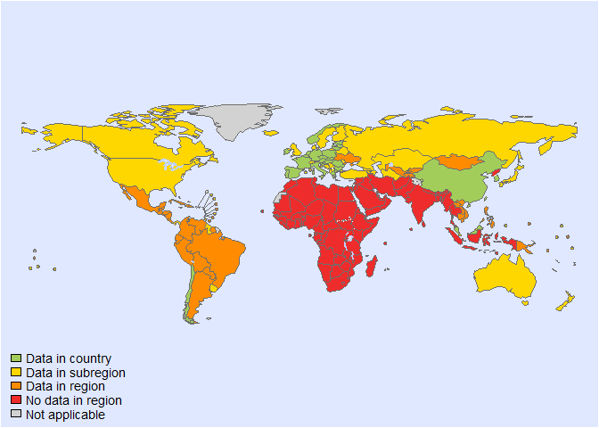
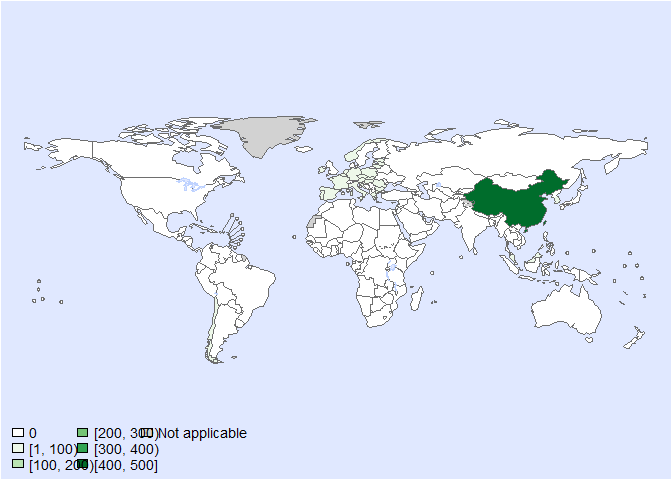
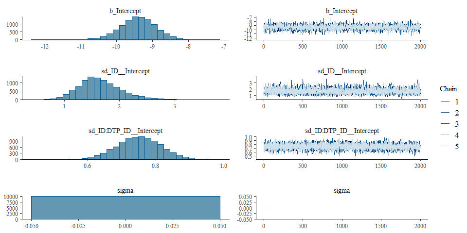

Global CFR of brucella - Fit model- Version 2
================
LoVa3397
2025-09-23

- [Settings](#settings)
- [BRMS](#brms)
  - [BRMS model: Version 2](#brms-model-version-2)

# Settings

``` r
## required packages ----
library(bd)
library(brms)
library(ggplot2)
library(metafor)
library(readxl)
library(rmarkdown)
library(rms)
library(tidyr)
library(dplyr)
library(knitr)

## global options ----
knitr::opts_chunk$set(fig.width = 10)
Date <- format(Sys.Date(), "%Y%m%d")

source("01-data-CFR.R")
```

    ## Warning: Expecting numeric in Q32 / R32C17: got 'Unknown'

    ## Warning: Expecting numeric in Q56 / R56C17: got 'Unknown'

    ## Warning: Expecting numeric in Q236 / R236C17: got 'Unknown'

    ## Warning: Expecting numeric in Q287 / R287C17: got 'Unknown'

    ## Warning: Expecting numeric in C874 / R874C3: got 'NA'

    ## Warning: Expecting numeric in C875 / R875C3: got 'NA'

    ## Warning: Expecting numeric in C876 / R876C3: got 'NA'

    ## Warning: Expecting numeric in C877 / R877C3: got 'NA'

    ## Warning: Expecting numeric in C878 / R878C3: got 'NA'

    ## Warning: Expecting numeric in C879 / R879C3: got 'NA'

    ## Warning: Expecting numeric in C880 / R880C3: got 'NA'

    ## Warning: Expecting numeric in C881 / R881C3: got 'NA'

    ## Warning: Expecting numeric in C882 / R882C3: got 'NA'

    ## Warning: Expecting numeric in C883 / R883C3: got 'NA'

    ## Warning: Expecting numeric in C884 / R884C3: got 'NA'

    ## Warning: Expecting numeric in C885 / R885C3: got 'NA'

    ## Warning: Expecting numeric in C886 / R886C3: got 'NA'

    ## Warning: Expecting numeric in C887 / R887C3: got 'NA'

    ## Warning: Expecting numeric in C888 / R888C3: got 'NA'

    ## Warning: Expecting numeric in C889 / R889C3: got 'NA'

    ## Warning: Expecting numeric in C890 / R890C3: got 'NA'

    ## Warning: Expecting numeric in C891 / R891C3: got 'NA'

    ## Warning: Expecting numeric in C892 / R892C3: got 'NA'

    ## Warning: Expecting numeric in C893 / R893C3: got 'NA'

    ## Warning: Expecting numeric in C894 / R894C3: got 'NA'

    ## Warning: Expecting numeric in C895 / R895C3: got 'NA'

    ## Warning: Expecting numeric in C896 / R896C3: got 'NA'

    ## Warning: Expecting numeric in C897 / R897C3: got 'NA'

    ## Warning: Expecting numeric in C898 / R898C3: got 'NA'

    ## Warning: Expecting numeric in C899 / R899C3: got 'NA'

    ## Warning: Expecting numeric in C900 / R900C3: got 'NA'

    ## Warning: Expecting numeric in C901 / R901C3: got 'NA'

    ## Warning: Expecting numeric in C4486 / R4486C3: got 'NA'

    ## Warning: Expecting numeric in C4487 / R4487C3: got 'NA'

    ## Warning: Expecting numeric in C4488 / R4488C3: got 'NA'

    ## Warning: Expecting numeric in C4489 / R4489C3: got 'NA'

    ## Warning: Expecting numeric in C4490 / R4490C3: got 'NA'

    ## Warning: Expecting numeric in C4491 / R4491C3: got 'NA'

    ## Warning: Expecting numeric in C4492 / R4492C3: got 'NA'

    ## Warning: Expecting numeric in C4493 / R4493C3: got 'NA'

    ## Warning: Expecting numeric in C4494 / R4494C3: got 'NA'

    ## Warning: Expecting numeric in C4495 / R4495C3: got 'NA'

    ## Warning: Expecting numeric in C4496 / R4496C3: got 'NA'

    ## Warning: Expecting numeric in C4497 / R4497C3: got 'NA'

    ## Warning: Expecting numeric in C4498 / R4498C3: got 'NA'

    ## Warning: Expecting numeric in C4499 / R4499C3: got 'NA'

    ## Warning: Expecting numeric in C4500 / R4500C3: got 'NA'

    ## Warning: Expecting numeric in C4501 / R4501C3: got 'NA'

    ## Warning: Expecting numeric in C4502 / R4502C3: got 'NA'

    ## Warning: Expecting numeric in C4503 / R4503C3: got 'NA'

    ## Warning: Expecting numeric in C4504 / R4504C3: got 'NA'

    ## Warning: Expecting numeric in C4505 / R4505C3: got 'NA'

    ## Warning: Expecting numeric in C4506 / R4506C3: got 'NA'

    ## Warning: Expecting numeric in C4507 / R4507C3: got 'NA'

    ## 'data.frame':    4506 obs. of  41 variables:
    ##  $ SOURCE_ID           : chr  "Al-Dahouk_2007a" "Al-Dahouk_2007a" "Anis_2011a" "CDCChina_2020" ...
    ##  $ SOURCE_AUTHOR       : chr  "Al-Dahouk, S" "Al-Dahouk, S" "Anis, E" "ChinaCDC" ...
    ##  $ SOURCE_YEAR         : num  2007 2007 2011 2020 2021 ...
    ##  $ SOURCE_TITLE        : chr  "Changing epidemiology of human brucellosis, Germany, 1962-2005" "Changing epidemiology of human brucellosis, Germany, 1962-2005" "Recent trends in human brucellosis in Israel" "Reported Cases and Deaths of National Notifiable Infectious Diseases — China" ...
    ##  $ SOURCE_DOI          : chr  "https://doi.org/10.3201/eid1312.070527" "https://doi.org/10.3201/eid1312.070527" NA NA ...
    ##  $ SOURCE_URL          : chr  NA NA "https://www.ima.org.il/MedicineIMAJ/viewarticle.aspx?year=2011&month=06&page=359" NA ...
    ##  $ OPT_ACCESS_DATE     : POSIXct, format: NA NA NA ...
    ##  $ OPT_STUDY_TYPE      : chr  "Passive surveillance" "Passive surveillance" "Passive surveillance" "Passive surveillance" ...
    ##  $ OPT_OTHER_STUDY_TYPE: chr  NA NA NA NA ...
    ##  $ REF_NOTES           : chr  "Case-fatality rate" "Case-fatality rate" "No case fatalities" "NOTE: Only jan-jun 2024 Data available via China CDC, Data  from  the  National  Notifiable Disease  Reporting "| __truncated__ ...
    ##  $ REF_YEAR_START      : num  1998 2002 1998 2020 2021 ...
    ##  $ REF_YEAR_END        : num  2001 2005 2009 2020 2021 ...
    ##  $ REF_LOC_LEVEL       : chr  "National" "National" "National" "National" ...
    ##  $ REF_LOCATION        : chr  "Germany" "Germany" "Israel" "China" ...
    ##  $ REF_LOCATION_ISO3   : chr  "DEU" "DEU" "ISR" "CHN" ...
    ##  $ REF_SEX             : chr  "All sexes" "All sexes" "All sexes" "All sexes" ...
    ##  $ REF_AGE_START       : num  0 0 0 0 0 0 0 0 0 1 ...
    ##  $ REF_AGE_END         : num  125 125 125 125 125 125 125 125 0 1 ...
    ##  $ OPT_MEAN_AGE        : logi  NA NA NA NA NA NA ...
    ##  $ OPT_MEDIAN_AGE      : logi  NA NA NA NA NA NA ...
    ##  $ OPT_SUBPOP          : chr  NA NA NA NA ...
    ##  $ OPT_CASES           : chr  "Confirmed" "Confirmed" "Confirmed" "All" ...
    ##  $ OPT_PERINATAL       : chr  NA NA NA NA ...
    ##  $ OPT_DISEASE         : logi  NA NA NA NA NA NA ...
    ##  $ OPT_SEROTYPE        : chr  NA NA NA NA ...
    ##  $ REF_SAMPLE_SIZE     : num  NA NA NA 50115 73645 ...
    ##  $ VALUE_X             : num  NA NA 0 2 6 2 3 2 0 0 ...
    ##  $ VALUE_MEAN          : num  6.5 2.1 NA NA NA NA NA NA NA NA ...
    ##  $ VALUE_MEDIAN        : num  NA NA NA NA NA NA NA NA NA NA ...
    ##  $ VALUE_DENOM         : num  100 100 NA NA NA NA NA NA NA NA ...
    ##  $ VALUE_SE            : num  NA NA NA NA NA NA NA NA NA NA ...
    ##  $ VALUE_P000          : num  NA NA NA NA NA NA NA NA NA NA ...
    ##  $ VALUE_P2_5          : num  NA NA NA NA NA NA NA NA NA NA ...
    ##  $ VALUE_P5            : num  NA NA NA NA NA NA NA NA NA NA ...
    ##  $ VALUE_P10           : num  NA NA NA NA NA NA NA NA NA NA ...
    ##  $ VALUE_P25           : num  NA NA NA NA NA NA NA NA NA NA ...
    ##  $ VALUE_P75           : num  NA NA NA NA NA NA NA NA NA NA ...
    ##  $ VALUE_P90           : num  NA NA NA NA NA NA NA NA NA NA ...
    ##  $ VALUE_P95           : num  NA NA NA NA NA NA NA NA NA NA ...
    ##  $ VALUE_P97_5         : num  NA NA NA NA NA NA NA NA NA NA ...
    ##  $ VALUE_P100          : num  NA NA NA NA NA NA NA NA NA NA ...

<!-- --><!-- -->

    ## Warning: REML comparisons not meaningful for models with different fixed effects
    ## (use 'refit=TRUE' to refit both models based on ML estimation).

    ## Warning in system2("quarto", "-V", stdout = TRUE, env = paste0("TMPDIR=", : running command
    ## '"quarto" TMPDIR=C:/Users/LoVa3397/AppData/Local/Temp/RtmpEHBFhq/file36c056a26597 -V' had status
    ## 1

``` r
DTP_ID<-seq(1:length(es$SOURCE_ID))
es$DTP_ID<-as.character(DTP_ID)
es$FLAG<-factor(es$FLAG, 
                levels=c(0,1,2,3,4,5,6, 7),
                labels=c("Keep data", "Data part of non WHO member states", "No WHO REG2 given",
                         "Year before 1990", "yi can't be calcualted", "TF choice to remove", 
                         "Excluded by preliminary checks", "Excluded in data cleaning"))
saveRDS(es, paste0("es_CFR_",Date,".rds"))
es <- subset(es, as.integer(FLAG) == 1)
```

# BRMS

``` r
Parameters <- c("Number of iteration", "Warmup", "Delta value", "Maximum tree-depth","Random effect on each data point", "Stronger priors specified")
Values <- c("5000","3000","0.95","20","Yes", "Normal(0,1)")
version_spe <- data.frame(Parameters,Values)

kable(caption = "Parameters of the model tested",row.names = FALSE, version_spe)
```

| Parameters                       | Values      |
|:---------------------------------|:------------|
| Number of iteration              | 5000        |
| Warmup                           | 3000        |
| Delta value                      | 0.95        |
| Maximum tree-depth               | 20          |
| Random effect on each data point | Yes         |
| Stronger priors specified        | Normal(0,1) |

Parameters of the model tested

## BRMS model: Version 2

``` r
fit_brms_reg_CFR_s2 <-
  brm(yi | se(sei) ~
        1 +
        (1  | ID) +
        (1  | ID:DTP_ID),
      chains = 5, iter = 5000, warmup = 3000,
      cores = 5,
      prior = prior(normal(0,1), class = sd),
      data = es,
      open_progress = FALSE,
      # control=list(adapt_delta = 0.95, max_treedepth = 20),
      seed =7 )
```

    ## Compiling Stan program...

    ## Start sampling

``` r
## model summary
summary(fit_brms_reg_CFR_s2)
```

    ##  Family: gaussian 
    ##   Links: mu = identity; sigma = identity 
    ## Formula: yi | se(sei) ~ 1 + (1 | ID) + (1 | ID:DTP_ID) 
    ##    Data: es (Number of observations: 714) 
    ##   Draws: 5 chains, each with iter = 5000; warmup = 3000; thin = 1;
    ##          total post-warmup draws = 10000
    ## 
    ## Multilevel Hyperparameters:
    ## ~ID (Number of levels: 13) 
    ##               Estimate Est.Error l-95% CI u-95% CI Rhat Bulk_ESS Tail_ESS
    ## sd(Intercept)     1.64      0.37     0.99     2.47 1.00     6161     6748
    ## 
    ## ~ID:DTP_ID (Number of levels: 714) 
    ##               Estimate Est.Error l-95% CI u-95% CI Rhat Bulk_ESS Tail_ESS
    ## sd(Intercept)     0.75      0.06     0.62     0.88 1.00     7329     8188
    ## 
    ## Regression Coefficients:
    ##           Estimate Est.Error l-95% CI u-95% CI Rhat Bulk_ESS Tail_ESS
    ## Intercept    -9.39      0.51   -10.39    -8.40 1.00     3654     5353
    ## 
    ## Further Distributional Parameters:
    ##       Estimate Est.Error l-95% CI u-95% CI Rhat Bulk_ESS Tail_ESS
    ## sigma     0.00      0.00     0.00     0.00   NA       NA       NA
    ## 
    ## Draws were sampled using sampling(NUTS). For each parameter, Bulk_ESS
    ## and Tail_ESS are effective sample size measures, and Rhat is the potential
    ## scale reduction factor on split chains (at convergence, Rhat = 1).

``` r
plot(fit_brms_reg_CFR_s2, ask = FALSE)
```

<!-- -->

``` r
# plot(conditional_effects(fit_brms_reg_CFR_s2), points = TRUE)


## show model code
stancode(fit_brms_reg_CFR_s2)
```

    ## // generated with brms 2.22.0
    ## functions {
    ## }
    ## data {
    ##   int<lower=1> N;  // total number of observations
    ##   vector[N] Y;  // response variable
    ##   vector<lower=0>[N] se;  // known sampling error
    ##   // data for group-level effects of ID 1
    ##   int<lower=1> N_1;  // number of grouping levels
    ##   int<lower=1> M_1;  // number of coefficients per level
    ##   array[N] int<lower=1> J_1;  // grouping indicator per observation
    ##   // group-level predictor values
    ##   vector[N] Z_1_1;
    ##   // data for group-level effects of ID 2
    ##   int<lower=1> N_2;  // number of grouping levels
    ##   int<lower=1> M_2;  // number of coefficients per level
    ##   array[N] int<lower=1> J_2;  // grouping indicator per observation
    ##   // group-level predictor values
    ##   vector[N] Z_2_1;
    ##   int prior_only;  // should the likelihood be ignored?
    ## }
    ## transformed data {
    ##   vector<lower=0>[N] se2 = square(se);
    ## }
    ## parameters {
    ##   real Intercept;  // temporary intercept for centered predictors
    ##   vector<lower=0>[M_1] sd_1;  // group-level standard deviations
    ##   array[M_1] vector[N_1] z_1;  // standardized group-level effects
    ##   vector<lower=0>[M_2] sd_2;  // group-level standard deviations
    ##   array[M_2] vector[N_2] z_2;  // standardized group-level effects
    ## }
    ## transformed parameters {
    ##   real sigma = 0;  // dispersion parameter
    ##   vector[N_1] r_1_1;  // actual group-level effects
    ##   vector[N_2] r_2_1;  // actual group-level effects
    ##   real lprior = 0;  // prior contributions to the log posterior
    ##   r_1_1 = (sd_1[1] * (z_1[1]));
    ##   r_2_1 = (sd_2[1] * (z_2[1]));
    ##   lprior += student_t_lpdf(Intercept | 3, -10, 2.5);
    ##   lprior += normal_lpdf(sd_1 | 0, 1)
    ##     - 1 * normal_lccdf(0 | 0, 1);
    ##   lprior += normal_lpdf(sd_2 | 0, 1)
    ##     - 1 * normal_lccdf(0 | 0, 1);
    ## }
    ## model {
    ##   // likelihood including constants
    ##   if (!prior_only) {
    ##     // initialize linear predictor term
    ##     vector[N] mu = rep_vector(0.0, N);
    ##     mu += Intercept;
    ##     for (n in 1:N) {
    ##       // add more terms to the linear predictor
    ##       mu[n] += r_1_1[J_1[n]] * Z_1_1[n] + r_2_1[J_2[n]] * Z_2_1[n];
    ##     }
    ##     target += normal_lpdf(Y | mu, se);
    ##   }
    ##   // priors including constants
    ##   target += lprior;
    ##   target += std_normal_lpdf(z_1[1]);
    ##   target += std_normal_lpdf(z_2[1]);
    ## }
    ## generated quantities {
    ##   // actual population-level intercept
    ##   real b_Intercept = Intercept;
    ## }

``` r
## save model fit
saveRDS(fit_brms_reg_CFR_s2, file = "fit_brms_reg_CFR_s2.rds")

##rmarkdown::render("02-fit.R")
```
