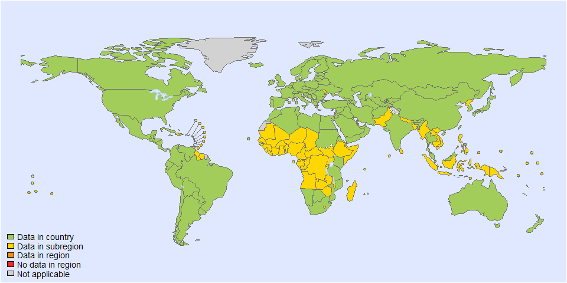
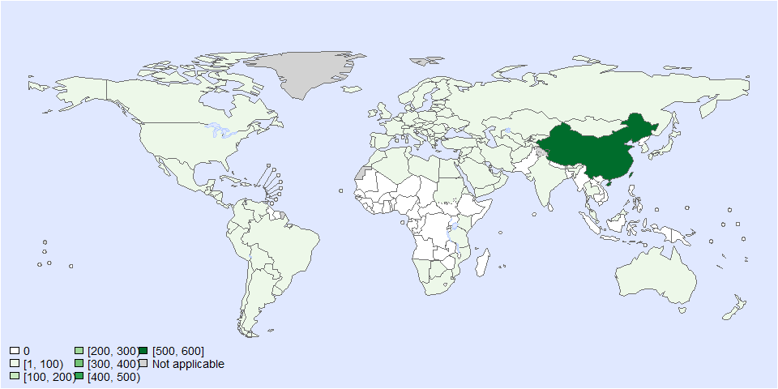
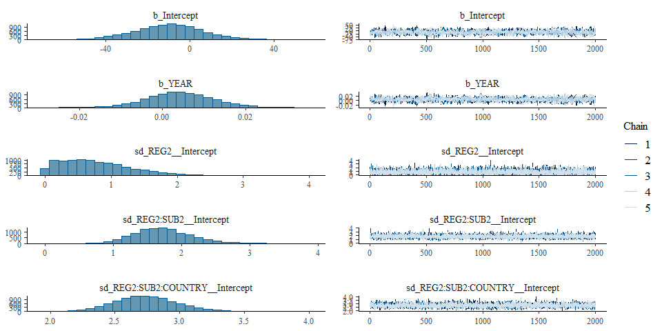
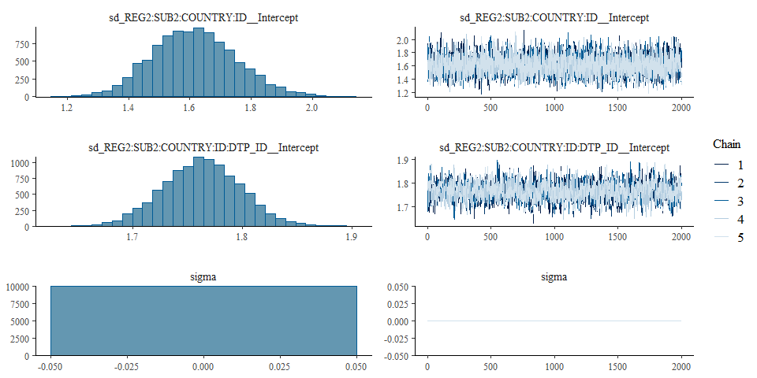
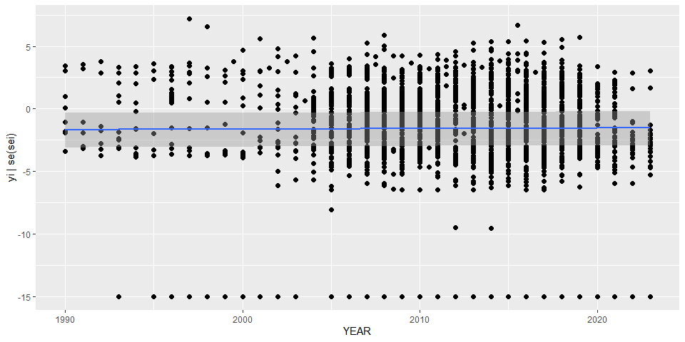

Global incidence of listeria • fit model - Version 1
================
LoVa3397
2025-09-30

- [Settings](#settings)
- [Parameters](#parameters)
- [Data](#data)
- [BRMS](#brms)
- [Session info](#session-info)

# Settings

``` r
## required packages ----
library(bd)
library(brms)
library(ggplot2)
library(metafor)
library(readxl)
library(rmarkdown)
library(rms)
library(tidyr)
library(kableExtra)

## global options ----
knitr::opts_chunk$set(fig.width = 10)
Date <- format(Sys.Date(), "%Y%m%d")
```

# Parameters

| Parameters                       | Values        |
|:---------------------------------|:--------------|
| Number of iteration              | 5000          |
| Warmup                           | 3000          |
| Delta value                      | 0.95          |
| Maximum tree-depth               | 20            |
| Levels                           | Year, Country |
| Random effect on each data point | Yes           |
| Stronger priors specified        | Normal(0,1)   |

Parameters of the model tested

# Data

``` r
## import data
source("01-data.R")
```

    ## Warning: Expecting numeric in Q2350 / R2350C17: got 'Unknown'

    ## Warning: Expecting numeric in Q2351 / R2351C17: got 'Unknown'

    ## Warning: Expecting numeric in Q2352 / R2352C17: got 'Unknown'

    ## Warning: Expecting numeric in Q2353 / R2353C17: got 'Unknown'

    ## Warning: Expecting logical in X3338 / R3338C24: got 'Brucella suis'

    ## Warning: Expecting logical in Y4468 / R4468C25: got 'Annual Incidence'

    ## Warning: Expecting numeric in C5204 / R5204C3: got 'NA'

    ## Warning: Expecting numeric in C5205 / R5205C3: got 'NA'

    ## Warning: Expecting numeric in C5206 / R5206C3: got 'NA'

    ## Warning: Expecting numeric in C5207 / R5207C3: got 'NA'

    ## Warning: Expecting numeric in C5208 / R5208C3: got 'NA'

    ## Warning: Expecting numeric in C5209 / R5209C3: got 'NA'

    ## Warning: Expecting numeric in C5210 / R5210C3: got 'NA'

    ## Warning: Expecting numeric in C5211 / R5211C3: got 'NA'

    ## Warning: Expecting numeric in C5212 / R5212C3: got 'NA'

    ## Warning: Expecting numeric in C5213 / R5213C3: got 'NA'

    ## Warning: Expecting numeric in C5214 / R5214C3: got 'NA'

    ## Warning: Expecting numeric in C5215 / R5215C3: got 'NA'

    ## Warning: Expecting numeric in C5216 / R5216C3: got 'NA'

    ## Warning: Expecting numeric in C5217 / R5217C3: got 'NA'

    ## Warning: Expecting numeric in C5218 / R5218C3: got 'NA'

    ## Warning: Expecting numeric in C5219 / R5219C3: got 'NA'

    ## Warning: Expecting numeric in C5220 / R5220C3: got 'NA'

    ## Warning: Expecting numeric in C5221 / R5221C3: got 'NA'

    ## Warning: Expecting numeric in C5222 / R5222C3: got 'NA'

    ## Warning: Expecting numeric in C5223 / R5223C3: got 'NA'

    ## Warning: Expecting numeric in C5224 / R5224C3: got 'NA'

    ## Warning: Expecting numeric in C5225 / R5225C3: got 'NA'

    ## Warning: Expecting numeric in C5226 / R5226C3: got 'NA'

    ## Warning: Expecting numeric in C5227 / R5227C3: got 'NA'

    ## Warning: Expecting numeric in C5228 / R5228C3: got 'NA'

    ## Warning: Expecting numeric in C5229 / R5229C3: got 'NA'

    ## Warning: Expecting numeric in C5230 / R5230C3: got 'NA'

    ## Warning: Expecting numeric in C5231 / R5231C3: got 'NA'

    ## Warning: Expecting numeric in C5232 / R5232C3: got 'NA'

    ## Warning: Expecting numeric in C5233 / R5233C3: got 'NA'

    ## Warning: Expecting numeric in C5234 / R5234C3: got 'NA'

    ## Warning: Expecting numeric in C5235 / R5235C3: got 'NA'

    ## Warning: Expecting numeric in C5236 / R5236C3: got 'NA'

    ## Warning: Expecting numeric in C5237 / R5237C3: got 'NA'

    ## Warning: Expecting numeric in C5238 / R5238C3: got 'NA'

    ## Warning: Expecting numeric in C5239 / R5239C3: got 'NA'

    ## Warning: Expecting numeric in C5240 / R5240C3: got 'NA'

    ## Warning: Expecting numeric in C5241 / R5241C3: got 'NA'

    ## Warning: Expecting numeric in C5242 / R5242C3: got 'NA'

    ## Warning: Expecting numeric in C5243 / R5243C3: got 'NA'

    ## Warning: Expecting numeric in C5244 / R5244C3: got 'NA'

    ## Warning: Expecting numeric in C5245 / R5245C3: got 'NA'

    ## Warning: Expecting numeric in C5246 / R5246C3: got 'NA'

    ## Warning: Expecting numeric in C5247 / R5247C3: got 'NA'

    ## Warning: Expecting numeric in C5248 / R5248C3: got 'NA'

    ## Warning: Expecting numeric in C5249 / R5249C3: got 'NA'

    ## Warning: Expecting numeric in C5250 / R5250C3: got 'NA'

    ## Warning: Expecting numeric in C5251 / R5251C3: got 'NA'

    ## Warning: Expecting numeric in C5252 / R5252C3: got 'NA'

    ## Warning: Expecting numeric in C5253 / R5253C3: got 'NA'

    ## Warning: Expecting numeric in C5254 / R5254C3: got 'NA'

    ## Warning: Expecting numeric in C5255 / R5255C3: got 'NA'

    ## Warning: Expecting numeric in C5256 / R5256C3: got 'NA'

    ## Warning: Expecting numeric in C5257 / R5257C3: got 'NA'

    ## Warning: Expecting numeric in C5258 / R5258C3: got 'NA'

    ## Warning: Expecting numeric in C5259 / R5259C3: got 'NA'

    ## Warning: Expecting numeric in C5260 / R5260C3: got 'NA'

    ## Warning: Expecting numeric in C5261 / R5261C3: got 'NA'

    ## Warning: Expecting numeric in C5262 / R5262C3: got 'NA'

    ## Warning: Expecting numeric in C5263 / R5263C3: got 'NA'

    ## 'data.frame':    5262 obs. of  43 variables:
    ##  $ SOURCE_ID           : chr  "Abdullayev_2012a" "Abdullayev_2012a" "Abdullayev_2012a" "Abdullayev_2012a" ...
    ##  $ SOURCE_AUTHOR       : chr  "Abdullayev, R" "Abdullayev, R" "Abdullayev, R" "Abdullayev, R" ...
    ##  $ SOURCE_YEAR         : num  2012 2012 2012 2012 2012 ...
    ##  $ SOURCE_TITLE        : chr  "Analyzing the spatial and temporal distribution of human brucellosis in Azerbaijan (1995 - 2009) using spatial "| __truncated__ "Analyzing the spatial and temporal distribution of human brucellosis in Azerbaijan (1995 - 2009) using spatial "| __truncated__ "Analyzing the spatial and temporal distribution of human brucellosis in Azerbaijan (1995 - 2009) using spatial "| __truncated__ "Analyzing the spatial and temporal distribution of human brucellosis in Azerbaijan (1995 - 2009) using spatial "| __truncated__ ...
    ##  $ SOURCE_DOI          : chr  "https://doi.org/10.1186/1471-2334-12-185" "https://doi.org/10.1186/1471-2334-12-185" "https://doi.org/10.1186/1471-2334-12-185" "https://doi.org/10.1186/1471-2334-12-185" ...
    ##  $ SOURCE_URL          : chr  NA NA NA NA ...
    ##  $ OPT_ACCESS_DATE     : POSIXct, format: NA NA NA NA ...
    ##  $ OPT_STUDY_TYPE      : chr  "Passive surveillance" "Passive surveillance" "Passive surveillance" "Passive surveillance" ...
    ##  $ OPT_OTHER_STUDY_TYPE: chr  NA NA NA NA ...
    ##  $ REF_NOTES           : chr  NA NA NA NA ...
    ##  $ REF_YEAR_START      : num  1995 1996 2009 1995 1995 ...
    ##  $ REF_YEAR_END        : num  2009 1996 2009 2009 2009 ...
    ##  $ REF_LOC_LEVEL       : chr  "National" "National" "National" "National" ...
    ##  $ REF_LOCATION        : chr  "Azerbaijan" "Azerbaijan" "Azerbaijan" "Azerbaijan" ...
    ##  $ REF_LOCATION_ISO3   : chr  "AZE" "AZE" "AZE" "AZE" ...
    ##  $ REF_SEX             : chr  "All sexes" "All sexes" "All sexes" "Male" ...
    ##  $ REF_AGE_START       : num  0 0 0 0 16 20 0 0 0 0 ...
    ##  $ REF_AGE_END         : num  125 125 125 125 19 29 125 125 125 125 ...
    ##  $ OPT_MEAN_AGE        : logi  NA NA NA NA NA NA ...
    ##  $ OPT_MEDIAN_AGE      : logi  NA NA NA NA NA NA ...
    ##  $ OPT_SUBPOP          : chr  NA NA NA NA ...
    ##  $ OPT_CASES           : chr  NA NA NA NA ...
    ##  $ OPT_PERINATAL       : chr  NA NA NA NA ...
    ##  $ OPT_DISEASE         : logi  NA NA NA NA NA NA ...
    ##  $ OPT_SEROTYPE        : logi  NA NA NA NA NA NA ...
    ##  $ REF_SAMPLE_SIZE     : num  NA NA NA NA NA ...
    ##  $ VALUE_X             : num  7983 756 392 5730 2230 ...
    ##  $ VALUE_MEAN          : num  NA NA NA NA NA NA NA NA NA NA ...
    ##  $ VALUE_MEDIAN        : num  NA NA NA NA NA NA NA NA NA NA ...
    ##  $ VALUE_DENOM         : num  NA NA NA NA NA NA NA NA NA NA ...
    ##  $ VALUE_SE            : num  NA NA NA NA NA NA NA NA NA NA ...
    ##  $ VALUE_P000          : num  NA NA NA NA NA NA NA NA NA NA ...
    ##  $ VALUE_P2_5          : num  NA NA NA NA NA NA NA NA NA NA ...
    ##  $ VALUE_P5            : num  NA NA NA NA NA NA NA NA NA NA ...
    ##  $ VALUE_P10           : num  NA NA NA NA NA NA NA NA NA NA ...
    ##  $ VALUE_P25           : num  NA NA NA NA NA NA NA NA NA NA ...
    ##  $ VALUE_P75           : num  NA NA NA NA NA NA NA NA NA NA ...
    ##  $ VALUE_P90           : num  NA NA NA NA NA NA NA NA NA NA ...
    ##  $ VALUE_P95           : num  NA NA NA NA NA NA NA NA NA NA ...
    ##  $ VALUE_P97_5         : num  NA NA NA NA NA NA NA NA NA NA ...
    ##  $ VALUE_P100          : num  NA NA NA NA NA NA NA NA NA NA ...
    ##  $ TEST                : chr  NA NA NA NA ...
    ##  $ TEST_NOTES          : chr  NA NA NA NA ...

    ## Joining with `by = join_by(REF_YEAR_START, REF_YEAR_END, REF_SEX, REF_AGE_START, REF_AGE_END, ISO3, ID_ROW)`

    ## Warning in add_pop(dta): Warning: 173 rows have missing data for the population variable. Please check if ISO3 code is correctly specified
    ## and if the dates are included in the study field.

<!-- --><!-- -->

    ## Warning in max(subset(es, as.integer(FLAG) == 1 & REG2 == "EMR")$RAW_INC_100000): no non-missing arguments to max; returning -Inf

    ## Warning in system2("quarto", "-V", stdout = TRUE, env = paste0("TMPDIR=", : running command '"quarto"
    ## TMPDIR=C:/Users/LoVa3397/AppData/Local/Temp/RtmpyYnOin/file38c870372ce5 -V' had status 1

``` r
DTP_ID<-seq(1:length(es$SOURCE_ID))
es$DTP_ID<-DTP_ID
es$FLAG<-factor(es$FLAG, 
                levels=c(0,1,2,3,4,5,6, 7),
                labels=c("Keep data", "Data part of non WHO member states", "No WHO REG2 given",
                         "Year before 1990", "yi can't be calcualted", "TF choice to remove", 
                         "Excluded by preliminary checks", "Excluded in data cleaning"))
saveRDS(es, paste0("es_", Date, ".RDS"))
es <- subset(es, as.integer(FLAG) == 1)

# es <- es %>%
#   filter((yi > -5) & (yi < 5))
```

# BRMS

``` r
fit_brms_reg_s1 <-
 brm(yi | se(sei) ~
       1 + YEAR +
       (1  | REG2) +
       (1  | REG2:SUB2) +
       (1  | REG2:SUB2:COUNTRY) +
       (1  | REG2:SUB2:COUNTRY:ID) +
       (1  | REG2:SUB2:COUNTRY:ID:DTP_ID),
     chains = 5, iter = 5000, warmup = 3000,
     cores = 5,
     data = es,
     open_progress = FALSE,
     prior = prior(normal(0,1), class = sd),
     control = list( max_treedepth=20, adapt_delta=0.95),
     seed =7 )
```

    ## Compiling Stan program...

    ## Start sampling

    ## Warning: There were 33 divergent transitions after warmup. See
    ## https://mc-stan.org/misc/warnings.html#divergent-transitions-after-warmup
    ## to find out why this is a problem and how to eliminate them.

    ## Warning: There were 53 transitions after warmup that exceeded the maximum treedepth. Increase max_treedepth above 20. See
    ## https://mc-stan.org/misc/warnings.html#maximum-treedepth-exceeded

    ## Warning: Examine the pairs() plot to diagnose sampling problems

    ## Warning: Bulk Effective Samples Size (ESS) is too low, indicating posterior means and medians may be unreliable.
    ## Running the chains for more iterations may help. See
    ## https://mc-stan.org/misc/warnings.html#bulk-ess

    ## Warning: Tail Effective Samples Size (ESS) is too low, indicating posterior variances and tail quantiles may be unreliable.
    ## Running the chains for more iterations may help. See
    ## https://mc-stan.org/misc/warnings.html#tail-ess

``` r
# fit_brms_reg_s1 <- readRDS("fit_brms_reg_s1.rds")
summary(fit_brms_reg_s1)
```

    ## Warning: There were 33 divergent transitions after warmup. Increasing adapt_delta above 0.95 may help. See
    ## http://mc-stan.org/misc/warnings.html#divergent-transitions-after-warmup

    ##  Family: gaussian 
    ##   Links: mu = identity; sigma = identity 
    ## Formula: yi | se(sei) ~ 1 + YEAR + (1 | REG2) + (1 | REG2:SUB2) + (1 | REG2:SUB2:COUNTRY) + (1 | REG2:SUB2:COUNTRY:ID) + (1 | REG2:SUB2:COUNTRY:ID:DTP_ID) 
    ##    Data: es (Number of observations: 2456) 
    ##   Draws: 5 chains, each with iter = 5000; warmup = 3000; thin = 1;
    ##          total post-warmup draws = 10000
    ## 
    ## Multilevel Hyperparameters:
    ## ~REG2 (Number of levels: 6) 
    ##               Estimate Est.Error l-95% CI u-95% CI Rhat Bulk_ESS Tail_ESS
    ## sd(Intercept)     0.77      0.53     0.03     1.99 1.00     7239     6425
    ## 
    ## ~REG2:SUB2 (Number of levels: 17) 
    ##               Estimate Est.Error l-95% CI u-95% CI Rhat Bulk_ESS Tail_ESS
    ## sd(Intercept)     1.73      0.40     1.02     2.59 1.00     7229     7022
    ## 
    ## ~REG2:SUB2:COUNTRY (Number of levels: 111) 
    ##               Estimate Est.Error l-95% CI u-95% CI Rhat Bulk_ESS Tail_ESS
    ## sd(Intercept)     2.75      0.24     2.30     3.25 1.00     5094     6848
    ## 
    ## ~REG2:SUB2:COUNTRY:ID (Number of levels: 252) 
    ##               Estimate Est.Error l-95% CI u-95% CI Rhat Bulk_ESS Tail_ESS
    ## sd(Intercept)     1.61      0.14     1.36     1.90 1.00     2995     5152
    ## 
    ## ~REG2:SUB2:COUNTRY:ID:DTP_ID (Number of levels: 2456) 
    ##               Estimate Est.Error l-95% CI u-95% CI Rhat Bulk_ESS Tail_ESS
    ## sd(Intercept)     1.76      0.04     1.69     1.83 1.00     1359     2045
    ## 
    ## Regression Coefficients:
    ##           Estimate Est.Error l-95% CI u-95% CI Rhat Bulk_ESS Tail_ESS
    ## Intercept    -9.91     15.76   -40.96    21.13 1.01      595      992
    ## YEAR          0.00      0.01    -0.01     0.02 1.01      595     1005
    ## 
    ## Further Distributional Parameters:
    ##       Estimate Est.Error l-95% CI u-95% CI Rhat Bulk_ESS Tail_ESS
    ## sigma     0.00      0.00     0.00     0.00   NA       NA       NA
    ## 
    ## Draws were sampled using sampling(NUTS). For each parameter, Bulk_ESS
    ## and Tail_ESS are effective sample size measures, and Rhat is the potential
    ## scale reduction factor on split chains (at convergence, Rhat = 1).

``` r
plot(fit_brms_reg_s1, ask = FALSE)
```

<!-- --><!-- -->

``` r
plot(conditional_effects(fit_brms_reg_s1), points = TRUE)
```

<!-- -->

``` r
saveRDS(fit_brms_reg_s1, file = "fit_brms_reg_s1.rds")
## show model code
stancode(fit_brms_reg_s1)
```

    ## // generated with brms 2.22.0
    ## functions {
    ## }
    ## data {
    ##   int<lower=1> N;  // total number of observations
    ##   vector[N] Y;  // response variable
    ##   vector<lower=0>[N] se;  // known sampling error
    ##   int<lower=1> K;  // number of population-level effects
    ##   matrix[N, K] X;  // population-level design matrix
    ##   int<lower=1> Kc;  // number of population-level effects after centering
    ##   // data for group-level effects of ID 1
    ##   int<lower=1> N_1;  // number of grouping levels
    ##   int<lower=1> M_1;  // number of coefficients per level
    ##   array[N] int<lower=1> J_1;  // grouping indicator per observation
    ##   // group-level predictor values
    ##   vector[N] Z_1_1;
    ##   // data for group-level effects of ID 2
    ##   int<lower=1> N_2;  // number of grouping levels
    ##   int<lower=1> M_2;  // number of coefficients per level
    ##   array[N] int<lower=1> J_2;  // grouping indicator per observation
    ##   // group-level predictor values
    ##   vector[N] Z_2_1;
    ##   // data for group-level effects of ID 3
    ##   int<lower=1> N_3;  // number of grouping levels
    ##   int<lower=1> M_3;  // number of coefficients per level
    ##   array[N] int<lower=1> J_3;  // grouping indicator per observation
    ##   // group-level predictor values
    ##   vector[N] Z_3_1;
    ##   // data for group-level effects of ID 4
    ##   int<lower=1> N_4;  // number of grouping levels
    ##   int<lower=1> M_4;  // number of coefficients per level
    ##   array[N] int<lower=1> J_4;  // grouping indicator per observation
    ##   // group-level predictor values
    ##   vector[N] Z_4_1;
    ##   // data for group-level effects of ID 5
    ##   int<lower=1> N_5;  // number of grouping levels
    ##   int<lower=1> M_5;  // number of coefficients per level
    ##   array[N] int<lower=1> J_5;  // grouping indicator per observation
    ##   // group-level predictor values
    ##   vector[N] Z_5_1;
    ##   int prior_only;  // should the likelihood be ignored?
    ## }
    ## transformed data {
    ##   vector<lower=0>[N] se2 = square(se);
    ##   matrix[N, Kc] Xc;  // centered version of X without an intercept
    ##   vector[Kc] means_X;  // column means of X before centering
    ##   for (i in 2:K) {
    ##     means_X[i - 1] = mean(X[, i]);
    ##     Xc[, i - 1] = X[, i] - means_X[i - 1];
    ##   }
    ## }
    ## parameters {
    ##   vector[Kc] b;  // regression coefficients
    ##   real Intercept;  // temporary intercept for centered predictors
    ##   vector<lower=0>[M_1] sd_1;  // group-level standard deviations
    ##   array[M_1] vector[N_1] z_1;  // standardized group-level effects
    ##   vector<lower=0>[M_2] sd_2;  // group-level standard deviations
    ##   array[M_2] vector[N_2] z_2;  // standardized group-level effects
    ##   vector<lower=0>[M_3] sd_3;  // group-level standard deviations
    ##   array[M_3] vector[N_3] z_3;  // standardized group-level effects
    ##   vector<lower=0>[M_4] sd_4;  // group-level standard deviations
    ##   array[M_4] vector[N_4] z_4;  // standardized group-level effects
    ##   vector<lower=0>[M_5] sd_5;  // group-level standard deviations
    ##   array[M_5] vector[N_5] z_5;  // standardized group-level effects
    ## }
    ## transformed parameters {
    ##   real sigma = 0;  // dispersion parameter
    ##   vector[N_1] r_1_1;  // actual group-level effects
    ##   vector[N_2] r_2_1;  // actual group-level effects
    ##   vector[N_3] r_3_1;  // actual group-level effects
    ##   vector[N_4] r_4_1;  // actual group-level effects
    ##   vector[N_5] r_5_1;  // actual group-level effects
    ##   real lprior = 0;  // prior contributions to the log posterior
    ##   r_1_1 = (sd_1[1] * (z_1[1]));
    ##   r_2_1 = (sd_2[1] * (z_2[1]));
    ##   r_3_1 = (sd_3[1] * (z_3[1]));
    ##   r_4_1 = (sd_4[1] * (z_4[1]));
    ##   r_5_1 = (sd_5[1] * (z_5[1]));
    ##   lprior += student_t_lpdf(Intercept | 3, -1.3, 3.4);
    ##   lprior += normal_lpdf(sd_1 | 0, 1)
    ##     - 1 * normal_lccdf(0 | 0, 1);
    ##   lprior += normal_lpdf(sd_2 | 0, 1)
    ##     - 1 * normal_lccdf(0 | 0, 1);
    ##   lprior += normal_lpdf(sd_3 | 0, 1)
    ##     - 1 * normal_lccdf(0 | 0, 1);
    ##   lprior += normal_lpdf(sd_4 | 0, 1)
    ##     - 1 * normal_lccdf(0 | 0, 1);
    ##   lprior += normal_lpdf(sd_5 | 0, 1)
    ##     - 1 * normal_lccdf(0 | 0, 1);
    ## }
    ## model {
    ##   // likelihood including constants
    ##   if (!prior_only) {
    ##     // initialize linear predictor term
    ##     vector[N] mu = rep_vector(0.0, N);
    ##     mu += Intercept + Xc * b;
    ##     for (n in 1:N) {
    ##       // add more terms to the linear predictor
    ##       mu[n] += r_1_1[J_1[n]] * Z_1_1[n] + r_2_1[J_2[n]] * Z_2_1[n] + r_3_1[J_3[n]] * Z_3_1[n] + r_4_1[J_4[n]] * Z_4_1[n] + r_5_1[J_5[n]] * Z_5_1[n];
    ##     }
    ##     target += normal_lpdf(Y | mu, se);
    ##   }
    ##   // priors including constants
    ##   target += lprior;
    ##   target += std_normal_lpdf(z_1[1]);
    ##   target += std_normal_lpdf(z_2[1]);
    ##   target += std_normal_lpdf(z_3[1]);
    ##   target += std_normal_lpdf(z_4[1]);
    ##   target += std_normal_lpdf(z_5[1]);
    ## }
    ## generated quantities {
    ##   // actual population-level intercept
    ##   real b_Intercept = Intercept - dot_product(means_X, b);
    ## }

# Session info

``` r
sessioninfo::session_info()
```

    ## Warning in system2("quarto", "-V", stdout = TRUE, env = paste0("TMPDIR=", : running command '"quarto"
    ## TMPDIR=C:/Users/LoVa3397/AppData/Local/Temp/RtmpyYnOin/file38c8316f84 -V' had status 1

    ## ─ Session info ──────────────────────────────────────────────────────────────────────────────────────────────────────────────────────────
    ##  setting  value
    ##  version  R version 4.5.0 (2025-04-11 ucrt)
    ##  os       Windows 10 x64 (build 19045)
    ##  system   x86_64, mingw32
    ##  ui       RStudio
    ##  language (EN)
    ##  collate  English_Belgium.utf8
    ##  ctype    English_Belgium.utf8
    ##  tz       Europe/Brussels
    ##  date     2025-10-13
    ##  rstudio  2024.04.2+764 Chocolate Cosmos (desktop)
    ##  pandoc   3.1.11 @ C:/Program Files/RStudio/resources/app/bin/quarto/bin/tools/ (via rmarkdown)
    ##  quarto   ERROR: Unknown command "TMPDIR=C:/Users/LoVa3397/AppData/Local/Temp/RtmpyYnOin/file38c8316f84". Did you mean command "install"? @ C:\\PROGRA~1\\RStudio\\RESOUR~1\\app\\bin\\quarto\\bin\\quarto.exe
    ## 
    ## ─ Packages ──────────────────────────────────────────────────────────────────────────────────────────────────────────────────────────────
    ##  ! package        * version    date (UTC) lib source
    ##    abind            1.4-8      2024-09-12 [1] CRAN (R 4.5.0)
    ##    backports        1.5.0      2024-05-23 [1] CRAN (R 4.5.0)
    ##    base64enc        0.1-3      2015-07-28 [1] CRAN (R 4.5.0)
    ##    bayesplot        1.12.0     2025-04-10 [1] CRAN (R 4.5.0)
    ##    bd             * 0.0.14     2025-04-26 [1] Github (brechtdv/bd@652191c)
    ##    boot             1.3-31     2024-08-28 [1] CRAN (R 4.5.0)
    ##    bridgesampling   1.1-2      2021-04-16 [1] CRAN (R 4.5.0)
    ##    brms           * 2.22.0     2024-09-23 [1] CRAN (R 4.5.0)
    ##    Brobdingnag      1.2-9      2022-10-19 [1] CRAN (R 4.5.0)
    ##    callr            3.7.6      2024-03-25 [1] CRAN (R 4.5.0)
    ##    cellranger       1.1.0      2016-07-27 [1] CRAN (R 4.5.0)
    ##    checkmate        2.3.2      2024-07-29 [1] CRAN (R 4.5.0)
    ##    class            7.3-23     2025-01-01 [1] CRAN (R 4.5.0)
    ##    classInt         0.4-11     2025-01-08 [1] CRAN (R 4.5.0)
    ##    cli              3.6.4      2025-02-13 [1] CRAN (R 4.5.0)
    ##    cluster          2.1.8.1    2025-03-12 [1] CRAN (R 4.5.0)
    ##    coda             0.19-4.1   2024-01-31 [1] CRAN (R 4.5.0)
    ##    codetools        0.2-20     2024-03-31 [1] CRAN (R 4.5.0)
    ##    colorspace       2.1-1      2024-07-26 [1] CRAN (R 4.5.0)
    ##    curl             6.2.2      2025-03-24 [1] CRAN (R 4.5.0)
    ##    data.table       1.17.0     2025-02-22 [1] CRAN (R 4.5.0)
    ##    DBI              1.2.3      2024-06-02 [1] CRAN (R 4.5.0)
    ##    DescTools      * 0.99.60    2025-03-28 [1] CRAN (R 4.5.0)
    ##    digest           0.6.37     2024-08-19 [1] CRAN (R 4.5.0)
    ##    distributional   0.5.0      2024-09-17 [1] CRAN (R 4.5.0)
    ##    dplyr          * 1.1.4      2023-11-17 [1] CRAN (R 4.5.0)
    ##    e1071            1.7-16     2024-09-16 [1] CRAN (R 4.5.0)
    ##    evaluate         1.0.3      2025-01-10 [1] CRAN (R 4.5.0)
    ##    Exact            3.3        2024-07-21 [1] CRAN (R 4.5.0)
    ##    expm             1.0-0      2024-08-19 [1] CRAN (R 4.5.0)
    ##    farver           2.1.2      2024-05-13 [1] CRAN (R 4.5.0)
    ##    fastmap          1.2.0      2024-05-15 [1] CRAN (R 4.5.0)
    ##    FERG2          * 0.0.5      2025-07-28 [1] Github (brechtdv/FERG2@c2d4ac1)
    ##    forcats          1.0.0      2023-01-29 [1] CRAN (R 4.5.0)
    ##    foreign          0.8-90     2025-03-31 [1] CRAN (R 4.5.0)
    ##    Formula          1.2-5      2023-02-24 [1] CRAN (R 4.5.0)
    ##    fs               1.6.6      2025-04-12 [1] CRAN (R 4.5.0)
    ##    generics         0.1.3      2022-07-05 [1] CRAN (R 4.5.0)
    ##    ggplot2        * 3.5.2      2025-04-09 [1] CRAN (R 4.5.0)
    ##    gld              2.6.7      2025-01-17 [1] CRAN (R 4.5.0)
    ##    glue             1.8.0      2024-09-30 [1] CRAN (R 4.5.0)
    ##    gridExtra        2.3        2017-09-09 [1] CRAN (R 4.5.0)
    ##    gtable           0.3.6      2024-10-25 [1] CRAN (R 4.5.0)
    ##    haven            2.5.4      2023-11-30 [1] CRAN (R 4.5.0)
    ##    Hmisc          * 5.2-3      2025-03-16 [1] CRAN (R 4.5.0)
    ##    hms              1.1.3      2023-03-21 [1] CRAN (R 4.5.0)
    ##    htmlTable        2.4.3      2024-07-21 [1] CRAN (R 4.5.0)
    ##    htmltools        0.5.8.1    2024-04-04 [1] CRAN (R 4.5.0)
    ##    htmlwidgets      1.6.4      2023-12-06 [1] CRAN (R 4.5.0)
    ##    httr             1.4.7      2023-08-15 [1] CRAN (R 4.5.0)
    ##    inline           0.3.21     2025-01-09 [1] CRAN (R 4.5.0)
    ##    jsonlite         2.0.0      2025-03-27 [1] CRAN (R 4.5.0)
    ##    kableExtra     * 1.4.0      2024-01-24 [1] CRAN (R 4.5.0)
    ##    KernSmooth       2.23-26    2025-01-01 [1] CRAN (R 4.5.0)
    ##    knitr            1.50       2025-03-16 [1] CRAN (R 4.5.0)
    ##    labeling         0.4.3      2023-08-29 [1] CRAN (R 4.5.0)
    ##    lattice          0.22-6     2024-03-20 [1] CRAN (R 4.5.0)
    ##    lifecycle        1.0.4      2023-11-07 [1] CRAN (R 4.5.0)
    ##    lmom             3.2        2024-09-30 [1] CRAN (R 4.5.0)
    ##    loo              2.8.0      2024-07-03 [1] CRAN (R 4.5.0)
    ##    magrittr         2.0.3      2022-03-30 [1] CRAN (R 4.5.0)
    ##    MASS             7.3-65     2025-02-28 [1] CRAN (R 4.5.0)
    ##    mathjaxr         1.6-0      2022-02-28 [1] CRAN (R 4.5.0)
    ##    Matrix         * 1.7-3      2025-03-11 [1] CRAN (R 4.5.0)
    ##    MatrixModels     0.5-4      2025-03-26 [1] CRAN (R 4.5.0)
    ##    matrixStats      1.5.0      2025-01-07 [1] CRAN (R 4.5.0)
    ##    metadat        * 1.4-0      2025-02-04 [1] CRAN (R 4.5.0)
    ##    metafor        * 4.8-0      2025-01-28 [1] CRAN (R 4.5.0)
    ##    multcomp         1.4-28     2025-01-29 [1] CRAN (R 4.5.0)
    ##    munsell          0.5.1      2024-04-01 [1] CRAN (R 4.5.0)
    ##    mvtnorm          1.3-3      2025-01-10 [1] CRAN (R 4.5.0)
    ##    nlme             3.1-168    2025-03-31 [1] CRAN (R 4.5.0)
    ##    nnet             7.3-20     2025-01-01 [1] CRAN (R 4.5.0)
    ##    numDeriv       * 2016.8-1.1 2019-06-06 [1] CRAN (R 4.5.0)
    ##    pillar           1.10.2     2025-04-05 [1] CRAN (R 4.5.0)
    ##    pkgbuild         1.4.7      2025-03-24 [1] CRAN (R 4.5.0)
    ##    pkgconfig        2.0.3      2019-09-22 [1] CRAN (R 4.5.0)
    ##    plyr             1.8.9      2023-10-02 [1] CRAN (R 4.5.0)
    ##    polspline        1.1.25     2024-05-10 [1] CRAN (R 4.5.0)
    ##    posterior        1.6.1      2025-02-27 [1] CRAN (R 4.5.0)
    ##    processx         3.8.6      2025-02-21 [1] CRAN (R 4.5.0)
    ##    proxy            0.4-27     2022-06-09 [1] CRAN (R 4.5.0)
    ##    ps               1.9.1      2025-04-12 [1] CRAN (R 4.5.0)
    ##    purrr            1.1.0      2025-07-10 [1] CRAN (R 4.5.1)
    ##    quantreg         6.1        2025-03-10 [1] CRAN (R 4.5.0)
    ##    QuickJSR         1.7.0      2025-03-31 [1] CRAN (R 4.5.0)
    ##    R6               2.6.1      2025-02-15 [1] CRAN (R 4.5.0)
    ##    RColorBrewer     1.1-3      2022-04-03 [1] CRAN (R 4.5.0)
    ##    Rcpp           * 1.0.14     2025-01-12 [1] CRAN (R 4.5.0)
    ##  D RcppParallel     5.1.10     2025-01-24 [1] CRAN (R 4.5.0)
    ##    readr            2.1.5      2024-01-10 [1] CRAN (R 4.5.0)
    ##    readxl         * 1.4.5      2025-03-07 [1] CRAN (R 4.5.0)
    ##    reshape2         1.4.4      2020-04-09 [1] CRAN (R 4.5.0)
    ##    rlang            1.1.6      2025-04-11 [1] CRAN (R 4.5.0)
    ##    rmarkdown      * 2.29       2024-11-04 [1] CRAN (R 4.5.0)
    ##    rms            * 8.0-0      2025-04-04 [1] CRAN (R 4.5.0)
    ##    rootSolve        1.8.2.4    2023-09-21 [1] CRAN (R 4.5.0)
    ##    rpart            4.1.24     2025-01-07 [1] CRAN (R 4.5.0)
    ##    rstan            2.32.7     2025-03-10 [1] CRAN (R 4.5.0)
    ##    rstantools       2.4.0      2024-01-31 [1] CRAN (R 4.5.0)
    ##    rstudioapi       0.17.1     2024-10-22 [1] CRAN (R 4.5.0)
    ##    sandwich         3.1-1      2024-09-15 [1] CRAN (R 4.5.0)
    ##    scales         * 1.3.0      2023-11-28 [1] CRAN (R 4.5.0)
    ##    sessioninfo      1.2.3      2025-02-05 [1] CRAN (R 4.5.0)
    ##    sf             * 1.0-20     2025-03-24 [1] CRAN (R 4.5.0)
    ##    SparseM          1.84-2     2024-07-17 [1] CRAN (R 4.5.0)
    ##    StanHeaders      2.32.10    2024-07-15 [1] CRAN (R 4.5.0)
    ##    stringi          1.8.7      2025-03-27 [1] CRAN (R 4.5.0)
    ##    stringr        * 1.5.1      2023-11-14 [1] CRAN (R 4.5.0)
    ##    survival         3.8-3      2024-12-17 [1] CRAN (R 4.5.0)
    ##    svglite          2.1.3      2023-12-08 [1] CRAN (R 4.5.0)
    ##    systemfonts      1.2.2      2025-04-04 [1] CRAN (R 4.5.0)
    ##    tensorA          0.36.2.1   2023-12-13 [1] CRAN (R 4.5.0)
    ##    TH.data          1.1-3      2025-01-17 [1] CRAN (R 4.5.0)
    ##    tibble           3.2.1      2023-03-20 [1] CRAN (R 4.5.0)
    ##    tidyr          * 1.3.1      2024-01-24 [1] CRAN (R 4.5.0)
    ##    tidyselect       1.2.1      2024-03-11 [1] CRAN (R 4.5.0)
    ##    tzdb             0.5.0      2025-03-15 [1] CRAN (R 4.5.0)
    ##    units            0.8-7      2025-03-11 [1] CRAN (R 4.5.0)
    ##    V8               6.0.3      2025-03-26 [1] CRAN (R 4.5.0)
    ##    vctrs            0.6.5      2023-12-01 [1] CRAN (R 4.5.0)
    ##    viridisLite      0.4.2      2023-05-02 [1] CRAN (R 4.5.0)
    ##    withr            3.0.2      2024-10-28 [1] CRAN (R 4.5.0)
    ##    xfun             0.52       2025-04-02 [1] CRAN (R 4.5.0)
    ##    xml2             1.3.8      2025-03-14 [1] CRAN (R 4.5.0)
    ##    yaml             2.3.10     2024-07-26 [1] CRAN (R 4.5.0)
    ##    zoo              1.8-14     2025-04-10 [1] CRAN (R 4.5.0)
    ## 
    ##  [1] C:/Users/LoVa3397/AppData/Local/Programs/R/R-4.5.0/library
    ## 
    ##  * ── Packages attached to the search path.
    ##  D ── DLL MD5 mismatch, broken installation.
    ## 
    ## ─────────────────────────────────────────────────────────────────────────────────────────────────────────────────────────────────────────

``` r
##rmarkdown::render("02-fit_v8.R")
```
