Global incidence of Brucella • Estimate incidence with the 1st model •
Disease-free takes lowest incidence
================
LoVa3397
2025-10-13

- [Settings](#settings)
- [Parameters of the 1st model](#parameters-of-the-1st-model)
- [Import and adapt data](#import-and-adapt-data)
- [Predict all](#predict-all)
- [Summarize predictions](#summarize-predictions)
  - [Global](#global)
  - [Regions](#regions)
  - [Subregions](#subregions)
  - [Countries](#countries)
- [Session info](#session-info)

# Settings

``` r
## required packages ----
library(bd)
library(brms)
library(FERG2)
library(ggplot2)
library(knitr)
library(rmarkdown)
library(sf)
library(tidyr)
library(dplyr)
library(DescTools)
library(readxl)
library(kableExtra)

#Standard model 
## global options ----
knitr::opts_chunk$set(fig.width = 10)
Date <- format(Sys.Date(), "%Y%m%d")
```

# Parameters of the 1st model

| Parameters                       | Values        |
|:---------------------------------|:--------------|
| Number of iteration              | 5000          |
| Warmup                           | 3000          |
| Delta value                      | 0.95          |
| Maximum tree-depth               | 20            |
| Levels                           | Year, Country |
| Random effect on each data point | Yes           |
| Stronger priors specified        | Normal(0,1)   |

Parameters of the model tested

# Import and adapt data

``` r
fit_brms_reg_s <- readRDS("fit_brms_reg_s1.rds")
zero_cases <-
  read_xlsx("Endemic_countries.xlsx") %>%
  select(REG2, SUB2, ISO3, Country, edtf_bruce) %>%
  rename(COUNTRY=ISO3, COUNTRY_LABEL = Country, DISEASEFREE = edtf_bruce)

kable(
  caption = "Countries assumed to be non-endemic",
  row.names = FALSE,
  subset(zero_cases, DISEASEFREE==0)[, 3]) 
```

|COUNTRY |
|:-------|
|BHR     |
|BRN     |
|CHE     |
|CYP     |
|CZE     |
|DNK     |
|EST     |
|GBR     |
|IRL     |
|ISL     |
|KEN     |
|LCA     |
|LTU     |
|LVA     |
|MDA     |
|MDG     |
|MDV     |
|MLT     |
|NAM     |
|NOR     |
|OMN     |
|PLW     |
|POL     |
|QAT     |
|SGP     |
|SVN     |
|SWE     |
|UKR     |
|UZB     |
|VCT     |

Countries assumed to be non-endemic

``` r
es <- readRDS("es.rds")
country_with_data <- es %>% select(ISO3) %>% distinct() %>% mutate(DATA=1, COUNTRY = ISO3)
Sub2_with_data <- es %>% select(SUB2) %>% distinct() %>% mutate(DATASUB2=1)
Reg2_with_data <- es %>% select(REG2) %>% distinct() %>% mutate(DATAREG2=1)
zero_cases <- left_join(zero_cases, country_with_data)
```

    ## Joining with `by = join_by(COUNTRY)`

``` r
zero_cases <- left_join(zero_cases, Sub2_with_data)
```

    ## Joining with `by = join_by(SUB2)`

``` r
zero_cases <- left_join(zero_cases, Reg2_with_data) %>%
  select(-c(ISO3)) %>%
  mutate(ESTIMATES = case_when(
    DATA == 1 ~ 1,
    DISEASEFREE == 0 ~ 2,
    is.na(DATA) & DISEASEFREE == 1 & DATASUB2 == 1 ~ 3,
    is.na(DATA) & DISEASEFREE == 1 & is.na(DATASUB2) & DATAREG2 == 1 ~ 4, 
    is.na(DATA) & DISEASEFREE == 1  & is.na(DATASUB2) & is.na(DATAREG2) ~5))
```

    ## Joining with `by = join_by(REG2)`

``` r
zero_cases$ESTIMATES <-
  factor(zero_cases$ESTIMATES, 
         level = c(1, 2, 3, 4, 5),
         labels = c("Data present", "Disease free", "Data in subregion", "Data in region", "Data in world"))
Country_Check <- zero_cases %>% filter(as.integer(ESTIMATES) == 2)
```

# Predict all

``` r
## set up dataframe
sim_all <-
  data.frame(
    sei = 0,
    REG2 = FERG2:::countries$REG2,
    SUB2 = FERG2:::countries$SUB2,
    COUNTRY = FERG2:::countries$ISO3,
    YEAR = rep(2000:2021, each = nrow(FERG2:::countries)))
sim_all <- sim_all %>% left_join(zero_cases) %>% select(sei, REG2, SUB2, COUNTRY, YEAR, ESTIMATES)
```

    ## Joining with `by = join_by(REG2, SUB2, COUNTRY)`

``` r
## draw from expected value of posterior predictive dist
set.seed(10)
#fit_all <- 
#posterior_epred(
#  object = fit_brms_reg_s,
#  newdata = sim_all,
#  allow_new_levels = TRUE,
#  sample_new_levels = "uncertainty",
#  re_formula = ~ 1 + 
#            (1  | REG2) +
#            (1  | REG2:SUB2) +
#            (1  | REG2:SUB2:COUNTRY)
#  )

draws_fit <- as_draws_df(fit_brms_reg_s)
fit_all <- data.frame(1:10000)

for (x in 1:nrow(sim_all)) {

  # Data present for country
  if (as.integer(sim_all[x, "ESTIMATES"]) == 1) {
    fit_all[[paste0("V",x)]] <- draws_fit$b_Intercept +                                                                               # Global intercept
      sim_all[x, "YEAR"] * draws_fit$b_YEAR +                                                                                         # Year component
      draws_fit[[paste0("r_REG2[",sim_all[x,"REG2"],",Intercept]")]] +                                                                # Regional component
      draws_fit[[paste0("r_REG2:SUB2[",sim_all[x,"REG2"],"_",sim_all[x,"SUB2"],",Intercept]")]] +                                     # Sub regional component
      draws_fit[[paste0("r_REG2:SUB2:COUNTRY[",sim_all[x,"REG2"],"_",sim_all[x,"SUB2"],"_",sim_all[x,"COUNTRY"],",Intercept]")]]      # Country component

  # Disease-free country
  } else if (as.integer(sim_all[x, "ESTIMATES"]) == 2) {
    fit_all[[paste0("V",x)]] <- 0

  # Data not present for country, but present in subregion
  } else if (as.integer(sim_all[x, "ESTIMATES"]) == 3) {
    fit_all[[paste0("V",x)]] <- draws_fit$b_Intercept +                                                                               # Global intercept
      sim_all[x, "YEAR"] * draws_fit$b_YEAR +                                                                                         # Year component
      draws_fit[[paste0("r_REG2[",sim_all[x,"REG2"],",Intercept]")]] +                                                                # Regional component
      draws_fit[[paste0("r_REG2:SUB2[",sim_all[x,"REG2"],"_",sim_all[x,"SUB2"],",Intercept]")]]                                       # Sub regional component

  # Data not present for country, but present in region
  } else if (as.integer(sim_all[x, "ESTIMATES"]) == 4) {
    fit_all[[paste0("V",x)]] <- draws_fit$b_Intercept +                                                                               # Global intercept
      sim_all[x, "YEAR"] * draws_fit$b_YEAR +                                                                                         # Year component
      draws_fit[[paste0("r_REG2[",sim_all[x,"REG2"],",Intercept]")]]                                                                  # Regional component

  # Data not present for country
  } else if (as.integer(sim_all[x, "ESTIMATES"]) == 5) {
    fit_all[[paste0("V",x)]] <- draws_fit$b_Intercept + 
      sim_all[x, "YEAR"] * draws_fit$b_YEAR
  } 
}

fit_all <- fit_all %>% select(-c(X1.10000))

## replace zero by lowest incidence
fit_all_mean <- sapply(fit_all, mean)
min(fit_all_mean)
```

    ## [1] -12.21074

``` r
(min_id <- which.min(fit_all_mean))
```

    ## V78 
    ##  78

``` r
str(sim_all[min_id, ])
```

    ## 'data.frame':    1 obs. of  6 variables:
    ##  $ sei      : num 0
    ##  $ REG2     : chr "EUR"
    ##  $ SUB2     : chr "EURA"
    ##  $ COUNTRY  : chr "ISL"
    ##  $ YEAR     : int 2000
    ##  $ ESTIMATES: Factor w/ 5 levels "Data present",..: 1

``` r
head(sort(fit_all_mean), 100)
```

    ##        V78       V272       V466       V660       V854      V1048      V1242      V1436      V1630      V1824      V2018      V2212      V2406      V2600      V2794 
    ## -12.210743 -12.206608 -12.202473 -12.198337 -12.194202 -12.190067 -12.185932 -12.181797 -12.177662 -12.173527 -12.169392 -12.165256 -12.161121 -12.156986 -12.152851 
    ##      V2988      V3182      V3376      V3570      V3764      V3958      V4152        V45       V239       V433       V627       V821      V1015      V1209      V1403 
    ## -12.148716 -12.144581 -12.140446 -12.136311 -12.132175 -12.128040 -12.123905 -11.581780 -11.577645 -11.573509 -11.569374 -11.565239 -11.561104 -11.556969 -11.552834 
    ##      V1597      V1791      V1985      V2179      V2373      V2567       V107      V2761       V301      V2955       V495      V3149       V689      V3343       V883 
    ## -11.548699 -11.544564 -11.540428 -11.536293 -11.532158 -11.528023 -11.525716 -11.523888 -11.521580 -11.519753 -11.517445 -11.515618 -11.513310 -11.511483 -11.509175 
    ##      V3537      V1077      V3731      V1271      V3925      V1465      V4119      V1659      V1853      V2047      V2241      V2435      V2629      V2823      V3017 
    ## -11.507347 -11.505040 -11.503212 -11.500905 -11.499077 -11.496770 -11.494942 -11.492635 -11.488499 -11.484364 -11.480229 -11.476094 -11.471959 -11.467824 -11.463689 
    ##      V3211      V3405      V3599      V3793      V3987      V4181        V77       V271       V465       V659       V853      V1047      V1241      V1435      V1629 
    ## -11.459554 -11.455418 -11.451283 -11.447148 -11.443013 -11.438878 -10.822688 -10.818553 -10.814418 -10.810283 -10.806147 -10.802012 -10.797877 -10.793742 -10.789607 
    ##      V1823      V2017      V2211      V2405      V2599      V2793      V2987      V3181      V3375      V3569      V3763      V3957      V4151        V95       V289 
    ## -10.785472 -10.781337 -10.777202 -10.773066 -10.768931 -10.764796 -10.760661 -10.756526 -10.752391 -10.748256 -10.744121 -10.739985 -10.735850  -9.094218  -9.090083 
    ##       V483       V677       V871      V1065      V1259      V1453      V1647      V1841      V2035      V2229 
    ##  -9.085948  -9.081813  -9.077678  -9.073543  -9.069407  -9.065272  -9.061137  -9.057002  -9.052867  -9.048732

``` r
min_sort_id <- as.numeric(gsub("V", "", names(sort(fit_all_mean))))
unique(sim_all[min_sort_id, "COUNTRY"])
```

    ##   [1] "ISL" "CYP" "MLT" "HUN" "LVA" "MOZ" "LTU" "EST" "FIN" "LUX" "NZL" "CZE" "ROU" "POL" "HRV" "JPN" "SVK" "MCO" "SMR" "IND" "SVN" "IRL" "BEL" "NOR" "GBR" "FRA" "BOL" "NLD"
    ##  [29] "THA" "KOR" "ZAF" "AUT" "BGR" "UKR" "DEU" "COK" "NRU" "NIU" "SGP" "CAN" "CHE" "NIC" "CHL" "VEN" "HND" "COL" "USA" "MAR" "GTM" "SLV" "URY" "DNK" "HTI" "BRA" "PAN" "ATG"
    ##  [57] "BHS" "BRB" "GUY" "KNA" "TTO" "BFA" "BDI" "CAF" "TCD" "COD" "ETH" "GMB" "GNB" "LBR" "MWI" "MLI" "NER" "RWA" "SLE" "SSD" "TGO" "UGA" "SWE" "MYS" "DOM" "BGD" "PRK" "MMR"
    ##  [85] "NPL" "LKA" "TLS" "ECU" "AUS" "IDN" "PRY" "BLR" "AND" "SRB" "DMA" "GRD" "JAM" "SUR" "ESP" "GNQ" "GAB" "MUS" "SYC" "BTN" "CUB" "LBY" "SWZ" "PRT" "NAM" "RUS" "FJI" "MHL"
    ## [113] "TON" "TUV" "BLZ" "ARG" "UZB" "BHR" "CRI" "KHM" "KIR" "LAO" "FSM" "PNG" "PHL" "WSM" "SLB" "VUT" "VNM" "MNE" "BWA" "PER" "ITA" "CPV" "AFG" "SDN" "BRN" "MDG" "MDV" "PLW"
    ## [141] "MDA" "LCA" "VCT" "ARE" "AGO" "BEN" "CMR" "COM" "COG" "CIV" "GHA" "GIN" "LSO" "MRT" "NGA" "STP" "SEN" "ZMB" "ZWE" "TZA" "ISR" "DJI" "PAK" "MEX" "ERI" "SOM" "GEO" "QAT"
    ## [169] "BIH" "TKM" "MNG" "TUN" "CHN" "IRQ" "KAZ" "KWT" "OMN" "AZE" "LBN" "GRC" "ARM" "TJK" "JOR" "TUR" "ALB" "MKD" "KGZ" "EGY" "SAU" "SYR" "DZA" "YEM" "IRN" "KEN"

``` r
subset(es, ISO3 == "ISL"); subset(zero_cases, COUNTRY == "ISL")
```

    ## 
    ##       SOURCE_ID SOURCE_AUTHOR SOURCE_YEAR SOURCE_TITLE SOURCE_DOI SOURCE_URL OPT_ACCESS_DATE OPT_STUDY_TYPE OPT_OTHER_STUDY_TYPE REF_NOTES REF_YEAR_START REF_YEAR_END 
    ## 4177 ECDC_2024a          <NA>          NA         <NA>       <NA>       <NA>            <NA>           <NA>                 <NA>      <NA>           2007         2007 
    ## 4178 ECDC_2024a          <NA>          NA         <NA>       <NA>       <NA>            <NA>           <NA>                 <NA>      <NA>           2008         2008 
    ## 4179 ECDC_2024a          <NA>          NA         <NA>       <NA>       <NA>            <NA>           <NA>                 <NA>      <NA>           2009         2009 
    ## 4180 ECDC_2024a          <NA>          NA         <NA>       <NA>       <NA>            <NA>           <NA>                 <NA>      <NA>           2010         2010 
    ## 4181 ECDC_2024a          <NA>          NA         <NA>       <NA>       <NA>            <NA>           <NA>                 <NA>      <NA>           2011         2011 
    ## 4182 ECDC_2024a          <NA>          NA         <NA>       <NA>       <NA>            <NA>           <NA>                 <NA>      <NA>           2012         2012 
    ## 4183 ECDC_2024a          <NA>          NA         <NA>       <NA>       <NA>            <NA>           <NA>                 <NA>      <NA>           2013         2013 
    ## 4184 ECDC_2024a          <NA>          NA         <NA>       <NA>       <NA>            <NA>           <NA>                 <NA>      <NA>           2014         2014 
    ## 4185 ECDC_2024a          <NA>          NA         <NA>       <NA>       <NA>            <NA>           <NA>                 <NA>      <NA>           2015         2015 
    ## 4186 ECDC_2024a          <NA>          NA         <NA>       <NA>       <NA>            <NA>           <NA>                 <NA>      <NA>           2016         2016 
    ## 4187 ECDC_2024a          <NA>          NA         <NA>       <NA>       <NA>            <NA>           <NA>                 <NA>      <NA>           2017         2017 
    ## 4188 ECDC_2024a          <NA>          NA         <NA>       <NA>       <NA>            <NA>           <NA>                 <NA>      <NA>           2018         2018 
    ## 4189 ECDC_2024a          <NA>          NA         <NA>       <NA>       <NA>            <NA>           <NA>                 <NA>      <NA>           2019         2019 
    ## 4190 ECDC_2024a          <NA>          NA         <NA>       <NA>       <NA>            <NA>           <NA>                 <NA>      <NA>           2020         2020 
    ##      REF_LOC_LEVEL REF_LOCATION REF_LOCATION_ISO3   REF_SEX REF_AGE_START REF_AGE_END OPT_MEAN_AGE OPT_MEDIAN_AGE OPT_SUBPOP OPT_CASES OPT_PERINATAL OPT_DISEASE OPT_SEROTYPE 
    ## 4177      National      Iceland               ISL All sexes             0         125           NA             NA       <NA> Confirmed          <NA>          NA           NA 
    ## 4178      National      Iceland               ISL All sexes             0         125           NA             NA       <NA> Confirmed          <NA>          NA           NA 
    ## 4179      National      Iceland               ISL All sexes             0         125           NA             NA       <NA> Confirmed          <NA>          NA           NA 
    ## 4180      National      Iceland               ISL All sexes             0         125           NA             NA       <NA> Confirmed          <NA>          NA           NA 
    ## 4181      National      Iceland               ISL All sexes             0         125           NA             NA       <NA> Confirmed          <NA>          NA           NA 
    ## 4182      National      Iceland               ISL All sexes             0         125           NA             NA       <NA> Confirmed          <NA>          NA           NA 
    ## 4183      National      Iceland               ISL All sexes             0         125           NA             NA       <NA> Confirmed          <NA>          NA           NA 
    ## 4184      National      Iceland               ISL All sexes             0         125           NA             NA       <NA> Confirmed          <NA>          NA           NA 
    ## 4185      National      Iceland               ISL All sexes             0         125           NA             NA       <NA> Confirmed          <NA>          NA           NA 
    ## 4186      National      Iceland               ISL All sexes             0         125           NA             NA       <NA> Confirmed          <NA>          NA           NA 
    ## 4187      National      Iceland               ISL All sexes             0         125           NA             NA       <NA> Confirmed          <NA>          NA           NA 
    ## 4188      National      Iceland               ISL All sexes             0         125           NA             NA       <NA> Confirmed          <NA>          NA           NA 
    ## 4189      National      Iceland               ISL All sexes             0         125           NA             NA       <NA> Confirmed          <NA>          NA           NA 
    ## 4190      National      Iceland               ISL All sexes             0         125           NA             NA       <NA> Confirmed          <NA>          NA           NA 
    ##      REF_SAMPLE_SIZE VALUE_X VALUE_MEAN VALUE_MEDIAN VALUE_DENOM VALUE_SE VALUE_P000 VALUE_P2_5 VALUE_P5 VALUE_P10 VALUE_P25 VALUE_P75 VALUE_P90 VALUE_P95 VALUE_P97_5 
    ## 4177          307752       0         NA           NA          NA       NA         NA         NA       NA        NA        NA        NA        NA        NA          NA 
    ## 4178          315549       0         NA           NA          NA       NA         NA         NA       NA        NA        NA        NA        NA        NA          NA 
    ## 4179          319480       0         NA           NA          NA       NA         NA         NA       NA        NA        NA        NA        NA        NA          NA 
    ## 4180          317744       0         NA           NA          NA       NA         NA         NA       NA        NA        NA        NA        NA        NA          NA 
    ## 4181          318572       0         NA           NA          NA       NA         NA         NA       NA        NA        NA        NA        NA        NA          NA 
    ## 4182          319702       0         NA           NA          NA       NA         NA         NA       NA        NA        NA        NA        NA        NA          NA 
    ## 4183          321979       0         NA           NA          NA       NA         NA         NA       NA        NA        NA        NA        NA        NA          NA 
    ## 4184          325792       0         NA           NA          NA       NA         NA         NA       NA        NA        NA        NA        NA        NA          NA 
    ## 4185          329233       0         NA           NA          NA       NA         NA         NA       NA        NA        NA        NA        NA        NA          NA 
    ## 4186          332670       0         NA           NA          NA       NA         NA         NA       NA        NA        NA        NA        NA        NA          NA 
    ## 4187          338477       0         NA           NA          NA       NA         NA         NA       NA        NA        NA        NA        NA        NA          NA 
    ## 4188          348586       0         NA           NA          NA       NA         NA         NA       NA        NA        NA        NA        NA        NA          NA 
    ## 4189          357122       0         NA           NA          NA       NA         NA         NA       NA        NA        NA        NA        NA        NA          NA 
    ## 4190          364277       0         NA           NA          NA       NA         NA         NA       NA        NA        NA        NA        NA        NA          NA 
    ##      VALUE_P100 TEST TEST_NOTES         ID ISO3 REG2 SUB2 COUNTRY      FLAG YEAR POP FLAG_REF_LOCATION FLAG_REF_NOTES FLAG_SOURCE_TITLE FLAG_TERRITORY count_sex FLAG_SEX  AGE 
    ## 4177         NA <NA>       <NA> ECDC_2024a  ISL  EUR EURA     ISL Keep data 2007  NA                NA             NA                NA             NA        NA       NA <NA> 
    ## 4178         NA <NA>       <NA> ECDC_2024a  ISL  EUR EURA     ISL Keep data 2008  NA                NA             NA                NA             NA        NA       NA <NA> 
    ## 4179         NA <NA>       <NA> ECDC_2024a  ISL  EUR EURA     ISL Keep data 2009  NA                NA             NA                NA             NA        NA       NA <NA> 
    ## 4180         NA <NA>       <NA> ECDC_2024a  ISL  EUR EURA     ISL Keep data 2010  NA                NA             NA                NA             NA        NA       NA <NA> 
    ## 4181         NA <NA>       <NA> ECDC_2024a  ISL  EUR EURA     ISL Keep data 2011  NA                NA             NA                NA             NA        NA       NA <NA> 
    ## 4182         NA <NA>       <NA> ECDC_2024a  ISL  EUR EURA     ISL Keep data 2012  NA                NA             NA                NA             NA        NA       NA <NA> 
    ## 4183         NA <NA>       <NA> ECDC_2024a  ISL  EUR EURA     ISL Keep data 2013  NA                NA             NA                NA             NA        NA       NA <NA> 
    ## 4184         NA <NA>       <NA> ECDC_2024a  ISL  EUR EURA     ISL Keep data 2014  NA                NA             NA                NA             NA        NA       NA <NA> 
    ## 4185         NA <NA>       <NA> ECDC_2024a  ISL  EUR EURA     ISL Keep data 2015  NA                NA             NA                NA             NA        NA       NA <NA> 
    ## 4186         NA <NA>       <NA> ECDC_2024a  ISL  EUR EURA     ISL Keep data 2016  NA                NA             NA                NA             NA        NA       NA <NA> 
    ## 4187         NA <NA>       <NA> ECDC_2024a  ISL  EUR EURA     ISL Keep data 2017  NA                NA             NA                NA             NA        NA       NA <NA> 
    ## 4188         NA <NA>       <NA> ECDC_2024a  ISL  EUR EURA     ISL Keep data 2018  NA                NA             NA                NA             NA        NA       NA <NA> 
    ## 4189         NA <NA>       <NA> ECDC_2024a  ISL  EUR EURA     ISL Keep data 2019  NA                NA             NA                NA             NA        NA       NA <NA> 
    ## 4190         NA <NA>       <NA> ECDC_2024a  ISL  EUR EURA     ISL Keep data 2020  NA                NA             NA                NA             NA        NA       NA <NA> 
    ##      count_age FLAG_AGE count_year FLAG_YEAR PERSONYEARS100       yi     vi      sei RAW_INC_100000 DTP_ID 
    ## 4177        NA       NA         17         0        3.07752 -15.0000 2.0000 1.414214              0   4177 
    ## 4178        NA       NA         17         0        3.15549 -15.0000 2.0000 1.414214              0   4178 
    ## 4179        NA       NA         17         0        3.19480 -15.0000 2.0000 1.414214              0   4179 
    ## 4180        NA       NA         17         0        3.17744 -15.0000 2.0000 1.414214              0   4180 
    ## 4181        NA       NA         17         0        3.18572 -15.0000 2.0000 1.414214              0   4181 
    ## 4182        NA       NA         17         0        3.19702 -15.0000 2.0000 1.414214              0   4182 
    ## 4183        NA       NA         17         0        3.21979 -15.0000 2.0000 1.414214              0   4183 
    ## 4184        NA       NA         17         0        3.25792 -15.0000 2.0000 1.414214              0   4184 
    ## 4185        NA       NA         17         0        3.29233 -15.0000 2.0000 1.414214              0   4185 
    ## 4186        NA       NA         17         0        3.32670 -15.0000 2.0000 1.414214              0   4186 
    ## 4187        NA       NA         17         0        3.38477 -15.0000 2.0000 1.414214              0   4187 
    ## 4188        NA       NA         17         0        3.48586 -15.0000 2.0000 1.414214              0   4188 
    ## 4189        NA       NA         17         0        3.57122 -15.0000 2.0000 1.414214              0   4189 
    ## 4190        NA       NA         17         0        3.64277 -15.0000 2.0000 1.414214              0   4190 
    ##  [ reached 'max' / getOption("max.print") -- omitted 3 rows ]

    ## # A tibble: 1 × 9
    ##   REG2  SUB2  COUNTRY COUNTRY_LABEL DISEASEFREE  DATA DATASUB2 DATAREG2 ESTIMATES   
    ##   <chr> <chr> <chr>   <chr>               <dbl> <dbl>    <dbl>    <dbl> <fct>       
    ## 1 EUR   EURA  ISL     Iceland                 0     1        1        1 Data present

``` r
subset(es, ISO3 == "CYP"); subset(zero_cases, COUNTRY == "CYP")
```

    ## 
    ##       SOURCE_ID SOURCE_AUTHOR SOURCE_YEAR SOURCE_TITLE SOURCE_DOI SOURCE_URL OPT_ACCESS_DATE OPT_STUDY_TYPE OPT_OTHER_STUDY_TYPE REF_NOTES REF_YEAR_START REF_YEAR_END 
    ## 4041 ECDC_2024a          <NA>          NA         <NA>       <NA>       <NA>            <NA>           <NA>                 <NA>      <NA>           2007         2007 
    ## 4042 ECDC_2024a          <NA>          NA         <NA>       <NA>       <NA>            <NA>           <NA>                 <NA>      <NA>           2008         2008 
    ## 4043 ECDC_2024a          <NA>          NA         <NA>       <NA>       <NA>            <NA>           <NA>                 <NA>      <NA>           2009         2009 
    ## 4044 ECDC_2024a          <NA>          NA         <NA>       <NA>       <NA>            <NA>           <NA>                 <NA>      <NA>           2010         2010 
    ## 4045 ECDC_2024a          <NA>          NA         <NA>       <NA>       <NA>            <NA>           <NA>                 <NA>      <NA>           2011         2011 
    ## 4046 ECDC_2024a          <NA>          NA         <NA>       <NA>       <NA>            <NA>           <NA>                 <NA>      <NA>           2012         2012 
    ## 4047 ECDC_2024a          <NA>          NA         <NA>       <NA>       <NA>            <NA>           <NA>                 <NA>      <NA>           2013         2013 
    ## 4048 ECDC_2024a          <NA>          NA         <NA>       <NA>       <NA>            <NA>           <NA>                 <NA>      <NA>           2014         2014 
    ## 4049 ECDC_2024a          <NA>          NA         <NA>       <NA>       <NA>            <NA>           <NA>                 <NA>      <NA>           2015         2015 
    ## 4050 ECDC_2024a          <NA>          NA         <NA>       <NA>       <NA>            <NA>           <NA>                 <NA>      <NA>           2016         2016 
    ## 4051 ECDC_2024a          <NA>          NA         <NA>       <NA>       <NA>            <NA>           <NA>                 <NA>      <NA>           2017         2017 
    ## 4052 ECDC_2024a          <NA>          NA         <NA>       <NA>       <NA>            <NA>           <NA>                 <NA>      <NA>           2018         2018 
    ## 4053 ECDC_2024a          <NA>          NA         <NA>       <NA>       <NA>            <NA>           <NA>                 <NA>      <NA>           2019         2019 
    ## 4054 ECDC_2024a          <NA>          NA         <NA>       <NA>       <NA>            <NA>           <NA>                 <NA>      <NA>           2020         2020 
    ##      REF_LOC_LEVEL REF_LOCATION REF_LOCATION_ISO3   REF_SEX REF_AGE_START REF_AGE_END OPT_MEAN_AGE OPT_MEDIAN_AGE OPT_SUBPOP OPT_CASES OPT_PERINATAL OPT_DISEASE OPT_SEROTYPE 
    ## 4041      National       Cyprus               CYP All sexes             0         125           NA             NA       <NA> Confirmed          <NA>          NA           NA 
    ## 4042      National       Cyprus               CYP All sexes             0         125           NA             NA       <NA> Confirmed          <NA>          NA           NA 
    ## 4043      National       Cyprus               CYP All sexes             0         125           NA             NA       <NA> Confirmed          <NA>          NA           NA 
    ## 4044      National       Cyprus               CYP All sexes             0         125           NA             NA       <NA> Confirmed          <NA>          NA           NA 
    ## 4045      National       Cyprus               CYP All sexes             0         125           NA             NA       <NA> Confirmed          <NA>          NA           NA 
    ## 4046      National       Cyprus               CYP All sexes             0         125           NA             NA       <NA> Confirmed          <NA>          NA           NA 
    ## 4047      National       Cyprus               CYP All sexes             0         125           NA             NA       <NA> Confirmed          <NA>          NA           NA 
    ## 4048      National       Cyprus               CYP All sexes             0         125           NA             NA       <NA> Confirmed          <NA>          NA           NA 
    ## 4049      National       Cyprus               CYP All sexes             0         125           NA             NA       <NA> Confirmed          <NA>          NA           NA 
    ## 4050      National       Cyprus               CYP All sexes             0         125           NA             NA       <NA> Confirmed          <NA>          NA           NA 
    ## 4051      National       Cyprus               CYP All sexes             0         125           NA             NA       <NA> Confirmed          <NA>          NA           NA 
    ## 4052      National       Cyprus               CYP All sexes             0         125           NA             NA       <NA> Confirmed          <NA>          NA           NA 
    ## 4053      National       Cyprus               CYP All sexes             0         125           NA             NA       <NA> Confirmed          <NA>          NA           NA 
    ## 4054      National       Cyprus               CYP All sexes             0         125           NA             NA       <NA> Confirmed          <NA>          NA           NA 
    ##      REF_SAMPLE_SIZE VALUE_X VALUE_MEAN VALUE_MEDIAN VALUE_DENOM VALUE_SE VALUE_P000 VALUE_P2_5 VALUE_P5 VALUE_P10 VALUE_P25 VALUE_P75 VALUE_P90 VALUE_P95 VALUE_P97_5 
    ## 4041         1063556       0         NA           NA          NA       NA         NA         NA       NA        NA        NA        NA        NA        NA          NA 
    ## 4042         1081871       0         NA           NA          NA       NA         NA         NA       NA        NA        NA        NA        NA        NA          NA 
    ## 4043         1100182       0         NA           NA          NA       NA         NA         NA       NA        NA        NA        NA        NA        NA          NA 
    ## 4044         1118560       0         NA           NA          NA       NA         NA         NA       NA        NA        NA        NA        NA        NA          NA 
    ## 4045         1137073       0         NA           NA          NA       NA         NA         NA       NA        NA        NA        NA        NA        NA          NA 
    ## 4046         1155912       0         NA           NA          NA       NA         NA         NA       NA        NA        NA        NA        NA        NA          NA 
    ## 4047         1174882       0         NA           NA          NA       NA         NA         NA       NA        NA        NA        NA        NA        NA          NA 
    ## 4048         1192908       0         NA           NA          NA       NA         NA         NA       NA        NA        NA        NA        NA        NA          NA 
    ## 4049         1210693       0         NA           NA          NA       NA         NA         NA       NA        NA        NA        NA        NA        NA          NA 
    ## 4050         1228310       0         NA           NA          NA       NA         NA         NA       NA        NA        NA        NA        NA        NA          NA 
    ## 4051         1245915       0         NA           NA          NA       NA         NA         NA       NA        NA        NA        NA        NA        NA          NA 
    ## 4052         1262636       0         NA           NA          NA       NA         NA         NA       NA        NA        NA        NA        NA        NA          NA 
    ## 4053         1278839       0         NA           NA          NA       NA         NA         NA       NA        NA        NA        NA        NA        NA          NA 
    ## 4054         1294504       0         NA           NA          NA       NA         NA         NA       NA        NA        NA        NA        NA        NA          NA 
    ##      VALUE_P100 TEST TEST_NOTES         ID ISO3 REG2 SUB2 COUNTRY      FLAG YEAR POP FLAG_REF_LOCATION FLAG_REF_NOTES FLAG_SOURCE_TITLE FLAG_TERRITORY count_sex FLAG_SEX  AGE 
    ## 4041         NA <NA>       <NA> ECDC_2024a  CYP  EUR EURA     CYP Keep data 2007  NA                NA             NA                NA             NA        NA       NA <NA> 
    ## 4042         NA <NA>       <NA> ECDC_2024a  CYP  EUR EURA     CYP Keep data 2008  NA                NA             NA                NA             NA        NA       NA <NA> 
    ## 4043         NA <NA>       <NA> ECDC_2024a  CYP  EUR EURA     CYP Keep data 2009  NA                NA             NA                NA             NA        NA       NA <NA> 
    ## 4044         NA <NA>       <NA> ECDC_2024a  CYP  EUR EURA     CYP Keep data 2010  NA                NA             NA                NA             NA        NA       NA <NA> 
    ## 4045         NA <NA>       <NA> ECDC_2024a  CYP  EUR EURA     CYP Keep data 2011  NA                NA             NA                NA             NA        NA       NA <NA> 
    ## 4046         NA <NA>       <NA> ECDC_2024a  CYP  EUR EURA     CYP Keep data 2012  NA                NA             NA                NA             NA        NA       NA <NA> 
    ## 4047         NA <NA>       <NA> ECDC_2024a  CYP  EUR EURA     CYP Keep data 2013  NA                NA             NA                NA             NA        NA       NA <NA> 
    ## 4048         NA <NA>       <NA> ECDC_2024a  CYP  EUR EURA     CYP Keep data 2014  NA                NA             NA                NA             NA        NA       NA <NA> 
    ## 4049         NA <NA>       <NA> ECDC_2024a  CYP  EUR EURA     CYP Keep data 2015  NA                NA             NA                NA             NA        NA       NA <NA> 
    ## 4050         NA <NA>       <NA> ECDC_2024a  CYP  EUR EURA     CYP Keep data 2016  NA                NA             NA                NA             NA        NA       NA <NA> 
    ## 4051         NA <NA>       <NA> ECDC_2024a  CYP  EUR EURA     CYP Keep data 2017  NA                NA             NA                NA             NA        NA       NA <NA> 
    ## 4052         NA <NA>       <NA> ECDC_2024a  CYP  EUR EURA     CYP Keep data 2018  NA                NA             NA                NA             NA        NA       NA <NA> 
    ## 4053         NA <NA>       <NA> ECDC_2024a  CYP  EUR EURA     CYP Keep data 2019  NA                NA             NA                NA             NA        NA       NA <NA> 
    ## 4054         NA <NA>       <NA> ECDC_2024a  CYP  EUR EURA     CYP Keep data 2020  NA                NA             NA                NA             NA        NA       NA <NA> 
    ##      count_age FLAG_AGE count_year FLAG_YEAR PERSONYEARS100       yi     vi      sei RAW_INC_100000 DTP_ID 
    ## 4041        NA       NA         17         0       10.63556 -15.0000 2.0000 1.414214              0   4041 
    ## 4042        NA       NA         17         0       10.81871 -15.0000 2.0000 1.414214              0   4042 
    ## 4043        NA       NA         17         0       11.00182 -15.0000 2.0000 1.414214              0   4043 
    ## 4044        NA       NA         17         0       11.18560 -15.0000 2.0000 1.414214              0   4044 
    ## 4045        NA       NA         17         0       11.37073 -15.0000 2.0000 1.414214              0   4045 
    ## 4046        NA       NA         17         0       11.55912 -15.0000 2.0000 1.414214              0   4046 
    ## 4047        NA       NA         17         0       11.74882 -15.0000 2.0000 1.414214              0   4047 
    ## 4048        NA       NA         17         0       11.92908 -15.0000 2.0000 1.414214              0   4048 
    ## 4049        NA       NA         17         0       12.10693 -15.0000 2.0000 1.414214              0   4049 
    ## 4050        NA       NA         17         0       12.28310 -15.0000 2.0000 1.414214              0   4050 
    ## 4051        NA       NA         17         0       12.45915 -15.0000 2.0000 1.414214              0   4051 
    ## 4052        NA       NA         17         0       12.62636 -15.0000 2.0000 1.414214              0   4052 
    ## 4053        NA       NA         17         0       12.78839 -15.0000 2.0000 1.414214              0   4053 
    ## 4054        NA       NA         17         0       12.94504 -15.0000 2.0000 1.414214              0   4054 
    ##  [ reached 'max' / getOption("max.print") -- omitted 3 rows ]

    ## # A tibble: 1 × 9
    ##   REG2  SUB2  COUNTRY COUNTRY_LABEL DISEASEFREE  DATA DATASUB2 DATAREG2 ESTIMATES   
    ##   <chr> <chr> <chr>   <chr>               <dbl> <dbl>    <dbl>    <dbl> <fct>       
    ## 1 EUR   EURA  CYP     Cyprus                  0     1        1        1 Data present

``` r
subset(es, ISO3 == "MLT"); subset(zero_cases, COUNTRY == "MLT")
```

    ## 
    ##       SOURCE_ID SOURCE_AUTHOR SOURCE_YEAR SOURCE_TITLE SOURCE_DOI SOURCE_URL OPT_ACCESS_DATE OPT_STUDY_TYPE OPT_OTHER_STUDY_TYPE REF_NOTES REF_YEAR_START REF_YEAR_END 
    ## 4279 ECDC_2024a          <NA>          NA         <NA>       <NA>       <NA>            <NA>           <NA>                 <NA>      <NA>           2007         2007 
    ## 4280 ECDC_2024a          <NA>          NA         <NA>       <NA>       <NA>            <NA>           <NA>                 <NA>      <NA>           2008         2008 
    ## 4281 ECDC_2024a          <NA>          NA         <NA>       <NA>       <NA>            <NA>           <NA>                 <NA>      <NA>           2009         2009 
    ## 4282 ECDC_2024a          <NA>          NA         <NA>       <NA>       <NA>            <NA>           <NA>                 <NA>      <NA>           2010         2010 
    ## 4283 ECDC_2024a          <NA>          NA         <NA>       <NA>       <NA>            <NA>           <NA>                 <NA>      <NA>           2011         2011 
    ## 4284 ECDC_2024a          <NA>          NA         <NA>       <NA>       <NA>            <NA>           <NA>                 <NA>      <NA>           2012         2012 
    ## 4285 ECDC_2024a          <NA>          NA         <NA>       <NA>       <NA>            <NA>           <NA>                 <NA>      <NA>           2013         2013 
    ## 4286 ECDC_2024a          <NA>          NA         <NA>       <NA>       <NA>            <NA>           <NA>                 <NA>      <NA>           2014         2014 
    ## 4287 ECDC_2024a          <NA>          NA         <NA>       <NA>       <NA>            <NA>           <NA>                 <NA>      <NA>           2015         2015 
    ## 4288 ECDC_2024a          <NA>          NA         <NA>       <NA>       <NA>            <NA>           <NA>                 <NA>      <NA>           2016         2016 
    ## 4289 ECDC_2024a          <NA>          NA         <NA>       <NA>       <NA>            <NA>           <NA>                 <NA>      <NA>           2017         2017 
    ## 4290 ECDC_2024a          <NA>          NA         <NA>       <NA>       <NA>            <NA>           <NA>                 <NA>      <NA>           2018         2018 
    ## 4291 ECDC_2024a          <NA>          NA         <NA>       <NA>       <NA>            <NA>           <NA>                 <NA>      <NA>           2019         2019 
    ## 4292 ECDC_2024a          <NA>          NA         <NA>       <NA>       <NA>            <NA>           <NA>                 <NA>      <NA>           2020         2020 
    ##      REF_LOC_LEVEL REF_LOCATION REF_LOCATION_ISO3   REF_SEX REF_AGE_START REF_AGE_END OPT_MEAN_AGE OPT_MEDIAN_AGE OPT_SUBPOP OPT_CASES OPT_PERINATAL OPT_DISEASE OPT_SEROTYPE 
    ## 4279      National        Malta               MLT All sexes             0         125           NA             NA       <NA> Confirmed          <NA>          NA           NA 
    ## 4280      National        Malta               MLT All sexes             0         125           NA             NA       <NA> Confirmed          <NA>          NA           NA 
    ## 4281      National        Malta               MLT All sexes             0         125           NA             NA       <NA> Confirmed          <NA>          NA           NA 
    ## 4282      National        Malta               MLT All sexes             0         125           NA             NA       <NA> Confirmed          <NA>          NA           NA 
    ## 4283      National        Malta               MLT All sexes             0         125           NA             NA       <NA> Confirmed          <NA>          NA           NA 
    ## 4284      National        Malta               MLT All sexes             0         125           NA             NA       <NA> Confirmed          <NA>          NA           NA 
    ## 4285      National        Malta               MLT All sexes             0         125           NA             NA       <NA> Confirmed          <NA>          NA           NA 
    ## 4286      National        Malta               MLT All sexes             0         125           NA             NA       <NA> Confirmed          <NA>          NA           NA 
    ## 4287      National        Malta               MLT All sexes             0         125           NA             NA       <NA> Confirmed          <NA>          NA           NA 
    ## 4288      National        Malta               MLT All sexes             0         125           NA             NA       <NA> Confirmed          <NA>          NA           NA 
    ## 4289      National        Malta               MLT All sexes             0         125           NA             NA       <NA> Confirmed          <NA>          NA           NA 
    ## 4290      National        Malta               MLT All sexes             0         125           NA             NA       <NA> Confirmed          <NA>          NA           NA 
    ## 4291      National        Malta               MLT All sexes             0         125           NA             NA       <NA> Confirmed          <NA>          NA           NA 
    ## 4292      National        Malta               MLT All sexes             0         125           NA             NA       <NA> Confirmed          <NA>          NA           NA 
    ##      REF_SAMPLE_SIZE VALUE_X VALUE_MEAN VALUE_MEDIAN VALUE_DENOM VALUE_SE VALUE_P000 VALUE_P2_5 VALUE_P5 VALUE_P10 VALUE_P25 VALUE_P75 VALUE_P90 VALUE_P95 VALUE_P97_5 
    ## 4279          416333       0         NA           NA          NA       NA         NA         NA       NA        NA        NA        NA        NA        NA          NA 
    ## 4280          418060       0         NA           NA          NA       NA         NA         NA       NA        NA        NA        NA        NA        NA          NA 
    ## 4281          419878       0         NA           NA          NA       NA         NA         NA       NA        NA        NA        NA        NA        NA          NA 
    ## 4282          421711       0         NA           NA          NA       NA         NA         NA       NA        NA        NA        NA        NA        NA          NA 
    ## 4283          423590       0         NA           NA          NA       NA         NA         NA       NA        NA        NA        NA        NA        NA          NA 
    ## 4284          425667       0         NA           NA          NA       NA         NA         NA       NA        NA        NA        NA        NA        NA          NA 
    ## 4285          427554       1         NA           NA          NA       NA         NA         NA       NA        NA        NA        NA        NA        NA          NA 
    ## 4286          429351       0         NA           NA          NA       NA         NA         NA       NA        NA        NA        NA        NA        NA          NA 
    ## 4287          439618       0         NA           NA          NA       NA         NA         NA       NA        NA        NA        NA        NA        NA          NA 
    ## 4288          450343       0         NA           NA          NA       NA         NA         NA       NA        NA        NA        NA        NA        NA          NA 
    ## 4289          460195       0         NA           NA          NA       NA         NA         NA       NA        NA        NA        NA        NA        NA          NA 
    ## 4290          475610       0         NA           NA          NA       NA         NA         NA       NA        NA        NA        NA        NA        NA          NA 
    ## 4291          493505       0         NA           NA          NA       NA         NA         NA       NA        NA        NA        NA        NA        NA          NA 
    ## 4292          514526       0         NA           NA          NA       NA         NA         NA       NA        NA        NA        NA        NA        NA          NA 
    ##      VALUE_P100 TEST TEST_NOTES         ID ISO3 REG2 SUB2 COUNTRY      FLAG YEAR POP FLAG_REF_LOCATION FLAG_REF_NOTES FLAG_SOURCE_TITLE FLAG_TERRITORY count_sex FLAG_SEX  AGE 
    ## 4279         NA <NA>       <NA> ECDC_2024a  MLT  EUR EURA     MLT Keep data 2007  NA                NA             NA                NA             NA        NA       NA <NA> 
    ## 4280         NA <NA>       <NA> ECDC_2024a  MLT  EUR EURA     MLT Keep data 2008  NA                NA             NA                NA             NA        NA       NA <NA> 
    ## 4281         NA <NA>       <NA> ECDC_2024a  MLT  EUR EURA     MLT Keep data 2009  NA                NA             NA                NA             NA        NA       NA <NA> 
    ## 4282         NA <NA>       <NA> ECDC_2024a  MLT  EUR EURA     MLT Keep data 2010  NA                NA             NA                NA             NA        NA       NA <NA> 
    ## 4283         NA <NA>       <NA> ECDC_2024a  MLT  EUR EURA     MLT Keep data 2011  NA                NA             NA                NA             NA        NA       NA <NA> 
    ## 4284         NA <NA>       <NA> ECDC_2024a  MLT  EUR EURA     MLT Keep data 2012  NA                NA             NA                NA             NA        NA       NA <NA> 
    ## 4285         NA <NA>       <NA> ECDC_2024a  MLT  EUR EURA     MLT Keep data 2013  NA                NA             NA                NA             NA        NA       NA <NA> 
    ## 4286         NA <NA>       <NA> ECDC_2024a  MLT  EUR EURA     MLT Keep data 2014  NA                NA             NA                NA             NA        NA       NA <NA> 
    ## 4287         NA <NA>       <NA> ECDC_2024a  MLT  EUR EURA     MLT Keep data 2015  NA                NA             NA                NA             NA        NA       NA <NA> 
    ## 4288         NA <NA>       <NA> ECDC_2024a  MLT  EUR EURA     MLT Keep data 2016  NA                NA             NA                NA             NA        NA       NA <NA> 
    ## 4289         NA <NA>       <NA> ECDC_2024a  MLT  EUR EURA     MLT Keep data 2017  NA                NA             NA                NA             NA        NA       NA <NA> 
    ## 4290         NA <NA>       <NA> ECDC_2024a  MLT  EUR EURA     MLT Keep data 2018  NA                NA             NA                NA             NA        NA       NA <NA> 
    ## 4291         NA <NA>       <NA> ECDC_2024a  MLT  EUR EURA     MLT Keep data 2019  NA                NA             NA                NA             NA        NA       NA <NA> 
    ## 4292         NA <NA>       <NA> ECDC_2024a  MLT  EUR EURA     MLT Keep data 2020  NA                NA             NA                NA             NA        NA       NA <NA> 
    ##      count_age FLAG_AGE count_year FLAG_YEAR PERSONYEARS100       yi     vi      sei RAW_INC_100000 DTP_ID 
    ## 4279        NA       NA         17         0        4.16333 -15.0000 2.0000 1.414214      0.0000000   4279 
    ## 4280        NA       NA         17         0        4.18060 -15.0000 2.0000 1.414214      0.0000000   4280 
    ## 4281        NA       NA         17         0        4.19878 -15.0000 2.0000 1.414214      0.0000000   4281 
    ## 4282        NA       NA         17         0        4.21711 -15.0000 2.0000 1.414214      0.0000000   4282 
    ## 4283        NA       NA         17         0        4.23590 -15.0000 2.0000 1.414214      0.0000000   4283 
    ## 4284        NA       NA         17         0        4.25667 -15.0000 2.0000 1.414214      0.0000000   4284 
    ## 4285        NA       NA         17         0        4.27554  -1.4529 1.0000 1.000000      0.2338886   4285 
    ## 4286        NA       NA         17         0        4.29351 -15.0000 2.0000 1.414214      0.0000000   4286 
    ## 4287        NA       NA         17         0        4.39618 -15.0000 2.0000 1.414214      0.0000000   4287 
    ## 4288        NA       NA         17         0        4.50343 -15.0000 2.0000 1.414214      0.0000000   4288 
    ## 4289        NA       NA         17         0        4.60195 -15.0000 2.0000 1.414214      0.0000000   4289 
    ## 4290        NA       NA         17         0        4.75610 -15.0000 2.0000 1.414214      0.0000000   4290 
    ## 4291        NA       NA         17         0        4.93505 -15.0000 2.0000 1.414214      0.0000000   4291 
    ## 4292        NA       NA         17         0        5.14526 -15.0000 2.0000 1.414214      0.0000000   4292 
    ##  [ reached 'max' / getOption("max.print") -- omitted 3 rows ]

    ## # A tibble: 1 × 9
    ##   REG2  SUB2  COUNTRY COUNTRY_LABEL DISEASEFREE  DATA DATASUB2 DATAREG2 ESTIMATES   
    ##   <chr> <chr> <chr>   <chr>               <dbl> <dbl>    <dbl>    <dbl> <fct>       
    ## 1 EUR   EURA  MLT     Malta                   0     1        1        1 Data present

``` r
subset(es, ISO3 == "HUN"); subset(zero_cases, COUNTRY == "HUN")
```

    ## 
    ##       SOURCE_ID SOURCE_AUTHOR SOURCE_YEAR SOURCE_TITLE SOURCE_DOI SOURCE_URL OPT_ACCESS_DATE OPT_STUDY_TYPE OPT_OTHER_STUDY_TYPE REF_NOTES REF_YEAR_START REF_YEAR_END 
    ## 4160 ECDC_2024a          <NA>          NA         <NA>       <NA>       <NA>            <NA>           <NA>                 <NA>      <NA>           2007         2007 
    ## 4161 ECDC_2024a          <NA>          NA         <NA>       <NA>       <NA>            <NA>           <NA>                 <NA>      <NA>           2008         2008 
    ## 4162 ECDC_2024a          <NA>          NA         <NA>       <NA>       <NA>            <NA>           <NA>                 <NA>      <NA>           2009         2009 
    ## 4163 ECDC_2024a          <NA>          NA         <NA>       <NA>       <NA>            <NA>           <NA>                 <NA>      <NA>           2010         2010 
    ## 4164 ECDC_2024a          <NA>          NA         <NA>       <NA>       <NA>            <NA>           <NA>                 <NA>      <NA>           2011         2011 
    ## 4165 ECDC_2024a          <NA>          NA         <NA>       <NA>       <NA>            <NA>           <NA>                 <NA>      <NA>           2012         2012 
    ## 4166 ECDC_2024a          <NA>          NA         <NA>       <NA>       <NA>            <NA>           <NA>                 <NA>      <NA>           2013         2013 
    ## 4167 ECDC_2024a          <NA>          NA         <NA>       <NA>       <NA>            <NA>           <NA>                 <NA>      <NA>           2014         2014 
    ## 4168 ECDC_2024a          <NA>          NA         <NA>       <NA>       <NA>            <NA>           <NA>                 <NA>      <NA>           2015         2015 
    ## 4169 ECDC_2024a          <NA>          NA         <NA>       <NA>       <NA>            <NA>           <NA>                 <NA>      <NA>           2016         2016 
    ## 4170 ECDC_2024a          <NA>          NA         <NA>       <NA>       <NA>            <NA>           <NA>                 <NA>      <NA>           2017         2017 
    ## 4171 ECDC_2024a          <NA>          NA         <NA>       <NA>       <NA>            <NA>           <NA>                 <NA>      <NA>           2018         2018 
    ## 4172 ECDC_2024a          <NA>          NA         <NA>       <NA>       <NA>            <NA>           <NA>                 <NA>      <NA>           2019         2019 
    ## 4173 ECDC_2024a          <NA>          NA         <NA>       <NA>       <NA>            <NA>           <NA>                 <NA>      <NA>           2020         2020 
    ##      REF_LOC_LEVEL REF_LOCATION REF_LOCATION_ISO3   REF_SEX REF_AGE_START REF_AGE_END OPT_MEAN_AGE OPT_MEDIAN_AGE OPT_SUBPOP OPT_CASES OPT_PERINATAL OPT_DISEASE OPT_SEROTYPE 
    ## 4160      National      Hungary               HUN All sexes             0         125           NA             NA       <NA> Confirmed          <NA>          NA           NA 
    ## 4161      National      Hungary               HUN All sexes             0         125           NA             NA       <NA> Confirmed          <NA>          NA           NA 
    ## 4162      National      Hungary               HUN All sexes             0         125           NA             NA       <NA> Confirmed          <NA>          NA           NA 
    ## 4163      National      Hungary               HUN All sexes             0         125           NA             NA       <NA> Confirmed          <NA>          NA           NA 
    ## 4164      National      Hungary               HUN All sexes             0         125           NA             NA       <NA> Confirmed          <NA>          NA           NA 
    ## 4165      National      Hungary               HUN All sexes             0         125           NA             NA       <NA> Confirmed          <NA>          NA           NA 
    ## 4166      National      Hungary               HUN All sexes             0         125           NA             NA       <NA> Confirmed          <NA>          NA           NA 
    ## 4167      National      Hungary               HUN All sexes             0         125           NA             NA       <NA> Confirmed          <NA>          NA           NA 
    ## 4168      National      Hungary               HUN All sexes             0         125           NA             NA       <NA> Confirmed          <NA>          NA           NA 
    ## 4169      National      Hungary               HUN All sexes             0         125           NA             NA       <NA> Confirmed          <NA>          NA           NA 
    ## 4170      National      Hungary               HUN All sexes             0         125           NA             NA       <NA> Confirmed          <NA>          NA           NA 
    ## 4171      National      Hungary               HUN All sexes             0         125           NA             NA       <NA> Confirmed          <NA>          NA           NA 
    ## 4172      National      Hungary               HUN All sexes             0         125           NA             NA       <NA> Confirmed          <NA>          NA           NA 
    ## 4173      National      Hungary               HUN All sexes             0         125           NA             NA       <NA> Confirmed          <NA>          NA           NA 
    ##      REF_SAMPLE_SIZE VALUE_X VALUE_MEAN VALUE_MEDIAN VALUE_DENOM VALUE_SE VALUE_P000 VALUE_P2_5 VALUE_P5 VALUE_P10 VALUE_P25 VALUE_P75 VALUE_P90 VALUE_P95 VALUE_P97_5 
    ## 4160        10044317       1         NA           NA          NA       NA         NA         NA       NA        NA        NA        NA        NA        NA          NA 
    ## 4161        10023846       0         NA           NA          NA       NA         NA         NA       NA        NA        NA        NA        NA        NA          NA 
    ## 4162        10009468       0         NA           NA          NA       NA         NA         NA       NA        NA        NA        NA        NA        NA          NA 
    ## 4163         9993288       0         NA           NA          NA       NA         NA         NA       NA        NA        NA        NA        NA        NA          NA 
    ## 4164         9964969       0         NA           NA          NA       NA         NA         NA       NA        NA        NA        NA        NA        NA          NA 
    ## 4165         9928384       0         NA           NA          NA       NA         NA         NA       NA        NA        NA        NA        NA        NA          NA 
    ## 4166         9904862       0         NA           NA          NA       NA         NA         NA       NA        NA        NA        NA        NA        NA          NA 
    ## 4167         9873831       0         NA           NA          NA       NA         NA         NA       NA        NA        NA        NA        NA        NA          NA 
    ## 4168         9851853       0         NA           NA          NA       NA         NA         NA       NA        NA        NA        NA        NA        NA          NA 
    ## 4169         9826569       0         NA           NA          NA       NA         NA         NA       NA        NA        NA        NA        NA        NA          NA 
    ## 4170         9794495       0         NA           NA          NA       NA         NA         NA       NA        NA        NA        NA        NA        NA          NA 
    ## 4171         9776714       0         NA           NA          NA       NA         NA         NA       NA        NA        NA        NA        NA        NA          NA 
    ## 4172         9772073       0         NA           NA          NA       NA         NA         NA       NA        NA        NA        NA        NA        NA          NA 
    ## 4173         9768620       0         NA           NA          NA       NA         NA         NA       NA        NA        NA        NA        NA        NA          NA 
    ##      VALUE_P100 TEST TEST_NOTES         ID ISO3 REG2 SUB2 COUNTRY      FLAG YEAR POP FLAG_REF_LOCATION FLAG_REF_NOTES FLAG_SOURCE_TITLE FLAG_TERRITORY count_sex FLAG_SEX  AGE 
    ## 4160         NA <NA>       <NA> ECDC_2024a  HUN  EUR EURA     HUN Keep data 2007  NA                NA             NA                NA             NA        NA       NA <NA> 
    ## 4161         NA <NA>       <NA> ECDC_2024a  HUN  EUR EURA     HUN Keep data 2008  NA                NA             NA                NA             NA        NA       NA <NA> 
    ## 4162         NA <NA>       <NA> ECDC_2024a  HUN  EUR EURA     HUN Keep data 2009  NA                NA             NA                NA             NA        NA       NA <NA> 
    ## 4163         NA <NA>       <NA> ECDC_2024a  HUN  EUR EURA     HUN Keep data 2010  NA                NA             NA                NA             NA        NA       NA <NA> 
    ## 4164         NA <NA>       <NA> ECDC_2024a  HUN  EUR EURA     HUN Keep data 2011  NA                NA             NA                NA             NA        NA       NA <NA> 
    ## 4165         NA <NA>       <NA> ECDC_2024a  HUN  EUR EURA     HUN Keep data 2012  NA                NA             NA                NA             NA        NA       NA <NA> 
    ## 4166         NA <NA>       <NA> ECDC_2024a  HUN  EUR EURA     HUN Keep data 2013  NA                NA             NA                NA             NA        NA       NA <NA> 
    ## 4167         NA <NA>       <NA> ECDC_2024a  HUN  EUR EURA     HUN Keep data 2014  NA                NA             NA                NA             NA        NA       NA <NA> 
    ## 4168         NA <NA>       <NA> ECDC_2024a  HUN  EUR EURA     HUN Keep data 2015  NA                NA             NA                NA             NA        NA       NA <NA> 
    ## 4169         NA <NA>       <NA> ECDC_2024a  HUN  EUR EURA     HUN Keep data 2016  NA                NA             NA                NA             NA        NA       NA <NA> 
    ## 4170         NA <NA>       <NA> ECDC_2024a  HUN  EUR EURA     HUN Keep data 2017  NA                NA             NA                NA             NA        NA       NA <NA> 
    ## 4171         NA <NA>       <NA> ECDC_2024a  HUN  EUR EURA     HUN Keep data 2018  NA                NA             NA                NA             NA        NA       NA <NA> 
    ## 4172         NA <NA>       <NA> ECDC_2024a  HUN  EUR EURA     HUN Keep data 2019  NA                NA             NA                NA             NA        NA       NA <NA> 
    ## 4173         NA <NA>       <NA> ECDC_2024a  HUN  EUR EURA     HUN Keep data 2020  NA                NA             NA                NA             NA        NA       NA <NA> 
    ##      count_age FLAG_AGE count_year FLAG_YEAR PERSONYEARS100       yi     vi      sei RAW_INC_100000 DTP_ID 
    ## 4160        NA       NA         17         0      100.44317  -4.6096 1.0000 1.000000    0.009955879   4160 
    ## 4161        NA       NA         17         0      100.23846 -15.0000 2.0000 1.414214    0.000000000   4161 
    ## 4162        NA       NA         17         0      100.09468 -15.0000 2.0000 1.414214    0.000000000   4162 
    ## 4163        NA       NA         17         0       99.93288 -15.0000 2.0000 1.414214    0.000000000   4163 
    ## 4164        NA       NA         17         0       99.64969 -15.0000 2.0000 1.414214    0.000000000   4164 
    ## 4165        NA       NA         17         0       99.28384 -15.0000 2.0000 1.414214    0.000000000   4165 
    ## 4166        NA       NA         17         0       99.04862 -15.0000 2.0000 1.414214    0.000000000   4166 
    ## 4167        NA       NA         17         0       98.73831 -15.0000 2.0000 1.414214    0.000000000   4167 
    ## 4168        NA       NA         17         0       98.51853 -15.0000 2.0000 1.414214    0.000000000   4168 
    ## 4169        NA       NA         17         0       98.26569 -15.0000 2.0000 1.414214    0.000000000   4169 
    ## 4170        NA       NA         17         0       97.94495 -15.0000 2.0000 1.414214    0.000000000   4170 
    ## 4171        NA       NA         17         0       97.76714 -15.0000 2.0000 1.414214    0.000000000   4171 
    ## 4172        NA       NA         17         0       97.72073 -15.0000 2.0000 1.414214    0.000000000   4172 
    ## 4173        NA       NA         17         0       97.68620 -15.0000 2.0000 1.414214    0.000000000   4173 
    ##  [ reached 'max' / getOption("max.print") -- omitted 7 rows ]

    ## # A tibble: 1 × 9
    ##   REG2  SUB2  COUNTRY COUNTRY_LABEL DISEASEFREE  DATA DATASUB2 DATAREG2 ESTIMATES   
    ##   <chr> <chr> <chr>   <chr>               <dbl> <dbl>    <dbl>    <dbl> <fct>       
    ## 1 EUR   EURA  HUN     Hungary                 1     1        1        1 Data present

``` r
sort(fit_all_mean[which(sim_all$COUNTRY == "ISL")])[1]
```

    ##       V78 
    ## -12.21074

``` r
sort(fit_all_mean[which(sim_all$COUNTRY == "MLT")])[1]
```

    ##      V107 
    ## -11.52572

``` r
sort(fit_all_mean[which(sim_all$COUNTRY == "HUN")])[1]
```

    ##       V77 
    ## -10.82269

``` r
min_id2 <- names(sort(fit_all_mean[which(sim_all$COUNTRY == "MLT")])[1])

for (x in 1:nrow(sim_all)) {
  if (sim_all[x, "COUNTRY"] %in% subset(zero_cases, DISEASEFREE == 0)$COUNTRY) {
    fit_all[[paste0("V",x)]] <- fit_all[[min_id2]]
  }
}

## calculate cases
sim_all$SIM <- t(fit_all)
pop_all <- aggregate(POP ~ ISO3 + YEAR, FERG2:::pop, sum)
sim_all <- merge(sim_all, pop_all,
                 by.x = c("COUNTRY", "YEAR"), by.y = c("ISO3", "YEAR"))
sim_all <- sim_all %>% left_join(zero_cases)
```

    ## Joining with `by = join_by(COUNTRY, REG2, SUB2, ESTIMATES)`

``` r
sim_all$CASES <- exp(sim_all$SIM) * sim_all$POP / 1e5
# sim_all$CASES <- sim_all$CASES*sim_all$DISEASEFREE
# sim_all$SIM<-sim_all$SIM*sim_all$DISEASEFREE
# sim_all$sei<-sim_all$sei*sim_all$DISEASEFREE

## aggregate global
sim_all_glb <- with(sim_all, aggregate(CASES ~ YEAR, FUN = sum))
all_glb_id <- sim_all_glb[1]
all_glb_nr <-
  t(apply(sim_all_glb[, grepl("V", names(sim_all_glb))], 1, mean_ci))
all_glb_nr <- data.frame(all_glb_nr)
names(all_glb_nr) <- c("VAL_MEAN", "VAL_LWR", "VAL_UPR")
all_glb_nr <- cbind(all_glb_id, all_glb_nr)
all_glb_nr$LOCATION <- "Global"
all_glb_nr$LOCATION_NAME <- "Global"
all_glb_nr$METRIC <- "Number"
str(all_glb_nr)
```

    ## 'data.frame':    22 obs. of  7 variables:
    ##  $ YEAR         : int  2000 2001 2002 2003 2004 2005 2006 2007 2008 2009 ...
    ##  $ VAL_MEAN     : num  149864 152919 155979 158847 162095 ...
    ##  $ VAL_LWR      : num  73888 75823 77695 79343 81243 ...
    ##  $ VAL_UPR      : num  319159 326491 332647 338671 347475 ...
    ##  $ LOCATION     : chr  "Global" "Global" "Global" "Global" ...
    ##  $ LOCATION_NAME: chr  "Global" "Global" "Global" "Global" ...
    ##  $ METRIC       : chr  "Number" "Number" "Number" "Number" ...

``` r
all_glb_rt <- all_glb_nr
all_glb_rt$POP <- with(sim_all, tapply(POP, YEAR, sum))
all_glb_rt$VAL_MEAN <- 1e5 * all_glb_rt$VAL_MEAN / all_glb_rt$POP
all_glb_rt$VAL_LWR <- 1e5 * all_glb_rt$VAL_LWR / all_glb_rt$POP
all_glb_rt$VAL_UPR <- 1e5 * all_glb_rt$VAL_UPR / all_glb_rt$POP
all_glb_rt$METRIC <- "Rate"
all_glb_rt$POP <- NULL
str(all_glb_rt)
```

    ## 'data.frame':    22 obs. of  7 variables:
    ##  $ YEAR         : int  2000 2001 2002 2003 2004 2005 2006 2007 2008 2009 ...
    ##  $ VAL_MEAN     : num [1:22(1d)] 2.46 2.48 2.49 2.51 2.53 ...
    ##  $ VAL_LWR      : num [1:22(1d)] 1.21 1.23 1.24 1.25 1.27 ...
    ##  $ VAL_UPR      : num [1:22(1d)] 5.24 5.29 5.32 5.35 5.41 ...
    ##  $ LOCATION     : chr  "Global" "Global" "Global" "Global" ...
    ##  $ LOCATION_NAME: chr  "Global" "Global" "Global" "Global" ...
    ##  $ METRIC       : chr  "Rate" "Rate" "Rate" "Rate" ...

``` r
## aggregate over regions
sim_all_reg <- with(sim_all, aggregate(CASES ~ REG2+YEAR, FUN = sum))
all_reg_id <- sim_all_reg[1:2]
all_reg_nr <-
  t(apply(sim_all_reg[, grepl("V", names(sim_all_reg))], 1, mean_ci))
all_reg_nr <- data.frame(all_reg_nr)
names(all_reg_nr) <- c("VAL_MEAN", "VAL_LWR", "VAL_UPR")
all_reg_nr <- cbind(all_reg_id, all_reg_nr)
all_reg_nr$LOCATION <- "Region"
all_reg_nr$LOCATION_NAME <- all_reg_nr$REG2
all_reg_nr$REG2 <- NULL
all_reg_nr$METRIC <- "Number"
str(all_reg_nr)
```

    ## 'data.frame':    132 obs. of  7 variables:
    ##  $ YEAR         : int  2000 2000 2000 2000 2000 2000 2001 2001 2001 2001 ...
    ##  $ VAL_MEAN     : num  15194 4056 64336 18186 2070 ...
    ##  $ VAL_LWR      : num  3745.4 893.7 20595.7 4799.1 80.1 ...
    ##  $ VAL_UPR      : num  46873 14490 196572 66221 11144 ...
    ##  $ LOCATION     : chr  "Region" "Region" "Region" "Region" ...
    ##  $ LOCATION_NAME: chr  "AFR" "AMR" "EMR" "EUR" ...
    ##  $ METRIC       : chr  "Number" "Number" "Number" "Number" ...

``` r
all_reg_rt <- all_reg_nr
all_reg_rt$POP <-
  with(sim_all, aggregate(POP ~ REG2 + YEAR, FUN = sum))$POP
all_reg_rt$VAL_MEAN <- 1e5 * all_reg_rt$VAL_MEAN / all_reg_rt$POP
all_reg_rt$VAL_LWR <- 1e5 * all_reg_rt$VAL_LWR / all_reg_rt$POP
all_reg_rt$VAL_UPR <- 1e5 * all_reg_rt$VAL_UPR / all_reg_rt$POP
all_reg_rt$METRIC <- "Rate"
all_reg_rt$POP <- NULL
str(all_reg_rt)
```

    ## 'data.frame':    132 obs. of  7 variables:
    ##  $ YEAR         : int  2000 2000 2000 2000 2000 2000 2001 2001 2001 2001 ...
    ##  $ VAL_MEAN     : num  2.279 0.493 13.261 2.092 0.132 ...
    ##  $ VAL_LWR      : num  0.5618 0.1086 4.2453 0.5519 0.0051 ...
    ##  $ VAL_UPR      : num  7.031 1.76 40.518 7.616 0.709 ...
    ##  $ LOCATION     : chr  "Region" "Region" "Region" "Region" ...
    ##  $ LOCATION_NAME: chr  "AFR" "AMR" "EMR" "EUR" ...
    ##  $ METRIC       : chr  "Rate" "Rate" "Rate" "Rate" ...

``` r
## aggregate over subregions
sim_all_sub <- with(sim_all, aggregate(CASES ~ SUB2+YEAR, FUN = sum))
all_sub_id <- sim_all_sub[1:2]
all_sub_nr <-
  t(apply(sim_all_sub[, grepl("V", names(sim_all_sub))], 1, mean_ci))
all_sub_nr <- data.frame(all_sub_nr)
names(all_sub_nr) <- c("VAL_MEAN", "VAL_LWR", "VAL_UPR")
all_sub_nr <- cbind(all_sub_id, all_sub_nr)
all_sub_nr$LOCATION <- "Subregion"
all_sub_nr$LOCATION_NAME <- all_sub_nr$SUB2
all_sub_nr$SUB2 <- NULL
all_sub_nr$METRIC <- "Number"
str(all_sub_nr)
```

    ## 'data.frame':    374 obs. of  7 variables:
    ##  $ YEAR         : int  2000 2000 2000 2000 2000 2000 2000 2000 2000 2000 ...
    ##  $ VAL_MEAN     : num  79.3 14499.6 614.6 169.9 3826.9 ...
    ##  $ VAL_LWR      : num  3.87 3357.65 15.89 74.72 686.01 ...
    ##  $ VAL_UPR      : num  416 45994 3392 345 14207 ...
    ##  $ LOCATION     : chr  "Subregion" "Subregion" "Subregion" "Subregion" ...
    ##  $ LOCATION_NAME: chr  "AFRAB" "AFRC" "AFRD" "AMRA" ...
    ##  $ METRIC       : chr  "Number" "Number" "Number" "Number" ...

``` r
all_sub_rt <- all_sub_nr
all_sub_rt$POP <-
  with(sim_all, aggregate(POP ~ SUB2 + YEAR, FUN = sum))$POP
all_sub_rt$VAL_MEAN <- 1e5 * all_sub_rt$VAL_MEAN / all_sub_rt$POP
all_sub_rt$VAL_LWR <- 1e5 * all_sub_rt$VAL_LWR / all_sub_rt$POP
all_sub_rt$VAL_UPR <- 1e5 * all_sub_rt$VAL_UPR / all_sub_rt$POP
all_sub_rt$METRIC <- "Rate"
all_sub_rt$POP <- NULL
str(all_sub_rt)
```

    ## 'data.frame':    374 obs. of  7 variables:
    ##  $ YEAR         : int  2000 2000 2000 2000 2000 2000 2000 2000 2000 2000 ...
    ##  $ VAL_MEAN     : num  0.1479 4.2193 0.2282 0.0507 0.8791 ...
    ##  $ VAL_LWR      : num  0.00721 0.97705 0.0059 0.02229 0.15759 ...
    ##  $ VAL_UPR      : num  0.775 13.384 1.26 0.103 3.264 ...
    ##  $ LOCATION     : chr  "Subregion" "Subregion" "Subregion" "Subregion" ...
    ##  $ LOCATION_NAME: chr  "AFRAB" "AFRC" "AFRD" "AMRA" ...
    ##  $ METRIC       : chr  "Rate" "Rate" "Rate" "Rate" ...

``` r
## aggregate over countries
all_cnt_nr <- t(apply(sim_all$CASES, 1, mean_ci))
all_cnt_nr <- data.frame(all_cnt_nr)
names(all_cnt_nr) <- c("VAL_MEAN", "VAL_LWR", "VAL_UPR")
all_cnt_nr <- cbind(sim_all[1:2], all_cnt_nr)
all_cnt_nr$LOCATION <- "Country"
all_cnt_nr$LOCATION_NAME <- all_cnt_nr$COUNTRY
all_cnt_nr$COUNTRY <- NULL
all_cnt_nr$METRIC <- "Number"
str(all_cnt_nr)
```

    ## 'data.frame':    4268 obs. of  7 variables:
    ##  $ YEAR         : int  2000 2001 2002 2003 2004 2005 2006 2007 2008 2009 ...
    ##  $ VAL_MEAN     : num  461 457 471 511 537 ...
    ##  $ VAL_LWR      : num  7.64 7.5 7.72 8.41 8.92 ...
    ##  $ VAL_UPR      : num  2734 2713 2811 3046 3234 ...
    ##  $ LOCATION     : chr  "Country" "Country" "Country" "Country" ...
    ##  $ LOCATION_NAME: chr  "AFG" "AFG" "AFG" "AFG" ...
    ##  $ METRIC       : chr  "Number" "Number" "Number" "Number" ...

``` r
#all_cnt_rt <- t(apply(exp(sim_all$SIM), 1, mean_ci))
#all_cnt_rt <- data.frame(all_cnt_rt)
#names(all_cnt_rt) <- c("VAL_MEAN", "VAL_LWR", "VAL_UPR")
#all_cnt_rt <- cbind(sim_all[1:2], all_cnt_rt)
#all_cnt_rt$LOCATION <- "Country"
#all_cnt_rt$LOCATION_NAME <- all_cnt_rt$COUNTRY
#all_cnt_rt$COUNTRY <- NULL
#all_cnt_rt$METRIC <- "Rate"
#str(all_cnt_rt)

all_cnt_rt <- all_cnt_nr%>%left_join(pop_all, by=c("LOCATION_NAME"="ISO3","YEAR"="YEAR"))
all_cnt_rt$VAL_MEAN <- 1e5 * all_cnt_rt$VAL_MEAN / all_cnt_rt$POP
all_cnt_rt$VAL_LWR <- 1e5 * all_cnt_rt$VAL_LWR / all_cnt_rt$POP
all_cnt_rt$VAL_UPR <- 1e5 * all_cnt_rt$VAL_UPR / all_cnt_rt$POP
all_cnt_rt$LOCATION <- "Country"
all_cnt_rt$METRIC <- "Rate"
all_cnt_rt$POP <- NULL
str(all_cnt_rt)
```

    ## 'data.frame':    4268 obs. of  7 variables:
    ##  $ YEAR         : int  2000 2001 2002 2003 2004 2005 2006 2007 2008 2009 ...
    ##  $ VAL_MEAN     : num  2.28 2.28 2.29 2.3 2.31 ...
    ##  $ VAL_LWR      : num  0.0377 0.0375 0.0376 0.0379 0.0383 ...
    ##  $ VAL_UPR      : num  13.5 13.6 13.7 13.7 13.9 ...
    ##  $ LOCATION     : chr  "Country" "Country" "Country" "Country" ...
    ##  $ LOCATION_NAME: chr  "AFG" "AFG" "AFG" "AFG" ...
    ##  $ METRIC       : chr  "Rate" "Rate" "Rate" "Rate" ...

``` r
## compile all
all_est <-
  rbind(all_glb_rt, all_glb_nr,
        all_reg_rt, all_reg_nr,
        all_sub_rt, all_sub_nr,
        all_cnt_rt, all_cnt_nr)
str(all_est)
```

    ## 'data.frame':    9592 obs. of  7 variables:
    ##  $ YEAR         : int  2000 2001 2002 2003 2004 2005 2006 2007 2008 2009 ...
    ##  $ VAL_MEAN     : num  2.46 2.48 2.49 2.51 2.53 ...
    ##  $ VAL_LWR      : num  1.21 1.23 1.24 1.25 1.27 ...
    ##  $ VAL_UPR      : num  5.24 5.29 5.32 5.35 5.41 ...
    ##  $ LOCATION     : chr  "Global" "Global" "Global" "Global" ...
    ##  $ LOCATION_NAME: chr  "Global" "Global" "Global" "Global" ...
    ##  $ METRIC       : chr  "Rate" "Rate" "Rate" "Rate" ...

``` r
saveRDS(all_est, file = "all_estimates.rds")

## plot nested trends
all_sub_rt$REG2 <- gsub("(R).*", "\\1", all_sub_rt$LOCATION_NAME)
ggplot(all_reg_rt, aes(x = YEAR, y = VAL_MEAN, group = LOCATION_NAME)) +
  geom_line(data = all_glb_rt, linewidth = 2) +
  geom_line(aes(col = LOCATION_NAME), linewidth = 1.5) +
  theme_bw()
```

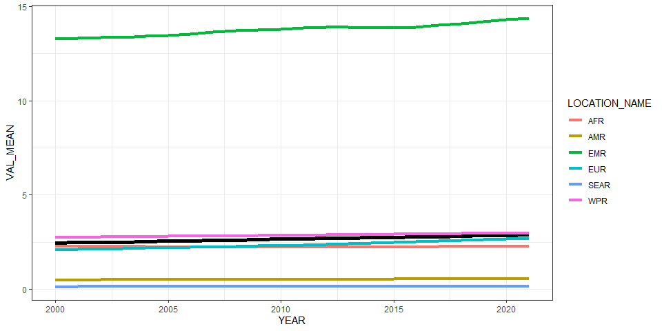<!-- -->

``` r
ggplot(all_reg_rt, aes(x = YEAR, y = VAL_MEAN, group = LOCATION_NAME)) +
  geom_line(data = all_glb_rt, linewidth = 2) +
  geom_line(aes(col = LOCATION_NAME), linewidth = 1.5) +
  geom_line(data = all_sub_rt, aes(col = REG2)) +
  theme_bw()
```

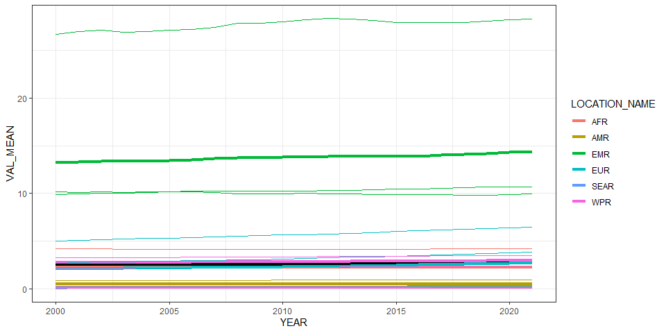<!-- -->

``` r
ggplot(subset(all_reg_rt, LOCATION_NAME == "EMR"), aes(x = YEAR, y = VAL_MEAN, group = LOCATION_NAME)) +
  geom_line(data = all_glb_rt, linewidth = 2) +
  geom_line(aes(col = LOCATION_NAME), linewidth = 1.5) +
  geom_line(data = subset(all_sub_rt, REG2 == "EMR"), aes(col = LOCATION_NAME)) +
  theme_bw()
```

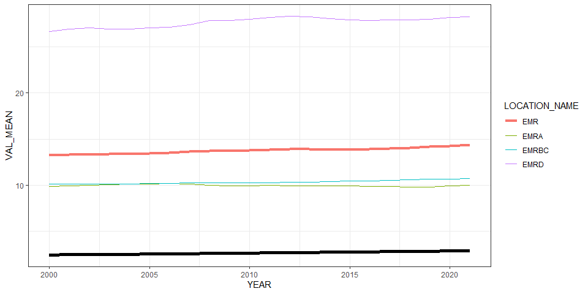<!-- -->

# Summarize predictions

## Global

``` r
kable(
  caption = "Global number of brucella cases, 2010 vs 2020",
  row.names = FALSE,
  subset(all_glb_nr, YEAR %in% c(2010, 2020))[, 1:4])
```

| YEAR | VAL_MEAN |   VAL_LWR |  VAL_UPR |
|-----:|---------:|----------:|---------:|
| 2010 | 184085.5 |  92422.15 | 402669.5 |
| 2020 | 223976.6 | 109287.44 | 498721.4 |

Global number of brucella cases, 2010 vs 2020

## Regions

``` r
kbl(subset(all_reg_rt, YEAR == 2020)[,c(6,2:4)],
    align = c("l", "c", "c", "c"), row.names = FALSE,
    col.names = c("Region", "Mean", "Lower", "Upper"),
    caption="  Incidence of brucella in 2020 by WHO region") %>%
  kable_styling("striped", "hover")
```

<table class="table table-striped" style="margin-left: auto; margin-right: auto;">
<caption>
Incidence of brucella in 2020 by WHO region
</caption>
<thead>
<tr>
<th style="text-align:left;">
Region
</th>
<th style="text-align:center;">
Mean
</th>
<th style="text-align:center;">
Lower
</th>
<th style="text-align:center;">
Upper
</th>
</tr>
</thead>
<tbody>
<tr>
<td style="text-align:left;">
AFR
</td>
<td style="text-align:center;">
2.2625985
</td>
<td style="text-align:center;">
0.5587847
</td>
<td style="text-align:center;">
6.8540610
</td>
</tr>
<tr>
<td style="text-align:left;">
AMR
</td>
<td style="text-align:center;">
0.5499259
</td>
<td style="text-align:center;">
0.1205814
</td>
<td style="text-align:center;">
1.9993851
</td>
</tr>
<tr>
<td style="text-align:left;">
EMR
</td>
<td style="text-align:center;">
14.2813289
</td>
<td style="text-align:center;">
4.5358735
</td>
<td style="text-align:center;">
45.7280138
</td>
</tr>
<tr>
<td style="text-align:left;">
EUR
</td>
<td style="text-align:center;">
2.6679286
</td>
<td style="text-align:center;">
0.6464490
</td>
<td style="text-align:center;">
10.0561621
</td>
</tr>
<tr>
<td style="text-align:left;">
SEAR
</td>
<td style="text-align:center;">
0.1378669
</td>
<td style="text-align:center;">
0.0053098
</td>
<td style="text-align:center;">
0.7570825
</td>
</tr>
<tr>
<td style="text-align:left;">
WPR
</td>
<td style="text-align:center;">
2.9757781
</td>
<td style="text-align:center;">
0.9556758
</td>
<td style="text-align:center;">
7.3724575
</td>
</tr>
</tbody>
</table>

``` r
kbl(subset(all_reg_nr, YEAR == 2020)[,c(6,2:4)],
    align = c("l", "c", "c", "c"), row.names = FALSE,
    col.names = c("Region", "Mean", "Lower", "Upper"),
    caption="  Cases of brucella in 2020 by WHO region ") %>%
  kable_styling("striped", "hover")
```

<table class="table table-striped" style="margin-left: auto; margin-right: auto;">
<caption>
Cases of brucella in 2020 by WHO region
</caption>
<thead>
<tr>
<th style="text-align:left;">
Region
</th>
<th style="text-align:center;">
Mean
</th>
<th style="text-align:center;">
Lower
</th>
<th style="text-align:center;">
Upper
</th>
</tr>
</thead>
<tbody>
<tr>
<td style="text-align:left;">
AFR
</td>
<td style="text-align:center;">
25685.128
</td>
<td style="text-align:center;">
6343.3509
</td>
<td style="text-align:center;">
77807.63
</td>
</tr>
<tr>
<td style="text-align:left;">
AMR
</td>
<td style="text-align:center;">
5591.885
</td>
<td style="text-align:center;">
1226.1241
</td>
<td style="text-align:center;">
20330.62
</td>
</tr>
<tr>
<td style="text-align:left;">
EMR
</td>
<td style="text-align:center;">
107690.028
</td>
<td style="text-align:center;">
34203.2838
</td>
<td style="text-align:center;">
344817.43
</td>
</tr>
<tr>
<td style="text-align:left;">
EUR
</td>
<td style="text-align:center;">
24975.986
</td>
<td style="text-align:center;">
6051.7746
</td>
<td style="text-align:center;">
94141.41
</td>
</tr>
<tr>
<td style="text-align:left;">
SEAR
</td>
<td style="text-align:center;">
2811.935
</td>
<td style="text-align:center;">
108.2992
</td>
<td style="text-align:center;">
15441.46
</td>
</tr>
<tr>
<td style="text-align:left;">
WPR
</td>
<td style="text-align:center;">
57221.603
</td>
<td style="text-align:center;">
18376.8072
</td>
<td style="text-align:center;">
141765.89
</td>
</tr>
</tbody>
</table>

``` r
ggplot(subset(all_reg_rt, YEAR == 2010),
       aes(y = VAL_MEAN, x = LOCATION_NAME)) +
  geom_pointrange(aes(ymin = VAL_LWR, ymax = VAL_UPR), size = 0.2) +
  coord_flip() +
  theme_bw() +
  scale_x_discrete(NULL, limits = rev(unique(all_reg_nr$LOCATION_NAME))) +
  scale_y_continuous(NULL) +
  ggtitle("Incidence of brucella by WHO Region, 2010")
```

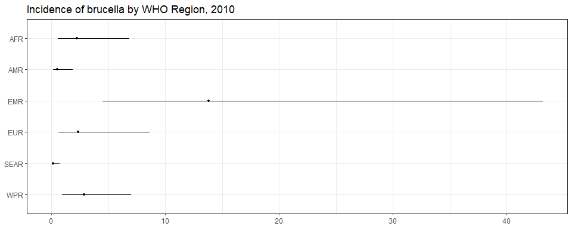<!-- -->

``` r
ggplot(subset(all_reg_rt, YEAR == 2020),
       aes(y = VAL_MEAN, x = LOCATION_NAME)) +
  geom_pointrange(aes(ymin = VAL_LWR, ymax = VAL_UPR), size = 0.2) +
  coord_flip() +
  theme_bw() +
  scale_x_discrete(NULL, limits = rev(unique(all_reg_nr$LOCATION_NAME))) +
  scale_y_continuous(NULL) +
  ggtitle("Incidence of brucella by WHO Region, 2020")
```

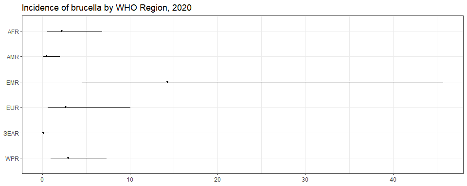<!-- -->

``` r
ggplot(subset(all_reg_nr, YEAR == 2010),
       aes(y = VAL_MEAN, x = LOCATION_NAME)) +
  geom_pointrange(aes(ymin = VAL_LWR, ymax = VAL_UPR), size = 0.2) +
  coord_flip() +
  theme_bw() +
  scale_x_discrete(NULL, limits = rev(unique(all_reg_nr$LOCATION_NAME))) +
  scale_y_continuous(NULL) +
  ggtitle("Number of brucella cases by WHO Region, 2010")
```

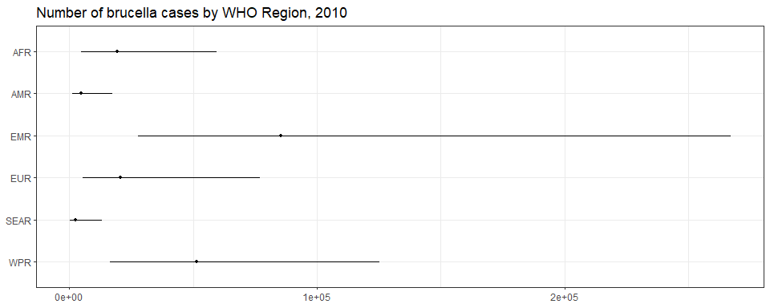<!-- -->

``` r
ggplot(subset(all_reg_nr, YEAR == 2020),
       aes(y = VAL_MEAN, x = LOCATION_NAME)) +
  geom_pointrange(aes(ymin = VAL_LWR, ymax = VAL_UPR), size = 0.2) +
  coord_flip() +
  theme_bw() +
  scale_x_discrete(NULL, limits = rev(unique(all_reg_nr$LOCATION_NAME))) +
  scale_y_continuous(NULL) +
  ggtitle("Number of brucella cases by WHO Region, 2020")
```

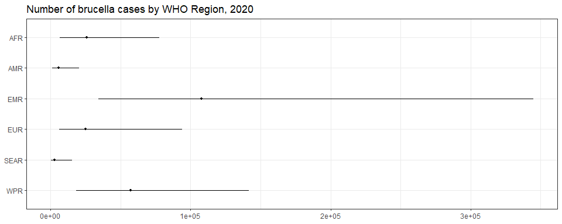<!-- -->

``` r
sim_all_reg <-
  merge(sim_all_reg,
        with(sim_all, aggregate(POP ~ REG2 + YEAR, FUN = sum)))
sim_all_reg_long <-
  pivot_longer(sim_all_reg, cols = starts_with("V"))
sim_all_reg_long$CASES <- sim_all_reg_long$value

ggplot(subset(sim_all_reg_long, YEAR == 2010), aes(x = CASES)) +
  geom_density() +
  facet_wrap(~REG2) +
  theme_bw() +
  scale_x_log10() +
  ggtitle("Number of brucella cases by WHO Region, 2010")
```

<!-- -->

``` r
ggplot(subset(sim_all_reg_long, YEAR == 2020), aes(x = CASES)) +
  geom_density() +
  facet_wrap(~REG2) +
  theme_bw() +
  scale_x_log10() +
  ggtitle("Number of brucella cases by WHO Region, 2020")
```

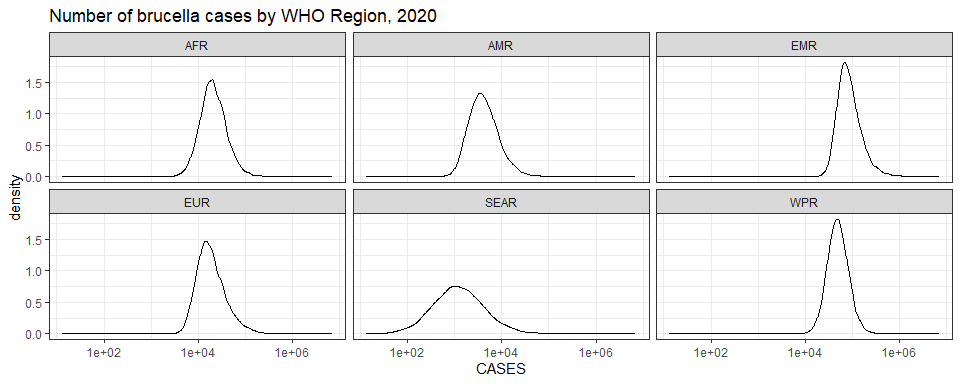<!-- -->

## Subregions

``` r
ggplot(subset(all_sub_rt, YEAR == 2010),
       aes(y = VAL_MEAN, x = LOCATION_NAME)) +
  geom_pointrange(aes(ymin = VAL_LWR, ymax = VAL_UPR), size = 0.2) +
  coord_flip() +
  theme_bw() +
  scale_x_discrete(NULL, limits = rev(unique(all_sub_nr$LOCATION_NAME))) +
  scale_y_continuous(NULL) +
  ggtitle("Incidence of brucella by WHO Subregion, 2010")
```

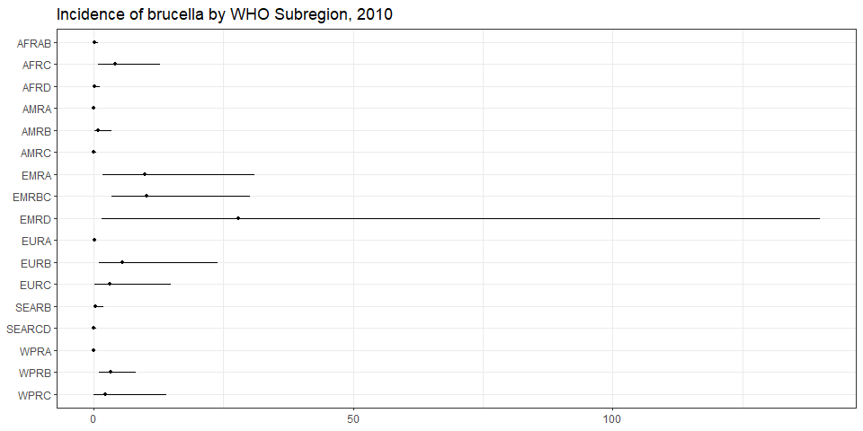<!-- -->

``` r
ggplot(subset(all_sub_rt, YEAR == 2020),
       aes(y = VAL_MEAN, x = LOCATION_NAME)) +
  geom_pointrange(aes(ymin = VAL_LWR, ymax = VAL_UPR), size = 0.2) +
  coord_flip() +
  theme_bw() +
  scale_x_discrete(NULL, limits = rev(unique(all_sub_nr$LOCATION_NAME))) +
  scale_y_continuous(NULL) +
  ggtitle("Incidence of brucella by WHO Subregion, 2020: v11.5")
```

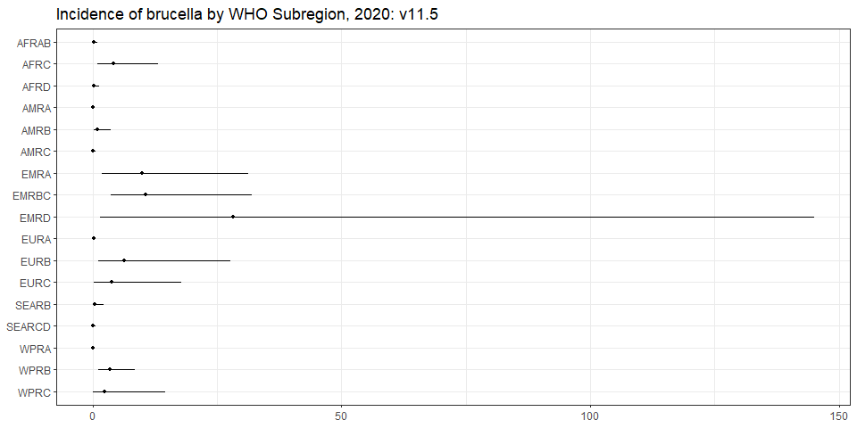<!-- -->

``` r
ggplot(subset(all_sub_nr, YEAR == 2010),
       aes(y = VAL_MEAN, x = LOCATION_NAME)) +
  geom_pointrange(aes(ymin = VAL_LWR, ymax = VAL_UPR), size = 0.2) +
  coord_flip() +
  theme_bw() +
  scale_x_discrete(NULL, limits = rev(unique(all_sub_nr$LOCATION_NAME))) +
  scale_y_continuous(NULL) +
  ggtitle("Number of brucella cases by WHO Subregion, 2010")
```

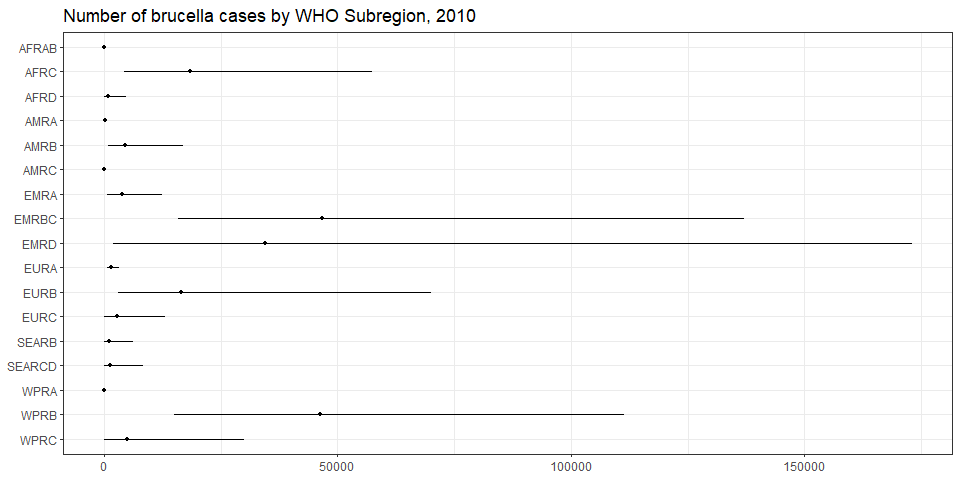<!-- -->

``` r
ggplot(subset(all_sub_nr, YEAR == 2020),
       aes(y = VAL_MEAN, x = LOCATION_NAME)) +
  geom_pointrange(aes(ymin = VAL_LWR, ymax = VAL_UPR), size = 0.2) +
  coord_flip() +
  theme_bw() +
  scale_x_discrete(NULL, limits = rev(unique(all_sub_nr$LOCATION_NAME))) +
  scale_y_continuous(NULL) +
  ggtitle("Number of brucella cases by WHO Subregion, 2020: v11.5")
```

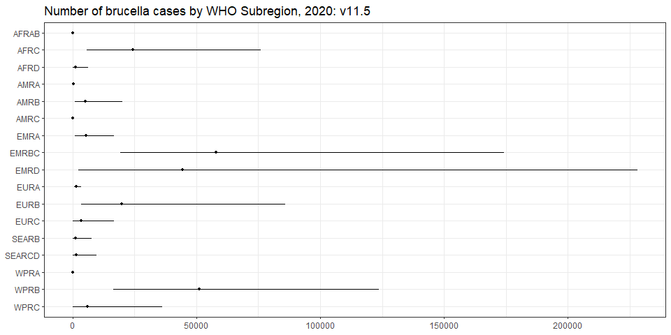<!-- -->

``` r
sim_all_sub <-
  merge(sim_all_sub,
        with(sim_all, aggregate(POP ~ SUB2 + YEAR, FUN = sum)))
sim_all_sub_long <-
  pivot_longer(sim_all_sub, cols = starts_with("V"))
sim_all_sub_long$CASES <- sim_all_sub_long$value

ggplot(subset(sim_all_sub_long, YEAR == 2010), aes(x = CASES)) +
  geom_density() +
  facet_wrap(~SUB2) +
  theme_bw() +
  scale_x_log10() +
  ggtitle("Number of brucella cases by WHO Subregion, 2010")
```

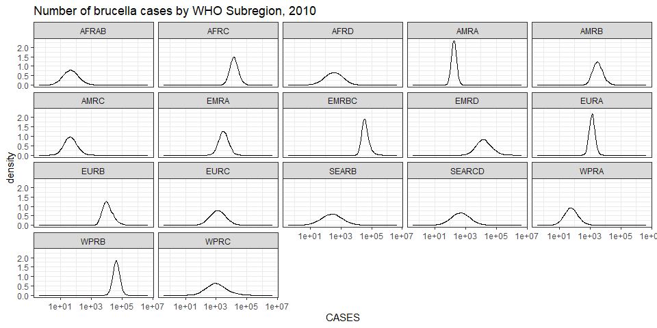<!-- -->

``` r
ggplot(subset(sim_all_sub_long, YEAR == 2020), aes(x = CASES)) +
  geom_density() +
  facet_wrap(~SUB2) +
  theme_bw() +
  scale_x_log10() +
  ggtitle("Number of brucella cases by WHO Subregion, 2020")
```

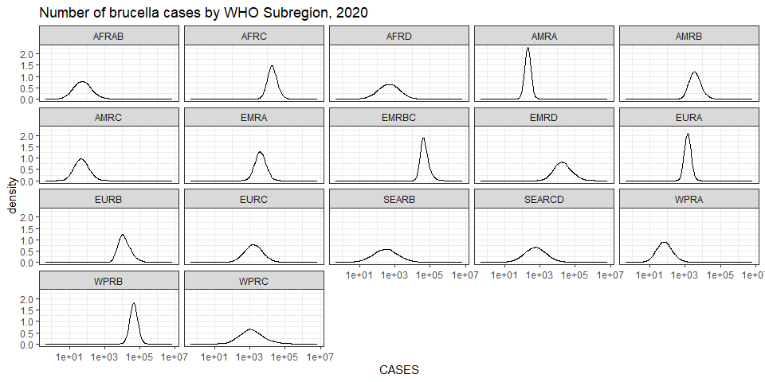<!-- -->

## Countries

``` r
# plot_world(
#   subset(all_cnt_rt, YEAR == 2010),
#   "LOCATION_NAME", "VAL_MEAN", legend.title = "Incidence per 100k", diseasefree = zero_cases)
plot_world(
  subset(all_cnt_rt, YEAR == 2010),
  "LOCATION_NAME", "VAL_MEAN", legend.title = "Incidence per 100k")
```

    ## [1]   0  20  40  60  80 100

``` r
title("brucella incidence, 2010", line = 1)
```

<!-- -->

``` r
# plot_world(
#   subset(all_cnt_rt, YEAR == 2020),
#   "LOCATION_NAME", "VAL_MEAN", legend.title = "Incidence per 100k", diseasefree = zero_cases)
plot_world(
  subset(all_cnt_rt, YEAR == 2020),
  "LOCATION_NAME", "VAL_MEAN", legend.title = "Incidence per 100k")
```

    ## [1]   0  20  40  60  80 100

``` r
title("brucella incidence, 2020", line = 1)
```

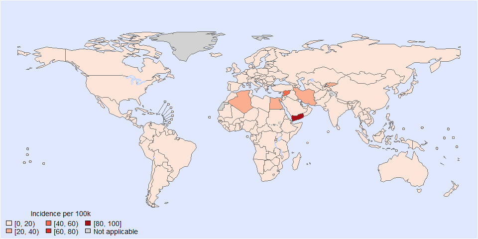<!-- -->

``` r
tab <-
  data.frame(subset(all_cnt_rt, YEAR == 2010)[,
                                              c("LOCATION_NAME", "VAL_MEAN", "VAL_LWR", "VAL_UPR")],
             subset(all_cnt_rt, YEAR == 2020)[,
                                              c("VAL_MEAN", "VAL_LWR", "VAL_UPR")])
tab$LOCATION_NAME <-
  FERG2:::countries$COUNTRY[match(tab$LOCATION_NAME, FERG2:::countries$ISO3)]
tab$LOCATION_NAME <- gsub(" \\(.*", "", tab$LOCATION_NAME)
names(tab) <-
  c("Country",
    "2010.mean", "2010.lwr", "2010.upr",
    "2020.mean", "2020.lwr", "2020.upr")

kable(tab, digits = 3, row.names = FALSE,
      caption = "Estimated brucella incidence by country, 2010 vs 2020")
```

| Country                          | 2010.mean | 2010.lwr | 2010.upr | 2020.mean | 2020.lwr | 2020.upr |
|:---------------------------------|----------:|---------:|---------:|----------:|---------:|---------:|
| Afghanistan                      |     2.364 |    0.039 |   14.113 |     2.470 |    0.041 |   14.910 |
| Angola                           |     2.334 |    0.124 |   11.961 |     2.439 |    0.126 |   12.427 |
| Albania                          |    16.097 |    0.725 |   81.900 |    16.881 |    0.771 |   86.157 |
| Andorra                          |     0.752 |    0.003 |    5.111 |     0.786 |    0.003 |    5.410 |
| United Arab Emirates             |     2.150 |    0.115 |   10.583 |     2.238 |    0.122 |   11.109 |
| Argentina                        |     0.987 |    0.019 |    5.881 |     1.029 |    0.019 |    6.280 |
| Armenia                          |    14.067 |    0.270 |   84.791 |    14.659 |    0.287 |   87.576 |
| Antigua and Barbuda              |     0.123 |    0.007 |    0.569 |     0.128 |    0.008 |    0.597 |
| Australia                        |     0.253 |    0.005 |    1.505 |     0.266 |    0.006 |    1.568 |
| Austria                          |     0.049 |    0.003 |    0.234 |     0.051 |    0.003 |    0.243 |
| Azerbaijan                       |     5.625 |    0.525 |   23.152 |     5.909 |    0.545 |   24.691 |
| Burundi                          |     0.224 |    0.003 |    1.328 |     0.233 |    0.003 |    1.401 |
| Belgium                          |     0.024 |    0.001 |    0.115 |     0.025 |    0.001 |    0.120 |
| Benin                            |     2.334 |    0.124 |   11.961 |     2.439 |    0.126 |   12.427 |
| Burkina Faso                     |     0.224 |    0.003 |    1.328 |     0.233 |    0.003 |    1.401 |
| Bangladesh                       |     0.311 |    0.003 |    1.887 |     0.325 |    0.003 |    2.025 |
| Bulgaria                         |     0.041 |    0.004 |    0.166 |     0.043 |    0.004 |    0.175 |
| Bahrain                          |     0.000 |    0.000 |    0.000 |     0.000 |    0.000 |    0.000 |
| Bahamas                          |     0.123 |    0.007 |    0.569 |     0.128 |    0.008 |    0.597 |
| Bosnia and Herzegovina           |     4.643 |    0.276 |   22.452 |     4.852 |    0.285 |   23.521 |
| Belarus                          |     0.681 |    0.003 |    4.955 |     0.715 |    0.003 |    5.233 |
| Belize                           |     1.857 |    0.008 |   12.766 |     1.924 |    0.008 |   13.359 |
| Bolivia                          |     0.071 |    0.001 |    0.464 |     0.074 |    0.001 |    0.481 |
| Brazil                           |     0.189 |    0.003 |    1.122 |     0.198 |    0.003 |    1.165 |
| Barbados                         |     0.123 |    0.007 |    0.569 |     0.128 |    0.008 |    0.597 |
| Brunei Darussalam                |     0.000 |    0.000 |    0.000 |     0.000 |    0.000 |    0.000 |
| Bhutan                           |     1.190 |    0.004 |    8.241 |     1.250 |    0.004 |    8.525 |
| Botswana                         |     1.474 |    0.018 |    9.376 |     1.560 |    0.018 |    9.930 |
| Central African Republic         |     0.224 |    0.003 |    1.328 |     0.233 |    0.003 |    1.401 |
| Canada                           |     0.060 |    0.004 |    0.282 |     0.063 |    0.004 |    0.295 |
| Switzerland                      |     0.000 |    0.000 |    0.000 |     0.000 |    0.000 |    0.000 |
| Chile                            |     0.073 |    0.004 |    0.348 |     0.076 |    0.004 |    0.371 |
| China                            |     3.434 |    1.104 |    8.264 |     3.585 |    1.150 |    8.682 |
| Côte d’Ivoire                    |     2.334 |    0.124 |   11.961 |     2.439 |    0.126 |   12.427 |
| Cameroon                         |     2.334 |    0.124 |   11.961 |     2.439 |    0.126 |   12.427 |
| Congo                            |     0.224 |    0.003 |    1.328 |     0.233 |    0.003 |    1.401 |
| Congo                            |     2.334 |    0.124 |   11.961 |     2.439 |    0.126 |   12.427 |
| Cook Islands                     |     0.062 |    0.003 |    0.305 |     0.065 |    0.003 |    0.316 |
| Colombia                         |     0.160 |    0.002 |    1.088 |     0.168 |    0.002 |    1.153 |
| Comoros                          |     2.334 |    0.124 |   11.961 |     2.439 |    0.126 |   12.427 |
| Cabo Verde                       |     2.219 |    0.027 |   13.263 |     2.320 |    0.029 |   13.823 |
| Costa Rica                       |     1.093 |    0.021 |    6.910 |     1.143 |    0.022 |    7.115 |
| Cuba                             |     0.575 |    0.011 |    3.388 |     0.599 |    0.011 |    3.498 |
| Cyprus                           |     0.000 |    0.000 |    0.000 |     0.000 |    0.000 |    0.000 |
| Czechia                          |     0.000 |    0.000 |    0.000 |     0.000 |    0.000 |    0.000 |
| Germany                          |     0.047 |    0.005 |    0.189 |     0.049 |    0.005 |    0.194 |
| Djibouti                         |     2.198 |    0.213 |    8.785 |     2.298 |    0.216 |    9.178 |
| Dominica                         |     0.214 |    0.031 |    0.765 |     0.223 |    0.033 |    0.814 |
| Denmark                          |     0.000 |    0.000 |    0.000 |     0.000 |    0.000 |    0.000 |
| Dominican Republic               |     0.308 |    0.004 |    1.916 |     0.321 |    0.004 |    1.994 |
| Algeria                          |    26.561 |    5.507 |   78.333 |    27.670 |    5.859 |   82.115 |
| Ecuador                          |     0.248 |    0.005 |    1.509 |     0.259 |    0.005 |    1.574 |
| Egypt                            |    21.774 |    0.819 |  114.793 |    22.746 |    0.839 |  118.523 |
| Eritrea                          |     5.075 |    0.063 |   32.433 |     5.297 |    0.066 |   33.859 |
| Spain                            |     0.232 |    0.025 |    0.924 |     0.243 |    0.025 |    0.979 |
| Estonia                          |     0.000 |    0.000 |    0.000 |     0.000 |    0.000 |    0.000 |
| Ethiopia                         |     0.224 |    0.003 |    1.328 |     0.233 |    0.003 |    1.401 |
| Finland                          |     0.001 |    0.000 |    0.007 |     0.001 |    0.000 |    0.007 |
| Fiji                             |     0.831 |    0.016 |    4.975 |     0.868 |    0.017 |    5.109 |
| France                           |     0.026 |    0.003 |    0.106 |     0.027 |    0.003 |    0.111 |
| Micronesia                       |     2.193 |    0.015 |   13.792 |     2.291 |    0.015 |   14.417 |
| Gabon                            |     0.423 |    0.011 |    2.390 |     0.441 |    0.012 |    2.489 |
| United Kingdom                   |     0.000 |    0.000 |    0.000 |     0.000 |    0.000 |    0.000 |
| Georgia                          |     6.878 |    0.136 |   40.013 |     7.171 |    0.143 |   42.286 |
| Ghana                            |     2.334 |    0.124 |   11.961 |     2.439 |    0.126 |   12.427 |
| Guinea                           |     2.334 |    0.124 |   11.961 |     2.439 |    0.126 |   12.427 |
| Gambia                           |     0.224 |    0.003 |    1.328 |     0.233 |    0.003 |    1.401 |
| Guinea-Bissau                    |     0.224 |    0.003 |    1.328 |     0.233 |    0.003 |    1.401 |
| Equatorial Guinea                |     0.423 |    0.011 |    2.390 |     0.441 |    0.012 |    2.489 |
| Greece                           |     5.974 |    1.289 |   17.420 |     6.257 |    1.317 |   18.379 |
| Grenada                          |     0.214 |    0.031 |    0.765 |     0.223 |    0.033 |    0.814 |
| Guatemala                        |     0.152 |    0.002 |    0.942 |     0.159 |    0.002 |    0.993 |
| Guyana                           |     0.123 |    0.007 |    0.569 |     0.128 |    0.008 |    0.597 |
| Honduras                         |     0.128 |    0.002 |    0.792 |     0.134 |    0.002 |    0.825 |
| Croatia                          |     0.005 |    0.001 |    0.019 |     0.006 |    0.001 |    0.020 |
| Haiti                            |     0.128 |    0.005 |    0.659 |     0.134 |    0.005 |    0.686 |
| Hungary                          |     0.000 |    0.000 |    0.000 |     0.000 |    0.000 |    0.000 |
| Indonesia                        |     0.403 |    0.002 |    2.533 |     0.418 |    0.002 |    2.736 |
| India                            |     0.044 |    0.000 |    0.297 |     0.046 |    0.000 |    0.302 |
| Ireland                          |     0.000 |    0.000 |    0.000 |     0.000 |    0.000 |    0.000 |
| Iran                             |    25.321 |    8.899 |   57.148 |    26.425 |    9.288 |   59.423 |
| Iraq                             |     4.591 |    0.501 |   18.363 |     4.791 |    0.510 |   18.992 |
| Iceland                          |     0.000 |    0.000 |    0.000 |     0.000 |    0.000 |    0.000 |
| Israel                           |     2.036 |    0.162 |    8.699 |     2.130 |    0.168 |    9.182 |
| Italy                            |     0.772 |    0.123 |    2.623 |     0.810 |    0.125 |    2.811 |
| Jamaica                          |     0.214 |    0.031 |    0.765 |     0.223 |    0.033 |    0.814 |
| Jordan                           |     9.538 |    0.595 |   45.944 |    10.013 |    0.613 |   47.655 |
| Japan                            |     0.015 |    0.000 |    0.090 |     0.015 |    0.000 |    0.094 |
| Kazakhstan                       |     6.405 |    0.306 |   32.460 |     6.701 |    0.319 |   33.683 |
| Kenya                            |     0.000 |    0.000 |    0.000 |     0.000 |    0.000 |    0.000 |
| Kyrgyzstan                       |    27.887 |    0.504 |  163.719 |    29.046 |    0.525 |  165.644 |
| Cambodia                         |     2.193 |    0.015 |   13.792 |     2.291 |    0.015 |   14.417 |
| Kiribati                         |     2.193 |    0.015 |   13.792 |     2.291 |    0.015 |   14.417 |
| Saint Kitts and Nevis            |     0.123 |    0.007 |    0.569 |     0.128 |    0.008 |    0.597 |
| Korea                            |     0.070 |    0.001 |    0.439 |     0.073 |    0.001 |    0.464 |
| Kuwait                           |     9.578 |    0.190 |   58.231 |    10.003 |    0.197 |   60.874 |
| Lao People’s Dem. Republic       |     2.193 |    0.015 |   13.792 |     2.291 |    0.015 |   14.417 |
| Lebanon                          |    10.774 |    0.203 |   60.592 |    11.339 |    0.207 |   64.300 |
| Liberia                          |     0.224 |    0.003 |    1.328 |     0.233 |    0.003 |    1.401 |
| Libya                            |     0.850 |    0.008 |    5.591 |     0.889 |    0.008 |    5.885 |
| Saint Lucia                      |     0.000 |    0.000 |    0.000 |     0.000 |    0.000 |    0.000 |
| Sri Lanka                        |     0.311 |    0.003 |    1.887 |     0.325 |    0.003 |    2.025 |
| Lesotho                          |     2.334 |    0.124 |   11.961 |     2.439 |    0.126 |   12.427 |
| Lithuania                        |     0.000 |    0.000 |    0.000 |     0.000 |    0.000 |    0.000 |
| Luxembourg                       |     0.002 |    0.000 |    0.010 |     0.002 |    0.000 |    0.010 |
| Latvia                           |     0.000 |    0.000 |    0.000 |     0.000 |    0.000 |    0.000 |
| Morocco                          |     0.086 |    0.005 |    0.395 |     0.089 |    0.005 |    0.416 |
| Monaco                           |     0.009 |    0.003 |    0.021 |     0.009 |    0.003 |    0.022 |
| Republic of Moldova              |     0.000 |    0.000 |    0.000 |     0.000 |    0.000 |    0.000 |
| Madagascar                       |     0.000 |    0.000 |    0.000 |     0.000 |    0.000 |    0.000 |
| Maldives                         |     0.000 |    0.000 |    0.000 |     0.000 |    0.000 |    0.000 |
| Mexico                           |     2.618 |    0.162 |   12.575 |     2.744 |    0.163 |   13.431 |
| Marshall Islands                 |     0.831 |    0.016 |    4.975 |     0.868 |    0.017 |    5.109 |
| North Macedonia                  |    13.873 |    1.409 |   56.146 |    14.562 |    1.434 |   59.464 |
| Mali                             |     0.224 |    0.003 |    1.328 |     0.233 |    0.003 |    1.401 |
| Malta                            |     0.000 |    0.000 |    0.000 |     0.000 |    0.000 |    0.000 |
| Myanmar                          |     0.311 |    0.003 |    1.887 |     0.325 |    0.003 |    2.025 |
| Montenegro                       |     1.217 |    0.022 |    7.709 |     1.268 |    0.022 |    8.064 |
| Mongolia                         |     9.104 |    0.139 |   55.001 |     9.468 |    0.146 |   56.714 |
| Mozambique                       |     0.002 |    0.000 |    0.010 |     0.002 |    0.000 |    0.011 |
| Mauritania                       |     2.334 |    0.124 |   11.961 |     2.439 |    0.126 |   12.427 |
| Mauritius                        |     0.423 |    0.011 |    2.390 |     0.441 |    0.012 |    2.489 |
| Malawi                           |     0.224 |    0.003 |    1.328 |     0.233 |    0.003 |    1.401 |
| Malaysia                         |     0.234 |    0.004 |    1.484 |     0.244 |    0.004 |    1.537 |
| Namibia                          |     0.000 |    0.000 |    0.000 |     0.000 |    0.000 |    0.000 |
| Niger                            |     0.224 |    0.003 |    1.328 |     0.233 |    0.003 |    1.401 |
| Nigeria                          |     2.334 |    0.124 |   11.961 |     2.439 |    0.126 |   12.427 |
| Nicaragua                        |     0.128 |    0.002 |    0.834 |     0.134 |    0.002 |    0.874 |
| Niue                             |     0.062 |    0.003 |    0.305 |     0.065 |    0.003 |    0.316 |
| Netherlands                      |     0.032 |    0.002 |    0.151 |     0.033 |    0.002 |    0.159 |
| Norway                           |     0.000 |    0.000 |    0.000 |     0.000 |    0.000 |    0.000 |
| Nepal                            |     0.311 |    0.003 |    1.887 |     0.325 |    0.003 |    2.025 |
| Nauru                            |     0.062 |    0.003 |    0.305 |     0.065 |    0.003 |    0.316 |
| New Zealand                      |     0.001 |    0.000 |    0.005 |     0.002 |    0.000 |    0.006 |
| Oman                             |     0.000 |    0.000 |    0.000 |     0.000 |    0.000 |    0.000 |
| Pakistan                         |     2.198 |    0.213 |    8.785 |     2.298 |    0.216 |    9.178 |
| Panama                           |     0.199 |    0.003 |    1.190 |     0.208 |    0.003 |    1.233 |
| Peru                             |     1.683 |    0.029 |   10.076 |     1.756 |    0.031 |   10.434 |
| Philippines                      |     2.193 |    0.015 |   13.792 |     2.291 |    0.015 |   14.417 |
| Palau                            |     0.000 |    0.000 |    0.000 |     0.000 |    0.000 |    0.000 |
| Papua New Guinea                 |     2.193 |    0.015 |   13.792 |     2.291 |    0.015 |   14.417 |
| Poland                           |     0.000 |    0.000 |    0.000 |     0.000 |    0.000 |    0.000 |
| Korea                            |     0.311 |    0.003 |    1.887 |     0.325 |    0.003 |    2.025 |
| Portugal                         |     0.386 |    0.025 |    1.760 |     0.402 |    0.026 |    1.855 |
| Paraguay                         |     0.346 |    0.005 |    2.107 |     0.362 |    0.005 |    2.222 |
| Qatar                            |     0.000 |    0.000 |    0.000 |     0.000 |    0.000 |    0.000 |
| Romania                          |     0.004 |    0.000 |    0.018 |     0.004 |    0.000 |    0.019 |
| Russian Federation               |     0.431 |    0.041 |    1.834 |     0.451 |    0.043 |    1.898 |
| Rwanda                           |     0.224 |    0.003 |    1.328 |     0.233 |    0.003 |    1.401 |
| Saudi Arabia                     |    14.416 |    2.130 |   48.169 |    15.071 |    2.187 |   50.459 |
| Sudan                            |     3.236 |    0.036 |   21.912 |     3.384 |    0.037 |   23.494 |
| Senegal                          |     2.334 |    0.124 |   11.961 |     2.439 |    0.126 |   12.427 |
| Singapore                        |     0.000 |    0.000 |    0.000 |     0.000 |    0.000 |    0.000 |
| Solomon Islands                  |     2.193 |    0.015 |   13.792 |     2.291 |    0.015 |   14.417 |
| Sierra Leone                     |     0.224 |    0.003 |    1.328 |     0.233 |    0.003 |    1.401 |
| El Salvador                      |     0.150 |    0.002 |    0.943 |     0.156 |    0.003 |    0.993 |
| San Marino                       |     0.009 |    0.003 |    0.021 |     0.009 |    0.003 |    0.022 |
| Somalia                          |     3.850 |    0.136 |   21.573 |     4.028 |    0.140 |   22.584 |
| Serbia                           |     0.433 |    0.008 |    2.655 |     0.453 |    0.008 |    2.735 |
| South Sudan                      |     0.224 |    0.003 |    1.328 |     0.233 |    0.003 |    1.401 |
| Sao Tome and Principe            |     2.334 |    0.124 |   11.961 |     2.439 |    0.126 |   12.427 |
| Suriname                         |     0.214 |    0.031 |    0.765 |     0.223 |    0.033 |    0.814 |
| Slovakia                         |     0.011 |    0.001 |    0.052 |     0.011 |    0.001 |    0.055 |
| Slovenia                         |     0.000 |    0.000 |    0.000 |     0.000 |    0.000 |    0.000 |
| Sweden                           |     0.000 |    0.000 |    0.000 |     0.000 |    0.000 |    0.000 |
| Eswatini                         |     0.846 |    0.008 |    5.203 |     0.882 |    0.008 |    5.366 |
| Seychelles                       |     0.423 |    0.011 |    2.390 |     0.441 |    0.012 |    2.489 |
| Syrian Arab Republic             |    46.757 |    0.789 |  292.350 |    48.695 |    0.826 |  300.111 |
| Chad                             |     0.224 |    0.003 |    1.328 |     0.233 |    0.003 |    1.401 |
| Togo                             |     0.224 |    0.003 |    1.328 |     0.233 |    0.003 |    1.401 |
| Thailand                         |     0.069 |    0.001 |    0.424 |     0.072 |    0.001 |    0.447 |
| Tajikistan                       |    16.395 |    0.259 |   96.568 |    17.141 |    0.266 |  100.243 |
| Turkmenistan                     |    15.656 |    0.076 |  109.843 |    16.321 |    0.080 |  114.272 |
| Timor-Leste                      |     0.311 |    0.003 |    1.887 |     0.325 |    0.003 |    2.025 |
| Tonga                            |     0.831 |    0.016 |    4.975 |     0.868 |    0.017 |    5.109 |
| Trinidad and Tobago              |     0.123 |    0.007 |    0.569 |     0.128 |    0.008 |    0.597 |
| Tunisia                          |     8.712 |    0.155 |   52.341 |     9.114 |    0.162 |   54.752 |
| Turkiye                          |    16.071 |    0.659 |   86.693 |    16.824 |    0.681 |   90.827 |
| Tuvalu                           |     0.831 |    0.016 |    4.975 |     0.868 |    0.017 |    5.109 |
| United Republic of Tanzania      |     3.224 |    0.074 |   18.773 |     3.375 |    0.076 |   19.667 |
| Uganda                           |     0.224 |    0.003 |    1.328 |     0.233 |    0.003 |    1.401 |
| Ukraine                          |     0.000 |    0.000 |    0.000 |     0.000 |    0.000 |    0.000 |
| Uruguay                          |     0.147 |    0.003 |    0.916 |     0.153 |    0.003 |    0.963 |
| United States of America         |     0.048 |    0.019 |    0.099 |     0.050 |    0.019 |    0.106 |
| Uzbekistan                       |     0.000 |    0.000 |    0.000 |     0.000 |    0.000 |    0.000 |
| Saint Vincent and the Grenadines |     0.000 |    0.000 |    0.000 |     0.000 |    0.000 |    0.000 |
| Venezuela                        |     0.125 |    0.002 |    0.745 |     0.131 |    0.002 |    0.779 |
| Viet Nam                         |     2.193 |    0.015 |   13.792 |     2.291 |    0.015 |   14.417 |
| Vanuatu                          |     2.193 |    0.015 |   13.792 |     2.291 |    0.015 |   14.417 |
| Samoa                            |     2.193 |    0.015 |   13.792 |     2.291 |    0.015 |   14.417 |
| Yemen                            |    83.297 |    0.894 |  515.989 |    87.131 |    0.924 |  542.721 |
| South Africa                     |     0.095 |    0.001 |    0.599 |     0.098 |    0.001 |    0.630 |
| Zambia                           |     2.334 |    0.124 |   11.961 |     2.439 |    0.126 |   12.427 |
| Zimbabwe                         |     2.334 |    0.124 |   11.961 |     2.439 |    0.126 |   12.427 |

Estimated brucella incidence by country, 2010 vs 2020

``` r
tab2 <-
  data.frame(subset(all_cnt_nr, YEAR == 2010)[,
                                              c("LOCATION_NAME", "VAL_MEAN", "VAL_LWR", "VAL_UPR")],
             subset(all_cnt_nr, YEAR == 2020)[,
                                              c("VAL_MEAN", "VAL_LWR", "VAL_UPR")])
tab2$LOCATION_NAME <-
  FERG2:::countries$COUNTRY[match(tab2$LOCATION_NAME, FERG2:::countries$ISO3)]
tab2$LOCATION_NAME <- gsub(" \\(.*", "", tab2$LOCATION_NAME)
names(tab2) <-
  c("Country",
    "2010.mean", "2010.lwr", "2010.upr",
    "2020.mean", "2020.lwr", "2020.upr")

kable(tab2, digits = 1, row.names = FALSE,
      caption = "Estimated brucella cases by country, 2010 vs 2020")
```

| Country                          | 2010.mean | 2010.lwr | 2010.upr | 2020.mean | 2020.lwr | 2020.upr |
|:---------------------------------|----------:|---------:|---------:|----------:|---------:|---------:|
| Afghanistan                      |     659.5 |     11.0 |   3937.1 |     949.3 |     15.6 |   5730.1 |
| Angola                           |     533.1 |     28.4 |   2732.2 |     802.9 |     41.4 |   4090.9 |
| Albania                          |     474.1 |     21.4 |   2412.3 |     485.9 |     22.2 |   2479.8 |
| Andorra                          |       0.6 |      0.0 |      4.3 |       0.6 |      0.0 |      4.2 |
| United Arab Emirates             |     146.7 |      7.8 |    722.0 |     209.5 |     11.4 |   1039.6 |
| Argentina                        |     405.3 |      7.7 |   2415.2 |     464.5 |      8.8 |   2833.2 |
| Armenia                          |     413.3 |      7.9 |   2491.4 |     425.2 |      8.3 |   2540.1 |
| Antigua and Barbuda              |       0.1 |      0.0 |      0.5 |       0.1 |      0.0 |      0.5 |
| Australia                        |      55.7 |      1.2 |    330.8 |      68.1 |      1.4 |    402.2 |
| Austria                          |       4.1 |      0.2 |     19.5 |       4.5 |      0.3 |     21.7 |
| Azerbaijan                       |     511.5 |     47.7 |   2105.4 |     600.0 |     55.3 |   2507.1 |
| Burundi                          |      20.6 |      0.2 |    122.2 |      29.0 |      0.4 |    174.2 |
| Belgium                          |       2.6 |      0.2 |     12.5 |       2.8 |      0.2 |     13.9 |
| Benin                            |     225.2 |     12.0 |   1154.5 |     314.6 |     16.2 |   1602.8 |
| Burkina Faso                     |      35.7 |      0.4 |    211.7 |      49.4 |      0.6 |    297.2 |
| Bangladesh                       |     472.0 |      4.9 |   2859.5 |     538.0 |      5.5 |   3354.1 |
| Bulgaria                         |       3.1 |      0.3 |     12.4 |       3.0 |      0.3 |     12.2 |
| Bahrain                          |       0.0 |      0.0 |      0.0 |       0.0 |      0.0 |      0.0 |
| Bahamas                          |       0.4 |      0.0 |      2.1 |       0.5 |      0.0 |      2.4 |
| Bosnia and Herzegovina           |     178.6 |     10.6 |    863.5 |     161.3 |      9.5 |    781.9 |
| Belarus                          |      64.7 |      0.3 |    470.7 |      67.2 |      0.3 |    491.9 |
| Belize                           |       5.9 |      0.0 |     40.4 |       7.5 |      0.0 |     51.9 |
| Bolivia                          |       7.2 |      0.1 |     46.8 |       8.7 |      0.1 |     56.6 |
| Brazil                           |     365.1 |      6.4 |   2164.1 |     411.8 |      7.2 |   2424.4 |
| Barbados                         |       0.3 |      0.0 |      1.6 |       0.4 |      0.0 |      1.7 |
| Brunei Darussalam                |       0.0 |      0.0 |      0.0 |       0.0 |      0.0 |      0.0 |
| Bhutan                           |       8.3 |      0.0 |     57.5 |       9.6 |      0.0 |     65.4 |
| Botswana                         |      29.6 |      0.4 |    188.6 |      36.6 |      0.4 |    233.2 |
| Central African Republic         |      10.0 |      0.1 |     59.1 |      11.6 |      0.1 |     69.5 |
| Canada                           |      20.5 |      1.3 |     95.9 |      24.0 |      1.5 |    112.0 |
| Switzerland                      |       0.0 |      0.0 |      0.0 |       0.0 |      0.0 |      0.0 |
| Chile                            |      12.5 |      0.7 |     59.5 |      14.8 |      0.9 |     71.8 |
| China                            |   46257.4 |  14876.1 | 111322.7 |   51102.6 |  16393.3 | 123750.6 |
| Côte d’Ivoire                    |     519.0 |     27.6 |   2660.3 |     696.5 |     35.9 |   3548.8 |
| Cameroon                         |     452.5 |     24.1 |   2319.0 |     630.6 |     32.5 |   3213.2 |
| Congo                            |     151.1 |      1.8 |    895.7 |     219.9 |      2.7 |   1322.3 |
| Congo                            |     102.4 |      5.5 |    524.8 |     138.6 |      7.1 |    706.2 |
| Cook Islands                     |       0.0 |      0.0 |      0.1 |       0.0 |      0.0 |      0.1 |
| Colombia                         |      71.5 |      0.7 |    484.7 |      84.3 |      0.8 |    580.5 |
| Comoros                          |      15.1 |      0.8 |     77.5 |      19.4 |      1.0 |     98.7 |
| Cabo Verde                       |      11.3 |      0.1 |     67.4 |      11.9 |      0.1 |     71.1 |
| Costa Rica                       |      49.5 |      1.0 |    313.0 |      57.4 |      1.1 |    357.1 |
| Cuba                             |      64.9 |      1.2 |    382.7 |      67.0 |      1.3 |    391.3 |
| Cyprus                           |       0.0 |      0.0 |      0.0 |       0.0 |      0.0 |      0.0 |
| Czechia                          |       0.0 |      0.0 |      0.0 |       0.0 |      0.0 |      0.0 |
| Germany                          |      37.6 |      3.8 |    152.5 |      40.7 |      4.1 |    162.2 |
| Djibouti                         |      20.2 |      2.0 |     80.9 |      25.2 |      2.4 |    100.7 |
| Dominica                         |       0.1 |      0.0 |      0.5 |       0.2 |      0.0 |      0.6 |
| Denmark                          |       0.0 |      0.0 |      0.0 |       0.0 |      0.0 |      0.0 |
| Dominican Republic               |      30.0 |      0.4 |    187.0 |      35.2 |      0.4 |    218.3 |
| Algeria                          |    9518.0 |   1973.4 |  28069.8 |   12087.7 |   2559.4 |  35872.4 |
| Ecuador                          |      37.1 |      0.7 |    225.6 |      45.3 |      0.9 |    275.0 |
| Egypt                            |   19234.7 |    723.7 | 101405.6 |   24670.1 |    910.4 | 128549.8 |
| Eritrea                          |     147.9 |      1.8 |    945.0 |     172.8 |      2.2 |   1104.5 |
| Spain                            |     108.5 |     11.5 |    432.2 |     115.9 |     12.1 |    466.2 |
| Estonia                          |       0.0 |      0.0 |      0.0 |       0.0 |      0.0 |      0.0 |
| Ethiopia                         |     199.9 |      2.4 |   1185.1 |     273.2 |      3.4 |   1642.8 |
| Finland                          |       0.1 |      0.0 |      0.4 |       0.1 |      0.0 |      0.4 |
| Fiji                             |       7.6 |      0.1 |     45.2 |       7.9 |      0.2 |     46.7 |
| France                           |      16.6 |      1.7 |     66.8 |      18.0 |      1.8 |     72.8 |
| Micronesia                       |       2.4 |      0.0 |     14.8 |       2.5 |      0.0 |     15.9 |
| Gabon                            |       7.1 |      0.2 |     40.4 |      10.1 |      0.3 |     57.1 |
| United Kingdom                   |       0.0 |      0.0 |      0.1 |       0.0 |      0.0 |      0.1 |
| Georgia                          |     268.9 |      5.3 |   1564.1 |     272.3 |      5.4 |   1605.5 |
| Ghana                            |     587.4 |     31.3 |   3010.7 |     769.9 |     39.7 |   3923.0 |
| Guinea                           |     239.6 |     12.8 |   1228.1 |     322.0 |     16.6 |   1640.6 |
| Gambia                           |       4.3 |      0.1 |     25.2 |       5.8 |      0.1 |     34.8 |
| Guinea-Bissau                    |       3.5 |      0.0 |     20.5 |       4.6 |      0.1 |     27.9 |
| Equatorial Guinea                |       4.9 |      0.1 |     27.8 |       7.5 |      0.2 |     42.2 |
| Greece                           |     664.4 |    143.3 |   1937.4 |     670.5 |    141.2 |   1969.4 |
| Grenada                          |       0.2 |      0.0 |      0.9 |       0.3 |      0.0 |      0.9 |
| Guatemala                        |      21.8 |      0.3 |    135.2 |      27.5 |      0.4 |    171.1 |
| Guyana                           |       0.9 |      0.1 |      4.3 |       1.0 |      0.1 |      4.8 |
| Honduras                         |      10.6 |      0.2 |     65.5 |      13.4 |      0.2 |     82.7 |
| Croatia                          |       0.2 |      0.0 |      0.8 |       0.2 |      0.0 |      0.8 |
| Haiti                            |      12.5 |      0.5 |     64.4 |      14.9 |      0.5 |     76.6 |
| Hungary                          |       0.0 |      0.0 |      0.0 |       0.0 |      0.0 |      0.0 |
| Indonesia                        |     985.9 |      5.9 |   6200.3 |    1143.0 |      6.8 |   7489.6 |
| India                            |     542.7 |      3.3 |   3671.0 |     643.1 |      4.0 |   4217.6 |
| Ireland                          |       0.0 |      0.0 |      0.0 |       0.0 |      0.0 |      0.0 |
| Iran                             |   19481.5 |   6846.3 |  43967.8 |   23117.4 |   8125.0 |  51984.6 |
| Iraq                             |    1402.3 |    152.9 |   5609.1 |    1995.2 |    212.5 |   7908.7 |
| Iceland                          |       0.0 |      0.0 |      0.0 |       0.0 |      0.0 |      0.0 |
| Israel                           |     148.0 |     11.8 |    632.3 |     186.0 |     14.6 |    801.6 |
| Italy                            |     463.7 |     73.9 |   1574.6 |     486.3 |     75.3 |   1688.0 |
| Jamaica                          |       5.9 |      0.9 |     21.0 |       6.3 |      0.9 |     23.0 |
| Jordan                           |     687.3 |     42.8 |   3310.6 |    1077.6 |     65.9 |   5129.0 |
| Japan                            |      18.7 |      0.3 |    115.8 |      19.3 |      0.3 |    119.0 |
| Kazakhstan                       |    1071.2 |     51.2 |   5428.9 |    1296.6 |     61.8 |   6517.8 |
| Kenya                            |       0.0 |      0.0 |      0.1 |       0.0 |      0.0 |      0.1 |
| Kyrgyzstan                       |    1517.1 |     27.4 |   8906.8 |    1911.9 |     34.6 |  10903.4 |
| Cambodia                         |     315.5 |      2.1 |   1984.6 |     380.0 |      2.5 |   2391.9 |
| Kiribati                         |       2.4 |      0.0 |     14.8 |       2.9 |      0.0 |     18.0 |
| Saint Kitts and Nevis            |       0.1 |      0.0 |      0.3 |       0.1 |      0.0 |      0.3 |
| Korea                            |      34.1 |      0.6 |    213.6 |      37.9 |      0.7 |    240.7 |
| Kuwait                           |     274.7 |      5.4 |   1669.9 |     446.6 |      8.8 |   2717.7 |
| Lao People’s Dem. Republic       |     137.9 |      0.9 |    867.2 |     167.0 |      1.1 |   1051.3 |
| Lebanon                          |     541.4 |     10.2 |   3045.0 |     645.9 |     11.8 |   3662.7 |
| Liberia                          |       9.0 |      0.1 |     53.1 |      11.9 |      0.1 |     71.3 |
| Libya                            |      54.7 |      0.5 |    359.6 |      62.2 |      0.6 |    411.9 |
| Saint Lucia                      |       0.0 |      0.0 |      0.0 |       0.0 |      0.0 |      0.0 |
| Sri Lanka                        |      64.8 |      0.7 |    392.8 |      73.0 |      0.7 |    455.4 |
| Lesotho                          |      46.4 |      2.5 |    237.8 |      54.2 |      2.8 |    276.1 |
| Lithuania                        |       0.0 |      0.0 |      0.0 |       0.0 |      0.0 |      0.0 |
| Luxembourg                       |       0.0 |      0.0 |      0.0 |       0.0 |      0.0 |      0.1 |
| Latvia                           |       0.0 |      0.0 |      0.0 |       0.0 |      0.0 |      0.0 |
| Morocco                          |      27.6 |      1.7 |    127.3 |      32.5 |      2.0 |    151.4 |
| Monaco                           |       0.0 |      0.0 |      0.0 |       0.0 |      0.0 |      0.0 |
| Republic of Moldova              |       0.0 |      0.0 |      0.0 |       0.0 |      0.0 |      0.0 |
| Madagascar                       |       0.0 |      0.0 |      0.0 |       0.0 |      0.0 |      0.1 |
| Maldives                         |       0.0 |      0.0 |      0.0 |       0.0 |      0.0 |      0.0 |
| Mexico                           |    2953.9 |    182.4 |  14186.8 |    3467.0 |    206.4 |  16971.0 |
| Marshall Islands                 |       0.4 |      0.0 |      2.6 |       0.4 |      0.0 |      2.2 |
| North Macedonia                  |     285.3 |     29.0 |   1154.5 |     274.7 |     27.0 |   1121.6 |
| Mali                             |      35.1 |      0.4 |    208.3 |      49.8 |      0.6 |    299.4 |
| Malta                            |       0.0 |      0.0 |      0.0 |       0.0 |      0.0 |      0.0 |
| Myanmar                          |     152.1 |      1.6 |    921.4 |     171.6 |      1.7 |   1069.8 |
| Montenegro                       |       7.7 |      0.1 |     48.7 |       7.7 |      0.1 |     49.2 |
| Mongolia                         |     244.2 |      3.7 |   1475.1 |     309.1 |      4.8 |   1851.5 |
| Mozambique                       |       0.3 |      0.0 |      2.4 |       0.5 |      0.0 |      3.4 |
| Mauritania                       |      77.9 |      4.1 |    399.1 |     110.6 |      5.7 |    563.3 |
| Mauritius                        |       5.4 |      0.1 |     30.6 |       5.7 |      0.2 |     32.0 |
| Malawi                           |      32.7 |      0.4 |    194.0 |      44.9 |      0.6 |    270.0 |
| Malaysia                         |      66.4 |      1.1 |    421.5 |      82.2 |      1.3 |    517.8 |
| Namibia                          |       0.0 |      0.0 |      0.0 |       0.0 |      0.0 |      0.0 |
| Niger                            |      36.4 |      0.4 |    215.7 |      54.3 |      0.7 |    326.7 |
| Nigeria                          |    3834.4 |    204.1 |  19652.8 |    5164.2 |    266.4 |  26312.1 |
| Nicaragua                        |       7.3 |      0.1 |     47.5 |       8.8 |      0.1 |     57.0 |
| Niue                             |       0.0 |      0.0 |      0.0 |       0.0 |      0.0 |      0.0 |
| Netherlands                      |       5.4 |      0.3 |     25.3 |       5.9 |      0.4 |     27.9 |
| Norway                           |       0.0 |      0.0 |      0.0 |       0.0 |      0.0 |      0.0 |
| Nepal                            |      84.9 |      0.9 |    514.4 |      93.2 |      0.9 |    581.2 |
| Nauru                            |       0.0 |      0.0 |      0.0 |       0.0 |      0.0 |      0.0 |
| New Zealand                      |       0.1 |      0.0 |      0.2 |       0.1 |      0.0 |      0.3 |
| Oman                             |       0.0 |      0.0 |      0.0 |       0.0 |      0.0 |      0.0 |
| Pakistan                         |    4327.4 |    419.7 |  17295.8 |    5349.0 |    502.4 |  21363.0 |
| Panama                           |       7.2 |      0.1 |     42.8 |       8.9 |      0.1 |     52.6 |
| Peru                             |     487.8 |      8.5 |   2920.7 |     573.6 |     10.1 |   3407.7 |
| Philippines                      |    2090.2 |     14.0 |  13146.0 |    2553.5 |     16.9 |  16071.7 |
| Palau                            |       0.0 |      0.0 |      0.0 |       0.0 |      0.0 |      0.0 |
| Papua New Guinea                 |     164.9 |      1.1 |   1037.0 |     222.5 |      1.5 |   1400.7 |
| Poland                           |       0.0 |      0.0 |      0.1 |       0.0 |      0.0 |      0.1 |
| Korea                            |      77.7 |      0.8 |    470.4 |      84.7 |      0.9 |    528.3 |
| Portugal                         |      40.8 |      2.6 |    186.3 |      41.7 |      2.7 |    192.2 |
| Paraguay                         |      19.7 |      0.3 |    120.1 |      23.8 |      0.4 |    145.7 |
| Qatar                            |       0.0 |      0.0 |      0.0 |       0.0 |      0.0 |      0.0 |
| Romania                          |       0.8 |      0.1 |      3.7 |       0.8 |      0.1 |      3.7 |
| Russian Federation               |     620.5 |     59.0 |   2640.1 |     660.6 |     62.8 |   2782.0 |
| Rwanda                           |      22.8 |      0.3 |    135.3 |      30.1 |      0.4 |    181.0 |
| Saudi Arabia                     |    3558.5 |    525.7 |  11890.5 |    4643.3 |    673.7 |  15546.1 |
| Sudan                            |    1134.4 |     12.6 |   7680.3 |    1562.6 |     17.0 |  10848.4 |
| Senegal                          |     291.3 |     15.5 |   1493.2 |     404.2 |     20.8 |   2059.3 |
| Singapore                        |       0.0 |      0.0 |      0.0 |       0.0 |      0.0 |      0.0 |
| Solomon Islands                  |      11.5 |      0.1 |     72.2 |      16.8 |      0.1 |    106.0 |
| Sierra Leone                     |      13.8 |      0.2 |     81.5 |      18.2 |      0.2 |    109.5 |
| El Salvador                      |       9.1 |      0.1 |     57.1 |       9.7 |      0.2 |     61.8 |
| San Marino                       |       0.0 |      0.0 |      0.0 |       0.0 |      0.0 |      0.0 |
| Somalia                          |     466.3 |     16.4 |   2613.2 |     657.8 |     22.8 |   3688.4 |
| Serbia                           |      32.1 |      0.6 |    196.8 |      31.4 |      0.6 |    189.8 |
| South Sudan                      |      21.2 |      0.3 |    125.5 |      24.6 |      0.3 |    147.9 |
| Sao Tome and Principe            |       4.2 |      0.2 |     21.5 |       5.2 |      0.3 |     26.7 |
| Suriname                         |       1.2 |      0.2 |      4.2 |       1.4 |      0.2 |      5.0 |
| Slovakia                         |       0.6 |      0.0 |      2.8 |       0.6 |      0.0 |      3.0 |
| Slovenia                         |       0.0 |      0.0 |      0.0 |       0.0 |      0.0 |      0.0 |
| Sweden                           |       0.0 |      0.0 |      0.0 |       0.0 |      0.0 |      0.0 |
| Eswatini                         |       9.4 |      0.1 |     57.7 |      10.5 |      0.1 |     63.6 |
| Seychelles                       |       0.4 |      0.0 |      2.3 |       0.5 |      0.0 |      3.0 |
| Syrian Arab Republic             |   10394.1 |    175.3 |  64990.2 |   10104.6 |    171.5 |  62275.8 |
| Chad                             |      27.1 |      0.3 |    160.7 |      39.5 |      0.5 |    237.2 |
| Togo                             |      14.9 |      0.2 |     88.2 |      20.0 |      0.2 |    120.0 |
| Thailand                         |      46.8 |      0.8 |    289.7 |      51.4 |      0.9 |    320.0 |
| Tajikistan                       |    1240.8 |     19.6 |   7308.6 |    1652.6 |     25.6 |   9664.8 |
| Turkmenistan                     |     862.1 |      4.2 |   6048.4 |    1122.6 |      5.5 |   7859.6 |
| Timor-Leste                      |       3.3 |      0.0 |     20.2 |       4.3 |      0.0 |     26.6 |
| Tonga                            |       0.9 |      0.0 |      5.3 |       0.9 |      0.0 |      5.4 |
| Trinidad and Tobago              |       1.7 |      0.1 |      7.9 |       1.9 |      0.1 |      8.8 |
| Tunisia                          |     932.8 |     16.6 |   5604.0 |    1087.2 |     19.3 |   6531.3 |
| Turkiye                          |   11716.6 |    480.2 |  63205.7 |   14428.4 |    583.8 |  77892.2 |
| Tuvalu                           |       0.1 |      0.0 |      0.5 |       0.1 |      0.0 |      0.5 |
| United Republic of Tanzania      |    1422.8 |     32.8 |   8286.2 |    2026.9 |     45.9 |  11810.5 |
| Uganda                           |      71.5 |      0.9 |    423.8 |     101.9 |      1.3 |    612.5 |
| Ukraine                          |       0.0 |      0.0 |      0.1 |       0.0 |      0.0 |      0.1 |
| Uruguay                          |       4.9 |      0.1 |     30.4 |       5.2 |      0.1 |     32.7 |
| United States of America         |     147.2 |     58.8 |    306.6 |     169.2 |     64.9 |    359.9 |
| Uzbekistan                       |       0.0 |      0.0 |      0.1 |       0.0 |      0.0 |      0.1 |
| Saint Vincent and the Grenadines |       0.0 |      0.0 |      0.0 |       0.0 |      0.0 |      0.0 |
| Venezuela                        |      35.8 |      0.6 |    213.4 |      37.4 |      0.7 |    222.7 |
| Viet Nam                         |    1906.8 |     12.8 |  11993.0 |    2236.1 |     14.8 |  14073.8 |
| Vanuatu                          |       5.2 |      0.0 |     32.5 |       6.8 |      0.0 |     42.6 |
| Samoa                            |       4.2 |      0.0 |     26.5 |       4.8 |      0.0 |     30.4 |
| Yemen                            |   21942.5 |    235.6 | 135925.2 |   31054.2 |    329.3 | 193429.4 |
| South Africa                     |      49.2 |      0.5 |    311.7 |      59.1 |      0.6 |    378.7 |
| Zambia                           |     320.4 |     17.1 |   1642.3 |     458.2 |     23.6 |   2334.6 |
| Zimbabwe                         |     309.1 |     16.5 |   1584.0 |     375.5 |     19.4 |   1913.0 |

Estimated brucella cases by country, 2010 vs 2020

# Session info

``` r
sessioninfo::session_info()
```

    ## Warning in system2("quarto", "-V", stdout = TRUE, env = paste0("TMPDIR=", : running command '"quarto" TMPDIR=C:/Users/LoVa3397/AppData/Local/Temp/RtmpyYnOin/file38c81e2f3b20
    ## -V' had status 1

    ## ─ Session info ──────────────────────────────────────────────────────────────────────────────────────────────────────────────────────────────────────────────────────────────
    ##  setting  value
    ##  version  R version 4.5.0 (2025-04-11 ucrt)
    ##  os       Windows 10 x64 (build 19045)
    ##  system   x86_64, mingw32
    ##  ui       RStudio
    ##  language (EN)
    ##  collate  English_Belgium.utf8
    ##  ctype    English_Belgium.utf8
    ##  tz       Europe/Brussels
    ##  date     2025-10-13
    ##  rstudio  2024.04.2+764 Chocolate Cosmos (desktop)
    ##  pandoc   3.1.11 @ C:/Program Files/RStudio/resources/app/bin/quarto/bin/tools/ (via rmarkdown)
    ##  quarto   ERROR: Unknown command "TMPDIR=C:/Users/LoVa3397/AppData/Local/Temp/RtmpyYnOin/file38c81e2f3b20". Did you mean command "install"? @ C:\\PROGRA~1\\RStudio\\RESOUR~1\\app\\bin\\quarto\\bin\\quarto.exe
    ## 
    ## ─ Packages ──────────────────────────────────────────────────────────────────────────────────────────────────────────────────────────────────────────────────────────────────
    ##  ! package        * version    date (UTC) lib source
    ##    abind            1.4-8      2024-09-12 [1] CRAN (R 4.5.0)
    ##    backports        1.5.0      2024-05-23 [1] CRAN (R 4.5.0)
    ##    base64enc        0.1-3      2015-07-28 [1] CRAN (R 4.5.0)
    ##    bayesplot        1.12.0     2025-04-10 [1] CRAN (R 4.5.0)
    ##    bd             * 0.0.14     2025-04-26 [1] Github (brechtdv/bd@652191c)
    ##    boot             1.3-31     2024-08-28 [1] CRAN (R 4.5.0)
    ##    bridgesampling   1.1-2      2021-04-16 [1] CRAN (R 4.5.0)
    ##    brms           * 2.22.0     2024-09-23 [1] CRAN (R 4.5.0)
    ##    Brobdingnag      1.2-9      2022-10-19 [1] CRAN (R 4.5.0)
    ##    callr            3.7.6      2024-03-25 [1] CRAN (R 4.5.0)
    ##    cellranger       1.1.0      2016-07-27 [1] CRAN (R 4.5.0)
    ##    checkmate        2.3.2      2024-07-29 [1] CRAN (R 4.5.0)
    ##    class            7.3-23     2025-01-01 [1] CRAN (R 4.5.0)
    ##    classInt         0.4-11     2025-01-08 [1] CRAN (R 4.5.0)
    ##    cli              3.6.4      2025-02-13 [1] CRAN (R 4.5.0)
    ##    cluster          2.1.8.1    2025-03-12 [1] CRAN (R 4.5.0)
    ##    coda             0.19-4.1   2024-01-31 [1] CRAN (R 4.5.0)
    ##    codetools        0.2-20     2024-03-31 [1] CRAN (R 4.5.0)
    ##    colorspace       2.1-1      2024-07-26 [1] CRAN (R 4.5.0)
    ##    curl             6.2.2      2025-03-24 [1] CRAN (R 4.5.0)
    ##    data.table       1.17.0     2025-02-22 [1] CRAN (R 4.5.0)
    ##    DBI              1.2.3      2024-06-02 [1] CRAN (R 4.5.0)
    ##    DescTools      * 0.99.60    2025-03-28 [1] CRAN (R 4.5.0)
    ##    digest           0.6.37     2024-08-19 [1] CRAN (R 4.5.0)
    ##    distributional   0.5.0      2024-09-17 [1] CRAN (R 4.5.0)
    ##    dplyr          * 1.1.4      2023-11-17 [1] CRAN (R 4.5.0)
    ##    e1071            1.7-16     2024-09-16 [1] CRAN (R 4.5.0)
    ##    evaluate         1.0.3      2025-01-10 [1] CRAN (R 4.5.0)
    ##    Exact            3.3        2024-07-21 [1] CRAN (R 4.5.0)
    ##    expm             1.0-0      2024-08-19 [1] CRAN (R 4.5.0)
    ##    farver           2.1.2      2024-05-13 [1] CRAN (R 4.5.0)
    ##    fastmap          1.2.0      2024-05-15 [1] CRAN (R 4.5.0)
    ##    FERG2          * 0.0.5      2025-07-28 [1] Github (brechtdv/FERG2@c2d4ac1)
    ##    forcats          1.0.0      2023-01-29 [1] CRAN (R 4.5.0)
    ##    foreign          0.8-90     2025-03-31 [1] CRAN (R 4.5.0)
    ##    Formula          1.2-5      2023-02-24 [1] CRAN (R 4.5.0)
    ##    fs               1.6.6      2025-04-12 [1] CRAN (R 4.5.0)
    ##    generics         0.1.3      2022-07-05 [1] CRAN (R 4.5.0)
    ##    ggplot2        * 3.5.2      2025-04-09 [1] CRAN (R 4.5.0)
    ##    gld              2.6.7      2025-01-17 [1] CRAN (R 4.5.0)
    ##    glue             1.8.0      2024-09-30 [1] CRAN (R 4.5.0)
    ##    gridExtra        2.3        2017-09-09 [1] CRAN (R 4.5.0)
    ##    gtable           0.3.6      2024-10-25 [1] CRAN (R 4.5.0)
    ##    haven            2.5.4      2023-11-30 [1] CRAN (R 4.5.0)
    ##    Hmisc          * 5.2-3      2025-03-16 [1] CRAN (R 4.5.0)
    ##    hms              1.1.3      2023-03-21 [1] CRAN (R 4.5.0)
    ##    htmlTable        2.4.3      2024-07-21 [1] CRAN (R 4.5.0)
    ##    htmltools        0.5.8.1    2024-04-04 [1] CRAN (R 4.5.0)
    ##    htmlwidgets      1.6.4      2023-12-06 [1] CRAN (R 4.5.0)
    ##    httr             1.4.7      2023-08-15 [1] CRAN (R 4.5.0)
    ##    inline           0.3.21     2025-01-09 [1] CRAN (R 4.5.0)
    ##    jsonlite         2.0.0      2025-03-27 [1] CRAN (R 4.5.0)
    ##    kableExtra     * 1.4.0      2024-01-24 [1] CRAN (R 4.5.0)
    ##    KernSmooth       2.23-26    2025-01-01 [1] CRAN (R 4.5.0)
    ##    knitr          * 1.50       2025-03-16 [1] CRAN (R 4.5.0)
    ##    labeling         0.4.3      2023-08-29 [1] CRAN (R 4.5.0)
    ##    lattice          0.22-6     2024-03-20 [1] CRAN (R 4.5.0)
    ##    lifecycle        1.0.4      2023-11-07 [1] CRAN (R 4.5.0)
    ##    lmom             3.2        2024-09-30 [1] CRAN (R 4.5.0)
    ##    loo              2.8.0      2024-07-03 [1] CRAN (R 4.5.0)
    ##    magrittr         2.0.3      2022-03-30 [1] CRAN (R 4.5.0)
    ##    MASS             7.3-65     2025-02-28 [1] CRAN (R 4.5.0)
    ##    mathjaxr         1.6-0      2022-02-28 [1] CRAN (R 4.5.0)
    ##    Matrix         * 1.7-3      2025-03-11 [1] CRAN (R 4.5.0)
    ##    MatrixModels     0.5-4      2025-03-26 [1] CRAN (R 4.5.0)
    ##    matrixStats      1.5.0      2025-01-07 [1] CRAN (R 4.5.0)
    ##    metadat        * 1.4-0      2025-02-04 [1] CRAN (R 4.5.0)
    ##    metafor        * 4.8-0      2025-01-28 [1] CRAN (R 4.5.0)
    ##    multcomp         1.4-28     2025-01-29 [1] CRAN (R 4.5.0)
    ##    munsell          0.5.1      2024-04-01 [1] CRAN (R 4.5.0)
    ##    mvtnorm          1.3-3      2025-01-10 [1] CRAN (R 4.5.0)
    ##    nlme             3.1-168    2025-03-31 [1] CRAN (R 4.5.0)
    ##    nnet             7.3-20     2025-01-01 [1] CRAN (R 4.5.0)
    ##    numDeriv       * 2016.8-1.1 2019-06-06 [1] CRAN (R 4.5.0)
    ##    pillar           1.10.2     2025-04-05 [1] CRAN (R 4.5.0)
    ##    pkgbuild         1.4.7      2025-03-24 [1] CRAN (R 4.5.0)
    ##    pkgconfig        2.0.3      2019-09-22 [1] CRAN (R 4.5.0)
    ##    plyr             1.8.9      2023-10-02 [1] CRAN (R 4.5.0)
    ##    polspline        1.1.25     2024-05-10 [1] CRAN (R 4.5.0)
    ##    posterior        1.6.1      2025-02-27 [1] CRAN (R 4.5.0)
    ##    processx         3.8.6      2025-02-21 [1] CRAN (R 4.5.0)
    ##    proxy            0.4-27     2022-06-09 [1] CRAN (R 4.5.0)
    ##    ps               1.9.1      2025-04-12 [1] CRAN (R 4.5.0)
    ##    purrr            1.1.0      2025-07-10 [1] CRAN (R 4.5.1)
    ##    quantreg         6.1        2025-03-10 [1] CRAN (R 4.5.0)
    ##    QuickJSR         1.7.0      2025-03-31 [1] CRAN (R 4.5.0)
    ##    R6               2.6.1      2025-02-15 [1] CRAN (R 4.5.0)
    ##    RColorBrewer     1.1-3      2022-04-03 [1] CRAN (R 4.5.0)
    ##    Rcpp           * 1.0.14     2025-01-12 [1] CRAN (R 4.5.0)
    ##  D RcppParallel     5.1.10     2025-01-24 [1] CRAN (R 4.5.0)
    ##    readr            2.1.5      2024-01-10 [1] CRAN (R 4.5.0)
    ##    readxl         * 1.4.5      2025-03-07 [1] CRAN (R 4.5.0)
    ##    reshape2         1.4.4      2020-04-09 [1] CRAN (R 4.5.0)
    ##    rlang            1.1.6      2025-04-11 [1] CRAN (R 4.5.0)
    ##    rmarkdown      * 2.29       2024-11-04 [1] CRAN (R 4.5.0)
    ##    rms            * 8.0-0      2025-04-04 [1] CRAN (R 4.5.0)
    ##    rootSolve        1.8.2.4    2023-09-21 [1] CRAN (R 4.5.0)
    ##    rpart            4.1.24     2025-01-07 [1] CRAN (R 4.5.0)
    ##    rstan            2.32.7     2025-03-10 [1] CRAN (R 4.5.0)
    ##    rstantools       2.4.0      2024-01-31 [1] CRAN (R 4.5.0)
    ##    rstudioapi       0.17.1     2024-10-22 [1] CRAN (R 4.5.0)
    ##    sandwich         3.1-1      2024-09-15 [1] CRAN (R 4.5.0)
    ##    scales         * 1.3.0      2023-11-28 [1] CRAN (R 4.5.0)
    ##    sessioninfo      1.2.3      2025-02-05 [1] CRAN (R 4.5.0)
    ##    sf             * 1.0-20     2025-03-24 [1] CRAN (R 4.5.0)
    ##    SparseM          1.84-2     2024-07-17 [1] CRAN (R 4.5.0)
    ##    StanHeaders      2.32.10    2024-07-15 [1] CRAN (R 4.5.0)
    ##    stringi          1.8.7      2025-03-27 [1] CRAN (R 4.5.0)
    ##    stringr        * 1.5.1      2023-11-14 [1] CRAN (R 4.5.0)
    ##    survival         3.8-3      2024-12-17 [1] CRAN (R 4.5.0)
    ##    svglite          2.1.3      2023-12-08 [1] CRAN (R 4.5.0)
    ##    systemfonts      1.2.2      2025-04-04 [1] CRAN (R 4.5.0)
    ##    tensorA          0.36.2.1   2023-12-13 [1] CRAN (R 4.5.0)
    ##    TH.data          1.1-3      2025-01-17 [1] CRAN (R 4.5.0)
    ##    tibble           3.2.1      2023-03-20 [1] CRAN (R 4.5.0)
    ##    tidyr          * 1.3.1      2024-01-24 [1] CRAN (R 4.5.0)
    ##    tidyselect       1.2.1      2024-03-11 [1] CRAN (R 4.5.0)
    ##    tzdb             0.5.0      2025-03-15 [1] CRAN (R 4.5.0)
    ##    units            0.8-7      2025-03-11 [1] CRAN (R 4.5.0)
    ##    utf8             1.2.4      2023-10-22 [1] CRAN (R 4.5.0)
    ##    V8               6.0.3      2025-03-26 [1] CRAN (R 4.5.0)
    ##    vctrs            0.6.5      2023-12-01 [1] CRAN (R 4.5.0)
    ##    viridisLite      0.4.2      2023-05-02 [1] CRAN (R 4.5.0)
    ##    withr            3.0.2      2024-10-28 [1] CRAN (R 4.5.0)
    ##    xfun             0.52       2025-04-02 [1] CRAN (R 4.5.0)
    ##    xml2             1.3.8      2025-03-14 [1] CRAN (R 4.5.0)
    ##    yaml             2.3.10     2024-07-26 [1] CRAN (R 4.5.0)
    ##    zoo              1.8-14     2025-04-10 [1] CRAN (R 4.5.0)
    ## 
    ##  [1] C:/Users/LoVa3397/AppData/Local/Programs/R/R-4.5.0/library
    ## 
    ##  * ── Packages attached to the search path.
    ##  D ── DLL MD5 mismatch, broken installation.
    ## 
    ## ─────────────────────────────────────────────────────────────────────────────────────────────────────────────────────────────────────────────────────────────────────────────

``` r
saveRDS(sim_all, paste0("sim_all_", Date, ".rds"))
saveRDS(all_est, paste0("all_est_", Date, ".rds"))

##bd::render_today("03-estimate_v1_bis.R")~15'

# Save dataset for report created for expert to receive feedback
# save(all_cnt_rt, file="./00-Report_FB/all_cnt_rt.Rdata")
# save(all_glb_nr, file="./00-Report_FB/all_glb_nr.Rdata")
# save(all_reg_nr, file="./00-Report_FB/all_reg_nr.Rdata")
# save(all_reg_rt, file="./00-Report_FB/all_reg_rt.Rdata")
# save(all_sub_nr, file="./00-Report_FB/all_sub_nr.Rdata")
# save(all_sub_rt, file="./00-Report_FB/all_sub_rt.Rdata")
```
