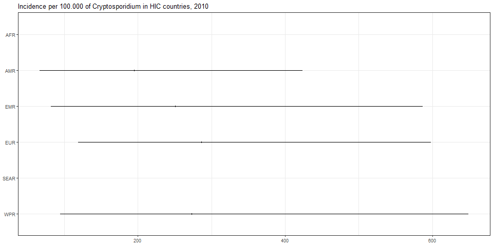
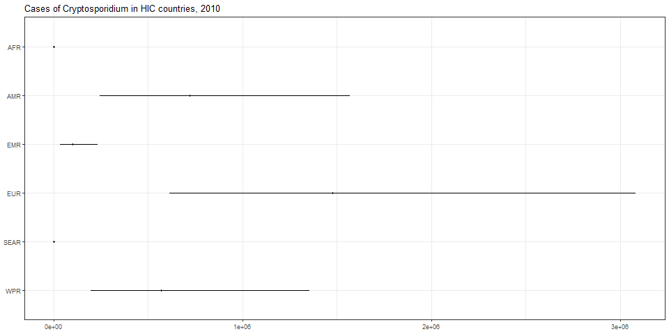
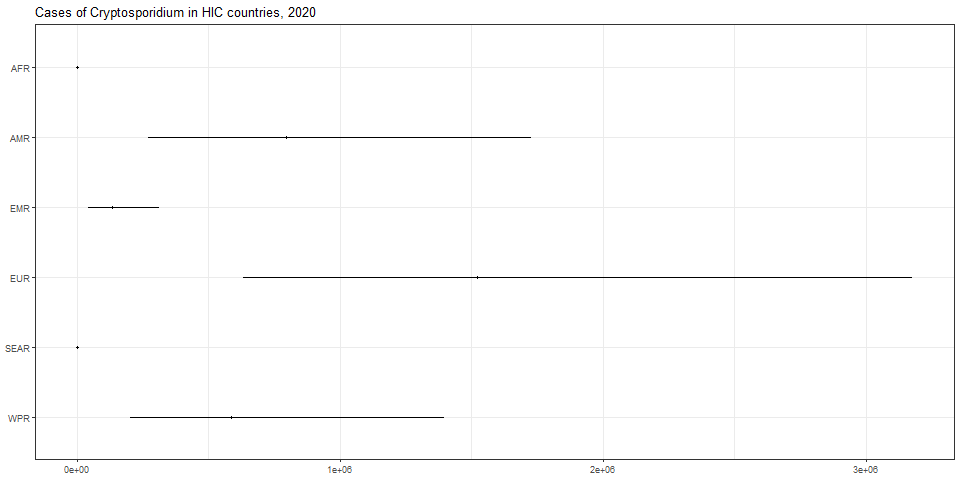
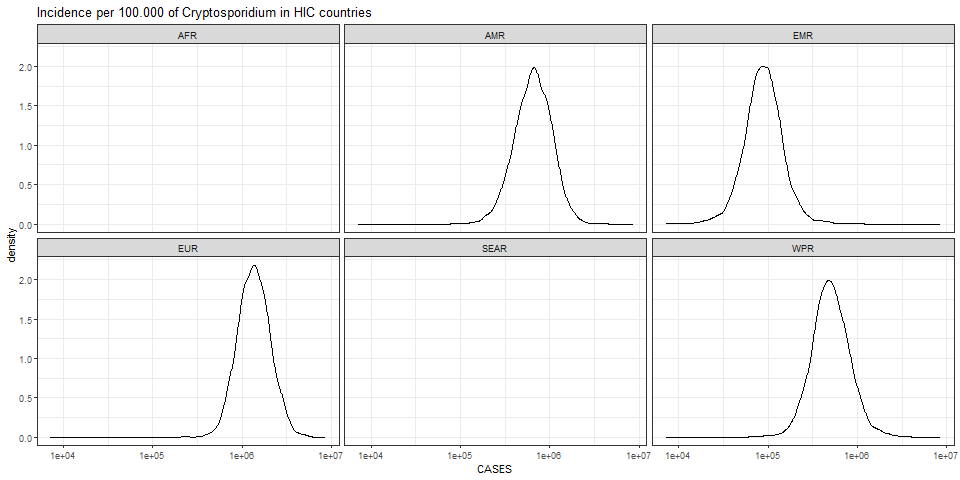

Global incidence of Cryptosporidium (Diarrheal) • Estimates
================
BrDe394
2025-05-18

- [Settings](#settings)
- [Model fit](#model-fit)
- [Predict all](#predict-all)
- [Summarize predictions:](#summarize-predictions)
  - [Global](#global)
  - [Regions](#regions)
- [Session info](#session-info)

# Settings

``` r
## required packages ----
library(bd)
library(brms)
library(FERG2)
library(ggplot2)
library(knitr)
library(rmarkdown)
library(sf)
library(tidyr)
library(dplyr)
library(DescTools)
library(readxl)
library(kableExtra)

## global options ----
knitr::opts_chunk$set(fig.width = 10)
do.call(file.remove, list(list.files(params$PlotDir, full.names = TRUE)))
```

    ## [1] TRUE TRUE TRUE TRUE TRUE TRUE

# Model fit

``` r
es <- readRDS(
  sort(dir(params$Dir, pattern = "es_hic_inc", full.names = TRUE), decreasing = TRUE)[1])
es <- subset(es, as.integer(FLAG) == 1)
fit_brms_reg_s <- readRDS(file.path(params$Dir, "fit_brms_inc_reg_ct.rds"))
summary(fit_brms_reg_s)
```

    ## Warning: There were 2 divergent transitions after warmup. Increasing adapt_delta above 0.99 may help. See
    ## http://mc-stan.org/misc/warnings.html#divergent-transitions-after-warmup

    ##  Family: gaussian 
    ##   Links: mu = identity; sigma = identity 
    ## Formula: yi | se(sei) ~ 1 + (1 | REG2) + (1 | REG2:ID) 
    ##    Data: subset(es, as.integer(FLAG) == 1) (Number of observations: 15) 
    ##   Draws: 5 chains, each with iter = 5000; warmup = 3000; thin = 1;
    ##          total post-warmup draws = 10000
    ## 
    ## Multilevel Hyperparameters:
    ## ~REG2 (Number of levels: 3) 
    ##               Estimate Est.Error l-95% CI u-95% CI Rhat Bulk_ESS Tail_ESS
    ## sd(Intercept)     0.56      0.43     0.02     1.63 1.00     3025     4435
    ## 
    ## ~REG2:ID (Number of levels: 13) 
    ##               Estimate Est.Error l-95% CI u-95% CI Rhat Bulk_ESS Tail_ESS
    ## sd(Intercept)     1.16      0.24     0.78     1.74 1.00     2909     4222
    ## 
    ## Regression Coefficients:
    ##           Estimate Est.Error l-95% CI u-95% CI Rhat Bulk_ESS Tail_ESS
    ## Intercept     5.40      0.50     4.41     6.37 1.00     3698     4622
    ## 
    ## Further Distributional Parameters:
    ##       Estimate Est.Error l-95% CI u-95% CI Rhat Bulk_ESS Tail_ESS
    ## sigma     0.00      0.00     0.00     0.00   NA       NA       NA
    ## 
    ## Draws were sampled using sampling(NUTS). For each parameter, Bulk_ESS
    ## and Tail_ESS are effective sample size measures, and Rhat is the potential
    ## scale reduction factor on split chains (at convergence, Rhat = 1).

``` r
zero_cases <-
  read_xlsx("endemic_countries.xlsx")%>%
  select(REG2, SUB2, ISO3, Country, edtf_diarrheal) %>% 
  rename(COUNTRY=ISO3, COUNTRY_LABEL = Country) %>%
  mutate(DISEASEFREE = edtf_diarrheal) %>%
  mutate(DISEASEFREE = case_when(
    DISEASEFREE == 0 ~ 1,
    DISEASEFREE == 1 ~ 0))
```

    ## New names:
    ## • `` -> `...32`

``` r
kable(
  caption = "Low income countries, estimates not made with this approach",
  row.names = FALSE,
  subset(zero_cases, edtf_diarrheal==0)[, 4])
```

| COUNTRY_LABEL        |
|:---------------------|
| Andorra              |
| Antigua and Barbuda  |
| Australia            |
| Austria              |
| Bahamas, The         |
| Bahrain              |
| Barbados             |
| Belgium              |
| Brunei Darussalam    |
| Canada               |
| Chile                |
| Cook Islands         |
| Croatia              |
| Cyprus               |
| Czech Republic       |
| Denmark              |
| Estonia              |
| Finland              |
| France               |
| Germany              |
| Greece               |
| Guyana               |
| Hungary              |
| Iceland              |
| Ireland              |
| Israel               |
| Italy                |
| Japan                |
| Korea, Rep.          |
| Kuwait               |
| Latvia               |
| Lithuania            |
| Luxembourg           |
| Malta                |
| Monaco               |
| Nauru                |
| Netherlands          |
| New Zealand          |
| Niue                 |
| Norway               |
| Oman                 |
| Panama               |
| Poland               |
| Portugal             |
| Qatar                |
| Romania              |
| San Marino           |
| Saudi Arabia         |
| Singapore            |
| Slovak Republic      |
| Slovenia             |
| Spain                |
| St. Kitts and Nevis  |
| Sweden               |
| Switzerland          |
| Trinidad and Tobago  |
| United Arab Emirates |
| United Kingdom       |
| United States        |
| Uruguay              |

Low income countries, estimates not made with this approach

``` r
zero_cases_reg2 <- table(zero_cases$REG2, zero_cases$DISEASEFREE, useNA = "always") %>%
  as.data.frame() %>%
  mutate(REG2 = Var1, 
         Var2 = case_when(
           Var2 == 0 ~ "Nonendemic",
           Var2 == 1 ~ "Endemic")) %>%
  select(REG2, Var2, Freq) %>%
  spread(key = Var2, value = Freq) %>%
  filter(!is.na(REG2)) %>%
  select(REG2, Endemic, Nonendemic) %>%
  mutate(RegionEndemic = case_when(
    Endemic == 0 ~ 0,
    Endemic != 0 ~ 1))

Reg2_with_data <- es %>% select(REG2) %>% distinct() %>% mutate(DATAREG2=1)
zero_cases_reg2 <- left_join(zero_cases_reg2, Reg2_with_data) %>%
  mutate(ESTIMATES = case_when(
    DATAREG2 == 1 ~ 3, 
    REG2 == "EMR" ~ 2,
    REG2 != "EMR" ~ 1))
```

    ## Joining with `by = join_by(REG2)`

``` r
zero_cases_reg2$ESTIMATES <-
  factor(zero_cases_reg2$ESTIMATES, 
         level = c(1,2,3),
         labels = c("Disease free", "No regional data", "Regional data"))
```

# Predict all

``` r
## set up dataframe
REG2 <-  FERG2:::countries$REG2 
sim_all <-
  data.frame(
    sei = 0,
    REG2 = unique(FERG2:::countries$REG2),
    YEAR = rep(2000:2021, each = 6)) %>%
  arrange(REG2, YEAR)

sim_all <- merge(sim_all, zero_cases_reg2)
sim_all <- sim_all[,c("sei", "REG2", "YEAR", "RegionEndemic", "ESTIMATES")]
names(sim_all) <- c("sei", "REG2", "YEAR", "DISEASEFREE", "ESTIMATES")

## draw from expected value of posterior predictive dist
set.seed(10)
# fit_all <- 
#   posterior_epred(
#     object = fit_brms_reg_s,
#     newdata = sim_all,
#     allow_new_levels = TRUE,
#     sample_new_levels = "uncertainty",
#     re_formula = ~ 1 + YEAR +
#       (1 | REG2) +
#       (1 | REG2:SUB2) +
#       (1 | REG2:SUB2:COUNTRY)
#   )

draws_fit <- as_draws_df(fit_brms_reg_s) %>% as.data.frame()
fit_all <- data.frame(1:10000)

for (x in 1:nrow(sim_all)){
  # Data present for region
  if (as.integer(sim_all[x, "ESTIMATES"]) == 3) {
    fit_all[[paste0("V",x)]] <- draws_fit$b_Intercept  +                                                                                      # Global intercept
      draws_fit[[paste0("r_REG2[",sim_all[x,"REG2"],",Intercept]")]]
    
  # No regional data
  } else if (as.integer(sim_all[x, "ESTIMATES"]) == 2) {
    fit_all[[paste0("V",x)]] <- draws_fit$b_Intercept
    
  # Disease-free region
  } else if (as.integer(sim_all[x, "ESTIMATES"]) == 1) {
    # Disease-free region
    fit_all[[paste0("V",x)]] <- 0
  }
}

fit_all <- fit_all %>% select(-c(X1.10000))

## calculate cases
sim_all$SIM <- t(fit_all)
pop <- merge(FERG2:::pop, FERG2:::countries)
pop <- merge(pop, zero_cases[,c("COUNTRY", "DISEASEFREE")], by.x = c("ISO3"), by.y = c("COUNTRY"))
pop$POP <- pop$POP*pop$DISEASEFREE
pop_all <- aggregate(POP ~ REG2 + YEAR, pop, sum)
sim_all <- merge(sim_all, pop_all,
                 by.x = c("REG2", "YEAR"), by.y = c("REG2", "YEAR"))
# sim_all <- sim_all %>% left_join(zero_cases)
sim_all$CASES <- exp(sim_all$SIM) * sim_all$POP / 1e5
sim_all$CASES <- sim_all$CASES*sim_all$DISEASEFREE
sim_all$SIM <- sim_all$SIM*sim_all$DISEASEFREE
sim_all$sei <- sim_all$sei*sim_all$DISEASEFREE
saveRDS(sim_all, sprintf("%s/sim_all_inc_reg_ct_%s.rds", params$Dir, bd::today()))

## aggregate global
sim_all_glb <- with(sim_all, aggregate(CASES ~ YEAR, FUN = sum))
all_glb_id <- sim_all_glb[1]
all_glb_nr <-
  t(apply(sim_all_glb[, grepl("V", names(sim_all_glb))], 1, mean_ci))
all_glb_nr <- data.frame(all_glb_nr)
names(all_glb_nr) <- c("VAL_MEAN", "VAL_LWR", "VAL_UPR")
all_glb_nr <- cbind(all_glb_id, all_glb_nr)
all_glb_nr$LOCATION <- "Global"
all_glb_nr$LOCATION_NAME <- "Global"
all_glb_nr$METRIC <- "Number"
str(all_glb_nr)
```

    ## 'data.frame':    22 obs. of  7 variables:
    ##  $ YEAR         : int  2000 2001 2002 2003 2004 2005 2006 2007 2008 2009 ...
    ##  $ VAL_MEAN     : num  2683255 2699114 2715766 2733566 2751190 ...
    ##  $ VAL_LWR      : num  1293229 1302285 1311659 1320740 1329031 ...
    ##  $ VAL_UPR      : num  4911188 4941362 4969105 5000206 5031606 ...
    ##  $ LOCATION     : chr  "Global" "Global" "Global" "Global" ...
    ##  $ LOCATION_NAME: chr  "Global" "Global" "Global" "Global" ...
    ##  $ METRIC       : chr  "Number" "Number" "Number" "Number" ...

``` r
all_glb_rt <- all_glb_nr
all_glb_rt$POP <- with(sim_all, tapply(POP, YEAR, sum))
all_glb_rt$VAL_MEAN <- 1e5 * all_glb_rt$VAL_MEAN / all_glb_rt$POP
all_glb_rt$VAL_LWR <- 1e5 * all_glb_rt$VAL_LWR / all_glb_rt$POP
all_glb_rt$VAL_UPR <- 1e5 * all_glb_rt$VAL_UPR / all_glb_rt$POP
all_glb_rt$METRIC <- "Rate"
all_glb_rt$POP <- NULL
str(all_glb_rt)
```

    ## 'data.frame':    22 obs. of  7 variables:
    ##  $ YEAR         : int  2000 2001 2002 2003 2004 2005 2006 2007 2008 2009 ...
    ##  $ VAL_MEAN     : num [1:22(1d)] 254 254 254 254 253 ...
    ##  $ VAL_LWR      : num [1:22(1d)] 122 122 123 122 122 ...
    ##  $ VAL_UPR      : num [1:22(1d)] 465 465 464 464 463 ...
    ##  $ LOCATION     : chr  "Global" "Global" "Global" "Global" ...
    ##  $ LOCATION_NAME: chr  "Global" "Global" "Global" "Global" ...
    ##  $ METRIC       : chr  "Rate" "Rate" "Rate" "Rate" ...

``` r
## aggregate over regions
sim_all_reg <- with(sim_all, aggregate(CASES ~ REG2+YEAR, FUN = sum))
all_reg_id <- sim_all_reg[1:2]
all_reg_nr <-
  t(apply(sim_all_reg[, grepl("V", names(sim_all_reg))], 1, mean_ci))
all_reg_nr <- data.frame(all_reg_nr)
names(all_reg_nr) <- c("VAL_MEAN", "VAL_LWR", "VAL_UPR")
all_reg_nr <- cbind(all_reg_id, all_reg_nr)
all_reg_nr$LOCATION <- "Region"
all_reg_nr$LOCATION_NAME <- all_reg_nr$REG2
all_reg_nr$REG2 <- NULL
all_reg_nr$METRIC <- "Number"
str(all_reg_nr)
```

    ## 'data.frame':    132 obs. of  7 variables:
    ##  $ YEAR         : int  2000 2000 2000 2000 2000 2000 2001 2001 2001 2001 ...
    ##  $ VAL_MEAN     : num  0 653726 61691 1420509 0 ...
    ##  $ VAL_LWR      : num  0 221928 20204 590601 0 ...
    ##  $ VAL_UPR      : num  0 1421005 144461 2965697 0 ...
    ##  $ LOCATION     : chr  "Region" "Region" "Region" "Region" ...
    ##  $ LOCATION_NAME: chr  "AFR" "AMR" "EMR" "EUR" ...
    ##  $ METRIC       : chr  "Number" "Number" "Number" "Number" ...

``` r
all_reg_rt <- all_reg_nr
all_reg_rt$POP <-
  with(sim_all, aggregate(POP ~ REG2 + YEAR, FUN = sum))$POP
all_reg_rt$VAL_MEAN <- 1e5 * all_reg_rt$VAL_MEAN / all_reg_rt$POP
all_reg_rt$VAL_LWR <- 1e5 * all_reg_rt$VAL_LWR / all_reg_rt$POP
all_reg_rt$VAL_UPR <- 1e5 * all_reg_rt$VAL_UPR / all_reg_rt$POP
all_reg_rt$METRIC <- "Rate"
all_reg_rt$POP <- NULL
str(all_reg_rt)
```

    ## 'data.frame':    132 obs. of  7 variables:
    ##  $ YEAR         : int  2000 2000 2000 2000 2000 2000 2001 2001 2001 2001 ...
    ##  $ VAL_MEAN     : num  NaN 195 251 286 NaN ...
    ##  $ VAL_LWR      : num  NaN 66.2 82.1 119 NaN ...
    ##  $ VAL_UPR      : num  NaN 424 587 598 NaN ...
    ##  $ LOCATION     : chr  "Region" "Region" "Region" "Region" ...
    ##  $ LOCATION_NAME: chr  "AFR" "AMR" "EMR" "EUR" ...
    ##  $ METRIC       : chr  "Rate" "Rate" "Rate" "Rate" ...

``` r
## compile all
all_est <-
  rbind(all_glb_rt, all_glb_nr,
        all_reg_rt, all_reg_nr)
str(all_est)
```

    ## 'data.frame':    308 obs. of  7 variables:
    ##  $ YEAR         : int  2000 2001 2002 2003 2004 2005 2006 2007 2008 2009 ...
    ##  $ VAL_MEAN     : num  254 254 254 254 253 ...
    ##  $ VAL_LWR      : num  122 122 123 122 122 ...
    ##  $ VAL_UPR      : num  465 465 464 464 463 ...
    ##  $ LOCATION     : chr  "Global" "Global" "Global" "Global" ...
    ##  $ LOCATION_NAME: chr  "Global" "Global" "Global" "Global" ...
    ##  $ METRIC       : chr  "Rate" "Rate" "Rate" "Rate" ...

``` r
# saveRDS(all_est, file = paste0(params$Dir, "/all_estimates.rds"))
```

# Summarize predictions:

## Global

``` r
kable(
  caption = paste0("Global number of ",params$Pathogen," cases, 2010 vs 2020"),
  row.names = FALSE,
  format.args = list(big.mark = ","),
  subset(all_glb_nr, YEAR %in% c(2010, 2020))[, 1:4])
```

|  YEAR |  VAL_MEAN |   VAL_LWR |   VAL_UPR |
|------:|----------:|----------:|----------:|
| 2,010 | 2,867,882 | 1,386,207 | 5,241,936 |
| 2,020 | 3,036,227 | 1,474,873 | 5,554,063 |

Global number of Cryptosporidium cases, 2010 vs 2020

## Regions

``` r
kbl(subset(all_reg_rt, YEAR == 2020)[,c(6,2:4)],
    align = c("l", "c", "c", "c"), row.names = FALSE,
    col.names = c("Region", "Mean", "Lower", "Upper"),
    caption=paste0("Incidence per 100.000 of ",params$Pathogen," by WHO region in 2020")) %>%
  kable_styling("striped", "hover")
```

<table class="table table-striped" style="margin-left: auto; margin-right: auto;">
<caption>
Incidence per 100.000 of Cryptosporidium by WHO region in 2020
</caption>
<thead>
<tr>
<th style="text-align:left;">
Region
</th>
<th style="text-align:center;">
Mean
</th>
<th style="text-align:center;">
Lower
</th>
<th style="text-align:center;">
Upper
</th>
</tr>
</thead>
<tbody>
<tr>
<td style="text-align:left;">
AFR
</td>
<td style="text-align:center;">
NaN
</td>
<td style="text-align:center;">
NaN
</td>
<td style="text-align:center;">
NaN
</td>
</tr>
<tr>
<td style="text-align:left;">
AMR
</td>
<td style="text-align:center;">
194.9850
</td>
<td style="text-align:center;">
66.19395
</td>
<td style="text-align:center;">
423.8388
</td>
</tr>
<tr>
<td style="text-align:left;">
EMR
</td>
<td style="text-align:center;">
250.6434
</td>
<td style="text-align:center;">
82.08841
</td>
<td style="text-align:center;">
586.9317
</td>
</tr>
<tr>
<td style="text-align:left;">
EUR
</td>
<td style="text-align:center;">
286.2847
</td>
<td style="text-align:center;">
119.02767
</td>
<td style="text-align:center;">
597.6967
</td>
</tr>
<tr>
<td style="text-align:left;">
SEAR
</td>
<td style="text-align:center;">
NaN
</td>
<td style="text-align:center;">
NaN
</td>
<td style="text-align:center;">
NaN
</td>
</tr>
<tr>
<td style="text-align:left;">
WPR
</td>
<td style="text-align:center;">
272.6435
</td>
<td style="text-align:center;">
94.30419
</td>
<td style="text-align:center;">
649.1175
</td>
</tr>
</tbody>
</table>

``` r
kbl(subset(all_reg_nr, YEAR == 2020)[,c(6,2:4)],
    align = c("l", "c", "c", "c"), row.names = FALSE,
    col.names = c("Region", "Mean", "Lower", "Upper"),
    caption=paste0("Cases of ",params$Pathogen," by WHO region in 2020")) %>%
  kable_styling("striped", "hover")
```

<table class="table table-striped" style="margin-left: auto; margin-right: auto;">
<caption>
Cases of Cryptosporidium by WHO region in 2020
</caption>
<thead>
<tr>
<th style="text-align:left;">
Region
</th>
<th style="text-align:center;">
Mean
</th>
<th style="text-align:center;">
Lower
</th>
<th style="text-align:center;">
Upper
</th>
</tr>
</thead>
<tbody>
<tr>
<td style="text-align:left;">
AFR
</td>
<td style="text-align:center;">
0.0
</td>
<td style="text-align:center;">
0.00
</td>
<td style="text-align:center;">
0.0
</td>
</tr>
<tr>
<td style="text-align:left;">
AMR
</td>
<td style="text-align:center;">
794084.8
</td>
<td style="text-align:center;">
269577.71
</td>
<td style="text-align:center;">
1726101.9
</td>
</tr>
<tr>
<td style="text-align:left;">
EMR
</td>
<td style="text-align:center;">
134086.0
</td>
<td style="text-align:center;">
43914.62
</td>
<td style="text-align:center;">
313989.2
</td>
</tr>
<tr>
<td style="text-align:left;">
EUR
</td>
<td style="text-align:center;">
1521192.8
</td>
<td style="text-align:center;">
632461.42
</td>
<td style="text-align:center;">
3175901.1
</td>
</tr>
<tr>
<td style="text-align:left;">
SEAR
</td>
<td style="text-align:center;">
0.0
</td>
<td style="text-align:center;">
0.00
</td>
<td style="text-align:center;">
0.0
</td>
</tr>
<tr>
<td style="text-align:left;">
WPR
</td>
<td style="text-align:center;">
586863.0
</td>
<td style="text-align:center;">
202989.05
</td>
<td style="text-align:center;">
1397220.5
</td>
</tr>
</tbody>
</table>

``` r
png(paste0(params$PlotDir, "/r_CI_2010.png"), width=960, height=480)
ggplot(subset(all_reg_rt, YEAR==2010),
       aes(y = VAL_MEAN, x = LOCATION_NAME)) +
  geom_pointrange(aes(ymin = VAL_LWR, ymax = VAL_UPR), size = 0.2) +
  coord_flip() +
  theme_bw() +
  scale_x_discrete(NULL, limits = rev(unique(all_reg_rt$LOCATION_NAME))) +
  scale_y_continuous(NULL) +
  ggtitle(paste0("Incidence per 100.000 of ", params$Pathogen, " in HIC countries, 2010"))
```

    ## Warning: Removed 2 rows containing missing values or values outside the scale range (`geom_pointrange()`).

``` r
dev.off()
```

    ## png 
    ##   2

``` r
setwd(params$Dir)
image <- paste0("03-estimate-hic-inc-reg-ct_files/figure-gfm/r_CI_2010.png")
cat("")
```



``` r
png(paste0(params$PlotDir, "/r_CI_2020.png"), width=960, height=480)
ggplot(subset(all_reg_rt, YEAR==2020),
       aes(y = VAL_MEAN, x = LOCATION_NAME)) +
  geom_pointrange(aes(ymin = VAL_LWR, ymax = VAL_UPR), size = 0.2) +
  coord_flip() +
  theme_bw() +
  scale_x_discrete(NULL, limits = rev(unique(all_reg_rt$LOCATION_NAME))) +
  scale_y_continuous(NULL) +
  ggtitle(paste0("Incidence per 100.000 of ", params$Pathogen, " in HIC countries, 2020"))
```

    ## Warning: Removed 2 rows containing missing values or values outside the scale range (`geom_pointrange()`).

``` r
dev.off()
```

    ## png 
    ##   2

``` r
setwd(params$Dir)
image <- paste0("03-estimate-hic-inc-reg-ct_files/figure-gfm/r_CI_2020.png")
cat("")
```


``` r
png(paste0(params$PlotDir, "/r_CASES_2010.png"), width=960, height=480)
ggplot(subset(all_reg_nr, YEAR==2010),
       aes(y = VAL_MEAN, x = LOCATION_NAME)) +
  geom_pointrange(aes(ymin = VAL_LWR, ymax = VAL_UPR), size = 0.2) +
  coord_flip() +
  theme_bw() +
  scale_x_discrete(NULL, limits = rev(unique(all_reg_nr$LOCATION_NAME))) +
  scale_y_continuous(NULL) +
  ggtitle(paste0("Cases of ", params$Pathogen, " in HIC countries, 2010"))
dev.off()
```

    ## png 
    ##   2

``` r
setwd(params$Dir)
image <- paste0("03-estimate-hic-inc-reg-ct_files/figure-gfm/r_CASES_2010.png")
cat("")
```



``` r
png(paste0(params$PlotDir, "/r_CASES_2020.png"), width=960, height=480)
ggplot(subset(all_reg_nr, YEAR==2020),
       aes(y = VAL_MEAN, x = LOCATION_NAME)) +
  geom_pointrange(aes(ymin = VAL_LWR, ymax = VAL_UPR), size = 0.2) +
  coord_flip() +
  theme_bw() +
  scale_x_discrete(NULL, limits = rev(unique(all_reg_nr$LOCATION_NAME))) +
  scale_y_continuous(NULL) +
  ggtitle(paste0("Cases of ", params$Pathogen, " in HIC countries, 2020"))
dev.off()
```

    ## png 
    ##   2

``` r
setwd(params$Dir)
image <- paste0("03-estimate-hic-inc-reg-ct_files/figure-gfm/r_CASES_2020.png")
cat("")
```



``` r
sim_all_reg <-
  merge(sim_all_reg,
        with(sim_all, aggregate(POP ~ REG2 + YEAR, FUN = sum)))
sim_all_reg_long <-
  pivot_longer(sim_all_reg, cols = starts_with("V"))
sim_all_reg_long$CASES <- sim_all_reg_long$value
```

``` r
png(paste0(params$PlotDir, "/r_hist_2010.png"), width=960, height=480)
ggplot(subset(sim_all_reg_long, YEAR==2010), aes(x = CASES)) +
  geom_density() +
  facet_wrap(~REG2) +
  theme_bw() +
  scale_x_log10() +
  ggtitle(paste0("Incidence per 100.000 of ", params$Pathogen, " in HIC countries"))
```

    ## Warning in scale_x_log10(): log-10 transformation introduced infinite values.

    ## Warning: Removed 20000 rows containing non-finite outside the scale range (`stat_density()`).

``` r
dev.off()
```

    ## png 
    ##   2

``` r
setwd(params$Dir)
image <- paste0("03-estimate-hic-inc-reg-ct_files/figure-gfm/r_hist_2010.png")
cat("")
```


``` r
png(paste0(params$PlotDir, "/r_hist_2020_2010.png"), width=960, height=480)
ggplot(subset(sim_all_reg_long, YEAR==2010), aes(x = CASES)) +
  geom_density() +
  facet_wrap(~REG2) +
  theme_bw() +
  scale_x_log10() +
  ggtitle(paste0("Incidence per 100.000 of ", params$Pathogen, " in HIC countries"))
```

    ## Warning in scale_x_log10(): log-10 transformation introduced infinite values.

    ## Warning: Removed 20000 rows containing non-finite outside the scale range (`stat_density()`).

``` r
dev.off()
```

    ## png 
    ##   2

``` r
setwd(params$Dir)
image <- paste0("03-estimate-hic-inc-reg-ct_files/figure-gfm/r_hist_2020_2010.png")
cat("")
```



# Session info

``` r
sessioninfo::session_info()
```

    ## Warning in system2("quarto", "-V", stdout = TRUE, env = paste0("TMPDIR=", : running command '"quarto"
    ## TMPDIR=C:/Users/BrDe394/AppData/Local/Temp/RtmpSaEPzA/file37ac3af55a64 -V' had status 1

    ## ─ Session info ────────────────────────────────────────────────────────────────────────────────────────────────────────
    ##  setting  value
    ##  version  R version 4.5.0 (2025-04-11 ucrt)
    ##  os       Windows 10 x64 (build 19045)
    ##  system   x86_64, mingw32
    ##  ui       RStudio
    ##  language (EN)
    ##  collate  English_Belgium.utf8
    ##  ctype    English_Belgium.utf8
    ##  tz       Europe/Brussels
    ##  date     2025-05-18
    ##  rstudio  2025.05.0+496 Mariposa Orchid (desktop)
    ##  pandoc   3.1.2 @ C:\\Users\\BrDe394\\AppData\\Local\\Pandoc/ (via rmarkdown)
    ##  quarto   ERROR: Unknown command "TMPDIR=C:/Users/BrDe394/AppData/Local/Temp/RtmpSaEPzA/file37ac3af55a64". Did you mean command "create"? @ C:\\Users\\BrDe394\\AppData\\Local\\Programs\\RStudio\\RESOUR~1\\app\\bin\\quarto\\bin\\quarto.exe
    ## 
    ## ─ Packages ────────────────────────────────────────────────────────────────────────────────────────────────────────────
    ##  ! package        * version    date (UTC) lib source
    ##    abind            1.4-8      2024-09-12 [1] CRAN (R 4.5.0)
    ##    backports        1.5.0      2024-05-23 [1] CRAN (R 4.5.0)
    ##    base64enc        0.1-3      2015-07-28 [1] CRAN (R 4.5.0)
    ##    bayesplot        1.12.0     2025-04-10 [1] CRAN (R 4.5.0)
    ##    bd             * 0.0.14     2025-04-14 [1] Github (brechtdv/bd@652191c)
    ##    boot             1.3-31     2024-08-28 [1] CRAN (R 4.5.0)
    ##    bridgesampling   1.1-2      2021-04-16 [1] CRAN (R 4.5.0)
    ##    brms           * 2.22.0     2024-09-23 [1] CRAN (R 4.5.0)
    ##    Brobdingnag      1.2-9      2022-10-19 [1] CRAN (R 4.5.0)
    ##    cellranger       1.1.0      2016-07-27 [1] CRAN (R 4.5.0)
    ##    checkmate        2.3.2      2024-07-29 [1] CRAN (R 4.5.0)
    ##    class            7.3-23     2025-01-01 [1] CRAN (R 4.5.0)
    ##    classInt         0.4-11     2025-01-08 [1] CRAN (R 4.5.0)
    ##    cli              3.6.4      2025-02-13 [1] CRAN (R 4.5.0)
    ##    cluster          2.1.8.1    2025-03-12 [1] CRAN (R 4.5.0)
    ##    coda             0.19-4.1   2024-01-31 [1] CRAN (R 4.5.0)
    ##    codetools        0.2-20     2024-03-31 [1] CRAN (R 4.5.0)
    ##    colorspace       2.1-1      2024-07-26 [1] CRAN (R 4.5.0)
    ##    curl             6.2.2      2025-03-24 [1] CRAN (R 4.5.0)
    ##    data.table       1.17.0     2025-02-22 [1] CRAN (R 4.5.0)
    ##    DBI              1.2.3      2024-06-02 [1] CRAN (R 4.5.0)
    ##    DescTools      * 0.99.60    2025-03-28 [1] CRAN (R 4.5.0)
    ##    digest           0.6.37     2024-08-19 [1] CRAN (R 4.5.0)
    ##    distributional   0.5.0      2024-09-17 [1] CRAN (R 4.5.0)
    ##    dplyr          * 1.1.4      2023-11-17 [1] CRAN (R 4.5.0)
    ##    e1071            1.7-16     2024-09-16 [1] CRAN (R 4.5.0)
    ##    evaluate         1.0.3      2025-01-10 [1] CRAN (R 4.5.0)
    ##    Exact            3.3        2024-07-21 [1] CRAN (R 4.5.0)
    ##    expm             1.0-0      2024-08-19 [1] CRAN (R 4.5.0)
    ##    farver           2.1.2      2024-05-13 [1] CRAN (R 4.5.0)
    ##    fastmap          1.2.0      2024-05-15 [1] CRAN (R 4.5.0)
    ##    FERG2          * 0.0.4      2025-04-14 [1] Github (brechtdv/FERG2@be891dc)
    ##    forcats          1.0.0      2023-01-29 [1] CRAN (R 4.5.0)
    ##    foreign          0.8-90     2025-03-31 [1] CRAN (R 4.5.0)
    ##    Formula          1.2-5      2023-02-24 [1] CRAN (R 4.5.0)
    ##    fs               1.6.6      2025-04-12 [1] CRAN (R 4.5.0)
    ##    generics         0.1.3      2022-07-05 [1] CRAN (R 4.5.0)
    ##    ggplot2        * 3.5.2      2025-04-09 [1] CRAN (R 4.5.0)
    ##    gld              2.6.7      2025-01-17 [1] CRAN (R 4.5.0)
    ##    glue             1.8.0      2024-09-30 [1] CRAN (R 4.5.0)
    ##    gridExtra        2.3        2017-09-09 [1] CRAN (R 4.5.0)
    ##    gtable           0.3.6      2024-10-25 [1] CRAN (R 4.5.0)
    ##    haven            2.5.4      2023-11-30 [1] CRAN (R 4.5.0)
    ##    Hmisc          * 5.2-3      2025-03-16 [1] CRAN (R 4.5.0)
    ##    hms              1.1.3      2023-03-21 [1] CRAN (R 4.5.0)
    ##    htmlTable        2.4.3      2024-07-21 [1] CRAN (R 4.5.0)
    ##    htmltools        0.5.8.1    2024-04-04 [1] CRAN (R 4.5.0)
    ##    htmlwidgets      1.6.4      2023-12-06 [1] CRAN (R 4.5.0)
    ##    httr             1.4.7      2023-08-15 [1] CRAN (R 4.5.0)
    ##    inline           0.3.21     2025-01-09 [1] CRAN (R 4.5.0)
    ##    jsonlite         2.0.0      2025-03-27 [1] CRAN (R 4.5.0)
    ##    kableExtra     * 1.4.0      2024-01-24 [1] CRAN (R 4.5.0)
    ##    KernSmooth       2.23-26    2025-01-01 [1] CRAN (R 4.5.0)
    ##    knitr          * 1.50       2025-03-16 [1] CRAN (R 4.5.0)
    ##    labeling         0.4.3      2023-08-29 [1] CRAN (R 4.5.0)
    ##    lattice          0.22-6     2024-03-20 [1] CRAN (R 4.5.0)
    ##    lifecycle        1.0.4      2023-11-07 [1] CRAN (R 4.5.0)
    ##    lmom             3.2        2024-09-30 [1] CRAN (R 4.5.0)
    ##    loo              2.8.0      2024-07-03 [1] CRAN (R 4.5.0)
    ##    lubridate        1.9.4      2024-12-08 [1] CRAN (R 4.5.0)
    ##    magrittr         2.0.3      2022-03-30 [1] CRAN (R 4.5.0)
    ##    MASS             7.3-65     2025-02-28 [1] CRAN (R 4.5.0)
    ##    mathjaxr         1.6-0      2022-02-28 [1] CRAN (R 4.5.0)
    ##    Matrix         * 1.7-3      2025-03-11 [1] CRAN (R 4.5.0)
    ##    MatrixModels     0.5-4      2025-03-26 [1] CRAN (R 4.5.0)
    ##    matrixStats      1.5.0      2025-01-07 [1] CRAN (R 4.5.0)
    ##    metadat        * 1.4-0      2025-02-04 [1] CRAN (R 4.5.0)
    ##    metafor        * 4.8-0      2025-01-28 [1] CRAN (R 4.5.0)
    ##    multcomp         1.4-28     2025-01-29 [1] CRAN (R 4.5.0)
    ##    munsell          0.5.1      2024-04-01 [1] CRAN (R 4.5.0)
    ##    mvtnorm          1.3-3      2025-01-10 [1] CRAN (R 4.5.0)
    ##    nlme             3.1-168    2025-03-31 [1] CRAN (R 4.5.0)
    ##    nnet             7.3-20     2025-01-01 [1] CRAN (R 4.5.0)
    ##    numDeriv       * 2016.8-1.1 2019-06-06 [1] CRAN (R 4.5.0)
    ##    pillar           1.10.2     2025-04-05 [1] CRAN (R 4.5.0)
    ##    pkgbuild         1.4.7      2025-03-24 [1] CRAN (R 4.5.0)
    ##    pkgconfig        2.0.3      2019-09-22 [1] CRAN (R 4.5.0)
    ##    plyr             1.8.9      2023-10-02 [1] CRAN (R 4.5.0)
    ##    polspline        1.1.25     2024-05-10 [1] CRAN (R 4.5.0)
    ##    posterior        1.6.1      2025-02-27 [1] CRAN (R 4.5.0)
    ##    proxy            0.4-27     2022-06-09 [1] CRAN (R 4.5.0)
    ##    purrr            1.0.4      2025-02-05 [1] CRAN (R 4.5.0)
    ##    quantreg         6.1        2025-03-10 [1] CRAN (R 4.5.0)
    ##    QuickJSR         1.7.0      2025-03-31 [1] CRAN (R 4.5.0)
    ##    R6               2.6.1      2025-02-15 [1] CRAN (R 4.5.0)
    ##    Rcpp           * 1.0.14     2025-01-12 [1] CRAN (R 4.5.0)
    ##  D RcppParallel     5.1.10     2025-01-24 [1] CRAN (R 4.5.0)
    ##    readr            2.1.5      2024-01-10 [1] CRAN (R 4.5.0)
    ##    readxl         * 1.4.5      2025-03-07 [1] CRAN (R 4.5.0)
    ##    reshape2         1.4.4      2020-04-09 [1] CRAN (R 4.5.0)
    ##    rlang            1.1.6      2025-04-11 [1] CRAN (R 4.5.0)
    ##    rmarkdown      * 2.29       2024-11-04 [1] CRAN (R 4.5.0)
    ##    rms            * 8.0-0      2025-04-04 [1] CRAN (R 4.5.0)
    ##    rootSolve        1.8.2.4    2023-09-21 [1] CRAN (R 4.5.0)
    ##    rpart            4.1.24     2025-01-07 [1] CRAN (R 4.5.0)
    ##    rstan            2.32.7     2025-03-10 [1] CRAN (R 4.5.0)
    ##    rstantools       2.4.0      2024-01-31 [1] CRAN (R 4.5.0)
    ##    rstudioapi       0.17.1     2024-10-22 [1] CRAN (R 4.5.0)
    ##    sandwich         3.1-1      2024-09-15 [1] CRAN (R 4.5.0)
    ##    scales         * 1.3.0      2023-11-28 [1] CRAN (R 4.5.0)
    ##    sessioninfo      1.2.3      2025-02-05 [1] CRAN (R 4.5.0)
    ##    sf             * 1.0-20     2025-03-24 [1] CRAN (R 4.5.0)
    ##    SparseM          1.84-2     2024-07-17 [1] CRAN (R 4.5.0)
    ##    StanHeaders      2.32.10    2024-07-15 [1] CRAN (R 4.5.0)
    ##    stringi          1.8.7      2025-03-27 [1] CRAN (R 4.5.0)
    ##    stringr          1.5.1      2023-11-14 [1] CRAN (R 4.5.0)
    ##    survival         3.8-3      2024-12-17 [1] CRAN (R 4.5.0)
    ##    svglite          2.1.3      2023-12-08 [1] CRAN (R 4.5.0)
    ##    systemfonts      1.2.2      2025-04-04 [1] CRAN (R 4.5.0)
    ##    tensorA          0.36.2.1   2023-12-13 [1] CRAN (R 4.5.0)
    ##    TH.data          1.1-3      2025-01-17 [1] CRAN (R 4.5.0)
    ##    tibble           3.2.1      2023-03-20 [1] CRAN (R 4.5.0)
    ##    tidyr          * 1.3.1      2024-01-24 [1] CRAN (R 4.5.0)
    ##    tidyselect       1.2.1      2024-03-11 [1] CRAN (R 4.5.0)
    ##    timechange       0.3.0      2024-01-18 [1] CRAN (R 4.5.0)
    ##    tzdb             0.5.0      2025-03-15 [1] CRAN (R 4.5.0)
    ##    units            0.8-7      2025-03-11 [1] CRAN (R 4.5.0)
    ##    V8               6.0.3      2025-03-26 [1] CRAN (R 4.5.0)
    ##    vctrs            0.6.5      2023-12-01 [1] CRAN (R 4.5.0)
    ##    viridisLite      0.4.2      2023-05-02 [1] CRAN (R 4.5.0)
    ##    withr            3.0.2      2024-10-28 [1] CRAN (R 4.5.0)
    ##    xfun             0.52       2025-04-02 [1] CRAN (R 4.5.0)
    ##    xml2             1.3.8      2025-03-14 [1] CRAN (R 4.5.0)
    ##    yaml             2.3.10     2024-07-26 [1] CRAN (R 4.5.0)
    ##    zoo              1.8-14     2025-04-10 [1] CRAN (R 4.5.0)
    ## 
    ##  [1] C:/Users/BrDe394/AppData/Local/Programs/R/R-4.5.0/library
    ## 
    ##  * ── Packages attached to the search path.
    ##  D ── DLL MD5 mismatch, broken installation.
    ## 
    ## ───────────────────────────────────────────────────────────────────────────────────────────────────────────────────────
