Diarrheal EPTP • Models fit
================
fbbu6966
2025-09-28

- [Settings](#settings)
- [Parameters](#parameters)
- [Data](#data)
- [Time trend](#time-trend)
- [BRMS](#brms)
  - [Reduced model fit](#reduced-model-fit)
  - [Model summary](#model-summary)
- [Session info](#session-info)

# Settings

``` r
## required packages ----
library(bd)
library(brms)
library(ggplot2)
library(metafor)
library(readxl)
library(rmarkdown)
library(rms)
library(tidyr)
library(kableExtra)
```

    ## 
    ## Attaching package: 'kableExtra'

    ## The following object is masked from 'package:dplyr':
    ## 
    ##     group_rows

``` r
library(stringr)

## global options ----
knitr::opts_chunk$set(fig.width = 10)
do.call(file.remove, list(list.files(params$PlotDir, full.names = TRUE)))
```

    ## logical(0)

# Parameters

| Parameters                       | Values             |
|:---------------------------------|:-------------------|
| Pathogen                         | EPTP               |
| Number of iteration              | 5000               |
| Warmup                           | 3000               |
| Delta value                      | 0.95               |
| Maximum tree-depth               | 15                 |
| Levels                           | Countries, Studies |
| Random effect on each data point | No                 |
| Stronger priors specified        | Normal(0,1)        |

Parameters of the model tested

# Data

``` r
## import data
```

``` r
source("01-data-v20250819.R")
```

    ## Warning in system2("quarto", "-V", stdout = TRUE, env = paste0("TMPDIR=", : running command '"quarto"
    ## TMPDIR=C:/Users/fbbu6966/AppData/Local/Temp/RtmpsxPcOp/file48d8417a1400 -V' had status 1

``` r
es <- all_dta[[params$i]]
es$DTP_ID <- as.character(seq(1:length(es$SOURCE_ID)))
es$FLAG <-
  factor(es$FLAG, 
         levels=c(0,1,2,3,4,5,6, 7),
         labels=c("Keep data", "Data part of non WHO member states", "No WHO REG2 given",
                  "Year before 1990", "yi can't be calcualted", "TF choice to remove", 
                  "Excluded by preliminary checks", "Excluded in data cleaning"))

VacCov <- read_excel("../rota coverage.xlsx", sheet="Cov", range=cell_rows(5:206))
VacCov <- subset(VacCov, !is.na(`2023`))
VacCov <- VacCov %>% 
  mutate(COUNTRY2 = case_when(
    `Row Labels` == "Democratic Republic Of The Congo" ~ "congo (the democratic republic of the)",
    `Row Labels` == "Congo" ~ "congo (the)",
    `Row Labels` == "Côte D’ivoire" ~ "côte d'ivoire",
    `Row Labels` == "Dominican Republic" ~ "dominican republic (the)",
    `Row Labels` == "Gambia" ~ "gambia (the)",
    `Row Labels` == "Democratic People’s Republic Of Korea" ~ "korea (the democratic people's republic of)",
    `Row Labels` == "Republic Of Korea" ~ "korea (the republic of)",
    `Row Labels` == "Lao People’s Democratic Republic" ~ "lao people's dem. republic",
    `Row Labels` == "Micronesia (Federated States Of )" ~ "micronesia (fed. states of)",
    `Row Labels` == "Netherlands (Kingdom Of The)" ~ "netherlands",
    `Row Labels` == "São Tomé And Principe" ~ "sao tome and principe",
    `Row Labels` == "Türkiye" ~ "turkiye",
    `Row Labels` == "United Kingdom Of Great Britain And Northern Ireland" ~ "united kingdom",
    .default = tolower(`Row Labels`)
  ))
countries <- FERG2:::countries[,c("ISO3","COUNTRY")]
countries$COUNTRY2 <- tolower(countries$COUNTRY)
VacCov <- merge(VacCov, countries)
VacCov$`1990` <- 0
VacCov$`1991` <- 0
VacCov$`1992` <- 0
VacCov$`1993` <- 0
VacCov$`1994` <- 0
VacCov$`1995` <- 0
VacCov$`1996` <- 0
VacCov$`1997` <- 0
VacCov$`1998` <- 0
VacCov$`1999` <- 0
VacCov$`2000` <- 0
VacCov$`2001` <- 0
VacCov$`2002` <- 0
VacCov$`2003` <- 0
VacCov$`2004` <- 0
VacCov$`2005` <- 0
VacCov <- VacCov[,c(21, 23:38, 3:20)]
VacCov_long <-
  pivot_longer(VacCov, cols=c(2:35), names_to="YEAR", values_to="COVERAGE")
VacCov_long$COVERAGE <-
  if_else(is.na(VacCov_long$COVERAGE), 0, VacCov_long$COVERAGE)

es$YEAR_COV <- round(es$YEAR)
es <- merge(es, VacCov_long, all.x=TRUE, by.x=c("ISO3", "YEAR_COV"), by.y=c("ISO3", "YEAR"))
es$YEAR_COV <- NULL

# define reference strain
es$STRAIN <- factor(es$STRAIN)
es$STRAIN <- relevel(es$STRAIN, "Typical")
print(table(es$STRAIN))
```

    ## 
    ##          Typical Undifferentiated 
    ##              265              238

``` r
# reference DX
print(table(es$DIAGNOSIS))
```

    ## 
    ##     Culture   Molecular Immunoassay  Microscopy   Other/UNK 
    ##          38         453           9           0           3

``` r
print(table(es$REFERENCE))
```

    ## 
    ## Reference     Other 
    ##       453        50

``` r
saveRDS(VacCov_long, paste0(params$Dir,"/vaccine_coverage.RDS"))
saveRDS(es, paste0(params$Dir,"/es.RDS"))
```

# Time trend

``` r
## No time trend
fit_rma <-
  rma.mv(yi = yi ~ 1 + SYNDROMTYPE + AGE + REFERENCE + COVERAGE + STRAIN, 
         V = vi, 
         data = subset(es, as.integer(FLAG) == 1),
         random = ~ 1 | REG2 / SUB2 / COUNTRY / ID, 
         test = "t", 
         method = "REML",
         control=list(rel.tol=1e-8))

summary(fit_rma)
```

    ## 
    ## Multivariate Meta-Analysis Model (k = 432; method: REML)
    ## 
    ##    logLik   Deviance        AIC        BIC       AICc   
    ## -844.8821  1689.7643  1713.7643  1762.3611  1714.5234   
    ## 
    ## Variance Components:
    ## 
    ##             estim    sqrt  nlvls  fixed                factor 
    ## sigma^2.1  0.2034  0.4510      6     no                  REG2 
    ## sigma^2.2  0.0000  0.0011     12     no             REG2/SUB2 
    ## sigma^2.3  0.1872  0.4327     41     no     REG2/SUB2/COUNTRY 
    ## sigma^2.4  1.0107  1.0053    122     no  REG2/SUB2/COUNTRY/ID 
    ## 
    ## Test for Residual Heterogeneity:
    ## QE(df = 424) = 12321.1511, p-val < .0001
    ## 
    ## Test of Moderators (coefficients 2:8):
    ## F(df1 = 7, df2 = 424) = 13.1571, p-val < .0001
    ## 
    ## Model Results:
    ## 
    ##                         estimate      se      tval   df    pval    ci.lb    ci.ub      
    ## intrcpt                  -3.3271  0.2723  -12.2172  424  <.0001  -3.8624  -2.7918  *** 
    ## SYNDROMTYPEInpatient      0.1257  0.0499    2.5214  424  0.0121   0.0277   0.2237    * 
    ## SYNDROMTYPEOutpatient     0.1542  0.0258    5.9790  424  <.0001   0.1035   0.2048  *** 
    ## AGEAge below 5            0.2514  0.0404    6.2218  424  <.0001   0.1720   0.3308  *** 
    ## AGEMixed ages             0.2590  0.0731    3.5450  424  0.0004   0.1154   0.4026  *** 
    ## REFERENCEOther           -0.1630  0.3384   -0.4818  424  0.6302  -0.8282   0.5021      
    ## COVERAGE                  0.0044  0.0026    1.7196  424  0.0862  -0.0006   0.0095    . 
    ## STRAINUndifferentiated    0.6238  0.2282    2.7331  424  0.0065   0.1752   1.0724   ** 
    ## 
    ## ---
    ## Signif. codes:  0 '***' 0.001 '**' 0.01 '*' 0.05 '.' 0.1 ' ' 1

``` r
## Linear time trend
fit_rma_glb <-
  rma.mv(yi = yi ~ 1 + YEAR + SYNDROMTYPE + AGE + REFERENCE + COVERAGE + STRAIN, 
         V = vi, 
         data = subset(es, as.integer(FLAG) == 1),
         random = ~ 1 | REG2 / SUB2 / COUNTRY / ID, 
         test = "t", 
         method = "REML",
         control = list(rel.tol = 1e-8))

summary(fit_rma_glb)
```

    ## 
    ## Multivariate Meta-Analysis Model (k = 432; method: REML)
    ## 
    ##    logLik   Deviance        AIC        BIC       AICc   
    ## -841.3151  1682.6303  1708.6303  1761.2461  1709.5202   
    ## 
    ## Variance Components:
    ## 
    ##             estim    sqrt  nlvls  fixed                factor 
    ## sigma^2.1  0.1510  0.3885      6     no                  REG2 
    ## sigma^2.2  0.0000  0.0012     12     no             REG2/SUB2 
    ## sigma^2.3  0.1805  0.4248     41     no     REG2/SUB2/COUNTRY 
    ## sigma^2.4  0.9667  0.9832    122     no  REG2/SUB2/COUNTRY/ID 
    ## 
    ## Test for Residual Heterogeneity:
    ## QE(df = 423) = 12297.3215, p-val < .0001
    ## 
    ## Test of Moderators (coefficients 2:9):
    ## F(df1 = 8, df2 = 423) = 12.0811, p-val < .0001
    ## 
    ## Model Results:
    ## 
    ##                         estimate       se     tval   df    pval      ci.lb    ci.ub      
    ## intrcpt                 -88.4055  40.9043  -2.1613  423  0.0312  -168.8064  -8.0045    * 
    ## YEAR                      0.0424   0.0204   2.0803  423  0.0381     0.0023   0.0824    * 
    ## SYNDROMTYPEInpatient      0.1237   0.0498   2.4816  423  0.0135     0.0257   0.2216    * 
    ## SYNDROMTYPEOutpatient     0.1544   0.0258   5.9885  423  <.0001     0.1037   0.2051  *** 
    ## AGEAge below 5            0.2508   0.0404   6.2082  423  <.0001     0.1714   0.3301  *** 
    ## AGEMixed ages             0.2551   0.0730   3.4942  423  0.0005     0.1116   0.3987  *** 
    ## REFERENCEOther            0.1464   0.3625   0.4039  423  0.6865    -0.5662   0.8590      
    ## COVERAGE                  0.0019   0.0028   0.6594  423  0.5100    -0.0037   0.0074      
    ## STRAINUndifferentiated    0.5665   0.2244   2.5242  423  0.0120     0.1254   1.0077    * 
    ## 
    ## ---
    ## Signif. codes:  0 '***' 0.001 '**' 0.01 '*' 0.05 '.' 0.1 ' ' 1

``` r
anova(fit_rma_glb, fit_rma)
```

    ## Warning: REML comparisons not meaningful for models with different fixed effects
    ## (use 'refit=TRUE' to refit both models based on ML estimation).

    ## 
    ##         df       AIC       BIC      AICc    logLik    LRT   pval         QE 
    ## Full    13 1708.6303 1761.2461 1709.5202 -841.3151               12297.3215 
    ## Reduced 12 1713.7643 1762.3611 1714.5234 -844.8821 7.1340 0.0076 12321.1511

``` r
png(paste0(params$PlotDir, "/r_lineartimetrend.png"), width = 960)
ggplot(subset(es, as.integer(FLAG) == 1), aes(x = YEAR, y = yi)) +
  geom_point() +
  geom_smooth(method = "lm") +
  theme_bw()
```

    ## `geom_smooth()` using formula = 'y ~ x'

``` r
dev.off()
```

png 2

``` r
setwd(params$Dir)
image <- paste0("02-fit-rota-strain-eptp_files/figure-gfm/r_lineartimetrend.png")
cat("")
```

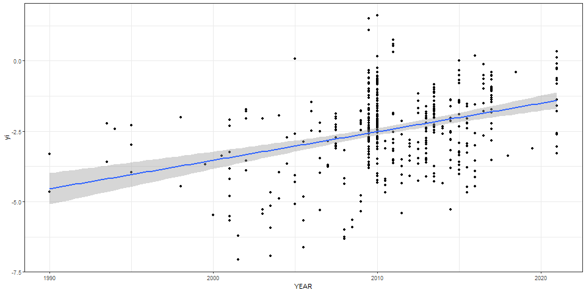

``` r
## Non-linear global time trend
```

``` r
png(paste0(params$PlotDir, "/r_nonlineartimetrend.png"), width = 960)
ggplot(subset(es, as.integer(FLAG) == 1), aes(x = YEAR, y = yi)) +
  geom_point() +
  geom_smooth(method = "loess") +
  theme_bw()
```

    ## `geom_smooth()` using formula = 'y ~ x'

``` r
dev.off()
```

png 2

``` r
setwd(params$Dir)
image <- paste0("02-fit-rota-strain-eptp_files/figure-gfm/r_nonlineartimetrend.png")
cat("")
```

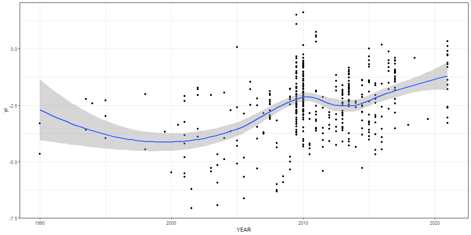

# BRMS

## Reduced model fit

``` r
fit_brms_reg_s <-
  brm(yi | se(sei) ~
        1 + YEAR + SYNDROMTYPE + AGE + REFERENCE + COVERAGE + STRAIN +
        (1 | REG2) +
        (1 | REG2:SUB2) +
        (1 | REG2:SUB2:COUNTRY) +
        (1 | REG2:SUB2:COUNTRY:ID) +
        (1 | REG2:SUB2:COUNTRY:ID:DTP_ID),
      chains = 5, iter = params$Iterations, warmup = params$Warmup,
      prior = prior(normal(0,1), class = sd),
      control = controls,
      cores = 5,
      data = subset(es, as.integer(FLAG) == 1),
      open_progress = FALSE,
      seed = 7)
```

    ## Compiling Stan program...

    ## Start sampling

    ## Warning: There were 4 divergent transitions after warmup. See
    ## https://mc-stan.org/misc/warnings.html#divergent-transitions-after-warmup
    ## to find out why this is a problem and how to eliminate them.

    ## Warning: Examine the pairs() plot to diagnose sampling problems

## Model summary

``` r
summary(fit_brms_reg_s)
```

    ## Warning: There were 4 divergent transitions after warmup. Increasing adapt_delta above 0.95 may help. See
    ## http://mc-stan.org/misc/warnings.html#divergent-transitions-after-warmup

    ##  Family: gaussian 
    ##   Links: mu = identity; sigma = identity 
    ## Formula: yi | se(sei) ~ 1 + YEAR + SYNDROMTYPE + AGE + REFERENCE + COVERAGE + STRAIN + (1 | REG2) + (1 | REG2:SUB2) + (1 | REG2:SUB2:COUNTRY) + (1 | REG2:SUB2:COUNTRY:ID) + (1 | REG2:SUB2:COUNTRY:ID:DTP_ID) 
    ##    Data: subset(es, as.integer(FLAG) == 1) (Number of observations: 432) 
    ##   Draws: 5 chains, each with iter = 5000; warmup = 3000; thin = 1;
    ##          total post-warmup draws = 10000
    ## 
    ## Multilevel Hyperparameters:
    ## ~REG2 (Number of levels: 6) 
    ##               Estimate Est.Error l-95% CI u-95% CI Rhat Bulk_ESS Tail_ESS
    ## sd(Intercept)     0.43      0.29     0.03     1.14 1.00     3994     4456
    ## 
    ## ~REG2:SUB2 (Number of levels: 12) 
    ##               Estimate Est.Error l-95% CI u-95% CI Rhat Bulk_ESS Tail_ESS
    ## sd(Intercept)     0.25      0.19     0.01     0.71 1.00     4566     6214
    ## 
    ## ~REG2:SUB2:COUNTRY (Number of levels: 41) 
    ##               Estimate Est.Error l-95% CI u-95% CI Rhat Bulk_ESS Tail_ESS
    ## sd(Intercept)     0.39      0.21     0.03     0.83 1.00     1207     2588
    ## 
    ## ~REG2:SUB2:COUNTRY:ID (Number of levels: 122) 
    ##               Estimate Est.Error l-95% CI u-95% CI Rhat Bulk_ESS Tail_ESS
    ## sd(Intercept)     0.94      0.09     0.78     1.12 1.00     3277     5219
    ## 
    ## ~REG2:SUB2:COUNTRY:ID:DTP_ID (Number of levels: 432) 
    ##               Estimate Est.Error l-95% CI u-95% CI Rhat Bulk_ESS Tail_ESS
    ## sd(Intercept)     0.42      0.03     0.37     0.48 1.00     3953     5655
    ## 
    ## Regression Coefficients:
    ##                        Estimate Est.Error l-95% CI u-95% CI Rhat Bulk_ESS Tail_ESS
    ## Intercept               -122.37     43.42  -206.06   -35.40 1.00     4683     5750
    ## YEAR                       0.06      0.02     0.02     0.10 1.00     4676     5769
    ## SYNDROMTYPEInpatient       0.15      0.10    -0.03     0.34 1.00     6443     7378
    ## SYNDROMTYPEOutpatient      0.13      0.07    -0.01     0.27 1.00     5208     6320
    ## AGEAgebelow5               0.30      0.13     0.06     0.55 1.00     6853     7276
    ## AGEMixedages               0.10      0.17    -0.23     0.44 1.00     7222     7489
    ## REFERENCEOther             0.20      0.38    -0.54     0.93 1.00     4706     5960
    ## COVERAGE                   0.00      0.00    -0.01     0.01 1.00     5408     6557
    ## STRAINUndifferentiated     0.57      0.22     0.12     1.01 1.00     5147     5881
    ## 
    ## Further Distributional Parameters:
    ##       Estimate Est.Error l-95% CI u-95% CI Rhat Bulk_ESS Tail_ESS
    ## sigma     0.00      0.00     0.00     0.00   NA       NA       NA
    ## 
    ## Draws were sampled using sampling(NUTS). For each parameter, Bulk_ESS
    ## and Tail_ESS are effective sample size measures, and Rhat is the potential
    ## scale reduction factor on split chains (at convergence, Rhat = 1).

``` r
est <- colnames(as_draws_df(fit_brms_reg_s))
selected_est <- est[grepl("^(sd_|b_|sigma)", est)]
length <- length(selected_est)
for (i in 1:length){
  png(paste0(params$PlotDir, "/r_summary-", i, ".png"), width = 960)
  plot(fit_brms_reg_s, variable = selected_est[i])
  dev.off()
}
```

``` r
setwd(params$Dir)
for (i in 1:length){
  image <- paste0("02-fit-rota-strain-eptp_files/figure-gfm/r_summary-",i,".png")
  cat("")
}
```

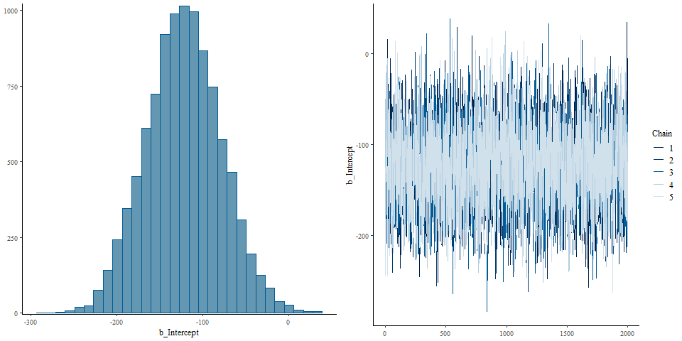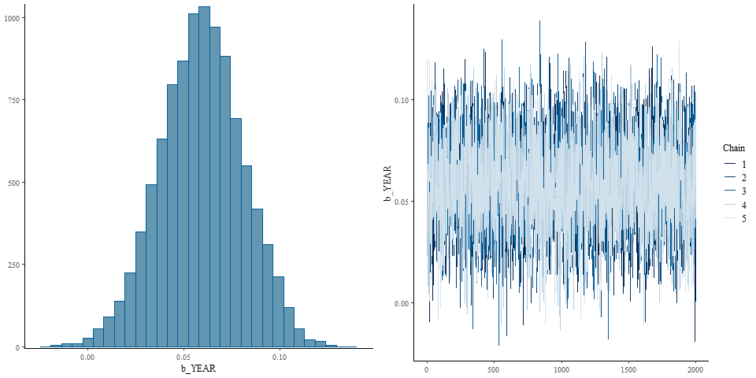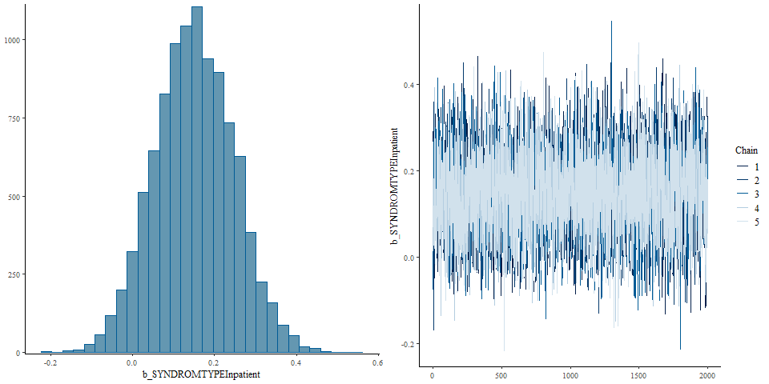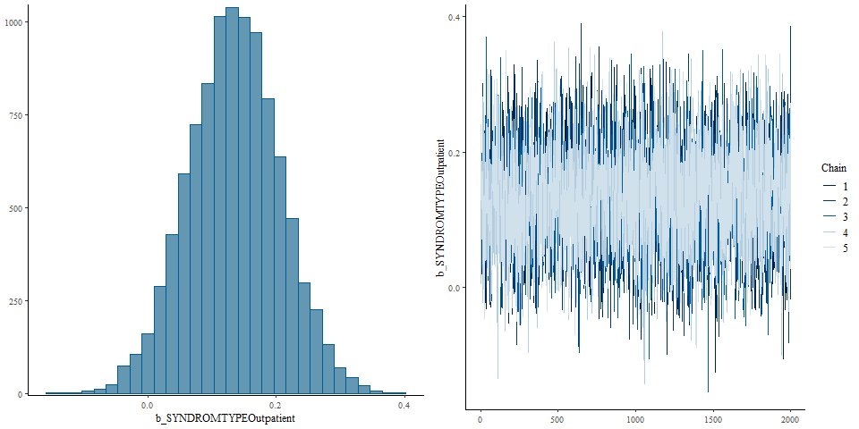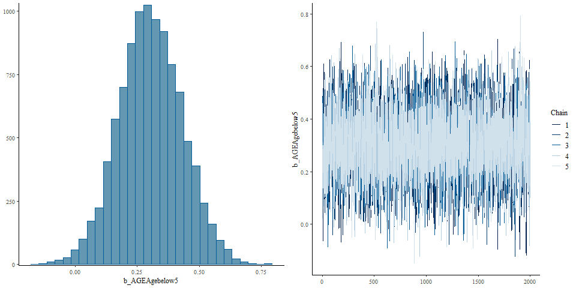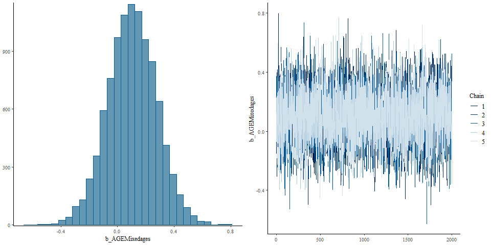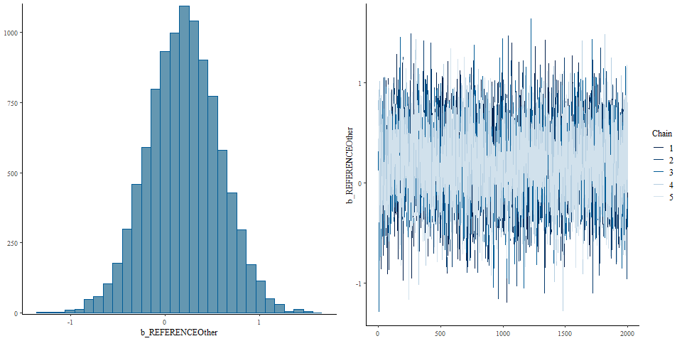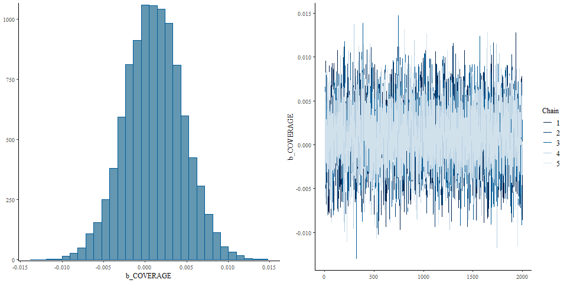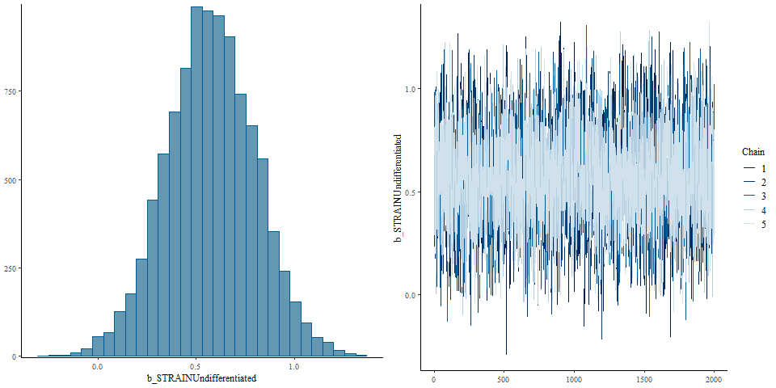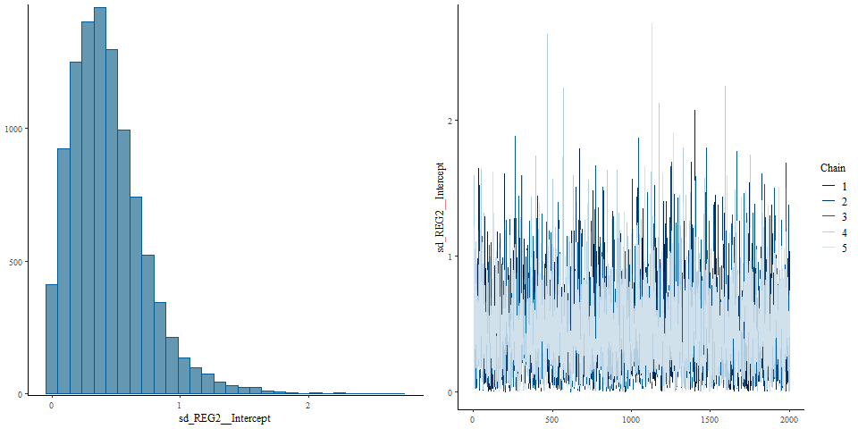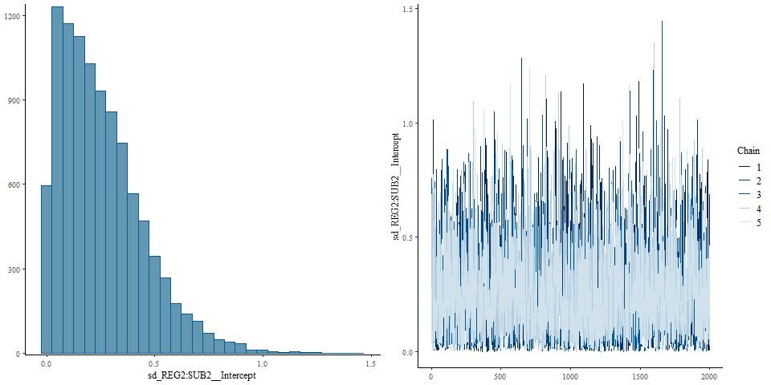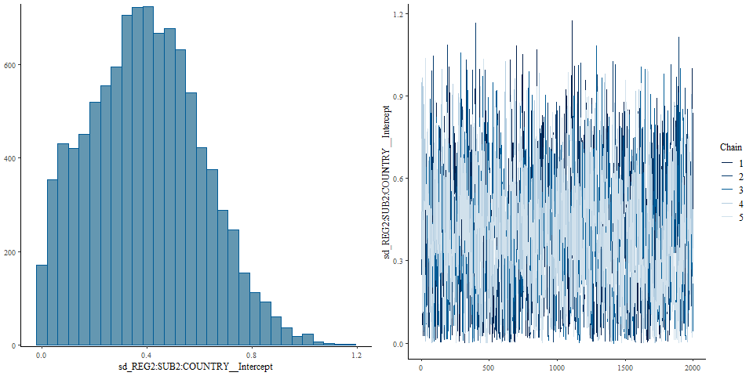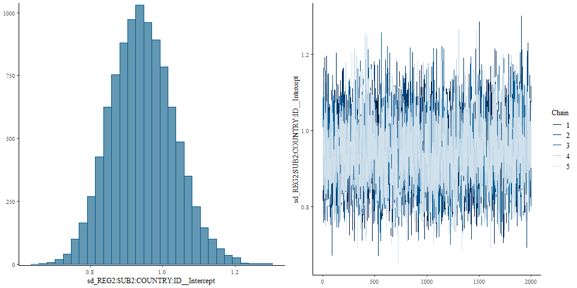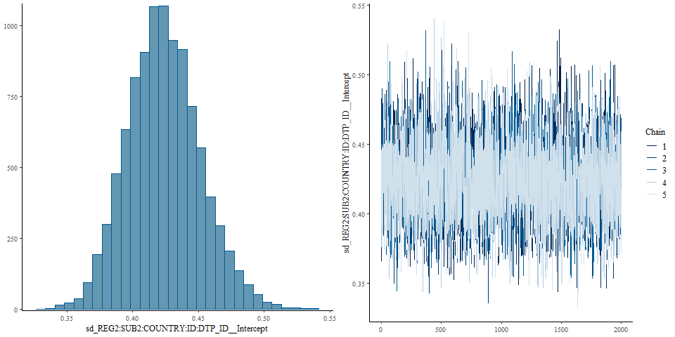

``` r
P <- plot(conditional_effects(fit_brms_reg_s), points = TRUE, ask=FALSE)
```

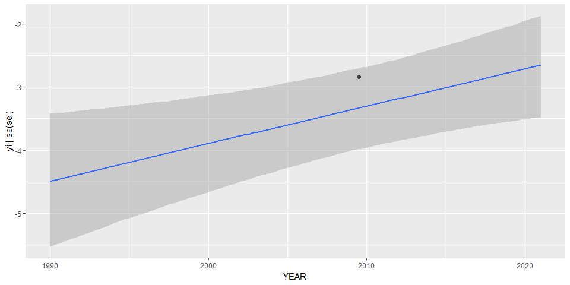<!-- -->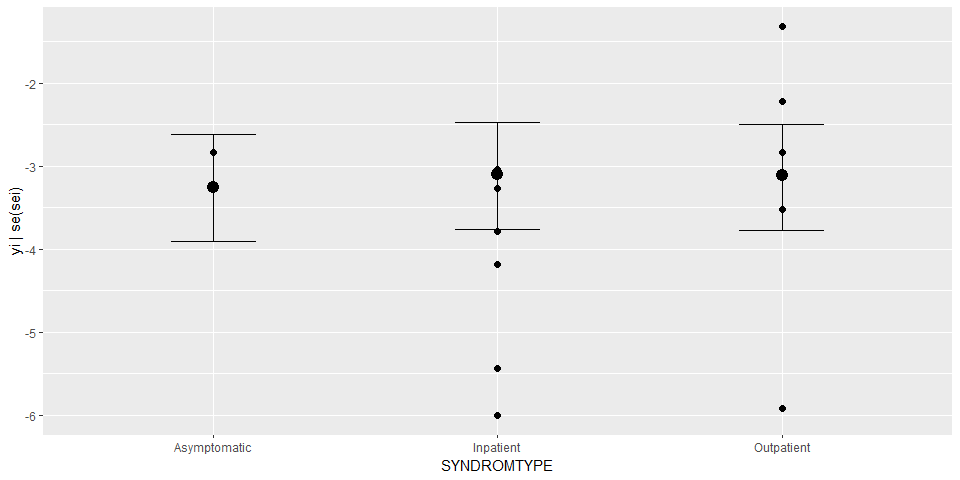<!-- -->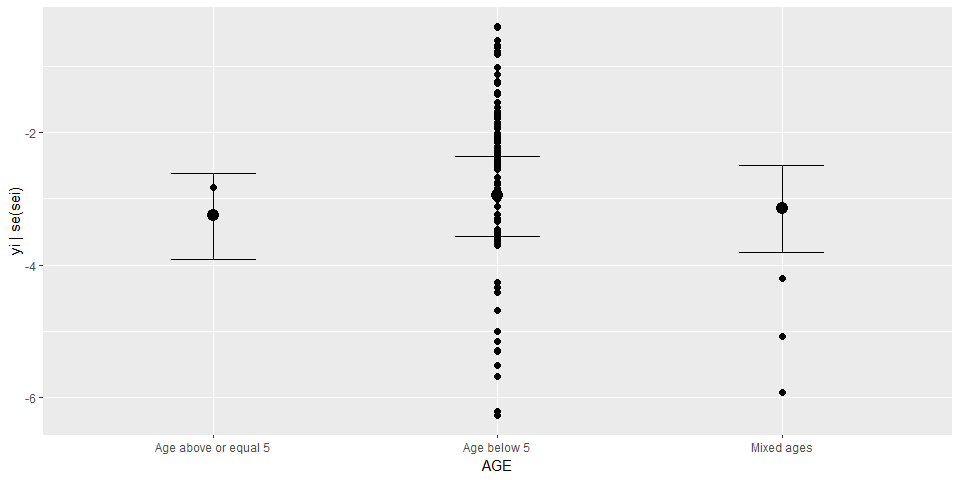<!-- -->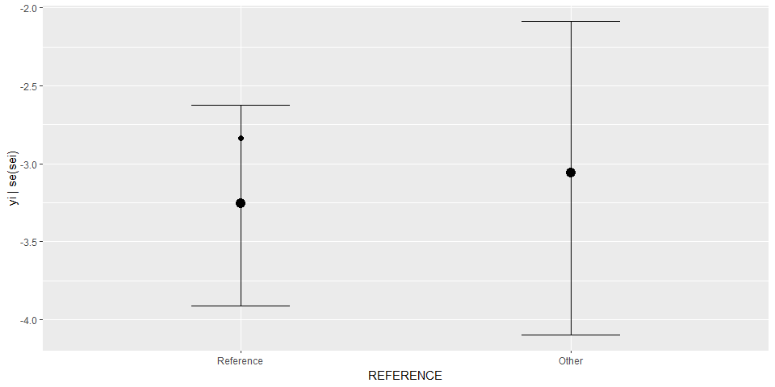<!-- -->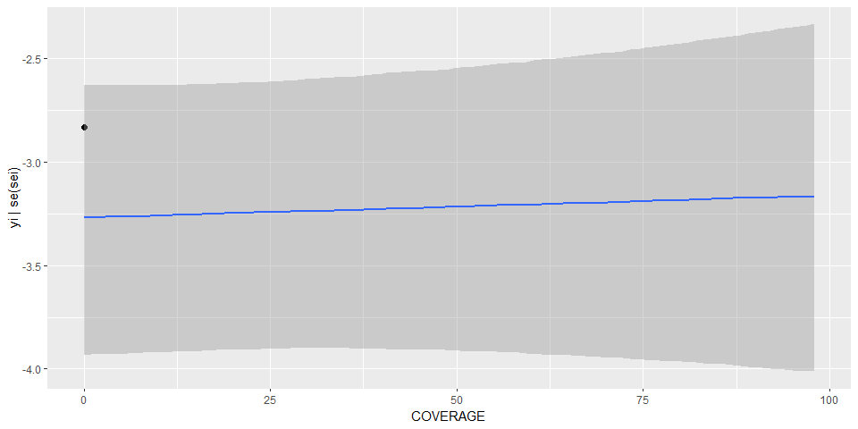<!-- -->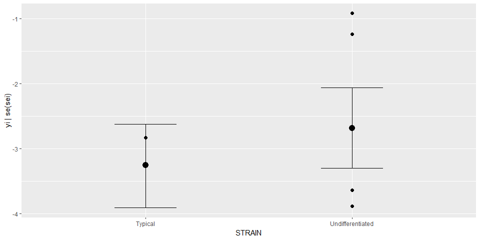<!-- -->

``` r
length <- length(P)
for (i in 1:length){
  png(paste0(params$PlotDir, "/r_conditional_effects-", i, ".png"), width = 960)
  plot(P[[i]])
  dev.off()
}
```

``` r
# setwd(params$Dir)
for (i in 1:length){
  image <- paste0("02-fit-rota-strain-eptp_files/figure-gfm/r_conditional_effects-",i,".png")
  cat("")
}
```


``` r
saveRDS(fit_brms_reg_s, file = paste0(params$Dir, "/fit_brms_reg_s.rds"))

## show model code
```

``` r
stancode(fit_brms_reg_s)
```

    ## // generated with brms 2.22.0
    ## functions {
    ## }
    ## data {
    ##   int<lower=1> N;  // total number of observations
    ##   vector[N] Y;  // response variable
    ##   vector<lower=0>[N] se;  // known sampling error
    ##   int<lower=1> K;  // number of population-level effects
    ##   matrix[N, K] X;  // population-level design matrix
    ##   int<lower=1> Kc;  // number of population-level effects after centering
    ##   // data for group-level effects of ID 1
    ##   int<lower=1> N_1;  // number of grouping levels
    ##   int<lower=1> M_1;  // number of coefficients per level
    ##   array[N] int<lower=1> J_1;  // grouping indicator per observation
    ##   // group-level predictor values
    ##   vector[N] Z_1_1;
    ##   // data for group-level effects of ID 2
    ##   int<lower=1> N_2;  // number of grouping levels
    ##   int<lower=1> M_2;  // number of coefficients per level
    ##   array[N] int<lower=1> J_2;  // grouping indicator per observation
    ##   // group-level predictor values
    ##   vector[N] Z_2_1;
    ##   // data for group-level effects of ID 3
    ##   int<lower=1> N_3;  // number of grouping levels
    ##   int<lower=1> M_3;  // number of coefficients per level
    ##   array[N] int<lower=1> J_3;  // grouping indicator per observation
    ##   // group-level predictor values
    ##   vector[N] Z_3_1;
    ##   // data for group-level effects of ID 4
    ##   int<lower=1> N_4;  // number of grouping levels
    ##   int<lower=1> M_4;  // number of coefficients per level
    ##   array[N] int<lower=1> J_4;  // grouping indicator per observation
    ##   // group-level predictor values
    ##   vector[N] Z_4_1;
    ##   // data for group-level effects of ID 5
    ##   int<lower=1> N_5;  // number of grouping levels
    ##   int<lower=1> M_5;  // number of coefficients per level
    ##   array[N] int<lower=1> J_5;  // grouping indicator per observation
    ##   // group-level predictor values
    ##   vector[N] Z_5_1;
    ##   int prior_only;  // should the likelihood be ignored?
    ## }
    ## transformed data {
    ##   vector<lower=0>[N] se2 = square(se);
    ##   matrix[N, Kc] Xc;  // centered version of X without an intercept
    ##   vector[Kc] means_X;  // column means of X before centering
    ##   for (i in 2:K) {
    ##     means_X[i - 1] = mean(X[, i]);
    ##     Xc[, i - 1] = X[, i] - means_X[i - 1];
    ##   }
    ## }
    ## parameters {
    ##   vector[Kc] b;  // regression coefficients
    ##   real Intercept;  // temporary intercept for centered predictors
    ##   vector<lower=0>[M_1] sd_1;  // group-level standard deviations
    ##   array[M_1] vector[N_1] z_1;  // standardized group-level effects
    ##   vector<lower=0>[M_2] sd_2;  // group-level standard deviations
    ##   array[M_2] vector[N_2] z_2;  // standardized group-level effects
    ##   vector<lower=0>[M_3] sd_3;  // group-level standard deviations
    ##   array[M_3] vector[N_3] z_3;  // standardized group-level effects
    ##   vector<lower=0>[M_4] sd_4;  // group-level standard deviations
    ##   array[M_4] vector[N_4] z_4;  // standardized group-level effects
    ##   vector<lower=0>[M_5] sd_5;  // group-level standard deviations
    ##   array[M_5] vector[N_5] z_5;  // standardized group-level effects
    ## }
    ## transformed parameters {
    ##   real sigma = 0;  // dispersion parameter
    ##   vector[N_1] r_1_1;  // actual group-level effects
    ##   vector[N_2] r_2_1;  // actual group-level effects
    ##   vector[N_3] r_3_1;  // actual group-level effects
    ##   vector[N_4] r_4_1;  // actual group-level effects
    ##   vector[N_5] r_5_1;  // actual group-level effects
    ##   real lprior = 0;  // prior contributions to the log posterior
    ##   r_1_1 = (sd_1[1] * (z_1[1]));
    ##   r_2_1 = (sd_2[1] * (z_2[1]));
    ##   r_3_1 = (sd_3[1] * (z_3[1]));
    ##   r_4_1 = (sd_4[1] * (z_4[1]));
    ##   r_5_1 = (sd_5[1] * (z_5[1]));
    ##   lprior += student_t_lpdf(Intercept | 3, -2.3, 2.5);
    ##   lprior += normal_lpdf(sd_1 | 0, 1)
    ##     - 1 * normal_lccdf(0 | 0, 1);
    ##   lprior += normal_lpdf(sd_2 | 0, 1)
    ##     - 1 * normal_lccdf(0 | 0, 1);
    ##   lprior += normal_lpdf(sd_3 | 0, 1)
    ##     - 1 * normal_lccdf(0 | 0, 1);
    ##   lprior += normal_lpdf(sd_4 | 0, 1)
    ##     - 1 * normal_lccdf(0 | 0, 1);
    ##   lprior += normal_lpdf(sd_5 | 0, 1)
    ##     - 1 * normal_lccdf(0 | 0, 1);
    ## }
    ## model {
    ##   // likelihood including constants
    ##   if (!prior_only) {
    ##     // initialize linear predictor term
    ##     vector[N] mu = rep_vector(0.0, N);
    ##     mu += Intercept + Xc * b;
    ##     for (n in 1:N) {
    ##       // add more terms to the linear predictor
    ##       mu[n] += r_1_1[J_1[n]] * Z_1_1[n] + r_2_1[J_2[n]] * Z_2_1[n] + r_3_1[J_3[n]] * Z_3_1[n] + r_4_1[J_4[n]] * Z_4_1[n] + r_5_1[J_5[n]] * Z_5_1[n];
    ##     }
    ##     target += normal_lpdf(Y | mu, se);
    ##   }
    ##   // priors including constants
    ##   target += lprior;
    ##   target += std_normal_lpdf(z_1[1]);
    ##   target += std_normal_lpdf(z_2[1]);
    ##   target += std_normal_lpdf(z_3[1]);
    ##   target += std_normal_lpdf(z_4[1]);
    ##   target += std_normal_lpdf(z_5[1]);
    ## }
    ## generated quantities {
    ##   // actual population-level intercept
    ##   real b_Intercept = Intercept - dot_product(means_X, b);
    ## }

# Session info

``` r
sessioninfo::session_info()
```

    ## Warning in system2("quarto", "-V", stdout = TRUE, env = paste0("TMPDIR=", : running command '"quarto"
    ## TMPDIR=C:/Users/fbbu6966/AppData/Local/Temp/RtmpsxPcOp/file48d870f91a3b -V' had status 1

    ## ─ Session info ───────────────────────────────────────────────────────────────────────────────────────────────────────────────────────
    ##  setting  value
    ##  version  R version 4.5.0 (2025-04-11 ucrt)
    ##  os       Windows 10 x64 (build 19045)
    ##  system   x86_64, mingw32
    ##  ui       RStudio
    ##  language (EN)
    ##  collate  English_United States.utf8
    ##  ctype    English_United States.utf8
    ##  tz       Europe/Brussels
    ##  date     2025-09-28
    ##  rstudio  2025.05.0+496 Mariposa Orchid (desktop)
    ##  pandoc   3.4 @ C:/Users/fbbu6966/AppData/Local/Programs/RStudio/resources/app/bin/quarto/bin/tools/ (via rmarkdown)
    ##  quarto   ERROR: Unknown command "TMPDIR=C:/Users/fbbu6966/AppData/Local/Temp/RtmpsxPcOp/file48d870f91a3b". Did you mean command "update"? @ C:\\Users\\fbbu6966\\AppData\\Local\\Programs\\RStudio\\RESOUR~1\\app\\bin\\quarto\\bin\\quarto.exe
    ## 
    ## ─ Packages ───────────────────────────────────────────────────────────────────────────────────────────────────────────────────────────
    ##  ! package        * version    date (UTC) lib source
    ##    abind            1.4-8      2024-09-12 [1] CRAN (R 4.5.0)
    ##    backports        1.5.0      2024-05-23 [1] CRAN (R 4.5.0)
    ##    base64enc        0.1-3      2015-07-28 [1] CRAN (R 4.5.0)
    ##    bayesplot        1.12.0     2025-04-10 [1] CRAN (R 4.5.0)
    ##    bd             * 0.0.14     2025-04-14 [1] Github (brechtdv/bd@652191c)
    ##    boot             1.3-31     2024-08-28 [1] CRAN (R 4.5.0)
    ##    bridgesampling   1.1-2      2021-04-16 [1] CRAN (R 4.5.0)
    ##    brms           * 2.22.0     2024-09-23 [1] CRAN (R 4.5.0)
    ##    Brobdingnag      1.2-9      2022-10-19 [1] CRAN (R 4.5.0)
    ##    callr            3.7.6      2024-03-25 [1] CRAN (R 4.5.0)
    ##    cellranger       1.1.0      2016-07-27 [1] CRAN (R 4.5.0)
    ##    checkmate        2.3.2      2024-07-29 [1] CRAN (R 4.5.0)
    ##    class            7.3-23     2025-01-01 [1] CRAN (R 4.5.0)
    ##    classInt         0.4-11     2025-01-08 [1] CRAN (R 4.5.0)
    ##    cli              3.6.4      2025-02-13 [1] CRAN (R 4.5.0)
    ##    cluster          2.1.8.1    2025-03-12 [1] CRAN (R 4.5.0)
    ##    coda             0.19-4.1   2024-01-31 [1] CRAN (R 4.5.0)
    ##    codetools        0.2-20     2024-03-31 [1] CRAN (R 4.5.0)
    ##    colorspace       2.1-1      2024-07-26 [1] CRAN (R 4.5.0)
    ##    curl             6.2.2      2025-03-24 [1] CRAN (R 4.5.0)
    ##    data.table       1.17.0     2025-02-22 [1] CRAN (R 4.5.0)
    ##    DBI              1.2.3      2024-06-02 [1] CRAN (R 4.5.0)
    ##    DescTools      * 0.99.60    2025-03-28 [1] CRAN (R 4.5.0)
    ##    digest           0.6.37     2024-08-19 [1] CRAN (R 4.5.0)
    ##    distributional   0.5.0      2024-09-17 [1] CRAN (R 4.5.0)
    ##    dplyr          * 1.1.4      2023-11-17 [1] CRAN (R 4.5.0)
    ##    e1071            1.7-16     2024-09-16 [1] CRAN (R 4.5.0)
    ##    evaluate         1.0.3      2025-01-10 [1] CRAN (R 4.5.0)
    ##    Exact            3.3        2024-07-21 [1] CRAN (R 4.5.0)
    ##    expm             1.0-0      2024-08-19 [1] CRAN (R 4.5.0)
    ##    farver           2.1.2      2024-05-13 [1] CRAN (R 4.5.0)
    ##    fastmap          1.2.0      2024-05-15 [1] CRAN (R 4.5.0)
    ##    FERG2          * 0.0.5      2025-08-07 [1] Github (brechtdv/FERG2@c2d4ac1)
    ##    forcats          1.0.0      2023-01-29 [1] CRAN (R 4.5.0)
    ##    foreign          0.8-90     2025-03-31 [1] CRAN (R 4.5.0)
    ##    Formula          1.2-5      2023-02-24 [1] CRAN (R 4.5.0)
    ##    fs               1.6.6      2025-04-12 [1] CRAN (R 4.5.0)
    ##    generics         0.1.3      2022-07-05 [1] CRAN (R 4.5.0)
    ##    ggplot2        * 3.5.2      2025-04-09 [1] CRAN (R 4.5.0)
    ##    gld              2.6.7      2025-01-17 [1] CRAN (R 4.5.0)
    ##    glue             1.8.0      2024-09-30 [1] CRAN (R 4.5.0)
    ##    gridExtra        2.3        2017-09-09 [1] CRAN (R 4.5.0)
    ##    gtable           0.3.6      2024-10-25 [1] CRAN (R 4.5.0)
    ##    haven            2.5.4      2023-11-30 [1] CRAN (R 4.5.0)
    ##    Hmisc          * 5.2-3      2025-03-16 [1] CRAN (R 4.5.0)
    ##    hms              1.1.3      2023-03-21 [1] CRAN (R 4.5.0)
    ##    htmlTable        2.4.3      2024-07-21 [1] CRAN (R 4.5.0)
    ##    htmltools        0.5.8.1    2024-04-04 [1] CRAN (R 4.5.0)
    ##    htmlwidgets      1.6.4      2023-12-06 [1] CRAN (R 4.5.0)
    ##    httr             1.4.7      2023-08-15 [1] CRAN (R 4.5.0)
    ##    inline           0.3.21     2025-01-09 [1] CRAN (R 4.5.0)
    ##    jsonlite         2.0.0      2025-03-27 [1] CRAN (R 4.5.0)
    ##    kableExtra     * 1.4.0      2024-01-24 [1] CRAN (R 4.5.0)
    ##    KernSmooth       2.23-26    2025-01-01 [1] CRAN (R 4.5.0)
    ##    knitr          * 1.50       2025-03-16 [1] CRAN (R 4.5.0)
    ##    labeling         0.4.3      2023-08-29 [1] CRAN (R 4.5.0)
    ##    lattice          0.22-6     2024-03-20 [1] CRAN (R 4.5.0)
    ##    lifecycle        1.0.4      2023-11-07 [1] CRAN (R 4.5.0)
    ##    lmom             3.2        2024-09-30 [1] CRAN (R 4.5.0)
    ##    loo              2.8.0      2024-07-03 [1] CRAN (R 4.5.0)
    ##    lubridate      * 1.9.4      2024-12-08 [1] CRAN (R 4.5.0)
    ##    magrittr         2.0.3      2022-03-30 [1] CRAN (R 4.5.0)
    ##    MASS             7.3-65     2025-02-28 [1] CRAN (R 4.5.0)
    ##    mathjaxr         1.6-0      2022-02-28 [1] CRAN (R 4.5.0)
    ##    Matrix         * 1.7-3      2025-03-11 [1] CRAN (R 4.5.0)
    ##    MatrixModels     0.5-4      2025-03-26 [1] CRAN (R 4.5.0)
    ##    matrixStats      1.5.0      2025-01-07 [1] CRAN (R 4.5.0)
    ##    metadat        * 1.4-0      2025-02-04 [1] CRAN (R 4.5.0)
    ##    metafor        * 4.8-0      2025-01-28 [1] CRAN (R 4.5.0)
    ##    mgcv             1.9-1      2023-12-21 [1] CRAN (R 4.5.0)
    ##    multcomp         1.4-28     2025-01-29 [1] CRAN (R 4.5.0)
    ##    munsell          0.5.1      2024-04-01 [1] CRAN (R 4.5.0)
    ##    mvtnorm          1.3-3      2025-01-10 [1] CRAN (R 4.5.0)
    ##    nlme             3.1-168    2025-03-31 [1] CRAN (R 4.5.0)
    ##    nnet             7.3-20     2025-01-01 [1] CRAN (R 4.5.0)
    ##    numDeriv       * 2016.8-1.1 2019-06-06 [1] CRAN (R 4.5.0)
    ##    pillar           1.11.0     2025-07-04 [1] CRAN (R 4.5.1)
    ##    pkgbuild         1.4.7      2025-03-24 [1] CRAN (R 4.5.0)
    ##    pkgconfig        2.0.3      2019-09-22 [1] CRAN (R 4.5.0)
    ##    plyr             1.8.9      2023-10-02 [1] CRAN (R 4.5.0)
    ##    polspline        1.1.25     2024-05-10 [1] CRAN (R 4.5.0)
    ##    posterior        1.6.1      2025-02-27 [1] CRAN (R 4.5.0)
    ##    processx         3.8.6      2025-02-21 [1] CRAN (R 4.5.0)
    ##    proxy            0.4-27     2022-06-09 [1] CRAN (R 4.5.0)
    ##    ps               1.9.1      2025-04-12 [1] CRAN (R 4.5.0)
    ##    purrr            1.0.4      2025-02-05 [1] CRAN (R 4.5.0)
    ##    quantreg         6.1        2025-03-10 [1] CRAN (R 4.5.0)
    ##    QuickJSR         1.7.0      2025-03-31 [1] CRAN (R 4.5.0)
    ##    R6               2.6.1      2025-02-15 [1] CRAN (R 4.5.0)
    ##    RColorBrewer     1.1-3      2022-04-03 [1] CRAN (R 4.5.0)
    ##    Rcpp           * 1.0.14     2025-01-12 [1] CRAN (R 4.5.0)
    ##  D RcppParallel     5.1.10     2025-01-24 [1] CRAN (R 4.5.0)
    ##    readr            2.1.5      2024-01-10 [1] CRAN (R 4.5.0)
    ##    readxl         * 1.4.5      2025-03-07 [1] CRAN (R 4.5.0)
    ##    reshape2         1.4.4      2020-04-09 [1] CRAN (R 4.5.0)
    ##    rlang            1.1.6      2025-04-11 [1] CRAN (R 4.5.0)
    ##    rmarkdown      * 2.29       2024-11-04 [1] CRAN (R 4.5.0)
    ##    rms            * 8.0-0      2025-04-04 [1] CRAN (R 4.5.0)
    ##    rootSolve        1.8.2.4    2023-09-21 [1] CRAN (R 4.5.0)
    ##    rpart            4.1.24     2025-01-07 [1] CRAN (R 4.5.0)
    ##    rstan            2.32.7     2025-03-10 [1] CRAN (R 4.5.0)
    ##    rstantools       2.4.0      2024-01-31 [1] CRAN (R 4.5.0)
    ##    rstudioapi       0.17.1     2024-10-22 [1] CRAN (R 4.5.0)
    ##    sandwich         3.1-1      2024-09-15 [1] CRAN (R 4.5.0)
    ##    scales         * 1.3.0      2023-11-28 [1] CRAN (R 4.5.0)
    ##    sessioninfo      1.2.3      2025-02-05 [1] CRAN (R 4.5.0)
    ##    sf             * 1.0-20     2025-03-24 [1] CRAN (R 4.5.0)
    ##    SparseM          1.84-2     2024-07-17 [1] CRAN (R 4.5.0)
    ##    StanHeaders      2.32.10    2024-07-15 [1] CRAN (R 4.5.0)
    ##    stringi          1.8.7      2025-03-27 [1] CRAN (R 4.5.0)
    ##    stringr        * 1.5.1      2023-11-14 [1] CRAN (R 4.5.0)
    ##    survival         3.8-3      2024-12-17 [1] CRAN (R 4.5.0)
    ##    svglite          2.1.3      2023-12-08 [1] CRAN (R 4.5.0)
    ##    systemfonts      1.2.2      2025-04-04 [1] CRAN (R 4.5.0)
    ##    tensorA          0.36.2.1   2023-12-13 [1] CRAN (R 4.5.0)
    ##    TH.data          1.1-3      2025-01-17 [1] CRAN (R 4.5.0)
    ##    tibble           3.3.0      2025-06-08 [1] CRAN (R 4.5.1)
    ##    tidyr          * 1.3.1      2024-01-24 [1] CRAN (R 4.5.0)
    ##    tidyselect       1.2.1      2024-03-11 [1] CRAN (R 4.5.0)
    ##    timechange       0.3.0      2024-01-18 [1] CRAN (R 4.5.0)
    ##    tzdb             0.5.0      2025-03-15 [1] CRAN (R 4.5.0)
    ##    units            0.8-7      2025-03-11 [1] CRAN (R 4.5.0)
    ##    V8               6.0.3      2025-03-26 [1] CRAN (R 4.5.0)
    ##    vctrs            0.6.5      2023-12-01 [1] CRAN (R 4.5.0)
    ##    viridisLite      0.4.2      2023-05-02 [1] CRAN (R 4.5.0)
    ##    withr            3.0.2      2024-10-28 [1] CRAN (R 4.5.0)
    ##    xfun             0.52       2025-04-02 [1] CRAN (R 4.5.0)
    ##    xml2             1.3.8      2025-03-14 [1] CRAN (R 4.5.0)
    ##    yaml             2.3.10     2024-07-26 [1] CRAN (R 4.5.0)
    ##    zoo              1.8-14     2025-04-10 [1] CRAN (R 4.5.0)
    ## 
    ##  [1] C:/Users/fbbu6966/AppData/Local/Programs/R/R-4.5.0/library
    ## 
    ##  * ── Packages attached to the search path.
    ##  D ── DLL MD5 mismatch, broken installation.
    ## 
    ## ──────────────────────────────────────────────────────────────────────────────────────────────────────────────────────────────────────
