Global proportion of Giardia (Diarrheal) • SYMPT+ROTA • Estimate
proportion
================
fbbu6966
2025-11-27

- [Settings](#settings)
- [Model fit](#model-fit)
- [Predict all](#predict-all)
- [Summarize predictions: countries](#summarize-predictions-countries)
- [Session info](#session-info)

# Settings

``` r
## required packages ----
library(bd)
library(brms)
library(FERG2)
library(ggplot2)
library(knitr)
library(rmarkdown)
library(sf)
library(tidyr)
library(dplyr)
library(DescTools)
library(readxl)

## global options ----
knitr::opts_chunk$set(fig.width = 10)
do.call(file.remove, list(list.files(params$PlotDir, full.names = TRUE)))
```

    ## logical(0)

``` r
Date <- format(Sys.Date(), "%Y%m%d")
```

# Model fit

``` r
es <- readRDS(paste0(params$Dir, "/es.rds"))
es <- subset(es, as.integer(FLAG) == 1)
```

``` r
png(paste0(params$PlotDir, "/imputation_map.png"), width=960, height=480)
plot_world_imputation(es)
```

NULL

``` r
dev.off()
```

png 2

``` r
setwd(params$Dir)
image <- paste0("03-estimate-rota_files/figure-gfm/imputation_map.png")
cat("")
```

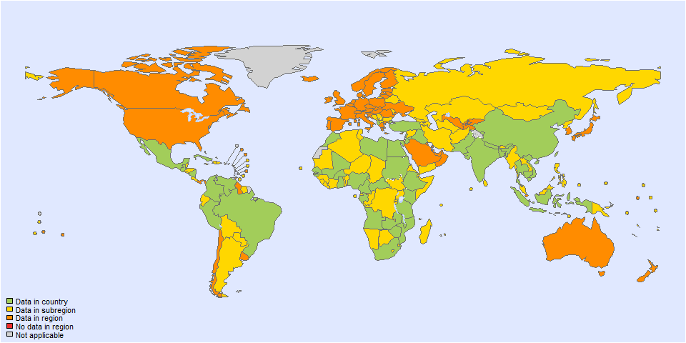

``` r
fit_brms_reg_s <- readRDS(paste0(params$Dir, "/fit_brms_reg_s.rds"))
print(fit_brms_reg_s)
```

    ## Warning: There were 2 divergent transitions after warmup. Increasing adapt_delta above 0.95 may help. See
    ## http://mc-stan.org/misc/warnings.html#divergent-transitions-after-warmup

    ##  Family: gaussian 
    ##   Links: mu = identity; sigma = identity 
    ## Formula: yi | se(sei) ~ 1 + YEAR + SYNDROMTYPE + AGE + REFERENCE + COVERAGE + (1 | REG2) + (1 | REG2:SUB2) + (1 | REG2:SUB2:COUNTRY) + (1 | REG2:SUB2:COUNTRY:ID) + (1 | REG2:SUB2:COUNTRY:ID:DTP_ID) 
    ##    Data: subset(es, as.integer(FLAG) == 1) (Number of observations: 296) 
    ##   Draws: 5 chains, each with iter = 5000; warmup = 3000; thin = 1;
    ##          total post-warmup draws = 10000
    ## 
    ## Multilevel Hyperparameters:
    ## ~REG2 (Number of levels: 6) 
    ##               Estimate Est.Error l-95% CI u-95% CI Rhat Bulk_ESS Tail_ESS
    ## sd(Intercept)     0.49      0.34     0.03     1.31 1.00     6927     7077
    ## 
    ## ~REG2:SUB2 (Number of levels: 12) 
    ##               Estimate Est.Error l-95% CI u-95% CI Rhat Bulk_ESS Tail_ESS
    ## sd(Intercept)     0.48      0.30     0.03     1.13 1.00     4141     5719
    ## 
    ## ~REG2:SUB2:COUNTRY (Number of levels: 45) 
    ##               Estimate Est.Error l-95% CI u-95% CI Rhat Bulk_ESS Tail_ESS
    ## sd(Intercept)     0.51      0.25     0.05     0.99 1.00     2094     3238
    ## 
    ## ~REG2:SUB2:COUNTRY:ID (Number of levels: 109) 
    ##               Estimate Est.Error l-95% CI u-95% CI Rhat Bulk_ESS Tail_ESS
    ## sd(Intercept)     0.98      0.14     0.72     1.26 1.00     2856     4484
    ## 
    ## ~REG2:SUB2:COUNTRY:ID:DTP_ID (Number of levels: 296) 
    ##               Estimate Est.Error l-95% CI u-95% CI Rhat Bulk_ESS Tail_ESS
    ## sd(Intercept)     0.84      0.06     0.74     0.96 1.00     4058     6094
    ## 
    ## Regression Coefficients:
    ##                       Estimate Est.Error l-95% CI u-95% CI Rhat Bulk_ESS Tail_ESS
    ## Intercept                65.25     49.95   -32.32   162.42 1.00     9369     7040
    ## YEAR                     -0.03      0.02    -0.08     0.01 1.00     9376     7125
    ## SYNDROMTYPEOutpatient     0.28      0.18    -0.07     0.64 1.00     8121     6922
    ## AGEAgebelow5              0.26      0.25    -0.24     0.76 1.00     7621     7771
    ## AGEMixedages              0.42      0.33    -0.22     1.07 1.00     9713     7873
    ## REFERENCEOther           -1.36      0.28    -1.91    -0.80 1.00     7032     7253
    ## COVERAGE                  0.00      0.00    -0.01     0.01 1.00     9522     7549
    ## 
    ## Further Distributional Parameters:
    ##       Estimate Est.Error l-95% CI u-95% CI Rhat Bulk_ESS Tail_ESS
    ## sigma     0.00      0.00     0.00     0.00   NA       NA       NA
    ## 
    ## Draws were sampled using sampling(NUTS). For each parameter, Bulk_ESS
    ## and Tail_ESS are effective sample size measures, and Rhat is the potential
    ## scale reduction factor on split chains (at convergence, Rhat = 1).

``` r
zero_cases <-
read_xlsx("endemic_countries.xlsx")%>%
  select(REG2, SUB2, ISO3, Country, edtf_diarrheal) %>% 
  rename(COUNTRY=ISO3, COUNTRY_LABEL = Country) %>%
  mutate(DISEASEFREE = edtf_diarrheal)

kable(
  caption = "High income countries, estimates not made with this approach",
  row.names = FALSE,
  subset(zero_cases, edtf_diarrheal==0)[, 4])
```

| COUNTRY_LABEL        |
|:---------------------|
| Andorra              |
| United Arab Emirates |
| Antigua and Barbuda  |
| Australia            |
| Austria              |
| Belgium              |
| Bahrain              |
| Bahamas, The         |
| Barbados             |
| Brunei Darussalam    |
| Canada               |
| Switzerland          |
| Chile                |
| Cook Islands         |
| Cyprus               |
| Czech Republic       |
| Germany              |
| Denmark              |
| Spain                |
| Estonia              |
| Finland              |
| France               |
| United Kingdom       |
| Greece               |
| Guyana               |
| Croatia              |
| Hungary              |
| Ireland              |
| Iceland              |
| Israel               |
| Italy                |
| Japan                |
| St. Kitts and Nevis  |
| Korea, Rep.          |
| Kuwait               |
| Lithuania            |
| Luxembourg           |
| Latvia               |
| Monaco               |
| Malta                |
| Niue                 |
| Netherlands          |
| Norway               |
| Nauru                |
| New Zealand          |
| Oman                 |
| Panama               |
| Poland               |
| Portugal             |
| Qatar                |
| Romania              |
| Saudi Arabia         |
| Singapore            |
| San Marino           |
| Slovak Republic      |
| Slovenia             |
| Sweden               |
| Trinidad and Tobago  |
| Uruguay              |
| United States        |

High income countries, estimates not made with this approach

``` r
country_with_data <- es %>% select(ISO3) %>% distinct() %>% mutate(DATA=1, COUNTRY = ISO3)
Sub2_with_data <- es %>% select(SUB2) %>% distinct() %>% mutate(DATASUB2=1)
Reg2_with_data <- es %>% select(REG2) %>% distinct() %>% mutate(DATAREG2=1)
zero_cases <- left_join(zero_cases, country_with_data)
```

    ## Joining with `by = join_by(COUNTRY)`

``` r
zero_cases <- left_join(zero_cases, Sub2_with_data)
```

    ## Joining with `by = join_by(SUB2)`

``` r
zero_cases <- left_join(zero_cases, Reg2_with_data) %>%
  select(-c(ISO3)) %>%
  mutate(ESTIMATES = case_when(
    DATA == 1 ~ 1,
    DISEASEFREE == 0 ~ 2,
    is.na(DATA) & DISEASEFREE == 1 & DATASUB2 == 1 ~ 3,
    is.na(DATA) & DISEASEFREE == 1 & is.na(DATASUB2) & DATAREG2 == 1 ~ 4, 
    is.na(DATA) & DISEASEFREE == 1  & is.na(DATASUB2) & is.na(DATAREG2) ~5))
```

    ## Joining with `by = join_by(REG2)`

``` r
zero_cases$ESTIMATES <- factor(zero_cases$ESTIMATES, 
                               level = c(1,2,3,4,5),
                               labels = c("Data present", "Disease free", "Data in subregion", "Data in region", "Data in world"))

VacCov <- readRDS(paste0(params$Dir, "/vaccine_coverage.rds"))
```

# Predict all

``` r
## set up dataframe
# sim_all <-
#   data.frame(
#     sei = 0,
#     REG2 = FERG2:::countries$REG2,
#     SUB2 = FERG2:::countries$SUB2,
#     COUNTRY = FERG2:::countries$ISO3,
#     YEAR = rep(2000:2021, each = nrow(FERG2:::countries)),
#     SYNDROMTYPE = rep(1:3, each=8536),
#     AGE = rep(c(1,2,1,2,1,2), each=4268)) %>%
#   distinct()
sim_all <-
  expand.grid(
    sei = 0,
    COUNTRY = FERG2:::countries$ISO3,
    YEAR = 2000:2021,
    SYNDROMTYPE = 1:2,
    AGE = 1:2)
sim_all$REG2 <-
  FERG2:::countries$REG2[match(sim_all$COUNTRY, FERG2:::countries$ISO3)]
sim_all$SUB2 <-
  FERG2:::countries$SUB2[match(sim_all$COUNTRY, FERG2:::countries$ISO3)]

sim_all <- sim_all %>%
  left_join(zero_cases) %>%
  select(sei, REG2, SUB2, COUNTRY, YEAR, SYNDROMTYPE, AGE, ESTIMATES)
```

    ## Joining with `by = join_by(COUNTRY, REG2, SUB2)`

``` r
sim_all$SYNDROMTYPE <-
  factor(sim_all$SYNDROMTYPE, 
         levels = 1:2, 
         labels = c("Inpatient", "Outpatient"))
sim_all$AGE <-
  factor(sim_all$AGE, 
         levels = 1:2, 
         labels = c("Age above or equal 5", "Age below 5"))
sim_all <-
  merge(sim_all, VacCov,
        by.x = c("COUNTRY", "YEAR"), by.y = c("ISO3", "YEAR"), all.x = TRUE)

## draw from expected value of posterior predictive dist
set.seed(10)
# fit_all <- 
#   posterior_epred(
#     object = fit_brms_reg_s,
#     newdata = sim_all,
#     allow_new_levels = TRUE,
#     sample_new_levels = "uncertainty",
#     re_formula = ~ 1 + YEAR +
#       (1 | REG2) +
#       (1 | REG2:SUB2) +
#       (1 | REG2:SUB2:COUNTRY)
#   )

##

draws_fit <- as_draws_df(fit_brms_reg_s) %>% as.data.frame()
# fit_all <- data.frame(1:10000)

# str(sim_all)

## compile fixed effect
b0_ad_si <- draws_fit$b_Intercept
b0_ad_so <- b0_ad_si + draws_fit$b_SYNDROMTYPEOutpatient
b0_ch_si <- b0_ad_si + draws_fit$b_AGEAgebelow5
b0_ch_so <- b0_ch_si + draws_fit$b_SYNDROMTYPEOutpatient
b0 <-
  function(age, type) {
    b0 <-
      paste(
        "b0",
        c("ad", "ch")[age],
        c("si", "so")[type],
        sep = "_")
    get(b0)
  }

bY <- draws_fit$b_YEAR
bCov <- draws_fit$b_COVERAGE

## compile random effects
rCOUNTRY <- data.frame(ranef(fit_brms_reg_s, summary = FALSE)$`REG2:SUB2:COUNTRY`)
names(rCOUNTRY) <- gsub(".*_(.*)\\..*", "\\1", names(rCOUNTRY))
rSUB <- data.frame(ranef(fit_brms_reg_s, summary = FALSE)$`REG2:SUB2`)
names(rSUB) <- gsub(".*_(.*)\\..*", "\\1", names(rSUB))
rREG <- data.frame(ranef(fit_brms_reg_s, summary = FALSE)$`REG2`)
names(rREG) <- gsub("\\..*", "", names(rREG))

## functions to predict estimate by year and location
est_cnt <-
  function(b0, .year, .coverage, .country, .sub, .reg) {
    est <-
      b0 + bY * .year + bCov * .coverage +
      rCOUNTRY[[.country]] +
      rSUB[[.sub]] +
      rREG[[.reg]]
    list(est)
  }

est_sub <-
  function(b0, .year, .coverage, .sub, .reg) {
    est <-
      b0 + bY * .year + bCov * .coverage +
      rSUB[[.sub]] +
      rREG[[.reg]]
    list(est)
  }

est_reg <-
  function(b0, .year, .coverage, .reg) {
    est <-
      b0 + bY * .year + bCov * .coverage +
      rREG[[.reg]]
    list(est)
  }

est_glb <-
  function(b0, .year, .coverage) {
    est <-
      b0 + bY * .year + bCov * .coverage
    list(est)
  }

## prepare 'SIM' as list
sim_all$SIM <- vector("list", nrow(sim_all))

## data present for country
id <- which(as.integer(sim_all$ESTIMATES) == 1); length(id)
```

    ## [1] 3960

``` r
for (x in id) {
  sim_all$SIM[x] <-
    est_cnt(
      b0(as.numeric(sim_all[x, "AGE"]), as.numeric(sim_all[x, "SYNDROMTYPE"])),
      sim_all[x, "YEAR"],
      sim_all[x, "COVERAGE"],
      sim_all[x, "COUNTRY"],
      sim_all[x, "SUB2"],
      sim_all[x, "REG2"])
}

## disease-free country
id <- which(as.integer(sim_all$ESTIMATES) == 2); length(id)
```

    ## [1] 5280

``` r
for (x in id) {
  sim_all$SIM[x] <- -Inf
}

## data in subregion
id <- which(as.integer(sim_all$ESTIMATES) == 3); length(id)
```

    ## [1] 7480

``` r
for (x in id) {
  sim_all$SIM[x] <-
    est_sub(
      b0(as.numeric(sim_all[x, "AGE"]), as.numeric(sim_all[x, "SYNDROMTYPE"])),
      sim_all[x, "YEAR"],
      sim_all[x, "COVERAGE"],
      sim_all[x, "SUB2"],
      sim_all[x, "REG2"])
}

## data in region
id <- which(as.integer(sim_all$ESTIMATES) == 4); length(id)
```

    ## [1] 352

``` r
for (x in id) {
  sim_all$SIM[x] <-
    est_reg(
      b0(as.numeric(sim_all[x, "AGE"]), as.numeric(sim_all[x, "SYNDROMTYPE"])),
      sim_all[x, "YEAR"],
      sim_all[x, "COVERAGE"],
      sim_all[x, "REG2"])
}

## data in world
id <- which(as.integer(sim_all$ESTIMATES) == 5); length(id)
```

    ## [1] 0

``` r
for (x in id) {
  sim_all$SIM[x] <-
    est_glb(
      b0(as.numeric(sim_all[x, "AGE"]), as.numeric(sim_all[x, "SYNDROMTYPE"])),
      sim_all[x, "YEAR"],
      sim_all[x, "COVERAGE"])
}

# str(sim_all)

##

# draws_fit <- as_draws_df(fit_brms_reg_s) %>% as.data.frame()
# fit_all <- data.frame(1:10000)
# for (x in 1:nrow(sim_all)){
#   # Fixed effects
#   if (sim_all[x, "AGE"] == "Age above or equal 5" & sim_all[x, "SYNDROMTYPE"] == "Inpatient"){                                        # Inpatient and age above 5
#     draws_fit$beta <-  draws_fit$b_Intercept
#   } else if (sim_all[x, "AGE"] ==  "Age above or equal 5" & sim_all[x, "SYNDROMTYPE"] == "Outpatient"){                               # Outpatient and age above 5
#     draws_fit$beta <-  draws_fit$b_Intercept + draws_fit$b_SYNDROMTYPEOutpatient
#   } else if (sim_all[x, "AGE"] ==  "Age below 5" & sim_all[x, "SYNDROMTYPE"] == "Inpatient"){                                         # Inpatient and age below 5
#     draws_fit$beta <-  draws_fit$b_Intercept + draws_fit$b_AGEAgebelow5
#   } else if (sim_all[x, "AGE"] ==  "Age below 5" & sim_all[x, "SYNDROMTYPE"] == "Outpatient"){                                        # Outpatient and age below 5
#     draws_fit$beta <-  draws_fit$b_Intercept + draws_fit$b_SYNDROMTYPEOutpatient + draws_fit$b_AGEAgebelow5
#   }
#   # Data present for country
#   if (as.integer(sim_all[x, "ESTIMATES"]) == 1){
#     fit_all[[paste0("V",x)]] <- draws_fit$beta +                                                                                      # Global intercept
#       sim_all[x, "YEAR"] * draws_fit$b_YEAR +                                                                                         # Year component
#       sim_all[x, "COVERAGE"] * draws_fit$b_COVERAGE +                                                                                 # Coverage component
#       draws_fit[[paste0("r_REG2[",sim_all[x,"REG2"],",Intercept]")]] +                                                                # Regional component
#       draws_fit[[paste0("r_REG2:SUB2[",sim_all[x,"REG2"],"_",sim_all[x,"SUB2"],",Intercept]")]] +                                     # Sub regional component
#       draws_fit[[paste0("r_REG2:SUB2:COUNTRY[",sim_all[x,"REG2"],"_",sim_all[x,"SUB2"],"_",sim_all[x,"COUNTRY"],",Intercept]")]]      # Country component
#   } else if (as.integer(sim_all[x, "ESTIMATES"]) == 2) {
#     # Disease-free country
#     fit_all[[paste0("V",x)]] <- 0
#   } else if (as.integer(sim_all[x, "ESTIMATES"]) == 3){
#     # Data not present for country, but present in subregion
#     fit_all[[paste0("V",x)]] <- draws_fit$beta +                                                                                      # Global intercept
#       sim_all[x, "YEAR"] * draws_fit$b_YEAR +                                                                                         # Year component
#       sim_all[x, "COVERAGE"] * draws_fit$b_COVERAGE +                                                                                 # Coverage component
#       draws_fit[[paste0("r_REG2[",sim_all[x,"REG2"],",Intercept]")]] +                                                                # Regional component
#       draws_fit[[paste0("r_REG2:SUB2[",sim_all[x,"REG2"],"_",sim_all[x,"SUB2"],",Intercept]")]]                                       # Sub regional component
#   } else if (as.integer(sim_all[x, "ESTIMATES"]) == 4){
#     # Data not present for country, but present in region
#     fit_all[[paste0("V",x)]] <- draws_fit$beta +                                                                                      # Global intercept
#       sim_all[x, "YEAR"] * draws_fit$b_YEAR +                                                                                         # Year component
#       sim_all[x, "COVERAGE"] * draws_fit$b_COVERAGE +                                                                                 # Coverage component
#       draws_fit[[paste0("r_REG2[",sim_all[x,"REG2"],",Intercept]")]]                                                                  # Regional component
#   } else if (as.integer(sim_all[x, "ESTIMATES"]) == 5){
#     # Data not present for country
#     fit_all[[paste0("V",x)]] <- draws_fit$beta +                                                                                      # Global intercept
#       sim_all[x, "YEAR"] * draws_fit$b_YEAR +
#       sim_all[x, "COVERAGE"] * draws_fit$b_COVERAGE                                                                                   # Coverage component                                                                              # Year component
#   } 
# }
# 
# fit_all <- fit_all %>% select(-c(X1.10000))

## calculate proportions
sim_all <- sim_all %>% left_join(zero_cases)
```

    ## Joining with `by = join_by(COUNTRY, REG2, SUB2, ESTIMATES)`

``` r
sim_all$PROP <- lapply(sim_all$SIM, expit)
sim_all$PROP <- mapply(`*`, sim_all$PROP, sim_all$edtf_diarrheal)

# sim_all_as <- subset(sim_all, SYNDROMTYPE == "Asymptomatic")
# sim_all_si <- subset(sim_all, SYNDROMTYPE == "Inpatient")
# sim_all_so <- subset(sim_all, SYNDROMTYPE == "Outpatient")
# 
# sim_all_si$PROP <- mapply(`-`, sim_all_si$PROP, sim_all_as$PROP)
# sim_all_so$PROP <- mapply(`-`, sim_all_so$PROP, sim_all_as$PROP)
# 
# sim_all <- rbind(sim_all_si, sim_all_so)

# saveRDS(subset(sim_all %>% filter(SYNDROMTYPE == "Asymptomatic" & AGE == "Age above or equal 5")), 
#         file = paste0(params$Dir, "/sim_all_Asymptomatic_Older5_",Date,".rds"))
# saveRDS(subset(sim_all %>% filter(SYNDROMTYPE == "Asymptomatic" & AGE == "Age below 5")), 
#         file = paste0(params$Dir, "/sim_all_Asymptomatic_Younger5_",Date,".rds"))
saveRDS(subset(sim_all %>% filter(SYNDROMTYPE == "Inpatient" & AGE == "Age above or equal 5")),
        file = paste0(params$Dir, "/sim_all_Inpatient_Older5_",Date,".rds"))
saveRDS(subset(sim_all %>% filter(SYNDROMTYPE == "Inpatient" & AGE == "Age below 5")),
        file = paste0(params$Dir, "/sim_all_Inpatient_Younger5_",Date,".rds"))
saveRDS(subset(sim_all %>% filter(SYNDROMTYPE == "Outpatient" & AGE == "Age above or equal 5")),
        file = paste0(params$Dir, "/sim_all_Outpatient_Older5_",Date,".rds"))
saveRDS(subset(sim_all %>% filter(SYNDROMTYPE == "Outpatient" & AGE == "Age below 5")),
        file = paste0(params$Dir, "/sim_all_Outpatient_Younger5_",Date,".rds"))

## aggregate over countries
all_cnt_prop <- t(sapply(sim_all$PROP, mean_ci))
all_cnt_prop <- data.frame(all_cnt_prop)
names(all_cnt_prop) <- c("VAL_MEAN", "VAL_LWR", "VAL_UPR")
all_cnt_prop <- cbind(sim_all[c("YEAR","REG2", "SUB2", "COUNTRY", "SYNDROMTYPE","AGE","COUNTRY_LABEL")], all_cnt_prop)
all_cnt_prop$LOCATION <- "Country"
all_cnt_prop$LOCATION_NAME <- all_cnt_prop$COUNTRY_LABEL
all_cnt_prop$COUNTRY_LABEL <- NULL
all_cnt_prop$METRIC <- "Proportion"
str(all_cnt_prop)
```

    ## 'data.frame':    17072 obs. of  12 variables:
    ##  $ YEAR         : int  2000 2000 2000 2000 2001 2001 2001 2001 2002 2002 ...
    ##  $ REG2         : chr  "EMR" "EMR" "EMR" "EMR" ...
    ##  $ SUB2         : chr  "EMRD" "EMRD" "EMRD" "EMRD" ...
    ##  $ COUNTRY      : chr  "AFG" "AFG" "AFG" "AFG" ...
    ##  $ SYNDROMTYPE  : Factor w/ 2 levels "Inpatient","Outpatient": 1 2 2 1 2 1 2 1 1 1 ...
    ##  $ AGE          : Factor w/ 2 levels "Age above or equal 5",..: 1 1 2 2 2 1 1 2 2 1 ...
    ##  $ VAL_MEAN     : num  0.185 0.226 0.269 0.222 0.262 ...
    ##  $ VAL_LWR      : num  0.0426 0.0564 0.0769 0.0571 0.0756 ...
    ##  $ VAL_UPR      : num  0.489 0.546 0.593 0.533 0.582 ...
    ##  $ LOCATION     : chr  "Country" "Country" "Country" "Country" ...
    ##  $ LOCATION_NAME: chr  "Afghanistan" "Afghanistan" "Afghanistan" "Afghanistan" ...
    ##  $ METRIC       : chr  "Proportion" "Proportion" "Proportion" "Proportion" ...

``` r
## compile all
all_est <- all_cnt_prop
str(all_est)
```

    ## 'data.frame':    17072 obs. of  12 variables:
    ##  $ YEAR         : int  2000 2000 2000 2000 2001 2001 2001 2001 2002 2002 ...
    ##  $ REG2         : chr  "EMR" "EMR" "EMR" "EMR" ...
    ##  $ SUB2         : chr  "EMRD" "EMRD" "EMRD" "EMRD" ...
    ##  $ COUNTRY      : chr  "AFG" "AFG" "AFG" "AFG" ...
    ##  $ SYNDROMTYPE  : Factor w/ 2 levels "Inpatient","Outpatient": 1 2 2 1 2 1 2 1 1 1 ...
    ##  $ AGE          : Factor w/ 2 levels "Age above or equal 5",..: 1 1 2 2 2 1 1 2 2 1 ...
    ##  $ VAL_MEAN     : num  0.185 0.226 0.269 0.222 0.262 ...
    ##  $ VAL_LWR      : num  0.0426 0.0564 0.0769 0.0571 0.0756 ...
    ##  $ VAL_UPR      : num  0.489 0.546 0.593 0.533 0.582 ...
    ##  $ LOCATION     : chr  "Country" "Country" "Country" "Country" ...
    ##  $ LOCATION_NAME: chr  "Afghanistan" "Afghanistan" "Afghanistan" "Afghanistan" ...
    ##  $ METRIC       : chr  "Proportion" "Proportion" "Proportion" "Proportion" ...

``` r
saveRDS(all_est, file = paste0(params$Dir, "/all_estimates_",Date,".rds"))
```

# Summarize predictions: countries

``` r
# #+ fig.height=4
# ggplot(all_cnt_prop, aes(x = YEAR, y = VAL_MEAN, group=LOCATION_NAME)) +
#   # geom_line(data = all_cnt_prop, linewidth = 2) +
#   geom_line(aes(col = COUNTRY), linewidth = 0.5) +
# theme_bw() 
```

``` r
# breaks <- plot_world(subset(all_cnt_prop, YEAR == 2020 & AGE == "Age below 5" & SYNDROMTYPE == "Outpatient"), 
# "COUNTRY", "VAL_MEAN", legend.title = "Proportion", diseasefree = zero_cases, text.width = 23)
```

``` r
png(paste0(params$PlotDir, "/r_world1.png"), width=960, height=480)
plot_world(subset(all_cnt_prop, YEAR == 2010 & AGE == "Age above or equal 5" & SYNDROMTYPE == "Inpatient"),
           "COUNTRY", "VAL_MEAN", legend.title = "Proportion", diseasefree = zero_cases, text.width = 23)
```

\[1\] 0.00 0.05 0.10 0.15 0.20 0.25 0.30 0.35

``` r
dev.off()
```

png 2

``` r
setwd(params$Dir)
image <- paste0("03-estimate-rota_files/figure-gfm/r_world1.png")
cat("")
```

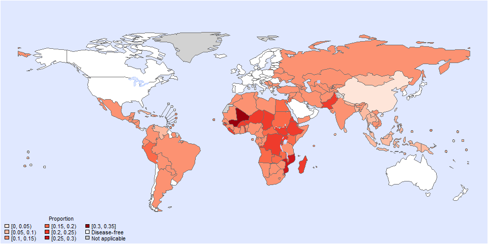

``` r
png(paste0(params$PlotDir, "/r_world2.png"), width=960, height=480)
plot_world(subset(all_cnt_prop, YEAR == 2010 & AGE == "Age above or equal 5" & SYNDROMTYPE == "Outpatient"),  
           "COUNTRY", "VAL_MEAN", legend.title = "Proportion", diseasefree = zero_cases, text.width = 23)
```

\[1\] 0.0 0.1 0.2 0.3 0.4

``` r
dev.off()
```

png 2

``` r
setwd(params$Dir)
image <- paste0("03-estimate-rota_files/figure-gfm/r_world2.png")
cat("")
```

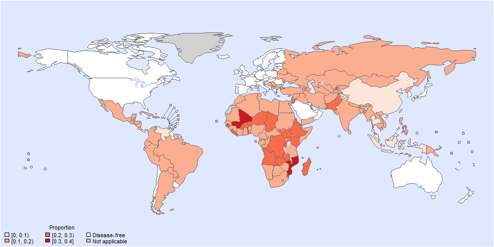

``` r
png(paste0(params$PlotDir, "/r_world3.png"), width=960, height=480)
plot_world(subset(all_cnt_prop, YEAR == 2010 & AGE == "Age below 5" & SYNDROMTYPE == "Inpatient"),  
           "COUNTRY", "VAL_MEAN", legend.title = "Proportion", diseasefree = zero_cases, text.width = 23)
```

\[1\] 0.0 0.1 0.2 0.3 0.4

``` r
dev.off()
```

png 2

``` r
setwd(params$Dir)
image <- paste0("03-estimate-rota_files/figure-gfm/r_world3.png")
cat("")
```


``` r
png(paste0(params$PlotDir, "/r_world4.png"), width=960, height=480)
plot_world(subset(all_cnt_prop, YEAR == 2010 & AGE == "Age below 5" & SYNDROMTYPE == "Outpatient"), 
           "COUNTRY", "VAL_MEAN", legend.title = "Proportion", diseasefree = zero_cases, text.width = 23)
```

\[1\] 0.0 0.1 0.2 0.3 0.4 0.5

``` r
dev.off()
```

png 2

``` r
setwd(params$Dir)
image <- paste0("03-estimate-rota_files/figure-gfm/r_world4.png")
cat("")
```

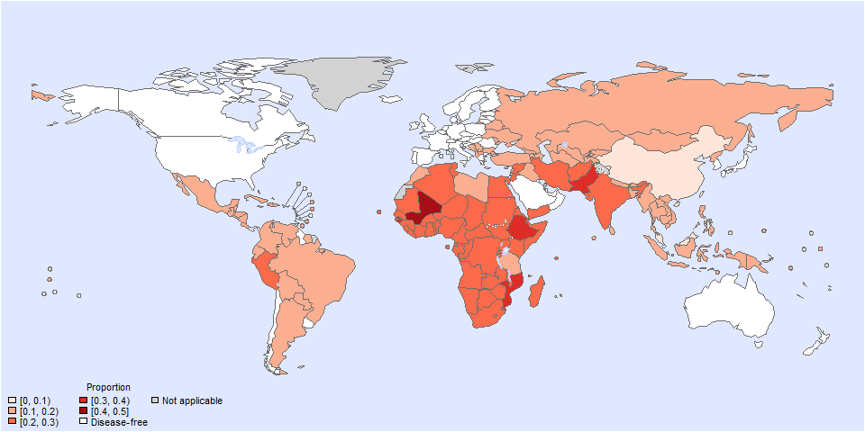

``` r
png(paste0(params$PlotDir, "/r_world5.png"), width=960, height=480)
plot_world(subset(all_cnt_prop, YEAR == 2020 & AGE == "Age above or equal 5" & SYNDROMTYPE == "Inpatient"),  
           "COUNTRY", "VAL_MEAN", legend.title = "Proportion", diseasefree = zero_cases, text.width = 23)
```

\[1\] 0.00 0.05 0.10 0.15 0.20 0.25 0.30

``` r
dev.off()
```

png 2

``` r
setwd(params$Dir)
image <- paste0("03-estimate-rota_files/figure-gfm/r_world5.png")
cat("")
```

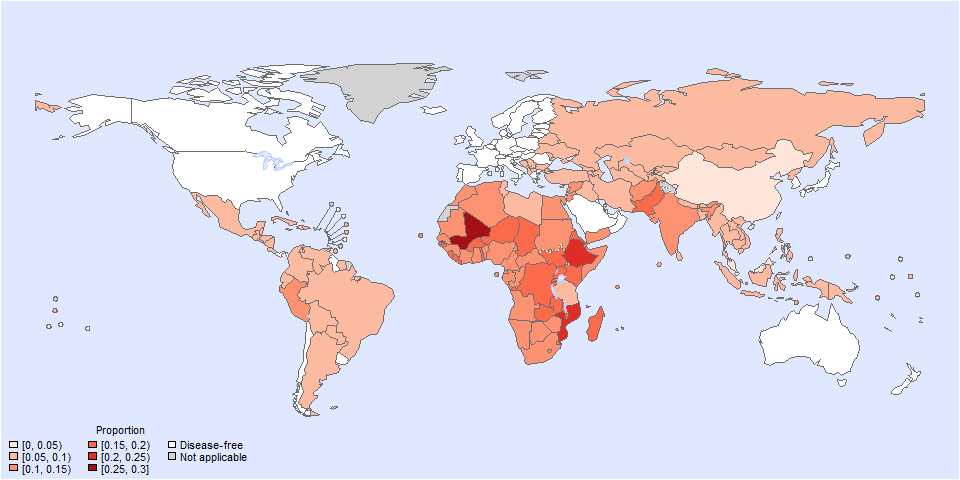

``` r
png(paste0(params$PlotDir, "/r_world6.png"), width=960, height=480)
plot_world(subset(all_cnt_prop, YEAR == 2020 & AGE == "Age above or equal 5" & SYNDROMTYPE == "Outpatient"),  
           "COUNTRY", "VAL_MEAN", legend.title = "Proportion", diseasefree = zero_cases, text.width = 23)
```

\[1\] 0.00 0.05 0.10 0.15 0.20 0.25 0.30 0.35

``` r
dev.off()
```

png 2

``` r
setwd(params$Dir)
image <- paste0("03-estimate-rota_files/figure-gfm/r_world6.png")
cat("")
```

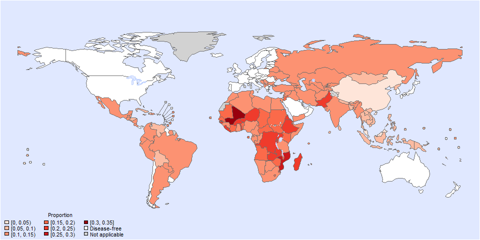

``` r
png(paste0(params$PlotDir, "/r_world7.png"), width=960, height=480)
plot_world(subset(all_cnt_prop, YEAR == 2020 & AGE == "Age below 5" & SYNDROMTYPE == "Inpatient"),
           "COUNTRY", "VAL_MEAN", legend.title = "Proportion", diseasefree = zero_cases, text.width = 23)
```

\[1\] 0.00 0.05 0.10 0.15 0.20 0.25 0.30 0.35

``` r
dev.off()
```

png 2

``` r
setwd(params$Dir)
image <- paste0("03-estimate-rota_files/figure-gfm/r_world7.png")
cat("")
```

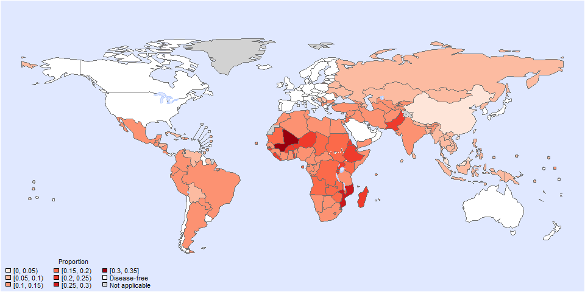

``` r
png(paste0(params$PlotDir, "/r_world8.png"), width=960, height=480)
plot_world(subset(all_cnt_prop, YEAR == 2020 & AGE == "Age below 5" & SYNDROMTYPE == "Outpatient"),  
           "COUNTRY", "VAL_MEAN", legend.title = "Proportion", diseasefree = zero_cases, text.width = 23)
```

\[1\] 0.0 0.1 0.2 0.3 0.4

``` r
dev.off()
```

png 2

``` r
setwd(params$Dir)
image <- paste0("03-estimate-rota_files/figure-gfm/r_world8.png")
cat("")
```

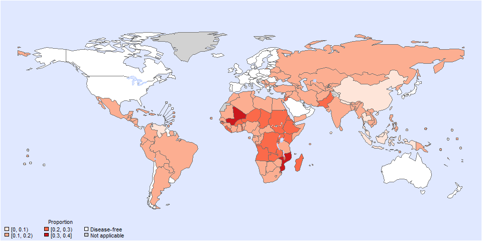

``` r
all_cntg_prop_sub <- subset(all_cnt_prop, LOCATION_NAME == "India" & YEAR %in% c(2010,2020))
all_cntg_prop_sub$TYPE <- paste0(all_cntg_prop_sub$YEAR, ": ", all_cntg_prop_sub$SYNDROMTYPE)
png(paste0(params$PlotDir, "/r_CI1.png"), width=960, height=480)
ggplot(all_cntg_prop_sub,
       aes(y = VAL_MEAN, x = AGE)) +
  geom_pointrange(aes(ymin = VAL_LWR, ymax = VAL_UPR, group=TYPE, colour = TYPE), size = 0.2,
                  position=position_dodge(width=0.40), show.legend=TRUE) +
  coord_flip() +
  theme_bw() +
  scale_x_discrete(NULL, limits = rev(unique(all_cnt_prop$AGE))) +
  scale_y_continuous(NULL) +
  ggtitle(paste0("Proportion of ", params$Pathogen," in India in 2010 vs 2020")) +
  scale_color_manual(breaks = c("2010: Inpatient", "2010: Outpatient", "2020: Inpatient", "2020: Outpatient"),
                     values=c("springgreen1", "orange","springgreen4", "orange3"))
dev.off()
```

png 2

``` r
setwd(params$Dir)
image <- paste0("03-estimate-rota_files/figure-gfm/r_CI1.png")
cat("")
```

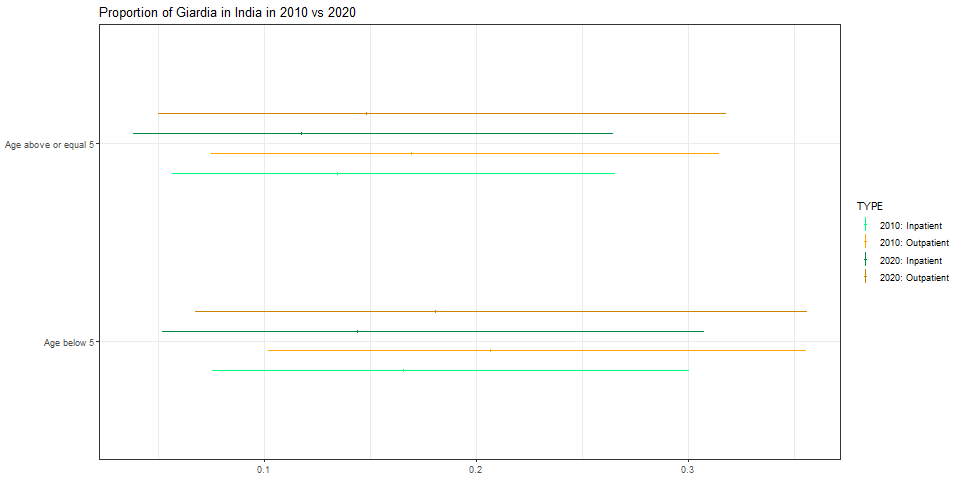

``` r
all_cntg_prop_sub <- subset(all_cnt_prop, LOCATION_NAME == "India") %>%
  mutate(AGE = case_when(
    AGE == "Age above or equal 5" ~ ">= 5",
    AGE == "Age below 5" ~ "< 5"))
all_cntg_prop_sub$TYPE <- paste0(all_cntg_prop_sub$SYNDROMTYPE, ": ", all_cntg_prop_sub$AGE)
png(paste0(params$PlotDir, "/r_CI2.png"), width=960, height=480)
ggplot(all_cntg_prop_sub,
       aes(y = VAL_MEAN, x = YEAR)) +
  geom_pointrange(aes(ymin = VAL_LWR, ymax = VAL_UPR, group=TYPE, colour = TYPE), size = 0.2,
                  position=position_dodge(width=0.40), show.legend=TRUE) +
  # coord_flip() +
  theme_bw() +
  # scale_x_discrete(NULL, limits = rev(unique(all_cnt_prop$YEAR))) +
  scale_y_continuous(NULL) +
  ggtitle(paste0("Proportion of ", params$Pathogen," in India from 2000 to 2020")) +
  scale_color_manual(breaks = c("Inpatient: < 5", "Inpatient: >= 5", "Outpatient: < 5", "Outpatient: >= 5"),
                     values=c("springgreen1", "orange","springgreen4", "orange3"))
dev.off()
```

png 2

``` r
setwd(params$Dir)
image <- paste0("03-estimate-rota_files/figure-gfm/r_CI2.png")
cat("")
```

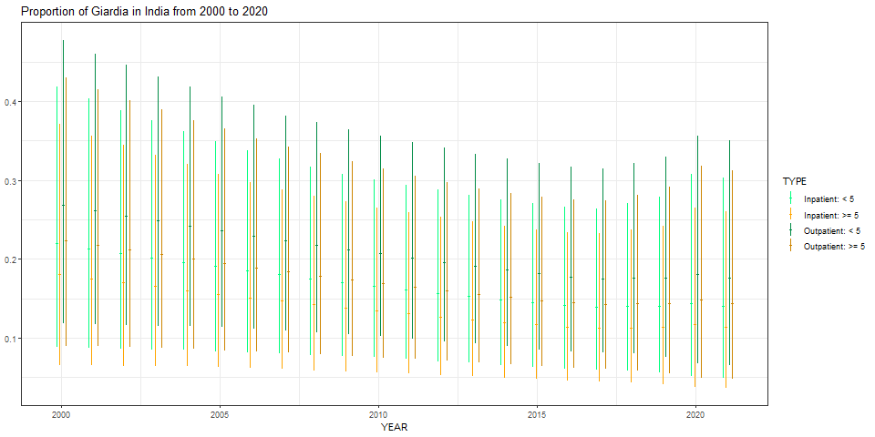

``` r
all_cntg_prop_sub <- subset(all_cnt_prop, LOCATION_NAME == "Tanzania" & YEAR %in% c(2010,2020))
all_cntg_prop_sub$TYPE <- paste0(all_cntg_prop_sub$YEAR, ": ", all_cntg_prop_sub$SYNDROMTYPE)
png(paste0(params$PlotDir, "/r_CI3.png"), width=960, height=480)
ggplot(all_cntg_prop_sub,
       aes(y = VAL_MEAN, x = AGE)) +
  geom_pointrange(aes(ymin = VAL_LWR, ymax = VAL_UPR, group=TYPE, colour = TYPE), size = 0.2,
                  position=position_dodge(width=0.40), show.legend=TRUE) +
  coord_flip() +
  theme_bw() +
  scale_x_discrete(NULL, limits = rev(unique(all_cnt_prop$AGE))) +
  scale_y_continuous(NULL) +
  ggtitle(paste0("Proportion of ", params$Pathogen," in Tanzania in 2010 vs 2020")) +
  scale_color_manual(breaks = c("2010: Inpatient", "2010: Outpatient", "2020: Inpatient", "2020: Outpatient"),
                     values=c("springgreen1", "orange","springgreen4", "orange3"))
dev.off()
```

png 2

``` r
setwd(params$Dir)
image <- paste0("03-estimate-rota_files/figure-gfm/r_CI3.png")
cat("")
```

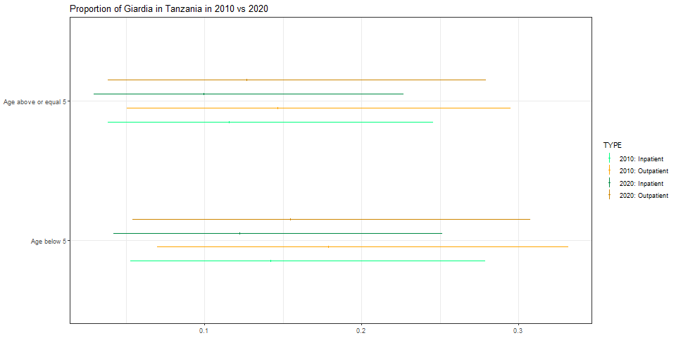

``` r
all_cntg_prop_sub <- subset(all_cnt_prop, LOCATION_NAME == "Tanzania") %>%
  mutate(AGE = case_when(
    AGE == "Age above or equal 5" ~ ">= 5",
    AGE == "Age below 5" ~ "< 5"))
all_cntg_prop_sub$TYPE <- paste0(all_cntg_prop_sub$SYNDROMTYPE, ": ", all_cntg_prop_sub$AGE)
png(paste0(params$PlotDir, "/r_CI4.png"), width=960, height=480)
ggplot(all_cntg_prop_sub,
       aes(y = VAL_MEAN, x = YEAR)) +
  geom_pointrange(aes(ymin = VAL_LWR, ymax = VAL_UPR, group=TYPE, colour = TYPE), size = 0.2,
                  position=position_dodge(width=0.40), show.legend=TRUE) +
  # coord_flip() +
  theme_bw() +
  # scale_x_discrete(NULL, limits = rev(unique(all_cnt_prop$YEAR))) +
  scale_y_continuous(NULL) +
  ggtitle(paste0("Proportion of ", params$Pathogen," in Tanzania from 2000 to 2020")) +
  scale_color_manual(breaks = c("Inpatient: < 5", "Inpatient: >= 5", "Outpatient: < 5", "Outpatient: >= 5"),
                     values=c("springgreen1", "orange","springgreen4", "orange3"))
dev.off()
```

png 2

``` r
setwd(params$Dir)
image <- paste0("03-estimate-rota_files/figure-gfm/r_CI4.png")
cat("")
```

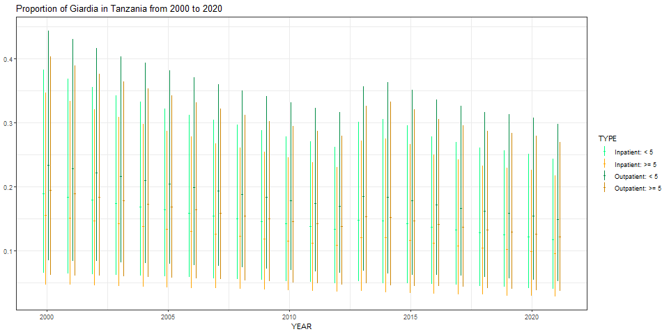

``` r
all_cntg_prop_sub <- subset(all_cnt_prop, LOCATION_NAME == "Peru" & YEAR %in% c(2010,2020))
all_cntg_prop_sub$TYPE <- paste0(all_cntg_prop_sub$YEAR, ": ", all_cntg_prop_sub$SYNDROMTYPE)
png(paste0(params$PlotDir, "/r_CI5.png"), width=960, height=480)
ggplot(all_cntg_prop_sub,
       aes(y = VAL_MEAN, x = AGE)) +
  geom_pointrange(aes(ymin = VAL_LWR, ymax = VAL_UPR, group=TYPE, colour = TYPE), size = 0.2,
                  position=position_dodge(width=0.40), show.legend=TRUE) +
  coord_flip() +
  theme_bw() +
  scale_x_discrete(NULL, limits = rev(unique(all_cnt_prop$AGE))) +
  scale_y_continuous(NULL) +
  ggtitle(paste0("Proportion of ", params$Pathogen," in Peru in 2010 vs 2020")) +
  scale_color_manual(breaks = c("2010: Inpatient", "2010: Outpatient", "2020: Inpatient", "2020: Outpatient"),
                     values=c("springgreen1", "orange","springgreen4", "orange3"))
dev.off()
```

png 2

``` r
setwd(params$Dir)
image <- paste0("03-estimate-rota_files/figure-gfm/r_CI5.png")
cat("")
```

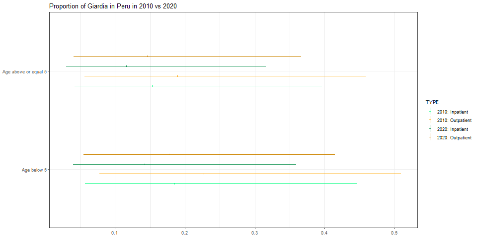

``` r
all_cntg_prop_sub <- subset(all_cnt_prop, LOCATION_NAME == "Peru") %>%
  mutate(AGE = case_when(
    AGE == "Age above or equal 5" ~ ">= 5",
    AGE == "Age below 5" ~ "< 5"))
all_cntg_prop_sub$TYPE <- paste0(all_cntg_prop_sub$SYNDROMTYPE, ": ", all_cntg_prop_sub$AGE)
png(paste0(params$PlotDir, "/r_CI6.png"), width=960, height=480)
ggplot(all_cntg_prop_sub,
       aes(y = VAL_MEAN, x = YEAR)) +
  geom_pointrange(aes(ymin = VAL_LWR, ymax = VAL_UPR, group=TYPE, colour = TYPE), size = 0.2,
                  position=position_dodge(width=0.40), show.legend=TRUE) +
  # coord_flip() +
  theme_bw() +
  # scale_x_discrete(NULL, limits = rev(unique(all_cnt_prop$YEAR))) +
  scale_y_continuous(NULL) +
  ggtitle(paste0("Proportion of ", params$Pathogen," in Peru from 2000 to 2020")) +
  scale_color_manual(breaks = c("Inpatient: < 5", "Inpatient: >= 5", "Outpatient: < 5", "Outpatient: >= 5"),
                     values=c("springgreen1", "orange","springgreen4", "orange3"))
dev.off()
```

png 2

``` r
setwd(params$Dir)
image <- paste0("03-estimate-rota_files/figure-gfm/r_CI6.png")
cat("")
```

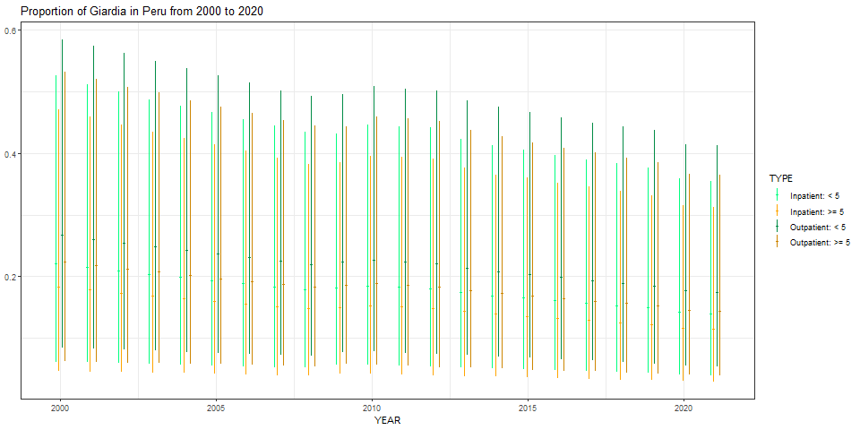

``` r
all_cnt_prop$AGE <- relevel(all_cnt_prop$AGE, "Age below 5")
all_cnt_prop <- sort_by(all_cnt_prop, ~LOCATION_NAME+SYNDROMTYPE+AGE)

tab <-
  data.frame(subset(all_cnt_prop, YEAR == 2010)[,c("LOCATION_NAME", "AGE", "SYNDROMTYPE", "VAL_MEAN", "VAL_LWR", "VAL_UPR")],
             subset(all_cnt_prop, YEAR == 2020)[,c("VAL_MEAN", "VAL_LWR", "VAL_UPR")])
tab$LOCATION_NAME <- gsub(" \\(.*", "", tab$LOCATION_NAME)
names(tab) <-
  c("Country", "Age", "Syndrome",
    "2010.mean", "2010.lwr", "2010.upr",
    "2020.mean", "2020.lwr", "2020.upr")
tab <- tab %>%
  mutate(Age = case_when(
    Age == "Age above or equal 5" ~ ">= 5",
    Age == "Age below 5" ~ "< 5"))

kable(tab, digits = 3, row.names = FALSE,
      caption = "Estimated `r params$Pathogen` proportion by country, 2010 vs 2020")
```

| Country | Age | Syndrome | 2010.mean | 2010.lwr | 2010.upr | 2020.mean | 2020.lwr | 2020.upr |
|:---|:---|:---|---:|---:|---:|---:|---:|---:|
| Afghanistan | \< 5 | Inpatient | 0.170 | 0.046 | 0.422 | 0.140 | 0.037 | 0.358 |
| Afghanistan | \>= 5 | Inpatient | 0.140 | 0.034 | 0.371 | 0.115 | 0.027 | 0.315 |
| Afghanistan | \< 5 | Outpatient | 0.210 | 0.062 | 0.490 | 0.175 | 0.048 | 0.422 |
| Afghanistan | \>= 5 | Outpatient | 0.174 | 0.046 | 0.434 | 0.144 | 0.036 | 0.376 |
| Albania | \< 5 | Inpatient | 0.120 | 0.025 | 0.312 | 0.106 | 0.019 | 0.292 |
| Albania | \>= 5 | Inpatient | 0.097 | 0.019 | 0.263 | 0.086 | 0.014 | 0.257 |
| Albania | \< 5 | Outpatient | 0.151 | 0.035 | 0.371 | 0.134 | 0.026 | 0.352 |
| Albania | \>= 5 | Outpatient | 0.122 | 0.026 | 0.315 | 0.109 | 0.020 | 0.310 |
| Algeria | \< 5 | Inpatient | 0.176 | 0.090 | 0.294 | 0.135 | 0.060 | 0.245 |
| Algeria | \>= 5 | Inpatient | 0.144 | 0.065 | 0.267 | 0.109 | 0.044 | 0.218 |
| Algeria | \< 5 | Outpatient | 0.220 | 0.122 | 0.346 | 0.170 | 0.081 | 0.295 |
| Algeria | \>= 5 | Outpatient | 0.181 | 0.088 | 0.312 | 0.139 | 0.059 | 0.264 |
| Andorra | \< 5 | Inpatient | 0.000 | 0.000 | 0.000 | 0.000 | 0.000 | 0.000 |
| Andorra | \>= 5 | Inpatient | 0.000 | 0.000 | 0.000 | 0.000 | 0.000 | 0.000 |
| Andorra | \< 5 | Outpatient | 0.000 | 0.000 | 0.000 | 0.000 | 0.000 | 0.000 |
| Andorra | \>= 5 | Outpatient | 0.000 | 0.000 | 0.000 | 0.000 | 0.000 | 0.000 |
| Angola | \< 5 | Inpatient | 0.222 | 0.075 | 0.496 | 0.181 | 0.059 | 0.423 |
| Angola | \>= 5 | Inpatient | 0.184 | 0.054 | 0.446 | 0.149 | 0.043 | 0.377 |
| Angola | \< 5 | Outpatient | 0.270 | 0.099 | 0.561 | 0.223 | 0.078 | 0.492 |
| Angola | \>= 5 | Outpatient | 0.226 | 0.072 | 0.508 | 0.186 | 0.057 | 0.438 |
| Antigua and Barbuda | \< 5 | Inpatient | 0.000 | 0.000 | 0.000 | 0.000 | 0.000 | 0.000 |
| Antigua and Barbuda | \>= 5 | Inpatient | 0.000 | 0.000 | 0.000 | 0.000 | 0.000 | 0.000 |
| Antigua and Barbuda | \< 5 | Outpatient | 0.000 | 0.000 | 0.000 | 0.000 | 0.000 | 0.000 |
| Antigua and Barbuda | \>= 5 | Outpatient | 0.000 | 0.000 | 0.000 | 0.000 | 0.000 | 0.000 |
| Argentina | \< 5 | Inpatient | 0.129 | 0.049 | 0.256 | 0.106 | 0.040 | 0.214 |
| Argentina | \>= 5 | Inpatient | 0.104 | 0.036 | 0.224 | 0.086 | 0.029 | 0.190 |
| Argentina | \< 5 | Outpatient | 0.162 | 0.067 | 0.304 | 0.135 | 0.055 | 0.257 |
| Argentina | \>= 5 | Outpatient | 0.132 | 0.049 | 0.268 | 0.109 | 0.040 | 0.230 |
| Armenia | \< 5 | Inpatient | 0.130 | 0.041 | 0.283 | 0.114 | 0.030 | 0.267 |
| Armenia | \>= 5 | Inpatient | 0.105 | 0.032 | 0.245 | 0.092 | 0.023 | 0.239 |
| Armenia | \< 5 | Outpatient | 0.164 | 0.056 | 0.337 | 0.144 | 0.040 | 0.323 |
| Armenia | \>= 5 | Outpatient | 0.133 | 0.043 | 0.294 | 0.117 | 0.031 | 0.288 |
| Australia | \< 5 | Inpatient | 0.000 | 0.000 | 0.000 | 0.000 | 0.000 | 0.000 |
| Australia | \>= 5 | Inpatient | 0.000 | 0.000 | 0.000 | 0.000 | 0.000 | 0.000 |
| Australia | \< 5 | Outpatient | 0.000 | 0.000 | 0.000 | 0.000 | 0.000 | 0.000 |
| Australia | \>= 5 | Outpatient | 0.000 | 0.000 | 0.000 | 0.000 | 0.000 | 0.000 |
| Austria | \< 5 | Inpatient | 0.000 | 0.000 | 0.000 | 0.000 | 0.000 | 0.000 |
| Austria | \>= 5 | Inpatient | 0.000 | 0.000 | 0.000 | 0.000 | 0.000 | 0.000 |
| Austria | \< 5 | Outpatient | 0.000 | 0.000 | 0.000 | 0.000 | 0.000 | 0.000 |
| Austria | \>= 5 | Outpatient | 0.000 | 0.000 | 0.000 | 0.000 | 0.000 | 0.000 |
| Azerbaijan | \< 5 | Inpatient | 0.130 | 0.041 | 0.283 | 0.099 | 0.028 | 0.229 |
| Azerbaijan | \>= 5 | Inpatient | 0.105 | 0.032 | 0.245 | 0.079 | 0.022 | 0.194 |
| Azerbaijan | \< 5 | Outpatient | 0.164 | 0.056 | 0.337 | 0.125 | 0.039 | 0.278 |
| Azerbaijan | \>= 5 | Outpatient | 0.133 | 0.043 | 0.294 | 0.101 | 0.029 | 0.237 |
| Bahamas, The | \< 5 | Inpatient | 0.000 | 0.000 | 0.000 | 0.000 | 0.000 | 0.000 |
| Bahamas, The | \>= 5 | Inpatient | 0.000 | 0.000 | 0.000 | 0.000 | 0.000 | 0.000 |
| Bahamas, The | \< 5 | Outpatient | 0.000 | 0.000 | 0.000 | 0.000 | 0.000 | 0.000 |
| Bahamas, The | \>= 5 | Outpatient | 0.000 | 0.000 | 0.000 | 0.000 | 0.000 | 0.000 |
| Bahrain | \< 5 | Inpatient | 0.000 | 0.000 | 0.000 | 0.000 | 0.000 | 0.000 |
| Bahrain | \>= 5 | Inpatient | 0.000 | 0.000 | 0.000 | 0.000 | 0.000 | 0.000 |
| Bahrain | \< 5 | Outpatient | 0.000 | 0.000 | 0.000 | 0.000 | 0.000 | 0.000 |
| Bahrain | \>= 5 | Outpatient | 0.000 | 0.000 | 0.000 | 0.000 | 0.000 | 0.000 |
| Bangladesh | \< 5 | Inpatient | 0.118 | 0.054 | 0.214 | 0.090 | 0.035 | 0.180 |
| Bangladesh | \>= 5 | Inpatient | 0.096 | 0.038 | 0.191 | 0.072 | 0.025 | 0.159 |
| Bangladesh | \< 5 | Outpatient | 0.150 | 0.074 | 0.255 | 0.115 | 0.046 | 0.222 |
| Bangladesh | \>= 5 | Outpatient | 0.122 | 0.052 | 0.228 | 0.093 | 0.034 | 0.195 |
| Barbados | \< 5 | Inpatient | 0.000 | 0.000 | 0.000 | 0.000 | 0.000 | 0.000 |
| Barbados | \>= 5 | Inpatient | 0.000 | 0.000 | 0.000 | 0.000 | 0.000 | 0.000 |
| Barbados | \< 5 | Outpatient | 0.000 | 0.000 | 0.000 | 0.000 | 0.000 | 0.000 |
| Barbados | \>= 5 | Outpatient | 0.000 | 0.000 | 0.000 | 0.000 | 0.000 | 0.000 |
| Belarus | \< 5 | Inpatient | 0.130 | 0.041 | 0.283 | 0.099 | 0.028 | 0.229 |
| Belarus | \>= 5 | Inpatient | 0.105 | 0.032 | 0.245 | 0.079 | 0.022 | 0.194 |
| Belarus | \< 5 | Outpatient | 0.164 | 0.056 | 0.337 | 0.125 | 0.039 | 0.278 |
| Belarus | \>= 5 | Outpatient | 0.133 | 0.043 | 0.294 | 0.101 | 0.029 | 0.237 |
| Belgium | \< 5 | Inpatient | 0.000 | 0.000 | 0.000 | 0.000 | 0.000 | 0.000 |
| Belgium | \>= 5 | Inpatient | 0.000 | 0.000 | 0.000 | 0.000 | 0.000 | 0.000 |
| Belgium | \< 5 | Outpatient | 0.000 | 0.000 | 0.000 | 0.000 | 0.000 | 0.000 |
| Belgium | \>= 5 | Outpatient | 0.000 | 0.000 | 0.000 | 0.000 | 0.000 | 0.000 |
| Belize | \< 5 | Inpatient | 0.129 | 0.049 | 0.256 | 0.099 | 0.030 | 0.223 |
| Belize | \>= 5 | Inpatient | 0.104 | 0.036 | 0.224 | 0.079 | 0.023 | 0.193 |
| Belize | \< 5 | Outpatient | 0.162 | 0.067 | 0.304 | 0.125 | 0.042 | 0.268 |
| Belize | \>= 5 | Outpatient | 0.132 | 0.049 | 0.268 | 0.101 | 0.031 | 0.235 |
| Benin | \< 5 | Inpatient | 0.176 | 0.090 | 0.294 | 0.146 | 0.072 | 0.249 |
| Benin | \>= 5 | Inpatient | 0.144 | 0.065 | 0.267 | 0.119 | 0.050 | 0.228 |
| Benin | \< 5 | Outpatient | 0.220 | 0.122 | 0.346 | 0.183 | 0.097 | 0.299 |
| Benin | \>= 5 | Outpatient | 0.181 | 0.088 | 0.312 | 0.150 | 0.067 | 0.275 |
| Bhutan | \< 5 | Inpatient | 0.122 | 0.055 | 0.223 | 0.092 | 0.036 | 0.184 |
| Bhutan | \>= 5 | Inpatient | 0.098 | 0.040 | 0.196 | 0.074 | 0.026 | 0.161 |
| Bhutan | \< 5 | Outpatient | 0.154 | 0.075 | 0.269 | 0.118 | 0.048 | 0.225 |
| Bhutan | \>= 5 | Outpatient | 0.125 | 0.053 | 0.237 | 0.095 | 0.035 | 0.197 |
| Bolivia | \< 5 | Inpatient | 0.125 | 0.030 | 0.284 | 0.091 | 0.021 | 0.216 |
| Bolivia | \>= 5 | Inpatient | 0.101 | 0.022 | 0.260 | 0.074 | 0.016 | 0.192 |
| Bolivia | \< 5 | Outpatient | 0.156 | 0.041 | 0.341 | 0.116 | 0.029 | 0.261 |
| Bolivia | \>= 5 | Outpatient | 0.128 | 0.030 | 0.309 | 0.094 | 0.022 | 0.233 |
| Bosnia and Herzegovina | \< 5 | Inpatient | 0.130 | 0.041 | 0.283 | 0.099 | 0.028 | 0.229 |
| Bosnia and Herzegovina | \>= 5 | Inpatient | 0.105 | 0.032 | 0.245 | 0.079 | 0.022 | 0.194 |
| Bosnia and Herzegovina | \< 5 | Outpatient | 0.164 | 0.056 | 0.337 | 0.125 | 0.039 | 0.278 |
| Bosnia and Herzegovina | \>= 5 | Outpatient | 0.133 | 0.043 | 0.294 | 0.101 | 0.029 | 0.237 |
| Botswana | \< 5 | Inpatient | 0.164 | 0.061 | 0.314 | 0.140 | 0.050 | 0.277 |
| Botswana | \>= 5 | Inpatient | 0.134 | 0.045 | 0.276 | 0.114 | 0.036 | 0.250 |
| Botswana | \< 5 | Outpatient | 0.204 | 0.082 | 0.368 | 0.175 | 0.066 | 0.331 |
| Botswana | \>= 5 | Outpatient | 0.168 | 0.062 | 0.328 | 0.144 | 0.048 | 0.301 |
| Brazil | \< 5 | Inpatient | 0.140 | 0.049 | 0.293 | 0.105 | 0.034 | 0.233 |
| Brazil | \>= 5 | Inpatient | 0.114 | 0.035 | 0.264 | 0.085 | 0.024 | 0.204 |
| Brazil | \< 5 | Outpatient | 0.175 | 0.067 | 0.346 | 0.133 | 0.045 | 0.281 |
| Brazil | \>= 5 | Outpatient | 0.144 | 0.048 | 0.309 | 0.108 | 0.033 | 0.246 |
| Brunei Darussalam | \< 5 | Inpatient | 0.000 | 0.000 | 0.000 | 0.000 | 0.000 | 0.000 |
| Brunei Darussalam | \>= 5 | Inpatient | 0.000 | 0.000 | 0.000 | 0.000 | 0.000 | 0.000 |
| Brunei Darussalam | \< 5 | Outpatient | 0.000 | 0.000 | 0.000 | 0.000 | 0.000 | 0.000 |
| Brunei Darussalam | \>= 5 | Outpatient | 0.000 | 0.000 | 0.000 | 0.000 | 0.000 | 0.000 |
| Bulgaria | \< 5 | Inpatient | 0.130 | 0.041 | 0.283 | 0.104 | 0.031 | 0.233 |
| Bulgaria | \>= 5 | Inpatient | 0.105 | 0.032 | 0.245 | 0.084 | 0.024 | 0.202 |
| Bulgaria | \< 5 | Outpatient | 0.164 | 0.056 | 0.337 | 0.132 | 0.042 | 0.282 |
| Bulgaria | \>= 5 | Outpatient | 0.133 | 0.043 | 0.294 | 0.107 | 0.032 | 0.248 |
| Burkina Faso | \< 5 | Inpatient | 0.247 | 0.075 | 0.491 | 0.214 | 0.065 | 0.437 |
| Burkina Faso | \>= 5 | Inpatient | 0.207 | 0.057 | 0.445 | 0.179 | 0.047 | 0.402 |
| Burkina Faso | \< 5 | Outpatient | 0.299 | 0.099 | 0.548 | 0.262 | 0.086 | 0.503 |
| Burkina Faso | \>= 5 | Outpatient | 0.253 | 0.075 | 0.508 | 0.220 | 0.063 | 0.469 |
| Burundi | \< 5 | Inpatient | 0.246 | 0.119 | 0.423 | 0.216 | 0.096 | 0.396 |
| Burundi | \>= 5 | Inpatient | 0.205 | 0.086 | 0.386 | 0.180 | 0.067 | 0.371 |
| Burundi | \< 5 | Outpatient | 0.300 | 0.153 | 0.486 | 0.266 | 0.124 | 0.460 |
| Burundi | \>= 5 | Outpatient | 0.252 | 0.113 | 0.450 | 0.223 | 0.087 | 0.432 |
| Cabo Verde | \< 5 | Inpatient | 0.176 | 0.090 | 0.294 | 0.135 | 0.060 | 0.245 |
| Cabo Verde | \>= 5 | Inpatient | 0.144 | 0.065 | 0.267 | 0.109 | 0.044 | 0.218 |
| Cabo Verde | \< 5 | Outpatient | 0.220 | 0.122 | 0.346 | 0.170 | 0.081 | 0.295 |
| Cabo Verde | \>= 5 | Outpatient | 0.181 | 0.088 | 0.312 | 0.139 | 0.059 | 0.264 |
| Cambodia | \< 5 | Inpatient | 0.128 | 0.029 | 0.327 | 0.097 | 0.021 | 0.259 |
| Cambodia | \>= 5 | Inpatient | 0.103 | 0.023 | 0.277 | 0.077 | 0.016 | 0.215 |
| Cambodia | \< 5 | Outpatient | 0.159 | 0.040 | 0.387 | 0.122 | 0.028 | 0.309 |
| Cambodia | \>= 5 | Outpatient | 0.129 | 0.031 | 0.333 | 0.098 | 0.022 | 0.262 |
| Cameroon | \< 5 | Inpatient | 0.175 | 0.056 | 0.373 | 0.145 | 0.046 | 0.316 |
| Cameroon | \>= 5 | Inpatient | 0.144 | 0.042 | 0.325 | 0.119 | 0.034 | 0.279 |
| Cameroon | \< 5 | Outpatient | 0.217 | 0.074 | 0.430 | 0.182 | 0.062 | 0.373 |
| Cameroon | \>= 5 | Outpatient | 0.179 | 0.056 | 0.383 | 0.150 | 0.046 | 0.333 |
| Canada | \< 5 | Inpatient | 0.000 | 0.000 | 0.000 | 0.000 | 0.000 | 0.000 |
| Canada | \>= 5 | Inpatient | 0.000 | 0.000 | 0.000 | 0.000 | 0.000 | 0.000 |
| Canada | \< 5 | Outpatient | 0.000 | 0.000 | 0.000 | 0.000 | 0.000 | 0.000 |
| Canada | \>= 5 | Outpatient | 0.000 | 0.000 | 0.000 | 0.000 | 0.000 | 0.000 |
| Central African Republic | \< 5 | Inpatient | 0.187 | 0.037 | 0.410 | 0.146 | 0.024 | 0.348 |
| Central African Republic | \>= 5 | Inpatient | 0.155 | 0.027 | 0.372 | 0.120 | 0.018 | 0.314 |
| Central African Republic | \< 5 | Outpatient | 0.231 | 0.048 | 0.479 | 0.182 | 0.032 | 0.415 |
| Central African Republic | \>= 5 | Outpatient | 0.193 | 0.035 | 0.443 | 0.151 | 0.023 | 0.372 |
| Chad | \< 5 | Inpatient | 0.246 | 0.119 | 0.423 | 0.192 | 0.082 | 0.360 |
| Chad | \>= 5 | Inpatient | 0.205 | 0.086 | 0.386 | 0.158 | 0.058 | 0.327 |
| Chad | \< 5 | Outpatient | 0.300 | 0.153 | 0.486 | 0.238 | 0.106 | 0.424 |
| Chad | \>= 5 | Outpatient | 0.252 | 0.113 | 0.450 | 0.197 | 0.078 | 0.383 |
| Chile | \< 5 | Inpatient | 0.000 | 0.000 | 0.000 | 0.000 | 0.000 | 0.000 |
| Chile | \>= 5 | Inpatient | 0.000 | 0.000 | 0.000 | 0.000 | 0.000 | 0.000 |
| Chile | \< 5 | Outpatient | 0.000 | 0.000 | 0.000 | 0.000 | 0.000 | 0.000 |
| Chile | \>= 5 | Outpatient | 0.000 | 0.000 | 0.000 | 0.000 | 0.000 | 0.000 |
| China | \< 5 | Inpatient | 0.035 | 0.010 | 0.086 | 0.026 | 0.007 | 0.067 |
| China | \>= 5 | Inpatient | 0.027 | 0.008 | 0.069 | 0.020 | 0.005 | 0.054 |
| China | \< 5 | Outpatient | 0.045 | 0.014 | 0.106 | 0.034 | 0.009 | 0.084 |
| China | \>= 5 | Outpatient | 0.036 | 0.011 | 0.087 | 0.026 | 0.007 | 0.068 |
| Colombia | \< 5 | Inpatient | 0.149 | 0.052 | 0.326 | 0.114 | 0.037 | 0.262 |
| Colombia | \>= 5 | Inpatient | 0.122 | 0.038 | 0.297 | 0.093 | 0.027 | 0.234 |
| Colombia | \< 5 | Outpatient | 0.186 | 0.068 | 0.384 | 0.145 | 0.049 | 0.315 |
| Colombia | \>= 5 | Outpatient | 0.153 | 0.050 | 0.353 | 0.118 | 0.036 | 0.287 |
| Comoros | \< 5 | Inpatient | 0.176 | 0.090 | 0.294 | 0.135 | 0.060 | 0.245 |
| Comoros | \>= 5 | Inpatient | 0.144 | 0.065 | 0.267 | 0.109 | 0.044 | 0.218 |
| Comoros | \< 5 | Outpatient | 0.220 | 0.122 | 0.346 | 0.170 | 0.081 | 0.295 |
| Comoros | \>= 5 | Outpatient | 0.181 | 0.088 | 0.312 | 0.139 | 0.059 | 0.264 |
| Congo, Dem. Rep. | \< 5 | Inpatient | 0.246 | 0.119 | 0.423 | 0.197 | 0.092 | 0.352 |
| Congo, Dem. Rep. | \>= 5 | Inpatient | 0.205 | 0.086 | 0.386 | 0.162 | 0.065 | 0.323 |
| Congo, Dem. Rep. | \< 5 | Outpatient | 0.300 | 0.153 | 0.486 | 0.244 | 0.120 | 0.414 |
| Congo, Dem. Rep. | \>= 5 | Outpatient | 0.252 | 0.113 | 0.450 | 0.203 | 0.087 | 0.380 |
| Congo, Rep. | \< 5 | Inpatient | 0.176 | 0.090 | 0.294 | 0.145 | 0.072 | 0.247 |
| Congo, Rep. | \>= 5 | Inpatient | 0.144 | 0.065 | 0.267 | 0.118 | 0.050 | 0.227 |
| Congo, Rep. | \< 5 | Outpatient | 0.220 | 0.122 | 0.346 | 0.182 | 0.096 | 0.297 |
| Congo, Rep. | \>= 5 | Outpatient | 0.181 | 0.088 | 0.312 | 0.149 | 0.067 | 0.273 |
| Cook Islands | \< 5 | Inpatient | 0.000 | 0.000 | 0.000 | 0.000 | 0.000 | 0.000 |
| Cook Islands | \>= 5 | Inpatient | 0.000 | 0.000 | 0.000 | 0.000 | 0.000 | 0.000 |
| Cook Islands | \< 5 | Outpatient | 0.000 | 0.000 | 0.000 | 0.000 | 0.000 | 0.000 |
| Cook Islands | \>= 5 | Outpatient | 0.000 | 0.000 | 0.000 | 0.000 | 0.000 | 0.000 |
| Costa Rica | \< 5 | Inpatient | 0.129 | 0.049 | 0.256 | 0.111 | 0.042 | 0.228 |
| Costa Rica | \>= 5 | Inpatient | 0.104 | 0.036 | 0.224 | 0.090 | 0.029 | 0.203 |
| Costa Rica | \< 5 | Outpatient | 0.162 | 0.067 | 0.304 | 0.140 | 0.055 | 0.276 |
| Costa Rica | \>= 5 | Outpatient | 0.132 | 0.049 | 0.268 | 0.114 | 0.040 | 0.246 |
| Côte d’Ivoire | \< 5 | Inpatient | 0.176 | 0.090 | 0.294 | 0.147 | 0.072 | 0.254 |
| Côte d’Ivoire | \>= 5 | Inpatient | 0.144 | 0.065 | 0.267 | 0.120 | 0.050 | 0.233 |
| Côte d’Ivoire | \< 5 | Outpatient | 0.220 | 0.122 | 0.346 | 0.185 | 0.096 | 0.305 |
| Côte d’Ivoire | \>= 5 | Outpatient | 0.181 | 0.088 | 0.312 | 0.152 | 0.067 | 0.281 |
| Croatia | \< 5 | Inpatient | 0.000 | 0.000 | 0.000 | 0.000 | 0.000 | 0.000 |
| Croatia | \>= 5 | Inpatient | 0.000 | 0.000 | 0.000 | 0.000 | 0.000 | 0.000 |
| Croatia | \< 5 | Outpatient | 0.000 | 0.000 | 0.000 | 0.000 | 0.000 | 0.000 |
| Croatia | \>= 5 | Outpatient | 0.000 | 0.000 | 0.000 | 0.000 | 0.000 | 0.000 |
| Cuba | \< 5 | Inpatient | 0.115 | 0.026 | 0.287 | 0.089 | 0.016 | 0.247 |
| Cuba | \>= 5 | Inpatient | 0.093 | 0.018 | 0.248 | 0.072 | 0.012 | 0.216 |
| Cuba | \< 5 | Outpatient | 0.144 | 0.034 | 0.341 | 0.113 | 0.021 | 0.297 |
| Cuba | \>= 5 | Outpatient | 0.118 | 0.025 | 0.297 | 0.092 | 0.015 | 0.259 |
| Cyprus | \< 5 | Inpatient | 0.000 | 0.000 | 0.000 | 0.000 | 0.000 | 0.000 |
| Cyprus | \>= 5 | Inpatient | 0.000 | 0.000 | 0.000 | 0.000 | 0.000 | 0.000 |
| Cyprus | \< 5 | Outpatient | 0.000 | 0.000 | 0.000 | 0.000 | 0.000 | 0.000 |
| Cyprus | \>= 5 | Outpatient | 0.000 | 0.000 | 0.000 | 0.000 | 0.000 | 0.000 |
| Czech Republic | \< 5 | Inpatient | 0.000 | 0.000 | 0.000 | 0.000 | 0.000 | 0.000 |
| Czech Republic | \>= 5 | Inpatient | 0.000 | 0.000 | 0.000 | 0.000 | 0.000 | 0.000 |
| Czech Republic | \< 5 | Outpatient | 0.000 | 0.000 | 0.000 | 0.000 | 0.000 | 0.000 |
| Czech Republic | \>= 5 | Outpatient | 0.000 | 0.000 | 0.000 | 0.000 | 0.000 | 0.000 |
| Denmark | \< 5 | Inpatient | 0.000 | 0.000 | 0.000 | 0.000 | 0.000 | 0.000 |
| Denmark | \>= 5 | Inpatient | 0.000 | 0.000 | 0.000 | 0.000 | 0.000 | 0.000 |
| Denmark | \< 5 | Outpatient | 0.000 | 0.000 | 0.000 | 0.000 | 0.000 | 0.000 |
| Denmark | \>= 5 | Outpatient | 0.000 | 0.000 | 0.000 | 0.000 | 0.000 | 0.000 |
| Djibouti | \< 5 | Inpatient | 0.161 | 0.071 | 0.297 | 0.135 | 0.054 | 0.268 |
| Djibouti | \>= 5 | Inpatient | 0.131 | 0.051 | 0.267 | 0.110 | 0.037 | 0.242 |
| Djibouti | \< 5 | Outpatient | 0.201 | 0.096 | 0.354 | 0.170 | 0.072 | 0.321 |
| Djibouti | \>= 5 | Outpatient | 0.165 | 0.069 | 0.322 | 0.140 | 0.050 | 0.295 |
| Dominica | \< 5 | Inpatient | 0.129 | 0.049 | 0.256 | 0.099 | 0.030 | 0.223 |
| Dominica | \>= 5 | Inpatient | 0.104 | 0.036 | 0.224 | 0.079 | 0.023 | 0.193 |
| Dominica | \< 5 | Outpatient | 0.162 | 0.067 | 0.304 | 0.125 | 0.042 | 0.268 |
| Dominica | \>= 5 | Outpatient | 0.132 | 0.049 | 0.268 | 0.101 | 0.031 | 0.235 |
| Dominican Republic | \< 5 | Inpatient | 0.129 | 0.049 | 0.256 | 0.107 | 0.041 | 0.216 |
| Dominican Republic | \>= 5 | Inpatient | 0.104 | 0.036 | 0.224 | 0.087 | 0.030 | 0.193 |
| Dominican Republic | \< 5 | Outpatient | 0.162 | 0.067 | 0.304 | 0.136 | 0.055 | 0.259 |
| Dominican Republic | \>= 5 | Outpatient | 0.132 | 0.049 | 0.268 | 0.110 | 0.040 | 0.232 |
| Ecuador | \< 5 | Inpatient | 0.146 | 0.057 | 0.293 | 0.107 | 0.041 | 0.215 |
| Ecuador | \>= 5 | Inpatient | 0.120 | 0.040 | 0.265 | 0.086 | 0.030 | 0.192 |
| Ecuador | \< 5 | Outpatient | 0.183 | 0.077 | 0.346 | 0.135 | 0.055 | 0.258 |
| Ecuador | \>= 5 | Outpatient | 0.151 | 0.054 | 0.316 | 0.110 | 0.040 | 0.231 |
| Egypt, Arab Rep. | \< 5 | Inpatient | 0.188 | 0.066 | 0.413 | 0.146 | 0.044 | 0.342 |
| Egypt, Arab Rep. | \>= 5 | Inpatient | 0.155 | 0.048 | 0.359 | 0.119 | 0.033 | 0.299 |
| Egypt, Arab Rep. | \< 5 | Outpatient | 0.232 | 0.089 | 0.474 | 0.182 | 0.059 | 0.402 |
| Egypt, Arab Rep. | \>= 5 | Outpatient | 0.193 | 0.065 | 0.414 | 0.149 | 0.044 | 0.354 |
| El Salvador | \< 5 | Inpatient | 0.145 | 0.057 | 0.288 | 0.107 | 0.041 | 0.216 |
| El Salvador | \>= 5 | Inpatient | 0.119 | 0.040 | 0.261 | 0.087 | 0.030 | 0.193 |
| El Salvador | \< 5 | Outpatient | 0.182 | 0.077 | 0.340 | 0.136 | 0.055 | 0.259 |
| El Salvador | \>= 5 | Outpatient | 0.150 | 0.055 | 0.310 | 0.110 | 0.040 | 0.232 |
| Equatorial Guinea | \< 5 | Inpatient | 0.164 | 0.061 | 0.314 | 0.125 | 0.040 | 0.262 |
| Equatorial Guinea | \>= 5 | Inpatient | 0.134 | 0.045 | 0.276 | 0.101 | 0.030 | 0.228 |
| Equatorial Guinea | \< 5 | Outpatient | 0.204 | 0.082 | 0.368 | 0.158 | 0.055 | 0.310 |
| Equatorial Guinea | \>= 5 | Outpatient | 0.168 | 0.062 | 0.328 | 0.129 | 0.041 | 0.275 |
| Eritrea | \< 5 | Inpatient | 0.246 | 0.119 | 0.423 | 0.216 | 0.096 | 0.396 |
| Eritrea | \>= 5 | Inpatient | 0.205 | 0.086 | 0.386 | 0.180 | 0.067 | 0.371 |
| Eritrea | \< 5 | Outpatient | 0.300 | 0.153 | 0.486 | 0.266 | 0.124 | 0.460 |
| Eritrea | \>= 5 | Outpatient | 0.252 | 0.113 | 0.450 | 0.223 | 0.087 | 0.432 |
| Estonia | \< 5 | Inpatient | 0.000 | 0.000 | 0.000 | 0.000 | 0.000 | 0.000 |
| Estonia | \>= 5 | Inpatient | 0.000 | 0.000 | 0.000 | 0.000 | 0.000 | 0.000 |
| Estonia | \< 5 | Outpatient | 0.000 | 0.000 | 0.000 | 0.000 | 0.000 | 0.000 |
| Estonia | \>= 5 | Outpatient | 0.000 | 0.000 | 0.000 | 0.000 | 0.000 | 0.000 |
| Eswatini | \< 5 | Inpatient | 0.176 | 0.090 | 0.294 | 0.146 | 0.072 | 0.249 |
| Eswatini | \>= 5 | Inpatient | 0.144 | 0.065 | 0.267 | 0.119 | 0.050 | 0.228 |
| Eswatini | \< 5 | Outpatient | 0.220 | 0.122 | 0.346 | 0.183 | 0.097 | 0.299 |
| Eswatini | \>= 5 | Outpatient | 0.181 | 0.088 | 0.312 | 0.150 | 0.067 | 0.275 |
| Ethiopia | \< 5 | Inpatient | 0.282 | 0.101 | 0.553 | 0.242 | 0.081 | 0.497 |
| Ethiopia | \>= 5 | Inpatient | 0.237 | 0.078 | 0.492 | 0.202 | 0.061 | 0.445 |
| Ethiopia | \< 5 | Outpatient | 0.338 | 0.132 | 0.611 | 0.294 | 0.105 | 0.561 |
| Ethiopia | \>= 5 | Outpatient | 0.287 | 0.102 | 0.557 | 0.247 | 0.078 | 0.508 |
| Fiji | \< 5 | Inpatient | 0.066 | 0.013 | 0.178 | 0.059 | 0.009 | 0.179 |
| Fiji | \>= 5 | Inpatient | 0.052 | 0.010 | 0.145 | 0.047 | 0.007 | 0.146 |
| Fiji | \< 5 | Outpatient | 0.085 | 0.018 | 0.211 | 0.076 | 0.013 | 0.214 |
| Fiji | \>= 5 | Outpatient | 0.067 | 0.014 | 0.175 | 0.060 | 0.009 | 0.178 |
| Finland | \< 5 | Inpatient | 0.000 | 0.000 | 0.000 | 0.000 | 0.000 | 0.000 |
| Finland | \>= 5 | Inpatient | 0.000 | 0.000 | 0.000 | 0.000 | 0.000 | 0.000 |
| Finland | \< 5 | Outpatient | 0.000 | 0.000 | 0.000 | 0.000 | 0.000 | 0.000 |
| Finland | \>= 5 | Outpatient | 0.000 | 0.000 | 0.000 | 0.000 | 0.000 | 0.000 |
| France | \< 5 | Inpatient | 0.000 | 0.000 | 0.000 | 0.000 | 0.000 | 0.000 |
| France | \>= 5 | Inpatient | 0.000 | 0.000 | 0.000 | 0.000 | 0.000 | 0.000 |
| France | \< 5 | Outpatient | 0.000 | 0.000 | 0.000 | 0.000 | 0.000 | 0.000 |
| France | \>= 5 | Outpatient | 0.000 | 0.000 | 0.000 | 0.000 | 0.000 | 0.000 |
| Gabon | \< 5 | Inpatient | 0.165 | 0.051 | 0.352 | 0.126 | 0.036 | 0.284 |
| Gabon | \>= 5 | Inpatient | 0.135 | 0.037 | 0.317 | 0.102 | 0.026 | 0.253 |
| Gabon | \< 5 | Outpatient | 0.204 | 0.069 | 0.412 | 0.158 | 0.048 | 0.338 |
| Gabon | \>= 5 | Outpatient | 0.169 | 0.053 | 0.371 | 0.129 | 0.036 | 0.301 |
| Gambia, The | \< 5 | Inpatient | 0.312 | 0.137 | 0.558 | 0.274 | 0.110 | 0.518 |
| Gambia, The | \>= 5 | Inpatient | 0.264 | 0.103 | 0.509 | 0.231 | 0.080 | 0.483 |
| Gambia, The | \< 5 | Outpatient | 0.372 | 0.180 | 0.614 | 0.330 | 0.145 | 0.581 |
| Gambia, The | \>= 5 | Outpatient | 0.318 | 0.134 | 0.574 | 0.281 | 0.104 | 0.550 |
| Georgia | \< 5 | Inpatient | 0.130 | 0.041 | 0.283 | 0.110 | 0.031 | 0.251 |
| Georgia | \>= 5 | Inpatient | 0.105 | 0.032 | 0.245 | 0.089 | 0.023 | 0.224 |
| Georgia | \< 5 | Outpatient | 0.164 | 0.056 | 0.337 | 0.139 | 0.042 | 0.304 |
| Georgia | \>= 5 | Outpatient | 0.133 | 0.043 | 0.294 | 0.113 | 0.032 | 0.270 |
| Germany | \< 5 | Inpatient | 0.000 | 0.000 | 0.000 | 0.000 | 0.000 | 0.000 |
| Germany | \>= 5 | Inpatient | 0.000 | 0.000 | 0.000 | 0.000 | 0.000 | 0.000 |
| Germany | \< 5 | Outpatient | 0.000 | 0.000 | 0.000 | 0.000 | 0.000 | 0.000 |
| Germany | \>= 5 | Outpatient | 0.000 | 0.000 | 0.000 | 0.000 | 0.000 | 0.000 |
| Ghana | \< 5 | Inpatient | 0.168 | 0.064 | 0.325 | 0.145 | 0.052 | 0.301 |
| Ghana | \>= 5 | Inpatient | 0.137 | 0.047 | 0.286 | 0.119 | 0.037 | 0.268 |
| Ghana | \< 5 | Outpatient | 0.209 | 0.086 | 0.380 | 0.182 | 0.068 | 0.358 |
| Ghana | \>= 5 | Outpatient | 0.172 | 0.063 | 0.338 | 0.150 | 0.049 | 0.324 |
| Greece | \< 5 | Inpatient | 0.000 | 0.000 | 0.000 | 0.000 | 0.000 | 0.000 |
| Greece | \>= 5 | Inpatient | 0.000 | 0.000 | 0.000 | 0.000 | 0.000 | 0.000 |
| Greece | \< 5 | Outpatient | 0.000 | 0.000 | 0.000 | 0.000 | 0.000 | 0.000 |
| Greece | \>= 5 | Outpatient | 0.000 | 0.000 | 0.000 | 0.000 | 0.000 | 0.000 |
| Grenada | \< 5 | Inpatient | 0.129 | 0.049 | 0.256 | 0.099 | 0.030 | 0.223 |
| Grenada | \>= 5 | Inpatient | 0.104 | 0.036 | 0.224 | 0.079 | 0.023 | 0.193 |
| Grenada | \< 5 | Outpatient | 0.162 | 0.067 | 0.304 | 0.125 | 0.042 | 0.268 |
| Grenada | \>= 5 | Outpatient | 0.132 | 0.049 | 0.268 | 0.101 | 0.031 | 0.235 |
| Guatemala | \< 5 | Inpatient | 0.137 | 0.040 | 0.322 | 0.111 | 0.029 | 0.276 |
| Guatemala | \>= 5 | Inpatient | 0.112 | 0.030 | 0.277 | 0.090 | 0.021 | 0.240 |
| Guatemala | \< 5 | Outpatient | 0.172 | 0.052 | 0.376 | 0.140 | 0.039 | 0.332 |
| Guatemala | \>= 5 | Outpatient | 0.141 | 0.040 | 0.334 | 0.115 | 0.028 | 0.291 |
| Guinea | \< 5 | Inpatient | 0.176 | 0.090 | 0.294 | 0.135 | 0.060 | 0.245 |
| Guinea | \>= 5 | Inpatient | 0.144 | 0.065 | 0.267 | 0.109 | 0.044 | 0.218 |
| Guinea | \< 5 | Outpatient | 0.220 | 0.122 | 0.346 | 0.170 | 0.081 | 0.295 |
| Guinea | \>= 5 | Outpatient | 0.181 | 0.088 | 0.312 | 0.139 | 0.059 | 0.264 |
| Guinea-Bissau | \< 5 | Inpatient | 0.270 | 0.098 | 0.523 | 0.234 | 0.077 | 0.485 |
| Guinea-Bissau | \>= 5 | Inpatient | 0.227 | 0.071 | 0.472 | 0.196 | 0.056 | 0.440 |
| Guinea-Bissau | \< 5 | Outpatient | 0.325 | 0.126 | 0.584 | 0.285 | 0.101 | 0.547 |
| Guinea-Bissau | \>= 5 | Outpatient | 0.276 | 0.095 | 0.536 | 0.240 | 0.073 | 0.504 |
| Guyana | \< 5 | Inpatient | 0.000 | 0.000 | 0.000 | 0.000 | 0.000 | 0.000 |
| Guyana | \>= 5 | Inpatient | 0.000 | 0.000 | 0.000 | 0.000 | 0.000 | 0.000 |
| Guyana | \< 5 | Outpatient | 0.000 | 0.000 | 0.000 | 0.000 | 0.000 | 0.000 |
| Guyana | \>= 5 | Outpatient | 0.000 | 0.000 | 0.000 | 0.000 | 0.000 | 0.000 |
| Haiti | \< 5 | Inpatient | 0.110 | 0.026 | 0.256 | 0.088 | 0.020 | 0.209 |
| Haiti | \>= 5 | Inpatient | 0.089 | 0.020 | 0.220 | 0.071 | 0.015 | 0.186 |
| Haiti | \< 5 | Outpatient | 0.139 | 0.036 | 0.303 | 0.112 | 0.028 | 0.251 |
| Haiti | \>= 5 | Outpatient | 0.113 | 0.027 | 0.267 | 0.091 | 0.020 | 0.223 |
| Honduras | \< 5 | Inpatient | 0.127 | 0.030 | 0.296 | 0.093 | 0.021 | 0.221 |
| Honduras | \>= 5 | Inpatient | 0.104 | 0.022 | 0.268 | 0.075 | 0.016 | 0.197 |
| Honduras | \< 5 | Outpatient | 0.159 | 0.040 | 0.354 | 0.118 | 0.029 | 0.267 |
| Honduras | \>= 5 | Outpatient | 0.131 | 0.030 | 0.320 | 0.096 | 0.022 | 0.238 |
| Hungary | \< 5 | Inpatient | 0.000 | 0.000 | 0.000 | 0.000 | 0.000 | 0.000 |
| Hungary | \>= 5 | Inpatient | 0.000 | 0.000 | 0.000 | 0.000 | 0.000 | 0.000 |
| Hungary | \< 5 | Outpatient | 0.000 | 0.000 | 0.000 | 0.000 | 0.000 | 0.000 |
| Hungary | \>= 5 | Outpatient | 0.000 | 0.000 | 0.000 | 0.000 | 0.000 | 0.000 |
| Iceland | \< 5 | Inpatient | 0.000 | 0.000 | 0.000 | 0.000 | 0.000 | 0.000 |
| Iceland | \>= 5 | Inpatient | 0.000 | 0.000 | 0.000 | 0.000 | 0.000 | 0.000 |
| Iceland | \< 5 | Outpatient | 0.000 | 0.000 | 0.000 | 0.000 | 0.000 | 0.000 |
| Iceland | \>= 5 | Outpatient | 0.000 | 0.000 | 0.000 | 0.000 | 0.000 | 0.000 |
| India | \< 5 | Inpatient | 0.166 | 0.075 | 0.301 | 0.144 | 0.052 | 0.308 |
| India | \>= 5 | Inpatient | 0.135 | 0.056 | 0.266 | 0.117 | 0.038 | 0.265 |
| India | \< 5 | Outpatient | 0.207 | 0.102 | 0.356 | 0.181 | 0.067 | 0.356 |
| India | \>= 5 | Outpatient | 0.169 | 0.075 | 0.315 | 0.148 | 0.050 | 0.318 |
| Indonesia | \< 5 | Inpatient | 0.086 | 0.017 | 0.233 | 0.066 | 0.011 | 0.190 |
| Indonesia | \>= 5 | Inpatient | 0.069 | 0.013 | 0.192 | 0.052 | 0.008 | 0.158 |
| Indonesia | \< 5 | Outpatient | 0.110 | 0.022 | 0.277 | 0.084 | 0.014 | 0.237 |
| Indonesia | \>= 5 | Outpatient | 0.088 | 0.017 | 0.237 | 0.067 | 0.011 | 0.197 |
| Iran, Islamic Rep. | \< 5 | Inpatient | 0.161 | 0.071 | 0.297 | 0.123 | 0.048 | 0.247 |
| Iran, Islamic Rep. | \>= 5 | Inpatient | 0.131 | 0.051 | 0.267 | 0.099 | 0.034 | 0.220 |
| Iran, Islamic Rep. | \< 5 | Outpatient | 0.201 | 0.096 | 0.354 | 0.155 | 0.065 | 0.297 |
| Iran, Islamic Rep. | \>= 5 | Outpatient | 0.165 | 0.069 | 0.322 | 0.126 | 0.046 | 0.267 |
| Iraq | \< 5 | Inpatient | 0.134 | 0.032 | 0.306 | 0.107 | 0.025 | 0.254 |
| Iraq | \>= 5 | Inpatient | 0.110 | 0.023 | 0.274 | 0.087 | 0.018 | 0.227 |
| Iraq | \< 5 | Outpatient | 0.168 | 0.042 | 0.365 | 0.136 | 0.033 | 0.305 |
| Iraq | \>= 5 | Outpatient | 0.139 | 0.031 | 0.326 | 0.111 | 0.024 | 0.275 |
| Ireland | \< 5 | Inpatient | 0.000 | 0.000 | 0.000 | 0.000 | 0.000 | 0.000 |
| Ireland | \>= 5 | Inpatient | 0.000 | 0.000 | 0.000 | 0.000 | 0.000 | 0.000 |
| Ireland | \< 5 | Outpatient | 0.000 | 0.000 | 0.000 | 0.000 | 0.000 | 0.000 |
| Ireland | \>= 5 | Outpatient | 0.000 | 0.000 | 0.000 | 0.000 | 0.000 | 0.000 |
| Israel | \< 5 | Inpatient | 0.000 | 0.000 | 0.000 | 0.000 | 0.000 | 0.000 |
| Israel | \>= 5 | Inpatient | 0.000 | 0.000 | 0.000 | 0.000 | 0.000 | 0.000 |
| Israel | \< 5 | Outpatient | 0.000 | 0.000 | 0.000 | 0.000 | 0.000 | 0.000 |
| Israel | \>= 5 | Outpatient | 0.000 | 0.000 | 0.000 | 0.000 | 0.000 | 0.000 |
| Italy | \< 5 | Inpatient | 0.000 | 0.000 | 0.000 | 0.000 | 0.000 | 0.000 |
| Italy | \>= 5 | Inpatient | 0.000 | 0.000 | 0.000 | 0.000 | 0.000 | 0.000 |
| Italy | \< 5 | Outpatient | 0.000 | 0.000 | 0.000 | 0.000 | 0.000 | 0.000 |
| Italy | \>= 5 | Outpatient | 0.000 | 0.000 | 0.000 | 0.000 | 0.000 | 0.000 |
| Jamaica | \< 5 | Inpatient | 0.129 | 0.049 | 0.256 | 0.099 | 0.030 | 0.223 |
| Jamaica | \>= 5 | Inpatient | 0.104 | 0.036 | 0.224 | 0.079 | 0.023 | 0.193 |
| Jamaica | \< 5 | Outpatient | 0.162 | 0.067 | 0.304 | 0.125 | 0.042 | 0.268 |
| Jamaica | \>= 5 | Outpatient | 0.132 | 0.049 | 0.268 | 0.101 | 0.031 | 0.235 |
| Japan | \< 5 | Inpatient | 0.000 | 0.000 | 0.000 | 0.000 | 0.000 | 0.000 |
| Japan | \>= 5 | Inpatient | 0.000 | 0.000 | 0.000 | 0.000 | 0.000 | 0.000 |
| Japan | \< 5 | Outpatient | 0.000 | 0.000 | 0.000 | 0.000 | 0.000 | 0.000 |
| Japan | \>= 5 | Outpatient | 0.000 | 0.000 | 0.000 | 0.000 | 0.000 | 0.000 |
| Jordan | \< 5 | Inpatient | 0.199 | 0.062 | 0.455 | 0.171 | 0.047 | 0.425 |
| Jordan | \>= 5 | Inpatient | 0.165 | 0.044 | 0.402 | 0.141 | 0.033 | 0.372 |
| Jordan | \< 5 | Outpatient | 0.243 | 0.083 | 0.516 | 0.211 | 0.063 | 0.487 |
| Jordan | \>= 5 | Outpatient | 0.203 | 0.059 | 0.465 | 0.175 | 0.044 | 0.439 |
| Kazakhstan | \< 5 | Inpatient | 0.130 | 0.041 | 0.283 | 0.099 | 0.028 | 0.229 |
| Kazakhstan | \>= 5 | Inpatient | 0.105 | 0.032 | 0.245 | 0.079 | 0.022 | 0.194 |
| Kazakhstan | \< 5 | Outpatient | 0.164 | 0.056 | 0.337 | 0.125 | 0.039 | 0.278 |
| Kazakhstan | \>= 5 | Outpatient | 0.133 | 0.043 | 0.294 | 0.101 | 0.029 | 0.237 |
| Kenya | \< 5 | Inpatient | 0.214 | 0.101 | 0.375 | 0.187 | 0.079 | 0.359 |
| Kenya | \>= 5 | Inpatient | 0.176 | 0.076 | 0.334 | 0.154 | 0.056 | 0.321 |
| Kenya | \< 5 | Outpatient | 0.263 | 0.138 | 0.436 | 0.232 | 0.104 | 0.422 |
| Kenya | \>= 5 | Outpatient | 0.218 | 0.102 | 0.392 | 0.192 | 0.075 | 0.381 |
| Kiribati | \< 5 | Inpatient | 0.116 | 0.028 | 0.289 | 0.101 | 0.021 | 0.266 |
| Kiribati | \>= 5 | Inpatient | 0.093 | 0.022 | 0.241 | 0.081 | 0.016 | 0.227 |
| Kiribati | \< 5 | Outpatient | 0.145 | 0.039 | 0.335 | 0.127 | 0.029 | 0.320 |
| Kiribati | \>= 5 | Outpatient | 0.117 | 0.031 | 0.285 | 0.103 | 0.022 | 0.275 |
| Korea, Dem. People’s Rep. | \< 5 | Inpatient | 0.122 | 0.055 | 0.223 | 0.092 | 0.036 | 0.184 |
| Korea, Dem. People’s Rep. | \>= 5 | Inpatient | 0.098 | 0.040 | 0.196 | 0.074 | 0.026 | 0.161 |
| Korea, Dem. People’s Rep. | \< 5 | Outpatient | 0.154 | 0.075 | 0.269 | 0.118 | 0.048 | 0.225 |
| Korea, Dem. People’s Rep. | \>= 5 | Outpatient | 0.125 | 0.053 | 0.237 | 0.095 | 0.035 | 0.197 |
| Korea, Rep. | \< 5 | Inpatient | 0.000 | 0.000 | 0.000 | 0.000 | 0.000 | 0.000 |
| Korea, Rep. | \>= 5 | Inpatient | 0.000 | 0.000 | 0.000 | 0.000 | 0.000 | 0.000 |
| Korea, Rep. | \< 5 | Outpatient | 0.000 | 0.000 | 0.000 | 0.000 | 0.000 | 0.000 |
| Korea, Rep. | \>= 5 | Outpatient | 0.000 | 0.000 | 0.000 | 0.000 | 0.000 | 0.000 |
| Kuwait | \< 5 | Inpatient | 0.000 | 0.000 | 0.000 | 0.000 | 0.000 | 0.000 |
| Kuwait | \>= 5 | Inpatient | 0.000 | 0.000 | 0.000 | 0.000 | 0.000 | 0.000 |
| Kuwait | \< 5 | Outpatient | 0.000 | 0.000 | 0.000 | 0.000 | 0.000 | 0.000 |
| Kuwait | \>= 5 | Outpatient | 0.000 | 0.000 | 0.000 | 0.000 | 0.000 | 0.000 |
| Kyrgyz Republic | \< 5 | Inpatient | 0.130 | 0.041 | 0.279 | 0.105 | 0.032 | 0.232 |
| Kyrgyz Republic | \>= 5 | Inpatient | 0.105 | 0.032 | 0.241 | 0.085 | 0.024 | 0.203 |
| Kyrgyz Republic | \< 5 | Outpatient | 0.164 | 0.058 | 0.338 | 0.134 | 0.043 | 0.283 |
| Kyrgyz Republic | \>= 5 | Outpatient | 0.133 | 0.045 | 0.288 | 0.108 | 0.033 | 0.246 |
| Lao PDR | \< 5 | Inpatient | 0.116 | 0.028 | 0.289 | 0.087 | 0.020 | 0.228 |
| Lao PDR | \>= 5 | Inpatient | 0.093 | 0.022 | 0.241 | 0.069 | 0.016 | 0.188 |
| Lao PDR | \< 5 | Outpatient | 0.145 | 0.039 | 0.335 | 0.111 | 0.028 | 0.275 |
| Lao PDR | \>= 5 | Outpatient | 0.117 | 0.031 | 0.285 | 0.088 | 0.022 | 0.229 |
| Latvia | \< 5 | Inpatient | 0.000 | 0.000 | 0.000 | 0.000 | 0.000 | 0.000 |
| Latvia | \>= 5 | Inpatient | 0.000 | 0.000 | 0.000 | 0.000 | 0.000 | 0.000 |
| Latvia | \< 5 | Outpatient | 0.000 | 0.000 | 0.000 | 0.000 | 0.000 | 0.000 |
| Latvia | \>= 5 | Outpatient | 0.000 | 0.000 | 0.000 | 0.000 | 0.000 | 0.000 |
| Lebanon | \< 5 | Inpatient | 0.150 | 0.042 | 0.331 | 0.114 | 0.030 | 0.265 |
| Lebanon | \>= 5 | Inpatient | 0.123 | 0.032 | 0.293 | 0.092 | 0.023 | 0.229 |
| Lebanon | \< 5 | Outpatient | 0.187 | 0.057 | 0.391 | 0.144 | 0.040 | 0.314 |
| Lebanon | \>= 5 | Outpatient | 0.154 | 0.043 | 0.346 | 0.117 | 0.030 | 0.278 |
| Lesotho | \< 5 | Inpatient | 0.176 | 0.090 | 0.294 | 0.152 | 0.071 | 0.272 |
| Lesotho | \>= 5 | Inpatient | 0.144 | 0.065 | 0.267 | 0.124 | 0.049 | 0.248 |
| Lesotho | \< 5 | Outpatient | 0.220 | 0.122 | 0.346 | 0.190 | 0.093 | 0.325 |
| Lesotho | \>= 5 | Outpatient | 0.181 | 0.088 | 0.312 | 0.156 | 0.065 | 0.303 |
| Liberia | \< 5 | Inpatient | 0.246 | 0.119 | 0.423 | 0.206 | 0.098 | 0.361 |
| Liberia | \>= 5 | Inpatient | 0.205 | 0.086 | 0.386 | 0.171 | 0.069 | 0.338 |
| Liberia | \< 5 | Outpatient | 0.300 | 0.153 | 0.486 | 0.255 | 0.128 | 0.426 |
| Liberia | \>= 5 | Outpatient | 0.252 | 0.113 | 0.450 | 0.213 | 0.091 | 0.401 |
| Libya | \< 5 | Inpatient | 0.142 | 0.035 | 0.331 | 0.121 | 0.025 | 0.293 |
| Libya | \>= 5 | Inpatient | 0.117 | 0.025 | 0.295 | 0.099 | 0.019 | 0.265 |
| Libya | \< 5 | Outpatient | 0.178 | 0.045 | 0.391 | 0.152 | 0.033 | 0.353 |
| Libya | \>= 5 | Outpatient | 0.147 | 0.033 | 0.349 | 0.125 | 0.024 | 0.324 |
| Lithuania | \< 5 | Inpatient | 0.000 | 0.000 | 0.000 | 0.000 | 0.000 | 0.000 |
| Lithuania | \>= 5 | Inpatient | 0.000 | 0.000 | 0.000 | 0.000 | 0.000 | 0.000 |
| Lithuania | \< 5 | Outpatient | 0.000 | 0.000 | 0.000 | 0.000 | 0.000 | 0.000 |
| Lithuania | \>= 5 | Outpatient | 0.000 | 0.000 | 0.000 | 0.000 | 0.000 | 0.000 |
| Luxembourg | \< 5 | Inpatient | 0.000 | 0.000 | 0.000 | 0.000 | 0.000 | 0.000 |
| Luxembourg | \>= 5 | Inpatient | 0.000 | 0.000 | 0.000 | 0.000 | 0.000 | 0.000 |
| Luxembourg | \< 5 | Outpatient | 0.000 | 0.000 | 0.000 | 0.000 | 0.000 | 0.000 |
| Luxembourg | \>= 5 | Outpatient | 0.000 | 0.000 | 0.000 | 0.000 | 0.000 | 0.000 |
| Madagascar | \< 5 | Inpatient | 0.246 | 0.119 | 0.423 | 0.206 | 0.098 | 0.361 |
| Madagascar | \>= 5 | Inpatient | 0.205 | 0.086 | 0.386 | 0.171 | 0.069 | 0.338 |
| Madagascar | \< 5 | Outpatient | 0.300 | 0.153 | 0.486 | 0.255 | 0.128 | 0.426 |
| Madagascar | \>= 5 | Outpatient | 0.252 | 0.113 | 0.450 | 0.213 | 0.091 | 0.401 |
| Malawi | \< 5 | Inpatient | 0.220 | 0.060 | 0.450 | 0.191 | 0.051 | 0.403 |
| Malawi | \>= 5 | Inpatient | 0.183 | 0.044 | 0.409 | 0.159 | 0.037 | 0.376 |
| Malawi | \< 5 | Outpatient | 0.269 | 0.076 | 0.516 | 0.236 | 0.065 | 0.475 |
| Malawi | \>= 5 | Outpatient | 0.226 | 0.056 | 0.475 | 0.198 | 0.047 | 0.447 |
| Malaysia | \< 5 | Inpatient | 0.066 | 0.013 | 0.178 | 0.049 | 0.009 | 0.137 |
| Malaysia | \>= 5 | Inpatient | 0.052 | 0.010 | 0.145 | 0.039 | 0.007 | 0.113 |
| Malaysia | \< 5 | Outpatient | 0.085 | 0.018 | 0.211 | 0.063 | 0.012 | 0.167 |
| Malaysia | \>= 5 | Outpatient | 0.067 | 0.014 | 0.175 | 0.050 | 0.010 | 0.137 |
| Maldives | \< 5 | Inpatient | 0.098 | 0.026 | 0.215 | 0.074 | 0.017 | 0.175 |
| Maldives | \>= 5 | Inpatient | 0.078 | 0.020 | 0.180 | 0.059 | 0.013 | 0.147 |
| Maldives | \< 5 | Outpatient | 0.124 | 0.034 | 0.262 | 0.095 | 0.023 | 0.215 |
| Maldives | \>= 5 | Outpatient | 0.100 | 0.026 | 0.220 | 0.076 | 0.018 | 0.183 |
| Mali | \< 5 | Inpatient | 0.371 | 0.165 | 0.655 | 0.323 | 0.137 | 0.596 |
| Mali | \>= 5 | Inpatient | 0.318 | 0.122 | 0.605 | 0.274 | 0.100 | 0.554 |
| Mali | \< 5 | Outpatient | 0.434 | 0.213 | 0.705 | 0.383 | 0.177 | 0.653 |
| Mali | \>= 5 | Outpatient | 0.376 | 0.162 | 0.662 | 0.329 | 0.130 | 0.616 |
| Malta | \< 5 | Inpatient | 0.000 | 0.000 | 0.000 | 0.000 | 0.000 | 0.000 |
| Malta | \>= 5 | Inpatient | 0.000 | 0.000 | 0.000 | 0.000 | 0.000 | 0.000 |
| Malta | \< 5 | Outpatient | 0.000 | 0.000 | 0.000 | 0.000 | 0.000 | 0.000 |
| Malta | \>= 5 | Outpatient | 0.000 | 0.000 | 0.000 | 0.000 | 0.000 | 0.000 |
| Marshall Islands | \< 5 | Inpatient | 0.069 | 0.013 | 0.186 | 0.054 | 0.010 | 0.152 |
| Marshall Islands | \>= 5 | Inpatient | 0.055 | 0.010 | 0.155 | 0.043 | 0.007 | 0.125 |
| Marshall Islands | \< 5 | Outpatient | 0.088 | 0.018 | 0.223 | 0.069 | 0.013 | 0.186 |
| Marshall Islands | \>= 5 | Outpatient | 0.070 | 0.014 | 0.185 | 0.055 | 0.010 | 0.155 |
| Mauritania | \< 5 | Inpatient | 0.176 | 0.090 | 0.294 | 0.151 | 0.071 | 0.269 |
| Mauritania | \>= 5 | Inpatient | 0.144 | 0.065 | 0.267 | 0.123 | 0.049 | 0.246 |
| Mauritania | \< 5 | Outpatient | 0.220 | 0.122 | 0.346 | 0.189 | 0.094 | 0.322 |
| Mauritania | \>= 5 | Outpatient | 0.181 | 0.088 | 0.312 | 0.156 | 0.065 | 0.299 |
| Mauritius | \< 5 | Inpatient | 0.164 | 0.061 | 0.314 | 0.141 | 0.049 | 0.283 |
| Mauritius | \>= 5 | Inpatient | 0.134 | 0.045 | 0.276 | 0.116 | 0.035 | 0.257 |
| Mauritius | \< 5 | Outpatient | 0.204 | 0.082 | 0.368 | 0.177 | 0.066 | 0.338 |
| Mauritius | \>= 5 | Outpatient | 0.168 | 0.062 | 0.328 | 0.146 | 0.047 | 0.309 |
| Mexico | \< 5 | Inpatient | 0.160 | 0.045 | 0.386 | 0.117 | 0.032 | 0.288 |
| Mexico | \>= 5 | Inpatient | 0.131 | 0.033 | 0.345 | 0.095 | 0.024 | 0.252 |
| Mexico | \< 5 | Outpatient | 0.198 | 0.061 | 0.442 | 0.147 | 0.043 | 0.339 |
| Mexico | \>= 5 | Outpatient | 0.164 | 0.045 | 0.398 | 0.120 | 0.033 | 0.302 |
| Micronesia, Fed. Sts. | \< 5 | Inpatient | 0.130 | 0.027 | 0.331 | 0.092 | 0.022 | 0.232 |
| Micronesia, Fed. Sts. | \>= 5 | Inpatient | 0.106 | 0.021 | 0.285 | 0.073 | 0.017 | 0.197 |
| Micronesia, Fed. Sts. | \< 5 | Outpatient | 0.163 | 0.037 | 0.391 | 0.116 | 0.030 | 0.285 |
| Micronesia, Fed. Sts. | \>= 5 | Outpatient | 0.133 | 0.029 | 0.347 | 0.093 | 0.023 | 0.239 |
| Moldova | \< 5 | Inpatient | 0.130 | 0.041 | 0.283 | 0.106 | 0.031 | 0.240 |
| Moldova | \>= 5 | Inpatient | 0.105 | 0.032 | 0.245 | 0.086 | 0.024 | 0.208 |
| Moldova | \< 5 | Outpatient | 0.164 | 0.056 | 0.337 | 0.135 | 0.042 | 0.288 |
| Moldova | \>= 5 | Outpatient | 0.133 | 0.043 | 0.294 | 0.109 | 0.033 | 0.254 |
| Monaco | \< 5 | Inpatient | 0.000 | 0.000 | 0.000 | 0.000 | 0.000 | 0.000 |
| Monaco | \>= 5 | Inpatient | 0.000 | 0.000 | 0.000 | 0.000 | 0.000 | 0.000 |
| Monaco | \< 5 | Outpatient | 0.000 | 0.000 | 0.000 | 0.000 | 0.000 | 0.000 |
| Monaco | \>= 5 | Outpatient | 0.000 | 0.000 | 0.000 | 0.000 | 0.000 | 0.000 |
| Mongolia | \< 5 | Inpatient | 0.116 | 0.028 | 0.289 | 0.087 | 0.020 | 0.228 |
| Mongolia | \>= 5 | Inpatient | 0.093 | 0.022 | 0.241 | 0.069 | 0.016 | 0.188 |
| Mongolia | \< 5 | Outpatient | 0.145 | 0.039 | 0.335 | 0.111 | 0.028 | 0.275 |
| Mongolia | \>= 5 | Outpatient | 0.117 | 0.031 | 0.285 | 0.088 | 0.022 | 0.229 |
| Montenegro | \< 5 | Inpatient | 0.130 | 0.041 | 0.283 | 0.099 | 0.028 | 0.229 |
| Montenegro | \>= 5 | Inpatient | 0.105 | 0.032 | 0.245 | 0.079 | 0.022 | 0.194 |
| Montenegro | \< 5 | Outpatient | 0.164 | 0.056 | 0.337 | 0.125 | 0.039 | 0.278 |
| Montenegro | \>= 5 | Outpatient | 0.133 | 0.043 | 0.294 | 0.101 | 0.029 | 0.237 |
| Morocco | \< 5 | Inpatient | 0.148 | 0.034 | 0.344 | 0.130 | 0.027 | 0.323 |
| Morocco | \>= 5 | Inpatient | 0.122 | 0.025 | 0.306 | 0.107 | 0.019 | 0.293 |
| Morocco | \< 5 | Outpatient | 0.185 | 0.046 | 0.401 | 0.163 | 0.035 | 0.386 |
| Morocco | \>= 5 | Outpatient | 0.153 | 0.032 | 0.361 | 0.135 | 0.025 | 0.350 |
| Mozambique | \< 5 | Inpatient | 0.311 | 0.143 | 0.533 | 0.263 | 0.118 | 0.469 |
| Mozambique | \>= 5 | Inpatient | 0.262 | 0.107 | 0.491 | 0.220 | 0.086 | 0.431 |
| Mozambique | \< 5 | Outpatient | 0.371 | 0.182 | 0.604 | 0.319 | 0.154 | 0.539 |
| Mozambique | \>= 5 | Outpatient | 0.316 | 0.138 | 0.562 | 0.269 | 0.112 | 0.505 |
| Myanmar | \< 5 | Inpatient | 0.122 | 0.055 | 0.223 | 0.099 | 0.040 | 0.194 |
| Myanmar | \>= 5 | Inpatient | 0.098 | 0.040 | 0.196 | 0.080 | 0.029 | 0.172 |
| Myanmar | \< 5 | Outpatient | 0.154 | 0.075 | 0.269 | 0.126 | 0.053 | 0.239 |
| Myanmar | \>= 5 | Outpatient | 0.125 | 0.053 | 0.237 | 0.102 | 0.038 | 0.213 |
| Namibia | \< 5 | Inpatient | 0.164 | 0.061 | 0.314 | 0.138 | 0.050 | 0.269 |
| Namibia | \>= 5 | Inpatient | 0.134 | 0.045 | 0.276 | 0.112 | 0.036 | 0.243 |
| Namibia | \< 5 | Outpatient | 0.204 | 0.082 | 0.368 | 0.173 | 0.067 | 0.322 |
| Namibia | \>= 5 | Outpatient | 0.168 | 0.062 | 0.328 | 0.142 | 0.048 | 0.292 |
| Nauru | \< 5 | Inpatient | 0.000 | 0.000 | 0.000 | 0.000 | 0.000 | 0.000 |
| Nauru | \>= 5 | Inpatient | 0.000 | 0.000 | 0.000 | 0.000 | 0.000 | 0.000 |
| Nauru | \< 5 | Outpatient | 0.000 | 0.000 | 0.000 | 0.000 | 0.000 | 0.000 |
| Nauru | \>= 5 | Outpatient | 0.000 | 0.000 | 0.000 | 0.000 | 0.000 | 0.000 |
| Nepal | \< 5 | Inpatient | 0.100 | 0.040 | 0.191 | 0.075 | 0.025 | 0.162 |
| Nepal | \>= 5 | Inpatient | 0.080 | 0.028 | 0.171 | 0.061 | 0.018 | 0.141 |
| Nepal | \< 5 | Outpatient | 0.127 | 0.053 | 0.233 | 0.097 | 0.033 | 0.203 |
| Nepal | \>= 5 | Outpatient | 0.103 | 0.037 | 0.208 | 0.078 | 0.024 | 0.177 |
| Netherlands | \< 5 | Inpatient | 0.000 | 0.000 | 0.000 | 0.000 | 0.000 | 0.000 |
| Netherlands | \>= 5 | Inpatient | 0.000 | 0.000 | 0.000 | 0.000 | 0.000 | 0.000 |
| Netherlands | \< 5 | Outpatient | 0.000 | 0.000 | 0.000 | 0.000 | 0.000 | 0.000 |
| Netherlands | \>= 5 | Outpatient | 0.000 | 0.000 | 0.000 | 0.000 | 0.000 | 0.000 |
| New Zealand | \< 5 | Inpatient | 0.000 | 0.000 | 0.000 | 0.000 | 0.000 | 0.000 |
| New Zealand | \>= 5 | Inpatient | 0.000 | 0.000 | 0.000 | 0.000 | 0.000 | 0.000 |
| New Zealand | \< 5 | Outpatient | 0.000 | 0.000 | 0.000 | 0.000 | 0.000 | 0.000 |
| New Zealand | \>= 5 | Outpatient | 0.000 | 0.000 | 0.000 | 0.000 | 0.000 | 0.000 |
| Nicaragua | \< 5 | Inpatient | 0.139 | 0.029 | 0.369 | 0.104 | 0.021 | 0.283 |
| Nicaragua | \>= 5 | Inpatient | 0.114 | 0.021 | 0.334 | 0.085 | 0.015 | 0.251 |
| Nicaragua | \< 5 | Outpatient | 0.173 | 0.039 | 0.429 | 0.131 | 0.028 | 0.336 |
| Nicaragua | \>= 5 | Outpatient | 0.143 | 0.029 | 0.391 | 0.107 | 0.021 | 0.306 |
| Niger | \< 5 | Inpatient | 0.246 | 0.119 | 0.423 | 0.212 | 0.097 | 0.378 |
| Niger | \>= 5 | Inpatient | 0.205 | 0.086 | 0.386 | 0.176 | 0.068 | 0.355 |
| Niger | \< 5 | Outpatient | 0.300 | 0.153 | 0.486 | 0.261 | 0.127 | 0.444 |
| Niger | \>= 5 | Outpatient | 0.252 | 0.113 | 0.450 | 0.218 | 0.089 | 0.416 |
| Nigeria | \< 5 | Inpatient | 0.174 | 0.058 | 0.359 | 0.135 | 0.037 | 0.307 |
| Nigeria | \>= 5 | Inpatient | 0.142 | 0.044 | 0.319 | 0.109 | 0.027 | 0.272 |
| Nigeria | \< 5 | Outpatient | 0.215 | 0.077 | 0.418 | 0.169 | 0.050 | 0.361 |
| Nigeria | \>= 5 | Outpatient | 0.177 | 0.058 | 0.371 | 0.138 | 0.037 | 0.317 |
| Niue | \< 5 | Inpatient | 0.000 | 0.000 | 0.000 | 0.000 | 0.000 | 0.000 |
| Niue | \>= 5 | Inpatient | 0.000 | 0.000 | 0.000 | 0.000 | 0.000 | 0.000 |
| Niue | \< 5 | Outpatient | 0.000 | 0.000 | 0.000 | 0.000 | 0.000 | 0.000 |
| Niue | \>= 5 | Outpatient | 0.000 | 0.000 | 0.000 | 0.000 | 0.000 | 0.000 |
| North Macedonia | \< 5 | Inpatient | 0.130 | 0.041 | 0.283 | 0.107 | 0.031 | 0.242 |
| North Macedonia | \>= 5 | Inpatient | 0.105 | 0.032 | 0.245 | 0.087 | 0.024 | 0.212 |
| North Macedonia | \< 5 | Outpatient | 0.164 | 0.056 | 0.337 | 0.136 | 0.042 | 0.292 |
| North Macedonia | \>= 5 | Outpatient | 0.133 | 0.043 | 0.294 | 0.110 | 0.032 | 0.258 |
| Norway | \< 5 | Inpatient | 0.000 | 0.000 | 0.000 | 0.000 | 0.000 | 0.000 |
| Norway | \>= 5 | Inpatient | 0.000 | 0.000 | 0.000 | 0.000 | 0.000 | 0.000 |
| Norway | \< 5 | Outpatient | 0.000 | 0.000 | 0.000 | 0.000 | 0.000 | 0.000 |
| Norway | \>= 5 | Outpatient | 0.000 | 0.000 | 0.000 | 0.000 | 0.000 | 0.000 |
| Oman | \< 5 | Inpatient | 0.000 | 0.000 | 0.000 | 0.000 | 0.000 | 0.000 |
| Oman | \>= 5 | Inpatient | 0.000 | 0.000 | 0.000 | 0.000 | 0.000 | 0.000 |
| Oman | \< 5 | Outpatient | 0.000 | 0.000 | 0.000 | 0.000 | 0.000 | 0.000 |
| Oman | \>= 5 | Outpatient | 0.000 | 0.000 | 0.000 | 0.000 | 0.000 | 0.000 |
| Pakistan | \< 5 | Inpatient | 0.254 | 0.094 | 0.501 | 0.222 | 0.073 | 0.477 |
| Pakistan | \>= 5 | Inpatient | 0.212 | 0.071 | 0.455 | 0.185 | 0.053 | 0.435 |
| Pakistan | \< 5 | Outpatient | 0.306 | 0.125 | 0.560 | 0.270 | 0.096 | 0.541 |
| Pakistan | \>= 5 | Outpatient | 0.258 | 0.094 | 0.520 | 0.227 | 0.071 | 0.499 |
| Palau | \< 5 | Inpatient | 0.077 | 0.013 | 0.221 | 0.057 | 0.010 | 0.167 |
| Palau | \>= 5 | Inpatient | 0.062 | 0.010 | 0.188 | 0.045 | 0.007 | 0.138 |
| Palau | \< 5 | Outpatient | 0.098 | 0.017 | 0.267 | 0.073 | 0.013 | 0.202 |
| Palau | \>= 5 | Outpatient | 0.079 | 0.013 | 0.227 | 0.058 | 0.010 | 0.168 |
| Panama | \< 5 | Inpatient | 0.000 | 0.000 | 0.000 | 0.000 | 0.000 | 0.000 |
| Panama | \>= 5 | Inpatient | 0.000 | 0.000 | 0.000 | 0.000 | 0.000 | 0.000 |
| Panama | \< 5 | Outpatient | 0.000 | 0.000 | 0.000 | 0.000 | 0.000 | 0.000 |
| Panama | \>= 5 | Outpatient | 0.000 | 0.000 | 0.000 | 0.000 | 0.000 | 0.000 |
| Papua New Guinea | \< 5 | Inpatient | 0.116 | 0.028 | 0.289 | 0.087 | 0.020 | 0.228 |
| Papua New Guinea | \>= 5 | Inpatient | 0.093 | 0.022 | 0.241 | 0.069 | 0.016 | 0.188 |
| Papua New Guinea | \< 5 | Outpatient | 0.145 | 0.039 | 0.335 | 0.111 | 0.028 | 0.275 |
| Papua New Guinea | \>= 5 | Outpatient | 0.117 | 0.031 | 0.285 | 0.088 | 0.022 | 0.229 |
| Paraguay | \< 5 | Inpatient | 0.137 | 0.059 | 0.260 | 0.107 | 0.041 | 0.218 |
| Paraguay | \>= 5 | Inpatient | 0.112 | 0.042 | 0.235 | 0.087 | 0.030 | 0.194 |
| Paraguay | \< 5 | Outpatient | 0.172 | 0.079 | 0.309 | 0.136 | 0.055 | 0.261 |
| Paraguay | \>= 5 | Outpatient | 0.141 | 0.056 | 0.277 | 0.111 | 0.040 | 0.233 |
| Peru | \< 5 | Inpatient | 0.185 | 0.057 | 0.446 | 0.142 | 0.040 | 0.359 |
| Peru | \>= 5 | Inpatient | 0.153 | 0.042 | 0.396 | 0.116 | 0.030 | 0.316 |
| Peru | \< 5 | Outpatient | 0.227 | 0.078 | 0.509 | 0.177 | 0.055 | 0.415 |
| Peru | \>= 5 | Outpatient | 0.189 | 0.056 | 0.459 | 0.146 | 0.041 | 0.367 |
| Philippines | \< 5 | Inpatient | 0.116 | 0.028 | 0.289 | 0.087 | 0.020 | 0.228 |
| Philippines | \>= 5 | Inpatient | 0.093 | 0.022 | 0.241 | 0.069 | 0.016 | 0.188 |
| Philippines | \< 5 | Outpatient | 0.145 | 0.039 | 0.335 | 0.111 | 0.028 | 0.275 |
| Philippines | \>= 5 | Outpatient | 0.117 | 0.031 | 0.285 | 0.088 | 0.022 | 0.229 |
| Poland | \< 5 | Inpatient | 0.000 | 0.000 | 0.000 | 0.000 | 0.000 | 0.000 |
| Poland | \>= 5 | Inpatient | 0.000 | 0.000 | 0.000 | 0.000 | 0.000 | 0.000 |
| Poland | \< 5 | Outpatient | 0.000 | 0.000 | 0.000 | 0.000 | 0.000 | 0.000 |
| Poland | \>= 5 | Outpatient | 0.000 | 0.000 | 0.000 | 0.000 | 0.000 | 0.000 |
| Portugal | \< 5 | Inpatient | 0.000 | 0.000 | 0.000 | 0.000 | 0.000 | 0.000 |
| Portugal | \>= 5 | Inpatient | 0.000 | 0.000 | 0.000 | 0.000 | 0.000 | 0.000 |
| Portugal | \< 5 | Outpatient | 0.000 | 0.000 | 0.000 | 0.000 | 0.000 | 0.000 |
| Portugal | \>= 5 | Outpatient | 0.000 | 0.000 | 0.000 | 0.000 | 0.000 | 0.000 |
| Qatar | \< 5 | Inpatient | 0.000 | 0.000 | 0.000 | 0.000 | 0.000 | 0.000 |
| Qatar | \>= 5 | Inpatient | 0.000 | 0.000 | 0.000 | 0.000 | 0.000 | 0.000 |
| Qatar | \< 5 | Outpatient | 0.000 | 0.000 | 0.000 | 0.000 | 0.000 | 0.000 |
| Qatar | \>= 5 | Outpatient | 0.000 | 0.000 | 0.000 | 0.000 | 0.000 | 0.000 |
| Romania | \< 5 | Inpatient | 0.000 | 0.000 | 0.000 | 0.000 | 0.000 | 0.000 |
| Romania | \>= 5 | Inpatient | 0.000 | 0.000 | 0.000 | 0.000 | 0.000 | 0.000 |
| Romania | \< 5 | Outpatient | 0.000 | 0.000 | 0.000 | 0.000 | 0.000 | 0.000 |
| Romania | \>= 5 | Outpatient | 0.000 | 0.000 | 0.000 | 0.000 | 0.000 | 0.000 |
| Russian Federation | \< 5 | Inpatient | 0.130 | 0.041 | 0.283 | 0.099 | 0.028 | 0.229 |
| Russian Federation | \>= 5 | Inpatient | 0.105 | 0.032 | 0.245 | 0.079 | 0.022 | 0.194 |
| Russian Federation | \< 5 | Outpatient | 0.164 | 0.056 | 0.337 | 0.125 | 0.039 | 0.278 |
| Russian Federation | \>= 5 | Outpatient | 0.133 | 0.043 | 0.294 | 0.101 | 0.029 | 0.237 |
| Rwanda | \< 5 | Inpatient | 0.246 | 0.119 | 0.423 | 0.215 | 0.096 | 0.389 |
| Rwanda | \>= 5 | Inpatient | 0.205 | 0.086 | 0.386 | 0.178 | 0.067 | 0.364 |
| Rwanda | \< 5 | Outpatient | 0.300 | 0.153 | 0.486 | 0.264 | 0.126 | 0.453 |
| Rwanda | \>= 5 | Outpatient | 0.252 | 0.113 | 0.450 | 0.221 | 0.088 | 0.426 |
| Samoa | \< 5 | Inpatient | 0.116 | 0.028 | 0.289 | 0.087 | 0.020 | 0.228 |
| Samoa | \>= 5 | Inpatient | 0.093 | 0.022 | 0.241 | 0.069 | 0.016 | 0.188 |
| Samoa | \< 5 | Outpatient | 0.145 | 0.039 | 0.335 | 0.111 | 0.028 | 0.275 |
| Samoa | \>= 5 | Outpatient | 0.117 | 0.031 | 0.285 | 0.088 | 0.022 | 0.229 |
| San Marino | \< 5 | Inpatient | 0.000 | 0.000 | 0.000 | 0.000 | 0.000 | 0.000 |
| San Marino | \>= 5 | Inpatient | 0.000 | 0.000 | 0.000 | 0.000 | 0.000 | 0.000 |
| San Marino | \< 5 | Outpatient | 0.000 | 0.000 | 0.000 | 0.000 | 0.000 | 0.000 |
| San Marino | \>= 5 | Outpatient | 0.000 | 0.000 | 0.000 | 0.000 | 0.000 | 0.000 |
| São Tomé and Principe | \< 5 | Inpatient | 0.176 | 0.090 | 0.294 | 0.152 | 0.071 | 0.272 |
| São Tomé and Principe | \>= 5 | Inpatient | 0.144 | 0.065 | 0.267 | 0.124 | 0.049 | 0.248 |
| São Tomé and Principe | \< 5 | Outpatient | 0.220 | 0.122 | 0.346 | 0.190 | 0.093 | 0.325 |
| São Tomé and Principe | \>= 5 | Outpatient | 0.181 | 0.088 | 0.312 | 0.156 | 0.065 | 0.303 |
| Saudi Arabia | \< 5 | Inpatient | 0.000 | 0.000 | 0.000 | 0.000 | 0.000 | 0.000 |
| Saudi Arabia | \>= 5 | Inpatient | 0.000 | 0.000 | 0.000 | 0.000 | 0.000 | 0.000 |
| Saudi Arabia | \< 5 | Outpatient | 0.000 | 0.000 | 0.000 | 0.000 | 0.000 | 0.000 |
| Saudi Arabia | \>= 5 | Outpatient | 0.000 | 0.000 | 0.000 | 0.000 | 0.000 | 0.000 |
| Senegal | \< 5 | Inpatient | 0.167 | 0.049 | 0.366 | 0.146 | 0.038 | 0.350 |
| Senegal | \>= 5 | Inpatient | 0.137 | 0.036 | 0.321 | 0.120 | 0.028 | 0.311 |
| Senegal | \< 5 | Outpatient | 0.208 | 0.066 | 0.423 | 0.182 | 0.050 | 0.408 |
| Senegal | \>= 5 | Outpatient | 0.172 | 0.047 | 0.380 | 0.151 | 0.036 | 0.371 |
| Serbia | \< 5 | Inpatient | 0.130 | 0.041 | 0.283 | 0.099 | 0.028 | 0.229 |
| Serbia | \>= 5 | Inpatient | 0.105 | 0.032 | 0.245 | 0.079 | 0.022 | 0.194 |
| Serbia | \< 5 | Outpatient | 0.164 | 0.056 | 0.337 | 0.125 | 0.039 | 0.278 |
| Serbia | \>= 5 | Outpatient | 0.133 | 0.043 | 0.294 | 0.101 | 0.029 | 0.237 |
| Seychelles | \< 5 | Inpatient | 0.164 | 0.061 | 0.314 | 0.143 | 0.048 | 0.290 |
| Seychelles | \>= 5 | Inpatient | 0.134 | 0.045 | 0.276 | 0.117 | 0.035 | 0.264 |
| Seychelles | \< 5 | Outpatient | 0.204 | 0.082 | 0.368 | 0.179 | 0.066 | 0.348 |
| Seychelles | \>= 5 | Outpatient | 0.168 | 0.062 | 0.328 | 0.148 | 0.047 | 0.317 |
| Sierra Leone | \< 5 | Inpatient | 0.246 | 0.119 | 0.423 | 0.214 | 0.097 | 0.388 |
| Sierra Leone | \>= 5 | Inpatient | 0.205 | 0.086 | 0.386 | 0.178 | 0.067 | 0.363 |
| Sierra Leone | \< 5 | Outpatient | 0.300 | 0.153 | 0.486 | 0.264 | 0.126 | 0.452 |
| Sierra Leone | \>= 5 | Outpatient | 0.252 | 0.113 | 0.450 | 0.221 | 0.088 | 0.425 |
| Singapore | \< 5 | Inpatient | 0.000 | 0.000 | 0.000 | 0.000 | 0.000 | 0.000 |
| Singapore | \>= 5 | Inpatient | 0.000 | 0.000 | 0.000 | 0.000 | 0.000 | 0.000 |
| Singapore | \< 5 | Outpatient | 0.000 | 0.000 | 0.000 | 0.000 | 0.000 | 0.000 |
| Singapore | \>= 5 | Outpatient | 0.000 | 0.000 | 0.000 | 0.000 | 0.000 | 0.000 |
| Slovak Republic | \< 5 | Inpatient | 0.000 | 0.000 | 0.000 | 0.000 | 0.000 | 0.000 |
| Slovak Republic | \>= 5 | Inpatient | 0.000 | 0.000 | 0.000 | 0.000 | 0.000 | 0.000 |
| Slovak Republic | \< 5 | Outpatient | 0.000 | 0.000 | 0.000 | 0.000 | 0.000 | 0.000 |
| Slovak Republic | \>= 5 | Outpatient | 0.000 | 0.000 | 0.000 | 0.000 | 0.000 | 0.000 |
| Slovenia | \< 5 | Inpatient | 0.000 | 0.000 | 0.000 | 0.000 | 0.000 | 0.000 |
| Slovenia | \>= 5 | Inpatient | 0.000 | 0.000 | 0.000 | 0.000 | 0.000 | 0.000 |
| Slovenia | \< 5 | Outpatient | 0.000 | 0.000 | 0.000 | 0.000 | 0.000 | 0.000 |
| Slovenia | \>= 5 | Outpatient | 0.000 | 0.000 | 0.000 | 0.000 | 0.000 | 0.000 |
| Solomon Islands | \< 5 | Inpatient | 0.116 | 0.028 | 0.289 | 0.092 | 0.022 | 0.232 |
| Solomon Islands | \>= 5 | Inpatient | 0.093 | 0.022 | 0.241 | 0.074 | 0.017 | 0.197 |
| Solomon Islands | \< 5 | Outpatient | 0.145 | 0.039 | 0.335 | 0.117 | 0.030 | 0.285 |
| Solomon Islands | \>= 5 | Outpatient | 0.117 | 0.031 | 0.285 | 0.094 | 0.023 | 0.240 |
| Somalia | \< 5 | Inpatient | 0.170 | 0.046 | 0.422 | 0.131 | 0.031 | 0.350 |
| Somalia | \>= 5 | Inpatient | 0.140 | 0.034 | 0.371 | 0.107 | 0.023 | 0.306 |
| Somalia | \< 5 | Outpatient | 0.210 | 0.062 | 0.490 | 0.164 | 0.043 | 0.414 |
| Somalia | \>= 5 | Outpatient | 0.174 | 0.046 | 0.434 | 0.135 | 0.031 | 0.369 |
| South Africa | \< 5 | Inpatient | 0.163 | 0.060 | 0.325 | 0.128 | 0.045 | 0.264 |
| South Africa | \>= 5 | Inpatient | 0.134 | 0.043 | 0.296 | 0.104 | 0.032 | 0.242 |
| South Africa | \< 5 | Outpatient | 0.204 | 0.079 | 0.389 | 0.161 | 0.060 | 0.323 |
| South Africa | \>= 5 | Outpatient | 0.168 | 0.057 | 0.354 | 0.132 | 0.043 | 0.295 |
| South Sudan | \< 5 | Inpatient | 0.246 | 0.119 | 0.423 | 0.192 | 0.082 | 0.360 |
| South Sudan | \>= 5 | Inpatient | 0.205 | 0.086 | 0.386 | 0.158 | 0.058 | 0.327 |
| South Sudan | \< 5 | Outpatient | 0.300 | 0.153 | 0.486 | 0.238 | 0.106 | 0.424 |
| South Sudan | \>= 5 | Outpatient | 0.252 | 0.113 | 0.450 | 0.197 | 0.078 | 0.383 |
| Spain | \< 5 | Inpatient | 0.000 | 0.000 | 0.000 | 0.000 | 0.000 | 0.000 |
| Spain | \>= 5 | Inpatient | 0.000 | 0.000 | 0.000 | 0.000 | 0.000 | 0.000 |
| Spain | \< 5 | Outpatient | 0.000 | 0.000 | 0.000 | 0.000 | 0.000 | 0.000 |
| Spain | \>= 5 | Outpatient | 0.000 | 0.000 | 0.000 | 0.000 | 0.000 | 0.000 |
| Sri Lanka | \< 5 | Inpatient | 0.122 | 0.055 | 0.223 | 0.092 | 0.036 | 0.184 |
| Sri Lanka | \>= 5 | Inpatient | 0.098 | 0.040 | 0.196 | 0.074 | 0.026 | 0.161 |
| Sri Lanka | \< 5 | Outpatient | 0.154 | 0.075 | 0.269 | 0.118 | 0.048 | 0.225 |
| Sri Lanka | \>= 5 | Outpatient | 0.125 | 0.053 | 0.237 | 0.095 | 0.035 | 0.197 |
| St. Kitts and Nevis | \< 5 | Inpatient | 0.000 | 0.000 | 0.000 | 0.000 | 0.000 | 0.000 |
| St. Kitts and Nevis | \>= 5 | Inpatient | 0.000 | 0.000 | 0.000 | 0.000 | 0.000 | 0.000 |
| St. Kitts and Nevis | \< 5 | Outpatient | 0.000 | 0.000 | 0.000 | 0.000 | 0.000 | 0.000 |
| St. Kitts and Nevis | \>= 5 | Outpatient | 0.000 | 0.000 | 0.000 | 0.000 | 0.000 | 0.000 |
| St. Lucia | \< 5 | Inpatient | 0.129 | 0.049 | 0.256 | 0.099 | 0.030 | 0.223 |
| St. Lucia | \>= 5 | Inpatient | 0.104 | 0.036 | 0.224 | 0.079 | 0.023 | 0.193 |
| St. Lucia | \< 5 | Outpatient | 0.162 | 0.067 | 0.304 | 0.125 | 0.042 | 0.268 |
| St. Lucia | \>= 5 | Outpatient | 0.132 | 0.049 | 0.268 | 0.101 | 0.031 | 0.235 |
| St. Vincent and the Grenadines | \< 5 | Inpatient | 0.129 | 0.049 | 0.256 | 0.099 | 0.030 | 0.223 |
| St. Vincent and the Grenadines | \>= 5 | Inpatient | 0.104 | 0.036 | 0.224 | 0.079 | 0.023 | 0.193 |
| St. Vincent and the Grenadines | \< 5 | Outpatient | 0.162 | 0.067 | 0.304 | 0.125 | 0.042 | 0.268 |
| St. Vincent and the Grenadines | \>= 5 | Outpatient | 0.132 | 0.049 | 0.268 | 0.101 | 0.031 | 0.235 |
| Sudan | \< 5 | Inpatient | 0.191 | 0.042 | 0.497 | 0.166 | 0.034 | 0.440 |
| Sudan | \>= 5 | Inpatient | 0.159 | 0.031 | 0.449 | 0.138 | 0.025 | 0.404 |
| Sudan | \< 5 | Outpatient | 0.233 | 0.056 | 0.564 | 0.204 | 0.045 | 0.506 |
| Sudan | \>= 5 | Outpatient | 0.195 | 0.041 | 0.514 | 0.170 | 0.033 | 0.461 |
| Suriname | \< 5 | Inpatient | 0.129 | 0.049 | 0.256 | 0.099 | 0.030 | 0.223 |
| Suriname | \>= 5 | Inpatient | 0.104 | 0.036 | 0.224 | 0.079 | 0.023 | 0.193 |
| Suriname | \< 5 | Outpatient | 0.162 | 0.067 | 0.304 | 0.125 | 0.042 | 0.268 |
| Suriname | \>= 5 | Outpatient | 0.132 | 0.049 | 0.268 | 0.101 | 0.031 | 0.235 |
| Sweden | \< 5 | Inpatient | 0.000 | 0.000 | 0.000 | 0.000 | 0.000 | 0.000 |
| Sweden | \>= 5 | Inpatient | 0.000 | 0.000 | 0.000 | 0.000 | 0.000 | 0.000 |
| Sweden | \< 5 | Outpatient | 0.000 | 0.000 | 0.000 | 0.000 | 0.000 | 0.000 |
| Sweden | \>= 5 | Outpatient | 0.000 | 0.000 | 0.000 | 0.000 | 0.000 | 0.000 |
| Switzerland | \< 5 | Inpatient | 0.000 | 0.000 | 0.000 | 0.000 | 0.000 | 0.000 |
| Switzerland | \>= 5 | Inpatient | 0.000 | 0.000 | 0.000 | 0.000 | 0.000 | 0.000 |
| Switzerland | \< 5 | Outpatient | 0.000 | 0.000 | 0.000 | 0.000 | 0.000 | 0.000 |
| Switzerland | \>= 5 | Outpatient | 0.000 | 0.000 | 0.000 | 0.000 | 0.000 | 0.000 |
| Syrian Arab Republic | \< 5 | Inpatient | 0.170 | 0.046 | 0.422 | 0.131 | 0.031 | 0.350 |
| Syrian Arab Republic | \>= 5 | Inpatient | 0.140 | 0.034 | 0.371 | 0.107 | 0.023 | 0.306 |
| Syrian Arab Republic | \< 5 | Outpatient | 0.210 | 0.062 | 0.490 | 0.164 | 0.043 | 0.414 |
| Syrian Arab Republic | \>= 5 | Outpatient | 0.174 | 0.046 | 0.434 | 0.135 | 0.031 | 0.369 |
| Tajikistan | \< 5 | Inpatient | 0.130 | 0.041 | 0.279 | 0.114 | 0.031 | 0.259 |
| Tajikistan | \>= 5 | Inpatient | 0.105 | 0.032 | 0.241 | 0.093 | 0.023 | 0.233 |
| Tajikistan | \< 5 | Outpatient | 0.164 | 0.058 | 0.338 | 0.144 | 0.042 | 0.315 |
| Tajikistan | \>= 5 | Outpatient | 0.133 | 0.045 | 0.288 | 0.117 | 0.032 | 0.281 |
| Tanzania | \< 5 | Inpatient | 0.142 | 0.053 | 0.279 | 0.122 | 0.042 | 0.252 |
| Tanzania | \>= 5 | Inpatient | 0.116 | 0.038 | 0.246 | 0.100 | 0.029 | 0.227 |
| Tanzania | \< 5 | Outpatient | 0.179 | 0.070 | 0.332 | 0.155 | 0.054 | 0.307 |
| Tanzania | \>= 5 | Outpatient | 0.146 | 0.051 | 0.295 | 0.127 | 0.039 | 0.279 |
| Thailand | \< 5 | Inpatient | 0.090 | 0.022 | 0.219 | 0.068 | 0.015 | 0.181 |
| Thailand | \>= 5 | Inpatient | 0.072 | 0.017 | 0.189 | 0.054 | 0.011 | 0.152 |
| Thailand | \< 5 | Outpatient | 0.115 | 0.030 | 0.273 | 0.088 | 0.020 | 0.225 |
| Thailand | \>= 5 | Outpatient | 0.093 | 0.022 | 0.232 | 0.070 | 0.015 | 0.188 |
| Timor-Leste | \< 5 | Inpatient | 0.122 | 0.055 | 0.223 | 0.092 | 0.036 | 0.184 |
| Timor-Leste | \>= 5 | Inpatient | 0.098 | 0.040 | 0.196 | 0.074 | 0.026 | 0.161 |
| Timor-Leste | \< 5 | Outpatient | 0.154 | 0.075 | 0.269 | 0.118 | 0.048 | 0.225 |
| Timor-Leste | \>= 5 | Outpatient | 0.125 | 0.053 | 0.237 | 0.095 | 0.035 | 0.197 |
| Togo | \< 5 | Inpatient | 0.246 | 0.119 | 0.423 | 0.210 | 0.098 | 0.373 |
| Togo | \>= 5 | Inpatient | 0.205 | 0.086 | 0.386 | 0.174 | 0.068 | 0.349 |
| Togo | \< 5 | Outpatient | 0.300 | 0.153 | 0.486 | 0.259 | 0.127 | 0.438 |
| Togo | \>= 5 | Outpatient | 0.252 | 0.113 | 0.450 | 0.217 | 0.090 | 0.411 |
| Tonga | \< 5 | Inpatient | 0.066 | 0.013 | 0.178 | 0.049 | 0.009 | 0.137 |
| Tonga | \>= 5 | Inpatient | 0.052 | 0.010 | 0.145 | 0.039 | 0.007 | 0.113 |
| Tonga | \< 5 | Outpatient | 0.085 | 0.018 | 0.211 | 0.063 | 0.012 | 0.167 |
| Tonga | \>= 5 | Outpatient | 0.067 | 0.014 | 0.175 | 0.050 | 0.010 | 0.137 |
| Trinidad and Tobago | \< 5 | Inpatient | 0.000 | 0.000 | 0.000 | 0.000 | 0.000 | 0.000 |
| Trinidad and Tobago | \>= 5 | Inpatient | 0.000 | 0.000 | 0.000 | 0.000 | 0.000 | 0.000 |
| Trinidad and Tobago | \< 5 | Outpatient | 0.000 | 0.000 | 0.000 | 0.000 | 0.000 | 0.000 |
| Trinidad and Tobago | \>= 5 | Outpatient | 0.000 | 0.000 | 0.000 | 0.000 | 0.000 | 0.000 |
| Tunisia | \< 5 | Inpatient | 0.161 | 0.071 | 0.297 | 0.123 | 0.048 | 0.247 |
| Tunisia | \>= 5 | Inpatient | 0.131 | 0.051 | 0.267 | 0.099 | 0.034 | 0.220 |
| Tunisia | \< 5 | Outpatient | 0.201 | 0.096 | 0.354 | 0.155 | 0.065 | 0.297 |
| Tunisia | \>= 5 | Outpatient | 0.165 | 0.069 | 0.322 | 0.126 | 0.046 | 0.267 |
| Türkiye | \< 5 | Inpatient | 0.145 | 0.048 | 0.310 | 0.110 | 0.033 | 0.249 |
| Türkiye | \>= 5 | Inpatient | 0.118 | 0.036 | 0.273 | 0.088 | 0.025 | 0.216 |
| Türkiye | \< 5 | Outpatient | 0.181 | 0.064 | 0.369 | 0.139 | 0.046 | 0.299 |
| Türkiye | \>= 5 | Outpatient | 0.148 | 0.049 | 0.324 | 0.112 | 0.035 | 0.264 |
| Turkmenistan | \< 5 | Inpatient | 0.130 | 0.041 | 0.283 | 0.115 | 0.030 | 0.270 |
| Turkmenistan | \>= 5 | Inpatient | 0.105 | 0.032 | 0.245 | 0.093 | 0.022 | 0.241 |
| Turkmenistan | \< 5 | Outpatient | 0.164 | 0.056 | 0.337 | 0.145 | 0.040 | 0.327 |
| Turkmenistan | \>= 5 | Outpatient | 0.133 | 0.043 | 0.294 | 0.118 | 0.031 | 0.292 |
| Tuvalu | \< 5 | Inpatient | 0.066 | 0.013 | 0.178 | 0.049 | 0.009 | 0.137 |
| Tuvalu | \>= 5 | Inpatient | 0.052 | 0.010 | 0.145 | 0.039 | 0.007 | 0.113 |
| Tuvalu | \< 5 | Outpatient | 0.085 | 0.018 | 0.211 | 0.063 | 0.012 | 0.167 |
| Tuvalu | \>= 5 | Outpatient | 0.067 | 0.014 | 0.175 | 0.050 | 0.010 | 0.137 |
| Uganda | \< 5 | Inpatient | 0.246 | 0.119 | 0.423 | 0.214 | 0.097 | 0.385 |
| Uganda | \>= 5 | Inpatient | 0.205 | 0.086 | 0.386 | 0.177 | 0.067 | 0.361 |
| Uganda | \< 5 | Outpatient | 0.300 | 0.153 | 0.486 | 0.263 | 0.126 | 0.449 |
| Uganda | \>= 5 | Outpatient | 0.252 | 0.113 | 0.450 | 0.220 | 0.088 | 0.422 |
| Ukraine | \< 5 | Inpatient | 0.130 | 0.041 | 0.279 | 0.099 | 0.028 | 0.229 |
| Ukraine | \>= 5 | Inpatient | 0.105 | 0.032 | 0.241 | 0.079 | 0.022 | 0.192 |
| Ukraine | \< 5 | Outpatient | 0.164 | 0.058 | 0.338 | 0.125 | 0.039 | 0.275 |
| Ukraine | \>= 5 | Outpatient | 0.133 | 0.045 | 0.288 | 0.101 | 0.030 | 0.234 |
| United Arab Emirates | \< 5 | Inpatient | 0.000 | 0.000 | 0.000 | 0.000 | 0.000 | 0.000 |
| United Arab Emirates | \>= 5 | Inpatient | 0.000 | 0.000 | 0.000 | 0.000 | 0.000 | 0.000 |
| United Arab Emirates | \< 5 | Outpatient | 0.000 | 0.000 | 0.000 | 0.000 | 0.000 | 0.000 |
| United Arab Emirates | \>= 5 | Outpatient | 0.000 | 0.000 | 0.000 | 0.000 | 0.000 | 0.000 |
| United Kingdom | \< 5 | Inpatient | 0.000 | 0.000 | 0.000 | 0.000 | 0.000 | 0.000 |
| United Kingdom | \>= 5 | Inpatient | 0.000 | 0.000 | 0.000 | 0.000 | 0.000 | 0.000 |
| United Kingdom | \< 5 | Outpatient | 0.000 | 0.000 | 0.000 | 0.000 | 0.000 | 0.000 |
| United Kingdom | \>= 5 | Outpatient | 0.000 | 0.000 | 0.000 | 0.000 | 0.000 | 0.000 |
| United States | \< 5 | Inpatient | 0.000 | 0.000 | 0.000 | 0.000 | 0.000 | 0.000 |
| United States | \>= 5 | Inpatient | 0.000 | 0.000 | 0.000 | 0.000 | 0.000 | 0.000 |
| United States | \< 5 | Outpatient | 0.000 | 0.000 | 0.000 | 0.000 | 0.000 | 0.000 |
| United States | \>= 5 | Outpatient | 0.000 | 0.000 | 0.000 | 0.000 | 0.000 | 0.000 |
| Uruguay | \< 5 | Inpatient | 0.000 | 0.000 | 0.000 | 0.000 | 0.000 | 0.000 |
| Uruguay | \>= 5 | Inpatient | 0.000 | 0.000 | 0.000 | 0.000 | 0.000 | 0.000 |
| Uruguay | \< 5 | Outpatient | 0.000 | 0.000 | 0.000 | 0.000 | 0.000 | 0.000 |
| Uruguay | \>= 5 | Outpatient | 0.000 | 0.000 | 0.000 | 0.000 | 0.000 | 0.000 |
| Uzbekistan | \< 5 | Inpatient | 0.130 | 0.041 | 0.279 | 0.113 | 0.032 | 0.256 |
| Uzbekistan | \>= 5 | Inpatient | 0.105 | 0.032 | 0.241 | 0.092 | 0.023 | 0.227 |
| Uzbekistan | \< 5 | Outpatient | 0.164 | 0.058 | 0.338 | 0.143 | 0.042 | 0.309 |
| Uzbekistan | \>= 5 | Outpatient | 0.133 | 0.045 | 0.288 | 0.116 | 0.032 | 0.274 |
| Vanuatu | \< 5 | Inpatient | 0.116 | 0.028 | 0.289 | 0.087 | 0.020 | 0.228 |
| Vanuatu | \>= 5 | Inpatient | 0.093 | 0.022 | 0.241 | 0.069 | 0.016 | 0.188 |
| Vanuatu | \< 5 | Outpatient | 0.145 | 0.039 | 0.335 | 0.111 | 0.028 | 0.275 |
| Vanuatu | \>= 5 | Outpatient | 0.117 | 0.031 | 0.285 | 0.088 | 0.022 | 0.229 |
| Venezuela | \< 5 | Inpatient | 0.095 | 0.018 | 0.256 | 0.070 | 0.010 | 0.214 |
| Venezuela | \>= 5 | Inpatient | 0.077 | 0.013 | 0.228 | 0.056 | 0.007 | 0.183 |
| Venezuela | \< 5 | Outpatient | 0.120 | 0.023 | 0.309 | 0.089 | 0.013 | 0.265 |
| Venezuela | \>= 5 | Outpatient | 0.098 | 0.017 | 0.276 | 0.072 | 0.009 | 0.224 |
| Vietnam | \< 5 | Inpatient | 0.129 | 0.025 | 0.354 | 0.097 | 0.018 | 0.280 |
| Vietnam | \>= 5 | Inpatient | 0.104 | 0.020 | 0.299 | 0.077 | 0.014 | 0.230 |
| Vietnam | \< 5 | Outpatient | 0.160 | 0.035 | 0.417 | 0.122 | 0.025 | 0.338 |
| Vietnam | \>= 5 | Outpatient | 0.130 | 0.028 | 0.357 | 0.098 | 0.020 | 0.277 |
| Yemen, Rep. | \< 5 | Inpatient | 0.170 | 0.046 | 0.422 | 0.139 | 0.037 | 0.355 |
| Yemen, Rep. | \>= 5 | Inpatient | 0.140 | 0.034 | 0.371 | 0.114 | 0.026 | 0.313 |
| Yemen, Rep. | \< 5 | Outpatient | 0.210 | 0.062 | 0.490 | 0.174 | 0.048 | 0.419 |
| Yemen, Rep. | \>= 5 | Outpatient | 0.174 | 0.046 | 0.434 | 0.143 | 0.035 | 0.376 |
| Zambia | \< 5 | Inpatient | 0.226 | 0.084 | 0.482 | 0.197 | 0.066 | 0.452 |
| Zambia | \>= 5 | Inpatient | 0.188 | 0.062 | 0.431 | 0.164 | 0.047 | 0.404 |
| Zambia | \< 5 | Outpatient | 0.276 | 0.110 | 0.550 | 0.242 | 0.086 | 0.517 |
| Zambia | \>= 5 | Outpatient | 0.231 | 0.081 | 0.495 | 0.203 | 0.062 | 0.466 |
| Zimbabwe | \< 5 | Inpatient | 0.180 | 0.056 | 0.392 | 0.155 | 0.044 | 0.351 |
| Zimbabwe | \>= 5 | Inpatient | 0.148 | 0.040 | 0.353 | 0.128 | 0.032 | 0.315 |
| Zimbabwe | \< 5 | Outpatient | 0.222 | 0.074 | 0.454 | 0.193 | 0.058 | 0.417 |
| Zimbabwe | \>= 5 | Outpatient | 0.184 | 0.053 | 0.410 | 0.160 | 0.041 | 0.375 |

Estimated `r params$Pathogen` proportion by country, 2010 vs 2020

# Session info

``` r
sessioninfo::session_info()
```

    ## Warning in system2("quarto", "-V", stdout = TRUE, env = paste0("TMPDIR=", : running command '"quarto"
    ## TMPDIR=C:/Users/fbbu6966/AppData/Local/Temp/Rtmp0YigDR/file2c3057dd6bb8 -V' had status 1

    ## ─ Session info ─────────────────────────────────────────────────────────────────────────────────────────────────────────
    ##  setting  value
    ##  version  R version 4.5.0 (2025-04-11 ucrt)
    ##  os       Windows 10 x64 (build 19045)
    ##  system   x86_64, mingw32
    ##  ui       RStudio
    ##  language (EN)
    ##  collate  English_United States.utf8
    ##  ctype    English_United States.utf8
    ##  tz       Europe/Brussels
    ##  date     2025-11-27
    ##  rstudio  2025.05.0+496 Mariposa Orchid (desktop)
    ##  pandoc   3.4 @ C:/Users/fbbu6966/AppData/Local/Programs/RStudio/resources/app/bin/quarto/bin/tools/ (via rmarkdown)
    ##  quarto   ERROR: Unknown command "TMPDIR=C:/Users/fbbu6966/AppData/Local/Temp/Rtmp0YigDR/file2c3057dd6bb8". Did you mean command "update"? @ C:\\Users\\fbbu6966\\AppData\\Local\\Programs\\RStudio\\RESOUR~1\\app\\bin\\quarto\\bin\\quarto.exe
    ## 
    ## ─ Packages ─────────────────────────────────────────────────────────────────────────────────────────────────────────────
    ##  ! package        * version    date (UTC) lib source
    ##    abind            1.4-8      2024-09-12 [1] CRAN (R 4.5.0)
    ##    backports        1.5.0      2024-05-23 [1] CRAN (R 4.5.0)
    ##    base64enc        0.1-3      2015-07-28 [1] CRAN (R 4.5.0)
    ##    bayesplot        1.12.0     2025-04-10 [1] CRAN (R 4.5.0)
    ##    bd             * 0.0.14     2025-04-14 [1] Github (brechtdv/bd@652191c)
    ##    boot             1.3-31     2024-08-28 [1] CRAN (R 4.5.0)
    ##    bridgesampling   1.1-2      2021-04-16 [1] CRAN (R 4.5.0)
    ##    brms           * 2.22.0     2024-09-23 [1] CRAN (R 4.5.0)
    ##    Brobdingnag      1.2-9      2022-10-19 [1] CRAN (R 4.5.0)
    ##    callr            3.7.6      2024-03-25 [1] CRAN (R 4.5.0)
    ##    cellranger       1.1.0      2016-07-27 [1] CRAN (R 4.5.0)
    ##    checkmate        2.3.2      2024-07-29 [1] CRAN (R 4.5.0)
    ##    class            7.3-23     2025-01-01 [1] CRAN (R 4.5.0)
    ##    classInt         0.4-11     2025-01-08 [1] CRAN (R 4.5.0)
    ##    cli              3.6.4      2025-02-13 [1] CRAN (R 4.5.0)
    ##    cluster          2.1.8.1    2025-03-12 [1] CRAN (R 4.5.0)
    ##    coda             0.19-4.1   2024-01-31 [1] CRAN (R 4.5.0)
    ##    codetools        0.2-20     2024-03-31 [1] CRAN (R 4.5.0)
    ##    colorspace       2.1-1      2024-07-26 [1] CRAN (R 4.5.0)
    ##    curl             6.2.2      2025-03-24 [1] CRAN (R 4.5.0)
    ##    data.table       1.17.0     2025-02-22 [1] CRAN (R 4.5.0)
    ##    DBI              1.2.3      2024-06-02 [1] CRAN (R 4.5.0)
    ##    DescTools      * 0.99.60    2025-03-28 [1] CRAN (R 4.5.0)
    ##    digest           0.6.37     2024-08-19 [1] CRAN (R 4.5.0)
    ##    distributional   0.5.0      2024-09-17 [1] CRAN (R 4.5.0)
    ##    dplyr          * 1.1.4      2023-11-17 [1] CRAN (R 4.5.0)
    ##    e1071            1.7-16     2024-09-16 [1] CRAN (R 4.5.0)
    ##    evaluate         1.0.3      2025-01-10 [1] CRAN (R 4.5.0)
    ##    Exact            3.3        2024-07-21 [1] CRAN (R 4.5.0)
    ##    expm             1.0-0      2024-08-19 [1] CRAN (R 4.5.0)
    ##    farver           2.1.2      2024-05-13 [1] CRAN (R 4.5.0)
    ##    fastmap          1.2.0      2024-05-15 [1] CRAN (R 4.5.0)
    ##    FERG2          * 0.0.5      2025-08-07 [1] Github (brechtdv/FERG2@c2d4ac1)
    ##    forcats          1.0.0      2023-01-29 [1] CRAN (R 4.5.0)
    ##    foreign          0.8-90     2025-03-31 [1] CRAN (R 4.5.0)
    ##    Formula          1.2-5      2023-02-24 [1] CRAN (R 4.5.0)
    ##    fs               1.6.6      2025-04-12 [1] CRAN (R 4.5.0)
    ##    generics         0.1.3      2022-07-05 [1] CRAN (R 4.5.0)
    ##    ggplot2        * 3.5.2      2025-04-09 [1] CRAN (R 4.5.0)
    ##    gld              2.6.7      2025-01-17 [1] CRAN (R 4.5.0)
    ##    glue             1.8.0      2024-09-30 [1] CRAN (R 4.5.0)
    ##    gridExtra        2.3        2017-09-09 [1] CRAN (R 4.5.0)
    ##    gtable           0.3.6      2024-10-25 [1] CRAN (R 4.5.0)
    ##    haven            2.5.4      2023-11-30 [1] CRAN (R 4.5.0)
    ##    Hmisc          * 5.2-3      2025-03-16 [1] CRAN (R 4.5.0)
    ##    hms              1.1.3      2023-03-21 [1] CRAN (R 4.5.0)
    ##    htmlTable        2.4.3      2024-07-21 [1] CRAN (R 4.5.0)
    ##    htmltools        0.5.8.1    2024-04-04 [1] CRAN (R 4.5.0)
    ##    htmlwidgets      1.6.4      2023-12-06 [1] CRAN (R 4.5.0)
    ##    httr             1.4.7      2023-08-15 [1] CRAN (R 4.5.0)
    ##    inline           0.3.21     2025-01-09 [1] CRAN (R 4.5.0)
    ##    jsonlite         2.0.0      2025-03-27 [1] CRAN (R 4.5.0)
    ##    kableExtra     * 1.4.0      2024-01-24 [1] CRAN (R 4.5.0)
    ##    KernSmooth       2.23-26    2025-01-01 [1] CRAN (R 4.5.0)
    ##    knitr          * 1.50       2025-03-16 [1] CRAN (R 4.5.0)
    ##    labeling         0.4.3      2023-08-29 [1] CRAN (R 4.5.0)
    ##    lattice          0.22-6     2024-03-20 [1] CRAN (R 4.5.0)
    ##    lifecycle        1.0.4      2023-11-07 [1] CRAN (R 4.5.0)
    ##    lmom             3.2        2024-09-30 [1] CRAN (R 4.5.0)
    ##    loo              2.8.0      2024-07-03 [1] CRAN (R 4.5.0)
    ##    lubridate      * 1.9.4      2024-12-08 [1] CRAN (R 4.5.0)
    ##    magrittr         2.0.3      2022-03-30 [1] CRAN (R 4.5.0)
    ##    MASS             7.3-65     2025-02-28 [1] CRAN (R 4.5.0)
    ##    mathjaxr         1.6-0      2022-02-28 [1] CRAN (R 4.5.0)
    ##    Matrix         * 1.7-3      2025-03-11 [1] CRAN (R 4.5.0)
    ##    MatrixModels     0.5-4      2025-03-26 [1] CRAN (R 4.5.0)
    ##    matrixStats      1.5.0      2025-01-07 [1] CRAN (R 4.5.0)
    ##    metadat        * 1.4-0      2025-02-04 [1] CRAN (R 4.5.0)
    ##    metafor        * 4.8-0      2025-01-28 [1] CRAN (R 4.5.0)
    ##    mgcv             1.9-1      2023-12-21 [1] CRAN (R 4.5.0)
    ##    multcomp         1.4-28     2025-01-29 [1] CRAN (R 4.5.0)
    ##    munsell          0.5.1      2024-04-01 [1] CRAN (R 4.5.0)
    ##    mvtnorm          1.3-3      2025-01-10 [1] CRAN (R 4.5.0)
    ##    nlme             3.1-168    2025-03-31 [1] CRAN (R 4.5.0)
    ##    nnet             7.3-20     2025-01-01 [1] CRAN (R 4.5.0)
    ##    numDeriv       * 2016.8-1.1 2019-06-06 [1] CRAN (R 4.5.0)
    ##    pillar           1.11.0     2025-07-04 [1] CRAN (R 4.5.1)
    ##    pkgbuild         1.4.7      2025-03-24 [1] CRAN (R 4.5.0)
    ##    pkgconfig        2.0.3      2019-09-22 [1] CRAN (R 4.5.0)
    ##    plyr             1.8.9      2023-10-02 [1] CRAN (R 4.5.0)
    ##    polspline        1.1.25     2024-05-10 [1] CRAN (R 4.5.0)
    ##    posterior        1.6.1      2025-02-27 [1] CRAN (R 4.5.0)
    ##    processx         3.8.6      2025-02-21 [1] CRAN (R 4.5.0)
    ##    proxy            0.4-27     2022-06-09 [1] CRAN (R 4.5.0)
    ##    ps               1.9.1      2025-04-12 [1] CRAN (R 4.5.0)
    ##    purrr            1.0.4      2025-02-05 [1] CRAN (R 4.5.0)
    ##    quantreg         6.1        2025-03-10 [1] CRAN (R 4.5.0)
    ##    QuickJSR         1.7.0      2025-03-31 [1] CRAN (R 4.5.0)
    ##    R6               2.6.1      2025-02-15 [1] CRAN (R 4.5.0)
    ##    RColorBrewer     1.1-3      2022-04-03 [1] CRAN (R 4.5.0)
    ##    Rcpp           * 1.0.14     2025-01-12 [1] CRAN (R 4.5.0)
    ##  D RcppParallel     5.1.10     2025-01-24 [1] CRAN (R 4.5.0)
    ##    readr            2.1.5      2024-01-10 [1] CRAN (R 4.5.0)
    ##    readxl         * 1.4.5      2025-03-07 [1] CRAN (R 4.5.0)
    ##    reshape2         1.4.4      2020-04-09 [1] CRAN (R 4.5.0)
    ##    rlang            1.1.6      2025-04-11 [1] CRAN (R 4.5.0)
    ##    rmarkdown      * 2.29       2024-11-04 [1] CRAN (R 4.5.0)
    ##    rms            * 8.0-0      2025-04-04 [1] CRAN (R 4.5.0)
    ##    rootSolve        1.8.2.4    2023-09-21 [1] CRAN (R 4.5.0)
    ##    rpart            4.1.24     2025-01-07 [1] CRAN (R 4.5.0)
    ##    rstan            2.32.7     2025-03-10 [1] CRAN (R 4.5.0)
    ##    rstantools       2.4.0      2024-01-31 [1] CRAN (R 4.5.0)
    ##    rstudioapi       0.17.1     2024-10-22 [1] CRAN (R 4.5.0)
    ##    sandwich         3.1-1      2024-09-15 [1] CRAN (R 4.5.0)
    ##    scales         * 1.3.0      2023-11-28 [1] CRAN (R 4.5.0)
    ##    sessioninfo      1.2.3      2025-02-05 [1] CRAN (R 4.5.0)
    ##    sf             * 1.0-20     2025-03-24 [1] CRAN (R 4.5.0)
    ##    SparseM          1.84-2     2024-07-17 [1] CRAN (R 4.5.0)
    ##    StanHeaders      2.32.10    2024-07-15 [1] CRAN (R 4.5.0)
    ##    stringi          1.8.7      2025-03-27 [1] CRAN (R 4.5.0)
    ##    stringr        * 1.5.1      2023-11-14 [1] CRAN (R 4.5.0)
    ##    survival         3.8-3      2024-12-17 [1] CRAN (R 4.5.0)
    ##    svglite          2.1.3      2023-12-08 [1] CRAN (R 4.5.0)
    ##    systemfonts      1.2.2      2025-04-04 [1] CRAN (R 4.5.0)
    ##    tensorA          0.36.2.1   2023-12-13 [1] CRAN (R 4.5.0)
    ##    TH.data          1.1-3      2025-01-17 [1] CRAN (R 4.5.0)
    ##    tibble           3.3.0      2025-06-08 [1] CRAN (R 4.5.1)
    ##    tidyr          * 1.3.1      2024-01-24 [1] CRAN (R 4.5.0)
    ##    tidyselect       1.2.1      2024-03-11 [1] CRAN (R 4.5.0)
    ##    timechange       0.3.0      2024-01-18 [1] CRAN (R 4.5.0)
    ##    tzdb             0.5.0      2025-03-15 [1] CRAN (R 4.5.0)
    ##    units            0.8-7      2025-03-11 [1] CRAN (R 4.5.0)
    ##    V8               6.0.3      2025-03-26 [1] CRAN (R 4.5.0)
    ##    vctrs            0.6.5      2023-12-01 [1] CRAN (R 4.5.0)
    ##    viridisLite      0.4.2      2023-05-02 [1] CRAN (R 4.5.0)
    ##    withr            3.0.2      2024-10-28 [1] CRAN (R 4.5.0)
    ##    xfun             0.52       2025-04-02 [1] CRAN (R 4.5.0)
    ##    xml2             1.3.8      2025-03-14 [1] CRAN (R 4.5.0)
    ##    yaml             2.3.10     2024-07-26 [1] CRAN (R 4.5.0)
    ##    zoo              1.8-14     2025-04-10 [1] CRAN (R 4.5.0)
    ## 
    ##  [1] C:/Users/fbbu6966/AppData/Local/Programs/R/R-4.5.0/library
    ## 
    ##  * ── Packages attached to the search path.
    ##  D ── DLL MD5 mismatch, broken installation.
    ## 
    ## ────────────────────────────────────────────────────────────────────────────────────────────────────────────────────────

``` r
# Save dataset for report created for expert to receive feedback
# save(all_cnt_rt, file="./00-Report_FB/all_cnt_rt.Rdata")
# save(all_glb_prop, file="./00-Report_FB/all_glb_prop.Rdata")
# save(all_reg_prop, file="./00-Report_FB/all_reg_prop.Rdata")
# save(all_reg_rt, file="./00-Report_FB/all_reg_rt.Rdata")
# save(all_sub_nr, file="./00-Report_FB/all_sub_nr.Rdata")
# save(all_sub_rt, file="./00-Report_FB/all_sub_rt.Rdata")
```
