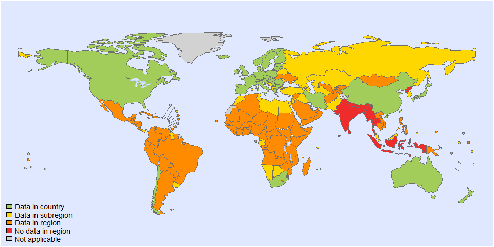
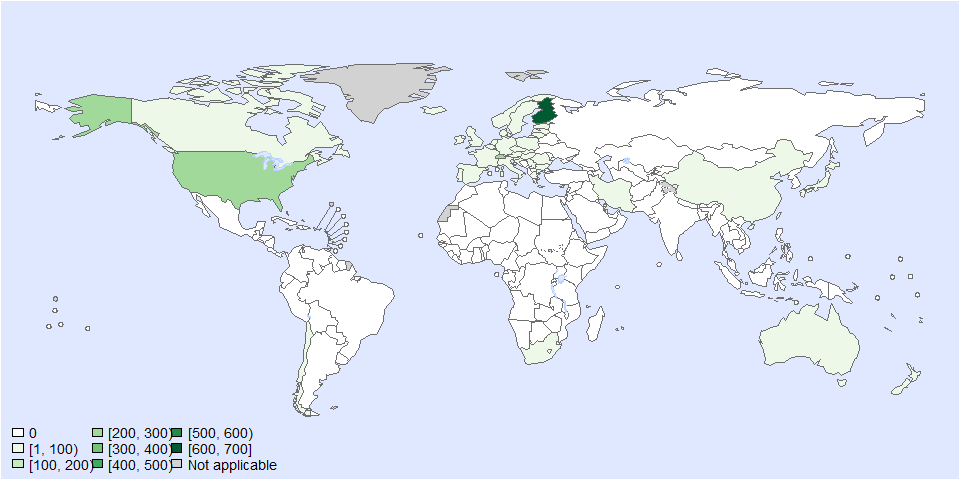
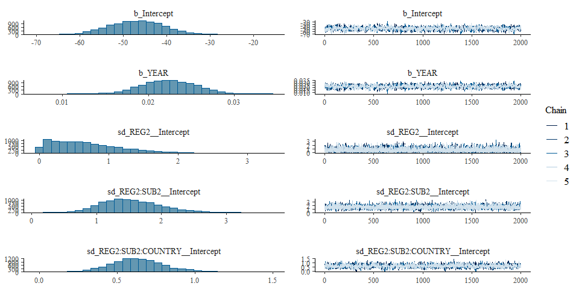
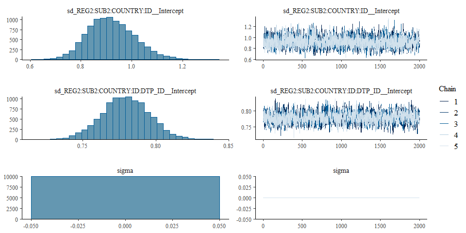
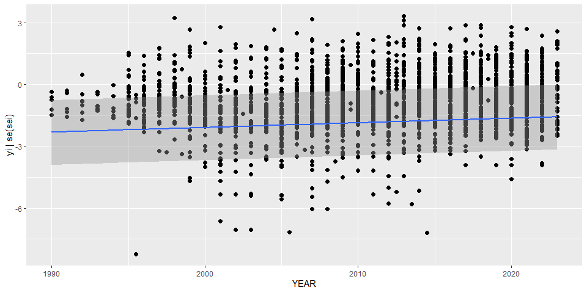

Global incidence of listeria • fit model - Version 7
================
LoVa3397
2025-09-23

- [Settings](#settings)
- [Parameters](#parameters)
- [Data](#data)
- [BRMS](#brms)
- [Session info](#session-info)

# Settings

``` r
## required packages ----
library(bd)
library(brms)
```

    ## Loading required package: Rcpp

    ## Loading 'brms' package (version 2.22.0). Useful instructions
    ## can be found by typing help('brms'). A more detailed introduction
    ## to the package is available through vignette('brms_overview').

    ## 
    ## Attaching package: 'brms'

    ## The following object is masked from 'package:stats':
    ## 
    ##     ar

``` r
library(ggplot2)
library(metafor)
```

    ## Loading required package: Matrix

    ## Loading required package: metadat

    ## Loading required package: numDeriv

    ## 
    ## Loading the 'metafor' package (version 4.8-0). For an
    ## introduction to the package please type: help(metafor)

``` r
library(readxl)
library(rmarkdown)
library(rms)
```

    ## Loading required package: Hmisc

    ## 
    ## Attaching package: 'Hmisc'

    ## The following objects are masked from 'package:base':
    ## 
    ##     format.pval, units

    ## 
    ## Attaching package: 'rms'

    ## The following object is masked from 'package:metafor':
    ## 
    ##     vif

``` r
library(tidyr)
```

    ## 
    ## Attaching package: 'tidyr'

    ## The following objects are masked from 'package:Matrix':
    ## 
    ##     expand, pack, unpack

``` r
library(kableExtra)

## global options ----
knitr::opts_chunk$set(fig.width = 10)
Date <- format(Sys.Date(), "%Y%m%d")
```

# Parameters

| Parameters                       | Values        |
|:---------------------------------|:--------------|
| Number of iteration              | 5000          |
| Warmup                           | 3000          |
| Delta value                      | 0.97          |
| Maximum tree-depth               | 15            |
| Levels                           | Year, Country |
| Random effect on each data point | Yes           |
| Stronger priors specified        | Normal(0,1)   |

Parameters of the model tested

# Data

``` r
## import data
source("01-data.R")
```

    ## 
    ## Attaching package: 'FERG2'

    ## The following object is masked from 'package:bd':
    ## 
    ##     mean_ci

    ## Linking to GEOS 3.13.1, GDAL 3.11.0, PROJ 9.6.0; sf_use_s2() is TRUE

    ## 
    ## Attaching package: 'dplyr'

    ## The following object is masked from 'package:kableExtra':
    ## 
    ##     group_rows

    ## The following objects are masked from 'package:Hmisc':
    ## 
    ##     src, summarize

    ## The following object is masked from 'package:bd':
    ## 
    ##     collapse

    ## The following objects are masked from 'package:stats':
    ## 
    ##     filter, lag

    ## The following objects are masked from 'package:base':
    ## 
    ##     intersect, setdiff, setequal, union

    ## 
    ## Attaching package: 'DescTools'

    ## The following objects are masked from 'package:Hmisc':
    ## 
    ##     %nin%, Label, Mean, Quantile

    ## Warning: Expecting numeric in C3542 / R3542C3: got 'NA'

    ## Warning: Expecting numeric in C3543 / R3543C3: got 'NA'

    ## Warning: Expecting numeric in C3544 / R3544C3: got 'NA'

    ## Warning: Expecting numeric in C3545 / R3545C3: got 'NA'

    ## Warning: Expecting numeric in C3546 / R3546C3: got 'NA'

    ## Warning: Expecting numeric in C3547 / R3547C3: got 'NA'

    ## Warning: Expecting numeric in C3548 / R3548C3: got 'NA'

    ## Warning: Expecting numeric in C3549 / R3549C3: got 'NA'

    ## Warning: Expecting numeric in C3550 / R3550C3: got 'NA'

    ## Warning: Expecting numeric in C3551 / R3551C3: got 'NA'

    ## Warning: Expecting numeric in C3552 / R3552C3: got 'NA'

    ## Warning: Expecting numeric in C3553 / R3553C3: got 'NA'

    ## Warning: Expecting numeric in C3554 / R3554C3: got 'NA'

    ## Warning: Expecting numeric in C3555 / R3555C3: got 'NA'

    ## Warning: Expecting numeric in C3556 / R3556C3: got 'NA'

    ## Warning: Expecting numeric in C3557 / R3557C3: got 'NA'

    ## Warning: Expecting numeric in C3558 / R3558C3: got 'NA'

    ## Warning: Expecting numeric in C3559 / R3559C3: got 'NA'

    ## Warning: Expecting numeric in C3560 / R3560C3: got 'NA'

    ## Warning: Expecting numeric in C3561 / R3561C3: got 'NA'

    ## Warning: Expecting numeric in C3562 / R3562C3: got 'NA'

    ## Warning: Expecting numeric in C3563 / R3563C3: got 'NA'

    ## Warning: Expecting numeric in C3564 / R3564C3: got 'NA'

    ## Warning: Expecting numeric in C3565 / R3565C3: got 'NA'

    ## Warning: Expecting numeric in C3566 / R3566C3: got 'NA'

    ## Warning: Expecting numeric in C3567 / R3567C3: got 'NA'

    ## Warning: Expecting numeric in C3568 / R3568C3: got 'NA'

    ## Warning: Expecting numeric in C3569 / R3569C3: got 'NA'

    ## Warning: Expecting numeric in C3570 / R3570C3: got 'NA'

    ## Warning: Expecting numeric in C3571 / R3571C3: got 'NA'

    ## Warning: Expecting numeric in C3572 / R3572C3: got 'NA'

    ## Warning: Expecting numeric in C3573 / R3573C3: got 'NA'

    ## Warning: Expecting numeric in C3574 / R3574C3: got 'NA'

    ## Warning: Expecting numeric in C3575 / R3575C3: got 'NA'

    ## Warning: Expecting numeric in C3576 / R3576C3: got 'NA'

    ## Warning: Expecting numeric in C3577 / R3577C3: got 'NA'

    ## Warning: Expecting numeric in C3578 / R3578C3: got 'NA'

    ## Warning: Expecting numeric in C3579 / R3579C3: got 'NA'

    ## Warning: Expecting numeric in C3580 / R3580C3: got 'NA'

    ## Warning: Expecting numeric in C3581 / R3581C3: got 'NA'

    ## Warning: Expecting numeric in C3582 / R3582C3: got 'NA'

    ## Warning: Expecting numeric in C3583 / R3583C3: got 'NA'

    ## Warning: Expecting numeric in C3584 / R3584C3: got 'NA'

    ## Warning: Expecting numeric in C3585 / R3585C3: got 'NA'

    ## Warning: Expecting numeric in C3586 / R3586C3: got 'NA'

    ## Warning: Expecting numeric in C3587 / R3587C3: got 'NA'

    ## Warning: Expecting numeric in C3588 / R3588C3: got 'NA'

    ## Warning: Expecting numeric in C3589 / R3589C3: got 'NA'

    ## Warning: Expecting numeric in C3590 / R3590C3: got 'NA'

    ## Warning: Expecting numeric in C3591 / R3591C3: got 'NA'

    ## Warning: Expecting numeric in C3592 / R3592C3: got 'NA'

    ## Warning: Expecting numeric in C3593 / R3593C3: got 'NA'

    ## Warning: Expecting numeric in C3594 / R3594C3: got 'NA'

    ## Warning: Expecting numeric in C3595 / R3595C3: got 'NA'

    ## Warning: Expecting numeric in C3596 / R3596C3: got 'NA'

    ## Warning: Expecting numeric in C3597 / R3597C3: got 'NA'

    ## Warning: Expecting numeric in C3598 / R3598C3: got 'NA'

    ## Warning: Expecting numeric in C3599 / R3599C3: got 'NA'

    ## Warning: Expecting numeric in C3600 / R3600C3: got 'NA'

    ## Warning: Expecting numeric in C3601 / R3601C3: got 'NA'

    ## Warning: Expecting numeric in C3602 / R3602C3: got 'NA'

    ## Warning: Expecting numeric in C3603 / R3603C3: got 'NA'

    ## Warning: Expecting numeric in C3604 / R3604C3: got 'NA'

    ## Warning: Expecting numeric in C3605 / R3605C3: got 'NA'

    ## Warning: Expecting numeric in C3606 / R3606C3: got 'NA'

    ## Warning: Expecting numeric in C3607 / R3607C3: got 'NA'

    ## Warning: Expecting numeric in C3608 / R3608C3: got 'NA'

    ## Warning: Expecting numeric in C3609 / R3609C3: got 'NA'

    ## Warning: Expecting numeric in C3610 / R3610C3: got 'NA'

    ## Warning: Expecting numeric in C3611 / R3611C3: got 'NA'

    ## Warning: Expecting numeric in C3612 / R3612C3: got 'NA'

    ## Warning: Expecting numeric in C3613 / R3613C3: got 'NA'

    ## Warning: Expecting numeric in C3614 / R3614C3: got 'NA'

    ## Warning: Expecting numeric in C3615 / R3615C3: got 'NA'

    ## Warning: Expecting numeric in C3616 / R3616C3: got 'NA'

    ## Warning: Expecting numeric in C3617 / R3617C3: got 'NA'

    ## Warning: Expecting numeric in C3618 / R3618C3: got 'NA'

    ## Warning: Expecting numeric in C3619 / R3619C3: got 'NA'

    ## Warning: Expecting numeric in C3620 / R3620C3: got 'NA'

    ## Warning: Expecting numeric in C3621 / R3621C3: got 'NA'

    ## Warning: Expecting numeric in C3622 / R3622C3: got 'NA'

    ## Warning: Expecting numeric in C3623 / R3623C3: got 'NA'

    ## Warning: Expecting numeric in C3624 / R3624C3: got 'NA'

    ## Warning: Expecting numeric in C3625 / R3625C3: got 'NA'

    ## Warning: Expecting numeric in C3626 / R3626C3: got 'NA'

    ## Warning: Expecting numeric in C3627 / R3627C3: got 'NA'

    ## Warning: Expecting numeric in C3628 / R3628C3: got 'NA'

    ## Warning: Expecting numeric in C3629 / R3629C3: got 'NA'

    ## 'data.frame':    5948 obs. of  42 variables:
    ##  $ SOURCE_ID           : chr  "Extra-THL" "713908359" "713908359" "713908359" ...
    ##  $ SOURCE_AUTHOR       : chr  "THL" "McLauchlin, J" "McLauchlin, J" "McLauchlin, J" ...
    ##  $ SOURCE_YEAR         : num  2024 2020 2020 2020 2020 ...
    ##  $ SOURCE_TITLE        : chr  "Finnish National Infectious Diseases Register, statistical database - cases" "Human foodborne listeriosis in England and Wales, 1981 to 2015" "Human foodborne listeriosis in England and Wales, 1981 to 2015" "Human foodborne listeriosis in England and Wales, 1981 to 2015" ...
    ##  $ SOURCE_DOI          : chr  NA "https://dx.doi.org/10.1017/S0950268820000473" "https://dx.doi.org/10.1017/S0950268820000473" "https://dx.doi.org/10.1017/S0950268820000473" ...
    ##  $ SOURCE_URL          : chr  "https://sampo.thl.fi/pivot/prod/en/ttr/cases/fact_ttr_cases?row=nidrreportgroup-877890.&column=yearmonth-878344"| __truncated__ "https://www.ncbi.nlm.nih.gov/pmc/articles/PMC7078583/pdf/S0950268820000473a.pdf" "https://www.ncbi.nlm.nih.gov/pmc/articles/PMC7078583/pdf/S0950268820000473a.pdf" "https://www.ncbi.nlm.nih.gov/pmc/articles/PMC7078583/pdf/S0950268820000473a.pdf" ...
    ##  $ OPT_ACCESS_DATE     : logi  NA NA NA NA NA NA ...
    ##  $ OPT_STUDY_TYPE      : chr  "Other" "Cross-sectional study" "Cross-sectional study" "Cross-sectional study" ...
    ##  $ OPT_OTHER_STUDY_TYPE: chr  "Report" "including active and passive surveillance data" "including active and passive surveillance data" "including active and passive surveillance data" ...
    ##  $ REF_NOTES           : chr  NA "Location : England + Wales" "Location : England + Wales" "Location : England + Wales" ...
    ##  $ REF_YEAR_START      : num  2007 1981 1987 1990 2002 ...
    ##  $ REF_YEAR_END        : num  2007 1986 1989 2001 2006 ...
    ##  $ REF_LOC_LEVEL       : chr  "National" "National" "National" "National" ...
    ##  $ REF_LOCATION        : chr  "Finland" "United Kingdom" "United Kingdom" "United Kingdom" ...
    ##  $ REF_LOCATION_ISO3   : chr  "FIN" "GBR" "GBR" "GBR" ...
    ##  $ REF_SEX             : chr  "All sexes" "All sexes" "All sexes" "All sexes" ...
    ##  $ REF_AGE_START       : chr  "All" "all" "all" "all" ...
    ##  $ REF_AGE_END         : chr  "All" "all" "all" "all" ...
    ##  $ OPT_MEAN_AGE        : logi  NA NA NA NA NA NA ...
    ##  $ OPT_MEDIAN_AGE      : logi  NA NA NA NA NA NA ...
    ##  $ OPT_SUBPOP          : chr  NA NA NA NA ...
    ##  $ OPT_CASES           : chr  "Confirmed" "Confirmed" "Confirmed" "Confirmed" ...
    ##  $ OPT_PERINATAL       : chr  "All" "All" "All" "All" ...
    ##  $ OPT_DISEASE         : logi  NA NA NA NA NA NA ...
    ##  $ OPT_SEROTYPE        : logi  NA NA NA NA NA NA ...
    ##  $ REF_SAMPLE_SIZE     : chr  NA NA NA NA ...
    ##  $ VALUE_X             : num  40 604 753 1353 957 ...
    ##  $ VALUE_MEAN          : chr  NA NA NA NA ...
    ##  $ VALUE_MEDIAN        : num  NA NA NA NA NA NA NA NA NA NA ...
    ##  $ VALUE_DENOM         : num  NA NA NA NA NA NA NA 1e+05 1e+05 1e+05 ...
    ##  $ VALUE_SE            : chr  NA NA NA NA ...
    ##  $ VALUE_P000          : num  NA NA NA NA NA NA NA NA NA NA ...
    ##  $ VALUE_P2_5          : num  NA NA NA NA NA NA NA NA NA NA ...
    ##  $ VALUE_P5            : num  NA NA NA NA NA NA NA NA NA NA ...
    ##  $ VALUE_P10           : num  NA NA NA NA NA NA NA NA NA NA ...
    ##  $ VALUE_P25           : num  NA NA NA NA NA NA NA NA NA NA ...
    ##  $ VALUE_P75           : num  NA NA NA NA NA NA NA NA NA NA ...
    ##  $ VALUE_P90           : num  NA NA NA NA NA NA NA NA NA NA ...
    ##  $ VALUE_P95           : num  NA NA NA NA NA NA NA NA NA NA ...
    ##  $ VALUE_P97_5         : num  NA NA NA NA NA NA NA NA NA NA ...
    ##  $ VALUE_P100          : num  NA NA NA NA NA NA NA NA NA NA ...
    ##  $ DUP                 : num  1 1 1 1 1 0 1 1 1 1 ...

    ## Joining with `by = join_by(SOURCE_ID, SOURCE_AUTHOR, SOURCE_YEAR, REF_YEAR_START,
    ## REF_YEAR_END, REF_LOC_LEVEL, REF_LOCATION, REF_LOCATION_ISO3, REF_SEX, REF_AGE_START,
    ## REF_AGE_END, OPT_PERINATAL, REF_SAMPLE_SIZE, VALUE_X, VALUE_MEAN)`

    ## Joining with `by = join_by(REF_YEAR_START, REF_YEAR_END, REF_SEX, REF_AGE_START,
    ## REF_AGE_END, ISO3, ID_ROW)`

    ## Warning in add_pop(dta): Warning: 115 rows have missing data for the population variable.
    ## Please check if ISO3 code is correctly specified and if the dates are included in the
    ## study field.

    ## `summarise()` has grouped output by 'SOURCE_ID', 'SOURCE_AUTHOR', 'SOURCE_YEAR',
    ## 'SOURCE_TITLE', 'SOURCE_DOI', 'SOURCE_URL', 'OPT_ACCESS_DATE', 'OPT_STUDY_TYPE',
    ## 'OPT_OTHER_STUDY_TYPE', 'REF_NOTES', 'REF_YEAR_START', 'REF_YEAR_END', 'REF_LOC_LEVEL',
    ## 'REF_LOCATION', 'REF_LOCATION_ISO3', 'REF_SEX', 'REF_AGE_START', 'REF_AGE_END',
    ## 'OPT_MEAN_AGE', 'OPT_MEDIAN_AGE', 'OPT_SUBPOP', 'OPT_CASES', 'OPT_DISEASE',
    ## 'OPT_SEROTYPE', 'ID', 'ISO3', 'REG2', 'SUB2', 'COUNTRY', 'YEAR'. You can override using
    ## the `.groups` argument.

<!-- --><!-- -->

    ## Warning in system2("quarto", "-V", stdout = TRUE, env = paste0("TMPDIR=", : running
    ## command '"quarto" TMPDIR=C:/Users/LoVa3397/AppData/Local/Temp/RtmpqYkQVf/file1cd4e0f5d73
    ## -V' had status 1

``` r
DTP_ID<-seq(1:length(es$SOURCE_ID))
es$DTP_ID<-DTP_ID
es$FLAG <- factor(es$FLAG, 
                  levels = c(0,1,2,3,4,5,6, 7),
                  labels = c("Keep data", "Data part of non WHO member states", "No WHO REG2 given",
                             "Year before 1990", "yi can't be calcualted", "TF choice to remove", 
                             "Excluded by preliminary checks", "Excluded in data cleaning"))
saveRDS(es, paste0("es_", Date, ".RDS"))

# es <- es %>%
#   filter((yi > -5) & (yi < 5))
```

# BRMS

``` r
fit_brms_reg_s7 <-
 brm(yi | se(sei) ~
       1 + YEAR +
       (1  | REG2) +
       (1  | REG2:SUB2) +
       (1  | REG2:SUB2:COUNTRY) +
       (1  | REG2:SUB2:COUNTRY:ID) +
       (1  | REG2:SUB2:COUNTRY:ID:DTP_ID),
     chains = 5, iter = 5000, warmup = 3000,
     cores = 5,
     data = subset(es, as.integer(FLAG) == 1),
     open_progress = FALSE,
     prior = prior(normal(0,1), class = sd),
     control = list(adapt_delta = 0.97, max_treedepth=15),
     seed =7 )
```

    ## Compiling Stan program...

    ## Start sampling

    ## Warning: There were 11 divergent transitions after warmup. See
    ## https://mc-stan.org/misc/warnings.html#divergent-transitions-after-warmup
    ## to find out why this is a problem and how to eliminate them.

    ## Warning: Examine the pairs() plot to diagnose sampling problems

``` r
# fit_brms_reg_s7 <- readRDS("fit_brms_reg_s7.rds")
summary(fit_brms_reg_s7)
```

    ## Warning: There were 11 divergent transitions after warmup. Increasing adapt_delta above
    ## 0.97 may help. See http://mc-stan.org/misc/warnings.html#divergent-transitions-after-warmup

    ##  Family: gaussian 
    ##   Links: mu = identity; sigma = identity 
    ## Formula: yi | se(sei) ~ 1 + YEAR + (1 | REG2) + (1 | REG2:SUB2) + (1 | REG2:SUB2:COUNTRY) + (1 | REG2:SUB2:COUNTRY:ID) + (1 | REG2:SUB2:COUNTRY:ID:DTP_ID) 
    ##    Data: subset(es, as.integer(FLAG) == 1) (Number of observations: 2379) 
    ##   Draws: 5 chains, each with iter = 5000; warmup = 3000; thin = 1;
    ##          total post-warmup draws = 10000
    ## 
    ## Multilevel Hyperparameters:
    ## ~REG2 (Number of levels: 4) 
    ##               Estimate Est.Error l-95% CI u-95% CI Rhat Bulk_ESS Tail_ESS
    ## sd(Intercept)     0.70      0.51     0.04     1.93 1.00     7036     6089
    ## 
    ## ~REG2:SUB2 (Number of levels: 6) 
    ##               Estimate Est.Error l-95% CI u-95% CI Rhat Bulk_ESS Tail_ESS
    ## sd(Intercept)     1.55      0.47     0.75     2.55 1.00     6574     5629
    ## 
    ## ~REG2:SUB2:COUNTRY (Number of levels: 41) 
    ##               Estimate Est.Error l-95% CI u-95% CI Rhat Bulk_ESS Tail_ESS
    ## sd(Intercept)     0.63      0.18     0.28     0.99 1.00     1632     1728
    ## 
    ## ~REG2:SUB2:COUNTRY:ID (Number of levels: 134) 
    ##               Estimate Est.Error l-95% CI u-95% CI Rhat Bulk_ESS Tail_ESS
    ## sd(Intercept)     0.92      0.09     0.75     1.12 1.00     2259     4120
    ## 
    ## ~REG2:SUB2:COUNTRY:ID:DTP_ID (Number of levels: 2379) 
    ##               Estimate Est.Error l-95% CI u-95% CI Rhat Bulk_ESS Tail_ESS
    ## sd(Intercept)     0.78      0.02     0.75     0.81 1.00     1813     3313
    ## 
    ## Regression Coefficients:
    ##           Estimate Est.Error l-95% CI u-95% CI Rhat Bulk_ESS Tail_ESS
    ## Intercept   -46.92      6.36   -59.16   -34.72 1.00     1308     2363
    ## YEAR          0.02      0.00     0.02     0.03 1.00     1292     2171
    ## 
    ## Further Distributional Parameters:
    ##       Estimate Est.Error l-95% CI u-95% CI Rhat Bulk_ESS Tail_ESS
    ## sigma     0.00      0.00     0.00     0.00   NA       NA       NA
    ## 
    ## Draws were sampled using sampling(NUTS). For each parameter, Bulk_ESS
    ## and Tail_ESS are effective sample size measures, and Rhat is the potential
    ## scale reduction factor on split chains (at convergence, Rhat = 1).

``` r
plot(fit_brms_reg_s7, ask = FALSE)
```

<!-- --><!-- -->

``` r
plot(conditional_effects(fit_brms_reg_s7), points = TRUE)
```

<!-- -->

``` r
saveRDS(fit_brms_reg_s7, file = "fit_brms_reg_s7.rds")
## show model code
stancode(fit_brms_reg_s7)
```

    ## // generated with brms 2.22.0
    ## functions {
    ## }
    ## data {
    ##   int<lower=1> N;  // total number of observations
    ##   vector[N] Y;  // response variable
    ##   vector<lower=0>[N] se;  // known sampling error
    ##   int<lower=1> K;  // number of population-level effects
    ##   matrix[N, K] X;  // population-level design matrix
    ##   int<lower=1> Kc;  // number of population-level effects after centering
    ##   // data for group-level effects of ID 1
    ##   int<lower=1> N_1;  // number of grouping levels
    ##   int<lower=1> M_1;  // number of coefficients per level
    ##   array[N] int<lower=1> J_1;  // grouping indicator per observation
    ##   // group-level predictor values
    ##   vector[N] Z_1_1;
    ##   // data for group-level effects of ID 2
    ##   int<lower=1> N_2;  // number of grouping levels
    ##   int<lower=1> M_2;  // number of coefficients per level
    ##   array[N] int<lower=1> J_2;  // grouping indicator per observation
    ##   // group-level predictor values
    ##   vector[N] Z_2_1;
    ##   // data for group-level effects of ID 3
    ##   int<lower=1> N_3;  // number of grouping levels
    ##   int<lower=1> M_3;  // number of coefficients per level
    ##   array[N] int<lower=1> J_3;  // grouping indicator per observation
    ##   // group-level predictor values
    ##   vector[N] Z_3_1;
    ##   // data for group-level effects of ID 4
    ##   int<lower=1> N_4;  // number of grouping levels
    ##   int<lower=1> M_4;  // number of coefficients per level
    ##   array[N] int<lower=1> J_4;  // grouping indicator per observation
    ##   // group-level predictor values
    ##   vector[N] Z_4_1;
    ##   // data for group-level effects of ID 5
    ##   int<lower=1> N_5;  // number of grouping levels
    ##   int<lower=1> M_5;  // number of coefficients per level
    ##   array[N] int<lower=1> J_5;  // grouping indicator per observation
    ##   // group-level predictor values
    ##   vector[N] Z_5_1;
    ##   int prior_only;  // should the likelihood be ignored?
    ## }
    ## transformed data {
    ##   vector<lower=0>[N] se2 = square(se);
    ##   matrix[N, Kc] Xc;  // centered version of X without an intercept
    ##   vector[Kc] means_X;  // column means of X before centering
    ##   for (i in 2:K) {
    ##     means_X[i - 1] = mean(X[, i]);
    ##     Xc[, i - 1] = X[, i] - means_X[i - 1];
    ##   }
    ## }
    ## parameters {
    ##   vector[Kc] b;  // regression coefficients
    ##   real Intercept;  // temporary intercept for centered predictors
    ##   vector<lower=0>[M_1] sd_1;  // group-level standard deviations
    ##   array[M_1] vector[N_1] z_1;  // standardized group-level effects
    ##   vector<lower=0>[M_2] sd_2;  // group-level standard deviations
    ##   array[M_2] vector[N_2] z_2;  // standardized group-level effects
    ##   vector<lower=0>[M_3] sd_3;  // group-level standard deviations
    ##   array[M_3] vector[N_3] z_3;  // standardized group-level effects
    ##   vector<lower=0>[M_4] sd_4;  // group-level standard deviations
    ##   array[M_4] vector[N_4] z_4;  // standardized group-level effects
    ##   vector<lower=0>[M_5] sd_5;  // group-level standard deviations
    ##   array[M_5] vector[N_5] z_5;  // standardized group-level effects
    ## }
    ## transformed parameters {
    ##   real sigma = 0;  // dispersion parameter
    ##   vector[N_1] r_1_1;  // actual group-level effects
    ##   vector[N_2] r_2_1;  // actual group-level effects
    ##   vector[N_3] r_3_1;  // actual group-level effects
    ##   vector[N_4] r_4_1;  // actual group-level effects
    ##   vector[N_5] r_5_1;  // actual group-level effects
    ##   real lprior = 0;  // prior contributions to the log posterior
    ##   r_1_1 = (sd_1[1] * (z_1[1]));
    ##   r_2_1 = (sd_2[1] * (z_2[1]));
    ##   r_3_1 = (sd_3[1] * (z_3[1]));
    ##   r_4_1 = (sd_4[1] * (z_4[1]));
    ##   r_5_1 = (sd_5[1] * (z_5[1]));
    ##   lprior += student_t_lpdf(Intercept | 3, -0.9, 2.5);
    ##   lprior += normal_lpdf(sd_1 | 0, 1)
    ##     - 1 * normal_lccdf(0 | 0, 1);
    ##   lprior += normal_lpdf(sd_2 | 0, 1)
    ##     - 1 * normal_lccdf(0 | 0, 1);
    ##   lprior += normal_lpdf(sd_3 | 0, 1)
    ##     - 1 * normal_lccdf(0 | 0, 1);
    ##   lprior += normal_lpdf(sd_4 | 0, 1)
    ##     - 1 * normal_lccdf(0 | 0, 1);
    ##   lprior += normal_lpdf(sd_5 | 0, 1)
    ##     - 1 * normal_lccdf(0 | 0, 1);
    ## }
    ## model {
    ##   // likelihood including constants
    ##   if (!prior_only) {
    ##     // initialize linear predictor term
    ##     vector[N] mu = rep_vector(0.0, N);
    ##     mu += Intercept + Xc * b;
    ##     for (n in 1:N) {
    ##       // add more terms to the linear predictor
    ##       mu[n] += r_1_1[J_1[n]] * Z_1_1[n] + r_2_1[J_2[n]] * Z_2_1[n] + r_3_1[J_3[n]] * Z_3_1[n] + r_4_1[J_4[n]] * Z_4_1[n] + r_5_1[J_5[n]] * Z_5_1[n];
    ##     }
    ##     target += normal_lpdf(Y | mu, se);
    ##   }
    ##   // priors including constants
    ##   target += lprior;
    ##   target += std_normal_lpdf(z_1[1]);
    ##   target += std_normal_lpdf(z_2[1]);
    ##   target += std_normal_lpdf(z_3[1]);
    ##   target += std_normal_lpdf(z_4[1]);
    ##   target += std_normal_lpdf(z_5[1]);
    ## }
    ## generated quantities {
    ##   // actual population-level intercept
    ##   real b_Intercept = Intercept - dot_product(means_X, b);
    ## }

# Session info

``` r
sessioninfo::session_info()
```

    ## Warning in system2("quarto", "-V", stdout = TRUE, env = paste0("TMPDIR=", : running command
    ## '"quarto" TMPDIR=C:/Users/LoVa3397/AppData/Local/Temp/RtmpqYkQVf/file1cd426415463 -V' had
    ## status 1

    ## ─ Session info ───────────────────────────────────────────────────────────────────────────
    ##  setting  value
    ##  version  R version 4.5.1 (2025-06-13 ucrt)
    ##  os       Windows 10 x64 (build 19045)
    ##  system   x86_64, mingw32
    ##  ui       RStudio
    ##  language (EN)
    ##  collate  English_United States.utf8
    ##  ctype    English_United States.utf8
    ##  tz       Europe/Brussels
    ##  date     2025-09-23
    ##  rstudio  2025.05.1+513 Mariposa Orchid (desktop)
    ##  pandoc   3.4 @ C:/Program Files/RStudio/resources/app/bin/quarto/bin/tools/ (via rmarkdown)
    ##  quarto   ERROR: Unknown command "TMPDIR=C:/Users/LoVa3397/AppData/Local/Temp/RtmpqYkQVf/file1cd426415463". Did you mean command "install"? @ C:\\PROGRA~1\\RStudio\\RESOUR~1\\app\\bin\\quarto\\bin\\quarto.exe
    ## 
    ## ─ Packages ───────────────────────────────────────────────────────────────────────────────
    ##  ! package        * version    date (UTC) lib source
    ##    abind            1.4-8      2024-09-12 [1] CRAN (R 4.5.0)
    ##    backports        1.5.0      2024-05-23 [1] CRAN (R 4.5.0)
    ##    base64enc        0.1-3      2015-07-28 [1] CRAN (R 4.5.0)
    ##    bayesplot        1.13.0     2025-06-18 [1] CRAN (R 4.5.1)
    ##    bd             * 0.0.14     2025-07-14 [1] Github (brechtdv/bd@652191c)
    ##    boot             1.3-31     2024-08-28 [1] CRAN (R 4.5.1)
    ##    bridgesampling   1.1-2      2021-04-16 [1] CRAN (R 4.5.1)
    ##    brms           * 2.22.0     2024-09-23 [1] CRAN (R 4.5.1)
    ##    Brobdingnag      1.2-9      2022-10-19 [1] CRAN (R 4.5.1)
    ##    callr            3.7.6      2024-03-25 [1] CRAN (R 4.5.1)
    ##    cellranger       1.1.0      2016-07-27 [1] CRAN (R 4.5.1)
    ##    checkmate        2.3.2      2024-07-29 [1] CRAN (R 4.5.1)
    ##    class            7.3-23     2025-01-01 [1] CRAN (R 4.5.1)
    ##    classInt         0.4-11     2025-01-08 [1] CRAN (R 4.5.1)
    ##    cli              3.6.5      2025-04-23 [1] CRAN (R 4.5.1)
    ##    cluster          2.1.8.1    2025-03-12 [1] CRAN (R 4.5.1)
    ##    coda             0.19-4.1   2024-01-31 [1] CRAN (R 4.5.1)
    ##    codetools        0.2-20     2024-03-31 [1] CRAN (R 4.5.1)
    ##    colorspace       2.1-1      2024-07-26 [1] CRAN (R 4.5.1)
    ##    curl             6.4.0      2025-06-22 [1] CRAN (R 4.5.1)
    ##    data.table       1.17.8     2025-07-10 [1] CRAN (R 4.5.1)
    ##    DBI              1.2.3      2024-06-02 [1] CRAN (R 4.5.1)
    ##    DescTools      * 0.99.60    2025-03-28 [1] CRAN (R 4.5.1)
    ##    digest           0.6.37     2024-08-19 [1] CRAN (R 4.5.1)
    ##    distributional   0.5.0      2024-09-17 [1] CRAN (R 4.5.1)
    ##    dplyr          * 1.1.4      2023-11-17 [1] CRAN (R 4.5.1)
    ##    e1071            1.7-16     2024-09-16 [1] CRAN (R 4.5.1)
    ##    evaluate         1.0.4      2025-06-18 [1] CRAN (R 4.5.1)
    ##    Exact            3.3        2024-07-21 [1] CRAN (R 4.5.0)
    ##    expm             1.0-0      2024-08-19 [1] CRAN (R 4.5.1)
    ##    farver           2.1.2      2024-05-13 [1] CRAN (R 4.5.1)
    ##    fastmap          1.2.0      2024-05-15 [1] CRAN (R 4.5.1)
    ##    FERG2          * 0.0.5      2025-07-15 [1] Github (brechtdv/FERG2@c2d4ac1)
    ##    forcats          1.0.0      2023-01-29 [1] CRAN (R 4.5.1)
    ##    foreign          0.8-90     2025-03-31 [1] CRAN (R 4.5.1)
    ##    Formula          1.2-5      2023-02-24 [1] CRAN (R 4.5.0)
    ##    fs               1.6.6      2025-04-12 [1] CRAN (R 4.5.1)
    ##    generics         0.1.4      2025-05-09 [1] CRAN (R 4.5.1)
    ##    ggplot2        * 3.5.2      2025-04-09 [1] CRAN (R 4.5.1)
    ##    gld              2.6.7      2025-01-17 [1] CRAN (R 4.5.1)
    ##    glue             1.8.0      2024-09-30 [1] CRAN (R 4.5.1)
    ##    gridExtra        2.3        2017-09-09 [1] CRAN (R 4.5.1)
    ##    gtable           0.3.6      2024-10-25 [1] CRAN (R 4.5.1)
    ##    haven            2.5.5      2025-05-30 [1] CRAN (R 4.5.1)
    ##    Hmisc          * 5.2-3      2025-03-16 [1] CRAN (R 4.5.1)
    ##    hms              1.1.3      2023-03-21 [1] CRAN (R 4.5.1)
    ##    htmlTable        2.4.3      2024-07-21 [1] CRAN (R 4.5.1)
    ##    htmltools        0.5.8.1    2024-04-04 [1] CRAN (R 4.5.1)
    ##    htmlwidgets      1.6.4      2023-12-06 [1] CRAN (R 4.5.1)
    ##    httr             1.4.7      2023-08-15 [1] CRAN (R 4.5.1)
    ##    inline           0.3.21     2025-01-09 [1] CRAN (R 4.5.1)
    ##    jsonlite         2.0.0      2025-03-27 [1] CRAN (R 4.5.1)
    ##    kableExtra     * 1.4.0      2024-01-24 [1] CRAN (R 4.5.1)
    ##    KernSmooth       2.23-26    2025-01-01 [1] CRAN (R 4.5.1)
    ##    knitr            1.50       2025-03-16 [1] CRAN (R 4.5.1)
    ##    labeling         0.4.3      2023-08-29 [1] CRAN (R 4.5.0)
    ##    lattice          0.22-7     2025-04-02 [1] CRAN (R 4.5.1)
    ##    lifecycle        1.0.4      2023-11-07 [1] CRAN (R 4.5.1)
    ##    lmom             3.2        2024-09-30 [1] CRAN (R 4.5.0)
    ##    loo              2.8.0      2024-07-03 [1] CRAN (R 4.5.1)
    ##    magrittr         2.0.3      2022-03-30 [1] CRAN (R 4.5.1)
    ##    MASS             7.3-65     2025-02-28 [1] CRAN (R 4.5.1)
    ##    mathjaxr         1.8-0      2025-04-30 [1] CRAN (R 4.5.1)
    ##    Matrix         * 1.7-3      2025-03-11 [1] CRAN (R 4.5.1)
    ##    MatrixModels     0.5-4      2025-03-26 [1] CRAN (R 4.5.1)
    ##    matrixStats      1.5.0      2025-01-07 [1] CRAN (R 4.5.1)
    ##    metadat        * 1.4-0      2025-02-04 [1] CRAN (R 4.5.1)
    ##    metafor        * 4.8-0      2025-01-28 [1] CRAN (R 4.5.1)
    ##    multcomp         1.4-28     2025-01-29 [1] CRAN (R 4.5.1)
    ##    mvtnorm          1.3-3      2025-01-10 [1] CRAN (R 4.5.1)
    ##    nlme             3.1-168    2025-03-31 [1] CRAN (R 4.5.1)
    ##    nnet             7.3-20     2025-01-01 [1] CRAN (R 4.5.1)
    ##    numDeriv       * 2016.8-1.1 2019-06-06 [1] CRAN (R 4.5.0)
    ##    pillar           1.11.0     2025-07-04 [1] CRAN (R 4.5.1)
    ##    pkgbuild         1.4.8      2025-05-26 [1] CRAN (R 4.5.1)
    ##    pkgconfig        2.0.3      2019-09-22 [1] CRAN (R 4.5.1)
    ##    plyr             1.8.9      2023-10-02 [1] CRAN (R 4.5.1)
    ##    polspline        1.1.25     2024-05-10 [1] CRAN (R 4.5.0)
    ##    posterior        1.6.1      2025-02-27 [1] CRAN (R 4.5.1)
    ##    processx         3.8.6      2025-02-21 [1] CRAN (R 4.5.1)
    ##    proxy            0.4-27     2022-06-09 [1] CRAN (R 4.5.1)
    ##    ps               1.9.1      2025-04-12 [1] CRAN (R 4.5.1)
    ##    purrr            1.1.0      2025-07-10 [1] CRAN (R 4.5.1)
    ##    quantreg         6.1        2025-03-10 [1] CRAN (R 4.5.1)
    ##    QuickJSR         1.8.0      2025-06-09 [1] CRAN (R 4.5.1)
    ##    R6               2.6.1      2025-02-15 [1] CRAN (R 4.5.1)
    ##    RColorBrewer     1.1-3      2022-04-03 [1] CRAN (R 4.5.0)
    ##    Rcpp           * 1.1.0      2025-07-02 [1] CRAN (R 4.5.1)
    ##  D RcppParallel     5.1.10     2025-01-24 [1] CRAN (R 4.5.1)
    ##    readr            2.1.5      2024-01-10 [1] CRAN (R 4.5.1)
    ##    readxl         * 1.4.5      2025-03-07 [1] CRAN (R 4.5.1)
    ##    reshape2         1.4.4      2020-04-09 [1] CRAN (R 4.5.1)
    ##    rlang            1.1.6      2025-04-11 [1] CRAN (R 4.5.1)
    ##    rmarkdown      * 2.29       2024-11-04 [1] CRAN (R 4.5.1)
    ##    rms            * 8.0-0      2025-04-04 [1] CRAN (R 4.5.1)
    ##    rootSolve        1.8.2.4    2023-09-21 [1] CRAN (R 4.5.0)
    ##    rpart            4.1.24     2025-01-07 [1] CRAN (R 4.5.1)
    ##    rstan            2.32.7     2025-03-10 [1] CRAN (R 4.5.1)
    ##    rstantools       2.4.0      2024-01-31 [1] CRAN (R 4.5.1)
    ##    rstudioapi       0.17.1     2024-10-22 [1] CRAN (R 4.5.1)
    ##    sandwich         3.1-1      2024-09-15 [1] CRAN (R 4.5.1)
    ##    scales         * 1.4.0      2025-04-24 [1] CRAN (R 4.5.1)
    ##    sessioninfo      1.2.3      2025-02-05 [1] CRAN (R 4.5.1)
    ##    sf             * 1.0-21     2025-05-15 [1] CRAN (R 4.5.1)
    ##    SparseM          1.84-2     2024-07-17 [1] CRAN (R 4.5.1)
    ##    StanHeaders      2.32.10    2024-07-15 [1] CRAN (R 4.5.1)
    ##    stringi          1.8.7      2025-03-27 [1] CRAN (R 4.5.0)
    ##    stringr        * 1.5.1      2023-11-14 [1] CRAN (R 4.5.1)
    ##    survival         3.8-3      2024-12-17 [1] CRAN (R 4.5.1)
    ##    svglite          2.2.1      2025-05-12 [1] CRAN (R 4.5.1)
    ##    systemfonts      1.2.3      2025-04-30 [1] CRAN (R 4.5.1)
    ##    tensorA          0.36.2.1   2023-12-13 [1] CRAN (R 4.5.0)
    ##    textshaping      1.0.1      2025-05-01 [1] CRAN (R 4.5.1)
    ##    TH.data          1.1-3      2025-01-17 [1] CRAN (R 4.5.1)
    ##    tibble           3.3.0      2025-06-08 [1] CRAN (R 4.5.1)
    ##    tidyr          * 1.3.1      2024-01-24 [1] CRAN (R 4.5.1)
    ##    tidyselect       1.2.1      2024-03-11 [1] CRAN (R 4.5.1)
    ##    tzdb             0.5.0      2025-03-15 [1] CRAN (R 4.5.1)
    ##    units            0.8-7      2025-03-11 [1] CRAN (R 4.5.1)
    ##    V8               6.0.4      2025-06-04 [1] CRAN (R 4.5.1)
    ##    vctrs            0.6.5      2023-12-01 [1] CRAN (R 4.5.1)
    ##    viridisLite      0.4.2      2023-05-02 [1] CRAN (R 4.5.1)
    ##    withr            3.0.2      2024-10-28 [1] CRAN (R 4.5.1)
    ##    xfun             0.52       2025-04-02 [1] CRAN (R 4.5.1)
    ##    xml2             1.3.8      2025-03-14 [1] CRAN (R 4.5.1)
    ##    yaml             2.3.10     2024-07-26 [1] CRAN (R 4.5.0)
    ##    zoo              1.8-14     2025-04-10 [1] CRAN (R 4.5.1)
    ## 
    ##  [1] C:/Program Files/R/R-4.5.1/library
    ## 
    ##  * ── Packages attached to the search path.
    ##  D ── DLL MD5 mismatch, broken installation.
    ## 
    ## ──────────────────────────────────────────────────────────────────────────────────────────

``` r
##rmarkdown::render("02-fit_v8.R")
```
