Global incidence of listeria • Estimate incidence with the 7th model
================
LoVa3397
2025-09-24

- [Settings](#settings)
- [Parameters of the 7th model](#parameters-of-the-7th-model)
- [Import and adapt data](#import-and-adapt-data)
- [Predict all](#predict-all)
- [Summarize predictions](#summarize-predictions)
  - [Global](#global)
  - [Regions](#regions)
  - [Subregions](#subregions)
  - [Countries](#countries)
- [Session info](#session-info)

# Settings

``` r
## required packages ----
library(bd)
library(brms)
library(FERG2)
library(ggplot2)
library(knitr)
library(rmarkdown)
library(sf)
library(tidyr)
library(dplyr)
library(DescTools)
library(readxl)
library(kableExtra)

#Standard model 
## global options ----
knitr::opts_chunk$set(fig.width = 10)
Date <- format(Sys.Date(), "%Y%m%d")
```

# Parameters of the 7th model

| Parameters                       | Values        |
|:---------------------------------|:--------------|
| Number of iteration              | 5000          |
| Warmup                           | 3000          |
| Delta value                      | 0.97          |
| Maximum tree-depth               | 15            |
| Levels                           | Year, Country |
| Random effect on each data point | Yes           |
| Stronger priors specified        | Normal(0,1)   |

Parameters of the model tested

# Import and adapt data

``` r
fit_brms_reg_s <- readRDS("fit_brms_reg_s7.rds")
zero_cases<- read_xlsx("Endemic_countries.xlsx")%>%
  select(REG2, SUB2, ISO3, Country, edtf_liste) %>%
  rename(COUNTRY=ISO3, COUNTRY_LABEL = Country, DISEASEFREE = edtf_liste)

kable(
  caption = "Countries assumed to be non-endemic",
  row.names = FALSE,
  subset(zero_cases, DISEASEFREE==0)[, 2]) 
```

| SUB2 |
|:-----|

Countries assumed to be non-endemic

``` r
es_files <- list.files(pattern="^es_\\d{8}\\.rds$", full.names=TRUE, ignore.case = TRUE)
es_dates <- as.Date(sub("^es_(\\d{8})\\.rds$", "\\1", basename(es_files), ignore.case = TRUE), format = "%Y%m%d")
es_latest <- es_files[which.max(es_dates)]
es<- readRDS(es_latest)
es <- subset(es, as.integer(FLAG) == 1)

country_with_data <- es %>% select(ISO3) %>% distinct() %>% mutate(DATA=1, COUNTRY = ISO3)
Sub2_with_data <- es %>% select(SUB2) %>% distinct() %>% mutate(DATASUB2=1)
Reg2_with_data <- es %>% select(REG2) %>% distinct() %>% mutate(DATAREG2=1)
zero_cases <- left_join(zero_cases, country_with_data)
```

    ## Joining with `by = join_by(COUNTRY)`

``` r
zero_cases <- left_join(zero_cases, Sub2_with_data)
```

    ## Joining with `by = join_by(SUB2)`

``` r
zero_cases <- left_join(zero_cases, Reg2_with_data) %>%
  select(-c(ISO3)) %>%
  mutate(ESTIMATES = case_when(
    DATA == 1 ~ 1,
    DISEASEFREE == 0 ~ 2,
    is.na(DATA) & DISEASEFREE == 1 & DATASUB2 == 1 ~ 3,
    is.na(DATA) & DISEASEFREE == 1 & is.na(DATASUB2) & DATAREG2 == 1 ~ 4, 
    is.na(DATA) & DISEASEFREE == 1  & is.na(DATASUB2) & is.na(DATAREG2) ~5))
```

    ## Joining with `by = join_by(REG2)`

``` r
zero_cases$ESTIMATES <- factor(zero_cases$ESTIMATES, 
                               level = c(1,2,3,4,5),
                               labels = c("Data present", "Disease free", "Data in subregion", "Data in region", "Data in world"))
Country_Check <- zero_cases %>% filter(as.integer(ESTIMATES) == 2)
```

# Predict all

``` r
## set up dataframe
sim_all <-
  data.frame(
    sei = 0,
    REG2 = FERG2:::countries$REG2,
    SUB2 = FERG2:::countries$SUB2,
    COUNTRY = FERG2:::countries$ISO3,
    YEAR = rep(2000:2021, each = nrow(FERG2:::countries)))
sim_all <- sim_all %>% left_join(zero_cases) %>% select(sei, REG2, SUB2, COUNTRY, YEAR, ESTIMATES)
```

    ## Joining with `by = join_by(REG2, SUB2, COUNTRY)`

``` r
## draw from expected value of posterior predictive dist
set.seed(10)
#fit_all <- 
#posterior_epred(
#  object = fit_brms_reg_s,
#  newdata = sim_all,
#  allow_new_levels = TRUE,
#  sample_new_levels = "uncertainty",
#  re_formula = ~ 1 + 
#            (1  | REG2) +
#            (1  | REG2:SUB2) +
#            (1  | REG2:SUB2:COUNTRY)
#  )

draws_fit <- as_draws_df(fit_brms_reg_s)
fit_all <- data.frame(1:10000)
for (x in 1:nrow(sim_all)){
  if (as.integer(sim_all[x, "ESTIMATES"]) == 1){
    # Data present for country
    fit_all[[paste0("V",x)]] <- draws_fit$b_Intercept +                                                                               # Global intercept
      sim_all[x, "YEAR"] * draws_fit$b_YEAR +                                                                                         # Year component
      draws_fit[[paste0("r_REG2[",sim_all[x,"REG2"],",Intercept]")]] +                                                                # Regional component
      draws_fit[[paste0("r_REG2:SUB2[",sim_all[x,"REG2"],"_",sim_all[x,"SUB2"],",Intercept]")]] +                                     # Sub regional component
      draws_fit[[paste0("r_REG2:SUB2:COUNTRY[",sim_all[x,"REG2"],"_",sim_all[x,"SUB2"],"_",sim_all[x,"COUNTRY"],",Intercept]")]]      # Country component
  } else if (as.integer(sim_all[x, "ESTIMATES"]) == 2) {
    # Disease-free country
    fit_all[[paste0("V",x)]] <- 0
  } else if (as.integer(sim_all[x, "ESTIMATES"]) == 3){
    # Data not present for country, but present in subregion
    fit_all[[paste0("V",x)]] <- draws_fit$b_Intercept +                                                                               # Global intercept
      sim_all[x, "YEAR"] * draws_fit$b_YEAR +                                                                                         # Year component
      draws_fit[[paste0("r_REG2[",sim_all[x,"REG2"],",Intercept]")]] +                                                                # Regional component
      draws_fit[[paste0("r_REG2:SUB2[",sim_all[x,"REG2"],"_",sim_all[x,"SUB2"],",Intercept]")]]                                       # Sub regional component
  } else if (as.integer(sim_all[x, "ESTIMATES"]) == 4){
    # Data not present for country, but present in region
    fit_all[[paste0("V",x)]] <- draws_fit$b_Intercept +                                                                               # Global intercept
      sim_all[x, "YEAR"] * draws_fit$b_YEAR +                                                                                         # Year component
      draws_fit[[paste0("r_REG2[",sim_all[x,"REG2"],",Intercept]")]]                                                                  # Regional component
  } else if (as.integer(sim_all[x, "ESTIMATES"]) == 5){
    # Data not present for country
    fit_all[[paste0("V",x)]] <- draws_fit$b_Intercept + 
      sim_all[x, "YEAR"] * draws_fit$b_YEAR
  } 
}

fit_all <- fit_all %>% select(-c(X1.10000))

## calculate cases
sim_all$SIM <- t(fit_all)
pop_all <- aggregate(POP ~ ISO3 + YEAR, FERG2:::pop, sum)
sim_all <- merge(sim_all, pop_all,
                 by.x = c("COUNTRY", "YEAR"), by.y = c("ISO3", "YEAR"))
sim_all <- sim_all %>% left_join(zero_cases)
```

    ## Joining with `by = join_by(COUNTRY, REG2, SUB2, ESTIMATES)`

``` r
sim_all$CASES <- exp(sim_all$SIM) * sim_all$POP / 1e5
sim_all$CASES <- sim_all$CASES*sim_all$DISEASEFREE
sim_all$SIM<-sim_all$SIM*sim_all$DISEASEFREE
sim_all$sei<-sim_all$sei*sim_all$DISEASEFREE

## aggregate global
sim_all_glb <- with(sim_all, aggregate(CASES ~ YEAR, FUN = sum))
all_glb_id <- sim_all_glb[1]
all_glb_nr <-
  t(apply(sim_all_glb[, grepl("V", names(sim_all_glb))], 1, mean_ci))
all_glb_nr <- data.frame(all_glb_nr)
names(all_glb_nr) <- c("VAL_MEAN", "VAL_LWR", "VAL_UPR")
all_glb_nr <- cbind(all_glb_id, all_glb_nr)
all_glb_nr$LOCATION <- "Global"
all_glb_nr$LOCATION_NAME <- "Global"
all_glb_nr$METRIC <- "Number"
str(all_glb_nr)
```

    ## 'data.frame':    22 obs. of  7 variables:
    ##  $ YEAR         : int  2000 2001 2002 2003 2004 2005 2006 2007 2008 2009 ...
    ##  $ VAL_MEAN     : num  10253 10639 11040 11456 11888 ...
    ##  $ VAL_LWR      : num  4316 4455 4599 4757 4913 ...
    ##  $ VAL_UPR      : num  27217 28287 29431 30614 31834 ...
    ##  $ LOCATION     : chr  "Global" "Global" "Global" "Global" ...
    ##  $ LOCATION_NAME: chr  "Global" "Global" "Global" "Global" ...
    ##  $ METRIC       : chr  "Number" "Number" "Number" "Number" ...

``` r
all_glb_rt <- all_glb_nr
all_glb_rt$POP <- with(sim_all, tapply(POP, YEAR, sum))
all_glb_rt$VAL_MEAN <- 1e5 * all_glb_rt$VAL_MEAN / all_glb_rt$POP
all_glb_rt$VAL_LWR <- 1e5 * all_glb_rt$VAL_LWR / all_glb_rt$POP
all_glb_rt$VAL_UPR <- 1e5 * all_glb_rt$VAL_UPR / all_glb_rt$POP
all_glb_rt$METRIC <- "Rate"
all_glb_rt$POP <- NULL
str(all_glb_rt)
```

    ## 'data.frame':    22 obs. of  7 variables:
    ##  $ YEAR         : int  2000 2001 2002 2003 2004 2005 2006 2007 2008 2009 ...
    ##  $ VAL_MEAN     : num [1:22(1d)] 0.168 0.172 0.177 0.181 0.185 ...
    ##  $ VAL_LWR      : num [1:22(1d)] 0.0709 0.0722 0.0735 0.0751 0.0765 ...
    ##  $ VAL_UPR      : num [1:22(1d)] 0.447 0.458 0.471 0.483 0.496 ...
    ##  $ LOCATION     : chr  "Global" "Global" "Global" "Global" ...
    ##  $ LOCATION_NAME: chr  "Global" "Global" "Global" "Global" ...
    ##  $ METRIC       : chr  "Rate" "Rate" "Rate" "Rate" ...

``` r
## aggregate over regions
sim_all_reg <- with(sim_all, aggregate(CASES ~ REG2+YEAR, FUN = sum))
all_reg_id <- sim_all_reg[1:2]
all_reg_nr <-
  t(apply(sim_all_reg[, grepl("V", names(sim_all_reg))], 1, mean_ci))
all_reg_nr <- data.frame(all_reg_nr)
names(all_reg_nr) <- c("VAL_MEAN", "VAL_LWR", "VAL_UPR")
all_reg_nr <- cbind(all_reg_id, all_reg_nr)
all_reg_nr$LOCATION <- "Region"
all_reg_nr$LOCATION_NAME <- all_reg_nr$REG2
all_reg_nr$REG2 <- NULL
all_reg_nr$METRIC <- "Number"
str(all_reg_nr)
```

    ## 'data.frame':    132 obs. of  7 variables:
    ##  $ YEAR         : int  2000 2000 2000 2000 2000 2000 2001 2001 2001 2001 ...
    ##  $ VAL_MEAN     : num  1836 1859 827 2387 2681 ...
    ##  $ VAL_LWR      : num  223 638 123 1724 399 ...
    ##  $ VAL_UPR      : num  7995 5752 2853 3453 9247 ...
    ##  $ LOCATION     : chr  "Region" "Region" "Region" "Region" ...
    ##  $ LOCATION_NAME: chr  "AFR" "AMR" "EMR" "EUR" ...
    ##  $ METRIC       : chr  "Number" "Number" "Number" "Number" ...

``` r
all_reg_rt <- all_reg_nr
all_reg_rt$POP <-
  with(sim_all, aggregate(POP ~ REG2 + YEAR, FUN = sum))$POP
all_reg_rt$VAL_MEAN <- 1e5 * all_reg_rt$VAL_MEAN / all_reg_rt$POP
all_reg_rt$VAL_LWR <- 1e5 * all_reg_rt$VAL_LWR / all_reg_rt$POP
all_reg_rt$VAL_UPR <- 1e5 * all_reg_rt$VAL_UPR / all_reg_rt$POP
all_reg_rt$METRIC <- "Rate"
all_reg_rt$POP <- NULL
str(all_reg_rt)
```

    ## 'data.frame':    132 obs. of  7 variables:
    ##  $ YEAR         : int  2000 2000 2000 2000 2000 2000 2001 2001 2001 2001 ...
    ##  $ VAL_MEAN     : num  0.275 0.226 0.171 0.274 0.171 ...
    ##  $ VAL_LWR      : num  0.0334 0.0775 0.0254 0.1982 0.0254 ...
    ##  $ VAL_UPR      : num  1.199 0.699 0.588 0.397 0.588 ...
    ##  $ LOCATION     : chr  "Region" "Region" "Region" "Region" ...
    ##  $ LOCATION_NAME: chr  "AFR" "AMR" "EMR" "EUR" ...
    ##  $ METRIC       : chr  "Rate" "Rate" "Rate" "Rate" ...

``` r
## aggregate over subregions
sim_all_sub <- with(sim_all, aggregate(CASES ~ SUB2+YEAR, FUN = sum))
all_sub_id <- sim_all_sub[1:2]
all_sub_nr <-
  t(apply(sim_all_sub[, grepl("V", names(sim_all_sub))], 1, mean_ci))
all_sub_nr <- data.frame(all_sub_nr)
names(all_sub_nr) <- c("VAL_MEAN", "VAL_LWR", "VAL_UPR")
all_sub_nr <- cbind(all_sub_id, all_sub_nr)
all_sub_nr$LOCATION <- "Subregion"
all_sub_nr$LOCATION_NAME <- all_sub_nr$SUB2
all_sub_nr$SUB2 <- NULL
all_sub_nr$METRIC <- "Number"
str(all_sub_nr)
```

    ## 'data.frame':    374 obs. of  7 variables:
    ##  $ YEAR         : int  2000 2000 2000 2000 2000 2000 2000 2000 2000 2000 ...
    ##  $ VAL_MEAN     : num  241 895 701 727 1011 ...
    ##  $ VAL_LWR      : num  27.6 74 58 354.6 101.2 ...
    ##  $ VAL_UPR      : num  935 4231 3316 1376 4335 ...
    ##  $ LOCATION     : chr  "Subregion" "Subregion" "Subregion" "Subregion" ...
    ##  $ LOCATION_NAME: chr  "AFRAB" "AFRC" "AFRD" "AMRA" ...
    ##  $ METRIC       : chr  "Number" "Number" "Number" "Number" ...

``` r
all_sub_rt <- all_sub_nr
all_sub_rt$POP <-
  with(sim_all, aggregate(POP ~ SUB2 + YEAR, FUN = sum))$POP
all_sub_rt$VAL_MEAN <- 1e5 * all_sub_rt$VAL_MEAN / all_sub_rt$POP
all_sub_rt$VAL_LWR <- 1e5 * all_sub_rt$VAL_LWR / all_sub_rt$POP
all_sub_rt$VAL_UPR <- 1e5 * all_sub_rt$VAL_UPR / all_sub_rt$POP
all_sub_rt$METRIC <- "Rate"
all_sub_rt$POP <- NULL
str(all_sub_rt)
```

    ## 'data.frame':    374 obs. of  7 variables:
    ##  $ YEAR         : int  2000 2000 2000 2000 2000 2000 2000 2000 2000 2000 ...
    ##  $ VAL_MEAN     : num  0.449 0.26 0.26 0.217 0.232 ...
    ##  $ VAL_LWR      : num  0.0514 0.0215 0.0215 0.1058 0.0232 ...
    ##  $ VAL_UPR      : num  1.742 1.231 1.231 0.411 0.996 ...
    ##  $ LOCATION     : chr  "Subregion" "Subregion" "Subregion" "Subregion" ...
    ##  $ LOCATION_NAME: chr  "AFRAB" "AFRC" "AFRD" "AMRA" ...
    ##  $ METRIC       : chr  "Rate" "Rate" "Rate" "Rate" ...

``` r
## aggregate over countries
all_cnt_nr <- t(apply(sim_all$CASES, 1, mean_ci))
all_cnt_nr <- data.frame(all_cnt_nr)
names(all_cnt_nr) <- c("VAL_MEAN", "VAL_LWR", "VAL_UPR")
all_cnt_nr <- cbind(sim_all[1:2], all_cnt_nr)
all_cnt_nr$LOCATION <- "Country"
all_cnt_nr$LOCATION_NAME <- all_cnt_nr$COUNTRY
all_cnt_nr$COUNTRY <- NULL
all_cnt_nr$METRIC <- "Number"
str(all_cnt_nr)
```

    ## 'data.frame':    4268 obs. of  7 variables:
    ##  $ YEAR         : int  2000 2001 2002 2003 2004 2005 2006 2007 2008 2009 ...
    ##  $ VAL_MEAN     : num  34.5 34.9 36.7 40.5 43.4 ...
    ##  $ VAL_LWR      : num  5.14 5.2 5.47 6.04 6.46 ...
    ##  $ VAL_UPR      : num  119 120 126 140 150 ...
    ##  $ LOCATION     : chr  "Country" "Country" "Country" "Country" ...
    ##  $ LOCATION_NAME: chr  "AFG" "AFG" "AFG" "AFG" ...
    ##  $ METRIC       : chr  "Number" "Number" "Number" "Number" ...

``` r
#all_cnt_rt <- t(apply(exp(sim_all$SIM), 1, mean_ci))
#all_cnt_rt <- data.frame(all_cnt_rt)
#names(all_cnt_rt) <- c("VAL_MEAN", "VAL_LWR", "VAL_UPR")
#all_cnt_rt <- cbind(sim_all[1:2], all_cnt_rt)
#all_cnt_rt$LOCATION <- "Country"
#all_cnt_rt$LOCATION_NAME <- all_cnt_rt$COUNTRY
#all_cnt_rt$COUNTRY <- NULL
#all_cnt_rt$METRIC <- "Rate"
#str(all_cnt_rt)

all_cnt_rt <- all_cnt_nr%>%left_join(pop_all, by=c("LOCATION_NAME"="ISO3","YEAR"="YEAR"))
all_cnt_rt$VAL_MEAN <- 1e5 * all_cnt_rt$VAL_MEAN / all_cnt_rt$POP
all_cnt_rt$VAL_LWR <- 1e5 * all_cnt_rt$VAL_LWR / all_cnt_rt$POP
all_cnt_rt$VAL_UPR <- 1e5 * all_cnt_rt$VAL_UPR / all_cnt_rt$POP
all_cnt_rt$LOCATION <- "Country"
all_cnt_rt$METRIC <- "Rate"
all_cnt_rt$POP <- NULL
str(all_cnt_rt)
```

    ## 'data.frame':    4268 obs. of  7 variables:
    ##  $ YEAR         : int  2000 2001 2002 2003 2004 2005 2006 2007 2008 2009 ...
    ##  $ VAL_MEAN     : num  0.171 0.174 0.178 0.182 0.186 ...
    ##  $ VAL_LWR      : num  0.0254 0.026 0.0266 0.0272 0.0278 ...
    ##  $ VAL_UPR      : num  0.588 0.602 0.614 0.63 0.646 ...
    ##  $ LOCATION     : chr  "Country" "Country" "Country" "Country" ...
    ##  $ LOCATION_NAME: chr  "AFG" "AFG" "AFG" "AFG" ...
    ##  $ METRIC       : chr  "Rate" "Rate" "Rate" "Rate" ...

``` r
## compile all
all_est <-
  rbind(all_glb_rt, all_glb_nr,
        all_reg_rt, all_reg_nr,
        all_sub_rt, all_sub_nr,
        all_cnt_rt, all_cnt_nr)
str(all_est)
```

    ## 'data.frame':    9592 obs. of  7 variables:
    ##  $ YEAR         : int  2000 2001 2002 2003 2004 2005 2006 2007 2008 2009 ...
    ##  $ VAL_MEAN     : num  0.168 0.172 0.177 0.181 0.185 ...
    ##  $ VAL_LWR      : num  0.0709 0.0722 0.0735 0.0751 0.0765 ...
    ##  $ VAL_UPR      : num  0.447 0.458 0.471 0.483 0.496 ...
    ##  $ LOCATION     : chr  "Global" "Global" "Global" "Global" ...
    ##  $ LOCATION_NAME: chr  "Global" "Global" "Global" "Global" ...
    ##  $ METRIC       : chr  "Rate" "Rate" "Rate" "Rate" ...

``` r
saveRDS(all_est, file = "all_estimates.rds")

## plot nested trends
all_sub_rt$REG2 <- gsub("(R).*", "\\1", all_sub_rt$LOCATION_NAME)
ggplot(all_reg_rt, aes(x = YEAR, y = VAL_MEAN, group = LOCATION_NAME)) +
  geom_line(data = all_glb_rt, linewidth = 2) +
  geom_line(aes(col = LOCATION_NAME), linewidth = 1.5) +
  theme_bw()
```

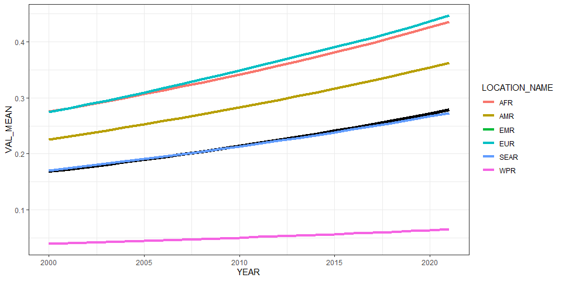<!-- -->

``` r
ggplot(all_reg_rt, aes(x = YEAR, y = VAL_MEAN, group = LOCATION_NAME)) +
  geom_line(data = all_glb_rt, linewidth = 2) +
  geom_line(aes(col = LOCATION_NAME), linewidth = 1.5) +
  geom_line(data = all_sub_rt, aes(col = REG2)) +
  theme_bw()
```

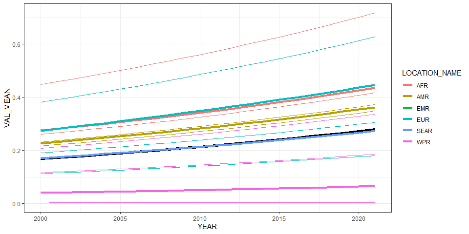<!-- -->

# Summarize predictions

## Global

``` r
kable(
  caption = "Global number of listeria cases, 2010 vs 2020",
  row.names = FALSE,
  subset(all_glb_nr, YEAR %in% c(2010, 2020))[, 1:4])
```

| YEAR | VAL_MEAN |  VAL_LWR |  VAL_UPR |
|-----:|---------:|---------:|---------:|
| 2010 | 14826.16 | 5948.147 | 40374.52 |
| 2020 | 21203.22 | 8102.176 | 59474.26 |

Global number of listeria cases, 2010 vs 2020

## Regions

``` r
kbl(subset(all_reg_rt, YEAR == 2010)[,c(6,2:4)],
    align = c("l", "c", "c", "c"), row.names = FALSE,
    col.names = c("Region", "Mean", "Lower", "Upper"),
    caption="  Incidence of listeria in 2020 by WHO region") %>%
  kable_styling("striped", "hover")
```

<table class="table table-striped" style="margin-left: auto; margin-right: auto;">

<caption>

Incidence of listeria in 2020 by WHO region
</caption>

<thead>

<tr>

<th style="text-align:left;">

Region
</th>

<th style="text-align:center;">

Mean
</th>

<th style="text-align:center;">

Lower
</th>

<th style="text-align:center;">

Upper
</th>

</tr>

</thead>

<tbody>

<tr>

<td style="text-align:left;">

AFR
</td>

<td style="text-align:center;">

0.3418884
</td>

<td style="text-align:center;">

0.0400145
</td>

<td style="text-align:center;">

1.5083552
</td>

</tr>

<tr>

<td style="text-align:left;">

AMR
</td>

<td style="text-align:center;">

0.2827801
</td>

<td style="text-align:center;">

0.0960807
</td>

<td style="text-align:center;">

0.8774499
</td>

</tr>

<tr>

<td style="text-align:left;">

EMR
</td>

<td style="text-align:center;">

0.2132122
</td>

<td style="text-align:center;">

0.0318319
</td>

<td style="text-align:center;">

0.7388781
</td>

</tr>

<tr>

<td style="text-align:left;">

EUR
</td>

<td style="text-align:center;">

0.3490558
</td>

<td style="text-align:center;">

0.2535434
</td>

<td style="text-align:center;">

0.5018329
</td>

</tr>

<tr>

<td style="text-align:left;">

SEAR
</td>

<td style="text-align:center;">

0.2132122
</td>

<td style="text-align:center;">

0.0318319
</td>

<td style="text-align:center;">

0.7388781
</td>

</tr>

<tr>

<td style="text-align:left;">

WPR
</td>

<td style="text-align:center;">

0.0500865
</td>

<td style="text-align:center;">

0.0190555
</td>

<td style="text-align:center;">

0.1138401
</td>

</tr>

</tbody>

</table>

``` r
kbl(subset(all_reg_nr, YEAR == 2010)[,c(6,2:4)],
    align = c("l", "c", "c", "c"), row.names = FALSE,
    col.names = c("Region", "Mean", "Lower", "Upper"),
    caption="  Cases of listeria in 2020 by WHO region") %>%
  kable_styling("striped", "hover")
```

<table class="table table-striped" style="margin-left: auto; margin-right: auto;">

<caption>

Cases of listeria in 2020 by WHO region
</caption>

<thead>

<tr>

<th style="text-align:left;">

Region
</th>

<th style="text-align:center;">

Mean
</th>

<th style="text-align:center;">

Lower
</th>

<th style="text-align:center;">

Upper
</th>

</tr>

</thead>

<tbody>

<tr>

<td style="text-align:left;">

AFR
</td>

<td style="text-align:center;">

2977.8156
</td>

<td style="text-align:center;">

348.5224
</td>

<td style="text-align:center;">

13137.632
</td>

</tr>

<tr>

<td style="text-align:left;">

AMR
</td>

<td style="text-align:center;">

2612.7500
</td>

<td style="text-align:center;">

887.7383
</td>

<td style="text-align:center;">

8107.208
</td>

</tr>

<tr>

<td style="text-align:left;">

EMR
</td>

<td style="text-align:center;">

1319.4182
</td>

<td style="text-align:center;">

196.9849
</td>

<td style="text-align:center;">

4572.389
</td>

</tr>

<tr>

<td style="text-align:left;">

EUR
</td>

<td style="text-align:center;">

3127.6826
</td>

<td style="text-align:center;">

2271.8528
</td>

<td style="text-align:center;">

4496.628
</td>

</tr>

<tr>

<td style="text-align:left;">

SEAR
</td>

<td style="text-align:center;">

3887.1870
</td>

<td style="text-align:center;">

580.3446
</td>

<td style="text-align:center;">

13470.884
</td>

</tr>

<tr>

<td style="text-align:left;">

WPR
</td>

<td style="text-align:center;">

901.3074
</td>

<td style="text-align:center;">

342.9037
</td>

<td style="text-align:center;">

2048.552
</td>

</tr>

</tbody>

</table>

``` r
kbl(subset(all_reg_rt, YEAR == 2020)[,c(6,2:4)],
    align = c("l", "c", "c", "c"), row.names = FALSE,
    col.names = c("Region", "Mean", "Lower", "Upper"),
    caption="  Incidence of listeria in 2020 by WHO region: v11.5") %>%
  kable_styling("striped", "hover")
```

<table class="table table-striped" style="margin-left: auto; margin-right: auto;">

<caption>

Incidence of listeria in 2020 by WHO region: v11.5
</caption>

<thead>

<tr>

<th style="text-align:left;">

Region
</th>

<th style="text-align:center;">

Mean
</th>

<th style="text-align:center;">

Lower
</th>

<th style="text-align:center;">

Upper
</th>

</tr>

</thead>

<tbody>

<tr>

<td style="text-align:left;">

AFR
</td>

<td style="text-align:center;">

0.4259261
</td>

<td style="text-align:center;">

0.0490292
</td>

<td style="text-align:center;">

1.9045247
</td>

</tr>

<tr>

<td style="text-align:left;">

AMR
</td>

<td style="text-align:center;">

0.3544835
</td>

<td style="text-align:center;">

0.1204029
</td>

<td style="text-align:center;">

1.0894629
</td>

</tr>

<tr>

<td style="text-align:left;">

EMR
</td>

<td style="text-align:center;">

0.2668685
</td>

<td style="text-align:center;">

0.0398870
</td>

<td style="text-align:center;">

0.9240421
</td>

</tr>

<tr>

<td style="text-align:left;">

EUR
</td>

<td style="text-align:center;">

0.4369508
</td>

<td style="text-align:center;">

0.3145513
</td>

<td style="text-align:center;">

0.6373354
</td>

</tr>

<tr>

<td style="text-align:left;">

SEAR
</td>

<td style="text-align:center;">

0.2668685
</td>

<td style="text-align:center;">

0.0398870
</td>

<td style="text-align:center;">

0.9240421
</td>

</tr>

<tr>

<td style="text-align:left;">

WPR
</td>

<td style="text-align:center;">

0.0633203
</td>

<td style="text-align:center;">

0.0239154
</td>

<td style="text-align:center;">

0.1446512
</td>

</tr>

</tbody>

</table>

``` r
kbl(subset(all_reg_nr, YEAR == 2020)[,c(6,2:4)],
    align = c("l", "c", "c", "c"), row.names = FALSE,
    col.names = c("Region", "Mean", "Lower", "Upper"),
    caption="  Cases of listeria in 2020 by WHO region : v11.5") %>%
  kable_styling("striped", "hover")
```

<table class="table table-striped" style="margin-left: auto; margin-right: auto;">

<caption>

Cases of listeria in 2020 by WHO region : v11.5
</caption>

<thead>

<tr>

<th style="text-align:left;">

Region
</th>

<th style="text-align:center;">

Mean
</th>

<th style="text-align:center;">

Lower
</th>

<th style="text-align:center;">

Upper
</th>

</tr>

</thead>

<tbody>

<tr>

<td style="text-align:left;">

AFR
</td>

<td style="text-align:center;">

4835.134
</td>

<td style="text-align:center;">

556.5822
</td>

<td style="text-align:center;">

21620.257
</td>

</tr>

<tr>

<td style="text-align:left;">

AMR
</td>

<td style="text-align:center;">

3604.542
</td>

<td style="text-align:center;">

1224.3085
</td>

<td style="text-align:center;">

11078.132
</td>

</tr>

<tr>

<td style="text-align:left;">

EMR
</td>

<td style="text-align:center;">

2012.353
</td>

<td style="text-align:center;">

300.7722
</td>

<td style="text-align:center;">

6967.847
</td>

</tr>

<tr>

<td style="text-align:left;">

EUR
</td>

<td style="text-align:center;">

4090.543
</td>

<td style="text-align:center;">

2944.6921
</td>

<td style="text-align:center;">

5966.456
</td>

</tr>

<tr>

<td style="text-align:left;">

SEAR
</td>

<td style="text-align:center;">

5443.053
</td>

<td style="text-align:center;">

813.5347
</td>

<td style="text-align:center;">

18846.774
</td>

</tr>

<tr>

<td style="text-align:left;">

WPR
</td>

<td style="text-align:center;">

1217.594
</td>

<td style="text-align:center;">

459.8715
</td>

<td style="text-align:center;">

2781.515
</td>

</tr>

</tbody>

</table>

``` r
ggplot(subset(all_reg_rt, YEAR == 2010),
       aes(y = VAL_MEAN, x = LOCATION_NAME)) +
  geom_pointrange(aes(ymin = VAL_LWR, ymax = VAL_UPR), size = 0.2) +
  coord_flip() +
  theme_bw() +
  scale_x_discrete(NULL, limits = rev(unique(all_reg_nr$LOCATION_NAME))) +
  scale_y_continuous(NULL) +
  ggtitle("Incidence of listeria by WHO Region, 2010")
```

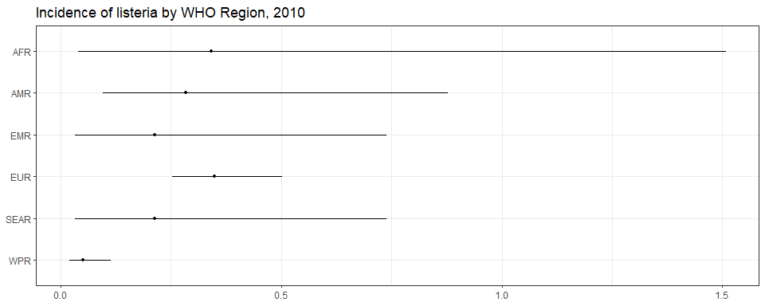<!-- -->

``` r
ggplot(subset(all_reg_rt, YEAR == 2020),
       aes(y = VAL_MEAN, x = LOCATION_NAME)) +
  geom_pointrange(aes(ymin = VAL_LWR, ymax = VAL_UPR), size = 0.2) +
  coord_flip() +
  theme_bw() +
  scale_x_discrete(NULL, limits = rev(unique(all_reg_nr$LOCATION_NAME))) +
  scale_y_continuous(NULL) +
  ggtitle("Incidence of listeria by WHO Region, 2020")
```

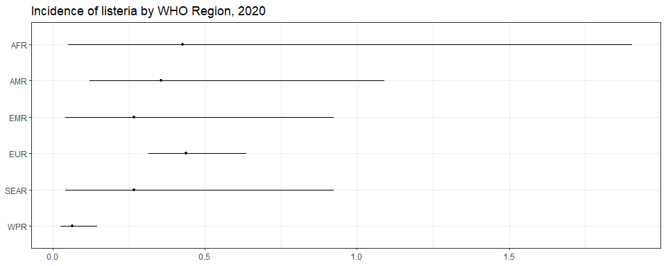<!-- -->

``` r
ggplot(subset(all_reg_nr, YEAR == 2010),
       aes(y = VAL_MEAN, x = LOCATION_NAME)) +
  geom_pointrange(aes(ymin = VAL_LWR, ymax = VAL_UPR), size = 0.2) +
  coord_flip() +
  theme_bw() +
  scale_x_discrete(NULL, limits = rev(unique(all_reg_nr$LOCATION_NAME))) +
  scale_y_continuous(NULL) +
  ggtitle("Number of listeria cases by WHO Region, 2010")
```

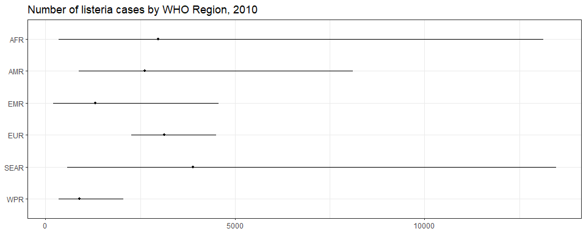<!-- -->

``` r
ggplot(subset(all_reg_nr, YEAR == 2020),
       aes(y = VAL_MEAN, x = LOCATION_NAME)) +
  geom_pointrange(aes(ymin = VAL_LWR, ymax = VAL_UPR), size = 0.2) +
  coord_flip() +
  theme_bw() +
  scale_x_discrete(NULL, limits = rev(unique(all_reg_nr$LOCATION_NAME))) +
  scale_y_continuous(NULL) +
  ggtitle("Number of listeria cases by WHO Region, 2020")
```

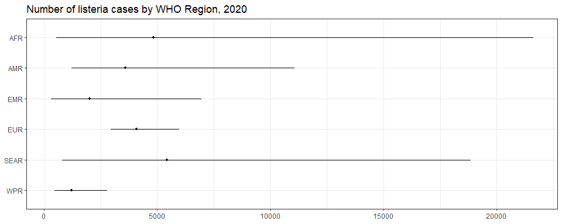<!-- -->

``` r
sim_all_reg <-
  merge(sim_all_reg,
        with(sim_all, aggregate(POP ~ REG2 + YEAR, FUN = sum)))
sim_all_reg_long <-
  pivot_longer(sim_all_reg, cols = starts_with("V"))
sim_all_reg_long$CASES <- sim_all_reg_long$value

ggplot(subset(sim_all_reg_long, YEAR == 2010), aes(x = CASES)) +
  geom_density() +
  facet_wrap(~REG2) +
  theme_bw() +
  scale_x_log10() +
  ggtitle("Number of listeria cases by WHO Region, 2010")
```

<!-- -->

``` r
ggplot(subset(sim_all_reg_long, YEAR == 2020), aes(x = CASES)) +
  geom_density() +
  facet_wrap(~REG2) +
  theme_bw() +
  scale_x_log10() +
  ggtitle("Number of listeria cases by WHO Region, 2020")
```

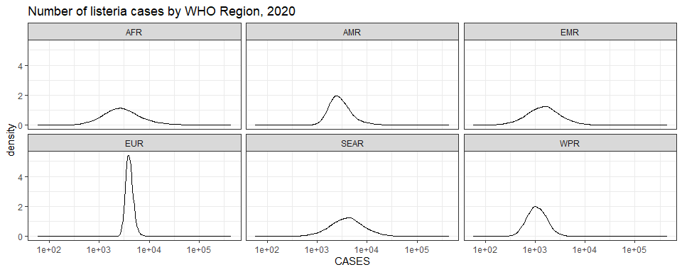<!-- -->

## Subregions

``` r
ggplot(subset(all_sub_rt, YEAR == 2010),
       aes(y = VAL_MEAN, x = LOCATION_NAME)) +
  geom_pointrange(aes(ymin = VAL_LWR, ymax = VAL_UPR), size = 0.2) +
  coord_flip() +
  theme_bw() +
  scale_x_discrete(NULL, limits = rev(unique(all_sub_nr$LOCATION_NAME))) +
  scale_y_continuous(NULL) +
  ggtitle("Incidence of listeria by WHO Subregion, 2010")
```

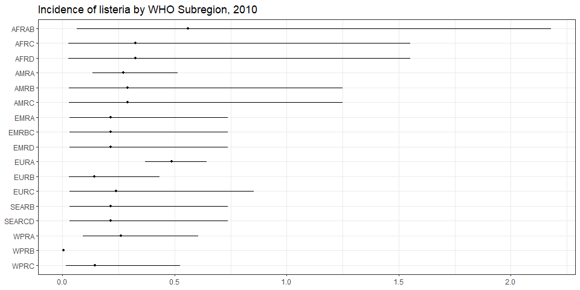<!-- -->

``` r
ggplot(subset(all_sub_rt, YEAR == 2020),
       aes(y = VAL_MEAN, x = LOCATION_NAME)) +
  geom_pointrange(aes(ymin = VAL_LWR, ymax = VAL_UPR), size = 0.2) +
  coord_flip() +
  theme_bw() +
  scale_x_discrete(NULL, limits = rev(unique(all_sub_nr$LOCATION_NAME))) +
  scale_y_continuous(NULL) +
  ggtitle("Incidence of listeria by WHO Subregion, 2020: v11.5")
```

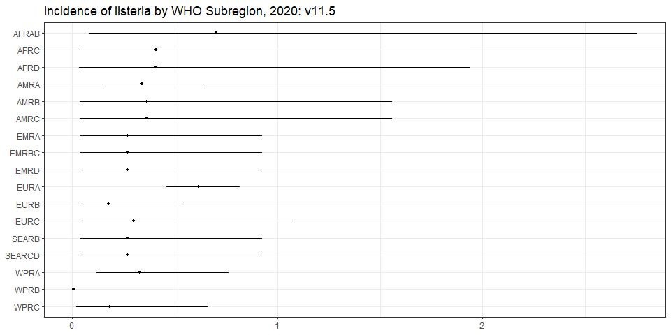<!-- -->

``` r
ggplot(subset(all_sub_nr, YEAR == 2010),
       aes(y = VAL_MEAN, x = LOCATION_NAME)) +
  geom_pointrange(aes(ymin = VAL_LWR, ymax = VAL_UPR), size = 0.2) +
  coord_flip() +
  theme_bw() +
  scale_x_discrete(NULL, limits = rev(unique(all_sub_nr$LOCATION_NAME))) +
  scale_y_continuous(NULL) +
  ggtitle("Number of listeria cases by WHO Subregion, 2010")
```

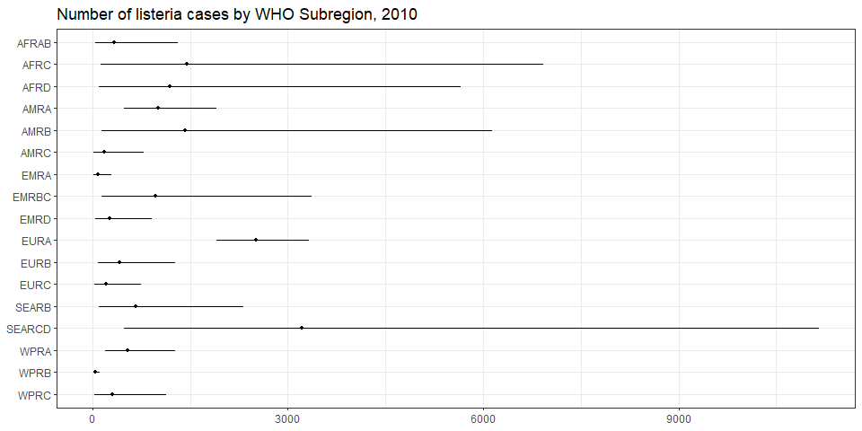<!-- -->

``` r
ggplot(subset(all_sub_nr, YEAR == 2020),
       aes(y = VAL_MEAN, x = LOCATION_NAME)) +
  geom_pointrange(aes(ymin = VAL_LWR, ymax = VAL_UPR), size = 0.2) +
  coord_flip() +
  theme_bw() +
  scale_x_discrete(NULL, limits = rev(unique(all_sub_nr$LOCATION_NAME))) +
  scale_y_continuous(NULL) +
  ggtitle("Number of listeria cases by WHO Subregion, 2020: v11.5")
```

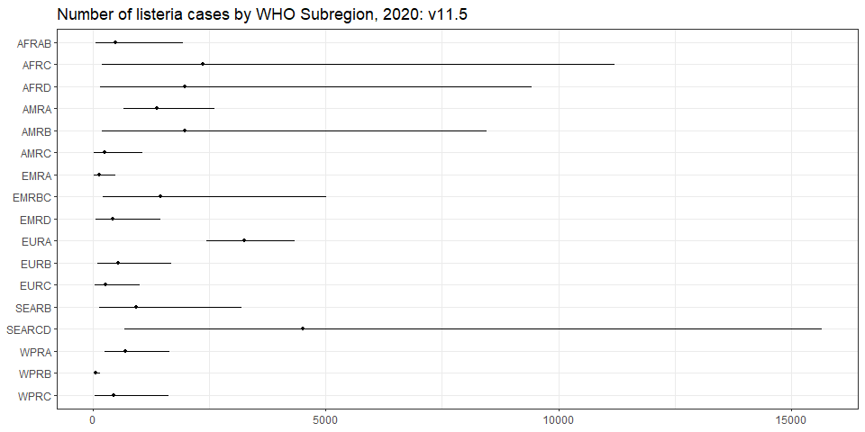<!-- -->

``` r
sim_all_sub <-
  merge(sim_all_sub,
        with(sim_all, aggregate(POP ~ SUB2 + YEAR, FUN = sum)))
sim_all_sub_long <-
  pivot_longer(sim_all_sub, cols = starts_with("V"))
sim_all_sub_long$CASES <- sim_all_sub_long$value

ggplot(subset(sim_all_sub_long, YEAR == 2010), aes(x = CASES)) +
  geom_density() +
  facet_wrap(~SUB2) +
  theme_bw() +
  scale_x_log10() +
  ggtitle("Number of listeria cases by WHO Subregion, 2010")
```

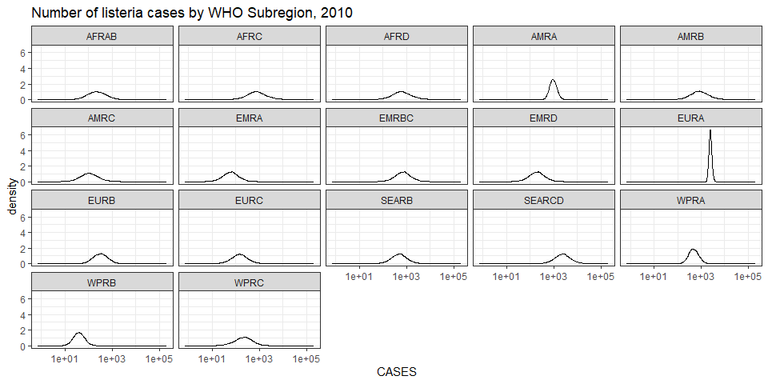<!-- -->

``` r
ggplot(subset(sim_all_sub_long, YEAR == 2020), aes(x = CASES)) +
  geom_density() +
  facet_wrap(~SUB2) +
  theme_bw() +
  scale_x_log10() +
  ggtitle("Number of listeria cases by WHO Subregion, 2020")
```

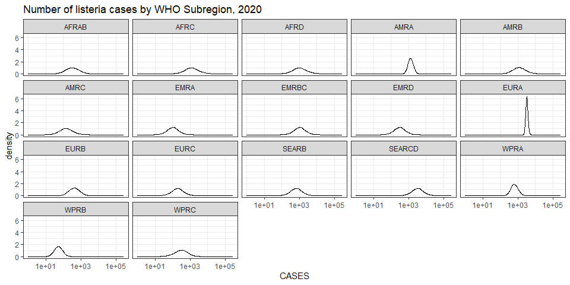<!-- -->

## Countries

``` r
breaks <- plot_world(subset(all_cnt_rt, YEAR == 2020),
                     "LOCATION_NAME", "VAL_MEAN", legend.title = "Incidence per 100k", diseasefree = zero_cases)
```

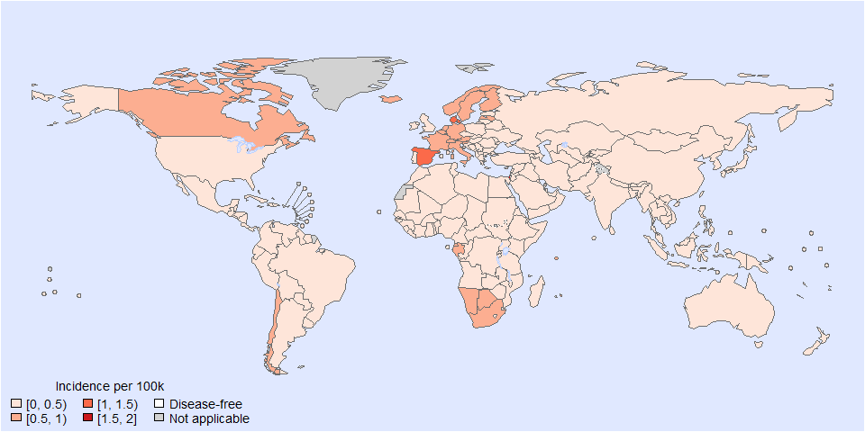<!-- -->

``` r
plot_world(subset(all_cnt_rt, YEAR == 2010), breaks=breaks,
           "LOCATION_NAME", "VAL_MEAN", legend.title = "Incidence per 100k", diseasefree = zero_cases)
```

    ## [1] 0.0 0.5 1.0 1.5 2.0

``` r
title("Listeria incidence, 2010", line = 1)
```

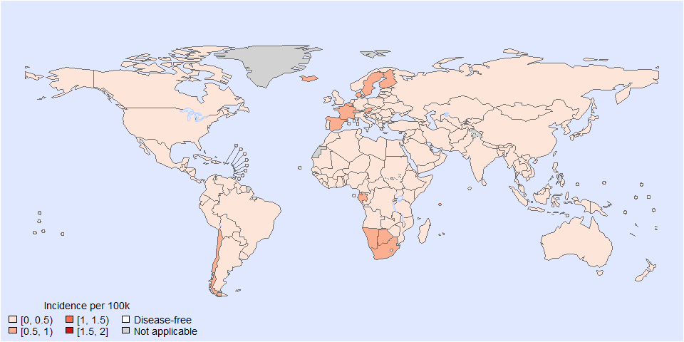<!-- -->

``` r
plot_world(subset(all_cnt_rt, YEAR == 2020), breaks=breaks,
           "LOCATION_NAME", "VAL_MEAN", legend.title = "Incidence per 100k", diseasefree = zero_cases)
```

    ## [1] 0.0 0.5 1.0 1.5 2.0

``` r
title("Listeria incidence, 2020", line = 1)
```

<!-- -->

``` r
tab <-
  data.frame(subset(all_cnt_rt, YEAR == 2010)[,
                                              c("LOCATION_NAME", "VAL_MEAN", "VAL_LWR", "VAL_UPR")],
             subset(all_cnt_rt, YEAR == 2020)[,
                                              c("VAL_MEAN", "VAL_LWR", "VAL_UPR")])
tab$LOCATION_NAME <-
  FERG2:::countries$COUNTRY[match(tab$LOCATION_NAME, FERG2:::countries$ISO3)]
tab$LOCATION_NAME <- gsub(" \\(.*", "", tab$LOCATION_NAME)
names(tab) <-
  c("Country",
    "2010.mean", "2010.lwr", "2010.upr",
    "2020.mean", "2020.lwr", "2020.upr")

kable(tab, digits = 3, row.names = FALSE,
      caption = "Estimated listeria incidence by country, 2010 vs 2020")
```

| Country | 2010.mean | 2010.lwr | 2010.upr | 2020.mean | 2020.lwr | 2020.upr |
|:---|---:|---:|---:|---:|---:|---:|
| Afghanistan | 0.213 | 0.032 | 0.739 | 0.267 | 0.040 | 0.924 |
| Angola | 0.326 | 0.027 | 1.551 | 0.408 | 0.033 | 1.938 |
| Albania | 0.141 | 0.027 | 0.439 | 0.176 | 0.033 | 0.552 |
| Andorra | 0.398 | 0.285 | 0.534 | 0.499 | 0.356 | 0.673 |
| United Arab Emirates | 0.213 | 0.032 | 0.739 | 0.267 | 0.040 | 0.924 |
| Argentina | 0.291 | 0.029 | 1.250 | 0.364 | 0.036 | 1.560 |
| Armenia | 0.141 | 0.027 | 0.439 | 0.176 | 0.033 | 0.552 |
| Antigua and Barbuda | 0.355 | 0.131 | 0.790 | 0.444 | 0.164 | 0.993 |
| Australia | 0.294 | 0.109 | 0.640 | 0.368 | 0.136 | 0.802 |
| Austria | 0.504 | 0.190 | 1.117 | 0.631 | 0.236 | 1.406 |
| Azerbaijan | 0.141 | 0.027 | 0.439 | 0.176 | 0.033 | 0.552 |
| Burundi | 0.326 | 0.027 | 1.551 | 0.408 | 0.033 | 1.938 |
| Belgium | 0.589 | 0.244 | 1.237 | 0.738 | 0.303 | 1.560 |
| Benin | 0.326 | 0.027 | 1.551 | 0.408 | 0.033 | 1.938 |
| Burkina Faso | 0.326 | 0.027 | 1.551 | 0.408 | 0.033 | 1.938 |
| Bangladesh | 0.213 | 0.032 | 0.739 | 0.267 | 0.040 | 0.924 |
| Bulgaria | 0.119 | 0.028 | 0.335 | 0.149 | 0.035 | 0.417 |
| Bahrain | 0.213 | 0.032 | 0.739 | 0.267 | 0.040 | 0.924 |
| Bahamas | 0.355 | 0.131 | 0.790 | 0.444 | 0.164 | 0.993 |
| Bosnia and Herzegovina | 0.141 | 0.027 | 0.439 | 0.176 | 0.033 | 0.552 |
| Belarus | 0.141 | 0.027 | 0.439 | 0.176 | 0.033 | 0.552 |
| Belize | 0.291 | 0.029 | 1.250 | 0.364 | 0.036 | 1.560 |
| Bolivia | 0.291 | 0.029 | 1.250 | 0.364 | 0.036 | 1.560 |
| Brazil | 0.291 | 0.029 | 1.250 | 0.364 | 0.036 | 1.560 |
| Barbados | 0.355 | 0.131 | 0.790 | 0.444 | 0.164 | 0.993 |
| Brunei Darussalam | 0.277 | 0.080 | 0.693 | 0.347 | 0.100 | 0.875 |
| Bhutan | 0.213 | 0.032 | 0.739 | 0.267 | 0.040 | 0.924 |
| Botswana | 0.564 | 0.046 | 2.500 | 0.706 | 0.058 | 3.140 |
| Central African Republic | 0.326 | 0.027 | 1.551 | 0.408 | 0.033 | 1.938 |
| Canada | 0.400 | 0.171 | 0.822 | 0.501 | 0.213 | 1.037 |
| Switzerland | 0.645 | 0.266 | 1.372 | 0.807 | 0.333 | 1.722 |
| Chile | 0.503 | 0.201 | 1.064 | 0.630 | 0.251 | 1.338 |
| China | 0.003 | 0.001 | 0.008 | 0.004 | 0.001 | 0.010 |
| Côte d’Ivoire | 0.326 | 0.027 | 1.551 | 0.408 | 0.033 | 1.938 |
| Cameroon | 0.326 | 0.027 | 1.551 | 0.408 | 0.033 | 1.938 |
| Congo | 0.326 | 0.027 | 1.551 | 0.408 | 0.033 | 1.938 |
| Congo | 0.326 | 0.027 | 1.551 | 0.408 | 0.033 | 1.938 |
| Cook Islands | 0.277 | 0.080 | 0.693 | 0.347 | 0.100 | 0.875 |
| Colombia | 0.291 | 0.029 | 1.250 | 0.364 | 0.036 | 1.560 |
| Comoros | 0.326 | 0.027 | 1.551 | 0.408 | 0.033 | 1.938 |
| Cabo Verde | 0.326 | 0.027 | 1.551 | 0.408 | 0.033 | 1.938 |
| Costa Rica | 0.291 | 0.029 | 1.250 | 0.364 | 0.036 | 1.560 |
| Cuba | 0.291 | 0.029 | 1.250 | 0.364 | 0.036 | 1.560 |
| Cyprus | 0.258 | 0.080 | 0.583 | 0.323 | 0.098 | 0.732 |
| Czechia | 0.369 | 0.128 | 0.815 | 0.462 | 0.161 | 1.019 |
| Germany | 0.499 | 0.205 | 1.018 | 0.625 | 0.258 | 1.282 |
| Djibouti | 0.213 | 0.032 | 0.739 | 0.267 | 0.040 | 0.924 |
| Dominica | 0.291 | 0.029 | 1.250 | 0.364 | 0.036 | 1.560 |
| Denmark | 0.822 | 0.373 | 1.626 | 1.029 | 0.467 | 2.048 |
| Dominican Republic | 0.291 | 0.029 | 1.250 | 0.364 | 0.036 | 1.560 |
| Algeria | 0.326 | 0.027 | 1.551 | 0.408 | 0.033 | 1.938 |
| Ecuador | 0.291 | 0.029 | 1.250 | 0.364 | 0.036 | 1.560 |
| Egypt | 0.213 | 0.032 | 0.739 | 0.267 | 0.040 | 0.924 |
| Eritrea | 0.326 | 0.027 | 1.551 | 0.408 | 0.033 | 1.938 |
| Spain | 0.801 | 0.393 | 1.487 | 1.003 | 0.491 | 1.871 |
| Estonia | 0.393 | 0.139 | 0.885 | 0.492 | 0.173 | 1.111 |
| Ethiopia | 0.326 | 0.027 | 1.551 | 0.408 | 0.033 | 1.938 |
| Finland | 0.662 | 0.246 | 1.511 | 0.829 | 0.305 | 1.911 |
| Fiji | 0.008 | 0.001 | 0.035 | 0.010 | 0.001 | 0.044 |
| France | 0.597 | 0.246 | 1.259 | 0.747 | 0.306 | 1.591 |
| Micronesia | 0.145 | 0.015 | 0.526 | 0.181 | 0.019 | 0.659 |
| Gabon | 0.564 | 0.046 | 2.500 | 0.706 | 0.058 | 3.140 |
| United Kingdom | 0.378 | 0.184 | 0.693 | 0.473 | 0.227 | 0.870 |
| Georgia | 0.141 | 0.027 | 0.439 | 0.176 | 0.033 | 0.552 |
| Ghana | 0.326 | 0.027 | 1.551 | 0.408 | 0.033 | 1.938 |
| Guinea | 0.326 | 0.027 | 1.551 | 0.408 | 0.033 | 1.938 |
| Gambia | 0.326 | 0.027 | 1.551 | 0.408 | 0.033 | 1.938 |
| Guinea-Bissau | 0.326 | 0.027 | 1.551 | 0.408 | 0.033 | 1.938 |
| Equatorial Guinea | 0.564 | 0.046 | 2.500 | 0.706 | 0.058 | 3.140 |
| Greece | 0.213 | 0.063 | 0.487 | 0.266 | 0.079 | 0.613 |
| Grenada | 0.291 | 0.029 | 1.250 | 0.364 | 0.036 | 1.560 |
| Guatemala | 0.291 | 0.029 | 1.250 | 0.364 | 0.036 | 1.560 |
| Guyana | 0.355 | 0.131 | 0.790 | 0.444 | 0.164 | 0.993 |
| Honduras | 0.291 | 0.029 | 1.250 | 0.364 | 0.036 | 1.560 |
| Croatia | 0.321 | 0.089 | 0.783 | 0.402 | 0.112 | 0.981 |
| Haiti | 0.291 | 0.029 | 1.250 | 0.364 | 0.036 | 1.560 |
| Hungary | 0.279 | 0.105 | 0.574 | 0.350 | 0.130 | 0.716 |
| Indonesia | 0.213 | 0.032 | 0.739 | 0.267 | 0.040 | 0.924 |
| India | 0.213 | 0.032 | 0.739 | 0.267 | 0.040 | 0.924 |
| Ireland | 0.374 | 0.145 | 0.773 | 0.468 | 0.181 | 0.966 |
| Iran | 0.213 | 0.032 | 0.739 | 0.267 | 0.040 | 0.924 |
| Iraq | 0.213 | 0.032 | 0.739 | 0.267 | 0.040 | 0.924 |
| Iceland | 0.698 | 0.212 | 1.886 | 0.874 | 0.262 | 2.366 |
| Israel | 1.371 | 0.447 | 3.304 | 1.719 | 0.562 | 4.162 |
| Italy | 0.479 | 0.242 | 0.843 | 0.599 | 0.302 | 1.062 |
| Jamaica | 0.291 | 0.029 | 1.250 | 0.364 | 0.036 | 1.560 |
| Jordan | 0.213 | 0.032 | 0.739 | 0.267 | 0.040 | 0.924 |
| Japan | 0.245 | 0.060 | 0.673 | 0.306 | 0.075 | 0.849 |
| Kazakhstan | 0.141 | 0.027 | 0.439 | 0.176 | 0.033 | 0.552 |
| Kenya | 0.326 | 0.027 | 1.551 | 0.408 | 0.033 | 1.938 |
| Kyrgyzstan | 0.239 | 0.032 | 0.855 | 0.299 | 0.040 | 1.075 |
| Cambodia | 0.145 | 0.015 | 0.526 | 0.181 | 0.019 | 0.659 |
| Kiribati | 0.145 | 0.015 | 0.526 | 0.181 | 0.019 | 0.659 |
| Saint Kitts and Nevis | 0.355 | 0.131 | 0.790 | 0.444 | 0.164 | 0.993 |
| Korea | 0.277 | 0.080 | 0.693 | 0.347 | 0.100 | 0.875 |
| Kuwait | 0.213 | 0.032 | 0.739 | 0.267 | 0.040 | 0.924 |
| Lao People’s Dem. Republic | 0.145 | 0.015 | 0.526 | 0.181 | 0.019 | 0.659 |
| Lebanon | 0.213 | 0.032 | 0.739 | 0.267 | 0.040 | 0.924 |
| Liberia | 0.326 | 0.027 | 1.551 | 0.408 | 0.033 | 1.938 |
| Libya | 0.213 | 0.032 | 0.739 | 0.267 | 0.040 | 0.924 |
| Saint Lucia | 0.291 | 0.029 | 1.250 | 0.364 | 0.036 | 1.560 |
| Sri Lanka | 0.213 | 0.032 | 0.739 | 0.267 | 0.040 | 0.924 |
| Lesotho | 0.326 | 0.027 | 1.551 | 0.408 | 0.033 | 1.938 |
| Lithuania | 0.289 | 0.094 | 0.635 | 0.361 | 0.116 | 0.797 |
| Luxembourg | 0.530 | 0.194 | 1.245 | 0.664 | 0.243 | 1.574 |
| Latvia | 0.442 | 0.159 | 1.017 | 0.554 | 0.199 | 1.269 |
| Morocco | 0.213 | 0.032 | 0.739 | 0.267 | 0.040 | 0.924 |
| Monaco | 0.398 | 0.285 | 0.534 | 0.499 | 0.356 | 0.673 |
| Republic of Moldova | 0.141 | 0.027 | 0.439 | 0.176 | 0.033 | 0.552 |
| Madagascar | 0.326 | 0.027 | 1.551 | 0.408 | 0.033 | 1.938 |
| Maldives | 0.213 | 0.032 | 0.739 | 0.267 | 0.040 | 0.924 |
| Mexico | 0.291 | 0.029 | 1.250 | 0.364 | 0.036 | 1.560 |
| Marshall Islands | 0.008 | 0.001 | 0.035 | 0.010 | 0.001 | 0.044 |
| North Macedonia | 0.141 | 0.027 | 0.439 | 0.176 | 0.033 | 0.552 |
| Mali | 0.326 | 0.027 | 1.551 | 0.408 | 0.033 | 1.938 |
| Malta | 0.409 | 0.142 | 0.926 | 0.512 | 0.178 | 1.159 |
| Myanmar | 0.213 | 0.032 | 0.739 | 0.267 | 0.040 | 0.924 |
| Montenegro | 0.141 | 0.027 | 0.439 | 0.176 | 0.033 | 0.552 |
| Mongolia | 0.145 | 0.015 | 0.526 | 0.181 | 0.019 | 0.659 |
| Mozambique | 0.326 | 0.027 | 1.551 | 0.408 | 0.033 | 1.938 |
| Mauritania | 0.326 | 0.027 | 1.551 | 0.408 | 0.033 | 1.938 |
| Mauritius | 0.564 | 0.046 | 2.500 | 0.706 | 0.058 | 3.140 |
| Malawi | 0.326 | 0.027 | 1.551 | 0.408 | 0.033 | 1.938 |
| Malaysia | 0.008 | 0.001 | 0.035 | 0.010 | 0.001 | 0.044 |
| Namibia | 0.564 | 0.046 | 2.500 | 0.706 | 0.058 | 3.140 |
| Niger | 0.326 | 0.027 | 1.551 | 0.408 | 0.033 | 1.938 |
| Nigeria | 0.326 | 0.027 | 1.551 | 0.408 | 0.033 | 1.938 |
| Nicaragua | 0.291 | 0.029 | 1.250 | 0.364 | 0.036 | 1.560 |
| Niue | 0.277 | 0.080 | 0.693 | 0.347 | 0.100 | 0.875 |
| Netherlands | 0.426 | 0.236 | 0.703 | 0.533 | 0.294 | 0.881 |
| Norway | 0.486 | 0.146 | 1.236 | 0.608 | 0.183 | 1.541 |
| Nepal | 0.213 | 0.032 | 0.739 | 0.267 | 0.040 | 0.924 |
| Nauru | 0.277 | 0.080 | 0.693 | 0.347 | 0.100 | 0.875 |
| New Zealand | 0.386 | 0.091 | 1.100 | 0.484 | 0.113 | 1.390 |
| Oman | 0.213 | 0.032 | 0.739 | 0.267 | 0.040 | 0.924 |
| Pakistan | 0.213 | 0.032 | 0.739 | 0.267 | 0.040 | 0.924 |
| Panama | 0.355 | 0.131 | 0.790 | 0.444 | 0.164 | 0.993 |
| Peru | 0.291 | 0.029 | 1.250 | 0.364 | 0.036 | 1.560 |
| Philippines | 0.145 | 0.015 | 0.526 | 0.181 | 0.019 | 0.659 |
| Palau | 0.008 | 0.001 | 0.035 | 0.010 | 0.001 | 0.044 |
| Papua New Guinea | 0.145 | 0.015 | 0.526 | 0.181 | 0.019 | 0.659 |
| Poland | 0.191 | 0.066 | 0.429 | 0.238 | 0.082 | 0.536 |
| Korea | 0.213 | 0.032 | 0.739 | 0.267 | 0.040 | 0.924 |
| Portugal | 0.297 | 0.122 | 0.591 | 0.371 | 0.153 | 0.740 |
| Paraguay | 0.291 | 0.029 | 1.250 | 0.364 | 0.036 | 1.560 |
| Qatar | 0.213 | 0.032 | 0.739 | 0.267 | 0.040 | 0.924 |
| Romania | 0.236 | 0.055 | 0.569 | 0.295 | 0.069 | 0.713 |
| Russian Federation | 0.141 | 0.027 | 0.439 | 0.176 | 0.033 | 0.552 |
| Rwanda | 0.326 | 0.027 | 1.551 | 0.408 | 0.033 | 1.938 |
| Saudi Arabia | 0.213 | 0.032 | 0.739 | 0.267 | 0.040 | 0.924 |
| Sudan | 0.213 | 0.032 | 0.739 | 0.267 | 0.040 | 0.924 |
| Senegal | 0.326 | 0.027 | 1.551 | 0.408 | 0.033 | 1.938 |
| Singapore | 0.277 | 0.080 | 0.693 | 0.347 | 0.100 | 0.875 |
| Solomon Islands | 0.145 | 0.015 | 0.526 | 0.181 | 0.019 | 0.659 |
| Sierra Leone | 0.326 | 0.027 | 1.551 | 0.408 | 0.033 | 1.938 |
| El Salvador | 0.291 | 0.029 | 1.250 | 0.364 | 0.036 | 1.560 |
| San Marino | 0.398 | 0.285 | 0.534 | 0.499 | 0.356 | 0.673 |
| Somalia | 0.213 | 0.032 | 0.739 | 0.267 | 0.040 | 0.924 |
| Serbia | 0.150 | 0.024 | 0.495 | 0.187 | 0.031 | 0.620 |
| South Sudan | 0.326 | 0.027 | 1.551 | 0.408 | 0.033 | 1.938 |
| Sao Tome and Principe | 0.326 | 0.027 | 1.551 | 0.408 | 0.033 | 1.938 |
| Suriname | 0.291 | 0.029 | 1.250 | 0.364 | 0.036 | 1.560 |
| Slovakia | 0.336 | 0.118 | 0.728 | 0.420 | 0.147 | 0.913 |
| Slovenia | 0.447 | 0.161 | 1.014 | 0.559 | 0.201 | 1.263 |
| Sweden | 0.657 | 0.245 | 1.533 | 0.823 | 0.303 | 1.924 |
| Eswatini | 0.326 | 0.027 | 1.551 | 0.408 | 0.033 | 1.938 |
| Seychelles | 0.564 | 0.046 | 2.500 | 0.706 | 0.058 | 3.140 |
| Syrian Arab Republic | 0.213 | 0.032 | 0.739 | 0.267 | 0.040 | 0.924 |
| Chad | 0.326 | 0.027 | 1.551 | 0.408 | 0.033 | 1.938 |
| Togo | 0.326 | 0.027 | 1.551 | 0.408 | 0.033 | 1.938 |
| Thailand | 0.213 | 0.032 | 0.739 | 0.267 | 0.040 | 0.924 |
| Tajikistan | 0.239 | 0.032 | 0.855 | 0.299 | 0.040 | 1.075 |
| Turkmenistan | 0.141 | 0.027 | 0.439 | 0.176 | 0.033 | 0.552 |
| Timor-Leste | 0.213 | 0.032 | 0.739 | 0.267 | 0.040 | 0.924 |
| Tonga | 0.008 | 0.001 | 0.035 | 0.010 | 0.001 | 0.044 |
| Trinidad and Tobago | 0.355 | 0.131 | 0.790 | 0.444 | 0.164 | 0.993 |
| Tunisia | 0.213 | 0.032 | 0.739 | 0.267 | 0.040 | 0.924 |
| Turkiye | 0.141 | 0.027 | 0.439 | 0.176 | 0.033 | 0.552 |
| Tuvalu | 0.008 | 0.001 | 0.035 | 0.010 | 0.001 | 0.044 |
| United Republic of Tanzania | 0.326 | 0.027 | 1.551 | 0.408 | 0.033 | 1.938 |
| Uganda | 0.326 | 0.027 | 1.551 | 0.408 | 0.033 | 1.938 |
| Ukraine | 0.239 | 0.032 | 0.855 | 0.299 | 0.040 | 1.075 |
| Uruguay | 0.355 | 0.131 | 0.790 | 0.444 | 0.164 | 0.993 |
| United States of America | 0.242 | 0.092 | 0.511 | 0.302 | 0.115 | 0.640 |
| Uzbekistan | 0.239 | 0.032 | 0.855 | 0.299 | 0.040 | 1.075 |
| Saint Vincent and the Grenadines | 0.291 | 0.029 | 1.250 | 0.364 | 0.036 | 1.560 |
| Venezuela | 0.291 | 0.029 | 1.250 | 0.364 | 0.036 | 1.560 |
| Viet Nam | 0.145 | 0.015 | 0.526 | 0.181 | 0.019 | 0.659 |
| Vanuatu | 0.145 | 0.015 | 0.526 | 0.181 | 0.019 | 0.659 |
| Samoa | 0.145 | 0.015 | 0.526 | 0.181 | 0.019 | 0.659 |
| Yemen | 0.213 | 0.032 | 0.739 | 0.267 | 0.040 | 0.924 |
| South Africa | 0.560 | 0.063 | 2.181 | 0.701 | 0.078 | 2.733 |
| Zambia | 0.326 | 0.027 | 1.551 | 0.408 | 0.033 | 1.938 |
| Zimbabwe | 0.326 | 0.027 | 1.551 | 0.408 | 0.033 | 1.938 |

Estimated listeria incidence by country, 2010 vs 2020

``` r
tab2 <-
  data.frame(subset(all_cnt_nr, YEAR == 2010)[,
                                              c("LOCATION_NAME", "VAL_MEAN", "VAL_LWR", "VAL_UPR")],
             subset(all_cnt_nr, YEAR == 2020)[,
                                              c("VAL_MEAN", "VAL_LWR", "VAL_UPR")])
tab2$LOCATION_NAME <-
  FERG2:::countries$COUNTRY[match(tab2$LOCATION_NAME, FERG2:::countries$ISO3)]
tab2$LOCATION_NAME <- gsub(" \\(.*", "", tab2$LOCATION_NAME)
names(tab2) <-
  c("Country",
    "2010.mean", "2010.lwr", "2010.upr",
    "2020.mean", "2020.lwr", "2020.upr")

kable(tab2, digits = 1, row.names = FALSE,
      caption = "Estimated listeria cases by country, 2010 vs 2020")
```

| Country | 2010.mean | 2010.lwr | 2010.upr | 2020.mean | 2020.lwr | 2020.upr |
|:---|---:|---:|---:|---:|---:|---:|
| Afghanistan | 59.5 | 8.9 | 206.1 | 102.6 | 15.3 | 355.1 |
| Angola | 74.4 | 6.1 | 354.4 | 134.2 | 11.0 | 638.2 |
| Albania | 4.2 | 0.8 | 12.9 | 5.1 | 1.0 | 15.9 |
| Andorra | 0.3 | 0.2 | 0.4 | 0.4 | 0.3 | 0.5 |
| United Arab Emirates | 14.5 | 2.2 | 50.4 | 25.0 | 3.7 | 86.5 |
| Argentina | 119.3 | 12.0 | 513.5 | 164.2 | 16.4 | 704.0 |
| Armenia | 4.1 | 0.8 | 12.9 | 5.1 | 1.0 | 16.0 |
| Antigua and Barbuda | 0.3 | 0.1 | 0.7 | 0.4 | 0.1 | 0.9 |
| Australia | 64.5 | 23.9 | 140.7 | 94.3 | 34.9 | 205.8 |
| Austria | 42.1 | 15.8 | 93.3 | 56.2 | 21.0 | 125.2 |
| Azerbaijan | 12.8 | 2.4 | 39.9 | 17.9 | 3.4 | 56.0 |
| Burundi | 30.0 | 2.5 | 142.7 | 50.7 | 4.1 | 241.2 |
| Belgium | 64.0 | 26.5 | 134.5 | 85.0 | 34.9 | 179.7 |
| Benin | 31.4 | 2.6 | 149.7 | 52.6 | 4.3 | 250.0 |
| Burkina Faso | 51.9 | 4.3 | 247.3 | 86.5 | 7.1 | 411.3 |
| Bangladesh | 323.1 | 48.2 | 1119.8 | 442.0 | 66.1 | 1530.4 |
| Bulgaria | 8.9 | 2.1 | 25.0 | 10.3 | 2.4 | 29.0 |
| Bahrain | 2.6 | 0.4 | 9.0 | 3.9 | 0.6 | 13.7 |
| Bahamas | 1.3 | 0.5 | 2.9 | 1.8 | 0.6 | 3.9 |
| Bosnia and Herzegovina | 5.4 | 1.0 | 16.9 | 5.9 | 1.1 | 18.3 |
| Belarus | 13.4 | 2.5 | 41.7 | 16.6 | 3.1 | 51.9 |
| Belize | 0.9 | 0.1 | 4.0 | 1.4 | 0.1 | 6.1 |
| Bolivia | 29.3 | 2.9 | 126.3 | 42.8 | 4.3 | 183.4 |
| Brazil | 560.5 | 56.2 | 2412.1 | 757.5 | 75.6 | 3247.7 |
| Barbados | 1.0 | 0.4 | 2.2 | 1.3 | 0.5 | 2.8 |
| Brunei Darussalam | 1.1 | 0.3 | 2.7 | 1.5 | 0.4 | 3.9 |
| Bhutan | 1.5 | 0.2 | 5.2 | 2.0 | 0.3 | 7.1 |
| Botswana | 11.3 | 0.9 | 50.3 | 16.6 | 1.4 | 73.7 |
| Central African Republic | 14.5 | 1.2 | 69.0 | 20.2 | 1.7 | 96.2 |
| Canada | 136.1 | 58.1 | 279.7 | 190.5 | 81.0 | 394.3 |
| Switzerland | 50.2 | 20.7 | 106.8 | 69.5 | 28.7 | 148.2 |
| Chile | 86.0 | 34.4 | 182.0 | 121.7 | 48.6 | 258.7 |
| China | 43.3 | 13.0 | 110.3 | 57.4 | 17.4 | 146.2 |
| Côte d’Ivoire | 72.4 | 5.9 | 345.0 | 116.4 | 9.5 | 553.6 |
| Cameroon | 63.1 | 5.2 | 300.8 | 105.4 | 8.6 | 501.2 |
| Congo | 219.6 | 18.0 | 1046.4 | 384.9 | 31.4 | 1830.2 |
| Congo | 14.3 | 1.2 | 68.1 | 23.2 | 1.9 | 110.2 |
| Cook Islands | 0.0 | 0.0 | 0.1 | 0.1 | 0.0 | 0.1 |
| Colombia | 129.4 | 13.0 | 556.8 | 183.2 | 18.3 | 785.3 |
| Comoros | 2.1 | 0.2 | 10.1 | 3.2 | 0.3 | 15.4 |
| Cabo Verde | 1.7 | 0.1 | 7.9 | 2.1 | 0.2 | 10.0 |
| Costa Rica | 13.2 | 1.3 | 56.6 | 18.3 | 1.8 | 78.3 |
| Cuba | 32.8 | 3.3 | 141.2 | 40.7 | 4.1 | 174.6 |
| Cyprus | 2.9 | 0.9 | 6.5 | 4.2 | 1.3 | 9.5 |
| Czechia | 38.5 | 13.4 | 85.1 | 48.7 | 17.0 | 107.6 |
| Germany | 403.5 | 165.9 | 823.5 | 522.4 | 215.5 | 1072.6 |
| Djibouti | 2.0 | 0.3 | 6.8 | 2.9 | 0.4 | 10.1 |
| Dominica | 0.2 | 0.0 | 0.9 | 0.2 | 0.0 | 1.1 |
| Denmark | 45.5 | 20.7 | 90.0 | 59.9 | 27.2 | 119.2 |
| Dominican Republic | 28.4 | 2.8 | 122.0 | 39.9 | 4.0 | 170.8 |
| Algeria | 116.7 | 9.6 | 555.9 | 178.1 | 14.5 | 846.8 |
| Ecuador | 43.4 | 4.4 | 187.0 | 63.6 | 6.3 | 272.7 |
| Egypt | 188.3 | 28.1 | 652.7 | 289.4 | 43.3 | 1002.2 |
| Eritrea | 9.5 | 0.8 | 45.2 | 13.3 | 1.1 | 63.2 |
| Spain | 374.3 | 183.6 | 695.1 | 477.6 | 234.0 | 891.1 |
| Estonia | 5.2 | 1.8 | 11.8 | 6.5 | 2.3 | 14.8 |
| Ethiopia | 290.6 | 23.9 | 1384.6 | 478.2 | 39.0 | 2273.8 |
| Finland | 35.4 | 13.1 | 80.9 | 45.8 | 16.9 | 105.6 |
| Fiji | 0.1 | 0.0 | 0.3 | 0.1 | 0.0 | 0.4 |
| France | 377.5 | 155.7 | 796.6 | 491.7 | 201.5 | 1047.1 |
| Micronesia | 0.2 | 0.0 | 0.6 | 0.2 | 0.0 | 0.7 |
| Gabon | 9.5 | 0.8 | 42.2 | 16.2 | 1.3 | 72.1 |
| United Kingdom | 237.1 | 115.3 | 434.6 | 318.3 | 153.0 | 585.1 |
| Georgia | 5.5 | 1.0 | 17.2 | 6.7 | 1.3 | 20.9 |
| Ghana | 81.9 | 6.7 | 390.5 | 128.7 | 10.5 | 612.0 |
| Guinea | 33.4 | 2.7 | 159.3 | 53.8 | 4.4 | 255.9 |
| Gambia | 6.2 | 0.5 | 29.5 | 10.1 | 0.8 | 48.2 |
| Guinea-Bissau | 5.0 | 0.4 | 24.0 | 8.1 | 0.7 | 38.6 |
| Equatorial Guinea | 6.6 | 0.5 | 29.0 | 12.0 | 1.0 | 53.3 |
| Greece | 23.7 | 7.0 | 54.1 | 28.5 | 8.5 | 65.7 |
| Grenada | 0.3 | 0.0 | 1.4 | 0.4 | 0.0 | 1.8 |
| Guatemala | 41.7 | 4.2 | 179.5 | 62.7 | 6.3 | 268.8 |
| Guyana | 2.7 | 1.0 | 5.9 | 3.6 | 1.3 | 8.0 |
| Honduras | 24.1 | 2.4 | 103.5 | 36.5 | 3.6 | 156.6 |
| Croatia | 13.8 | 3.8 | 33.7 | 16.0 | 4.4 | 38.9 |
| Haiti | 28.4 | 2.8 | 122.2 | 40.7 | 4.1 | 174.4 |
| Hungary | 27.9 | 10.5 | 57.4 | 34.2 | 12.7 | 70.0 |
| Indonesia | 521.8 | 77.9 | 1808.4 | 730.5 | 109.2 | 2529.5 |
| India | 2632.1 | 393.0 | 9121.5 | 3725.4 | 556.8 | 12899.4 |
| Ireland | 17.0 | 6.6 | 35.2 | 23.2 | 9.0 | 47.9 |
| Iran | 164.0 | 24.5 | 568.5 | 233.5 | 34.9 | 808.4 |
| Iraq | 65.1 | 9.7 | 225.7 | 111.1 | 16.6 | 384.8 |
| Iceland | 2.2 | 0.7 | 6.0 | 3.2 | 1.0 | 8.6 |
| Israel | 99.6 | 32.5 | 240.1 | 150.0 | 49.0 | 363.4 |
| Italy | 287.4 | 145.2 | 506.0 | 359.8 | 181.5 | 637.9 |
| Jamaica | 8.0 | 0.8 | 34.3 | 10.3 | 1.0 | 44.1 |
| Jordan | 15.4 | 2.3 | 53.2 | 28.7 | 4.3 | 99.5 |
| Japan | 313.8 | 76.7 | 862.8 | 388.0 | 95.1 | 1074.9 |
| Kazakhstan | 23.6 | 4.5 | 73.4 | 34.1 | 6.4 | 106.7 |
| Kenya | 133.5 | 11.0 | 636.2 | 210.8 | 17.2 | 1002.3 |
| Kyrgyzstan | 13.0 | 1.7 | 46.5 | 19.7 | 2.6 | 70.7 |
| Cambodia | 20.9 | 2.2 | 75.6 | 30.1 | 3.2 | 109.3 |
| Kiribati | 0.2 | 0.0 | 0.6 | 0.2 | 0.0 | 0.8 |
| Saint Kitts and Nevis | 0.2 | 0.1 | 0.4 | 0.2 | 0.1 | 0.5 |
| Korea | 134.6 | 39.0 | 336.9 | 179.6 | 52.0 | 453.7 |
| Kuwait | 6.1 | 0.9 | 21.2 | 11.9 | 1.8 | 41.3 |
| Lao People’s Dem. Republic | 9.1 | 1.0 | 33.0 | 13.2 | 1.4 | 48.0 |
| Lebanon | 10.7 | 1.6 | 37.1 | 15.2 | 2.3 | 52.6 |
| Liberia | 13.0 | 1.1 | 62.1 | 20.8 | 1.7 | 98.8 |
| Libya | 13.7 | 2.0 | 47.5 | 18.7 | 2.8 | 64.7 |
| Saint Lucia | 0.5 | 0.0 | 2.1 | 0.6 | 0.1 | 2.8 |
| Sri Lanka | 44.4 | 6.6 | 153.8 | 60.0 | 9.0 | 207.8 |
| Lesotho | 6.5 | 0.5 | 30.8 | 9.1 | 0.7 | 43.1 |
| Lithuania | 9.1 | 3.0 | 20.0 | 10.1 | 3.2 | 22.3 |
| Luxembourg | 2.7 | 1.0 | 6.3 | 4.2 | 1.5 | 9.9 |
| Latvia | 9.4 | 3.4 | 21.6 | 10.6 | 3.8 | 24.2 |
| Morocco | 68.7 | 10.3 | 238.2 | 97.1 | 14.5 | 336.3 |
| Monaco | 0.1 | 0.1 | 0.2 | 0.2 | 0.1 | 0.3 |
| Republic of Moldova | 5.2 | 1.0 | 16.1 | 5.4 | 1.0 | 17.0 |
| Madagascar | 71.2 | 5.8 | 339.2 | 116.5 | 9.5 | 554.1 |
| Maldives | 0.8 | 0.1 | 2.6 | 1.3 | 0.2 | 4.6 |
| Mexico | 327.8 | 32.9 | 1410.6 | 459.9 | 45.9 | 1971.7 |
| Marshall Islands | 0.0 | 0.0 | 0.0 | 0.0 | 0.0 | 0.0 |
| North Macedonia | 2.9 | 0.5 | 9.0 | 3.3 | 0.6 | 10.4 |
| Mali | 51.1 | 4.2 | 243.3 | 87.2 | 7.1 | 414.4 |
| Malta | 1.7 | 0.6 | 3.9 | 2.6 | 0.9 | 6.0 |
| Myanmar | 104.1 | 15.5 | 360.8 | 141.0 | 21.1 | 488.1 |
| Montenegro | 0.9 | 0.2 | 2.8 | 1.1 | 0.2 | 3.4 |
| Mongolia | 3.9 | 0.4 | 14.1 | 5.9 | 0.6 | 21.5 |
| Mozambique | 73.9 | 6.1 | 352.0 | 123.6 | 10.1 | 587.8 |
| Mauritania | 10.9 | 0.9 | 51.8 | 18.5 | 1.5 | 87.9 |
| Mauritius | 7.2 | 0.6 | 32.0 | 9.1 | 0.7 | 40.3 |
| Malawi | 47.6 | 3.9 | 226.6 | 78.6 | 6.4 | 373.7 |
| Malaysia | 2.4 | 0.3 | 9.8 | 3.5 | 0.4 | 14.8 |
| Namibia | 11.8 | 1.0 | 52.3 | 19.0 | 1.6 | 84.4 |
| Niger | 52.9 | 4.3 | 251.9 | 95.1 | 7.8 | 452.2 |
| Nigeria | 534.9 | 43.9 | 2548.9 | 863.2 | 70.5 | 4104.6 |
| Nicaragua | 16.6 | 1.7 | 71.2 | 23.8 | 2.4 | 101.8 |
| Niue | 0.0 | 0.0 | 0.0 | 0.0 | 0.0 | 0.0 |
| Netherlands | 71.2 | 39.5 | 117.6 | 93.8 | 51.7 | 155.0 |
| Norway | 23.6 | 7.1 | 60.1 | 32.6 | 9.8 | 82.7 |
| Nepal | 58.1 | 8.7 | 201.4 | 76.6 | 11.4 | 265.2 |
| Nauru | 0.0 | 0.0 | 0.1 | 0.0 | 0.0 | 0.1 |
| New Zealand | 16.7 | 3.9 | 47.6 | 24.4 | 5.7 | 70.0 |
| Oman | 5.8 | 0.9 | 20.1 | 12.2 | 1.8 | 42.2 |
| Pakistan | 419.8 | 62.7 | 1454.7 | 621.2 | 92.8 | 2150.9 |
| Panama | 12.8 | 4.7 | 28.4 | 19.0 | 7.0 | 42.4 |
| Peru | 84.2 | 8.4 | 362.4 | 118.9 | 11.9 | 509.6 |
| Philippines | 138.2 | 14.5 | 501.0 | 202.3 | 21.4 | 734.4 |
| Palau | 0.0 | 0.0 | 0.0 | 0.0 | 0.0 | 0.0 |
| Papua New Guinea | 10.9 | 1.1 | 39.5 | 17.6 | 1.9 | 64.0 |
| Poland | 72.5 | 25.1 | 163.2 | 91.1 | 31.4 | 204.9 |
| Korea | 53.2 | 7.9 | 184.2 | 69.6 | 10.4 | 241.1 |
| Portugal | 31.4 | 12.9 | 62.6 | 38.5 | 15.9 | 76.6 |
| Paraguay | 16.6 | 1.7 | 71.3 | 23.9 | 2.4 | 102.3 |
| Qatar | 3.5 | 0.5 | 12.2 | 7.5 | 1.1 | 26.0 |
| Romania | 48.3 | 11.3 | 116.6 | 57.4 | 13.4 | 138.6 |
| Russian Federation | 202.8 | 38.4 | 631.7 | 258.5 | 48.7 | 808.4 |
| Rwanda | 33.2 | 2.7 | 158.1 | 52.7 | 4.3 | 250.5 |
| Saudi Arabia | 52.6 | 7.9 | 182.4 | 82.2 | 12.3 | 284.7 |
| Sudan | 74.7 | 11.2 | 259.0 | 123.2 | 18.4 | 426.7 |
| Senegal | 40.6 | 3.3 | 193.7 | 67.6 | 5.5 | 321.2 |
| Singapore | 13.9 | 4.0 | 34.8 | 19.7 | 5.7 | 49.7 |
| Solomon Islands | 0.8 | 0.1 | 2.7 | 1.3 | 0.1 | 4.8 |
| Sierra Leone | 20.0 | 1.6 | 95.3 | 31.9 | 2.6 | 151.6 |
| El Salvador | 17.6 | 1.8 | 75.7 | 22.7 | 2.3 | 97.1 |
| San Marino | 0.1 | 0.1 | 0.2 | 0.2 | 0.1 | 0.2 |
| Somalia | 25.8 | 3.9 | 89.5 | 43.6 | 6.5 | 150.9 |
| Serbia | 11.1 | 1.8 | 36.7 | 13.0 | 2.1 | 43.0 |
| South Sudan | 30.8 | 2.5 | 146.6 | 43.1 | 3.5 | 204.7 |
| Sao Tome and Principe | 0.6 | 0.0 | 2.8 | 0.9 | 0.1 | 4.2 |
| Suriname | 1.6 | 0.2 | 6.8 | 2.2 | 0.2 | 9.5 |
| Slovakia | 18.1 | 6.4 | 39.2 | 22.9 | 8.0 | 49.8 |
| Slovenia | 9.1 | 3.3 | 20.7 | 11.7 | 4.2 | 26.4 |
| Sweden | 61.4 | 22.9 | 143.2 | 85.0 | 31.3 | 198.7 |
| Eswatini | 3.6 | 0.3 | 17.2 | 4.8 | 0.4 | 23.0 |
| Seychelles | 0.5 | 0.0 | 2.4 | 0.8 | 0.1 | 3.7 |
| Syrian Arab Republic | 47.4 | 7.1 | 164.3 | 55.4 | 8.3 | 191.7 |
| Chad | 39.4 | 3.2 | 187.7 | 69.0 | 5.6 | 328.3 |
| Togo | 21.6 | 1.8 | 103.0 | 34.9 | 2.9 | 166.0 |
| Thailand | 145.8 | 21.8 | 505.2 | 191.0 | 28.6 | 661.5 |
| Tajikistan | 18.1 | 2.4 | 64.7 | 28.8 | 3.8 | 103.6 |
| Turkmenistan | 7.8 | 1.5 | 24.2 | 12.1 | 2.3 | 37.9 |
| Timor-Leste | 2.3 | 0.3 | 7.9 | 3.5 | 0.5 | 12.1 |
| Tonga | 0.0 | 0.0 | 0.0 | 0.0 | 0.0 | 0.0 |
| Trinidad and Tobago | 4.9 | 1.8 | 10.9 | 6.6 | 2.4 | 14.7 |
| Tunisia | 22.8 | 3.4 | 79.1 | 31.8 | 4.8 | 110.2 |
| Turkiye | 102.7 | 19.4 | 320.0 | 151.2 | 28.5 | 473.1 |
| Tuvalu | 0.0 | 0.0 | 0.0 | 0.0 | 0.0 | 0.0 |
| United Republic of Tanzania | 143.7 | 11.8 | 684.7 | 244.8 | 20.0 | 1164.1 |
| Uganda | 103.9 | 8.5 | 495.1 | 178.3 | 14.6 | 847.8 |
| Ukraine | 111.2 | 14.8 | 397.8 | 134.1 | 17.9 | 481.8 |
| Uruguay | 11.8 | 4.3 | 26.2 | 15.1 | 5.6 | 33.7 |
| United States of America | 747.6 | 285.6 | 1581.1 | 1025.7 | 388.5 | 2171.4 |
| Uzbekistan | 67.3 | 9.0 | 240.8 | 99.5 | 13.3 | 357.5 |
| Saint Vincent and the Grenadines | 0.3 | 0.0 | 1.4 | 0.4 | 0.0 | 1.6 |
| Venezuela | 83.2 | 8.3 | 357.9 | 104.1 | 10.4 | 446.1 |
| Viet Nam | 126.1 | 13.2 | 457.0 | 177.2 | 18.7 | 643.1 |
| Vanuatu | 0.3 | 0.0 | 1.2 | 0.5 | 0.1 | 1.9 |
| Samoa | 0.3 | 0.0 | 1.0 | 0.4 | 0.0 | 1.4 |
| Yemen | 56.2 | 8.4 | 194.6 | 95.1 | 14.2 | 329.3 |
| South Africa | 291.6 | 32.6 | 1134.8 | 421.3 | 47.1 | 1641.8 |
| Zambia | 44.7 | 3.7 | 213.0 | 76.6 | 6.3 | 364.2 |
| Zimbabwe | 43.1 | 3.5 | 205.4 | 62.8 | 5.1 | 298.4 |

Estimated listeria cases by country, 2010 vs 2020

# Session info

``` r
saveRDS(sim_all, paste0("sim_all_", Date, ".RDS"))
saveRDS(all_est, paste0("all_est_", Date, ".RDS"))
sessioninfo::session_info()
```

    ## Warning in system2("quarto", "-V", stdout = TRUE, env = paste0("TMPDIR=", : running command '"quarto"
    ## TMPDIR=C:/Users/LoVa3397/AppData/Local/Temp/RtmpqYkQVf/file1cd4594c2f74 -V' had status 1

    ## ─ Session info ───────────────────────────────────────────────────────────────────────────────────────────────────
    ##  setting  value
    ##  version  R version 4.5.1 (2025-06-13 ucrt)
    ##  os       Windows 10 x64 (build 19045)
    ##  system   x86_64, mingw32
    ##  ui       RStudio
    ##  language (EN)
    ##  collate  English_United States.utf8
    ##  ctype    English_United States.utf8
    ##  tz       Europe/Brussels
    ##  date     2025-09-24
    ##  rstudio  2025.05.1+513 Mariposa Orchid (desktop)
    ##  pandoc   3.4 @ C:/Program Files/RStudio/resources/app/bin/quarto/bin/tools/ (via rmarkdown)
    ##  quarto   ERROR: Unknown command "TMPDIR=C:/Users/LoVa3397/AppData/Local/Temp/RtmpqYkQVf/file1cd4594c2f74". Did you mean command "install"? @ C:\\PROGRA~1\\RStudio\\RESOUR~1\\app\\bin\\quarto\\bin\\quarto.exe
    ## 
    ## ─ Packages ───────────────────────────────────────────────────────────────────────────────────────────────────────
    ##  ! package        * version    date (UTC) lib source
    ##    abind            1.4-8      2024-09-12 [1] CRAN (R 4.5.0)
    ##    backports        1.5.0      2024-05-23 [1] CRAN (R 4.5.0)
    ##    base64enc        0.1-3      2015-07-28 [1] CRAN (R 4.5.0)
    ##    bayesplot        1.13.0     2025-06-18 [1] CRAN (R 4.5.1)
    ##    bd             * 0.0.14     2025-07-14 [1] Github (brechtdv/bd@652191c)
    ##    boot             1.3-31     2024-08-28 [1] CRAN (R 4.5.1)
    ##    bridgesampling   1.1-2      2021-04-16 [1] CRAN (R 4.5.1)
    ##    brms           * 2.22.0     2024-09-23 [1] CRAN (R 4.5.1)
    ##    Brobdingnag      1.2-9      2022-10-19 [1] CRAN (R 4.5.1)
    ##    callr            3.7.6      2024-03-25 [1] CRAN (R 4.5.1)
    ##    cellranger       1.1.0      2016-07-27 [1] CRAN (R 4.5.1)
    ##    checkmate        2.3.2      2024-07-29 [1] CRAN (R 4.5.1)
    ##    class            7.3-23     2025-01-01 [1] CRAN (R 4.5.1)
    ##    classInt         0.4-11     2025-01-08 [1] CRAN (R 4.5.1)
    ##    cli              3.6.5      2025-04-23 [1] CRAN (R 4.5.1)
    ##    cluster          2.1.8.1    2025-03-12 [1] CRAN (R 4.5.1)
    ##    coda             0.19-4.1   2024-01-31 [1] CRAN (R 4.5.1)
    ##    codetools        0.2-20     2024-03-31 [1] CRAN (R 4.5.1)
    ##    colorspace       2.1-1      2024-07-26 [1] CRAN (R 4.5.1)
    ##    curl             6.4.0      2025-06-22 [1] CRAN (R 4.5.1)
    ##    data.table       1.17.8     2025-07-10 [1] CRAN (R 4.5.1)
    ##    DBI              1.2.3      2024-06-02 [1] CRAN (R 4.5.1)
    ##    DescTools      * 0.99.60    2025-03-28 [1] CRAN (R 4.5.1)
    ##    digest           0.6.37     2024-08-19 [1] CRAN (R 4.5.1)
    ##    distributional   0.5.0      2024-09-17 [1] CRAN (R 4.5.1)
    ##    dplyr          * 1.1.4      2023-11-17 [1] CRAN (R 4.5.1)
    ##    e1071            1.7-16     2024-09-16 [1] CRAN (R 4.5.1)
    ##    evaluate         1.0.4      2025-06-18 [1] CRAN (R 4.5.1)
    ##    Exact            3.3        2024-07-21 [1] CRAN (R 4.5.0)
    ##    expm             1.0-0      2024-08-19 [1] CRAN (R 4.5.1)
    ##    farver           2.1.2      2024-05-13 [1] CRAN (R 4.5.1)
    ##    fastmap          1.2.0      2024-05-15 [1] CRAN (R 4.5.1)
    ##    FERG2          * 0.0.5      2025-07-15 [1] Github (brechtdv/FERG2@c2d4ac1)
    ##    forcats          1.0.0      2023-01-29 [1] CRAN (R 4.5.1)
    ##    foreign          0.8-90     2025-03-31 [1] CRAN (R 4.5.1)
    ##    Formula          1.2-5      2023-02-24 [1] CRAN (R 4.5.0)
    ##    fs               1.6.6      2025-04-12 [1] CRAN (R 4.5.1)
    ##    generics         0.1.4      2025-05-09 [1] CRAN (R 4.5.1)
    ##    ggplot2        * 3.5.2      2025-04-09 [1] CRAN (R 4.5.1)
    ##    gld              2.6.7      2025-01-17 [1] CRAN (R 4.5.1)
    ##    glue             1.8.0      2024-09-30 [1] CRAN (R 4.5.1)
    ##    gridExtra        2.3        2017-09-09 [1] CRAN (R 4.5.1)
    ##    gtable           0.3.6      2024-10-25 [1] CRAN (R 4.5.1)
    ##    haven            2.5.5      2025-05-30 [1] CRAN (R 4.5.1)
    ##    Hmisc          * 5.2-3      2025-03-16 [1] CRAN (R 4.5.1)
    ##    hms              1.1.3      2023-03-21 [1] CRAN (R 4.5.1)
    ##    htmlTable        2.4.3      2024-07-21 [1] CRAN (R 4.5.1)
    ##    htmltools        0.5.8.1    2024-04-04 [1] CRAN (R 4.5.1)
    ##    htmlwidgets      1.6.4      2023-12-06 [1] CRAN (R 4.5.1)
    ##    httr             1.4.7      2023-08-15 [1] CRAN (R 4.5.1)
    ##    inline           0.3.21     2025-01-09 [1] CRAN (R 4.5.1)
    ##    jsonlite         2.0.0      2025-03-27 [1] CRAN (R 4.5.1)
    ##    kableExtra     * 1.4.0      2024-01-24 [1] CRAN (R 4.5.1)
    ##    KernSmooth       2.23-26    2025-01-01 [1] CRAN (R 4.5.1)
    ##    knitr          * 1.50       2025-03-16 [1] CRAN (R 4.5.1)
    ##    labeling         0.4.3      2023-08-29 [1] CRAN (R 4.5.0)
    ##    lattice          0.22-7     2025-04-02 [1] CRAN (R 4.5.1)
    ##    lifecycle        1.0.4      2023-11-07 [1] CRAN (R 4.5.1)
    ##    lmom             3.2        2024-09-30 [1] CRAN (R 4.5.0)
    ##    loo              2.8.0      2024-07-03 [1] CRAN (R 4.5.1)
    ##    magrittr         2.0.3      2022-03-30 [1] CRAN (R 4.5.1)
    ##    MASS             7.3-65     2025-02-28 [1] CRAN (R 4.5.1)
    ##    mathjaxr         1.8-0      2025-04-30 [1] CRAN (R 4.5.1)
    ##    Matrix         * 1.7-3      2025-03-11 [1] CRAN (R 4.5.1)
    ##    MatrixModels     0.5-4      2025-03-26 [1] CRAN (R 4.5.1)
    ##    matrixStats      1.5.0      2025-01-07 [1] CRAN (R 4.5.1)
    ##    metadat        * 1.4-0      2025-02-04 [1] CRAN (R 4.5.1)
    ##    metafor        * 4.8-0      2025-01-28 [1] CRAN (R 4.5.1)
    ##    multcomp         1.4-28     2025-01-29 [1] CRAN (R 4.5.1)
    ##    mvtnorm          1.3-3      2025-01-10 [1] CRAN (R 4.5.1)
    ##    nlme             3.1-168    2025-03-31 [1] CRAN (R 4.5.1)
    ##    nnet             7.3-20     2025-01-01 [1] CRAN (R 4.5.1)
    ##    numDeriv       * 2016.8-1.1 2019-06-06 [1] CRAN (R 4.5.0)
    ##    pillar           1.11.0     2025-07-04 [1] CRAN (R 4.5.1)
    ##    pkgbuild         1.4.8      2025-05-26 [1] CRAN (R 4.5.1)
    ##    pkgconfig        2.0.3      2019-09-22 [1] CRAN (R 4.5.1)
    ##    plyr             1.8.9      2023-10-02 [1] CRAN (R 4.5.1)
    ##    polspline        1.1.25     2024-05-10 [1] CRAN (R 4.5.0)
    ##    posterior        1.6.1      2025-02-27 [1] CRAN (R 4.5.1)
    ##    processx         3.8.6      2025-02-21 [1] CRAN (R 4.5.1)
    ##    proxy            0.4-27     2022-06-09 [1] CRAN (R 4.5.1)
    ##    ps               1.9.1      2025-04-12 [1] CRAN (R 4.5.1)
    ##    purrr            1.1.0      2025-07-10 [1] CRAN (R 4.5.1)
    ##    quantreg         6.1        2025-03-10 [1] CRAN (R 4.5.1)
    ##    QuickJSR         1.8.0      2025-06-09 [1] CRAN (R 4.5.1)
    ##    R6               2.6.1      2025-02-15 [1] CRAN (R 4.5.1)
    ##    RColorBrewer     1.1-3      2022-04-03 [1] CRAN (R 4.5.0)
    ##    Rcpp           * 1.1.0      2025-07-02 [1] CRAN (R 4.5.1)
    ##  D RcppParallel     5.1.10     2025-01-24 [1] CRAN (R 4.5.1)
    ##    readr            2.1.5      2024-01-10 [1] CRAN (R 4.5.1)
    ##    readxl         * 1.4.5      2025-03-07 [1] CRAN (R 4.5.1)
    ##    reshape2         1.4.4      2020-04-09 [1] CRAN (R 4.5.1)
    ##    rlang            1.1.6      2025-04-11 [1] CRAN (R 4.5.1)
    ##    rmarkdown      * 2.29       2024-11-04 [1] CRAN (R 4.5.1)
    ##    rms            * 8.0-0      2025-04-04 [1] CRAN (R 4.5.1)
    ##    rootSolve        1.8.2.4    2023-09-21 [1] CRAN (R 4.5.0)
    ##    rpart            4.1.24     2025-01-07 [1] CRAN (R 4.5.1)
    ##    rstan            2.32.7     2025-03-10 [1] CRAN (R 4.5.1)
    ##    rstantools       2.4.0      2024-01-31 [1] CRAN (R 4.5.1)
    ##    rstudioapi       0.17.1     2024-10-22 [1] CRAN (R 4.5.1)
    ##    sandwich         3.1-1      2024-09-15 [1] CRAN (R 4.5.1)
    ##    scales         * 1.4.0      2025-04-24 [1] CRAN (R 4.5.1)
    ##    sessioninfo      1.2.3      2025-02-05 [1] CRAN (R 4.5.1)
    ##    sf             * 1.0-21     2025-05-15 [1] CRAN (R 4.5.1)
    ##    SparseM          1.84-2     2024-07-17 [1] CRAN (R 4.5.1)
    ##    StanHeaders      2.32.10    2024-07-15 [1] CRAN (R 4.5.1)
    ##    stringi          1.8.7      2025-03-27 [1] CRAN (R 4.5.0)
    ##    stringr        * 1.5.1      2023-11-14 [1] CRAN (R 4.5.1)
    ##    survival         3.8-3      2024-12-17 [1] CRAN (R 4.5.1)
    ##    svglite          2.2.1      2025-05-12 [1] CRAN (R 4.5.1)
    ##    systemfonts      1.2.3      2025-04-30 [1] CRAN (R 4.5.1)
    ##    tensorA          0.36.2.1   2023-12-13 [1] CRAN (R 4.5.0)
    ##    textshaping      1.0.1      2025-05-01 [1] CRAN (R 4.5.1)
    ##    TH.data          1.1-3      2025-01-17 [1] CRAN (R 4.5.1)
    ##    tibble           3.3.0      2025-06-08 [1] CRAN (R 4.5.1)
    ##    tidyr          * 1.3.1      2024-01-24 [1] CRAN (R 4.5.1)
    ##    tidyselect       1.2.1      2024-03-11 [1] CRAN (R 4.5.1)
    ##    tzdb             0.5.0      2025-03-15 [1] CRAN (R 4.5.1)
    ##    units            0.8-7      2025-03-11 [1] CRAN (R 4.5.1)
    ##    V8               6.0.4      2025-06-04 [1] CRAN (R 4.5.1)
    ##    vctrs            0.6.5      2023-12-01 [1] CRAN (R 4.5.1)
    ##    viridisLite      0.4.2      2023-05-02 [1] CRAN (R 4.5.1)
    ##    withr            3.0.2      2024-10-28 [1] CRAN (R 4.5.1)
    ##    xfun             0.52       2025-04-02 [1] CRAN (R 4.5.1)
    ##    xml2             1.3.8      2025-03-14 [1] CRAN (R 4.5.1)
    ##    yaml             2.3.10     2024-07-26 [1] CRAN (R 4.5.0)
    ##    zoo              1.8-14     2025-04-10 [1] CRAN (R 4.5.1)
    ## 
    ##  [1] C:/Program Files/R/R-4.5.1/library
    ## 
    ##  * ── Packages attached to the search path.
    ##  D ── DLL MD5 mismatch, broken installation.
    ## 
    ## ──────────────────────────────────────────────────────────────────────────────────────────────────────────────────

``` r
##rmarkdown::render("03-estimate.R")
```
