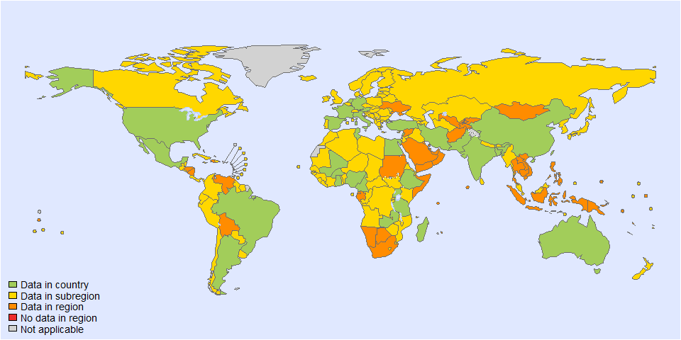
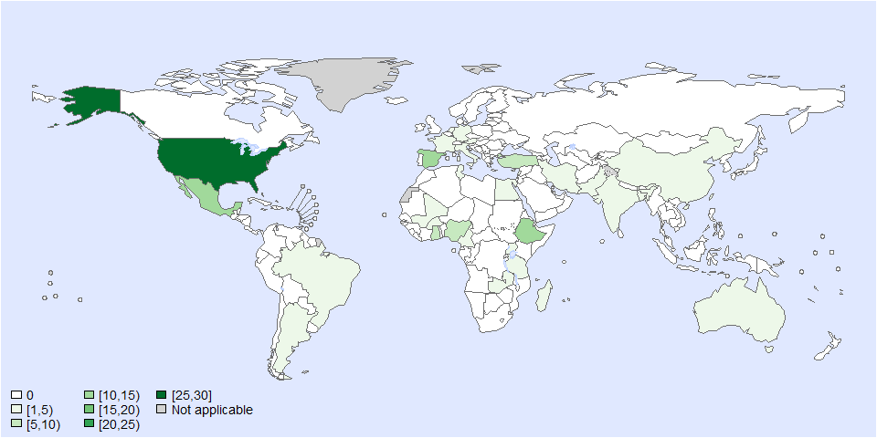
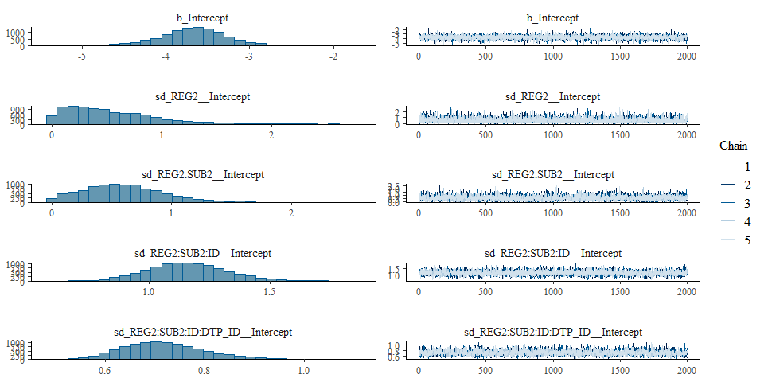

Proportion of Mycobacterium bovis - Model fit - Version 2
================
LoVa3397
2026-04-13

- [Settings](#settings)
- [Data](#data)
- [Parameters](#parameters)
- [BRMS](#brms)
  - [BRMS : Version 2](#brms--version-2)
- [Session info](#session-info)

# Settings

``` r
## required packages ----
library(bd)
library(brms)
library(ggplot2)
library(metafor)
library(readxl)
library(rmarkdown)
library(rms)
library(tidyr)
library(knitr)

## global options ----
knitr::opts_chunk$set(fig.width = 10)
Date <- format(Sys.Date(), "%Y%m%d")
```

# Data

``` r
## import data
source("01-data.R")
```

    ## 'data.frame':    131 obs. of  40 variables:
    ##  $ SOURCE_ID           : num  1 2 3 4 5 5 5 6 7 8 ...
    ##  $ SOURCE_AUTHOR       : chr  "Abbadi, S" "Acquah, S. K. E" "Addo, K" "Ağaçayak, A" ...
    ##  $ SOURCE_YEAR         : num  2009 2021 2007 2007 2012 ...
    ##  $ SOURCE_TITLE        : chr  "Strain differentiation of Mycobacterium tuberculosis complex isolated from sputum of pulmonary tuberculosis patients" "Molecular epidemiology and drug susceptibility profiles of Mycobacterium tuberculosis complex isolates from Northern Ghana" "Mycobacterial species causing pulmonary tuberculosis at the korle bu teaching hospital, accra, ghana" "Detection of Mycobacterium species distribution in the sputum samples of tuberculosis patients by PCR-RFLP meth"| __truncated__ ...
    ##  $ SOURCE_DOI          : chr  "https://doi.org/10.1016/j.ijid.2008.06.020" "10.1016/j.ijid.2021.07.020" "10.4314/gmj.v41i2.55293" "No data" ...
    ##  $ SOURCE_URL          : chr  "https://www.sciencedirect.com/science/article/pii/S1201971208014240" "https://www.sciencedirect.com/science/article/pii/S120197122100566X" "10.4314/gmj.v41i2.55293" "http://www.mikrobiyolbul.org/managete/fu_folder/2007-02/2007-41-02-203-209.pdf" ...
    ##  $ OPT_ACCESS_DATE     : chr  "45272" "24/10/2023" "24/10/2023" "24/10/2023" ...
    ##  $ OPT_STUDY_TYPE      : chr  "Other" "Cross-sectional study" "Cross-sectional study" "Cross-sectional study" ...
    ##  $ OPT_OTHER_STUDY_TYPE: chr  NA NA NA NA ...
    ##  $ REF_NOTES           : chr  "Location: All specimens were isolated from sputum samples from patients with pulmonary tuberculosis in the Suez"| __truncated__ "Location: Pulmonary tuberculosis patients attending health facilities in the five administrative regions of Nor"| __truncated__ "Location: Korle-Bu Teaching Hospital Chest Clinic between January and July 2003." "Location: Elazig province (located in Eastern Anatolia, Turkey); Ref sample: Sputum samples collected from tube"| __truncated__ ...
    ##  $ REF_YEAR_START      : chr  "No data" "2015" "2003" "No data" ...
    ##  $ REF_YEAR_END        : chr  "No data" "2019" "2003" "No data" ...
    ##  $ REF_LOC_LEVEL       : chr  "Sub-national" "Sub-national" "Sub-national" "Sub-national" ...
    ##  $ REF_LOCATION        : chr  "Egypt" "Ghana" "Ghana" "Turkey" ...
    ##  $ REF_LOCATION_ISO3   : chr  "EGY" "GHA" "GHA" "TUR" ...
    ##  $ REF_SEX             : chr  "All sexes" "All sexes" "All sexes" "All sexes" ...
    ##  $ REF_AGE_START       : chr  "0" "0" "0" "0" ...
    ##  $ REF_AGE_END         : num  125 125 125 125 83 83 83 125 125 125 ...
    ##  $ OPT_MEAN_AGE        : chr  NA NA NA NA ...
    ##  $ OPT_MEDIAN_AGE      : num  NA NA NA NA NA NA NA NA NA NA ...
    ##  $ OPT_SUBPOP          : chr  NA NA NA NA ...
    ##  $ OPT_CASES           : logi  NA NA NA NA NA NA ...
    ##  $ OPT_DISEASE         : chr  "M. bovis" "M. bovis" "M. bovis" "M. bovis" ...
    ##  $ OPT_SEROTYPE        : chr  NA NA NA NA ...
    ##  $ REF_SAMPLE_SIZE     : num  45 294 64 44 519 519 519 345 344 255 ...
    ##  $ VALUE_X             : num  1 4 2 8 15 13 2 1 1 6 ...
    ##  $ VALUE_MEAN          : num  2.22 1.36 3.12 18.18 2.89 ...
    ##  $ VALUE_MEDIAN        : logi  NA NA NA NA NA NA ...
    ##  $ VALUE_DENOM         : num  100 100 100 100 100 100 100 100 100 100 ...
    ##  $ VALUE_SE            : logi  NA NA NA NA NA NA ...
    ##  $ VALUE_P000          : logi  NA NA NA NA NA NA ...
    ##  $ VALUE_P2_5          : logi  NA NA NA NA NA NA ...
    ##  $ VALUE_P5            : logi  NA NA NA NA NA NA ...
    ##  $ VALUE_P10           : logi  NA NA NA NA NA NA ...
    ##  $ VALUE_P25           : logi  NA NA NA NA NA NA ...
    ##  $ VALUE_P75           : logi  NA NA NA NA NA NA ...
    ##  $ VALUE_P90           : logi  NA NA NA NA NA NA ...
    ##  $ VALUE_P95           : logi  NA NA NA NA NA NA ...
    ##  $ VALUE_P97_5         : logi  NA NA NA NA NA NA ...
    ##  $ VALUE_P100          : logi  NA NA NA NA NA NA ...

    ## Warning in eval(ei, envir): NAs introduced by coercion
    ## Warning in eval(ei, envir): NAs introduced by coercion
    ## Warning in eval(ei, envir): NAs introduced by coercion

    ## Joining with `by = join_by(REF_YEAR_START, REF_YEAR_END, REF_SEX, REF_AGE_START, REF_AGE_END, ISO3, ID_ROW)`

    ## Warning in add_pop(dta): Warning: 7 rows have missing data for the population variable. Please check if ISO3 code is correctly
    ## specified and if the dates are included in the study field.

<!-- --><!-- -->

    ## Warning: REML comparisons not meaningful for models with different fixed effects
    ## (use 'refit=TRUE' to refit both models based on ML estimation).

``` r
es$DTP_ID<-as.character(seq(1:length(es$SOURCE_ID)))
es$FLAG<-factor(es$FLAG, 
                levels=c(0,1,2,3,4,5,6, 7),
                labels=c("Keep data", "Data part of non WHO member states", "No WHO REG2 given",
                         "Year before 1990", "yi can't be calcualted", "TF choice to remove", 
                         "Excluded by preliminary checks", "Excluded in data cleaning"))

saveRDS(es, paste0("es_", Date, ".RDS"))
```

# Parameters

| Parameters                       | Values                       |
|:---------------------------------|:-----------------------------|
| Number of iteration              | 5000                         |
| Warmup                           | 3000                         |
| Delta value                      | 0.95                         |
| Maximum tree-depth               | 20                           |
| Levels                           | Regions,Sub-regions, Studies |
| Random effect on each data point | Yes                          |
| Stronger priors specified        | Normal(0,1)                  |

Parameters of the model tested

# BRMS

## BRMS : Version 2

``` r
fit_brms_reg_s2 <-
  brm(yi | se(sei) ~
        1 + 
        (1 | REG2) +
        (1 | REG2:SUB2) +
        (1 | REG2:SUB2:ID) +
        (1 | REG2:SUB2:ID:DTP_ID),
      chains = 5, iter = 5000, warmup = 3000,
      prior = prior(normal(0,1), class = sd),
      cores = 5,
      data = subset(es, as.integer(FLAG) == 1),
      control = list(adapt_delta=0.85),
      open_progress = FALSE,
      seed = 7)
```

    ## Compiling Stan program...

    ## Start sampling

    ## Warning: There were 142 divergent transitions after warmup. See
    ## https://mc-stan.org/misc/warnings.html#divergent-transitions-after-warmup
    ## to find out why this is a problem and how to eliminate them.

    ## Warning: There were 2 transitions after warmup that exceeded the maximum treedepth. Increase max_treedepth above 10. See
    ## https://mc-stan.org/misc/warnings.html#maximum-treedepth-exceeded

    ## Warning: Examine the pairs() plot to diagnose sampling problems

``` r
## model summary
summary(fit_brms_reg_s2)
```

    ## Warning: There were 142 divergent transitions after warmup. Increasing adapt_delta above 0.85 may help. See
    ## http://mc-stan.org/misc/warnings.html#divergent-transitions-after-warmup

    ##  Family: gaussian 
    ##   Links: mu = identity 
    ## Formula: yi | se(sei) ~ 1 + (1 | REG2) + (1 | REG2:SUB2) + (1 | REG2:SUB2:ID) + (1 | REG2:SUB2:ID:DTP_ID) 
    ##    Data: subset(es, as.integer(FLAG) == 1) (Number of observations: 121) 
    ##   Draws: 5 chains, each with iter = 5000; warmup = 3000; thin = 1;
    ##          total post-warmup draws = 10000
    ## 
    ## Multilevel Hyperparameters:
    ## ~REG2 (Number of levels: 6) 
    ##               Estimate Est.Error l-95% CI u-95% CI Rhat Bulk_ESS Tail_ESS
    ## sd(Intercept)     0.52      0.39     0.02     1.48 1.00     5249     6707
    ## 
    ## ~REG2:SUB2 (Number of levels: 10) 
    ##               Estimate Est.Error l-95% CI u-95% CI Rhat Bulk_ESS Tail_ESS
    ## sd(Intercept)     0.61      0.35     0.05     1.39 1.00     2818     1994
    ## 
    ## ~REG2:SUB2:ID (Number of levels: 73) 
    ##               Estimate Est.Error l-95% CI u-95% CI Rhat Bulk_ESS Tail_ESS
    ## sd(Intercept)     1.16      0.16     0.85     1.48 1.00     4025     5373
    ## 
    ## ~REG2:SUB2:ID:DTP_ID (Number of levels: 121) 
    ##               Estimate Est.Error l-95% CI u-95% CI Rhat Bulk_ESS Tail_ESS
    ## sd(Intercept)     0.72      0.09     0.57     0.90 1.00     2652     4238
    ## 
    ## Regression Coefficients:
    ##           Estimate Est.Error l-95% CI u-95% CI Rhat Bulk_ESS Tail_ESS
    ## Intercept    -3.67      0.41    -4.51    -2.86 1.00     6144     2284
    ## 
    ## Further Distributional Parameters:
    ##       Estimate Est.Error l-95% CI u-95% CI Rhat Bulk_ESS Tail_ESS
    ## sigma     0.00      0.00     0.00     0.00   NA       NA       NA
    ## 
    ## Draws were sampled using sampling(NUTS). For each parameter, Bulk_ESS
    ## and Tail_ESS are effective sample size measures, and Rhat is the potential
    ## scale reduction factor on split chains (at convergence, Rhat = 1).

``` r
plot(fit_brms_reg_s2, ask = FALSE)
```

<!-- --><!-- -->

``` r
#plot(conditional_effects(fit_brms_reg_s4), points = TRUE)
saveRDS(fit_brms_reg_s2, file = "fit_brms_reg_s2_20260413.rds")

## show model code
stancode(fit_brms_reg_s2)
```

    ## // generated with brms 2.23.0
    ## functions {
    ## }
    ## data {
    ##   int<lower=1> N;  // total number of observations
    ##   vector[N] Y;  // response variable
    ##   vector<lower=0>[N] se;  // known sampling error
    ##   // data for group-level effects of ID 1
    ##   int<lower=1> N_1;  // number of grouping levels
    ##   int<lower=1> M_1;  // number of coefficients per level
    ##   array[N] int<lower=1> J_1;  // grouping indicator per observation
    ##   // group-level predictor values
    ##   vector[N] Z_1_1;
    ##   // data for group-level effects of ID 2
    ##   int<lower=1> N_2;  // number of grouping levels
    ##   int<lower=1> M_2;  // number of coefficients per level
    ##   array[N] int<lower=1> J_2;  // grouping indicator per observation
    ##   // group-level predictor values
    ##   vector[N] Z_2_1;
    ##   // data for group-level effects of ID 3
    ##   int<lower=1> N_3;  // number of grouping levels
    ##   int<lower=1> M_3;  // number of coefficients per level
    ##   array[N] int<lower=1> J_3;  // grouping indicator per observation
    ##   // group-level predictor values
    ##   vector[N] Z_3_1;
    ##   // data for group-level effects of ID 4
    ##   int<lower=1> N_4;  // number of grouping levels
    ##   int<lower=1> M_4;  // number of coefficients per level
    ##   array[N] int<lower=1> J_4;  // grouping indicator per observation
    ##   // group-level predictor values
    ##   vector[N] Z_4_1;
    ##   int prior_only;  // should the likelihood be ignored?
    ## }
    ## transformed data {
    ##   vector<lower=0>[N] se2 = square(se);
    ## }
    ## parameters {
    ##   real Intercept;  // temporary intercept for centered predictors
    ##   vector<lower=0>[M_1] sd_1;  // group-level standard deviations
    ##   array[M_1] vector[N_1] z_1;  // standardized group-level effects
    ##   vector<lower=0>[M_2] sd_2;  // group-level standard deviations
    ##   array[M_2] vector[N_2] z_2;  // standardized group-level effects
    ##   vector<lower=0>[M_3] sd_3;  // group-level standard deviations
    ##   array[M_3] vector[N_3] z_3;  // standardized group-level effects
    ##   vector<lower=0>[M_4] sd_4;  // group-level standard deviations
    ##   array[M_4] vector[N_4] z_4;  // standardized group-level effects
    ## }
    ## transformed parameters {
    ##   real sigma = 0;  // dispersion parameter
    ##   vector[N_1] r_1_1;  // actual group-level effects
    ##   vector[N_2] r_2_1;  // actual group-level effects
    ##   vector[N_3] r_3_1;  // actual group-level effects
    ##   vector[N_4] r_4_1;  // actual group-level effects
    ##   // prior contributions to the log posterior
    ##   real lprior = 0;
    ##   r_1_1 = (sd_1[1] * (z_1[1]));
    ##   r_2_1 = (sd_2[1] * (z_2[1]));
    ##   r_3_1 = (sd_3[1] * (z_3[1]));
    ##   r_4_1 = (sd_4[1] * (z_4[1]));
    ##   lprior += student_t_lpdf(Intercept | 3, -4, 2.5);
    ##   lprior += normal_lpdf(sd_1 | 0, 1)
    ##     - 1 * normal_lccdf(0 | 0, 1);
    ##   lprior += normal_lpdf(sd_2 | 0, 1)
    ##     - 1 * normal_lccdf(0 | 0, 1);
    ##   lprior += normal_lpdf(sd_3 | 0, 1)
    ##     - 1 * normal_lccdf(0 | 0, 1);
    ##   lprior += normal_lpdf(sd_4 | 0, 1)
    ##     - 1 * normal_lccdf(0 | 0, 1);
    ## }
    ## model {
    ##   // likelihood including constants
    ##   if (!prior_only) {
    ##     // initialize linear predictor term
    ##     vector[N] mu = rep_vector(0.0, N);
    ##     mu += Intercept;
    ##     for (n in 1:N) {
    ##       // add more terms to the linear predictor
    ##       mu[n] += r_1_1[J_1[n]] * Z_1_1[n] + r_2_1[J_2[n]] * Z_2_1[n] + r_3_1[J_3[n]] * Z_3_1[n] + r_4_1[J_4[n]] * Z_4_1[n];
    ##     }
    ##     target += normal_lpdf(Y | mu, se);
    ##   }
    ##   // priors including constants
    ##   target += lprior;
    ##   target += std_normal_lpdf(z_1[1]);
    ##   target += std_normal_lpdf(z_2[1]);
    ##   target += std_normal_lpdf(z_3[1]);
    ##   target += std_normal_lpdf(z_4[1]);
    ## }
    ## generated quantities {
    ##   // actual population-level intercept
    ##   real b_Intercept = Intercept;
    ## }

# Session info

``` r
sessioninfo::session_info()
```

    ## ─ Session info ───────────────────────────────────────────────────────────────────────────────────────────────────────────────
    ##  setting  value
    ##  version  R version 4.5.2 (2025-10-31 ucrt)
    ##  os       Windows 11 x64 (build 26200)
    ##  system   x86_64, mingw32
    ##  ui       RStudio
    ##  language (EN)
    ##  collate  French_Belgium.utf8
    ##  ctype    French_Belgium.utf8
    ##  tz       Europe/Brussels
    ##  date     2026-04-13
    ##  rstudio  2026.01.0+392 Apple Blossom (desktop)
    ##  pandoc   3.6.3 @ C:/Program Files/RStudio/resources/app/bin/quarto/bin/tools/ (via rmarkdown)

    ## 
    ## ─ Packages ───────────────────────────────────────────────────────────────────────────────────────────────────────────────────
    ##  ! package        * version    date (UTC) lib source
    ##    abind            1.4-8      2024-09-12 [1] CRAN (R 4.5.2)
    ##    backports        1.5.0      2024-05-23 [1] CRAN (R 4.5.2)
    ##    base64enc        0.1-6      2026-02-02 [1] CRAN (R 4.5.2)
    ##    bayesplot        1.15.0     2025-12-12 [1] CRAN (R 4.5.2)
    ##    bd             * 0.0.14     2026-03-11 [1] Github (brechtdv/bd@652191c)
    ##    bridgesampling   1.2-1      2025-11-19 [1] CRAN (R 4.5.2)
    ##    brms           * 2.23.0     2025-09-09 [1] CRAN (R 4.5.2)
    ##    Brobdingnag      1.2-9      2022-10-19 [1] CRAN (R 4.5.2)
    ##    callr            3.7.6      2024-03-25 [1] CRAN (R 4.5.2)
    ##    cellranger       1.1.0      2016-07-27 [1] CRAN (R 4.5.2)
    ##    checkmate        2.3.4      2026-02-03 [1] CRAN (R 4.5.2)
    ##    class            7.3-23     2025-01-01 [1] CRAN (R 4.5.2)
    ##    classInt         0.4-11     2025-01-08 [1] CRAN (R 4.5.2)
    ##    cli              3.6.5      2025-04-23 [1] CRAN (R 4.5.2)
    ##    cluster          2.1.8.1    2025-03-12 [1] CRAN (R 4.5.2)
    ##    coda             0.19-4.1   2024-01-31 [1] CRAN (R 4.5.2)
    ##    codetools        0.2-20     2024-03-31 [1] CRAN (R 4.5.2)
    ##    colorspace       2.1-2      2025-09-22 [1] CRAN (R 4.5.3)
    ##    cowplot          1.2.0      2025-07-07 [1] CRAN (R 4.5.2)
    ##    data.table       1.18.2.1   2026-01-27 [1] CRAN (R 4.5.2)
    ##    DBI              1.3.0      2026-02-25 [1] CRAN (R 4.5.2)
    ##    digest           0.6.39     2025-11-19 [1] CRAN (R 4.5.2)
    ##    distributional   0.6.0      2026-01-14 [1] CRAN (R 4.5.2)
    ##    dplyr          * 1.2.0      2026-02-03 [1] CRAN (R 4.5.2)
    ##    e1071            1.7-17     2025-12-18 [1] CRAN (R 4.5.2)
    ##    evaluate         1.0.5      2025-08-27 [1] CRAN (R 4.5.2)
    ##    farver           2.1.2      2024-05-13 [1] CRAN (R 4.5.2)
    ##    fastmap          1.2.0      2024-05-15 [1] CRAN (R 4.5.2)
    ##    FERG2          * 0.0.10     2026-03-20 [1] Github (brechtdv/FERG2@37d81c2)
    ##    foreign          0.8-90     2025-03-31 [1] CRAN (R 4.5.2)
    ##    Formula          1.2-5      2023-02-24 [1] CRAN (R 4.5.2)
    ##    generics         0.1.4      2025-05-09 [1] CRAN (R 4.5.2)
    ##    ggplot2        * 4.0.2      2026-02-03 [1] CRAN (R 4.5.2)
    ##    glue             1.8.0      2024-09-30 [1] CRAN (R 4.5.2)
    ##    gridExtra        2.3        2017-09-09 [1] CRAN (R 4.5.2)
    ##    gtable           0.3.6      2024-10-25 [1] CRAN (R 4.5.2)
    ##    Hmisc          * 5.2-5      2026-01-09 [1] CRAN (R 4.5.3)
    ##    htmlTable        2.4.3      2024-07-21 [1] CRAN (R 4.5.3)
    ##    htmltools        0.5.9      2025-12-04 [1] CRAN (R 4.5.2)
    ##    htmlwidgets      1.6.4      2023-12-06 [1] CRAN (R 4.5.2)
    ##    inline           0.3.21     2025-01-09 [1] CRAN (R 4.5.2)
    ##    KernSmooth       2.23-26    2025-01-01 [1] CRAN (R 4.5.2)
    ##    knitr          * 1.51       2025-12-20 [1] CRAN (R 4.5.2)
    ##    labeling         0.4.3      2023-08-29 [1] CRAN (R 4.5.2)
    ##    lattice          0.22-7     2025-04-02 [1] CRAN (R 4.5.2)
    ##    lifecycle        1.0.5      2026-01-08 [1] CRAN (R 4.5.2)
    ##    loo              2.9.0      2025-12-23 [1] CRAN (R 4.5.2)
    ##    magrittr         2.0.4      2025-09-12 [1] CRAN (R 4.5.2)
    ##    MASS             7.3-65     2025-02-28 [1] CRAN (R 4.5.2)
    ##    mathjaxr         2.0-0      2025-12-01 [1] CRAN (R 4.5.2)
    ##    Matrix         * 1.7-4      2025-08-28 [1] CRAN (R 4.5.2)
    ##    MatrixModels     0.5-4      2025-03-26 [1] CRAN (R 4.5.3)
    ##    matrixStats      1.5.0      2025-01-07 [1] CRAN (R 4.5.2)
    ##    metadat        * 1.4-0      2025-02-04 [1] CRAN (R 4.5.2)
    ##    metafor        * 4.8-0      2025-01-28 [1] CRAN (R 4.5.2)
    ##    mgcv             1.9-3      2025-04-04 [1] CRAN (R 4.5.2)
    ##    multcomp         1.4-30     2026-03-09 [1] CRAN (R 4.5.3)
    ##    mvtnorm          1.3-3      2025-01-10 [1] CRAN (R 4.5.2)
    ##    nlme             3.1-168    2025-03-31 [1] CRAN (R 4.5.2)
    ##    nnet             7.3-20     2025-01-01 [1] CRAN (R 4.5.2)
    ##    numDeriv       * 2016.8-1.1 2019-06-06 [1] CRAN (R 4.5.2)
    ##    otel             0.2.0      2025-08-29 [1] CRAN (R 4.5.2)
    ##    pillar           1.11.1     2025-09-17 [1] CRAN (R 4.5.2)
    ##    pkgbuild         1.4.8      2025-05-26 [1] CRAN (R 4.5.2)
    ##    pkgconfig        2.0.3      2019-09-22 [1] CRAN (R 4.5.2)
    ##    plyr             1.8.9      2023-10-02 [1] CRAN (R 4.5.2)
    ##    polspline        1.1.25     2024-05-10 [1] CRAN (R 4.5.2)
    ##    posterior        1.6.1      2025-02-27 [1] CRAN (R 4.5.2)
    ##    processx         3.8.6      2025-02-21 [1] CRAN (R 4.5.2)
    ##    proxy            0.4-29     2025-12-29 [1] CRAN (R 4.5.2)
    ##    ps               1.9.1      2025-04-12 [1] CRAN (R 4.5.2)
    ##    purrr            1.2.1      2026-01-09 [1] CRAN (R 4.5.2)
    ##    quantreg         6.1        2025-03-10 [1] CRAN (R 4.5.3)
    ##    QuickJSR         1.9.0      2026-01-25 [1] CRAN (R 4.5.2)
    ##    R6               2.6.1      2025-02-15 [1] CRAN (R 4.5.2)
    ##    RColorBrewer     1.1-3      2022-04-03 [1] CRAN (R 4.5.2)
    ##    Rcpp           * 1.1.1      2026-01-10 [1] CRAN (R 4.5.2)
    ##  D RcppParallel     5.1.11-2   2026-03-05 [1] CRAN (R 4.5.2)
    ##    readxl         * 1.4.5      2025-03-07 [1] CRAN (R 4.5.2)
    ##    reshape2         1.4.5      2025-11-12 [1] CRAN (R 4.5.2)
    ##    rlang            1.1.7      2026-01-09 [1] CRAN (R 4.5.2)
    ##    rmarkdown      * 2.30       2025-09-28 [1] CRAN (R 4.5.2)
    ##    rms            * 8.1-1      2026-02-18 [1] CRAN (R 4.5.3)
    ##    rpart            4.1.24     2025-01-07 [1] CRAN (R 4.5.2)
    ##    rstan            2.32.7     2025-03-10 [1] CRAN (R 4.5.2)
    ##    rstantools       2.6.0      2026-01-10 [1] CRAN (R 4.5.2)
    ##    rstudioapi       0.18.0     2026-01-16 [1] CRAN (R 4.5.2)
    ##    S7               0.2.1      2025-11-14 [1] CRAN (R 4.5.2)
    ##    sandwich         3.1-1      2024-09-15 [1] CRAN (R 4.5.3)
    ##    scales           1.4.0      2025-04-24 [1] CRAN (R 4.5.2)
    ##    sessioninfo      1.2.3      2025-02-05 [1] CRAN (R 4.5.2)
    ##    sf             * 1.1-0      2026-02-24 [1] CRAN (R 4.5.2)
    ##    SparseM          1.84-2     2024-07-17 [1] CRAN (R 4.5.3)
    ##    StanHeaders      2.32.10    2024-07-15 [1] CRAN (R 4.5.2)
    ##    stringi          1.8.7      2025-03-27 [1] CRAN (R 4.5.2)
    ##    stringr          1.6.0      2025-11-04 [1] CRAN (R 4.5.2)
    ##    survival         3.8-3      2024-12-17 [1] CRAN (R 4.5.2)
    ##    tensorA          0.36.2.1   2023-12-13 [1] CRAN (R 4.5.2)
    ##    TH.data          1.1-5      2025-11-17 [1] CRAN (R 4.5.3)
    ##    tibble           3.3.1      2026-01-11 [1] CRAN (R 4.5.2)
    ##    tidyr          * 1.3.2      2025-12-19 [1] CRAN (R 4.5.2)
    ##    tidyselect       1.2.1      2024-03-11 [1] CRAN (R 4.5.2)
    ##    units            1.0-0      2025-10-09 [1] CRAN (R 4.5.2)
    ##    vctrs            0.7.1      2026-01-23 [1] CRAN (R 4.5.2)
    ##    viridis          0.6.5      2024-01-29 [1] CRAN (R 4.5.2)
    ##    viridisLite      0.4.3      2026-02-04 [1] CRAN (R 4.5.2)
    ##    withr            3.0.2      2024-10-28 [1] CRAN (R 4.5.2)
    ##    xfun             0.56       2026-01-18 [1] CRAN (R 4.5.2)
    ##    yaml             2.3.12     2025-12-10 [1] CRAN (R 4.5.2)
    ##    zoo              1.8-15     2025-12-15 [1] CRAN (R 4.5.3)
    ## 
    ##  * ── Packages attached to the search path.
    ##  D ── DLL MD5 mismatch, broken installation.
    ## 
    ## ──────────────────────────────────────────────────────────────────────────────────────────────────────────────────────────────

``` r
##rmarkdown::render("02-fit_v2.R")
```
