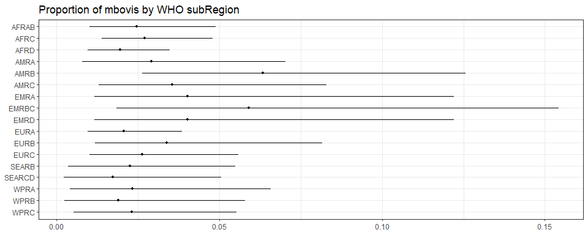
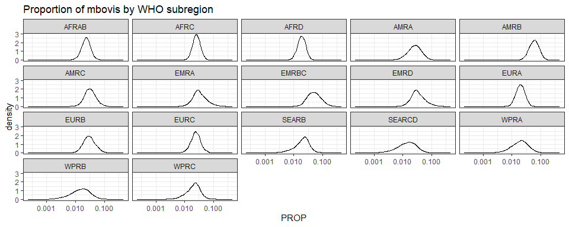

Global proportion of mbovis- Estimate proportion with the 2nd model
================
LoVa3397
2026-04-13

- [Settings](#settings)
- [Parameters](#parameters)
- [Model fit](#model-fit)
- [Predict all](#predict-all)
- [Summarize predictions:
  subregional](#summarize-predictions-subregional)
- [Session info](#session-info)

# Settings

``` r
## required packages ----
library(bd)
library(brms)
library(FERG2)
library(ggplot2)
library(knitr)
library(rmarkdown)
library(sf)
library(tidyr)
library(dplyr)
library(DescTools)
```

    ## Warning: package 'DescTools' was built under R version 4.5.3

    ## 
    ## Attaching package: 'DescTools'

    ## The following objects are masked from 'package:Hmisc':
    ## 
    ##     %nin%, Label, Mean, Quantile

``` r
library(readxl)

## global options ----
knitr::opts_chunk$set(fig.width = 10)
Date <- format(Sys.Date(), "%Y%m%d")
```

# Parameters

| Parameters                       | Values                       |
|:---------------------------------|:-----------------------------|
| Number of iteration              | 5000                         |
| Warmup                           | 3000                         |
| Delta value                      | 0.95                         |
| Maximum tree-depth               | 20                           |
| Levels                           | Regions,Sub-regions, Studies |
| Random effect on each data point | Yes                          |
| Stronger priors specified        | Normal(0,1)                  |

Parameters of the model tested

# Model fit

``` r
fit_brms_reg_s <- readRDS("fit_brms_reg_s2_20260413.rds")
zero_cases<- read_xlsx("Endemic_countries.xlsx")%>%
  select(SUB2, ISO3, Country, TB) %>% 
  rename(COUNTRY=ISO3, COUNTRY_LABEL = Country) %>%
  mutate(TB = if_else(is.na(TB), 0, TB))

zero_cases_sub2 <- table(zero_cases$SUB2, zero_cases$TB) %>%
  as.data.frame() %>%
  mutate(SUB2 = Var1, 
         Var2 = case_when(
           Var2 == 0 | is.na(Var2) ~ "Nonendemic",
           Var2 == 1 ~ "Endemic"
         )) %>%
  select(SUB2, Var2, Freq) %>%
  spread(key = Var2, value = Freq) %>%
  filter(!is.na(SUB2)) %>%
  select(SUB2, Endemic, Nonendemic) %>%
  mutate(RegionEndemic = case_when(
    Endemic == 0 ~ 0,
    Endemic != 0 ~ 1
  ))

kable(
  caption = "Countries assumed to be non-endemic",
  row.names = FALSE,
  subset(zero_cases, TB==0)[, 2])
```

| COUNTRY |
|:--------|
| AND     |
| ARE     |
| AUS     |
| AUT     |
| AZE     |
| BEL     |
| BHR     |
| BHS     |
| BIH     |
| BLZ     |
| BRN     |
| BTN     |
| CHE     |
| COK     |
| CUB     |
| CYP     |
| CZE     |
| DEU     |
| DJI     |
| DNK     |
| ERI     |
| EST     |
| FIN     |
| FRA     |
| FSM     |
| GEO     |
| HUN     |
| IRQ     |
| ISL     |
| ISR     |
| JAM     |
| JPN     |
| KAZ     |
| KEN     |
| KGZ     |
| KWT     |
| LAO     |
| LBN     |
| LCA     |
| LTU     |
| LUX     |
| LVA     |
| MDA     |
| MDV     |
| MHL     |
| MMR     |
| MNE     |
| MNG     |
| MUS     |
| NAM     |
| NLD     |
| NOR     |
| OMN     |
| PLW     |
| PNG     |
| POL     |
| SAU     |
| SDN     |
| SGP     |
| SUR     |
| SVK     |
| SVN     |
| SWE     |
| SYC     |
| SYR     |
| THA     |
| TKM     |
| TLS     |
| UKR     |
| UZB     |

Countries assumed to be non-endemic

``` r
es_files <- list.files(pattern="^es_\\d{8}\\.rds$", full.names=TRUE, ignore.case = TRUE)
es_dates <- as.Date(sub("^es_(\\d{8})\\.rds$", "\\1", basename(es_files), ignore.case = TRUE), format = "%Y%m%d")
es_latest <- es_files[which.max(es_dates)]
es<- readRDS(es_latest)
es <- subset(es, as.integer(FLAG) == 1)

Sub2_with_data <- es %>% select(SUB2) %>% distinct() %>% mutate(DATASUB2=1)
Reg2_with_data <- es %>% select(REG2) %>% distinct() %>% mutate(DATAREG2=1)
zero_cases_sub2 <- left_join(zero_cases_sub2, Sub2_with_data) %>%
  mutate(REG2 = case_when(
    substr(SUB2,1,4) == "SEAR" ~ "SEAR",
    .default=substr(SUB2,1,3)))
```

    ## Joining with `by = join_by(SUB2)`

``` r
zero_cases_sub2 <- left_join(zero_cases_sub2, Reg2_with_data) %>%
  mutate(ESTIMATES = case_when(
    RegionEndemic == 0 ~ 2,
    DATASUB2 == 1 ~ 3,
    RegionEndemic == 1 & is.na(DATASUB2) & DATAREG2 == 1 ~ 4, 
    RegionEndemic == 1  & is.na(DATASUB2) & is.na(DATAREG2) ~5))
```

    ## Joining with `by = join_by(REG2)`

``` r
zero_cases_sub2$ESTIMATES <- factor(zero_cases_sub2$ESTIMATES, 
                                    level = c(1,2,3,4,5),
                                    labels = c("Data present", "Disease free", "Data in subregion", "Data in region", "Data in world"))
```

# Predict all

``` r
## set up dataframe
sim_all <-
  data.frame(
    sei = 0,
    REG2 = FERG2:::countries$REG2,
    SUB2 = FERG2:::countries$SUB2) %>%
  distinct()
sim_all <- sim_all %>% left_join(zero_cases_sub2) %>% select(sei, REG2, SUB2, ESTIMATES)
```

    ## Joining with `by = join_by(REG2, SUB2)`

``` r
## draw from expected value of posterior predictive dist
set.seed(10)
# fit_all <- 
#   posterior_epred(
#     object = fit_brms_reg_s,
#     newdata = sim_all,
#     allow_new_levels = TRUE,
#     sample_new_levels = "uncertainty",
#     re_formula = ~ 1 +          
#       (1 | REG2) +
#       (1 | REG2:SUB2)
#   )
draws_fit <- as_draws_df(fit_brms_reg_s)

fit_all <- data.frame(1:10000)
for (x in 1:nrow(sim_all)){
  if (as.integer(sim_all[x, "ESTIMATES"]) == 1){
    # Data present for country
    fit_all[[paste0("V",x)]] <- draws_fit$b_Intercept +                                                                               # Global intercept                                                                                        
      draws_fit[[paste0("r_REG2[",sim_all[x,"REG2"],",Intercept]")]] +                                                                # Regional component
      draws_fit[[paste0("r_REG2:SUB2[",sim_all[x,"REG2"],"_",sim_all[x,"SUB2"],",Intercept]")]] +                                     # Sub regional component
      draws_fit[[paste0("r_REG2:SUB2:COUNTRY[",sim_all[x,"REG2"],"_",sim_all[x,"SUB2"],"_",sim_all[x,"COUNTRY"],",Intercept]")]]      # Country component
  } else if (as.integer(sim_all[x, "ESTIMATES"]) == 2) {
    # Disease-free subregion
    fit_all[[paste0("V",x)]] <- 0
  } else if (as.integer(sim_all[x, "ESTIMATES"]) == 3){
    # Data not present for country, but present in subregion
    fit_all[[paste0("V",x)]] <- draws_fit$b_Intercept +                                                                               # Global intercept                                                                                       
      draws_fit[[paste0("r_REG2[",sim_all[x,"REG2"],",Intercept]")]] +                                                                # Regional component
      draws_fit[[paste0("r_REG2:SUB2[",sim_all[x,"REG2"],"_",sim_all[x,"SUB2"],",Intercept]")]]                                       # Sub regional component
  } else if (as.integer(sim_all[x, "ESTIMATES"]) == 4){
    # Data not present for country, but present in region
    fit_all[[paste0("V",x)]] <- draws_fit$b_Intercept +                                                                               # Global intercept
      draws_fit[[paste0("r_REG2[",sim_all[x,"REG2"],",Intercept]")]]                                                                  # Regional component
  } else if (as.integer(sim_all[x, "ESTIMATES"]) == 5){
    # Data not present for country
    fit_all[[paste0("V",x)]] <- draws_fit$b_Intercept 
  } 
}

fit_all <- fit_all %>% select(-c(X1.10000))

## calculate proportions
sim_all$SIM <- t(fit_all)
sim_all <- sim_all %>% left_join(zero_cases_sub2)
```

    ## Joining with `by = join_by(REG2, SUB2, ESTIMATES)`

``` r
sim_all$PROP <- expit(sim_all$SIM)
sim_all$PROP <- sim_all$PROP*sim_all$RegionEndemic
# saveRDS(sim_all, "sim_all.rds")

## aggregate over subregions
all_sub_prop <- t(apply(sim_all$PROP, 1, mean_ci))
all_sub_prop <- data.frame(all_sub_prop)
names(all_sub_prop) <- c("VAL_MEAN", "VAL_LWR", "VAL_UPR")
all_sub_prop <- cbind(sim_all[1:3], all_sub_prop)
all_sub_prop$LOCATION <- "Subregion"
all_sub_prop$LOCATION_NAME <- all_sub_prop$SUB2
all_sub_prop$SUB2 <- NULL
all_sub_prop$METRIC <- "Proportion"
all_sub_prop <- all_sub_prop %>%
  arrange(LOCATION_NAME)
str(all_sub_prop)
```

    ## 'data.frame':    17 obs. of  8 variables:
    ##  $ sei          : num  0 0 0 0 0 0 0 0 0 0 ...
    ##  $ REG2         : chr  "AFR" "AFR" "AFR" "AMR" ...
    ##  $ VAL_MEAN     : num  0.0248 0.0271 0.0197 0.0293 0.0634 ...
    ##  $ VAL_LWR      : num  0.01025 0.01389 0.00964 0.00794 0.02648 ...
    ##  $ VAL_UPR      : num  0.0489 0.0481 0.0348 0.0704 0.1256 ...
    ##  $ LOCATION     : chr  "Subregion" "Subregion" "Subregion" "Subregion" ...
    ##  $ LOCATION_NAME: chr  "AFRAB" "AFRC" "AFRD" "AMRA" ...
    ##  $ METRIC       : chr  "Proportion" "Proportion" "Proportion" "Proportion" ...

``` r
## compile all
all_est <-
  rbind(all_sub_prop)
str(all_est)
```

    ## 'data.frame':    17 obs. of  8 variables:
    ##  $ sei          : num  0 0 0 0 0 0 0 0 0 0 ...
    ##  $ REG2         : chr  "AFR" "AFR" "AFR" "AMR" ...
    ##  $ VAL_MEAN     : num  0.0248 0.0271 0.0197 0.0293 0.0634 ...
    ##  $ VAL_LWR      : num  0.01025 0.01389 0.00964 0.00794 0.02648 ...
    ##  $ VAL_UPR      : num  0.0489 0.0481 0.0348 0.0704 0.1256 ...
    ##  $ LOCATION     : chr  "Subregion" "Subregion" "Subregion" "Subregion" ...
    ##  $ LOCATION_NAME: chr  "AFRAB" "AFRC" "AFRD" "AMRA" ...
    ##  $ METRIC       : chr  "Proportion" "Proportion" "Proportion" "Proportion" ...

``` r
# saveRDS(all_est, file = "all_estimates.rds")
```

# Summarize predictions: subregional

``` r
kable(
  caption = "Subregional proportion of mbovis cases",
  row.names = FALSE,
  subset(all_sub_prop)[, c(7, 3:5)])
```

| LOCATION_NAME |  VAL_MEAN |   VAL_LWR |   VAL_UPR |
|:--------------|----------:|----------:|----------:|
| AFRAB         | 0.0247852 | 0.0102457 | 0.0489417 |
| AFRC          | 0.0270976 | 0.0138851 | 0.0480518 |
| AFRD          | 0.0196565 | 0.0096401 | 0.0347565 |
| AMRA          | 0.0292906 | 0.0079400 | 0.0704253 |
| AMRB          | 0.0634400 | 0.0264755 | 0.1256291 |
| AMRC          | 0.0356806 | 0.0130378 | 0.0829877 |
| EMRA          | 0.0402918 | 0.0118066 | 0.1220007 |
| EMRBC         | 0.0591432 | 0.0184525 | 0.1541920 |
| EMRD          | 0.0402918 | 0.0118066 | 0.1220007 |
| EURA          | 0.0208219 | 0.0097047 | 0.0385684 |
| EURB          | 0.0339209 | 0.0118363 | 0.0816753 |
| EURC          | 0.0263042 | 0.0102869 | 0.0558893 |
| SEARB         | 0.0225848 | 0.0036669 | 0.0548757 |
| SEARCD        | 0.0174377 | 0.0022770 | 0.0505736 |
| WPRA          | 0.0233831 | 0.0042691 | 0.0658811 |
| WPRB          | 0.0190049 | 0.0024951 | 0.0580155 |
| WPRC          | 0.0231659 | 0.0052912 | 0.0554123 |

Subregional proportion of mbovis cases

``` r
ggplot(subset(all_sub_prop),
       aes(y = VAL_MEAN, x = LOCATION_NAME)) +
  geom_pointrange(aes(ymin = VAL_LWR, ymax = VAL_UPR), size = 0.2) +
  coord_flip() +
  theme_bw() +
  scale_x_discrete(NULL, limits = rev(unique(all_sub_prop$LOCATION_NAME))) +
  scale_y_continuous(NULL) +
  ggtitle("Proportion of mbovis by WHO subRegion")
```

<!-- -->

``` r
sim_all_sub <- sim_all %>%
  select(SUB2, PROP) %>%
  mutate_at("PROP", as.data.frame) %>%
  unnest(PROP)
sim_all_sub_long <-
  pivot_longer(sim_all_sub, cols = starts_with("V"))
sim_all_sub_long$PROP <- sim_all_sub_long$value

ggplot(subset(sim_all_sub_long), aes(x = PROP)) +
  geom_density() +
  facet_wrap(~SUB2) +
  theme_bw() +
  scale_x_log10() +
  ggtitle("Proportion of mbovis by WHO subregion")
```

<!-- -->

# Session info

``` r
saveRDS(sim_all, paste0("sim_all_", Date, ".RDS"))
saveRDS(all_est, paste0("all_est_", Date, ".RDS"))

sessioninfo::session_info()
```

    ## ─ Session info ───────────────────────────────────────────────────────────────────────────────────────────────────────────────
    ##  setting  value
    ##  version  R version 4.5.2 (2025-10-31 ucrt)
    ##  os       Windows 11 x64 (build 26200)
    ##  system   x86_64, mingw32
    ##  ui       RStudio
    ##  language (EN)
    ##  collate  French_Belgium.utf8
    ##  ctype    French_Belgium.utf8
    ##  tz       Europe/Brussels
    ##  date     2026-04-13
    ##  rstudio  2026.01.0+392 Apple Blossom (desktop)
    ##  pandoc   3.6.3 @ C:/Program Files/RStudio/resources/app/bin/quarto/bin/tools/ (via rmarkdown)
    ## 
    ## ─ Packages ───────────────────────────────────────────────────────────────────────────────────────────────────────────────────
    ##  ! package        * version    date (UTC) lib source
    ##    abind            1.4-8      2024-09-12 [1] CRAN (R 4.5.2)
    ##    backports        1.5.0      2024-05-23 [1] CRAN (R 4.5.2)
    ##    base64enc        0.1-6      2026-02-02 [1] CRAN (R 4.5.2)
    ##    bayesplot        1.15.0     2025-12-12 [1] CRAN (R 4.5.2)
    ##    bd             * 0.0.14     2026-03-11 [1] Github (brechtdv/bd@652191c)
    ##    boot             1.3-32     2025-08-29 [1] CRAN (R 4.5.2)
    ##    bridgesampling   1.2-1      2025-11-19 [1] CRAN (R 4.5.2)
    ##    brms           * 2.23.0     2025-09-09 [1] CRAN (R 4.5.2)
    ##    Brobdingnag      1.2-9      2022-10-19 [1] CRAN (R 4.5.2)
    ##    callr            3.7.6      2024-03-25 [1] CRAN (R 4.5.2)
    ##    cellranger       1.1.0      2016-07-27 [1] CRAN (R 4.5.2)
    ##    checkmate        2.3.4      2026-02-03 [1] CRAN (R 4.5.2)
    ##    class            7.3-23     2025-01-01 [1] CRAN (R 4.5.2)
    ##    classInt         0.4-11     2025-01-08 [1] CRAN (R 4.5.2)
    ##    cli              3.6.5      2025-04-23 [1] CRAN (R 4.5.2)
    ##    cluster          2.1.8.1    2025-03-12 [1] CRAN (R 4.5.2)
    ##    coda             0.19-4.1   2024-01-31 [1] CRAN (R 4.5.2)
    ##    codetools        0.2-20     2024-03-31 [1] CRAN (R 4.5.2)
    ##    colorspace       2.1-2      2025-09-22 [1] CRAN (R 4.5.3)
    ##    cowplot          1.2.0      2025-07-07 [1] CRAN (R 4.5.2)
    ##    data.table       1.18.2.1   2026-01-27 [1] CRAN (R 4.5.2)
    ##    DBI              1.3.0      2026-02-25 [1] CRAN (R 4.5.2)
    ##    DescTools      * 0.99.60    2025-03-28 [1] CRAN (R 4.5.3)
    ##    digest           0.6.39     2025-11-19 [1] CRAN (R 4.5.2)
    ##    distributional   0.6.0      2026-01-14 [1] CRAN (R 4.5.2)
    ##    dplyr          * 1.2.0      2026-02-03 [1] CRAN (R 4.5.2)
    ##    e1071            1.7-17     2025-12-18 [1] CRAN (R 4.5.2)
    ##    evaluate         1.0.5      2025-08-27 [1] CRAN (R 4.5.2)
    ##    Exact            3.3        2024-07-21 [1] CRAN (R 4.5.2)
    ##    expm             1.0-0      2024-08-19 [1] CRAN (R 4.5.3)
    ##    farver           2.1.2      2024-05-13 [1] CRAN (R 4.5.2)
    ##    fastmap          1.2.0      2024-05-15 [1] CRAN (R 4.5.2)
    ##    FERG2          * 0.0.10     2026-03-20 [1] Github (brechtdv/FERG2@37d81c2)
    ##    forcats          1.0.1      2025-09-25 [1] CRAN (R 4.5.2)
    ##    foreign          0.8-90     2025-03-31 [1] CRAN (R 4.5.2)
    ##    Formula          1.2-5      2023-02-24 [1] CRAN (R 4.5.2)
    ##    fs               1.6.7      2026-03-06 [1] CRAN (R 4.5.2)
    ##    generics         0.1.4      2025-05-09 [1] CRAN (R 4.5.2)
    ##    ggplot2        * 4.0.2      2026-02-03 [1] CRAN (R 4.5.2)
    ##    gld              2.6.8      2025-09-14 [1] CRAN (R 4.5.3)
    ##    glue             1.8.0      2024-09-30 [1] CRAN (R 4.5.2)
    ##    gridExtra        2.3        2017-09-09 [1] CRAN (R 4.5.2)
    ##    gtable           0.3.6      2024-10-25 [1] CRAN (R 4.5.2)
    ##    haven            2.5.5      2025-05-30 [1] CRAN (R 4.5.2)
    ##    Hmisc          * 5.2-5      2026-01-09 [1] CRAN (R 4.5.3)
    ##    hms              1.1.4      2025-10-17 [1] CRAN (R 4.5.2)
    ##    htmlTable        2.4.3      2024-07-21 [1] CRAN (R 4.5.3)
    ##    htmltools        0.5.9      2025-12-04 [1] CRAN (R 4.5.2)
    ##    htmlwidgets      1.6.4      2023-12-06 [1] CRAN (R 4.5.2)
    ##    httr             1.4.8      2026-02-13 [1] CRAN (R 4.5.2)
    ##    inline           0.3.21     2025-01-09 [1] CRAN (R 4.5.2)
    ##    KernSmooth       2.23-26    2025-01-01 [1] CRAN (R 4.5.2)
    ##    knitr          * 1.51       2025-12-20 [1] CRAN (R 4.5.2)
    ##    labeling         0.4.3      2023-08-29 [1] CRAN (R 4.5.2)
    ##    lattice          0.22-7     2025-04-02 [1] CRAN (R 4.5.2)
    ##    lifecycle        1.0.5      2026-01-08 [1] CRAN (R 4.5.2)
    ##    lmom             3.3        2026-03-24 [1] CRAN (R 4.5.3)
    ##    loo              2.9.0      2025-12-23 [1] CRAN (R 4.5.2)
    ##    magrittr         2.0.4      2025-09-12 [1] CRAN (R 4.5.2)
    ##    MASS             7.3-65     2025-02-28 [1] CRAN (R 4.5.2)
    ##    mathjaxr         2.0-0      2025-12-01 [1] CRAN (R 4.5.2)
    ##    Matrix         * 1.7-4      2025-08-28 [1] CRAN (R 4.5.2)
    ##    MatrixModels     0.5-4      2025-03-26 [1] CRAN (R 4.5.3)
    ##    matrixStats      1.5.0      2025-01-07 [1] CRAN (R 4.5.2)
    ##    metadat        * 1.4-0      2025-02-04 [1] CRAN (R 4.5.2)
    ##    metafor        * 4.8-0      2025-01-28 [1] CRAN (R 4.5.2)
    ##    mgcv             1.9-3      2025-04-04 [1] CRAN (R 4.5.2)
    ##    multcomp         1.4-30     2026-03-09 [1] CRAN (R 4.5.3)
    ##    mvtnorm          1.3-3      2025-01-10 [1] CRAN (R 4.5.2)
    ##    nlme             3.1-168    2025-03-31 [1] CRAN (R 4.5.2)
    ##    nnet             7.3-20     2025-01-01 [1] CRAN (R 4.5.2)
    ##    numDeriv       * 2016.8-1.1 2019-06-06 [1] CRAN (R 4.5.2)
    ##    otel             0.2.0      2025-08-29 [1] CRAN (R 4.5.2)
    ##    pillar           1.11.1     2025-09-17 [1] CRAN (R 4.5.2)
    ##    pkgbuild         1.4.8      2025-05-26 [1] CRAN (R 4.5.2)
    ##    pkgconfig        2.0.3      2019-09-22 [1] CRAN (R 4.5.2)
    ##    plyr             1.8.9      2023-10-02 [1] CRAN (R 4.5.2)
    ##    polspline        1.1.25     2024-05-10 [1] CRAN (R 4.5.2)
    ##    posterior        1.6.1      2025-02-27 [1] CRAN (R 4.5.2)
    ##    processx         3.8.6      2025-02-21 [1] CRAN (R 4.5.2)
    ##    proxy            0.4-29     2025-12-29 [1] CRAN (R 4.5.2)
    ##    ps               1.9.1      2025-04-12 [1] CRAN (R 4.5.2)
    ##    purrr            1.2.1      2026-01-09 [1] CRAN (R 4.5.2)
    ##    quantreg         6.1        2025-03-10 [1] CRAN (R 4.5.3)
    ##    QuickJSR         1.9.0      2026-01-25 [1] CRAN (R 4.5.2)
    ##    R6               2.6.1      2025-02-15 [1] CRAN (R 4.5.2)
    ##    RColorBrewer     1.1-3      2022-04-03 [1] CRAN (R 4.5.2)
    ##    Rcpp           * 1.1.1      2026-01-10 [1] CRAN (R 4.5.2)
    ##  D RcppParallel     5.1.11-2   2026-03-05 [1] CRAN (R 4.5.2)
    ##    readr            2.2.0      2026-02-19 [1] CRAN (R 4.5.2)
    ##    readxl         * 1.4.5      2025-03-07 [1] CRAN (R 4.5.2)
    ##    reshape2         1.4.5      2025-11-12 [1] CRAN (R 4.5.2)
    ##    rlang            1.1.7      2026-01-09 [1] CRAN (R 4.5.2)
    ##    rmarkdown      * 2.30       2025-09-28 [1] CRAN (R 4.5.2)
    ##    rms            * 8.1-1      2026-02-18 [1] CRAN (R 4.5.3)
    ##    rootSolve        1.8.2.4    2023-09-21 [1] CRAN (R 4.5.2)
    ##    rpart            4.1.24     2025-01-07 [1] CRAN (R 4.5.2)
    ##    rstan            2.32.7     2025-03-10 [1] CRAN (R 4.5.2)
    ##    rstantools       2.6.0      2026-01-10 [1] CRAN (R 4.5.2)
    ##    rstudioapi       0.18.0     2026-01-16 [1] CRAN (R 4.5.2)
    ##    S7               0.2.1      2025-11-14 [1] CRAN (R 4.5.2)
    ##    sandwich         3.1-1      2024-09-15 [1] CRAN (R 4.5.3)
    ##    scales           1.4.0      2025-04-24 [1] CRAN (R 4.5.2)
    ##    sessioninfo      1.2.3      2025-02-05 [1] CRAN (R 4.5.2)
    ##    sf             * 1.1-0      2026-02-24 [1] CRAN (R 4.5.2)
    ##    SparseM          1.84-2     2024-07-17 [1] CRAN (R 4.5.3)
    ##    StanHeaders      2.32.10    2024-07-15 [1] CRAN (R 4.5.2)
    ##    stringi          1.8.7      2025-03-27 [1] CRAN (R 4.5.2)
    ##    stringr          1.6.0      2025-11-04 [1] CRAN (R 4.5.2)
    ##    survival         3.8-3      2024-12-17 [1] CRAN (R 4.5.2)
    ##    tensorA          0.36.2.1   2023-12-13 [1] CRAN (R 4.5.2)
    ##    TH.data          1.1-5      2025-11-17 [1] CRAN (R 4.5.3)
    ##    tibble           3.3.1      2026-01-11 [1] CRAN (R 4.5.2)
    ##    tidyr          * 1.3.2      2025-12-19 [1] CRAN (R 4.5.2)
    ##    tidyselect       1.2.1      2024-03-11 [1] CRAN (R 4.5.2)
    ##    tzdb             0.5.0      2025-03-15 [1] CRAN (R 4.5.2)
    ##    units            1.0-0      2025-10-09 [1] CRAN (R 4.5.2)
    ##    vctrs            0.7.1      2026-01-23 [1] CRAN (R 4.5.2)
    ##    viridis          0.6.5      2024-01-29 [1] CRAN (R 4.5.2)
    ##    viridisLite      0.4.3      2026-02-04 [1] CRAN (R 4.5.2)
    ##    withr            3.0.2      2024-10-28 [1] CRAN (R 4.5.2)
    ##    xfun             0.56       2026-01-18 [1] CRAN (R 4.5.2)
    ##    yaml             2.3.12     2025-12-10 [1] CRAN (R 4.5.2)
    ##    zoo              1.8-15     2025-12-15 [1] CRAN (R 4.5.3)
    ## 
    ## 
    ##  * ── Packages attached to the search path.
    ##  D ── DLL MD5 mismatch, broken installation.
    ## 
    ## ──────────────────────────────────────────────────────────────────────────────────────────────────────────────────────────────

``` r
##rmarkdown::render("03-estimate_v2.R")
```
