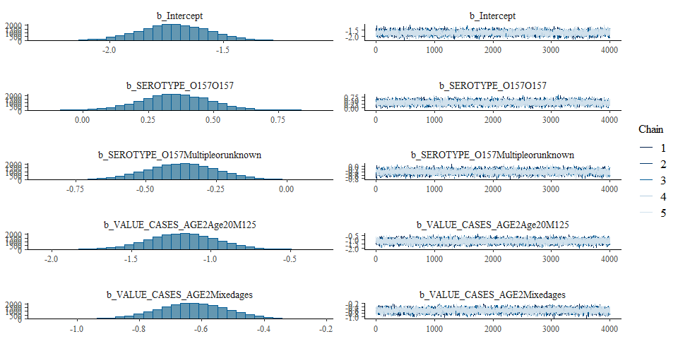
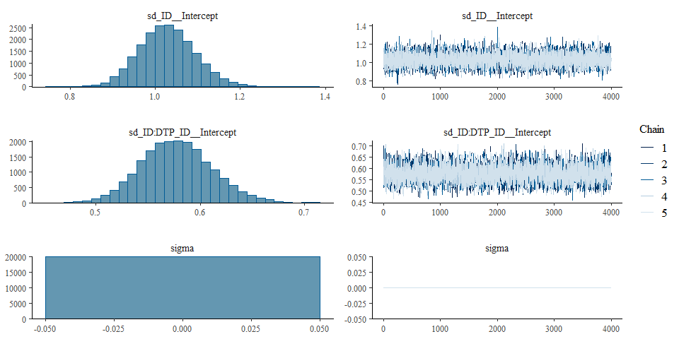

Proportion of STEC evolving in HUS - Model fit - Version 15
================
fbbu6966
2025-09-24

- [Settings](#settings)
- [Parameters](#parameters)
- [Data](#data)
- [BRMS](#brms)
- [Session info](#session-info)

# Settings

``` r
## required packages ----
library(bd)
library(brms)
```

    ## Loading required package: Rcpp

    ## Loading 'brms' package (version 2.22.0). Useful instructions
    ## can be found by typing help('brms'). A more detailed introduction
    ## to the package is available through vignette('brms_overview').

    ## 
    ## Attaching package: 'brms'

    ## The following object is masked from 'package:stats':
    ## 
    ##     ar

``` r
library(ggplot2)
library(metafor)
```

    ## Loading required package: Matrix

    ## Loading required package: metadat

    ## Loading required package: numDeriv

    ## 
    ## Loading the 'metafor' package (version 4.8-0). For an
    ## introduction to the package please type: help(metafor)

``` r
library(readxl)
library(rmarkdown)
# library(rms)
library(tidyr)
```

    ## 
    ## Attaching package: 'tidyr'

    ## The following objects are masked from 'package:Matrix':
    ## 
    ##     expand, pack, unpack

``` r
library(knitr)

## global options ----
knitr::opts_chunk$set(fig.width = 10)
Date <- format(Sys.Date(), "%Y%m%d")
```

# Parameters

| Parameters | Values |
|:---|:---|
| Number of iteration | 5000 |
| Warmup | 3000 |
| Delta value | NA |
| Maximum tree-depth | NA |
| Levels | Global; SEROTYPE= O157 vs non-O157 vs mixed; Age=0-19, 20-125, mixed |
| Random effect on each data point | Yes |
| Stronger priors specified | Normal(0,1) |

Parameters of the model tested

# Data

``` r
## import data
```

``` r
setwd("..")
source("01-data.R")
```

    ## Warning in eval(ei, envir): NAs introduced by coercion
    ## Warning in eval(ei, envir): NAs introduced by coercion

    ## Warning: There was 1 warning in `mutate()`.
    ## ℹ In argument: `VALUE_X = case_when(...)`.
    ## Caused by warning:
    ## ! NAs introduced by coercion

    ## Warning: REML comparisons not meaningful for models with different fixed effects
    ## (use 'refit=TRUE' to refit both models based on ML estimation).

    ## Warning in system2("quarto", "-V", stdout = TRUE, env = paste0("TMPDIR=", : running command '"quarto"
    ## TMPDIR=C:/Users/fbbu6966/AppData/Local/Temp/Rtmp2tmszn/file29a03d98313c -V' had status 1

``` r
saveRDS(es, paste0("es_", Date, ".RDS"))
setwd("./edtf-stec")
es <- es$STEC
es$DTP_ID<-as.character(seq(1:length(es$SOURCE_ID)))
es$FLAG <- factor(es$FLAG, 
                  levels = c(0,1,2,3,4,5,6, 7),
                  labels = c("Keep data", "Data part of non WHO member states", "No WHO REG2 given",
                             "Year before 1990", "yi can't be calcualted", "TF choice to remove", 
                             "Excluded by preliminary checks", "Excluded in data cleaning"))
saveRDS(es, paste0("es_", Date, ".RDS"))

es <- subset(es, as.integer(FLAG) == 1)

es <- es %>% mutate(
  VALUE_CASES_AGE = case_when(
    VALUE_CASES_AGE_START < 5 & VALUE_CASES_AGE_END < 5 ~ 1,
    VALUE_CASES_AGE_START >= 5 & VALUE_CASES_AGE_START < 20 & VALUE_CASES_AGE_END >= 5 & VALUE_CASES_AGE_END < 20 ~ 2,
    VALUE_CASES_AGE_START >= 20 & VALUE_CASES_AGE_END >= 20 ~ 3,
    TRUE ~ 4
  ),
  VALUE_CASES_AGE2 = case_when(
    VALUE_CASES_AGE_START < 20 & VALUE_CASES_AGE_END < 20 ~ 1,
    # VALUE_CASES_AGE_START > 5 & VALUE_CASES_AGE_START < 18 & VALUE_CASES_AGE_END > 5 & VALUE_CASES_AGE_END < 18 ~ 2,
    VALUE_CASES_AGE_START >= 20 & VALUE_CASES_AGE_END >= 20 ~ 3,
    TRUE ~ 4
  )) %>%
  mutate(age_cat = paste0("[",VALUE_CASES_AGE_START, "-", VALUE_CASES_AGE_END, "]"))


es <- es %>% mutate(
  SEROTYPE_O157 = case_when(
    SEROTYPE_O157 == 0 ~ 0, 
    SEROTYPE_O157 == 1 ~ 1,
    SEROTYPE_O157 == 2 | SEROTYPE_O157 == 3 ~ 2
  ))
# SEROTYPE_O157 == 0 => non-O157
# SEROTYPE_O157 == 1 => O157
# SEROTYPE_O157 == 2 => Multiple (O157 included)
# SEROTYPE_O157 == 3 => Unknown


es$SEROTYPE_O157 <- factor(es$SEROTYPE_O157, 
                           levels = c(0,1,2),
                           labels = c("non-O157", "O157", "Multiple or unknown"))
```

| Age category | Number of datapoints |
|:-------------|---------------------:|
| Age 0-19     |                  160 |
| Age 20-125   |                   26 |
| Mixed ages   |                  587 |
| NA           |                    0 |

Number of datapoints by age category of STEC evolving in HUS cases

| Age categories | Age 0-17 | Age 18-125 | Mixed ages |
|:---------------|---------:|-----------:|-----------:|
| \[0-0\]        |        4 |          0 |          0 |
| \[0-1\]        |        2 |          0 |          0 |
| \[0-10\]       |        3 |          0 |          0 |
| \[0-11\]       |        1 |          0 |          0 |
| \[0-125\]      |        0 |          0 |        436 |
| \[0-14\]       |        3 |          0 |          0 |
| \[0-15\]       |        7 |          0 |          0 |
| \[0-17\]       |       45 |          0 |          0 |
| \[0-19\]       |        5 |          0 |          0 |
| \[0-2\]        |        3 |          0 |          0 |
| \[0-20\]       |        0 |          0 |          2 |
| \[0-4\]        |       31 |          0 |          0 |
| \[0-5\]        |        2 |          0 |          0 |
| \[0-6\]        |        1 |          0 |          0 |
| \[0-7\]        |        2 |          0 |          0 |
| \[0-88\]       |        0 |          0 |          5 |
| \[0-9\]        |        6 |          0 |          0 |
| \[0.1-89\]     |        0 |          0 |          1 |
| \[0.5-6\]      |        1 |          0 |          0 |
| \[1-125\]      |        0 |          0 |         60 |
| \[1-15\]       |        1 |          0 |          0 |
| \[1-18\]       |        1 |          0 |          0 |
| \[1-2\]        |        1 |          0 |          0 |
| \[1-4\]        |        4 |          0 |          0 |
| \[1-5\]        |        1 |          0 |          0 |
| \[10-125\]     |        0 |          0 |          2 |
| \[10-14\]      |        1 |          0 |          0 |
| \[10-15\]      |        3 |          0 |          0 |
| \[10-17\]      |        3 |          0 |          0 |
| \[10-19\]      |        3 |          0 |          0 |
| \[11-18\]      |        1 |          0 |          0 |
| \[12-125\]     |        0 |          0 |          4 |
| \[13-125\]     |        0 |          0 |          1 |
| \[13-18\]      |        1 |          0 |          0 |
| \[14-125\]     |        0 |          0 |          1 |
| \[15-125\]     |        0 |          0 |          1 |
| \[15-19\]      |        1 |          0 |          0 |
| \[15-20\]      |        0 |          0 |          1 |
| \[15-65\]      |        0 |          0 |          1 |
| \[16-125\]     |        0 |          0 |          1 |
| \[17-125\]     |        0 |          0 |          2 |
| \[18-125\]     |        0 |          0 |          7 |
| \[18-59\]      |        0 |          0 |          2 |
| \[18-64\]      |        0 |          0 |          2 |
| \[19-125\]     |        0 |          0 |          1 |
| \[19-59\]      |        0 |          0 |          1 |
| \[2-125\]      |        0 |          0 |         11 |
| \[2-17\]       |        1 |          0 |          0 |
| \[2-3\]        |        1 |          0 |          0 |
| \[2-4\]        |        1 |          0 |          0 |
| \[20-24\]      |        0 |          1 |          0 |
| \[20-29\]      |        0 |          1 |          0 |
| \[20-49\]      |        0 |          1 |          0 |
| \[20-59\]      |        0 |          1 |          0 |
| \[21-125\]     |        0 |          2 |          0 |
| \[22-125\]     |        0 |          1 |          0 |
| \[25-29\]      |        0 |          1 |          0 |
| \[3-125\]      |        0 |          0 |          7 |
| \[3-5\]        |        1 |          0 |          0 |
| \[3-6\]        |        1 |          0 |          0 |
| \[30-125\]     |        0 |          1 |          0 |
| \[30-39\]      |        0 |          2 |          0 |
| \[4-125\]      |        0 |          0 |          3 |
| \[4-16\]       |        1 |          0 |          0 |
| \[4-6\]        |        1 |          0 |          0 |
| \[40-49\]      |        0 |          2 |          0 |
| \[45-125\]     |        0 |          1 |          0 |
| \[5-10\]       |        1 |          0 |          0 |
| \[5-125\]      |        0 |          0 |         26 |
| \[5-14\]       |        1 |          0 |          0 |
| \[5-17\]       |        1 |          0 |          0 |
| \[5-9\]        |        9 |          0 |          0 |
| \[50-125\]     |        0 |          2 |          0 |
| \[50-59\]      |        0 |          1 |          0 |
| \[6-10\]       |        1 |          0 |          0 |
| \[6-12\]       |        2 |          0 |          0 |
| \[6-125\]      |        0 |          0 |          3 |
| \[60-125\]     |        0 |          6 |          0 |
| \[65-125\]     |        0 |          2 |          0 |
| \[66-125\]     |        0 |          1 |          0 |
| \[7-10\]       |        1 |          0 |          0 |
| \[7-125\]      |        0 |          0 |          2 |
| \[8-125\]      |        0 |          0 |          2 |
| \[9-125\]      |        0 |          0 |          2 |

Age categories of datapoints of STEC evolving in HUS cases

|            |            |            |
|:-----------|:-----------|:-----------|
| \[0-125\]  | \[4-125\]  | \[12-125\] |
| \[0-20\]   | \[5-125\]  | \[13-125\] |
| \[0-88\]   | \[6-125\]  | \[14-125\] |
| \[0.1-89\] | \[7-125\]  | \[15-125\] |
| \[1-125\]  | \[8-125\]  | \[15-20\]  |
| \[2-125\]  | \[9-125\]  | \[15-65\]  |
| \[3-125\]  | \[10-125\] | \[16-125\] |

Age categories of datapoints not taken into account in model age
categories

|            | non-O157 | O157 | Multiple or unknown |  NA |
|:-----------|---------:|-----:|--------------------:|----:|
| Age 0-4    |        1 |   12 |                  34 |   0 |
| Age 5-19   |        5 |   14 |                  10 |   0 |
| Age 20-125 |        9 |   14 |                   3 |   0 |
| Mixed ages |      192 |  262 |                 217 |   0 |
| NA         |        0 |    0 |                   0 |   0 |

Number of datapoints by age category and serotype

|            | non-O157 | O157 | Multiple or unknown |  NA |
|:-----------|---------:|-----:|--------------------:|----:|
| Age 0-19   |       12 |   42 |                 106 |   0 |
| Age 20-125 |        9 |   14 |                   3 |   0 |
| Mixed ages |      186 |  246 |                 155 |   0 |
| NA         |        0 |    0 |                   0 |   0 |

Number of datapoints by age category and serotype

# BRMS

``` r
fit_brms_reg_s15 <-
  brm(yi | se(sei) ~
        1 + SEROTYPE_O157 +
        VALUE_CASES_AGE2 +
        (1 | ID) + 
        (1 | ID:DTP_ID),
      chains = 5, iter = 7000, warmup = 3000,
      cores = 5,
      prior = prior(normal(0,1), class = sd),
      data = es,
      open_progress = FALSE,
      seed = 7)
```

    ## Compiling Stan program...

    ## Start sampling

``` r
## model summary
summary(fit_brms_reg_s15)
```

    ##  Family: gaussian 
    ##   Links: mu = identity; sigma = identity 
    ## Formula: yi | se(sei) ~ 1 + SEROTYPE_O157 + VALUE_CASES_AGE2 + (1 | ID) + (1 | ID:DTP_ID) 
    ##    Data: es (Number of observations: 773) 
    ##   Draws: 5 chains, each with iter = 7000; warmup = 3000; thin = 1;
    ##          total post-warmup draws = 20000
    ## 
    ## Multilevel Hyperparameters:
    ## ~ID (Number of levels: 274) 
    ##               Estimate Est.Error l-95% CI u-95% CI Rhat Bulk_ESS Tail_ESS
    ## sd(Intercept)     1.03      0.07     0.91     1.16 1.00     5057     8946
    ## 
    ## ~ID:DTP_ID (Number of levels: 773) 
    ##               Estimate Est.Error l-95% CI u-95% CI Rhat Bulk_ESS Tail_ESS
    ## sd(Intercept)     0.58      0.03     0.51     0.65 1.00     4724     9151
    ## 
    ## Regression Coefficients:
    ##                                Estimate Est.Error l-95% CI u-95% CI Rhat Bulk_ESS Tail_ESS
    ## Intercept                         -1.71      0.15    -2.01    -1.41 1.00     4560     8115
    ## SEROTYPE_O157O157                  0.35      0.13     0.10     0.61 1.00     5671     9448
    ## SEROTYPE_O157Multipleorunknown    -0.37      0.13    -0.62    -0.13 1.00     5707     9473
    ## VALUE_CASES_AGE2Age20M125         -1.18      0.22    -1.60    -0.76 1.00     9608    14007
    ## VALUE_CASES_AGE2Mixedages         -0.63      0.11    -0.85    -0.41 1.00     5841    10258
    ## 
    ## Further Distributional Parameters:
    ##       Estimate Est.Error l-95% CI u-95% CI Rhat Bulk_ESS Tail_ESS
    ## sigma     0.00      0.00     0.00     0.00   NA       NA       NA
    ## 
    ## Draws were sampled using sampling(NUTS). For each parameter, Bulk_ESS
    ## and Tail_ESS are effective sample size measures, and Rhat is the potential
    ## scale reduction factor on split chains (at convergence, Rhat = 1).

``` r
plot(fit_brms_reg_s15, ask = FALSE)
```

<!-- --><!-- -->

``` r
# plot(conditional_effects(fit_brms_reg_s15), points = TRUE)
saveRDS(fit_brms_reg_s15, file = "fit_brms_reg_s15.rds")

## show model code
stancode(fit_brms_reg_s15)
```

    ## // generated with brms 2.22.0
    ## functions {
    ## }
    ## data {
    ##   int<lower=1> N;  // total number of observations
    ##   vector[N] Y;  // response variable
    ##   vector<lower=0>[N] se;  // known sampling error
    ##   int<lower=1> K;  // number of population-level effects
    ##   matrix[N, K] X;  // population-level design matrix
    ##   int<lower=1> Kc;  // number of population-level effects after centering
    ##   // data for group-level effects of ID 1
    ##   int<lower=1> N_1;  // number of grouping levels
    ##   int<lower=1> M_1;  // number of coefficients per level
    ##   array[N] int<lower=1> J_1;  // grouping indicator per observation
    ##   // group-level predictor values
    ##   vector[N] Z_1_1;
    ##   // data for group-level effects of ID 2
    ##   int<lower=1> N_2;  // number of grouping levels
    ##   int<lower=1> M_2;  // number of coefficients per level
    ##   array[N] int<lower=1> J_2;  // grouping indicator per observation
    ##   // group-level predictor values
    ##   vector[N] Z_2_1;
    ##   int prior_only;  // should the likelihood be ignored?
    ## }
    ## transformed data {
    ##   vector<lower=0>[N] se2 = square(se);
    ##   matrix[N, Kc] Xc;  // centered version of X without an intercept
    ##   vector[Kc] means_X;  // column means of X before centering
    ##   for (i in 2:K) {
    ##     means_X[i - 1] = mean(X[, i]);
    ##     Xc[, i - 1] = X[, i] - means_X[i - 1];
    ##   }
    ## }
    ## parameters {
    ##   vector[Kc] b;  // regression coefficients
    ##   real Intercept;  // temporary intercept for centered predictors
    ##   vector<lower=0>[M_1] sd_1;  // group-level standard deviations
    ##   array[M_1] vector[N_1] z_1;  // standardized group-level effects
    ##   vector<lower=0>[M_2] sd_2;  // group-level standard deviations
    ##   array[M_2] vector[N_2] z_2;  // standardized group-level effects
    ## }
    ## transformed parameters {
    ##   real sigma = 0;  // dispersion parameter
    ##   vector[N_1] r_1_1;  // actual group-level effects
    ##   vector[N_2] r_2_1;  // actual group-level effects
    ##   real lprior = 0;  // prior contributions to the log posterior
    ##   r_1_1 = (sd_1[1] * (z_1[1]));
    ##   r_2_1 = (sd_2[1] * (z_2[1]));
    ##   lprior += student_t_lpdf(Intercept | 3, -2.4, 2.5);
    ##   lprior += normal_lpdf(sd_1 | 0, 1)
    ##     - 1 * normal_lccdf(0 | 0, 1);
    ##   lprior += normal_lpdf(sd_2 | 0, 1)
    ##     - 1 * normal_lccdf(0 | 0, 1);
    ## }
    ## model {
    ##   // likelihood including constants
    ##   if (!prior_only) {
    ##     // initialize linear predictor term
    ##     vector[N] mu = rep_vector(0.0, N);
    ##     mu += Intercept + Xc * b;
    ##     for (n in 1:N) {
    ##       // add more terms to the linear predictor
    ##       mu[n] += r_1_1[J_1[n]] * Z_1_1[n] + r_2_1[J_2[n]] * Z_2_1[n];
    ##     }
    ##     target += normal_lpdf(Y | mu, se);
    ##   }
    ##   // priors including constants
    ##   target += lprior;
    ##   target += std_normal_lpdf(z_1[1]);
    ##   target += std_normal_lpdf(z_2[1]);
    ## }
    ## generated quantities {
    ##   // actual population-level intercept
    ##   real b_Intercept = Intercept - dot_product(means_X, b);
    ## }

# Session info

``` r
sessioninfo::session_info()
```

    ## Warning in system2("quarto", "-V", stdout = TRUE, env = paste0("TMPDIR=", : running command '"quarto"
    ## TMPDIR=C:/Users/fbbu6966/AppData/Local/Temp/Rtmp2tmszn/file29a0b124746 -V' had status 1

    ## ─ Session info ───────────────────────────────────────────────────────────────────────────────────────────────────────────────────
    ##  setting  value
    ##  version  R version 4.5.1 (2025-06-13 ucrt)
    ##  os       Windows 10 x64 (build 19045)
    ##  system   x86_64, mingw32
    ##  ui       RStudio
    ##  language (EN)
    ##  collate  English_United States.utf8
    ##  ctype    English_United States.utf8
    ##  tz       Europe/Brussels
    ##  date     2025-09-24
    ##  rstudio  2025.05.1+513 Mariposa Orchid (desktop)
    ##  pandoc   3.4 @ C:/Program Files/RStudio/resources/app/bin/quarto/bin/tools/ (via rmarkdown)
    ##  quarto   ERROR: Unknown command "TMPDIR=C:/Users/fbbu6966/AppData/Local/Temp/Rtmp2tmszn/file29a0b124746". Did you mean command "update"? @ C:\\PROGRA~1\\RStudio\\RESOUR~1\\app\\bin\\quarto\\bin\\quarto.exe
    ## 
    ## ─ Packages ───────────────────────────────────────────────────────────────────────────────────────────────────────────────────────
    ##  ! package        * version    date (UTC) lib source
    ##    abind            1.4-8      2024-09-12 [1] CRAN (R 4.5.0)
    ##    backports        1.5.0      2024-05-23 [1] CRAN (R 4.5.0)
    ##    base64enc        0.1-3      2015-07-28 [1] CRAN (R 4.5.0)
    ##    bayesplot        1.13.0     2025-06-18 [1] CRAN (R 4.5.1)
    ##    bd             * 0.0.14     2025-07-14 [1] Github (brechtdv/bd@652191c)
    ##    boot             1.3-31     2024-08-28 [1] CRAN (R 4.5.1)
    ##    bridgesampling   1.1-2      2021-04-16 [1] CRAN (R 4.5.1)
    ##    brms           * 2.22.0     2024-09-23 [1] CRAN (R 4.5.1)
    ##    Brobdingnag      1.2-9      2022-10-19 [1] CRAN (R 4.5.1)
    ##    callr            3.7.6      2024-03-25 [1] CRAN (R 4.5.1)
    ##    cellranger       1.1.0      2016-07-27 [1] CRAN (R 4.5.1)
    ##    checkmate        2.3.2      2024-07-29 [1] CRAN (R 4.5.1)
    ##    class            7.3-23     2025-01-01 [1] CRAN (R 4.5.1)
    ##    classInt         0.4-11     2025-01-08 [1] CRAN (R 4.5.1)
    ##    cli              3.6.5      2025-04-23 [1] CRAN (R 4.5.1)
    ##    cluster          2.1.8.1    2025-03-12 [1] CRAN (R 4.5.1)
    ##    coda             0.19-4.1   2024-01-31 [1] CRAN (R 4.5.1)
    ##    codetools        0.2-20     2024-03-31 [1] CRAN (R 4.5.1)
    ##    colorspace       2.1-1      2024-07-26 [1] CRAN (R 4.5.1)
    ##    curl             6.4.0      2025-06-22 [1] CRAN (R 4.5.1)
    ##    data.table       1.17.8     2025-07-10 [1] CRAN (R 4.5.1)
    ##    DBI              1.2.3      2024-06-02 [1] CRAN (R 4.5.1)
    ##    DescTools      * 0.99.60    2025-03-28 [1] CRAN (R 4.5.1)
    ##    digest           0.6.37     2024-08-19 [1] CRAN (R 4.5.1)
    ##    distributional   0.5.0      2024-09-17 [1] CRAN (R 4.5.1)
    ##    dplyr          * 1.1.4      2023-11-17 [1] CRAN (R 4.5.1)
    ##    e1071            1.7-16     2024-09-16 [1] CRAN (R 4.5.1)
    ##    evaluate         1.0.4      2025-06-18 [1] CRAN (R 4.5.1)
    ##    Exact            3.3        2024-07-21 [1] CRAN (R 4.5.0)
    ##    expm             1.0-0      2024-08-19 [1] CRAN (R 4.5.1)
    ##    farver           2.1.2      2024-05-13 [1] CRAN (R 4.5.1)
    ##    fastmap          1.2.0      2024-05-15 [1] CRAN (R 4.5.1)
    ##    FERG2          * 0.0.5      2025-07-22 [1] Github (brechtdv/FERG2@c2d4ac1)
    ##    forcats          1.0.0      2023-01-29 [1] CRAN (R 4.5.1)
    ##    foreign          0.8-90     2025-03-31 [1] CRAN (R 4.5.1)
    ##    Formula          1.2-5      2023-02-24 [1] CRAN (R 4.5.0)
    ##    fs               1.6.6      2025-04-12 [1] CRAN (R 4.5.1)
    ##    generics         0.1.4      2025-05-09 [1] CRAN (R 4.5.1)
    ##    ggplot2        * 3.5.2      2025-04-09 [1] CRAN (R 4.5.1)
    ##    gld              2.6.7      2025-01-17 [1] CRAN (R 4.5.1)
    ##    glue             1.8.0      2024-09-30 [1] CRAN (R 4.5.1)
    ##    gridExtra        2.3        2017-09-09 [1] CRAN (R 4.5.1)
    ##    gtable           0.3.6      2024-10-25 [1] CRAN (R 4.5.1)
    ##    haven            2.5.5      2025-05-30 [1] CRAN (R 4.5.1)
    ##    Hmisc          * 5.2-3      2025-03-16 [1] CRAN (R 4.5.1)
    ##    hms              1.1.3      2023-03-21 [1] CRAN (R 4.5.1)
    ##    htmlTable        2.4.3      2024-07-21 [1] CRAN (R 4.5.1)
    ##    htmltools        0.5.8.1    2024-04-04 [1] CRAN (R 4.5.1)
    ##    htmlwidgets      1.6.4      2023-12-06 [1] CRAN (R 4.5.1)
    ##    httr             1.4.7      2023-08-15 [1] CRAN (R 4.5.1)
    ##    inline           0.3.21     2025-01-09 [1] CRAN (R 4.5.1)
    ##    jsonlite         2.0.0      2025-03-27 [1] CRAN (R 4.5.1)
    ##    kableExtra     * 1.4.0      2024-01-24 [1] CRAN (R 4.5.1)
    ##    KernSmooth       2.23-26    2025-01-01 [1] CRAN (R 4.5.1)
    ##    knitr          * 1.50       2025-03-16 [1] CRAN (R 4.5.1)
    ##    labeling         0.4.3      2023-08-29 [1] CRAN (R 4.5.0)
    ##    lattice          0.22-7     2025-04-02 [1] CRAN (R 4.5.1)
    ##    lifecycle        1.0.4      2023-11-07 [1] CRAN (R 4.5.1)
    ##    lmom             3.2        2024-09-30 [1] CRAN (R 4.5.0)
    ##    loo              2.8.0      2024-07-03 [1] CRAN (R 4.5.1)
    ##    magrittr         2.0.3      2022-03-30 [1] CRAN (R 4.5.1)
    ##    MASS             7.3-65     2025-02-28 [1] CRAN (R 4.5.1)
    ##    mathjaxr         1.8-0      2025-04-30 [1] CRAN (R 4.5.1)
    ##    Matrix         * 1.7-3      2025-03-11 [1] CRAN (R 4.5.1)
    ##    MatrixModels     0.5-4      2025-03-26 [1] CRAN (R 4.5.1)
    ##    matrixStats      1.5.0      2025-01-07 [1] CRAN (R 4.5.1)
    ##    metadat        * 1.4-0      2025-02-04 [1] CRAN (R 4.5.1)
    ##    metafor        * 4.8-0      2025-01-28 [1] CRAN (R 4.5.1)
    ##    multcomp         1.4-28     2025-01-29 [1] CRAN (R 4.5.1)
    ##    mvtnorm          1.3-3      2025-01-10 [1] CRAN (R 4.5.1)
    ##    nlme             3.1-168    2025-03-31 [1] CRAN (R 4.5.1)
    ##    nnet             7.3-20     2025-01-01 [1] CRAN (R 4.5.1)
    ##    numDeriv       * 2016.8-1.1 2019-06-06 [1] CRAN (R 4.5.0)
    ##    pillar           1.11.0     2025-07-04 [1] CRAN (R 4.5.1)
    ##    pkgbuild         1.4.8      2025-05-26 [1] CRAN (R 4.5.1)
    ##    pkgconfig        2.0.3      2019-09-22 [1] CRAN (R 4.5.1)
    ##    plyr             1.8.9      2023-10-02 [1] CRAN (R 4.5.1)
    ##    polspline        1.1.25     2024-05-10 [1] CRAN (R 4.5.0)
    ##    posterior        1.6.1      2025-02-27 [1] CRAN (R 4.5.1)
    ##    processx         3.8.6      2025-02-21 [1] CRAN (R 4.5.1)
    ##    proxy            0.4-27     2022-06-09 [1] CRAN (R 4.5.1)
    ##    ps               1.9.1      2025-04-12 [1] CRAN (R 4.5.1)
    ##    purrr            1.1.0      2025-07-10 [1] CRAN (R 4.5.1)
    ##    quantreg         6.1        2025-03-10 [1] CRAN (R 4.5.1)
    ##    QuickJSR         1.8.0      2025-06-09 [1] CRAN (R 4.5.1)
    ##    R6               2.6.1      2025-02-15 [1] CRAN (R 4.5.1)
    ##    RColorBrewer     1.1-3      2022-04-03 [1] CRAN (R 4.5.0)
    ##    Rcpp           * 1.1.0      2025-07-02 [1] CRAN (R 4.5.1)
    ##  D RcppParallel     5.1.10     2025-01-24 [1] CRAN (R 4.5.1)
    ##    readr            2.1.5      2024-01-10 [1] CRAN (R 4.5.1)
    ##    readxl         * 1.4.5      2025-03-07 [1] CRAN (R 4.5.1)
    ##    reshape2         1.4.4      2020-04-09 [1] CRAN (R 4.5.1)
    ##    rlang            1.1.6      2025-04-11 [1] CRAN (R 4.5.1)
    ##    rmarkdown      * 2.29       2024-11-04 [1] CRAN (R 4.5.1)
    ##    rms            * 8.0-0      2025-04-04 [1] CRAN (R 4.5.1)
    ##    rootSolve        1.8.2.4    2023-09-21 [1] CRAN (R 4.5.0)
    ##    rpart            4.1.24     2025-01-07 [1] CRAN (R 4.5.1)
    ##    rstan            2.32.7     2025-03-10 [1] CRAN (R 4.5.1)
    ##    rstantools       2.4.0      2024-01-31 [1] CRAN (R 4.5.1)
    ##    rstudioapi       0.17.1     2024-10-22 [1] CRAN (R 4.5.1)
    ##    sandwich         3.1-1      2024-09-15 [1] CRAN (R 4.5.1)
    ##    scales         * 1.4.0      2025-04-24 [1] CRAN (R 4.5.1)
    ##    sessioninfo      1.2.3      2025-02-05 [1] CRAN (R 4.5.1)
    ##    sf             * 1.0-21     2025-05-15 [1] CRAN (R 4.5.1)
    ##    SparseM          1.84-2     2024-07-17 [1] CRAN (R 4.5.1)
    ##    StanHeaders      2.32.10    2024-07-15 [1] CRAN (R 4.5.1)
    ##    stringi          1.8.7      2025-03-27 [1] CRAN (R 4.5.0)
    ##    stringr        * 1.5.1      2023-11-14 [1] CRAN (R 4.5.1)
    ##    survival         3.8-3      2024-12-17 [1] CRAN (R 4.5.1)
    ##    svglite          2.2.1      2025-05-12 [1] CRAN (R 4.5.1)
    ##    systemfonts      1.2.3      2025-04-30 [1] CRAN (R 4.5.1)
    ##    tensorA          0.36.2.1   2023-12-13 [1] CRAN (R 4.5.0)
    ##    textshaping      1.0.1      2025-05-01 [1] CRAN (R 4.5.1)
    ##    TH.data          1.1-3      2025-01-17 [1] CRAN (R 4.5.1)
    ##    tibble           3.3.0      2025-06-08 [1] CRAN (R 4.5.1)
    ##    tidyr          * 1.3.1      2024-01-24 [1] CRAN (R 4.5.1)
    ##    tidyselect       1.2.1      2024-03-11 [1] CRAN (R 4.5.1)
    ##    tzdb             0.5.0      2025-03-15 [1] CRAN (R 4.5.1)
    ##    units            0.8-7      2025-03-11 [1] CRAN (R 4.5.1)
    ##    V8               6.0.4      2025-06-04 [1] CRAN (R 4.5.1)
    ##    vctrs            0.6.5      2023-12-01 [1] CRAN (R 4.5.1)
    ##    viridisLite      0.4.2      2023-05-02 [1] CRAN (R 4.5.1)
    ##    withr            3.0.2      2024-10-28 [1] CRAN (R 4.5.1)
    ##    xfun             0.52       2025-04-02 [1] CRAN (R 4.5.1)
    ##    xml2             1.3.8      2025-03-14 [1] CRAN (R 4.5.1)
    ##    yaml             2.3.10     2024-07-26 [1] CRAN (R 4.5.0)
    ##    zoo              1.8-14     2025-04-10 [1] CRAN (R 4.5.1)
    ## 
    ##  [1] C:/Program Files/R/R-4.5.1/library
    ## 
    ##  * ── Packages attached to the search path.
    ##  D ── DLL MD5 mismatch, broken installation.
    ## 
    ## ──────────────────────────────────────────────────────────────────────────────────────────────────────────────────────────────────

``` r
##rmarkdown::render("02-fit_v1.R")
```
