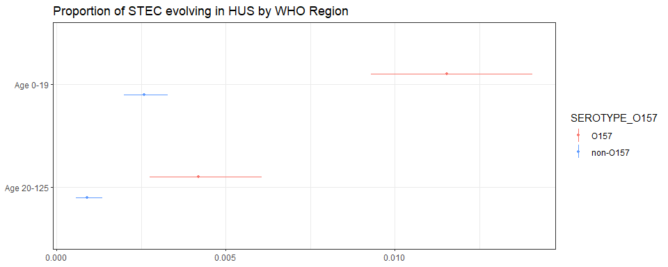
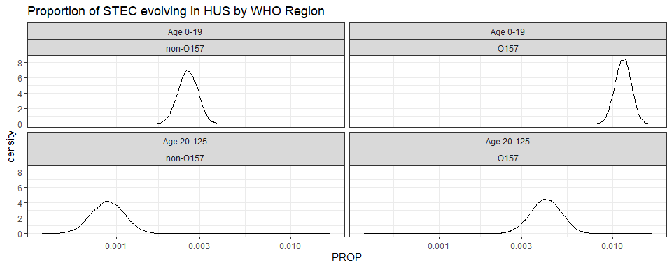

Proportion of STEC evolving in HUS • Estimate proportion with the 15th
model
================
fbbu6966
2025-09-24

- [Settings](#settings)
- [Parameters](#parameters)
- [Model fit](#model-fit)
- [Predict all](#predict-all)
- [Summarize predictions: global](#summarize-predictions-global)
- [Session info](#session-info)

# Settings

``` r
## required packages ----
library(bd)
library(brms)
library(FERG2)
library(ggplot2)
library(knitr)
library(rmarkdown)
library(sf)
library(tidyr)
library(dplyr)
library(DescTools)
library(readxl)

## global options ----
knitr::opts_chunk$set(fig.width = 10)
Date <- format(Sys.Date(), "%Y%m%d")
```

# Parameters

| Parameters | Values |
|:---|:---|
| Number of iteration | 5000 |
| Warmup | 3000 |
| Delta value | NA |
| Maximum tree-depth | NA |
| Levels | Global; SEROTYPE= O157 vs non-O157 vs mixed; Age=0-19, 20-125, mixed |
| Random effect on each data point | Yes |
| Stronger priors specified | Normal(0,1) |

Parameters of the model tested

# Model fit

``` r
fit_brms_reg_s <- readRDS("fit_brms_reg_s15.rds")
zero_cases<- read_xlsx("endemic_countries.xlsx")%>%
  select(REG2, ISO3, Country, edtf_stec) %>% 
  rename(COUNTRY=ISO3, COUNTRY_LABEL = Country) %>%
  mutate(edtf_stec = if_else(is.na(edtf_stec), 0, edtf_stec),
         Location = "Global")
zero_cases_global <- table(zero_cases$Location, zero_cases$edtf_stec) %>%
  as.data.frame() %>%
  rename(Location = Var1,
         edtf_stec = Var2) %>%
  select(Location, edtf_stec) %>%
  mutate(edtf_stec = as.numeric(as.character(edtf_stec)))

kable(
  caption = "Countries assumed to be non-endemic",
  row.names = FALSE,
  subset(zero_cases, edtf_stec==0)[, 2])
```

| COUNTRY |
|:--------|

Countries assumed to be non-endemic

# Predict all

``` r
## set up dataframe
sim_all <-
  data.frame(
    sei = 0,
    SEROTYPE_O157 = rep(0:1, each = 2),
    VALUE_CASES_AGE2 = c(1,3, 1,3)) 
sim_all$VALUE_CASES_AGE2 <- factor(sim_all$VALUE_CASES_AGE2, 
                                   levels = c(1,3), 
                                   labels = c("Age 0-19", "Age 20-125"))
sim_all$SEROTYPE_O157 <- factor(sim_all$SEROTYPE_O157, 
                                levels = c(0,1),
                                labels = c("non-O157", "O157"))

## draw from expected value of posterior predictive dist
set.seed(10)
draws_fit <- as_draws_df(fit_brms_reg_s)
fit_all <- data.frame(
  V_nonO157_Age19 = draws_fit$b_Intercept,
  V_nonO157_Age125 = draws_fit$b_Intercept + draws_fit$b_VALUE_CASES_AGE2Age20M125,
  V_O157_Age19 = draws_fit$b_Intercept + draws_fit$b_SEROTYPE_O157O157,
  V_O157_Age125 = draws_fit$b_Intercept + draws_fit$b_VALUE_CASES_AGE2Age20M125 + draws_fit$b_SEROTYPE_O157O157
)
# fit_all <- 
#   posterior_epred(
#     object = fit_brms_reg_s,
#     newdata = sim_all,
#     allow_new_levels = TRUE,
#     sample_new_levels = "uncertainty",
#     re_formula = ~ 1 + SEROTYPE_O157 + VALUE_CASES_AGE2
#   )

## calculate proportions
sim_all$SIM <- t(fit_all)
sim_all <- sim_all %>% mutate(Location = "Global") %>% left_join(zero_cases_global)
```

    ## Joining with `by = join_by(Location)`

``` r
sim_all$PROP <- expit(sim_all$SIM)
sim_all$PROP <- sim_all$PROP*sim_all$edtf_stec
sim_all$MULT <- ifelse(sim_all$SEROTYPE_O157 == "O157",
                       1.8/32, 
                       1.8/106.8)
sim_all$PROP <- sim_all$PROP*sim_all$MULT

## aggregate over regions
all_glb_prop <- t(apply(sim_all$PROP, 1, mean_ci))
all_glb_prop <- data.frame(all_glb_prop)
names(all_glb_prop) <- c("VAL_MEAN", "VAL_LWR", "VAL_UPR")
all_glb_prop <- cbind(sim_all[2:3], all_glb_prop)
all_glb_prop$LOCATION <- "Global"
all_glb_prop$LOCATION_NAME <- "Global"
all_glb_prop$METRIC <- "Proportion"
str(all_glb_prop)
```

    ## 'data.frame':    4 obs. of  8 variables:
    ##  $ SEROTYPE_O157   : Factor w/ 2 levels "non-O157","O157": 1 1 2 2
    ##  $ VALUE_CASES_AGE2: Factor w/ 2 levels "Age 0-19","Age 20-125": 1 2 1 2
    ##  $ VAL_MEAN        : num  0.00259 0.000907 0.011531 0.004204
    ##  $ VAL_LWR         : num  0.001984 0.000577 0.009292 0.002753
    ##  $ VAL_UPR         : num  0.0033 0.00135 0.01407 0.00606
    ##  $ LOCATION        : chr  "Global" "Global" "Global" "Global"
    ##  $ LOCATION_NAME   : chr  "Global" "Global" "Global" "Global"
    ##  $ METRIC          : chr  "Proportion" "Proportion" "Proportion" "Proportion"

``` r
## compile all
all_est <-
  rbind(all_glb_prop)
str(all_est)
```

    ## 'data.frame':    4 obs. of  8 variables:
    ##  $ SEROTYPE_O157   : Factor w/ 2 levels "non-O157","O157": 1 1 2 2
    ##  $ VALUE_CASES_AGE2: Factor w/ 2 levels "Age 0-19","Age 20-125": 1 2 1 2
    ##  $ VAL_MEAN        : num  0.00259 0.000907 0.011531 0.004204
    ##  $ VAL_LWR         : num  0.001984 0.000577 0.009292 0.002753
    ##  $ VAL_UPR         : num  0.0033 0.00135 0.01407 0.00606
    ##  $ LOCATION        : chr  "Global" "Global" "Global" "Global"
    ##  $ LOCATION_NAME   : chr  "Global" "Global" "Global" "Global"
    ##  $ METRIC          : chr  "Proportion" "Proportion" "Proportion" "Proportion"

``` r
saveRDS(all_est, file = "all_estimates.rds")
```

# Summarize predictions: global

``` r
kable(
  caption = "Global proportion of STEC evolving in HUS cases",
  row.names = FALSE,
  subset(all_glb_prop)[, c(1:2, 3:5)])
```

| SEROTYPE_O157 | VALUE_CASES_AGE2 |  VAL_MEAN |   VAL_LWR |   VAL_UPR |
|:--------------|:-----------------|----------:|----------:|----------:|
| non-O157      | Age 0-19         | 0.0025902 | 0.0019845 | 0.0032981 |
| non-O157      | Age 20-125       | 0.0009074 | 0.0005772 | 0.0013491 |
| O157          | Age 0-19         | 0.0115309 | 0.0092917 | 0.0140720 |
| O157          | Age 20-125       | 0.0042043 | 0.0027525 | 0.0060623 |

Global proportion of STEC evolving in HUS cases

``` r
ggplot(subset(all_glb_prop),
       aes(y = VAL_MEAN, x = VALUE_CASES_AGE2)) +
  geom_pointrange(aes(ymin = VAL_LWR, ymax = VAL_UPR, group=SEROTYPE_O157, colour = SEROTYPE_O157), size = 0.2,
                  position=position_dodge(width=0.40), show.legend=TRUE) +
  coord_flip() +
  theme_bw() +
  scale_x_discrete(NULL, limits = rev(unique(all_glb_prop$VALUE_CASES_AGE))) +
  scale_y_continuous(NULL) +
  ggtitle("Proportion of STEC evolving in HUS by WHO Region") +
  scale_color_manual(breaks = c("O157", "non-O157"),
                     values=c("#F8766D", "#619CFF"))
```

<!-- -->

``` r
sim_all_glb <- sim_all %>%
  select(VALUE_CASES_AGE2, SEROTYPE_O157, PROP) %>%
  mutate_at("PROP", as.data.frame) %>%
  unnest(PROP) %>%
  mutate(CASES_AGE = VALUE_CASES_AGE2) %>%
  select(-VALUE_CASES_AGE2)
sim_all_glb_long <-
  pivot_longer(sim_all_glb, cols = starts_with("V"))
sim_all_glb_long$PROP <- sim_all_glb_long$value

ggplot(subset(sim_all_glb_long), aes(x = PROP)) +
  geom_density() +
  facet_wrap(~CASES_AGE+SEROTYPE_O157) +
  theme_bw() +
  scale_x_log10() +
  ggtitle("Proportion of STEC evolving in HUS by WHO Region")
```

<!-- -->

# Session info

``` r
saveRDS(sim_all, paste0("sim_all_", Date, ".RDS"))
saveRDS(all_est, paste0("all_est_", Date, ".RDS"))
sessioninfo::session_info()
```

    ## Warning in system2("quarto", "-V", stdout = TRUE, env = paste0("TMPDIR=", : running command '"quarto"
    ## TMPDIR=C:/Users/fbbu6966/AppData/Local/Temp/Rtmp2tmszn/file29a07b58761a -V' had status 1

    ## ─ Session info ───────────────────────────────────────────────────────────────────────────────────────
    ##  setting  value
    ##  version  R version 4.5.1 (2025-06-13 ucrt)
    ##  os       Windows 10 x64 (build 19045)
    ##  system   x86_64, mingw32
    ##  ui       RStudio
    ##  language (EN)
    ##  collate  English_United States.utf8
    ##  ctype    English_United States.utf8
    ##  tz       Europe/Brussels
    ##  date     2025-09-24
    ##  rstudio  2025.05.1+513 Mariposa Orchid (desktop)
    ##  pandoc   3.4 @ C:/Program Files/RStudio/resources/app/bin/quarto/bin/tools/ (via rmarkdown)
    ##  quarto   ERROR: Unknown command "TMPDIR=C:/Users/fbbu6966/AppData/Local/Temp/Rtmp2tmszn/file29a07b58761a". Did you mean command "update"? @ C:\\PROGRA~1\\RStudio\\RESOUR~1\\app\\bin\\quarto\\bin\\quarto.exe
    ## 
    ## ─ Packages ───────────────────────────────────────────────────────────────────────────────────────────
    ##  ! package        * version    date (UTC) lib source
    ##    abind            1.4-8      2024-09-12 [1] CRAN (R 4.5.0)
    ##    backports        1.5.0      2024-05-23 [1] CRAN (R 4.5.0)
    ##    base64enc        0.1-3      2015-07-28 [1] CRAN (R 4.5.0)
    ##    bayesplot        1.13.0     2025-06-18 [1] CRAN (R 4.5.1)
    ##    bd             * 0.0.14     2025-07-14 [1] Github (brechtdv/bd@652191c)
    ##    boot             1.3-31     2024-08-28 [1] CRAN (R 4.5.1)
    ##    bridgesampling   1.1-2      2021-04-16 [1] CRAN (R 4.5.1)
    ##    brms           * 2.22.0     2024-09-23 [1] CRAN (R 4.5.1)
    ##    Brobdingnag      1.2-9      2022-10-19 [1] CRAN (R 4.5.1)
    ##    callr            3.7.6      2024-03-25 [1] CRAN (R 4.5.1)
    ##    cellranger       1.1.0      2016-07-27 [1] CRAN (R 4.5.1)
    ##    checkmate        2.3.2      2024-07-29 [1] CRAN (R 4.5.1)
    ##    class            7.3-23     2025-01-01 [1] CRAN (R 4.5.1)
    ##    classInt         0.4-11     2025-01-08 [1] CRAN (R 4.5.1)
    ##    cli              3.6.5      2025-04-23 [1] CRAN (R 4.5.1)
    ##    cluster          2.1.8.1    2025-03-12 [1] CRAN (R 4.5.1)
    ##    coda             0.19-4.1   2024-01-31 [1] CRAN (R 4.5.1)
    ##    codetools        0.2-20     2024-03-31 [1] CRAN (R 4.5.1)
    ##    colorspace       2.1-1      2024-07-26 [1] CRAN (R 4.5.1)
    ##    curl             6.4.0      2025-06-22 [1] CRAN (R 4.5.1)
    ##    data.table       1.17.8     2025-07-10 [1] CRAN (R 4.5.1)
    ##    DBI              1.2.3      2024-06-02 [1] CRAN (R 4.5.1)
    ##    DescTools      * 0.99.60    2025-03-28 [1] CRAN (R 4.5.1)
    ##    digest           0.6.37     2024-08-19 [1] CRAN (R 4.5.1)
    ##    distributional   0.5.0      2024-09-17 [1] CRAN (R 4.5.1)
    ##    dplyr          * 1.1.4      2023-11-17 [1] CRAN (R 4.5.1)
    ##    e1071            1.7-16     2024-09-16 [1] CRAN (R 4.5.1)
    ##    evaluate         1.0.4      2025-06-18 [1] CRAN (R 4.5.1)
    ##    Exact            3.3        2024-07-21 [1] CRAN (R 4.5.0)
    ##    expm             1.0-0      2024-08-19 [1] CRAN (R 4.5.1)
    ##    farver           2.1.2      2024-05-13 [1] CRAN (R 4.5.1)
    ##    fastmap          1.2.0      2024-05-15 [1] CRAN (R 4.5.1)
    ##    FERG2          * 0.0.5      2025-07-22 [1] Github (brechtdv/FERG2@c2d4ac1)
    ##    forcats          1.0.0      2023-01-29 [1] CRAN (R 4.5.1)
    ##    foreign          0.8-90     2025-03-31 [1] CRAN (R 4.5.1)
    ##    Formula          1.2-5      2023-02-24 [1] CRAN (R 4.5.0)
    ##    fs               1.6.6      2025-04-12 [1] CRAN (R 4.5.1)
    ##    generics         0.1.4      2025-05-09 [1] CRAN (R 4.5.1)
    ##    ggplot2        * 3.5.2      2025-04-09 [1] CRAN (R 4.5.1)
    ##    gld              2.6.7      2025-01-17 [1] CRAN (R 4.5.1)
    ##    glue             1.8.0      2024-09-30 [1] CRAN (R 4.5.1)
    ##    gridExtra        2.3        2017-09-09 [1] CRAN (R 4.5.1)
    ##    gtable           0.3.6      2024-10-25 [1] CRAN (R 4.5.1)
    ##    haven            2.5.5      2025-05-30 [1] CRAN (R 4.5.1)
    ##    Hmisc          * 5.2-3      2025-03-16 [1] CRAN (R 4.5.1)
    ##    hms              1.1.3      2023-03-21 [1] CRAN (R 4.5.1)
    ##    htmlTable        2.4.3      2024-07-21 [1] CRAN (R 4.5.1)
    ##    htmltools        0.5.8.1    2024-04-04 [1] CRAN (R 4.5.1)
    ##    htmlwidgets      1.6.4      2023-12-06 [1] CRAN (R 4.5.1)
    ##    httr             1.4.7      2023-08-15 [1] CRAN (R 4.5.1)
    ##    inline           0.3.21     2025-01-09 [1] CRAN (R 4.5.1)
    ##    jsonlite         2.0.0      2025-03-27 [1] CRAN (R 4.5.1)
    ##    kableExtra     * 1.4.0      2024-01-24 [1] CRAN (R 4.5.1)
    ##    KernSmooth       2.23-26    2025-01-01 [1] CRAN (R 4.5.1)
    ##    knitr          * 1.50       2025-03-16 [1] CRAN (R 4.5.1)
    ##    labeling         0.4.3      2023-08-29 [1] CRAN (R 4.5.0)
    ##    lattice          0.22-7     2025-04-02 [1] CRAN (R 4.5.1)
    ##    lifecycle        1.0.4      2023-11-07 [1] CRAN (R 4.5.1)
    ##    lmom             3.2        2024-09-30 [1] CRAN (R 4.5.0)
    ##    loo              2.8.0      2024-07-03 [1] CRAN (R 4.5.1)
    ##    magrittr         2.0.3      2022-03-30 [1] CRAN (R 4.5.1)
    ##    MASS             7.3-65     2025-02-28 [1] CRAN (R 4.5.1)
    ##    mathjaxr         1.8-0      2025-04-30 [1] CRAN (R 4.5.1)
    ##    Matrix         * 1.7-3      2025-03-11 [1] CRAN (R 4.5.1)
    ##    MatrixModels     0.5-4      2025-03-26 [1] CRAN (R 4.5.1)
    ##    matrixStats      1.5.0      2025-01-07 [1] CRAN (R 4.5.1)
    ##    metadat        * 1.4-0      2025-02-04 [1] CRAN (R 4.5.1)
    ##    metafor        * 4.8-0      2025-01-28 [1] CRAN (R 4.5.1)
    ##    multcomp         1.4-28     2025-01-29 [1] CRAN (R 4.5.1)
    ##    mvtnorm          1.3-3      2025-01-10 [1] CRAN (R 4.5.1)
    ##    nlme             3.1-168    2025-03-31 [1] CRAN (R 4.5.1)
    ##    nnet             7.3-20     2025-01-01 [1] CRAN (R 4.5.1)
    ##    numDeriv       * 2016.8-1.1 2019-06-06 [1] CRAN (R 4.5.0)
    ##    pillar           1.11.0     2025-07-04 [1] CRAN (R 4.5.1)
    ##    pkgbuild         1.4.8      2025-05-26 [1] CRAN (R 4.5.1)
    ##    pkgconfig        2.0.3      2019-09-22 [1] CRAN (R 4.5.1)
    ##    plyr             1.8.9      2023-10-02 [1] CRAN (R 4.5.1)
    ##    polspline        1.1.25     2024-05-10 [1] CRAN (R 4.5.0)
    ##    posterior        1.6.1      2025-02-27 [1] CRAN (R 4.5.1)
    ##    processx         3.8.6      2025-02-21 [1] CRAN (R 4.5.1)
    ##    proxy            0.4-27     2022-06-09 [1] CRAN (R 4.5.1)
    ##    ps               1.9.1      2025-04-12 [1] CRAN (R 4.5.1)
    ##    purrr            1.1.0      2025-07-10 [1] CRAN (R 4.5.1)
    ##    quantreg         6.1        2025-03-10 [1] CRAN (R 4.5.1)
    ##    QuickJSR         1.8.0      2025-06-09 [1] CRAN (R 4.5.1)
    ##    R6               2.6.1      2025-02-15 [1] CRAN (R 4.5.1)
    ##    RColorBrewer     1.1-3      2022-04-03 [1] CRAN (R 4.5.0)
    ##    Rcpp           * 1.1.0      2025-07-02 [1] CRAN (R 4.5.1)
    ##  D RcppParallel     5.1.10     2025-01-24 [1] CRAN (R 4.5.1)
    ##    readr            2.1.5      2024-01-10 [1] CRAN (R 4.5.1)
    ##    readxl         * 1.4.5      2025-03-07 [1] CRAN (R 4.5.1)
    ##    reshape2         1.4.4      2020-04-09 [1] CRAN (R 4.5.1)
    ##    rlang            1.1.6      2025-04-11 [1] CRAN (R 4.5.1)
    ##    rmarkdown      * 2.29       2024-11-04 [1] CRAN (R 4.5.1)
    ##    rms            * 8.0-0      2025-04-04 [1] CRAN (R 4.5.1)
    ##    rootSolve        1.8.2.4    2023-09-21 [1] CRAN (R 4.5.0)
    ##    rpart            4.1.24     2025-01-07 [1] CRAN (R 4.5.1)
    ##    rstan            2.32.7     2025-03-10 [1] CRAN (R 4.5.1)
    ##    rstantools       2.4.0      2024-01-31 [1] CRAN (R 4.5.1)
    ##    rstudioapi       0.17.1     2024-10-22 [1] CRAN (R 4.5.1)
    ##    sandwich         3.1-1      2024-09-15 [1] CRAN (R 4.5.1)
    ##    scales         * 1.4.0      2025-04-24 [1] CRAN (R 4.5.1)
    ##    sessioninfo      1.2.3      2025-02-05 [1] CRAN (R 4.5.1)
    ##    sf             * 1.0-21     2025-05-15 [1] CRAN (R 4.5.1)
    ##    SparseM          1.84-2     2024-07-17 [1] CRAN (R 4.5.1)
    ##    StanHeaders      2.32.10    2024-07-15 [1] CRAN (R 4.5.1)
    ##    stringi          1.8.7      2025-03-27 [1] CRAN (R 4.5.0)
    ##    stringr        * 1.5.1      2023-11-14 [1] CRAN (R 4.5.1)
    ##    survival         3.8-3      2024-12-17 [1] CRAN (R 4.5.1)
    ##    svglite          2.2.1      2025-05-12 [1] CRAN (R 4.5.1)
    ##    systemfonts      1.2.3      2025-04-30 [1] CRAN (R 4.5.1)
    ##    tensorA          0.36.2.1   2023-12-13 [1] CRAN (R 4.5.0)
    ##    textshaping      1.0.1      2025-05-01 [1] CRAN (R 4.5.1)
    ##    TH.data          1.1-3      2025-01-17 [1] CRAN (R 4.5.1)
    ##    tibble           3.3.0      2025-06-08 [1] CRAN (R 4.5.1)
    ##    tidyr          * 1.3.1      2024-01-24 [1] CRAN (R 4.5.1)
    ##    tidyselect       1.2.1      2024-03-11 [1] CRAN (R 4.5.1)
    ##    tzdb             0.5.0      2025-03-15 [1] CRAN (R 4.5.1)
    ##    units            0.8-7      2025-03-11 [1] CRAN (R 4.5.1)
    ##    V8               6.0.4      2025-06-04 [1] CRAN (R 4.5.1)
    ##    vctrs            0.6.5      2023-12-01 [1] CRAN (R 4.5.1)
    ##    viridisLite      0.4.2      2023-05-02 [1] CRAN (R 4.5.1)
    ##    withr            3.0.2      2024-10-28 [1] CRAN (R 4.5.1)
    ##    xfun             0.52       2025-04-02 [1] CRAN (R 4.5.1)
    ##    xml2             1.3.8      2025-03-14 [1] CRAN (R 4.5.1)
    ##    yaml             2.3.10     2024-07-26 [1] CRAN (R 4.5.0)
    ##    zoo              1.8-14     2025-04-10 [1] CRAN (R 4.5.1)
    ## 
    ##  [1] C:/Program Files/R/R-4.5.1/library
    ## 
    ##  * ── Packages attached to the search path.
    ##  D ── DLL MD5 mismatch, broken installation.
    ## 
    ## ──────────────────────────────────────────────────────────────────────────────────────────────────────

``` r
##rmarkdown::render("03-estimate_v1.R")

# Save dataset for report created for expert to receive feedback
# save(all_cnt_rt, file="./00-Report_FB/all_cnt_rt.Rdata")
# save(all_glb_prop, file="./00-Report_FB/all_glb_prop.Rdata")
# save(all_glb_prop, file="./00-Report_FB/all_glb_prop.Rdata")
# save(all_reg_rt, file="./00-Report_FB/all_reg_rt.Rdata")
# save(all_sub_nr, file="./00-Report_FB/all_sub_nr.Rdata")
# save(all_sub_rt, file="./00-Report_FB/all_sub_rt.Rdata")
```
