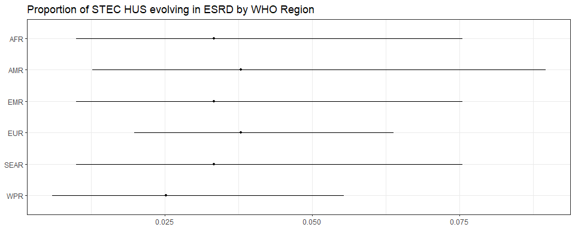
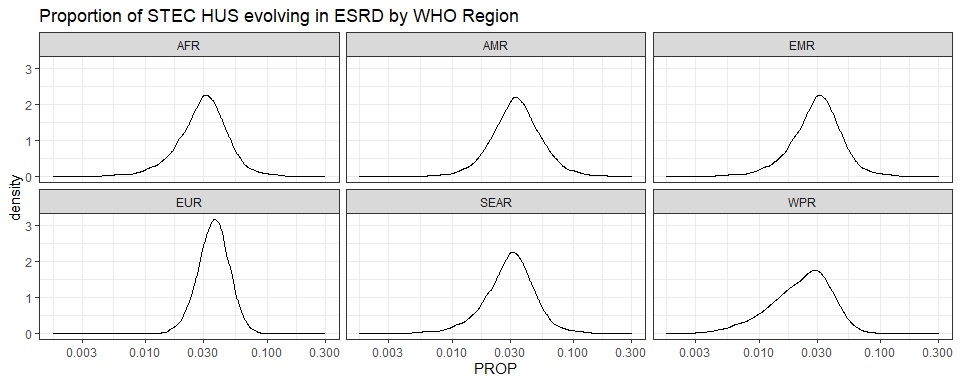

Proportion of STEC HUS evolving in ESRD • Estimate proportion with the
2nd model
================
LoVa3397
2025-02-21

- [Settings](#settings)
- [Parameters](#parameters)
- [Model fit](#model-fit)
- [Predict all](#predict-all)
- [Summarize predictions: regional](#summarize-predictions-regional)
- [Session info](#session-info)

# Settings

``` r
## required packages ----
library(bd)
library(brms)
library(FERG2)
library(ggplot2)
library(knitr)
library(rmarkdown)
library(sf)
library(tidyr)
library(dplyr)
library(DescTools)
library(readxl)

## global options ----
knitr::opts_chunk$set(fig.width = 10)
Date <- format(Sys.Date(), "%Y%m%d")
```

# Parameters

| Parameters                       | Values           |
|:---------------------------------|:-----------------|
| Number of iteration              | 5000             |
| Warmup                           | 3000             |
| Delta value                      | 0.92             |
| Maximum tree-depth               | NA               |
| Levels                           | Regions, Studies |
| Random effect on each data point | Yes              |
| Stronger priors specified        | Normal(0,1)      |

Parameters of the model tested

# Model fit

``` r
fit_brms_reg_s <- readRDS("fit_brms_reg_s2.rds")
zero_cases<- read_xlsx("endemic_countries.xlsx")%>%
  select(REG2, ISO3, Country, edtf_stec) %>% 
  rename(COUNTRY=ISO3, COUNTRY_LABEL = Country) %>%
  mutate(edtf_stec = if_else(is.na(edtf_stec), 0, edtf_stec))
```

    ## New names:
    ## • `` -> `...28`

``` r
zero_cases_reg2 <- table(zero_cases$REG2, zero_cases$edtf_stec, useNA = "always") %>%
  as.data.frame() %>%
  mutate(REG2 = Var1, 
         Var2 = case_when(
           Var2 == 0 ~ "Nonendemic",
           Var2 == 1 ~ "Endemic"
         )) %>%
  select(REG2, Var2, Freq) %>%
  spread(key = Var2, value = Freq) %>%
  filter(!is.na(REG2)) %>%
  select(any_of(c("REG2", "Endemic", "Nonendemic"))) %>%
  mutate(RegionEndemic = case_when(
    Endemic == 0 ~ 0,
    Endemic != 0 ~ 1
  ))
  
kable(
  caption = "Countries assumed to be non-endemic",
  row.names = FALSE,
  subset(zero_cases, edtf_stec==0)[, 2])
```

| COUNTRY |
|:--------|

Countries assumed to be non-endemic

# Predict all

``` r
## set up dataframe
sim_all <-
  data.frame(
    sei = 0,
    REG2 = FERG2:::countries$REG2) %>%
  distinct()


## draw from expected value of posterior predictive dist
set.seed(10)
# fit_all <- 
#   posterior_epred(
#     object = fit_brms_reg_s,
#     newdata = sim_all,
#     allow_new_levels = TRUE,
#     sample_new_levels = "uncertainty",
#     re_formula = ~ 1 +          
#       (1 | REG2)
#   )
draws_fit <- as_draws_df(fit_brms_reg_s)

fit_all <- data.frame(AFR = draws_fit$b_Intercept)
fit_all$AMR<- draws_fit$b_Intercept + draws_fit$`r_REG2[AMR,Intercept]`
fit_all$SEAR<- draws_fit$b_Intercept
fit_all$EMR<- draws_fit$b_Intercept
fit_all$EUR <- draws_fit$b_Intercept + draws_fit$`r_REG2[EUR,Intercept]`
fit_all$WPR <- draws_fit$b_Intercept + draws_fit$`r_REG2[WPR,Intercept]`

fit_all <- fit_all[,c("EMR","EUR","AFR","AMR","WPR","SEAR")]

## calculate proportions
sim_all$SIM <- t(fit_all)
sim_all <- sim_all %>% left_join(zero_cases_reg2)
```

    ## Joining with `by = join_by(REG2)`

``` r
sim_all$PROP <- expit(sim_all$SIM)
sim_all$PROP <- sim_all$PROP*sim_all$RegionEndemic

## aggregate over regions
all_reg_prop <- t(apply(sim_all$PROP, 1, mean_ci))
all_reg_prop <- data.frame(all_reg_prop)
names(all_reg_prop) <- c("VAL_MEAN", "VAL_LWR", "VAL_UPR")
all_reg_prop <- cbind(sim_all[1:2], all_reg_prop)
all_reg_prop$LOCATION <- "Region"
all_reg_prop$LOCATION_NAME <- all_reg_prop$REG2
all_reg_prop$REG2 <- NULL
all_reg_prop$METRIC <- "Proportion"
all_reg_prop <- all_reg_prop %>%
  arrange(LOCATION_NAME)
str(all_reg_prop)
```

    ## 'data.frame':    6 obs. of  7 variables:
    ##  $ sei          : num  0 0 0 0 0 0
    ##  $ VAL_MEAN     : num  0.0333 0.0378 0.0333 0.0379 0.0333 ...
    ##  $ VAL_LWR      : num  0.00997 0.01266 0.00997 0.01979 0.00997 ...
    ##  $ VAL_UPR      : num  0.0755 0.0896 0.0755 0.0637 0.0755 ...
    ##  $ LOCATION     : chr  "Region" "Region" "Region" "Region" ...
    ##  $ LOCATION_NAME: chr  "AFR" "AMR" "EMR" "EUR" ...
    ##  $ METRIC       : chr  "Proportion" "Proportion" "Proportion" "Proportion" ...

``` r
## compile all
all_est <-
  rbind(all_reg_prop)
str(all_est)
```

    ## 'data.frame':    6 obs. of  7 variables:
    ##  $ sei          : num  0 0 0 0 0 0
    ##  $ VAL_MEAN     : num  0.0333 0.0378 0.0333 0.0379 0.0333 ...
    ##  $ VAL_LWR      : num  0.00997 0.01266 0.00997 0.01979 0.00997 ...
    ##  $ VAL_UPR      : num  0.0755 0.0896 0.0755 0.0637 0.0755 ...
    ##  $ LOCATION     : chr  "Region" "Region" "Region" "Region" ...
    ##  $ LOCATION_NAME: chr  "AFR" "AMR" "EMR" "EUR" ...
    ##  $ METRIC       : chr  "Proportion" "Proportion" "Proportion" "Proportion" ...

``` r
saveRDS(all_est, file = "all_estimates.rds")
```

# Summarize predictions: regional

``` r
kable(
  caption = "Regional proportion of STEC HUS evolving in ESRD cases",
  row.names = FALSE,
  subset(all_reg_prop)[, c(6, 2:4)])
```

| LOCATION_NAME |  VAL_MEAN |   VAL_LWR |   VAL_UPR |
|:--------------|----------:|----------:|----------:|
| AFR           | 0.0332829 | 0.0099678 | 0.0754595 |
| AMR           | 0.0378381 | 0.0126602 | 0.0895850 |
| EMR           | 0.0332829 | 0.0099678 | 0.0754595 |
| EUR           | 0.0379133 | 0.0197907 | 0.0637451 |
| SEAR          | 0.0332829 | 0.0099678 | 0.0754595 |
| WPR           | 0.0252156 | 0.0058214 | 0.0553108 |

Regional proportion of STEC HUS evolving in ESRD cases

``` r
ggplot(subset(all_reg_prop),
       aes(y = VAL_MEAN, x = LOCATION_NAME)) +
  geom_pointrange(aes(ymin = VAL_LWR, ymax = VAL_UPR), size = 0.2) +
  coord_flip() +
  theme_bw() +
  scale_x_discrete(NULL, limits = rev(unique(all_reg_prop$LOCATION_NAME))) +
  scale_y_continuous(NULL) +
  ggtitle("Proportion of STEC HUS evolving in ESRD by WHO Region")
```

<!-- -->

``` r
sim_all_reg <- sim_all %>%
  select(REG2, PROP) %>%
  mutate_at("PROP", as.data.frame) %>%
  unnest(PROP)
sim_all_reg_long <-
  pivot_longer(sim_all_reg, cols = starts_with("V"))
sim_all_reg_long$PROP <- sim_all_reg_long$value

ggplot(subset(sim_all_reg_long), aes(x = PROP)) +
  geom_density() +
  facet_wrap(~REG2) +
  theme_bw() +
  scale_x_log10() +
  ggtitle("Proportion of STEC HUS evolving in ESRD by WHO Region")
```

<!-- -->

# Session info

``` r
saveRDS(sim_all, paste0("sim_all_", Date, ".RDS"))
saveRDS(all_est, paste0("all_est_", Date, ".RDS"))
sessioninfo::session_info()
```

    ## Warning in system2("quarto", "-V", stdout = TRUE, env = paste0("TMPDIR=", : running command '"quarto"
    ## TMPDIR=C:/Users/LoVa3397/AppData/Local/Temp/RtmpyS7qzc/file347c33876698 -V' had status 1

    ## ─ Session info ───────────────────────────────────────────────────────────────────────────────────────────────
    ##  setting  value
    ##  version  R version 4.4.2 (2024-10-31 ucrt)
    ##  os       Windows 10 x64 (build 19045)
    ##  system   x86_64, mingw32
    ##  ui       RStudio
    ##  language (EN)
    ##  collate  English_United States.utf8
    ##  ctype    English_United States.utf8
    ##  tz       Europe/Brussels
    ##  date     2025-02-21
    ##  rstudio  2024.12.0+467 Kousa Dogwood (desktop)
    ##  pandoc   3.2 @ C:/Program Files/RStudio/resources/app/bin/quarto/bin/tools/ (via rmarkdown)
    ##  quarto   ERROR: Unknown command "TMPDIR=C:/Users/LoVa3397/AppData/Local/Temp/RtmpyS7qzc/file347c33876698". Did you mean command "install"? @ C:\\PROGRA~1\\RStudio\\RESOUR~1\\app\\bin\\quarto\\bin\\quarto.exe
    ## 
    ## ─ Packages ───────────────────────────────────────────────────────────────────────────────────────────────────
    ##  ! package        * version    date (UTC) lib source
    ##    abind            1.4-8      2024-09-12 [1] CRAN (R 4.4.1)
    ##    backports        1.5.0      2024-05-23 [1] CRAN (R 4.4.0)
    ##    base64enc        0.1-3      2015-07-28 [1] CRAN (R 4.4.0)
    ##    bayesplot        1.11.1     2024-02-15 [1] CRAN (R 4.4.2)
    ##    bd             * 0.0.13     2025-02-10 [1] Github (brechtdv/bd@b63c017)
    ##    boot             1.3-31     2024-08-28 [1] CRAN (R 4.4.2)
    ##    bridgesampling   1.1-2      2021-04-16 [1] CRAN (R 4.4.2)
    ##    brms           * 2.22.0     2024-09-23 [1] CRAN (R 4.4.2)
    ##    Brobdingnag      1.2-9      2022-10-19 [1] CRAN (R 4.4.2)
    ##    cellranger       1.1.0      2016-07-27 [1] CRAN (R 4.4.2)
    ##    checkmate        2.3.2      2024-07-29 [1] CRAN (R 4.4.2)
    ##    class            7.3-22     2023-05-03 [1] CRAN (R 4.4.2)
    ##    classInt         0.4-11     2025-01-08 [1] CRAN (R 4.4.2)
    ##    cli              3.6.3      2024-06-21 [1] CRAN (R 4.4.2)
    ##    cluster          2.1.6      2023-12-01 [1] CRAN (R 4.4.2)
    ##    coda             0.19-4.1   2024-01-31 [1] CRAN (R 4.4.2)
    ##    codetools        0.2-20     2024-03-31 [1] CRAN (R 4.4.2)
    ##    colorspace       2.1-1      2024-07-26 [1] CRAN (R 4.4.2)
    ##    data.table       1.16.4     2024-12-06 [1] CRAN (R 4.4.2)
    ##    DBI              1.2.3      2024-06-02 [1] CRAN (R 4.4.2)
    ##    DescTools      * 0.99.59    2025-01-26 [1] CRAN (R 4.4.2)
    ##    digest           0.6.37     2024-08-19 [1] CRAN (R 4.4.2)
    ##    distributional   0.5.0      2024-09-17 [1] CRAN (R 4.4.2)
    ##    dplyr          * 1.1.4      2023-11-17 [1] CRAN (R 4.4.2)
    ##    e1071            1.7-16     2024-09-16 [1] CRAN (R 4.4.2)
    ##    evaluate         1.0.3      2025-01-10 [1] CRAN (R 4.4.2)
    ##    Exact            3.3        2024-07-21 [1] CRAN (R 4.4.1)
    ##    expm             1.0-0      2024-08-19 [1] CRAN (R 4.4.2)
    ##    farver           2.1.2      2024-05-13 [1] CRAN (R 4.4.2)
    ##    fastmap          1.2.0      2024-05-15 [1] CRAN (R 4.4.2)
    ##    FERG2          * 0.0.2      2025-02-21 [1] Github (brechtdv/FERG2@3d51b14)
    ##    forcats          1.0.0      2023-01-29 [1] CRAN (R 4.4.2)
    ##    foreign          0.8-87     2024-06-26 [1] CRAN (R 4.4.2)
    ##    Formula          1.2-5      2023-02-24 [1] CRAN (R 4.4.0)
    ##    generics         0.1.3      2022-07-05 [1] CRAN (R 4.4.2)
    ##    ggplot2        * 3.5.1      2024-04-23 [1] CRAN (R 4.4.2)
    ##    gld              2.6.7      2025-01-17 [1] CRAN (R 4.4.2)
    ##    glue             1.8.0      2024-09-30 [1] CRAN (R 4.4.2)
    ##    gridExtra        2.3        2017-09-09 [1] CRAN (R 4.4.2)
    ##    gtable           0.3.6      2024-10-25 [1] CRAN (R 4.4.2)
    ##    haven            2.5.4      2023-11-30 [1] CRAN (R 4.4.2)
    ##    Hmisc          * 5.2-2      2025-01-10 [1] CRAN (R 4.4.2)
    ##    hms              1.1.3      2023-03-21 [1] CRAN (R 4.4.2)
    ##    htmlTable        2.4.3      2024-07-21 [1] CRAN (R 4.4.2)
    ##    htmltools        0.5.8.1    2024-04-04 [1] CRAN (R 4.4.2)
    ##    htmlwidgets      1.6.4      2023-12-06 [1] CRAN (R 4.4.2)
    ##    httr             1.4.7      2023-08-15 [1] CRAN (R 4.4.2)
    ##    inline           0.3.21     2025-01-09 [1] CRAN (R 4.4.2)
    ##    kableExtra     * 1.4.0      2024-01-24 [1] CRAN (R 4.4.2)
    ##    KernSmooth       2.23-24    2024-05-17 [1] CRAN (R 4.4.2)
    ##    knitr          * 1.49       2024-11-08 [1] CRAN (R 4.4.2)
    ##    labeling         0.4.3      2023-08-29 [1] CRAN (R 4.4.0)
    ##    lattice          0.22-6     2024-03-20 [1] CRAN (R 4.4.2)
    ##    lifecycle        1.0.4      2023-11-07 [1] CRAN (R 4.4.2)
    ##    lmom             3.2        2024-09-30 [1] CRAN (R 4.4.1)
    ##    loo              2.8.0      2024-07-03 [1] CRAN (R 4.4.2)
    ##    magrittr         2.0.3      2022-03-30 [1] CRAN (R 4.4.2)
    ##    MASS             7.3-61     2024-06-13 [1] CRAN (R 4.4.2)
    ##    mathjaxr         1.6-0      2022-02-28 [1] CRAN (R 4.4.2)
    ##    Matrix         * 1.7-1      2024-10-18 [1] CRAN (R 4.4.2)
    ##    MatrixModels     0.5-3      2023-11-06 [1] CRAN (R 4.4.2)
    ##    matrixStats      1.5.0      2025-01-07 [1] CRAN (R 4.4.2)
    ##    metadat        * 1.4-0      2025-02-04 [1] CRAN (R 4.4.2)
    ##    metafor        * 4.8-0      2025-01-28 [1] CRAN (R 4.4.2)
    ##    multcomp         1.4-28     2025-01-29 [1] CRAN (R 4.4.2)
    ##    munsell          0.5.1      2024-04-01 [1] CRAN (R 4.4.2)
    ##    mvtnorm          1.3-3      2025-01-10 [1] CRAN (R 4.4.2)
    ##    nlme             3.1-166    2024-08-14 [1] CRAN (R 4.4.2)
    ##    nnet             7.3-19     2023-05-03 [1] CRAN (R 4.4.2)
    ##    numDeriv       * 2016.8-1.1 2019-06-06 [1] CRAN (R 4.4.0)
    ##    pillar           1.10.1     2025-01-07 [1] CRAN (R 4.4.2)
    ##    pkgbuild         1.4.6      2025-01-16 [1] CRAN (R 4.4.2)
    ##    pkgconfig        2.0.3      2019-09-22 [1] CRAN (R 4.4.2)
    ##    plyr             1.8.9      2023-10-02 [1] CRAN (R 4.4.2)
    ##    polspline        1.1.25     2024-05-10 [1] CRAN (R 4.4.0)
    ##    posterior        1.6.0      2024-07-03 [1] CRAN (R 4.4.2)
    ##    proxy            0.4-27     2022-06-09 [1] CRAN (R 4.4.2)
    ##    purrr            1.0.4      2025-02-05 [1] CRAN (R 4.4.2)
    ##    quantreg         6.00       2025-01-29 [1] CRAN (R 4.4.2)
    ##    QuickJSR         1.5.1      2025-01-08 [1] CRAN (R 4.4.2)
    ##    R6               2.5.1      2021-08-19 [1] CRAN (R 4.4.2)
    ##    RColorBrewer     1.1-3      2022-04-03 [1] CRAN (R 4.4.0)
    ##    Rcpp           * 1.0.14     2025-01-12 [1] CRAN (R 4.4.2)
    ##  D RcppParallel     5.1.10     2025-01-24 [1] CRAN (R 4.4.2)
    ##    readxl         * 1.4.3      2023-07-06 [1] CRAN (R 4.4.2)
    ##    reshape2         1.4.4      2020-04-09 [1] CRAN (R 4.4.2)
    ##  D rJava            1.0-11     2024-01-26 [1] CRAN (R 4.4.0)
    ##    rlang            1.1.5      2025-01-17 [1] CRAN (R 4.4.2)
    ##    rmarkdown      * 2.29       2024-11-04 [1] CRAN (R 4.4.2)
    ##    rms            * 7.0-0      2025-01-17 [1] CRAN (R 4.4.2)
    ##    rootSolve        1.8.2.4    2023-09-21 [1] CRAN (R 4.4.0)
    ##    rpart            4.1.23     2023-12-05 [1] CRAN (R 4.4.2)
    ##    rstan            2.32.6     2024-03-05 [1] CRAN (R 4.4.2)
    ##    rstantools       2.4.0      2024-01-31 [1] CRAN (R 4.4.2)
    ##    rstudioapi       0.17.1     2024-10-22 [1] CRAN (R 4.4.2)
    ##    sandwich         3.1-1      2024-09-15 [1] CRAN (R 4.4.2)
    ##    scales         * 1.3.0      2023-11-28 [1] CRAN (R 4.4.2)
    ##    sessioninfo      1.2.3      2025-02-05 [1] CRAN (R 4.4.2)
    ##    sf             * 1.0-19     2024-11-05 [1] CRAN (R 4.4.2)
    ##    SparseM          1.84-2     2024-07-17 [1] CRAN (R 4.4.2)
    ##    StanHeaders      2.32.10    2024-07-15 [1] CRAN (R 4.4.2)
    ##    stringi          1.8.4      2024-05-06 [1] CRAN (R 4.4.0)
    ##    stringr          1.5.1      2023-11-14 [1] CRAN (R 4.4.2)
    ##    survival         3.7-0      2024-06-05 [1] CRAN (R 4.4.2)
    ##    svglite          2.1.3      2023-12-08 [1] CRAN (R 4.4.2)
    ##    systemfonts      1.2.1      2025-01-20 [1] CRAN (R 4.4.2)
    ##    tensorA          0.36.2.1   2023-12-13 [1] CRAN (R 4.4.0)
    ##    TH.data          1.1-3      2025-01-17 [1] CRAN (R 4.4.2)
    ##    tibble           3.2.1      2023-03-20 [1] CRAN (R 4.4.2)
    ##    tidyr          * 1.3.1      2024-01-24 [1] CRAN (R 4.4.2)
    ##    tidyselect       1.2.1      2024-03-11 [1] CRAN (R 4.4.2)
    ##    units            0.8-5      2023-11-28 [1] CRAN (R 4.4.2)
    ##    vctrs            0.6.5      2023-12-01 [1] CRAN (R 4.4.2)
    ##    viridisLite      0.4.2      2023-05-02 [1] CRAN (R 4.4.2)
    ##    withr            3.0.2      2024-10-28 [1] CRAN (R 4.4.2)
    ##    xfun             0.50       2025-01-07 [1] CRAN (R 4.4.2)
    ##    xlsx           * 0.6.5      2020-11-10 [1] CRAN (R 4.4.2)
    ##    xlsxjars         0.6.1      2014-08-22 [1] CRAN (R 4.4.0)
    ##    xml2             1.3.6      2023-12-04 [1] CRAN (R 4.4.2)
    ##    yaml             2.3.10     2024-07-26 [1] CRAN (R 4.4.2)
    ##    zoo              1.8-12     2023-04-13 [1] CRAN (R 4.4.2)
    ## 
    ##  [1] C:/Program Files/R/R-4.4.2/library
    ## 
    ##  * ── Packages attached to the search path.
    ##  D ── DLL MD5 mismatch, broken installation.
    ## 
    ## ──────────────────────────────────────────────────────────────────────────────────────────────────────────────

``` r
##rmarkdown::render("03-estimate_v1.R")

# Save dataset for report created for expert to receive feedback
# save(all_cnt_rt, file="./00-Report_FB/all_cnt_rt.Rdata")
# save(all_glb_prop, file="./00-Report_FB/all_glb_prop.Rdata")
# save(all_reg_prop, file="./00-Report_FB/all_reg_prop.Rdata")
# save(all_reg_rt, file="./00-Report_FB/all_reg_rt.Rdata")
# save(all_sub_nr, file="./00-Report_FB/all_sub_nr.Rdata")
# save(all_sub_rt, file="./00-Report_FB/all_sub_rt.Rdata")
```
