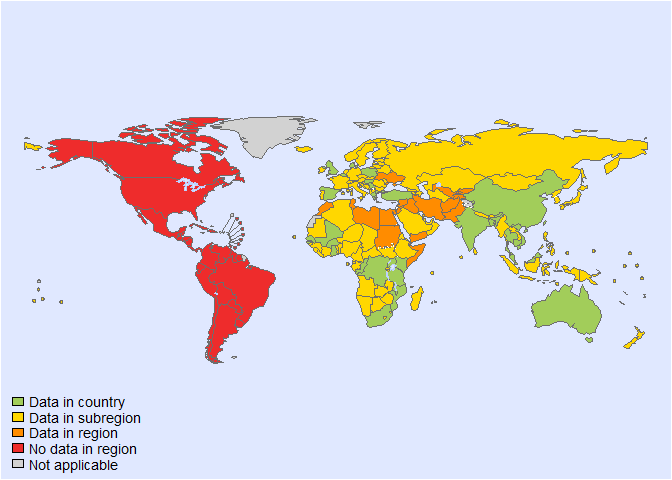
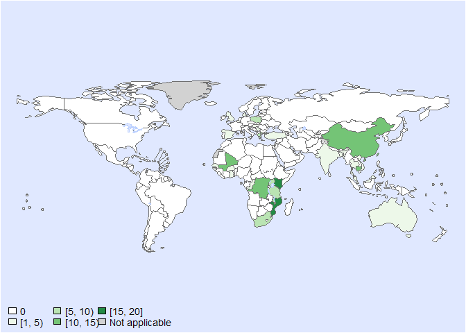
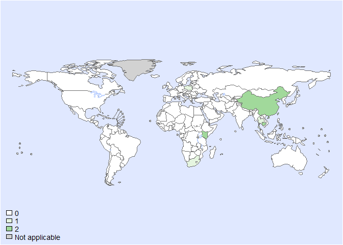
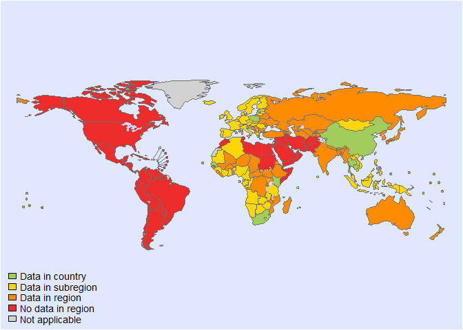
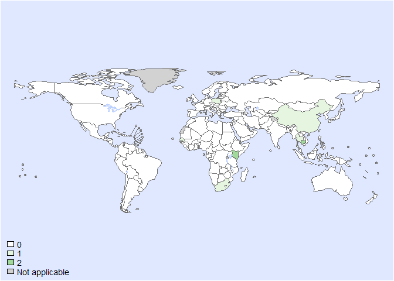
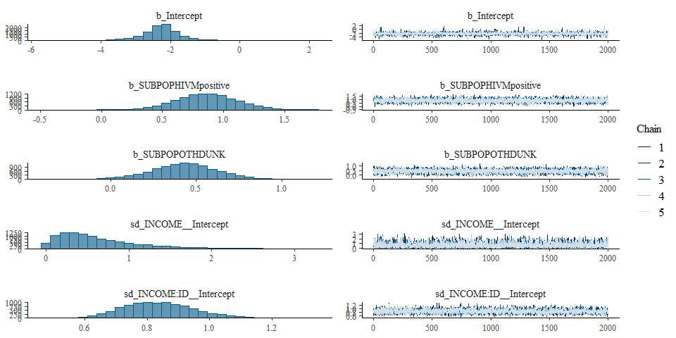
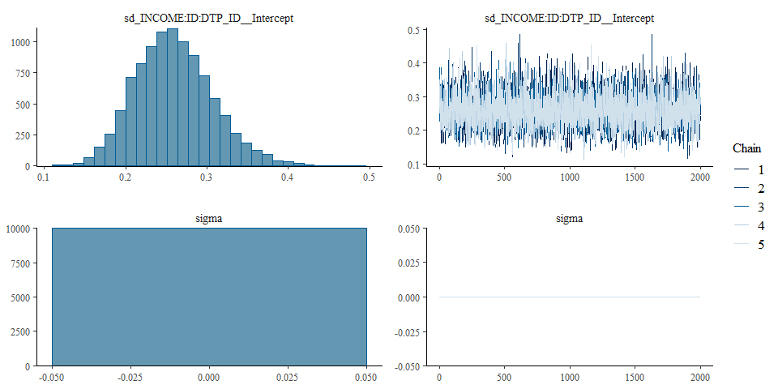

Global CFR of iNTS - Fit model- Version 5
================
fbbu6966
2025-02-21

- [Settings](#settings)
- [BRMS](#brms)
  - [BRMS model: Version 5](#brms-model-version-5)

# Settings

``` r
## required packages ----
library(bd)
library(brms)
library(ggplot2)
library(metafor)
library(readxl)
library(rmarkdown)
library(rms)
library(tidyr)
library(dplyr)
library(knitr)

## global options ----
knitr::opts_chunk$set(fig.width = 10)
Date <- format(Sys.Date(), "%Y%m%d")
source("01-data-CFR.R")
```

    ## 'data.frame':    5999 obs. of  40 variables:
    ##  $ SOURCE_ID           : num  10524956 10524956 10524956 10524956 10524956 ...
    ##  $ SOURCE_AUTHOR       : chr  "Sirinavin, S" "Sirinavin, S" "Sirinavin, S" "Sirinavin, S" ...
    ##  $ SOURCE_YEAR         : num  1999 1999 1999 1999 1999 ...
    ##  $ SOURCE_TITLE        : chr  "Clinical and prognostic categorization of extraintestinal nontyphoidal Salmonella infections in infants and children" "Clinical and prognostic categorization of extraintestinal nontyphoidal Salmonella infections in infants and children" "Clinical and prognostic categorization of extraintestinal nontyphoidal Salmonella infections in infants and children" "Clinical and prognostic categorization of extraintestinal nontyphoidal Salmonella infections in infants and children" ...
    ##  $ SOURCE_DOI          : chr  "10.1086/313469" "10.1086/313469" "10.1086/313469" "10.1086/313469" ...
    ##  $ SOURCE_URL          : chr  "https://pubmed.ncbi.nlm.nih.gov/10524956/" "https://pubmed.ncbi.nlm.nih.gov/10524956/" "https://pubmed.ncbi.nlm.nih.gov/10524956/" "https://pubmed.ncbi.nlm.nih.gov/10524956/" ...
    ##  $ OPT_ACCESS_DATE     : logi  NA NA NA NA NA NA ...
    ##  $ OPT_STUDY_TYPE      : chr  NA NA NA NA ...
    ##  $ OPT_OTHER_STUDY_TYPE: chr  NA NA NA NA ...
    ##  $ REF_NOTES           : chr  "Location: Bangkok" "Location: Bangkok" "Location: Bangkok" "Location: Bangkok" ...
    ##  $ REF_YEAR_START      : num  1978 1978 1978 1978 1978 ...
    ##  $ REF_YEAR_END        : num  1994 1994 1994 1994 1994 ...
    ##  $ REF_LOC_LEVEL       : chr  "Sub-national" "Sub-national" "Sub-national" "Sub-national" ...
    ##  $ REF_LOCATION        : chr  "Thailand" "Thailand" "Thailand" "Thailand" ...
    ##  $ REF_LOCATION_ISO3   : chr  "THA" "THA" "THA" "THA" ...
    ##  $ REF_SEX             : chr  "All sexes" "All sexes" "All sexes" "All sexes" ...
    ##  $ REF_AGE_START       : num  0 0 0 0 0 NA NA 0 0 0 ...
    ##  $ REF_AGE_END         : num  15 15 15 15 15 NA NA 14 125 14 ...
    ##  $ OPT_MEAN_AGE        : logi  NA NA NA NA NA NA ...
    ##  $ OPT_MEDIAN_AGE      : logi  NA NA NA NA NA NA ...
    ##  $ OPT_SUBPOP          : chr  "Age group: Children only (<=15y)" "Age group: Children only (<=15y)" "Age group: Children only (<=15y)" "Age group: Children only (<=15y)" ...
    ##  $ OPT_CASES           : chr  "Confirmed" "Confirmed" "Confirmed" "Confirmed" ...
    ##  $ OPT_DISEASE         : logi  NA NA NA NA NA NA ...
    ##  $ OPT_SEROTYPE        : chr  "overall" "salmonella_choleraesuis" "salmonella_typhimurium" "other_non_typhoidal_salmonella" ...
    ##  $ REF_SAMPLE_SIZE     : num  172 27 55 61 29 144 11 125 135 248 ...
    ##  $ VALUE_X             : num  17 1 7 8 1 2 3 27 18 59 ...
    ##  $ VALUE_MEAN          : logi  NA NA NA NA NA NA ...
    ##  $ VALUE_MEDIAN        : logi  NA NA NA NA NA NA ...
    ##  $ VALUE_DENOM         : logi  NA NA NA NA NA NA ...
    ##  $ VALUE_SE            : logi  NA NA NA NA NA NA ...
    ##  $ VALUE_P000          : logi  NA NA NA NA NA NA ...
    ##  $ VALUE_P2_5          : logi  NA NA NA NA NA NA ...
    ##  $ VALUE_P5            : logi  NA NA NA NA NA NA ...
    ##  $ VALUE_P10           : logi  NA NA NA NA NA NA ...
    ##  $ VALUE_P25           : logi  NA NA NA NA NA NA ...
    ##  $ VALUE_P75           : logi  NA NA NA NA NA NA ...
    ##  $ VALUE_P90           : logi  NA NA NA NA NA NA ...
    ##  $ VALUE_P95           : logi  NA NA NA NA NA NA ...
    ##  $ VALUE_P97_5         : logi  NA NA NA NA NA NA ...
    ##  $ VALUE_P100          : logi  NA NA NA NA NA NA ...

<!-- --><!-- -->

    ## Warning in RColorBrewer::brewer.pal(max_freq, "Greens"): minimal value for n is 3, returning requested palette with 3 different levels

<!-- --><!-- -->

    ## Warning in RColorBrewer::brewer.pal(max_freq, "Greens"): minimal value for n is 3, returning requested palette with 3 different levels

<!-- -->

    ## Warning: REML comparisons not meaningful for models with different fixed effects
    ## (use 'refit=TRUE' to refit both models based on ML estimation).

<!-- -->

``` r
DTP_ID<-seq(1:length(es$SOURCE_ID))
es$DTP_ID<-as.character(DTP_ID)
es$SUBPOP <- factor(es$SUBPOP)
es$FLAG<-factor(es$FLAG, 
                levels=c(0,1,2,3,4,5,6, 7),
                labels=c("Keep data", "Data part of non WHO member states", "No WHO REG2 given",
                         "Year before 1990", "yi can't be calcualted", "TF choice to remove", 
                         "Excluded by preliminary checks", "Excluded in data cleaning"))
saveRDS(es, paste0("es_CFR_", Date, ".rds"))
```

# BRMS

``` r
Parameters <- c("Number of iteration", "Warmup", "Delta value", "Maximum tree-depth","Random effect on each data point", "Stronger priors specified")
Values <- c("5000","3000","NA","NA","Yes", "Normal(0,1)")
version_spe <- data.frame(Parameters,Values)

kable(caption = "Parameters of the model tested",row.names = FALSE, version_spe)
```

| Parameters                       | Values         |
|:---------------------------------|:---------------|
| Number of iteration              | 5000           |
| Warmup                           | 3000           |
| Delta value                      | 0.99           |
| Maximum tree-depth               | NA             |
| Levels                           | Subpop, Income |
| Random effect on each data point | Yes            |
| Stronger priors specified        | Normal(0,1)    |

Parameters of the model tested

## BRMS model: Version 5

``` r
fit_brms_reg_CFR_s5 <-
  brm(yi | se(sei) ~
        1 + SUBPOP + 
        (1  | INCOME)+
        (1  | INCOME:ID)+
        (1  | INCOME:ID:DTP_ID),
      chains = 5, iter = 5000, warmup = 3000,
      cores = 5,
      prior = prior(normal(0,1), class = sd),
      data = subset(es, as.integer(FLAG) == 1),
      open_progress = FALSE,
      control=list(adapt_delta = 0.99),
      seed =7 )
```

    ## Compiling Stan program...

    ## Start sampling

``` r
## model summary

summary(fit_brms_reg_CFR_s5)
```

    ##  Family: gaussian 
    ##   Links: mu = identity; sigma = identity 
    ## Formula: yi | se(sei) ~ 1 + SUBPOP + (1 | INCOME) + (1 | INCOME:ID) + (1 | INCOME:ID:DTP_ID) 
    ##    Data: subset(es, as.integer(FLAG) == 1) (Number of observations: 174) 
    ##   Draws: 5 chains, each with iter = 5000; warmup = 3000; thin = 1;
    ##          total post-warmup draws = 10000
    ## 
    ## Multilevel Hyperparameters:
    ## ~INCOME (Number of levels: 2) 
    ##               Estimate Est.Error l-95% CI u-95% CI Rhat Bulk_ESS Tail_ESS
    ## sd(Intercept)     0.62      0.48     0.03     1.84 1.00     4212     4200
    ## 
    ## ~INCOME:ID (Number of levels: 62) 
    ##               Estimate Est.Error l-95% CI u-95% CI Rhat Bulk_ESS Tail_ESS
    ## sd(Intercept)     0.84      0.11     0.64     1.08 1.00     3038     5301
    ## 
    ## ~INCOME:ID:DTP_ID (Number of levels: 174) 
    ##               Estimate Est.Error l-95% CI u-95% CI Rhat Bulk_ESS Tail_ESS
    ## sd(Intercept)     0.26      0.05     0.17     0.36 1.00     3715     6115
    ## 
    ## Regression Coefficients:
    ##                    Estimate Est.Error l-95% CI u-95% CI Rhat Bulk_ESS Tail_ESS
    ## Intercept             -2.27      0.56    -3.48    -1.17 1.00     4670     5038
    ## SUBPOPHIVMpositive     0.87      0.25     0.39     1.36 1.00     6450     6586
    ## SUBPOPOTHDUNK          0.43      0.19     0.05     0.79 1.00     5913     6811
    ## 
    ## Further Distributional Parameters:
    ##       Estimate Est.Error l-95% CI u-95% CI Rhat Bulk_ESS Tail_ESS
    ## sigma     0.00      0.00     0.00     0.00   NA       NA       NA
    ## 
    ## Draws were sampled using sampling(NUTS). For each parameter, Bulk_ESS
    ## and Tail_ESS are effective sample size measures, and Rhat is the potential
    ## scale reduction factor on split chains (at convergence, Rhat = 1).

``` r
plot(fit_brms_reg_CFR_s5, ask = FALSE)
```

<!-- --><!-- -->

``` r
# plot(conditional_effects(fit_brms_reg_CFR_s5), points = TRUE)


## show model code
stancode(fit_brms_reg_CFR_s5)
```

    ## // generated with brms 2.21.0
    ## functions {
    ## }
    ## data {
    ##   int<lower=1> N;  // total number of observations
    ##   vector[N] Y;  // response variable
    ##   vector<lower=0>[N] se;  // known sampling error
    ##   int<lower=1> K;  // number of population-level effects
    ##   matrix[N, K] X;  // population-level design matrix
    ##   int<lower=1> Kc;  // number of population-level effects after centering
    ##   // data for group-level effects of ID 1
    ##   int<lower=1> N_1;  // number of grouping levels
    ##   int<lower=1> M_1;  // number of coefficients per level
    ##   array[N] int<lower=1> J_1;  // grouping indicator per observation
    ##   // group-level predictor values
    ##   vector[N] Z_1_1;
    ##   // data for group-level effects of ID 2
    ##   int<lower=1> N_2;  // number of grouping levels
    ##   int<lower=1> M_2;  // number of coefficients per level
    ##   array[N] int<lower=1> J_2;  // grouping indicator per observation
    ##   // group-level predictor values
    ##   vector[N] Z_2_1;
    ##   // data for group-level effects of ID 3
    ##   int<lower=1> N_3;  // number of grouping levels
    ##   int<lower=1> M_3;  // number of coefficients per level
    ##   array[N] int<lower=1> J_3;  // grouping indicator per observation
    ##   // group-level predictor values
    ##   vector[N] Z_3_1;
    ##   int prior_only;  // should the likelihood be ignored?
    ## }
    ## transformed data {
    ##   vector<lower=0>[N] se2 = square(se);
    ##   matrix[N, Kc] Xc;  // centered version of X without an intercept
    ##   vector[Kc] means_X;  // column means of X before centering
    ##   for (i in 2:K) {
    ##     means_X[i - 1] = mean(X[, i]);
    ##     Xc[, i - 1] = X[, i] - means_X[i - 1];
    ##   }
    ## }
    ## parameters {
    ##   vector[Kc] b;  // regression coefficients
    ##   real Intercept;  // temporary intercept for centered predictors
    ##   vector<lower=0>[M_1] sd_1;  // group-level standard deviations
    ##   array[M_1] vector[N_1] z_1;  // standardized group-level effects
    ##   vector<lower=0>[M_2] sd_2;  // group-level standard deviations
    ##   array[M_2] vector[N_2] z_2;  // standardized group-level effects
    ##   vector<lower=0>[M_3] sd_3;  // group-level standard deviations
    ##   array[M_3] vector[N_3] z_3;  // standardized group-level effects
    ## }
    ## transformed parameters {
    ##   real sigma = 0;  // dispersion parameter
    ##   vector[N_1] r_1_1;  // actual group-level effects
    ##   vector[N_2] r_2_1;  // actual group-level effects
    ##   vector[N_3] r_3_1;  // actual group-level effects
    ##   real lprior = 0;  // prior contributions to the log posterior
    ##   r_1_1 = (sd_1[1] * (z_1[1]));
    ##   r_2_1 = (sd_2[1] * (z_2[1]));
    ##   r_3_1 = (sd_3[1] * (z_3[1]));
    ##   lprior += student_t_lpdf(Intercept | 3, -1.8, 2.5);
    ##   lprior += normal_lpdf(sd_1 | 0, 1)
    ##     - 1 * normal_lccdf(0 | 0, 1);
    ##   lprior += normal_lpdf(sd_2 | 0, 1)
    ##     - 1 * normal_lccdf(0 | 0, 1);
    ##   lprior += normal_lpdf(sd_3 | 0, 1)
    ##     - 1 * normal_lccdf(0 | 0, 1);
    ## }
    ## model {
    ##   // likelihood including constants
    ##   if (!prior_only) {
    ##     // initialize linear predictor term
    ##     vector[N] mu = rep_vector(0.0, N);
    ##     mu += Intercept + Xc * b;
    ##     for (n in 1:N) {
    ##       // add more terms to the linear predictor
    ##       mu[n] += r_1_1[J_1[n]] * Z_1_1[n] + r_2_1[J_2[n]] * Z_2_1[n] + r_3_1[J_3[n]] * Z_3_1[n];
    ##     }
    ##     target += normal_lpdf(Y | mu, se);
    ##   }
    ##   // priors including constants
    ##   target += lprior;
    ##   target += std_normal_lpdf(z_1[1]);
    ##   target += std_normal_lpdf(z_2[1]);
    ##   target += std_normal_lpdf(z_3[1]);
    ## }
    ## generated quantities {
    ##   // actual population-level intercept
    ##   real b_Intercept = Intercept - dot_product(means_X, b);
    ## }

``` r
## save model fit
saveRDS(fit_brms_reg_CFR_s5, file = "fit_brms_reg_CFR_s5.rds")

##rmarkdown::render("02-fit.R")
```
