Global incidence of invasive Non-typhoidal Salmonella - Estimate
incidence with the 7th model
================
fbbu6966
2025-12-04

- [Settings](#settings)
- [Parameters](#parameters)
- [Model fit](#model-fit)
- [Predict all](#predict-all)
- [Summarize predictions](#summarize-predictions)
  - [Global](#global)
  - [Regions](#regions)
  - [Subregions](#subregions)
  - [Countries](#countries)
- [Session info](#session-info)

# Settings

``` r
## required packages ----
library(bd)
library(brms)
```

    ## Loading required package: Rcpp

    ## Loading 'brms' package (version 2.22.0). Useful instructions
    ## can be found by typing help('brms'). A more detailed introduction
    ## to the package is available through vignette('brms_overview').

    ## 
    ## Attaching package: 'brms'

    ## The following object is masked from 'package:stats':
    ## 
    ##     ar

``` r
library(FERG2)
```

    ## 
    ## Attaching package: 'FERG2'

    ## The following object is masked from 'package:bd':
    ## 
    ##     mean_ci

``` r
library(ggplot2)
library(knitr)
library(rmarkdown)
library(sf)
```

    ## Linking to GEOS 3.13.1, GDAL 3.10.2, PROJ 9.5.1; sf_use_s2() is TRUE

``` r
library(tidyr)
library(dplyr)
```

    ## 
    ## Attaching package: 'dplyr'

    ## The following object is masked from 'package:bd':
    ## 
    ##     collapse

    ## The following objects are masked from 'package:stats':
    ## 
    ##     filter, lag

    ## The following objects are masked from 'package:base':
    ## 
    ##     intersect, setdiff, setequal, union

``` r
library(DescTools)
library(readxl)
library(kableExtra)
```

    ## 
    ## Attaching package: 'kableExtra'

    ## The following object is masked from 'package:dplyr':
    ## 
    ##     group_rows

``` r
# Model with random effect on each data point and stronger priors (normal(0,1))

## global options ----
knitr::opts_chunk$set(fig.width = 10)
Date <- format(Sys.Date(), "%Y%m%d")
```

# Parameters

| Parameters                       | Values                             |
|:---------------------------------|:-----------------------------------|
| Number of iteration              | 5000                               |
| Warmup                           | 3000                               |
| Delta value                      | 0.9                                |
| Maximum tree-depth               | 15                                 |
| Levels                           | All + fixed effect on age category |
| Random effect on each data point | No                                 |
| Stronger priors specified        | Normal(0,1)                        |

Parameters of the model tested

# Model fit

``` r
fit_brms_reg_s <- readRDS("./fit_brms_reg_s7.rds")
zero_cases<- read_xlsx("//sciensano.be/fs/11401_LifeChron_FERG_DWH/Estimates/00_ADMIN/Endemic_countries.xlsx")%>%
  select(REG2, SUB2, ISO3, Country, edtf_iNTS) %>%
  rename(COUNTRY=ISO3, COUNTRY_LABEL = Country, DISEASEFREE = edtf_iNTS)

# es_files <- list.files(pattern="^es_\\d{8}\\.rds$", full.names=TRUE, ignore.case = TRUE)
# es_dates <- as.Date(sub("^es_(\\d{8})\\.rds$", "\\1", basename(es_files), ignore.case = TRUE), format = "%Y%m%d")
# es_latest <- es_files[which.max(es_dates)]
# es<- readRDS(es_latest)
es <- readRDS("./esv7_20251129.rds")
es <- subset(es, as.integer(FLAG) == 1)

country_with_data <- es %>% select(ISO3) %>% distinct() %>% mutate(DATA=1, COUNTRY = ISO3)
Sub2_with_data <- es %>% select(SUB2) %>% distinct() %>% mutate(DATASUB2=1)
Reg2_with_data <- es %>% select(REG2) %>% distinct() %>% mutate(DATAREG2=1)
zero_cases <- left_join(zero_cases, country_with_data)
```

    ## Joining with `by = join_by(COUNTRY)`

``` r
zero_cases <- left_join(zero_cases, Sub2_with_data)
```

    ## Joining with `by = join_by(SUB2)`

``` r
zero_cases <- left_join(zero_cases, Reg2_with_data) %>%
  select(-c(ISO3)) %>%
  mutate(ESTIMATES = case_when(
    DATA == 1 ~ 1,
    DISEASEFREE == 0 ~ 2,
    is.na(DATA) & DISEASEFREE == 1 & DATASUB2 == 1 ~ 3,
    is.na(DATA) & DISEASEFREE == 1 & is.na(DATASUB2) & DATAREG2 == 1 ~ 4, 
    is.na(DATA) & DISEASEFREE == 1  & is.na(DATASUB2) & is.na(DATAREG2) ~5))
```

    ## Joining with `by = join_by(REG2)`

``` r
zero_cases$ESTIMATES <- factor(zero_cases$ESTIMATES, 
                               level = c(1,2,3,4,5),
                               labels = c("Data present", "Disease free", "Data in subregion", "Data in region", "Data in world"))
Country_Check <- zero_cases %>% filter(as.integer(ESTIMATES) == 2)
```

# Predict all

``` r
## set up dataframe
sim_all <-
  data.frame(
    sei = 0,
    REG2 = FERG2:::countries$REG2,
    SUB2 = FERG2:::countries$SUB2,
    COUNTRY = FERG2:::countries$ISO3,
    YEAR = rep(2000:2021, each = nrow(FERG2:::countries)))

sim_all <- sim_all %>% left_join(zero_cases) %>% select(sei, REG2, SUB2, COUNTRY, YEAR, ESTIMATES)
```

    ## Joining with `by = join_by(REG2, SUB2, COUNTRY)`

``` r
## draw from expected value of posterior predictive dist
set.seed(10)
# fit_all <- 
#   posterior_epred(
#     object = fit_brms_reg_s,
#     newdata = sim_all,
#     allow_new_levels = TRUE,
#     sample_new_levels = "old_levels",
#     re_formula = ~ 1 + YEAR +
#       (1 | REG2) +
#       (1 | REG2:SUB2) +
#       (1 | REG2:SUB2:COUNTRY)
#   )

draws_fit <- as_draws_df(fit_brms_reg_s)
fit_all <- data.frame(1:10000)

for (x in 1:nrow(sim_all)){
  
  if (as.integer(sim_all[x, "ESTIMATES"]) == 1){
    # Data present for country
    fit_all[[paste0("V",x)]] <- draws_fit$b_Intercept +                                                                               # Global intercept
      sim_all[x, "YEAR"] * draws_fit$b_YEAR +                                                                                         # Year component
      draws_fit[[paste0("r_REG2[",sim_all[x,"REG2"],",Intercept]")]] +                                                                # Regional component
      draws_fit[[paste0("r_REG2:SUB2[",sim_all[x,"REG2"],"_",sim_all[x,"SUB2"],",Intercept]")]] +                                     # Sub regional component
      draws_fit[[paste0("r_REG2:SUB2:COUNTRY[",sim_all[x,"REG2"],"_",sim_all[x,"SUB2"],"_",sim_all[x,"COUNTRY"],",Intercept]")]]      # Country component
  
  } else if (as.integer(sim_all[x, "ESTIMATES"]) == 2) {
    # Disease-free country
    fit_all[[paste0("V",x)]] <- 0
    
  } else if (as.integer(sim_all[x, "ESTIMATES"]) == 3){
    # Data not present for country, but present in subregion
    fit_all[[paste0("V",x)]] <- draws_fit$b_Intercept +                                                                               # Global intercept
      sim_all[x, "YEAR"] * draws_fit$b_YEAR +                                                                                         # Year component
      draws_fit[[paste0("r_REG2[",sim_all[x,"REG2"],",Intercept]")]] +                                                                # Regional component
      draws_fit[[paste0("r_REG2:SUB2[",sim_all[x,"REG2"],"_",sim_all[x,"SUB2"],",Intercept]")]]                                       # Sub regional component
    
  } else if (as.integer(sim_all[x, "ESTIMATES"]) == 4){
    # Data not present for country, but present in region
    fit_all[[paste0("V",x)]] <- draws_fit$b_Intercept +                                                                               # Global intercept
      sim_all[x, "YEAR"] * draws_fit$b_YEAR +                                                                                         # Year component
      draws_fit[[paste0("r_REG2[",sim_all[x,"REG2"],",Intercept]")]]                                                                  # Regional component

  } else if (as.integer(sim_all[x, "ESTIMATES"]) == 5){
    # Data not present for country
    fit_all[[paste0("V",x)]] <- draws_fit$b_Intercept + 
      sim_all[x, "YEAR"] * draws_fit$b_YEAR
  } 
}

fit_all <- fit_all %>% select(-c(X1.10000))

## calculate cases
sim_all$SIM <- t(fit_all)
pop_all <- aggregate(POP ~ ISO3 + YEAR, FERG2:::pop, sum)
sim_all <- merge(sim_all, pop_all,
                 by.x = c("COUNTRY", "YEAR"), by.y = c("ISO3", "YEAR"))
sim_all <- sim_all %>% left_join(zero_cases)
```

    ## Joining with `by = join_by(COUNTRY, REG2, SUB2, ESTIMATES)`

``` r
sim_all$CASES <- exp(sim_all$SIM) * sim_all$POP / 1e5
sim_all$CASES <- sim_all$CASES * sim_all$DISEASEFREE
sim_all$SIM <- sim_all$SIM * sim_all$DISEASEFREE
sim_all$sei <- sim_all$sei * sim_all$DISEASEFREE

## File with age distribution by age, country and year
age_distr <- read_excel("../PAF/AGE_20250303.xlsx") # note: idem as 20250411
cases <- sim_all[, c("COUNTRY", "YEAR", "REG2", "SUB2", "DISEASEFREE", "CASES")]
str(age_distr)
```

    ## tibble [106,700 × 4] (S3: tbl_df/tbl/data.frame)
    ##  $ ISO3: chr [1:106700] "AFG" "AFG" "AFG" "AFG" ...
    ##  $ YEAR: num [1:106700] 2000 2000 2000 2000 2000 2000 2000 2000 2000 2000 ...
    ##  $ AGE : chr [1:106700] "0-6 days" "1-5 months" "10-14 years" "12-23 months" ...
    ##  $ PROP: num [1:106700] 0 0.0291 0.1291 0.0648 0.0783 ...

``` r
rm(sim_all)

# # New code LV 291125 as merging is too large (not working yet): 
# # Multiply cases with age distribution to get cases by age distribution
# # Convert the matrix into a data frame and rename its columns
# cases_df <- as.data.frame(cases$CASES)
# colnames(cases_df) <- paste0("CASES_", seq_len(ncol(cases_df)))
# 
# # Combine the original variables (except the matrix) with the expanded matrix columns
# cases_df <- cbind(cases[ , setdiff(names(cases), "CASES")], cases_df)
# 
# # Package data table
# library(data.table)
# setDT(age_distr)
# setDT(cases_df)
# 
# # Merge both
# cases_age <- cases_df[age_distr,
#                    on = .(COUNTRY = ISO3, YEAR = YEAR)]
# str(cases_age)
# cases_age[c(1:5), c("COUNTRY", "YEAR", "CASES_1", "CASES_2", "CASES_3", "AGE", "PROP")]
# 
# # Create mat_age_* columns: test 1
# chunk_size <- 500  # choose based on available RAM: 17u05
# cols <- grep("^CASES_", names(cases_age), value = TRUE)
# 
# for (i in seq(1, length(cols), by = chunk_size)) {
#   block <- cols[i:min(i + chunk_size - 1, length(cols))]
#   
#   cases_age[, paste0("CASES_AGE_", sub("^CASES_", "", block)) :=
#               lapply(.SD, function(x) x * PROP),
#             .SDcols = block]
# }
# 
# # test 2
# mat_cases_age <- as.matrix(cases_age[, .SD, .SDcols = patterns("^CASES_")]) # 17u08
# mat <- mat * cases_age$PROP
# 
# # test 3
# cases_age[, paste0("CASES_AGE_", 1:10000) := lapply(.SD, function(x) x * PROP),.SDcols = patterns("^CASES_")]
# cases_age[c(1:5), c("COUNTRY", "YEAR", "CASES_1", "CASES_2", "CASES_3", "AGE", "PROP", "CASES_AGE_1", "CASES_AGE_2", "CASES_AGE_3")]
# 
# 
# #original code that gives error
# cases2 <- cases[c(1),]
# cases_age <- merge(age_distr, cases2, by.x=c("ISO3", "YEAR"), by.y=c("COUNTRY","YEAR"), all.x=TRUE)
# cases_age$CASES_AGE <- cases_age$CASES * cases_age$PROP
# rm(age_distr)

# Multiply cases with age distribution to get cases by age distribution
cases_age <- merge(age_distr, cases, by.x=c("ISO3", "YEAR"), by.y=c("COUNTRY","YEAR"), all.x=TRUE)
cases_age$CASES_AGE <- cases_age$CASES * cases_age$PROP
rm(age_distr)
rm(cases) #>BD
cases_age$CASES <- NULL #>BD

## File with PAF by age, country and year
PAF <- read_excel("../PAF/PAF_20250304.xlsx")
table(PAF$AGE)
```

    ## 
    ##     0-6 days   1-5 months  10-14 years 12-23 months  15-19 years    2-4 years  20-24 years  25-29 years  30-34 years 
    ##         4268         4268         4268         4268         4268         4268         4268         4268         4268 
    ##  35-39 years  40-44 years  45-49 years    5-9 years  50-54 years  55-59 years  6-11 months  60-64 years  65-69 years 
    ##         4268         4268         4268         4268         4268         4268         4268         4268         4268 
    ##    7-27 days  70-74 years  75-79 years  80-84 years  85-89 years  90-94 years    95+ years 
    ##         4268         4268         4268         4268         4268         4268         4268

``` r
# Multiply with PAF to get adjusted cases
cases_age_paf <- merge(cases_age, PAF, by = c("ISO3", "YEAR", "AGE"))
rm(cases_age) #>BD
# cases_age <- sort_by(cases_age, ~ISO3+YEAR+AGE)
# PAF <- sort_by(PAF, ~cases_age_paf)
cases_age_paf$CASES_AGE_PAF <- cases_age_paf$CASES_AGE * (1 - cases_age_paf$PAF)
cases_age_paf$CASES_AGE <- NULL #>BD
cases_age_paf <- cases_age_paf[,c("ISO3", "YEAR", "REG2", "SUB2", "DISEASEFREE", "AGE", "CASES_AGE_PAF")]
cases_age_paf$AGE_CAT <-
  if_else(cases_age_paf$AGE %in%
            c("0-6 days", "7-27 days", "1-5 months", "6-11 months", "12-23 months", "2-4 years"),
          "BELOW 5", "ABOVE 5")
str(cases_age_paf)
```

    ## 'data.frame':    106700 obs. of  8 variables:
    ##  $ ISO3         : chr  "AFG" "AFG" "AFG" "AFG" ...
    ##  $ YEAR         : num  2000 2000 2000 2000 2000 2000 2000 2000 2000 2000 ...
    ##  $ REG2         : chr  "EMR" "EMR" "EMR" "EMR" ...
    ##  $ SUB2         : chr  "EMRD" "EMRD" "EMRD" "EMRD" ...
    ##  $ DISEASEFREE  : num  1 1 1 1 1 1 1 1 1 1 ...
    ##  $ AGE          : chr  "0-6 days" "1-5 months" "10-14 years" "12-23 months" ...
    ##  $ CASES_AGE_PAF: num [1:106700, 1:10000] 0 4354 19342 9700 11728 ...
    ##   ..- attr(*, "dimnames")=List of 2
    ##   .. ..$ : chr [1:106700] "V1" "V1" "V1" "V1" ...
    ##   .. ..$ : NULL
    ##  $ AGE_CAT      : chr  "BELOW 5" "BELOW 5" "ABOVE 5" "BELOW 5" ...

``` r
cases_age_paf_cat <-
  with(cases_age_paf, aggregate(CASES_AGE_PAF ~ YEAR + ISO3 + AGE_CAT, FUN = sum))
str(cases_age_paf_cat) # ~15min
```

    ## 'data.frame':    8536 obs. of  10003 variables:
    ##  $ YEAR   : num  2000 2001 2002 2003 2004 ...
    ##  $ ISO3   : chr  "AFG" "AFG" "AFG" "AFG" ...
    ##  $ AGE_CAT: chr  "ABOVE 5" "ABOVE 5" "ABOVE 5" "ABOVE 5" ...
    ##  $ V1     : num  103308 91187 83597 80157 74604 ...
    ##  $ V2     : num  3973 3508 3218 3086 2874 ...
    ##  $ V3     : num  683992 604268 554460 532111 495682 ...
    ##  $ V4     : num  26657 23514 21542 20642 19200 ...
    ##  $ V5     : num  3605 3191 2934 2822 2634 ...
    ##  $ V6     : num  9569 8470 7786 7487 6988 ...
    ##  $ V7     : num  9249 8169 7494 7191 6697 ...
    ##  $ V8     : num  11768 10402 9549 9168 8545 ...
    ##  $ V9     : num  38077 33685 30952 29745 27748 ...
    ##  $ V10    : num  907 802 737 708 661 ...
    ##  $ V11    : num  15155 13373 12256 11748 10931 ...
    ##  $ V12    : num  2240 1967 1793 1710 1583 ...
    ##  $ V13    : num  3962 3516 3241 3125 2925 ...
    ##  $ V14    : num  11344 10042 9233 8879 8288 ...
    ##  $ V15    : num  8592 7542 6876 6556 6068 ...
    ##  $ V16    : num  2303 2043 1883 1815 1698 ...
    ##  $ V17    : num  6272 5545 5092 4890 4558 ...
    ##  $ V18    : num  6227 5486 5020 4805 4464 ...
    ##  $ V19    : num  18353 16172 14801 14168 13164 ...
    ##  $ V20    : num  3452 3044 2789 2672 2485 ...
    ##  $ V21    : num  9026 7984 7335 7049 6574 ...
    ##  $ V22    : num  1976 1751 1611 1551 1449 ...
    ##  $ V23    : num  4477 3942 3604 3447 3200 ...
    ##  $ V24    : num  11325 10018 9205 8846 8252 ...
    ##  $ V25    : num  5589 4918 4495 4297 3988 ...
    ##  $ V26    : num  4575 4046 3716 3570 3329 ...
    ##  $ V27    : num  8898 7889 7264 6996 6540 ...
    ##  $ V28    : num  50843 44884 41155 39467 36738 ...
    ##  $ V29    : num  36040 31952 29422 28336 26490 ...
    ##  $ V30    : num  955 843 772 740 688 ...
    ##  $ V31    : num  32302 28619 26336 25347 23680 ...
    ##  $ V32    : num  4295 3790 3473 3330 3098 ...
    ##  $ V33    : num  1381 1221 1120 1076 1002 ...
    ##  $ V34    : num  42259 37416 34407 33093 30895 ...
    ##  $ V35    : num  4368 3851 3527 3379 3142 ...
    ##  $ V36    : num  5282 4676 4299 4134 3859 ...
    ##  $ V37    : num  263996 232868 213347 204434 190146 ...
    ##  $ V38    : num  631 559 514 494 461 ...
    ##  $ V39    : num  39837 35116 32150 30786 28615 ...
    ##  $ V40    : num  12821 11340 10417 10009 9334 ...
    ##  $ V41    : num  30300 26762 24550 23555 21937 ...
    ##  $ V42    : num  8093 7155 6571 6311 5883 ...
    ##  $ V43    : num  967 853 782 750 699 ...
    ##  $ V44    : num  10942 9641 8822 8443 7844 ...
    ##  $ V45    : num  848 750 690 663 619 ...
    ##  $ V46    : num  2493 2196 2009 1923 1786 ...
    ##  $ V47    : num  3826 3388 3117 2999 2800 ...
    ##  $ V48    : num  714 631 578 555 517 ...
    ##  $ V49    : num  9124 8061 7396 7098 6612 ...
    ##  $ V50    : num  3774 3347 3082 2969 2776 ...
    ##  $ V51    : num  11034 9748 8944 8583 7996 ...
    ##  $ V52    : num  3316 2924 2678 2566 2386 ...
    ##  $ V53    : num  9028 7984 7334 7045 6570 ...
    ##  $ V54    : num  536 473 434 416 387 ...
    ##  $ V55    : num  618 547 503 483 450 ...
    ##  $ V56    : num  3980 3507 3210 3073 2855 ...
    ##  $ V57    : num  3305 2923 2685 2580 2405 ...
    ##  $ V58    : num  22973 20303 18636 17892 16673 ...
    ##  $ V59    : num  766 676 620 595 554 ...
    ##  $ V60    : num  13521 11958 10985 10554 9842 ...
    ##  $ V61    : num  3082 2731 2512 2418 2258 ...
    ##  $ V62    : num  29397 25977 23841 22885 21324 ...
    ##  $ V63    : num  5294 4667 4273 4092 3804 ...
    ##  $ V64    : num  5132 4528 4150 3978 3702 ...
    ##  $ V65    : num  13483 11921 10948 10516 9804 ...
    ##  $ V66    : num  3589 3164 2898 2776 2580 ...
    ##  $ V67    : num  19727 17396 15933 15263 14193 ...
    ##  $ V68    : num  13394 11845 10880 10452 9746 ...
    ##  $ V69    : num  5853 5163 4730 4532 4216 ...
    ##  $ V70    : num  5125 4527 4154 3987 3714 ...
    ##  $ V71    : num  10493 9263 8494 8146 7582 ...
    ##  $ V72    : num  7654 6766 6212 5965 5560 ...
    ##  $ V73    : num  3069 2712 2490 2390 2227 ...
    ##  $ V74    : num  3170 2798 2566 2460 2290 ...
    ##  $ V75    : num  2693 2381 2186 2100 1957 ...
    ##  $ V76    : num  2535 2235 2046 1959 1821 ...
    ##  $ V77    : num  26928 23824 21893 21041 19630 ...
    ##  $ V78    : num  6575 5805 5323 5106 4753 ...
    ##  $ V79    : num  4062 3588 3291 3157 2940 ...
    ##  $ V80    : num  7929 7027 6468 6227 5819 ...
    ##  $ V81    : num  3570 3146 2880 2757 2562 ...
    ##  $ V82    : num  20691 18230 16682 15967 14834 ...
    ##  $ V83    : num  911 808 743 716 669 ...
    ##  $ V84    : num  2833 2500 2291 2195 2043 ...
    ##  $ V85    : num  15811 13976 12831 12321 11483 ...
    ##  $ V86    : num  999 882 808 775 721 ...
    ##  $ V87    : num  248 219 201 192 179 ...
    ##  $ V88    : num  22949 20354 18749 18064 16894 ...
    ##  $ V89    : num  2895 2557 2346 2251 2097 ...
    ##  $ V90    : num  3208 2842 2615 2516 2350 ...
    ##  $ V91    : num  5819 5137 4710 4517 4205 ...
    ##  $ V92    : num  2643 2332 2137 2049 1906 ...
    ##  $ V93    : num  4558 4037 3713 3572 3336 ...
    ##  $ V94    : num  7155 6307 5774 5529 5138 ...
    ##  $ V95    : num  42927 37909 34771 33357 31061 ...
    ##  $ V96    : num  734 649 596 573 534 ...
    ##   [list output truncated]

``` r
sim_all <- cases_age_paf_cat[, c(1:3)]
sim_all$CASES <- as.matrix(cases_age_paf_cat[,c(4:10003)])
str(sim_all)
```

    ## 'data.frame':    8536 obs. of  4 variables:
    ##  $ YEAR   : num  2000 2001 2002 2003 2004 ...
    ##  $ ISO3   : chr  "AFG" "AFG" "AFG" "AFG" ...
    ##  $ AGE_CAT: chr  "ABOVE 5" "ABOVE 5" "ABOVE 5" "ABOVE 5" ...
    ##  $ CASES  : num [1:8536, 1:10000] 103308 91187 83597 80157 74604 ...
    ##   ..- attr(*, "dimnames")=List of 2
    ##   .. ..$ : NULL
    ##   .. ..$ : chr [1:10000] "V1" "V2" "V3" "V4" ...

``` r
# check
mean(subset(sim_all, YEAR == 2000 & ISO3 == "AFG" & AGE_CAT == "BELOW 5")$CASES)
```

    ## [1] 5334.204

``` r
mean(colSums((subset(cases_age_paf, YEAR == 2000 & ISO3 == "AFG" & AGE_CAT == "BELOW 5")$CASES_AGE_PAF)))
```

    ## [1] 5334.204

``` r
rm(cases, cases_age, PAF, cases_age_paf_cat)
```

    ## Warning in rm(cases, cases_age, PAF, cases_age_paf_cat): object 'cases' not found

    ## Warning in rm(cases, cases_age, PAF, cases_age_paf_cat): object 'cases_age' not found

``` r
sim_all <- merge(sim_all, zero_cases, by.x=c("ISO3"), by.y=c("COUNTRY"), all.x=TRUE)
# pop <- FERG2:::pop %>% mutate(AGE_CAT = case_when(AGE<=5 ~ "BELOW 5", 
#                                                   AGE>5 ~ "ABOVE 5"))
# bug fix 2/5/25
pop <- FERG2:::pop %>% mutate(AGE_CAT = case_when(AGE  < 5 ~ "BELOW 5", 
                                                  AGE >= 5 ~ "ABOVE 5"))
pop_all <- aggregate(POP ~ ISO3 + YEAR + AGE_CAT, pop, sum)
sim_all <- merge(sim_all, pop_all,
                 by.x = c("ISO3", "YEAR", "AGE_CAT"), by.y = c("ISO3", "YEAR", "AGE_CAT"))
sim_all$COUNTRY <- sim_all$ISO3
str(sim_all)
```

    ## 'data.frame':    8536 obs. of  14 variables:
    ##  $ ISO3         : chr  "AFG" "AFG" "AFG" "AFG" ...
    ##  $ YEAR         : num  2000 2000 2001 2001 2002 ...
    ##  $ AGE_CAT      : chr  "ABOVE 5" "BELOW 5" "ABOVE 5" "BELOW 5" ...
    ##  $ CASES        : num [1:8536, 1:10000] 103308 46396 91187 39212 83597 ...
    ##   ..- attr(*, "dimnames")=List of 2
    ##   .. ..$ : NULL
    ##   .. ..$ : chr [1:10000] "V1" "V2" "V3" "V4" ...
    ##  $ REG2         : chr  "EMR" "EMR" "EMR" "EMR" ...
    ##  $ SUB2         : chr  "EMRD" "EMRD" "EMRD" "EMRD" ...
    ##  $ COUNTRY_LABEL: chr  "Afghanistan" "Afghanistan" "Afghanistan" "Afghanistan" ...
    ##  $ DISEASEFREE  : num  1 1 1 1 1 1 1 1 1 1 ...
    ##  $ DATA         : num  NA NA NA NA NA NA NA NA NA NA ...
    ##  $ DATASUB2     : num  1 1 1 1 1 1 1 1 1 1 ...
    ##  $ DATAREG2     : num  1 1 1 1 1 1 1 1 1 1 ...
    ##  $ ESTIMATES    : Factor w/ 5 levels "Data present",..: 3 3 3 3 3 3 3 3 3 3 ...
    ##  $ POP          : num  16011992 4239966 15846122 4162574 16317634 ...
    ##  $ COUNTRY      : chr  "AFG" "AFG" "AFG" "AFG" ...

``` r
## aggregate global
sim_all_glb <- with(sim_all, aggregate(CASES ~ YEAR + AGE_CAT, FUN = sum))
all_glb_id <- sim_all_glb[c(1,2)]
all_glb_nr <-
  t(apply(sim_all_glb[, grepl("V", names(sim_all_glb))], 1, mean_ci))
all_glb_nr <- data.frame(all_glb_nr)
names(all_glb_nr) <- c("VAL_MEAN", "VAL_LWR", "VAL_UPR")
all_glb_nr <- cbind(all_glb_id, all_glb_nr)
all_glb_nr$LOCATION <- "Global"
all_glb_nr$LOCATION_NAME <- "Global"
all_glb_nr$METRIC <- "Number"
str(all_glb_nr)
```

    ## 'data.frame':    44 obs. of  8 variables:
    ##  $ YEAR         : num  2000 2001 2002 2003 2004 ...
    ##  $ AGE_CAT      : chr  "ABOVE 5" "ABOVE 5" "ABOVE 5" "ABOVE 5" ...
    ##  $ VAL_MEAN     : num  2325742 2094871 1886446 1698203 1528171 ...
    ##  $ VAL_LWR      : num  847699 765678 690099 623983 564004 ...
    ##  $ VAL_UPR      : num  5961380 5349526 4799146 4319105 3888901 ...
    ##  $ LOCATION     : chr  "Global" "Global" "Global" "Global" ...
    ##  $ LOCATION_NAME: chr  "Global" "Global" "Global" "Global" ...
    ##  $ METRIC       : chr  "Number" "Number" "Number" "Number" ...

``` r
all_glb_rt <- all_glb_nr
all_glb_rt$POP <- with(sim_all, aggregate(POP ~  YEAR + AGE_CAT, FUN = sum))$POP
all_glb_rt$VAL_MEAN <- 1e5 * all_glb_rt$VAL_MEAN / all_glb_rt$POP
all_glb_rt$VAL_LWR <- 1e5 * all_glb_rt$VAL_LWR / all_glb_rt$POP
all_glb_rt$VAL_UPR <- 1e5 * all_glb_rt$VAL_UPR / all_glb_rt$POP
all_glb_rt$METRIC <- "Rate"
all_glb_rt$POP <- NULL
str(all_glb_rt)
```

    ## 'data.frame':    44 obs. of  8 variables:
    ##  $ YEAR         : num  2000 2001 2002 2003 2004 ...
    ##  $ AGE_CAT      : chr  "ABOVE 5" "ABOVE 5" "ABOVE 5" "ABOVE 5" ...
    ##  $ VAL_MEAN     : num  42.6 37.8 33.5 29.8 26.4 ...
    ##  $ VAL_LWR      : num  15.51 13.8 12.26 10.94 9.75 ...
    ##  $ VAL_UPR      : num  109.1 96.4 85.3 75.7 67.2 ...
    ##  $ LOCATION     : chr  "Global" "Global" "Global" "Global" ...
    ##  $ LOCATION_NAME: chr  "Global" "Global" "Global" "Global" ...
    ##  $ METRIC       : chr  "Rate" "Rate" "Rate" "Rate" ...

``` r
## aggregate over regions
sim_all_reg <- with(sim_all, aggregate(CASES ~ REG2+YEAR+AGE_CAT, FUN = sum))
all_reg_id <- sim_all_reg[1:3]
all_reg_nr <-
  t(apply(sim_all_reg[, grepl("V", names(sim_all_reg))], 1, mean_ci))
all_reg_nr <- data.frame(all_reg_nr)
names(all_reg_nr) <- c("VAL_MEAN", "VAL_LWR", "VAL_UPR")
all_reg_nr <- cbind(all_reg_id, all_reg_nr)
all_reg_nr$LOCATION <- "Region"
all_reg_nr$LOCATION_NAME <- all_reg_nr$REG2
all_reg_nr$REG2 <- NULL
all_reg_nr$METRIC <- "Number"
str(all_reg_nr)
```

    ## 'data.frame':    264 obs. of  8 variables:
    ##  $ YEAR         : num  2000 2000 2000 2000 2000 ...
    ##  $ AGE_CAT      : chr  "ABOVE 5" "ABOVE 5" "ABOVE 5" "ABOVE 5" ...
    ##  $ VAL_MEAN     : num  988501 340229 237477 305972 235505 ...
    ##  $ VAL_LWR      : num  358583 13812 15360 28351 8904 ...
    ##  $ VAL_UPR      : num  2251785 1649242 1107510 1139113 1252792 ...
    ##  $ LOCATION     : chr  "Region" "Region" "Region" "Region" ...
    ##  $ LOCATION_NAME: chr  "AFR" "AMR" "EMR" "EUR" ...
    ##  $ METRIC       : chr  "Number" "Number" "Number" "Number" ...

``` r
all_reg_rt <- all_reg_nr
all_reg_rt$POP <-
  with(sim_all, aggregate(POP ~ REG2 + YEAR+AGE_CAT, FUN = sum))$POP
all_reg_rt$VAL_MEAN <- 1e5 * all_reg_rt$VAL_MEAN / all_reg_rt$POP
all_reg_rt$VAL_LWR <- 1e5 * all_reg_rt$VAL_LWR / all_reg_rt$POP
all_reg_rt$VAL_UPR <- 1e5 * all_reg_rt$VAL_UPR / all_reg_rt$POP
all_reg_rt$METRIC <- "Rate"
all_reg_rt$POP <- NULL
str(all_reg_rt)
```

    ## 'data.frame':    264 obs. of  8 variables:
    ##  $ YEAR         : num  2000 2000 2000 2000 2000 ...
    ##  $ AGE_CAT      : chr  "ABOVE 5" "ABOVE 5" "ABOVE 5" "ABOVE 5" ...
    ##  $ VAL_MEAN     : num  178.9 45.6 57 37.4 17 ...
    ##  $ VAL_LWR      : num  64.909 1.851 3.69 3.466 0.644 ...
    ##  $ VAL_UPR      : num  407.6 221 266 139.3 90.6 ...
    ##  $ LOCATION     : chr  "Region" "Region" "Region" "Region" ...
    ##  $ LOCATION_NAME: chr  "AFR" "AMR" "EMR" "EUR" ...
    ##  $ METRIC       : chr  "Rate" "Rate" "Rate" "Rate" ...

``` r
## aggregate over subregions
sim_all_sub <- with(sim_all, aggregate(CASES ~ SUB2+YEAR+AGE_CAT, FUN = sum))
all_sub_id <- sim_all_sub[1:3]
all_sub_nr <-
  t(apply(sim_all_sub[, grepl("V", names(sim_all_sub))], 1, mean_ci))
all_sub_nr <- data.frame(all_sub_nr)
names(all_sub_nr) <- c("VAL_MEAN", "VAL_LWR", "VAL_UPR")
all_sub_nr <- cbind(all_sub_id, all_sub_nr)
all_sub_nr$LOCATION <- "Subregion"
all_sub_nr$LOCATION_NAME <- all_sub_nr$SUB2
all_sub_nr$SUB2 <- NULL
all_sub_nr$METRIC <- "Number"
str(all_sub_nr)
```

    ## 'data.frame':    748 obs. of  8 variables:
    ##  $ YEAR         : num  2000 2000 2000 2000 2000 2000 2000 2000 2000 2000 ...
    ##  $ AGE_CAT      : chr  "ABOVE 5" "ABOVE 5" "ABOVE 5" "ABOVE 5" ...
    ##  $ VAL_MEAN     : num  29220 601327 357954 129892 185708 ...
    ##  $ VAL_LWR      : num  1230 185321 93564 4274 5312 ...
    ##  $ VAL_UPR      : num  128876 1559019 983296 705402 921284 ...
    ##  $ LOCATION     : chr  "Subregion" "Subregion" "Subregion" "Subregion" ...
    ##  $ LOCATION_NAME: chr  "AFRAB" "AFRC" "AFRD" "AMRA" ...
    ##  $ METRIC       : chr  "Number" "Number" "Number" "Number" ...

``` r
all_sub_rt <- all_sub_nr
all_sub_rt$POP <-
  with(sim_all, aggregate(POP ~ SUB2 + YEAR+AGE_CAT, FUN = sum))$POP
all_sub_rt$VAL_MEAN <- 1e5 * all_sub_rt$VAL_MEAN / all_sub_rt$POP
all_sub_rt$VAL_LWR <- 1e5 * all_sub_rt$VAL_LWR / all_sub_rt$POP
all_sub_rt$VAL_UPR <- 1e5 * all_sub_rt$VAL_UPR / all_sub_rt$POP
all_sub_rt$METRIC <- "Rate"
all_sub_rt$POP <- NULL
str(all_sub_rt)
```

    ## 'data.frame':    748 obs. of  8 variables:
    ##  $ YEAR         : num  2000 2000 2000 2000 2000 2000 2000 2000 2000 2000 ...
    ##  $ AGE_CAT      : chr  "ABOVE 5" "ABOVE 5" "ABOVE 5" "ABOVE 5" ...
    ##  $ VAL_MEAN     : num  61.4 210 163.8 41.6 47.8 ...
    ##  $ VAL_LWR      : num  2.59 64.71 42.82 1.37 1.37 ...
    ##  $ VAL_UPR      : num  271 544 450 226 237 ...
    ##  $ LOCATION     : chr  "Subregion" "Subregion" "Subregion" "Subregion" ...
    ##  $ LOCATION_NAME: chr  "AFRAB" "AFRC" "AFRD" "AMRA" ...
    ##  $ METRIC       : chr  "Rate" "Rate" "Rate" "Rate" ...

``` r
## aggregate over countries 

all_cnt_nr <- t(apply(sim_all$CASES, 1, mean_ci))
all_cnt_nr <- data.frame(all_cnt_nr)
names(all_cnt_nr) <- c("VAL_MEAN", "VAL_LWR", "VAL_UPR")
all_cnt_nr <- cbind(sim_all[1:3], all_cnt_nr)
all_cnt_nr$LOCATION <- "Country"
all_cnt_nr$LOCATION_NAME <- all_cnt_nr$ISO3
all_cnt_nr$ISO3 <- NULL
all_cnt_nr$METRIC <- "Number"
str(all_cnt_nr)
```

    ## 'data.frame':    8536 obs. of  8 variables:
    ##  $ YEAR         : num  2000 2000 2001 2001 2002 ...
    ##  $ AGE_CAT      : chr  "ABOVE 5" "BELOW 5" "ABOVE 5" "BELOW 5" ...
    ##  $ VAL_MEAN     : num  11877 5334 10490 4511 9623 ...
    ##  $ VAL_LWR      : num  461 207 408 175 375 ...
    ##  $ VAL_UPR      : num  64633 29027 57137 24570 52525 ...
    ##  $ LOCATION     : chr  "Country" "Country" "Country" "Country" ...
    ##  $ LOCATION_NAME: chr  "AFG" "AFG" "AFG" "AFG" ...
    ##  $ METRIC       : chr  "Number" "Number" "Number" "Number" ...

``` r
all_cnt_rt <- all_cnt_nr
all_cnt_rt <-
  merge(all_cnt_rt,
        with(sim_all, aggregate(POP ~ ISO3 + YEAR + AGE_CAT, FUN = sum)),
        by.x = c("LOCATION_NAME", "YEAR", "AGE_CAT"),
        by.y = c("ISO3", "YEAR", "AGE_CAT"))
# all_cnt_rt$POP <- with(sim_all, aggregate(POP ~ ISO3 + YEAR + AGE_CAT, FUN = sum))$POP
all_cnt_rt$VAL_MEAN <- 1e5 * all_cnt_rt$VAL_MEAN / all_cnt_rt$POP
all_cnt_rt$VAL_LWR <- 1e5 * all_cnt_rt$VAL_LWR / all_cnt_rt$POP
all_cnt_rt$VAL_UPR <- 1e5 * all_cnt_rt$VAL_UPR / all_cnt_rt$POP
all_cnt_rt$LOCATION <- "Country"
all_cnt_rt$METRIC <- "Rate"
all_cnt_rt$POP <- NULL
str(all_cnt_rt)
```

    ## 'data.frame':    8536 obs. of  8 variables:
    ##  $ LOCATION_NAME: chr  "AFG" "AFG" "AFG" "AFG" ...
    ##  $ YEAR         : num  2000 2000 2001 2001 2002 ...
    ##  $ AGE_CAT      : chr  "ABOVE 5" "BELOW 5" "ABOVE 5" "BELOW 5" ...
    ##  $ VAL_MEAN     : num  74.2 125.8 66.2 108.4 59 ...
    ##  $ VAL_LWR      : num  2.88 4.88 2.57 4.21 2.3 ...
    ##  $ VAL_UPR      : num  404 685 361 590 322 ...
    ##  $ LOCATION     : chr  "Country" "Country" "Country" "Country" ...
    ##  $ METRIC       : chr  "Rate" "Rate" "Rate" "Rate" ...

``` r
# ## aggregate over countries & age
# sim_all_cnt_na <- with(sim_all, aggregate(CASES ~ COUNTRY+YEAR, FUN = sum))
# all_cnt_na_id <- sim_all_cnt_na[1:2]
# all_cnt_na_nr <-
#   t(apply(sim_all_cnt_na[, grepl("V", names(sim_all_cnt_na))], 1, mean_ci))
# all_cnt_na_nr <- data.frame(all_cnt_na_nr)
# names(all_cnt_na_nr) <- c("VAL_MEAN", "VAL_LWR", "VAL_UPR")
# all_cnt_na_nr  <- cbind(all_cnt_na_id, all_cnt_na_nr)
# all_cnt_na_nr$LOCATION <- "Country without age"
# all_cnt_na_nr$LOCATION_NAME <- all_cnt_na_nr$COUNTRY
# all_cnt_na_nr$COUNTRY <- NULL
# all_cnt_na_nr $METRIC <- "Number"
# str(all_cnt_na_nr)
# 
# all_cnt_na_rt <- all_cnt_na_nr
# all_cnt_na_rt$POP <-
#   with(sim_all, aggregate(POP ~ COUNTRY+ YEAR, FUN = sum))$POP
# all_cnt_na_rt$VAL_MEAN <- 1e5 * all_cnt_na_rt$VAL_MEAN / all_cnt_na_rt$POP
# all_cnt_na_rt$VAL_LWR <- 1e5 * all_cnt_na_rt$VAL_LWR / all_cnt_na_rt$POP
# all_cnt_na_rt$VAL_UPR <- 1e5 * all_cnt_na_rt$VAL_UPR / all_cnt_na_rt$POP
# all_cnt_na_rt$METRIC <- "Rate"
# all_cnt_na_rt$POP <- NULL
# str(all_sub_rt)
# str(all_cnt_na_rt)

## compile all
all_est <-
  rbind(all_glb_rt, all_glb_nr,
        all_reg_rt, all_reg_nr,
        all_sub_rt, all_sub_nr,
        all_cnt_rt, all_cnt_nr)
str(all_est)
```

    ## 'data.frame':    19184 obs. of  8 variables:
    ##  $ YEAR         : num  2000 2001 2002 2003 2004 ...
    ##  $ AGE_CAT      : chr  "ABOVE 5" "ABOVE 5" "ABOVE 5" "ABOVE 5" ...
    ##  $ VAL_MEAN     : num  42.6 37.8 33.5 29.8 26.4 ...
    ##  $ VAL_LWR      : num  15.51 13.8 12.26 10.94 9.75 ...
    ##  $ VAL_UPR      : num  109.1 96.4 85.3 75.7 67.2 ...
    ##  $ LOCATION     : chr  "Global" "Global" "Global" "Global" ...
    ##  $ LOCATION_NAME: chr  "Global" "Global" "Global" "Global" ...
    ##  $ METRIC       : chr  "Rate" "Rate" "Rate" "Rate" ...

# Summarize predictions

## Global

``` r
dta <- all_glb_nr %>% filter(YEAR %in% c(2010,2020))%>%
  group_by(YEAR) %>% 
  dplyr::summarize(VAL_MEAN = sum(VAL_MEAN), 
                   VAL_LWR = sum(VAL_LWR), 
                   VAL_UPR = sum(VAL_UPR))

kable(
  caption = "Global number of invasive non-typhoidal salmonellosis cases, 2010 vs 2020",
  row.names = FALSE,
  dta) 
```

| YEAR |  VAL_MEAN |  VAL_LWR | VAL_UPR |
|-----:|----------:|---------:|--------:|
| 2010 | 1389085.9 | 547896.3 | 3270612 |
| 2020 |  486617.1 | 194329.5 | 1112119 |

Global number of invasive non-typhoidal salmonellosis cases, 2010 vs
2020

``` r
kable(
  caption = "Global number of invasive non-typhoidal salmonellosis cases by age category, 2010 vs 2020",
  row.names = FALSE,
  subset(all_glb_nr, YEAR %in% c(2010, 2020))[, 1:5]%>%
    arrange(across(c(1, 2))))
```

| YEAR | AGE_CAT | VAL_MEAN |   VAL_LWR |   VAL_UPR |
|-----:|:--------|---------:|----------:|----------:|
| 2010 | ABOVE 5 | 801594.2 | 303543.69 | 2006907.9 |
| 2010 | BELOW 5 | 587491.7 | 244352.62 | 1263703.7 |
| 2020 | ABOVE 5 | 285818.9 | 111739.60 |  677545.4 |
| 2020 | BELOW 5 | 200798.2 |  82589.91 |  434574.0 |

Global number of invasive non-typhoidal salmonellosis cases by age
category, 2010 vs 2020

## Regions

``` r
kbl(subset(all_reg_rt, YEAR == 2010)[, c(7, 2:5)] %>%
      arrange(across(c(1, 2))),  
    align = c("l", "c", "c", "c"), row.names = FALSE,
    col.names = c("Region", "Age category", "Mean", "Lower", "Upper"),
    caption = "Incidence of invasive non-typhoidal salmonellosis in 2010 by WHO region and age category") %>%
  kable_styling("striped", "hover")
```

<table class="table table-striped" style="margin-left: auto; margin-right: auto;">

<caption>

Incidence of invasive non-typhoidal salmonellosis in 2010 by WHO region
and age category
</caption>

<thead>

<tr>

<th style="text-align:left;">

Region
</th>

<th style="text-align:center;">

Age category
</th>

<th style="text-align:center;">

Mean
</th>

<th style="text-align:center;">

Lower
</th>

<th style="text-align:left;">

Upper
</th>

</tr>

</thead>

<tbody>

<tr>

<td style="text-align:left;">

AFR
</td>

<td style="text-align:center;">

ABOVE 5
</td>

<td style="text-align:center;">

51.318464
</td>

<td style="text-align:center;">

18.6896187
</td>

<td style="text-align:left;">

115.93356
</td>

</tr>

<tr>

<td style="text-align:left;">

AFR
</td>

<td style="text-align:center;">

BELOW 5
</td>

<td style="text-align:center;">

335.038479
</td>

<td style="text-align:center;">

124.6929350
</td>

<td style="text-align:left;">

748.00526
</td>

</tr>

<tr>

<td style="text-align:left;">

AMR
</td>

<td style="text-align:center;">

ABOVE 5
</td>

<td style="text-align:center;">

12.859516
</td>

<td style="text-align:center;">

0.5145641
</td>

<td style="text-align:left;">

61.65181
</td>

</tr>

<tr>

<td style="text-align:left;">

AMR
</td>

<td style="text-align:center;">

BELOW 5
</td>

<td style="text-align:center;">

35.629816
</td>

<td style="text-align:center;">

1.4361038
</td>

<td style="text-align:left;">

172.68540
</td>

</tr>

<tr>

<td style="text-align:left;">

EMR
</td>

<td style="text-align:center;">

ABOVE 5
</td>

<td style="text-align:center;">

16.208434
</td>

<td style="text-align:center;">

1.0626600
</td>

<td style="text-align:left;">

75.84337
</td>

</tr>

<tr>

<td style="text-align:left;">

EMR
</td>

<td style="text-align:center;">

BELOW 5
</td>

<td style="text-align:center;">

32.402678
</td>

<td style="text-align:center;">

2.1190880
</td>

<td style="text-align:left;">

154.36910
</td>

</tr>

<tr>

<td style="text-align:left;">

EUR
</td>

<td style="text-align:center;">

ABOVE 5
</td>

<td style="text-align:center;">

10.240194
</td>

<td style="text-align:center;">

0.9553505
</td>

<td style="text-align:left;">

37.80970
</td>

</tr>

<tr>

<td style="text-align:left;">

EUR
</td>

<td style="text-align:center;">

BELOW 5
</td>

<td style="text-align:center;">

26.215460
</td>

<td style="text-align:center;">

2.4457499
</td>

<td style="text-align:left;">

96.79491
</td>

</tr>

<tr>

<td style="text-align:left;">

SEAR
</td>

<td style="text-align:center;">

ABOVE 5
</td>

<td style="text-align:center;">

4.911527
</td>

<td style="text-align:center;">

0.1842571
</td>

<td style="text-align:left;">

26.01248
</td>

</tr>

<tr>

<td style="text-align:left;">

SEAR
</td>

<td style="text-align:center;">

BELOW 5
</td>

<td style="text-align:center;">

10.698243
</td>

<td style="text-align:center;">

0.4022171
</td>

<td style="text-align:left;">

57.18668
</td>

</tr>

<tr>

<td style="text-align:left;">

WPR
</td>

<td style="text-align:center;">

ABOVE 5
</td>

<td style="text-align:center;">

4.004526
</td>

<td style="text-align:center;">

0.1006360
</td>

<td style="text-align:left;">

22.66118
</td>

</tr>

<tr>

<td style="text-align:left;">

WPR
</td>

<td style="text-align:center;">

BELOW 5
</td>

<td style="text-align:center;">

6.005205
</td>

<td style="text-align:center;">

0.1572964
</td>

<td style="text-align:left;">

32.61019
</td>

</tr>

</tbody>

</table>

``` r
kbl(subset(all_reg_rt, YEAR == 2020)[, c(7, 2:5)] %>%
      arrange(across(c(1, 2))),  
    align = c("l", "c", "c", "c"), row.names = FALSE,
    col.names = c("Region", "Age category", "Mean", "Lower", "Upper"),
    caption = "Incidence of invasive non-typhoidal salmonellosis in 2020 by WHO region and age category") %>%
  kable_styling("striped", "hover")
```

<table class="table table-striped" style="margin-left: auto; margin-right: auto;">

<caption>

Incidence of invasive non-typhoidal salmonellosis in 2020 by WHO region
and age category
</caption>

<thead>

<tr>

<th style="text-align:left;">

Region
</th>

<th style="text-align:center;">

Age category
</th>

<th style="text-align:center;">

Mean
</th>

<th style="text-align:center;">

Lower
</th>

<th style="text-align:left;">

Upper
</th>

</tr>

</thead>

<tbody>

<tr>

<td style="text-align:left;">

AFR
</td>

<td style="text-align:center;">

ABOVE 5
</td>

<td style="text-align:center;">

15.549617
</td>

<td style="text-align:center;">

5.6783446
</td>

<td style="text-align:left;">

34.948615
</td>

</tr>

<tr>

<td style="text-align:left;">

AFR
</td>

<td style="text-align:center;">

BELOW 5
</td>

<td style="text-align:center;">

98.599499
</td>

<td style="text-align:center;">

36.5682165
</td>

<td style="text-align:left;">

221.055932
</td>

</tr>

<tr>

<td style="text-align:left;">

AMR
</td>

<td style="text-align:center;">

ABOVE 5
</td>

<td style="text-align:center;">

3.600617
</td>

<td style="text-align:center;">

0.1463100
</td>

<td style="text-align:left;">

17.350448
</td>

</tr>

<tr>

<td style="text-align:left;">

AMR
</td>

<td style="text-align:center;">

BELOW 5
</td>

<td style="text-align:center;">

10.361342
</td>

<td style="text-align:center;">

0.4215980
</td>

<td style="text-align:left;">

50.451751
</td>

</tr>

<tr>

<td style="text-align:left;">

EMR
</td>

<td style="text-align:center;">

ABOVE 5
</td>

<td style="text-align:center;">

4.701055
</td>

<td style="text-align:center;">

0.3140756
</td>

<td style="text-align:left;">

22.190909
</td>

</tr>

<tr>

<td style="text-align:left;">

EMR
</td>

<td style="text-align:center;">

BELOW 5
</td>

<td style="text-align:center;">

9.256399
</td>

<td style="text-align:center;">

0.6153335
</td>

<td style="text-align:left;">

43.961348
</td>

</tr>

<tr>

<td style="text-align:left;">

EUR
</td>

<td style="text-align:center;">

ABOVE 5
</td>

<td style="text-align:center;">

2.829960
</td>

<td style="text-align:center;">

0.2649456
</td>

<td style="text-align:left;">

10.459891
</td>

</tr>

<tr>

<td style="text-align:left;">

EUR
</td>

<td style="text-align:center;">

BELOW 5
</td>

<td style="text-align:center;">

7.553626
</td>

<td style="text-align:center;">

0.7071834
</td>

<td style="text-align:left;">

27.919165
</td>

</tr>

<tr>

<td style="text-align:left;">

SEAR
</td>

<td style="text-align:center;">

ABOVE 5
</td>

<td style="text-align:center;">

1.405332
</td>

<td style="text-align:center;">

0.0527838
</td>

<td style="text-align:left;">

7.488977
</td>

</tr>

<tr>

<td style="text-align:left;">

SEAR
</td>

<td style="text-align:center;">

BELOW 5
</td>

<td style="text-align:center;">

3.293721
</td>

<td style="text-align:center;">

0.1237931
</td>

<td style="text-align:left;">

17.495928
</td>

</tr>

<tr>

<td style="text-align:left;">

WPR
</td>

<td style="text-align:center;">

ABOVE 5
</td>

<td style="text-align:center;">

1.119062
</td>

<td style="text-align:center;">

0.0285225
</td>

<td style="text-align:left;">

6.339185
</td>

</tr>

<tr>

<td style="text-align:left;">

WPR
</td>

<td style="text-align:center;">

BELOW 5
</td>

<td style="text-align:center;">

2.067866
</td>

<td style="text-align:center;">

0.0545225
</td>

<td style="text-align:left;">

11.286304
</td>

</tr>

</tbody>

</table>

``` r
ggplot(subset(all_reg_rt, YEAR == 2010),
       aes(y = VAL_MEAN, x = LOCATION_NAME)) +
  geom_pointrange(aes(ymin = VAL_LWR, ymax = VAL_UPR, group = AGE_CAT, colour= AGE_CAT), size = 0.2,
                  position=position_dodge(width=0.40), show.legend=TRUE) +
  coord_flip() +
  theme_bw() +
  scale_x_discrete(NULL, limits = rev(unique(all_reg_nr$LOCATION_NAME))) +
  scale_y_continuous(NULL) +
  ggtitle("Incidence of invasive non-typhoidal salmonellosis by WHO Region, 2010")
```

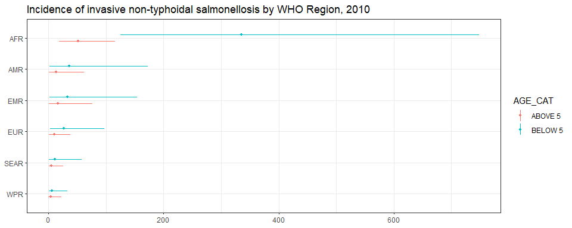<!-- -->

``` r
ggplot(subset(all_reg_rt, YEAR == 2020),
       aes(y = VAL_MEAN, x = LOCATION_NAME)) +
  geom_pointrange(aes(ymin = VAL_LWR, ymax = VAL_UPR, group = AGE_CAT, colour= AGE_CAT), size = 0.2,
                  position=position_dodge(width=0.40), show.legend=TRUE) +coord_flip() +
  theme_bw() +
  scale_x_discrete(NULL, limits = rev(unique(all_reg_nr$LOCATION_NAME))) +
  scale_y_continuous(NULL) +
  ggtitle("Incidence of invasive non-typhoidal salmonellosis by WHO Region, 2020")
```

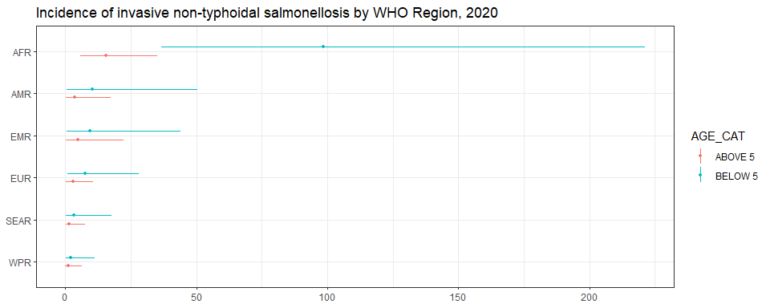<!-- -->

``` r
ggplot(subset(all_reg_nr, YEAR == 2010),
       aes(y = VAL_MEAN, x = LOCATION_NAME)) +
  geom_pointrange(aes(ymin = VAL_LWR, ymax = VAL_UPR, group = AGE_CAT, colour= AGE_CAT), size = 0.2,
                  position=position_dodge(width=0.40), show.legend=TRUE) + coord_flip() +
  theme_bw() +
  scale_x_discrete(NULL, limits = rev(unique(all_reg_nr$LOCATION_NAME))) +
  scale_y_continuous(NULL) +
  ggtitle("Number of invasive non-typhoidal salmonellosis cases by WHO Region, 2010")
```

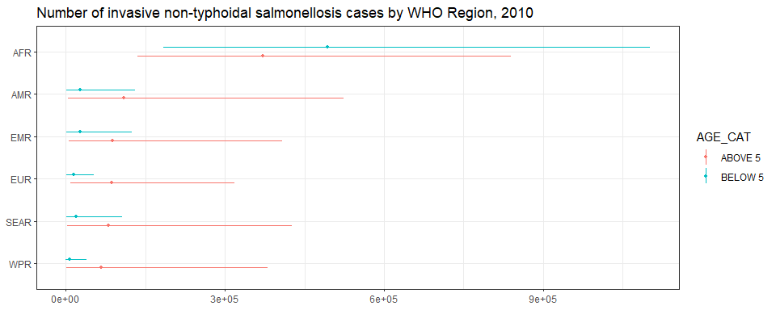<!-- -->

``` r
ggplot(subset(all_reg_nr, YEAR == 2020),
       aes(y = VAL_MEAN, x = LOCATION_NAME)) +
  geom_pointrange(aes(ymin = VAL_LWR, ymax = VAL_UPR, group = AGE_CAT, colour= AGE_CAT), size = 0.2,
                  position=position_dodge(width=0.40), show.legend=TRUE) + coord_flip() +
  theme_bw() +
  scale_x_discrete(NULL, limits = rev(unique(all_reg_nr$LOCATION_NAME))) +
  scale_y_continuous(NULL) +
  ggtitle("Number of invasive non-typhoidal salmonellosis cases by WHO Region, 2020")
```

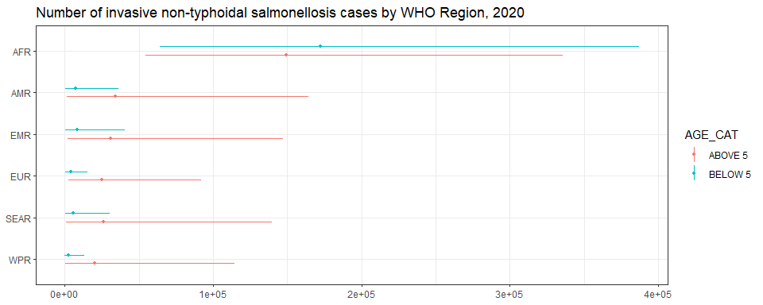<!-- -->

``` r
sim_all_reg <-
  merge(with(sim_all, aggregate(CASES ~ REG2 + YEAR, FUN = sum)),
        with(sim_all, aggregate(POP ~ REG2 + YEAR, FUN = sum)))
sim_all_reg_long <-
  pivot_longer(sim_all_reg, cols = starts_with("V"))
sim_all_reg_long$CASES <- sim_all_reg_long$value 

ggplot(subset(sim_all_reg_long, YEAR == 2010), aes(x = CASES)) +
  geom_density() +
  facet_wrap(~REG2) +
  theme_bw() +
  scale_x_log10() +
  ggtitle("Number of invasive non-typhoidal salmonellosis cases by WHO Region, 2010")
```

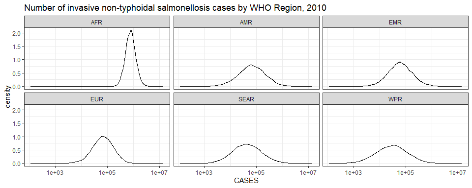<!-- -->

``` r
ggplot(subset(sim_all_reg_long, YEAR == 2020), aes(x = CASES)) +
  geom_density() +
  facet_wrap(~REG2) +
  theme_bw() +
  scale_x_log10() +
  ggtitle("Number of invasive non-typhoidal salmonellosis cases by WHO Region, 2020")
```

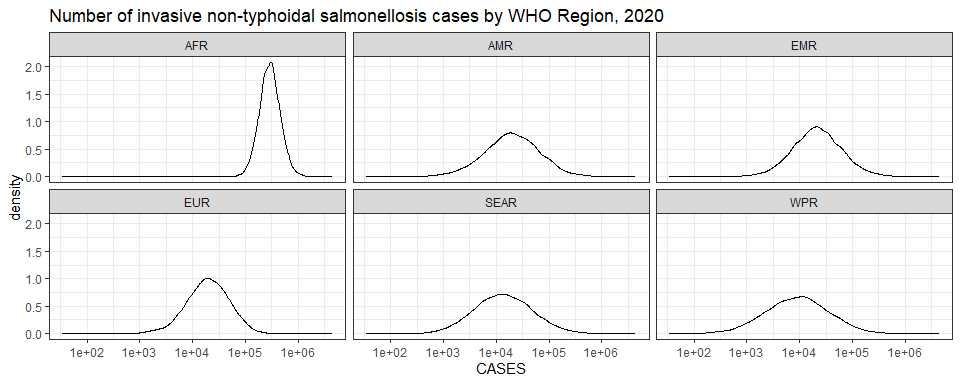<!-- -->

## Subregions

``` r
ggplot(subset(all_sub_rt, YEAR == 2010),
       aes(y = VAL_MEAN, x = LOCATION_NAME)) +
  geom_pointrange(aes(ymin = VAL_LWR, ymax = VAL_UPR, group = AGE_CAT, colour= AGE_CAT), size = 0.2,
                  position=position_dodge(width=0.40), show.legend=TRUE) + coord_flip() +
  coord_flip() +
  theme_bw() +
  scale_x_discrete(NULL, limits = rev(unique(all_sub_nr$LOCATION_NAME))) +
  scale_y_continuous(NULL) +
  ggtitle("Incidence of invasive  non-typhoidal salmonellosis by WHO Subregion, 2010")
```

    ## Coordinate system already present. Adding new coordinate system, which will replace the existing one.

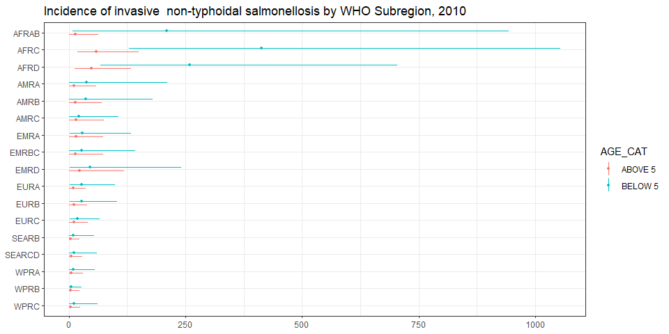<!-- -->

``` r
ggplot(subset(all_sub_rt, YEAR == 2020),
       aes(y = VAL_MEAN, x = LOCATION_NAME)) +
  geom_pointrange(aes(ymin = VAL_LWR, ymax = VAL_UPR, group = AGE_CAT, colour= AGE_CAT), size = 0.2,
                  position=position_dodge(width=0.40), show.legend=TRUE) + coord_flip() +
  coord_flip() +
  theme_bw() +
  scale_x_discrete(NULL, limits = rev(unique(all_sub_nr$LOCATION_NAME))) +
  scale_y_continuous(NULL) +
  ggtitle("Incidence of invasive non-typhoidal salmonellosis by WHO Subregion, 2020")
```

    ## Coordinate system already present. Adding new coordinate system, which will replace the existing one.

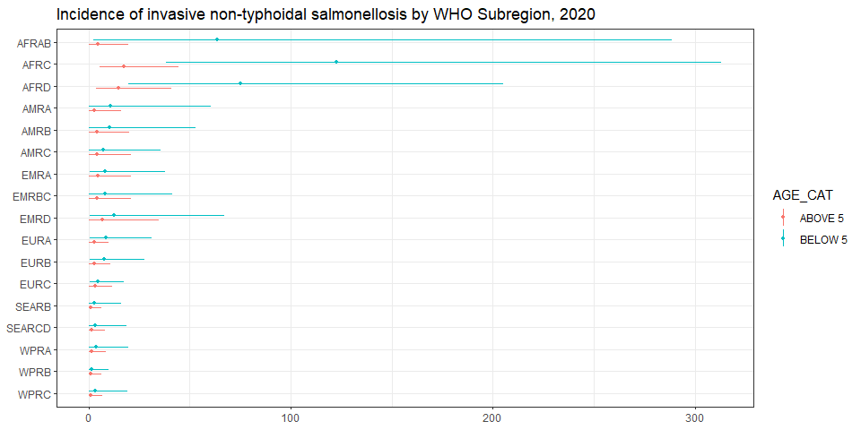<!-- -->

``` r
ggplot(subset(all_sub_nr, YEAR == 2010),
       aes(y = VAL_MEAN, x = LOCATION_NAME)) +
  geom_pointrange(aes(ymin = VAL_LWR, ymax = VAL_UPR, group = AGE_CAT, colour= AGE_CAT), size = 0.2,
                  position=position_dodge(width=0.40), show.legend=TRUE) + coord_flip() +
  coord_flip() +
  theme_bw() +
  scale_x_discrete(NULL, limits = rev(unique(all_sub_nr$LOCATION_NAME))) +
  scale_y_continuous(NULL) +
  ggtitle("Number of invasive non-typhoidal salmonellosis cases by WHO Subregion, 2010")
```

    ## Coordinate system already present. Adding new coordinate system, which will replace the existing one.

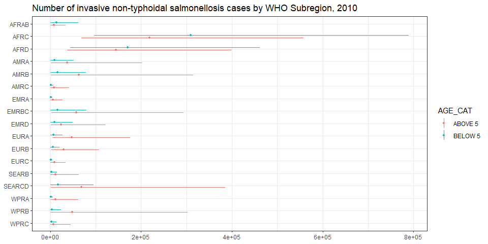<!-- -->

``` r
ggplot(subset(all_sub_nr, YEAR == 2020),
       aes(y = VAL_MEAN, x = LOCATION_NAME)) +
  geom_pointrange(aes(ymin = VAL_LWR, ymax = VAL_UPR, group = AGE_CAT, colour= AGE_CAT), size = 0.2,
                  position=position_dodge(width=0.40), show.legend=TRUE) + coord_flip() +
  coord_flip() +
  theme_bw() +
  scale_x_discrete(NULL, limits = rev(unique(all_sub_nr$LOCATION_NAME))) +
  scale_y_continuous(NULL) +
  ggtitle("Number of invasive non-typhoidal salmonellosis cases by WHO Subregion, 2020")
```

    ## Coordinate system already present. Adding new coordinate system, which will replace the existing one.

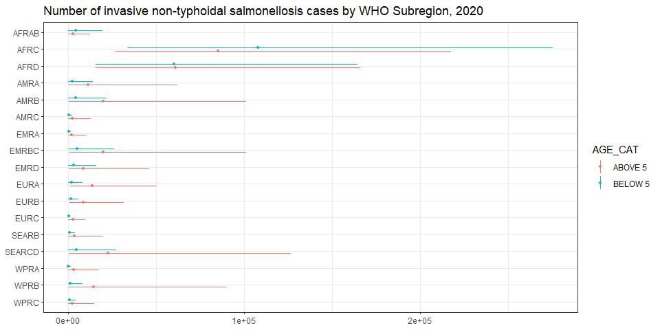<!-- -->

``` r
sim_all_sub <-
  merge(with(sim_all, aggregate(CASES ~ SUB2 + YEAR, FUN = sum)),
        with(sim_all, aggregate(POP ~ SUB2 + YEAR, FUN = sum)))
sim_all_sub_long <-
  pivot_longer(sim_all_sub, cols = starts_with("V"))
sim_all_sub_long$CASES <- sim_all_sub_long$value 

ggplot(subset(sim_all_sub_long, YEAR == 2010), aes(x = CASES)) +
  geom_density() +
  facet_wrap(~SUB2) +
  theme_bw() +
  scale_x_log10() +
  ggtitle("Number of invasive non-typhoidal salmonellosis cases by WHO Subregion, 2010")
```

<!-- -->

``` r
ggplot(subset(sim_all_sub_long, YEAR == 2020), aes(x = CASES)) +
  geom_density() +
  facet_wrap(~SUB2) +
  theme_bw() +
  scale_x_log10() +
  ggtitle("Number of invasive non-typhoidal salmonellosis cases by WHO Subregion, 2020")
```

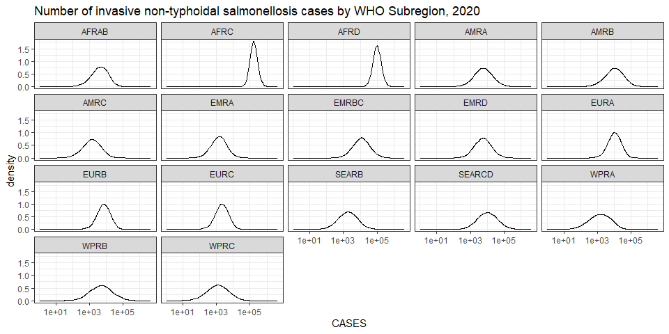<!-- -->

## Countries

``` r
breaks <-
  plot_world(subset(all_cnt_rt, YEAR == 2010),
             "LOCATION_NAME", "VAL_MEAN", legend.title = "Incidence per 100k", diseasefree = zero_cases)
```

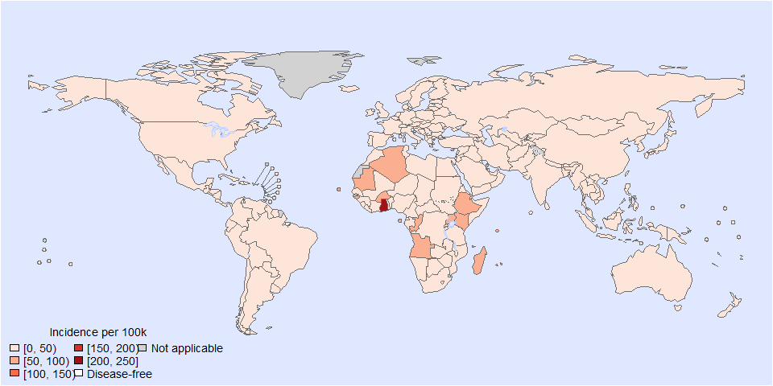<!-- -->

``` r
plot_world(subset(all_cnt_rt, YEAR == 2010 & AGE_CAT == "BELOW 5"), breaks = breaks,
           "LOCATION_NAME", "VAL_MEAN", legend.title = "Incidence per 100k", diseasefree = zero_cases)
```

    ## [1]   0  50 100 150 200 250

``` r
title("invasive non-typhoidal salmonellosis incidence, 2010, below 5", line = 1)
```

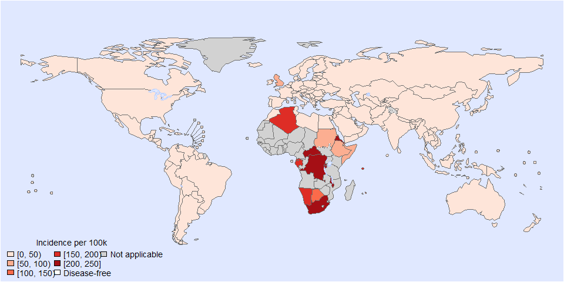<!-- -->

``` r
plot_world(subset(all_cnt_rt, YEAR == 2010 & AGE_CAT == "ABOVE 5"), breaks = breaks,
           "LOCATION_NAME", "VAL_MEAN", legend.title = "Incidence per 100k", diseasefree = zero_cases)
```

    ## [1]   0  50 100 150 200 250

``` r
title("invasive non-typhoidal salmonellosis incidence, 2010, above 5", line = 1)
```

<!-- -->

``` r
plot_world(subset(all_cnt_rt, YEAR == 2020 & AGE_CAT == "BELOW 5"), breaks=breaks,
           "LOCATION_NAME", "VAL_MEAN", legend.title = "Incidence per 100k", diseasefree = zero_cases)
```

    ## [1]   0  50 100 150 200 250

``` r
title("invasive non-typhoidal salmonellosis incidence, 2020, below 5", line = 1)
```

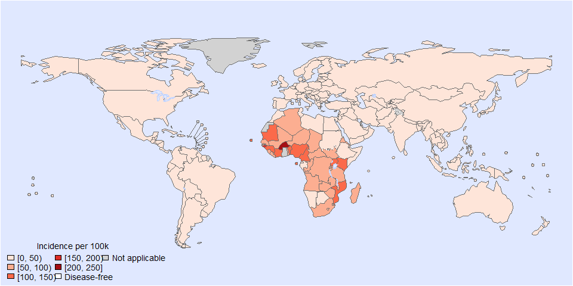<!-- -->

``` r
plot_world(subset(all_cnt_rt, YEAR == 2020 & AGE_CAT == "ABOVE 5"), breaks=breaks,
           "LOCATION_NAME", "VAL_MEAN", legend.title = "Incidence per 100k", diseasefree = zero_cases)
```

    ## [1]   0  50 100 150 200 250

``` r
title("invasive non-typhoidal salmonellosis incidence, 2020, above 5", line = 1)
```

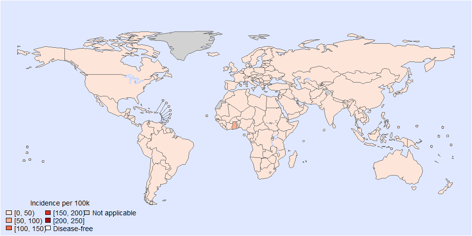<!-- -->

``` r
tab <-
  data.frame(
    subset(all_cnt_rt, YEAR == 2010)[, c("LOCATION_NAME", "AGE_CAT", "VAL_MEAN", "VAL_LWR", "VAL_UPR")],
    subset(all_cnt_rt, YEAR == 2020)[, c("VAL_MEAN", "VAL_LWR", "VAL_UPR")])
tab$LOCATION_NAME <-
  FERG2:::countries$COUNTRY[match(tab$LOCATION_NAME, FERG2:::countries$ISO3)]
tab$LOCATION_NAME <- gsub(" \\(.*", "", tab$LOCATION_NAME)
names(tab) <-
  c("Country", "Age",
    "2010.mean", "2010.lwr", "2010.upr",
    "2020.mean", "2020.lwr", "2020.upr")

kable(tab, digits = 3, row.names = FALSE,
      caption = "Estimated invasive non-typhoidal salmonellosis incidence by country, 2010 vs 2020")
```

| Country | Age | 2010.mean | 2010.lwr | 2010.upr | 2020.mean | 2020.lwr | 2020.upr |
|:---|:---|---:|---:|---:|---:|---:|---:|
| Afghanistan | ABOVE 5 | 21.631 | 0.844 | 119.977 | 6.065 | 0.238 | 33.394 |
| Afghanistan | BELOW 5 | 35.986 | 1.403 | 199.602 | 11.263 | 0.442 | 62.017 |
| Angola | ABOVE 5 | 52.850 | 10.065 | 152.824 | 14.998 | 2.853 | 43.364 |
| Angola | BELOW 5 | 287.563 | 54.764 | 831.533 | 81.941 | 15.586 | 236.912 |
| Albania | ABOVE 5 | 11.847 | 1.105 | 43.744 | 3.392 | 0.318 | 12.538 |
| Albania | BELOW 5 | 17.355 | 1.619 | 64.078 | 4.984 | 0.467 | 18.422 |
| Andorra | ABOVE 5 | 10.880 | 1.015 | 40.173 | 3.084 | 0.289 | 11.397 |
| Andorra | BELOW 5 | 20.276 | 1.892 | 74.865 | 5.168 | 0.484 | 19.103 |
| United Arab Emirates | ABOVE 5 | 16.386 | 0.853 | 75.212 | 4.602 | 0.242 | 21.028 |
| United Arab Emirates | BELOW 5 | 30.591 | 1.592 | 140.413 | 9.743 | 0.512 | 44.522 |
| Argentina | ABOVE 5 | 14.594 | 0.414 | 72.290 | 4.106 | 0.116 | 20.680 |
| Argentina | BELOW 5 | 25.189 | 0.715 | 124.775 | 6.884 | 0.195 | 34.668 |
| Armenia | ABOVE 5 | 11.836 | 1.104 | 43.702 | 3.333 | 0.312 | 12.321 |
| Armenia | BELOW 5 | 16.227 | 1.514 | 59.916 | 4.790 | 0.448 | 17.706 |
| Antigua and Barbuda | ABOVE 5 | 16.046 | 0.392 | 90.890 | 4.530 | 0.109 | 25.692 |
| Antigua and Barbuda | BELOW 5 | 24.659 | 0.603 | 139.681 | 7.066 | 0.170 | 40.073 |
| Australia | ABOVE 5 | 5.327 | 0.100 | 29.316 | 1.514 | 0.028 | 8.292 |
| Australia | BELOW 5 | 10.794 | 0.202 | 59.404 | 3.061 | 0.057 | 16.763 |
| Austria | ABOVE 5 | 10.707 | 0.999 | 39.534 | 2.974 | 0.278 | 10.992 |
| Austria | BELOW 5 | 22.889 | 2.135 | 84.514 | 6.210 | 0.581 | 22.953 |
| Azerbaijan | ABOVE 5 | 11.685 | 1.090 | 43.143 | 3.338 | 0.313 | 12.339 |
| Azerbaijan | BELOW 5 | 17.213 | 1.606 | 63.557 | 5.046 | 0.472 | 18.652 |
| Burundi | ABOVE 5 | 37.066 | 8.512 | 101.054 | 12.411 | 2.851 | 33.742 |
| Burundi | BELOW 5 | 234.437 | 53.837 | 639.149 | 68.834 | 15.810 | 187.142 |
| Belgium | ABOVE 5 | 8.925 | 0.833 | 32.954 | 2.436 | 0.228 | 9.003 |
| Belgium | BELOW 5 | 30.542 | 2.849 | 112.770 | 8.447 | 0.791 | 31.222 |
| Benin | ABOVE 5 | 43.604 | 8.304 | 126.089 | 12.686 | 2.413 | 36.679 |
| Benin | BELOW 5 | 369.012 | 70.276 | 1067.056 | 109.797 | 20.884 | 317.449 |
| Burkina Faso | ABOVE 5 | 73.734 | 6.580 | 344.087 | 25.139 | 2.222 | 117.409 |
| Burkina Faso | BELOW 5 | 760.454 | 67.864 | 3548.724 | 224.473 | 19.845 | 1048.392 |
| Bangladesh | ABOVE 5 | 5.599 | 0.139 | 32.653 | 1.644 | 0.041 | 9.644 |
| Bangladesh | BELOW 5 | 12.677 | 0.314 | 73.930 | 3.545 | 0.088 | 20.797 |
| Bulgaria | ABOVE 5 | 11.776 | 1.099 | 43.479 | 3.328 | 0.312 | 12.301 |
| Bulgaria | BELOW 5 | 17.576 | 1.640 | 64.896 | 5.420 | 0.507 | 20.033 |
| Bahrain | ABOVE 5 | 15.957 | 0.830 | 73.243 | 4.611 | 0.242 | 21.070 |
| Bahrain | BELOW 5 | 33.592 | 1.748 | 154.191 | 9.012 | 0.473 | 41.183 |
| Bahamas | ABOVE 5 | 14.069 | 0.344 | 79.696 | 4.010 | 0.097 | 22.741 |
| Bahamas | BELOW 5 | 30.706 | 0.751 | 173.934 | 9.724 | 0.235 | 55.148 |
| Bosnia and Herzegovina | ABOVE 5 | 11.861 | 1.107 | 43.795 | 3.375 | 0.316 | 12.474 |
| Bosnia and Herzegovina | BELOW 5 | 18.585 | 1.734 | 68.620 | 5.728 | 0.536 | 21.172 |
| Belarus | ABOVE 5 | 11.662 | 1.088 | 43.060 | 3.203 | 0.300 | 11.837 |
| Belarus | BELOW 5 | 17.041 | 1.590 | 62.920 | 4.485 | 0.420 | 16.579 |
| Belize | ABOVE 5 | 14.180 | 0.402 | 70.239 | 4.070 | 0.115 | 20.495 |
| Belize | BELOW 5 | 29.559 | 0.839 | 146.420 | 8.886 | 0.251 | 44.750 |
| Bolivia | ABOVE 5 | 14.494 | 0.411 | 71.799 | 4.122 | 0.117 | 20.760 |
| Bolivia | BELOW 5 | 29.186 | 0.828 | 144.572 | 9.089 | 0.257 | 45.776 |
| Brazil | ABOVE 5 | 13.407 | 0.380 | 66.413 | 3.772 | 0.107 | 18.997 |
| Brazil | BELOW 5 | 49.029 | 1.391 | 242.870 | 14.492 | 0.410 | 72.985 |
| Barbados | ABOVE 5 | 14.549 | 0.356 | 82.412 | 4.184 | 0.101 | 23.727 |
| Barbados | BELOW 5 | 36.438 | 0.891 | 206.404 | 7.879 | 0.190 | 44.688 |
| Brunei Darussalam | ABOVE 5 | 5.607 | 0.105 | 30.861 | 1.555 | 0.029 | 8.514 |
| Brunei Darussalam | BELOW 5 | 7.002 | 0.131 | 38.539 | 1.957 | 0.037 | 10.718 |
| Bhutan | ABOVE 5 | 5.702 | 0.141 | 33.251 | 1.604 | 0.040 | 9.409 |
| Bhutan | BELOW 5 | 12.549 | 0.311 | 73.182 | 4.512 | 0.112 | 26.465 |
| Botswana | ABOVE 5 | 16.608 | 0.622 | 62.428 | 5.024 | 0.190 | 19.024 |
| Botswana | BELOW 5 | 148.389 | 5.561 | 557.778 | 39.478 | 1.495 | 149.477 |
| Central African Republic | ABOVE 5 | 37.469 | 8.605 | 102.152 | 11.914 | 2.736 | 32.391 |
| Central African Republic | BELOW 5 | 224.819 | 51.628 | 612.927 | 57.867 | 13.291 | 157.326 |
| Canada | ABOVE 5 | 13.475 | 0.330 | 76.331 | 3.712 | 0.090 | 21.050 |
| Canada | BELOW 5 | 28.506 | 0.697 | 161.471 | 7.001 | 0.169 | 39.707 |
| Switzerland | ABOVE 5 | 9.967 | 0.930 | 36.802 | 2.704 | 0.253 | 9.993 |
| Switzerland | BELOW 5 | 12.660 | 1.181 | 46.746 | 3.786 | 0.354 | 13.992 |
| Chile | ABOVE 5 | 14.361 | 0.351 | 81.345 | 4.044 | 0.098 | 22.933 |
| Chile | BELOW 5 | 42.098 | 1.030 | 238.464 | 10.619 | 0.256 | 60.225 |
| China | ABOVE 5 | 3.738 | 0.049 | 23.544 | 1.045 | 0.014 | 6.602 |
| China | BELOW 5 | 4.152 | 0.054 | 26.150 | 1.530 | 0.020 | 9.668 |
| Côte d’Ivoire | ABOVE 5 | 39.565 | 7.535 | 114.407 | 11.988 | 2.280 | 34.661 |
| Côte d’Ivoire | BELOW 5 | 349.276 | 66.517 | 1009.987 | 107.079 | 20.367 | 309.591 |
| Cameroon | ABOVE 5 | 38.853 | 7.399 | 112.350 | 11.937 | 2.271 | 34.513 |
| Cameroon | BELOW 5 | 355.422 | 67.688 | 1027.760 | 104.109 | 19.802 | 301.004 |
| Congo | ABOVE 5 | 45.967 | 10.556 | 125.320 | 14.531 | 3.338 | 39.508 |
| Congo | BELOW 5 | 217.321 | 49.906 | 592.485 | 57.679 | 13.248 | 156.817 |
| Congo | ABOVE 5 | 52.195 | 9.940 | 150.931 | 16.658 | 3.168 | 48.162 |
| Congo | BELOW 5 | 281.917 | 53.689 | 815.208 | 72.756 | 13.839 | 210.354 |
| Cook Islands | ABOVE 5 | 5.377 | 0.100 | 29.592 | 1.517 | 0.028 | 8.307 |
| Cook Islands | BELOW 5 | 11.172 | 0.209 | 61.488 | 3.438 | 0.065 | 18.829 |
| Colombia | ABOVE 5 | 14.841 | 0.421 | 73.514 | 4.156 | 0.118 | 20.930 |
| Colombia | BELOW 5 | 31.449 | 0.892 | 155.785 | 9.164 | 0.259 | 46.154 |
| Comoros | ABOVE 5 | 73.386 | 13.976 | 212.207 | 22.602 | 4.299 | 65.348 |
| Comoros | BELOW 5 | 271.308 | 51.669 | 784.529 | 71.409 | 13.583 | 206.462 |
| Cabo Verde | ABOVE 5 | 56.559 | 10.771 | 163.549 | 17.520 | 3.333 | 50.656 |
| Cabo Verde | BELOW 5 | 457.552 | 87.138 | 1323.085 | 128.463 | 24.435 | 371.416 |
| Costa Rica | ABOVE 5 | 15.824 | 0.449 | 78.383 | 4.452 | 0.126 | 22.422 |
| Costa Rica | BELOW 5 | 22.982 | 0.652 | 113.843 | 6.839 | 0.193 | 34.441 |
| Cuba | ABOVE 5 | 15.448 | 0.438 | 76.521 | 4.299 | 0.122 | 21.650 |
| Cuba | BELOW 5 | 35.223 | 0.999 | 174.480 | 9.998 | 0.283 | 50.351 |
| Cyprus | ABOVE 5 | 11.509 | 1.074 | 42.495 | 3.261 | 0.305 | 12.054 |
| Cyprus | BELOW 5 | 20.345 | 1.898 | 75.119 | 5.755 | 0.539 | 21.271 |
| Czechia | ABOVE 5 | 11.184 | 1.043 | 41.294 | 3.291 | 0.308 | 12.164 |
| Czechia | BELOW 5 | 28.447 | 2.654 | 105.036 | 6.345 | 0.594 | 23.452 |
| Germany | ABOVE 5 | 10.593 | 0.988 | 39.112 | 2.908 | 0.272 | 10.750 |
| Germany | BELOW 5 | 12.738 | 1.188 | 47.033 | 4.026 | 0.377 | 14.880 |
| Djibouti | ABOVE 5 | 9.630 | 0.318 | 51.134 | 2.971 | 0.098 | 15.610 |
| Djibouti | BELOW 5 | 55.015 | 1.814 | 292.121 | 17.195 | 0.566 | 90.352 |
| Dominica | ABOVE 5 | 15.715 | 0.446 | 77.847 | 4.501 | 0.127 | 22.668 |
| Dominica | BELOW 5 | 24.728 | 0.702 | 122.493 | 7.056 | 0.200 | 35.533 |
| Denmark | ABOVE 5 | 9.942 | 0.928 | 36.708 | 2.669 | 0.250 | 9.866 |
| Denmark | BELOW 5 | 23.879 | 2.228 | 88.169 | 10.606 | 0.993 | 39.201 |
| Dominican Republic | ABOVE 5 | 14.881 | 0.422 | 73.714 | 4.142 | 0.117 | 20.860 |
| Dominican Republic | BELOW 5 | 22.464 | 0.637 | 111.275 | 7.332 | 0.207 | 36.924 |
| Algeria | ABOVE 5 | 92.406 | 17.598 | 267.206 | 26.386 | 5.019 | 76.288 |
| Algeria | BELOW 5 | 190.013 | 36.187 | 549.452 | 50.812 | 9.665 | 146.908 |
| Ecuador | ABOVE 5 | 14.478 | 0.411 | 71.716 | 4.032 | 0.114 | 20.304 |
| Ecuador | BELOW 5 | 32.225 | 0.914 | 159.630 | 10.673 | 0.302 | 53.753 |
| Egypt | ABOVE 5 | 15.200 | 0.501 | 80.710 | 4.450 | 0.146 | 23.385 |
| Egypt | BELOW 5 | 34.157 | 1.126 | 181.367 | 9.150 | 0.301 | 48.078 |
| Eritrea | ABOVE 5 | 48.070 | 11.039 | 131.053 | 14.649 | 3.365 | 39.827 |
| Eritrea | BELOW 5 | 236.858 | 54.393 | 645.751 | 72.473 | 16.646 | 197.037 |
| Spain | ABOVE 5 | 7.875 | 0.735 | 29.077 | 2.261 | 0.212 | 8.355 |
| Spain | BELOW 5 | 24.283 | 2.265 | 89.659 | 6.317 | 0.591 | 23.347 |
| Estonia | ABOVE 5 | 11.140 | 1.039 | 41.132 | 3.002 | 0.281 | 11.097 |
| Estonia | BELOW 5 | 15.942 | 1.487 | 58.862 | 4.787 | 0.448 | 17.694 |
| Ethiopia | ABOVE 5 | 60.127 | 3.348 | 236.500 | 16.800 | 0.922 | 65.730 |
| Ethiopia | BELOW 5 | 69.437 | 3.867 | 273.122 | 22.982 | 1.261 | 89.913 |
| Finland | ABOVE 5 | 11.188 | 1.044 | 41.310 | 3.120 | 0.292 | 11.531 |
| Finland | BELOW 5 | 12.648 | 1.180 | 46.700 | 3.761 | 0.352 | 13.902 |
| Fiji | ABOVE 5 | 4.592 | 0.065 | 27.663 | 1.290 | 0.018 | 7.821 |
| Fiji | BELOW 5 | 10.322 | 0.146 | 62.181 | 3.360 | 0.047 | 20.372 |
| France | ABOVE 5 | 8.921 | 0.832 | 32.937 | 2.409 | 0.226 | 8.904 |
| France | BELOW 5 | 22.133 | 2.065 | 81.720 | 6.396 | 0.599 | 23.642 |
| Micronesia | ABOVE 5 | 4.675 | 0.067 | 28.527 | 1.332 | 0.019 | 8.022 |
| Micronesia | BELOW 5 | 9.764 | 0.139 | 59.580 | 2.794 | 0.040 | 16.833 |
| Gabon | ABOVE 5 | 29.339 | 1.100 | 110.282 | 8.653 | 0.328 | 32.762 |
| Gabon | BELOW 5 | 178.186 | 6.678 | 669.781 | 47.106 | 1.784 | 178.359 |
| United Kingdom | ABOVE 5 | 8.585 | 0.801 | 31.700 | 2.297 | 0.215 | 8.490 |
| United Kingdom | BELOW 5 | 51.087 | 4.766 | 188.630 | 17.800 | 1.666 | 65.791 |
| Georgia | ABOVE 5 | 11.034 | 1.029 | 40.739 | 3.153 | 0.295 | 11.655 |
| Georgia | BELOW 5 | 26.243 | 2.448 | 96.898 | 6.089 | 0.570 | 22.505 |
| Ghana | ABOVE 5 | 221.662 | 24.964 | 932.485 | 67.309 | 7.491 | 284.043 |
| Ghana | BELOW 5 | 1963.638 | 221.147 | 8260.627 | 597.672 | 66.514 | 2522.158 |
| Guinea | ABOVE 5 | 43.405 | 8.266 | 125.513 | 12.537 | 2.385 | 36.247 |
| Guinea | BELOW 5 | 368.104 | 70.103 | 1064.431 | 111.052 | 21.123 | 321.079 |
| Gambia | ABOVE 5 | 34.421 | 7.905 | 93.843 | 10.031 | 2.304 | 27.272 |
| Gambia | BELOW 5 | 286.049 | 65.690 | 779.860 | 88.635 | 20.358 | 240.977 |
| Guinea-Bissau | ABOVE 5 | 61.519 | 6.202 | 265.357 | 15.628 | 1.567 | 67.871 |
| Guinea-Bissau | BELOW 5 | 469.475 | 47.333 | 2025.036 | 158.674 | 15.913 | 689.110 |
| Equatorial Guinea | ABOVE 5 | 27.191 | 1.019 | 102.208 | 7.678 | 0.291 | 29.070 |
| Equatorial Guinea | BELOW 5 | 176.892 | 6.629 | 664.919 | 46.793 | 1.772 | 177.175 |
| Greece | ABOVE 5 | 11.538 | 1.076 | 42.600 | 3.225 | 0.302 | 11.921 |
| Greece | BELOW 5 | 14.000 | 1.306 | 51.693 | 4.025 | 0.377 | 14.877 |
| Grenada | ABOVE 5 | 15.684 | 0.445 | 77.693 | 4.509 | 0.128 | 22.705 |
| Grenada | BELOW 5 | 25.101 | 0.712 | 124.340 | 7.132 | 0.202 | 35.917 |
| Guatemala | ABOVE 5 | 16.602 | 0.471 | 82.239 | 4.713 | 0.133 | 23.733 |
| Guatemala | BELOW 5 | 16.377 | 0.465 | 81.122 | 4.841 | 0.137 | 24.382 |
| Guyana | ABOVE 5 | 14.193 | 0.347 | 80.394 | 3.946 | 0.095 | 22.382 |
| Guyana | BELOW 5 | 30.020 | 0.734 | 170.049 | 9.421 | 0.227 | 53.429 |
| Honduras | ABOVE 5 | 16.201 | 0.460 | 80.254 | 4.619 | 0.131 | 23.260 |
| Honduras | BELOW 5 | 20.093 | 0.570 | 99.530 | 5.934 | 0.168 | 29.885 |
| Croatia | ABOVE 5 | 12.087 | 1.128 | 44.630 | 3.409 | 0.319 | 12.600 |
| Croatia | BELOW 5 | 12.856 | 1.199 | 47.469 | 4.399 | 0.412 | 16.261 |
| Haiti | ABOVE 5 | 13.316 | 0.378 | 65.961 | 3.687 | 0.104 | 18.568 |
| Haiti | BELOW 5 | 23.312 | 0.661 | 115.475 | 7.645 | 0.216 | 38.502 |
| Hungary | ABOVE 5 | 10.711 | 0.999 | 39.548 | 3.162 | 0.296 | 11.687 |
| Hungary | BELOW 5 | 39.363 | 3.672 | 145.339 | 8.979 | 0.841 | 33.187 |
| Indonesia | ABOVE 5 | 3.680 | 0.085 | 21.770 | 1.057 | 0.024 | 6.261 |
| Indonesia | BELOW 5 | 8.702 | 0.200 | 51.487 | 2.595 | 0.060 | 15.364 |
| India | ABOVE 5 | 5.017 | 0.110 | 29.603 | 1.431 | 0.031 | 8.459 |
| India | BELOW 5 | 10.360 | 0.228 | 61.130 | 3.277 | 0.072 | 19.373 |
| Ireland | ABOVE 5 | 10.538 | 0.983 | 38.910 | 2.997 | 0.281 | 11.076 |
| Ireland | BELOW 5 | 21.218 | 1.980 | 78.344 | 5.232 | 0.490 | 19.338 |
| Iran | ABOVE 5 | 16.233 | 0.535 | 86.194 | 4.613 | 0.152 | 24.240 |
| Iran | BELOW 5 | 31.846 | 1.050 | 169.094 | 9.063 | 0.298 | 47.622 |
| Iraq | ABOVE 5 | 15.953 | 0.526 | 84.708 | 4.668 | 0.154 | 24.526 |
| Iraq | BELOW 5 | 26.372 | 0.870 | 140.032 | 7.241 | 0.238 | 38.049 |
| Iceland | ABOVE 5 | 10.740 | 1.002 | 39.655 | 2.913 | 0.273 | 10.766 |
| Iceland | BELOW 5 | 15.761 | 1.470 | 58.194 | 5.607 | 0.525 | 20.723 |
| Israel | ABOVE 5 | 7.826 | 0.730 | 28.895 | 2.394 | 0.224 | 8.849 |
| Israel | BELOW 5 | 40.691 | 3.796 | 150.244 | 9.725 | 0.910 | 35.945 |
| Italy | ABOVE 5 | 9.431 | 0.880 | 34.823 | 2.567 | 0.240 | 9.489 |
| Italy | BELOW 5 | 29.865 | 2.786 | 110.268 | 11.588 | 1.085 | 42.829 |
| Jamaica | ABOVE 5 | 14.955 | 0.424 | 74.082 | 4.162 | 0.118 | 20.958 |
| Jamaica | BELOW 5 | 28.641 | 0.813 | 141.873 | 9.208 | 0.260 | 46.372 |
| Jordan | ABOVE 5 | 15.613 | 0.515 | 82.902 | 4.679 | 0.154 | 24.584 |
| Jordan | BELOW 5 | 30.638 | 1.010 | 162.684 | 7.724 | 0.254 | 40.588 |
| Japan | ABOVE 5 | 5.622 | 0.105 | 30.940 | 1.545 | 0.029 | 8.460 |
| Japan | BELOW 5 | 11.316 | 0.211 | 62.281 | 4.426 | 0.083 | 24.237 |
| Kazakhstan | ABOVE 5 | 11.160 | 1.041 | 41.205 | 3.111 | 0.291 | 11.498 |
| Kazakhstan | BELOW 5 | 20.475 | 1.910 | 75.600 | 5.920 | 0.554 | 21.883 |
| Kenya | ABOVE 5 | 65.509 | 17.024 | 172.951 | 19.103 | 4.997 | 50.123 |
| Kenya | BELOW 5 | 382.330 | 99.356 | 1009.396 | 135.463 | 35.437 | 355.431 |
| Kyrgyzstan | ABOVE 5 | 10.475 | 0.977 | 38.675 | 3.098 | 0.290 | 11.452 |
| Kyrgyzstan | BELOW 5 | 25.092 | 2.341 | 92.646 | 5.808 | 0.544 | 21.466 |
| Cambodia | ABOVE 5 | 4.239 | 0.061 | 25.870 | 1.220 | 0.017 | 7.348 |
| Cambodia | BELOW 5 | 11.352 | 0.162 | 69.269 | 3.337 | 0.047 | 20.102 |
| Kiribati | ABOVE 5 | 4.652 | 0.066 | 28.385 | 1.316 | 0.019 | 7.927 |
| Kiribati | BELOW 5 | 9.441 | 0.135 | 57.611 | 2.879 | 0.041 | 17.345 |
| Saint Kitts and Nevis | ABOVE 5 | 15.557 | 0.381 | 88.124 | 4.322 | 0.104 | 24.510 |
| Saint Kitts and Nevis | BELOW 5 | 19.979 | 0.489 | 113.170 | 5.559 | 0.134 | 31.528 |
| Korea | ABOVE 5 | 5.813 | 0.109 | 31.995 | 1.666 | 0.031 | 9.122 |
| Korea | BELOW 5 | 7.488 | 0.140 | 41.212 | 2.002 | 0.038 | 10.963 |
| Kuwait | ABOVE 5 | 15.719 | 0.818 | 72.153 | 4.584 | 0.241 | 20.946 |
| Kuwait | BELOW 5 | 33.494 | 1.743 | 153.738 | 10.045 | 0.527 | 45.901 |
| Lao People’s Dem. Republic | ABOVE 5 | 4.391 | 0.063 | 26.792 | 1.232 | 0.017 | 7.422 |
| Lao People’s Dem. Republic | BELOW 5 | 11.271 | 0.161 | 68.773 | 3.602 | 0.051 | 21.698 |
| Lebanon | ABOVE 5 | 15.546 | 0.513 | 82.545 | 4.609 | 0.152 | 24.217 |
| Lebanon | BELOW 5 | 38.042 | 1.254 | 201.997 | 8.831 | 0.291 | 46.403 |
| Liberia | ABOVE 5 | 34.701 | 7.969 | 94.606 | 10.912 | 2.506 | 29.668 |
| Liberia | BELOW 5 | 291.889 | 67.031 | 795.781 | 88.400 | 20.304 | 240.338 |
| Libya | ABOVE 5 | 16.332 | 0.539 | 86.720 | 4.801 | 0.158 | 25.229 |
| Libya | BELOW 5 | 27.022 | 0.891 | 143.483 | 6.747 | 0.222 | 35.451 |
| Saint Lucia | ABOVE 5 | 16.204 | 0.460 | 80.267 | 4.657 | 0.132 | 23.451 |
| Saint Lucia | BELOW 5 | 21.571 | 0.612 | 106.853 | 5.899 | 0.167 | 29.709 |
| Sri Lanka | ABOVE 5 | 5.480 | 0.136 | 31.958 | 1.616 | 0.040 | 9.478 |
| Sri Lanka | BELOW 5 | 15.848 | 0.393 | 92.425 | 4.398 | 0.109 | 25.799 |
| Lesotho | ABOVE 5 | 28.483 | 5.424 | 82.363 | 7.962 | 1.514 | 23.020 |
| Lesotho | BELOW 5 | 250.425 | 47.692 | 724.143 | 66.889 | 12.723 | 193.391 |
| Lithuania | ABOVE 5 | 11.764 | 1.098 | 43.436 | 3.303 | 0.309 | 12.207 |
| Lithuania | BELOW 5 | 16.874 | 1.574 | 62.303 | 4.562 | 0.427 | 16.862 |
| Luxembourg | ABOVE 5 | 10.293 | 0.960 | 38.005 | 2.799 | 0.262 | 10.344 |
| Luxembourg | BELOW 5 | 16.664 | 1.555 | 61.529 | 4.894 | 0.458 | 18.090 |
| Latvia | ABOVE 5 | 11.521 | 1.075 | 42.538 | 3.129 | 0.293 | 11.566 |
| Latvia | BELOW 5 | 14.256 | 1.330 | 52.638 | 3.893 | 0.364 | 14.389 |
| Morocco | ABOVE 5 | 15.411 | 0.508 | 81.831 | 4.484 | 0.148 | 23.561 |
| Morocco | BELOW 5 | 35.353 | 1.166 | 187.717 | 9.851 | 0.324 | 51.765 |
| Monaco | ABOVE 5 | 10.938 | 1.020 | 40.387 | 3.047 | 0.285 | 11.264 |
| Monaco | BELOW 5 | 20.281 | 1.892 | 74.883 | 5.206 | 0.487 | 19.241 |
| Republic of Moldova | ABOVE 5 | 11.706 | 1.092 | 43.222 | 3.344 | 0.313 | 12.362 |
| Republic of Moldova | BELOW 5 | 15.345 | 1.432 | 56.658 | 3.388 | 0.317 | 12.524 |
| Madagascar | ABOVE 5 | 67.996 | 5.921 | 265.158 | 22.975 | 1.995 | 89.634 |
| Madagascar | BELOW 5 | 252.270 | 21.966 | 983.760 | 56.243 | 4.883 | 219.425 |
| Maldives | ABOVE 5 | 5.008 | 0.117 | 28.672 | 1.489 | 0.035 | 8.547 |
| Maldives | BELOW 5 | 15.279 | 0.358 | 87.479 | 4.398 | 0.103 | 25.240 |
| Mexico | ABOVE 5 | 14.473 | 0.411 | 71.695 | 4.207 | 0.119 | 21.188 |
| Mexico | BELOW 5 | 32.432 | 0.920 | 160.652 | 8.452 | 0.239 | 42.565 |
| Marshall Islands | ABOVE 5 | 4.623 | 0.065 | 27.851 | 1.295 | 0.018 | 7.852 |
| Marshall Islands | BELOW 5 | 8.841 | 0.125 | 53.264 | 3.009 | 0.042 | 18.241 |
| North Macedonia | ABOVE 5 | 11.932 | 1.113 | 44.055 | 3.422 | 0.320 | 12.648 |
| North Macedonia | BELOW 5 | 16.214 | 1.513 | 59.867 | 4.401 | 0.412 | 16.267 |
| Mali | ABOVE 5 | 34.423 | 7.905 | 93.849 | 9.833 | 2.258 | 26.733 |
| Mali | BELOW 5 | 265.406 | 60.949 | 723.580 | 80.767 | 18.551 | 219.586 |
| Malta | ABOVE 5 | 11.232 | 1.048 | 41.470 | 3.083 | 0.289 | 11.396 |
| Malta | BELOW 5 | 18.544 | 1.730 | 68.469 | 4.571 | 0.428 | 16.894 |
| Myanmar | ABOVE 5 | 5.194 | 0.129 | 30.290 | 1.475 | 0.037 | 8.654 |
| Myanmar | BELOW 5 | 15.923 | 0.395 | 92.863 | 4.773 | 0.119 | 27.997 |
| Montenegro | ABOVE 5 | 11.770 | 1.098 | 43.459 | 3.361 | 0.315 | 12.424 |
| Montenegro | BELOW 5 | 17.835 | 1.664 | 65.851 | 5.073 | 0.475 | 18.752 |
| Mongolia | ABOVE 5 | 4.992 | 0.071 | 30.459 | 1.429 | 0.020 | 8.611 |
| Mongolia | BELOW 5 | 7.921 | 0.113 | 48.331 | 2.117 | 0.030 | 12.755 |
| Mozambique | ABOVE 5 | 32.103 | 3.236 | 133.230 | 11.163 | 1.133 | 46.552 |
| Mozambique | BELOW 5 | 415.625 | 41.892 | 1724.882 | 114.641 | 11.638 | 478.096 |
| Mauritania | ABOVE 5 | 50.586 | 9.634 | 146.277 | 15.282 | 2.907 | 44.185 |
| Mauritania | BELOW 5 | 355.810 | 67.762 | 1028.880 | 101.194 | 19.248 | 292.577 |
| Mauritius | ABOVE 5 | 52.158 | 1.955 | 196.055 | 14.270 | 0.540 | 54.032 |
| Mauritius | BELOW 5 | 149.636 | 5.608 | 562.468 | 49.922 | 1.890 | 189.023 |
| Malawi | ABOVE 5 | 19.642 | 2.542 | 67.804 | 7.125 | 0.923 | 24.653 |
| Malawi | BELOW 5 | 222.501 | 28.792 | 768.090 | 69.673 | 9.022 | 241.076 |
| Malaysia | ABOVE 5 | 4.486 | 0.064 | 27.027 | 1.260 | 0.018 | 7.642 |
| Malaysia | BELOW 5 | 11.770 | 0.167 | 70.904 | 3.728 | 0.052 | 22.602 |
| Namibia | ABOVE 5 | 20.320 | 0.762 | 76.381 | 6.199 | 0.235 | 23.470 |
| Namibia | BELOW 5 | 156.067 | 5.849 | 586.640 | 38.457 | 1.456 | 145.613 |
| Niger | ABOVE 5 | 34.793 | 7.990 | 94.856 | 9.919 | 2.278 | 26.968 |
| Niger | BELOW 5 | 259.832 | 59.669 | 708.383 | 81.076 | 18.622 | 220.427 |
| Nigeria | ABOVE 5 | 45.077 | 8.585 | 130.346 | 13.387 | 2.546 | 38.705 |
| Nigeria | BELOW 5 | 345.810 | 65.857 | 999.964 | 107.597 | 20.466 | 311.090 |
| Nicaragua | ABOVE 5 | 16.196 | 0.460 | 80.226 | 4.569 | 0.129 | 23.008 |
| Nicaragua | BELOW 5 | 20.202 | 0.573 | 100.073 | 5.942 | 0.168 | 29.926 |
| Niue | ABOVE 5 | 5.400 | 0.101 | 29.721 | 1.443 | 0.027 | 7.904 |
| Niue | BELOW 5 | 11.080 | 0.207 | 60.984 | 4.649 | 0.087 | 25.460 |
| Netherlands | ABOVE 5 | 9.803 | 0.915 | 36.196 | 2.710 | 0.254 | 10.015 |
| Netherlands | BELOW 5 | 23.656 | 2.207 | 87.344 | 7.114 | 0.666 | 26.294 |
| Norway | ABOVE 5 | 10.147 | 0.947 | 37.465 | 2.850 | 0.267 | 10.536 |
| Norway | BELOW 5 | 33.255 | 3.102 | 122.786 | 8.811 | 0.825 | 32.567 |
| Nepal | ABOVE 5 | 5.711 | 0.142 | 33.308 | 1.612 | 0.040 | 9.455 |
| Nepal | BELOW 5 | 11.285 | 0.280 | 65.816 | 3.623 | 0.090 | 21.255 |
| Nauru | ABOVE 5 | 5.067 | 0.095 | 27.886 | 1.434 | 0.027 | 7.855 |
| Nauru | BELOW 5 | 11.092 | 0.207 | 61.048 | 3.327 | 0.062 | 18.220 |
| New Zealand | ABOVE 5 | 5.270 | 0.098 | 29.004 | 1.431 | 0.027 | 7.838 |
| New Zealand | BELOW 5 | 12.568 | 0.235 | 69.171 | 4.978 | 0.093 | 27.264 |
| Oman | ABOVE 5 | 15.591 | 0.811 | 71.562 | 4.450 | 0.234 | 20.333 |
| Oman | BELOW 5 | 31.378 | 1.633 | 144.027 | 9.090 | 0.477 | 41.536 |
| Pakistan | ABOVE 5 | 12.986 | 0.426 | 73.041 | 3.644 | 0.118 | 20.325 |
| Pakistan | BELOW 5 | 23.329 | 0.766 | 131.214 | 7.216 | 0.234 | 40.251 |
| Panama | ABOVE 5 | 14.154 | 0.346 | 80.175 | 4.143 | 0.100 | 23.499 |
| Panama | BELOW 5 | 38.135 | 0.933 | 216.014 | 8.871 | 0.214 | 50.311 |
| Peru | ABOVE 5 | 14.896 | 0.423 | 73.787 | 4.079 | 0.115 | 20.542 |
| Peru | BELOW 5 | 30.406 | 0.863 | 150.620 | 10.773 | 0.305 | 54.255 |
| Philippines | ABOVE 5 | 4.481 | 0.064 | 27.341 | 1.263 | 0.018 | 7.611 |
| Philippines | BELOW 5 | 10.597 | 0.151 | 64.662 | 3.313 | 0.047 | 19.958 |
| Palau | ABOVE 5 | 4.603 | 0.065 | 27.727 | 1.331 | 0.019 | 8.073 |
| Palau | BELOW 5 | 13.606 | 0.193 | 81.970 | 3.562 | 0.050 | 21.595 |
| Papua New Guinea | ABOVE 5 | 4.342 | 0.062 | 26.494 | 1.168 | 0.017 | 7.034 |
| Papua New Guinea | BELOW 5 | 10.169 | 0.145 | 62.053 | 3.510 | 0.050 | 21.142 |
| Poland | ABOVE 5 | 11.021 | 1.028 | 40.691 | 3.038 | 0.284 | 11.227 |
| Poland | BELOW 5 | 31.325 | 2.922 | 115.661 | 10.673 | 0.999 | 39.449 |
| Korea | ABOVE 5 | 5.841 | 0.145 | 34.064 | 1.667 | 0.041 | 9.777 |
| Korea | BELOW 5 | 13.207 | 0.327 | 77.020 | 3.569 | 0.089 | 20.938 |
| Portugal | ABOVE 5 | 9.679 | 0.903 | 35.739 | 2.659 | 0.249 | 9.828 |
| Portugal | BELOW 5 | 13.679 | 1.276 | 50.508 | 4.673 | 0.437 | 17.271 |
| Paraguay | ABOVE 5 | 12.663 | 0.359 | 62.729 | 3.710 | 0.105 | 18.686 |
| Paraguay | BELOW 5 | 49.279 | 1.398 | 244.104 | 13.331 | 0.377 | 67.139 |
| Qatar | ABOVE 5 | 15.808 | 0.823 | 72.561 | 4.517 | 0.237 | 20.640 |
| Qatar | BELOW 5 | 43.508 | 2.264 | 199.704 | 12.078 | 0.634 | 55.194 |
| Romania | ABOVE 5 | 11.451 | 1.068 | 42.280 | 3.298 | 0.309 | 12.189 |
| Romania | BELOW 5 | 22.106 | 2.062 | 81.620 | 5.193 | 0.486 | 19.194 |
| Russian Federation | ABOVE 5 | 10.108 | 0.943 | 37.321 | 2.649 | 0.248 | 9.792 |
| Russian Federation | BELOW 5 | 37.696 | 3.517 | 139.185 | 10.040 | 0.940 | 37.108 |
| Rwanda | ABOVE 5 | 39.842 | 9.150 | 108.623 | 12.682 | 2.913 | 34.480 |
| Rwanda | BELOW 5 | 235.638 | 54.113 | 642.423 | 67.155 | 15.424 | 182.579 |
| Saudi Arabia | ABOVE 5 | 16.084 | 0.837 | 73.826 | 4.627 | 0.243 | 21.144 |
| Saudi Arabia | BELOW 5 | 27.254 | 1.418 | 125.100 | 7.535 | 0.396 | 34.434 |
| Sudan | ABOVE 5 | 28.610 | 0.978 | 155.991 | 8.451 | 0.287 | 46.344 |
| Sudan | BELOW 5 | 51.263 | 1.753 | 279.505 | 13.313 | 0.452 | 73.006 |
| Senegal | ABOVE 5 | 33.412 | 1.402 | 130.531 | 10.474 | 0.441 | 40.883 |
| Senegal | BELOW 5 | 273.345 | 11.468 | 1067.880 | 81.812 | 3.444 | 319.327 |
| Singapore | ABOVE 5 | 5.651 | 0.106 | 31.100 | 1.582 | 0.030 | 8.663 |
| Singapore | BELOW 5 | 6.327 | 0.118 | 34.822 | 2.198 | 0.041 | 12.035 |
| Solomon Islands | ABOVE 5 | 4.446 | 0.063 | 27.129 | 1.266 | 0.018 | 7.626 |
| Solomon Islands | BELOW 5 | 9.875 | 0.141 | 60.257 | 2.949 | 0.042 | 17.768 |
| Sierra Leone | ABOVE 5 | 36.077 | 8.285 | 98.357 | 10.344 | 2.376 | 28.123 |
| Sierra Leone | BELOW 5 | 294.877 | 67.717 | 803.928 | 94.327 | 21.665 | 256.453 |
| El Salvador | ABOVE 5 | 15.558 | 0.441 | 77.069 | 4.407 | 0.125 | 22.195 |
| El Salvador | BELOW 5 | 23.005 | 0.653 | 113.958 | 6.956 | 0.197 | 35.032 |
| San Marino | ABOVE 5 | 10.930 | 1.020 | 40.356 | 3.067 | 0.287 | 11.335 |
| San Marino | BELOW 5 | 19.762 | 1.844 | 72.968 | 6.019 | 0.563 | 22.246 |
| Somalia | ABOVE 5 | 12.988 | 0.507 | 72.038 | 3.770 | 0.148 | 20.760 |
| Somalia | BELOW 5 | 67.098 | 2.617 | 372.164 | 19.761 | 0.775 | 108.814 |
| Serbia | ABOVE 5 | 11.713 | 1.093 | 43.249 | 3.415 | 0.320 | 12.621 |
| Serbia | BELOW 5 | 21.103 | 1.969 | 77.917 | 4.658 | 0.436 | 17.215 |
| South Sudan | ABOVE 5 | 38.418 | 8.822 | 104.739 | 10.982 | 2.522 | 29.858 |
| South Sudan | BELOW 5 | 254.157 | 58.366 | 692.912 | 88.420 | 20.309 | 240.394 |
| Sao Tome and Principe | ABOVE 5 | 52.524 | 10.003 | 151.883 | 17.152 | 3.262 | 49.590 |
| Sao Tome and Principe | BELOW 5 | 361.692 | 68.882 | 1045.891 | 106.591 | 20.275 | 308.181 |
| Suriname | ABOVE 5 | 14.937 | 0.424 | 73.990 | 4.073 | 0.115 | 20.514 |
| Suriname | BELOW 5 | 20.433 | 0.580 | 101.217 | 6.511 | 0.184 | 32.792 |
| Slovakia | ABOVE 5 | 11.819 | 1.103 | 43.638 | 3.379 | 0.316 | 12.488 |
| Slovakia | BELOW 5 | 18.491 | 1.725 | 68.276 | 5.113 | 0.479 | 18.897 |
| Slovenia | ABOVE 5 | 11.917 | 1.112 | 44.000 | 3.384 | 0.317 | 12.507 |
| Slovenia | BELOW 5 | 15.942 | 1.487 | 58.861 | 4.674 | 0.438 | 17.276 |
| Sweden | ABOVE 5 | 11.374 | 1.061 | 41.997 | 3.103 | 0.290 | 11.469 |
| Sweden | BELOW 5 | 14.286 | 1.333 | 52.746 | 4.967 | 0.465 | 18.360 |
| Eswatini | ABOVE 5 | 26.412 | 5.030 | 76.373 | 7.675 | 1.460 | 22.191 |
| Eswatini | BELOW 5 | 259.346 | 49.391 | 749.941 | 80.484 | 15.309 | 232.700 |
| Seychelles | ABOVE 5 | 52.132 | 1.954 | 195.958 | 14.972 | 0.567 | 56.690 |
| Seychelles | BELOW 5 | 157.681 | 5.909 | 592.707 | 46.416 | 1.757 | 175.747 |
| Syrian Arab Republic | ABOVE 5 | 22.191 | 0.865 | 123.084 | 6.594 | 0.259 | 36.311 |
| Syrian Arab Republic | BELOW 5 | 37.706 | 1.471 | 209.141 | 10.265 | 0.403 | 56.525 |
| Chad | ABOVE 5 | 32.735 | 7.517 | 89.246 | 9.282 | 2.132 | 25.236 |
| Chad | BELOW 5 | 261.785 | 60.117 | 713.708 | 79.904 | 18.353 | 217.240 |
| Togo | ABOVE 5 | 33.906 | 7.786 | 92.439 | 10.406 | 2.390 | 28.290 |
| Togo | BELOW 5 | 290.475 | 66.706 | 791.926 | 86.364 | 19.836 | 234.803 |
| Thailand | ABOVE 5 | 4.882 | 0.114 | 27.950 | 1.390 | 0.033 | 7.975 |
| Thailand | BELOW 5 | 14.927 | 0.350 | 85.463 | 4.420 | 0.104 | 25.365 |
| Tajikistan | ABOVE 5 | 11.491 | 1.072 | 42.426 | 3.258 | 0.305 | 12.042 |
| Tajikistan | BELOW 5 | 16.210 | 1.512 | 59.853 | 4.650 | 0.435 | 17.187 |
| Turkmenistan | ABOVE 5 | 11.422 | 1.066 | 42.174 | 3.317 | 0.311 | 12.260 |
| Turkmenistan | BELOW 5 | 17.712 | 1.652 | 65.399 | 4.369 | 0.409 | 16.149 |
| Timor-Leste | ABOVE 5 | 5.282 | 0.131 | 30.805 | 1.480 | 0.037 | 8.679 |
| Timor-Leste | BELOW 5 | 12.116 | 0.300 | 70.657 | 4.003 | 0.099 | 23.483 |
| Tonga | ABOVE 5 | 4.379 | 0.062 | 26.379 | 1.198 | 0.017 | 7.265 |
| Tonga | BELOW 5 | 10.810 | 0.153 | 65.126 | 3.563 | 0.050 | 21.601 |
| Trinidad and Tobago | ABOVE 5 | 14.559 | 0.356 | 82.468 | 4.047 | 0.098 | 22.954 |
| Trinidad and Tobago | BELOW 5 | 32.381 | 0.792 | 183.421 | 9.772 | 0.236 | 55.423 |
| Tunisia | ABOVE 5 | 15.997 | 0.528 | 84.942 | 4.590 | 0.151 | 24.116 |
| Tunisia | BELOW 5 | 34.114 | 1.125 | 181.140 | 9.225 | 0.304 | 48.476 |
| Turkiye | ABOVE 5 | 11.125 | 1.038 | 41.076 | 3.242 | 0.304 | 11.983 |
| Turkiye | BELOW 5 | 23.517 | 2.194 | 86.830 | 6.254 | 0.585 | 23.115 |
| Tuvalu | ABOVE 5 | 4.581 | 0.065 | 27.598 | 1.293 | 0.018 | 7.838 |
| Tuvalu | BELOW 5 | 10.216 | 0.145 | 61.545 | 2.951 | 0.041 | 17.892 |
| United Republic of Tanzania | ABOVE 5 | 33.555 | 4.138 | 114.308 | 11.236 | 1.381 | 38.285 |
| United Republic of Tanzania | BELOW 5 | 348.410 | 42.967 | 1186.889 | 83.454 | 10.255 | 284.367 |
| Uganda | ABOVE 5 | 57.610 | 5.587 | 259.110 | 19.782 | 1.902 | 87.944 |
| Uganda | BELOW 5 | 493.144 | 47.827 | 2218.002 | 140.622 | 13.521 | 625.161 |
| Ukraine | ABOVE 5 | 10.975 | 1.024 | 40.523 | 2.960 | 0.277 | 10.941 |
| Ukraine | BELOW 5 | 21.685 | 2.023 | 80.066 | 5.328 | 0.499 | 19.695 |
| Uruguay | ABOVE 5 | 15.060 | 0.368 | 85.306 | 4.119 | 0.099 | 23.361 |
| Uruguay | BELOW 5 | 30.056 | 0.735 | 170.250 | 8.947 | 0.216 | 50.743 |
| United States of America | ABOVE 5 | 10.101 | 0.297 | 56.326 | 2.764 | 0.081 | 15.482 |
| United States of America | BELOW 5 | 39.178 | 1.152 | 218.457 | 11.463 | 0.336 | 64.203 |
| Uzbekistan | ABOVE 5 | 11.888 | 1.109 | 43.893 | 3.345 | 0.313 | 12.365 |
| Uzbekistan | BELOW 5 | 14.023 | 1.308 | 51.778 | 4.142 | 0.388 | 15.310 |
| Saint Vincent and the Grenadines | ABOVE 5 | 14.817 | 0.420 | 73.396 | 4.277 | 0.121 | 21.539 |
| Saint Vincent and the Grenadines | BELOW 5 | 32.400 | 0.919 | 160.497 | 8.884 | 0.251 | 44.740 |
| Venezuela | ABOVE 5 | 15.625 | 0.443 | 77.399 | 4.214 | 0.119 | 21.224 |
| Venezuela | BELOW 5 | 18.647 | 0.529 | 92.368 | 6.565 | 0.186 | 33.061 |
| Viet Nam | ABOVE 5 | 3.378 | 0.047 | 21.678 | 0.944 | 0.013 | 6.057 |
| Viet Nam | BELOW 5 | 9.639 | 0.135 | 61.866 | 2.992 | 0.042 | 19.194 |
| Vanuatu | ABOVE 5 | 4.409 | 0.063 | 26.901 | 1.279 | 0.018 | 7.708 |
| Vanuatu | BELOW 5 | 10.446 | 0.149 | 63.742 | 2.792 | 0.039 | 16.819 |
| Samoa | ABOVE 5 | 4.503 | 0.064 | 27.475 | 1.252 | 0.018 | 7.543 |
| Samoa | BELOW 5 | 9.974 | 0.142 | 60.863 | 2.937 | 0.042 | 17.696 |
| Yemen | ABOVE 5 | 20.721 | 0.808 | 114.934 | 6.296 | 0.247 | 34.669 |
| Yemen | BELOW 5 | 42.193 | 1.646 | 234.028 | 10.157 | 0.398 | 55.926 |
| South Africa | ABOVE 5 | 12.643 | 0.381 | 59.440 | 4.017 | 0.121 | 18.981 |
| South Africa | BELOW 5 | 217.968 | 6.572 | 1024.798 | 68.212 | 2.050 | 322.324 |
| Zambia | ABOVE 5 | 33.509 | 6.381 | 96.895 | 10.708 | 2.037 | 30.958 |
| Zambia | BELOW 5 | 288.042 | 54.856 | 832.918 | 86.006 | 16.359 | 248.665 |
| Zimbabwe | ABOVE 5 | 32.148 | 6.122 | 92.960 | 10.011 | 1.904 | 28.943 |
| Zimbabwe | BELOW 5 | 250.197 | 47.648 | 723.485 | 76.709 | 14.591 | 221.784 |

Estimated invasive non-typhoidal salmonellosis incidence by country,
2010 vs 2020

``` r
tab2 <-
  data.frame(
    subset(all_cnt_nr, YEAR == 2010)[, c("LOCATION_NAME", "AGE_CAT", "VAL_MEAN", "VAL_LWR", "VAL_UPR")],
    subset(all_cnt_nr, YEAR == 2020)[, c("VAL_MEAN", "VAL_LWR", "VAL_UPR")])
tab2$LOCATION_NAME <-
  FERG2:::countries$COUNTRY[match(tab2$LOCATION_NAME, FERG2:::countries$ISO3)]
tab2$LOCATION_NAME <- gsub(" \\(.*", "", tab2$LOCATION_NAME)
names(tab2) <-
  c("Country", "Age",
    "2010.mean", "2010.lwr", "2010.upr",
    "2020.mean", "2020.lwr", "2020.upr")

kable(tab2, digits = 1, row.names = FALSE,
      caption = "Estimated invasive non-typhoidal salmonellosis cases by country, 2010 vs 2020")
```

| Country | Age | 2010.mean | 2010.lwr | 2010.upr | 2020.mean | 2020.lwr | 2020.upr |
|:---|:---|---:|---:|---:|---:|---:|---:|
| Afghanistan | ABOVE 5 | 4927.2 | 192.2 | 27329.0 | 1942.3 | 76.2 | 10694.7 |
| Afghanistan | BELOW 5 | 1841.6 | 71.8 | 10214.5 | 721.3 | 28.3 | 3971.9 |
| Angola | ABOVE 5 | 9825.8 | 1871.3 | 28412.8 | 4075.0 | 775.1 | 11781.9 |
| Angola | BELOW 5 | 12222.9 | 2327.8 | 35344.5 | 4712.1 | 896.3 | 13623.7 |
| Albania | ABOVE 5 | 327.8 | 30.6 | 1210.4 | 92.2 | 8.6 | 340.6 |
| Albania | BELOW 5 | 31.0 | 2.9 | 114.4 | 8.0 | 0.8 | 29.7 |
| Andorra | ABOVE 5 | 8.7 | 0.8 | 32.1 | 2.3 | 0.2 | 8.5 |
| Andorra | BELOW 5 | 0.8 | 0.1 | 2.8 | 0.1 | 0.0 | 0.5 |
| United Arab Emirates | ABOVE 5 | 1054.2 | 54.9 | 4838.7 | 406.3 | 21.3 | 1856.6 |
| United Arab Emirates | BELOW 5 | 118.9 | 6.2 | 545.9 | 51.5 | 2.7 | 235.4 |
| Argentina | ABOVE 5 | 5469.8 | 155.2 | 27095.1 | 1709.2 | 48.4 | 8607.9 |
| Argentina | BELOW 5 | 904.2 | 25.7 | 4478.8 | 240.4 | 6.8 | 1210.7 |
| Armenia | ABOVE 5 | 323.9 | 30.2 | 1196.0 | 90.4 | 8.5 | 334.1 |
| Armenia | BELOW 5 | 32.7 | 3.1 | 120.7 | 9.0 | 0.8 | 33.4 |
| Antigua and Barbuda | ABOVE 5 | 12.6 | 0.3 | 71.1 | 3.9 | 0.1 | 22.2 |
| Antigua and Barbuda | BELOW 5 | 1.6 | 0.0 | 9.2 | 0.4 | 0.0 | 2.1 |
| Australia | ABOVE 5 | 1093.6 | 20.4 | 6019.0 | 364.9 | 6.9 | 1998.5 |
| Australia | BELOW 5 | 156.3 | 2.9 | 860.3 | 47.6 | 0.9 | 260.6 |
| Austria | ABOVE 5 | 852.3 | 79.5 | 3147.0 | 251.8 | 23.6 | 930.6 |
| Austria | BELOW 5 | 90.0 | 8.4 | 332.1 | 27.1 | 2.5 | 100.0 |
| Azerbaijan | ABOVE 5 | 972.3 | 90.7 | 3590.2 | 314.1 | 29.4 | 1161.0 |
| Azerbaijan | BELOW 5 | 132.9 | 12.4 | 490.7 | 37.6 | 3.5 | 138.9 |
| Burundi | ABOVE 5 | 2752.0 | 632.0 | 7502.9 | 1278.9 | 293.7 | 3477.0 |
| Burundi | BELOW 5 | 4161.2 | 955.6 | 11344.7 | 1470.7 | 337.8 | 3998.4 |
| Belgium | ABOVE 5 | 914.1 | 85.3 | 3374.9 | 265.9 | 24.9 | 982.6 |
| Belgium | BELOW 5 | 192.7 | 18.0 | 711.5 | 51.5 | 4.8 | 190.3 |
| Benin | ABOVE 5 | 3482.5 | 663.2 | 10070.3 | 1369.2 | 260.4 | 3958.7 |
| Benin | BELOW 5 | 6144.2 | 1170.1 | 17767.1 | 2311.8 | 439.7 | 6684.0 |
| Burkina Faso | ABOVE 5 | 9601.0 | 856.8 | 44803.8 | 4470.7 | 395.2 | 20880.4 |
| Burkina Faso | BELOW 5 | 22195.6 | 1980.8 | 103577.5 | 7710.6 | 681.7 | 36012.1 |
| Bangladesh | ABOVE 5 | 7532.1 | 186.7 | 43926.7 | 2462.6 | 61.2 | 14445.7 |
| Bangladesh | BELOW 5 | 2158.5 | 53.5 | 12588.2 | 561.3 | 13.9 | 3292.5 |
| Bulgaria | ABOVE 5 | 836.4 | 78.0 | 3088.1 | 220.7 | 20.7 | 815.6 |
| Bulgaria | BELOW 5 | 63.7 | 5.9 | 235.3 | 17.4 | 1.6 | 64.2 |
| Bahrain | ABOVE 5 | 179.7 | 9.4 | 824.8 | 63.4 | 3.3 | 289.7 |
| Bahrain | BELOW 5 | 29.8 | 1.6 | 136.7 | 9.3 | 0.5 | 42.5 |
| Bahamas | ABOVE 5 | 47.4 | 1.2 | 268.5 | 14.9 | 0.4 | 84.8 |
| Bahamas | BELOW 5 | 8.7 | 0.2 | 49.1 | 2.2 | 0.1 | 12.5 |
| Bosnia and Herzegovina | ABOVE 5 | 434.9 | 40.6 | 1605.7 | 107.4 | 10.1 | 397.1 |
| Bosnia and Herzegovina | BELOW 5 | 33.4 | 3.1 | 123.3 | 8.0 | 0.8 | 29.7 |
| Belarus | ABOVE 5 | 1049.5 | 97.9 | 3875.2 | 284.3 | 26.6 | 1050.8 |
| Belarus | BELOW 5 | 85.3 | 8.0 | 314.9 | 23.5 | 2.2 | 86.7 |
| Belize | ABOVE 5 | 39.5 | 1.1 | 195.8 | 14.2 | 0.4 | 71.7 |
| Belize | BELOW 5 | 11.2 | 0.3 | 55.6 | 3.4 | 0.1 | 17.3 |
| Bolivia | ABOVE 5 | 1287.0 | 36.5 | 6375.4 | 433.1 | 12.3 | 2181.4 |
| Bolivia | BELOW 5 | 356.0 | 10.1 | 1763.2 | 113.2 | 3.2 | 570.0 |
| Brazil | ABOVE 5 | 23851.5 | 676.7 | 118149.4 | 7315.4 | 207.0 | 36841.4 |
| Brazil | BELOW 5 | 7359.0 | 208.8 | 36452.9 | 2056.6 | 58.2 | 10357.6 |
| Barbados | ABOVE 5 | 37.3 | 0.9 | 211.3 | 11.1 | 0.3 | 63.0 |
| Barbados | BELOW 5 | 6.7 | 0.2 | 37.8 | 1.3 | 0.0 | 7.2 |
| Brunei Darussalam | ABOVE 5 | 20.0 | 0.4 | 110.3 | 6.4 | 0.1 | 35.1 |
| Brunei Darussalam | BELOW 5 | 2.2 | 0.0 | 12.0 | 0.6 | 0.0 | 3.5 |
| Bhutan | ABOVE 5 | 36.1 | 0.9 | 210.4 | 11.5 | 0.3 | 67.3 |
| Bhutan | BELOW 5 | 8.2 | 0.2 | 47.5 | 2.3 | 0.1 | 13.7 |
| Botswana | ABOVE 5 | 291.6 | 10.9 | 1096.1 | 104.2 | 3.9 | 394.4 |
| Botswana | BELOW 5 | 379.5 | 14.2 | 1426.4 | 108.7 | 4.1 | 411.5 |
| Central African Republic | ABOVE 5 | 1381.4 | 317.2 | 3766.2 | 483.0 | 110.9 | 1313.1 |
| Central African Republic | BELOW 5 | 1714.1 | 393.6 | 4673.3 | 524.7 | 120.5 | 1426.4 |
| Canada | ABOVE 5 | 4332.8 | 106.0 | 24543.3 | 1339.2 | 32.3 | 7595.3 |
| Canada | BELOW 5 | 531.3 | 13.0 | 3009.6 | 135.6 | 3.3 | 769.1 |
| Switzerland | ABOVE 5 | 737.3 | 68.8 | 2722.3 | 220.9 | 20.7 | 816.5 |
| Switzerland | BELOW 5 | 48.4 | 4.5 | 178.6 | 16.6 | 1.6 | 61.2 |
| Chile | ABOVE 5 | 2285.5 | 55.9 | 12946.2 | 735.3 | 17.7 | 4170.1 |
| Chile | BELOW 5 | 497.0 | 12.2 | 2815.0 | 121.9 | 2.9 | 691.2 |
| China | ABOVE 5 | 47187.7 | 619.1 | 297197.1 | 14019.9 | 184.6 | 88605.7 |
| China | BELOW 5 | 3520.2 | 46.2 | 22170.7 | 1274.6 | 16.8 | 8055.4 |
| Côte d’Ivoire | ABOVE 5 | 7293.1 | 1388.9 | 21089.2 | 2879.2 | 547.6 | 8324.3 |
| Côte d’Ivoire | BELOW 5 | 13299.4 | 2532.8 | 38457.4 | 4862.7 | 924.9 | 14059.2 |
| Cameroon | ABOVE 5 | 6232.6 | 1187.0 | 18022.5 | 2586.5 | 492.0 | 7478.1 |
| Cameroon | BELOW 5 | 11893.9 | 2265.1 | 34393.0 | 4362.4 | 829.8 | 12612.8 |
| Congo | ABOVE 5 | 25288.1 | 5807.3 | 68943.4 | 11191.7 | 2570.5 | 30427.5 |
| Congo | BELOW 5 | 27032.1 | 6207.8 | 73698.1 | 10034.0 | 2304.6 | 27279.9 |
| Congo | ABOVE 5 | 1919.1 | 365.5 | 5549.4 | 804.0 | 152.9 | 2324.6 |
| Congo | BELOW 5 | 2004.2 | 381.7 | 5795.5 | 623.3 | 118.6 | 1802.2 |
| Cook Islands | ABOVE 5 | 0.8 | 0.0 | 4.5 | 0.2 | 0.0 | 1.2 |
| Cook Islands | BELOW 5 | 0.2 | 0.0 | 1.0 | 0.0 | 0.0 | 0.2 |
| Colombia | ABOVE 5 | 6025.3 | 171.0 | 29846.8 | 1946.7 | 55.1 | 9804.0 |
| Colombia | BELOW 5 | 1235.2 | 35.0 | 6118.7 | 319.3 | 9.0 | 1608.0 |
| Comoros | ABOVE 5 | 404.6 | 77.1 | 1170.1 | 154.4 | 29.4 | 446.4 |
| Comoros | BELOW 5 | 263.0 | 50.1 | 760.5 | 79.2 | 15.1 | 229.1 |
| Cabo Verde | ABOVE 5 | 257.4 | 49.0 | 744.3 | 81.8 | 15.6 | 236.4 |
| Cabo Verde | BELOW 5 | 244.1 | 46.5 | 705.9 | 61.3 | 11.7 | 177.3 |
| Costa Rica | ABOVE 5 | 659.2 | 18.7 | 3265.3 | 208.5 | 5.9 | 1050.0 |
| Costa Rica | BELOW 5 | 83.6 | 2.4 | 413.9 | 23.0 | 0.7 | 115.8 |
| Cuba | ABOVE 5 | 1650.8 | 46.8 | 8177.5 | 456.6 | 12.9 | 2299.5 |
| Cuba | BELOW 5 | 214.7 | 6.1 | 1063.4 | 56.8 | 1.6 | 285.8 |
| Cyprus | ABOVE 5 | 121.6 | 11.3 | 449.0 | 39.9 | 3.7 | 147.4 |
| Cyprus | BELOW 5 | 12.6 | 1.2 | 46.5 | 4.1 | 0.4 | 15.3 |
| Czechia | ABOVE 5 | 1104.3 | 103.0 | 4077.2 | 328.9 | 30.8 | 1215.6 |
| Czechia | BELOW 5 | 161.6 | 15.1 | 596.8 | 35.8 | 3.3 | 132.2 |
| Germany | ABOVE 5 | 8195.7 | 764.6 | 30260.7 | 2316.6 | 216.9 | 8562.3 |
| Germany | BELOW 5 | 444.6 | 41.5 | 1641.5 | 160.4 | 15.0 | 592.9 |
| Djibouti | ABOVE 5 | 77.4 | 2.6 | 411.0 | 29.2 | 1.0 | 153.4 |
| Djibouti | BELOW 5 | 64.6 | 2.1 | 342.9 | 19.7 | 0.6 | 103.3 |
| Dominica | ABOVE 5 | 10.0 | 0.3 | 49.7 | 2.9 | 0.1 | 14.5 |
| Dominica | BELOW 5 | 1.2 | 0.0 | 6.2 | 0.3 | 0.0 | 1.4 |
| Denmark | ABOVE 5 | 517.8 | 48.3 | 1912.0 | 147.2 | 13.8 | 544.1 |
| Denmark | BELOW 5 | 77.9 | 7.3 | 287.5 | 32.7 | 3.1 | 120.7 |
| Dominican Republic | ABOVE 5 | 1302.4 | 37.0 | 6451.3 | 411.0 | 11.6 | 2069.7 |
| Dominican Republic | BELOW 5 | 225.9 | 6.4 | 1119.0 | 75.3 | 2.1 | 379.1 |
| Algeria | ABOVE 5 | 29603.9 | 5637.9 | 85604.3 | 10198.3 | 1939.8 | 29485.8 |
| Algeria | BELOW 5 | 7215.1 | 1374.1 | 20863.6 | 2558.3 | 486.6 | 7396.8 |
| Ecuador | ABOVE 5 | 1933.4 | 54.9 | 9577.2 | 645.1 | 18.3 | 3249.0 |
| Ecuador | BELOW 5 | 514.9 | 14.6 | 2550.8 | 157.0 | 4.4 | 790.6 |
| Egypt | ABOVE 5 | 11760.9 | 387.8 | 62448.0 | 4254.8 | 140.0 | 22357.4 |
| Egypt | BELOW 5 | 3745.2 | 123.5 | 19886.4 | 1176.1 | 38.7 | 6180.0 |
| Eritrea | ABOVE 5 | 1180.1 | 271.0 | 3217.4 | 412.5 | 94.7 | 1121.6 |
| Eritrea | BELOW 5 | 1086.6 | 249.5 | 2962.5 | 323.2 | 74.2 | 878.8 |
| Spain | ABOVE 5 | 3485.9 | 325.2 | 12871.0 | 1031.6 | 96.6 | 3812.8 |
| Spain | BELOW 5 | 604.4 | 56.4 | 2231.4 | 126.6 | 11.8 | 467.8 |
| Estonia | ABOVE 5 | 140.0 | 13.1 | 517.0 | 37.8 | 3.5 | 139.6 |
| Estonia | BELOW 5 | 12.2 | 1.1 | 45.0 | 3.4 | 0.3 | 12.6 |
| Ethiopia | ABOVE 5 | 44431.7 | 2474.2 | 174765.7 | 16769.2 | 920.3 | 65607.7 |
| Ethiopia | BELOW 5 | 10660.4 | 593.6 | 41931.2 | 4018.1 | 220.5 | 15720.5 |
| Finland | ABOVE 5 | 565.4 | 52.7 | 2087.5 | 164.4 | 15.4 | 607.6 |
| Finland | BELOW 5 | 37.7 | 3.5 | 139.2 | 9.6 | 0.9 | 35.6 |
| Fiji | ABOVE 5 | 37.1 | 0.5 | 223.5 | 10.7 | 0.1 | 64.6 |
| Fiji | BELOW 5 | 10.4 | 0.1 | 62.8 | 2.9 | 0.0 | 17.9 |
| France | ABOVE 5 | 5296.6 | 494.1 | 19556.5 | 1500.2 | 140.4 | 5544.8 |
| France | BELOW 5 | 860.4 | 80.3 | 3176.8 | 226.8 | 21.2 | 838.1 |
| Micronesia | ABOVE 5 | 4.4 | 0.1 | 27.0 | 1.3 | 0.0 | 7.9 |
| Micronesia | BELOW 5 | 1.2 | 0.0 | 7.6 | 0.3 | 0.0 | 2.0 |
| Gabon | ABOVE 5 | 424.6 | 15.9 | 1596.1 | 171.0 | 6.5 | 647.6 |
| Gabon | BELOW 5 | 432.0 | 16.2 | 1623.9 | 150.2 | 5.7 | 568.6 |
| United Kingdom | ABOVE 5 | 5053.0 | 471.4 | 18657.2 | 1457.2 | 136.4 | 5385.8 |
| United Kingdom | BELOW 5 | 1987.7 | 185.4 | 7339.0 | 684.8 | 64.1 | 2531.1 |
| Georgia | ABOVE 5 | 402.1 | 37.5 | 1484.7 | 110.9 | 10.4 | 410.0 |
| Georgia | BELOW 5 | 69.4 | 6.5 | 256.2 | 17.0 | 1.6 | 62.8 |
| Ghana | ABOVE 5 | 47563.4 | 5356.6 | 200089.5 | 18417.8 | 2049.7 | 77722.5 |
| Ghana | BELOW 5 | 72902.7 | 8210.4 | 306686.9 | 25139.9 | 2797.8 | 106089.9 |
| Guinea | ABOVE 5 | 3699.4 | 704.5 | 10697.5 | 1393.1 | 265.0 | 4027.7 |
| Guinea | BELOW 5 | 6421.6 | 1223.0 | 18569.2 | 2321.5 | 441.6 | 6712.1 |
| Gambia | ABOVE 5 | 541.2 | 124.3 | 1475.5 | 211.7 | 48.6 | 575.5 |
| Gambia | BELOW 5 | 933.4 | 214.3 | 2544.7 | 332.8 | 76.4 | 904.7 |
| Guinea-Bissau | ABOVE 5 | 792.4 | 79.9 | 3417.9 | 265.7 | 26.6 | 1153.9 |
| Guinea-Bissau | BELOW 5 | 1210.7 | 122.1 | 5222.4 | 460.9 | 46.2 | 2001.6 |
| Equatorial Guinea | ABOVE 5 | 265.2 | 9.9 | 996.8 | 111.7 | 4.2 | 422.9 |
| Equatorial Guinea | BELOW 5 | 330.1 | 12.4 | 1241.0 | 113.3 | 4.3 | 429.0 |
| Greece | ABOVE 5 | 1219.3 | 113.8 | 4501.9 | 330.7 | 31.0 | 1222.3 |
| Greece | BELOW 5 | 77.5 | 7.2 | 286.3 | 18.6 | 1.7 | 68.7 |
| Grenada | ABOVE 5 | 16.1 | 0.5 | 79.7 | 4.9 | 0.1 | 24.7 |
| Grenada | BELOW 5 | 2.2 | 0.1 | 11.0 | 0.5 | 0.0 | 2.6 |
| Guatemala | ABOVE 5 | 2063.1 | 58.5 | 10219.8 | 717.5 | 20.3 | 3613.2 |
| Guatemala | BELOW 5 | 315.9 | 9.0 | 1564.8 | 97.0 | 2.7 | 488.7 |
| Guyana | ABOVE 5 | 95.5 | 2.3 | 541.0 | 28.4 | 0.7 | 161.2 |
| Guyana | BELOW 5 | 23.4 | 0.6 | 132.3 | 7.8 | 0.2 | 44.4 |
| Honduras | ABOVE 5 | 1167.0 | 33.1 | 5780.9 | 412.1 | 11.7 | 2075.5 |
| Honduras | BELOW 5 | 216.0 | 6.1 | 1070.2 | 65.9 | 1.9 | 331.6 |
| Croatia | ABOVE 5 | 495.0 | 46.2 | 1827.7 | 129.5 | 12.1 | 478.5 |
| Croatia | BELOW 5 | 27.3 | 2.5 | 100.8 | 7.6 | 0.7 | 28.0 |
| Haiti | ABOVE 5 | 1135.8 | 32.2 | 5626.4 | 365.9 | 10.4 | 1842.9 |
| Haiti | BELOW 5 | 289.0 | 8.2 | 1431.6 | 95.6 | 2.7 | 481.6 |
| Hungary | ABOVE 5 | 1017.9 | 95.0 | 3758.5 | 294.1 | 27.5 | 1086.9 |
| Hungary | BELOW 5 | 192.7 | 18.0 | 711.5 | 42.0 | 3.9 | 155.4 |
| Indonesia | ABOVE 5 | 8131.3 | 187.1 | 48107.7 | 2650.9 | 61.2 | 15696.1 |
| Indonesia | BELOW 5 | 2069.1 | 47.6 | 12241.4 | 598.1 | 13.8 | 3541.2 |
| India | ABOVE 5 | 55440.2 | 1218.5 | 327127.8 | 18269.9 | 399.0 | 107993.1 |
| India | BELOW 5 | 13411.5 | 294.8 | 79135.2 | 3908.8 | 85.4 | 23104.9 |
| Ireland | ABOVE 5 | 443.1 | 41.3 | 1636.1 | 139.4 | 13.0 | 515.2 |
| Ireland | BELOW 5 | 72.9 | 6.8 | 269.2 | 16.3 | 1.5 | 60.2 |
| Iran | ABOVE 5 | 11461.6 | 377.9 | 60859.1 | 3697.9 | 121.7 | 19430.9 |
| Iran | BELOW 5 | 2015.9 | 66.5 | 10703.9 | 663.4 | 21.8 | 3486.1 |
| Iraq | ABOVE 5 | 4124.7 | 136.0 | 21901.4 | 1685.6 | 55.5 | 8857.1 |
| Iraq | BELOW 5 | 1237.0 | 40.8 | 6568.3 | 400.3 | 13.2 | 2103.6 |
| Iceland | ABOVE 5 | 31.6 | 3.0 | 116.8 | 10.0 | 0.9 | 36.9 |
| Iceland | BELOW 5 | 3.7 | 0.3 | 13.5 | 1.2 | 0.1 | 4.4 |
| Israel | ABOVE 5 | 511.4 | 47.7 | 1888.3 | 188.1 | 17.6 | 695.1 |
| Israel | BELOW 5 | 298.6 | 27.9 | 1102.4 | 85.1 | 8.0 | 314.5 |
| Italy | ABOVE 5 | 5395.3 | 503.4 | 19921.0 | 1482.9 | 138.8 | 5480.9 |
| Italy | BELOW 5 | 845.6 | 78.9 | 3122.1 | 264.5 | 24.8 | 977.7 |
| Jamaica | ABOVE 5 | 376.2 | 10.7 | 1863.5 | 110.3 | 3.1 | 555.7 |
| Jamaica | BELOW 5 | 65.1 | 1.8 | 322.3 | 15.9 | 0.5 | 80.3 |
| Jordan | ABOVE 5 | 979.6 | 32.3 | 5201.5 | 448.7 | 14.8 | 2357.5 |
| Jordan | BELOW 5 | 285.4 | 9.4 | 1515.4 | 90.6 | 3.0 | 476.2 |
| Japan | ABOVE 5 | 6901.8 | 128.9 | 37985.6 | 1882.5 | 35.3 | 10309.2 |
| Japan | BELOW 5 | 614.4 | 11.5 | 3381.4 | 208.7 | 3.9 | 1143.1 |
| Kazakhstan | ABOVE 5 | 1676.4 | 156.4 | 6189.6 | 538.4 | 50.4 | 1990.0 |
| Kazakhstan | BELOW 5 | 348.8 | 32.5 | 1288.0 | 120.9 | 11.3 | 447.0 |
| Kenya | ABOVE 5 | 22355.0 | 5809.4 | 59019.9 | 8553.0 | 2237.5 | 22441.4 |
| Kenya | BELOW 5 | 26319.8 | 6839.7 | 69487.3 | 9394.0 | 2457.5 | 24648.3 |
| Kyrgyzstan | ABOVE 5 | 507.1 | 47.3 | 1872.2 | 179.4 | 16.8 | 663.2 |
| Kyrgyzstan | BELOW 5 | 150.4 | 14.0 | 555.4 | 46.0 | 4.3 | 169.9 |
| Cambodia | ABOVE 5 | 538.4 | 7.7 | 3285.1 | 180.3 | 2.6 | 1086.3 |
| Cambodia | BELOW 5 | 192.0 | 2.7 | 1171.3 | 60.3 | 0.9 | 363.5 |
| Kiribati | ABOVE 5 | 4.3 | 0.1 | 26.4 | 1.4 | 0.0 | 8.6 |
| Kiribati | BELOW 5 | 1.4 | 0.0 | 8.4 | 0.5 | 0.0 | 2.8 |
| Saint Kitts and Nevis | ABOVE 5 | 6.8 | 0.2 | 38.3 | 1.9 | 0.0 | 10.8 |
| Saint Kitts and Nevis | BELOW 5 | 0.7 | 0.0 | 3.9 | 0.2 | 0.0 | 0.9 |
| Korea | ABOVE 5 | 2697.9 | 50.4 | 14848.4 | 832.8 | 15.6 | 4560.7 |
| Korea | BELOW 5 | 167.5 | 3.1 | 921.9 | 36.6 | 0.7 | 200.6 |
| Kuwait | ABOVE 5 | 410.7 | 21.4 | 1885.3 | 191.5 | 10.1 | 874.9 |
| Kuwait | BELOW 5 | 85.3 | 4.4 | 391.6 | 28.9 | 1.5 | 132.0 |
| Lao People’s Dem. Republic | ABOVE 5 | 242.1 | 3.5 | 1477.0 | 79.9 | 1.1 | 481.3 |
| Lao People’s Dem. Republic | BELOW 5 | 87.4 | 1.2 | 533.1 | 29.1 | 0.4 | 175.1 |
| Lebanon | ABOVE 5 | 713.6 | 23.5 | 3789.1 | 239.9 | 7.9 | 1260.5 |
| Lebanon | BELOW 5 | 165.5 | 5.5 | 878.9 | 43.4 | 1.4 | 228.0 |
| Liberia | ABOVE 5 | 1153.2 | 264.8 | 3144.0 | 474.2 | 108.9 | 1289.2 |
| Liberia | BELOW 5 | 1976.3 | 453.9 | 5388.1 | 661.9 | 152.0 | 1799.7 |
| Libya | ABOVE 5 | 934.4 | 30.8 | 4961.7 | 303.2 | 10.0 | 1593.2 |
| Libya | BELOW 5 | 191.9 | 6.3 | 1018.9 | 46.2 | 1.5 | 242.6 |
| Saint Lucia | ABOVE 5 | 25.6 | 0.7 | 126.8 | 7.8 | 0.2 | 39.3 |
| Saint Lucia | BELOW 5 | 2.7 | 0.1 | 13.3 | 0.6 | 0.0 | 3.1 |
| Sri Lanka | ABOVE 5 | 1040.4 | 25.8 | 6067.7 | 336.1 | 8.3 | 1971.7 |
| Sri Lanka | BELOW 5 | 289.9 | 7.2 | 1690.5 | 74.1 | 1.8 | 434.7 |
| Lesotho | ABOVE 5 | 492.7 | 93.8 | 1424.7 | 154.6 | 29.4 | 447.0 |
| Lesotho | BELOW 5 | 647.1 | 123.2 | 1871.2 | 187.6 | 35.7 | 542.4 |
| Lithuania | ABOVE 5 | 352.3 | 32.9 | 1300.9 | 87.5 | 8.2 | 323.4 |
| Lithuania | BELOW 5 | 24.9 | 2.3 | 91.9 | 6.6 | 0.6 | 24.6 |
| Luxembourg | ABOVE 5 | 48.8 | 4.6 | 180.1 | 16.6 | 1.6 | 61.4 |
| Luxembourg | BELOW 5 | 4.8 | 0.4 | 17.6 | 1.6 | 0.2 | 6.0 |
| Latvia | ABOVE 5 | 231.5 | 21.6 | 854.8 | 56.5 | 5.3 | 208.8 |
| Latvia | BELOW 5 | 15.9 | 1.5 | 58.7 | 4.0 | 0.4 | 14.8 |
| Morocco | ABOVE 5 | 4462.6 | 147.2 | 23695.7 | 1485.4 | 48.9 | 7805.2 |
| Morocco | BELOW 5 | 1162.2 | 38.3 | 6170.9 | 321.8 | 10.6 | 1690.9 |
| Monaco | ABOVE 5 | 3.4 | 0.3 | 12.7 | 1.1 | 0.1 | 4.0 |
| Monaco | BELOW 5 | 0.3 | 0.0 | 1.0 | 0.1 | 0.0 | 0.4 |
| Republic of Moldova | ABOVE 5 | 403.5 | 37.6 | 1490.0 | 96.3 | 9.0 | 355.8 |
| Republic of Moldova | BELOW 5 | 34.1 | 3.2 | 125.8 | 7.2 | 0.7 | 26.5 |
| Madagascar | ABOVE 5 | 12410.4 | 1080.6 | 48396.0 | 5586.0 | 485.0 | 21793.1 |
| Madagascar | BELOW 5 | 9111.4 | 793.4 | 35531.1 | 2403.0 | 208.6 | 9375.0 |
| Maldives | ABOVE 5 | 16.2 | 0.4 | 92.6 | 6.9 | 0.2 | 39.4 |
| Maldives | BELOW 5 | 4.8 | 0.1 | 27.4 | 1.5 | 0.0 | 8.6 |
| Mexico | ABOVE 5 | 14694.9 | 416.9 | 72792.0 | 4871.6 | 137.8 | 24534.0 |
| Mexico | BELOW 5 | 3659.7 | 103.8 | 18128.4 | 892.9 | 25.3 | 4497.0 |
| Marshall Islands | ABOVE 5 | 2.1 | 0.0 | 12.4 | 0.5 | 0.0 | 3.0 |
| Marshall Islands | BELOW 5 | 0.7 | 0.0 | 4.0 | 0.1 | 0.0 | 0.9 |
| North Macedonia | ABOVE 5 | 231.2 | 21.6 | 853.7 | 60.9 | 5.7 | 225.2 |
| North Macedonia | BELOW 5 | 19.2 | 1.8 | 70.9 | 4.7 | 0.4 | 17.3 |
| Mali | ABOVE 5 | 4350.7 | 999.1 | 11861.4 | 1718.7 | 394.8 | 4672.8 |
| Mali | BELOW 5 | 8085.4 | 1856.8 | 22043.4 | 3150.2 | 723.6 | 8564.8 |
| Malta | ABOVE 5 | 45.1 | 4.2 | 166.5 | 15.1 | 1.4 | 55.9 |
| Malta | BELOW 5 | 3.7 | 0.3 | 13.8 | 1.1 | 0.1 | 4.0 |
| Myanmar | ABOVE 5 | 2301.0 | 57.0 | 13419.4 | 712.6 | 17.7 | 4180.2 |
| Myanmar | BELOW 5 | 721.5 | 17.9 | 4207.9 | 215.8 | 5.4 | 1266.1 |
| Montenegro | ABOVE 5 | 69.8 | 6.5 | 257.8 | 19.3 | 1.8 | 71.2 |
| Montenegro | BELOW 5 | 7.0 | 0.6 | 25.7 | 1.8 | 0.2 | 6.8 |
| Mongolia | ABOVE 5 | 120.0 | 1.7 | 732.1 | 41.0 | 0.6 | 247.1 |
| Mongolia | BELOW 5 | 22.1 | 0.3 | 134.7 | 8.4 | 0.1 | 50.3 |
| Mozambique | ABOVE 5 | 5994.2 | 604.2 | 24876.6 | 2800.4 | 284.3 | 11678.8 |
| Mozambique | BELOW 5 | 16693.2 | 1682.6 | 69278.5 | 6003.0 | 609.4 | 25034.6 |
| Mauritania | ABOVE 5 | 1397.5 | 266.1 | 4041.0 | 578.5 | 110.0 | 1672.6 |
| Mauritania | BELOW 5 | 2041.6 | 388.8 | 5903.5 | 757.0 | 144.0 | 2188.7 |
| Mauritius | ABOVE 5 | 625.3 | 23.4 | 2350.4 | 174.5 | 6.6 | 660.8 |
| Mauritius | BELOW 5 | 122.8 | 4.6 | 461.7 | 30.9 | 1.2 | 117.0 |
| Malawi | ABOVE 5 | 2341.7 | 303.0 | 8083.7 | 1165.2 | 150.9 | 4031.7 |
| Malawi | BELOW 5 | 5978.2 | 773.6 | 20637.3 | 2037.1 | 263.8 | 7048.6 |
| Malaysia | ABOVE 5 | 1159.2 | 16.4 | 6983.6 | 391.2 | 5.5 | 2372.0 |
| Malaysia | BELOW 5 | 301.1 | 4.3 | 1813.7 | 99.0 | 1.4 | 600.4 |
| Namibia | ABOVE 5 | 368.4 | 13.8 | 1384.9 | 143.1 | 5.4 | 541.9 |
| Namibia | BELOW 5 | 436.8 | 16.4 | 1641.8 | 145.7 | 5.5 | 551.7 |
| Niger | ABOVE 5 | 4493.3 | 1031.9 | 12250.1 | 1880.9 | 432.0 | 5113.8 |
| Niger | BELOW 5 | 8642.4 | 1984.7 | 23562.0 | 3539.3 | 812.9 | 9622.6 |
| Nigeria | ABOVE 5 | 60813.7 | 11581.6 | 175852.6 | 23879.8 | 4542.1 | 69042.2 |
| Nigeria | BELOW 5 | 101642.5 | 19357.1 | 293915.4 | 35893.0 | 6827.1 | 103775.4 |
| Nicaragua | ABOVE 5 | 814.2 | 23.1 | 4033.4 | 267.6 | 7.6 | 1347.7 |
| Nicaragua | BELOW 5 | 135.2 | 3.8 | 669.7 | 39.7 | 1.1 | 199.8 |
| Niue | ABOVE 5 | 0.1 | 0.0 | 0.5 | 0.0 | 0.0 | 0.1 |
| Niue | BELOW 5 | 0.0 | 0.0 | 0.1 | 0.0 | 0.0 | 0.0 |
| Netherlands | ABOVE 5 | 1548.4 | 144.5 | 5717.3 | 453.2 | 42.4 | 1675.1 |
| Netherlands | BELOW 5 | 221.1 | 20.6 | 816.2 | 62.3 | 5.8 | 230.3 |
| Norway | ABOVE 5 | 462.1 | 43.1 | 1706.2 | 144.7 | 13.5 | 534.9 |
| Norway | BELOW 5 | 101.1 | 9.4 | 373.2 | 25.6 | 2.4 | 94.5 |
| Nepal | ABOVE 5 | 1380.4 | 34.2 | 8050.5 | 416.5 | 10.3 | 2443.0 |
| Nepal | BELOW 5 | 348.9 | 8.6 | 2034.5 | 103.7 | 2.6 | 608.1 |
| Nauru | ABOVE 5 | 0.4 | 0.0 | 2.4 | 0.1 | 0.0 | 0.8 |
| Nauru | BELOW 5 | 0.2 | 0.0 | 0.9 | 0.1 | 0.0 | 0.3 |
| New Zealand | ABOVE 5 | 211.7 | 4.0 | 1164.9 | 67.7 | 1.3 | 370.8 |
| New Zealand | BELOW 5 | 39.1 | 0.7 | 215.0 | 15.2 | 0.3 | 83.4 |
| Oman | ABOVE 5 | 378.9 | 19.7 | 1739.0 | 183.7 | 9.6 | 839.5 |
| Oman | BELOW 5 | 89.2 | 4.6 | 409.4 | 40.2 | 2.1 | 183.9 |
| Pakistan | ABOVE 5 | 21887.6 | 718.6 | 123105.0 | 7356.3 | 238.8 | 41034.7 |
| Pakistan | BELOW 5 | 6611.2 | 217.0 | 37184.2 | 2228.5 | 72.3 | 12431.0 |
| Panama | ABOVE 5 | 457.3 | 11.2 | 2590.1 | 160.9 | 3.9 | 912.7 |
| Panama | BELOW 5 | 139.5 | 3.4 | 790.2 | 34.0 | 0.8 | 192.8 |
| Peru | ABOVE 5 | 3879.5 | 110.1 | 19217.2 | 1221.8 | 34.6 | 6153.3 |
| Peru | BELOW 5 | 894.3 | 25.4 | 4429.8 | 291.5 | 8.2 | 1468.1 |
| Philippines | ABOVE 5 | 3734.0 | 53.3 | 22785.4 | 1264.7 | 17.9 | 7619.0 |
| Philippines | BELOW 5 | 1269.2 | 18.1 | 7744.5 | 376.7 | 5.3 | 2269.5 |
| Palau | ABOVE 5 | 0.8 | 0.0 | 4.8 | 0.2 | 0.0 | 1.4 |
| Palau | BELOW 5 | 0.2 | 0.0 | 1.0 | 0.0 | 0.0 | 0.2 |
| Papua New Guinea | ABOVE 5 | 281.1 | 4.0 | 1715.4 | 99.4 | 1.4 | 599.1 |
| Papua New Guinea | BELOW 5 | 106.2 | 1.5 | 648.1 | 42.1 | 0.6 | 253.7 |
| Poland | ABOVE 5 | 3980.6 | 371.4 | 14697.5 | 1103.0 | 103.3 | 4076.7 |
| Poland | BELOW 5 | 593.4 | 55.4 | 2191.0 | 203.5 | 19.1 | 752.3 |
| Korea | ABOVE 5 | 1359.6 | 33.7 | 7929.1 | 406.4 | 10.1 | 2384.2 |
| Korea | BELOW 5 | 218.6 | 5.4 | 1275.0 | 60.8 | 1.5 | 356.9 |
| Portugal | ABOVE 5 | 974.6 | 90.9 | 3598.6 | 264.0 | 24.7 | 975.8 |
| Portugal | BELOW 5 | 70.2 | 6.6 | 259.3 | 20.3 | 1.9 | 74.9 |
| Paraguay | ABOVE 5 | 643.8 | 18.3 | 3189.2 | 218.0 | 6.2 | 1097.8 |
| Paraguay | BELOW 5 | 304.2 | 8.6 | 1506.9 | 91.1 | 2.6 | 458.8 |
| Qatar | ABOVE 5 | 247.8 | 12.9 | 1137.2 | 120.2 | 6.3 | 549.4 |
| Qatar | BELOW 5 | 38.3 | 2.0 | 175.8 | 18.6 | 1.0 | 85.1 |
| Romania | ABOVE 5 | 2226.3 | 207.7 | 8220.2 | 608.0 | 56.9 | 2247.3 |
| Romania | BELOW 5 | 235.4 | 22.0 | 869.2 | 52.7 | 4.9 | 195.0 |
| Russian Federation | ABOVE 5 | 13741.9 | 1282.0 | 50739.1 | 3653.6 | 342.1 | 13504.3 |
| Russian Federation | BELOW 5 | 3004.0 | 280.3 | 11091.5 | 868.1 | 81.3 | 3208.6 |
| Rwanda | ABOVE 5 | 3398.9 | 780.5 | 9266.4 | 1407.4 | 323.3 | 3826.5 |
| Rwanda | BELOW 5 | 3907.0 | 897.2 | 10651.8 | 1224.2 | 281.2 | 3328.3 |
| Saudi Arabia | ABOVE 5 | 3568.5 | 185.7 | 16379.5 | 1296.3 | 68.1 | 5923.5 |
| Saudi Arabia | BELOW 5 | 680.9 | 35.4 | 3125.4 | 210.5 | 11.1 | 961.9 |
| Sudan | ABOVE 5 | 8329.2 | 284.8 | 45414.2 | 3294.8 | 112.0 | 18067.5 |
| Sudan | BELOW 5 | 3043.3 | 104.1 | 16593.2 | 957.0 | 32.5 | 5247.9 |
| Senegal | ABOVE 5 | 3485.6 | 146.2 | 13617.2 | 1484.4 | 62.5 | 5793.9 |
| Senegal | BELOW 5 | 5608.3 | 235.3 | 21909.8 | 1963.5 | 82.7 | 7664.0 |
| Singapore | ABOVE 5 | 271.5 | 5.1 | 1494.1 | 86.2 | 1.6 | 472.0 |
| Singapore | BELOW 5 | 14.2 | 0.3 | 78.4 | 5.1 | 0.1 | 28.1 |
| Solomon Islands | ABOVE 5 | 19.7 | 0.3 | 120.0 | 8.0 | 0.1 | 48.3 |
| Solomon Islands | BELOW 5 | 8.0 | 0.1 | 48.6 | 3.0 | 0.0 | 18.2 |
| Sierra Leone | ABOVE 5 | 1850.4 | 424.9 | 5044.7 | 693.1 | 159.2 | 1884.3 |
| Sierra Leone | BELOW 5 | 2984.4 | 685.3 | 8136.3 | 1057.6 | 242.9 | 2875.4 |
| El Salvador | ABOVE 5 | 851.6 | 24.2 | 4218.4 | 251.3 | 7.1 | 1265.6 |
| El Salvador | BELOW 5 | 134.4 | 3.8 | 665.7 | 36.2 | 1.0 | 182.5 |
| San Marino | ABOVE 5 | 3.1 | 0.3 | 11.6 | 1.0 | 0.1 | 3.8 |
| San Marino | BELOW 5 | 0.3 | 0.0 | 1.2 | 0.1 | 0.0 | 0.3 |
| Somalia | ABOVE 5 | 1262.9 | 49.3 | 7004.8 | 498.2 | 19.5 | 2743.3 |
| Somalia | BELOW 5 | 1603.3 | 62.5 | 8892.7 | 616.1 | 24.2 | 3392.4 |
| Serbia | ABOVE 5 | 827.5 | 77.2 | 3055.5 | 225.9 | 21.1 | 834.8 |
| Serbia | BELOW 5 | 73.0 | 6.8 | 269.6 | 15.1 | 1.4 | 55.8 |
| South Sudan | ABOVE 5 | 3000.2 | 689.0 | 8179.6 | 1004.2 | 230.7 | 2730.3 |
| South Sudan | BELOW 5 | 4176.0 | 959.0 | 11385.1 | 1252.6 | 287.7 | 3405.5 |
| Sao Tome and Principe | ABOVE 5 | 79.0 | 15.1 | 228.6 | 31.8 | 6.1 | 92.0 |
| Sao Tome and Principe | BELOW 5 | 106.3 | 20.2 | 307.3 | 31.5 | 6.0 | 91.0 |
| Suriname | ABOVE 5 | 73.4 | 2.1 | 363.5 | 22.6 | 0.6 | 113.9 |
| Suriname | BELOW 5 | 11.3 | 0.3 | 56.1 | 3.5 | 0.1 | 17.7 |
| Slovakia | ABOVE 5 | 603.8 | 56.3 | 2229.3 | 174.3 | 16.3 | 644.4 |
| Slovakia | BELOW 5 | 51.8 | 4.8 | 191.3 | 15.0 | 1.4 | 55.6 |
| Slovenia | ABOVE 5 | 231.3 | 21.6 | 853.9 | 67.3 | 6.3 | 248.9 |
| Slovenia | BELOW 5 | 16.3 | 1.5 | 60.3 | 4.7 | 0.4 | 17.4 |
| Sweden | ABOVE 5 | 1000.1 | 93.3 | 3692.6 | 301.8 | 28.3 | 1115.5 |
| Sweden | BELOW 5 | 78.3 | 7.3 | 289.2 | 29.9 | 2.8 | 110.5 |
| Eswatini | ABOVE 5 | 252.4 | 48.1 | 729.8 | 80.1 | 15.2 | 231.5 |
| Eswatini | BELOW 5 | 396.7 | 75.6 | 1147.2 | 114.6 | 21.8 | 331.4 |
| Seychelles | ABOVE 5 | 45.3 | 1.7 | 170.3 | 16.5 | 0.6 | 62.6 |
| Seychelles | BELOW 5 | 11.4 | 0.4 | 42.9 | 4.0 | 0.2 | 15.1 |
| Syrian Arab Republic | ABOVE 5 | 4270.5 | 166.6 | 23687.0 | 1241.9 | 48.7 | 6838.5 |
| Syrian Arab Republic | BELOW 5 | 1125.8 | 43.9 | 6244.2 | 196.9 | 7.7 | 1084.2 |
| Chad | ABOVE 5 | 3157.7 | 725.1 | 8608.8 | 1273.5 | 292.5 | 3462.4 |
| Chad | BELOW 5 | 6421.9 | 1474.8 | 17508.3 | 2569.2 | 590.1 | 6985.0 |
| Togo | ABOVE 5 | 1883.6 | 432.6 | 5135.2 | 757.4 | 174.0 | 2059.1 |
| Togo | BELOW 5 | 3153.7 | 724.2 | 8597.9 | 1111.8 | 255.4 | 3022.8 |
| Thailand | ABOVE 5 | 3129.8 | 73.3 | 17918.9 | 946.8 | 22.3 | 5433.3 |
| Thailand | BELOW 5 | 635.5 | 14.9 | 3638.3 | 152.7 | 3.6 | 876.5 |
| Tajikistan | ABOVE 5 | 751.3 | 70.1 | 2773.9 | 270.8 | 25.4 | 1000.8 |
| Tajikistan | BELOW 5 | 167.0 | 15.6 | 616.6 | 61.9 | 5.8 | 228.7 |
| Turkmenistan | ABOVE 5 | 562.2 | 52.5 | 2076.0 | 200.8 | 18.8 | 742.2 |
| Turkmenistan | BELOW 5 | 103.4 | 9.7 | 381.9 | 36.0 | 3.4 | 133.1 |
| Timor-Leste | ABOVE 5 | 48.2 | 1.2 | 281.3 | 17.0 | 0.4 | 99.7 |
| Timor-Leste | BELOW 5 | 19.2 | 0.5 | 111.9 | 6.6 | 0.2 | 38.7 |
| Tonga | ABOVE 5 | 4.1 | 0.1 | 24.6 | 1.1 | 0.0 | 6.8 |
| Tonga | BELOW 5 | 1.5 | 0.0 | 9.2 | 0.4 | 0.0 | 2.7 |
| Trinidad and Tobago | ABOVE 5 | 187.5 | 4.6 | 1062.0 | 56.2 | 1.4 | 318.7 |
| Trinidad and Tobago | BELOW 5 | 30.7 | 0.8 | 174.0 | 8.8 | 0.2 | 49.7 |
| Tunisia | ABOVE 5 | 1568.4 | 51.7 | 8328.1 | 499.9 | 16.4 | 2626.6 |
| Tunisia | BELOW 5 | 307.8 | 10.1 | 1634.2 | 95.7 | 3.1 | 502.9 |
| Turkiye | ABOVE 5 | 7423.1 | 692.5 | 27408.0 | 2562.6 | 239.9 | 9471.6 |
| Turkiye | BELOW 5 | 1453.9 | 135.6 | 5368.3 | 419.9 | 39.3 | 1552.2 |
| Tuvalu | ABOVE 5 | 0.4 | 0.0 | 2.6 | 0.1 | 0.0 | 0.7 |
| Tuvalu | BELOW 5 | 0.1 | 0.0 | 0.7 | 0.0 | 0.0 | 0.2 |
| United Republic of Tanzania | ABOVE 5 | 12206.2 | 1505.3 | 41581.4 | 5626.0 | 691.3 | 19170.3 |
| United Republic of Tanzania | BELOW 5 | 27041.1 | 3334.8 | 92117.9 | 8327.8 | 1023.3 | 28376.6 |
| Uganda | ABOVE 5 | 14873.7 | 1442.5 | 66896.8 | 7199.6 | 692.2 | 32007.1 |
| Uganda | BELOW 5 | 30063.5 | 2915.7 | 135215.9 | 10324.5 | 992.7 | 45899.2 |
| Ukraine | ABOVE 5 | 4846.3 | 452.1 | 17893.9 | 1268.5 | 118.8 | 4688.4 |
| Ukraine | BELOW 5 | 516.4 | 48.2 | 1906.6 | 105.8 | 9.9 | 391.0 |
| Uruguay | ABOVE 5 | 463.4 | 11.3 | 2625.2 | 131.2 | 3.2 | 744.2 |
| Uruguay | BELOW 5 | 71.2 | 1.7 | 403.4 | 19.0 | 0.5 | 107.6 |
| United States of America | ABOVE 5 | 29171.8 | 858.1 | 162663.0 | 8831.9 | 258.8 | 49467.9 |
| United States of America | BELOW 5 | 8124.3 | 239.0 | 45301.5 | 2249.4 | 65.9 | 12599.1 |
| Uzbekistan | ABOVE 5 | 3006.2 | 280.5 | 11099.7 | 987.8 | 92.5 | 3650.9 |
| Uzbekistan | BELOW 5 | 403.5 | 37.6 | 1489.7 | 155.0 | 14.5 | 572.9 |
| Saint Vincent and the Grenadines | ABOVE 5 | 15.0 | 0.4 | 74.4 | 4.1 | 0.1 | 20.8 |
| Saint Vincent and the Grenadines | BELOW 5 | 2.9 | 0.1 | 14.3 | 0.7 | 0.0 | 3.3 |
| Venezuela | ABOVE 5 | 4017.4 | 114.0 | 19900.1 | 1101.4 | 31.2 | 5546.8 |
| Venezuela | BELOW 5 | 543.7 | 15.4 | 2693.2 | 161.0 | 4.6 | 810.8 |
| Viet Nam | ABOVE 5 | 2686.7 | 37.6 | 17243.8 | 847.7 | 11.9 | 5439.1 |
| Viet Nam | BELOW 5 | 714.1 | 10.0 | 4583.2 | 233.9 | 3.3 | 1501.0 |
| Vanuatu | ABOVE 5 | 8.9 | 0.1 | 54.2 | 3.2 | 0.0 | 19.4 |
| Vanuatu | BELOW 5 | 3.6 | 0.1 | 21.8 | 1.2 | 0.0 | 7.3 |
| Samoa | ABOVE 5 | 7.4 | 0.1 | 45.4 | 2.3 | 0.0 | 13.7 |
| Samoa | BELOW 5 | 2.7 | 0.0 | 16.3 | 0.9 | 0.0 | 5.2 |
| Yemen | ABOVE 5 | 4563.9 | 178.0 | 25314.0 | 1884.1 | 73.9 | 10374.5 |
| Yemen | BELOW 5 | 1821.8 | 71.1 | 10104.8 | 580.6 | 22.8 | 3197.1 |
| South Africa | ABOVE 5 | 5875.2 | 177.1 | 27622.6 | 2191.2 | 65.9 | 10354.0 |
| South Africa | BELOW 5 | 12108.0 | 365.1 | 56926.7 | 3771.4 | 113.4 | 17821.0 |
| Zambia | ABOVE 5 | 3757.3 | 715.5 | 10864.8 | 1692.2 | 321.9 | 4892.5 |
| Zambia | BELOW 5 | 7250.5 | 1380.8 | 20965.9 | 2566.0 | 488.1 | 7419.0 |
| Zimbabwe | ABOVE 5 | 3573.9 | 680.6 | 10334.5 | 1316.1 | 250.3 | 3805.3 |
| Zimbabwe | BELOW 5 | 5319.2 | 1013.0 | 15381.2 | 1723.5 | 327.8 | 4983.1 |

Estimated invasive non-typhoidal salmonellosis cases by country, 2010 vs
2020

# Session info

``` r
# saveRDS(sim_all, paste0("sim_all_", Date, ".rds"))
# saveRDS(all_est, paste0("all_est_", Date, ".rds"))
sessioninfo::session_info()
```

    ## Warning in system2("quarto", "-V", stdout = TRUE, env = paste0("TMPDIR=", : running command '"quarto"
    ## TMPDIR=C:/Users/fbbu6966/AppData/Local/Temp/RtmpOqnwQs/file212caf65f19 -V' had status 1

    ## ─ Session info ─────────────────────────────────────────────────────────────────────────────────────────────────────────
    ##  setting  value
    ##  version  R version 4.5.0 (2025-04-11 ucrt)
    ##  os       Windows 10 x64 (build 19045)
    ##  system   x86_64, mingw32
    ##  ui       RStudio
    ##  language (EN)
    ##  collate  English_United States.utf8
    ##  ctype    English_United States.utf8
    ##  tz       Europe/Brussels
    ##  date     2025-12-04
    ##  rstudio  2025.05.0+496 Mariposa Orchid (desktop)
    ##  pandoc   3.4 @ C:/Users/fbbu6966/AppData/Local/Programs/RStudio/resources/app/bin/quarto/bin/tools/ (via rmarkdown)
    ##  quarto   ERROR: Unknown command "TMPDIR=C:/Users/fbbu6966/AppData/Local/Temp/RtmpOqnwQs/file212caf65f19". Did you mean command "update"? @ C:\\Users\\fbbu6966\\AppData\\Local\\Programs\\RStudio\\RESOUR~1\\app\\bin\\quarto\\bin\\quarto.exe
    ## 
    ## ─ Packages ─────────────────────────────────────────────────────────────────────────────────────────────────────────────
    ##  ! package        * version  date (UTC) lib source
    ##    abind            1.4-8    2024-09-12 [1] CRAN (R 4.5.0)
    ##    backports        1.5.0    2024-05-23 [1] CRAN (R 4.5.0)
    ##    bayesplot        1.12.0   2025-04-10 [1] CRAN (R 4.5.0)
    ##    bd             * 0.0.14   2025-04-14 [1] Github (brechtdv/bd@652191c)
    ##    boot             1.3-31   2024-08-28 [1] CRAN (R 4.5.0)
    ##    bridgesampling   1.1-2    2021-04-16 [1] CRAN (R 4.5.0)
    ##    brms           * 2.22.0   2024-09-23 [1] CRAN (R 4.5.0)
    ##    Brobdingnag      1.2-9    2022-10-19 [1] CRAN (R 4.5.0)
    ##    cellranger       1.1.0    2016-07-27 [1] CRAN (R 4.5.0)
    ##    checkmate        2.3.2    2024-07-29 [1] CRAN (R 4.5.0)
    ##    class            7.3-23   2025-01-01 [1] CRAN (R 4.5.0)
    ##    classInt         0.4-11   2025-01-08 [1] CRAN (R 4.5.0)
    ##    cli              3.6.4    2025-02-13 [1] CRAN (R 4.5.0)
    ##    coda             0.19-4.1 2024-01-31 [1] CRAN (R 4.5.0)
    ##    codetools        0.2-20   2024-03-31 [1] CRAN (R 4.5.0)
    ##    colorspace       2.1-1    2024-07-26 [1] CRAN (R 4.5.0)
    ##    curl             6.2.2    2025-03-24 [1] CRAN (R 4.5.0)
    ##    data.table       1.17.0   2025-02-22 [1] CRAN (R 4.5.0)
    ##    DBI              1.2.3    2024-06-02 [1] CRAN (R 4.5.0)
    ##    DescTools      * 0.99.60  2025-03-28 [1] CRAN (R 4.5.0)
    ##    digest           0.6.37   2024-08-19 [1] CRAN (R 4.5.0)
    ##    distributional   0.5.0    2024-09-17 [1] CRAN (R 4.5.0)
    ##    dplyr          * 1.1.4    2023-11-17 [1] CRAN (R 4.5.0)
    ##    e1071            1.7-16   2024-09-16 [1] CRAN (R 4.5.0)
    ##    evaluate         1.0.3    2025-01-10 [1] CRAN (R 4.5.0)
    ##    Exact            3.3      2024-07-21 [1] CRAN (R 4.5.0)
    ##    expm             1.0-0    2024-08-19 [1] CRAN (R 4.5.0)
    ##    farver           2.1.2    2024-05-13 [1] CRAN (R 4.5.0)
    ##    fastmap          1.2.0    2024-05-15 [1] CRAN (R 4.5.0)
    ##    FERG2          * 0.0.5    2025-08-07 [1] Github (brechtdv/FERG2@c2d4ac1)
    ##    forcats          1.0.0    2023-01-29 [1] CRAN (R 4.5.0)
    ##    foreign          0.8-90   2025-03-31 [1] CRAN (R 4.5.0)
    ##    fs               1.6.6    2025-04-12 [1] CRAN (R 4.5.0)
    ##    generics         0.1.3    2022-07-05 [1] CRAN (R 4.5.0)
    ##    ggplot2        * 3.5.2    2025-04-09 [1] CRAN (R 4.5.0)
    ##    gld              2.6.7    2025-01-17 [1] CRAN (R 4.5.0)
    ##    glue             1.8.0    2024-09-30 [1] CRAN (R 4.5.0)
    ##    gridExtra        2.3      2017-09-09 [1] CRAN (R 4.5.0)
    ##    gtable           0.3.6    2024-10-25 [1] CRAN (R 4.5.0)
    ##    haven            2.5.4    2023-11-30 [1] CRAN (R 4.5.0)
    ##    hms              1.1.3    2023-03-21 [1] CRAN (R 4.5.0)
    ##    htmltools        0.5.8.1  2024-04-04 [1] CRAN (R 4.5.0)
    ##    httr             1.4.7    2023-08-15 [1] CRAN (R 4.5.0)
    ##    inline           0.3.21   2025-01-09 [1] CRAN (R 4.5.0)
    ##    jsonlite         2.0.0    2025-03-27 [1] CRAN (R 4.5.0)
    ##    kableExtra     * 1.4.0    2024-01-24 [1] CRAN (R 4.5.0)
    ##    KernSmooth       2.23-26  2025-01-01 [1] CRAN (R 4.5.0)
    ##    knitr          * 1.50     2025-03-16 [1] CRAN (R 4.5.0)
    ##    labeling         0.4.3    2023-08-29 [1] CRAN (R 4.5.0)
    ##    lattice          0.22-6   2024-03-20 [1] CRAN (R 4.5.0)
    ##    lifecycle        1.0.4    2023-11-07 [1] CRAN (R 4.5.0)
    ##    lmom             3.2      2024-09-30 [1] CRAN (R 4.5.0)
    ##    loo              2.8.0    2024-07-03 [1] CRAN (R 4.5.0)
    ##    magrittr         2.0.3    2022-03-30 [1] CRAN (R 4.5.0)
    ##    MASS             7.3-65   2025-02-28 [1] CRAN (R 4.5.0)
    ##    Matrix           1.7-3    2025-03-11 [1] CRAN (R 4.5.0)
    ##    matrixStats      1.5.0    2025-01-07 [1] CRAN (R 4.5.0)
    ##    munsell          0.5.1    2024-04-01 [1] CRAN (R 4.5.0)
    ##    mvtnorm          1.3-3    2025-01-10 [1] CRAN (R 4.5.0)
    ##    nlme             3.1-168  2025-03-31 [1] CRAN (R 4.5.0)
    ##    pillar           1.11.0   2025-07-04 [1] CRAN (R 4.5.1)
    ##    pkgbuild         1.4.7    2025-03-24 [1] CRAN (R 4.5.0)
    ##    pkgconfig        2.0.3    2019-09-22 [1] CRAN (R 4.5.0)
    ##    posterior        1.6.1    2025-02-27 [1] CRAN (R 4.5.0)
    ##    proxy            0.4-27   2022-06-09 [1] CRAN (R 4.5.0)
    ##    purrr            1.0.4    2025-02-05 [1] CRAN (R 4.5.0)
    ##    QuickJSR         1.7.0    2025-03-31 [1] CRAN (R 4.5.0)
    ##    R6               2.6.1    2025-02-15 [1] CRAN (R 4.5.0)
    ##    RColorBrewer     1.1-3    2022-04-03 [1] CRAN (R 4.5.0)
    ##    Rcpp           * 1.0.14   2025-01-12 [1] CRAN (R 4.5.0)
    ##  D RcppParallel     5.1.10   2025-01-24 [1] CRAN (R 4.5.0)
    ##    readr            2.1.5    2024-01-10 [1] CRAN (R 4.5.0)
    ##    readxl         * 1.4.5    2025-03-07 [1] CRAN (R 4.5.0)
    ##    rlang            1.1.6    2025-04-11 [1] CRAN (R 4.5.0)
    ##    rmarkdown      * 2.29     2024-11-04 [1] CRAN (R 4.5.0)
    ##    rootSolve        1.8.2.4  2023-09-21 [1] CRAN (R 4.5.0)
    ##    rstan            2.32.7   2025-03-10 [1] CRAN (R 4.5.0)
    ##    rstantools       2.4.0    2024-01-31 [1] CRAN (R 4.5.0)
    ##    rstudioapi       0.17.1   2024-10-22 [1] CRAN (R 4.5.0)
    ##    scales           1.3.0    2023-11-28 [1] CRAN (R 4.5.0)
    ##    sessioninfo      1.2.3    2025-02-05 [1] CRAN (R 4.5.0)
    ##    sf             * 1.0-20   2025-03-24 [1] CRAN (R 4.5.0)
    ##    SparseM          1.84-2   2024-07-17 [1] CRAN (R 4.5.0)
    ##    StanHeaders      2.32.10  2024-07-15 [1] CRAN (R 4.5.0)
    ##    stringi          1.8.7    2025-03-27 [1] CRAN (R 4.5.0)
    ##    stringr          1.5.1    2023-11-14 [1] CRAN (R 4.5.0)
    ##    svglite          2.1.3    2023-12-08 [1] CRAN (R 4.5.0)
    ##    systemfonts      1.2.2    2025-04-04 [1] CRAN (R 4.5.0)
    ##    tensorA          0.36.2.1 2023-12-13 [1] CRAN (R 4.5.0)
    ##    tibble           3.3.0    2025-06-08 [1] CRAN (R 4.5.1)
    ##    tidyr          * 1.3.1    2024-01-24 [1] CRAN (R 4.5.0)
    ##    tidyselect       1.2.1    2024-03-11 [1] CRAN (R 4.5.0)
    ##    tzdb             0.5.0    2025-03-15 [1] CRAN (R 4.5.0)
    ##    units            0.8-7    2025-03-11 [1] CRAN (R 4.5.0)
    ##    V8               6.0.3    2025-03-26 [1] CRAN (R 4.5.0)
    ##    vctrs            0.6.5    2023-12-01 [1] CRAN (R 4.5.0)
    ##    viridisLite      0.4.2    2023-05-02 [1] CRAN (R 4.5.0)
    ##    withr            3.0.2    2024-10-28 [1] CRAN (R 4.5.0)
    ##    xfun             0.52     2025-04-02 [1] CRAN (R 4.5.0)
    ##    xml2             1.3.8    2025-03-14 [1] CRAN (R 4.5.0)
    ##    yaml             2.3.10   2024-07-26 [1] CRAN (R 4.5.0)
    ## 
    ##  [1] C:/Users/fbbu6966/AppData/Local/Programs/R/R-4.5.0/library
    ## 
    ##  * ── Packages attached to the search path.
    ##  D ── DLL MD5 mismatch, broken installation.
    ## 
    ## ────────────────────────────────────────────────────────────────────────────────────────────────────────────────────────

``` r
#Date <- format(Sys.Date(), "%Y%m%d")
sim_all_below5 <- subset(sim_all, AGE_CAT == "BELOW 5")
sim_all_above5 <- subset(sim_all, AGE_CAT == "ABOVE 5")
saveRDS(sim_all_below5, paste0("sim_all_below5_", Date, ".RDS"))
saveRDS(sim_all_above5, paste0("sim_all_above5_", Date, ".RDS"))
#saveRDS(all_est, file = paste0("all_estimates_", Date, ".rds"))

# Save dataset for report created for expert to receive feedback
# save(es, file="./00-Report_FB/es.Rdata") 
# save(all_cnt_rt, file="./00-Report_FB/all_cnt_rt.Rdata")
# save(all_glb_nr, file="./00-Report_FB/all_glb_nr.Rdata")
# save(all_reg_nr, file="./00-Report_FB/all_reg_nr.Rdata")
# save(all_reg_rt, file="./00-Report_FB/all_reg_rt.Rdata")
# save(all_sub_nr, file="./00-Report_FB/all_sub_nr.Rdata")
# save(all_sub_rt, file="./00-Report_FB/all_sub_rt.Rdata")
# save(all_cnt_na_nr, file="./00-Report_FB/all_cnt_na_nr.Rdata")
# save(all_cnt_na_rt, file="./00-Report_FB/all_cnt_na_rt.Rdata")

# sim_all_below5 <- readRDS("sim_all_below5_20250502.RDS")
# sim_all_above5 <- readRDS("sim_all_above5_20250502.RDS")
# sim_all <-
#   dplyr::bind_rows(
#     list(`BELOW 5` = sim_all_below5, `ABOVE 5` = sim_all_above5),
#     .id = "AGE_CAT")
# str(sim_all)

##bd::render_today("03-estimate_v7.R")
```
