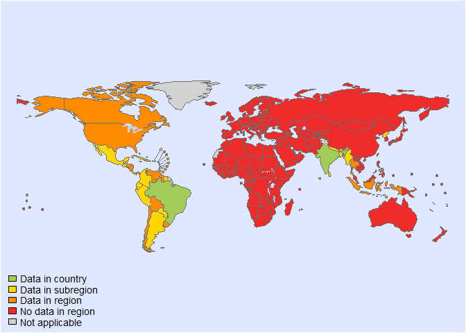
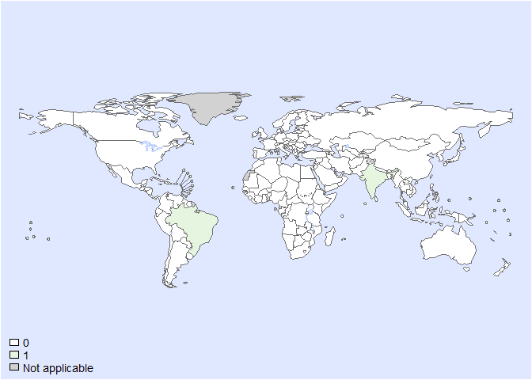
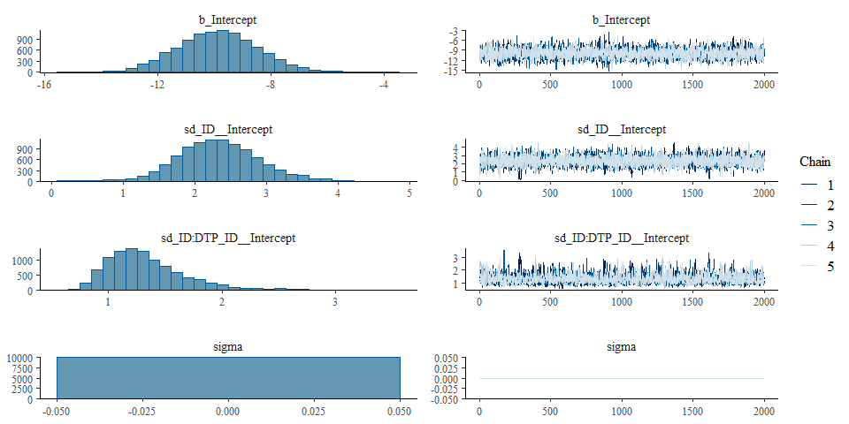

Global CFR of ascaris - Fit model- Version 1
================
fbbu6966
2025-02-24

- [Settings](#settings)
- [BRMS](#brms)
  - [BRMS model: Version 1](#brms-model-version-1)

# Settings

``` r
## required packages ----
library(bd)
library(brms)
```

    ## Loading required package: Rcpp

    ## Loading 'brms' package (version 2.21.0). Useful instructions
    ## can be found by typing help('brms'). A more detailed introduction
    ## to the package is available through vignette('brms_overview').

    ## 
    ## Attaching package: 'brms'

    ## The following object is masked from 'package:stats':
    ## 
    ##     ar

``` r
library(ggplot2)
library(metafor)
library(readxl)
library(rmarkdown)
library(rms)
```

    ## Loading required package: Hmisc

    ## 
    ## Attaching package: 'Hmisc'

    ## The following objects are masked from 'package:DescTools':
    ## 
    ##     %nin%, Label, Mean, Quantile

    ## The following objects are masked from 'package:dplyr':
    ## 
    ##     src, summarize

    ## The following objects are masked from 'package:base':
    ## 
    ##     format.pval, units

    ## 
    ## Attaching package: 'rms'

    ## The following object is masked from 'package:metafor':
    ## 
    ##     vif

``` r
library(tidyr)
library(dplyr)
library(knitr)

## global options ----
knitr::opts_chunk$set(fig.width = 10)
Date <- format(Sys.Date(), "%Y%m%d")
source("01-data-mortality.R")
```

    ## 'data.frame':    6003 obs. of  41 variables:
    ##  $ SOURCE_ID           : num  1 2 2 2 3 4 4 4 4 4 ...
    ##  $ SOURCE_AUTHOR       : chr  "Martin-melo,FR" "Chowdhury, TK" "Chowdhury, TK" "Chowdhury, TK" ...
    ##  $ SOURCE_YEAR         : num  2017 2023 2023 2023 2014 ...
    ##  $ SOURCE_TITLE        : chr  "Epidemiology of soil-transmitted helminthiases-related\r\nmortality in Brazil" "Trends of Mortality and Morbidity due to Ascariasis: A 14-year Analysis in a Tertiary Hospital in Bangladesh" "Trends of Mortality and Morbidity due to Ascariasis: A 14-year Analysis in a Tertiary Hospital in Bangladesh" "Trends of Mortality and Morbidity due to Ascariasis: A 14-year Analysis in a Tertiary Hospital in Bangladesh" ...
    ##  $ SOURCE_DOI          : chr  "10.1017/S0031182016002341" "https://doi.org/10.3329/bjid.v10i1.68739" "https://doi.org/10.3329/bjid.v10i1.68739" "https://doi.org/10.3329/bjid.v10i1.68739" ...
    ##  $ SOURCE_URL          : logi  NA NA NA NA NA NA ...
    ##  $ OPT_ACCESS_DATE     : logi  NA NA NA NA NA NA ...
    ##  $ OPT_STUDY_TYPE      : chr  "Other" "Other" "Other" "Other" ...
    ##  $ OPT_OTHER_STUDY_TYPE: chr  NA "Retrospective" "Retrospective" "Retrospective" ...
    ##  $ REF_NOTES           : chr  "12,491,280 is number of death" "Location: Chattogram; 2897 is number people with intestinal obstruction due to ascariasis" "Location: Chattogram; 246 is number people with intestinal obstruction due to ascariasis" "Location: Chattogram; 102 is number people with intestinal obstruction due to ascariasis" ...
    ##  $ REF_YEAR_START      : num  2000 2006 2006 2019 1950 ...
    ##  $ REF_YEAR_END        : num  2011 2019 2006 2019 1953 ...
    ##  $ REF_LOC_LEVEL       : chr  "National" "Sub-national" "Sub-national" "Sub-national" ...
    ##  $ REF_LOCATION        : chr  "Brazil" "Bangladesh" "Bangladesh" "Bangladesh" ...
    ##  $ REF_LOCATION_ISO3   : chr  "BRA" "BGD" "BGD" "BGD" ...
    ##  $ REF_SEX             : chr  "All sexes" "All sexes" "All sexes" "All sexes" ...
    ##  $ REF_AGE_START       : num  NA 0 0 0 NA 0 0 5 10 15 ...
    ##  $ REF_AGE_END         : num  NA 12 12 12 NA 120 5 10 15 120 ...
    ##  $ OPT_MEAN_AGE        : logi  NA NA NA NA NA NA ...
    ##  $ OPT_MEDIAN_AGE      : logi  NA NA NA NA NA NA ...
    ##  $ OPT_SUBPOP          : chr  NA "Children admitted and diagnosed as intestinal or biliary ascariasis" "Children admitted and diagnosed as intestinal or biliary ascariasis" "Children admitted and diagnosed as intestinal or biliary ascariasis" ...
    ##  $ OPT_CASES           : logi  NA NA NA NA NA NA ...
    ##  $ OPT_DISEASE         : logi  NA NA NA NA NA NA ...
    ##  $ OPT_SEROTYPE        : logi  NA NA NA NA NA NA ...
    ##  $ REF_SAMPLE_SIZE     : num  12491280 2897 246 102 7614 ...
    ##  $ VALUE_X             : num  827 NA NA NA 1 10500 3900 3900 2400 300 ...
    ##  $ VALUE_MEAN (%)      : chr  NA "19.67% in 2006 to 3.03% in 2019." "19.670000000000002" "3.03" ...
    ##  $ VALUE_MEDIAN        : logi  NA NA NA NA NA NA ...
    ##  $ VALUE_DENOM         : logi  NA NA NA NA NA NA ...
    ##  $ VALUE_SE            : logi  NA NA NA NA NA NA ...
    ##  $ VALUE_P000          : logi  NA NA NA NA NA NA ...
    ##  $ VALUE_P2_5          : logi  NA NA NA NA NA NA ...
    ##  $ VALUE_P5            : logi  NA NA NA NA NA NA ...
    ##  $ VALUE_P10           : logi  NA NA NA NA NA NA ...
    ##  $ VALUE_P25           : logi  NA NA NA NA NA NA ...
    ##  $ VALUE_P75           : logi  NA NA NA NA NA NA ...
    ##  $ VALUE_P90           : logi  NA NA NA NA NA NA ...
    ##  $ VALUE_P95           : logi  NA NA NA NA NA NA ...
    ##  $ VALUE_P97_5         : logi  NA NA NA NA NA NA ...
    ##  $ VALUE_P100          : logi  NA NA NA NA NA NA ...
    ##  $ Risk of bias        : chr  "Low" "Moderate" "Moderate" "Moderate" ...

    ## Warning in eval(ei, envir): NAs introduced by coercion

    ## Joining with `by = join_by(REF_YEAR_START, REF_YEAR_END, REF_SEX, REF_AGE_START, REF_AGE_END, ISO3, ID_ROW)`

    ## Warning in add_pop(dta): Warning: 12 rows have missing data for the population variable. Please check if ISO3 code is correctly
    ## specified and if the dates are included in the study field.

    ## Warning in RColorBrewer::brewer.pal(max_freq, "Greens"): minimal value for n is 3, returning requested palette with 3 different levels

<!-- -->

    ## Warning: REML comparisons not meaningful for models with different fixed effects
    ## (use 'refit=TRUE' to refit both models based on ML estimation).

<!-- -->

``` r
DTP_ID<-seq(1:length(es$SOURCE_ID))
es$DTP_ID<-as.character(DTP_ID)
es$FLAG <- factor(es$FLAG, 
                  levels = c(0,1,2,3,4,5,6,7),
                  labels = c("Keep data", "Data part of non WHO member states", "No WHO REG2 given",
                             "Year before 1990", "yi can't be calcualted", "TF choice to remove", 
                             "Excluded by preliminary checks", "Excluded in data cleaning"))
saveRDS(es, paste0("es_CFR_", Date, ".rds"))
```

# BRMS

``` r
Parameters <- c("Number of iteration", "Warmup", "Delta value", "Maximum tree-depth","Random effect on each data point", "Stronger priors specified")
Values <- c("5000","3000","NA","15","Yes", "Normal(0,1)")
version_spe <- data.frame(Parameters,Values)

kable(caption = "Parameters of the model tested",row.names = FALSE, version_spe)
```

| Parameters                       | Values      |
|:---------------------------------|:------------|
| Number of iteration              | 5000        |
| Warmup                           | 3000        |
| Delta value                      | NA          |
| Maximum tree-depth               | 15          |
| Random effect on each data point | Yes         |
| Stronger priors specified        | Normal(0,1) |

Parameters of the model tested

## BRMS model: Version 1

``` r
fit_brms_reg_CFR_s1 <-
  brm(yi | se(sei) ~
        1 + 
        (1  | ID)+
        (1  | ID:DTP_ID),
      chains = 5, iter = 5000, warmup = 3000,
      cores = 5,
      prior = prior(normal(0,1), class = sd),
      data = subset(es, as.integer(FLAG) == 1),
      open_progress = FALSE,
      control=list(max_treedepth = 15),
      seed =7 )
```

    ## Compiling Stan program...

    ## Start sampling

``` r
## model summary

summary(fit_brms_reg_CFR_s1)
```

    ##  Family: gaussian 
    ##   Links: mu = identity; sigma = identity 
    ## Formula: yi | se(sei) ~ 1 + (1 | ID) + (1 | ID:DTP_ID) 
    ##    Data: subset(es, as.integer(FLAG) == 1) (Number of observations: 13) 
    ##   Draws: 5 chains, each with iter = 5000; warmup = 3000; thin = 1;
    ##          total post-warmup draws = 10000
    ## 
    ## Multilevel Hyperparameters:
    ## ~ID (Number of levels: 3) 
    ##               Estimate Est.Error l-95% CI u-95% CI Rhat Bulk_ESS Tail_ESS
    ## sd(Intercept)     2.33      0.57     1.29     3.51 1.00     3735     2666
    ## 
    ## ~ID:DTP_ID (Number of levels: 13) 
    ##               Estimate Est.Error l-95% CI u-95% CI Rhat Bulk_ESS Tail_ESS
    ## sd(Intercept)     1.33      0.34     0.85     2.17 1.00     2046     2478
    ## 
    ## Regression Coefficients:
    ##           Estimate Est.Error l-95% CI u-95% CI Rhat Bulk_ESS Tail_ESS
    ## Intercept    -9.87      1.44   -12.63    -6.97 1.00     4139     4774
    ## 
    ## Further Distributional Parameters:
    ##       Estimate Est.Error l-95% CI u-95% CI Rhat Bulk_ESS Tail_ESS
    ## sigma     0.00      0.00     0.00     0.00   NA       NA       NA
    ## 
    ## Draws were sampled using sampling(NUTS). For each parameter, Bulk_ESS
    ## and Tail_ESS are effective sample size measures, and Rhat is the potential
    ## scale reduction factor on split chains (at convergence, Rhat = 1).

``` r
plot(fit_brms_reg_CFR_s1, ask = FALSE)
```

<!-- -->

``` r
# plot(conditional_effects(fit_brms_reg_CFR_s1), points = TRUE)


## show model code
stancode(fit_brms_reg_CFR_s1)
```

    ## // generated with brms 2.21.0
    ## functions {
    ## }
    ## data {
    ##   int<lower=1> N;  // total number of observations
    ##   vector[N] Y;  // response variable
    ##   vector<lower=0>[N] se;  // known sampling error
    ##   // data for group-level effects of ID 1
    ##   int<lower=1> N_1;  // number of grouping levels
    ##   int<lower=1> M_1;  // number of coefficients per level
    ##   array[N] int<lower=1> J_1;  // grouping indicator per observation
    ##   // group-level predictor values
    ##   vector[N] Z_1_1;
    ##   // data for group-level effects of ID 2
    ##   int<lower=1> N_2;  // number of grouping levels
    ##   int<lower=1> M_2;  // number of coefficients per level
    ##   array[N] int<lower=1> J_2;  // grouping indicator per observation
    ##   // group-level predictor values
    ##   vector[N] Z_2_1;
    ##   int prior_only;  // should the likelihood be ignored?
    ## }
    ## transformed data {
    ##   vector<lower=0>[N] se2 = square(se);
    ## }
    ## parameters {
    ##   real Intercept;  // temporary intercept for centered predictors
    ##   vector<lower=0>[M_1] sd_1;  // group-level standard deviations
    ##   array[M_1] vector[N_1] z_1;  // standardized group-level effects
    ##   vector<lower=0>[M_2] sd_2;  // group-level standard deviations
    ##   array[M_2] vector[N_2] z_2;  // standardized group-level effects
    ## }
    ## transformed parameters {
    ##   real sigma = 0;  // dispersion parameter
    ##   vector[N_1] r_1_1;  // actual group-level effects
    ##   vector[N_2] r_2_1;  // actual group-level effects
    ##   real lprior = 0;  // prior contributions to the log posterior
    ##   r_1_1 = (sd_1[1] * (z_1[1]));
    ##   r_2_1 = (sd_2[1] * (z_2[1]));
    ##   lprior += student_t_lpdf(Intercept | 3, -12.6, 2.5);
    ##   lprior += normal_lpdf(sd_1 | 0, 1)
    ##     - 1 * normal_lccdf(0 | 0, 1);
    ##   lprior += normal_lpdf(sd_2 | 0, 1)
    ##     - 1 * normal_lccdf(0 | 0, 1);
    ## }
    ## model {
    ##   // likelihood including constants
    ##   if (!prior_only) {
    ##     // initialize linear predictor term
    ##     vector[N] mu = rep_vector(0.0, N);
    ##     mu += Intercept;
    ##     for (n in 1:N) {
    ##       // add more terms to the linear predictor
    ##       mu[n] += r_1_1[J_1[n]] * Z_1_1[n] + r_2_1[J_2[n]] * Z_2_1[n];
    ##     }
    ##     target += normal_lpdf(Y | mu, se);
    ##   }
    ##   // priors including constants
    ##   target += lprior;
    ##   target += std_normal_lpdf(z_1[1]);
    ##   target += std_normal_lpdf(z_2[1]);
    ## }
    ## generated quantities {
    ##   // actual population-level intercept
    ##   real b_Intercept = Intercept;
    ## }

``` r
## save model fit
saveRDS(fit_brms_reg_CFR_s1, file = "fit_brms_reg_CFR_s1.rds")

##rmarkdown::render("02-fit.R")
```
