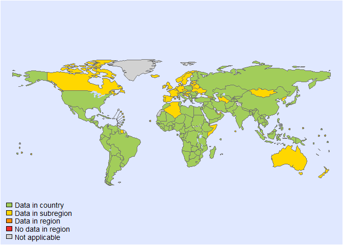
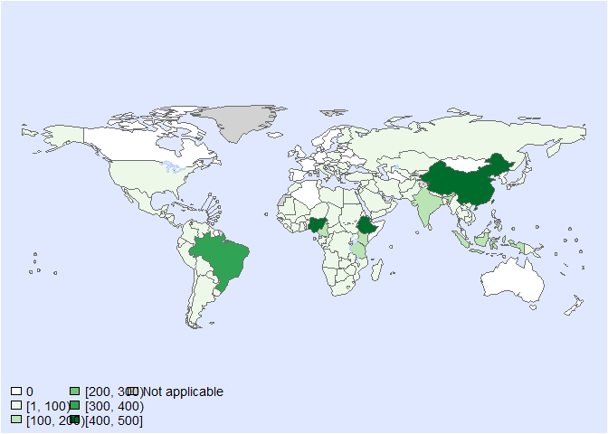

Global incidence of ascaris - Fit model- Version 17
================
LoVa3397
2025-09-26

- [Settings](#settings)
- [BRMS](#brms)
  - [BRMS model: Version 17](#brms-model-version-17)

# Settings

``` r
## required packages ----
library(bd)
library(brms)
library(ggplot2)
library(metafor)
library(readxl)
library(rmarkdown)
library(rms)
library(tidyr)
library(dplyr)
library(knitr)

## global options ----
knitr::opts_chunk$set(fig.width = 10)
Date <- format(Sys.Date(), "%Y%m%d")

source("01-data.R")
```

    ## Warning: Expecting numeric in AC1080 / R1080C29: got '<1'

    ## Warning: Expecting numeric in AC1702 / R1702C29: got '19..9'

    ## Warning: Expecting logical in Z2221 / R2221C26: got 'Diarrhea'

    ## Warning: Expecting logical in Z2222 / R2222C26: got 'Diarrhea'

    ## Warning: Expecting logical in G2738 / R2738C7: got 'X'

    ## Warning: Expecting logical in G3350 / R3350C7: got 'X'

    ## Warning: Expecting logical in G4202 / R4202C7: got 'X'

    ## Warning: Expecting numeric in AC4503 / R4503C29: got '<0.5%'

    ## Warning: Expecting numeric in L5234 / R5234C12: got ', United Republic of Tanzania'

    ## Warning: Expecting numeric in AA5986 / R5986C27: got '1275 '

    ## Warning: Expecting numeric in A5987 / R5987C1: got 'Behniafar'

    ## Warning: Expecting numeric in A5988 / R5988C1: got 'Ghafari'

    ## Warning: Expecting numeric in A5995 / R5995C1: got 'Bagheri'

    ## Warning: Expecting numeric in A5996 / R5996C1: got 'Rezapour'

    ## Warning: Expecting numeric in A5997 / R5997C1: got 'Ali'

    ## Warning: Expecting numeric in A5998 / R5998C1: got 'Jafari'

    ## Warning: Expecting numeric in A5999 / R5999C1: got 'Mohammadnia'

    ## Warning: There was 1 warning in `mutate()`.
    ## ℹ In argument: `OPT_MEAN_AGE = as.numeric(OPT_MEAN_AGE)`.
    ## Caused by warning:
    ## ! NAs introduced by coercion

    ## 'data.frame':    6255 obs. of  46 variables:
    ##  $ SOURCE_ID           : chr  "1" "2" "2" "3" ...
    ##  $ SOURCE_AUTHOR       : chr  "Yaro, CA" "Martsev, AA" "Martsev, AA" "Zhu, HH" ...
    ##  $ SOURCE_YEAR         : num  2022 2021 2021 2023 2023 ...
    ##  $ SOURCE_TITLE        : chr  "Evaluation of School-Based Health Education Intervention on the Incidence of Soil-Transmitted Helminths in Pupi"| __truncated__ "The role of environmental factors in the implementation of the epidemic process of ascariasis" "The role of environmental factors in the implementation of the epidemic process of ascariasis" "Soil-transmitted helminthiasis in mainland China from 2016 to 2020: a population-based study" ...
    ##  $ SOURCE_DOI          : chr  "10.1155/2022/3117646" "10.47470/0016-9900-2021-100-3-218-222" "10.47470/0016-9900-2021-100-3-218-222" "101016/j.lanwpc.2023.100766" ...
    ##  $ SOURCE_URL          : chr  NA NA NA NA ...
    ##  $ OPT_ACCESS_DATE     : chr  NA NA NA NA ...
    ##  $ OPT_STUDY_TYPE      : chr  "Cohort study" "Other" "Other" "Cross-sectional study" ...
    ##  $ OPT_OTHER_STUDY_TYPE: chr  NA NA NA NA ...
    ##  $ REF_NOTES           : chr  "Location: Kogi State" "Location: Vladimir Region" "Location: Vladimir Region" NA ...
    ##  $ REF_YEAR_START      : num  2018 2000 2016 2016 2017 ...
    ##  $ REF_YEAR_END        : num  2018 2000 2016 2016 2017 ...
    ##  $ REF_LOC_LEVEL       : chr  "Sub-national" "Sub-national" "Sub-national" "National" ...
    ##  $ REF_LOCATION        : chr  "Nigeria" "Russian Federation" "Russian Federation" "China" ...
    ##  $ REF_LOCATION_ISO3   : chr  "NGA" "RUS" "RUS" "CHN" ...
    ##  $ REF_SEX             : chr  "All sexes" "All sexes" "All sexes" "All sexes" ...
    ##  $ REF_AGE_START       : chr  "5" "0" "0" "0" ...
    ##  $ REF_AGE_END         : chr  "15" "125" "125" "125" ...
    ##  $ OPT_MEAN_AGE        : num  NA NA NA NA NA NA NA NA NA NA ...
    ##  $ OPT_MEDIAN_AGE      : chr  NA NA NA NA ...
    ##  $ OPT_SUBPOP          : chr  "Children " "General" "General" "General" ...
    ##  $ OPT_SUBPOP_CLEAN    : chr  "Children " "General" "General" "General" ...
    ##  $ TOP_SUBPOP_RURAL    : num  1 0 0 0 0 0 0 0 0 0 ...
    ##  $ OPT_CASES           : logi  NA NA NA NA NA NA ...
    ##  $ OPT_DISEASE         : chr  NA NA NA NA ...
    ##  $ OPT_SEROTYPE        : logi  NA NA NA NA NA NA ...
    ##  $ REF_SAMPLE_SIZE     : num  909 NA NA 262380 297078 ...
    ##  $ VALUE_X             : num  1 NA NA 1312 1188 ...
    ##  $ VALUE_MEAN          : num  0.11 21 74 0.5 0.4 0.1 0.2 0.1 18.3 1.8 ...
    ##  $ VALUE_MEDIAN        : logi  NA NA NA NA NA NA ...
    ##  $ VALUE_DENOM         : num  NA 1e+05 1e+05 NA NA NA NA NA 1e+03 1e+05 ...
    ##  $ VALUE_SE            : logi  NA NA NA NA NA NA ...
    ##  $ VALUE_P000          : logi  NA NA NA NA NA NA ...
    ##  $ VALUE_P2_5          : logi  NA NA NA NA NA NA ...
    ##  $ VALUE_P5            : logi  NA NA NA NA NA NA ...
    ##  $ VALUE_P10           : logi  NA NA NA NA NA NA ...
    ##  $ VALUE_P25           : logi  NA NA NA NA NA NA ...
    ##  $ VALUE_P75           : logi  NA NA NA NA NA NA ...
    ##  $ VALUE_P90           : logi  NA NA NA NA NA NA ...
    ##  $ VALUE_P95           : logi  NA NA NA NA NA NA ...
    ##  $ VALUE_P97_5         : logi  NA NA NA NA NA NA ...
    ##  $ VALUE_P100          : logi  NA NA NA NA NA NA ...
    ##  $ INCLUDED(YES/NO)    : logi  NA NA NA NA NA NA ...
    ##  $ Reason_EXC          : logi  NA NA NA NA NA NA ...
    ##  $ Risk of bias        : chr  "Low" "Moderate" "Moderate" "Low" ...
    ##  $ FLAG                : num  7 0 0 0 0 0 0 0 0 0 ...

    ## Joining with `by = join_by(SOURCE_ID, SOURCE_AUTHOR, SOURCE_YEAR, SOURCE_TITLE, SOURCE_DOI,
    ## SOURCE_URL, OPT_ACCESS_DATE, OPT_STUDY_TYPE, OPT_OTHER_STUDY_TYPE, REF_NOTES,
    ## REF_YEAR_START, REF_YEAR_END, REF_LOC_LEVEL, REF_LOCATION, REF_LOCATION_ISO3, REF_SEX,
    ## REF_AGE_START, REF_AGE_END, OPT_MEAN_AGE, OPT_MEDIAN_AGE, OPT_SUBPOP, OPT_CASES,
    ## OPT_DISEASE, OPT_SEROTYPE, REF_SAMPLE_SIZE, VALUE_X, VALUE_MEAN, VALUE_MEDIAN, VALUE_DENOM,
    ## VALUE_SE, VALUE_P000, VALUE_P2_5, VALUE_P5, VALUE_P10, VALUE_P25, VALUE_P75, VALUE_P90,
    ## VALUE_P95, VALUE_P97_5, VALUE_P100, `INCLUDED(YES/NO)`, Reason_EXC, `Risk of bias`)`

    ## Warning in eval(ei, envir): NAs introduced by coercion

    ## Warning in eval(ei, envir): NAs introduced by coercion

    ## Warning: There was 1 warning in `mutate()`.
    ## ℹ In argument: `REF_AGE_START = case_when(...)`.
    ## Caused by warning in `vec_case_when()`:
    ## ! NAs introduced by coercion

    ## Warning: There was 1 warning in `mutate()`.
    ## ℹ In argument: `REF_AGE_END = case_when(...)`.
    ## Caused by warning in `vec_case_when()`:
    ## ! NAs introduced by coercion

    ## Joining with `by = join_by(REF_YEAR_START, REF_YEAR_END, REF_SEX, REF_AGE_START,
    ## REF_AGE_END, ISO3, ID_ROW)`

    ## Warning in add_pop(dta): Warning: 244 rows have missing data for the population variable.
    ## Please check if ISO3 code is correctly specified and if the dates are included in the study
    ## field.

<!-- --><!-- -->

    ## Warning in system2("quarto", "-V", stdout = TRUE, env = paste0("TMPDIR=", : running command
    ## '"quarto" TMPDIR=C:/Users/LoVa3397/AppData/Local/Temp/RtmpGUCezN/file25c446b2ff5 -V' had
    ## status 1

``` r
DTP_ID<-seq(1:length(es$SOURCE_ID))
es$DTP_ID<-as.character(DTP_ID)
es$FLAG <- factor(es$FLAG, 
                  levels = c(0,1,2,3,4,5,6,7),
                  labels = c("Keep data", "Data part of non WHO member states", "No WHO REG2 given",
                             "Year before 1990", "yi can't be calcualted", "TF choice to remove", 
                             "Excluded by preliminary checks", "Excluded in data cleaning"))
saveRDS(es, paste0("es_", Date, ".RDS"))
es <- subset(es, as.integer(FLAG) == 1)

es <- es %>% 
  mutate(SUBPOP = case_when(
    OPT_SUBPOP_CLEAN == "General" ~ 1, 
    OPT_SUBPOP_CLEAN == "Children" ~ 2, 
    OPT_SUBPOP_CLEAN == "Adults" ~ 3))
es$SUBPOP <- factor(es$SUBPOP, 
                  levels = c(1,2,3),
                  labels = c("General", "Children", "Adults"))
```

# BRMS

``` r
Parameters <- c("Number of iteration", "Warmup", "Delta value", "Maximum tree-depth","Random effect on each data point", "Stronger priors specified")
Values <- c("5000","3000","0.9","15","Yes", "Normal(0,1)")
version_spe <- data.frame(Parameters,Values)

kable(caption = "Parameters of the model tested",row.names = FALSE, version_spe)
```

| Parameters                       | Values      |
|:---------------------------------|:------------|
| Number of iteration              | 5000        |
| Warmup                           | 3000        |
| Delta value                      | 0.9         |
| Maximum tree-depth               | 20          |
| Random effect on each data point | Yes         |
| Stronger priors specified        | Normal(0,1) |

Parameters of the model tested

## BRMS model: Version 17

``` r
fit_brms_reg_s17 <-
  brm(yi | se(sei) ~
        1 + YEAR + SUBPOP +
        (1  | REG2) +
        (1  | REG2:SUB2) +
        (1  | REG2:SUB2:COUNTRY) +
        (1  | REG2:SUB2:COUNTRY:ID)+
        (1  | REG2:SUB2:COUNTRY:ID:DTP_ID),
      chains = 5, iter = 5000, warmup = 3000,
      cores = 5,
      prior = prior(normal(0,1), class = sd),
      data = subset(es, as.integer(FLAG)==1),
      open_progress = FALSE,
      control=list(adapt_delta=0.9, max_treedepth = 20),
      seed =7 )
```

    ## Compiling Stan program...

    ## Start sampling

    ## Warning: There were 84 divergent transitions after warmup. See
    ## https://mc-stan.org/misc/warnings.html#divergent-transitions-after-warmup
    ## to find out why this is a problem and how to eliminate them.

    ## Warning: Examine the pairs() plot to diagnose sampling problems

``` r
## model summary

summary(fit_brms_reg_s17)
```

    ## Warning: There were 84 divergent transitions after warmup. Increasing adapt_delta above 0.9 may help. See
    ## http://mc-stan.org/misc/warnings.html#divergent-transitions-after-warmup

    ##  Family: gaussian 
    ##   Links: mu = identity; sigma = identity 
    ## Formula: yi | se(sei) ~ 1 + YEAR + SUBPOP + (1 | REG2) + (1 | REG2:SUB2) + (1 | REG2:SUB2:COUNTRY) + (1 | REG2:SUB2:COUNTRY:ID) + (1 | REG2:SUB2:COUNTRY:ID:DTP_ID) 
    ##    Data: subset(es, as.integer(FLAG) == 1) (Number of observations: 4426) 
    ##   Draws: 5 chains, each with iter = 5000; warmup = 3000; thin = 1;
    ##          total post-warmup draws = 10000
    ## 
    ## Multilevel Hyperparameters:
    ## ~REG2 (Number of levels: 6) 
    ##               Estimate Est.Error l-95% CI u-95% CI Rhat Bulk_ESS Tail_ESS
    ## sd(Intercept)     0.55      0.39     0.02     1.48 1.00     3828     4602
    ## 
    ## ~REG2:SUB2 (Number of levels: 17) 
    ##               Estimate Est.Error l-95% CI u-95% CI Rhat Bulk_ESS Tail_ESS
    ## sd(Intercept)     1.19      0.33     0.56     1.88 1.00     3052     2685
    ## 
    ## ~REG2:SUB2:COUNTRY (Number of levels: 128) 
    ##               Estimate Est.Error l-95% CI u-95% CI Rhat Bulk_ESS Tail_ESS
    ## sd(Intercept)     1.37      0.13     1.13     1.65 1.00     2574     4283
    ## 
    ## ~REG2:SUB2:COUNTRY:ID (Number of levels: 2103) 
    ##               Estimate Est.Error l-95% CI u-95% CI Rhat Bulk_ESS Tail_ESS
    ## sd(Intercept)     1.29      0.02     1.24     1.34 1.00     2412     4351
    ## 
    ## ~REG2:SUB2:COUNTRY:ID:DTP_ID (Number of levels: 4426) 
    ##               Estimate Est.Error l-95% CI u-95% CI Rhat Bulk_ESS Tail_ESS
    ## sd(Intercept)     0.43      0.01     0.41     0.45 1.00     2646     4749
    ## 
    ## Regression Coefficients:
    ##                Estimate Est.Error l-95% CI u-95% CI Rhat Bulk_ESS Tail_ESS
    ## Intercept        148.96      6.94   135.27   162.62 1.00     1760     3387
    ## YEAR              -0.07      0.00    -0.08    -0.06 1.00     1757     3432
    ## SUBPOPChildren     0.31      0.05     0.22     0.40 1.00     2146     3916
    ## SUBPOPAdults      -0.00      0.06    -0.12     0.12 1.00     2966     5170
    ## 
    ## Further Distributional Parameters:
    ##       Estimate Est.Error l-95% CI u-95% CI Rhat Bulk_ESS Tail_ESS
    ## sigma     0.00      0.00     0.00     0.00   NA       NA       NA
    ## 
    ## Draws were sampled using sampling(NUTS). For each parameter, Bulk_ESS
    ## and Tail_ESS are effective sample size measures, and Rhat is the potential
    ## scale reduction factor on split chains (at convergence, Rhat = 1).

``` r
plot(fit_brms_reg_s17, ask = FALSE)
plot(conditional_effects(fit_brms_reg_s17), points = TRUE)


## show model code
stancode(fit_brms_reg_s17)
```

    ## // generated with brms 2.22.0
    ## functions {
    ## }
    ## data {
    ##   int<lower=1> N;  // total number of observations
    ##   vector[N] Y;  // response variable
    ##   vector<lower=0>[N] se;  // known sampling error
    ##   int<lower=1> K;  // number of population-level effects
    ##   matrix[N, K] X;  // population-level design matrix
    ##   int<lower=1> Kc;  // number of population-level effects after centering
    ##   // data for group-level effects of ID 1
    ##   int<lower=1> N_1;  // number of grouping levels
    ##   int<lower=1> M_1;  // number of coefficients per level
    ##   array[N] int<lower=1> J_1;  // grouping indicator per observation
    ##   // group-level predictor values
    ##   vector[N] Z_1_1;
    ##   // data for group-level effects of ID 2
    ##   int<lower=1> N_2;  // number of grouping levels
    ##   int<lower=1> M_2;  // number of coefficients per level
    ##   array[N] int<lower=1> J_2;  // grouping indicator per observation
    ##   // group-level predictor values
    ##   vector[N] Z_2_1;
    ##   // data for group-level effects of ID 3
    ##   int<lower=1> N_3;  // number of grouping levels
    ##   int<lower=1> M_3;  // number of coefficients per level
    ##   array[N] int<lower=1> J_3;  // grouping indicator per observation
    ##   // group-level predictor values
    ##   vector[N] Z_3_1;
    ##   // data for group-level effects of ID 4
    ##   int<lower=1> N_4;  // number of grouping levels
    ##   int<lower=1> M_4;  // number of coefficients per level
    ##   array[N] int<lower=1> J_4;  // grouping indicator per observation
    ##   // group-level predictor values
    ##   vector[N] Z_4_1;
    ##   // data for group-level effects of ID 5
    ##   int<lower=1> N_5;  // number of grouping levels
    ##   int<lower=1> M_5;  // number of coefficients per level
    ##   array[N] int<lower=1> J_5;  // grouping indicator per observation
    ##   // group-level predictor values
    ##   vector[N] Z_5_1;
    ##   int prior_only;  // should the likelihood be ignored?
    ## }
    ## transformed data {
    ##   vector<lower=0>[N] se2 = square(se);
    ##   matrix[N, Kc] Xc;  // centered version of X without an intercept
    ##   vector[Kc] means_X;  // column means of X before centering
    ##   for (i in 2:K) {
    ##     means_X[i - 1] = mean(X[, i]);
    ##     Xc[, i - 1] = X[, i] - means_X[i - 1];
    ##   }
    ## }
    ## parameters {
    ##   vector[Kc] b;  // regression coefficients
    ##   real Intercept;  // temporary intercept for centered predictors
    ##   vector<lower=0>[M_1] sd_1;  // group-level standard deviations
    ##   array[M_1] vector[N_1] z_1;  // standardized group-level effects
    ##   vector<lower=0>[M_2] sd_2;  // group-level standard deviations
    ##   array[M_2] vector[N_2] z_2;  // standardized group-level effects
    ##   vector<lower=0>[M_3] sd_3;  // group-level standard deviations
    ##   array[M_3] vector[N_3] z_3;  // standardized group-level effects
    ##   vector<lower=0>[M_4] sd_4;  // group-level standard deviations
    ##   array[M_4] vector[N_4] z_4;  // standardized group-level effects
    ##   vector<lower=0>[M_5] sd_5;  // group-level standard deviations
    ##   array[M_5] vector[N_5] z_5;  // standardized group-level effects
    ## }
    ## transformed parameters {
    ##   real sigma = 0;  // dispersion parameter
    ##   vector[N_1] r_1_1;  // actual group-level effects
    ##   vector[N_2] r_2_1;  // actual group-level effects
    ##   vector[N_3] r_3_1;  // actual group-level effects
    ##   vector[N_4] r_4_1;  // actual group-level effects
    ##   vector[N_5] r_5_1;  // actual group-level effects
    ##   real lprior = 0;  // prior contributions to the log posterior
    ##   r_1_1 = (sd_1[1] * (z_1[1]));
    ##   r_2_1 = (sd_2[1] * (z_2[1]));
    ##   r_3_1 = (sd_3[1] * (z_3[1]));
    ##   r_4_1 = (sd_4[1] * (z_4[1]));
    ##   r_5_1 = (sd_5[1] * (z_5[1]));
    ##   lprior += student_t_lpdf(Intercept | 3, 9.3, 2.5);
    ##   lprior += normal_lpdf(sd_1 | 0, 1)
    ##     - 1 * normal_lccdf(0 | 0, 1);
    ##   lprior += normal_lpdf(sd_2 | 0, 1)
    ##     - 1 * normal_lccdf(0 | 0, 1);
    ##   lprior += normal_lpdf(sd_3 | 0, 1)
    ##     - 1 * normal_lccdf(0 | 0, 1);
    ##   lprior += normal_lpdf(sd_4 | 0, 1)
    ##     - 1 * normal_lccdf(0 | 0, 1);
    ##   lprior += normal_lpdf(sd_5 | 0, 1)
    ##     - 1 * normal_lccdf(0 | 0, 1);
    ## }
    ## model {
    ##   // likelihood including constants
    ##   if (!prior_only) {
    ##     // initialize linear predictor term
    ##     vector[N] mu = rep_vector(0.0, N);
    ##     mu += Intercept + Xc * b;
    ##     for (n in 1:N) {
    ##       // add more terms to the linear predictor
    ##       mu[n] += r_1_1[J_1[n]] * Z_1_1[n] + r_2_1[J_2[n]] * Z_2_1[n] + r_3_1[J_3[n]] * Z_3_1[n] + r_4_1[J_4[n]] * Z_4_1[n] + r_5_1[J_5[n]] * Z_5_1[n];
    ##     }
    ##     target += normal_lpdf(Y | mu, se);
    ##   }
    ##   // priors including constants
    ##   target += lprior;
    ##   target += std_normal_lpdf(z_1[1]);
    ##   target += std_normal_lpdf(z_2[1]);
    ##   target += std_normal_lpdf(z_3[1]);
    ##   target += std_normal_lpdf(z_4[1]);
    ##   target += std_normal_lpdf(z_5[1]);
    ## }
    ## generated quantities {
    ##   // actual population-level intercept
    ##   real b_Intercept = Intercept - dot_product(means_X, b);
    ## }

``` r
## save model fit
saveRDS(fit_brms_reg_s17, file = "fit_brms_reg_s17.rds")

##rmarkdown::render("02-fit.R")
```
