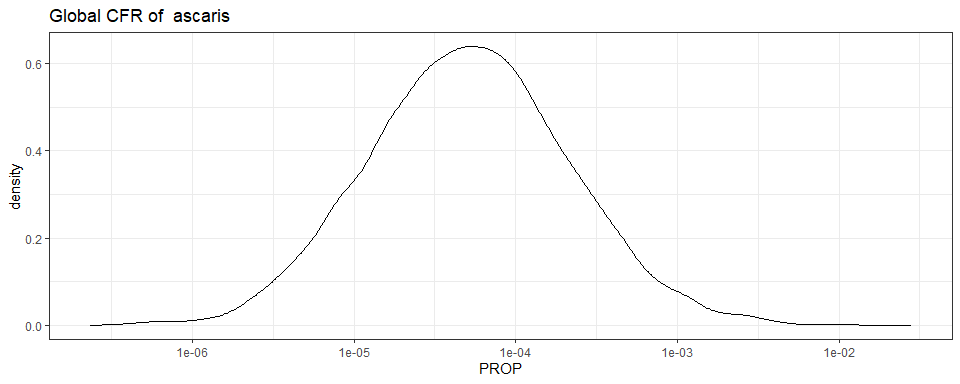

Global CFR of ascaris - Estimates - Version 1
================
fbbu6966
2025-02-24

- [Settings](#settings)
- [Parameters model](#parameters-model)
- [Model fit](#model-fit)
- [Predict all](#predict-all)
- [Summarize predictions: global](#summarize-predictions-global)
- [Session info](#session-info)

# Settings

``` r
## required packages ----
library(bd)
library(brms)
library(FERG2)
library(ggplot2)
library(knitr)
library(rmarkdown)
library(sf)
library(tidyr)
library(dplyr)
library(DescTools)
library(readxl)

## global options ----
knitr::opts_chunk$set(fig.width = 10)
Date <- format(Sys.Date(), "%Y%m%d")
```

# Parameters model

``` r
Parameters <- c("Number of iteration", "Warmup", "Delta value", "Maximum tree-depth","Random effect on each data point", "Stronger priors specified")
Values <- c("5000","3000","NA","15","Yes", "Normal(0,1)")
version_spe <- data.frame(Parameters,Values)

kable(caption = "Parameters of the model tested",row.names = FALSE, version_spe)
```

| Parameters                       | Values      |
|:---------------------------------|:------------|
| Number of iteration              | 5000        |
| Warmup                           | 3000        |
| Delta value                      | NA          |
| Maximum tree-depth               | 15          |
| Random effect on each data point | Yes         |
| Stronger priors specified        | Normal(0,1) |

Parameters of the model tested

# Model fit

``` r
es_files <- list.files(pattern="^es_CFR_\\d{8}\\.rds$", full.names=TRUE, ignore.case = TRUE)
es_dates <- as.Date(sub("^es_CFR_(\\d{8})\\.rds$", "\\1", basename(es_files), ignore.case = TRUE), format = "%Y%m%d")
es_latest <- es_files[which.max(es_dates)]
es<- readRDS(es_latest)
es <- subset(es, as.integer(FLAG) == 1)

fit_brms_reg_s <- readRDS("fit_brms_reg_CFR_s1.rds")
summary(fit_brms_reg_s)
```

    ##  Family: gaussian 
    ##   Links: mu = identity; sigma = identity 
    ## Formula: yi | se(sei) ~ 1 + (1 | ID) + (1 | ID:DTP_ID) 
    ##    Data: subset(es, as.integer(FLAG) == 1) (Number of observations: 13) 
    ##   Draws: 5 chains, each with iter = 5000; warmup = 3000; thin = 1;
    ##          total post-warmup draws = 10000
    ## 
    ## Multilevel Hyperparameters:
    ## ~ID (Number of levels: 3) 
    ##               Estimate Est.Error l-95% CI u-95% CI Rhat Bulk_ESS Tail_ESS
    ## sd(Intercept)     2.33      0.57     1.29     3.51 1.00     3735     2666
    ## 
    ## ~ID:DTP_ID (Number of levels: 13) 
    ##               Estimate Est.Error l-95% CI u-95% CI Rhat Bulk_ESS Tail_ESS
    ## sd(Intercept)     1.33      0.34     0.85     2.17 1.00     2046     2478
    ## 
    ## Regression Coefficients:
    ##           Estimate Est.Error l-95% CI u-95% CI Rhat Bulk_ESS Tail_ESS
    ## Intercept    -9.87      1.44   -12.63    -6.97 1.00     4139     4774
    ## 
    ## Further Distributional Parameters:
    ##       Estimate Est.Error l-95% CI u-95% CI Rhat Bulk_ESS Tail_ESS
    ## sigma     0.00      0.00     0.00     0.00   NA       NA       NA
    ## 
    ## Draws were sampled using sampling(NUTS). For each parameter, Bulk_ESS
    ## and Tail_ESS are effective sample size measures, and Rhat is the potential
    ## scale reduction factor on split chains (at convergence, Rhat = 1).

``` r
zero_cases<- read_xlsx("endemic_countries.xlsx")%>%
  select(REG2, SUB2, ISO3, Country, `Ascaris spp`) %>% 
  rename(COUNTRY=ISO3, COUNTRY_LABEL = Country) %>%
  mutate(DISEASEFREE = `Ascaris spp`) 
```

    ## New names:
    ## • `` -> `...28`

``` r
kable(
  caption = "Countries assumed to be non-endemic",
  row.names = FALSE,
  subset(zero_cases, DISEASEFREE==0)[, 4])
```

| COUNTRY_LABEL |
|:--------------|

Countries assumed to be non-endemic

# Predict all

``` r
## set up dataframe
sim_all <-
  data.frame(
    sei = 0) %>%
  distinct()

## draw from expected value of posterior predictive dist
set.seed(10)
# fit_all <- 
#   posterior_epred(
#     object = fit_brms_reg_s,
#     newdata = sim_all,
#     allow_new_levels = TRUE,
#     sample_new_levels = "uncertainty",
#     re_formula = ~ 1 + YEAR +
#       (1 | REG2) +
#       (1 | REG2:SUB2) +
#       (1 | REG2:SUB2:COUNTRY)
#   )

draws_fit <- as_draws_df(fit_brms_reg_s) %>% as.data.frame()

## calculate proportions
sim_all$SIM <- t(draws_fit$b_Intercept)
sim_all$PROP <- expit(sim_all$SIM)
saveRDS(sim_all, "sim_all.rds")

## global predictions
all_glb_prop <- t(apply(sim_all$PROP, 1, mean_ci))
all_glb_prop <- data.frame(all_glb_prop)
names(all_glb_prop) <- c("VAL_MEAN", "VAL_LWR", "VAL_UPR")
all_glb_prop$LOCATION <- "Global"
all_glb_prop$LOCATION_NAME <- "Global"
all_glb_prop$METRIC <- "CFR"
str(all_glb_prop)
```

    ## 'data.frame':    1 obs. of  6 variables:
    ##  $ VAL_MEAN     : num 0.000157
    ##  $ VAL_LWR      : num 3.26e-06
    ##  $ VAL_UPR      : num 0.000941
    ##  $ LOCATION     : chr "Global"
    ##  $ LOCATION_NAME: chr "Global"
    ##  $ METRIC       : chr "CFR"

``` r
## compile all
all_est <-
  rbind(all_glb_prop)
str(all_est)
```

    ## 'data.frame':    1 obs. of  6 variables:
    ##  $ VAL_MEAN     : num 0.000157
    ##  $ VAL_LWR      : num 3.26e-06
    ##  $ VAL_UPR      : num 0.000941
    ##  $ LOCATION     : chr "Global"
    ##  $ LOCATION_NAME: chr "Global"
    ##  $ METRIC       : chr "CFR"

``` r
saveRDS(all_est, file = "all_estimates.rds")
```

# Summarize predictions: global

``` r
kable(
  caption = paste0("Global CFR of ascaris"),
  row.names = FALSE,
  subset(all_glb_prop)[, c(1:3)])
```

|  VAL_MEAN | VAL_LWR |   VAL_UPR |
|----------:|--------:|----------:|
| 0.0001571 | 3.3e-06 | 0.0009407 |

Global CFR of ascaris

``` r
sim_all_glb <- sim_all %>%
  select(PROP) %>%
  mutate_at("PROP", as.data.frame) %>%
  unnest(PROP)
sim_all_glb_long <-
  pivot_longer(sim_all_glb, cols = starts_with("V"))
sim_all_glb_long$PROP <- sim_all_glb_long$value
```

``` r
ggplot(subset(sim_all_glb_long), aes(x = PROP)) +
  geom_density() +
  theme_bw() +
scale_x_log10() +
  ggtitle(paste0("Global CFR of  ascaris"))
```

<!-- -->

``` r
dev.off()
```

    ## null device 
    ##           1

# Session info

``` r
saveRDS(sim_all, paste0("sim_all_CFR_", Date, ".rds"))
saveRDS(all_est, paste0("all_est_CFR_", Date, ".rds"))
sessioninfo::session_info()
```

    ## ─ Session info ────────────────────────────────────────────────────────────────────────────────────────────────────────────────
    ##  setting  value
    ##  version  R version 4.4.1 (2024-06-14 ucrt)
    ##  os       Windows 10 x64 (build 19045)
    ##  system   x86_64, mingw32
    ##  ui       RStudio
    ##  language (EN)
    ##  collate  English_United States.utf8
    ##  ctype    English_United States.utf8
    ##  tz       Europe/Brussels
    ##  date     2025-02-24
    ##  rstudio  2024.04.2+764 Chocolate Cosmos (desktop)
    ##  pandoc   3.1.11 @ C:/Users/fbbu6966/AppData/Local/Programs/RStudio/resources/app/bin/quarto/bin/tools/ (via rmarkdown)
    ## 
    ## ─ Packages ────────────────────────────────────────────────────────────────────────────────────────────────────────────────────
    ##  ! package        * version    date (UTC) lib source
    ##    abind            1.4-5      2016-07-21 [1] CRAN (R 4.4.0)
    ##    backports        1.5.0      2024-05-23 [1] CRAN (R 4.4.0)
    ##    base64enc        0.1-3      2015-07-28 [1] CRAN (R 4.4.0)
    ##    bayesplot        1.11.1     2024-02-15 [1] CRAN (R 4.4.1)
    ##    bd             * 0.0.13     2024-08-03 [1] Github (brechtdv/bd@b63c017)
    ##    boot             1.3-30     2024-02-26 [1] CRAN (R 4.4.1)
    ##    bridgesampling   1.1-2      2021-04-16 [1] CRAN (R 4.4.1)
    ##    brms           * 2.21.0     2024-03-20 [1] CRAN (R 4.4.1)
    ##    Brobdingnag      1.2-9      2022-10-19 [1] CRAN (R 4.4.1)
    ##    cellranger       1.1.0      2016-07-27 [1] CRAN (R 4.4.1)
    ##    checkmate        2.3.1      2023-12-04 [1] CRAN (R 4.4.1)
    ##    class            7.3-22     2023-05-03 [1] CRAN (R 4.4.1)
    ##    classInt         0.4-10     2023-09-05 [1] CRAN (R 4.4.1)
    ##    cli              3.6.3      2024-06-21 [1] CRAN (R 4.4.1)
    ##    cluster          2.1.6      2023-12-01 [1] CRAN (R 4.4.1)
    ##    coda             0.19-4.1   2024-01-31 [1] CRAN (R 4.4.1)
    ##    codetools        0.2-20     2024-03-31 [1] CRAN (R 4.4.1)
    ##    colorspace       2.1-0      2023-01-23 [1] CRAN (R 4.4.1)
    ##    curl             5.2.1      2024-03-01 [1] CRAN (R 4.4.1)
    ##    data.table       1.15.4     2024-03-30 [1] CRAN (R 4.4.1)
    ##    DBI              1.2.3      2024-06-02 [1] CRAN (R 4.4.1)
    ##    DescTools      * 0.99.55    2024-07-29 [1] CRAN (R 4.4.1)
    ##    digest           0.6.36     2024-06-23 [1] CRAN (R 4.4.1)
    ##    distributional   0.4.0      2024-02-07 [1] CRAN (R 4.4.1)
    ##    dplyr          * 1.1.4      2023-11-17 [1] CRAN (R 4.4.1)
    ##    e1071            1.7-14     2023-12-06 [1] CRAN (R 4.4.1)
    ##    evaluate         0.24.0     2024-06-10 [1] CRAN (R 4.4.1)
    ##    Exact            3.3        2024-07-21 [1] CRAN (R 4.4.1)
    ##    expm             0.999-9    2024-01-11 [1] CRAN (R 4.4.1)
    ##    fansi            1.0.6      2023-12-08 [1] CRAN (R 4.4.1)
    ##    farver           2.1.2      2024-05-13 [1] CRAN (R 4.4.1)
    ##    fastmap          1.2.0      2024-05-15 [1] CRAN (R 4.4.1)
    ##    FERG2          * 0.0.2      2025-02-21 [1] Github (brechtdv/FERG2@3d51b14)
    ##    foreign          0.8-86     2023-11-28 [1] CRAN (R 4.4.1)
    ##    Formula          1.2-5      2023-02-24 [1] CRAN (R 4.4.0)
    ##    generics         0.1.3      2022-07-05 [1] CRAN (R 4.4.1)
    ##    ggplot2        * 3.5.1      2024-04-23 [1] CRAN (R 4.4.1)
    ##    gld              2.6.6      2022-10-23 [1] CRAN (R 4.4.1)
    ##    glue             1.8.0      2024-09-30 [1] CRAN (R 4.4.2)
    ##    gridExtra        2.3        2017-09-09 [1] CRAN (R 4.4.1)
    ##    gtable           0.3.5      2024-04-22 [1] CRAN (R 4.4.1)
    ##    highr            0.11       2024-05-26 [1] CRAN (R 4.4.1)
    ##    Hmisc          * 5.1-3      2024-05-28 [1] CRAN (R 4.4.1)
    ##    htmlTable        2.4.3      2024-07-21 [1] CRAN (R 4.4.1)
    ##    htmltools        0.5.8.1    2024-04-04 [1] CRAN (R 4.4.1)
    ##    htmlwidgets      1.6.4      2023-12-06 [1] CRAN (R 4.4.1)
    ##    httr             1.4.7      2023-08-15 [1] CRAN (R 4.4.1)
    ##    inline           0.3.19     2021-05-31 [1] CRAN (R 4.4.1)
    ##    jsonlite         1.8.8      2023-12-04 [1] CRAN (R 4.4.1)
    ##    KernSmooth       2.23-24    2024-05-17 [1] CRAN (R 4.4.1)
    ##    knitr          * 1.48       2024-07-07 [1] CRAN (R 4.4.1)
    ##    labeling         0.4.3      2023-08-29 [1] CRAN (R 4.4.0)
    ##    lattice          0.22-6     2024-03-20 [1] CRAN (R 4.4.1)
    ##    lifecycle        1.0.4      2023-11-07 [1] CRAN (R 4.4.1)
    ##    lmom             3.0        2023-08-29 [1] CRAN (R 4.4.0)
    ##    loo              2.8.0      2024-07-03 [1] CRAN (R 4.4.1)
    ##    magrittr         2.0.3      2022-03-30 [1] CRAN (R 4.4.1)
    ##    MASS             7.3-60.2   2024-04-26 [1] CRAN (R 4.4.1)
    ##    mathjaxr         1.6-0      2022-02-28 [1] CRAN (R 4.4.1)
    ##    Matrix         * 1.7-0      2024-04-26 [1] CRAN (R 4.4.1)
    ##    MatrixModels     0.5-3      2023-11-06 [1] CRAN (R 4.4.1)
    ##    matrixStats      1.3.0      2024-04-11 [1] CRAN (R 4.4.1)
    ##    metadat        * 1.2-0      2022-04-06 [1] CRAN (R 4.4.1)
    ##    metafor        * 4.6-0      2024-03-28 [1] CRAN (R 4.4.1)
    ##    mgcv             1.9-1      2023-12-21 [1] CRAN (R 4.4.1)
    ##    multcomp         1.4-26     2024-07-18 [1] CRAN (R 4.4.1)
    ##    munsell          0.5.1      2024-04-01 [1] CRAN (R 4.4.1)
    ##    mvtnorm          1.2-5      2024-05-21 [1] CRAN (R 4.4.1)
    ##    nlme             3.1-164    2023-11-27 [1] CRAN (R 4.4.1)
    ##    nnet             7.3-19     2023-05-03 [1] CRAN (R 4.4.1)
    ##    numDeriv       * 2016.8-1.1 2019-06-06 [1] CRAN (R 4.4.0)
    ##    pillar           1.9.0      2023-03-22 [1] CRAN (R 4.4.1)
    ##    pkgbuild         1.4.4      2024-03-17 [1] CRAN (R 4.4.1)
    ##    pkgconfig        2.0.3      2019-09-22 [1] CRAN (R 4.4.1)
    ##    plyr             1.8.9      2023-10-02 [1] CRAN (R 4.4.1)
    ##    polspline        1.1.25     2024-05-10 [1] CRAN (R 4.4.0)
    ##    posterior        1.6.0      2024-07-03 [1] CRAN (R 4.4.1)
    ##    proxy            0.4-27     2022-06-09 [1] CRAN (R 4.4.1)
    ##    purrr            1.0.2      2023-08-10 [1] CRAN (R 4.4.1)
    ##    quantreg         5.98       2024-05-26 [1] CRAN (R 4.4.1)
    ##    QuickJSR         1.3.1      2024-07-14 [1] CRAN (R 4.4.1)
    ##    R6               2.5.1      2021-08-19 [1] CRAN (R 4.4.1)
    ##    RColorBrewer     1.1-3      2022-04-03 [1] CRAN (R 4.4.0)
    ##    Rcpp           * 1.0.12     2024-01-09 [1] CRAN (R 4.4.1)
    ##  D RcppParallel     5.1.8      2024-07-06 [1] CRAN (R 4.4.1)
    ##    readxl         * 1.4.3      2023-07-06 [1] CRAN (R 4.4.1)
    ##    reshape2         1.4.4      2020-04-09 [1] CRAN (R 4.4.1)
    ##    rlang            1.1.4      2024-06-04 [1] CRAN (R 4.4.1)
    ##    rmarkdown      * 2.27       2024-05-17 [1] CRAN (R 4.4.1)
    ##    rms            * 6.8-1      2024-05-27 [1] CRAN (R 4.4.1)
    ##    rootSolve        1.8.2.4    2023-09-21 [1] CRAN (R 4.4.0)
    ##    rpart            4.1.23     2023-12-05 [1] CRAN (R 4.4.1)
    ##    rstan            2.32.6     2024-03-05 [1] CRAN (R 4.4.1)
    ##    rstantools       2.4.0      2024-01-31 [1] CRAN (R 4.4.1)
    ##    rstudioapi       0.16.0     2024-03-24 [1] CRAN (R 4.4.1)
    ##    sandwich         3.1-0      2023-12-11 [1] CRAN (R 4.4.1)
    ##    scales         * 1.3.0      2023-11-28 [1] CRAN (R 4.4.1)
    ##    sessioninfo      1.2.2      2021-12-06 [1] CRAN (R 4.4.1)
    ##    sf             * 1.0-16     2024-03-24 [1] CRAN (R 4.4.1)
    ##    SparseM          1.84-2     2024-07-17 [1] CRAN (R 4.4.1)
    ##    StanHeaders      2.32.10    2024-07-15 [1] CRAN (R 4.4.1)
    ##    stringi          1.8.4      2024-05-06 [1] CRAN (R 4.4.0)
    ##    stringr          1.5.1      2023-11-14 [1] CRAN (R 4.4.1)
    ##    survival         3.6-4      2024-04-24 [1] CRAN (R 4.4.1)
    ##    tensorA          0.36.2.1   2023-12-13 [1] CRAN (R 4.4.0)
    ##    TH.data          1.1-2      2023-04-17 [1] CRAN (R 4.4.1)
    ##    tibble           3.2.1      2023-03-20 [1] CRAN (R 4.4.1)
    ##    tidyr          * 1.3.1      2024-01-24 [1] CRAN (R 4.4.1)
    ##    tidyselect       1.2.1      2024-03-11 [1] CRAN (R 4.4.1)
    ##    units            0.8-5      2023-11-28 [1] CRAN (R 4.4.1)
    ##    utf8             1.2.4      2023-10-22 [1] CRAN (R 4.4.1)
    ##    V8               6.0.0      2024-10-12 [1] CRAN (R 4.4.2)
    ##    vctrs            0.6.5      2023-12-01 [1] CRAN (R 4.4.1)
    ##    withr            3.0.0      2024-01-16 [1] CRAN (R 4.4.1)
    ##    xfun             0.45       2024-06-16 [1] CRAN (R 4.4.1)
    ##    yaml             2.3.9      2024-07-05 [1] CRAN (R 4.4.1)
    ##    zoo              1.8-12     2023-04-13 [1] CRAN (R 4.4.1)
    ## 
    ##  [1] C:/Users/fbbu6966/AppData/Local/Programs/R/R-4.4.1/library
    ## 
    ##  D ── DLL MD5 mismatch, broken installation.
    ## 
    ## ───────────────────────────────────────────────────────────────────────────────────────────────────────────────────────────────

``` r
##rmarkdown::render("03-estimate_v1.R")

# Save dataset for report created for expert to receive feedback
# save(all_cnt_rt, file="./00-Report_FB/all_cnt_rt.Rdata")
# save(all_glb_prop, file="./00-Report_FB/all_glb_prop.Rdata")
# save(all_reg_prop, file="./00-Report_FB/all_reg_prop.Rdata")
# save(all_reg_rt, file="./00-Report_FB/all_reg_rt.Rdata")
# save(all_sub_nr, file="./00-Report_FB/all_sub_nr.Rdata")
# save(all_sub_rt, file="./00-Report_FB/all_sub_rt.Rdata")
```
