Global incidence of ascaris - Estimate incidence with the 17th model
================
LoVa3397
2025-10-13

- [Settings](#settings)
- [BRMS](#brms)
- [Model fit](#model-fit)
- [Predict all](#predict-all)
- [Summarize predictions](#summarize-predictions)
  - [Global](#global)
  - [Regions](#regions)
  - [Subregions](#subregions)
  - [Countries](#countries)
- [Session info](#session-info)

# Settings

``` r
## required packages ----
library(bd)
library(brms)
```

    ## Loading required package: Rcpp

    ## Loading 'brms' package (version 2.22.0). Useful instructions
    ## can be found by typing help('brms'). A more detailed introduction
    ## to the package is available through vignette('brms_overview').

    ## 
    ## Attaching package: 'brms'

    ## The following object is masked from 'package:stats':
    ## 
    ##     ar

``` r
library(FERG2)
```

    ## 
    ## Attaching package: 'FERG2'

    ## The following object is masked from 'package:bd':
    ## 
    ##     mean_ci

``` r
library(ggplot2)
library(knitr)
library(rmarkdown)
library(sf)
```

    ## Linking to GEOS 3.13.1, GDAL 3.11.0, PROJ 9.6.0; sf_use_s2() is TRUE

``` r
library(tidyr)
library(dplyr)
```

    ## 
    ## Attaching package: 'dplyr'

    ## The following object is masked from 'package:bd':
    ## 
    ##     collapse

    ## The following objects are masked from 'package:stats':
    ## 
    ##     filter, lag

    ## The following objects are masked from 'package:base':
    ## 
    ##     intersect, setdiff, setequal, union

``` r
library(readxl)
library(kableExtra)
```

    ## 
    ## Attaching package: 'kableExtra'

    ## The following object is masked from 'package:dplyr':
    ## 
    ##     group_rows

``` r
## global options ----
knitr::opts_chunk$set(fig.width = 10)
Date <- format(Sys.Date(), "%Y%m%d")
```

# BRMS

``` r
Parameters <- c("Number of iteration", "Warmup", "Delta value", "Maximum tree-depth","Random effect on each data point", "Stronger priors specified")
Values <- c("5000","3000","0.95","20","Yes", "Normal(0,1)")
version_spe <- data.frame(Parameters,Values)

kable(caption = "Parameters of the model tested",row.names = FALSE, version_spe)
```

| Parameters                       | Values      |
|:---------------------------------|:------------|
| Number of iteration              | 5000        |
| Warmup                           | 3000        |
| Delta value                      | 0.95        |
| Maximum tree-depth               | 20          |
| Random effect on each data point | Yes         |
| Stronger priors specified        | Normal(0,1) |

Parameters of the model tested

# Model fit

``` r
fit_brms_reg_s <- readRDS("fit_brms_reg_s17.rds")
zero_cases<- read_xlsx("Endemic_countries.xlsx")%>%
  select(REG2, SUB2, ISO3, Country, "Ascaris spp") %>%
  rename(COUNTRY=ISO3, COUNTRY_LABEL = Country, DISEASEFREE = "Ascaris spp")

kable(
  caption = "Countries assumed to be non-endemic",
  row.names = FALSE,
  subset(zero_cases, DISEASEFREE==0)[, 3])
```

|COUNTRY |
|:-------|
|ALB     |
|AND     |
|AUS     |
|AUT     |
|BEL     |
|BGR     |
|BIH     |
|BLR     |
|BRN     |
|CAN     |
|CHE     |
|CYP     |
|CZE     |
|DEU     |
|DNK     |
|ESP     |
|EST     |
|FIN     |
|FRA     |
|GBR     |
|GRC     |
|HRV     |
|HUN     |
|IRL     |
|ISL     |
|ISR     |
|ITA     |
|JPN     |
|KNA     |
|KWT     |
|LTU     |
|LUX     |
|LVA     |
|MCO     |
|MDA     |
|MDV     |
|MKD     |
|MLT     |
|MNE     |
|MUS     |
|NLD     |
|NOR     |
|NZL     |
|POL     |
|PRT     |
|ROU     |
|RUS     |
|SGP     |
|SMR     |
|SRB     |
|SVK     |
|SVN     |
|SWE     |
|UKR     |
|USA     |

Countries assumed to be non-endemic

``` r
es_files <- list.files(pattern="^es_\\d{8}\\.rds$", full.names=TRUE, ignore.case = TRUE)
es_dates <- as.Date(sub("^es_(\\d{8})\\.rds$", "\\1", basename(es_files), ignore.case = TRUE), format = "%Y%m%d")
es_latest <- es_files[which.max(es_dates)]
es<- readRDS(es_latest)
es <- subset(es, as.integer(FLAG) == 1)

country_with_data <- es %>% select(ISO3) %>% distinct() %>% mutate(DATA=1, COUNTRY = ISO3)
Sub2_with_data <- es %>% select(SUB2) %>% distinct() %>% mutate(DATASUB2=1)
Reg2_with_data <- es %>% select(REG2) %>% distinct() %>% mutate(DATAREG2=1)
zero_cases <- left_join(zero_cases, country_with_data)
```

    ## Joining with `by = join_by(COUNTRY)`

``` r
zero_cases <- left_join(zero_cases, Sub2_with_data)
```

    ## Joining with `by = join_by(SUB2)`

``` r
zero_cases <- left_join(zero_cases, Reg2_with_data) %>%
  select(-c(ISO3)) %>%
  mutate(ESTIMATES = case_when(
    DATA == 1 ~ 1,
    DISEASEFREE == 0 ~ 2,
    is.na(DATA) & DISEASEFREE == 1 & DATASUB2 == 1 ~ 3,
    is.na(DATA) & DISEASEFREE == 1 & is.na(DATASUB2) & DATAREG2 == 1 ~ 4, 
    is.na(DATA) & DISEASEFREE == 1  & is.na(DATASUB2) & is.na(DATAREG2) ~5))
```

    ## Joining with `by = join_by(REG2)`

``` r
zero_cases$ESTIMATES <- factor(zero_cases$ESTIMATES, 
                               level = c(1,2,3,4,5),
                               labels = c("Data present", "Disease free", "Data in subregion", "Data in region", "Data in world"))
Country_Check <- zero_cases %>% filter(as.integer(ESTIMATES) == 2)

# Plot burden free countries
DISCLAIMER_COUNTRIES <- c("ALB", "BLR", "BGR", "MNE", "MKD", "POL", "MDA", "ROU", "RUS", "KNA", "SRB", "SVK", "UKR", "URY", "MUS", "MDV", "BIH")
zero_cases <- zero_cases %>% 
  mutate(BURDEN = case_when(
    DISEASEFREE == 1 ~ "Endemic country",
    DISEASEFREE == 0 & ESTIMATES != "Disease free" & COUNTRY %in% DISCLAIMER_COUNTRIES ~ "Burden free, but data present and disclaimer",
    DISEASEFREE == 0 & ESTIMATES != "Disease free" & !COUNTRY %in% DISCLAIMER_COUNTRIES ~ "Burden free, but data present and no disclaimer",
    DISEASEFREE == 0 & COUNTRY %in% DISCLAIMER_COUNTRIES ~ "Burden free with disclaimer",
    DISEASEFREE == 0 & ESTIMATES == "Disease free" ~ "Burden free"))

plot_world(zero_cases, iso3 = "COUNTRY", data = "BURDEN", legend.ncol = 1, col.pal = "Pastel1")
```

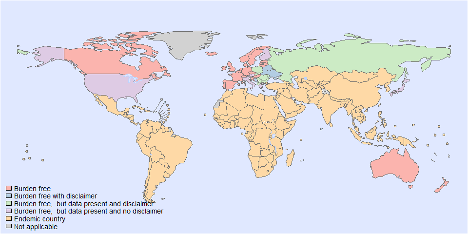<!-- -->

    ## NULL

# Predict all

``` r
## set up dataframe
sim_all <-
  data.frame(
    sei = 0,
    REG2 = FERG2:::countries$REG2,
    SUB2 = FERG2:::countries$SUB2,
    COUNTRY = FERG2:::countries$ISO3,
    YEAR = rep(2000:2021, each = nrow(FERG2:::countries)))
sim_all <- sim_all %>% left_join(zero_cases) %>% select(sei, REG2, SUB2, COUNTRY, YEAR, ESTIMATES, DISEASEFREE)
```

    ## Joining with `by = join_by(REG2, SUB2, COUNTRY)`

``` r
## draw from expected value of posterior predictive dist
set.seed(201)
# fit_all <-
#   posterior_epred(
#     object = fit_brms_reg_s,
#     newdata = sim_all,
#     allow_new_levels = TRUE,
#     sample_new_levels = "uncertainty",
#     re_formula = ~ 1 +YEAR+
#       (1 | REG2) +
#       (1 | REG2:SUB2) +
#       (1 | REG2:SUB2:COUNTRY))
draws_fit <- as_draws_df(fit_brms_reg_s)
fit_all <- data.frame(1:10000)
for (x in 1:nrow(sim_all)){
    if (as.integer(sim_all[x, "ESTIMATES"]) == 1){
    # Data present for country
    fit_all[[paste0("V",x)]] <- draws_fit$b_Intercept +                                                                               # Global intercept
      sim_all[x, "YEAR"] * draws_fit$b_YEAR +                                                                                         # Year component
      draws_fit[[paste0("r_REG2[",sim_all[x,"REG2"],",Intercept]")]] +                                                                # Regional component
      draws_fit[[paste0("r_REG2:SUB2[",sim_all[x,"REG2"],"_",sim_all[x,"SUB2"],",Intercept]")]] +                                     # Sub regional component
      draws_fit[[paste0("r_REG2:SUB2:COUNTRY[",sim_all[x,"REG2"],"_",sim_all[x,"SUB2"],"_",sim_all[x,"COUNTRY"],",Intercept]")]]      # Country component
  } else if (as.integer(sim_all[x, "ESTIMATES"]) == 2) {
    # Disease-free country
    fit_all[[paste0("V",x)]] <- 0
  } else if (as.integer(sim_all[x, "ESTIMATES"]) == 3){
    # Data not present for country, but present in subregion
    fit_all[[paste0("V",x)]] <- draws_fit$b_Intercept +                                                                               # Global intercept
      sim_all[x, "YEAR"] * draws_fit$b_YEAR +                                                                                         # Year component
      draws_fit[[paste0("r_REG2[",sim_all[x,"REG2"],",Intercept]")]] +                                                                # Regional component
      draws_fit[[paste0("r_REG2:SUB2[",sim_all[x,"REG2"],"_",sim_all[x,"SUB2"],",Intercept]")]]                                       # Sub regional component
  } else if (as.integer(sim_all[x, "ESTIMATES"]) == 4){
    # Data not present for country, but present in region
    fit_all[[paste0("V",x)]] <- draws_fit$b_Intercept +                                                                               # Global intercept
      sim_all[x, "YEAR"] * draws_fit$b_YEAR +                                                                                         # Year component
      draws_fit[[paste0("r_REG2[",sim_all[x,"REG2"],",Intercept]")]]                                                                  # Regional component
  } else if (as.integer(sim_all[x, "ESTIMATES"]) == 5){
    # Data not present for country
    fit_all[[paste0("V",x)]] <- draws_fit$b_Intercept +
      sim_all[x, "YEAR"] * draws_fit$b_YEAR
  }
}

fit_all <- fit_all %>% select(-c(X1.10000))

## calculate cases
sim_all$SIM <- t(fit_all)
pop_all <- aggregate(POP ~ ISO3 + YEAR, FERG2:::pop, sum)
sim_all <- merge(sim_all, pop_all,
                 by.x = c("COUNTRY", "YEAR"), by.y = c("ISO3", "YEAR"))
sim_all$CASES <- exp(sim_all$SIM) * sim_all$POP / 1e5
sim_all$CASES <- sim_all$CASES*sim_all$DISEASEFREE
sim_all$SIM<-sim_all$SIM*sim_all$DISEASEFREE
sim_all$sei<-sim_all$sei*sim_all$DISEASEFREE

## aggregate global
sim_all_glb <- with(sim_all, aggregate(CASES ~ YEAR, FUN = sum))
all_glb_id <- sim_all_glb[1]
all_glb_nr <-
  t(apply(sim_all_glb[, grepl("V", names(sim_all_glb))], 1, mean_ci))
all_glb_nr <- data.frame(all_glb_nr)
names(all_glb_nr) <- c("VAL_MEAN", "VAL_LWR", "VAL_UPR")
all_glb_nr <- cbind(all_glb_id, all_glb_nr)
all_glb_nr$LOCATION <- "Global"
all_glb_nr$LOCATION_NAME <- "Global"
all_glb_nr$METRIC <- "Number"
str(all_glb_nr)
```

    ## 'data.frame':    22 obs. of  7 variables:
    ##  $ YEAR         : int  2000 2001 2002 2003 2004 2005 2006 2007 2008 2009 ...
    ##  $ VAL_MEAN     : num  6.91e+08 6.56e+08 6.22e+08 5.90e+08 5.60e+08 ...
    ##  $ VAL_LWR      : num  6.01e+08 5.73e+08 5.46e+08 5.20e+08 4.95e+08 ...
    ##  $ VAL_UPR      : num  7.91e+08 7.48e+08 7.09e+08 6.71e+08 6.35e+08 ...
    ##  $ LOCATION     : chr  "Global" "Global" "Global" "Global" ...
    ##  $ LOCATION_NAME: chr  "Global" "Global" "Global" "Global" ...
    ##  $ METRIC       : chr  "Number" "Number" "Number" "Number" ...

``` r
all_glb_rt <- all_glb_nr
all_glb_rt$POP <- with(sim_all, tapply(POP, YEAR, sum))
all_glb_rt$VAL_MEAN <- 1e5 * all_glb_rt$VAL_MEAN / all_glb_rt$POP
all_glb_rt$VAL_LWR <- 1e5 * all_glb_rt$VAL_LWR / all_glb_rt$POP
all_glb_rt$VAL_UPR <- 1e5 * all_glb_rt$VAL_UPR / all_glb_rt$POP
all_glb_rt$METRIC <- "Rate"
all_glb_rt$POP <- NULL
str(all_glb_rt)
```

    ## 'data.frame':    22 obs. of  7 variables:
    ##  $ YEAR         : int  2000 2001 2002 2003 2004 2005 2006 2007 2008 2009 ...
    ##  $ VAL_MEAN     : num [1:22(1d)] 11342 10622 9949 9319 8726 ...
    ##  $ VAL_LWR      : num [1:22(1d)] 9875 9290 8736 8206 7713 ...
    ##  $ VAL_UPR      : num [1:22(1d)] 12990 12127 11339 10584 9887 ...
    ##  $ LOCATION     : chr  "Global" "Global" "Global" "Global" ...
    ##  $ LOCATION_NAME: chr  "Global" "Global" "Global" "Global" ...
    ##  $ METRIC       : chr  "Rate" "Rate" "Rate" "Rate" ...

``` r
## aggregate over regions
sim_all_reg <- with(sim_all, aggregate(CASES ~ REG2+YEAR, FUN = sum))
all_reg_id <- sim_all_reg[1:2]
all_reg_nr <-
  t(apply(sim_all_reg[, grepl("V", names(sim_all_reg))], 1, mean_ci))
all_reg_nr <- data.frame(all_reg_nr)
names(all_reg_nr) <- c("VAL_MEAN", "VAL_LWR", "VAL_UPR")
all_reg_nr <- cbind(all_reg_id, all_reg_nr)
all_reg_nr$LOCATION <- "Region"
all_reg_nr$LOCATION_NAME <- all_reg_nr$REG2
all_reg_nr$REG2 <- NULL
all_reg_nr$METRIC <- "Number"
str(all_reg_nr)
```

    ## 'data.frame':    132 obs. of  7 variables:
    ##  $ YEAR         : int  2000 2000 2000 2000 2000 2000 2001 2001 2001 2001 ...
    ##  $ VAL_MEAN     : num  1.15e+08 7.41e+07 6.75e+07 7.25e+06 3.05e+08 ...
    ##  $ VAL_LWR      : num  9.69e+07 6.15e+07 4.71e+07 3.08e+06 2.47e+08 ...
    ##  $ VAL_UPR      : num  1.37e+08 9.10e+07 9.47e+07 1.87e+07 3.76e+08 ...
    ##  $ LOCATION     : chr  "Region" "Region" "Region" "Region" ...
    ##  $ LOCATION_NAME: chr  "AFR" "AMR" "EMR" "EUR" ...
    ##  $ METRIC       : chr  "Number" "Number" "Number" "Number" ...

``` r
all_reg_rt <- all_reg_nr
all_reg_rt$POP <-
  with(sim_all, aggregate(POP ~ REG2 + YEAR, FUN = sum))$POP
all_reg_rt$VAL_MEAN <- 1e5 * all_reg_rt$VAL_MEAN / all_reg_rt$POP
all_reg_rt$VAL_LWR <- 1e5 * all_reg_rt$VAL_LWR / all_reg_rt$POP
all_reg_rt$VAL_UPR <- 1e5 * all_reg_rt$VAL_UPR / all_reg_rt$POP
all_reg_rt$METRIC <- "Rate"
all_reg_rt$POP <- NULL
str(all_reg_rt)
```

    ## 'data.frame':    132 obs. of  7 variables:
    ##  $ YEAR         : int  2000 2000 2000 2000 2000 2000 2001 2001 2001 2001 ...
    ##  $ VAL_MEAN     : num  17200 9008 13911 834 19421 ...
    ##  $ VAL_LWR      : num  14529 7476 9710 354 15690 ...
    ##  $ VAL_UPR      : num  20543 11060 19520 2149 23897 ...
    ##  $ LOCATION     : chr  "Region" "Region" "Region" "Region" ...
    ##  $ LOCATION_NAME: chr  "AFR" "AMR" "EMR" "EUR" ...
    ##  $ METRIC       : chr  "Rate" "Rate" "Rate" "Rate" ...

``` r
## aggregate over subregions
sim_all_sub <- with(sim_all, aggregate(CASES ~ SUB2+YEAR, FUN = sum))
all_sub_id <- sim_all_sub[1:2]
all_sub_nr <-
  t(apply(sim_all_sub[, grepl("V", names(sim_all_sub))], 1, mean_ci))
all_sub_nr <- data.frame(all_sub_nr)
names(all_sub_nr) <- c("VAL_MEAN", "VAL_LWR", "VAL_UPR")
all_sub_nr <- cbind(all_sub_id, all_sub_nr)
all_sub_nr$LOCATION <- "Subregion"
all_sub_nr$LOCATION_NAME <- all_sub_nr$SUB2
all_sub_nr$SUB2 <- NULL
all_sub_nr$METRIC <- "Number"
str(all_sub_nr)
```

    ## 'data.frame':    374 obs. of  7 variables:
    ##  $ YEAR         : int  2000 2000 2000 2000 2000 2000 2000 2000 2000 2000 ...
    ##  $ VAL_MEAN     : num  14224232 61273498 39167202 1913812 60587413 ...
    ##  $ VAL_LWR      : num  7980591 51330270 30049088 832350 49233784 ...
    ##  $ VAL_UPR      : num  23623113 72693105 53842289 4012031 76509119 ...
    ##  $ LOCATION     : chr  "Subregion" "Subregion" "Subregion" "Subregion" ...
    ##  $ LOCATION_NAME: chr  "AFRAB" "AFRC" "AFRD" "AMRA" ...
    ##  $ METRIC       : chr  "Number" "Number" "Number" "Number" ...

``` r
all_sub_rt <- all_sub_nr
all_sub_rt$POP <-
  with(sim_all, aggregate(POP ~ SUB2 + YEAR, FUN = sum))$POP
all_sub_rt$VAL_MEAN <- 1e5 * all_sub_rt$VAL_MEAN / all_sub_rt$POP
all_sub_rt$VAL_LWR <- 1e5 * all_sub_rt$VAL_LWR / all_sub_rt$POP
all_sub_rt$VAL_UPR <- 1e5 * all_sub_rt$VAL_UPR / all_sub_rt$POP
all_sub_rt$METRIC <- "Rate"
all_sub_rt$POP <- NULL
str(all_sub_rt)
```

    ## 'data.frame':    374 obs. of  7 variables:
    ##  $ YEAR         : int  2000 2000 2000 2000 2000 2000 2000 2000 2000 2000 ...
    ##  $ VAL_MEAN     : num  26510 17830 14543 571 13918 ...
    ##  $ VAL_LWR      : num  14874 14937 11157 248 11310 ...
    ##  $ VAL_UPR      : num  44027 21153 19991 1197 17576 ...
    ##  $ LOCATION     : chr  "Subregion" "Subregion" "Subregion" "Subregion" ...
    ##  $ LOCATION_NAME: chr  "AFRAB" "AFRC" "AFRD" "AMRA" ...
    ##  $ METRIC       : chr  "Rate" "Rate" "Rate" "Rate" ...

``` r
## aggregate over countries
all_cnt_nr <- t(apply(sim_all$CASES, 1, mean_ci))
all_cnt_nr <- data.frame(all_cnt_nr)
names(all_cnt_nr) <- c("VAL_MEAN", "VAL_LWR", "VAL_UPR")
all_cnt_nr <- cbind(sim_all[1:2], all_cnt_nr)
all_cnt_nr$LOCATION <- "Country"
all_cnt_nr$LOCATION_NAME <- all_cnt_nr$COUNTRY
all_cnt_nr$COUNTRY <- NULL
all_cnt_nr$METRIC <- "Number"
str(all_cnt_nr)
```

    ## 'data.frame':    4268 obs. of  7 variables:
    ##  $ YEAR         : int  2000 2001 2002 2003 2004 2005 2006 2007 2008 2009 ...
    ##  $ VAL_MEAN     : num  8640736 7957030 7620917 7668766 7493776 ...
    ##  $ VAL_LWR      : num  3157503 2913216 2790098 2812575 2746646 ...
    ##  $ VAL_UPR      : num  19468324 17933506 17174242 17298564 16887161 ...
    ##  $ LOCATION     : chr  "Country" "Country" "Country" "Country" ...
    ##  $ LOCATION_NAME: chr  "AFG" "AFG" "AFG" "AFG" ...
    ##  $ METRIC       : chr  "Number" "Number" "Number" "Number" ...

``` r
all_cnt_rt <- t(apply(exp(sim_all$SIM), 1, mean_ci))
all_cnt_rt <- data.frame(all_cnt_rt)
names(all_cnt_rt) <- c("VAL_MEAN", "VAL_LWR", "VAL_UPR")
all_cnt_rt <- cbind(sim_all[1:2], all_cnt_rt)
all_cnt_rt$LOCATION <- "Country"
all_cnt_rt$LOCATION_NAME <- all_cnt_rt$COUNTRY
all_cnt_rt$COUNTRY <- NULL
all_cnt_rt$METRIC <- "Rate"
str(all_cnt_rt)
```

    ## 'data.frame':    4268 obs. of  7 variables:
    ##  $ YEAR         : int  2000 2001 2002 2003 2004 2005 2006 2007 2008 2009 ...
    ##  $ VAL_MEAN     : num  42666 39768 37067 34550 32204 ...
    ##  $ VAL_LWR      : num  15591 14560 13571 12671 11803 ...
    ##  $ VAL_UPR      : num  96131 89629 83533 77934 72571 ...
    ##  $ LOCATION     : chr  "Country" "Country" "Country" "Country" ...
    ##  $ LOCATION_NAME: chr  "AFG" "AFG" "AFG" "AFG" ...
    ##  $ METRIC       : chr  "Rate" "Rate" "Rate" "Rate" ...

``` r
## compile all
all_est <-
  rbind(all_glb_rt, all_glb_nr,
        all_reg_rt, all_reg_nr,
        all_sub_rt, all_sub_nr,
        all_cnt_rt, all_cnt_nr)
str(all_est)
```

    ## 'data.frame':    9592 obs. of  7 variables:
    ##  $ YEAR         : int  2000 2001 2002 2003 2004 2005 2006 2007 2008 2009 ...
    ##  $ VAL_MEAN     : num  11342 10622 9949 9319 8726 ...
    ##  $ VAL_LWR      : num  9875 9290 8736 8206 7713 ...
    ##  $ VAL_UPR      : num  12990 12127 11339 10584 9887 ...
    ##  $ LOCATION     : chr  "Global" "Global" "Global" "Global" ...
    ##  $ LOCATION_NAME: chr  "Global" "Global" "Global" "Global" ...
    ##  $ METRIC       : chr  "Rate" "Rate" "Rate" "Rate" ...

``` r
saveRDS(all_est, file = "all_estimates.rds")

## plot nested trends
all_sub_rt$REG2 <- gsub("(R).*", "\\1", all_sub_rt$LOCATION_NAME)
ggplot(all_reg_rt, aes(x = YEAR, y = VAL_MEAN, group = LOCATION_NAME)) +
  geom_line(data = all_glb_rt, linewidth = 2) +
  geom_line(aes(col = LOCATION_NAME), linewidth = 1.5) +
  theme_bw()
```

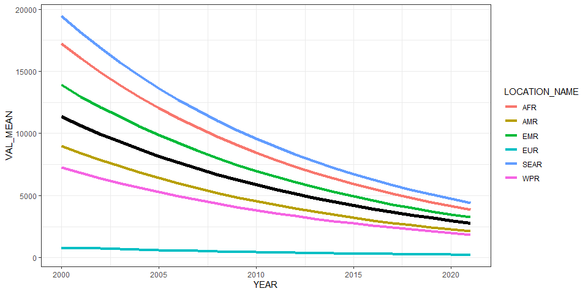<!-- -->

``` r
ggplot(all_reg_rt, aes(x = YEAR, y = VAL_MEAN, group = LOCATION_NAME)) +
  geom_line(data = all_glb_rt, linewidth = 2) +
  geom_line(aes(col = LOCATION_NAME), linewidth = 1.5) +
  geom_line(data = all_sub_rt, aes(col = REG2)) +
  theme_bw()
```

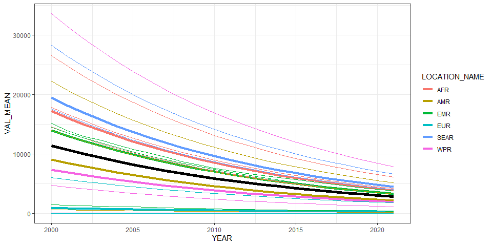<!-- -->

# Summarize predictions

## Global

``` r
kable(
  caption = "Global number of ascaris cases, 2010 vs 2020",
  row.names = FALSE,
  subset(all_glb_nr, YEAR %in% c(2010, 2020))[, 1:4])
```

| YEAR |  VAL_MEAN |   VAL_LWR |   VAL_UPR |
|-----:|----------:|----------:|----------:|
| 2010 | 406409879 | 362325124 | 457251147 |
| 2020 | 233947649 | 204345038 | 267339792 |

Global number of ascaris cases, 2010 vs 2020

## Regions

``` r
kbl(subset(all_reg_rt, YEAR == 2020)[,c(6,2:4)],
    align = c("l", "c", "c", "c"), row.names = FALSE,
    col.names = c("Region", "Mean", "Lower", "Upper"),
    caption="  Incidence of Ascaris in 2020 by WHO region: v14.5") %>%
  kable_styling("striped", "hover")
```

<table class="table table-striped" style="margin-left: auto; margin-right: auto;">

<caption>

Incidence of Ascaris in 2020 by WHO region: v14.5
</caption>

<thead>

<tr>

<th style="text-align:left;">

Region
</th>

<th style="text-align:center;">

Mean
</th>

<th style="text-align:center;">

Lower
</th>

<th style="text-align:center;">

Upper
</th>

</tr>

</thead>

<tbody>

<tr>

<td style="text-align:left;">

AFR
</td>

<td style="text-align:center;">

4159.6453
</td>

<td style="text-align:center;">

3525.1831
</td>

<td style="text-align:center;">

4954.5769
</td>

</tr>

<tr>

<td style="text-align:left;">

AMR
</td>

<td style="text-align:center;">

2267.3075
</td>

<td style="text-align:center;">

1857.7759
</td>

<td style="text-align:center;">

2810.5069
</td>

</tr>

<tr>

<td style="text-align:left;">

EMR
</td>

<td style="text-align:center;">

3479.5657
</td>

<td style="text-align:center;">

2435.9554
</td>

<td style="text-align:center;">

4843.7778
</td>

</tr>

<tr>

<td style="text-align:left;">

EUR
</td>

<td style="text-align:center;">

259.0483
</td>

<td style="text-align:center;">

108.0887
</td>

<td style="text-align:center;">

668.0274
</td>

</tr>

<tr>

<td style="text-align:left;">

SEAR
</td>

<td style="text-align:center;">

4744.3954
</td>

<td style="text-align:center;">

3811.6200
</td>

<td style="text-align:center;">

5861.0872
</td>

</tr>

<tr>

<td style="text-align:left;">

WPR
</td>

<td style="text-align:center;">

1988.7684
</td>

<td style="text-align:center;">

1587.2661
</td>

<td style="text-align:center;">

2490.5782
</td>

</tr>

</tbody>

</table>

``` r
kbl(subset(all_reg_nr, YEAR == 2020)[,c(6,2:4)],
    align = c("l", "c", "c", "c"), row.names = FALSE,
    col.names = c("Region", "Mean", "Lower", "Upper"),
    caption="  Cases of Ascaris in 2020 by WHO region : v14.5") %>%
  kable_styling("striped", "hover")
```

<table class="table table-striped" style="margin-left: auto; margin-right: auto;">

<caption>

Cases of Ascaris in 2020 by WHO region : v14.5
</caption>

<thead>

<tr>

<th style="text-align:left;">

Region
</th>

<th style="text-align:center;">

Mean
</th>

<th style="text-align:center;">

Lower
</th>

<th style="text-align:center;">

Upper
</th>

</tr>

</thead>

<tbody>

<tr>

<td style="text-align:left;">

AFR
</td>

<td style="text-align:center;">

47220496
</td>

<td style="text-align:center;">

40018050
</td>

<td style="text-align:center;">

56244599
</td>

</tr>

<tr>

<td style="text-align:left;">

AMR
</td>

<td style="text-align:center;">

23054967
</td>

<td style="text-align:center;">

18890672
</td>

<td style="text-align:center;">

28578454
</td>

</tr>

<tr>

<td style="text-align:left;">

EMR
</td>

<td style="text-align:center;">

26238071
</td>

<td style="text-align:center;">

18368606
</td>

<td style="text-align:center;">

36525073
</td>

</tr>

<tr>

<td style="text-align:left;">

EUR
</td>

<td style="text-align:center;">

2425097
</td>

<td style="text-align:center;">

1011879
</td>

<td style="text-align:center;">

6253782
</td>

</tr>

<tr>

<td style="text-align:left;">

SEAR
</td>

<td style="text-align:center;">

96766746
</td>

<td style="text-align:center;">

77741848
</td>

<td style="text-align:center;">

119542806
</td>

</tr>

<tr>

<td style="text-align:left;">

WPR
</td>

<td style="text-align:center;">

38242271
</td>

<td style="text-align:center;">

30521735
</td>

<td style="text-align:center;">

47891634
</td>

</tr>

</tbody>

</table>

``` r
ggplot(subset(all_reg_rt, YEAR == 2010),
       aes(y = VAL_MEAN, x = LOCATION_NAME)) +
  geom_pointrange(aes(ymin = VAL_LWR, ymax = VAL_UPR), size = 0.2) +
  coord_flip() +
  theme_bw() +
  scale_x_discrete(NULL, limits = rev(unique(all_reg_nr$LOCATION_NAME))) +
  scale_y_continuous(NULL) +
  ggtitle("Incidence of ascaris by WHO Region, 2010")
```

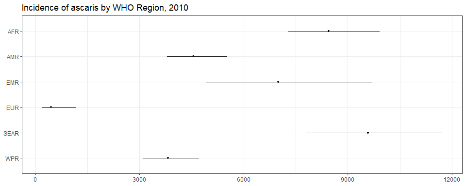<!-- -->

``` r
ggplot(subset(all_reg_rt, YEAR == 2020),
       aes(y = VAL_MEAN, x = LOCATION_NAME)) +
  geom_pointrange(aes(ymin = VAL_LWR, ymax = VAL_UPR), size = 0.2) +
  coord_flip() +
  theme_bw() +
  scale_x_discrete(NULL, limits = rev(unique(all_reg_nr$LOCATION_NAME))) +
  scale_y_continuous(NULL) +
  ggtitle("Incidence of ascaris by WHO Region, 2020")
```

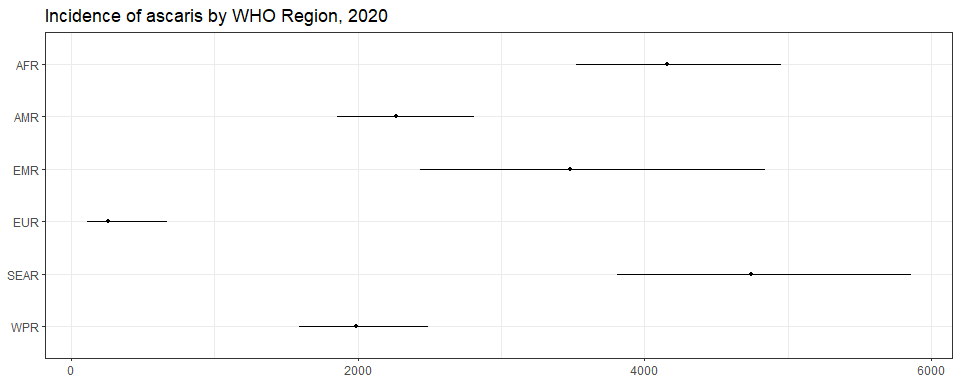<!-- -->

``` r
ggplot(subset(all_reg_nr, YEAR == 2010),
       aes(y = VAL_MEAN, x = LOCATION_NAME)) +
  geom_pointrange(aes(ymin = VAL_LWR, ymax = VAL_UPR), size = 0.2) +
  coord_flip() +
  theme_bw() +
  scale_x_discrete(NULL, limits = rev(unique(all_reg_nr$LOCATION_NAME))) +
  scale_y_continuous(NULL) +
  ggtitle("Number of ascaris cases by WHO Region, 2010")
```

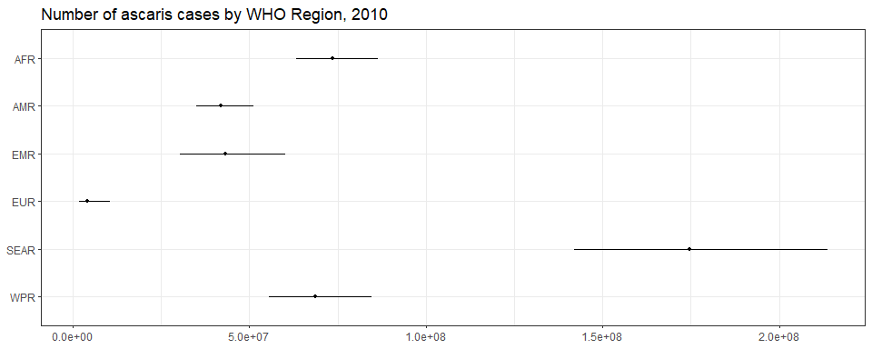<!-- -->

``` r
ggplot(subset(all_reg_nr, YEAR == 2020),
       aes(y = VAL_MEAN, x = LOCATION_NAME)) +
  geom_pointrange(aes(ymin = VAL_LWR, ymax = VAL_UPR), size = 0.2) +
  coord_flip() +
  theme_bw() +
  scale_x_discrete(NULL, limits = rev(unique(all_reg_nr$LOCATION_NAME))) +
  scale_y_continuous(NULL) +
  ggtitle("Number of ascaris cases by WHO Region, 2020")
```

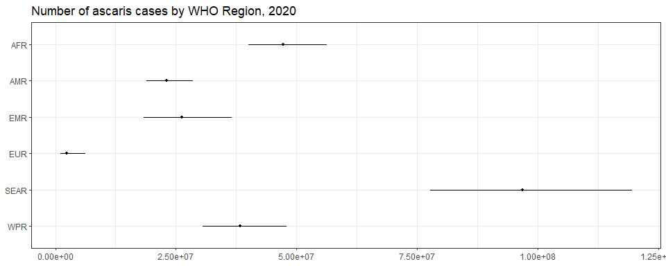<!-- -->

``` r
sim_all_reg <-
  merge(sim_all_reg,
        with(sim_all, aggregate(POP ~ REG2 + YEAR, FUN = sum)))
sim_all_reg_long <-
  pivot_longer(sim_all_reg, cols = starts_with("V"))
sim_all_reg_long$CASES <- sim_all_reg_long$value

ggplot(subset(sim_all_reg_long, YEAR == 2010), aes(x = CASES)) +
  geom_density() +
  facet_wrap(~REG2) +
  theme_bw() +
  scale_x_log10() +
  ggtitle("Number of ascaris cases by WHO Region, 2010")
```

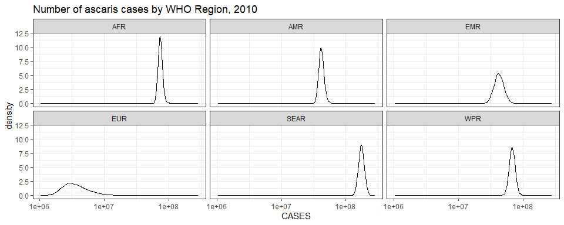<!-- -->

``` r
ggplot(subset(sim_all_reg_long, YEAR == 2020), aes(x = CASES)) +
  geom_density() +
  facet_wrap(~REG2) +
  theme_bw() +
  scale_x_log10() +
  ggtitle("Number of ascaris cases by WHO Region, 2020")
```

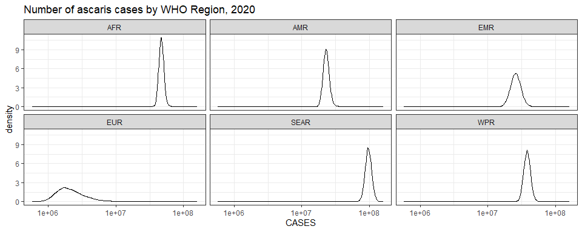<!-- -->

## Subregions

``` r
ggplot(subset(all_sub_rt, YEAR == 2010),
       aes(y = VAL_MEAN, x = LOCATION_NAME)) +
  geom_pointrange(aes(ymin = VAL_LWR, ymax = VAL_UPR), size = 0.2) +
  coord_flip() +
  theme_bw() +
  scale_x_discrete(NULL, limits = rev(unique(all_sub_nr$LOCATION_NAME))) +
  scale_y_continuous(NULL) +
  ggtitle("Incidence of ascaris by WHO Subregion, 2010")
```

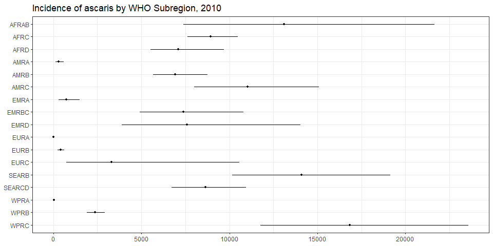<!-- -->

``` r
ggplot(subset(all_sub_rt, YEAR == 2020),
       aes(y = VAL_MEAN, x = LOCATION_NAME)) +
  geom_pointrange(aes(ymin = VAL_LWR, ymax = VAL_UPR), size = 0.2) +
  coord_flip() +
  theme_bw() +
  scale_x_discrete(NULL, limits = rev(unique(all_sub_nr$LOCATION_NAME))) +
  scale_y_continuous(NULL) +
  ggtitle("Incidence of ascaris by WHO Subregion, 2020: v14.5")
```

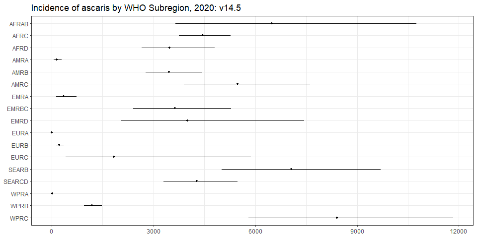<!-- -->

``` r
ggplot(subset(all_sub_nr, YEAR == 2010),
       aes(y = VAL_MEAN, x = LOCATION_NAME)) +
  geom_pointrange(aes(ymin = VAL_LWR, ymax = VAL_UPR), size = 0.2) +
  coord_flip() +
  theme_bw() +
  scale_x_discrete(NULL, limits = rev(unique(all_sub_nr$LOCATION_NAME))) +
  scale_y_continuous(NULL) +
  ggtitle("Number of ascaris cases by WHO Subregion, 2010")
```

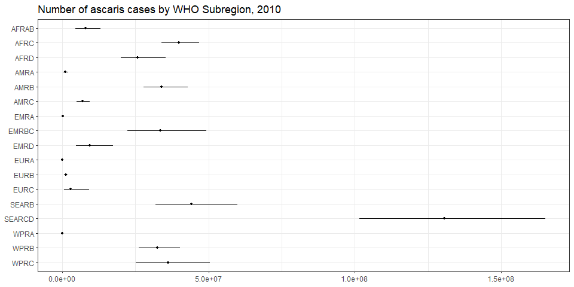<!-- -->

``` r
ggplot(subset(all_sub_nr, YEAR == 2020),
       aes(y = VAL_MEAN, x = LOCATION_NAME)) +
  geom_pointrange(aes(ymin = VAL_LWR, ymax = VAL_UPR), size = 0.2) +
  coord_flip() +
  theme_bw() +
  scale_x_discrete(NULL, limits = rev(unique(all_sub_nr$LOCATION_NAME))) +
  scale_y_continuous(NULL) +
  ggtitle("Number of ascaris cases by WHO Subregion, 2020: v14.5")
```

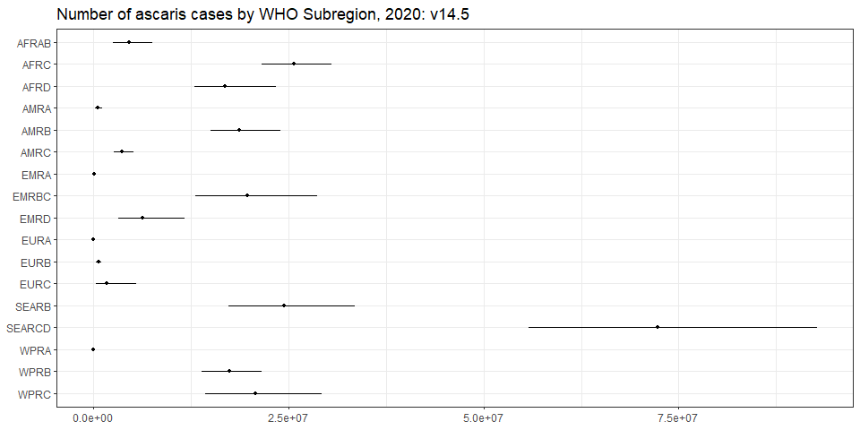<!-- -->

``` r
sim_all_sub <-
  merge(sim_all_sub,
        with(sim_all, aggregate(POP ~ SUB2 + YEAR, FUN = sum)))
sim_all_sub_long <-
  pivot_longer(sim_all_sub, cols = starts_with("V"))
sim_all_sub_long$CASES <- sim_all_sub_long$value

ggplot(subset(sim_all_sub_long, YEAR == 2010), aes(x = CASES)) +
  geom_density() +
  facet_wrap(~SUB2) +
  theme_bw() +
  scale_x_log10() +
  ggtitle("Number of ascaris cases by WHO Subregion, 2010")
```

    ## Warning in scale_x_log10(): log-10 transformation introduced infinite values.

    ## Warning: Removed 10000 rows containing non-finite outside the scale range (`stat_density()`).

<!-- -->

``` r
ggplot(subset(sim_all_sub_long, YEAR == 2020), aes(x = CASES)) +
  geom_density() +
  facet_wrap(~SUB2) +
  theme_bw() +
  scale_x_log10() +
  ggtitle("Number of ascaris cases by WHO Subregion, 2020")
```

    ## Warning in scale_x_log10(): log-10 transformation introduced infinite values.
    ## Removed 10000 rows containing non-finite outside the scale range (`stat_density()`).

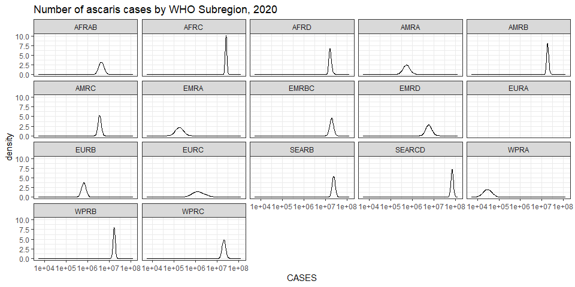<!-- -->

## Countries

``` r
plot_world(subset(all_cnt_rt, YEAR == 2010),
           "LOCATION_NAME", "VAL_MEAN", legend.title = "Incidence per 100k")
```

    ## [1]     0  5000 10000 15000 20000 25000 30000 35000

``` r
title("ascaris incidence, 2010", line = 1)
```

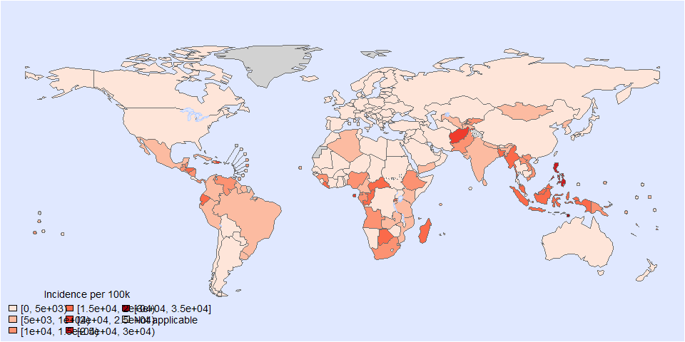<!-- -->

``` r
plot_world(subset(all_cnt_rt, YEAR == 2020),
           "LOCATION_NAME", "VAL_MEAN", legend.title = "Incidence per 100k")
```

    ## [1]     0  5000 10000 15000 20000

``` r
title("ascaris incidence, 2020", line = 1)
```

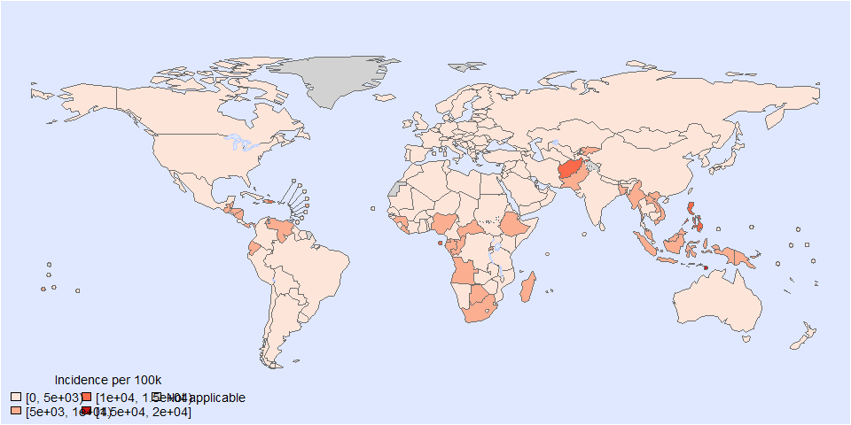<!-- -->

``` r
tab <-
  data.frame(subset(all_cnt_rt, YEAR == 2010)[,
                                              c("LOCATION_NAME", "VAL_MEAN", "VAL_LWR", "VAL_UPR")],
             subset(all_cnt_rt, YEAR == 2020)[,
                                              c("VAL_MEAN", "VAL_LWR", "VAL_UPR")])
tab$LOCATION_NAME <-
  FERG2:::countries$COUNTRY[match(tab$LOCATION_NAME, FERG2:::countries$ISO3)]
tab$LOCATION_NAME <- gsub(" \\(.*", "", tab$LOCATION_NAME)
names(tab) <-
  c("Country",
    "2010.mean", "2010.lwr", "2010.upr",
    "2020.mean", "2020.lwr", "2020.upr")

kable(tab, digits = 3, row.names = FALSE,
      caption = "Estimated ascaris incidence by country, 2010 vs 2020")
```

| Country | 2010.mean | 2010.lwr | 2010.upr | 2020.mean | 2020.lwr | 2020.upr |
|:---|---:|---:|---:|---:|---:|---:|
| Afghanistan | 21125.068 | 7767.500 | 47621.044 | 10471.809 | 3875.070 | 23578.144 |
| Angola | 12369.368 | 5635.111 | 23890.366 | 6130.322 | 2794.843 | 11814.512 |
| Albania | 1.000 | 1.000 | 1.000 | 1.000 | 1.000 | 1.000 |
| Andorra | 1.000 | 1.000 | 1.000 | 1.000 | 1.000 | 1.000 |
| United Arab Emirates | 963.549 | 139.283 | 3194.207 | 478.126 | 68.509 | 1579.059 |
| Argentina | 3606.882 | 2058.714 | 5800.674 | 1788.552 | 1019.874 | 2871.993 |
| Armenia | 378.815 | 59.684 | 1258.707 | 188.011 | 29.657 | 623.739 |
| Antigua and Barbuda | 2837.751 | 666.535 | 7881.389 | 1407.613 | 331.606 | 3949.352 |
| Australia | 1.000 | 1.000 | 1.000 | 1.000 | 1.000 | 1.000 |
| Austria | 1.000 | 1.000 | 1.000 | 1.000 | 1.000 | 1.000 |
| Azerbaijan | 140.766 | 20.380 | 501.658 | 69.804 | 10.090 | 248.745 |
| Burundi | 7393.601 | 1560.039 | 22478.537 | 3667.277 | 768.777 | 11131.767 |
| Belgium | 1.000 | 1.000 | 1.000 | 1.000 | 1.000 | 1.000 |
| Benin | 3182.792 | 1198.342 | 6893.771 | 1577.296 | 594.492 | 3410.881 |
| Burkina Faso | 218.879 | 47.184 | 639.065 | 108.542 | 23.532 | 319.991 |
| Bangladesh | 15210.212 | 8441.314 | 25216.389 | 7543.030 | 4173.039 | 12527.485 |
| Bulgaria | 1.000 | 1.000 | 1.000 | 1.000 | 1.000 | 1.000 |
| Bahrain | 963.549 | 139.283 | 3194.207 | 478.126 | 68.509 | 1579.059 |
| Bahamas | 2837.751 | 666.535 | 7881.389 | 1407.613 | 331.606 | 3949.352 |
| Bosnia and Herzegovina | 1.000 | 1.000 | 1.000 | 1.000 | 1.000 | 1.000 |
| Belarus | 1.000 | 1.000 | 1.000 | 1.000 | 1.000 | 1.000 |
| Belize | 14973.220 | 3842.887 | 39840.215 | 7425.968 | 1894.361 | 19949.124 |
| Bolivia | 3497.507 | 1456.320 | 7135.829 | 1733.882 | 718.074 | 3559.425 |
| Brazil | 6290.752 | 5050.324 | 7732.127 | 3120.400 | 2457.545 | 3902.494 |
| Barbados | 551.817 | 27.696 | 2683.088 | 273.832 | 13.613 | 1333.245 |
| Brunei Darussalam | 1.000 | 1.000 | 1.000 | 1.000 | 1.000 | 1.000 |
| Bhutan | 2141.927 | 440.480 | 6509.673 | 1061.893 | 219.840 | 3228.831 |
| Botswana | 16379.627 | 2495.957 | 57400.404 | 8109.651 | 1233.678 | 28561.890 |
| Central African Republic | 16293.623 | 3287.213 | 50409.165 | 8078.649 | 1618.238 | 25120.352 |
| Canada | 1.000 | 1.000 | 1.000 | 1.000 | 1.000 | 1.000 |
| Switzerland | 1.000 | 1.000 | 1.000 | 1.000 | 1.000 | 1.000 |
| Chile | 1590.586 | 479.080 | 3944.934 | 789.080 | 237.206 | 1957.325 |
| China | 2042.089 | 1595.056 | 2570.762 | 1012.394 | 786.110 | 1279.846 |
| Côte d’Ivoire | 1869.595 | 1141.249 | 2859.270 | 927.124 | 563.076 | 1430.203 |
| Cameroon | 9087.422 | 5961.813 | 13238.190 | 4505.127 | 2943.962 | 6568.519 |
| Congo | 4157.211 | 512.157 | 15665.254 | 2060.708 | 254.677 | 7777.485 |
| Congo | 16293.221 | 6766.916 | 33400.195 | 8068.184 | 3347.684 | 16504.004 |
| Cook Islands | 295.858 | 23.531 | 1333.574 | 146.785 | 11.655 | 659.852 |
| Colombia | 5627.152 | 3633.359 | 8255.896 | 2789.751 | 1793.190 | 4120.187 |
| Comoros | 5146.132 | 2285.502 | 9850.126 | 2552.157 | 1130.086 | 4891.445 |
| Cabo Verde | 5146.132 | 2285.502 | 9850.126 | 2552.157 | 1130.086 | 4891.445 |
| Costa Rica | 3565.469 | 542.002 | 12591.646 | 1767.200 | 268.265 | 6225.312 |
| Cuba | 5716.483 | 2160.569 | 12483.370 | 2834.896 | 1071.821 | 6215.402 |
| Cyprus | 1.000 | 1.000 | 1.000 | 1.000 | 1.000 | 1.000 |
| Czechia | 1.000 | 1.000 | 1.000 | 1.000 | 1.000 | 1.000 |
| Germany | 1.000 | 1.000 | 1.000 | 1.000 | 1.000 | 1.000 |
| Djibouti | 2559.895 | 900.262 | 5871.335 | 1269.586 | 447.348 | 2925.195 |
| Dominica | 5343.006 | 2447.603 | 10217.950 | 2650.335 | 1209.578 | 5105.143 |
| Denmark | 1.000 | 1.000 | 1.000 | 1.000 | 1.000 | 1.000 |
| Dominican Republic | 20251.263 | 1799.751 | 85374.359 | 10045.780 | 894.995 | 42156.896 |
| Algeria | 5146.132 | 2285.502 | 9850.126 | 2552.157 | 1130.086 | 4891.445 |
| Ecuador | 16844.823 | 11059.271 | 24722.201 | 8351.659 | 5440.717 | 12366.651 |
| Egypt | 3733.669 | 1984.946 | 6539.416 | 1851.961 | 971.440 | 3249.685 |
| Eritrea | 1044.790 | 84.441 | 4692.408 | 518.271 | 41.664 | 2329.452 |
| Spain | 1.000 | 1.000 | 1.000 | 1.000 | 1.000 | 1.000 |
| Estonia | 1.000 | 1.000 | 1.000 | 1.000 | 1.000 | 1.000 |
| Ethiopia | 12645.283 | 10235.409 | 15485.702 | 6267.127 | 5046.063 | 7677.731 |
| Finland | 1.000 | 1.000 | 1.000 | 1.000 | 1.000 | 1.000 |
| Fiji | 10269.215 | 1533.439 | 35959.593 | 5090.870 | 766.958 | 17738.444 |
| France | 1.000 | 1.000 | 1.000 | 1.000 | 1.000 | 1.000 |
| Micronesia | 7069.242 | 1927.328 | 18295.691 | 3505.381 | 953.574 | 9167.656 |
| Gabon | 10169.684 | 2042.810 | 31765.626 | 5041.040 | 1008.442 | 15714.200 |
| United Kingdom | 1.000 | 1.000 | 1.000 | 1.000 | 1.000 | 1.000 |
| Georgia | 518.621 | 171.069 | 1220.280 | 257.207 | 85.312 | 605.568 |
| Ghana | 2159.872 | 1140.513 | 3750.634 | 1070.859 | 564.039 | 1854.657 |
| Guinea | 12729.992 | 4950.377 | 27294.354 | 6314.839 | 2444.250 | 13584.306 |
| Gambia | 2900.545 | 272.020 | 12385.869 | 1437.291 | 133.339 | 6147.921 |
| Guinea-Bissau | 1370.205 | 114.161 | 5766.726 | 679.332 | 56.781 | 2865.401 |
| Equatorial Guinea | 11079.355 | 921.308 | 46228.997 | 5496.106 | 458.216 | 22860.160 |
| Greece | 1.000 | 1.000 | 1.000 | 1.000 | 1.000 | 1.000 |
| Grenada | 5343.006 | 2447.603 | 10217.950 | 2650.335 | 1209.578 | 5105.143 |
| Guatemala | 13080.180 | 3861.706 | 32772.384 | 6486.687 | 1925.049 | 16292.164 |
| Guyana | 8173.922 | 644.142 | 34912.878 | 4056.022 | 314.640 | 17424.048 |
| Honduras | 18470.643 | 7556.574 | 38074.464 | 9157.934 | 3716.740 | 19094.052 |
| Croatia | 1.000 | 1.000 | 1.000 | 1.000 | 1.000 | 1.000 |
| Haiti | 10258.630 | 3815.055 | 23267.475 | 5090.686 | 1874.476 | 11597.037 |
| Hungary | 1.000 | 1.000 | 1.000 | 1.000 | 1.000 | 1.000 |
| Indonesia | 16921.512 | 11887.034 | 23343.849 | 8391.845 | 5853.785 | 11653.987 |
| India | 7588.335 | 5580.667 | 10062.350 | 3762.830 | 2753.353 | 5037.216 |
| Ireland | 1.000 | 1.000 | 1.000 | 1.000 | 1.000 | 1.000 |
| Iran | 543.963 | 309.574 | 902.230 | 269.812 | 152.627 | 449.466 |
| Iraq | 1185.007 | 486.876 | 2462.146 | 587.492 | 240.533 | 1222.705 |
| Iceland | 1.000 | 1.000 | 1.000 | 1.000 | 1.000 | 1.000 |
| Israel | 1.000 | 1.000 | 1.000 | 1.000 | 1.000 | 1.000 |
| Italy | 1.000 | 1.000 | 1.000 | 1.000 | 1.000 | 1.000 |
| Jamaica | 4631.548 | 1141.296 | 12568.014 | 2301.372 | 565.749 | 6300.507 |
| Jordan | 3472.429 | 291.572 | 14850.954 | 1723.159 | 144.293 | 7370.524 |
| Japan | 1.000 | 1.000 | 1.000 | 1.000 | 1.000 | 1.000 |
| Kazakhstan | 120.084 | 9.596 | 510.147 | 59.540 | 4.830 | 254.474 |
| Kenya | 6560.157 | 4703.440 | 8968.014 | 3251.873 | 2314.860 | 4462.011 |
| Kyrgyzstan | 11507.756 | 2247.168 | 36586.559 | 5703.216 | 1115.087 | 18076.762 |
| Cambodia | 1582.676 | 749.888 | 2970.189 | 785.197 | 368.363 | 1477.840 |
| Kiribati | 7069.242 | 1927.328 | 18295.691 | 3505.381 | 953.574 | 9167.656 |
| Saint Kitts and Nevis | 1.000 | 1.000 | 1.000 | 1.000 | 1.000 | 1.000 |
| Korea | 127.584 | 46.674 | 275.867 | 63.331 | 22.954 | 137.983 |
| Kuwait | 1.000 | 1.000 | 1.000 | 1.000 | 1.000 | 1.000 |
| Lao People’s Dem. Republic | 11164.666 | 6882.448 | 17335.943 | 5536.829 | 3382.071 | 8629.765 |
| Lebanon | 3789.212 | 947.995 | 10215.100 | 1880.863 | 464.554 | 5068.991 |
| Liberia | 17406.685 | 2600.880 | 61227.426 | 8628.248 | 1285.524 | 30262.292 |
| Libya | 4832.045 | 1118.886 | 14188.855 | 2394.400 | 554.687 | 7029.622 |
| Saint Lucia | 11109.165 | 2373.723 | 32888.065 | 5512.492 | 1158.843 | 16226.398 |
| Sri Lanka | 9059.853 | 4224.865 | 17209.817 | 4495.370 | 2063.200 | 8595.694 |
| Lesotho | 3477.984 | 188.813 | 17418.166 | 1724.216 | 92.588 | 8590.151 |
| Lithuania | 1.000 | 1.000 | 1.000 | 1.000 | 1.000 | 1.000 |
| Luxembourg | 1.000 | 1.000 | 1.000 | 1.000 | 1.000 | 1.000 |
| Latvia | 1.000 | 1.000 | 1.000 | 1.000 | 1.000 | 1.000 |
| Morocco | 2950.044 | 1098.840 | 6438.983 | 1463.966 | 543.081 | 3226.459 |
| Monaco | 1.000 | 1.000 | 1.000 | 1.000 | 1.000 | 1.000 |
| Republic of Moldova | 1.000 | 1.000 | 1.000 | 1.000 | 1.000 | 1.000 |
| Madagascar | 16571.825 | 7574.016 | 31713.927 | 8222.055 | 3722.168 | 15783.132 |
| Maldives | 1.000 | 1.000 | 1.000 | 1.000 | 1.000 | 1.000 |
| Mexico | 6330.666 | 3662.946 | 10269.658 | 3140.805 | 1800.520 | 5124.242 |
| Marshall Islands | 1117.398 | 86.200 | 4739.461 | 553.655 | 42.350 | 2353.638 |
| North Macedonia | 1.000 | 1.000 | 1.000 | 1.000 | 1.000 | 1.000 |
| Mali | 378.499 | 79.962 | 1145.572 | 187.647 | 39.481 | 569.513 |
| Malta | 1.000 | 1.000 | 1.000 | 1.000 | 1.000 | 1.000 |
| Myanmar | 15128.518 | 6447.423 | 30686.528 | 7496.904 | 3178.421 | 15223.381 |
| Montenegro | 1.000 | 1.000 | 1.000 | 1.000 | 1.000 | 1.000 |
| Mongolia | 7069.242 | 1927.328 | 18295.691 | 3505.381 | 953.574 | 9167.656 |
| Mozambique | 9821.089 | 3804.208 | 20796.795 | 4868.934 | 1872.845 | 10258.393 |
| Mauritania | 1968.136 | 149.458 | 8528.070 | 976.107 | 73.936 | 4205.167 |
| Mauritius | 1.000 | 1.000 | 1.000 | 1.000 | 1.000 | 1.000 |
| Malawi | 1005.615 | 303.572 | 2484.852 | 498.557 | 149.384 | 1224.540 |
| Malaysia | 17548.939 | 11664.374 | 25386.340 | 8703.691 | 5726.758 | 12669.244 |
| Namibia | 1074.016 | 56.779 | 5276.477 | 532.613 | 28.148 | 2613.911 |
| Niger | 1198.077 | 75.133 | 5456.055 | 593.953 | 37.040 | 2727.761 |
| Nigeria | 13616.882 | 10911.388 | 16693.464 | 6751.335 | 5404.824 | 8360.249 |
| Nicaragua | 12489.016 | 3893.477 | 30049.532 | 6192.862 | 1908.006 | 14913.955 |
| Niue | 295.858 | 23.531 | 1333.574 | 146.785 | 11.655 | 659.852 |
| Netherlands | 1.000 | 1.000 | 1.000 | 1.000 | 1.000 | 1.000 |
| Norway | 1.000 | 1.000 | 1.000 | 1.000 | 1.000 | 1.000 |
| Nepal | 7009.923 | 4202.835 | 10881.156 | 3475.139 | 2069.132 | 5400.108 |
| Nauru | 295.858 | 23.531 | 1333.574 | 146.785 | 11.655 | 659.852 |
| New Zealand | 1.000 | 1.000 | 1.000 | 1.000 | 1.000 | 1.000 |
| Oman | 385.614 | 41.079 | 1574.602 | 191.455 | 20.379 | 774.151 |
| Pakistan | 14005.009 | 8381.782 | 21729.411 | 6939.569 | 4121.318 | 10721.461 |
| Panama | 12473.040 | 3874.680 | 30243.136 | 6183.714 | 1910.446 | 15023.132 |
| Peru | 9075.453 | 5854.102 | 13425.530 | 4499.949 | 2886.273 | 6672.352 |
| Philippines | 25853.453 | 16217.226 | 39135.617 | 12817.334 | 7999.817 | 19291.282 |
| Palau | 3601.708 | 905.789 | 9874.433 | 1785.943 | 446.229 | 4890.739 |
| Papua New Guinea | 14224.214 | 1161.036 | 62784.749 | 7054.680 | 575.106 | 30783.251 |
| Poland | 1.000 | 1.000 | 1.000 | 1.000 | 1.000 | 1.000 |
| Korea | 8687.706 | 2779.300 | 20607.431 | 4308.115 | 1376.320 | 10213.869 |
| Portugal | 1.000 | 1.000 | 1.000 | 1.000 | 1.000 | 1.000 |
| Paraguay | 3261.520 | 932.783 | 8294.441 | 1618.003 | 459.799 | 4138.935 |
| Qatar | 589.067 | 49.128 | 2493.615 | 292.243 | 24.214 | 1235.653 |
| Romania | 1.000 | 1.000 | 1.000 | 1.000 | 1.000 | 1.000 |
| Russian Federation | 1.000 | 1.000 | 1.000 | 1.000 | 1.000 | 1.000 |
| Rwanda | 16131.372 | 7033.511 | 31918.762 | 7997.585 | 3472.991 | 15936.703 |
| Saudi Arabia | 796.153 | 296.813 | 1724.932 | 395.140 | 146.313 | 861.171 |
| Sudan | 3267.550 | 997.512 | 7982.233 | 1620.801 | 491.837 | 3955.428 |
| Senegal | 2826.871 | 982.754 | 6376.294 | 1402.510 | 483.321 | 3172.281 |
| Singapore | 1.000 | 1.000 | 1.000 | 1.000 | 1.000 | 1.000 |
| Solomon Islands | 9275.279 | 1918.165 | 27836.981 | 4594.943 | 947.000 | 13794.409 |
| Sierra Leone | 4571.388 | 2030.847 | 8777.081 | 2267.301 | 1002.058 | 4401.136 |
| El Salvador | 8927.844 | 760.869 | 37845.302 | 4431.229 | 378.895 | 18879.718 |
| San Marino | 1.000 | 1.000 | 1.000 | 1.000 | 1.000 | 1.000 |
| Somalia | 3999.700 | 863.246 | 12043.871 | 1982.398 | 423.552 | 5976.109 |
| Serbia | 1.000 | 1.000 | 1.000 | 1.000 | 1.000 | 1.000 |
| South Sudan | 566.734 | 68.062 | 2133.403 | 280.985 | 33.184 | 1055.234 |
| Sao Tome and Principe | 21744.998 | 5969.936 | 56546.066 | 10786.594 | 2969.700 | 27970.343 |
| Suriname | 5343.006 | 2447.603 | 10217.950 | 2650.335 | 1209.578 | 5105.143 |
| Slovakia | 1.000 | 1.000 | 1.000 | 1.000 | 1.000 | 1.000 |
| Slovenia | 1.000 | 1.000 | 1.000 | 1.000 | 1.000 | 1.000 |
| Sweden | 1.000 | 1.000 | 1.000 | 1.000 | 1.000 | 1.000 |
| Eswatini | 5146.132 | 2285.502 | 9850.126 | 2552.157 | 1130.086 | 4891.445 |
| Seychelles | 5766.074 | 856.332 | 19534.816 | 2863.079 | 424.830 | 9738.984 |
| Syrian Arab Republic | 1157.363 | 65.007 | 5682.067 | 574.100 | 32.130 | 2796.634 |
| Chad | 3193.345 | 783.327 | 8879.321 | 1583.827 | 387.654 | 4425.214 |
| Togo | 405.008 | 93.784 | 1156.749 | 200.726 | 46.149 | 573.720 |
| Thailand | 4082.101 | 2520.753 | 6291.703 | 2023.966 | 1251.511 | 3133.868 |
| Tajikistan | 8543.843 | 1201.862 | 31724.705 | 4237.766 | 595.845 | 15637.494 |
| Turkmenistan | 518.621 | 171.069 | 1220.280 | 257.207 | 85.312 | 605.568 |
| Timor-Leste | 34400.894 | 12495.086 | 76176.921 | 17044.111 | 6186.815 | 37522.609 |
| Tonga | 10115.954 | 816.226 | 44201.970 | 5018.266 | 405.163 | 21786.928 |
| Trinidad and Tobago | 2837.751 | 666.535 | 7881.389 | 1407.613 | 331.606 | 3949.352 |
| Tunisia | 1841.691 | 107.966 | 8750.983 | 912.828 | 52.840 | 4380.516 |
| Turkiye | 1502.738 | 891.155 | 2373.710 | 745.653 | 438.592 | 1194.335 |
| Tuvalu | 2348.997 | 101.980 | 11780.220 | 1165.470 | 50.466 | 5849.834 |
| United Republic of Tanzania | 6683.695 | 4707.779 | 9144.458 | 3316.180 | 2295.163 | 4591.967 |
| Uganda | 2745.646 | 1471.807 | 4637.649 | 1361.571 | 723.717 | 2310.496 |
| Ukraine | 1.000 | 1.000 | 1.000 | 1.000 | 1.000 | 1.000 |
| Uruguay | 6687.810 | 526.824 | 28802.275 | 3311.223 | 260.402 | 14247.375 |
| United States of America | 1.000 | 1.000 | 1.000 | 1.000 | 1.000 | 1.000 |
| Uzbekistan | 5761.678 | 349.156 | 26571.110 | 2855.885 | 172.363 | 13153.374 |
| Saint Vincent and the Grenadines | 369.700 | 50.224 | 1298.467 | 183.317 | 24.777 | 642.710 |
| Venezuela | 11540.426 | 7936.097 | 16090.493 | 5724.268 | 3895.097 | 8071.430 |
| Viet Nam | 10551.015 | 5719.471 | 18505.328 | 5235.398 | 2811.053 | 9180.819 |
| Vanuatu | 7069.242 | 1927.328 | 18295.691 | 3505.381 | 953.574 | 9167.656 |
| Samoa | 7069.242 | 1927.328 | 18295.691 | 3505.381 | 953.574 | 9167.656 |
| Yemen | 6073.500 | 2711.001 | 11838.870 | 3011.141 | 1341.640 | 5890.846 |
| South Africa | 13940.354 | 7550.047 | 23650.269 | 6914.370 | 3720.786 | 11793.175 |
| Zambia | 7430.170 | 2727.246 | 16374.298 | 3686.151 | 1345.210 | 8179.046 |
| Zimbabwe | 3729.605 | 556.927 | 13101.155 | 1849.858 | 276.364 | 6422.982 |

Estimated ascaris incidence by country, 2010 vs 2020

``` r
tab2 <-
  data.frame(subset(all_cnt_nr, YEAR == 2010)[,
                                              c("LOCATION_NAME", "VAL_MEAN", "VAL_LWR", "VAL_UPR")],
             subset(all_cnt_nr, YEAR == 2020)[,
                                              c("VAL_MEAN", "VAL_LWR", "VAL_UPR")])
tab2$LOCATION_NAME <-
  FERG2:::countries$COUNTRY[match(tab2$LOCATION_NAME, FERG2:::countries$ISO3)]
tab2$LOCATION_NAME <- gsub(" \\(.*", "", tab2$LOCATION_NAME)
names(tab2) <-
  c("Country",
    "2010.mean", "2010.lwr", "2010.upr",
    "2020.mean", "2020.lwr", "2020.upr")

kable(tab2, digits = 1, row.names = FALSE,
      caption = "Estimated ascaris cases by country, 2010 vs 2020")
```

| Country | 2010.mean | 2010.lwr | 2010.upr | 2020.mean | 2020.lwr | 2020.upr |
|:---|---:|---:|---:|---:|---:|---:|
| Afghanistan | 5893066.0 | 2166828.0 | 13284405.0 | 4024311.1 | 1489187.3 | 9061069.1 |
| Angola | 2825467.1 | 1287197.7 | 5457145.8 | 2018133.1 | 920076.5 | 3889397.5 |
| Albania | 0.0 | 0.0 | 0.0 | 0.0 | 0.0 | 0.0 |
| Andorra | 0.0 | 0.0 | 0.0 | 0.0 | 0.0 | 0.0 |
| United Arab Emirates | 65734.6 | 9502.1 | 217913.1 | 44743.5 | 6411.2 | 147769.8 |
| Argentina | 1481365.7 | 845524.8 | 2382367.9 | 806925.6 | 460128.1 | 1295732.6 |
| Armenia | 11130.5 | 1753.7 | 36984.0 | 5453.2 | 860.2 | 18091.5 |
| Antigua and Barbuda | 2406.4 | 565.2 | 6683.3 | 1289.3 | 303.7 | 3617.3 |
| Australia | 0.0 | 0.0 | 0.0 | 0.0 | 0.0 | 0.0 |
| Austria | 0.0 | 0.0 | 0.0 | 0.0 | 0.0 | 0.0 |
| Azerbaijan | 12800.8 | 1853.3 | 45619.2 | 7087.7 | 1024.5 | 25256.8 |
| Burundi | 680183.2 | 143517.7 | 2067940.2 | 456257.2 | 95645.8 | 1384937.2 |
| Belgium | 0.0 | 0.0 | 0.0 | 0.0 | 0.0 | 0.0 |
| Benin | 307192.3 | 115659.9 | 665363.4 | 203445.0 | 76679.5 | 439947.0 |
| Burkina Faso | 34888.9 | 7521.1 | 101865.6 | 23031.8 | 4993.4 | 67899.9 |
| Bangladesh | 23051764.3 | 12793192.5 | 38216577.8 | 12492889.4 | 6911454.5 | 20748224.4 |
| Bulgaria | 0.0 | 0.0 | 0.0 | 0.0 | 0.0 | 0.0 |
| Bahrain | 11704.9 | 1692.0 | 38802.4 | 7066.8 | 1012.6 | 23338.8 |
| Bahamas | 10363.5 | 2434.2 | 28782.9 | 5567.7 | 1311.6 | 15621.3 |
| Bosnia and Herzegovina | 0.0 | 0.0 | 0.0 | 0.0 | 0.0 | 0.0 |
| Belarus | 0.0 | 0.0 | 0.0 | 0.0 | 0.0 | 0.0 |
| Belize | 47425.0 | 12171.7 | 126186.7 | 28833.7 | 7355.5 | 77458.9 |
| Bolivia | 353217.4 | 147075.5 | 720656.0 | 203777.8 | 84393.0 | 418328.3 |
| Brazil | 12135431.1 | 9742532.7 | 14915974.2 | 6494392.0 | 5114812.1 | 8122141.1 |
| Barbados | 1516.2 | 76.1 | 7372.4 | 770.7 | 38.3 | 3752.3 |
| Brunei Darussalam | 0.0 | 0.0 | 0.0 | 0.0 | 0.0 | 0.0 |
| Bhutan | 14946.2 | 3073.6 | 45424.0 | 8147.8 | 1686.8 | 24774.6 |
| Botswana | 329474.1 | 50205.9 | 1154601.7 | 190475.6 | 28976.0 | 670848.0 |
| Central African Republic | 724949.9 | 146257.5 | 2242847.9 | 400744.9 | 80273.4 | 1246106.1 |
| Canada | 0.0 | 0.0 | 0.0 | 0.0 | 0.0 | 0.0 |
| Switzerland | 0.0 | 0.0 | 0.0 | 0.0 | 0.0 | 0.0 |
| Chile | 271921.5 | 81902.0 | 674413.2 | 152540.3 | 45855.3 | 378378.6 |
| China | 27508812.6 | 21486871.3 | 34630527.6 | 14431029.9 | 11205496.0 | 18243382.9 |
| Côte d’Ivoire | 415819.2 | 253826.7 | 635934.4 | 264767.3 | 160802.7 | 408436.1 |
| Cameroon | 1761850.6 | 1155863.9 | 2566593.1 | 1164904.5 | 761229.5 | 1698442.3 |
| Congo | 2804143.0 | 345462.6 | 10566607.4 | 1945571.1 | 240448.0 | 7342938.0 |
| Congo | 714894.1 | 296910.5 | 1465493.0 | 458537.5 | 190258.3 | 937969.0 |
| Cook Islands | 49.5 | 3.9 | 223.0 | 23.3 | 1.9 | 104.9 |
| Colombia | 2505635.5 | 1617847.5 | 3676151.9 | 1403996.0 | 902457.4 | 2073563.5 |
| Comoros | 33363.9 | 14817.6 | 63861.2 | 20266.3 | 8973.9 | 38842.3 |
| Cabo Verde | 26165.0 | 11620.4 | 50082.1 | 13130.7 | 5814.2 | 25166.3 |
| Costa Rica | 161493.6 | 24549.3 | 570323.5 | 88699.6 | 13464.8 | 312462.0 |
| Cuba | 645731.9 | 244057.1 | 1410117.2 | 317189.2 | 119923.3 | 695425.3 |
| Cyprus | 0.0 | 0.0 | 0.0 | 0.0 | 0.0 | 0.0 |
| Czechia | 0.0 | 0.0 | 0.0 | 0.0 | 0.0 | 0.0 |
| Germany | 0.0 | 0.0 | 0.0 | 0.0 | 0.0 | 0.0 |
| Djibouti | 23578.5 | 8292.1 | 54079.2 | 13928.1 | 4907.7 | 32091.1 |
| Dominica | 3680.0 | 1685.8 | 7037.7 | 1795.0 | 819.2 | 3457.6 |
| Denmark | 0.0 | 0.0 | 0.0 | 0.0 | 0.0 | 0.0 |
| Dominican Republic | 1976002.2 | 175609.4 | 8330340.8 | 1099869.5 | 97989.2 | 4615578.6 |
| Algeria | 1844062.6 | 818985.8 | 3529689.6 | 1114920.6 | 493682.8 | 2136848.3 |
| Ecuador | 2518665.3 | 1653600.1 | 3696503.6 | 1459285.9 | 950656.8 | 2160825.5 |
| Egypt | 3298251.3 | 1753462.9 | 5776794.7 | 2008629.1 | 1053620.2 | 3524595.4 |
| Eritrea | 30443.3 | 2460.5 | 136728.2 | 16906.4 | 1359.1 | 75988.4 |
| Spain | 0.0 | 0.0 | 0.0 | 0.0 | 0.0 | 0.0 |
| Estonia | 0.0 | 0.0 | 0.0 | 0.0 | 0.0 | 0.0 |
| Ethiopia | 11285832.5 | 9135036.2 | 13820888.4 | 7351238.2 | 5918950.3 | 9005854.0 |
| Finland | 0.0 | 0.0 | 0.0 | 0.0 | 0.0 | 0.0 |
| Fiji | 93345.4 | 13938.7 | 326866.6 | 46510.2 | 7006.9 | 162058.6 |
| France | 0.0 | 0.0 | 0.0 | 0.0 | 0.0 | 0.0 |
| Micronesia | 7597.1 | 2071.2 | 19661.8 | 3871.4 | 1053.2 | 10125.0 |
| Gabon | 171839.2 | 34517.8 | 536750.1 | 115712.7 | 23147.9 | 360705.8 |
| United Kingdom | 0.0 | 0.0 | 0.0 | 0.0 | 0.0 | 0.0 |
| Georgia | 20272.0 | 6686.8 | 47698.7 | 9765.8 | 3239.2 | 22992.7 |
| Ghana | 543645.9 | 287070.5 | 944045.4 | 338061.9 | 178062.6 | 585500.7 |
| Guinea | 1307050.9 | 508279.6 | 2802445.6 | 833698.9 | 322695.2 | 1793429.9 |
| Gambia | 55069.1 | 5164.5 | 235155.5 | 35725.3 | 3314.3 | 152812.8 |
| Guinea-Bissau | 21182.6 | 1764.9 | 89150.2 | 13522.8 | 1130.3 | 57038.5 |
| Equatorial Guinea | 128729.1 | 10704.5 | 537126.9 | 93267.5 | 7775.8 | 387931.0 |
| Greece | 0.0 | 0.0 | 0.0 | 0.0 | 0.0 | 0.0 |
| Grenada | 5953.7 | 2727.3 | 11385.8 | 3077.7 | 1404.6 | 5928.4 |
| Guatemala | 1877757.6 | 554376.7 | 4704720.8 | 1117566.7 | 331659.3 | 2806915.2 |
| Guyana | 61366.2 | 4835.9 | 262110.5 | 32577.9 | 2527.2 | 139949.8 |
| Honduras | 1529078.3 | 625565.3 | 3151966.0 | 918812.1 | 372899.1 | 1915699.0 |
| Croatia | 0.0 | 0.0 | 0.0 | 0.0 | 0.0 | 0.0 |
| Haiti | 1002219.2 | 372712.7 | 2273121.3 | 568941.8 | 209493.9 | 1296100.4 |
| Hungary | 0.0 | 0.0 | 0.0 | 0.0 | 0.0 | 0.0 |
| Indonesia | 41416017.4 | 29093947.7 | 57134919.6 | 22972523.4 | 16024630.4 | 31902580.1 |
| India | 93678821.4 | 68893947.4 | 124220808\.5 | 52528024.7 | 38436015.5 | 70318073.0 |
| Ireland | 0.0 | 0.0 | 0.0 | 0.0 | 0.0 | 0.0 |
| Iran | 418509.5 | 238177.3 | 694149.0 | 236036.3 | 133520.9 | 393200.6 |
| Iraq | 361969.9 | 148720.2 | 752082.0 | 244641.7 | 100161.9 | 509155.1 |
| Iceland | 0.0 | 0.0 | 0.0 | 0.0 | 0.0 | 0.0 |
| Israel | 0.0 | 0.0 | 0.0 | 0.0 | 0.0 | 0.0 |
| Italy | 0.0 | 0.0 | 0.0 | 0.0 | 0.0 | 0.0 |
| Jamaica | 127028.2 | 31302.0 | 344699.5 | 65005.8 | 15980.5 | 177967.5 |
| Jordan | 250214.0 | 21009.9 | 1070120.4 | 185459.9 | 15529.9 | 793273.7 |
| Japan | 0.0 | 0.0 | 0.0 | 0.0 | 0.0 | 0.0 |
| Kazakhstan | 20084.0 | 1604.9 | 85322.0 | 11521.2 | 934.5 | 49241.3 |
| Kenya | 2690268.9 | 1928843.7 | 3677712.1 | 1681470.4 | 1196962.1 | 2307205.4 |
| Kyrgyzstan | 626052.3 | 122251.9 | 1990405.4 | 375412.0 | 73400.2 | 1189895.8 |
| Cambodia | 227738.9 | 107905.0 | 427394.9 | 130272.9 | 61115.5 | 245189.9 |
| Kiribati | 7607.0 | 2073.9 | 19687.4 | 4376.4 | 1190.5 | 11445.5 |
| Saint Kitts and Nevis | 0.0 | 0.0 | 0.0 | 0.0 | 0.0 | 0.0 |
| Korea | 62064.1 | 22704.7 | 134196.8 | 32821.9 | 11896.0 | 71511.0 |
| Kuwait | 0.0 | 0.0 | 0.0 | 0.0 | 0.0 | 0.0 |
| Lao People’s Dem. Republic | 702029.6 | 432765.5 | 1090077.0 | 403766.7 | 246633.6 | 629315.4 |
| Lebanon | 190424.5 | 47640.9 | 513353.5 | 107140.3 | 26462.5 | 288746.7 |
| Liberia | 696325.7 | 104043.9 | 2449302.2 | 439540.1 | 65487.1 | 1541621.4 |
| Libya | 310776.3 | 71961.9 | 912566.0 | 167590.8 | 38824.1 | 492022.8 |
| Saint Lucia | 18930.8 | 4045.0 | 56043.6 | 9810.7 | 2062.4 | 28878.6 |
| Sri Lanka | 1885894.4 | 879445.8 | 3582386.9 | 1010918.8 | 463972.5 | 1932999.9 |
| Lesotho | 69151.1 | 3754.1 | 346317.0 | 38313.7 | 2057.4 | 190881.2 |
| Lithuania | 0.0 | 0.0 | 0.0 | 0.0 | 0.0 | 0.0 |
| Luxembourg | 0.0 | 0.0 | 0.0 | 0.0 | 0.0 | 0.0 |
| Latvia | 0.0 | 0.0 | 0.0 | 0.0 | 0.0 | 0.0 |
| Morocco | 951223.0 | 354314.0 | 2076209.4 | 532794.7 | 197648.4 | 1174235.2 |
| Monaco | 0.0 | 0.0 | 0.0 | 0.0 | 0.0 | 0.0 |
| Republic of Moldova | 0.0 | 0.0 | 0.0 | 0.0 | 0.0 | 0.0 |
| Madagascar | 3623191.0 | 1655949.5 | 6933793.4 | 2350356.2 | 1064018.7 | 4511765.0 |
| Maldives | 0.0 | 0.0 | 0.0 | 0.0 | 0.0 | 0.0 |
| Mexico | 7141936.3 | 4132350.1 | 11585708.2 | 3968624.3 | 2275081.4 | 6474835.4 |
| Marshall Islands | 581.2 | 44.8 | 2465.3 | 240.1 | 18.4 | 1020.6 |
| North Macedonia | 0.0 | 0.0 | 0.0 | 0.0 | 0.0 | 0.0 |
| Mali | 59368.4 | 12542.2 | 179685.4 | 40118.4 | 8441.0 | 121760.6 |
| Malta | 0.0 | 0.0 | 0.0 | 0.0 | 0.0 | 0.0 |
| Myanmar | 7387821.2 | 3148517.7 | 14985379.1 | 3960262.1 | 1679010.3 | 8041796.4 |
| Montenegro | 0.0 | 0.0 | 0.0 | 0.0 | 0.0 | 0.0 |
| Mongolia | 189598.8 | 51691.4 | 490695.0 | 114438.7 | 31130.9 | 299292.6 |
| Mozambique | 2228234.2 | 863108.7 | 4718431.0 | 1476438.1 | 567914.9 | 3110718.4 |
| Mauritania | 65663.7 | 4986.4 | 284525.5 | 44251.1 | 3351.8 | 190638.1 |
| Mauritius | 0.0 | 0.0 | 0.0 | 0.0 | 0.0 | 0.0 |
| Malawi | 146909.2 | 44348.5 | 363009.4 | 96111.2 | 28798.1 | 236065.3 |
| Malaysia | 4983383.3 | 3312339.6 | 7208975.0 | 2932878.4 | 1929742.8 | 4269149.2 |
| Namibia | 22479.6 | 1188.4 | 110438.9 | 14315.1 | 756.5 | 70254.5 |
| Niger | 194573.7 | 12201.9 | 886090.7 | 138555.1 | 8640.6 | 636321.1 |
| Nigeria | 22373124.4 | 17927881.6 | 27428081.7 | 14295331.9 | 11444220.2 | 17702060.4 |
| Nicaragua | 711467.7 | 221801.6 | 1711846.1 | 404096.8 | 124501.2 | 973165.8 |
| Niue | 5.3 | 0.4 | 23.7 | 2.6 | 0.2 | 11.8 |
| Netherlands | 0.0 | 0.0 | 0.0 | 0.0 | 0.0 | 0.0 |
| Norway | 0.0 | 0.0 | 0.0 | 0.0 | 0.0 | 0.0 |
| Nepal | 1910948.2 | 1145718.8 | 2966270.1 | 997320.5 | 593814.6 | 1549761.9 |
| Nauru | 29.7 | 2.4 | 133.7 | 17.1 | 1.4 | 76.7 |
| New Zealand | 0.0 | 0.0 | 0.0 | 0.0 | 0.0 | 0.0 |
| Oman | 10466.6 | 1115.0 | 42739.1 | 8751.8 | 931.6 | 35388.0 |
| Pakistan | 27573257.6 | 16502169.8 | 42781168.0 | 16153639.3 | 9593433.1 | 24956970.0 |
| Panama | 448574.4 | 139347.1 | 1087649.6 | 263873.2 | 81523.1 | 641071.3 |
| Peru | 2630557.8 | 1696835.9 | 3891445.7 | 1469680.1 | 942654.5 | 2179185.3 |
| Philippines | 24642182.8 | 15457426.3 | 37302059.5 | 14288501.6 | 8918031.8 | 21505526.5 |
| Palau | 668.3 | 168.1 | 1832.2 | 317.7 | 79.4 | 870.0 |
| Papua New Guinea | 1069514.7 | 87297.9 | 4720767.7 | 685420.6 | 55876.3 | 2990848.1 |
| Poland | 0.0 | 0.0 | 0.0 | 0.0 | 0.0 | 0.0 |
| Korea | 2166068.0 | 692950.9 | 5137961.2 | 1123950.8 | 359070.1 | 2664711.9 |
| Portugal | 0.0 | 0.0 | 0.0 | 0.0 | 0.0 | 0.0 |
| Paraguay | 185949.9 | 53181.0 | 472893.3 | 106117.0 | 30156.0 | 271452.8 |
| Qatar | 9751.1 | 813.2 | 41277.9 | 8229.5 | 681.9 | 34795.8 |
| Romania | 0.0 | 0.0 | 0.0 | 0.0 | 0.0 | 0.0 |
| Russian Federation | 0.0 | 0.0 | 0.0 | 0.0 | 0.0 | 0.0 |
| Rwanda | 1643606.4 | 716636.2 | 3252165.0 | 1033337.4 | 448731.9 | 2059120.6 |
| Saudi Arabia | 196530.6 | 73268.5 | 425800.0 | 121738.7 | 45077.7 | 265318.2 |
| Sudan | 1145273.8 | 349627.2 | 2797766.8 | 748393.4 | 227102.4 | 1826391.3 |
| Senegal | 352903.7 | 122685.9 | 796009.9 | 232421.7 | 80095.2 | 525705.4 |
| Singapore | 0.0 | 0.0 | 0.0 | 0.0 | 0.0 | 0.0 |
| Solomon Islands | 48523.6 | 10034.9 | 145629.2 | 33794.6 | 6964.9 | 101454.2 |
| Sierra Leone | 280731.3 | 124715.4 | 539005.1 | 177334.9 | 78375.0 | 344230.7 |
| El Salvador | 540826.0 | 46091.5 | 2292571.9 | 275762.4 | 23579.2 | 1174914.9 |
| San Marino | 0.0 | 0.0 | 0.0 | 0.0 | 0.0 | 0.0 |
| Somalia | 484491.7 | 104566.7 | 1458898.2 | 323763.5 | 69174.2 | 976012.7 |
| Serbia | 0.0 | 0.0 | 0.0 | 0.0 | 0.0 | 0.0 |
| South Sudan | 53570.8 | 6433.6 | 201661.1 | 29674.3 | 3504.5 | 111441.6 |
| Sao Tome and Principe | 39111.6 | 10737.8 | 101706.6 | 23191.1 | 6384.8 | 60136.0 |
| Suriname | 29212.6 | 13382.1 | 55866.1 | 16144.3 | 7368.0 | 31097.5 |
| Slovakia | 0.0 | 0.0 | 0.0 | 0.0 | 0.0 | 0.0 |
| Slovenia | 0.0 | 0.0 | 0.0 | 0.0 | 0.0 | 0.0 |
| Sweden | 0.0 | 0.0 | 0.0 | 0.0 | 0.0 | 0.0 |
| Eswatini | 57044.3 | 25334.5 | 109187.6 | 30253.2 | 13396.0 | 57983.1 |
| Seychelles | 5430.0 | 806.4 | 18396.1 | 3405.9 | 505.4 | 11585.3 |
| Syrian Arab Republic | 257285.0 | 14451.3 | 1263139.1 | 119130.9 | 6667.3 | 580327.0 |
| Chad | 386371.5 | 94776.9 | 1074333.3 | 268233.2 | 65652.1 | 749443.5 |
| Togo | 26896.3 | 6228.1 | 76818.8 | 17193.9 | 3953.1 | 49144.2 |
| Thailand | 2790842.8 | 1723383.5 | 4301499.9 | 1448821.5 | 895873.0 | 2243326.2 |
| Tajikistan | 646625.0 | 90960.8 | 2401025.9 | 408578.2 | 57447.6 | 1507666.6 |
| Turkmenistan | 28557.2 | 9419.7 | 67193.3 | 17690.6 | 5867.7 | 41650.6 |
| Timor-Leste | 368670.3 | 133908.3 | 816378.9 | 223887.0 | 81268.4 | 492887.2 |
| Tonga | 10852.3 | 875.6 | 47419.4 | 5304.1 | 428.2 | 23027.9 |
| Trinidad and Tobago | 39236.6 | 9215.9 | 108973.2 | 20809.4 | 4902.3 | 58385.1 |
| Tunisia | 197183.6 | 11559.6 | 936938.0 | 108890.6 | 6303.3 | 522548.9 |
| Turkiye | 1095605.3 | 649716.6 | 1730607.0 | 639461.0 | 376129.9 | 1024243.5 |
| Tuvalu | 247.4 | 10.7 | 1240.6 | 122.3 | 5.3 | 613.8 |
| United Republic of Tanzania | 2950033.8 | 2077908.5 | 4036159.6 | 1991412.7 | 1378277.5 | 2757541.0 |
| Uganda | 876250.5 | 469715.2 | 1480067.7 | 595507.2 | 316530.5 | 1010536.6 |
| Ukraine | 0.0 | 0.0 | 0.0 | 0.0 | 0.0 | 0.0 |
| Uruguay | 221654.9 | 17460.6 | 954597.6 | 112505.1 | 8847.6 | 484081.8 |
| United States of America | 0.0 | 0.0 | 0.0 | 0.0 | 0.0 | 0.0 |
| Uzbekistan | 1622779.9 | 98340.0 | 7483767.9 | 950127.5 | 57343.7 | 4376009.8 |
| Saint Vincent and the Grenadines | 407.6 | 55.4 | 1431.5 | 190.3 | 25.7 | 667.0 |
| Venezuela | 3303652.9 | 2271849.5 | 4606190.8 | 1636439.5 | 1113520.7 | 2307440.6 |
| Viet Nam | 9174592.6 | 4973343.0 | 16091233.3 | 5110816.3 | 2744161.1 | 8962352.6 |
| Vanuatu | 16660.5 | 4542.2 | 43118.6 | 10352.8 | 2816.3 | 27075.8 |
| Samoa | 13589.1 | 3704.9 | 35169.6 | 7391.7 | 2010.8 | 19331.6 |
| Yemen | 1599920.0 | 714149.0 | 3118670.3 | 1073191.2 | 478169.6 | 2099537.4 |
| South Africa | 7252657.2 | 3928013.7 | 12304370.8 | 4154118.7 | 2235429.2 | 7085279.7 |
| Zambia | 1020165.9 | 374452.2 | 2248199.2 | 692519.8 | 252725.5 | 1536603.1 |
| Zimbabwe | 493915.2 | 73754.3 | 1734998.6 | 284771.0 | 42544.0 | 988767.3 |

Estimated ascaris cases by country, 2010 vs 2020

# Session info

``` r
saveRDS(sim_all, paste0("sim_all_v17_", Date, ".RDS"))
saveRDS(all_est, paste0("all_est_", Date, ".RDS"))

sessioninfo::session_info()
```

    ## Warning in system2("quarto", "-V", stdout = TRUE, env = paste0("TMPDIR=", : running command '"quarto"
    ## TMPDIR=C:/Users/LoVa3397/AppData/Local/Temp/Rtmp6zZVtZ/file33ec26956b6b -V' had status 1

    ## ─ Session info ────────────────────────────────────────────────────────────────────────────────────────────────────────
    ##  setting  value
    ##  version  R version 4.5.1 (2025-06-13 ucrt)
    ##  os       Windows 10 x64 (build 19045)
    ##  system   x86_64, mingw32
    ##  ui       RStudio
    ##  language (EN)
    ##  collate  English_United States.utf8
    ##  ctype    English_United States.utf8
    ##  tz       Europe/Brussels
    ##  date     2025-10-13
    ##  rstudio  2025.09.0+387 Cucumberleaf Sunflower (desktop)
    ##  pandoc   3.6.3 @ C:/Program Files/RStudio/resources/app/bin/quarto/bin/tools/ (via rmarkdown)
    ##  quarto   ERROR: Unknown command "TMPDIR=C:/Users/LoVa3397/AppData/Local/Temp/Rtmp6zZVtZ/file33ec26956b6b". Did you mean command "install"? @ C:\\PROGRA~1\\RStudio\\RESOUR~1\\app\\bin\\quarto\\bin\\quarto.exe
    ## 
    ## ─ Packages ────────────────────────────────────────────────────────────────────────────────────────────────────────────
    ##  ! package        * version  date (UTC) lib source
    ##    abind            1.4-8    2024-09-12 [1] CRAN (R 4.5.0)
    ##    backports        1.5.0    2024-05-23 [1] CRAN (R 4.5.0)
    ##    bayesplot        1.13.0   2025-06-18 [1] CRAN (R 4.5.1)
    ##    bd             * 0.0.14   2025-07-14 [1] Github (brechtdv/bd@652191c)
    ##    bridgesampling   1.1-2    2021-04-16 [1] CRAN (R 4.5.1)
    ##    brms           * 2.22.0   2024-09-23 [1] CRAN (R 4.5.1)
    ##    Brobdingnag      1.2-9    2022-10-19 [1] CRAN (R 4.5.1)
    ##    cellranger       1.1.0    2016-07-27 [1] CRAN (R 4.5.1)
    ##    checkmate        2.3.2    2024-07-29 [1] CRAN (R 4.5.1)
    ##    class            7.3-23   2025-01-01 [1] CRAN (R 4.5.1)
    ##    classInt         0.4-11   2025-01-08 [1] CRAN (R 4.5.1)
    ##    cli              3.6.5    2025-04-23 [1] CRAN (R 4.5.1)
    ##    coda             0.19-4.1 2024-01-31 [1] CRAN (R 4.5.1)
    ##    codetools        0.2-20   2024-03-31 [1] CRAN (R 4.5.1)
    ##    curl             6.4.0    2025-06-22 [1] CRAN (R 4.5.1)
    ##    DBI              1.2.3    2024-06-02 [1] CRAN (R 4.5.1)
    ##    digest           0.6.37   2024-08-19 [1] CRAN (R 4.5.1)
    ##    distributional   0.5.0    2024-09-17 [1] CRAN (R 4.5.1)
    ##    dplyr          * 1.1.4    2023-11-17 [1] CRAN (R 4.5.1)
    ##    e1071            1.7-16   2024-09-16 [1] CRAN (R 4.5.1)
    ##    evaluate         1.0.4    2025-06-18 [1] CRAN (R 4.5.1)
    ##    farver           2.1.2    2024-05-13 [1] CRAN (R 4.5.1)
    ##    fastmap          1.2.0    2024-05-15 [1] CRAN (R 4.5.1)
    ##    FERG2          * 0.0.5    2025-07-15 [1] Github (brechtdv/FERG2@c2d4ac1)
    ##    foreign          0.8-90   2025-03-31 [1] CRAN (R 4.5.1)
    ##    generics         0.1.4    2025-05-09 [1] CRAN (R 4.5.1)
    ##    ggplot2        * 3.5.2    2025-04-09 [1] CRAN (R 4.5.1)
    ##    glue             1.8.0    2024-09-30 [1] CRAN (R 4.5.1)
    ##    gridExtra        2.3      2017-09-09 [1] CRAN (R 4.5.1)
    ##    gtable           0.3.6    2024-10-25 [1] CRAN (R 4.5.1)
    ##    htmltools        0.5.8.1  2024-04-04 [1] CRAN (R 4.5.1)
    ##    inline           0.3.21   2025-01-09 [1] CRAN (R 4.5.1)
    ##    jsonlite         2.0.0    2025-03-27 [1] CRAN (R 4.5.1)
    ##    kableExtra     * 1.4.0    2024-01-24 [1] CRAN (R 4.5.1)
    ##    KernSmooth       2.23-26  2025-01-01 [1] CRAN (R 4.5.1)
    ##    knitr          * 1.50     2025-03-16 [1] CRAN (R 4.5.1)
    ##    labeling         0.4.3    2023-08-29 [1] CRAN (R 4.5.0)
    ##    lattice          0.22-7   2025-04-02 [1] CRAN (R 4.5.1)
    ##    lifecycle        1.0.4    2023-11-07 [1] CRAN (R 4.5.1)
    ##    loo              2.8.0    2024-07-03 [1] CRAN (R 4.5.1)
    ##    magrittr         2.0.3    2022-03-30 [1] CRAN (R 4.5.1)
    ##    Matrix           1.7-3    2025-03-11 [1] CRAN (R 4.5.1)
    ##    matrixStats      1.5.0    2025-01-07 [1] CRAN (R 4.5.1)
    ##    mvtnorm          1.3-3    2025-01-10 [1] CRAN (R 4.5.1)
    ##    nlme             3.1-168  2025-03-31 [1] CRAN (R 4.5.1)
    ##    pillar           1.11.0   2025-07-04 [1] CRAN (R 4.5.1)
    ##    pkgbuild         1.4.8    2025-05-26 [1] CRAN (R 4.5.1)
    ##    pkgconfig        2.0.3    2019-09-22 [1] CRAN (R 4.5.1)
    ##    posterior        1.6.1    2025-02-27 [1] CRAN (R 4.5.1)
    ##    proxy            0.4-27   2022-06-09 [1] CRAN (R 4.5.1)
    ##    purrr            1.1.0    2025-07-10 [1] CRAN (R 4.5.1)
    ##    QuickJSR         1.8.0    2025-06-09 [1] CRAN (R 4.5.1)
    ##    R6               2.6.1    2025-02-15 [1] CRAN (R 4.5.1)
    ##    RColorBrewer     1.1-3    2022-04-03 [1] CRAN (R 4.5.0)
    ##    Rcpp           * 1.1.0    2025-07-02 [1] CRAN (R 4.5.1)
    ##  D RcppParallel     5.1.10   2025-01-24 [1] CRAN (R 4.5.1)
    ##    readxl         * 1.4.5    2025-03-07 [1] CRAN (R 4.5.1)
    ##    rlang            1.1.6    2025-04-11 [1] CRAN (R 4.5.1)
    ##    rmarkdown      * 2.29     2024-11-04 [1] CRAN (R 4.5.1)
    ##    rstan            2.32.7   2025-03-10 [1] CRAN (R 4.5.1)
    ##    rstantools       2.4.0    2024-01-31 [1] CRAN (R 4.5.1)
    ##    rstudioapi       0.17.1   2024-10-22 [1] CRAN (R 4.5.1)
    ##    scales           1.4.0    2025-04-24 [1] CRAN (R 4.5.1)
    ##    sessioninfo      1.2.3    2025-02-05 [1] CRAN (R 4.5.1)
    ##    sf             * 1.0-21   2025-05-15 [1] CRAN (R 4.5.1)
    ##    SparseM          1.84-2   2024-07-17 [1] CRAN (R 4.5.1)
    ##    StanHeaders      2.32.10  2024-07-15 [1] CRAN (R 4.5.1)
    ##    stringi          1.8.7    2025-03-27 [1] CRAN (R 4.5.0)
    ##    stringr          1.5.1    2023-11-14 [1] CRAN (R 4.5.1)
    ##    svglite          2.2.1    2025-05-12 [1] CRAN (R 4.5.1)
    ##    systemfonts      1.2.3    2025-04-30 [1] CRAN (R 4.5.1)
    ##    tensorA          0.36.2.1 2023-12-13 [1] CRAN (R 4.5.0)
    ##    textshaping      1.0.1    2025-05-01 [1] CRAN (R 4.5.1)
    ##    tibble           3.3.0    2025-06-08 [1] CRAN (R 4.5.1)
    ##    tidyr          * 1.3.1    2024-01-24 [1] CRAN (R 4.5.1)
    ##    tidyselect       1.2.1    2024-03-11 [1] CRAN (R 4.5.1)
    ##    units            0.8-7    2025-03-11 [1] CRAN (R 4.5.1)
    ##    V8               6.0.4    2025-06-04 [1] CRAN (R 4.5.1)
    ##    vctrs            0.6.5    2023-12-01 [1] CRAN (R 4.5.1)
    ##    viridisLite      0.4.2    2023-05-02 [1] CRAN (R 4.5.1)
    ##    withr            3.0.2    2024-10-28 [1] CRAN (R 4.5.1)
    ##    xfun             0.52     2025-04-02 [1] CRAN (R 4.5.1)
    ##    xml2             1.3.8    2025-03-14 [1] CRAN (R 4.5.1)
    ##    yaml             2.3.10   2024-07-26 [1] CRAN (R 4.5.0)
    ## 
    ##  [1] C:/Program Files/R/R-4.5.1/library
    ## 
    ##  * ── Packages attached to the search path.
    ##  D ── DLL MD5 mismatch, broken installation.
    ## 
    ## ───────────────────────────────────────────────────────────────────────────────────────────────────────────────────────

``` r
##rmarkdown::render("03-estimate.R")

# Save dataset for report created for expert to receive feedback
# save(all_cnt_rt, file="./00-Report_FB/all_cnt_rt.Rdata")
# save(all_glb_nr, file="./00-Report_FB/all_glb_nr.Rdata")
# save(all_reg_nr, file="./00-Report_FB/all_reg_nr.Rdata")
# save(all_reg_rt, file="./00-Report_FB/all_reg_rt.Rdata")
# save(all_sub_nr, file="./00-Report_FB/all_sub_nr.Rdata")
# save(all_sub_rt, file="./00-Report_FB/all_sub_rt.Rdata")
```
