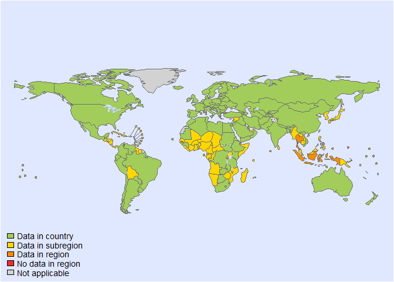
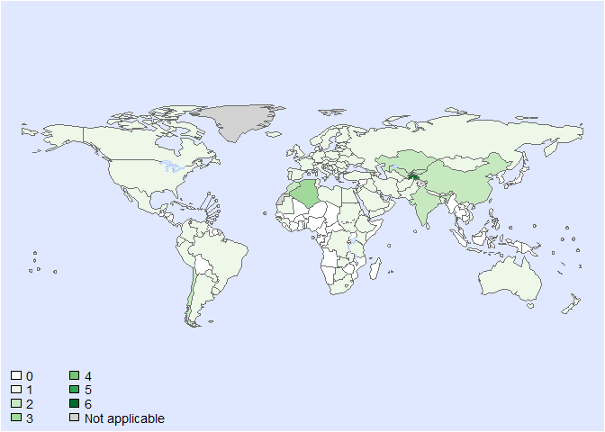
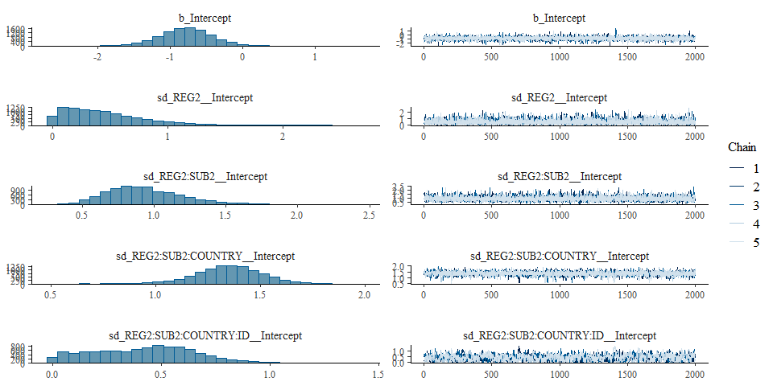
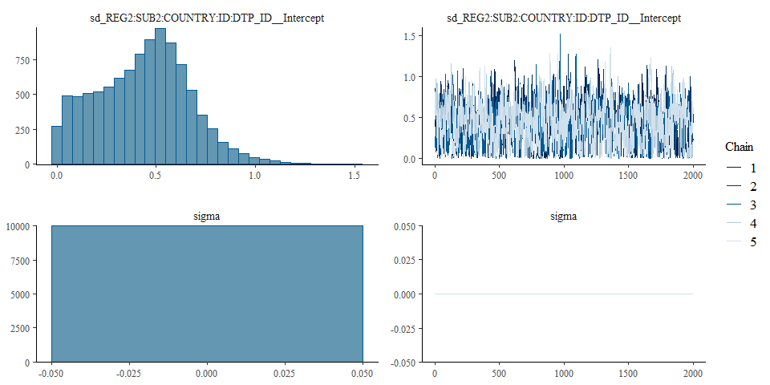

Global incidence of echinococcus granulosis • fit model - Version 1
================
CaDi2575
2025-04-07

- [Settings](#settings)
  - [BRMS model: Version 1](#brms-model-version-1)
- [Session info](#session-info)

# Settings

``` r
## required packages ----
library(bd)
library(brms)
library(ggplot2)
library(metafor)
library(readxl)
library(rmarkdown)
library(rms)
library(tidyr)
library(knitr)

## global options ----
knitr::opts_chunk$set(fig.width = 10)
Date <- format(Sys.Date(), "%Y%m%d")

source("01-data.R")
```

    ## New names:
    ## New names:
    ## • `` -> `...1`
    ## • `` -> `...3`
    ## • `` -> `...9`
    ## • `` -> `...10`
    ## • `` -> `...12`
    ## • `` -> `...15`
    ## • `` -> `...16`

    ## 'data.frame':    156 obs. of  16 variables:
    ##  $ ...1              : chr  "AMR" NA NA NA ...
    ##  $ REF_LOCATION      : chr  NA "Argentina" "Bolivia (Plurinational State of)" "Brazil" ...
    ##  $ ...3              : logi  NA NA NA NA NA NA ...
    ##  $ VALUE_MEAN        : chr  "Cases per annum for country" "379" "9" "362" ...
    ##  $ VALUE_P2_5        : num  NA 358 8 353 27 942 253 54 NA NA ...
    ##  $ VALUE_P97_5       : num  NA 402 10 369 34 977 291 68 NA NA ...
    ##  $ case reports      : chr  NA NA NA NA ...
    ##  $ Endemic in animals: chr  NA NA NA NA ...
    ##  $ ...9              : chr  NA NA NA NA ...
    ##  $ ...10             : logi  NA NA NA NA NA NA ...
    ##  $ Years             : chr  "From" "2019" "1940" "1995" ...
    ##  $ ...12             : chr  "To" "2021" "2017" "2016" ...
    ##  $ Number of years   : num  NA 3 77 21 9 11 3 4 NA NA ...
    ##  $ Method            : chr  NA "Reported incidence" "Reported incidence" "Reported incidence" ...
    ##  $ ...15             : logi  NA NA NA NA NA NA ...
    ##  $ ...16             : chr  NA NA NA NA ...

    ## Warning in if_else(dta$VALUE_MEAN == "<8", 7, as.numeric(dta$VALUE_MEAN)): NAs introduced by coercion

    ## Joining with `by = join_by(REF_YEAR_START, REF_YEAR_END, ISO3, REF_AGE_START, REF_AGE_END, REF_SEX, ID_ROW)`

    ## Warning in add_pop(dta): Warning: 6 rows have missing data for the population variable. Please check if ISO3 code is
    ## correctly specified and if the dates are included in the study field.

<!-- --><!-- -->

    ## Warning: REML comparisons not meaningful for models with different fixed effects
    ## (use 'refit=TRUE' to refit both models based on ML estimation).

    ## Warning in system2("quarto", "-V", stdout = TRUE, env = paste0("TMPDIR=", : running command '"quarto"
    ## TMPDIR=C:/Users/CaDi2575/AppData/Local/Temp/Rtmp4G4dr1/file203079115e3e -V' had status 1

``` r
es$DTP_ID<-as.character(seq(1:length(es$ID)))
es$FLAG <- factor(es$FLAG, 
                  levels = c(0,1,2,3,4,5,6,7),
                  labels = c("Keep data", "Data part of non WHO member states", "No WHO REG2 given",
                             "Year before 1990", "yi can't be calcualted", "TF choice to remove", 
                             "Excluded by preliminary checks", "Excluded in data cleaning"))
saveRDS(es, paste0("es_", Date, ".RDS"))
```

## BRMS model: Version 1

``` r
Parameters<- c("Number of iteration", "Warmup", "Delta value", "Maximum tree-depth","Levels","Random effect on each data point", "Stronger priors specified")
Values <- c("5000","3000","0.95","15","Countries, Studies","Yes", "Normal(0,1)")
version_spe <- data.frame(Parameters,Values)

kable(caption = "Parameters of the model tested",row.names = FALSE, version_spe)
```

| Parameters                       | Values             |
|:---------------------------------|:-------------------|
| Number of iteration              | 5000               |
| Warmup                           | 3000               |
| Delta value                      | 0.95               |
| Maximum tree-depth               | 15                 |
| Levels                           | Countries, Studies |
| Random effect on each data point | Yes                |
| Stronger priors specified        | Normal(0,1)        |

Parameters of the model tested

``` r
fit_brms_reg_s1 <-
  brm(yi | se(sei) ~
       1 + 
        (1  | REG2) +
        (1  | REG2:SUB2) +
        (1  | REG2:SUB2:COUNTRY) +
        (1  | REG2:SUB2:COUNTRY:ID) +
        (1  | REG2:SUB2:COUNTRY:ID:DTP_ID),
      chains = 5, iter = 5000, warmup = 3000,
      prior = prior(normal(0,1), class = sd),
      cores = 5,
      data = subset(es, as.integer(FLAG) == 1), 
      open_progress = FALSE,
      control = list(adapt_delta = 0.95, max_treedepth=15),
      seed =7 )
```

    ## Compiling Stan program...

    ## Start sampling

    ## Warning: There were 5 divergent transitions after warmup. See
    ## https://mc-stan.org/misc/warnings.html#divergent-transitions-after-warmup
    ## to find out why this is a problem and how to eliminate them.

    ## Warning: Examine the pairs() plot to diagnose sampling problems

``` r
saveRDS(fit_brms_reg_s1, file = "fit_brms_reg_s1.rds")
summary(fit_brms_reg_s1)
```

    ## Warning: There were 5 divergent transitions after warmup. Increasing adapt_delta above 0.95 may help. See
    ## http://mc-stan.org/misc/warnings.html#divergent-transitions-after-warmup

    ##  Family: gaussian 
    ##   Links: mu = identity; sigma = identity 
    ## Formula: yi | se(sei) ~ 1 + (1 | REG2) + (1 | REG2:SUB2) + (1 | REG2:SUB2:COUNTRY) + (1 | REG2:SUB2:COUNTRY:ID) + (1 | REG2:SUB2:COUNTRY:ID:DTP_ID) 
    ##    Data: subset(es, as.integer(FLAG) == 1) (Number of observations: 116) 
    ##   Draws: 5 chains, each with iter = 5000; warmup = 3000; thin = 1;
    ##          total post-warmup draws = 10000
    ## 
    ## Multilevel Hyperparameters:
    ## ~REG2 (Number of levels: 6) 
    ##               Estimate Est.Error l-95% CI u-95% CI Rhat Bulk_ESS Tail_ESS
    ## sd(Intercept)     0.45      0.35     0.02     1.31 1.00     6145     6120
    ## 
    ## ~REG2:SUB2 (Number of levels: 16) 
    ##               Estimate Est.Error l-95% CI u-95% CI Rhat Bulk_ESS Tail_ESS
    ## sd(Intercept)     0.94      0.27     0.50     1.57 1.00     5198     5975
    ## 
    ## ~REG2:SUB2:COUNTRY (Number of levels: 101) 
    ##               Estimate Est.Error l-95% CI u-95% CI Rhat Bulk_ESS Tail_ESS
    ## sd(Intercept)     1.34      0.17     0.99     1.65 1.00     2870     2125
    ## 
    ## ~REG2:SUB2:COUNTRY:ID (Number of levels: 116) 
    ##               Estimate Est.Error l-95% CI u-95% CI Rhat Bulk_ESS Tail_ESS
    ## sd(Intercept)     0.42      0.24     0.02     0.88 1.00      909     1933
    ## 
    ## ~REG2:SUB2:COUNTRY:ID:DTP_ID (Number of levels: 116) 
    ##               Estimate Est.Error l-95% CI u-95% CI Rhat Bulk_ESS Tail_ESS
    ## sd(Intercept)     0.43      0.23     0.02     0.90 1.00      809     1692
    ## 
    ## Regression Coefficients:
    ##           Estimate Est.Error l-95% CI u-95% CI Rhat Bulk_ESS Tail_ESS
    ## Intercept    -0.79      0.39    -1.57    -0.03 1.00     6791     6128
    ## 
    ## Further Distributional Parameters:
    ##       Estimate Est.Error l-95% CI u-95% CI Rhat Bulk_ESS Tail_ESS
    ## sigma     0.00      0.00     0.00     0.00   NA       NA       NA
    ## 
    ## Draws were sampled using sampling(NUTS). For each parameter, Bulk_ESS
    ## and Tail_ESS are effective sample size measures, and Rhat is the potential
    ## scale reduction factor on split chains (at convergence, Rhat = 1).

``` r
plot(fit_brms_reg_s1, ask = FALSE)
```

<!-- --><!-- -->

``` r
# plot(conditional_effects(fit_brms_reg_s1), points = TRUE)

stancode(fit_brms_reg_s1)
```

    ## // generated with brms 2.22.0
    ## functions {
    ## }
    ## data {
    ##   int<lower=1> N;  // total number of observations
    ##   vector[N] Y;  // response variable
    ##   vector<lower=0>[N] se;  // known sampling error
    ##   // data for group-level effects of ID 1
    ##   int<lower=1> N_1;  // number of grouping levels
    ##   int<lower=1> M_1;  // number of coefficients per level
    ##   array[N] int<lower=1> J_1;  // grouping indicator per observation
    ##   // group-level predictor values
    ##   vector[N] Z_1_1;
    ##   // data for group-level effects of ID 2
    ##   int<lower=1> N_2;  // number of grouping levels
    ##   int<lower=1> M_2;  // number of coefficients per level
    ##   array[N] int<lower=1> J_2;  // grouping indicator per observation
    ##   // group-level predictor values
    ##   vector[N] Z_2_1;
    ##   // data for group-level effects of ID 3
    ##   int<lower=1> N_3;  // number of grouping levels
    ##   int<lower=1> M_3;  // number of coefficients per level
    ##   array[N] int<lower=1> J_3;  // grouping indicator per observation
    ##   // group-level predictor values
    ##   vector[N] Z_3_1;
    ##   // data for group-level effects of ID 4
    ##   int<lower=1> N_4;  // number of grouping levels
    ##   int<lower=1> M_4;  // number of coefficients per level
    ##   array[N] int<lower=1> J_4;  // grouping indicator per observation
    ##   // group-level predictor values
    ##   vector[N] Z_4_1;
    ##   // data for group-level effects of ID 5
    ##   int<lower=1> N_5;  // number of grouping levels
    ##   int<lower=1> M_5;  // number of coefficients per level
    ##   array[N] int<lower=1> J_5;  // grouping indicator per observation
    ##   // group-level predictor values
    ##   vector[N] Z_5_1;
    ##   int prior_only;  // should the likelihood be ignored?
    ## }
    ## transformed data {
    ##   vector<lower=0>[N] se2 = square(se);
    ## }
    ## parameters {
    ##   real Intercept;  // temporary intercept for centered predictors
    ##   vector<lower=0>[M_1] sd_1;  // group-level standard deviations
    ##   array[M_1] vector[N_1] z_1;  // standardized group-level effects
    ##   vector<lower=0>[M_2] sd_2;  // group-level standard deviations
    ##   array[M_2] vector[N_2] z_2;  // standardized group-level effects
    ##   vector<lower=0>[M_3] sd_3;  // group-level standard deviations
    ##   array[M_3] vector[N_3] z_3;  // standardized group-level effects
    ##   vector<lower=0>[M_4] sd_4;  // group-level standard deviations
    ##   array[M_4] vector[N_4] z_4;  // standardized group-level effects
    ##   vector<lower=0>[M_5] sd_5;  // group-level standard deviations
    ##   array[M_5] vector[N_5] z_5;  // standardized group-level effects
    ## }
    ## transformed parameters {
    ##   real sigma = 0;  // dispersion parameter
    ##   vector[N_1] r_1_1;  // actual group-level effects
    ##   vector[N_2] r_2_1;  // actual group-level effects
    ##   vector[N_3] r_3_1;  // actual group-level effects
    ##   vector[N_4] r_4_1;  // actual group-level effects
    ##   vector[N_5] r_5_1;  // actual group-level effects
    ##   real lprior = 0;  // prior contributions to the log posterior
    ##   r_1_1 = (sd_1[1] * (z_1[1]));
    ##   r_2_1 = (sd_2[1] * (z_2[1]));
    ##   r_3_1 = (sd_3[1] * (z_3[1]));
    ##   r_4_1 = (sd_4[1] * (z_4[1]));
    ##   r_5_1 = (sd_5[1] * (z_5[1]));
    ##   lprior += student_t_lpdf(Intercept | 3, -0.8, 2.5);
    ##   lprior += normal_lpdf(sd_1 | 0, 1)
    ##     - 1 * normal_lccdf(0 | 0, 1);
    ##   lprior += normal_lpdf(sd_2 | 0, 1)
    ##     - 1 * normal_lccdf(0 | 0, 1);
    ##   lprior += normal_lpdf(sd_3 | 0, 1)
    ##     - 1 * normal_lccdf(0 | 0, 1);
    ##   lprior += normal_lpdf(sd_4 | 0, 1)
    ##     - 1 * normal_lccdf(0 | 0, 1);
    ##   lprior += normal_lpdf(sd_5 | 0, 1)
    ##     - 1 * normal_lccdf(0 | 0, 1);
    ## }
    ## model {
    ##   // likelihood including constants
    ##   if (!prior_only) {
    ##     // initialize linear predictor term
    ##     vector[N] mu = rep_vector(0.0, N);
    ##     mu += Intercept;
    ##     for (n in 1:N) {
    ##       // add more terms to the linear predictor
    ##       mu[n] += r_1_1[J_1[n]] * Z_1_1[n] + r_2_1[J_2[n]] * Z_2_1[n] + r_3_1[J_3[n]] * Z_3_1[n] + r_4_1[J_4[n]] * Z_4_1[n] + r_5_1[J_5[n]] * Z_5_1[n];
    ##     }
    ##     target += normal_lpdf(Y | mu, se);
    ##   }
    ##   // priors including constants
    ##   target += lprior;
    ##   target += std_normal_lpdf(z_1[1]);
    ##   target += std_normal_lpdf(z_2[1]);
    ##   target += std_normal_lpdf(z_3[1]);
    ##   target += std_normal_lpdf(z_4[1]);
    ##   target += std_normal_lpdf(z_5[1]);
    ## }
    ## generated quantities {
    ##   // actual population-level intercept
    ##   real b_Intercept = Intercept;
    ## }

# Session info

``` r
sessioninfo::session_info()
```

    ## Warning in system2("quarto", "-V", stdout = TRUE, env = paste0("TMPDIR=", : running command '"quarto"
    ## TMPDIR=C:/Users/CaDi2575/AppData/Local/Temp/Rtmp4G4dr1/file2030319f1943 -V' had status 1

    ## ─ Session info ────────────────────────────────────────────────────────────────────────────────────────────────────────
    ##  setting  value
    ##  version  R version 4.4.2 (2024-10-31 ucrt)
    ##  os       Windows 10 x64 (build 19045)
    ##  system   x86_64, mingw32
    ##  ui       RStudio
    ##  language (EN)
    ##  collate  English_United States.utf8
    ##  ctype    English_United States.utf8
    ##  tz       Europe/Brussels
    ##  date     2025-04-07
    ##  rstudio  2024.12.0+467 Kousa Dogwood (desktop)
    ##  pandoc   3.2 @ C:/Program Files/RStudio/resources/app/bin/quarto/bin/tools/ (via rmarkdown)
    ##  quarto   ERROR: Unknown command "TMPDIR=C:/Users/CaDi2575/AppData/Local/Temp/Rtmp4G4dr1/file2030319f1943". Did you mean command "install"? @ C:\\PROGRA~1\\RStudio\\RESOUR~1\\app\\bin\\quarto\\bin\\quarto.exe
    ## 
    ## ─ Packages ────────────────────────────────────────────────────────────────────────────────────────────────────────────
    ##  ! package        * version    date (UTC) lib source
    ##    abind            1.4-8      2024-09-12 [1] CRAN (R 4.4.1)
    ##    backports        1.5.0      2024-05-23 [1] CRAN (R 4.4.0)
    ##    base64enc        0.1-3      2015-07-28 [1] CRAN (R 4.4.0)
    ##    bayesplot        1.11.1     2024-02-15 [1] CRAN (R 4.4.3)
    ##    bd             * 0.0.14     2025-03-28 [1] Github (brechtdv/bd@652191c)
    ##    boot             1.3-31     2024-08-28 [1] CRAN (R 4.4.2)
    ##    bridgesampling   1.1-2      2021-04-16 [1] CRAN (R 4.4.3)
    ##    brms           * 2.22.0     2024-09-23 [1] CRAN (R 4.4.3)
    ##    Brobdingnag      1.2-9      2022-10-19 [1] CRAN (R 4.4.3)
    ##    callr            3.7.6      2024-03-25 [1] CRAN (R 4.4.3)
    ##    cellranger       1.1.0      2016-07-27 [1] CRAN (R 4.4.3)
    ##    checkmate        2.3.2      2024-07-29 [1] CRAN (R 4.4.3)
    ##    class            7.3-22     2023-05-03 [1] CRAN (R 4.4.2)
    ##    classInt         0.4-11     2025-01-08 [1] CRAN (R 4.4.3)
    ##    cli              3.6.4      2025-02-13 [1] CRAN (R 4.4.3)
    ##    cluster          2.1.6      2023-12-01 [1] CRAN (R 4.4.2)
    ##    coda             0.19-4.1   2024-01-31 [1] CRAN (R 4.4.3)
    ##    codetools        0.2-20     2024-03-31 [1] CRAN (R 4.4.2)
    ##    colorspace       2.1-1      2024-07-26 [1] CRAN (R 4.4.3)
    ##    data.table       1.17.0     2025-02-22 [1] CRAN (R 4.4.3)
    ##    DBI              1.2.3      2024-06-02 [1] CRAN (R 4.4.3)
    ##    DescTools      * 0.99.59    2025-01-26 [1] CRAN (R 4.4.3)
    ##    digest           0.6.37     2024-08-19 [1] CRAN (R 4.4.3)
    ##    distributional   0.5.0      2024-09-17 [1] CRAN (R 4.4.3)
    ##    dplyr          * 1.1.4      2023-11-17 [1] CRAN (R 4.4.3)
    ##    e1071            1.7-16     2024-09-16 [1] CRAN (R 4.4.3)
    ##    evaluate         1.0.3      2025-01-10 [1] CRAN (R 4.4.3)
    ##    Exact            3.3        2024-07-21 [1] CRAN (R 4.4.1)
    ##    expm             1.0-0      2024-08-19 [1] CRAN (R 4.4.3)
    ##    farver           2.1.2      2024-05-13 [1] CRAN (R 4.4.3)
    ##    fastmap          1.2.0      2024-05-15 [1] CRAN (R 4.4.3)
    ##    FERG2          * 0.0.2      2025-03-28 [1] Github (brechtdv/FERG2@94a69c2)
    ##    forcats          1.0.0      2023-01-29 [1] CRAN (R 4.4.3)
    ##    foreign          0.8-87     2024-06-26 [1] CRAN (R 4.4.2)
    ##    Formula          1.2-5      2023-02-24 [1] CRAN (R 4.4.0)
    ##    generics         0.1.3      2022-07-05 [1] CRAN (R 4.4.3)
    ##    ggplot2        * 3.5.1      2024-04-23 [1] CRAN (R 4.4.3)
    ##    gld              2.6.7      2025-01-17 [1] CRAN (R 4.4.3)
    ##    glue             1.8.0      2024-09-30 [1] CRAN (R 4.4.3)
    ##    gridExtra        2.3        2017-09-09 [1] CRAN (R 4.4.3)
    ##    gtable           0.3.6      2024-10-25 [1] CRAN (R 4.4.3)
    ##    haven            2.5.4      2023-11-30 [1] CRAN (R 4.4.3)
    ##    Hmisc          * 5.2-3      2025-03-16 [1] CRAN (R 4.4.3)
    ##    hms              1.1.3      2023-03-21 [1] CRAN (R 4.4.3)
    ##    htmlTable        2.4.3      2024-07-21 [1] CRAN (R 4.4.3)
    ##    htmltools        0.5.8.1    2024-04-04 [1] CRAN (R 4.4.3)
    ##    htmlwidgets      1.6.4      2023-12-06 [1] CRAN (R 4.4.3)
    ##    httr             1.4.7      2023-08-15 [1] CRAN (R 4.4.3)
    ##    inline           0.3.21     2025-01-09 [1] CRAN (R 4.4.3)
    ##    kableExtra     * 1.4.0      2024-01-24 [1] CRAN (R 4.4.3)
    ##    KernSmooth       2.23-24    2024-05-17 [1] CRAN (R 4.4.2)
    ##    knitr          * 1.50       2025-03-16 [1] CRAN (R 4.4.3)
    ##    labeling         0.4.3      2023-08-29 [1] CRAN (R 4.4.0)
    ##    lattice          0.22-6     2024-03-20 [1] CRAN (R 4.4.2)
    ##    lifecycle        1.0.4      2023-11-07 [1] CRAN (R 4.4.3)
    ##    lmom             3.2        2024-09-30 [1] CRAN (R 4.4.1)
    ##    loo              2.8.0      2024-07-03 [1] CRAN (R 4.4.3)
    ##    magrittr         2.0.3      2022-03-30 [1] CRAN (R 4.4.3)
    ##    MASS             7.3-61     2024-06-13 [1] CRAN (R 4.4.2)
    ##    mathjaxr         1.6-0      2022-02-28 [1] CRAN (R 4.4.3)
    ##    Matrix         * 1.7-1      2024-10-18 [1] CRAN (R 4.4.2)
    ##    MatrixModels     0.5-4      2025-03-26 [1] CRAN (R 4.4.2)
    ##    matrixStats      1.5.0      2025-01-07 [1] CRAN (R 4.4.3)
    ##    metadat        * 1.4-0      2025-02-04 [1] CRAN (R 4.4.3)
    ##    metafor        * 4.8-0      2025-01-28 [1] CRAN (R 4.4.3)
    ##    mgcv             1.9-1      2023-12-21 [1] CRAN (R 4.4.2)
    ##    multcomp         1.4-28     2025-01-29 [1] CRAN (R 4.4.3)
    ##    munsell          0.5.1      2024-04-01 [1] CRAN (R 4.4.3)
    ##    mvtnorm          1.3-3      2025-01-10 [1] CRAN (R 4.4.3)
    ##    nlme             3.1-166    2024-08-14 [1] CRAN (R 4.4.2)
    ##    nnet             7.3-19     2023-05-03 [1] CRAN (R 4.4.2)
    ##    numDeriv       * 2016.8-1.1 2019-06-06 [1] CRAN (R 4.4.0)
    ##    pillar           1.10.1     2025-01-07 [1] CRAN (R 4.4.3)
    ##    pkgbuild         1.4.7      2025-03-24 [1] CRAN (R 4.4.3)
    ##    pkgconfig        2.0.3      2019-09-22 [1] CRAN (R 4.4.3)
    ##    plyr             1.8.9      2023-10-02 [1] CRAN (R 4.4.3)
    ##    polspline        1.1.25     2024-05-10 [1] CRAN (R 4.4.0)
    ##    posterior        1.6.1      2025-02-27 [1] CRAN (R 4.4.3)
    ##    processx         3.8.6      2025-02-21 [1] CRAN (R 4.4.3)
    ##    proxy            0.4-27     2022-06-09 [1] CRAN (R 4.4.3)
    ##    ps               1.9.0      2025-02-18 [1] CRAN (R 4.4.3)
    ##    purrr            1.0.4      2025-02-05 [1] CRAN (R 4.4.3)
    ##    quantreg         6.1        2025-03-10 [1] CRAN (R 4.4.3)
    ##    QuickJSR         1.6.0      2025-02-26 [1] CRAN (R 4.4.3)
    ##    R6               2.6.1      2025-02-15 [1] CRAN (R 4.4.3)
    ##    RColorBrewer     1.1-3      2022-04-03 [1] CRAN (R 4.4.0)
    ##    Rcpp           * 1.0.14     2025-01-12 [1] CRAN (R 4.4.3)
    ##  D RcppParallel     5.1.10     2025-01-24 [1] CRAN (R 4.4.3)
    ##    readxl         * 1.4.5      2025-03-07 [1] CRAN (R 4.4.3)
    ##    reshape2         1.4.4      2020-04-09 [1] CRAN (R 4.4.3)
    ##    rlang            1.1.5      2025-01-17 [1] CRAN (R 4.4.3)
    ##    rmarkdown      * 2.29       2024-11-04 [1] CRAN (R 4.4.3)
    ##    rms            * 7.0-0      2025-01-17 [1] CRAN (R 4.4.3)
    ##    rootSolve        1.8.2.4    2023-09-21 [1] CRAN (R 4.4.0)
    ##    rpart            4.1.23     2023-12-05 [1] CRAN (R 4.4.2)
    ##    rstan            2.32.7     2025-03-10 [1] CRAN (R 4.4.3)
    ##    rstantools       2.4.0      2024-01-31 [1] CRAN (R 4.4.3)
    ##    rstudioapi       0.17.1     2024-10-22 [1] CRAN (R 4.4.3)
    ##    sandwich         3.1-1      2024-09-15 [1] CRAN (R 4.4.3)
    ##    scales         * 1.3.0      2023-11-28 [1] CRAN (R 4.4.3)
    ##    sessioninfo      1.2.3      2025-02-05 [1] CRAN (R 4.4.3)
    ##    sf             * 1.0-20     2025-03-24 [1] CRAN (R 4.4.3)
    ##    SparseM          1.84-2     2024-07-17 [1] CRAN (R 4.4.3)
    ##    StanHeaders      2.32.10    2024-07-15 [1] CRAN (R 4.4.3)
    ##    stringi          1.8.7      2025-03-27 [1] CRAN (R 4.4.2)
    ##    stringr          1.5.1      2023-11-14 [1] CRAN (R 4.4.3)
    ##    survival         3.7-0      2024-06-05 [1] CRAN (R 4.4.2)
    ##    svglite          2.1.3      2023-12-08 [1] CRAN (R 4.4.3)
    ##    systemfonts      1.2.1      2025-01-20 [1] CRAN (R 4.4.3)
    ##    tensorA          0.36.2.1   2023-12-13 [1] CRAN (R 4.4.0)
    ##    TH.data          1.1-3      2025-01-17 [1] CRAN (R 4.4.3)
    ##    tibble           3.2.1      2023-03-20 [1] CRAN (R 4.4.3)
    ##    tidyr          * 1.3.1      2024-01-24 [1] CRAN (R 4.4.3)
    ##    tidyselect       1.2.1      2024-03-11 [1] CRAN (R 4.4.3)
    ##    units            0.8-7      2025-03-11 [1] CRAN (R 4.4.3)
    ##    vctrs            0.6.5      2023-12-01 [1] CRAN (R 4.4.3)
    ##    viridisLite      0.4.2      2023-05-02 [1] CRAN (R 4.4.3)
    ##    withr            3.0.2      2024-10-28 [1] CRAN (R 4.4.3)
    ##    xfun             0.51       2025-02-19 [1] CRAN (R 4.4.3)
    ##    xml2             1.3.8      2025-03-14 [1] CRAN (R 4.4.3)
    ##    yaml             2.3.10     2024-07-26 [1] CRAN (R 4.4.3)
    ##    zoo              1.8-13     2025-02-22 [1] CRAN (R 4.4.3)
    ## 
    ##  [1] C:/Program Files/R/R-4.4.2/library
    ## 
    ##  * ── Packages attached to the search path.
    ##  D ── DLL MD5 mismatch, broken installation.
    ## 
    ## ───────────────────────────────────────────────────────────────────────────────────────────────────────────────────────

``` r
##rmarkdown::render("02-fit_v1.R")
```
