Global incidence of echinococcus granulosis • Estimate incidence with
the 1th model
================
LoVa3397
2025-09-12

- [Settings](#settings)
- [Model fit](#model-fit)
- [Predict all](#predict-all)
- [Summarize predictions](#summarize-predictions)
  - [Global](#global)
  - [Regions](#regions)
  - [Subregions](#subregions)
  - [Countries](#countries)
- [Session info](#session-info)

# Settings

``` r
## required packages ----
library(bd)
library(brms)
```

    ## Loading required package: Rcpp

    ## Loading 'brms' package (version 2.22.0). Useful instructions
    ## can be found by typing help('brms'). A more detailed introduction
    ## to the package is available through vignette('brms_overview').

    ## 
    ## Attaching package: 'brms'

    ## The following object is masked from 'package:stats':
    ## 
    ##     ar

``` r
library(FERG2)
```

    ## 
    ## Attaching package: 'FERG2'

    ## The following object is masked from 'package:bd':
    ## 
    ##     mean_ci

``` r
library(ggplot2)
library(knitr)
library(rmarkdown)
library(sf)
```

    ## Linking to GEOS 3.13.1, GDAL 3.10.2, PROJ 9.5.1; sf_use_s2() is TRUE

``` r
library(tidyr)
library(dplyr)
```

    ## 
    ## Attaching package: 'dplyr'

    ## The following object is masked from 'package:bd':
    ## 
    ##     collapse

    ## The following objects are masked from 'package:stats':
    ## 
    ##     filter, lag

    ## The following objects are masked from 'package:base':
    ## 
    ##     intersect, setdiff, setequal, union

``` r
library(DescTools)
library(readxl)
library(kableExtra)
```

    ## 
    ## Attaching package: 'kableExtra'

    ## The following object is masked from 'package:dplyr':
    ## 
    ##     group_rows

``` r
#Model with random effect on each data point and stronger priors (normal(0,1))

## global options ----
knitr::opts_chunk$set(fig.width = 10)
Date <- format(Sys.Date(), "%Y%m%d")
```

# Model fit

``` r
Parameters<- c("Number of iteration", "Warmup", "Delta value", "Maximum tree-depth","Levels","Random effect on each data point", "Stronger priors specified")
Values <- c("5000","3000","0.95","15","Countries, Studies","Yes", "Normal(0,1)")
version_spe <- data.frame(Parameters,Values)

kable(caption = "Parameters of the model tested",row.names = FALSE, version_spe)
```

| Parameters                       | Values             |
|:---------------------------------|:-------------------|
| Number of iteration              | 5000               |
| Warmup                           | 3000               |
| Delta value                      | 0.95               |
| Maximum tree-depth               | 15                 |
| Levels                           | Countries, Studies |
| Random effect on each data point | Yes                |
| Stronger priors specified        | Normal(0,1)        |

Parameters of the model tested

``` r
fit_brms_reg_s <- readRDS("fit_brms_reg_s1.rds")
zero_cases<- read_xlsx("Endemic_countries.xlsx")%>%
  select(REG2, SUB2, ISO3, Country, pdtf_echino_granulosis) %>%
  rename(COUNTRY=ISO3, COUNTRY_LABEL = Country, DISEASEFREE = pdtf_echino_granulosis) %>%  
  mutate(DISEASEFREE = if_else(is.na(DISEASEFREE), 0, DISEASEFREE))

kable(
  caption = "Countries assumed to be non-endemic",
  row.names = FALSE,
  subset(zero_cases, DISEASEFREE==0)[, 4])
```

| COUNTRY_LABEL                  |
|:-------------------------------|
| Andorra                        |
| Antigua and Barbuda            |
| Austria                        |
| Burundi                        |
| Belgium                        |
| Benin                          |
| Bahamas, The                   |
| Belize                         |
| Barbados                       |
| Brunei Darussalam              |
| Canada                         |
| Switzerland                    |
| Cook Islands                   |
| Comoros                        |
| Cuba                           |
| Cyprus                         |
| Czech Republic                 |
| Germany                        |
| Dominica                       |
| Denmark                        |
| Finland                        |
| Fiji                           |
| Micronesia, Fed. Sts.          |
| Gabon                          |
| Gambia, The                    |
| Guinea-Bissau                  |
| Equatorial Guinea              |
| Grenada                        |
| Honduras                       |
| Indonesia                      |
| Ireland                        |
| Iceland                        |
| Jamaica                        |
| Japan                          |
| Cambodia                       |
| Kiribati                       |
| St. Kitts and Nevis            |
| Korea, Rep.                    |
| Lao PDR                        |
| Liberia                        |
| St. Lucia                      |
| Sri Lanka                      |
| Luxembourg                     |
| Monaco                         |
| Madagascar                     |
| Maldives                       |
| Marshall Islands               |
| Malta                          |
| Myanmar                        |
| Mauritius                      |
| Malaysia                       |
| Nicaragua                      |
| Niue                           |
| Netherlands                    |
| Norway                         |
| Nauru                          |
| New Zealand                    |
| Philippines                    |
| Palau                          |
| Papua New Guinea               |
| Korea, Dem. People’s Rep.      |
| Qatar                          |
| Rwanda                         |
| Singapore                      |
| Solomon Islands                |
| Sierra Leone                   |
| El Salvador                    |
| San Marino                     |
| São Tomé and Principe          |
| Sweden                         |
| Seychelles                     |
| Togo                           |
| Thailand                       |
| Timor-Leste                    |
| Tonga                          |
| Trinidad and Tobago            |
| Tuvalu                         |
| United States                  |
| St. Vincent and the Grenadines |
| Vanuatu                        |
| Samoa                          |

Countries assumed to be non-endemic

``` r
es_files <- list.files(pattern="^es_\\d{8}\\.rds$", full.names=TRUE, ignore.case = TRUE)
es_dates <- as.Date(sub("^es_(\\d{8})\\.rds$", "\\1", basename(es_files), ignore.case = TRUE), format = "%Y%m%d")
es_latest <- es_files[which.max(es_dates)]
es<- readRDS(es_latest)
es <- subset(es, as.integer(FLAG) == 1)

country_with_data <- es %>% select(ISO3) %>% distinct() %>% mutate(DATA=1, COUNTRY = ISO3)
Sub2_with_data <- es %>% select(SUB2) %>% distinct() %>% mutate(DATASUB2=1)
Reg2_with_data <- es %>% select(REG2) %>% distinct() %>% mutate(DATAREG2=1)
zero_cases <- left_join(zero_cases, country_with_data)
```

    ## Joining with `by = join_by(COUNTRY)`

``` r
zero_cases <- left_join(zero_cases, Sub2_with_data)
```

    ## Joining with `by = join_by(SUB2)`

``` r
zero_cases <- left_join(zero_cases, Reg2_with_data) %>%
  select(-c(ISO3)) %>%
  mutate(ESTIMATES = case_when(
    DATA == 1 ~ 1,
    DISEASEFREE == 0 ~ 2,
    is.na(DATA) & DISEASEFREE == 1 & DATASUB2 == 1 ~ 3,
    is.na(DATA) & DISEASEFREE == 1 & is.na(DATASUB2) & DATAREG2 == 1 ~ 4, 
    is.na(DATA) & DISEASEFREE == 1  & is.na(DATASUB2) & is.na(DATAREG2) ~5))
```

    ## Joining with `by = join_by(REG2)`

``` r
zero_cases$ESTIMATES <- factor(zero_cases$ESTIMATES, 
                               level = c(1,2,3,4,5),
                               labels = c("Data present", "Disease free", "Data in subregion", "Data in region", "Data in world"))
Country_Check <- zero_cases %>% filter(as.integer(ESTIMATES) == 2)
```

# Predict all

``` r
## set up dataframe
sim_all <-
  data.frame(
    sei = 0,
    REG2 = FERG2:::countries$REG2,
    SUB2 = FERG2:::countries$SUB2,
    COUNTRY = FERG2:::countries$ISO3)
sim_all <- sim_all %>% left_join(zero_cases) %>% select(sei, REG2, SUB2, COUNTRY, ESTIMATES)
```

    ## Joining with `by = join_by(REG2, SUB2, COUNTRY)`

``` r
## draw from expected value of posterior predictive dist
set.seed(10)
# fit_all <- 
#   posterior_epred(
#     object = fit_brms_reg_s,
#     newdata = sim_all,
#     allow_new_levels = TRUE,
#     sample_new_levels = "old_levels",
#     re_formula = ~ 1 + YEAR +
#       (1 | REG2) +
#       (1 | REG2:SUB2) +
#       (1 | REG2:SUB2:COUNTRY)
#   )

draws_fit <- as_draws_df(fit_brms_reg_s)
fit_all <- data.frame(1:10000)
for (x in 1:nrow(sim_all)){
  if (as.integer(sim_all[x, "ESTIMATES"]) == 1){
    # Data present for country
    fit_all[[paste0("V",x)]] <- draws_fit$b_Intercept +                                                                               # Global intercept
      draws_fit[[paste0("r_REG2[",sim_all[x,"REG2"],",Intercept]")]] +                                                                # Regional component
      draws_fit[[paste0("r_REG2:SUB2[",sim_all[x,"REG2"],"_",sim_all[x,"SUB2"],",Intercept]")]] +                                     # Sub regional component
      draws_fit[[paste0("r_REG2:SUB2:COUNTRY[",sim_all[x,"REG2"],"_",sim_all[x,"SUB2"],"_",sim_all[x,"COUNTRY"],",Intercept]")]]      # Country component
  } else if (as.integer(sim_all[x, "ESTIMATES"]) == 2) {
    # Disease-free country
    fit_all[[paste0("V",x)]] <- 0
  } else if (as.integer(sim_all[x, "ESTIMATES"]) == 3){
    # Data not present for country, but present in subregion
    fit_all[[paste0("V",x)]] <- draws_fit$b_Intercept +                                                                               # Global intercept
      draws_fit[[paste0("r_REG2[",sim_all[x,"REG2"],",Intercept]")]] +                                                                # Regional component
      draws_fit[[paste0("r_REG2:SUB2[",sim_all[x,"REG2"],"_",sim_all[x,"SUB2"],",Intercept]")]]                                       # Sub regional component
  } else if (as.integer(sim_all[x, "ESTIMATES"]) == 4){
    # Data not present for country, but present in region
    fit_all[[paste0("V",x)]] <- draws_fit$b_Intercept +                                                                               # Global intercept
      draws_fit[[paste0("r_REG2[",sim_all[x,"REG2"],",Intercept]")]]                                                                  # Regional component
  } else if (as.integer(sim_all[x, "ESTIMATES"]) == 5){
    # Data not present for country
    fit_all[[paste0("V",x)]] <- draws_fit$b_Intercept  
  } 
}

fit_all <- fit_all %>% select(-c(X1.10000))

## calculate cases
sim_all$SIM <- t(fit_all)
sim_all <- do.call("rbind", replicate(2021-2000+1, sim_all, simplify = FALSE))
sim_all$YEAR <- sort(rep(2000:2021,194))
pop_all <- aggregate(POP ~ ISO3+YEAR, FERG2:::pop, sum)
sim_all <- sim_all %>% left_join(zero_cases)
```

    ## Joining with `by = join_by(REG2, SUB2, COUNTRY, ESTIMATES)`

``` r
sim_all <- merge(pop_all, sim_all,
                 by.x = c("ISO3", "YEAR"), by.y = c("COUNTRY", "YEAR"))
sim_all$CASES <- exp(sim_all$SIM) * sim_all$POP / 1e5
sim_all$CASES <- sim_all$CASES*sim_all$DISEASEFREE
sim_all$SIM<-sim_all$SIM*sim_all$DISEASEFREE
sim_all$sei<-sim_all$sei*sim_all$DISEASEFREE
sim_all$COUNTRY <- sim_all$ISO3

## aggregate global
sim_all_glb <- with(sim_all, aggregate(CASES ~ YEAR, FUN = sum))
all_glb_id <- sim_all_glb[1]
all_glb_nr <-
  t(apply(sim_all_glb[, grepl("V", names(sim_all_glb))], 1, mean_median_ci))
all_glb_nr <- data.frame(all_glb_nr)
names(all_glb_nr) <- c("VAL_MEAN","VAL_MEDIAN", "VAL_LWR", "VAL_UPR")
all_glb_nr <- cbind(all_glb_id, all_glb_nr)
all_glb_nr$LOCATION <- "Global"
all_glb_nr$LOCATION_NAME <- "Global"
all_glb_nr$METRIC <- "Number"
str(all_glb_nr)
```

    ## 'data.frame':    22 obs. of  8 variables:
    ##  $ YEAR         : int  2000 2001 2002 2003 2004 2005 2006 2007 2008 2009 ...
    ##  $ VAL_MEAN     : num  61283 62029 62752 63453 64176 ...
    ##  $ VAL_MEDIAN   : num  58654 59378 60080 60795 61514 ...
    ##  $ VAL_LWR      : num  37350 37830 38332 38822 39329 ...
    ##  $ VAL_UPR      : num  101499 102526 103526 104485 105466 ...
    ##  $ LOCATION     : chr  "Global" "Global" "Global" "Global" ...
    ##  $ LOCATION_NAME: chr  "Global" "Global" "Global" "Global" ...
    ##  $ METRIC       : chr  "Number" "Number" "Number" "Number" ...

``` r
all_glb_rt <- all_glb_nr
all_glb_rt$POP <- with(sim_all, tapply(POP, YEAR, sum))
all_glb_rt$VAL_MEAN <- 1e5 * all_glb_rt$VAL_MEAN / all_glb_rt$POP
all_glb_rt$VAL_MEDIAN <- 1e5 * all_glb_rt$VAL_MEDIAN / all_glb_rt$POP
all_glb_rt$VAL_LWR <- 1e5 * all_glb_rt$VAL_LWR / all_glb_rt$POP
all_glb_rt$VAL_UPR <- 1e5 * all_glb_rt$VAL_UPR / all_glb_rt$POP
all_glb_rt$METRIC <- "Rate"
all_glb_rt$POP <- NULL
str(all_glb_rt)
```

    ## 'data.frame':    22 obs. of  8 variables:
    ##  $ YEAR         : int  2000 2001 2002 2003 2004 2005 2006 2007 2008 2009 ...
    ##  $ VAL_MEAN     : num [1:22(1d)] 1.01 1.01 1 1 1 ...
    ##  $ VAL_MEDIAN   : num [1:22(1d)] 0.963 0.962 0.961 0.96 0.958 ...
    ##  $ VAL_LWR      : num [1:22(1d)] 0.614 0.613 0.613 0.613 0.613 ...
    ##  $ VAL_UPR      : num [1:22(1d)] 1.67 1.66 1.66 1.65 1.64 ...
    ##  $ LOCATION     : chr  "Global" "Global" "Global" "Global" ...
    ##  $ LOCATION_NAME: chr  "Global" "Global" "Global" "Global" ...
    ##  $ METRIC       : chr  "Rate" "Rate" "Rate" "Rate" ...

``` r
## aggregate over regions
sim_all_reg <- with(sim_all, aggregate(CASES ~ REG2+YEAR, FUN = sum))
all_reg_id <- sim_all_reg[1:2]
all_reg_nr <-
  t(apply(sim_all_reg[, grepl("V", names(sim_all_reg))], 1, mean_median_ci))
all_reg_nr <- data.frame(all_reg_nr)
names(all_reg_nr) <- c("VAL_MEAN","VAL_MEDIAN", "VAL_LWR", "VAL_UPR")
all_reg_nr <- cbind(all_reg_id, all_reg_nr)
all_reg_nr$LOCATION <- "Region"
all_reg_nr$LOCATION_NAME <- all_reg_nr$REG2
all_reg_nr$REG2 <- NULL
all_reg_nr$METRIC <- "Number"
str(all_reg_nr)
```

    ## 'data.frame':    132 obs. of  8 variables:
    ##  $ YEAR         : int  2000 2000 2000 2000 2000 2000 2001 2001 2001 2001 ...
    ##  $ VAL_MEAN     : num  8174 2528 5421 9347 2672 ...
    ##  $ VAL_MEDIAN   : num  7724 2371 5185 9028 2407 ...
    ##  $ VAL_LWR      : num  3768 1134 3235 6226 1195 ...
    ##  $ VAL_UPR      : num  15252 4842 9038 14313 5712 ...
    ##  $ LOCATION     : chr  "Region" "Region" "Region" "Region" ...
    ##  $ LOCATION_NAME: chr  "AFR" "AMR" "EMR" "EUR" ...
    ##  $ METRIC       : chr  "Number" "Number" "Number" "Number" ...

``` r
all_reg_rt <- all_reg_nr
all_reg_rt$POP <-
  with(sim_all, aggregate(POP ~ REG2 + YEAR, FUN = sum))$POP
all_reg_rt$VAL_MEAN <- 1e5 * all_reg_rt$VAL_MEAN / all_reg_rt$POP
all_reg_rt$VAL_MEDIAN <- 1e5 * all_reg_rt$VAL_MEDIAN / all_reg_rt$POP
all_reg_rt$VAL_LWR <- 1e5 * all_reg_rt$VAL_LWR / all_reg_rt$POP
all_reg_rt$VAL_UPR <- 1e5 * all_reg_rt$VAL_UPR / all_reg_rt$POP
all_reg_rt$METRIC <- "Rate"
all_reg_rt$POP <- NULL
str(all_reg_rt)
```

    ## 'data.frame':    132 obs. of  8 variables:
    ##  $ YEAR         : int  2000 2000 2000 2000 2000 2000 2001 2001 2001 2001 ...
    ##  $ VAL_MEAN     : num  1.226 0.307 1.117 1.075 0.17 ...
    ##  $ VAL_MEDIAN   : num  1.159 0.288 1.069 1.038 0.153 ...
    ##  $ VAL_LWR      : num  0.565 0.138 0.667 0.716 0.076 ...
    ##  $ VAL_UPR      : num  2.288 0.588 1.863 1.646 0.363 ...
    ##  $ LOCATION     : chr  "Region" "Region" "Region" "Region" ...
    ##  $ LOCATION_NAME: chr  "AFR" "AMR" "EMR" "EUR" ...
    ##  $ METRIC       : chr  "Rate" "Rate" "Rate" "Rate" ...

``` r
## aggregate over subregions
sim_all_sub <- with(sim_all, aggregate(CASES ~ SUB2+YEAR, FUN = sum))
all_sub_id <- sim_all_sub[1:2]
all_sub_nr <-
  t(apply(sim_all_sub[, grepl("V", names(sim_all_sub))], 1, mean_median_ci))
all_sub_nr <- data.frame(all_sub_nr)
names(all_sub_nr) <- c("VAL_MEAN","VAL_MEDIAN", "VAL_LWR", "VAL_UPR")
all_sub_nr <- cbind(all_sub_id, all_sub_nr)
all_sub_nr$LOCATION <- "Subregion"
all_sub_nr$LOCATION_NAME <- all_sub_nr$SUB2
all_sub_nr$SUB2 <- NULL
all_sub_nr$METRIC <- "Number"
str(all_sub_nr)
```

    ## 'data.frame':    374 obs. of  8 variables:
    ##  $ YEAR         : int  2000 2000 2000 2000 2000 2000 2000 2000 2000 2000 ...
    ##  $ VAL_MEAN     : num  395 3497 4282 416 2071 ...
    ##  $ VAL_MEDIAN   : num  332 3216 3764 386 1900 ...
    ##  $ VAL_LWR      : num  104 1450 1218 151 802 ...
    ##  $ VAL_UPR      : num  1069 7307 10448 847 4334 ...
    ##  $ LOCATION     : chr  "Subregion" "Subregion" "Subregion" "Subregion" ...
    ##  $ LOCATION_NAME: chr  "AFRAB" "AFRC" "AFRD" "AMRA" ...
    ##  $ METRIC       : chr  "Number" "Number" "Number" "Number" ...

``` r
all_sub_rt <- all_sub_nr
all_sub_rt$POP <-
  with(sim_all, aggregate(POP ~ SUB2 + YEAR, FUN = sum))$POP
all_sub_rt$VAL_MEAN <- 1e5 * all_sub_rt$VAL_MEAN / all_sub_rt$POP
all_sub_rt$VAL_MEDIAN <- 1e5 * all_sub_rt$VAL_MEDIAN / all_sub_rt$POP
all_sub_rt$VAL_LWR <- 1e5 * all_sub_rt$VAL_LWR / all_sub_rt$POP
all_sub_rt$VAL_UPR <- 1e5 * all_sub_rt$VAL_UPR / all_sub_rt$POP
all_sub_rt$METRIC <- "Rate"
all_sub_rt$POP <- NULL
str(all_sub_rt)
```

    ## 'data.frame':    374 obs. of  8 variables:
    ##  $ YEAR         : int  2000 2000 2000 2000 2000 2000 2000 2000 2000 2000 ...
    ##  $ VAL_MEAN     : num  0.736 1.018 1.59 0.124 0.476 ...
    ##  $ VAL_MEDIAN   : num  0.618 0.936 1.397 0.115 0.436 ...
    ##  $ VAL_LWR      : num  0.1944 0.422 0.4521 0.0449 0.1843 ...
    ##  $ VAL_UPR      : num  1.991 2.126 3.879 0.253 0.996 ...
    ##  $ LOCATION     : chr  "Subregion" "Subregion" "Subregion" "Subregion" ...
    ##  $ LOCATION_NAME: chr  "AFRAB" "AFRC" "AFRD" "AMRA" ...
    ##  $ METRIC       : chr  "Rate" "Rate" "Rate" "Rate" ...

``` r
## aggregate over countries
all_cnt_nr <- t(apply(sim_all$CASES, 1, mean_median_ci))
all_cnt_nr <- data.frame(all_cnt_nr)
names(all_cnt_nr) <- c("VAL_MEAN","VAL_MEDIAN", "VAL_LWR", "VAL_UPR")
all_cnt_nr <- cbind(sim_all[1:2], all_cnt_nr)
all_cnt_nr$LOCATION <- "Country"
all_cnt_nr$LOCATION_NAME <- all_cnt_nr$ISO3
all_cnt_nr$ISO3 <- NULL
all_cnt_nr$METRIC <- "Number"
str(all_cnt_nr)
```

    ## 'data.frame':    4268 obs. of  8 variables:
    ##  $ YEAR         : int  2000 2001 2002 2003 2004 2005 2006 2007 2008 2009 ...
    ##  $ VAL_MEAN     : num  92.5 91.4 93.9 101.4 106.3 ...
    ##  $ VAL_MEDIAN   : num  76.7 75.8 77.9 84.1 88.1 ...
    ##  $ VAL_LWR      : num  23.2 22.9 23.6 25.5 26.7 ...
    ##  $ VAL_UPR      : num  255 252 259 280 294 ...
    ##  $ LOCATION     : chr  "Country" "Country" "Country" "Country" ...
    ##  $ LOCATION_NAME: chr  "AFG" "AFG" "AFG" "AFG" ...
    ##  $ METRIC       : chr  "Number" "Number" "Number" "Number" ...

``` r
#all_cnt_rt <- t(apply(exp(sim_all$SIM), 1, mean_ci))
#all_cnt_rt <- data.frame(all_cnt_rt)
#names(all_cnt_rt) <- c("VAL_MEAN", "VAL_LWR", "VAL_UPR")
#all_cnt_rt <- cbind(sim_all[1:2], all_cnt_rt)
#all_cnt_rt$LOCATION <- "Country"
#all_cnt_rt$LOCATION_NAME <- all_cnt_rt$COUNTRY
#all_cnt_rt$COUNTRY <- NULL
#all_cnt_rt$METRIC <- "Rate"
#str(all_cnt_rt)

all_cnt_rt <- all_cnt_nr%>%left_join(pop_all, by=c("LOCATION_NAME"="ISO3","YEAR"="YEAR"))
all_cnt_rt$VAL_MEAN <- 1e5 * all_cnt_rt$VAL_MEAN / all_cnt_rt$POP
all_cnt_rt$VAL_MEDIAN <- 1e5 * all_cnt_rt$VAL_MEDIAN / all_cnt_rt$POP
all_cnt_rt$VAL_LWR <- 1e5 * all_cnt_rt$VAL_LWR / all_cnt_rt$POP
all_cnt_rt$VAL_UPR <- 1e5 * all_cnt_rt$VAL_UPR / all_cnt_rt$POP
all_cnt_rt$LOCATION <- "Country"
all_cnt_rt$METRIC <- "Rate"
all_cnt_rt$POP <- NULL
str(all_cnt_rt)
```

    ## 'data.frame':    4268 obs. of  8 variables:
    ##  $ YEAR         : int  2000 2001 2002 2003 2004 2005 2006 2007 2008 2009 ...
    ##  $ VAL_MEAN     : num  0.457 0.457 0.457 0.457 0.457 ...
    ##  $ VAL_MEDIAN   : num  0.379 0.379 0.379 0.379 0.379 ...
    ##  $ VAL_LWR      : num  0.115 0.115 0.115 0.115 0.115 ...
    ##  $ VAL_UPR      : num  1.26 1.26 1.26 1.26 1.26 ...
    ##  $ LOCATION     : chr  "Country" "Country" "Country" "Country" ...
    ##  $ LOCATION_NAME: chr  "AFG" "AFG" "AFG" "AFG" ...
    ##  $ METRIC       : chr  "Rate" "Rate" "Rate" "Rate" ...

``` r
## compile all
all_est <-
  rbind(all_glb_rt, all_glb_nr,
        all_reg_rt, all_reg_nr,
        all_sub_rt, all_sub_nr,
        all_cnt_rt, all_cnt_nr)
str(all_est)
```

    ## 'data.frame':    9592 obs. of  8 variables:
    ##  $ YEAR         : int  2000 2001 2002 2003 2004 2005 2006 2007 2008 2009 ...
    ##  $ VAL_MEAN     : num  1.01 1.01 1 1 1 ...
    ##  $ VAL_MEDIAN   : num  0.963 0.962 0.961 0.96 0.958 ...
    ##  $ VAL_LWR      : num  0.614 0.613 0.613 0.613 0.613 ...
    ##  $ VAL_UPR      : num  1.67 1.66 1.66 1.65 1.64 ...
    ##  $ LOCATION     : chr  "Global" "Global" "Global" "Global" ...
    ##  $ LOCATION_NAME: chr  "Global" "Global" "Global" "Global" ...
    ##  $ METRIC       : chr  "Rate" "Rate" "Rate" "Rate" ...

``` r
saveRDS(all_est, file = "all_estimates.rds")

## plot nested trends
all_sub_rt$REG2 <- gsub("(R).*", "\\1", all_sub_rt$LOCATION_NAME)
ggplot(all_reg_rt, aes(x = YEAR, y = VAL_MEAN, group = LOCATION_NAME)) +
  geom_line(data = all_glb_rt, linewidth = 2) +
  geom_line(aes(col = LOCATION_NAME), linewidth = 1.5) +
  theme_bw()
```

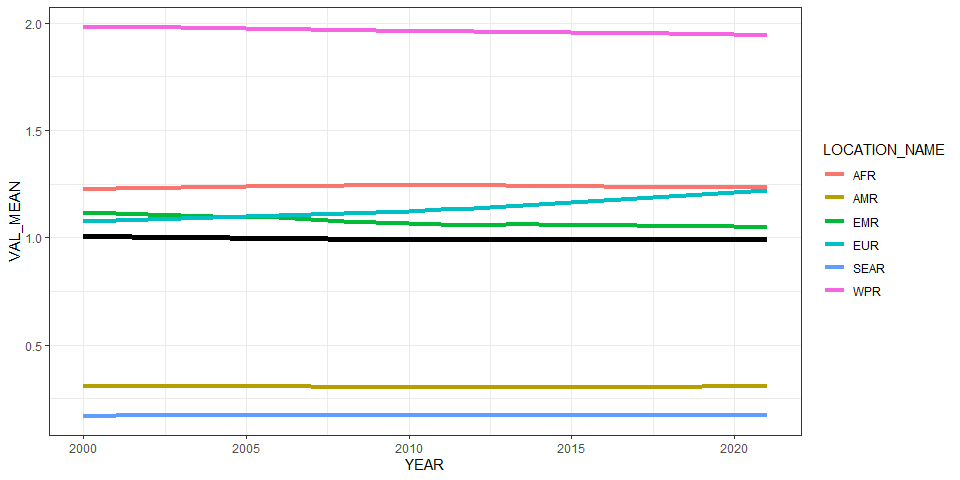<!-- -->

``` r
ggplot(all_reg_rt, aes(x = YEAR, y = VAL_MEAN, group = LOCATION_NAME)) +
  geom_line(data = all_glb_rt, linewidth = 2) +
  geom_line(aes(col = LOCATION_NAME), linewidth = 1.5) +
  geom_line(data = all_sub_rt, aes(col = REG2)) +
  theme_bw()
```

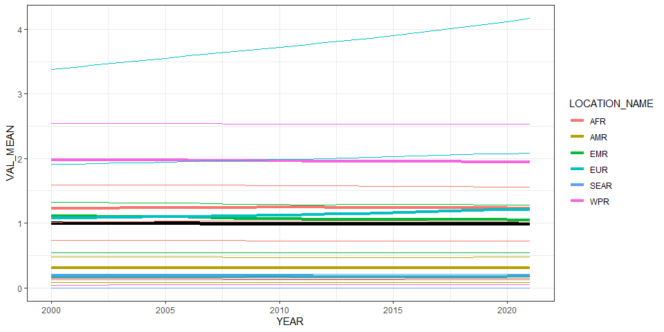<!-- -->

# Summarize predictions

## Global

``` r
kable(
  caption = "Global number of echinococcus granulosis cases, 2010 vs 2020",
  row.names = FALSE,
  subset(all_glb_nr, YEAR %in% c(2010, 2020))[, 1:5])
```

| YEAR | VAL_MEAN | VAL_MEDIAN |  VAL_LWR |  VAL_UPR |
|-----:|---------:|-----------:|---------:|---------:|
| 2010 | 68743.06 |   66058.10 | 42562.69 | 111725.2 |
| 2020 | 77303.21 |   74544.06 | 48519.18 | 123504.3 |

Global number of echinococcus granulosis cases, 2010 vs 2020

## Regions

``` r
kbl(subset(all_reg_rt, YEAR == 2020)[,c(7,2:5)],
    align = c("l", "c", "c", "c"), row.names = FALSE,
    col.names = c("Region", "Mean", "Median", "Lower", "Upper"),
    caption="  Incidence per 100k of echinococcus granulosis in 2020 by WHO region") %>%
  kable_styling("striped", "hover")
```

<table class="table table-striped" style="margin-left: auto; margin-right: auto;">
<caption>
Incidence per 100k of echinococcus granulosis in 2020 by WHO region
</caption>
<thead>
<tr>
<th style="text-align:left;">
Region
</th>
<th style="text-align:center;">
Mean
</th>
<th style="text-align:center;">
Median
</th>
<th style="text-align:center;">
Lower
</th>
<th style="text-align:left;">
Upper
</th>
</tr>
</thead>
<tbody>
<tr>
<td style="text-align:left;">
AFR
</td>
<td style="text-align:center;">
1.2328972
</td>
<td style="text-align:center;">
1.1637301
</td>
<td style="text-align:center;">
0.5596555
</td>
<td style="text-align:left;">
2.3238886
</td>
</tr>
<tr>
<td style="text-align:left;">
AMR
</td>
<td style="text-align:center;">
0.3079637
</td>
<td style="text-align:center;">
0.2889936
</td>
<td style="text-align:center;">
0.1387370
</td>
<td style="text-align:left;">
0.5895484
</td>
</tr>
<tr>
<td style="text-align:left;">
EMR
</td>
<td style="text-align:center;">
1.0504181
</td>
<td style="text-align:center;">
1.0057065
</td>
<td style="text-align:center;">
0.6313419
</td>
<td style="text-align:left;">
1.7407845
</td>
</tr>
<tr>
<td style="text-align:left;">
EUR
</td>
<td style="text-align:center;">
1.2105326
</td>
<td style="text-align:center;">
1.1680502
</td>
<td style="text-align:center;">
0.7950991
</td>
<td style="text-align:left;">
1.8712774
</td>
</tr>
<tr>
<td style="text-align:left;">
SEAR
</td>
<td style="text-align:center;">
0.1715136
</td>
<td style="text-align:center;">
0.1544144
</td>
<td style="text-align:center;">
0.0761079
</td>
<td style="text-align:left;">
0.3698869
</td>
</tr>
<tr>
<td style="text-align:left;">
WPR
</td>
<td style="text-align:center;">
1.9462313
</td>
<td style="text-align:center;">
1.7802229
</td>
<td style="text-align:center;">
0.7020822
</td>
<td style="text-align:left;">
4.2173423
</td>
</tr>
</tbody>
</table>

``` r
kbl(subset(all_reg_nr, YEAR == 2020)[,c(7,2:5)],
    align = c("l", "c", "c", "c"), row.names = FALSE,
    col.names = c("Region", "Mean", "Median", "Lower", "Upper"),
    caption="  Cases of echinococcus granulosis in 2020 by WHO region") %>%
  kable_styling("striped", "hover")
```

<table class="table table-striped" style="margin-left: auto; margin-right: auto;">
<caption>
Cases of echinococcus granulosis in 2020 by WHO region
</caption>
<thead>
<tr>
<th style="text-align:left;">
Region
</th>
<th style="text-align:center;">
Mean
</th>
<th style="text-align:center;">
Median
</th>
<th style="text-align:center;">
Lower
</th>
<th style="text-align:left;">
Upper
</th>
</tr>
</thead>
<tbody>
<tr>
<td style="text-align:left;">
AFR
</td>
<td style="text-align:center;">
13995.909
</td>
<td style="text-align:center;">
13210.721
</td>
<td style="text-align:center;">
6353.236
</td>
<td style="text-align:left;">
26380.897
</td>
</tr>
<tr>
<td style="text-align:left;">
AMR
</td>
<td style="text-align:center;">
3131.508
</td>
<td style="text-align:center;">
2938.613
</td>
<td style="text-align:center;">
1410.739
</td>
<td style="text-align:left;">
5994.785
</td>
</tr>
<tr>
<td style="text-align:left;">
EMR
</td>
<td style="text-align:center;">
7920.801
</td>
<td style="text-align:center;">
7583.648
</td>
<td style="text-align:center;">
4760.707
</td>
<td style="text-align:left;">
13126.589
</td>
</tr>
<tr>
<td style="text-align:left;">
EUR
</td>
<td style="text-align:center;">
11332.479
</td>
<td style="text-align:center;">
10934.777
</td>
<td style="text-align:center;">
7443.372
</td>
<td style="text-align:left;">
17518.084
</td>
</tr>
<tr>
<td style="text-align:left;">
SEAR
</td>
<td style="text-align:center;">
3498.193
</td>
<td style="text-align:center;">
3149.438
</td>
<td style="text-align:center;">
1552.297
</td>
<td style="text-align:left;">
7544.219
</td>
</tr>
<tr>
<td style="text-align:left;">
WPR
</td>
<td style="text-align:center;">
37424.321
</td>
<td style="text-align:center;">
34232.125
</td>
<td style="text-align:center;">
13500.425
</td>
<td style="text-align:left;">
81095.792
</td>
</tr>
</tbody>
</table>

``` r
ggplot(subset(all_reg_rt, YEAR == 2010),
       aes(y = VAL_MEAN, x = LOCATION_NAME)) +
  geom_pointrange(aes(ymin = VAL_LWR, ymax = VAL_UPR), size = 0.2) +
  coord_flip() +
  theme_bw() +
  scale_x_discrete(NULL, limits = rev(unique(all_reg_nr$LOCATION_NAME))) +
  scale_y_continuous(NULL) +
  ggtitle("Mean incidence per 100k of echinococcus granulosis by WHO Region, 2010")
```

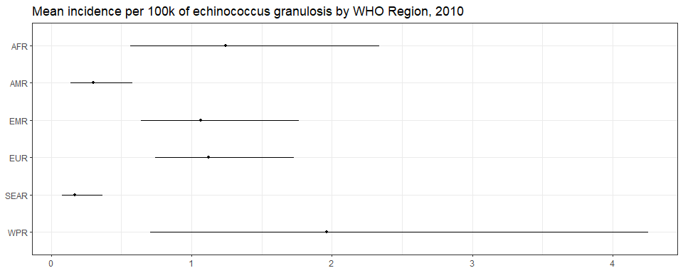<!-- -->

``` r
ggplot(subset(all_reg_rt, YEAR == 2020),
       aes(y = VAL_MEAN, x = LOCATION_NAME)) +
  geom_pointrange(aes(ymin = VAL_LWR, ymax = VAL_UPR), size = 0.2) +
  coord_flip() +
  theme_bw() +
  scale_x_discrete(NULL, limits = rev(unique(all_reg_nr$LOCATION_NAME))) +
  scale_y_continuous(NULL) +
  ggtitle("mean incidence per 100k of echinococcus granulosis by WHO Region, 2020")
```

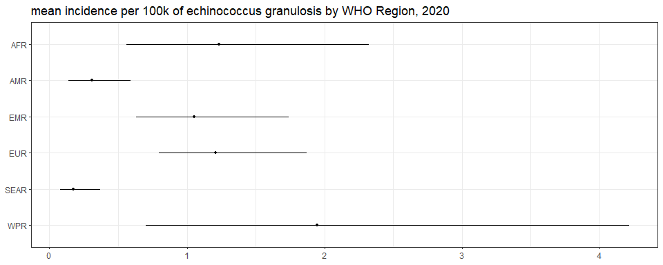<!-- -->

``` r
ggplot(subset(all_reg_nr, YEAR == 2010),
       aes(y = VAL_MEAN, x = LOCATION_NAME)) +
  geom_pointrange(aes(ymin = VAL_LWR, ymax = VAL_UPR), size = 0.2) +
  coord_flip() +
  theme_bw() +
  scale_x_discrete(NULL, limits = rev(unique(all_reg_nr$LOCATION_NAME))) +
  scale_y_continuous(NULL) +
  ggtitle("Number of echinococcus granulosis cases by WHO Region, 2010")
```

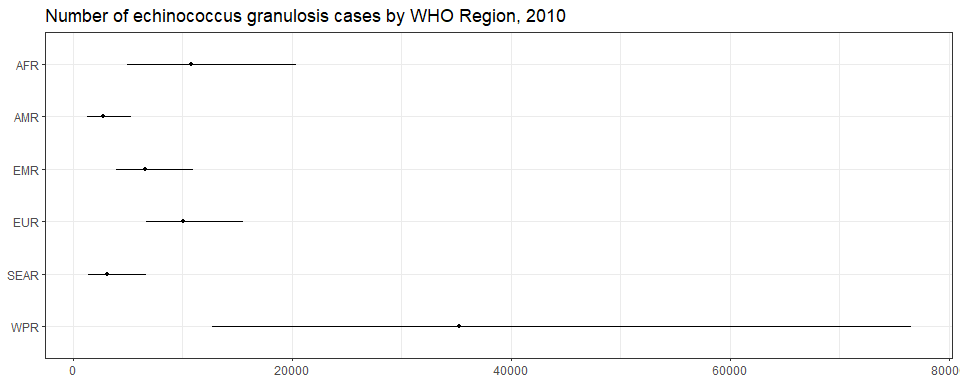<!-- -->

``` r
ggplot(subset(all_reg_nr, YEAR == 2020),
       aes(y = VAL_MEAN, x = LOCATION_NAME)) +
  geom_pointrange(aes(ymin = VAL_LWR, ymax = VAL_UPR), size = 0.2) +
  coord_flip() +
  theme_bw() +
  scale_x_discrete(NULL, limits = rev(unique(all_reg_nr$LOCATION_NAME))) +
  scale_y_continuous(NULL) +
  ggtitle("Number of echinococcus granulosis cases by WHO Region, 2020")
```

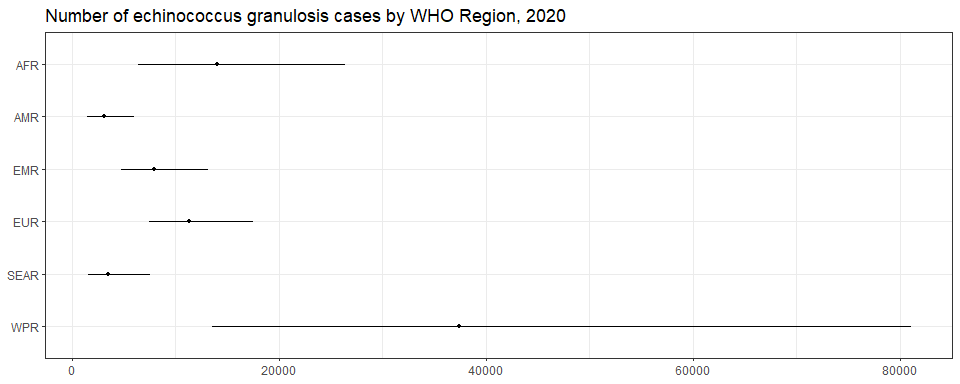<!-- -->

``` r
sim_all_reg <-
  merge(sim_all_reg,
        with(sim_all, aggregate(POP ~ REG2+YEAR, FUN = sum)))
sim_all_reg_long <-
  pivot_longer(sim_all_reg, cols = starts_with("V"))
sim_all_reg_long$CASES <- sim_all_reg_long$value

ggplot(subset(sim_all_reg_long, YEAR == 2010), aes(x = CASES)) +
  geom_density() +
  facet_wrap(~REG2) +
  theme_bw() +
  scale_x_log10() +
  ggtitle("Number of echinococcus granulosis cases by WHO Region, 2010")
```

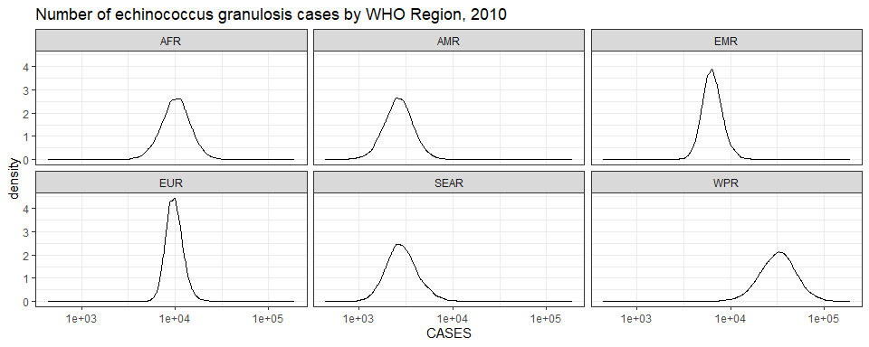<!-- -->

``` r
ggplot(subset(sim_all_reg_long, YEAR == 2020), aes(x = CASES)) +
  geom_density() +
  facet_wrap(~REG2) +
  theme_bw() +
  scale_x_log10() +
  ggtitle("Number of echinococcus granulosis cases by WHO Region, 2020")
```

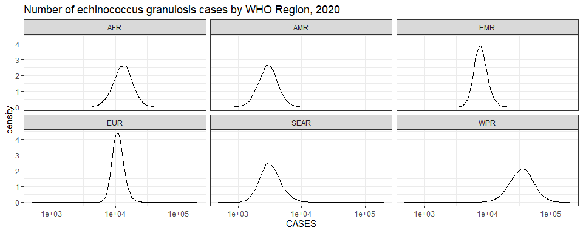<!-- -->

## Subregions

``` r
ggplot(subset(all_sub_rt, YEAR == 2010),
       aes(y = VAL_MEAN, x = LOCATION_NAME)) +
  geom_pointrange(aes(ymin = VAL_LWR, ymax = VAL_UPR), size = 0.2) +
  coord_flip() +
  theme_bw() +
  scale_x_discrete(NULL, limits = rev(unique(all_sub_nr$LOCATION_NAME))) +
  scale_y_continuous(NULL) +
  ggtitle("Mean incidence per 100k of echinococcus granulosis by WHO Subregion, 2010")
```

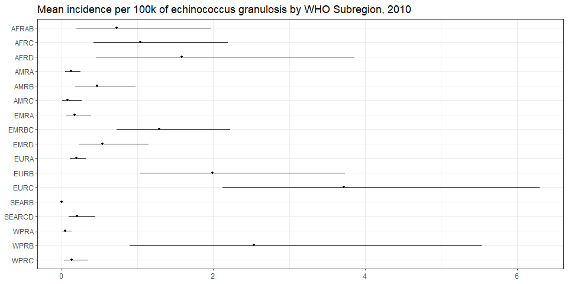<!-- -->

``` r
ggplot(subset(all_sub_rt, YEAR == 2020),
       aes(y = VAL_MEAN, x = LOCATION_NAME)) +
  geom_pointrange(aes(ymin = VAL_LWR, ymax = VAL_UPR), size = 0.2) +
  coord_flip() +
  theme_bw() +
  scale_x_discrete(NULL, limits = rev(unique(all_sub_nr$LOCATION_NAME))) +
  scale_y_continuous(NULL) +
  ggtitle("mean incidence per 100k of echinococcus granulosis by WHO Subregion, 2020")
```

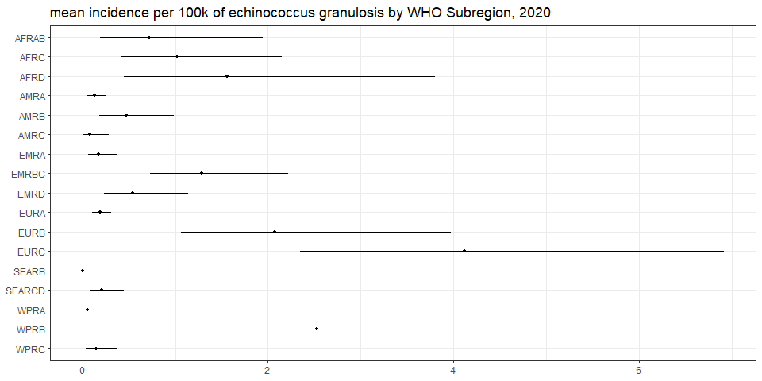<!-- -->

``` r
ggplot(subset(all_sub_nr, YEAR == 2010),
       aes(y = VAL_MEAN, x = LOCATION_NAME)) +
  geom_pointrange(aes(ymin = VAL_LWR, ymax = VAL_UPR), size = 0.2) +
  coord_flip() +
  theme_bw() +
  scale_x_discrete(NULL, limits = rev(unique(all_sub_nr$LOCATION_NAME))) +
  scale_y_continuous(NULL) +
  ggtitle("Number of echinococcus granulosis cases by WHO Subregion, 2010")
```

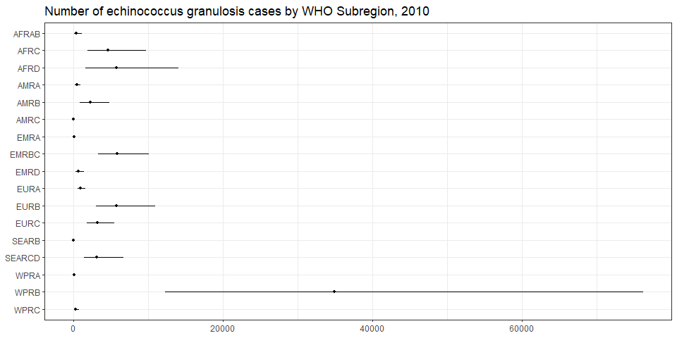<!-- -->

``` r
ggplot(subset(all_sub_nr, YEAR == 2020),
       aes(y = VAL_MEAN, x = LOCATION_NAME)) +
  geom_pointrange(aes(ymin = VAL_LWR, ymax = VAL_UPR), size = 0.2) +
  coord_flip() +
  theme_bw() +
  scale_x_discrete(NULL, limits = rev(unique(all_sub_nr$LOCATION_NAME))) +
  scale_y_continuous(NULL) +
  ggtitle("Number of echinococcus granulosis cases by WHO Subregion, 2020")
```

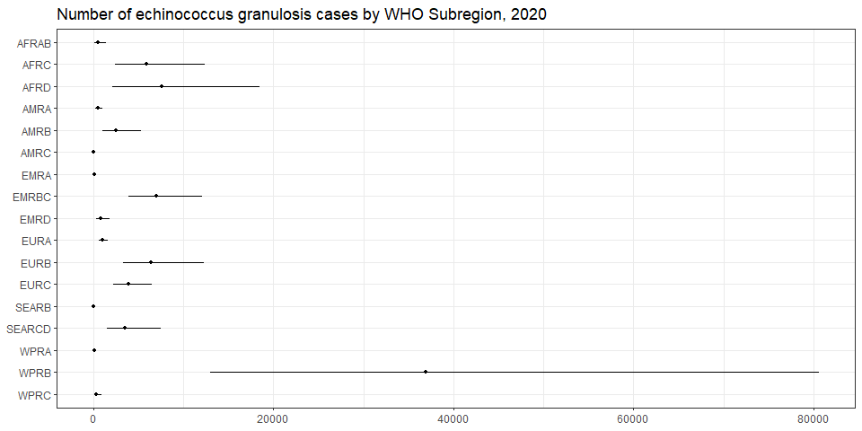<!-- -->

``` r
sim_all_sub <-
  merge(sim_all_sub,
        with(sim_all, aggregate(POP ~ SUB2 + YEAR, FUN = sum)))
sim_all_sub_long <-
  pivot_longer(sim_all_sub, cols = starts_with("V"))
sim_all_sub_long$CASES <- sim_all_sub_long$value

ggplot(subset(sim_all_sub_long, YEAR == 2010), aes(x = CASES)) +
  geom_density() +
  facet_wrap(~SUB2) +
  theme_bw() +
  scale_x_log10() +
  ggtitle("Number of echinococcus granulosis cases by WHO Subregion, 2010")
```

    ## Warning in scale_x_log10(): log-10 transformation introduced infinite values.

    ## Warning: Removed 10000 rows containing non-finite outside the scale range (`stat_density()`).

<!-- -->

``` r
ggplot(subset(sim_all_sub_long, YEAR == 2020), aes(x = CASES)) +
  geom_density() +
  facet_wrap(~SUB2) +
  theme_bw() +
  scale_x_log10() +
  ggtitle("Number of echinococcus granulosis cases by WHO Subregion, 2020")
```

    ## Warning in scale_x_log10(): log-10 transformation introduced infinite values.
    ## Removed 10000 rows containing non-finite outside the scale range (`stat_density()`).

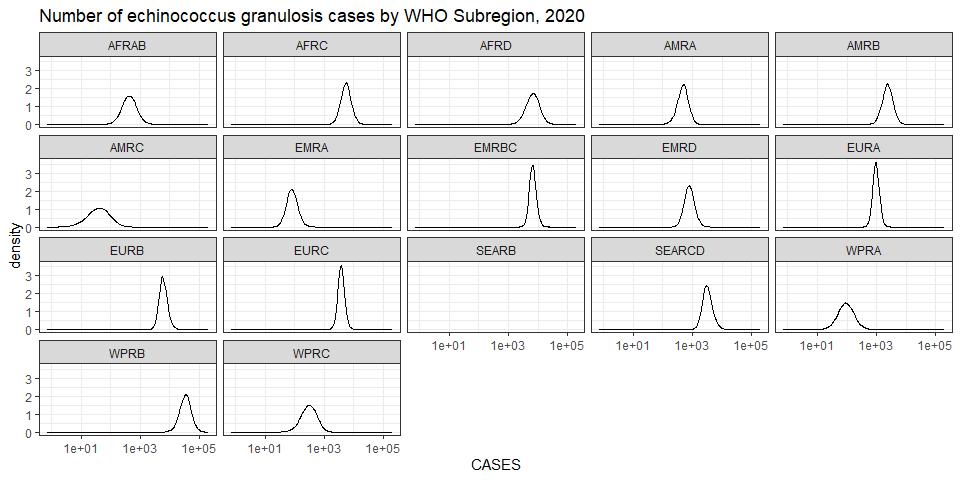<!-- -->

## Countries

``` r
plot_world(subset(all_cnt_rt, YEAR == 2010),
           "LOCATION_NAME", "VAL_MEAN", legend.title = "Mean incidence per 100k", diseasefree = zero_cases)
```

    ## [1]  0  2  4  6  8 10 12

``` r
title("Echinococcus granulosis incidence, 2010", line = 1)
```

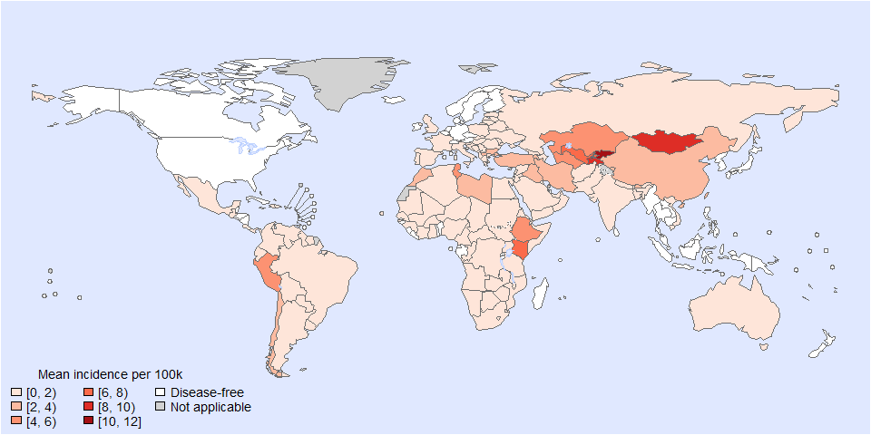<!-- -->

``` r
plot_world(subset(all_cnt_rt, YEAR == 2020),
           "LOCATION_NAME", "VAL_MEAN", legend.title = "mean incidence per 100k", diseasefree = zero_cases)
```

    ## [1]  0  2  4  6  8 10 12

``` r
title("Echinococcus granulosis incidence, 2020", line = 1)
```

<!-- -->

``` r
tab <-
  data.frame(subset(all_cnt_rt, YEAR == 2010)[,
                                              c("LOCATION_NAME", "VAL_MEAN", "VAL_MEDIAN", "VAL_LWR", "VAL_UPR")],
             subset(all_cnt_rt, YEAR == 2020)[,
                                              c("VAL_MEAN", "VAL_MEDIAN", "VAL_LWR", "VAL_UPR")])
tab$LOCATION_NAME <-
  FERG2:::countries$COUNTRY[match(tab$LOCATION_NAME, FERG2:::countries$ISO3)]
tab$LOCATION_NAME <- gsub(" \\(.*", "", tab$LOCATION_NAME)
names(tab) <-
  c("Country",
    "2010.mean", "2010.median", "2010.lwr", "2010.upr",
    "2020.mean", "2020.median", "2020.lwr", "2020.upr")

kable(tab, digits = 3, row.names = FALSE,
      caption = "Estimated echinococcus granulosis incidence per 100k by country, 2010 vs 2020")
```

| Country                          | 2010.mean | 2010.median | 2010.lwr | 2010.upr | 2020.mean | 2020.median | 2020.lwr | 2020.upr |
|:---------------------------------|----------:|------------:|---------:|---------:|----------:|------------:|---------:|---------:|
| Afghanistan                      |     0.457 |       0.379 |    0.115 |    1.261 |     0.457 |       0.379 |    0.115 |    1.261 |
| Angola                           |     0.553 |       0.484 |    0.179 |    1.350 |     0.553 |       0.484 |    0.179 |    1.350 |
| Albania                          |     1.884 |       1.577 |    0.459 |    5.333 |     1.884 |       1.577 |    0.459 |    5.333 |
| Andorra                          |     0.000 |       0.000 |    0.000 |    0.000 |     0.000 |       0.000 |    0.000 |    0.000 |
| United Arab Emirates             |     0.254 |       0.213 |    0.062 |    0.688 |     0.254 |       0.213 |    0.062 |    0.688 |
| Argentina                        |     0.772 |       0.645 |    0.175 |    2.133 |     0.772 |       0.645 |    0.175 |    2.133 |
| Armenia                          |     3.567 |       2.984 |    0.830 |    9.486 |     3.567 |       2.984 |    0.830 |    9.486 |
| Antigua and Barbuda              |     0.000 |       0.000 |    0.000 |    0.000 |     0.000 |       0.000 |    0.000 |    0.000 |
| Australia                        |     0.444 |       0.358 |    0.102 |    1.293 |     0.444 |       0.358 |    0.102 |    1.293 |
| Austria                          |     0.000 |       0.000 |    0.000 |    0.000 |     0.000 |       0.000 |    0.000 |    0.000 |
| Azerbaijan                       |     1.086 |       0.880 |    0.274 |    3.129 |     1.086 |       0.880 |    0.274 |    3.129 |
| Burundi                          |     0.000 |       0.000 |    0.000 |    0.000 |     0.000 |       0.000 |    0.000 |    0.000 |
| Belgium                          |     0.000 |       0.000 |    0.000 |    0.000 |     0.000 |       0.000 |    0.000 |    0.000 |
| Benin                            |     0.000 |       0.000 |    0.000 |    0.000 |     0.000 |       0.000 |    0.000 |    0.000 |
| Burkina Faso                     |     0.711 |       0.587 |    0.180 |    2.020 |     0.711 |       0.587 |    0.180 |    2.020 |
| Bangladesh                       |     0.304 |       0.245 |    0.076 |    0.901 |     0.304 |       0.245 |    0.076 |    0.901 |
| Bulgaria                         |     2.516 |       2.128 |    0.625 |    6.557 |     2.516 |       2.128 |    0.625 |    6.557 |
| Bahrain                          |     0.269 |       0.203 |    0.046 |    0.906 |     0.269 |       0.203 |    0.046 |    0.906 |
| Bahamas                          |     0.000 |       0.000 |    0.000 |    0.000 |     0.000 |       0.000 |    0.000 |    0.000 |
| Bosnia and Herzegovina           |     0.525 |       0.406 |    0.112 |    1.633 |     0.525 |       0.406 |    0.112 |    1.633 |
| Belarus                          |     0.750 |       0.608 |    0.184 |    2.191 |     0.750 |       0.608 |    0.184 |    2.191 |
| Belize                           |     0.000 |       0.000 |    0.000 |    0.000 |     0.000 |       0.000 |    0.000 |    0.000 |
| Bolivia                          |     0.201 |       0.137 |    0.015 |    0.745 |     0.201 |       0.137 |    0.015 |    0.745 |
| Brazil                           |     0.242 |       0.200 |    0.062 |    0.663 |     0.242 |       0.200 |    0.062 |    0.663 |
| Barbados                         |     0.000 |       0.000 |    0.000 |    0.000 |     0.000 |       0.000 |    0.000 |    0.000 |
| Brunei Darussalam                |     0.000 |       0.000 |    0.000 |    0.000 |     0.000 |       0.000 |    0.000 |    0.000 |
| Bhutan                           |     3.906 |       3.280 |    0.732 |   10.613 |     3.906 |       3.280 |    0.732 |   10.613 |
| Botswana                         |     0.398 |       0.304 |    0.077 |    1.280 |     0.398 |       0.304 |    0.077 |    1.280 |
| Central African Republic         |     0.711 |       0.587 |    0.180 |    2.020 |     0.711 |       0.587 |    0.180 |    2.020 |
| Canada                           |     0.000 |       0.000 |    0.000 |    0.000 |     0.000 |       0.000 |    0.000 |    0.000 |
| Switzerland                      |     0.000 |       0.000 |    0.000 |    0.000 |     0.000 |       0.000 |    0.000 |    0.000 |
| Chile                            |     2.430 |       2.234 |    0.761 |    5.195 |     2.430 |       2.234 |    0.761 |    5.195 |
| China                            |     2.593 |       2.366 |    0.914 |    5.653 |     2.593 |       2.366 |    0.914 |    5.653 |
| Côte d’Ivoire                    |     0.553 |       0.484 |    0.179 |    1.350 |     0.553 |       0.484 |    0.179 |    1.350 |
| Cameroon                         |     0.553 |       0.484 |    0.179 |    1.350 |     0.553 |       0.484 |    0.179 |    1.350 |
| Congo                            |     0.074 |       0.053 |    0.016 |    0.255 |     0.074 |       0.053 |    0.016 |    0.255 |
| Congo                            |     0.553 |       0.484 |    0.179 |    1.350 |     0.553 |       0.484 |    0.179 |    1.350 |
| Cook Islands                     |     0.000 |       0.000 |    0.000 |    0.000 |     0.000 |       0.000 |    0.000 |    0.000 |
| Colombia                         |     0.182 |       0.149 |    0.046 |    0.516 |     0.182 |       0.149 |    0.046 |    0.516 |
| Comoros                          |     0.000 |       0.000 |    0.000 |    0.000 |     0.000 |       0.000 |    0.000 |    0.000 |
| Cabo Verde                       |     0.553 |       0.484 |    0.179 |    1.350 |     0.553 |       0.484 |    0.179 |    1.350 |
| Costa Rica                       |     0.249 |       0.219 |    0.078 |    0.586 |     0.249 |       0.219 |    0.078 |    0.586 |
| Cuba                             |     0.000 |       0.000 |    0.000 |    0.000 |     0.000 |       0.000 |    0.000 |    0.000 |
| Cyprus                           |     0.000 |       0.000 |    0.000 |    0.000 |     0.000 |       0.000 |    0.000 |    0.000 |
| Czechia                          |     0.000 |       0.000 |    0.000 |    0.000 |     0.000 |       0.000 |    0.000 |    0.000 |
| Germany                          |     0.000 |       0.000 |    0.000 |    0.000 |     0.000 |       0.000 |    0.000 |    0.000 |
| Djibouti                         |     1.158 |       1.040 |    0.422 |    2.584 |     1.158 |       1.040 |    0.422 |    2.584 |
| Dominica                         |     0.000 |       0.000 |    0.000 |    0.000 |     0.000 |       0.000 |    0.000 |    0.000 |
| Denmark                          |     0.000 |       0.000 |    0.000 |    0.000 |     0.000 |       0.000 |    0.000 |    0.000 |
| Dominican Republic               |     0.249 |       0.219 |    0.078 |    0.586 |     0.249 |       0.219 |    0.078 |    0.586 |
| Algeria                          |     0.825 |       0.770 |    0.349 |    1.644 |     0.825 |       0.770 |    0.349 |    1.644 |
| Ecuador                          |     0.133 |       0.107 |    0.030 |    0.386 |     0.133 |       0.107 |    0.030 |    0.386 |
| Egypt                            |     0.630 |       0.508 |    0.159 |    1.770 |     0.630 |       0.508 |    0.159 |    1.770 |
| Eritrea                          |     1.944 |       1.614 |    0.426 |    5.287 |     1.944 |       1.614 |    0.426 |    5.287 |
| Spain                            |     0.419 |       0.350 |    0.102 |    1.148 |     0.419 |       0.350 |    0.102 |    1.148 |
| Estonia                          |     0.156 |       0.093 |    0.012 |    0.684 |     0.156 |       0.093 |    0.012 |    0.684 |
| Ethiopia                         |     5.208 |       4.440 |    1.019 |   14.119 |     5.208 |       4.440 |    1.019 |   14.119 |
| Finland                          |     0.000 |       0.000 |    0.000 |    0.000 |     0.000 |       0.000 |    0.000 |    0.000 |
| Fiji                             |     0.000 |       0.000 |    0.000 |    0.000 |     0.000 |       0.000 |    0.000 |    0.000 |
| France                           |     0.316 |       0.266 |    0.078 |    0.851 |     0.316 |       0.266 |    0.078 |    0.851 |
| Micronesia                       |     0.000 |       0.000 |    0.000 |    0.000 |     0.000 |       0.000 |    0.000 |    0.000 |
| Gabon                            |     0.000 |       0.000 |    0.000 |    0.000 |     0.000 |       0.000 |    0.000 |    0.000 |
| United Kingdom                   |     0.040 |       0.030 |    0.009 |    0.129 |     0.040 |       0.030 |    0.009 |    0.129 |
| Georgia                          |     1.862 |       1.680 |    0.689 |    4.128 |     1.862 |       1.680 |    0.689 |    4.128 |
| Ghana                            |     0.553 |       0.484 |    0.179 |    1.350 |     0.553 |       0.484 |    0.179 |    1.350 |
| Guinea                           |     0.960 |       0.794 |    0.235 |    2.650 |     0.960 |       0.794 |    0.235 |    2.650 |
| Gambia                           |     0.000 |       0.000 |    0.000 |    0.000 |     0.000 |       0.000 |    0.000 |    0.000 |
| Guinea-Bissau                    |     0.000 |       0.000 |    0.000 |    0.000 |     0.000 |       0.000 |    0.000 |    0.000 |
| Equatorial Guinea                |     0.000 |       0.000 |    0.000 |    0.000 |     0.000 |       0.000 |    0.000 |    0.000 |
| Greece                           |     0.119 |       0.096 |    0.026 |    0.348 |     0.119 |       0.096 |    0.026 |    0.348 |
| Grenada                          |     0.000 |       0.000 |    0.000 |    0.000 |     0.000 |       0.000 |    0.000 |    0.000 |
| Guatemala                        |     0.249 |       0.219 |    0.078 |    0.586 |     0.249 |       0.219 |    0.078 |    0.586 |
| Guyana                           |     0.351 |       0.292 |    0.086 |    0.969 |     0.351 |       0.292 |    0.086 |    0.969 |
| Honduras                         |     0.000 |       0.000 |    0.000 |    0.000 |     0.000 |       0.000 |    0.000 |    0.000 |
| Croatia                          |     0.221 |       0.178 |    0.047 |    0.663 |     0.221 |       0.178 |    0.047 |    0.663 |
| Haiti                            |     0.201 |       0.137 |    0.015 |    0.745 |     0.201 |       0.137 |    0.015 |    0.745 |
| Hungary                          |     0.298 |       0.247 |    0.071 |    0.839 |     0.298 |       0.247 |    0.071 |    0.839 |
| Indonesia                        |     0.000 |       0.000 |    0.000 |    0.000 |     0.000 |       0.000 |    0.000 |    0.000 |
| India                            |     0.199 |       0.175 |    0.071 |    0.474 |     0.199 |       0.175 |    0.071 |    0.474 |
| Ireland                          |     0.000 |       0.000 |    0.000 |    0.000 |     0.000 |       0.000 |    0.000 |    0.000 |
| Iran                             |     2.450 |       2.065 |    0.610 |    6.520 |     2.450 |       2.065 |    0.610 |    6.520 |
| Iraq                             |     3.333 |       2.819 |    0.785 |    8.944 |     3.333 |       2.819 |    0.785 |    8.944 |
| Iceland                          |     0.000 |       0.000 |    0.000 |    0.000 |     0.000 |       0.000 |    0.000 |    0.000 |
| Israel                           |     0.201 |       0.162 |    0.045 |    0.578 |     0.201 |       0.162 |    0.045 |    0.578 |
| Italy                            |     0.381 |       0.321 |    0.098 |    1.004 |     0.381 |       0.321 |    0.098 |    1.004 |
| Jamaica                          |     0.000 |       0.000 |    0.000 |    0.000 |     0.000 |       0.000 |    0.000 |    0.000 |
| Jordan                           |     0.496 |       0.399 |    0.121 |    1.487 |     0.496 |       0.399 |    0.121 |    1.487 |
| Japan                            |     0.000 |       0.000 |    0.000 |    0.000 |     0.000 |       0.000 |    0.000 |    0.000 |
| Kazakhstan                       |     4.008 |       3.654 |    1.429 |    8.669 |     4.008 |       3.654 |    1.429 |    8.669 |
| Kenya                            |     6.098 |       5.229 |    1.072 |   16.676 |     6.098 |       5.229 |    1.072 |   16.676 |
| Kyrgyzstan                       |    11.173 |      10.203 |    3.832 |   24.104 |    11.173 |      10.203 |    3.832 |   24.104 |
| Cambodia                         |     0.000 |       0.000 |    0.000 |    0.000 |     0.000 |       0.000 |    0.000 |    0.000 |
| Kiribati                         |     0.000 |       0.000 |    0.000 |    0.000 |     0.000 |       0.000 |    0.000 |    0.000 |
| Saint Kitts and Nevis            |     0.000 |       0.000 |    0.000 |    0.000 |     0.000 |       0.000 |    0.000 |    0.000 |
| Korea                            |     0.000 |       0.000 |    0.000 |    0.000 |     0.000 |       0.000 |    0.000 |    0.000 |
| Kuwait                           |     0.253 |       0.199 |    0.054 |    0.778 |     0.253 |       0.199 |    0.054 |    0.778 |
| Lao People’s Dem. Republic       |     0.000 |       0.000 |    0.000 |    0.000 |     0.000 |       0.000 |    0.000 |    0.000 |
| Lebanon                          |     1.469 |       1.219 |    0.369 |    4.092 |     1.469 |       1.219 |    0.369 |    4.092 |
| Liberia                          |     0.000 |       0.000 |    0.000 |    0.000 |     0.000 |       0.000 |    0.000 |    0.000 |
| Libya                            |     2.947 |       2.463 |    0.685 |    7.851 |     2.947 |       2.463 |    0.685 |    7.851 |
| Saint Lucia                      |     0.000 |       0.000 |    0.000 |    0.000 |     0.000 |       0.000 |    0.000 |    0.000 |
| Sri Lanka                        |     0.000 |       0.000 |    0.000 |    0.000 |     0.000 |       0.000 |    0.000 |    0.000 |
| Lesotho                          |     0.229 |       0.164 |    0.035 |    0.810 |     0.229 |       0.164 |    0.035 |    0.810 |
| Lithuania                        |     1.252 |       1.044 |    0.252 |    3.461 |     1.252 |       1.044 |    0.252 |    3.461 |
| Luxembourg                       |     0.000 |       0.000 |    0.000 |    0.000 |     0.000 |       0.000 |    0.000 |    0.000 |
| Latvia                           |     0.344 |       0.275 |    0.075 |    1.019 |     0.344 |       0.275 |    0.075 |    1.019 |
| Morocco                          |     2.411 |       2.206 |    0.875 |    5.218 |     2.411 |       2.206 |    0.875 |    5.218 |
| Monaco                           |     0.000 |       0.000 |    0.000 |    0.000 |     0.000 |       0.000 |    0.000 |    0.000 |
| Republic of Moldova              |     1.944 |       1.623 |    0.487 |    5.363 |     1.944 |       1.623 |    0.487 |    5.363 |
| Madagascar                       |     0.000 |       0.000 |    0.000 |    0.000 |     0.000 |       0.000 |    0.000 |    0.000 |
| Maldives                         |     0.000 |       0.000 |    0.000 |    0.000 |     0.000 |       0.000 |    0.000 |    0.000 |
| Mexico                           |     0.015 |       0.009 |    0.002 |    0.064 |     0.015 |       0.009 |    0.002 |    0.064 |
| Marshall Islands                 |     0.000 |       0.000 |    0.000 |    0.000 |     0.000 |       0.000 |    0.000 |    0.000 |
| North Macedonia                  |     2.469 |       2.020 |    0.594 |    6.863 |     2.469 |       2.020 |    0.594 |    6.863 |
| Mali                             |     0.711 |       0.587 |    0.180 |    2.020 |     0.711 |       0.587 |    0.180 |    2.020 |
| Malta                            |     0.000 |       0.000 |    0.000 |    0.000 |     0.000 |       0.000 |    0.000 |    0.000 |
| Myanmar                          |     0.000 |       0.000 |    0.000 |    0.000 |     0.000 |       0.000 |    0.000 |    0.000 |
| Montenegro                       |     1.868 |       1.528 |    0.412 |    5.297 |     1.868 |       1.528 |    0.412 |    5.297 |
| Mongolia                         |     9.201 |       7.700 |    1.383 |   25.232 |     9.201 |       7.700 |    1.383 |   25.232 |
| Mozambique                       |     0.711 |       0.587 |    0.180 |    2.020 |     0.711 |       0.587 |    0.180 |    2.020 |
| Mauritania                       |     0.799 |       0.659 |    0.183 |    2.242 |     0.799 |       0.659 |    0.183 |    2.242 |
| Mauritius                        |     0.000 |       0.000 |    0.000 |    0.000 |     0.000 |       0.000 |    0.000 |    0.000 |
| Malawi                           |     0.711 |       0.587 |    0.180 |    2.020 |     0.711 |       0.587 |    0.180 |    2.020 |
| Malaysia                         |     0.000 |       0.000 |    0.000 |    0.000 |     0.000 |       0.000 |    0.000 |    0.000 |
| Namibia                          |     0.617 |       0.461 |    0.104 |    2.025 |     0.617 |       0.461 |    0.104 |    2.025 |
| Niger                            |     0.711 |       0.587 |    0.180 |    2.020 |     0.711 |       0.587 |    0.180 |    2.020 |
| Nigeria                          |     0.553 |       0.484 |    0.179 |    1.350 |     0.553 |       0.484 |    0.179 |    1.350 |
| Nicaragua                        |     0.000 |       0.000 |    0.000 |    0.000 |     0.000 |       0.000 |    0.000 |    0.000 |
| Niue                             |     0.000 |       0.000 |    0.000 |    0.000 |     0.000 |       0.000 |    0.000 |    0.000 |
| Netherlands                      |     0.000 |       0.000 |    0.000 |    0.000 |     0.000 |       0.000 |    0.000 |    0.000 |
| Norway                           |     0.000 |       0.000 |    0.000 |    0.000 |     0.000 |       0.000 |    0.000 |    0.000 |
| Nepal                            |     0.640 |       0.527 |    0.157 |    1.796 |     0.640 |       0.527 |    0.157 |    1.796 |
| Nauru                            |     0.000 |       0.000 |    0.000 |    0.000 |     0.000 |       0.000 |    0.000 |    0.000 |
| New Zealand                      |     0.000 |       0.000 |    0.000 |    0.000 |     0.000 |       0.000 |    0.000 |    0.000 |
| Oman                             |     0.094 |       0.060 |    0.010 |    0.384 |     0.094 |       0.060 |    0.010 |    0.384 |
| Pakistan                         |     0.434 |       0.350 |    0.109 |    1.297 |     0.434 |       0.350 |    0.109 |    1.297 |
| Panama                           |     0.351 |       0.292 |    0.086 |    0.969 |     0.351 |       0.292 |    0.086 |    0.969 |
| Peru                             |     4.532 |       3.816 |    0.700 |   12.464 |     4.532 |       3.816 |    0.700 |   12.464 |
| Philippines                      |     0.000 |       0.000 |    0.000 |    0.000 |     0.000 |       0.000 |    0.000 |    0.000 |
| Palau                            |     0.000 |       0.000 |    0.000 |    0.000 |     0.000 |       0.000 |    0.000 |    0.000 |
| Papua New Guinea                 |     0.000 |       0.000 |    0.000 |    0.000 |     0.000 |       0.000 |    0.000 |    0.000 |
| Poland                           |     0.053 |       0.041 |    0.012 |    0.166 |     0.053 |       0.041 |    0.012 |    0.166 |
| Korea                            |     0.000 |       0.000 |    0.000 |    0.000 |     0.000 |       0.000 |    0.000 |    0.000 |
| Portugal                         |     0.231 |       0.189 |    0.053 |    0.656 |     0.231 |       0.189 |    0.053 |    0.656 |
| Paraguay                         |     0.164 |       0.128 |    0.035 |    0.505 |     0.164 |       0.128 |    0.035 |    0.505 |
| Qatar                            |     0.000 |       0.000 |    0.000 |    0.000 |     0.000 |       0.000 |    0.000 |    0.000 |
| Romania                          |     0.866 |       0.745 |    0.192 |    2.295 |     0.866 |       0.745 |    0.192 |    2.295 |
| Russian Federation               |     0.927 |       0.757 |    0.235 |    2.608 |     0.927 |       0.757 |    0.235 |    2.608 |
| Rwanda                           |     0.000 |       0.000 |    0.000 |    0.000 |     0.000 |       0.000 |    0.000 |    0.000 |
| Saudi Arabia                     |     0.155 |       0.123 |    0.036 |    0.462 |     0.155 |       0.123 |    0.036 |    0.462 |
| Sudan                            |     0.231 |       0.183 |    0.054 |    0.707 |     0.231 |       0.183 |    0.054 |    0.707 |
| Senegal                          |     0.553 |       0.484 |    0.179 |    1.350 |     0.553 |       0.484 |    0.179 |    1.350 |
| Singapore                        |     0.000 |       0.000 |    0.000 |    0.000 |     0.000 |       0.000 |    0.000 |    0.000 |
| Solomon Islands                  |     0.000 |       0.000 |    0.000 |    0.000 |     0.000 |       0.000 |    0.000 |    0.000 |
| Sierra Leone                     |     0.000 |       0.000 |    0.000 |    0.000 |     0.000 |       0.000 |    0.000 |    0.000 |
| El Salvador                      |     0.000 |       0.000 |    0.000 |    0.000 |     0.000 |       0.000 |    0.000 |    0.000 |
| San Marino                       |     0.000 |       0.000 |    0.000 |    0.000 |     0.000 |       0.000 |    0.000 |    0.000 |
| Somalia                          |     0.530 |       0.422 |    0.111 |    1.557 |     0.530 |       0.422 |    0.111 |    1.557 |
| Serbia                           |     1.186 |       0.984 |    0.298 |    3.341 |     1.186 |       0.984 |    0.298 |    3.341 |
| South Sudan                      |     0.634 |       0.518 |    0.153 |    1.788 |     0.634 |       0.518 |    0.153 |    1.788 |
| Sao Tome and Principe            |     0.000 |       0.000 |    0.000 |    0.000 |     0.000 |       0.000 |    0.000 |    0.000 |
| Suriname                         |     0.249 |       0.219 |    0.078 |    0.586 |     0.249 |       0.219 |    0.078 |    0.586 |
| Slovakia                         |     0.104 |       0.079 |    0.019 |    0.345 |     0.104 |       0.079 |    0.019 |    0.345 |
| Slovenia                         |     0.239 |       0.187 |    0.046 |    0.719 |     0.239 |       0.187 |    0.046 |    0.719 |
| Sweden                           |     0.000 |       0.000 |    0.000 |    0.000 |     0.000 |       0.000 |    0.000 |    0.000 |
| Eswatini                         |     0.553 |       0.484 |    0.179 |    1.350 |     0.553 |       0.484 |    0.179 |    1.350 |
| Seychelles                       |     0.000 |       0.000 |    0.000 |    0.000 |     0.000 |       0.000 |    0.000 |    0.000 |
| Syrian Arab Republic             |     0.530 |       0.422 |    0.111 |    1.557 |     0.530 |       0.422 |    0.111 |    1.557 |
| Chad                             |     0.711 |       0.587 |    0.180 |    2.020 |     0.711 |       0.587 |    0.180 |    2.020 |
| Togo                             |     0.000 |       0.000 |    0.000 |    0.000 |     0.000 |       0.000 |    0.000 |    0.000 |
| Thailand                         |     0.000 |       0.000 |    0.000 |    0.000 |     0.000 |       0.000 |    0.000 |    0.000 |
| Tajikistan                       |     9.052 |       8.787 |    4.892 |   14.806 |     9.052 |       8.787 |    4.892 |   14.806 |
| Turkmenistan                     |     4.806 |       4.116 |    1.165 |   12.534 |     4.806 |       4.116 |    1.165 |   12.534 |
| Timor-Leste                      |     0.000 |       0.000 |    0.000 |    0.000 |     0.000 |       0.000 |    0.000 |    0.000 |
| Tonga                            |     0.000 |       0.000 |    0.000 |    0.000 |     0.000 |       0.000 |    0.000 |    0.000 |
| Trinidad and Tobago              |     0.000 |       0.000 |    0.000 |    0.000 |     0.000 |       0.000 |    0.000 |    0.000 |
| Tunisia                          |     4.314 |       3.643 |    0.978 |   11.591 |     4.314 |       3.643 |    0.978 |   11.591 |
| Turkiye                          |     3.709 |       3.145 |    0.888 |    9.774 |     3.709 |       3.145 |    0.888 |    9.774 |
| Tuvalu                           |     0.000 |       0.000 |    0.000 |    0.000 |     0.000 |       0.000 |    0.000 |    0.000 |
| United Republic of Tanzania      |     0.221 |       0.178 |    0.054 |    0.656 |     0.221 |       0.178 |    0.054 |    0.656 |
| Uganda                           |     0.711 |       0.587 |    0.180 |    2.020 |     0.711 |       0.587 |    0.180 |    2.020 |
| Ukraine                          |     0.497 |       0.369 |    0.109 |    1.642 |     0.497 |       0.369 |    0.109 |    1.642 |
| Uruguay                          |     0.859 |       0.706 |    0.193 |    2.360 |     0.859 |       0.706 |    0.193 |    2.360 |
| United States of America         |     0.000 |       0.000 |    0.000 |    0.000 |     0.000 |       0.000 |    0.000 |    0.000 |
| Uzbekistan                       |     6.180 |       5.642 |    2.129 |   13.490 |     6.180 |       5.642 |    2.129 |   13.490 |
| Saint Vincent and the Grenadines |     0.000 |       0.000 |    0.000 |    0.000 |     0.000 |       0.000 |    0.000 |    0.000 |
| Venezuela                        |     0.030 |       0.019 |    0.004 |    0.120 |     0.030 |       0.019 |    0.004 |    0.120 |
| Viet Nam                         |     0.055 |       0.026 |    0.002 |    0.298 |     0.055 |       0.026 |    0.002 |    0.298 |
| Vanuatu                          |     0.000 |       0.000 |    0.000 |    0.000 |     0.000 |       0.000 |    0.000 |    0.000 |
| Samoa                            |     0.000 |       0.000 |    0.000 |    0.000 |     0.000 |       0.000 |    0.000 |    0.000 |
| Yemen                            |     1.063 |       0.889 |    0.242 |    2.916 |     1.063 |       0.889 |    0.242 |    2.916 |
| South Africa                     |     0.804 |       0.669 |    0.196 |    2.225 |     0.804 |       0.669 |    0.196 |    2.225 |
| Zambia                           |     0.147 |       0.111 |    0.030 |    0.475 |     0.147 |       0.111 |    0.030 |    0.475 |
| Zimbabwe                         |     0.553 |       0.484 |    0.179 |    1.350 |     0.553 |       0.484 |    0.179 |    1.350 |

Estimated echinococcus granulosis incidence per 100k by country, 2010 vs
2020

``` r
tab2 <-
  data.frame(subset(all_cnt_nr, YEAR == 2010)[,
                                              c("LOCATION_NAME", "VAL_MEAN", "VAL_MEDIAN", "VAL_LWR", "VAL_UPR")],
             subset(all_cnt_nr, YEAR == 2020)[,
                                              c("VAL_MEAN", "VAL_LWR", "VAL_MEDIAN", "VAL_UPR")])
tab2$LOCATION_NAME <-
  FERG2:::countries$COUNTRY[match(tab2$LOCATION_NAME, FERG2:::countries$ISO3)]
tab2$LOCATION_NAME <- gsub(" \\(.*", "", tab2$LOCATION_NAME)
names(tab2) <-
  c("Country",
    "2010.mean", "2010.median", "2010.lwr", "2010.upr",
    "2020.mean", "2020.median", "2020.lwr", "2020.upr")

kable(tab2, digits = 1, row.names = FALSE,
      caption = "Estimated echinococcus granulosis cases by country, 2010 vs 2020")
```

| Country                          | 2010.mean | 2010.median | 2010.lwr | 2010.upr | 2020.mean | 2020.median | 2020.lwr | 2020.upr |
|:---------------------------------|----------:|------------:|---------:|---------:|----------:|------------:|---------:|---------:|
| Afghanistan                      |     127.4 |       105.7 |     32.0 |    351.9 |     175.5 |        44.1 |    145.6 |    484.8 |
| Angola                           |     126.4 |       110.6 |     40.9 |    308.4 |     182.2 |        58.9 |    159.4 |    444.5 |
| Albania                          |      55.5 |        46.5 |     13.5 |    157.1 |      54.2 |        13.2 |     45.4 |    153.5 |
| Andorra                          |       0.0 |         0.0 |      0.0 |      0.0 |       0.0 |         0.0 |      0.0 |      0.0 |
| United Arab Emirates             |      17.4 |        14.5 |      4.2 |     46.9 |      23.8 |         5.8 |     20.0 |     64.4 |
| Argentina                        |     317.2 |       264.9 |     71.8 |    876.2 |     348.4 |        78.8 |    291.0 |    962.5 |
| Armenia                          |     104.8 |        87.7 |     24.4 |    278.7 |     103.5 |        24.1 |     86.5 |    275.1 |
| Antigua and Barbuda              |       0.0 |         0.0 |      0.0 |      0.0 |       0.0 |         0.0 |      0.0 |      0.0 |
| Australia                        |      97.5 |        78.7 |     22.4 |    284.2 |     113.8 |        26.2 |     91.9 |    331.7 |
| Austria                          |       0.0 |         0.0 |      0.0 |      0.0 |       0.0 |         0.0 |      0.0 |      0.0 |
| Azerbaijan                       |      98.8 |        80.0 |     24.9 |    284.5 |     110.3 |        27.8 |     89.3 |    317.7 |
| Burundi                          |       0.0 |         0.0 |      0.0 |      0.0 |       0.0 |         0.0 |      0.0 |      0.0 |
| Belgium                          |       0.0 |         0.0 |      0.0 |      0.0 |       0.0 |         0.0 |      0.0 |      0.0 |
| Benin                            |       0.0 |         0.0 |      0.0 |      0.0 |       0.0 |         0.0 |      0.0 |      0.0 |
| Burkina Faso                     |     113.3 |        93.6 |     28.6 |    322.0 |     150.8 |        38.1 |    124.7 |    428.6 |
| Bangladesh                       |     460.3 |       370.6 |    115.9 |   1365.3 |     503.0 |       126.6 |    405.0 |   1492.1 |
| Bulgaria                         |     187.8 |       158.9 |     46.7 |    489.5 |     174.9 |        43.4 |    148.0 |    455.8 |
| Bahrain                          |       3.3 |         2.5 |      0.6 |     11.0 |       4.0 |         0.7 |      3.0 |     13.4 |
| Bahamas                          |       0.0 |         0.0 |      0.0 |      0.0 |       0.0 |         0.0 |      0.0 |      0.0 |
| Bosnia and Herzegovina           |      20.2 |        15.6 |      4.3 |     62.8 |      17.4 |         3.7 |     13.5 |     54.3 |
| Belarus                          |      71.3 |        57.8 |     17.5 |    208.2 |      70.5 |        17.3 |     57.2 |    206.0 |
| Belize                           |       0.0 |         0.0 |      0.0 |      0.0 |       0.0 |         0.0 |      0.0 |      0.0 |
| Bolivia                          |      20.3 |        13.8 |      1.5 |     75.3 |      23.7 |         1.7 |     16.1 |     87.6 |
| Brazil                           |     466.1 |       386.7 |    118.8 |   1279.8 |     502.9 |       128.2 |    417.2 |   1380.7 |
| Barbados                         |       0.0 |         0.0 |      0.0 |      0.0 |       0.0 |         0.0 |      0.0 |      0.0 |
| Brunei Darussalam                |       0.0 |         0.0 |      0.0 |      0.0 |       0.0 |         0.0 |      0.0 |      0.0 |
| Bhutan                           |      27.3 |        22.9 |      5.1 |     74.1 |      30.0 |         5.6 |     25.2 |     81.4 |
| Botswana                         |       8.0 |         6.1 |      1.5 |     25.7 |       9.3 |         1.8 |      7.1 |     30.1 |
| Central African Republic         |      31.6 |        26.1 |      8.0 |     89.9 |      35.3 |         8.9 |     29.1 |    100.2 |
| Canada                           |       0.0 |         0.0 |      0.0 |      0.0 |       0.0 |         0.0 |      0.0 |      0.0 |
| Switzerland                      |       0.0 |         0.0 |      0.0 |      0.0 |       0.0 |         0.0 |      0.0 |      0.0 |
| Chile                            |     415.4 |       381.9 |    130.2 |    888.1 |     469.7 |       147.2 |    431.9 |   1004.3 |
| China                            |   34925.3 |     31872.3 |  12305.8 |  76157.4 |   36956.4 |     13021.5 |  33725.9 |  80586.5 |
| Côte d’Ivoire                    |     123.1 |       107.7 |     39.8 |    300.3 |     158.1 |        51.1 |    138.3 |    385.6 |
| Cameroon                         |     107.3 |        93.9 |     34.7 |    261.8 |     143.1 |        46.3 |    125.2 |    349.1 |
| Congo                            |      50.0 |        36.0 |     10.8 |    171.8 |      70.0 |        15.1 |     50.4 |    240.5 |
| Congo                            |      24.3 |        21.2 |      7.8 |     59.2 |      31.5 |        10.2 |     27.5 |     76.7 |
| Cook Islands                     |       0.0 |         0.0 |      0.0 |      0.0 |       0.0 |         0.0 |      0.0 |      0.0 |
| Colombia                         |      81.1 |        66.2 |     20.5 |    229.6 |      91.7 |        23.2 |     74.9 |    259.5 |
| Comoros                          |       0.0 |         0.0 |      0.0 |      0.0 |       0.0 |         0.0 |      0.0 |      0.0 |
| Cabo Verde                       |       2.8 |         2.5 |      0.9 |      6.9 |       2.8 |         0.9 |      2.5 |      6.9 |
| Costa Rica                       |      11.3 |         9.9 |      3.5 |     26.6 |      12.5 |         3.9 |     11.0 |     29.4 |
| Cuba                             |       0.0 |         0.0 |      0.0 |      0.0 |       0.0 |         0.0 |      0.0 |      0.0 |
| Cyprus                           |       0.0 |         0.0 |      0.0 |      0.0 |       0.0 |         0.0 |      0.0 |      0.0 |
| Czechia                          |       0.0 |         0.0 |      0.0 |      0.0 |       0.0 |         0.0 |      0.0 |      0.0 |
| Germany                          |       0.0 |         0.0 |      0.0 |      0.0 |       0.0 |         0.0 |      0.0 |      0.0 |
| Djibouti                         |      10.7 |         9.6 |      3.9 |     23.8 |      12.7 |         4.6 |     11.4 |     28.3 |
| Dominica                         |       0.0 |         0.0 |      0.0 |      0.0 |       0.0 |         0.0 |      0.0 |      0.0 |
| Denmark                          |       0.0 |         0.0 |      0.0 |      0.0 |       0.0 |         0.0 |      0.0 |      0.0 |
| Dominican Republic               |      24.3 |        21.3 |      7.6 |     57.2 |      27.3 |         8.5 |     24.0 |     64.2 |
| Algeria                          |     295.7 |       275.8 |    125.2 |    589.0 |     360.5 |       152.6 |    336.2 |    718.0 |
| Ecuador                          |      19.9 |        16.0 |      4.5 |     57.8 |      23.2 |         5.3 |     18.7 |     67.5 |
| Egypt                            |     556.4 |       449.0 |    140.1 |   1563.3 |     683.1 |       172.0 |    551.3 |   1919.4 |
| Eritrea                          |      56.6 |        47.0 |     12.4 |    154.1 |      63.4 |        13.9 |     52.6 |    172.5 |
| Spain                            |     195.7 |       163.6 |     47.7 |    536.6 |     199.4 |        48.6 |    166.7 |    546.8 |
| Estonia                          |       2.1 |         1.2 |      0.2 |      9.1 |       2.1 |         0.2 |      1.2 |      9.1 |
| Ethiopia                         |    4648.3 |      3963.1 |    909.5 |  12600.7 |    6109.1 |      1195.3 |   5208.6 |  16560.8 |
| Finland                          |       0.0 |         0.0 |      0.0 |      0.0 |       0.0 |         0.0 |      0.0 |      0.0 |
| Fiji                             |       0.0 |         0.0 |      0.0 |      0.0 |       0.0 |         0.0 |      0.0 |      0.0 |
| France                           |     199.8 |       168.4 |     49.2 |    538.3 |     207.9 |        51.2 |    175.2 |    560.0 |
| Micronesia                       |       0.0 |         0.0 |      0.0 |      0.0 |       0.0 |         0.0 |      0.0 |      0.0 |
| Gabon                            |       0.0 |         0.0 |      0.0 |      0.0 |       0.0 |         0.0 |      0.0 |      0.0 |
| United Kingdom                   |      24.9 |        18.9 |      5.4 |     80.9 |      26.7 |         5.8 |     20.2 |     86.7 |
| Georgia                          |      72.8 |        65.7 |     26.9 |    161.4 |      70.7 |        26.2 |     63.8 |    156.7 |
| Ghana                            |     139.3 |       121.9 |     45.0 |    339.8 |     174.7 |        56.5 |    152.8 |    426.2 |
| Guinea                           |      98.6 |        81.5 |     24.1 |    272.1 |     126.8 |        31.0 |    104.8 |    349.9 |
| Gambia                           |       0.0 |         0.0 |      0.0 |      0.0 |       0.0 |         0.0 |      0.0 |      0.0 |
| Guinea-Bissau                    |       0.0 |         0.0 |      0.0 |      0.0 |       0.0 |         0.0 |      0.0 |      0.0 |
| Equatorial Guinea                |       0.0 |         0.0 |      0.0 |      0.0 |       0.0 |         0.0 |      0.0 |      0.0 |
| Greece                           |      13.3 |        10.6 |      2.9 |     38.7 |      12.8 |         2.8 |     10.2 |     37.3 |
| Grenada                          |       0.0 |         0.0 |      0.0 |      0.0 |       0.0 |         0.0 |      0.0 |      0.0 |
| Guatemala                        |      35.8 |        31.4 |     11.2 |     84.2 |      42.9 |        13.4 |     37.7 |    101.0 |
| Guyana                           |       2.6 |         2.2 |      0.6 |      7.3 |       2.8 |         0.7 |      2.3 |      7.8 |
| Honduras                         |       0.0 |         0.0 |      0.0 |      0.0 |       0.0 |         0.0 |      0.0 |      0.0 |
| Croatia                          |       9.5 |         7.7 |      2.0 |     28.5 |       8.8 |         1.9 |      7.1 |     26.3 |
| Haiti                            |      19.7 |        13.4 |      1.4 |     72.8 |      22.5 |         1.6 |     15.3 |     83.3 |
| Hungary                          |      29.8 |        24.7 |      7.1 |     83.9 |      29.1 |         6.9 |     24.1 |     82.0 |
| Indonesia                        |       0.0 |         0.0 |      0.0 |      0.0 |       0.0 |         0.0 |      0.0 |      0.0 |
| India                            |    2459.7 |      2164.8 |    871.0 |   5852.4 |    2781.4 |       985.0 |   2447.9 |   6617.9 |
| Ireland                          |       0.0 |         0.0 |      0.0 |      0.0 |       0.0 |         0.0 |      0.0 |      0.0 |
| Iran                             |    1884.8 |      1589.0 |    469.3 |   5016.6 |    2143.2 |       533.6 |   1806.8 |   5704.2 |
| Iraq                             |    1018.1 |       861.0 |    239.8 |   2732.1 |    1387.9 |       326.9 |   1173.7 |   3724.6 |
| Iceland                          |       0.0 |         0.0 |      0.0 |      0.0 |       0.0 |         0.0 |      0.0 |      0.0 |
| Israel                           |      14.6 |        11.8 |      3.3 |     42.0 |      17.5 |         3.9 |     14.1 |     50.5 |
| Italy                            |     228.7 |       192.8 |     58.9 |    602.8 |     228.8 |        58.9 |    192.8 |    602.8 |
| Jamaica                          |       0.0 |         0.0 |      0.0 |      0.0 |       0.0 |         0.0 |      0.0 |      0.0 |
| Jordan                           |      35.8 |        28.8 |      8.7 |    107.2 |      53.4 |        13.1 |     42.9 |    160.1 |
| Japan                            |       0.0 |         0.0 |      0.0 |      0.0 |       0.0 |         0.0 |      0.0 |      0.0 |
| Kazakhstan                       |     670.3 |       611.1 |    239.1 |   1449.9 |     775.5 |       276.6 |    707.1 |   1677.5 |
| Kenya                            |    2500.9 |      2144.3 |    439.5 |   6838.8 |    3153.3 |       554.2 |   2703.7 |   8622.9 |
| Kyrgyzstan                       |     607.8 |       555.1 |    208.5 |   1311.3 |     735.5 |       252.3 |    671.6 |   1586.7 |
| Cambodia                         |       0.0 |         0.0 |      0.0 |      0.0 |       0.0 |         0.0 |      0.0 |      0.0 |
| Kiribati                         |       0.0 |         0.0 |      0.0 |      0.0 |       0.0 |         0.0 |      0.0 |      0.0 |
| Saint Kitts and Nevis            |       0.0 |         0.0 |      0.0 |      0.0 |       0.0 |         0.0 |      0.0 |      0.0 |
| Korea                            |       0.0 |         0.0 |      0.0 |      0.0 |       0.0 |         0.0 |      0.0 |      0.0 |
| Kuwait                           |       7.3 |         5.7 |      1.5 |     22.3 |      11.3 |         2.4 |      8.9 |     34.8 |
| Lao People’s Dem. Republic       |       0.0 |         0.0 |      0.0 |      0.0 |       0.0 |         0.0 |      0.0 |      0.0 |
| Lebanon                          |      73.8 |        61.3 |     18.6 |    205.7 |      83.7 |        21.0 |     69.5 |    233.1 |
| Liberia                          |       0.0 |         0.0 |      0.0 |      0.0 |       0.0 |         0.0 |      0.0 |      0.0 |
| Libya                            |     189.5 |       158.4 |     44.0 |    504.9 |     206.3 |        47.9 |    172.4 |    549.5 |
| Saint Lucia                      |       0.0 |         0.0 |      0.0 |      0.0 |       0.0 |         0.0 |      0.0 |      0.0 |
| Sri Lanka                        |       0.0 |         0.0 |      0.0 |      0.0 |       0.0 |         0.0 |      0.0 |      0.0 |
| Lesotho                          |       4.6 |         3.3 |      0.7 |     16.1 |       5.1 |         0.8 |      3.6 |     18.0 |
| Lithuania                        |      39.4 |        32.8 |      7.9 |    108.8 |      35.0 |         7.0 |     29.2 |     96.7 |
| Luxembourg                       |       0.0 |         0.0 |      0.0 |      0.0 |       0.0 |         0.0 |      0.0 |      0.0 |
| Latvia                           |       7.3 |         5.8 |      1.6 |     21.6 |       6.6 |         1.4 |      5.2 |     19.4 |
| Morocco                          |     777.5 |       711.3 |    282.2 |   1682.5 |     877.6 |       318.6 |    802.9 |   1899.1 |
| Monaco                           |       0.0 |         0.0 |      0.0 |      0.0 |       0.0 |         0.0 |      0.0 |      0.0 |
| Republic of Moldova              |      71.3 |        59.5 |     17.9 |    196.8 |      60.1 |        15.0 |     50.1 |    165.7 |
| Madagascar                       |       0.0 |         0.0 |      0.0 |      0.0 |       0.0 |         0.0 |      0.0 |      0.0 |
| Maldives                         |       0.0 |         0.0 |      0.0 |      0.0 |       0.0 |         0.0 |      0.0 |      0.0 |
| Mexico                           |      16.8 |        10.1 |      1.8 |     72.4 |      18.8 |         2.0 |     11.3 |     81.0 |
| Marshall Islands                 |       0.0 |         0.0 |      0.0 |      0.0 |       0.0 |         0.0 |      0.0 |      0.0 |
| North Macedonia                  |      50.8 |        41.5 |     12.2 |    141.1 |      46.6 |        11.2 |     38.1 |    129.4 |
| Mali                             |     111.5 |        92.1 |     28.2 |    316.8 |     152.0 |        38.4 |    125.6 |    431.9 |
| Malta                            |       0.0 |         0.0 |      0.0 |      0.0 |       0.0 |         0.0 |      0.0 |      0.0 |
| Myanmar                          |       0.0 |         0.0 |      0.0 |      0.0 |       0.0 |         0.0 |      0.0 |      0.0 |
| Montenegro                       |      11.8 |         9.7 |      2.6 |     33.5 |      11.4 |         2.5 |      9.3 |     32.3 |
| Mongolia                         |     246.8 |       206.5 |     37.1 |    676.7 |     300.4 |        45.2 |    251.4 |    823.7 |
| Mozambique                       |     161.3 |       133.3 |     40.8 |    458.3 |     215.6 |        54.5 |    178.1 |    612.5 |
| Mauritania                       |      26.7 |        22.0 |      6.1 |     74.8 |      36.2 |         8.3 |     29.9 |    101.7 |
| Mauritius                        |       0.0 |         0.0 |      0.0 |      0.0 |       0.0 |         0.0 |      0.0 |      0.0 |
| Malawi                           |     103.9 |        85.8 |     26.3 |    295.1 |     137.0 |        34.6 |    113.2 |    389.4 |
| Malaysia                         |       0.0 |         0.0 |      0.0 |      0.0 |       0.0 |         0.0 |      0.0 |      0.0 |
| Namibia                          |      12.9 |         9.7 |      2.2 |     42.4 |      16.6 |         2.8 |     12.4 |     54.4 |
| Niger                            |     115.4 |        95.4 |     29.2 |    328.0 |     165.8 |        41.9 |    137.0 |    471.2 |
| Nigeria                          |     909.3 |       795.4 |    293.9 |   2218.3 |    1171.9 |       378.7 |   1025.1 |   2858.7 |
| Nicaragua                        |       0.0 |         0.0 |      0.0 |      0.0 |       0.0 |         0.0 |      0.0 |      0.0 |
| Niue                             |       0.0 |         0.0 |      0.0 |      0.0 |       0.0 |         0.0 |      0.0 |      0.0 |
| Netherlands                      |       0.0 |         0.0 |      0.0 |      0.0 |       0.0 |         0.0 |      0.0 |      0.0 |
| Norway                           |       0.0 |         0.0 |      0.0 |      0.0 |       0.0 |         0.0 |      0.0 |      0.0 |
| Nepal                            |     174.6 |       143.8 |     42.7 |    489.6 |     183.8 |        44.9 |    151.4 |    515.4 |
| Nauru                            |       0.0 |         0.0 |      0.0 |      0.0 |       0.0 |         0.0 |      0.0 |      0.0 |
| New Zealand                      |       0.0 |         0.0 |      0.0 |      0.0 |       0.0 |         0.0 |      0.0 |      0.0 |
| Oman                             |       2.6 |         1.6 |      0.3 |     10.4 |       4.3 |         0.5 |      2.7 |     17.6 |
| Pakistan                         |     854.2 |       688.4 |    213.9 |   2554.0 |    1009.9 |       252.9 |    813.9 |   3019.7 |
| Panama                           |      12.6 |        10.5 |      3.1 |     34.8 |      15.0 |         3.7 |     12.5 |     41.3 |
| Peru                             |    1313.5 |      1106.1 |    203.0 |   3612.7 |    1480.0 |       228.7 |   1246.3 |   4070.7 |
| Philippines                      |       0.0 |         0.0 |      0.0 |      0.0 |       0.0 |         0.0 |      0.0 |      0.0 |
| Palau                            |       0.0 |         0.0 |      0.0 |      0.0 |       0.0 |         0.0 |      0.0 |      0.0 |
| Papua New Guinea                 |       0.0 |         0.0 |      0.0 |      0.0 |       0.0 |         0.0 |      0.0 |      0.0 |
| Poland                           |      20.2 |        15.5 |      4.4 |     63.0 |      20.3 |         4.5 |     15.6 |     63.4 |
| Korea                            |       0.0 |         0.0 |      0.0 |      0.0 |       0.0 |         0.0 |      0.0 |      0.0 |
| Portugal                         |      24.5 |        20.0 |      5.6 |     69.4 |      23.9 |         5.5 |     19.6 |     68.0 |
| Paraguay                         |       9.4 |         7.3 |      2.0 |     28.8 |      10.8 |         2.3 |      8.4 |     33.1 |
| Qatar                            |       0.0 |         0.0 |      0.0 |      0.0 |       0.0 |         0.0 |      0.0 |      0.0 |
| Romania                          |     177.6 |       152.7 |     39.5 |    470.6 |     168.5 |        37.4 |    144.8 |    446.4 |
| Russian Federation               |    1334.7 |      1089.5 |    338.4 |   3753.2 |    1359.1 |       344.6 |   1109.4 |   3821.8 |
| Rwanda                           |       0.0 |         0.0 |      0.0 |      0.0 |       0.0 |         0.0 |      0.0 |      0.0 |
| Saudi Arabia                     |      38.1 |        30.4 |      8.8 |    114.2 |      47.6 |        11.0 |     37.9 |    142.5 |
| Sudan                            |      81.1 |        64.1 |     19.0 |    247.7 |     106.8 |        25.0 |     84.5 |    326.3 |
| Senegal                          |      69.1 |        60.4 |     22.3 |    168.5 |      91.7 |        29.6 |     80.2 |    223.7 |
| Singapore                        |       0.0 |         0.0 |      0.0 |      0.0 |       0.0 |         0.0 |      0.0 |      0.0 |
| Solomon Islands                  |       0.0 |         0.0 |      0.0 |      0.0 |       0.0 |         0.0 |      0.0 |      0.0 |
| Sierra Leone                     |       0.0 |         0.0 |      0.0 |      0.0 |       0.0 |         0.0 |      0.0 |      0.0 |
| El Salvador                      |       0.0 |         0.0 |      0.0 |      0.0 |       0.0 |         0.0 |      0.0 |      0.0 |
| San Marino                       |       0.0 |         0.0 |      0.0 |      0.0 |       0.0 |         0.0 |      0.0 |      0.0 |
| Somalia                          |      64.1 |        51.1 |     13.5 |    188.6 |      86.5 |        18.2 |     68.9 |    254.2 |
| Serbia                           |      87.9 |        72.9 |     22.1 |    247.6 |      82.3 |        20.7 |     68.3 |    231.8 |
| South Sudan                      |      60.0 |        49.0 |     14.5 |    169.0 |      67.0 |        16.2 |     54.7 |    188.8 |
| Sao Tome and Principe            |       0.0 |         0.0 |      0.0 |      0.0 |       0.0 |         0.0 |      0.0 |      0.0 |
| Suriname                         |       1.4 |         1.2 |      0.4 |      3.2 |       1.5 |         0.5 |      1.3 |      3.6 |
| Slovakia                         |       5.6 |         4.2 |      1.0 |     18.6 |       5.7 |         1.0 |      4.3 |     18.8 |
| Slovenia                         |       4.9 |         3.8 |      0.9 |     14.7 |       5.0 |         1.0 |      3.9 |     15.0 |
| Sweden                           |       0.0 |         0.0 |      0.0 |      0.0 |       0.0 |         0.0 |      0.0 |      0.0 |
| Eswatini                         |       6.1 |         5.4 |      2.0 |     15.0 |       6.6 |         2.1 |      5.7 |     16.0 |
| Seychelles                       |       0.0 |         0.0 |      0.0 |      0.0 |       0.0 |         0.0 |      0.0 |      0.0 |
| Syrian Arab Republic             |     117.7 |        93.8 |     24.8 |    346.1 |     109.9 |        23.1 |     87.6 |    323.0 |
| Chad                             |      86.0 |        71.1 |     21.7 |    244.4 |     120.4 |        30.4 |     99.5 |    342.1 |
| Togo                             |       0.0 |         0.0 |      0.0 |      0.0 |       0.0 |         0.0 |      0.0 |      0.0 |
| Thailand                         |       0.0 |         0.0 |      0.0 |      0.0 |       0.0 |         0.0 |      0.0 |      0.0 |
| Tajikistan                       |     685.1 |       665.0 |    370.3 |   1120.6 |     872.8 |       471.7 |    847.1 |   1427.5 |
| Turkmenistan                     |     264.6 |       226.7 |     64.1 |    690.2 |     330.5 |        80.1 |    283.1 |    862.1 |
| Timor-Leste                      |       0.0 |         0.0 |      0.0 |      0.0 |       0.0 |         0.0 |      0.0 |      0.0 |
| Tonga                            |       0.0 |         0.0 |      0.0 |      0.0 |       0.0 |         0.0 |      0.0 |      0.0 |
| Trinidad and Tobago              |       0.0 |         0.0 |      0.0 |      0.0 |       0.0 |         0.0 |      0.0 |      0.0 |
| Tunisia                          |     461.9 |       390.0 |    104.7 |   1241.0 |     514.7 |       116.6 |    434.5 |   1382.6 |
| Turkiye                          |    2703.8 |      2292.8 |    647.2 |   7126.1 |    3180.4 |       761.3 |   2696.9 |   8382.2 |
| Tuvalu                           |       0.0 |         0.0 |      0.0 |      0.0 |       0.0 |         0.0 |      0.0 |      0.0 |
| United Republic of Tanzania      |      97.5 |        78.5 |     23.7 |    289.7 |     132.6 |        32.2 |    106.8 |    394.1 |
| Uganda                           |     226.9 |       187.5 |     57.4 |    644.6 |     310.9 |        78.6 |    256.9 |    883.5 |
| Ukraine                          |     231.2 |       171.8 |     50.6 |    764.2 |     222.8 |        48.7 |    165.5 |    736.2 |
| Uruguay                          |      28.5 |        23.4 |      6.4 |     78.2 |      29.2 |         6.5 |     24.0 |     80.2 |
| United States of America         |       0.0 |         0.0 |      0.0 |      0.0 |       0.0 |         0.0 |      0.0 |      0.0 |
| Uzbekistan                       |    1740.7 |      1589.0 |    599.5 |   3799.5 |    2056.1 |       708.1 |   1877.0 |   4488.1 |
| Saint Vincent and the Grenadines |       0.0 |         0.0 |      0.0 |      0.0 |       0.0 |         0.0 |      0.0 |      0.0 |
| Venezuela                        |       8.5 |         5.6 |      1.0 |     34.2 |       8.5 |         1.0 |      5.6 |     34.2 |
| Viet Nam                         |      47.8 |        22.6 |      2.2 |    259.2 |      53.7 |         2.4 |     25.4 |    290.9 |
| Vanuatu                          |       0.0 |         0.0 |      0.0 |      0.0 |       0.0 |         0.0 |      0.0 |      0.0 |
| Samoa                            |       0.0 |         0.0 |      0.0 |      0.0 |       0.0 |         0.0 |      0.0 |      0.0 |
| Yemen                            |     280.0 |       234.3 |     63.7 |    768.1 |     378.8 |        86.1 |    317.0 |   1039.2 |
| South Africa                     |     418.1 |       347.9 |    102.0 |   1157.6 |     482.8 |       117.8 |    401.8 |   1336.7 |
| Zambia                           |      20.2 |        15.3 |      4.2 |     65.2 |      27.7 |         5.7 |     20.9 |     89.2 |
| Zimbabwe                         |      73.3 |        64.1 |     23.7 |    178.8 |      85.2 |        27.5 |     74.5 |    207.8 |

Estimated echinococcus granulosis cases by country, 2010 vs 2020

# Session info

``` r
saveRDS(sim_all, paste0("sim_all_", Date, ".RDS"))
saveRDS(all_est, paste0("all_est_", Date, ".RDS"))
sessioninfo::session_info()
```

    ## Warning in system2("quarto", "-V", stdout = TRUE, env = paste0("TMPDIR=", : running command '"quarto"
    ## TMPDIR=C:/Users/LoVa3397/AppData/Local/Temp/RtmpoBPzwo/file33946f543a29 -V' had status 1

    ## ─ Session info ──────────────────────────────────────────────────────────────────────────────────────────────────────────────────────────
    ##  setting  value
    ##  version  R version 4.5.0 (2025-04-11 ucrt)
    ##  os       Windows 10 x64 (build 19045)
    ##  system   x86_64, mingw32
    ##  ui       RStudio
    ##  language (EN)
    ##  collate  English_Belgium.utf8
    ##  ctype    English_Belgium.utf8
    ##  tz       Europe/Brussels
    ##  date     2025-09-12
    ##  rstudio  2024.04.2+764 Chocolate Cosmos (desktop)
    ##  pandoc   3.1.11 @ C:/Program Files/RStudio/resources/app/bin/quarto/bin/tools/ (via rmarkdown)
    ##  quarto   ERROR: Unknown command "TMPDIR=C:/Users/LoVa3397/AppData/Local/Temp/RtmpoBPzwo/file33946f543a29". Did you mean command "remove"? @ C:\\PROGRA~1\\RStudio\\RESOUR~1\\app\\bin\\quarto\\bin\\quarto.exe
    ## 
    ## ─ Packages ──────────────────────────────────────────────────────────────────────────────────────────────────────────────────────────────
    ##  ! package        * version  date (UTC) lib source
    ##    abind            1.4-8    2024-09-12 [1] CRAN (R 4.5.0)
    ##    backports        1.5.0    2024-05-23 [1] CRAN (R 4.5.0)
    ##    bayesplot        1.12.0   2025-04-10 [1] CRAN (R 4.5.0)
    ##    bd             * 0.0.14   2025-04-26 [1] Github (brechtdv/bd@652191c)
    ##    boot             1.3-31   2024-08-28 [1] CRAN (R 4.5.0)
    ##    bridgesampling   1.1-2    2021-04-16 [1] CRAN (R 4.5.0)
    ##    brms           * 2.22.0   2024-09-23 [1] CRAN (R 4.5.0)
    ##    Brobdingnag      1.2-9    2022-10-19 [1] CRAN (R 4.5.0)
    ##    cellranger       1.1.0    2016-07-27 [1] CRAN (R 4.5.0)
    ##    checkmate        2.3.2    2024-07-29 [1] CRAN (R 4.5.0)
    ##    class            7.3-23   2025-01-01 [1] CRAN (R 4.5.0)
    ##    classInt         0.4-11   2025-01-08 [1] CRAN (R 4.5.0)
    ##    cli              3.6.4    2025-02-13 [1] CRAN (R 4.5.0)
    ##    coda             0.19-4.1 2024-01-31 [1] CRAN (R 4.5.0)
    ##    codetools        0.2-20   2024-03-31 [1] CRAN (R 4.5.0)
    ##    colorspace       2.1-1    2024-07-26 [1] CRAN (R 4.5.0)
    ##    curl             6.2.2    2025-03-24 [1] CRAN (R 4.5.0)
    ##    data.table       1.17.0   2025-02-22 [1] CRAN (R 4.5.0)
    ##    DBI              1.2.3    2024-06-02 [1] CRAN (R 4.5.0)
    ##    DescTools      * 0.99.60  2025-03-28 [1] CRAN (R 4.5.0)
    ##    digest           0.6.37   2024-08-19 [1] CRAN (R 4.5.0)
    ##    distributional   0.5.0    2024-09-17 [1] CRAN (R 4.5.0)
    ##    dplyr          * 1.1.4    2023-11-17 [1] CRAN (R 4.5.0)
    ##    e1071            1.7-16   2024-09-16 [1] CRAN (R 4.5.0)
    ##    evaluate         1.0.3    2025-01-10 [1] CRAN (R 4.5.0)
    ##    Exact            3.3      2024-07-21 [1] CRAN (R 4.5.0)
    ##    expm             1.0-0    2024-08-19 [1] CRAN (R 4.5.0)
    ##    farver           2.1.2    2024-05-13 [1] CRAN (R 4.5.0)
    ##    fastmap          1.2.0    2024-05-15 [1] CRAN (R 4.5.0)
    ##    FERG2          * 0.0.5    2025-07-28 [1] Github (brechtdv/FERG2@c2d4ac1)
    ##    forcats          1.0.0    2023-01-29 [1] CRAN (R 4.5.0)
    ##    foreign          0.8-90   2025-03-31 [1] CRAN (R 4.5.0)
    ##    fs               1.6.6    2025-04-12 [1] CRAN (R 4.5.0)
    ##    generics         0.1.3    2022-07-05 [1] CRAN (R 4.5.0)
    ##    ggplot2        * 3.5.2    2025-04-09 [1] CRAN (R 4.5.0)
    ##    gld              2.6.7    2025-01-17 [1] CRAN (R 4.5.0)
    ##    glue             1.8.0    2024-09-30 [1] CRAN (R 4.5.0)
    ##    gridExtra        2.3      2017-09-09 [1] CRAN (R 4.5.0)
    ##    gtable           0.3.6    2024-10-25 [1] CRAN (R 4.5.0)
    ##    haven            2.5.4    2023-11-30 [1] CRAN (R 4.5.0)
    ##    hms              1.1.3    2023-03-21 [1] CRAN (R 4.5.0)
    ##    htmltools        0.5.8.1  2024-04-04 [1] CRAN (R 4.5.0)
    ##    httr             1.4.7    2023-08-15 [1] CRAN (R 4.5.0)
    ##    inline           0.3.21   2025-01-09 [1] CRAN (R 4.5.0)
    ##    jsonlite         2.0.0    2025-03-27 [1] CRAN (R 4.5.0)
    ##    kableExtra     * 1.4.0    2024-01-24 [1] CRAN (R 4.5.0)
    ##    KernSmooth       2.23-26  2025-01-01 [1] CRAN (R 4.5.0)
    ##    knitr          * 1.50     2025-03-16 [1] CRAN (R 4.5.0)
    ##    labeling         0.4.3    2023-08-29 [1] CRAN (R 4.5.0)
    ##    lattice          0.22-6   2024-03-20 [1] CRAN (R 4.5.0)
    ##    lifecycle        1.0.4    2023-11-07 [1] CRAN (R 4.5.0)
    ##    lmom             3.2      2024-09-30 [1] CRAN (R 4.5.0)
    ##    loo              2.8.0    2024-07-03 [1] CRAN (R 4.5.0)
    ##    magrittr         2.0.3    2022-03-30 [1] CRAN (R 4.5.0)
    ##    MASS             7.3-65   2025-02-28 [1] CRAN (R 4.5.0)
    ##    Matrix           1.7-3    2025-03-11 [1] CRAN (R 4.5.0)
    ##    matrixStats      1.5.0    2025-01-07 [1] CRAN (R 4.5.0)
    ##    munsell          0.5.1    2024-04-01 [1] CRAN (R 4.5.0)
    ##    mvtnorm          1.3-3    2025-01-10 [1] CRAN (R 4.5.0)
    ##    nlme             3.1-168  2025-03-31 [1] CRAN (R 4.5.0)
    ##    pillar           1.10.2   2025-04-05 [1] CRAN (R 4.5.0)
    ##    pkgbuild         1.4.7    2025-03-24 [1] CRAN (R 4.5.0)
    ##    pkgconfig        2.0.3    2019-09-22 [1] CRAN (R 4.5.0)
    ##    posterior        1.6.1    2025-02-27 [1] CRAN (R 4.5.0)
    ##    proxy            0.4-27   2022-06-09 [1] CRAN (R 4.5.0)
    ##    purrr            1.1.0    2025-07-10 [1] CRAN (R 4.5.1)
    ##    QuickJSR         1.7.0    2025-03-31 [1] CRAN (R 4.5.0)
    ##    R6               2.6.1    2025-02-15 [1] CRAN (R 4.5.0)
    ##    RColorBrewer     1.1-3    2022-04-03 [1] CRAN (R 4.5.0)
    ##    Rcpp           * 1.0.14   2025-01-12 [1] CRAN (R 4.5.0)
    ##  D RcppParallel     5.1.10   2025-01-24 [1] CRAN (R 4.5.0)
    ##    readr            2.1.5    2024-01-10 [1] CRAN (R 4.5.0)
    ##    readxl         * 1.4.5    2025-03-07 [1] CRAN (R 4.5.0)
    ##    rlang            1.1.6    2025-04-11 [1] CRAN (R 4.5.0)
    ##    rmarkdown      * 2.29     2024-11-04 [1] CRAN (R 4.5.0)
    ##    rootSolve        1.8.2.4  2023-09-21 [1] CRAN (R 4.5.0)
    ##    rstan            2.32.7   2025-03-10 [1] CRAN (R 4.5.0)
    ##    rstantools       2.4.0    2024-01-31 [1] CRAN (R 4.5.0)
    ##    rstudioapi       0.17.1   2024-10-22 [1] CRAN (R 4.5.0)
    ##    scales           1.3.0    2023-11-28 [1] CRAN (R 4.5.0)
    ##    sessioninfo      1.2.3    2025-02-05 [1] CRAN (R 4.5.0)
    ##    sf             * 1.0-20   2025-03-24 [1] CRAN (R 4.5.0)
    ##    SparseM          1.84-2   2024-07-17 [1] CRAN (R 4.5.0)
    ##    StanHeaders      2.32.10  2024-07-15 [1] CRAN (R 4.5.0)
    ##    stringi          1.8.7    2025-03-27 [1] CRAN (R 4.5.0)
    ##    stringr          1.5.1    2023-11-14 [1] CRAN (R 4.5.0)
    ##    svglite          2.1.3    2023-12-08 [1] CRAN (R 4.5.0)
    ##    systemfonts      1.2.2    2025-04-04 [1] CRAN (R 4.5.0)
    ##    tensorA          0.36.2.1 2023-12-13 [1] CRAN (R 4.5.0)
    ##    tibble           3.2.1    2023-03-20 [1] CRAN (R 4.5.0)
    ##    tidyr          * 1.3.1    2024-01-24 [1] CRAN (R 4.5.0)
    ##    tidyselect       1.2.1    2024-03-11 [1] CRAN (R 4.5.0)
    ##    tzdb             0.5.0    2025-03-15 [1] CRAN (R 4.5.0)
    ##    units            0.8-7    2025-03-11 [1] CRAN (R 4.5.0)
    ##    V8               6.0.3    2025-03-26 [1] CRAN (R 4.5.0)
    ##    vctrs            0.6.5    2023-12-01 [1] CRAN (R 4.5.0)
    ##    viridisLite      0.4.2    2023-05-02 [1] CRAN (R 4.5.0)
    ##    withr            3.0.2    2024-10-28 [1] CRAN (R 4.5.0)
    ##    xfun             0.52     2025-04-02 [1] CRAN (R 4.5.0)
    ##    xml2             1.3.8    2025-03-14 [1] CRAN (R 4.5.0)
    ##    yaml             2.3.10   2024-07-26 [1] CRAN (R 4.5.0)
    ## 
    ##  [1] C:/Users/LoVa3397/AppData/Local/Programs/R/R-4.5.0/library
    ## 
    ##  * ── Packages attached to the search path.
    ##  D ── DLL MD5 mismatch, broken installation.
    ## 
    ## ─────────────────────────────────────────────────────────────────────────────────────────────────────────────────────────────────────────

``` r
##rmarkdown::render("03-estimate.R")

# Save dataset for report created for expert to receive feedback
# save(all_cnt_rt, file="./00-Report_FB/all_cnt_rt.Rdata")
# save(all_glb_nr, file="./00-Report_FB/all_glb_nr.Rdata")
# save(all_reg_nr, file="./00-Report_FB/all_reg_nr.Rdata")
# save(all_reg_rt, file="./00-Report_FB/all_reg_rt.Rdata")
# save(all_sub_nr, file="./00-Report_FB/all_sub_nr.Rdata")
# save(all_sub_rt, file="./00-Report_FB/all_sub_rt.Rdata")
```
