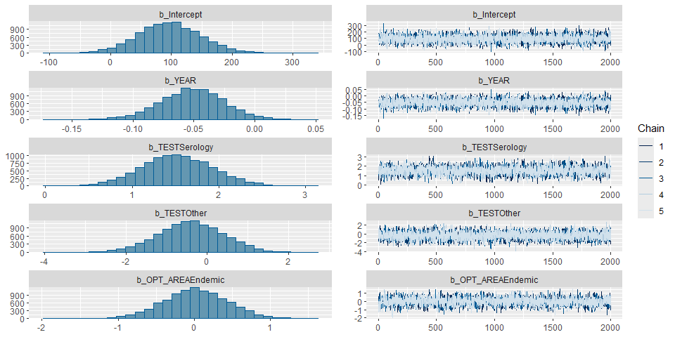
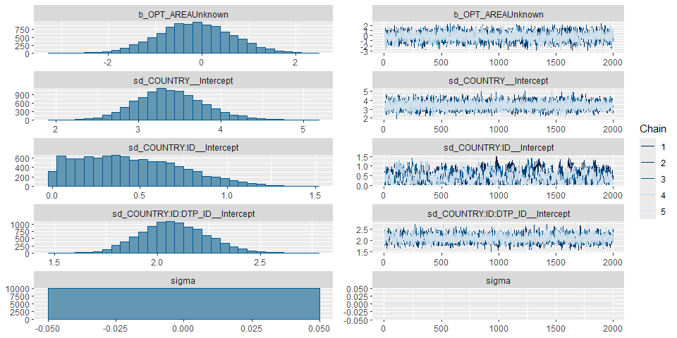
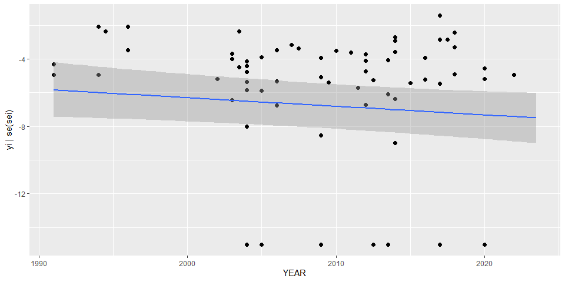
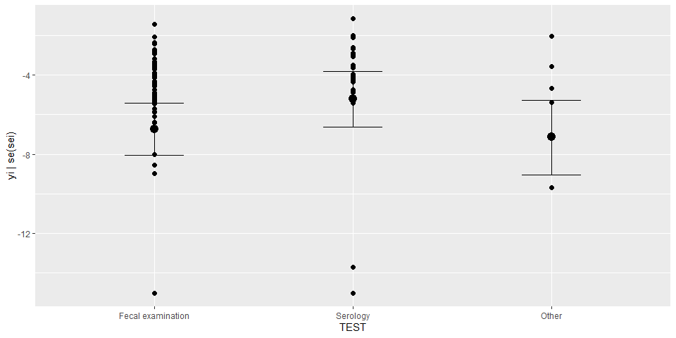
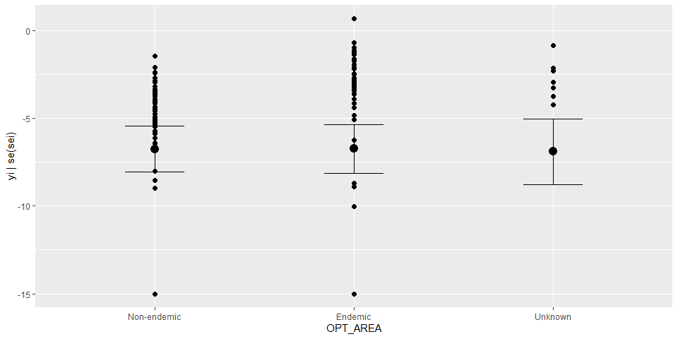

Global prevalence of Fasciola • Fit model, Version 9
================
fbbu6966
2025-12-03

- [Settings](#settings)
- [Parameters](#parameters)
- [Data](#data)
- [BRMS: Version 9](#brms-version-9)
- [Session info](#session-info)

# Settings

``` r
## required packages ----
library(bd)
library(brms)
library(ggplot2)
library(metafor)
library(readxl)
library(rmarkdown)
library(rms)
library(tidyr)
library(knitr)


## global options ----
knitr::opts_chunk$set(fig.width = 10)
Date <- format(Sys.Date(), "%Y%m%d")
```

# Parameters

| Parameters | Values |
|:---|:---|
| Number of iteration | 5000 |
| Warmup | 3000 |
| Delta value | 0.95 |
| Maximum tree-depth | 20 |
| Levels | Country,study, data point, fixed effect on the type of test, endemic area |
| Random effect on each data point | Yes |
| Stronger priors specified | Normal(0,1) |

Parameters of the model tested

# Data

``` r
## import data

es <- readRDS("es.rds") %>% 
  mutate(yi = case_when (VALUE_X == 0 ~ -15, TRUE ~ yi ))
es$DTP_ID<-as.factor(seq(1:length(es$SOURCE_ID)))
es$FLAG<-factor(es$FLAG, 
                levels=c(0,1,2,3,4,5,6, 7),
                labels=c("Keep data", "Data part of non WHO member states", "No WHO REG2 given",
                         "Year before 1990", "yi can't be calcualted", "TF choice to remove", 
                         "Excluded by preliminary checks", "Excluded in data cleaning"))
saveRDS(es, paste0("es_", Date, ".RDS"))
```

# BRMS: Version 9

``` r
## fit model
fit_brms_reg_s9 <-
  brm(yi | se(sei) ~
        1 + YEAR + TEST + OPT_AREA +
          (1 | COUNTRY) +
          (1 | COUNTRY:ID)+
          (1 | COUNTRY:ID:DTP_ID),
      chains = 5, iter = 5000, warmup = 3000,
      prior = prior(normal(0,1), class = sd),
      control = list(adapt_delta=0.95, max_treedepth = 20),
      cores = 5,
      data = subset(es, as.integer(FLAG) == 1),
      open_progress = FALSE,
      seed = 7)
```

    ## Compiling Stan program...

    ## Start sampling

    ## Warning: Bulk Effective Samples Size (ESS) is too low, indicating posterior means and medians may be unreliable.
    ## Running the chains for more iterations may help. See
    ## https://mc-stan.org/misc/warnings.html#bulk-ess

``` r
## model summary
summary(fit_brms_reg_s9)
```

    ##  Family: gaussian 
    ##   Links: mu = identity 
    ## Formula: yi | se(sei) ~ 1 + YEAR + TEST + OPT_AREA + (1 | COUNTRY) + (1 | COUNTRY:ID) + (1 | COUNTRY:ID:DTP_ID) 
    ##    Data: subset(es, as.integer(FLAG) == 1) (Number of observations: 194) 
    ##   Draws: 5 chains, each with iter = 5000; warmup = 3000; thin = 1;
    ##          total post-warmup draws = 10000
    ## 
    ## Multilevel Hyperparameters:
    ## ~COUNTRY (Number of levels: 35) 
    ##               Estimate Est.Error l-95% CI u-95% CI Rhat Bulk_ESS Tail_ESS
    ## sd(Intercept)     3.39      0.40     2.65     4.22 1.00     5520     6292
    ## 
    ## ~COUNTRY:ID (Number of levels: 152) 
    ##               Estimate Est.Error l-95% CI u-95% CI Rhat Bulk_ESS Tail_ESS
    ## sd(Intercept)     0.45      0.29     0.02     1.06 1.03      391      621
    ## 
    ## ~COUNTRY:ID:DTP_ID (Number of levels: 194) 
    ##               Estimate Est.Error l-95% CI u-95% CI Rhat Bulk_ESS Tail_ESS
    ## sd(Intercept)     2.08      0.16     1.78     2.41 1.00     2694     4830
    ## 
    ## Regression Coefficients:
    ##                 Estimate Est.Error l-95% CI u-95% CI Rhat Bulk_ESS Tail_ESS
    ## Intercept          96.56     51.89    -4.91   200.81 1.00     3569     5601
    ## YEAR               -0.05      0.03    -0.10    -0.00 1.00     3570     5393
    ## TESTSerology        1.52      0.41     0.71     2.34 1.00     2895     4515
    ## TESTOther          -0.41      0.80    -1.98     1.13 1.00     4547     6497
    ## OPT_AREAEndemic     0.02      0.43    -0.83     0.87 1.00     2774     4834
    ## OPT_AREAUnknown    -0.16      0.80    -1.71     1.40 1.00     3627     5274
    ## 
    ## Further Distributional Parameters:
    ##       Estimate Est.Error l-95% CI u-95% CI Rhat Bulk_ESS Tail_ESS
    ## sigma     0.00      0.00     0.00     0.00   NA       NA       NA
    ## 
    ## Draws were sampled using sampling(NUTS). For each parameter, Bulk_ESS
    ## and Tail_ESS are effective sample size measures, and Rhat is the potential
    ## scale reduction factor on split chains (at convergence, Rhat = 1).

``` r
plot(fit_brms_reg_s9, ask = FALSE)
```

<!-- --><!-- -->

``` r
plot(conditional_effects(fit_brms_reg_s9), points = TRUE, ask = FALSE)
```

    ## Ignoring unknown labels:
    ## • fill : "NA"
    ## • colour : "NA"

    ## Ignoring unknown labels:
    ## • fill : "NA"
    ## • colour : "NA"

<!-- -->

    ## Ignoring unknown labels:
    ## • fill : "NA"
    ## • colour : "NA"
    ## Ignoring unknown labels:
    ## • fill : "NA"
    ## • colour : "NA"

<!-- -->

    ## Ignoring unknown labels:
    ## • fill : "NA"
    ## • colour : "NA"
    ## Ignoring unknown labels:
    ## • fill : "NA"
    ## • colour : "NA"

<!-- -->

``` r
## save model fit
saveRDS(fit_brms_reg_s9, file = "fit_brms_reg_s9bis.rds")
```

# Session info

``` r
sessioninfo::session_info()
```

    ## Warning in system2("quarto", "-V", stdout = TRUE, env = paste0("TMPDIR=", : running command
    ## '"quarto" TMPDIR=C:/Users/fbbu6966/AppData/Local/Temp/RtmpcPXmo7/file85467f466ee -V' had status
    ## 1

    ## ─ Session info ───────────────────────────────────────────────────────────────────────────────
    ##  setting  value
    ##  version  R version 4.5.2 (2025-10-31 ucrt)
    ##  os       Windows 10 x64 (build 19045)
    ##  system   x86_64, mingw32
    ##  ui       RStudio
    ##  language (EN)
    ##  collate  English_United States.utf8
    ##  ctype    English_United States.utf8
    ##  tz       Europe/Brussels
    ##  date     2025-12-03
    ##  rstudio  2025.09.2+418 Cucumberleaf Sunflower (desktop)
    ##  pandoc   3.6.3 @ C:/Program Files/RStudio/resources/app/bin/quarto/bin/tools/ (via rmarkdown)
    ##  quarto   ERROR: Unknown command "TMPDIR=C:/Users/fbbu6966/AppData/Local/Temp/RtmpcPXmo7/file85467f466ee". Did you mean command "update"? @ C:\\PROGRA~1\\RStudio\\RESOUR~1\\app\\bin\\quarto\\bin\\quarto.exe
    ## 
    ## ─ Packages ───────────────────────────────────────────────────────────────────────────────────
    ##  ! package        * version    date (UTC) lib source
    ##    abind            1.4-8      2024-09-12 [1] CRAN (R 4.5.2)
    ##    backports        1.5.0      2024-05-23 [1] CRAN (R 4.5.2)
    ##    base64enc        0.1-3      2015-07-28 [1] CRAN (R 4.5.2)
    ##    bayesplot        1.14.0     2025-08-31 [1] CRAN (R 4.5.2)
    ##    bd             * 0.0.14     2025-11-29 [1] Github (brechtdv/bd@652191c)
    ##    boot             1.3-32     2025-08-29 [1] CRAN (R 4.5.2)
    ##    bridgesampling   1.2-1      2025-11-19 [1] CRAN (R 4.5.2)
    ##    brms           * 2.23.0     2025-09-09 [1] CRAN (R 4.5.2)
    ##    Brobdingnag      1.2-9      2022-10-19 [1] CRAN (R 4.5.2)
    ##    callr            3.7.6      2024-03-25 [1] CRAN (R 4.5.2)
    ##    cellranger       1.1.0      2016-07-27 [1] CRAN (R 4.5.2)
    ##    checkmate        2.3.3      2025-08-18 [1] CRAN (R 4.5.2)
    ##    class            7.3-23     2025-01-01 [1] CRAN (R 4.5.2)
    ##    classInt         0.4-11     2025-01-08 [1] CRAN (R 4.5.2)
    ##    cli              3.6.5      2025-04-23 [1] CRAN (R 4.5.2)
    ##    cluster          2.1.8.1    2025-03-12 [1] CRAN (R 4.5.2)
    ##    coda             0.19-4.1   2024-01-31 [1] CRAN (R 4.5.2)
    ##    codetools        0.2-20     2024-03-31 [1] CRAN (R 4.5.2)
    ##    colorspace       2.1-2      2025-09-22 [1] CRAN (R 4.5.2)
    ##    curl             7.0.0      2025-08-19 [1] CRAN (R 4.5.2)
    ##    data.table       1.17.8     2025-07-10 [1] CRAN (R 4.5.2)
    ##    DBI              1.2.3      2024-06-02 [1] CRAN (R 4.5.2)
    ##    DescTools      * 0.99.60    2025-03-28 [1] CRAN (R 4.5.2)
    ##    digest           0.6.39     2025-11-19 [1] CRAN (R 4.5.2)
    ##    distributional   0.5.0      2024-09-17 [1] CRAN (R 4.5.2)
    ##    dplyr          * 1.1.4      2023-11-17 [1] CRAN (R 4.5.2)
    ##    e1071            1.7-16     2024-09-16 [1] CRAN (R 4.5.2)
    ##    evaluate         1.0.5      2025-08-27 [1] CRAN (R 4.5.2)
    ##    Exact            3.3        2024-07-21 [1] CRAN (R 4.5.2)
    ##    expm             1.0-0      2024-08-19 [1] CRAN (R 4.5.2)
    ##    farver           2.1.2      2024-05-13 [1] CRAN (R 4.5.2)
    ##    fastmap          1.2.0      2024-05-15 [1] CRAN (R 4.5.2)
    ##    FERG2          * 0.0.5      2025-11-29 [1] Github (brechtdv/FERG2@c2d4ac1)
    ##    forcats        * 1.0.1      2025-09-25 [1] CRAN (R 4.5.2)
    ##    foreign          0.8-90     2025-03-31 [1] CRAN (R 4.5.2)
    ##    Formula          1.2-5      2023-02-24 [1] CRAN (R 4.5.2)
    ##    fs               1.6.6      2025-04-12 [1] CRAN (R 4.5.2)
    ##    generics         0.1.4      2025-05-09 [1] CRAN (R 4.5.2)
    ##    ggplot2        * 4.0.1      2025-11-14 [1] CRAN (R 4.5.2)
    ##    gld              2.6.8      2025-09-14 [1] CRAN (R 4.5.2)
    ##    glue             1.8.0      2024-09-30 [1] CRAN (R 4.5.2)
    ##    gridExtra        2.3        2017-09-09 [1] CRAN (R 4.5.2)
    ##    gtable           0.3.6      2024-10-25 [1] CRAN (R 4.5.2)
    ##    haven            2.5.5      2025-05-30 [1] CRAN (R 4.5.2)
    ##    Hmisc          * 5.2-4      2025-10-05 [1] CRAN (R 4.5.2)
    ##    hms              1.1.4      2025-10-17 [1] CRAN (R 4.5.2)
    ##    htmlTable        2.4.3      2024-07-21 [1] CRAN (R 4.5.2)
    ##    htmltools        0.5.8.1    2024-04-04 [1] CRAN (R 4.5.2)
    ##    htmlwidgets      1.6.4      2023-12-06 [1] CRAN (R 4.5.2)
    ##    httr             1.4.7      2023-08-15 [1] CRAN (R 4.5.2)
    ##    inline           0.3.21     2025-01-09 [1] CRAN (R 4.5.2)
    ##    jsonlite         2.0.0      2025-03-27 [1] CRAN (R 4.5.2)
    ##    KernSmooth       2.23-26    2025-01-01 [1] CRAN (R 4.5.2)
    ##    knitr          * 1.50       2025-03-16 [1] CRAN (R 4.5.2)
    ##    labeling         0.4.3      2023-08-29 [1] CRAN (R 4.5.2)
    ##    lattice          0.22-7     2025-04-02 [1] CRAN (R 4.5.2)
    ##    lifecycle        1.0.4      2023-11-07 [1] CRAN (R 4.5.2)
    ##    lmom             3.2        2024-09-30 [1] CRAN (R 4.5.2)
    ##    loo              2.8.0      2024-07-03 [1] CRAN (R 4.5.2)
    ##    lubridate      * 1.9.4      2024-12-08 [1] CRAN (R 4.5.2)
    ##    magrittr         2.0.4      2025-09-12 [1] CRAN (R 4.5.2)
    ##    MASS             7.3-65     2025-02-28 [1] CRAN (R 4.5.2)
    ##    mathjaxr         1.8-0      2025-04-30 [1] CRAN (R 4.5.2)
    ##    Matrix         * 1.7-4      2025-08-28 [1] CRAN (R 4.5.2)
    ##    MatrixModels     0.5-4      2025-03-26 [1] CRAN (R 4.5.2)
    ##    matrixStats      1.5.0      2025-01-07 [1] CRAN (R 4.5.2)
    ##    metadat        * 1.4-0      2025-02-04 [1] CRAN (R 4.5.2)
    ##    metafor        * 4.8-0      2025-01-28 [1] CRAN (R 4.5.2)
    ##    mgcv             1.9-3      2025-04-04 [1] CRAN (R 4.5.2)
    ##    multcomp         1.4-29     2025-10-20 [1] CRAN (R 4.5.2)
    ##    mvtnorm          1.3-3      2025-01-10 [1] CRAN (R 4.5.2)
    ##    nlme             3.1-168    2025-03-31 [1] CRAN (R 4.5.2)
    ##    nnet             7.3-20     2025-01-01 [1] CRAN (R 4.5.2)
    ##    numDeriv       * 2016.8-1.1 2019-06-06 [1] CRAN (R 4.5.2)
    ##    pillar           1.11.1     2025-09-17 [1] CRAN (R 4.5.2)
    ##    pkgbuild         1.4.8      2025-05-26 [1] CRAN (R 4.5.2)
    ##    pkgconfig        2.0.3      2019-09-22 [1] CRAN (R 4.5.2)
    ##    plyr             1.8.9      2023-10-02 [1] CRAN (R 4.5.2)
    ##    polspline        1.1.25     2024-05-10 [1] CRAN (R 4.5.2)
    ##    posterior        1.6.1      2025-02-27 [1] CRAN (R 4.5.2)
    ##    processx         3.8.6      2025-02-21 [1] CRAN (R 4.5.2)
    ##    proxy            0.4-27     2022-06-09 [1] CRAN (R 4.5.2)
    ##    ps               1.9.1      2025-04-12 [1] CRAN (R 4.5.2)
    ##    purrr          * 1.2.0      2025-11-04 [1] CRAN (R 4.5.2)
    ##    quantreg         6.1        2025-03-10 [1] CRAN (R 4.5.2)
    ##    QuickJSR         1.8.1      2025-09-20 [1] CRAN (R 4.5.2)
    ##    R6               2.6.1      2025-02-15 [1] CRAN (R 4.5.2)
    ##    RColorBrewer     1.1-3      2022-04-03 [1] CRAN (R 4.5.2)
    ##    Rcpp           * 1.1.0      2025-07-02 [1] CRAN (R 4.5.2)
    ##  D RcppParallel     5.1.11-1   2025-08-27 [1] CRAN (R 4.5.2)
    ##    readr          * 2.1.6      2025-11-14 [1] CRAN (R 4.5.2)
    ##    readxl         * 1.4.5      2025-03-07 [1] CRAN (R 4.5.2)
    ##    reshape2         1.4.5      2025-11-12 [1] CRAN (R 4.5.2)
    ##    rlang            1.1.6      2025-04-11 [1] CRAN (R 4.5.2)
    ##    rmarkdown      * 2.30       2025-09-28 [1] CRAN (R 4.5.2)
    ##    rms            * 8.1-0      2025-10-14 [1] CRAN (R 4.5.2)
    ##    rootSolve        1.8.2.4    2023-09-21 [1] CRAN (R 4.5.2)
    ##    rpart            4.1.24     2025-01-07 [1] CRAN (R 4.5.2)
    ##    rstan            2.32.7     2025-03-10 [1] CRAN (R 4.5.2)
    ##    rstantools       2.5.0      2025-09-01 [1] CRAN (R 4.5.2)
    ##    rstudioapi       0.17.1     2024-10-22 [1] CRAN (R 4.5.2)
    ##    S7               0.2.1      2025-11-14 [1] CRAN (R 4.5.2)
    ##    sandwich         3.1-1      2024-09-15 [1] CRAN (R 4.5.2)
    ##    scales         * 1.4.0      2025-04-24 [1] CRAN (R 4.5.2)
    ##    sessioninfo      1.2.3      2025-02-05 [1] CRAN (R 4.5.2)
    ##    sf             * 1.0-23     2025-11-28 [1] CRAN (R 4.5.2)
    ##    SparseM          1.84-2     2024-07-17 [1] CRAN (R 4.5.2)
    ##    StanHeaders      2.32.10    2024-07-15 [1] CRAN (R 4.5.2)
    ##    stringi          1.8.7      2025-03-27 [1] CRAN (R 4.5.2)
    ##    stringr        * 1.6.0      2025-11-04 [1] CRAN (R 4.5.2)
    ##    survival         3.8-3      2024-12-17 [1] CRAN (R 4.5.2)
    ##    tensorA          0.36.2.1   2023-12-13 [1] CRAN (R 4.5.2)
    ##    TH.data          1.1-5      2025-11-17 [1] CRAN (R 4.5.2)
    ##    tibble         * 3.3.0      2025-06-08 [1] CRAN (R 4.5.2)
    ##    tidyr          * 1.3.1      2024-01-24 [1] CRAN (R 4.5.2)
    ##    tidyselect       1.2.1      2024-03-11 [1] CRAN (R 4.5.2)
    ##    tidyverse      * 2.0.0      2023-02-22 [1] CRAN (R 4.5.2)
    ##    timechange       0.3.0      2024-01-18 [1] CRAN (R 4.5.2)
    ##    tzdb             0.5.0      2025-03-15 [1] CRAN (R 4.5.2)
    ##    units            1.0-0      2025-10-09 [1] CRAN (R 4.5.2)
    ##    V8               8.0.1      2025-10-10 [1] CRAN (R 4.5.2)
    ##    vctrs            0.6.5      2023-12-01 [1] CRAN (R 4.5.2)
    ##    withr            3.0.2      2024-10-28 [1] CRAN (R 4.5.2)
    ##    xfun             0.54       2025-10-30 [1] CRAN (R 4.5.2)
    ##    yaml             2.3.11     2025-11-28 [1] CRAN (R 4.5.2)
    ##    zoo              1.8-14     2025-04-10 [1] CRAN (R 4.5.2)
    ## 
    ##  [1] C:/Program Files/R/R-4.5.2/library
    ## 
    ##  * ── Packages attached to the search path.
    ##  D ── DLL MD5 mismatch, broken installation.
    ## 
    ## ──────────────────────────────────────────────────────────────────────────────────────────────

``` r
##rmarkdown::render("02-fit.R")
```
