Global prevalence of intestinal flukes • Estimated prevalence with the
9th model - updated data and estimates of HIC put to burdenfree
================
fbbu6966
2025-12-18

- [Settings](#settings)
- [Parameters](#parameters)
- [Model fit](#model-fit)
- [Predict all](#predict-all)
- [Summarize predictions](#summarize-predictions)
  - [Global](#global)
  - [Regions](#regions)
  - [Subregions](#subregions)
  - [Countries](#countries)
- [Session info](#session-info)

# Settings

``` r
## required packages ----
library(bd)
library(brms)
```

    ## Loading required package: Rcpp

    ## Loading 'brms' package (version 2.23.0). Useful instructions
    ## can be found by typing help('brms'). A more detailed introduction
    ## to the package is available through vignette('brms_overview').

    ## 
    ## Attaching package: 'brms'

    ## The following object is masked from 'package:stats':
    ## 
    ##     ar

``` r
library(FERG2)
```

    ## 
    ## Attaching package: 'FERG2'

    ## The following object is masked from 'package:bd':
    ## 
    ##     mean_ci

``` r
library(ggplot2)
library(knitr)
library(rmarkdown)
library(sf)
```

    ## Linking to GEOS 3.13.1, GDAL 3.11.4, PROJ 9.7.0; sf_use_s2() is TRUE

``` r
library(tidyr)
library(dplyr)
```

    ## 
    ## Attaching package: 'dplyr'

    ## The following object is masked from 'package:bd':
    ## 
    ##     collapse

    ## The following objects are masked from 'package:stats':
    ## 
    ##     filter, lag

    ## The following objects are masked from 'package:base':
    ## 
    ##     intersect, setdiff, setequal, union

``` r
library(DescTools)
library(readxl)
library(kableExtra)
```

    ## 
    ## Attaching package: 'kableExtra'

    ## The following object is masked from 'package:dplyr':
    ## 
    ##     group_rows

``` r
#Model with country level only

## global options ----
knitr::opts_chunk$set(fig.width = 10)
Date <- format(Sys.Date(), "%Y%m%d")
```

# Parameters

| Parameters                       | Values                                        |
|:---------------------------------|:----------------------------------------------|
| Number of iterations             | 5000                                          |
| Warmup                           | 3000                                          |
| Delta value                      | 0.95                                          |
| Maximum tree-depth               | 15                                            |
| Random effect on each data point | Yes                                           |
| Stronger priors specified        | Normal(0,1)                                   |
| Levels of analysis               | Country, type of test, endemic area           |


Parameters of the model tested

# Model fit

``` r
fit_brms_reg_s <- readRDS("intestinal_fit_brms_reg_s9.rds")
zero_cases<- read_xlsx("Endemic_countries.xlsx")%>%
  select(REG2, SUB2, ISO3, Country, pdtf_intestinal) %>%
  rename(COUNTRY=ISO3, COUNTRY_LABEL = Country, DISEASEFREE = pdtf_intestinal)
```

    ## New names:
    ## • `pdtf_intestinal_old` -> `pdtf_intestinal_old...18`
    ## • `pdtf_intestinal_old` -> `pdtf_intestinal_old...21`

``` r
kable(
  caption = "Countries assumed to be non-endemic",
  row.names = FALSE,
  subset(zero_cases, DISEASEFREE==0)[, 4])
```

| COUNTRY_LABEL                  |
|:-------------------------------|
| Angola                         |
| Albania                        |
| Andorra                        |
| Argentina                      |
| Armenia                        |
| Antigua and Barbuda            |
| Australia                      |
| Austria                        |
| Azerbaijan                     |
| Burundi                        |
| Belgium                        |
| Benin                          |
| Burkina Faso                   |
| Bulgaria                       |
| Bahrain                        |
| Bahamas, The                   |
| Bosnia and Herzegovina         |
| Belarus                        |
| Belize                         |
| Bolivia                        |
| Brazil                         |
| Barbados                       |
| Brunei Darussalam              |
| Bhutan                         |
| Botswana                       |
| Central African Republic       |
| Canada                         |
| Switzerland                    |
| Chile                          |
| Côte d’Ivoire                  |
| Cameroon                       |
| Congo, Dem. Rep.               |
| Congo, Rep.                    |
| Cook Islands                   |
| Colombia                       |
| Comoros                        |
| Cabo Verde                     |
| Costa Rica                     |
| Cuba                           |
| Cyprus                         |
| Czech Republic                 |
| Germany                        |
| Djibouti                       |
| Dominica                       |
| Denmark                        |
| Dominican Republic             |
| Algeria                        |
| Ecuador                        |
| Eritrea                        |
| Spain                          |
| Estonia                        |
| Ethiopia                       |
| Finland                        |
| Fiji                           |
| France                         |
| Micronesia, Fed. Sts.          |
| Gabon                          |
| United Kingdom                 |
| Georgia                        |
| Ghana                          |
| Guinea                         |
| Gambia, The                    |
| Guinea-Bissau                  |
| Equatorial Guinea              |
| Greece                         |
| Grenada                        |
| Guatemala                      |
| Guyana                         |
| Honduras                       |
| Croatia                        |
| Haiti                          |
| Hungary                        |
| Ireland                        |
| Iceland                        |
| Israel                         |
| Italy                          |
| Jamaica                        |
| Jordan                         |
| Japan                          |
| Kazakhstan                     |
| Kenya                          |
| Kyrgyz Republic                |
| Kiribati                       |
| St. Kitts and Nevis            |
| Kuwait                         |
| Lebanon                        |
| Liberia                        |
| Libya                          |
| St. Lucia                      |
| Lesotho                        |
| Lithuania                      |
| Luxembourg                     |
| Latvia                         |
| Morocco                        |
| Monaco                         |
| Moldova                        |
| Madagascar                     |
| Maldives                       |
| Mexico                         |
| Marshall Islands               |
| North Macedonia                |
| Mali                           |
| Malta                          |
| Montenegro                     |
| Mongolia                       |
| Mozambique                     |
| Mauritania                     |
| Mauritius                      |
| Malawi                         |
| Namibia                        |
| Niger                          |
| Nigeria                        |
| Nicaragua                      |
| Niue                           |
| Netherlands                    |
| Norway                         |
| Nauru                          |
| New Zealand                    |
| Oman                           |
| Pakistan                       |
| Panama                         |
| Peru                           |
| Palau                          |
| Papua New Guinea               |
| Poland                         |
| Portugal                       |
| Paraguay                       |
| Qatar                          |
| Romania                        |
| Rwanda                         |
| Saudi Arabia                   |
| Senegal                        |
| Singapore                      |
| Solomon Islands                |
| Sierra Leone                   |
| El Salvador                    |
| San Marino                     |
| Somalia                        |
| Serbia                         |
| South Sudan                    |
| São Tomé and Principe          |
| Suriname                       |
| Slovak Republic                |
| Slovenia                       |
| Sweden                         |
| Eswatini                       |
| Seychelles                     |
| Syrian Arab Republic           |
| Chad                           |
| Togo                           |
| Tajikistan                     |
| Turkmenistan                   |
| Timor-Leste                    |
| Tonga                          |
| Trinidad and Tobago            |
| Türkiye                        |
| Tuvalu                         |
| Tanzania                       |
| Uganda                         |
| Ukraine                        |
| Uruguay                        |
| United States                  |
| Uzbekistan                     |
| St. Vincent and the Grenadines |
| Venezuela                      |
| Vanuatu                        |
| Samoa                          |
| Yemen, Rep.                    |
| South Africa                   |
| Zambia                         |
| Zimbabwe                       |

Countries assumed to be non-endemic

``` r
es<- get(load("pdtf-intestinal.Rdata"))
country_with_data <- es %>% select(ISO3) %>% distinct() %>% mutate(DATA=1, COUNTRY = ISO3)
Sub2_with_data <- es %>% select(SUB2) %>% distinct() %>% mutate(DATASUB2=1)
Reg2_with_data <- es %>% select(REG2) %>% distinct() %>% mutate(DATAREG2=1)
zero_cases <- left_join(zero_cases, country_with_data)
```

    ## Joining with `by = join_by(COUNTRY)`

``` r
zero_cases <- left_join(zero_cases, Sub2_with_data)
```

    ## Joining with `by = join_by(SUB2)`

``` r
zero_cases <- left_join(zero_cases, Reg2_with_data) %>%
  select(-c(ISO3)) %>%
  mutate(ESTIMATES = case_when(
    DATA == 1 ~ 1,
    DISEASEFREE == 0 ~ 2,
    is.na(DATA) & DISEASEFREE == 1 & DATASUB2 == 1 ~ 3,
    is.na(DATA) & DISEASEFREE == 1 & is.na(DATASUB2) & DATAREG2 == 1 ~ 4, 
    is.na(DATA) & DISEASEFREE == 1  & is.na(DATASUB2) & is.na(DATAREG2) ~5))
```

    ## Joining with `by = join_by(REG2)`

``` r
zero_cases$ESTIMATES <- factor(zero_cases$ESTIMATES, 
                               level = c(1,2,3,4,5),
                               labels = c("Data present", "Disease free", "Data in subregion", "Data in region", "Data in world"))
Country_Check <- zero_cases %>% filter(as.integer(ESTIMATES) == 2)
```

# Predict all

``` r
## set up dataframe
sim_all <-
data.frame(
  sei = 0,
  REG2 = FERG2:::countries$REG2,
  SUB2 = FERG2:::countries$SUB2,
  COUNTRY = FERG2:::countries$ISO3,
  YEAR = rep(2000:2021, each = nrow(FERG2:::countries)))
sim_all <- sim_all %>% left_join(zero_cases) %>% select(sei, REG2, SUB2, COUNTRY, YEAR, ESTIMATES)
```

    ## Joining with `by = join_by(REG2, SUB2, COUNTRY)`

``` r
## draw from expected value of posterior predictive dist
set.seed(10)
#fit_all <- 
#posterior_epred(
#  object = fit_brms_reg_s,
#  newdata = sim_all,
#  allow_new_levels = TRUE,
#  sample_new_levels = "uncertainty",
#  re_formula = ~ 1 + YEAR +
#          (1 |COUNTRY)
#  )

draws_fit <- as_draws_df(fit_brms_reg_s)
fit_all <- data.frame(1:10000)
for (x in 1:nrow(sim_all)){
  if (as.integer(sim_all[x, "ESTIMATES"]) == 1){
    # Data present for country
    fit_all[[paste0("V",x)]] <- draws_fit$b_Intercept +                         # Global intercept
      sim_all[x, "YEAR"] * draws_fit$b_YEAR +                                   # Year component
      draws_fit[[paste0("r_COUNTRY[",sim_all[x,"COUNTRY"],",Intercept]")]]      # Country component
  } else if (as.integer(sim_all[x, "ESTIMATES"]) == 2) {
    # Disease-free country
    fit_all[[paste0("V",x)]] <- 0
  } else if (as.integer(sim_all[x, "ESTIMATES"]) >2){
    # Data not present for country
    fit_all[[paste0("V",x)]] <- draws_fit$b_Intercept +                         #Global intercept
      sim_all[x, "YEAR"] * draws_fit$b_YEAR                                     #Year component   
  } 
}
fit_all <- fit_all %>% select(-c(X1.10000))

## calculate cases
sim_all$SIM <- t(fit_all)
pop_all <- aggregate(POP ~ ISO3 + YEAR, FERG2:::pop, sum)
sim_all <- merge(sim_all, pop_all,
                 by.x = c("COUNTRY", "YEAR"), by.y = c("ISO3", "YEAR"))
sim_all <- sim_all %>% left_join(zero_cases)
```

    ## Joining with `by = join_by(COUNTRY, REG2, SUB2, ESTIMATES)`

``` r
sim_all$CASES <- expit(sim_all$SIM) * sim_all$POP 
sim_all$CASES <- sim_all$CASES*sim_all$DISEASEFREE
sim_all$SIM<-sim_all$SIM*sim_all$DISEASEFREE
sim_all$sei<-sim_all$sei*sim_all$DISEASEFREE

## aggregate global
sim_all_glb <- with(sim_all, aggregate(CASES ~ YEAR, FUN = sum))
all_glb_id <- sim_all_glb[1]
all_glb_nr <-
  t(apply(sim_all_glb[, grepl("V", names(sim_all_glb))], 1, mean_ci))
all_glb_nr <- data.frame(all_glb_nr)
names(all_glb_nr) <- c("VAL_MEAN", "VAL_LWR", "VAL_UPR")
all_glb_nr <- cbind(all_glb_id, all_glb_nr)
all_glb_nr$LOCATION <- "Global"
all_glb_nr$LOCATION_NAME <- "Global"
all_glb_nr$METRIC <- "Number"
str(all_glb_nr)
```

    ## 'data.frame':    22 obs. of  7 variables:
    ##  $ YEAR         : int  2000 2001 2002 2003 2004 2005 2006 2007 2008 2009 ...
    ##  $ VAL_MEAN     : num  30155380 28840700 27600999 26436647 25337642 ...
    ##  $ VAL_LWR      : num  7884880 7851217 7828675 7760346 7657595 ...
    ##  $ VAL_UPR      : num  83667820 77905022 72949941 68451631 64098004 ...
    ##  $ LOCATION     : chr  "Global" "Global" "Global" "Global" ...
    ##  $ LOCATION_NAME: chr  "Global" "Global" "Global" "Global" ...
    ##  $ METRIC       : chr  "Number" "Number" "Number" "Number" ...

``` r
all_glb_rt <- all_glb_nr
all_glb_rt$POP <- with(sim_all, tapply(POP, YEAR, sum))
all_glb_rt$VAL_MEAN <- 100*all_glb_rt$VAL_MEAN / all_glb_rt$POP
all_glb_rt$VAL_LWR <-  100*all_glb_rt$VAL_LWR / all_glb_rt$POP
all_glb_rt$VAL_UPR <-  100*all_glb_rt$VAL_UPR / all_glb_rt$POP
all_glb_rt$METRIC <- "Rate"
all_glb_rt$POP <- NULL
str(all_glb_rt)
```

    ## 'data.frame':    22 obs. of  7 variables:
    ##  $ YEAR         : int  2000 2001 2002 2003 2004 2005 2006 2007 2008 2009 ...
    ##  $ VAL_MEAN     : num [1:22(1d)] 0.495 0.467 0.441 0.417 0.395 ...
    ##  $ VAL_LWR      : num [1:22(1d)] 0.13 0.127 0.125 0.122 0.119 ...
    ##  $ VAL_UPR      : num [1:22(1d)] 1.374 1.262 1.167 1.08 0.999 ...
    ##  $ LOCATION     : chr  "Global" "Global" "Global" "Global" ...
    ##  $ LOCATION_NAME: chr  "Global" "Global" "Global" "Global" ...
    ##  $ METRIC       : chr  "Rate" "Rate" "Rate" "Rate" ...

``` r
## aggregate over regions
sim_all_reg <- with(sim_all, aggregate(CASES ~ REG2+YEAR, FUN = sum))
all_reg_id <- sim_all_reg[1:2]
all_reg_nr <-
  t(apply(sim_all_reg[, grepl("V", names(sim_all_reg))], 1, mean_ci))
all_reg_nr <- data.frame(all_reg_nr)
names(all_reg_nr) <- c("VAL_MEAN", "VAL_LWR", "VAL_UPR")
all_reg_nr <- cbind(all_reg_id, all_reg_nr)
all_reg_nr$LOCATION <- "Region"
all_reg_nr$LOCATION_NAME <- all_reg_nr$REG2
all_reg_nr$REG2 <- NULL
all_reg_nr$METRIC <- "Number"
str(all_reg_nr)
```

    ## 'data.frame':    132 obs. of  7 variables:
    ##  $ YEAR         : int  2000 2000 2000 2000 2000 2000 2001 2001 2001 2001 ...
    ##  $ VAL_MEAN     : num  0 0 1981616 1548907 13786647 ...
    ##  $ VAL_LWR      : num  0 0 505475 262170 3627581 ...
    ##  $ VAL_UPR      : num  0 0 5653871 5693264 38409495 ...
    ##  $ LOCATION     : chr  "Region" "Region" "Region" "Region" ...
    ##  $ LOCATION_NAME: chr  "AFR" "AMR" "EMR" "EUR" ...
    ##  $ METRIC       : chr  "Number" "Number" "Number" "Number" ...

``` r
all_reg_rt <- all_reg_nr
all_reg_rt$POP <-
  with(sim_all, aggregate(POP ~ REG2 + YEAR, FUN = sum))$POP
all_reg_rt$VAL_MEAN <- 100*all_reg_rt$VAL_MEAN / all_reg_rt$POP
all_reg_rt$VAL_LWR <-  100*all_reg_rt$VAL_LWR / all_reg_rt$POP
all_reg_rt$VAL_UPR <- 100*all_reg_rt$VAL_UPR / all_reg_rt$POP
all_reg_rt$METRIC <- "Rate"
all_reg_rt$POP <- NULL
str(all_reg_rt)
```

    ## 'data.frame':    132 obs. of  7 variables:
    ##  $ YEAR         : int  2000 2000 2000 2000 2000 2000 2001 2001 2001 2001 ...
    ##  $ VAL_MEAN     : num  0 0 0.408 0.178 0.877 ...
    ##  $ VAL_LWR      : num  0 0 0.1042 0.0302 0.2307 ...
    ##  $ VAL_UPR      : num  0 0 1.165 0.655 2.443 ...
    ##  $ LOCATION     : chr  "Region" "Region" "Region" "Region" ...
    ##  $ LOCATION_NAME: chr  "AFR" "AMR" "EMR" "EUR" ...
    ##  $ METRIC       : chr  "Rate" "Rate" "Rate" "Rate" ...

``` r
## aggregate over subregions
sim_all_sub <- with(sim_all, aggregate(CASES ~ SUB2+YEAR, FUN = sum))
all_sub_id <- sim_all_sub[1:2]
all_sub_nr <-
  t(apply(sim_all_sub[, grepl("V", names(sim_all_sub))], 1, mean_ci))
all_sub_nr <- data.frame(all_sub_nr)
names(all_sub_nr) <- c("VAL_MEAN", "VAL_LWR", "VAL_UPR")
all_sub_nr <- cbind(all_sub_id, all_sub_nr)
all_sub_nr$LOCATION <- "Subregion"
all_sub_nr$LOCATION_NAME <- all_sub_nr$SUB2
all_sub_nr$SUB2 <- NULL
all_sub_nr$METRIC <- "Number"
str(all_sub_nr)
```

    ## 'data.frame':    374 obs. of  7 variables:
    ##  $ YEAR         : int  2000 2000 2000 2000 2000 2000 2000 2000 2000 2000 ...
    ##  $ VAL_MEAN     : num  0 0 0 0 0 ...
    ##  $ VAL_LWR      : num  0 0 0 0 0 ...
    ##  $ VAL_UPR      : num  0 0 0 0 0 ...
    ##  $ LOCATION     : chr  "Subregion" "Subregion" "Subregion" "Subregion" ...
    ##  $ LOCATION_NAME: chr  "AFRAB" "AFRC" "AFRD" "AMRA" ...
    ##  $ METRIC       : chr  "Number" "Number" "Number" "Number" ...

``` r
all_sub_rt <- all_sub_nr
all_sub_rt$POP <-
  with(sim_all, aggregate(POP ~ SUB2 + YEAR, FUN = sum))$POP
all_sub_rt$VAL_MEAN <- 100*all_sub_rt$VAL_MEAN / all_sub_rt$POP
all_sub_rt$VAL_LWR <- 100*all_sub_rt$VAL_LWR / all_sub_rt$POP
all_sub_rt$VAL_UPR <- 100*all_sub_rt$VAL_UPR / all_sub_rt$POP
all_sub_rt$METRIC <- "Rate"
all_sub_rt$POP <- NULL
str(all_sub_rt)
```

    ## 'data.frame':    374 obs. of  7 variables:
    ##  $ YEAR         : int  2000 2000 2000 2000 2000 2000 2000 2000 2000 2000 ...
    ##  $ VAL_MEAN     : num  0 0 0 0 0 ...
    ##  $ VAL_LWR      : num  0 0 0 0 0 ...
    ##  $ VAL_UPR      : num  0 0 0 0 0 ...
    ##  $ LOCATION     : chr  "Subregion" "Subregion" "Subregion" "Subregion" ...
    ##  $ LOCATION_NAME: chr  "AFRAB" "AFRC" "AFRD" "AMRA" ...
    ##  $ METRIC       : chr  "Rate" "Rate" "Rate" "Rate" ...

``` r
## aggregate over countries
all_cnt_nr <- t(apply(sim_all$CASES, 1, mean_ci))
all_cnt_nr <- data.frame(all_cnt_nr)
names(all_cnt_nr) <- c("VAL_MEAN", "VAL_LWR", "VAL_UPR")
all_cnt_nr <- cbind(sim_all[1:2], all_cnt_nr)
all_cnt_nr$LOCATION <- "Country"
all_cnt_nr$LOCATION_NAME <- all_cnt_nr$COUNTRY
all_cnt_nr$COUNTRY <- NULL
all_cnt_nr$METRIC <- "Number"
str(all_cnt_nr)
```

    ## 'data.frame':    4268 obs. of  7 variables:
    ##  $ YEAR         : int  2000 2001 2002 2003 2004 2005 2006 2007 2008 2009 ...
    ##  $ VAL_MEAN     : num  176629 164740 159980 163407 162262 ...
    ##  $ VAL_LWR      : num  46287 44934 45388 47913 49249 ...
    ##  $ VAL_UPR      : num  492981 445281 420011 419501 405969 ...
    ##  $ LOCATION     : chr  "Country" "Country" "Country" "Country" ...
    ##  $ LOCATION_NAME: chr  "AFG" "AFG" "AFG" "AFG" ...
    ##  $ METRIC       : chr  "Number" "Number" "Number" "Number" ...

``` r
#all_cnt_rt <- t(apply(exp(sim_all$SIM), 1, mean_ci))
#all_cnt_rt <- data.frame(all_cnt_rt)
#names(all_cnt_rt) <- c("VAL_MEAN", "VAL_LWR", "VAL_UPR")
#all_cnt_rt <- cbind(sim_all[1:2], all_cnt_rt)
#all_cnt_rt$LOCATION <- "Country"
#all_cnt_rt$LOCATION_NAME <- all_cnt_rt$COUNTRY
#all_cnt_rt$COUNTRY <- NULL
#all_cnt_rt$METRIC <- "Rate"
#str(all_cnt_rt)

all_cnt_rt <- all_cnt_nr%>%left_join(pop_all, by=c("LOCATION_NAME"="ISO3","YEAR"="YEAR"))
all_cnt_rt$VAL_MEAN <-  100*all_cnt_rt$VAL_MEAN / all_cnt_rt$POP
all_cnt_rt$VAL_LWR <- 100*all_cnt_rt$VAL_LWR / all_cnt_rt$POP
all_cnt_rt$VAL_UPR <-  100*all_cnt_rt$VAL_UPR / all_cnt_rt$POP
all_cnt_rt$LOCATION <- "Country"
all_cnt_rt$METRIC <- "Rate"
all_cnt_rt$POP <- NULL

str(all_cnt_rt)
```

    ## 'data.frame':    4268 obs. of  7 variables:
    ##  $ YEAR         : int  2000 2001 2002 2003 2004 2005 2006 2007 2008 2009 ...
    ##  $ VAL_MEAN     : num  0.872 0.823 0.778 0.736 0.697 ...
    ##  $ VAL_LWR      : num  0.229 0.225 0.221 0.216 0.212 ...
    ##  $ VAL_UPR      : num  2.43 2.23 2.04 1.89 1.74 ...
    ##  $ LOCATION     : chr  "Country" "Country" "Country" "Country" ...
    ##  $ LOCATION_NAME: chr  "AFG" "AFG" "AFG" "AFG" ...
    ##  $ METRIC       : chr  "Rate" "Rate" "Rate" "Rate" ...

``` r
## compile all
all_est <-
rbind(all_glb_rt, all_glb_nr,
      all_reg_rt, all_reg_nr,
      all_sub_rt, all_sub_nr,
      all_cnt_rt, all_cnt_nr)
str(all_est)
```

    ## 'data.frame':    9592 obs. of  7 variables:
    ##  $ YEAR         : int  2000 2001 2002 2003 2004 2005 2006 2007 2008 2009 ...
    ##  $ VAL_MEAN     : num  0.495 0.467 0.441 0.417 0.395 ...
    ##  $ VAL_LWR      : num  0.13 0.127 0.125 0.122 0.119 ...
    ##  $ VAL_UPR      : num  1.374 1.262 1.167 1.08 0.999 ...
    ##  $ LOCATION     : chr  "Global" "Global" "Global" "Global" ...
    ##  $ LOCATION_NAME: chr  "Global" "Global" "Global" "Global" ...
    ##  $ METRIC       : chr  "Rate" "Rate" "Rate" "Rate" ...

``` r
saveRDS(all_est,  paste0("all_estimates_v9b_",Date,".rds"))

## plot nested trends
all_sub_rt$REG2 <- gsub("(R).*", "\\1", all_sub_rt$LOCATION_NAME)
ggplot(all_reg_rt, aes(x = YEAR, y = VAL_MEAN, group = LOCATION_NAME)) +
  geom_line(data = all_glb_rt, linewidth = 2) +
  geom_line(aes(col = LOCATION_NAME), linewidth = 1.5) +
  theme_bw()
```

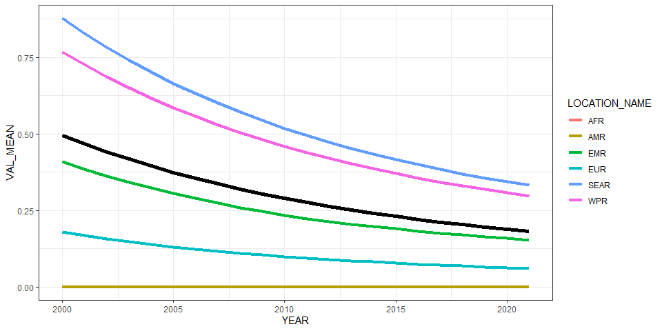<!-- -->

``` r
ggplot(all_reg_rt, aes(x = YEAR, y = VAL_MEAN, group = LOCATION_NAME)) +
  geom_line(data = all_glb_rt, linewidth = 2) +
  geom_line(aes(col = LOCATION_NAME), linewidth = 1.5) +
  geom_line(data = all_sub_rt, aes(col = REG2)) +
  theme_bw()
```

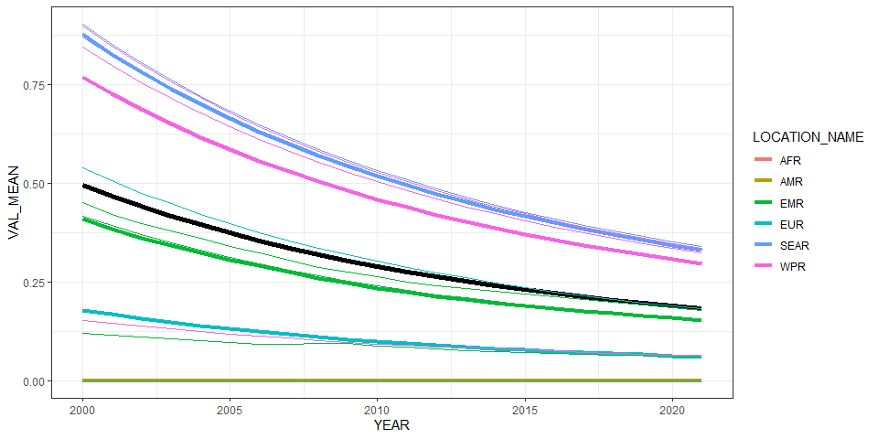<!-- -->

# Summarize predictions

## Global

``` r
kable(
  caption = "Global number of intestinal flukes cases, 2010 vs 2020",
  row.names = FALSE,
  subset(all_glb_nr, YEAR %in% c(2010, 2020))[, 1:4])
```

| YEAR | VAL_MEAN | VAL_LWR |  VAL_UPR |
|-----:|---------:|--------:|---------:|
| 2010 | 20034400 | 6533932 | 47499763 |
| 2020 | 14676369 | 3572931 | 40151785 |

Global number of intestinal flukes cases, 2010 vs 2020

## Regions

``` r
kbl(subset(all_reg_rt, YEAR == 2020)[,c(6,2:4)],
    align = c("l", "c", "c", "c"), row.names = FALSE,
    col.names = c("Region", "Mean", "Lower", "Upper"),
    caption="Prevalence of intestinal flukes in 2020 by WHO region (%)") %>%
  kable_styling("striped", "hover")
```

<table class="table table-striped" style="margin-left: auto; margin-right: auto;">

<caption>

Prevalence of intestinal flukes in 2020 by WHO region (%)
</caption>

<thead>

<tr>

<th style="text-align:left;">

Region
</th>

<th style="text-align:center;">

Mean
</th>

<th style="text-align:center;">

Lower
</th>

<th style="text-align:center;">

Upper
</th>

</tr>

</thead>

<tbody>

<tr>

<td style="text-align:left;">

AFR
</td>

<td style="text-align:center;">

0.0000000
</td>

<td style="text-align:center;">

0.0000000
</td>

<td style="text-align:center;">

0.0000000
</td>

</tr>

<tr>

<td style="text-align:left;">

AMR
</td>

<td style="text-align:center;">

0.0000000
</td>

<td style="text-align:center;">

0.0000000
</td>

<td style="text-align:center;">

0.0000000
</td>

</tr>

<tr>

<td style="text-align:left;">

EMR
</td>

<td style="text-align:center;">

0.1577757
</td>

<td style="text-align:center;">

0.0381262
</td>

<td style="text-align:center;">

0.4387656
</td>

</tr>

<tr>

<td style="text-align:left;">

EUR
</td>

<td style="text-align:center;">

0.0626158
</td>

<td style="text-align:center;">

0.0106953
</td>

<td style="text-align:center;">

0.2086833
</td>

</tr>

<tr>

<td style="text-align:left;">

SEAR
</td>

<td style="text-align:center;">

0.3431330
</td>

<td style="text-align:center;">

0.0855594
</td>

<td style="text-align:center;">

0.9333777
</td>

</tr>

<tr>

<td style="text-align:left;">

WPR
</td>

<td style="text-align:center;">

0.3069259
</td>

<td style="text-align:center;">

0.0639330
</td>

<td style="text-align:center;">

0.9145464
</td>

</tr>

</tbody>

</table>

``` r
kbl(subset(all_reg_nr, YEAR == 2020)[,c(6,2:4)],
    align = c("l", "c", "c", "c"), row.names = FALSE,
    col.names = c("Region", "Mean", "Lower", "Upper"),
    caption="Number of intestinal flukes cases in 2020 by WHO region") %>%
  kable_styling("striped", "hover")
```

<table class="table table-striped" style="margin-left: auto; margin-right: auto;">

<caption>

Number of intestinal flukes cases in 2020 by WHO region
</caption>

<thead>

<tr>

<th style="text-align:left;">

Region
</th>

<th style="text-align:center;">

Mean
</th>

<th style="text-align:center;">

Lower
</th>

<th style="text-align:center;">

Upper
</th>

</tr>

</thead>

<tbody>

<tr>

<td style="text-align:left;">

AFR
</td>

<td style="text-align:center;">

0.0
</td>

<td style="text-align:center;">

0.0
</td>

<td style="text-align:center;">

0
</td>

</tr>

<tr>

<td style="text-align:left;">

AMR
</td>

<td style="text-align:center;">

0.0
</td>

<td style="text-align:center;">

0.0
</td>

<td style="text-align:center;">

0
</td>

</tr>

<tr>

<td style="text-align:left;">

EMR
</td>

<td style="text-align:center;">

1189726.0
</td>

<td style="text-align:center;">

287494.7
</td>

<td style="text-align:center;">

3308563
</td>

</tr>

<tr>

<td style="text-align:left;">

EUR
</td>

<td style="text-align:center;">

586181.5
</td>

<td style="text-align:center;">

100125.2
</td>

<td style="text-align:center;">

1953602
</td>

</tr>

<tr>

<td style="text-align:left;">

SEAR
</td>

<td style="text-align:center;">

6998545.8
</td>

<td style="text-align:center;">

1745071.6
</td>

<td style="text-align:center;">

19037184
</td>

</tr>

<tr>

<td style="text-align:left;">

WPR
</td>

<td style="text-align:center;">

5901915.6
</td>

<td style="text-align:center;">

1229375.0
</td>

<td style="text-align:center;">

17585924
</td>

</tr>

</tbody>

</table>

``` r
ggplot(subset(all_reg_rt, YEAR == 2010),
  aes(y = VAL_MEAN, x = LOCATION_NAME)) +
  geom_pointrange(aes(ymin = VAL_LWR, ymax = VAL_UPR), size = 0.2) +
  coord_flip() +
  theme_bw() +
  scale_x_discrete(NULL, limits = rev(unique(all_reg_nr$LOCATION_NAME))) +
  scale_y_continuous(NULL) +
  ggtitle("Prevalence of intestinal flukes by WHO Region (%), 2010")
```

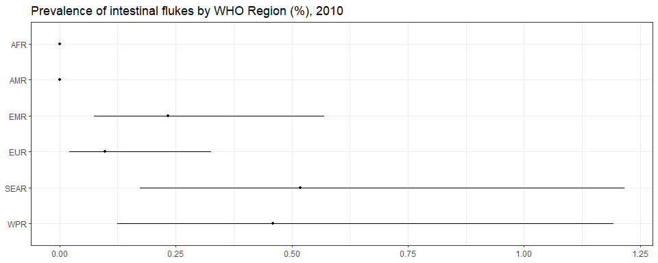<!-- -->

``` r
ggplot(subset(all_reg_rt, YEAR == 2020),
  aes(y = VAL_MEAN, x = LOCATION_NAME)) +
  geom_pointrange(aes(ymin = VAL_LWR, ymax = VAL_UPR), size = 0.2) +
  coord_flip() +
  theme_bw() +
  scale_x_discrete(NULL, limits = rev(unique(all_reg_nr$LOCATION_NAME))) +
  scale_y_continuous(NULL) +
  ggtitle("Prevalence of intestinal flukes by WHO Region (%), 2020")
```

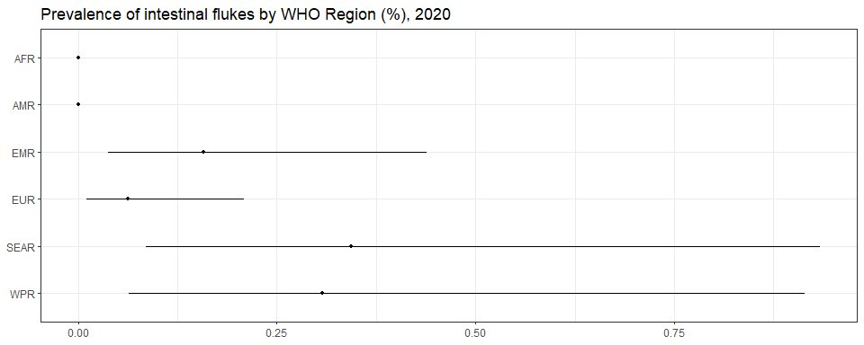<!-- -->

``` r
ggplot(subset(all_reg_nr, YEAR == 2010),
  aes(y = VAL_MEAN, x = LOCATION_NAME)) +
  geom_pointrange(aes(ymin = VAL_LWR, ymax = VAL_UPR), size = 0.2) +
  coord_flip() +
  theme_bw() +
  scale_x_discrete(NULL, limits = rev(unique(all_reg_nr$LOCATION_NAME))) +
  scale_y_continuous(NULL) +
  ggtitle("Number of intestinal flukes cases by WHO Region, 2010")
```

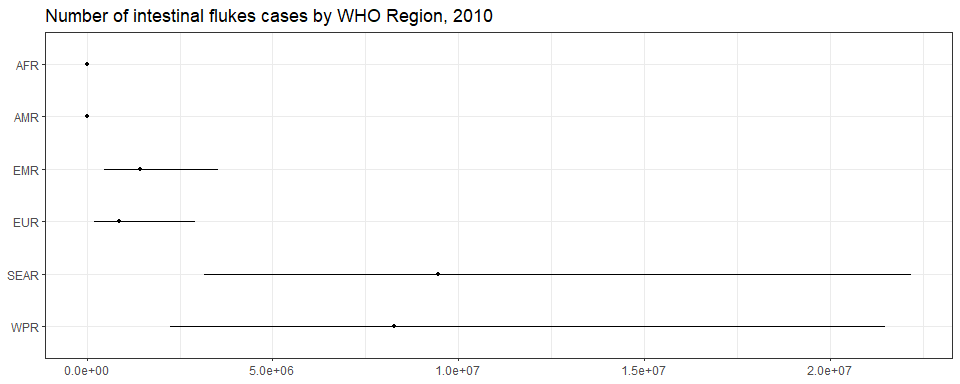<!-- -->

``` r
ggplot(subset(all_reg_nr, YEAR == 2020),
  aes(y = VAL_MEAN, x = LOCATION_NAME)) +
  geom_pointrange(aes(ymin = VAL_LWR, ymax = VAL_UPR), size = 0.2) +
  coord_flip() +
  theme_bw() +
  scale_x_discrete(NULL, limits = rev(unique(all_reg_nr$LOCATION_NAME))) +
  scale_y_continuous(NULL) +
  ggtitle("Number of intestinal flukes cases by WHO Region, 2020")
```

<!-- -->

``` r
sim_all_reg <-
  merge(sim_all_reg,
        with(sim_all, aggregate(POP ~ REG2 + YEAR, FUN = sum)))
sim_all_reg_long <-
  pivot_longer(sim_all_reg, cols = starts_with("V"))
sim_all_reg_long$CASES <- sim_all_reg_long$value 

ggplot(subset(sim_all_reg_long, YEAR == 2010), aes(x = CASES)) +
  geom_density() +
  facet_wrap(~REG2) +
  theme_bw() +
  scale_x_log10() +
  ggtitle("Number of intestinal flukes cases by WHO Region, 2010")
```

    ## Warning in scale_x_log10(): log-10 transformation introduced infinite values.

    ## Warning: Removed 20000 rows containing non-finite outside the scale range (`stat_density()`).

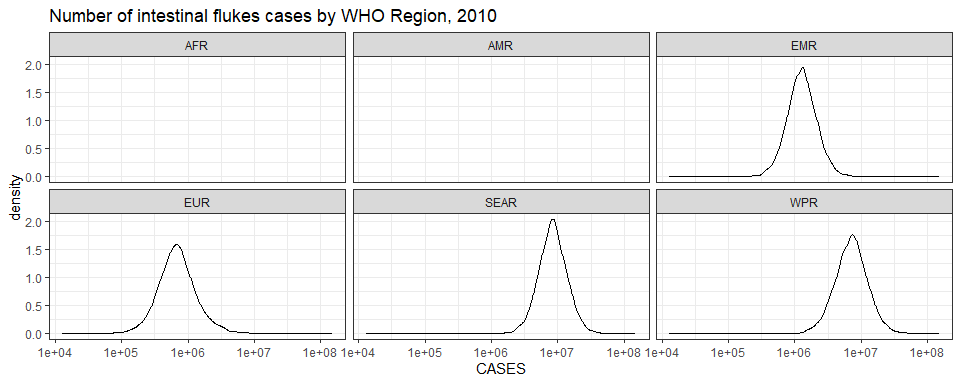<!-- -->

``` r
ggplot(subset(sim_all_reg_long, YEAR == 2020), aes(x = CASES)) +
  geom_density() +
  facet_wrap(~REG2) +
  theme_bw() +
  scale_x_log10() +
  ggtitle("Number of intestinal flukes cases by WHO Region, 2020")
```

    ## Warning in scale_x_log10(): log-10 transformation introduced infinite values.
    ## Removed 20000 rows containing non-finite outside the scale range (`stat_density()`).

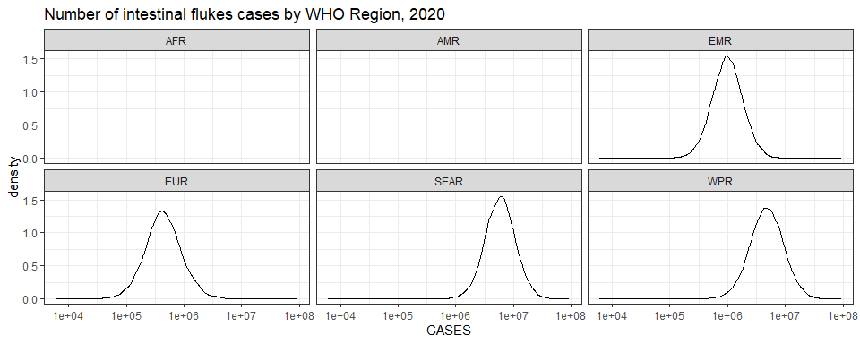<!-- -->

## Subregions

``` r
ggplot(subset(all_sub_rt, YEAR == 2010),
  aes(y = VAL_MEAN, x = LOCATION_NAME)) +
  geom_pointrange(aes(ymin = VAL_LWR, ymax = VAL_UPR), size = 0.2) +
  coord_flip() +
  theme_bw() +
  scale_x_discrete(NULL, limits = rev(unique(all_sub_nr$LOCATION_NAME))) +
  scale_y_continuous(NULL) +
  ggtitle("Prevalence of intestinal flukes by WHO Subregion (%), 2010")
```

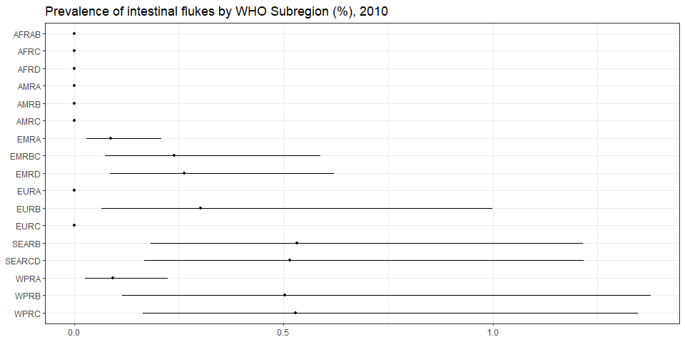<!-- -->

``` r
ggplot(subset(all_sub_rt, YEAR == 2020),
  aes(y = VAL_MEAN, x = LOCATION_NAME)) +
  geom_pointrange(aes(ymin = VAL_LWR, ymax = VAL_UPR), size = 0.2) +
  coord_flip() +
  theme_bw() +
  scale_x_discrete(NULL, limits = rev(unique(all_sub_nr$LOCATION_NAME))) +
  scale_y_continuous(NULL) +
  ggtitle("Prevalence of intestinal flukes by WHO Subregion (%), 2020")
```

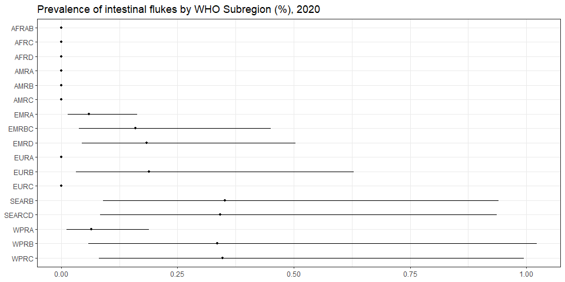<!-- -->

``` r
ggplot(subset(all_sub_nr, YEAR == 2010),
  aes(y = VAL_MEAN, x = LOCATION_NAME)) +
  geom_pointrange(aes(ymin = VAL_LWR, ymax = VAL_UPR), size = 0.2) +
  coord_flip() +
  theme_bw() +
  scale_x_discrete(NULL, limits = rev(unique(all_sub_nr$LOCATION_NAME))) +
  scale_y_continuous(NULL) +
  ggtitle("Number of intestinal flukes cases by WHO Subregion, 2010")
```

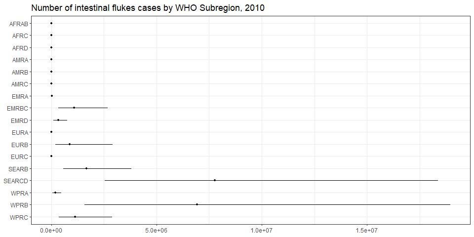<!-- -->

``` r
ggplot(subset(all_sub_nr, YEAR == 2020),
  aes(y = VAL_MEAN, x = LOCATION_NAME)) +
  geom_pointrange(aes(ymin = VAL_LWR, ymax = VAL_UPR), size = 0.2) +
  coord_flip() +
  theme_bw() +
  scale_x_discrete(NULL, limits = rev(unique(all_sub_nr$LOCATION_NAME))) +
  scale_y_continuous(NULL) +
  ggtitle("Number of intestinal flukes cases by WHO Subregion, 2020")
```

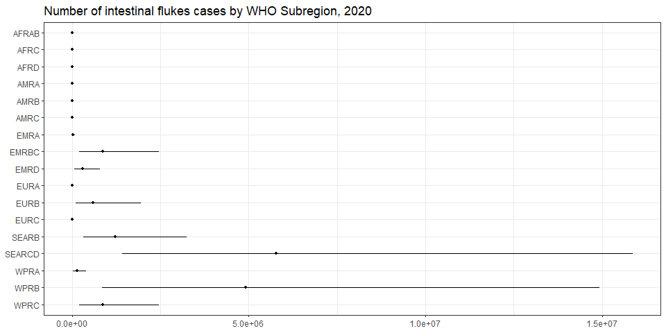<!-- -->

``` r
sim_all_sub <-
  merge(sim_all_sub,
        with(sim_all, aggregate(POP ~ SUB2 + YEAR, FUN = sum)))
sim_all_sub_long <-
  pivot_longer(sim_all_sub, cols = starts_with("V"))
sim_all_sub_long$CASES <- sim_all_sub_long$value 

ggplot(subset(sim_all_sub_long, YEAR == 2010), aes(x = CASES)) +
  geom_density() +
  facet_wrap(~SUB2) +
  theme_bw() +
  scale_x_log10() +
  ggtitle("Number of intestinal flukes cases by WHO Subregion, 2010")
```

    ## Warning in scale_x_log10(): log-10 transformation introduced infinite values.

    ## Warning: Removed 80000 rows containing non-finite outside the scale range (`stat_density()`).

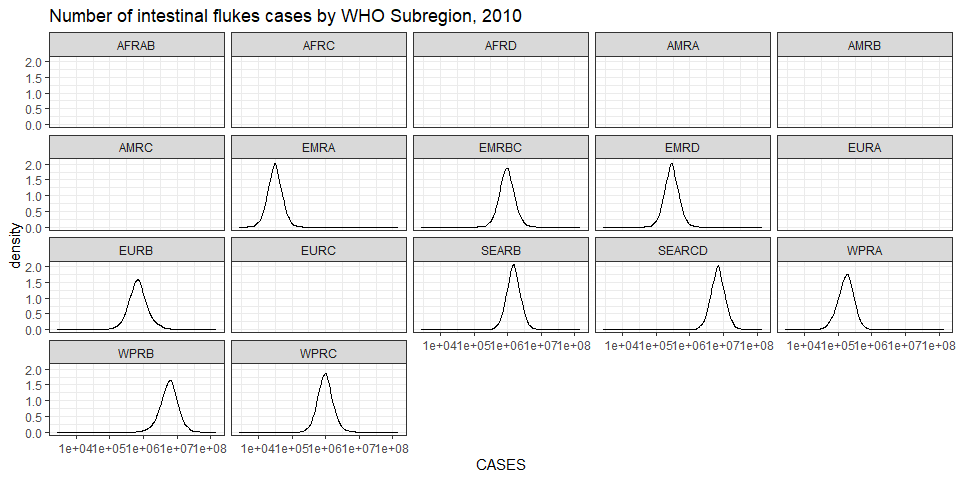<!-- -->

``` r
ggplot(subset(sim_all_sub_long, YEAR == 2020), aes(x = CASES)) +
  geom_density() +
  facet_wrap(~SUB2) +
  theme_bw() +
  scale_x_log10() +
  ggtitle("Number of intestinal flukes cases by WHO Subregion, 2020")
```

    ## Warning in scale_x_log10(): log-10 transformation introduced infinite values.
    ## Removed 80000 rows containing non-finite outside the scale range (`stat_density()`).

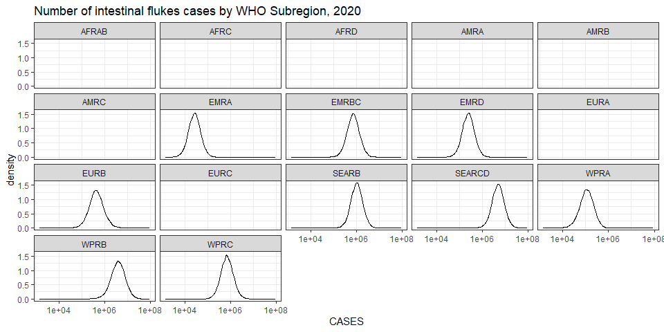<!-- -->

## Countries

``` r
plot_world(subset(all_cnt_rt, YEAR == 2010),
  "LOCATION_NAME", "VAL_MEAN", legend.title = "Prevalence (%)", diseasefree = zero_cases)
```

    ## [1] 0.0 0.1 0.2 0.3 0.4 0.5 0.6 0.7

``` r
title("Intestinal flukes prevalence (%), 2010", line = 1)
```

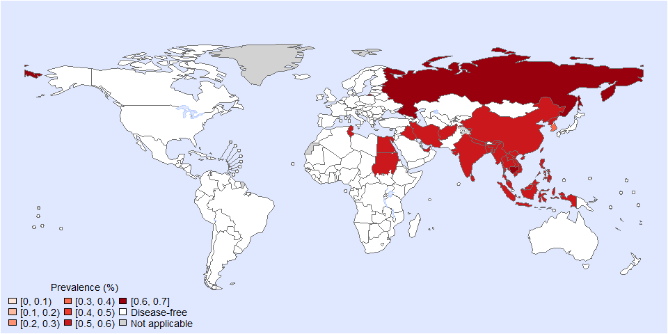<!-- -->

``` r
plot_world(subset(all_cnt_rt, YEAR == 2020),
  "LOCATION_NAME", "VAL_MEAN", legend.title = "Prevalence (%)", diseasefree = zero_cases)
```

    ## [1] 0.0 0.1 0.2 0.3 0.4

``` r
title("Intestinal flukes prevalence (%), 2020", line = 1)
```

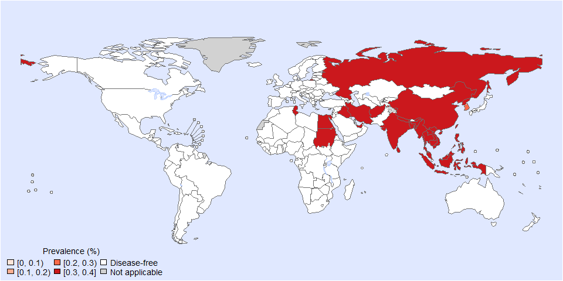<!-- -->

``` r
tab <-
  data.frame(subset(all_cnt_rt, YEAR == 2010)[,
     c("LOCATION_NAME", "VAL_MEAN", "VAL_LWR", "VAL_UPR")],
        subset(all_cnt_rt, YEAR == 2020)[,
     c("VAL_MEAN", "VAL_LWR", "VAL_UPR")])
tab$LOCATION_NAME <-
  FERG2:::countries$COUNTRY[match(tab$LOCATION_NAME, FERG2:::countries$ISO3)]
tab$LOCATION_NAME <- gsub(" \\(.*", "", tab$LOCATION_NAME)
names(tab) <-
  c("Country",
    "2010.mean", "2010.lwr", "2010.upr",
    "2020.mean", "2020.lwr", "2020.upr")

kable(tab, digits = 3, row.names = FALSE,
  caption = "Estimated intestinal flukes prevalence by country (%), 2010 vs 2020")
```

| Country | 2010.mean | 2010.lwr | 2010.upr | 2020.mean | 2020.lwr | 2020.upr |
|:---|---:|---:|---:|---:|---:|---:|
| Afghanistan | 0.516 | 0.168 | 1.218 | 0.342 | 0.084 | 0.938 |
| Angola | 0.000 | 0.000 | 0.000 | 0.000 | 0.000 | 0.000 |
| Albania | 0.000 | 0.000 | 0.000 | 0.000 | 0.000 | 0.000 |
| Andorra | 0.000 | 0.000 | 0.000 | 0.000 | 0.000 | 0.000 |
| United Arab Emirates | 0.516 | 0.168 | 1.218 | 0.342 | 0.084 | 0.938 |
| Argentina | 0.000 | 0.000 | 0.000 | 0.000 | 0.000 | 0.000 |
| Armenia | 0.000 | 0.000 | 0.000 | 0.000 | 0.000 | 0.000 |
| Antigua and Barbuda | 0.000 | 0.000 | 0.000 | 0.000 | 0.000 | 0.000 |
| Australia | 0.000 | 0.000 | 0.000 | 0.000 | 0.000 | 0.000 |
| Austria | 0.000 | 0.000 | 0.000 | 0.000 | 0.000 | 0.000 |
| Azerbaijan | 0.000 | 0.000 | 0.000 | 0.000 | 0.000 | 0.000 |
| Burundi | 0.000 | 0.000 | 0.000 | 0.000 | 0.000 | 0.000 |
| Belgium | 0.000 | 0.000 | 0.000 | 0.000 | 0.000 | 0.000 |
| Benin | 0.000 | 0.000 | 0.000 | 0.000 | 0.000 | 0.000 |
| Burkina Faso | 0.000 | 0.000 | 0.000 | 0.000 | 0.000 | 0.000 |
| Bangladesh | 0.516 | 0.168 | 1.218 | 0.342 | 0.084 | 0.938 |
| Bulgaria | 0.000 | 0.000 | 0.000 | 0.000 | 0.000 | 0.000 |
| Bahrain | 0.000 | 0.000 | 0.000 | 0.000 | 0.000 | 0.000 |
| Bahamas | 0.000 | 0.000 | 0.000 | 0.000 | 0.000 | 0.000 |
| Bosnia and Herzegovina | 0.000 | 0.000 | 0.000 | 0.000 | 0.000 | 0.000 |
| Belarus | 0.000 | 0.000 | 0.000 | 0.000 | 0.000 | 0.000 |
| Belize | 0.000 | 0.000 | 0.000 | 0.000 | 0.000 | 0.000 |
| Bolivia | 0.000 | 0.000 | 0.000 | 0.000 | 0.000 | 0.000 |
| Brazil | 0.000 | 0.000 | 0.000 | 0.000 | 0.000 | 0.000 |
| Barbados | 0.000 | 0.000 | 0.000 | 0.000 | 0.000 | 0.000 |
| Brunei Darussalam | 0.000 | 0.000 | 0.000 | 0.000 | 0.000 | 0.000 |
| Bhutan | 0.000 | 0.000 | 0.000 | 0.000 | 0.000 | 0.000 |
| Botswana | 0.000 | 0.000 | 0.000 | 0.000 | 0.000 | 0.000 |
| Central African Republic | 0.000 | 0.000 | 0.000 | 0.000 | 0.000 | 0.000 |
| Canada | 0.000 | 0.000 | 0.000 | 0.000 | 0.000 | 0.000 |
| Switzerland | 0.000 | 0.000 | 0.000 | 0.000 | 0.000 | 0.000 |
| Chile | 0.000 | 0.000 | 0.000 | 0.000 | 0.000 | 0.000 |
| China | 0.504 | 0.112 | 1.388 | 0.336 | 0.057 | 1.031 |
| Côte d’Ivoire | 0.000 | 0.000 | 0.000 | 0.000 | 0.000 | 0.000 |
| Cameroon | 0.000 | 0.000 | 0.000 | 0.000 | 0.000 | 0.000 |
| Congo | 0.000 | 0.000 | 0.000 | 0.000 | 0.000 | 0.000 |
| Congo | 0.000 | 0.000 | 0.000 | 0.000 | 0.000 | 0.000 |
| Cook Islands | 0.000 | 0.000 | 0.000 | 0.000 | 0.000 | 0.000 |
| Colombia | 0.000 | 0.000 | 0.000 | 0.000 | 0.000 | 0.000 |
| Comoros | 0.000 | 0.000 | 0.000 | 0.000 | 0.000 | 0.000 |
| Cabo Verde | 0.000 | 0.000 | 0.000 | 0.000 | 0.000 | 0.000 |
| Costa Rica | 0.000 | 0.000 | 0.000 | 0.000 | 0.000 | 0.000 |
| Cuba | 0.000 | 0.000 | 0.000 | 0.000 | 0.000 | 0.000 |
| Cyprus | 0.000 | 0.000 | 0.000 | 0.000 | 0.000 | 0.000 |
| Czechia | 0.000 | 0.000 | 0.000 | 0.000 | 0.000 | 0.000 |
| Germany | 0.000 | 0.000 | 0.000 | 0.000 | 0.000 | 0.000 |
| Djibouti | 0.000 | 0.000 | 0.000 | 0.000 | 0.000 | 0.000 |
| Dominica | 0.000 | 0.000 | 0.000 | 0.000 | 0.000 | 0.000 |
| Denmark | 0.000 | 0.000 | 0.000 | 0.000 | 0.000 | 0.000 |
| Dominican Republic | 0.000 | 0.000 | 0.000 | 0.000 | 0.000 | 0.000 |
| Algeria | 0.000 | 0.000 | 0.000 | 0.000 | 0.000 | 0.000 |
| Ecuador | 0.000 | 0.000 | 0.000 | 0.000 | 0.000 | 0.000 |
| Egypt | 0.542 | 0.120 | 1.546 | 0.356 | 0.063 | 1.106 |
| Eritrea | 0.000 | 0.000 | 0.000 | 0.000 | 0.000 | 0.000 |
| Spain | 0.000 | 0.000 | 0.000 | 0.000 | 0.000 | 0.000 |
| Estonia | 0.000 | 0.000 | 0.000 | 0.000 | 0.000 | 0.000 |
| Ethiopia | 0.000 | 0.000 | 0.000 | 0.000 | 0.000 | 0.000 |
| Finland | 0.000 | 0.000 | 0.000 | 0.000 | 0.000 | 0.000 |
| Fiji | 0.000 | 0.000 | 0.000 | 0.000 | 0.000 | 0.000 |
| France | 0.000 | 0.000 | 0.000 | 0.000 | 0.000 | 0.000 |
| Micronesia | 0.000 | 0.000 | 0.000 | 0.000 | 0.000 | 0.000 |
| Gabon | 0.000 | 0.000 | 0.000 | 0.000 | 0.000 | 0.000 |
| United Kingdom | 0.000 | 0.000 | 0.000 | 0.000 | 0.000 | 0.000 |
| Georgia | 0.000 | 0.000 | 0.000 | 0.000 | 0.000 | 0.000 |
| Ghana | 0.000 | 0.000 | 0.000 | 0.000 | 0.000 | 0.000 |
| Guinea | 0.000 | 0.000 | 0.000 | 0.000 | 0.000 | 0.000 |
| Gambia | 0.000 | 0.000 | 0.000 | 0.000 | 0.000 | 0.000 |
| Guinea-Bissau | 0.000 | 0.000 | 0.000 | 0.000 | 0.000 | 0.000 |
| Equatorial Guinea | 0.000 | 0.000 | 0.000 | 0.000 | 0.000 | 0.000 |
| Greece | 0.000 | 0.000 | 0.000 | 0.000 | 0.000 | 0.000 |
| Grenada | 0.000 | 0.000 | 0.000 | 0.000 | 0.000 | 0.000 |
| Guatemala | 0.000 | 0.000 | 0.000 | 0.000 | 0.000 | 0.000 |
| Guyana | 0.000 | 0.000 | 0.000 | 0.000 | 0.000 | 0.000 |
| Honduras | 0.000 | 0.000 | 0.000 | 0.000 | 0.000 | 0.000 |
| Croatia | 0.000 | 0.000 | 0.000 | 0.000 | 0.000 | 0.000 |
| Haiti | 0.000 | 0.000 | 0.000 | 0.000 | 0.000 | 0.000 |
| Hungary | 0.000 | 0.000 | 0.000 | 0.000 | 0.000 | 0.000 |
| Indonesia | 0.516 | 0.168 | 1.218 | 0.342 | 0.084 | 0.938 |
| India | 0.516 | 0.168 | 1.218 | 0.342 | 0.084 | 0.938 |
| Ireland | 0.000 | 0.000 | 0.000 | 0.000 | 0.000 | 0.000 |
| Iran | 0.516 | 0.168 | 1.218 | 0.342 | 0.084 | 0.938 |
| Iraq | 0.516 | 0.168 | 1.218 | 0.342 | 0.084 | 0.938 |
| Iceland | 0.000 | 0.000 | 0.000 | 0.000 | 0.000 | 0.000 |
| Israel | 0.000 | 0.000 | 0.000 | 0.000 | 0.000 | 0.000 |
| Italy | 0.000 | 0.000 | 0.000 | 0.000 | 0.000 | 0.000 |
| Jamaica | 0.000 | 0.000 | 0.000 | 0.000 | 0.000 | 0.000 |
| Jordan | 0.000 | 0.000 | 0.000 | 0.000 | 0.000 | 0.000 |
| Japan | 0.000 | 0.000 | 0.000 | 0.000 | 0.000 | 0.000 |
| Kazakhstan | 0.000 | 0.000 | 0.000 | 0.000 | 0.000 | 0.000 |
| Kenya | 0.000 | 0.000 | 0.000 | 0.000 | 0.000 | 0.000 |
| Kyrgyzstan | 0.000 | 0.000 | 0.000 | 0.000 | 0.000 | 0.000 |
| Cambodia | 0.600 | 0.170 | 1.644 | 0.398 | 0.085 | 1.226 |
| Kiribati | 0.000 | 0.000 | 0.000 | 0.000 | 0.000 | 0.000 |
| Saint Kitts and Nevis | 0.000 | 0.000 | 0.000 | 0.000 | 0.000 | 0.000 |
| Korea | 0.398 | 0.109 | 0.957 | 0.269 | 0.051 | 0.783 |
| Kuwait | 0.000 | 0.000 | 0.000 | 0.000 | 0.000 | 0.000 |
| Lao People’s Dem. Republic | 0.506 | 0.158 | 1.209 | 0.335 | 0.080 | 0.925 |
| Lebanon | 0.000 | 0.000 | 0.000 | 0.000 | 0.000 | 0.000 |
| Liberia | 0.000 | 0.000 | 0.000 | 0.000 | 0.000 | 0.000 |
| Libya | 0.000 | 0.000 | 0.000 | 0.000 | 0.000 | 0.000 |
| Saint Lucia | 0.000 | 0.000 | 0.000 | 0.000 | 0.000 | 0.000 |
| Sri Lanka | 0.516 | 0.168 | 1.218 | 0.342 | 0.084 | 0.938 |
| Lesotho | 0.000 | 0.000 | 0.000 | 0.000 | 0.000 | 0.000 |
| Lithuania | 0.000 | 0.000 | 0.000 | 0.000 | 0.000 | 0.000 |
| Luxembourg | 0.000 | 0.000 | 0.000 | 0.000 | 0.000 | 0.000 |
| Latvia | 0.000 | 0.000 | 0.000 | 0.000 | 0.000 | 0.000 |
| Morocco | 0.000 | 0.000 | 0.000 | 0.000 | 0.000 | 0.000 |
| Monaco | 0.000 | 0.000 | 0.000 | 0.000 | 0.000 | 0.000 |
| Republic of Moldova | 0.000 | 0.000 | 0.000 | 0.000 | 0.000 | 0.000 |
| Madagascar | 0.000 | 0.000 | 0.000 | 0.000 | 0.000 | 0.000 |
| Maldives | 0.000 | 0.000 | 0.000 | 0.000 | 0.000 | 0.000 |
| Mexico | 0.000 | 0.000 | 0.000 | 0.000 | 0.000 | 0.000 |
| Marshall Islands | 0.000 | 0.000 | 0.000 | 0.000 | 0.000 | 0.000 |
| North Macedonia | 0.000 | 0.000 | 0.000 | 0.000 | 0.000 | 0.000 |
| Mali | 0.000 | 0.000 | 0.000 | 0.000 | 0.000 | 0.000 |
| Malta | 0.000 | 0.000 | 0.000 | 0.000 | 0.000 | 0.000 |
| Myanmar | 0.516 | 0.168 | 1.218 | 0.342 | 0.084 | 0.938 |
| Montenegro | 0.000 | 0.000 | 0.000 | 0.000 | 0.000 | 0.000 |
| Mongolia | 0.000 | 0.000 | 0.000 | 0.000 | 0.000 | 0.000 |
| Mozambique | 0.000 | 0.000 | 0.000 | 0.000 | 0.000 | 0.000 |
| Mauritania | 0.000 | 0.000 | 0.000 | 0.000 | 0.000 | 0.000 |
| Mauritius | 0.000 | 0.000 | 0.000 | 0.000 | 0.000 | 0.000 |
| Malawi | 0.000 | 0.000 | 0.000 | 0.000 | 0.000 | 0.000 |
| Malaysia | 0.516 | 0.168 | 1.218 | 0.342 | 0.084 | 0.938 |
| Namibia | 0.000 | 0.000 | 0.000 | 0.000 | 0.000 | 0.000 |
| Niger | 0.000 | 0.000 | 0.000 | 0.000 | 0.000 | 0.000 |
| Nigeria | 0.000 | 0.000 | 0.000 | 0.000 | 0.000 | 0.000 |
| Nicaragua | 0.000 | 0.000 | 0.000 | 0.000 | 0.000 | 0.000 |
| Niue | 0.000 | 0.000 | 0.000 | 0.000 | 0.000 | 0.000 |
| Netherlands | 0.000 | 0.000 | 0.000 | 0.000 | 0.000 | 0.000 |
| Norway | 0.000 | 0.000 | 0.000 | 0.000 | 0.000 | 0.000 |
| Nepal | 0.516 | 0.168 | 1.218 | 0.342 | 0.084 | 0.938 |
| Nauru | 0.000 | 0.000 | 0.000 | 0.000 | 0.000 | 0.000 |
| New Zealand | 0.000 | 0.000 | 0.000 | 0.000 | 0.000 | 0.000 |
| Oman | 0.000 | 0.000 | 0.000 | 0.000 | 0.000 | 0.000 |
| Pakistan | 0.000 | 0.000 | 0.000 | 0.000 | 0.000 | 0.000 |
| Panama | 0.000 | 0.000 | 0.000 | 0.000 | 0.000 | 0.000 |
| Peru | 0.000 | 0.000 | 0.000 | 0.000 | 0.000 | 0.000 |
| Philippines | 0.593 | 0.139 | 1.830 | 0.390 | 0.072 | 1.258 |
| Palau | 0.000 | 0.000 | 0.000 | 0.000 | 0.000 | 0.000 |
| Papua New Guinea | 0.000 | 0.000 | 0.000 | 0.000 | 0.000 | 0.000 |
| Poland | 0.000 | 0.000 | 0.000 | 0.000 | 0.000 | 0.000 |
| Korea | 0.516 | 0.168 | 1.218 | 0.342 | 0.084 | 0.938 |
| Portugal | 0.000 | 0.000 | 0.000 | 0.000 | 0.000 | 0.000 |
| Paraguay | 0.000 | 0.000 | 0.000 | 0.000 | 0.000 | 0.000 |
| Qatar | 0.000 | 0.000 | 0.000 | 0.000 | 0.000 | 0.000 |
| Romania | 0.000 | 0.000 | 0.000 | 0.000 | 0.000 | 0.000 |
| Russian Federation | 0.614 | 0.132 | 2.030 | 0.400 | 0.068 | 1.333 |
| Rwanda | 0.000 | 0.000 | 0.000 | 0.000 | 0.000 | 0.000 |
| Saudi Arabia | 0.000 | 0.000 | 0.000 | 0.000 | 0.000 | 0.000 |
| Sudan | 0.516 | 0.168 | 1.218 | 0.342 | 0.084 | 0.938 |
| Senegal | 0.000 | 0.000 | 0.000 | 0.000 | 0.000 | 0.000 |
| Singapore | 0.000 | 0.000 | 0.000 | 0.000 | 0.000 | 0.000 |
| Solomon Islands | 0.000 | 0.000 | 0.000 | 0.000 | 0.000 | 0.000 |
| Sierra Leone | 0.000 | 0.000 | 0.000 | 0.000 | 0.000 | 0.000 |
| El Salvador | 0.000 | 0.000 | 0.000 | 0.000 | 0.000 | 0.000 |
| San Marino | 0.000 | 0.000 | 0.000 | 0.000 | 0.000 | 0.000 |
| Somalia | 0.000 | 0.000 | 0.000 | 0.000 | 0.000 | 0.000 |
| Serbia | 0.000 | 0.000 | 0.000 | 0.000 | 0.000 | 0.000 |
| South Sudan | 0.000 | 0.000 | 0.000 | 0.000 | 0.000 | 0.000 |
| Sao Tome and Principe | 0.000 | 0.000 | 0.000 | 0.000 | 0.000 | 0.000 |
| Suriname | 0.000 | 0.000 | 0.000 | 0.000 | 0.000 | 0.000 |
| Slovakia | 0.000 | 0.000 | 0.000 | 0.000 | 0.000 | 0.000 |
| Slovenia | 0.000 | 0.000 | 0.000 | 0.000 | 0.000 | 0.000 |
| Sweden | 0.000 | 0.000 | 0.000 | 0.000 | 0.000 | 0.000 |
| Eswatini | 0.000 | 0.000 | 0.000 | 0.000 | 0.000 | 0.000 |
| Seychelles | 0.000 | 0.000 | 0.000 | 0.000 | 0.000 | 0.000 |
| Syrian Arab Republic | 0.000 | 0.000 | 0.000 | 0.000 | 0.000 | 0.000 |
| Chad | 0.000 | 0.000 | 0.000 | 0.000 | 0.000 | 0.000 |
| Togo | 0.000 | 0.000 | 0.000 | 0.000 | 0.000 | 0.000 |
| Thailand | 0.595 | 0.191 | 1.457 | 0.392 | 0.096 | 1.094 |
| Tajikistan | 0.000 | 0.000 | 0.000 | 0.000 | 0.000 | 0.000 |
| Turkmenistan | 0.000 | 0.000 | 0.000 | 0.000 | 0.000 | 0.000 |
| Timor-Leste | 0.000 | 0.000 | 0.000 | 0.000 | 0.000 | 0.000 |
| Tonga | 0.000 | 0.000 | 0.000 | 0.000 | 0.000 | 0.000 |
| Trinidad and Tobago | 0.000 | 0.000 | 0.000 | 0.000 | 0.000 | 0.000 |
| Tunisia | 0.516 | 0.168 | 1.218 | 0.342 | 0.084 | 0.938 |
| Turkiye | 0.000 | 0.000 | 0.000 | 0.000 | 0.000 | 0.000 |
| Tuvalu | 0.000 | 0.000 | 0.000 | 0.000 | 0.000 | 0.000 |
| United Republic of Tanzania | 0.000 | 0.000 | 0.000 | 0.000 | 0.000 | 0.000 |
| Uganda | 0.000 | 0.000 | 0.000 | 0.000 | 0.000 | 0.000 |
| Ukraine | 0.000 | 0.000 | 0.000 | 0.000 | 0.000 | 0.000 |
| Uruguay | 0.000 | 0.000 | 0.000 | 0.000 | 0.000 | 0.000 |
| United States of America | 0.000 | 0.000 | 0.000 | 0.000 | 0.000 | 0.000 |
| Uzbekistan | 0.000 | 0.000 | 0.000 | 0.000 | 0.000 | 0.000 |
| Saint Vincent and the Grenadines | 0.000 | 0.000 | 0.000 | 0.000 | 0.000 | 0.000 |
| Venezuela | 0.000 | 0.000 | 0.000 | 0.000 | 0.000 | 0.000 |
| Viet Nam | 0.516 | 0.168 | 1.218 | 0.342 | 0.084 | 0.938 |
| Vanuatu | 0.000 | 0.000 | 0.000 | 0.000 | 0.000 | 0.000 |
| Samoa | 0.000 | 0.000 | 0.000 | 0.000 | 0.000 | 0.000 |
| Yemen | 0.000 | 0.000 | 0.000 | 0.000 | 0.000 | 0.000 |
| South Africa | 0.000 | 0.000 | 0.000 | 0.000 | 0.000 | 0.000 |
| Zambia | 0.000 | 0.000 | 0.000 | 0.000 | 0.000 | 0.000 |
| Zimbabwe | 0.000 | 0.000 | 0.000 | 0.000 | 0.000 | 0.000 |

Estimated intestinal flukes prevalence by country (%), 2010 vs 2020

# Session info

``` r
sessioninfo::session_info()
```

    ## Warning in system2("quarto", "-V", stdout = TRUE, env = paste0("TMPDIR=", : running command
    ## '"quarto" TMPDIR=C:/Users/fbbu6966/AppData/Local/Temp/RtmpY3Hj0u/file194027f14a9 -V' had
    ## status 1

    ## ─ Session info ──────────────────────────────────────────────────────────────────────────────
    ##  setting  value
    ##  version  R version 4.5.2 (2025-10-31 ucrt)
    ##  os       Windows 10 x64 (build 19045)
    ##  system   x86_64, mingw32
    ##  ui       RStudio
    ##  language (EN)
    ##  collate  English_United States.utf8
    ##  ctype    English_United States.utf8
    ##  tz       Europe/Brussels
    ##  date     2025-12-18
    ##  rstudio  2025.09.2+418 Cucumberleaf Sunflower (desktop)
    ##  pandoc   3.6.3 @ C:/Program Files/RStudio/resources/app/bin/quarto/bin/tools/ (via rmarkdown)
    ##  quarto   ERROR: Unknown command "TMPDIR=C:/Users/fbbu6966/AppData/Local/Temp/RtmpY3Hj0u/file194027f14a9". Did you mean command "update"? @ C:\\PROGRA~1\\RStudio\\RESOUR~1\\app\\bin\\quarto\\bin\\quarto.exe
    ## 
    ## ─ Packages ──────────────────────────────────────────────────────────────────────────────────
    ##  ! package        * version  date (UTC) lib source
    ##    abind            1.4-8    2024-09-12 [1] CRAN (R 4.5.2)
    ##    backports        1.5.0    2024-05-23 [1] CRAN (R 4.5.2)
    ##    bayesplot        1.15.0   2025-12-12 [1] CRAN (R 4.5.2)
    ##    bd             * 0.0.14   2025-12-16 [1] Github (brechtdv/bd@652191c)
    ##    boot             1.3-32   2025-08-29 [1] CRAN (R 4.5.2)
    ##    bridgesampling   1.2-1    2025-11-19 [1] CRAN (R 4.5.2)
    ##    brms           * 2.23.0   2025-09-09 [1] CRAN (R 4.5.2)
    ##    Brobdingnag      1.2-9    2022-10-19 [1] CRAN (R 4.5.2)
    ##    cellranger       1.1.0    2016-07-27 [1] CRAN (R 4.5.2)
    ##    checkmate        2.3.3    2025-08-18 [1] CRAN (R 4.5.2)
    ##    class            7.3-23   2025-01-01 [1] CRAN (R 4.5.2)
    ##    classInt         0.4-11   2025-01-08 [1] CRAN (R 4.5.2)
    ##    cli              3.6.5    2025-04-23 [1] CRAN (R 4.5.2)
    ##    coda             0.19-4.1 2024-01-31 [1] CRAN (R 4.5.2)
    ##    codetools        0.2-20   2024-03-31 [1] CRAN (R 4.5.2)
    ##    curl             7.0.0    2025-08-19 [1] CRAN (R 4.5.2)
    ##    data.table       1.17.8   2025-07-10 [1] CRAN (R 4.5.2)
    ##    DBI              1.2.3    2024-06-02 [1] CRAN (R 4.5.2)
    ##    DescTools      * 0.99.60  2025-03-28 [1] CRAN (R 4.5.2)
    ##    digest           0.6.39   2025-11-19 [1] CRAN (R 4.5.2)
    ##    distributional   0.5.0    2024-09-17 [1] CRAN (R 4.5.2)
    ##    dplyr          * 1.1.4    2023-11-17 [1] CRAN (R 4.5.2)
    ##    e1071            1.7-16   2024-09-16 [1] CRAN (R 4.5.2)
    ##    evaluate         1.0.5    2025-08-27 [1] CRAN (R 4.5.2)
    ##    Exact            3.3      2024-07-21 [1] CRAN (R 4.5.2)
    ##    expm             1.0-0    2024-08-19 [1] CRAN (R 4.5.2)
    ##    farver           2.1.2    2024-05-13 [1] CRAN (R 4.5.2)
    ##    fastmap          1.2.0    2024-05-15 [1] CRAN (R 4.5.2)
    ##    FERG2          * 0.0.5    2025-12-16 [1] Github (brechtdv/FERG2@c2d4ac1)
    ##    forcats          1.0.1    2025-09-25 [1] CRAN (R 4.5.2)
    ##    foreign          0.8-90   2025-03-31 [1] CRAN (R 4.5.2)
    ##    fs               1.6.6    2025-04-12 [1] CRAN (R 4.5.2)
    ##    generics         0.1.4    2025-05-09 [1] CRAN (R 4.5.2)
    ##    ggplot2        * 4.0.1    2025-11-14 [1] CRAN (R 4.5.2)
    ##    gld              2.6.8    2025-09-14 [1] CRAN (R 4.5.2)
    ##    glue             1.8.0    2024-09-30 [1] CRAN (R 4.5.2)
    ##    gridExtra        2.3      2017-09-09 [1] CRAN (R 4.5.2)
    ##    gtable           0.3.6    2024-10-25 [1] CRAN (R 4.5.2)
    ##    haven            2.5.5    2025-05-30 [1] CRAN (R 4.5.2)
    ##    hms              1.1.4    2025-10-17 [1] CRAN (R 4.5.2)
    ##    htmltools        0.5.9    2025-12-04 [1] CRAN (R 4.5.2)
    ##    httr             1.4.7    2023-08-15 [1] CRAN (R 4.5.2)
    ##    inline           0.3.21   2025-01-09 [1] CRAN (R 4.5.2)
    ##    jsonlite         2.0.0    2025-03-27 [1] CRAN (R 4.5.2)
    ##    kableExtra     * 1.4.0    2024-01-24 [1] CRAN (R 4.5.2)
    ##    KernSmooth       2.23-26  2025-01-01 [1] CRAN (R 4.5.2)
    ##    knitr          * 1.50     2025-03-16 [1] CRAN (R 4.5.2)
    ##    labeling         0.4.3    2023-08-29 [1] CRAN (R 4.5.2)
    ##    lattice          0.22-7   2025-04-02 [1] CRAN (R 4.5.2)
    ##    lifecycle        1.0.4    2023-11-07 [1] CRAN (R 4.5.2)
    ##    lmom             3.2      2024-09-30 [1] CRAN (R 4.5.2)
    ##    loo              2.8.0    2024-07-03 [1] CRAN (R 4.5.2)
    ##    lubridate        1.9.4    2024-12-08 [1] CRAN (R 4.5.2)
    ##    magrittr         2.0.4    2025-09-12 [1] CRAN (R 4.5.2)
    ##    MASS             7.3-65   2025-02-28 [1] CRAN (R 4.5.2)
    ##    Matrix           1.7-4    2025-08-28 [1] CRAN (R 4.5.2)
    ##    matrixStats      1.5.0    2025-01-07 [1] CRAN (R 4.5.2)
    ##    mvtnorm          1.3-3    2025-01-10 [1] CRAN (R 4.5.2)
    ##    nlme             3.1-168  2025-03-31 [1] CRAN (R 4.5.2)
    ##    pillar           1.11.1   2025-09-17 [1] CRAN (R 4.5.2)
    ##    pkgbuild         1.4.8    2025-05-26 [1] CRAN (R 4.5.2)
    ##    pkgconfig        2.0.3    2019-09-22 [1] CRAN (R 4.5.2)
    ##    posterior        1.6.1    2025-02-27 [1] CRAN (R 4.5.2)
    ##    proxy            0.4-28   2025-12-11 [1] CRAN (R 4.5.2)
    ##    purrr            1.2.0    2025-11-04 [1] CRAN (R 4.5.2)
    ##    QuickJSR         1.8.1    2025-09-20 [1] CRAN (R 4.5.2)
    ##    R6               2.6.1    2025-02-15 [1] CRAN (R 4.5.2)
    ##    RColorBrewer     1.1-3    2022-04-03 [1] CRAN (R 4.5.2)
    ##    Rcpp           * 1.1.0    2025-07-02 [1] CRAN (R 4.5.2)
    ##  D RcppParallel     5.1.11-1 2025-08-27 [1] CRAN (R 4.5.2)
    ##    readr            2.1.6    2025-11-14 [1] CRAN (R 4.5.2)
    ##    readxl         * 1.4.5    2025-03-07 [1] CRAN (R 4.5.2)
    ##    rlang            1.1.6    2025-04-11 [1] CRAN (R 4.5.2)
    ##    rmarkdown      * 2.30     2025-09-28 [1] CRAN (R 4.5.2)
    ##    rootSolve        1.8.2.4  2023-09-21 [1] CRAN (R 4.5.2)
    ##    rstan            2.32.7   2025-03-10 [1] CRAN (R 4.5.2)
    ##    rstantools       2.5.0    2025-09-01 [1] CRAN (R 4.5.2)
    ##    rstudioapi       0.17.1   2024-10-22 [1] CRAN (R 4.5.2)
    ##    S7               0.2.1    2025-11-14 [1] CRAN (R 4.5.2)
    ##    scales           1.4.0    2025-04-24 [1] CRAN (R 4.5.2)
    ##    sessioninfo      1.2.3    2025-02-05 [1] CRAN (R 4.5.2)
    ##    sf             * 1.0-23   2025-11-28 [1] CRAN (R 4.5.2)
    ##    SparseM          1.84-2   2024-07-17 [1] CRAN (R 4.5.2)
    ##    StanHeaders      2.32.10  2024-07-15 [1] CRAN (R 4.5.2)
    ##    stringi          1.8.7    2025-03-27 [1] CRAN (R 4.5.2)
    ##    stringr          1.6.0    2025-11-04 [1] CRAN (R 4.5.2)
    ##    svglite          2.2.2    2025-10-21 [1] CRAN (R 4.5.2)
    ##    systemfonts      1.3.1    2025-10-01 [1] CRAN (R 4.5.2)
    ##    tensorA          0.36.2.1 2023-12-13 [1] CRAN (R 4.5.2)
    ##    textshaping      1.0.4    2025-10-10 [1] CRAN (R 4.5.2)
    ##    tibble           3.3.0    2025-06-08 [1] CRAN (R 4.5.2)
    ##    tidyr          * 1.3.1    2024-01-24 [1] CRAN (R 4.5.2)
    ##    tidyselect       1.2.1    2024-03-11 [1] CRAN (R 4.5.2)
    ##    timechange       0.3.0    2024-01-18 [1] CRAN (R 4.5.2)
    ##    tzdb             0.5.0    2025-03-15 [1] CRAN (R 4.5.2)
    ##    units            1.0-0    2025-10-09 [1] CRAN (R 4.5.2)
    ##    V8               8.0.1    2025-10-10 [1] CRAN (R 4.5.2)
    ##    vctrs            0.6.5    2023-12-01 [1] CRAN (R 4.5.2)
    ##    viridisLite      0.4.2    2023-05-02 [1] CRAN (R 4.5.2)
    ##    withr            3.0.2    2024-10-28 [1] CRAN (R 4.5.2)
    ##    xfun             0.55     2025-12-16 [1] CRAN (R 4.5.2)
    ##    xml2             1.5.1    2025-12-01 [1] CRAN (R 4.5.2)
    ##    yaml             2.3.12   2025-12-10 [1] CRAN (R 4.5.2)
    ## 
    ##  [1] C:/Program Files/R/R-4.5.2/library
    ## 
    ##  * ── Packages attached to the search path.
    ##  D ── DLL MD5 mismatch, broken installation.
    ## 
    ## ─────────────────────────────────────────────────────────────────────────────────────────────

``` r
##rmarkdown::render("03-estimate.R")
Date <- format(Sys.Date(), "%Y%m%d")
saveRDS(sim_all, paste0("sim_all_v9b_", Date, ".RDS"))

# Save dataset for report created for expert to receive feedback
 # save(all_cnt_rt, file="./00-Report_FB_prev/all_cnt_rt.Rdata")
 # save(all_glb_nr, file="./00-Report_FB_prev/all_glb_nr.Rdata")
 # save(all_reg_nr, file="./00-Report_FB_prev/all_reg_nr.Rdata")
 # save(all_reg_rt, file="./00-Report_FB_prev/all_reg_rt.Rdata")
 # save(all_sub_nr, file="./00-Report_FB_prev/all_sub_nr.Rdata")
 # save(all_sub_rt, file="./00-Report_FB_prev/all_sub_rt.Rdata")
```
