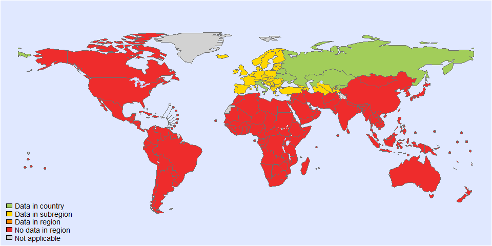
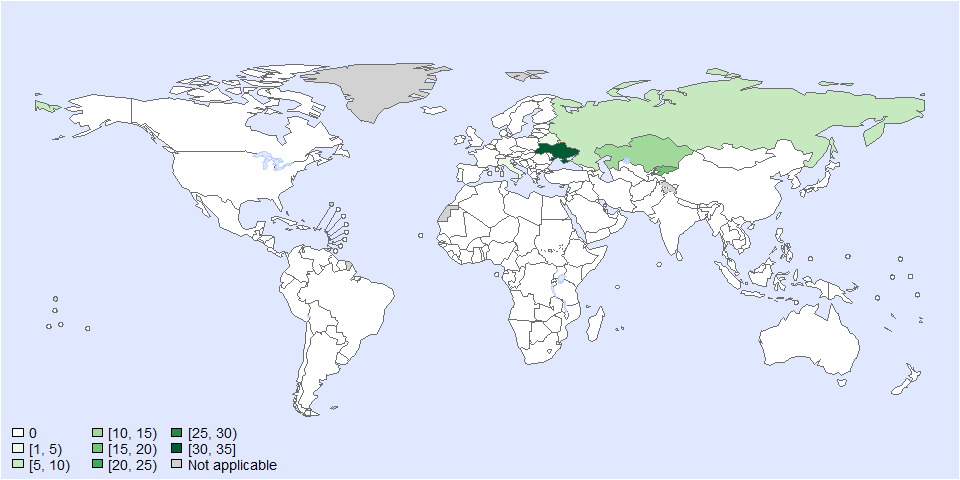
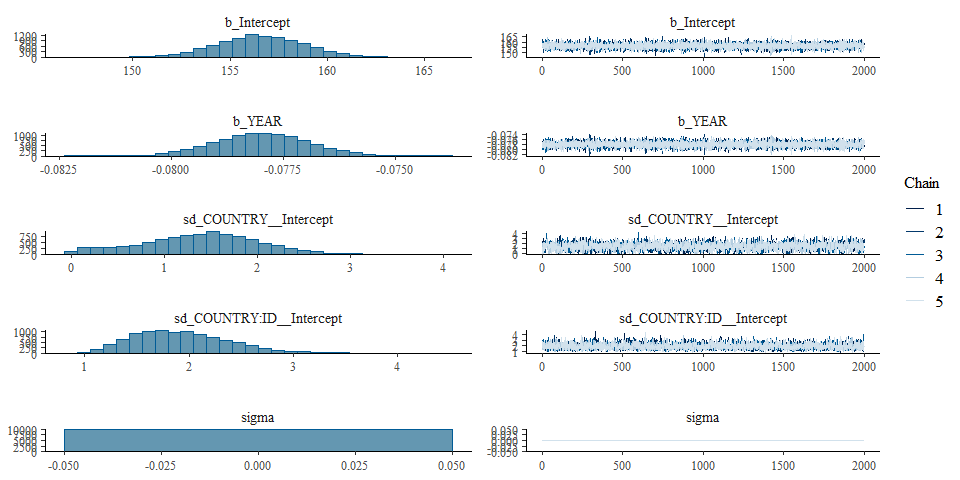
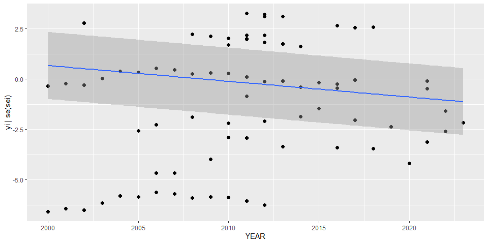

Global incidence of Opisthorchis felineus • Fit model
================
LoVa3397
2025-10-07

- [Settings](#settings)
- [Data](#data)
- [Parameters](#parameters)
- [BRMS](#brms)
- [Session info](#session-info)

# Settings

``` r
## required packages ----
library(bd)
library(brms)
library(ggplot2)
library(metafor)
library(readxl)
library(rmarkdown)
library(rms)
library(tidyr)
library(knitr)
library(dplyr)

## global options ----
knitr::opts_chunk$set(fig.width = 10)
Date <- format(Sys.Date(), "%Y%m%d")
```

# Data

``` r
## import data
wd <- getwd()
setwd("../../")
source("01-data-incidence-ofelineus.R")
```

    ## 'data.frame':    94 obs. of  41 variables:
    ##  $ SOURCE_ID           : chr  "1105831442" "1105831442" "1105831442" "1105831442" ...
    ##  $ SOURCE_AUTHOR       : chr  "Fotina, TI" "Fotina, TI" "Fotina, TI" "Fotina, TI" ...
    ##  $ SOURCE_YEAR         : num  2019 2019 2019 2019 2019 ...
    ##  $ SOURCE_TITLE        : chr  "Circulation of zoonoses in anthropogenic ecosystems at Sumy region" "Circulation of zoonoses in anthropogenic ecosystems at Sumy region" "Circulation of zoonoses in anthropogenic ecosystems at Sumy region" "Circulation of zoonoses in anthropogenic ecosystems at Sumy region" ...
    ##  $ SOURCE_DOI          : chr  NA NA NA NA ...
    ##  $ SOURCE_URL          : chr  "https://essuir.sumdu.edu.ua/bitstream-download/123456789/74054/2/ilina_opisthorchosis.pdf" "https://essuir.sumdu.edu.ua/bitstream-download/123456789/74054/2/ilina_opisthorchosis.pdf" "https://essuir.sumdu.edu.ua/bitstream-download/123456789/74054/2/ilina_opisthorchosis.pdf" "https://essuir.sumdu.edu.ua/bitstream-download/123456789/74054/2/ilina_opisthorchosis.pdf" ...
    ##  $ OPT_ACCESS_DATE     : logi  NA NA NA NA NA NA ...
    ##  $ OPT_STUDY_TYPE      : chr  "Cross-sectional study" "Cross-sectional study" "Cross-sectional study" "Cross-sectional study" ...
    ##  $ OPT_OTHER_STUDY_TYPE: chr  "including active and passive surveillance data" "including active and passive surveillance data" "including active and passive surveillance data" "including active and passive surveillance data" ...
    ##  $ REF_NOTES           : chr  "Location : Sumy region" "Location : Sumy region" "Location : Sumy region" "Location : Sumy region" ...
    ##  $ REF_YEAR_START      : num  2000 2001 2002 2003 2004 ...
    ##  $ REF_YEAR_END        : num  2000 2001 2002 2003 2004 ...
    ##  $ REF_LOC_LEVEL       : chr  "Sub-national" "Sub-national" "Sub-national" "Sub-national" ...
    ##  $ REF_LOCATION        : chr  "Ukraine" "Ukraine" "Ukraine" "Ukraine" ...
    ##  $ REF_LOCATION_ISO3   : chr  "UKR" "UKR" "UKR" "UKR" ...
    ##  $ REF_SEX             : chr  "All sexes" "All sexes" "All sexes" "All sexes" ...
    ##  $ REF_AGE_START       : chr  "all" "all" "all" "all" ...
    ##  $ REF_AGE_END         : chr  "all" "all" "all" "all" ...
    ##  $ OPT_MEAN_AGE        : num  NA NA NA NA NA NA NA NA NA NA ...
    ##  $ OPT_MEDIAN_AGE      : logi  NA NA NA NA NA NA ...
    ##  $ OPT_SUBPOP          : chr  NA NA NA NA ...
    ##  $ OPT_CASES           : chr  "Confirmed" "Confirmed" "Confirmed" "Confirmed" ...
    ##  $ OPT_DISEASE         : chr  "Opisthorchis" "Opisthorchis" "Opisthorchis" "Opisthorchis" ...
    ##  $ OPT_SEROTYPE        : chr  NA NA NA NA ...
    ##  $ REF_SAMPLE_SIZE     : num  NA NA NA NA NA NA NA NA NA NA ...
    ##  $ VALUE_X             : num  NA NA NA NA NA NA NA NA NA NA ...
    ##  $ VALUE_MEAN          : num  6.9 9.7 8.9 18.2 36.9 35.7 38.8 39.7 29.4 34.6 ...
    ##  $ VALUE_MEDIAN        : logi  NA NA NA NA NA NA ...
    ##  $ VALUE_DENOM         : num  1e+05 1e+05 1e+05 1e+05 1e+05 1e+05 1e+05 1e+05 1e+05 1e+05 ...
    ##  $ VALUE_SE            : num  NA NA NA NA NA NA NA NA NA NA ...
    ##  $ VALUE_P000          : logi  NA NA NA NA NA NA ...
    ##  $ VALUE_P2_5          : logi  NA NA NA NA NA NA ...
    ##  $ VALUE_P5            : logi  NA NA NA NA NA NA ...
    ##  $ VALUE_P10           : logi  NA NA NA NA NA NA ...
    ##  $ VALUE_P25           : logi  NA NA NA NA NA NA ...
    ##  $ VALUE_P75           : logi  NA NA NA NA NA NA ...
    ##  $ VALUE_P90           : logi  NA NA NA NA NA NA ...
    ##  $ VALUE_P95           : logi  NA NA NA NA NA NA ...
    ##  $ VALUE_P97_5         : logi  NA NA NA NA NA NA ...
    ##  $ VALUE_P100          : logi  NA NA NA NA NA NA ...
    ##  $ NOTES_CASES         : chr  "Lab results and hospital cases" "Lab results and hospital cases" "Lab results and hospital cases" "Lab results and hospital cases" ...

    ## New names:
    ## • `` -> `...1`

    ## Warning in eval(ei, envir): NAs introduced by coercion
    ## Warning in eval(ei, envir): NAs introduced by coercion

    ## Joining with `by = join_by(SOURCE_ID, SOURCE_AUTHOR, SOURCE_YEAR, SOURCE_TITLE, SOURCE_DOI, SOURCE_URL, OPT_ACCESS_DATE,
    ## OPT_STUDY_TYPE, OPT_OTHER_STUDY_TYPE, REF_NOTES, REF_YEAR_START, REF_YEAR_END, REF_LOC_LEVEL, REF_LOCATION,
    ## REF_LOCATION_ISO3, REF_SEX, REF_AGE_START, REF_AGE_END, OPT_MEAN_AGE, OPT_MEDIAN_AGE, OPT_SUBPOP, OPT_CASES,
    ## OPT_DISEASE, OPT_SEROTYPE, REF_SAMPLE_SIZE, VALUE_X, VALUE_MEAN, VALUE_MEDIAN, VALUE_DENOM, VALUE_SE, VALUE_P000,
    ## VALUE_P2_5, VALUE_P5, VALUE_P10, VALUE_P25, VALUE_P75, VALUE_P90, VALUE_P95, VALUE_P97_5, VALUE_P100)`
    ## New names:

    ## Warning in if_else(dta_KGZ$Year == "2023 (1-кв)", 2023, as.numeric(dta_KGZ$Year)): NAs introduced by coercion

    ## Warning in if_else(dta_KGZ$Year == "2023 (1-кв)", 2023, as.numeric(dta_KGZ$Year)): NAs introduced by coercion

    ## Joining with `by = join_by(REF_YEAR_START, REF_YEAR_END, REF_SEX, REF_AGE_START, REF_AGE_END, ISO3, ID_ROW)`

    ## Classes 'escalc' and 'data.frame':   113 obs. of  57 variables:
    ##  $ SOURCE_ID           : chr  "1105831442" "1105831442" "1105831442" "1105831442" ...
    ##  $ SOURCE_AUTHOR       : chr  "Fotina, TI" "Fotina, TI" "Fotina, TI" "Fotina, TI" ...
    ##  $ SOURCE_YEAR         : num  2019 2019 2019 2019 2019 ...
    ##  $ SOURCE_TITLE        : chr  "Circulation of zoonoses in anthropogenic ecosystems at Sumy region" "Circulation of zoonoses in anthropogenic ecosystems at Sumy region" "Circulation of zoonoses in anthropogenic ecosystems at Sumy region" "Circulation of zoonoses in anthropogenic ecosystems at Sumy region" ...
    ##  $ SOURCE_DOI          : chr  NA NA NA NA ...
    ##  $ SOURCE_URL          : chr  "https://essuir.sumdu.edu.ua/bitstream-download/123456789/74054/2/ilina_opisthorchosis.pdf" "https://essuir.sumdu.edu.ua/bitstream-download/123456789/74054/2/ilina_opisthorchosis.pdf" "https://essuir.sumdu.edu.ua/bitstream-download/123456789/74054/2/ilina_opisthorchosis.pdf" "https://essuir.sumdu.edu.ua/bitstream-download/123456789/74054/2/ilina_opisthorchosis.pdf" ...
    ##  $ OPT_ACCESS_DATE     : logi  NA NA NA NA NA NA ...
    ##  $ OPT_STUDY_TYPE      : chr  "Cross-sectional study" "Cross-sectional study" "Cross-sectional study" "Cross-sectional study" ...
    ##  $ OPT_OTHER_STUDY_TYPE: chr  "including active and passive surveillance data" "including active and passive surveillance data" "including active and passive surveillance data" "including active and passive surveillance data" ...
    ##  $ REF_NOTES           : chr  "Location : Sumy region" "Location : Sumy region" "Location : Sumy region" "Location : Sumy region" ...
    ##  $ REF_YEAR_START      : num  2000 2001 2002 2003 2004 ...
    ##  $ REF_YEAR_END        : num  2000 2001 2002 2003 2004 ...
    ##  $ REF_LOC_LEVEL       : chr  "Sub-national" "Sub-national" "Sub-national" "Sub-national" ...
    ##  $ REF_LOCATION        : chr  "Ukraine" "Ukraine" "Ukraine" "Ukraine" ...
    ##  $ REF_LOCATION_ISO3   : chr  "UKR" "UKR" "UKR" "UKR" ...
    ##  $ REF_SEX             : chr  "All sexes" "All sexes" "All sexes" "All sexes" ...
    ##  $ REF_AGE_START       : num  0 0 0 0 0 0 0 0 0 0 ...
    ##  $ REF_AGE_END         : num  125 125 125 125 125 125 125 125 125 125 ...
    ##  $ OPT_MEAN_AGE        : num  NA NA NA NA NA NA NA NA NA NA ...
    ##  $ OPT_MEDIAN_AGE      : logi  NA NA NA NA NA NA ...
    ##  $ OPT_SUBPOP          : chr  NA NA NA NA ...
    ##  $ OPT_CASES           : chr  "Confirmed" "Confirmed" "Confirmed" "Confirmed" ...
    ##  $ OPT_DISEASE         : chr  "Opisthorchis" "Opisthorchis" "Opisthorchis" "Opisthorchis" ...
    ##  $ OPT_SEROTYPE        : chr  NA NA NA NA ...
    ##  $ REF_SAMPLE_SIZE     : num  NA NA NA NA NA NA NA NA NA NA ...
    ##  $ VALUE_X             : num  NA NA NA NA NA NA NA NA NA NA ...
    ##  $ VALUE_MEAN          : num  6.9 9.7 8.9 18.2 36.9 35.7 38.8 39.7 29.4 34.6 ...
    ##  $ VALUE_MEDIAN        : logi  NA NA NA NA NA NA ...
    ##  $ VALUE_DENOM         : num  1e+05 1e+05 1e+05 1e+05 1e+05 1e+05 1e+05 1e+05 1e+05 1e+05 ...
    ##  $ VALUE_SE            : num  NA NA NA NA NA NA NA NA NA NA ...
    ##  $ VALUE_P000          : logi  NA NA NA NA NA NA ...
    ##  $ VALUE_P2_5          : logi  NA NA NA NA NA NA ...
    ##  $ VALUE_P5            : logi  NA NA NA NA NA NA ...
    ##  $ VALUE_P10           : logi  NA NA NA NA NA NA ...
    ##  $ VALUE_P25           : logi  NA NA NA NA NA NA ...
    ##  $ VALUE_P75           : logi  NA NA NA NA NA NA ...
    ##  $ VALUE_P90           : logi  NA NA NA NA NA NA ...
    ##  $ VALUE_P95           : logi  NA NA NA NA NA NA ...
    ##  $ VALUE_P97_5         : logi  NA NA NA NA NA NA ...
    ##  $ VALUE_P100          : logi  NA NA NA NA NA NA ...
    ##  $ NOTES_CASES         : chr  "Lab results and hospital cases" "Lab results and hospital cases" "Lab results and hospital cases" "Lab results and hospital cases" ...
    ##  $ FLAG                : num  7 7 7 7 7 7 7 7 7 7 ...
    ##  $ ID                  : chr  "1105831442" "1105831442" "1105831442" "1105831442" ...
    ##  $ ISO3                : chr  "UKR" "UKR" "UKR" "UKR" ...
    ##  $ REG2                : chr  "EUR" "EUR" "EUR" "EUR" ...
    ##  $ SUB2                : chr  "EURC" "EURC" "EURC" "EURC" ...
    ##  $ COUNTRY             : chr  "UKR" "UKR" "UKR" "UKR" ...
    ##  $ YEAR                : num  2000 2001 2002 2003 2004 ...
    ##  $ POP                 : num  49772671 49340649 48873062 48481500 48148772 ...
    ##  $ PERSONYEARS100      : num  NA NA NA NA NA NA NA NA NA NA ...
    ##  $ FLAG_REF_LOCATION   : int  0 0 0 0 0 0 0 0 0 0 ...
    ##  $ FLAG_REF_NOTES      : int  0 0 0 0 0 0 0 0 0 0 ...
    ##  $ FLAG_SOURCE_TITLE   : int  0 0 0 0 0 0 0 0 0 0 ...
    ##  $ FLAG_TERRITORY      : num  0 0 0 0 0 0 0 0 0 0 ...
    ##  $ yi                  : num  NA NA NA NA NA NA NA NA NA NA ...
    ##   ..- attr(*, "ni")= num [1:113] NA NA NA NA NA NA NA NA NA NA ...
    ##   ..- attr(*, "measure")= chr "IRLN"
    ##  $ vi                  : num  NA NA NA NA NA NA NA NA NA NA ...
    ##  $ sei                 : num  NA NA NA NA NA NA NA NA NA NA ...
    ##  - attr(*, "yi.names")= chr "yi"
    ##  - attr(*, "vi.names")= chr "vi"
    ##  - attr(*, "digits")= Named num [1:9] 4 4 4 4 4 4 4 4 4
    ##   ..- attr(*, "names")= chr [1:9] "est" "se" "test" "pval" ...

<!-- --><!-- -->

    ## Warning in system2("quarto", "-V", stdout = TRUE, env = paste0("TMPDIR=", : running command '"quarto"
    ## TMPDIR=C:/Users/LoVa3397/AppData/Local/Temp/RtmpMJKmpx/file16203f0f3c56 -V' had status 1

``` r
setwd(wd)

#Only outbreak report in Italia, we consider the population as the sample size
es$DTP_ID <- as.factor(seq(1:length(es$SOURCE_ID)))
es$FLAG <-
  factor(es$FLAG,
         levels = c(0, 1, 2, 3, 4, 5, 6, 7),
         labels = c("Keep data", "Data part of non WHO member states", "No WHO REG2 given",
                  "Year before 1990", "yi can't be calcualted", "TF choice to remove",
                  "Excluded by preliminary checks", "Excluded in data cleaning"))
with(es, table(REG2, FLAG))
```

    ##      FLAG
    ## REG2  Keep data Data part of non WHO member states No WHO REG2 given Year before 1990 yi can't be calcualted
    ##   EUR        76                                  0                 0                0                     19
    ##      FLAG
    ## REG2  TF choice to remove Excluded by preliminary checks Excluded in data cleaning
    ##   EUR                   0                              0                        18

``` r
table(es$SUB2)
```

    ## 
    ## EURA EURB EURC 
    ##    2   43   68

``` r
table(es$ISO3)
```

    ## 
    ## BLR ITA KAZ KGZ RUS UKR 
    ##   4   2  32  19   7  49

``` r
# es <- subset(es, REG2 == "EUR") # felineus only in EUR
saveRDS(es, paste0("es_", Date, ".rds"))
es <- subset(es, as.integer(FLAG) == 1)
```

# Parameters

| Parameters                       | Values         |
|:---------------------------------|:---------------|
| Number of iterations             | 5000           |
| Warmup                           | 3000           |
| Delta value                      | 0.95           |
| Maximum tree-depth               | 20             |
| Random effect on each data point | No             |
| Stronger priors specified        | Normal(0,1)    |
| Levels                           | COUNTRY + YEAR |

Parameters of the model tested

# BRMS

``` r
fit_brms_reg_s7  <-
  brm(yi | se(sei) ~
        1 + YEAR +
        (1 | COUNTRY) + 
        (1 | COUNTRY:ID ) ,
      chains = 5, iter = 5000, warmup = 3000,
      prior = prior(normal(0,1), class = sd),
      control = list(adapt_delta = 0.95, max_treedepth = 20),
      cores = 5,
      data = es,
      # data = subset(es, as.integer(FLAG) == 1),
      open_progress = FALSE,
      seed = 7)
```

    ## Compiling Stan program...

    ## Trying to compile a simple C file

    ## Running "C:/PROGRA~1/R/R-45~1.1/bin/x64/Rcmd.exe" SHLIB foo.c
    ## -\|/-\|/-\|/using C compiler: 'gcc.exe (GCC) 14.2.0'
    ## -gcc  -I"C:/PROGRA~1/R/R-45~1.1/include" -DNDEBUG   -I"C:/Program Files/R/R-4.5.1/library/Rcpp/include/"  -I"C:/Program Files/R/R-4.5.1/library/RcppEigen/include/"  -I"C:/Program Files/R/R-4.5.1/library/RcppEigen/include/unsupported"  -I"C:/Program Files/R/R-4.5.1/library/BH/include" -I"C:/Program Files/R/R-4.5.1/library/StanHeaders/include/src/"  -I"C:/Program Files/R/R-4.5.1/library/StanHeaders/include/"  -I"C:/Program Files/R/R-4.5.1/library/RcppParallel/include/" -DRCPP_PARALLEL_USE_TBB=1 -I"C:/Program Files/R/R-4.5.1/library/rstan/include" -DEIGEN_NO_DEBUG  -DBOOST_DISABLE_ASSERTS  -DBOOST_PENDING_INTEGER_LOG2_HPP  -DSTAN_THREADS  -DUSE_STANC3 -DSTRICT_R_HEADERS  -DBOOST_PHOENIX_NO_VARIADIC_EXPRESSION  -D_HAS_AUTO_PTR_ETC=0  -include "C:/Program Files/R/R-4.5.1/library/StanHeaders/include/stan/math/prim/fun/Eigen.hpp"  -std=c++1y    -I"c:/rtools45/x86_64-w64-mingw32.static.posix/include"      -O2 -Wall -std=gnu2x  -mfpmath=sse -msse2 -mstackrealign   -c foo.c -o foo.o
    ## \|cc1.exe: warning: command-line option '-std=c++14' is valid for C++/ObjC++ but not for C
    ## /In file included from C:/Program Files/R/R-4.5.1/library/RcppEigen/include/Eigen/Core:19,
    ##                  from C:/Program Files/R/R-4.5.1/library/RcppEigen/include/Eigen/Dense:1,
    ##                  from C:/Program Files/R/R-4.5.1/library/StanHeaders/include/stan/math/prim/fun/Eigen.hpp:22,
    ##                  from <command-line>:
    ## C:/Program Files/R/R-4.5.1/library/RcppEigen/include/Eigen/src/Core/util/Macros.h:679:10: fatal error: cmath: No such file or directory
    ##   679 | #include <cmath>
    ##       |          ^~~~~~~
    ## -compilation terminated.
    ## \make: *** [C:/PROGRA~1/R/R-45~1.1/etc/x64/Makeconf:289: foo.o] Error 1
    ## |/ 

    ## Start sampling

    ## Warning: There were 18 divergent transitions after warmup. See
    ## https://mc-stan.org/misc/warnings.html#divergent-transitions-after-warmup
    ## to find out why this is a problem and how to eliminate them.

    ## Warning: Examine the pairs() plot to diagnose sampling problems

``` r
saveRDS(fit_brms_reg_s7, "fit_brms_reg_s7.rds")

## model summary
summary(fit_brms_reg_s7)
```

    ## Warning: There were 18 divergent transitions after warmup. Increasing adapt_delta above 0.95 may help. See
    ## http://mc-stan.org/misc/warnings.html#divergent-transitions-after-warmup

    ##  Family: gaussian 
    ##   Links: mu = identity; sigma = identity 
    ## Formula: yi | se(sei) ~ 1 + YEAR + (1 | COUNTRY) + (1 | COUNTRY:ID) 
    ##    Data: es (Number of observations: 76) 
    ##   Draws: 5 chains, each with iter = 5000; warmup = 3000; thin = 1;
    ##          total post-warmup draws = 10000
    ## 
    ## Multilevel Hyperparameters:
    ## ~COUNTRY (Number of levels: 6) 
    ##               Estimate Est.Error l-95% CI u-95% CI Rhat Bulk_ESS Tail_ESS
    ## sd(Intercept)     1.39      0.64     0.13     2.63 1.00     2999     3069
    ## 
    ## ~COUNTRY:ID (Number of levels: 11) 
    ##               Estimate Est.Error l-95% CI u-95% CI Rhat Bulk_ESS Tail_ESS
    ## sd(Intercept)     1.93      0.46     1.18     2.92 1.00     4044     6786
    ## 
    ## Regression Coefficients:
    ##           Estimate Est.Error l-95% CI u-95% CI Rhat Bulk_ESS Tail_ESS
    ## Intercept   156.58      2.27   152.16   160.96 1.00    12304     6796
    ## YEAR         -0.08      0.00    -0.08    -0.08 1.00    14333     5846
    ## 
    ## Further Distributional Parameters:
    ##       Estimate Est.Error l-95% CI u-95% CI Rhat Bulk_ESS Tail_ESS
    ## sigma     0.00      0.00     0.00     0.00   NA       NA       NA
    ## 
    ## Draws were sampled using sampling(NUTS). For each parameter, Bulk_ESS
    ## and Tail_ESS are effective sample size measures, and Rhat is the potential
    ## scale reduction factor on split chains (at convergence, Rhat = 1).

``` r
plot(fit_brms_reg_s7, ask = FALSE)
```

<!-- -->

``` r
plot(conditional_effects(fit_brms_reg_s7), points = TRUE, ask = FALSE)
```

<!-- -->

``` r
## show model code
stancode(fit_brms_reg_s7)
```

    ## // generated with brms 2.22.0
    ## functions {
    ## }
    ## data {
    ##   int<lower=1> N;  // total number of observations
    ##   vector[N] Y;  // response variable
    ##   vector<lower=0>[N] se;  // known sampling error
    ##   int<lower=1> K;  // number of population-level effects
    ##   matrix[N, K] X;  // population-level design matrix
    ##   int<lower=1> Kc;  // number of population-level effects after centering
    ##   // data for group-level effects of ID 1
    ##   int<lower=1> N_1;  // number of grouping levels
    ##   int<lower=1> M_1;  // number of coefficients per level
    ##   array[N] int<lower=1> J_1;  // grouping indicator per observation
    ##   // group-level predictor values
    ##   vector[N] Z_1_1;
    ##   // data for group-level effects of ID 2
    ##   int<lower=1> N_2;  // number of grouping levels
    ##   int<lower=1> M_2;  // number of coefficients per level
    ##   array[N] int<lower=1> J_2;  // grouping indicator per observation
    ##   // group-level predictor values
    ##   vector[N] Z_2_1;
    ##   int prior_only;  // should the likelihood be ignored?
    ## }
    ## transformed data {
    ##   vector<lower=0>[N] se2 = square(se);
    ##   matrix[N, Kc] Xc;  // centered version of X without an intercept
    ##   vector[Kc] means_X;  // column means of X before centering
    ##   for (i in 2:K) {
    ##     means_X[i - 1] = mean(X[, i]);
    ##     Xc[, i - 1] = X[, i] - means_X[i - 1];
    ##   }
    ## }
    ## parameters {
    ##   vector[Kc] b;  // regression coefficients
    ##   real Intercept;  // temporary intercept for centered predictors
    ##   vector<lower=0>[M_1] sd_1;  // group-level standard deviations
    ##   array[M_1] vector[N_1] z_1;  // standardized group-level effects
    ##   vector<lower=0>[M_2] sd_2;  // group-level standard deviations
    ##   array[M_2] vector[N_2] z_2;  // standardized group-level effects
    ## }
    ## transformed parameters {
    ##   real sigma = 0;  // dispersion parameter
    ##   vector[N_1] r_1_1;  // actual group-level effects
    ##   vector[N_2] r_2_1;  // actual group-level effects
    ##   real lprior = 0;  // prior contributions to the log posterior
    ##   r_1_1 = (sd_1[1] * (z_1[1]));
    ##   r_2_1 = (sd_2[1] * (z_2[1]));
    ##   lprior += student_t_lpdf(Intercept | 3, -0.4, 3.4);
    ##   lprior += normal_lpdf(sd_1 | 0, 1)
    ##     - 1 * normal_lccdf(0 | 0, 1);
    ##   lprior += normal_lpdf(sd_2 | 0, 1)
    ##     - 1 * normal_lccdf(0 | 0, 1);
    ## }
    ## model {
    ##   // likelihood including constants
    ##   if (!prior_only) {
    ##     // initialize linear predictor term
    ##     vector[N] mu = rep_vector(0.0, N);
    ##     mu += Intercept + Xc * b;
    ##     for (n in 1:N) {
    ##       // add more terms to the linear predictor
    ##       mu[n] += r_1_1[J_1[n]] * Z_1_1[n] + r_2_1[J_2[n]] * Z_2_1[n];
    ##     }
    ##     target += normal_lpdf(Y | mu, se);
    ##   }
    ##   // priors including constants
    ##   target += lprior;
    ##   target += std_normal_lpdf(z_1[1]);
    ##   target += std_normal_lpdf(z_2[1]);
    ## }
    ## generated quantities {
    ##   // actual population-level intercept
    ##   real b_Intercept = Intercept - dot_product(means_X, b);
    ## }

# Session info

``` r
sessioninfo::session_info()
```

    ## Warning in system2("quarto", "-V", stdout = TRUE, env = paste0("TMPDIR=", : running command '"quarto"
    ## TMPDIR=C:/Users/LoVa3397/AppData/Local/Temp/RtmpMJKmpx/file16204f1543b8 -V' had status 1

    ## ─ Session info ────────────────────────────────────────────────────────────────────────────────────────────────────────
    ##  setting  value
    ##  version  R version 4.5.1 (2025-06-13 ucrt)
    ##  os       Windows 10 x64 (build 19045)
    ##  system   x86_64, mingw32
    ##  ui       RStudio
    ##  language (EN)
    ##  collate  English_United States.utf8
    ##  ctype    English_United States.utf8
    ##  tz       Europe/Brussels
    ##  date     2025-10-07
    ##  rstudio  2025.09.0+387 Cucumberleaf Sunflower (desktop)
    ##  pandoc   3.6.3 @ C:/Program Files/RStudio/resources/app/bin/quarto/bin/tools/ (via rmarkdown)
    ##  quarto   ERROR: Unknown command "TMPDIR=C:/Users/LoVa3397/AppData/Local/Temp/RtmpMJKmpx/file16204f1543b8". Did you mean command "install"? @ C:\\PROGRA~1\\RStudio\\RESOUR~1\\app\\bin\\quarto\\bin\\quarto.exe
    ## 
    ## ─ Packages ────────────────────────────────────────────────────────────────────────────────────────────────────────────
    ##  ! package        * version    date (UTC) lib source
    ##    abind            1.4-8      2024-09-12 [1] CRAN (R 4.5.0)
    ##    backports        1.5.0      2024-05-23 [1] CRAN (R 4.5.0)
    ##    base64enc        0.1-3      2015-07-28 [1] CRAN (R 4.5.0)
    ##    bayesplot        1.13.0     2025-06-18 [1] CRAN (R 4.5.1)
    ##    bd             * 0.0.14     2025-07-14 [1] Github (brechtdv/bd@652191c)
    ##    bridgesampling   1.1-2      2021-04-16 [1] CRAN (R 4.5.1)
    ##    brms           * 2.22.0     2024-09-23 [1] CRAN (R 4.5.1)
    ##    Brobdingnag      1.2-9      2022-10-19 [1] CRAN (R 4.5.1)
    ##    callr            3.7.6      2024-03-25 [1] CRAN (R 4.5.1)
    ##    cellranger       1.1.0      2016-07-27 [1] CRAN (R 4.5.1)
    ##    checkmate        2.3.2      2024-07-29 [1] CRAN (R 4.5.1)
    ##    class            7.3-23     2025-01-01 [1] CRAN (R 4.5.1)
    ##    classInt         0.4-11     2025-01-08 [1] CRAN (R 4.5.1)
    ##    cli              3.6.5      2025-04-23 [1] CRAN (R 4.5.1)
    ##    cluster          2.1.8.1    2025-03-12 [1] CRAN (R 4.5.1)
    ##    coda             0.19-4.1   2024-01-31 [1] CRAN (R 4.5.1)
    ##    codetools        0.2-20     2024-03-31 [1] CRAN (R 4.5.1)
    ##    colorspace       2.1-1      2024-07-26 [1] CRAN (R 4.5.1)
    ##    curl             6.4.0      2025-06-22 [1] CRAN (R 4.5.1)
    ##    data.table       1.17.8     2025-07-10 [1] CRAN (R 4.5.1)
    ##    DBI              1.2.3      2024-06-02 [1] CRAN (R 4.5.1)
    ##    digest           0.6.37     2024-08-19 [1] CRAN (R 4.5.1)
    ##    distributional   0.5.0      2024-09-17 [1] CRAN (R 4.5.1)
    ##    dplyr          * 1.1.4      2023-11-17 [1] CRAN (R 4.5.1)
    ##    e1071            1.7-16     2024-09-16 [1] CRAN (R 4.5.1)
    ##    evaluate         1.0.4      2025-06-18 [1] CRAN (R 4.5.1)
    ##    farver           2.1.2      2024-05-13 [1] CRAN (R 4.5.1)
    ##    fastmap          1.2.0      2024-05-15 [1] CRAN (R 4.5.1)
    ##    FERG2          * 0.0.5      2025-07-15 [1] Github (brechtdv/FERG2@c2d4ac1)
    ##    foreign          0.8-90     2025-03-31 [1] CRAN (R 4.5.1)
    ##    Formula          1.2-5      2023-02-24 [1] CRAN (R 4.5.0)
    ##    generics         0.1.4      2025-05-09 [1] CRAN (R 4.5.1)
    ##    ggplot2        * 3.5.2      2025-04-09 [1] CRAN (R 4.5.1)
    ##    glue             1.8.0      2024-09-30 [1] CRAN (R 4.5.1)
    ##    gridExtra        2.3        2017-09-09 [1] CRAN (R 4.5.1)
    ##    gtable           0.3.6      2024-10-25 [1] CRAN (R 4.5.1)
    ##    Hmisc          * 5.2-3      2025-03-16 [1] CRAN (R 4.5.1)
    ##    htmlTable        2.4.3      2024-07-21 [1] CRAN (R 4.5.1)
    ##    htmltools        0.5.8.1    2024-04-04 [1] CRAN (R 4.5.1)
    ##    htmlwidgets      1.6.4      2023-12-06 [1] CRAN (R 4.5.1)
    ##    inline           0.3.21     2025-01-09 [1] CRAN (R 4.5.1)
    ##    jsonlite         2.0.0      2025-03-27 [1] CRAN (R 4.5.1)
    ##    KernSmooth       2.23-26    2025-01-01 [1] CRAN (R 4.5.1)
    ##    knitr          * 1.50       2025-03-16 [1] CRAN (R 4.5.1)
    ##    labeling         0.4.3      2023-08-29 [1] CRAN (R 4.5.0)
    ##    lattice          0.22-7     2025-04-02 [1] CRAN (R 4.5.1)
    ##    lifecycle        1.0.4      2023-11-07 [1] CRAN (R 4.5.1)
    ##    loo              2.8.0      2024-07-03 [1] CRAN (R 4.5.1)
    ##    magrittr         2.0.3      2022-03-30 [1] CRAN (R 4.5.1)
    ##    MASS             7.3-65     2025-02-28 [1] CRAN (R 4.5.1)
    ##    mathjaxr         1.8-0      2025-04-30 [1] CRAN (R 4.5.1)
    ##    Matrix         * 1.7-3      2025-03-11 [1] CRAN (R 4.5.1)
    ##    MatrixModels     0.5-4      2025-03-26 [1] CRAN (R 4.5.1)
    ##    matrixStats      1.5.0      2025-01-07 [1] CRAN (R 4.5.1)
    ##    metadat        * 1.4-0      2025-02-04 [1] CRAN (R 4.5.1)
    ##    metafor        * 4.8-0      2025-01-28 [1] CRAN (R 4.5.1)
    ##    multcomp         1.4-28     2025-01-29 [1] CRAN (R 4.5.1)
    ##    mvtnorm          1.3-3      2025-01-10 [1] CRAN (R 4.5.1)
    ##    nlme             3.1-168    2025-03-31 [1] CRAN (R 4.5.1)
    ##    nnet             7.3-20     2025-01-01 [1] CRAN (R 4.5.1)
    ##    numDeriv       * 2016.8-1.1 2019-06-06 [1] CRAN (R 4.5.0)
    ##    pillar           1.11.0     2025-07-04 [1] CRAN (R 4.5.1)
    ##    pkgbuild         1.4.8      2025-05-26 [1] CRAN (R 4.5.1)
    ##    pkgconfig        2.0.3      2019-09-22 [1] CRAN (R 4.5.1)
    ##    plyr             1.8.9      2023-10-02 [1] CRAN (R 4.5.1)
    ##    polspline        1.1.25     2024-05-10 [1] CRAN (R 4.5.0)
    ##    posterior        1.6.1      2025-02-27 [1] CRAN (R 4.5.1)
    ##    processx         3.8.6      2025-02-21 [1] CRAN (R 4.5.1)
    ##    proxy            0.4-27     2022-06-09 [1] CRAN (R 4.5.1)
    ##    ps               1.9.1      2025-04-12 [1] CRAN (R 4.5.1)
    ##    purrr            1.1.0      2025-07-10 [1] CRAN (R 4.5.1)
    ##    quantreg         6.1        2025-03-10 [1] CRAN (R 4.5.1)
    ##    QuickJSR         1.8.0      2025-06-09 [1] CRAN (R 4.5.1)
    ##    R6               2.6.1      2025-02-15 [1] CRAN (R 4.5.1)
    ##    RColorBrewer     1.1-3      2022-04-03 [1] CRAN (R 4.5.0)
    ##    Rcpp           * 1.1.0      2025-07-02 [1] CRAN (R 4.5.1)
    ##  D RcppParallel     5.1.10     2025-01-24 [1] CRAN (R 4.5.1)
    ##    readxl         * 1.4.5      2025-03-07 [1] CRAN (R 4.5.1)
    ##    reshape2         1.4.4      2020-04-09 [1] CRAN (R 4.5.1)
    ##    rlang            1.1.6      2025-04-11 [1] CRAN (R 4.5.1)
    ##    rmarkdown      * 2.29       2024-11-04 [1] CRAN (R 4.5.1)
    ##    rms            * 8.0-0      2025-04-04 [1] CRAN (R 4.5.1)
    ##    rpart            4.1.24     2025-01-07 [1] CRAN (R 4.5.1)
    ##    rstan            2.32.7     2025-03-10 [1] CRAN (R 4.5.1)
    ##    rstantools       2.4.0      2024-01-31 [1] CRAN (R 4.5.1)
    ##    rstudioapi       0.17.1     2024-10-22 [1] CRAN (R 4.5.1)
    ##    sandwich         3.1-1      2024-09-15 [1] CRAN (R 4.5.1)
    ##    scales         * 1.4.0      2025-04-24 [1] CRAN (R 4.5.1)
    ##    sessioninfo      1.2.3      2025-02-05 [1] CRAN (R 4.5.1)
    ##    sf             * 1.0-21     2025-05-15 [1] CRAN (R 4.5.1)
    ##    SparseM          1.84-2     2024-07-17 [1] CRAN (R 4.5.1)
    ##    StanHeaders      2.32.10    2024-07-15 [1] CRAN (R 4.5.1)
    ##    stringi          1.8.7      2025-03-27 [1] CRAN (R 4.5.0)
    ##    stringr          1.5.1      2023-11-14 [1] CRAN (R 4.5.1)
    ##    survival         3.8-3      2024-12-17 [1] CRAN (R 4.5.1)
    ##    tensorA          0.36.2.1   2023-12-13 [1] CRAN (R 4.5.0)
    ##    TH.data          1.1-3      2025-01-17 [1] CRAN (R 4.5.1)
    ##    tibble           3.3.0      2025-06-08 [1] CRAN (R 4.5.1)
    ##    tidyr          * 1.3.1      2024-01-24 [1] CRAN (R 4.5.1)
    ##    tidyselect       1.2.1      2024-03-11 [1] CRAN (R 4.5.1)
    ##    units            0.8-7      2025-03-11 [1] CRAN (R 4.5.1)
    ##    V8               6.0.4      2025-06-04 [1] CRAN (R 4.5.1)
    ##    vctrs            0.6.5      2023-12-01 [1] CRAN (R 4.5.1)
    ##    withr            3.0.2      2024-10-28 [1] CRAN (R 4.5.1)
    ##    xfun             0.52       2025-04-02 [1] CRAN (R 4.5.1)
    ##    yaml             2.3.10     2024-07-26 [1] CRAN (R 4.5.0)
    ##    zoo              1.8-14     2025-04-10 [1] CRAN (R 4.5.1)
    ## 
    ##  [1] C:/Program Files/R/R-4.5.1/library
    ## 
    ##  * ── Packages attached to the search path.
    ##  D ── DLL MD5 mismatch, broken installation.
    ## 
    ## ───────────────────────────────────────────────────────────────────────────────────────────────────────────────────────

``` r
##bd::render_today("02-fit.R")
```
