Global incidence of Opisthorchis felineus • Generate estimates
================
LoVa3397
2025-10-07

- [Settings](#settings)
- [Parameters](#parameters)
- [Model fit](#model-fit)
- [Predict all](#predict-all)
- [Summarize predictions](#summarize-predictions)
  - [Global](#global)
  - [Regions](#regions)
  - [Subregions](#subregions)
  - [Countries](#countries)
- [Session info](#session-info)

# Settings

``` r
## required packages ----
library(bd)
library(brms)
library(FERG2)
library(ggplot2)
library(knitr)
library(rmarkdown)
library(sf)
library(tidyr)
library(dplyr)
library(DescTools)
```

    ## 
    ## Attaching package: 'DescTools'

    ## The following objects are masked from 'package:Hmisc':
    ## 
    ##     %nin%, Label, Mean, Quantile

``` r
library(readxl)
library(kableExtra)
```

    ## 
    ## Attaching package: 'kableExtra'

    ## The following object is masked from 'package:dplyr':
    ## 
    ##     group_rows

``` r
# Model with country level only

## global options ----
knitr::opts_chunk$set(fig.width = 10)
```

# Parameters

\#+ r setup, echo = FALSE

``` r
Parameters <-
  c("Number of iterations",
    "Warmup",
    "Delta value",
    "Maximum tree-depth",
    "Random effect on each data point",
    "Stronger priors specified",
    "Levels")
Values <-
  c("10000",
    "6000",
    "0.9",
    "20",
    "No",
    "Normal(0,1)",
    "COUNTRY + YEAR")
version_spe <-
  data.frame(Parameters,Values)

kable(caption = "Parameters of the model tested", row.names = FALSE, version_spe)
```

| Parameters                       | Values         |
|:---------------------------------|:---------------|
| Number of iterations             | 5000           |
| Warmup                           | 3000           |
| Delta value                      | 0.95           |
| Maximum tree-depth               | 20             |
| Random effect on each data point | No             |
| Stronger priors specified        | Normal(0,1)    |
| Levels                           | COUNTRY + YEAR |

Parameters of the model tested

# Model fit

``` r
fit_brms_reg_s <- readRDS("fit_brms_reg_s7.rds")
zero_cases <-
  read_xlsx("Endemic_countries.xlsx") %>%
  select(REG2, SUB2, ISO3, Country, pdtf_opi_felineus) %>%
  rename(COUNTRY = ISO3, COUNTRY_LABEL = Country, DISEASEFREE = pdtf_opi_felineus)

cat("Countries assumed to be non-endemic\n")
```

    ## Countries assumed to be non-endemic

``` r
print(c(subset(zero_cases, DISEASEFREE == 0)[, 4]))
```

    ## $COUNTRY_LABEL
    ##   [1] "Afghanistan"                    "Angola"                         "Albania"                       
    ##   [4] "Andorra"                        "United Arab Emirates"           "Argentina"                     
    ##   [7] "Armenia"                        "Antigua and Barbuda"            "Australia"                     
    ##  [10] "Austria"                        "Azerbaijan"                     "Burundi"                       
    ##  [13] "Belgium"                        "Benin"                          "Burkina Faso"                  
    ##  [16] "Bangladesh"                     "Bulgaria"                       "Bahrain"                       
    ##  [19] "Bahamas, The"                   "Bosnia and Herzegovina"         "Belize"                        
    ##  [22] "Bolivia"                        "Brazil"                         "Barbados"                      
    ##  [25] "Brunei Darussalam"              "Bhutan"                         "Botswana"                      
    ##  [28] "Central African Republic"       "Canada"                         "Switzerland"                   
    ##  [31] "Chile"                          "China"                          "Côte d'Ivoire"                 
    ##  [34] "Cameroon"                       "Congo, Dem. Rep."               "Congo, Rep."                   
    ##  [37] "Cook Islands"                   "Colombia"                       "Comoros"                       
    ##  [40] "Cabo Verde"                     "Costa Rica"                     "Cuba"                          
    ##  [43] "Cyprus"                         "Czech Republic"                 "Germany"                       
    ##  [46] "Djibouti"                       "Dominica"                       "Denmark"                       
    ##  [49] "Dominican Republic"             "Algeria"                        "Ecuador"                       
    ##  [52] "Egypt, Arab Rep."               "Eritrea"                        "Spain"                         
    ##  [55] "Estonia"                        "Ethiopia"                       "Finland"                       
    ##  [58] "Fiji"                           "France"                         "Micronesia, Fed. Sts."         
    ##  [61] "Gabon"                          "United Kingdom"                 "Georgia"                       
    ##  [64] "Ghana"                          "Guinea"                         "Gambia, The"                   
    ##  [67] "Guinea-Bissau"                  "Equatorial Guinea"              "Grenada"                       
    ##  [70] "Guatemala"                      "Guyana"                         "Honduras"                      
    ##  [73] "Croatia"                        "Haiti"                          "Hungary"                       
    ##  [76] "Indonesia"                      "India"                          "Ireland"                       
    ##  [79] "Iran, Islamic Rep."             "Iraq"                           "Iceland"                       
    ##  [82] "Israel"                         "Jamaica"                        "Jordan"                        
    ##  [85] "Japan"                          "Kenya"                          "Cambodia"                      
    ##  [88] "Kiribati"                       "St. Kitts and Nevis"            "Korea, Rep."                   
    ##  [91] "Kuwait"                         "Lao PDR"                        "Lebanon"                       
    ##  [94] "Liberia"                        "Libya"                          "St. Lucia"                     
    ##  [97] "Sri Lanka"                      "Lesotho"                        "Lithuania"                     
    ## [100] "Luxembourg"                     "Latvia"                         "Morocco"                       
    ## [103] "Monaco"                         "Moldova"                        "Madagascar"                    
    ## [106] "Maldives"                       "Mexico"                         "Marshall Islands"              
    ## [109] "North Macedonia"                "Mali"                           "Malta"                         
    ## [112] "Myanmar"                        "Montenegro"                     "Mongolia"                      
    ## [115] "Mozambique"                     "Mauritania"                     "Mauritius"                     
    ## [118] "Malawi"                         "Malaysia"                       "Namibia"                       
    ## [121] "Niger"                          "Nigeria"                        "Nicaragua"                     
    ## [124] "Niue"                           "Netherlands"                    "Norway"                        
    ## [127] "Nepal"                          "Nauru"                          "New Zealand"                   
    ## [130] "Oman"                           "Pakistan"                       "Panama"                        
    ## [133] "Peru"                           "Philippines"                    "Palau"                         
    ## [136] "Papua New Guinea"               "Poland"                         "Korea, Dem. People's Rep."     
    ## [139] "Portugal"                       "Paraguay"                       "Qatar"                         
    ## [142] "Romania"                        "Rwanda"                         "Saudi Arabia"                  
    ## [145] "Sudan"                          "Senegal"                        "Singapore"                     
    ## [148] "Solomon Islands"                "Sierra Leone"                   "El Salvador"                   
    ## [151] "San Marino"                     "Somalia"                        "Serbia"                        
    ## [154] "South Sudan"                    "São Tomé and Principe"          "Suriname"                      
    ## [157] "Slovak Republic"                "Slovenia"                       "Sweden"                        
    ## [160] "Eswatini"                       "Seychelles"                     "Syrian Arab Republic"          
    ## [163] "Chad"                           "Togo"                           "Thailand"                      
    ## [166] "Tajikistan"                     "Turkmenistan"                   "Timor-Leste"                   
    ## [169] "Tonga"                          "Trinidad and Tobago"            "Tunisia"                       
    ## [172] "Türkiye"                        "Tuvalu"                         "Tanzania"                      
    ## [175] "Uganda"                         "Uruguay"                        "United States"                 
    ## [178] "Uzbekistan"                     "St. Vincent and the Grenadines" "Venezuela"                     
    ## [181] "Vietnam"                        "Vanuatu"                        "Samoa"                         
    ## [184] "Yemen, Rep."                    "South Africa"                   "Zambia"                        
    ## [187] "Zimbabwe"

``` r
cat("Countries assumed to be endemic\n")
```

    ## Countries assumed to be endemic

``` r
print(c(subset(zero_cases, DISEASEFREE == 1)[, 4]))
```

    ## $COUNTRY_LABEL
    ## [1] "Belarus"            "Greece"             "Italy"              "Kazakhstan"         "Kyrgyz Republic"   
    ## [6] "Russian Federation" "Ukraine"

``` r
es_files <- list.files(pattern="^es_\\d{8}\\.rds$", full.names=TRUE, ignore.case = TRUE)
es_dates <- as.Date(sub("^es_(\\d{8})\\.rds$", "\\1", basename(es_files), ignore.case = TRUE), format = "%Y%m%d")
es_latest <- es_files[which.max(es_dates)]
es <- readRDS(es_latest)
# es <- subset(es, as.integer(FLAG) == 1)

country_with_data <- es %>% select(ISO3) %>% distinct() %>% mutate(DATA=1, COUNTRY = ISO3)
Sub2_with_data <- es %>% select(SUB2) %>% distinct() %>% mutate(DATASUB2=1)
Reg2_with_data <- es %>% select(REG2) %>% distinct() %>% mutate(DATAREG2=1)
zero_cases <- left_join(zero_cases, country_with_data)
```

    ## Joining with `by = join_by(COUNTRY)`

``` r
zero_cases <- left_join(zero_cases, Sub2_with_data)
```

    ## Joining with `by = join_by(SUB2)`

``` r
zero_cases <- left_join(zero_cases, Reg2_with_data) %>%
  select(-c(ISO3)) %>%
  mutate(ESTIMATES = case_when(
    DATA == 1 ~ 1,
    DISEASEFREE == 0 ~ 2,
    is.na(DATA) & DISEASEFREE == 1 & DATASUB2 == 1 ~ 3,
    is.na(DATA) & DISEASEFREE == 1 & is.na(DATASUB2) & DATAREG2 == 1 ~ 4, 
    is.na(DATA) & DISEASEFREE == 1  & is.na(DATASUB2) & is.na(DATAREG2) ~5))
```

    ## Joining with `by = join_by(REG2)`

``` r
zero_cases$ESTIMATES <-
  factor(zero_cases$ESTIMATES, 
         level = c(1, 2, 3, 4, 5),
         labels = c("Data present", "Disease free", "Data in subregion", "Data in region", "Data in world"))
Country_Check <-
  zero_cases %>% filter(as.integer(ESTIMATES) == 2)
```

# Predict all

``` r
## set up dataframe
sim_all <-
  data.frame(
    sei = 0,
    REG2 = FERG2:::countries$REG2,
    SUB2 = FERG2:::countries$SUB2,
    COUNTRY = FERG2:::countries$ISO3,
    YEAR = rep(2000:2021, each = nrow(FERG2:::countries)))
sim_all <- sim_all %>% left_join(zero_cases) %>% select(sei, REG2, SUB2, COUNTRY, YEAR, ESTIMATES)
```

    ## Joining with `by = join_by(REG2, SUB2, COUNTRY)`

``` r
## draw from expected value of posterior predictive dist
set.seed(10)
#fit_all <- 
#posterior_epred(
#  object = fit_brms_reg_s,
#  newdata = sim_all,
#  allow_new_levels = TRUE,
#  sample_new_levels = "uncertainty",
#  re_formula = ~ 1 + YEAR +
#          (1 |COUNTRY)
#  )

draws_fit <- as_draws_df(fit_brms_reg_s)
fit_all <- data.frame(1:10000)
for (x in 1:nrow(sim_all)){
  # Data present for country
  if (as.integer(sim_all[x, "ESTIMATES"]) == 1){
    fit_all[[paste0("V",x)]] <- draws_fit$b_Intercept +                                                    # Global intercept
      sim_all[x, "YEAR"] * draws_fit$b_YEAR +                                                              # Year component
      # draws_fit[[paste0("r_SUB2[",sim_all[x,"SUB2"],",Intercept]")]] +               # Sub-region component     
      draws_fit[[paste0("r_COUNTRY[",sim_all[x,"COUNTRY"],",Intercept]")]]      # Country component
    
    # Disease-free country
  } else if (as.integer(sim_all[x, "ESTIMATES"]) == 2) {
    fit_all[[paste0("V",x)]] <- 0
    
    # } else if (as.integer(sim_all[x, "ESTIMATES"]) == 3) {
    #   fit_all[[paste0("V",x)]] <- draws_fit$b_Intercept +                                                                               # Global intercept
    #     sim_all[x, "YEAR"] * draws_fit$b_YEAR +                                                                                         # Year component
    #     draws_fit[[paste0("r_SUB2[",sim_all[x,"SUB2"],",Intercept]")]] 
    
    # Data not present for country
  } else if (as.integer(sim_all[x, "ESTIMATES"]) > 2){
    fit_all[[paste0("V",x)]] <- draws_fit$b_Intercept +                         #Global intercept
      sim_all[x, "YEAR"] * draws_fit$b_YEAR                                     #Year component   
  } 
}
fit_all <- fit_all %>% select(-c(X1.10000)) 

## calculate cases
sim_all$SIM <- t(fit_all)
pop_all <- aggregate(POP ~ ISO3 + YEAR, FERG2:::pop, sum)
sim_all <- merge(sim_all, pop_all,
                 by.x = c("COUNTRY", "YEAR"), by.y = c("ISO3", "YEAR"))
sim_all <- sim_all %>% left_join(zero_cases)
```

    ## Joining with `by = join_by(COUNTRY, REG2, SUB2, ESTIMATES)`

``` r
sim_all$CASES <- exp(sim_all$SIM) * sim_all$POP / 1e5
sim_all$CASES <- sim_all$CASES*sim_all$DISEASEFREE
sim_all$SIM <- sim_all$SIM * sim_all$DISEASEFREE
sim_all$sei <- sim_all$sei * sim_all$DISEASEFREE

## save 'sim_all'
saveRDS(sim_all, paste0("sim_all_", bd::today(), ".rds"))

## aggregate global
sim_all_glb <- with(sim_all, aggregate(CASES ~ YEAR, FUN = sum))
all_glb_id <- sim_all_glb[1]
all_glb_nr <-
  t(apply(sim_all_glb[, grepl("V", names(sim_all_glb))], 1, mean_ci))
all_glb_nr <- data.frame(all_glb_nr)
names(all_glb_nr) <- c("VAL_MEAN", "VAL_LWR", "VAL_UPR")
all_glb_nr <- cbind(all_glb_id, all_glb_nr)
all_glb_nr$LOCATION <- "Global"
all_glb_nr$LOCATION_NAME <- "Global"
all_glb_nr$METRIC <- "Number"
str(all_glb_nr)
```

    ## 'data.frame':    22 obs. of  7 variables:
    ##  $ YEAR         : int  2000 2001 2002 2003 2004 2005 2006 2007 2008 2009 ...
    ##  $ VAL_MEAN     : num  37989 35045 32276 29931 27583 ...
    ##  $ VAL_LWR      : num  2940 2720 2510 2326 2150 ...
    ##  $ VAL_UPR      : num  173782 160329 147631 136910 126190 ...
    ##  $ LOCATION     : chr  "Global" "Global" "Global" "Global" ...
    ##  $ LOCATION_NAME: chr  "Global" "Global" "Global" "Global" ...
    ##  $ METRIC       : chr  "Number" "Number" "Number" "Number" ...

``` r
all_glb_rt <- all_glb_nr
all_glb_rt$POP <- with(sim_all, tapply(POP, YEAR, sum))
all_glb_rt$VAL_MEAN <- 1e5 * all_glb_rt$VAL_MEAN / all_glb_rt$POP
all_glb_rt$VAL_LWR <- 1e5 * all_glb_rt$VAL_LWR / all_glb_rt$POP
all_glb_rt$VAL_UPR <- 1e5 * all_glb_rt$VAL_UPR / all_glb_rt$POP
all_glb_rt$METRIC <- "Rate"
all_glb_rt$POP <- NULL
str(all_glb_rt)
```

    ## 'data.frame':    22 obs. of  7 variables:
    ##  $ YEAR         : int  2000 2001 2002 2003 2004 2005 2006 2007 2008 2009 ...
    ##  $ VAL_MEAN     : num [1:22(1d)] 0.624 0.568 0.516 0.472 0.43 ...
    ##  $ VAL_LWR      : num [1:22(1d)] 0.0483 0.0441 0.0401 0.0367 0.0335 ...
    ##  $ VAL_UPR      : num [1:22(1d)] 2.85 2.6 2.36 2.16 1.97 ...
    ##  $ LOCATION     : chr  "Global" "Global" "Global" "Global" ...
    ##  $ LOCATION_NAME: chr  "Global" "Global" "Global" "Global" ...
    ##  $ METRIC       : chr  "Rate" "Rate" "Rate" "Rate" ...

``` r
## aggregate over regions
sim_all_reg <- with(sim_all, aggregate(CASES ~ REG2+YEAR, FUN = sum))
all_reg_id <- sim_all_reg[1:2]
all_reg_nr <-
  t(apply(sim_all_reg[, grepl("V", names(sim_all_reg))], 1, mean_ci))
all_reg_nr <- data.frame(all_reg_nr)
names(all_reg_nr) <- c("VAL_MEAN", "VAL_LWR", "VAL_UPR")
all_reg_nr <- cbind(all_reg_id, all_reg_nr)
all_reg_nr$LOCATION <- "Region"
all_reg_nr$LOCATION_NAME <- all_reg_nr$REG2
all_reg_nr$REG2 <- NULL
all_reg_nr$METRIC <- "Number"
str(all_reg_nr)
```

    ## 'data.frame':    132 obs. of  7 variables:
    ##  $ YEAR         : int  2000 2000 2000 2000 2000 2000 2001 2001 2001 2001 ...
    ##  $ VAL_MEAN     : num  0 0 0 37989 0 ...
    ##  $ VAL_LWR      : num  0 0 0 2940 0 ...
    ##  $ VAL_UPR      : num  0 0 0 173782 0 ...
    ##  $ LOCATION     : chr  "Region" "Region" "Region" "Region" ...
    ##  $ LOCATION_NAME: chr  "AFR" "AMR" "EMR" "EUR" ...
    ##  $ METRIC       : chr  "Number" "Number" "Number" "Number" ...

``` r
all_reg_rt <- all_reg_nr
all_reg_rt$POP <-
  with(sim_all, aggregate(POP ~ REG2 + YEAR, FUN = sum))$POP
all_reg_rt$VAL_MEAN <- 1e5 * all_reg_rt$VAL_MEAN / all_reg_rt$POP
all_reg_rt$VAL_LWR <- 1e5 * all_reg_rt$VAL_LWR / all_reg_rt$POP
all_reg_rt$VAL_UPR <- 1e5 * all_reg_rt$VAL_UPR / all_reg_rt$POP
all_reg_rt$METRIC <- "Rate"
all_reg_rt$POP <- NULL
str(all_reg_rt)
```

    ## 'data.frame':    132 obs. of  7 variables:
    ##  $ YEAR         : int  2000 2000 2000 2000 2000 2000 2001 2001 2001 2001 ...
    ##  $ VAL_MEAN     : num  0 0 0 4.37 0 ...
    ##  $ VAL_LWR      : num  0 0 0 0.338 0 ...
    ##  $ VAL_UPR      : num  0 0 0 20 0 ...
    ##  $ LOCATION     : chr  "Region" "Region" "Region" "Region" ...
    ##  $ LOCATION_NAME: chr  "AFR" "AMR" "EMR" "EUR" ...
    ##  $ METRIC       : chr  "Rate" "Rate" "Rate" "Rate" ...

``` r
## aggregate over subregions
sim_all_sub <- with(sim_all, aggregate(CASES ~ SUB2+YEAR, FUN = sum))
all_sub_id <- sim_all_sub[1:2]
all_sub_nr <-
  t(apply(sim_all_sub[, grepl("V", names(sim_all_sub))], 1, mean_ci))
all_sub_nr <- data.frame(all_sub_nr)
names(all_sub_nr) <- c("VAL_MEAN", "VAL_LWR", "VAL_UPR")
all_sub_nr <- cbind(all_sub_id, all_sub_nr)
all_sub_nr$LOCATION <- "Subregion"
all_sub_nr$LOCATION_NAME <- all_sub_nr$SUB2
all_sub_nr$SUB2 <- NULL
all_sub_nr$METRIC <- "Number"
str(all_sub_nr)
```

    ## 'data.frame':    374 obs. of  7 variables:
    ##  $ YEAR         : int  2000 2000 2000 2000 2000 2000 2000 2000 2000 2000 ...
    ##  $ VAL_MEAN     : num  0 0 0 0 0 ...
    ##  $ VAL_LWR      : num  0 0 0 0 0 ...
    ##  $ VAL_UPR      : num  0 0 0 0 0 ...
    ##  $ LOCATION     : chr  "Subregion" "Subregion" "Subregion" "Subregion" ...
    ##  $ LOCATION_NAME: chr  "AFRAB" "AFRC" "AFRD" "AMRA" ...
    ##  $ METRIC       : chr  "Number" "Number" "Number" "Number" ...

``` r
all_sub_rt <- all_sub_nr
all_sub_rt$POP <-
  with(sim_all, aggregate(POP ~ SUB2 + YEAR, FUN = sum))$POP
all_sub_rt$VAL_MEAN <- 1e5 * all_sub_rt$VAL_MEAN / all_sub_rt$POP
all_sub_rt$VAL_LWR <- 1e5 * all_sub_rt$VAL_LWR / all_sub_rt$POP
all_sub_rt$VAL_UPR <- 1e5 * all_sub_rt$VAL_UPR / all_sub_rt$POP
all_sub_rt$METRIC <- "Rate"
all_sub_rt$POP <- NULL
str(all_sub_rt)
```

    ## 'data.frame':    374 obs. of  7 variables:
    ##  $ YEAR         : int  2000 2000 2000 2000 2000 2000 2000 2000 2000 2000 ...
    ##  $ VAL_MEAN     : num  0 0 0 0 0 ...
    ##  $ VAL_LWR      : num  0 0 0 0 0 ...
    ##  $ VAL_UPR      : num  0 0 0 0 0 ...
    ##  $ LOCATION     : chr  "Subregion" "Subregion" "Subregion" "Subregion" ...
    ##  $ LOCATION_NAME: chr  "AFRAB" "AFRC" "AFRD" "AMRA" ...
    ##  $ METRIC       : chr  "Rate" "Rate" "Rate" "Rate" ...

``` r
## aggregate over countries
all_cnt_nr <- t(apply(sim_all$CASES, 1, mean_ci))
all_cnt_nr <- data.frame(all_cnt_nr)
names(all_cnt_nr) <- c("VAL_MEAN", "VAL_LWR", "VAL_UPR")
all_cnt_nr <- cbind(sim_all[1:2], all_cnt_nr)
all_cnt_nr$LOCATION <- "Country"
all_cnt_nr$LOCATION_NAME <- all_cnt_nr$COUNTRY
all_cnt_nr$COUNTRY <- NULL
all_cnt_nr$METRIC <- "Number"
str(all_cnt_nr)
```

    ## 'data.frame':    4268 obs. of  7 variables:
    ##  $ YEAR         : int  2000 2001 2002 2003 2004 2005 2006 2007 2008 2009 ...
    ##  $ VAL_MEAN     : num  0 0 0 0 0 0 0 0 0 0 ...
    ##  $ VAL_LWR      : num  0 0 0 0 0 0 0 0 0 0 ...
    ##  $ VAL_UPR      : num  0 0 0 0 0 0 0 0 0 0 ...
    ##  $ LOCATION     : chr  "Country" "Country" "Country" "Country" ...
    ##  $ LOCATION_NAME: chr  "AFG" "AFG" "AFG" "AFG" ...
    ##  $ METRIC       : chr  "Number" "Number" "Number" "Number" ...

``` r
#all_cnt_rt <- t(apply(exp(sim_all$SIM), 1, mean_ci))
#all_cnt_rt <- data.frame(all_cnt_rt)
#names(all_cnt_rt) <- c("VAL_MEAN", "VAL_LWR", "VAL_UPR")
#all_cnt_rt <- cbind(sim_all[1:2], all_cnt_rt)
#all_cnt_rt$LOCATION <- "Country"
#all_cnt_rt$LOCATION_NAME <- all_cnt_rt$COUNTRY
#all_cnt_rt$COUNTRY <- NULL
#all_cnt_rt$METRIC <- "Rate"
#str(all_cnt_rt)

all_cnt_rt <- all_cnt_nr %>% left_join(pop_all, by=c("LOCATION_NAME"="ISO3","YEAR"="YEAR"))
all_cnt_rt$VAL_MEAN <-  1e5 * all_cnt_rt$VAL_MEAN / all_cnt_rt$POP
all_cnt_rt$VAL_LWR <- 1e5 * all_cnt_rt$VAL_LWR / all_cnt_rt$POP
all_cnt_rt$VAL_UPR <- 1e5 * all_cnt_rt$VAL_UPR / all_cnt_rt$POP
all_cnt_rt$LOCATION <- "Country"
all_cnt_rt$METRIC <- "Rate"
all_cnt_rt$POP <- NULL

str(all_cnt_rt)
```

    ## 'data.frame':    4268 obs. of  7 variables:
    ##  $ YEAR         : int  2000 2001 2002 2003 2004 2005 2006 2007 2008 2009 ...
    ##  $ VAL_MEAN     : num  0 0 0 0 0 0 0 0 0 0 ...
    ##  $ VAL_LWR      : num  0 0 0 0 0 0 0 0 0 0 ...
    ##  $ VAL_UPR      : num  0 0 0 0 0 0 0 0 0 0 ...
    ##  $ LOCATION     : chr  "Country" "Country" "Country" "Country" ...
    ##  $ LOCATION_NAME: chr  "AFG" "AFG" "AFG" "AFG" ...
    ##  $ METRIC       : chr  "Rate" "Rate" "Rate" "Rate" ...

``` r
## compile all
all_est <-
  rbind(all_glb_rt, all_glb_nr,
        all_reg_rt, all_reg_nr,
        all_sub_rt, all_sub_nr,
        all_cnt_rt, all_cnt_nr)
str(all_est)
```

    ## 'data.frame':    9592 obs. of  7 variables:
    ##  $ YEAR         : int  2000 2001 2002 2003 2004 2005 2006 2007 2008 2009 ...
    ##  $ VAL_MEAN     : num  0.624 0.568 0.516 0.472 0.43 ...
    ##  $ VAL_LWR      : num  0.0483 0.0441 0.0401 0.0367 0.0335 ...
    ##  $ VAL_UPR      : num  2.85 2.6 2.36 2.16 1.97 ...
    ##  $ LOCATION     : chr  "Global" "Global" "Global" "Global" ...
    ##  $ LOCATION_NAME: chr  "Global" "Global" "Global" "Global" ...
    ##  $ METRIC       : chr  "Rate" "Rate" "Rate" "Rate" ...

``` r
## plot nested trends
all_sub_rt$REG2 <- gsub("(R).*", "\\1", all_sub_rt$LOCATION_NAME)
ggplot(all_reg_rt, aes(x = YEAR, y = VAL_MEAN, group = LOCATION_NAME)) +
  geom_line(data = all_glb_rt, linewidth = 2) +
  geom_line(aes(col = LOCATION_NAME), linewidth = 1.5) +
  theme_bw()
```

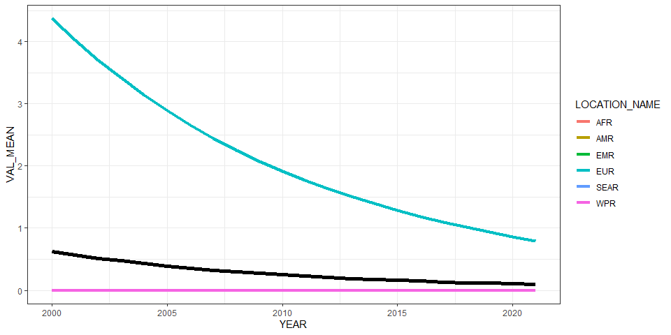<!-- -->

``` r
ggplot(all_reg_rt, aes(x = YEAR, y = VAL_MEAN, group = LOCATION_NAME)) +
  geom_line(data = all_glb_rt, linewidth = 2) +
  geom_line(aes(col = LOCATION_NAME), linewidth = 1.5) +
  geom_line(data = all_sub_rt, aes(col = REG2)) +
  theme_bw()
```

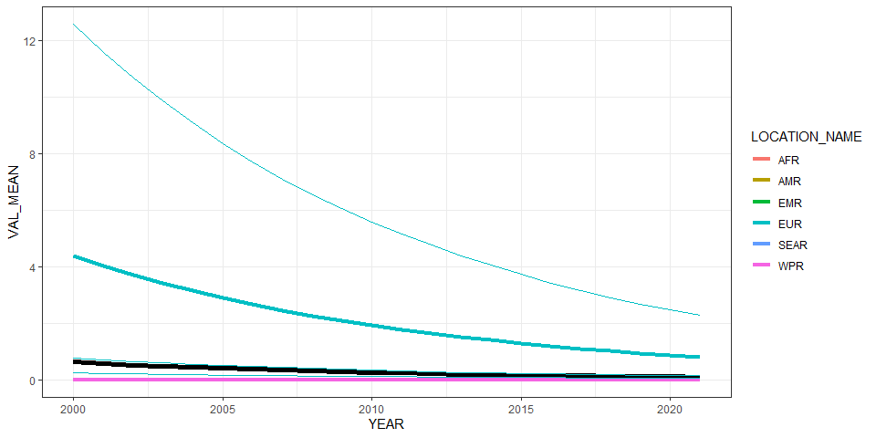<!-- -->

# Summarize predictions

## Global

``` r
kable(
  caption = "Global number of Opisthorchis felineus cases, 2010 vs 2020",
  row.names = FALSE,
  subset(all_glb_nr, YEAR %in% c(2010, 2020))[, 1:4])
```

| YEAR |  VAL_MEAN |   VAL_LWR |  VAL_UPR |
|-----:|----------:|----------:|---------:|
| 2010 | 17172.372 | 1345.0048 | 78502.31 |
| 2020 |  8067.254 |  630.2511 | 36882.64 |

Global number of Opisthorchis felineus cases, 2010 vs 2020

## Regions

``` r
kbl(subset(all_reg_rt, YEAR == 2020)[,c(6,2:4)],
    align = c("l", "c", "c", "c"), row.names = FALSE,
    col.names = c("Region", "Mean", "Lower", "Upper"),
    caption = "Incidence per 100k of Opisthorchis felineus in 2020 by WHO region") %>%
  kable_styling("striped", "hover")
```

<table class="table table-striped" style="margin-left: auto; margin-right: auto;">

<caption>

Incidence per 100k of Opisthorchis felineus in 2020 by WHO region
</caption>

<thead>

<tr>

<th style="text-align:left;">

Region
</th>

<th style="text-align:center;">

Mean
</th>

<th style="text-align:center;">

Lower
</th>

<th style="text-align:center;">

Upper
</th>

</tr>

</thead>

<tbody>

<tr>

<td style="text-align:left;">

AFR
</td>

<td style="text-align:center;">

0.000000
</td>

<td style="text-align:center;">

0.0000000
</td>

<td style="text-align:center;">

0.000000
</td>

</tr>

<tr>

<td style="text-align:left;">

AMR
</td>

<td style="text-align:center;">

0.000000
</td>

<td style="text-align:center;">

0.0000000
</td>

<td style="text-align:center;">

0.000000
</td>

</tr>

<tr>

<td style="text-align:left;">

EMR
</td>

<td style="text-align:center;">

0.000000
</td>

<td style="text-align:center;">

0.0000000
</td>

<td style="text-align:center;">

0.000000
</td>

</tr>

<tr>

<td style="text-align:left;">

EUR
</td>

<td style="text-align:center;">

0.861742
</td>

<td style="text-align:center;">

0.0673233
</td>

<td style="text-align:center;">

3.939794
</td>

</tr>

<tr>

<td style="text-align:left;">

SEAR
</td>

<td style="text-align:center;">

0.000000
</td>

<td style="text-align:center;">

0.0000000
</td>

<td style="text-align:center;">

0.000000
</td>

</tr>

<tr>

<td style="text-align:left;">

WPR
</td>

<td style="text-align:center;">

0.000000
</td>

<td style="text-align:center;">

0.0000000
</td>

<td style="text-align:center;">

0.000000
</td>

</tr>

</tbody>

</table>

``` r
kbl(subset(all_reg_nr, YEAR == 2020)[,c(6,2:4)],
    align = c("l", "c", "c", "c"), row.names = FALSE,
    col.names = c("Region", "Mean", "Lower", "Upper"),
    caption = "Number of Opisthorchis felineus cases in 2020 by WHO region") %>%
  kable_styling("striped", "hover")
```

<table class="table table-striped" style="margin-left: auto; margin-right: auto;">

<caption>

Number of Opisthorchis felineus cases in 2020 by WHO region
</caption>

<thead>

<tr>

<th style="text-align:left;">

Region
</th>

<th style="text-align:center;">

Mean
</th>

<th style="text-align:center;">

Lower
</th>

<th style="text-align:center;">

Upper
</th>

</tr>

</thead>

<tbody>

<tr>

<td style="text-align:left;">

AFR
</td>

<td style="text-align:center;">

0.000
</td>

<td style="text-align:center;">

0.0000
</td>

<td style="text-align:center;">

0.00
</td>

</tr>

<tr>

<td style="text-align:left;">

AMR
</td>

<td style="text-align:center;">

0.000
</td>

<td style="text-align:center;">

0.0000
</td>

<td style="text-align:center;">

0.00
</td>

</tr>

<tr>

<td style="text-align:left;">

EMR
</td>

<td style="text-align:center;">

0.000
</td>

<td style="text-align:center;">

0.0000
</td>

<td style="text-align:center;">

0.00
</td>

</tr>

<tr>

<td style="text-align:left;">

EUR
</td>

<td style="text-align:center;">

8067.254
</td>

<td style="text-align:center;">

630.2511
</td>

<td style="text-align:center;">

36882.64
</td>

</tr>

<tr>

<td style="text-align:left;">

SEAR
</td>

<td style="text-align:center;">

0.000
</td>

<td style="text-align:center;">

0.0000
</td>

<td style="text-align:center;">

0.00
</td>

</tr>

<tr>

<td style="text-align:left;">

WPR
</td>

<td style="text-align:center;">

0.000
</td>

<td style="text-align:center;">

0.0000
</td>

<td style="text-align:center;">

0.00
</td>

</tr>

</tbody>

</table>

``` r
ggplot(subset(all_reg_rt, YEAR == 2010),
       aes(y = VAL_MEAN, x = LOCATION_NAME)) +
  geom_pointrange(aes(ymin = VAL_LWR, ymax = VAL_UPR), size = 0.2) +
  coord_flip() +
  theme_bw() +
  scale_x_discrete(NULL, limits = rev(unique(all_reg_nr$LOCATION_NAME))) +
  scale_y_continuous(NULL) +
  ggtitle("Incidence per 100k of Opisthorchis felineus by WHO Region, 2010")
```

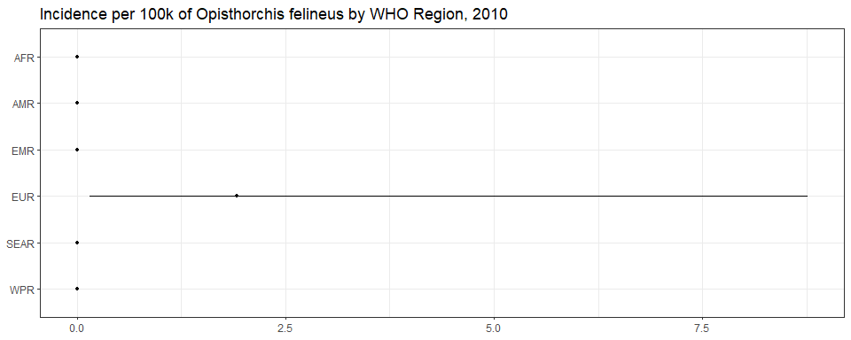<!-- -->

``` r
ggplot(subset(all_reg_rt, YEAR == 2020),
       aes(y = VAL_MEAN, x = LOCATION_NAME)) +
  geom_pointrange(aes(ymin = VAL_LWR, ymax = VAL_UPR), size = 0.2) +
  coord_flip() +
  theme_bw() +
  scale_x_discrete(NULL, limits = rev(unique(all_reg_nr$LOCATION_NAME))) +
  scale_y_continuous(NULL) +
  ggtitle("Incidence per 100k of Opisthorchis felineus by WHO Region, 2020")
```

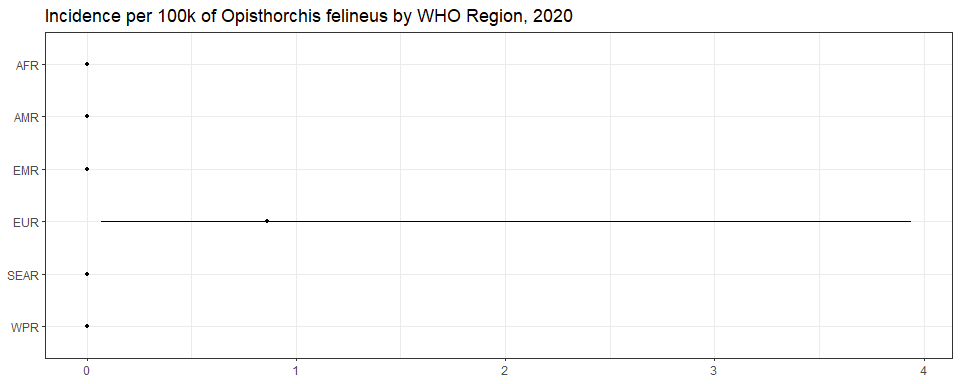<!-- -->

``` r
ggplot(subset(all_reg_nr, YEAR == 2010),
       aes(y = VAL_MEAN, x = LOCATION_NAME)) +
  geom_pointrange(aes(ymin = VAL_LWR, ymax = VAL_UPR), size = 0.2) +
  coord_flip() +
  theme_bw() +
  scale_x_discrete(NULL, limits = rev(unique(all_reg_nr$LOCATION_NAME))) +
  scale_y_continuous(NULL) +
  ggtitle("Number of Opisthorchis felineus cases by WHO Region, 2010")
```

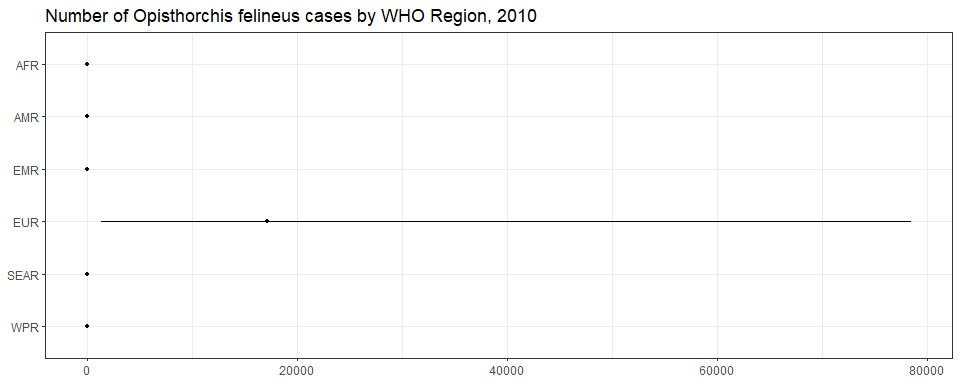<!-- -->

``` r
ggplot(subset(all_reg_nr, YEAR == 2020),
       aes(y = VAL_MEAN, x = LOCATION_NAME)) +
  geom_pointrange(aes(ymin = VAL_LWR, ymax = VAL_UPR), size = 0.2) +
  coord_flip() +
  theme_bw() +
  scale_x_discrete(NULL, limits = rev(unique(all_reg_nr$LOCATION_NAME))) +
  scale_y_continuous(NULL) +
  ggtitle("Number of Opisthorchis felineus cases by WHO Region, 2020")
```

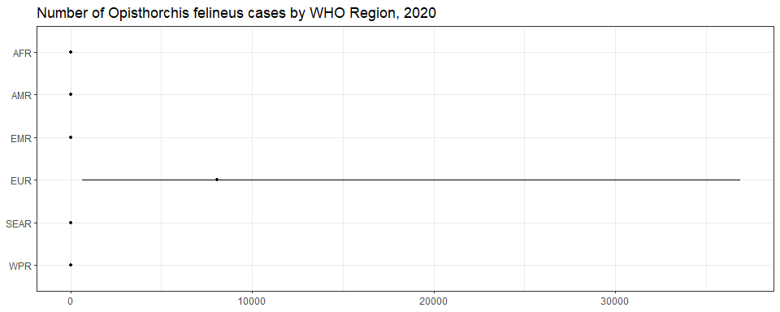<!-- -->

``` r
sim_all_reg <-
  merge(sim_all_reg,
        with(sim_all, aggregate(POP ~ REG2 + YEAR, FUN = sum)))
sim_all_reg_long <-
  pivot_longer(sim_all_reg, cols = starts_with("V"))
sim_all_reg_long$CASES <-
  sim_all_reg_long$POP * sim_all_reg_long$value / 100

ggplot(subset(sim_all_reg_long, YEAR == 2010), aes(x = CASES)) +
  geom_density() +
  facet_wrap(~REG2) +
  theme_bw() +
  scale_x_log10() +
  ggtitle("Number of Opisthorchis felineus cases by WHO Region, 2010")
```

    ## Warning in scale_x_log10(): log-10 transformation introduced infinite values.

    ## Warning: Removed 50000 rows containing non-finite outside the scale range (`stat_density()`).

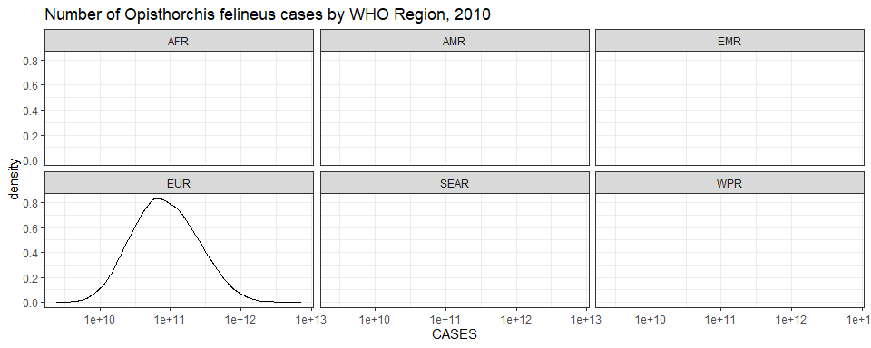<!-- -->

``` r
ggplot(subset(sim_all_reg_long, YEAR == 2020), aes(x = CASES)) +
  geom_density() +
  facet_wrap(~REG2) +
  theme_bw() +
  scale_x_log10() +
  ggtitle("Number of Opisthorchis felineus cases by WHO Region, 2020")
```

    ## Warning in scale_x_log10(): log-10 transformation introduced infinite values.
    ## Removed 50000 rows containing non-finite outside the scale range (`stat_density()`).

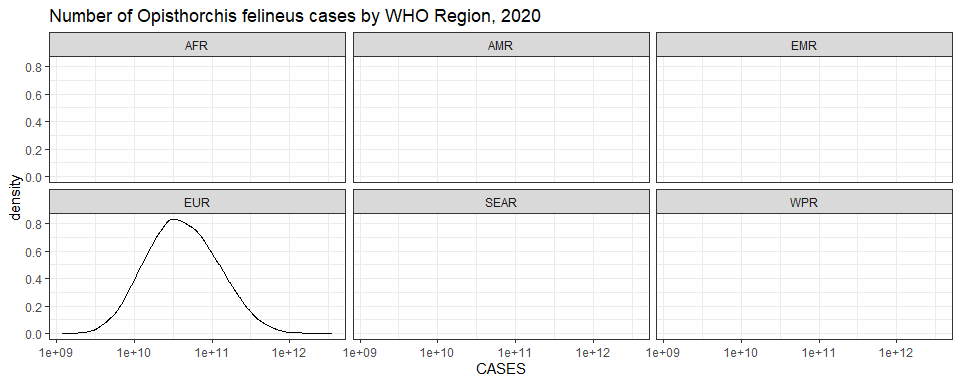<!-- -->

## Subregions

``` r
ggplot(subset(all_sub_rt, YEAR == 2010),
       aes(y = VAL_MEAN, x = LOCATION_NAME)) +
  geom_pointrange(aes(ymin = VAL_LWR, ymax = VAL_UPR), size = 0.2) +
  coord_flip() +
  theme_bw() +
  scale_x_discrete(NULL, limits = rev(unique(all_sub_nr$LOCATION_NAME))) +
  scale_y_continuous(NULL) +
  ggtitle("Incidence per 100k of Opisthorchis felineus by WHO Subregion, 2010")
```

<!-- -->

``` r
ggplot(subset(all_sub_rt, YEAR == 2020),
       aes(y = VAL_MEAN, x = LOCATION_NAME)) +
  geom_pointrange(aes(ymin = VAL_LWR, ymax = VAL_UPR), size = 0.2) +
  coord_flip() +
  theme_bw() +
  scale_x_discrete(NULL, limits = rev(unique(all_sub_nr$LOCATION_NAME))) +
  scale_y_continuous(NULL) +
  ggtitle("Incidence per 100k of Opisthorchis felineus by WHO Subregion, 2020")
```

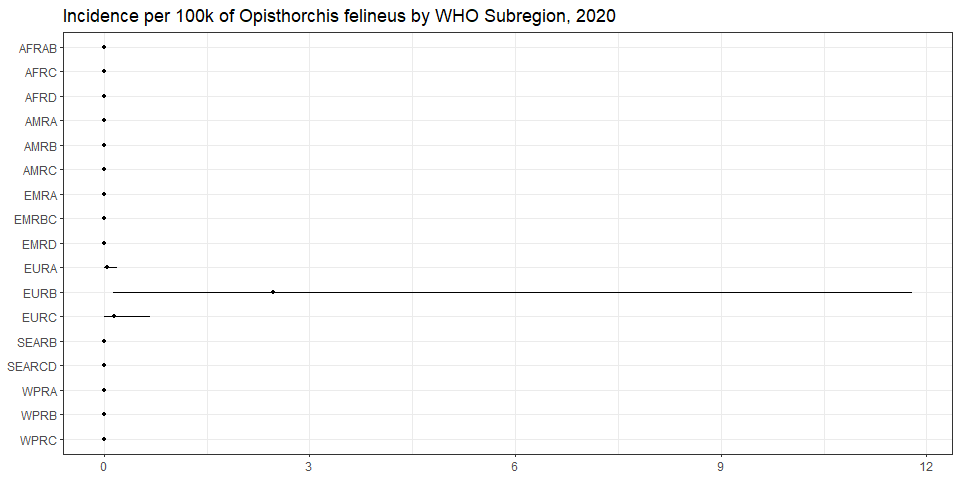<!-- -->

``` r
ggplot(subset(all_sub_nr, YEAR == 2010),
       aes(y = VAL_MEAN, x = LOCATION_NAME)) +
  geom_pointrange(aes(ymin = VAL_LWR, ymax = VAL_UPR), size = 0.2) +
  coord_flip() +
  theme_bw() +
  scale_x_discrete(NULL, limits = rev(unique(all_sub_nr$LOCATION_NAME))) +
  scale_y_continuous(NULL) +
  ggtitle("Number of Opisthorchis felineus cases by WHO Subregion, 2010")
```

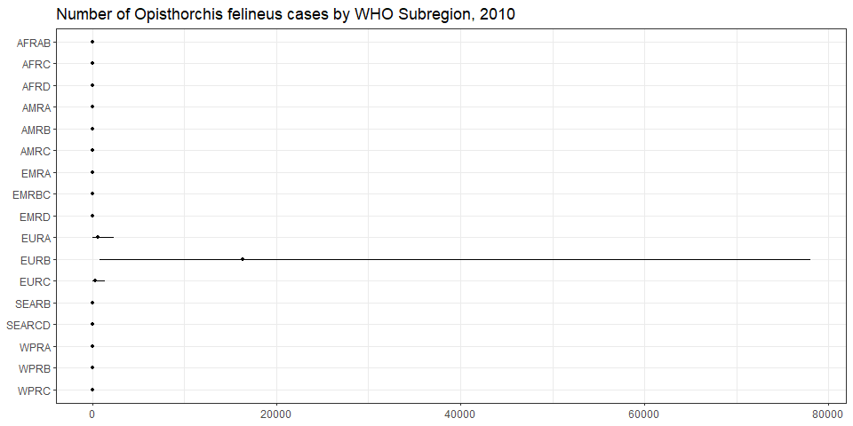<!-- -->

``` r
ggplot(subset(all_sub_nr, YEAR == 2020),
       aes(y = VAL_MEAN, x = LOCATION_NAME)) +
  geom_pointrange(aes(ymin = VAL_LWR, ymax = VAL_UPR), size = 0.2) +
  coord_flip() +
  theme_bw() +
  scale_x_discrete(NULL, limits = rev(unique(all_sub_nr$LOCATION_NAME))) +
  scale_y_continuous(NULL) +
  ggtitle("Number of Opisthorchis felineus cases by WHO Subregion, 2020")
```

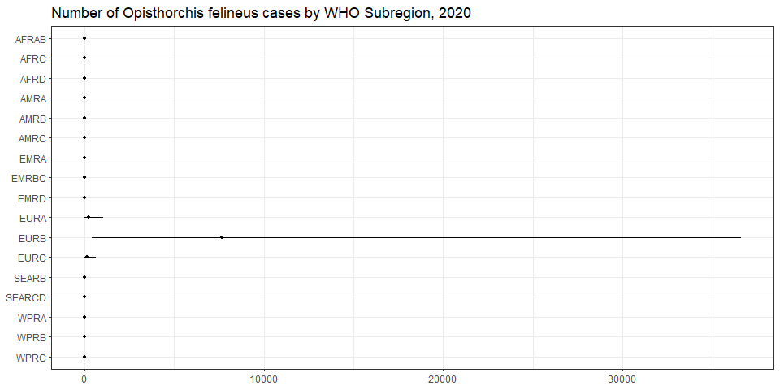<!-- -->

``` r
sim_all_sub <-
  merge(sim_all_sub,
        with(sim_all, aggregate(POP ~ SUB2 + YEAR, FUN = sum)))
sim_all_sub_long <-
  pivot_longer(sim_all_sub, cols = starts_with("V"))
sim_all_sub_long$CASES <-
  sim_all_sub_long$POP * sim_all_sub_long$value / 100

ggplot(subset(sim_all_sub_long, YEAR == 2010), aes(x = CASES)) +
  geom_density() +
  facet_wrap(~SUB2) +
  theme_bw() +
  scale_x_log10() +
  ggtitle("Number of Opisthorchis felineus cases by WHO Subregion, 2010")
```

    ## Warning in scale_x_log10(): log-10 transformation introduced infinite values.

    ## Warning: Removed 140000 rows containing non-finite outside the scale range (`stat_density()`).

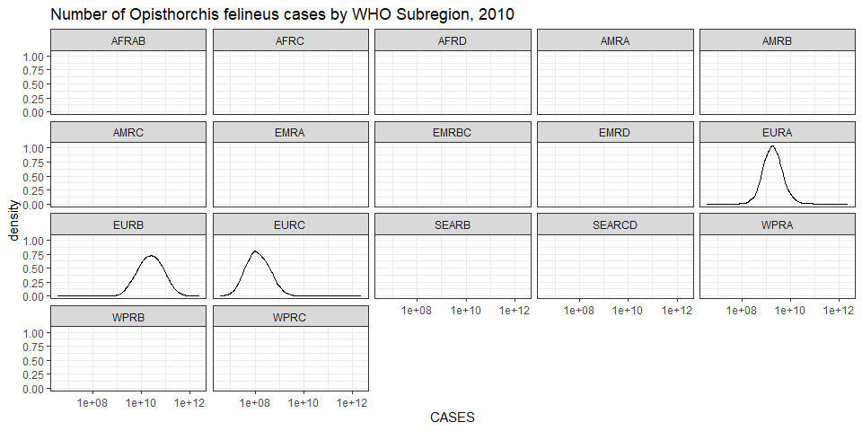<!-- -->

``` r
ggplot(subset(sim_all_sub_long, YEAR == 2020), aes(x = CASES)) +
  geom_density() +
  facet_wrap(~SUB2) +
  theme_bw() +
  scale_x_log10() +
  ggtitle("Number of Opisthorchis felineus cases by WHO Subregion, 2020")
```

    ## Warning in scale_x_log10(): log-10 transformation introduced infinite values.
    ## Removed 140000 rows containing non-finite outside the scale range (`stat_density()`).

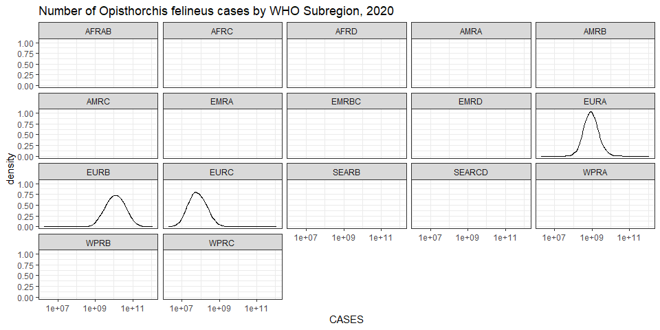<!-- -->

## Countries

``` r
plot_world(subset(all_cnt_rt, YEAR == 2010),
           "LOCATION_NAME", "VAL_MEAN", legend.title = "Incidence per 100k", diseasefree = zero_cases)
```

    ## [1]  0  2  4  6  8 10 12

``` r
title("Opisthorchis felineus incidence per 100k, 2010", line = 1)
```

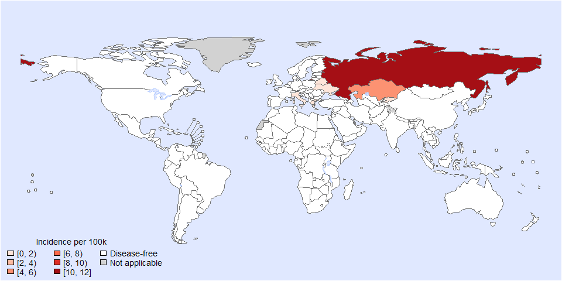<!-- -->

``` r
plot_world(subset(all_cnt_rt, YEAR == 2020),
           "LOCATION_NAME", "VAL_MEAN", legend.title = "Incidence per 100k", diseasefree = zero_cases)
```

    ## [1] 0 1 2 3 4 5

``` r
title("opisthorchis felineus incidence per 100k, 2020", line = 1)
```

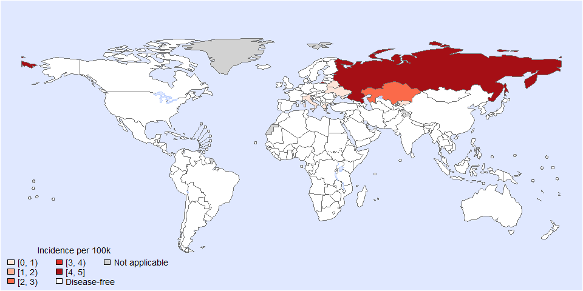<!-- -->

``` r
tab <-
  data.frame(
    subset(all_cnt_rt, YEAR == 2010)[, c("LOCATION_NAME", "VAL_MEAN", "VAL_LWR", "VAL_UPR")],
    subset(all_cnt_rt, YEAR == 2020)[, c("VAL_MEAN", "VAL_LWR", "VAL_UPR")])
tab$LOCATION_NAME <-
  FERG2:::countries$COUNTRY[match(tab$LOCATION_NAME, FERG2:::countries$ISO3)]
tab$LOCATION_NAME <- gsub(" \\(.*", "", tab$LOCATION_NAME)
names(tab) <-
  c("Country",
    "2010.mean", "2010.lwr", "2010.upr",
    "2020.mean", "2020.lwr", "2020.upr")

kable(tab, digits = 3, row.names = FALSE,
      caption = "Estimated Opisthorchis felineus incidence per 100k by country, 2010 vs 2020")
```

| Country | 2010.mean | 2010.lwr | 2010.upr | 2020.mean | 2020.lwr | 2020.upr |
|:---|---:|---:|---:|---:|---:|---:|
| Afghanistan | 0.000 | 0.000 | 0.000 | 0.000 | 0.000 | 0.000 |
| Angola | 0.000 | 0.000 | 0.000 | 0.000 | 0.000 | 0.000 |
| Albania | 0.000 | 0.000 | 0.000 | 0.000 | 0.000 | 0.000 |
| Andorra | 0.000 | 0.000 | 0.000 | 0.000 | 0.000 | 0.000 |
| United Arab Emirates | 0.000 | 0.000 | 0.000 | 0.000 | 0.000 | 0.000 |
| Argentina | 0.000 | 0.000 | 0.000 | 0.000 | 0.000 | 0.000 |
| Armenia | 0.000 | 0.000 | 0.000 | 0.000 | 0.000 | 0.000 |
| Antigua and Barbuda | 0.000 | 0.000 | 0.000 | 0.000 | 0.000 | 0.000 |
| Australia | 0.000 | 0.000 | 0.000 | 0.000 | 0.000 | 0.000 |
| Austria | 0.000 | 0.000 | 0.000 | 0.000 | 0.000 | 0.000 |
| Azerbaijan | 0.000 | 0.000 | 0.000 | 0.000 | 0.000 | 0.000 |
| Burundi | 0.000 | 0.000 | 0.000 | 0.000 | 0.000 | 0.000 |
| Belgium | 0.000 | 0.000 | 0.000 | 0.000 | 0.000 | 0.000 |
| Benin | 0.000 | 0.000 | 0.000 | 0.000 | 0.000 | 0.000 |
| Burkina Faso | 0.000 | 0.000 | 0.000 | 0.000 | 0.000 | 0.000 |
| Bangladesh | 0.000 | 0.000 | 0.000 | 0.000 | 0.000 | 0.000 |
| Bulgaria | 0.000 | 0.000 | 0.000 | 0.000 | 0.000 | 0.000 |
| Bahrain | 0.000 | 0.000 | 0.000 | 0.000 | 0.000 | 0.000 |
| Bahamas | 0.000 | 0.000 | 0.000 | 0.000 | 0.000 | 0.000 |
| Bosnia and Herzegovina | 0.000 | 0.000 | 0.000 | 0.000 | 0.000 | 0.000 |
| Belarus | 1.851 | 0.082 | 9.110 | 0.849 | 0.038 | 4.184 |
| Belize | 0.000 | 0.000 | 0.000 | 0.000 | 0.000 | 0.000 |
| Bolivia | 0.000 | 0.000 | 0.000 | 0.000 | 0.000 | 0.000 |
| Brazil | 0.000 | 0.000 | 0.000 | 0.000 | 0.000 | 0.000 |
| Barbados | 0.000 | 0.000 | 0.000 | 0.000 | 0.000 | 0.000 |
| Brunei Darussalam | 0.000 | 0.000 | 0.000 | 0.000 | 0.000 | 0.000 |
| Bhutan | 0.000 | 0.000 | 0.000 | 0.000 | 0.000 | 0.000 |
| Botswana | 0.000 | 0.000 | 0.000 | 0.000 | 0.000 | 0.000 |
| Central African Republic | 0.000 | 0.000 | 0.000 | 0.000 | 0.000 | 0.000 |
| Canada | 0.000 | 0.000 | 0.000 | 0.000 | 0.000 | 0.000 |
| Switzerland | 0.000 | 0.000 | 0.000 | 0.000 | 0.000 | 0.000 |
| Chile | 0.000 | 0.000 | 0.000 | 0.000 | 0.000 | 0.000 |
| China | 0.000 | 0.000 | 0.000 | 0.000 | 0.000 | 0.000 |
| Côte d’Ivoire | 0.000 | 0.000 | 0.000 | 0.000 | 0.000 | 0.000 |
| Cameroon | 0.000 | 0.000 | 0.000 | 0.000 | 0.000 | 0.000 |
| Congo | 0.000 | 0.000 | 0.000 | 0.000 | 0.000 | 0.000 |
| Congo | 0.000 | 0.000 | 0.000 | 0.000 | 0.000 | 0.000 |
| Cook Islands | 0.000 | 0.000 | 0.000 | 0.000 | 0.000 | 0.000 |
| Colombia | 0.000 | 0.000 | 0.000 | 0.000 | 0.000 | 0.000 |
| Comoros | 0.000 | 0.000 | 0.000 | 0.000 | 0.000 | 0.000 |
| Cabo Verde | 0.000 | 0.000 | 0.000 | 0.000 | 0.000 | 0.000 |
| Costa Rica | 0.000 | 0.000 | 0.000 | 0.000 | 0.000 | 0.000 |
| Cuba | 0.000 | 0.000 | 0.000 | 0.000 | 0.000 | 0.000 |
| Cyprus | 0.000 | 0.000 | 0.000 | 0.000 | 0.000 | 0.000 |
| Czechia | 0.000 | 0.000 | 0.000 | 0.000 | 0.000 | 0.000 |
| Germany | 0.000 | 0.000 | 0.000 | 0.000 | 0.000 | 0.000 |
| Djibouti | 0.000 | 0.000 | 0.000 | 0.000 | 0.000 | 0.000 |
| Dominica | 0.000 | 0.000 | 0.000 | 0.000 | 0.000 | 0.000 |
| Denmark | 0.000 | 0.000 | 0.000 | 0.000 | 0.000 | 0.000 |
| Dominican Republic | 0.000 | 0.000 | 0.000 | 0.000 | 0.000 | 0.000 |
| Algeria | 0.000 | 0.000 | 0.000 | 0.000 | 0.000 | 0.000 |
| Ecuador | 0.000 | 0.000 | 0.000 | 0.000 | 0.000 | 0.000 |
| Egypt | 0.000 | 0.000 | 0.000 | 0.000 | 0.000 | 0.000 |
| Eritrea | 0.000 | 0.000 | 0.000 | 0.000 | 0.000 | 0.000 |
| Spain | 0.000 | 0.000 | 0.000 | 0.000 | 0.000 | 0.000 |
| Estonia | 0.000 | 0.000 | 0.000 | 0.000 | 0.000 | 0.000 |
| Ethiopia | 0.000 | 0.000 | 0.000 | 0.000 | 0.000 | 0.000 |
| Finland | 0.000 | 0.000 | 0.000 | 0.000 | 0.000 | 0.000 |
| Fiji | 0.000 | 0.000 | 0.000 | 0.000 | 0.000 | 0.000 |
| France | 0.000 | 0.000 | 0.000 | 0.000 | 0.000 | 0.000 |
| Micronesia | 0.000 | 0.000 | 0.000 | 0.000 | 0.000 | 0.000 |
| Gabon | 0.000 | 0.000 | 0.000 | 0.000 | 0.000 | 0.000 |
| United Kingdom | 0.000 | 0.000 | 0.000 | 0.000 | 0.000 | 0.000 |
| Georgia | 0.000 | 0.000 | 0.000 | 0.000 | 0.000 | 0.000 |
| Ghana | 0.000 | 0.000 | 0.000 | 0.000 | 0.000 | 0.000 |
| Guinea | 0.000 | 0.000 | 0.000 | 0.000 | 0.000 | 0.000 |
| Gambia | 0.000 | 0.000 | 0.000 | 0.000 | 0.000 | 0.000 |
| Guinea-Bissau | 0.000 | 0.000 | 0.000 | 0.000 | 0.000 | 0.000 |
| Equatorial Guinea | 0.000 | 0.000 | 0.000 | 0.000 | 0.000 | 0.000 |
| Greece | 1.284 | 0.171 | 4.748 | 0.589 | 0.079 | 2.169 |
| Grenada | 0.000 | 0.000 | 0.000 | 0.000 | 0.000 | 0.000 |
| Guatemala | 0.000 | 0.000 | 0.000 | 0.000 | 0.000 | 0.000 |
| Guyana | 0.000 | 0.000 | 0.000 | 0.000 | 0.000 | 0.000 |
| Honduras | 0.000 | 0.000 | 0.000 | 0.000 | 0.000 | 0.000 |
| Croatia | 0.000 | 0.000 | 0.000 | 0.000 | 0.000 | 0.000 |
| Haiti | 0.000 | 0.000 | 0.000 | 0.000 | 0.000 | 0.000 |
| Hungary | 0.000 | 0.000 | 0.000 | 0.000 | 0.000 | 0.000 |
| Indonesia | 0.000 | 0.000 | 0.000 | 0.000 | 0.000 | 0.000 |
| India | 0.000 | 0.000 | 0.000 | 0.000 | 0.000 | 0.000 |
| Ireland | 0.000 | 0.000 | 0.000 | 0.000 | 0.000 | 0.000 |
| Iran | 0.000 | 0.000 | 0.000 | 0.000 | 0.000 | 0.000 |
| Iraq | 0.000 | 0.000 | 0.000 | 0.000 | 0.000 | 0.000 |
| Iceland | 0.000 | 0.000 | 0.000 | 0.000 | 0.000 | 0.000 |
| Israel | 0.000 | 0.000 | 0.000 | 0.000 | 0.000 | 0.000 |
| Italy | 0.693 | 0.038 | 3.280 | 0.318 | 0.018 | 1.501 |
| Jamaica | 0.000 | 0.000 | 0.000 | 0.000 | 0.000 | 0.000 |
| Jordan | 0.000 | 0.000 | 0.000 | 0.000 | 0.000 | 0.000 |
| Japan | 0.000 | 0.000 | 0.000 | 0.000 | 0.000 | 0.000 |
| Kazakhstan | 5.180 | 0.423 | 20.904 | 2.376 | 0.193 | 9.594 |
| Kenya | 0.000 | 0.000 | 0.000 | 0.000 | 0.000 | 0.000 |
| Kyrgyzstan | 1.233 | 0.036 | 5.823 | 0.565 | 0.017 | 2.661 |
| Cambodia | 0.000 | 0.000 | 0.000 | 0.000 | 0.000 | 0.000 |
| Kiribati | 0.000 | 0.000 | 0.000 | 0.000 | 0.000 | 0.000 |
| Saint Kitts and Nevis | 0.000 | 0.000 | 0.000 | 0.000 | 0.000 | 0.000 |
| Korea | 0.000 | 0.000 | 0.000 | 0.000 | 0.000 | 0.000 |
| Kuwait | 0.000 | 0.000 | 0.000 | 0.000 | 0.000 | 0.000 |
| Lao People’s Dem. Republic | 0.000 | 0.000 | 0.000 | 0.000 | 0.000 | 0.000 |
| Lebanon | 0.000 | 0.000 | 0.000 | 0.000 | 0.000 | 0.000 |
| Liberia | 0.000 | 0.000 | 0.000 | 0.000 | 0.000 | 0.000 |
| Libya | 0.000 | 0.000 | 0.000 | 0.000 | 0.000 | 0.000 |
| Saint Lucia | 0.000 | 0.000 | 0.000 | 0.000 | 0.000 | 0.000 |
| Sri Lanka | 0.000 | 0.000 | 0.000 | 0.000 | 0.000 | 0.000 |
| Lesotho | 0.000 | 0.000 | 0.000 | 0.000 | 0.000 | 0.000 |
| Lithuania | 0.000 | 0.000 | 0.000 | 0.000 | 0.000 | 0.000 |
| Luxembourg | 0.000 | 0.000 | 0.000 | 0.000 | 0.000 | 0.000 |
| Latvia | 0.000 | 0.000 | 0.000 | 0.000 | 0.000 | 0.000 |
| Morocco | 0.000 | 0.000 | 0.000 | 0.000 | 0.000 | 0.000 |
| Monaco | 0.000 | 0.000 | 0.000 | 0.000 | 0.000 | 0.000 |
| Republic of Moldova | 0.000 | 0.000 | 0.000 | 0.000 | 0.000 | 0.000 |
| Madagascar | 0.000 | 0.000 | 0.000 | 0.000 | 0.000 | 0.000 |
| Maldives | 0.000 | 0.000 | 0.000 | 0.000 | 0.000 | 0.000 |
| Mexico | 0.000 | 0.000 | 0.000 | 0.000 | 0.000 | 0.000 |
| Marshall Islands | 0.000 | 0.000 | 0.000 | 0.000 | 0.000 | 0.000 |
| North Macedonia | 0.000 | 0.000 | 0.000 | 0.000 | 0.000 | 0.000 |
| Mali | 0.000 | 0.000 | 0.000 | 0.000 | 0.000 | 0.000 |
| Malta | 0.000 | 0.000 | 0.000 | 0.000 | 0.000 | 0.000 |
| Myanmar | 0.000 | 0.000 | 0.000 | 0.000 | 0.000 | 0.000 |
| Montenegro | 0.000 | 0.000 | 0.000 | 0.000 | 0.000 | 0.000 |
| Mongolia | 0.000 | 0.000 | 0.000 | 0.000 | 0.000 | 0.000 |
| Mozambique | 0.000 | 0.000 | 0.000 | 0.000 | 0.000 | 0.000 |
| Mauritania | 0.000 | 0.000 | 0.000 | 0.000 | 0.000 | 0.000 |
| Mauritius | 0.000 | 0.000 | 0.000 | 0.000 | 0.000 | 0.000 |
| Malawi | 0.000 | 0.000 | 0.000 | 0.000 | 0.000 | 0.000 |
| Malaysia | 0.000 | 0.000 | 0.000 | 0.000 | 0.000 | 0.000 |
| Namibia | 0.000 | 0.000 | 0.000 | 0.000 | 0.000 | 0.000 |
| Niger | 0.000 | 0.000 | 0.000 | 0.000 | 0.000 | 0.000 |
| Nigeria | 0.000 | 0.000 | 0.000 | 0.000 | 0.000 | 0.000 |
| Nicaragua | 0.000 | 0.000 | 0.000 | 0.000 | 0.000 | 0.000 |
| Niue | 0.000 | 0.000 | 0.000 | 0.000 | 0.000 | 0.000 |
| Netherlands | 0.000 | 0.000 | 0.000 | 0.000 | 0.000 | 0.000 |
| Norway | 0.000 | 0.000 | 0.000 | 0.000 | 0.000 | 0.000 |
| Nepal | 0.000 | 0.000 | 0.000 | 0.000 | 0.000 | 0.000 |
| Nauru | 0.000 | 0.000 | 0.000 | 0.000 | 0.000 | 0.000 |
| New Zealand | 0.000 | 0.000 | 0.000 | 0.000 | 0.000 | 0.000 |
| Oman | 0.000 | 0.000 | 0.000 | 0.000 | 0.000 | 0.000 |
| Pakistan | 0.000 | 0.000 | 0.000 | 0.000 | 0.000 | 0.000 |
| Panama | 0.000 | 0.000 | 0.000 | 0.000 | 0.000 | 0.000 |
| Peru | 0.000 | 0.000 | 0.000 | 0.000 | 0.000 | 0.000 |
| Philippines | 0.000 | 0.000 | 0.000 | 0.000 | 0.000 | 0.000 |
| Palau | 0.000 | 0.000 | 0.000 | 0.000 | 0.000 | 0.000 |
| Papua New Guinea | 0.000 | 0.000 | 0.000 | 0.000 | 0.000 | 0.000 |
| Poland | 0.000 | 0.000 | 0.000 | 0.000 | 0.000 | 0.000 |
| Korea | 0.000 | 0.000 | 0.000 | 0.000 | 0.000 | 0.000 |
| Portugal | 0.000 | 0.000 | 0.000 | 0.000 | 0.000 | 0.000 |
| Paraguay | 0.000 | 0.000 | 0.000 | 0.000 | 0.000 | 0.000 |
| Qatar | 0.000 | 0.000 | 0.000 | 0.000 | 0.000 | 0.000 |
| Romania | 0.000 | 0.000 | 0.000 | 0.000 | 0.000 | 0.000 |
| Russian Federation | 10.619 | 0.420 | 53.340 | 4.871 | 0.193 | 24.403 |
| Rwanda | 0.000 | 0.000 | 0.000 | 0.000 | 0.000 | 0.000 |
| Saudi Arabia | 0.000 | 0.000 | 0.000 | 0.000 | 0.000 | 0.000 |
| Sudan | 0.000 | 0.000 | 0.000 | 0.000 | 0.000 | 0.000 |
| Senegal | 0.000 | 0.000 | 0.000 | 0.000 | 0.000 | 0.000 |
| Singapore | 0.000 | 0.000 | 0.000 | 0.000 | 0.000 | 0.000 |
| Solomon Islands | 0.000 | 0.000 | 0.000 | 0.000 | 0.000 | 0.000 |
| Sierra Leone | 0.000 | 0.000 | 0.000 | 0.000 | 0.000 | 0.000 |
| El Salvador | 0.000 | 0.000 | 0.000 | 0.000 | 0.000 | 0.000 |
| San Marino | 0.000 | 0.000 | 0.000 | 0.000 | 0.000 | 0.000 |
| Somalia | 0.000 | 0.000 | 0.000 | 0.000 | 0.000 | 0.000 |
| Serbia | 0.000 | 0.000 | 0.000 | 0.000 | 0.000 | 0.000 |
| South Sudan | 0.000 | 0.000 | 0.000 | 0.000 | 0.000 | 0.000 |
| Sao Tome and Principe | 0.000 | 0.000 | 0.000 | 0.000 | 0.000 | 0.000 |
| Suriname | 0.000 | 0.000 | 0.000 | 0.000 | 0.000 | 0.000 |
| Slovakia | 0.000 | 0.000 | 0.000 | 0.000 | 0.000 | 0.000 |
| Slovenia | 0.000 | 0.000 | 0.000 | 0.000 | 0.000 | 0.000 |
| Sweden | 0.000 | 0.000 | 0.000 | 0.000 | 0.000 | 0.000 |
| Eswatini | 0.000 | 0.000 | 0.000 | 0.000 | 0.000 | 0.000 |
| Seychelles | 0.000 | 0.000 | 0.000 | 0.000 | 0.000 | 0.000 |
| Syrian Arab Republic | 0.000 | 0.000 | 0.000 | 0.000 | 0.000 | 0.000 |
| Chad | 0.000 | 0.000 | 0.000 | 0.000 | 0.000 | 0.000 |
| Togo | 0.000 | 0.000 | 0.000 | 0.000 | 0.000 | 0.000 |
| Thailand | 0.000 | 0.000 | 0.000 | 0.000 | 0.000 | 0.000 |
| Tajikistan | 0.000 | 0.000 | 0.000 | 0.000 | 0.000 | 0.000 |
| Turkmenistan | 0.000 | 0.000 | 0.000 | 0.000 | 0.000 | 0.000 |
| Timor-Leste | 0.000 | 0.000 | 0.000 | 0.000 | 0.000 | 0.000 |
| Tonga | 0.000 | 0.000 | 0.000 | 0.000 | 0.000 | 0.000 |
| Trinidad and Tobago | 0.000 | 0.000 | 0.000 | 0.000 | 0.000 | 0.000 |
| Tunisia | 0.000 | 0.000 | 0.000 | 0.000 | 0.000 | 0.000 |
| Turkiye | 0.000 | 0.000 | 0.000 | 0.000 | 0.000 | 0.000 |
| Tuvalu | 0.000 | 0.000 | 0.000 | 0.000 | 0.000 | 0.000 |
| United Republic of Tanzania | 0.000 | 0.000 | 0.000 | 0.000 | 0.000 | 0.000 |
| Uganda | 0.000 | 0.000 | 0.000 | 0.000 | 0.000 | 0.000 |
| Ukraine | 0.475 | 0.019 | 2.583 | 0.218 | 0.009 | 1.184 |
| Uruguay | 0.000 | 0.000 | 0.000 | 0.000 | 0.000 | 0.000 |
| United States of America | 0.000 | 0.000 | 0.000 | 0.000 | 0.000 | 0.000 |
| Uzbekistan | 0.000 | 0.000 | 0.000 | 0.000 | 0.000 | 0.000 |
| Saint Vincent and the Grenadines | 0.000 | 0.000 | 0.000 | 0.000 | 0.000 | 0.000 |
| Venezuela | 0.000 | 0.000 | 0.000 | 0.000 | 0.000 | 0.000 |
| Viet Nam | 0.000 | 0.000 | 0.000 | 0.000 | 0.000 | 0.000 |
| Vanuatu | 0.000 | 0.000 | 0.000 | 0.000 | 0.000 | 0.000 |
| Samoa | 0.000 | 0.000 | 0.000 | 0.000 | 0.000 | 0.000 |
| Yemen | 0.000 | 0.000 | 0.000 | 0.000 | 0.000 | 0.000 |
| South Africa | 0.000 | 0.000 | 0.000 | 0.000 | 0.000 | 0.000 |
| Zambia | 0.000 | 0.000 | 0.000 | 0.000 | 0.000 | 0.000 |
| Zimbabwe | 0.000 | 0.000 | 0.000 | 0.000 | 0.000 | 0.000 |

Estimated Opisthorchis felineus incidence per 100k by country, 2010 vs
2020

# Session info

``` r
sessioninfo::session_info()
```

    ## Warning in system2("quarto", "-V", stdout = TRUE, env = paste0("TMPDIR=", : running command '"quarto"
    ## TMPDIR=C:/Users/LoVa3397/AppData/Local/Temp/RtmpMJKmpx/file16203c1f5309 -V' had status 1

    ## ─ Session info ────────────────────────────────────────────────────────────────────────────────────────────────────────
    ##  setting  value
    ##  version  R version 4.5.1 (2025-06-13 ucrt)
    ##  os       Windows 10 x64 (build 19045)
    ##  system   x86_64, mingw32
    ##  ui       RStudio
    ##  language (EN)
    ##  collate  English_United States.utf8
    ##  ctype    English_United States.utf8
    ##  tz       Europe/Brussels
    ##  date     2025-10-07
    ##  rstudio  2025.09.0+387 Cucumberleaf Sunflower (desktop)
    ##  pandoc   3.6.3 @ C:/Program Files/RStudio/resources/app/bin/quarto/bin/tools/ (via rmarkdown)
    ##  quarto   ERROR: Unknown command "TMPDIR=C:/Users/LoVa3397/AppData/Local/Temp/RtmpMJKmpx/file16203c1f5309". Did you mean command "install"? @ C:\\PROGRA~1\\RStudio\\RESOUR~1\\app\\bin\\quarto\\bin\\quarto.exe
    ## 
    ## ─ Packages ────────────────────────────────────────────────────────────────────────────────────────────────────────────
    ##  ! package        * version    date (UTC) lib source
    ##    abind            1.4-8      2024-09-12 [1] CRAN (R 4.5.0)
    ##    backports        1.5.0      2024-05-23 [1] CRAN (R 4.5.0)
    ##    base64enc        0.1-3      2015-07-28 [1] CRAN (R 4.5.0)
    ##    bayesplot        1.13.0     2025-06-18 [1] CRAN (R 4.5.1)
    ##    bd             * 0.0.14     2025-07-14 [1] Github (brechtdv/bd@652191c)
    ##    boot             1.3-31     2024-08-28 [1] CRAN (R 4.5.1)
    ##    bridgesampling   1.1-2      2021-04-16 [1] CRAN (R 4.5.1)
    ##    brms           * 2.22.0     2024-09-23 [1] CRAN (R 4.5.1)
    ##    Brobdingnag      1.2-9      2022-10-19 [1] CRAN (R 4.5.1)
    ##    callr            3.7.6      2024-03-25 [1] CRAN (R 4.5.1)
    ##    cellranger       1.1.0      2016-07-27 [1] CRAN (R 4.5.1)
    ##    checkmate        2.3.2      2024-07-29 [1] CRAN (R 4.5.1)
    ##    class            7.3-23     2025-01-01 [1] CRAN (R 4.5.1)
    ##    classInt         0.4-11     2025-01-08 [1] CRAN (R 4.5.1)
    ##    cli              3.6.5      2025-04-23 [1] CRAN (R 4.5.1)
    ##    cluster          2.1.8.1    2025-03-12 [1] CRAN (R 4.5.1)
    ##    coda             0.19-4.1   2024-01-31 [1] CRAN (R 4.5.1)
    ##    codetools        0.2-20     2024-03-31 [1] CRAN (R 4.5.1)
    ##    colorspace       2.1-1      2024-07-26 [1] CRAN (R 4.5.1)
    ##    curl             6.4.0      2025-06-22 [1] CRAN (R 4.5.1)
    ##    data.table       1.17.8     2025-07-10 [1] CRAN (R 4.5.1)
    ##    DBI              1.2.3      2024-06-02 [1] CRAN (R 4.5.1)
    ##    DescTools      * 0.99.60    2025-03-28 [1] CRAN (R 4.5.1)
    ##    digest           0.6.37     2024-08-19 [1] CRAN (R 4.5.1)
    ##    distributional   0.5.0      2024-09-17 [1] CRAN (R 4.5.1)
    ##    dplyr          * 1.1.4      2023-11-17 [1] CRAN (R 4.5.1)
    ##    e1071            1.7-16     2024-09-16 [1] CRAN (R 4.5.1)
    ##    evaluate         1.0.4      2025-06-18 [1] CRAN (R 4.5.1)
    ##    Exact            3.3        2024-07-21 [1] CRAN (R 4.5.0)
    ##    expm             1.0-0      2024-08-19 [1] CRAN (R 4.5.1)
    ##    farver           2.1.2      2024-05-13 [1] CRAN (R 4.5.1)
    ##    fastmap          1.2.0      2024-05-15 [1] CRAN (R 4.5.1)
    ##    FERG2          * 0.0.5      2025-07-15 [1] Github (brechtdv/FERG2@c2d4ac1)
    ##    forcats          1.0.0      2023-01-29 [1] CRAN (R 4.5.1)
    ##    foreign          0.8-90     2025-03-31 [1] CRAN (R 4.5.1)
    ##    Formula          1.2-5      2023-02-24 [1] CRAN (R 4.5.0)
    ##    fs               1.6.6      2025-04-12 [1] CRAN (R 4.5.1)
    ##    generics         0.1.4      2025-05-09 [1] CRAN (R 4.5.1)
    ##    ggplot2        * 3.5.2      2025-04-09 [1] CRAN (R 4.5.1)
    ##    gld              2.6.7      2025-01-17 [1] CRAN (R 4.5.1)
    ##    glue             1.8.0      2024-09-30 [1] CRAN (R 4.5.1)
    ##    gridExtra        2.3        2017-09-09 [1] CRAN (R 4.5.1)
    ##    gtable           0.3.6      2024-10-25 [1] CRAN (R 4.5.1)
    ##    haven            2.5.5      2025-05-30 [1] CRAN (R 4.5.1)
    ##    Hmisc          * 5.2-3      2025-03-16 [1] CRAN (R 4.5.1)
    ##    hms              1.1.3      2023-03-21 [1] CRAN (R 4.5.1)
    ##    htmlTable        2.4.3      2024-07-21 [1] CRAN (R 4.5.1)
    ##    htmltools        0.5.8.1    2024-04-04 [1] CRAN (R 4.5.1)
    ##    htmlwidgets      1.6.4      2023-12-06 [1] CRAN (R 4.5.1)
    ##    httr             1.4.7      2023-08-15 [1] CRAN (R 4.5.1)
    ##    inline           0.3.21     2025-01-09 [1] CRAN (R 4.5.1)
    ##    jsonlite         2.0.0      2025-03-27 [1] CRAN (R 4.5.1)
    ##    kableExtra     * 1.4.0      2024-01-24 [1] CRAN (R 4.5.1)
    ##    KernSmooth       2.23-26    2025-01-01 [1] CRAN (R 4.5.1)
    ##    knitr          * 1.50       2025-03-16 [1] CRAN (R 4.5.1)
    ##    labeling         0.4.3      2023-08-29 [1] CRAN (R 4.5.0)
    ##    lattice          0.22-7     2025-04-02 [1] CRAN (R 4.5.1)
    ##    lifecycle        1.0.4      2023-11-07 [1] CRAN (R 4.5.1)
    ##    lmom             3.2        2024-09-30 [1] CRAN (R 4.5.0)
    ##    loo              2.8.0      2024-07-03 [1] CRAN (R 4.5.1)
    ##    magrittr         2.0.3      2022-03-30 [1] CRAN (R 4.5.1)
    ##    MASS             7.3-65     2025-02-28 [1] CRAN (R 4.5.1)
    ##    mathjaxr         1.8-0      2025-04-30 [1] CRAN (R 4.5.1)
    ##    Matrix         * 1.7-3      2025-03-11 [1] CRAN (R 4.5.1)
    ##    MatrixModels     0.5-4      2025-03-26 [1] CRAN (R 4.5.1)
    ##    matrixStats      1.5.0      2025-01-07 [1] CRAN (R 4.5.1)
    ##    metadat        * 1.4-0      2025-02-04 [1] CRAN (R 4.5.1)
    ##    metafor        * 4.8-0      2025-01-28 [1] CRAN (R 4.5.1)
    ##    multcomp         1.4-28     2025-01-29 [1] CRAN (R 4.5.1)
    ##    mvtnorm          1.3-3      2025-01-10 [1] CRAN (R 4.5.1)
    ##    nlme             3.1-168    2025-03-31 [1] CRAN (R 4.5.1)
    ##    nnet             7.3-20     2025-01-01 [1] CRAN (R 4.5.1)
    ##    numDeriv       * 2016.8-1.1 2019-06-06 [1] CRAN (R 4.5.0)
    ##    pillar           1.11.0     2025-07-04 [1] CRAN (R 4.5.1)
    ##    pkgbuild         1.4.8      2025-05-26 [1] CRAN (R 4.5.1)
    ##    pkgconfig        2.0.3      2019-09-22 [1] CRAN (R 4.5.1)
    ##    plyr             1.8.9      2023-10-02 [1] CRAN (R 4.5.1)
    ##    polspline        1.1.25     2024-05-10 [1] CRAN (R 4.5.0)
    ##    posterior        1.6.1      2025-02-27 [1] CRAN (R 4.5.1)
    ##    processx         3.8.6      2025-02-21 [1] CRAN (R 4.5.1)
    ##    proxy            0.4-27     2022-06-09 [1] CRAN (R 4.5.1)
    ##    ps               1.9.1      2025-04-12 [1] CRAN (R 4.5.1)
    ##    purrr            1.1.0      2025-07-10 [1] CRAN (R 4.5.1)
    ##    quantreg         6.1        2025-03-10 [1] CRAN (R 4.5.1)
    ##    QuickJSR         1.8.0      2025-06-09 [1] CRAN (R 4.5.1)
    ##    R6               2.6.1      2025-02-15 [1] CRAN (R 4.5.1)
    ##    RColorBrewer     1.1-3      2022-04-03 [1] CRAN (R 4.5.0)
    ##    Rcpp           * 1.1.0      2025-07-02 [1] CRAN (R 4.5.1)
    ##  D RcppParallel     5.1.10     2025-01-24 [1] CRAN (R 4.5.1)
    ##    readr            2.1.5      2024-01-10 [1] CRAN (R 4.5.1)
    ##    readxl         * 1.4.5      2025-03-07 [1] CRAN (R 4.5.1)
    ##    reshape2         1.4.4      2020-04-09 [1] CRAN (R 4.5.1)
    ##    rlang            1.1.6      2025-04-11 [1] CRAN (R 4.5.1)
    ##    rmarkdown      * 2.29       2024-11-04 [1] CRAN (R 4.5.1)
    ##    rms            * 8.0-0      2025-04-04 [1] CRAN (R 4.5.1)
    ##    rootSolve        1.8.2.4    2023-09-21 [1] CRAN (R 4.5.0)
    ##    rpart            4.1.24     2025-01-07 [1] CRAN (R 4.5.1)
    ##    rstan            2.32.7     2025-03-10 [1] CRAN (R 4.5.1)
    ##    rstantools       2.4.0      2024-01-31 [1] CRAN (R 4.5.1)
    ##    rstudioapi       0.17.1     2024-10-22 [1] CRAN (R 4.5.1)
    ##    sandwich         3.1-1      2024-09-15 [1] CRAN (R 4.5.1)
    ##    scales         * 1.4.0      2025-04-24 [1] CRAN (R 4.5.1)
    ##    sessioninfo      1.2.3      2025-02-05 [1] CRAN (R 4.5.1)
    ##    sf             * 1.0-21     2025-05-15 [1] CRAN (R 4.5.1)
    ##    SparseM          1.84-2     2024-07-17 [1] CRAN (R 4.5.1)
    ##    StanHeaders      2.32.10    2024-07-15 [1] CRAN (R 4.5.1)
    ##    stringi          1.8.7      2025-03-27 [1] CRAN (R 4.5.0)
    ##    stringr          1.5.1      2023-11-14 [1] CRAN (R 4.5.1)
    ##    survival         3.8-3      2024-12-17 [1] CRAN (R 4.5.1)
    ##    svglite          2.2.1      2025-05-12 [1] CRAN (R 4.5.1)
    ##    systemfonts      1.2.3      2025-04-30 [1] CRAN (R 4.5.1)
    ##    tensorA          0.36.2.1   2023-12-13 [1] CRAN (R 4.5.0)
    ##    textshaping      1.0.1      2025-05-01 [1] CRAN (R 4.5.1)
    ##    TH.data          1.1-3      2025-01-17 [1] CRAN (R 4.5.1)
    ##    tibble           3.3.0      2025-06-08 [1] CRAN (R 4.5.1)
    ##    tidyr          * 1.3.1      2024-01-24 [1] CRAN (R 4.5.1)
    ##    tidyselect       1.2.1      2024-03-11 [1] CRAN (R 4.5.1)
    ##    tzdb             0.5.0      2025-03-15 [1] CRAN (R 4.5.1)
    ##    units            0.8-7      2025-03-11 [1] CRAN (R 4.5.1)
    ##    V8               6.0.4      2025-06-04 [1] CRAN (R 4.5.1)
    ##    vctrs            0.6.5      2023-12-01 [1] CRAN (R 4.5.1)
    ##    viridisLite      0.4.2      2023-05-02 [1] CRAN (R 4.5.1)
    ##    withr            3.0.2      2024-10-28 [1] CRAN (R 4.5.1)
    ##    xfun             0.52       2025-04-02 [1] CRAN (R 4.5.1)
    ##    xml2             1.3.8      2025-03-14 [1] CRAN (R 4.5.1)
    ##    yaml             2.3.10     2024-07-26 [1] CRAN (R 4.5.0)
    ##    zoo              1.8-14     2025-04-10 [1] CRAN (R 4.5.1)
    ## 
    ##  [1] C:/Program Files/R/R-4.5.1/library
    ## 
    ##  * ── Packages attached to the search path.
    ##  D ── DLL MD5 mismatch, broken installation.
    ## 
    ## ───────────────────────────────────────────────────────────────────────────────────────────────────────────────────────

``` r
##bd::render_today("03-estimate.R")
```
