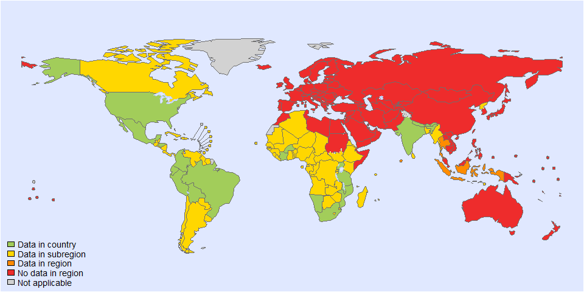
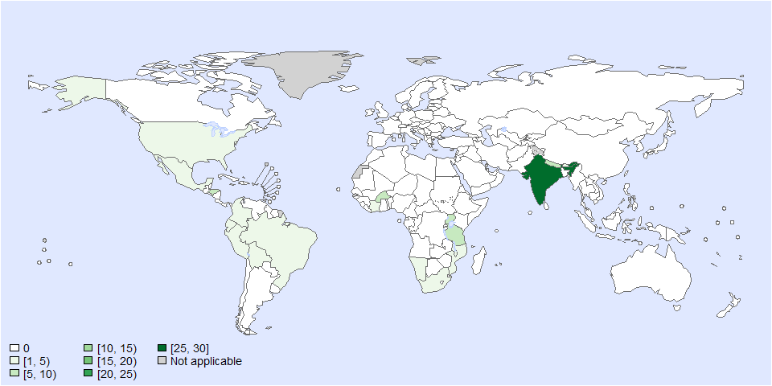
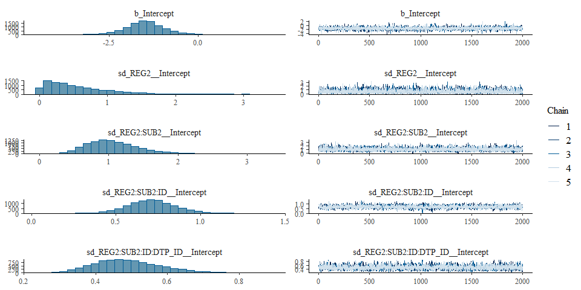
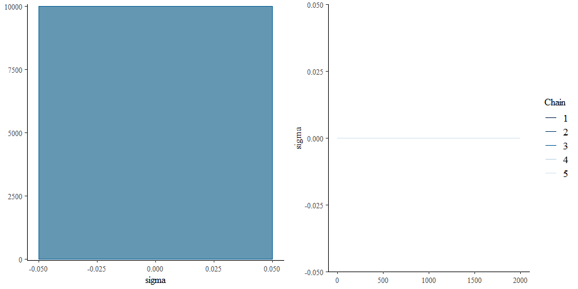

Proportion of T solium - Model fit - Version 3
================
fbbu6966
2025-02-21

- [Settings](#settings)
- [Parameters](#parameters)
- [Data](#data)
- [BRMS](#brms)
  - [BRMS : Version 3](#brms--version-3)
- [Session info](#session-info)

# Settings

``` r
## required packages ----
library(bd)
library(brms)
library(ggplot2)
library(metafor)
library(readxl)
library(rmarkdown)
library(rms)
library(tidyr)
library(knitr)

## global options ----
knitr::opts_chunk$set(fig.width = 10)
Date <- format(Sys.Date(), "%Y%m%d")
```

# Parameters

| Parameters                       | Values              |
|:---------------------------------|:--------------------|
| Number of iteration              | 5000                |
| Warmup                           | 3000                |
| Delta value                      | 0.99                |
| Maximum tree-depth               | 20                  |
| Levels                           | All, no year        |
| Random effect on each data point | Yes                 |
| Stronger priors specified        | Normal(0,1)         |

Parameters of the model tested

# Data

``` r
## import data
source("01-data.R")
```

    ## 'data.frame':    88 obs. of  40 variables:
    ##  $ SOURCE_ID           : num  300031 300037 300123 320029 320075 ...
    ##  $ SOURCE_AUTHOR       : chr  "Nicoletti A" "Del Brutto OH" "Cruz ME" "Murthy JMK" ...
    ##  $ SOURCE_YEAR         : num  2005 2005 1999 2019 2017 ...
    ##  $ SOURCE_TITLE        : chr  "Epilepsy and neurocysticercosis in rural Bolivia: a population-based survey" "Epilepsy and neurocysticercosis in Atahualpa: a door-to-door survey in rural coastal Ecuador" "Epilepsy and neurocysticercosis in an Andean community" "Prevalence, clinical characteristics, and seizure outcomes of epilepsy due to calcific clinical stage of neuroc"| __truncated__ ...
    ##  $ SOURCE_DOI          : chr  "10.1111/j.1528-1167.2005.67804.x" "10.1111/j.0013-9580.2005.36504.x" "10.1093/ije/28.4.799" "10.1016/j.yebeh.2019.07.024" ...
    ##  $ SOURCE_URL          : chr  "https://pubmed.ncbi.nlm.nih.gov/16026566/" "https://pubmed.ncbi.nlm.nih.gov/15816956/" "https://academic.oup.com/ije/article/28/4/799/721724?login=false" "https://www.sciencedirect.com/science/article/pii/S152550501930383X?via%3Dihub" ...
    ##  $ OPT_ACCESS_DATE     : POSIXct, format: "2023-12-18" "2023-12-18" ...
    ##  $ OPT_STUDY_TYPE      : chr  "Cross-sectional study" "Cross-sectional study" "Cross-sectional study" "Cross-sectional study" ...
    ##  $ OPT_OTHER_STUDY_TYPE: logi  NA NA NA NA NA NA ...
    ##  $ REF_NOTES           : chr  "Diagnostic tools used: non-contrast CT-scan, electroencephalographic (EEG), Serology (EITB). Here, the survey w"| __truncated__ "Diagnostic tools used:  CT-scan,EEG,Serology. Here, the survey was done on single day (Oct 15, 2003). Aparently"| __truncated__ "Diagnostic tools used: CT-scan, electroencephalographic (EEG), Serology (EITB). This study was done in ONE comm"| __truncated__ "Diagnostic tools used: plain and contrast CT-scan,EEG. In this article, authors only reported the data related "| __truncated__ ...
    ##  $ REF_YEAR_START      : num  1994 2003 1992 2001 2007 ...
    ##  $ REF_YEAR_END        : num  NA NA 1992 2001 2007 ...
    ##  $ REF_LOC_LEVEL       : chr  "Sub-national" "Sub-national" "Sub-national" "Sub-national" ...
    ##  $ REF_LOCATION        : chr  "Bolivia (Plurinational State of)" "Ecuador" "Ecuador" "India" ...
    ##  $ REF_LOCATION_ISO3   : chr  "BOL" "ECU" "ECU" "IND" ...
    ##  $ REF_SEX             : chr  "All sexes" "All sexes" "All sexes" "All sexes" ...
    ##  $ REF_AGE_START       : num  0 0 0 0 NA NA NA 7 18 40 ...
    ##  $ REF_AGE_END         : num  125 125 125 125 NA NA NA 17 39 125 ...
    ##  $ OPT_MEAN_AGE        : num  NA NA NA NA 29 NA NA NA NA NA ...
    ##  $ OPT_MEDIAN_AGE      : num  NA NA NA NA NA NA NA NA NA NA ...
    ##  $ OPT_SUBPOP          : logi  NA NA NA NA NA NA ...
    ##  $ OPT_CASES           : chr  "All" "All" "All" "All" ...
    ##  $ OPT_DISEASE         : chr  "NCC among people with epilepsy living in rural communities" "NCC among people with epilepsy living in a rural village community" "NCC among people with epilepsy living in a urban nucleus of a village" "NCC among people with epilepsy living in village (rural) communities" ...
    ##  $ OPT_SEROTYPE        : logi  NA NA NA NA NA NA ...
    ##  $ REF_SAMPLE_SIZE     : num  105 19 26 379 151 41 27 22 33 13 ...
    ##  $ VALUE_X             : num  29 5 14 73 85 12 7 4 9 6 ...
    ##  $ VALUE_MEAN          : num  NA NA NA NA NA NA NA NA NA NA ...
    ##  $ VALUE_MEDIAN        : logi  NA NA NA NA NA NA ...
    ##  $ VALUE_DENOM         : logi  NA NA NA NA NA NA ...
    ##  $ VALUE_SE            : logi  NA NA NA NA NA NA ...
    ##  $ VALUE_P000          : logi  NA NA NA NA NA NA ...
    ##  $ VALUE_P2_5          : logi  NA NA NA NA NA NA ...
    ##  $ VALUE_P5            : logi  NA NA NA NA NA NA ...
    ##  $ VALUE_P10           : logi  NA NA NA NA NA NA ...
    ##  $ VALUE_P25           : logi  NA NA NA NA NA NA ...
    ##  $ VALUE_P75           : logi  NA NA NA NA NA NA ...
    ##  $ VALUE_P90           : logi  NA NA NA NA NA NA ...
    ##  $ VALUE_P95           : logi  NA NA NA NA NA NA ...
    ##  $ VALUE_P97_5         : logi  NA NA NA NA NA NA ...
    ##  $ VALUE_P100          : logi  NA NA NA NA NA NA ...

<!-- --><!-- -->

    ## Warning: REML comparisons not meaningful for models with different fixed effects
    ## (use 'refit=TRUE' to refit both models based on ML estimation).

    ## Warning in system2("quarto", "-V", stdout = TRUE, env = paste0("TMPDIR=", : running
    ## command '"quarto"
    ## TMPDIR=C:/Users/fbbu6966/AppData/Local/Temp/RtmpAJZOTL/file381063fdd7c -V' had status 1

``` r
es$DTP_ID<-as.character(seq(1:length(es$SOURCE_ID)))
es$FLAG<-factor(es$FLAG, 
                levels=c(0,1,2,3,4,5,6, 7),
                labels=c("Keep data", "Data part of non WHO member states", "No WHO REG2 given",
                         "Year before 1990", "yi can't be calcualted", "TF choice to remove", 
                         "Excluded by preliminary checks", "Excluded in data cleaning"))

saveRDS(es, paste0("es_", Date, ".RDS"))
```

# BRMS

## BRMS : Version 3

``` r
fit_brms_reg_s3 <-
  brm(yi | se(sei) ~
        1 + 
        (1 | REG2) +
        (1 | REG2:SUB2) +
        (1 | REG2:SUB2:ID) +
        (1 | REG2:SUB2:ID:DTP_ID),
      chains = 5, iter = 5000, warmup = 3000,
      cores = 5,
      prior = prior(normal(0,1), class = sd),
      data = subset(es, as.integer(FLAG) == 1),
      control = list(adapt_delta=0.99, max_treedepth = 20),
      open_progress = FALSE,
      seed = 7)
```

    ## Compiling Stan program...

    ## Start sampling

``` r
## model summary
summary(fit_brms_reg_s3)
```

    ##  Family: gaussian 
    ##   Links: mu = identity; sigma = identity 
    ## Formula: yi | se(sei) ~ 1 + (1 | REG2) + (1 | REG2:SUB2) + (1 | REG2:SUB2:ID) + (1 | REG2:SUB2:ID:DTP_ID) 
    ##    Data: subset(es, as.integer(FLAG) == 1) (Number of observations: 82) 
    ##   Draws: 5 chains, each with iter = 5000; warmup = 3000; thin = 1;
    ##          total post-warmup draws = 10000
    ## 
    ## Multilevel Hyperparameters:
    ## ~REG2 (Number of levels: 3) 
    ##               Estimate Est.Error l-95% CI u-95% CI Rhat Bulk_ESS Tail_ESS
    ## sd(Intercept)     0.54      0.45     0.02     1.67 1.00     5974     4953
    ## 
    ## ~REG2:SUB2 (Number of levels: 7) 
    ##               Estimate Est.Error l-95% CI u-95% CI Rhat Bulk_ESS Tail_ESS
    ## sd(Intercept)     1.07      0.39     0.45     1.96 1.00     5496     5368
    ## 
    ## ~REG2:SUB2:ID (Number of levels: 47) 
    ##               Estimate Est.Error l-95% CI u-95% CI Rhat Bulk_ESS Tail_ESS
    ## sd(Intercept)     0.71      0.14     0.44     1.01 1.00     2681     3289
    ## 
    ## ~REG2:SUB2:ID:DTP_ID (Number of levels: 82) 
    ##               Estimate Est.Error l-95% CI u-95% CI Rhat Bulk_ESS Tail_ESS
    ## sd(Intercept)     0.49      0.09     0.33     0.70 1.00     2426     3542
    ## 
    ## Regression Coefficients:
    ##           Estimate Est.Error l-95% CI u-95% CI Rhat Bulk_ESS Tail_ESS
    ## Intercept    -1.49      0.60    -2.74    -0.27 1.00     5673     5556
    ## 
    ## Further Distributional Parameters:
    ##       Estimate Est.Error l-95% CI u-95% CI Rhat Bulk_ESS Tail_ESS
    ## sigma     0.00      0.00     0.00     0.00   NA       NA       NA
    ## 
    ## Draws were sampled using sampling(NUTS). For each parameter, Bulk_ESS
    ## and Tail_ESS are effective sample size measures, and Rhat is the potential
    ## scale reduction factor on split chains (at convergence, Rhat = 1).

``` r
plot(fit_brms_reg_s3, ask = FALSE)
```

<!-- --><!-- -->

``` r
# plot(conditional_effects(fit_brms_reg_s2), points = TRUE)
saveRDS(fit_brms_reg_s3, file = "fit_brms_reg_s3.rds")

## show model code
stancode(fit_brms_reg_s3)
```

    ## // generated with brms 2.22.0
    ## functions {
    ## }
    ## data {
    ##   int<lower=1> N;  // total number of observations
    ##   vector[N] Y;  // response variable
    ##   vector<lower=0>[N] se;  // known sampling error
    ##   // data for group-level effects of ID 1
    ##   int<lower=1> N_1;  // number of grouping levels
    ##   int<lower=1> M_1;  // number of coefficients per level
    ##   array[N] int<lower=1> J_1;  // grouping indicator per observation
    ##   // group-level predictor values
    ##   vector[N] Z_1_1;
    ##   // data for group-level effects of ID 2
    ##   int<lower=1> N_2;  // number of grouping levels
    ##   int<lower=1> M_2;  // number of coefficients per level
    ##   array[N] int<lower=1> J_2;  // grouping indicator per observation
    ##   // group-level predictor values
    ##   vector[N] Z_2_1;
    ##   // data for group-level effects of ID 3
    ##   int<lower=1> N_3;  // number of grouping levels
    ##   int<lower=1> M_3;  // number of coefficients per level
    ##   array[N] int<lower=1> J_3;  // grouping indicator per observation
    ##   // group-level predictor values
    ##   vector[N] Z_3_1;
    ##   // data for group-level effects of ID 4
    ##   int<lower=1> N_4;  // number of grouping levels
    ##   int<lower=1> M_4;  // number of coefficients per level
    ##   array[N] int<lower=1> J_4;  // grouping indicator per observation
    ##   // group-level predictor values
    ##   vector[N] Z_4_1;
    ##   int prior_only;  // should the likelihood be ignored?
    ## }
    ## transformed data {
    ##   vector<lower=0>[N] se2 = square(se);
    ## }
    ## parameters {
    ##   real Intercept;  // temporary intercept for centered predictors
    ##   vector<lower=0>[M_1] sd_1;  // group-level standard deviations
    ##   array[M_1] vector[N_1] z_1;  // standardized group-level effects
    ##   vector<lower=0>[M_2] sd_2;  // group-level standard deviations
    ##   array[M_2] vector[N_2] z_2;  // standardized group-level effects
    ##   vector<lower=0>[M_3] sd_3;  // group-level standard deviations
    ##   array[M_3] vector[N_3] z_3;  // standardized group-level effects
    ##   vector<lower=0>[M_4] sd_4;  // group-level standard deviations
    ##   array[M_4] vector[N_4] z_4;  // standardized group-level effects
    ## }
    ## transformed parameters {
    ##   real sigma = 0;  // dispersion parameter
    ##   vector[N_1] r_1_1;  // actual group-level effects
    ##   vector[N_2] r_2_1;  // actual group-level effects
    ##   vector[N_3] r_3_1;  // actual group-level effects
    ##   vector[N_4] r_4_1;  // actual group-level effects
    ##   real lprior = 0;  // prior contributions to the log posterior
    ##   r_1_1 = (sd_1[1] * (z_1[1]));
    ##   r_2_1 = (sd_2[1] * (z_2[1]));
    ##   r_3_1 = (sd_3[1] * (z_3[1]));
    ##   r_4_1 = (sd_4[1] * (z_4[1]));
    ##   lprior += student_t_lpdf(Intercept | 3, -1, 2.5);
    ##   lprior += normal_lpdf(sd_1 | 0, 1)
    ##     - 1 * normal_lccdf(0 | 0, 1);
    ##   lprior += normal_lpdf(sd_2 | 0, 1)
    ##     - 1 * normal_lccdf(0 | 0, 1);
    ##   lprior += normal_lpdf(sd_3 | 0, 1)
    ##     - 1 * normal_lccdf(0 | 0, 1);
    ##   lprior += normal_lpdf(sd_4 | 0, 1)
    ##     - 1 * normal_lccdf(0 | 0, 1);
    ## }
    ## model {
    ##   // likelihood including constants
    ##   if (!prior_only) {
    ##     // initialize linear predictor term
    ##     vector[N] mu = rep_vector(0.0, N);
    ##     mu += Intercept;
    ##     for (n in 1:N) {
    ##       // add more terms to the linear predictor
    ##       mu[n] += r_1_1[J_1[n]] * Z_1_1[n] + r_2_1[J_2[n]] * Z_2_1[n] + r_3_1[J_3[n]] * Z_3_1[n] + r_4_1[J_4[n]] * Z_4_1[n];
    ##     }
    ##     target += normal_lpdf(Y | mu, se);
    ##   }
    ##   // priors including constants
    ##   target += lprior;
    ##   target += std_normal_lpdf(z_1[1]);
    ##   target += std_normal_lpdf(z_2[1]);
    ##   target += std_normal_lpdf(z_3[1]);
    ##   target += std_normal_lpdf(z_4[1]);
    ## }
    ## generated quantities {
    ##   // actual population-level intercept
    ##   real b_Intercept = Intercept;
    ## }

# Session info

``` r
sessioninfo::session_info()
```

    ## Warning in system2("quarto", "-V", stdout = TRUE, env = paste0("TMPDIR=", : running
    ## command '"quarto"
    ## TMPDIR=C:/Users/fbbu6966/AppData/Local/Temp/RtmpAJZOTL/file381034b1af2 -V' had status 1

    ## ─ Session info ───────────────────────────────────────────────────────────────────────
    ##  setting  value
    ##  version  R version 4.4.2 (2024-10-31 ucrt)
    ##  os       Windows 10 x64 (build 19045)
    ##  system   x86_64, mingw32
    ##  ui       RStudio
    ##  language (EN)
    ##  collate  English_United States.utf8
    ##  ctype    English_United States.utf8
    ##  tz       Europe/Brussels
    ##  date     2025-02-21
    ##  rstudio  2024.12.0+467 Kousa Dogwood (desktop)
    ##  pandoc   3.2 @ C:/Program Files/RStudio/resources/app/bin/quarto/bin/tools/ (via rmarkdown)
    ##  quarto   ERROR: Unknown command "TMPDIR=C:/Users/fbbu6966/AppData/Local/Temp/RtmpAJZOTL/file381034b1af2". Did you mean command "update"? @ C:\\PROGRA~1\\RStudio\\RESOUR~1\\app\\bin\\quarto\\bin\\quarto.exe
    ## 
    ## ─ Packages ───────────────────────────────────────────────────────────────────────────
    ##  ! package        * version    date (UTC) lib source
    ##    abind            1.4-8      2024-09-12 [1] CRAN (R 4.4.1)
    ##    backports        1.5.0      2024-05-23 [1] CRAN (R 4.4.0)
    ##    base64enc        0.1-3      2015-07-28 [1] CRAN (R 4.4.0)
    ##    bayesplot        1.11.1     2024-02-15 [1] CRAN (R 4.4.2)
    ##    bd             * 0.0.13     2025-02-10 [1] Github (brechtdv/bd@b63c017)
    ##    boot             1.3-31     2024-08-28 [1] CRAN (R 4.4.2)
    ##    bridgesampling   1.1-2      2021-04-16 [1] CRAN (R 4.4.2)
    ##    brms           * 2.22.0     2024-09-23 [1] CRAN (R 4.4.2)
    ##    Brobdingnag      1.2-9      2022-10-19 [1] CRAN (R 4.4.2)
    ##    cellranger       1.1.0      2016-07-27 [1] CRAN (R 4.4.2)
    ##    checkmate        2.3.2      2024-07-29 [1] CRAN (R 4.4.2)
    ##    class            7.3-22     2023-05-03 [1] CRAN (R 4.4.2)
    ##    classInt         0.4-11     2025-01-08 [1] CRAN (R 4.4.2)
    ##    cli              3.6.3      2024-06-21 [1] CRAN (R 4.4.2)
    ##    cluster          2.1.6      2023-12-01 [1] CRAN (R 4.4.2)
    ##    coda             0.19-4.1   2024-01-31 [1] CRAN (R 4.4.2)
    ##    codetools        0.2-20     2024-03-31 [1] CRAN (R 4.4.2)
    ##    colorspace       2.1-1      2024-07-26 [1] CRAN (R 4.4.2)
    ##    curl             6.2.0      2025-01-23 [1] CRAN (R 4.4.2)
    ##    data.table       1.16.4     2024-12-06 [1] CRAN (R 4.4.2)
    ##    DBI              1.2.3      2024-06-02 [1] CRAN (R 4.4.2)
    ##    DescTools      * 0.99.59    2025-01-26 [1] CRAN (R 4.4.2)
    ##    digest           0.6.37     2024-08-19 [1] CRAN (R 4.4.2)
    ##    distributional   0.5.0      2024-09-17 [1] CRAN (R 4.4.2)
    ##    dplyr          * 1.1.4      2023-11-17 [1] CRAN (R 4.4.2)
    ##    e1071            1.7-16     2024-09-16 [1] CRAN (R 4.4.2)
    ##    evaluate         1.0.3      2025-01-10 [1] CRAN (R 4.4.2)
    ##    Exact            3.3        2024-07-21 [1] CRAN (R 4.4.1)
    ##    expm             1.0-0      2024-08-19 [1] CRAN (R 4.4.2)
    ##    farver           2.1.2      2024-05-13 [1] CRAN (R 4.4.2)
    ##    fastmap          1.2.0      2024-05-15 [1] CRAN (R 4.4.2)
    ##    FERG2          * 0.0.2      2025-02-21 [1] Github (brechtdv/FERG2@3d51b14)
    ##    forcats          1.0.0      2023-01-29 [1] CRAN (R 4.4.2)
    ##    foreign          0.8-87     2024-06-26 [1] CRAN (R 4.4.2)
    ##    Formula          1.2-5      2023-02-24 [1] CRAN (R 4.4.0)
    ##    generics         0.1.3      2022-07-05 [1] CRAN (R 4.4.2)
    ##    ggplot2        * 3.5.1      2024-04-23 [1] CRAN (R 4.4.2)
    ##    gld              2.6.7      2025-01-17 [1] CRAN (R 4.4.2)
    ##    glue             1.8.0      2024-09-30 [1] CRAN (R 4.4.2)
    ##    gridExtra        2.3        2017-09-09 [1] CRAN (R 4.4.2)
    ##    gtable           0.3.6      2024-10-25 [1] CRAN (R 4.4.2)
    ##    haven            2.5.4      2023-11-30 [1] CRAN (R 4.4.2)
    ##    Hmisc          * 5.2-2      2025-01-10 [1] CRAN (R 4.4.2)
    ##    hms              1.1.3      2023-03-21 [1] CRAN (R 4.4.2)
    ##    htmlTable        2.4.3      2024-07-21 [1] CRAN (R 4.4.2)
    ##    htmltools        0.5.8.1    2024-04-04 [1] CRAN (R 4.4.2)
    ##    htmlwidgets      1.6.4      2023-12-06 [1] CRAN (R 4.4.2)
    ##    httr             1.4.7      2023-08-15 [1] CRAN (R 4.4.2)
    ##    inline           0.3.21     2025-01-09 [1] CRAN (R 4.4.2)
    ##    jsonlite         1.8.9      2024-09-20 [1] CRAN (R 4.4.2)
    ##    KernSmooth       2.23-24    2024-05-17 [1] CRAN (R 4.4.2)
    ##    knitr          * 1.49       2024-11-08 [1] CRAN (R 4.4.2)
    ##    labeling         0.4.3      2023-08-29 [1] CRAN (R 4.4.0)
    ##    lattice          0.22-6     2024-03-20 [1] CRAN (R 4.4.2)
    ##    lifecycle        1.0.4      2023-11-07 [1] CRAN (R 4.4.2)
    ##    lmom             3.2        2024-09-30 [1] CRAN (R 4.4.1)
    ##    loo              2.8.0      2024-07-03 [1] CRAN (R 4.4.2)
    ##    magrittr         2.0.3      2022-03-30 [1] CRAN (R 4.4.2)
    ##    MASS             7.3-61     2024-06-13 [1] CRAN (R 4.4.2)
    ##    mathjaxr         1.6-0      2022-02-28 [1] CRAN (R 4.4.2)
    ##    Matrix         * 1.7-1      2024-10-18 [1] CRAN (R 4.4.2)
    ##    MatrixModels     0.5-3      2023-11-06 [1] CRAN (R 4.4.2)
    ##    matrixStats      1.5.0      2025-01-07 [1] CRAN (R 4.4.2)
    ##    metadat        * 1.4-0      2025-02-04 [1] CRAN (R 4.4.2)
    ##    metafor        * 4.8-0      2025-01-28 [1] CRAN (R 4.4.2)
    ##    mgcv             1.9-1      2023-12-21 [1] CRAN (R 4.4.2)
    ##    multcomp         1.4-28     2025-01-29 [1] CRAN (R 4.4.2)
    ##    munsell          0.5.1      2024-04-01 [1] CRAN (R 4.4.2)
    ##    mvtnorm          1.3-3      2025-01-10 [1] CRAN (R 4.4.2)
    ##    nlme             3.1-166    2024-08-14 [1] CRAN (R 4.4.2)
    ##    nnet             7.3-19     2023-05-03 [1] CRAN (R 4.4.2)
    ##    numDeriv       * 2016.8-1.1 2019-06-06 [1] CRAN (R 4.4.0)
    ##    pillar           1.10.1     2025-01-07 [1] CRAN (R 4.4.2)
    ##    pkgbuild         1.4.6      2025-01-16 [1] CRAN (R 4.4.2)
    ##    pkgconfig        2.0.3      2019-09-22 [1] CRAN (R 4.4.2)
    ##    plyr             1.8.9      2023-10-02 [1] CRAN (R 4.4.2)
    ##    polspline        1.1.25     2024-05-10 [1] CRAN (R 4.4.0)
    ##    posterior        1.6.0      2024-07-03 [1] CRAN (R 4.4.2)
    ##    proxy            0.4-27     2022-06-09 [1] CRAN (R 4.4.2)
    ##    purrr            1.0.4      2025-02-05 [1] CRAN (R 4.4.2)
    ##    quantreg         6.00       2025-01-29 [1] CRAN (R 4.4.2)
    ##    QuickJSR         1.5.1      2025-01-08 [1] CRAN (R 4.4.2)
    ##    R6               2.5.1      2021-08-19 [1] CRAN (R 4.4.2)
    ##    RColorBrewer     1.1-3      2022-04-03 [1] CRAN (R 4.4.0)
    ##    Rcpp           * 1.0.14     2025-01-12 [1] CRAN (R 4.4.2)
    ##  D RcppParallel     5.1.10     2025-01-24 [1] CRAN (R 4.4.2)
    ##    readxl         * 1.4.3      2023-07-06 [1] CRAN (R 4.4.2)
    ##    reshape2         1.4.4      2020-04-09 [1] CRAN (R 4.4.2)
    ##    rlang            1.1.5      2025-01-17 [1] CRAN (R 4.4.2)
    ##    rmarkdown      * 2.29       2024-11-04 [1] CRAN (R 4.4.2)
    ##    rms            * 7.0-0      2025-01-17 [1] CRAN (R 4.4.2)
    ##    rootSolve        1.8.2.4    2023-09-21 [1] CRAN (R 4.4.0)
    ##    rpart            4.1.23     2023-12-05 [1] CRAN (R 4.4.2)
    ##    rstan            2.32.6     2024-03-05 [1] CRAN (R 4.4.2)
    ##    rstantools       2.4.0      2024-01-31 [1] CRAN (R 4.4.2)
    ##    rstudioapi       0.17.1     2024-10-22 [1] CRAN (R 4.4.2)
    ##    sandwich         3.1-1      2024-09-15 [1] CRAN (R 4.4.2)
    ##    scales         * 1.3.0      2023-11-28 [1] CRAN (R 4.4.2)
    ##    sessioninfo      1.2.3      2025-02-05 [1] CRAN (R 4.4.2)
    ##    sf             * 1.0-19     2024-11-05 [1] CRAN (R 4.4.2)
    ##    SparseM          1.84-2     2024-07-17 [1] CRAN (R 4.4.2)
    ##    StanHeaders      2.32.10    2024-07-15 [1] CRAN (R 4.4.2)
    ##    stringi          1.8.4      2024-05-06 [1] CRAN (R 4.4.0)
    ##    stringr          1.5.1      2023-11-14 [1] CRAN (R 4.4.2)
    ##    survival         3.7-0      2024-06-05 [1] CRAN (R 4.4.2)
    ##    tensorA          0.36.2.1   2023-12-13 [1] CRAN (R 4.4.0)
    ##    TH.data          1.1-3      2025-01-17 [1] CRAN (R 4.4.2)
    ##    tibble           3.2.1      2023-03-20 [1] CRAN (R 4.4.2)
    ##    tidyr          * 1.3.1      2024-01-24 [1] CRAN (R 4.4.2)
    ##    tidyselect       1.2.1      2024-03-11 [1] CRAN (R 4.4.2)
    ##    units            0.8-5      2023-11-28 [1] CRAN (R 4.4.2)
    ##    V8               6.0.1      2025-02-02 [1] CRAN (R 4.4.2)
    ##    vctrs            0.6.5      2023-12-01 [1] CRAN (R 4.4.2)
    ##    withr            3.0.2      2024-10-28 [1] CRAN (R 4.4.2)
    ##    xfun             0.50       2025-01-07 [1] CRAN (R 4.4.2)
    ##    yaml             2.3.10     2024-07-26 [1] CRAN (R 4.4.2)
    ##    zoo              1.8-12     2023-04-13 [1] CRAN (R 4.4.2)
    ## 
    ##  [1] C:/Program Files/R/R-4.4.2/library
    ## 
    ##  * ── Packages attached to the search path.
    ##  D ── DLL MD5 mismatch, broken installation.
    ## 
    ## ──────────────────────────────────────────────────────────────────────────────────────

``` r
##rmarkdown::render("02-fit_v3.R")
```
