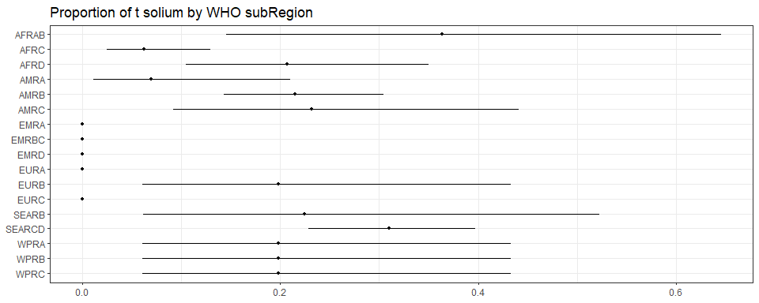
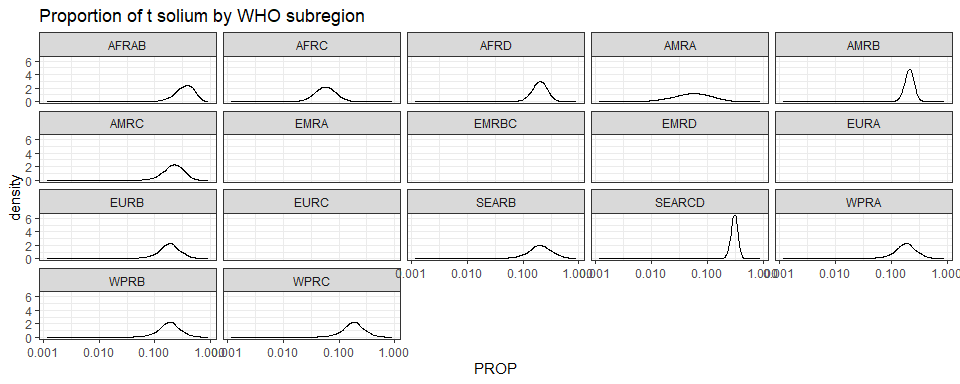

Global proportion of T solium • Estimate proportion with the 3rd model
================
fbbu6966
2025-02-21

- [Settings](#settings)
- [Model fit](#model-fit)
- [Predict all](#predict-all)
- [Summarize predictions:
  subregional](#summarize-predictions-subregional)
- [Session info](#session-info)

# Settings

``` r
## required packages ----
library(bd)
library(brms)
library(FERG2)
library(ggplot2)
library(knitr)
library(rmarkdown)
library(sf)
library(tidyr)
library(dplyr)
library(DescTools)
library(readxl)

## global options ----
knitr::opts_chunk$set(fig.width = 10)
Date <- format(Sys.Date(), "%Y%m%d")
```

# Model fit

``` r
fit_brms_reg_s <- readRDS("fit_brms_reg_s3.rds")
zero_cases<- read_xlsx("endemic_countries.xlsx")%>%
  select(SUB2, ISO3, Country, pdtf_tsolium) %>% 
  rename(COUNTRY=ISO3, COUNTRY_LABEL = Country) %>%
  mutate(pdtf_tsolium = if_else(is.na(pdtf_tsolium), 0, pdtf_tsolium))
```

    ## New names:
    ## • `` -> `...28`

``` r
zero_cases_sub2 <- table(zero_cases$SUB2, zero_cases$pdtf_tsolium, useNA = "always") %>%
  as.data.frame() %>%
  mutate(SUB2 = Var1, 
         Var2 = case_when(
           Var2 == 0 ~ "Nonendemic",
           Var2 == 1 ~ "Endemic"
         )) %>%
  select(SUB2, Var2, Freq) %>%
  spread(key = Var2, value = Freq) %>%
  filter(!is.na(SUB2)) %>%
  select(SUB2, Endemic, Nonendemic) %>%
  mutate(RegionEndemic = case_when(
    Endemic == 0 ~ 0,
    Endemic != 0 ~ 1
  ))

kable(
  caption = "Countries assumed to be non-endemic",
  row.names = FALSE,
  subset(zero_cases, pdtf_tsolium==0)[, 2])
```

| COUNTRY |
|:--------|
| AFG     |
| ALB     |
| DZA     |
| AND     |
| ATG     |
| ARG     |
| ARM     |
| AUS     |
| AUT     |
| AZE     |
| BHS     |
| BHR     |
| BRB     |
| BLR     |
| BEL     |
| BIH     |
| BRN     |
| BGR     |
| CAN     |
| CHL     |
| COM     |
| COK     |
| HRV     |
| CUB     |
| CYP     |
| CZE     |
| DNK     |
| DJI     |
| DMA     |
| EGY     |
| ERI     |
| EST     |
| ETH     |
| FJI     |
| FIN     |
| FRA     |
| GEO     |
| DEU     |
| GRC     |
| GRD     |
| HUN     |
| ISL     |
| IRN     |
| IRQ     |
| IRL     |
| ISR     |
| ITA     |
| JAM     |
| JPN     |
| JOR     |
| KAZ     |
| KIR     |
| PRK     |
| KWT     |
| KGZ     |
| LVA     |
| LBN     |
| LBY     |
| LTU     |
| LUX     |
| MDV     |
| MLT     |
| MHL     |
| MRT     |
| MUS     |
| FSM     |
| MDA     |
| MCO     |
| MNG     |
| MNE     |
| MAR     |
| NRU     |
| NLD     |
| NZL     |
| NIU     |
| MKD     |
| NOR     |
| OMN     |
| PAK     |
| PLW     |
| POL     |
| PRT     |
| QAT     |
| ROU     |
| WSM     |
| SMR     |
| SAU     |
| SRB     |
| SYC     |
| SGP     |
| SVK     |
| SVN     |
| SLB     |
| SOM     |
| ESP     |
| LKA     |
| KNA     |
| LCA     |
| VCT     |
| SDN     |
| SWE     |
| CHE     |
| SYR     |
| TJK     |
| TON     |
| TTO     |
| TUN     |
| TUR     |
| TKM     |
| TUV     |
| UKR     |
| ARE     |
| GBR     |
| USA     |
| URY     |
| UZB     |
| VUT     |
| YEM     |

Countries assumed to be non-endemic

``` r
es_files <- list.files(pattern="^es_\\d{8}\\.rds$", full.names=TRUE, ignore.case = TRUE)
es_dates <- as.Date(sub("^es_(\\d{8})\\.rds$", "\\1", basename(es_files), ignore.case = TRUE), format = "%Y%m%d")
es_latest <- es_files[which.max(es_dates)]
es<- readRDS(es_latest)
es <- subset(es, as.integer(FLAG) == 1)

Sub2_with_data <- es %>% select(SUB2) %>% distinct() %>% mutate(DATASUB2=1)
Reg2_with_data <- es %>% select(REG2) %>% distinct() %>% mutate(DATAREG2=1)
zero_cases_sub2 <- left_join(zero_cases_sub2, Sub2_with_data) %>%
  mutate(REG2 = case_when(
    substr(SUB2,1,4) == "SEAR" ~ "SEAR",
    .default=substr(SUB2,1,3)))
```

    ## Joining with `by = join_by(SUB2)`

``` r
zero_cases_sub2 <- left_join(zero_cases_sub2, Reg2_with_data) %>%
  mutate(ESTIMATES = case_when(
    RegionEndemic == 0 ~ 2,
    DATASUB2 == 1 ~ 3,
    RegionEndemic == 1 & is.na(DATASUB2) & DATAREG2 == 1 ~ 4, 
    RegionEndemic == 1  & is.na(DATASUB2) & is.na(DATAREG2) ~5))
```

    ## Joining with `by = join_by(REG2)`

``` r
zero_cases_sub2$ESTIMATES <- factor(zero_cases_sub2$ESTIMATES, 
                               level = c(1,2,3,4,5),
                               labels = c("Data present", "Disease free", "Data in subregion", "Data in region", "Data in world"))
```

# Predict all

``` r
## set up dataframe
sim_all <-
  data.frame(
    sei = 0,
    REG2 = FERG2:::countries$REG2,
    SUB2 = FERG2:::countries$SUB2) %>%
  distinct()
sim_all <- sim_all %>% left_join(zero_cases_sub2) %>% select(sei, REG2, SUB2, ESTIMATES)
```

    ## Joining with `by = join_by(REG2, SUB2)`

``` r
## draw from expected value of posterior predictive dist
set.seed(10)
draws_fit <- as_draws_df(fit_brms_reg_s)

fit_all <- data.frame(1:10000)
for (x in 1:nrow(sim_all)){
  if (as.integer(sim_all[x, "ESTIMATES"]) == 1){
    # Data present for country
    fit_all[[paste0("V",x)]] <- draws_fit$b_Intercept +                                                                               # Global intercept                                                                                        
      draws_fit[[paste0("r_REG2[",sim_all[x,"REG2"],",Intercept]")]] +                                                                # Regional component
      draws_fit[[paste0("r_REG2:SUB2[",sim_all[x,"REG2"],"_",sim_all[x,"SUB2"],",Intercept]")]] +                                     # Sub regional component
      draws_fit[[paste0("r_REG2:SUB2:COUNTRY[",sim_all[x,"REG2"],"_",sim_all[x,"SUB2"],"_",sim_all[x,"COUNTRY"],",Intercept]")]]      # Country component
  } else if (as.integer(sim_all[x, "ESTIMATES"]) == 2) {
    # Disease-free subregion
    fit_all[[paste0("V",x)]] <- 0
  } else if (as.integer(sim_all[x, "ESTIMATES"]) == 3){
    # Data not present for country, but present in subregion
    fit_all[[paste0("V",x)]] <- draws_fit$b_Intercept +                                                                               # Global intercept                                                                                       
      draws_fit[[paste0("r_REG2[",sim_all[x,"REG2"],",Intercept]")]] +                                                                # Regional component
      draws_fit[[paste0("r_REG2:SUB2[",sim_all[x,"REG2"],"_",sim_all[x,"SUB2"],",Intercept]")]]                                       # Sub regional component
  } else if (as.integer(sim_all[x, "ESTIMATES"]) == 4){
    # Data not present for country, but present in region
    fit_all[[paste0("V",x)]] <- draws_fit$b_Intercept +                                                                               # Global intercept
      draws_fit[[paste0("r_REG2[",sim_all[x,"REG2"],",Intercept]")]]                                                                  # Regional component
  } else if (as.integer(sim_all[x, "ESTIMATES"]) == 5){
    # Data not present for country
    fit_all[[paste0("V",x)]] <- draws_fit$b_Intercept 
  } 
}

fit_all <- fit_all %>% select(-c(X1.10000))

# fit_all <- 
#   posterior_epred(
#     object = fit_brms_reg_s,
#     newdata = sim_all,
#     allow_new_levels = TRUE,
#     sample_new_levels = "uncertainty",
#     re_formula = ~ 1 +          
#       (1 | REG2) +
#       (1 | REG2:SUB2)
#   )

## calculate proportions
sim_all$SIM <- t(fit_all)
sim_all <- sim_all %>% left_join(zero_cases_sub2)
```

    ## Joining with `by = join_by(REG2, SUB2, ESTIMATES)`

``` r
sim_all$PROP <- expit(sim_all$SIM)
sim_all$PROP <- sim_all$PROP*sim_all$RegionEndemic

## aggregate over subregions
all_sub_prop <- t(apply(sim_all$PROP, 1, mean_ci))
all_sub_prop <- data.frame(all_sub_prop)
names(all_sub_prop) <- c("VAL_MEAN", "VAL_LWR", "VAL_UPR")
all_sub_prop <- cbind(sim_all[1:3], all_sub_prop)
all_sub_prop$LOCATION <- "Subregion"
all_sub_prop$LOCATION_NAME <- all_sub_prop$SUB2
all_sub_prop$REG2 <- NULL
all_sub_prop$METRIC <- "Proportion"
all_sub_prop <- all_sub_prop %>%
  arrange(LOCATION_NAME)
str(all_sub_prop)
```

    ## 'data.frame':    17 obs. of  8 variables:
    ##  $ sei          : num  0 0 0 0 0 0 0 0 0 0 ...
    ##  $ SUB2         : chr  "AFRAB" "AFRC" "AFRD" "AMRA" ...
    ##  $ VAL_MEAN     : num  0.3635 0.0624 0.2071 0.07 0.2149 ...
    ##  $ VAL_LWR      : num  0.1454 0.0247 0.1048 0.0111 0.1431 ...
    ##  $ VAL_UPR      : num  0.645 0.13 0.35 0.211 0.304 ...
    ##  $ LOCATION     : chr  "Subregion" "Subregion" "Subregion" "Subregion" ...
    ##  $ LOCATION_NAME: chr  "AFRAB" "AFRC" "AFRD" "AMRA" ...
    ##  $ METRIC       : chr  "Proportion" "Proportion" "Proportion" "Proportion" ...

``` r
## compile all
all_est <-
  rbind(all_sub_prop)
str(all_est)
```

    ## 'data.frame':    17 obs. of  8 variables:
    ##  $ sei          : num  0 0 0 0 0 0 0 0 0 0 ...
    ##  $ SUB2         : chr  "AFRAB" "AFRC" "AFRD" "AMRA" ...
    ##  $ VAL_MEAN     : num  0.3635 0.0624 0.2071 0.07 0.2149 ...
    ##  $ VAL_LWR      : num  0.1454 0.0247 0.1048 0.0111 0.1431 ...
    ##  $ VAL_UPR      : num  0.645 0.13 0.35 0.211 0.304 ...
    ##  $ LOCATION     : chr  "Subregion" "Subregion" "Subregion" "Subregion" ...
    ##  $ LOCATION_NAME: chr  "AFRAB" "AFRC" "AFRD" "AMRA" ...
    ##  $ METRIC       : chr  "Proportion" "Proportion" "Proportion" "Proportion" ...

``` r
saveRDS(all_est, file = "all_estimates.rds")
```

# Summarize predictions: subregional

``` r
kable(
  caption = "Subregional proportion of t solium cases",
  row.names = FALSE,
  subset(all_sub_prop)[, c("LOCATION_NAME", "VAL_MEAN", "VAL_LWR", "VAL_UPR")])
```

| LOCATION_NAME |  VAL_MEAN |   VAL_LWR |   VAL_UPR |
|:--------------|----------:|----------:|----------:|
| AFRAB         | 0.3635240 | 0.1454156 | 0.6454795 |
| AFRC          | 0.0623712 | 0.0247339 | 0.1299354 |
| AFRD          | 0.2071244 | 0.1048393 | 0.3502385 |
| AMRA          | 0.0700282 | 0.0110811 | 0.2106383 |
| AMRB          | 0.2148566 | 0.1430755 | 0.3043435 |
| AMRC          | 0.2321715 | 0.0918158 | 0.4415111 |
| EMRA          | 0.0000000 | 0.0000000 | 0.0000000 |
| EMRBC         | 0.0000000 | 0.0000000 | 0.0000000 |
| EMRD          | 0.0000000 | 0.0000000 | 0.0000000 |
| EURA          | 0.0000000 | 0.0000000 | 0.0000000 |
| EURB          | 0.1985227 | 0.0605861 | 0.4330410 |
| EURC          | 0.0000000 | 0.0000000 | 0.0000000 |
| SEARB         | 0.2247221 | 0.0615593 | 0.5223584 |
| SEARCD        | 0.3099694 | 0.2285064 | 0.3972498 |
| WPRA          | 0.1985227 | 0.0605861 | 0.4330410 |
| WPRB          | 0.1985227 | 0.0605861 | 0.4330410 |
| WPRC          | 0.1985227 | 0.0605861 | 0.4330410 |

Subregional proportion of t solium cases

``` r
ggplot(subset(all_sub_prop),
       aes(y = VAL_MEAN, x = LOCATION_NAME)) +
  geom_pointrange(aes(ymin = VAL_LWR, ymax = VAL_UPR), size = 0.2) +
  coord_flip() +
  theme_bw() +
  scale_x_discrete(NULL, limits = rev(unique(all_sub_prop$LOCATION_NAME))) +
  scale_y_continuous(NULL) +
  ggtitle("Proportion of t solium by WHO subRegion")
```

<!-- -->

``` r
sim_all_sub <- sim_all %>%
  select(SUB2, PROP) %>%
  mutate_at("PROP", as.data.frame) %>%
  unnest(PROP)
sim_all_sub_long <-
  pivot_longer(sim_all_sub, cols = starts_with("V"))
sim_all_sub_long$PROP <- sim_all_sub_long$value

ggplot(subset(sim_all_sub_long), aes(x = PROP)) +
  geom_density() +
  facet_wrap(~SUB2) +
  theme_bw() +
  scale_x_log10() +
  ggtitle("Proportion of t solium by WHO subregion")
```

    ## Warning in scale_x_log10(): log-10 transformation introduced infinite values.

    ## Warning: Removed 50000 rows containing non-finite outside the scale range
    ## (`stat_density()`).

<!-- -->

# Session info

``` r
saveRDS(sim_all, paste0("sim_all_", Date, ".RDS"))
saveRDS(all_est, paste0("all_est_", Date, ".RDS"))
sessioninfo::session_info()
```

    ## Warning in system2("quarto", "-V", stdout = TRUE, env = paste0("TMPDIR=", : running
    ## command '"quarto"
    ## TMPDIR=C:/Users/fbbu6966/AppData/Local/Temp/RtmpAJZOTL/file38103c1338b1 -V' had status
    ## 1

    ## ─ Session info ───────────────────────────────────────────────────────────────────────
    ##  setting  value
    ##  version  R version 4.4.2 (2024-10-31 ucrt)
    ##  os       Windows 10 x64 (build 19045)
    ##  system   x86_64, mingw32
    ##  ui       RStudio
    ##  language (EN)
    ##  collate  English_United States.utf8
    ##  ctype    English_United States.utf8
    ##  tz       Europe/Brussels
    ##  date     2025-02-21
    ##  rstudio  2024.12.0+467 Kousa Dogwood (desktop)
    ##  pandoc   3.2 @ C:/Program Files/RStudio/resources/app/bin/quarto/bin/tools/ (via rmarkdown)
    ##  quarto   ERROR: Unknown command "TMPDIR=C:/Users/fbbu6966/AppData/Local/Temp/RtmpAJZOTL/file38103c1338b1". Did you mean command "update"? @ C:\\PROGRA~1\\RStudio\\RESOUR~1\\app\\bin\\quarto\\bin\\quarto.exe
    ## 
    ## ─ Packages ───────────────────────────────────────────────────────────────────────────
    ##  ! package        * version    date (UTC) lib source
    ##    abind            1.4-8      2024-09-12 [1] CRAN (R 4.4.1)
    ##    backports        1.5.0      2024-05-23 [1] CRAN (R 4.4.0)
    ##    base64enc        0.1-3      2015-07-28 [1] CRAN (R 4.4.0)
    ##    bayesplot        1.11.1     2024-02-15 [1] CRAN (R 4.4.2)
    ##    bd             * 0.0.13     2025-02-10 [1] Github (brechtdv/bd@b63c017)
    ##    boot             1.3-31     2024-08-28 [1] CRAN (R 4.4.2)
    ##    bridgesampling   1.1-2      2021-04-16 [1] CRAN (R 4.4.2)
    ##    brms           * 2.22.0     2024-09-23 [1] CRAN (R 4.4.2)
    ##    Brobdingnag      1.2-9      2022-10-19 [1] CRAN (R 4.4.2)
    ##    cellranger       1.1.0      2016-07-27 [1] CRAN (R 4.4.2)
    ##    checkmate        2.3.2      2024-07-29 [1] CRAN (R 4.4.2)
    ##    class            7.3-22     2023-05-03 [1] CRAN (R 4.4.2)
    ##    classInt         0.4-11     2025-01-08 [1] CRAN (R 4.4.2)
    ##    cli              3.6.3      2024-06-21 [1] CRAN (R 4.4.2)
    ##    cluster          2.1.6      2023-12-01 [1] CRAN (R 4.4.2)
    ##    coda             0.19-4.1   2024-01-31 [1] CRAN (R 4.4.2)
    ##    codetools        0.2-20     2024-03-31 [1] CRAN (R 4.4.2)
    ##    colorspace       2.1-1      2024-07-26 [1] CRAN (R 4.4.2)
    ##    curl             6.2.0      2025-01-23 [1] CRAN (R 4.4.2)
    ##    data.table       1.16.4     2024-12-06 [1] CRAN (R 4.4.2)
    ##    DBI              1.2.3      2024-06-02 [1] CRAN (R 4.4.2)
    ##    DescTools      * 0.99.59    2025-01-26 [1] CRAN (R 4.4.2)
    ##    digest           0.6.37     2024-08-19 [1] CRAN (R 4.4.2)
    ##    distributional   0.5.0      2024-09-17 [1] CRAN (R 4.4.2)
    ##    dplyr          * 1.1.4      2023-11-17 [1] CRAN (R 4.4.2)
    ##    e1071            1.7-16     2024-09-16 [1] CRAN (R 4.4.2)
    ##    evaluate         1.0.3      2025-01-10 [1] CRAN (R 4.4.2)
    ##    Exact            3.3        2024-07-21 [1] CRAN (R 4.4.1)
    ##    expm             1.0-0      2024-08-19 [1] CRAN (R 4.4.2)
    ##    farver           2.1.2      2024-05-13 [1] CRAN (R 4.4.2)
    ##    fastmap          1.2.0      2024-05-15 [1] CRAN (R 4.4.2)
    ##    FERG2          * 0.0.2      2025-02-21 [1] Github (brechtdv/FERG2@3d51b14)
    ##    forcats          1.0.0      2023-01-29 [1] CRAN (R 4.4.2)
    ##    foreign          0.8-87     2024-06-26 [1] CRAN (R 4.4.2)
    ##    Formula          1.2-5      2023-02-24 [1] CRAN (R 4.4.0)
    ##    generics         0.1.3      2022-07-05 [1] CRAN (R 4.4.2)
    ##    ggplot2        * 3.5.1      2024-04-23 [1] CRAN (R 4.4.2)
    ##    gld              2.6.7      2025-01-17 [1] CRAN (R 4.4.2)
    ##    glue             1.8.0      2024-09-30 [1] CRAN (R 4.4.2)
    ##    gridExtra        2.3        2017-09-09 [1] CRAN (R 4.4.2)
    ##    gtable           0.3.6      2024-10-25 [1] CRAN (R 4.4.2)
    ##    haven            2.5.4      2023-11-30 [1] CRAN (R 4.4.2)
    ##    Hmisc          * 5.2-2      2025-01-10 [1] CRAN (R 4.4.2)
    ##    hms              1.1.3      2023-03-21 [1] CRAN (R 4.4.2)
    ##    htmlTable        2.4.3      2024-07-21 [1] CRAN (R 4.4.2)
    ##    htmltools        0.5.8.1    2024-04-04 [1] CRAN (R 4.4.2)
    ##    htmlwidgets      1.6.4      2023-12-06 [1] CRAN (R 4.4.2)
    ##    httr             1.4.7      2023-08-15 [1] CRAN (R 4.4.2)
    ##    inline           0.3.21     2025-01-09 [1] CRAN (R 4.4.2)
    ##    jsonlite         1.8.9      2024-09-20 [1] CRAN (R 4.4.2)
    ##    KernSmooth       2.23-24    2024-05-17 [1] CRAN (R 4.4.2)
    ##    knitr          * 1.49       2024-11-08 [1] CRAN (R 4.4.2)
    ##    labeling         0.4.3      2023-08-29 [1] CRAN (R 4.4.0)
    ##    lattice          0.22-6     2024-03-20 [1] CRAN (R 4.4.2)
    ##    lifecycle        1.0.4      2023-11-07 [1] CRAN (R 4.4.2)
    ##    lmom             3.2        2024-09-30 [1] CRAN (R 4.4.1)
    ##    loo              2.8.0      2024-07-03 [1] CRAN (R 4.4.2)
    ##    magrittr         2.0.3      2022-03-30 [1] CRAN (R 4.4.2)
    ##    MASS             7.3-61     2024-06-13 [1] CRAN (R 4.4.2)
    ##    mathjaxr         1.6-0      2022-02-28 [1] CRAN (R 4.4.2)
    ##    Matrix         * 1.7-1      2024-10-18 [1] CRAN (R 4.4.2)
    ##    MatrixModels     0.5-3      2023-11-06 [1] CRAN (R 4.4.2)
    ##    matrixStats      1.5.0      2025-01-07 [1] CRAN (R 4.4.2)
    ##    metadat        * 1.4-0      2025-02-04 [1] CRAN (R 4.4.2)
    ##    metafor        * 4.8-0      2025-01-28 [1] CRAN (R 4.4.2)
    ##    mgcv             1.9-1      2023-12-21 [1] CRAN (R 4.4.2)
    ##    multcomp         1.4-28     2025-01-29 [1] CRAN (R 4.4.2)
    ##    munsell          0.5.1      2024-04-01 [1] CRAN (R 4.4.2)
    ##    mvtnorm          1.3-3      2025-01-10 [1] CRAN (R 4.4.2)
    ##    nlme             3.1-166    2024-08-14 [1] CRAN (R 4.4.2)
    ##    nnet             7.3-19     2023-05-03 [1] CRAN (R 4.4.2)
    ##    numDeriv       * 2016.8-1.1 2019-06-06 [1] CRAN (R 4.4.0)
    ##    pillar           1.10.1     2025-01-07 [1] CRAN (R 4.4.2)
    ##    pkgbuild         1.4.6      2025-01-16 [1] CRAN (R 4.4.2)
    ##    pkgconfig        2.0.3      2019-09-22 [1] CRAN (R 4.4.2)
    ##    plyr             1.8.9      2023-10-02 [1] CRAN (R 4.4.2)
    ##    polspline        1.1.25     2024-05-10 [1] CRAN (R 4.4.0)
    ##    posterior        1.6.0      2024-07-03 [1] CRAN (R 4.4.2)
    ##    proxy            0.4-27     2022-06-09 [1] CRAN (R 4.4.2)
    ##    purrr            1.0.4      2025-02-05 [1] CRAN (R 4.4.2)
    ##    quantreg         6.00       2025-01-29 [1] CRAN (R 4.4.2)
    ##    QuickJSR         1.5.1      2025-01-08 [1] CRAN (R 4.4.2)
    ##    R6               2.5.1      2021-08-19 [1] CRAN (R 4.4.2)
    ##    RColorBrewer     1.1-3      2022-04-03 [1] CRAN (R 4.4.0)
    ##    Rcpp           * 1.0.14     2025-01-12 [1] CRAN (R 4.4.2)
    ##  D RcppParallel     5.1.10     2025-01-24 [1] CRAN (R 4.4.2)
    ##    readxl         * 1.4.3      2023-07-06 [1] CRAN (R 4.4.2)
    ##    reshape2         1.4.4      2020-04-09 [1] CRAN (R 4.4.2)
    ##    rlang            1.1.5      2025-01-17 [1] CRAN (R 4.4.2)
    ##    rmarkdown      * 2.29       2024-11-04 [1] CRAN (R 4.4.2)
    ##    rms            * 7.0-0      2025-01-17 [1] CRAN (R 4.4.2)
    ##    rootSolve        1.8.2.4    2023-09-21 [1] CRAN (R 4.4.0)
    ##    rpart            4.1.23     2023-12-05 [1] CRAN (R 4.4.2)
    ##    rstan            2.32.6     2024-03-05 [1] CRAN (R 4.4.2)
    ##    rstantools       2.4.0      2024-01-31 [1] CRAN (R 4.4.2)
    ##    rstudioapi       0.17.1     2024-10-22 [1] CRAN (R 4.4.2)
    ##    sandwich         3.1-1      2024-09-15 [1] CRAN (R 4.4.2)
    ##    scales         * 1.3.0      2023-11-28 [1] CRAN (R 4.4.2)
    ##    sessioninfo      1.2.3      2025-02-05 [1] CRAN (R 4.4.2)
    ##    sf             * 1.0-19     2024-11-05 [1] CRAN (R 4.4.2)
    ##    SparseM          1.84-2     2024-07-17 [1] CRAN (R 4.4.2)
    ##    StanHeaders      2.32.10    2024-07-15 [1] CRAN (R 4.4.2)
    ##    stringi          1.8.4      2024-05-06 [1] CRAN (R 4.4.0)
    ##    stringr          1.5.1      2023-11-14 [1] CRAN (R 4.4.2)
    ##    survival         3.7-0      2024-06-05 [1] CRAN (R 4.4.2)
    ##    tensorA          0.36.2.1   2023-12-13 [1] CRAN (R 4.4.0)
    ##    TH.data          1.1-3      2025-01-17 [1] CRAN (R 4.4.2)
    ##    tibble           3.2.1      2023-03-20 [1] CRAN (R 4.4.2)
    ##    tidyr          * 1.3.1      2024-01-24 [1] CRAN (R 4.4.2)
    ##    tidyselect       1.2.1      2024-03-11 [1] CRAN (R 4.4.2)
    ##    units            0.8-5      2023-11-28 [1] CRAN (R 4.4.2)
    ##    V8               6.0.1      2025-02-02 [1] CRAN (R 4.4.2)
    ##    vctrs            0.6.5      2023-12-01 [1] CRAN (R 4.4.2)
    ##    withr            3.0.2      2024-10-28 [1] CRAN (R 4.4.2)
    ##    xfun             0.50       2025-01-07 [1] CRAN (R 4.4.2)
    ##    yaml             2.3.10     2024-07-26 [1] CRAN (R 4.4.2)
    ##    zoo              1.8-12     2023-04-13 [1] CRAN (R 4.4.2)
    ## 
    ##  [1] C:/Program Files/R/R-4.4.2/library
    ## 
    ##  * ── Packages attached to the search path.
    ##  D ── DLL MD5 mismatch, broken installation.
    ## 
    ## ──────────────────────────────────────────────────────────────────────────────────────

``` r
##rmarkdown::render("03-estimate_v1.R")
# save(all_est, file="./00-Report_FB/all_estimates.Rdata")
```
