Global incidence of acquired toxoplasmosis • Estimate incidence • Model
4
================
fbbu6966
2025-08-20

- [Settings](#settings)
- [Parameters of the 4th model](#parameters-of-the-4th-model)
- [Import and adapt data](#import-and-adapt-data)
- [Predict all](#predict-all)
- [Summarize predictions](#summarize-predictions)
  - [Global](#global)
  - [Regions](#regions)
  - [Subregions](#subregions)
  - [Countries](#countries)
- [Session info](#session-info)

# Settings

``` r
## required packages ----
library(bd)
library(brms)
library(FERG2)
library(ggplot2)
library(knitr)
library(rmarkdown)
library(sf)
library(tidyr)
library(dplyr)
library(DescTools)
library(readxl)
library(kableExtra)

# Standard model 
## global options ----
knitr::opts_chunk$set(fig.width = 10)
Date <- format(Sys.Date(), "%Y%m%d")
```

# Parameters of the 4th model

| Parameters                       | Values      |
|:---------------------------------|:------------|
| Number of iterations             | 5000        |
| Warmup                           | 3000        |
| Delta value                      | 0.99        |
| Maximum tree-depth               | 20          |
| Random effect on each data point | No          |
| Stronger priors specified        | Normal(0,1) |

Parameters of the model tested

# Import and adapt data

``` r
fit_brms_reg_s <- readRDS("fit_brms_v4.rds")
zero_cases<- read_xlsx("Endemic_countries.xlsx")%>%
  select(REG2, SUB2, ISO3, Country, pdtf_toxo) %>%
  rename(COUNTRY=ISO3, COUNTRY_LABEL = Country, DISEASEFREE = pdtf_toxo)
```

    ## New names:
    ## • `` -> `...33`

``` r
kable(
  caption = "Countries assumed to be non-endemic",
  row.names = FALSE,
  subset(zero_cases, DISEASEFREE==0)[, 3]) 
```

| COUNTRY |
|:--------|

Countries assumed to be non-endemic

``` r
es_files <- list.files(pattern="^es_\\d{8}\\.rds$", full.names=TRUE, ignore.case = TRUE)
es_dates <- as.Date(sub("^es_(\\d{8})\\.rds$", "\\1", basename(es_files), ignore.case = TRUE), format = "%Y%m%d")
es_latest <- es_files[which.max(es_dates)]
es <- readRDS(es_latest)
es <- subset(es, as.integer(FLAG) == 1)

country_with_data <- es %>% select(ISO3) %>% distinct() %>% mutate(DATA=1, COUNTRY = ISO3)
Sub2_with_data <- es %>% select(SUB2) %>% distinct() %>% mutate(DATASUB2=1)
Reg2_with_data <- es %>% select(REG2) %>% distinct() %>% mutate(DATAREG2=1)
zero_cases <- left_join(zero_cases, country_with_data)
```

    ## Joining with `by = join_by(COUNTRY)`

``` r
zero_cases <- left_join(zero_cases, Sub2_with_data)
```

    ## Joining with `by = join_by(SUB2)`

``` r
zero_cases <- left_join(zero_cases, Reg2_with_data) %>%
  select(-c(ISO3)) %>%
  mutate(ESTIMATES = case_when(
    DATA == 1 ~ 1,
    DISEASEFREE == 0 ~ 2,
    is.na(DATA) & DISEASEFREE == 1 & DATASUB2 == 1 ~ 3,
    is.na(DATA) & DISEASEFREE == 1 & is.na(DATASUB2) & DATAREG2 == 1 ~ 4, 
    is.na(DATA) & DISEASEFREE == 1  & is.na(DATASUB2) & is.na(DATAREG2) ~5))
```

    ## Joining with `by = join_by(REG2)`

``` r
zero_cases$ESTIMATES <- factor(zero_cases$ESTIMATES, 
                               level = c(1,2,3,4,5),
                               labels = c("Data present", "Disease free", "Data in subregion", "Data in region", "Data in world"))
Country_Check <- zero_cases %>% filter(as.integer(ESTIMATES) == 2)
```

# Predict all

``` r
## set up dataframe
sim_all <-
  data.frame(
    sei = 0,
    REG2 = FERG2:::countries$REG2,
    SUB2 = FERG2:::countries$SUB2,
    COUNTRY = FERG2:::countries$ISO3)
sim_all <-
  sim_all %>%
  left_join(zero_cases) %>%
  select(sei, REG2, SUB2, COUNTRY, ESTIMATES)
```

    ## Joining with `by = join_by(REG2, SUB2, COUNTRY)`

``` r
## draw from expected value of posterior predictive dist
set.seed(10)
#fit_all <- 
#posterior_epred(
#  object = fit_brms_reg_s,
#  newdata = sim_all,
#  allow_new_levels = TRUE,
#  sample_new_levels = "uncertainty",
#  re_formula = ~ 1 + 
#            (1  | REG2) +
#            (1  | REG2:SUB2) +
#            (1  | REG2:SUB2:COUNTRY)
#  )

draws_fit <- as_draws_df(fit_brms_reg_s)
fit_all <- data.frame(1:10000)
for (x in 1:nrow(sim_all)){
  if (as.integer(sim_all[x, "ESTIMATES"]) == 1){
    # Data present for country
    fit_all[[paste0("V",x)]] <- draws_fit$b_Intercept +                                                                               # Global intercept                                                                                      
      draws_fit[[paste0("r_REG2[",sim_all[x,"REG2"],",Intercept]")]] +                                                                # Regional component
      draws_fit[[paste0("r_REG2:SUB2[",sim_all[x,"REG2"],"_",sim_all[x,"SUB2"],",Intercept]")]] +                                     # Sub regional component
      draws_fit[[paste0("r_REG2:SUB2:COUNTRY[",sim_all[x,"REG2"],"_",sim_all[x,"SUB2"],"_",sim_all[x,"COUNTRY"],",Intercept]")]]      # Country component
  } else if (as.integer(sim_all[x, "ESTIMATES"]) == 2) {
    # Disease-free country
    fit_all[[paste0("V",x)]] <- 0
  } else if (as.integer(sim_all[x, "ESTIMATES"]) == 3){
    # Data not present for country, but present in subregion
    fit_all[[paste0("V",x)]] <- draws_fit$b_Intercept +                                                                               # Global intercept                                                                                       
      draws_fit[[paste0("r_REG2[",sim_all[x,"REG2"],",Intercept]")]] +                                                                # Regional component
      draws_fit[[paste0("r_REG2:SUB2[",sim_all[x,"REG2"],"_",sim_all[x,"SUB2"],",Intercept]")]]                                       # Sub regional component
  } else if (as.integer(sim_all[x, "ESTIMATES"]) == 4){
    # Data not present for country, but present in region
    fit_all[[paste0("V",x)]] <- draws_fit$b_Intercept +                                                                               # Global intercept
      draws_fit[[paste0("r_REG2[",sim_all[x,"REG2"],",Intercept]")]]                                                                  # Regional component
  } else if (as.integer(sim_all[x, "ESTIMATES"]) == 5){
    # Data not present for country
    fit_all[[paste0("V",x)]] <- draws_fit$b_Intercept
  } 
}

fit_all <- fit_all %>% select(-c(X1.10000))

## calculate cases
sim_all$SIM <- t(fit_all)
sim_all <- do.call("rbind", replicate(2021-2000+1, sim_all, simplify = FALSE))
sim_all$YEAR <- sort(rep(2000:2021,194))
pop_all <- aggregate(POP ~ ISO3+YEAR, FERG2:::pop, sum)
sim_all <- merge(sim_all, pop_all,
                 by.x = c("COUNTRY","YEAR"), by.y = c("ISO3", "YEAR"))
sim_all <- sim_all %>% left_join(zero_cases)
```

    ## Joining with `by = join_by(COUNTRY, REG2, SUB2, ESTIMATES)`

``` r
sim_all$CASES <- exp(sim_all$SIM) * sim_all$POP / 1e5
sim_all$CASES <- sim_all$CASES*sim_all$DISEASEFREE
sim_all$SIM<-sim_all$SIM*sim_all$DISEASEFREE
sim_all$sei<-sim_all$sei*sim_all$DISEASEFREE

## aggregate global
sim_all_glb <- with(sim_all, aggregate(CASES ~ YEAR, FUN = sum))
all_glb_id <- sim_all_glb[1]
all_glb_nr <-
  t(apply(sim_all_glb[, grepl("V", names(sim_all_glb))], 1, mean_ci))
all_glb_nr <- data.frame(all_glb_nr)
names(all_glb_nr) <- c("VAL_MEAN", "VAL_LWR", "VAL_UPR")
all_glb_nr <- cbind(all_glb_id, all_glb_nr)
all_glb_nr$LOCATION <- "Global"
all_glb_nr$LOCATION_NAME <- "Global"
all_glb_nr$METRIC <- "Number"
str(all_glb_nr)
```

    ## 'data.frame':    22 obs. of  7 variables:
    ##  $ YEAR         : int  2000 2001 2002 2003 2004 2005 2006 2007 2008 2009 ...
    ##  $ VAL_MEAN     : num  39501660 40141497 40787202 41437703 42090052 ...
    ##  $ VAL_LWR      : num  37479155 38082632 38692181 39308272 39925416 ...
    ##  $ VAL_UPR      : num  41973424 42648942 43333121 44014700 44700629 ...
    ##  $ LOCATION     : chr  "Global" "Global" "Global" "Global" ...
    ##  $ LOCATION_NAME: chr  "Global" "Global" "Global" "Global" ...
    ##  $ METRIC       : chr  "Number" "Number" "Number" "Number" ...

``` r
all_glb_rt <- all_glb_nr
all_glb_rt$POP <- with(sim_all, tapply(POP, YEAR, sum))
all_glb_rt$VAL_MEAN <- 1e5 * all_glb_rt$VAL_MEAN / all_glb_rt$POP
all_glb_rt$VAL_LWR <- 1e5 * all_glb_rt$VAL_LWR / all_glb_rt$POP
all_glb_rt$VAL_UPR <- 1e5 * all_glb_rt$VAL_UPR / all_glb_rt$POP
all_glb_rt$METRIC <- "Rate"
all_glb_rt$POP <- NULL
all_glb_rt$glb <- NULL
str(all_glb_rt)
```

    ## 'data.frame':    22 obs. of  7 variables:
    ##  $ YEAR         : int  2000 2001 2002 2003 2004 2005 2006 2007 2008 2009 ...
    ##  $ VAL_MEAN     : num [1:22(1d)] 649 650 652 654 656 ...
    ##  $ VAL_LWR      : num [1:22(1d)] 616 617 619 620 622 ...
    ##  $ VAL_UPR      : num [1:22(1d)] 689 691 693 695 696 ...
    ##  $ LOCATION     : chr  "Global" "Global" "Global" "Global" ...
    ##  $ LOCATION_NAME: chr  "Global" "Global" "Global" "Global" ...
    ##  $ METRIC       : chr  "Rate" "Rate" "Rate" "Rate" ...

``` r
## aggregate over regions
sim_all_reg <- with(sim_all, aggregate(CASES ~ REG2+YEAR, FUN = sum))
all_reg_id <- sim_all_reg[1:2]
all_reg_nr <-
  t(apply(sim_all_reg[, grepl("V", names(sim_all_reg))], 1, mean_ci))
all_reg_nr <- data.frame(all_reg_nr)
names(all_reg_nr) <- c("VAL_MEAN", "VAL_LWR", "VAL_UPR")
all_reg_nr <- cbind(all_reg_id, all_reg_nr)
all_reg_nr$LOCATION <- "Region"
all_reg_nr$LOCATION_NAME <- all_reg_nr$REG2
all_reg_nr$REG2 <- NULL
all_reg_nr$V1 <- NULL
all_reg_nr$METRIC <- "Number"
str(all_reg_nr)
```

    ## 'data.frame':    132 obs. of  7 variables:
    ##  $ YEAR         : int  2000 2000 2000 2000 2000 2000 2001 2001 2001 2001 ...
    ##  $ VAL_MEAN     : num  6573742 5442564 4213334 5989917 14230669 ...
    ##  $ VAL_LWR      : num  5745567 4910069 3941438 5584972 13096604 ...
    ##  $ VAL_UPR      : num  7620335 6119036 4527961 6443054 15907240 ...
    ##  $ LOCATION     : chr  "Region" "Region" "Region" "Region" ...
    ##  $ LOCATION_NAME: chr  "AFR" "AMR" "EMR" "EUR" ...
    ##  $ METRIC       : chr  "Number" "Number" "Number" "Number" ...

``` r
all_reg_rt <- all_reg_nr
all_reg_rt$POP <-
  with(sim_all, aggregate(POP ~ REG2+YEAR, FUN = sum))$POP
all_reg_rt$VAL_MEAN <- 1e5 * all_reg_rt$VAL_MEAN / all_reg_rt$POP
all_reg_rt$VAL_LWR <- 1e5 * all_reg_rt$VAL_LWR / all_reg_rt$POP
all_reg_rt$VAL_UPR <- 1e5 * all_reg_rt$VAL_UPR / all_reg_rt$POP
all_reg_rt$METRIC <- "Rate"
all_reg_rt$POP <- NULL
str(all_reg_rt)
```

    ## 'data.frame':    132 obs. of  7 variables:
    ##  $ YEAR         : int  2000 2000 2000 2000 2000 2000 2001 2001 2001 2001 ...
    ##  $ VAL_MEAN     : num  986 661 868 689 905 ...
    ##  $ VAL_LWR      : num  862 597 812 642 833 ...
    ##  $ VAL_UPR      : num  1143 743 933 741 1012 ...
    ##  $ LOCATION     : chr  "Region" "Region" "Region" "Region" ...
    ##  $ LOCATION_NAME: chr  "AFR" "AMR" "EMR" "EUR" ...
    ##  $ METRIC       : chr  "Rate" "Rate" "Rate" "Rate" ...

``` r
## aggregate over subregions
sim_all_sub <- with(sim_all, aggregate(CASES ~ SUB2+YEAR, FUN = sum))
all_sub_id <- sim_all_sub[1:2]
all_sub_nr <-
  t(apply(sim_all_sub[, grepl("V", names(sim_all_sub))], 1, mean_ci))
all_sub_nr <- data.frame(all_sub_nr)
names(all_sub_nr) <- c("VAL_MEAN", "VAL_LWR", "VAL_UPR")
all_sub_nr <- cbind(all_sub_id, all_sub_nr)
all_sub_nr$LOCATION <- "Subregion"
all_sub_nr$LOCATION_NAME <- all_sub_nr$SUB2
all_sub_nr$SUB2 <- NULL
all_sub_nr$METRIC <- "Number"
str(all_sub_nr)
```

    ## 'data.frame':    374 obs. of  7 variables:
    ##  $ YEAR         : int  2000 2000 2000 2000 2000 2000 2000 2000 2000 2000 ...
    ##  $ VAL_MEAN     : num  405204 3211846 2956693 1295826 3603782 ...
    ##  $ VAL_LWR      : num  385566 2719417 2458650 1139297 3190663 ...
    ##  $ VAL_UPR      : num  434887 3841922 3623635 1485557 4140202 ...
    ##  $ LOCATION     : chr  "Subregion" "Subregion" "Subregion" "Subregion" ...
    ##  $ LOCATION_NAME: chr  "AFRAB" "AFRC" "AFRD" "AMRA" ...
    ##  $ METRIC       : chr  "Number" "Number" "Number" "Number" ...

``` r
all_sub_rt <- all_sub_nr
all_sub_rt$POP <-
  with(sim_all, aggregate(POP ~ SUB2+YEAR, FUN = sum))$POP
all_sub_rt$VAL_MEAN <- 1e5 * all_sub_rt$VAL_MEAN / all_sub_rt$POP
all_sub_rt$VAL_LWR <- 1e5 * all_sub_rt$VAL_LWR / all_sub_rt$POP
all_sub_rt$VAL_UPR <- 1e5 * all_sub_rt$VAL_UPR / all_sub_rt$POP
all_sub_rt$METRIC <- "Rate"
all_sub_rt$POP <- NULL
str(all_sub_rt)
```

    ## 'data.frame':    374 obs. of  7 variables:
    ##  $ YEAR         : int  2000 2000 2000 2000 2000 2000 2000 2000 2000 2000 ...
    ##  $ VAL_MEAN     : num  755 935 1098 387 828 ...
    ##  $ VAL_LWR      : num  719 791 913 340 733 ...
    ##  $ VAL_UPR      : num  811 1118 1345 443 951 ...
    ##  $ LOCATION     : chr  "Subregion" "Subregion" "Subregion" "Subregion" ...
    ##  $ LOCATION_NAME: chr  "AFRAB" "AFRC" "AFRD" "AMRA" ...
    ##  $ METRIC       : chr  "Rate" "Rate" "Rate" "Rate" ...

``` r
## aggregate over countries
all_cnt_nr <- t(apply(sim_all$CASES, 1, mean_ci))
all_cnt_nr <- data.frame(all_cnt_nr)
names(all_cnt_nr) <- c("VAL_MEAN", "VAL_LWR", "VAL_UPR")
all_cnt_nr <- cbind(sim_all[1:2], all_cnt_nr)
all_cnt_nr$LOCATION <- "Country"
all_cnt_nr$LOCATION_NAME <- all_cnt_nr$COUNTRY
all_cnt_nr$COUNTRY <- NULL
all_cnt_nr$sei <- NULL
all_cnt_nr$METRIC <- "Number"
str(all_cnt_nr)
```

    ## 'data.frame':    4268 obs. of  7 variables:
    ##  $ YEAR         : int  2000 2001 2002 2003 2004 2005 2006 2007 2008 2009 ...
    ##  $ VAL_MEAN     : num  181177 179001 183932 198571 208175 ...
    ##  $ VAL_LWR      : num  106852 105569 108477 117111 122775 ...
    ##  $ VAL_UPR      : num  294797 291256 299280 323100 338726 ...
    ##  $ LOCATION     : chr  "Country" "Country" "Country" "Country" ...
    ##  $ LOCATION_NAME: chr  "AFG" "AFG" "AFG" "AFG" ...
    ##  $ METRIC       : chr  "Number" "Number" "Number" "Number" ...

``` r
#all_cnt_rt <- t(apply(exp(sim_all$SIM), 1, mean_ci))
#all_cnt_rt <- data.frame(all_cnt_rt)
#names(all_cnt_rt) <- c("VAL_MEAN", "VAL_LWR", "VAL_UPR")
#all_cnt_rt <- cbind(sim_all[1:2], all_cnt_rt)
#all_cnt_rt$LOCATION <- "Country"
#all_cnt_rt$LOCATION_NAME <- all_cnt_rt$COUNTRY
#all_cnt_rt$COUNTRY <- NULL
#all_cnt_rt$METRIC <- "Rate"
#str(all_cnt_rt)

all_cnt_rt <- all_cnt_nr%>%left_join(pop_all, by=c("LOCATION_NAME"="ISO3", "YEAR"="YEAR"))
all_cnt_rt$VAL_MEAN <- 1e5 * all_cnt_rt$VAL_MEAN / all_cnt_rt$POP
all_cnt_rt$VAL_LWR <- 1e5 * all_cnt_rt$VAL_LWR / all_cnt_rt$POP
all_cnt_rt$VAL_UPR <- 1e5 * all_cnt_rt$VAL_UPR / all_cnt_rt$POP
all_cnt_rt$LOCATION <- "Country"
all_cnt_rt$METRIC <- "Rate"
all_cnt_rt$POP <- NULL
str(all_cnt_rt)
```

    ## 'data.frame':    4268 obs. of  7 variables:
    ##  $ YEAR         : int  2000 2001 2002 2003 2004 2005 2006 2007 2008 2009 ...
    ##  $ VAL_MEAN     : num  895 895 895 895 895 ...
    ##  $ VAL_LWR      : num  528 528 528 528 528 ...
    ##  $ VAL_UPR      : num  1456 1456 1456 1456 1456 ...
    ##  $ LOCATION     : chr  "Country" "Country" "Country" "Country" ...
    ##  $ LOCATION_NAME: chr  "AFG" "AFG" "AFG" "AFG" ...
    ##  $ METRIC       : chr  "Rate" "Rate" "Rate" "Rate" ...

``` r
## compile all
all_est <-
  rbind(all_glb_rt, all_glb_nr,
        all_reg_rt, all_reg_nr,
        all_sub_rt, all_sub_nr,
        all_cnt_rt, all_cnt_nr)
str(all_est)
```

    ## 'data.frame':    9592 obs. of  7 variables:
    ##  $ YEAR         : int  2000 2001 2002 2003 2004 2005 2006 2007 2008 2009 ...
    ##  $ VAL_MEAN     : num  649 650 652 654 656 ...
    ##  $ VAL_LWR      : num  616 617 619 620 622 ...
    ##  $ VAL_UPR      : num  689 691 693 695 696 ...
    ##  $ LOCATION     : chr  "Global" "Global" "Global" "Global" ...
    ##  $ LOCATION_NAME: chr  "Global" "Global" "Global" "Global" ...
    ##  $ METRIC       : chr  "Rate" "Rate" "Rate" "Rate" ...

``` r
saveRDS(all_est, file = "all_estimates.rds")
```

# Summarize predictions

## Global

``` r
kable(
  caption = "Global number of acquired toxoplasmosis cases in 2010 and 2020",
  row.names = FALSE,
  format.args = list(big.mark = ","),
  subset(all_glb_nr, YEAR %in% c(2010,2020))[, 1:4])
```

|  YEAR |   VAL_MEAN |    VAL_LWR |    VAL_UPR |
|------:|-----------:|-----------:|-----------:|
| 2,010 | 46,139,852 | 43,777,582 | 48,989,575 |
| 2,020 | 53,163,292 | 50,444,492 | 56,406,438 |

Global number of acquired toxoplasmosis cases in 2010 and 2020

## Regions

``` r
kbl(subset(all_reg_rt, YEAR == 2010)[,c(6,2:4)],
    align = c("l", "c", "c", "c"), row.names = FALSE,
    col.names = c("Region", "Mean", "Lower", "Upper"),
    caption="  Incidence of acquired toxoplasmosis per 100k in 2010 by WHO region") %>%
  kable_styling("striped", "hover")
```

<table class="table table-striped" style="margin-left: auto; margin-right: auto;">

<caption>

Incidence of acquired toxoplasmosis per 100k in 2010 by WHO region
</caption>

<thead>

<tr>

<th style="text-align:left;">

Region
</th>

<th style="text-align:center;">

Mean
</th>

<th style="text-align:center;">

Lower
</th>

<th style="text-align:center;">

Upper
</th>

</tr>

</thead>

<tbody>

<tr>

<td style="text-align:left;">

AFR
</td>

<td style="text-align:center;">

990.5854
</td>

<td style="text-align:center;">

864.7359
</td>

<td style="text-align:center;">

1150.1806
</td>

</tr>

<tr>

<td style="text-align:left;">

AMR
</td>

<td style="text-align:center;">

665.1813
</td>

<td style="text-align:center;">

599.6333
</td>

<td style="text-align:center;">

748.0923
</td>

</tr>

<tr>

<td style="text-align:left;">

EMR
</td>

<td style="text-align:center;">

867.7493
</td>

<td style="text-align:center;">

809.3780
</td>

<td style="text-align:center;">

935.7131
</td>

</tr>

<tr>

<td style="text-align:left;">

EUR
</td>

<td style="text-align:center;">

683.5569
</td>

<td style="text-align:center;">

637.9545
</td>

<td style="text-align:center;">

734.3864
</td>

</tr>

<tr>

<td style="text-align:left;">

SEAR
</td>

<td style="text-align:center;">

907.5782
</td>

<td style="text-align:center;">

837.3882
</td>

<td style="text-align:center;">

1010.0336
</td>

</tr>

<tr>

<td style="text-align:left;">

WPR
</td>

<td style="text-align:center;">

184.7525
</td>

<td style="text-align:center;">

135.6494
</td>

<td style="text-align:center;">

258.0800
</td>

</tr>

</tbody>

</table>

``` r
kbl(subset(all_reg_rt, YEAR == 2020)[,c(6,2:4)],
    align = c("l", "c", "c", "c"), row.names = FALSE,
    col.names = c("Region", "Mean", "Lower", "Upper"),
    caption="  Incidence of acquired toxoplasmosis per 100k in 2020 by WHO region") %>%
  kable_styling("striped", "hover")
```

<table class="table table-striped" style="margin-left: auto; margin-right: auto;">

<caption>

Incidence of acquired toxoplasmosis per 100k in 2020 by WHO region
</caption>

<thead>

<tr>

<th style="text-align:left;">

Region
</th>

<th style="text-align:center;">

Mean
</th>

<th style="text-align:center;">

Lower
</th>

<th style="text-align:center;">

Upper
</th>

</tr>

</thead>

<tbody>

<tr>

<td style="text-align:left;">

AFR
</td>

<td style="text-align:center;">

995.5961
</td>

<td style="text-align:center;">

869.0986
</td>

<td style="text-align:center;">

1156.4418
</td>

</tr>

<tr>

<td style="text-align:left;">

AMR
</td>

<td style="text-align:center;">

665.6499
</td>

<td style="text-align:center;">

599.6696
</td>

<td style="text-align:center;">

749.6692
</td>

</tr>

<tr>

<td style="text-align:left;">

EMR
</td>

<td style="text-align:center;">

875.1910
</td>

<td style="text-align:center;">

814.1253
</td>

<td style="text-align:center;">

946.8953
</td>

</tr>

<tr>

<td style="text-align:left;">

EUR
</td>

<td style="text-align:center;">

678.7249
</td>

<td style="text-align:center;">

633.3726
</td>

<td style="text-align:center;">

729.0984
</td>

</tr>

<tr>

<td style="text-align:left;">

SEAR
</td>

<td style="text-align:center;">

909.3664
</td>

<td style="text-align:center;">

841.0570
</td>

<td style="text-align:center;">

1008.6291
</td>

</tr>

<tr>

<td style="text-align:left;">

WPR
</td>

<td style="text-align:center;">

186.7877
</td>

<td style="text-align:center;">

137.3236
</td>

<td style="text-align:center;">

259.2591
</td>

</tr>

</tbody>

</table>

``` r
ggplot(subset(all_reg_rt, YEAR == 2010),
       aes(y = VAL_MEAN, x = LOCATION_NAME)) +
  geom_pointrange(aes(ymin = VAL_LWR, ymax = VAL_UPR), size = 0.2) +
  coord_flip() +
  theme_bw() +
  scale_x_discrete(NULL, limits = rev(unique(all_reg_nr$LOCATION_NAME))) +
  scale_y_continuous(NULL) +
  ggtitle("Incidence of acquired toxoplasmosis per 100k by WHO Region, 2010")
```

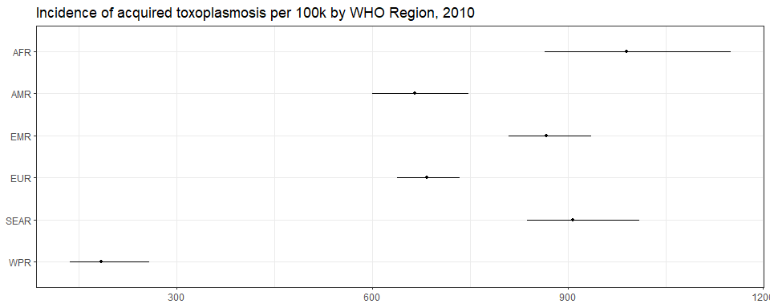<!-- -->

``` r
ggplot(subset(all_reg_rt, YEAR == 2020),
       aes(y = VAL_MEAN, x = LOCATION_NAME)) +
  geom_pointrange(aes(ymin = VAL_LWR, ymax = VAL_UPR), size = 0.2) +
  coord_flip() +
  theme_bw() +
  scale_x_discrete(NULL, limits = rev(unique(all_reg_nr$LOCATION_NAME))) +
  scale_y_continuous(NULL) +
  ggtitle("Incidence of acquired toxoplasmosis per 100k by WHO Region, 2020")
```

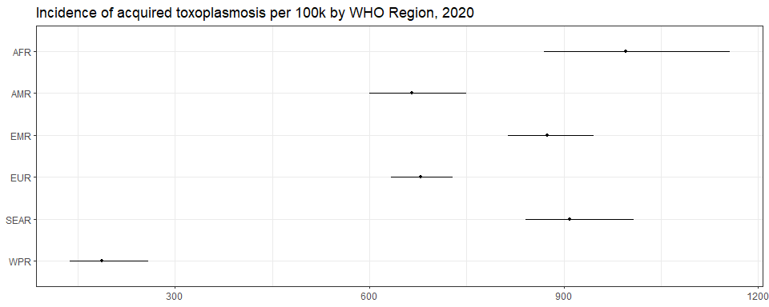<!-- -->

``` r
ggplot(subset(all_reg_nr, YEAR == 2010),
       aes(y = VAL_MEAN, x = LOCATION_NAME)) +
  geom_pointrange(aes(ymin = VAL_LWR, ymax = VAL_UPR), size = 0.2) +
  coord_flip() +
  theme_bw() +
  scale_x_discrete(NULL, limits = rev(unique(all_reg_nr$LOCATION_NAME))) +
  scale_y_continuous(NULL) +
  ggtitle("Number of acquired toxoplasmosis cases by WHO Region, 2010")
```

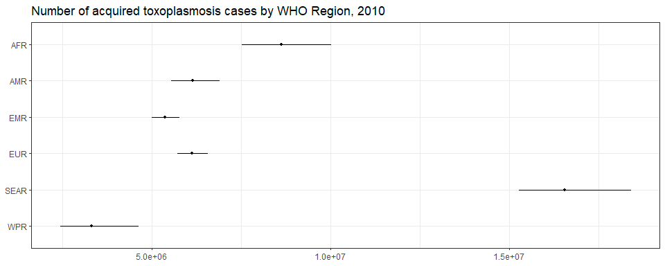<!-- -->

``` r
ggplot(subset(all_reg_nr, YEAR == 2020),
       aes(y = VAL_MEAN, x = LOCATION_NAME)) +
  geom_pointrange(aes(ymin = VAL_LWR, ymax = VAL_UPR), size = 0.2) +
  coord_flip() +
  theme_bw() +
  scale_x_discrete(NULL, limits = rev(unique(all_reg_nr$LOCATION_NAME))) +
  scale_y_continuous(NULL) +
  ggtitle("Number of acquired toxoplasmosis cases by WHO Region, 2020")
```

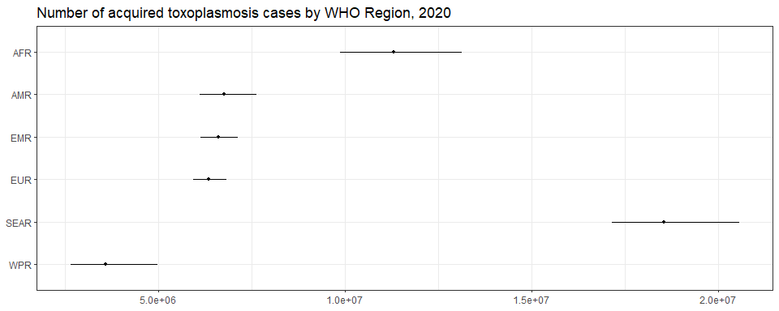<!-- -->

``` r
sim_all_reg <-
  merge(sim_all_reg,
        with(sim_all, aggregate(POP ~ REG2+YEAR, FUN = sum)))
sim_all_reg_long <-
  pivot_longer(sim_all_reg, cols = starts_with("V"))
sim_all_reg_long$CASES <- sim_all_reg_long$value
```

``` r
ggplot(subset(sim_all_reg_long, YEAR==2010), aes(x = CASES)) +
  geom_density() +
  facet_wrap(~REG2) +
  theme_bw() +
  scale_x_log10() +
  ggtitle("Number of acquired toxoplasmosis cases by WHO Region, 2010")
```

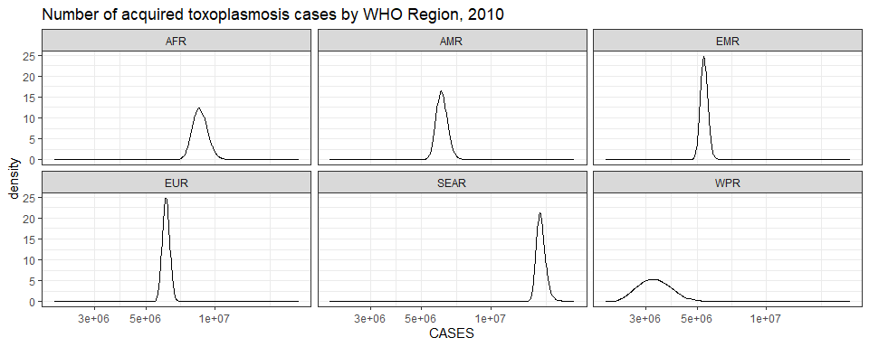<!-- -->

``` r
ggplot(subset(sim_all_reg_long, YEAR==2020), aes(x = CASES)) +
  geom_density() +
  facet_wrap(~REG2) +
  theme_bw() +
  scale_x_log10() +
  ggtitle("Number of acquired toxoplasmosis cases by WHO Region, 2020")
```

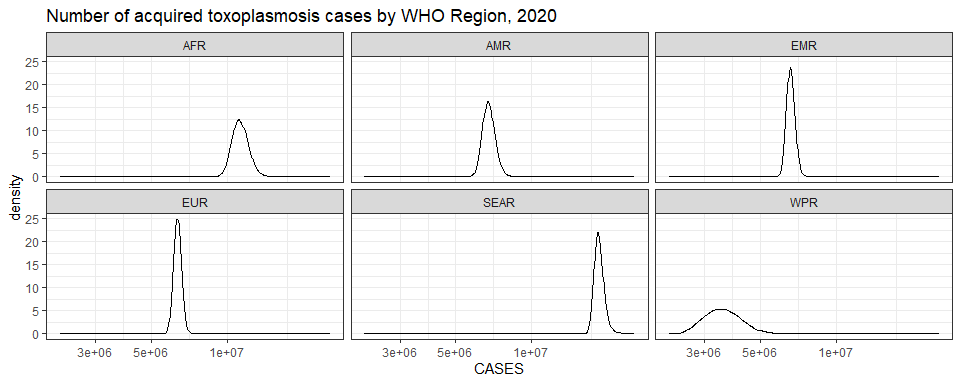<!-- -->

## Subregions

``` r
ggplot(subset(all_sub_rt, YEAR == 2010),
       aes(y = VAL_MEAN, x = LOCATION_NAME)) +
  geom_pointrange(aes(ymin = VAL_LWR, ymax = VAL_UPR), size = 0.2) +
  coord_flip() +
  theme_bw() +
  scale_x_discrete(NULL, limits = rev(unique(all_sub_nr$LOCATION_NAME))) +
  scale_y_continuous(NULL) +
  ggtitle("Incidence of acquired toxoplasmosis per 100k by WHO Subregion, 2010")
```

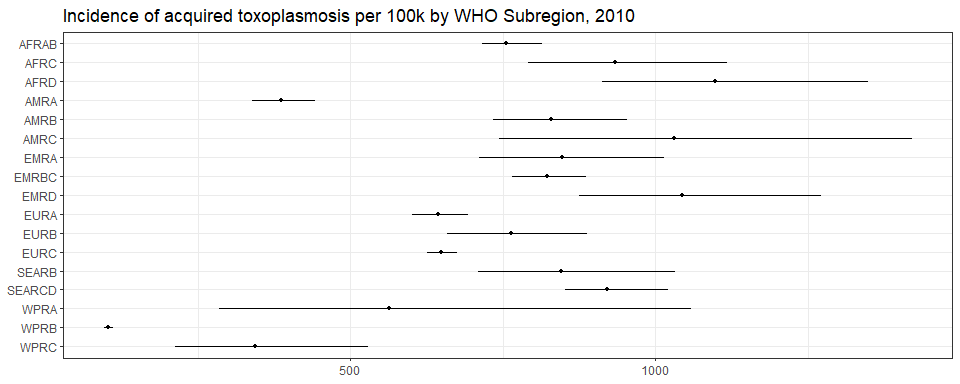<!-- -->

``` r
ggplot(subset(all_sub_rt, YEAR == 2020),
       aes(y = VAL_MEAN, x = LOCATION_NAME)) +
  geom_pointrange(aes(ymin = VAL_LWR, ymax = VAL_UPR), size = 0.2) +
  coord_flip() +
  theme_bw() +
  scale_x_discrete(NULL, limits = rev(unique(all_sub_nr$LOCATION_NAME))) +
  scale_y_continuous(NULL) +
  ggtitle("Incidence of acquired toxoplasmosis per 100k by WHO Subregion, 2020")
```

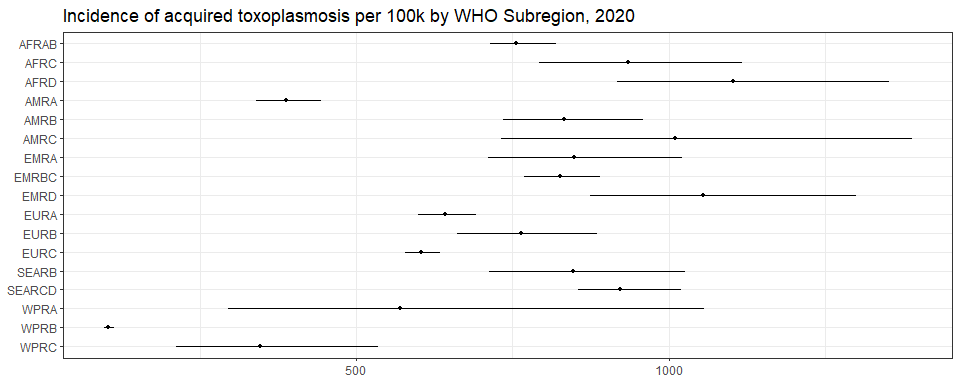<!-- -->

``` r
ggplot(subset(all_sub_nr, YEAR == 2010),
       aes(y = VAL_MEAN, x = LOCATION_NAME)) +
  geom_pointrange(aes(ymin = VAL_LWR, ymax = VAL_UPR), size = 0.2) +
  coord_flip() +
  theme_bw() +
  scale_x_discrete(NULL, limits = rev(unique(all_sub_nr$LOCATION_NAME))) +
  scale_y_continuous(NULL) +
  ggtitle("Number of acquired toxoplasmosis cases by WHO Subregion, 2010")
```

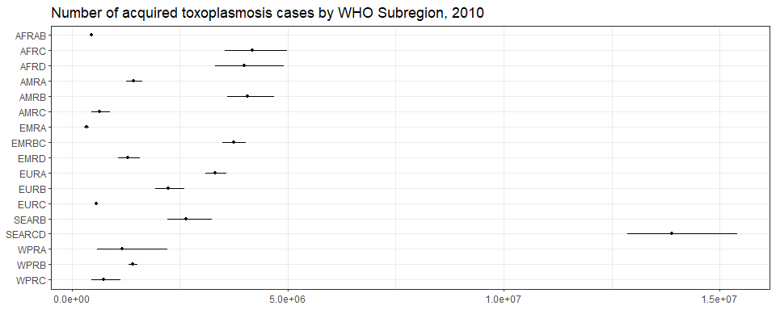<!-- -->

``` r
ggplot(subset(all_sub_nr, YEAR == 2020),
       aes(y = VAL_MEAN, x = LOCATION_NAME)) +
  geom_pointrange(aes(ymin = VAL_LWR, ymax = VAL_UPR), size = 0.2) +
  coord_flip() +
  theme_bw() +
  scale_x_discrete(NULL, limits = rev(unique(all_sub_nr$LOCATION_NAME))) +
  scale_y_continuous(NULL) +
  ggtitle("Number of acquired toxoplasmosis cases by WHO Subregion, 2020")
```

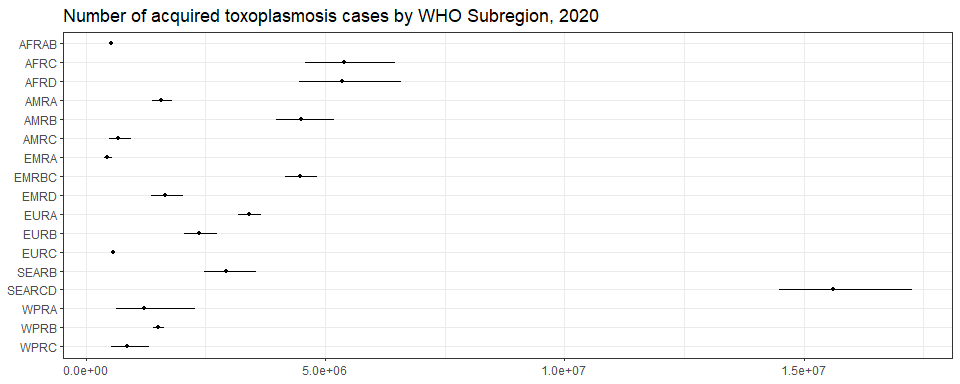<!-- -->

``` r
sim_all_sub <-
  merge(sim_all_sub,
        with(sim_all, aggregate(POP ~ SUB2+YEAR , FUN = sum)))
sim_all_sub_long <-
  pivot_longer(sim_all_sub, cols = starts_with("V"))
sim_all_sub_long$CASES <- sim_all_sub_long$value
```

``` r
ggplot(subset(sim_all_sub_long, YEAR==2010), aes(x = CASES)) +
  geom_density() +
  facet_wrap(~SUB2) +
  theme_bw() +
  scale_x_log10() +
  ggtitle("Number of acquired toxoplasmosis cases by WHO Subregion, 2010")
```

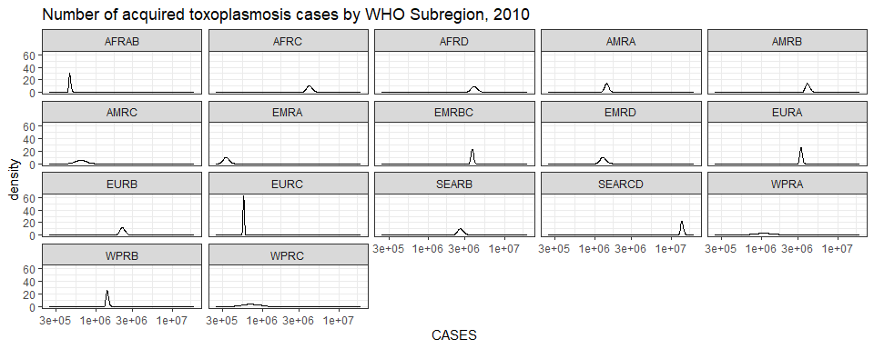<!-- -->

``` r
ggplot(subset(sim_all_sub_long, YEAR==2020), aes(x = CASES)) +
  geom_density() +
  facet_wrap(~SUB2) +
  theme_bw() +
  scale_x_log10() +
  ggtitle("Number of acquired toxoplasmosis cases by WHO Subregion, 2020")
```

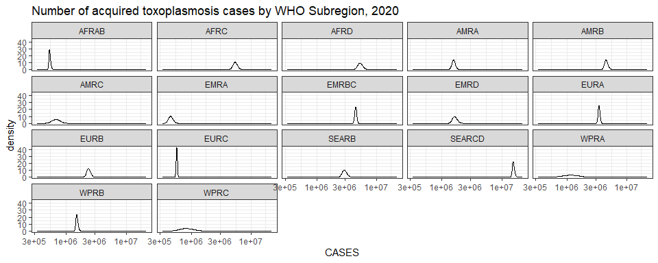<!-- -->

## Countries

``` r
breaks <- plot_world(subset(all_cnt_rt, YEAR == 2010),
                     "LOCATION_NAME", "VAL_MEAN", legend.title = "Incidence per 100k", diseasefree = zero_cases)
plot_world(subset(all_cnt_rt, YEAR == 2010), breaks = breaks,
           "LOCATION_NAME", "VAL_MEAN", legend.title = "Incidence per 100k", diseasefree = zero_cases)
```

    ## [1]    0  500 1000 1500 2000

``` r
title("Acquired toxoplasmosis incidence per 100k in 2010", line = 1)
```

<!-- -->

``` r
plot_world(subset(all_cnt_rt, YEAR == 2020), breaks = breaks,
           "LOCATION_NAME", "VAL_MEAN", legend.title = "Incidence per 100k", diseasefree = zero_cases)
```

    ## [1]    0  500 1000 1500 2000

``` r
title("Acquired toxoplasmosis incidence per 100k in 2020", line = 1)
```

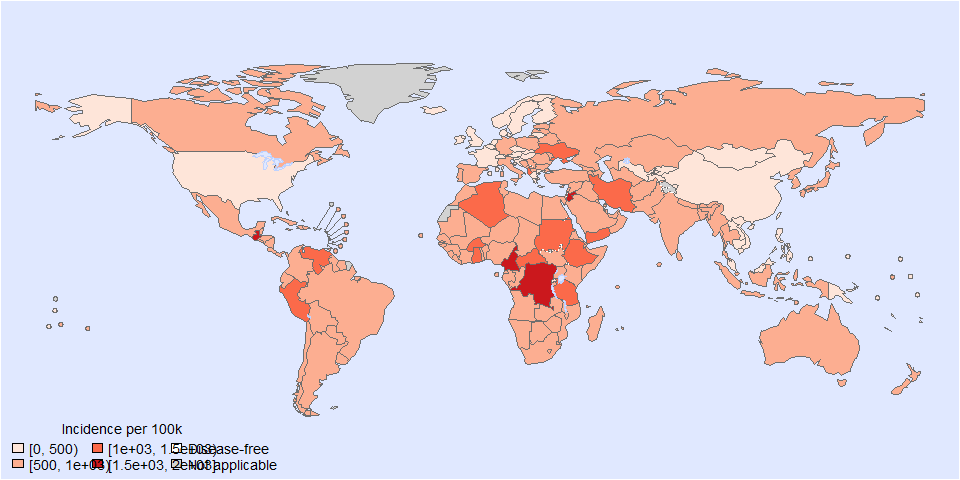<!-- -->

``` r
tab <-
  data.frame(subset(all_cnt_rt, YEAR == 2010)[,
                                              c("LOCATION_NAME", "VAL_MEAN", "VAL_LWR", "VAL_UPR")],
             subset(all_cnt_rt, YEAR == 2020)[,
                                              c("VAL_MEAN", "VAL_LWR", "VAL_UPR")])
tab$LOCATION_NAME <-
  FERG2:::countries$COUNTRY[match(tab$LOCATION_NAME, FERG2:::countries$ISO3)]
tab$LOCATION_NAME <- gsub(" \\(.*", "", tab$LOCATION_NAME)
names(tab) <-
  c("Country",
    "2010.mean", "2010.lwr", "2010.upr",
    "2020.mean", "2020.lwr", "2020.upr")

kable(tab, digits = 3, row.names = FALSE,
      caption = "Estimated acquired toxoplasmosis incidence per 100k by country, 2010 vs 2020")
```

| Country | 2010.mean | 2010.lwr | 2010.upr | 2020.mean | 2020.lwr | 2020.upr |
|:---|---:|---:|---:|---:|---:|---:|
| Afghanistan | 894.614 | 527.614 | 1455.648 | 894.614 | 527.614 | 1455.648 |
| Angola | 909.506 | 770.252 | 1066.097 | 909.506 | 770.252 | 1066.097 |
| Albania | 1069.413 | 1025.692 | 1113.097 | 1069.413 | 1025.692 | 1113.097 |
| Andorra | 497.452 | 358.442 | 669.553 | 497.452 | 358.442 | 669.553 |
| United Arab Emirates | 861.272 | 498.540 | 1381.313 | 861.272 | 498.540 | 1381.313 |
| Argentina | 935.996 | 500.195 | 1606.344 | 935.996 | 500.195 | 1606.344 |
| Armenia | 610.476 | 399.740 | 956.428 | 610.476 | 399.740 | 956.428 |
| Antigua and Barbuda | 718.885 | 359.405 | 1171.058 | 718.885 | 359.405 | 1171.058 |
| Australia | 984.191 | 895.337 | 1079.758 | 984.191 | 895.337 | 1079.758 |
| Austria | 497.452 | 358.442 | 669.553 | 497.452 | 358.442 | 669.553 |
| Azerbaijan | 735.165 | 712.900 | 757.676 | 735.165 | 712.900 | 757.676 |
| Burundi | 869.576 | 561.571 | 1330.807 | 869.576 | 561.571 | 1330.807 |
| Belgium | 497.452 | 358.442 | 669.553 | 497.452 | 358.442 | 669.553 |
| Benin | 905.786 | 821.209 | 995.742 | 905.786 | 821.209 | 995.742 |
| Burkina Faso | 1325.093 | 587.704 | 2612.018 | 1325.093 | 587.704 | 2612.018 |
| Bangladesh | 744.950 | 358.133 | 1373.750 | 744.950 | 358.133 | 1373.750 |
| Bulgaria | 610.476 | 399.740 | 956.428 | 610.476 | 399.740 | 956.428 |
| Bahrain | 861.272 | 498.540 | 1381.313 | 861.272 | 498.540 | 1381.313 |
| Bahamas | 718.885 | 359.405 | 1171.058 | 718.885 | 359.405 | 1171.058 |
| Bosnia and Herzegovina | 687.458 | 605.176 | 779.156 | 687.458 | 605.176 | 779.156 |
| Belarus | 748.470 | 665.912 | 836.244 | 748.470 | 665.912 | 836.244 |
| Belize | 836.031 | 541.843 | 1271.189 | 836.031 | 541.843 | 1271.189 |
| Bolivia | 679.306 | 551.425 | 829.916 | 679.306 | 551.425 | 829.916 |
| Brazil | 776.513 | 764.475 | 789.110 | 776.513 | 764.475 | 789.110 |
| Barbados | 718.885 | 359.405 | 1171.058 | 718.885 | 359.405 | 1171.058 |
| Brunei Darussalam | 513.357 | 203.078 | 1063.310 | 513.357 | 203.078 | 1063.310 |
| Bhutan | 744.950 | 358.133 | 1373.750 | 744.950 | 358.133 | 1373.750 |
| Botswana | 806.506 | 446.276 | 1257.916 | 806.506 | 446.276 | 1257.916 |
| Central African Republic | 1325.768 | 1178.689 | 1488.369 | 1325.768 | 1178.689 | 1488.369 |
| Canada | 718.885 | 359.405 | 1171.058 | 718.885 | 359.405 | 1171.058 |
| Switzerland | 497.452 | 358.442 | 669.553 | 497.452 | 358.442 | 669.553 |
| Chile | 551.640 | 510.654 | 594.000 | 551.640 | 510.654 | 594.000 |
| China | 95.816 | 92.746 | 98.938 | 95.816 | 92.746 | 98.938 |
| Côte d’Ivoire | 831.061 | 558.639 | 1181.539 | 831.061 | 558.639 | 1181.539 |
| Cameroon | 1542.747 | 1453.216 | 1637.510 | 1542.747 | 1453.216 | 1637.510 |
| Congo | 1538.508 | 1453.113 | 1626.573 | 1538.508 | 1453.113 | 1626.573 |
| Congo | 692.381 | 545.021 | 863.692 | 692.381 | 545.021 | 863.692 |
| Cook Islands | 513.357 | 203.078 | 1063.310 | 513.357 | 203.078 | 1063.310 |
| Colombia | 836.031 | 541.843 | 1271.189 | 836.031 | 541.843 | 1271.189 |
| Comoros | 861.875 | 583.964 | 1229.199 | 861.875 | 583.964 | 1229.199 |
| Cabo Verde | 861.875 | 583.964 | 1229.199 | 861.875 | 583.964 | 1229.199 |
| Costa Rica | 836.031 | 541.843 | 1271.189 | 836.031 | 541.843 | 1271.189 |
| Cuba | 897.797 | 866.482 | 929.617 | 897.797 | 866.482 | 929.617 |
| Cyprus | 532.036 | 493.912 | 572.466 | 532.036 | 493.912 | 572.466 |
| Czechia | 481.642 | 461.658 | 502.005 | 481.642 | 461.658 | 502.005 |
| Germany | 906.526 | 905.547 | 907.506 | 906.526 | 905.547 | 907.506 |
| Djibouti | 870.974 | 572.766 | 1300.604 | 870.974 | 572.766 | 1300.604 |
| Dominica | 836.031 | 541.843 | 1271.189 | 836.031 | 541.843 | 1271.189 |
| Denmark | 497.452 | 358.442 | 669.553 | 497.452 | 358.442 | 669.553 |
| Dominican Republic | 836.031 | 541.843 | 1271.189 | 836.031 | 541.843 | 1271.189 |
| Algeria | 1033.156 | 878.022 | 1204.159 | 1033.156 | 878.022 | 1204.159 |
| Ecuador | 969.769 | 905.654 | 1037.819 | 969.769 | 905.654 | 1037.819 |
| Egypt | 800.196 | 720.316 | 888.736 | 800.196 | 720.316 | 888.736 |
| Eritrea | 959.959 | 755.983 | 1198.262 | 959.959 | 755.983 | 1198.262 |
| Spain | 955.686 | 929.520 | 982.029 | 955.686 | 929.520 | 982.029 |
| Estonia | 631.520 | 590.045 | 676.037 | 631.520 | 590.045 | 676.037 |
| Ethiopia | 1258.541 | 936.333 | 1667.338 | 1258.541 | 936.333 | 1667.338 |
| Finland | 285.250 | 243.673 | 332.362 | 285.250 | 243.673 | 332.362 |
| Fiji | 414.348 | 158.728 | 781.135 | 414.348 | 158.728 | 781.135 |
| France | 497.452 | 358.442 | 669.553 | 497.452 | 358.442 | 669.553 |
| Micronesia | 426.589 | 184.482 | 773.472 | 426.589 | 184.482 | 773.472 |
| Gabon | 821.231 | 533.364 | 1204.459 | 821.231 | 533.364 | 1204.459 |
| United Kingdom | 470.106 | 468.506 | 471.761 | 470.106 | 468.506 | 471.761 |
| Georgia | 610.476 | 399.740 | 956.428 | 610.476 | 399.740 | 956.428 |
| Ghana | 1033.198 | 969.313 | 1101.017 | 1033.198 | 969.313 | 1101.017 |
| Guinea | 861.875 | 583.964 | 1229.199 | 861.875 | 583.964 | 1229.199 |
| Gambia | 869.576 | 561.571 | 1330.807 | 869.576 | 561.571 | 1330.807 |
| Guinea-Bissau | 869.576 | 561.571 | 1330.807 | 869.576 | 561.571 | 1330.807 |
| Equatorial Guinea | 806.506 | 446.276 | 1257.916 | 806.506 | 446.276 | 1257.916 |
| Greece | 497.452 | 358.442 | 669.553 | 497.452 | 358.442 | 669.553 |
| Grenada | 836.031 | 541.843 | 1271.189 | 836.031 | 541.843 | 1271.189 |
| Guatemala | 1835.196 | 1765.373 | 1906.143 | 1835.196 | 1765.373 | 1906.143 |
| Guyana | 718.885 | 359.405 | 1171.058 | 718.885 | 359.405 | 1171.058 |
| Honduras | 805.655 | 452.683 | 1349.014 | 805.655 | 452.683 | 1349.014 |
| Croatia | 480.334 | 449.041 | 512.847 | 480.334 | 449.041 | 512.847 |
| Haiti | 805.655 | 452.683 | 1349.014 | 805.655 | 452.683 | 1349.014 |
| Hungary | 497.452 | 358.442 | 669.553 | 497.452 | 358.442 | 669.553 |
| Indonesia | 868.232 | 752.920 | 996.808 | 868.232 | 752.920 | 996.808 |
| India | 968.745 | 929.747 | 1008.178 | 968.745 | 929.747 | 1008.178 |
| Ireland | 497.452 | 358.442 | 669.553 | 497.452 | 358.442 | 669.553 |
| Iran | 1024.581 | 982.376 | 1069.258 | 1024.581 | 982.376 | 1069.258 |
| Iraq | 953.667 | 756.549 | 1187.737 | 953.667 | 756.549 | 1187.737 |
| Iceland | 497.452 | 358.442 | 669.553 | 497.452 | 358.442 | 669.553 |
| Israel | 972.993 | 902.490 | 1047.053 | 972.993 | 902.490 | 1047.053 |
| Italy | 661.594 | 626.779 | 696.335 | 661.594 | 626.779 | 696.335 |
| Jamaica | 836.031 | 541.843 | 1271.189 | 836.031 | 541.843 | 1271.189 |
| Jordan | 1847.852 | 1762.296 | 1937.760 | 1847.852 | 1762.296 | 1937.760 |
| Japan | 513.357 | 203.078 | 1063.310 | 513.357 | 203.078 | 1063.310 |
| Kazakhstan | 610.476 | 399.740 | 956.428 | 610.476 | 399.740 | 956.428 |
| Kenya | 976.862 | 960.082 | 993.508 | 976.862 | 960.082 | 993.508 |
| Kyrgyzstan | 306.364 | 258.959 | 361.143 | 306.364 | 258.959 | 361.143 |
| Cambodia | 217.690 | 181.207 | 258.644 | 217.690 | 181.207 | 258.644 |
| Kiribati | 426.589 | 184.482 | 773.472 | 426.589 | 184.482 | 773.472 |
| Saint Kitts and Nevis | 718.885 | 359.405 | 1171.058 | 718.885 | 359.405 | 1171.058 |
| Korea | 513.357 | 203.078 | 1063.310 | 513.357 | 203.078 | 1063.310 |
| Kuwait | 858.668 | 792.401 | 931.605 | 858.668 | 792.401 | 931.605 |
| Lao People’s Dem. Republic | 426.589 | 184.482 | 773.472 | 426.589 | 184.482 | 773.472 |
| Lebanon | 870.974 | 572.766 | 1300.604 | 870.974 | 572.766 | 1300.604 |
| Liberia | 869.576 | 561.571 | 1330.807 | 869.576 | 561.571 | 1330.807 |
| Libya | 688.558 | 648.097 | 730.508 | 688.558 | 648.097 | 730.508 |
| Saint Lucia | 836.031 | 541.843 | 1271.189 | 836.031 | 541.843 | 1271.189 |
| Sri Lanka | 744.950 | 358.133 | 1373.750 | 744.950 | 358.133 | 1373.750 |
| Lesotho | 861.875 | 583.964 | 1229.199 | 861.875 | 583.964 | 1229.199 |
| Lithuania | 497.452 | 358.442 | 669.553 | 497.452 | 358.442 | 669.553 |
| Luxembourg | 497.452 | 358.442 | 669.553 | 497.452 | 358.442 | 669.553 |
| Latvia | 764.619 | 671.425 | 861.785 | 764.619 | 671.425 | 861.785 |
| Morocco | 950.934 | 836.385 | 1083.571 | 950.934 | 836.385 | 1083.571 |
| Monaco | 497.452 | 358.442 | 669.553 | 497.452 | 358.442 | 669.553 |
| Republic of Moldova | 610.476 | 399.740 | 956.428 | 610.476 | 399.740 | 956.428 |
| Madagascar | 869.576 | 561.571 | 1330.807 | 869.576 | 561.571 | 1330.807 |
| Maldives | 765.706 | 353.843 | 1494.391 | 765.706 | 353.843 | 1494.391 |
| Mexico | 610.225 | 355.896 | 974.896 | 610.225 | 355.896 | 974.896 |
| Marshall Islands | 414.348 | 158.728 | 781.135 | 414.348 | 158.728 | 781.135 |
| North Macedonia | 610.476 | 399.740 | 956.428 | 610.476 | 399.740 | 956.428 |
| Mali | 869.576 | 561.571 | 1330.807 | 869.576 | 561.571 | 1330.807 |
| Malta | 497.452 | 358.442 | 669.553 | 497.452 | 358.442 | 669.553 |
| Myanmar | 511.887 | 439.453 | 593.704 | 511.887 | 439.453 | 593.704 |
| Montenegro | 610.476 | 399.740 | 956.428 | 610.476 | 399.740 | 956.428 |
| Mongolia | 426.589 | 184.482 | 773.472 | 426.589 | 184.482 | 773.472 |
| Mozambique | 869.576 | 561.571 | 1330.807 | 869.576 | 561.571 | 1330.807 |
| Mauritania | 861.875 | 583.964 | 1229.199 | 861.875 | 583.964 | 1229.199 |
| Mauritius | 806.506 | 446.276 | 1257.916 | 806.506 | 446.276 | 1257.916 |
| Malawi | 869.576 | 561.571 | 1330.807 | 869.576 | 561.571 | 1330.807 |
| Malaysia | 414.348 | 158.728 | 781.135 | 414.348 | 158.728 | 781.135 |
| Namibia | 664.938 | 172.153 | 1800.805 | 664.938 | 172.153 | 1800.805 |
| Niger | 869.576 | 561.571 | 1330.807 | 869.576 | 561.571 | 1330.807 |
| Nigeria | 861.875 | 583.964 | 1229.199 | 861.875 | 583.964 | 1229.199 |
| Nicaragua | 805.655 | 452.683 | 1349.014 | 805.655 | 452.683 | 1349.014 |
| Niue | 513.357 | 203.078 | 1063.310 | 513.357 | 203.078 | 1063.310 |
| Netherlands | 5.986 | 3.034 | 10.640 | 5.986 | 3.034 | 10.640 |
| Norway | 292.719 | 256.651 | 331.101 | 292.719 | 256.651 | 331.101 |
| Nepal | 744.950 | 358.133 | 1373.750 | 744.950 | 358.133 | 1373.750 |
| Nauru | 513.357 | 203.078 | 1063.310 | 513.357 | 203.078 | 1063.310 |
| New Zealand | 513.357 | 203.078 | 1063.310 | 513.357 | 203.078 | 1063.310 |
| Oman | 861.272 | 498.540 | 1381.313 | 861.272 | 498.540 | 1381.313 |
| Pakistan | 682.844 | 566.992 | 812.778 | 682.844 | 566.992 | 812.778 |
| Panama | 718.885 | 359.405 | 1171.058 | 718.885 | 359.405 | 1171.058 |
| Peru | 1262.544 | 849.397 | 1792.780 | 1262.544 | 849.397 | 1792.780 |
| Philippines | 426.589 | 184.482 | 773.472 | 426.589 | 184.482 | 773.472 |
| Palau | 414.348 | 158.728 | 781.135 | 414.348 | 158.728 | 781.135 |
| Papua New Guinea | 426.589 | 184.482 | 773.472 | 426.589 | 184.482 | 773.472 |
| Poland | 803.696 | 630.499 | 1015.270 | 803.696 | 630.499 | 1015.270 |
| Korea | 744.950 | 358.133 | 1373.750 | 744.950 | 358.133 | 1373.750 |
| Portugal | 739.956 | 538.116 | 991.634 | 739.956 | 538.116 | 991.634 |
| Paraguay | 826.535 | 724.480 | 935.476 | 826.535 | 724.480 | 935.476 |
| Qatar | 908.544 | 778.631 | 1059.707 | 908.544 | 778.631 | 1059.707 |
| Romania | 777.662 | 583.573 | 1020.788 | 777.662 | 583.573 | 1020.788 |
| Russian Federation | 808.410 | 616.466 | 1039.915 | 808.410 | 616.466 | 1039.915 |
| Rwanda | 273.545 | 131.514 | 501.208 | 273.545 | 131.514 | 501.208 |
| Saudi Arabia | 834.320 | 701.425 | 987.689 | 834.320 | 701.425 | 987.689 |
| Sudan | 1252.745 | 1150.388 | 1364.319 | 1252.745 | 1150.388 | 1364.319 |
| Senegal | 543.586 | 289.869 | 938.598 | 543.586 | 289.869 | 938.598 |
| Singapore | 513.357 | 203.078 | 1063.310 | 513.357 | 203.078 | 1063.310 |
| Solomon Islands | 426.589 | 184.482 | 773.472 | 426.589 | 184.482 | 773.472 |
| Sierra Leone | 869.576 | 561.571 | 1330.807 | 869.576 | 561.571 | 1330.807 |
| El Salvador | 836.031 | 541.843 | 1271.189 | 836.031 | 541.843 | 1271.189 |
| San Marino | 497.452 | 358.442 | 669.553 | 497.452 | 358.442 | 669.553 |
| Somalia | 894.614 | 527.614 | 1455.648 | 894.614 | 527.614 | 1455.648 |
| Serbia | 524.602 | 433.889 | 629.495 | 524.602 | 433.889 | 629.495 |
| South Sudan | 869.576 | 561.571 | 1330.807 | 869.576 | 561.571 | 1330.807 |
| Sao Tome and Principe | 861.875 | 583.964 | 1229.199 | 861.875 | 583.964 | 1229.199 |
| Suriname | 836.031 | 541.843 | 1271.189 | 836.031 | 541.843 | 1271.189 |
| Slovakia | 373.794 | 281.173 | 487.317 | 373.794 | 281.173 | 487.317 |
| Slovenia | 497.452 | 358.442 | 669.553 | 497.452 | 358.442 | 669.553 |
| Sweden | 497.452 | 358.442 | 669.553 | 497.452 | 358.442 | 669.553 |
| Eswatini | 861.875 | 583.964 | 1229.199 | 861.875 | 583.964 | 1229.199 |
| Seychelles | 806.506 | 446.276 | 1257.916 | 806.506 | 446.276 | 1257.916 |
| Syrian Arab Republic | 816.663 | 793.773 | 839.995 | 816.663 | 793.773 | 839.995 |
| Chad | 869.576 | 561.571 | 1330.807 | 869.576 | 561.571 | 1330.807 |
| Togo | 869.576 | 561.571 | 1330.807 | 869.576 | 561.571 | 1330.807 |
| Thailand | 765.706 | 353.843 | 1494.391 | 765.706 | 353.843 | 1494.391 |
| Tajikistan | 496.941 | 274.662 | 755.893 | 496.941 | 274.662 | 755.893 |
| Turkmenistan | 610.476 | 399.740 | 956.428 | 610.476 | 399.740 | 956.428 |
| Timor-Leste | 744.950 | 358.133 | 1373.750 | 744.950 | 358.133 | 1373.750 |
| Tonga | 414.348 | 158.728 | 781.135 | 414.348 | 158.728 | 781.135 |
| Trinidad and Tobago | 718.885 | 359.405 | 1171.058 | 718.885 | 359.405 | 1171.058 |
| Tunisia | 701.594 | 354.597 | 1271.485 | 701.594 | 354.597 | 1271.485 |
| Turkiye | 787.340 | 720.558 | 860.195 | 787.340 | 720.558 | 860.195 |
| Tuvalu | 414.348 | 158.728 | 781.135 | 414.348 | 158.728 | 781.135 |
| United Republic of Tanzania | 1041.101 | 731.487 | 1433.472 | 1041.101 | 731.487 | 1433.472 |
| Uganda | 869.576 | 561.571 | 1330.807 | 869.576 | 561.571 | 1330.807 |
| Ukraine | 1044.408 | 1041.394 | 1047.387 | 1044.408 | 1041.394 | 1047.387 |
| Uruguay | 718.885 | 359.405 | 1171.058 | 718.885 | 359.405 | 1171.058 |
| United States of America | 330.228 | 308.642 | 352.171 | 330.228 | 308.642 | 352.171 |
| Uzbekistan | 102.202 | 70.285 | 143.873 | 102.202 | 70.285 | 143.873 |
| Saint Vincent and the Grenadines | 836.031 | 541.843 | 1271.189 | 836.031 | 541.843 | 1271.189 |
| Venezuela | 1342.702 | 853.700 | 2027.064 | 1342.702 | 853.700 | 2027.064 |
| Viet Nam | 257.714 | 212.032 | 308.585 | 257.714 | 212.032 | 308.585 |
| Vanuatu | 426.589 | 184.482 | 773.472 | 426.589 | 184.482 | 773.472 |
| Samoa | 426.589 | 184.482 | 773.472 | 426.589 | 184.482 | 773.472 |
| Yemen | 1181.658 | 764.472 | 1740.758 | 1181.658 | 764.472 | 1740.758 |
| South Africa | 752.904 | 750.736 | 755.060 | 752.904 | 750.736 | 755.060 |
| Zambia | 861.875 | 583.964 | 1229.199 | 861.875 | 583.964 | 1229.199 |
| Zimbabwe | 861.875 | 583.964 | 1229.199 | 861.875 | 583.964 | 1229.199 |

Estimated acquired toxoplasmosis incidence per 100k by country, 2010 vs
2020

``` r
tab2 <-
  data.frame(subset(all_cnt_nr, YEAR == 2010)[,
                                              c("LOCATION_NAME", "VAL_MEAN", "VAL_LWR", "VAL_UPR")],
             subset(all_cnt_nr, YEAR == 2020)[,
                                              c("VAL_MEAN", "VAL_LWR", "VAL_UPR")])
tab2$LOCATION_NAME <-
  FERG2:::countries$COUNTRY[match(tab2$LOCATION_NAME, FERG2:::countries$ISO3)]
tab2$LOCATION_NAME <- gsub(" \\(.*", "", tab2$LOCATION_NAME)
names(tab2) <-
  c("Country",
    "2010.mean", "2010.lwr", "2010.upr",
    "2020.mean", "2020.lwr", "2020.upr")

kable(tab2, digits = 0, row.names = FALSE,
      caption = "Estimated acquired toxoplasmosis cases by country")
```

| Country | 2010.mean | 2010.lwr | 2010.upr | 2020.mean | 2020.lwr | 2020.upr |
|:---|---:|---:|---:|---:|---:|---:|
| Afghanistan | 249562 | 147184 | 406069 | 343800 | 202762 | 559405 |
| Angola | 207754 | 175944 | 243523 | 299414 | 253571 | 350965 |
| Albania | 31499 | 30211 | 32785 | 30780 | 29522 | 32037 |
| Andorra | 416 | 300 | 560 | 384 | 277 | 517 |
| United Arab Emirates | 58757 | 34011 | 94235 | 80599 | 46654 | 129265 |
| Argentina | 384419 | 205433 | 659734 | 422286 | 225669 | 724720 |
| Armenia | 17937 | 11745 | 28102 | 17707 | 11594 | 27741 |
| Antigua and Barbuda | 610 | 305 | 993 | 658 | 329 | 1073 |
| Australia | 216318 | 196789 | 237323 | 252503 | 229707 | 277022 |
| Austria | 41554 | 29942 | 55930 | 44283 | 31908 | 59603 |
| Azerbaijan | 66854 | 64829 | 68901 | 74646 | 72386 | 76932 |
| Burundi | 79998 | 51662 | 122429 | 108187 | 69867 | 165570 |
| Belgium | 54085 | 38971 | 72796 | 57327 | 41307 | 77160 |
| Benin | 87423 | 79260 | 96106 | 116831 | 105922 | 128434 |
| Burkina Faso | 211217 | 93679 | 416350 | 281176 | 124707 | 554253 |
| Bangladesh | 1129006 | 542767 | 2081980 | 1233799 | 593146 | 2275227 |
| Bulgaria | 45573 | 29841 | 71399 | 42435 | 27787 | 66483 |
| Bahrain | 10463 | 6056 | 16780 | 12730 | 7369 | 20416 |
| Bahamas | 2625 | 1313 | 4277 | 2843 | 1422 | 4632 |
| Bosnia and Herzegovina | 26440 | 23275 | 29967 | 22851 | 20116 | 25899 |
| Belarus | 71105 | 63262 | 79444 | 70357 | 62597 | 78608 |
| Belize | 2648 | 1716 | 4026 | 3246 | 2104 | 4936 |
| Bolivia | 68604 | 55689 | 83814 | 79837 | 64807 | 97538 |
| Brazil | 1497964 | 1474741 | 1522265 | 1616133 | 1591078 | 1642350 |
| Barbados | 1975 | 988 | 3218 | 2023 | 1012 | 3296 |
| Brunei Darussalam | 1995 | 789 | 4132 | 2285 | 904 | 4733 |
| Bhutan | 5198 | 2499 | 9586 | 5716 | 2748 | 10541 |
| Botswana | 16223 | 8977 | 25303 | 18943 | 10482 | 29545 |
| Central African Republic | 58987 | 52443 | 66222 | 65765 | 58469 | 73831 |
| Canada | 244546 | 122260 | 398364 | 273309 | 136640 | 445219 |
| Switzerland | 38699 | 27885 | 52087 | 42823 | 30856 | 57638 |
| Chile | 94307 | 87300 | 101548 | 106640 | 98717 | 114829 |
| China | 1290726 | 1249379 | 1332791 | 1365792 | 1322040 | 1410303 |
| Côte d’Ivoire | 184837 | 124248 | 262788 | 237334 | 159536 | 337423 |
| Cameroon | 299105 | 281746 | 317477 | 398913 | 375762 | 423416 |
| Congo | 1037762 | 980161 | 1097164 | 1452548 | 1371924 | 1535692 |
| Congo | 30379 | 23914 | 37896 | 39350 | 30975 | 49086 |
| Cook Islands | 86 | 34 | 178 | 82 | 32 | 169 |
| Colombia | 372264 | 241270 | 566030 | 420749 | 272693 | 639751 |
| Comoros | 5588 | 3786 | 7969 | 6844 | 4637 | 9761 |
| Cabo Verde | 4382 | 2969 | 6250 | 4434 | 3004 | 6324 |
| Costa Rica | 37867 | 24542 | 57577 | 41962 | 27196 | 63804 |
| Cuba | 101415 | 97878 | 105009 | 100452 | 96948 | 104013 |
| Cyprus | 5951 | 5525 | 6403 | 6887 | 6394 | 7411 |
| Czechia | 50292 | 48205 | 52418 | 50849 | 48739 | 52999 |
| Germany | 733002 | 732211 | 733795 | 758171 | 757353 | 758991 |
| Djibouti | 8022 | 5276 | 11979 | 9555 | 6284 | 14268 |
| Dominica | 576 | 373 | 876 | 566 | 367 | 861 |
| Denmark | 27533 | 19839 | 37058 | 28966 | 20872 | 38988 |
| Dominican Republic | 81575 | 52870 | 124035 | 91533 | 59324 | 139177 |
| Algeria | 370221 | 314630 | 431498 | 451338 | 383567 | 526042 |
| Ecuador | 145001 | 135415 | 155176 | 169448 | 158245 | 181338 |
| Egypt | 706877 | 636313 | 785092 | 867889 | 781252 | 963920 |
| Eritrea | 27971 | 22028 | 34915 | 31315 | 24661 | 39088 |
| Spain | 446827 | 434593 | 459143 | 455261 | 442796 | 467810 |
| Estonia | 8420 | 7867 | 9014 | 8392 | 7841 | 8984 |
| Ethiopia | 1123239 | 835672 | 1488088 | 1476248 | 1098304 | 1955761 |
| Finland | 15265 | 13040 | 17786 | 15761 | 13464 | 18364 |
| Fiji | 3766 | 1443 | 7100 | 3785 | 1450 | 7136 |
| France | 314698 | 226758 | 423573 | 327407 | 235915 | 440678 |
| Micronesia | 458 | 198 | 831 | 471 | 204 | 854 |
| Gabon | 13877 | 9012 | 20352 | 18851 | 12243 | 27647 |
| United Kingdom | 294977 | 293973 | 296016 | 316296 | 315220 | 317410 |
| Georgia | 23863 | 15625 | 37385 | 23179 | 15178 | 36314 |
| Ghana | 260059 | 243979 | 277129 | 326172 | 306005 | 347582 |
| Guinea | 88493 | 59959 | 126208 | 113787 | 77096 | 162282 |
| Gambia | 16510 | 10662 | 25266 | 21614 | 13958 | 33079 |
| Guinea-Bissau | 13443 | 8682 | 20573 | 17310 | 11179 | 26491 |
| Equatorial Guinea | 9371 | 5185 | 14616 | 13686 | 7573 | 21347 |
| Greece | 55324 | 39864 | 74464 | 53303 | 38408 | 71744 |
| Grenada | 932 | 604 | 1416 | 971 | 629 | 1476 |
| Guatemala | 263456 | 253433 | 273641 | 316179 | 304149 | 328402 |
| Guyana | 5397 | 2698 | 8792 | 5774 | 2887 | 9406 |
| Honduras | 66696 | 37475 | 111677 | 80831 | 45418 | 135346 |
| Croatia | 20690 | 19342 | 22090 | 19069 | 17827 | 20360 |
| Haiti | 78709 | 44225 | 131792 | 90041 | 50593 | 150768 |
| Hungary | 49712 | 35820 | 66910 | 48594 | 35015 | 65406 |
| Indonesia | 2125029 | 1842799 | 2439724 | 2376769 | 2061105 | 2728744 |
| India | 11959263 | 11477833 | 12446066 | 13523400 | 12979004 | 14073871 |
| Ireland | 22627 | 16304 | 30455 | 24686 | 17788 | 33227 |
| Iran | 788282 | 755811 | 822656 | 896322 | 859400 | 935406 |
| Iraq | 291305 | 231094 | 362804 | 397123 | 315040 | 494594 |
| Iceland | 1581 | 1139 | 2127 | 1812 | 1306 | 2439 |
| Israel | 70725 | 65600 | 76108 | 84946 | 78791 | 91412 |
| Italy | 397203 | 376301 | 418061 | 397230 | 376327 | 418089 |
| Jamaica | 22930 | 14861 | 34865 | 23615 | 15305 | 35907 |
| Jordan | 133151 | 126986 | 139630 | 198880 | 189672 | 208557 |
| Japan | 658134 | 260350 | 1363182 | 649781 | 257046 | 1345883 |
| Kazakhstan | 102102 | 66856 | 159962 | 118129 | 77351 | 185071 |
| Kenya | 400604 | 393722 | 407430 | 505113 | 496437 | 513721 |
| Kyrgyzstan | 16667 | 14088 | 19647 | 20166 | 17046 | 23772 |
| Cambodia | 31325 | 26075 | 37218 | 36117 | 30064 | 42912 |
| Kiribati | 459 | 199 | 832 | 533 | 230 | 966 |
| Saint Kitts and Nevis | 337 | 169 | 550 | 337 | 169 | 549 |
| Korea | 249725 | 98788 | 517253 | 266052 | 105247 | 551069 |
| Kuwait | 24624 | 22723 | 26715 | 38334 | 35376 | 41591 |
| Lao People’s Dem. Republic | 26824 | 11600 | 48636 | 31108 | 13453 | 56405 |
| Lebanon | 43770 | 28784 | 65361 | 49614 | 32627 | 74087 |
| Liberia | 34786 | 22465 | 53237 | 44298 | 28608 | 67794 |
| Libya | 44285 | 41683 | 46983 | 48194 | 45362 | 51130 |
| Saint Lucia | 1425 | 923 | 2166 | 1488 | 964 | 2262 |
| Sri Lanka | 155068 | 74549 | 285959 | 167524 | 80537 | 308929 |
| Lesotho | 17136 | 11611 | 24440 | 19152 | 12976 | 27314 |
| Lithuania | 15632 | 11263 | 21040 | 13904 | 10018 | 18714 |
| Luxembourg | 2500 | 1801 | 3365 | 3115 | 2245 | 4193 |
| Latvia | 16217 | 14240 | 18277 | 14590 | 12811 | 16444 |
| Morocco | 306623 | 269687 | 349391 | 346082 | 304393 | 394354 |
| Monaco | 163 | 117 | 219 | 188 | 135 | 253 |
| Republic of Moldova | 22400 | 14668 | 35094 | 18863 | 12352 | 29553 |
| Madagascar | 190120 | 122779 | 290962 | 248577 | 160531 | 380424 |
| Maldives | 2714 | 1254 | 5297 | 3790 | 1752 | 7397 |
| Mexico | 688425 | 401504 | 1099829 | 771061 | 449700 | 1231849 |
| Marshall Islands | 216 | 83 | 406 | 180 | 69 | 339 |
| North Macedonia | 12553 | 8219 | 19666 | 11515 | 7540 | 18040 |
| Mali | 136395 | 88084 | 208740 | 185913 | 120063 | 284524 |
| Malta | 2098 | 1512 | 2824 | 2560 | 1844 | 3445 |
| Myanmar | 249973 | 214601 | 289928 | 270406 | 232142 | 313626 |
| Montenegro | 3860 | 2527 | 6047 | 3723 | 2438 | 5832 |
| Mongolia | 11441 | 4948 | 20745 | 13927 | 6023 | 25251 |
| Mozambique | 197292 | 127411 | 301937 | 263687 | 170289 | 403549 |
| Mauritania | 28755 | 19483 | 41010 | 39072 | 26474 | 55725 |
| Mauritius | 10331 | 5717 | 16113 | 10362 | 5734 | 16162 |
| Malawi | 127035 | 82039 | 194416 | 167636 | 108259 | 256551 |
| Malaysia | 117663 | 45074 | 221819 | 139623 | 53487 | 263219 |
| Namibia | 13917 | 3603 | 37692 | 17872 | 4627 | 48401 |
| Niger | 141223 | 91202 | 216130 | 202851 | 131001 | 310445 |
| Nigeria | 1416099 | 959479 | 2019628 | 1824942 | 1236491 | 2602717 |
| Nicaragua | 45896 | 25788 | 76850 | 52571 | 29539 | 88026 |
| Niue | 9 | 4 | 19 | 9 | 4 | 19 |
| Netherlands | 1001 | 508 | 1780 | 1054 | 534 | 1873 |
| Norway | 14221 | 12468 | 16085 | 15711 | 13776 | 17772 |
| Nepal | 203078 | 97629 | 374493 | 213791 | 102780 | 394249 |
| Nauru | 51 | 20 | 107 | 60 | 24 | 124 |
| New Zealand | 22214 | 8787 | 46011 | 25855 | 10228 | 53554 |
| Oman | 23377 | 13532 | 37493 | 39371 | 22789 | 63143 |
| Pakistan | 1344393 | 1116301 | 1600209 | 1589496 | 1319820 | 1891951 |
| Panama | 25854 | 12925 | 42115 | 30676 | 15337 | 49972 |
| Peru | 365954 | 246201 | 519645 | 412346 | 277413 | 585521 |
| Philippines | 406603 | 175839 | 737234 | 475553 | 205657 | 862251 |
| Palau | 77 | 29 | 145 | 74 | 28 | 139 |
| Papua New Guinea | 32075 | 13871 | 58157 | 41447 | 17924 | 75149 |
| Poland | 305518 | 239679 | 385946 | 307164 | 240970 | 388026 |
| Korea | 185735 | 89292 | 342511 | 194351 | 93434 | 358400 |
| Portugal | 78306 | 56946 | 104940 | 76678 | 55762 | 102758 |
| Paraguay | 47123 | 41305 | 53335 | 54208 | 47515 | 61353 |
| Qatar | 15040 | 12889 | 17542 | 25584 | 21926 | 29841 |
| Romania | 159479 | 119676 | 209338 | 151279 | 113523 | 198574 |
| Russian Federation | 1163495 | 887242 | 1496685 | 1184762 | 903459 | 1524043 |
| Rwanda | 27871 | 13400 | 51067 | 35344 | 16992 | 64759 |
| Saudi Arabia | 205952 | 173147 | 243811 | 257046 | 216102 | 304297 |
| Sudan | 439086 | 403210 | 478193 | 578446 | 531184 | 629965 |
| Senegal | 67861 | 36187 | 117174 | 90082 | 48037 | 155543 |
| Singapore | 25818 | 10213 | 53477 | 29168 | 11538 | 60415 |
| Solomon Islands | 2232 | 965 | 4046 | 3137 | 1357 | 5689 |
| Sierra Leone | 53401 | 34486 | 81726 | 68013 | 43923 | 104088 |
| El Salvador | 50645 | 32823 | 77005 | 52028 | 33720 | 79108 |
| San Marino | 151 | 109 | 203 | 173 | 124 | 232 |
| Somalia | 108366 | 63911 | 176326 | 146108 | 86169 | 237735 |
| Serbia | 38877 | 32155 | 46651 | 36403 | 30108 | 43681 |
| South Sudan | 82197 | 53083 | 125795 | 91834 | 59307 | 140544 |
| Sao Tome and Principe | 1550 | 1050 | 2211 | 1853 | 1256 | 2643 |
| Suriname | 4571 | 2963 | 6950 | 5093 | 3301 | 7743 |
| Slovakia | 20144 | 15152 | 26262 | 20388 | 15336 | 26580 |
| Slovenia | 10163 | 7323 | 13679 | 10400 | 7494 | 13999 |
| Sweden | 46466 | 33482 | 62542 | 51376 | 37019 | 69151 |
| Eswatini | 9554 | 6473 | 13626 | 10217 | 6922 | 14571 |
| Seychelles | 759 | 420 | 1185 | 959 | 531 | 1496 |
| Syrian Arab Republic | 181546 | 176458 | 186733 | 169465 | 164715 | 174306 |
| Chad | 105212 | 67946 | 161018 | 147269 | 95106 | 225382 |
| Togo | 57748 | 37293 | 88378 | 74487 | 48103 | 113995 |
| Thailand | 523497 | 241915 | 1021682 | 548118 | 253293 | 1069734 |
| Tajikistan | 37610 | 20787 | 57208 | 47912 | 26481 | 72878 |
| Turkmenistan | 33615 | 22011 | 52665 | 41988 | 27494 | 65783 |
| Timor-Leste | 7984 | 3838 | 14722 | 9785 | 4704 | 18045 |
| Tonga | 445 | 170 | 838 | 438 | 168 | 826 |
| Trinidad and Tobago | 9940 | 4969 | 16192 | 10628 | 5313 | 17312 |
| Tunisia | 75117 | 37965 | 136134 | 83693 | 42300 | 151675 |
| Turkiye | 574028 | 525339 | 627144 | 675211 | 617940 | 737690 |
| Tuvalu | 44 | 17 | 82 | 43 | 17 | 82 |
| United Republic of Tanzania | 459519 | 322862 | 632703 | 625196 | 439268 | 860820 |
| Uganda | 277518 | 179221 | 424716 | 380324 | 245613 | 582052 |
| Ukraine | 486049 | 484646 | 487435 | 468269 | 466918 | 469605 |
| Uruguay | 23826 | 11912 | 38813 | 24425 | 12211 | 39789 |
| United States of America | 1022146 | 955331 | 1090064 | 1119944 | 1046736 | 1194360 |
| Uzbekistan | 28785 | 19796 | 40522 | 34002 | 23383 | 47865 |
| Saint Vincent and the Grenadines | 922 | 597 | 1401 | 868 | 562 | 1319 |
| Venezuela | 384372 | 244387 | 580283 | 383848 | 244054 | 579492 |
| Viet Nam | 224094 | 184372 | 268328 | 251582 | 206987 | 301241 |
| Vanuatu | 1005 | 435 | 1823 | 1260 | 545 | 2284 |
| Samoa | 820 | 355 | 1487 | 900 | 389 | 1631 |
| Yemen | 311280 | 201382 | 458561 | 421151 | 272463 | 620418 |
| South Africa | 391709 | 390581 | 392830 | 452341 | 451039 | 453636 |
| Zambia | 118336 | 80179 | 168770 | 161921 | 109710 | 230931 |
| Zimbabwe | 114139 | 77335 | 162784 | 132679 | 89897 | 189226 |

Estimated acquired toxoplasmosis cases by country

# Session info

``` r
saveRDS(sim_all, paste0("sim_all_", Date, ".RDS"))
saveRDS(all_est, paste0("all_est_", Date, ".RDS"))
sessioninfo::session_info()
```

    ## Warning in system2("quarto", "-V", stdout = TRUE, env = paste0("TMPDIR=", : running command '"quarto"
    ## TMPDIR=C:/Users/fbbu6966/AppData/Local/Temp/RtmpEZN3i4/file341c75026bea -V' had status 1

    ## ─ Session info ──────────────────────────────────────────────────────────────────────────────────────────────────────────
    ##  setting  value
    ##  version  R version 4.5.0 (2025-04-11 ucrt)
    ##  os       Windows 10 x64 (build 19045)
    ##  system   x86_64, mingw32
    ##  ui       RStudio
    ##  language (EN)
    ##  collate  English_United States.utf8
    ##  ctype    English_United States.utf8
    ##  tz       Europe/Brussels
    ##  date     2025-08-20
    ##  rstudio  2025.05.0+496 Mariposa Orchid (desktop)
    ##  pandoc   3.4 @ C:/Users/fbbu6966/AppData/Local/Programs/RStudio/resources/app/bin/quarto/bin/tools/ (via rmarkdown)
    ##  quarto   ERROR: Unknown command "TMPDIR=C:/Users/fbbu6966/AppData/Local/Temp/RtmpEZN3i4/file341c75026bea". Did you mean command "update"? @ C:\\Users\\fbbu6966\\AppData\\Local\\Programs\\RStudio\\RESOUR~1\\app\\bin\\quarto\\bin\\quarto.exe
    ## 
    ## ─ Packages ──────────────────────────────────────────────────────────────────────────────────────────────────────────────
    ##  ! package        * version    date (UTC) lib source
    ##    abind            1.4-8      2024-09-12 [1] CRAN (R 4.5.0)
    ##    backports        1.5.0      2024-05-23 [1] CRAN (R 4.5.0)
    ##    base64enc        0.1-3      2015-07-28 [1] CRAN (R 4.5.0)
    ##    bayesplot        1.12.0     2025-04-10 [1] CRAN (R 4.5.0)
    ##    bd             * 0.0.14     2025-04-14 [1] Github (brechtdv/bd@652191c)
    ##    boot             1.3-31     2024-08-28 [1] CRAN (R 4.5.0)
    ##    bridgesampling   1.1-2      2021-04-16 [1] CRAN (R 4.5.0)
    ##    brms           * 2.22.0     2024-09-23 [1] CRAN (R 4.5.0)
    ##    Brobdingnag      1.2-9      2022-10-19 [1] CRAN (R 4.5.0)
    ##    callr            3.7.6      2024-03-25 [1] CRAN (R 4.5.0)
    ##    cellranger       1.1.0      2016-07-27 [1] CRAN (R 4.5.0)
    ##    checkmate        2.3.2      2024-07-29 [1] CRAN (R 4.5.0)
    ##    class            7.3-23     2025-01-01 [1] CRAN (R 4.5.0)
    ##    classInt         0.4-11     2025-01-08 [1] CRAN (R 4.5.0)
    ##    cli              3.6.4      2025-02-13 [1] CRAN (R 4.5.0)
    ##    cluster          2.1.8.1    2025-03-12 [1] CRAN (R 4.5.0)
    ##    coda             0.19-4.1   2024-01-31 [1] CRAN (R 4.5.0)
    ##    codetools        0.2-20     2024-03-31 [1] CRAN (R 4.5.0)
    ##    colorspace       2.1-1      2024-07-26 [1] CRAN (R 4.5.0)
    ##    curl             6.2.2      2025-03-24 [1] CRAN (R 4.5.0)
    ##    data.table       1.17.0     2025-02-22 [1] CRAN (R 4.5.0)
    ##    DBI              1.2.3      2024-06-02 [1] CRAN (R 4.5.0)
    ##    DescTools      * 0.99.60    2025-03-28 [1] CRAN (R 4.5.0)
    ##    digest           0.6.37     2024-08-19 [1] CRAN (R 4.5.0)
    ##    distributional   0.5.0      2024-09-17 [1] CRAN (R 4.5.0)
    ##    dplyr          * 1.1.4      2023-11-17 [1] CRAN (R 4.5.0)
    ##    e1071            1.7-16     2024-09-16 [1] CRAN (R 4.5.0)
    ##    evaluate         1.0.3      2025-01-10 [1] CRAN (R 4.5.0)
    ##    Exact            3.3        2024-07-21 [1] CRAN (R 4.5.0)
    ##    expm             1.0-0      2024-08-19 [1] CRAN (R 4.5.0)
    ##    farver           2.1.2      2024-05-13 [1] CRAN (R 4.5.0)
    ##    fastmap          1.2.0      2024-05-15 [1] CRAN (R 4.5.0)
    ##    FERG2          * 0.0.5      2025-08-07 [1] Github (brechtdv/FERG2@c2d4ac1)
    ##    forcats          1.0.0      2023-01-29 [1] CRAN (R 4.5.0)
    ##    foreign          0.8-90     2025-03-31 [1] CRAN (R 4.5.0)
    ##    Formula          1.2-5      2023-02-24 [1] CRAN (R 4.5.0)
    ##    fs               1.6.6      2025-04-12 [1] CRAN (R 4.5.0)
    ##    generics         0.1.3      2022-07-05 [1] CRAN (R 4.5.0)
    ##    ggplot2        * 3.5.2      2025-04-09 [1] CRAN (R 4.5.0)
    ##    gld              2.6.7      2025-01-17 [1] CRAN (R 4.5.0)
    ##    glue             1.8.0      2024-09-30 [1] CRAN (R 4.5.0)
    ##    gridExtra        2.3        2017-09-09 [1] CRAN (R 4.5.0)
    ##    gtable           0.3.6      2024-10-25 [1] CRAN (R 4.5.0)
    ##    haven            2.5.4      2023-11-30 [1] CRAN (R 4.5.0)
    ##    Hmisc          * 5.2-3      2025-03-16 [1] CRAN (R 4.5.0)
    ##    hms              1.1.3      2023-03-21 [1] CRAN (R 4.5.0)
    ##    htmlTable        2.4.3      2024-07-21 [1] CRAN (R 4.5.0)
    ##    htmltools        0.5.8.1    2024-04-04 [1] CRAN (R 4.5.0)
    ##    htmlwidgets      1.6.4      2023-12-06 [1] CRAN (R 4.5.0)
    ##    httr             1.4.7      2023-08-15 [1] CRAN (R 4.5.0)
    ##    inline           0.3.21     2025-01-09 [1] CRAN (R 4.5.0)
    ##    jsonlite         2.0.0      2025-03-27 [1] CRAN (R 4.5.0)
    ##    kableExtra     * 1.4.0      2024-01-24 [1] CRAN (R 4.5.0)
    ##    KernSmooth       2.23-26    2025-01-01 [1] CRAN (R 4.5.0)
    ##    knitr          * 1.50       2025-03-16 [1] CRAN (R 4.5.0)
    ##    labeling         0.4.3      2023-08-29 [1] CRAN (R 4.5.0)
    ##    lattice          0.22-6     2024-03-20 [1] CRAN (R 4.5.0)
    ##    lifecycle        1.0.4      2023-11-07 [1] CRAN (R 4.5.0)
    ##    lmom             3.2        2024-09-30 [1] CRAN (R 4.5.0)
    ##    loo              2.8.0      2024-07-03 [1] CRAN (R 4.5.0)
    ##    magrittr         2.0.3      2022-03-30 [1] CRAN (R 4.5.0)
    ##    MASS             7.3-65     2025-02-28 [1] CRAN (R 4.5.0)
    ##    mathjaxr         1.6-0      2022-02-28 [1] CRAN (R 4.5.0)
    ##    Matrix         * 1.7-3      2025-03-11 [1] CRAN (R 4.5.0)
    ##    MatrixModels     0.5-4      2025-03-26 [1] CRAN (R 4.5.0)
    ##    matrixStats      1.5.0      2025-01-07 [1] CRAN (R 4.5.0)
    ##    metadat        * 1.4-0      2025-02-04 [1] CRAN (R 4.5.0)
    ##    metafor        * 4.8-0      2025-01-28 [1] CRAN (R 4.5.0)
    ##    multcomp         1.4-28     2025-01-29 [1] CRAN (R 4.5.0)
    ##    munsell          0.5.1      2024-04-01 [1] CRAN (R 4.5.0)
    ##    mvtnorm          1.3-3      2025-01-10 [1] CRAN (R 4.5.0)
    ##    nlme             3.1-168    2025-03-31 [1] CRAN (R 4.5.0)
    ##    nnet             7.3-20     2025-01-01 [1] CRAN (R 4.5.0)
    ##    numDeriv       * 2016.8-1.1 2019-06-06 [1] CRAN (R 4.5.0)
    ##    pillar           1.11.0     2025-07-04 [1] CRAN (R 4.5.1)
    ##    pkgbuild         1.4.7      2025-03-24 [1] CRAN (R 4.5.0)
    ##    pkgconfig        2.0.3      2019-09-22 [1] CRAN (R 4.5.0)
    ##    plyr             1.8.9      2023-10-02 [1] CRAN (R 4.5.0)
    ##    polspline        1.1.25     2024-05-10 [1] CRAN (R 4.5.0)
    ##    posterior        1.6.1      2025-02-27 [1] CRAN (R 4.5.0)
    ##    processx         3.8.6      2025-02-21 [1] CRAN (R 4.5.0)
    ##    proxy            0.4-27     2022-06-09 [1] CRAN (R 4.5.0)
    ##    ps               1.9.1      2025-04-12 [1] CRAN (R 4.5.0)
    ##    purrr            1.0.4      2025-02-05 [1] CRAN (R 4.5.0)
    ##    quantreg         6.1        2025-03-10 [1] CRAN (R 4.5.0)
    ##    QuickJSR         1.7.0      2025-03-31 [1] CRAN (R 4.5.0)
    ##    R6               2.6.1      2025-02-15 [1] CRAN (R 4.5.0)
    ##    RColorBrewer     1.1-3      2022-04-03 [1] CRAN (R 4.5.0)
    ##    Rcpp           * 1.0.14     2025-01-12 [1] CRAN (R 4.5.0)
    ##  D RcppParallel     5.1.10     2025-01-24 [1] CRAN (R 4.5.0)
    ##    readr            2.1.5      2024-01-10 [1] CRAN (R 4.5.0)
    ##    readxl         * 1.4.5      2025-03-07 [1] CRAN (R 4.5.0)
    ##    reshape2         1.4.4      2020-04-09 [1] CRAN (R 4.5.0)
    ##    rlang            1.1.6      2025-04-11 [1] CRAN (R 4.5.0)
    ##    rmarkdown      * 2.29       2024-11-04 [1] CRAN (R 4.5.0)
    ##    rms            * 8.0-0      2025-04-04 [1] CRAN (R 4.5.0)
    ##    rootSolve        1.8.2.4    2023-09-21 [1] CRAN (R 4.5.0)
    ##    rpart            4.1.24     2025-01-07 [1] CRAN (R 4.5.0)
    ##    rstan            2.32.7     2025-03-10 [1] CRAN (R 4.5.0)
    ##    rstantools       2.4.0      2024-01-31 [1] CRAN (R 4.5.0)
    ##    rstudioapi       0.17.1     2024-10-22 [1] CRAN (R 4.5.0)
    ##    sandwich         3.1-1      2024-09-15 [1] CRAN (R 4.5.0)
    ##    scales         * 1.3.0      2023-11-28 [1] CRAN (R 4.5.0)
    ##    sessioninfo      1.2.3      2025-02-05 [1] CRAN (R 4.5.0)
    ##    sf             * 1.0-20     2025-03-24 [1] CRAN (R 4.5.0)
    ##    SparseM          1.84-2     2024-07-17 [1] CRAN (R 4.5.0)
    ##    StanHeaders      2.32.10    2024-07-15 [1] CRAN (R 4.5.0)
    ##    stringi          1.8.7      2025-03-27 [1] CRAN (R 4.5.0)
    ##    stringr          1.5.1      2023-11-14 [1] CRAN (R 4.5.0)
    ##    survival         3.8-3      2024-12-17 [1] CRAN (R 4.5.0)
    ##    svglite          2.1.3      2023-12-08 [1] CRAN (R 4.5.0)
    ##    systemfonts      1.2.2      2025-04-04 [1] CRAN (R 4.5.0)
    ##    tensorA          0.36.2.1   2023-12-13 [1] CRAN (R 4.5.0)
    ##    TH.data          1.1-3      2025-01-17 [1] CRAN (R 4.5.0)
    ##    tibble           3.3.0      2025-06-08 [1] CRAN (R 4.5.1)
    ##    tidyr          * 1.3.1      2024-01-24 [1] CRAN (R 4.5.0)
    ##    tidyselect       1.2.1      2024-03-11 [1] CRAN (R 4.5.0)
    ##    tzdb             0.5.0      2025-03-15 [1] CRAN (R 4.5.0)
    ##    units            0.8-7      2025-03-11 [1] CRAN (R 4.5.0)
    ##    V8               6.0.3      2025-03-26 [1] CRAN (R 4.5.0)
    ##    vctrs            0.6.5      2023-12-01 [1] CRAN (R 4.5.0)
    ##    viridisLite      0.4.2      2023-05-02 [1] CRAN (R 4.5.0)
    ##    withr            3.0.2      2024-10-28 [1] CRAN (R 4.5.0)
    ##    xfun             0.52       2025-04-02 [1] CRAN (R 4.5.0)
    ##    xml2             1.3.8      2025-03-14 [1] CRAN (R 4.5.0)
    ##    yaml             2.3.10     2024-07-26 [1] CRAN (R 4.5.0)
    ##    zoo              1.8-14     2025-04-10 [1] CRAN (R 4.5.0)
    ## 
    ##  [1] C:/Users/fbbu6966/AppData/Local/Programs/R/R-4.5.0/library
    ## 
    ##  * ── Packages attached to the search path.
    ##  D ── DLL MD5 mismatch, broken installation.
    ## 
    ## ─────────────────────────────────────────────────────────────────────────────────────────────────────────────────────────

``` r
# save(all_cnt_rt, file="./00-Report_FB/all_cnt_rt.Rdata")
# save(all_glb_nr, file="./00-Report_FB/all_glb_nr.Rdata")
# save(all_reg_nr, file="./00-Report_FB/all_reg_nr.Rdata")
# save(all_reg_rt, file="./00-Report_FB/all_reg_rt.Rdata")
# save(all_sub_nr, file="./00-Report_FB/all_sub_nr.Rdata")
# save(all_sub_rt, file="./00-Report_FB/all_sub_rt.Rdata")
# es$REF_SAMPLE_SIZE <- es$population
# save(es, file="./00-Report_FB/es.Rdata")

##bd::render_today("03-estimate_v4.R")
```
