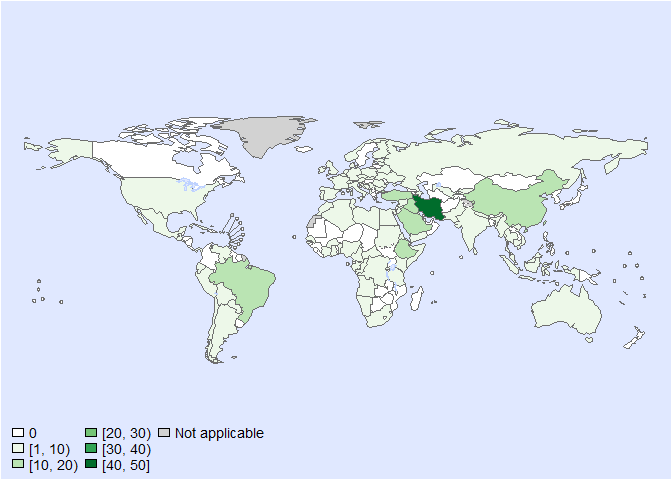
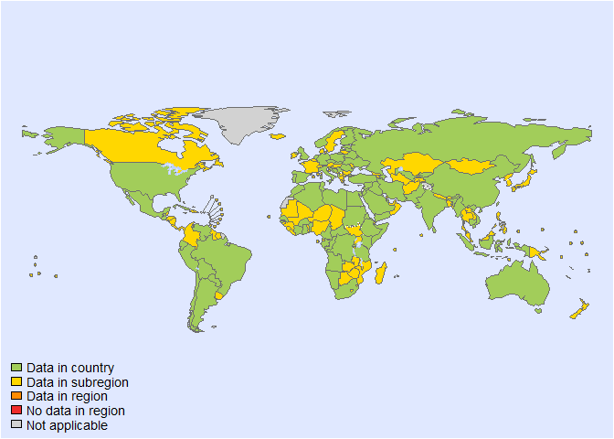
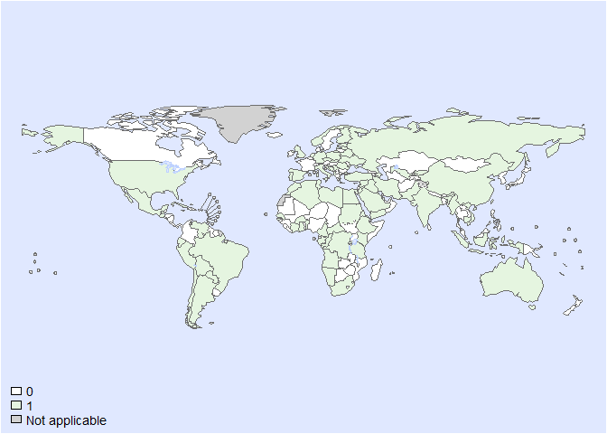
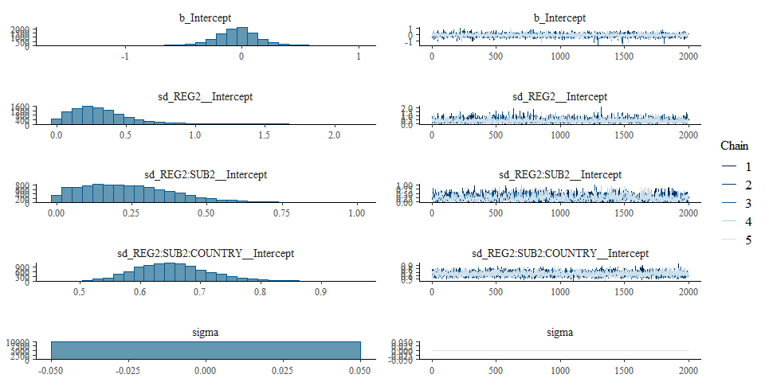
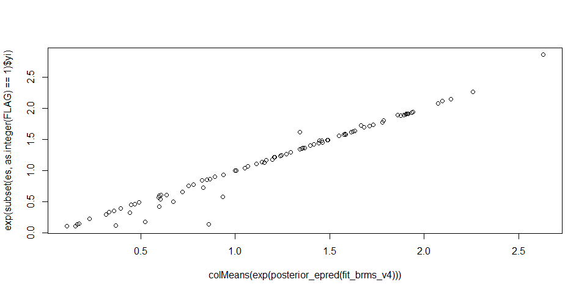

Global incidence of congenital toxoplasmosis • Fit model • Version 4
================
fbbu6966
2025-08-20

- [Settings](#settings)
  - [BRMS model: Version 4](#brms-model-version-4)
- [Session info](#session-info)

# Settings

``` r
## required packages ----
library(bd)
library(brms)
```

    ## Loading required package: Rcpp

    ## Loading 'brms' package (version 2.22.0). Useful instructions
    ## can be found by typing help('brms'). A more detailed introduction
    ## to the package is available through vignette('brms_overview').

    ## 
    ## Attaching package: 'brms'

    ## The following object is masked from 'package:stats':
    ## 
    ##     ar

``` r
library(ggplot2)
library(metafor)
library(readxl)
library(rmarkdown)
library(rms)
```

    ## Loading required package: Hmisc

    ## 
    ## Attaching package: 'Hmisc'

    ## The following objects are masked from 'package:DescTools':
    ## 
    ##     %nin%, Label, Mean, Quantile

    ## The following objects are masked from 'package:dplyr':
    ## 
    ##     src, summarize

    ## The following objects are masked from 'package:base':
    ## 
    ##     format.pval, units

    ## 
    ## Attaching package: 'rms'

    ## The following object is masked from 'package:metafor':
    ## 
    ##     vif

``` r
library(tidyr)
library(knitr)

## global options ----
knitr::opts_chunk$set(fig.width = 10)
Date <- format(Sys.Date(), "%Y%m%d")

setwd("../../")
source("01-data-v20250820.R")
```

    ## New names:
    ## • `` -> `...42`

    ## New names:
    ## • `` -> `...43`

    ## Warning: There was 1 warning in `mutate()`.
    ## ℹ In argument: `VALUE_MEAN = as.numeric(VALUE_MEAN)`.
    ## Caused by warning:
    ## ! NAs introduced by coercion

    ## 'data.frame':    334 obs. of  43 variables:
    ##  $ SOURCE_ID           : chr  "1" "2" "3" "4" ...
    ##  $ SOURCE_AUTHOR       : chr  "Maggi, P." "Prusa, A.R., Kasper, D.C., Pollak, A., Gleiss, A., Waldhoer, T. and Hayde, M." "Musaeva, M.K" "Мосунова, Э.А." ...
    ##  $ SOURCE_YEAR         : num  2009 2015 2022 2019 2019 ...
    ##  $ SOURCE_TITLE        : chr  "Surveillance of toxoplasmosis in pregnant women in Albania. The new microbiologica 32, no. 1 (2009): 89." "The Austrian toxoplasmosis register, 1992–2008. Clinical Infectious Diseases, 60(2), pp.e4-e10." "EPIDEMIOLOGICAL FEATURES OF TOXOPLASMOSIS IN AZERBAIJAN. Sechenov Medical Journal, (4), pp.59-61." "Определение маркеров вирусных гепатитов и токсоплазмоза у беременных женщин г. Гомеля." ...
    ##  $ SOURCE_DOI          : chr  NA "10.1093/cid/ciu724" NA NA ...
    ##  $ SOURCE_URL          : chr  "https://www.newmicrobiologica.org/PUB/allegati_pdf/2009/1/89.pdf" "https://academic.oup.com/cid/article/60/2/e4/2895402" "https://www.sechenovmedj.com/jour/article/download/824/533" "https://elib.gsmu.by/handle/GomSMU/6933" ...
    ##  $ OPT_ACCESS_DATE     : logi  NA NA NA NA NA NA ...
    ##  $ OPT_STUDY_TYPE      : logi  NA NA NA NA NA NA ...
    ##  $ OPT_OTHER_STUDY_TYPE: logi  NA NA NA NA NA NA ...
    ##  $ REF_NOTES           : chr  NA NA NA NA ...
    ##  $ REF_YEAR_START      : num  2004 2001 NA 2018 NA ...
    ##  $ REF_YEAR_END        : num  2005 2011 NA 2018 NA ...
    ##  $ REF_LOC_LEVEL       : chr  "National" "National" NA "National" ...
    ##  $ REF_LOCATION        : chr  "Albania" "Austria" "Azerbaijan" "Belarus" ...
    ##  $ REF_SEX             : chr  "Female" "All sexes" "All sexes" "Female" ...
    ##  $ REF_AGE_START       : chr  NA NA NA NA ...
    ##  $ REF_AGE_END         : logi  NA NA NA NA NA NA ...
    ##  $ OPT_MEAN_AGE        : logi  NA NA NA NA NA NA ...
    ##  $ OPT_MEDIAN_AGE      : logi  NA NA NA NA NA NA ...
    ##  $ OPT_SUBPOP          : chr  NA NA NA NA ...
    ##  $ OPT_CASES           : logi  NA NA NA NA NA NA ...
    ##  $ OPT_DISEASE         : logi  NA NA NA NA NA NA ...
    ##  $ OPT_SEROTYPE        : logi  NA NA NA NA NA NA ...
    ##  $ REF_SAMPLE_SIZE     : logi  NA NA NA NA NA NA ...
    ##  $ VALUE_X             : chr  NA NA NA NA ...
    ##  $ VALUE_MEAN          : num  5 9 206 153 NA NA 394 188 43 49 ...
    ##  $ VALUE_MEDIAN        : logi  NA NA NA NA NA NA ...
    ##  $ VALUE_DENOM         : logi  NA NA NA NA NA NA ...
    ##  $ VALUE_SE            : logi  NA NA NA NA NA NA ...
    ##  $ VALUE_P000          : logi  NA NA NA NA NA NA ...
    ##  $ VALUE_P2_5          : num  1 7 200 100 NA NA 188 43 37 44 ...
    ##  $ VALUE_P5            : logi  NA NA NA NA NA NA ...
    ##  $ VALUE_P10           : logi  NA NA NA NA NA NA ...
    ##  $ VALUE_P25           : logi  NA NA NA NA NA NA ...
    ##  $ VALUE_P75           : logi  NA NA NA NA NA NA ...
    ##  $ VALUE_P90           : logi  NA NA NA NA NA NA ...
    ##  $ VALUE_P95           : logi  NA NA NA NA NA NA ...
    ##  $ VALUE_P97_5         : num  15 10 213 215 NA NA 657 419 49 55 ...
    ##  $ VALUE_P100          : chr  NA NA NA NA ...
    ##  $ No births           : num  29250 84647 126908 88844 NA ...
    ##  $ inc per 1000 births : num  0.171 0.106 1.623 1.722 NA ...
    ##  $ ...42               : chr  NA NA NA NA ...
    ##  $ Remark              : chr  NA NA NA NA ...

    ## Warning: There was 1 warning in `mutate()`.
    ## ℹ In argument: `VALUE_MEAN = as.numeric(VALUE_MEAN)`.
    ## Caused by warning:
    ## ! NAs introduced by coercion

    ## 'data.frame':    311 obs. of  44 variables:
    ##  $ SOURCE_ID            : chr  "1" "3" "4" "5" ...
    ##  $ SOURCE_AUTHOR        : chr  "Maggi, P." "Musaeva, M.K" "Мосунова, Э.А." "Черныш, М.В." ...
    ##  $ SOURCE_YEAR          : num  2009 2022 2019 2019 2015 ...
    ##  $ SOURCE_TITLE         : chr  "Surveillance of toxoplasmosis in pregnant women in Albania. The new microbiologica 32, no. 1 (2009): 89." "EPIDEMIOLOGICAL FEATURES OF TOXOPLASMOSIS IN AZERBAIJAN. Sechenov Medical Journal, (4), pp.59-61." "Определение маркеров вирусных гепатитов и токсоплазмоза у беременных женщин г. Гомеля." "Токсоплазмоз: характеристика возбудителя болезни, клиника и лабораторная диагностика." ...
    ##  $ SOURCE_DOI           : chr  NA NA NA NA ...
    ##  $ SOURCE_URL           : chr  "https://www.newmicrobiologica.org/PUB/allegati_pdf/2009/1/89.pdf" "https://www.sechenovmedj.com/jour/article/download/824/533" "https://elib.gsmu.by/handle/GomSMU/6933" "https://elib.bsu.by/bitstream/123456789/228963/1/Charnysh_abstract_2019.pdf" ...
    ##  $ OPT_ACCESS_DATE      : logi  NA NA NA NA NA NA ...
    ##  $ OPT_STUDY_TYPE       : logi  NA NA NA NA NA NA ...
    ##  $ OPT_OTHER_STUDY_TYPE : logi  NA NA NA NA NA NA ...
    ##  $ REF_NOTES            : logi  NA NA NA NA NA NA ...
    ##  $ REF_YEAR_START       : num  2004 NA 2018 NA 2008 ...
    ##  $ REF_YEAR_END         : num  2005 NA 2018 NA 2009 ...
    ##  $ REF_LOC_LEVEL        : chr  "National" NA NA NA ...
    ##  $ REF_LOCATION         : chr  "Albania" "Azerbaijan" "Belarus" "Belarus" ...
    ##  $ REF_SEX              : chr  "Female" "All sexes" "Female" "Female" ...
    ##  $ REF_AGE_START        : chr  NA NA NA NA ...
    ##  $ REF_AGE_END          : logi  NA NA NA NA NA NA ...
    ##  $ OPT_MEAN_AGE         : logi  NA NA NA NA NA NA ...
    ##  $ OPT_MEDIAN_AGE       : logi  NA NA NA NA NA NA ...
    ##  $ OPT_SUBPOP           : logi  NA NA NA NA NA NA ...
    ##  $ OPT_CASES            : logi  NA NA NA NA NA NA ...
    ##  $ OPT_DISEASE          : logi  NA NA NA NA NA NA ...
    ##  $ OPT_SEROTYPE         : logi  NA NA NA NA NA NA ...
    ##  $ REF_SAMPLE_SIZE      : logi  NA NA NA NA NA NA ...
    ##  $ VALUE_X              : chr  NA NA NA NA ...
    ##  $ VALUE_MEAN           : num  30554 75800 71704 NA NA ...
    ##  $ VALUE_MEDIAN         : num  NA NA NA NA NA NA NA NA NA NA ...
    ##  $ VALUE_DENOM          : logi  NA NA NA NA NA NA ...
    ##  $ VALUE_SE             : logi  NA NA NA NA NA NA ...
    ##  $ VALUE_P000           : logi  NA NA NA NA NA NA ...
    ##  $ VALUE_P2_5           : num  29192 73500 62667 NA NA ...
    ##  $ VALUE_P5             : logi  NA NA NA NA NA NA ...
    ##  $ VALUE_P10            : num  NA NA NA NA NA NA NA NA NA NA ...
    ##  $ VALUE_P25            : logi  NA NA NA NA NA NA ...
    ##  $ VALUE_P75            : logi  NA NA NA NA NA NA ...
    ##  $ VALUE_P90            : logi  NA NA NA NA NA NA ...
    ##  $ VALUE_P95            : chr  NA NA NA NA ...
    ##  $ VALUE_P97_5          : num  31689 78000 79423 NA NA ...
    ##  $ VALUE_P100           : num  NA NA NA NA NA NA NA NA NA NA ...
    ##  $ population           : num  2854710 10312992 9578167 NA NA ...
    ##  $ incidence            : chr  "1.0703013616094104E-2" "7.3499523707571965E-3" "7.4861922954569489E-3" NA ...
    ##  $ incidence per 100,000: num  1070 735 749 NA NA ...
    ##  $ ...43                : chr  NA NA NA NA ...
    ##  $ Remark               : chr  NA NA NA NA ...
    ## 1     ALB     2309.869    2.158 
    ## 2     AZE     4363.425    5.937 
    ## 3     BLR     284.697     0.38 
    ## 6     BIH     235.98      0.344 
    ## 7     HRV     882.888     1.839 
    ## 8     CYP     680.28      1.279 
    ## 11    CZE     2213.302    4.596 
    ## 13    EST     849.689     1.345 
    ## 14    FIN     164.731     0.583 
    ## 15    DEU     3285711     3624.514 
    ## 16    ITA     1474.489    2.229 
    ## 19    NA      113.591     0.119 
    ## 21    LVA     237.401     0.31 
    ## 22    NLD     10.006      4.111 
    ## 23    NOR     225.392     0.776 
    ## 24    POL     64.529      0.08 
    ## 25    PRT     39.399      0.053 
    ## 28    ROU     49.774      0.063 
    ## 37    RUS     55.049      0.068 
    ## 42    SRB     106.395     0.205 
    ## 44    SVK     47.349      0.129 
    ## 47    ESP     5128.282    5.365 
    ## 48    TUR     482.6   0.613 
    ## 68    DZA     153.314     0.149 
    ## 70    EGY     354.924     0.445 
    ## 78    LBY     1097.771    1.596 
    ## 83    MAR     223.14      0.235 
    ## 86    TUN     7.889   0.013 
    ## 88    AGO     136.654     0.151 
    ## 91    BEN     418.572     0.463 
    ## 94    BFA     5.261   0.004 
    ## 97    CMR     1088.598    0.705 
    ## 102   CAF     297.58      0.224 
    ## 104   COG     71.383      0.105 
    ## 107   CIV     26.503      0.033 
    ## 109   COD     1246.223    0.81 
    ## 110   ERI     69.278      0.073 
    ## 111   ETH     45.052      0.036 
    ## 125   GAB     21.769      0.027 
    ## 129   GHA     942.525     0.912 
    ## 134   KEN     13349.34    13.666 
    ## 137   NAM     1.064   0.003 
    ## 138   RWA     6.853   0.037 
    ## 139   SEN     9.79    0.021 
    ## 145   SDN     554.399     0.442

    ## Warning in optimize(f, c(0, 1e+07), mean = par[2], p = p, target = target): NA/NaN replaced by maximum positive value

    ## Warning in optimize(f, c(0, 1e+07), mean = par[2], p = p, target = target): NA/NaN replaced by maximum positive value
    ## Warning in optimize(f, c(0, 1e+07), mean = par[2], p = p, target = target): NA/NaN replaced by maximum positive value
    ## Warning in optimize(f, c(0, 1e+07), mean = par[2], p = p, target = target): NA/NaN replaced by maximum positive value
    ## Warning in optimize(f, c(0, 1e+07), mean = par[2], p = p, target = target): NA/NaN replaced by maximum positive value
    ## Warning in optimize(f, c(0, 1e+07), mean = par[2], p = p, target = target): NA/NaN replaced by maximum positive value
    ## Warning in optimize(f, c(0, 1e+07), mean = par[2], p = p, target = target): NA/NaN replaced by maximum positive value
    ## Warning in optimize(f, c(0, 1e+07), mean = par[2], p = p, target = target): NA/NaN replaced by maximum positive value
    ## Warning in optimize(f, c(0, 1e+07), mean = par[2], p = p, target = target): NA/NaN replaced by maximum positive value
    ## Warning in optimize(f, c(0, 1e+07), mean = par[2], p = p, target = target): NA/NaN replaced by maximum positive value
    ## Warning in optimize(f, c(0, 1e+07), mean = par[2], p = p, target = target): NA/NaN replaced by maximum positive value
    ## Warning in optimize(f, c(0, 1e+07), mean = par[2], p = p, target = target): NA/NaN replaced by maximum positive value
    ## Warning in optimize(f, c(0, 1e+07), mean = par[2], p = p, target = target): NA/NaN replaced by maximum positive value
    ## Warning in optimize(f, c(0, 1e+07), mean = par[2], p = p, target = target): NA/NaN replaced by maximum positive value
    ## Warning in optimize(f, c(0, 1e+07), mean = par[2], p = p, target = target): NA/NaN replaced by maximum positive value
    ## Warning in optimize(f, c(0, 1e+07), mean = par[2], p = p, target = target): NA/NaN replaced by maximum positive value
    ## Warning in optimize(f, c(0, 1e+07), mean = par[2], p = p, target = target): NA/NaN replaced by maximum positive value
    ## Warning in optimize(f, c(0, 1e+07), mean = par[2], p = p, target = target): NA/NaN replaced by maximum positive value
    ## Warning in optimize(f, c(0, 1e+07), mean = par[2], p = p, target = target): NA/NaN replaced by maximum positive value
    ## Warning in optimize(f, c(0, 1e+07), mean = par[2], p = p, target = target): NA/NaN replaced by maximum positive value
    ## Warning in optimize(f, c(0, 1e+07), mean = par[2], p = p, target = target): NA/NaN replaced by maximum positive value
    ## Warning in optimize(f, c(0, 1e+07), mean = par[2], p = p, target = target): NA/NaN replaced by maximum positive value
    ## Warning in optimize(f, c(0, 1e+07), mean = par[2], p = p, target = target): NA/NaN replaced by maximum positive value
    ## Warning in optimize(f, c(0, 1e+07), mean = par[2], p = p, target = target): NA/NaN replaced by maximum positive value
    ## Warning in optimize(f, c(0, 1e+07), mean = par[2], p = p, target = target): NA/NaN replaced by maximum positive value
    ## Warning in optimize(f, c(0, 1e+07), mean = par[2], p = p, target = target): NA/NaN replaced by maximum positive value
    ## Warning in optimize(f, c(0, 1e+07), mean = par[2], p = p, target = target): NA/NaN replaced by maximum positive value
    ## Warning in optimize(f, c(0, 1e+07), mean = par[2], p = p, target = target): NA/NaN replaced by maximum positive value
    ## Warning in optimize(f, c(0, 1e+07), mean = par[2], p = p, target = target): NA/NaN replaced by maximum positive value
    ## Warning in optimize(f, c(0, 1e+07), mean = par[2], p = p, target = target): NA/NaN replaced by maximum positive value
    ## Warning in optimize(f, c(0, 1e+07), mean = par[2], p = p, target = target): NA/NaN replaced by maximum positive value
    ## Warning in optimize(f, c(0, 1e+07), mean = par[2], p = p, target = target): NA/NaN replaced by maximum positive value
    ## Warning in optimize(f, c(0, 1e+07), mean = par[2], p = p, target = target): NA/NaN replaced by maximum positive value
    ## Warning in optimize(f, c(0, 1e+07), mean = par[2], p = p, target = target): NA/NaN replaced by maximum positive value
    ## Warning in optimize(f, c(0, 1e+07), mean = par[2], p = p, target = target): NA/NaN replaced by maximum positive value
    ## Warning in optimize(f, c(0, 1e+07), mean = par[2], p = p, target = target): NA/NaN replaced by maximum positive value
    ## Warning in optimize(f, c(0, 1e+07), mean = par[2], p = p, target = target): NA/NaN replaced by maximum positive value

    ## 146   SDN     1e+07   NA 
    ## 152   TZA     32.301      0.031 
    ## 158   KHM     116.621     0.543 
    ## 159   CHN     3692.422    38.564 
    ## 175   IND     2357.663    2.434 
    ## 178   IDN     197.428     0.228 
    ## 181   IRN     2176.326    2.124 
    ## 223   IRQ     72.863      0.077

    ## Warning in optimize(f, c(0, 1e+07), mean = par[2], p = p, target = target): NA/NaN replaced by maximum positive value
    ## Warning in optimize(f, c(0, 1e+07), mean = par[2], p = p, target = target): NA/NaN replaced by maximum positive value
    ## Warning in optimize(f, c(0, 1e+07), mean = par[2], p = p, target = target): NA/NaN replaced by maximum positive value
    ## Warning in optimize(f, c(0, 1e+07), mean = par[2], p = p, target = target): NA/NaN replaced by maximum positive value
    ## Warning in optimize(f, c(0, 1e+07), mean = par[2], p = p, target = target): NA/NaN replaced by maximum positive value
    ## Warning in optimize(f, c(0, 1e+07), mean = par[2], p = p, target = target): NA/NaN replaced by maximum positive value
    ## Warning in optimize(f, c(0, 1e+07), mean = par[2], p = p, target = target): NA/NaN replaced by maximum positive value
    ## Warning in optimize(f, c(0, 1e+07), mean = par[2], p = p, target = target): NA/NaN replaced by maximum positive value
    ## Warning in optimize(f, c(0, 1e+07), mean = par[2], p = p, target = target): NA/NaN replaced by maximum positive value
    ## Warning in optimize(f, c(0, 1e+07), mean = par[2], p = p, target = target): NA/NaN replaced by maximum positive value
    ## Warning in optimize(f, c(0, 1e+07), mean = par[2], p = p, target = target): NA/NaN replaced by maximum positive value
    ## Warning in optimize(f, c(0, 1e+07), mean = par[2], p = p, target = target): NA/NaN replaced by maximum positive value
    ## Warning in optimize(f, c(0, 1e+07), mean = par[2], p = p, target = target): NA/NaN replaced by maximum positive value
    ## Warning in optimize(f, c(0, 1e+07), mean = par[2], p = p, target = target): NA/NaN replaced by maximum positive value
    ## Warning in optimize(f, c(0, 1e+07), mean = par[2], p = p, target = target): NA/NaN replaced by maximum positive value
    ## Warning in optimize(f, c(0, 1e+07), mean = par[2], p = p, target = target): NA/NaN replaced by maximum positive value
    ## Warning in optimize(f, c(0, 1e+07), mean = par[2], p = p, target = target): NA/NaN replaced by maximum positive value
    ## Warning in optimize(f, c(0, 1e+07), mean = par[2], p = p, target = target): NA/NaN replaced by maximum positive value
    ## Warning in optimize(f, c(0, 1e+07), mean = par[2], p = p, target = target): NA/NaN replaced by maximum positive value
    ## Warning in optimize(f, c(0, 1e+07), mean = par[2], p = p, target = target): NA/NaN replaced by maximum positive value
    ## Warning in optimize(f, c(0, 1e+07), mean = par[2], p = p, target = target): NA/NaN replaced by maximum positive value
    ## Warning in optimize(f, c(0, 1e+07), mean = par[2], p = p, target = target): NA/NaN replaced by maximum positive value
    ## Warning in optimize(f, c(0, 1e+07), mean = par[2], p = p, target = target): NA/NaN replaced by maximum positive value
    ## Warning in optimize(f, c(0, 1e+07), mean = par[2], p = p, target = target): NA/NaN replaced by maximum positive value
    ## Warning in optimize(f, c(0, 1e+07), mean = par[2], p = p, target = target): NA/NaN replaced by maximum positive value
    ## Warning in optimize(f, c(0, 1e+07), mean = par[2], p = p, target = target): NA/NaN replaced by maximum positive value
    ## Warning in optimize(f, c(0, 1e+07), mean = par[2], p = p, target = target): NA/NaN replaced by maximum positive value
    ## Warning in optimize(f, c(0, 1e+07), mean = par[2], p = p, target = target): NA/NaN replaced by maximum positive value
    ## Warning in optimize(f, c(0, 1e+07), mean = par[2], p = p, target = target): NA/NaN replaced by maximum positive value
    ## Warning in optimize(f, c(0, 1e+07), mean = par[2], p = p, target = target): NA/NaN replaced by maximum positive value
    ## Warning in optimize(f, c(0, 1e+07), mean = par[2], p = p, target = target): NA/NaN replaced by maximum positive value
    ## Warning in optimize(f, c(0, 1e+07), mean = par[2], p = p, target = target): NA/NaN replaced by maximum positive value
    ## Warning in optimize(f, c(0, 1e+07), mean = par[2], p = p, target = target): NA/NaN replaced by maximum positive value
    ## Warning in optimize(f, c(0, 1e+07), mean = par[2], p = p, target = target): NA/NaN replaced by maximum positive value
    ## Warning in optimize(f, c(0, 1e+07), mean = par[2], p = p, target = target): NA/NaN replaced by maximum positive value
    ## Warning in optimize(f, c(0, 1e+07), mean = par[2], p = p, target = target): NA/NaN replaced by maximum positive value
    ## Warning in optimize(f, c(0, 1e+07), mean = par[2], p = p, target = target): NA/NaN replaced by maximum positive value

    ## 232   ISR     1e+07   NA 
    ## 233   ISR     675.16      0.693 
    ## 235   JOR     1664.686    0.9 
    ## 236   KWT     578.356     0.674 
    ## 237   KGZ     261.538     0.476 
    ## 238   KGZ     72.331      0.399 
    ## 239   KGZ     141.105     0.465 
    ## 240   MMR     166.733     0.328 
    ## 241   PAK     116.947     0.173 
    ## 245   QAT     162.772     0.179 
    ## 246   SAU     134.505     0.162 
    ## 263   SYR     4979.227    6.098 
    ## 267   UZB     28.271      0.313 
    ## 268   VNM     110.843     0.435 
    ## 270   YEM     21.042      0.018 
    ## 276   CUB     3190.033    3.553 
    ## 277   GTM     2634.87     1.435 
    ## 278   MEX     14.193      0.025 
    ## 283   USA     876.672     2.661 
    ## 284   ARG     10.052      0.011 
    ## 287   BOL     85.174      0.126 
    ## 289   BRA     15048.19    19.382 
    ## 301   CHL     667.847     1.213 
    ## 302   ECU     861.766     0.889 
    ## 303   PRY     227.262     0.276 
    ## 304   PER     26.543      0.021 
    ## 308   VEN     18.714      0.014 
    ## 310   AUS     465.704     0.472 
    ## 1     ALB     1.673   9.785 
    ## 2     AUT     146.716     1379.896 
    ## 3     AZE     3849.899    2371.762 
    ## 4     BLR     27.168      15.776 
    ## 8     BEL     3.746   2.32 
    ## 9     BIH     198.058     127.333 
    ## 10    BGR     302.603     356.843 
    ## 11    HRV     853.44      801.126 
    ## 12    CYP     37.023      43.135 
    ## 15    CZE     2053.236    1422.728 
    ## 18    EST     1860.025    1153.046 
    ## 19    FIN     347.273     581.546 
    ## 20    FRA     284.278     581.66 
    ## 22    DEU     46.753      31.546 
    ## 23    IRL     11.129      108.619 
    ## 24    ITA     1535.495    1536.91 
    ## 29    LVA     384.904     635.784 
    ## 30    NLD     33.087      22.339 
    ## 31    NOR     246.611     554.35 
    ## 32    POL     64.337      53.016 
    ## 33    PRT     830.637     367.237 
    ## 36    ROU     698.913     336.318 
    ## 45    RUS     762.518     355.155 
    ## 50    SRB     50.31   170.064 
    ## 52    SVK     150.813     327.277 
    ## 55    ESP     949.806     554.105 
    ## 57    CHE     2.073   18.052 
    ## 58    TUR     129.855     111.544 
    ## 77    GBR     836.117     1112.367 
    ## 78    UKR     16.353      124.829 
    ## 79    DZA     8.837   27.544 
    ## 80    EGY     658.373     344.375 
    ## 88    LBY     1121.034    835.609 
    ## 93    MAR     231.518     119.095 
    ## 96    TUN     92.5    49.212 
    ## 98    AGO     50.933      28.321 
    ## 101   BEN     1631.301    861.559 
    ## 104   BFA     5.298   12.547 
    ## 107   CMR     3028.849    1565.714 
    ## 112   CAF     507.466     292.972 
    ## 114   COG     111.842     101.223 
    ## 117   CIV     94.679      73.414 
    ## 119   COD     14.652      22.443 
    ## 120   ERI     98.814      58.321 
    ## 121   ETH     84.037      109.449 
    ## 135   GAB     131.433     106.156 
    ## 139   GHA     344.238     180.339 
    ## 144   KEN     2905587     1947788 
    ## 147   NAM     105.021     75.232 
    ## 154   RWA     13.031      11.129 
    ## 156   SEN     9.819   13.567 
    ## 160   ZAF     107.505     94.796 
    ## 161   SDN     25.603      22.789 
    ## 168   TZA     32.281      20.322 
    ## 174   KHM     118.074     360.148 
    ## 175   CHN     18.85   130.364 
    ## 191   IND     2530.946    1785.711 
    ## 194   IDN     9423.926    5300.982 
    ## 197   IRN     1729.294    1280.074 
    ## 239   IRQ     89.905      61.844 
    ## 250   ISR     1414.193    1168.097 
    ## 252   JOR     921.485     481.24 
    ## 253   KWT     40.217      66.126 
    ## 256   KGZ     166.032     467.412 
    ## 257   LBN     11.921      4.173 
    ## 258   MYS     11.919      14.202 
    ## 260   MMR     0.409   2.93 
    ## 262   NPL     1.116   1.937 
    ## 263   PAK     116.977     112.604 
    ## 267   QAT     163.093     120.181 
    ## 268   SAU     133.577     105.369 
    ## 284   LKA     32.867      57.785 
    ## 287   SYR     40.295      24.6 
    ## 290   UZB     28.961      32.017 
    ## 291   VNM     106.819     275.131 
    ## 293   YEM     33.592      21.253 
    ## 299   CUB     1776.396    1101.432 
    ## 300   GTM     5.48    11.06 
    ## 301   MEX     17.156      31.718 
    ## 306   USA     229.285     1024.27 
    ## 307   ARG     10.018      7.339 
    ## 310   BOL     88.91   88.891 
    ## 312   BRA     60655.57    31913.5 
    ## 324   CHL     629.169     726.804 
    ## 325   ECU     891.082     598.916 
    ## 326   PAN     32.992      35.49 
    ## 327   PRY     235.522     189.534 
    ## 328   PER     42.569      22.517 
    ## 332   VEN     94.508      44.652 
    ## 334   AUS     504.413     319.672

<!-- --><!-- --><!-- -->

    ## Warning in RColorBrewer::brewer.pal(max_freq, "Greens"): minimal value for n is 3, returning requested palette with 3 different levels

<!-- --><!-- --><!-- --><!-- -->

    ## Warning in RColorBrewer::brewer.pal(max_freq, "Greens"): minimal value for n is 3, returning requested palette with 3 different levels

<!-- -->

    ## Warning: REML comparisons not meaningful for models with different fixed effects
    ## (use 'refit=TRUE' to refit both models based on ML estimation).

    ## Warning: REML comparisons not meaningful for models with different fixed effects
    ## (use 'refit=TRUE' to refit both models based on ML estimation).

    ## Warning in system2("quarto", "-V", stdout = TRUE, env = paste0("TMPDIR=", : running command '"quarto"
    ## TMPDIR=C:/Users/fbbu6966/AppData/Local/Temp/RtmpoBkVBp/file481876655eb6 -V' had status 1

``` r
setwd("./Congenital/ESTIMATES")
es <- es$Congenital_incidence
es$DTP_ID <- as.character(seq(1:length(es$SOURCE_ID)))
es$FLAG <-
factor(es$FLAG, 
       levels = c(0, 1, 2, 3, 4, 5, 6, 7),
       labels = c("Keep data", "Data part of non WHO member states", "No WHO REG2 given",
                  "Year before 1990", "yi can't be calcualted", "TF choice to remove", 
                  "Excluded by preliminary checks", "Excluded in data cleaning"))
saveRDS(es, paste0("es_", Date, ".RDS"))
```

## BRMS model: Version 4

``` r
## excluded STUDY_ID, DTP_ID because mostly one study per country
## (remove SUB2 because low heterogeneity)
## data corrections

Parameters <-
  c("Number of iterations", 
    "Warmup",
    "Delta value",
    "Maximum tree-depth",
    "Random effect on each data point",
    "Stronger priors specified")
Values <- 
  c("5000",
    "3000",
    "0.99",
    "20",
    "No",
    "Normal(0,1)")
version_spe <-
  data.frame(Parameters, Values)

kable(caption = "Parameters of the model tested", row.names = FALSE, version_spe)
```

| Parameters                       | Values      |
|:---------------------------------|:------------|
| Number of iterations             | 5000        |
| Warmup                           | 3000        |
| Delta value                      | 0.99        |
| Maximum tree-depth               | 20          |
| Random effect on each data point | No          |
| Stronger priors specified        | Normal(0,1) |

Parameters of the model tested

``` r
fit_brms_v4 <-
  brm(yi | se(sei) ~
        1 + 
        (1 | REG2) +
        (1 | REG2:SUB2) +
        (1 | REG2:SUB2:COUNTRY),
      chains = 5, iter = 5000, warmup = 3000,
      prior = prior(normal(0,1), class = sd),
      cores = 5,
      data = subset(es, as.integer(FLAG) == 1), 
      open_progress = FALSE,
      control = list(adapt_delta = 0.99, max_treedepth = 20),
      seed = 7)
```

    ## Compiling Stan program...

    ## Start sampling

    ## Warning: There were 1 divergent transitions after warmup. See
    ## https://mc-stan.org/misc/warnings.html#divergent-transitions-after-warmup
    ## to find out why this is a problem and how to eliminate them.

    ## Warning: Examine the pairs() plot to diagnose sampling problems

``` r
saveRDS(fit_brms_v4, file = "fit_brms_v4.rds")
summary(fit_brms_v4)
```

    ## Warning: There were 1 divergent transitions after warmup. Increasing adapt_delta above 0.99 may help. See
    ## http://mc-stan.org/misc/warnings.html#divergent-transitions-after-warmup

    ##  Family: gaussian 
    ##   Links: mu = identity; sigma = identity 
    ## Formula: yi | se(sei) ~ 1 + (1 | REG2) + (1 | REG2:SUB2) + (1 | REG2:SUB2:COUNTRY) 
    ##    Data: subset(es, as.integer(FLAG) == 1) (Number of observations: 90) 
    ##   Draws: 5 chains, each with iter = 5000; warmup = 3000; thin = 1;
    ##          total post-warmup draws = 10000
    ## 
    ## Multilevel Hyperparameters:
    ## ~REG2 (Number of levels: 6) 
    ##               Estimate Est.Error l-95% CI u-95% CI Rhat Bulk_ESS Tail_ESS
    ## sd(Intercept)     0.32      0.22     0.02     0.88 1.00     2975     5118
    ## 
    ## ~REG2:SUB2 (Number of levels: 17) 
    ##               Estimate Est.Error l-95% CI u-95% CI Rhat Bulk_ESS Tail_ESS
    ## sd(Intercept)     0.24      0.16     0.01     0.60 1.01     1169     3378
    ## 
    ## ~REG2:SUB2:COUNTRY (Number of levels: 90) 
    ##               Estimate Est.Error l-95% CI u-95% CI Rhat Bulk_ESS Tail_ESS
    ## sd(Intercept)     0.65      0.06     0.55     0.78 1.00     2731     4832
    ## 
    ## Regression Coefficients:
    ##           Estimate Est.Error l-95% CI u-95% CI Rhat Bulk_ESS Tail_ESS
    ## Intercept    -0.05      0.20    -0.45     0.34 1.00     6460     5687
    ## 
    ## Further Distributional Parameters:
    ##       Estimate Est.Error l-95% CI u-95% CI Rhat Bulk_ESS Tail_ESS
    ## sigma     0.00      0.00     0.00     0.00   NA       NA       NA
    ## 
    ## Draws were sampled using sampling(NUTS). For each parameter, Bulk_ESS
    ## and Tail_ESS are effective sample size measures, and Rhat is the potential
    ## scale reduction factor on split chains (at convergence, Rhat = 1).

``` r
plot(fit_brms_v4, ask = FALSE)
```

<!-- -->

``` r
# plot(conditional_effects(fit_brms_v4), points = TRUE)

plot(
  colMeans(exp(posterior_epred(fit_brms_v4))),
  exp(subset(es, as.integer(FLAG) == 1)$yi))
```

<!-- -->

``` r
knitr::kable(
  digits = 1,
  data.frame(
    ID = subset(es, as.integer(FLAG) == 1)$ID,
    ISO3 = subset(es, as.integer(FLAG) == 1)$ISO3,
    FIT = colMeans(exp(posterior_epred(fit_brms_v4))),
    yi = exp(subset(es, as.integer(FLAG) == 1)$yi)))
```

| ID  | ISO3 | FIT |  yi |
|:----|:-----|----:|----:|
| 1   | ALB  | 0.5 | 0.2 |
| 2   | AUT  | 0.1 | 0.1 |
| 3   | AZE  | 1.6 | 1.6 |
| 4   | BLR  | 1.7 | 1.7 |
| 7   | BEL  | 1.3 | 1.6 |
| 8   | BIH  | 1.5 | 1.6 |
| 9   | BGR  | 0.8 | 0.8 |
| 10  | HRV  | 1.1 | 1.1 |
| 11  | CYP  | 0.9 | 0.9 |
| 14  | CZE  | 1.4 | 1.4 |
| 17  | EST  | 1.6 | 1.6 |
| 18  | FIN  | 0.6 | 0.6 |
| 19  | FRA  | 0.5 | 0.5 |
| 21  | DEU  | 1.5 | 1.5 |
| 22  | IRL  | 0.2 | 0.1 |
| 23  | ITA  | 1.0 | 1.0 |
| 28  | LVA  | 0.6 | 0.6 |
| 29  | NLD  | 1.4 | 1.5 |
| 30  | NOR  | 0.4 | 0.4 |
| 31  | POL  | 1.2 | 1.2 |
| 32  | PRT  | 2.3 | 2.3 |
| 35  | ROU  | 2.1 | 2.1 |
| 44  | RUS  | 2.1 | 2.1 |
| 49  | SRB  | 0.3 | 0.3 |
| 51  | SVK  | 0.5 | 0.5 |
| 54  | ESP  | 1.7 | 1.7 |
| 56  | CHE  | 0.4 | 0.1 |
| 57  | TUR  | 1.2 | 1.2 |
| 76  | GBR  | 0.8 | 0.8 |
| 77  | UKR  | 0.2 | 0.1 |
| 78  | DZA  | 0.4 | 0.3 |
| 81  | EGY  | 1.9 | 1.9 |
| 89  | LBY  | 1.3 | 1.3 |
| 94  | MAR  | 1.9 | 1.9 |
| 97  | TUN  | 1.9 | 1.9 |
| 99  | AGO  | 1.8 | 1.8 |
| 102 | BEN  | 1.9 | 1.9 |
| 105 | BFA  | 0.6 | 0.4 |
| 108 | CMR  | 1.9 | 1.9 |
| 113 | CAF  | 1.7 | 1.7 |
| 115 | COG  | 1.1 | 1.1 |
| 118 | CIV  | 1.3 | 1.3 |
| 120 | COD  | 0.7 | 0.7 |
| 121 | ERI  | 1.7 | 1.7 |
| 122 | ETH  | 0.8 | 0.8 |
| 136 | GAB  | 1.2 | 1.2 |
| 140 | GHA  | 1.9 | 1.9 |
| 145 | KEN  | 1.5 | 1.5 |
| 148 | NAM  | 1.4 | 1.4 |
| 155 | RWA  | 1.2 | 1.2 |
| 156 | SEN  | 0.8 | 0.7 |
| 160 | ZAF  | 1.1 | 1.1 |
| 161 | SDN  | 1.2 | 1.1 |
| 168 | TZA  | 1.6 | 1.6 |
| 174 | KHM  | 0.3 | 0.3 |
| 175 | CHN  | 0.2 | 0.1 |
| 191 | IND  | 1.4 | 1.4 |
| 194 | IDN  | 1.8 | 1.8 |
| 196 | IRN  | 1.4 | 1.4 |
| 238 | IRQ  | 1.5 | 1.5 |
| 247 | ISR  | 1.2 | 1.2 |
| 250 | JOR  | 1.9 | 1.9 |
| 251 | KWT  | 0.6 | 0.6 |
| 252 | KGZ  | 0.4 | 0.4 |
| 253 | LBN  | 2.6 | 2.9 |
| 254 | MYS  | 0.8 | 0.8 |
| 256 | MMR  | 0.9 | 0.1 |
| 258 | NPL  | 0.9 | 0.6 |
| 259 | PAK  | 1.0 | 1.0 |
| 263 | QAT  | 1.4 | 1.4 |
| 264 | SAU  | 1.3 | 1.3 |
| 280 | LKA  | 0.6 | 0.6 |
| 283 | SYR  | 1.6 | 1.6 |
| 286 | UZB  | 0.9 | 0.9 |
| 287 | VNM  | 0.4 | 0.4 |
| 289 | YEM  | 1.6 | 1.6 |
| 295 | CUB  | 1.6 | 1.6 |
| 296 | GTM  | 0.7 | 0.5 |
| 297 | MEX  | 0.6 | 0.5 |
| 302 | USA  | 0.2 | 0.2 |
| 303 | ARG  | 1.4 | 1.4 |
| 306 | BOL  | 1.0 | 1.0 |
| 308 | BRA  | 1.9 | 1.9 |
| 320 | CHL  | 0.9 | 0.9 |
| 321 | ECU  | 1.5 | 1.5 |
| 322 | PAN  | 0.9 | 0.9 |
| 323 | PRY  | 1.2 | 1.2 |
| 324 | PER  | 1.9 | 1.9 |
| 328 | VEN  | 2.1 | 2.1 |
| 330 | AUS  | 1.6 | 1.6 |

``` r
stancode(fit_brms_v4)
```

    ## // generated with brms 2.22.0
    ## functions {
    ## }
    ## data {
    ##   int<lower=1> N;  // total number of observations
    ##   vector[N] Y;  // response variable
    ##   vector<lower=0>[N] se;  // known sampling error
    ##   // data for group-level effects of ID 1
    ##   int<lower=1> N_1;  // number of grouping levels
    ##   int<lower=1> M_1;  // number of coefficients per level
    ##   array[N] int<lower=1> J_1;  // grouping indicator per observation
    ##   // group-level predictor values
    ##   vector[N] Z_1_1;
    ##   // data for group-level effects of ID 2
    ##   int<lower=1> N_2;  // number of grouping levels
    ##   int<lower=1> M_2;  // number of coefficients per level
    ##   array[N] int<lower=1> J_2;  // grouping indicator per observation
    ##   // group-level predictor values
    ##   vector[N] Z_2_1;
    ##   // data for group-level effects of ID 3
    ##   int<lower=1> N_3;  // number of grouping levels
    ##   int<lower=1> M_3;  // number of coefficients per level
    ##   array[N] int<lower=1> J_3;  // grouping indicator per observation
    ##   // group-level predictor values
    ##   vector[N] Z_3_1;
    ##   int prior_only;  // should the likelihood be ignored?
    ## }
    ## transformed data {
    ##   vector<lower=0>[N] se2 = square(se);
    ## }
    ## parameters {
    ##   real Intercept;  // temporary intercept for centered predictors
    ##   vector<lower=0>[M_1] sd_1;  // group-level standard deviations
    ##   array[M_1] vector[N_1] z_1;  // standardized group-level effects
    ##   vector<lower=0>[M_2] sd_2;  // group-level standard deviations
    ##   array[M_2] vector[N_2] z_2;  // standardized group-level effects
    ##   vector<lower=0>[M_3] sd_3;  // group-level standard deviations
    ##   array[M_3] vector[N_3] z_3;  // standardized group-level effects
    ## }
    ## transformed parameters {
    ##   real sigma = 0;  // dispersion parameter
    ##   vector[N_1] r_1_1;  // actual group-level effects
    ##   vector[N_2] r_2_1;  // actual group-level effects
    ##   vector[N_3] r_3_1;  // actual group-level effects
    ##   real lprior = 0;  // prior contributions to the log posterior
    ##   r_1_1 = (sd_1[1] * (z_1[1]));
    ##   r_2_1 = (sd_2[1] * (z_2[1]));
    ##   r_3_1 = (sd_3[1] * (z_3[1]));
    ##   lprior += student_t_lpdf(Intercept | 3, 0.2, 2.5);
    ##   lprior += normal_lpdf(sd_1 | 0, 1)
    ##     - 1 * normal_lccdf(0 | 0, 1);
    ##   lprior += normal_lpdf(sd_2 | 0, 1)
    ##     - 1 * normal_lccdf(0 | 0, 1);
    ##   lprior += normal_lpdf(sd_3 | 0, 1)
    ##     - 1 * normal_lccdf(0 | 0, 1);
    ## }
    ## model {
    ##   // likelihood including constants
    ##   if (!prior_only) {
    ##     // initialize linear predictor term
    ##     vector[N] mu = rep_vector(0.0, N);
    ##     mu += Intercept;
    ##     for (n in 1:N) {
    ##       // add more terms to the linear predictor
    ##       mu[n] += r_1_1[J_1[n]] * Z_1_1[n] + r_2_1[J_2[n]] * Z_2_1[n] + r_3_1[J_3[n]] * Z_3_1[n];
    ##     }
    ##     target += normal_lpdf(Y | mu, se);
    ##   }
    ##   // priors including constants
    ##   target += lprior;
    ##   target += std_normal_lpdf(z_1[1]);
    ##   target += std_normal_lpdf(z_2[1]);
    ##   target += std_normal_lpdf(z_3[1]);
    ## }
    ## generated quantities {
    ##   // actual population-level intercept
    ##   real b_Intercept = Intercept;
    ## }

# Session info

``` r
sessioninfo::session_info()
```

    ## Warning in system2("quarto", "-V", stdout = TRUE, env = paste0("TMPDIR=", : running command '"quarto"
    ## TMPDIR=C:/Users/fbbu6966/AppData/Local/Temp/RtmpoBkVBp/file48181ac2466 -V' had status 1

    ## ─ Session info ─────────────────────────────────────────────────────────────────────────────────────────────────────────
    ##  setting  value
    ##  version  R version 4.5.0 (2025-04-11 ucrt)
    ##  os       Windows 10 x64 (build 19045)
    ##  system   x86_64, mingw32
    ##  ui       RStudio
    ##  language (EN)
    ##  collate  English_United States.utf8
    ##  ctype    English_United States.utf8
    ##  tz       Europe/Brussels
    ##  date     2025-08-20
    ##  rstudio  2025.05.0+496 Mariposa Orchid (desktop)
    ##  pandoc   3.4 @ C:/Users/fbbu6966/AppData/Local/Programs/RStudio/resources/app/bin/quarto/bin/tools/ (via rmarkdown)
    ##  quarto   ERROR: Unknown command "TMPDIR=C:/Users/fbbu6966/AppData/Local/Temp/RtmpoBkVBp/file48181ac2466". Did you mean command "update"? @ C:\\Users\\fbbu6966\\AppData\\Local\\Programs\\RStudio\\RESOUR~1\\app\\bin\\quarto\\bin\\quarto.exe
    ## 
    ## ─ Packages ─────────────────────────────────────────────────────────────────────────────────────────────────────────────
    ##  ! package        * version    date (UTC) lib source
    ##    abind            1.4-8      2024-09-12 [1] CRAN (R 4.5.0)
    ##    backports        1.5.0      2024-05-23 [1] CRAN (R 4.5.0)
    ##    base64enc        0.1-3      2015-07-28 [1] CRAN (R 4.5.0)
    ##    bayesplot        1.12.0     2025-04-10 [1] CRAN (R 4.5.0)
    ##    bd             * 0.0.14     2025-04-14 [1] Github (brechtdv/bd@652191c)
    ##    boot             1.3-31     2024-08-28 [1] CRAN (R 4.5.0)
    ##    bridgesampling   1.1-2      2021-04-16 [1] CRAN (R 4.5.0)
    ##    brms           * 2.22.0     2024-09-23 [1] CRAN (R 4.5.0)
    ##    Brobdingnag      1.2-9      2022-10-19 [1] CRAN (R 4.5.0)
    ##    callr            3.7.6      2024-03-25 [1] CRAN (R 4.5.0)
    ##    cellranger       1.1.0      2016-07-27 [1] CRAN (R 4.5.0)
    ##    checkmate        2.3.2      2024-07-29 [1] CRAN (R 4.5.0)
    ##    class            7.3-23     2025-01-01 [1] CRAN (R 4.5.0)
    ##    classInt         0.4-11     2025-01-08 [1] CRAN (R 4.5.0)
    ##    cli              3.6.4      2025-02-13 [1] CRAN (R 4.5.0)
    ##    cluster          2.1.8.1    2025-03-12 [1] CRAN (R 4.5.0)
    ##    coda             0.19-4.1   2024-01-31 [1] CRAN (R 4.5.0)
    ##    codetools        0.2-20     2024-03-31 [1] CRAN (R 4.5.0)
    ##    colorspace       2.1-1      2024-07-26 [1] CRAN (R 4.5.0)
    ##    curl             6.2.2      2025-03-24 [1] CRAN (R 4.5.0)
    ##    data.table       1.17.0     2025-02-22 [1] CRAN (R 4.5.0)
    ##    DBI              1.2.3      2024-06-02 [1] CRAN (R 4.5.0)
    ##    DescTools      * 0.99.60    2025-03-28 [1] CRAN (R 4.5.0)
    ##    digest           0.6.37     2024-08-19 [1] CRAN (R 4.5.0)
    ##    distributional   0.5.0      2024-09-17 [1] CRAN (R 4.5.0)
    ##    dplyr          * 1.1.4      2023-11-17 [1] CRAN (R 4.5.0)
    ##    e1071            1.7-16     2024-09-16 [1] CRAN (R 4.5.0)
    ##    evaluate         1.0.3      2025-01-10 [1] CRAN (R 4.5.0)
    ##    Exact            3.3        2024-07-21 [1] CRAN (R 4.5.0)
    ##    expm             1.0-0      2024-08-19 [1] CRAN (R 4.5.0)
    ##    farver           2.1.2      2024-05-13 [1] CRAN (R 4.5.0)
    ##    fastmap          1.2.0      2024-05-15 [1] CRAN (R 4.5.0)
    ##    FERG2          * 0.0.5      2025-08-07 [1] Github (brechtdv/FERG2@c2d4ac1)
    ##    forcats          1.0.0      2023-01-29 [1] CRAN (R 4.5.0)
    ##    foreign          0.8-90     2025-03-31 [1] CRAN (R 4.5.0)
    ##    Formula          1.2-5      2023-02-24 [1] CRAN (R 4.5.0)
    ##    fs               1.6.6      2025-04-12 [1] CRAN (R 4.5.0)
    ##    generics         0.1.3      2022-07-05 [1] CRAN (R 4.5.0)
    ##    ggplot2        * 3.5.2      2025-04-09 [1] CRAN (R 4.5.0)
    ##    gld              2.6.7      2025-01-17 [1] CRAN (R 4.5.0)
    ##    glue             1.8.0      2024-09-30 [1] CRAN (R 4.5.0)
    ##    gridExtra        2.3        2017-09-09 [1] CRAN (R 4.5.0)
    ##    gtable           0.3.6      2024-10-25 [1] CRAN (R 4.5.0)
    ##    haven            2.5.4      2023-11-30 [1] CRAN (R 4.5.0)
    ##    Hmisc          * 5.2-3      2025-03-16 [1] CRAN (R 4.5.0)
    ##    hms              1.1.3      2023-03-21 [1] CRAN (R 4.5.0)
    ##    htmlTable        2.4.3      2024-07-21 [1] CRAN (R 4.5.0)
    ##    htmltools        0.5.8.1    2024-04-04 [1] CRAN (R 4.5.0)
    ##    htmlwidgets      1.6.4      2023-12-06 [1] CRAN (R 4.5.0)
    ##    httr             1.4.7      2023-08-15 [1] CRAN (R 4.5.0)
    ##    inline           0.3.21     2025-01-09 [1] CRAN (R 4.5.0)
    ##    jsonlite         2.0.0      2025-03-27 [1] CRAN (R 4.5.0)
    ##    KernSmooth       2.23-26    2025-01-01 [1] CRAN (R 4.5.0)
    ##    knitr          * 1.50       2025-03-16 [1] CRAN (R 4.5.0)
    ##    labeling         0.4.3      2023-08-29 [1] CRAN (R 4.5.0)
    ##    lattice          0.22-6     2024-03-20 [1] CRAN (R 4.5.0)
    ##    lifecycle        1.0.4      2023-11-07 [1] CRAN (R 4.5.0)
    ##    lmom             3.2        2024-09-30 [1] CRAN (R 4.5.0)
    ##    loo              2.8.0      2024-07-03 [1] CRAN (R 4.5.0)
    ##    magrittr         2.0.3      2022-03-30 [1] CRAN (R 4.5.0)
    ##    MASS             7.3-65     2025-02-28 [1] CRAN (R 4.5.0)
    ##    mathjaxr         1.6-0      2022-02-28 [1] CRAN (R 4.5.0)
    ##    Matrix         * 1.7-3      2025-03-11 [1] CRAN (R 4.5.0)
    ##    MatrixModels     0.5-4      2025-03-26 [1] CRAN (R 4.5.0)
    ##    matrixStats      1.5.0      2025-01-07 [1] CRAN (R 4.5.0)
    ##    metadat        * 1.4-0      2025-02-04 [1] CRAN (R 4.5.0)
    ##    metafor        * 4.8-0      2025-01-28 [1] CRAN (R 4.5.0)
    ##    mgcv             1.9-1      2023-12-21 [1] CRAN (R 4.5.0)
    ##    multcomp         1.4-28     2025-01-29 [1] CRAN (R 4.5.0)
    ##    munsell          0.5.1      2024-04-01 [1] CRAN (R 4.5.0)
    ##    mvtnorm          1.3-3      2025-01-10 [1] CRAN (R 4.5.0)
    ##    nlme             3.1-168    2025-03-31 [1] CRAN (R 4.5.0)
    ##    nnet             7.3-20     2025-01-01 [1] CRAN (R 4.5.0)
    ##    numDeriv       * 2016.8-1.1 2019-06-06 [1] CRAN (R 4.5.0)
    ##    pillar           1.11.0     2025-07-04 [1] CRAN (R 4.5.1)
    ##    pkgbuild         1.4.7      2025-03-24 [1] CRAN (R 4.5.0)
    ##    pkgconfig        2.0.3      2019-09-22 [1] CRAN (R 4.5.0)
    ##    plyr             1.8.9      2023-10-02 [1] CRAN (R 4.5.0)
    ##    polspline        1.1.25     2024-05-10 [1] CRAN (R 4.5.0)
    ##    posterior        1.6.1      2025-02-27 [1] CRAN (R 4.5.0)
    ##    processx         3.8.6      2025-02-21 [1] CRAN (R 4.5.0)
    ##    proxy            0.4-27     2022-06-09 [1] CRAN (R 4.5.0)
    ##    ps               1.9.1      2025-04-12 [1] CRAN (R 4.5.0)
    ##    purrr            1.0.4      2025-02-05 [1] CRAN (R 4.5.0)
    ##    quantreg         6.1        2025-03-10 [1] CRAN (R 4.5.0)
    ##    QuickJSR         1.7.0      2025-03-31 [1] CRAN (R 4.5.0)
    ##    R6               2.6.1      2025-02-15 [1] CRAN (R 4.5.0)
    ##    RColorBrewer     1.1-3      2022-04-03 [1] CRAN (R 4.5.0)
    ##    Rcpp           * 1.0.14     2025-01-12 [1] CRAN (R 4.5.0)
    ##  D RcppParallel     5.1.10     2025-01-24 [1] CRAN (R 4.5.0)
    ##    readr            2.1.5      2024-01-10 [1] CRAN (R 4.5.0)
    ##    readxl         * 1.4.5      2025-03-07 [1] CRAN (R 4.5.0)
    ##    reshape2         1.4.4      2020-04-09 [1] CRAN (R 4.5.0)
    ##    rlang            1.1.6      2025-04-11 [1] CRAN (R 4.5.0)
    ##    rmarkdown      * 2.29       2024-11-04 [1] CRAN (R 4.5.0)
    ##    rms            * 8.0-0      2025-04-04 [1] CRAN (R 4.5.0)
    ##    rootSolve        1.8.2.4    2023-09-21 [1] CRAN (R 4.5.0)
    ##    rpart            4.1.24     2025-01-07 [1] CRAN (R 4.5.0)
    ##    rstan            2.32.7     2025-03-10 [1] CRAN (R 4.5.0)
    ##    rstantools       2.4.0      2024-01-31 [1] CRAN (R 4.5.0)
    ##    rstudioapi       0.17.1     2024-10-22 [1] CRAN (R 4.5.0)
    ##    sandwich         3.1-1      2024-09-15 [1] CRAN (R 4.5.0)
    ##    scales         * 1.3.0      2023-11-28 [1] CRAN (R 4.5.0)
    ##    sessioninfo      1.2.3      2025-02-05 [1] CRAN (R 4.5.0)
    ##    sf             * 1.0-20     2025-03-24 [1] CRAN (R 4.5.0)
    ##    SparseM          1.84-2     2024-07-17 [1] CRAN (R 4.5.0)
    ##    StanHeaders      2.32.10    2024-07-15 [1] CRAN (R 4.5.0)
    ##    stringi          1.8.7      2025-03-27 [1] CRAN (R 4.5.0)
    ##    stringr          1.5.1      2023-11-14 [1] CRAN (R 4.5.0)
    ##    survival         3.8-3      2024-12-17 [1] CRAN (R 4.5.0)
    ##    tensorA          0.36.2.1   2023-12-13 [1] CRAN (R 4.5.0)
    ##    TH.data          1.1-3      2025-01-17 [1] CRAN (R 4.5.0)
    ##    tibble           3.3.0      2025-06-08 [1] CRAN (R 4.5.1)
    ##    tidyr          * 1.3.1      2024-01-24 [1] CRAN (R 4.5.0)
    ##    tidyselect       1.2.1      2024-03-11 [1] CRAN (R 4.5.0)
    ##    tzdb             0.5.0      2025-03-15 [1] CRAN (R 4.5.0)
    ##    units            0.8-7      2025-03-11 [1] CRAN (R 4.5.0)
    ##    V8               6.0.3      2025-03-26 [1] CRAN (R 4.5.0)
    ##    vctrs            0.6.5      2023-12-01 [1] CRAN (R 4.5.0)
    ##    withr            3.0.2      2024-10-28 [1] CRAN (R 4.5.0)
    ##    xfun             0.52       2025-04-02 [1] CRAN (R 4.5.0)
    ##    yaml             2.3.10     2024-07-26 [1] CRAN (R 4.5.0)
    ##    zoo              1.8-14     2025-04-10 [1] CRAN (R 4.5.0)
    ## 
    ##  [1] C:/Users/fbbu6966/AppData/Local/Programs/R/R-4.5.0/library
    ## 
    ##  * ── Packages attached to the search path.
    ##  D ── DLL MD5 mismatch, broken installation.
    ## 
    ## ────────────────────────────────────────────────────────────────────────────────────────────────────────────────────────

``` r
##bd::render_today("02-fit_v4.R")
```
