Global incidence of congenital toxoplasmosis • Estimate incidence •
Model 4
================
fbbu6966
2025-08-20

- [Settings](#settings)
- [Parameters of the 4th model](#parameters-of-the-4th-model)
- [Import and adapt data](#import-and-adapt-data)
- [Predict all](#predict-all)
- [Summarize predictions](#summarize-predictions)
  - [Global](#global)
  - [Regions](#regions)
  - [Subregions](#subregions)
  - [Countries](#countries)
- [Session info](#session-info)

# Settings

``` r
## required packages ----
library(bd)
library(brms)
library(FERG2)
library(ggplot2)
library(knitr)
library(rmarkdown)
library(sf)
library(tidyr)
library(dplyr)
library(DescTools)
library(readxl)
library(kableExtra)
```

    ## 
    ## Attaching package: 'kableExtra'

    ## The following object is masked from 'package:dplyr':
    ## 
    ##     group_rows

``` r
library(openxlsx)

#Standard model 
## global options ----
knitr::opts_chunk$set(fig.width = 10)
Date <- format(Sys.Date(), "%Y%m%d")
```

# Parameters of the 4th model

| Parameters                       | Values      |
|:---------------------------------|:------------|
| Number of iterations             | 5000        |
| Warmup                           | 3000        |
| Delta value                      | 0.99        |
| Maximum tree-depth               | 20          |
| Random effect on each data point | No          |
| Stronger priors specified        | Normal(0,1) |


Parameters of the model tested

# Import and adapt data

``` r
fit_brms_reg_s <- readRDS("fit_brms_v4.rds")
zero_cases<- read_xlsx("Endemic_countries.xlsx")%>%
  select(REG2, SUB2, ISO3, Country, pdtf_toxo) %>%
  rename(COUNTRY=ISO3, COUNTRY_LABEL = Country, DISEASEFREE = pdtf_toxo)
```

    ## New names:
    ## • `` -> `...33`

``` r
kable(
  caption = "Countries assumed to be non-endemic",
  row.names = FALSE,
  subset(zero_cases, DISEASEFREE==0)[, 3]) 
```

| COUNTRY |
|:--------|

Countries assumed to be non-endemic

``` r
es_files <- list.files(pattern="^es_\\d{8}\\.rds$", full.names=TRUE, ignore.case = TRUE)
es_dates <- as.Date(sub("^es_(\\d{8})\\.rds$", "\\1", basename(es_files), ignore.case = TRUE), format = "%Y%m%d")
es_latest <- es_files[which.max(es_dates)]
es<- readRDS(es_latest)
es <- subset(es, as.integer(FLAG) == 1)

country_with_data <- es %>% select(ISO3) %>% distinct() %>% mutate(DATA=1, COUNTRY = ISO3)
Sub2_with_data <- es %>% select(SUB2) %>% distinct() %>% mutate(DATASUB2=1)
Reg2_with_data <- es %>% select(REG2) %>% distinct() %>% mutate(DATAREG2=1)
zero_cases <- left_join(zero_cases, country_with_data)
```

    ## Joining with `by = join_by(COUNTRY)`

``` r
zero_cases <- left_join(zero_cases, Sub2_with_data)
```

    ## Joining with `by = join_by(SUB2)`

``` r
zero_cases <- left_join(zero_cases, Reg2_with_data) %>%
  select(-c(ISO3)) %>%
  mutate(ESTIMATES = case_when(
    DATA == 1 ~ 1,
    DISEASEFREE == 0 ~ 2,
    is.na(DATA) & DISEASEFREE == 1 & DATASUB2 == 1 ~ 3,
    is.na(DATA) & DISEASEFREE == 1 & is.na(DATASUB2) & DATAREG2 == 1 ~ 4, 
    is.na(DATA) & DISEASEFREE == 1  & is.na(DATASUB2) & is.na(DATAREG2) ~5))
```

    ## Joining with `by = join_by(REG2)`

``` r
zero_cases$ESTIMATES <- factor(zero_cases$ESTIMATES, 
                               level = c(1,2,3,4,5),
                               labels = c("Data present", "Disease free", "Data in subregion", "Data in region", "Data in world"))
Country_Check <- zero_cases %>% filter(as.integer(ESTIMATES) == 2)
```

# Predict all

``` r
## set up dataframe
sim_all <-
  data.frame(
    sei = 0,
    REG2 = FERG2:::countries$REG2,
    SUB2 = FERG2:::countries$SUB2,
    COUNTRY = FERG2:::countries$ISO3)
sim_all <-
  sim_all %>%
  left_join(zero_cases) %>%
  select(sei, REG2, SUB2, COUNTRY, ESTIMATES)
```

    ## Joining with `by = join_by(REG2, SUB2, COUNTRY)`

``` r
## draw from expected value of posterior predictive dist
set.seed(10)
#fit_all <- 
#posterior_epred(
#  object = fit_brms_reg_s,
#  newdata = sim_all,
#  allow_new_levels = TRUE,
#  sample_new_levels = "uncertainty",
#  re_formula = ~ 1 + 
#            (1  | REG2) +
#            (1  | REG2:SUB2) +
#            (1  | REG2:SUB2:COUNTRY)
#  )

draws_fit <- as_draws_df(fit_brms_reg_s)
fit_all <- data.frame(1:10000)
for (x in 1:nrow(sim_all)){
  if (as.integer(sim_all[x, "ESTIMATES"]) == 1){
    # Data present for country
    fit_all[[paste0("V",x)]] <- draws_fit$b_Intercept +                                                                               # Global intercept                                                                                      
      draws_fit[[paste0("r_REG2[",sim_all[x,"REG2"],",Intercept]")]] +                                                                # Regional component
      draws_fit[[paste0("r_REG2:SUB2[",sim_all[x,"REG2"],"_",sim_all[x,"SUB2"],",Intercept]")]] +                                     # Sub regional component
      draws_fit[[paste0("r_REG2:SUB2:COUNTRY[",sim_all[x,"REG2"],"_",sim_all[x,"SUB2"],"_",sim_all[x,"COUNTRY"],",Intercept]")]]      # Country component
  } else if (as.integer(sim_all[x, "ESTIMATES"]) == 2) {
    # Disease-free country
    fit_all[[paste0("V",x)]] <- 0
  } else if (as.integer(sim_all[x, "ESTIMATES"]) == 3){
    # Data not present for country, but present in subregion
    fit_all[[paste0("V",x)]] <- draws_fit$b_Intercept +                                                                               # Global intercept                                                                                       
      draws_fit[[paste0("r_REG2[",sim_all[x,"REG2"],",Intercept]")]] +                                                                # Regional component
      draws_fit[[paste0("r_REG2:SUB2[",sim_all[x,"REG2"],"_",sim_all[x,"SUB2"],",Intercept]")]]                                       # Sub regional component
  } else if (as.integer(sim_all[x, "ESTIMATES"]) == 4){
    # Data not present for country, but present in region
    fit_all[[paste0("V",x)]] <- draws_fit$b_Intercept +                                                                               # Global intercept
      draws_fit[[paste0("r_REG2[",sim_all[x,"REG2"],",Intercept]")]]                                                                  # Regional component
  } else if (as.integer(sim_all[x, "ESTIMATES"]) == 5){
    # Data not present for country
    fit_all[[paste0("V",x)]] <- draws_fit$b_Intercept
  } 
}

fit_all <- fit_all %>% select(-c(X1.10000))

## calculate cases
sim_all$SIM <- t(fit_all)
sim_all <- do.call("rbind", replicate(2021-2000+1, sim_all, simplify = FALSE))
sim_all$YEAR <- sort(rep(2000:2021,194))
LB_all <- aggregate(LB ~ ISO3 + YEAR, FERG2:::life_birth, sum)
LB_all <- subset(LB_all, YEAR %in% c(2000:2021))
sim_all <- merge(sim_all, LB_all,
                 by.x = c("COUNTRY", "YEAR"), by.y = c("ISO3", "YEAR"))
sim_all <- sim_all %>% left_join(zero_cases)
```

    ## Joining with `by = join_by(COUNTRY, REG2, SUB2, ESTIMATES)`

``` r
sim_all$CASES <- exp(sim_all$SIM) * sim_all$LB / 1e3
sim_all$CASES <- sim_all$CASES*sim_all$DISEASEFREE
sim_all$SIM<-sim_all$SIM*sim_all$DISEASEFREE
sim_all$sei<-sim_all$sei*sim_all$DISEASEFREE

# Calculate the conversion rate between rate per 1000 births and rate per 100.00 population
pop_all <- aggregate(POP ~ ISO3+YEAR, FERG2:::pop, sum)
sim_all <- merge(sim_all, pop_all,
                 by.x = c("COUNTRY","YEAR"), by.y = c("ISO3","YEAR"))
CR <- merge(LB_all, pop_all)
CR$CR <- CR$LB/CR$POP*100
# write.xlsx(CR[,c("ISO3", "YEAR", "CR")], "Life_birth_conversion210125.xlsx")

## aggregate global
sim_all_glb <- with(sim_all, aggregate(CASES ~ YEAR, FUN = sum))
all_glb_id <- sim_all_glb[1]
all_glb_nr <-
  t(apply(sim_all_glb[, grepl("V", names(sim_all_glb))], 1, mean_ci))
all_glb_nr <- data.frame(all_glb_nr)
names(all_glb_nr) <- c("VAL_MEAN", "VAL_LWR", "VAL_UPR")
all_glb_nr <- cbind(all_glb_id, all_glb_nr)
all_glb_nr$LOCATION <- "Global"
all_glb_nr$LOCATION_NAME <- "Global"
all_glb_nr$METRIC <- "Number"
str(all_glb_nr)
```

    ## 'data.frame':    22 obs. of  7 variables:
    ##  $ YEAR         : int  2000 2001 2002 2003 2004 2005 2006 2007 2008 2009 ...
    ##  $ VAL_MEAN     : num  144668 145347 145696 146240 147142 ...
    ##  $ VAL_LWR      : num  137801 138454 138765 139254 140118 ...
    ##  $ VAL_UPR      : num  152770 153506 153911 154485 155526 ...
    ##  $ LOCATION     : chr  "Global" "Global" "Global" "Global" ...
    ##  $ LOCATION_NAME: chr  "Global" "Global" "Global" "Global" ...
    ##  $ METRIC       : chr  "Number" "Number" "Number" "Number" ...

``` r
all_glb_rt <- all_glb_nr
all_glb_rt$POP <- with(sim_all, tapply(POP, YEAR, sum))
all_glb_rt$VAL_MEAN <- 1e5 * all_glb_rt$VAL_MEAN / all_glb_rt$POP
all_glb_rt$VAL_LWR <- 1e5 * all_glb_rt$VAL_LWR / all_glb_rt$POP
all_glb_rt$VAL_UPR <- 1e5 * all_glb_rt$VAL_UPR / all_glb_rt$POP
all_glb_rt$METRIC <- "Rate"
all_glb_rt$POP <- NULL
str(all_glb_rt)
```

    ## 'data.frame':    22 obs. of  7 variables:
    ##  $ YEAR         : int  2000 2001 2002 2003 2004 2005 2006 2007 2008 2009 ...
    ##  $ VAL_MEAN     : num [1:22(1d)] 2.38 2.36 2.33 2.31 2.29 ...
    ##  $ VAL_LWR      : num [1:22(1d)] 2.26 2.24 2.22 2.2 2.18 ...
    ##  $ VAL_UPR      : num [1:22(1d)] 2.51 2.49 2.46 2.44 2.42 ...
    ##  $ LOCATION     : chr  "Global" "Global" "Global" "Global" ...
    ##  $ LOCATION_NAME: chr  "Global" "Global" "Global" "Global" ...
    ##  $ METRIC       : chr  "Rate" "Rate" "Rate" "Rate" ...

``` r
## aggregate over regions
sim_all_reg <- with(sim_all, aggregate(CASES ~ REG2+YEAR, FUN = sum))
all_reg_id <- sim_all_reg[1:2]
all_reg_nr <-
  t(apply(sim_all_reg[, grepl("V", names(sim_all_reg))], 1, mean_ci))
all_reg_nr <- data.frame(all_reg_nr)
names(all_reg_nr) <- c("VAL_MEAN", "VAL_LWR", "VAL_UPR")
all_reg_nr <- cbind(all_reg_id, all_reg_nr)
all_reg_nr$LOCATION <- "Region"
all_reg_nr$LOCATION_NAME <- all_reg_nr$REG2
all_reg_nr$REG2 <- NULL
all_reg_nr$METRIC <- "Number"
str(all_reg_nr)
```

    ## 'data.frame':    132 obs. of  7 variables:
    ##  $ YEAR         : int  2000 2000 2000 2000 2000 2000 2001 2001 2001 2001 ...
    ##  $ VAL_MEAN     : num  31369 16547 20789 11829 56094 ...
    ##  $ VAL_LWR      : num  27036 15217 19137 11230 52638 ...
    ##  $ VAL_UPR      : num  36806 18167 22715 12479 60782 ...
    ##  $ LOCATION     : chr  "Region" "Region" "Region" "Region" ...
    ##  $ LOCATION_NAME: chr  "AFR" "AMR" "EMR" "EUR" ...
    ##  $ METRIC       : chr  "Number" "Number" "Number" "Number" ...

``` r
all_reg_rt <- all_reg_nr
all_reg_rt$POP <-
  with(sim_all, aggregate(POP ~ REG2+YEAR, FUN = sum))$POP
all_reg_rt$VAL_MEAN <- 1e5 * all_reg_rt$VAL_MEAN / all_reg_rt$POP
all_reg_rt$VAL_LWR <- 1e5 * all_reg_rt$VAL_LWR / all_reg_rt$POP
all_reg_rt$VAL_UPR <- 1e5 * all_reg_rt$VAL_UPR / all_reg_rt$POP
all_reg_rt$METRIC <- "Rate"
all_reg_rt$POP <- NULL
str(all_reg_rt)
```

    ## 'data.frame':    132 obs. of  7 variables:
    ##  $ YEAR         : int  2000 2000 2000 2000 2000 2000 2001 2001 2001 2001 ...
    ##  $ VAL_MEAN     : num  4.71 2.01 4.29 1.36 3.57 ...
    ##  $ VAL_LWR      : num  4.06 1.85 3.94 1.29 3.35 ...
    ##  $ VAL_UPR      : num  5.52 2.21 4.68 1.44 3.87 ...
    ##  $ LOCATION     : chr  "Region" "Region" "Region" "Region" ...
    ##  $ LOCATION_NAME: chr  "AFR" "AMR" "EMR" "EUR" ...
    ##  $ METRIC       : chr  "Rate" "Rate" "Rate" "Rate" ...

``` r
## aggregate over subregions
sim_all_sub <- with(sim_all, aggregate(CASES ~ SUB2+YEAR, FUN = sum))
all_sub_id <- sim_all_sub[1:2]
all_sub_nr <-
  t(apply(sim_all_sub[, grepl("V", names(sim_all_sub))], 1, mean_ci))
all_sub_nr <- data.frame(all_sub_nr)
names(all_sub_nr) <- c("VAL_MEAN", "VAL_LWR", "VAL_UPR")
all_sub_nr <- cbind(all_sub_id, all_sub_nr)
all_sub_nr$LOCATION <- "Subregion"
all_sub_nr$LOCATION_NAME <- all_sub_nr$SUB2
all_sub_nr$SUB2 <- NULL
all_sub_nr$METRIC <- "Number"
str(all_sub_nr)
```

    ## 'data.frame':    374 obs. of  7 variables:
    ##  $ YEAR         : int  2000 2000 2000 2000 2000 2000 2000 2000 2000 2000 ...
    ##  $ VAL_MEAN     : num  1399 18504 11465 1563 12815 ...
    ##  $ VAL_LWR      : num  1187 15756 8756 1340 11716 ...
    ##  $ VAL_UPR      : num  1644 22177 14741 1816 14188 ...
    ##  $ LOCATION     : chr  "Subregion" "Subregion" "Subregion" "Subregion" ...
    ##  $ LOCATION_NAME: chr  "AFRAB" "AFRC" "AFRD" "AMRA" ...
    ##  $ METRIC       : chr  "Number" "Number" "Number" "Number" ...

``` r
all_sub_rt <- all_sub_nr
all_sub_rt$POP <-
  with(sim_all, aggregate(POP ~ SUB2+YEAR, FUN = sum))$POP
all_sub_rt$VAL_MEAN <- 1e5 * all_sub_rt$VAL_MEAN / all_sub_rt$POP
all_sub_rt$VAL_LWR <- 1e5 * all_sub_rt$VAL_LWR / all_sub_rt$POP
all_sub_rt$VAL_UPR <- 1e5 * all_sub_rt$VAL_UPR / all_sub_rt$POP
all_sub_rt$METRIC <- "Rate"
all_sub_rt$POP <- NULL
str(all_sub_rt)
```

    ## 'data.frame':    374 obs. of  7 variables:
    ##  $ YEAR         : int  2000 2000 2000 2000 2000 2000 2000 2000 2000 2000 ...
    ##  $ VAL_MEAN     : num  2.608 5.385 4.257 0.466 2.944 ...
    ##  $ VAL_LWR      : num  2.21 4.58 3.25 0.4 2.69 ...
    ##  $ VAL_UPR      : num  3.065 6.453 5.473 0.542 3.259 ...
    ##  $ LOCATION     : chr  "Subregion" "Subregion" "Subregion" "Subregion" ...
    ##  $ LOCATION_NAME: chr  "AFRAB" "AFRC" "AFRD" "AMRA" ...
    ##  $ METRIC       : chr  "Rate" "Rate" "Rate" "Rate" ...

``` r
## aggregate over countries
all_cnt_nr <- t(apply(sim_all$CASES, 1, mean_ci))
all_cnt_nr <- data.frame(all_cnt_nr)
names(all_cnt_nr) <- c("VAL_MEAN", "VAL_LWR", "VAL_UPR")
all_cnt_nr <- cbind(sim_all[1:2], all_cnt_nr)
all_cnt_nr$LOCATION <- "Country"
all_cnt_nr$LOCATION_NAME <- all_cnt_nr$COUNTRY
all_cnt_nr$COUNTRY <- NULL
all_cnt_nr$sei <- NULL
all_cnt_nr$METRIC <- "Number"
str(all_cnt_nr)
```

    ## 'data.frame':    4268 obs. of  7 variables:
    ##  $ YEAR         : int  2000 2001 2002 2003 2004 2005 2006 2007 2008 2009 ...
    ##  $ VAL_MEAN     : num  1341 1302 1314 1385 1419 ...
    ##  $ VAL_LWR      : num  795 773 779 822 842 ...
    ##  $ VAL_UPR      : num  2128 2067 2086 2199 2254 ...
    ##  $ LOCATION     : chr  "Country" "Country" "Country" "Country" ...
    ##  $ LOCATION_NAME: chr  "AFG" "AFG" "AFG" "AFG" ...
    ##  $ METRIC       : chr  "Number" "Number" "Number" "Number" ...

``` r
#all_cnt_rt <- t(apply(exp(sim_all$SIM), 1, mean_ci))
#all_cnt_rt <- data.frame(all_cnt_rt)
#names(all_cnt_rt) <- c("VAL_MEAN", "VAL_LWR", "VAL_UPR")
#all_cnt_rt <- cbind(sim_all[1:2], all_cnt_rt)
#all_cnt_rt$LOCATION <- "Country"
#all_cnt_rt$LOCATION_NAME <- all_cnt_rt$COUNTRY
#all_cnt_rt$COUNTRY <- NULL
#all_cnt_rt$METRIC <- "Rate"
#str(all_cnt_rt)

all_cnt_rt <- all_cnt_nr%>%left_join(pop_all, by=c("LOCATION_NAME"="ISO3", "YEAR"="YEAR"))
all_cnt_rt$VAL_MEAN <- 1e5 * all_cnt_rt$VAL_MEAN / all_cnt_rt$POP
all_cnt_rt$VAL_LWR <- 1e5 * all_cnt_rt$VAL_LWR / all_cnt_rt$POP
all_cnt_rt$VAL_UPR <- 1e5 * all_cnt_rt$VAL_UPR / all_cnt_rt$POP
all_cnt_rt$LOCATION <- "Country"
all_cnt_rt$METRIC <- "Rate"
all_cnt_rt$POP <- NULL
str(all_cnt_rt)
```

    ## 'data.frame':    4268 obs. of  7 variables:
    ##  $ YEAR         : int  2000 2001 2002 2003 2004 2005 2006 2007 2008 2009 ...
    ##  $ VAL_MEAN     : num  6.62 6.51 6.39 6.24 6.1 ...
    ##  $ VAL_LWR      : num  3.93 3.86 3.79 3.7 3.62 ...
    ##  $ VAL_UPR      : num  10.51 10.33 10.14 9.91 9.68 ...
    ##  $ LOCATION     : chr  "Country" "Country" "Country" "Country" ...
    ##  $ LOCATION_NAME: chr  "AFG" "AFG" "AFG" "AFG" ...
    ##  $ METRIC       : chr  "Rate" "Rate" "Rate" "Rate" ...

``` r
# Check 
sim_all$CR <- CR$CR
sim_all$BRATE <- exp(sim_all$SIM)
sim_all$PRATE <- exp(sim_all$SIM) * sim_all$CR
all_cnt_rt2 <-  t(apply(sim_all$PRATE, 1, mean_ci))
all_cnt_rt2 <- data.frame(all_cnt_rt2)
names(all_cnt_rt2) <- c("VAL_MEAN", "VAL_LWR", "VAL_UPR")
all_cnt_rt2 <- cbind(sim_all[1:2], all_cnt_rt2)
all_cnt_rt2$LOCATION <- "Country"
all_cnt_rt2$METRIC <- "Rate"
all_cnt_rt2$POP <- NULL
str(all_cnt_rt2)
```

    ## 'data.frame':    4268 obs. of  7 variables:
    ##  $ COUNTRY : chr  "AFG" "AFG" "AFG" "AFG" ...
    ##  $ YEAR    : int  2000 2001 2002 2003 2004 2005 2006 2007 2008 2009 ...
    ##  $ VAL_MEAN: num  6.62 6.51 6.39 6.24 6.1 ...
    ##  $ VAL_LWR : num  3.93 3.86 3.79 3.7 3.62 ...
    ##  $ VAL_UPR : num  10.51 10.33 10.14 9.91 9.68 ...
    ##  $ LOCATION: chr  "Country" "Country" "Country" "Country" ...
    ##  $ METRIC  : chr  "Rate" "Rate" "Rate" "Rate" ...

``` r
all_cnt_brt <- t(apply(sim_all$BRATE, 1, mean_ci))
all_cnt_brt <- data.frame(all_cnt_brt)
names(all_cnt_brt) <- c("VAL_MEAN", "VAL_LWR", "VAL_UPR")
all_cnt_brt <- cbind(sim_all[1:2], all_cnt_brt)
all_cnt_brt$LOCATION <- "Country"
all_cnt_brt$METRIC <- "Rate per life births"
all_cnt_brt$POP <- NULL
str(all_cnt_brt)
```

    ## 'data.frame':    4268 obs. of  7 variables:
    ##  $ COUNTRY : chr  "AFG" "AFG" "AFG" "AFG" ...
    ##  $ YEAR    : int  2000 2001 2002 2003 2004 2005 2006 2007 2008 2009 ...
    ##  $ VAL_MEAN: num  1.31 1.31 1.31 1.31 1.31 ...
    ##  $ VAL_LWR : num  0.778 0.778 0.778 0.778 0.778 ...
    ##  $ VAL_UPR : num  2.08 2.08 2.08 2.08 2.08 ...
    ##  $ LOCATION: chr  "Country" "Country" "Country" "Country" ...
    ##  $ METRIC  : chr  "Rate per life births" "Rate per life births" "Rate per life births" "Rate per life births" ...

``` r
all_cnt_pnr <- all_cnt_rt%>%left_join(pop_all, by=c("LOCATION_NAME"="ISO3", "YEAR"="YEAR"))
all_cnt_pnr$VAL_MEAN <- all_cnt_pnr$VAL_MEAN * all_cnt_pnr$POP / 1e5
all_cnt_pnr$VAL_LWR <- all_cnt_pnr$VAL_LWR * all_cnt_pnr$POP / 1e5
all_cnt_pnr$VAL_UPR <- all_cnt_pnr$VAL_UPR * all_cnt_pnr$POP / 1e5
all_cnt_pnr$LOCATION <- "Country"
all_cnt_pnr$METRIC <- "Number calculated using rate at population level"
all_cnt_pnr$POP <- NULL
str(all_cnt_pnr)
```

    ## 'data.frame':    4268 obs. of  7 variables:
    ##  $ YEAR         : int  2000 2001 2002 2003 2004 2005 2006 2007 2008 2009 ...
    ##  $ VAL_MEAN     : num  1341 1302 1314 1385 1419 ...
    ##  $ VAL_LWR      : num  795 773 779 822 842 ...
    ##  $ VAL_UPR      : num  2128 2067 2086 2199 2254 ...
    ##  $ LOCATION     : chr  "Country" "Country" "Country" "Country" ...
    ##  $ LOCATION_NAME: chr  "AFG" "AFG" "AFG" "AFG" ...
    ##  $ METRIC       : chr  "Number calculated using rate at population level" "Number calculated using rate at population level" "Number calculated using rate at population level" "Number calculated using rate at population level" ...

``` r
all_cnt_brt$YEAR <- as.character(all_cnt_brt$YEAR)
all_cnt_bnr <- all_cnt_brt%>%left_join(LB_all, by=c("COUNTRY"="ISO3", "YEAR"="YEAR"))
all_cnt_bnr$VAL_MEAN <- all_cnt_bnr$VAL_MEAN * all_cnt_bnr$LB / 1e3
all_cnt_bnr$VAL_LWR <- all_cnt_bnr$VAL_LWR * all_cnt_bnr$LB / 1e3
all_cnt_bnr$VAL_UPR <- all_cnt_bnr$VAL_UPR * all_cnt_bnr$LB / 1e3
all_cnt_bnr$LOCATION <- "Country"
all_cnt_bnr$METRIC <- "Rate"
all_cnt_bnr$POP <- NULL
str(all_cnt_bnr)
```

    ## 'data.frame':    4268 obs. of  8 variables:
    ##  $ COUNTRY : chr  "AFG" "AFG" "AFG" "AFG" ...
    ##  $ YEAR    : chr  "2000" "2001" "2002" "2003" ...
    ##  $ VAL_MEAN: num  1341 1302 1314 1385 1419 ...
    ##  $ VAL_LWR : num  795 773 779 822 842 ...
    ##  $ VAL_UPR : num  2128 2067 2086 2199 2254 ...
    ##  $ LOCATION: chr  "Country" "Country" "Country" "Country" ...
    ##  $ METRIC  : chr  "Rate" "Rate" "Rate" "Rate" ...
    ##  $ LB      : num  1022060 992704 1001462 1055940 1082192 ...

``` r
## compile all
all_est <-
  rbind(all_glb_rt, all_glb_nr,
        all_reg_rt, all_reg_nr,
        all_sub_rt, all_sub_nr,
        all_cnt_rt, all_cnt_nr)
str(all_est)
```

    ## 'data.frame':    9592 obs. of  7 variables:
    ##  $ YEAR         : int  2000 2001 2002 2003 2004 2005 2006 2007 2008 2009 ...
    ##  $ VAL_MEAN     : num  2.38 2.36 2.33 2.31 2.29 ...
    ##  $ VAL_LWR      : num  2.26 2.24 2.22 2.2 2.18 ...
    ##  $ VAL_UPR      : num  2.51 2.49 2.46 2.44 2.42 ...
    ##  $ LOCATION     : chr  "Global" "Global" "Global" "Global" ...
    ##  $ LOCATION_NAME: chr  "Global" "Global" "Global" "Global" ...
    ##  $ METRIC       : chr  "Rate" "Rate" "Rate" "Rate" ...

``` r
saveRDS(all_est, file = "all_estimates.rds")
```

# Summarize predictions

## Global

``` r
kable(
  caption = "Global number of congenital toxoplasmosis cases in 2010 and 2020",
  row.names = FALSE,
  format.args = list(big.mark = ","),
  subset(all_glb_nr, YEAR %in% c(2010,2020))[, 1:4])
```

|  YEAR |  VAL_MEAN |   VAL_LWR |   VAL_UPR |
|------:|----------:|----------:|----------:|
| 2,010 | 153,936.7 | 146,365.9 | 162,880.5 |
| 2,020 | 149,222.6 | 141,246.0 | 158,537.8 |

Global number of congenital toxoplasmosis cases in 2010 and 2020

## Regions

``` r
kbl(subset(all_reg_rt, YEAR == 2010)[,c(6,2:4)],
    align = c("l", "c", "c", "c"), row.names = FALSE,
    col.names = c("Region", "Mean", "Lower", "Upper"),
    caption="  Incidence of congenital toxoplasmosis per 100k in 2010 by WHO region") %>%
  kable_styling("striped", "hover")
```

<table class="table table-striped" style="margin-left: auto; margin-right: auto;">

<caption>

Incidence of congenital toxoplasmosis per 100k in 2010 by WHO region
</caption>

<thead>

<tr>

<th style="text-align:left;">

Region
</th>

<th style="text-align:center;">

Mean
</th>

<th style="text-align:center;">

Lower
</th>

<th style="text-align:center;">

Upper
</th>

</tr>

</thead>

<tbody>

<tr>

<td style="text-align:left;">

AFR
</td>

<td style="text-align:center;">

4.4855460
</td>

<td style="text-align:center;">

3.8587570
</td>

<td style="text-align:center;">

5.2807274
</td>

</tr>

<tr>

<td style="text-align:left;">

AMR
</td>

<td style="text-align:center;">

1.6608543
</td>

<td style="text-align:center;">

1.5224638
</td>

<td style="text-align:center;">

1.8285885
</td>

</tr>

<tr>

<td style="text-align:left;">

EMR
</td>

<td style="text-align:center;">

4.0325335
</td>

<td style="text-align:center;">

3.7126624
</td>

<td style="text-align:center;">

4.4041319
</td>

</tr>

<tr>

<td style="text-align:left;">

EUR
</td>

<td style="text-align:center;">

1.5066339
</td>

<td style="text-align:center;">

1.4332675
</td>

<td style="text-align:center;">

1.5844429
</td>

</tr>

<tr>

<td style="text-align:left;">

SEAR
</td>

<td style="text-align:center;">

2.9026035
</td>

<td style="text-align:center;">

2.7367197
</td>

<td style="text-align:center;">

3.1255248
</td>

</tr>

<tr>

<td style="text-align:left;">

WPR
</td>

<td style="text-align:center;">

0.4528544
</td>

<td style="text-align:center;">

0.3271006
</td>

<td style="text-align:center;">

0.6051629
</td>

</tr>

</tbody>

</table>

``` r
kbl(subset(all_reg_rt, YEAR == 2020)[,c(6,2:4)],
    align = c("l", "c", "c", "c"), row.names = FALSE,
    col.names = c("Region", "Mean", "Lower", "Upper"),
    caption="  Incidence of congenital toxoplasmosis per 100k in 2020 by WHO region") %>%
  kable_styling("striped", "hover")
```

<table class="table table-striped" style="margin-left: auto; margin-right: auto;">

<caption>

Incidence of congenital toxoplasmosis per 100k in 2020 by WHO region
</caption>

<thead>

<tr>

<th style="text-align:left;">

Region
</th>

<th style="text-align:center;">

Mean
</th>

<th style="text-align:center;">

Lower
</th>

<th style="text-align:center;">

Upper
</th>

</tr>

</thead>

<tbody>

<tr>

<td style="text-align:left;">

AFR
</td>

<td style="text-align:center;">

3.8739462
</td>

<td style="text-align:center;">

3.3369396
</td>

<td style="text-align:center;">

4.5508608
</td>

</tr>

<tr>

<td style="text-align:left;">

AMR
</td>

<td style="text-align:center;">

1.3516047
</td>

<td style="text-align:center;">

1.2392663
</td>

<td style="text-align:center;">

1.4886671
</td>

</tr>

<tr>

<td style="text-align:left;">

EMR
</td>

<td style="text-align:center;">

3.4339173
</td>

<td style="text-align:center;">

3.1399452
</td>

<td style="text-align:center;">

3.7798990
</td>

</tr>

<tr>

<td style="text-align:left;">

EUR
</td>

<td style="text-align:center;">

1.2931476
</td>

<td style="text-align:center;">

1.2224843
</td>

<td style="text-align:center;">

1.3699452
</td>

</tr>

<tr>

<td style="text-align:left;">

SEAR
</td>

<td style="text-align:center;">

2.3151719
</td>

<td style="text-align:center;">

2.1736406
</td>

<td style="text-align:center;">

2.5086291
</td>

</tr>

<tr>

<td style="text-align:left;">

WPR
</td>

<td style="text-align:center;">

0.3266755
</td>

<td style="text-align:center;">

0.2391024
</td>

<td style="text-align:center;">

0.4336205
</td>

</tr>

</tbody>

</table>

``` r
ggplot(subset(all_reg_rt, YEAR == 2010),
       aes(y = VAL_MEAN, x = LOCATION_NAME)) +
  geom_pointrange(aes(ymin = VAL_LWR, ymax = VAL_UPR), size = 0.2) +
  coord_flip() +
  theme_bw() +
  scale_x_discrete(NULL, limits = rev(unique(all_reg_nr$LOCATION_NAME))) +
  scale_y_continuous(NULL) +
  ggtitle("Incidence of congenital toxoplasmosis per 100k by WHO Region, 2010")
```

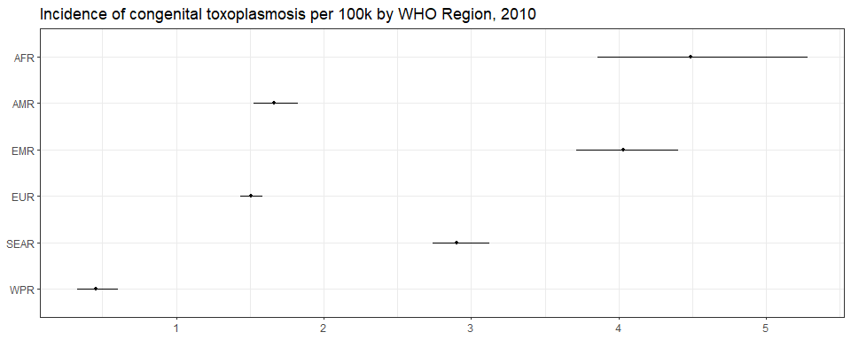<!-- -->

``` r
ggplot(subset(all_reg_rt, YEAR == 2020),
       aes(y = VAL_MEAN, x = LOCATION_NAME)) +
  geom_pointrange(aes(ymin = VAL_LWR, ymax = VAL_UPR), size = 0.2) +
  coord_flip() +
  theme_bw() +
  scale_x_discrete(NULL, limits = rev(unique(all_reg_nr$LOCATION_NAME))) +
  scale_y_continuous(NULL) +
  ggtitle("Incidence of congenital toxoplasmosis per 100k by WHO Region, 2020")
```

<!-- -->

``` r
ggplot(subset(all_reg_nr, YEAR == 2010),
       aes(y = VAL_MEAN, x = LOCATION_NAME)) +
  geom_pointrange(aes(ymin = VAL_LWR, ymax = VAL_UPR), size = 0.2) +
  coord_flip() +
  theme_bw() +
  scale_x_discrete(NULL, limits = rev(unique(all_reg_nr$LOCATION_NAME))) +
  scale_y_continuous(NULL) +
  ggtitle("Number of congenital toxoplasmosis cases by WHO Region, 2010")
```

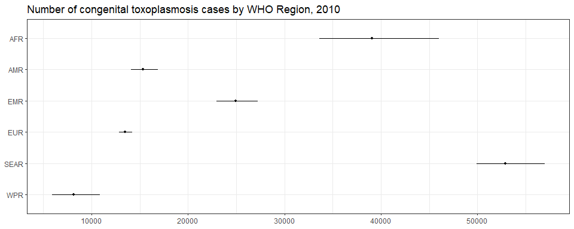<!-- -->

``` r
ggplot(subset(all_reg_nr, YEAR == 2020),
       aes(y = VAL_MEAN, x = LOCATION_NAME)) +
  geom_pointrange(aes(ymin = VAL_LWR, ymax = VAL_UPR), size = 0.2) +
  coord_flip() +
  theme_bw() +
  scale_x_discrete(NULL, limits = rev(unique(all_reg_nr$LOCATION_NAME))) +
  scale_y_continuous(NULL) +
  ggtitle("Number of congenital toxoplasmosis cases by WHO Region, 2020")
```

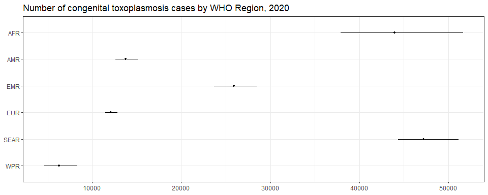<!-- -->

``` r
sim_all_reg <-
  merge(sim_all_reg,
        with(sim_all, aggregate(POP ~ REG2+YEAR, FUN = sum)))
sim_all_reg_long <-
  pivot_longer(sim_all_reg, cols = starts_with("V"))
sim_all_reg_long$CASES <- sim_all_reg_long$value
```

``` r
ggplot(subset(sim_all_reg_long, YEAR==2010), aes(x = CASES)) +
  geom_density() +
  facet_wrap(~REG2) +
  theme_bw() +
  scale_x_log10() +
  ggtitle("Number of congenital toxoplasmosis cases by WHO Region, 2010")
```

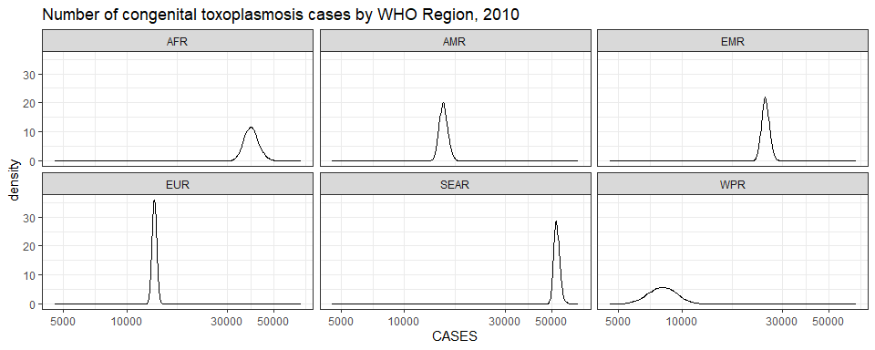<!-- -->

``` r
ggplot(subset(sim_all_reg_long, YEAR==2020), aes(x = CASES)) +
  geom_density() +
  facet_wrap(~REG2) +
  theme_bw() +
  scale_x_log10() +
  ggtitle("Number of congenital toxoplasmosis cases by WHO Region, 2020")
```

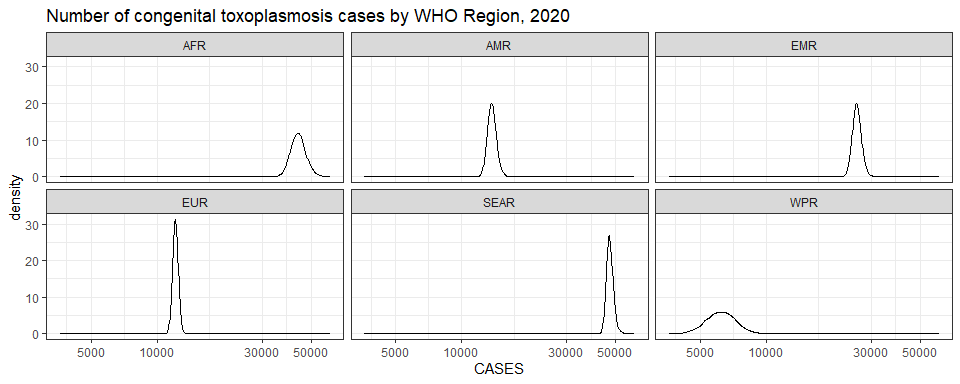<!-- -->

## Subregions

``` r
ggplot(subset(all_sub_rt, YEAR == 2010),
       aes(y = VAL_MEAN, x = LOCATION_NAME)) +
  geom_pointrange(aes(ymin = VAL_LWR, ymax = VAL_UPR), size = 0.2) +
  coord_flip() +
  theme_bw() +
  scale_x_discrete(NULL, limits = rev(unique(all_sub_nr$LOCATION_NAME))) +
  scale_y_continuous(NULL) +
  ggtitle("Incidence of congenital toxoplasmosis per 100k by WHO Subregion, 2010")
```

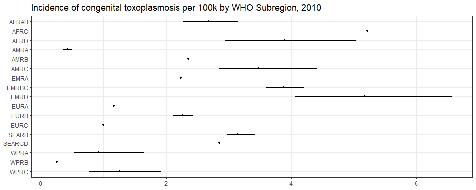<!-- -->

``` r
ggplot(subset(all_sub_rt, YEAR == 2020),
       aes(y = VAL_MEAN, x = LOCATION_NAME)) +
  geom_pointrange(aes(ymin = VAL_LWR, ymax = VAL_UPR), size = 0.2) +
  coord_flip() +
  theme_bw() +
  scale_x_discrete(NULL, limits = rev(unique(all_sub_nr$LOCATION_NAME))) +
  scale_y_continuous(NULL) +
  ggtitle("Incidence of congenital toxoplasmosis per 100k by WHO Subregion, 2020")
```

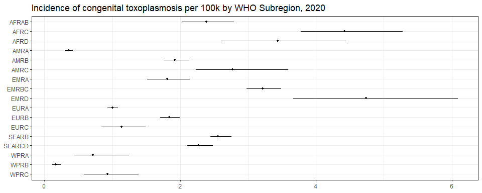<!-- -->

``` r
ggplot(subset(all_sub_nr, YEAR == 2010),
       aes(y = VAL_MEAN, x = LOCATION_NAME)) +
  geom_pointrange(aes(ymin = VAL_LWR, ymax = VAL_UPR), size = 0.2) +
  coord_flip() +
  theme_bw() +
  scale_x_discrete(NULL, limits = rev(unique(all_sub_nr$LOCATION_NAME))) +
  scale_y_continuous(NULL) +
  ggtitle("Number of congenital toxoplasmosis cases by WHO Subregion, 2010")
```

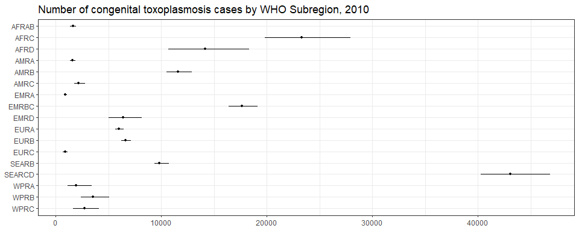<!-- -->

``` r
ggplot(subset(all_sub_nr, YEAR == 2020),
       aes(y = VAL_MEAN, x = LOCATION_NAME)) +
  geom_pointrange(aes(ymin = VAL_LWR, ymax = VAL_UPR), size = 0.2) +
  coord_flip() +
  theme_bw() +
  scale_x_discrete(NULL, limits = rev(unique(all_sub_nr$LOCATION_NAME))) +
  scale_y_continuous(NULL) +
  ggtitle("Number of congenital toxoplasmosis cases by WHO Subregion, 2020")
```

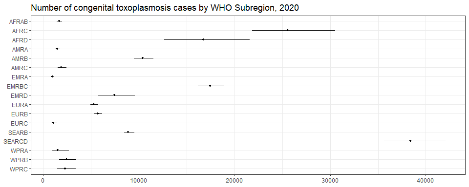<!-- -->

``` r
sim_all_sub <-
  merge(sim_all_sub,
        with(sim_all, aggregate(POP ~ SUB2+YEAR , FUN = sum)))
sim_all_sub_long <-
  pivot_longer(sim_all_sub, cols = starts_with("V"))
sim_all_sub_long$CASES <- sim_all_sub_long$value
```

``` r
ggplot(subset(sim_all_sub_long, YEAR==2010), aes(x = CASES)) +
  geom_density() +
  facet_wrap(~SUB2) +
  theme_bw() +
  scale_x_log10() +
  ggtitle("Number of congenital toxoplasmosis cases by WHO Subregion, 2010")
```

<!-- -->

``` r
ggplot(subset(sim_all_sub_long, YEAR==2020), aes(x = CASES)) +
  geom_density() +
  facet_wrap(~SUB2) +
  theme_bw() +
  scale_x_log10() +
  ggtitle("Number of congenital toxoplasmosis cases by WHO Subregion, 2020")
```

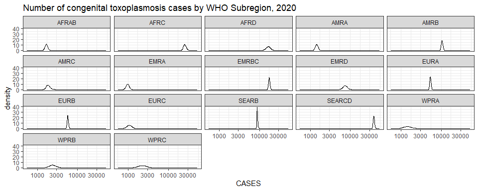<!-- -->

## Countries

``` r
breaks <- plot_world(subset(all_cnt_rt, YEAR == 2010),
          "LOCATION_NAME", "VAL_MEAN", legend.title = "Incidence per 100k", diseasefree = zero_cases)
plot_world(subset(all_cnt_rt, YEAR == 2010), breaks = breaks,
           "LOCATION_NAME", "VAL_MEAN", legend.title = "Incidence per 100k", diseasefree = zero_cases)
```

    ## [1]  0  2  4  6  8 10

``` r
title("Congenital toxoplasmosis incidence per 100k in 2010", line = 1)
```

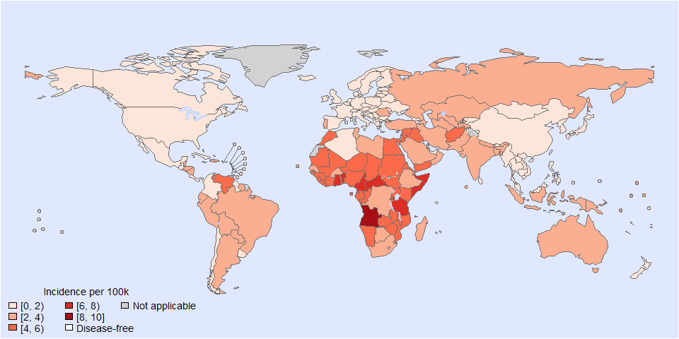<!-- -->

``` r
plot_world(subset(all_cnt_rt, YEAR == 2020), breaks = breaks,
           "LOCATION_NAME", "VAL_MEAN", legend.title = "Incidence per 100k", diseasefree = zero_cases)
```

    ## [1]  0  2  4  6  8 10

``` r
title("Congenital toxoplasmosis incidence per 100k in 2020", line = 1)
```

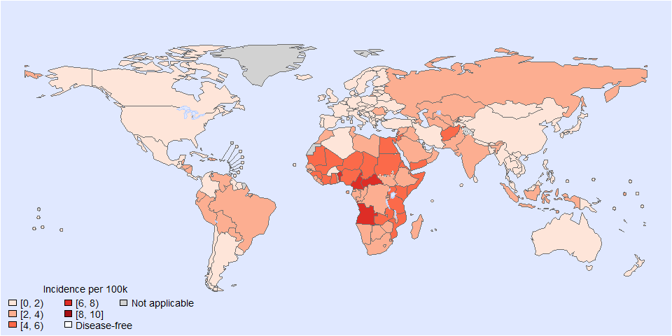<!-- -->

``` r
tab <-
  data.frame(subset(all_cnt_rt, YEAR == 2010)[,
                                              c("LOCATION_NAME", "VAL_MEAN", "VAL_LWR", "VAL_UPR")],
             subset(all_cnt_rt, YEAR == 2020)[,
                                              c("VAL_MEAN", "VAL_LWR", "VAL_UPR")])
tab$LOCATION_NAME <-
  FERG2:::countries$COUNTRY[match(tab$LOCATION_NAME, FERG2:::countries$ISO3)]
tab$LOCATION_NAME <- gsub(" \\(.*", "", tab$LOCATION_NAME)
names(tab) <-
  c("Country",
    "2010.mean", "2010.lwr", "2010.upr",
    "2020.mean", "2020.lwr", "2020.upr")

kable(tab, digits = 3, row.names = FALSE,
      caption = "Estimated congenital toxoplasmosis incidence per 100k by country, 2010 vs 2020")
```

| Country | 2010.mean | 2010.lwr | 2010.upr | 2020.mean | 2020.lwr | 2020.upr |
|:---|---:|---:|---:|---:|---:|---:|
| Afghanistan | 5.524 | 3.278 | 8.770 | 4.868 | 2.889 | 7.729 |
| Angola | 8.007 | 6.070 | 10.348 | 6.966 | 5.281 | 9.002 |
| Albania | 0.643 | 0.200 | 1.540 | 0.549 | 0.171 | 1.316 |
| Andorra | 0.853 | 0.653 | 1.095 | 0.566 | 0.433 | 0.727 |
| United Arab Emirates | 1.359 | 0.777 | 2.122 | 1.256 | 0.717 | 1.960 |
| Argentina | 2.505 | 1.371 | 4.205 | 1.610 | 0.881 | 2.703 |
| Armenia | 1.402 | 0.958 | 2.059 | 1.125 | 0.769 | 1.653 |
| Antigua and Barbuda | 1.293 | 0.683 | 2.033 | 1.075 | 0.567 | 1.690 |
| Australia | 2.159 | 1.982 | 2.353 | 1.811 | 1.662 | 1.974 |
| Austria | 0.103 | 0.088 | 0.121 | 0.103 | 0.088 | 0.121 |
| Azerbaijan | 3.013 | 2.920 | 3.110 | 2.285 | 2.215 | 2.358 |
| Burundi | 5.173 | 3.259 | 7.558 | 3.932 | 2.477 | 5.745 |
| Belgium | 1.585 | 0.666 | 3.192 | 1.344 | 0.565 | 2.706 |
| Benin | 7.582 | 7.214 | 7.953 | 6.750 | 6.422 | 7.080 |
| Burkina Faso | 2.606 | 1.171 | 5.018 | 1.977 | 0.888 | 3.807 |
| Bangladesh | 2.062 | 1.081 | 3.468 | 1.943 | 1.018 | 3.267 |
| Bulgaria | 0.860 | 0.769 | 0.959 | 0.715 | 0.640 | 0.798 |
| Bahrain | 1.837 | 1.050 | 2.868 | 1.527 | 0.873 | 2.384 |
| Bahamas | 1.290 | 0.681 | 2.027 | 0.979 | 0.517 | 1.539 |
| Bosnia and Herzegovina | 1.453 | 1.264 | 1.660 | 1.285 | 1.118 | 1.467 |
| Belarus | 1.873 | 1.281 | 2.640 | 1.473 | 1.007 | 2.076 |
| Belize | 2.481 | 1.674 | 3.628 | 2.063 | 1.392 | 3.016 |
| Bolivia | 2.587 | 2.085 | 3.162 | 2.219 | 1.788 | 2.711 |
| Brazil | 2.899 | 2.876 | 2.922 | 2.460 | 2.441 | 2.480 |
| Barbados | 1.126 | 0.594 | 1.769 | 0.998 | 0.526 | 1.568 |
| Brunei Darussalam | 1.468 | 0.662 | 3.018 | 1.259 | 0.568 | 2.589 |
| Bhutan | 1.819 | 0.953 | 3.058 | 1.245 | 0.653 | 2.094 |
| Botswana | 3.336 | 2.049 | 5.208 | 2.993 | 1.838 | 4.673 |
| Central African Republic | 7.724 | 7.080 | 8.409 | 7.673 | 7.033 | 8.353 |
| Canada | 0.978 | 0.516 | 1.537 | 0.839 | 0.443 | 1.319 |
| Switzerland | 0.373 | 0.132 | 0.848 | 0.363 | 0.129 | 0.825 |
| Chile | 1.234 | 1.140 | 1.332 | 0.876 | 0.809 | 0.946 |
| China | 0.232 | 0.146 | 0.346 | 0.145 | 0.091 | 0.216 |
| Côte d’Ivoire | 5.287 | 4.305 | 6.432 | 4.380 | 3.567 | 5.329 |
| Cameroon | 7.716 | 7.448 | 7.990 | 6.893 | 6.654 | 7.139 |
| Congo | 3.182 | 1.913 | 4.947 | 3.067 | 1.843 | 4.767 |
| Congo | 4.360 | 3.601 | 5.215 | 3.536 | 2.920 | 4.230 |
| Cook Islands | 1.580 | 0.712 | 3.248 | 1.259 | 0.568 | 2.589 |
| Colombia | 1.883 | 1.271 | 2.753 | 1.576 | 1.063 | 2.304 |
| Comoros | 4.195 | 2.982 | 5.932 | 3.663 | 2.604 | 5.179 |
| Cabo Verde | 2.477 | 1.761 | 3.502 | 1.592 | 1.131 | 2.250 |
| Costa Rica | 1.723 | 1.163 | 2.520 | 1.272 | 0.858 | 1.860 |
| Cuba | 1.838 | 1.752 | 1.925 | 1.486 | 1.416 | 1.556 |
| Cyprus | 1.036 | 0.742 | 1.399 | 0.972 | 0.697 | 1.313 |
| Czechia | 1.606 | 1.539 | 1.677 | 1.506 | 1.442 | 1.572 |
| Germany | 1.219 | 0.911 | 1.593 | 1.351 | 1.009 | 1.764 |
| Djibouti | 3.817 | 2.563 | 5.544 | 3.127 | 2.100 | 4.542 |
| Dominica | 1.560 | 1.053 | 2.281 | 1.269 | 0.856 | 1.855 |
| Denmark | 0.937 | 0.716 | 1.201 | 0.865 | 0.661 | 1.110 |
| Dominican Republic | 2.469 | 1.666 | 3.610 | 2.129 | 1.437 | 3.113 |
| Algeria | 1.100 | 0.581 | 1.870 | 1.002 | 0.529 | 1.705 |
| Ecuador | 3.246 | 3.040 | 3.468 | 2.427 | 2.273 | 2.593 |
| Egypt | 5.295 | 4.897 | 5.712 | 4.228 | 3.911 | 4.561 |
| Eritrea | 5.668 | 4.648 | 6.831 | 4.886 | 4.007 | 5.888 |
| Spain | 1.762 | 1.653 | 1.876 | 1.234 | 1.157 | 1.313 |
| Estonia | 1.913 | 1.828 | 2.003 | 1.606 | 1.534 | 1.680 |
| Ethiopia | 2.863 | 2.296 | 3.520 | 2.626 | 2.106 | 3.229 |
| Finland | 0.678 | 0.609 | 0.754 | 0.503 | 0.452 | 0.560 |
| Fiji | 1.457 | 0.676 | 2.508 | 1.229 | 0.570 | 2.115 |
| France | 0.625 | 0.557 | 0.701 | 0.520 | 0.463 | 0.582 |
| Micronesia | 1.630 | 0.779 | 2.769 | 1.476 | 0.705 | 2.505 |
| Gabon | 4.129 | 3.483 | 4.867 | 3.682 | 3.106 | 4.340 |
| United Kingdom | 0.973 | 0.910 | 1.041 | 0.768 | 0.718 | 0.822 |
| Georgia | 1.456 | 0.995 | 2.139 | 1.219 | 0.833 | 1.791 |
| Ghana | 6.266 | 5.628 | 6.965 | 5.257 | 4.722 | 5.843 |
| Guinea | 4.763 | 3.386 | 6.735 | 4.319 | 3.070 | 6.107 |
| Gambia | 4.242 | 2.672 | 6.198 | 3.445 | 2.170 | 5.034 |
| Guinea-Bissau | 4.153 | 2.616 | 6.068 | 3.420 | 2.154 | 4.997 |
| Equatorial Guinea | 4.408 | 2.707 | 6.881 | 3.587 | 2.203 | 5.600 |
| Greece | 0.853 | 0.652 | 1.094 | 0.652 | 0.499 | 0.837 |
| Grenada | 1.820 | 1.228 | 2.661 | 1.380 | 0.931 | 2.017 |
| Guatemala | 1.871 | 0.860 | 3.588 | 1.482 | 0.681 | 2.842 |
| Guyana | 1.931 | 1.019 | 3.035 | 1.879 | 0.991 | 2.953 |
| Honduras | 2.976 | 1.733 | 5.254 | 2.585 | 1.505 | 4.563 |
| Croatia | 1.074 | 1.004 | 1.149 | 0.898 | 0.839 | 0.960 |
| Haiti | 3.118 | 1.816 | 5.504 | 2.635 | 1.534 | 4.651 |
| Hungary | 0.749 | 0.573 | 0.961 | 0.786 | 0.601 | 1.009 |
| Indonesia | 3.637 | 3.565 | 3.710 | 2.973 | 2.913 | 3.032 |
| India | 3.077 | 2.956 | 3.200 | 2.381 | 2.287 | 2.476 |
| Ireland | 0.256 | 0.140 | 0.433 | 0.175 | 0.096 | 0.296 |
| Iran | 2.347 | 2.238 | 2.459 | 1.896 | 1.808 | 1.987 |
| Iraq | 5.124 | 4.169 | 6.237 | 3.956 | 3.219 | 4.816 |
| Iceland | 1.279 | 0.978 | 1.640 | 1.018 | 0.778 | 1.306 |
| Israel | 2.664 | 2.527 | 2.804 | 2.372 | 2.249 | 2.496 |
| Italy | 0.936 | 0.891 | 0.983 | 0.679 | 0.646 | 0.713 |
| Jamaica | 1.739 | 1.174 | 2.543 | 1.347 | 0.909 | 1.969 |
| Jordan | 5.442 | 5.096 | 5.806 | 4.199 | 3.932 | 4.480 |
| Japan | 0.733 | 0.330 | 1.507 | 0.583 | 0.263 | 1.199 |
| Kazakhstan | 2.128 | 1.454 | 3.125 | 2.124 | 1.451 | 3.119 |
| Kenya | 5.452 | 5.446 | 5.459 | 4.175 | 4.170 | 4.180 |
| Kyrgyzstan | 0.991 | 0.847 | 1.153 | 0.873 | 0.746 | 1.016 |
| Cambodia | 0.839 | 0.699 | 1.000 | 0.751 | 0.626 | 0.896 |
| Kiribati | 2.043 | 0.975 | 3.468 | 1.788 | 0.854 | 3.036 |
| Saint Kitts and Nevis | 1.310 | 0.691 | 2.059 | 1.108 | 0.585 | 1.741 |
| Korea | 0.811 | 0.366 | 1.668 | 0.457 | 0.206 | 0.940 |
| Kuwait | 1.235 | 0.903 | 1.656 | 0.748 | 0.546 | 1.002 |
| Lao People’s Dem. Republic | 1.763 | 0.842 | 2.993 | 1.469 | 0.701 | 2.494 |
| Lebanon | 4.907 | 2.812 | 7.971 | 4.451 | 2.551 | 7.230 |
| Liberia | 4.127 | 2.600 | 6.030 | 3.461 | 2.180 | 5.057 |
| Libya | 3.193 | 3.007 | 3.389 | 2.531 | 2.384 | 2.687 |
| Saint Lucia | 1.543 | 1.041 | 2.256 | 1.312 | 0.885 | 1.918 |
| Sri Lanka | 1.022 | 0.723 | 1.404 | 0.876 | 0.619 | 1.202 |
| Lesotho | 3.545 | 2.520 | 5.012 | 3.122 | 2.220 | 4.415 |
| Lithuania | 0.835 | 0.638 | 1.071 | 0.744 | 0.569 | 0.955 |
| Luxembourg | 0.946 | 0.723 | 1.214 | 0.843 | 0.644 | 1.081 |
| Latvia | 0.580 | 0.523 | 0.641 | 0.561 | 0.506 | 0.620 |
| Morocco | 4.271 | 3.735 | 4.850 | 3.480 | 3.043 | 3.952 |
| Monaco | 0.940 | 0.719 | 1.206 | 0.805 | 0.615 | 1.032 |
| Republic of Moldova | 1.368 | 0.934 | 2.009 | 1.121 | 0.766 | 1.647 |
| Madagascar | 3.933 | 2.477 | 5.746 | 3.593 | 2.263 | 5.249 |
| Maldives | 2.389 | 1.188 | 4.612 | 1.381 | 0.687 | 2.665 |
| Mexico | 1.233 | 0.766 | 1.900 | 1.002 | 0.623 | 1.544 |
| Marshall Islands | 2.014 | 0.934 | 3.467 | 1.505 | 0.698 | 2.590 |
| North Macedonia | 1.183 | 0.808 | 1.738 | 0.993 | 0.678 | 1.458 |
| Mali | 5.067 | 3.192 | 7.403 | 4.451 | 2.804 | 6.504 |
| Malta | 0.791 | 0.605 | 1.015 | 0.705 | 0.539 | 0.904 |
| Myanmar | 1.667 | 0.368 | 4.796 | 1.503 | 0.332 | 4.325 |
| Montenegro | 1.191 | 0.814 | 1.749 | 1.090 | 0.745 | 1.601 |
| Mongolia | 1.552 | 0.741 | 2.635 | 1.461 | 0.697 | 2.480 |
| Mozambique | 4.642 | 2.924 | 6.783 | 4.201 | 2.646 | 6.138 |
| Mauritania | 4.695 | 3.337 | 6.638 | 4.293 | 3.052 | 6.071 |
| Mauritius | 1.356 | 0.833 | 2.117 | 1.206 | 0.740 | 1.883 |
| Malawi | 4.442 | 2.798 | 6.490 | 3.554 | 2.239 | 5.193 |
| Malaysia | 1.407 | 0.809 | 2.288 | 1.111 | 0.639 | 1.807 |
| Namibia | 4.348 | 3.582 | 5.216 | 3.910 | 3.221 | 4.689 |
| Niger | 5.377 | 3.387 | 7.855 | 4.656 | 2.933 | 6.803 |
| Nigeria | 5.128 | 3.645 | 7.251 | 4.108 | 2.920 | 5.809 |
| Nicaragua | 2.727 | 1.588 | 4.814 | 2.291 | 1.334 | 4.044 |
| Niue | 1.483 | 0.669 | 3.049 | 1.126 | 0.508 | 2.315 |
| Netherlands | 1.599 | 1.126 | 2.188 | 1.405 | 0.989 | 1.922 |
| Norway | 0.560 | 0.494 | 0.632 | 0.443 | 0.391 | 0.501 |
| Nepal | 2.125 | 0.604 | 5.450 | 1.896 | 0.539 | 4.863 |
| Nauru | 3.169 | 1.429 | 6.516 | 2.529 | 1.140 | 5.200 |
| New Zealand | 1.285 | 0.579 | 2.642 | 1.000 | 0.451 | 2.056 |
| Oman | 2.819 | 1.610 | 4.400 | 2.217 | 1.266 | 3.460 |
| Pakistan | 3.552 | 2.950 | 4.236 | 3.028 | 2.515 | 3.611 |
| Panama | 1.968 | 1.382 | 2.700 | 1.567 | 1.100 | 2.150 |
| Peru | 3.687 | 2.722 | 4.895 | 3.091 | 2.282 | 4.103 |
| Philippines | 1.740 | 0.831 | 2.955 | 1.108 | 0.529 | 1.882 |
| Palau | 0.882 | 0.409 | 1.518 | 0.758 | 0.352 | 1.306 |
| Papua New Guinea | 2.006 | 0.958 | 3.406 | 1.703 | 0.813 | 2.892 |
| Poland | 1.337 | 1.042 | 1.680 | 1.133 | 0.883 | 1.424 |
| Korea | 1.277 | 0.669 | 2.147 | 1.285 | 0.674 | 2.162 |
| Portugal | 2.147 | 2.003 | 2.296 | 1.815 | 1.693 | 1.941 |
| Paraguay | 2.806 | 2.468 | 3.179 | 2.620 | 2.304 | 2.969 |
| Qatar | 1.574 | 1.344 | 1.831 | 1.359 | 1.160 | 1.580 |
| Romania | 2.273 | 2.110 | 2.445 | 2.051 | 1.904 | 2.207 |
| Russian Federation | 2.701 | 2.514 | 2.895 | 2.130 | 1.983 | 2.284 |
| Rwanda | 4.250 | 2.515 | 6.704 | 3.625 | 2.145 | 5.718 |
| Saudi Arabia | 2.603 | 2.179 | 3.074 | 2.123 | 1.777 | 2.507 |
| Sudan | 4.386 | 2.949 | 6.239 | 4.010 | 2.697 | 5.705 |
| Senegal | 3.116 | 1.705 | 5.266 | 2.511 | 1.374 | 4.244 |
| Singapore | 0.744 | 0.335 | 1.530 | 0.728 | 0.328 | 1.496 |
| Solomon Islands | 2.188 | 1.045 | 3.716 | 1.832 | 0.875 | 3.111 |
| Sierra Leone | 4.216 | 2.656 | 6.159 | 3.499 | 2.204 | 5.113 |
| El Salvador | 2.190 | 1.477 | 3.201 | 1.820 | 1.228 | 2.661 |
| San Marino | 0.862 | 0.659 | 1.106 | 0.507 | 0.388 | 0.650 |
| Somalia | 6.336 | 3.760 | 10.060 | 5.923 | 3.514 | 9.403 |
| Serbia | 0.297 | 0.226 | 0.387 | 0.284 | 0.215 | 0.369 |
| South Sudan | 4.364 | 2.749 | 6.376 | 3.145 | 1.981 | 4.595 |
| Sao Tome and Principe | 4.559 | 3.241 | 6.447 | 3.507 | 2.493 | 4.959 |
| Suriname | 2.320 | 1.565 | 3.392 | 1.982 | 1.337 | 2.898 |
| Slovakia | 0.524 | 0.445 | 0.615 | 0.485 | 0.412 | 0.568 |
| Slovenia | 0.904 | 0.691 | 1.160 | 0.737 | 0.563 | 0.945 |
| Sweden | 1.010 | 0.773 | 1.296 | 0.901 | 0.689 | 1.156 |
| Eswatini | 3.741 | 2.659 | 5.290 | 3.092 | 2.198 | 4.373 |
| Seychelles | 1.951 | 1.198 | 3.046 | 1.740 | 1.069 | 2.717 |
| Syrian Arab Republic | 4.730 | 3.472 | 6.325 | 3.415 | 2.507 | 4.567 |
| Chad | 5.283 | 3.328 | 7.718 | 4.780 | 3.011 | 6.984 |
| Togo | 4.134 | 2.604 | 6.040 | 3.539 | 2.230 | 5.171 |
| Thailand | 1.350 | 0.671 | 2.605 | 0.986 | 0.490 | 1.903 |
| Tajikistan | 2.204 | 1.068 | 3.361 | 1.954 | 0.947 | 2.981 |
| Turkmenistan | 2.429 | 1.659 | 3.567 | 2.278 | 1.556 | 3.346 |
| Timor-Leste | 3.048 | 1.597 | 5.125 | 2.257 | 1.183 | 3.795 |
| Tonga | 1.826 | 0.847 | 3.144 | 1.540 | 0.714 | 2.651 |
| Trinidad and Tobago | 1.243 | 0.656 | 1.954 | 1.026 | 0.542 | 1.613 |
| Tunisia | 3.381 | 2.760 | 4.132 | 2.970 | 2.425 | 3.630 |
| Turkiye | 2.010 | 1.695 | 2.368 | 1.620 | 1.366 | 1.908 |
| Tuvalu | 1.436 | 0.666 | 2.472 | 1.578 | 0.732 | 2.717 |
| United Republic of Tanzania | 6.194 | 4.331 | 8.552 | 5.836 | 4.081 | 8.058 |
| Uganda | 4.682 | 2.949 | 6.841 | 4.038 | 2.543 | 5.899 |
| Ukraine | 0.179 | 0.111 | 0.275 | 0.124 | 0.077 | 0.190 |
| Uruguay | 1.252 | 0.661 | 1.967 | 0.916 | 0.483 | 1.439 |
| United States of America | 0.292 | 0.256 | 0.331 | 0.244 | 0.214 | 0.277 |
| Uzbekistan | 2.021 | 1.397 | 2.827 | 2.312 | 1.598 | 3.234 |
| Saint Vincent and the Grenadines | 1.867 | 1.260 | 2.729 | 1.426 | 0.962 | 2.085 |
| Venezuela | 4.223 | 3.436 | 5.154 | 3.216 | 2.617 | 3.925 |
| Viet Nam | 0.689 | 0.570 | 0.827 | 0.602 | 0.498 | 0.723 |
| Vanuatu | 2.153 | 1.028 | 3.656 | 1.958 | 0.935 | 3.326 |
| Samoa | 1.987 | 0.949 | 3.374 | 1.788 | 0.854 | 3.036 |
| Yemen | 5.702 | 4.036 | 7.821 | 5.754 | 4.073 | 7.892 |
| South Africa | 2.542 | 2.102 | 3.057 | 2.239 | 1.852 | 2.694 |
| Zambia | 5.072 | 3.606 | 7.173 | 4.211 | 2.993 | 5.954 |
| Zimbabwe | 4.620 | 3.284 | 6.533 | 3.780 | 2.687 | 5.345 |

Estimated congenital toxoplasmosis incidence per 100k by country, 2010
vs 2020

``` r
tab2 <-
  data.frame(subset(all_cnt_nr, YEAR == 2010)[,
                                              c("LOCATION_NAME", "VAL_MEAN", "VAL_LWR", "VAL_UPR")],
             subset(all_cnt_nr, YEAR == 2020)[,
                                              c("VAL_MEAN", "VAL_LWR", "VAL_UPR")])
tab2$LOCATION_NAME <-
  FERG2:::countries$COUNTRY[match(tab2$LOCATION_NAME, FERG2:::countries$ISO3)]
tab2$LOCATION_NAME <- gsub(" \\(.*", "", tab2$LOCATION_NAME)
names(tab2) <-
  c("Country",
    "2010.mean", "2010.lwr", "2010.upr",
    "2020.mean", "2020.lwr", "2020.upr")

kable(tab2, digits = 1, row.names = FALSE,
      caption = "Estimated congenital toxoplasmosis cases by country")
```

| Country | 2010.mean | 2010.lwr | 2010.upr | 2020.mean | 2020.lwr | 2020.upr |
|:---|---:|---:|---:|---:|---:|---:|
| Afghanistan | 1541.0 | 914.3 | 2446.5 | 1870.9 | 1110.1 | 2970.3 |
| Angola | 1828.9 | 1386.5 | 2363.7 | 2293.1 | 1738.4 | 2963.6 |
| Albania | 18.9 | 5.9 | 45.4 | 15.8 | 4.9 | 37.9 |
| Andorra | 0.7 | 0.5 | 0.9 | 0.4 | 0.3 | 0.6 |
| United Arab Emirates | 92.7 | 53.0 | 144.8 | 117.5 | 67.1 | 183.4 |
| Argentina | 1028.8 | 563.2 | 1727.0 | 726.5 | 397.7 | 1219.5 |
| Armenia | 41.2 | 28.1 | 60.5 | 32.6 | 22.3 | 47.9 |
| Antigua and Barbuda | 1.1 | 0.6 | 1.7 | 1.0 | 0.5 | 1.5 |
| Australia | 474.6 | 435.6 | 517.2 | 464.7 | 426.5 | 506.3 |
| Austria | 8.6 | 7.3 | 10.1 | 9.2 | 7.8 | 10.8 |
| Azerbaijan | 274.0 | 265.5 | 282.8 | 232.0 | 224.9 | 239.5 |
| Burundi | 475.9 | 299.8 | 695.3 | 489.2 | 308.2 | 714.8 |
| Belgium | 172.3 | 72.4 | 347.1 | 154.9 | 65.1 | 311.9 |
| Benin | 731.8 | 696.2 | 767.6 | 870.6 | 828.3 | 913.2 |
| Burkina Faso | 415.4 | 186.6 | 799.9 | 419.5 | 188.5 | 807.8 |
| Bangladesh | 3125.3 | 1638.0 | 5255.6 | 3217.3 | 1686.3 | 5410.4 |
| Bulgaria | 64.2 | 57.4 | 71.6 | 49.7 | 44.5 | 55.5 |
| Bahrain | 22.3 | 12.8 | 34.8 | 22.6 | 12.9 | 35.2 |
| Bahamas | 4.7 | 2.5 | 7.4 | 3.9 | 2.0 | 6.1 |
| Bosnia and Herzegovina | 55.9 | 48.6 | 63.8 | 42.7 | 37.2 | 48.8 |
| Belarus | 178.0 | 121.7 | 250.8 | 138.5 | 94.7 | 195.1 |
| Belize | 7.9 | 5.3 | 11.5 | 8.0 | 5.4 | 11.7 |
| Bolivia | 261.3 | 210.6 | 319.3 | 260.7 | 210.1 | 318.6 |
| Brazil | 5591.7 | 5547.3 | 5636.3 | 5120.1 | 5079.4 | 5160.9 |
| Barbados | 3.1 | 1.6 | 4.9 | 2.8 | 1.5 | 4.4 |
| Brunei Darussalam | 5.7 | 2.6 | 11.7 | 5.6 | 2.5 | 11.5 |
| Bhutan | 12.7 | 6.7 | 21.3 | 9.6 | 5.0 | 16.1 |
| Botswana | 67.1 | 41.2 | 104.8 | 70.3 | 43.2 | 109.8 |
| Central African Republic | 343.7 | 315.0 | 374.1 | 380.6 | 348.9 | 414.4 |
| Canada | 332.7 | 175.6 | 522.9 | 319.0 | 168.4 | 501.4 |
| Switzerland | 29.0 | 10.3 | 65.9 | 31.2 | 11.1 | 71.0 |
| Chile | 211.0 | 194.9 | 227.8 | 169.3 | 156.4 | 182.8 |
| China | 3118.9 | 1972.8 | 4655.3 | 2060.9 | 1303.6 | 3076.1 |
| Côte d’Ivoire | 1175.9 | 957.4 | 1430.6 | 1250.9 | 1018.5 | 1521.9 |
| Cameroon | 1495.9 | 1444.0 | 1549.2 | 1782.3 | 1720.5 | 1845.8 |
| Congo | 2146.6 | 1290.3 | 3337.1 | 2895.2 | 1740.3 | 4500.9 |
| Congo | 191.3 | 158.0 | 228.8 | 201.0 | 166.0 | 240.4 |
| Cook Islands | 0.3 | 0.1 | 0.5 | 0.2 | 0.1 | 0.4 |
| Colombia | 838.4 | 565.7 | 1225.8 | 793.1 | 535.1 | 1159.5 |
| Comoros | 27.2 | 19.3 | 38.5 | 29.1 | 20.7 | 41.1 |
| Cabo Verde | 12.6 | 9.0 | 17.8 | 8.2 | 5.8 | 11.6 |
| Costa Rica | 78.1 | 52.7 | 114.1 | 63.8 | 43.1 | 93.3 |
| Cuba | 207.6 | 197.9 | 217.5 | 166.2 | 158.4 | 174.1 |
| Cyprus | 11.6 | 8.3 | 15.6 | 12.6 | 9.0 | 17.0 |
| Czechia | 167.7 | 160.7 | 175.1 | 159.0 | 152.3 | 166.0 |
| Germany | 986.0 | 736.4 | 1288.1 | 1129.5 | 843.5 | 1475.6 |
| Djibouti | 35.2 | 23.6 | 51.1 | 34.3 | 23.0 | 49.8 |
| Dominica | 1.1 | 0.7 | 1.6 | 0.9 | 0.6 | 1.3 |
| Denmark | 51.8 | 39.6 | 66.5 | 50.4 | 38.5 | 64.6 |
| Dominican Republic | 240.9 | 162.6 | 352.3 | 233.1 | 157.3 | 340.8 |
| Algeria | 394.0 | 208.1 | 670.0 | 437.9 | 231.3 | 744.6 |
| Ecuador | 485.4 | 454.5 | 518.6 | 424.1 | 397.2 | 453.2 |
| Egypt | 4677.5 | 4325.9 | 5045.9 | 4586.2 | 4241.5 | 4947.4 |
| Eritrea | 165.2 | 135.4 | 199.0 | 159.4 | 130.7 | 192.1 |
| Spain | 823.9 | 772.7 | 877.0 | 587.6 | 551.1 | 625.5 |
| Estonia | 25.5 | 24.4 | 26.7 | 21.3 | 20.4 | 22.3 |
| Ethiopia | 2555.6 | 2049.2 | 3141.9 | 3080.4 | 2470.1 | 3787.2 |
| Finland | 36.3 | 32.6 | 40.4 | 27.8 | 25.0 | 30.9 |
| Fiji | 13.2 | 6.1 | 22.8 | 11.2 | 5.2 | 19.3 |
| France | 395.7 | 352.6 | 443.3 | 342.1 | 304.9 | 383.3 |
| Micronesia | 1.8 | 0.8 | 3.0 | 1.6 | 0.8 | 2.8 |
| Gabon | 69.8 | 58.8 | 82.2 | 84.5 | 71.3 | 99.6 |
| United Kingdom | 610.6 | 570.8 | 653.4 | 516.9 | 483.2 | 553.1 |
| Georgia | 56.9 | 38.9 | 83.6 | 46.3 | 31.6 | 68.0 |
| Ghana | 1577.3 | 1416.7 | 1753.1 | 1659.6 | 1490.6 | 1844.6 |
| Guinea | 489.1 | 347.6 | 691.5 | 570.2 | 405.3 | 806.3 |
| Gambia | 80.5 | 50.7 | 117.7 | 85.6 | 53.9 | 125.1 |
| Guinea-Bissau | 64.2 | 40.4 | 93.8 | 68.1 | 42.9 | 99.5 |
| Equatorial Guinea | 51.2 | 31.4 | 80.0 | 60.9 | 37.4 | 95.0 |
| Greece | 94.8 | 72.5 | 121.7 | 69.9 | 53.4 | 89.7 |
| Grenada | 2.0 | 1.4 | 3.0 | 1.6 | 1.1 | 2.3 |
| Guatemala | 268.6 | 123.4 | 515.0 | 255.3 | 117.3 | 489.7 |
| Guyana | 14.5 | 7.7 | 22.8 | 15.1 | 8.0 | 23.7 |
| Honduras | 246.4 | 143.5 | 434.9 | 259.4 | 151.0 | 457.8 |
| Croatia | 46.3 | 43.3 | 49.5 | 35.6 | 33.3 | 38.1 |
| Haiti | 304.6 | 177.4 | 537.7 | 294.5 | 171.5 | 519.8 |
| Hungary | 74.8 | 57.2 | 96.0 | 76.8 | 58.7 | 98.5 |
| Indonesia | 8902.8 | 8724.4 | 9081.4 | 8137.9 | 7974.8 | 8301.2 |
| India | 37990.1 | 36491.8 | 39506.7 | 33243.0 | 31932.0 | 34570.1 |
| Ireland | 11.6 | 6.4 | 19.7 | 8.7 | 4.8 | 14.7 |
| Iran | 1805.7 | 1721.6 | 1892.2 | 1658.8 | 1581.6 | 1738.3 |
| Iraq | 1565.0 | 1273.5 | 1905.2 | 1647.2 | 1340.4 | 2005.3 |
| Iceland | 4.1 | 3.1 | 5.2 | 3.7 | 2.8 | 4.8 |
| Israel | 193.6 | 183.7 | 203.8 | 207.0 | 196.4 | 217.9 |
| Italy | 561.8 | 534.7 | 589.9 | 407.6 | 387.9 | 427.9 |
| Jamaica | 47.7 | 32.2 | 69.7 | 38.0 | 25.7 | 55.6 |
| Jordan | 392.2 | 367.2 | 418.3 | 452.0 | 423.2 | 482.1 |
| Japan | 939.7 | 423.7 | 1932.1 | 737.9 | 332.7 | 1517.2 |
| Kazakhstan | 355.9 | 243.1 | 522.7 | 411.0 | 280.8 | 603.6 |
| Kenya | 2235.9 | 2233.4 | 2238.5 | 2158.9 | 2156.4 | 2161.3 |
| Kyrgyzstan | 53.9 | 46.1 | 62.7 | 57.4 | 49.1 | 66.9 |
| Cambodia | 120.7 | 100.5 | 143.9 | 124.6 | 103.8 | 148.6 |
| Kiribati | 2.2 | 1.0 | 3.7 | 2.2 | 1.1 | 3.8 |
| Saint Kitts and Nevis | 0.6 | 0.3 | 1.0 | 0.5 | 0.3 | 0.8 |
| Korea | 394.6 | 177.9 | 811.2 | 237.0 | 106.9 | 487.3 |
| Kuwait | 35.4 | 25.9 | 47.5 | 33.4 | 24.4 | 44.7 |
| Lao People’s Dem. Republic | 110.8 | 52.9 | 188.2 | 107.1 | 51.1 | 181.9 |
| Lebanon | 246.6 | 141.3 | 400.6 | 253.6 | 145.3 | 411.8 |
| Liberia | 165.1 | 104.0 | 241.2 | 176.3 | 111.1 | 257.6 |
| Libya | 205.3 | 193.4 | 218.0 | 177.1 | 166.9 | 188.1 |
| Saint Lucia | 2.6 | 1.8 | 3.8 | 2.3 | 1.6 | 3.4 |
| Sri Lanka | 212.8 | 150.6 | 292.2 | 196.9 | 139.3 | 270.3 |
| Lesotho | 70.5 | 50.1 | 99.7 | 69.4 | 49.3 | 98.1 |
| Lithuania | 26.2 | 20.1 | 33.7 | 20.8 | 15.9 | 26.7 |
| Luxembourg | 4.8 | 3.6 | 6.1 | 5.3 | 4.0 | 6.8 |
| Latvia | 12.3 | 11.1 | 13.6 | 10.7 | 9.7 | 11.8 |
| Morocco | 1377.1 | 1204.5 | 1564.0 | 1266.3 | 1107.6 | 1438.2 |
| Monaco | 0.3 | 0.2 | 0.4 | 0.3 | 0.2 | 0.4 |
| Republic of Moldova | 50.2 | 34.3 | 73.7 | 34.6 | 23.7 | 50.9 |
| Madagascar | 859.8 | 541.6 | 1256.2 | 1027.0 | 646.9 | 1500.5 |
| Maldives | 8.5 | 4.2 | 16.3 | 6.8 | 3.4 | 13.2 |
| Mexico | 1391.0 | 864.6 | 2143.3 | 1266.4 | 787.1 | 1951.3 |
| Marshall Islands | 1.0 | 0.5 | 1.8 | 0.7 | 0.3 | 1.1 |
| North Macedonia | 24.3 | 16.6 | 35.7 | 18.7 | 12.8 | 27.5 |
| Mali | 794.8 | 500.7 | 1161.2 | 951.7 | 599.5 | 1390.4 |
| Malta | 3.3 | 2.6 | 4.3 | 3.6 | 2.8 | 4.7 |
| Myanmar | 813.8 | 179.8 | 2342.1 | 793.9 | 175.4 | 2284.7 |
| Montenegro | 7.5 | 5.1 | 11.1 | 6.6 | 4.5 | 9.8 |
| Mongolia | 41.6 | 19.9 | 70.7 | 47.7 | 22.8 | 81.0 |
| Mozambique | 1053.3 | 663.5 | 1538.9 | 1273.9 | 802.4 | 1861.2 |
| Mauritania | 156.6 | 111.3 | 221.5 | 194.6 | 138.4 | 275.2 |
| Mauritius | 17.4 | 10.7 | 27.1 | 15.5 | 9.5 | 24.2 |
| Malawi | 649.0 | 408.8 | 948.2 | 685.2 | 431.6 | 1001.1 |
| Malaysia | 399.5 | 229.8 | 649.8 | 374.4 | 215.4 | 608.9 |
| Namibia | 91.0 | 75.0 | 109.2 | 105.1 | 86.6 | 126.0 |
| Niger | 873.2 | 550.1 | 1275.8 | 1086.2 | 684.2 | 1587.0 |
| Nigeria | 8425.7 | 5989.5 | 11914.3 | 8698.6 | 6183.5 | 12300.1 |
| Nicaragua | 155.3 | 90.5 | 274.2 | 149.5 | 87.0 | 263.9 |
| Niue | 0.0 | 0.0 | 0.1 | 0.0 | 0.0 | 0.0 |
| Netherlands | 267.5 | 188.4 | 366.1 | 247.2 | 174.1 | 338.3 |
| Norway | 27.2 | 24.0 | 30.7 | 23.8 | 21.0 | 26.9 |
| Nepal | 579.3 | 164.8 | 1485.6 | 544.2 | 154.8 | 1395.6 |
| Nauru | 0.3 | 0.1 | 0.7 | 0.3 | 0.1 | 0.6 |
| New Zealand | 55.6 | 25.1 | 114.3 | 50.4 | 22.7 | 103.6 |
| Oman | 76.5 | 43.7 | 119.4 | 101.3 | 57.9 | 158.2 |
| Pakistan | 6992.8 | 5808.2 | 8340.9 | 7047.7 | 5853.7 | 8406.3 |
| Panama | 70.8 | 49.7 | 97.1 | 66.9 | 47.0 | 91.7 |
| Peru | 1068.8 | 789.0 | 1418.9 | 1009.4 | 745.1 | 1339.9 |
| Philippines | 1658.5 | 791.9 | 2816.2 | 1235.6 | 590.0 | 2098.1 |
| Palau | 0.2 | 0.1 | 0.3 | 0.1 | 0.1 | 0.2 |
| Papua New Guinea | 150.8 | 72.0 | 256.1 | 165.5 | 79.0 | 281.0 |
| Poland | 508.3 | 396.1 | 638.7 | 433.1 | 337.5 | 544.2 |
| Korea | 318.3 | 166.8 | 535.3 | 335.3 | 175.8 | 563.9 |
| Portugal | 227.2 | 212.0 | 243.0 | 188.1 | 175.5 | 201.1 |
| Paraguay | 160.0 | 140.7 | 181.3 | 171.8 | 151.1 | 194.7 |
| Qatar | 26.1 | 22.2 | 30.3 | 38.3 | 32.7 | 44.5 |
| Romania | 466.1 | 432.7 | 501.4 | 399.1 | 370.5 | 429.3 |
| Russian Federation | 3886.7 | 3618.0 | 4167.3 | 3121.9 | 2906.1 | 3347.3 |
| Rwanda | 433.0 | 256.3 | 683.0 | 468.4 | 277.2 | 738.8 |
| Saudi Arabia | 642.6 | 538.0 | 758.9 | 654.1 | 547.6 | 772.5 |
| Sudan | 1537.3 | 1033.8 | 2186.9 | 1851.7 | 1245.1 | 2634.1 |
| Senegal | 389.0 | 212.8 | 657.4 | 416.2 | 227.7 | 703.4 |
| Singapore | 37.4 | 16.9 | 76.9 | 41.4 | 18.6 | 85.0 |
| Solomon Islands | 11.4 | 5.5 | 19.4 | 13.5 | 6.4 | 22.9 |
| Sierra Leone | 258.9 | 163.1 | 378.3 | 273.7 | 172.4 | 399.9 |
| El Salvador | 132.6 | 89.5 | 193.9 | 113.3 | 76.4 | 165.6 |
| San Marino | 0.3 | 0.2 | 0.3 | 0.2 | 0.1 | 0.2 |
| Somalia | 767.5 | 455.4 | 1218.6 | 967.3 | 574.0 | 1535.7 |
| Serbia | 22.0 | 16.7 | 28.7 | 19.7 | 14.9 | 25.6 |
| South Sudan | 412.5 | 259.8 | 602.7 | 332.1 | 209.2 | 485.2 |
| Sao Tome and Principe | 8.2 | 5.8 | 11.6 | 7.5 | 5.4 | 10.7 |
| Suriname | 12.7 | 8.6 | 18.5 | 12.1 | 8.1 | 17.7 |
| Slovakia | 28.2 | 24.0 | 33.1 | 26.4 | 22.5 | 31.0 |
| Slovenia | 18.5 | 14.1 | 23.7 | 15.4 | 11.8 | 19.8 |
| Sweden | 94.4 | 72.2 | 121.1 | 93.1 | 71.2 | 119.4 |
| Eswatini | 41.5 | 29.5 | 58.6 | 36.7 | 26.1 | 51.8 |
| Seychelles | 1.8 | 1.1 | 2.9 | 2.1 | 1.3 | 3.2 |
| Syrian Arab Republic | 1051.5 | 771.8 | 1406.2 | 708.6 | 520.1 | 947.6 |
| Chad | 639.2 | 402.6 | 933.9 | 809.5 | 509.9 | 1182.8 |
| Togo | 274.5 | 172.9 | 401.1 | 303.2 | 191.0 | 443.0 |
| Thailand | 922.7 | 458.9 | 1781.0 | 705.6 | 350.9 | 1362.0 |
| Tajikistan | 166.8 | 80.8 | 254.4 | 188.4 | 91.3 | 287.4 |
| Turkmenistan | 133.7 | 91.4 | 196.4 | 156.7 | 107.0 | 230.1 |
| Timor-Leste | 32.7 | 17.1 | 54.9 | 29.6 | 15.5 | 49.8 |
| Tonga | 2.0 | 0.9 | 3.4 | 1.6 | 0.8 | 2.8 |
| Trinidad and Tobago | 17.2 | 9.1 | 27.0 | 15.2 | 8.0 | 23.8 |
| Tunisia | 362.0 | 295.5 | 442.4 | 354.3 | 289.2 | 433.0 |
| Turkiye | 1465.6 | 1235.6 | 1726.1 | 1389.0 | 1171.0 | 1635.9 |
| Tuvalu | 0.2 | 0.1 | 0.3 | 0.2 | 0.1 | 0.3 |
| United Republic of Tanzania | 2733.9 | 1911.7 | 3774.8 | 3504.6 | 2450.6 | 4839.0 |
| Uganda | 1494.3 | 941.3 | 2183.2 | 1765.9 | 1112.4 | 2580.1 |
| Ukraine | 83.4 | 51.6 | 127.8 | 55.5 | 34.3 | 85.0 |
| Uruguay | 41.5 | 21.9 | 65.2 | 31.1 | 16.4 | 48.9 |
| United States of America | 903.9 | 791.3 | 1025.9 | 827.9 | 724.8 | 939.6 |
| Uzbekistan | 569.3 | 393.5 | 796.2 | 769.2 | 531.8 | 1075.8 |
| Saint Vincent and the Grenadines | 2.1 | 1.4 | 3.0 | 1.5 | 1.0 | 2.2 |
| Venezuela | 1208.8 | 983.6 | 1475.5 | 919.4 | 748.1 | 1122.2 |
| Viet Nam | 599.2 | 495.3 | 719.5 | 587.8 | 485.9 | 705.8 |
| Vanuatu | 5.1 | 2.4 | 8.6 | 5.8 | 2.8 | 9.8 |
| Samoa | 3.8 | 1.8 | 6.5 | 3.8 | 1.8 | 6.4 |
| Yemen | 1502.1 | 1063.3 | 2060.2 | 2050.7 | 1451.7 | 2812.7 |
| South Africa | 1322.3 | 1093.4 | 1590.5 | 1345.4 | 1112.5 | 1618.3 |
| Zambia | 696.4 | 495.1 | 984.8 | 791.1 | 562.3 | 1118.6 |
| Zimbabwe | 611.9 | 435.0 | 865.2 | 581.9 | 413.6 | 822.8 |

Estimated congenital toxoplasmosis cases by country

# Session info

``` r
saveRDS(sim_all, paste0("sim_all_", Date, ".RDS"))
saveRDS(all_est, paste0("all_est_", Date, ".RDS"))
sessioninfo::session_info()
```

    ## Warning in system2("quarto", "-V", stdout = TRUE, env = paste0("TMPDIR=", : running command '"quarto"
    ## TMPDIR=C:/Users/fbbu6966/AppData/Local/Temp/RtmpoBkVBp/file48184b4b57b5 -V' had status 1

    ## ─ Session info ─────────────────────────────────────────────────────────────────────────────────────────────────────────
    ##  setting  value
    ##  version  R version 4.5.0 (2025-04-11 ucrt)
    ##  os       Windows 10 x64 (build 19045)
    ##  system   x86_64, mingw32
    ##  ui       RStudio
    ##  language (EN)
    ##  collate  English_United States.utf8
    ##  ctype    English_United States.utf8
    ##  tz       Europe/Brussels
    ##  date     2025-08-20
    ##  rstudio  2025.05.0+496 Mariposa Orchid (desktop)
    ##  pandoc   3.4 @ C:/Users/fbbu6966/AppData/Local/Programs/RStudio/resources/app/bin/quarto/bin/tools/ (via rmarkdown)
    ##  quarto   ERROR: Unknown command "TMPDIR=C:/Users/fbbu6966/AppData/Local/Temp/RtmpoBkVBp/file48184b4b57b5". Did you mean command "update"? @ C:\\Users\\fbbu6966\\AppData\\Local\\Programs\\RStudio\\RESOUR~1\\app\\bin\\quarto\\bin\\quarto.exe
    ## 
    ## ─ Packages ─────────────────────────────────────────────────────────────────────────────────────────────────────────────
    ##  ! package        * version    date (UTC) lib source
    ##    abind            1.4-8      2024-09-12 [1] CRAN (R 4.5.0)
    ##    backports        1.5.0      2024-05-23 [1] CRAN (R 4.5.0)
    ##    base64enc        0.1-3      2015-07-28 [1] CRAN (R 4.5.0)
    ##    bayesplot        1.12.0     2025-04-10 [1] CRAN (R 4.5.0)
    ##    bd             * 0.0.14     2025-04-14 [1] Github (brechtdv/bd@652191c)
    ##    boot             1.3-31     2024-08-28 [1] CRAN (R 4.5.0)
    ##    bridgesampling   1.1-2      2021-04-16 [1] CRAN (R 4.5.0)
    ##    brms           * 2.22.0     2024-09-23 [1] CRAN (R 4.5.0)
    ##    Brobdingnag      1.2-9      2022-10-19 [1] CRAN (R 4.5.0)
    ##    callr            3.7.6      2024-03-25 [1] CRAN (R 4.5.0)
    ##    cellranger       1.1.0      2016-07-27 [1] CRAN (R 4.5.0)
    ##    checkmate        2.3.2      2024-07-29 [1] CRAN (R 4.5.0)
    ##    class            7.3-23     2025-01-01 [1] CRAN (R 4.5.0)
    ##    classInt         0.4-11     2025-01-08 [1] CRAN (R 4.5.0)
    ##    cli              3.6.4      2025-02-13 [1] CRAN (R 4.5.0)
    ##    cluster          2.1.8.1    2025-03-12 [1] CRAN (R 4.5.0)
    ##    coda             0.19-4.1   2024-01-31 [1] CRAN (R 4.5.0)
    ##    codetools        0.2-20     2024-03-31 [1] CRAN (R 4.5.0)
    ##    colorspace       2.1-1      2024-07-26 [1] CRAN (R 4.5.0)
    ##    curl             6.2.2      2025-03-24 [1] CRAN (R 4.5.0)
    ##    data.table       1.17.0     2025-02-22 [1] CRAN (R 4.5.0)
    ##    DBI              1.2.3      2024-06-02 [1] CRAN (R 4.5.0)
    ##    DescTools      * 0.99.60    2025-03-28 [1] CRAN (R 4.5.0)
    ##    digest           0.6.37     2024-08-19 [1] CRAN (R 4.5.0)
    ##    distributional   0.5.0      2024-09-17 [1] CRAN (R 4.5.0)
    ##    dplyr          * 1.1.4      2023-11-17 [1] CRAN (R 4.5.0)
    ##    e1071            1.7-16     2024-09-16 [1] CRAN (R 4.5.0)
    ##    evaluate         1.0.3      2025-01-10 [1] CRAN (R 4.5.0)
    ##    Exact            3.3        2024-07-21 [1] CRAN (R 4.5.0)
    ##    expm             1.0-0      2024-08-19 [1] CRAN (R 4.5.0)
    ##    farver           2.1.2      2024-05-13 [1] CRAN (R 4.5.0)
    ##    fastmap          1.2.0      2024-05-15 [1] CRAN (R 4.5.0)
    ##    FERG2          * 0.0.5      2025-08-07 [1] Github (brechtdv/FERG2@c2d4ac1)
    ##    forcats          1.0.0      2023-01-29 [1] CRAN (R 4.5.0)
    ##    foreign          0.8-90     2025-03-31 [1] CRAN (R 4.5.0)
    ##    Formula          1.2-5      2023-02-24 [1] CRAN (R 4.5.0)
    ##    fs               1.6.6      2025-04-12 [1] CRAN (R 4.5.0)
    ##    generics         0.1.3      2022-07-05 [1] CRAN (R 4.5.0)
    ##    ggplot2        * 3.5.2      2025-04-09 [1] CRAN (R 4.5.0)
    ##    gld              2.6.7      2025-01-17 [1] CRAN (R 4.5.0)
    ##    glue             1.8.0      2024-09-30 [1] CRAN (R 4.5.0)
    ##    gridExtra        2.3        2017-09-09 [1] CRAN (R 4.5.0)
    ##    gtable           0.3.6      2024-10-25 [1] CRAN (R 4.5.0)
    ##    haven            2.5.4      2023-11-30 [1] CRAN (R 4.5.0)
    ##    Hmisc          * 5.2-3      2025-03-16 [1] CRAN (R 4.5.0)
    ##    hms              1.1.3      2023-03-21 [1] CRAN (R 4.5.0)
    ##    htmlTable        2.4.3      2024-07-21 [1] CRAN (R 4.5.0)
    ##    htmltools        0.5.8.1    2024-04-04 [1] CRAN (R 4.5.0)
    ##    htmlwidgets      1.6.4      2023-12-06 [1] CRAN (R 4.5.0)
    ##    httr             1.4.7      2023-08-15 [1] CRAN (R 4.5.0)
    ##    inline           0.3.21     2025-01-09 [1] CRAN (R 4.5.0)
    ##    jsonlite         2.0.0      2025-03-27 [1] CRAN (R 4.5.0)
    ##    kableExtra     * 1.4.0      2024-01-24 [1] CRAN (R 4.5.0)
    ##    KernSmooth       2.23-26    2025-01-01 [1] CRAN (R 4.5.0)
    ##    knitr          * 1.50       2025-03-16 [1] CRAN (R 4.5.0)
    ##    labeling         0.4.3      2023-08-29 [1] CRAN (R 4.5.0)
    ##    lattice          0.22-6     2024-03-20 [1] CRAN (R 4.5.0)
    ##    lifecycle        1.0.4      2023-11-07 [1] CRAN (R 4.5.0)
    ##    lmom             3.2        2024-09-30 [1] CRAN (R 4.5.0)
    ##    loo              2.8.0      2024-07-03 [1] CRAN (R 4.5.0)
    ##    magrittr         2.0.3      2022-03-30 [1] CRAN (R 4.5.0)
    ##    MASS             7.3-65     2025-02-28 [1] CRAN (R 4.5.0)
    ##    mathjaxr         1.6-0      2022-02-28 [1] CRAN (R 4.5.0)
    ##    Matrix         * 1.7-3      2025-03-11 [1] CRAN (R 4.5.0)
    ##    MatrixModels     0.5-4      2025-03-26 [1] CRAN (R 4.5.0)
    ##    matrixStats      1.5.0      2025-01-07 [1] CRAN (R 4.5.0)
    ##    metadat        * 1.4-0      2025-02-04 [1] CRAN (R 4.5.0)
    ##    metafor        * 4.8-0      2025-01-28 [1] CRAN (R 4.5.0)
    ##    mgcv             1.9-1      2023-12-21 [1] CRAN (R 4.5.0)
    ##    multcomp         1.4-28     2025-01-29 [1] CRAN (R 4.5.0)
    ##    munsell          0.5.1      2024-04-01 [1] CRAN (R 4.5.0)
    ##    mvtnorm          1.3-3      2025-01-10 [1] CRAN (R 4.5.0)
    ##    nlme             3.1-168    2025-03-31 [1] CRAN (R 4.5.0)
    ##    nnet             7.3-20     2025-01-01 [1] CRAN (R 4.5.0)
    ##    numDeriv       * 2016.8-1.1 2019-06-06 [1] CRAN (R 4.5.0)
    ##    openxlsx       * 4.2.8      2025-01-25 [1] CRAN (R 4.5.0)
    ##    pillar           1.11.0     2025-07-04 [1] CRAN (R 4.5.1)
    ##    pkgbuild         1.4.7      2025-03-24 [1] CRAN (R 4.5.0)
    ##    pkgconfig        2.0.3      2019-09-22 [1] CRAN (R 4.5.0)
    ##    plyr             1.8.9      2023-10-02 [1] CRAN (R 4.5.0)
    ##    polspline        1.1.25     2024-05-10 [1] CRAN (R 4.5.0)
    ##    posterior        1.6.1      2025-02-27 [1] CRAN (R 4.5.0)
    ##    processx         3.8.6      2025-02-21 [1] CRAN (R 4.5.0)
    ##    proxy            0.4-27     2022-06-09 [1] CRAN (R 4.5.0)
    ##    ps               1.9.1      2025-04-12 [1] CRAN (R 4.5.0)
    ##    purrr            1.0.4      2025-02-05 [1] CRAN (R 4.5.0)
    ##    quantreg         6.1        2025-03-10 [1] CRAN (R 4.5.0)
    ##    QuickJSR         1.7.0      2025-03-31 [1] CRAN (R 4.5.0)
    ##    R6               2.6.1      2025-02-15 [1] CRAN (R 4.5.0)
    ##    RColorBrewer     1.1-3      2022-04-03 [1] CRAN (R 4.5.0)
    ##    Rcpp           * 1.0.14     2025-01-12 [1] CRAN (R 4.5.0)
    ##  D RcppParallel     5.1.10     2025-01-24 [1] CRAN (R 4.5.0)
    ##    readr            2.1.5      2024-01-10 [1] CRAN (R 4.5.0)
    ##    readxl         * 1.4.5      2025-03-07 [1] CRAN (R 4.5.0)
    ##    reshape2         1.4.4      2020-04-09 [1] CRAN (R 4.5.0)
    ##    rlang            1.1.6      2025-04-11 [1] CRAN (R 4.5.0)
    ##    rmarkdown      * 2.29       2024-11-04 [1] CRAN (R 4.5.0)
    ##    rms            * 8.0-0      2025-04-04 [1] CRAN (R 4.5.0)
    ##    rootSolve        1.8.2.4    2023-09-21 [1] CRAN (R 4.5.0)
    ##    rpart            4.1.24     2025-01-07 [1] CRAN (R 4.5.0)
    ##    rstan            2.32.7     2025-03-10 [1] CRAN (R 4.5.0)
    ##    rstantools       2.4.0      2024-01-31 [1] CRAN (R 4.5.0)
    ##    rstudioapi       0.17.1     2024-10-22 [1] CRAN (R 4.5.0)
    ##    sandwich         3.1-1      2024-09-15 [1] CRAN (R 4.5.0)
    ##    scales         * 1.3.0      2023-11-28 [1] CRAN (R 4.5.0)
    ##    sessioninfo      1.2.3      2025-02-05 [1] CRAN (R 4.5.0)
    ##    sf             * 1.0-20     2025-03-24 [1] CRAN (R 4.5.0)
    ##    SparseM          1.84-2     2024-07-17 [1] CRAN (R 4.5.0)
    ##    StanHeaders      2.32.10    2024-07-15 [1] CRAN (R 4.5.0)
    ##    stringi          1.8.7      2025-03-27 [1] CRAN (R 4.5.0)
    ##    stringr          1.5.1      2023-11-14 [1] CRAN (R 4.5.0)
    ##    survival         3.8-3      2024-12-17 [1] CRAN (R 4.5.0)
    ##    svglite          2.1.3      2023-12-08 [1] CRAN (R 4.5.0)
    ##    systemfonts      1.2.2      2025-04-04 [1] CRAN (R 4.5.0)
    ##    tensorA          0.36.2.1   2023-12-13 [1] CRAN (R 4.5.0)
    ##    TH.data          1.1-3      2025-01-17 [1] CRAN (R 4.5.0)
    ##    tibble           3.3.0      2025-06-08 [1] CRAN (R 4.5.1)
    ##    tidyr          * 1.3.1      2024-01-24 [1] CRAN (R 4.5.0)
    ##    tidyselect       1.2.1      2024-03-11 [1] CRAN (R 4.5.0)
    ##    tzdb             0.5.0      2025-03-15 [1] CRAN (R 4.5.0)
    ##    units            0.8-7      2025-03-11 [1] CRAN (R 4.5.0)
    ##    V8               6.0.3      2025-03-26 [1] CRAN (R 4.5.0)
    ##    vctrs            0.6.5      2023-12-01 [1] CRAN (R 4.5.0)
    ##    viridisLite      0.4.2      2023-05-02 [1] CRAN (R 4.5.0)
    ##    withr            3.0.2      2024-10-28 [1] CRAN (R 4.5.0)
    ##    xfun             0.52       2025-04-02 [1] CRAN (R 4.5.0)
    ##    xml2             1.3.8      2025-03-14 [1] CRAN (R 4.5.0)
    ##    yaml             2.3.10     2024-07-26 [1] CRAN (R 4.5.0)
    ##    zip              2.3.2      2025-02-01 [1] CRAN (R 4.5.0)
    ##    zoo              1.8-14     2025-04-10 [1] CRAN (R 4.5.0)
    ## 
    ##  [1] C:/Users/fbbu6966/AppData/Local/Programs/R/R-4.5.0/library
    ## 
    ##  * ── Packages attached to the search path.
    ##  D ── DLL MD5 mismatch, broken installation.
    ## 
    ## ────────────────────────────────────────────────────────────────────────────────────────────────────────────────────────

``` r
##rmarkdown::render("03-estimate.R")
# save(all_cnt_rt, file="./00-Report_FB/all_cnt_rt.Rdata")
# save(all_glb_nr, file="./00-Report_FB/all_glb_nr.Rdata")
# save(all_reg_nr, file="./00-Report_FB/all_reg_nr.Rdata")
# save(all_reg_rt, file="./00-Report_FB/all_reg_rt.Rdata")
# save(all_sub_nr, file="./00-Report_FB/all_sub_nr.Rdata")
# save(all_sub_rt, file="./00-Report_FB/all_sub_rt.Rdata")
# es$REF_SAMPLE_SIZE <- es$No.births
# save(es, file="./00-Report_FB/es.Rdata")

##bd::render_today("03-estimate_v4.R")
```
