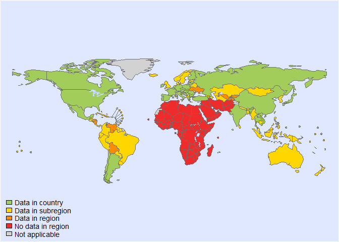
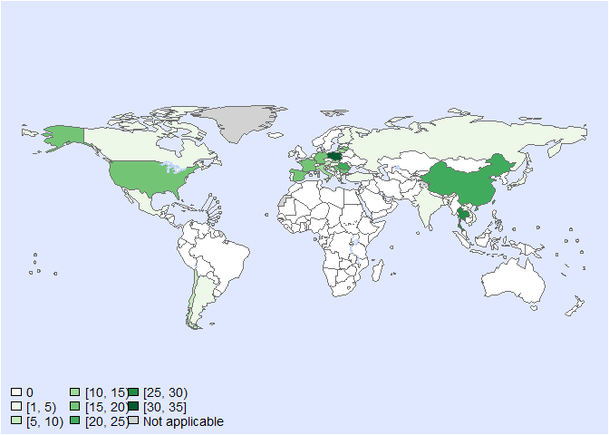
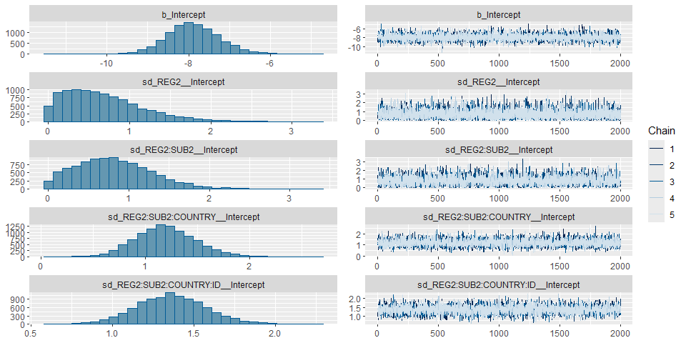
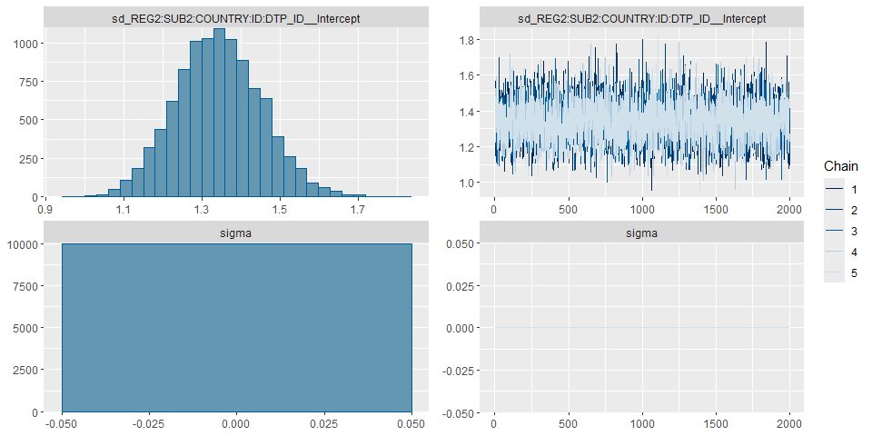

Case fatality of trichinellosis • fit model - Version 3
================
LoVa3397
2025-11-29

- [Settings](#settings)
  - [BRMS model: Version 3](#brms-model-version-3)
- [Session info](#session-info)

# Settings

``` r
## required packages ----
library(bd)
library(brms)
```

    ## Loading required package: Rcpp

    ## Loading 'brms' package (version 2.23.0). Useful instructions
    ## can be found by typing help('brms'). A more detailed introduction
    ## to the package is available through vignette('brms_overview').

    ## 
    ## Attaching package: 'brms'

    ## The following object is masked from 'package:stats':
    ## 
    ##     ar

``` r
library(ggplot2)
library(metafor)
```

    ## Loading required package: Matrix

    ## Loading required package: metadat

    ## Loading required package: numDeriv

    ## 
    ## Loading the 'metafor' package (version 4.8-0). For an
    ## introduction to the package please type: help(metafor)

``` r
library(readxl)
library(rmarkdown)
library(rms)
```

    ## Loading required package: Hmisc

    ## 
    ## Attaching package: 'Hmisc'

    ## The following objects are masked from 'package:base':
    ## 
    ##     format.pval, units

    ## 
    ## Attaching package: 'rms'

    ## The following object is masked from 'package:metafor':
    ## 
    ##     vif

``` r
library(tidyr)
```

    ## 
    ## Attaching package: 'tidyr'

    ## The following objects are masked from 'package:Matrix':
    ## 
    ##     expand, pack, unpack

``` r
library(knitr)

## global options ----
knitr::opts_chunk$set(fig.width = 10)
Date <- format(Sys.Date(), "%Y%m%d")

source("01-data_cf.R")
```

    ## 
    ## Attaching package: 'FERG2'

    ## The following object is masked from 'package:bd':
    ## 
    ##     mean_ci

    ## Linking to GEOS 3.13.1, GDAL 3.11.4, PROJ 9.7.0; sf_use_s2() is TRUE

    ## 
    ## Attaching package: 'dplyr'

    ## The following objects are masked from 'package:Hmisc':
    ## 
    ##     src, summarize

    ## The following object is masked from 'package:bd':
    ## 
    ##     collapse

    ## The following objects are masked from 'package:stats':
    ## 
    ##     filter, lag

    ## The following objects are masked from 'package:base':
    ## 
    ##     intersect, setdiff, setequal, union

    ## 
    ## Attaching package: 'DescTools'

    ## The following objects are masked from 'package:Hmisc':
    ## 
    ##     %nin%, Label, Mean, Quantile

    ## 'data.frame':    579 obs. of  42 variables:
    ##  $ SOURCE_ID           : chr  "983065187" "983065460" "983065526" "extra 18" ...
    ##  $ SOURCE_AUTHOR       : chr  "Calcagno,  MA" "Ambrosioni, J" "Dupouy-Camet J." "ECDC" ...
    ##  $ SOURCE_YEAR         : num  2014 2006 2000 2023 2023 ...
    ##  $ SOURCE_TITLE        : chr  "Description of an outbreak of human trichinellosis in an area of Argentina historically regarded as Trichinella"| __truncated__ "Triquinosis: aspectos epidemiológicos, clínicos y de laboratorio. Estudio retrospectivo a 10 años (1994-2003)" "Trichinellosis: a worldwide zoonosis" "Surveillance Atlas of Infecious Diseases" ...
    ##  $ SOURCE_DOI          : chr  NA NA NA NA ...
    ##  $ SOURCE_URL          : chr  "https://pubmed.ncbi.nlm.nih.gov/24444651/" "Trichinosis: epidemiological, clinical and laboratory aspects. 10-year retrospective study (1994-2003) | Infect"| __truncated__ "https://pubmed.ncbi.nlm.nih.gov/11099837/" "Surveillance Atlas of Infectious Diseases (europa.eu)" ...
    ##  $ OPT_ACCESS_DATE     : POSIXct, format: NA NA NA "2023-04-13" ...
    ##  $ OPT_STUDY_TYPE      : chr  "Outbreak report" "Other" "Other" "Other" ...
    ##  $ OPT_OTHER_STUDY_TYPE: chr  NA "retrospective studies" "review" "surveillance atlas" ...
    ##  $ REF_NOTES           : chr  "Case definition: (1) A probable case was defined as all the inhabitants of Pueblo General Belgrano and Gualegua"| __truncated__ "The case definition of trichinosis included any patient with a compatible clinical picture in the context of a "| __truncated__ "data from survey for the Internation Commission on Trichinellosis" NA ...
    ##  $ REF_YEAR_START      : num  2010 1994 1995 2007 2008 ...
    ##  $ REF_YEAR_END        : num  2010 2003 1997 2007 2008 ...
    ##  $ REF_LOC_LEVEL       : chr  "Sub-national" "Sub-national" "National" "National" ...
    ##  $ REF_LOCATION        : chr  "Argentina" "Argentina" "Argentina" "Austria" ...
    ##  $ REF_LOCATION_ISO3   : chr  "ARG" "ARG" "ARG" "AUT" ...
    ##  $ REF_SEX             : chr  "All sexes" "All sexes" "All sexes" "All sexes" ...
    ##  $ REF_AGE_START       : num  3 NA NA NA NA NA NA NA NA NA ...
    ##  $ REF_AGE_END         : num  72 NA NA NA NA NA NA NA NA NA ...
    ##  $ OPT_MEAN_AGE        : chr  "38.5" NA NA NA ...
    ##  $ OPT_MEDIAN_AGE      : num  NA NA NA NA NA NA NA NA NA NA ...
    ##  $ OPT_SUBPOP          : chr  NA NA NA NA ...
    ##  $ OPT_CASES           : chr  "Other" NA NA NA ...
    ##  $ OPT_DISEASE         : logi  NA NA NA NA NA NA ...
    ##  $ OPT_SEROTYPE        : logi  NA NA NA NA NA NA ...
    ##  $ OPT_IMPORTED        : chr  "Only domestic cases" "Only domestic cases" "Only domestic cases" "Unknown" ...
    ##  $ OPT_NR_IMPORTED     : chr  NA NA NA NA ...
    ##  $ REF_SAMPLE_SIZE     : num  64 127 1274 0 0 ...
    ##  $ VALUE_X             : num  0 1 3 0 0 0 0 0 0 0 ...
    ##  $ VALUE_MEAN          : num  NA NA NA NA NA NA NA NA NA NA ...
    ##  $ VALUE_MEDIAN        : logi  NA NA NA NA NA NA ...
    ##  $ VALUE_DENOM         : num  NA NA NA NA NA NA NA NA NA NA ...
    ##  $ VALUE_SE            : logi  NA NA NA NA NA NA ...
    ##  $ VALUE_P000          : logi  NA NA NA NA NA NA ...
    ##  $ VALUE_P2_5          : logi  NA NA NA NA NA NA ...
    ##  $ VALUE_P5            : logi  NA NA NA NA NA NA ...
    ##  $ VALUE_P10           : logi  NA NA NA NA NA NA ...
    ##  $ VALUE_P25           : logi  NA NA NA NA NA NA ...
    ##  $ VALUE_P75           : logi  NA NA NA NA NA NA ...
    ##  $ VALUE_P90           : logi  NA NA NA NA NA NA ...
    ##  $ VALUE_P95           : logi  NA NA NA NA NA NA ...
    ##  $ VALUE_P97_5         : logi  NA NA NA NA NA NA ...
    ##  $ VALUE_P100          : logi  NA NA NA NA NA NA ...

<!-- --><!-- -->

    ## Warning: REML comparisons not meaningful for models with different fixed effects
    ## (use 'refit=TRUE' to refit both models based on ML estimation).

    ## Warning in system2("quarto", "-V", stdout = TRUE, env = paste0("TMPDIR=", : running command '"quarto"
    ## TMPDIR=C:/Users/LoVa3397/AppData/Local/Temp/Rtmp4sZXyn/file35785a85511f -V' had status 1

``` r
es<-es%>%mutate(yi=case_when(VALUE_X==0 ~ -10, TRUE ~ yi ))
es$FLAG<-factor(es$FLAG, 
                levels=c(0,1,2,3,4,5,6, 7),
                labels=c("Keep data", "Data part of non WHO member states", "No WHO REG2 given",
                         "Year before 1990", "yi can't be calcualted", "TF choice to remove", 
                         "Excluded by preliminary checks", "Excluded in data cleaning"))

es$DTP_ID <- as.character(seq(1:length(es$SOURCE_ID)))
saveRDS(es, paste0("es_CFR_", Date, ".RDS"))
```

## BRMS model: Version 3

``` r
Parameters<- c("Number of iterations", "Warmup", "Delta value", "Maximum tree-depth","Levels","Random effect on each data point", "Stronger priors specified")
Values <- c("5000","3000","0.9","20","All, without time trend","Yes", "Normal(0,1)")
version_spe <- data.frame(Parameters,Values)

kable(caption = "Parameters of the model tested",row.names = FALSE, version_spe)
```

| Parameters                       | Values                  |
|:---------------------------------|:------------------------|
| Number of iterations             | 5000                    |
| Warmup                           | 3000                    |
| Delta value                      | 0.99                    |
| Maximum tree-depth               | 20                      |
| Levels                           | All, without time trend |
| Random effect on each data point | Yes                     |
| Stronger priors specified        | Normal(0,1)             |

Parameters of the model tested

``` r
cf_fit_brms_reg_s3 <-
  brm(yi | se(sei) ~
       1 + 
        (1  | REG2) +
        (1  | REG2:SUB2) +
        (1  | REG2:SUB2:COUNTRY) +
        (1  | REG2:SUB2:COUNTRY:ID) +
        (1  | REG2:SUB2:COUNTRY:ID:DTP_ID),
      chains = 5, iter = 5000, warmup = 3000,
      prior = prior(normal(0,1), class = sd),
      cores = 5,
      data = subset(es, as.integer(FLAG) ==1), 
      open_progress = FALSE,
      control = list(adapt_delta=0.99, max_treedepth = 20),
      seed =7 )
```

    ## Compiling Stan program...

    ## Start sampling

``` r
saveRDS(cf_fit_brms_reg_s3, file = "cf_fit_brms_reg_s3.rds")
summary(cf_fit_brms_reg_s3)
```

    ##  Family: gaussian 
    ##   Links: mu = identity 
    ## Formula: yi | se(sei) ~ 1 + (1 | REG2) + (1 | REG2:SUB2) + (1 | REG2:SUB2:COUNTRY) + (1 | REG2:SUB2:COUNTRY:ID) + (1 | REG2:SUB2:COUNTRY:ID:DTP_ID) 
    ##    Data: subset(es, as.integer(FLAG) == 1) (Number of observations: 317) 
    ##   Draws: 5 chains, each with iter = 5000; warmup = 3000; thin = 1;
    ##          total post-warmup draws = 10000
    ## 
    ## Multilevel Hyperparameters:
    ## ~REG2 (Number of levels: 4) 
    ##               Estimate Est.Error l-95% CI u-95% CI Rhat Bulk_ESS Tail_ESS
    ## sd(Intercept)     0.68      0.48     0.03     1.82 1.00     4794     4307
    ## 
    ## ~REG2:SUB2 (Number of levels: 9) 
    ##               Estimate Est.Error l-95% CI u-95% CI Rhat Bulk_ESS Tail_ESS
    ## sd(Intercept)     0.82      0.48     0.06     1.87 1.00     4162     4013
    ## 
    ## ~REG2:SUB2:COUNTRY (Number of levels: 37) 
    ##               Estimate Est.Error l-95% CI u-95% CI Rhat Bulk_ESS Tail_ESS
    ## sd(Intercept)     1.20      0.29     0.67     1.80 1.00     4389     4899
    ## 
    ## ~REG2:SUB2:COUNTRY:ID (Number of levels: 102) 
    ##               Estimate Est.Error l-95% CI u-95% CI Rhat Bulk_ESS Tail_ESS
    ## sd(Intercept)     1.36      0.22     0.95     1.80 1.00     3459     5063
    ## 
    ## ~REG2:SUB2:COUNTRY:ID:DTP_ID (Number of levels: 317) 
    ##               Estimate Est.Error l-95% CI u-95% CI Rhat Bulk_ESS Tail_ESS
    ## sd(Intercept)     1.34      0.11     1.13     1.56 1.00     4793     6602
    ## 
    ## Regression Coefficients:
    ##           Estimate Est.Error l-95% CI u-95% CI Rhat Bulk_ESS Tail_ESS
    ## Intercept    -7.89      0.66    -9.14    -6.54 1.00     7511     7069
    ## 
    ## Further Distributional Parameters:
    ##       Estimate Est.Error l-95% CI u-95% CI Rhat Bulk_ESS Tail_ESS
    ## sigma     0.00      0.00     0.00     0.00   NA       NA       NA
    ## 
    ## Draws were sampled using sampling(NUTS). For each parameter, Bulk_ESS
    ## and Tail_ESS are effective sample size measures, and Rhat is the potential
    ## scale reduction factor on split chains (at convergence, Rhat = 1).

``` r
plot(cf_fit_brms_reg_s3, ask = FALSE)
```

<!-- --><!-- -->

``` r
stancode(cf_fit_brms_reg_s3)
```

    ## // generated with brms 2.23.0
    ## functions {
    ## }
    ## data {
    ##   int<lower=1> N;  // total number of observations
    ##   vector[N] Y;  // response variable
    ##   vector<lower=0>[N] se;  // known sampling error
    ##   // data for group-level effects of ID 1
    ##   int<lower=1> N_1;  // number of grouping levels
    ##   int<lower=1> M_1;  // number of coefficients per level
    ##   array[N] int<lower=1> J_1;  // grouping indicator per observation
    ##   // group-level predictor values
    ##   vector[N] Z_1_1;
    ##   // data for group-level effects of ID 2
    ##   int<lower=1> N_2;  // number of grouping levels
    ##   int<lower=1> M_2;  // number of coefficients per level
    ##   array[N] int<lower=1> J_2;  // grouping indicator per observation
    ##   // group-level predictor values
    ##   vector[N] Z_2_1;
    ##   // data for group-level effects of ID 3
    ##   int<lower=1> N_3;  // number of grouping levels
    ##   int<lower=1> M_3;  // number of coefficients per level
    ##   array[N] int<lower=1> J_3;  // grouping indicator per observation
    ##   // group-level predictor values
    ##   vector[N] Z_3_1;
    ##   // data for group-level effects of ID 4
    ##   int<lower=1> N_4;  // number of grouping levels
    ##   int<lower=1> M_4;  // number of coefficients per level
    ##   array[N] int<lower=1> J_4;  // grouping indicator per observation
    ##   // group-level predictor values
    ##   vector[N] Z_4_1;
    ##   // data for group-level effects of ID 5
    ##   int<lower=1> N_5;  // number of grouping levels
    ##   int<lower=1> M_5;  // number of coefficients per level
    ##   array[N] int<lower=1> J_5;  // grouping indicator per observation
    ##   // group-level predictor values
    ##   vector[N] Z_5_1;
    ##   int prior_only;  // should the likelihood be ignored?
    ## }
    ## transformed data {
    ##   vector<lower=0>[N] se2 = square(se);
    ## }
    ## parameters {
    ##   real Intercept;  // temporary intercept for centered predictors
    ##   vector<lower=0>[M_1] sd_1;  // group-level standard deviations
    ##   array[M_1] vector[N_1] z_1;  // standardized group-level effects
    ##   vector<lower=0>[M_2] sd_2;  // group-level standard deviations
    ##   array[M_2] vector[N_2] z_2;  // standardized group-level effects
    ##   vector<lower=0>[M_3] sd_3;  // group-level standard deviations
    ##   array[M_3] vector[N_3] z_3;  // standardized group-level effects
    ##   vector<lower=0>[M_4] sd_4;  // group-level standard deviations
    ##   array[M_4] vector[N_4] z_4;  // standardized group-level effects
    ##   vector<lower=0>[M_5] sd_5;  // group-level standard deviations
    ##   array[M_5] vector[N_5] z_5;  // standardized group-level effects
    ## }
    ## transformed parameters {
    ##   real sigma = 0;  // dispersion parameter
    ##   vector[N_1] r_1_1;  // actual group-level effects
    ##   vector[N_2] r_2_1;  // actual group-level effects
    ##   vector[N_3] r_3_1;  // actual group-level effects
    ##   vector[N_4] r_4_1;  // actual group-level effects
    ##   vector[N_5] r_5_1;  // actual group-level effects
    ##   // prior contributions to the log posterior
    ##   real lprior = 0;
    ##   r_1_1 = (sd_1[1] * (z_1[1]));
    ##   r_2_1 = (sd_2[1] * (z_2[1]));
    ##   r_3_1 = (sd_3[1] * (z_3[1]));
    ##   r_4_1 = (sd_4[1] * (z_4[1]));
    ##   r_5_1 = (sd_5[1] * (z_5[1]));
    ##   lprior += student_t_lpdf(Intercept | 3, -10, 2.5);
    ##   lprior += normal_lpdf(sd_1 | 0, 1)
    ##     - 1 * normal_lccdf(0 | 0, 1);
    ##   lprior += normal_lpdf(sd_2 | 0, 1)
    ##     - 1 * normal_lccdf(0 | 0, 1);
    ##   lprior += normal_lpdf(sd_3 | 0, 1)
    ##     - 1 * normal_lccdf(0 | 0, 1);
    ##   lprior += normal_lpdf(sd_4 | 0, 1)
    ##     - 1 * normal_lccdf(0 | 0, 1);
    ##   lprior += normal_lpdf(sd_5 | 0, 1)
    ##     - 1 * normal_lccdf(0 | 0, 1);
    ## }
    ## model {
    ##   // likelihood including constants
    ##   if (!prior_only) {
    ##     // initialize linear predictor term
    ##     vector[N] mu = rep_vector(0.0, N);
    ##     mu += Intercept;
    ##     for (n in 1:N) {
    ##       // add more terms to the linear predictor
    ##       mu[n] += r_1_1[J_1[n]] * Z_1_1[n] + r_2_1[J_2[n]] * Z_2_1[n] + r_3_1[J_3[n]] * Z_3_1[n] + r_4_1[J_4[n]] * Z_4_1[n] + r_5_1[J_5[n]] * Z_5_1[n];
    ##     }
    ##     target += normal_lpdf(Y | mu, se);
    ##   }
    ##   // priors including constants
    ##   target += lprior;
    ##   target += std_normal_lpdf(z_1[1]);
    ##   target += std_normal_lpdf(z_2[1]);
    ##   target += std_normal_lpdf(z_3[1]);
    ##   target += std_normal_lpdf(z_4[1]);
    ##   target += std_normal_lpdf(z_5[1]);
    ## }
    ## generated quantities {
    ##   // actual population-level intercept
    ##   real b_Intercept = Intercept;
    ## }

# Session info

``` r
sessioninfo::session_info()
```

    ## Warning in system2("quarto", "-V", stdout = TRUE, env = paste0("TMPDIR=", : running command '"quarto"
    ## TMPDIR=C:/Users/LoVa3397/AppData/Local/Temp/Rtmp4sZXyn/file35783ed67416 -V' had status 1

    ## ─ Session info ──────────────────────────────────────────────────────────────────────────────────────────────────
    ##  setting  value
    ##  version  R version 4.5.2 (2025-10-31 ucrt)
    ##  os       Windows 10 x64 (build 19045)
    ##  system   x86_64, mingw32
    ##  ui       RStudio
    ##  language (EN)
    ##  collate  English_United States.utf8
    ##  ctype    English_United States.utf8
    ##  tz       Europe/Brussels
    ##  date     2025-11-29
    ##  rstudio  2025.09.2+418 Cucumberleaf Sunflower (desktop)
    ##  pandoc   3.6.3 @ C:/Program Files/RStudio/resources/app/bin/quarto/bin/tools/ (via rmarkdown)
    ##  quarto   ERROR: Unknown command "TMPDIR=C:/Users/LoVa3397/AppData/Local/Temp/Rtmp4sZXyn/file35783ed67416". Did you mean command "install"? @ C:\\PROGRA~1\\RStudio\\RESOUR~1\\app\\bin\\quarto\\bin\\quarto.exe
    ## 
    ## ─ Packages ──────────────────────────────────────────────────────────────────────────────────────────────────────
    ##  ! package        * version    date (UTC) lib source
    ##    abind            1.4-8      2024-09-12 [1] CRAN (R 4.5.2)
    ##    backports        1.5.0      2024-05-23 [1] CRAN (R 4.5.2)
    ##    base64enc        0.1-3      2015-07-28 [1] CRAN (R 4.5.2)
    ##    bayesplot        1.14.0     2025-08-31 [1] CRAN (R 4.5.2)
    ##    bd             * 0.0.14     2025-11-27 [1] Github (brechtdv/bd@652191c)
    ##    boot             1.3-32     2025-08-29 [1] CRAN (R 4.5.2)
    ##    bridgesampling   1.2-1      2025-11-19 [1] CRAN (R 4.5.2)
    ##    brms           * 2.23.0     2025-09-09 [1] CRAN (R 4.5.2)
    ##    Brobdingnag      1.2-9      2022-10-19 [1] CRAN (R 4.5.2)
    ##    callr            3.7.6      2024-03-25 [1] CRAN (R 4.5.2)
    ##    cellranger       1.1.0      2016-07-27 [1] CRAN (R 4.5.2)
    ##    checkmate        2.3.3      2025-08-18 [1] CRAN (R 4.5.2)
    ##    class            7.3-23     2025-01-01 [1] CRAN (R 4.5.2)
    ##    classInt         0.4-11     2025-01-08 [1] CRAN (R 4.5.2)
    ##    cli              3.6.5      2025-04-23 [1] CRAN (R 4.5.2)
    ##    cluster          2.1.8.1    2025-03-12 [1] CRAN (R 4.5.2)
    ##    coda             0.19-4.1   2024-01-31 [1] CRAN (R 4.5.2)
    ##    codetools        0.2-20     2024-03-31 [1] CRAN (R 4.5.2)
    ##    colorspace       2.1-2      2025-09-22 [1] CRAN (R 4.5.2)
    ##    data.table       1.17.8     2025-07-10 [1] CRAN (R 4.5.2)
    ##    DBI              1.2.3      2024-06-02 [1] CRAN (R 4.5.2)
    ##    DescTools      * 0.99.60    2025-03-28 [1] CRAN (R 4.5.2)
    ##    digest           0.6.39     2025-11-19 [1] CRAN (R 4.5.2)
    ##    distributional   0.5.0      2024-09-17 [1] CRAN (R 4.5.2)
    ##    dplyr          * 1.1.4      2023-11-17 [1] CRAN (R 4.5.2)
    ##    e1071            1.7-16     2024-09-16 [1] CRAN (R 4.5.2)
    ##    evaluate         1.0.5      2025-08-27 [1] CRAN (R 4.5.2)
    ##    Exact            3.3        2024-07-21 [1] CRAN (R 4.5.2)
    ##    expm             1.0-0      2024-08-19 [1] CRAN (R 4.5.2)
    ##    farver           2.1.2      2024-05-13 [1] CRAN (R 4.5.2)
    ##    fastmap          1.2.0      2024-05-15 [1] CRAN (R 4.5.2)
    ##    FERG2          * 0.0.5      2025-11-27 [1] Github (brechtdv/FERG2@c2d4ac1)
    ##    forcats          1.0.1      2025-09-25 [1] CRAN (R 4.5.2)
    ##    foreign          0.8-90     2025-03-31 [1] CRAN (R 4.5.2)
    ##    Formula          1.2-5      2023-02-24 [1] CRAN (R 4.5.2)
    ##    fs               1.6.6      2025-04-12 [1] CRAN (R 4.5.2)
    ##    generics         0.1.4      2025-05-09 [1] CRAN (R 4.5.2)
    ##    ggplot2        * 4.0.1      2025-11-14 [1] CRAN (R 4.5.2)
    ##    gld              2.6.8      2025-09-14 [1] CRAN (R 4.5.2)
    ##    glue             1.8.0      2024-09-30 [1] CRAN (R 4.5.2)
    ##    gridExtra        2.3        2017-09-09 [1] CRAN (R 4.5.2)
    ##    gtable           0.3.6      2024-10-25 [1] CRAN (R 4.5.2)
    ##    haven            2.5.5      2025-05-30 [1] CRAN (R 4.5.2)
    ##    Hmisc          * 5.2-4      2025-10-05 [1] CRAN (R 4.5.2)
    ##    hms              1.1.4      2025-10-17 [1] CRAN (R 4.5.2)
    ##    htmlTable        2.4.3      2024-07-21 [1] CRAN (R 4.5.2)
    ##    htmltools        0.5.8.1    2024-04-04 [1] CRAN (R 4.5.2)
    ##    htmlwidgets      1.6.4      2023-12-06 [1] CRAN (R 4.5.2)
    ##    httr             1.4.7      2023-08-15 [1] CRAN (R 4.5.2)
    ##    inline           0.3.21     2025-01-09 [1] CRAN (R 4.5.2)
    ##    KernSmooth       2.23-26    2025-01-01 [1] CRAN (R 4.5.2)
    ##    knitr          * 1.50       2025-03-16 [1] CRAN (R 4.5.2)
    ##    labeling         0.4.3      2023-08-29 [1] CRAN (R 4.5.2)
    ##    lattice          0.22-7     2025-04-02 [1] CRAN (R 4.5.2)
    ##    lifecycle        1.0.4      2023-11-07 [1] CRAN (R 4.5.2)
    ##    lmom             3.2        2024-09-30 [1] CRAN (R 4.5.2)
    ##    loo              2.8.0      2024-07-03 [1] CRAN (R 4.5.2)
    ##    magrittr         2.0.4      2025-09-12 [1] CRAN (R 4.5.2)
    ##    MASS             7.3-65     2025-02-28 [1] CRAN (R 4.5.2)
    ##    mathjaxr         1.8-0      2025-04-30 [1] CRAN (R 4.5.2)
    ##    Matrix         * 1.7-4      2025-08-28 [1] CRAN (R 4.5.2)
    ##    MatrixModels     0.5-4      2025-03-26 [1] CRAN (R 4.5.2)
    ##    matrixStats      1.5.0      2025-01-07 [1] CRAN (R 4.5.2)
    ##    metadat        * 1.4-0      2025-02-04 [1] CRAN (R 4.5.2)
    ##    metafor        * 4.8-0      2025-01-28 [1] CRAN (R 4.5.2)
    ##    multcomp         1.4-29     2025-10-20 [1] CRAN (R 4.5.2)
    ##    mvtnorm          1.3-3      2025-01-10 [1] CRAN (R 4.5.2)
    ##    nlme             3.1-168    2025-03-31 [1] CRAN (R 4.5.2)
    ##    nnet             7.3-20     2025-01-01 [1] CRAN (R 4.5.2)
    ##    numDeriv       * 2016.8-1.1 2019-06-06 [1] CRAN (R 4.5.2)
    ##    pillar           1.11.1     2025-09-17 [1] CRAN (R 4.5.2)
    ##    pkgbuild         1.4.8      2025-05-26 [1] CRAN (R 4.5.2)
    ##    pkgconfig        2.0.3      2019-09-22 [1] CRAN (R 4.5.2)
    ##    plyr             1.8.9      2023-10-02 [1] CRAN (R 4.5.2)
    ##    polspline        1.1.25     2024-05-10 [1] CRAN (R 4.5.2)
    ##    posterior        1.6.1      2025-02-27 [1] CRAN (R 4.5.2)
    ##    processx         3.8.6      2025-02-21 [1] CRAN (R 4.5.2)
    ##    proxy            0.4-27     2022-06-09 [1] CRAN (R 4.5.2)
    ##    ps               1.9.1      2025-04-12 [1] CRAN (R 4.5.2)
    ##    purrr            1.2.0      2025-11-04 [1] CRAN (R 4.5.2)
    ##    quantreg         6.1        2025-03-10 [1] CRAN (R 4.5.2)
    ##    QuickJSR         1.8.1      2025-09-20 [1] CRAN (R 4.5.2)
    ##    R6               2.6.1      2025-02-15 [1] CRAN (R 4.5.2)
    ##    RColorBrewer     1.1-3      2022-04-03 [1] CRAN (R 4.5.2)
    ##    Rcpp           * 1.1.0      2025-07-02 [1] CRAN (R 4.5.2)
    ##  D RcppParallel     5.1.11-1   2025-08-27 [1] CRAN (R 4.5.2)
    ##    readr            2.1.6      2025-11-14 [1] CRAN (R 4.5.2)
    ##    readxl         * 1.4.5      2025-03-07 [1] CRAN (R 4.5.2)
    ##    reshape2         1.4.5      2025-11-12 [1] CRAN (R 4.5.2)
    ##    rlang            1.1.6      2025-04-11 [1] CRAN (R 4.5.2)
    ##    rmarkdown      * 2.30       2025-09-28 [1] CRAN (R 4.5.2)
    ##    rms            * 8.1-0      2025-10-14 [1] CRAN (R 4.5.2)
    ##    rootSolve        1.8.2.4    2023-09-21 [1] CRAN (R 4.5.2)
    ##    rpart            4.1.24     2025-01-07 [1] CRAN (R 4.5.2)
    ##    rstan            2.32.7     2025-03-10 [1] CRAN (R 4.5.2)
    ##    rstantools       2.5.0      2025-09-01 [1] CRAN (R 4.5.2)
    ##    rstudioapi       0.17.1     2024-10-22 [1] CRAN (R 4.5.2)
    ##    S7               0.2.1      2025-11-14 [1] CRAN (R 4.5.2)
    ##    sandwich         3.1-1      2024-09-15 [1] CRAN (R 4.5.2)
    ##    scales         * 1.4.0      2025-04-24 [1] CRAN (R 4.5.2)
    ##    sessioninfo      1.2.3      2025-02-05 [1] CRAN (R 4.5.2)
    ##    sf             * 1.0-23     2025-11-28 [1] CRAN (R 4.5.2)
    ##    SparseM          1.84-2     2024-07-17 [1] CRAN (R 4.5.2)
    ##    StanHeaders      2.32.10    2024-07-15 [1] CRAN (R 4.5.2)
    ##    stringi          1.8.7      2025-03-27 [1] CRAN (R 4.5.2)
    ##    stringr          1.6.0      2025-11-04 [1] CRAN (R 4.5.2)
    ##    survival         3.8-3      2024-12-17 [1] CRAN (R 4.5.2)
    ##    tensorA          0.36.2.1   2023-12-13 [1] CRAN (R 4.5.2)
    ##    TH.data          1.1-5      2025-11-17 [1] CRAN (R 4.5.2)
    ##    tibble           3.3.0      2025-06-08 [1] CRAN (R 4.5.2)
    ##    tidyr          * 1.3.1      2024-01-24 [1] CRAN (R 4.5.2)
    ##    tidyselect       1.2.1      2024-03-11 [1] CRAN (R 4.5.2)
    ##    tzdb             0.5.0      2025-03-15 [1] CRAN (R 4.5.2)
    ##    units            1.0-0      2025-10-09 [1] CRAN (R 4.5.2)
    ##    vctrs            0.6.5      2023-12-01 [1] CRAN (R 4.5.2)
    ##    withr            3.0.2      2024-10-28 [1] CRAN (R 4.5.2)
    ##    xfun             0.54       2025-10-30 [1] CRAN (R 4.5.2)
    ##    yaml             2.3.10     2024-07-26 [1] CRAN (R 4.5.2)
    ##    zoo              1.8-14     2025-04-10 [1] CRAN (R 4.5.2)
    ## 
    ##  [1] C:/Program Files/R/R-4.5.2/library
    ## 
    ##  * ── Packages attached to the search path.
    ##  D ── DLL MD5 mismatch, broken installation.
    ## 
    ## ─────────────────────────────────────────────────────────────────────────────────────────────────────────────────
