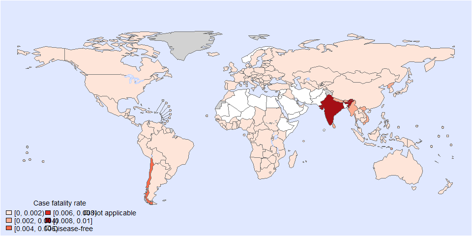

Case fatality of trichinella • Estimates with the 3rd model
================
LoVa3397
2025-11-29

- [Settings](#settings)
- [Parameters](#parameters)
- [Model fit](#model-fit)
- [Predict all](#predict-all)
- [Summarize predictions](#summarize-predictions)
  - [Countries](#countries)
- [Session info](#session-info)

# Settings

``` r
## required packages ----
library(bd)
library(brms)
library(FERG2)
library(ggplot2)
library(knitr)
library(rmarkdown)
library(sf)
library(tidyr)
library(dplyr)
library(DescTools)
library(readxl)
library(kableExtra)
```

    ## 
    ## Attaching package: 'kableExtra'

    ## The following object is masked from 'package:dplyr':
    ## 
    ##     group_rows

``` r
#Model with random effect on each data point and stronger priors (normal(0,1))

## global options ----
knitr::opts_chunk$set(fig.width = 10)
Date <- format(Sys.Date(), "%Y%m%d")
```

# Parameters

| Parameters                       | Values                  |
|:---------------------------------|:------------------------|
| Number of iterations             | 5000                    |
| Warmup                           | 3000                    |
| Delta value                      | 0.99                    |
| Maximum tree-depth               | 20                      |
| Levels                           | All, without time trend |
| Random effect on each data point | Yes                     |
| Stronger priors specified        | Normal(0,1)             |

Parameters of the model tested

# Model fit

``` r
fit_brms_reg_s <- readRDS("cf_fit_brms_reg_s3.rds")
zero_cases<- read_xlsx("Endemic_countries.xlsx")%>%
  select(REG2, SUB2, ISO3, Country, pdtf_trich) %>%
  rename(COUNTRY=ISO3, COUNTRY_LABEL = Country, DISEASEFREE = pdtf_trich)

kable(
  caption = "Countries assumed to be non-endemic",
  row.names = FALSE,
  subset(zero_cases, DISEASEFREE==0)[, 4])
```

| COUNTRY_LABEL        |
|:---------------------|
| Afghanistan          |
| Azerbaijan           |
| Bangladesh           |
| Bahrain              |
| Comoros              |
| Djibouti             |
| Algeria              |
| Egypt, Arab Rep.     |
| Ethiopia             |
| Iran, Islamic Rep.   |
| Jordan               |
| Libya                |
| Maldives             |
| Mali                 |
| Mauritania           |
| Niger                |
| Norway               |
| Oman                 |
| Pakistan             |
| Qatar                |
| Saudi Arabia         |
| Singapore            |
| Somalia              |
| Syrian Arab Republic |
| Tunisia              |
| Yemen, Rep.          |
Countries assumed to be non-endemic

``` r
es_files <- list.files(pattern="^es_CFR_\\d{8}\\.rds$", full.names=TRUE, ignore.case = TRUE)
es_dates <- as.Date(sub("^es_CFR_(\\d{8})\\.rds$", "\\1", basename(es_files), ignore.case = TRUE), format = "%Y%m%d")
es_latest <- es_files[which.max(es_dates)]
es<- readRDS(es_latest)
es <- subset(es, as.integer(FLAG) == 1)

country_with_data <- es %>% select(ISO3) %>% distinct() %>% mutate(DATA=1, COUNTRY = ISO3)
Sub2_with_data <- es %>% select(SUB2) %>% distinct() %>% mutate(DATASUB2=1)
Reg2_with_data <- es %>% select(REG2) %>% distinct() %>% mutate(DATAREG2=1)
zero_cases <- left_join(zero_cases, country_with_data)
```

    ## Joining with `by = join_by(COUNTRY)`

``` r
zero_cases <- left_join(zero_cases, Sub2_with_data)
```

    ## Joining with `by = join_by(SUB2)`

``` r
zero_cases <- left_join(zero_cases, Reg2_with_data) %>%
  select(-c(ISO3)) %>%
  mutate(ESTIMATES = case_when(
    DATA == 1 ~ 1,
    DISEASEFREE == 0 ~ 2,
    is.na(DATA) & DISEASEFREE == 1 & DATASUB2 == 1 ~ 3,
    is.na(DATA) & DISEASEFREE == 1 & is.na(DATASUB2) & DATAREG2 == 1 ~ 4, 
    is.na(DATA) & DISEASEFREE == 1  & is.na(DATASUB2) & is.na(DATAREG2) ~5))
```

    ## Joining with `by = join_by(REG2)`

``` r
zero_cases$ESTIMATES <- factor(zero_cases$ESTIMATES, 
                               level = c(1,2,3,4,5),
                               labels = c("Data present", "Disease free", "Data in subregion", "Data in region", "Data in world"))
Country_Check <- zero_cases %>% filter(as.integer(ESTIMATES) == 2)
```

# Predict all

``` r
## set up dataframe
sim_all <-
  data.frame(
    sei = 0,
    REG2 = FERG2:::countries$REG2,
    SUB2 = FERG2:::countries$SUB2,
    COUNTRY = FERG2:::countries$ISO3)
sim_all <- sim_all %>% left_join(zero_cases) %>% select(sei, REG2, SUB2, COUNTRY, ESTIMATES)
```

    ## Joining with `by = join_by(REG2, SUB2, COUNTRY)`

``` r
## draw from expected value of posterior predictive dist
set.seed(10)
# fit_all <- 
#   posterior_epred(
#     object = fit_brms_reg_s,
#     newdata = sim_all,
#     allow_new_levels = TRUE,
#     sample_new_levels = "old_levels",
#     re_formula = ~ 1 + YEAR +
#       (1 | REG2) +
#       (1 | REG2:SUB2) +
#       (1 | REG2:SUB2:COUNTRY)
#   )

draws_fit <- as_draws_df(fit_brms_reg_s)
fit_all <- data.frame(1:10000)
for (x in 1:nrow(sim_all)){
  if (as.integer(sim_all[x, "ESTIMATES"]) == 1){
    # Data present for country
    fit_all[[paste0("V",x)]] <- draws_fit$b_Intercept +                                                                               # Global intercept
      draws_fit[[paste0("r_REG2[",sim_all[x,"REG2"],",Intercept]")]] +                                                                # Regional component
      draws_fit[[paste0("r_REG2:SUB2[",sim_all[x,"REG2"],"_",sim_all[x,"SUB2"],",Intercept]")]] +                                     # Sub regional component
      draws_fit[[paste0("r_REG2:SUB2:COUNTRY[",sim_all[x,"REG2"],"_",sim_all[x,"SUB2"],"_",sim_all[x,"COUNTRY"],",Intercept]")]]      # Country component
  } else if (as.integer(sim_all[x, "ESTIMATES"]) == 2) {
    # Disease-free country
    fit_all[[paste0("V",x)]] <- 0
  } else if (as.integer(sim_all[x, "ESTIMATES"]) == 3){
    # Data not present for country, but present in subregion
    fit_all[[paste0("V",x)]] <- draws_fit$b_Intercept +                                                                               # Global intercept
      draws_fit[[paste0("r_REG2[",sim_all[x,"REG2"],",Intercept]")]] +                                                                # Regional component
      draws_fit[[paste0("r_REG2:SUB2[",sim_all[x,"REG2"],"_",sim_all[x,"SUB2"],",Intercept]")]]                                       # Sub regional component
  } else if (as.integer(sim_all[x, "ESTIMATES"]) == 4){
    # Data not present for country, but present in region
    fit_all[[paste0("V",x)]] <- draws_fit$b_Intercept +                                                                               # Global intercept
      draws_fit[[paste0("r_REG2[",sim_all[x,"REG2"],",Intercept]")]]                                                                  # Regional component
  } else if (as.integer(sim_all[x, "ESTIMATES"]) == 5){
    # Data not present for country
    fit_all[[paste0("V",x)]] <- draws_fit$b_Intercept
  } 
}

fit_all <- fit_all %>% select(-c(X1.10000))

## calculate cases
sim_all$SIM <- t(fit_all)
sim_all$PROP <- expit(sim_all$SIM) 
sim_all <- sim_all %>% left_join(zero_cases)
```

    ## Joining with `by = join_by(REG2, SUB2, COUNTRY, ESTIMATES)`

``` r
sim_all$PROP <- sim_all$PROP*sim_all$DISEASEFREE
sim_all$SIM <- sim_all$SIM*sim_all$DISEASEFREE
sim_all$sei <- sim_all$sei*sim_all$DISEASEFREE


## aggregate over countries
all_cnt_rt <- t(apply(sim_all$PROP, 1, mean_ci))
all_cnt_rt <- data.frame(all_cnt_rt)
names(all_cnt_rt) <- c("VAL_MEAN", "VAL_LWR", "VAL_UPR")
all_cnt_rt <- cbind(sim_all[2:4], all_cnt_rt)
all_cnt_rt$LOCATION <- "Country"
all_cnt_rt$LOCATION_NAME <- all_cnt_rt$COUNTRY
all_cnt_rt$COUNTRY <- NULL
all_cnt_rt$METRIC <- "rate"
str(all_cnt_rt)
```

    ## 'data.frame':    194 obs. of  8 variables:
    ##  $ REG2         : chr  "EMR" "EUR" "AFR" "EUR" ...
    ##  $ SUB2         : chr  "EMRD" "EURB" "AFRC" "EURA" ...
    ##  $ VAL_MEAN     : num  0 0.000365 0 0.00013 0.000471 ...
    ##  $ VAL_LWR      : num  0.00 8.17e-05 0.00 5.48e-05 1.07e-04 ...
    ##  $ VAL_UPR      : num  0 0.001178 0 0.000265 0.001436 ...
    ##  $ LOCATION     : chr  "Country" "Country" "Country" "Country" ...
    ##  $ LOCATION_NAME: chr  "AFG" "ALB" "DZA" "AND" ...
    ##  $ METRIC       : chr  "rate" "rate" "rate" "rate" ...

# Summarize predictions

## Countries

``` r
plot_world(all_cnt_rt,
           "LOCATION_NAME", "VAL_MEAN", legend.title = "Case fatality rate", diseasefree = zero_cases)
```

    ## [1] 0.000 0.002 0.004 0.006 0.008 0.010

``` r
title("Trichinella case fatality", line = 1)
```

<!-- -->

``` r
tab <-
  data.frame(all_cnt_rt[,c("LOCATION_NAME", "VAL_MEAN", "VAL_LWR", "VAL_UPR")])
tab$LOCATION_NAME <-
  FERG2:::countries$COUNTRY[match(tab$LOCATION_NAME, FERG2:::countries$ISO3)]
tab$LOCATION_NAME <- gsub(" \\(.*", "", tab$LOCATION_NAME)
names(tab) <-
  c("Country",
    "Mean", "Lower", "Upper")

kable(tab, digits = 3, row.names = FALSE,
      caption = "Estimated trichinella case fatality by country")
```

| Country                          |  Mean | Lower | Upper |
|:---------------------------------|------:|------:|------:|
| Afghanistan                      | 0.000 | 0.000 | 0.000 |
| Albania                          | 0.000 | 0.000 | 0.001 |
| Algeria                          | 0.000 | 0.000 | 0.000 |
| Andorra                          | 0.000 | 0.000 | 0.000 |
| Angola                           | 0.000 | 0.000 | 0.001 |
| Antigua and Barbuda              | 0.001 | 0.000 | 0.003 |
| Argentina                        | 0.001 | 0.000 | 0.005 |
| Armenia                          | 0.000 | 0.000 | 0.001 |
| Australia                        | 0.001 | 0.000 | 0.003 |
| Austria                          | 0.000 | 0.000 | 0.001 |
| Azerbaijan                       | 0.000 | 0.000 | 0.000 |
| Bahamas                          | 0.001 | 0.000 | 0.003 |
| Bahrain                          | 0.000 | 0.000 | 0.000 |
| Bangladesh                       | 0.000 | 0.000 | 0.000 |
| Barbados                         | 0.001 | 0.000 | 0.003 |
| Belarus                          | 0.000 | 0.000 | 0.001 |
| Belgium                          | 0.000 | 0.000 | 0.001 |
| Belize                           | 0.001 | 0.000 | 0.003 |
| Benin                            | 0.000 | 0.000 | 0.001 |
| Bhutan                           | 0.002 | 0.000 | 0.014 |
| Bolivia                          | 0.001 | 0.000 | 0.002 |
| Bosnia and Herzegovina           | 0.001 | 0.000 | 0.004 |
| Botswana                         | 0.000 | 0.000 | 0.001 |
| Brazil                           | 0.001 | 0.000 | 0.003 |
| Brunei Darussalam                | 0.001 | 0.000 | 0.003 |
| Bulgaria                         | 0.001 | 0.000 | 0.002 |
| Burkina Faso                     | 0.000 | 0.000 | 0.001 |
| Burundi                          | 0.000 | 0.000 | 0.001 |
| Cabo Verde                       | 0.000 | 0.000 | 0.001 |
| Cambodia                         | 0.001 | 0.000 | 0.004 |
| Cameroon                         | 0.000 | 0.000 | 0.001 |
| Canada                           | 0.001 | 0.000 | 0.006 |
| Central African Republic         | 0.000 | 0.000 | 0.001 |
| Chad                             | 0.000 | 0.000 | 0.001 |
| Chile                            | 0.005 | 0.001 | 0.023 |
| China                            | 0.001 | 0.000 | 0.004 |
| Colombia                         | 0.001 | 0.000 | 0.003 |
| Comoros                          | 0.000 | 0.000 | 0.000 |
| Congo                            | 0.000 | 0.000 | 0.001 |
| Cook Islands                     | 0.001 | 0.000 | 0.003 |
| Costa Rica                       | 0.001 | 0.000 | 0.003 |
| Côte d’Ivoire                    | 0.000 | 0.000 | 0.001 |
| Croatia                          | 0.000 | 0.000 | 0.001 |
| Cuba                             | 0.001 | 0.000 | 0.003 |
| Cyprus                           | 0.000 | 0.000 | 0.000 |
| Czechia                          | 0.000 | 0.000 | 0.001 |
| Korea                            | 0.002 | 0.000 | 0.014 |
| Congo                            | 0.000 | 0.000 | 0.001 |
| Denmark                          | 0.000 | 0.000 | 0.000 |
| Djibouti                         | 0.000 | 0.000 | 0.000 |
| Dominica                         | 0.001 | 0.000 | 0.003 |
| Dominican Republic               | 0.001 | 0.000 | 0.003 |
| Ecuador                          | 0.001 | 0.000 | 0.003 |
| Egypt                            | 0.000 | 0.000 | 0.000 |
| El Salvador                      | 0.001 | 0.000 | 0.003 |
| Equatorial Guinea                | 0.000 | 0.000 | 0.001 |
| Eritrea                          | 0.000 | 0.000 | 0.001 |
| Estonia                          | 0.000 | 0.000 | 0.000 |
| Eswatini                         | 0.000 | 0.000 | 0.001 |
| Ethiopia                         | 0.000 | 0.000 | 0.000 |
| Fiji                             | 0.001 | 0.000 | 0.004 |
| Finland                          | 0.000 | 0.000 | 0.001 |
| France                           | 0.000 | 0.000 | 0.000 |
| Gabon                            | 0.000 | 0.000 | 0.001 |
| Gambia                           | 0.000 | 0.000 | 0.001 |
| Georgia                          | 0.000 | 0.000 | 0.001 |
| Germany                          | 0.000 | 0.000 | 0.000 |
| Ghana                            | 0.000 | 0.000 | 0.001 |
| Greece                           | 0.000 | 0.000 | 0.001 |
| Grenada                          | 0.001 | 0.000 | 0.003 |
| Guatemala                        | 0.001 | 0.000 | 0.003 |
| Guinea                           | 0.000 | 0.000 | 0.001 |
| Guinea-Bissau                    | 0.000 | 0.000 | 0.001 |
| Guyana                           | 0.001 | 0.000 | 0.003 |
| Haiti                            | 0.001 | 0.000 | 0.002 |
| Honduras                         | 0.001 | 0.000 | 0.002 |
| Hungary                          | 0.000 | 0.000 | 0.001 |
| Iceland                          | 0.000 | 0.000 | 0.000 |
| India                            | 0.008 | 0.000 | 0.046 |
| Indonesia                        | 0.001 | 0.000 | 0.002 |
| Iran                             | 0.000 | 0.000 | 0.000 |
| Iraq                             | 0.000 | 0.000 | 0.001 |
| Ireland                          | 0.000 | 0.000 | 0.001 |
| Israel                           | 0.000 | 0.000 | 0.000 |
| Italy                            | 0.000 | 0.000 | 0.000 |
| Jamaica                          | 0.001 | 0.000 | 0.003 |
| Japan                            | 0.001 | 0.000 | 0.003 |
| Jordan                           | 0.000 | 0.000 | 0.000 |
| Kazakhstan                       | 0.000 | 0.000 | 0.001 |
| Kenya                            | 0.000 | 0.000 | 0.001 |
| Kiribati                         | 0.001 | 0.000 | 0.004 |
| Kuwait                           | 0.000 | 0.000 | 0.001 |
| Kyrgyzstan                       | 0.000 | 0.000 | 0.001 |
| Lao People’s Dem. Republic       | 0.001 | 0.000 | 0.005 |
| Latvia                           | 0.000 | 0.000 | 0.001 |
| Lebanon                          | 0.000 | 0.000 | 0.001 |
| Lesotho                          | 0.000 | 0.000 | 0.001 |
| Liberia                          | 0.000 | 0.000 | 0.001 |
| Libya                            | 0.000 | 0.000 | 0.000 |
| Lithuania                        | 0.000 | 0.000 | 0.001 |
| Luxembourg                       | 0.000 | 0.000 | 0.000 |
| Madagascar                       | 0.000 | 0.000 | 0.001 |
| Malawi                           | 0.000 | 0.000 | 0.001 |
| Malaysia                         | 0.001 | 0.000 | 0.004 |
| Maldives                         | 0.000 | 0.000 | 0.000 |
| Mali                             | 0.000 | 0.000 | 0.000 |
| Malta                            | 0.000 | 0.000 | 0.000 |
| Marshall Islands                 | 0.001 | 0.000 | 0.004 |
| Mauritania                       | 0.000 | 0.000 | 0.000 |
| Mauritius                        | 0.000 | 0.000 | 0.001 |
| Mexico                           | 0.001 | 0.000 | 0.004 |
| Micronesia                       | 0.001 | 0.000 | 0.004 |
| Monaco                           | 0.000 | 0.000 | 0.000 |
| Mongolia                         | 0.001 | 0.000 | 0.004 |
| Montenegro                       | 0.000 | 0.000 | 0.001 |
| Morocco                          | 0.000 | 0.000 | 0.001 |
| Mozambique                       | 0.000 | 0.000 | 0.001 |
| Myanmar                          | 0.002 | 0.000 | 0.014 |
| Namibia                          | 0.000 | 0.000 | 0.001 |
| Nauru                            | 0.001 | 0.000 | 0.003 |
| Nepal                            | 0.002 | 0.000 | 0.014 |
| Netherlands                      | 0.000 | 0.000 | 0.001 |
| New Zealand                      | 0.001 | 0.000 | 0.003 |
| Nicaragua                        | 0.001 | 0.000 | 0.002 |
| Niger                            | 0.000 | 0.000 | 0.000 |
| Nigeria                          | 0.000 | 0.000 | 0.001 |
| Niue                             | 0.001 | 0.000 | 0.003 |
| North Macedonia                  | 0.000 | 0.000 | 0.001 |
| Norway                           | 0.000 | 0.000 | 0.000 |
| Oman                             | 0.000 | 0.000 | 0.000 |
| Pakistan                         | 0.000 | 0.000 | 0.000 |
| Palau                            | 0.001 | 0.000 | 0.004 |
| Panama                           | 0.001 | 0.000 | 0.003 |
| Papua New Guinea                 | 0.001 | 0.000 | 0.004 |
| Paraguay                         | 0.001 | 0.000 | 0.003 |
| Peru                             | 0.001 | 0.000 | 0.003 |
| Philippines                      | 0.001 | 0.000 | 0.004 |
| Poland                           | 0.000 | 0.000 | 0.000 |
| Portugal                         | 0.001 | 0.000 | 0.005 |
| Qatar                            | 0.000 | 0.000 | 0.000 |
| Korea                            | 0.001 | 0.000 | 0.003 |
| Republic of Moldova              | 0.000 | 0.000 | 0.001 |
| Romania                          | 0.001 | 0.000 | 0.005 |
| Russian Federation               | 0.001 | 0.000 | 0.004 |
| Rwanda                           | 0.000 | 0.000 | 0.001 |
| Saint Kitts and Nevis            | 0.001 | 0.000 | 0.003 |
| Saint Lucia                      | 0.001 | 0.000 | 0.003 |
| Saint Vincent and the Grenadines | 0.001 | 0.000 | 0.003 |
| Samoa                            | 0.001 | 0.000 | 0.004 |
| San Marino                       | 0.000 | 0.000 | 0.000 |
| Sao Tome and Principe            | 0.000 | 0.000 | 0.001 |
| Saudi Arabia                     | 0.000 | 0.000 | 0.000 |
| Senegal                          | 0.000 | 0.000 | 0.001 |
| Serbia                           | 0.000 | 0.000 | 0.001 |
| Seychelles                       | 0.000 | 0.000 | 0.001 |
| Sierra Leone                     | 0.000 | 0.000 | 0.001 |
| Singapore                        | 0.000 | 0.000 | 0.000 |
| Slovakia                         | 0.000 | 0.000 | 0.000 |
| Slovenia                         | 0.000 | 0.000 | 0.001 |
| Solomon Islands                  | 0.001 | 0.000 | 0.004 |
| Somalia                          | 0.000 | 0.000 | 0.000 |
| South Africa                     | 0.000 | 0.000 | 0.001 |
| South Sudan                      | 0.000 | 0.000 | 0.001 |
| Spain                            | 0.000 | 0.000 | 0.000 |
| Sri Lanka                        | 0.002 | 0.000 | 0.014 |
| Sudan                            | 0.000 | 0.000 | 0.001 |
| Suriname                         | 0.001 | 0.000 | 0.003 |
| Sweden                           | 0.000 | 0.000 | 0.000 |
| Switzerland                      | 0.000 | 0.000 | 0.001 |
| Syrian Arab Republic             | 0.000 | 0.000 | 0.000 |
| Tajikistan                       | 0.000 | 0.000 | 0.001 |
| Thailand                         | 0.000 | 0.000 | 0.001 |
| Timor-Leste                      | 0.002 | 0.000 | 0.014 |
| Togo                             | 0.000 | 0.000 | 0.001 |
| Tonga                            | 0.001 | 0.000 | 0.004 |
| Trinidad and Tobago              | 0.001 | 0.000 | 0.003 |
| Tunisia                          | 0.000 | 0.000 | 0.000 |
| Turkiye                          | 0.000 | 0.000 | 0.002 |
| Turkmenistan                     | 0.000 | 0.000 | 0.001 |
| Tuvalu                           | 0.001 | 0.000 | 0.004 |
| Uganda                           | 0.000 | 0.000 | 0.001 |
| Ukraine                          | 0.000 | 0.000 | 0.001 |
| United Arab Emirates             | 0.000 | 0.000 | 0.001 |
| United Kingdom                   | 0.000 | 0.000 | 0.000 |
| United Republic of Tanzania      | 0.000 | 0.000 | 0.001 |
| United States of America         | 0.000 | 0.000 | 0.001 |
| Uruguay                          | 0.001 | 0.000 | 0.003 |
| Uzbekistan                       | 0.000 | 0.000 | 0.001 |
| Vanuatu                          | 0.001 | 0.000 | 0.004 |
| Venezuela                        | 0.001 | 0.000 | 0.002 |
| Viet Nam                         | 0.003 | 0.000 | 0.014 |
| Yemen                            | 0.000 | 0.000 | 0.000 |
| Zambia                           | 0.000 | 0.000 | 0.001 |
| Zimbabwe                         | 0.000 | 0.000 | 0.001 |

Estimated trichinella case fatality by country

``` r
saveRDS(sim_all, paste0("sim_all_cf_", Date, ".RDS"))
```

# Session info

``` r
sessioninfo::session_info()
```

    ## Warning in system2("quarto", "-V", stdout = TRUE, env = paste0("TMPDIR=", : running command '"quarto"
    ## TMPDIR=C:/Users/LoVa3397/AppData/Local/Temp/Rtmp4sZXyn/file35784dc36db0 -V' had status 1

    ## ─ Session info ──────────────────────────────────────────────────────────────────────────────────────────────────
    ##  setting  value
    ##  version  R version 4.5.2 (2025-10-31 ucrt)
    ##  os       Windows 10 x64 (build 19045)
    ##  system   x86_64, mingw32
    ##  ui       RStudio
    ##  language (EN)
    ##  collate  English_United States.utf8
    ##  ctype    English_United States.utf8
    ##  tz       Europe/Brussels
    ##  date     2025-11-29
    ##  rstudio  2025.09.2+418 Cucumberleaf Sunflower (desktop)
    ##  pandoc   3.6.3 @ C:/Program Files/RStudio/resources/app/bin/quarto/bin/tools/ (via rmarkdown)
    ##  quarto   ERROR: Unknown command "TMPDIR=C:/Users/LoVa3397/AppData/Local/Temp/Rtmp4sZXyn/file35784dc36db0". Did you mean command "install"? @ C:\\PROGRA~1\\RStudio\\RESOUR~1\\app\\bin\\quarto\\bin\\quarto.exe
    ## 
    ## ─ Packages ──────────────────────────────────────────────────────────────────────────────────────────────────────
    ##  ! package        * version    date (UTC) lib source
    ##    abind            1.4-8      2024-09-12 [1] CRAN (R 4.5.2)
    ##    backports        1.5.0      2024-05-23 [1] CRAN (R 4.5.2)
    ##    base64enc        0.1-3      2015-07-28 [1] CRAN (R 4.5.2)
    ##    bayesplot        1.14.0     2025-08-31 [1] CRAN (R 4.5.2)
    ##    bd             * 0.0.14     2025-11-27 [1] Github (brechtdv/bd@652191c)
    ##    boot             1.3-32     2025-08-29 [1] CRAN (R 4.5.2)
    ##    bridgesampling   1.2-1      2025-11-19 [1] CRAN (R 4.5.2)
    ##    brms           * 2.23.0     2025-09-09 [1] CRAN (R 4.5.2)
    ##    Brobdingnag      1.2-9      2022-10-19 [1] CRAN (R 4.5.2)
    ##    callr            3.7.6      2024-03-25 [1] CRAN (R 4.5.2)
    ##    cellranger       1.1.0      2016-07-27 [1] CRAN (R 4.5.2)
    ##    checkmate        2.3.3      2025-08-18 [1] CRAN (R 4.5.2)
    ##    class            7.3-23     2025-01-01 [1] CRAN (R 4.5.2)
    ##    classInt         0.4-11     2025-01-08 [1] CRAN (R 4.5.2)
    ##    cli              3.6.5      2025-04-23 [1] CRAN (R 4.5.2)
    ##    cluster          2.1.8.1    2025-03-12 [1] CRAN (R 4.5.2)
    ##    coda             0.19-4.1   2024-01-31 [1] CRAN (R 4.5.2)
    ##    codetools        0.2-20     2024-03-31 [1] CRAN (R 4.5.2)
    ##    colorspace       2.1-2      2025-09-22 [1] CRAN (R 4.5.2)
    ##    data.table       1.17.8     2025-07-10 [1] CRAN (R 4.5.2)
    ##    DBI              1.2.3      2024-06-02 [1] CRAN (R 4.5.2)
    ##    DescTools      * 0.99.60    2025-03-28 [1] CRAN (R 4.5.2)
    ##    digest           0.6.39     2025-11-19 [1] CRAN (R 4.5.2)
    ##    distributional   0.5.0      2024-09-17 [1] CRAN (R 4.5.2)
    ##    dplyr          * 1.1.4      2023-11-17 [1] CRAN (R 4.5.2)
    ##    e1071            1.7-16     2024-09-16 [1] CRAN (R 4.5.2)
    ##    evaluate         1.0.5      2025-08-27 [1] CRAN (R 4.5.2)
    ##    Exact            3.3        2024-07-21 [1] CRAN (R 4.5.2)
    ##    expm             1.0-0      2024-08-19 [1] CRAN (R 4.5.2)
    ##    farver           2.1.2      2024-05-13 [1] CRAN (R 4.5.2)
    ##    fastmap          1.2.0      2024-05-15 [1] CRAN (R 4.5.2)
    ##    FERG2          * 0.0.5      2025-11-27 [1] Github (brechtdv/FERG2@c2d4ac1)
    ##    forcats          1.0.1      2025-09-25 [1] CRAN (R 4.5.2)
    ##    foreign          0.8-90     2025-03-31 [1] CRAN (R 4.5.2)
    ##    Formula          1.2-5      2023-02-24 [1] CRAN (R 4.5.2)
    ##    fs               1.6.6      2025-04-12 [1] CRAN (R 4.5.2)
    ##    generics         0.1.4      2025-05-09 [1] CRAN (R 4.5.2)
    ##    ggplot2        * 4.0.1      2025-11-14 [1] CRAN (R 4.5.2)
    ##    gld              2.6.8      2025-09-14 [1] CRAN (R 4.5.2)
    ##    glue             1.8.0      2024-09-30 [1] CRAN (R 4.5.2)
    ##    gridExtra        2.3        2017-09-09 [1] CRAN (R 4.5.2)
    ##    gtable           0.3.6      2024-10-25 [1] CRAN (R 4.5.2)
    ##    haven            2.5.5      2025-05-30 [1] CRAN (R 4.5.2)
    ##    Hmisc          * 5.2-4      2025-10-05 [1] CRAN (R 4.5.2)
    ##    hms              1.1.4      2025-10-17 [1] CRAN (R 4.5.2)
    ##    htmlTable        2.4.3      2024-07-21 [1] CRAN (R 4.5.2)
    ##    htmltools        0.5.8.1    2024-04-04 [1] CRAN (R 4.5.2)
    ##    htmlwidgets      1.6.4      2023-12-06 [1] CRAN (R 4.5.2)
    ##    httr             1.4.7      2023-08-15 [1] CRAN (R 4.5.2)
    ##    inline           0.3.21     2025-01-09 [1] CRAN (R 4.5.2)
    ##    kableExtra     * 1.4.0      2024-01-24 [1] CRAN (R 4.5.2)
    ##    KernSmooth       2.23-26    2025-01-01 [1] CRAN (R 4.5.2)
    ##    knitr          * 1.50       2025-03-16 [1] CRAN (R 4.5.2)
    ##    labeling         0.4.3      2023-08-29 [1] CRAN (R 4.5.2)
    ##    lattice          0.22-7     2025-04-02 [1] CRAN (R 4.5.2)
    ##    lifecycle        1.0.4      2023-11-07 [1] CRAN (R 4.5.2)
    ##    lmom             3.2        2024-09-30 [1] CRAN (R 4.5.2)
    ##    loo              2.8.0      2024-07-03 [1] CRAN (R 4.5.2)
    ##    magrittr         2.0.4      2025-09-12 [1] CRAN (R 4.5.2)
    ##    MASS             7.3-65     2025-02-28 [1] CRAN (R 4.5.2)
    ##    mathjaxr         1.8-0      2025-04-30 [1] CRAN (R 4.5.2)
    ##    Matrix         * 1.7-4      2025-08-28 [1] CRAN (R 4.5.2)
    ##    MatrixModels     0.5-4      2025-03-26 [1] CRAN (R 4.5.2)
    ##    matrixStats      1.5.0      2025-01-07 [1] CRAN (R 4.5.2)
    ##    metadat        * 1.4-0      2025-02-04 [1] CRAN (R 4.5.2)
    ##    metafor        * 4.8-0      2025-01-28 [1] CRAN (R 4.5.2)
    ##    multcomp         1.4-29     2025-10-20 [1] CRAN (R 4.5.2)
    ##    mvtnorm          1.3-3      2025-01-10 [1] CRAN (R 4.5.2)
    ##    nlme             3.1-168    2025-03-31 [1] CRAN (R 4.5.2)
    ##    nnet             7.3-20     2025-01-01 [1] CRAN (R 4.5.2)
    ##    numDeriv       * 2016.8-1.1 2019-06-06 [1] CRAN (R 4.5.2)
    ##    pillar           1.11.1     2025-09-17 [1] CRAN (R 4.5.2)
    ##    pkgbuild         1.4.8      2025-05-26 [1] CRAN (R 4.5.2)
    ##    pkgconfig        2.0.3      2019-09-22 [1] CRAN (R 4.5.2)
    ##    plyr             1.8.9      2023-10-02 [1] CRAN (R 4.5.2)
    ##    polspline        1.1.25     2024-05-10 [1] CRAN (R 4.5.2)
    ##    posterior        1.6.1      2025-02-27 [1] CRAN (R 4.5.2)
    ##    processx         3.8.6      2025-02-21 [1] CRAN (R 4.5.2)
    ##    proxy            0.4-27     2022-06-09 [1] CRAN (R 4.5.2)
    ##    ps               1.9.1      2025-04-12 [1] CRAN (R 4.5.2)
    ##    purrr            1.2.0      2025-11-04 [1] CRAN (R 4.5.2)
    ##    quantreg         6.1        2025-03-10 [1] CRAN (R 4.5.2)
    ##    QuickJSR         1.8.1      2025-09-20 [1] CRAN (R 4.5.2)
    ##    R6               2.6.1      2025-02-15 [1] CRAN (R 4.5.2)
    ##    RColorBrewer     1.1-3      2022-04-03 [1] CRAN (R 4.5.2)
    ##    Rcpp           * 1.1.0      2025-07-02 [1] CRAN (R 4.5.2)
    ##  D RcppParallel     5.1.11-1   2025-08-27 [1] CRAN (R 4.5.2)
    ##    readr            2.1.6      2025-11-14 [1] CRAN (R 4.5.2)
    ##    readxl         * 1.4.5      2025-03-07 [1] CRAN (R 4.5.2)
    ##    reshape2         1.4.5      2025-11-12 [1] CRAN (R 4.5.2)
    ##    rlang            1.1.6      2025-04-11 [1] CRAN (R 4.5.2)
    ##    rmarkdown      * 2.30       2025-09-28 [1] CRAN (R 4.5.2)
    ##    rms            * 8.1-0      2025-10-14 [1] CRAN (R 4.5.2)
    ##    rootSolve        1.8.2.4    2023-09-21 [1] CRAN (R 4.5.2)
    ##    rpart            4.1.24     2025-01-07 [1] CRAN (R 4.5.2)
    ##    rstan            2.32.7     2025-03-10 [1] CRAN (R 4.5.2)
    ##    rstantools       2.5.0      2025-09-01 [1] CRAN (R 4.5.2)
    ##    rstudioapi       0.17.1     2024-10-22 [1] CRAN (R 4.5.2)
    ##    S7               0.2.1      2025-11-14 [1] CRAN (R 4.5.2)
    ##    sandwich         3.1-1      2024-09-15 [1] CRAN (R 4.5.2)
    ##    scales         * 1.4.0      2025-04-24 [1] CRAN (R 4.5.2)
    ##    sessioninfo      1.2.3      2025-02-05 [1] CRAN (R 4.5.2)
    ##    sf             * 1.0-23     2025-11-28 [1] CRAN (R 4.5.2)
    ##    SparseM          1.84-2     2024-07-17 [1] CRAN (R 4.5.2)
    ##    StanHeaders      2.32.10    2024-07-15 [1] CRAN (R 4.5.2)
    ##    stringi          1.8.7      2025-03-27 [1] CRAN (R 4.5.2)
    ##    stringr          1.6.0      2025-11-04 [1] CRAN (R 4.5.2)
    ##    survival         3.8-3      2024-12-17 [1] CRAN (R 4.5.2)
    ##    svglite          2.2.2      2025-10-21 [1] CRAN (R 4.5.2)
    ##    systemfonts      1.3.1      2025-10-01 [1] CRAN (R 4.5.2)
    ##    tensorA          0.36.2.1   2023-12-13 [1] CRAN (R 4.5.2)
    ##    textshaping      1.0.4      2025-10-10 [1] CRAN (R 4.5.2)
    ##    TH.data          1.1-5      2025-11-17 [1] CRAN (R 4.5.2)
    ##    tibble           3.3.0      2025-06-08 [1] CRAN (R 4.5.2)
    ##    tidyr          * 1.3.1      2024-01-24 [1] CRAN (R 4.5.2)
    ##    tidyselect       1.2.1      2024-03-11 [1] CRAN (R 4.5.2)
    ##    tzdb             0.5.0      2025-03-15 [1] CRAN (R 4.5.2)
    ##    units            1.0-0      2025-10-09 [1] CRAN (R 4.5.2)
    ##    vctrs            0.6.5      2023-12-01 [1] CRAN (R 4.5.2)
    ##    viridisLite      0.4.2      2023-05-02 [1] CRAN (R 4.5.2)
    ##    withr            3.0.2      2024-10-28 [1] CRAN (R 4.5.2)
    ##    xfun             0.54       2025-10-30 [1] CRAN (R 4.5.2)
    ##    xml2             1.5.0      2025-11-17 [1] CRAN (R 4.5.2)
    ##    yaml             2.3.10     2024-07-26 [1] CRAN (R 4.5.2)
    ##    zoo              1.8-14     2025-04-10 [1] CRAN (R 4.5.2)
    ## 
    ##  [1] C:/Program Files/R/R-4.5.2/library
    ## 
    ##  * ── Packages attached to the search path.
    ##  D ── DLL MD5 mismatch, broken installation.
    ## 
    ## ─────────────────────────────────────────────────────────────────────────────────────────────────────────────────

``` r
##rmarkdown::render("03-estimate.R")
cf_all_cnt_rt <- all_cnt_rt
# Save dataset 
# saveRDS(cf_all_cnt_rt, file="cf_all_cnt_rt.rds") 
```
