Global incidence of trichinella • Estimate incidence with the 11h model
================
fbbu6966
2025-10-08

- [Settings](#settings)
- [Parameters](#parameters)
- [Model fit](#model-fit)
- [Predict all](#predict-all)
- [Summarize predictions](#summarize-predictions)
  - [Global](#global)
  - [Regions](#regions)
  - [Subregions](#subregions)
  - [Countries](#countries)
- [Session info](#session-info)

# Settings

``` r
## required packages ----
library(bd)
library(brms)
library(FERG2)
library(ggplot2)
library(knitr)
library(rmarkdown)
library(sf)
library(tidyr)
library(dplyr)
library(DescTools)
library(readxl)
library(kableExtra)
```

    ## 
    ## Attaching package: 'kableExtra'

    ## The following object is masked from 'package:dplyr':
    ## 
    ##     group_rows

``` r
#Model with random effect on each data point and stronger priors (normal(0,1))

## global options ----
knitr::opts_chunk$set(fig.width = 10)
Date <- format(Sys.Date(), "%Y%m%d")
```

# Parameters

| Parameters                       | Values      |
|:---------------------------------|:------------|
| Number of iterations             | 5000        |
| Warmup                           | 3000        |
| Delta value                      | 0.99        |
| Maximum tree-depth               | 20          |
| Levels                           | All         |
| Random effect on each data point | Yes         |
| Stronger priors specified        | Normal(0,1) |

Parameters of the model tested

# Model fit

``` r
fit_brms_reg_s <- readRDS("./fit_brms_reg_s11.rds")
zero_cases<- read_xlsx("Endemic_countries.xlsx")%>%
  select(REG2, SUB2, ISO3, Country, pdtf_trich) %>%
  rename(COUNTRY=ISO3, COUNTRY_LABEL = Country, DISEASEFREE = pdtf_trich)

kable(
  caption = "Countries assumed to be non-endemic",
  row.names = FALSE,
  subset(zero_cases, DISEASEFREE==0)[, 4])
```

| COUNTRY_LABEL        |
|:---------------------|
| Afghanistan          |
| Azerbaijan           |
| Bangladesh           |
| Bahrain              |
| Comoros              |
| Djibouti             |
| Algeria              |
| Egypt, Arab Rep.     |
| Ethiopia             |
| Iran, Islamic Rep.   |
| Jordan               |
| Libya                |
| Maldives             |
| Mali                 |
| Mauritania           |
| Niger                |
| Norway               |
| Oman                 |
| Pakistan             |
| Qatar                |
| Saudi Arabia         |
| Singapore            |
| Somalia              |
| Syrian Arab Republic |
| Tunisia              |
| Yemen, Rep.          |

Countries assumed to be non-endemic

``` r
es_files <- list.files(pattern="^es_\\d{8}\\.rds$", full.names=TRUE, ignore.case = TRUE)
es_dates <- as.Date(sub("^es_(\\d{8})\\.rds$", "\\1", basename(es_files), ignore.case = TRUE), format = "%Y%m%d")
es_latest <- es_files[which.max(es_dates)]
es<- readRDS(es_latest)
es <- subset(es, as.integer(FLAG) == 1)

country_with_data <- es %>% select(ISO3) %>% distinct() %>% mutate(DATA=1, COUNTRY = ISO3)
Sub2_with_data <- es %>% select(SUB2) %>% distinct() %>% mutate(DATASUB2=1)
Reg2_with_data <- es %>% select(REG2) %>% distinct() %>% mutate(DATAREG2=1)
zero_cases <- left_join(zero_cases, country_with_data)
```

    ## Joining with `by = join_by(COUNTRY)`

``` r
zero_cases <- left_join(zero_cases, Sub2_with_data)
```

    ## Joining with `by = join_by(SUB2)`

``` r
zero_cases <- left_join(zero_cases, Reg2_with_data) %>%
  select(-c(ISO3)) %>%
  mutate(ESTIMATES = case_when(
    DATA == 1 ~ 1,
    DISEASEFREE == 0 ~ 2,
    is.na(DATA) & DISEASEFREE == 1 & DATASUB2 == 1 ~ 3,
    is.na(DATA) & DISEASEFREE == 1 & is.na(DATASUB2) & DATAREG2 == 1 ~ 4, 
    is.na(DATA) & DISEASEFREE == 1  & is.na(DATASUB2) & is.na(DATAREG2) ~5))
```

    ## Joining with `by = join_by(REG2)`

``` r
zero_cases$ESTIMATES <- factor(zero_cases$ESTIMATES, 
                               level = c(1,2,3,4,5),
                               labels = c("Data present", "Disease free", "Data in subregion", "Data in region", "Data in world"))
Country_Check <- zero_cases %>% filter(as.integer(ESTIMATES) == 2)
```

# Predict all

``` r
## set up dataframe
sim_all <-
  data.frame(
    sei = 0,
    REG2 = FERG2:::countries$REG2,
    SUB2 = FERG2:::countries$SUB2,
    COUNTRY = FERG2:::countries$ISO3,
    YEAR = rep(2000:2021, each = nrow(FERG2:::countries)))
sim_all <- sim_all %>% left_join(zero_cases) %>% select(sei, REG2, SUB2, COUNTRY, YEAR, ESTIMATES)
```

    ## Joining with `by = join_by(REG2, SUB2, COUNTRY)`

``` r
## draw from expected value of posterior predictive dist
set.seed(10)
# fit_all <- 
#   posterior_epred(
#     object = fit_brms_reg_s,
#     newdata = sim_all,
#     allow_new_levels = TRUE,
#     sample_new_levels = "old_levels",
#     re_formula = ~ 1 + YEAR +
#       (1 | REG2) +
#       (1 | REG2:SUB2) +
#       (1 | REG2:SUB2:COUNTRY)
#   )

draws_fit <- as_draws_df(fit_brms_reg_s)
fit_all <- data.frame(1:10000)
for (x in 1:nrow(sim_all)){
  if (as.integer(sim_all[x, "ESTIMATES"]) == 1){
    # Data present for country
    fit_all[[paste0("V",x)]] <- draws_fit$b_Intercept +                                                                               # Global intercept
      sim_all[x, "YEAR"] * draws_fit$b_YEAR +                                                                                         # Year component
      draws_fit[[paste0("r_REG2[",sim_all[x,"REG2"],",Intercept]")]] +                                                                # Regional component
      draws_fit[[paste0("r_REG2:SUB2[",sim_all[x,"REG2"],"_",sim_all[x,"SUB2"],",Intercept]")]] +                                     # Sub regional component
      draws_fit[[paste0("r_REG2:SUB2:COUNTRY[",sim_all[x,"REG2"],"_",sim_all[x,"SUB2"],"_",sim_all[x,"COUNTRY"],",Intercept]")]]      # Country component
  } else if (as.integer(sim_all[x, "ESTIMATES"]) == 2) {
    # Disease-free country
    fit_all[[paste0("V",x)]] <- 0
  } else if (as.integer(sim_all[x, "ESTIMATES"]) == 3){
    # Data not present for country, but present in subregion
    fit_all[[paste0("V",x)]] <- draws_fit$b_Intercept +                                                                               # Global intercept
      sim_all[x, "YEAR"] * draws_fit$b_YEAR +                                                                                         # Year component
      draws_fit[[paste0("r_REG2[",sim_all[x,"REG2"],",Intercept]")]] +                                                                # Regional component
      draws_fit[[paste0("r_REG2:SUB2[",sim_all[x,"REG2"],"_",sim_all[x,"SUB2"],",Intercept]")]]                                       # Sub regional component
  } else if (as.integer(sim_all[x, "ESTIMATES"]) == 4){
    # Data not present for country, but present in region
    fit_all[[paste0("V",x)]] <- draws_fit$b_Intercept +                                                                               # Global intercept
      sim_all[x, "YEAR"] * draws_fit$b_YEAR +                                                                                         # Year component
      draws_fit[[paste0("r_REG2[",sim_all[x,"REG2"],",Intercept]")]]                                                                  # Regional component
  } else if (as.integer(sim_all[x, "ESTIMATES"]) == 5){
    # Data not present for country
    fit_all[[paste0("V",x)]] <- draws_fit$b_Intercept + 
      sim_all[x, "YEAR"] * draws_fit$b_YEAR
  } 
}

fit_all <- fit_all %>% select(-c(X1.10000))

## calculate cases
sim_all$SIM <- t(fit_all)
pop_all <- aggregate(POP ~ ISO3 + YEAR, FERG2:::pop, sum)
sim_all <- merge(sim_all, pop_all,
                 by.x = c("COUNTRY", "YEAR"), by.y = c("ISO3", "YEAR"))
sim_all <- sim_all %>% left_join(zero_cases)
```

    ## Joining with `by = join_by(COUNTRY, REG2, SUB2, ESTIMATES)`

``` r
sim_all$CASES <- exp(sim_all$SIM) * sim_all$POP / 1e5
sim_all$CASES <- sim_all$CASES*sim_all$DISEASEFREE
sim_all$SIM<-sim_all$SIM*sim_all$DISEASEFREE
sim_all$sei<-sim_all$sei*sim_all$DISEASEFREE

## aggregate global
sim_all_glb <- with(sim_all, aggregate(CASES ~ YEAR, FUN = sum))
all_glb_id <- sim_all_glb[1]
all_glb_nr <-
  t(apply(sim_all_glb[, grepl("V", names(sim_all_glb))], 1, mean_ci))
all_glb_nr <- data.frame(all_glb_nr)
names(all_glb_nr) <- c("VAL_MEAN", "VAL_LWR", "VAL_UPR")
all_glb_nr <- cbind(all_glb_id, all_glb_nr)
all_glb_nr$LOCATION <- "Global"
all_glb_nr$LOCATION_NAME <- "Global"
all_glb_nr$METRIC <- "Number"
str(all_glb_nr)
```

    ## 'data.frame':    22 obs. of  7 variables:
    ##  $ YEAR         : int  2000 2001 2002 2003 2004 2005 2006 2007 2008 2009 ...
    ##  $ VAL_MEAN     : num  9775 8957 8205 7519 6886 ...
    ##  $ VAL_LWR      : num  4902 4492 4098 3750 3427 ...
    ##  $ VAL_UPR      : num  22021 20168 18449 16898 15477 ...
    ##  $ LOCATION     : chr  "Global" "Global" "Global" "Global" ...
    ##  $ LOCATION_NAME: chr  "Global" "Global" "Global" "Global" ...
    ##  $ METRIC       : chr  "Number" "Number" "Number" "Number" ...

``` r
all_glb_rt <- all_glb_nr
all_glb_rt$POP <- with(sim_all, tapply(POP, YEAR, sum))
all_glb_rt$VAL_MEAN <- 1e5 * all_glb_rt$VAL_MEAN / all_glb_rt$POP
all_glb_rt$VAL_LWR <- 1e5 * all_glb_rt$VAL_LWR / all_glb_rt$POP
all_glb_rt$VAL_UPR <- 1e5 * all_glb_rt$VAL_UPR / all_glb_rt$POP
all_glb_rt$METRIC <- "Rate"
all_glb_rt$POP <- NULL
str(all_glb_rt)
```

    ## 'data.frame':    22 obs. of  7 variables:
    ##  $ YEAR         : int  2000 2001 2002 2003 2004 2005 2006 2007 2008 2009 ...
    ##  $ VAL_MEAN     : num [1:22(1d)] 0.161 0.145 0.131 0.119 0.107 ...
    ##  $ VAL_LWR      : num [1:22(1d)] 0.0805 0.0728 0.0655 0.0592 0.0534 ...
    ##  $ VAL_UPR      : num [1:22(1d)] 0.362 0.327 0.295 0.267 0.241 ...
    ##  $ LOCATION     : chr  "Global" "Global" "Global" "Global" ...
    ##  $ LOCATION_NAME: chr  "Global" "Global" "Global" "Global" ...
    ##  $ METRIC       : chr  "Rate" "Rate" "Rate" "Rate" ...

``` r
## aggregate over regions
sim_all_reg <- with(sim_all, aggregate(CASES ~ REG2+YEAR, FUN = sum))
all_reg_id <- sim_all_reg[1:2]
all_reg_nr <-
  t(apply(sim_all_reg[, grepl("V", names(sim_all_reg))], 1, mean_ci))
all_reg_nr <- data.frame(all_reg_nr)
names(all_reg_nr) <- c("VAL_MEAN", "VAL_LWR", "VAL_UPR")
all_reg_nr <- cbind(all_reg_id, all_reg_nr)
all_reg_nr$LOCATION <- "Region"
all_reg_nr$LOCATION_NAME <- all_reg_nr$REG2
all_reg_nr$REG2 <- NULL
all_reg_nr$METRIC <- "Number"
str(all_reg_nr)
```

    ## 'data.frame':    132 obs. of  7 variables:
    ##  $ YEAR         : int  2000 2000 2000 2000 2000 2000 2001 2001 2001 2001 ...
    ##  $ VAL_MEAN     : num  900 2160 148 2703 2801 ...
    ##  $ VAL_LWR      : num  169.6 802.8 27.9 1828.4 409.4 ...
    ##  $ VAL_UPR      : num  2741 5854 450 4200 10143 ...
    ##  $ LOCATION     : chr  "Region" "Region" "Region" "Region" ...
    ##  $ LOCATION_NAME: chr  "AFR" "AMR" "EMR" "EUR" ...
    ##  $ METRIC       : chr  "Number" "Number" "Number" "Number" ...

``` r
all_reg_rt <- all_reg_nr
all_reg_rt$POP <-
  with(sim_all, aggregate(POP ~ REG2 + YEAR, FUN = sum))$POP
all_reg_rt$VAL_MEAN <- 1e5 * all_reg_rt$VAL_MEAN / all_reg_rt$POP
all_reg_rt$VAL_LWR <- 1e5 * all_reg_rt$VAL_LWR / all_reg_rt$POP
all_reg_rt$VAL_UPR <- 1e5 * all_reg_rt$VAL_UPR / all_reg_rt$POP
all_reg_rt$METRIC <- "Rate"
all_reg_rt$POP <- NULL
str(all_reg_rt)
```

    ## 'data.frame':    132 obs. of  7 variables:
    ##  $ YEAR         : int  2000 2000 2000 2000 2000 2000 2001 2001 2001 2001 ...
    ##  $ VAL_MEAN     : num  0.1349 0.2625 0.0305 0.3109 0.1782 ...
    ##  $ VAL_LWR      : num  0.02544 0.09753 0.00574 0.21028 0.02604 ...
    ##  $ VAL_UPR      : num  0.4111 0.7112 0.0928 0.4831 0.6451 ...
    ##  $ LOCATION     : chr  "Region" "Region" "Region" "Region" ...
    ##  $ LOCATION_NAME: chr  "AFR" "AMR" "EMR" "EUR" ...
    ##  $ METRIC       : chr  "Rate" "Rate" "Rate" "Rate" ...

``` r
## aggregate over subregions
sim_all_sub <- with(sim_all, aggregate(CASES ~ SUB2+YEAR, FUN = sum))
all_sub_id <- sim_all_sub[1:2]
all_sub_nr <-
  t(apply(sim_all_sub[, grepl("V", names(sim_all_sub))], 1, mean_ci))
all_sub_nr <- data.frame(all_sub_nr)
names(all_sub_nr) <- c("VAL_MEAN", "VAL_LWR", "VAL_UPR")
all_sub_nr <- cbind(all_sub_id, all_sub_nr)
all_sub_nr$LOCATION <- "Subregion"
all_sub_nr$LOCATION_NAME <- all_sub_nr$SUB2
all_sub_nr$SUB2 <- NULL
all_sub_nr$METRIC <- "Number"
str(all_sub_nr)
```

    ## 'data.frame':    374 obs. of  7 variables:
    ##  $ YEAR         : int  2000 2000 2000 2000 2000 2000 2000 2000 2000 2000 ...
    ##  $ VAL_MEAN     : num  88.8 512.6 298.2 130.7 1937.9 ...
    ##  $ VAL_LWR      : num  16.7 96.6 56.2 79.9 635.2 ...
    ##  $ VAL_UPR      : num  270 1562 908 206 5560 ...
    ##  $ LOCATION     : chr  "Subregion" "Subregion" "Subregion" "Subregion" ...
    ##  $ LOCATION_NAME: chr  "AFRAB" "AFRC" "AFRD" "AMRA" ...
    ##  $ METRIC       : chr  "Number" "Number" "Number" "Number" ...

``` r
all_sub_rt <- all_sub_nr
all_sub_rt$POP <-
  with(sim_all, aggregate(POP ~ SUB2 + YEAR, FUN = sum))$POP
all_sub_rt$VAL_MEAN <- 1e5 * all_sub_rt$VAL_MEAN / all_sub_rt$POP
all_sub_rt$VAL_LWR <- 1e5 * all_sub_rt$VAL_LWR / all_sub_rt$POP
all_sub_rt$VAL_UPR <- 1e5 * all_sub_rt$VAL_UPR / all_sub_rt$POP
all_sub_rt$METRIC <- "Rate"
all_sub_rt$POP <- NULL
str(all_sub_rt)
```

    ## 'data.frame':    374 obs. of  7 variables:
    ##  $ YEAR         : int  2000 2000 2000 2000 2000 2000 2000 2000 2000 2000 ...
    ##  $ VAL_MEAN     : num  0.165 0.149 0.111 0.039 0.445 ...
    ##  $ VAL_LWR      : num  0.0312 0.0281 0.0209 0.0238 0.1459 ...
    ##  $ VAL_UPR      : num  0.5041 0.4545 0.3373 0.0613 1.2773 ...
    ##  $ LOCATION     : chr  "Subregion" "Subregion" "Subregion" "Subregion" ...
    ##  $ LOCATION_NAME: chr  "AFRAB" "AFRC" "AFRD" "AMRA" ...
    ##  $ METRIC       : chr  "Rate" "Rate" "Rate" "Rate" ...

``` r
## aggregate over countries
all_cnt_nr <- t(apply(sim_all$CASES, 1, mean_ci))
all_cnt_nr <- data.frame(all_cnt_nr)
names(all_cnt_nr) <- c("VAL_MEAN", "VAL_LWR", "VAL_UPR")
all_cnt_nr <- cbind(sim_all[1:2], all_cnt_nr)
all_cnt_nr$LOCATION <- "Country"
all_cnt_nr$LOCATION_NAME <- all_cnt_nr$COUNTRY
all_cnt_nr$COUNTRY <- NULL
all_cnt_nr$METRIC <- "Number"
str(all_cnt_nr)
```

    ## 'data.frame':    4268 obs. of  7 variables:
    ##  $ YEAR         : int  2000 2001 2002 2003 2004 2005 2006 2007 2008 2009 ...
    ##  $ VAL_MEAN     : num  0 0 0 0 0 0 0 0 0 0 ...
    ##  $ VAL_LWR      : num  0 0 0 0 0 0 0 0 0 0 ...
    ##  $ VAL_UPR      : num  0 0 0 0 0 0 0 0 0 0 ...
    ##  $ LOCATION     : chr  "Country" "Country" "Country" "Country" ...
    ##  $ LOCATION_NAME: chr  "AFG" "AFG" "AFG" "AFG" ...
    ##  $ METRIC       : chr  "Number" "Number" "Number" "Number" ...

``` r
#all_cnt_rt <- t(apply(exp(sim_all$SIM), 1, mean_ci))
#all_cnt_rt <- data.frame(all_cnt_rt)
#names(all_cnt_rt) <- c("VAL_MEAN", "VAL_LWR", "VAL_UPR")
#all_cnt_rt <- cbind(sim_all[1:2], all_cnt_rt)
#all_cnt_rt$LOCATION <- "Country"
#all_cnt_rt$LOCATION_NAME <- all_cnt_rt$COUNTRY
#all_cnt_rt$COUNTRY <- NULL
#all_cnt_rt$METRIC <- "Rate"
#str(all_cnt_rt)

all_cnt_rt <- all_cnt_nr%>%left_join(pop_all, by=c("LOCATION_NAME"="ISO3","YEAR"="YEAR"))
all_cnt_rt$VAL_MEAN <- 1e5 * all_cnt_rt$VAL_MEAN / all_cnt_rt$POP
all_cnt_rt$VAL_LWR <- 1e5 * all_cnt_rt$VAL_LWR / all_cnt_rt$POP
all_cnt_rt$VAL_UPR <- 1e5 * all_cnt_rt$VAL_UPR / all_cnt_rt$POP
all_cnt_rt$LOCATION <- "Country"
all_cnt_rt$METRIC <- "Rate"
all_cnt_rt$POP <- NULL

str(all_cnt_rt)
```

    ## 'data.frame':    4268 obs. of  7 variables:
    ##  $ YEAR         : int  2000 2001 2002 2003 2004 2005 2006 2007 2008 2009 ...
    ##  $ VAL_MEAN     : num  0 0 0 0 0 0 0 0 0 0 ...
    ##  $ VAL_LWR      : num  0 0 0 0 0 0 0 0 0 0 ...
    ##  $ VAL_UPR      : num  0 0 0 0 0 0 0 0 0 0 ...
    ##  $ LOCATION     : chr  "Country" "Country" "Country" "Country" ...
    ##  $ LOCATION_NAME: chr  "AFG" "AFG" "AFG" "AFG" ...
    ##  $ METRIC       : chr  "Rate" "Rate" "Rate" "Rate" ...

``` r
## compile all
all_est <-
  rbind(all_glb_rt, all_glb_nr,
        all_reg_rt, all_reg_nr,
        all_sub_rt, all_sub_nr,
        all_cnt_rt, all_cnt_nr)
str(all_est)
```

    ## 'data.frame':    9592 obs. of  7 variables:
    ##  $ YEAR         : int  2000 2001 2002 2003 2004 2005 2006 2007 2008 2009 ...
    ##  $ VAL_MEAN     : num  0.161 0.145 0.131 0.119 0.107 ...
    ##  $ VAL_LWR      : num  0.0805 0.0728 0.0655 0.0592 0.0534 ...
    ##  $ VAL_UPR      : num  0.362 0.327 0.295 0.267 0.241 ...
    ##  $ LOCATION     : chr  "Global" "Global" "Global" "Global" ...
    ##  $ LOCATION_NAME: chr  "Global" "Global" "Global" "Global" ...
    ##  $ METRIC       : chr  "Rate" "Rate" "Rate" "Rate" ...

``` r
saveRDS(all_est, file = "all_estimates.rds")

## plot nested trends
all_sub_rt$REG2 <- gsub("(R).*", "\\1", all_sub_rt$LOCATION_NAME)
ggplot(all_reg_rt, aes(x = YEAR, y = VAL_MEAN, group = LOCATION_NAME)) +
  geom_line(data = all_glb_rt, linewidth = 2) +
  geom_line(aes(col = LOCATION_NAME), linewidth = 1.5) +
  theme_bw()
```

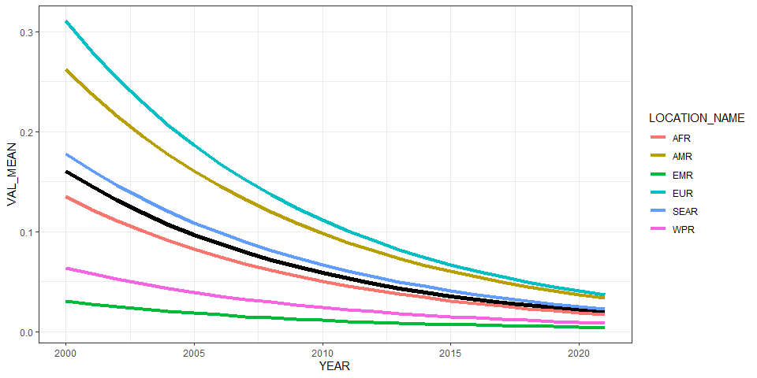<!-- -->

``` r
ggplot(all_reg_rt, aes(x = YEAR, y = VAL_MEAN, group = LOCATION_NAME)) +
  geom_line(data = all_glb_rt, linewidth = 2) +
  geom_line(aes(col = LOCATION_NAME), linewidth = 1.5) +
  geom_line(data = all_sub_rt, aes(col = REG2)) +
  theme_bw()
```

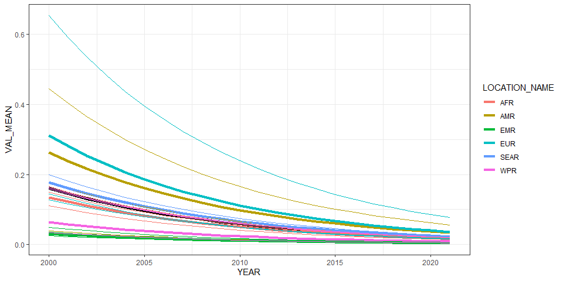<!-- -->

# Summarize predictions

## Global

``` r
kable(
  caption = "Global number of trichinella cases, 2010 vs 2020",
  row.names = FALSE,
  subset(all_glb_nr, YEAR %in% c(2010, 2020))[, 1:4])
```

| YEAR | VAL_MEAN |   VAL_LWR |  VAL_UPR |
|-----:|---------:|----------:|---------:|
| 2010 | 4061.258 | 1971.0051 | 9228.255 |
| 2020 | 1684.582 |  780.9838 | 3977.623 |

Global number of trichinella cases, 2010 vs 2020

## Regions

``` r
kbl(subset(all_reg_rt, YEAR == 2020)[,c(6,2:4)],
    align = c("l", "c", "c", "c"), row.names = FALSE,
    col.names = c("Region", "Mean", "Lower", "Upper"),
    caption="  Incidence of Trichinella in 2020 by WHO region: v11.5") %>%
  kable_styling("striped", "hover")
```

<table class="table table-striped" style="margin-left: auto; margin-right: auto;">

<caption>

Incidence of Trichinella in 2020 by WHO region: v11.5
</caption>

<thead>

<tr>

<th style="text-align:left;">

Region
</th>

<th style="text-align:center;">

Mean
</th>

<th style="text-align:center;">

Lower
</th>

<th style="text-align:center;">

Upper
</th>

</tr>

</thead>

<tbody>

<tr>

<td style="text-align:left;">

AFR
</td>

<td style="text-align:center;">

0.0188325
</td>

<td style="text-align:center;">

0.0035653
</td>

<td style="text-align:center;">

0.0567803
</td>

</tr>

<tr>

<td style="text-align:left;">

AMR
</td>

<td style="text-align:center;">

0.0368067
</td>

<td style="text-align:center;">

0.0134970
</td>

<td style="text-align:center;">

0.0999860
</td>

</tr>

<tr>

<td style="text-align:left;">

EMR
</td>

<td style="text-align:center;">

0.0044092
</td>

<td style="text-align:center;">

0.0008347
</td>

<td style="text-align:center;">

0.0132938
</td>

</tr>

<tr>

<td style="text-align:left;">

EUR
</td>

<td style="text-align:center;">

0.0403062
</td>

<td style="text-align:center;">

0.0259833
</td>

<td style="text-align:center;">

0.0662547
</td>

</tr>

<tr>

<td style="text-align:left;">

SEAR
</td>

<td style="text-align:center;">

0.0249921
</td>

<td style="text-align:center;">

0.0035775
</td>

<td style="text-align:center;">

0.0891918
</td>

</tr>

<tr>

<td style="text-align:left;">

WPR
</td>

<td style="text-align:center;">

0.0091638
</td>

<td style="text-align:center;">

0.0018932
</td>

<td style="text-align:center;">

0.0265325
</td>

</tr>

</tbody>

</table>

``` r
kbl(subset(all_reg_nr, YEAR == 2020)[,c(6,2:4)],
    align = c("l", "c", "c", "c"), row.names = FALSE,
    col.names = c("Region", "Mean", "Lower", "Upper"),
    caption="  Cases of Trichinella in 2020 by WHO region : v11.5") %>%
  kable_styling("striped", "hover")
```

<table class="table table-striped" style="margin-left: auto; margin-right: auto;">

<caption>

Cases of Trichinella in 2020 by WHO region : v11.5
</caption>

<thead>

<tr>

<th style="text-align:left;">

Region
</th>

<th style="text-align:center;">

Mean
</th>

<th style="text-align:center;">

Lower
</th>

<th style="text-align:center;">

Upper
</th>

</tr>

</thead>

<tbody>

<tr>

<td style="text-align:left;">

AFR
</td>

<td style="text-align:center;">

213.78716
</td>

<td style="text-align:center;">

40.473298
</td>

<td style="text-align:center;">

644.5725
</td>

</tr>

<tr>

<td style="text-align:left;">

AMR
</td>

<td style="text-align:center;">

374.26683
</td>

<td style="text-align:center;">

137.243056
</td>

<td style="text-align:center;">

1016.7011
</td>

</tr>

<tr>

<td style="text-align:left;">

EMR
</td>

<td style="text-align:center;">

33.24802
</td>

<td style="text-align:center;">

6.294378
</td>

<td style="text-align:center;">

100.2434
</td>

</tr>

<tr>

<td style="text-align:left;">

EUR
</td>

<td style="text-align:center;">

377.32919
</td>

<td style="text-align:center;">

243.244548
</td>

<td style="text-align:center;">

620.2478
</td>

</tr>

<tr>

<td style="text-align:left;">

SEAR
</td>

<td style="text-align:center;">

509.73944
</td>

<td style="text-align:center;">

72.966320
</td>

<td style="text-align:center;">

1819.1568
</td>

</tr>

<tr>

<td style="text-align:left;">

WPR
</td>

<td style="text-align:center;">

176.21116
</td>

<td style="text-align:center;">

36.403978
</td>

<td style="text-align:center;">

510.1963
</td>

</tr>

</tbody>

</table>

``` r
ggplot(subset(all_reg_rt, YEAR == 2010),
       aes(y = VAL_MEAN, x = LOCATION_NAME)) +
  geom_pointrange(aes(ymin = VAL_LWR, ymax = VAL_UPR), size = 0.2) +
  coord_flip() +
  theme_bw() +
  scale_x_discrete(NULL, limits = rev(unique(all_reg_nr$LOCATION_NAME))) +
  scale_y_continuous(NULL) +
  ggtitle("Incidence of trichinella by WHO Region, 2010")
```

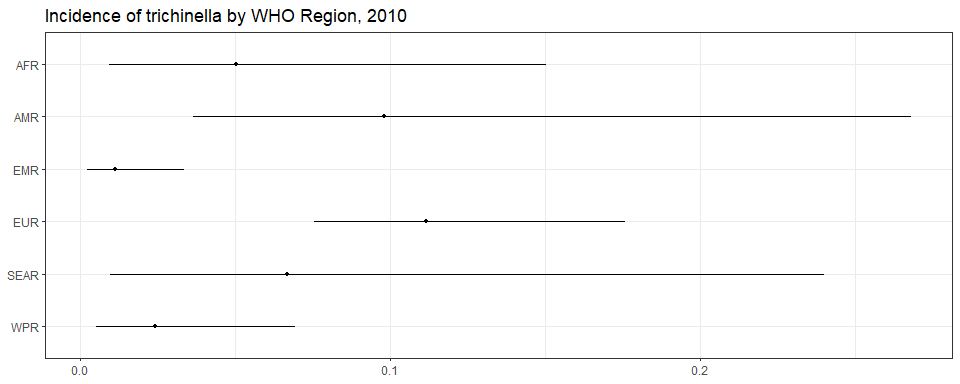<!-- -->

``` r
ggplot(subset(all_reg_rt, YEAR == 2020),
       aes(y = VAL_MEAN, x = LOCATION_NAME)) +
  geom_pointrange(aes(ymin = VAL_LWR, ymax = VAL_UPR), size = 0.2) +
  coord_flip() +
  theme_bw() +
  scale_x_discrete(NULL, limits = rev(unique(all_reg_nr$LOCATION_NAME))) +
  scale_y_continuous(NULL) +
  ggtitle("Incidence of trichinella by WHO Region, 2020")
```

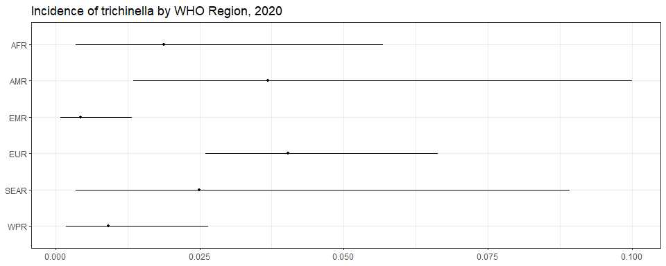<!-- -->

``` r
ggplot(subset(all_reg_nr, YEAR == 2010),
       aes(y = VAL_MEAN, x = LOCATION_NAME)) +
  geom_pointrange(aes(ymin = VAL_LWR, ymax = VAL_UPR), size = 0.2) +
  coord_flip() +
  theme_bw() +
  scale_x_discrete(NULL, limits = rev(unique(all_reg_nr$LOCATION_NAME))) +
  scale_y_continuous(NULL) +
  ggtitle("Number of trichinella cases by WHO Region, 2010")
```

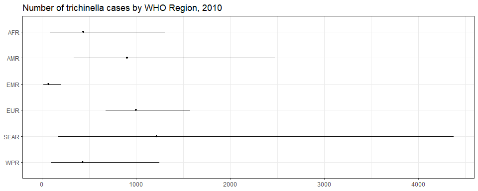<!-- -->

``` r
ggplot(subset(all_reg_nr, YEAR == 2020),
       aes(y = VAL_MEAN, x = LOCATION_NAME)) +
  geom_pointrange(aes(ymin = VAL_LWR, ymax = VAL_UPR), size = 0.2) +
  coord_flip() +
  theme_bw() +
  scale_x_discrete(NULL, limits = rev(unique(all_reg_nr$LOCATION_NAME))) +
  scale_y_continuous(NULL) +
  ggtitle("Number of trichinella cases by WHO Region, 2020")
```

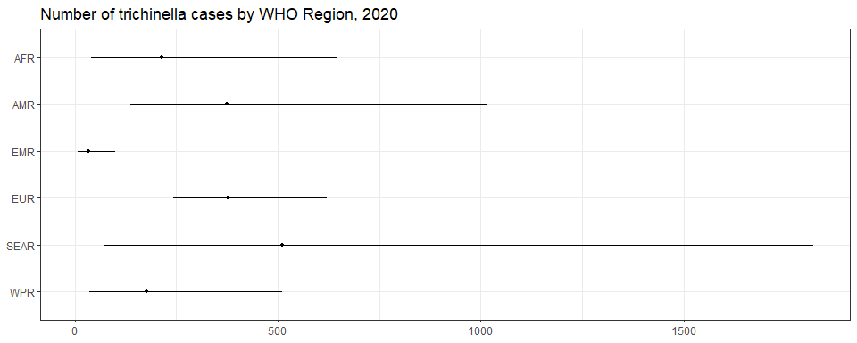<!-- -->

``` r
sim_all_reg <-
  merge(sim_all_reg,
        with(sim_all, aggregate(POP ~ REG2 + YEAR, FUN = sum)))
sim_all_reg_long <-
  pivot_longer(sim_all_reg, cols = starts_with("V"))
sim_all_reg_long$CASES <- sim_all_reg_long$value

ggplot(subset(sim_all_reg_long, YEAR == 2010), aes(x = CASES)) +
  geom_density() +
  facet_wrap(~REG2) +
  theme_bw() +
  scale_x_log10() +
  ggtitle("Number of trichinella cases by WHO Region, 2010")
```

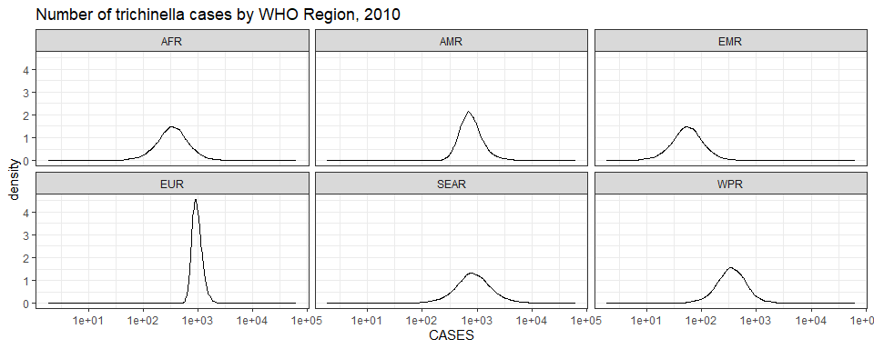<!-- -->

``` r
ggplot(subset(sim_all_reg_long, YEAR == 2020), aes(x = CASES)) +
  geom_density() +
  facet_wrap(~REG2) +
  theme_bw() +
  scale_x_log10() +
  ggtitle("Number of trichinella cases by WHO Region, 2020")
```

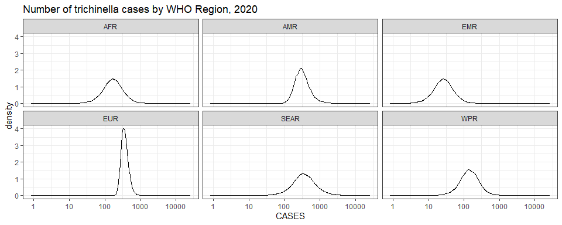<!-- -->

## Subregions

``` r
ggplot(subset(all_sub_rt, YEAR == 2010),
       aes(y = VAL_MEAN, x = LOCATION_NAME)) +
  geom_pointrange(aes(ymin = VAL_LWR, ymax = VAL_UPR), size = 0.2) +
  coord_flip() +
  theme_bw() +
  scale_x_discrete(NULL, limits = rev(unique(all_sub_nr$LOCATION_NAME))) +
  scale_y_continuous(NULL) +
  ggtitle("Incidence of trichinella by WHO Subregion, 2010")
```

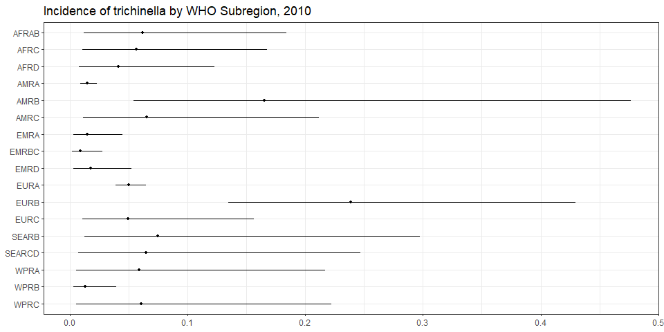<!-- -->

``` r
ggplot(subset(all_sub_rt, YEAR == 2020),
       aes(y = VAL_MEAN, x = LOCATION_NAME)) +
  geom_pointrange(aes(ymin = VAL_LWR, ymax = VAL_UPR), size = 0.2) +
  coord_flip() +
  theme_bw() +
  scale_x_discrete(NULL, limits = rev(unique(all_sub_nr$LOCATION_NAME))) +
  scale_y_continuous(NULL) +
  ggtitle("Incidence of trichinella by WHO Subregion, 2020: v11.5")
```

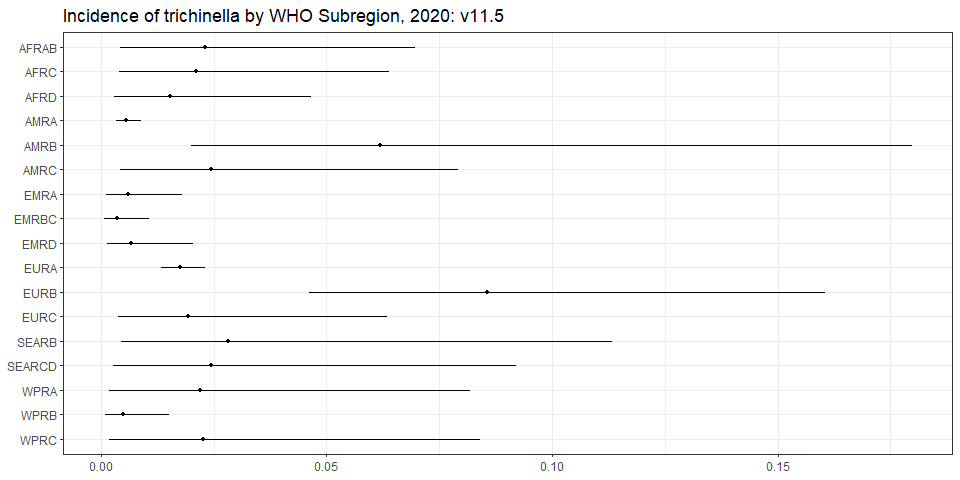<!-- -->

``` r
ggplot(subset(all_sub_nr, YEAR == 2010),
       aes(y = VAL_MEAN, x = LOCATION_NAME)) +
  geom_pointrange(aes(ymin = VAL_LWR, ymax = VAL_UPR), size = 0.2) +
  coord_flip() +
  theme_bw() +
  scale_x_discrete(NULL, limits = rev(unique(all_sub_nr$LOCATION_NAME))) +
  scale_y_continuous(NULL) +
  ggtitle("Number of trichinella cases by WHO Subregion, 2010")
```

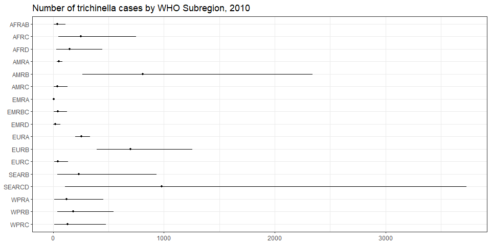<!-- -->

``` r
ggplot(subset(all_sub_nr, YEAR == 2020),
       aes(y = VAL_MEAN, x = LOCATION_NAME)) +
  geom_pointrange(aes(ymin = VAL_LWR, ymax = VAL_UPR), size = 0.2) +
  coord_flip() +
  theme_bw() +
  scale_x_discrete(NULL, limits = rev(unique(all_sub_nr$LOCATION_NAME))) +
  scale_y_continuous(NULL) +
  ggtitle("Number of trichinella cases by WHO Subregion, 2020: v11.5")
```

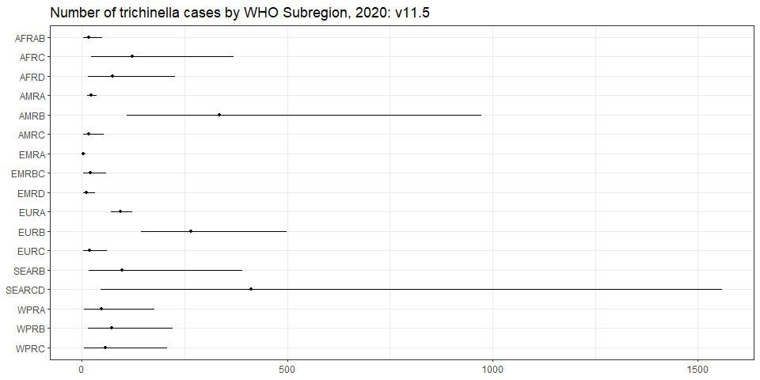<!-- -->

``` r
sim_all_sub <-
  merge(sim_all_sub,
        with(sim_all, aggregate(POP ~ SUB2 + YEAR, FUN = sum)))
sim_all_sub_long <-
  pivot_longer(sim_all_sub, cols = starts_with("V"))
sim_all_sub_long$CASES <- sim_all_sub_long$value

ggplot(subset(sim_all_sub_long, YEAR == 2010), aes(x = CASES)) +
  geom_density() +
  facet_wrap(~SUB2) +
  theme_bw() +
  scale_x_log10() +
  ggtitle("Number of trichinella cases by WHO Subregion, 2010")
```

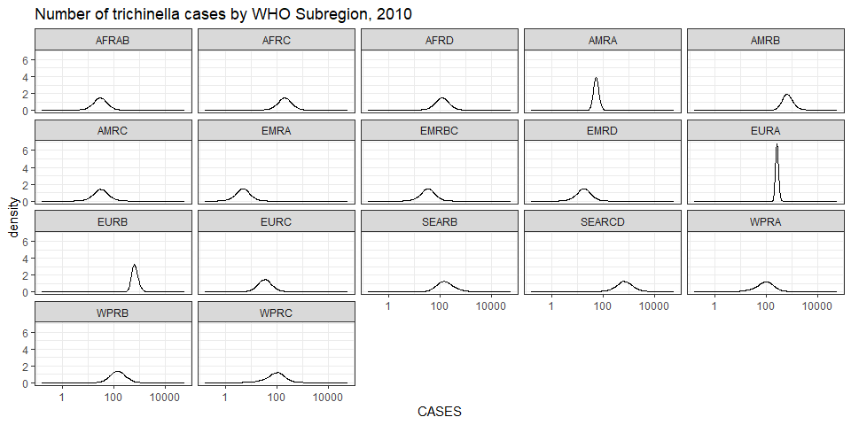<!-- -->

``` r
ggplot(subset(sim_all_sub_long, YEAR == 2020), aes(x = CASES)) +
  geom_density() +
  facet_wrap(~SUB2) +
  theme_bw() +
  scale_x_log10() +
  ggtitle("Number of trichinella cases by WHO Subregion, 2020")
```

<!-- -->

## Countries

``` r
plot_world(subset(all_cnt_rt, YEAR == 2010),
           "LOCATION_NAME", "VAL_MEAN", legend.title = "Incidence per 100k", diseasefree = zero_cases)
```

    ## [1] 0.0 0.5 1.0 1.5 2.0 2.5 3.0

``` r
title("trichinella incidence, 2010", line = 1)
```

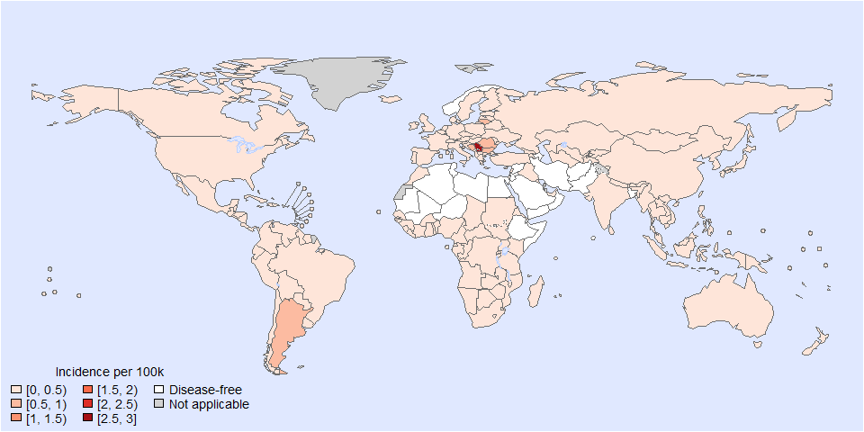<!-- -->

``` r
plot_world(subset(all_cnt_rt, YEAR == 2020),
           "LOCATION_NAME", "VAL_MEAN", legend.title = "Incidence per 100k", diseasefree = zero_cases)
```

    ## [1] 0.0 0.2 0.4 0.6 0.8 1.0

``` r
title("trichinella incidence, 2020", line = 1)
```

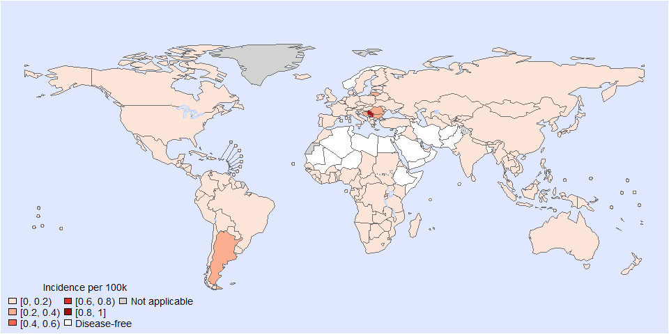<!-- -->

``` r
tab <-
  data.frame(subset(all_cnt_rt, YEAR == 2010)[,
                                              c("LOCATION_NAME", "VAL_MEAN", "VAL_LWR", "VAL_UPR")],
             subset(all_cnt_rt, YEAR == 2020)[,
                                              c("VAL_MEAN", "VAL_LWR", "VAL_UPR")])
tab$LOCATION_NAME <-
  FERG2:::countries$COUNTRY[match(tab$LOCATION_NAME, FERG2:::countries$ISO3)]
tab$LOCATION_NAME <- gsub(" \\(.*", "", tab$LOCATION_NAME)
names(tab) <-
  c("Country",
    "2010.mean", "2010.lwr", "2010.upr",
    "2020.mean", "2020.lwr", "2020.upr")

kable(tab, digits = 3, row.names = FALSE,
      caption = "Estimated trichinella incidence by country, 2010 vs 2020")
```

| Country | 2010.mean | 2010.lwr | 2010.upr | 2020.mean | 2020.lwr | 2020.upr |
|:---|---:|---:|---:|---:|---:|---:|
| Afghanistan | 0.000 | 0.000 | 0.000 | 0.000 | 0.000 | 0.000 |
| Angola | 0.062 | 0.012 | 0.184 | 0.023 | 0.004 | 0.070 |
| Albania | 0.211 | 0.038 | 0.689 | 0.079 | 0.014 | 0.258 |
| Andorra | 0.037 | 0.019 | 0.065 | 0.014 | 0.007 | 0.024 |
| United Arab Emirates | 0.062 | 0.012 | 0.184 | 0.023 | 0.004 | 0.070 |
| Argentina | 0.836 | 0.302 | 1.870 | 0.313 | 0.112 | 0.713 |
| Armenia | 0.211 | 0.038 | 0.689 | 0.079 | 0.014 | 0.258 |
| Antigua and Barbuda | 0.045 | 0.007 | 0.145 | 0.017 | 0.003 | 0.055 |
| Australia | 0.061 | 0.005 | 0.222 | 0.023 | 0.002 | 0.084 |
| Austria | 0.027 | 0.014 | 0.049 | 0.010 | 0.005 | 0.018 |
| Azerbaijan | 0.000 | 0.000 | 0.000 | 0.000 | 0.000 | 0.000 |
| Burundi | 0.062 | 0.012 | 0.184 | 0.023 | 0.004 | 0.070 |
| Belgium | 0.018 | 0.008 | 0.035 | 0.007 | 0.003 | 0.013 |
| Benin | 0.062 | 0.012 | 0.184 | 0.023 | 0.004 | 0.070 |
| Burkina Faso | 0.062 | 0.012 | 0.184 | 0.023 | 0.004 | 0.070 |
| Bangladesh | 0.000 | 0.000 | 0.000 | 0.000 | 0.000 | 0.000 |
| Bulgaria | 0.857 | 0.512 | 1.335 | 0.321 | 0.190 | 0.500 |
| Bahrain | 0.000 | 0.000 | 0.000 | 0.000 | 0.000 | 0.000 |
| Bahamas | 0.045 | 0.007 | 0.145 | 0.017 | 0.003 | 0.055 |
| Bosnia and Herzegovina | 0.633 | 0.119 | 1.970 | 0.237 | 0.043 | 0.749 |
| Belarus | 0.333 | 0.057 | 1.107 | 0.125 | 0.021 | 0.413 |
| Belize | 0.122 | 0.014 | 0.527 | 0.046 | 0.005 | 0.200 |
| Bolivia | 0.065 | 0.011 | 0.212 | 0.024 | 0.004 | 0.079 |
| Brazil | 0.122 | 0.014 | 0.527 | 0.046 | 0.005 | 0.200 |
| Barbados | 0.045 | 0.007 | 0.145 | 0.017 | 0.003 | 0.055 |
| Brunei Darussalam | 0.061 | 0.005 | 0.222 | 0.023 | 0.002 | 0.084 |
| Bhutan | 0.072 | 0.008 | 0.275 | 0.027 | 0.003 | 0.102 |
| Botswana | 0.062 | 0.012 | 0.184 | 0.023 | 0.004 | 0.070 |
| Central African Republic | 0.062 | 0.012 | 0.184 | 0.023 | 0.004 | 0.070 |
| Canada | 0.018 | 0.003 | 0.058 | 0.007 | 0.001 | 0.022 |
| Switzerland | 0.025 | 0.009 | 0.059 | 0.010 | 0.003 | 0.022 |
| Chile | 0.122 | 0.049 | 0.254 | 0.046 | 0.018 | 0.096 |
| China | 0.012 | 0.002 | 0.039 | 0.005 | 0.001 | 0.014 |
| Côte d’Ivoire | 0.062 | 0.012 | 0.184 | 0.023 | 0.004 | 0.070 |
| Cameroon | 0.062 | 0.012 | 0.184 | 0.023 | 0.004 | 0.070 |
| Congo | 0.062 | 0.012 | 0.184 | 0.023 | 0.004 | 0.070 |
| Congo | 0.062 | 0.012 | 0.184 | 0.023 | 0.004 | 0.070 |
| Cook Islands | 0.061 | 0.005 | 0.222 | 0.023 | 0.002 | 0.084 |
| Colombia | 0.122 | 0.014 | 0.527 | 0.046 | 0.005 | 0.200 |
| Comoros | 0.000 | 0.000 | 0.000 | 0.000 | 0.000 | 0.000 |
| Cabo Verde | 0.062 | 0.012 | 0.184 | 0.023 | 0.004 | 0.070 |
| Costa Rica | 0.122 | 0.014 | 0.527 | 0.046 | 0.005 | 0.200 |
| Cuba | 0.122 | 0.014 | 0.527 | 0.046 | 0.005 | 0.200 |
| Cyprus | 0.060 | 0.025 | 0.125 | 0.023 | 0.009 | 0.047 |
| Czechia | 0.008 | 0.003 | 0.017 | 0.003 | 0.001 | 0.006 |
| Germany | 0.005 | 0.003 | 0.008 | 0.002 | 0.001 | 0.003 |
| Djibouti | 0.000 | 0.000 | 0.000 | 0.000 | 0.000 | 0.000 |
| Dominica | 0.122 | 0.014 | 0.527 | 0.046 | 0.005 | 0.200 |
| Denmark | 0.028 | 0.004 | 0.098 | 0.010 | 0.002 | 0.037 |
| Dominican Republic | 0.122 | 0.014 | 0.527 | 0.046 | 0.005 | 0.200 |
| Algeria | 0.000 | 0.000 | 0.000 | 0.000 | 0.000 | 0.000 |
| Ecuador | 0.122 | 0.014 | 0.527 | 0.046 | 0.005 | 0.200 |
| Egypt | 0.000 | 0.000 | 0.000 | 0.000 | 0.000 | 0.000 |
| Eritrea | 0.062 | 0.012 | 0.184 | 0.023 | 0.004 | 0.070 |
| Spain | 0.030 | 0.018 | 0.046 | 0.011 | 0.007 | 0.017 |
| Estonia | 0.063 | 0.027 | 0.128 | 0.024 | 0.010 | 0.048 |
| Ethiopia | 0.000 | 0.000 | 0.000 | 0.000 | 0.000 | 0.000 |
| Finland | 0.015 | 0.007 | 0.029 | 0.006 | 0.002 | 0.011 |
| Fiji | 0.050 | 0.003 | 0.216 | 0.019 | 0.001 | 0.081 |
| France | 0.006 | 0.003 | 0.010 | 0.002 | 0.001 | 0.004 |
| Micronesia | 0.061 | 0.005 | 0.222 | 0.023 | 0.002 | 0.084 |
| Gabon | 0.062 | 0.012 | 0.184 | 0.023 | 0.004 | 0.070 |
| United Kingdom | 0.001 | 0.001 | 0.002 | 0.000 | 0.000 | 0.001 |
| Georgia | 0.211 | 0.038 | 0.689 | 0.079 | 0.014 | 0.258 |
| Ghana | 0.062 | 0.012 | 0.184 | 0.023 | 0.004 | 0.070 |
| Guinea | 0.062 | 0.012 | 0.184 | 0.023 | 0.004 | 0.070 |
| Gambia | 0.062 | 0.012 | 0.184 | 0.023 | 0.004 | 0.070 |
| Guinea-Bissau | 0.062 | 0.012 | 0.184 | 0.023 | 0.004 | 0.070 |
| Equatorial Guinea | 0.062 | 0.012 | 0.184 | 0.023 | 0.004 | 0.070 |
| Greece | 0.009 | 0.004 | 0.019 | 0.003 | 0.001 | 0.007 |
| Grenada | 0.122 | 0.014 | 0.527 | 0.046 | 0.005 | 0.200 |
| Guatemala | 0.122 | 0.014 | 0.527 | 0.046 | 0.005 | 0.200 |
| Guyana | 0.045 | 0.007 | 0.145 | 0.017 | 0.003 | 0.055 |
| Honduras | 0.065 | 0.011 | 0.212 | 0.024 | 0.004 | 0.079 |
| Croatia | 0.473 | 0.137 | 1.215 | 0.177 | 0.050 | 0.457 |
| Haiti | 0.065 | 0.011 | 0.212 | 0.024 | 0.004 | 0.079 |
| Hungary | 0.016 | 0.008 | 0.031 | 0.006 | 0.003 | 0.012 |
| Indonesia | 0.082 | 0.006 | 0.368 | 0.031 | 0.002 | 0.138 |
| India | 0.072 | 0.008 | 0.275 | 0.027 | 0.003 | 0.102 |
| Ireland | 0.016 | 0.007 | 0.031 | 0.006 | 0.003 | 0.012 |
| Iran | 0.000 | 0.000 | 0.000 | 0.000 | 0.000 | 0.000 |
| Iraq | 0.062 | 0.012 | 0.184 | 0.023 | 0.004 | 0.070 |
| Iceland | 0.309 | 0.107 | 0.704 | 0.116 | 0.040 | 0.263 |
| Israel | 0.037 | 0.019 | 0.065 | 0.014 | 0.007 | 0.024 |
| Italy | 0.012 | 0.007 | 0.021 | 0.005 | 0.002 | 0.008 |
| Jamaica | 0.122 | 0.014 | 0.527 | 0.046 | 0.005 | 0.200 |
| Jordan | 0.000 | 0.000 | 0.000 | 0.000 | 0.000 | 0.000 |
| Japan | 0.061 | 0.005 | 0.222 | 0.023 | 0.002 | 0.084 |
| Kazakhstan | 0.056 | 0.008 | 0.203 | 0.021 | 0.003 | 0.076 |
| Kenya | 0.062 | 0.012 | 0.184 | 0.023 | 0.004 | 0.070 |
| Kyrgyzstan | 0.070 | 0.006 | 0.277 | 0.026 | 0.002 | 0.104 |
| Cambodia | 0.061 | 0.005 | 0.222 | 0.023 | 0.002 | 0.084 |
| Kiribati | 0.061 | 0.005 | 0.222 | 0.023 | 0.002 | 0.084 |
| Saint Kitts and Nevis | 0.045 | 0.007 | 0.145 | 0.017 | 0.003 | 0.055 |
| Korea | 0.061 | 0.005 | 0.222 | 0.023 | 0.002 | 0.084 |
| Kuwait | 0.062 | 0.012 | 0.184 | 0.023 | 0.004 | 0.070 |
| Lao People’s Dem. Republic | 0.061 | 0.005 | 0.222 | 0.023 | 0.002 | 0.084 |
| Lebanon | 0.062 | 0.012 | 0.184 | 0.023 | 0.004 | 0.070 |
| Liberia | 0.062 | 0.012 | 0.184 | 0.023 | 0.004 | 0.070 |
| Libya | 0.000 | 0.000 | 0.000 | 0.000 | 0.000 | 0.000 |
| Saint Lucia | 0.122 | 0.014 | 0.527 | 0.046 | 0.005 | 0.200 |
| Sri Lanka | 0.072 | 0.008 | 0.275 | 0.027 | 0.003 | 0.102 |
| Lesotho | 0.062 | 0.012 | 0.184 | 0.023 | 0.004 | 0.070 |
| Lithuania | 0.608 | 0.374 | 0.951 | 0.228 | 0.138 | 0.358 |
| Luxembourg | 0.155 | 0.064 | 0.321 | 0.058 | 0.024 | 0.121 |
| Latvia | 0.442 | 0.261 | 0.707 | 0.166 | 0.096 | 0.266 |
| Morocco | 0.062 | 0.012 | 0.184 | 0.023 | 0.004 | 0.070 |
| Monaco | 0.037 | 0.019 | 0.065 | 0.014 | 0.007 | 0.024 |
| Republic of Moldova | 0.211 | 0.038 | 0.689 | 0.079 | 0.014 | 0.258 |
| Madagascar | 0.062 | 0.012 | 0.184 | 0.023 | 0.004 | 0.070 |
| Maldives | 0.000 | 0.000 | 0.000 | 0.000 | 0.000 | 0.000 |
| Mexico | 0.050 | 0.005 | 0.203 | 0.019 | 0.002 | 0.077 |
| Marshall Islands | 0.050 | 0.003 | 0.216 | 0.019 | 0.001 | 0.081 |
| North Macedonia | 0.211 | 0.038 | 0.689 | 0.079 | 0.014 | 0.258 |
| Mali | 0.000 | 0.000 | 0.000 | 0.000 | 0.000 | 0.000 |
| Malta | 0.155 | 0.063 | 0.324 | 0.058 | 0.023 | 0.122 |
| Myanmar | 0.072 | 0.008 | 0.275 | 0.027 | 0.003 | 0.102 |
| Montenegro | 0.211 | 0.038 | 0.689 | 0.079 | 0.014 | 0.258 |
| Mongolia | 0.061 | 0.005 | 0.222 | 0.023 | 0.002 | 0.084 |
| Mozambique | 0.062 | 0.012 | 0.184 | 0.023 | 0.004 | 0.070 |
| Mauritania | 0.000 | 0.000 | 0.000 | 0.000 | 0.000 | 0.000 |
| Mauritius | 0.062 | 0.012 | 0.184 | 0.023 | 0.004 | 0.070 |
| Malawi | 0.062 | 0.012 | 0.184 | 0.023 | 0.004 | 0.070 |
| Malaysia | 0.050 | 0.003 | 0.216 | 0.019 | 0.001 | 0.081 |
| Namibia | 0.062 | 0.012 | 0.184 | 0.023 | 0.004 | 0.070 |
| Niger | 0.000 | 0.000 | 0.000 | 0.000 | 0.000 | 0.000 |
| Nigeria | 0.062 | 0.012 | 0.184 | 0.023 | 0.004 | 0.070 |
| Nicaragua | 0.065 | 0.011 | 0.212 | 0.024 | 0.004 | 0.079 |
| Niue | 0.061 | 0.005 | 0.222 | 0.023 | 0.002 | 0.084 |
| Netherlands | 0.011 | 0.005 | 0.020 | 0.004 | 0.002 | 0.008 |
| Norway | 0.000 | 0.000 | 0.000 | 0.000 | 0.000 | 0.000 |
| Nepal | 0.072 | 0.008 | 0.275 | 0.027 | 0.003 | 0.102 |
| Nauru | 0.061 | 0.005 | 0.222 | 0.023 | 0.002 | 0.084 |
| New Zealand | 0.061 | 0.005 | 0.222 | 0.023 | 0.002 | 0.084 |
| Oman | 0.000 | 0.000 | 0.000 | 0.000 | 0.000 | 0.000 |
| Pakistan | 0.000 | 0.000 | 0.000 | 0.000 | 0.000 | 0.000 |
| Panama | 0.045 | 0.007 | 0.145 | 0.017 | 0.003 | 0.055 |
| Peru | 0.122 | 0.014 | 0.527 | 0.046 | 0.005 | 0.200 |
| Philippines | 0.061 | 0.005 | 0.222 | 0.023 | 0.002 | 0.084 |
| Palau | 0.050 | 0.003 | 0.216 | 0.019 | 0.001 | 0.081 |
| Papua New Guinea | 0.061 | 0.005 | 0.222 | 0.023 | 0.002 | 0.084 |
| Poland | 0.033 | 0.023 | 0.047 | 0.013 | 0.008 | 0.018 |
| Korea | 0.072 | 0.008 | 0.275 | 0.027 | 0.003 | 0.102 |
| Portugal | 0.037 | 0.019 | 0.065 | 0.014 | 0.007 | 0.024 |
| Paraguay | 0.122 | 0.014 | 0.527 | 0.046 | 0.005 | 0.200 |
| Qatar | 0.000 | 0.000 | 0.000 | 0.000 | 0.000 | 0.000 |
| Romania | 0.667 | 0.422 | 1.011 | 0.250 | 0.155 | 0.382 |
| Russian Federation | 0.122 | 0.042 | 0.283 | 0.046 | 0.016 | 0.107 |
| Rwanda | 0.062 | 0.012 | 0.184 | 0.023 | 0.004 | 0.070 |
| Saudi Arabia | 0.000 | 0.000 | 0.000 | 0.000 | 0.000 | 0.000 |
| Sudan | 0.062 | 0.012 | 0.184 | 0.023 | 0.004 | 0.070 |
| Senegal | 0.062 | 0.012 | 0.184 | 0.023 | 0.004 | 0.070 |
| Singapore | 0.000 | 0.000 | 0.000 | 0.000 | 0.000 | 0.000 |
| Solomon Islands | 0.061 | 0.005 | 0.222 | 0.023 | 0.002 | 0.084 |
| Sierra Leone | 0.062 | 0.012 | 0.184 | 0.023 | 0.004 | 0.070 |
| El Salvador | 0.122 | 0.014 | 0.527 | 0.046 | 0.005 | 0.200 |
| San Marino | 0.037 | 0.019 | 0.065 | 0.014 | 0.007 | 0.024 |
| Somalia | 0.000 | 0.000 | 0.000 | 0.000 | 0.000 | 0.000 |
| Serbia | 2.608 | 1.346 | 4.539 | 0.978 | 0.496 | 1.731 |
| South Sudan | 0.062 | 0.012 | 0.184 | 0.023 | 0.004 | 0.070 |
| Sao Tome and Principe | 0.062 | 0.012 | 0.184 | 0.023 | 0.004 | 0.070 |
| Suriname | 0.122 | 0.014 | 0.527 | 0.046 | 0.005 | 0.200 |
| Slovakia | 0.049 | 0.026 | 0.083 | 0.018 | 0.010 | 0.031 |
| Slovenia | 0.045 | 0.021 | 0.086 | 0.017 | 0.008 | 0.032 |
| Sweden | 0.010 | 0.004 | 0.019 | 0.004 | 0.002 | 0.007 |
| Eswatini | 0.062 | 0.012 | 0.184 | 0.023 | 0.004 | 0.070 |
| Seychelles | 0.062 | 0.012 | 0.184 | 0.023 | 0.004 | 0.070 |
| Syrian Arab Republic | 0.000 | 0.000 | 0.000 | 0.000 | 0.000 | 0.000 |
| Chad | 0.062 | 0.012 | 0.184 | 0.023 | 0.004 | 0.070 |
| Togo | 0.062 | 0.012 | 0.184 | 0.023 | 0.004 | 0.070 |
| Thailand | 0.050 | 0.020 | 0.107 | 0.019 | 0.007 | 0.041 |
| Tajikistan | 0.070 | 0.006 | 0.277 | 0.026 | 0.002 | 0.104 |
| Turkmenistan | 0.211 | 0.038 | 0.689 | 0.079 | 0.014 | 0.258 |
| Timor-Leste | 0.072 | 0.008 | 0.275 | 0.027 | 0.003 | 0.102 |
| Tonga | 0.050 | 0.003 | 0.216 | 0.019 | 0.001 | 0.081 |
| Trinidad and Tobago | 0.045 | 0.007 | 0.145 | 0.017 | 0.003 | 0.055 |
| Tunisia | 0.000 | 0.000 | 0.000 | 0.000 | 0.000 | 0.000 |
| Turkiye | 0.211 | 0.038 | 0.689 | 0.079 | 0.014 | 0.258 |
| Tuvalu | 0.050 | 0.003 | 0.216 | 0.019 | 0.001 | 0.081 |
| United Republic of Tanzania | 0.062 | 0.012 | 0.184 | 0.023 | 0.004 | 0.070 |
| Uganda | 0.062 | 0.012 | 0.184 | 0.023 | 0.004 | 0.070 |
| Ukraine | 0.031 | 0.007 | 0.091 | 0.012 | 0.003 | 0.033 |
| Uruguay | 0.045 | 0.007 | 0.145 | 0.017 | 0.003 | 0.055 |
| United States of America | 0.007 | 0.004 | 0.012 | 0.003 | 0.002 | 0.004 |
| Uzbekistan | 0.070 | 0.006 | 0.277 | 0.026 | 0.002 | 0.104 |
| Saint Vincent and the Grenadines | 0.122 | 0.014 | 0.527 | 0.046 | 0.005 | 0.200 |
| Venezuela | 0.065 | 0.011 | 0.212 | 0.024 | 0.004 | 0.079 |
| Viet Nam | 0.061 | 0.005 | 0.222 | 0.023 | 0.002 | 0.084 |
| Vanuatu | 0.061 | 0.005 | 0.222 | 0.023 | 0.002 | 0.084 |
| Samoa | 0.061 | 0.005 | 0.222 | 0.023 | 0.002 | 0.084 |
| Yemen | 0.000 | 0.000 | 0.000 | 0.000 | 0.000 | 0.000 |
| South Africa | 0.062 | 0.012 | 0.184 | 0.023 | 0.004 | 0.070 |
| Zambia | 0.062 | 0.012 | 0.184 | 0.023 | 0.004 | 0.070 |
| Zimbabwe | 0.062 | 0.012 | 0.184 | 0.023 | 0.004 | 0.070 |

Estimated trichinella incidence by country, 2010 vs 2020

``` r
tab2 <-
  data.frame(subset(all_cnt_nr, YEAR == 2010)[,
                                              c("LOCATION_NAME", "VAL_MEAN", "VAL_LWR", "VAL_UPR")],
             subset(all_cnt_nr, YEAR == 2020)[,
                                              c("VAL_MEAN", "VAL_LWR", "VAL_UPR")])
tab2$LOCATION_NAME <-
  FERG2:::countries$COUNTRY[match(tab2$LOCATION_NAME, FERG2:::countries$ISO3)]
tab2$LOCATION_NAME <- gsub(" \\(.*", "", tab2$LOCATION_NAME)
names(tab2) <-
  c("Country",
    "2010.mean", "2010.lwr", "2010.upr",
    "2020.mean", "2020.lwr", "2020.upr")

kable(tab2, digits = 1, row.names = FALSE,
      caption = "Estimated trichinella cases by country, 2010 vs 2020")
```

| Country | 2010.mean | 2010.lwr | 2010.upr | 2020.mean | 2020.lwr | 2020.upr |
|:---|---:|---:|---:|---:|---:|---:|
| Afghanistan | 0.0 | 0.0 | 0.0 | 0.0 | 0.0 | 0.0 |
| Angola | 14.1 | 2.7 | 42.1 | 7.6 | 1.4 | 23.0 |
| Albania | 6.2 | 1.1 | 20.3 | 2.3 | 0.4 | 7.4 |
| Andorra | 0.0 | 0.0 | 0.1 | 0.0 | 0.0 | 0.0 |
| United Arab Emirates | 4.2 | 0.8 | 12.6 | 2.2 | 0.4 | 6.5 |
| Argentina | 343.3 | 124.2 | 767.9 | 141.4 | 50.4 | 321.6 |
| Armenia | 6.2 | 1.1 | 20.2 | 2.3 | 0.4 | 7.5 |
| Antigua and Barbuda | 0.0 | 0.0 | 0.1 | 0.0 | 0.0 | 0.1 |
| Australia | 13.3 | 1.2 | 48.8 | 5.8 | 0.5 | 21.6 |
| Austria | 2.3 | 1.1 | 4.1 | 0.9 | 0.5 | 1.6 |
| Azerbaijan | 0.0 | 0.0 | 0.0 | 0.0 | 0.0 | 0.0 |
| Burundi | 5.7 | 1.1 | 16.9 | 2.9 | 0.5 | 8.7 |
| Belgium | 2.0 | 0.9 | 3.8 | 0.8 | 0.4 | 1.5 |
| Benin | 6.0 | 1.1 | 17.8 | 3.0 | 0.6 | 9.0 |
| Burkina Faso | 9.8 | 1.9 | 29.4 | 4.9 | 0.9 | 14.8 |
| Bangladesh | 0.0 | 0.0 | 0.0 | 0.0 | 0.0 | 0.0 |
| Bulgaria | 64.0 | 38.2 | 99.6 | 22.3 | 13.2 | 34.7 |
| Bahrain | 0.0 | 0.0 | 0.0 | 0.0 | 0.0 | 0.0 |
| Bahamas | 0.2 | 0.0 | 0.5 | 0.1 | 0.0 | 0.2 |
| Bosnia and Herzegovina | 24.3 | 4.6 | 75.8 | 7.9 | 1.4 | 24.9 |
| Belarus | 31.6 | 5.4 | 105.2 | 11.7 | 2.0 | 38.8 |
| Belize | 0.4 | 0.0 | 1.7 | 0.2 | 0.0 | 0.8 |
| Bolivia | 6.6 | 1.2 | 21.4 | 2.9 | 0.5 | 9.3 |
| Brazil | 235.9 | 27.6 | 1016.9 | 95.7 | 11.1 | 415.7 |
| Barbados | 0.1 | 0.0 | 0.4 | 0.0 | 0.0 | 0.2 |
| Brunei Darussalam | 0.2 | 0.0 | 0.9 | 0.1 | 0.0 | 0.4 |
| Bhutan | 0.5 | 0.1 | 1.9 | 0.2 | 0.0 | 0.8 |
| Botswana | 1.2 | 0.2 | 3.7 | 0.5 | 0.1 | 1.6 |
| Central African Republic | 2.7 | 0.5 | 8.2 | 1.1 | 0.2 | 3.5 |
| Canada | 6.0 | 1.0 | 19.8 | 2.5 | 0.4 | 8.3 |
| Switzerland | 2.0 | 0.7 | 4.6 | 0.8 | 0.3 | 1.9 |
| Chile | 20.8 | 8.4 | 43.4 | 8.8 | 3.5 | 18.5 |
| China | 166.0 | 33.1 | 519.7 | 66.0 | 12.8 | 206.5 |
| Côte d’Ivoire | 13.7 | 2.6 | 41.0 | 6.6 | 1.3 | 19.9 |
| Cameroon | 12.0 | 2.3 | 35.7 | 6.0 | 1.1 | 18.0 |
| Congo | 41.7 | 7.8 | 124.2 | 21.8 | 4.1 | 65.8 |
| Congo | 2.7 | 0.5 | 8.1 | 1.3 | 0.2 | 4.0 |
| Cook Islands | 0.0 | 0.0 | 0.0 | 0.0 | 0.0 | 0.0 |
| Colombia | 54.5 | 6.4 | 234.7 | 23.1 | 2.7 | 100.5 |
| Comoros | 0.0 | 0.0 | 0.0 | 0.0 | 0.0 | 0.0 |
| Cabo Verde | 0.3 | 0.1 | 0.9 | 0.1 | 0.0 | 0.4 |
| Costa Rica | 5.5 | 0.6 | 23.9 | 2.3 | 0.3 | 10.0 |
| Cuba | 13.8 | 1.6 | 59.5 | 5.1 | 0.6 | 22.3 |
| Cyprus | 0.7 | 0.3 | 1.4 | 0.3 | 0.1 | 0.6 |
| Czechia | 0.8 | 0.3 | 1.7 | 0.3 | 0.1 | 0.7 |
| Germany | 3.8 | 2.2 | 6.3 | 1.5 | 0.8 | 2.5 |
| Djibouti | 0.0 | 0.0 | 0.0 | 0.0 | 0.0 | 0.0 |
| Dominica | 0.1 | 0.0 | 0.4 | 0.0 | 0.0 | 0.1 |
| Denmark | 1.5 | 0.2 | 5.4 | 0.6 | 0.1 | 2.1 |
| Dominican Republic | 11.9 | 1.4 | 51.4 | 5.0 | 0.6 | 21.9 |
| Algeria | 0.0 | 0.0 | 0.0 | 0.0 | 0.0 | 0.0 |
| Ecuador | 18.3 | 2.1 | 78.8 | 8.0 | 0.9 | 34.9 |
| Egypt | 0.0 | 0.0 | 0.0 | 0.0 | 0.0 | 0.0 |
| Eritrea | 1.8 | 0.3 | 5.4 | 0.8 | 0.1 | 2.3 |
| Spain | 13.8 | 8.4 | 21.3 | 5.3 | 3.2 | 8.2 |
| Estonia | 0.8 | 0.4 | 1.7 | 0.3 | 0.1 | 0.6 |
| Ethiopia | 0.0 | 0.0 | 0.0 | 0.0 | 0.0 | 0.0 |
| Finland | 0.8 | 0.4 | 1.6 | 0.3 | 0.1 | 0.6 |
| Fiji | 0.5 | 0.0 | 2.0 | 0.2 | 0.0 | 0.7 |
| France | 3.6 | 2.0 | 6.0 | 1.4 | 0.8 | 2.4 |
| Micronesia | 0.1 | 0.0 | 0.2 | 0.0 | 0.0 | 0.1 |
| Gabon | 1.0 | 0.2 | 3.1 | 0.5 | 0.1 | 1.6 |
| United Kingdom | 0.8 | 0.3 | 1.5 | 0.3 | 0.1 | 0.6 |
| Georgia | 8.3 | 1.5 | 26.9 | 3.0 | 0.5 | 9.8 |
| Ghana | 15.5 | 2.9 | 46.4 | 7.3 | 1.4 | 22.0 |
| Guinea | 6.3 | 1.2 | 18.9 | 3.1 | 0.6 | 9.2 |
| Gambia | 1.2 | 0.2 | 3.5 | 0.6 | 0.1 | 1.7 |
| Guinea-Bissau | 1.0 | 0.2 | 2.8 | 0.5 | 0.1 | 1.4 |
| Equatorial Guinea | 0.7 | 0.1 | 2.1 | 0.4 | 0.1 | 1.2 |
| Greece | 1.0 | 0.4 | 2.1 | 0.4 | 0.2 | 0.8 |
| Grenada | 0.1 | 0.0 | 0.6 | 0.1 | 0.0 | 0.2 |
| Guatemala | 17.6 | 2.1 | 75.7 | 7.9 | 0.9 | 34.4 |
| Guyana | 0.3 | 0.1 | 1.1 | 0.1 | 0.0 | 0.4 |
| Honduras | 5.4 | 1.0 | 17.5 | 2.5 | 0.4 | 7.9 |
| Croatia | 20.4 | 5.9 | 52.3 | 7.0 | 2.0 | 18.1 |
| Haiti | 6.4 | 1.1 | 20.7 | 2.7 | 0.5 | 8.8 |
| Hungary | 1.6 | 0.8 | 3.1 | 0.6 | 0.3 | 1.1 |
| Indonesia | 199.8 | 14.6 | 901.3 | 83.6 | 6.1 | 378.7 |
| India | 891.0 | 98.2 | 3390.7 | 376.9 | 41.3 | 1423.7 |
| Ireland | 0.7 | 0.3 | 1.4 | 0.3 | 0.1 | 0.6 |
| Iran | 0.0 | 0.0 | 0.0 | 0.0 | 0.0 | 0.0 |
| Iraq | 18.9 | 3.5 | 56.3 | 9.6 | 1.8 | 29.0 |
| Iceland | 1.0 | 0.3 | 2.2 | 0.4 | 0.1 | 1.0 |
| Israel | 2.7 | 1.4 | 4.7 | 1.2 | 0.6 | 2.1 |
| Italy | 7.4 | 4.0 | 12.5 | 2.8 | 1.5 | 4.7 |
| Jamaica | 3.4 | 0.4 | 14.5 | 1.3 | 0.2 | 5.6 |
| Jordan | 0.0 | 0.0 | 0.0 | 0.0 | 0.0 | 0.0 |
| Japan | 77.7 | 6.7 | 284.9 | 28.7 | 2.4 | 106.4 |
| Kazakhstan | 9.3 | 1.3 | 33.9 | 4.0 | 0.6 | 14.8 |
| Kenya | 25.3 | 4.8 | 75.5 | 12.0 | 2.3 | 36.1 |
| Kyrgyzstan | 3.8 | 0.3 | 15.0 | 1.7 | 0.2 | 6.8 |
| Cambodia | 8.7 | 0.8 | 32.0 | 3.8 | 0.3 | 13.9 |
| Kiribati | 0.1 | 0.0 | 0.2 | 0.0 | 0.0 | 0.1 |
| Saint Kitts and Nevis | 0.0 | 0.0 | 0.1 | 0.0 | 0.0 | 0.0 |
| Korea | 29.5 | 2.6 | 108.1 | 11.8 | 1.0 | 43.6 |
| Kuwait | 1.8 | 0.3 | 5.3 | 1.0 | 0.2 | 3.1 |
| Lao People’s Dem. Republic | 3.8 | 0.3 | 14.0 | 1.7 | 0.1 | 6.1 |
| Lebanon | 3.1 | 0.6 | 9.3 | 1.3 | 0.2 | 4.0 |
| Liberia | 2.5 | 0.5 | 7.4 | 1.2 | 0.2 | 3.6 |
| Libya | 0.0 | 0.0 | 0.0 | 0.0 | 0.0 | 0.0 |
| Saint Lucia | 0.2 | 0.0 | 0.9 | 0.1 | 0.0 | 0.4 |
| Sri Lanka | 15.0 | 1.7 | 57.2 | 6.1 | 0.7 | 22.9 |
| Lesotho | 1.2 | 0.2 | 3.7 | 0.5 | 0.1 | 1.5 |
| Lithuania | 19.1 | 11.7 | 29.9 | 6.4 | 3.8 | 10.0 |
| Luxembourg | 0.8 | 0.3 | 1.6 | 0.4 | 0.1 | 0.8 |
| Latvia | 9.4 | 5.5 | 15.0 | 3.2 | 1.8 | 5.1 |
| Morocco | 19.9 | 3.7 | 59.4 | 8.4 | 1.6 | 25.4 |
| Monaco | 0.0 | 0.0 | 0.0 | 0.0 | 0.0 | 0.0 |
| Republic of Moldova | 7.8 | 1.4 | 25.3 | 2.4 | 0.4 | 8.0 |
| Madagascar | 13.5 | 2.5 | 40.3 | 6.6 | 1.3 | 19.9 |
| Maldives | 0.0 | 0.0 | 0.0 | 0.0 | 0.0 | 0.0 |
| Mexico | 56.1 | 5.8 | 229.1 | 23.6 | 2.4 | 97.4 |
| Marshall Islands | 0.0 | 0.0 | 0.1 | 0.0 | 0.0 | 0.0 |
| North Macedonia | 4.3 | 0.8 | 14.2 | 1.5 | 0.3 | 4.9 |
| Mali | 0.0 | 0.0 | 0.0 | 0.0 | 0.0 | 0.0 |
| Malta | 0.7 | 0.3 | 1.4 | 0.3 | 0.1 | 0.6 |
| Myanmar | 35.2 | 3.9 | 134.1 | 14.3 | 1.6 | 53.9 |
| Montenegro | 1.3 | 0.2 | 4.4 | 0.5 | 0.1 | 1.6 |
| Mongolia | 1.6 | 0.1 | 6.0 | 0.7 | 0.1 | 2.7 |
| Mozambique | 14.0 | 2.6 | 41.8 | 7.0 | 1.3 | 21.1 |
| Mauritania | 0.0 | 0.0 | 0.0 | 0.0 | 0.0 | 0.0 |
| Mauritius | 0.8 | 0.1 | 2.4 | 0.3 | 0.1 | 0.9 |
| Malawi | 9.0 | 1.7 | 26.9 | 4.5 | 0.8 | 13.4 |
| Malaysia | 14.2 | 0.7 | 61.2 | 6.3 | 0.3 | 27.4 |
| Namibia | 1.3 | 0.2 | 3.9 | 0.6 | 0.1 | 1.9 |
| Niger | 0.0 | 0.0 | 0.0 | 0.0 | 0.0 | 0.0 |
| Nigeria | 101.5 | 19.1 | 302.6 | 49.0 | 9.3 | 147.7 |
| Nicaragua | 3.7 | 0.7 | 12.1 | 1.6 | 0.3 | 5.2 |
| Niue | 0.0 | 0.0 | 0.0 | 0.0 | 0.0 | 0.0 |
| Netherlands | 1.8 | 0.8 | 3.4 | 0.7 | 0.3 | 1.3 |
| Norway | 0.0 | 0.0 | 0.0 | 0.0 | 0.0 | 0.0 |
| Nepal | 19.7 | 2.2 | 74.9 | 7.7 | 0.8 | 29.3 |
| Nauru | 0.0 | 0.0 | 0.0 | 0.0 | 0.0 | 0.0 |
| New Zealand | 2.6 | 0.2 | 9.6 | 1.1 | 0.1 | 4.2 |
| Oman | 0.0 | 0.0 | 0.0 | 0.0 | 0.0 | 0.0 |
| Pakistan | 0.0 | 0.0 | 0.0 | 0.0 | 0.0 | 0.0 |
| Panama | 1.6 | 0.3 | 5.2 | 0.7 | 0.1 | 2.3 |
| Peru | 35.4 | 4.2 | 152.8 | 15.0 | 1.7 | 65.2 |
| Philippines | 57.7 | 5.0 | 211.8 | 25.3 | 2.2 | 93.7 |
| Palau | 0.0 | 0.0 | 0.0 | 0.0 | 0.0 | 0.0 |
| Papua New Guinea | 4.6 | 0.4 | 16.7 | 2.2 | 0.2 | 8.2 |
| Poland | 12.7 | 8.7 | 17.8 | 4.8 | 3.2 | 6.8 |
| Korea | 18.0 | 2.0 | 68.5 | 7.0 | 0.8 | 26.6 |
| Portugal | 3.9 | 2.0 | 6.9 | 1.4 | 0.7 | 2.5 |
| Paraguay | 7.0 | 0.8 | 30.1 | 3.0 | 0.3 | 13.1 |
| Qatar | 0.0 | 0.0 | 0.0 | 0.0 | 0.0 | 0.0 |
| Romania | 136.7 | 86.5 | 207.4 | 48.6 | 30.2 | 74.4 |
| Russian Federation | 175.1 | 61.1 | 406.8 | 66.9 | 22.8 | 156.9 |
| Rwanda | 6.3 | 1.2 | 18.8 | 3.0 | 0.6 | 9.0 |
| Saudi Arabia | 0.0 | 0.0 | 0.0 | 0.0 | 0.0 | 0.0 |
| Sudan | 21.6 | 4.1 | 64.5 | 10.7 | 2.0 | 32.2 |
| Senegal | 7.7 | 1.4 | 23.0 | 3.8 | 0.7 | 11.6 |
| Singapore | 0.0 | 0.0 | 0.0 | 0.0 | 0.0 | 0.0 |
| Solomon Islands | 0.3 | 0.0 | 1.2 | 0.2 | 0.0 | 0.6 |
| Sierra Leone | 3.8 | 0.7 | 11.3 | 1.8 | 0.3 | 5.5 |
| El Salvador | 7.4 | 0.9 | 31.9 | 2.9 | 0.3 | 12.4 |
| San Marino | 0.0 | 0.0 | 0.0 | 0.0 | 0.0 | 0.0 |
| Somalia | 0.0 | 0.0 | 0.0 | 0.0 | 0.0 | 0.0 |
| Serbia | 193.3 | 99.7 | 336.4 | 67.8 | 34.4 | 120.1 |
| South Sudan | 5.8 | 1.1 | 17.4 | 2.4 | 0.5 | 7.4 |
| Sao Tome and Principe | 0.1 | 0.0 | 0.3 | 0.0 | 0.0 | 0.1 |
| Suriname | 0.7 | 0.1 | 2.9 | 0.3 | 0.0 | 1.2 |
| Slovakia | 2.6 | 1.4 | 4.4 | 1.0 | 0.5 | 1.7 |
| Slovenia | 0.9 | 0.4 | 1.8 | 0.3 | 0.2 | 0.7 |
| Sweden | 0.9 | 0.4 | 1.7 | 0.4 | 0.2 | 0.7 |
| Eswatini | 0.7 | 0.1 | 2.0 | 0.3 | 0.1 | 0.8 |
| Seychelles | 0.1 | 0.0 | 0.2 | 0.0 | 0.0 | 0.1 |
| Syrian Arab Republic | 0.0 | 0.0 | 0.0 | 0.0 | 0.0 | 0.0 |
| Chad | 7.5 | 1.4 | 22.3 | 3.9 | 0.7 | 11.8 |
| Togo | 4.1 | 0.8 | 12.2 | 2.0 | 0.4 | 6.0 |
| Thailand | 34.5 | 13.4 | 72.9 | 13.5 | 5.2 | 29.1 |
| Tajikistan | 5.3 | 0.5 | 20.9 | 2.5 | 0.2 | 10.0 |
| Turkmenistan | 11.6 | 2.1 | 37.9 | 5.4 | 1.0 | 17.7 |
| Timor-Leste | 0.8 | 0.1 | 2.9 | 0.4 | 0.0 | 1.3 |
| Tonga | 0.1 | 0.0 | 0.2 | 0.0 | 0.0 | 0.1 |
| Trinidad and Tobago | 0.6 | 0.1 | 2.0 | 0.2 | 0.0 | 0.8 |
| Tunisia | 0.0 | 0.0 | 0.0 | 0.0 | 0.0 | 0.0 |
| Turkiye | 154.0 | 28.1 | 502.0 | 67.9 | 12.3 | 221.1 |
| Tuvalu | 0.0 | 0.0 | 0.0 | 0.0 | 0.0 | 0.0 |
| United Republic of Tanzania | 27.3 | 5.1 | 81.3 | 13.9 | 2.6 | 41.9 |
| Uganda | 19.7 | 3.7 | 58.8 | 10.1 | 1.9 | 30.5 |
| Ukraine | 14.6 | 3.2 | 42.1 | 5.3 | 1.2 | 15.0 |
| Uruguay | 1.5 | 0.2 | 4.8 | 0.6 | 0.1 | 1.9 |
| United States of America | 22.8 | 13.9 | 35.7 | 9.3 | 5.6 | 14.7 |
| Uzbekistan | 19.8 | 1.8 | 77.9 | 8.8 | 0.8 | 34.6 |
| Saint Vincent and the Grenadines | 0.1 | 0.0 | 0.6 | 0.0 | 0.0 | 0.2 |
| Venezuela | 18.7 | 3.3 | 60.6 | 7.0 | 1.2 | 22.6 |
| Viet Nam | 52.7 | 4.6 | 193.3 | 22.2 | 1.9 | 82.0 |
| Vanuatu | 0.1 | 0.0 | 0.5 | 0.1 | 0.0 | 0.2 |
| Samoa | 0.1 | 0.0 | 0.4 | 0.0 | 0.0 | 0.2 |
| Yemen | 0.0 | 0.0 | 0.0 | 0.0 | 0.0 | 0.0 |
| South Africa | 32.1 | 6.0 | 95.8 | 13.9 | 2.6 | 41.9 |
| Zambia | 8.5 | 1.6 | 25.3 | 4.3 | 0.8 | 13.1 |
| Zimbabwe | 8.2 | 1.5 | 24.4 | 3.6 | 0.7 | 10.7 |

Estimated trichinella cases by country, 2010 vs 2020

# Session info

``` r
saveRDS(sim_all, paste0("sim_all_", Date, ".RDS"))
saveRDS(all_est, paste0("all_est_", Date, ".RDS"))
sessioninfo::session_info()
```

    ## Warning in system2("quarto", "-V", stdout = TRUE, env = paste0("TMPDIR=", : running command '"quarto"
    ## TMPDIR=C:/Users/fbbu6966/AppData/Local/Temp/Rtmpuyjrwu/file2420fa92ebe -V' had status 1

    ## ─ Session info ──────────────────────────────────────────────────────────────────────────────────────────────────────────────────────────
    ##  setting  value
    ##  version  R version 4.5.0 (2025-04-11 ucrt)
    ##  os       Windows 10 x64 (build 19045)
    ##  system   x86_64, mingw32
    ##  ui       RStudio
    ##  language (EN)
    ##  collate  English_United States.utf8
    ##  ctype    English_United States.utf8
    ##  tz       Europe/Brussels
    ##  date     2025-10-08
    ##  rstudio  2025.05.0+496 Mariposa Orchid (desktop)
    ##  pandoc   3.4 @ C:/Users/fbbu6966/AppData/Local/Programs/RStudio/resources/app/bin/quarto/bin/tools/ (via rmarkdown)
    ##  quarto   ERROR: Unknown command "TMPDIR=C:/Users/fbbu6966/AppData/Local/Temp/Rtmpuyjrwu/file2420fa92ebe". Did you mean command "create"? @ C:\\Users\\fbbu6966\\AppData\\Local\\Programs\\RStudio\\RESOUR~1\\app\\bin\\quarto\\bin\\quarto.exe
    ## 
    ## ─ Packages ──────────────────────────────────────────────────────────────────────────────────────────────────────────────────────────────
    ##  ! package        * version    date (UTC) lib source
    ##    abind            1.4-8      2024-09-12 [1] CRAN (R 4.5.0)
    ##    backports        1.5.0      2024-05-23 [1] CRAN (R 4.5.0)
    ##    base64enc        0.1-3      2015-07-28 [1] CRAN (R 4.5.0)
    ##    bayesplot        1.12.0     2025-04-10 [1] CRAN (R 4.5.0)
    ##    bd             * 0.0.14     2025-04-14 [1] Github (brechtdv/bd@652191c)
    ##    boot             1.3-31     2024-08-28 [1] CRAN (R 4.5.0)
    ##    bridgesampling   1.1-2      2021-04-16 [1] CRAN (R 4.5.0)
    ##    brms           * 2.22.0     2024-09-23 [1] CRAN (R 4.5.0)
    ##    Brobdingnag      1.2-9      2022-10-19 [1] CRAN (R 4.5.0)
    ##    callr            3.7.6      2024-03-25 [1] CRAN (R 4.5.0)
    ##    cellranger       1.1.0      2016-07-27 [1] CRAN (R 4.5.0)
    ##    checkmate        2.3.2      2024-07-29 [1] CRAN (R 4.5.0)
    ##    class            7.3-23     2025-01-01 [1] CRAN (R 4.5.0)
    ##    classInt         0.4-11     2025-01-08 [1] CRAN (R 4.5.0)
    ##    cli              3.6.4      2025-02-13 [1] CRAN (R 4.5.0)
    ##    cluster          2.1.8.1    2025-03-12 [1] CRAN (R 4.5.0)
    ##    coda             0.19-4.1   2024-01-31 [1] CRAN (R 4.5.0)
    ##    codetools        0.2-20     2024-03-31 [1] CRAN (R 4.5.0)
    ##    colorspace       2.1-1      2024-07-26 [1] CRAN (R 4.5.0)
    ##    curl             6.2.2      2025-03-24 [1] CRAN (R 4.5.0)
    ##    data.table       1.17.0     2025-02-22 [1] CRAN (R 4.5.0)
    ##    DBI              1.2.3      2024-06-02 [1] CRAN (R 4.5.0)
    ##    DescTools      * 0.99.60    2025-03-28 [1] CRAN (R 4.5.0)
    ##    digest           0.6.37     2024-08-19 [1] CRAN (R 4.5.0)
    ##    distributional   0.5.0      2024-09-17 [1] CRAN (R 4.5.0)
    ##    dplyr          * 1.1.4      2023-11-17 [1] CRAN (R 4.5.0)
    ##    e1071            1.7-16     2024-09-16 [1] CRAN (R 4.5.0)
    ##    evaluate         1.0.3      2025-01-10 [1] CRAN (R 4.5.0)
    ##    Exact            3.3        2024-07-21 [1] CRAN (R 4.5.0)
    ##    expm             1.0-0      2024-08-19 [1] CRAN (R 4.5.0)
    ##    farver           2.1.2      2024-05-13 [1] CRAN (R 4.5.0)
    ##    fastmap          1.2.0      2024-05-15 [1] CRAN (R 4.5.0)
    ##    FERG2          * 0.0.5      2025-08-07 [1] Github (brechtdv/FERG2@c2d4ac1)
    ##    forcats          1.0.0      2023-01-29 [1] CRAN (R 4.5.0)
    ##    foreign          0.8-90     2025-03-31 [1] CRAN (R 4.5.0)
    ##    Formula          1.2-5      2023-02-24 [1] CRAN (R 4.5.0)
    ##    fs               1.6.6      2025-04-12 [1] CRAN (R 4.5.0)
    ##    generics         0.1.3      2022-07-05 [1] CRAN (R 4.5.0)
    ##    ggplot2        * 3.5.2      2025-04-09 [1] CRAN (R 4.5.0)
    ##    gld              2.6.7      2025-01-17 [1] CRAN (R 4.5.0)
    ##    glue             1.8.0      2024-09-30 [1] CRAN (R 4.5.0)
    ##    gridExtra        2.3        2017-09-09 [1] CRAN (R 4.5.0)
    ##    gtable           0.3.6      2024-10-25 [1] CRAN (R 4.5.0)
    ##    haven            2.5.4      2023-11-30 [1] CRAN (R 4.5.0)
    ##    Hmisc          * 5.2-3      2025-03-16 [1] CRAN (R 4.5.0)
    ##    hms              1.1.3      2023-03-21 [1] CRAN (R 4.5.0)
    ##    htmlTable        2.4.3      2024-07-21 [1] CRAN (R 4.5.0)
    ##    htmltools        0.5.8.1    2024-04-04 [1] CRAN (R 4.5.0)
    ##    htmlwidgets      1.6.4      2023-12-06 [1] CRAN (R 4.5.0)
    ##    httr             1.4.7      2023-08-15 [1] CRAN (R 4.5.0)
    ##    inline           0.3.21     2025-01-09 [1] CRAN (R 4.5.0)
    ##    jsonlite         2.0.0      2025-03-27 [1] CRAN (R 4.5.0)
    ##    kableExtra     * 1.4.0      2024-01-24 [1] CRAN (R 4.5.0)
    ##    KernSmooth       2.23-26    2025-01-01 [1] CRAN (R 4.5.0)
    ##    knitr          * 1.50       2025-03-16 [1] CRAN (R 4.5.0)
    ##    labeling         0.4.3      2023-08-29 [1] CRAN (R 4.5.0)
    ##    lattice          0.22-6     2024-03-20 [1] CRAN (R 4.5.0)
    ##    lifecycle        1.0.4      2023-11-07 [1] CRAN (R 4.5.0)
    ##    lmom             3.2        2024-09-30 [1] CRAN (R 4.5.0)
    ##    loo              2.8.0      2024-07-03 [1] CRAN (R 4.5.0)
    ##    magrittr         2.0.3      2022-03-30 [1] CRAN (R 4.5.0)
    ##    MASS             7.3-65     2025-02-28 [1] CRAN (R 4.5.0)
    ##    mathjaxr         1.6-0      2022-02-28 [1] CRAN (R 4.5.0)
    ##    Matrix         * 1.7-3      2025-03-11 [1] CRAN (R 4.5.0)
    ##    MatrixModels     0.5-4      2025-03-26 [1] CRAN (R 4.5.0)
    ##    matrixStats      1.5.0      2025-01-07 [1] CRAN (R 4.5.0)
    ##    metadat        * 1.4-0      2025-02-04 [1] CRAN (R 4.5.0)
    ##    metafor        * 4.8-0      2025-01-28 [1] CRAN (R 4.5.0)
    ##    multcomp         1.4-28     2025-01-29 [1] CRAN (R 4.5.0)
    ##    munsell          0.5.1      2024-04-01 [1] CRAN (R 4.5.0)
    ##    mvtnorm          1.3-3      2025-01-10 [1] CRAN (R 4.5.0)
    ##    nlme             3.1-168    2025-03-31 [1] CRAN (R 4.5.0)
    ##    nnet             7.3-20     2025-01-01 [1] CRAN (R 4.5.0)
    ##    numDeriv       * 2016.8-1.1 2019-06-06 [1] CRAN (R 4.5.0)
    ##    pillar           1.11.0     2025-07-04 [1] CRAN (R 4.5.1)
    ##    pkgbuild         1.4.7      2025-03-24 [1] CRAN (R 4.5.0)
    ##    pkgconfig        2.0.3      2019-09-22 [1] CRAN (R 4.5.0)
    ##    plyr             1.8.9      2023-10-02 [1] CRAN (R 4.5.0)
    ##    polspline        1.1.25     2024-05-10 [1] CRAN (R 4.5.0)
    ##    posterior        1.6.1      2025-02-27 [1] CRAN (R 4.5.0)
    ##    processx         3.8.6      2025-02-21 [1] CRAN (R 4.5.0)
    ##    proxy            0.4-27     2022-06-09 [1] CRAN (R 4.5.0)
    ##    ps               1.9.1      2025-04-12 [1] CRAN (R 4.5.0)
    ##    purrr            1.0.4      2025-02-05 [1] CRAN (R 4.5.0)
    ##    quantreg         6.1        2025-03-10 [1] CRAN (R 4.5.0)
    ##    QuickJSR         1.7.0      2025-03-31 [1] CRAN (R 4.5.0)
    ##    R6               2.6.1      2025-02-15 [1] CRAN (R 4.5.0)
    ##    RColorBrewer     1.1-3      2022-04-03 [1] CRAN (R 4.5.0)
    ##    Rcpp           * 1.0.14     2025-01-12 [1] CRAN (R 4.5.0)
    ##  D RcppParallel     5.1.10     2025-01-24 [1] CRAN (R 4.5.0)
    ##    readr            2.1.5      2024-01-10 [1] CRAN (R 4.5.0)
    ##    readxl         * 1.4.5      2025-03-07 [1] CRAN (R 4.5.0)
    ##    reshape2         1.4.4      2020-04-09 [1] CRAN (R 4.5.0)
    ##    rlang            1.1.6      2025-04-11 [1] CRAN (R 4.5.0)
    ##    rmarkdown      * 2.29       2024-11-04 [1] CRAN (R 4.5.0)
    ##    rms            * 8.0-0      2025-04-04 [1] CRAN (R 4.5.0)
    ##    rootSolve        1.8.2.4    2023-09-21 [1] CRAN (R 4.5.0)
    ##    rpart            4.1.24     2025-01-07 [1] CRAN (R 4.5.0)
    ##    rstan            2.32.7     2025-03-10 [1] CRAN (R 4.5.0)
    ##    rstantools       2.4.0      2024-01-31 [1] CRAN (R 4.5.0)
    ##    rstudioapi       0.17.1     2024-10-22 [1] CRAN (R 4.5.0)
    ##    sandwich         3.1-1      2024-09-15 [1] CRAN (R 4.5.0)
    ##    scales           1.3.0      2023-11-28 [1] CRAN (R 4.5.0)
    ##    sessioninfo      1.2.3      2025-02-05 [1] CRAN (R 4.5.0)
    ##    sf             * 1.0-20     2025-03-24 [1] CRAN (R 4.5.0)
    ##    SparseM          1.84-2     2024-07-17 [1] CRAN (R 4.5.0)
    ##    StanHeaders      2.32.10    2024-07-15 [1] CRAN (R 4.5.0)
    ##    stringi          1.8.7      2025-03-27 [1] CRAN (R 4.5.0)
    ##    stringr          1.5.1      2023-11-14 [1] CRAN (R 4.5.0)
    ##    survival         3.8-3      2024-12-17 [1] CRAN (R 4.5.0)
    ##    svglite          2.1.3      2023-12-08 [1] CRAN (R 4.5.0)
    ##    systemfonts      1.2.2      2025-04-04 [1] CRAN (R 4.5.0)
    ##    tensorA          0.36.2.1   2023-12-13 [1] CRAN (R 4.5.0)
    ##    TH.data          1.1-3      2025-01-17 [1] CRAN (R 4.5.0)
    ##    tibble           3.3.0      2025-06-08 [1] CRAN (R 4.5.1)
    ##    tidyr          * 1.3.1      2024-01-24 [1] CRAN (R 4.5.0)
    ##    tidyselect       1.2.1      2024-03-11 [1] CRAN (R 4.5.0)
    ##    tzdb             0.5.0      2025-03-15 [1] CRAN (R 4.5.0)
    ##    units            0.8-7      2025-03-11 [1] CRAN (R 4.5.0)
    ##    V8               6.0.3      2025-03-26 [1] CRAN (R 4.5.0)
    ##    vctrs            0.6.5      2023-12-01 [1] CRAN (R 4.5.0)
    ##    viridisLite      0.4.2      2023-05-02 [1] CRAN (R 4.5.0)
    ##    withr            3.0.2      2024-10-28 [1] CRAN (R 4.5.0)
    ##    xfun             0.52       2025-04-02 [1] CRAN (R 4.5.0)
    ##    xml2             1.3.8      2025-03-14 [1] CRAN (R 4.5.0)
    ##    yaml             2.3.10     2024-07-26 [1] CRAN (R 4.5.0)
    ##    zoo              1.8-14     2025-04-10 [1] CRAN (R 4.5.0)
    ## 
    ##  [1] C:/Users/fbbu6966/AppData/Local/Programs/R/R-4.5.0/library
    ## 
    ##  * ── Packages attached to the search path.
    ##  D ── DLL MD5 mismatch, broken installation.
    ## 
    ## ─────────────────────────────────────────────────────────────────────────────────────────────────────────────────────────────────────────

``` r
##rmarkdown::render("03-estimate.R")

# Save dataset for report created for expert to receive feedback
save(es, file="./00-Report_FB/es.Rdata") 
save(all_cnt_rt, file="./00-Report_FB/all_cnt_rt.Rdata")
save(all_glb_nr, file="./00-Report_FB/all_glb_nr.Rdata")
save(all_reg_nr, file="./00-Report_FB/all_reg_nr.Rdata")
save(all_reg_rt, file="./00-Report_FB/all_reg_rt.Rdata")
save(all_sub_nr, file="./00-Report_FB/all_sub_nr.Rdata")
save(all_sub_rt, file="./00-Report_FB/all_sub_rt.Rdata")
```
